# Agentic AI: Foundations

## Autonomous systems that plan, act and use tools — a foundational guide for newcomers building a rigorous base.

**Agentic AI** &nbsp;|&nbsp; **Level:** Foundational &nbsp;|&nbsp; **First Edition**

**Authors:** Dr. Ngozi Eze, Dr. Rajesh Gupta, The AI-University Faculty

**Publisher:** AI-University Press &nbsp;|&nbsp; **ISBN:** 978-5-53017-465-0 &nbsp;|&nbsp; **Version:** 1.0.0 &nbsp;|&nbsp; **2026**


---

## Copyright

Copyright © 2026 AI-University Press. All rights reserved.

This work is published as part of the AI-University Enterprise AI Knowledge Series. It is generated by an automated publishing engine and curated for professional and educational use. No part of this publication may be reproduced for commercial resale without attribution to AI-University Press.

First published 2026. First Edition. Document version 1.0.0.


---

## Table of Contents

**Front Matter**

- Executive Summary
- Learning Objectives
- Industry Context
- Business Perspective
- Technical Perspective
- Architecture Perspective
- Governance Perspective
- Security Perspective

**Chapters**

1. From Chatbots to Agents
2. The Agent Loop: Reason, Act, Observe
3. Planning and Task Decomposition
4. Tool Use and Function Calling
5. Memory Architectures
6. Reflection and Self-Correction
7. Grounding and Retrieval for Agents
8. Human-in-the-Loop and Approvals
9. Safety, Sandboxing and Permissions
10. Cost, Latency and Loop Control
11. Evaluating Agents
12. Agent Frameworks and Patterns
13. Observability for Agents
14. The Agentic Reference Architecture
15. Putting It Together: A Reference Implementation
16. Hands-On Lab: Building an End-to-End Agentic AI System
17. Case Study: Software at Scale
18. Operating in Production
19. Evaluation and Quality Assurance
20. Security, Privacy and Governance
21. Cost, Performance and Scaling
22. Integration and Interoperability
23. Trends and Research Directions
24. Capstone Project
25. Certification Preparation and Review

**Back Matter**

- Hands-On Labs
- Case Studies
- Interview Questions
- Certification Questions
- Assessment Exercises
- References
- Glossary
- Index

---

**Table 1. Chapter overview and estimated length**

| # | Chapter | Est. pages | Diagrams | Code | Questions |
|---|---------|-----------:|---------:|-----:|----------:|
| 1 | From Chatbots to Agents | 11 | 2 | 1 | 4 |
| 2 | The Agent Loop: Reason, Act, Observe | 10 | 1 | 1 | 4 |
| 3 | Planning and Task Decomposition | 10 | 1 | 1 | 4 |
| 4 | Tool Use and Function Calling | 11 | 2 | 1 | 4 |
| 5 | Memory Architectures | 10 | 1 | 1 | 4 |
| 6 | Reflection and Self-Correction | 11 | 2 | 1 | 4 |
| 7 | Grounding and Retrieval for Agents | 10 | 1 | 1 | 4 |
| 8 | Human-in-the-Loop and Approvals | 10 | 1 | 1 | 4 |
| 9 | Safety, Sandboxing and Permissions | 10 | 1 | 1 | 4 |
| 10 | Cost, Latency and Loop Control | 10 | 1 | 1 | 4 |
| 11 | Evaluating Agents | 10 | 1 | 1 | 4 |
| 12 | Agent Frameworks and Patterns | 10 | 1 | 1 | 4 |
| 13 | Observability for Agents | 11 | 2 | 1 | 4 |
| 14 | The Agentic Reference Architecture | 11 | 2 | 1 | 4 |
| 15 | Putting It Together: A Reference Implementation | 10 | 1 | 1 | 4 |
| 16 | Hands-On Lab: Building an End-to-End Agentic AI System | 11 | 1 | 1 | 4 |
| 17 | Case Study: Software at Scale | 11 | 2 | 1 | 4 |
| 18 | Operating in Production | 11 | 2 | 1 | 4 |
| 19 | Evaluation and Quality Assurance | 10 | 1 | 1 | 4 |
| 20 | Security, Privacy and Governance | 10 | 1 | 1 | 4 |
| 21 | Cost, Performance and Scaling | 10 | 1 | 1 | 4 |
| 22 | Integration and Interoperability | 10 | 1 | 1 | 4 |
| 23 | Trends and Research Directions | 10 | 2 | 0 | 4 |
| 24 | Capstone Project | 10 | 1 | 1 | 4 |
| 25 | Certification Preparation and Review | 10 | 1 | 1 | 4 |

---

## List of Figures

- Figure 1. CI/CD Pipeline - From Chatbots to Agents
- Figure 2. Infrastructure - From Chatbots to Agents
- Figure 3. Infrastructure - The Agent Loop: Reason, Act, Observe
- Figure 4. Security Architecture - Planning and Task Decomposition
- Figure 5. Capability Map - Tool Use and Function Calling
- Figure 6. Cloud Architecture - Tool Use and Function Calling
- Figure 7. Cloud Architecture - Memory Architectures
- Figure 8. Knowledge Graph - Reflection and Self-Correction
- Figure 9. Data Flow - Reflection and Self-Correction
- Figure 10. Data Flow - Grounding and Retrieval for Agents
- Figure 11. DevOps Pipeline - Human-in-the-Loop and Approvals
- Figure 12. Network - Safety, Sandboxing and Permissions
- Figure 13. Operating Model - Cost, Latency and Loop Control
- Figure 14. Application Flow - Evaluating Agents
- Figure 15. Class - Agent Frameworks and Patterns
- Figure 16. Data Lineage - Observability for Agents
- Figure 17. Sequence - Observability for Agents
- Figure 18. Sequence - The Agentic Reference Architecture
- Figure 19. Deployment - The Agentic Reference Architecture
- Figure 20. Deployment - Putting It Together: A Reference Implementation
- Figure 21. Business Process - Hands-On Lab: Building an End-to-End Agentic AI System
- Figure 22. Architecture - Case Study: Software at Scale
- Figure 23. Component - Case Study: Software at Scale
- Figure 24. Component - Operating in Production
- Figure 25. Agent Architecture - Operating in Production
- Figure 26. Agent Architecture - Evaluation and Quality Assurance
- Figure 27. RAG Architecture - Security, Privacy and Governance
- Figure 28. CI/CD Pipeline - Cost, Performance and Scaling
- Figure 29. Infrastructure - Integration and Interoperability
- Figure 30. Security Architecture - Trends and Research Directions
- Figure 31. Capability Map - Trends and Research Directions
- Figure 32. Capability Map - Capstone Project
- Figure 33. Cloud Architecture - Certification Preparation and Review

---

## List of Tables

- Table 1. Chapter overview and estimated length
- Table 2. Glossary of key terms

---

## Executive Summary

Agentic AI systems use language models as reasoning engines that plan, invoke tools, observe results and iterate toward goals with limited human oversight. Unlike single-shot prompting, agents maintain state, decompose tasks and act on the world. This book covers agent architectures, planning, memory, tool use, safety and the operational discipline required to deploy autonomous systems responsibly. This volume is written for newcomers building a rigorous base. It progresses from first principles to enterprise-grade design and operations, with every chapter combining theory, architecture, worked examples, runnable code, exercises and assessment. The treatment is deliberately practical: the emphasis throughout is on decisions that hold up in production, backed by measurement rather than intuition.

## Learning Objectives

After completing this book, the reader will be able to:

- Explain the foundational principles of Agentic AI and articulate where it creates value.
- Design a reference architecture for a Agentic AI system that meets enterprise quality attributes.
- Implement core Agentic AI components following production engineering standards.
- Evaluate Agentic AI systems rigorously and gate releases on measurable quality.
- Apply security, privacy and governance controls appropriate to Agentic AI.
- Operate Agentic AI systems reliably, controlling cost, latency and drift.
- Recognise common pitfalls in Agentic AI and apply proven mitigations.

## Industry Context

Agentic AI sits within a rapidly maturing AI landscape in which organisations are moving from experimentation to dependable, governed deployment. The competitive advantage no longer comes from access to models alone but from the engineering and operational discipline that turns capability into reliable, compliant business outcomes. This book situates the subject in that context so readers can connect technical choices to organisational value.

## Business Perspective

From a business perspective, Agentic AI initiatives must be justified by clear value: revenue growth, cost reduction, risk mitigation or improved experience. Leaders should insist on measurable objectives, realistic unit economics that account for inference cost, and a roadmap that sequences capability against risk. The most common failure is not technical but strategic: building capability that is never connected to a decision or workflow that matters.

## Technical Perspective

The technical perspective treats Agentic AI as a systems discipline. An agent runtime hosts a reasoning model, a tool registry with typed schemas, a memory store (short-term context plus long-term vector memory), and a controller enforcing step budgets, permissions and human approvals. Every step is traced for observability and replay. Throughout, the book favours clear interfaces, reproducibility and measurement.

## Architecture Perspective

Architecturally, a Agentic AI platform is layered into data, model, application and operations planes, each with explicit contracts so they can evolve independently. A model gateway centralises access and control; observability and security are cross-cutting and designed in from the start. Reference architectures and blueprints appear in every chapter and are consolidated in the capstone.

## Governance Perspective

Governance ensures Agentic AI is developed and used responsibly, legally and in line with organisational values. This book embeds governance as lifecycle gates - risk classification, documentation, approval and monitoring - rather than as a final checkpoint, aligning with frameworks such as the NIST AI RMF, ISO/IEC 42001 and the EU AI Act.

## Security Perspective

Security for Agentic AI extends traditional controls with ML-specific defences against prompt injection, data poisoning, model extraction and insecure output handling. Defence in depth - input validation, constrained decoding, output validation, sandboxed tools and continuous monitoring - is applied consistently, mapped to the OWASP LLM Top 10 and MITRE ATLAS.


---


# Chapter 1. From Chatbots to Agents

_This chapter examines from chatbots to agents within Agentic AI. It covers the shift from single responses to goal-directed loops, derives a reference architecture, walks through a worked example and runnable code, surveys industry use cases, and distils best practices and pitfalls, closing with exercises and review questions._

## Introduction

In practical terms, From Chatbots to Agents is best understood as the shift from single responses to goal-directed loops. Teams that master this consistently ship more reliable Agentic AI systems at lower cost. What distinguishes a production-grade approach from a prototype is the discipline of measurement: every claim is backed by an evaluation rather than intuition.

This chapter builds intuition first, then formalises the ideas, derives an architecture, and finishes with code, exercises and review questions so the material transfers directly to your own Agentic AI work. Read it actively: pause at each diagram, reproduce the code, and attempt the exercises before consulting the answers.

## Theory and Foundations

From Chatbots to Agents can be characterised as the shift from single responses to goal-directed loops. In an enterprise setting, this translates into concrete requirements: clear interfaces, measurable quality, and controls that satisfy security and governance. Beneath the abstraction lies a concrete process whose steps can each be measured, tested and optimised independently.

To place this in context, recall the broader picture: Agentic AI systems use language models as reasoning engines that plan, invoke tools, observe results and iterate toward goals with limited human oversight. Within that picture, from chatbots to agents is one of the load-bearing ideas - the kind that, when understood deeply, makes the rest of Agentic AI fall into place. This concept recurs throughout the Agentic AI lifecycle, from design to operations.

From Chatbots to Agents cannot be understood in isolation from observability for agents. Recall that observability for agents concerns tracing reasoning, tool calls and outcomes. The two interact directly: decisions in one constrain the design space of the other, which is why mature teams reason about them together rather than sequentially. Simplicity is a feature. The simplest design that meets the requirement should be the default, with complexity added only when measurement justifies it.

From Chatbots to Agents cannot be understood in isolation from human-in-the-loop and approvals. Recall that human-in-the-loop and approvals concerns confirmation gates for high-impact actions. The two interact directly: decisions in one constrain the design space of the other, which is why mature teams reason about them together rather than sequentially. Every added component buys capability at the price of operational surface area, and that bargain should be made consciously.

Several established patterns apply directly to from chatbots to agents. The first, approval gate before irreversible actions, is widely adopted because it makes the system's behaviour predictable and observable. A complementary pattern, react: interleave reasoning and tool actions, addresses a related concern and is often deployed alongside it. Patterns are not dogma; they are distilled experience that shortcuts the search for a sound design, and each carries assumptions worth checking against your context.

The decision of whether to adopt this should be driven by requirements, not by novelty. In a small prototype, shortcuts around from chatbots to agents are invisible; in a production Agentic AI system serving real traffic, they surface as incidents, cost overruns or compliance gaps. Simplicity is a feature. The simplest design that meets the requirement should be the default, with complexity added only when measurement justifies it. The remainder of this chapter turns these principles into an architecture, code and a checklist you can apply immediately.

## Architecture and Design

A robust architecture for From Chatbots to Agents is layered so each part can evolve independently without destabilising the whole. An agent runtime hosts a reasoning model, a tool registry with typed schemas, a memory store (short-term context plus long-term vector memory), and a controller enforcing step budgets, permissions and human approvals. Every step is traced for observability and replay.

Concretely, the principal building blocks include from chatbots to agents, the agent loop: reason, act, observe, planning and task decomposition, tool use and function calling and memory architectures. Each is a replaceable component behind a stable interface, so the team can upgrade an implementation - a model, an index, a policy engine - without rewriting its neighbours. The contracts between components are where reliability is won or lost, so they are specified explicitly and tested in isolation.

The diagram accompanying this section makes the data and control flow explicit. Requests enter through a well-defined boundary where they are authenticated and validated; only then are they dispatched to the components that perform the work. This boundary is also where rate limiting, quota enforcement and audit logging live, keeping cross-cutting concerns out of the core logic and in one auditable place.

Two qualities deserve emphasis. First, observability is designed in, not bolted on: every component emits structured telemetry so that failures can be localised in minutes rather than hours. Second, the architecture is evolvable - components communicate through stable contracts so that any single part of the Agentic AI system can be replaced without a rewrite. Simplicity is a feature. The simplest design that meets the requirement should be the default, with complexity added only when measurement justifies it.

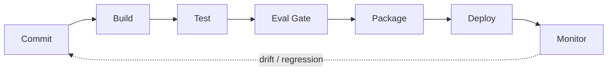

**Figure 1. CI/CD Pipeline - From Chatbots to Agents** (mermaid). Figure: CI/CD Pipeline view for Agentic AI. This diagram illustrates the principal components and their interactions as discussed in the surrounding section.


_Source diagram (plantuml); render with the appropriate tool._

**Figure 2. Infrastructure - From Chatbots to Agents** (plantuml). Figure: Infrastructure view for Agentic AI. This diagram illustrates the principal components and their interactions as discussed in the surrounding section.

## Deep Dive: Mechanics, Variants and Trade-offs

Having established the essentials, we now go deeper into from chatbots to agents. Mechanically, the behaviour emerges from a few interacting parts that are simpler than the whole they produce. The distinctions in this section are the ones that separate a working demo from a system that holds up under adversarial inputs, scale and the passage of time.

Consider the principal variants and how to choose between them. Each variant optimises for a different point in the design space - some for latency, some for accuracy, some for cost or operability - and the correct choice follows from explicit requirements rather than from defaults. Every added component buys capability at the price of operational surface area, and that bargain should be made consciously.

In practice this is supported by a mature tooling ecosystem, including LangGraph, AutoGen, CrewAI, OpenAI Agents. Tools accelerate the work but do not substitute for understanding: the same principles apply whichever implementation you select, and the ability to reason from first principles is what lets you debug when a tool behaves unexpectedly.

A frequent source of subtle bugs is the interaction with observability for agents. Because observability for agents concerns tracing reasoning, tool calls and outcomes, changes there can silently alter the behaviour analysed here. The remedy is contract tests at the boundary and end-to-end evaluations that exercise the interaction explicitly.

Finally, attend to edge cases and degradation. Define what the system should do under partial failure, unexpected inputs and load spikes, and make that behaviour explicit and tested rather than emergent. Graceful degradation - returning a safe, useful result when the ideal one is unavailable - is a hallmark of mature engineering.

For deeper study, the literature offers authoritative treatments such as Yao et al. — ReAct (2022) and Shinn et al. — Reflexion (2023). These primary sources reward careful reading and ground the practical guidance above in established results.

## Advanced Considerations

Having established the essentials, we now go deeper into from chatbots to agents. It pays to understand the mechanism rather than treat it as a black box, because most production incidents are explained by one of its steps misbehaving. The distinctions in this section are the ones that separate a working demo from a system that holds up under adversarial inputs, scale and the passage of time.

Consider the principal variants and how to choose between them. Each variant optimises for a different point in the design space - some for latency, some for accuracy, some for cost or operability - and the correct choice follows from explicit requirements rather than from defaults. There is an inherent trade-off between fidelity and cost, and the correct balance depends on the use case and its tolerance for error.

In practice this is supported by a mature tooling ecosystem, including LangGraph, AutoGen, CrewAI, OpenAI Agents. Tools accelerate the work but do not substitute for understanding: the same principles apply whichever implementation you select, and the ability to reason from first principles is what lets you debug when a tool behaves unexpectedly.

A frequent source of subtle bugs is the interaction with tool use and function calling. Because tool use and function calling concerns defining, selecting and safely invoking tools and APIs, changes there can silently alter the behaviour analysed here. The remedy is contract tests at the boundary and end-to-end evaluations that exercise the interaction explicitly.

Finally, attend to edge cases and degradation. Define what the system should do under partial failure, unexpected inputs and load spikes, and make that behaviour explicit and tested rather than emergent. Graceful degradation - returning a safe, useful result when the ideal one is unavailable - is a hallmark of mature engineering.

For deeper study, the literature offers authoritative treatments such as Yao et al. — ReAct (2022) and Shinn et al. — Reflexion (2023). These primary sources reward careful reading and ground the practical guidance above in established results.

## Worked Example

To ground the discussion, walk through a representative example. A research organisation needs agents that browse, synthesise and report. They decide to apply from chatbots to agents as part of their Agentic AI solution, but wisely treat it as a hypothesis to be validated rather than a foregone conclusion.

The team begins by stating the objective precisely and defining how success will be measured before writing any code. They establish a small but representative evaluation set, agree on acceptance thresholds, and only then prototype the simplest design that could work. Early measurement reveals which assumptions hold and which must be revised, saving weeks of misdirected effort and surfacing edge cases while they are still cheap to fix.

As the prototype matures into a service, the team hardens it: adding input validation, error handling, caching where it pays off, and monitoring that ties back to the original success metric. They document each significant decision in an architecture decision record so that future maintainers understand not just what was built but why.

The outcome is instructive. The system that reaches production is not the most sophisticated design the team considered, but the one whose behaviour they could measure, explain and operate. This is the recurring lesson of Agentic AI: durable value comes from the whole system, not from any single clever component.

## Industry Use Cases

Across industries, the ideas in this chapter recur in recognisable ways. The following vignettes show how different sectors apply them and what they have in common.

**Software.** Autonomous coding agents that plan, edit and test. The common thread is that value comes not from the model alone but from the surrounding system - data quality, evaluation, integration and operations - which is precisely where most of the engineering effort belongs.

**Operations.** Incident triage agents that gather context and act. The common thread is that value comes not from the model alone but from the surrounding system - data quality, evaluation, integration and operations - which is precisely where most of the engineering effort belongs.

**Research.** Agents that browse, synthesise and report. The common thread is that value comes not from the model alone but from the surrounding system - data quality, evaluation, integration and operations - which is precisely where most of the engineering effort belongs.

**Back office.** Workflow automation across enterprise systems. The common thread is that value comes not from the model alone but from the surrounding system - data quality, evaluation, integration and operations - which is precisely where most of the engineering effort belongs.

## Best Practices

The following practices consistently separate successful Agentic AI efforts from struggling ones. They are deliberately concrete so they can be adopted as checklist items in design and code review.

- Constrain tools with typed schemas and least-privilege permissions.
- Cap loop steps and cost to prevent runaway behaviour.
- Require human approval for irreversible or high-impact actions.
- Trace every reasoning step and tool call for debugging and audit.

None of these are exotic; they are the unglamorous disciplines that compound into reliability. The cost of adopting them is small compared with the cost of the incidents they prevent, and they become second nature with practice.

## Common Pitfalls

Equally instructive are the failure modes that recur in practice. Each pitfall below has a clear early warning sign and a known remedy, so treat them as a diagnostic checklist when something feels wrong:

- Unbounded loops that burn cost without converging.
- Granting broad tool permissions that enable harmful actions.
- No observability, making failures impossible to diagnose.
- Over-automating tasks that need human judgement.

The pattern is consistent: most failures stem from skipping measurement, conflating prototype and production standards, or deferring cross-cutting concerns such as security and cost until they become emergencies. Naming these traps in advance is the cheapest way to avoid them.

## Governance, Security and Cost Notes

No discussion of from chatbots to agents is complete without its governance, security and cost dimensions, which are too often deferred until they become emergencies. Treating them as first-class concerns from the outset is both cheaper and safer.

**Governance.** Classify the risk of this capability, document its intended and out-of-scope uses, and ensure decisions are traceable to satisfy internal policy and external regulation such as the NIST AI RMF, ISO/IEC 42001 and the EU AI Act. **Security.** Treat all external input as untrusted, validate outputs before acting on them, apply least privilege to any tools or data access, and map controls to the OWASP LLM Top 10 and MITRE ATLAS.

**Cost and sustainability.** Establish explicit budgets for compute, tokens and latency, attribute spend to owners, and revisit the economics as usage scales - a design that is affordable at pilot scale can become untenable at production volume. Building these reflexes into everyday engineering is what allows a Agentic AI system to be not only capable but also trustworthy and economically sound.

## Hands-On Exercises

Work through the following exercises. They are designed to move understanding from recognition to application - the level required for real engineering work - so prefer writing and building over merely reading.

1. Explain from chatbots to agents to a colleague unfamiliar with Agentic AI, using a concrete example from your own domain.
2. Sketch a reference architecture that incorporates from chatbots to agents and annotate where observability, security and cost controls belong.
3. Design an evaluation that would tell you whether from chatbots to agents is working in production, including the metric, the dataset and the acceptance threshold.
4. Identify two pitfalls relevant to from chatbots to agents in your environment and describe the early warning signals you would monitor.
5. Prototype the simplest implementation that demonstrates from chatbots to agents, then list exactly what would need to change to make it production-ready.

## Key Takeaways

Key takeaways from this chapter:

- From Chatbots to Agents is a systems concern in Agentic AI: data, models and operations must be co-designed.
- Measurement is non-negotiable; define success metrics and evaluation before building.
- Favour the simplest design that meets the requirement, and add complexity only when evidence demands it.
- Security, cost and observability are first-class requirements, not afterthoughts.
- Document decisions so the system remains understandable and operable as it evolves.

## Code Walkthrough

Pipelines keep From Chatbots to Agents logic modular and testable. Each stage is a pure function, errors are captured per item, and the composition is trivial to extend or reorder.

The full listing is shown below; study it line by line and reproduce it locally before moving on.

### Listing: A composable processing pipeline for From Chatbots to Agents

```python
from collections.abc import Iterable, Iterator
from typing import Protocol


class Stage(Protocol):
    def __call__(self, item: dict) -> dict: ...


def pipeline(stages: list[Stage]) -> Stage:
    """Compose ordered stages into a single callable for From Chatbots to Agents."""

    def run(item: dict) -> dict:
        for stage in stages:
            item = stage(item)
        return item

    return run


def validate(item: dict) -> dict:
    if "text" not in item:
        raise ValueError("missing required field: text")
    return item


def normalise(item: dict) -> dict:
    item["text"] = item["text"].strip().lower()
    return item


def enrich(item: dict) -> dict:
    item["length"] = len(item["text"])
    return item


process = pipeline([validate, normalise, enrich])


def run_batch(items: Iterable[dict]) -> Iterator[dict]:
    for item in items:
        try:
            yield process(dict(item))
        except ValueError as exc:
            yield {"error": str(exc), "item": item}

```

## Review Questions

1. In the context of Agentic AI, which statement best describes “From Chatbots to Agents”?
   - A. It makes the system slower but has no other effect.
   - B. The shift from single responses to goal-directed loops.
   - C. It removes all security and governance requirements.
   - D. It guarantees deterministic output regardless of input.
   - **Answer: B.** From Chatbots to Agents: The shift from single responses to goal-directed loops.
2. Which of the following is a recommended best practice when working with Agentic AI?
   - A. It guarantees deterministic output regardless of input.
   - B. Constrain tools with typed schemas and least-privilege permissions.
   - C. Unbounded loops that burn cost without converging.
   - D. Granting broad tool permissions that enable harmful actions.
   - **Answer: B.** Best practice: Constrain tools with typed schemas and least-privilege permissions.
3. Which of the following is a common pitfall to avoid in Agentic AI?
   - A. Over-automating tasks that need human judgement.
   - B. It applies exclusively to image data.
   - C. It eliminates the need for any evaluation or monitoring.
   - D. It makes the system slower but has no other effect.
   - **Answer: A.** Pitfall to avoid: Over-automating tasks that need human judgement.
4. *(Discussion)* How does From Chatbots to Agents interact with security and governance requirements?
   - **Model answer:** A strong answer defines from chatbots to agents (The shift from single responses to goal-directed loops.) then connects it to architecture, evaluation, cost, security and operations for Agentic AI, citing concrete trade-offs and a real-world example.

---


# Chapter 2. The Agent Loop: Reason, Act, Observe

_This chapter examines the agent loop: reason, act, observe within Agentic AI. It covers reAct-style cycles and the perception–action interface, derives a reference architecture, walks through a worked example and runnable code, surveys industry use cases, and distils best practices and pitfalls, closing with exercises and review questions._

## Introduction

We define The Agent Loop: Reason, Act, Observe as reAct-style cycles and the perception–action interface. Teams that master this consistently ship more reliable Agentic AI systems at lower cost. In an enterprise setting, this translates into concrete requirements: clear interfaces, measurable quality, and controls that satisfy security and governance.

This chapter builds intuition first, then formalises the ideas, derives an architecture, and finishes with code, exercises and review questions so the material transfers directly to your own Agentic AI work. Read it actively: pause at each diagram, reproduce the code, and attempt the exercises before consulting the answers.

## Theory and Foundations

Formally, The Agent Loop: Reason, Act, Observe addresses reAct-style cycles and the perception–action interface. The right abstraction here pays compounding dividends, because downstream components depend on its guarantees. It pays to understand the mechanism rather than treat it as a black box, because most production incidents are explained by one of its steps misbehaving.

To place this in context, recall the broader picture: Agentic AI systems use language models as reasoning engines that plan, invoke tools, observe results and iterate toward goals with limited human oversight. Within that picture, the agent loop: reason, act, observe is one of the load-bearing ideas - the kind that, when understood deeply, makes the rest of Agentic AI fall into place. Teams that master this consistently ship more reliable Agentic AI systems at lower cost.

The Agent Loop: Reason, Act, Observe cannot be understood in isolation from planning and task decomposition. Recall that planning and task decomposition concerns plan-and-execute, tree-of-thought and hierarchical planning. The two interact directly: decisions in one constrain the design space of the other, which is why mature teams reason about them together rather than sequentially. Latency, accuracy and cost form a tension triangle: improving one typically pressures the others, so explicit budgets are essential.

The Agent Loop: Reason, Act, Observe cannot be understood in isolation from the agentic reference architecture. Recall that the agentic reference architecture concerns orchestrator, tools, memory and guardrails as a platform. The two interact directly: decisions in one constrain the design space of the other, which is why mature teams reason about them together rather than sequentially. Latency, accuracy and cost form a tension triangle: improving one typically pressures the others, so explicit budgets are essential.

Several established patterns apply directly to the agent loop: reason, act, observe. The first, plan-and-execute with a separate planner and executor, is widely adopted because it makes the system's behaviour predictable and observable. A complementary pattern, approval gate before irreversible actions, addresses a related concern and is often deployed alongside it. Patterns are not dogma; they are distilled experience that shortcuts the search for a sound design, and each carries assumptions worth checking against your context.

It is worth being explicit about when to apply this and when to reach for something simpler. In a small prototype, shortcuts around the agent loop: reason, act, observe are invisible; in a production Agentic AI system serving real traffic, they surface as incidents, cost overruns or compliance gaps. Every added component buys capability at the price of operational surface area, and that bargain should be made consciously. The remainder of this chapter turns these principles into an architecture, code and a checklist you can apply immediately.

## Architecture and Design

The reference architecture for The Agent Loop: Reason, Act, Observe separates concerns into clearly bounded components with explicit contracts. An agent runtime hosts a reasoning model, a tool registry with typed schemas, a memory store (short-term context plus long-term vector memory), and a controller enforcing step budgets, permissions and human approvals. Every step is traced for observability and replay.

Concretely, the principal building blocks include from chatbots to agents, the agent loop: reason, act, observe, planning and task decomposition, tool use and function calling and memory architectures. Each is a replaceable component behind a stable interface, so the team can upgrade an implementation - a model, an index, a policy engine - without rewriting its neighbours. The contracts between components are where reliability is won or lost, so they are specified explicitly and tested in isolation.

The diagram accompanying this section makes the data and control flow explicit. Requests enter through a well-defined boundary where they are authenticated and validated; only then are they dispatched to the components that perform the work. This boundary is also where rate limiting, quota enforcement and audit logging live, keeping cross-cutting concerns out of the core logic and in one auditable place.

Two qualities deserve emphasis. First, observability is designed in, not bolted on: every component emits structured telemetry so that failures can be localised in minutes rather than hours. Second, the architecture is evolvable - components communicate through stable contracts so that any single part of the Agentic AI system can be replaced without a rewrite. Simplicity is a feature. The simplest design that meets the requirement should be the default, with complexity added only when measurement justifies it.

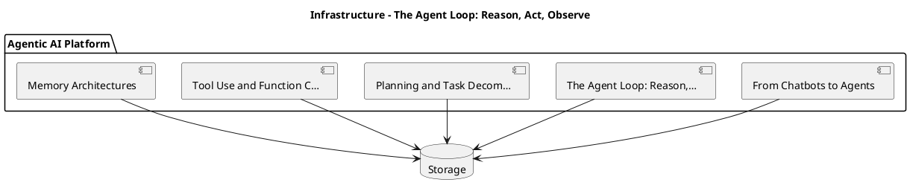

_Source diagram (plantuml); render with the appropriate tool._

**Figure 3. Infrastructure - The Agent Loop: Reason, Act, Observe** (plantuml). Figure: Infrastructure view for Agentic AI. This diagram illustrates the principal components and their interactions as discussed in the surrounding section.

## Deep Dive: Mechanics, Variants and Trade-offs

Having established the essentials, we now go deeper into the agent loop: reason, act, observe. It pays to understand the mechanism rather than treat it as a black box, because most production incidents are explained by one of its steps misbehaving. The distinctions in this section are the ones that separate a working demo from a system that holds up under adversarial inputs, scale and the passage of time.

Consider the principal variants and how to choose between them. Each variant optimises for a different point in the design space - some for latency, some for accuracy, some for cost or operability - and the correct choice follows from explicit requirements rather than from defaults. There is an inherent trade-off between fidelity and cost, and the correct balance depends on the use case and its tolerance for error.

In practice this is supported by a mature tooling ecosystem, including LangGraph, AutoGen, CrewAI, OpenAI Agents. Tools accelerate the work but do not substitute for understanding: the same principles apply whichever implementation you select, and the ability to reason from first principles is what lets you debug when a tool behaves unexpectedly.

A frequent source of subtle bugs is the interaction with planning and task decomposition. Because planning and task decomposition concerns plan-and-execute, tree-of-thought and hierarchical planning, changes there can silently alter the behaviour analysed here. The remedy is contract tests at the boundary and end-to-end evaluations that exercise the interaction explicitly.

Finally, attend to edge cases and degradation. Define what the system should do under partial failure, unexpected inputs and load spikes, and make that behaviour explicit and tested rather than emergent. Graceful degradation - returning a safe, useful result when the ideal one is unavailable - is a hallmark of mature engineering.

For deeper study, the literature offers authoritative treatments such as Yao et al. — ReAct (2022) and Shinn et al. — Reflexion (2023). These primary sources reward careful reading and ground the practical guidance above in established results.

## Advanced Considerations

Having established the essentials, we now go deeper into the agent loop: reason, act, observe. The underlying mechanism is best appreciated by tracing a single request from input to output and noting where state is created and consumed. The distinctions in this section are the ones that separate a working demo from a system that holds up under adversarial inputs, scale and the passage of time.

Consider the principal variants and how to choose between them. Each variant optimises for a different point in the design space - some for latency, some for accuracy, some for cost or operability - and the correct choice follows from explicit requirements rather than from defaults. There is an inherent trade-off between fidelity and cost, and the correct balance depends on the use case and its tolerance for error.

In practice this is supported by a mature tooling ecosystem, including LangGraph, AutoGen, CrewAI, OpenAI Agents. Tools accelerate the work but do not substitute for understanding: the same principles apply whichever implementation you select, and the ability to reason from first principles is what lets you debug when a tool behaves unexpectedly.

A frequent source of subtle bugs is the interaction with observability for agents. Because observability for agents concerns tracing reasoning, tool calls and outcomes, changes there can silently alter the behaviour analysed here. The remedy is contract tests at the boundary and end-to-end evaluations that exercise the interaction explicitly.

Finally, attend to edge cases and degradation. Define what the system should do under partial failure, unexpected inputs and load spikes, and make that behaviour explicit and tested rather than emergent. Graceful degradation - returning a safe, useful result when the ideal one is unavailable - is a hallmark of mature engineering.

For deeper study, the literature offers authoritative treatments such as Yao et al. — ReAct (2022) and Shinn et al. — Reflexion (2023). These primary sources reward careful reading and ground the practical guidance above in established results.

## Worked Example

To ground the discussion, walk through a representative example. A operations organisation needs incident triage agents that gather context and act. They decide to apply the agent loop: reason, act, observe as part of their Agentic AI solution, but wisely treat it as a hypothesis to be validated rather than a foregone conclusion.

The team begins by stating the objective precisely and defining how success will be measured before writing any code. They establish a small but representative evaluation set, agree on acceptance thresholds, and only then prototype the simplest design that could work. Early measurement reveals which assumptions hold and which must be revised, saving weeks of misdirected effort and surfacing edge cases while they are still cheap to fix.

As the prototype matures into a service, the team hardens it: adding input validation, error handling, caching where it pays off, and monitoring that ties back to the original success metric. They document each significant decision in an architecture decision record so that future maintainers understand not just what was built but why.

The outcome is instructive. The system that reaches production is not the most sophisticated design the team considered, but the one whose behaviour they could measure, explain and operate. This is the recurring lesson of Agentic AI: durable value comes from the whole system, not from any single clever component.

## Industry Use Cases

Across industries, the ideas in this chapter recur in recognisable ways. The following vignettes show how different sectors apply them and what they have in common.

**Software.** Autonomous coding agents that plan, edit and test. The common thread is that value comes not from the model alone but from the surrounding system - data quality, evaluation, integration and operations - which is precisely where most of the engineering effort belongs.

**Operations.** Incident triage agents that gather context and act. The common thread is that value comes not from the model alone but from the surrounding system - data quality, evaluation, integration and operations - which is precisely where most of the engineering effort belongs.

**Research.** Agents that browse, synthesise and report. The common thread is that value comes not from the model alone but from the surrounding system - data quality, evaluation, integration and operations - which is precisely where most of the engineering effort belongs.

**Back office.** Workflow automation across enterprise systems. The common thread is that value comes not from the model alone but from the surrounding system - data quality, evaluation, integration and operations - which is precisely where most of the engineering effort belongs.

## Best Practices

The following practices consistently separate successful Agentic AI efforts from struggling ones. They are deliberately concrete so they can be adopted as checklist items in design and code review.

- Constrain tools with typed schemas and least-privilege permissions.
- Cap loop steps and cost to prevent runaway behaviour.
- Require human approval for irreversible or high-impact actions.
- Trace every reasoning step and tool call for debugging and audit.

None of these are exotic; they are the unglamorous disciplines that compound into reliability. The cost of adopting them is small compared with the cost of the incidents they prevent, and they become second nature with practice.

## Common Pitfalls

Equally instructive are the failure modes that recur in practice. Each pitfall below has a clear early warning sign and a known remedy, so treat them as a diagnostic checklist when something feels wrong:

- Unbounded loops that burn cost without converging.
- Granting broad tool permissions that enable harmful actions.
- No observability, making failures impossible to diagnose.
- Over-automating tasks that need human judgement.

The pattern is consistent: most failures stem from skipping measurement, conflating prototype and production standards, or deferring cross-cutting concerns such as security and cost until they become emergencies. Naming these traps in advance is the cheapest way to avoid them.

## Governance, Security and Cost Notes

No discussion of the agent loop: reason, act, observe is complete without its governance, security and cost dimensions, which are too often deferred until they become emergencies. Treating them as first-class concerns from the outset is both cheaper and safer.

**Governance.** Classify the risk of this capability, document its intended and out-of-scope uses, and ensure decisions are traceable to satisfy internal policy and external regulation such as the NIST AI RMF, ISO/IEC 42001 and the EU AI Act. **Security.** Treat all external input as untrusted, validate outputs before acting on them, apply least privilege to any tools or data access, and map controls to the OWASP LLM Top 10 and MITRE ATLAS.

**Cost and sustainability.** Establish explicit budgets for compute, tokens and latency, attribute spend to owners, and revisit the economics as usage scales - a design that is affordable at pilot scale can become untenable at production volume. Building these reflexes into everyday engineering is what allows a Agentic AI system to be not only capable but also trustworthy and economically sound.

## Hands-On Exercises

Work through the following exercises. They are designed to move understanding from recognition to application - the level required for real engineering work - so prefer writing and building over merely reading.

1. Explain the agent loop: reason, act, observe to a colleague unfamiliar with Agentic AI, using a concrete example from your own domain.
2. Sketch a reference architecture that incorporates the agent loop: reason, act, observe and annotate where observability, security and cost controls belong.
3. Design an evaluation that would tell you whether the agent loop: reason, act, observe is working in production, including the metric, the dataset and the acceptance threshold.
4. Identify two pitfalls relevant to the agent loop: reason, act, observe in your environment and describe the early warning signals you would monitor.
5. Prototype the simplest implementation that demonstrates the agent loop: reason, act, observe, then list exactly what would need to change to make it production-ready.

## Key Takeaways

Key takeaways from this chapter:

- The Agent Loop: Reason, Act, Observe is a systems concern in Agentic AI: data, models and operations must be co-designed.
- Measurement is non-negotiable; define success metrics and evaluation before building.
- Favour the simplest design that meets the requirement, and add complexity only when evidence demands it.
- Security, cost and observability are first-class requirements, not afterthoughts.
- Document decisions so the system remains understandable and operable as it evolves.

## Code Walkthrough

Pipelines keep The Agent Loop: Reason, Act, Observe logic modular and testable. Each stage is a pure function, errors are captured per item, and the composition is trivial to extend or reorder.

The full listing is shown below; study it line by line and reproduce it locally before moving on.

### Listing: A composable processing pipeline for The Agent Loop: Reason, Act, Observe

```python
from collections.abc import Iterable, Iterator
from typing import Protocol


class Stage(Protocol):
    def __call__(self, item: dict) -> dict: ...


def pipeline(stages: list[Stage]) -> Stage:
    """Compose ordered stages into a single callable for The Agent Loop: Reason, Act, Observe."""

    def run(item: dict) -> dict:
        for stage in stages:
            item = stage(item)
        return item

    return run


def validate(item: dict) -> dict:
    if "text" not in item:
        raise ValueError("missing required field: text")
    return item


def normalise(item: dict) -> dict:
    item["text"] = item["text"].strip().lower()
    return item


def enrich(item: dict) -> dict:
    item["length"] = len(item["text"])
    return item


process = pipeline([validate, normalise, enrich])


def run_batch(items: Iterable[dict]) -> Iterator[dict]:
    for item in items:
        try:
            yield process(dict(item))
        except ValueError as exc:
            yield {"error": str(exc), "item": item}

```

## Review Questions

1. In the context of Agentic AI, which statement best describes “The Agent Loop: Reason, Act, Observe”?
   - A. It removes all security and governance requirements.
   - B. ReAct-style cycles and the perception–action interface.
   - C. It guarantees deterministic output regardless of input.
   - D. It eliminates the need for any evaluation or monitoring.
   - **Answer: B.** The Agent Loop: Reason, Act, Observe: ReAct-style cycles and the perception–action interface.
2. Which of the following is a recommended best practice when working with Agentic AI?
   - A. Granting broad tool permissions that enable harmful actions.
   - B. No observability, making failures impossible to diagnose.
   - C. It makes the system slower but has no other effect.
   - D. Trace every reasoning step and tool call for debugging and audit.
   - **Answer: D.** Best practice: Trace every reasoning step and tool call for debugging and audit.
3. Which of the following is a common pitfall to avoid in Agentic AI?
   - A. It eliminates the need for any evaluation or monitoring.
   - B. Constrain tools with typed schemas and least-privilege permissions.
   - C. Granting broad tool permissions that enable harmful actions.
   - D. It removes all security and governance requirements.
   - **Answer: C.** Pitfall to avoid: Granting broad tool permissions that enable harmful actions.
4. *(Discussion)* How does The Agent Loop: Reason, Act, Observe interact with security and governance requirements?
   - **Model answer:** A strong answer defines the agent loop: reason, act, observe (ReAct-style cycles and the perception–action interface.) then connects it to architecture, evaluation, cost, security and operations for Agentic AI, citing concrete trade-offs and a real-world example.

---


# Chapter 3. Planning and Task Decomposition

_This chapter examines planning and task decomposition within Agentic AI. It covers plan-and-execute, tree-of-thought and hierarchical planning, derives a reference architecture, walks through a worked example and runnable code, surveys industry use cases, and distils best practices and pitfalls, closing with exercises and review questions._

## Introduction

We define Planning and Task Decomposition as plan-and-execute, tree-of-thought and hierarchical planning. Neglecting it is one of the most common reasons Agentic AI initiatives stall in production. The practical implication is that design choices here ripple through latency, cost and maintainability for the lifetime of the system.

This chapter builds intuition first, then formalises the ideas, derives an architecture, and finishes with code, exercises and review questions so the material transfers directly to your own Agentic AI work. Read it actively: pause at each diagram, reproduce the code, and attempt the exercises before consulting the answers.

## Theory and Foundations

Planning and Task Decomposition refers to plan-and-execute, tree-of-thought and hierarchical planning. The right abstraction here pays compounding dividends, because downstream components depend on its guarantees. It pays to understand the mechanism rather than treat it as a black box, because most production incidents are explained by one of its steps misbehaving.

To place this in context, recall the broader picture: Agentic AI systems use language models as reasoning engines that plan, invoke tools, observe results and iterate toward goals with limited human oversight. Within that picture, planning and task decomposition is one of the load-bearing ideas - the kind that, when understood deeply, makes the rest of Agentic AI fall into place. It is foundational: later capabilities in Agentic AI are built directly on top of it.

Planning and Task Decomposition cannot be understood in isolation from grounding and retrieval for agents. Recall that grounding and retrieval for agents concerns bringing knowledge into the agent loop. The two interact directly: decisions in one constrain the design space of the other, which is why mature teams reason about them together rather than sequentially. Every added component buys capability at the price of operational surface area, and that bargain should be made consciously.

Planning and Task Decomposition cannot be understood in isolation from the agentic reference architecture. Recall that the agentic reference architecture concerns orchestrator, tools, memory and guardrails as a platform. The two interact directly: decisions in one constrain the design space of the other, which is why mature teams reason about them together rather than sequentially. There is an inherent trade-off between fidelity and cost, and the correct balance depends on the use case and its tolerance for error.

Several established patterns apply directly to planning and task decomposition. The first, approval gate before irreversible actions, is widely adopted because it makes the system's behaviour predictable and observable. A complementary pattern, plan-and-execute with a separate planner and executor, addresses a related concern and is often deployed alongside it. Patterns are not dogma; they are distilled experience that shortcuts the search for a sound design, and each carries assumptions worth checking against your context.

It is worth being explicit about when to apply this and when to reach for something simpler. In a small prototype, shortcuts around planning and task decomposition are invisible; in a production Agentic AI system serving real traffic, they surface as incidents, cost overruns or compliance gaps. Latency, accuracy and cost form a tension triangle: improving one typically pressures the others, so explicit budgets are essential. The remainder of this chapter turns these principles into an architecture, code and a checklist you can apply immediately.

## Architecture and Design

The reference architecture for Planning and Task Decomposition separates concerns into clearly bounded components with explicit contracts. An agent runtime hosts a reasoning model, a tool registry with typed schemas, a memory store (short-term context plus long-term vector memory), and a controller enforcing step budgets, permissions and human approvals. Every step is traced for observability and replay.

Concretely, the principal building blocks include from chatbots to agents, the agent loop: reason, act, observe, planning and task decomposition, tool use and function calling and memory architectures. Each is a replaceable component behind a stable interface, so the team can upgrade an implementation - a model, an index, a policy engine - without rewriting its neighbours. The contracts between components are where reliability is won or lost, so they are specified explicitly and tested in isolation.

The diagram accompanying this section makes the data and control flow explicit. Requests enter through a well-defined boundary where they are authenticated and validated; only then are they dispatched to the components that perform the work. This boundary is also where rate limiting, quota enforcement and audit logging live, keeping cross-cutting concerns out of the core logic and in one auditable place.

Two qualities deserve emphasis. First, observability is designed in, not bolted on: every component emits structured telemetry so that failures can be localised in minutes rather than hours. Second, the architecture is evolvable - components communicate through stable contracts so that any single part of the Agentic AI system can be replaced without a rewrite. Latency, accuracy and cost form a tension triangle: improving one typically pressures the others, so explicit budgets are essential.

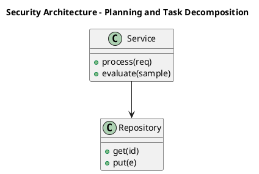

_Source diagram (plantuml); render with the appropriate tool._

**Figure 4. Security Architecture - Planning and Task Decomposition** (plantuml). Figure: Security Architecture view for Agentic AI. This diagram illustrates the principal components and their interactions as discussed in the surrounding section.

## Deep Dive: Mechanics, Variants and Trade-offs

Having established the essentials, we now go deeper into planning and task decomposition. It pays to understand the mechanism rather than treat it as a black box, because most production incidents are explained by one of its steps misbehaving. The distinctions in this section are the ones that separate a working demo from a system that holds up under adversarial inputs, scale and the passage of time.

Consider the principal variants and how to choose between them. Each variant optimises for a different point in the design space - some for latency, some for accuracy, some for cost or operability - and the correct choice follows from explicit requirements rather than from defaults. As with most architectural decisions, the choice is rarely binary; the skill lies in quantifying the trade-offs and choosing deliberately.

In practice this is supported by a mature tooling ecosystem, including LangGraph, AutoGen, CrewAI, OpenAI Agents. Tools accelerate the work but do not substitute for understanding: the same principles apply whichever implementation you select, and the ability to reason from first principles is what lets you debug when a tool behaves unexpectedly.

A frequent source of subtle bugs is the interaction with grounding and retrieval for agents. Because grounding and retrieval for agents concerns bringing knowledge into the agent loop, changes there can silently alter the behaviour analysed here. The remedy is contract tests at the boundary and end-to-end evaluations that exercise the interaction explicitly.

Finally, attend to edge cases and degradation. Define what the system should do under partial failure, unexpected inputs and load spikes, and make that behaviour explicit and tested rather than emergent. Graceful degradation - returning a safe, useful result when the ideal one is unavailable - is a hallmark of mature engineering.

For deeper study, the literature offers authoritative treatments such as Yao et al. — ReAct (2022) and Shinn et al. — Reflexion (2023). These primary sources reward careful reading and ground the practical guidance above in established results.

## Advanced Considerations

Having established the essentials, we now go deeper into planning and task decomposition. The underlying mechanism is best appreciated by tracing a single request from input to output and noting where state is created and consumed. The distinctions in this section are the ones that separate a working demo from a system that holds up under adversarial inputs, scale and the passage of time.

Consider the principal variants and how to choose between them. Each variant optimises for a different point in the design space - some for latency, some for accuracy, some for cost or operability - and the correct choice follows from explicit requirements rather than from defaults. Every added component buys capability at the price of operational surface area, and that bargain should be made consciously.

In practice this is supported by a mature tooling ecosystem, including LangGraph, AutoGen, CrewAI, OpenAI Agents. Tools accelerate the work but do not substitute for understanding: the same principles apply whichever implementation you select, and the ability to reason from first principles is what lets you debug when a tool behaves unexpectedly.

A frequent source of subtle bugs is the interaction with grounding and retrieval for agents. Because grounding and retrieval for agents concerns bringing knowledge into the agent loop, changes there can silently alter the behaviour analysed here. The remedy is contract tests at the boundary and end-to-end evaluations that exercise the interaction explicitly.

Finally, attend to edge cases and degradation. Define what the system should do under partial failure, unexpected inputs and load spikes, and make that behaviour explicit and tested rather than emergent. Graceful degradation - returning a safe, useful result when the ideal one is unavailable - is a hallmark of mature engineering.

For deeper study, the literature offers authoritative treatments such as Yao et al. — ReAct (2022) and Shinn et al. — Reflexion (2023). These primary sources reward careful reading and ground the practical guidance above in established results.

## Worked Example

To ground the discussion, walk through a representative example. A research organisation needs agents that browse, synthesise and report. They decide to apply planning and task decomposition as part of their Agentic AI solution, but wisely treat it as a hypothesis to be validated rather than a foregone conclusion.

The team begins by stating the objective precisely and defining how success will be measured before writing any code. They establish a small but representative evaluation set, agree on acceptance thresholds, and only then prototype the simplest design that could work. Early measurement reveals which assumptions hold and which must be revised, saving weeks of misdirected effort and surfacing edge cases while they are still cheap to fix.

As the prototype matures into a service, the team hardens it: adding input validation, error handling, caching where it pays off, and monitoring that ties back to the original success metric. They document each significant decision in an architecture decision record so that future maintainers understand not just what was built but why.

The outcome is instructive. The system that reaches production is not the most sophisticated design the team considered, but the one whose behaviour they could measure, explain and operate. This is the recurring lesson of Agentic AI: durable value comes from the whole system, not from any single clever component.

## Industry Use Cases

Across industries, the ideas in this chapter recur in recognisable ways. The following vignettes show how different sectors apply them and what they have in common.

**Software.** Autonomous coding agents that plan, edit and test. The common thread is that value comes not from the model alone but from the surrounding system - data quality, evaluation, integration and operations - which is precisely where most of the engineering effort belongs.

**Operations.** Incident triage agents that gather context and act. The common thread is that value comes not from the model alone but from the surrounding system - data quality, evaluation, integration and operations - which is precisely where most of the engineering effort belongs.

**Research.** Agents that browse, synthesise and report. The common thread is that value comes not from the model alone but from the surrounding system - data quality, evaluation, integration and operations - which is precisely where most of the engineering effort belongs.

**Back office.** Workflow automation across enterprise systems. The common thread is that value comes not from the model alone but from the surrounding system - data quality, evaluation, integration and operations - which is precisely where most of the engineering effort belongs.

## Best Practices

The following practices consistently separate successful Agentic AI efforts from struggling ones. They are deliberately concrete so they can be adopted as checklist items in design and code review.

- Constrain tools with typed schemas and least-privilege permissions.
- Cap loop steps and cost to prevent runaway behaviour.
- Require human approval for irreversible or high-impact actions.
- Trace every reasoning step and tool call for debugging and audit.

None of these are exotic; they are the unglamorous disciplines that compound into reliability. The cost of adopting them is small compared with the cost of the incidents they prevent, and they become second nature with practice.

## Common Pitfalls

Equally instructive are the failure modes that recur in practice. Each pitfall below has a clear early warning sign and a known remedy, so treat them as a diagnostic checklist when something feels wrong:

- Unbounded loops that burn cost without converging.
- Granting broad tool permissions that enable harmful actions.
- No observability, making failures impossible to diagnose.
- Over-automating tasks that need human judgement.

The pattern is consistent: most failures stem from skipping measurement, conflating prototype and production standards, or deferring cross-cutting concerns such as security and cost until they become emergencies. Naming these traps in advance is the cheapest way to avoid them.

## Governance, Security and Cost Notes

No discussion of planning and task decomposition is complete without its governance, security and cost dimensions, which are too often deferred until they become emergencies. Treating them as first-class concerns from the outset is both cheaper and safer.

**Governance.** Classify the risk of this capability, document its intended and out-of-scope uses, and ensure decisions are traceable to satisfy internal policy and external regulation such as the NIST AI RMF, ISO/IEC 42001 and the EU AI Act. **Security.** Treat all external input as untrusted, validate outputs before acting on them, apply least privilege to any tools or data access, and map controls to the OWASP LLM Top 10 and MITRE ATLAS.

**Cost and sustainability.** Establish explicit budgets for compute, tokens and latency, attribute spend to owners, and revisit the economics as usage scales - a design that is affordable at pilot scale can become untenable at production volume. Building these reflexes into everyday engineering is what allows a Agentic AI system to be not only capable but also trustworthy and economically sound.

## Hands-On Exercises

Work through the following exercises. They are designed to move understanding from recognition to application - the level required for real engineering work - so prefer writing and building over merely reading.

1. Explain planning and task decomposition to a colleague unfamiliar with Agentic AI, using a concrete example from your own domain.
2. Sketch a reference architecture that incorporates planning and task decomposition and annotate where observability, security and cost controls belong.
3. Design an evaluation that would tell you whether planning and task decomposition is working in production, including the metric, the dataset and the acceptance threshold.
4. Identify two pitfalls relevant to planning and task decomposition in your environment and describe the early warning signals you would monitor.
5. Prototype the simplest implementation that demonstrates planning and task decomposition, then list exactly what would need to change to make it production-ready.

## Key Takeaways

Key takeaways from this chapter:

- Planning and Task Decomposition is a systems concern in Agentic AI: data, models and operations must be co-designed.
- Measurement is non-negotiable; define success metrics and evaluation before building.
- Favour the simplest design that meets the requirement, and add complexity only when evidence demands it.
- Security, cost and observability are first-class requirements, not afterthoughts.
- Document decisions so the system remains understandable and operable as it evolves.

## Code Walkthrough

This listing shows a configuration-driven Planning and Task Decomposition component with retry semantics and typed interfaces — the shape we expect from production Agentic AI code rather than a notebook prototype.

The full listing is shown below; study it line by line and reproduce it locally before moving on.

### Listing: Implementing a Planning and Task Decomposition component

```python
from __future__ import annotations

from dataclasses import dataclass, field
from typing import Any


@dataclass(slots=True)
class PlanningAndTaskConfig:
    """Configuration for the Planning and Task Decomposition component in a Agentic AI system."""

    name: str
    timeout_s: float = 30.0
    max_retries: int = 3
    options: dict[str, Any] = field(default_factory=dict)


class PlanningAndTask:
    """A minimal, production-shaped implementation of Planning and Task Decomposition."""

    def __init__(self, config: PlanningAndTaskConfig) -> None:
        self._config = config
        self._calls = 0

    def run(self, payload: dict[str, Any]) -> dict[str, Any]:
        """Process a request, retrying transient failures with backoff."""
        last_error: Exception | None = None
        for attempt in range(self._config.max_retries):
            try:
                self._calls += 1
                return self._process(payload)
            except TimeoutError as exc:  # transient
                last_error = exc
                continue
        raise RuntimeError(f"PlanningAndTask failed after retries") from last_error

    def _process(self, payload: dict[str, Any]) -> dict[str, Any]:
        # Domain-specific logic for Planning and Task Decomposition goes here.
        return {"status": "ok", "input_keys": sorted(payload), "calls": self._calls}

```

## Review Questions

1. In the context of Agentic AI, which statement best describes “Planning and Task Decomposition”?
   - A. It eliminates the need for any evaluation or monitoring.
   - B. It removes all security and governance requirements.
   - C. Plan-and-execute, tree-of-thought and hierarchical planning.
   - D. It is only relevant to academic research, not production.
   - **Answer: C.** Planning and Task Decomposition: Plan-and-execute, tree-of-thought and hierarchical planning.
2. Which of the following is a recommended best practice when working with Agentic AI?
   - A. Over-automating tasks that need human judgement.
   - B. Granting broad tool permissions that enable harmful actions.
   - C. It applies exclusively to image data.
   - D. Require human approval for irreversible or high-impact actions.
   - **Answer: D.** Best practice: Require human approval for irreversible or high-impact actions.
3. Which of the following is a common pitfall to avoid in Agentic AI?
   - A. It applies exclusively to image data.
   - B. It guarantees deterministic output regardless of input.
   - C. Trace every reasoning step and tool call for debugging and audit.
   - D. Over-automating tasks that need human judgement.
   - **Answer: D.** Pitfall to avoid: Over-automating tasks that need human judgement.
4. *(Discussion)* Describe a failure mode of Planning and Task Decomposition and how you would mitigate it.
   - **Model answer:** A strong answer defines planning and task decomposition (Plan-and-execute, tree-of-thought and hierarchical planning.) then connects it to architecture, evaluation, cost, security and operations for Agentic AI, citing concrete trade-offs and a real-world example.

---


# Chapter 4. Tool Use and Function Calling

_This chapter examines tool use and function calling within Agentic AI. It covers defining, selecting and safely invoking tools and APIs, derives a reference architecture, walks through a worked example and runnable code, surveys industry use cases, and distils best practices and pitfalls, closing with exercises and review questions._

## Introduction

In practical terms, Tool Use and Function Calling is best understood as defining, selecting and safely invoking tools and APIs. Neglecting it is one of the most common reasons Agentic AI initiatives stall in production. The practical implication is that design choices here ripple through latency, cost and maintainability for the lifetime of the system.

This chapter builds intuition first, then formalises the ideas, derives an architecture, and finishes with code, exercises and review questions so the material transfers directly to your own Agentic AI work. Read it actively: pause at each diagram, reproduce the code, and attempt the exercises before consulting the answers.

## Theory and Foundations

Tool Use and Function Calling refers to defining, selecting and safely invoking tools and APIs. In an enterprise setting, this translates into concrete requirements: clear interfaces, measurable quality, and controls that satisfy security and governance. Mechanically, the behaviour emerges from a few interacting parts that are simpler than the whole they produce.

To place this in context, recall the broader picture: Agentic AI systems use language models as reasoning engines that plan, invoke tools, observe results and iterate toward goals with limited human oversight. Within that picture, tool use and function calling is one of the load-bearing ideas - the kind that, when understood deeply, makes the rest of Agentic AI fall into place. Neglecting it is one of the most common reasons Agentic AI initiatives stall in production.

Tool Use and Function Calling cannot be understood in isolation from grounding and retrieval for agents. Recall that grounding and retrieval for agents concerns bringing knowledge into the agent loop. The two interact directly: decisions in one constrain the design space of the other, which is why mature teams reason about them together rather than sequentially. Latency, accuracy and cost form a tension triangle: improving one typically pressures the others, so explicit budgets are essential.

Tool Use and Function Calling cannot be understood in isolation from memory architectures. Recall that memory architectures concerns short-term context, long-term vector memory and episodic recall. The two interact directly: decisions in one constrain the design space of the other, which is why mature teams reason about them together rather than sequentially. As with most architectural decisions, the choice is rarely binary; the skill lies in quantifying the trade-offs and choosing deliberately.

Several established patterns apply directly to tool use and function calling. The first, reflection loop to critique and revise outputs, is widely adopted because it makes the system's behaviour predictable and observable. A complementary pattern, plan-and-execute with a separate planner and executor, addresses a related concern and is often deployed alongside it. Patterns are not dogma; they are distilled experience that shortcuts the search for a sound design, and each carries assumptions worth checking against your context.

Knowing when not to use a technique is as valuable as knowing how to use it. In a small prototype, shortcuts around tool use and function calling are invisible; in a production Agentic AI system serving real traffic, they surface as incidents, cost overruns or compliance gaps. As with most architectural decisions, the choice is rarely binary; the skill lies in quantifying the trade-offs and choosing deliberately. The remainder of this chapter turns these principles into an architecture, code and a checklist you can apply immediately.

## Architecture and Design

A robust architecture for Tool Use and Function Calling is layered so each part can evolve independently without destabilising the whole. An agent runtime hosts a reasoning model, a tool registry with typed schemas, a memory store (short-term context plus long-term vector memory), and a controller enforcing step budgets, permissions and human approvals. Every step is traced for observability and replay.

Concretely, the principal building blocks include from chatbots to agents, the agent loop: reason, act, observe, planning and task decomposition, tool use and function calling and memory architectures. Each is a replaceable component behind a stable interface, so the team can upgrade an implementation - a model, an index, a policy engine - without rewriting its neighbours. The contracts between components are where reliability is won or lost, so they are specified explicitly and tested in isolation.

The diagram accompanying this section makes the data and control flow explicit. Requests enter through a well-defined boundary where they are authenticated and validated; only then are they dispatched to the components that perform the work. This boundary is also where rate limiting, quota enforcement and audit logging live, keeping cross-cutting concerns out of the core logic and in one auditable place.

Two qualities deserve emphasis. First, observability is designed in, not bolted on: every component emits structured telemetry so that failures can be localised in minutes rather than hours. Second, the architecture is evolvable - components communicate through stable contracts so that any single part of the Agentic AI system can be replaced without a rewrite. Simplicity is a feature. The simplest design that meets the requirement should be the default, with complexity added only when measurement justifies it.

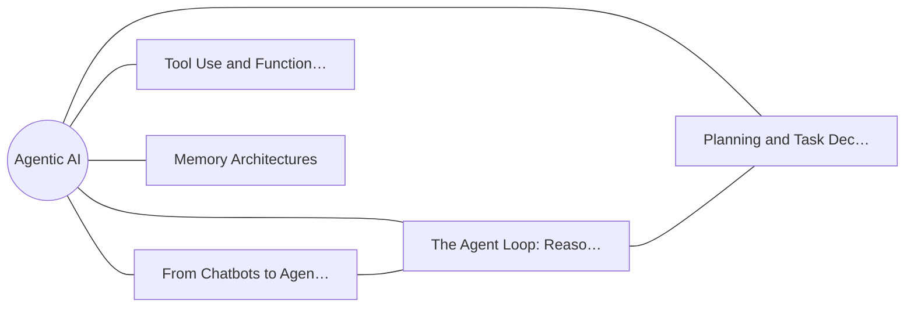

**Figure 5. Capability Map - Tool Use and Function Calling** (mermaid). Figure: Capability Map view for Agentic AI. This diagram illustrates the principal components and their interactions as discussed in the surrounding section.

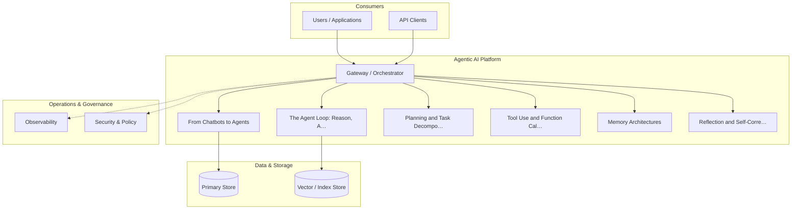

**Figure 6. Cloud Architecture - Tool Use and Function Calling** (mermaid). Figure: Cloud Architecture view for Agentic AI. This diagram illustrates the principal components and their interactions as discussed in the surrounding section.

## Deep Dive: Mechanics, Variants and Trade-offs

Having established the essentials, we now go deeper into tool use and function calling. Mechanically, the behaviour emerges from a few interacting parts that are simpler than the whole they produce. The distinctions in this section are the ones that separate a working demo from a system that holds up under adversarial inputs, scale and the passage of time.

Consider the principal variants and how to choose between them. Each variant optimises for a different point in the design space - some for latency, some for accuracy, some for cost or operability - and the correct choice follows from explicit requirements rather than from defaults. Every added component buys capability at the price of operational surface area, and that bargain should be made consciously.

In practice this is supported by a mature tooling ecosystem, including LangGraph, AutoGen, CrewAI, OpenAI Agents. Tools accelerate the work but do not substitute for understanding: the same principles apply whichever implementation you select, and the ability to reason from first principles is what lets you debug when a tool behaves unexpectedly.

A frequent source of subtle bugs is the interaction with grounding and retrieval for agents. Because grounding and retrieval for agents concerns bringing knowledge into the agent loop, changes there can silently alter the behaviour analysed here. The remedy is contract tests at the boundary and end-to-end evaluations that exercise the interaction explicitly.

Finally, attend to edge cases and degradation. Define what the system should do under partial failure, unexpected inputs and load spikes, and make that behaviour explicit and tested rather than emergent. Graceful degradation - returning a safe, useful result when the ideal one is unavailable - is a hallmark of mature engineering.

For deeper study, the literature offers authoritative treatments such as Yao et al. — ReAct (2022) and Shinn et al. — Reflexion (2023). These primary sources reward careful reading and ground the practical guidance above in established results.

## Advanced Considerations

Having established the essentials, we now go deeper into tool use and function calling. Mechanically, the behaviour emerges from a few interacting parts that are simpler than the whole they produce. The distinctions in this section are the ones that separate a working demo from a system that holds up under adversarial inputs, scale and the passage of time.

Consider the principal variants and how to choose between them. Each variant optimises for a different point in the design space - some for latency, some for accuracy, some for cost or operability - and the correct choice follows from explicit requirements rather than from defaults. Simplicity is a feature. The simplest design that meets the requirement should be the default, with complexity added only when measurement justifies it.

In practice this is supported by a mature tooling ecosystem, including LangGraph, AutoGen, CrewAI, OpenAI Agents. Tools accelerate the work but do not substitute for understanding: the same principles apply whichever implementation you select, and the ability to reason from first principles is what lets you debug when a tool behaves unexpectedly.

A frequent source of subtle bugs is the interaction with memory architectures. Because memory architectures concerns short-term context, long-term vector memory and episodic recall, changes there can silently alter the behaviour analysed here. The remedy is contract tests at the boundary and end-to-end evaluations that exercise the interaction explicitly.

Finally, attend to edge cases and degradation. Define what the system should do under partial failure, unexpected inputs and load spikes, and make that behaviour explicit and tested rather than emergent. Graceful degradation - returning a safe, useful result when the ideal one is unavailable - is a hallmark of mature engineering.

For deeper study, the literature offers authoritative treatments such as Yao et al. — ReAct (2022) and Shinn et al. — Reflexion (2023). These primary sources reward careful reading and ground the practical guidance above in established results.

## Worked Example

A worked example clarifies how these ideas behave in practice. A operations organisation needs incident triage agents that gather context and act. They decide to apply tool use and function calling as part of their Agentic AI solution, but wisely treat it as a hypothesis to be validated rather than a foregone conclusion.

The team begins by stating the objective precisely and defining how success will be measured before writing any code. They establish a small but representative evaluation set, agree on acceptance thresholds, and only then prototype the simplest design that could work. Early measurement reveals which assumptions hold and which must be revised, saving weeks of misdirected effort and surfacing edge cases while they are still cheap to fix.

As the prototype matures into a service, the team hardens it: adding input validation, error handling, caching where it pays off, and monitoring that ties back to the original success metric. They document each significant decision in an architecture decision record so that future maintainers understand not just what was built but why.

The outcome is instructive. The system that reaches production is not the most sophisticated design the team considered, but the one whose behaviour they could measure, explain and operate. This is the recurring lesson of Agentic AI: durable value comes from the whole system, not from any single clever component.

## Industry Use Cases

Across industries, the ideas in this chapter recur in recognisable ways. The following vignettes show how different sectors apply them and what they have in common.

**Software.** Autonomous coding agents that plan, edit and test. The common thread is that value comes not from the model alone but from the surrounding system - data quality, evaluation, integration and operations - which is precisely where most of the engineering effort belongs.

**Operations.** Incident triage agents that gather context and act. The common thread is that value comes not from the model alone but from the surrounding system - data quality, evaluation, integration and operations - which is precisely where most of the engineering effort belongs.

**Research.** Agents that browse, synthesise and report. The common thread is that value comes not from the model alone but from the surrounding system - data quality, evaluation, integration and operations - which is precisely where most of the engineering effort belongs.

**Back office.** Workflow automation across enterprise systems. The common thread is that value comes not from the model alone but from the surrounding system - data quality, evaluation, integration and operations - which is precisely where most of the engineering effort belongs.

## Best Practices

The following practices consistently separate successful Agentic AI efforts from struggling ones. They are deliberately concrete so they can be adopted as checklist items in design and code review.

- Constrain tools with typed schemas and least-privilege permissions.
- Cap loop steps and cost to prevent runaway behaviour.
- Require human approval for irreversible or high-impact actions.
- Trace every reasoning step and tool call for debugging and audit.

None of these are exotic; they are the unglamorous disciplines that compound into reliability. The cost of adopting them is small compared with the cost of the incidents they prevent, and they become second nature with practice.

## Common Pitfalls

Equally instructive are the failure modes that recur in practice. Each pitfall below has a clear early warning sign and a known remedy, so treat them as a diagnostic checklist when something feels wrong:

- Unbounded loops that burn cost without converging.
- Granting broad tool permissions that enable harmful actions.
- No observability, making failures impossible to diagnose.
- Over-automating tasks that need human judgement.

The pattern is consistent: most failures stem from skipping measurement, conflating prototype and production standards, or deferring cross-cutting concerns such as security and cost until they become emergencies. Naming these traps in advance is the cheapest way to avoid them.

## Governance, Security and Cost Notes

No discussion of tool use and function calling is complete without its governance, security and cost dimensions, which are too often deferred until they become emergencies. Treating them as first-class concerns from the outset is both cheaper and safer.

**Governance.** Classify the risk of this capability, document its intended and out-of-scope uses, and ensure decisions are traceable to satisfy internal policy and external regulation such as the NIST AI RMF, ISO/IEC 42001 and the EU AI Act. **Security.** Treat all external input as untrusted, validate outputs before acting on them, apply least privilege to any tools or data access, and map controls to the OWASP LLM Top 10 and MITRE ATLAS.

**Cost and sustainability.** Establish explicit budgets for compute, tokens and latency, attribute spend to owners, and revisit the economics as usage scales - a design that is affordable at pilot scale can become untenable at production volume. Building these reflexes into everyday engineering is what allows a Agentic AI system to be not only capable but also trustworthy and economically sound.

## Hands-On Exercises

Work through the following exercises. They are designed to move understanding from recognition to application - the level required for real engineering work - so prefer writing and building over merely reading.

1. Explain tool use and function calling to a colleague unfamiliar with Agentic AI, using a concrete example from your own domain.
2. Sketch a reference architecture that incorporates tool use and function calling and annotate where observability, security and cost controls belong.
3. Design an evaluation that would tell you whether tool use and function calling is working in production, including the metric, the dataset and the acceptance threshold.
4. Identify two pitfalls relevant to tool use and function calling in your environment and describe the early warning signals you would monitor.
5. Prototype the simplest implementation that demonstrates tool use and function calling, then list exactly what would need to change to make it production-ready.

## Key Takeaways

Key takeaways from this chapter:

- Tool Use and Function Calling is a systems concern in Agentic AI: data, models and operations must be co-designed.
- Measurement is non-negotiable; define success metrics and evaluation before building.
- Favour the simplest design that meets the requirement, and add complexity only when evidence demands it.
- Security, cost and observability are first-class requirements, not afterthoughts.
- Document decisions so the system remains understandable and operable as it evolves.

## Code Walkthrough

This listing shows a configuration-driven Tool Use and Function Calling component with retry semantics and typed interfaces — the shape we expect from production Agentic AI code rather than a notebook prototype.

The full listing is shown below; study it line by line and reproduce it locally before moving on.

### Listing: Implementing a Tool Use and Function Calling component

```python
from __future__ import annotations

from dataclasses import dataclass, field
from typing import Any


@dataclass(slots=True)
class ToolUseAndConfig:
    """Configuration for the Tool Use and Function Calling component in a Agentic AI system."""

    name: str
    timeout_s: float = 30.0
    max_retries: int = 3
    options: dict[str, Any] = field(default_factory=dict)


class ToolUseAnd:
    """A minimal, production-shaped implementation of Tool Use and Function Calling."""

    def __init__(self, config: ToolUseAndConfig) -> None:
        self._config = config
        self._calls = 0

    def run(self, payload: dict[str, Any]) -> dict[str, Any]:
        """Process a request, retrying transient failures with backoff."""
        last_error: Exception | None = None
        for attempt in range(self._config.max_retries):
            try:
                self._calls += 1
                return self._process(payload)
            except TimeoutError as exc:  # transient
                last_error = exc
                continue
        raise RuntimeError(f"ToolUseAnd failed after retries") from last_error

    def _process(self, payload: dict[str, Any]) -> dict[str, Any]:
        # Domain-specific logic for Tool Use and Function Calling goes here.
        return {"status": "ok", "input_keys": sorted(payload), "calls": self._calls}

```

## Review Questions

1. In the context of Agentic AI, which statement best describes “Tool Use and Function Calling”?
   - A. It eliminates the need for any evaluation or monitoring.
   - B. Defining, selecting and safely invoking tools and APIs.
   - C. It is only relevant to academic research, not production.
   - D. It guarantees deterministic output regardless of input.
   - **Answer: B.** Tool Use and Function Calling: Defining, selecting and safely invoking tools and APIs.
2. Which of the following is a recommended best practice when working with Agentic AI?
   - A. No observability, making failures impossible to diagnose.
   - B. Trace every reasoning step and tool call for debugging and audit.
   - C. Over-automating tasks that need human judgement.
   - D. It guarantees deterministic output regardless of input.
   - **Answer: B.** Best practice: Trace every reasoning step and tool call for debugging and audit.
3. Which of the following is a common pitfall to avoid in Agentic AI?
   - A. No observability, making failures impossible to diagnose.
   - B. It eliminates the need for any evaluation or monitoring.
   - C. Cap loop steps and cost to prevent runaway behaviour.
   - D. Require human approval for irreversible or high-impact actions.
   - **Answer: A.** Pitfall to avoid: No observability, making failures impossible to diagnose.
4. *(Discussion)* How does Tool Use and Function Calling interact with security and governance requirements?
   - **Model answer:** A strong answer defines tool use and function calling (Defining, selecting and safely invoking tools and APIs.) then connects it to architecture, evaluation, cost, security and operations for Agentic AI, citing concrete trade-offs and a real-world example.

---


# Chapter 5. Memory Architectures

_This chapter examines memory architectures within Agentic AI. It covers short-term context, long-term vector memory and episodic recall, derives a reference architecture, walks through a worked example and runnable code, surveys industry use cases, and distils best practices and pitfalls, closing with exercises and review questions._

## Introduction

Memory Architectures can be characterised as short-term context, long-term vector memory and episodic recall. This concept recurs throughout the Agentic AI lifecycle, from design to operations. What distinguishes a production-grade approach from a prototype is the discipline of measurement: every claim is backed by an evaluation rather than intuition.

This chapter builds intuition first, then formalises the ideas, derives an architecture, and finishes with code, exercises and review questions so the material transfers directly to your own Agentic AI work. Read it actively: pause at each diagram, reproduce the code, and attempt the exercises before consulting the answers.

## Theory and Foundations

Memory Architectures can be characterised as short-term context, long-term vector memory and episodic recall. What distinguishes a production-grade approach from a prototype is the discipline of measurement: every claim is backed by an evaluation rather than intuition. The underlying mechanism is best appreciated by tracing a single request from input to output and noting where state is created and consumed.

To place this in context, recall the broader picture: Agentic AI systems use language models as reasoning engines that plan, invoke tools, observe results and iterate toward goals with limited human oversight. Within that picture, memory architectures is one of the load-bearing ideas - the kind that, when understood deeply, makes the rest of Agentic AI fall into place. Neglecting it is one of the most common reasons Agentic AI initiatives stall in production.

Memory Architectures cannot be understood in isolation from cost, latency and loop control. Recall that cost, latency and loop control concerns budgeting steps, preventing runaway loops and caching. The two interact directly: decisions in one constrain the design space of the other, which is why mature teams reason about them together rather than sequentially. Latency, accuracy and cost form a tension triangle: improving one typically pressures the others, so explicit budgets are essential.

Memory Architectures cannot be understood in isolation from tool use and function calling. Recall that tool use and function calling concerns defining, selecting and safely invoking tools and APIs. The two interact directly: decisions in one constrain the design space of the other, which is why mature teams reason about them together rather than sequentially. As with most architectural decisions, the choice is rarely binary; the skill lies in quantifying the trade-offs and choosing deliberately.

Several established patterns apply directly to memory architectures. The first, plan-and-execute with a separate planner and executor, is widely adopted because it makes the system's behaviour predictable and observable. A complementary pattern, reflection loop to critique and revise outputs, addresses a related concern and is often deployed alongside it. Patterns are not dogma; they are distilled experience that shortcuts the search for a sound design, and each carries assumptions worth checking against your context.

Knowing when not to use a technique is as valuable as knowing how to use it. In a small prototype, shortcuts around memory architectures are invisible; in a production Agentic AI system serving real traffic, they surface as incidents, cost overruns or compliance gaps. As with most architectural decisions, the choice is rarely binary; the skill lies in quantifying the trade-offs and choosing deliberately. The remainder of this chapter turns these principles into an architecture, code and a checklist you can apply immediately.

## Architecture and Design

A robust architecture for Memory Architectures is layered so each part can evolve independently without destabilising the whole. An agent runtime hosts a reasoning model, a tool registry with typed schemas, a memory store (short-term context plus long-term vector memory), and a controller enforcing step budgets, permissions and human approvals. Every step is traced for observability and replay.

Concretely, the principal building blocks include from chatbots to agents, the agent loop: reason, act, observe, planning and task decomposition, tool use and function calling and memory architectures. Each is a replaceable component behind a stable interface, so the team can upgrade an implementation - a model, an index, a policy engine - without rewriting its neighbours. The contracts between components are where reliability is won or lost, so they are specified explicitly and tested in isolation.

The diagram accompanying this section makes the data and control flow explicit. Requests enter through a well-defined boundary where they are authenticated and validated; only then are they dispatched to the components that perform the work. This boundary is also where rate limiting, quota enforcement and audit logging live, keeping cross-cutting concerns out of the core logic and in one auditable place.

Two qualities deserve emphasis. First, observability is designed in, not bolted on: every component emits structured telemetry so that failures can be localised in minutes rather than hours. Second, the architecture is evolvable - components communicate through stable contracts so that any single part of the Agentic AI system can be replaced without a rewrite. Simplicity is a feature. The simplest design that meets the requirement should be the default, with complexity added only when measurement justifies it.

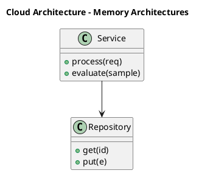

_Source diagram (plantuml); render with the appropriate tool._

**Figure 7. Cloud Architecture - Memory Architectures** (plantuml). Figure: Cloud Architecture view for Agentic AI. This diagram illustrates the principal components and their interactions as discussed in the surrounding section.

## Deep Dive: Mechanics, Variants and Trade-offs

Having established the essentials, we now go deeper into memory architectures. Beneath the abstraction lies a concrete process whose steps can each be measured, tested and optimised independently. The distinctions in this section are the ones that separate a working demo from a system that holds up under adversarial inputs, scale and the passage of time.

Consider the principal variants and how to choose between them. Each variant optimises for a different point in the design space - some for latency, some for accuracy, some for cost or operability - and the correct choice follows from explicit requirements rather than from defaults. Simplicity is a feature. The simplest design that meets the requirement should be the default, with complexity added only when measurement justifies it.

In practice this is supported by a mature tooling ecosystem, including LangGraph, AutoGen, CrewAI, OpenAI Agents. Tools accelerate the work but do not substitute for understanding: the same principles apply whichever implementation you select, and the ability to reason from first principles is what lets you debug when a tool behaves unexpectedly.

A frequent source of subtle bugs is the interaction with cost, latency and loop control. Because cost, latency and loop control concerns budgeting steps, preventing runaway loops and caching, changes there can silently alter the behaviour analysed here. The remedy is contract tests at the boundary and end-to-end evaluations that exercise the interaction explicitly.

Finally, attend to edge cases and degradation. Define what the system should do under partial failure, unexpected inputs and load spikes, and make that behaviour explicit and tested rather than emergent. Graceful degradation - returning a safe, useful result when the ideal one is unavailable - is a hallmark of mature engineering.

For deeper study, the literature offers authoritative treatments such as Yao et al. — ReAct (2022) and Shinn et al. — Reflexion (2023). These primary sources reward careful reading and ground the practical guidance above in established results.

## Advanced Considerations

Having established the essentials, we now go deeper into memory architectures. It pays to understand the mechanism rather than treat it as a black box, because most production incidents are explained by one of its steps misbehaving. The distinctions in this section are the ones that separate a working demo from a system that holds up under adversarial inputs, scale and the passage of time.

Consider the principal variants and how to choose between them. Each variant optimises for a different point in the design space - some for latency, some for accuracy, some for cost or operability - and the correct choice follows from explicit requirements rather than from defaults. There is an inherent trade-off between fidelity and cost, and the correct balance depends on the use case and its tolerance for error.

In practice this is supported by a mature tooling ecosystem, including LangGraph, AutoGen, CrewAI, OpenAI Agents. Tools accelerate the work but do not substitute for understanding: the same principles apply whichever implementation you select, and the ability to reason from first principles is what lets you debug when a tool behaves unexpectedly.

A frequent source of subtle bugs is the interaction with the agent loop: reason, act, observe. Because the agent loop: reason, act, observe concerns reAct-style cycles and the perception–action interface, changes there can silently alter the behaviour analysed here. The remedy is contract tests at the boundary and end-to-end evaluations that exercise the interaction explicitly.

Finally, attend to edge cases and degradation. Define what the system should do under partial failure, unexpected inputs and load spikes, and make that behaviour explicit and tested rather than emergent. Graceful degradation - returning a safe, useful result when the ideal one is unavailable - is a hallmark of mature engineering.

For deeper study, the literature offers authoritative treatments such as Yao et al. — ReAct (2022) and Shinn et al. — Reflexion (2023). These primary sources reward careful reading and ground the practical guidance above in established results.

## Worked Example

Consider a concrete scenario. A back office organisation needs workflow automation across enterprise systems. They decide to apply memory architectures as part of their Agentic AI solution, but wisely treat it as a hypothesis to be validated rather than a foregone conclusion.

The team begins by stating the objective precisely and defining how success will be measured before writing any code. They establish a small but representative evaluation set, agree on acceptance thresholds, and only then prototype the simplest design that could work. Early measurement reveals which assumptions hold and which must be revised, saving weeks of misdirected effort and surfacing edge cases while they are still cheap to fix.

As the prototype matures into a service, the team hardens it: adding input validation, error handling, caching where it pays off, and monitoring that ties back to the original success metric. They document each significant decision in an architecture decision record so that future maintainers understand not just what was built but why.

The outcome is instructive. The system that reaches production is not the most sophisticated design the team considered, but the one whose behaviour they could measure, explain and operate. This is the recurring lesson of Agentic AI: durable value comes from the whole system, not from any single clever component.

## Industry Use Cases

Across industries, the ideas in this chapter recur in recognisable ways. The following vignettes show how different sectors apply them and what they have in common.

**Software.** Autonomous coding agents that plan, edit and test. The common thread is that value comes not from the model alone but from the surrounding system - data quality, evaluation, integration and operations - which is precisely where most of the engineering effort belongs.

**Operations.** Incident triage agents that gather context and act. The common thread is that value comes not from the model alone but from the surrounding system - data quality, evaluation, integration and operations - which is precisely where most of the engineering effort belongs.

**Research.** Agents that browse, synthesise and report. The common thread is that value comes not from the model alone but from the surrounding system - data quality, evaluation, integration and operations - which is precisely where most of the engineering effort belongs.

**Back office.** Workflow automation across enterprise systems. The common thread is that value comes not from the model alone but from the surrounding system - data quality, evaluation, integration and operations - which is precisely where most of the engineering effort belongs.

## Best Practices

The following practices consistently separate successful Agentic AI efforts from struggling ones. They are deliberately concrete so they can be adopted as checklist items in design and code review.

- Constrain tools with typed schemas and least-privilege permissions.
- Cap loop steps and cost to prevent runaway behaviour.
- Require human approval for irreversible or high-impact actions.
- Trace every reasoning step and tool call for debugging and audit.

None of these are exotic; they are the unglamorous disciplines that compound into reliability. The cost of adopting them is small compared with the cost of the incidents they prevent, and they become second nature with practice.

## Common Pitfalls

Equally instructive are the failure modes that recur in practice. Each pitfall below has a clear early warning sign and a known remedy, so treat them as a diagnostic checklist when something feels wrong:

- Unbounded loops that burn cost without converging.
- Granting broad tool permissions that enable harmful actions.
- No observability, making failures impossible to diagnose.
- Over-automating tasks that need human judgement.

The pattern is consistent: most failures stem from skipping measurement, conflating prototype and production standards, or deferring cross-cutting concerns such as security and cost until they become emergencies. Naming these traps in advance is the cheapest way to avoid them.

## Governance, Security and Cost Notes

No discussion of memory architectures is complete without its governance, security and cost dimensions, which are too often deferred until they become emergencies. Treating them as first-class concerns from the outset is both cheaper and safer.

**Governance.** Classify the risk of this capability, document its intended and out-of-scope uses, and ensure decisions are traceable to satisfy internal policy and external regulation such as the NIST AI RMF, ISO/IEC 42001 and the EU AI Act. **Security.** Treat all external input as untrusted, validate outputs before acting on them, apply least privilege to any tools or data access, and map controls to the OWASP LLM Top 10 and MITRE ATLAS.

**Cost and sustainability.** Establish explicit budgets for compute, tokens and latency, attribute spend to owners, and revisit the economics as usage scales - a design that is affordable at pilot scale can become untenable at production volume. Building these reflexes into everyday engineering is what allows a Agentic AI system to be not only capable but also trustworthy and economically sound.

## Hands-On Exercises

Work through the following exercises. They are designed to move understanding from recognition to application - the level required for real engineering work - so prefer writing and building over merely reading.

1. Explain memory architectures to a colleague unfamiliar with Agentic AI, using a concrete example from your own domain.
2. Sketch a reference architecture that incorporates memory architectures and annotate where observability, security and cost controls belong.
3. Design an evaluation that would tell you whether memory architectures is working in production, including the metric, the dataset and the acceptance threshold.
4. Identify two pitfalls relevant to memory architectures in your environment and describe the early warning signals you would monitor.
5. Prototype the simplest implementation that demonstrates memory architectures, then list exactly what would need to change to make it production-ready.

## Key Takeaways

Key takeaways from this chapter:

- Memory Architectures is a systems concern in Agentic AI: data, models and operations must be co-designed.
- Measurement is non-negotiable; define success metrics and evaluation before building.
- Favour the simplest design that meets the requirement, and add complexity only when evidence demands it.
- Security, cost and observability are first-class requirements, not afterthoughts.
- Document decisions so the system remains understandable and operable as it evolves.

## Code Walkthrough

This listing shows a configuration-driven Memory Architectures component with retry semantics and typed interfaces — the shape we expect from production Agentic AI code rather than a notebook prototype.

The full listing is shown below; study it line by line and reproduce it locally before moving on.

### Listing: Implementing a Memory Architectures component

```python
from __future__ import annotations

from dataclasses import dataclass, field
from typing import Any


@dataclass(slots=True)
class MemoryArchitecturesConfig:
    """Configuration for the Memory Architectures component in a Agentic AI system."""

    name: str
    timeout_s: float = 30.0
    max_retries: int = 3
    options: dict[str, Any] = field(default_factory=dict)


class MemoryArchitectures:
    """A minimal, production-shaped implementation of Memory Architectures."""

    def __init__(self, config: MemoryArchitecturesConfig) -> None:
        self._config = config
        self._calls = 0

    def run(self, payload: dict[str, Any]) -> dict[str, Any]:
        """Process a request, retrying transient failures with backoff."""
        last_error: Exception | None = None
        for attempt in range(self._config.max_retries):
            try:
                self._calls += 1
                return self._process(payload)
            except TimeoutError as exc:  # transient
                last_error = exc
                continue
        raise RuntimeError(f"MemoryArchitectures failed after retries") from last_error

    def _process(self, payload: dict[str, Any]) -> dict[str, Any]:
        # Domain-specific logic for Memory Architectures goes here.
        return {"status": "ok", "input_keys": sorted(payload), "calls": self._calls}

```

## Review Questions

1. In the context of Agentic AI, which statement best describes “Memory Architectures”?
   - A. It removes all security and governance requirements.
   - B. It is only relevant to academic research, not production.
   - C. It eliminates the need for any evaluation or monitoring.
   - D. Short-term context, long-term vector memory and episodic recall.
   - **Answer: D.** Memory Architectures: Short-term context, long-term vector memory and episodic recall.
2. Which of the following is a recommended best practice when working with Agentic AI?
   - A. Constrain tools with typed schemas and least-privilege permissions.
   - B. Granting broad tool permissions that enable harmful actions.
   - C. It eliminates the need for any evaluation or monitoring.
   - D. Over-automating tasks that need human judgement.
   - **Answer: A.** Best practice: Constrain tools with typed schemas and least-privilege permissions.
3. Which of the following is a common pitfall to avoid in Agentic AI?
   - A. Cap loop steps and cost to prevent runaway behaviour.
   - B. Granting broad tool permissions that enable harmful actions.
   - C. Trace every reasoning step and tool call for debugging and audit.
   - D. Constrain tools with typed schemas and least-privilege permissions.
   - **Answer: B.** Pitfall to avoid: Granting broad tool permissions that enable harmful actions.
4. *(Discussion)* How does Memory Architectures interact with security and governance requirements?
   - **Model answer:** A strong answer defines memory architectures (Short-term context, long-term vector memory and episodic recall.) then connects it to architecture, evaluation, cost, security and operations for Agentic AI, citing concrete trade-offs and a real-world example.

---


# Chapter 6. Reflection and Self-Correction

_This chapter examines reflection and self-correction within Agentic AI. It covers critique loops, verification and error recovery, derives a reference architecture, walks through a worked example and runnable code, surveys industry use cases, and distils best practices and pitfalls, closing with exercises and review questions._

## Introduction

Reflection and Self-Correction refers to critique loops, verification and error recovery. Teams that master this consistently ship more reliable Agentic AI systems at lower cost. The practical implication is that design choices here ripple through latency, cost and maintainability for the lifetime of the system.

This chapter builds intuition first, then formalises the ideas, derives an architecture, and finishes with code, exercises and review questions so the material transfers directly to your own Agentic AI work. Read it actively: pause at each diagram, reproduce the code, and attempt the exercises before consulting the answers.

## Theory and Foundations

Reflection and Self-Correction refers to critique loops, verification and error recovery. What distinguishes a production-grade approach from a prototype is the discipline of measurement: every claim is backed by an evaluation rather than intuition. It pays to understand the mechanism rather than treat it as a black box, because most production incidents are explained by one of its steps misbehaving.

To place this in context, recall the broader picture: Agentic AI systems use language models as reasoning engines that plan, invoke tools, observe results and iterate toward goals with limited human oversight. Within that picture, reflection and self-correction is one of the load-bearing ideas - the kind that, when understood deeply, makes the rest of Agentic AI fall into place. It is foundational: later capabilities in Agentic AI are built directly on top of it.

Reflection and Self-Correction cannot be understood in isolation from human-in-the-loop and approvals. Recall that human-in-the-loop and approvals concerns confirmation gates for high-impact actions. The two interact directly: decisions in one constrain the design space of the other, which is why mature teams reason about them together rather than sequentially. There is an inherent trade-off between fidelity and cost, and the correct balance depends on the use case and its tolerance for error.

Reflection and Self-Correction cannot be understood in isolation from planning and task decomposition. Recall that planning and task decomposition concerns plan-and-execute, tree-of-thought and hierarchical planning. The two interact directly: decisions in one constrain the design space of the other, which is why mature teams reason about them together rather than sequentially. Every added component buys capability at the price of operational surface area, and that bargain should be made consciously.

Several established patterns apply directly to reflection and self-correction. The first, react: interleave reasoning and tool actions, is widely adopted because it makes the system's behaviour predictable and observable. A complementary pattern, approval gate before irreversible actions, addresses a related concern and is often deployed alongside it. Patterns are not dogma; they are distilled experience that shortcuts the search for a sound design, and each carries assumptions worth checking against your context.

It is worth being explicit about when to apply this and when to reach for something simpler. In a small prototype, shortcuts around reflection and self-correction are invisible; in a production Agentic AI system serving real traffic, they surface as incidents, cost overruns or compliance gaps. There is an inherent trade-off between fidelity and cost, and the correct balance depends on the use case and its tolerance for error. The remainder of this chapter turns these principles into an architecture, code and a checklist you can apply immediately.

## Architecture and Design

A robust architecture for Reflection and Self-Correction is layered so each part can evolve independently without destabilising the whole. An agent runtime hosts a reasoning model, a tool registry with typed schemas, a memory store (short-term context plus long-term vector memory), and a controller enforcing step budgets, permissions and human approvals. Every step is traced for observability and replay.

Concretely, the principal building blocks include from chatbots to agents, the agent loop: reason, act, observe, planning and task decomposition, tool use and function calling and memory architectures. Each is a replaceable component behind a stable interface, so the team can upgrade an implementation - a model, an index, a policy engine - without rewriting its neighbours. The contracts between components are where reliability is won or lost, so they are specified explicitly and tested in isolation.

The diagram accompanying this section makes the data and control flow explicit. Requests enter through a well-defined boundary where they are authenticated and validated; only then are they dispatched to the components that perform the work. This boundary is also where rate limiting, quota enforcement and audit logging live, keeping cross-cutting concerns out of the core logic and in one auditable place.

Two qualities deserve emphasis. First, observability is designed in, not bolted on: every component emits structured telemetry so that failures can be localised in minutes rather than hours. Second, the architecture is evolvable - components communicate through stable contracts so that any single part of the Agentic AI system can be replaced without a rewrite. Simplicity is a feature. The simplest design that meets the requirement should be the default, with complexity added only when measurement justifies it.


**Figure 8. Knowledge Graph - Reflection and Self-Correction** (mermaid). Figure: Knowledge Graph view for Agentic AI. This diagram illustrates the principal components and their interactions as discussed in the surrounding section.

```xml
<mxfile host="ai-university">
  <diagram name="Data Flow">
    <mxGraphModel dx="800" dy="600" grid="1" gridSize="10">
      <root>
        <mxCell id="0"/>
        <mxCell id="1" parent="0"/>
        <mxCell id="title" value="Data Flow - Reflection and Self-Correction" style="text;fontSize=16;fontStyle=1" vertex="1" parent="1"><mxGeometry x="40" y="20" width="600" height="30" as="geometry"/></mxCell>
        <mxCell id="hub" value="Agentic AI" style="rounded=1;fillColor=#0f172a;fontColor=#ffffff;fontStyle=1" vertex="1" parent="1"><mxGeometry x="300" y="180" width="160" height="60" as="geometry"/></mxCell>
        <mxCell id="n0" value="From Chatbots to Agents" style="rounded=1;fillColor=#e0e7ff;strokeColor=#4338ca" vertex="1" parent="1"><mxGeometry x="60" y="80" width="160" height="50" as="geometry"/></mxCell>
        <mxCell id="e0" style="edgeStyle=orthogonalEdgeStyle" edge="1" parent="1" source="hub" target="n0"><mxGeometry relative="1" as="geometry"/></mxCell>
        <mxCell id="n1" value="The Agent Loop: Reason,…" style="rounded=1;fillColor=#e0e7ff;strokeColor=#4338ca" vertex="1" parent="1"><mxGeometry x="600" y="170" width="160" height="50" as="geometry"/></mxCell>
        <mxCell id="e1" style="edgeStyle=orthogonalEdgeStyle" edge="1" parent="1" source="hub" target="n1"><mxGeometry relative="1" as="geometry"/></mxCell>
        <mxCell id="n2" value="Planning and Task Decom…" style="rounded=1;fillColor=#e0e7ff;strokeColor=#4338ca" vertex="1" parent="1"><mxGeometry x="60" y="260" width="160" height="50" as="geometry"/></mxCell>
        <mxCell id="e2" style="edgeStyle=orthogonalEdgeStyle" edge="1" parent="1" source="hub" target="n2"><mxGeometry relative="1" as="geometry"/></mxCell>
        <mxCell id="n3" value="Tool Use and Function C…" style="rounded=1;fillColor=#e0e7ff;strokeColor=#4338ca" vertex="1" parent="1"><mxGeometry x="600" y="350" width="160" height="50" as="geometry"/></mxCell>
        <mxCell id="e3" style="edgeStyle=orthogonalEdgeStyle" edge="1" parent="1" source="hub" target="n3"><mxGeometry relative="1" as="geometry"/></mxCell>
        <mxCell id="n4" value="Memory Architectures" style="rounded=1;fillColor=#e0e7ff;strokeColor=#4338ca" vertex="1" parent="1"><mxGeometry x="60" y="440" width="160" height="50" as="geometry"/></mxCell>
        <mxCell id="e4" style="edgeStyle=orthogonalEdgeStyle" edge="1" parent="1" source="hub" target="n4"><mxGeometry relative="1" as="geometry"/></mxCell>
      </root>
    </mxGraphModel>
  </diagram>
</mxfile>
```

_Source diagram (drawio); render with the appropriate tool._

**Figure 9. Data Flow - Reflection and Self-Correction** (drawio). Figure: Data Flow view for Agentic AI. This diagram illustrates the principal components and their interactions as discussed in the surrounding section.

## Deep Dive: Mechanics, Variants and Trade-offs

Having established the essentials, we now go deeper into reflection and self-correction. Beneath the abstraction lies a concrete process whose steps can each be measured, tested and optimised independently. The distinctions in this section are the ones that separate a working demo from a system that holds up under adversarial inputs, scale and the passage of time.

Consider the principal variants and how to choose between them. Each variant optimises for a different point in the design space - some for latency, some for accuracy, some for cost or operability - and the correct choice follows from explicit requirements rather than from defaults. Simplicity is a feature. The simplest design that meets the requirement should be the default, with complexity added only when measurement justifies it.

In practice this is supported by a mature tooling ecosystem, including LangGraph, AutoGen, CrewAI, OpenAI Agents. Tools accelerate the work but do not substitute for understanding: the same principles apply whichever implementation you select, and the ability to reason from first principles is what lets you debug when a tool behaves unexpectedly.

A frequent source of subtle bugs is the interaction with human-in-the-loop and approvals. Because human-in-the-loop and approvals concerns confirmation gates for high-impact actions, changes there can silently alter the behaviour analysed here. The remedy is contract tests at the boundary and end-to-end evaluations that exercise the interaction explicitly.

Finally, attend to edge cases and degradation. Define what the system should do under partial failure, unexpected inputs and load spikes, and make that behaviour explicit and tested rather than emergent. Graceful degradation - returning a safe, useful result when the ideal one is unavailable - is a hallmark of mature engineering.

For deeper study, the literature offers authoritative treatments such as Yao et al. — ReAct (2022) and Shinn et al. — Reflexion (2023). These primary sources reward careful reading and ground the practical guidance above in established results.

## Advanced Considerations

Having established the essentials, we now go deeper into reflection and self-correction. Mechanically, the behaviour emerges from a few interacting parts that are simpler than the whole they produce. The distinctions in this section are the ones that separate a working demo from a system that holds up under adversarial inputs, scale and the passage of time.

Consider the principal variants and how to choose between them. Each variant optimises for a different point in the design space - some for latency, some for accuracy, some for cost or operability - and the correct choice follows from explicit requirements rather than from defaults. Every added component buys capability at the price of operational surface area, and that bargain should be made consciously.

In practice this is supported by a mature tooling ecosystem, including LangGraph, AutoGen, CrewAI, OpenAI Agents. Tools accelerate the work but do not substitute for understanding: the same principles apply whichever implementation you select, and the ability to reason from first principles is what lets you debug when a tool behaves unexpectedly.

A frequent source of subtle bugs is the interaction with from chatbots to agents. Because from chatbots to agents concerns the shift from single responses to goal-directed loops, changes there can silently alter the behaviour analysed here. The remedy is contract tests at the boundary and end-to-end evaluations that exercise the interaction explicitly.

Finally, attend to edge cases and degradation. Define what the system should do under partial failure, unexpected inputs and load spikes, and make that behaviour explicit and tested rather than emergent. Graceful degradation - returning a safe, useful result when the ideal one is unavailable - is a hallmark of mature engineering.

For deeper study, the literature offers authoritative treatments such as Yao et al. — ReAct (2022) and Shinn et al. — Reflexion (2023). These primary sources reward careful reading and ground the practical guidance above in established results.

## Worked Example

A worked example clarifies how these ideas behave in practice. A operations organisation needs incident triage agents that gather context and act. They decide to apply reflection and self-correction as part of their Agentic AI solution, but wisely treat it as a hypothesis to be validated rather than a foregone conclusion.

The team begins by stating the objective precisely and defining how success will be measured before writing any code. They establish a small but representative evaluation set, agree on acceptance thresholds, and only then prototype the simplest design that could work. Early measurement reveals which assumptions hold and which must be revised, saving weeks of misdirected effort and surfacing edge cases while they are still cheap to fix.

As the prototype matures into a service, the team hardens it: adding input validation, error handling, caching where it pays off, and monitoring that ties back to the original success metric. They document each significant decision in an architecture decision record so that future maintainers understand not just what was built but why.

The outcome is instructive. The system that reaches production is not the most sophisticated design the team considered, but the one whose behaviour they could measure, explain and operate. This is the recurring lesson of Agentic AI: durable value comes from the whole system, not from any single clever component.

## Industry Use Cases

Across industries, the ideas in this chapter recur in recognisable ways. The following vignettes show how different sectors apply them and what they have in common.

**Software.** Autonomous coding agents that plan, edit and test. The common thread is that value comes not from the model alone but from the surrounding system - data quality, evaluation, integration and operations - which is precisely where most of the engineering effort belongs.

**Operations.** Incident triage agents that gather context and act. The common thread is that value comes not from the model alone but from the surrounding system - data quality, evaluation, integration and operations - which is precisely where most of the engineering effort belongs.

**Research.** Agents that browse, synthesise and report. The common thread is that value comes not from the model alone but from the surrounding system - data quality, evaluation, integration and operations - which is precisely where most of the engineering effort belongs.

**Back office.** Workflow automation across enterprise systems. The common thread is that value comes not from the model alone but from the surrounding system - data quality, evaluation, integration and operations - which is precisely where most of the engineering effort belongs.

## Best Practices

The following practices consistently separate successful Agentic AI efforts from struggling ones. They are deliberately concrete so they can be adopted as checklist items in design and code review.

- Constrain tools with typed schemas and least-privilege permissions.
- Cap loop steps and cost to prevent runaway behaviour.
- Require human approval for irreversible or high-impact actions.
- Trace every reasoning step and tool call for debugging and audit.

None of these are exotic; they are the unglamorous disciplines that compound into reliability. The cost of adopting them is small compared with the cost of the incidents they prevent, and they become second nature with practice.

## Common Pitfalls

Equally instructive are the failure modes that recur in practice. Each pitfall below has a clear early warning sign and a known remedy, so treat them as a diagnostic checklist when something feels wrong:

- Unbounded loops that burn cost without converging.
- Granting broad tool permissions that enable harmful actions.
- No observability, making failures impossible to diagnose.
- Over-automating tasks that need human judgement.

The pattern is consistent: most failures stem from skipping measurement, conflating prototype and production standards, or deferring cross-cutting concerns such as security and cost until they become emergencies. Naming these traps in advance is the cheapest way to avoid them.

## Governance, Security and Cost Notes

No discussion of reflection and self-correction is complete without its governance, security and cost dimensions, which are too often deferred until they become emergencies. Treating them as first-class concerns from the outset is both cheaper and safer.

**Governance.** Classify the risk of this capability, document its intended and out-of-scope uses, and ensure decisions are traceable to satisfy internal policy and external regulation such as the NIST AI RMF, ISO/IEC 42001 and the EU AI Act. **Security.** Treat all external input as untrusted, validate outputs before acting on them, apply least privilege to any tools or data access, and map controls to the OWASP LLM Top 10 and MITRE ATLAS.

**Cost and sustainability.** Establish explicit budgets for compute, tokens and latency, attribute spend to owners, and revisit the economics as usage scales - a design that is affordable at pilot scale can become untenable at production volume. Building these reflexes into everyday engineering is what allows a Agentic AI system to be not only capable but also trustworthy and economically sound.

## Hands-On Exercises

Work through the following exercises. They are designed to move understanding from recognition to application - the level required for real engineering work - so prefer writing and building over merely reading.

1. Explain reflection and self-correction to a colleague unfamiliar with Agentic AI, using a concrete example from your own domain.
2. Sketch a reference architecture that incorporates reflection and self-correction and annotate where observability, security and cost controls belong.
3. Design an evaluation that would tell you whether reflection and self-correction is working in production, including the metric, the dataset and the acceptance threshold.
4. Identify two pitfalls relevant to reflection and self-correction in your environment and describe the early warning signals you would monitor.
5. Prototype the simplest implementation that demonstrates reflection and self-correction, then list exactly what would need to change to make it production-ready.

## Key Takeaways

Key takeaways from this chapter:

- Reflection and Self-Correction is a systems concern in Agentic AI: data, models and operations must be co-designed.
- Measurement is non-negotiable; define success metrics and evaluation before building.
- Favour the simplest design that meets the requirement, and add complexity only when evidence demands it.
- Security, cost and observability are first-class requirements, not afterthoughts.
- Document decisions so the system remains understandable and operable as it evolves.

## Code Walkthrough

This listing shows a configuration-driven Reflection and Self-Correction component with retry semantics and typed interfaces — the shape we expect from production Agentic AI code rather than a notebook prototype.

The full listing is shown below; study it line by line and reproduce it locally before moving on.

### Listing: Implementing a Reflection and Self-Correction component

```python
from __future__ import annotations

from dataclasses import dataclass, field
from typing import Any


@dataclass(slots=True)
class ReflectionAndConfig:
    """Configuration for the Reflection and Self-Correction component in a Agentic AI system."""

    name: str
    timeout_s: float = 30.0
    max_retries: int = 3
    options: dict[str, Any] = field(default_factory=dict)


class ReflectionAnd:
    """A minimal, production-shaped implementation of Reflection and Self-Correction."""

    def __init__(self, config: ReflectionAndConfig) -> None:
        self._config = config
        self._calls = 0

    def run(self, payload: dict[str, Any]) -> dict[str, Any]:
        """Process a request, retrying transient failures with backoff."""
        last_error: Exception | None = None
        for attempt in range(self._config.max_retries):
            try:
                self._calls += 1
                return self._process(payload)
            except TimeoutError as exc:  # transient
                last_error = exc
                continue
        raise RuntimeError(f"ReflectionAnd failed after retries") from last_error

    def _process(self, payload: dict[str, Any]) -> dict[str, Any]:
        # Domain-specific logic for Reflection and Self-Correction goes here.
        return {"status": "ok", "input_keys": sorted(payload), "calls": self._calls}

```

## Review Questions

1. In the context of Agentic AI, which statement best describes “Reflection and Self-Correction”?
   - A. Critique loops, verification and error recovery.
   - B. It removes all security and governance requirements.
   - C. It guarantees deterministic output regardless of input.
   - D. It eliminates the need for any evaluation or monitoring.
   - **Answer: A.** Reflection and Self-Correction: Critique loops, verification and error recovery.
2. Which of the following is a recommended best practice when working with Agentic AI?
   - A. Granting broad tool permissions that enable harmful actions.
   - B. No observability, making failures impossible to diagnose.
   - C. Cap loop steps and cost to prevent runaway behaviour.
   - D. Over-automating tasks that need human judgement.
   - **Answer: C.** Best practice: Cap loop steps and cost to prevent runaway behaviour.
3. Which of the following is a common pitfall to avoid in Agentic AI?
   - A. Require human approval for irreversible or high-impact actions.
   - B. Over-automating tasks that need human judgement.
   - C. It applies exclusively to image data.
   - D. Constrain tools with typed schemas and least-privilege permissions.
   - **Answer: B.** Pitfall to avoid: Over-automating tasks that need human judgement.
4. *(Discussion)* How does Reflection and Self-Correction interact with security and governance requirements?
   - **Model answer:** A strong answer defines reflection and self-correction (Critique loops, verification and error recovery.) then connects it to architecture, evaluation, cost, security and operations for Agentic AI, citing concrete trade-offs and a real-world example.

---


# Chapter 7. Grounding and Retrieval for Agents

_This chapter examines grounding and retrieval for agents within Agentic AI. It covers bringing knowledge into the agent loop, derives a reference architecture, walks through a worked example and runnable code, surveys industry use cases, and distils best practices and pitfalls, closing with exercises and review questions._

## Introduction

Formally, Grounding and Retrieval for Agents addresses bringing knowledge into the agent loop. Understanding this matters because Agentic AI systems succeed or fail on exactly these decisions. Seasoned practitioners treat this as a systems problem, co-designing data, models and operations rather than optimising any one in isolation.

This chapter builds intuition first, then formalises the ideas, derives an architecture, and finishes with code, exercises and review questions so the material transfers directly to your own Agentic AI work. Read it actively: pause at each diagram, reproduce the code, and attempt the exercises before consulting the answers.

## Theory and Foundations

At its core, Grounding and Retrieval for Agents concerns bringing knowledge into the agent loop. Seasoned practitioners treat this as a systems problem, co-designing data, models and operations rather than optimising any one in isolation. It pays to understand the mechanism rather than treat it as a black box, because most production incidents are explained by one of its steps misbehaving.

To place this in context, recall the broader picture: Agentic AI systems use language models as reasoning engines that plan, invoke tools, observe results and iterate toward goals with limited human oversight. Within that picture, grounding and retrieval for agents is one of the load-bearing ideas - the kind that, when understood deeply, makes the rest of Agentic AI fall into place. It is foundational: later capabilities in Agentic AI are built directly on top of it.

Grounding and Retrieval for Agents cannot be understood in isolation from tool use and function calling. Recall that tool use and function calling concerns defining, selecting and safely invoking tools and APIs. The two interact directly: decisions in one constrain the design space of the other, which is why mature teams reason about them together rather than sequentially. Simplicity is a feature. The simplest design that meets the requirement should be the default, with complexity added only when measurement justifies it.

Grounding and Retrieval for Agents cannot be understood in isolation from from chatbots to agents. Recall that from chatbots to agents concerns the shift from single responses to goal-directed loops. The two interact directly: decisions in one constrain the design space of the other, which is why mature teams reason about them together rather than sequentially. As with most architectural decisions, the choice is rarely binary; the skill lies in quantifying the trade-offs and choosing deliberately.

Several established patterns apply directly to grounding and retrieval for agents. The first, approval gate before irreversible actions, is widely adopted because it makes the system's behaviour predictable and observable. A complementary pattern, reflection loop to critique and revise outputs, addresses a related concern and is often deployed alongside it. Patterns are not dogma; they are distilled experience that shortcuts the search for a sound design, and each carries assumptions worth checking against your context.

The decision of whether to adopt this should be driven by requirements, not by novelty. In a small prototype, shortcuts around grounding and retrieval for agents are invisible; in a production Agentic AI system serving real traffic, they surface as incidents, cost overruns or compliance gaps. There is an inherent trade-off between fidelity and cost, and the correct balance depends on the use case and its tolerance for error. The remainder of this chapter turns these principles into an architecture, code and a checklist you can apply immediately.

## Architecture and Design

A robust architecture for Grounding and Retrieval for Agents is layered so each part can evolve independently without destabilising the whole. An agent runtime hosts a reasoning model, a tool registry with typed schemas, a memory store (short-term context plus long-term vector memory), and a controller enforcing step budgets, permissions and human approvals. Every step is traced for observability and replay.

Concretely, the principal building blocks include from chatbots to agents, the agent loop: reason, act, observe, planning and task decomposition, tool use and function calling and memory architectures. Each is a replaceable component behind a stable interface, so the team can upgrade an implementation - a model, an index, a policy engine - without rewriting its neighbours. The contracts between components are where reliability is won or lost, so they are specified explicitly and tested in isolation.

The diagram accompanying this section makes the data and control flow explicit. Requests enter through a well-defined boundary where they are authenticated and validated; only then are they dispatched to the components that perform the work. This boundary is also where rate limiting, quota enforcement and audit logging live, keeping cross-cutting concerns out of the core logic and in one auditable place.

Two qualities deserve emphasis. First, observability is designed in, not bolted on: every component emits structured telemetry so that failures can be localised in minutes rather than hours. Second, the architecture is evolvable - components communicate through stable contracts so that any single part of the Agentic AI system can be replaced without a rewrite. Simplicity is a feature. The simplest design that meets the requirement should be the default, with complexity added only when measurement justifies it.

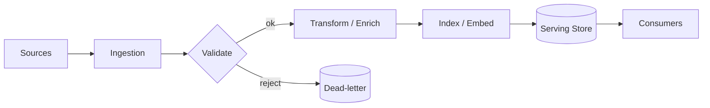

**Figure 10. Data Flow - Grounding and Retrieval for Agents** (mermaid). Figure: Data Flow view for Agentic AI. This diagram illustrates the principal components and their interactions as discussed in the surrounding section.

## Deep Dive: Mechanics, Variants and Trade-offs

Having established the essentials, we now go deeper into grounding and retrieval for agents. Beneath the abstraction lies a concrete process whose steps can each be measured, tested and optimised independently. The distinctions in this section are the ones that separate a working demo from a system that holds up under adversarial inputs, scale and the passage of time.

Consider the principal variants and how to choose between them. Each variant optimises for a different point in the design space - some for latency, some for accuracy, some for cost or operability - and the correct choice follows from explicit requirements rather than from defaults. Latency, accuracy and cost form a tension triangle: improving one typically pressures the others, so explicit budgets are essential.

In practice this is supported by a mature tooling ecosystem, including LangGraph, AutoGen, CrewAI, OpenAI Agents. Tools accelerate the work but do not substitute for understanding: the same principles apply whichever implementation you select, and the ability to reason from first principles is what lets you debug when a tool behaves unexpectedly.

A frequent source of subtle bugs is the interaction with tool use and function calling. Because tool use and function calling concerns defining, selecting and safely invoking tools and APIs, changes there can silently alter the behaviour analysed here. The remedy is contract tests at the boundary and end-to-end evaluations that exercise the interaction explicitly.

Finally, attend to edge cases and degradation. Define what the system should do under partial failure, unexpected inputs and load spikes, and make that behaviour explicit and tested rather than emergent. Graceful degradation - returning a safe, useful result when the ideal one is unavailable - is a hallmark of mature engineering.

For deeper study, the literature offers authoritative treatments such as Yao et al. — ReAct (2022) and Shinn et al. — Reflexion (2023). These primary sources reward careful reading and ground the practical guidance above in established results.

## Advanced Considerations

Having established the essentials, we now go deeper into grounding and retrieval for agents. It pays to understand the mechanism rather than treat it as a black box, because most production incidents are explained by one of its steps misbehaving. The distinctions in this section are the ones that separate a working demo from a system that holds up under adversarial inputs, scale and the passage of time.

Consider the principal variants and how to choose between them. Each variant optimises for a different point in the design space - some for latency, some for accuracy, some for cost or operability - and the correct choice follows from explicit requirements rather than from defaults. There is an inherent trade-off between fidelity and cost, and the correct balance depends on the use case and its tolerance for error.

In practice this is supported by a mature tooling ecosystem, including LangGraph, AutoGen, CrewAI, OpenAI Agents. Tools accelerate the work but do not substitute for understanding: the same principles apply whichever implementation you select, and the ability to reason from first principles is what lets you debug when a tool behaves unexpectedly.

A frequent source of subtle bugs is the interaction with planning and task decomposition. Because planning and task decomposition concerns plan-and-execute, tree-of-thought and hierarchical planning, changes there can silently alter the behaviour analysed here. The remedy is contract tests at the boundary and end-to-end evaluations that exercise the interaction explicitly.

Finally, attend to edge cases and degradation. Define what the system should do under partial failure, unexpected inputs and load spikes, and make that behaviour explicit and tested rather than emergent. Graceful degradation - returning a safe, useful result when the ideal one is unavailable - is a hallmark of mature engineering.

For deeper study, the literature offers authoritative treatments such as Yao et al. — ReAct (2022) and Shinn et al. — Reflexion (2023). These primary sources reward careful reading and ground the practical guidance above in established results.

## Worked Example

To ground the discussion, walk through a representative example. A operations organisation needs incident triage agents that gather context and act. They decide to apply grounding and retrieval for agents as part of their Agentic AI solution, but wisely treat it as a hypothesis to be validated rather than a foregone conclusion.

The team begins by stating the objective precisely and defining how success will be measured before writing any code. They establish a small but representative evaluation set, agree on acceptance thresholds, and only then prototype the simplest design that could work. Early measurement reveals which assumptions hold and which must be revised, saving weeks of misdirected effort and surfacing edge cases while they are still cheap to fix.

As the prototype matures into a service, the team hardens it: adding input validation, error handling, caching where it pays off, and monitoring that ties back to the original success metric. They document each significant decision in an architecture decision record so that future maintainers understand not just what was built but why.

The outcome is instructive. The system that reaches production is not the most sophisticated design the team considered, but the one whose behaviour they could measure, explain and operate. This is the recurring lesson of Agentic AI: durable value comes from the whole system, not from any single clever component.

## Industry Use Cases

Across industries, the ideas in this chapter recur in recognisable ways. The following vignettes show how different sectors apply them and what they have in common.

**Software.** Autonomous coding agents that plan, edit and test. The common thread is that value comes not from the model alone but from the surrounding system - data quality, evaluation, integration and operations - which is precisely where most of the engineering effort belongs.

**Operations.** Incident triage agents that gather context and act. The common thread is that value comes not from the model alone but from the surrounding system - data quality, evaluation, integration and operations - which is precisely where most of the engineering effort belongs.

**Research.** Agents that browse, synthesise and report. The common thread is that value comes not from the model alone but from the surrounding system - data quality, evaluation, integration and operations - which is precisely where most of the engineering effort belongs.

**Back office.** Workflow automation across enterprise systems. The common thread is that value comes not from the model alone but from the surrounding system - data quality, evaluation, integration and operations - which is precisely where most of the engineering effort belongs.

## Best Practices

The following practices consistently separate successful Agentic AI efforts from struggling ones. They are deliberately concrete so they can be adopted as checklist items in design and code review.

- Constrain tools with typed schemas and least-privilege permissions.
- Cap loop steps and cost to prevent runaway behaviour.
- Require human approval for irreversible or high-impact actions.
- Trace every reasoning step and tool call for debugging and audit.

None of these are exotic; they are the unglamorous disciplines that compound into reliability. The cost of adopting them is small compared with the cost of the incidents they prevent, and they become second nature with practice.

## Common Pitfalls

Equally instructive are the failure modes that recur in practice. Each pitfall below has a clear early warning sign and a known remedy, so treat them as a diagnostic checklist when something feels wrong:

- Unbounded loops that burn cost without converging.
- Granting broad tool permissions that enable harmful actions.
- No observability, making failures impossible to diagnose.
- Over-automating tasks that need human judgement.

The pattern is consistent: most failures stem from skipping measurement, conflating prototype and production standards, or deferring cross-cutting concerns such as security and cost until they become emergencies. Naming these traps in advance is the cheapest way to avoid them.

## Governance, Security and Cost Notes

No discussion of grounding and retrieval for agents is complete without its governance, security and cost dimensions, which are too often deferred until they become emergencies. Treating them as first-class concerns from the outset is both cheaper and safer.

**Governance.** Classify the risk of this capability, document its intended and out-of-scope uses, and ensure decisions are traceable to satisfy internal policy and external regulation such as the NIST AI RMF, ISO/IEC 42001 and the EU AI Act. **Security.** Treat all external input as untrusted, validate outputs before acting on them, apply least privilege to any tools or data access, and map controls to the OWASP LLM Top 10 and MITRE ATLAS.

**Cost and sustainability.** Establish explicit budgets for compute, tokens and latency, attribute spend to owners, and revisit the economics as usage scales - a design that is affordable at pilot scale can become untenable at production volume. Building these reflexes into everyday engineering is what allows a Agentic AI system to be not only capable but also trustworthy and economically sound.

## Hands-On Exercises

Work through the following exercises. They are designed to move understanding from recognition to application - the level required for real engineering work - so prefer writing and building over merely reading.

1. Explain grounding and retrieval for agents to a colleague unfamiliar with Agentic AI, using a concrete example from your own domain.
2. Sketch a reference architecture that incorporates grounding and retrieval for agents and annotate where observability, security and cost controls belong.
3. Design an evaluation that would tell you whether grounding and retrieval for agents is working in production, including the metric, the dataset and the acceptance threshold.
4. Identify two pitfalls relevant to grounding and retrieval for agents in your environment and describe the early warning signals you would monitor.
5. Prototype the simplest implementation that demonstrates grounding and retrieval for agents, then list exactly what would need to change to make it production-ready.

## Key Takeaways

Key takeaways from this chapter:

- Grounding and Retrieval for Agents is a systems concern in Agentic AI: data, models and operations must be co-designed.
- Measurement is non-negotiable; define success metrics and evaluation before building.
- Favour the simplest design that meets the requirement, and add complexity only when evidence demands it.
- Security, cost and observability are first-class requirements, not afterthoughts.
- Document decisions so the system remains understandable and operable as it evolves.

## Code Walkthrough

Every change to a Agentic AI system should pass an evaluation gate. This example shows the minimal shape: align predictions and references, compute a metric, and return a pass/fail decision for CI.

The full listing is shown below; study it line by line and reproduce it locally before moving on.

### Listing: Evaluating Grounding and Retrieval for Agents with a regression gate

```python
from dataclasses import dataclass


@dataclass
class EvalResult:
    metric: str
    score: float
    passed: bool


def evaluate(predictions: list[str], references: list[str],
             threshold: float = 0.8) -> EvalResult:
    """Score Grounding and Retrieval for Agents output against references with a simple exact-match metric.

    In practice you would combine several metrics (exact match, semantic
    similarity, LLM-as-judge) and gate releases on the aggregate.
    """
    if len(predictions) != len(references):
        raise ValueError("predictions and references must align")
    hits = sum(p.strip() == r.strip() for p, r in zip(predictions, references))
    score = hits / len(references) if references else 0.0
    return EvalResult(metric="exact_match", score=score, passed=score >= threshold)


if __name__ == "__main__":
    result = evaluate(["yes", "no"], ["yes", "yes"])
    print(f"{result.metric}={result.score:.2f} passed={result.passed}")

```

## Review Questions

1. In the context of Agentic AI, which statement best describes “Grounding and Retrieval for Agents”?
   - A. It is only relevant to academic research, not production.
   - B. It guarantees deterministic output regardless of input.
   - C. It removes all security and governance requirements.
   - D. Bringing knowledge into the agent loop.
   - **Answer: D.** Grounding and Retrieval for Agents: Bringing knowledge into the agent loop.
2. Which of the following is a recommended best practice when working with Agentic AI?
   - A. It removes all security and governance requirements.
   - B. Over-automating tasks that need human judgement.
   - C. Unbounded loops that burn cost without converging.
   - D. Trace every reasoning step and tool call for debugging and audit.
   - **Answer: D.** Best practice: Trace every reasoning step and tool call for debugging and audit.
3. Which of the following is a common pitfall to avoid in Agentic AI?
   - A. Cap loop steps and cost to prevent runaway behaviour.
   - B. Over-automating tasks that need human judgement.
   - C. Trace every reasoning step and tool call for debugging and audit.
   - D. It is only relevant to academic research, not production.
   - **Answer: B.** Pitfall to avoid: Over-automating tasks that need human judgement.
4. *(Discussion)* Describe a failure mode of Grounding and Retrieval for Agents and how you would mitigate it.
   - **Model answer:** A strong answer defines grounding and retrieval for agents (Bringing knowledge into the agent loop.) then connects it to architecture, evaluation, cost, security and operations for Agentic AI, citing concrete trade-offs and a real-world example.

---


# Chapter 8. Human-in-the-Loop and Approvals

_This chapter examines human-in-the-loop and approvals within Agentic AI. It covers confirmation gates for high-impact actions, derives a reference architecture, walks through a worked example and runnable code, surveys industry use cases, and distils best practices and pitfalls, closing with exercises and review questions._

## Introduction

We define Human-in-the-Loop and Approvals as confirmation gates for high-impact actions. Getting this right early prevents expensive rework once a Agentic AI system reaches scale. What distinguishes a production-grade approach from a prototype is the discipline of measurement: every claim is backed by an evaluation rather than intuition.

This chapter builds intuition first, then formalises the ideas, derives an architecture, and finishes with code, exercises and review questions so the material transfers directly to your own Agentic AI work. Read it actively: pause at each diagram, reproduce the code, and attempt the exercises before consulting the answers.

## Theory and Foundations

Formally, Human-in-the-Loop and Approvals addresses confirmation gates for high-impact actions. Seasoned practitioners treat this as a systems problem, co-designing data, models and operations rather than optimising any one in isolation. Mechanically, the behaviour emerges from a few interacting parts that are simpler than the whole they produce.

To place this in context, recall the broader picture: Agentic AI systems use language models as reasoning engines that plan, invoke tools, observe results and iterate toward goals with limited human oversight. Within that picture, human-in-the-loop and approvals is one of the load-bearing ideas - the kind that, when understood deeply, makes the rest of Agentic AI fall into place. Neglecting it is one of the most common reasons Agentic AI initiatives stall in production.

Human-in-the-Loop and Approvals cannot be understood in isolation from observability for agents. Recall that observability for agents concerns tracing reasoning, tool calls and outcomes. The two interact directly: decisions in one constrain the design space of the other, which is why mature teams reason about them together rather than sequentially. Latency, accuracy and cost form a tension triangle: improving one typically pressures the others, so explicit budgets are essential.

Human-in-the-Loop and Approvals cannot be understood in isolation from planning and task decomposition. Recall that planning and task decomposition concerns plan-and-execute, tree-of-thought and hierarchical planning. The two interact directly: decisions in one constrain the design space of the other, which is why mature teams reason about them together rather than sequentially. Every added component buys capability at the price of operational surface area, and that bargain should be made consciously.

Several established patterns apply directly to human-in-the-loop and approvals. The first, plan-and-execute with a separate planner and executor, is widely adopted because it makes the system's behaviour predictable and observable. A complementary pattern, react: interleave reasoning and tool actions, addresses a related concern and is often deployed alongside it. Patterns are not dogma; they are distilled experience that shortcuts the search for a sound design, and each carries assumptions worth checking against your context.

It is worth being explicit about when to apply this and when to reach for something simpler. In a small prototype, shortcuts around human-in-the-loop and approvals are invisible; in a production Agentic AI system serving real traffic, they surface as incidents, cost overruns or compliance gaps. There is an inherent trade-off between fidelity and cost, and the correct balance depends on the use case and its tolerance for error. The remainder of this chapter turns these principles into an architecture, code and a checklist you can apply immediately.

## Architecture and Design

From an architectural standpoint, Human-in-the-Loop and Approvals sits at the intersection of data, models and operations. An agent runtime hosts a reasoning model, a tool registry with typed schemas, a memory store (short-term context plus long-term vector memory), and a controller enforcing step budgets, permissions and human approvals. Every step is traced for observability and replay.

Concretely, the principal building blocks include from chatbots to agents, the agent loop: reason, act, observe, planning and task decomposition, tool use and function calling and memory architectures. Each is a replaceable component behind a stable interface, so the team can upgrade an implementation - a model, an index, a policy engine - without rewriting its neighbours. The contracts between components are where reliability is won or lost, so they are specified explicitly and tested in isolation.

The diagram accompanying this section makes the data and control flow explicit. Requests enter through a well-defined boundary where they are authenticated and validated; only then are they dispatched to the components that perform the work. This boundary is also where rate limiting, quota enforcement and audit logging live, keeping cross-cutting concerns out of the core logic and in one auditable place.

Two qualities deserve emphasis. First, observability is designed in, not bolted on: every component emits structured telemetry so that failures can be localised in minutes rather than hours. Second, the architecture is evolvable - components communicate through stable contracts so that any single part of the Agentic AI system can be replaced without a rewrite. Latency, accuracy and cost form a tension triangle: improving one typically pressures the others, so explicit budgets are essential.


**Figure 11. DevOps Pipeline - Human-in-the-Loop and Approvals** (mermaid). Figure: DevOps Pipeline view for Agentic AI. This diagram illustrates the principal components and their interactions as discussed in the surrounding section.

## Deep Dive: Mechanics, Variants and Trade-offs

Having established the essentials, we now go deeper into human-in-the-loop and approvals. It pays to understand the mechanism rather than treat it as a black box, because most production incidents are explained by one of its steps misbehaving. The distinctions in this section are the ones that separate a working demo from a system that holds up under adversarial inputs, scale and the passage of time.

Consider the principal variants and how to choose between them. Each variant optimises for a different point in the design space - some for latency, some for accuracy, some for cost or operability - and the correct choice follows from explicit requirements rather than from defaults. Every added component buys capability at the price of operational surface area, and that bargain should be made consciously.

In practice this is supported by a mature tooling ecosystem, including LangGraph, AutoGen, CrewAI, OpenAI Agents. Tools accelerate the work but do not substitute for understanding: the same principles apply whichever implementation you select, and the ability to reason from first principles is what lets you debug when a tool behaves unexpectedly.

A frequent source of subtle bugs is the interaction with observability for agents. Because observability for agents concerns tracing reasoning, tool calls and outcomes, changes there can silently alter the behaviour analysed here. The remedy is contract tests at the boundary and end-to-end evaluations that exercise the interaction explicitly.

Finally, attend to edge cases and degradation. Define what the system should do under partial failure, unexpected inputs and load spikes, and make that behaviour explicit and tested rather than emergent. Graceful degradation - returning a safe, useful result when the ideal one is unavailable - is a hallmark of mature engineering.

For deeper study, the literature offers authoritative treatments such as Yao et al. — ReAct (2022) and Shinn et al. — Reflexion (2023). These primary sources reward careful reading and ground the practical guidance above in established results.

## Advanced Considerations

Having established the essentials, we now go deeper into human-in-the-loop and approvals. The underlying mechanism is best appreciated by tracing a single request from input to output and noting where state is created and consumed. The distinctions in this section are the ones that separate a working demo from a system that holds up under adversarial inputs, scale and the passage of time.

Consider the principal variants and how to choose between them. Each variant optimises for a different point in the design space - some for latency, some for accuracy, some for cost or operability - and the correct choice follows from explicit requirements rather than from defaults. There is an inherent trade-off between fidelity and cost, and the correct balance depends on the use case and its tolerance for error.

In practice this is supported by a mature tooling ecosystem, including LangGraph, AutoGen, CrewAI, OpenAI Agents. Tools accelerate the work but do not substitute for understanding: the same principles apply whichever implementation you select, and the ability to reason from first principles is what lets you debug when a tool behaves unexpectedly.

A frequent source of subtle bugs is the interaction with safety, sandboxing and permissions. Because safety, sandboxing and permissions concerns constraining what agents can do and access, changes there can silently alter the behaviour analysed here. The remedy is contract tests at the boundary and end-to-end evaluations that exercise the interaction explicitly.

Finally, attend to edge cases and degradation. Define what the system should do under partial failure, unexpected inputs and load spikes, and make that behaviour explicit and tested rather than emergent. Graceful degradation - returning a safe, useful result when the ideal one is unavailable - is a hallmark of mature engineering.

For deeper study, the literature offers authoritative treatments such as Yao et al. — ReAct (2022) and Shinn et al. — Reflexion (2023). These primary sources reward careful reading and ground the practical guidance above in established results.

## Worked Example

A worked example clarifies how these ideas behave in practice. A software organisation needs autonomous coding agents that plan, edit and test. They decide to apply human-in-the-loop and approvals as part of their Agentic AI solution, but wisely treat it as a hypothesis to be validated rather than a foregone conclusion.

The team begins by stating the objective precisely and defining how success will be measured before writing any code. They establish a small but representative evaluation set, agree on acceptance thresholds, and only then prototype the simplest design that could work. Early measurement reveals which assumptions hold and which must be revised, saving weeks of misdirected effort and surfacing edge cases while they are still cheap to fix.

As the prototype matures into a service, the team hardens it: adding input validation, error handling, caching where it pays off, and monitoring that ties back to the original success metric. They document each significant decision in an architecture decision record so that future maintainers understand not just what was built but why.

The outcome is instructive. The system that reaches production is not the most sophisticated design the team considered, but the one whose behaviour they could measure, explain and operate. This is the recurring lesson of Agentic AI: durable value comes from the whole system, not from any single clever component.

## Industry Use Cases

Across industries, the ideas in this chapter recur in recognisable ways. The following vignettes show how different sectors apply them and what they have in common.

**Software.** Autonomous coding agents that plan, edit and test. The common thread is that value comes not from the model alone but from the surrounding system - data quality, evaluation, integration and operations - which is precisely where most of the engineering effort belongs.

**Operations.** Incident triage agents that gather context and act. The common thread is that value comes not from the model alone but from the surrounding system - data quality, evaluation, integration and operations - which is precisely where most of the engineering effort belongs.

**Research.** Agents that browse, synthesise and report. The common thread is that value comes not from the model alone but from the surrounding system - data quality, evaluation, integration and operations - which is precisely where most of the engineering effort belongs.

**Back office.** Workflow automation across enterprise systems. The common thread is that value comes not from the model alone but from the surrounding system - data quality, evaluation, integration and operations - which is precisely where most of the engineering effort belongs.

## Best Practices

The following practices consistently separate successful Agentic AI efforts from struggling ones. They are deliberately concrete so they can be adopted as checklist items in design and code review.

- Constrain tools with typed schemas and least-privilege permissions.
- Cap loop steps and cost to prevent runaway behaviour.
- Require human approval for irreversible or high-impact actions.
- Trace every reasoning step and tool call for debugging and audit.

None of these are exotic; they are the unglamorous disciplines that compound into reliability. The cost of adopting them is small compared with the cost of the incidents they prevent, and they become second nature with practice.

## Common Pitfalls

Equally instructive are the failure modes that recur in practice. Each pitfall below has a clear early warning sign and a known remedy, so treat them as a diagnostic checklist when something feels wrong:

- Unbounded loops that burn cost without converging.
- Granting broad tool permissions that enable harmful actions.
- No observability, making failures impossible to diagnose.
- Over-automating tasks that need human judgement.

The pattern is consistent: most failures stem from skipping measurement, conflating prototype and production standards, or deferring cross-cutting concerns such as security and cost until they become emergencies. Naming these traps in advance is the cheapest way to avoid them.

## Governance, Security and Cost Notes

No discussion of human-in-the-loop and approvals is complete without its governance, security and cost dimensions, which are too often deferred until they become emergencies. Treating them as first-class concerns from the outset is both cheaper and safer.

**Governance.** Classify the risk of this capability, document its intended and out-of-scope uses, and ensure decisions are traceable to satisfy internal policy and external regulation such as the NIST AI RMF, ISO/IEC 42001 and the EU AI Act. **Security.** Treat all external input as untrusted, validate outputs before acting on them, apply least privilege to any tools or data access, and map controls to the OWASP LLM Top 10 and MITRE ATLAS.

**Cost and sustainability.** Establish explicit budgets for compute, tokens and latency, attribute spend to owners, and revisit the economics as usage scales - a design that is affordable at pilot scale can become untenable at production volume. Building these reflexes into everyday engineering is what allows a Agentic AI system to be not only capable but also trustworthy and economically sound.

## Hands-On Exercises

Work through the following exercises. They are designed to move understanding from recognition to application - the level required for real engineering work - so prefer writing and building over merely reading.

1. Explain human-in-the-loop and approvals to a colleague unfamiliar with Agentic AI, using a concrete example from your own domain.
2. Sketch a reference architecture that incorporates human-in-the-loop and approvals and annotate where observability, security and cost controls belong.
3. Design an evaluation that would tell you whether human-in-the-loop and approvals is working in production, including the metric, the dataset and the acceptance threshold.
4. Identify two pitfalls relevant to human-in-the-loop and approvals in your environment and describe the early warning signals you would monitor.
5. Prototype the simplest implementation that demonstrates human-in-the-loop and approvals, then list exactly what would need to change to make it production-ready.

## Key Takeaways

Key takeaways from this chapter:

- Human-in-the-Loop and Approvals is a systems concern in Agentic AI: data, models and operations must be co-designed.
- Measurement is non-negotiable; define success metrics and evaluation before building.
- Favour the simplest design that meets the requirement, and add complexity only when evidence demands it.
- Security, cost and observability are first-class requirements, not afterthoughts.
- Document decisions so the system remains understandable and operable as it evolves.

## Code Walkthrough

Every change to a Agentic AI system should pass an evaluation gate. This example shows the minimal shape: align predictions and references, compute a metric, and return a pass/fail decision for CI.

The full listing is shown below; study it line by line and reproduce it locally before moving on.

### Listing: Evaluating Human-in-the-Loop and Approvals with a regression gate

```python
from dataclasses import dataclass


@dataclass
class EvalResult:
    metric: str
    score: float
    passed: bool


def evaluate(predictions: list[str], references: list[str],
             threshold: float = 0.8) -> EvalResult:
    """Score Human-in-the-Loop and Approvals output against references with a simple exact-match metric.

    In practice you would combine several metrics (exact match, semantic
    similarity, LLM-as-judge) and gate releases on the aggregate.
    """
    if len(predictions) != len(references):
        raise ValueError("predictions and references must align")
    hits = sum(p.strip() == r.strip() for p, r in zip(predictions, references))
    score = hits / len(references) if references else 0.0
    return EvalResult(metric="exact_match", score=score, passed=score >= threshold)


if __name__ == "__main__":
    result = evaluate(["yes", "no"], ["yes", "yes"])
    print(f"{result.metric}={result.score:.2f} passed={result.passed}")

```

## Review Questions

1. In the context of Agentic AI, which statement best describes “Human-in-the-Loop and Approvals”?
   - A. It eliminates the need for any evaluation or monitoring.
   - B. Confirmation gates for high-impact actions.
   - C. It guarantees deterministic output regardless of input.
   - D. It removes all security and governance requirements.
   - **Answer: B.** Human-in-the-Loop and Approvals: Confirmation gates for high-impact actions.
2. Which of the following is a recommended best practice when working with Agentic AI?
   - A. It guarantees deterministic output regardless of input.
   - B. Constrain tools with typed schemas and least-privilege permissions.
   - C. Granting broad tool permissions that enable harmful actions.
   - D. It removes all security and governance requirements.
   - **Answer: B.** Best practice: Constrain tools with typed schemas and least-privilege permissions.
3. Which of the following is a common pitfall to avoid in Agentic AI?
   - A. It applies exclusively to image data.
   - B. Trace every reasoning step and tool call for debugging and audit.
   - C. No observability, making failures impossible to diagnose.
   - D. Require human approval for irreversible or high-impact actions.
   - **Answer: C.** Pitfall to avoid: No observability, making failures impossible to diagnose.
4. *(Discussion)* Explain Human-in-the-Loop and Approvals and why it matters in a production Agentic AI system.
   - **Model answer:** A strong answer defines human-in-the-loop and approvals (Confirmation gates for high-impact actions.) then connects it to architecture, evaluation, cost, security and operations for Agentic AI, citing concrete trade-offs and a real-world example.

---


# Chapter 9. Safety, Sandboxing and Permissions

_This chapter examines safety, sandboxing and permissions within Agentic AI. It covers constraining what agents can do and access, derives a reference architecture, walks through a worked example and runnable code, surveys industry use cases, and distils best practices and pitfalls, closing with exercises and review questions._

## Introduction

Formally, Safety, Sandboxing and Permissions addresses constraining what agents can do and access. It is foundational: later capabilities in Agentic AI are built directly on top of it. The practical implication is that design choices here ripple through latency, cost and maintainability for the lifetime of the system.

This chapter builds intuition first, then formalises the ideas, derives an architecture, and finishes with code, exercises and review questions so the material transfers directly to your own Agentic AI work. Read it actively: pause at each diagram, reproduce the code, and attempt the exercises before consulting the answers.

## Theory and Foundations

Safety, Sandboxing and Permissions can be characterised as constraining what agents can do and access. In an enterprise setting, this translates into concrete requirements: clear interfaces, measurable quality, and controls that satisfy security and governance. The underlying mechanism is best appreciated by tracing a single request from input to output and noting where state is created and consumed.

To place this in context, recall the broader picture: Agentic AI systems use language models as reasoning engines that plan, invoke tools, observe results and iterate toward goals with limited human oversight. Within that picture, safety, sandboxing and permissions is one of the load-bearing ideas - the kind that, when understood deeply, makes the rest of Agentic AI fall into place. Teams that master this consistently ship more reliable Agentic AI systems at lower cost.

Safety, Sandboxing and Permissions cannot be understood in isolation from the agentic reference architecture. Recall that the agentic reference architecture concerns orchestrator, tools, memory and guardrails as a platform. The two interact directly: decisions in one constrain the design space of the other, which is why mature teams reason about them together rather than sequentially. There is an inherent trade-off between fidelity and cost, and the correct balance depends on the use case and its tolerance for error.

Safety, Sandboxing and Permissions cannot be understood in isolation from observability for agents. Recall that observability for agents concerns tracing reasoning, tool calls and outcomes. The two interact directly: decisions in one constrain the design space of the other, which is why mature teams reason about them together rather than sequentially. As with most architectural decisions, the choice is rarely binary; the skill lies in quantifying the trade-offs and choosing deliberately.

Several established patterns apply directly to safety, sandboxing and permissions. The first, approval gate before irreversible actions, is widely adopted because it makes the system's behaviour predictable and observable. A complementary pattern, reflection loop to critique and revise outputs, addresses a related concern and is often deployed alongside it. Patterns are not dogma; they are distilled experience that shortcuts the search for a sound design, and each carries assumptions worth checking against your context.

The decision of whether to adopt this should be driven by requirements, not by novelty. In a small prototype, shortcuts around safety, sandboxing and permissions are invisible; in a production Agentic AI system serving real traffic, they surface as incidents, cost overruns or compliance gaps. There is an inherent trade-off between fidelity and cost, and the correct balance depends on the use case and its tolerance for error. The remainder of this chapter turns these principles into an architecture, code and a checklist you can apply immediately.

## Architecture and Design

A robust architecture for Safety, Sandboxing and Permissions is layered so each part can evolve independently without destabilising the whole. An agent runtime hosts a reasoning model, a tool registry with typed schemas, a memory store (short-term context plus long-term vector memory), and a controller enforcing step budgets, permissions and human approvals. Every step is traced for observability and replay.

Concretely, the principal building blocks include from chatbots to agents, the agent loop: reason, act, observe, planning and task decomposition, tool use and function calling and memory architectures. Each is a replaceable component behind a stable interface, so the team can upgrade an implementation - a model, an index, a policy engine - without rewriting its neighbours. The contracts between components are where reliability is won or lost, so they are specified explicitly and tested in isolation.

The diagram accompanying this section makes the data and control flow explicit. Requests enter through a well-defined boundary where they are authenticated and validated; only then are they dispatched to the components that perform the work. This boundary is also where rate limiting, quota enforcement and audit logging live, keeping cross-cutting concerns out of the core logic and in one auditable place.

Two qualities deserve emphasis. First, observability is designed in, not bolted on: every component emits structured telemetry so that failures can be localised in minutes rather than hours. Second, the architecture is evolvable - components communicate through stable contracts so that any single part of the Agentic AI system can be replaced without a rewrite. As with most architectural decisions, the choice is rarely binary; the skill lies in quantifying the trade-offs and choosing deliberately.

```xml
<mxfile host="ai-university">
  <diagram name="Network">
    <mxGraphModel dx="800" dy="600" grid="1" gridSize="10">
      <root>
        <mxCell id="0"/>
        <mxCell id="1" parent="0"/>
        <mxCell id="title" value="Network - Safety, Sandboxing and Permissions" style="text;fontSize=16;fontStyle=1" vertex="1" parent="1"><mxGeometry x="40" y="20" width="600" height="30" as="geometry"/></mxCell>
        <mxCell id="hub" value="Agentic AI" style="rounded=1;fillColor=#0f172a;fontColor=#ffffff;fontStyle=1" vertex="1" parent="1"><mxGeometry x="300" y="180" width="160" height="60" as="geometry"/></mxCell>
        <mxCell id="n0" value="From Chatbots to Agents" style="rounded=1;fillColor=#e0e7ff;strokeColor=#4338ca" vertex="1" parent="1"><mxGeometry x="60" y="80" width="160" height="50" as="geometry"/></mxCell>
        <mxCell id="e0" style="edgeStyle=orthogonalEdgeStyle" edge="1" parent="1" source="hub" target="n0"><mxGeometry relative="1" as="geometry"/></mxCell>
        <mxCell id="n1" value="The Agent Loop: Reason,…" style="rounded=1;fillColor=#e0e7ff;strokeColor=#4338ca" vertex="1" parent="1"><mxGeometry x="600" y="170" width="160" height="50" as="geometry"/></mxCell>
        <mxCell id="e1" style="edgeStyle=orthogonalEdgeStyle" edge="1" parent="1" source="hub" target="n1"><mxGeometry relative="1" as="geometry"/></mxCell>
        <mxCell id="n2" value="Planning and Task Decom…" style="rounded=1;fillColor=#e0e7ff;strokeColor=#4338ca" vertex="1" parent="1"><mxGeometry x="60" y="260" width="160" height="50" as="geometry"/></mxCell>
        <mxCell id="e2" style="edgeStyle=orthogonalEdgeStyle" edge="1" parent="1" source="hub" target="n2"><mxGeometry relative="1" as="geometry"/></mxCell>
        <mxCell id="n3" value="Tool Use and Function C…" style="rounded=1;fillColor=#e0e7ff;strokeColor=#4338ca" vertex="1" parent="1"><mxGeometry x="600" y="350" width="160" height="50" as="geometry"/></mxCell>
        <mxCell id="e3" style="edgeStyle=orthogonalEdgeStyle" edge="1" parent="1" source="hub" target="n3"><mxGeometry relative="1" as="geometry"/></mxCell>
        <mxCell id="n4" value="Memory Architectures" style="rounded=1;fillColor=#e0e7ff;strokeColor=#4338ca" vertex="1" parent="1"><mxGeometry x="60" y="440" width="160" height="50" as="geometry"/></mxCell>
        <mxCell id="e4" style="edgeStyle=orthogonalEdgeStyle" edge="1" parent="1" source="hub" target="n4"><mxGeometry relative="1" as="geometry"/></mxCell>
      </root>
    </mxGraphModel>
  </diagram>
</mxfile>
```

_Source diagram (drawio); render with the appropriate tool._

**Figure 12. Network - Safety, Sandboxing and Permissions** (drawio). Figure: Network view for Agentic AI. This diagram illustrates the principal components and their interactions as discussed in the surrounding section.

## Deep Dive: Mechanics, Variants and Trade-offs

Having established the essentials, we now go deeper into safety, sandboxing and permissions. The underlying mechanism is best appreciated by tracing a single request from input to output and noting where state is created and consumed. The distinctions in this section are the ones that separate a working demo from a system that holds up under adversarial inputs, scale and the passage of time.

Consider the principal variants and how to choose between them. Each variant optimises for a different point in the design space - some for latency, some for accuracy, some for cost or operability - and the correct choice follows from explicit requirements rather than from defaults. Simplicity is a feature. The simplest design that meets the requirement should be the default, with complexity added only when measurement justifies it.

In practice this is supported by a mature tooling ecosystem, including LangGraph, AutoGen, CrewAI, OpenAI Agents. Tools accelerate the work but do not substitute for understanding: the same principles apply whichever implementation you select, and the ability to reason from first principles is what lets you debug when a tool behaves unexpectedly.

A frequent source of subtle bugs is the interaction with the agentic reference architecture. Because the agentic reference architecture concerns orchestrator, tools, memory and guardrails as a platform, changes there can silently alter the behaviour analysed here. The remedy is contract tests at the boundary and end-to-end evaluations that exercise the interaction explicitly.

Finally, attend to edge cases and degradation. Define what the system should do under partial failure, unexpected inputs and load spikes, and make that behaviour explicit and tested rather than emergent. Graceful degradation - returning a safe, useful result when the ideal one is unavailable - is a hallmark of mature engineering.

For deeper study, the literature offers authoritative treatments such as Yao et al. — ReAct (2022) and Shinn et al. — Reflexion (2023). These primary sources reward careful reading and ground the practical guidance above in established results.

## Advanced Considerations

Having established the essentials, we now go deeper into safety, sandboxing and permissions. Beneath the abstraction lies a concrete process whose steps can each be measured, tested and optimised independently. The distinctions in this section are the ones that separate a working demo from a system that holds up under adversarial inputs, scale and the passage of time.

Consider the principal variants and how to choose between them. Each variant optimises for a different point in the design space - some for latency, some for accuracy, some for cost or operability - and the correct choice follows from explicit requirements rather than from defaults. Latency, accuracy and cost form a tension triangle: improving one typically pressures the others, so explicit budgets are essential.

In practice this is supported by a mature tooling ecosystem, including LangGraph, AutoGen, CrewAI, OpenAI Agents. Tools accelerate the work but do not substitute for understanding: the same principles apply whichever implementation you select, and the ability to reason from first principles is what lets you debug when a tool behaves unexpectedly.

A frequent source of subtle bugs is the interaction with from chatbots to agents. Because from chatbots to agents concerns the shift from single responses to goal-directed loops, changes there can silently alter the behaviour analysed here. The remedy is contract tests at the boundary and end-to-end evaluations that exercise the interaction explicitly.

Finally, attend to edge cases and degradation. Define what the system should do under partial failure, unexpected inputs and load spikes, and make that behaviour explicit and tested rather than emergent. Graceful degradation - returning a safe, useful result when the ideal one is unavailable - is a hallmark of mature engineering.

For deeper study, the literature offers authoritative treatments such as Yao et al. — ReAct (2022) and Shinn et al. — Reflexion (2023). These primary sources reward careful reading and ground the practical guidance above in established results.

## Worked Example

Consider a concrete scenario. A software organisation needs autonomous coding agents that plan, edit and test. They decide to apply safety, sandboxing and permissions as part of their Agentic AI solution, but wisely treat it as a hypothesis to be validated rather than a foregone conclusion.

The team begins by stating the objective precisely and defining how success will be measured before writing any code. They establish a small but representative evaluation set, agree on acceptance thresholds, and only then prototype the simplest design that could work. Early measurement reveals which assumptions hold and which must be revised, saving weeks of misdirected effort and surfacing edge cases while they are still cheap to fix.

As the prototype matures into a service, the team hardens it: adding input validation, error handling, caching where it pays off, and monitoring that ties back to the original success metric. They document each significant decision in an architecture decision record so that future maintainers understand not just what was built but why.

The outcome is instructive. The system that reaches production is not the most sophisticated design the team considered, but the one whose behaviour they could measure, explain and operate. This is the recurring lesson of Agentic AI: durable value comes from the whole system, not from any single clever component.

## Industry Use Cases

Across industries, the ideas in this chapter recur in recognisable ways. The following vignettes show how different sectors apply them and what they have in common.

**Software.** Autonomous coding agents that plan, edit and test. The common thread is that value comes not from the model alone but from the surrounding system - data quality, evaluation, integration and operations - which is precisely where most of the engineering effort belongs.

**Operations.** Incident triage agents that gather context and act. The common thread is that value comes not from the model alone but from the surrounding system - data quality, evaluation, integration and operations - which is precisely where most of the engineering effort belongs.

**Research.** Agents that browse, synthesise and report. The common thread is that value comes not from the model alone but from the surrounding system - data quality, evaluation, integration and operations - which is precisely where most of the engineering effort belongs.

**Back office.** Workflow automation across enterprise systems. The common thread is that value comes not from the model alone but from the surrounding system - data quality, evaluation, integration and operations - which is precisely where most of the engineering effort belongs.

## Best Practices

The following practices consistently separate successful Agentic AI efforts from struggling ones. They are deliberately concrete so they can be adopted as checklist items in design and code review.

- Constrain tools with typed schemas and least-privilege permissions.
- Cap loop steps and cost to prevent runaway behaviour.
- Require human approval for irreversible or high-impact actions.
- Trace every reasoning step and tool call for debugging and audit.

None of these are exotic; they are the unglamorous disciplines that compound into reliability. The cost of adopting them is small compared with the cost of the incidents they prevent, and they become second nature with practice.

## Common Pitfalls

Equally instructive are the failure modes that recur in practice. Each pitfall below has a clear early warning sign and a known remedy, so treat them as a diagnostic checklist when something feels wrong:

- Unbounded loops that burn cost without converging.
- Granting broad tool permissions that enable harmful actions.
- No observability, making failures impossible to diagnose.
- Over-automating tasks that need human judgement.

The pattern is consistent: most failures stem from skipping measurement, conflating prototype and production standards, or deferring cross-cutting concerns such as security and cost until they become emergencies. Naming these traps in advance is the cheapest way to avoid them.

## Governance, Security and Cost Notes

No discussion of safety, sandboxing and permissions is complete without its governance, security and cost dimensions, which are too often deferred until they become emergencies. Treating them as first-class concerns from the outset is both cheaper and safer.

**Governance.** Classify the risk of this capability, document its intended and out-of-scope uses, and ensure decisions are traceable to satisfy internal policy and external regulation such as the NIST AI RMF, ISO/IEC 42001 and the EU AI Act. **Security.** Treat all external input as untrusted, validate outputs before acting on them, apply least privilege to any tools or data access, and map controls to the OWASP LLM Top 10 and MITRE ATLAS.

**Cost and sustainability.** Establish explicit budgets for compute, tokens and latency, attribute spend to owners, and revisit the economics as usage scales - a design that is affordable at pilot scale can become untenable at production volume. Building these reflexes into everyday engineering is what allows a Agentic AI system to be not only capable but also trustworthy and economically sound.

## Hands-On Exercises

Work through the following exercises. They are designed to move understanding from recognition to application - the level required for real engineering work - so prefer writing and building over merely reading.

1. Explain safety, sandboxing and permissions to a colleague unfamiliar with Agentic AI, using a concrete example from your own domain.
2. Sketch a reference architecture that incorporates safety, sandboxing and permissions and annotate where observability, security and cost controls belong.
3. Design an evaluation that would tell you whether safety, sandboxing and permissions is working in production, including the metric, the dataset and the acceptance threshold.
4. Identify two pitfalls relevant to safety, sandboxing and permissions in your environment and describe the early warning signals you would monitor.
5. Prototype the simplest implementation that demonstrates safety, sandboxing and permissions, then list exactly what would need to change to make it production-ready.

## Key Takeaways

Key takeaways from this chapter:

- Safety, Sandboxing and Permissions is a systems concern in Agentic AI: data, models and operations must be co-designed.
- Measurement is non-negotiable; define success metrics and evaluation before building.
- Favour the simplest design that meets the requirement, and add complexity only when evidence demands it.
- Security, cost and observability are first-class requirements, not afterthoughts.
- Document decisions so the system remains understandable and operable as it evolves.

## Code Walkthrough

Every change to a Agentic AI system should pass an evaluation gate. This example shows the minimal shape: align predictions and references, compute a metric, and return a pass/fail decision for CI.

The full listing is shown below; study it line by line and reproduce it locally before moving on.

### Listing: Evaluating Safety, Sandboxing and Permissions with a regression gate

```python
from dataclasses import dataclass


@dataclass
class EvalResult:
    metric: str
    score: float
    passed: bool


def evaluate(predictions: list[str], references: list[str],
             threshold: float = 0.8) -> EvalResult:
    """Score Safety, Sandboxing and Permissions output against references with a simple exact-match metric.

    In practice you would combine several metrics (exact match, semantic
    similarity, LLM-as-judge) and gate releases on the aggregate.
    """
    if len(predictions) != len(references):
        raise ValueError("predictions and references must align")
    hits = sum(p.strip() == r.strip() for p, r in zip(predictions, references))
    score = hits / len(references) if references else 0.0
    return EvalResult(metric="exact_match", score=score, passed=score >= threshold)


if __name__ == "__main__":
    result = evaluate(["yes", "no"], ["yes", "yes"])
    print(f"{result.metric}={result.score:.2f} passed={result.passed}")

```

## Review Questions

1. In the context of Agentic AI, which statement best describes “Safety, Sandboxing and Permissions”?
   - A. It is only relevant to academic research, not production.
   - B. Constraining what agents can do and access.
   - C. It makes the system slower but has no other effect.
   - D. It removes all security and governance requirements.
   - **Answer: B.** Safety, Sandboxing and Permissions: Constraining what agents can do and access.
2. Which of the following is a recommended best practice when working with Agentic AI?
   - A. It guarantees deterministic output regardless of input.
   - B. Unbounded loops that burn cost without converging.
   - C. Require human approval for irreversible or high-impact actions.
   - D. Over-automating tasks that need human judgement.
   - **Answer: C.** Best practice: Require human approval for irreversible or high-impact actions.
3. Which of the following is a common pitfall to avoid in Agentic AI?
   - A. It is only relevant to academic research, not production.
   - B. It applies exclusively to image data.
   - C. Over-automating tasks that need human judgement.
   - D. Cap loop steps and cost to prevent runaway behaviour.
   - **Answer: C.** Pitfall to avoid: Over-automating tasks that need human judgement.
4. *(Discussion)* What trade-offs would you weigh when implementing Safety, Sandboxing and Permissions?
   - **Model answer:** A strong answer defines safety, sandboxing and permissions (Constraining what agents can do and access.) then connects it to architecture, evaluation, cost, security and operations for Agentic AI, citing concrete trade-offs and a real-world example.

---


# Chapter 10. Cost, Latency and Loop Control

_This chapter examines cost, latency and loop control within Agentic AI. It covers budgeting steps, preventing runaway loops and caching, derives a reference architecture, walks through a worked example and runnable code, surveys industry use cases, and distils best practices and pitfalls, closing with exercises and review questions._

## Introduction

At its core, Cost, Latency and Loop Control concerns budgeting steps, preventing runaway loops and caching. This concept recurs throughout the Agentic AI lifecycle, from design to operations. Seasoned practitioners treat this as a systems problem, co-designing data, models and operations rather than optimising any one in isolation.

This chapter builds intuition first, then formalises the ideas, derives an architecture, and finishes with code, exercises and review questions so the material transfers directly to your own Agentic AI work. Read it actively: pause at each diagram, reproduce the code, and attempt the exercises before consulting the answers.

## Theory and Foundations

At its core, Cost, Latency and Loop Control concerns budgeting steps, preventing runaway loops and caching. In an enterprise setting, this translates into concrete requirements: clear interfaces, measurable quality, and controls that satisfy security and governance. It pays to understand the mechanism rather than treat it as a black box, because most production incidents are explained by one of its steps misbehaving.

To place this in context, recall the broader picture: Agentic AI systems use language models as reasoning engines that plan, invoke tools, observe results and iterate toward goals with limited human oversight. Within that picture, cost, latency and loop control is one of the load-bearing ideas - the kind that, when understood deeply, makes the rest of Agentic AI fall into place. Understanding this matters because Agentic AI systems succeed or fail on exactly these decisions.

Cost, Latency and Loop Control cannot be understood in isolation from reflection and self-correction. Recall that reflection and self-correction concerns critique loops, verification and error recovery. The two interact directly: decisions in one constrain the design space of the other, which is why mature teams reason about them together rather than sequentially. Latency, accuracy and cost form a tension triangle: improving one typically pressures the others, so explicit budgets are essential.

Cost, Latency and Loop Control cannot be understood in isolation from observability for agents. Recall that observability for agents concerns tracing reasoning, tool calls and outcomes. The two interact directly: decisions in one constrain the design space of the other, which is why mature teams reason about them together rather than sequentially. There is an inherent trade-off between fidelity and cost, and the correct balance depends on the use case and its tolerance for error.

Several established patterns apply directly to cost, latency and loop control. The first, reflection loop to critique and revise outputs, is widely adopted because it makes the system's behaviour predictable and observable. A complementary pattern, approval gate before irreversible actions, addresses a related concern and is often deployed alongside it. Patterns are not dogma; they are distilled experience that shortcuts the search for a sound design, and each carries assumptions worth checking against your context.

The decision of whether to adopt this should be driven by requirements, not by novelty. In a small prototype, shortcuts around cost, latency and loop control are invisible; in a production Agentic AI system serving real traffic, they surface as incidents, cost overruns or compliance gaps. As with most architectural decisions, the choice is rarely binary; the skill lies in quantifying the trade-offs and choosing deliberately. The remainder of this chapter turns these principles into an architecture, code and a checklist you can apply immediately.

## Architecture and Design

From an architectural standpoint, Cost, Latency and Loop Control sits at the intersection of data, models and operations. An agent runtime hosts a reasoning model, a tool registry with typed schemas, a memory store (short-term context plus long-term vector memory), and a controller enforcing step budgets, permissions and human approvals. Every step is traced for observability and replay.

Concretely, the principal building blocks include from chatbots to agents, the agent loop: reason, act, observe, planning and task decomposition, tool use and function calling and memory architectures. Each is a replaceable component behind a stable interface, so the team can upgrade an implementation - a model, an index, a policy engine - without rewriting its neighbours. The contracts between components are where reliability is won or lost, so they are specified explicitly and tested in isolation.

The diagram accompanying this section makes the data and control flow explicit. Requests enter through a well-defined boundary where they are authenticated and validated; only then are they dispatched to the components that perform the work. This boundary is also where rate limiting, quota enforcement and audit logging live, keeping cross-cutting concerns out of the core logic and in one auditable place.

Two qualities deserve emphasis. First, observability is designed in, not bolted on: every component emits structured telemetry so that failures can be localised in minutes rather than hours. Second, the architecture is evolvable - components communicate through stable contracts so that any single part of the Agentic AI system can be replaced without a rewrite. As with most architectural decisions, the choice is rarely binary; the skill lies in quantifying the trade-offs and choosing deliberately.

<div class="diagram-svg">

<svg xmlns="http://www.w3.org/2000/svg" width="840" height="460" data-tpl="grid_matrix" data-pal="0-4" viewBox="0 0 840 460" font-family="Inter, Segoe UI, Arial, sans-serif"><defs><marker id="ar" markerWidth="9" markerHeight="9" refX="7" refY="3" orient="auto"><path d="M0,0 L7,3 L0,6 z" fill="#94a3b8"/></marker><marker id="arw" markerWidth="9" markerHeight="9" refX="7" refY="3" orient="auto"><path d="M0,0 L7,3 L0,6 z" fill="#ffffff"/></marker><filter id="sh" x="-20%" y="-20%" width="140%" height="140%"><feDropShadow dx="0" dy="2" stdDeviation="3" flood-color="#0f172a" flood-opacity="0.16"/></filter></defs><defs><linearGradient id="bnd556f02" x1="0" y1="0" x2="1" y2="0"><stop offset="0" stop-color="#a78bfa"/><stop offset="1" stop-color="#c4b5fd"/></linearGradient></defs><rect width="840" height="460" rx="14" fill="#ffffff"/><rect x="0" y="0" width="840" height="48" rx="14" fill="url(#bnd556f02)"/><rect x="0" y="32" width="840" height="16" fill="url(#bnd556f02)"/><text x="420" y="25" text-anchor="middle" font-size="14.5" font-weight="700" fill="#ffffff" dominant-baseline="middle">Operating Model - Cost, Latency and Loop Control</text><text x="276" y="78" text-anchor="middle" font-size="10.5" font-weight="700" fill="#64748b" dominant-baseline="middle">Plan</text><text x="430" y="78" text-anchor="middle" font-size="10.5" font-weight="700" fill="#64748b" dominant-baseline="middle">Build</text><text x="582" y="78" text-anchor="middle" font-size="10.5" font-weight="700" fill="#64748b" dominant-baseline="middle">Run</text><text x="736" y="78" text-anchor="middle" font-size="10.5" font-weight="700" fill="#64748b" dominant-baseline="middle">Improve</text><text x="188" y="119" text-anchor="end" font-size="10" font-weight="600" fill="#0f172a" dominant-baseline="middle">Safety, Sandboxing and</text><text x="188" y="131" text-anchor="end" font-size="10" font-weight="600" fill="#0f172a" dominant-baseline="middle">Permissions</text><rect x="203" y="93" width="147" height="64" rx="8" fill="#a78bfa"/><rect x="203" y="93" width="147" height="64" rx="8" fill="#ffffff" fill-opacity="0.62"/><rect x="356" y="93" width="147" height="64" rx="8" fill="#c4b5fd"/><rect x="356" y="93" width="147" height="64" rx="8" fill="#ffffff" fill-opacity="0.00"/><rect x="509" y="93" width="147" height="64" rx="8" fill="#4338ca"/><rect x="509" y="93" width="147" height="64" rx="8" fill="#ffffff" fill-opacity="0.62"/><rect x="662" y="93" width="147" height="64" rx="8" fill="#6d28d9"/><rect x="662" y="93" width="147" height="64" rx="8" fill="#ffffff" fill-opacity="0.25"/><text x="188" y="189" text-anchor="end" font-size="10" font-weight="600" fill="#0f172a" dominant-baseline="middle">Cost, Latency and Loop</text><text x="188" y="201" text-anchor="end" font-size="10" font-weight="600" fill="#0f172a" dominant-baseline="middle">Control</text><rect x="203" y="163" width="147" height="64" rx="8" fill="#c4b5fd"/><rect x="203" y="163" width="147" height="64" rx="8" fill="#ffffff" fill-opacity="0.00"/><rect x="356" y="163" width="147" height="64" rx="8" fill="#4338ca"/><rect x="356" y="163" width="147" height="64" rx="8" fill="#ffffff" fill-opacity="0.62"/><rect x="509" y="163" width="147" height="64" rx="8" fill="#6d28d9"/><rect x="509" y="163" width="147" height="64" rx="8" fill="#ffffff" fill-opacity="0.25"/><rect x="662" y="163" width="147" height="64" rx="8" fill="#7c3aed"/><rect x="662" y="163" width="147" height="64" rx="8" fill="#ffffff" fill-opacity="0.25"/><text x="188" y="265" text-anchor="end" font-size="10" font-weight="600" fill="#0f172a" dominant-baseline="middle">Evaluating Agents</text><rect x="203" y="233" width="147" height="64" rx="8" fill="#4338ca"/><rect x="203" y="233" width="147" height="64" rx="8" fill="#ffffff" fill-opacity="0.12"/><rect x="356" y="233" width="147" height="64" rx="8" fill="#6d28d9"/><rect x="356" y="233" width="147" height="64" rx="8" fill="#ffffff" fill-opacity="0.12"/><rect x="509" y="233" width="147" height="64" rx="8" fill="#7c3aed"/><rect x="509" y="233" width="147" height="64" rx="8" fill="#ffffff" fill-opacity="0.62"/><rect x="662" y="233" width="147" height="64" rx="8" fill="#8b5cf6"/><rect x="662" y="233" width="147" height="64" rx="8" fill="#ffffff" fill-opacity="0.50"/><text x="188" y="329" text-anchor="end" font-size="10" font-weight="600" fill="#0f172a" dominant-baseline="middle">Agent Frameworks and</text><text x="188" y="341" text-anchor="end" font-size="10" font-weight="600" fill="#0f172a" dominant-baseline="middle">Patterns</text><rect x="203" y="303" width="147" height="64" rx="8" fill="#6d28d9"/><rect x="203" y="303" width="147" height="64" rx="8" fill="#ffffff" fill-opacity="0.12"/><rect x="356" y="303" width="147" height="64" rx="8" fill="#7c3aed"/><rect x="356" y="303" width="147" height="64" rx="8" fill="#ffffff" fill-opacity="0.12"/><rect x="509" y="303" width="147" height="64" rx="8" fill="#8b5cf6"/><rect x="509" y="303" width="147" height="64" rx="8" fill="#ffffff" fill-opacity="0.25"/><rect x="662" y="303" width="147" height="64" rx="8" fill="#a78bfa"/><rect x="662" y="303" width="147" height="64" rx="8" fill="#ffffff" fill-opacity="0.12"/><text x="28" y="446" text-anchor="start" font-size="9.5" font-weight="500" fill="#64748b" dominant-baseline="middle">Agentic AI  •  Operating Model</text></svg>

</div>

**Figure 13. Operating Model - Cost, Latency and Loop Control** (svg). Figure: Operating Model view for Agentic AI. This diagram illustrates the principal components and their interactions as discussed in the surrounding section.

## Deep Dive: Mechanics, Variants and Trade-offs

Having established the essentials, we now go deeper into cost, latency and loop control. The underlying mechanism is best appreciated by tracing a single request from input to output and noting where state is created and consumed. The distinctions in this section are the ones that separate a working demo from a system that holds up under adversarial inputs, scale and the passage of time.

Consider the principal variants and how to choose between them. Each variant optimises for a different point in the design space - some for latency, some for accuracy, some for cost or operability - and the correct choice follows from explicit requirements rather than from defaults. Simplicity is a feature. The simplest design that meets the requirement should be the default, with complexity added only when measurement justifies it.

In practice this is supported by a mature tooling ecosystem, including LangGraph, AutoGen, CrewAI, OpenAI Agents. Tools accelerate the work but do not substitute for understanding: the same principles apply whichever implementation you select, and the ability to reason from first principles is what lets you debug when a tool behaves unexpectedly.

A frequent source of subtle bugs is the interaction with reflection and self-correction. Because reflection and self-correction concerns critique loops, verification and error recovery, changes there can silently alter the behaviour analysed here. The remedy is contract tests at the boundary and end-to-end evaluations that exercise the interaction explicitly.

Finally, attend to edge cases and degradation. Define what the system should do under partial failure, unexpected inputs and load spikes, and make that behaviour explicit and tested rather than emergent. Graceful degradation - returning a safe, useful result when the ideal one is unavailable - is a hallmark of mature engineering.

For deeper study, the literature offers authoritative treatments such as Yao et al. — ReAct (2022) and Shinn et al. — Reflexion (2023). These primary sources reward careful reading and ground the practical guidance above in established results.

## Advanced Considerations

Having established the essentials, we now go deeper into cost, latency and loop control. Beneath the abstraction lies a concrete process whose steps can each be measured, tested and optimised independently. The distinctions in this section are the ones that separate a working demo from a system that holds up under adversarial inputs, scale and the passage of time.

Consider the principal variants and how to choose between them. Each variant optimises for a different point in the design space - some for latency, some for accuracy, some for cost or operability - and the correct choice follows from explicit requirements rather than from defaults. Simplicity is a feature. The simplest design that meets the requirement should be the default, with complexity added only when measurement justifies it.

In practice this is supported by a mature tooling ecosystem, including LangGraph, AutoGen, CrewAI, OpenAI Agents. Tools accelerate the work but do not substitute for understanding: the same principles apply whichever implementation you select, and the ability to reason from first principles is what lets you debug when a tool behaves unexpectedly.

A frequent source of subtle bugs is the interaction with evaluating agents. Because evaluating agents concerns task success, trajectory quality and robustness benchmarks, changes there can silently alter the behaviour analysed here. The remedy is contract tests at the boundary and end-to-end evaluations that exercise the interaction explicitly.

Finally, attend to edge cases and degradation. Define what the system should do under partial failure, unexpected inputs and load spikes, and make that behaviour explicit and tested rather than emergent. Graceful degradation - returning a safe, useful result when the ideal one is unavailable - is a hallmark of mature engineering.

For deeper study, the literature offers authoritative treatments such as Yao et al. — ReAct (2022) and Shinn et al. — Reflexion (2023). These primary sources reward careful reading and ground the practical guidance above in established results.

## Worked Example

A worked example clarifies how these ideas behave in practice. A software organisation needs autonomous coding agents that plan, edit and test. They decide to apply cost, latency and loop control as part of their Agentic AI solution, but wisely treat it as a hypothesis to be validated rather than a foregone conclusion.

The team begins by stating the objective precisely and defining how success will be measured before writing any code. They establish a small but representative evaluation set, agree on acceptance thresholds, and only then prototype the simplest design that could work. Early measurement reveals which assumptions hold and which must be revised, saving weeks of misdirected effort and surfacing edge cases while they are still cheap to fix.

As the prototype matures into a service, the team hardens it: adding input validation, error handling, caching where it pays off, and monitoring that ties back to the original success metric. They document each significant decision in an architecture decision record so that future maintainers understand not just what was built but why.

The outcome is instructive. The system that reaches production is not the most sophisticated design the team considered, but the one whose behaviour they could measure, explain and operate. This is the recurring lesson of Agentic AI: durable value comes from the whole system, not from any single clever component.

## Industry Use Cases

Across industries, the ideas in this chapter recur in recognisable ways. The following vignettes show how different sectors apply them and what they have in common.

**Software.** Autonomous coding agents that plan, edit and test. The common thread is that value comes not from the model alone but from the surrounding system - data quality, evaluation, integration and operations - which is precisely where most of the engineering effort belongs.

**Operations.** Incident triage agents that gather context and act. The common thread is that value comes not from the model alone but from the surrounding system - data quality, evaluation, integration and operations - which is precisely where most of the engineering effort belongs.

**Research.** Agents that browse, synthesise and report. The common thread is that value comes not from the model alone but from the surrounding system - data quality, evaluation, integration and operations - which is precisely where most of the engineering effort belongs.

**Back office.** Workflow automation across enterprise systems. The common thread is that value comes not from the model alone but from the surrounding system - data quality, evaluation, integration and operations - which is precisely where most of the engineering effort belongs.

## Best Practices

The following practices consistently separate successful Agentic AI efforts from struggling ones. They are deliberately concrete so they can be adopted as checklist items in design and code review.

- Constrain tools with typed schemas and least-privilege permissions.
- Cap loop steps and cost to prevent runaway behaviour.
- Require human approval for irreversible or high-impact actions.
- Trace every reasoning step and tool call for debugging and audit.

None of these are exotic; they are the unglamorous disciplines that compound into reliability. The cost of adopting them is small compared with the cost of the incidents they prevent, and they become second nature with practice.

## Common Pitfalls

Equally instructive are the failure modes that recur in practice. Each pitfall below has a clear early warning sign and a known remedy, so treat them as a diagnostic checklist when something feels wrong:

- Unbounded loops that burn cost without converging.
- Granting broad tool permissions that enable harmful actions.
- No observability, making failures impossible to diagnose.
- Over-automating tasks that need human judgement.

The pattern is consistent: most failures stem from skipping measurement, conflating prototype and production standards, or deferring cross-cutting concerns such as security and cost until they become emergencies. Naming these traps in advance is the cheapest way to avoid them.

## Governance, Security and Cost Notes

No discussion of cost, latency and loop control is complete without its governance, security and cost dimensions, which are too often deferred until they become emergencies. Treating them as first-class concerns from the outset is both cheaper and safer.

**Governance.** Classify the risk of this capability, document its intended and out-of-scope uses, and ensure decisions are traceable to satisfy internal policy and external regulation such as the NIST AI RMF, ISO/IEC 42001 and the EU AI Act. **Security.** Treat all external input as untrusted, validate outputs before acting on them, apply least privilege to any tools or data access, and map controls to the OWASP LLM Top 10 and MITRE ATLAS.

**Cost and sustainability.** Establish explicit budgets for compute, tokens and latency, attribute spend to owners, and revisit the economics as usage scales - a design that is affordable at pilot scale can become untenable at production volume. Building these reflexes into everyday engineering is what allows a Agentic AI system to be not only capable but also trustworthy and economically sound.

## Hands-On Exercises

Work through the following exercises. They are designed to move understanding from recognition to application - the level required for real engineering work - so prefer writing and building over merely reading.

1. Explain cost, latency and loop control to a colleague unfamiliar with Agentic AI, using a concrete example from your own domain.
2. Sketch a reference architecture that incorporates cost, latency and loop control and annotate where observability, security and cost controls belong.
3. Design an evaluation that would tell you whether cost, latency and loop control is working in production, including the metric, the dataset and the acceptance threshold.
4. Identify two pitfalls relevant to cost, latency and loop control in your environment and describe the early warning signals you would monitor.
5. Prototype the simplest implementation that demonstrates cost, latency and loop control, then list exactly what would need to change to make it production-ready.

## Key Takeaways

Key takeaways from this chapter:

- Cost, Latency and Loop Control is a systems concern in Agentic AI: data, models and operations must be co-designed.
- Measurement is non-negotiable; define success metrics and evaluation before building.
- Favour the simplest design that meets the requirement, and add complexity only when evidence demands it.
- Security, cost and observability are first-class requirements, not afterthoughts.
- Document decisions so the system remains understandable and operable as it evolves.

## Code Walkthrough

Pipelines keep Cost, Latency and Loop Control logic modular and testable. Each stage is a pure function, errors are captured per item, and the composition is trivial to extend or reorder.

The full listing is shown below; study it line by line and reproduce it locally before moving on.

### Listing: A composable processing pipeline for Cost, Latency and Loop Control

```python
from collections.abc import Iterable, Iterator
from typing import Protocol


class Stage(Protocol):
    def __call__(self, item: dict) -> dict: ...


def pipeline(stages: list[Stage]) -> Stage:
    """Compose ordered stages into a single callable for Cost, Latency and Loop Control."""

    def run(item: dict) -> dict:
        for stage in stages:
            item = stage(item)
        return item

    return run


def validate(item: dict) -> dict:
    if "text" not in item:
        raise ValueError("missing required field: text")
    return item


def normalise(item: dict) -> dict:
    item["text"] = item["text"].strip().lower()
    return item


def enrich(item: dict) -> dict:
    item["length"] = len(item["text"])
    return item


process = pipeline([validate, normalise, enrich])


def run_batch(items: Iterable[dict]) -> Iterator[dict]:
    for item in items:
        try:
            yield process(dict(item))
        except ValueError as exc:
            yield {"error": str(exc), "item": item}

```

## Review Questions

1. In the context of Agentic AI, which statement best describes “Cost, Latency and Loop Control”?
   - A. It makes the system slower but has no other effect.
   - B. It applies exclusively to image data.
   - C. It is only relevant to academic research, not production.
   - D. Budgeting steps, preventing runaway loops and caching.
   - **Answer: D.** Cost, Latency and Loop Control: Budgeting steps, preventing runaway loops and caching.
2. Which of the following is a recommended best practice when working with Agentic AI?
   - A. Over-automating tasks that need human judgement.
   - B. Require human approval for irreversible or high-impact actions.
   - C. It is only relevant to academic research, not production.
   - D. Granting broad tool permissions that enable harmful actions.
   - **Answer: B.** Best practice: Require human approval for irreversible or high-impact actions.
3. Which of the following is a common pitfall to avoid in Agentic AI?
   - A. Require human approval for irreversible or high-impact actions.
   - B. It guarantees deterministic output regardless of input.
   - C. Granting broad tool permissions that enable harmful actions.
   - D. It removes all security and governance requirements.
   - **Answer: C.** Pitfall to avoid: Granting broad tool permissions that enable harmful actions.
4. *(Discussion)* Explain Cost, Latency and Loop Control and why it matters in a production Agentic AI system.
   - **Model answer:** A strong answer defines cost, latency and loop control (Budgeting steps, preventing runaway loops and caching.) then connects it to architecture, evaluation, cost, security and operations for Agentic AI, citing concrete trade-offs and a real-world example.

---


# Chapter 11. Evaluating Agents

_This chapter examines evaluating agents within Agentic AI. It covers task success, trajectory quality and robustness benchmarks, derives a reference architecture, walks through a worked example and runnable code, surveys industry use cases, and distils best practices and pitfalls, closing with exercises and review questions._

## Introduction

We define Evaluating Agents as task success, trajectory quality and robustness benchmarks. Understanding this matters because Agentic AI systems succeed or fail on exactly these decisions. Seasoned practitioners treat this as a systems problem, co-designing data, models and operations rather than optimising any one in isolation.

This chapter builds intuition first, then formalises the ideas, derives an architecture, and finishes with code, exercises and review questions so the material transfers directly to your own Agentic AI work. Read it actively: pause at each diagram, reproduce the code, and attempt the exercises before consulting the answers.

## Theory and Foundations

We define Evaluating Agents as task success, trajectory quality and robustness benchmarks. Seasoned practitioners treat this as a systems problem, co-designing data, models and operations rather than optimising any one in isolation. The underlying mechanism is best appreciated by tracing a single request from input to output and noting where state is created and consumed.

To place this in context, recall the broader picture: Agentic AI systems use language models as reasoning engines that plan, invoke tools, observe results and iterate toward goals with limited human oversight. Within that picture, evaluating agents is one of the load-bearing ideas - the kind that, when understood deeply, makes the rest of Agentic AI fall into place. Teams that master this consistently ship more reliable Agentic AI systems at lower cost.

Evaluating Agents cannot be understood in isolation from from chatbots to agents. Recall that from chatbots to agents concerns the shift from single responses to goal-directed loops. The two interact directly: decisions in one constrain the design space of the other, which is why mature teams reason about them together rather than sequentially. Latency, accuracy and cost form a tension triangle: improving one typically pressures the others, so explicit budgets are essential.

Evaluating Agents cannot be understood in isolation from the agent loop: reason, act, observe. Recall that the agent loop: reason, act, observe concerns reAct-style cycles and the perception–action interface. The two interact directly: decisions in one constrain the design space of the other, which is why mature teams reason about them together rather than sequentially. There is an inherent trade-off between fidelity and cost, and the correct balance depends on the use case and its tolerance for error.

Several established patterns apply directly to evaluating agents. The first, approval gate before irreversible actions, is widely adopted because it makes the system's behaviour predictable and observable. A complementary pattern, reflection loop to critique and revise outputs, addresses a related concern and is often deployed alongside it. Patterns are not dogma; they are distilled experience that shortcuts the search for a sound design, and each carries assumptions worth checking against your context.

Knowing when not to use a technique is as valuable as knowing how to use it. In a small prototype, shortcuts around evaluating agents are invisible; in a production Agentic AI system serving real traffic, they surface as incidents, cost overruns or compliance gaps. Every added component buys capability at the price of operational surface area, and that bargain should be made consciously. The remainder of this chapter turns these principles into an architecture, code and a checklist you can apply immediately.

## Architecture and Design

A robust architecture for Evaluating Agents is layered so each part can evolve independently without destabilising the whole. An agent runtime hosts a reasoning model, a tool registry with typed schemas, a memory store (short-term context plus long-term vector memory), and a controller enforcing step budgets, permissions and human approvals. Every step is traced for observability and replay.

Concretely, the principal building blocks include from chatbots to agents, the agent loop: reason, act, observe, planning and task decomposition, tool use and function calling and memory architectures. Each is a replaceable component behind a stable interface, so the team can upgrade an implementation - a model, an index, a policy engine - without rewriting its neighbours. The contracts between components are where reliability is won or lost, so they are specified explicitly and tested in isolation.

The diagram accompanying this section makes the data and control flow explicit. Requests enter through a well-defined boundary where they are authenticated and validated; only then are they dispatched to the components that perform the work. This boundary is also where rate limiting, quota enforcement and audit logging live, keeping cross-cutting concerns out of the core logic and in one auditable place.

Two qualities deserve emphasis. First, observability is designed in, not bolted on: every component emits structured telemetry so that failures can be localised in minutes rather than hours. Second, the architecture is evolvable - components communicate through stable contracts so that any single part of the Agentic AI system can be replaced without a rewrite. Every added component buys capability at the price of operational surface area, and that bargain should be made consciously.

<div class="diagram-svg">

<svg xmlns="http://www.w3.org/2000/svg" width="840" height="460" data-tpl="flow_h" data-pal="4-2" viewBox="0 0 840 460" font-family="Inter, Segoe UI, Arial, sans-serif"><defs><marker id="ar" markerWidth="9" markerHeight="9" refX="7" refY="3" orient="auto"><path d="M0,0 L7,3 L0,6 z" fill="#94a3b8"/></marker><marker id="arw" markerWidth="9" markerHeight="9" refX="7" refY="3" orient="auto"><path d="M0,0 L7,3 L0,6 z" fill="#ffffff"/></marker><filter id="sh" x="-20%" y="-20%" width="140%" height="140%"><feDropShadow dx="0" dy="2" stdDeviation="3" flood-color="#0f172a" flood-opacity="0.16"/></filter></defs><defs><linearGradient id="bn8122589" x1="0" y1="0" x2="1" y2="0"><stop offset="0" stop-color="#e11d48"/><stop offset="1" stop-color="#f43f5e"/></linearGradient></defs><rect width="840" height="460" rx="14" fill="#ffffff"/><rect x="0" y="0" width="840" height="48" rx="14" fill="url(#bn8122589)"/><rect x="0" y="32" width="840" height="16" fill="url(#bn8122589)"/><text x="420" y="25" text-anchor="middle" font-size="14.5" font-weight="700" fill="#ffffff" dominant-baseline="middle">Application Flow - Evaluating Agents</text><rect x="39" y="196" width="130" height="68" rx="11" fill="#e11d48" filter="url(#sh)"/><text x="104" y="224" text-anchor="middle" font-size="10.5" font-weight="600" fill="#ffffff" dominant-baseline="middle">Tool Use and Function</text><text x="104" y="236" text-anchor="middle" font-size="10.5" font-weight="600" fill="#ffffff" dominant-baseline="middle">Calling</text><rect x="197" y="196" width="130" height="68" rx="11" fill="#f43f5e" filter="url(#sh)"/><text x="262" y="230" text-anchor="middle" font-size="10.5" font-weight="600" fill="#ffffff" dominant-baseline="middle">Memory Architectures</text><line x1="169" y1="230" x2="197" y2="230" stroke="#94a3b8" stroke-width="2" marker-end="url(#ar)"/><rect x="355" y="196" width="130" height="68" rx="11" fill="#fb7185" filter="url(#sh)"/><text x="420" y="224" text-anchor="middle" font-size="10.5" font-weight="600" fill="#ffffff" dominant-baseline="middle">Reflection and</text><text x="420" y="236" text-anchor="middle" font-size="10.5" font-weight="600" fill="#ffffff" dominant-baseline="middle">Self-Correction</text><line x1="327" y1="230" x2="355" y2="230" stroke="#94a3b8" stroke-width="2" marker-end="url(#ar)"/><rect x="513" y="196" width="130" height="68" rx="11" fill="#db2777" filter="url(#sh)"/><text x="578" y="224" text-anchor="middle" font-size="10.5" font-weight="600" fill="#ffffff" dominant-baseline="middle">Grounding and</text><text x="578" y="236" text-anchor="middle" font-size="10.5" font-weight="600" fill="#ffffff" dominant-baseline="middle">Retrieval for Agents</text><line x1="485" y1="230" x2="513" y2="230" stroke="#94a3b8" stroke-width="2" marker-end="url(#ar)"/><rect x="671" y="196" width="130" height="68" rx="11" fill="#9f1239" filter="url(#sh)"/><text x="736" y="224" text-anchor="middle" font-size="10.5" font-weight="600" fill="#ffffff" dominant-baseline="middle">Human-in-the-Loop and</text><text x="736" y="236" text-anchor="middle" font-size="10.5" font-weight="600" fill="#ffffff" dominant-baseline="middle">Approvals</text><line x1="643" y1="230" x2="671" y2="230" stroke="#94a3b8" stroke-width="2" marker-end="url(#ar)"/><text x="420" y="300" text-anchor="middle" font-size="11" font-weight="500" fill="#64748b" dominant-baseline="middle">end-to-end flow</text><text x="28" y="446" text-anchor="start" font-size="9.5" font-weight="500" fill="#64748b" dominant-baseline="middle">Agentic AI  •  Application Flow</text></svg>

</div>

**Figure 14. Application Flow - Evaluating Agents** (svg). Figure: Application Flow view for Agentic AI. This diagram illustrates the principal components and their interactions as discussed in the surrounding section.

## Deep Dive: Mechanics, Variants and Trade-offs

Having established the essentials, we now go deeper into evaluating agents. Mechanically, the behaviour emerges from a few interacting parts that are simpler than the whole they produce. The distinctions in this section are the ones that separate a working demo from a system that holds up under adversarial inputs, scale and the passage of time.

Consider the principal variants and how to choose between them. Each variant optimises for a different point in the design space - some for latency, some for accuracy, some for cost or operability - and the correct choice follows from explicit requirements rather than from defaults. There is an inherent trade-off between fidelity and cost, and the correct balance depends on the use case and its tolerance for error.

In practice this is supported by a mature tooling ecosystem, including LangGraph, AutoGen, CrewAI, OpenAI Agents. Tools accelerate the work but do not substitute for understanding: the same principles apply whichever implementation you select, and the ability to reason from first principles is what lets you debug when a tool behaves unexpectedly.

A frequent source of subtle bugs is the interaction with from chatbots to agents. Because from chatbots to agents concerns the shift from single responses to goal-directed loops, changes there can silently alter the behaviour analysed here. The remedy is contract tests at the boundary and end-to-end evaluations that exercise the interaction explicitly.

Finally, attend to edge cases and degradation. Define what the system should do under partial failure, unexpected inputs and load spikes, and make that behaviour explicit and tested rather than emergent. Graceful degradation - returning a safe, useful result when the ideal one is unavailable - is a hallmark of mature engineering.

For deeper study, the literature offers authoritative treatments such as Yao et al. — ReAct (2022) and Shinn et al. — Reflexion (2023). These primary sources reward careful reading and ground the practical guidance above in established results.

## Advanced Considerations

Having established the essentials, we now go deeper into evaluating agents. Beneath the abstraction lies a concrete process whose steps can each be measured, tested and optimised independently. The distinctions in this section are the ones that separate a working demo from a system that holds up under adversarial inputs, scale and the passage of time.

Consider the principal variants and how to choose between them. Each variant optimises for a different point in the design space - some for latency, some for accuracy, some for cost or operability - and the correct choice follows from explicit requirements rather than from defaults. Latency, accuracy and cost form a tension triangle: improving one typically pressures the others, so explicit budgets are essential.

In practice this is supported by a mature tooling ecosystem, including LangGraph, AutoGen, CrewAI, OpenAI Agents. Tools accelerate the work but do not substitute for understanding: the same principles apply whichever implementation you select, and the ability to reason from first principles is what lets you debug when a tool behaves unexpectedly.

A frequent source of subtle bugs is the interaction with human-in-the-loop and approvals. Because human-in-the-loop and approvals concerns confirmation gates for high-impact actions, changes there can silently alter the behaviour analysed here. The remedy is contract tests at the boundary and end-to-end evaluations that exercise the interaction explicitly.

Finally, attend to edge cases and degradation. Define what the system should do under partial failure, unexpected inputs and load spikes, and make that behaviour explicit and tested rather than emergent. Graceful degradation - returning a safe, useful result when the ideal one is unavailable - is a hallmark of mature engineering.

For deeper study, the literature offers authoritative treatments such as Yao et al. — ReAct (2022) and Shinn et al. — Reflexion (2023). These primary sources reward careful reading and ground the practical guidance above in established results.

## Worked Example

To ground the discussion, walk through a representative example. A operations organisation needs incident triage agents that gather context and act. They decide to apply evaluating agents as part of their Agentic AI solution, but wisely treat it as a hypothesis to be validated rather than a foregone conclusion.

The team begins by stating the objective precisely and defining how success will be measured before writing any code. They establish a small but representative evaluation set, agree on acceptance thresholds, and only then prototype the simplest design that could work. Early measurement reveals which assumptions hold and which must be revised, saving weeks of misdirected effort and surfacing edge cases while they are still cheap to fix.

As the prototype matures into a service, the team hardens it: adding input validation, error handling, caching where it pays off, and monitoring that ties back to the original success metric. They document each significant decision in an architecture decision record so that future maintainers understand not just what was built but why.

The outcome is instructive. The system that reaches production is not the most sophisticated design the team considered, but the one whose behaviour they could measure, explain and operate. This is the recurring lesson of Agentic AI: durable value comes from the whole system, not from any single clever component.

## Industry Use Cases

Across industries, the ideas in this chapter recur in recognisable ways. The following vignettes show how different sectors apply them and what they have in common.

**Software.** Autonomous coding agents that plan, edit and test. The common thread is that value comes not from the model alone but from the surrounding system - data quality, evaluation, integration and operations - which is precisely where most of the engineering effort belongs.

**Operations.** Incident triage agents that gather context and act. The common thread is that value comes not from the model alone but from the surrounding system - data quality, evaluation, integration and operations - which is precisely where most of the engineering effort belongs.

**Research.** Agents that browse, synthesise and report. The common thread is that value comes not from the model alone but from the surrounding system - data quality, evaluation, integration and operations - which is precisely where most of the engineering effort belongs.

**Back office.** Workflow automation across enterprise systems. The common thread is that value comes not from the model alone but from the surrounding system - data quality, evaluation, integration and operations - which is precisely where most of the engineering effort belongs.

## Best Practices

The following practices consistently separate successful Agentic AI efforts from struggling ones. They are deliberately concrete so they can be adopted as checklist items in design and code review.

- Constrain tools with typed schemas and least-privilege permissions.
- Cap loop steps and cost to prevent runaway behaviour.
- Require human approval for irreversible or high-impact actions.
- Trace every reasoning step and tool call for debugging and audit.

None of these are exotic; they are the unglamorous disciplines that compound into reliability. The cost of adopting them is small compared with the cost of the incidents they prevent, and they become second nature with practice.

## Common Pitfalls

Equally instructive are the failure modes that recur in practice. Each pitfall below has a clear early warning sign and a known remedy, so treat them as a diagnostic checklist when something feels wrong:

- Unbounded loops that burn cost without converging.
- Granting broad tool permissions that enable harmful actions.
- No observability, making failures impossible to diagnose.
- Over-automating tasks that need human judgement.

The pattern is consistent: most failures stem from skipping measurement, conflating prototype and production standards, or deferring cross-cutting concerns such as security and cost until they become emergencies. Naming these traps in advance is the cheapest way to avoid them.

## Governance, Security and Cost Notes

No discussion of evaluating agents is complete without its governance, security and cost dimensions, which are too often deferred until they become emergencies. Treating them as first-class concerns from the outset is both cheaper and safer.

**Governance.** Classify the risk of this capability, document its intended and out-of-scope uses, and ensure decisions are traceable to satisfy internal policy and external regulation such as the NIST AI RMF, ISO/IEC 42001 and the EU AI Act. **Security.** Treat all external input as untrusted, validate outputs before acting on them, apply least privilege to any tools or data access, and map controls to the OWASP LLM Top 10 and MITRE ATLAS.

**Cost and sustainability.** Establish explicit budgets for compute, tokens and latency, attribute spend to owners, and revisit the economics as usage scales - a design that is affordable at pilot scale can become untenable at production volume. Building these reflexes into everyday engineering is what allows a Agentic AI system to be not only capable but also trustworthy and economically sound.

## Hands-On Exercises

Work through the following exercises. They are designed to move understanding from recognition to application - the level required for real engineering work - so prefer writing and building over merely reading.

1. Explain evaluating agents to a colleague unfamiliar with Agentic AI, using a concrete example from your own domain.
2. Sketch a reference architecture that incorporates evaluating agents and annotate where observability, security and cost controls belong.
3. Design an evaluation that would tell you whether evaluating agents is working in production, including the metric, the dataset and the acceptance threshold.
4. Identify two pitfalls relevant to evaluating agents in your environment and describe the early warning signals you would monitor.
5. Prototype the simplest implementation that demonstrates evaluating agents, then list exactly what would need to change to make it production-ready.

## Key Takeaways

Key takeaways from this chapter:

- Evaluating Agents is a systems concern in Agentic AI: data, models and operations must be co-designed.
- Measurement is non-negotiable; define success metrics and evaluation before building.
- Favour the simplest design that meets the requirement, and add complexity only when evidence demands it.
- Security, cost and observability are first-class requirements, not afterthoughts.
- Document decisions so the system remains understandable and operable as it evolves.

## Code Walkthrough

This listing shows a configuration-driven Evaluating Agents component with retry semantics and typed interfaces — the shape we expect from production Agentic AI code rather than a notebook prototype.

The full listing is shown below; study it line by line and reproduce it locally before moving on.

### Listing: Implementing a Evaluating Agents component

```python
from __future__ import annotations

from dataclasses import dataclass, field
from typing import Any


@dataclass(slots=True)
class EvaluatingAgentsConfig:
    """Configuration for the Evaluating Agents component in a Agentic AI system."""

    name: str
    timeout_s: float = 30.0
    max_retries: int = 3
    options: dict[str, Any] = field(default_factory=dict)


class EvaluatingAgents:
    """A minimal, production-shaped implementation of Evaluating Agents."""

    def __init__(self, config: EvaluatingAgentsConfig) -> None:
        self._config = config
        self._calls = 0

    def run(self, payload: dict[str, Any]) -> dict[str, Any]:
        """Process a request, retrying transient failures with backoff."""
        last_error: Exception | None = None
        for attempt in range(self._config.max_retries):
            try:
                self._calls += 1
                return self._process(payload)
            except TimeoutError as exc:  # transient
                last_error = exc
                continue
        raise RuntimeError(f"EvaluatingAgents failed after retries") from last_error

    def _process(self, payload: dict[str, Any]) -> dict[str, Any]:
        # Domain-specific logic for Evaluating Agents goes here.
        return {"status": "ok", "input_keys": sorted(payload), "calls": self._calls}

```

## Review Questions

1. In the context of Agentic AI, which statement best describes “Evaluating Agents”?
   - A. Task success, trajectory quality and robustness benchmarks.
   - B. It guarantees deterministic output regardless of input.
   - C. It is only relevant to academic research, not production.
   - D. It removes all security and governance requirements.
   - **Answer: A.** Evaluating Agents: Task success, trajectory quality and robustness benchmarks.
2. Which of the following is a recommended best practice when working with Agentic AI?
   - A. It makes the system slower but has no other effect.
   - B. Require human approval for irreversible or high-impact actions.
   - C. It is only relevant to academic research, not production.
   - D. It guarantees deterministic output regardless of input.
   - **Answer: B.** Best practice: Require human approval for irreversible or high-impact actions.
3. Which of the following is a common pitfall to avoid in Agentic AI?
   - A. It is only relevant to academic research, not production.
   - B. No observability, making failures impossible to diagnose.
   - C. It makes the system slower but has no other effect.
   - D. It eliminates the need for any evaluation or monitoring.
   - **Answer: B.** Pitfall to avoid: No observability, making failures impossible to diagnose.
4. *(Discussion)* What trade-offs would you weigh when implementing Evaluating Agents?
   - **Model answer:** A strong answer defines evaluating agents (Task success, trajectory quality and robustness benchmarks.) then connects it to architecture, evaluation, cost, security and operations for Agentic AI, citing concrete trade-offs and a real-world example.

---


# Chapter 12. Agent Frameworks and Patterns

_This chapter examines agent frameworks and patterns within Agentic AI. It covers comparing frameworks and reusable design patterns, derives a reference architecture, walks through a worked example and runnable code, surveys industry use cases, and distils best practices and pitfalls, closing with exercises and review questions._

## Introduction

In practical terms, Agent Frameworks and Patterns is best understood as comparing frameworks and reusable design patterns. Teams that master this consistently ship more reliable Agentic AI systems at lower cost. In an enterprise setting, this translates into concrete requirements: clear interfaces, measurable quality, and controls that satisfy security and governance.

This chapter builds intuition first, then formalises the ideas, derives an architecture, and finishes with code, exercises and review questions so the material transfers directly to your own Agentic AI work. Read it actively: pause at each diagram, reproduce the code, and attempt the exercises before consulting the answers.

## Theory and Foundations

At its core, Agent Frameworks and Patterns concerns comparing frameworks and reusable design patterns. What distinguishes a production-grade approach from a prototype is the discipline of measurement: every claim is backed by an evaluation rather than intuition. Mechanically, the behaviour emerges from a few interacting parts that are simpler than the whole they produce.

To place this in context, recall the broader picture: Agentic AI systems use language models as reasoning engines that plan, invoke tools, observe results and iterate toward goals with limited human oversight. Within that picture, agent frameworks and patterns is one of the load-bearing ideas - the kind that, when understood deeply, makes the rest of Agentic AI fall into place. Neglecting it is one of the most common reasons Agentic AI initiatives stall in production.

Agent Frameworks and Patterns cannot be understood in isolation from safety, sandboxing and permissions. Recall that safety, sandboxing and permissions concerns constraining what agents can do and access. The two interact directly: decisions in one constrain the design space of the other, which is why mature teams reason about them together rather than sequentially. As with most architectural decisions, the choice is rarely binary; the skill lies in quantifying the trade-offs and choosing deliberately.

Agent Frameworks and Patterns cannot be understood in isolation from evaluating agents. Recall that evaluating agents concerns task success, trajectory quality and robustness benchmarks. The two interact directly: decisions in one constrain the design space of the other, which is why mature teams reason about them together rather than sequentially. Latency, accuracy and cost form a tension triangle: improving one typically pressures the others, so explicit budgets are essential.

Several established patterns apply directly to agent frameworks and patterns. The first, plan-and-execute with a separate planner and executor, is widely adopted because it makes the system's behaviour predictable and observable. A complementary pattern, approval gate before irreversible actions, addresses a related concern and is often deployed alongside it. Patterns are not dogma; they are distilled experience that shortcuts the search for a sound design, and each carries assumptions worth checking against your context.

The decision of whether to adopt this should be driven by requirements, not by novelty. In a small prototype, shortcuts around agent frameworks and patterns are invisible; in a production Agentic AI system serving real traffic, they surface as incidents, cost overruns or compliance gaps. Every added component buys capability at the price of operational surface area, and that bargain should be made consciously. The remainder of this chapter turns these principles into an architecture, code and a checklist you can apply immediately.

## Architecture and Design

From an architectural standpoint, Agent Frameworks and Patterns sits at the intersection of data, models and operations. An agent runtime hosts a reasoning model, a tool registry with typed schemas, a memory store (short-term context plus long-term vector memory), and a controller enforcing step budgets, permissions and human approvals. Every step is traced for observability and replay.

Concretely, the principal building blocks include from chatbots to agents, the agent loop: reason, act, observe, planning and task decomposition, tool use and function calling and memory architectures. Each is a replaceable component behind a stable interface, so the team can upgrade an implementation - a model, an index, a policy engine - without rewriting its neighbours. The contracts between components are where reliability is won or lost, so they are specified explicitly and tested in isolation.

The diagram accompanying this section makes the data and control flow explicit. Requests enter through a well-defined boundary where they are authenticated and validated; only then are they dispatched to the components that perform the work. This boundary is also where rate limiting, quota enforcement and audit logging live, keeping cross-cutting concerns out of the core logic and in one auditable place.

Two qualities deserve emphasis. First, observability is designed in, not bolted on: every component emits structured telemetry so that failures can be localised in minutes rather than hours. Second, the architecture is evolvable - components communicate through stable contracts so that any single part of the Agentic AI system can be replaced without a rewrite. Simplicity is a feature. The simplest design that meets the requirement should be the default, with complexity added only when measurement justifies it.

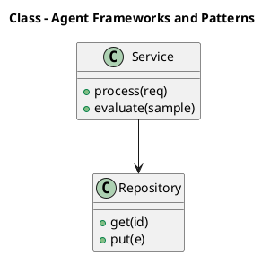

_Source diagram (plantuml); render with the appropriate tool._

**Figure 15. Class - Agent Frameworks and Patterns** (plantuml). Figure: Class view for Agentic AI. This diagram illustrates the principal components and their interactions as discussed in the surrounding section.

## Deep Dive: Mechanics, Variants and Trade-offs

Having established the essentials, we now go deeper into agent frameworks and patterns. Beneath the abstraction lies a concrete process whose steps can each be measured, tested and optimised independently. The distinctions in this section are the ones that separate a working demo from a system that holds up under adversarial inputs, scale and the passage of time.

Consider the principal variants and how to choose between them. Each variant optimises for a different point in the design space - some for latency, some for accuracy, some for cost or operability - and the correct choice follows from explicit requirements rather than from defaults. Every added component buys capability at the price of operational surface area, and that bargain should be made consciously.

In practice this is supported by a mature tooling ecosystem, including LangGraph, AutoGen, CrewAI, OpenAI Agents. Tools accelerate the work but do not substitute for understanding: the same principles apply whichever implementation you select, and the ability to reason from first principles is what lets you debug when a tool behaves unexpectedly.

A frequent source of subtle bugs is the interaction with safety, sandboxing and permissions. Because safety, sandboxing and permissions concerns constraining what agents can do and access, changes there can silently alter the behaviour analysed here. The remedy is contract tests at the boundary and end-to-end evaluations that exercise the interaction explicitly.

Finally, attend to edge cases and degradation. Define what the system should do under partial failure, unexpected inputs and load spikes, and make that behaviour explicit and tested rather than emergent. Graceful degradation - returning a safe, useful result when the ideal one is unavailable - is a hallmark of mature engineering.

For deeper study, the literature offers authoritative treatments such as Yao et al. — ReAct (2022) and Shinn et al. — Reflexion (2023). These primary sources reward careful reading and ground the practical guidance above in established results.

## Advanced Considerations

Having established the essentials, we now go deeper into agent frameworks and patterns. It pays to understand the mechanism rather than treat it as a black box, because most production incidents are explained by one of its steps misbehaving. The distinctions in this section are the ones that separate a working demo from a system that holds up under adversarial inputs, scale and the passage of time.

Consider the principal variants and how to choose between them. Each variant optimises for a different point in the design space - some for latency, some for accuracy, some for cost or operability - and the correct choice follows from explicit requirements rather than from defaults. As with most architectural decisions, the choice is rarely binary; the skill lies in quantifying the trade-offs and choosing deliberately.

In practice this is supported by a mature tooling ecosystem, including LangGraph, AutoGen, CrewAI, OpenAI Agents. Tools accelerate the work but do not substitute for understanding: the same principles apply whichever implementation you select, and the ability to reason from first principles is what lets you debug when a tool behaves unexpectedly.

A frequent source of subtle bugs is the interaction with evaluating agents. Because evaluating agents concerns task success, trajectory quality and robustness benchmarks, changes there can silently alter the behaviour analysed here. The remedy is contract tests at the boundary and end-to-end evaluations that exercise the interaction explicitly.

Finally, attend to edge cases and degradation. Define what the system should do under partial failure, unexpected inputs and load spikes, and make that behaviour explicit and tested rather than emergent. Graceful degradation - returning a safe, useful result when the ideal one is unavailable - is a hallmark of mature engineering.

For deeper study, the literature offers authoritative treatments such as Yao et al. — ReAct (2022) and Shinn et al. — Reflexion (2023). These primary sources reward careful reading and ground the practical guidance above in established results.

## Worked Example

To ground the discussion, walk through a representative example. A operations organisation needs incident triage agents that gather context and act. They decide to apply agent frameworks and patterns as part of their Agentic AI solution, but wisely treat it as a hypothesis to be validated rather than a foregone conclusion.

The team begins by stating the objective precisely and defining how success will be measured before writing any code. They establish a small but representative evaluation set, agree on acceptance thresholds, and only then prototype the simplest design that could work. Early measurement reveals which assumptions hold and which must be revised, saving weeks of misdirected effort and surfacing edge cases while they are still cheap to fix.

As the prototype matures into a service, the team hardens it: adding input validation, error handling, caching where it pays off, and monitoring that ties back to the original success metric. They document each significant decision in an architecture decision record so that future maintainers understand not just what was built but why.

The outcome is instructive. The system that reaches production is not the most sophisticated design the team considered, but the one whose behaviour they could measure, explain and operate. This is the recurring lesson of Agentic AI: durable value comes from the whole system, not from any single clever component.

## Industry Use Cases

Across industries, the ideas in this chapter recur in recognisable ways. The following vignettes show how different sectors apply them and what they have in common.

**Software.** Autonomous coding agents that plan, edit and test. The common thread is that value comes not from the model alone but from the surrounding system - data quality, evaluation, integration and operations - which is precisely where most of the engineering effort belongs.

**Operations.** Incident triage agents that gather context and act. The common thread is that value comes not from the model alone but from the surrounding system - data quality, evaluation, integration and operations - which is precisely where most of the engineering effort belongs.

**Research.** Agents that browse, synthesise and report. The common thread is that value comes not from the model alone but from the surrounding system - data quality, evaluation, integration and operations - which is precisely where most of the engineering effort belongs.

**Back office.** Workflow automation across enterprise systems. The common thread is that value comes not from the model alone but from the surrounding system - data quality, evaluation, integration and operations - which is precisely where most of the engineering effort belongs.

## Best Practices

The following practices consistently separate successful Agentic AI efforts from struggling ones. They are deliberately concrete so they can be adopted as checklist items in design and code review.

- Constrain tools with typed schemas and least-privilege permissions.
- Cap loop steps and cost to prevent runaway behaviour.
- Require human approval for irreversible or high-impact actions.
- Trace every reasoning step and tool call for debugging and audit.

None of these are exotic; they are the unglamorous disciplines that compound into reliability. The cost of adopting them is small compared with the cost of the incidents they prevent, and they become second nature with practice.

## Common Pitfalls

Equally instructive are the failure modes that recur in practice. Each pitfall below has a clear early warning sign and a known remedy, so treat them as a diagnostic checklist when something feels wrong:

- Unbounded loops that burn cost without converging.
- Granting broad tool permissions that enable harmful actions.
- No observability, making failures impossible to diagnose.
- Over-automating tasks that need human judgement.

The pattern is consistent: most failures stem from skipping measurement, conflating prototype and production standards, or deferring cross-cutting concerns such as security and cost until they become emergencies. Naming these traps in advance is the cheapest way to avoid them.

## Governance, Security and Cost Notes

No discussion of agent frameworks and patterns is complete without its governance, security and cost dimensions, which are too often deferred until they become emergencies. Treating them as first-class concerns from the outset is both cheaper and safer.

**Governance.** Classify the risk of this capability, document its intended and out-of-scope uses, and ensure decisions are traceable to satisfy internal policy and external regulation such as the NIST AI RMF, ISO/IEC 42001 and the EU AI Act. **Security.** Treat all external input as untrusted, validate outputs before acting on them, apply least privilege to any tools or data access, and map controls to the OWASP LLM Top 10 and MITRE ATLAS.

**Cost and sustainability.** Establish explicit budgets for compute, tokens and latency, attribute spend to owners, and revisit the economics as usage scales - a design that is affordable at pilot scale can become untenable at production volume. Building these reflexes into everyday engineering is what allows a Agentic AI system to be not only capable but also trustworthy and economically sound.

## Hands-On Exercises

Work through the following exercises. They are designed to move understanding from recognition to application - the level required for real engineering work - so prefer writing and building over merely reading.

1. Explain agent frameworks and patterns to a colleague unfamiliar with Agentic AI, using a concrete example from your own domain.
2. Sketch a reference architecture that incorporates agent frameworks and patterns and annotate where observability, security and cost controls belong.
3. Design an evaluation that would tell you whether agent frameworks and patterns is working in production, including the metric, the dataset and the acceptance threshold.
4. Identify two pitfalls relevant to agent frameworks and patterns in your environment and describe the early warning signals you would monitor.
5. Prototype the simplest implementation that demonstrates agent frameworks and patterns, then list exactly what would need to change to make it production-ready.

## Key Takeaways

Key takeaways from this chapter:

- Agent Frameworks and Patterns is a systems concern in Agentic AI: data, models and operations must be co-designed.
- Measurement is non-negotiable; define success metrics and evaluation before building.
- Favour the simplest design that meets the requirement, and add complexity only when evidence demands it.
- Security, cost and observability are first-class requirements, not afterthoughts.
- Document decisions so the system remains understandable and operable as it evolves.

## Code Walkthrough

Every change to a Agentic AI system should pass an evaluation gate. This example shows the minimal shape: align predictions and references, compute a metric, and return a pass/fail decision for CI.

The full listing is shown below; study it line by line and reproduce it locally before moving on.

### Listing: Evaluating Agent Frameworks and Patterns with a regression gate

```python
from dataclasses import dataclass


@dataclass
class EvalResult:
    metric: str
    score: float
    passed: bool


def evaluate(predictions: list[str], references: list[str],
             threshold: float = 0.8) -> EvalResult:
    """Score Agent Frameworks and Patterns output against references with a simple exact-match metric.

    In practice you would combine several metrics (exact match, semantic
    similarity, LLM-as-judge) and gate releases on the aggregate.
    """
    if len(predictions) != len(references):
        raise ValueError("predictions and references must align")
    hits = sum(p.strip() == r.strip() for p, r in zip(predictions, references))
    score = hits / len(references) if references else 0.0
    return EvalResult(metric="exact_match", score=score, passed=score >= threshold)


if __name__ == "__main__":
    result = evaluate(["yes", "no"], ["yes", "yes"])
    print(f"{result.metric}={result.score:.2f} passed={result.passed}")

```

## Review Questions

1. In the context of Agentic AI, which statement best describes “Agent Frameworks and Patterns”?
   - A. It applies exclusively to image data.
   - B. It removes all security and governance requirements.
   - C. It guarantees deterministic output regardless of input.
   - D. Comparing frameworks and reusable design patterns.
   - **Answer: D.** Agent Frameworks and Patterns: Comparing frameworks and reusable design patterns.
2. Which of the following is a recommended best practice when working with Agentic AI?
   - A. Trace every reasoning step and tool call for debugging and audit.
   - B. Over-automating tasks that need human judgement.
   - C. It is only relevant to academic research, not production.
   - D. It guarantees deterministic output regardless of input.
   - **Answer: A.** Best practice: Trace every reasoning step and tool call for debugging and audit.
3. Which of the following is a common pitfall to avoid in Agentic AI?
   - A. It makes the system slower but has no other effect.
   - B. Over-automating tasks that need human judgement.
   - C. Trace every reasoning step and tool call for debugging and audit.
   - D. Constrain tools with typed schemas and least-privilege permissions.
   - **Answer: B.** Pitfall to avoid: Over-automating tasks that need human judgement.
4. *(Discussion)* Describe a failure mode of Agent Frameworks and Patterns and how you would mitigate it.
   - **Model answer:** A strong answer defines agent frameworks and patterns (Comparing frameworks and reusable design patterns.) then connects it to architecture, evaluation, cost, security and operations for Agentic AI, citing concrete trade-offs and a real-world example.

---


# Chapter 13. Observability for Agents

_This chapter examines observability for agents within Agentic AI. It covers tracing reasoning, tool calls and outcomes, derives a reference architecture, walks through a worked example and runnable code, surveys industry use cases, and distils best practices and pitfalls, closing with exercises and review questions._

## Introduction

At its core, Observability for Agents concerns tracing reasoning, tool calls and outcomes. Neglecting it is one of the most common reasons Agentic AI initiatives stall in production. The right abstraction here pays compounding dividends, because downstream components depend on its guarantees.

This chapter builds intuition first, then formalises the ideas, derives an architecture, and finishes with code, exercises and review questions so the material transfers directly to your own Agentic AI work. Read it actively: pause at each diagram, reproduce the code, and attempt the exercises before consulting the answers.

## Theory and Foundations

At its core, Observability for Agents concerns tracing reasoning, tool calls and outcomes. What distinguishes a production-grade approach from a prototype is the discipline of measurement: every claim is backed by an evaluation rather than intuition. Mechanically, the behaviour emerges from a few interacting parts that are simpler than the whole they produce.

To place this in context, recall the broader picture: Agentic AI systems use language models as reasoning engines that plan, invoke tools, observe results and iterate toward goals with limited human oversight. Within that picture, observability for agents is one of the load-bearing ideas - the kind that, when understood deeply, makes the rest of Agentic AI fall into place. This concept recurs throughout the Agentic AI lifecycle, from design to operations.

Observability for Agents cannot be understood in isolation from reflection and self-correction. Recall that reflection and self-correction concerns critique loops, verification and error recovery. The two interact directly: decisions in one constrain the design space of the other, which is why mature teams reason about them together rather than sequentially. There is an inherent trade-off between fidelity and cost, and the correct balance depends on the use case and its tolerance for error.

Observability for Agents cannot be understood in isolation from human-in-the-loop and approvals. Recall that human-in-the-loop and approvals concerns confirmation gates for high-impact actions. The two interact directly: decisions in one constrain the design space of the other, which is why mature teams reason about them together rather than sequentially. Every added component buys capability at the price of operational surface area, and that bargain should be made consciously.

Several established patterns apply directly to observability for agents. The first, reflection loop to critique and revise outputs, is widely adopted because it makes the system's behaviour predictable and observable. A complementary pattern, approval gate before irreversible actions, addresses a related concern and is often deployed alongside it. Patterns are not dogma; they are distilled experience that shortcuts the search for a sound design, and each carries assumptions worth checking against your context.

Knowing when not to use a technique is as valuable as knowing how to use it. In a small prototype, shortcuts around observability for agents are invisible; in a production Agentic AI system serving real traffic, they surface as incidents, cost overruns or compliance gaps. Simplicity is a feature. The simplest design that meets the requirement should be the default, with complexity added only when measurement justifies it. The remainder of this chapter turns these principles into an architecture, code and a checklist you can apply immediately.

## Architecture and Design

From an architectural standpoint, Observability for Agents sits at the intersection of data, models and operations. An agent runtime hosts a reasoning model, a tool registry with typed schemas, a memory store (short-term context plus long-term vector memory), and a controller enforcing step budgets, permissions and human approvals. Every step is traced for observability and replay.

Concretely, the principal building blocks include from chatbots to agents, the agent loop: reason, act, observe, planning and task decomposition, tool use and function calling and memory architectures. Each is a replaceable component behind a stable interface, so the team can upgrade an implementation - a model, an index, a policy engine - without rewriting its neighbours. The contracts between components are where reliability is won or lost, so they are specified explicitly and tested in isolation.

The diagram accompanying this section makes the data and control flow explicit. Requests enter through a well-defined boundary where they are authenticated and validated; only then are they dispatched to the components that perform the work. This boundary is also where rate limiting, quota enforcement and audit logging live, keeping cross-cutting concerns out of the core logic and in one auditable place.

Two qualities deserve emphasis. First, observability is designed in, not bolted on: every component emits structured telemetry so that failures can be localised in minutes rather than hours. Second, the architecture is evolvable - components communicate through stable contracts so that any single part of the Agentic AI system can be replaced without a rewrite. Simplicity is a feature. The simplest design that meets the requirement should be the default, with complexity added only when measurement justifies it.

<div class="diagram-svg">

<svg xmlns="http://www.w3.org/2000/svg" width="840" height="460" data-tpl="tree" data-pal="11-2" viewBox="0 0 840 460" font-family="Inter, Segoe UI, Arial, sans-serif"><defs><marker id="ar" markerWidth="9" markerHeight="9" refX="7" refY="3" orient="auto"><path d="M0,0 L7,3 L0,6 z" fill="#94a3b8"/></marker><marker id="arw" markerWidth="9" markerHeight="9" refX="7" refY="3" orient="auto"><path d="M0,0 L7,3 L0,6 z" fill="#ffffff"/></marker><filter id="sh" x="-20%" y="-20%" width="140%" height="140%"><feDropShadow dx="0" dy="2" stdDeviation="3" flood-color="#0f172a" flood-opacity="0.16"/></filter></defs><defs><linearGradient id="bn2a0c45" x1="0" y1="0" x2="1" y2="0"><stop offset="0" stop-color="#0e7490"/><stop offset="1" stop-color="#b45309"/></linearGradient></defs><rect width="840" height="460" rx="14" fill="#ffffff"/><rect x="0" y="0" width="840" height="48" rx="14" fill="url(#bn2a0c45)"/><rect x="0" y="32" width="840" height="16" fill="url(#bn2a0c45)"/><text x="420" y="25" text-anchor="middle" font-size="14.5" font-weight="700" fill="#ffffff" dominant-baseline="middle">Data Lineage - Observability for Agents</text><rect x="330" y="70" width="180" height="48" rx="11" fill="#0f172a" filter="url(#sh)"/><text x="420" y="94" text-anchor="middle" font-size="12" font-weight="600" fill="#ffffff" dominant-baseline="middle">Agentic AI</text><path d="M420,118 C420,170 108,160 108,210" fill="none" stroke="#cbd5e1" stroke-width="2"/><rect x="30" y="210" width="156" height="46" rx="11" fill="#0e7490" filter="url(#sh)"/><text x="108" y="228" text-anchor="middle" font-size="9.5" font-weight="600" fill="#ffffff" dominant-baseline="middle">The Agent Loop: Reason, Act,</text><text x="108" y="238" text-anchor="middle" font-size="9.5" font-weight="600" fill="#ffffff" dominant-baseline="middle">Observe</text><line x1="108" y1="256" x2="108" y2="296" stroke="#cbd5e1" stroke-width="1.6"/><rect x="38" y="296" width="140" height="40" rx="11" fill="#f8fafc" filter="url(#sh)"/><text x="108" y="311" text-anchor="middle" font-size="8.5" font-weight="600" fill="#0f172a" dominant-baseline="middle">Planning and Task</text><text x="108" y="321" text-anchor="middle" font-size="8.5" font-weight="600" fill="#0f172a" dominant-baseline="middle">Decomposition</text><path d="M420,118 C420,170 316,160 316,210" fill="none" stroke="#cbd5e1" stroke-width="2"/><rect x="238" y="210" width="156" height="46" rx="11" fill="#b45309" filter="url(#sh)"/><text x="316" y="228" text-anchor="middle" font-size="9.5" font-weight="600" fill="#ffffff" dominant-baseline="middle">Planning and Task</text><text x="316" y="238" text-anchor="middle" font-size="9.5" font-weight="600" fill="#ffffff" dominant-baseline="middle">Decomposition</text><line x1="316" y1="256" x2="316" y2="296" stroke="#cbd5e1" stroke-width="1.6"/><rect x="246" y="296" width="140" height="40" rx="11" fill="#f8fafc" filter="url(#sh)"/><text x="316" y="311" text-anchor="middle" font-size="8.5" font-weight="600" fill="#0f172a" dominant-baseline="middle">The Agentic Reference</text><text x="316" y="321" text-anchor="middle" font-size="8.5" font-weight="600" fill="#0f172a" dominant-baseline="middle">Architecture</text><path d="M420,118 C420,170 524,160 524,210" fill="none" stroke="#cbd5e1" stroke-width="2"/><rect x="446" y="210" width="156" height="46" rx="11" fill="#9f1239" filter="url(#sh)"/><text x="524" y="228" text-anchor="middle" font-size="9.5" font-weight="600" fill="#ffffff" dominant-baseline="middle">Tool Use and Function</text><text x="524" y="238" text-anchor="middle" font-size="9.5" font-weight="600" fill="#ffffff" dominant-baseline="middle">Calling</text><line x1="524" y1="256" x2="524" y2="296" stroke="#cbd5e1" stroke-width="1.6"/><rect x="454" y="296" width="140" height="40" rx="11" fill="#f8fafc" filter="url(#sh)"/><text x="524" y="311" text-anchor="middle" font-size="8.5" font-weight="600" fill="#0f172a" dominant-baseline="middle">Agent Frameworks and</text><text x="524" y="321" text-anchor="middle" font-size="8.5" font-weight="600" fill="#0f172a" dominant-baseline="middle">Patterns</text><path d="M420,118 C420,170 732,160 732,210" fill="none" stroke="#cbd5e1" stroke-width="2"/><rect x="654" y="210" width="156" height="46" rx="11" fill="#4338ca" filter="url(#sh)"/><text x="732" y="233" text-anchor="middle" font-size="11" font-weight="600" fill="#ffffff" dominant-baseline="middle">Memory Architectures</text><line x1="732" y1="256" x2="732" y2="296" stroke="#cbd5e1" stroke-width="1.6"/><rect x="662" y="296" width="140" height="40" rx="11" fill="#f8fafc" filter="url(#sh)"/><text x="732" y="316" text-anchor="middle" font-size="10" font-weight="600" fill="#0f172a" dominant-baseline="middle">Memory Architectures</text><text x="28" y="446" text-anchor="start" font-size="9.5" font-weight="500" fill="#64748b" dominant-baseline="middle">Agentic AI  •  Data Lineage</text></svg>

</div>

**Figure 16. Data Lineage - Observability for Agents** (svg). Figure: Data Lineage view for Agentic AI. This diagram illustrates the principal components and their interactions as discussed in the surrounding section.

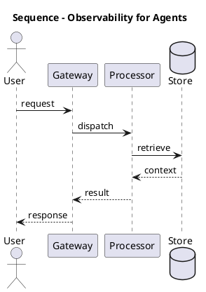

_Source diagram (plantuml); render with the appropriate tool._

**Figure 17. Sequence - Observability for Agents** (plantuml). Figure: Sequence view for Agentic AI. This diagram illustrates the principal components and their interactions as discussed in the surrounding section.

## Deep Dive: Mechanics, Variants and Trade-offs

Having established the essentials, we now go deeper into observability for agents. The underlying mechanism is best appreciated by tracing a single request from input to output and noting where state is created and consumed. The distinctions in this section are the ones that separate a working demo from a system that holds up under adversarial inputs, scale and the passage of time.

Consider the principal variants and how to choose between them. Each variant optimises for a different point in the design space - some for latency, some for accuracy, some for cost or operability - and the correct choice follows from explicit requirements rather than from defaults. Simplicity is a feature. The simplest design that meets the requirement should be the default, with complexity added only when measurement justifies it.

In practice this is supported by a mature tooling ecosystem, including LangGraph, AutoGen, CrewAI, OpenAI Agents. Tools accelerate the work but do not substitute for understanding: the same principles apply whichever implementation you select, and the ability to reason from first principles is what lets you debug when a tool behaves unexpectedly.

A frequent source of subtle bugs is the interaction with reflection and self-correction. Because reflection and self-correction concerns critique loops, verification and error recovery, changes there can silently alter the behaviour analysed here. The remedy is contract tests at the boundary and end-to-end evaluations that exercise the interaction explicitly.

Finally, attend to edge cases and degradation. Define what the system should do under partial failure, unexpected inputs and load spikes, and make that behaviour explicit and tested rather than emergent. Graceful degradation - returning a safe, useful result when the ideal one is unavailable - is a hallmark of mature engineering.

For deeper study, the literature offers authoritative treatments such as Yao et al. — ReAct (2022) and Shinn et al. — Reflexion (2023). These primary sources reward careful reading and ground the practical guidance above in established results.

## Advanced Considerations

Having established the essentials, we now go deeper into observability for agents. Beneath the abstraction lies a concrete process whose steps can each be measured, tested and optimised independently. The distinctions in this section are the ones that separate a working demo from a system that holds up under adversarial inputs, scale and the passage of time.

Consider the principal variants and how to choose between them. Each variant optimises for a different point in the design space - some for latency, some for accuracy, some for cost or operability - and the correct choice follows from explicit requirements rather than from defaults. Every added component buys capability at the price of operational surface area, and that bargain should be made consciously.

In practice this is supported by a mature tooling ecosystem, including LangGraph, AutoGen, CrewAI, OpenAI Agents. Tools accelerate the work but do not substitute for understanding: the same principles apply whichever implementation you select, and the ability to reason from first principles is what lets you debug when a tool behaves unexpectedly.

A frequent source of subtle bugs is the interaction with reflection and self-correction. Because reflection and self-correction concerns critique loops, verification and error recovery, changes there can silently alter the behaviour analysed here. The remedy is contract tests at the boundary and end-to-end evaluations that exercise the interaction explicitly.

Finally, attend to edge cases and degradation. Define what the system should do under partial failure, unexpected inputs and load spikes, and make that behaviour explicit and tested rather than emergent. Graceful degradation - returning a safe, useful result when the ideal one is unavailable - is a hallmark of mature engineering.

For deeper study, the literature offers authoritative treatments such as Yao et al. — ReAct (2022) and Shinn et al. — Reflexion (2023). These primary sources reward careful reading and ground the practical guidance above in established results.

## Worked Example

Consider a concrete scenario. A operations organisation needs incident triage agents that gather context and act. They decide to apply observability for agents as part of their Agentic AI solution, but wisely treat it as a hypothesis to be validated rather than a foregone conclusion.

The team begins by stating the objective precisely and defining how success will be measured before writing any code. They establish a small but representative evaluation set, agree on acceptance thresholds, and only then prototype the simplest design that could work. Early measurement reveals which assumptions hold and which must be revised, saving weeks of misdirected effort and surfacing edge cases while they are still cheap to fix.

As the prototype matures into a service, the team hardens it: adding input validation, error handling, caching where it pays off, and monitoring that ties back to the original success metric. They document each significant decision in an architecture decision record so that future maintainers understand not just what was built but why.

The outcome is instructive. The system that reaches production is not the most sophisticated design the team considered, but the one whose behaviour they could measure, explain and operate. This is the recurring lesson of Agentic AI: durable value comes from the whole system, not from any single clever component.

## Industry Use Cases

Across industries, the ideas in this chapter recur in recognisable ways. The following vignettes show how different sectors apply them and what they have in common.

**Software.** Autonomous coding agents that plan, edit and test. The common thread is that value comes not from the model alone but from the surrounding system - data quality, evaluation, integration and operations - which is precisely where most of the engineering effort belongs.

**Operations.** Incident triage agents that gather context and act. The common thread is that value comes not from the model alone but from the surrounding system - data quality, evaluation, integration and operations - which is precisely where most of the engineering effort belongs.

**Research.** Agents that browse, synthesise and report. The common thread is that value comes not from the model alone but from the surrounding system - data quality, evaluation, integration and operations - which is precisely where most of the engineering effort belongs.

**Back office.** Workflow automation across enterprise systems. The common thread is that value comes not from the model alone but from the surrounding system - data quality, evaluation, integration and operations - which is precisely where most of the engineering effort belongs.

## Best Practices

The following practices consistently separate successful Agentic AI efforts from struggling ones. They are deliberately concrete so they can be adopted as checklist items in design and code review.

- Constrain tools with typed schemas and least-privilege permissions.
- Cap loop steps and cost to prevent runaway behaviour.
- Require human approval for irreversible or high-impact actions.
- Trace every reasoning step and tool call for debugging and audit.

None of these are exotic; they are the unglamorous disciplines that compound into reliability. The cost of adopting them is small compared with the cost of the incidents they prevent, and they become second nature with practice.

## Common Pitfalls

Equally instructive are the failure modes that recur in practice. Each pitfall below has a clear early warning sign and a known remedy, so treat them as a diagnostic checklist when something feels wrong:

- Unbounded loops that burn cost without converging.
- Granting broad tool permissions that enable harmful actions.
- No observability, making failures impossible to diagnose.
- Over-automating tasks that need human judgement.

The pattern is consistent: most failures stem from skipping measurement, conflating prototype and production standards, or deferring cross-cutting concerns such as security and cost until they become emergencies. Naming these traps in advance is the cheapest way to avoid them.

## Governance, Security and Cost Notes

No discussion of observability for agents is complete without its governance, security and cost dimensions, which are too often deferred until they become emergencies. Treating them as first-class concerns from the outset is both cheaper and safer.

**Governance.** Classify the risk of this capability, document its intended and out-of-scope uses, and ensure decisions are traceable to satisfy internal policy and external regulation such as the NIST AI RMF, ISO/IEC 42001 and the EU AI Act. **Security.** Treat all external input as untrusted, validate outputs before acting on them, apply least privilege to any tools or data access, and map controls to the OWASP LLM Top 10 and MITRE ATLAS.

**Cost and sustainability.** Establish explicit budgets for compute, tokens and latency, attribute spend to owners, and revisit the economics as usage scales - a design that is affordable at pilot scale can become untenable at production volume. Building these reflexes into everyday engineering is what allows a Agentic AI system to be not only capable but also trustworthy and economically sound.

## Hands-On Exercises

Work through the following exercises. They are designed to move understanding from recognition to application - the level required for real engineering work - so prefer writing and building over merely reading.

1. Explain observability for agents to a colleague unfamiliar with Agentic AI, using a concrete example from your own domain.
2. Sketch a reference architecture that incorporates observability for agents and annotate where observability, security and cost controls belong.
3. Design an evaluation that would tell you whether observability for agents is working in production, including the metric, the dataset and the acceptance threshold.
4. Identify two pitfalls relevant to observability for agents in your environment and describe the early warning signals you would monitor.
5. Prototype the simplest implementation that demonstrates observability for agents, then list exactly what would need to change to make it production-ready.

## Key Takeaways

Key takeaways from this chapter:

- Observability for Agents is a systems concern in Agentic AI: data, models and operations must be co-designed.
- Measurement is non-negotiable; define success metrics and evaluation before building.
- Favour the simplest design that meets the requirement, and add complexity only when evidence demands it.
- Security, cost and observability are first-class requirements, not afterthoughts.
- Document decisions so the system remains understandable and operable as it evolves.

## Code Walkthrough

Pipelines keep Observability for Agents logic modular and testable. Each stage is a pure function, errors are captured per item, and the composition is trivial to extend or reorder.

The full listing is shown below; study it line by line and reproduce it locally before moving on.

### Listing: A composable processing pipeline for Observability for Agents

```python
from collections.abc import Iterable, Iterator
from typing import Protocol


class Stage(Protocol):
    def __call__(self, item: dict) -> dict: ...


def pipeline(stages: list[Stage]) -> Stage:
    """Compose ordered stages into a single callable for Observability for Agents."""

    def run(item: dict) -> dict:
        for stage in stages:
            item = stage(item)
        return item

    return run


def validate(item: dict) -> dict:
    if "text" not in item:
        raise ValueError("missing required field: text")
    return item


def normalise(item: dict) -> dict:
    item["text"] = item["text"].strip().lower()
    return item


def enrich(item: dict) -> dict:
    item["length"] = len(item["text"])
    return item


process = pipeline([validate, normalise, enrich])


def run_batch(items: Iterable[dict]) -> Iterator[dict]:
    for item in items:
        try:
            yield process(dict(item))
        except ValueError as exc:
            yield {"error": str(exc), "item": item}

```

## Review Questions

1. In the context of Agentic AI, which statement best describes “Observability for Agents”?
   - A. It removes all security and governance requirements.
   - B. Tracing reasoning, tool calls and outcomes.
   - C. It is only relevant to academic research, not production.
   - D. It makes the system slower but has no other effect.
   - **Answer: B.** Observability for Agents: Tracing reasoning, tool calls and outcomes.
2. Which of the following is a recommended best practice when working with Agentic AI?
   - A. It is only relevant to academic research, not production.
   - B. Over-automating tasks that need human judgement.
   - C. No observability, making failures impossible to diagnose.
   - D. Require human approval for irreversible or high-impact actions.
   - **Answer: D.** Best practice: Require human approval for irreversible or high-impact actions.
3. Which of the following is a common pitfall to avoid in Agentic AI?
   - A. Unbounded loops that burn cost without converging.
   - B. It applies exclusively to image data.
   - C. It removes all security and governance requirements.
   - D. Constrain tools with typed schemas and least-privilege permissions.
   - **Answer: A.** Pitfall to avoid: Unbounded loops that burn cost without converging.
4. *(Discussion)* Walk through how you would design Observability for Agents for an enterprise Agentic AI workload.
   - **Model answer:** A strong answer defines observability for agents (Tracing reasoning, tool calls and outcomes.) then connects it to architecture, evaluation, cost, security and operations for Agentic AI, citing concrete trade-offs and a real-world example.

---


# Chapter 14. The Agentic Reference Architecture

_This chapter examines the agentic reference architecture within Agentic AI. It covers orchestrator, tools, memory and guardrails as a platform, derives a reference architecture, walks through a worked example and runnable code, surveys industry use cases, and distils best practices and pitfalls, closing with exercises and review questions._

## Introduction

The Agentic Reference Architecture can be characterised as orchestrator, tools, memory and guardrails as a platform. It is foundational: later capabilities in Agentic AI are built directly on top of it. The practical implication is that design choices here ripple through latency, cost and maintainability for the lifetime of the system.

This chapter builds intuition first, then formalises the ideas, derives an architecture, and finishes with code, exercises and review questions so the material transfers directly to your own Agentic AI work. Read it actively: pause at each diagram, reproduce the code, and attempt the exercises before consulting the answers.

## Theory and Foundations

In practical terms, The Agentic Reference Architecture is best understood as orchestrator, tools, memory and guardrails as a platform. The practical implication is that design choices here ripple through latency, cost and maintainability for the lifetime of the system. It pays to understand the mechanism rather than treat it as a black box, because most production incidents are explained by one of its steps misbehaving.

To place this in context, recall the broader picture: Agentic AI systems use language models as reasoning engines that plan, invoke tools, observe results and iterate toward goals with limited human oversight. Within that picture, the agentic reference architecture is one of the load-bearing ideas - the kind that, when understood deeply, makes the rest of Agentic AI fall into place. Teams that master this consistently ship more reliable Agentic AI systems at lower cost.

The Agentic Reference Architecture cannot be understood in isolation from tool use and function calling. Recall that tool use and function calling concerns defining, selecting and safely invoking tools and APIs. The two interact directly: decisions in one constrain the design space of the other, which is why mature teams reason about them together rather than sequentially. Simplicity is a feature. The simplest design that meets the requirement should be the default, with complexity added only when measurement justifies it.

The Agentic Reference Architecture cannot be understood in isolation from reflection and self-correction. Recall that reflection and self-correction concerns critique loops, verification and error recovery. The two interact directly: decisions in one constrain the design space of the other, which is why mature teams reason about them together rather than sequentially. Every added component buys capability at the price of operational surface area, and that bargain should be made consciously.

Several established patterns apply directly to the agentic reference architecture. The first, approval gate before irreversible actions, is widely adopted because it makes the system's behaviour predictable and observable. A complementary pattern, plan-and-execute with a separate planner and executor, addresses a related concern and is often deployed alongside it. Patterns are not dogma; they are distilled experience that shortcuts the search for a sound design, and each carries assumptions worth checking against your context.

Knowing when not to use a technique is as valuable as knowing how to use it. In a small prototype, shortcuts around the agentic reference architecture are invisible; in a production Agentic AI system serving real traffic, they surface as incidents, cost overruns or compliance gaps. Every added component buys capability at the price of operational surface area, and that bargain should be made consciously. The remainder of this chapter turns these principles into an architecture, code and a checklist you can apply immediately.

## Architecture and Design

The reference architecture for The Agentic Reference Architecture separates concerns into clearly bounded components with explicit contracts. An agent runtime hosts a reasoning model, a tool registry with typed schemas, a memory store (short-term context plus long-term vector memory), and a controller enforcing step budgets, permissions and human approvals. Every step is traced for observability and replay.

Concretely, the principal building blocks include from chatbots to agents, the agent loop: reason, act, observe, planning and task decomposition, tool use and function calling and memory architectures. Each is a replaceable component behind a stable interface, so the team can upgrade an implementation - a model, an index, a policy engine - without rewriting its neighbours. The contracts between components are where reliability is won or lost, so they are specified explicitly and tested in isolation.

The diagram accompanying this section makes the data and control flow explicit. Requests enter through a well-defined boundary where they are authenticated and validated; only then are they dispatched to the components that perform the work. This boundary is also where rate limiting, quota enforcement and audit logging live, keeping cross-cutting concerns out of the core logic and in one auditable place.

Two qualities deserve emphasis. First, observability is designed in, not bolted on: every component emits structured telemetry so that failures can be localised in minutes rather than hours. Second, the architecture is evolvable - components communicate through stable contracts so that any single part of the Agentic AI system can be replaced without a rewrite. Simplicity is a feature. The simplest design that meets the requirement should be the default, with complexity added only when measurement justifies it.

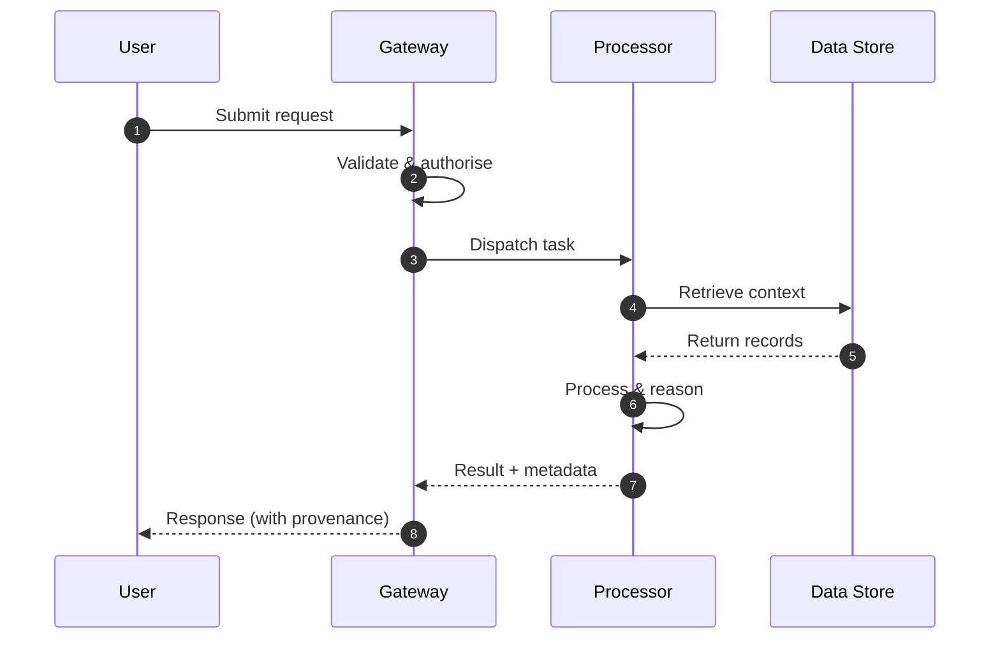

**Figure 18. Sequence - The Agentic Reference Architecture** (mermaid). Figure: Sequence view for Agentic AI. This diagram illustrates the principal components and their interactions as discussed in the surrounding section.

```xml
<mxfile host="ai-university">
  <diagram name="Deployment">
    <mxGraphModel dx="800" dy="600" grid="1" gridSize="10">
      <root>
        <mxCell id="0"/>
        <mxCell id="1" parent="0"/>
        <mxCell id="title" value="Deployment - The Agentic Reference Architecture" style="text;fontSize=16;fontStyle=1" vertex="1" parent="1"><mxGeometry x="40" y="20" width="600" height="30" as="geometry"/></mxCell>
        <mxCell id="hub" value="Agentic AI" style="rounded=1;fillColor=#0f172a;fontColor=#ffffff;fontStyle=1" vertex="1" parent="1"><mxGeometry x="300" y="180" width="160" height="60" as="geometry"/></mxCell>
        <mxCell id="n0" value="From Chatbots to Agents" style="rounded=1;fillColor=#e0e7ff;strokeColor=#4338ca" vertex="1" parent="1"><mxGeometry x="60" y="80" width="160" height="50" as="geometry"/></mxCell>
        <mxCell id="e0" style="edgeStyle=orthogonalEdgeStyle" edge="1" parent="1" source="hub" target="n0"><mxGeometry relative="1" as="geometry"/></mxCell>
        <mxCell id="n1" value="The Agent Loop: Reason,…" style="rounded=1;fillColor=#e0e7ff;strokeColor=#4338ca" vertex="1" parent="1"><mxGeometry x="600" y="170" width="160" height="50" as="geometry"/></mxCell>
        <mxCell id="e1" style="edgeStyle=orthogonalEdgeStyle" edge="1" parent="1" source="hub" target="n1"><mxGeometry relative="1" as="geometry"/></mxCell>
        <mxCell id="n2" value="Planning and Task Decom…" style="rounded=1;fillColor=#e0e7ff;strokeColor=#4338ca" vertex="1" parent="1"><mxGeometry x="60" y="260" width="160" height="50" as="geometry"/></mxCell>
        <mxCell id="e2" style="edgeStyle=orthogonalEdgeStyle" edge="1" parent="1" source="hub" target="n2"><mxGeometry relative="1" as="geometry"/></mxCell>
        <mxCell id="n3" value="Tool Use and Function C…" style="rounded=1;fillColor=#e0e7ff;strokeColor=#4338ca" vertex="1" parent="1"><mxGeometry x="600" y="350" width="160" height="50" as="geometry"/></mxCell>
        <mxCell id="e3" style="edgeStyle=orthogonalEdgeStyle" edge="1" parent="1" source="hub" target="n3"><mxGeometry relative="1" as="geometry"/></mxCell>
        <mxCell id="n4" value="Memory Architectures" style="rounded=1;fillColor=#e0e7ff;strokeColor=#4338ca" vertex="1" parent="1"><mxGeometry x="60" y="440" width="160" height="50" as="geometry"/></mxCell>
        <mxCell id="e4" style="edgeStyle=orthogonalEdgeStyle" edge="1" parent="1" source="hub" target="n4"><mxGeometry relative="1" as="geometry"/></mxCell>
      </root>
    </mxGraphModel>
  </diagram>
</mxfile>
```

_Source diagram (drawio); render with the appropriate tool._

**Figure 19. Deployment - The Agentic Reference Architecture** (drawio). Figure: Deployment view for Agentic AI. This diagram illustrates the principal components and their interactions as discussed in the surrounding section.

## Deep Dive: Mechanics, Variants and Trade-offs

Having established the essentials, we now go deeper into the agentic reference architecture. Mechanically, the behaviour emerges from a few interacting parts that are simpler than the whole they produce. The distinctions in this section are the ones that separate a working demo from a system that holds up under adversarial inputs, scale and the passage of time.

Consider the principal variants and how to choose between them. Each variant optimises for a different point in the design space - some for latency, some for accuracy, some for cost or operability - and the correct choice follows from explicit requirements rather than from defaults. Every added component buys capability at the price of operational surface area, and that bargain should be made consciously.

In practice this is supported by a mature tooling ecosystem, including LangGraph, AutoGen, CrewAI, OpenAI Agents. Tools accelerate the work but do not substitute for understanding: the same principles apply whichever implementation you select, and the ability to reason from first principles is what lets you debug when a tool behaves unexpectedly.

A frequent source of subtle bugs is the interaction with tool use and function calling. Because tool use and function calling concerns defining, selecting and safely invoking tools and APIs, changes there can silently alter the behaviour analysed here. The remedy is contract tests at the boundary and end-to-end evaluations that exercise the interaction explicitly.

Finally, attend to edge cases and degradation. Define what the system should do under partial failure, unexpected inputs and load spikes, and make that behaviour explicit and tested rather than emergent. Graceful degradation - returning a safe, useful result when the ideal one is unavailable - is a hallmark of mature engineering.

For deeper study, the literature offers authoritative treatments such as Yao et al. — ReAct (2022) and Shinn et al. — Reflexion (2023). These primary sources reward careful reading and ground the practical guidance above in established results.

## Advanced Considerations

Having established the essentials, we now go deeper into the agentic reference architecture. Mechanically, the behaviour emerges from a few interacting parts that are simpler than the whole they produce. The distinctions in this section are the ones that separate a working demo from a system that holds up under adversarial inputs, scale and the passage of time.

Consider the principal variants and how to choose between them. Each variant optimises for a different point in the design space - some for latency, some for accuracy, some for cost or operability - and the correct choice follows from explicit requirements rather than from defaults. There is an inherent trade-off between fidelity and cost, and the correct balance depends on the use case and its tolerance for error.

In practice this is supported by a mature tooling ecosystem, including LangGraph, AutoGen, CrewAI, OpenAI Agents. Tools accelerate the work but do not substitute for understanding: the same principles apply whichever implementation you select, and the ability to reason from first principles is what lets you debug when a tool behaves unexpectedly.

A frequent source of subtle bugs is the interaction with evaluating agents. Because evaluating agents concerns task success, trajectory quality and robustness benchmarks, changes there can silently alter the behaviour analysed here. The remedy is contract tests at the boundary and end-to-end evaluations that exercise the interaction explicitly.

Finally, attend to edge cases and degradation. Define what the system should do under partial failure, unexpected inputs and load spikes, and make that behaviour explicit and tested rather than emergent. Graceful degradation - returning a safe, useful result when the ideal one is unavailable - is a hallmark of mature engineering.

For deeper study, the literature offers authoritative treatments such as Yao et al. — ReAct (2022) and Shinn et al. — Reflexion (2023). These primary sources reward careful reading and ground the practical guidance above in established results.

## Worked Example

A worked example clarifies how these ideas behave in practice. A software organisation needs autonomous coding agents that plan, edit and test. They decide to apply the agentic reference architecture as part of their Agentic AI solution, but wisely treat it as a hypothesis to be validated rather than a foregone conclusion.

The team begins by stating the objective precisely and defining how success will be measured before writing any code. They establish a small but representative evaluation set, agree on acceptance thresholds, and only then prototype the simplest design that could work. Early measurement reveals which assumptions hold and which must be revised, saving weeks of misdirected effort and surfacing edge cases while they are still cheap to fix.

As the prototype matures into a service, the team hardens it: adding input validation, error handling, caching where it pays off, and monitoring that ties back to the original success metric. They document each significant decision in an architecture decision record so that future maintainers understand not just what was built but why.

The outcome is instructive. The system that reaches production is not the most sophisticated design the team considered, but the one whose behaviour they could measure, explain and operate. This is the recurring lesson of Agentic AI: durable value comes from the whole system, not from any single clever component.

## Industry Use Cases

Across industries, the ideas in this chapter recur in recognisable ways. The following vignettes show how different sectors apply them and what they have in common.

**Software.** Autonomous coding agents that plan, edit and test. The common thread is that value comes not from the model alone but from the surrounding system - data quality, evaluation, integration and operations - which is precisely where most of the engineering effort belongs.

**Operations.** Incident triage agents that gather context and act. The common thread is that value comes not from the model alone but from the surrounding system - data quality, evaluation, integration and operations - which is precisely where most of the engineering effort belongs.

**Research.** Agents that browse, synthesise and report. The common thread is that value comes not from the model alone but from the surrounding system - data quality, evaluation, integration and operations - which is precisely where most of the engineering effort belongs.

**Back office.** Workflow automation across enterprise systems. The common thread is that value comes not from the model alone but from the surrounding system - data quality, evaluation, integration and operations - which is precisely where most of the engineering effort belongs.

## Best Practices

The following practices consistently separate successful Agentic AI efforts from struggling ones. They are deliberately concrete so they can be adopted as checklist items in design and code review.

- Constrain tools with typed schemas and least-privilege permissions.
- Cap loop steps and cost to prevent runaway behaviour.
- Require human approval for irreversible or high-impact actions.
- Trace every reasoning step and tool call for debugging and audit.

None of these are exotic; they are the unglamorous disciplines that compound into reliability. The cost of adopting them is small compared with the cost of the incidents they prevent, and they become second nature with practice.

## Common Pitfalls

Equally instructive are the failure modes that recur in practice. Each pitfall below has a clear early warning sign and a known remedy, so treat them as a diagnostic checklist when something feels wrong:

- Unbounded loops that burn cost without converging.
- Granting broad tool permissions that enable harmful actions.
- No observability, making failures impossible to diagnose.
- Over-automating tasks that need human judgement.

The pattern is consistent: most failures stem from skipping measurement, conflating prototype and production standards, or deferring cross-cutting concerns such as security and cost until they become emergencies. Naming these traps in advance is the cheapest way to avoid them.

## Governance, Security and Cost Notes

No discussion of the agentic reference architecture is complete without its governance, security and cost dimensions, which are too often deferred until they become emergencies. Treating them as first-class concerns from the outset is both cheaper and safer.

**Governance.** Classify the risk of this capability, document its intended and out-of-scope uses, and ensure decisions are traceable to satisfy internal policy and external regulation such as the NIST AI RMF, ISO/IEC 42001 and the EU AI Act. **Security.** Treat all external input as untrusted, validate outputs before acting on them, apply least privilege to any tools or data access, and map controls to the OWASP LLM Top 10 and MITRE ATLAS.

**Cost and sustainability.** Establish explicit budgets for compute, tokens and latency, attribute spend to owners, and revisit the economics as usage scales - a design that is affordable at pilot scale can become untenable at production volume. Building these reflexes into everyday engineering is what allows a Agentic AI system to be not only capable but also trustworthy and economically sound.

## Hands-On Exercises

Work through the following exercises. They are designed to move understanding from recognition to application - the level required for real engineering work - so prefer writing and building over merely reading.

1. Explain the agentic reference architecture to a colleague unfamiliar with Agentic AI, using a concrete example from your own domain.
2. Sketch a reference architecture that incorporates the agentic reference architecture and annotate where observability, security and cost controls belong.
3. Design an evaluation that would tell you whether the agentic reference architecture is working in production, including the metric, the dataset and the acceptance threshold.
4. Identify two pitfalls relevant to the agentic reference architecture in your environment and describe the early warning signals you would monitor.
5. Prototype the simplest implementation that demonstrates the agentic reference architecture, then list exactly what would need to change to make it production-ready.

## Key Takeaways

Key takeaways from this chapter:

- The Agentic Reference Architecture is a systems concern in Agentic AI: data, models and operations must be co-designed.
- Measurement is non-negotiable; define success metrics and evaluation before building.
- Favour the simplest design that meets the requirement, and add complexity only when evidence demands it.
- Security, cost and observability are first-class requirements, not afterthoughts.
- Document decisions so the system remains understandable and operable as it evolves.

## Code Walkthrough

This listing shows a configuration-driven The Agentic Reference Architecture component with retry semantics and typed interfaces — the shape we expect from production Agentic AI code rather than a notebook prototype.

The full listing is shown below; study it line by line and reproduce it locally before moving on.

### Listing: Implementing a The Agentic Reference Architecture component

```python
from __future__ import annotations

from dataclasses import dataclass, field
from typing import Any


@dataclass(slots=True)
class TheAgenticReferenceConfig:
    """Configuration for the The Agentic Reference Architecture component in a Agentic AI system."""

    name: str
    timeout_s: float = 30.0
    max_retries: int = 3
    options: dict[str, Any] = field(default_factory=dict)


class TheAgenticReference:
    """A minimal, production-shaped implementation of The Agentic Reference Architecture."""

    def __init__(self, config: TheAgenticReferenceConfig) -> None:
        self._config = config
        self._calls = 0

    def run(self, payload: dict[str, Any]) -> dict[str, Any]:
        """Process a request, retrying transient failures with backoff."""
        last_error: Exception | None = None
        for attempt in range(self._config.max_retries):
            try:
                self._calls += 1
                return self._process(payload)
            except TimeoutError as exc:  # transient
                last_error = exc
                continue
        raise RuntimeError(f"TheAgenticReference failed after retries") from last_error

    def _process(self, payload: dict[str, Any]) -> dict[str, Any]:
        # Domain-specific logic for The Agentic Reference Architecture goes here.
        return {"status": "ok", "input_keys": sorted(payload), "calls": self._calls}

```

## Review Questions

1. In the context of Agentic AI, which statement best describes “The Agentic Reference Architecture”?
   - A. Orchestrator, tools, memory and guardrails as a platform.
   - B. It is only relevant to academic research, not production.
   - C. It applies exclusively to image data.
   - D. It guarantees deterministic output regardless of input.
   - **Answer: A.** The Agentic Reference Architecture: Orchestrator, tools, memory and guardrails as a platform.
2. Which of the following is a recommended best practice when working with Agentic AI?
   - A. Granting broad tool permissions that enable harmful actions.
   - B. Cap loop steps and cost to prevent runaway behaviour.
   - C. It eliminates the need for any evaluation or monitoring.
   - D. Unbounded loops that burn cost without converging.
   - **Answer: B.** Best practice: Cap loop steps and cost to prevent runaway behaviour.
3. Which of the following is a common pitfall to avoid in Agentic AI?
   - A. It makes the system slower but has no other effect.
   - B. It removes all security and governance requirements.
   - C. Over-automating tasks that need human judgement.
   - D. Require human approval for irreversible or high-impact actions.
   - **Answer: C.** Pitfall to avoid: Over-automating tasks that need human judgement.
4. *(Discussion)* Describe a failure mode of The Agentic Reference Architecture and how you would mitigate it.
   - **Model answer:** A strong answer defines the agentic reference architecture (Orchestrator, tools, memory and guardrails as a platform.) then connects it to architecture, evaluation, cost, security and operations for Agentic AI, citing concrete trade-offs and a real-world example.

---


# Chapter 15. Putting It Together: A Reference Implementation

_This chapter examines putting it together: a reference implementation within Agentic AI. It covers an end-to-end reference implementation that integrates the components of a Agentic AI system into a cohesive, working whole, derives a reference architecture, walks through a worked example and runnable code, surveys industry use cases, and distils best practices and pitfalls, closing with exercises and review questions._

## Introduction

Putting It Together: A Reference Implementation refers to an end-to-end reference implementation that integrates the components of a Agentic AI system into a cohesive, working whole. It is foundational: later capabilities in Agentic AI are built directly on top of it. Seasoned practitioners treat this as a systems problem, co-designing data, models and operations rather than optimising any one in isolation.

This chapter builds intuition first, then formalises the ideas, derives an architecture, and finishes with code, exercises and review questions so the material transfers directly to your own Agentic AI work. Read it actively: pause at each diagram, reproduce the code, and attempt the exercises before consulting the answers.

## Theory and Foundations

At its core, Putting It Together: A Reference Implementation concerns an end-to-end reference implementation that integrates the components of a Agentic AI system into a cohesive, working whole. It helps to separate the conceptual model from its implementation: the former guides reasoning, the latter must contend with real-world constraints. The underlying mechanism is best appreciated by tracing a single request from input to output and noting where state is created and consumed.

To place this in context, recall the broader picture: Agentic AI systems use language models as reasoning engines that plan, invoke tools, observe results and iterate toward goals with limited human oversight. Within that picture, putting it together: a reference implementation is one of the load-bearing ideas - the kind that, when understood deeply, makes the rest of Agentic AI fall into place. This concept recurs throughout the Agentic AI lifecycle, from design to operations.

Putting It Together: A Reference Implementation cannot be understood in isolation from grounding and retrieval for agents. Recall that grounding and retrieval for agents concerns bringing knowledge into the agent loop. The two interact directly: decisions in one constrain the design space of the other, which is why mature teams reason about them together rather than sequentially. Latency, accuracy and cost form a tension triangle: improving one typically pressures the others, so explicit budgets are essential.

Putting It Together: A Reference Implementation cannot be understood in isolation from the agentic reference architecture. Recall that the agentic reference architecture concerns orchestrator, tools, memory and guardrails as a platform. The two interact directly: decisions in one constrain the design space of the other, which is why mature teams reason about them together rather than sequentially. As with most architectural decisions, the choice is rarely binary; the skill lies in quantifying the trade-offs and choosing deliberately.

Several established patterns apply directly to putting it together: a reference implementation. The first, approval gate before irreversible actions, is widely adopted because it makes the system's behaviour predictable and observable. A complementary pattern, reflection loop to critique and revise outputs, addresses a related concern and is often deployed alongside it. Patterns are not dogma; they are distilled experience that shortcuts the search for a sound design, and each carries assumptions worth checking against your context.

The decision of whether to adopt this should be driven by requirements, not by novelty. In a small prototype, shortcuts around putting it together: a reference implementation are invisible; in a production Agentic AI system serving real traffic, they surface as incidents, cost overruns or compliance gaps. There is an inherent trade-off between fidelity and cost, and the correct balance depends on the use case and its tolerance for error. The remainder of this chapter turns these principles into an architecture, code and a checklist you can apply immediately.

## Architecture and Design

A robust architecture for Putting It Together: A Reference Implementation is layered so each part can evolve independently without destabilising the whole. An agent runtime hosts a reasoning model, a tool registry with typed schemas, a memory store (short-term context plus long-term vector memory), and a controller enforcing step budgets, permissions and human approvals. Every step is traced for observability and replay.

Concretely, the principal building blocks include from chatbots to agents, the agent loop: reason, act, observe, planning and task decomposition, tool use and function calling and memory architectures. Each is a replaceable component behind a stable interface, so the team can upgrade an implementation - a model, an index, a policy engine - without rewriting its neighbours. The contracts between components are where reliability is won or lost, so they are specified explicitly and tested in isolation.

The diagram accompanying this section makes the data and control flow explicit. Requests enter through a well-defined boundary where they are authenticated and validated; only then are they dispatched to the components that perform the work. This boundary is also where rate limiting, quota enforcement and audit logging live, keeping cross-cutting concerns out of the core logic and in one auditable place.

Two qualities deserve emphasis. First, observability is designed in, not bolted on: every component emits structured telemetry so that failures can be localised in minutes rather than hours. Second, the architecture is evolvable - components communicate through stable contracts so that any single part of the Agentic AI system can be replaced without a rewrite. Latency, accuracy and cost form a tension triangle: improving one typically pressures the others, so explicit budgets are essential.

```xml
<mxfile host="ai-university">
  <diagram name="Deployment">
    <mxGraphModel dx="800" dy="600" grid="1" gridSize="10">
      <root>
        <mxCell id="0"/>
        <mxCell id="1" parent="0"/>
        <mxCell id="title" value="Deployment - Putting It Together: A Reference Implementation" style="text;fontSize=16;fontStyle=1" vertex="1" parent="1"><mxGeometry x="40" y="20" width="600" height="30" as="geometry"/></mxCell>
        <mxCell id="hub" value="Agentic AI" style="rounded=1;fillColor=#0f172a;fontColor=#ffffff;fontStyle=1" vertex="1" parent="1"><mxGeometry x="300" y="180" width="160" height="60" as="geometry"/></mxCell>
        <mxCell id="n0" value="From Chatbots to Agents" style="rounded=1;fillColor=#e0e7ff;strokeColor=#4338ca" vertex="1" parent="1"><mxGeometry x="60" y="80" width="160" height="50" as="geometry"/></mxCell>
        <mxCell id="e0" style="edgeStyle=orthogonalEdgeStyle" edge="1" parent="1" source="hub" target="n0"><mxGeometry relative="1" as="geometry"/></mxCell>
        <mxCell id="n1" value="The Agent Loop: Reason,…" style="rounded=1;fillColor=#e0e7ff;strokeColor=#4338ca" vertex="1" parent="1"><mxGeometry x="600" y="170" width="160" height="50" as="geometry"/></mxCell>
        <mxCell id="e1" style="edgeStyle=orthogonalEdgeStyle" edge="1" parent="1" source="hub" target="n1"><mxGeometry relative="1" as="geometry"/></mxCell>
        <mxCell id="n2" value="Planning and Task Decom…" style="rounded=1;fillColor=#e0e7ff;strokeColor=#4338ca" vertex="1" parent="1"><mxGeometry x="60" y="260" width="160" height="50" as="geometry"/></mxCell>
        <mxCell id="e2" style="edgeStyle=orthogonalEdgeStyle" edge="1" parent="1" source="hub" target="n2"><mxGeometry relative="1" as="geometry"/></mxCell>
        <mxCell id="n3" value="Tool Use and Function C…" style="rounded=1;fillColor=#e0e7ff;strokeColor=#4338ca" vertex="1" parent="1"><mxGeometry x="600" y="350" width="160" height="50" as="geometry"/></mxCell>
        <mxCell id="e3" style="edgeStyle=orthogonalEdgeStyle" edge="1" parent="1" source="hub" target="n3"><mxGeometry relative="1" as="geometry"/></mxCell>
        <mxCell id="n4" value="Memory Architectures" style="rounded=1;fillColor=#e0e7ff;strokeColor=#4338ca" vertex="1" parent="1"><mxGeometry x="60" y="440" width="160" height="50" as="geometry"/></mxCell>
        <mxCell id="e4" style="edgeStyle=orthogonalEdgeStyle" edge="1" parent="1" source="hub" target="n4"><mxGeometry relative="1" as="geometry"/></mxCell>
      </root>
    </mxGraphModel>
  </diagram>
</mxfile>
```

_Source diagram (drawio); render with the appropriate tool._

**Figure 20. Deployment - Putting It Together: A Reference Implementation** (drawio). Figure: Deployment view for Agentic AI. This diagram illustrates the principal components and their interactions as discussed in the surrounding section.

## Deep Dive: Mechanics, Variants and Trade-offs

Having established the essentials, we now go deeper into putting it together: a reference implementation. The underlying mechanism is best appreciated by tracing a single request from input to output and noting where state is created and consumed. The distinctions in this section are the ones that separate a working demo from a system that holds up under adversarial inputs, scale and the passage of time.

Consider the principal variants and how to choose between them. Each variant optimises for a different point in the design space - some for latency, some for accuracy, some for cost or operability - and the correct choice follows from explicit requirements rather than from defaults. Simplicity is a feature. The simplest design that meets the requirement should be the default, with complexity added only when measurement justifies it.

In practice this is supported by a mature tooling ecosystem, including LangGraph, AutoGen, CrewAI, OpenAI Agents. Tools accelerate the work but do not substitute for understanding: the same principles apply whichever implementation you select, and the ability to reason from first principles is what lets you debug when a tool behaves unexpectedly.

A frequent source of subtle bugs is the interaction with grounding and retrieval for agents. Because grounding and retrieval for agents concerns bringing knowledge into the agent loop, changes there can silently alter the behaviour analysed here. The remedy is contract tests at the boundary and end-to-end evaluations that exercise the interaction explicitly.

Finally, attend to edge cases and degradation. Define what the system should do under partial failure, unexpected inputs and load spikes, and make that behaviour explicit and tested rather than emergent. Graceful degradation - returning a safe, useful result when the ideal one is unavailable - is a hallmark of mature engineering.

For deeper study, the literature offers authoritative treatments such as Yao et al. — ReAct (2022) and Shinn et al. — Reflexion (2023). These primary sources reward careful reading and ground the practical guidance above in established results.

## Advanced Considerations

Having established the essentials, we now go deeper into putting it together: a reference implementation. Beneath the abstraction lies a concrete process whose steps can each be measured, tested and optimised independently. The distinctions in this section are the ones that separate a working demo from a system that holds up under adversarial inputs, scale and the passage of time.

Consider the principal variants and how to choose between them. Each variant optimises for a different point in the design space - some for latency, some for accuracy, some for cost or operability - and the correct choice follows from explicit requirements rather than from defaults. There is an inherent trade-off between fidelity and cost, and the correct balance depends on the use case and its tolerance for error.

In practice this is supported by a mature tooling ecosystem, including LangGraph, AutoGen, CrewAI, OpenAI Agents. Tools accelerate the work but do not substitute for understanding: the same principles apply whichever implementation you select, and the ability to reason from first principles is what lets you debug when a tool behaves unexpectedly.

A frequent source of subtle bugs is the interaction with the agentic reference architecture. Because the agentic reference architecture concerns orchestrator, tools, memory and guardrails as a platform, changes there can silently alter the behaviour analysed here. The remedy is contract tests at the boundary and end-to-end evaluations that exercise the interaction explicitly.

Finally, attend to edge cases and degradation. Define what the system should do under partial failure, unexpected inputs and load spikes, and make that behaviour explicit and tested rather than emergent. Graceful degradation - returning a safe, useful result when the ideal one is unavailable - is a hallmark of mature engineering.

For deeper study, the literature offers authoritative treatments such as Yao et al. — ReAct (2022) and Shinn et al. — Reflexion (2023). These primary sources reward careful reading and ground the practical guidance above in established results.

## Worked Example

Consider a concrete scenario. A software organisation needs autonomous coding agents that plan, edit and test. They decide to apply putting it together: a reference implementation as part of their Agentic AI solution, but wisely treat it as a hypothesis to be validated rather than a foregone conclusion.

The team begins by stating the objective precisely and defining how success will be measured before writing any code. They establish a small but representative evaluation set, agree on acceptance thresholds, and only then prototype the simplest design that could work. Early measurement reveals which assumptions hold and which must be revised, saving weeks of misdirected effort and surfacing edge cases while they are still cheap to fix.

As the prototype matures into a service, the team hardens it: adding input validation, error handling, caching where it pays off, and monitoring that ties back to the original success metric. They document each significant decision in an architecture decision record so that future maintainers understand not just what was built but why.

The outcome is instructive. The system that reaches production is not the most sophisticated design the team considered, but the one whose behaviour they could measure, explain and operate. This is the recurring lesson of Agentic AI: durable value comes from the whole system, not from any single clever component.

## Industry Use Cases

Across industries, the ideas in this chapter recur in recognisable ways. The following vignettes show how different sectors apply them and what they have in common.

**Software.** Autonomous coding agents that plan, edit and test. The common thread is that value comes not from the model alone but from the surrounding system - data quality, evaluation, integration and operations - which is precisely where most of the engineering effort belongs.

**Operations.** Incident triage agents that gather context and act. The common thread is that value comes not from the model alone but from the surrounding system - data quality, evaluation, integration and operations - which is precisely where most of the engineering effort belongs.

**Research.** Agents that browse, synthesise and report. The common thread is that value comes not from the model alone but from the surrounding system - data quality, evaluation, integration and operations - which is precisely where most of the engineering effort belongs.

**Back office.** Workflow automation across enterprise systems. The common thread is that value comes not from the model alone but from the surrounding system - data quality, evaluation, integration and operations - which is precisely where most of the engineering effort belongs.

## Best Practices

The following practices consistently separate successful Agentic AI efforts from struggling ones. They are deliberately concrete so they can be adopted as checklist items in design and code review.

- Constrain tools with typed schemas and least-privilege permissions.
- Cap loop steps and cost to prevent runaway behaviour.
- Require human approval for irreversible or high-impact actions.
- Trace every reasoning step and tool call for debugging and audit.

None of these are exotic; they are the unglamorous disciplines that compound into reliability. The cost of adopting them is small compared with the cost of the incidents they prevent, and they become second nature with practice.

## Common Pitfalls

Equally instructive are the failure modes that recur in practice. Each pitfall below has a clear early warning sign and a known remedy, so treat them as a diagnostic checklist when something feels wrong:

- Unbounded loops that burn cost without converging.
- Granting broad tool permissions that enable harmful actions.
- No observability, making failures impossible to diagnose.
- Over-automating tasks that need human judgement.

The pattern is consistent: most failures stem from skipping measurement, conflating prototype and production standards, or deferring cross-cutting concerns such as security and cost until they become emergencies. Naming these traps in advance is the cheapest way to avoid them.

## Governance, Security and Cost Notes

No discussion of putting it together: a reference implementation is complete without its governance, security and cost dimensions, which are too often deferred until they become emergencies. Treating them as first-class concerns from the outset is both cheaper and safer.

**Governance.** Classify the risk of this capability, document its intended and out-of-scope uses, and ensure decisions are traceable to satisfy internal policy and external regulation such as the NIST AI RMF, ISO/IEC 42001 and the EU AI Act. **Security.** Treat all external input as untrusted, validate outputs before acting on them, apply least privilege to any tools or data access, and map controls to the OWASP LLM Top 10 and MITRE ATLAS.

**Cost and sustainability.** Establish explicit budgets for compute, tokens and latency, attribute spend to owners, and revisit the economics as usage scales - a design that is affordable at pilot scale can become untenable at production volume. Building these reflexes into everyday engineering is what allows a Agentic AI system to be not only capable but also trustworthy and economically sound.

## Hands-On Exercises

Work through the following exercises. They are designed to move understanding from recognition to application - the level required for real engineering work - so prefer writing and building over merely reading.

1. Explain putting it together: a reference implementation to a colleague unfamiliar with Agentic AI, using a concrete example from your own domain.
2. Sketch a reference architecture that incorporates putting it together: a reference implementation and annotate where observability, security and cost controls belong.
3. Design an evaluation that would tell you whether putting it together: a reference implementation is working in production, including the metric, the dataset and the acceptance threshold.
4. Identify two pitfalls relevant to putting it together: a reference implementation in your environment and describe the early warning signals you would monitor.
5. Prototype the simplest implementation that demonstrates putting it together: a reference implementation, then list exactly what would need to change to make it production-ready.

## Key Takeaways

Key takeaways from this chapter:

- Putting It Together: A Reference Implementation is a systems concern in Agentic AI: data, models and operations must be co-designed.
- Measurement is non-negotiable; define success metrics and evaluation before building.
- Favour the simplest design that meets the requirement, and add complexity only when evidence demands it.
- Security, cost and observability are first-class requirements, not afterthoughts.
- Document decisions so the system remains understandable and operable as it evolves.

## Code Walkthrough

This listing shows a configuration-driven Putting It Together: A Reference Implementation component with retry semantics and typed interfaces — the shape we expect from production Agentic AI code rather than a notebook prototype.

The full listing is shown below; study it line by line and reproduce it locally before moving on.

### Listing: Implementing a Putting It Together: A Reference Implementation component

```python
from __future__ import annotations

from dataclasses import dataclass, field
from typing import Any


@dataclass(slots=True)
class PuttingItConfig:
    """Configuration for the Putting It Together: A Reference Implementation component in a Agentic AI system."""

    name: str
    timeout_s: float = 30.0
    max_retries: int = 3
    options: dict[str, Any] = field(default_factory=dict)


class PuttingIt:
    """A minimal, production-shaped implementation of Putting It Together: A Reference Implementation."""

    def __init__(self, config: PuttingItConfig) -> None:
        self._config = config
        self._calls = 0

    def run(self, payload: dict[str, Any]) -> dict[str, Any]:
        """Process a request, retrying transient failures with backoff."""
        last_error: Exception | None = None
        for attempt in range(self._config.max_retries):
            try:
                self._calls += 1
                return self._process(payload)
            except TimeoutError as exc:  # transient
                last_error = exc
                continue
        raise RuntimeError(f"PuttingIt failed after retries") from last_error

    def _process(self, payload: dict[str, Any]) -> dict[str, Any]:
        # Domain-specific logic for Putting It Together: A Reference Implementation goes here.
        return {"status": "ok", "input_keys": sorted(payload), "calls": self._calls}

```

## Review Questions

1. In the context of Agentic AI, which statement best describes “Putting It Together: A Reference Implementation”?
   - A. It applies exclusively to image data.
   - B. It makes the system slower but has no other effect.
   - C. an end-to-end reference implementation that integrates the components of a Agentic AI system into a cohesive, working whole
   - D. It is only relevant to academic research, not production.
   - **Answer: C.** Putting It Together: A Reference Implementation: an end-to-end reference implementation that integrates the components of a Agentic AI system into a cohesive, working whole
2. Which of the following is a recommended best practice when working with Agentic AI?
   - A. It guarantees deterministic output regardless of input.
   - B. It removes all security and governance requirements.
   - C. Over-automating tasks that need human judgement.
   - D. Require human approval for irreversible or high-impact actions.
   - **Answer: D.** Best practice: Require human approval for irreversible or high-impact actions.
3. Which of the following is a common pitfall to avoid in Agentic AI?
   - A. Trace every reasoning step and tool call for debugging and audit.
   - B. It is only relevant to academic research, not production.
   - C. Cap loop steps and cost to prevent runaway behaviour.
   - D. Over-automating tasks that need human judgement.
   - **Answer: D.** Pitfall to avoid: Over-automating tasks that need human judgement.
4. *(Discussion)* Describe a failure mode of Putting It Together: A Reference Implementation and how you would mitigate it.
   - **Model answer:** A strong answer defines putting it together: a reference implementation (an end-to-end reference implementation that integrates the components of a Agentic AI system into a cohesive, working whole) then connects it to architecture, evaluation, cost, security and operations for Agentic AI, citing concrete trade-offs and a real-world example.

---


# Chapter 16. Hands-On Lab: Building an End-to-End Agentic AI System

_This chapter examines hands-on lab: building an end-to-end agentic ai system within Agentic AI. It covers a guided, build-along laboratory that constructs a functioning Agentic AI system from first principles, derives a reference architecture, walks through a worked example and runnable code, surveys industry use cases, and distils best practices and pitfalls, closing with exercises and review questions._

## Introduction

Formally, Hands-On Lab: Building an End-to-End Agentic AI System addresses a guided, build-along laboratory that constructs a functioning Agentic AI system from first principles. Teams that master this consistently ship more reliable Agentic AI systems at lower cost. It helps to separate the conceptual model from its implementation: the former guides reasoning, the latter must contend with real-world constraints.

This chapter builds intuition first, then formalises the ideas, derives an architecture, and finishes with code, exercises and review questions so the material transfers directly to your own Agentic AI work. Read it actively: pause at each diagram, reproduce the code, and attempt the exercises before consulting the answers.

## Theory and Foundations

Hands-On Lab: Building an End-to-End Agentic AI System can be characterised as a guided, build-along laboratory that constructs a functioning Agentic AI system from first principles. Seasoned practitioners treat this as a systems problem, co-designing data, models and operations rather than optimising any one in isolation. It pays to understand the mechanism rather than treat it as a black box, because most production incidents are explained by one of its steps misbehaving.

To place this in context, recall the broader picture: Agentic AI systems use language models as reasoning engines that plan, invoke tools, observe results and iterate toward goals with limited human oversight. Within that picture, hands-on lab: building an end-to-end agentic ai system is one of the load-bearing ideas - the kind that, when understood deeply, makes the rest of Agentic AI fall into place. Teams that master this consistently ship more reliable Agentic AI systems at lower cost.

Hands-On Lab: Building an End-to-End Agentic AI System cannot be understood in isolation from planning and task decomposition. Recall that planning and task decomposition concerns plan-and-execute, tree-of-thought and hierarchical planning. The two interact directly: decisions in one constrain the design space of the other, which is why mature teams reason about them together rather than sequentially. Latency, accuracy and cost form a tension triangle: improving one typically pressures the others, so explicit budgets are essential.

Hands-On Lab: Building an End-to-End Agentic AI System cannot be understood in isolation from grounding and retrieval for agents. Recall that grounding and retrieval for agents concerns bringing knowledge into the agent loop. The two interact directly: decisions in one constrain the design space of the other, which is why mature teams reason about them together rather than sequentially. Simplicity is a feature. The simplest design that meets the requirement should be the default, with complexity added only when measurement justifies it.

Several established patterns apply directly to hands-on lab: building an end-to-end agentic ai system. The first, reflection loop to critique and revise outputs, is widely adopted because it makes the system's behaviour predictable and observable. A complementary pattern, react: interleave reasoning and tool actions, addresses a related concern and is often deployed alongside it. Patterns are not dogma; they are distilled experience that shortcuts the search for a sound design, and each carries assumptions worth checking against your context.

The decision of whether to adopt this should be driven by requirements, not by novelty. In a small prototype, shortcuts around hands-on lab: building an end-to-end agentic ai system are invisible; in a production Agentic AI system serving real traffic, they surface as incidents, cost overruns or compliance gaps. As with most architectural decisions, the choice is rarely binary; the skill lies in quantifying the trade-offs and choosing deliberately. The remainder of this chapter turns these principles into an architecture, code and a checklist you can apply immediately.

## Architecture and Design

From an architectural standpoint, Hands-On Lab: Building an End-to-End Agentic AI System sits at the intersection of data, models and operations. An agent runtime hosts a reasoning model, a tool registry with typed schemas, a memory store (short-term context plus long-term vector memory), and a controller enforcing step budgets, permissions and human approvals. Every step is traced for observability and replay.

Concretely, the principal building blocks include from chatbots to agents, the agent loop: reason, act, observe, planning and task decomposition, tool use and function calling and memory architectures. Each is a replaceable component behind a stable interface, so the team can upgrade an implementation - a model, an index, a policy engine - without rewriting its neighbours. The contracts between components are where reliability is won or lost, so they are specified explicitly and tested in isolation.

The diagram accompanying this section makes the data and control flow explicit. Requests enter through a well-defined boundary where they are authenticated and validated; only then are they dispatched to the components that perform the work. This boundary is also where rate limiting, quota enforcement and audit logging live, keeping cross-cutting concerns out of the core logic and in one auditable place.

Two qualities deserve emphasis. First, observability is designed in, not bolted on: every component emits structured telemetry so that failures can be localised in minutes rather than hours. Second, the architecture is evolvable - components communicate through stable contracts so that any single part of the Agentic AI system can be replaced without a rewrite. There is an inherent trade-off between fidelity and cost, and the correct balance depends on the use case and its tolerance for error.

<div class="diagram-svg">

<svg xmlns="http://www.w3.org/2000/svg" width="840" height="460" data-tpl="swimlane" data-pal="10-5" viewBox="0 0 840 460" font-family="Inter, Segoe UI, Arial, sans-serif"><defs><marker id="ar" markerWidth="9" markerHeight="9" refX="7" refY="3" orient="auto"><path d="M0,0 L7,3 L0,6 z" fill="#94a3b8"/></marker><marker id="arw" markerWidth="9" markerHeight="9" refX="7" refY="3" orient="auto"><path d="M0,0 L7,3 L0,6 z" fill="#ffffff"/></marker><filter id="sh" x="-20%" y="-20%" width="140%" height="140%"><feDropShadow dx="0" dy="2" stdDeviation="3" flood-color="#0f172a" flood-opacity="0.16"/></filter></defs><defs><linearGradient id="bn8533f18" x1="0" y1="0" x2="1" y2="0"><stop offset="0" stop-color="#4ade80"/><stop offset="1" stop-color="#14532d"/></linearGradient></defs><rect width="840" height="460" rx="14" fill="#ffffff"/><rect x="0" y="0" width="840" height="48" rx="14" fill="url(#bn8533f18)"/><rect x="0" y="32" width="840" height="16" fill="url(#bn8533f18)"/><text x="420" y="25" text-anchor="middle" font-size="14.5" font-weight="700" fill="#ffffff" dominant-baseline="middle">Business Process - Hands-On Lab: Building an End-to-End Agentic AI System</text><rect x="28" y="64" width="784" height="90" rx="10" fill="#f8fafc" stroke="#e2e8f0" stroke-width="1"/><text x="40" y="109" text-anchor="start" font-size="11" font-weight="700" fill="#64748b" dominant-baseline="middle">Business</text><rect x="158" y="82" width="140" height="54" rx="11" fill="#4ade80" filter="url(#sh)"/><text x="228" y="104" text-anchor="middle" font-size="9.0" font-weight="600" fill="#ffffff" dominant-baseline="middle">Agent Frameworks and</text><text x="228" y="114" text-anchor="middle" font-size="9.0" font-weight="600" fill="#ffffff" dominant-baseline="middle">Patterns</text><rect x="318" y="82" width="140" height="54" rx="11" fill="#14532d" filter="url(#sh)"/><text x="388" y="109" text-anchor="middle" font-size="9.0" font-weight="600" fill="#ffffff" dominant-baseline="middle">Observability for Agents</text><line x1="298" y1="109" x2="318" y2="109" stroke="#94a3b8" stroke-width="2" marker-end="url(#ar)"/><rect x="478" y="82" width="140" height="54" rx="11" fill="#166534" filter="url(#sh)"/><text x="548" y="104" text-anchor="middle" font-size="9.0" font-weight="600" fill="#ffffff" dominant-baseline="middle">The Agentic Reference</text><text x="548" y="114" text-anchor="middle" font-size="9.0" font-weight="600" fill="#ffffff" dominant-baseline="middle">Architecture</text><line x1="458" y1="109" x2="478" y2="109" stroke="#94a3b8" stroke-width="2" marker-end="url(#ar)"/><rect x="638" y="82" width="140" height="54" rx="11" fill="#15803d" filter="url(#sh)"/><text x="708" y="109" text-anchor="middle" font-size="9.0" font-weight="600" fill="#ffffff" dominant-baseline="middle">From Chatbots to Agents</text><line x1="618" y1="109" x2="638" y2="109" stroke="#94a3b8" stroke-width="2" marker-end="url(#ar)"/><rect x="28" y="164" width="784" height="90" rx="10" fill="#f8fafc" stroke="#e2e8f0" stroke-width="1"/><text x="40" y="209" text-anchor="start" font-size="11" font-weight="700" fill="#64748b" dominant-baseline="middle">Application</text><rect x="158" y="182" width="140" height="54" rx="11" fill="#14532d" filter="url(#sh)"/><text x="228" y="204" text-anchor="middle" font-size="9.0" font-weight="600" fill="#ffffff" dominant-baseline="middle">Agent Frameworks and</text><text x="228" y="214" text-anchor="middle" font-size="9.0" font-weight="600" fill="#ffffff" dominant-baseline="middle">Patterns</text><rect x="318" y="182" width="140" height="54" rx="11" fill="#166534" filter="url(#sh)"/><text x="388" y="209" text-anchor="middle" font-size="9.0" font-weight="600" fill="#ffffff" dominant-baseline="middle">Observability for Agents</text><line x1="298" y1="209" x2="318" y2="209" stroke="#94a3b8" stroke-width="2" marker-end="url(#ar)"/><rect x="478" y="182" width="140" height="54" rx="11" fill="#15803d" filter="url(#sh)"/><text x="548" y="204" text-anchor="middle" font-size="9.0" font-weight="600" fill="#ffffff" dominant-baseline="middle">The Agentic Reference</text><text x="548" y="214" text-anchor="middle" font-size="9.0" font-weight="600" fill="#ffffff" dominant-baseline="middle">Architecture</text><line x1="458" y1="209" x2="478" y2="209" stroke="#94a3b8" stroke-width="2" marker-end="url(#ar)"/><rect x="638" y="182" width="140" height="54" rx="11" fill="#16a34a" filter="url(#sh)"/><text x="708" y="209" text-anchor="middle" font-size="9.0" font-weight="600" fill="#ffffff" dominant-baseline="middle">From Chatbots to Agents</text><line x1="618" y1="209" x2="638" y2="209" stroke="#94a3b8" stroke-width="2" marker-end="url(#ar)"/><rect x="28" y="264" width="784" height="90" rx="10" fill="#f8fafc" stroke="#e2e8f0" stroke-width="1"/><text x="40" y="309" text-anchor="start" font-size="11" font-weight="700" fill="#64748b" dominant-baseline="middle">Data</text><rect x="158" y="282" width="140" height="54" rx="11" fill="#166534" filter="url(#sh)"/><text x="228" y="304" text-anchor="middle" font-size="9.0" font-weight="600" fill="#ffffff" dominant-baseline="middle">Human-in-the-Loop and</text><text x="228" y="314" text-anchor="middle" font-size="9.0" font-weight="600" fill="#ffffff" dominant-baseline="middle">Approvals</text><rect x="318" y="282" width="140" height="54" rx="11" fill="#15803d" filter="url(#sh)"/><text x="388" y="304" text-anchor="middle" font-size="9.0" font-weight="600" fill="#ffffff" dominant-baseline="middle">Safety, Sandboxing and</text><text x="388" y="314" text-anchor="middle" font-size="9.0" font-weight="600" fill="#ffffff" dominant-baseline="middle">Permissions</text><line x1="298" y1="309" x2="318" y2="309" stroke="#94a3b8" stroke-width="2" marker-end="url(#ar)"/><rect x="478" y="282" width="140" height="54" rx="11" fill="#16a34a" filter="url(#sh)"/><text x="548" y="304" text-anchor="middle" font-size="9.0" font-weight="600" fill="#ffffff" dominant-baseline="middle">Cost, Latency and Loop</text><text x="548" y="314" text-anchor="middle" font-size="9.0" font-weight="600" fill="#ffffff" dominant-baseline="middle">Control</text><line x1="458" y1="309" x2="478" y2="309" stroke="#94a3b8" stroke-width="2" marker-end="url(#ar)"/><rect x="638" y="282" width="140" height="54" rx="11" fill="#22c55e" filter="url(#sh)"/><text x="708" y="309" text-anchor="middle" font-size="10.5" font-weight="600" fill="#ffffff" dominant-baseline="middle">Evaluating Agents</text><line x1="618" y1="309" x2="638" y2="309" stroke="#94a3b8" stroke-width="2" marker-end="url(#ar)"/><text x="28" y="446" text-anchor="start" font-size="9.5" font-weight="500" fill="#64748b" dominant-baseline="middle">Agentic AI  •  Business Process</text></svg>

</div>

**Figure 21. Business Process - Hands-On Lab: Building an End-to-End Agentic AI System** (svg). Figure: Business Process view for Agentic AI. This diagram illustrates the principal components and their interactions as discussed in the surrounding section.

## Deep Dive: Mechanics, Variants and Trade-offs

Having established the essentials, we now go deeper into hands-on lab: building an end-to-end agentic ai system. It pays to understand the mechanism rather than treat it as a black box, because most production incidents are explained by one of its steps misbehaving. The distinctions in this section are the ones that separate a working demo from a system that holds up under adversarial inputs, scale and the passage of time.

Consider the principal variants and how to choose between them. Each variant optimises for a different point in the design space - some for latency, some for accuracy, some for cost or operability - and the correct choice follows from explicit requirements rather than from defaults. As with most architectural decisions, the choice is rarely binary; the skill lies in quantifying the trade-offs and choosing deliberately.

In practice this is supported by a mature tooling ecosystem, including LangGraph, AutoGen, CrewAI, OpenAI Agents. Tools accelerate the work but do not substitute for understanding: the same principles apply whichever implementation you select, and the ability to reason from first principles is what lets you debug when a tool behaves unexpectedly.

A frequent source of subtle bugs is the interaction with planning and task decomposition. Because planning and task decomposition concerns plan-and-execute, tree-of-thought and hierarchical planning, changes there can silently alter the behaviour analysed here. The remedy is contract tests at the boundary and end-to-end evaluations that exercise the interaction explicitly.

Finally, attend to edge cases and degradation. Define what the system should do under partial failure, unexpected inputs and load spikes, and make that behaviour explicit and tested rather than emergent. Graceful degradation - returning a safe, useful result when the ideal one is unavailable - is a hallmark of mature engineering.

For deeper study, the literature offers authoritative treatments such as Yao et al. — ReAct (2022) and Shinn et al. — Reflexion (2023). These primary sources reward careful reading and ground the practical guidance above in established results.

## Advanced Considerations

Having established the essentials, we now go deeper into hands-on lab: building an end-to-end agentic ai system. Beneath the abstraction lies a concrete process whose steps can each be measured, tested and optimised independently. The distinctions in this section are the ones that separate a working demo from a system that holds up under adversarial inputs, scale and the passage of time.

Consider the principal variants and how to choose between them. Each variant optimises for a different point in the design space - some for latency, some for accuracy, some for cost or operability - and the correct choice follows from explicit requirements rather than from defaults. There is an inherent trade-off between fidelity and cost, and the correct balance depends on the use case and its tolerance for error.

In practice this is supported by a mature tooling ecosystem, including LangGraph, AutoGen, CrewAI, OpenAI Agents. Tools accelerate the work but do not substitute for understanding: the same principles apply whichever implementation you select, and the ability to reason from first principles is what lets you debug when a tool behaves unexpectedly.

A frequent source of subtle bugs is the interaction with planning and task decomposition. Because planning and task decomposition concerns plan-and-execute, tree-of-thought and hierarchical planning, changes there can silently alter the behaviour analysed here. The remedy is contract tests at the boundary and end-to-end evaluations that exercise the interaction explicitly.

Finally, attend to edge cases and degradation. Define what the system should do under partial failure, unexpected inputs and load spikes, and make that behaviour explicit and tested rather than emergent. Graceful degradation - returning a safe, useful result when the ideal one is unavailable - is a hallmark of mature engineering.

For deeper study, the literature offers authoritative treatments such as Yao et al. — ReAct (2022) and Shinn et al. — Reflexion (2023). These primary sources reward careful reading and ground the practical guidance above in established results.

## Worked Example

To ground the discussion, walk through a representative example. A operations organisation needs incident triage agents that gather context and act. They decide to apply hands-on lab: building an end-to-end agentic ai system as part of their Agentic AI solution, but wisely treat it as a hypothesis to be validated rather than a foregone conclusion.

The team begins by stating the objective precisely and defining how success will be measured before writing any code. They establish a small but representative evaluation set, agree on acceptance thresholds, and only then prototype the simplest design that could work. Early measurement reveals which assumptions hold and which must be revised, saving weeks of misdirected effort and surfacing edge cases while they are still cheap to fix.

As the prototype matures into a service, the team hardens it: adding input validation, error handling, caching where it pays off, and monitoring that ties back to the original success metric. They document each significant decision in an architecture decision record so that future maintainers understand not just what was built but why.

The outcome is instructive. The system that reaches production is not the most sophisticated design the team considered, but the one whose behaviour they could measure, explain and operate. This is the recurring lesson of Agentic AI: durable value comes from the whole system, not from any single clever component.

## Industry Use Cases

Across industries, the ideas in this chapter recur in recognisable ways. The following vignettes show how different sectors apply them and what they have in common.

**Software.** Autonomous coding agents that plan, edit and test. The common thread is that value comes not from the model alone but from the surrounding system - data quality, evaluation, integration and operations - which is precisely where most of the engineering effort belongs.

**Operations.** Incident triage agents that gather context and act. The common thread is that value comes not from the model alone but from the surrounding system - data quality, evaluation, integration and operations - which is precisely where most of the engineering effort belongs.

**Research.** Agents that browse, synthesise and report. The common thread is that value comes not from the model alone but from the surrounding system - data quality, evaluation, integration and operations - which is precisely where most of the engineering effort belongs.

**Back office.** Workflow automation across enterprise systems. The common thread is that value comes not from the model alone but from the surrounding system - data quality, evaluation, integration and operations - which is precisely where most of the engineering effort belongs.

## Best Practices

The following practices consistently separate successful Agentic AI efforts from struggling ones. They are deliberately concrete so they can be adopted as checklist items in design and code review.

- Constrain tools with typed schemas and least-privilege permissions.
- Cap loop steps and cost to prevent runaway behaviour.
- Require human approval for irreversible or high-impact actions.
- Trace every reasoning step and tool call for debugging and audit.

None of these are exotic; they are the unglamorous disciplines that compound into reliability. The cost of adopting them is small compared with the cost of the incidents they prevent, and they become second nature with practice.

## Common Pitfalls

Equally instructive are the failure modes that recur in practice. Each pitfall below has a clear early warning sign and a known remedy, so treat them as a diagnostic checklist when something feels wrong:

- Unbounded loops that burn cost without converging.
- Granting broad tool permissions that enable harmful actions.
- No observability, making failures impossible to diagnose.
- Over-automating tasks that need human judgement.

The pattern is consistent: most failures stem from skipping measurement, conflating prototype and production standards, or deferring cross-cutting concerns such as security and cost until they become emergencies. Naming these traps in advance is the cheapest way to avoid them.

## Governance, Security and Cost Notes

No discussion of hands-on lab: building an end-to-end agentic ai system is complete without its governance, security and cost dimensions, which are too often deferred until they become emergencies. Treating them as first-class concerns from the outset is both cheaper and safer.

**Governance.** Classify the risk of this capability, document its intended and out-of-scope uses, and ensure decisions are traceable to satisfy internal policy and external regulation such as the NIST AI RMF, ISO/IEC 42001 and the EU AI Act. **Security.** Treat all external input as untrusted, validate outputs before acting on them, apply least privilege to any tools or data access, and map controls to the OWASP LLM Top 10 and MITRE ATLAS.

**Cost and sustainability.** Establish explicit budgets for compute, tokens and latency, attribute spend to owners, and revisit the economics as usage scales - a design that is affordable at pilot scale can become untenable at production volume. Building these reflexes into everyday engineering is what allows a Agentic AI system to be not only capable but also trustworthy and economically sound.

## Hands-On Exercises

Work through the following exercises. They are designed to move understanding from recognition to application - the level required for real engineering work - so prefer writing and building over merely reading.

1. Explain hands-on lab: building an end-to-end agentic ai system to a colleague unfamiliar with Agentic AI, using a concrete example from your own domain.
2. Sketch a reference architecture that incorporates hands-on lab: building an end-to-end agentic ai system and annotate where observability, security and cost controls belong.
3. Design an evaluation that would tell you whether hands-on lab: building an end-to-end agentic ai system is working in production, including the metric, the dataset and the acceptance threshold.
4. Identify two pitfalls relevant to hands-on lab: building an end-to-end agentic ai system in your environment and describe the early warning signals you would monitor.
5. Prototype the simplest implementation that demonstrates hands-on lab: building an end-to-end agentic ai system, then list exactly what would need to change to make it production-ready.

## Key Takeaways

Key takeaways from this chapter:

- Hands-On Lab: Building an End-to-End Agentic AI System is a systems concern in Agentic AI: data, models and operations must be co-designed.
- Measurement is non-negotiable; define success metrics and evaluation before building.
- Favour the simplest design that meets the requirement, and add complexity only when evidence demands it.
- Security, cost and observability are first-class requirements, not afterthoughts.
- Document decisions so the system remains understandable and operable as it evolves.

## Code Walkthrough

Pipelines keep Hands-On Lab: Building an End-to-End Agentic AI System logic modular and testable. Each stage is a pure function, errors are captured per item, and the composition is trivial to extend or reorder.

The full listing is shown below; study it line by line and reproduce it locally before moving on.

### Listing: A composable processing pipeline for Hands-On Lab: Building an End-to-End Agentic AI System

```python
from collections.abc import Iterable, Iterator
from typing import Protocol


class Stage(Protocol):
    def __call__(self, item: dict) -> dict: ...


def pipeline(stages: list[Stage]) -> Stage:
    """Compose ordered stages into a single callable for Hands-On Lab: Building an End-to-End Agentic AI System."""

    def run(item: dict) -> dict:
        for stage in stages:
            item = stage(item)
        return item

    return run


def validate(item: dict) -> dict:
    if "text" not in item:
        raise ValueError("missing required field: text")
    return item


def normalise(item: dict) -> dict:
    item["text"] = item["text"].strip().lower()
    return item


def enrich(item: dict) -> dict:
    item["length"] = len(item["text"])
    return item


process = pipeline([validate, normalise, enrich])


def run_batch(items: Iterable[dict]) -> Iterator[dict]:
    for item in items:
        try:
            yield process(dict(item))
        except ValueError as exc:
            yield {"error": str(exc), "item": item}

```

## Review Questions

1. In the context of Agentic AI, which statement best describes “Hands-On Lab: Building an End-to-End Agentic AI System”?
   - A. a guided, build-along laboratory that constructs a functioning Agentic AI system from first principles
   - B. It eliminates the need for any evaluation or monitoring.
   - C. It guarantees deterministic output regardless of input.
   - D. It applies exclusively to image data.
   - **Answer: A.** Hands-On Lab: Building an End-to-End Agentic AI System: a guided, build-along laboratory that constructs a functioning Agentic AI system from first principles
2. Which of the following is a recommended best practice when working with Agentic AI?
   - A. It eliminates the need for any evaluation or monitoring.
   - B. It guarantees deterministic output regardless of input.
   - C. Trace every reasoning step and tool call for debugging and audit.
   - D. Unbounded loops that burn cost without converging.
   - **Answer: C.** Best practice: Trace every reasoning step and tool call for debugging and audit.
3. Which of the following is a common pitfall to avoid in Agentic AI?
   - A. Trace every reasoning step and tool call for debugging and audit.
   - B. It makes the system slower but has no other effect.
   - C. Constrain tools with typed schemas and least-privilege permissions.
   - D. No observability, making failures impossible to diagnose.
   - **Answer: D.** Pitfall to avoid: No observability, making failures impossible to diagnose.
4. *(Discussion)* What trade-offs would you weigh when implementing Hands-On Lab: Building an End-to-End Agentic AI System?
   - **Model answer:** A strong answer defines hands-on lab: building an end-to-end agentic ai system (a guided, build-along laboratory that constructs a functioning Agentic AI system from first principles) then connects it to architecture, evaluation, cost, security and operations for Agentic AI, citing concrete trade-offs and a real-world example.

---


# Chapter 17. Case Study: Software at Scale

_This chapter examines case study: software at scale within Agentic AI. It covers a detailed case study of deploying Agentic AI in a demanding software environment, including the decisions, trade-offs and outcomes, derives a reference architecture, walks through a worked example and runnable code, surveys industry use cases, and distils best practices and pitfalls, closing with exercises and review questions._

## Introduction

Formally, Case Study: Software at Scale addresses a detailed case study of deploying Agentic AI in a demanding software environment, including the decisions, trade-offs and outcomes. Getting this right early prevents expensive rework once a Agentic AI system reaches scale. The right abstraction here pays compounding dividends, because downstream components depend on its guarantees.

This chapter builds intuition first, then formalises the ideas, derives an architecture, and finishes with code, exercises and review questions so the material transfers directly to your own Agentic AI work. Read it actively: pause at each diagram, reproduce the code, and attempt the exercises before consulting the answers.

## Theory and Foundations

Case Study: Software at Scale can be characterised as a detailed case study of deploying Agentic AI in a demanding software environment, including the decisions, trade-offs and outcomes. Seasoned practitioners treat this as a systems problem, co-designing data, models and operations rather than optimising any one in isolation. It pays to understand the mechanism rather than treat it as a black box, because most production incidents are explained by one of its steps misbehaving.

To place this in context, recall the broader picture: Agentic AI systems use language models as reasoning engines that plan, invoke tools, observe results and iterate toward goals with limited human oversight. Within that picture, case study: software at scale is one of the load-bearing ideas - the kind that, when understood deeply, makes the rest of Agentic AI fall into place. Understanding this matters because Agentic AI systems succeed or fail on exactly these decisions.

Case Study: Software at Scale cannot be understood in isolation from grounding and retrieval for agents. Recall that grounding and retrieval for agents concerns bringing knowledge into the agent loop. The two interact directly: decisions in one constrain the design space of the other, which is why mature teams reason about them together rather than sequentially. There is an inherent trade-off between fidelity and cost, and the correct balance depends on the use case and its tolerance for error.

Case Study: Software at Scale cannot be understood in isolation from observability for agents. Recall that observability for agents concerns tracing reasoning, tool calls and outcomes. The two interact directly: decisions in one constrain the design space of the other, which is why mature teams reason about them together rather than sequentially. As with most architectural decisions, the choice is rarely binary; the skill lies in quantifying the trade-offs and choosing deliberately.

Several established patterns apply directly to case study: software at scale. The first, reflection loop to critique and revise outputs, is widely adopted because it makes the system's behaviour predictable and observable. A complementary pattern, plan-and-execute with a separate planner and executor, addresses a related concern and is often deployed alongside it. Patterns are not dogma; they are distilled experience that shortcuts the search for a sound design, and each carries assumptions worth checking against your context.

It is worth being explicit about when to apply this and when to reach for something simpler. In a small prototype, shortcuts around case study: software at scale are invisible; in a production Agentic AI system serving real traffic, they surface as incidents, cost overruns or compliance gaps. As with most architectural decisions, the choice is rarely binary; the skill lies in quantifying the trade-offs and choosing deliberately. The remainder of this chapter turns these principles into an architecture, code and a checklist you can apply immediately.

## Architecture and Design

A robust architecture for Case Study: Software at Scale is layered so each part can evolve independently without destabilising the whole. An agent runtime hosts a reasoning model, a tool registry with typed schemas, a memory store (short-term context plus long-term vector memory), and a controller enforcing step budgets, permissions and human approvals. Every step is traced for observability and replay.

Concretely, the principal building blocks include from chatbots to agents, the agent loop: reason, act, observe, planning and task decomposition, tool use and function calling and memory architectures. Each is a replaceable component behind a stable interface, so the team can upgrade an implementation - a model, an index, a policy engine - without rewriting its neighbours. The contracts between components are where reliability is won or lost, so they are specified explicitly and tested in isolation.

The diagram accompanying this section makes the data and control flow explicit. Requests enter through a well-defined boundary where they are authenticated and validated; only then are they dispatched to the components that perform the work. This boundary is also where rate limiting, quota enforcement and audit logging live, keeping cross-cutting concerns out of the core logic and in one auditable place.

Two qualities deserve emphasis. First, observability is designed in, not bolted on: every component emits structured telemetry so that failures can be localised in minutes rather than hours. Second, the architecture is evolvable - components communicate through stable contracts so that any single part of the Agentic AI system can be replaced without a rewrite. Every added component buys capability at the price of operational surface area, and that bargain should be made consciously.

```xml
<mxfile host="ai-university">
  <diagram name="Architecture">
    <mxGraphModel dx="800" dy="600" grid="1" gridSize="10">
      <root>
        <mxCell id="0"/>
        <mxCell id="1" parent="0"/>
        <mxCell id="title" value="Architecture - Case Study: Software at Scale" style="text;fontSize=16;fontStyle=1" vertex="1" parent="1"><mxGeometry x="40" y="20" width="600" height="30" as="geometry"/></mxCell>
        <mxCell id="hub" value="Agentic AI" style="rounded=1;fillColor=#0f172a;fontColor=#ffffff;fontStyle=1" vertex="1" parent="1"><mxGeometry x="300" y="180" width="160" height="60" as="geometry"/></mxCell>
        <mxCell id="n0" value="From Chatbots to Agents" style="rounded=1;fillColor=#e0e7ff;strokeColor=#4338ca" vertex="1" parent="1"><mxGeometry x="60" y="80" width="160" height="50" as="geometry"/></mxCell>
        <mxCell id="e0" style="edgeStyle=orthogonalEdgeStyle" edge="1" parent="1" source="hub" target="n0"><mxGeometry relative="1" as="geometry"/></mxCell>
        <mxCell id="n1" value="The Agent Loop: Reason,…" style="rounded=1;fillColor=#e0e7ff;strokeColor=#4338ca" vertex="1" parent="1"><mxGeometry x="600" y="170" width="160" height="50" as="geometry"/></mxCell>
        <mxCell id="e1" style="edgeStyle=orthogonalEdgeStyle" edge="1" parent="1" source="hub" target="n1"><mxGeometry relative="1" as="geometry"/></mxCell>
        <mxCell id="n2" value="Planning and Task Decom…" style="rounded=1;fillColor=#e0e7ff;strokeColor=#4338ca" vertex="1" parent="1"><mxGeometry x="60" y="260" width="160" height="50" as="geometry"/></mxCell>
        <mxCell id="e2" style="edgeStyle=orthogonalEdgeStyle" edge="1" parent="1" source="hub" target="n2"><mxGeometry relative="1" as="geometry"/></mxCell>
        <mxCell id="n3" value="Tool Use and Function C…" style="rounded=1;fillColor=#e0e7ff;strokeColor=#4338ca" vertex="1" parent="1"><mxGeometry x="600" y="350" width="160" height="50" as="geometry"/></mxCell>
        <mxCell id="e3" style="edgeStyle=orthogonalEdgeStyle" edge="1" parent="1" source="hub" target="n3"><mxGeometry relative="1" as="geometry"/></mxCell>
        <mxCell id="n4" value="Memory Architectures" style="rounded=1;fillColor=#e0e7ff;strokeColor=#4338ca" vertex="1" parent="1"><mxGeometry x="60" y="440" width="160" height="50" as="geometry"/></mxCell>
        <mxCell id="e4" style="edgeStyle=orthogonalEdgeStyle" edge="1" parent="1" source="hub" target="n4"><mxGeometry relative="1" as="geometry"/></mxCell>
      </root>
    </mxGraphModel>
  </diagram>
</mxfile>
```

_Source diagram (drawio); render with the appropriate tool._

**Figure 22. Architecture - Case Study: Software at Scale** (drawio). Figure: Architecture view for Agentic AI. This diagram illustrates the principal components and their interactions as discussed in the surrounding section.

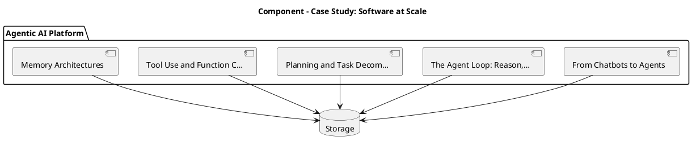

_Source diagram (plantuml); render with the appropriate tool._

**Figure 23. Component - Case Study: Software at Scale** (plantuml). Figure: Component view for Agentic AI. This diagram illustrates the principal components and their interactions as discussed in the surrounding section.

## Deep Dive: Mechanics, Variants and Trade-offs

Having established the essentials, we now go deeper into case study: software at scale. Beneath the abstraction lies a concrete process whose steps can each be measured, tested and optimised independently. The distinctions in this section are the ones that separate a working demo from a system that holds up under adversarial inputs, scale and the passage of time.

Consider the principal variants and how to choose between them. Each variant optimises for a different point in the design space - some for latency, some for accuracy, some for cost or operability - and the correct choice follows from explicit requirements rather than from defaults. As with most architectural decisions, the choice is rarely binary; the skill lies in quantifying the trade-offs and choosing deliberately.

In practice this is supported by a mature tooling ecosystem, including LangGraph, AutoGen, CrewAI, OpenAI Agents. Tools accelerate the work but do not substitute for understanding: the same principles apply whichever implementation you select, and the ability to reason from first principles is what lets you debug when a tool behaves unexpectedly.

A frequent source of subtle bugs is the interaction with grounding and retrieval for agents. Because grounding and retrieval for agents concerns bringing knowledge into the agent loop, changes there can silently alter the behaviour analysed here. The remedy is contract tests at the boundary and end-to-end evaluations that exercise the interaction explicitly.

Finally, attend to edge cases and degradation. Define what the system should do under partial failure, unexpected inputs and load spikes, and make that behaviour explicit and tested rather than emergent. Graceful degradation - returning a safe, useful result when the ideal one is unavailable - is a hallmark of mature engineering.

For deeper study, the literature offers authoritative treatments such as Yao et al. — ReAct (2022) and Shinn et al. — Reflexion (2023). These primary sources reward careful reading and ground the practical guidance above in established results.

## Advanced Considerations

Having established the essentials, we now go deeper into case study: software at scale. The underlying mechanism is best appreciated by tracing a single request from input to output and noting where state is created and consumed. The distinctions in this section are the ones that separate a working demo from a system that holds up under adversarial inputs, scale and the passage of time.

Consider the principal variants and how to choose between them. Each variant optimises for a different point in the design space - some for latency, some for accuracy, some for cost or operability - and the correct choice follows from explicit requirements rather than from defaults. Latency, accuracy and cost form a tension triangle: improving one typically pressures the others, so explicit budgets are essential.

In practice this is supported by a mature tooling ecosystem, including LangGraph, AutoGen, CrewAI, OpenAI Agents. Tools accelerate the work but do not substitute for understanding: the same principles apply whichever implementation you select, and the ability to reason from first principles is what lets you debug when a tool behaves unexpectedly.

A frequent source of subtle bugs is the interaction with from chatbots to agents. Because from chatbots to agents concerns the shift from single responses to goal-directed loops, changes there can silently alter the behaviour analysed here. The remedy is contract tests at the boundary and end-to-end evaluations that exercise the interaction explicitly.

Finally, attend to edge cases and degradation. Define what the system should do under partial failure, unexpected inputs and load spikes, and make that behaviour explicit and tested rather than emergent. Graceful degradation - returning a safe, useful result when the ideal one is unavailable - is a hallmark of mature engineering.

For deeper study, the literature offers authoritative treatments such as Yao et al. — ReAct (2022) and Shinn et al. — Reflexion (2023). These primary sources reward careful reading and ground the practical guidance above in established results.

## Worked Example

A worked example clarifies how these ideas behave in practice. A software organisation needs autonomous coding agents that plan, edit and test. They decide to apply case study: software at scale as part of their Agentic AI solution, but wisely treat it as a hypothesis to be validated rather than a foregone conclusion.

The team begins by stating the objective precisely and defining how success will be measured before writing any code. They establish a small but representative evaluation set, agree on acceptance thresholds, and only then prototype the simplest design that could work. Early measurement reveals which assumptions hold and which must be revised, saving weeks of misdirected effort and surfacing edge cases while they are still cheap to fix.

As the prototype matures into a service, the team hardens it: adding input validation, error handling, caching where it pays off, and monitoring that ties back to the original success metric. They document each significant decision in an architecture decision record so that future maintainers understand not just what was built but why.

The outcome is instructive. The system that reaches production is not the most sophisticated design the team considered, but the one whose behaviour they could measure, explain and operate. This is the recurring lesson of Agentic AI: durable value comes from the whole system, not from any single clever component.

## Industry Use Cases

Across industries, the ideas in this chapter recur in recognisable ways. The following vignettes show how different sectors apply them and what they have in common.

**Software.** Autonomous coding agents that plan, edit and test. The common thread is that value comes not from the model alone but from the surrounding system - data quality, evaluation, integration and operations - which is precisely where most of the engineering effort belongs.

**Operations.** Incident triage agents that gather context and act. The common thread is that value comes not from the model alone but from the surrounding system - data quality, evaluation, integration and operations - which is precisely where most of the engineering effort belongs.

**Research.** Agents that browse, synthesise and report. The common thread is that value comes not from the model alone but from the surrounding system - data quality, evaluation, integration and operations - which is precisely where most of the engineering effort belongs.

**Back office.** Workflow automation across enterprise systems. The common thread is that value comes not from the model alone but from the surrounding system - data quality, evaluation, integration and operations - which is precisely where most of the engineering effort belongs.

## Best Practices

The following practices consistently separate successful Agentic AI efforts from struggling ones. They are deliberately concrete so they can be adopted as checklist items in design and code review.

- Constrain tools with typed schemas and least-privilege permissions.
- Cap loop steps and cost to prevent runaway behaviour.
- Require human approval for irreversible or high-impact actions.
- Trace every reasoning step and tool call for debugging and audit.

None of these are exotic; they are the unglamorous disciplines that compound into reliability. The cost of adopting them is small compared with the cost of the incidents they prevent, and they become second nature with practice.

## Common Pitfalls

Equally instructive are the failure modes that recur in practice. Each pitfall below has a clear early warning sign and a known remedy, so treat them as a diagnostic checklist when something feels wrong:

- Unbounded loops that burn cost without converging.
- Granting broad tool permissions that enable harmful actions.
- No observability, making failures impossible to diagnose.
- Over-automating tasks that need human judgement.

The pattern is consistent: most failures stem from skipping measurement, conflating prototype and production standards, or deferring cross-cutting concerns such as security and cost until they become emergencies. Naming these traps in advance is the cheapest way to avoid them.

## Governance, Security and Cost Notes

No discussion of case study: software at scale is complete without its governance, security and cost dimensions, which are too often deferred until they become emergencies. Treating them as first-class concerns from the outset is both cheaper and safer.

**Governance.** Classify the risk of this capability, document its intended and out-of-scope uses, and ensure decisions are traceable to satisfy internal policy and external regulation such as the NIST AI RMF, ISO/IEC 42001 and the EU AI Act. **Security.** Treat all external input as untrusted, validate outputs before acting on them, apply least privilege to any tools or data access, and map controls to the OWASP LLM Top 10 and MITRE ATLAS.

**Cost and sustainability.** Establish explicit budgets for compute, tokens and latency, attribute spend to owners, and revisit the economics as usage scales - a design that is affordable at pilot scale can become untenable at production volume. Building these reflexes into everyday engineering is what allows a Agentic AI system to be not only capable but also trustworthy and economically sound.

## Hands-On Exercises

Work through the following exercises. They are designed to move understanding from recognition to application - the level required for real engineering work - so prefer writing and building over merely reading.

1. Explain case study: software at scale to a colleague unfamiliar with Agentic AI, using a concrete example from your own domain.
2. Sketch a reference architecture that incorporates case study: software at scale and annotate where observability, security and cost controls belong.
3. Design an evaluation that would tell you whether case study: software at scale is working in production, including the metric, the dataset and the acceptance threshold.
4. Identify two pitfalls relevant to case study: software at scale in your environment and describe the early warning signals you would monitor.
5. Prototype the simplest implementation that demonstrates case study: software at scale, then list exactly what would need to change to make it production-ready.

## Key Takeaways

Key takeaways from this chapter:

- Case Study: Software at Scale is a systems concern in Agentic AI: data, models and operations must be co-designed.
- Measurement is non-negotiable; define success metrics and evaluation before building.
- Favour the simplest design that meets the requirement, and add complexity only when evidence demands it.
- Security, cost and observability are first-class requirements, not afterthoughts.
- Document decisions so the system remains understandable and operable as it evolves.

## Code Walkthrough

Pipelines keep Case Study: Software at Scale logic modular and testable. Each stage is a pure function, errors are captured per item, and the composition is trivial to extend or reorder.

The full listing is shown below; study it line by line and reproduce it locally before moving on.

### Listing: A composable processing pipeline for Case Study: Software at Scale

```python
from collections.abc import Iterable, Iterator
from typing import Protocol


class Stage(Protocol):
    def __call__(self, item: dict) -> dict: ...


def pipeline(stages: list[Stage]) -> Stage:
    """Compose ordered stages into a single callable for Case Study: Software at Scale."""

    def run(item: dict) -> dict:
        for stage in stages:
            item = stage(item)
        return item

    return run


def validate(item: dict) -> dict:
    if "text" not in item:
        raise ValueError("missing required field: text")
    return item


def normalise(item: dict) -> dict:
    item["text"] = item["text"].strip().lower()
    return item


def enrich(item: dict) -> dict:
    item["length"] = len(item["text"])
    return item


process = pipeline([validate, normalise, enrich])


def run_batch(items: Iterable[dict]) -> Iterator[dict]:
    for item in items:
        try:
            yield process(dict(item))
        except ValueError as exc:
            yield {"error": str(exc), "item": item}

```

## Review Questions

1. In the context of Agentic AI, which statement best describes “Case Study: Software at Scale”?
   - A. It removes all security and governance requirements.
   - B. It is only relevant to academic research, not production.
   - C. It applies exclusively to image data.
   - D. a detailed case study of deploying Agentic AI in a demanding software environment, including the decisions, trade-offs and outcomes
   - **Answer: D.** Case Study: Software at Scale: a detailed case study of deploying Agentic AI in a demanding software environment, including the decisions, trade-offs and outcomes
2. Which of the following is a recommended best practice when working with Agentic AI?
   - A. It removes all security and governance requirements.
   - B. It guarantees deterministic output regardless of input.
   - C. It makes the system slower but has no other effect.
   - D. Trace every reasoning step and tool call for debugging and audit.
   - **Answer: D.** Best practice: Trace every reasoning step and tool call for debugging and audit.
3. Which of the following is a common pitfall to avoid in Agentic AI?
   - A. Unbounded loops that burn cost without converging.
   - B. It applies exclusively to image data.
   - C. It is only relevant to academic research, not production.
   - D. Require human approval for irreversible or high-impact actions.
   - **Answer: A.** Pitfall to avoid: Unbounded loops that burn cost without converging.
4. *(Discussion)* What trade-offs would you weigh when implementing Case Study: Software at Scale?
   - **Model answer:** A strong answer defines case study: software at scale (a detailed case study of deploying Agentic AI in a demanding software environment, including the decisions, trade-offs and outcomes) then connects it to architecture, evaluation, cost, security and operations for Agentic AI, citing concrete trade-offs and a real-world example.

---


# Chapter 18. Operating in Production

_This chapter examines operating in production within Agentic AI. It covers the operational discipline required to run a Agentic AI system reliably, including monitoring, incident response and continuous improvement, derives a reference architecture, walks through a worked example and runnable code, surveys industry use cases, and distils best practices and pitfalls, closing with exercises and review questions._

## Introduction

We define Operating in Production as the operational discipline required to run a Agentic AI system reliably, including monitoring, incident response and continuous improvement. Neglecting it is one of the most common reasons Agentic AI initiatives stall in production. In an enterprise setting, this translates into concrete requirements: clear interfaces, measurable quality, and controls that satisfy security and governance.

This chapter builds intuition first, then formalises the ideas, derives an architecture, and finishes with code, exercises and review questions so the material transfers directly to your own Agentic AI work. Read it actively: pause at each diagram, reproduce the code, and attempt the exercises before consulting the answers.

## Theory and Foundations

At its core, Operating in Production concerns the operational discipline required to run a Agentic AI system reliably, including monitoring, incident response and continuous improvement. It helps to separate the conceptual model from its implementation: the former guides reasoning, the latter must contend with real-world constraints. The underlying mechanism is best appreciated by tracing a single request from input to output and noting where state is created and consumed.

To place this in context, recall the broader picture: Agentic AI systems use language models as reasoning engines that plan, invoke tools, observe results and iterate toward goals with limited human oversight. Within that picture, operating in production is one of the load-bearing ideas - the kind that, when understood deeply, makes the rest of Agentic AI fall into place. Getting this right early prevents expensive rework once a Agentic AI system reaches scale.

Operating in Production cannot be understood in isolation from from chatbots to agents. Recall that from chatbots to agents concerns the shift from single responses to goal-directed loops. The two interact directly: decisions in one constrain the design space of the other, which is why mature teams reason about them together rather than sequentially. There is an inherent trade-off between fidelity and cost, and the correct balance depends on the use case and its tolerance for error.

Operating in Production cannot be understood in isolation from grounding and retrieval for agents. Recall that grounding and retrieval for agents concerns bringing knowledge into the agent loop. The two interact directly: decisions in one constrain the design space of the other, which is why mature teams reason about them together rather than sequentially. There is an inherent trade-off between fidelity and cost, and the correct balance depends on the use case and its tolerance for error.

Several established patterns apply directly to operating in production. The first, reflection loop to critique and revise outputs, is widely adopted because it makes the system's behaviour predictable and observable. A complementary pattern, react: interleave reasoning and tool actions, addresses a related concern and is often deployed alongside it. Patterns are not dogma; they are distilled experience that shortcuts the search for a sound design, and each carries assumptions worth checking against your context.

It is worth being explicit about when to apply this and when to reach for something simpler. In a small prototype, shortcuts around operating in production are invisible; in a production Agentic AI system serving real traffic, they surface as incidents, cost overruns or compliance gaps. As with most architectural decisions, the choice is rarely binary; the skill lies in quantifying the trade-offs and choosing deliberately. The remainder of this chapter turns these principles into an architecture, code and a checklist you can apply immediately.

## Architecture and Design

From an architectural standpoint, Operating in Production sits at the intersection of data, models and operations. An agent runtime hosts a reasoning model, a tool registry with typed schemas, a memory store (short-term context plus long-term vector memory), and a controller enforcing step budgets, permissions and human approvals. Every step is traced for observability and replay.

Concretely, the principal building blocks include from chatbots to agents, the agent loop: reason, act, observe, planning and task decomposition, tool use and function calling and memory architectures. Each is a replaceable component behind a stable interface, so the team can upgrade an implementation - a model, an index, a policy engine - without rewriting its neighbours. The contracts between components are where reliability is won or lost, so they are specified explicitly and tested in isolation.

The diagram accompanying this section makes the data and control flow explicit. Requests enter through a well-defined boundary where they are authenticated and validated; only then are they dispatched to the components that perform the work. This boundary is also where rate limiting, quota enforcement and audit logging live, keeping cross-cutting concerns out of the core logic and in one auditable place.

Two qualities deserve emphasis. First, observability is designed in, not bolted on: every component emits structured telemetry so that failures can be localised in minutes rather than hours. Second, the architecture is evolvable - components communicate through stable contracts so that any single part of the Agentic AI system can be replaced without a rewrite. Every added component buys capability at the price of operational surface area, and that bargain should be made consciously.

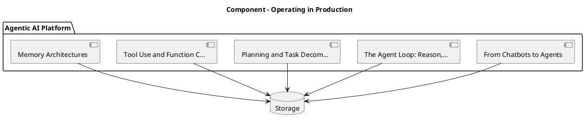

_Source diagram (plantuml); render with the appropriate tool._

**Figure 24. Component - Operating in Production** (plantuml). Figure: Component view for Agentic AI. This diagram illustrates the principal components and their interactions as discussed in the surrounding section.

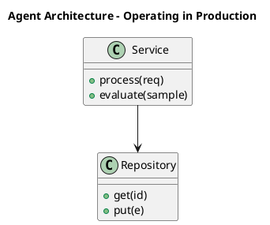

_Source diagram (plantuml); render with the appropriate tool._

**Figure 25. Agent Architecture - Operating in Production** (plantuml). Figure: Agent Architecture view for Agentic AI. This diagram illustrates the principal components and their interactions as discussed in the surrounding section.

## Deep Dive: Mechanics, Variants and Trade-offs

Having established the essentials, we now go deeper into operating in production. It pays to understand the mechanism rather than treat it as a black box, because most production incidents are explained by one of its steps misbehaving. The distinctions in this section are the ones that separate a working demo from a system that holds up under adversarial inputs, scale and the passage of time.

Consider the principal variants and how to choose between them. Each variant optimises for a different point in the design space - some for latency, some for accuracy, some for cost or operability - and the correct choice follows from explicit requirements rather than from defaults. Latency, accuracy and cost form a tension triangle: improving one typically pressures the others, so explicit budgets are essential.

In practice this is supported by a mature tooling ecosystem, including LangGraph, AutoGen, CrewAI, OpenAI Agents. Tools accelerate the work but do not substitute for understanding: the same principles apply whichever implementation you select, and the ability to reason from first principles is what lets you debug when a tool behaves unexpectedly.

A frequent source of subtle bugs is the interaction with from chatbots to agents. Because from chatbots to agents concerns the shift from single responses to goal-directed loops, changes there can silently alter the behaviour analysed here. The remedy is contract tests at the boundary and end-to-end evaluations that exercise the interaction explicitly.

Finally, attend to edge cases and degradation. Define what the system should do under partial failure, unexpected inputs and load spikes, and make that behaviour explicit and tested rather than emergent. Graceful degradation - returning a safe, useful result when the ideal one is unavailable - is a hallmark of mature engineering.

For deeper study, the literature offers authoritative treatments such as Yao et al. — ReAct (2022) and Shinn et al. — Reflexion (2023). These primary sources reward careful reading and ground the practical guidance above in established results.

## Advanced Considerations

Having established the essentials, we now go deeper into operating in production. Mechanically, the behaviour emerges from a few interacting parts that are simpler than the whole they produce. The distinctions in this section are the ones that separate a working demo from a system that holds up under adversarial inputs, scale and the passage of time.

Consider the principal variants and how to choose between them. Each variant optimises for a different point in the design space - some for latency, some for accuracy, some for cost or operability - and the correct choice follows from explicit requirements rather than from defaults. Every added component buys capability at the price of operational surface area, and that bargain should be made consciously.

In practice this is supported by a mature tooling ecosystem, including LangGraph, AutoGen, CrewAI, OpenAI Agents. Tools accelerate the work but do not substitute for understanding: the same principles apply whichever implementation you select, and the ability to reason from first principles is what lets you debug when a tool behaves unexpectedly.

A frequent source of subtle bugs is the interaction with from chatbots to agents. Because from chatbots to agents concerns the shift from single responses to goal-directed loops, changes there can silently alter the behaviour analysed here. The remedy is contract tests at the boundary and end-to-end evaluations that exercise the interaction explicitly.

Finally, attend to edge cases and degradation. Define what the system should do under partial failure, unexpected inputs and load spikes, and make that behaviour explicit and tested rather than emergent. Graceful degradation - returning a safe, useful result when the ideal one is unavailable - is a hallmark of mature engineering.

For deeper study, the literature offers authoritative treatments such as Yao et al. — ReAct (2022) and Shinn et al. — Reflexion (2023). These primary sources reward careful reading and ground the practical guidance above in established results.

## Worked Example

Consider a concrete scenario. A research organisation needs agents that browse, synthesise and report. They decide to apply operating in production as part of their Agentic AI solution, but wisely treat it as a hypothesis to be validated rather than a foregone conclusion.

The team begins by stating the objective precisely and defining how success will be measured before writing any code. They establish a small but representative evaluation set, agree on acceptance thresholds, and only then prototype the simplest design that could work. Early measurement reveals which assumptions hold and which must be revised, saving weeks of misdirected effort and surfacing edge cases while they are still cheap to fix.

As the prototype matures into a service, the team hardens it: adding input validation, error handling, caching where it pays off, and monitoring that ties back to the original success metric. They document each significant decision in an architecture decision record so that future maintainers understand not just what was built but why.

The outcome is instructive. The system that reaches production is not the most sophisticated design the team considered, but the one whose behaviour they could measure, explain and operate. This is the recurring lesson of Agentic AI: durable value comes from the whole system, not from any single clever component.

## Industry Use Cases

Across industries, the ideas in this chapter recur in recognisable ways. The following vignettes show how different sectors apply them and what they have in common.

**Software.** Autonomous coding agents that plan, edit and test. The common thread is that value comes not from the model alone but from the surrounding system - data quality, evaluation, integration and operations - which is precisely where most of the engineering effort belongs.

**Operations.** Incident triage agents that gather context and act. The common thread is that value comes not from the model alone but from the surrounding system - data quality, evaluation, integration and operations - which is precisely where most of the engineering effort belongs.

**Research.** Agents that browse, synthesise and report. The common thread is that value comes not from the model alone but from the surrounding system - data quality, evaluation, integration and operations - which is precisely where most of the engineering effort belongs.

**Back office.** Workflow automation across enterprise systems. The common thread is that value comes not from the model alone but from the surrounding system - data quality, evaluation, integration and operations - which is precisely where most of the engineering effort belongs.

## Best Practices

The following practices consistently separate successful Agentic AI efforts from struggling ones. They are deliberately concrete so they can be adopted as checklist items in design and code review.

- Constrain tools with typed schemas and least-privilege permissions.
- Cap loop steps and cost to prevent runaway behaviour.
- Require human approval for irreversible or high-impact actions.
- Trace every reasoning step and tool call for debugging and audit.

None of these are exotic; they are the unglamorous disciplines that compound into reliability. The cost of adopting them is small compared with the cost of the incidents they prevent, and they become second nature with practice.

## Common Pitfalls

Equally instructive are the failure modes that recur in practice. Each pitfall below has a clear early warning sign and a known remedy, so treat them as a diagnostic checklist when something feels wrong:

- Unbounded loops that burn cost without converging.
- Granting broad tool permissions that enable harmful actions.
- No observability, making failures impossible to diagnose.
- Over-automating tasks that need human judgement.

The pattern is consistent: most failures stem from skipping measurement, conflating prototype and production standards, or deferring cross-cutting concerns such as security and cost until they become emergencies. Naming these traps in advance is the cheapest way to avoid them.

## Governance, Security and Cost Notes

No discussion of operating in production is complete without its governance, security and cost dimensions, which are too often deferred until they become emergencies. Treating them as first-class concerns from the outset is both cheaper and safer.

**Governance.** Classify the risk of this capability, document its intended and out-of-scope uses, and ensure decisions are traceable to satisfy internal policy and external regulation such as the NIST AI RMF, ISO/IEC 42001 and the EU AI Act. **Security.** Treat all external input as untrusted, validate outputs before acting on them, apply least privilege to any tools or data access, and map controls to the OWASP LLM Top 10 and MITRE ATLAS.

**Cost and sustainability.** Establish explicit budgets for compute, tokens and latency, attribute spend to owners, and revisit the economics as usage scales - a design that is affordable at pilot scale can become untenable at production volume. Building these reflexes into everyday engineering is what allows a Agentic AI system to be not only capable but also trustworthy and economically sound.

## Hands-On Exercises

Work through the following exercises. They are designed to move understanding from recognition to application - the level required for real engineering work - so prefer writing and building over merely reading.

1. Explain operating in production to a colleague unfamiliar with Agentic AI, using a concrete example from your own domain.
2. Sketch a reference architecture that incorporates operating in production and annotate where observability, security and cost controls belong.
3. Design an evaluation that would tell you whether operating in production is working in production, including the metric, the dataset and the acceptance threshold.
4. Identify two pitfalls relevant to operating in production in your environment and describe the early warning signals you would monitor.
5. Prototype the simplest implementation that demonstrates operating in production, then list exactly what would need to change to make it production-ready.

## Key Takeaways

Key takeaways from this chapter:

- Operating in Production is a systems concern in Agentic AI: data, models and operations must be co-designed.
- Measurement is non-negotiable; define success metrics and evaluation before building.
- Favour the simplest design that meets the requirement, and add complexity only when evidence demands it.
- Security, cost and observability are first-class requirements, not afterthoughts.
- Document decisions so the system remains understandable and operable as it evolves.

## Code Walkthrough

This listing shows a configuration-driven Operating in Production component with retry semantics and typed interfaces — the shape we expect from production Agentic AI code rather than a notebook prototype.

The full listing is shown below; study it line by line and reproduce it locally before moving on.

### Listing: Implementing a Operating in Production component

```python
from __future__ import annotations

from dataclasses import dataclass, field
from typing import Any


@dataclass(slots=True)
class OperatingInProductionConfig:
    """Configuration for the Operating in Production component in a Agentic AI system."""

    name: str
    timeout_s: float = 30.0
    max_retries: int = 3
    options: dict[str, Any] = field(default_factory=dict)


class OperatingInProduction:
    """A minimal, production-shaped implementation of Operating in Production."""

    def __init__(self, config: OperatingInProductionConfig) -> None:
        self._config = config
        self._calls = 0

    def run(self, payload: dict[str, Any]) -> dict[str, Any]:
        """Process a request, retrying transient failures with backoff."""
        last_error: Exception | None = None
        for attempt in range(self._config.max_retries):
            try:
                self._calls += 1
                return self._process(payload)
            except TimeoutError as exc:  # transient
                last_error = exc
                continue
        raise RuntimeError(f"OperatingInProduction failed after retries") from last_error

    def _process(self, payload: dict[str, Any]) -> dict[str, Any]:
        # Domain-specific logic for Operating in Production goes here.
        return {"status": "ok", "input_keys": sorted(payload), "calls": self._calls}

```

## Review Questions

1. In the context of Agentic AI, which statement best describes “Operating in Production”?
   - A. the operational discipline required to run a Agentic AI system reliably, including monitoring, incident response and continuous improvement
   - B. It makes the system slower but has no other effect.
   - C. It applies exclusively to image data.
   - D. It removes all security and governance requirements.
   - **Answer: A.** Operating in Production: the operational discipline required to run a Agentic AI system reliably, including monitoring, incident response and continuous improvement
2. Which of the following is a recommended best practice when working with Agentic AI?
   - A. It makes the system slower but has no other effect.
   - B. It guarantees deterministic output regardless of input.
   - C. Unbounded loops that burn cost without converging.
   - D. Cap loop steps and cost to prevent runaway behaviour.
   - **Answer: D.** Best practice: Cap loop steps and cost to prevent runaway behaviour.
3. Which of the following is a common pitfall to avoid in Agentic AI?
   - A. It is only relevant to academic research, not production.
   - B. Require human approval for irreversible or high-impact actions.
   - C. Unbounded loops that burn cost without converging.
   - D. It applies exclusively to image data.
   - **Answer: C.** Pitfall to avoid: Unbounded loops that burn cost without converging.
4. *(Discussion)* What trade-offs would you weigh when implementing Operating in Production?
   - **Model answer:** A strong answer defines operating in production (the operational discipline required to run a Agentic AI system reliably, including monitoring, incident response and continuous improvement) then connects it to architecture, evaluation, cost, security and operations for Agentic AI, citing concrete trade-offs and a real-world example.

---


# Chapter 19. Evaluation and Quality Assurance

_This chapter examines evaluation and quality assurance within Agentic AI. It covers a rigorous approach to measuring and assuring the quality of a Agentic AI system before and after release, derives a reference architecture, walks through a worked example and runnable code, surveys industry use cases, and distils best practices and pitfalls, closing with exercises and review questions._

## Introduction

In practical terms, Evaluation and Quality Assurance is best understood as a rigorous approach to measuring and assuring the quality of a Agentic AI system before and after release. Getting this right early prevents expensive rework once a Agentic AI system reaches scale. The practical implication is that design choices here ripple through latency, cost and maintainability for the lifetime of the system.

This chapter builds intuition first, then formalises the ideas, derives an architecture, and finishes with code, exercises and review questions so the material transfers directly to your own Agentic AI work. Read it actively: pause at each diagram, reproduce the code, and attempt the exercises before consulting the answers.

## Theory and Foundations

Formally, Evaluation and Quality Assurance addresses a rigorous approach to measuring and assuring the quality of a Agentic AI system before and after release. The right abstraction here pays compounding dividends, because downstream components depend on its guarantees. It pays to understand the mechanism rather than treat it as a black box, because most production incidents are explained by one of its steps misbehaving.

To place this in context, recall the broader picture: Agentic AI systems use language models as reasoning engines that plan, invoke tools, observe results and iterate toward goals with limited human oversight. Within that picture, evaluation and quality assurance is one of the load-bearing ideas - the kind that, when understood deeply, makes the rest of Agentic AI fall into place. Neglecting it is one of the most common reasons Agentic AI initiatives stall in production.

Evaluation and Quality Assurance cannot be understood in isolation from cost, latency and loop control. Recall that cost, latency and loop control concerns budgeting steps, preventing runaway loops and caching. The two interact directly: decisions in one constrain the design space of the other, which is why mature teams reason about them together rather than sequentially. Every added component buys capability at the price of operational surface area, and that bargain should be made consciously.

Evaluation and Quality Assurance cannot be understood in isolation from the agentic reference architecture. Recall that the agentic reference architecture concerns orchestrator, tools, memory and guardrails as a platform. The two interact directly: decisions in one constrain the design space of the other, which is why mature teams reason about them together rather than sequentially. Every added component buys capability at the price of operational surface area, and that bargain should be made consciously.

Several established patterns apply directly to evaluation and quality assurance. The first, react: interleave reasoning and tool actions, is widely adopted because it makes the system's behaviour predictable and observable. A complementary pattern, plan-and-execute with a separate planner and executor, addresses a related concern and is often deployed alongside it. Patterns are not dogma; they are distilled experience that shortcuts the search for a sound design, and each carries assumptions worth checking against your context.

Knowing when not to use a technique is as valuable as knowing how to use it. In a small prototype, shortcuts around evaluation and quality assurance are invisible; in a production Agentic AI system serving real traffic, they surface as incidents, cost overruns or compliance gaps. Simplicity is a feature. The simplest design that meets the requirement should be the default, with complexity added only when measurement justifies it. The remainder of this chapter turns these principles into an architecture, code and a checklist you can apply immediately.

## Architecture and Design

A robust architecture for Evaluation and Quality Assurance is layered so each part can evolve independently without destabilising the whole. An agent runtime hosts a reasoning model, a tool registry with typed schemas, a memory store (short-term context plus long-term vector memory), and a controller enforcing step budgets, permissions and human approvals. Every step is traced for observability and replay.

Concretely, the principal building blocks include from chatbots to agents, the agent loop: reason, act, observe, planning and task decomposition, tool use and function calling and memory architectures. Each is a replaceable component behind a stable interface, so the team can upgrade an implementation - a model, an index, a policy engine - without rewriting its neighbours. The contracts between components are where reliability is won or lost, so they are specified explicitly and tested in isolation.

The diagram accompanying this section makes the data and control flow explicit. Requests enter through a well-defined boundary where they are authenticated and validated; only then are they dispatched to the components that perform the work. This boundary is also where rate limiting, quota enforcement and audit logging live, keeping cross-cutting concerns out of the core logic and in one auditable place.

Two qualities deserve emphasis. First, observability is designed in, not bolted on: every component emits structured telemetry so that failures can be localised in minutes rather than hours. Second, the architecture is evolvable - components communicate through stable contracts so that any single part of the Agentic AI system can be replaced without a rewrite. There is an inherent trade-off between fidelity and cost, and the correct balance depends on the use case and its tolerance for error.

<div class="diagram-svg">

<svg xmlns="http://www.w3.org/2000/svg" width="840" height="460" data-tpl="cycle" data-pal="11-1" viewBox="0 0 840 460" font-family="Inter, Segoe UI, Arial, sans-serif"><defs><marker id="ar" markerWidth="9" markerHeight="9" refX="7" refY="3" orient="auto"><path d="M0,0 L7,3 L0,6 z" fill="#94a3b8"/></marker><marker id="arw" markerWidth="9" markerHeight="9" refX="7" refY="3" orient="auto"><path d="M0,0 L7,3 L0,6 z" fill="#ffffff"/></marker><filter id="sh" x="-20%" y="-20%" width="140%" height="140%"><feDropShadow dx="0" dy="2" stdDeviation="3" flood-color="#0f172a" flood-opacity="0.16"/></filter></defs><defs><linearGradient id="bnbb1ff" x1="0" y1="0" x2="1" y2="0"><stop offset="0" stop-color="#1e40af"/><stop offset="1" stop-color="#0e7490"/></linearGradient></defs><rect width="840" height="460" rx="14" fill="#ffffff"/><rect x="0" y="0" width="840" height="48" rx="14" fill="url(#bnbb1ff)"/><rect x="0" y="32" width="840" height="16" fill="url(#bnbb1ff)"/><text x="420" y="25" text-anchor="middle" font-size="14.5" font-weight="700" fill="#ffffff" dominant-baseline="middle">Agent Architecture - Evaluation and Quality Assurance</text><rect x="348" y="86" width="144" height="44" rx="11" fill="#1e40af" filter="url(#sh)"/><text x="420" y="108" text-anchor="middle" font-size="11" font-weight="600" fill="#ffffff" dominant-baseline="middle">Evaluating Agents</text><rect x="472" y="176" width="144" height="44" rx="11" fill="#0e7490" filter="url(#sh)"/><text x="544" y="192" text-anchor="middle" font-size="9.5" font-weight="600" fill="#ffffff" dominant-baseline="middle">Agent Frameworks and</text><text x="544" y="203" text-anchor="middle" font-size="9.5" font-weight="600" fill="#ffffff" dominant-baseline="middle">Patterns</text><rect x="424" y="321" width="144" height="44" rx="11" fill="#b45309" filter="url(#sh)"/><text x="496" y="343" text-anchor="middle" font-size="9.5" font-weight="600" fill="#ffffff" dominant-baseline="middle">Observability for Agents</text><rect x="272" y="321" width="144" height="44" rx="11" fill="#9f1239" filter="url(#sh)"/><text x="344" y="338" text-anchor="middle" font-size="9.5" font-weight="600" fill="#ffffff" dominant-baseline="middle">The Agentic Reference</text><text x="344" y="349" text-anchor="middle" font-size="9.5" font-weight="600" fill="#ffffff" dominant-baseline="middle">Architecture</text><rect x="224" y="176" width="144" height="44" rx="11" fill="#4338ca" filter="url(#sh)"/><text x="296" y="198" text-anchor="middle" font-size="9.5" font-weight="600" fill="#ffffff" dominant-baseline="middle">From Chatbots to Agents</text><path d="M461,147 A100,100 0 0 1 494,171" fill="none" stroke="#cbd5e1" stroke-width="2" marker-end="url(#ar)"/><path d="M519,249 A100,100 0 0 1 507,288" fill="none" stroke="#cbd5e1" stroke-width="2" marker-end="url(#ar)"/><path d="M441,336 A100,100 0 0 1 399,336" fill="none" stroke="#cbd5e1" stroke-width="2" marker-end="url(#ar)"/><path d="M333,288 A100,100 0 0 1 321,249" fill="none" stroke="#cbd5e1" stroke-width="2" marker-end="url(#ar)"/><path d="M346,171 A100,100 0 0 1 379,147" fill="none" stroke="#cbd5e1" stroke-width="2" marker-end="url(#ar)"/><text x="420" y="238" text-anchor="middle" font-size="12" font-weight="600" fill="#64748b" dominant-baseline="middle">continuous</text><text x="28" y="446" text-anchor="start" font-size="9.5" font-weight="500" fill="#64748b" dominant-baseline="middle">Agentic AI  •  Agent Architecture</text></svg>

</div>

**Figure 26. Agent Architecture - Evaluation and Quality Assurance** (svg). Figure: Agent Architecture view for Agentic AI. This diagram illustrates the principal components and their interactions as discussed in the surrounding section.

## Deep Dive: Mechanics, Variants and Trade-offs

Having established the essentials, we now go deeper into evaluation and quality assurance. The underlying mechanism is best appreciated by tracing a single request from input to output and noting where state is created and consumed. The distinctions in this section are the ones that separate a working demo from a system that holds up under adversarial inputs, scale and the passage of time.

Consider the principal variants and how to choose between them. Each variant optimises for a different point in the design space - some for latency, some for accuracy, some for cost or operability - and the correct choice follows from explicit requirements rather than from defaults. Simplicity is a feature. The simplest design that meets the requirement should be the default, with complexity added only when measurement justifies it.

In practice this is supported by a mature tooling ecosystem, including LangGraph, AutoGen, CrewAI, OpenAI Agents. Tools accelerate the work but do not substitute for understanding: the same principles apply whichever implementation you select, and the ability to reason from first principles is what lets you debug when a tool behaves unexpectedly.

A frequent source of subtle bugs is the interaction with cost, latency and loop control. Because cost, latency and loop control concerns budgeting steps, preventing runaway loops and caching, changes there can silently alter the behaviour analysed here. The remedy is contract tests at the boundary and end-to-end evaluations that exercise the interaction explicitly.

Finally, attend to edge cases and degradation. Define what the system should do under partial failure, unexpected inputs and load spikes, and make that behaviour explicit and tested rather than emergent. Graceful degradation - returning a safe, useful result when the ideal one is unavailable - is a hallmark of mature engineering.

For deeper study, the literature offers authoritative treatments such as Yao et al. — ReAct (2022) and Shinn et al. — Reflexion (2023). These primary sources reward careful reading and ground the practical guidance above in established results.

## Advanced Considerations

Having established the essentials, we now go deeper into evaluation and quality assurance. Beneath the abstraction lies a concrete process whose steps can each be measured, tested and optimised independently. The distinctions in this section are the ones that separate a working demo from a system that holds up under adversarial inputs, scale and the passage of time.

Consider the principal variants and how to choose between them. Each variant optimises for a different point in the design space - some for latency, some for accuracy, some for cost or operability - and the correct choice follows from explicit requirements rather than from defaults. Simplicity is a feature. The simplest design that meets the requirement should be the default, with complexity added only when measurement justifies it.

In practice this is supported by a mature tooling ecosystem, including LangGraph, AutoGen, CrewAI, OpenAI Agents. Tools accelerate the work but do not substitute for understanding: the same principles apply whichever implementation you select, and the ability to reason from first principles is what lets you debug when a tool behaves unexpectedly.

A frequent source of subtle bugs is the interaction with grounding and retrieval for agents. Because grounding and retrieval for agents concerns bringing knowledge into the agent loop, changes there can silently alter the behaviour analysed here. The remedy is contract tests at the boundary and end-to-end evaluations that exercise the interaction explicitly.

Finally, attend to edge cases and degradation. Define what the system should do under partial failure, unexpected inputs and load spikes, and make that behaviour explicit and tested rather than emergent. Graceful degradation - returning a safe, useful result when the ideal one is unavailable - is a hallmark of mature engineering.

For deeper study, the literature offers authoritative treatments such as Yao et al. — ReAct (2022) and Shinn et al. — Reflexion (2023). These primary sources reward careful reading and ground the practical guidance above in established results.

## Worked Example

Consider a concrete scenario. A research organisation needs agents that browse, synthesise and report. They decide to apply evaluation and quality assurance as part of their Agentic AI solution, but wisely treat it as a hypothesis to be validated rather than a foregone conclusion.

The team begins by stating the objective precisely and defining how success will be measured before writing any code. They establish a small but representative evaluation set, agree on acceptance thresholds, and only then prototype the simplest design that could work. Early measurement reveals which assumptions hold and which must be revised, saving weeks of misdirected effort and surfacing edge cases while they are still cheap to fix.

As the prototype matures into a service, the team hardens it: adding input validation, error handling, caching where it pays off, and monitoring that ties back to the original success metric. They document each significant decision in an architecture decision record so that future maintainers understand not just what was built but why.

The outcome is instructive. The system that reaches production is not the most sophisticated design the team considered, but the one whose behaviour they could measure, explain and operate. This is the recurring lesson of Agentic AI: durable value comes from the whole system, not from any single clever component.

## Industry Use Cases

Across industries, the ideas in this chapter recur in recognisable ways. The following vignettes show how different sectors apply them and what they have in common.

**Software.** Autonomous coding agents that plan, edit and test. The common thread is that value comes not from the model alone but from the surrounding system - data quality, evaluation, integration and operations - which is precisely where most of the engineering effort belongs.

**Operations.** Incident triage agents that gather context and act. The common thread is that value comes not from the model alone but from the surrounding system - data quality, evaluation, integration and operations - which is precisely where most of the engineering effort belongs.

**Research.** Agents that browse, synthesise and report. The common thread is that value comes not from the model alone but from the surrounding system - data quality, evaluation, integration and operations - which is precisely where most of the engineering effort belongs.

**Back office.** Workflow automation across enterprise systems. The common thread is that value comes not from the model alone but from the surrounding system - data quality, evaluation, integration and operations - which is precisely where most of the engineering effort belongs.

## Best Practices

The following practices consistently separate successful Agentic AI efforts from struggling ones. They are deliberately concrete so they can be adopted as checklist items in design and code review.

- Constrain tools with typed schemas and least-privilege permissions.
- Cap loop steps and cost to prevent runaway behaviour.
- Require human approval for irreversible or high-impact actions.
- Trace every reasoning step and tool call for debugging and audit.

None of these are exotic; they are the unglamorous disciplines that compound into reliability. The cost of adopting them is small compared with the cost of the incidents they prevent, and they become second nature with practice.

## Common Pitfalls

Equally instructive are the failure modes that recur in practice. Each pitfall below has a clear early warning sign and a known remedy, so treat them as a diagnostic checklist when something feels wrong:

- Unbounded loops that burn cost without converging.
- Granting broad tool permissions that enable harmful actions.
- No observability, making failures impossible to diagnose.
- Over-automating tasks that need human judgement.

The pattern is consistent: most failures stem from skipping measurement, conflating prototype and production standards, or deferring cross-cutting concerns such as security and cost until they become emergencies. Naming these traps in advance is the cheapest way to avoid them.

## Governance, Security and Cost Notes

No discussion of evaluation and quality assurance is complete without its governance, security and cost dimensions, which are too often deferred until they become emergencies. Treating them as first-class concerns from the outset is both cheaper and safer.

**Governance.** Classify the risk of this capability, document its intended and out-of-scope uses, and ensure decisions are traceable to satisfy internal policy and external regulation such as the NIST AI RMF, ISO/IEC 42001 and the EU AI Act. **Security.** Treat all external input as untrusted, validate outputs before acting on them, apply least privilege to any tools or data access, and map controls to the OWASP LLM Top 10 and MITRE ATLAS.

**Cost and sustainability.** Establish explicit budgets for compute, tokens and latency, attribute spend to owners, and revisit the economics as usage scales - a design that is affordable at pilot scale can become untenable at production volume. Building these reflexes into everyday engineering is what allows a Agentic AI system to be not only capable but also trustworthy and economically sound.

## Hands-On Exercises

Work through the following exercises. They are designed to move understanding from recognition to application - the level required for real engineering work - so prefer writing and building over merely reading.

1. Explain evaluation and quality assurance to a colleague unfamiliar with Agentic AI, using a concrete example from your own domain.
2. Sketch a reference architecture that incorporates evaluation and quality assurance and annotate where observability, security and cost controls belong.
3. Design an evaluation that would tell you whether evaluation and quality assurance is working in production, including the metric, the dataset and the acceptance threshold.
4. Identify two pitfalls relevant to evaluation and quality assurance in your environment and describe the early warning signals you would monitor.
5. Prototype the simplest implementation that demonstrates evaluation and quality assurance, then list exactly what would need to change to make it production-ready.

## Key Takeaways

Key takeaways from this chapter:

- Evaluation and Quality Assurance is a systems concern in Agentic AI: data, models and operations must be co-designed.
- Measurement is non-negotiable; define success metrics and evaluation before building.
- Favour the simplest design that meets the requirement, and add complexity only when evidence demands it.
- Security, cost and observability are first-class requirements, not afterthoughts.
- Document decisions so the system remains understandable and operable as it evolves.

## Code Walkthrough

Pipelines keep Evaluation and Quality Assurance logic modular and testable. Each stage is a pure function, errors are captured per item, and the composition is trivial to extend or reorder.

The full listing is shown below; study it line by line and reproduce it locally before moving on.

### Listing: A composable processing pipeline for Evaluation and Quality Assurance

```python
from collections.abc import Iterable, Iterator
from typing import Protocol


class Stage(Protocol):
    def __call__(self, item: dict) -> dict: ...


def pipeline(stages: list[Stage]) -> Stage:
    """Compose ordered stages into a single callable for Evaluation and Quality Assurance."""

    def run(item: dict) -> dict:
        for stage in stages:
            item = stage(item)
        return item

    return run


def validate(item: dict) -> dict:
    if "text" not in item:
        raise ValueError("missing required field: text")
    return item


def normalise(item: dict) -> dict:
    item["text"] = item["text"].strip().lower()
    return item


def enrich(item: dict) -> dict:
    item["length"] = len(item["text"])
    return item


process = pipeline([validate, normalise, enrich])


def run_batch(items: Iterable[dict]) -> Iterator[dict]:
    for item in items:
        try:
            yield process(dict(item))
        except ValueError as exc:
            yield {"error": str(exc), "item": item}

```

## Review Questions

1. In the context of Agentic AI, which statement best describes “Evaluation and Quality Assurance”?
   - A. It makes the system slower but has no other effect.
   - B. a rigorous approach to measuring and assuring the quality of a Agentic AI system before and after release
   - C. It eliminates the need for any evaluation or monitoring.
   - D. It guarantees deterministic output regardless of input.
   - **Answer: B.** Evaluation and Quality Assurance: a rigorous approach to measuring and assuring the quality of a Agentic AI system before and after release
2. Which of the following is a recommended best practice when working with Agentic AI?
   - A. Granting broad tool permissions that enable harmful actions.
   - B. It applies exclusively to image data.
   - C. It guarantees deterministic output regardless of input.
   - D. Constrain tools with typed schemas and least-privilege permissions.
   - **Answer: D.** Best practice: Constrain tools with typed schemas and least-privilege permissions.
3. Which of the following is a common pitfall to avoid in Agentic AI?
   - A. Require human approval for irreversible or high-impact actions.
   - B. It makes the system slower but has no other effect.
   - C. Cap loop steps and cost to prevent runaway behaviour.
   - D. Granting broad tool permissions that enable harmful actions.
   - **Answer: D.** Pitfall to avoid: Granting broad tool permissions that enable harmful actions.
4. *(Discussion)* What trade-offs would you weigh when implementing Evaluation and Quality Assurance?
   - **Model answer:** A strong answer defines evaluation and quality assurance (a rigorous approach to measuring and assuring the quality of a Agentic AI system before and after release) then connects it to architecture, evaluation, cost, security and operations for Agentic AI, citing concrete trade-offs and a real-world example.

---


# Chapter 20. Security, Privacy and Governance

_This chapter examines security, privacy and governance within Agentic AI. It covers the security, privacy and governance controls that make a Agentic AI system trustworthy and compliant, derives a reference architecture, walks through a worked example and runnable code, surveys industry use cases, and distils best practices and pitfalls, closing with exercises and review questions._

## Introduction

Security, Privacy and Governance refers to the security, privacy and governance controls that make a Agentic AI system trustworthy and compliant. Understanding this matters because Agentic AI systems succeed or fail on exactly these decisions. What distinguishes a production-grade approach from a prototype is the discipline of measurement: every claim is backed by an evaluation rather than intuition.

This chapter builds intuition first, then formalises the ideas, derives an architecture, and finishes with code, exercises and review questions so the material transfers directly to your own Agentic AI work. Read it actively: pause at each diagram, reproduce the code, and attempt the exercises before consulting the answers.

## Theory and Foundations

In practical terms, Security, Privacy and Governance is best understood as the security, privacy and governance controls that make a Agentic AI system trustworthy and compliant. The right abstraction here pays compounding dividends, because downstream components depend on its guarantees. It pays to understand the mechanism rather than treat it as a black box, because most production incidents are explained by one of its steps misbehaving.

To place this in context, recall the broader picture: Agentic AI systems use language models as reasoning engines that plan, invoke tools, observe results and iterate toward goals with limited human oversight. Within that picture, security, privacy and governance is one of the load-bearing ideas - the kind that, when understood deeply, makes the rest of Agentic AI fall into place. This concept recurs throughout the Agentic AI lifecycle, from design to operations.

Security, Privacy and Governance cannot be understood in isolation from human-in-the-loop and approvals. Recall that human-in-the-loop and approvals concerns confirmation gates for high-impact actions. The two interact directly: decisions in one constrain the design space of the other, which is why mature teams reason about them together rather than sequentially. As with most architectural decisions, the choice is rarely binary; the skill lies in quantifying the trade-offs and choosing deliberately.

Security, Privacy and Governance cannot be understood in isolation from tool use and function calling. Recall that tool use and function calling concerns defining, selecting and safely invoking tools and APIs. The two interact directly: decisions in one constrain the design space of the other, which is why mature teams reason about them together rather than sequentially. There is an inherent trade-off between fidelity and cost, and the correct balance depends on the use case and its tolerance for error.

Several established patterns apply directly to security, privacy and governance. The first, plan-and-execute with a separate planner and executor, is widely adopted because it makes the system's behaviour predictable and observable. A complementary pattern, react: interleave reasoning and tool actions, addresses a related concern and is often deployed alongside it. Patterns are not dogma; they are distilled experience that shortcuts the search for a sound design, and each carries assumptions worth checking against your context.

The decision of whether to adopt this should be driven by requirements, not by novelty. In a small prototype, shortcuts around security, privacy and governance are invisible; in a production Agentic AI system serving real traffic, they surface as incidents, cost overruns or compliance gaps. Simplicity is a feature. The simplest design that meets the requirement should be the default, with complexity added only when measurement justifies it. The remainder of this chapter turns these principles into an architecture, code and a checklist you can apply immediately.

## Architecture and Design

From an architectural standpoint, Security, Privacy and Governance sits at the intersection of data, models and operations. An agent runtime hosts a reasoning model, a tool registry with typed schemas, a memory store (short-term context plus long-term vector memory), and a controller enforcing step budgets, permissions and human approvals. Every step is traced for observability and replay.

Concretely, the principal building blocks include from chatbots to agents, the agent loop: reason, act, observe, planning and task decomposition, tool use and function calling and memory architectures. Each is a replaceable component behind a stable interface, so the team can upgrade an implementation - a model, an index, a policy engine - without rewriting its neighbours. The contracts between components are where reliability is won or lost, so they are specified explicitly and tested in isolation.

The diagram accompanying this section makes the data and control flow explicit. Requests enter through a well-defined boundary where they are authenticated and validated; only then are they dispatched to the components that perform the work. This boundary is also where rate limiting, quota enforcement and audit logging live, keeping cross-cutting concerns out of the core logic and in one auditable place.

Two qualities deserve emphasis. First, observability is designed in, not bolted on: every component emits structured telemetry so that failures can be localised in minutes rather than hours. Second, the architecture is evolvable - components communicate through stable contracts so that any single part of the Agentic AI system can be replaced without a rewrite. Latency, accuracy and cost form a tension triangle: improving one typically pressures the others, so explicit budgets are essential.

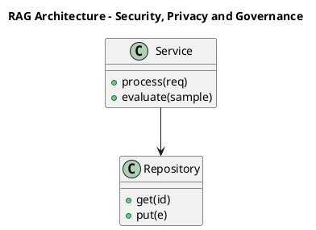

_Source diagram (plantuml); render with the appropriate tool._

**Figure 27. RAG Architecture - Security, Privacy and Governance** (plantuml). Figure: RAG Architecture view for Agentic AI. This diagram illustrates the principal components and their interactions as discussed in the surrounding section.

## Deep Dive: Mechanics, Variants and Trade-offs

Having established the essentials, we now go deeper into security, privacy and governance. The underlying mechanism is best appreciated by tracing a single request from input to output and noting where state is created and consumed. The distinctions in this section are the ones that separate a working demo from a system that holds up under adversarial inputs, scale and the passage of time.

Consider the principal variants and how to choose between them. Each variant optimises for a different point in the design space - some for latency, some for accuracy, some for cost or operability - and the correct choice follows from explicit requirements rather than from defaults. Simplicity is a feature. The simplest design that meets the requirement should be the default, with complexity added only when measurement justifies it.

In practice this is supported by a mature tooling ecosystem, including LangGraph, AutoGen, CrewAI, OpenAI Agents. Tools accelerate the work but do not substitute for understanding: the same principles apply whichever implementation you select, and the ability to reason from first principles is what lets you debug when a tool behaves unexpectedly.

A frequent source of subtle bugs is the interaction with human-in-the-loop and approvals. Because human-in-the-loop and approvals concerns confirmation gates for high-impact actions, changes there can silently alter the behaviour analysed here. The remedy is contract tests at the boundary and end-to-end evaluations that exercise the interaction explicitly.

Finally, attend to edge cases and degradation. Define what the system should do under partial failure, unexpected inputs and load spikes, and make that behaviour explicit and tested rather than emergent. Graceful degradation - returning a safe, useful result when the ideal one is unavailable - is a hallmark of mature engineering.

For deeper study, the literature offers authoritative treatments such as Yao et al. — ReAct (2022) and Shinn et al. — Reflexion (2023). These primary sources reward careful reading and ground the practical guidance above in established results.

## Advanced Considerations

Having established the essentials, we now go deeper into security, privacy and governance. Beneath the abstraction lies a concrete process whose steps can each be measured, tested and optimised independently. The distinctions in this section are the ones that separate a working demo from a system that holds up under adversarial inputs, scale and the passage of time.

Consider the principal variants and how to choose between them. Each variant optimises for a different point in the design space - some for latency, some for accuracy, some for cost or operability - and the correct choice follows from explicit requirements rather than from defaults. As with most architectural decisions, the choice is rarely binary; the skill lies in quantifying the trade-offs and choosing deliberately.

In practice this is supported by a mature tooling ecosystem, including LangGraph, AutoGen, CrewAI, OpenAI Agents. Tools accelerate the work but do not substitute for understanding: the same principles apply whichever implementation you select, and the ability to reason from first principles is what lets you debug when a tool behaves unexpectedly.

A frequent source of subtle bugs is the interaction with grounding and retrieval for agents. Because grounding and retrieval for agents concerns bringing knowledge into the agent loop, changes there can silently alter the behaviour analysed here. The remedy is contract tests at the boundary and end-to-end evaluations that exercise the interaction explicitly.

Finally, attend to edge cases and degradation. Define what the system should do under partial failure, unexpected inputs and load spikes, and make that behaviour explicit and tested rather than emergent. Graceful degradation - returning a safe, useful result when the ideal one is unavailable - is a hallmark of mature engineering.

For deeper study, the literature offers authoritative treatments such as Yao et al. — ReAct (2022) and Shinn et al. — Reflexion (2023). These primary sources reward careful reading and ground the practical guidance above in established results.

## Worked Example

To ground the discussion, walk through a representative example. A back office organisation needs workflow automation across enterprise systems. They decide to apply security, privacy and governance as part of their Agentic AI solution, but wisely treat it as a hypothesis to be validated rather than a foregone conclusion.

The team begins by stating the objective precisely and defining how success will be measured before writing any code. They establish a small but representative evaluation set, agree on acceptance thresholds, and only then prototype the simplest design that could work. Early measurement reveals which assumptions hold and which must be revised, saving weeks of misdirected effort and surfacing edge cases while they are still cheap to fix.

As the prototype matures into a service, the team hardens it: adding input validation, error handling, caching where it pays off, and monitoring that ties back to the original success metric. They document each significant decision in an architecture decision record so that future maintainers understand not just what was built but why.

The outcome is instructive. The system that reaches production is not the most sophisticated design the team considered, but the one whose behaviour they could measure, explain and operate. This is the recurring lesson of Agentic AI: durable value comes from the whole system, not from any single clever component.

## Industry Use Cases

Across industries, the ideas in this chapter recur in recognisable ways. The following vignettes show how different sectors apply them and what they have in common.

**Software.** Autonomous coding agents that plan, edit and test. The common thread is that value comes not from the model alone but from the surrounding system - data quality, evaluation, integration and operations - which is precisely where most of the engineering effort belongs.

**Operations.** Incident triage agents that gather context and act. The common thread is that value comes not from the model alone but from the surrounding system - data quality, evaluation, integration and operations - which is precisely where most of the engineering effort belongs.

**Research.** Agents that browse, synthesise and report. The common thread is that value comes not from the model alone but from the surrounding system - data quality, evaluation, integration and operations - which is precisely where most of the engineering effort belongs.

**Back office.** Workflow automation across enterprise systems. The common thread is that value comes not from the model alone but from the surrounding system - data quality, evaluation, integration and operations - which is precisely where most of the engineering effort belongs.

## Best Practices

The following practices consistently separate successful Agentic AI efforts from struggling ones. They are deliberately concrete so they can be adopted as checklist items in design and code review.

- Constrain tools with typed schemas and least-privilege permissions.
- Cap loop steps and cost to prevent runaway behaviour.
- Require human approval for irreversible or high-impact actions.
- Trace every reasoning step and tool call for debugging and audit.

None of these are exotic; they are the unglamorous disciplines that compound into reliability. The cost of adopting them is small compared with the cost of the incidents they prevent, and they become second nature with practice.

## Common Pitfalls

Equally instructive are the failure modes that recur in practice. Each pitfall below has a clear early warning sign and a known remedy, so treat them as a diagnostic checklist when something feels wrong:

- Unbounded loops that burn cost without converging.
- Granting broad tool permissions that enable harmful actions.
- No observability, making failures impossible to diagnose.
- Over-automating tasks that need human judgement.

The pattern is consistent: most failures stem from skipping measurement, conflating prototype and production standards, or deferring cross-cutting concerns such as security and cost until they become emergencies. Naming these traps in advance is the cheapest way to avoid them.

## Governance, Security and Cost Notes

No discussion of security, privacy and governance is complete without its governance, security and cost dimensions, which are too often deferred until they become emergencies. Treating them as first-class concerns from the outset is both cheaper and safer.

**Governance.** Classify the risk of this capability, document its intended and out-of-scope uses, and ensure decisions are traceable to satisfy internal policy and external regulation such as the NIST AI RMF, ISO/IEC 42001 and the EU AI Act. **Security.** Treat all external input as untrusted, validate outputs before acting on them, apply least privilege to any tools or data access, and map controls to the OWASP LLM Top 10 and MITRE ATLAS.

**Cost and sustainability.** Establish explicit budgets for compute, tokens and latency, attribute spend to owners, and revisit the economics as usage scales - a design that is affordable at pilot scale can become untenable at production volume. Building these reflexes into everyday engineering is what allows a Agentic AI system to be not only capable but also trustworthy and economically sound.

## Hands-On Exercises

Work through the following exercises. They are designed to move understanding from recognition to application - the level required for real engineering work - so prefer writing and building over merely reading.

1. Explain security, privacy and governance to a colleague unfamiliar with Agentic AI, using a concrete example from your own domain.
2. Sketch a reference architecture that incorporates security, privacy and governance and annotate where observability, security and cost controls belong.
3. Design an evaluation that would tell you whether security, privacy and governance is working in production, including the metric, the dataset and the acceptance threshold.
4. Identify two pitfalls relevant to security, privacy and governance in your environment and describe the early warning signals you would monitor.
5. Prototype the simplest implementation that demonstrates security, privacy and governance, then list exactly what would need to change to make it production-ready.

## Key Takeaways

Key takeaways from this chapter:

- Security, Privacy and Governance is a systems concern in Agentic AI: data, models and operations must be co-designed.
- Measurement is non-negotiable; define success metrics and evaluation before building.
- Favour the simplest design that meets the requirement, and add complexity only when evidence demands it.
- Security, cost and observability are first-class requirements, not afterthoughts.
- Document decisions so the system remains understandable and operable as it evolves.

## Code Walkthrough

This listing shows a configuration-driven Security, Privacy and Governance component with retry semantics and typed interfaces — the shape we expect from production Agentic AI code rather than a notebook prototype.

The full listing is shown below; study it line by line and reproduce it locally before moving on.

### Listing: Implementing a Security, Privacy and Governance component

```python
from __future__ import annotations

from dataclasses import dataclass, field
from typing import Any


@dataclass(slots=True)
class PrivacyAndConfig:
    """Configuration for the Security, Privacy and Governance component in a Agentic AI system."""

    name: str
    timeout_s: float = 30.0
    max_retries: int = 3
    options: dict[str, Any] = field(default_factory=dict)


class PrivacyAnd:
    """A minimal, production-shaped implementation of Security, Privacy and Governance."""

    def __init__(self, config: PrivacyAndConfig) -> None:
        self._config = config
        self._calls = 0

    def run(self, payload: dict[str, Any]) -> dict[str, Any]:
        """Process a request, retrying transient failures with backoff."""
        last_error: Exception | None = None
        for attempt in range(self._config.max_retries):
            try:
                self._calls += 1
                return self._process(payload)
            except TimeoutError as exc:  # transient
                last_error = exc
                continue
        raise RuntimeError(f"PrivacyAnd failed after retries") from last_error

    def _process(self, payload: dict[str, Any]) -> dict[str, Any]:
        # Domain-specific logic for Security, Privacy and Governance goes here.
        return {"status": "ok", "input_keys": sorted(payload), "calls": self._calls}

```

## Review Questions

1. In the context of Agentic AI, which statement best describes “Security, Privacy and Governance”?
   - A. It applies exclusively to image data.
   - B. It eliminates the need for any evaluation or monitoring.
   - C. the security, privacy and governance controls that make a Agentic AI system trustworthy and compliant
   - D. It is only relevant to academic research, not production.
   - **Answer: C.** Security, Privacy and Governance: the security, privacy and governance controls that make a Agentic AI system trustworthy and compliant
2. Which of the following is a recommended best practice when working with Agentic AI?
   - A. It removes all security and governance requirements.
   - B. Require human approval for irreversible or high-impact actions.
   - C. It eliminates the need for any evaluation or monitoring.
   - D. It makes the system slower but has no other effect.
   - **Answer: B.** Best practice: Require human approval for irreversible or high-impact actions.
3. Which of the following is a common pitfall to avoid in Agentic AI?
   - A. Trace every reasoning step and tool call for debugging and audit.
   - B. Cap loop steps and cost to prevent runaway behaviour.
   - C. Require human approval for irreversible or high-impact actions.
   - D. Unbounded loops that burn cost without converging.
   - **Answer: D.** Pitfall to avoid: Unbounded loops that burn cost without converging.
4. *(Discussion)* Walk through how you would design Security, Privacy and Governance for an enterprise Agentic AI workload.
   - **Model answer:** A strong answer defines security, privacy and governance (the security, privacy and governance controls that make a Agentic AI system trustworthy and compliant) then connects it to architecture, evaluation, cost, security and operations for Agentic AI, citing concrete trade-offs and a real-world example.

---


# Chapter 21. Cost, Performance and Scaling

_This chapter examines cost, performance and scaling within Agentic AI. It covers techniques for controlling cost and latency while scaling a Agentic AI system to production traffic, derives a reference architecture, walks through a worked example and runnable code, surveys industry use cases, and distils best practices and pitfalls, closing with exercises and review questions._

## Introduction

In practical terms, Cost, Performance and Scaling is best understood as techniques for controlling cost and latency while scaling a Agentic AI system to production traffic. Understanding this matters because Agentic AI systems succeed or fail on exactly these decisions. The practical implication is that design choices here ripple through latency, cost and maintainability for the lifetime of the system.

This chapter builds intuition first, then formalises the ideas, derives an architecture, and finishes with code, exercises and review questions so the material transfers directly to your own Agentic AI work. Read it actively: pause at each diagram, reproduce the code, and attempt the exercises before consulting the answers.

## Theory and Foundations

Cost, Performance and Scaling refers to techniques for controlling cost and latency while scaling a Agentic AI system to production traffic. Seasoned practitioners treat this as a systems problem, co-designing data, models and operations rather than optimising any one in isolation. The underlying mechanism is best appreciated by tracing a single request from input to output and noting where state is created and consumed.

To place this in context, recall the broader picture: Agentic AI systems use language models as reasoning engines that plan, invoke tools, observe results and iterate toward goals with limited human oversight. Within that picture, cost, performance and scaling is one of the load-bearing ideas - the kind that, when understood deeply, makes the rest of Agentic AI fall into place. Getting this right early prevents expensive rework once a Agentic AI system reaches scale.

Cost, Performance and Scaling cannot be understood in isolation from safety, sandboxing and permissions. Recall that safety, sandboxing and permissions concerns constraining what agents can do and access. The two interact directly: decisions in one constrain the design space of the other, which is why mature teams reason about them together rather than sequentially. As with most architectural decisions, the choice is rarely binary; the skill lies in quantifying the trade-offs and choosing deliberately.

Cost, Performance and Scaling cannot be understood in isolation from the agent loop: reason, act, observe. Recall that the agent loop: reason, act, observe concerns reAct-style cycles and the perception–action interface. The two interact directly: decisions in one constrain the design space of the other, which is why mature teams reason about them together rather than sequentially. There is an inherent trade-off between fidelity and cost, and the correct balance depends on the use case and its tolerance for error.

Several established patterns apply directly to cost, performance and scaling. The first, approval gate before irreversible actions, is widely adopted because it makes the system's behaviour predictable and observable. A complementary pattern, plan-and-execute with a separate planner and executor, addresses a related concern and is often deployed alongside it. Patterns are not dogma; they are distilled experience that shortcuts the search for a sound design, and each carries assumptions worth checking against your context.

The decision of whether to adopt this should be driven by requirements, not by novelty. In a small prototype, shortcuts around cost, performance and scaling are invisible; in a production Agentic AI system serving real traffic, they surface as incidents, cost overruns or compliance gaps. There is an inherent trade-off between fidelity and cost, and the correct balance depends on the use case and its tolerance for error. The remainder of this chapter turns these principles into an architecture, code and a checklist you can apply immediately.

## Architecture and Design

A robust architecture for Cost, Performance and Scaling is layered so each part can evolve independently without destabilising the whole. An agent runtime hosts a reasoning model, a tool registry with typed schemas, a memory store (short-term context plus long-term vector memory), and a controller enforcing step budgets, permissions and human approvals. Every step is traced for observability and replay.

Concretely, the principal building blocks include from chatbots to agents, the agent loop: reason, act, observe, planning and task decomposition, tool use and function calling and memory architectures. Each is a replaceable component behind a stable interface, so the team can upgrade an implementation - a model, an index, a policy engine - without rewriting its neighbours. The contracts between components are where reliability is won or lost, so they are specified explicitly and tested in isolation.

The diagram accompanying this section makes the data and control flow explicit. Requests enter through a well-defined boundary where they are authenticated and validated; only then are they dispatched to the components that perform the work. This boundary is also where rate limiting, quota enforcement and audit logging live, keeping cross-cutting concerns out of the core logic and in one auditable place.

Two qualities deserve emphasis. First, observability is designed in, not bolted on: every component emits structured telemetry so that failures can be localised in minutes rather than hours. Second, the architecture is evolvable - components communicate through stable contracts so that any single part of the Agentic AI system can be replaced without a rewrite. There is an inherent trade-off between fidelity and cost, and the correct balance depends on the use case and its tolerance for error.

<div class="diagram-svg">

<svg xmlns="http://www.w3.org/2000/svg" width="840" height="460" data-tpl="cycle" data-pal="0-0" viewBox="0 0 840 460" font-family="Inter, Segoe UI, Arial, sans-serif"><defs><marker id="ar" markerWidth="9" markerHeight="9" refX="7" refY="3" orient="auto"><path d="M0,0 L7,3 L0,6 z" fill="#94a3b8"/></marker><marker id="arw" markerWidth="9" markerHeight="9" refX="7" refY="3" orient="auto"><path d="M0,0 L7,3 L0,6 z" fill="#ffffff"/></marker><filter id="sh" x="-20%" y="-20%" width="140%" height="140%"><feDropShadow dx="0" dy="2" stdDeviation="3" flood-color="#0f172a" flood-opacity="0.16"/></filter></defs><defs><linearGradient id="bncc0f0c3" x1="0" y1="0" x2="1" y2="0"><stop offset="0" stop-color="#4338ca"/><stop offset="1" stop-color="#6d28d9"/></linearGradient></defs><rect width="840" height="460" rx="14" fill="#ffffff"/><rect x="0" y="0" width="840" height="48" rx="14" fill="url(#bncc0f0c3)"/><rect x="0" y="32" width="840" height="16" fill="url(#bncc0f0c3)"/><text x="420" y="25" text-anchor="middle" font-size="14.5" font-weight="700" fill="#ffffff" dominant-baseline="middle">CI/CD Pipeline - Cost, Performance and Scaling</text><rect x="348" y="86" width="144" height="44" rx="11" fill="#4338ca" filter="url(#sh)"/><text x="420" y="103" text-anchor="middle" font-size="9.5" font-weight="600" fill="#ffffff" dominant-baseline="middle">The Agent Loop: Reason,</text><text x="420" y="113" text-anchor="middle" font-size="9.5" font-weight="600" fill="#ffffff" dominant-baseline="middle">Act, Observe</text><rect x="472" y="176" width="144" height="44" rx="11" fill="#6d28d9" filter="url(#sh)"/><text x="544" y="192" text-anchor="middle" font-size="9.5" font-weight="600" fill="#ffffff" dominant-baseline="middle">Planning and Task</text><text x="544" y="203" text-anchor="middle" font-size="9.5" font-weight="600" fill="#ffffff" dominant-baseline="middle">Decomposition</text><rect x="424" y="321" width="144" height="44" rx="11" fill="#7c3aed" filter="url(#sh)"/><text x="496" y="338" text-anchor="middle" font-size="9.5" font-weight="600" fill="#ffffff" dominant-baseline="middle">Tool Use and Function</text><text x="496" y="349" text-anchor="middle" font-size="9.5" font-weight="600" fill="#ffffff" dominant-baseline="middle">Calling</text><rect x="272" y="321" width="144" height="44" rx="11" fill="#8b5cf6" filter="url(#sh)"/><text x="344" y="343" text-anchor="middle" font-size="11" font-weight="600" fill="#ffffff" dominant-baseline="middle">Memory Architectures</text><rect x="224" y="176" width="144" height="44" rx="11" fill="#a78bfa" filter="url(#sh)"/><text x="296" y="192" text-anchor="middle" font-size="9.5" font-weight="600" fill="#ffffff" dominant-baseline="middle">Reflection and</text><text x="296" y="203" text-anchor="middle" font-size="9.5" font-weight="600" fill="#ffffff" dominant-baseline="middle">Self-Correction</text><path d="M461,147 A100,100 0 0 1 494,171" fill="none" stroke="#cbd5e1" stroke-width="2" marker-end="url(#ar)"/><path d="M519,249 A100,100 0 0 1 507,288" fill="none" stroke="#cbd5e1" stroke-width="2" marker-end="url(#ar)"/><path d="M441,336 A100,100 0 0 1 399,336" fill="none" stroke="#cbd5e1" stroke-width="2" marker-end="url(#ar)"/><path d="M333,288 A100,100 0 0 1 321,249" fill="none" stroke="#cbd5e1" stroke-width="2" marker-end="url(#ar)"/><path d="M346,171 A100,100 0 0 1 379,147" fill="none" stroke="#cbd5e1" stroke-width="2" marker-end="url(#ar)"/><text x="420" y="238" text-anchor="middle" font-size="12" font-weight="600" fill="#64748b" dominant-baseline="middle">continuous</text><text x="28" y="446" text-anchor="start" font-size="9.5" font-weight="500" fill="#64748b" dominant-baseline="middle">Agentic AI  •  CI/CD Pipeline</text></svg>

</div>

**Figure 28. CI/CD Pipeline - Cost, Performance and Scaling** (svg). Figure: CI/CD Pipeline view for Agentic AI. This diagram illustrates the principal components and their interactions as discussed in the surrounding section.

## Deep Dive: Mechanics, Variants and Trade-offs

Having established the essentials, we now go deeper into cost, performance and scaling. It pays to understand the mechanism rather than treat it as a black box, because most production incidents are explained by one of its steps misbehaving. The distinctions in this section are the ones that separate a working demo from a system that holds up under adversarial inputs, scale and the passage of time.

Consider the principal variants and how to choose between them. Each variant optimises for a different point in the design space - some for latency, some for accuracy, some for cost or operability - and the correct choice follows from explicit requirements rather than from defaults. As with most architectural decisions, the choice is rarely binary; the skill lies in quantifying the trade-offs and choosing deliberately.

In practice this is supported by a mature tooling ecosystem, including LangGraph, AutoGen, CrewAI, OpenAI Agents. Tools accelerate the work but do not substitute for understanding: the same principles apply whichever implementation you select, and the ability to reason from first principles is what lets you debug when a tool behaves unexpectedly.

A frequent source of subtle bugs is the interaction with safety, sandboxing and permissions. Because safety, sandboxing and permissions concerns constraining what agents can do and access, changes there can silently alter the behaviour analysed here. The remedy is contract tests at the boundary and end-to-end evaluations that exercise the interaction explicitly.

Finally, attend to edge cases and degradation. Define what the system should do under partial failure, unexpected inputs and load spikes, and make that behaviour explicit and tested rather than emergent. Graceful degradation - returning a safe, useful result when the ideal one is unavailable - is a hallmark of mature engineering.

For deeper study, the literature offers authoritative treatments such as Yao et al. — ReAct (2022) and Shinn et al. — Reflexion (2023). These primary sources reward careful reading and ground the practical guidance above in established results.

## Advanced Considerations

Having established the essentials, we now go deeper into cost, performance and scaling. It pays to understand the mechanism rather than treat it as a black box, because most production incidents are explained by one of its steps misbehaving. The distinctions in this section are the ones that separate a working demo from a system that holds up under adversarial inputs, scale and the passage of time.

Consider the principal variants and how to choose between them. Each variant optimises for a different point in the design space - some for latency, some for accuracy, some for cost or operability - and the correct choice follows from explicit requirements rather than from defaults. Every added component buys capability at the price of operational surface area, and that bargain should be made consciously.

In practice this is supported by a mature tooling ecosystem, including LangGraph, AutoGen, CrewAI, OpenAI Agents. Tools accelerate the work but do not substitute for understanding: the same principles apply whichever implementation you select, and the ability to reason from first principles is what lets you debug when a tool behaves unexpectedly.

A frequent source of subtle bugs is the interaction with from chatbots to agents. Because from chatbots to agents concerns the shift from single responses to goal-directed loops, changes there can silently alter the behaviour analysed here. The remedy is contract tests at the boundary and end-to-end evaluations that exercise the interaction explicitly.

Finally, attend to edge cases and degradation. Define what the system should do under partial failure, unexpected inputs and load spikes, and make that behaviour explicit and tested rather than emergent. Graceful degradation - returning a safe, useful result when the ideal one is unavailable - is a hallmark of mature engineering.

For deeper study, the literature offers authoritative treatments such as Yao et al. — ReAct (2022) and Shinn et al. — Reflexion (2023). These primary sources reward careful reading and ground the practical guidance above in established results.

## Worked Example

Consider a concrete scenario. A software organisation needs autonomous coding agents that plan, edit and test. They decide to apply cost, performance and scaling as part of their Agentic AI solution, but wisely treat it as a hypothesis to be validated rather than a foregone conclusion.

The team begins by stating the objective precisely and defining how success will be measured before writing any code. They establish a small but representative evaluation set, agree on acceptance thresholds, and only then prototype the simplest design that could work. Early measurement reveals which assumptions hold and which must be revised, saving weeks of misdirected effort and surfacing edge cases while they are still cheap to fix.

As the prototype matures into a service, the team hardens it: adding input validation, error handling, caching where it pays off, and monitoring that ties back to the original success metric. They document each significant decision in an architecture decision record so that future maintainers understand not just what was built but why.

The outcome is instructive. The system that reaches production is not the most sophisticated design the team considered, but the one whose behaviour they could measure, explain and operate. This is the recurring lesson of Agentic AI: durable value comes from the whole system, not from any single clever component.

## Industry Use Cases

Across industries, the ideas in this chapter recur in recognisable ways. The following vignettes show how different sectors apply them and what they have in common.

**Software.** Autonomous coding agents that plan, edit and test. The common thread is that value comes not from the model alone but from the surrounding system - data quality, evaluation, integration and operations - which is precisely where most of the engineering effort belongs.

**Operations.** Incident triage agents that gather context and act. The common thread is that value comes not from the model alone but from the surrounding system - data quality, evaluation, integration and operations - which is precisely where most of the engineering effort belongs.

**Research.** Agents that browse, synthesise and report. The common thread is that value comes not from the model alone but from the surrounding system - data quality, evaluation, integration and operations - which is precisely where most of the engineering effort belongs.

**Back office.** Workflow automation across enterprise systems. The common thread is that value comes not from the model alone but from the surrounding system - data quality, evaluation, integration and operations - which is precisely where most of the engineering effort belongs.

## Best Practices

The following practices consistently separate successful Agentic AI efforts from struggling ones. They are deliberately concrete so they can be adopted as checklist items in design and code review.

- Constrain tools with typed schemas and least-privilege permissions.
- Cap loop steps and cost to prevent runaway behaviour.
- Require human approval for irreversible or high-impact actions.
- Trace every reasoning step and tool call for debugging and audit.

None of these are exotic; they are the unglamorous disciplines that compound into reliability. The cost of adopting them is small compared with the cost of the incidents they prevent, and they become second nature with practice.

## Common Pitfalls

Equally instructive are the failure modes that recur in practice. Each pitfall below has a clear early warning sign and a known remedy, so treat them as a diagnostic checklist when something feels wrong:

- Unbounded loops that burn cost without converging.
- Granting broad tool permissions that enable harmful actions.
- No observability, making failures impossible to diagnose.
- Over-automating tasks that need human judgement.

The pattern is consistent: most failures stem from skipping measurement, conflating prototype and production standards, or deferring cross-cutting concerns such as security and cost until they become emergencies. Naming these traps in advance is the cheapest way to avoid them.

## Governance, Security and Cost Notes

No discussion of cost, performance and scaling is complete without its governance, security and cost dimensions, which are too often deferred until they become emergencies. Treating them as first-class concerns from the outset is both cheaper and safer.

**Governance.** Classify the risk of this capability, document its intended and out-of-scope uses, and ensure decisions are traceable to satisfy internal policy and external regulation such as the NIST AI RMF, ISO/IEC 42001 and the EU AI Act. **Security.** Treat all external input as untrusted, validate outputs before acting on them, apply least privilege to any tools or data access, and map controls to the OWASP LLM Top 10 and MITRE ATLAS.

**Cost and sustainability.** Establish explicit budgets for compute, tokens and latency, attribute spend to owners, and revisit the economics as usage scales - a design that is affordable at pilot scale can become untenable at production volume. Building these reflexes into everyday engineering is what allows a Agentic AI system to be not only capable but also trustworthy and economically sound.

## Hands-On Exercises

Work through the following exercises. They are designed to move understanding from recognition to application - the level required for real engineering work - so prefer writing and building over merely reading.

1. Explain cost, performance and scaling to a colleague unfamiliar with Agentic AI, using a concrete example from your own domain.
2. Sketch a reference architecture that incorporates cost, performance and scaling and annotate where observability, security and cost controls belong.
3. Design an evaluation that would tell you whether cost, performance and scaling is working in production, including the metric, the dataset and the acceptance threshold.
4. Identify two pitfalls relevant to cost, performance and scaling in your environment and describe the early warning signals you would monitor.
5. Prototype the simplest implementation that demonstrates cost, performance and scaling, then list exactly what would need to change to make it production-ready.

## Key Takeaways

Key takeaways from this chapter:

- Cost, Performance and Scaling is a systems concern in Agentic AI: data, models and operations must be co-designed.
- Measurement is non-negotiable; define success metrics and evaluation before building.
- Favour the simplest design that meets the requirement, and add complexity only when evidence demands it.
- Security, cost and observability are first-class requirements, not afterthoughts.
- Document decisions so the system remains understandable and operable as it evolves.

## Code Walkthrough

Every change to a Agentic AI system should pass an evaluation gate. This example shows the minimal shape: align predictions and references, compute a metric, and return a pass/fail decision for CI.

The full listing is shown below; study it line by line and reproduce it locally before moving on.

### Listing: Evaluating Cost, Performance and Scaling with a regression gate

```python
from dataclasses import dataclass


@dataclass
class EvalResult:
    metric: str
    score: float
    passed: bool


def evaluate(predictions: list[str], references: list[str],
             threshold: float = 0.8) -> EvalResult:
    """Score Cost, Performance and Scaling output against references with a simple exact-match metric.

    In practice you would combine several metrics (exact match, semantic
    similarity, LLM-as-judge) and gate releases on the aggregate.
    """
    if len(predictions) != len(references):
        raise ValueError("predictions and references must align")
    hits = sum(p.strip() == r.strip() for p, r in zip(predictions, references))
    score = hits / len(references) if references else 0.0
    return EvalResult(metric="exact_match", score=score, passed=score >= threshold)


if __name__ == "__main__":
    result = evaluate(["yes", "no"], ["yes", "yes"])
    print(f"{result.metric}={result.score:.2f} passed={result.passed}")

```

## Review Questions

1. In the context of Agentic AI, which statement best describes “Cost, Performance and Scaling”?
   - A. techniques for controlling cost and latency while scaling a Agentic AI system to production traffic
   - B. It guarantees deterministic output regardless of input.
   - C. It removes all security and governance requirements.
   - D. It eliminates the need for any evaluation or monitoring.
   - **Answer: A.** Cost, Performance and Scaling: techniques for controlling cost and latency while scaling a Agentic AI system to production traffic
2. Which of the following is a recommended best practice when working with Agentic AI?
   - A. It eliminates the need for any evaluation or monitoring.
   - B. Constrain tools with typed schemas and least-privilege permissions.
   - C. It removes all security and governance requirements.
   - D. It guarantees deterministic output regardless of input.
   - **Answer: B.** Best practice: Constrain tools with typed schemas and least-privilege permissions.
3. Which of the following is a common pitfall to avoid in Agentic AI?
   - A. It removes all security and governance requirements.
   - B. Granting broad tool permissions that enable harmful actions.
   - C. Cap loop steps and cost to prevent runaway behaviour.
   - D. It eliminates the need for any evaluation or monitoring.
   - **Answer: B.** Pitfall to avoid: Granting broad tool permissions that enable harmful actions.
4. *(Discussion)* How would you test and monitor Cost, Performance and Scaling in production?
   - **Model answer:** A strong answer defines cost, performance and scaling (techniques for controlling cost and latency while scaling a Agentic AI system to production traffic) then connects it to architecture, evaluation, cost, security and operations for Agentic AI, citing concrete trade-offs and a real-world example.

---


# Chapter 22. Integration and Interoperability

_This chapter examines integration and interoperability within Agentic AI. It covers patterns for integrating a Agentic AI system with surrounding enterprise systems and data, derives a reference architecture, walks through a worked example and runnable code, surveys industry use cases, and distils best practices and pitfalls, closing with exercises and review questions._

## Introduction

We define Integration and Interoperability as patterns for integrating a Agentic AI system with surrounding enterprise systems and data. This concept recurs throughout the Agentic AI lifecycle, from design to operations. It helps to separate the conceptual model from its implementation: the former guides reasoning, the latter must contend with real-world constraints.

This chapter builds intuition first, then formalises the ideas, derives an architecture, and finishes with code, exercises and review questions so the material transfers directly to your own Agentic AI work. Read it actively: pause at each diagram, reproduce the code, and attempt the exercises before consulting the answers.

## Theory and Foundations

Integration and Interoperability refers to patterns for integrating a Agentic AI system with surrounding enterprise systems and data. Seasoned practitioners treat this as a systems problem, co-designing data, models and operations rather than optimising any one in isolation. Beneath the abstraction lies a concrete process whose steps can each be measured, tested and optimised independently.

To place this in context, recall the broader picture: Agentic AI systems use language models as reasoning engines that plan, invoke tools, observe results and iterate toward goals with limited human oversight. Within that picture, integration and interoperability is one of the load-bearing ideas - the kind that, when understood deeply, makes the rest of Agentic AI fall into place. Neglecting it is one of the most common reasons Agentic AI initiatives stall in production.

Integration and Interoperability cannot be understood in isolation from memory architectures. Recall that memory architectures concerns short-term context, long-term vector memory and episodic recall. The two interact directly: decisions in one constrain the design space of the other, which is why mature teams reason about them together rather than sequentially. There is an inherent trade-off between fidelity and cost, and the correct balance depends on the use case and its tolerance for error.

Integration and Interoperability cannot be understood in isolation from observability for agents. Recall that observability for agents concerns tracing reasoning, tool calls and outcomes. The two interact directly: decisions in one constrain the design space of the other, which is why mature teams reason about them together rather than sequentially. As with most architectural decisions, the choice is rarely binary; the skill lies in quantifying the trade-offs and choosing deliberately.

Several established patterns apply directly to integration and interoperability. The first, reflection loop to critique and revise outputs, is widely adopted because it makes the system's behaviour predictable and observable. A complementary pattern, plan-and-execute with a separate planner and executor, addresses a related concern and is often deployed alongside it. Patterns are not dogma; they are distilled experience that shortcuts the search for a sound design, and each carries assumptions worth checking against your context.

The decision of whether to adopt this should be driven by requirements, not by novelty. In a small prototype, shortcuts around integration and interoperability are invisible; in a production Agentic AI system serving real traffic, they surface as incidents, cost overruns or compliance gaps. Latency, accuracy and cost form a tension triangle: improving one typically pressures the others, so explicit budgets are essential. The remainder of this chapter turns these principles into an architecture, code and a checklist you can apply immediately.

## Architecture and Design

The reference architecture for Integration and Interoperability separates concerns into clearly bounded components with explicit contracts. An agent runtime hosts a reasoning model, a tool registry with typed schemas, a memory store (short-term context plus long-term vector memory), and a controller enforcing step budgets, permissions and human approvals. Every step is traced for observability and replay.

Concretely, the principal building blocks include from chatbots to agents, the agent loop: reason, act, observe, planning and task decomposition, tool use and function calling and memory architectures. Each is a replaceable component behind a stable interface, so the team can upgrade an implementation - a model, an index, a policy engine - without rewriting its neighbours. The contracts between components are where reliability is won or lost, so they are specified explicitly and tested in isolation.

The diagram accompanying this section makes the data and control flow explicit. Requests enter through a well-defined boundary where they are authenticated and validated; only then are they dispatched to the components that perform the work. This boundary is also where rate limiting, quota enforcement and audit logging live, keeping cross-cutting concerns out of the core logic and in one auditable place.

Two qualities deserve emphasis. First, observability is designed in, not bolted on: every component emits structured telemetry so that failures can be localised in minutes rather than hours. Second, the architecture is evolvable - components communicate through stable contracts so that any single part of the Agentic AI system can be replaced without a rewrite. As with most architectural decisions, the choice is rarely binary; the skill lies in quantifying the trade-offs and choosing deliberately.

```xml
<mxfile host="ai-university">
  <diagram name="Infrastructure">
    <mxGraphModel dx="800" dy="600" grid="1" gridSize="10">
      <root>
        <mxCell id="0"/>
        <mxCell id="1" parent="0"/>
        <mxCell id="title" value="Infrastructure - Integration and Interoperability" style="text;fontSize=16;fontStyle=1" vertex="1" parent="1"><mxGeometry x="40" y="20" width="600" height="30" as="geometry"/></mxCell>
        <mxCell id="hub" value="Agentic AI" style="rounded=1;fillColor=#0f172a;fontColor=#ffffff;fontStyle=1" vertex="1" parent="1"><mxGeometry x="300" y="180" width="160" height="60" as="geometry"/></mxCell>
        <mxCell id="n0" value="From Chatbots to Agents" style="rounded=1;fillColor=#e0e7ff;strokeColor=#4338ca" vertex="1" parent="1"><mxGeometry x="60" y="80" width="160" height="50" as="geometry"/></mxCell>
        <mxCell id="e0" style="edgeStyle=orthogonalEdgeStyle" edge="1" parent="1" source="hub" target="n0"><mxGeometry relative="1" as="geometry"/></mxCell>
        <mxCell id="n1" value="The Agent Loop: Reason,…" style="rounded=1;fillColor=#e0e7ff;strokeColor=#4338ca" vertex="1" parent="1"><mxGeometry x="600" y="170" width="160" height="50" as="geometry"/></mxCell>
        <mxCell id="e1" style="edgeStyle=orthogonalEdgeStyle" edge="1" parent="1" source="hub" target="n1"><mxGeometry relative="1" as="geometry"/></mxCell>
        <mxCell id="n2" value="Planning and Task Decom…" style="rounded=1;fillColor=#e0e7ff;strokeColor=#4338ca" vertex="1" parent="1"><mxGeometry x="60" y="260" width="160" height="50" as="geometry"/></mxCell>
        <mxCell id="e2" style="edgeStyle=orthogonalEdgeStyle" edge="1" parent="1" source="hub" target="n2"><mxGeometry relative="1" as="geometry"/></mxCell>
        <mxCell id="n3" value="Tool Use and Function C…" style="rounded=1;fillColor=#e0e7ff;strokeColor=#4338ca" vertex="1" parent="1"><mxGeometry x="600" y="350" width="160" height="50" as="geometry"/></mxCell>
        <mxCell id="e3" style="edgeStyle=orthogonalEdgeStyle" edge="1" parent="1" source="hub" target="n3"><mxGeometry relative="1" as="geometry"/></mxCell>
        <mxCell id="n4" value="Memory Architectures" style="rounded=1;fillColor=#e0e7ff;strokeColor=#4338ca" vertex="1" parent="1"><mxGeometry x="60" y="440" width="160" height="50" as="geometry"/></mxCell>
        <mxCell id="e4" style="edgeStyle=orthogonalEdgeStyle" edge="1" parent="1" source="hub" target="n4"><mxGeometry relative="1" as="geometry"/></mxCell>
      </root>
    </mxGraphModel>
  </diagram>
</mxfile>
```

_Source diagram (drawio); render with the appropriate tool._

**Figure 29. Infrastructure - Integration and Interoperability** (drawio). Figure: Infrastructure view for Agentic AI. This diagram illustrates the principal components and their interactions as discussed in the surrounding section.

## Deep Dive: Mechanics, Variants and Trade-offs

Having established the essentials, we now go deeper into integration and interoperability. It pays to understand the mechanism rather than treat it as a black box, because most production incidents are explained by one of its steps misbehaving. The distinctions in this section are the ones that separate a working demo from a system that holds up under adversarial inputs, scale and the passage of time.

Consider the principal variants and how to choose between them. Each variant optimises for a different point in the design space - some for latency, some for accuracy, some for cost or operability - and the correct choice follows from explicit requirements rather than from defaults. Every added component buys capability at the price of operational surface area, and that bargain should be made consciously.

In practice this is supported by a mature tooling ecosystem, including LangGraph, AutoGen, CrewAI, OpenAI Agents. Tools accelerate the work but do not substitute for understanding: the same principles apply whichever implementation you select, and the ability to reason from first principles is what lets you debug when a tool behaves unexpectedly.

A frequent source of subtle bugs is the interaction with memory architectures. Because memory architectures concerns short-term context, long-term vector memory and episodic recall, changes there can silently alter the behaviour analysed here. The remedy is contract tests at the boundary and end-to-end evaluations that exercise the interaction explicitly.

Finally, attend to edge cases and degradation. Define what the system should do under partial failure, unexpected inputs and load spikes, and make that behaviour explicit and tested rather than emergent. Graceful degradation - returning a safe, useful result when the ideal one is unavailable - is a hallmark of mature engineering.

For deeper study, the literature offers authoritative treatments such as Yao et al. — ReAct (2022) and Shinn et al. — Reflexion (2023). These primary sources reward careful reading and ground the practical guidance above in established results.

## Advanced Considerations

Having established the essentials, we now go deeper into integration and interoperability. Beneath the abstraction lies a concrete process whose steps can each be measured, tested and optimised independently. The distinctions in this section are the ones that separate a working demo from a system that holds up under adversarial inputs, scale and the passage of time.

Consider the principal variants and how to choose between them. Each variant optimises for a different point in the design space - some for latency, some for accuracy, some for cost or operability - and the correct choice follows from explicit requirements rather than from defaults. Latency, accuracy and cost form a tension triangle: improving one typically pressures the others, so explicit budgets are essential.

In practice this is supported by a mature tooling ecosystem, including LangGraph, AutoGen, CrewAI, OpenAI Agents. Tools accelerate the work but do not substitute for understanding: the same principles apply whichever implementation you select, and the ability to reason from first principles is what lets you debug when a tool behaves unexpectedly.

A frequent source of subtle bugs is the interaction with planning and task decomposition. Because planning and task decomposition concerns plan-and-execute, tree-of-thought and hierarchical planning, changes there can silently alter the behaviour analysed here. The remedy is contract tests at the boundary and end-to-end evaluations that exercise the interaction explicitly.

Finally, attend to edge cases and degradation. Define what the system should do under partial failure, unexpected inputs and load spikes, and make that behaviour explicit and tested rather than emergent. Graceful degradation - returning a safe, useful result when the ideal one is unavailable - is a hallmark of mature engineering.

For deeper study, the literature offers authoritative treatments such as Yao et al. — ReAct (2022) and Shinn et al. — Reflexion (2023). These primary sources reward careful reading and ground the practical guidance above in established results.

## Worked Example

To ground the discussion, walk through a representative example. A back office organisation needs workflow automation across enterprise systems. They decide to apply integration and interoperability as part of their Agentic AI solution, but wisely treat it as a hypothesis to be validated rather than a foregone conclusion.

The team begins by stating the objective precisely and defining how success will be measured before writing any code. They establish a small but representative evaluation set, agree on acceptance thresholds, and only then prototype the simplest design that could work. Early measurement reveals which assumptions hold and which must be revised, saving weeks of misdirected effort and surfacing edge cases while they are still cheap to fix.

As the prototype matures into a service, the team hardens it: adding input validation, error handling, caching where it pays off, and monitoring that ties back to the original success metric. They document each significant decision in an architecture decision record so that future maintainers understand not just what was built but why.

The outcome is instructive. The system that reaches production is not the most sophisticated design the team considered, but the one whose behaviour they could measure, explain and operate. This is the recurring lesson of Agentic AI: durable value comes from the whole system, not from any single clever component.

## Industry Use Cases

Across industries, the ideas in this chapter recur in recognisable ways. The following vignettes show how different sectors apply them and what they have in common.

**Software.** Autonomous coding agents that plan, edit and test. The common thread is that value comes not from the model alone but from the surrounding system - data quality, evaluation, integration and operations - which is precisely where most of the engineering effort belongs.

**Operations.** Incident triage agents that gather context and act. The common thread is that value comes not from the model alone but from the surrounding system - data quality, evaluation, integration and operations - which is precisely where most of the engineering effort belongs.

**Research.** Agents that browse, synthesise and report. The common thread is that value comes not from the model alone but from the surrounding system - data quality, evaluation, integration and operations - which is precisely where most of the engineering effort belongs.

**Back office.** Workflow automation across enterprise systems. The common thread is that value comes not from the model alone but from the surrounding system - data quality, evaluation, integration and operations - which is precisely where most of the engineering effort belongs.

## Best Practices

The following practices consistently separate successful Agentic AI efforts from struggling ones. They are deliberately concrete so they can be adopted as checklist items in design and code review.

- Constrain tools with typed schemas and least-privilege permissions.
- Cap loop steps and cost to prevent runaway behaviour.
- Require human approval for irreversible or high-impact actions.
- Trace every reasoning step and tool call for debugging and audit.

None of these are exotic; they are the unglamorous disciplines that compound into reliability. The cost of adopting them is small compared with the cost of the incidents they prevent, and they become second nature with practice.

## Common Pitfalls

Equally instructive are the failure modes that recur in practice. Each pitfall below has a clear early warning sign and a known remedy, so treat them as a diagnostic checklist when something feels wrong:

- Unbounded loops that burn cost without converging.
- Granting broad tool permissions that enable harmful actions.
- No observability, making failures impossible to diagnose.
- Over-automating tasks that need human judgement.

The pattern is consistent: most failures stem from skipping measurement, conflating prototype and production standards, or deferring cross-cutting concerns such as security and cost until they become emergencies. Naming these traps in advance is the cheapest way to avoid them.

## Governance, Security and Cost Notes

No discussion of integration and interoperability is complete without its governance, security and cost dimensions, which are too often deferred until they become emergencies. Treating them as first-class concerns from the outset is both cheaper and safer.

**Governance.** Classify the risk of this capability, document its intended and out-of-scope uses, and ensure decisions are traceable to satisfy internal policy and external regulation such as the NIST AI RMF, ISO/IEC 42001 and the EU AI Act. **Security.** Treat all external input as untrusted, validate outputs before acting on them, apply least privilege to any tools or data access, and map controls to the OWASP LLM Top 10 and MITRE ATLAS.

**Cost and sustainability.** Establish explicit budgets for compute, tokens and latency, attribute spend to owners, and revisit the economics as usage scales - a design that is affordable at pilot scale can become untenable at production volume. Building these reflexes into everyday engineering is what allows a Agentic AI system to be not only capable but also trustworthy and economically sound.

## Hands-On Exercises

Work through the following exercises. They are designed to move understanding from recognition to application - the level required for real engineering work - so prefer writing and building over merely reading.

1. Explain integration and interoperability to a colleague unfamiliar with Agentic AI, using a concrete example from your own domain.
2. Sketch a reference architecture that incorporates integration and interoperability and annotate where observability, security and cost controls belong.
3. Design an evaluation that would tell you whether integration and interoperability is working in production, including the metric, the dataset and the acceptance threshold.
4. Identify two pitfalls relevant to integration and interoperability in your environment and describe the early warning signals you would monitor.
5. Prototype the simplest implementation that demonstrates integration and interoperability, then list exactly what would need to change to make it production-ready.

## Key Takeaways

Key takeaways from this chapter:

- Integration and Interoperability is a systems concern in Agentic AI: data, models and operations must be co-designed.
- Measurement is non-negotiable; define success metrics and evaluation before building.
- Favour the simplest design that meets the requirement, and add complexity only when evidence demands it.
- Security, cost and observability are first-class requirements, not afterthoughts.
- Document decisions so the system remains understandable and operable as it evolves.

## Code Walkthrough

Every change to a Agentic AI system should pass an evaluation gate. This example shows the minimal shape: align predictions and references, compute a metric, and return a pass/fail decision for CI.

The full listing is shown below; study it line by line and reproduce it locally before moving on.

### Listing: Evaluating Integration and Interoperability with a regression gate

```python
from dataclasses import dataclass


@dataclass
class EvalResult:
    metric: str
    score: float
    passed: bool


def evaluate(predictions: list[str], references: list[str],
             threshold: float = 0.8) -> EvalResult:
    """Score Integration and Interoperability output against references with a simple exact-match metric.

    In practice you would combine several metrics (exact match, semantic
    similarity, LLM-as-judge) and gate releases on the aggregate.
    """
    if len(predictions) != len(references):
        raise ValueError("predictions and references must align")
    hits = sum(p.strip() == r.strip() for p, r in zip(predictions, references))
    score = hits / len(references) if references else 0.0
    return EvalResult(metric="exact_match", score=score, passed=score >= threshold)


if __name__ == "__main__":
    result = evaluate(["yes", "no"], ["yes", "yes"])
    print(f"{result.metric}={result.score:.2f} passed={result.passed}")

```

## Review Questions

1. In the context of Agentic AI, which statement best describes “Integration and Interoperability”?
   - A. patterns for integrating a Agentic AI system with surrounding enterprise systems and data
   - B. It is only relevant to academic research, not production.
   - C. It makes the system slower but has no other effect.
   - D. It eliminates the need for any evaluation or monitoring.
   - **Answer: A.** Integration and Interoperability: patterns for integrating a Agentic AI system with surrounding enterprise systems and data
2. Which of the following is a recommended best practice when working with Agentic AI?
   - A. It is only relevant to academic research, not production.
   - B. It makes the system slower but has no other effect.
   - C. Granting broad tool permissions that enable harmful actions.
   - D. Trace every reasoning step and tool call for debugging and audit.
   - **Answer: D.** Best practice: Trace every reasoning step and tool call for debugging and audit.
3. Which of the following is a common pitfall to avoid in Agentic AI?
   - A. It applies exclusively to image data.
   - B. Granting broad tool permissions that enable harmful actions.
   - C. Trace every reasoning step and tool call for debugging and audit.
   - D. It guarantees deterministic output regardless of input.
   - **Answer: B.** Pitfall to avoid: Granting broad tool permissions that enable harmful actions.
4. *(Discussion)* How does Integration and Interoperability interact with security and governance requirements?
   - **Model answer:** A strong answer defines integration and interoperability (patterns for integrating a Agentic AI system with surrounding enterprise systems and data) then connects it to architecture, evaluation, cost, security and operations for Agentic AI, citing concrete trade-offs and a real-world example.

---


# Chapter 23. Trends and Research Directions

_This chapter examines trends and research directions within Agentic AI. It covers emerging trends, open problems and research directions shaping the future of Agentic AI, derives a reference architecture, walks through a worked example and runnable code, surveys industry use cases, and distils best practices and pitfalls, closing with exercises and review questions._

## Introduction

We define Trends and Research Directions as emerging trends, open problems and research directions shaping the future of Agentic AI. It is foundational: later capabilities in Agentic AI are built directly on top of it. It helps to separate the conceptual model from its implementation: the former guides reasoning, the latter must contend with real-world constraints.

This chapter builds intuition first, then formalises the ideas, derives an architecture, and finishes with code, exercises and review questions so the material transfers directly to your own Agentic AI work. Read it actively: pause at each diagram, reproduce the code, and attempt the exercises before consulting the answers.

## Theory and Foundations

At its core, Trends and Research Directions concerns emerging trends, open problems and research directions shaping the future of Agentic AI. Seasoned practitioners treat this as a systems problem, co-designing data, models and operations rather than optimising any one in isolation. It pays to understand the mechanism rather than treat it as a black box, because most production incidents are explained by one of its steps misbehaving.

To place this in context, recall the broader picture: Agentic AI systems use language models as reasoning engines that plan, invoke tools, observe results and iterate toward goals with limited human oversight. Within that picture, trends and research directions is one of the load-bearing ideas - the kind that, when understood deeply, makes the rest of Agentic AI fall into place. Teams that master this consistently ship more reliable Agentic AI systems at lower cost.

Trends and Research Directions cannot be understood in isolation from safety, sandboxing and permissions. Recall that safety, sandboxing and permissions concerns constraining what agents can do and access. The two interact directly: decisions in one constrain the design space of the other, which is why mature teams reason about them together rather than sequentially. As with most architectural decisions, the choice is rarely binary; the skill lies in quantifying the trade-offs and choosing deliberately.

Trends and Research Directions cannot be understood in isolation from grounding and retrieval for agents. Recall that grounding and retrieval for agents concerns bringing knowledge into the agent loop. The two interact directly: decisions in one constrain the design space of the other, which is why mature teams reason about them together rather than sequentially. Latency, accuracy and cost form a tension triangle: improving one typically pressures the others, so explicit budgets are essential.

Several established patterns apply directly to trends and research directions. The first, approval gate before irreversible actions, is widely adopted because it makes the system's behaviour predictable and observable. A complementary pattern, react: interleave reasoning and tool actions, addresses a related concern and is often deployed alongside it. Patterns are not dogma; they are distilled experience that shortcuts the search for a sound design, and each carries assumptions worth checking against your context.

It is worth being explicit about when to apply this and when to reach for something simpler. In a small prototype, shortcuts around trends and research directions are invisible; in a production Agentic AI system serving real traffic, they surface as incidents, cost overruns or compliance gaps. There is an inherent trade-off between fidelity and cost, and the correct balance depends on the use case and its tolerance for error. The remainder of this chapter turns these principles into an architecture, code and a checklist you can apply immediately.

## Architecture and Design

The reference architecture for Trends and Research Directions separates concerns into clearly bounded components with explicit contracts. An agent runtime hosts a reasoning model, a tool registry with typed schemas, a memory store (short-term context plus long-term vector memory), and a controller enforcing step budgets, permissions and human approvals. Every step is traced for observability and replay.

Concretely, the principal building blocks include from chatbots to agents, the agent loop: reason, act, observe, planning and task decomposition, tool use and function calling and memory architectures. Each is a replaceable component behind a stable interface, so the team can upgrade an implementation - a model, an index, a policy engine - without rewriting its neighbours. The contracts between components are where reliability is won or lost, so they are specified explicitly and tested in isolation.

The diagram accompanying this section makes the data and control flow explicit. Requests enter through a well-defined boundary where they are authenticated and validated; only then are they dispatched to the components that perform the work. This boundary is also where rate limiting, quota enforcement and audit logging live, keeping cross-cutting concerns out of the core logic and in one auditable place.

Two qualities deserve emphasis. First, observability is designed in, not bolted on: every component emits structured telemetry so that failures can be localised in minutes rather than hours. Second, the architecture is evolvable - components communicate through stable contracts so that any single part of the Agentic AI system can be replaced without a rewrite. Simplicity is a feature. The simplest design that meets the requirement should be the default, with complexity added only when measurement justifies it.

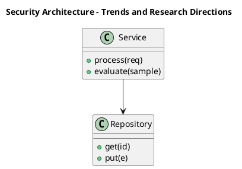

_Source diagram (plantuml); render with the appropriate tool._

**Figure 30. Security Architecture - Trends and Research Directions** (plantuml). Figure: Security Architecture view for Agentic AI. This diagram illustrates the principal components and their interactions as discussed in the surrounding section.


**Figure 31. Capability Map - Trends and Research Directions** (mermaid). Figure: Capability Map view for Agentic AI. This diagram illustrates the principal components and their interactions as discussed in the surrounding section.

## Deep Dive: Mechanics, Variants and Trade-offs

Having established the essentials, we now go deeper into trends and research directions. Mechanically, the behaviour emerges from a few interacting parts that are simpler than the whole they produce. The distinctions in this section are the ones that separate a working demo from a system that holds up under adversarial inputs, scale and the passage of time.

Consider the principal variants and how to choose between them. Each variant optimises for a different point in the design space - some for latency, some for accuracy, some for cost or operability - and the correct choice follows from explicit requirements rather than from defaults. Simplicity is a feature. The simplest design that meets the requirement should be the default, with complexity added only when measurement justifies it.

In practice this is supported by a mature tooling ecosystem, including LangGraph, AutoGen, CrewAI, OpenAI Agents. Tools accelerate the work but do not substitute for understanding: the same principles apply whichever implementation you select, and the ability to reason from first principles is what lets you debug when a tool behaves unexpectedly.

A frequent source of subtle bugs is the interaction with safety, sandboxing and permissions. Because safety, sandboxing and permissions concerns constraining what agents can do and access, changes there can silently alter the behaviour analysed here. The remedy is contract tests at the boundary and end-to-end evaluations that exercise the interaction explicitly.

Finally, attend to edge cases and degradation. Define what the system should do under partial failure, unexpected inputs and load spikes, and make that behaviour explicit and tested rather than emergent. Graceful degradation - returning a safe, useful result when the ideal one is unavailable - is a hallmark of mature engineering.

For deeper study, the literature offers authoritative treatments such as Yao et al. — ReAct (2022) and Shinn et al. — Reflexion (2023). These primary sources reward careful reading and ground the practical guidance above in established results.

## Advanced Considerations

Having established the essentials, we now go deeper into trends and research directions. Mechanically, the behaviour emerges from a few interacting parts that are simpler than the whole they produce. The distinctions in this section are the ones that separate a working demo from a system that holds up under adversarial inputs, scale and the passage of time.

Consider the principal variants and how to choose between them. Each variant optimises for a different point in the design space - some for latency, some for accuracy, some for cost or operability - and the correct choice follows from explicit requirements rather than from defaults. As with most architectural decisions, the choice is rarely binary; the skill lies in quantifying the trade-offs and choosing deliberately.

In practice this is supported by a mature tooling ecosystem, including LangGraph, AutoGen, CrewAI, OpenAI Agents. Tools accelerate the work but do not substitute for understanding: the same principles apply whichever implementation you select, and the ability to reason from first principles is what lets you debug when a tool behaves unexpectedly.

A frequent source of subtle bugs is the interaction with from chatbots to agents. Because from chatbots to agents concerns the shift from single responses to goal-directed loops, changes there can silently alter the behaviour analysed here. The remedy is contract tests at the boundary and end-to-end evaluations that exercise the interaction explicitly.

Finally, attend to edge cases and degradation. Define what the system should do under partial failure, unexpected inputs and load spikes, and make that behaviour explicit and tested rather than emergent. Graceful degradation - returning a safe, useful result when the ideal one is unavailable - is a hallmark of mature engineering.

For deeper study, the literature offers authoritative treatments such as Yao et al. — ReAct (2022) and Shinn et al. — Reflexion (2023). These primary sources reward careful reading and ground the practical guidance above in established results.

## Worked Example

A worked example clarifies how these ideas behave in practice. A research organisation needs agents that browse, synthesise and report. They decide to apply trends and research directions as part of their Agentic AI solution, but wisely treat it as a hypothesis to be validated rather than a foregone conclusion.

The team begins by stating the objective precisely and defining how success will be measured before writing any code. They establish a small but representative evaluation set, agree on acceptance thresholds, and only then prototype the simplest design that could work. Early measurement reveals which assumptions hold and which must be revised, saving weeks of misdirected effort and surfacing edge cases while they are still cheap to fix.

As the prototype matures into a service, the team hardens it: adding input validation, error handling, caching where it pays off, and monitoring that ties back to the original success metric. They document each significant decision in an architecture decision record so that future maintainers understand not just what was built but why.

The outcome is instructive. The system that reaches production is not the most sophisticated design the team considered, but the one whose behaviour they could measure, explain and operate. This is the recurring lesson of Agentic AI: durable value comes from the whole system, not from any single clever component.

## Industry Use Cases

Across industries, the ideas in this chapter recur in recognisable ways. The following vignettes show how different sectors apply them and what they have in common.

**Software.** Autonomous coding agents that plan, edit and test. The common thread is that value comes not from the model alone but from the surrounding system - data quality, evaluation, integration and operations - which is precisely where most of the engineering effort belongs.

**Operations.** Incident triage agents that gather context and act. The common thread is that value comes not from the model alone but from the surrounding system - data quality, evaluation, integration and operations - which is precisely where most of the engineering effort belongs.

**Research.** Agents that browse, synthesise and report. The common thread is that value comes not from the model alone but from the surrounding system - data quality, evaluation, integration and operations - which is precisely where most of the engineering effort belongs.

**Back office.** Workflow automation across enterprise systems. The common thread is that value comes not from the model alone but from the surrounding system - data quality, evaluation, integration and operations - which is precisely where most of the engineering effort belongs.

## Best Practices

The following practices consistently separate successful Agentic AI efforts from struggling ones. They are deliberately concrete so they can be adopted as checklist items in design and code review.

- Constrain tools with typed schemas and least-privilege permissions.
- Cap loop steps and cost to prevent runaway behaviour.
- Require human approval for irreversible or high-impact actions.
- Trace every reasoning step and tool call for debugging and audit.

None of these are exotic; they are the unglamorous disciplines that compound into reliability. The cost of adopting them is small compared with the cost of the incidents they prevent, and they become second nature with practice.

## Common Pitfalls

Equally instructive are the failure modes that recur in practice. Each pitfall below has a clear early warning sign and a known remedy, so treat them as a diagnostic checklist when something feels wrong:

- Unbounded loops that burn cost without converging.
- Granting broad tool permissions that enable harmful actions.
- No observability, making failures impossible to diagnose.
- Over-automating tasks that need human judgement.

The pattern is consistent: most failures stem from skipping measurement, conflating prototype and production standards, or deferring cross-cutting concerns such as security and cost until they become emergencies. Naming these traps in advance is the cheapest way to avoid them.

## Governance, Security and Cost Notes

No discussion of trends and research directions is complete without its governance, security and cost dimensions, which are too often deferred until they become emergencies. Treating them as first-class concerns from the outset is both cheaper and safer.

**Governance.** Classify the risk of this capability, document its intended and out-of-scope uses, and ensure decisions are traceable to satisfy internal policy and external regulation such as the NIST AI RMF, ISO/IEC 42001 and the EU AI Act. **Security.** Treat all external input as untrusted, validate outputs before acting on them, apply least privilege to any tools or data access, and map controls to the OWASP LLM Top 10 and MITRE ATLAS.

**Cost and sustainability.** Establish explicit budgets for compute, tokens and latency, attribute spend to owners, and revisit the economics as usage scales - a design that is affordable at pilot scale can become untenable at production volume. Building these reflexes into everyday engineering is what allows a Agentic AI system to be not only capable but also trustworthy and economically sound.

## Hands-On Exercises

Work through the following exercises. They are designed to move understanding from recognition to application - the level required for real engineering work - so prefer writing and building over merely reading.

1. Explain trends and research directions to a colleague unfamiliar with Agentic AI, using a concrete example from your own domain.
2. Sketch a reference architecture that incorporates trends and research directions and annotate where observability, security and cost controls belong.
3. Design an evaluation that would tell you whether trends and research directions is working in production, including the metric, the dataset and the acceptance threshold.
4. Identify two pitfalls relevant to trends and research directions in your environment and describe the early warning signals you would monitor.
5. Prototype the simplest implementation that demonstrates trends and research directions, then list exactly what would need to change to make it production-ready.

## Key Takeaways

Key takeaways from this chapter:

- Trends and Research Directions is a systems concern in Agentic AI: data, models and operations must be co-designed.
- Measurement is non-negotiable; define success metrics and evaluation before building.
- Favour the simplest design that meets the requirement, and add complexity only when evidence demands it.
- Security, cost and observability are first-class requirements, not afterthoughts.
- Document decisions so the system remains understandable and operable as it evolves.

## Review Questions

1. In the context of Agentic AI, which statement best describes “Trends and Research Directions”?
   - A. It applies exclusively to image data.
   - B. It guarantees deterministic output regardless of input.
   - C. emerging trends, open problems and research directions shaping the future of Agentic AI
   - D. It eliminates the need for any evaluation or monitoring.
   - **Answer: C.** Trends and Research Directions: emerging trends, open problems and research directions shaping the future of Agentic AI
2. Which of the following is a recommended best practice when working with Agentic AI?
   - A. Over-automating tasks that need human judgement.
   - B. It makes the system slower but has no other effect.
   - C. Require human approval for irreversible or high-impact actions.
   - D. No observability, making failures impossible to diagnose.
   - **Answer: C.** Best practice: Require human approval for irreversible or high-impact actions.
3. Which of the following is a common pitfall to avoid in Agentic AI?
   - A. Constrain tools with typed schemas and least-privilege permissions.
   - B. Require human approval for irreversible or high-impact actions.
   - C. Unbounded loops that burn cost without converging.
   - D. It makes the system slower but has no other effect.
   - **Answer: C.** Pitfall to avoid: Unbounded loops that burn cost without converging.
4. *(Discussion)* What trade-offs would you weigh when implementing Trends and Research Directions?
   - **Model answer:** A strong answer defines trends and research directions (emerging trends, open problems and research directions shaping the future of Agentic AI) then connects it to architecture, evaluation, cost, security and operations for Agentic AI, citing concrete trade-offs and a real-world example.

---


# Chapter 24. Capstone Project

_This chapter examines capstone project within Agentic AI. It covers a substantial capstone project that consolidates the entire book into a portfolio-grade Agentic AI deliverable, derives a reference architecture, walks through a worked example and runnable code, surveys industry use cases, and distils best practices and pitfalls, closing with exercises and review questions._

## Introduction

We define Capstone Project as a substantial capstone project that consolidates the entire book into a portfolio-grade Agentic AI deliverable. Teams that master this consistently ship more reliable Agentic AI systems at lower cost. In an enterprise setting, this translates into concrete requirements: clear interfaces, measurable quality, and controls that satisfy security and governance.

This chapter builds intuition first, then formalises the ideas, derives an architecture, and finishes with code, exercises and review questions so the material transfers directly to your own Agentic AI work. Read it actively: pause at each diagram, reproduce the code, and attempt the exercises before consulting the answers.

## Theory and Foundations

We define Capstone Project as a substantial capstone project that consolidates the entire book into a portfolio-grade Agentic AI deliverable. The practical implication is that design choices here ripple through latency, cost and maintainability for the lifetime of the system. The underlying mechanism is best appreciated by tracing a single request from input to output and noting where state is created and consumed.

To place this in context, recall the broader picture: Agentic AI systems use language models as reasoning engines that plan, invoke tools, observe results and iterate toward goals with limited human oversight. Within that picture, capstone project is one of the load-bearing ideas - the kind that, when understood deeply, makes the rest of Agentic AI fall into place. This concept recurs throughout the Agentic AI lifecycle, from design to operations.

Capstone Project cannot be understood in isolation from safety, sandboxing and permissions. Recall that safety, sandboxing and permissions concerns constraining what agents can do and access. The two interact directly: decisions in one constrain the design space of the other, which is why mature teams reason about them together rather than sequentially. There is an inherent trade-off between fidelity and cost, and the correct balance depends on the use case and its tolerance for error.

Capstone Project cannot be understood in isolation from human-in-the-loop and approvals. Recall that human-in-the-loop and approvals concerns confirmation gates for high-impact actions. The two interact directly: decisions in one constrain the design space of the other, which is why mature teams reason about them together rather than sequentially. Latency, accuracy and cost form a tension triangle: improving one typically pressures the others, so explicit budgets are essential.

Several established patterns apply directly to capstone project. The first, reflection loop to critique and revise outputs, is widely adopted because it makes the system's behaviour predictable and observable. A complementary pattern, approval gate before irreversible actions, addresses a related concern and is often deployed alongside it. Patterns are not dogma; they are distilled experience that shortcuts the search for a sound design, and each carries assumptions worth checking against your context.

Knowing when not to use a technique is as valuable as knowing how to use it. In a small prototype, shortcuts around capstone project are invisible; in a production Agentic AI system serving real traffic, they surface as incidents, cost overruns or compliance gaps. Latency, accuracy and cost form a tension triangle: improving one typically pressures the others, so explicit budgets are essential. The remainder of this chapter turns these principles into an architecture, code and a checklist you can apply immediately.

## Architecture and Design

From an architectural standpoint, Capstone Project sits at the intersection of data, models and operations. An agent runtime hosts a reasoning model, a tool registry with typed schemas, a memory store (short-term context plus long-term vector memory), and a controller enforcing step budgets, permissions and human approvals. Every step is traced for observability and replay.

Concretely, the principal building blocks include from chatbots to agents, the agent loop: reason, act, observe, planning and task decomposition, tool use and function calling and memory architectures. Each is a replaceable component behind a stable interface, so the team can upgrade an implementation - a model, an index, a policy engine - without rewriting its neighbours. The contracts between components are where reliability is won or lost, so they are specified explicitly and tested in isolation.

The diagram accompanying this section makes the data and control flow explicit. Requests enter through a well-defined boundary where they are authenticated and validated; only then are they dispatched to the components that perform the work. This boundary is also where rate limiting, quota enforcement and audit logging live, keeping cross-cutting concerns out of the core logic and in one auditable place.

Two qualities deserve emphasis. First, observability is designed in, not bolted on: every component emits structured telemetry so that failures can be localised in minutes rather than hours. Second, the architecture is evolvable - components communicate through stable contracts so that any single part of the Agentic AI system can be replaced without a rewrite. There is an inherent trade-off between fidelity and cost, and the correct balance depends on the use case and its tolerance for error.

<div class="diagram-svg">

<svg xmlns="http://www.w3.org/2000/svg" width="840" height="460" data-tpl="kpi" data-pal="2-4" viewBox="0 0 840 460" font-family="Inter, Segoe UI, Arial, sans-serif"><defs><marker id="ar" markerWidth="9" markerHeight="9" refX="7" refY="3" orient="auto"><path d="M0,0 L7,3 L0,6 z" fill="#94a3b8"/></marker><marker id="arw" markerWidth="9" markerHeight="9" refX="7" refY="3" orient="auto"><path d="M0,0 L7,3 L0,6 z" fill="#ffffff"/></marker><filter id="sh" x="-20%" y="-20%" width="140%" height="140%"><feDropShadow dx="0" dy="2" stdDeviation="3" flood-color="#0f172a" flood-opacity="0.16"/></filter></defs><defs><linearGradient id="bn32754ff" x1="0" y1="0" x2="1" y2="0"><stop offset="0" stop-color="#0d9488"/><stop offset="1" stop-color="#14b8a6"/></linearGradient></defs><rect width="840" height="460" rx="14" fill="#ffffff"/><rect x="0" y="0" width="840" height="48" rx="14" fill="url(#bn32754ff)"/><rect x="0" y="32" width="840" height="16" fill="url(#bn32754ff)"/><text x="420" y="25" text-anchor="middle" font-size="14.5" font-weight="700" fill="#ffffff" dominant-baseline="middle">Capability Map - Capstone Project</text><rect x="28" y="90" width="182" height="150" rx="14" fill="#f8fafc" stroke="#e2e8f0" stroke-width="1"/><rect x="28" y="90" width="182" height="8" rx="0" fill="#0d9488"/><text x="119" y="150" text-anchor="middle" font-size="30" font-weight="800" fill="#0d9488" dominant-baseline="middle">70%</text><text x="119" y="192" text-anchor="middle" font-size="11" font-weight="600" fill="#64748b" dominant-baseline="middle">Planning and Task</text><text x="119" y="204" text-anchor="middle" font-size="11" font-weight="600" fill="#64748b" dominant-baseline="middle">Decomposition</text><rect x="228" y="90" width="182" height="150" rx="14" fill="#f8fafc" stroke="#e2e8f0" stroke-width="1"/><rect x="228" y="90" width="182" height="8" rx="0" fill="#14b8a6"/><text x="320" y="150" text-anchor="middle" font-size="30" font-weight="800" fill="#14b8a6" dominant-baseline="middle">52%</text><text x="320" y="192" text-anchor="middle" font-size="11" font-weight="600" fill="#64748b" dominant-baseline="middle">Tool Use and Function</text><text x="320" y="204" text-anchor="middle" font-size="11" font-weight="600" fill="#64748b" dominant-baseline="middle">Calling</text><rect x="429" y="90" width="182" height="150" rx="14" fill="#f8fafc" stroke="#e2e8f0" stroke-width="1"/><rect x="429" y="90" width="182" height="8" rx="0" fill="#047857"/><text x="520" y="150" text-anchor="middle" font-size="30" font-weight="800" fill="#047857" dominant-baseline="middle">89%</text><text x="520" y="198" text-anchor="middle" font-size="11" font-weight="600" fill="#64748b" dominant-baseline="middle">Memory Architectures</text><rect x="630" y="90" width="182" height="150" rx="14" fill="#f8fafc" stroke="#e2e8f0" stroke-width="1"/><rect x="630" y="90" width="182" height="8" rx="0" fill="#059669"/><text x="721" y="150" text-anchor="middle" font-size="30" font-weight="800" fill="#059669" dominant-baseline="middle">64%</text><text x="721" y="192" text-anchor="middle" font-size="11" font-weight="600" fill="#64748b" dominant-baseline="middle">Reflection and</text><text x="721" y="204" text-anchor="middle" font-size="11" font-weight="600" fill="#64748b" dominant-baseline="middle">Self-Correction</text><text x="28" y="446" text-anchor="start" font-size="9.5" font-weight="500" fill="#64748b" dominant-baseline="middle">Agentic AI  •  Capability Map</text></svg>

</div>

**Figure 32. Capability Map - Capstone Project** (svg). Figure: Capability Map view for Agentic AI. This diagram illustrates the principal components and their interactions as discussed in the surrounding section.

## Deep Dive: Mechanics, Variants and Trade-offs

Having established the essentials, we now go deeper into capstone project. Beneath the abstraction lies a concrete process whose steps can each be measured, tested and optimised independently. The distinctions in this section are the ones that separate a working demo from a system that holds up under adversarial inputs, scale and the passage of time.

Consider the principal variants and how to choose between them. Each variant optimises for a different point in the design space - some for latency, some for accuracy, some for cost or operability - and the correct choice follows from explicit requirements rather than from defaults. Latency, accuracy and cost form a tension triangle: improving one typically pressures the others, so explicit budgets are essential.

In practice this is supported by a mature tooling ecosystem, including LangGraph, AutoGen, CrewAI, OpenAI Agents. Tools accelerate the work but do not substitute for understanding: the same principles apply whichever implementation you select, and the ability to reason from first principles is what lets you debug when a tool behaves unexpectedly.

A frequent source of subtle bugs is the interaction with safety, sandboxing and permissions. Because safety, sandboxing and permissions concerns constraining what agents can do and access, changes there can silently alter the behaviour analysed here. The remedy is contract tests at the boundary and end-to-end evaluations that exercise the interaction explicitly.

Finally, attend to edge cases and degradation. Define what the system should do under partial failure, unexpected inputs and load spikes, and make that behaviour explicit and tested rather than emergent. Graceful degradation - returning a safe, useful result when the ideal one is unavailable - is a hallmark of mature engineering.

For deeper study, the literature offers authoritative treatments such as Yao et al. — ReAct (2022) and Shinn et al. — Reflexion (2023). These primary sources reward careful reading and ground the practical guidance above in established results.

## Advanced Considerations

Having established the essentials, we now go deeper into capstone project. Mechanically, the behaviour emerges from a few interacting parts that are simpler than the whole they produce. The distinctions in this section are the ones that separate a working demo from a system that holds up under adversarial inputs, scale and the passage of time.

Consider the principal variants and how to choose between them. Each variant optimises for a different point in the design space - some for latency, some for accuracy, some for cost or operability - and the correct choice follows from explicit requirements rather than from defaults. As with most architectural decisions, the choice is rarely binary; the skill lies in quantifying the trade-offs and choosing deliberately.

In practice this is supported by a mature tooling ecosystem, including LangGraph, AutoGen, CrewAI, OpenAI Agents. Tools accelerate the work but do not substitute for understanding: the same principles apply whichever implementation you select, and the ability to reason from first principles is what lets you debug when a tool behaves unexpectedly.

A frequent source of subtle bugs is the interaction with cost, latency and loop control. Because cost, latency and loop control concerns budgeting steps, preventing runaway loops and caching, changes there can silently alter the behaviour analysed here. The remedy is contract tests at the boundary and end-to-end evaluations that exercise the interaction explicitly.

Finally, attend to edge cases and degradation. Define what the system should do under partial failure, unexpected inputs and load spikes, and make that behaviour explicit and tested rather than emergent. Graceful degradation - returning a safe, useful result when the ideal one is unavailable - is a hallmark of mature engineering.

For deeper study, the literature offers authoritative treatments such as Yao et al. — ReAct (2022) and Shinn et al. — Reflexion (2023). These primary sources reward careful reading and ground the practical guidance above in established results.

## Worked Example

Consider a concrete scenario. A back office organisation needs workflow automation across enterprise systems. They decide to apply capstone project as part of their Agentic AI solution, but wisely treat it as a hypothesis to be validated rather than a foregone conclusion.

The team begins by stating the objective precisely and defining how success will be measured before writing any code. They establish a small but representative evaluation set, agree on acceptance thresholds, and only then prototype the simplest design that could work. Early measurement reveals which assumptions hold and which must be revised, saving weeks of misdirected effort and surfacing edge cases while they are still cheap to fix.

As the prototype matures into a service, the team hardens it: adding input validation, error handling, caching where it pays off, and monitoring that ties back to the original success metric. They document each significant decision in an architecture decision record so that future maintainers understand not just what was built but why.

The outcome is instructive. The system that reaches production is not the most sophisticated design the team considered, but the one whose behaviour they could measure, explain and operate. This is the recurring lesson of Agentic AI: durable value comes from the whole system, not from any single clever component.

## Industry Use Cases

Across industries, the ideas in this chapter recur in recognisable ways. The following vignettes show how different sectors apply them and what they have in common.

**Software.** Autonomous coding agents that plan, edit and test. The common thread is that value comes not from the model alone but from the surrounding system - data quality, evaluation, integration and operations - which is precisely where most of the engineering effort belongs.

**Operations.** Incident triage agents that gather context and act. The common thread is that value comes not from the model alone but from the surrounding system - data quality, evaluation, integration and operations - which is precisely where most of the engineering effort belongs.

**Research.** Agents that browse, synthesise and report. The common thread is that value comes not from the model alone but from the surrounding system - data quality, evaluation, integration and operations - which is precisely where most of the engineering effort belongs.

**Back office.** Workflow automation across enterprise systems. The common thread is that value comes not from the model alone but from the surrounding system - data quality, evaluation, integration and operations - which is precisely where most of the engineering effort belongs.

## Best Practices

The following practices consistently separate successful Agentic AI efforts from struggling ones. They are deliberately concrete so they can be adopted as checklist items in design and code review.

- Constrain tools with typed schemas and least-privilege permissions.
- Cap loop steps and cost to prevent runaway behaviour.
- Require human approval for irreversible or high-impact actions.
- Trace every reasoning step and tool call for debugging and audit.

None of these are exotic; they are the unglamorous disciplines that compound into reliability. The cost of adopting them is small compared with the cost of the incidents they prevent, and they become second nature with practice.

## Common Pitfalls

Equally instructive are the failure modes that recur in practice. Each pitfall below has a clear early warning sign and a known remedy, so treat them as a diagnostic checklist when something feels wrong:

- Unbounded loops that burn cost without converging.
- Granting broad tool permissions that enable harmful actions.
- No observability, making failures impossible to diagnose.
- Over-automating tasks that need human judgement.

The pattern is consistent: most failures stem from skipping measurement, conflating prototype and production standards, or deferring cross-cutting concerns such as security and cost until they become emergencies. Naming these traps in advance is the cheapest way to avoid them.

## Governance, Security and Cost Notes

No discussion of capstone project is complete without its governance, security and cost dimensions, which are too often deferred until they become emergencies. Treating them as first-class concerns from the outset is both cheaper and safer.

**Governance.** Classify the risk of this capability, document its intended and out-of-scope uses, and ensure decisions are traceable to satisfy internal policy and external regulation such as the NIST AI RMF, ISO/IEC 42001 and the EU AI Act. **Security.** Treat all external input as untrusted, validate outputs before acting on them, apply least privilege to any tools or data access, and map controls to the OWASP LLM Top 10 and MITRE ATLAS.

**Cost and sustainability.** Establish explicit budgets for compute, tokens and latency, attribute spend to owners, and revisit the economics as usage scales - a design that is affordable at pilot scale can become untenable at production volume. Building these reflexes into everyday engineering is what allows a Agentic AI system to be not only capable but also trustworthy and economically sound.

## Hands-On Exercises

Work through the following exercises. They are designed to move understanding from recognition to application - the level required for real engineering work - so prefer writing and building over merely reading.

1. Explain capstone project to a colleague unfamiliar with Agentic AI, using a concrete example from your own domain.
2. Sketch a reference architecture that incorporates capstone project and annotate where observability, security and cost controls belong.
3. Design an evaluation that would tell you whether capstone project is working in production, including the metric, the dataset and the acceptance threshold.
4. Identify two pitfalls relevant to capstone project in your environment and describe the early warning signals you would monitor.
5. Prototype the simplest implementation that demonstrates capstone project, then list exactly what would need to change to make it production-ready.

## Key Takeaways

Key takeaways from this chapter:

- Capstone Project is a systems concern in Agentic AI: data, models and operations must be co-designed.
- Measurement is non-negotiable; define success metrics and evaluation before building.
- Favour the simplest design that meets the requirement, and add complexity only when evidence demands it.
- Security, cost and observability are first-class requirements, not afterthoughts.
- Document decisions so the system remains understandable and operable as it evolves.

## Code Walkthrough

Every change to a Agentic AI system should pass an evaluation gate. This example shows the minimal shape: align predictions and references, compute a metric, and return a pass/fail decision for CI.

The full listing is shown below; study it line by line and reproduce it locally before moving on.

### Listing: Evaluating Capstone Project with a regression gate

```python
from dataclasses import dataclass


@dataclass
class EvalResult:
    metric: str
    score: float
    passed: bool


def evaluate(predictions: list[str], references: list[str],
             threshold: float = 0.8) -> EvalResult:
    """Score Capstone Project output against references with a simple exact-match metric.

    In practice you would combine several metrics (exact match, semantic
    similarity, LLM-as-judge) and gate releases on the aggregate.
    """
    if len(predictions) != len(references):
        raise ValueError("predictions and references must align")
    hits = sum(p.strip() == r.strip() for p, r in zip(predictions, references))
    score = hits / len(references) if references else 0.0
    return EvalResult(metric="exact_match", score=score, passed=score >= threshold)


if __name__ == "__main__":
    result = evaluate(["yes", "no"], ["yes", "yes"])
    print(f"{result.metric}={result.score:.2f} passed={result.passed}")

```

## Review Questions

1. In the context of Agentic AI, which statement best describes “Capstone Project”?
   - A. It makes the system slower but has no other effect.
   - B. a substantial capstone project that consolidates the entire book into a portfolio-grade Agentic AI deliverable
   - C. It is only relevant to academic research, not production.
   - D. It removes all security and governance requirements.
   - **Answer: B.** Capstone Project: a substantial capstone project that consolidates the entire book into a portfolio-grade Agentic AI deliverable
2. Which of the following is a recommended best practice when working with Agentic AI?
   - A. Unbounded loops that burn cost without converging.
   - B. Cap loop steps and cost to prevent runaway behaviour.
   - C. It guarantees deterministic output regardless of input.
   - D. It is only relevant to academic research, not production.
   - **Answer: B.** Best practice: Cap loop steps and cost to prevent runaway behaviour.
3. Which of the following is a common pitfall to avoid in Agentic AI?
   - A. It guarantees deterministic output regardless of input.
   - B. No observability, making failures impossible to diagnose.
   - C. It makes the system slower but has no other effect.
   - D. It eliminates the need for any evaluation or monitoring.
   - **Answer: B.** Pitfall to avoid: No observability, making failures impossible to diagnose.
4. *(Discussion)* How does Capstone Project interact with security and governance requirements?
   - **Model answer:** A strong answer defines capstone project (a substantial capstone project that consolidates the entire book into a portfolio-grade Agentic AI deliverable) then connects it to architecture, evaluation, cost, security and operations for Agentic AI, citing concrete trade-offs and a real-world example.

---


# Chapter 25. Certification Preparation and Review

_This chapter examines certification preparation and review within Agentic AI. It covers a structured review and certification-style preparation covering the full breadth of Agentic AI, derives a reference architecture, walks through a worked example and runnable code, surveys industry use cases, and distils best practices and pitfalls, closing with exercises and review questions._

## Introduction

At its core, Certification Preparation and Review concerns a structured review and certification-style preparation covering the full breadth of Agentic AI. It is foundational: later capabilities in Agentic AI are built directly on top of it. In an enterprise setting, this translates into concrete requirements: clear interfaces, measurable quality, and controls that satisfy security and governance.

This chapter builds intuition first, then formalises the ideas, derives an architecture, and finishes with code, exercises and review questions so the material transfers directly to your own Agentic AI work. Read it actively: pause at each diagram, reproduce the code, and attempt the exercises before consulting the answers.

## Theory and Foundations

We define Certification Preparation and Review as a structured review and certification-style preparation covering the full breadth of Agentic AI. What distinguishes a production-grade approach from a prototype is the discipline of measurement: every claim is backed by an evaluation rather than intuition. The underlying mechanism is best appreciated by tracing a single request from input to output and noting where state is created and consumed.

To place this in context, recall the broader picture: Agentic AI systems use language models as reasoning engines that plan, invoke tools, observe results and iterate toward goals with limited human oversight. Within that picture, certification preparation and review is one of the load-bearing ideas - the kind that, when understood deeply, makes the rest of Agentic AI fall into place. Neglecting it is one of the most common reasons Agentic AI initiatives stall in production.

Certification Preparation and Review cannot be understood in isolation from human-in-the-loop and approvals. Recall that human-in-the-loop and approvals concerns confirmation gates for high-impact actions. The two interact directly: decisions in one constrain the design space of the other, which is why mature teams reason about them together rather than sequentially. There is an inherent trade-off between fidelity and cost, and the correct balance depends on the use case and its tolerance for error.

Certification Preparation and Review cannot be understood in isolation from cost, latency and loop control. Recall that cost, latency and loop control concerns budgeting steps, preventing runaway loops and caching. The two interact directly: decisions in one constrain the design space of the other, which is why mature teams reason about them together rather than sequentially. As with most architectural decisions, the choice is rarely binary; the skill lies in quantifying the trade-offs and choosing deliberately.

Several established patterns apply directly to certification preparation and review. The first, reflection loop to critique and revise outputs, is widely adopted because it makes the system's behaviour predictable and observable. A complementary pattern, approval gate before irreversible actions, addresses a related concern and is often deployed alongside it. Patterns are not dogma; they are distilled experience that shortcuts the search for a sound design, and each carries assumptions worth checking against your context.

Knowing when not to use a technique is as valuable as knowing how to use it. In a small prototype, shortcuts around certification preparation and review are invisible; in a production Agentic AI system serving real traffic, they surface as incidents, cost overruns or compliance gaps. Simplicity is a feature. The simplest design that meets the requirement should be the default, with complexity added only when measurement justifies it. The remainder of this chapter turns these principles into an architecture, code and a checklist you can apply immediately.

## Architecture and Design

A robust architecture for Certification Preparation and Review is layered so each part can evolve independently without destabilising the whole. An agent runtime hosts a reasoning model, a tool registry with typed schemas, a memory store (short-term context plus long-term vector memory), and a controller enforcing step budgets, permissions and human approvals. Every step is traced for observability and replay.

Concretely, the principal building blocks include from chatbots to agents, the agent loop: reason, act, observe, planning and task decomposition, tool use and function calling and memory architectures. Each is a replaceable component behind a stable interface, so the team can upgrade an implementation - a model, an index, a policy engine - without rewriting its neighbours. The contracts between components are where reliability is won or lost, so they are specified explicitly and tested in isolation.

The diagram accompanying this section makes the data and control flow explicit. Requests enter through a well-defined boundary where they are authenticated and validated; only then are they dispatched to the components that perform the work. This boundary is also where rate limiting, quota enforcement and audit logging live, keeping cross-cutting concerns out of the core logic and in one auditable place.

Two qualities deserve emphasis. First, observability is designed in, not bolted on: every component emits structured telemetry so that failures can be localised in minutes rather than hours. Second, the architecture is evolvable - components communicate through stable contracts so that any single part of the Agentic AI system can be replaced without a rewrite. Simplicity is a feature. The simplest design that meets the requirement should be the default, with complexity added only when measurement justifies it.

```xml
<mxfile host="ai-university">
  <diagram name="Cloud Architecture">
    <mxGraphModel dx="800" dy="600" grid="1" gridSize="10">
      <root>
        <mxCell id="0"/>
        <mxCell id="1" parent="0"/>
        <mxCell id="title" value="Cloud Architecture - Certification Preparation and Review" style="text;fontSize=16;fontStyle=1" vertex="1" parent="1"><mxGeometry x="40" y="20" width="600" height="30" as="geometry"/></mxCell>
        <mxCell id="hub" value="Agentic AI" style="rounded=1;fillColor=#0f172a;fontColor=#ffffff;fontStyle=1" vertex="1" parent="1"><mxGeometry x="300" y="180" width="160" height="60" as="geometry"/></mxCell>
        <mxCell id="n0" value="From Chatbots to Agents" style="rounded=1;fillColor=#e0e7ff;strokeColor=#4338ca" vertex="1" parent="1"><mxGeometry x="60" y="80" width="160" height="50" as="geometry"/></mxCell>
        <mxCell id="e0" style="edgeStyle=orthogonalEdgeStyle" edge="1" parent="1" source="hub" target="n0"><mxGeometry relative="1" as="geometry"/></mxCell>
        <mxCell id="n1" value="The Agent Loop: Reason,…" style="rounded=1;fillColor=#e0e7ff;strokeColor=#4338ca" vertex="1" parent="1"><mxGeometry x="600" y="170" width="160" height="50" as="geometry"/></mxCell>
        <mxCell id="e1" style="edgeStyle=orthogonalEdgeStyle" edge="1" parent="1" source="hub" target="n1"><mxGeometry relative="1" as="geometry"/></mxCell>
        <mxCell id="n2" value="Planning and Task Decom…" style="rounded=1;fillColor=#e0e7ff;strokeColor=#4338ca" vertex="1" parent="1"><mxGeometry x="60" y="260" width="160" height="50" as="geometry"/></mxCell>
        <mxCell id="e2" style="edgeStyle=orthogonalEdgeStyle" edge="1" parent="1" source="hub" target="n2"><mxGeometry relative="1" as="geometry"/></mxCell>
        <mxCell id="n3" value="Tool Use and Function C…" style="rounded=1;fillColor=#e0e7ff;strokeColor=#4338ca" vertex="1" parent="1"><mxGeometry x="600" y="350" width="160" height="50" as="geometry"/></mxCell>
        <mxCell id="e3" style="edgeStyle=orthogonalEdgeStyle" edge="1" parent="1" source="hub" target="n3"><mxGeometry relative="1" as="geometry"/></mxCell>
        <mxCell id="n4" value="Memory Architectures" style="rounded=1;fillColor=#e0e7ff;strokeColor=#4338ca" vertex="1" parent="1"><mxGeometry x="60" y="440" width="160" height="50" as="geometry"/></mxCell>
        <mxCell id="e4" style="edgeStyle=orthogonalEdgeStyle" edge="1" parent="1" source="hub" target="n4"><mxGeometry relative="1" as="geometry"/></mxCell>
      </root>
    </mxGraphModel>
  </diagram>
</mxfile>
```

_Source diagram (drawio); render with the appropriate tool._

**Figure 33. Cloud Architecture - Certification Preparation and Review** (drawio). Figure: Cloud Architecture view for Agentic AI. This diagram illustrates the principal components and their interactions as discussed in the surrounding section.

## Deep Dive: Mechanics, Variants and Trade-offs

Having established the essentials, we now go deeper into certification preparation and review. Mechanically, the behaviour emerges from a few interacting parts that are simpler than the whole they produce. The distinctions in this section are the ones that separate a working demo from a system that holds up under adversarial inputs, scale and the passage of time.

Consider the principal variants and how to choose between them. Each variant optimises for a different point in the design space - some for latency, some for accuracy, some for cost or operability - and the correct choice follows from explicit requirements rather than from defaults. As with most architectural decisions, the choice is rarely binary; the skill lies in quantifying the trade-offs and choosing deliberately.

In practice this is supported by a mature tooling ecosystem, including LangGraph, AutoGen, CrewAI, OpenAI Agents. Tools accelerate the work but do not substitute for understanding: the same principles apply whichever implementation you select, and the ability to reason from first principles is what lets you debug when a tool behaves unexpectedly.

A frequent source of subtle bugs is the interaction with human-in-the-loop and approvals. Because human-in-the-loop and approvals concerns confirmation gates for high-impact actions, changes there can silently alter the behaviour analysed here. The remedy is contract tests at the boundary and end-to-end evaluations that exercise the interaction explicitly.

Finally, attend to edge cases and degradation. Define what the system should do under partial failure, unexpected inputs and load spikes, and make that behaviour explicit and tested rather than emergent. Graceful degradation - returning a safe, useful result when the ideal one is unavailable - is a hallmark of mature engineering.

For deeper study, the literature offers authoritative treatments such as Yao et al. — ReAct (2022) and Shinn et al. — Reflexion (2023). These primary sources reward careful reading and ground the practical guidance above in established results.

## Advanced Considerations

Having established the essentials, we now go deeper into certification preparation and review. The underlying mechanism is best appreciated by tracing a single request from input to output and noting where state is created and consumed. The distinctions in this section are the ones that separate a working demo from a system that holds up under adversarial inputs, scale and the passage of time.

Consider the principal variants and how to choose between them. Each variant optimises for a different point in the design space - some for latency, some for accuracy, some for cost or operability - and the correct choice follows from explicit requirements rather than from defaults. Latency, accuracy and cost form a tension triangle: improving one typically pressures the others, so explicit budgets are essential.

In practice this is supported by a mature tooling ecosystem, including LangGraph, AutoGen, CrewAI, OpenAI Agents. Tools accelerate the work but do not substitute for understanding: the same principles apply whichever implementation you select, and the ability to reason from first principles is what lets you debug when a tool behaves unexpectedly.

A frequent source of subtle bugs is the interaction with evaluating agents. Because evaluating agents concerns task success, trajectory quality and robustness benchmarks, changes there can silently alter the behaviour analysed here. The remedy is contract tests at the boundary and end-to-end evaluations that exercise the interaction explicitly.

Finally, attend to edge cases and degradation. Define what the system should do under partial failure, unexpected inputs and load spikes, and make that behaviour explicit and tested rather than emergent. Graceful degradation - returning a safe, useful result when the ideal one is unavailable - is a hallmark of mature engineering.

For deeper study, the literature offers authoritative treatments such as Yao et al. — ReAct (2022) and Shinn et al. — Reflexion (2023). These primary sources reward careful reading and ground the practical guidance above in established results.

## Worked Example

Consider a concrete scenario. A back office organisation needs workflow automation across enterprise systems. They decide to apply certification preparation and review as part of their Agentic AI solution, but wisely treat it as a hypothesis to be validated rather than a foregone conclusion.

The team begins by stating the objective precisely and defining how success will be measured before writing any code. They establish a small but representative evaluation set, agree on acceptance thresholds, and only then prototype the simplest design that could work. Early measurement reveals which assumptions hold and which must be revised, saving weeks of misdirected effort and surfacing edge cases while they are still cheap to fix.

As the prototype matures into a service, the team hardens it: adding input validation, error handling, caching where it pays off, and monitoring that ties back to the original success metric. They document each significant decision in an architecture decision record so that future maintainers understand not just what was built but why.

The outcome is instructive. The system that reaches production is not the most sophisticated design the team considered, but the one whose behaviour they could measure, explain and operate. This is the recurring lesson of Agentic AI: durable value comes from the whole system, not from any single clever component.

## Industry Use Cases

Across industries, the ideas in this chapter recur in recognisable ways. The following vignettes show how different sectors apply them and what they have in common.

**Software.** Autonomous coding agents that plan, edit and test. The common thread is that value comes not from the model alone but from the surrounding system - data quality, evaluation, integration and operations - which is precisely where most of the engineering effort belongs.

**Operations.** Incident triage agents that gather context and act. The common thread is that value comes not from the model alone but from the surrounding system - data quality, evaluation, integration and operations - which is precisely where most of the engineering effort belongs.

**Research.** Agents that browse, synthesise and report. The common thread is that value comes not from the model alone but from the surrounding system - data quality, evaluation, integration and operations - which is precisely where most of the engineering effort belongs.

**Back office.** Workflow automation across enterprise systems. The common thread is that value comes not from the model alone but from the surrounding system - data quality, evaluation, integration and operations - which is precisely where most of the engineering effort belongs.

## Best Practices

The following practices consistently separate successful Agentic AI efforts from struggling ones. They are deliberately concrete so they can be adopted as checklist items in design and code review.

- Constrain tools with typed schemas and least-privilege permissions.
- Cap loop steps and cost to prevent runaway behaviour.
- Require human approval for irreversible or high-impact actions.
- Trace every reasoning step and tool call for debugging and audit.

None of these are exotic; they are the unglamorous disciplines that compound into reliability. The cost of adopting them is small compared with the cost of the incidents they prevent, and they become second nature with practice.

## Common Pitfalls

Equally instructive are the failure modes that recur in practice. Each pitfall below has a clear early warning sign and a known remedy, so treat them as a diagnostic checklist when something feels wrong:

- Unbounded loops that burn cost without converging.
- Granting broad tool permissions that enable harmful actions.
- No observability, making failures impossible to diagnose.
- Over-automating tasks that need human judgement.

The pattern is consistent: most failures stem from skipping measurement, conflating prototype and production standards, or deferring cross-cutting concerns such as security and cost until they become emergencies. Naming these traps in advance is the cheapest way to avoid them.

## Governance, Security and Cost Notes

No discussion of certification preparation and review is complete without its governance, security and cost dimensions, which are too often deferred until they become emergencies. Treating them as first-class concerns from the outset is both cheaper and safer.

**Governance.** Classify the risk of this capability, document its intended and out-of-scope uses, and ensure decisions are traceable to satisfy internal policy and external regulation such as the NIST AI RMF, ISO/IEC 42001 and the EU AI Act. **Security.** Treat all external input as untrusted, validate outputs before acting on them, apply least privilege to any tools or data access, and map controls to the OWASP LLM Top 10 and MITRE ATLAS.

**Cost and sustainability.** Establish explicit budgets for compute, tokens and latency, attribute spend to owners, and revisit the economics as usage scales - a design that is affordable at pilot scale can become untenable at production volume. Building these reflexes into everyday engineering is what allows a Agentic AI system to be not only capable but also trustworthy and economically sound.

## Hands-On Exercises

Work through the following exercises. They are designed to move understanding from recognition to application - the level required for real engineering work - so prefer writing and building over merely reading.

1. Explain certification preparation and review to a colleague unfamiliar with Agentic AI, using a concrete example from your own domain.
2. Sketch a reference architecture that incorporates certification preparation and review and annotate where observability, security and cost controls belong.
3. Design an evaluation that would tell you whether certification preparation and review is working in production, including the metric, the dataset and the acceptance threshold.
4. Identify two pitfalls relevant to certification preparation and review in your environment and describe the early warning signals you would monitor.
5. Prototype the simplest implementation that demonstrates certification preparation and review, then list exactly what would need to change to make it production-ready.

## Key Takeaways

Key takeaways from this chapter:

- Certification Preparation and Review is a systems concern in Agentic AI: data, models and operations must be co-designed.
- Measurement is non-negotiable; define success metrics and evaluation before building.
- Favour the simplest design that meets the requirement, and add complexity only when evidence demands it.
- Security, cost and observability are first-class requirements, not afterthoughts.
- Document decisions so the system remains understandable and operable as it evolves.

## Code Walkthrough

Pipelines keep Certification Preparation and Review logic modular and testable. Each stage is a pure function, errors are captured per item, and the composition is trivial to extend or reorder.

The full listing is shown below; study it line by line and reproduce it locally before moving on.

### Listing: A composable processing pipeline for Certification Preparation and Review

```python
from collections.abc import Iterable, Iterator
from typing import Protocol


class Stage(Protocol):
    def __call__(self, item: dict) -> dict: ...


def pipeline(stages: list[Stage]) -> Stage:
    """Compose ordered stages into a single callable for Certification Preparation and Review."""

    def run(item: dict) -> dict:
        for stage in stages:
            item = stage(item)
        return item

    return run


def validate(item: dict) -> dict:
    if "text" not in item:
        raise ValueError("missing required field: text")
    return item


def normalise(item: dict) -> dict:
    item["text"] = item["text"].strip().lower()
    return item


def enrich(item: dict) -> dict:
    item["length"] = len(item["text"])
    return item


process = pipeline([validate, normalise, enrich])


def run_batch(items: Iterable[dict]) -> Iterator[dict]:
    for item in items:
        try:
            yield process(dict(item))
        except ValueError as exc:
            yield {"error": str(exc), "item": item}

```

## Review Questions

1. In the context of Agentic AI, which statement best describes “Certification Preparation and Review”?
   - A. It eliminates the need for any evaluation or monitoring.
   - B. It removes all security and governance requirements.
   - C. a structured review and certification-style preparation covering the full breadth of Agentic AI
   - D. It guarantees deterministic output regardless of input.
   - **Answer: C.** Certification Preparation and Review: a structured review and certification-style preparation covering the full breadth of Agentic AI
2. Which of the following is a recommended best practice when working with Agentic AI?
   - A. Over-automating tasks that need human judgement.
   - B. Require human approval for irreversible or high-impact actions.
   - C. It eliminates the need for any evaluation or monitoring.
   - D. It guarantees deterministic output regardless of input.
   - **Answer: B.** Best practice: Require human approval for irreversible or high-impact actions.
3. Which of the following is a common pitfall to avoid in Agentic AI?
   - A. Constrain tools with typed schemas and least-privilege permissions.
   - B. It removes all security and governance requirements.
   - C. Unbounded loops that burn cost without converging.
   - D. It makes the system slower but has no other effect.
   - **Answer: C.** Pitfall to avoid: Unbounded loops that burn cost without converging.
4. *(Discussion)* Walk through how you would design Certification Preparation and Review for an enterprise Agentic AI workload.
   - **Model answer:** A strong answer defines certification preparation and review (a structured review and certification-style preparation covering the full breadth of Agentic AI) then connects it to architecture, evaluation, cost, security and operations for Agentic AI, citing concrete trade-offs and a real-world example.

---


# Hands-On Labs

## Lab 1: End-to-End Agentic AI Build

**Objective.** Build a working slice of a Agentic AI system that demonstrates the core concepts end to end. **Steps.** (1) Define the objective and success metric. (2) Assemble a minimal dataset or fixtures. (3) Implement the core component using the patterns from the chapters. (4) Add an evaluation gate. (5) Instrument observability. (6) Document the design decisions in an architecture decision record. **Deliverable.** A reproducible repository with code, an evaluation report and a short design document suitable for a portfolio.

## Lab 2: End-to-End Agentic AI Build

**Objective.** Build a working slice of a Agentic AI system that demonstrates the core concepts end to end. **Steps.** (1) Define the objective and success metric. (2) Assemble a minimal dataset or fixtures. (3) Implement the core component using the patterns from the chapters. (4) Add an evaluation gate. (5) Instrument observability. (6) Document the design decisions in an architecture decision record. **Deliverable.** A reproducible repository with code, an evaluation report and a short design document suitable for a portfolio.


# Case Studies

## Software: Agentic AI in Practice

**Context.** A software organisation set out to apply Agentic AI to autonomous coding agents that plan, edit and test. **Approach.** The team began with a precise objective and an evaluation set, prototyped the simplest viable design, then hardened it with monitoring, security controls and cost budgets. **Outcome.** Measured against the original metric, the system delivered durable value because the surrounding engineering - data quality, evaluation and operations - was treated as seriously as the model itself. **Lessons.** Start with measurement, resist premature complexity, and design governance and observability in from day one.

## Operations: Agentic AI in Practice

**Context.** A operations organisation set out to apply Agentic AI to incident triage agents that gather context and act. **Approach.** The team began with a precise objective and an evaluation set, prototyped the simplest viable design, then hardened it with monitoring, security controls and cost budgets. **Outcome.** Measured against the original metric, the system delivered durable value because the surrounding engineering - data quality, evaluation and operations - was treated as seriously as the model itself. **Lessons.** Start with measurement, resist premature complexity, and design governance and observability in from day one.

## Research: Agentic AI in Practice

**Context.** A research organisation set out to apply Agentic AI to agents that browse, synthesise and report. **Approach.** The team began with a precise objective and an evaluation set, prototyped the simplest viable design, then hardened it with monitoring, security controls and cost budgets. **Outcome.** Measured against the original metric, the system delivered durable value because the surrounding engineering - data quality, evaluation and operations - was treated as seriously as the model itself. **Lessons.** Start with measurement, resist premature complexity, and design governance and observability in from day one.


# Interview Questions

A consolidated bank of discussion-style interview questions drawn from across the book, suitable for preparation and technical screening.

1. How does From Chatbots to Agents interact with security and governance requirements?
   - **Guidance:** A strong answer defines from chatbots to agents (The shift from single responses to goal-directed loops.) then connects it to architecture, evaluation, cost, security and operations for Agentic AI, citing concrete trade-offs and a real-world example.
2. How does The Agent Loop: Reason, Act, Observe interact with security and governance requirements?
   - **Guidance:** A strong answer defines the agent loop: reason, act, observe (ReAct-style cycles and the perception–action interface.) then connects it to architecture, evaluation, cost, security and operations for Agentic AI, citing concrete trade-offs and a real-world example.
3. Describe a failure mode of Planning and Task Decomposition and how you would mitigate it.
   - **Guidance:** A strong answer defines planning and task decomposition (Plan-and-execute, tree-of-thought and hierarchical planning.) then connects it to architecture, evaluation, cost, security and operations for Agentic AI, citing concrete trade-offs and a real-world example.
4. How does Tool Use and Function Calling interact with security and governance requirements?
   - **Guidance:** A strong answer defines tool use and function calling (Defining, selecting and safely invoking tools and APIs.) then connects it to architecture, evaluation, cost, security and operations for Agentic AI, citing concrete trade-offs and a real-world example.
5. How does Memory Architectures interact with security and governance requirements?
   - **Guidance:** A strong answer defines memory architectures (Short-term context, long-term vector memory and episodic recall.) then connects it to architecture, evaluation, cost, security and operations for Agentic AI, citing concrete trade-offs and a real-world example.
6. How does Reflection and Self-Correction interact with security and governance requirements?
   - **Guidance:** A strong answer defines reflection and self-correction (Critique loops, verification and error recovery.) then connects it to architecture, evaluation, cost, security and operations for Agentic AI, citing concrete trade-offs and a real-world example.
7. Describe a failure mode of Grounding and Retrieval for Agents and how you would mitigate it.
   - **Guidance:** A strong answer defines grounding and retrieval for agents (Bringing knowledge into the agent loop.) then connects it to architecture, evaluation, cost, security and operations for Agentic AI, citing concrete trade-offs and a real-world example.
8. Explain Human-in-the-Loop and Approvals and why it matters in a production Agentic AI system.
   - **Guidance:** A strong answer defines human-in-the-loop and approvals (Confirmation gates for high-impact actions.) then connects it to architecture, evaluation, cost, security and operations for Agentic AI, citing concrete trade-offs and a real-world example.
9. What trade-offs would you weigh when implementing Safety, Sandboxing and Permissions?
   - **Guidance:** A strong answer defines safety, sandboxing and permissions (Constraining what agents can do and access.) then connects it to architecture, evaluation, cost, security and operations for Agentic AI, citing concrete trade-offs and a real-world example.
10. Explain Cost, Latency and Loop Control and why it matters in a production Agentic AI system.
   - **Guidance:** A strong answer defines cost, latency and loop control (Budgeting steps, preventing runaway loops and caching.) then connects it to architecture, evaluation, cost, security and operations for Agentic AI, citing concrete trade-offs and a real-world example.
11. What trade-offs would you weigh when implementing Evaluating Agents?
   - **Guidance:** A strong answer defines evaluating agents (Task success, trajectory quality and robustness benchmarks.) then connects it to architecture, evaluation, cost, security and operations for Agentic AI, citing concrete trade-offs and a real-world example.
12. Describe a failure mode of Agent Frameworks and Patterns and how you would mitigate it.
   - **Guidance:** A strong answer defines agent frameworks and patterns (Comparing frameworks and reusable design patterns.) then connects it to architecture, evaluation, cost, security and operations for Agentic AI, citing concrete trade-offs and a real-world example.
13. Walk through how you would design Observability for Agents for an enterprise Agentic AI workload.
   - **Guidance:** A strong answer defines observability for agents (Tracing reasoning, tool calls and outcomes.) then connects it to architecture, evaluation, cost, security and operations for Agentic AI, citing concrete trade-offs and a real-world example.
14. Describe a failure mode of The Agentic Reference Architecture and how you would mitigate it.
   - **Guidance:** A strong answer defines the agentic reference architecture (Orchestrator, tools, memory and guardrails as a platform.) then connects it to architecture, evaluation, cost, security and operations for Agentic AI, citing concrete trade-offs and a real-world example.
15. Describe a failure mode of Putting It Together: A Reference Implementation and how you would mitigate it.
   - **Guidance:** A strong answer defines putting it together: a reference implementation (an end-to-end reference implementation that integrates the components of a Agentic AI system into a cohesive, working whole) then connects it to architecture, evaluation, cost, security and operations for Agentic AI, citing concrete trade-offs and a real-world example.
16. What trade-offs would you weigh when implementing Hands-On Lab: Building an End-to-End Agentic AI System?
   - **Guidance:** A strong answer defines hands-on lab: building an end-to-end agentic ai system (a guided, build-along laboratory that constructs a functioning Agentic AI system from first principles) then connects it to architecture, evaluation, cost, security and operations for Agentic AI, citing concrete trade-offs and a real-world example.
17. What trade-offs would you weigh when implementing Case Study: Software at Scale?
   - **Guidance:** A strong answer defines case study: software at scale (a detailed case study of deploying Agentic AI in a demanding software environment, including the decisions, trade-offs and outcomes) then connects it to architecture, evaluation, cost, security and operations for Agentic AI, citing concrete trade-offs and a real-world example.
18. What trade-offs would you weigh when implementing Operating in Production?
   - **Guidance:** A strong answer defines operating in production (the operational discipline required to run a Agentic AI system reliably, including monitoring, incident response and continuous improvement) then connects it to architecture, evaluation, cost, security and operations for Agentic AI, citing concrete trade-offs and a real-world example.
19. What trade-offs would you weigh when implementing Evaluation and Quality Assurance?
   - **Guidance:** A strong answer defines evaluation and quality assurance (a rigorous approach to measuring and assuring the quality of a Agentic AI system before and after release) then connects it to architecture, evaluation, cost, security and operations for Agentic AI, citing concrete trade-offs and a real-world example.
20. Walk through how you would design Security, Privacy and Governance for an enterprise Agentic AI workload.
   - **Guidance:** A strong answer defines security, privacy and governance (the security, privacy and governance controls that make a Agentic AI system trustworthy and compliant) then connects it to architecture, evaluation, cost, security and operations for Agentic AI, citing concrete trade-offs and a real-world example.
21. How would you test and monitor Cost, Performance and Scaling in production?
   - **Guidance:** A strong answer defines cost, performance and scaling (techniques for controlling cost and latency while scaling a Agentic AI system to production traffic) then connects it to architecture, evaluation, cost, security and operations for Agentic AI, citing concrete trade-offs and a real-world example.
22. How does Integration and Interoperability interact with security and governance requirements?
   - **Guidance:** A strong answer defines integration and interoperability (patterns for integrating a Agentic AI system with surrounding enterprise systems and data) then connects it to architecture, evaluation, cost, security and operations for Agentic AI, citing concrete trade-offs and a real-world example.
23. What trade-offs would you weigh when implementing Trends and Research Directions?
   - **Guidance:** A strong answer defines trends and research directions (emerging trends, open problems and research directions shaping the future of Agentic AI) then connects it to architecture, evaluation, cost, security and operations for Agentic AI, citing concrete trade-offs and a real-world example.
24. How does Capstone Project interact with security and governance requirements?
   - **Guidance:** A strong answer defines capstone project (a substantial capstone project that consolidates the entire book into a portfolio-grade Agentic AI deliverable) then connects it to architecture, evaluation, cost, security and operations for Agentic AI, citing concrete trade-offs and a real-world example.
25. Walk through how you would design Certification Preparation and Review for an enterprise Agentic AI workload.
   - **Guidance:** A strong answer defines certification preparation and review (a structured review and certification-style preparation covering the full breadth of Agentic AI) then connects it to architecture, evaluation, cost, security and operations for Agentic AI, citing concrete trade-offs and a real-world example.

# Certification Questions

Certification-style multiple-choice questions covering best practices and common pitfalls.

1. Which of the following is a recommended best practice when working with Agentic AI?
   - A. It guarantees deterministic output regardless of input.
   - B. Constrain tools with typed schemas and least-privilege permissions.
   - C. Unbounded loops that burn cost without converging.
   - D. Granting broad tool permissions that enable harmful actions.
   - **Answer: B.** Best practice: Constrain tools with typed schemas and least-privilege permissions.
2. Which of the following is a common pitfall to avoid in Agentic AI?
   - A. Over-automating tasks that need human judgement.
   - B. It applies exclusively to image data.
   - C. It eliminates the need for any evaluation or monitoring.
   - D. It makes the system slower but has no other effect.
   - **Answer: A.** Pitfall to avoid: Over-automating tasks that need human judgement.
3. Which of the following is a recommended best practice when working with Agentic AI?
   - A. Granting broad tool permissions that enable harmful actions.
   - B. No observability, making failures impossible to diagnose.
   - C. It makes the system slower but has no other effect.
   - D. Trace every reasoning step and tool call for debugging and audit.
   - **Answer: D.** Best practice: Trace every reasoning step and tool call for debugging and audit.
4. Which of the following is a common pitfall to avoid in Agentic AI?
   - A. It eliminates the need for any evaluation or monitoring.
   - B. Constrain tools with typed schemas and least-privilege permissions.
   - C. Granting broad tool permissions that enable harmful actions.
   - D. It removes all security and governance requirements.
   - **Answer: C.** Pitfall to avoid: Granting broad tool permissions that enable harmful actions.
5. Which of the following is a recommended best practice when working with Agentic AI?
   - A. Over-automating tasks that need human judgement.
   - B. Granting broad tool permissions that enable harmful actions.
   - C. It applies exclusively to image data.
   - D. Require human approval for irreversible or high-impact actions.
   - **Answer: D.** Best practice: Require human approval for irreversible or high-impact actions.
6. Which of the following is a common pitfall to avoid in Agentic AI?
   - A. It applies exclusively to image data.
   - B. It guarantees deterministic output regardless of input.
   - C. Trace every reasoning step and tool call for debugging and audit.
   - D. Over-automating tasks that need human judgement.
   - **Answer: D.** Pitfall to avoid: Over-automating tasks that need human judgement.
7. Which of the following is a recommended best practice when working with Agentic AI?
   - A. No observability, making failures impossible to diagnose.
   - B. Trace every reasoning step and tool call for debugging and audit.
   - C. Over-automating tasks that need human judgement.
   - D. It guarantees deterministic output regardless of input.
   - **Answer: B.** Best practice: Trace every reasoning step and tool call for debugging and audit.
8. Which of the following is a common pitfall to avoid in Agentic AI?
   - A. No observability, making failures impossible to diagnose.
   - B. It eliminates the need for any evaluation or monitoring.
   - C. Cap loop steps and cost to prevent runaway behaviour.
   - D. Require human approval for irreversible or high-impact actions.
   - **Answer: A.** Pitfall to avoid: No observability, making failures impossible to diagnose.
9. Which of the following is a recommended best practice when working with Agentic AI?
   - A. Constrain tools with typed schemas and least-privilege permissions.
   - B. Granting broad tool permissions that enable harmful actions.
   - C. It eliminates the need for any evaluation or monitoring.
   - D. Over-automating tasks that need human judgement.
   - **Answer: A.** Best practice: Constrain tools with typed schemas and least-privilege permissions.
10. Which of the following is a common pitfall to avoid in Agentic AI?
   - A. Cap loop steps and cost to prevent runaway behaviour.
   - B. Granting broad tool permissions that enable harmful actions.
   - C. Trace every reasoning step and tool call for debugging and audit.
   - D. Constrain tools with typed schemas and least-privilege permissions.
   - **Answer: B.** Pitfall to avoid: Granting broad tool permissions that enable harmful actions.
11. Which of the following is a recommended best practice when working with Agentic AI?
   - A. Granting broad tool permissions that enable harmful actions.
   - B. No observability, making failures impossible to diagnose.
   - C. Cap loop steps and cost to prevent runaway behaviour.
   - D. Over-automating tasks that need human judgement.
   - **Answer: C.** Best practice: Cap loop steps and cost to prevent runaway behaviour.
12. Which of the following is a common pitfall to avoid in Agentic AI?
   - A. Require human approval for irreversible or high-impact actions.
   - B. Over-automating tasks that need human judgement.
   - C. It applies exclusively to image data.
   - D. Constrain tools with typed schemas and least-privilege permissions.
   - **Answer: B.** Pitfall to avoid: Over-automating tasks that need human judgement.
13. Which of the following is a recommended best practice when working with Agentic AI?
   - A. It removes all security and governance requirements.
   - B. Over-automating tasks that need human judgement.
   - C. Unbounded loops that burn cost without converging.
   - D. Trace every reasoning step and tool call for debugging and audit.
   - **Answer: D.** Best practice: Trace every reasoning step and tool call for debugging and audit.
14. Which of the following is a common pitfall to avoid in Agentic AI?
   - A. Cap loop steps and cost to prevent runaway behaviour.
   - B. Over-automating tasks that need human judgement.
   - C. Trace every reasoning step and tool call for debugging and audit.
   - D. It is only relevant to academic research, not production.
   - **Answer: B.** Pitfall to avoid: Over-automating tasks that need human judgement.
15. Which of the following is a recommended best practice when working with Agentic AI?
   - A. It guarantees deterministic output regardless of input.
   - B. Constrain tools with typed schemas and least-privilege permissions.
   - C. Granting broad tool permissions that enable harmful actions.
   - D. It removes all security and governance requirements.
   - **Answer: B.** Best practice: Constrain tools with typed schemas and least-privilege permissions.
16. Which of the following is a common pitfall to avoid in Agentic AI?
   - A. It applies exclusively to image data.
   - B. Trace every reasoning step and tool call for debugging and audit.
   - C. No observability, making failures impossible to diagnose.
   - D. Require human approval for irreversible or high-impact actions.
   - **Answer: C.** Pitfall to avoid: No observability, making failures impossible to diagnose.
17. Which of the following is a recommended best practice when working with Agentic AI?
   - A. It guarantees deterministic output regardless of input.
   - B. Unbounded loops that burn cost without converging.
   - C. Require human approval for irreversible or high-impact actions.
   - D. Over-automating tasks that need human judgement.
   - **Answer: C.** Best practice: Require human approval for irreversible or high-impact actions.
18. Which of the following is a common pitfall to avoid in Agentic AI?
   - A. It is only relevant to academic research, not production.
   - B. It applies exclusively to image data.
   - C. Over-automating tasks that need human judgement.
   - D. Cap loop steps and cost to prevent runaway behaviour.
   - **Answer: C.** Pitfall to avoid: Over-automating tasks that need human judgement.
19. Which of the following is a recommended best practice when working with Agentic AI?
   - A. Over-automating tasks that need human judgement.
   - B. Require human approval for irreversible or high-impact actions.
   - C. It is only relevant to academic research, not production.
   - D. Granting broad tool permissions that enable harmful actions.
   - **Answer: B.** Best practice: Require human approval for irreversible or high-impact actions.
20. Which of the following is a common pitfall to avoid in Agentic AI?
   - A. Require human approval for irreversible or high-impact actions.
   - B. It guarantees deterministic output regardless of input.
   - C. Granting broad tool permissions that enable harmful actions.
   - D. It removes all security and governance requirements.
   - **Answer: C.** Pitfall to avoid: Granting broad tool permissions that enable harmful actions.
21. Which of the following is a recommended best practice when working with Agentic AI?
   - A. It makes the system slower but has no other effect.
   - B. Require human approval for irreversible or high-impact actions.
   - C. It is only relevant to academic research, not production.
   - D. It guarantees deterministic output regardless of input.
   - **Answer: B.** Best practice: Require human approval for irreversible or high-impact actions.
22. Which of the following is a common pitfall to avoid in Agentic AI?
   - A. It is only relevant to academic research, not production.
   - B. No observability, making failures impossible to diagnose.
   - C. It makes the system slower but has no other effect.
   - D. It eliminates the need for any evaluation or monitoring.
   - **Answer: B.** Pitfall to avoid: No observability, making failures impossible to diagnose.
23. Which of the following is a recommended best practice when working with Agentic AI?
   - A. Trace every reasoning step and tool call for debugging and audit.
   - B. Over-automating tasks that need human judgement.
   - C. It is only relevant to academic research, not production.
   - D. It guarantees deterministic output regardless of input.
   - **Answer: A.** Best practice: Trace every reasoning step and tool call for debugging and audit.
24. Which of the following is a common pitfall to avoid in Agentic AI?
   - A. It makes the system slower but has no other effect.
   - B. Over-automating tasks that need human judgement.
   - C. Trace every reasoning step and tool call for debugging and audit.
   - D. Constrain tools with typed schemas and least-privilege permissions.
   - **Answer: B.** Pitfall to avoid: Over-automating tasks that need human judgement.
25. Which of the following is a recommended best practice when working with Agentic AI?
   - A. It is only relevant to academic research, not production.
   - B. Over-automating tasks that need human judgement.
   - C. No observability, making failures impossible to diagnose.
   - D. Require human approval for irreversible or high-impact actions.
   - **Answer: D.** Best practice: Require human approval for irreversible or high-impact actions.
26. Which of the following is a common pitfall to avoid in Agentic AI?
   - A. Unbounded loops that burn cost without converging.
   - B. It applies exclusively to image data.
   - C. It removes all security and governance requirements.
   - D. Constrain tools with typed schemas and least-privilege permissions.
   - **Answer: A.** Pitfall to avoid: Unbounded loops that burn cost without converging.
27. Which of the following is a recommended best practice when working with Agentic AI?
   - A. Granting broad tool permissions that enable harmful actions.
   - B. Cap loop steps and cost to prevent runaway behaviour.
   - C. It eliminates the need for any evaluation or monitoring.
   - D. Unbounded loops that burn cost without converging.
   - **Answer: B.** Best practice: Cap loop steps and cost to prevent runaway behaviour.
28. Which of the following is a common pitfall to avoid in Agentic AI?
   - A. It makes the system slower but has no other effect.
   - B. It removes all security and governance requirements.
   - C. Over-automating tasks that need human judgement.
   - D. Require human approval for irreversible or high-impact actions.
   - **Answer: C.** Pitfall to avoid: Over-automating tasks that need human judgement.
29. Which of the following is a recommended best practice when working with Agentic AI?
   - A. It guarantees deterministic output regardless of input.
   - B. It removes all security and governance requirements.
   - C. Over-automating tasks that need human judgement.
   - D. Require human approval for irreversible or high-impact actions.
   - **Answer: D.** Best practice: Require human approval for irreversible or high-impact actions.
30. Which of the following is a common pitfall to avoid in Agentic AI?
   - A. Trace every reasoning step and tool call for debugging and audit.
   - B. It is only relevant to academic research, not production.
   - C. Cap loop steps and cost to prevent runaway behaviour.
   - D. Over-automating tasks that need human judgement.
   - **Answer: D.** Pitfall to avoid: Over-automating tasks that need human judgement.
31. Which of the following is a recommended best practice when working with Agentic AI?
   - A. It eliminates the need for any evaluation or monitoring.
   - B. It guarantees deterministic output regardless of input.
   - C. Trace every reasoning step and tool call for debugging and audit.
   - D. Unbounded loops that burn cost without converging.
   - **Answer: C.** Best practice: Trace every reasoning step and tool call for debugging and audit.
32. Which of the following is a common pitfall to avoid in Agentic AI?
   - A. Trace every reasoning step and tool call for debugging and audit.
   - B. It makes the system slower but has no other effect.
   - C. Constrain tools with typed schemas and least-privilege permissions.
   - D. No observability, making failures impossible to diagnose.
   - **Answer: D.** Pitfall to avoid: No observability, making failures impossible to diagnose.
33. Which of the following is a recommended best practice when working with Agentic AI?
   - A. It removes all security and governance requirements.
   - B. It guarantees deterministic output regardless of input.
   - C. It makes the system slower but has no other effect.
   - D. Trace every reasoning step and tool call for debugging and audit.
   - **Answer: D.** Best practice: Trace every reasoning step and tool call for debugging and audit.
34. Which of the following is a common pitfall to avoid in Agentic AI?
   - A. Unbounded loops that burn cost without converging.
   - B. It applies exclusively to image data.
   - C. It is only relevant to academic research, not production.
   - D. Require human approval for irreversible or high-impact actions.
   - **Answer: A.** Pitfall to avoid: Unbounded loops that burn cost without converging.
35. Which of the following is a recommended best practice when working with Agentic AI?
   - A. It makes the system slower but has no other effect.
   - B. It guarantees deterministic output regardless of input.
   - C. Unbounded loops that burn cost without converging.
   - D. Cap loop steps and cost to prevent runaway behaviour.
   - **Answer: D.** Best practice: Cap loop steps and cost to prevent runaway behaviour.
36. Which of the following is a common pitfall to avoid in Agentic AI?
   - A. It is only relevant to academic research, not production.
   - B. Require human approval for irreversible or high-impact actions.
   - C. Unbounded loops that burn cost without converging.
   - D. It applies exclusively to image data.
   - **Answer: C.** Pitfall to avoid: Unbounded loops that burn cost without converging.
37. Which of the following is a recommended best practice when working with Agentic AI?
   - A. Granting broad tool permissions that enable harmful actions.
   - B. It applies exclusively to image data.
   - C. It guarantees deterministic output regardless of input.
   - D. Constrain tools with typed schemas and least-privilege permissions.
   - **Answer: D.** Best practice: Constrain tools with typed schemas and least-privilege permissions.
38. Which of the following is a common pitfall to avoid in Agentic AI?
   - A. Require human approval for irreversible or high-impact actions.
   - B. It makes the system slower but has no other effect.
   - C. Cap loop steps and cost to prevent runaway behaviour.
   - D. Granting broad tool permissions that enable harmful actions.
   - **Answer: D.** Pitfall to avoid: Granting broad tool permissions that enable harmful actions.
39. Which of the following is a recommended best practice when working with Agentic AI?
   - A. It removes all security and governance requirements.
   - B. Require human approval for irreversible or high-impact actions.
   - C. It eliminates the need for any evaluation or monitoring.
   - D. It makes the system slower but has no other effect.
   - **Answer: B.** Best practice: Require human approval for irreversible or high-impact actions.
40. Which of the following is a common pitfall to avoid in Agentic AI?
   - A. Trace every reasoning step and tool call for debugging and audit.
   - B. Cap loop steps and cost to prevent runaway behaviour.
   - C. Require human approval for irreversible or high-impact actions.
   - D. Unbounded loops that burn cost without converging.
   - **Answer: D.** Pitfall to avoid: Unbounded loops that burn cost without converging.
41. Which of the following is a recommended best practice when working with Agentic AI?
   - A. It eliminates the need for any evaluation or monitoring.
   - B. Constrain tools with typed schemas and least-privilege permissions.
   - C. It removes all security and governance requirements.
   - D. It guarantees deterministic output regardless of input.
   - **Answer: B.** Best practice: Constrain tools with typed schemas and least-privilege permissions.
42. Which of the following is a common pitfall to avoid in Agentic AI?
   - A. It removes all security and governance requirements.
   - B. Granting broad tool permissions that enable harmful actions.
   - C. Cap loop steps and cost to prevent runaway behaviour.
   - D. It eliminates the need for any evaluation or monitoring.
   - **Answer: B.** Pitfall to avoid: Granting broad tool permissions that enable harmful actions.
43. Which of the following is a recommended best practice when working with Agentic AI?
   - A. It is only relevant to academic research, not production.
   - B. It makes the system slower but has no other effect.
   - C. Granting broad tool permissions that enable harmful actions.
   - D. Trace every reasoning step and tool call for debugging and audit.
   - **Answer: D.** Best practice: Trace every reasoning step and tool call for debugging and audit.
44. Which of the following is a common pitfall to avoid in Agentic AI?
   - A. It applies exclusively to image data.
   - B. Granting broad tool permissions that enable harmful actions.
   - C. Trace every reasoning step and tool call for debugging and audit.
   - D. It guarantees deterministic output regardless of input.
   - **Answer: B.** Pitfall to avoid: Granting broad tool permissions that enable harmful actions.
45. Which of the following is a recommended best practice when working with Agentic AI?
   - A. Over-automating tasks that need human judgement.
   - B. It makes the system slower but has no other effect.
   - C. Require human approval for irreversible or high-impact actions.
   - D. No observability, making failures impossible to diagnose.
   - **Answer: C.** Best practice: Require human approval for irreversible or high-impact actions.
46. Which of the following is a common pitfall to avoid in Agentic AI?
   - A. Constrain tools with typed schemas and least-privilege permissions.
   - B. Require human approval for irreversible or high-impact actions.
   - C. Unbounded loops that burn cost without converging.
   - D. It makes the system slower but has no other effect.
   - **Answer: C.** Pitfall to avoid: Unbounded loops that burn cost without converging.
47. Which of the following is a recommended best practice when working with Agentic AI?
   - A. Unbounded loops that burn cost without converging.
   - B. Cap loop steps and cost to prevent runaway behaviour.
   - C. It guarantees deterministic output regardless of input.
   - D. It is only relevant to academic research, not production.
   - **Answer: B.** Best practice: Cap loop steps and cost to prevent runaway behaviour.
48. Which of the following is a common pitfall to avoid in Agentic AI?
   - A. It guarantees deterministic output regardless of input.
   - B. No observability, making failures impossible to diagnose.
   - C. It makes the system slower but has no other effect.
   - D. It eliminates the need for any evaluation or monitoring.
   - **Answer: B.** Pitfall to avoid: No observability, making failures impossible to diagnose.
49. Which of the following is a recommended best practice when working with Agentic AI?
   - A. Over-automating tasks that need human judgement.
   - B. Require human approval for irreversible or high-impact actions.
   - C. It eliminates the need for any evaluation or monitoring.
   - D. It guarantees deterministic output regardless of input.
   - **Answer: B.** Best practice: Require human approval for irreversible or high-impact actions.
50. Which of the following is a common pitfall to avoid in Agentic AI?
   - A. Constrain tools with typed schemas and least-privilege permissions.
   - B. It removes all security and governance requirements.
   - C. Unbounded loops that burn cost without converging.
   - D. It makes the system slower but has no other effect.
   - **Answer: C.** Pitfall to avoid: Unbounded loops that burn cost without converging.

# Assessment Exercises

Assessment items to verify conceptual understanding.

1. In the context of Agentic AI, which statement best describes “From Chatbots to Agents”?
   - A. It makes the system slower but has no other effect.
   - B. The shift from single responses to goal-directed loops.
   - C. It removes all security and governance requirements.
   - D. It guarantees deterministic output regardless of input.
   - **Answer: B.** From Chatbots to Agents: The shift from single responses to goal-directed loops.
2. In the context of Agentic AI, which statement best describes “The Agent Loop: Reason, Act, Observe”?
   - A. It removes all security and governance requirements.
   - B. ReAct-style cycles and the perception–action interface.
   - C. It guarantees deterministic output regardless of input.
   - D. It eliminates the need for any evaluation or monitoring.
   - **Answer: B.** The Agent Loop: Reason, Act, Observe: ReAct-style cycles and the perception–action interface.
3. In the context of Agentic AI, which statement best describes “Planning and Task Decomposition”?
   - A. It eliminates the need for any evaluation or monitoring.
   - B. It removes all security and governance requirements.
   - C. Plan-and-execute, tree-of-thought and hierarchical planning.
   - D. It is only relevant to academic research, not production.
   - **Answer: C.** Planning and Task Decomposition: Plan-and-execute, tree-of-thought and hierarchical planning.
4. In the context of Agentic AI, which statement best describes “Tool Use and Function Calling”?
   - A. It eliminates the need for any evaluation or monitoring.
   - B. Defining, selecting and safely invoking tools and APIs.
   - C. It is only relevant to academic research, not production.
   - D. It guarantees deterministic output regardless of input.
   - **Answer: B.** Tool Use and Function Calling: Defining, selecting and safely invoking tools and APIs.
5. In the context of Agentic AI, which statement best describes “Memory Architectures”?
   - A. It removes all security and governance requirements.
   - B. It is only relevant to academic research, not production.
   - C. It eliminates the need for any evaluation or monitoring.
   - D. Short-term context, long-term vector memory and episodic recall.
   - **Answer: D.** Memory Architectures: Short-term context, long-term vector memory and episodic recall.
6. In the context of Agentic AI, which statement best describes “Reflection and Self-Correction”?
   - A. Critique loops, verification and error recovery.
   - B. It removes all security and governance requirements.
   - C. It guarantees deterministic output regardless of input.
   - D. It eliminates the need for any evaluation or monitoring.
   - **Answer: A.** Reflection and Self-Correction: Critique loops, verification and error recovery.
7. In the context of Agentic AI, which statement best describes “Grounding and Retrieval for Agents”?
   - A. It is only relevant to academic research, not production.
   - B. It guarantees deterministic output regardless of input.
   - C. It removes all security and governance requirements.
   - D. Bringing knowledge into the agent loop.
   - **Answer: D.** Grounding and Retrieval for Agents: Bringing knowledge into the agent loop.
8. In the context of Agentic AI, which statement best describes “Human-in-the-Loop and Approvals”?
   - A. It eliminates the need for any evaluation or monitoring.
   - B. Confirmation gates for high-impact actions.
   - C. It guarantees deterministic output regardless of input.
   - D. It removes all security and governance requirements.
   - **Answer: B.** Human-in-the-Loop and Approvals: Confirmation gates for high-impact actions.
9. In the context of Agentic AI, which statement best describes “Safety, Sandboxing and Permissions”?
   - A. It is only relevant to academic research, not production.
   - B. Constraining what agents can do and access.
   - C. It makes the system slower but has no other effect.
   - D. It removes all security and governance requirements.
   - **Answer: B.** Safety, Sandboxing and Permissions: Constraining what agents can do and access.
10. In the context of Agentic AI, which statement best describes “Cost, Latency and Loop Control”?
   - A. It makes the system slower but has no other effect.
   - B. It applies exclusively to image data.
   - C. It is only relevant to academic research, not production.
   - D. Budgeting steps, preventing runaway loops and caching.
   - **Answer: D.** Cost, Latency and Loop Control: Budgeting steps, preventing runaway loops and caching.
11. In the context of Agentic AI, which statement best describes “Evaluating Agents”?
   - A. Task success, trajectory quality and robustness benchmarks.
   - B. It guarantees deterministic output regardless of input.
   - C. It is only relevant to academic research, not production.
   - D. It removes all security and governance requirements.
   - **Answer: A.** Evaluating Agents: Task success, trajectory quality and robustness benchmarks.
12. In the context of Agentic AI, which statement best describes “Agent Frameworks and Patterns”?
   - A. It applies exclusively to image data.
   - B. It removes all security and governance requirements.
   - C. It guarantees deterministic output regardless of input.
   - D. Comparing frameworks and reusable design patterns.
   - **Answer: D.** Agent Frameworks and Patterns: Comparing frameworks and reusable design patterns.
13. In the context of Agentic AI, which statement best describes “Observability for Agents”?
   - A. It removes all security and governance requirements.
   - B. Tracing reasoning, tool calls and outcomes.
   - C. It is only relevant to academic research, not production.
   - D. It makes the system slower but has no other effect.
   - **Answer: B.** Observability for Agents: Tracing reasoning, tool calls and outcomes.
14. In the context of Agentic AI, which statement best describes “The Agentic Reference Architecture”?
   - A. Orchestrator, tools, memory and guardrails as a platform.
   - B. It is only relevant to academic research, not production.
   - C. It applies exclusively to image data.
   - D. It guarantees deterministic output regardless of input.
   - **Answer: A.** The Agentic Reference Architecture: Orchestrator, tools, memory and guardrails as a platform.
15. In the context of Agentic AI, which statement best describes “Putting It Together: A Reference Implementation”?
   - A. It applies exclusively to image data.
   - B. It makes the system slower but has no other effect.
   - C. an end-to-end reference implementation that integrates the components of a Agentic AI system into a cohesive, working whole
   - D. It is only relevant to academic research, not production.
   - **Answer: C.** Putting It Together: A Reference Implementation: an end-to-end reference implementation that integrates the components of a Agentic AI system into a cohesive, working whole
16. In the context of Agentic AI, which statement best describes “Hands-On Lab: Building an End-to-End Agentic AI System”?
   - A. a guided, build-along laboratory that constructs a functioning Agentic AI system from first principles
   - B. It eliminates the need for any evaluation or monitoring.
   - C. It guarantees deterministic output regardless of input.
   - D. It applies exclusively to image data.
   - **Answer: A.** Hands-On Lab: Building an End-to-End Agentic AI System: a guided, build-along laboratory that constructs a functioning Agentic AI system from first principles
17. In the context of Agentic AI, which statement best describes “Case Study: Software at Scale”?
   - A. It removes all security and governance requirements.
   - B. It is only relevant to academic research, not production.
   - C. It applies exclusively to image data.
   - D. a detailed case study of deploying Agentic AI in a demanding software environment, including the decisions, trade-offs and outcomes
   - **Answer: D.** Case Study: Software at Scale: a detailed case study of deploying Agentic AI in a demanding software environment, including the decisions, trade-offs and outcomes
18. In the context of Agentic AI, which statement best describes “Operating in Production”?
   - A. the operational discipline required to run a Agentic AI system reliably, including monitoring, incident response and continuous improvement
   - B. It makes the system slower but has no other effect.
   - C. It applies exclusively to image data.
   - D. It removes all security and governance requirements.
   - **Answer: A.** Operating in Production: the operational discipline required to run a Agentic AI system reliably, including monitoring, incident response and continuous improvement
19. In the context of Agentic AI, which statement best describes “Evaluation and Quality Assurance”?
   - A. It makes the system slower but has no other effect.
   - B. a rigorous approach to measuring and assuring the quality of a Agentic AI system before and after release
   - C. It eliminates the need for any evaluation or monitoring.
   - D. It guarantees deterministic output regardless of input.
   - **Answer: B.** Evaluation and Quality Assurance: a rigorous approach to measuring and assuring the quality of a Agentic AI system before and after release
20. In the context of Agentic AI, which statement best describes “Security, Privacy and Governance”?
   - A. It applies exclusively to image data.
   - B. It eliminates the need for any evaluation or monitoring.
   - C. the security, privacy and governance controls that make a Agentic AI system trustworthy and compliant
   - D. It is only relevant to academic research, not production.
   - **Answer: C.** Security, Privacy and Governance: the security, privacy and governance controls that make a Agentic AI system trustworthy and compliant
21. In the context of Agentic AI, which statement best describes “Cost, Performance and Scaling”?
   - A. techniques for controlling cost and latency while scaling a Agentic AI system to production traffic
   - B. It guarantees deterministic output regardless of input.
   - C. It removes all security and governance requirements.
   - D. It eliminates the need for any evaluation or monitoring.
   - **Answer: A.** Cost, Performance and Scaling: techniques for controlling cost and latency while scaling a Agentic AI system to production traffic
22. In the context of Agentic AI, which statement best describes “Integration and Interoperability”?
   - A. patterns for integrating a Agentic AI system with surrounding enterprise systems and data
   - B. It is only relevant to academic research, not production.
   - C. It makes the system slower but has no other effect.
   - D. It eliminates the need for any evaluation or monitoring.
   - **Answer: A.** Integration and Interoperability: patterns for integrating a Agentic AI system with surrounding enterprise systems and data
23. In the context of Agentic AI, which statement best describes “Trends and Research Directions”?
   - A. It applies exclusively to image data.
   - B. It guarantees deterministic output regardless of input.
   - C. emerging trends, open problems and research directions shaping the future of Agentic AI
   - D. It eliminates the need for any evaluation or monitoring.
   - **Answer: C.** Trends and Research Directions: emerging trends, open problems and research directions shaping the future of Agentic AI
24. In the context of Agentic AI, which statement best describes “Capstone Project”?
   - A. It makes the system slower but has no other effect.
   - B. a substantial capstone project that consolidates the entire book into a portfolio-grade Agentic AI deliverable
   - C. It is only relevant to academic research, not production.
   - D. It removes all security and governance requirements.
   - **Answer: B.** Capstone Project: a substantial capstone project that consolidates the entire book into a portfolio-grade Agentic AI deliverable
25. In the context of Agentic AI, which statement best describes “Certification Preparation and Review”?
   - A. It eliminates the need for any evaluation or monitoring.
   - B. It removes all security and governance requirements.
   - C. a structured review and certification-style preparation covering the full breadth of Agentic AI
   - D. It guarantees deterministic output regardless of input.
   - **Answer: C.** Certification Preparation and Review: a structured review and certification-style preparation covering the full breadth of Agentic AI

# References

1. Yao et al. — ReAct (2022)
2. Shinn et al. — Reflexion (2023)
3. Wang et al. — A Survey on LLM-based Agents (2023)
4. NIST - Artificial Intelligence Risk Management Framework (AI RMF 1.0)
5. ISO/IEC 42001:2023 - Information technology - AI management system
6. OWASP - Top 10 for Large Language Model Applications
7. AI-University - Enterprise AI Reference Architecture (this series)

# Glossary

**Table 2. Glossary of key terms**

| Term | Definition |
|------|------------|
| Agent | An LLM-driven system that plans and acts toward goals. |
| ReAct | Reasoning and acting interleaved in a loop. |
| Tool | An external function or API an agent can call. |
| Reflection | Self-critique to improve outputs. |
| Foundation model | A large model pre-trained on broad data and adaptable to many tasks. |
| Evaluation gate | An automated quality check that must pass before release. |
| Observability | The ability to understand a system's internal state from its outputs. |

# Index

Agent, Agent Frameworks and Patterns, Capstone Project, Case Study: Software at Scale, Certification Preparation and Review, Cost, Latency and Loop Control, Cost, Performance and Scaling, Evaluating Agents, Evaluation and Quality Assurance, From Chatbots to Agents, Grounding and Retrieval for Agents, Hands-On Lab: Building an End-to-End Agentic AI System, Human-in-the-Loop and Approvals, Integration and Interoperability, Memory Architectures, Observability for Agents, Operating in Production, Planning and Task Decomposition, Putting It Together: A Reference Implementation, ReAct, Reflection, Reflection and Self-Correction, Safety, Sandboxing and Permissions, Security, Privacy and Governance, The Agent Loop: Reason, Act, Observe, The Agentic Reference Architecture, Tool, Tool Use and Function Calling, Trends and Research Directions

