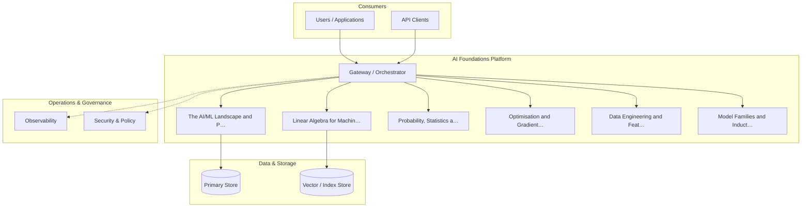
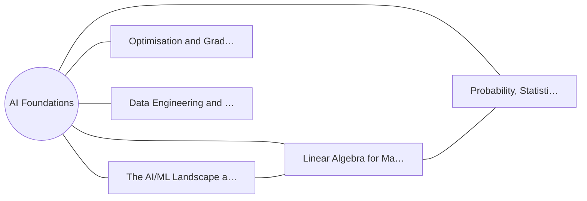
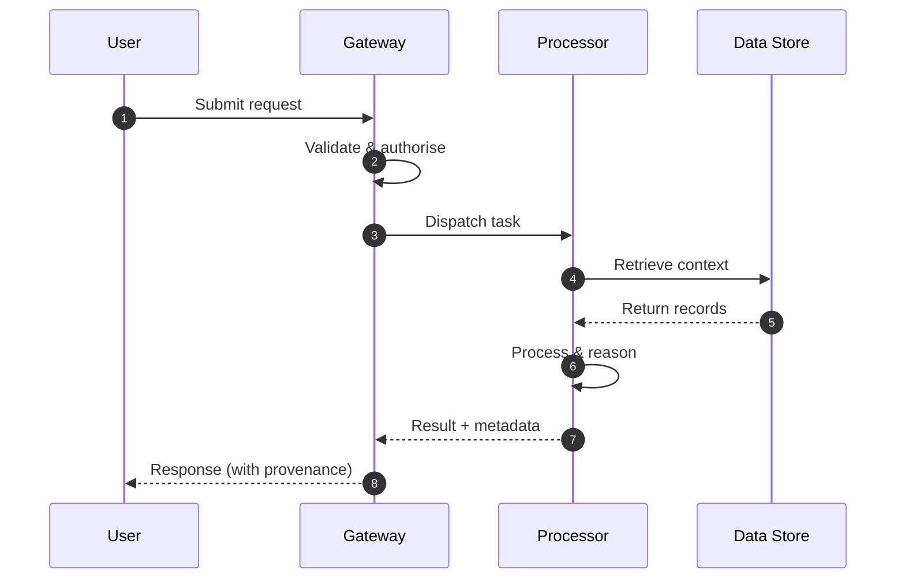
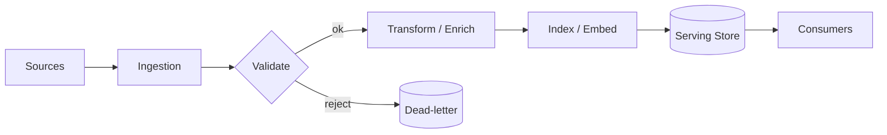
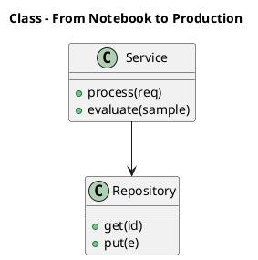
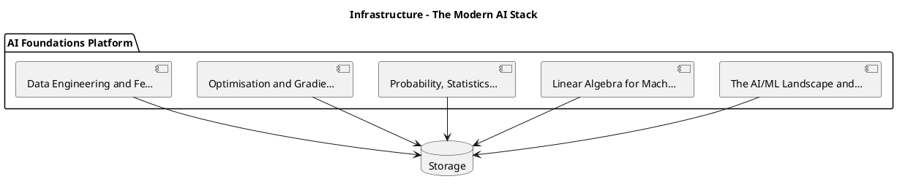
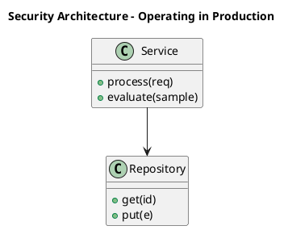
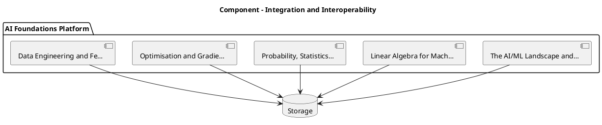
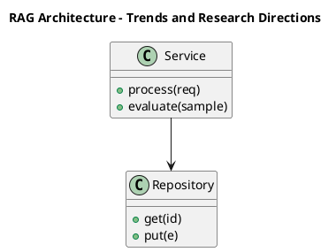

# AI Foundations: Foundations

## The mathematical and engineering bedrock of modern AI — a foundational guide for newcomers building a rigorous base.

**AI Foundations** &nbsp;|&nbsp; **Level:** Foundational &nbsp;|&nbsp; **First Edition**

**Authors:** Priya Narayanan, Dr. Rajesh Gupta

**Publisher:** AI-University Press &nbsp;|&nbsp; **ISBN:** 978-4-19601-029-6 &nbsp;|&nbsp; **Version:** 1.0.0 &nbsp;|&nbsp; **2026**


---

## Copyright

Copyright © 2026 AI-University Press. All rights reserved.

This work is published as part of the AI-University Enterprise AI Knowledge Series. It is generated by an automated publishing engine and curated for professional and educational use. No part of this publication may be reproduced for commercial resale without attribution to AI-University Press.

First published 2026. First Edition. Document version 1.0.0.


---

## Table of Contents

**Front Matter**

- Executive Summary
- Learning Objectives
- Industry Context
- Business Perspective
- Technical Perspective
- Architecture Perspective
- Governance Perspective
- Security Perspective

**Chapters**

1. The AI/ML Landscape and Problem Framing
2. Linear Algebra for Machine Learning
3. Probability, Statistics and Bayesian Reasoning
4. Optimisation and Gradient Descent
5. Data Engineering and Feature Pipelines
6. Model Families and Inductive Bias
7. Neural Networks and Backpropagation
8. Evaluation, Metrics and Experimental Design
9. Regularisation and Generalisation
10. Representation Learning and Embeddings
11. Responsible and Trustworthy AI by Design
12. From Notebook to Production
13. Scaling Laws and Compute Economics
14. The Modern AI Stack
15. Putting It Together: A Reference Implementation
16. Hands-On Lab: Building an End-to-End AI Foundations System
17. Case Study: Financial Services at Scale
18. Operating in Production
19. Evaluation and Quality Assurance
20. Security, Privacy and Governance
21. Cost, Performance and Scaling
22. Integration and Interoperability
23. Trends and Research Directions
24. Capstone Project
25. Certification Preparation and Review

**Back Matter**

- Hands-On Labs
- Case Studies
- Interview Questions
- Certification Questions
- Assessment Exercises
- References
- Glossary
- Index

---

**Table 1. Chapter overview and estimated length**

| # | Chapter | Est. pages | Diagrams | Code | Questions |
|---|---------|-----------:|---------:|-----:|----------:|
| 1 | The AI/ML Landscape and Problem Framing | 12 | 2 | 1 | 4 |
| 2 | Linear Algebra for Machine Learning | 11 | 1 | 1 | 4 |
| 3 | Probability, Statistics and Bayesian Reasoning | 11 | 1 | 1 | 4 |
| 4 | Optimisation and Gradient Descent | 11 | 2 | 1 | 4 |
| 5 | Data Engineering and Feature Pipelines | 11 | 1 | 1 | 4 |
| 6 | Model Families and Inductive Bias | 11 | 2 | 1 | 4 |
| 7 | Neural Networks and Backpropagation | 11 | 1 | 1 | 4 |
| 8 | Evaluation, Metrics and Experimental Design | 11 | 1 | 1 | 4 |
| 9 | Regularisation and Generalisation | 11 | 1 | 1 | 4 |
| 10 | Representation Learning and Embeddings | 11 | 2 | 1 | 4 |
| 11 | Responsible and Trustworthy AI by Design | 11 | 1 | 1 | 4 |
| 12 | From Notebook to Production | 11 | 1 | 1 | 4 |
| 13 | Scaling Laws and Compute Economics | 11 | 1 | 1 | 4 |
| 14 | The Modern AI Stack | 11 | 2 | 1 | 4 |
| 15 | Putting It Together: A Reference Implementation | 12 | 2 | 1 | 4 |
| 16 | Hands-On Lab: Building an End-to-End AI Foundations System | 11 | 1 | 1 | 4 |
| 17 | Case Study: Financial Services at Scale | 11 | 2 | 1 | 4 |
| 18 | Operating in Production | 11 | 1 | 1 | 4 |
| 19 | Evaluation and Quality Assurance | 11 | 1 | 1 | 4 |
| 20 | Security, Privacy and Governance | 11 | 1 | 1 | 4 |
| 21 | Cost, Performance and Scaling | 11 | 1 | 1 | 4 |
| 22 | Integration and Interoperability | 11 | 1 | 1 | 4 |
| 23 | Trends and Research Directions | 10 | 1 | 0 | 4 |
| 24 | Capstone Project | 11 | 1 | 1 | 4 |
| 25 | Certification Preparation and Review | 11 | 1 | 1 | 4 |

---

## List of Figures

- Figure 1. Data Lineage - The AI/ML Landscape and Problem Framing
- Figure 2. Component - The AI/ML Landscape and Problem Framing
- Figure 3. Component - Linear Algebra for Machine Learning
- Figure 4. RAG Architecture - Probability, Statistics and Bayesian Reasoning
- Figure 5. Deployment - Optimisation and Gradient Descent
- Figure 6. DevOps Pipeline - Optimisation and Gradient Descent
- Figure 7. DevOps Pipeline - Data Engineering and Feature Pipelines
- Figure 8. Operating Model - Model Families and Inductive Bias
- Figure 9. Knowledge Graph - Model Families and Inductive Bias
- Figure 10. Knowledge Graph - Neural Networks and Backpropagation
- Figure 11. CI/CD Pipeline - Evaluation, Metrics and Experimental Design
- Figure 12. Agent Architecture - Regularisation and Generalisation
- Figure 13. Sequence - Representation Learning and Embeddings
- Figure 14. Data Flow - Representation Learning and Embeddings
- Figure 15. Data Flow - Responsible and Trustworthy AI by Design
- Figure 16. Class - From Notebook to Production
- Figure 17. Cloud Architecture - Scaling Laws and Compute Economics
- Figure 18. Infrastructure - The Modern AI Stack
- Figure 19. Architecture - The Modern AI Stack
- Figure 20. Architecture - Putting It Together: A Reference Implementation
- Figure 21. Capability Map - Putting It Together: A Reference Implementation
- Figure 22. Capability Map - Hands-On Lab: Building an End-to-End AI Foundations System
- Figure 23. Application Flow - Case Study: Financial Services at Scale
- Figure 24. Security Architecture - Case Study: Financial Services at Scale
- Figure 25. Security Architecture - Operating in Production
- Figure 26. Business Process - Evaluation and Quality Assurance
- Figure 27. Network - Security, Privacy and Governance
- Figure 28. Data Lineage - Cost, Performance and Scaling
- Figure 29. Component - Integration and Interoperability
- Figure 30. RAG Architecture - Trends and Research Directions
- Figure 31. Deployment - Capstone Project
- Figure 32. DevOps Pipeline - Certification Preparation and Review

---

## List of Tables

- Table 1. Chapter overview and estimated length
- Table 2. Glossary of key terms

---

## Executive Summary

Artificial intelligence is the discipline of building systems that perceive, reason and act to achieve goals under uncertainty. Modern AI is dominated by machine learning, in which models infer parameters from data rather than from hand-coded rules. Foundational competence spans linear algebra, probability, optimisation, information theory and the engineering practices required to turn a notebook experiment into a governed production service. This book treats AI foundations as a systems discipline: data, models, evaluation and operations are co-designed, and every modelling decision is traced to a measurable business or scientific objective. This volume is written for newcomers building a rigorous base. It progresses from first principles to enterprise-grade design and operations, with every chapter combining theory, architecture, worked examples, runnable code, exercises and assessment. The treatment is deliberately practical: the emphasis throughout is on decisions that hold up in production, backed by measurement rather than intuition.

## Learning Objectives

After completing this book, the reader will be able to:

- Explain the foundational principles of AI Foundations and articulate where it creates value.
- Design a reference architecture for a AI Foundations system that meets enterprise quality attributes.
- Implement core AI Foundations components following production engineering standards.
- Evaluate AI Foundations systems rigorously and gate releases on measurable quality.
- Apply security, privacy and governance controls appropriate to AI Foundations.
- Operate AI Foundations systems reliably, controlling cost, latency and drift.
- Recognise common pitfalls in AI Foundations and apply proven mitigations.

## Industry Context

AI Foundations sits within a rapidly maturing AI landscape in which organisations are moving from experimentation to dependable, governed deployment. The competitive advantage no longer comes from access to models alone but from the engineering and operational discipline that turns capability into reliable, compliant business outcomes. This book situates the subject in that context so readers can connect technical choices to organisational value.

## Business Perspective

From a business perspective, AI Foundations initiatives must be justified by clear value: revenue growth, cost reduction, risk mitigation or improved experience. Leaders should insist on measurable objectives, realistic unit economics that account for inference cost, and a roadmap that sequences capability against risk. The most common failure is not technical but strategic: building capability that is never connected to a decision or workflow that matters.

## Technical Perspective

The technical perspective treats AI Foundations as a systems discipline. A foundational AI platform separates four planes: a data plane (ingestion, validation, feature store), a training plane (experiment tracking, distributed training, model registry), a serving plane (low-latency and batch inference, feature retrieval) and a governance plane (lineage, access control, audit). Clean interfaces between planes allow teams to evolve each independently while preserving reproducibility and compliance. Throughout, the book favours clear interfaces, reproducibility and measurement.

## Architecture Perspective

Architecturally, a AI Foundations platform is layered into data, model, application and operations planes, each with explicit contracts so they can evolve independently. A model gateway centralises access and control; observability and security are cross-cutting and designed in from the start. Reference architectures and blueprints appear in every chapter and are consolidated in the capstone.

## Governance Perspective

Governance ensures AI Foundations is developed and used responsibly, legally and in line with organisational values. This book embeds governance as lifecycle gates - risk classification, documentation, approval and monitoring - rather than as a final checkpoint, aligning with frameworks such as the NIST AI RMF, ISO/IEC 42001 and the EU AI Act.

## Security Perspective

Security for AI Foundations extends traditional controls with ML-specific defences against prompt injection, data poisoning, model extraction and insecure output handling. Defence in depth - input validation, constrained decoding, output validation, sandboxed tools and continuous monitoring - is applied consistently, mapped to the OWASP LLM Top 10 and MITRE ATLAS.


---


# Chapter 1. The AI/ML Landscape and Problem Framing

_This chapter examines the ai/ml landscape and problem framing within AI Foundations. It covers distinguishing supervised, unsupervised, self-supervised and reinforcement learning; mapping a business problem to a learnable objective; and deciding when not to use machine learning at all, derives a reference architecture, walks through a worked example and runnable code, surveys industry use cases, and distils best practices and pitfalls, closing with exercises and review questions._

## Introduction

We define The AI/ML Landscape and Problem Framing as distinguishing supervised, unsupervised, self-supervised and reinforcement learning; mapping a business problem to a learnable objective; and deciding when not to use machine learning at all. This concept recurs throughout the AI Foundations lifecycle, from design to operations. Seasoned practitioners treat this as a systems problem, co-designing data, models and operations rather than optimising any one in isolation.

This chapter builds intuition first, then formalises the ideas, derives an architecture, and finishes with code, exercises and review questions so the material transfers directly to your own AI Foundations work. Read it actively: pause at each diagram, reproduce the code, and attempt the exercises before consulting the answers.

## Theory and Foundations

We define The AI/ML Landscape and Problem Framing as distinguishing supervised, unsupervised, self-supervised and reinforcement learning; mapping a business problem to a learnable objective; and deciding when not to use machine learning at all. The practical implication is that design choices here ripple through latency, cost and maintainability for the lifetime of the system. Mechanically, the behaviour emerges from a few interacting parts that are simpler than the whole they produce.

To place this in context, recall the broader picture: Artificial intelligence is the discipline of building systems that perceive, reason and act to achieve goals under uncertainty. Within that picture, the ai/ml landscape and problem framing is one of the load-bearing ideas - the kind that, when understood deeply, makes the rest of AI Foundations fall into place. It is foundational: later capabilities in AI Foundations are built directly on top of it.

The AI/ML Landscape and Problem Framing cannot be understood in isolation from responsible and trustworthy ai by design. Recall that responsible and trustworthy ai by design concerns fairness, robustness, privacy and explainability treated as first-class requirements rather than afterthoughts. The two interact directly: decisions in one constrain the design space of the other, which is why mature teams reason about them together rather than sequentially. There is an inherent trade-off between fidelity and cost, and the correct balance depends on the use case and its tolerance for error.

The AI/ML Landscape and Problem Framing cannot be understood in isolation from neural networks and backpropagation. Recall that neural networks and backpropagation concerns perceptrons, activation functions, the chain rule, automatic differentiation and the universal-approximation intuition behind deep learning. The two interact directly: decisions in one constrain the design space of the other, which is why mature teams reason about them together rather than sequentially. There is an inherent trade-off between fidelity and cost, and the correct balance depends on the use case and its tolerance for error.

Several established patterns apply directly to the ai/ml landscape and problem framing. The first, reproducible pipelines pinned by data, code and environment hashes, is widely adopted because it makes the system's behaviour predictable and observable. A complementary pattern, feature store as the single source of truth for online/offline parity, addresses a related concern and is often deployed alongside it. Patterns are not dogma; they are distilled experience that shortcuts the search for a sound design, and each carries assumptions worth checking against your context.

Knowing when not to use a technique is as valuable as knowing how to use it. In a small prototype, shortcuts around the ai/ml landscape and problem framing are invisible; in a production AI Foundations system serving real traffic, they surface as incidents, cost overruns or compliance gaps. Every added component buys capability at the price of operational surface area, and that bargain should be made consciously. The remainder of this chapter turns these principles into an architecture, code and a checklist you can apply immediately.

## Architecture and Design

From an architectural standpoint, The AI/ML Landscape and Problem Framing sits at the intersection of data, models and operations. A foundational AI platform separates four planes: a data plane (ingestion, validation, feature store), a training plane (experiment tracking, distributed training, model registry), a serving plane (low-latency and batch inference, feature retrieval) and a governance plane (lineage, access control, audit). Clean interfaces between planes allow teams to evolve each independently while preserving reproducibility and compliance.

Concretely, the principal building blocks include the ai/ml landscape and problem framing, linear algebra for machine learning, probability, statistics and bayesian reasoning, optimisation and gradient descent and data engineering and feature pipelines. Each is a replaceable component behind a stable interface, so the team can upgrade an implementation - a model, an index, a policy engine - without rewriting its neighbours. The contracts between components are where reliability is won or lost, so they are specified explicitly and tested in isolation.

The diagram accompanying this section makes the data and control flow explicit. Requests enter through a well-defined boundary where they are authenticated and validated; only then are they dispatched to the components that perform the work. This boundary is also where rate limiting, quota enforcement and audit logging live, keeping cross-cutting concerns out of the core logic and in one auditable place.

Two qualities deserve emphasis. First, observability is designed in, not bolted on: every component emits structured telemetry so that failures can be localised in minutes rather than hours. Second, the architecture is evolvable - components communicate through stable contracts so that any single part of the AI Foundations system can be replaced without a rewrite. Simplicity is a feature. The simplest design that meets the requirement should be the default, with complexity added only when measurement justifies it.

```xml
<mxfile host="ai-university">
  <diagram name="Data Lineage">
    <mxGraphModel dx="800" dy="600" grid="1" gridSize="10">
      <root>
        <mxCell id="0"/>
        <mxCell id="1" parent="0"/>
        <mxCell id="title" value="Data Lineage - The AI/ML Landscape and Problem Framing" style="text;fontSize=16;fontStyle=1" vertex="1" parent="1"><mxGeometry x="40" y="20" width="600" height="30" as="geometry"/></mxCell>
        <mxCell id="hub" value="AI Foundations" style="rounded=1;fillColor=#0f172a;fontColor=#ffffff;fontStyle=1" vertex="1" parent="1"><mxGeometry x="300" y="180" width="160" height="60" as="geometry"/></mxCell>
        <mxCell id="n0" value="The AI/ML Landscape and…" style="rounded=1;fillColor=#e0e7ff;strokeColor=#4338ca" vertex="1" parent="1"><mxGeometry x="60" y="80" width="160" height="50" as="geometry"/></mxCell>
        <mxCell id="e0" style="edgeStyle=orthogonalEdgeStyle" edge="1" parent="1" source="hub" target="n0"><mxGeometry relative="1" as="geometry"/></mxCell>
        <mxCell id="n1" value="Linear Algebra for Mach…" style="rounded=1;fillColor=#e0e7ff;strokeColor=#4338ca" vertex="1" parent="1"><mxGeometry x="600" y="170" width="160" height="50" as="geometry"/></mxCell>
        <mxCell id="e1" style="edgeStyle=orthogonalEdgeStyle" edge="1" parent="1" source="hub" target="n1"><mxGeometry relative="1" as="geometry"/></mxCell>
        <mxCell id="n2" value="Probability, Statistics…" style="rounded=1;fillColor=#e0e7ff;strokeColor=#4338ca" vertex="1" parent="1"><mxGeometry x="60" y="260" width="160" height="50" as="geometry"/></mxCell>
        <mxCell id="e2" style="edgeStyle=orthogonalEdgeStyle" edge="1" parent="1" source="hub" target="n2"><mxGeometry relative="1" as="geometry"/></mxCell>
        <mxCell id="n3" value="Optimisation and Gradie…" style="rounded=1;fillColor=#e0e7ff;strokeColor=#4338ca" vertex="1" parent="1"><mxGeometry x="600" y="350" width="160" height="50" as="geometry"/></mxCell>
        <mxCell id="e3" style="edgeStyle=orthogonalEdgeStyle" edge="1" parent="1" source="hub" target="n3"><mxGeometry relative="1" as="geometry"/></mxCell>
        <mxCell id="n4" value="Data Engineering and Fe…" style="rounded=1;fillColor=#e0e7ff;strokeColor=#4338ca" vertex="1" parent="1"><mxGeometry x="60" y="440" width="160" height="50" as="geometry"/></mxCell>
        <mxCell id="e4" style="edgeStyle=orthogonalEdgeStyle" edge="1" parent="1" source="hub" target="n4"><mxGeometry relative="1" as="geometry"/></mxCell>
      </root>
    </mxGraphModel>
  </diagram>
</mxfile>
```

_Source diagram (drawio); render with the appropriate tool._

**Figure 1. Data Lineage - The AI/ML Landscape and Problem Framing** (drawio). Figure: Data Lineage view for AI Foundations. This diagram illustrates the principal components and their interactions as discussed in the surrounding section.



**Figure 2. Component - The AI/ML Landscape and Problem Framing** (mermaid). Figure: Component view for AI Foundations. This diagram illustrates the principal components and their interactions as discussed in the surrounding section.

## Deep Dive: Mechanics, Variants and Trade-offs

Having established the essentials, we now go deeper into the ai/ml landscape and problem framing. It pays to understand the mechanism rather than treat it as a black box, because most production incidents are explained by one of its steps misbehaving. The distinctions in this section are the ones that separate a working demo from a system that holds up under adversarial inputs, scale and the passage of time.

Consider the principal variants and how to choose between them. Each variant optimises for a different point in the design space - some for latency, some for accuracy, some for cost or operability - and the correct choice follows from explicit requirements rather than from defaults. Every added component buys capability at the price of operational surface area, and that bargain should be made consciously.

In practice this is supported by a mature tooling ecosystem, including PyTorch, scikit-learn, NumPy, MLflow. Tools accelerate the work but do not substitute for understanding: the same principles apply whichever implementation you select, and the ability to reason from first principles is what lets you debug when a tool behaves unexpectedly.

A frequent source of subtle bugs is the interaction with responsible and trustworthy ai by design. Because responsible and trustworthy ai by design concerns fairness, robustness, privacy and explainability treated as first-class requirements rather than afterthoughts, changes there can silently alter the behaviour analysed here. The remedy is contract tests at the boundary and end-to-end evaluations that exercise the interaction explicitly.

Finally, attend to edge cases and degradation. Define what the system should do under partial failure, unexpected inputs and load spikes, and make that behaviour explicit and tested rather than emergent. Graceful degradation - returning a safe, useful result when the ideal one is unavailable - is a hallmark of mature engineering.

For deeper study, the literature offers authoritative treatments such as Goodfellow, Bengio & Courville — Deep Learning (MIT Press) and Bishop — Pattern Recognition and Machine Learning (Springer). These primary sources reward careful reading and ground the practical guidance above in established results.

## Advanced Considerations

Having established the essentials, we now go deeper into the ai/ml landscape and problem framing. It pays to understand the mechanism rather than treat it as a black box, because most production incidents are explained by one of its steps misbehaving. The distinctions in this section are the ones that separate a working demo from a system that holds up under adversarial inputs, scale and the passage of time.

Consider the principal variants and how to choose between them. Each variant optimises for a different point in the design space - some for latency, some for accuracy, some for cost or operability - and the correct choice follows from explicit requirements rather than from defaults. As with most architectural decisions, the choice is rarely binary; the skill lies in quantifying the trade-offs and choosing deliberately.

In practice this is supported by a mature tooling ecosystem, including PyTorch, scikit-learn, NumPy, MLflow. Tools accelerate the work but do not substitute for understanding: the same principles apply whichever implementation you select, and the ability to reason from first principles is what lets you debug when a tool behaves unexpectedly.

A frequent source of subtle bugs is the interaction with data engineering and feature pipelines. Because data engineering and feature pipelines concerns ingestion, validation, feature stores, leakage prevention and reproducible datasets as the highest-leverage investment in any AI program, changes there can silently alter the behaviour analysed here. The remedy is contract tests at the boundary and end-to-end evaluations that exercise the interaction explicitly.

Finally, attend to edge cases and degradation. Define what the system should do under partial failure, unexpected inputs and load spikes, and make that behaviour explicit and tested rather than emergent. Graceful degradation - returning a safe, useful result when the ideal one is unavailable - is a hallmark of mature engineering.

For deeper study, the literature offers authoritative treatments such as Goodfellow, Bengio & Courville — Deep Learning (MIT Press) and Bishop — Pattern Recognition and Machine Learning (Springer). These primary sources reward careful reading and ground the practical guidance above in established results.

## Worked Example

To ground the discussion, walk through a representative example. A manufacturing organisation needs predictive maintenance from sensor telemetry to reduce unplanned downtime. They decide to apply the ai/ml landscape and problem framing as part of their AI Foundations solution, but wisely treat it as a hypothesis to be validated rather than a foregone conclusion.

The team begins by stating the objective precisely and defining how success will be measured before writing any code. They establish a small but representative evaluation set, agree on acceptance thresholds, and only then prototype the simplest design that could work. Early measurement reveals which assumptions hold and which must be revised, saving weeks of misdirected effort and surfacing edge cases while they are still cheap to fix.

As the prototype matures into a service, the team hardens it: adding input validation, error handling, caching where it pays off, and monitoring that ties back to the original success metric. They document each significant decision in an architecture decision record so that future maintainers understand not just what was built but why.

The outcome is instructive. The system that reaches production is not the most sophisticated design the team considered, but the one whose behaviour they could measure, explain and operate. This is the recurring lesson of AI Foundations: durable value comes from the whole system, not from any single clever component.

## Industry Use Cases

Across industries, the ideas in this chapter recur in recognisable ways. The following vignettes show how different sectors apply them and what they have in common.

**Financial Services.** Credit risk scoring with calibrated probabilities and auditable feature lineage for regulators. The common thread is that value comes not from the model alone but from the surrounding system - data quality, evaluation, integration and operations - which is precisely where most of the engineering effort belongs.

**Healthcare.** Clinical decision support where uncertainty estimates and explainability are prerequisites for adoption. The common thread is that value comes not from the model alone but from the surrounding system - data quality, evaluation, integration and operations - which is precisely where most of the engineering effort belongs.

**Retail.** Demand forecasting and price elasticity modelling feeding automated replenishment. The common thread is that value comes not from the model alone but from the surrounding system - data quality, evaluation, integration and operations - which is precisely where most of the engineering effort belongs.

**Manufacturing.** Predictive maintenance from sensor telemetry to reduce unplanned downtime. The common thread is that value comes not from the model alone but from the surrounding system - data quality, evaluation, integration and operations - which is precisely where most of the engineering effort belongs.

## Best Practices

The following practices consistently separate successful AI Foundations efforts from struggling ones. They are deliberately concrete so they can be adopted as checklist items in design and code review.

- Establish a held-out test set early and never touch it during development.
- Track every experiment with code, data and hyper-parameter provenance.
- Prefer the simplest model that meets the requirement before adding complexity.
- Measure calibration, not just accuracy, for decision-support systems.
- Automate data validation to catch schema and distribution drift before training.

None of these are exotic; they are the unglamorous disciplines that compound into reliability. The cost of adopting them is small compared with the cost of the incidents they prevent, and they become second nature with practice.

## Common Pitfalls

Equally instructive are the failure modes that recur in practice. Each pitfall below has a clear early warning sign and a known remedy, so treat them as a diagnostic checklist when something feels wrong:

- Target leakage that inflates offline metrics and collapses in production.
- Optimising a proxy metric that diverges from the true business objective.
- Ignoring class imbalance and reporting misleading accuracy.
- Coupling preprocessing to a single notebook, destroying reproducibility.

The pattern is consistent: most failures stem from skipping measurement, conflating prototype and production standards, or deferring cross-cutting concerns such as security and cost until they become emergencies. Naming these traps in advance is the cheapest way to avoid them.

## Governance, Security and Cost Notes

No discussion of the ai/ml landscape and problem framing is complete without its governance, security and cost dimensions, which are too often deferred until they become emergencies. Treating them as first-class concerns from the outset is both cheaper and safer.

**Governance.** Classify the risk of this capability, document its intended and out-of-scope uses, and ensure decisions are traceable to satisfy internal policy and external regulation such as the NIST AI RMF, ISO/IEC 42001 and the EU AI Act. **Security.** Treat all external input as untrusted, validate outputs before acting on them, apply least privilege to any tools or data access, and map controls to the OWASP LLM Top 10 and MITRE ATLAS.

**Cost and sustainability.** Establish explicit budgets for compute, tokens and latency, attribute spend to owners, and revisit the economics as usage scales - a design that is affordable at pilot scale can become untenable at production volume. Building these reflexes into everyday engineering is what allows a AI Foundations system to be not only capable but also trustworthy and economically sound.

## Hands-On Exercises

Work through the following exercises. They are designed to move understanding from recognition to application - the level required for real engineering work - so prefer writing and building over merely reading.

1. Explain the ai/ml landscape and problem framing to a colleague unfamiliar with AI Foundations, using a concrete example from your own domain.
2. Sketch a reference architecture that incorporates the ai/ml landscape and problem framing and annotate where observability, security and cost controls belong.
3. Design an evaluation that would tell you whether the ai/ml landscape and problem framing is working in production, including the metric, the dataset and the acceptance threshold.
4. Identify two pitfalls relevant to the ai/ml landscape and problem framing in your environment and describe the early warning signals you would monitor.
5. Prototype the simplest implementation that demonstrates the ai/ml landscape and problem framing, then list exactly what would need to change to make it production-ready.

## Key Takeaways

Key takeaways from this chapter:

- The AI/ML Landscape and Problem Framing is a systems concern in AI Foundations: data, models and operations must be co-designed.
- Measurement is non-negotiable; define success metrics and evaluation before building.
- Favour the simplest design that meets the requirement, and add complexity only when evidence demands it.
- Security, cost and observability are first-class requirements, not afterthoughts.
- Document decisions so the system remains understandable and operable as it evolves.

## Code Walkthrough

This listing shows a configuration-driven The AI/ML Landscape and Problem Framing component with retry semantics and typed interfaces — the shape we expect from production AI Foundations code rather than a notebook prototype.

The full listing is shown below; study it line by line and reproduce it locally before moving on.

### Listing: Implementing a The AI/ML Landscape and Problem Framing component

```python
from __future__ import annotations

from dataclasses import dataclass, field
from typing import Any


@dataclass(slots=True)
class TheLandscapeConfig:
    """Configuration for the The AI/ML Landscape and Problem Framing component in a AI Foundations system."""

    name: str
    timeout_s: float = 30.0
    max_retries: int = 3
    options: dict[str, Any] = field(default_factory=dict)


class TheLandscape:
    """A minimal, production-shaped implementation of The AI/ML Landscape and Problem Framing."""

    def __init__(self, config: TheLandscapeConfig) -> None:
        self._config = config
        self._calls = 0

    def run(self, payload: dict[str, Any]) -> dict[str, Any]:
        """Process a request, retrying transient failures with backoff."""
        last_error: Exception | None = None
        for attempt in range(self._config.max_retries):
            try:
                self._calls += 1
                return self._process(payload)
            except TimeoutError as exc:  # transient
                last_error = exc
                continue
        raise RuntimeError(f"TheLandscape failed after retries") from last_error

    def _process(self, payload: dict[str, Any]) -> dict[str, Any]:
        # Domain-specific logic for The AI/ML Landscape and Problem Framing goes here.
        return {"status": "ok", "input_keys": sorted(payload), "calls": self._calls}

```

## Review Questions

1. In the context of AI Foundations, which statement best describes “The AI/ML Landscape and Problem Framing”?
   - A. It removes all security and governance requirements.
   - B. It applies exclusively to image data.
   - C. Distinguishing supervised, unsupervised, self-supervised and reinforcement learning; mapping a business problem to a learnable objective; and deciding when not to use machine learning at all.
   - D. It is only relevant to academic research, not production.
   - **Answer: C.** The AI/ML Landscape and Problem Framing: Distinguishing supervised, unsupervised, self-supervised and reinforcement learning; mapping a business problem to a learnable objective; and deciding when not to use machine learning at all.
2. Which of the following is a recommended best practice when working with AI Foundations?
   - A. Establish a held-out test set early and never touch it during development.
   - B. It removes all security and governance requirements.
   - C. Target leakage that inflates offline metrics and collapses in production.
   - D. It eliminates the need for any evaluation or monitoring.
   - **Answer: A.** Best practice: Establish a held-out test set early and never touch it during development.
3. Which of the following is a common pitfall to avoid in AI Foundations?
   - A. Prefer the simplest model that meets the requirement before adding complexity.
   - B. It removes all security and governance requirements.
   - C. Ignoring class imbalance and reporting misleading accuracy.
   - D. It is only relevant to academic research, not production.
   - **Answer: C.** Pitfall to avoid: Ignoring class imbalance and reporting misleading accuracy.
4. *(Discussion)* Explain The AI/ML Landscape and Problem Framing and why it matters in a production AI Foundations system.
   - **Model answer:** A strong answer defines the ai/ml landscape and problem framing (Distinguishing supervised, unsupervised, self-supervised and reinforcement learning; mapping a business problem to a learnable objective; and deciding when not to use machine learning at all.) then connects it to architecture, evaluation, cost, security and operations for AI Foundations, citing concrete trade-offs and a real-world example.

---


# Chapter 2. Linear Algebra for Machine Learning

_This chapter examines linear algebra for machine learning within AI Foundations. It covers vectors, matrices, norms, eigendecomposition and the singular value decomposition as the language of representation and dimensionality reduction, derives a reference architecture, walks through a worked example and runnable code, surveys industry use cases, and distils best practices and pitfalls, closing with exercises and review questions._

## Introduction

Linear Algebra for Machine Learning refers to vectors, matrices, norms, eigendecomposition and the singular value decomposition as the language of representation and dimensionality reduction. Getting this right early prevents expensive rework once a AI Foundations system reaches scale. In an enterprise setting, this translates into concrete requirements: clear interfaces, measurable quality, and controls that satisfy security and governance.

This chapter builds intuition first, then formalises the ideas, derives an architecture, and finishes with code, exercises and review questions so the material transfers directly to your own AI Foundations work. Read it actively: pause at each diagram, reproduce the code, and attempt the exercises before consulting the answers.

## Theory and Foundations

Formally, Linear Algebra for Machine Learning addresses vectors, matrices, norms, eigendecomposition and the singular value decomposition as the language of representation and dimensionality reduction. In an enterprise setting, this translates into concrete requirements: clear interfaces, measurable quality, and controls that satisfy security and governance. Beneath the abstraction lies a concrete process whose steps can each be measured, tested and optimised independently.

To place this in context, recall the broader picture: Artificial intelligence is the discipline of building systems that perceive, reason and act to achieve goals under uncertainty. Within that picture, linear algebra for machine learning is one of the load-bearing ideas - the kind that, when understood deeply, makes the rest of AI Foundations fall into place. Teams that master this consistently ship more reliable AI Foundations systems at lower cost.

Linear Algebra for Machine Learning cannot be understood in isolation from from notebook to production. Recall that from notebook to production concerns packaging, serving, monitoring and the operational loop that keeps models performing as data drifts. The two interact directly: decisions in one constrain the design space of the other, which is why mature teams reason about them together rather than sequentially. Every added component buys capability at the price of operational surface area, and that bargain should be made consciously.

Linear Algebra for Machine Learning cannot be understood in isolation from data engineering and feature pipelines. Recall that data engineering and feature pipelines concerns ingestion, validation, feature stores, leakage prevention and reproducible datasets as the highest-leverage investment in any AI program. The two interact directly: decisions in one constrain the design space of the other, which is why mature teams reason about them together rather than sequentially. Every added component buys capability at the price of operational surface area, and that bargain should be made consciously.

Several established patterns apply directly to linear algebra for machine learning. The first, champion/challenger evaluation before any production swap, is widely adopted because it makes the system's behaviour predictable and observable. A complementary pattern, reproducible pipelines pinned by data, code and environment hashes, addresses a related concern and is often deployed alongside it. Patterns are not dogma; they are distilled experience that shortcuts the search for a sound design, and each carries assumptions worth checking against your context.

Knowing when not to use a technique is as valuable as knowing how to use it. In a small prototype, shortcuts around linear algebra for machine learning are invisible; in a production AI Foundations system serving real traffic, they surface as incidents, cost overruns or compliance gaps. As with most architectural decisions, the choice is rarely binary; the skill lies in quantifying the trade-offs and choosing deliberately. The remainder of this chapter turns these principles into an architecture, code and a checklist you can apply immediately.

## Architecture and Design

The reference architecture for Linear Algebra for Machine Learning separates concerns into clearly bounded components with explicit contracts. A foundational AI platform separates four planes: a data plane (ingestion, validation, feature store), a training plane (experiment tracking, distributed training, model registry), a serving plane (low-latency and batch inference, feature retrieval) and a governance plane (lineage, access control, audit). Clean interfaces between planes allow teams to evolve each independently while preserving reproducibility and compliance.

Concretely, the principal building blocks include the ai/ml landscape and problem framing, linear algebra for machine learning, probability, statistics and bayesian reasoning, optimisation and gradient descent and data engineering and feature pipelines. Each is a replaceable component behind a stable interface, so the team can upgrade an implementation - a model, an index, a policy engine - without rewriting its neighbours. The contracts between components are where reliability is won or lost, so they are specified explicitly and tested in isolation.

The diagram accompanying this section makes the data and control flow explicit. Requests enter through a well-defined boundary where they are authenticated and validated; only then are they dispatched to the components that perform the work. This boundary is also where rate limiting, quota enforcement and audit logging live, keeping cross-cutting concerns out of the core logic and in one auditable place.

Two qualities deserve emphasis. First, observability is designed in, not bolted on: every component emits structured telemetry so that failures can be localised in minutes rather than hours. Second, the architecture is evolvable - components communicate through stable contracts so that any single part of the AI Foundations system can be replaced without a rewrite. Latency, accuracy and cost form a tension triangle: improving one typically pressures the others, so explicit budgets are essential.


**Figure 3. Component - Linear Algebra for Machine Learning** (mermaid). Figure: Component view for AI Foundations. This diagram illustrates the principal components and their interactions as discussed in the surrounding section.

## Deep Dive: Mechanics, Variants and Trade-offs

Having established the essentials, we now go deeper into linear algebra for machine learning. Mechanically, the behaviour emerges from a few interacting parts that are simpler than the whole they produce. The distinctions in this section are the ones that separate a working demo from a system that holds up under adversarial inputs, scale and the passage of time.

Consider the principal variants and how to choose between them. Each variant optimises for a different point in the design space - some for latency, some for accuracy, some for cost or operability - and the correct choice follows from explicit requirements rather than from defaults. There is an inherent trade-off between fidelity and cost, and the correct balance depends on the use case and its tolerance for error.

In practice this is supported by a mature tooling ecosystem, including PyTorch, scikit-learn, NumPy, MLflow. Tools accelerate the work but do not substitute for understanding: the same principles apply whichever implementation you select, and the ability to reason from first principles is what lets you debug when a tool behaves unexpectedly.

A frequent source of subtle bugs is the interaction with from notebook to production. Because from notebook to production concerns packaging, serving, monitoring and the operational loop that keeps models performing as data drifts, changes there can silently alter the behaviour analysed here. The remedy is contract tests at the boundary and end-to-end evaluations that exercise the interaction explicitly.

Finally, attend to edge cases and degradation. Define what the system should do under partial failure, unexpected inputs and load spikes, and make that behaviour explicit and tested rather than emergent. Graceful degradation - returning a safe, useful result when the ideal one is unavailable - is a hallmark of mature engineering.

For deeper study, the literature offers authoritative treatments such as Goodfellow, Bengio & Courville — Deep Learning (MIT Press) and Bishop — Pattern Recognition and Machine Learning (Springer). These primary sources reward careful reading and ground the practical guidance above in established results.

## Advanced Considerations

Having established the essentials, we now go deeper into linear algebra for machine learning. It pays to understand the mechanism rather than treat it as a black box, because most production incidents are explained by one of its steps misbehaving. The distinctions in this section are the ones that separate a working demo from a system that holds up under adversarial inputs, scale and the passage of time.

Consider the principal variants and how to choose between them. Each variant optimises for a different point in the design space - some for latency, some for accuracy, some for cost or operability - and the correct choice follows from explicit requirements rather than from defaults. Every added component buys capability at the price of operational surface area, and that bargain should be made consciously.

In practice this is supported by a mature tooling ecosystem, including PyTorch, scikit-learn, NumPy, MLflow. Tools accelerate the work but do not substitute for understanding: the same principles apply whichever implementation you select, and the ability to reason from first principles is what lets you debug when a tool behaves unexpectedly.

A frequent source of subtle bugs is the interaction with neural networks and backpropagation. Because neural networks and backpropagation concerns perceptrons, activation functions, the chain rule, automatic differentiation and the universal-approximation intuition behind deep learning, changes there can silently alter the behaviour analysed here. The remedy is contract tests at the boundary and end-to-end evaluations that exercise the interaction explicitly.

Finally, attend to edge cases and degradation. Define what the system should do under partial failure, unexpected inputs and load spikes, and make that behaviour explicit and tested rather than emergent. Graceful degradation - returning a safe, useful result when the ideal one is unavailable - is a hallmark of mature engineering.

For deeper study, the literature offers authoritative treatments such as Goodfellow, Bengio & Courville — Deep Learning (MIT Press) and Bishop — Pattern Recognition and Machine Learning (Springer). These primary sources reward careful reading and ground the practical guidance above in established results.

## Worked Example

To ground the discussion, walk through a representative example. A manufacturing organisation needs predictive maintenance from sensor telemetry to reduce unplanned downtime. They decide to apply linear algebra for machine learning as part of their AI Foundations solution, but wisely treat it as a hypothesis to be validated rather than a foregone conclusion.

The team begins by stating the objective precisely and defining how success will be measured before writing any code. They establish a small but representative evaluation set, agree on acceptance thresholds, and only then prototype the simplest design that could work. Early measurement reveals which assumptions hold and which must be revised, saving weeks of misdirected effort and surfacing edge cases while they are still cheap to fix.

As the prototype matures into a service, the team hardens it: adding input validation, error handling, caching where it pays off, and monitoring that ties back to the original success metric. They document each significant decision in an architecture decision record so that future maintainers understand not just what was built but why.

The outcome is instructive. The system that reaches production is not the most sophisticated design the team considered, but the one whose behaviour they could measure, explain and operate. This is the recurring lesson of AI Foundations: durable value comes from the whole system, not from any single clever component.

## Industry Use Cases

Across industries, the ideas in this chapter recur in recognisable ways. The following vignettes show how different sectors apply them and what they have in common.

**Financial Services.** Credit risk scoring with calibrated probabilities and auditable feature lineage for regulators. The common thread is that value comes not from the model alone but from the surrounding system - data quality, evaluation, integration and operations - which is precisely where most of the engineering effort belongs.

**Healthcare.** Clinical decision support where uncertainty estimates and explainability are prerequisites for adoption. The common thread is that value comes not from the model alone but from the surrounding system - data quality, evaluation, integration and operations - which is precisely where most of the engineering effort belongs.

**Retail.** Demand forecasting and price elasticity modelling feeding automated replenishment. The common thread is that value comes not from the model alone but from the surrounding system - data quality, evaluation, integration and operations - which is precisely where most of the engineering effort belongs.

**Manufacturing.** Predictive maintenance from sensor telemetry to reduce unplanned downtime. The common thread is that value comes not from the model alone but from the surrounding system - data quality, evaluation, integration and operations - which is precisely where most of the engineering effort belongs.

## Best Practices

The following practices consistently separate successful AI Foundations efforts from struggling ones. They are deliberately concrete so they can be adopted as checklist items in design and code review.

- Establish a held-out test set early and never touch it during development.
- Track every experiment with code, data and hyper-parameter provenance.
- Prefer the simplest model that meets the requirement before adding complexity.
- Measure calibration, not just accuracy, for decision-support systems.
- Automate data validation to catch schema and distribution drift before training.

None of these are exotic; they are the unglamorous disciplines that compound into reliability. The cost of adopting them is small compared with the cost of the incidents they prevent, and they become second nature with practice.

## Common Pitfalls

Equally instructive are the failure modes that recur in practice. Each pitfall below has a clear early warning sign and a known remedy, so treat them as a diagnostic checklist when something feels wrong:

- Target leakage that inflates offline metrics and collapses in production.
- Optimising a proxy metric that diverges from the true business objective.
- Ignoring class imbalance and reporting misleading accuracy.
- Coupling preprocessing to a single notebook, destroying reproducibility.

The pattern is consistent: most failures stem from skipping measurement, conflating prototype and production standards, or deferring cross-cutting concerns such as security and cost until they become emergencies. Naming these traps in advance is the cheapest way to avoid them.

## Governance, Security and Cost Notes

No discussion of linear algebra for machine learning is complete without its governance, security and cost dimensions, which are too often deferred until they become emergencies. Treating them as first-class concerns from the outset is both cheaper and safer.

**Governance.** Classify the risk of this capability, document its intended and out-of-scope uses, and ensure decisions are traceable to satisfy internal policy and external regulation such as the NIST AI RMF, ISO/IEC 42001 and the EU AI Act. **Security.** Treat all external input as untrusted, validate outputs before acting on them, apply least privilege to any tools or data access, and map controls to the OWASP LLM Top 10 and MITRE ATLAS.

**Cost and sustainability.** Establish explicit budgets for compute, tokens and latency, attribute spend to owners, and revisit the economics as usage scales - a design that is affordable at pilot scale can become untenable at production volume. Building these reflexes into everyday engineering is what allows a AI Foundations system to be not only capable but also trustworthy and economically sound.

## Hands-On Exercises

Work through the following exercises. They are designed to move understanding from recognition to application - the level required for real engineering work - so prefer writing and building over merely reading.

1. Explain linear algebra for machine learning to a colleague unfamiliar with AI Foundations, using a concrete example from your own domain.
2. Sketch a reference architecture that incorporates linear algebra for machine learning and annotate where observability, security and cost controls belong.
3. Design an evaluation that would tell you whether linear algebra for machine learning is working in production, including the metric, the dataset and the acceptance threshold.
4. Identify two pitfalls relevant to linear algebra for machine learning in your environment and describe the early warning signals you would monitor.
5. Prototype the simplest implementation that demonstrates linear algebra for machine learning, then list exactly what would need to change to make it production-ready.

## Key Takeaways

Key takeaways from this chapter:

- Linear Algebra for Machine Learning is a systems concern in AI Foundations: data, models and operations must be co-designed.
- Measurement is non-negotiable; define success metrics and evaluation before building.
- Favour the simplest design that meets the requirement, and add complexity only when evidence demands it.
- Security, cost and observability are first-class requirements, not afterthoughts.
- Document decisions so the system remains understandable and operable as it evolves.

## Code Walkthrough

This listing shows a configuration-driven Linear Algebra for Machine Learning component with retry semantics and typed interfaces — the shape we expect from production AI Foundations code rather than a notebook prototype.

The full listing is shown below; study it line by line and reproduce it locally before moving on.

### Listing: Implementing a Linear Algebra for Machine Learning component

```python
from __future__ import annotations

from dataclasses import dataclass, field
from typing import Any


@dataclass(slots=True)
class LinearAlgebraForConfig:
    """Configuration for the Linear Algebra for Machine Learning component in a AI Foundations system."""

    name: str
    timeout_s: float = 30.0
    max_retries: int = 3
    options: dict[str, Any] = field(default_factory=dict)


class LinearAlgebraFor:
    """A minimal, production-shaped implementation of Linear Algebra for Machine Learning."""

    def __init__(self, config: LinearAlgebraForConfig) -> None:
        self._config = config
        self._calls = 0

    def run(self, payload: dict[str, Any]) -> dict[str, Any]:
        """Process a request, retrying transient failures with backoff."""
        last_error: Exception | None = None
        for attempt in range(self._config.max_retries):
            try:
                self._calls += 1
                return self._process(payload)
            except TimeoutError as exc:  # transient
                last_error = exc
                continue
        raise RuntimeError(f"LinearAlgebraFor failed after retries") from last_error

    def _process(self, payload: dict[str, Any]) -> dict[str, Any]:
        # Domain-specific logic for Linear Algebra for Machine Learning goes here.
        return {"status": "ok", "input_keys": sorted(payload), "calls": self._calls}

```

## Review Questions

1. In the context of AI Foundations, which statement best describes “Linear Algebra for Machine Learning”?
   - A. It removes all security and governance requirements.
   - B. Vectors, matrices, norms, eigendecomposition and the singular value decomposition as the language of representation and dimensionality reduction.
   - C. It is only relevant to academic research, not production.
   - D. It eliminates the need for any evaluation or monitoring.
   - **Answer: B.** Linear Algebra for Machine Learning: Vectors, matrices, norms, eigendecomposition and the singular value decomposition as the language of representation and dimensionality reduction.
2. Which of the following is a recommended best practice when working with AI Foundations?
   - A. Optimising a proxy metric that diverges from the true business objective.
   - B. Target leakage that inflates offline metrics and collapses in production.
   - C. It applies exclusively to image data.
   - D. Measure calibration, not just accuracy, for decision-support systems.
   - **Answer: D.** Best practice: Measure calibration, not just accuracy, for decision-support systems.
3. Which of the following is a common pitfall to avoid in AI Foundations?
   - A. It makes the system slower but has no other effect.
   - B. Optimising a proxy metric that diverges from the true business objective.
   - C. Measure calibration, not just accuracy, for decision-support systems.
   - D. It removes all security and governance requirements.
   - **Answer: B.** Pitfall to avoid: Optimising a proxy metric that diverges from the true business objective.
4. *(Discussion)* How does Linear Algebra for Machine Learning interact with security and governance requirements?
   - **Model answer:** A strong answer defines linear algebra for machine learning (Vectors, matrices, norms, eigendecomposition and the singular value decomposition as the language of representation and dimensionality reduction.) then connects it to architecture, evaluation, cost, security and operations for AI Foundations, citing concrete trade-offs and a real-world example.

---


# Chapter 3. Probability, Statistics and Bayesian Reasoning

_This chapter examines probability, statistics and bayesian reasoning within AI Foundations. It covers random variables, distributions, maximum likelihood, the bias–variance decomposition and calibrated uncertainty as the foundation of trustworthy prediction, derives a reference architecture, walks through a worked example and runnable code, surveys industry use cases, and distils best practices and pitfalls, closing with exercises and review questions._

## Introduction

At its core, Probability, Statistics and Bayesian Reasoning concerns random variables, distributions, maximum likelihood, the bias–variance decomposition and calibrated uncertainty as the foundation of trustworthy prediction. Understanding this matters because AI Foundations systems succeed or fail on exactly these decisions. It helps to separate the conceptual model from its implementation: the former guides reasoning, the latter must contend with real-world constraints.

This chapter builds intuition first, then formalises the ideas, derives an architecture, and finishes with code, exercises and review questions so the material transfers directly to your own AI Foundations work. Read it actively: pause at each diagram, reproduce the code, and attempt the exercises before consulting the answers.

## Theory and Foundations

In practical terms, Probability, Statistics and Bayesian Reasoning is best understood as random variables, distributions, maximum likelihood, the bias–variance decomposition and calibrated uncertainty as the foundation of trustworthy prediction. It helps to separate the conceptual model from its implementation: the former guides reasoning, the latter must contend with real-world constraints. Mechanically, the behaviour emerges from a few interacting parts that are simpler than the whole they produce.

To place this in context, recall the broader picture: Artificial intelligence is the discipline of building systems that perceive, reason and act to achieve goals under uncertainty. Within that picture, probability, statistics and bayesian reasoning is one of the load-bearing ideas - the kind that, when understood deeply, makes the rest of AI Foundations fall into place. Getting this right early prevents expensive rework once a AI Foundations system reaches scale.

Probability, Statistics and Bayesian Reasoning cannot be understood in isolation from data engineering and feature pipelines. Recall that data engineering and feature pipelines concerns ingestion, validation, feature stores, leakage prevention and reproducible datasets as the highest-leverage investment in any AI program. The two interact directly: decisions in one constrain the design space of the other, which is why mature teams reason about them together rather than sequentially. As with most architectural decisions, the choice is rarely binary; the skill lies in quantifying the trade-offs and choosing deliberately.

Probability, Statistics and Bayesian Reasoning cannot be understood in isolation from evaluation, metrics and experimental design. Recall that evaluation, metrics and experimental design concerns train/validation/test discipline, cross-validation, ROC/PR analysis, statistical significance and the perils of metric gaming. The two interact directly: decisions in one constrain the design space of the other, which is why mature teams reason about them together rather than sequentially. There is an inherent trade-off between fidelity and cost, and the correct balance depends on the use case and its tolerance for error.

Several established patterns apply directly to probability, statistics and bayesian reasoning. The first, feature store as the single source of truth for online/offline parity, is widely adopted because it makes the system's behaviour predictable and observable. A complementary pattern, model registry with staged promotion (dev → staging → production), addresses a related concern and is often deployed alongside it. Patterns are not dogma; they are distilled experience that shortcuts the search for a sound design, and each carries assumptions worth checking against your context.

The decision of whether to adopt this should be driven by requirements, not by novelty. In a small prototype, shortcuts around probability, statistics and bayesian reasoning are invisible; in a production AI Foundations system serving real traffic, they surface as incidents, cost overruns or compliance gaps. Every added component buys capability at the price of operational surface area, and that bargain should be made consciously. The remainder of this chapter turns these principles into an architecture, code and a checklist you can apply immediately.

## Architecture and Design

The reference architecture for Probability, Statistics and Bayesian Reasoning separates concerns into clearly bounded components with explicit contracts. A foundational AI platform separates four planes: a data plane (ingestion, validation, feature store), a training plane (experiment tracking, distributed training, model registry), a serving plane (low-latency and batch inference, feature retrieval) and a governance plane (lineage, access control, audit). Clean interfaces between planes allow teams to evolve each independently while preserving reproducibility and compliance.

Concretely, the principal building blocks include the ai/ml landscape and problem framing, linear algebra for machine learning, probability, statistics and bayesian reasoning, optimisation and gradient descent and data engineering and feature pipelines. Each is a replaceable component behind a stable interface, so the team can upgrade an implementation - a model, an index, a policy engine - without rewriting its neighbours. The contracts between components are where reliability is won or lost, so they are specified explicitly and tested in isolation.

The diagram accompanying this section makes the data and control flow explicit. Requests enter through a well-defined boundary where they are authenticated and validated; only then are they dispatched to the components that perform the work. This boundary is also where rate limiting, quota enforcement and audit logging live, keeping cross-cutting concerns out of the core logic and in one auditable place.

Two qualities deserve emphasis. First, observability is designed in, not bolted on: every component emits structured telemetry so that failures can be localised in minutes rather than hours. Second, the architecture is evolvable - components communicate through stable contracts so that any single part of the AI Foundations system can be replaced without a rewrite. Every added component buys capability at the price of operational surface area, and that bargain should be made consciously.

```xml
<mxfile host="ai-university">
  <diagram name="RAG Architecture">
    <mxGraphModel dx="800" dy="600" grid="1" gridSize="10">
      <root>
        <mxCell id="0"/>
        <mxCell id="1" parent="0"/>
        <mxCell id="title" value="RAG Architecture - Probability, Statistics and Bayesian Rea…" style="text;fontSize=16;fontStyle=1" vertex="1" parent="1"><mxGeometry x="40" y="20" width="600" height="30" as="geometry"/></mxCell>
        <mxCell id="hub" value="AI Foundations" style="rounded=1;fillColor=#0f172a;fontColor=#ffffff;fontStyle=1" vertex="1" parent="1"><mxGeometry x="300" y="180" width="160" height="60" as="geometry"/></mxCell>
        <mxCell id="n0" value="The AI/ML Landscape and…" style="rounded=1;fillColor=#e0e7ff;strokeColor=#4338ca" vertex="1" parent="1"><mxGeometry x="60" y="80" width="160" height="50" as="geometry"/></mxCell>
        <mxCell id="e0" style="edgeStyle=orthogonalEdgeStyle" edge="1" parent="1" source="hub" target="n0"><mxGeometry relative="1" as="geometry"/></mxCell>
        <mxCell id="n1" value="Linear Algebra for Mach…" style="rounded=1;fillColor=#e0e7ff;strokeColor=#4338ca" vertex="1" parent="1"><mxGeometry x="600" y="170" width="160" height="50" as="geometry"/></mxCell>
        <mxCell id="e1" style="edgeStyle=orthogonalEdgeStyle" edge="1" parent="1" source="hub" target="n1"><mxGeometry relative="1" as="geometry"/></mxCell>
        <mxCell id="n2" value="Probability, Statistics…" style="rounded=1;fillColor=#e0e7ff;strokeColor=#4338ca" vertex="1" parent="1"><mxGeometry x="60" y="260" width="160" height="50" as="geometry"/></mxCell>
        <mxCell id="e2" style="edgeStyle=orthogonalEdgeStyle" edge="1" parent="1" source="hub" target="n2"><mxGeometry relative="1" as="geometry"/></mxCell>
        <mxCell id="n3" value="Optimisation and Gradie…" style="rounded=1;fillColor=#e0e7ff;strokeColor=#4338ca" vertex="1" parent="1"><mxGeometry x="600" y="350" width="160" height="50" as="geometry"/></mxCell>
        <mxCell id="e3" style="edgeStyle=orthogonalEdgeStyle" edge="1" parent="1" source="hub" target="n3"><mxGeometry relative="1" as="geometry"/></mxCell>
        <mxCell id="n4" value="Data Engineering and Fe…" style="rounded=1;fillColor=#e0e7ff;strokeColor=#4338ca" vertex="1" parent="1"><mxGeometry x="60" y="440" width="160" height="50" as="geometry"/></mxCell>
        <mxCell id="e4" style="edgeStyle=orthogonalEdgeStyle" edge="1" parent="1" source="hub" target="n4"><mxGeometry relative="1" as="geometry"/></mxCell>
      </root>
    </mxGraphModel>
  </diagram>
</mxfile>
```

_Source diagram (drawio); render with the appropriate tool._

**Figure 4. RAG Architecture - Probability, Statistics and Bayesian Reasoning** (drawio). Figure: RAG Architecture view for AI Foundations. This diagram illustrates the principal components and their interactions as discussed in the surrounding section.

## Deep Dive: Mechanics, Variants and Trade-offs

Having established the essentials, we now go deeper into probability, statistics and bayesian reasoning. Mechanically, the behaviour emerges from a few interacting parts that are simpler than the whole they produce. The distinctions in this section are the ones that separate a working demo from a system that holds up under adversarial inputs, scale and the passage of time.

Consider the principal variants and how to choose between them. Each variant optimises for a different point in the design space - some for latency, some for accuracy, some for cost or operability - and the correct choice follows from explicit requirements rather than from defaults. Latency, accuracy and cost form a tension triangle: improving one typically pressures the others, so explicit budgets are essential.

In practice this is supported by a mature tooling ecosystem, including PyTorch, scikit-learn, NumPy, MLflow. Tools accelerate the work but do not substitute for understanding: the same principles apply whichever implementation you select, and the ability to reason from first principles is what lets you debug when a tool behaves unexpectedly.

A frequent source of subtle bugs is the interaction with data engineering and feature pipelines. Because data engineering and feature pipelines concerns ingestion, validation, feature stores, leakage prevention and reproducible datasets as the highest-leverage investment in any AI program, changes there can silently alter the behaviour analysed here. The remedy is contract tests at the boundary and end-to-end evaluations that exercise the interaction explicitly.

Finally, attend to edge cases and degradation. Define what the system should do under partial failure, unexpected inputs and load spikes, and make that behaviour explicit and tested rather than emergent. Graceful degradation - returning a safe, useful result when the ideal one is unavailable - is a hallmark of mature engineering.

For deeper study, the literature offers authoritative treatments such as Goodfellow, Bengio & Courville — Deep Learning (MIT Press) and Bishop — Pattern Recognition and Machine Learning (Springer). These primary sources reward careful reading and ground the practical guidance above in established results.

## Advanced Considerations

Having established the essentials, we now go deeper into probability, statistics and bayesian reasoning. Mechanically, the behaviour emerges from a few interacting parts that are simpler than the whole they produce. The distinctions in this section are the ones that separate a working demo from a system that holds up under adversarial inputs, scale and the passage of time.

Consider the principal variants and how to choose between them. Each variant optimises for a different point in the design space - some for latency, some for accuracy, some for cost or operability - and the correct choice follows from explicit requirements rather than from defaults. Every added component buys capability at the price of operational surface area, and that bargain should be made consciously.

In practice this is supported by a mature tooling ecosystem, including PyTorch, scikit-learn, NumPy, MLflow. Tools accelerate the work but do not substitute for understanding: the same principles apply whichever implementation you select, and the ability to reason from first principles is what lets you debug when a tool behaves unexpectedly.

A frequent source of subtle bugs is the interaction with the ai/ml landscape and problem framing. Because the ai/ml landscape and problem framing concerns distinguishing supervised, unsupervised, self-supervised and reinforcement learning; mapping a business problem to a learnable objective; and deciding when not to use machine learning at all, changes there can silently alter the behaviour analysed here. The remedy is contract tests at the boundary and end-to-end evaluations that exercise the interaction explicitly.

Finally, attend to edge cases and degradation. Define what the system should do under partial failure, unexpected inputs and load spikes, and make that behaviour explicit and tested rather than emergent. Graceful degradation - returning a safe, useful result when the ideal one is unavailable - is a hallmark of mature engineering.

For deeper study, the literature offers authoritative treatments such as Goodfellow, Bengio & Courville — Deep Learning (MIT Press) and Bishop — Pattern Recognition and Machine Learning (Springer). These primary sources reward careful reading and ground the practical guidance above in established results.

## Worked Example

Consider a concrete scenario. A retail organisation needs demand forecasting and price elasticity modelling feeding automated replenishment. They decide to apply probability, statistics and bayesian reasoning as part of their AI Foundations solution, but wisely treat it as a hypothesis to be validated rather than a foregone conclusion.

The team begins by stating the objective precisely and defining how success will be measured before writing any code. They establish a small but representative evaluation set, agree on acceptance thresholds, and only then prototype the simplest design that could work. Early measurement reveals which assumptions hold and which must be revised, saving weeks of misdirected effort and surfacing edge cases while they are still cheap to fix.

As the prototype matures into a service, the team hardens it: adding input validation, error handling, caching where it pays off, and monitoring that ties back to the original success metric. They document each significant decision in an architecture decision record so that future maintainers understand not just what was built but why.

The outcome is instructive. The system that reaches production is not the most sophisticated design the team considered, but the one whose behaviour they could measure, explain and operate. This is the recurring lesson of AI Foundations: durable value comes from the whole system, not from any single clever component.

## Industry Use Cases

Across industries, the ideas in this chapter recur in recognisable ways. The following vignettes show how different sectors apply them and what they have in common.

**Financial Services.** Credit risk scoring with calibrated probabilities and auditable feature lineage for regulators. The common thread is that value comes not from the model alone but from the surrounding system - data quality, evaluation, integration and operations - which is precisely where most of the engineering effort belongs.

**Healthcare.** Clinical decision support where uncertainty estimates and explainability are prerequisites for adoption. The common thread is that value comes not from the model alone but from the surrounding system - data quality, evaluation, integration and operations - which is precisely where most of the engineering effort belongs.

**Retail.** Demand forecasting and price elasticity modelling feeding automated replenishment. The common thread is that value comes not from the model alone but from the surrounding system - data quality, evaluation, integration and operations - which is precisely where most of the engineering effort belongs.

**Manufacturing.** Predictive maintenance from sensor telemetry to reduce unplanned downtime. The common thread is that value comes not from the model alone but from the surrounding system - data quality, evaluation, integration and operations - which is precisely where most of the engineering effort belongs.

## Best Practices

The following practices consistently separate successful AI Foundations efforts from struggling ones. They are deliberately concrete so they can be adopted as checklist items in design and code review.

- Establish a held-out test set early and never touch it during development.
- Track every experiment with code, data and hyper-parameter provenance.
- Prefer the simplest model that meets the requirement before adding complexity.
- Measure calibration, not just accuracy, for decision-support systems.
- Automate data validation to catch schema and distribution drift before training.

None of these are exotic; they are the unglamorous disciplines that compound into reliability. The cost of adopting them is small compared with the cost of the incidents they prevent, and they become second nature with practice.

## Common Pitfalls

Equally instructive are the failure modes that recur in practice. Each pitfall below has a clear early warning sign and a known remedy, so treat them as a diagnostic checklist when something feels wrong:

- Target leakage that inflates offline metrics and collapses in production.
- Optimising a proxy metric that diverges from the true business objective.
- Ignoring class imbalance and reporting misleading accuracy.
- Coupling preprocessing to a single notebook, destroying reproducibility.

The pattern is consistent: most failures stem from skipping measurement, conflating prototype and production standards, or deferring cross-cutting concerns such as security and cost until they become emergencies. Naming these traps in advance is the cheapest way to avoid them.

## Governance, Security and Cost Notes

No discussion of probability, statistics and bayesian reasoning is complete without its governance, security and cost dimensions, which are too often deferred until they become emergencies. Treating them as first-class concerns from the outset is both cheaper and safer.

**Governance.** Classify the risk of this capability, document its intended and out-of-scope uses, and ensure decisions are traceable to satisfy internal policy and external regulation such as the NIST AI RMF, ISO/IEC 42001 and the EU AI Act. **Security.** Treat all external input as untrusted, validate outputs before acting on them, apply least privilege to any tools or data access, and map controls to the OWASP LLM Top 10 and MITRE ATLAS.

**Cost and sustainability.** Establish explicit budgets for compute, tokens and latency, attribute spend to owners, and revisit the economics as usage scales - a design that is affordable at pilot scale can become untenable at production volume. Building these reflexes into everyday engineering is what allows a AI Foundations system to be not only capable but also trustworthy and economically sound.

## Hands-On Exercises

Work through the following exercises. They are designed to move understanding from recognition to application - the level required for real engineering work - so prefer writing and building over merely reading.

1. Explain probability, statistics and bayesian reasoning to a colleague unfamiliar with AI Foundations, using a concrete example from your own domain.
2. Sketch a reference architecture that incorporates probability, statistics and bayesian reasoning and annotate where observability, security and cost controls belong.
3. Design an evaluation that would tell you whether probability, statistics and bayesian reasoning is working in production, including the metric, the dataset and the acceptance threshold.
4. Identify two pitfalls relevant to probability, statistics and bayesian reasoning in your environment and describe the early warning signals you would monitor.
5. Prototype the simplest implementation that demonstrates probability, statistics and bayesian reasoning, then list exactly what would need to change to make it production-ready.

## Key Takeaways

Key takeaways from this chapter:

- Probability, Statistics and Bayesian Reasoning is a systems concern in AI Foundations: data, models and operations must be co-designed.
- Measurement is non-negotiable; define success metrics and evaluation before building.
- Favour the simplest design that meets the requirement, and add complexity only when evidence demands it.
- Security, cost and observability are first-class requirements, not afterthoughts.
- Document decisions so the system remains understandable and operable as it evolves.

## Code Walkthrough

Pipelines keep Probability, Statistics and Bayesian Reasoning logic modular and testable. Each stage is a pure function, errors are captured per item, and the composition is trivial to extend or reorder.

The full listing is shown below; study it line by line and reproduce it locally before moving on.

### Listing: A composable processing pipeline for Probability, Statistics and Bayesian Reasoning

```python
from collections.abc import Iterable, Iterator
from typing import Protocol


class Stage(Protocol):
    def __call__(self, item: dict) -> dict: ...


def pipeline(stages: list[Stage]) -> Stage:
    """Compose ordered stages into a single callable for Probability, Statistics and Bayesian Reasoning."""

    def run(item: dict) -> dict:
        for stage in stages:
            item = stage(item)
        return item

    return run


def validate(item: dict) -> dict:
    if "text" not in item:
        raise ValueError("missing required field: text")
    return item


def normalise(item: dict) -> dict:
    item["text"] = item["text"].strip().lower()
    return item


def enrich(item: dict) -> dict:
    item["length"] = len(item["text"])
    return item


process = pipeline([validate, normalise, enrich])


def run_batch(items: Iterable[dict]) -> Iterator[dict]:
    for item in items:
        try:
            yield process(dict(item))
        except ValueError as exc:
            yield {"error": str(exc), "item": item}

```

## Review Questions

1. In the context of AI Foundations, which statement best describes “Probability, Statistics and Bayesian Reasoning”?
   - A. Random variables, distributions, maximum likelihood, the bias–variance decomposition and calibrated uncertainty as the foundation of trustworthy prediction.
   - B. It makes the system slower but has no other effect.
   - C. It eliminates the need for any evaluation or monitoring.
   - D. It applies exclusively to image data.
   - **Answer: A.** Probability, Statistics and Bayesian Reasoning: Random variables, distributions, maximum likelihood, the bias–variance decomposition and calibrated uncertainty as the foundation of trustworthy prediction.
2. Which of the following is a recommended best practice when working with AI Foundations?
   - A. It applies exclusively to image data.
   - B. It guarantees deterministic output regardless of input.
   - C. Optimising a proxy metric that diverges from the true business objective.
   - D. Automate data validation to catch schema and distribution drift before training.
   - **Answer: D.** Best practice: Automate data validation to catch schema and distribution drift before training.
3. Which of the following is a common pitfall to avoid in AI Foundations?
   - A. It makes the system slower but has no other effect.
   - B. Target leakage that inflates offline metrics and collapses in production.
   - C. It removes all security and governance requirements.
   - D. It applies exclusively to image data.
   - **Answer: B.** Pitfall to avoid: Target leakage that inflates offline metrics and collapses in production.
4. *(Discussion)* How would you test and monitor Probability, Statistics and Bayesian Reasoning in production?
   - **Model answer:** A strong answer defines probability, statistics and bayesian reasoning (Random variables, distributions, maximum likelihood, the bias–variance decomposition and calibrated uncertainty as the foundation of trustworthy prediction.) then connects it to architecture, evaluation, cost, security and operations for AI Foundations, citing concrete trade-offs and a real-world example.

---


# Chapter 4. Optimisation and Gradient Descent

_This chapter examines optimisation and gradient descent within AI Foundations. It covers loss surfaces, convexity, stochastic gradient descent, momentum, Adam and learning-rate schedules that make deep networks trainable at scale, derives a reference architecture, walks through a worked example and runnable code, surveys industry use cases, and distils best practices and pitfalls, closing with exercises and review questions._

## Introduction

Optimisation and Gradient Descent can be characterised as loss surfaces, convexity, stochastic gradient descent, momentum, Adam and learning-rate schedules that make deep networks trainable at scale. Teams that master this consistently ship more reliable AI Foundations systems at lower cost. What distinguishes a production-grade approach from a prototype is the discipline of measurement: every claim is backed by an evaluation rather than intuition.

This chapter builds intuition first, then formalises the ideas, derives an architecture, and finishes with code, exercises and review questions so the material transfers directly to your own AI Foundations work. Read it actively: pause at each diagram, reproduce the code, and attempt the exercises before consulting the answers.

## Theory and Foundations

Optimisation and Gradient Descent refers to loss surfaces, convexity, stochastic gradient descent, momentum, Adam and learning-rate schedules that make deep networks trainable at scale. It helps to separate the conceptual model from its implementation: the former guides reasoning, the latter must contend with real-world constraints. It pays to understand the mechanism rather than treat it as a black box, because most production incidents are explained by one of its steps misbehaving.

To place this in context, recall the broader picture: Artificial intelligence is the discipline of building systems that perceive, reason and act to achieve goals under uncertainty. Within that picture, optimisation and gradient descent is one of the load-bearing ideas - the kind that, when understood deeply, makes the rest of AI Foundations fall into place. Neglecting it is one of the most common reasons AI Foundations initiatives stall in production.

Optimisation and Gradient Descent cannot be understood in isolation from data engineering and feature pipelines. Recall that data engineering and feature pipelines concerns ingestion, validation, feature stores, leakage prevention and reproducible datasets as the highest-leverage investment in any AI program. The two interact directly: decisions in one constrain the design space of the other, which is why mature teams reason about them together rather than sequentially. Simplicity is a feature. The simplest design that meets the requirement should be the default, with complexity added only when measurement justifies it.

Optimisation and Gradient Descent cannot be understood in isolation from linear algebra for machine learning. Recall that linear algebra for machine learning concerns vectors, matrices, norms, eigendecomposition and the singular value decomposition as the language of representation and dimensionality reduction. The two interact directly: decisions in one constrain the design space of the other, which is why mature teams reason about them together rather than sequentially. There is an inherent trade-off between fidelity and cost, and the correct balance depends on the use case and its tolerance for error.

Several established patterns apply directly to optimisation and gradient descent. The first, model registry with staged promotion (dev → staging → production), is widely adopted because it makes the system's behaviour predictable and observable. A complementary pattern, reproducible pipelines pinned by data, code and environment hashes, addresses a related concern and is often deployed alongside it. Patterns are not dogma; they are distilled experience that shortcuts the search for a sound design, and each carries assumptions worth checking against your context.

Knowing when not to use a technique is as valuable as knowing how to use it. In a small prototype, shortcuts around optimisation and gradient descent are invisible; in a production AI Foundations system serving real traffic, they surface as incidents, cost overruns or compliance gaps. Simplicity is a feature. The simplest design that meets the requirement should be the default, with complexity added only when measurement justifies it. The remainder of this chapter turns these principles into an architecture, code and a checklist you can apply immediately.

## Architecture and Design

The reference architecture for Optimisation and Gradient Descent separates concerns into clearly bounded components with explicit contracts. A foundational AI platform separates four planes: a data plane (ingestion, validation, feature store), a training plane (experiment tracking, distributed training, model registry), a serving plane (low-latency and batch inference, feature retrieval) and a governance plane (lineage, access control, audit). Clean interfaces between planes allow teams to evolve each independently while preserving reproducibility and compliance.

Concretely, the principal building blocks include the ai/ml landscape and problem framing, linear algebra for machine learning, probability, statistics and bayesian reasoning, optimisation and gradient descent and data engineering and feature pipelines. Each is a replaceable component behind a stable interface, so the team can upgrade an implementation - a model, an index, a policy engine - without rewriting its neighbours. The contracts between components are where reliability is won or lost, so they are specified explicitly and tested in isolation.

The diagram accompanying this section makes the data and control flow explicit. Requests enter through a well-defined boundary where they are authenticated and validated; only then are they dispatched to the components that perform the work. This boundary is also where rate limiting, quota enforcement and audit logging live, keeping cross-cutting concerns out of the core logic and in one auditable place.

Two qualities deserve emphasis. First, observability is designed in, not bolted on: every component emits structured telemetry so that failures can be localised in minutes rather than hours. Second, the architecture is evolvable - components communicate through stable contracts so that any single part of the AI Foundations system can be replaced without a rewrite. There is an inherent trade-off between fidelity and cost, and the correct balance depends on the use case and its tolerance for error.

```xml
<mxfile host="ai-university">
  <diagram name="Deployment">
    <mxGraphModel dx="800" dy="600" grid="1" gridSize="10">
      <root>
        <mxCell id="0"/>
        <mxCell id="1" parent="0"/>
        <mxCell id="title" value="Deployment - Optimisation and Gradient Descent" style="text;fontSize=16;fontStyle=1" vertex="1" parent="1"><mxGeometry x="40" y="20" width="600" height="30" as="geometry"/></mxCell>
        <mxCell id="hub" value="AI Foundations" style="rounded=1;fillColor=#0f172a;fontColor=#ffffff;fontStyle=1" vertex="1" parent="1"><mxGeometry x="300" y="180" width="160" height="60" as="geometry"/></mxCell>
        <mxCell id="n0" value="The AI/ML Landscape and…" style="rounded=1;fillColor=#e0e7ff;strokeColor=#4338ca" vertex="1" parent="1"><mxGeometry x="60" y="80" width="160" height="50" as="geometry"/></mxCell>
        <mxCell id="e0" style="edgeStyle=orthogonalEdgeStyle" edge="1" parent="1" source="hub" target="n0"><mxGeometry relative="1" as="geometry"/></mxCell>
        <mxCell id="n1" value="Linear Algebra for Mach…" style="rounded=1;fillColor=#e0e7ff;strokeColor=#4338ca" vertex="1" parent="1"><mxGeometry x="600" y="170" width="160" height="50" as="geometry"/></mxCell>
        <mxCell id="e1" style="edgeStyle=orthogonalEdgeStyle" edge="1" parent="1" source="hub" target="n1"><mxGeometry relative="1" as="geometry"/></mxCell>
        <mxCell id="n2" value="Probability, Statistics…" style="rounded=1;fillColor=#e0e7ff;strokeColor=#4338ca" vertex="1" parent="1"><mxGeometry x="60" y="260" width="160" height="50" as="geometry"/></mxCell>
        <mxCell id="e2" style="edgeStyle=orthogonalEdgeStyle" edge="1" parent="1" source="hub" target="n2"><mxGeometry relative="1" as="geometry"/></mxCell>
        <mxCell id="n3" value="Optimisation and Gradie…" style="rounded=1;fillColor=#e0e7ff;strokeColor=#4338ca" vertex="1" parent="1"><mxGeometry x="600" y="350" width="160" height="50" as="geometry"/></mxCell>
        <mxCell id="e3" style="edgeStyle=orthogonalEdgeStyle" edge="1" parent="1" source="hub" target="n3"><mxGeometry relative="1" as="geometry"/></mxCell>
        <mxCell id="n4" value="Data Engineering and Fe…" style="rounded=1;fillColor=#e0e7ff;strokeColor=#4338ca" vertex="1" parent="1"><mxGeometry x="60" y="440" width="160" height="50" as="geometry"/></mxCell>
        <mxCell id="e4" style="edgeStyle=orthogonalEdgeStyle" edge="1" parent="1" source="hub" target="n4"><mxGeometry relative="1" as="geometry"/></mxCell>
      </root>
    </mxGraphModel>
  </diagram>
</mxfile>
```

_Source diagram (drawio); render with the appropriate tool._

**Figure 5. Deployment - Optimisation and Gradient Descent** (drawio). Figure: Deployment view for AI Foundations. This diagram illustrates the principal components and their interactions as discussed in the surrounding section.

<div class="diagram-svg">

<svg xmlns="http://www.w3.org/2000/svg" width="840" height="460" data-tpl="cycle" data-pal="1-1" viewBox="0 0 840 460" font-family="Inter, Segoe UI, Arial, sans-serif"><defs><marker id="ar" markerWidth="9" markerHeight="9" refX="7" refY="3" orient="auto"><path d="M0,0 L7,3 L0,6 z" fill="#94a3b8"/></marker><marker id="arw" markerWidth="9" markerHeight="9" refX="7" refY="3" orient="auto"><path d="M0,0 L7,3 L0,6 z" fill="#ffffff"/></marker></defs><rect width="840" height="460" rx="14" fill="#ffffff"/><rect x="0" y="0" width="840" height="46" rx="14" fill="#0891b2"/><rect x="0" y="30" width="840" height="16" fill="#0891b2"/><text x="420" y="24" text-anchor="middle" font-size="15" font-weight="700" fill="#ffffff" dominant-baseline="middle">DevOps Pipeline - Optimisation and Gradient Descent</text><rect x="348" y="86" width="144" height="44" rx="11" fill="#0891b2"/><text x="420" y="108" text-anchor="middle" font-size="11" font-weight="600" fill="#ffffff" dominant-baseline="middle">Model Families and Ind…</text><rect x="472" y="176" width="144" height="44" rx="11" fill="#0ea5e9"/><text x="544" y="198" text-anchor="middle" font-size="11" font-weight="600" fill="#ffffff" dominant-baseline="middle">Neural Networks and Ba…</text><rect x="424" y="321" width="144" height="44" rx="11" fill="#38bdf8"/><text x="496" y="343" text-anchor="middle" font-size="11" font-weight="600" fill="#ffffff" dominant-baseline="middle">Evaluation, Metrics an…</text><rect x="272" y="321" width="144" height="44" rx="11" fill="#0284c7"/><text x="344" y="343" text-anchor="middle" font-size="11" font-weight="600" fill="#ffffff" dominant-baseline="middle">Regularisation and Gen…</text><rect x="224" y="176" width="144" height="44" rx="11" fill="#075985"/><text x="296" y="198" text-anchor="middle" font-size="11" font-weight="600" fill="#ffffff" dominant-baseline="middle">Representation Learnin…</text><path d="M461,147 A100,100 0 0 1 494,171" fill="none" stroke="#cbd5e1" stroke-width="2" marker-end="url(#ar)"/><path d="M519,249 A100,100 0 0 1 507,288" fill="none" stroke="#cbd5e1" stroke-width="2" marker-end="url(#ar)"/><path d="M441,336 A100,100 0 0 1 399,336" fill="none" stroke="#cbd5e1" stroke-width="2" marker-end="url(#ar)"/><path d="M333,288 A100,100 0 0 1 321,249" fill="none" stroke="#cbd5e1" stroke-width="2" marker-end="url(#ar)"/><path d="M346,171 A100,100 0 0 1 379,147" fill="none" stroke="#cbd5e1" stroke-width="2" marker-end="url(#ar)"/><text x="420" y="238" text-anchor="middle" font-size="12" font-weight="600" fill="#64748b" dominant-baseline="middle">continuous</text></svg>

</div>

**Figure 6. DevOps Pipeline - Optimisation and Gradient Descent** (svg). Figure: DevOps Pipeline view for AI Foundations. This diagram illustrates the principal components and their interactions as discussed in the surrounding section.

## Deep Dive: Mechanics, Variants and Trade-offs

Having established the essentials, we now go deeper into optimisation and gradient descent. It pays to understand the mechanism rather than treat it as a black box, because most production incidents are explained by one of its steps misbehaving. The distinctions in this section are the ones that separate a working demo from a system that holds up under adversarial inputs, scale and the passage of time.

Consider the principal variants and how to choose between them. Each variant optimises for a different point in the design space - some for latency, some for accuracy, some for cost or operability - and the correct choice follows from explicit requirements rather than from defaults. Simplicity is a feature. The simplest design that meets the requirement should be the default, with complexity added only when measurement justifies it.

In practice this is supported by a mature tooling ecosystem, including PyTorch, scikit-learn, NumPy, MLflow. Tools accelerate the work but do not substitute for understanding: the same principles apply whichever implementation you select, and the ability to reason from first principles is what lets you debug when a tool behaves unexpectedly.

A frequent source of subtle bugs is the interaction with data engineering and feature pipelines. Because data engineering and feature pipelines concerns ingestion, validation, feature stores, leakage prevention and reproducible datasets as the highest-leverage investment in any AI program, changes there can silently alter the behaviour analysed here. The remedy is contract tests at the boundary and end-to-end evaluations that exercise the interaction explicitly.

Finally, attend to edge cases and degradation. Define what the system should do under partial failure, unexpected inputs and load spikes, and make that behaviour explicit and tested rather than emergent. Graceful degradation - returning a safe, useful result when the ideal one is unavailable - is a hallmark of mature engineering.

For deeper study, the literature offers authoritative treatments such as Goodfellow, Bengio & Courville — Deep Learning (MIT Press) and Bishop — Pattern Recognition and Machine Learning (Springer). These primary sources reward careful reading and ground the practical guidance above in established results.

## Advanced Considerations

Having established the essentials, we now go deeper into optimisation and gradient descent. It pays to understand the mechanism rather than treat it as a black box, because most production incidents are explained by one of its steps misbehaving. The distinctions in this section are the ones that separate a working demo from a system that holds up under adversarial inputs, scale and the passage of time.

Consider the principal variants and how to choose between them. Each variant optimises for a different point in the design space - some for latency, some for accuracy, some for cost or operability - and the correct choice follows from explicit requirements rather than from defaults. There is an inherent trade-off between fidelity and cost, and the correct balance depends on the use case and its tolerance for error.

In practice this is supported by a mature tooling ecosystem, including PyTorch, scikit-learn, NumPy, MLflow. Tools accelerate the work but do not substitute for understanding: the same principles apply whichever implementation you select, and the ability to reason from first principles is what lets you debug when a tool behaves unexpectedly.

A frequent source of subtle bugs is the interaction with from notebook to production. Because from notebook to production concerns packaging, serving, monitoring and the operational loop that keeps models performing as data drifts, changes there can silently alter the behaviour analysed here. The remedy is contract tests at the boundary and end-to-end evaluations that exercise the interaction explicitly.

Finally, attend to edge cases and degradation. Define what the system should do under partial failure, unexpected inputs and load spikes, and make that behaviour explicit and tested rather than emergent. Graceful degradation - returning a safe, useful result when the ideal one is unavailable - is a hallmark of mature engineering.

For deeper study, the literature offers authoritative treatments such as Goodfellow, Bengio & Courville — Deep Learning (MIT Press) and Bishop — Pattern Recognition and Machine Learning (Springer). These primary sources reward careful reading and ground the practical guidance above in established results.

## Worked Example

A worked example clarifies how these ideas behave in practice. A healthcare organisation needs clinical decision support where uncertainty estimates and explainability are prerequisites for adoption. They decide to apply optimisation and gradient descent as part of their AI Foundations solution, but wisely treat it as a hypothesis to be validated rather than a foregone conclusion.

The team begins by stating the objective precisely and defining how success will be measured before writing any code. They establish a small but representative evaluation set, agree on acceptance thresholds, and only then prototype the simplest design that could work. Early measurement reveals which assumptions hold and which must be revised, saving weeks of misdirected effort and surfacing edge cases while they are still cheap to fix.

As the prototype matures into a service, the team hardens it: adding input validation, error handling, caching where it pays off, and monitoring that ties back to the original success metric. They document each significant decision in an architecture decision record so that future maintainers understand not just what was built but why.

The outcome is instructive. The system that reaches production is not the most sophisticated design the team considered, but the one whose behaviour they could measure, explain and operate. This is the recurring lesson of AI Foundations: durable value comes from the whole system, not from any single clever component.

## Industry Use Cases

Across industries, the ideas in this chapter recur in recognisable ways. The following vignettes show how different sectors apply them and what they have in common.

**Financial Services.** Credit risk scoring with calibrated probabilities and auditable feature lineage for regulators. The common thread is that value comes not from the model alone but from the surrounding system - data quality, evaluation, integration and operations - which is precisely where most of the engineering effort belongs.

**Healthcare.** Clinical decision support where uncertainty estimates and explainability are prerequisites for adoption. The common thread is that value comes not from the model alone but from the surrounding system - data quality, evaluation, integration and operations - which is precisely where most of the engineering effort belongs.

**Retail.** Demand forecasting and price elasticity modelling feeding automated replenishment. The common thread is that value comes not from the model alone but from the surrounding system - data quality, evaluation, integration and operations - which is precisely where most of the engineering effort belongs.

**Manufacturing.** Predictive maintenance from sensor telemetry to reduce unplanned downtime. The common thread is that value comes not from the model alone but from the surrounding system - data quality, evaluation, integration and operations - which is precisely where most of the engineering effort belongs.

## Best Practices

The following practices consistently separate successful AI Foundations efforts from struggling ones. They are deliberately concrete so they can be adopted as checklist items in design and code review.

- Establish a held-out test set early and never touch it during development.
- Track every experiment with code, data and hyper-parameter provenance.
- Prefer the simplest model that meets the requirement before adding complexity.
- Measure calibration, not just accuracy, for decision-support systems.
- Automate data validation to catch schema and distribution drift before training.

None of these are exotic; they are the unglamorous disciplines that compound into reliability. The cost of adopting them is small compared with the cost of the incidents they prevent, and they become second nature with practice.

## Common Pitfalls

Equally instructive are the failure modes that recur in practice. Each pitfall below has a clear early warning sign and a known remedy, so treat them as a diagnostic checklist when something feels wrong:

- Target leakage that inflates offline metrics and collapses in production.
- Optimising a proxy metric that diverges from the true business objective.
- Ignoring class imbalance and reporting misleading accuracy.
- Coupling preprocessing to a single notebook, destroying reproducibility.

The pattern is consistent: most failures stem from skipping measurement, conflating prototype and production standards, or deferring cross-cutting concerns such as security and cost until they become emergencies. Naming these traps in advance is the cheapest way to avoid them.

## Governance, Security and Cost Notes

No discussion of optimisation and gradient descent is complete without its governance, security and cost dimensions, which are too often deferred until they become emergencies. Treating them as first-class concerns from the outset is both cheaper and safer.

**Governance.** Classify the risk of this capability, document its intended and out-of-scope uses, and ensure decisions are traceable to satisfy internal policy and external regulation such as the NIST AI RMF, ISO/IEC 42001 and the EU AI Act. **Security.** Treat all external input as untrusted, validate outputs before acting on them, apply least privilege to any tools or data access, and map controls to the OWASP LLM Top 10 and MITRE ATLAS.

**Cost and sustainability.** Establish explicit budgets for compute, tokens and latency, attribute spend to owners, and revisit the economics as usage scales - a design that is affordable at pilot scale can become untenable at production volume. Building these reflexes into everyday engineering is what allows a AI Foundations system to be not only capable but also trustworthy and economically sound.

## Hands-On Exercises

Work through the following exercises. They are designed to move understanding from recognition to application - the level required for real engineering work - so prefer writing and building over merely reading.

1. Explain optimisation and gradient descent to a colleague unfamiliar with AI Foundations, using a concrete example from your own domain.
2. Sketch a reference architecture that incorporates optimisation and gradient descent and annotate where observability, security and cost controls belong.
3. Design an evaluation that would tell you whether optimisation and gradient descent is working in production, including the metric, the dataset and the acceptance threshold.
4. Identify two pitfalls relevant to optimisation and gradient descent in your environment and describe the early warning signals you would monitor.
5. Prototype the simplest implementation that demonstrates optimisation and gradient descent, then list exactly what would need to change to make it production-ready.

## Key Takeaways

Key takeaways from this chapter:

- Optimisation and Gradient Descent is a systems concern in AI Foundations: data, models and operations must be co-designed.
- Measurement is non-negotiable; define success metrics and evaluation before building.
- Favour the simplest design that meets the requirement, and add complexity only when evidence demands it.
- Security, cost and observability are first-class requirements, not afterthoughts.
- Document decisions so the system remains understandable and operable as it evolves.

## Code Walkthrough

Pipelines keep Optimisation and Gradient Descent logic modular and testable. Each stage is a pure function, errors are captured per item, and the composition is trivial to extend or reorder.

The full listing is shown below; study it line by line and reproduce it locally before moving on.

### Listing: A composable processing pipeline for Optimisation and Gradient Descent

```python
from collections.abc import Iterable, Iterator
from typing import Protocol


class Stage(Protocol):
    def __call__(self, item: dict) -> dict: ...


def pipeline(stages: list[Stage]) -> Stage:
    """Compose ordered stages into a single callable for Optimisation and Gradient Descent."""

    def run(item: dict) -> dict:
        for stage in stages:
            item = stage(item)
        return item

    return run


def validate(item: dict) -> dict:
    if "text" not in item:
        raise ValueError("missing required field: text")
    return item


def normalise(item: dict) -> dict:
    item["text"] = item["text"].strip().lower()
    return item


def enrich(item: dict) -> dict:
    item["length"] = len(item["text"])
    return item


process = pipeline([validate, normalise, enrich])


def run_batch(items: Iterable[dict]) -> Iterator[dict]:
    for item in items:
        try:
            yield process(dict(item))
        except ValueError as exc:
            yield {"error": str(exc), "item": item}

```

## Review Questions

1. In the context of AI Foundations, which statement best describes “Optimisation and Gradient Descent”?
   - A. Loss surfaces, convexity, stochastic gradient descent, momentum, Adam and learning-rate schedules that make deep networks trainable at scale.
   - B. It is only relevant to academic research, not production.
   - C. It removes all security and governance requirements.
   - D. It guarantees deterministic output regardless of input.
   - **Answer: A.** Optimisation and Gradient Descent: Loss surfaces, convexity, stochastic gradient descent, momentum, Adam and learning-rate schedules that make deep networks trainable at scale.
2. Which of the following is a recommended best practice when working with AI Foundations?
   - A. It eliminates the need for any evaluation or monitoring.
   - B. Optimising a proxy metric that diverges from the true business objective.
   - C. Prefer the simplest model that meets the requirement before adding complexity.
   - D. Target leakage that inflates offline metrics and collapses in production.
   - **Answer: C.** Best practice: Prefer the simplest model that meets the requirement before adding complexity.
3. Which of the following is a common pitfall to avoid in AI Foundations?
   - A. Coupling preprocessing to a single notebook, destroying reproducibility.
   - B. Automate data validation to catch schema and distribution drift before training.
   - C. It makes the system slower but has no other effect.
   - D. Track every experiment with code, data and hyper-parameter provenance.
   - **Answer: A.** Pitfall to avoid: Coupling preprocessing to a single notebook, destroying reproducibility.
4. *(Discussion)* How would you test and monitor Optimisation and Gradient Descent in production?
   - **Model answer:** A strong answer defines optimisation and gradient descent (Loss surfaces, convexity, stochastic gradient descent, momentum, Adam and learning-rate schedules that make deep networks trainable at scale.) then connects it to architecture, evaluation, cost, security and operations for AI Foundations, citing concrete trade-offs and a real-world example.

---


# Chapter 5. Data Engineering and Feature Pipelines

_This chapter examines data engineering and feature pipelines within AI Foundations. It covers ingestion, validation, feature stores, leakage prevention and reproducible datasets as the highest-leverage investment in any AI program, derives a reference architecture, walks through a worked example and runnable code, surveys industry use cases, and distils best practices and pitfalls, closing with exercises and review questions._

## Introduction

In practical terms, Data Engineering and Feature Pipelines is best understood as ingestion, validation, feature stores, leakage prevention and reproducible datasets as the highest-leverage investment in any AI program. Neglecting it is one of the most common reasons AI Foundations initiatives stall in production. What distinguishes a production-grade approach from a prototype is the discipline of measurement: every claim is backed by an evaluation rather than intuition.

This chapter builds intuition first, then formalises the ideas, derives an architecture, and finishes with code, exercises and review questions so the material transfers directly to your own AI Foundations work. Read it actively: pause at each diagram, reproduce the code, and attempt the exercises before consulting the answers.

## Theory and Foundations

In practical terms, Data Engineering and Feature Pipelines is best understood as ingestion, validation, feature stores, leakage prevention and reproducible datasets as the highest-leverage investment in any AI program. The right abstraction here pays compounding dividends, because downstream components depend on its guarantees. It pays to understand the mechanism rather than treat it as a black box, because most production incidents are explained by one of its steps misbehaving.

To place this in context, recall the broader picture: Artificial intelligence is the discipline of building systems that perceive, reason and act to achieve goals under uncertainty. Within that picture, data engineering and feature pipelines is one of the load-bearing ideas - the kind that, when understood deeply, makes the rest of AI Foundations fall into place. Understanding this matters because AI Foundations systems succeed or fail on exactly these decisions.

Data Engineering and Feature Pipelines cannot be understood in isolation from representation learning and embeddings. Recall that representation learning and embeddings concerns learning compact, transferable representations that power transfer learning and downstream tasks across modalities. The two interact directly: decisions in one constrain the design space of the other, which is why mature teams reason about them together rather than sequentially. Simplicity is a feature. The simplest design that meets the requirement should be the default, with complexity added only when measurement justifies it.

Data Engineering and Feature Pipelines cannot be understood in isolation from responsible and trustworthy ai by design. Recall that responsible and trustworthy ai by design concerns fairness, robustness, privacy and explainability treated as first-class requirements rather than afterthoughts. The two interact directly: decisions in one constrain the design space of the other, which is why mature teams reason about them together rather than sequentially. Simplicity is a feature. The simplest design that meets the requirement should be the default, with complexity added only when measurement justifies it.

Several established patterns apply directly to data engineering and feature pipelines. The first, feature store as the single source of truth for online/offline parity, is widely adopted because it makes the system's behaviour predictable and observable. A complementary pattern, reproducible pipelines pinned by data, code and environment hashes, addresses a related concern and is often deployed alongside it. Patterns are not dogma; they are distilled experience that shortcuts the search for a sound design, and each carries assumptions worth checking against your context.

The decision of whether to adopt this should be driven by requirements, not by novelty. In a small prototype, shortcuts around data engineering and feature pipelines are invisible; in a production AI Foundations system serving real traffic, they surface as incidents, cost overruns or compliance gaps. Every added component buys capability at the price of operational surface area, and that bargain should be made consciously. The remainder of this chapter turns these principles into an architecture, code and a checklist you can apply immediately.

## Architecture and Design

A robust architecture for Data Engineering and Feature Pipelines is layered so each part can evolve independently without destabilising the whole. A foundational AI platform separates four planes: a data plane (ingestion, validation, feature store), a training plane (experiment tracking, distributed training, model registry), a serving plane (low-latency and batch inference, feature retrieval) and a governance plane (lineage, access control, audit). Clean interfaces between planes allow teams to evolve each independently while preserving reproducibility and compliance.

Concretely, the principal building blocks include the ai/ml landscape and problem framing, linear algebra for machine learning, probability, statistics and bayesian reasoning, optimisation and gradient descent and data engineering and feature pipelines. Each is a replaceable component behind a stable interface, so the team can upgrade an implementation - a model, an index, a policy engine - without rewriting its neighbours. The contracts between components are where reliability is won or lost, so they are specified explicitly and tested in isolation.

The diagram accompanying this section makes the data and control flow explicit. Requests enter through a well-defined boundary where they are authenticated and validated; only then are they dispatched to the components that perform the work. This boundary is also where rate limiting, quota enforcement and audit logging live, keeping cross-cutting concerns out of the core logic and in one auditable place.

Two qualities deserve emphasis. First, observability is designed in, not bolted on: every component emits structured telemetry so that failures can be localised in minutes rather than hours. Second, the architecture is evolvable - components communicate through stable contracts so that any single part of the AI Foundations system can be replaced without a rewrite. Simplicity is a feature. The simplest design that meets the requirement should be the default, with complexity added only when measurement justifies it.

```xml
<mxfile host="ai-university">
  <diagram name="DevOps Pipeline">
    <mxGraphModel dx="800" dy="600" grid="1" gridSize="10">
      <root>
        <mxCell id="0"/>
        <mxCell id="1" parent="0"/>
        <mxCell id="title" value="DevOps Pipeline - Data Engineering and Feature Pipelines" style="text;fontSize=16;fontStyle=1" vertex="1" parent="1"><mxGeometry x="40" y="20" width="600" height="30" as="geometry"/></mxCell>
        <mxCell id="hub" value="AI Foundations" style="rounded=1;fillColor=#0f172a;fontColor=#ffffff;fontStyle=1" vertex="1" parent="1"><mxGeometry x="300" y="180" width="160" height="60" as="geometry"/></mxCell>
        <mxCell id="n0" value="The AI/ML Landscape and…" style="rounded=1;fillColor=#e0e7ff;strokeColor=#4338ca" vertex="1" parent="1"><mxGeometry x="60" y="80" width="160" height="50" as="geometry"/></mxCell>
        <mxCell id="e0" style="edgeStyle=orthogonalEdgeStyle" edge="1" parent="1" source="hub" target="n0"><mxGeometry relative="1" as="geometry"/></mxCell>
        <mxCell id="n1" value="Linear Algebra for Mach…" style="rounded=1;fillColor=#e0e7ff;strokeColor=#4338ca" vertex="1" parent="1"><mxGeometry x="600" y="170" width="160" height="50" as="geometry"/></mxCell>
        <mxCell id="e1" style="edgeStyle=orthogonalEdgeStyle" edge="1" parent="1" source="hub" target="n1"><mxGeometry relative="1" as="geometry"/></mxCell>
        <mxCell id="n2" value="Probability, Statistics…" style="rounded=1;fillColor=#e0e7ff;strokeColor=#4338ca" vertex="1" parent="1"><mxGeometry x="60" y="260" width="160" height="50" as="geometry"/></mxCell>
        <mxCell id="e2" style="edgeStyle=orthogonalEdgeStyle" edge="1" parent="1" source="hub" target="n2"><mxGeometry relative="1" as="geometry"/></mxCell>
        <mxCell id="n3" value="Optimisation and Gradie…" style="rounded=1;fillColor=#e0e7ff;strokeColor=#4338ca" vertex="1" parent="1"><mxGeometry x="600" y="350" width="160" height="50" as="geometry"/></mxCell>
        <mxCell id="e3" style="edgeStyle=orthogonalEdgeStyle" edge="1" parent="1" source="hub" target="n3"><mxGeometry relative="1" as="geometry"/></mxCell>
        <mxCell id="n4" value="Data Engineering and Fe…" style="rounded=1;fillColor=#e0e7ff;strokeColor=#4338ca" vertex="1" parent="1"><mxGeometry x="60" y="440" width="160" height="50" as="geometry"/></mxCell>
        <mxCell id="e4" style="edgeStyle=orthogonalEdgeStyle" edge="1" parent="1" source="hub" target="n4"><mxGeometry relative="1" as="geometry"/></mxCell>
      </root>
    </mxGraphModel>
  </diagram>
</mxfile>
```

_Source diagram (drawio); render with the appropriate tool._

**Figure 7. DevOps Pipeline - Data Engineering and Feature Pipelines** (drawio). Figure: DevOps Pipeline view for AI Foundations. This diagram illustrates the principal components and their interactions as discussed in the surrounding section.

## Deep Dive: Mechanics, Variants and Trade-offs

Having established the essentials, we now go deeper into data engineering and feature pipelines. The underlying mechanism is best appreciated by tracing a single request from input to output and noting where state is created and consumed. The distinctions in this section are the ones that separate a working demo from a system that holds up under adversarial inputs, scale and the passage of time.

Consider the principal variants and how to choose between them. Each variant optimises for a different point in the design space - some for latency, some for accuracy, some for cost or operability - and the correct choice follows from explicit requirements rather than from defaults. Latency, accuracy and cost form a tension triangle: improving one typically pressures the others, so explicit budgets are essential.

In practice this is supported by a mature tooling ecosystem, including PyTorch, scikit-learn, NumPy, MLflow. Tools accelerate the work but do not substitute for understanding: the same principles apply whichever implementation you select, and the ability to reason from first principles is what lets you debug when a tool behaves unexpectedly.

A frequent source of subtle bugs is the interaction with representation learning and embeddings. Because representation learning and embeddings concerns learning compact, transferable representations that power transfer learning and downstream tasks across modalities, changes there can silently alter the behaviour analysed here. The remedy is contract tests at the boundary and end-to-end evaluations that exercise the interaction explicitly.

Finally, attend to edge cases and degradation. Define what the system should do under partial failure, unexpected inputs and load spikes, and make that behaviour explicit and tested rather than emergent. Graceful degradation - returning a safe, useful result when the ideal one is unavailable - is a hallmark of mature engineering.

For deeper study, the literature offers authoritative treatments such as Goodfellow, Bengio & Courville — Deep Learning (MIT Press) and Bishop — Pattern Recognition and Machine Learning (Springer). These primary sources reward careful reading and ground the practical guidance above in established results.

## Advanced Considerations

Having established the essentials, we now go deeper into data engineering and feature pipelines. Mechanically, the behaviour emerges from a few interacting parts that are simpler than the whole they produce. The distinctions in this section are the ones that separate a working demo from a system that holds up under adversarial inputs, scale and the passage of time.

Consider the principal variants and how to choose between them. Each variant optimises for a different point in the design space - some for latency, some for accuracy, some for cost or operability - and the correct choice follows from explicit requirements rather than from defaults. As with most architectural decisions, the choice is rarely binary; the skill lies in quantifying the trade-offs and choosing deliberately.

In practice this is supported by a mature tooling ecosystem, including PyTorch, scikit-learn, NumPy, MLflow. Tools accelerate the work but do not substitute for understanding: the same principles apply whichever implementation you select, and the ability to reason from first principles is what lets you debug when a tool behaves unexpectedly.

A frequent source of subtle bugs is the interaction with model families and inductive bias. Because model families and inductive bias concerns linear models, trees and ensembles, kernel methods and neural networks, and how their inductive biases suit different data regimes, changes there can silently alter the behaviour analysed here. The remedy is contract tests at the boundary and end-to-end evaluations that exercise the interaction explicitly.

Finally, attend to edge cases and degradation. Define what the system should do under partial failure, unexpected inputs and load spikes, and make that behaviour explicit and tested rather than emergent. Graceful degradation - returning a safe, useful result when the ideal one is unavailable - is a hallmark of mature engineering.

For deeper study, the literature offers authoritative treatments such as Goodfellow, Bengio & Courville — Deep Learning (MIT Press) and Bishop — Pattern Recognition and Machine Learning (Springer). These primary sources reward careful reading and ground the practical guidance above in established results.

## Worked Example

Consider a concrete scenario. A retail organisation needs demand forecasting and price elasticity modelling feeding automated replenishment. They decide to apply data engineering and feature pipelines as part of their AI Foundations solution, but wisely treat it as a hypothesis to be validated rather than a foregone conclusion.

The team begins by stating the objective precisely and defining how success will be measured before writing any code. They establish a small but representative evaluation set, agree on acceptance thresholds, and only then prototype the simplest design that could work. Early measurement reveals which assumptions hold and which must be revised, saving weeks of misdirected effort and surfacing edge cases while they are still cheap to fix.

As the prototype matures into a service, the team hardens it: adding input validation, error handling, caching where it pays off, and monitoring that ties back to the original success metric. They document each significant decision in an architecture decision record so that future maintainers understand not just what was built but why.

The outcome is instructive. The system that reaches production is not the most sophisticated design the team considered, but the one whose behaviour they could measure, explain and operate. This is the recurring lesson of AI Foundations: durable value comes from the whole system, not from any single clever component.

## Industry Use Cases

Across industries, the ideas in this chapter recur in recognisable ways. The following vignettes show how different sectors apply them and what they have in common.

**Financial Services.** Credit risk scoring with calibrated probabilities and auditable feature lineage for regulators. The common thread is that value comes not from the model alone but from the surrounding system - data quality, evaluation, integration and operations - which is precisely where most of the engineering effort belongs.

**Healthcare.** Clinical decision support where uncertainty estimates and explainability are prerequisites for adoption. The common thread is that value comes not from the model alone but from the surrounding system - data quality, evaluation, integration and operations - which is precisely where most of the engineering effort belongs.

**Retail.** Demand forecasting and price elasticity modelling feeding automated replenishment. The common thread is that value comes not from the model alone but from the surrounding system - data quality, evaluation, integration and operations - which is precisely where most of the engineering effort belongs.

**Manufacturing.** Predictive maintenance from sensor telemetry to reduce unplanned downtime. The common thread is that value comes not from the model alone but from the surrounding system - data quality, evaluation, integration and operations - which is precisely where most of the engineering effort belongs.

## Best Practices

The following practices consistently separate successful AI Foundations efforts from struggling ones. They are deliberately concrete so they can be adopted as checklist items in design and code review.

- Establish a held-out test set early and never touch it during development.
- Track every experiment with code, data and hyper-parameter provenance.
- Prefer the simplest model that meets the requirement before adding complexity.
- Measure calibration, not just accuracy, for decision-support systems.
- Automate data validation to catch schema and distribution drift before training.

None of these are exotic; they are the unglamorous disciplines that compound into reliability. The cost of adopting them is small compared with the cost of the incidents they prevent, and they become second nature with practice.

## Common Pitfalls

Equally instructive are the failure modes that recur in practice. Each pitfall below has a clear early warning sign and a known remedy, so treat them as a diagnostic checklist when something feels wrong:

- Target leakage that inflates offline metrics and collapses in production.
- Optimising a proxy metric that diverges from the true business objective.
- Ignoring class imbalance and reporting misleading accuracy.
- Coupling preprocessing to a single notebook, destroying reproducibility.

The pattern is consistent: most failures stem from skipping measurement, conflating prototype and production standards, or deferring cross-cutting concerns such as security and cost until they become emergencies. Naming these traps in advance is the cheapest way to avoid them.

## Governance, Security and Cost Notes

No discussion of data engineering and feature pipelines is complete without its governance, security and cost dimensions, which are too often deferred until they become emergencies. Treating them as first-class concerns from the outset is both cheaper and safer.

**Governance.** Classify the risk of this capability, document its intended and out-of-scope uses, and ensure decisions are traceable to satisfy internal policy and external regulation such as the NIST AI RMF, ISO/IEC 42001 and the EU AI Act. **Security.** Treat all external input as untrusted, validate outputs before acting on them, apply least privilege to any tools or data access, and map controls to the OWASP LLM Top 10 and MITRE ATLAS.

**Cost and sustainability.** Establish explicit budgets for compute, tokens and latency, attribute spend to owners, and revisit the economics as usage scales - a design that is affordable at pilot scale can become untenable at production volume. Building these reflexes into everyday engineering is what allows a AI Foundations system to be not only capable but also trustworthy and economically sound.

## Hands-On Exercises

Work through the following exercises. They are designed to move understanding from recognition to application - the level required for real engineering work - so prefer writing and building over merely reading.

1. Explain data engineering and feature pipelines to a colleague unfamiliar with AI Foundations, using a concrete example from your own domain.
2. Sketch a reference architecture that incorporates data engineering and feature pipelines and annotate where observability, security and cost controls belong.
3. Design an evaluation that would tell you whether data engineering and feature pipelines is working in production, including the metric, the dataset and the acceptance threshold.
4. Identify two pitfalls relevant to data engineering and feature pipelines in your environment and describe the early warning signals you would monitor.
5. Prototype the simplest implementation that demonstrates data engineering and feature pipelines, then list exactly what would need to change to make it production-ready.

## Key Takeaways

Key takeaways from this chapter:

- Data Engineering and Feature Pipelines is a systems concern in AI Foundations: data, models and operations must be co-designed.
- Measurement is non-negotiable; define success metrics and evaluation before building.
- Favour the simplest design that meets the requirement, and add complexity only when evidence demands it.
- Security, cost and observability are first-class requirements, not afterthoughts.
- Document decisions so the system remains understandable and operable as it evolves.

## Code Walkthrough

Pipelines keep Data Engineering and Feature Pipelines logic modular and testable. Each stage is a pure function, errors are captured per item, and the composition is trivial to extend or reorder.

The full listing is shown below; study it line by line and reproduce it locally before moving on.

### Listing: A composable processing pipeline for Data Engineering and Feature Pipelines

```python
from collections.abc import Iterable, Iterator
from typing import Protocol


class Stage(Protocol):
    def __call__(self, item: dict) -> dict: ...


def pipeline(stages: list[Stage]) -> Stage:
    """Compose ordered stages into a single callable for Data Engineering and Feature Pipelines."""

    def run(item: dict) -> dict:
        for stage in stages:
            item = stage(item)
        return item

    return run


def validate(item: dict) -> dict:
    if "text" not in item:
        raise ValueError("missing required field: text")
    return item


def normalise(item: dict) -> dict:
    item["text"] = item["text"].strip().lower()
    return item


def enrich(item: dict) -> dict:
    item["length"] = len(item["text"])
    return item


process = pipeline([validate, normalise, enrich])


def run_batch(items: Iterable[dict]) -> Iterator[dict]:
    for item in items:
        try:
            yield process(dict(item))
        except ValueError as exc:
            yield {"error": str(exc), "item": item}

```

## Review Questions

1. In the context of AI Foundations, which statement best describes “Data Engineering and Feature Pipelines”?
   - A. Ingestion, validation, feature stores, leakage prevention and reproducible datasets as the highest-leverage investment in any AI program.
   - B. It applies exclusively to image data.
   - C. It is only relevant to academic research, not production.
   - D. It guarantees deterministic output regardless of input.
   - **Answer: A.** Data Engineering and Feature Pipelines: Ingestion, validation, feature stores, leakage prevention and reproducible datasets as the highest-leverage investment in any AI program.
2. Which of the following is a recommended best practice when working with AI Foundations?
   - A. Coupling preprocessing to a single notebook, destroying reproducibility.
   - B. Prefer the simplest model that meets the requirement before adding complexity.
   - C. It eliminates the need for any evaluation or monitoring.
   - D. It removes all security and governance requirements.
   - **Answer: B.** Best practice: Prefer the simplest model that meets the requirement before adding complexity.
3. Which of the following is a common pitfall to avoid in AI Foundations?
   - A. Prefer the simplest model that meets the requirement before adding complexity.
   - B. Establish a held-out test set early and never touch it during development.
   - C. Ignoring class imbalance and reporting misleading accuracy.
   - D. It eliminates the need for any evaluation or monitoring.
   - **Answer: C.** Pitfall to avoid: Ignoring class imbalance and reporting misleading accuracy.
4. *(Discussion)* Walk through how you would design Data Engineering and Feature Pipelines for an enterprise AI Foundations workload.
   - **Model answer:** A strong answer defines data engineering and feature pipelines (Ingestion, validation, feature stores, leakage prevention and reproducible datasets as the highest-leverage investment in any AI program.) then connects it to architecture, evaluation, cost, security and operations for AI Foundations, citing concrete trade-offs and a real-world example.

---


# Chapter 6. Model Families and Inductive Bias

_This chapter examines model families and inductive bias within AI Foundations. It covers linear models, trees and ensembles, kernel methods and neural networks, and how their inductive biases suit different data regimes, derives a reference architecture, walks through a worked example and runnable code, surveys industry use cases, and distils best practices and pitfalls, closing with exercises and review questions._

## Introduction

Model Families and Inductive Bias can be characterised as linear models, trees and ensembles, kernel methods and neural networks, and how their inductive biases suit different data regimes. This concept recurs throughout the AI Foundations lifecycle, from design to operations. What distinguishes a production-grade approach from a prototype is the discipline of measurement: every claim is backed by an evaluation rather than intuition.

This chapter builds intuition first, then formalises the ideas, derives an architecture, and finishes with code, exercises and review questions so the material transfers directly to your own AI Foundations work. Read it actively: pause at each diagram, reproduce the code, and attempt the exercises before consulting the answers.

## Theory and Foundations

At its core, Model Families and Inductive Bias concerns linear models, trees and ensembles, kernel methods and neural networks, and how their inductive biases suit different data regimes. It helps to separate the conceptual model from its implementation: the former guides reasoning, the latter must contend with real-world constraints. Mechanically, the behaviour emerges from a few interacting parts that are simpler than the whole they produce.

To place this in context, recall the broader picture: Artificial intelligence is the discipline of building systems that perceive, reason and act to achieve goals under uncertainty. Within that picture, model families and inductive bias is one of the load-bearing ideas - the kind that, when understood deeply, makes the rest of AI Foundations fall into place. Neglecting it is one of the most common reasons AI Foundations initiatives stall in production.

Model Families and Inductive Bias cannot be understood in isolation from optimisation and gradient descent. Recall that optimisation and gradient descent concerns loss surfaces, convexity, stochastic gradient descent, momentum, Adam and learning-rate schedules that make deep networks trainable at scale. The two interact directly: decisions in one constrain the design space of the other, which is why mature teams reason about them together rather than sequentially. Simplicity is a feature. The simplest design that meets the requirement should be the default, with complexity added only when measurement justifies it.

Model Families and Inductive Bias cannot be understood in isolation from the modern ai stack. Recall that the modern ai stack concerns frameworks, accelerators, orchestration and the reference architecture that ties data, training and inference together. The two interact directly: decisions in one constrain the design space of the other, which is why mature teams reason about them together rather than sequentially. Every added component buys capability at the price of operational surface area, and that bargain should be made consciously.

Several established patterns apply directly to model families and inductive bias. The first, model registry with staged promotion (dev → staging → production), is widely adopted because it makes the system's behaviour predictable and observable. A complementary pattern, champion/challenger evaluation before any production swap, addresses a related concern and is often deployed alongside it. Patterns are not dogma; they are distilled experience that shortcuts the search for a sound design, and each carries assumptions worth checking against your context.

The decision of whether to adopt this should be driven by requirements, not by novelty. In a small prototype, shortcuts around model families and inductive bias are invisible; in a production AI Foundations system serving real traffic, they surface as incidents, cost overruns or compliance gaps. Every added component buys capability at the price of operational surface area, and that bargain should be made consciously. The remainder of this chapter turns these principles into an architecture, code and a checklist you can apply immediately.

## Architecture and Design

From an architectural standpoint, Model Families and Inductive Bias sits at the intersection of data, models and operations. A foundational AI platform separates four planes: a data plane (ingestion, validation, feature store), a training plane (experiment tracking, distributed training, model registry), a serving plane (low-latency and batch inference, feature retrieval) and a governance plane (lineage, access control, audit). Clean interfaces between planes allow teams to evolve each independently while preserving reproducibility and compliance.

Concretely, the principal building blocks include the ai/ml landscape and problem framing, linear algebra for machine learning, probability, statistics and bayesian reasoning, optimisation and gradient descent and data engineering and feature pipelines. Each is a replaceable component behind a stable interface, so the team can upgrade an implementation - a model, an index, a policy engine - without rewriting its neighbours. The contracts between components are where reliability is won or lost, so they are specified explicitly and tested in isolation.

The diagram accompanying this section makes the data and control flow explicit. Requests enter through a well-defined boundary where they are authenticated and validated; only then are they dispatched to the components that perform the work. This boundary is also where rate limiting, quota enforcement and audit logging live, keeping cross-cutting concerns out of the core logic and in one auditable place.

Two qualities deserve emphasis. First, observability is designed in, not bolted on: every component emits structured telemetry so that failures can be localised in minutes rather than hours. Second, the architecture is evolvable - components communicate through stable contracts so that any single part of the AI Foundations system can be replaced without a rewrite. As with most architectural decisions, the choice is rarely binary; the skill lies in quantifying the trade-offs and choosing deliberately.

<div class="diagram-svg">

<svg xmlns="http://www.w3.org/2000/svg" width="840" height="460" data-tpl="matrix" data-pal="7-3" viewBox="0 0 840 460" font-family="Inter, Segoe UI, Arial, sans-serif"><defs><marker id="ar" markerWidth="9" markerHeight="9" refX="7" refY="3" orient="auto"><path d="M0,0 L7,3 L0,6 z" fill="#94a3b8"/></marker><marker id="arw" markerWidth="9" markerHeight="9" refX="7" refY="3" orient="auto"><path d="M0,0 L7,3 L0,6 z" fill="#ffffff"/></marker></defs><rect width="840" height="460" rx="14" fill="#ffffff"/><rect x="0" y="0" width="840" height="46" rx="14" fill="#a21caf"/><rect x="0" y="30" width="840" height="16" fill="#a21caf"/><text x="420" y="24" text-anchor="middle" font-size="15" font-weight="700" fill="#ffffff" dominant-baseline="middle">Operating Model - Model Families and Inductive Bias</text><rect x="273" y="97" width="144" height="144" rx="12" fill="#a21caf"/><text x="345" y="169" text-anchor="middle" font-size="12" font-weight="600" fill="#fff" dominant-baseline="middle">Regularisation …</text><rect x="423" y="97" width="144" height="144" rx="12" fill="#c026d3"/><text x="495" y="169" text-anchor="middle" font-size="12" font-weight="600" fill="#fff" dominant-baseline="middle">Representation …</text><rect x="273" y="247" width="144" height="144" rx="12" fill="#d946ef"/><text x="345" y="319" text-anchor="middle" font-size="12" font-weight="600" fill="#fff" dominant-baseline="middle">Responsible and…</text><rect x="423" y="247" width="144" height="144" rx="12" fill="#6b21a8"/><text x="495" y="319" text-anchor="middle" font-size="12" font-weight="600" fill="#fff" dominant-baseline="middle">From Notebook t…</text><text x="420" y="82" text-anchor="middle" font-size="10" font-weight="600" fill="#64748b" dominant-baseline="middle">High impact</text><text x="420" y="410" text-anchor="middle" font-size="10" font-weight="600" fill="#64748b" dominant-baseline="middle">Low impact</text><text x="258.0" y="244.0" text-anchor="middle" font-size="10" fill="#64748b" transform="rotate(-90 258.0 244.0)">Low effort</text><text x="582.0" y="244.0" text-anchor="middle" font-size="10" fill="#64748b" transform="rotate(90 582.0 244.0)">High effort</text></svg>

</div>

**Figure 8. Operating Model - Model Families and Inductive Bias** (svg). Figure: Operating Model view for AI Foundations. This diagram illustrates the principal components and their interactions as discussed in the surrounding section.

<div class="diagram-svg">

<svg xmlns="http://www.w3.org/2000/svg" width="840" height="460" data-tpl="tree" data-pal="5-0" viewBox="0 0 840 460" font-family="Inter, Segoe UI, Arial, sans-serif"><defs><marker id="ar" markerWidth="9" markerHeight="9" refX="7" refY="3" orient="auto"><path d="M0,0 L7,3 L0,6 z" fill="#94a3b8"/></marker><marker id="arw" markerWidth="9" markerHeight="9" refX="7" refY="3" orient="auto"><path d="M0,0 L7,3 L0,6 z" fill="#ffffff"/></marker></defs><rect width="840" height="460" rx="14" fill="#ffffff"/><rect x="0" y="0" width="840" height="46" rx="14" fill="#1e3a8a"/><rect x="0" y="30" width="840" height="16" fill="#1e3a8a"/><text x="420" y="24" text-anchor="middle" font-size="15" font-weight="700" fill="#ffffff" dominant-baseline="middle">Knowledge Graph - Model Families and Inductive Bias</text><rect x="330" y="70" width="180" height="48" rx="11" fill="#0f172a"/><text x="420" y="94" text-anchor="middle" font-size="12" font-weight="600" fill="#ffffff" dominant-baseline="middle">AI Foundations</text><path d="M420,118 C420,170 108,160 108,210" fill="none" stroke="#cbd5e1" stroke-width="2"/><rect x="30" y="210" width="156" height="46" rx="11" fill="#1e3a8a"/><text x="108" y="233" text-anchor="middle" font-size="11" font-weight="600" fill="#ffffff" dominant-baseline="middle">Optimisation and Gradien…</text><line x1="108" y1="256" x2="108" y2="296" stroke="#cbd5e1" stroke-width="1.6"/><rect x="38" y="296" width="140" height="40" rx="11" fill="#f8fafc"/><text x="108" y="316" text-anchor="middle" font-size="10" font-weight="600" fill="#0f172a" dominant-baseline="middle">Evaluation, Met…</text><path d="M420,118 C420,170 316,160 316,210" fill="none" stroke="#cbd5e1" stroke-width="2"/><rect x="238" y="210" width="156" height="46" rx="11" fill="#1d4ed8"/><text x="316" y="233" text-anchor="middle" font-size="11" font-weight="600" fill="#ffffff" dominant-baseline="middle">Data Engineering and Fea…</text><line x1="316" y1="256" x2="316" y2="296" stroke="#cbd5e1" stroke-width="1.6"/><rect x="246" y="296" width="140" height="40" rx="11" fill="#f8fafc"/><text x="316" y="316" text-anchor="middle" font-size="10" font-weight="600" fill="#0f172a" dominant-baseline="middle">Optimisation an…</text><path d="M420,118 C420,170 524,160 524,210" fill="none" stroke="#cbd5e1" stroke-width="2"/><rect x="446" y="210" width="156" height="46" rx="11" fill="#2563eb"/><text x="524" y="233" text-anchor="middle" font-size="11" font-weight="600" fill="#ffffff" dominant-baseline="middle">Model Families and Induc…</text><line x1="524" y1="256" x2="524" y2="296" stroke="#cbd5e1" stroke-width="1.6"/><rect x="454" y="296" width="140" height="40" rx="11" fill="#f8fafc"/><text x="524" y="316" text-anchor="middle" font-size="10" font-weight="600" fill="#0f172a" dominant-baseline="middle">Representation …</text><path d="M420,118 C420,170 732,160 732,210" fill="none" stroke="#cbd5e1" stroke-width="2"/><rect x="654" y="210" width="156" height="46" rx="11" fill="#3b82f6"/><text x="732" y="233" text-anchor="middle" font-size="11" font-weight="600" fill="#ffffff" dominant-baseline="middle">Neural Networks and Back…</text><line x1="732" y1="256" x2="732" y2="296" stroke="#cbd5e1" stroke-width="1.6"/><rect x="662" y="296" width="140" height="40" rx="11" fill="#f8fafc"/><text x="732" y="316" text-anchor="middle" font-size="10" font-weight="600" fill="#0f172a" dominant-baseline="middle">The AI/ML Lands…</text></svg>

</div>

**Figure 9. Knowledge Graph - Model Families and Inductive Bias** (svg). Figure: Knowledge Graph view for AI Foundations. This diagram illustrates the principal components and their interactions as discussed in the surrounding section.

## Deep Dive: Mechanics, Variants and Trade-offs

Having established the essentials, we now go deeper into model families and inductive bias. The underlying mechanism is best appreciated by tracing a single request from input to output and noting where state is created and consumed. The distinctions in this section are the ones that separate a working demo from a system that holds up under adversarial inputs, scale and the passage of time.

Consider the principal variants and how to choose between them. Each variant optimises for a different point in the design space - some for latency, some for accuracy, some for cost or operability - and the correct choice follows from explicit requirements rather than from defaults. Every added component buys capability at the price of operational surface area, and that bargain should be made consciously.

In practice this is supported by a mature tooling ecosystem, including PyTorch, scikit-learn, NumPy, MLflow. Tools accelerate the work but do not substitute for understanding: the same principles apply whichever implementation you select, and the ability to reason from first principles is what lets you debug when a tool behaves unexpectedly.

A frequent source of subtle bugs is the interaction with optimisation and gradient descent. Because optimisation and gradient descent concerns loss surfaces, convexity, stochastic gradient descent, momentum, Adam and learning-rate schedules that make deep networks trainable at scale, changes there can silently alter the behaviour analysed here. The remedy is contract tests at the boundary and end-to-end evaluations that exercise the interaction explicitly.

Finally, attend to edge cases and degradation. Define what the system should do under partial failure, unexpected inputs and load spikes, and make that behaviour explicit and tested rather than emergent. Graceful degradation - returning a safe, useful result when the ideal one is unavailable - is a hallmark of mature engineering.

For deeper study, the literature offers authoritative treatments such as Goodfellow, Bengio & Courville — Deep Learning (MIT Press) and Bishop — Pattern Recognition and Machine Learning (Springer). These primary sources reward careful reading and ground the practical guidance above in established results.

## Advanced Considerations

Having established the essentials, we now go deeper into model families and inductive bias. Mechanically, the behaviour emerges from a few interacting parts that are simpler than the whole they produce. The distinctions in this section are the ones that separate a working demo from a system that holds up under adversarial inputs, scale and the passage of time.

Consider the principal variants and how to choose between them. Each variant optimises for a different point in the design space - some for latency, some for accuracy, some for cost or operability - and the correct choice follows from explicit requirements rather than from defaults. As with most architectural decisions, the choice is rarely binary; the skill lies in quantifying the trade-offs and choosing deliberately.

In practice this is supported by a mature tooling ecosystem, including PyTorch, scikit-learn, NumPy, MLflow. Tools accelerate the work but do not substitute for understanding: the same principles apply whichever implementation you select, and the ability to reason from first principles is what lets you debug when a tool behaves unexpectedly.

A frequent source of subtle bugs is the interaction with representation learning and embeddings. Because representation learning and embeddings concerns learning compact, transferable representations that power transfer learning and downstream tasks across modalities, changes there can silently alter the behaviour analysed here. The remedy is contract tests at the boundary and end-to-end evaluations that exercise the interaction explicitly.

Finally, attend to edge cases and degradation. Define what the system should do under partial failure, unexpected inputs and load spikes, and make that behaviour explicit and tested rather than emergent. Graceful degradation - returning a safe, useful result when the ideal one is unavailable - is a hallmark of mature engineering.

For deeper study, the literature offers authoritative treatments such as Goodfellow, Bengio & Courville — Deep Learning (MIT Press) and Bishop — Pattern Recognition and Machine Learning (Springer). These primary sources reward careful reading and ground the practical guidance above in established results.

## Worked Example

Consider a concrete scenario. A retail organisation needs demand forecasting and price elasticity modelling feeding automated replenishment. They decide to apply model families and inductive bias as part of their AI Foundations solution, but wisely treat it as a hypothesis to be validated rather than a foregone conclusion.

The team begins by stating the objective precisely and defining how success will be measured before writing any code. They establish a small but representative evaluation set, agree on acceptance thresholds, and only then prototype the simplest design that could work. Early measurement reveals which assumptions hold and which must be revised, saving weeks of misdirected effort and surfacing edge cases while they are still cheap to fix.

As the prototype matures into a service, the team hardens it: adding input validation, error handling, caching where it pays off, and monitoring that ties back to the original success metric. They document each significant decision in an architecture decision record so that future maintainers understand not just what was built but why.

The outcome is instructive. The system that reaches production is not the most sophisticated design the team considered, but the one whose behaviour they could measure, explain and operate. This is the recurring lesson of AI Foundations: durable value comes from the whole system, not from any single clever component.

## Industry Use Cases

Across industries, the ideas in this chapter recur in recognisable ways. The following vignettes show how different sectors apply them and what they have in common.

**Financial Services.** Credit risk scoring with calibrated probabilities and auditable feature lineage for regulators. The common thread is that value comes not from the model alone but from the surrounding system - data quality, evaluation, integration and operations - which is precisely where most of the engineering effort belongs.

**Healthcare.** Clinical decision support where uncertainty estimates and explainability are prerequisites for adoption. The common thread is that value comes not from the model alone but from the surrounding system - data quality, evaluation, integration and operations - which is precisely where most of the engineering effort belongs.

**Retail.** Demand forecasting and price elasticity modelling feeding automated replenishment. The common thread is that value comes not from the model alone but from the surrounding system - data quality, evaluation, integration and operations - which is precisely where most of the engineering effort belongs.

**Manufacturing.** Predictive maintenance from sensor telemetry to reduce unplanned downtime. The common thread is that value comes not from the model alone but from the surrounding system - data quality, evaluation, integration and operations - which is precisely where most of the engineering effort belongs.

## Best Practices

The following practices consistently separate successful AI Foundations efforts from struggling ones. They are deliberately concrete so they can be adopted as checklist items in design and code review.

- Establish a held-out test set early and never touch it during development.
- Track every experiment with code, data and hyper-parameter provenance.
- Prefer the simplest model that meets the requirement before adding complexity.
- Measure calibration, not just accuracy, for decision-support systems.
- Automate data validation to catch schema and distribution drift before training.

None of these are exotic; they are the unglamorous disciplines that compound into reliability. The cost of adopting them is small compared with the cost of the incidents they prevent, and they become second nature with practice.

## Common Pitfalls

Equally instructive are the failure modes that recur in practice. Each pitfall below has a clear early warning sign and a known remedy, so treat them as a diagnostic checklist when something feels wrong:

- Target leakage that inflates offline metrics and collapses in production.
- Optimising a proxy metric that diverges from the true business objective.
- Ignoring class imbalance and reporting misleading accuracy.
- Coupling preprocessing to a single notebook, destroying reproducibility.

The pattern is consistent: most failures stem from skipping measurement, conflating prototype and production standards, or deferring cross-cutting concerns such as security and cost until they become emergencies. Naming these traps in advance is the cheapest way to avoid them.

## Governance, Security and Cost Notes

No discussion of model families and inductive bias is complete without its governance, security and cost dimensions, which are too often deferred until they become emergencies. Treating them as first-class concerns from the outset is both cheaper and safer.

**Governance.** Classify the risk of this capability, document its intended and out-of-scope uses, and ensure decisions are traceable to satisfy internal policy and external regulation such as the NIST AI RMF, ISO/IEC 42001 and the EU AI Act. **Security.** Treat all external input as untrusted, validate outputs before acting on them, apply least privilege to any tools or data access, and map controls to the OWASP LLM Top 10 and MITRE ATLAS.

**Cost and sustainability.** Establish explicit budgets for compute, tokens and latency, attribute spend to owners, and revisit the economics as usage scales - a design that is affordable at pilot scale can become untenable at production volume. Building these reflexes into everyday engineering is what allows a AI Foundations system to be not only capable but also trustworthy and economically sound.

## Hands-On Exercises

Work through the following exercises. They are designed to move understanding from recognition to application - the level required for real engineering work - so prefer writing and building over merely reading.

1. Explain model families and inductive bias to a colleague unfamiliar with AI Foundations, using a concrete example from your own domain.
2. Sketch a reference architecture that incorporates model families and inductive bias and annotate where observability, security and cost controls belong.
3. Design an evaluation that would tell you whether model families and inductive bias is working in production, including the metric, the dataset and the acceptance threshold.
4. Identify two pitfalls relevant to model families and inductive bias in your environment and describe the early warning signals you would monitor.
5. Prototype the simplest implementation that demonstrates model families and inductive bias, then list exactly what would need to change to make it production-ready.

## Key Takeaways

Key takeaways from this chapter:

- Model Families and Inductive Bias is a systems concern in AI Foundations: data, models and operations must be co-designed.
- Measurement is non-negotiable; define success metrics and evaluation before building.
- Favour the simplest design that meets the requirement, and add complexity only when evidence demands it.
- Security, cost and observability are first-class requirements, not afterthoughts.
- Document decisions so the system remains understandable and operable as it evolves.

## Code Walkthrough

Pipelines keep Model Families and Inductive Bias logic modular and testable. Each stage is a pure function, errors are captured per item, and the composition is trivial to extend or reorder.

The full listing is shown below; study it line by line and reproduce it locally before moving on.

### Listing: A composable processing pipeline for Model Families and Inductive Bias

```python
from collections.abc import Iterable, Iterator
from typing import Protocol


class Stage(Protocol):
    def __call__(self, item: dict) -> dict: ...


def pipeline(stages: list[Stage]) -> Stage:
    """Compose ordered stages into a single callable for Model Families and Inductive Bias."""

    def run(item: dict) -> dict:
        for stage in stages:
            item = stage(item)
        return item

    return run


def validate(item: dict) -> dict:
    if "text" not in item:
        raise ValueError("missing required field: text")
    return item


def normalise(item: dict) -> dict:
    item["text"] = item["text"].strip().lower()
    return item


def enrich(item: dict) -> dict:
    item["length"] = len(item["text"])
    return item


process = pipeline([validate, normalise, enrich])


def run_batch(items: Iterable[dict]) -> Iterator[dict]:
    for item in items:
        try:
            yield process(dict(item))
        except ValueError as exc:
            yield {"error": str(exc), "item": item}

```

## Review Questions

1. In the context of AI Foundations, which statement best describes “Model Families and Inductive Bias”?
   - A. It removes all security and governance requirements.
   - B. It guarantees deterministic output regardless of input.
   - C. It eliminates the need for any evaluation or monitoring.
   - D. Linear models, trees and ensembles, kernel methods and neural networks, and how their inductive biases suit different data regimes.
   - **Answer: D.** Model Families and Inductive Bias: Linear models, trees and ensembles, kernel methods and neural networks, and how their inductive biases suit different data regimes.
2. Which of the following is a recommended best practice when working with AI Foundations?
   - A. It guarantees deterministic output regardless of input.
   - B. Automate data validation to catch schema and distribution drift before training.
   - C. It removes all security and governance requirements.
   - D. Target leakage that inflates offline metrics and collapses in production.
   - **Answer: B.** Best practice: Automate data validation to catch schema and distribution drift before training.
3. Which of the following is a common pitfall to avoid in AI Foundations?
   - A. It guarantees deterministic output regardless of input.
   - B. Automate data validation to catch schema and distribution drift before training.
   - C. Coupling preprocessing to a single notebook, destroying reproducibility.
   - D. It is only relevant to academic research, not production.
   - **Answer: C.** Pitfall to avoid: Coupling preprocessing to a single notebook, destroying reproducibility.
4. *(Discussion)* Walk through how you would design Model Families and Inductive Bias for an enterprise AI Foundations workload.
   - **Model answer:** A strong answer defines model families and inductive bias (Linear models, trees and ensembles, kernel methods and neural networks, and how their inductive biases suit different data regimes.) then connects it to architecture, evaluation, cost, security and operations for AI Foundations, citing concrete trade-offs and a real-world example.

---


# Chapter 7. Neural Networks and Backpropagation

_This chapter examines neural networks and backpropagation within AI Foundations. It covers perceptrons, activation functions, the chain rule, automatic differentiation and the universal-approximation intuition behind deep learning, derives a reference architecture, walks through a worked example and runnable code, surveys industry use cases, and distils best practices and pitfalls, closing with exercises and review questions._

## Introduction

Neural Networks and Backpropagation can be characterised as perceptrons, activation functions, the chain rule, automatic differentiation and the universal-approximation intuition behind deep learning. Teams that master this consistently ship more reliable AI Foundations systems at lower cost. What distinguishes a production-grade approach from a prototype is the discipline of measurement: every claim is backed by an evaluation rather than intuition.

This chapter builds intuition first, then formalises the ideas, derives an architecture, and finishes with code, exercises and review questions so the material transfers directly to your own AI Foundations work. Read it actively: pause at each diagram, reproduce the code, and attempt the exercises before consulting the answers.

## Theory and Foundations

Neural Networks and Backpropagation can be characterised as perceptrons, activation functions, the chain rule, automatic differentiation and the universal-approximation intuition behind deep learning. Seasoned practitioners treat this as a systems problem, co-designing data, models and operations rather than optimising any one in isolation. The underlying mechanism is best appreciated by tracing a single request from input to output and noting where state is created and consumed.

To place this in context, recall the broader picture: Artificial intelligence is the discipline of building systems that perceive, reason and act to achieve goals under uncertainty. Within that picture, neural networks and backpropagation is one of the load-bearing ideas - the kind that, when understood deeply, makes the rest of AI Foundations fall into place. This concept recurs throughout the AI Foundations lifecycle, from design to operations.

Neural Networks and Backpropagation cannot be understood in isolation from the modern ai stack. Recall that the modern ai stack concerns frameworks, accelerators, orchestration and the reference architecture that ties data, training and inference together. The two interact directly: decisions in one constrain the design space of the other, which is why mature teams reason about them together rather than sequentially. Every added component buys capability at the price of operational surface area, and that bargain should be made consciously.

Neural Networks and Backpropagation cannot be understood in isolation from data engineering and feature pipelines. Recall that data engineering and feature pipelines concerns ingestion, validation, feature stores, leakage prevention and reproducible datasets as the highest-leverage investment in any AI program. The two interact directly: decisions in one constrain the design space of the other, which is why mature teams reason about them together rather than sequentially. As with most architectural decisions, the choice is rarely binary; the skill lies in quantifying the trade-offs and choosing deliberately.

Several established patterns apply directly to neural networks and backpropagation. The first, model registry with staged promotion (dev → staging → production), is widely adopted because it makes the system's behaviour predictable and observable. A complementary pattern, champion/challenger evaluation before any production swap, addresses a related concern and is often deployed alongside it. Patterns are not dogma; they are distilled experience that shortcuts the search for a sound design, and each carries assumptions worth checking against your context.

The decision of whether to adopt this should be driven by requirements, not by novelty. In a small prototype, shortcuts around neural networks and backpropagation are invisible; in a production AI Foundations system serving real traffic, they surface as incidents, cost overruns or compliance gaps. As with most architectural decisions, the choice is rarely binary; the skill lies in quantifying the trade-offs and choosing deliberately. The remainder of this chapter turns these principles into an architecture, code and a checklist you can apply immediately.

## Architecture and Design

From an architectural standpoint, Neural Networks and Backpropagation sits at the intersection of data, models and operations. A foundational AI platform separates four planes: a data plane (ingestion, validation, feature store), a training plane (experiment tracking, distributed training, model registry), a serving plane (low-latency and batch inference, feature retrieval) and a governance plane (lineage, access control, audit). Clean interfaces between planes allow teams to evolve each independently while preserving reproducibility and compliance.

Concretely, the principal building blocks include the ai/ml landscape and problem framing, linear algebra for machine learning, probability, statistics and bayesian reasoning, optimisation and gradient descent and data engineering and feature pipelines. Each is a replaceable component behind a stable interface, so the team can upgrade an implementation - a model, an index, a policy engine - without rewriting its neighbours. The contracts between components are where reliability is won or lost, so they are specified explicitly and tested in isolation.

The diagram accompanying this section makes the data and control flow explicit. Requests enter through a well-defined boundary where they are authenticated and validated; only then are they dispatched to the components that perform the work. This boundary is also where rate limiting, quota enforcement and audit logging live, keeping cross-cutting concerns out of the core logic and in one auditable place.

Two qualities deserve emphasis. First, observability is designed in, not bolted on: every component emits structured telemetry so that failures can be localised in minutes rather than hours. Second, the architecture is evolvable - components communicate through stable contracts so that any single part of the AI Foundations system can be replaced without a rewrite. There is an inherent trade-off between fidelity and cost, and the correct balance depends on the use case and its tolerance for error.



**Figure 10. Knowledge Graph - Neural Networks and Backpropagation** (mermaid). Figure: Knowledge Graph view for AI Foundations. This diagram illustrates the principal components and their interactions as discussed in the surrounding section.

## Deep Dive: Mechanics, Variants and Trade-offs

Having established the essentials, we now go deeper into neural networks and backpropagation. Beneath the abstraction lies a concrete process whose steps can each be measured, tested and optimised independently. The distinctions in this section are the ones that separate a working demo from a system that holds up under adversarial inputs, scale and the passage of time.

Consider the principal variants and how to choose between them. Each variant optimises for a different point in the design space - some for latency, some for accuracy, some for cost or operability - and the correct choice follows from explicit requirements rather than from defaults. There is an inherent trade-off between fidelity and cost, and the correct balance depends on the use case and its tolerance for error.

In practice this is supported by a mature tooling ecosystem, including PyTorch, scikit-learn, NumPy, MLflow. Tools accelerate the work but do not substitute for understanding: the same principles apply whichever implementation you select, and the ability to reason from first principles is what lets you debug when a tool behaves unexpectedly.

A frequent source of subtle bugs is the interaction with the modern ai stack. Because the modern ai stack concerns frameworks, accelerators, orchestration and the reference architecture that ties data, training and inference together, changes there can silently alter the behaviour analysed here. The remedy is contract tests at the boundary and end-to-end evaluations that exercise the interaction explicitly.

Finally, attend to edge cases and degradation. Define what the system should do under partial failure, unexpected inputs and load spikes, and make that behaviour explicit and tested rather than emergent. Graceful degradation - returning a safe, useful result when the ideal one is unavailable - is a hallmark of mature engineering.

For deeper study, the literature offers authoritative treatments such as Goodfellow, Bengio & Courville — Deep Learning (MIT Press) and Bishop — Pattern Recognition and Machine Learning (Springer). These primary sources reward careful reading and ground the practical guidance above in established results.

## Advanced Considerations

Having established the essentials, we now go deeper into neural networks and backpropagation. The underlying mechanism is best appreciated by tracing a single request from input to output and noting where state is created and consumed. The distinctions in this section are the ones that separate a working demo from a system that holds up under adversarial inputs, scale and the passage of time.

Consider the principal variants and how to choose between them. Each variant optimises for a different point in the design space - some for latency, some for accuracy, some for cost or operability - and the correct choice follows from explicit requirements rather than from defaults. Every added component buys capability at the price of operational surface area, and that bargain should be made consciously.

In practice this is supported by a mature tooling ecosystem, including PyTorch, scikit-learn, NumPy, MLflow. Tools accelerate the work but do not substitute for understanding: the same principles apply whichever implementation you select, and the ability to reason from first principles is what lets you debug when a tool behaves unexpectedly.

A frequent source of subtle bugs is the interaction with scaling laws and compute economics. Because scaling laws and compute economics concerns how model quality scales with data, parameters and compute, and how to make rational build-versus-buy decisions, changes there can silently alter the behaviour analysed here. The remedy is contract tests at the boundary and end-to-end evaluations that exercise the interaction explicitly.

Finally, attend to edge cases and degradation. Define what the system should do under partial failure, unexpected inputs and load spikes, and make that behaviour explicit and tested rather than emergent. Graceful degradation - returning a safe, useful result when the ideal one is unavailable - is a hallmark of mature engineering.

For deeper study, the literature offers authoritative treatments such as Goodfellow, Bengio & Courville — Deep Learning (MIT Press) and Bishop — Pattern Recognition and Machine Learning (Springer). These primary sources reward careful reading and ground the practical guidance above in established results.

## Worked Example

To ground the discussion, walk through a representative example. A financial services organisation needs credit risk scoring with calibrated probabilities and auditable feature lineage for regulators. They decide to apply neural networks and backpropagation as part of their AI Foundations solution, but wisely treat it as a hypothesis to be validated rather than a foregone conclusion.

The team begins by stating the objective precisely and defining how success will be measured before writing any code. They establish a small but representative evaluation set, agree on acceptance thresholds, and only then prototype the simplest design that could work. Early measurement reveals which assumptions hold and which must be revised, saving weeks of misdirected effort and surfacing edge cases while they are still cheap to fix.

As the prototype matures into a service, the team hardens it: adding input validation, error handling, caching where it pays off, and monitoring that ties back to the original success metric. They document each significant decision in an architecture decision record so that future maintainers understand not just what was built but why.

The outcome is instructive. The system that reaches production is not the most sophisticated design the team considered, but the one whose behaviour they could measure, explain and operate. This is the recurring lesson of AI Foundations: durable value comes from the whole system, not from any single clever component.

## Industry Use Cases

Across industries, the ideas in this chapter recur in recognisable ways. The following vignettes show how different sectors apply them and what they have in common.

**Financial Services.** Credit risk scoring with calibrated probabilities and auditable feature lineage for regulators. The common thread is that value comes not from the model alone but from the surrounding system - data quality, evaluation, integration and operations - which is precisely where most of the engineering effort belongs.

**Healthcare.** Clinical decision support where uncertainty estimates and explainability are prerequisites for adoption. The common thread is that value comes not from the model alone but from the surrounding system - data quality, evaluation, integration and operations - which is precisely where most of the engineering effort belongs.

**Retail.** Demand forecasting and price elasticity modelling feeding automated replenishment. The common thread is that value comes not from the model alone but from the surrounding system - data quality, evaluation, integration and operations - which is precisely where most of the engineering effort belongs.

**Manufacturing.** Predictive maintenance from sensor telemetry to reduce unplanned downtime. The common thread is that value comes not from the model alone but from the surrounding system - data quality, evaluation, integration and operations - which is precisely where most of the engineering effort belongs.

## Best Practices

The following practices consistently separate successful AI Foundations efforts from struggling ones. They are deliberately concrete so they can be adopted as checklist items in design and code review.

- Establish a held-out test set early and never touch it during development.
- Track every experiment with code, data and hyper-parameter provenance.
- Prefer the simplest model that meets the requirement before adding complexity.
- Measure calibration, not just accuracy, for decision-support systems.
- Automate data validation to catch schema and distribution drift before training.

None of these are exotic; they are the unglamorous disciplines that compound into reliability. The cost of adopting them is small compared with the cost of the incidents they prevent, and they become second nature with practice.

## Common Pitfalls

Equally instructive are the failure modes that recur in practice. Each pitfall below has a clear early warning sign and a known remedy, so treat them as a diagnostic checklist when something feels wrong:

- Target leakage that inflates offline metrics and collapses in production.
- Optimising a proxy metric that diverges from the true business objective.
- Ignoring class imbalance and reporting misleading accuracy.
- Coupling preprocessing to a single notebook, destroying reproducibility.

The pattern is consistent: most failures stem from skipping measurement, conflating prototype and production standards, or deferring cross-cutting concerns such as security and cost until they become emergencies. Naming these traps in advance is the cheapest way to avoid them.

## Governance, Security and Cost Notes

No discussion of neural networks and backpropagation is complete without its governance, security and cost dimensions, which are too often deferred until they become emergencies. Treating them as first-class concerns from the outset is both cheaper and safer.

**Governance.** Classify the risk of this capability, document its intended and out-of-scope uses, and ensure decisions are traceable to satisfy internal policy and external regulation such as the NIST AI RMF, ISO/IEC 42001 and the EU AI Act. **Security.** Treat all external input as untrusted, validate outputs before acting on them, apply least privilege to any tools or data access, and map controls to the OWASP LLM Top 10 and MITRE ATLAS.

**Cost and sustainability.** Establish explicit budgets for compute, tokens and latency, attribute spend to owners, and revisit the economics as usage scales - a design that is affordable at pilot scale can become untenable at production volume. Building these reflexes into everyday engineering is what allows a AI Foundations system to be not only capable but also trustworthy and economically sound.

## Hands-On Exercises

Work through the following exercises. They are designed to move understanding from recognition to application - the level required for real engineering work - so prefer writing and building over merely reading.

1. Explain neural networks and backpropagation to a colleague unfamiliar with AI Foundations, using a concrete example from your own domain.
2. Sketch a reference architecture that incorporates neural networks and backpropagation and annotate where observability, security and cost controls belong.
3. Design an evaluation that would tell you whether neural networks and backpropagation is working in production, including the metric, the dataset and the acceptance threshold.
4. Identify two pitfalls relevant to neural networks and backpropagation in your environment and describe the early warning signals you would monitor.
5. Prototype the simplest implementation that demonstrates neural networks and backpropagation, then list exactly what would need to change to make it production-ready.

## Key Takeaways

Key takeaways from this chapter:

- Neural Networks and Backpropagation is a systems concern in AI Foundations: data, models and operations must be co-designed.
- Measurement is non-negotiable; define success metrics and evaluation before building.
- Favour the simplest design that meets the requirement, and add complexity only when evidence demands it.
- Security, cost and observability are first-class requirements, not afterthoughts.
- Document decisions so the system remains understandable and operable as it evolves.

## Code Walkthrough

Pipelines keep Neural Networks and Backpropagation logic modular and testable. Each stage is a pure function, errors are captured per item, and the composition is trivial to extend or reorder.

The full listing is shown below; study it line by line and reproduce it locally before moving on.

### Listing: A composable processing pipeline for Neural Networks and Backpropagation

```python
from collections.abc import Iterable, Iterator
from typing import Protocol


class Stage(Protocol):
    def __call__(self, item: dict) -> dict: ...


def pipeline(stages: list[Stage]) -> Stage:
    """Compose ordered stages into a single callable for Neural Networks and Backpropagation."""

    def run(item: dict) -> dict:
        for stage in stages:
            item = stage(item)
        return item

    return run


def validate(item: dict) -> dict:
    if "text" not in item:
        raise ValueError("missing required field: text")
    return item


def normalise(item: dict) -> dict:
    item["text"] = item["text"].strip().lower()
    return item


def enrich(item: dict) -> dict:
    item["length"] = len(item["text"])
    return item


process = pipeline([validate, normalise, enrich])


def run_batch(items: Iterable[dict]) -> Iterator[dict]:
    for item in items:
        try:
            yield process(dict(item))
        except ValueError as exc:
            yield {"error": str(exc), "item": item}

```

## Review Questions

1. In the context of AI Foundations, which statement best describes “Neural Networks and Backpropagation”?
   - A. It removes all security and governance requirements.
   - B. Perceptrons, activation functions, the chain rule, automatic differentiation and the universal-approximation intuition behind deep learning.
   - C. It is only relevant to academic research, not production.
   - D. It makes the system slower but has no other effect.
   - **Answer: B.** Neural Networks and Backpropagation: Perceptrons, activation functions, the chain rule, automatic differentiation and the universal-approximation intuition behind deep learning.
2. Which of the following is a recommended best practice when working with AI Foundations?
   - A. It guarantees deterministic output regardless of input.
   - B. Track every experiment with code, data and hyper-parameter provenance.
   - C. It is only relevant to academic research, not production.
   - D. It applies exclusively to image data.
   - **Answer: B.** Best practice: Track every experiment with code, data and hyper-parameter provenance.
3. Which of the following is a common pitfall to avoid in AI Foundations?
   - A. Coupling preprocessing to a single notebook, destroying reproducibility.
   - B. It is only relevant to academic research, not production.
   - C. Prefer the simplest model that meets the requirement before adding complexity.
   - D. It eliminates the need for any evaluation or monitoring.
   - **Answer: A.** Pitfall to avoid: Coupling preprocessing to a single notebook, destroying reproducibility.
4. *(Discussion)* How does Neural Networks and Backpropagation interact with security and governance requirements?
   - **Model answer:** A strong answer defines neural networks and backpropagation (Perceptrons, activation functions, the chain rule, automatic differentiation and the universal-approximation intuition behind deep learning.) then connects it to architecture, evaluation, cost, security and operations for AI Foundations, citing concrete trade-offs and a real-world example.

---


# Chapter 8. Evaluation, Metrics and Experimental Design

_This chapter examines evaluation, metrics and experimental design within AI Foundations. It covers train/validation/test discipline, cross-validation, ROC/PR analysis, statistical significance and the perils of metric gaming, derives a reference architecture, walks through a worked example and runnable code, surveys industry use cases, and distils best practices and pitfalls, closing with exercises and review questions._

## Introduction

At its core, Evaluation, Metrics and Experimental Design concerns train/validation/test discipline, cross-validation, ROC/PR analysis, statistical significance and the perils of metric gaming. Teams that master this consistently ship more reliable AI Foundations systems at lower cost. In an enterprise setting, this translates into concrete requirements: clear interfaces, measurable quality, and controls that satisfy security and governance.

This chapter builds intuition first, then formalises the ideas, derives an architecture, and finishes with code, exercises and review questions so the material transfers directly to your own AI Foundations work. Read it actively: pause at each diagram, reproduce the code, and attempt the exercises before consulting the answers.

## Theory and Foundations

In practical terms, Evaluation, Metrics and Experimental Design is best understood as train/validation/test discipline, cross-validation, ROC/PR analysis, statistical significance and the perils of metric gaming. It helps to separate the conceptual model from its implementation: the former guides reasoning, the latter must contend with real-world constraints. It pays to understand the mechanism rather than treat it as a black box, because most production incidents are explained by one of its steps misbehaving.

To place this in context, recall the broader picture: Artificial intelligence is the discipline of building systems that perceive, reason and act to achieve goals under uncertainty. Within that picture, evaluation, metrics and experimental design is one of the load-bearing ideas - the kind that, when understood deeply, makes the rest of AI Foundations fall into place. This concept recurs throughout the AI Foundations lifecycle, from design to operations.

Evaluation, Metrics and Experimental Design cannot be understood in isolation from representation learning and embeddings. Recall that representation learning and embeddings concerns learning compact, transferable representations that power transfer learning and downstream tasks across modalities. The two interact directly: decisions in one constrain the design space of the other, which is why mature teams reason about them together rather than sequentially. Simplicity is a feature. The simplest design that meets the requirement should be the default, with complexity added only when measurement justifies it.

Evaluation, Metrics and Experimental Design cannot be understood in isolation from linear algebra for machine learning. Recall that linear algebra for machine learning concerns vectors, matrices, norms, eigendecomposition and the singular value decomposition as the language of representation and dimensionality reduction. The two interact directly: decisions in one constrain the design space of the other, which is why mature teams reason about them together rather than sequentially. As with most architectural decisions, the choice is rarely binary; the skill lies in quantifying the trade-offs and choosing deliberately.

Several established patterns apply directly to evaluation, metrics and experimental design. The first, model registry with staged promotion (dev → staging → production), is widely adopted because it makes the system's behaviour predictable and observable. A complementary pattern, feature store as the single source of truth for online/offline parity, addresses a related concern and is often deployed alongside it. Patterns are not dogma; they are distilled experience that shortcuts the search for a sound design, and each carries assumptions worth checking against your context.

It is worth being explicit about when to apply this and when to reach for something simpler. In a small prototype, shortcuts around evaluation, metrics and experimental design are invisible; in a production AI Foundations system serving real traffic, they surface as incidents, cost overruns or compliance gaps. Every added component buys capability at the price of operational surface area, and that bargain should be made consciously. The remainder of this chapter turns these principles into an architecture, code and a checklist you can apply immediately.

## Architecture and Design

From an architectural standpoint, Evaluation, Metrics and Experimental Design sits at the intersection of data, models and operations. A foundational AI platform separates four planes: a data plane (ingestion, validation, feature store), a training plane (experiment tracking, distributed training, model registry), a serving plane (low-latency and batch inference, feature retrieval) and a governance plane (lineage, access control, audit). Clean interfaces between planes allow teams to evolve each independently while preserving reproducibility and compliance.

Concretely, the principal building blocks include the ai/ml landscape and problem framing, linear algebra for machine learning, probability, statistics and bayesian reasoning, optimisation and gradient descent and data engineering and feature pipelines. Each is a replaceable component behind a stable interface, so the team can upgrade an implementation - a model, an index, a policy engine - without rewriting its neighbours. The contracts between components are where reliability is won or lost, so they are specified explicitly and tested in isolation.

The diagram accompanying this section makes the data and control flow explicit. Requests enter through a well-defined boundary where they are authenticated and validated; only then are they dispatched to the components that perform the work. This boundary is also where rate limiting, quota enforcement and audit logging live, keeping cross-cutting concerns out of the core logic and in one auditable place.

Two qualities deserve emphasis. First, observability is designed in, not bolted on: every component emits structured telemetry so that failures can be localised in minutes rather than hours. Second, the architecture is evolvable - components communicate through stable contracts so that any single part of the AI Foundations system can be replaced without a rewrite. As with most architectural decisions, the choice is rarely binary; the skill lies in quantifying the trade-offs and choosing deliberately.

<div class="diagram-svg">

<svg xmlns="http://www.w3.org/2000/svg" width="840" height="460" data-tpl="roadmap" data-pal="9-0" viewBox="0 0 840 460" font-family="Inter, Segoe UI, Arial, sans-serif"><defs><marker id="ar" markerWidth="9" markerHeight="9" refX="7" refY="3" orient="auto"><path d="M0,0 L7,3 L0,6 z" fill="#94a3b8"/></marker><marker id="arw" markerWidth="9" markerHeight="9" refX="7" refY="3" orient="auto"><path d="M0,0 L7,3 L0,6 z" fill="#ffffff"/></marker></defs><rect width="840" height="460" rx="14" fill="#ffffff"/><rect x="0" y="0" width="840" height="46" rx="14" fill="#9d174d"/><rect x="0" y="30" width="840" height="16" fill="#9d174d"/><text x="420" y="24" text-anchor="middle" font-size="15" font-weight="700" fill="#ffffff" dominant-baseline="middle">CI/CD Pipeline - Evaluation, Metrics and Experimental Design</text><polygon points="28,204 206,204 224,234 206,264 28,264 46,234" fill="#9d174d"/><text x="126" y="234" text-anchor="middle" font-size="11" font-weight="600" fill="#fff" dominant-baseline="middle">Representation …</text><text x="126" y="190" text-anchor="middle" font-size="11" font-weight="700" fill="#64748b" dominant-baseline="middle">Q1</text><polygon points="224,204 402,204 420,234 402,264 224,264 242,234" fill="#db2777"/><text x="322" y="234" text-anchor="middle" font-size="11" font-weight="600" fill="#fff" dominant-baseline="middle">Responsible and…</text><text x="322" y="190" text-anchor="middle" font-size="11" font-weight="700" fill="#64748b" dominant-baseline="middle">Q2</text><polygon points="420,204 598,204 616,234 598,264 420,264 438,234" fill="#ec4899"/><text x="518" y="234" text-anchor="middle" font-size="11" font-weight="600" fill="#fff" dominant-baseline="middle">From Notebook t…</text><text x="518" y="190" text-anchor="middle" font-size="11" font-weight="700" fill="#64748b" dominant-baseline="middle">Q3</text><polygon points="616,204 794,204 812,234 794,264 616,264 634,234" fill="#f472b6"/><text x="714" y="234" text-anchor="middle" font-size="11" font-weight="600" fill="#fff" dominant-baseline="middle">Scaling Laws an…</text><text x="714" y="190" text-anchor="middle" font-size="11" font-weight="700" fill="#64748b" dominant-baseline="middle">Q4</text></svg>

</div>

**Figure 11. CI/CD Pipeline - Evaluation, Metrics and Experimental Design** (svg). Figure: CI/CD Pipeline view for AI Foundations. This diagram illustrates the principal components and their interactions as discussed in the surrounding section.

## Deep Dive: Mechanics, Variants and Trade-offs

Having established the essentials, we now go deeper into evaluation, metrics and experimental design. The underlying mechanism is best appreciated by tracing a single request from input to output and noting where state is created and consumed. The distinctions in this section are the ones that separate a working demo from a system that holds up under adversarial inputs, scale and the passage of time.

Consider the principal variants and how to choose between them. Each variant optimises for a different point in the design space - some for latency, some for accuracy, some for cost or operability - and the correct choice follows from explicit requirements rather than from defaults. Simplicity is a feature. The simplest design that meets the requirement should be the default, with complexity added only when measurement justifies it.

In practice this is supported by a mature tooling ecosystem, including PyTorch, scikit-learn, NumPy, MLflow. Tools accelerate the work but do not substitute for understanding: the same principles apply whichever implementation you select, and the ability to reason from first principles is what lets you debug when a tool behaves unexpectedly.

A frequent source of subtle bugs is the interaction with representation learning and embeddings. Because representation learning and embeddings concerns learning compact, transferable representations that power transfer learning and downstream tasks across modalities, changes there can silently alter the behaviour analysed here. The remedy is contract tests at the boundary and end-to-end evaluations that exercise the interaction explicitly.

Finally, attend to edge cases and degradation. Define what the system should do under partial failure, unexpected inputs and load spikes, and make that behaviour explicit and tested rather than emergent. Graceful degradation - returning a safe, useful result when the ideal one is unavailable - is a hallmark of mature engineering.

For deeper study, the literature offers authoritative treatments such as Goodfellow, Bengio & Courville — Deep Learning (MIT Press) and Bishop — Pattern Recognition and Machine Learning (Springer). These primary sources reward careful reading and ground the practical guidance above in established results.

## Advanced Considerations

Having established the essentials, we now go deeper into evaluation, metrics and experimental design. Mechanically, the behaviour emerges from a few interacting parts that are simpler than the whole they produce. The distinctions in this section are the ones that separate a working demo from a system that holds up under adversarial inputs, scale and the passage of time.

Consider the principal variants and how to choose between them. Each variant optimises for a different point in the design space - some for latency, some for accuracy, some for cost or operability - and the correct choice follows from explicit requirements rather than from defaults. Simplicity is a feature. The simplest design that meets the requirement should be the default, with complexity added only when measurement justifies it.

In practice this is supported by a mature tooling ecosystem, including PyTorch, scikit-learn, NumPy, MLflow. Tools accelerate the work but do not substitute for understanding: the same principles apply whichever implementation you select, and the ability to reason from first principles is what lets you debug when a tool behaves unexpectedly.

A frequent source of subtle bugs is the interaction with data engineering and feature pipelines. Because data engineering and feature pipelines concerns ingestion, validation, feature stores, leakage prevention and reproducible datasets as the highest-leverage investment in any AI program, changes there can silently alter the behaviour analysed here. The remedy is contract tests at the boundary and end-to-end evaluations that exercise the interaction explicitly.

Finally, attend to edge cases and degradation. Define what the system should do under partial failure, unexpected inputs and load spikes, and make that behaviour explicit and tested rather than emergent. Graceful degradation - returning a safe, useful result when the ideal one is unavailable - is a hallmark of mature engineering.

For deeper study, the literature offers authoritative treatments such as Goodfellow, Bengio & Courville — Deep Learning (MIT Press) and Bishop — Pattern Recognition and Machine Learning (Springer). These primary sources reward careful reading and ground the practical guidance above in established results.

## Worked Example

To ground the discussion, walk through a representative example. A financial services organisation needs credit risk scoring with calibrated probabilities and auditable feature lineage for regulators. They decide to apply evaluation, metrics and experimental design as part of their AI Foundations solution, but wisely treat it as a hypothesis to be validated rather than a foregone conclusion.

The team begins by stating the objective precisely and defining how success will be measured before writing any code. They establish a small but representative evaluation set, agree on acceptance thresholds, and only then prototype the simplest design that could work. Early measurement reveals which assumptions hold and which must be revised, saving weeks of misdirected effort and surfacing edge cases while they are still cheap to fix.

As the prototype matures into a service, the team hardens it: adding input validation, error handling, caching where it pays off, and monitoring that ties back to the original success metric. They document each significant decision in an architecture decision record so that future maintainers understand not just what was built but why.

The outcome is instructive. The system that reaches production is not the most sophisticated design the team considered, but the one whose behaviour they could measure, explain and operate. This is the recurring lesson of AI Foundations: durable value comes from the whole system, not from any single clever component.

## Industry Use Cases

Across industries, the ideas in this chapter recur in recognisable ways. The following vignettes show how different sectors apply them and what they have in common.

**Financial Services.** Credit risk scoring with calibrated probabilities and auditable feature lineage for regulators. The common thread is that value comes not from the model alone but from the surrounding system - data quality, evaluation, integration and operations - which is precisely where most of the engineering effort belongs.

**Healthcare.** Clinical decision support where uncertainty estimates and explainability are prerequisites for adoption. The common thread is that value comes not from the model alone but from the surrounding system - data quality, evaluation, integration and operations - which is precisely where most of the engineering effort belongs.

**Retail.** Demand forecasting and price elasticity modelling feeding automated replenishment. The common thread is that value comes not from the model alone but from the surrounding system - data quality, evaluation, integration and operations - which is precisely where most of the engineering effort belongs.

**Manufacturing.** Predictive maintenance from sensor telemetry to reduce unplanned downtime. The common thread is that value comes not from the model alone but from the surrounding system - data quality, evaluation, integration and operations - which is precisely where most of the engineering effort belongs.

## Best Practices

The following practices consistently separate successful AI Foundations efforts from struggling ones. They are deliberately concrete so they can be adopted as checklist items in design and code review.

- Establish a held-out test set early and never touch it during development.
- Track every experiment with code, data and hyper-parameter provenance.
- Prefer the simplest model that meets the requirement before adding complexity.
- Measure calibration, not just accuracy, for decision-support systems.
- Automate data validation to catch schema and distribution drift before training.

None of these are exotic; they are the unglamorous disciplines that compound into reliability. The cost of adopting them is small compared with the cost of the incidents they prevent, and they become second nature with practice.

## Common Pitfalls

Equally instructive are the failure modes that recur in practice. Each pitfall below has a clear early warning sign and a known remedy, so treat them as a diagnostic checklist when something feels wrong:

- Target leakage that inflates offline metrics and collapses in production.
- Optimising a proxy metric that diverges from the true business objective.
- Ignoring class imbalance and reporting misleading accuracy.
- Coupling preprocessing to a single notebook, destroying reproducibility.

The pattern is consistent: most failures stem from skipping measurement, conflating prototype and production standards, or deferring cross-cutting concerns such as security and cost until they become emergencies. Naming these traps in advance is the cheapest way to avoid them.

## Governance, Security and Cost Notes

No discussion of evaluation, metrics and experimental design is complete without its governance, security and cost dimensions, which are too often deferred until they become emergencies. Treating them as first-class concerns from the outset is both cheaper and safer.

**Governance.** Classify the risk of this capability, document its intended and out-of-scope uses, and ensure decisions are traceable to satisfy internal policy and external regulation such as the NIST AI RMF, ISO/IEC 42001 and the EU AI Act. **Security.** Treat all external input as untrusted, validate outputs before acting on them, apply least privilege to any tools or data access, and map controls to the OWASP LLM Top 10 and MITRE ATLAS.

**Cost and sustainability.** Establish explicit budgets for compute, tokens and latency, attribute spend to owners, and revisit the economics as usage scales - a design that is affordable at pilot scale can become untenable at production volume. Building these reflexes into everyday engineering is what allows a AI Foundations system to be not only capable but also trustworthy and economically sound.

## Hands-On Exercises

Work through the following exercises. They are designed to move understanding from recognition to application - the level required for real engineering work - so prefer writing and building over merely reading.

1. Explain evaluation, metrics and experimental design to a colleague unfamiliar with AI Foundations, using a concrete example from your own domain.
2. Sketch a reference architecture that incorporates evaluation, metrics and experimental design and annotate where observability, security and cost controls belong.
3. Design an evaluation that would tell you whether evaluation, metrics and experimental design is working in production, including the metric, the dataset and the acceptance threshold.
4. Identify two pitfalls relevant to evaluation, metrics and experimental design in your environment and describe the early warning signals you would monitor.
5. Prototype the simplest implementation that demonstrates evaluation, metrics and experimental design, then list exactly what would need to change to make it production-ready.

## Key Takeaways

Key takeaways from this chapter:

- Evaluation, Metrics and Experimental Design is a systems concern in AI Foundations: data, models and operations must be co-designed.
- Measurement is non-negotiable; define success metrics and evaluation before building.
- Favour the simplest design that meets the requirement, and add complexity only when evidence demands it.
- Security, cost and observability are first-class requirements, not afterthoughts.
- Document decisions so the system remains understandable and operable as it evolves.

## Code Walkthrough

This listing shows a configuration-driven Evaluation, Metrics and Experimental Design component with retry semantics and typed interfaces — the shape we expect from production AI Foundations code rather than a notebook prototype.

The full listing is shown below; study it line by line and reproduce it locally before moving on.

### Listing: Implementing a Evaluation, Metrics and Experimental Design component

```python
from __future__ import annotations

from dataclasses import dataclass, field
from typing import Any


@dataclass(slots=True)
class MetricsAndConfig:
    """Configuration for the Evaluation, Metrics and Experimental Design component in a AI Foundations system."""

    name: str
    timeout_s: float = 30.0
    max_retries: int = 3
    options: dict[str, Any] = field(default_factory=dict)


class MetricsAnd:
    """A minimal, production-shaped implementation of Evaluation, Metrics and Experimental Design."""

    def __init__(self, config: MetricsAndConfig) -> None:
        self._config = config
        self._calls = 0

    def run(self, payload: dict[str, Any]) -> dict[str, Any]:
        """Process a request, retrying transient failures with backoff."""
        last_error: Exception | None = None
        for attempt in range(self._config.max_retries):
            try:
                self._calls += 1
                return self._process(payload)
            except TimeoutError as exc:  # transient
                last_error = exc
                continue
        raise RuntimeError(f"MetricsAnd failed after retries") from last_error

    def _process(self, payload: dict[str, Any]) -> dict[str, Any]:
        # Domain-specific logic for Evaluation, Metrics and Experimental Design goes here.
        return {"status": "ok", "input_keys": sorted(payload), "calls": self._calls}

```

## Review Questions

1. In the context of AI Foundations, which statement best describes “Evaluation, Metrics and Experimental Design”?
   - A. It eliminates the need for any evaluation or monitoring.
   - B. It makes the system slower but has no other effect.
   - C. Train/validation/test discipline, cross-validation, ROC/PR analysis, statistical significance and the perils of metric gaming.
   - D. It guarantees deterministic output regardless of input.
   - **Answer: C.** Evaluation, Metrics and Experimental Design: Train/validation/test discipline, cross-validation, ROC/PR analysis, statistical significance and the perils of metric gaming.
2. Which of the following is a recommended best practice when working with AI Foundations?
   - A. Coupling preprocessing to a single notebook, destroying reproducibility.
   - B. It removes all security and governance requirements.
   - C. It guarantees deterministic output regardless of input.
   - D. Measure calibration, not just accuracy, for decision-support systems.
   - **Answer: D.** Best practice: Measure calibration, not just accuracy, for decision-support systems.
3. Which of the following is a common pitfall to avoid in AI Foundations?
   - A. It is only relevant to academic research, not production.
   - B. Ignoring class imbalance and reporting misleading accuracy.
   - C. It guarantees deterministic output regardless of input.
   - D. Prefer the simplest model that meets the requirement before adding complexity.
   - **Answer: B.** Pitfall to avoid: Ignoring class imbalance and reporting misleading accuracy.
4. *(Discussion)* Explain Evaluation, Metrics and Experimental Design and why it matters in a production AI Foundations system.
   - **Model answer:** A strong answer defines evaluation, metrics and experimental design (Train/validation/test discipline, cross-validation, ROC/PR analysis, statistical significance and the perils of metric gaming.) then connects it to architecture, evaluation, cost, security and operations for AI Foundations, citing concrete trade-offs and a real-world example.

---


# Chapter 9. Regularisation and Generalisation

_This chapter examines regularisation and generalisation within AI Foundations. It covers overfitting, weight decay, dropout, early stopping and the modern view of double descent in over-parameterised models, derives a reference architecture, walks through a worked example and runnable code, surveys industry use cases, and distils best practices and pitfalls, closing with exercises and review questions._

## Introduction

At its core, Regularisation and Generalisation concerns overfitting, weight decay, dropout, early stopping and the modern view of double descent in over-parameterised models. Getting this right early prevents expensive rework once a AI Foundations system reaches scale. In an enterprise setting, this translates into concrete requirements: clear interfaces, measurable quality, and controls that satisfy security and governance.

This chapter builds intuition first, then formalises the ideas, derives an architecture, and finishes with code, exercises and review questions so the material transfers directly to your own AI Foundations work. Read it actively: pause at each diagram, reproduce the code, and attempt the exercises before consulting the answers.

## Theory and Foundations

Regularisation and Generalisation refers to overfitting, weight decay, dropout, early stopping and the modern view of double descent in over-parameterised models. In an enterprise setting, this translates into concrete requirements: clear interfaces, measurable quality, and controls that satisfy security and governance. The underlying mechanism is best appreciated by tracing a single request from input to output and noting where state is created and consumed.

To place this in context, recall the broader picture: Artificial intelligence is the discipline of building systems that perceive, reason and act to achieve goals under uncertainty. Within that picture, regularisation and generalisation is one of the load-bearing ideas - the kind that, when understood deeply, makes the rest of AI Foundations fall into place. This concept recurs throughout the AI Foundations lifecycle, from design to operations.

Regularisation and Generalisation cannot be understood in isolation from representation learning and embeddings. Recall that representation learning and embeddings concerns learning compact, transferable representations that power transfer learning and downstream tasks across modalities. The two interact directly: decisions in one constrain the design space of the other, which is why mature teams reason about them together rather than sequentially. Latency, accuracy and cost form a tension triangle: improving one typically pressures the others, so explicit budgets are essential.

Regularisation and Generalisation cannot be understood in isolation from probability, statistics and bayesian reasoning. Recall that probability, statistics and bayesian reasoning concerns random variables, distributions, maximum likelihood, the bias–variance decomposition and calibrated uncertainty as the foundation of trustworthy prediction. The two interact directly: decisions in one constrain the design space of the other, which is why mature teams reason about them together rather than sequentially. Simplicity is a feature. The simplest design that meets the requirement should be the default, with complexity added only when measurement justifies it.

Several established patterns apply directly to regularisation and generalisation. The first, champion/challenger evaluation before any production swap, is widely adopted because it makes the system's behaviour predictable and observable. A complementary pattern, feature store as the single source of truth for online/offline parity, addresses a related concern and is often deployed alongside it. Patterns are not dogma; they are distilled experience that shortcuts the search for a sound design, and each carries assumptions worth checking against your context.

Knowing when not to use a technique is as valuable as knowing how to use it. In a small prototype, shortcuts around regularisation and generalisation are invisible; in a production AI Foundations system serving real traffic, they surface as incidents, cost overruns or compliance gaps. Simplicity is a feature. The simplest design that meets the requirement should be the default, with complexity added only when measurement justifies it. The remainder of this chapter turns these principles into an architecture, code and a checklist you can apply immediately.

## Architecture and Design

From an architectural standpoint, Regularisation and Generalisation sits at the intersection of data, models and operations. A foundational AI platform separates four planes: a data plane (ingestion, validation, feature store), a training plane (experiment tracking, distributed training, model registry), a serving plane (low-latency and batch inference, feature retrieval) and a governance plane (lineage, access control, audit). Clean interfaces between planes allow teams to evolve each independently while preserving reproducibility and compliance.

Concretely, the principal building blocks include the ai/ml landscape and problem framing, linear algebra for machine learning, probability, statistics and bayesian reasoning, optimisation and gradient descent and data engineering and feature pipelines. Each is a replaceable component behind a stable interface, so the team can upgrade an implementation - a model, an index, a policy engine - without rewriting its neighbours. The contracts between components are where reliability is won or lost, so they are specified explicitly and tested in isolation.

The diagram accompanying this section makes the data and control flow explicit. Requests enter through a well-defined boundary where they are authenticated and validated; only then are they dispatched to the components that perform the work. This boundary is also where rate limiting, quota enforcement and audit logging live, keeping cross-cutting concerns out of the core logic and in one auditable place.

Two qualities deserve emphasis. First, observability is designed in, not bolted on: every component emits structured telemetry so that failures can be localised in minutes rather than hours. Second, the architecture is evolvable - components communicate through stable contracts so that any single part of the AI Foundations system can be replaced without a rewrite. There is an inherent trade-off between fidelity and cost, and the correct balance depends on the use case and its tolerance for error.

```xml
<mxfile host="ai-university">
  <diagram name="Agent Architecture">
    <mxGraphModel dx="800" dy="600" grid="1" gridSize="10">
      <root>
        <mxCell id="0"/>
        <mxCell id="1" parent="0"/>
        <mxCell id="title" value="Agent Architecture - Regularisation and Generalisation" style="text;fontSize=16;fontStyle=1" vertex="1" parent="1"><mxGeometry x="40" y="20" width="600" height="30" as="geometry"/></mxCell>
        <mxCell id="hub" value="AI Foundations" style="rounded=1;fillColor=#0f172a;fontColor=#ffffff;fontStyle=1" vertex="1" parent="1"><mxGeometry x="300" y="180" width="160" height="60" as="geometry"/></mxCell>
        <mxCell id="n0" value="The AI/ML Landscape and…" style="rounded=1;fillColor=#e0e7ff;strokeColor=#4338ca" vertex="1" parent="1"><mxGeometry x="60" y="80" width="160" height="50" as="geometry"/></mxCell>
        <mxCell id="e0" style="edgeStyle=orthogonalEdgeStyle" edge="1" parent="1" source="hub" target="n0"><mxGeometry relative="1" as="geometry"/></mxCell>
        <mxCell id="n1" value="Linear Algebra for Mach…" style="rounded=1;fillColor=#e0e7ff;strokeColor=#4338ca" vertex="1" parent="1"><mxGeometry x="600" y="170" width="160" height="50" as="geometry"/></mxCell>
        <mxCell id="e1" style="edgeStyle=orthogonalEdgeStyle" edge="1" parent="1" source="hub" target="n1"><mxGeometry relative="1" as="geometry"/></mxCell>
        <mxCell id="n2" value="Probability, Statistics…" style="rounded=1;fillColor=#e0e7ff;strokeColor=#4338ca" vertex="1" parent="1"><mxGeometry x="60" y="260" width="160" height="50" as="geometry"/></mxCell>
        <mxCell id="e2" style="edgeStyle=orthogonalEdgeStyle" edge="1" parent="1" source="hub" target="n2"><mxGeometry relative="1" as="geometry"/></mxCell>
        <mxCell id="n3" value="Optimisation and Gradie…" style="rounded=1;fillColor=#e0e7ff;strokeColor=#4338ca" vertex="1" parent="1"><mxGeometry x="600" y="350" width="160" height="50" as="geometry"/></mxCell>
        <mxCell id="e3" style="edgeStyle=orthogonalEdgeStyle" edge="1" parent="1" source="hub" target="n3"><mxGeometry relative="1" as="geometry"/></mxCell>
        <mxCell id="n4" value="Data Engineering and Fe…" style="rounded=1;fillColor=#e0e7ff;strokeColor=#4338ca" vertex="1" parent="1"><mxGeometry x="60" y="440" width="160" height="50" as="geometry"/></mxCell>
        <mxCell id="e4" style="edgeStyle=orthogonalEdgeStyle" edge="1" parent="1" source="hub" target="n4"><mxGeometry relative="1" as="geometry"/></mxCell>
      </root>
    </mxGraphModel>
  </diagram>
</mxfile>
```

_Source diagram (drawio); render with the appropriate tool._

**Figure 12. Agent Architecture - Regularisation and Generalisation** (drawio). Figure: Agent Architecture view for AI Foundations. This diagram illustrates the principal components and their interactions as discussed in the surrounding section.

## Deep Dive: Mechanics, Variants and Trade-offs

Having established the essentials, we now go deeper into regularisation and generalisation. The underlying mechanism is best appreciated by tracing a single request from input to output and noting where state is created and consumed. The distinctions in this section are the ones that separate a working demo from a system that holds up under adversarial inputs, scale and the passage of time.

Consider the principal variants and how to choose between them. Each variant optimises for a different point in the design space - some for latency, some for accuracy, some for cost or operability - and the correct choice follows from explicit requirements rather than from defaults. As with most architectural decisions, the choice is rarely binary; the skill lies in quantifying the trade-offs and choosing deliberately.

In practice this is supported by a mature tooling ecosystem, including PyTorch, scikit-learn, NumPy, MLflow. Tools accelerate the work but do not substitute for understanding: the same principles apply whichever implementation you select, and the ability to reason from first principles is what lets you debug when a tool behaves unexpectedly.

A frequent source of subtle bugs is the interaction with representation learning and embeddings. Because representation learning and embeddings concerns learning compact, transferable representations that power transfer learning and downstream tasks across modalities, changes there can silently alter the behaviour analysed here. The remedy is contract tests at the boundary and end-to-end evaluations that exercise the interaction explicitly.

Finally, attend to edge cases and degradation. Define what the system should do under partial failure, unexpected inputs and load spikes, and make that behaviour explicit and tested rather than emergent. Graceful degradation - returning a safe, useful result when the ideal one is unavailable - is a hallmark of mature engineering.

For deeper study, the literature offers authoritative treatments such as Goodfellow, Bengio & Courville — Deep Learning (MIT Press) and Bishop — Pattern Recognition and Machine Learning (Springer). These primary sources reward careful reading and ground the practical guidance above in established results.

## Advanced Considerations

Having established the essentials, we now go deeper into regularisation and generalisation. Beneath the abstraction lies a concrete process whose steps can each be measured, tested and optimised independently. The distinctions in this section are the ones that separate a working demo from a system that holds up under adversarial inputs, scale and the passage of time.

Consider the principal variants and how to choose between them. Each variant optimises for a different point in the design space - some for latency, some for accuracy, some for cost or operability - and the correct choice follows from explicit requirements rather than from defaults. Simplicity is a feature. The simplest design that meets the requirement should be the default, with complexity added only when measurement justifies it.

In practice this is supported by a mature tooling ecosystem, including PyTorch, scikit-learn, NumPy, MLflow. Tools accelerate the work but do not substitute for understanding: the same principles apply whichever implementation you select, and the ability to reason from first principles is what lets you debug when a tool behaves unexpectedly.

A frequent source of subtle bugs is the interaction with the modern ai stack. Because the modern ai stack concerns frameworks, accelerators, orchestration and the reference architecture that ties data, training and inference together, changes there can silently alter the behaviour analysed here. The remedy is contract tests at the boundary and end-to-end evaluations that exercise the interaction explicitly.

Finally, attend to edge cases and degradation. Define what the system should do under partial failure, unexpected inputs and load spikes, and make that behaviour explicit and tested rather than emergent. Graceful degradation - returning a safe, useful result when the ideal one is unavailable - is a hallmark of mature engineering.

For deeper study, the literature offers authoritative treatments such as Goodfellow, Bengio & Courville — Deep Learning (MIT Press) and Bishop — Pattern Recognition and Machine Learning (Springer). These primary sources reward careful reading and ground the practical guidance above in established results.

## Worked Example

Consider a concrete scenario. A financial services organisation needs credit risk scoring with calibrated probabilities and auditable feature lineage for regulators. They decide to apply regularisation and generalisation as part of their AI Foundations solution, but wisely treat it as a hypothesis to be validated rather than a foregone conclusion.

The team begins by stating the objective precisely and defining how success will be measured before writing any code. They establish a small but representative evaluation set, agree on acceptance thresholds, and only then prototype the simplest design that could work. Early measurement reveals which assumptions hold and which must be revised, saving weeks of misdirected effort and surfacing edge cases while they are still cheap to fix.

As the prototype matures into a service, the team hardens it: adding input validation, error handling, caching where it pays off, and monitoring that ties back to the original success metric. They document each significant decision in an architecture decision record so that future maintainers understand not just what was built but why.

The outcome is instructive. The system that reaches production is not the most sophisticated design the team considered, but the one whose behaviour they could measure, explain and operate. This is the recurring lesson of AI Foundations: durable value comes from the whole system, not from any single clever component.

## Industry Use Cases

Across industries, the ideas in this chapter recur in recognisable ways. The following vignettes show how different sectors apply them and what they have in common.

**Financial Services.** Credit risk scoring with calibrated probabilities and auditable feature lineage for regulators. The common thread is that value comes not from the model alone but from the surrounding system - data quality, evaluation, integration and operations - which is precisely where most of the engineering effort belongs.

**Healthcare.** Clinical decision support where uncertainty estimates and explainability are prerequisites for adoption. The common thread is that value comes not from the model alone but from the surrounding system - data quality, evaluation, integration and operations - which is precisely where most of the engineering effort belongs.

**Retail.** Demand forecasting and price elasticity modelling feeding automated replenishment. The common thread is that value comes not from the model alone but from the surrounding system - data quality, evaluation, integration and operations - which is precisely where most of the engineering effort belongs.

**Manufacturing.** Predictive maintenance from sensor telemetry to reduce unplanned downtime. The common thread is that value comes not from the model alone but from the surrounding system - data quality, evaluation, integration and operations - which is precisely where most of the engineering effort belongs.

## Best Practices

The following practices consistently separate successful AI Foundations efforts from struggling ones. They are deliberately concrete so they can be adopted as checklist items in design and code review.

- Establish a held-out test set early and never touch it during development.
- Track every experiment with code, data and hyper-parameter provenance.
- Prefer the simplest model that meets the requirement before adding complexity.
- Measure calibration, not just accuracy, for decision-support systems.
- Automate data validation to catch schema and distribution drift before training.

None of these are exotic; they are the unglamorous disciplines that compound into reliability. The cost of adopting them is small compared with the cost of the incidents they prevent, and they become second nature with practice.

## Common Pitfalls

Equally instructive are the failure modes that recur in practice. Each pitfall below has a clear early warning sign and a known remedy, so treat them as a diagnostic checklist when something feels wrong:

- Target leakage that inflates offline metrics and collapses in production.
- Optimising a proxy metric that diverges from the true business objective.
- Ignoring class imbalance and reporting misleading accuracy.
- Coupling preprocessing to a single notebook, destroying reproducibility.

The pattern is consistent: most failures stem from skipping measurement, conflating prototype and production standards, or deferring cross-cutting concerns such as security and cost until they become emergencies. Naming these traps in advance is the cheapest way to avoid them.

## Governance, Security and Cost Notes

No discussion of regularisation and generalisation is complete without its governance, security and cost dimensions, which are too often deferred until they become emergencies. Treating them as first-class concerns from the outset is both cheaper and safer.

**Governance.** Classify the risk of this capability, document its intended and out-of-scope uses, and ensure decisions are traceable to satisfy internal policy and external regulation such as the NIST AI RMF, ISO/IEC 42001 and the EU AI Act. **Security.** Treat all external input as untrusted, validate outputs before acting on them, apply least privilege to any tools or data access, and map controls to the OWASP LLM Top 10 and MITRE ATLAS.

**Cost and sustainability.** Establish explicit budgets for compute, tokens and latency, attribute spend to owners, and revisit the economics as usage scales - a design that is affordable at pilot scale can become untenable at production volume. Building these reflexes into everyday engineering is what allows a AI Foundations system to be not only capable but also trustworthy and economically sound.

## Hands-On Exercises

Work through the following exercises. They are designed to move understanding from recognition to application - the level required for real engineering work - so prefer writing and building over merely reading.

1. Explain regularisation and generalisation to a colleague unfamiliar with AI Foundations, using a concrete example from your own domain.
2. Sketch a reference architecture that incorporates regularisation and generalisation and annotate where observability, security and cost controls belong.
3. Design an evaluation that would tell you whether regularisation and generalisation is working in production, including the metric, the dataset and the acceptance threshold.
4. Identify two pitfalls relevant to regularisation and generalisation in your environment and describe the early warning signals you would monitor.
5. Prototype the simplest implementation that demonstrates regularisation and generalisation, then list exactly what would need to change to make it production-ready.

## Key Takeaways

Key takeaways from this chapter:

- Regularisation and Generalisation is a systems concern in AI Foundations: data, models and operations must be co-designed.
- Measurement is non-negotiable; define success metrics and evaluation before building.
- Favour the simplest design that meets the requirement, and add complexity only when evidence demands it.
- Security, cost and observability are first-class requirements, not afterthoughts.
- Document decisions so the system remains understandable and operable as it evolves.

## Code Walkthrough

Every change to a AI Foundations system should pass an evaluation gate. This example shows the minimal shape: align predictions and references, compute a metric, and return a pass/fail decision for CI.

The full listing is shown below; study it line by line and reproduce it locally before moving on.

### Listing: Evaluating Regularisation and Generalisation with a regression gate

```python
from dataclasses import dataclass


@dataclass
class EvalResult:
    metric: str
    score: float
    passed: bool


def evaluate(predictions: list[str], references: list[str],
             threshold: float = 0.8) -> EvalResult:
    """Score Regularisation and Generalisation output against references with a simple exact-match metric.

    In practice you would combine several metrics (exact match, semantic
    similarity, LLM-as-judge) and gate releases on the aggregate.
    """
    if len(predictions) != len(references):
        raise ValueError("predictions and references must align")
    hits = sum(p.strip() == r.strip() for p, r in zip(predictions, references))
    score = hits / len(references) if references else 0.0
    return EvalResult(metric="exact_match", score=score, passed=score >= threshold)


if __name__ == "__main__":
    result = evaluate(["yes", "no"], ["yes", "yes"])
    print(f"{result.metric}={result.score:.2f} passed={result.passed}")

```

## Review Questions

1. In the context of AI Foundations, which statement best describes “Regularisation and Generalisation”?
   - A. It guarantees deterministic output regardless of input.
   - B. Overfitting, weight decay, dropout, early stopping and the modern view of double descent in over-parameterised models.
   - C. It removes all security and governance requirements.
   - D. It applies exclusively to image data.
   - **Answer: B.** Regularisation and Generalisation: Overfitting, weight decay, dropout, early stopping and the modern view of double descent in over-parameterised models.
2. Which of the following is a recommended best practice when working with AI Foundations?
   - A. It eliminates the need for any evaluation or monitoring.
   - B. It applies exclusively to image data.
   - C. Target leakage that inflates offline metrics and collapses in production.
   - D. Automate data validation to catch schema and distribution drift before training.
   - **Answer: D.** Best practice: Automate data validation to catch schema and distribution drift before training.
3. Which of the following is a common pitfall to avoid in AI Foundations?
   - A. Target leakage that inflates offline metrics and collapses in production.
   - B. Prefer the simplest model that meets the requirement before adding complexity.
   - C. It eliminates the need for any evaluation or monitoring.
   - D. It guarantees deterministic output regardless of input.
   - **Answer: A.** Pitfall to avoid: Target leakage that inflates offline metrics and collapses in production.
4. *(Discussion)* How does Regularisation and Generalisation interact with security and governance requirements?
   - **Model answer:** A strong answer defines regularisation and generalisation (Overfitting, weight decay, dropout, early stopping and the modern view of double descent in over-parameterised models.) then connects it to architecture, evaluation, cost, security and operations for AI Foundations, citing concrete trade-offs and a real-world example.

---


# Chapter 10. Representation Learning and Embeddings

_This chapter examines representation learning and embeddings within AI Foundations. It covers learning compact, transferable representations that power transfer learning and downstream tasks across modalities, derives a reference architecture, walks through a worked example and runnable code, surveys industry use cases, and distils best practices and pitfalls, closing with exercises and review questions._

## Introduction

We define Representation Learning and Embeddings as learning compact, transferable representations that power transfer learning and downstream tasks across modalities. This concept recurs throughout the AI Foundations lifecycle, from design to operations. The right abstraction here pays compounding dividends, because downstream components depend on its guarantees.

This chapter builds intuition first, then formalises the ideas, derives an architecture, and finishes with code, exercises and review questions so the material transfers directly to your own AI Foundations work. Read it actively: pause at each diagram, reproduce the code, and attempt the exercises before consulting the answers.

## Theory and Foundations

Formally, Representation Learning and Embeddings addresses learning compact, transferable representations that power transfer learning and downstream tasks across modalities. In an enterprise setting, this translates into concrete requirements: clear interfaces, measurable quality, and controls that satisfy security and governance. Beneath the abstraction lies a concrete process whose steps can each be measured, tested and optimised independently.

To place this in context, recall the broader picture: Artificial intelligence is the discipline of building systems that perceive, reason and act to achieve goals under uncertainty. Within that picture, representation learning and embeddings is one of the load-bearing ideas - the kind that, when understood deeply, makes the rest of AI Foundations fall into place. It is foundational: later capabilities in AI Foundations are built directly on top of it.

Representation Learning and Embeddings cannot be understood in isolation from linear algebra for machine learning. Recall that linear algebra for machine learning concerns vectors, matrices, norms, eigendecomposition and the singular value decomposition as the language of representation and dimensionality reduction. The two interact directly: decisions in one constrain the design space of the other, which is why mature teams reason about them together rather than sequentially. As with most architectural decisions, the choice is rarely binary; the skill lies in quantifying the trade-offs and choosing deliberately.

Representation Learning and Embeddings cannot be understood in isolation from regularisation and generalisation. Recall that regularisation and generalisation concerns overfitting, weight decay, dropout, early stopping and the modern view of double descent in over-parameterised models. The two interact directly: decisions in one constrain the design space of the other, which is why mature teams reason about them together rather than sequentially. Simplicity is a feature. The simplest design that meets the requirement should be the default, with complexity added only when measurement justifies it.

Several established patterns apply directly to representation learning and embeddings. The first, champion/challenger evaluation before any production swap, is widely adopted because it makes the system's behaviour predictable and observable. A complementary pattern, reproducible pipelines pinned by data, code and environment hashes, addresses a related concern and is often deployed alongside it. Patterns are not dogma; they are distilled experience that shortcuts the search for a sound design, and each carries assumptions worth checking against your context.

The decision of whether to adopt this should be driven by requirements, not by novelty. In a small prototype, shortcuts around representation learning and embeddings are invisible; in a production AI Foundations system serving real traffic, they surface as incidents, cost overruns or compliance gaps. As with most architectural decisions, the choice is rarely binary; the skill lies in quantifying the trade-offs and choosing deliberately. The remainder of this chapter turns these principles into an architecture, code and a checklist you can apply immediately.

## Architecture and Design

The reference architecture for Representation Learning and Embeddings separates concerns into clearly bounded components with explicit contracts. A foundational AI platform separates four planes: a data plane (ingestion, validation, feature store), a training plane (experiment tracking, distributed training, model registry), a serving plane (low-latency and batch inference, feature retrieval) and a governance plane (lineage, access control, audit). Clean interfaces between planes allow teams to evolve each independently while preserving reproducibility and compliance.

Concretely, the principal building blocks include the ai/ml landscape and problem framing, linear algebra for machine learning, probability, statistics and bayesian reasoning, optimisation and gradient descent and data engineering and feature pipelines. Each is a replaceable component behind a stable interface, so the team can upgrade an implementation - a model, an index, a policy engine - without rewriting its neighbours. The contracts between components are where reliability is won or lost, so they are specified explicitly and tested in isolation.

The diagram accompanying this section makes the data and control flow explicit. Requests enter through a well-defined boundary where they are authenticated and validated; only then are they dispatched to the components that perform the work. This boundary is also where rate limiting, quota enforcement and audit logging live, keeping cross-cutting concerns out of the core logic and in one auditable place.

Two qualities deserve emphasis. First, observability is designed in, not bolted on: every component emits structured telemetry so that failures can be localised in minutes rather than hours. Second, the architecture is evolvable - components communicate through stable contracts so that any single part of the AI Foundations system can be replaced without a rewrite. Simplicity is a feature. The simplest design that meets the requirement should be the default, with complexity added only when measurement justifies it.



**Figure 13. Sequence - Representation Learning and Embeddings** (mermaid). Figure: Sequence view for AI Foundations. This diagram illustrates the principal components and their interactions as discussed in the surrounding section.



**Figure 14. Data Flow - Representation Learning and Embeddings** (mermaid). Figure: Data Flow view for AI Foundations. This diagram illustrates the principal components and their interactions as discussed in the surrounding section.

## Deep Dive: Mechanics, Variants and Trade-offs

Having established the essentials, we now go deeper into representation learning and embeddings. It pays to understand the mechanism rather than treat it as a black box, because most production incidents are explained by one of its steps misbehaving. The distinctions in this section are the ones that separate a working demo from a system that holds up under adversarial inputs, scale and the passage of time.

Consider the principal variants and how to choose between them. Each variant optimises for a different point in the design space - some for latency, some for accuracy, some for cost or operability - and the correct choice follows from explicit requirements rather than from defaults. There is an inherent trade-off between fidelity and cost, and the correct balance depends on the use case and its tolerance for error.

In practice this is supported by a mature tooling ecosystem, including PyTorch, scikit-learn, NumPy, MLflow. Tools accelerate the work but do not substitute for understanding: the same principles apply whichever implementation you select, and the ability to reason from first principles is what lets you debug when a tool behaves unexpectedly.

A frequent source of subtle bugs is the interaction with linear algebra for machine learning. Because linear algebra for machine learning concerns vectors, matrices, norms, eigendecomposition and the singular value decomposition as the language of representation and dimensionality reduction, changes there can silently alter the behaviour analysed here. The remedy is contract tests at the boundary and end-to-end evaluations that exercise the interaction explicitly.

Finally, attend to edge cases and degradation. Define what the system should do under partial failure, unexpected inputs and load spikes, and make that behaviour explicit and tested rather than emergent. Graceful degradation - returning a safe, useful result when the ideal one is unavailable - is a hallmark of mature engineering.

For deeper study, the literature offers authoritative treatments such as Goodfellow, Bengio & Courville — Deep Learning (MIT Press) and Bishop — Pattern Recognition and Machine Learning (Springer). These primary sources reward careful reading and ground the practical guidance above in established results.

## Advanced Considerations

Having established the essentials, we now go deeper into representation learning and embeddings. Mechanically, the behaviour emerges from a few interacting parts that are simpler than the whole they produce. The distinctions in this section are the ones that separate a working demo from a system that holds up under adversarial inputs, scale and the passage of time.

Consider the principal variants and how to choose between them. Each variant optimises for a different point in the design space - some for latency, some for accuracy, some for cost or operability - and the correct choice follows from explicit requirements rather than from defaults. Every added component buys capability at the price of operational surface area, and that bargain should be made consciously.

In practice this is supported by a mature tooling ecosystem, including PyTorch, scikit-learn, NumPy, MLflow. Tools accelerate the work but do not substitute for understanding: the same principles apply whichever implementation you select, and the ability to reason from first principles is what lets you debug when a tool behaves unexpectedly.

A frequent source of subtle bugs is the interaction with neural networks and backpropagation. Because neural networks and backpropagation concerns perceptrons, activation functions, the chain rule, automatic differentiation and the universal-approximation intuition behind deep learning, changes there can silently alter the behaviour analysed here. The remedy is contract tests at the boundary and end-to-end evaluations that exercise the interaction explicitly.

Finally, attend to edge cases and degradation. Define what the system should do under partial failure, unexpected inputs and load spikes, and make that behaviour explicit and tested rather than emergent. Graceful degradation - returning a safe, useful result when the ideal one is unavailable - is a hallmark of mature engineering.

For deeper study, the literature offers authoritative treatments such as Goodfellow, Bengio & Courville — Deep Learning (MIT Press) and Bishop — Pattern Recognition and Machine Learning (Springer). These primary sources reward careful reading and ground the practical guidance above in established results.

## Worked Example

A worked example clarifies how these ideas behave in practice. A retail organisation needs demand forecasting and price elasticity modelling feeding automated replenishment. They decide to apply representation learning and embeddings as part of their AI Foundations solution, but wisely treat it as a hypothesis to be validated rather than a foregone conclusion.

The team begins by stating the objective precisely and defining how success will be measured before writing any code. They establish a small but representative evaluation set, agree on acceptance thresholds, and only then prototype the simplest design that could work. Early measurement reveals which assumptions hold and which must be revised, saving weeks of misdirected effort and surfacing edge cases while they are still cheap to fix.

As the prototype matures into a service, the team hardens it: adding input validation, error handling, caching where it pays off, and monitoring that ties back to the original success metric. They document each significant decision in an architecture decision record so that future maintainers understand not just what was built but why.

The outcome is instructive. The system that reaches production is not the most sophisticated design the team considered, but the one whose behaviour they could measure, explain and operate. This is the recurring lesson of AI Foundations: durable value comes from the whole system, not from any single clever component.

## Industry Use Cases

Across industries, the ideas in this chapter recur in recognisable ways. The following vignettes show how different sectors apply them and what they have in common.

**Financial Services.** Credit risk scoring with calibrated probabilities and auditable feature lineage for regulators. The common thread is that value comes not from the model alone but from the surrounding system - data quality, evaluation, integration and operations - which is precisely where most of the engineering effort belongs.

**Healthcare.** Clinical decision support where uncertainty estimates and explainability are prerequisites for adoption. The common thread is that value comes not from the model alone but from the surrounding system - data quality, evaluation, integration and operations - which is precisely where most of the engineering effort belongs.

**Retail.** Demand forecasting and price elasticity modelling feeding automated replenishment. The common thread is that value comes not from the model alone but from the surrounding system - data quality, evaluation, integration and operations - which is precisely where most of the engineering effort belongs.

**Manufacturing.** Predictive maintenance from sensor telemetry to reduce unplanned downtime. The common thread is that value comes not from the model alone but from the surrounding system - data quality, evaluation, integration and operations - which is precisely where most of the engineering effort belongs.

## Best Practices

The following practices consistently separate successful AI Foundations efforts from struggling ones. They are deliberately concrete so they can be adopted as checklist items in design and code review.

- Establish a held-out test set early and never touch it during development.
- Track every experiment with code, data and hyper-parameter provenance.
- Prefer the simplest model that meets the requirement before adding complexity.
- Measure calibration, not just accuracy, for decision-support systems.
- Automate data validation to catch schema and distribution drift before training.

None of these are exotic; they are the unglamorous disciplines that compound into reliability. The cost of adopting them is small compared with the cost of the incidents they prevent, and they become second nature with practice.

## Common Pitfalls

Equally instructive are the failure modes that recur in practice. Each pitfall below has a clear early warning sign and a known remedy, so treat them as a diagnostic checklist when something feels wrong:

- Target leakage that inflates offline metrics and collapses in production.
- Optimising a proxy metric that diverges from the true business objective.
- Ignoring class imbalance and reporting misleading accuracy.
- Coupling preprocessing to a single notebook, destroying reproducibility.

The pattern is consistent: most failures stem from skipping measurement, conflating prototype and production standards, or deferring cross-cutting concerns such as security and cost until they become emergencies. Naming these traps in advance is the cheapest way to avoid them.

## Governance, Security and Cost Notes

No discussion of representation learning and embeddings is complete without its governance, security and cost dimensions, which are too often deferred until they become emergencies. Treating them as first-class concerns from the outset is both cheaper and safer.

**Governance.** Classify the risk of this capability, document its intended and out-of-scope uses, and ensure decisions are traceable to satisfy internal policy and external regulation such as the NIST AI RMF, ISO/IEC 42001 and the EU AI Act. **Security.** Treat all external input as untrusted, validate outputs before acting on them, apply least privilege to any tools or data access, and map controls to the OWASP LLM Top 10 and MITRE ATLAS.

**Cost and sustainability.** Establish explicit budgets for compute, tokens and latency, attribute spend to owners, and revisit the economics as usage scales - a design that is affordable at pilot scale can become untenable at production volume. Building these reflexes into everyday engineering is what allows a AI Foundations system to be not only capable but also trustworthy and economically sound.

## Hands-On Exercises

Work through the following exercises. They are designed to move understanding from recognition to application - the level required for real engineering work - so prefer writing and building over merely reading.

1. Explain representation learning and embeddings to a colleague unfamiliar with AI Foundations, using a concrete example from your own domain.
2. Sketch a reference architecture that incorporates representation learning and embeddings and annotate where observability, security and cost controls belong.
3. Design an evaluation that would tell you whether representation learning and embeddings is working in production, including the metric, the dataset and the acceptance threshold.
4. Identify two pitfalls relevant to representation learning and embeddings in your environment and describe the early warning signals you would monitor.
5. Prototype the simplest implementation that demonstrates representation learning and embeddings, then list exactly what would need to change to make it production-ready.

## Key Takeaways

Key takeaways from this chapter:

- Representation Learning and Embeddings is a systems concern in AI Foundations: data, models and operations must be co-designed.
- Measurement is non-negotiable; define success metrics and evaluation before building.
- Favour the simplest design that meets the requirement, and add complexity only when evidence demands it.
- Security, cost and observability are first-class requirements, not afterthoughts.
- Document decisions so the system remains understandable and operable as it evolves.

## Code Walkthrough

Pipelines keep Representation Learning and Embeddings logic modular and testable. Each stage is a pure function, errors are captured per item, and the composition is trivial to extend or reorder.

The full listing is shown below; study it line by line and reproduce it locally before moving on.

### Listing: A composable processing pipeline for Representation Learning and Embeddings

```python
from collections.abc import Iterable, Iterator
from typing import Protocol


class Stage(Protocol):
    def __call__(self, item: dict) -> dict: ...


def pipeline(stages: list[Stage]) -> Stage:
    """Compose ordered stages into a single callable for Representation Learning and Embeddings."""

    def run(item: dict) -> dict:
        for stage in stages:
            item = stage(item)
        return item

    return run


def validate(item: dict) -> dict:
    if "text" not in item:
        raise ValueError("missing required field: text")
    return item


def normalise(item: dict) -> dict:
    item["text"] = item["text"].strip().lower()
    return item


def enrich(item: dict) -> dict:
    item["length"] = len(item["text"])
    return item


process = pipeline([validate, normalise, enrich])


def run_batch(items: Iterable[dict]) -> Iterator[dict]:
    for item in items:
        try:
            yield process(dict(item))
        except ValueError as exc:
            yield {"error": str(exc), "item": item}

```

## Review Questions

1. In the context of AI Foundations, which statement best describes “Representation Learning and Embeddings”?
   - A. It eliminates the need for any evaluation or monitoring.
   - B. It is only relevant to academic research, not production.
   - C. Learning compact, transferable representations that power transfer learning and downstream tasks across modalities.
   - D. It removes all security and governance requirements.
   - **Answer: C.** Representation Learning and Embeddings: Learning compact, transferable representations that power transfer learning and downstream tasks across modalities.
2. Which of the following is a recommended best practice when working with AI Foundations?
   - A. Target leakage that inflates offline metrics and collapses in production.
   - B. Measure calibration, not just accuracy, for decision-support systems.
   - C. It removes all security and governance requirements.
   - D. It guarantees deterministic output regardless of input.
   - **Answer: B.** Best practice: Measure calibration, not just accuracy, for decision-support systems.
3. Which of the following is a common pitfall to avoid in AI Foundations?
   - A. Establish a held-out test set early and never touch it during development.
   - B. Prefer the simplest model that meets the requirement before adding complexity.
   - C. It is only relevant to academic research, not production.
   - D. Optimising a proxy metric that diverges from the true business objective.
   - **Answer: D.** Pitfall to avoid: Optimising a proxy metric that diverges from the true business objective.
4. *(Discussion)* How would you test and monitor Representation Learning and Embeddings in production?
   - **Model answer:** A strong answer defines representation learning and embeddings (Learning compact, transferable representations that power transfer learning and downstream tasks across modalities.) then connects it to architecture, evaluation, cost, security and operations for AI Foundations, citing concrete trade-offs and a real-world example.

---


# Chapter 11. Responsible and Trustworthy AI by Design

_This chapter examines responsible and trustworthy ai by design within AI Foundations. It covers fairness, robustness, privacy and explainability treated as first-class requirements rather than afterthoughts, derives a reference architecture, walks through a worked example and runnable code, surveys industry use cases, and distils best practices and pitfalls, closing with exercises and review questions._

## Introduction

In practical terms, Responsible and Trustworthy AI by Design is best understood as fairness, robustness, privacy and explainability treated as first-class requirements rather than afterthoughts. Teams that master this consistently ship more reliable AI Foundations systems at lower cost. What distinguishes a production-grade approach from a prototype is the discipline of measurement: every claim is backed by an evaluation rather than intuition.

This chapter builds intuition first, then formalises the ideas, derives an architecture, and finishes with code, exercises and review questions so the material transfers directly to your own AI Foundations work. Read it actively: pause at each diagram, reproduce the code, and attempt the exercises before consulting the answers.

## Theory and Foundations

Formally, Responsible and Trustworthy AI by Design addresses fairness, robustness, privacy and explainability treated as first-class requirements rather than afterthoughts. In an enterprise setting, this translates into concrete requirements: clear interfaces, measurable quality, and controls that satisfy security and governance. Beneath the abstraction lies a concrete process whose steps can each be measured, tested and optimised independently.

To place this in context, recall the broader picture: Artificial intelligence is the discipline of building systems that perceive, reason and act to achieve goals under uncertainty. Within that picture, responsible and trustworthy ai by design is one of the load-bearing ideas - the kind that, when understood deeply, makes the rest of AI Foundations fall into place. Getting this right early prevents expensive rework once a AI Foundations system reaches scale.

Responsible and Trustworthy AI by Design cannot be understood in isolation from regularisation and generalisation. Recall that regularisation and generalisation concerns overfitting, weight decay, dropout, early stopping and the modern view of double descent in over-parameterised models. The two interact directly: decisions in one constrain the design space of the other, which is why mature teams reason about them together rather than sequentially. As with most architectural decisions, the choice is rarely binary; the skill lies in quantifying the trade-offs and choosing deliberately.

Responsible and Trustworthy AI by Design cannot be understood in isolation from model families and inductive bias. Recall that model families and inductive bias concerns linear models, trees and ensembles, kernel methods and neural networks, and how their inductive biases suit different data regimes. The two interact directly: decisions in one constrain the design space of the other, which is why mature teams reason about them together rather than sequentially. Latency, accuracy and cost form a tension triangle: improving one typically pressures the others, so explicit budgets are essential.

Several established patterns apply directly to responsible and trustworthy ai by design. The first, champion/challenger evaluation before any production swap, is widely adopted because it makes the system's behaviour predictable and observable. A complementary pattern, feature store as the single source of truth for online/offline parity, addresses a related concern and is often deployed alongside it. Patterns are not dogma; they are distilled experience that shortcuts the search for a sound design, and each carries assumptions worth checking against your context.

Knowing when not to use a technique is as valuable as knowing how to use it. In a small prototype, shortcuts around responsible and trustworthy ai by design are invisible; in a production AI Foundations system serving real traffic, they surface as incidents, cost overruns or compliance gaps. Latency, accuracy and cost form a tension triangle: improving one typically pressures the others, so explicit budgets are essential. The remainder of this chapter turns these principles into an architecture, code and a checklist you can apply immediately.

## Architecture and Design

A robust architecture for Responsible and Trustworthy AI by Design is layered so each part can evolve independently without destabilising the whole. A foundational AI platform separates four planes: a data plane (ingestion, validation, feature store), a training plane (experiment tracking, distributed training, model registry), a serving plane (low-latency and batch inference, feature retrieval) and a governance plane (lineage, access control, audit). Clean interfaces between planes allow teams to evolve each independently while preserving reproducibility and compliance.

Concretely, the principal building blocks include the ai/ml landscape and problem framing, linear algebra for machine learning, probability, statistics and bayesian reasoning, optimisation and gradient descent and data engineering and feature pipelines. Each is a replaceable component behind a stable interface, so the team can upgrade an implementation - a model, an index, a policy engine - without rewriting its neighbours. The contracts between components are where reliability is won or lost, so they are specified explicitly and tested in isolation.

The diagram accompanying this section makes the data and control flow explicit. Requests enter through a well-defined boundary where they are authenticated and validated; only then are they dispatched to the components that perform the work. This boundary is also where rate limiting, quota enforcement and audit logging live, keeping cross-cutting concerns out of the core logic and in one auditable place.

Two qualities deserve emphasis. First, observability is designed in, not bolted on: every component emits structured telemetry so that failures can be localised in minutes rather than hours. Second, the architecture is evolvable - components communicate through stable contracts so that any single part of the AI Foundations system can be replaced without a rewrite. Latency, accuracy and cost form a tension triangle: improving one typically pressures the others, so explicit budgets are essential.

<div class="diagram-svg">

<svg xmlns="http://www.w3.org/2000/svg" width="840" height="460" data-tpl="steps" data-pal="9-0" viewBox="0 0 840 460" font-family="Inter, Segoe UI, Arial, sans-serif"><defs><marker id="ar" markerWidth="9" markerHeight="9" refX="7" refY="3" orient="auto"><path d="M0,0 L7,3 L0,6 z" fill="#94a3b8"/></marker><marker id="arw" markerWidth="9" markerHeight="9" refX="7" refY="3" orient="auto"><path d="M0,0 L7,3 L0,6 z" fill="#ffffff"/></marker></defs><rect width="840" height="460" rx="14" fill="#ffffff"/><rect x="0" y="0" width="840" height="46" rx="14" fill="#9d174d"/><rect x="0" y="30" width="840" height="16" fill="#9d174d"/><text x="420" y="24" text-anchor="middle" font-size="15" font-weight="700" fill="#ffffff" dominant-baseline="middle">Data Flow - Responsible and Trustworthy AI by Design</text><rect x="30" y="200" width="132" height="70" rx="12" fill="#9d174d"/><circle cx="54" cy="224" r="15" fill="#ffffff"/><text x="54" y="224" text-anchor="middle" font-size="13" font-weight="600" fill="#9d174d" dominant-baseline="middle">1</text><text x="104" y="250" text-anchor="middle" font-size="10.5" font-weight="600" fill="#fff" dominant-baseline="middle">Regularisation …</text><rect x="192" y="200" width="132" height="70" rx="12" fill="#db2777"/><circle cx="216" cy="224" r="15" fill="#ffffff"/><text x="216" y="224" text-anchor="middle" font-size="13" font-weight="600" fill="#db2777" dominant-baseline="middle">2</text><text x="266" y="250" text-anchor="middle" font-size="10.5" font-weight="600" fill="#fff" dominant-baseline="middle">Representation …</text><line x1="162" y1="235" x2="192" y2="235" stroke="#94a3b8" stroke-width="2" marker-end="url(#ar)"/><rect x="354" y="200" width="132" height="70" rx="12" fill="#ec4899"/><circle cx="378" cy="224" r="15" fill="#ffffff"/><text x="378" y="224" text-anchor="middle" font-size="13" font-weight="600" fill="#ec4899" dominant-baseline="middle">3</text><text x="428" y="250" text-anchor="middle" font-size="10.5" font-weight="600" fill="#fff" dominant-baseline="middle">Responsible and…</text><line x1="324" y1="235" x2="354" y2="235" stroke="#94a3b8" stroke-width="2" marker-end="url(#ar)"/><rect x="516" y="200" width="132" height="70" rx="12" fill="#f472b6"/><circle cx="540" cy="224" r="15" fill="#ffffff"/><text x="540" y="224" text-anchor="middle" font-size="13" font-weight="600" fill="#f472b6" dominant-baseline="middle">4</text><text x="590" y="250" text-anchor="middle" font-size="10.5" font-weight="600" fill="#fff" dominant-baseline="middle">From Notebook t…</text><line x1="486" y1="235" x2="516" y2="235" stroke="#94a3b8" stroke-width="2" marker-end="url(#ar)"/><rect x="678" y="200" width="132" height="70" rx="12" fill="#fb7185"/><circle cx="702" cy="224" r="15" fill="#ffffff"/><text x="702" y="224" text-anchor="middle" font-size="13" font-weight="600" fill="#fb7185" dominant-baseline="middle">5</text><text x="752" y="250" text-anchor="middle" font-size="10.5" font-weight="600" fill="#fff" dominant-baseline="middle">Scaling Laws an…</text><line x1="648" y1="235" x2="678" y2="235" stroke="#94a3b8" stroke-width="2" marker-end="url(#ar)"/></svg>

</div>

**Figure 15. Data Flow - Responsible and Trustworthy AI by Design** (svg). Figure: Data Flow view for AI Foundations. This diagram illustrates the principal components and their interactions as discussed in the surrounding section.

## Deep Dive: Mechanics, Variants and Trade-offs

Having established the essentials, we now go deeper into responsible and trustworthy ai by design. Beneath the abstraction lies a concrete process whose steps can each be measured, tested and optimised independently. The distinctions in this section are the ones that separate a working demo from a system that holds up under adversarial inputs, scale and the passage of time.

Consider the principal variants and how to choose between them. Each variant optimises for a different point in the design space - some for latency, some for accuracy, some for cost or operability - and the correct choice follows from explicit requirements rather than from defaults. As with most architectural decisions, the choice is rarely binary; the skill lies in quantifying the trade-offs and choosing deliberately.

In practice this is supported by a mature tooling ecosystem, including PyTorch, scikit-learn, NumPy, MLflow. Tools accelerate the work but do not substitute for understanding: the same principles apply whichever implementation you select, and the ability to reason from first principles is what lets you debug when a tool behaves unexpectedly.

A frequent source of subtle bugs is the interaction with regularisation and generalisation. Because regularisation and generalisation concerns overfitting, weight decay, dropout, early stopping and the modern view of double descent in over-parameterised models, changes there can silently alter the behaviour analysed here. The remedy is contract tests at the boundary and end-to-end evaluations that exercise the interaction explicitly.

Finally, attend to edge cases and degradation. Define what the system should do under partial failure, unexpected inputs and load spikes, and make that behaviour explicit and tested rather than emergent. Graceful degradation - returning a safe, useful result when the ideal one is unavailable - is a hallmark of mature engineering.

For deeper study, the literature offers authoritative treatments such as Goodfellow, Bengio & Courville — Deep Learning (MIT Press) and Bishop — Pattern Recognition and Machine Learning (Springer). These primary sources reward careful reading and ground the practical guidance above in established results.

## Advanced Considerations

Having established the essentials, we now go deeper into responsible and trustworthy ai by design. Beneath the abstraction lies a concrete process whose steps can each be measured, tested and optimised independently. The distinctions in this section are the ones that separate a working demo from a system that holds up under adversarial inputs, scale and the passage of time.

Consider the principal variants and how to choose between them. Each variant optimises for a different point in the design space - some for latency, some for accuracy, some for cost or operability - and the correct choice follows from explicit requirements rather than from defaults. There is an inherent trade-off between fidelity and cost, and the correct balance depends on the use case and its tolerance for error.

In practice this is supported by a mature tooling ecosystem, including PyTorch, scikit-learn, NumPy, MLflow. Tools accelerate the work but do not substitute for understanding: the same principles apply whichever implementation you select, and the ability to reason from first principles is what lets you debug when a tool behaves unexpectedly.

A frequent source of subtle bugs is the interaction with probability, statistics and bayesian reasoning. Because probability, statistics and bayesian reasoning concerns random variables, distributions, maximum likelihood, the bias–variance decomposition and calibrated uncertainty as the foundation of trustworthy prediction, changes there can silently alter the behaviour analysed here. The remedy is contract tests at the boundary and end-to-end evaluations that exercise the interaction explicitly.

Finally, attend to edge cases and degradation. Define what the system should do under partial failure, unexpected inputs and load spikes, and make that behaviour explicit and tested rather than emergent. Graceful degradation - returning a safe, useful result when the ideal one is unavailable - is a hallmark of mature engineering.

For deeper study, the literature offers authoritative treatments such as Goodfellow, Bengio & Courville — Deep Learning (MIT Press) and Bishop — Pattern Recognition and Machine Learning (Springer). These primary sources reward careful reading and ground the practical guidance above in established results.

## Worked Example

Consider a concrete scenario. A financial services organisation needs credit risk scoring with calibrated probabilities and auditable feature lineage for regulators. They decide to apply responsible and trustworthy ai by design as part of their AI Foundations solution, but wisely treat it as a hypothesis to be validated rather than a foregone conclusion.

The team begins by stating the objective precisely and defining how success will be measured before writing any code. They establish a small but representative evaluation set, agree on acceptance thresholds, and only then prototype the simplest design that could work. Early measurement reveals which assumptions hold and which must be revised, saving weeks of misdirected effort and surfacing edge cases while they are still cheap to fix.

As the prototype matures into a service, the team hardens it: adding input validation, error handling, caching where it pays off, and monitoring that ties back to the original success metric. They document each significant decision in an architecture decision record so that future maintainers understand not just what was built but why.

The outcome is instructive. The system that reaches production is not the most sophisticated design the team considered, but the one whose behaviour they could measure, explain and operate. This is the recurring lesson of AI Foundations: durable value comes from the whole system, not from any single clever component.

## Industry Use Cases

Across industries, the ideas in this chapter recur in recognisable ways. The following vignettes show how different sectors apply them and what they have in common.

**Financial Services.** Credit risk scoring with calibrated probabilities and auditable feature lineage for regulators. The common thread is that value comes not from the model alone but from the surrounding system - data quality, evaluation, integration and operations - which is precisely where most of the engineering effort belongs.

**Healthcare.** Clinical decision support where uncertainty estimates and explainability are prerequisites for adoption. The common thread is that value comes not from the model alone but from the surrounding system - data quality, evaluation, integration and operations - which is precisely where most of the engineering effort belongs.

**Retail.** Demand forecasting and price elasticity modelling feeding automated replenishment. The common thread is that value comes not from the model alone but from the surrounding system - data quality, evaluation, integration and operations - which is precisely where most of the engineering effort belongs.

**Manufacturing.** Predictive maintenance from sensor telemetry to reduce unplanned downtime. The common thread is that value comes not from the model alone but from the surrounding system - data quality, evaluation, integration and operations - which is precisely where most of the engineering effort belongs.

## Best Practices

The following practices consistently separate successful AI Foundations efforts from struggling ones. They are deliberately concrete so they can be adopted as checklist items in design and code review.

- Establish a held-out test set early and never touch it during development.
- Track every experiment with code, data and hyper-parameter provenance.
- Prefer the simplest model that meets the requirement before adding complexity.
- Measure calibration, not just accuracy, for decision-support systems.
- Automate data validation to catch schema and distribution drift before training.

None of these are exotic; they are the unglamorous disciplines that compound into reliability. The cost of adopting them is small compared with the cost of the incidents they prevent, and they become second nature with practice.

## Common Pitfalls

Equally instructive are the failure modes that recur in practice. Each pitfall below has a clear early warning sign and a known remedy, so treat them as a diagnostic checklist when something feels wrong:

- Target leakage that inflates offline metrics and collapses in production.
- Optimising a proxy metric that diverges from the true business objective.
- Ignoring class imbalance and reporting misleading accuracy.
- Coupling preprocessing to a single notebook, destroying reproducibility.

The pattern is consistent: most failures stem from skipping measurement, conflating prototype and production standards, or deferring cross-cutting concerns such as security and cost until they become emergencies. Naming these traps in advance is the cheapest way to avoid them.

## Governance, Security and Cost Notes

No discussion of responsible and trustworthy ai by design is complete without its governance, security and cost dimensions, which are too often deferred until they become emergencies. Treating them as first-class concerns from the outset is both cheaper and safer.

**Governance.** Classify the risk of this capability, document its intended and out-of-scope uses, and ensure decisions are traceable to satisfy internal policy and external regulation such as the NIST AI RMF, ISO/IEC 42001 and the EU AI Act. **Security.** Treat all external input as untrusted, validate outputs before acting on them, apply least privilege to any tools or data access, and map controls to the OWASP LLM Top 10 and MITRE ATLAS.

**Cost and sustainability.** Establish explicit budgets for compute, tokens and latency, attribute spend to owners, and revisit the economics as usage scales - a design that is affordable at pilot scale can become untenable at production volume. Building these reflexes into everyday engineering is what allows a AI Foundations system to be not only capable but also trustworthy and economically sound.

## Hands-On Exercises

Work through the following exercises. They are designed to move understanding from recognition to application - the level required for real engineering work - so prefer writing and building over merely reading.

1. Explain responsible and trustworthy ai by design to a colleague unfamiliar with AI Foundations, using a concrete example from your own domain.
2. Sketch a reference architecture that incorporates responsible and trustworthy ai by design and annotate where observability, security and cost controls belong.
3. Design an evaluation that would tell you whether responsible and trustworthy ai by design is working in production, including the metric, the dataset and the acceptance threshold.
4. Identify two pitfalls relevant to responsible and trustworthy ai by design in your environment and describe the early warning signals you would monitor.
5. Prototype the simplest implementation that demonstrates responsible and trustworthy ai by design, then list exactly what would need to change to make it production-ready.

## Key Takeaways

Key takeaways from this chapter:

- Responsible and Trustworthy AI by Design is a systems concern in AI Foundations: data, models and operations must be co-designed.
- Measurement is non-negotiable; define success metrics and evaluation before building.
- Favour the simplest design that meets the requirement, and add complexity only when evidence demands it.
- Security, cost and observability are first-class requirements, not afterthoughts.
- Document decisions so the system remains understandable and operable as it evolves.

## Code Walkthrough

This listing shows a configuration-driven Responsible and Trustworthy AI by Design component with retry semantics and typed interfaces — the shape we expect from production AI Foundations code rather than a notebook prototype.

The full listing is shown below; study it line by line and reproduce it locally before moving on.

### Listing: Implementing a Responsible and Trustworthy AI by Design component

```python
from __future__ import annotations

from dataclasses import dataclass, field
from typing import Any


@dataclass(slots=True)
class ResponsibleAndTrustworthyConfig:
    """Configuration for the Responsible and Trustworthy AI by Design component in a AI Foundations system."""

    name: str
    timeout_s: float = 30.0
    max_retries: int = 3
    options: dict[str, Any] = field(default_factory=dict)


class ResponsibleAndTrustworthy:
    """A minimal, production-shaped implementation of Responsible and Trustworthy AI by Design."""

    def __init__(self, config: ResponsibleAndTrustworthyConfig) -> None:
        self._config = config
        self._calls = 0

    def run(self, payload: dict[str, Any]) -> dict[str, Any]:
        """Process a request, retrying transient failures with backoff."""
        last_error: Exception | None = None
        for attempt in range(self._config.max_retries):
            try:
                self._calls += 1
                return self._process(payload)
            except TimeoutError as exc:  # transient
                last_error = exc
                continue
        raise RuntimeError(f"ResponsibleAndTrustworthy failed after retries") from last_error

    def _process(self, payload: dict[str, Any]) -> dict[str, Any]:
        # Domain-specific logic for Responsible and Trustworthy AI by Design goes here.
        return {"status": "ok", "input_keys": sorted(payload), "calls": self._calls}

```

## Review Questions

1. In the context of AI Foundations, which statement best describes “Responsible and Trustworthy AI by Design”?
   - A. It is only relevant to academic research, not production.
   - B. Fairness, robustness, privacy and explainability treated as first-class requirements rather than afterthoughts.
   - C. It eliminates the need for any evaluation or monitoring.
   - D. It removes all security and governance requirements.
   - **Answer: B.** Responsible and Trustworthy AI by Design: Fairness, robustness, privacy and explainability treated as first-class requirements rather than afterthoughts.
2. Which of the following is a recommended best practice when working with AI Foundations?
   - A. Establish a held-out test set early and never touch it during development.
   - B. Target leakage that inflates offline metrics and collapses in production.
   - C. It is only relevant to academic research, not production.
   - D. Optimising a proxy metric that diverges from the true business objective.
   - **Answer: A.** Best practice: Establish a held-out test set early and never touch it during development.
3. Which of the following is a common pitfall to avoid in AI Foundations?
   - A. Automate data validation to catch schema and distribution drift before training.
   - B. It guarantees deterministic output regardless of input.
   - C. Coupling preprocessing to a single notebook, destroying reproducibility.
   - D. It eliminates the need for any evaluation or monitoring.
   - **Answer: C.** Pitfall to avoid: Coupling preprocessing to a single notebook, destroying reproducibility.
4. *(Discussion)* Describe a failure mode of Responsible and Trustworthy AI by Design and how you would mitigate it.
   - **Model answer:** A strong answer defines responsible and trustworthy ai by design (Fairness, robustness, privacy and explainability treated as first-class requirements rather than afterthoughts.) then connects it to architecture, evaluation, cost, security and operations for AI Foundations, citing concrete trade-offs and a real-world example.

---


# Chapter 12. From Notebook to Production

_This chapter examines from notebook to production within AI Foundations. It covers packaging, serving, monitoring and the operational loop that keeps models performing as data drifts, derives a reference architecture, walks through a worked example and runnable code, surveys industry use cases, and distils best practices and pitfalls, closing with exercises and review questions._

## Introduction

From Notebook to Production can be characterised as packaging, serving, monitoring and the operational loop that keeps models performing as data drifts. It is foundational: later capabilities in AI Foundations are built directly on top of it. The practical implication is that design choices here ripple through latency, cost and maintainability for the lifetime of the system.

This chapter builds intuition first, then formalises the ideas, derives an architecture, and finishes with code, exercises and review questions so the material transfers directly to your own AI Foundations work. Read it actively: pause at each diagram, reproduce the code, and attempt the exercises before consulting the answers.

## Theory and Foundations

From Notebook to Production refers to packaging, serving, monitoring and the operational loop that keeps models performing as data drifts. Seasoned practitioners treat this as a systems problem, co-designing data, models and operations rather than optimising any one in isolation. Mechanically, the behaviour emerges from a few interacting parts that are simpler than the whole they produce.

To place this in context, recall the broader picture: Artificial intelligence is the discipline of building systems that perceive, reason and act to achieve goals under uncertainty. Within that picture, from notebook to production is one of the load-bearing ideas - the kind that, when understood deeply, makes the rest of AI Foundations fall into place. Getting this right early prevents expensive rework once a AI Foundations system reaches scale.

From Notebook to Production cannot be understood in isolation from responsible and trustworthy ai by design. Recall that responsible and trustworthy ai by design concerns fairness, robustness, privacy and explainability treated as first-class requirements rather than afterthoughts. The two interact directly: decisions in one constrain the design space of the other, which is why mature teams reason about them together rather than sequentially. There is an inherent trade-off between fidelity and cost, and the correct balance depends on the use case and its tolerance for error.

From Notebook to Production cannot be understood in isolation from representation learning and embeddings. Recall that representation learning and embeddings concerns learning compact, transferable representations that power transfer learning and downstream tasks across modalities. The two interact directly: decisions in one constrain the design space of the other, which is why mature teams reason about them together rather than sequentially. Simplicity is a feature. The simplest design that meets the requirement should be the default, with complexity added only when measurement justifies it.

Several established patterns apply directly to from notebook to production. The first, feature store as the single source of truth for online/offline parity, is widely adopted because it makes the system's behaviour predictable and observable. A complementary pattern, model registry with staged promotion (dev → staging → production), addresses a related concern and is often deployed alongside it. Patterns are not dogma; they are distilled experience that shortcuts the search for a sound design, and each carries assumptions worth checking against your context.

The decision of whether to adopt this should be driven by requirements, not by novelty. In a small prototype, shortcuts around from notebook to production are invisible; in a production AI Foundations system serving real traffic, they surface as incidents, cost overruns or compliance gaps. Simplicity is a feature. The simplest design that meets the requirement should be the default, with complexity added only when measurement justifies it. The remainder of this chapter turns these principles into an architecture, code and a checklist you can apply immediately.

## Architecture and Design

The reference architecture for From Notebook to Production separates concerns into clearly bounded components with explicit contracts. A foundational AI platform separates four planes: a data plane (ingestion, validation, feature store), a training plane (experiment tracking, distributed training, model registry), a serving plane (low-latency and batch inference, feature retrieval) and a governance plane (lineage, access control, audit). Clean interfaces between planes allow teams to evolve each independently while preserving reproducibility and compliance.

Concretely, the principal building blocks include the ai/ml landscape and problem framing, linear algebra for machine learning, probability, statistics and bayesian reasoning, optimisation and gradient descent and data engineering and feature pipelines. Each is a replaceable component behind a stable interface, so the team can upgrade an implementation - a model, an index, a policy engine - without rewriting its neighbours. The contracts between components are where reliability is won or lost, so they are specified explicitly and tested in isolation.

The diagram accompanying this section makes the data and control flow explicit. Requests enter through a well-defined boundary where they are authenticated and validated; only then are they dispatched to the components that perform the work. This boundary is also where rate limiting, quota enforcement and audit logging live, keeping cross-cutting concerns out of the core logic and in one auditable place.

Two qualities deserve emphasis. First, observability is designed in, not bolted on: every component emits structured telemetry so that failures can be localised in minutes rather than hours. Second, the architecture is evolvable - components communicate through stable contracts so that any single part of the AI Foundations system can be replaced without a rewrite. Simplicity is a feature. The simplest design that meets the requirement should be the default, with complexity added only when measurement justifies it.



_Source diagram (plantuml); render with the appropriate tool._

**Figure 16. Class - From Notebook to Production** (plantuml). Figure: Class view for AI Foundations. This diagram illustrates the principal components and their interactions as discussed in the surrounding section.

## Deep Dive: Mechanics, Variants and Trade-offs

Having established the essentials, we now go deeper into from notebook to production. It pays to understand the mechanism rather than treat it as a black box, because most production incidents are explained by one of its steps misbehaving. The distinctions in this section are the ones that separate a working demo from a system that holds up under adversarial inputs, scale and the passage of time.

Consider the principal variants and how to choose between them. Each variant optimises for a different point in the design space - some for latency, some for accuracy, some for cost or operability - and the correct choice follows from explicit requirements rather than from defaults. There is an inherent trade-off between fidelity and cost, and the correct balance depends on the use case and its tolerance for error.

In practice this is supported by a mature tooling ecosystem, including PyTorch, scikit-learn, NumPy, MLflow. Tools accelerate the work but do not substitute for understanding: the same principles apply whichever implementation you select, and the ability to reason from first principles is what lets you debug when a tool behaves unexpectedly.

A frequent source of subtle bugs is the interaction with responsible and trustworthy ai by design. Because responsible and trustworthy ai by design concerns fairness, robustness, privacy and explainability treated as first-class requirements rather than afterthoughts, changes there can silently alter the behaviour analysed here. The remedy is contract tests at the boundary and end-to-end evaluations that exercise the interaction explicitly.

Finally, attend to edge cases and degradation. Define what the system should do under partial failure, unexpected inputs and load spikes, and make that behaviour explicit and tested rather than emergent. Graceful degradation - returning a safe, useful result when the ideal one is unavailable - is a hallmark of mature engineering.

For deeper study, the literature offers authoritative treatments such as Goodfellow, Bengio & Courville — Deep Learning (MIT Press) and Bishop — Pattern Recognition and Machine Learning (Springer). These primary sources reward careful reading and ground the practical guidance above in established results.

## Advanced Considerations

Having established the essentials, we now go deeper into from notebook to production. It pays to understand the mechanism rather than treat it as a black box, because most production incidents are explained by one of its steps misbehaving. The distinctions in this section are the ones that separate a working demo from a system that holds up under adversarial inputs, scale and the passage of time.

Consider the principal variants and how to choose between them. Each variant optimises for a different point in the design space - some for latency, some for accuracy, some for cost or operability - and the correct choice follows from explicit requirements rather than from defaults. Latency, accuracy and cost form a tension triangle: improving one typically pressures the others, so explicit budgets are essential.

In practice this is supported by a mature tooling ecosystem, including PyTorch, scikit-learn, NumPy, MLflow. Tools accelerate the work but do not substitute for understanding: the same principles apply whichever implementation you select, and the ability to reason from first principles is what lets you debug when a tool behaves unexpectedly.

A frequent source of subtle bugs is the interaction with the ai/ml landscape and problem framing. Because the ai/ml landscape and problem framing concerns distinguishing supervised, unsupervised, self-supervised and reinforcement learning; mapping a business problem to a learnable objective; and deciding when not to use machine learning at all, changes there can silently alter the behaviour analysed here. The remedy is contract tests at the boundary and end-to-end evaluations that exercise the interaction explicitly.

Finally, attend to edge cases and degradation. Define what the system should do under partial failure, unexpected inputs and load spikes, and make that behaviour explicit and tested rather than emergent. Graceful degradation - returning a safe, useful result when the ideal one is unavailable - is a hallmark of mature engineering.

For deeper study, the literature offers authoritative treatments such as Goodfellow, Bengio & Courville — Deep Learning (MIT Press) and Bishop — Pattern Recognition and Machine Learning (Springer). These primary sources reward careful reading and ground the practical guidance above in established results.

## Worked Example

Consider a concrete scenario. A retail organisation needs demand forecasting and price elasticity modelling feeding automated replenishment. They decide to apply from notebook to production as part of their AI Foundations solution, but wisely treat it as a hypothesis to be validated rather than a foregone conclusion.

The team begins by stating the objective precisely and defining how success will be measured before writing any code. They establish a small but representative evaluation set, agree on acceptance thresholds, and only then prototype the simplest design that could work. Early measurement reveals which assumptions hold and which must be revised, saving weeks of misdirected effort and surfacing edge cases while they are still cheap to fix.

As the prototype matures into a service, the team hardens it: adding input validation, error handling, caching where it pays off, and monitoring that ties back to the original success metric. They document each significant decision in an architecture decision record so that future maintainers understand not just what was built but why.

The outcome is instructive. The system that reaches production is not the most sophisticated design the team considered, but the one whose behaviour they could measure, explain and operate. This is the recurring lesson of AI Foundations: durable value comes from the whole system, not from any single clever component.

## Industry Use Cases

Across industries, the ideas in this chapter recur in recognisable ways. The following vignettes show how different sectors apply them and what they have in common.

**Financial Services.** Credit risk scoring with calibrated probabilities and auditable feature lineage for regulators. The common thread is that value comes not from the model alone but from the surrounding system - data quality, evaluation, integration and operations - which is precisely where most of the engineering effort belongs.

**Healthcare.** Clinical decision support where uncertainty estimates and explainability are prerequisites for adoption. The common thread is that value comes not from the model alone but from the surrounding system - data quality, evaluation, integration and operations - which is precisely where most of the engineering effort belongs.

**Retail.** Demand forecasting and price elasticity modelling feeding automated replenishment. The common thread is that value comes not from the model alone but from the surrounding system - data quality, evaluation, integration and operations - which is precisely where most of the engineering effort belongs.

**Manufacturing.** Predictive maintenance from sensor telemetry to reduce unplanned downtime. The common thread is that value comes not from the model alone but from the surrounding system - data quality, evaluation, integration and operations - which is precisely where most of the engineering effort belongs.

## Best Practices

The following practices consistently separate successful AI Foundations efforts from struggling ones. They are deliberately concrete so they can be adopted as checklist items in design and code review.

- Establish a held-out test set early and never touch it during development.
- Track every experiment with code, data and hyper-parameter provenance.
- Prefer the simplest model that meets the requirement before adding complexity.
- Measure calibration, not just accuracy, for decision-support systems.
- Automate data validation to catch schema and distribution drift before training.

None of these are exotic; they are the unglamorous disciplines that compound into reliability. The cost of adopting them is small compared with the cost of the incidents they prevent, and they become second nature with practice.

## Common Pitfalls

Equally instructive are the failure modes that recur in practice. Each pitfall below has a clear early warning sign and a known remedy, so treat them as a diagnostic checklist when something feels wrong:

- Target leakage that inflates offline metrics and collapses in production.
- Optimising a proxy metric that diverges from the true business objective.
- Ignoring class imbalance and reporting misleading accuracy.
- Coupling preprocessing to a single notebook, destroying reproducibility.

The pattern is consistent: most failures stem from skipping measurement, conflating prototype and production standards, or deferring cross-cutting concerns such as security and cost until they become emergencies. Naming these traps in advance is the cheapest way to avoid them.

## Governance, Security and Cost Notes

No discussion of from notebook to production is complete without its governance, security and cost dimensions, which are too often deferred until they become emergencies. Treating them as first-class concerns from the outset is both cheaper and safer.

**Governance.** Classify the risk of this capability, document its intended and out-of-scope uses, and ensure decisions are traceable to satisfy internal policy and external regulation such as the NIST AI RMF, ISO/IEC 42001 and the EU AI Act. **Security.** Treat all external input as untrusted, validate outputs before acting on them, apply least privilege to any tools or data access, and map controls to the OWASP LLM Top 10 and MITRE ATLAS.

**Cost and sustainability.** Establish explicit budgets for compute, tokens and latency, attribute spend to owners, and revisit the economics as usage scales - a design that is affordable at pilot scale can become untenable at production volume. Building these reflexes into everyday engineering is what allows a AI Foundations system to be not only capable but also trustworthy and economically sound.

## Hands-On Exercises

Work through the following exercises. They are designed to move understanding from recognition to application - the level required for real engineering work - so prefer writing and building over merely reading.

1. Explain from notebook to production to a colleague unfamiliar with AI Foundations, using a concrete example from your own domain.
2. Sketch a reference architecture that incorporates from notebook to production and annotate where observability, security and cost controls belong.
3. Design an evaluation that would tell you whether from notebook to production is working in production, including the metric, the dataset and the acceptance threshold.
4. Identify two pitfalls relevant to from notebook to production in your environment and describe the early warning signals you would monitor.
5. Prototype the simplest implementation that demonstrates from notebook to production, then list exactly what would need to change to make it production-ready.

## Key Takeaways

Key takeaways from this chapter:

- From Notebook to Production is a systems concern in AI Foundations: data, models and operations must be co-designed.
- Measurement is non-negotiable; define success metrics and evaluation before building.
- Favour the simplest design that meets the requirement, and add complexity only when evidence demands it.
- Security, cost and observability are first-class requirements, not afterthoughts.
- Document decisions so the system remains understandable and operable as it evolves.

## Code Walkthrough

Pipelines keep From Notebook to Production logic modular and testable. Each stage is a pure function, errors are captured per item, and the composition is trivial to extend or reorder.

The full listing is shown below; study it line by line and reproduce it locally before moving on.

### Listing: A composable processing pipeline for From Notebook to Production

```python
from collections.abc import Iterable, Iterator
from typing import Protocol


class Stage(Protocol):
    def __call__(self, item: dict) -> dict: ...


def pipeline(stages: list[Stage]) -> Stage:
    """Compose ordered stages into a single callable for From Notebook to Production."""

    def run(item: dict) -> dict:
        for stage in stages:
            item = stage(item)
        return item

    return run


def validate(item: dict) -> dict:
    if "text" not in item:
        raise ValueError("missing required field: text")
    return item


def normalise(item: dict) -> dict:
    item["text"] = item["text"].strip().lower()
    return item


def enrich(item: dict) -> dict:
    item["length"] = len(item["text"])
    return item


process = pipeline([validate, normalise, enrich])


def run_batch(items: Iterable[dict]) -> Iterator[dict]:
    for item in items:
        try:
            yield process(dict(item))
        except ValueError as exc:
            yield {"error": str(exc), "item": item}

```

## Review Questions

1. In the context of AI Foundations, which statement best describes “From Notebook to Production”?
   - A. It removes all security and governance requirements.
   - B. It makes the system slower but has no other effect.
   - C. Packaging, serving, monitoring and the operational loop that keeps models performing as data drifts.
   - D. It guarantees deterministic output regardless of input.
   - **Answer: C.** From Notebook to Production: Packaging, serving, monitoring and the operational loop that keeps models performing as data drifts.
2. Which of the following is a recommended best practice when working with AI Foundations?
   - A. Ignoring class imbalance and reporting misleading accuracy.
   - B. It applies exclusively to image data.
   - C. It removes all security and governance requirements.
   - D. Measure calibration, not just accuracy, for decision-support systems.
   - **Answer: D.** Best practice: Measure calibration, not just accuracy, for decision-support systems.
3. Which of the following is a common pitfall to avoid in AI Foundations?
   - A. Establish a held-out test set early and never touch it during development.
   - B. It eliminates the need for any evaluation or monitoring.
   - C. Measure calibration, not just accuracy, for decision-support systems.
   - D. Optimising a proxy metric that diverges from the true business objective.
   - **Answer: D.** Pitfall to avoid: Optimising a proxy metric that diverges from the true business objective.
4. *(Discussion)* Explain From Notebook to Production and why it matters in a production AI Foundations system.
   - **Model answer:** A strong answer defines from notebook to production (Packaging, serving, monitoring and the operational loop that keeps models performing as data drifts.) then connects it to architecture, evaluation, cost, security and operations for AI Foundations, citing concrete trade-offs and a real-world example.

---


# Chapter 13. Scaling Laws and Compute Economics

_This chapter examines scaling laws and compute economics within AI Foundations. It covers how model quality scales with data, parameters and compute, and how to make rational build-versus-buy decisions, derives a reference architecture, walks through a worked example and runnable code, surveys industry use cases, and distils best practices and pitfalls, closing with exercises and review questions._

## Introduction

At its core, Scaling Laws and Compute Economics concerns how model quality scales with data, parameters and compute, and how to make rational build-versus-buy decisions. Neglecting it is one of the most common reasons AI Foundations initiatives stall in production. The right abstraction here pays compounding dividends, because downstream components depend on its guarantees.

This chapter builds intuition first, then formalises the ideas, derives an architecture, and finishes with code, exercises and review questions so the material transfers directly to your own AI Foundations work. Read it actively: pause at each diagram, reproduce the code, and attempt the exercises before consulting the answers.

## Theory and Foundations

Scaling Laws and Compute Economics refers to how model quality scales with data, parameters and compute, and how to make rational build-versus-buy decisions. In an enterprise setting, this translates into concrete requirements: clear interfaces, measurable quality, and controls that satisfy security and governance. The underlying mechanism is best appreciated by tracing a single request from input to output and noting where state is created and consumed.

To place this in context, recall the broader picture: Artificial intelligence is the discipline of building systems that perceive, reason and act to achieve goals under uncertainty. Within that picture, scaling laws and compute economics is one of the load-bearing ideas - the kind that, when understood deeply, makes the rest of AI Foundations fall into place. Getting this right early prevents expensive rework once a AI Foundations system reaches scale.

Scaling Laws and Compute Economics cannot be understood in isolation from probability, statistics and bayesian reasoning. Recall that probability, statistics and bayesian reasoning concerns random variables, distributions, maximum likelihood, the bias–variance decomposition and calibrated uncertainty as the foundation of trustworthy prediction. The two interact directly: decisions in one constrain the design space of the other, which is why mature teams reason about them together rather than sequentially. As with most architectural decisions, the choice is rarely binary; the skill lies in quantifying the trade-offs and choosing deliberately.

Scaling Laws and Compute Economics cannot be understood in isolation from from notebook to production. Recall that from notebook to production concerns packaging, serving, monitoring and the operational loop that keeps models performing as data drifts. The two interact directly: decisions in one constrain the design space of the other, which is why mature teams reason about them together rather than sequentially. Latency, accuracy and cost form a tension triangle: improving one typically pressures the others, so explicit budgets are essential.

Several established patterns apply directly to scaling laws and compute economics. The first, model registry with staged promotion (dev → staging → production), is widely adopted because it makes the system's behaviour predictable and observable. A complementary pattern, reproducible pipelines pinned by data, code and environment hashes, addresses a related concern and is often deployed alongside it. Patterns are not dogma; they are distilled experience that shortcuts the search for a sound design, and each carries assumptions worth checking against your context.

The decision of whether to adopt this should be driven by requirements, not by novelty. In a small prototype, shortcuts around scaling laws and compute economics are invisible; in a production AI Foundations system serving real traffic, they surface as incidents, cost overruns or compliance gaps. Simplicity is a feature. The simplest design that meets the requirement should be the default, with complexity added only when measurement justifies it. The remainder of this chapter turns these principles into an architecture, code and a checklist you can apply immediately.

## Architecture and Design

A robust architecture for Scaling Laws and Compute Economics is layered so each part can evolve independently without destabilising the whole. A foundational AI platform separates four planes: a data plane (ingestion, validation, feature store), a training plane (experiment tracking, distributed training, model registry), a serving plane (low-latency and batch inference, feature retrieval) and a governance plane (lineage, access control, audit). Clean interfaces between planes allow teams to evolve each independently while preserving reproducibility and compliance.

Concretely, the principal building blocks include the ai/ml landscape and problem framing, linear algebra for machine learning, probability, statistics and bayesian reasoning, optimisation and gradient descent and data engineering and feature pipelines. Each is a replaceable component behind a stable interface, so the team can upgrade an implementation - a model, an index, a policy engine - without rewriting its neighbours. The contracts between components are where reliability is won or lost, so they are specified explicitly and tested in isolation.

The diagram accompanying this section makes the data and control flow explicit. Requests enter through a well-defined boundary where they are authenticated and validated; only then are they dispatched to the components that perform the work. This boundary is also where rate limiting, quota enforcement and audit logging live, keeping cross-cutting concerns out of the core logic and in one auditable place.

Two qualities deserve emphasis. First, observability is designed in, not bolted on: every component emits structured telemetry so that failures can be localised in minutes rather than hours. Second, the architecture is evolvable - components communicate through stable contracts so that any single part of the AI Foundations system can be replaced without a rewrite. As with most architectural decisions, the choice is rarely binary; the skill lies in quantifying the trade-offs and choosing deliberately.

```xml
<mxfile host="ai-university">
  <diagram name="Cloud Architecture">
    <mxGraphModel dx="800" dy="600" grid="1" gridSize="10">
      <root>
        <mxCell id="0"/>
        <mxCell id="1" parent="0"/>
        <mxCell id="title" value="Cloud Architecture - Scaling Laws and Compute Economics" style="text;fontSize=16;fontStyle=1" vertex="1" parent="1"><mxGeometry x="40" y="20" width="600" height="30" as="geometry"/></mxCell>
        <mxCell id="hub" value="AI Foundations" style="rounded=1;fillColor=#0f172a;fontColor=#ffffff;fontStyle=1" vertex="1" parent="1"><mxGeometry x="300" y="180" width="160" height="60" as="geometry"/></mxCell>
        <mxCell id="n0" value="The AI/ML Landscape and…" style="rounded=1;fillColor=#e0e7ff;strokeColor=#4338ca" vertex="1" parent="1"><mxGeometry x="60" y="80" width="160" height="50" as="geometry"/></mxCell>
        <mxCell id="e0" style="edgeStyle=orthogonalEdgeStyle" edge="1" parent="1" source="hub" target="n0"><mxGeometry relative="1" as="geometry"/></mxCell>
        <mxCell id="n1" value="Linear Algebra for Mach…" style="rounded=1;fillColor=#e0e7ff;strokeColor=#4338ca" vertex="1" parent="1"><mxGeometry x="600" y="170" width="160" height="50" as="geometry"/></mxCell>
        <mxCell id="e1" style="edgeStyle=orthogonalEdgeStyle" edge="1" parent="1" source="hub" target="n1"><mxGeometry relative="1" as="geometry"/></mxCell>
        <mxCell id="n2" value="Probability, Statistics…" style="rounded=1;fillColor=#e0e7ff;strokeColor=#4338ca" vertex="1" parent="1"><mxGeometry x="60" y="260" width="160" height="50" as="geometry"/></mxCell>
        <mxCell id="e2" style="edgeStyle=orthogonalEdgeStyle" edge="1" parent="1" source="hub" target="n2"><mxGeometry relative="1" as="geometry"/></mxCell>
        <mxCell id="n3" value="Optimisation and Gradie…" style="rounded=1;fillColor=#e0e7ff;strokeColor=#4338ca" vertex="1" parent="1"><mxGeometry x="600" y="350" width="160" height="50" as="geometry"/></mxCell>
        <mxCell id="e3" style="edgeStyle=orthogonalEdgeStyle" edge="1" parent="1" source="hub" target="n3"><mxGeometry relative="1" as="geometry"/></mxCell>
        <mxCell id="n4" value="Data Engineering and Fe…" style="rounded=1;fillColor=#e0e7ff;strokeColor=#4338ca" vertex="1" parent="1"><mxGeometry x="60" y="440" width="160" height="50" as="geometry"/></mxCell>
        <mxCell id="e4" style="edgeStyle=orthogonalEdgeStyle" edge="1" parent="1" source="hub" target="n4"><mxGeometry relative="1" as="geometry"/></mxCell>
      </root>
    </mxGraphModel>
  </diagram>
</mxfile>
```

_Source diagram (drawio); render with the appropriate tool._

**Figure 17. Cloud Architecture - Scaling Laws and Compute Economics** (drawio). Figure: Cloud Architecture view for AI Foundations. This diagram illustrates the principal components and their interactions as discussed in the surrounding section.

## Deep Dive: Mechanics, Variants and Trade-offs

Having established the essentials, we now go deeper into scaling laws and compute economics. Beneath the abstraction lies a concrete process whose steps can each be measured, tested and optimised independently. The distinctions in this section are the ones that separate a working demo from a system that holds up under adversarial inputs, scale and the passage of time.

Consider the principal variants and how to choose between them. Each variant optimises for a different point in the design space - some for latency, some for accuracy, some for cost or operability - and the correct choice follows from explicit requirements rather than from defaults. Every added component buys capability at the price of operational surface area, and that bargain should be made consciously.

In practice this is supported by a mature tooling ecosystem, including PyTorch, scikit-learn, NumPy, MLflow. Tools accelerate the work but do not substitute for understanding: the same principles apply whichever implementation you select, and the ability to reason from first principles is what lets you debug when a tool behaves unexpectedly.

A frequent source of subtle bugs is the interaction with probability, statistics and bayesian reasoning. Because probability, statistics and bayesian reasoning concerns random variables, distributions, maximum likelihood, the bias–variance decomposition and calibrated uncertainty as the foundation of trustworthy prediction, changes there can silently alter the behaviour analysed here. The remedy is contract tests at the boundary and end-to-end evaluations that exercise the interaction explicitly.

Finally, attend to edge cases and degradation. Define what the system should do under partial failure, unexpected inputs and load spikes, and make that behaviour explicit and tested rather than emergent. Graceful degradation - returning a safe, useful result when the ideal one is unavailable - is a hallmark of mature engineering.

For deeper study, the literature offers authoritative treatments such as Goodfellow, Bengio & Courville — Deep Learning (MIT Press) and Bishop — Pattern Recognition and Machine Learning (Springer). These primary sources reward careful reading and ground the practical guidance above in established results.

## Advanced Considerations

Having established the essentials, we now go deeper into scaling laws and compute economics. It pays to understand the mechanism rather than treat it as a black box, because most production incidents are explained by one of its steps misbehaving. The distinctions in this section are the ones that separate a working demo from a system that holds up under adversarial inputs, scale and the passage of time.

Consider the principal variants and how to choose between them. Each variant optimises for a different point in the design space - some for latency, some for accuracy, some for cost or operability - and the correct choice follows from explicit requirements rather than from defaults. As with most architectural decisions, the choice is rarely binary; the skill lies in quantifying the trade-offs and choosing deliberately.

In practice this is supported by a mature tooling ecosystem, including PyTorch, scikit-learn, NumPy, MLflow. Tools accelerate the work but do not substitute for understanding: the same principles apply whichever implementation you select, and the ability to reason from first principles is what lets you debug when a tool behaves unexpectedly.

A frequent source of subtle bugs is the interaction with neural networks and backpropagation. Because neural networks and backpropagation concerns perceptrons, activation functions, the chain rule, automatic differentiation and the universal-approximation intuition behind deep learning, changes there can silently alter the behaviour analysed here. The remedy is contract tests at the boundary and end-to-end evaluations that exercise the interaction explicitly.

Finally, attend to edge cases and degradation. Define what the system should do under partial failure, unexpected inputs and load spikes, and make that behaviour explicit and tested rather than emergent. Graceful degradation - returning a safe, useful result when the ideal one is unavailable - is a hallmark of mature engineering.

For deeper study, the literature offers authoritative treatments such as Goodfellow, Bengio & Courville — Deep Learning (MIT Press) and Bishop — Pattern Recognition and Machine Learning (Springer). These primary sources reward careful reading and ground the practical guidance above in established results.

## Worked Example

Consider a concrete scenario. A retail organisation needs demand forecasting and price elasticity modelling feeding automated replenishment. They decide to apply scaling laws and compute economics as part of their AI Foundations solution, but wisely treat it as a hypothesis to be validated rather than a foregone conclusion.

The team begins by stating the objective precisely and defining how success will be measured before writing any code. They establish a small but representative evaluation set, agree on acceptance thresholds, and only then prototype the simplest design that could work. Early measurement reveals which assumptions hold and which must be revised, saving weeks of misdirected effort and surfacing edge cases while they are still cheap to fix.

As the prototype matures into a service, the team hardens it: adding input validation, error handling, caching where it pays off, and monitoring that ties back to the original success metric. They document each significant decision in an architecture decision record so that future maintainers understand not just what was built but why.

The outcome is instructive. The system that reaches production is not the most sophisticated design the team considered, but the one whose behaviour they could measure, explain and operate. This is the recurring lesson of AI Foundations: durable value comes from the whole system, not from any single clever component.

## Industry Use Cases

Across industries, the ideas in this chapter recur in recognisable ways. The following vignettes show how different sectors apply them and what they have in common.

**Financial Services.** Credit risk scoring with calibrated probabilities and auditable feature lineage for regulators. The common thread is that value comes not from the model alone but from the surrounding system - data quality, evaluation, integration and operations - which is precisely where most of the engineering effort belongs.

**Healthcare.** Clinical decision support where uncertainty estimates and explainability are prerequisites for adoption. The common thread is that value comes not from the model alone but from the surrounding system - data quality, evaluation, integration and operations - which is precisely where most of the engineering effort belongs.

**Retail.** Demand forecasting and price elasticity modelling feeding automated replenishment. The common thread is that value comes not from the model alone but from the surrounding system - data quality, evaluation, integration and operations - which is precisely where most of the engineering effort belongs.

**Manufacturing.** Predictive maintenance from sensor telemetry to reduce unplanned downtime. The common thread is that value comes not from the model alone but from the surrounding system - data quality, evaluation, integration and operations - which is precisely where most of the engineering effort belongs.

## Best Practices

The following practices consistently separate successful AI Foundations efforts from struggling ones. They are deliberately concrete so they can be adopted as checklist items in design and code review.

- Establish a held-out test set early and never touch it during development.
- Track every experiment with code, data and hyper-parameter provenance.
- Prefer the simplest model that meets the requirement before adding complexity.
- Measure calibration, not just accuracy, for decision-support systems.
- Automate data validation to catch schema and distribution drift before training.

None of these are exotic; they are the unglamorous disciplines that compound into reliability. The cost of adopting them is small compared with the cost of the incidents they prevent, and they become second nature with practice.

## Common Pitfalls

Equally instructive are the failure modes that recur in practice. Each pitfall below has a clear early warning sign and a known remedy, so treat them as a diagnostic checklist when something feels wrong:

- Target leakage that inflates offline metrics and collapses in production.
- Optimising a proxy metric that diverges from the true business objective.
- Ignoring class imbalance and reporting misleading accuracy.
- Coupling preprocessing to a single notebook, destroying reproducibility.

The pattern is consistent: most failures stem from skipping measurement, conflating prototype and production standards, or deferring cross-cutting concerns such as security and cost until they become emergencies. Naming these traps in advance is the cheapest way to avoid them.

## Governance, Security and Cost Notes

No discussion of scaling laws and compute economics is complete without its governance, security and cost dimensions, which are too often deferred until they become emergencies. Treating them as first-class concerns from the outset is both cheaper and safer.

**Governance.** Classify the risk of this capability, document its intended and out-of-scope uses, and ensure decisions are traceable to satisfy internal policy and external regulation such as the NIST AI RMF, ISO/IEC 42001 and the EU AI Act. **Security.** Treat all external input as untrusted, validate outputs before acting on them, apply least privilege to any tools or data access, and map controls to the OWASP LLM Top 10 and MITRE ATLAS.

**Cost and sustainability.** Establish explicit budgets for compute, tokens and latency, attribute spend to owners, and revisit the economics as usage scales - a design that is affordable at pilot scale can become untenable at production volume. Building these reflexes into everyday engineering is what allows a AI Foundations system to be not only capable but also trustworthy and economically sound.

## Hands-On Exercises

Work through the following exercises. They are designed to move understanding from recognition to application - the level required for real engineering work - so prefer writing and building over merely reading.

1. Explain scaling laws and compute economics to a colleague unfamiliar with AI Foundations, using a concrete example from your own domain.
2. Sketch a reference architecture that incorporates scaling laws and compute economics and annotate where observability, security and cost controls belong.
3. Design an evaluation that would tell you whether scaling laws and compute economics is working in production, including the metric, the dataset and the acceptance threshold.
4. Identify two pitfalls relevant to scaling laws and compute economics in your environment and describe the early warning signals you would monitor.
5. Prototype the simplest implementation that demonstrates scaling laws and compute economics, then list exactly what would need to change to make it production-ready.

## Key Takeaways

Key takeaways from this chapter:

- Scaling Laws and Compute Economics is a systems concern in AI Foundations: data, models and operations must be co-designed.
- Measurement is non-negotiable; define success metrics and evaluation before building.
- Favour the simplest design that meets the requirement, and add complexity only when evidence demands it.
- Security, cost and observability are first-class requirements, not afterthoughts.
- Document decisions so the system remains understandable and operable as it evolves.

## Code Walkthrough

Every change to a AI Foundations system should pass an evaluation gate. This example shows the minimal shape: align predictions and references, compute a metric, and return a pass/fail decision for CI.

The full listing is shown below; study it line by line and reproduce it locally before moving on.

### Listing: Evaluating Scaling Laws and Compute Economics with a regression gate

```python
from dataclasses import dataclass


@dataclass
class EvalResult:
    metric: str
    score: float
    passed: bool


def evaluate(predictions: list[str], references: list[str],
             threshold: float = 0.8) -> EvalResult:
    """Score Scaling Laws and Compute Economics output against references with a simple exact-match metric.

    In practice you would combine several metrics (exact match, semantic
    similarity, LLM-as-judge) and gate releases on the aggregate.
    """
    if len(predictions) != len(references):
        raise ValueError("predictions and references must align")
    hits = sum(p.strip() == r.strip() for p, r in zip(predictions, references))
    score = hits / len(references) if references else 0.0
    return EvalResult(metric="exact_match", score=score, passed=score >= threshold)


if __name__ == "__main__":
    result = evaluate(["yes", "no"], ["yes", "yes"])
    print(f"{result.metric}={result.score:.2f} passed={result.passed}")

```

## Review Questions

1. In the context of AI Foundations, which statement best describes “Scaling Laws and Compute Economics”?
   - A. How model quality scales with data, parameters and compute, and how to make rational build-versus-buy decisions.
   - B. It makes the system slower but has no other effect.
   - C. It eliminates the need for any evaluation or monitoring.
   - D. It removes all security and governance requirements.
   - **Answer: A.** Scaling Laws and Compute Economics: How model quality scales with data, parameters and compute, and how to make rational build-versus-buy decisions.
2. Which of the following is a recommended best practice when working with AI Foundations?
   - A. Establish a held-out test set early and never touch it during development.
   - B. It eliminates the need for any evaluation or monitoring.
   - C. Ignoring class imbalance and reporting misleading accuracy.
   - D. Target leakage that inflates offline metrics and collapses in production.
   - **Answer: A.** Best practice: Establish a held-out test set early and never touch it during development.
3. Which of the following is a common pitfall to avoid in AI Foundations?
   - A. Track every experiment with code, data and hyper-parameter provenance.
   - B. It is only relevant to academic research, not production.
   - C. Ignoring class imbalance and reporting misleading accuracy.
   - D. It makes the system slower but has no other effect.
   - **Answer: C.** Pitfall to avoid: Ignoring class imbalance and reporting misleading accuracy.
4. *(Discussion)* What trade-offs would you weigh when implementing Scaling Laws and Compute Economics?
   - **Model answer:** A strong answer defines scaling laws and compute economics (How model quality scales with data, parameters and compute, and how to make rational build-versus-buy decisions.) then connects it to architecture, evaluation, cost, security and operations for AI Foundations, citing concrete trade-offs and a real-world example.

---


# Chapter 14. The Modern AI Stack

_This chapter examines the modern ai stack within AI Foundations. It covers frameworks, accelerators, orchestration and the reference architecture that ties data, training and inference together, derives a reference architecture, walks through a worked example and runnable code, surveys industry use cases, and distils best practices and pitfalls, closing with exercises and review questions._

## Introduction

Formally, The Modern AI Stack addresses frameworks, accelerators, orchestration and the reference architecture that ties data, training and inference together. This concept recurs throughout the AI Foundations lifecycle, from design to operations. Seasoned practitioners treat this as a systems problem, co-designing data, models and operations rather than optimising any one in isolation.

This chapter builds intuition first, then formalises the ideas, derives an architecture, and finishes with code, exercises and review questions so the material transfers directly to your own AI Foundations work. Read it actively: pause at each diagram, reproduce the code, and attempt the exercises before consulting the answers.

## Theory and Foundations

We define The Modern AI Stack as frameworks, accelerators, orchestration and the reference architecture that ties data, training and inference together. It helps to separate the conceptual model from its implementation: the former guides reasoning, the latter must contend with real-world constraints. The underlying mechanism is best appreciated by tracing a single request from input to output and noting where state is created and consumed.

To place this in context, recall the broader picture: Artificial intelligence is the discipline of building systems that perceive, reason and act to achieve goals under uncertainty. Within that picture, the modern ai stack is one of the load-bearing ideas - the kind that, when understood deeply, makes the rest of AI Foundations fall into place. This concept recurs throughout the AI Foundations lifecycle, from design to operations.

The Modern AI Stack cannot be understood in isolation from representation learning and embeddings. Recall that representation learning and embeddings concerns learning compact, transferable representations that power transfer learning and downstream tasks across modalities. The two interact directly: decisions in one constrain the design space of the other, which is why mature teams reason about them together rather than sequentially. As with most architectural decisions, the choice is rarely binary; the skill lies in quantifying the trade-offs and choosing deliberately.

The Modern AI Stack cannot be understood in isolation from probability, statistics and bayesian reasoning. Recall that probability, statistics and bayesian reasoning concerns random variables, distributions, maximum likelihood, the bias–variance decomposition and calibrated uncertainty as the foundation of trustworthy prediction. The two interact directly: decisions in one constrain the design space of the other, which is why mature teams reason about them together rather than sequentially. There is an inherent trade-off between fidelity and cost, and the correct balance depends on the use case and its tolerance for error.

Several established patterns apply directly to the modern ai stack. The first, reproducible pipelines pinned by data, code and environment hashes, is widely adopted because it makes the system's behaviour predictable and observable. A complementary pattern, model registry with staged promotion (dev → staging → production), addresses a related concern and is often deployed alongside it. Patterns are not dogma; they are distilled experience that shortcuts the search for a sound design, and each carries assumptions worth checking against your context.

The decision of whether to adopt this should be driven by requirements, not by novelty. In a small prototype, shortcuts around the modern ai stack are invisible; in a production AI Foundations system serving real traffic, they surface as incidents, cost overruns or compliance gaps. Every added component buys capability at the price of operational surface area, and that bargain should be made consciously. The remainder of this chapter turns these principles into an architecture, code and a checklist you can apply immediately.

## Architecture and Design

From an architectural standpoint, The Modern AI Stack sits at the intersection of data, models and operations. A foundational AI platform separates four planes: a data plane (ingestion, validation, feature store), a training plane (experiment tracking, distributed training, model registry), a serving plane (low-latency and batch inference, feature retrieval) and a governance plane (lineage, access control, audit). Clean interfaces between planes allow teams to evolve each independently while preserving reproducibility and compliance.

Concretely, the principal building blocks include the ai/ml landscape and problem framing, linear algebra for machine learning, probability, statistics and bayesian reasoning, optimisation and gradient descent and data engineering and feature pipelines. Each is a replaceable component behind a stable interface, so the team can upgrade an implementation - a model, an index, a policy engine - without rewriting its neighbours. The contracts between components are where reliability is won or lost, so they are specified explicitly and tested in isolation.

The diagram accompanying this section makes the data and control flow explicit. Requests enter through a well-defined boundary where they are authenticated and validated; only then are they dispatched to the components that perform the work. This boundary is also where rate limiting, quota enforcement and audit logging live, keeping cross-cutting concerns out of the core logic and in one auditable place.

Two qualities deserve emphasis. First, observability is designed in, not bolted on: every component emits structured telemetry so that failures can be localised in minutes rather than hours. Second, the architecture is evolvable - components communicate through stable contracts so that any single part of the AI Foundations system can be replaced without a rewrite. Simplicity is a feature. The simplest design that meets the requirement should be the default, with complexity added only when measurement justifies it.



_Source diagram (plantuml); render with the appropriate tool._

**Figure 18. Infrastructure - The Modern AI Stack** (plantuml). Figure: Infrastructure view for AI Foundations. This diagram illustrates the principal components and their interactions as discussed in the surrounding section.


**Figure 19. Architecture - The Modern AI Stack** (mermaid). Figure: Architecture view for AI Foundations. This diagram illustrates the principal components and their interactions as discussed in the surrounding section.

## Deep Dive: Mechanics, Variants and Trade-offs

Having established the essentials, we now go deeper into the modern ai stack. It pays to understand the mechanism rather than treat it as a black box, because most production incidents are explained by one of its steps misbehaving. The distinctions in this section are the ones that separate a working demo from a system that holds up under adversarial inputs, scale and the passage of time.

Consider the principal variants and how to choose between them. Each variant optimises for a different point in the design space - some for latency, some for accuracy, some for cost or operability - and the correct choice follows from explicit requirements rather than from defaults. Simplicity is a feature. The simplest design that meets the requirement should be the default, with complexity added only when measurement justifies it.

In practice this is supported by a mature tooling ecosystem, including PyTorch, scikit-learn, NumPy, MLflow. Tools accelerate the work but do not substitute for understanding: the same principles apply whichever implementation you select, and the ability to reason from first principles is what lets you debug when a tool behaves unexpectedly.

A frequent source of subtle bugs is the interaction with representation learning and embeddings. Because representation learning and embeddings concerns learning compact, transferable representations that power transfer learning and downstream tasks across modalities, changes there can silently alter the behaviour analysed here. The remedy is contract tests at the boundary and end-to-end evaluations that exercise the interaction explicitly.

Finally, attend to edge cases and degradation. Define what the system should do under partial failure, unexpected inputs and load spikes, and make that behaviour explicit and tested rather than emergent. Graceful degradation - returning a safe, useful result when the ideal one is unavailable - is a hallmark of mature engineering.

For deeper study, the literature offers authoritative treatments such as Goodfellow, Bengio & Courville — Deep Learning (MIT Press) and Bishop — Pattern Recognition and Machine Learning (Springer). These primary sources reward careful reading and ground the practical guidance above in established results.

## Advanced Considerations

Having established the essentials, we now go deeper into the modern ai stack. Mechanically, the behaviour emerges from a few interacting parts that are simpler than the whole they produce. The distinctions in this section are the ones that separate a working demo from a system that holds up under adversarial inputs, scale and the passage of time.

Consider the principal variants and how to choose between them. Each variant optimises for a different point in the design space - some for latency, some for accuracy, some for cost or operability - and the correct choice follows from explicit requirements rather than from defaults. Simplicity is a feature. The simplest design that meets the requirement should be the default, with complexity added only when measurement justifies it.

In practice this is supported by a mature tooling ecosystem, including PyTorch, scikit-learn, NumPy, MLflow. Tools accelerate the work but do not substitute for understanding: the same principles apply whichever implementation you select, and the ability to reason from first principles is what lets you debug when a tool behaves unexpectedly.

A frequent source of subtle bugs is the interaction with evaluation, metrics and experimental design. Because evaluation, metrics and experimental design concerns train/validation/test discipline, cross-validation, ROC/PR analysis, statistical significance and the perils of metric gaming, changes there can silently alter the behaviour analysed here. The remedy is contract tests at the boundary and end-to-end evaluations that exercise the interaction explicitly.

Finally, attend to edge cases and degradation. Define what the system should do under partial failure, unexpected inputs and load spikes, and make that behaviour explicit and tested rather than emergent. Graceful degradation - returning a safe, useful result when the ideal one is unavailable - is a hallmark of mature engineering.

For deeper study, the literature offers authoritative treatments such as Goodfellow, Bengio & Courville — Deep Learning (MIT Press) and Bishop — Pattern Recognition and Machine Learning (Springer). These primary sources reward careful reading and ground the practical guidance above in established results.

## Worked Example

A worked example clarifies how these ideas behave in practice. A healthcare organisation needs clinical decision support where uncertainty estimates and explainability are prerequisites for adoption. They decide to apply the modern ai stack as part of their AI Foundations solution, but wisely treat it as a hypothesis to be validated rather than a foregone conclusion.

The team begins by stating the objective precisely and defining how success will be measured before writing any code. They establish a small but representative evaluation set, agree on acceptance thresholds, and only then prototype the simplest design that could work. Early measurement reveals which assumptions hold and which must be revised, saving weeks of misdirected effort and surfacing edge cases while they are still cheap to fix.

As the prototype matures into a service, the team hardens it: adding input validation, error handling, caching where it pays off, and monitoring that ties back to the original success metric. They document each significant decision in an architecture decision record so that future maintainers understand not just what was built but why.

The outcome is instructive. The system that reaches production is not the most sophisticated design the team considered, but the one whose behaviour they could measure, explain and operate. This is the recurring lesson of AI Foundations: durable value comes from the whole system, not from any single clever component.

## Industry Use Cases

Across industries, the ideas in this chapter recur in recognisable ways. The following vignettes show how different sectors apply them and what they have in common.

**Financial Services.** Credit risk scoring with calibrated probabilities and auditable feature lineage for regulators. The common thread is that value comes not from the model alone but from the surrounding system - data quality, evaluation, integration and operations - which is precisely where most of the engineering effort belongs.

**Healthcare.** Clinical decision support where uncertainty estimates and explainability are prerequisites for adoption. The common thread is that value comes not from the model alone but from the surrounding system - data quality, evaluation, integration and operations - which is precisely where most of the engineering effort belongs.

**Retail.** Demand forecasting and price elasticity modelling feeding automated replenishment. The common thread is that value comes not from the model alone but from the surrounding system - data quality, evaluation, integration and operations - which is precisely where most of the engineering effort belongs.

**Manufacturing.** Predictive maintenance from sensor telemetry to reduce unplanned downtime. The common thread is that value comes not from the model alone but from the surrounding system - data quality, evaluation, integration and operations - which is precisely where most of the engineering effort belongs.

## Best Practices

The following practices consistently separate successful AI Foundations efforts from struggling ones. They are deliberately concrete so they can be adopted as checklist items in design and code review.

- Establish a held-out test set early and never touch it during development.
- Track every experiment with code, data and hyper-parameter provenance.
- Prefer the simplest model that meets the requirement before adding complexity.
- Measure calibration, not just accuracy, for decision-support systems.
- Automate data validation to catch schema and distribution drift before training.

None of these are exotic; they are the unglamorous disciplines that compound into reliability. The cost of adopting them is small compared with the cost of the incidents they prevent, and they become second nature with practice.

## Common Pitfalls

Equally instructive are the failure modes that recur in practice. Each pitfall below has a clear early warning sign and a known remedy, so treat them as a diagnostic checklist when something feels wrong:

- Target leakage that inflates offline metrics and collapses in production.
- Optimising a proxy metric that diverges from the true business objective.
- Ignoring class imbalance and reporting misleading accuracy.
- Coupling preprocessing to a single notebook, destroying reproducibility.

The pattern is consistent: most failures stem from skipping measurement, conflating prototype and production standards, or deferring cross-cutting concerns such as security and cost until they become emergencies. Naming these traps in advance is the cheapest way to avoid them.

## Governance, Security and Cost Notes

No discussion of the modern ai stack is complete without its governance, security and cost dimensions, which are too often deferred until they become emergencies. Treating them as first-class concerns from the outset is both cheaper and safer.

**Governance.** Classify the risk of this capability, document its intended and out-of-scope uses, and ensure decisions are traceable to satisfy internal policy and external regulation such as the NIST AI RMF, ISO/IEC 42001 and the EU AI Act. **Security.** Treat all external input as untrusted, validate outputs before acting on them, apply least privilege to any tools or data access, and map controls to the OWASP LLM Top 10 and MITRE ATLAS.

**Cost and sustainability.** Establish explicit budgets for compute, tokens and latency, attribute spend to owners, and revisit the economics as usage scales - a design that is affordable at pilot scale can become untenable at production volume. Building these reflexes into everyday engineering is what allows a AI Foundations system to be not only capable but also trustworthy and economically sound.

## Hands-On Exercises

Work through the following exercises. They are designed to move understanding from recognition to application - the level required for real engineering work - so prefer writing and building over merely reading.

1. Explain the modern ai stack to a colleague unfamiliar with AI Foundations, using a concrete example from your own domain.
2. Sketch a reference architecture that incorporates the modern ai stack and annotate where observability, security and cost controls belong.
3. Design an evaluation that would tell you whether the modern ai stack is working in production, including the metric, the dataset and the acceptance threshold.
4. Identify two pitfalls relevant to the modern ai stack in your environment and describe the early warning signals you would monitor.
5. Prototype the simplest implementation that demonstrates the modern ai stack, then list exactly what would need to change to make it production-ready.

## Key Takeaways

Key takeaways from this chapter:

- The Modern AI Stack is a systems concern in AI Foundations: data, models and operations must be co-designed.
- Measurement is non-negotiable; define success metrics and evaluation before building.
- Favour the simplest design that meets the requirement, and add complexity only when evidence demands it.
- Security, cost and observability are first-class requirements, not afterthoughts.
- Document decisions so the system remains understandable and operable as it evolves.

## Code Walkthrough

This listing shows a configuration-driven The Modern AI Stack component with retry semantics and typed interfaces — the shape we expect from production AI Foundations code rather than a notebook prototype.

The full listing is shown below; study it line by line and reproduce it locally before moving on.

### Listing: Implementing a The Modern AI Stack component

```python
from __future__ import annotations

from dataclasses import dataclass, field
from typing import Any


@dataclass(slots=True)
class TheModernAiConfig:
    """Configuration for the The Modern AI Stack component in a AI Foundations system."""

    name: str
    timeout_s: float = 30.0
    max_retries: int = 3
    options: dict[str, Any] = field(default_factory=dict)


class TheModernAi:
    """A minimal, production-shaped implementation of The Modern AI Stack."""

    def __init__(self, config: TheModernAiConfig) -> None:
        self._config = config
        self._calls = 0

    def run(self, payload: dict[str, Any]) -> dict[str, Any]:
        """Process a request, retrying transient failures with backoff."""
        last_error: Exception | None = None
        for attempt in range(self._config.max_retries):
            try:
                self._calls += 1
                return self._process(payload)
            except TimeoutError as exc:  # transient
                last_error = exc
                continue
        raise RuntimeError(f"TheModernAi failed after retries") from last_error

    def _process(self, payload: dict[str, Any]) -> dict[str, Any]:
        # Domain-specific logic for The Modern AI Stack goes here.
        return {"status": "ok", "input_keys": sorted(payload), "calls": self._calls}

```

## Review Questions

1. In the context of AI Foundations, which statement best describes “The Modern AI Stack”?
   - A. It removes all security and governance requirements.
   - B. It makes the system slower but has no other effect.
   - C. Frameworks, accelerators, orchestration and the reference architecture that ties data, training and inference together.
   - D. It eliminates the need for any evaluation or monitoring.
   - **Answer: C.** The Modern AI Stack: Frameworks, accelerators, orchestration and the reference architecture that ties data, training and inference together.
2. Which of the following is a recommended best practice when working with AI Foundations?
   - A. It applies exclusively to image data.
   - B. It eliminates the need for any evaluation or monitoring.
   - C. Optimising a proxy metric that diverges from the true business objective.
   - D. Automate data validation to catch schema and distribution drift before training.
   - **Answer: D.** Best practice: Automate data validation to catch schema and distribution drift before training.
3. Which of the following is a common pitfall to avoid in AI Foundations?
   - A. Optimising a proxy metric that diverges from the true business objective.
   - B. It eliminates the need for any evaluation or monitoring.
   - C. Track every experiment with code, data and hyper-parameter provenance.
   - D. Measure calibration, not just accuracy, for decision-support systems.
   - **Answer: A.** Pitfall to avoid: Optimising a proxy metric that diverges from the true business objective.
4. *(Discussion)* What trade-offs would you weigh when implementing The Modern AI Stack?
   - **Model answer:** A strong answer defines the modern ai stack (Frameworks, accelerators, orchestration and the reference architecture that ties data, training and inference together.) then connects it to architecture, evaluation, cost, security and operations for AI Foundations, citing concrete trade-offs and a real-world example.

---


# Chapter 15. Putting It Together: A Reference Implementation

_This chapter examines putting it together: a reference implementation within AI Foundations. It covers an end-to-end reference implementation that integrates the components of a AI Foundations system into a cohesive, working whole, derives a reference architecture, walks through a worked example and runnable code, surveys industry use cases, and distils best practices and pitfalls, closing with exercises and review questions._

## Introduction

Formally, Putting It Together: A Reference Implementation addresses an end-to-end reference implementation that integrates the components of a AI Foundations system into a cohesive, working whole. Teams that master this consistently ship more reliable AI Foundations systems at lower cost. The practical implication is that design choices here ripple through latency, cost and maintainability for the lifetime of the system.

This chapter builds intuition first, then formalises the ideas, derives an architecture, and finishes with code, exercises and review questions so the material transfers directly to your own AI Foundations work. Read it actively: pause at each diagram, reproduce the code, and attempt the exercises before consulting the answers.

## Theory and Foundations

Putting It Together: A Reference Implementation refers to an end-to-end reference implementation that integrates the components of a AI Foundations system into a cohesive, working whole. In an enterprise setting, this translates into concrete requirements: clear interfaces, measurable quality, and controls that satisfy security and governance. The underlying mechanism is best appreciated by tracing a single request from input to output and noting where state is created and consumed.

To place this in context, recall the broader picture: Artificial intelligence is the discipline of building systems that perceive, reason and act to achieve goals under uncertainty. Within that picture, putting it together: a reference implementation is one of the load-bearing ideas - the kind that, when understood deeply, makes the rest of AI Foundations fall into place. It is foundational: later capabilities in AI Foundations are built directly on top of it.

Putting It Together: A Reference Implementation cannot be understood in isolation from the ai/ml landscape and problem framing. Recall that the ai/ml landscape and problem framing concerns distinguishing supervised, unsupervised, self-supervised and reinforcement learning; mapping a business problem to a learnable objective; and deciding when not to use machine learning at all. The two interact directly: decisions in one constrain the design space of the other, which is why mature teams reason about them together rather than sequentially. There is an inherent trade-off between fidelity and cost, and the correct balance depends on the use case and its tolerance for error.

Putting It Together: A Reference Implementation cannot be understood in isolation from regularisation and generalisation. Recall that regularisation and generalisation concerns overfitting, weight decay, dropout, early stopping and the modern view of double descent in over-parameterised models. The two interact directly: decisions in one constrain the design space of the other, which is why mature teams reason about them together rather than sequentially. Simplicity is a feature. The simplest design that meets the requirement should be the default, with complexity added only when measurement justifies it.

Several established patterns apply directly to putting it together: a reference implementation. The first, feature store as the single source of truth for online/offline parity, is widely adopted because it makes the system's behaviour predictable and observable. A complementary pattern, champion/challenger evaluation before any production swap, addresses a related concern and is often deployed alongside it. Patterns are not dogma; they are distilled experience that shortcuts the search for a sound design, and each carries assumptions worth checking against your context.

Knowing when not to use a technique is as valuable as knowing how to use it. In a small prototype, shortcuts around putting it together: a reference implementation are invisible; in a production AI Foundations system serving real traffic, they surface as incidents, cost overruns or compliance gaps. As with most architectural decisions, the choice is rarely binary; the skill lies in quantifying the trade-offs and choosing deliberately. The remainder of this chapter turns these principles into an architecture, code and a checklist you can apply immediately.

## Architecture and Design

The reference architecture for Putting It Together: A Reference Implementation separates concerns into clearly bounded components with explicit contracts. A foundational AI platform separates four planes: a data plane (ingestion, validation, feature store), a training plane (experiment tracking, distributed training, model registry), a serving plane (low-latency and batch inference, feature retrieval) and a governance plane (lineage, access control, audit). Clean interfaces between planes allow teams to evolve each independently while preserving reproducibility and compliance.

Concretely, the principal building blocks include the ai/ml landscape and problem framing, linear algebra for machine learning, probability, statistics and bayesian reasoning, optimisation and gradient descent and data engineering and feature pipelines. Each is a replaceable component behind a stable interface, so the team can upgrade an implementation - a model, an index, a policy engine - without rewriting its neighbours. The contracts between components are where reliability is won or lost, so they are specified explicitly and tested in isolation.

The diagram accompanying this section makes the data and control flow explicit. Requests enter through a well-defined boundary where they are authenticated and validated; only then are they dispatched to the components that perform the work. This boundary is also where rate limiting, quota enforcement and audit logging live, keeping cross-cutting concerns out of the core logic and in one auditable place.

Two qualities deserve emphasis. First, observability is designed in, not bolted on: every component emits structured telemetry so that failures can be localised in minutes rather than hours. Second, the architecture is evolvable - components communicate through stable contracts so that any single part of the AI Foundations system can be replaced without a rewrite. Latency, accuracy and cost form a tension triangle: improving one typically pressures the others, so explicit budgets are essential.

```xml
<mxfile host="ai-university">
  <diagram name="Architecture">
    <mxGraphModel dx="800" dy="600" grid="1" gridSize="10">
      <root>
        <mxCell id="0"/>
        <mxCell id="1" parent="0"/>
        <mxCell id="title" value="Architecture - Putting It Together: A Reference Implementat…" style="text;fontSize=16;fontStyle=1" vertex="1" parent="1"><mxGeometry x="40" y="20" width="600" height="30" as="geometry"/></mxCell>
        <mxCell id="hub" value="AI Foundations" style="rounded=1;fillColor=#0f172a;fontColor=#ffffff;fontStyle=1" vertex="1" parent="1"><mxGeometry x="300" y="180" width="160" height="60" as="geometry"/></mxCell>
        <mxCell id="n0" value="The AI/ML Landscape and…" style="rounded=1;fillColor=#e0e7ff;strokeColor=#4338ca" vertex="1" parent="1"><mxGeometry x="60" y="80" width="160" height="50" as="geometry"/></mxCell>
        <mxCell id="e0" style="edgeStyle=orthogonalEdgeStyle" edge="1" parent="1" source="hub" target="n0"><mxGeometry relative="1" as="geometry"/></mxCell>
        <mxCell id="n1" value="Linear Algebra for Mach…" style="rounded=1;fillColor=#e0e7ff;strokeColor=#4338ca" vertex="1" parent="1"><mxGeometry x="600" y="170" width="160" height="50" as="geometry"/></mxCell>
        <mxCell id="e1" style="edgeStyle=orthogonalEdgeStyle" edge="1" parent="1" source="hub" target="n1"><mxGeometry relative="1" as="geometry"/></mxCell>
        <mxCell id="n2" value="Probability, Statistics…" style="rounded=1;fillColor=#e0e7ff;strokeColor=#4338ca" vertex="1" parent="1"><mxGeometry x="60" y="260" width="160" height="50" as="geometry"/></mxCell>
        <mxCell id="e2" style="edgeStyle=orthogonalEdgeStyle" edge="1" parent="1" source="hub" target="n2"><mxGeometry relative="1" as="geometry"/></mxCell>
        <mxCell id="n3" value="Optimisation and Gradie…" style="rounded=1;fillColor=#e0e7ff;strokeColor=#4338ca" vertex="1" parent="1"><mxGeometry x="600" y="350" width="160" height="50" as="geometry"/></mxCell>
        <mxCell id="e3" style="edgeStyle=orthogonalEdgeStyle" edge="1" parent="1" source="hub" target="n3"><mxGeometry relative="1" as="geometry"/></mxCell>
        <mxCell id="n4" value="Data Engineering and Fe…" style="rounded=1;fillColor=#e0e7ff;strokeColor=#4338ca" vertex="1" parent="1"><mxGeometry x="60" y="440" width="160" height="50" as="geometry"/></mxCell>
        <mxCell id="e4" style="edgeStyle=orthogonalEdgeStyle" edge="1" parent="1" source="hub" target="n4"><mxGeometry relative="1" as="geometry"/></mxCell>
      </root>
    </mxGraphModel>
  </diagram>
</mxfile>
```

_Source diagram (drawio); render with the appropriate tool._

**Figure 20. Architecture - Putting It Together: A Reference Implementation** (drawio). Figure: Architecture view for AI Foundations. This diagram illustrates the principal components and their interactions as discussed in the surrounding section.


**Figure 21. Capability Map - Putting It Together: A Reference Implementation** (mermaid). Figure: Capability Map view for AI Foundations. This diagram illustrates the principal components and their interactions as discussed in the surrounding section.

## Deep Dive: Mechanics, Variants and Trade-offs

Having established the essentials, we now go deeper into putting it together: a reference implementation. Beneath the abstraction lies a concrete process whose steps can each be measured, tested and optimised independently. The distinctions in this section are the ones that separate a working demo from a system that holds up under adversarial inputs, scale and the passage of time.

Consider the principal variants and how to choose between them. Each variant optimises for a different point in the design space - some for latency, some for accuracy, some for cost or operability - and the correct choice follows from explicit requirements rather than from defaults. Every added component buys capability at the price of operational surface area, and that bargain should be made consciously.

In practice this is supported by a mature tooling ecosystem, including PyTorch, scikit-learn, NumPy, MLflow. Tools accelerate the work but do not substitute for understanding: the same principles apply whichever implementation you select, and the ability to reason from first principles is what lets you debug when a tool behaves unexpectedly.

A frequent source of subtle bugs is the interaction with the ai/ml landscape and problem framing. Because the ai/ml landscape and problem framing concerns distinguishing supervised, unsupervised, self-supervised and reinforcement learning; mapping a business problem to a learnable objective; and deciding when not to use machine learning at all, changes there can silently alter the behaviour analysed here. The remedy is contract tests at the boundary and end-to-end evaluations that exercise the interaction explicitly.

Finally, attend to edge cases and degradation. Define what the system should do under partial failure, unexpected inputs and load spikes, and make that behaviour explicit and tested rather than emergent. Graceful degradation - returning a safe, useful result when the ideal one is unavailable - is a hallmark of mature engineering.

For deeper study, the literature offers authoritative treatments such as Goodfellow, Bengio & Courville — Deep Learning (MIT Press) and Bishop — Pattern Recognition and Machine Learning (Springer). These primary sources reward careful reading and ground the practical guidance above in established results.

## Advanced Considerations

Having established the essentials, we now go deeper into putting it together: a reference implementation. Mechanically, the behaviour emerges from a few interacting parts that are simpler than the whole they produce. The distinctions in this section are the ones that separate a working demo from a system that holds up under adversarial inputs, scale and the passage of time.

Consider the principal variants and how to choose between them. Each variant optimises for a different point in the design space - some for latency, some for accuracy, some for cost or operability - and the correct choice follows from explicit requirements rather than from defaults. There is an inherent trade-off between fidelity and cost, and the correct balance depends on the use case and its tolerance for error.

In practice this is supported by a mature tooling ecosystem, including PyTorch, scikit-learn, NumPy, MLflow. Tools accelerate the work but do not substitute for understanding: the same principles apply whichever implementation you select, and the ability to reason from first principles is what lets you debug when a tool behaves unexpectedly.

A frequent source of subtle bugs is the interaction with probability, statistics and bayesian reasoning. Because probability, statistics and bayesian reasoning concerns random variables, distributions, maximum likelihood, the bias–variance decomposition and calibrated uncertainty as the foundation of trustworthy prediction, changes there can silently alter the behaviour analysed here. The remedy is contract tests at the boundary and end-to-end evaluations that exercise the interaction explicitly.

Finally, attend to edge cases and degradation. Define what the system should do under partial failure, unexpected inputs and load spikes, and make that behaviour explicit and tested rather than emergent. Graceful degradation - returning a safe, useful result when the ideal one is unavailable - is a hallmark of mature engineering.

For deeper study, the literature offers authoritative treatments such as Goodfellow, Bengio & Courville — Deep Learning (MIT Press) and Bishop — Pattern Recognition and Machine Learning (Springer). These primary sources reward careful reading and ground the practical guidance above in established results.

## Worked Example

To ground the discussion, walk through a representative example. A financial services organisation needs credit risk scoring with calibrated probabilities and auditable feature lineage for regulators. They decide to apply putting it together: a reference implementation as part of their AI Foundations solution, but wisely treat it as a hypothesis to be validated rather than a foregone conclusion.

The team begins by stating the objective precisely and defining how success will be measured before writing any code. They establish a small but representative evaluation set, agree on acceptance thresholds, and only then prototype the simplest design that could work. Early measurement reveals which assumptions hold and which must be revised, saving weeks of misdirected effort and surfacing edge cases while they are still cheap to fix.

As the prototype matures into a service, the team hardens it: adding input validation, error handling, caching where it pays off, and monitoring that ties back to the original success metric. They document each significant decision in an architecture decision record so that future maintainers understand not just what was built but why.

The outcome is instructive. The system that reaches production is not the most sophisticated design the team considered, but the one whose behaviour they could measure, explain and operate. This is the recurring lesson of AI Foundations: durable value comes from the whole system, not from any single clever component.

## Industry Use Cases

Across industries, the ideas in this chapter recur in recognisable ways. The following vignettes show how different sectors apply them and what they have in common.

**Financial Services.** Credit risk scoring with calibrated probabilities and auditable feature lineage for regulators. The common thread is that value comes not from the model alone but from the surrounding system - data quality, evaluation, integration and operations - which is precisely where most of the engineering effort belongs.

**Healthcare.** Clinical decision support where uncertainty estimates and explainability are prerequisites for adoption. The common thread is that value comes not from the model alone but from the surrounding system - data quality, evaluation, integration and operations - which is precisely where most of the engineering effort belongs.

**Retail.** Demand forecasting and price elasticity modelling feeding automated replenishment. The common thread is that value comes not from the model alone but from the surrounding system - data quality, evaluation, integration and operations - which is precisely where most of the engineering effort belongs.

**Manufacturing.** Predictive maintenance from sensor telemetry to reduce unplanned downtime. The common thread is that value comes not from the model alone but from the surrounding system - data quality, evaluation, integration and operations - which is precisely where most of the engineering effort belongs.

## Best Practices

The following practices consistently separate successful AI Foundations efforts from struggling ones. They are deliberately concrete so they can be adopted as checklist items in design and code review.

- Establish a held-out test set early and never touch it during development.
- Track every experiment with code, data and hyper-parameter provenance.
- Prefer the simplest model that meets the requirement before adding complexity.
- Measure calibration, not just accuracy, for decision-support systems.
- Automate data validation to catch schema and distribution drift before training.

None of these are exotic; they are the unglamorous disciplines that compound into reliability. The cost of adopting them is small compared with the cost of the incidents they prevent, and they become second nature with practice.

## Common Pitfalls

Equally instructive are the failure modes that recur in practice. Each pitfall below has a clear early warning sign and a known remedy, so treat them as a diagnostic checklist when something feels wrong:

- Target leakage that inflates offline metrics and collapses in production.
- Optimising a proxy metric that diverges from the true business objective.
- Ignoring class imbalance and reporting misleading accuracy.
- Coupling preprocessing to a single notebook, destroying reproducibility.

The pattern is consistent: most failures stem from skipping measurement, conflating prototype and production standards, or deferring cross-cutting concerns such as security and cost until they become emergencies. Naming these traps in advance is the cheapest way to avoid them.

## Governance, Security and Cost Notes

No discussion of putting it together: a reference implementation is complete without its governance, security and cost dimensions, which are too often deferred until they become emergencies. Treating them as first-class concerns from the outset is both cheaper and safer.

**Governance.** Classify the risk of this capability, document its intended and out-of-scope uses, and ensure decisions are traceable to satisfy internal policy and external regulation such as the NIST AI RMF, ISO/IEC 42001 and the EU AI Act. **Security.** Treat all external input as untrusted, validate outputs before acting on them, apply least privilege to any tools or data access, and map controls to the OWASP LLM Top 10 and MITRE ATLAS.

**Cost and sustainability.** Establish explicit budgets for compute, tokens and latency, attribute spend to owners, and revisit the economics as usage scales - a design that is affordable at pilot scale can become untenable at production volume. Building these reflexes into everyday engineering is what allows a AI Foundations system to be not only capable but also trustworthy and economically sound.

## Hands-On Exercises

Work through the following exercises. They are designed to move understanding from recognition to application - the level required for real engineering work - so prefer writing and building over merely reading.

1. Explain putting it together: a reference implementation to a colleague unfamiliar with AI Foundations, using a concrete example from your own domain.
2. Sketch a reference architecture that incorporates putting it together: a reference implementation and annotate where observability, security and cost controls belong.
3. Design an evaluation that would tell you whether putting it together: a reference implementation is working in production, including the metric, the dataset and the acceptance threshold.
4. Identify two pitfalls relevant to putting it together: a reference implementation in your environment and describe the early warning signals you would monitor.
5. Prototype the simplest implementation that demonstrates putting it together: a reference implementation, then list exactly what would need to change to make it production-ready.

## Key Takeaways

Key takeaways from this chapter:

- Putting It Together: A Reference Implementation is a systems concern in AI Foundations: data, models and operations must be co-designed.
- Measurement is non-negotiable; define success metrics and evaluation before building.
- Favour the simplest design that meets the requirement, and add complexity only when evidence demands it.
- Security, cost and observability are first-class requirements, not afterthoughts.
- Document decisions so the system remains understandable and operable as it evolves.

## Code Walkthrough

This listing shows a configuration-driven Putting It Together: A Reference Implementation component with retry semantics and typed interfaces — the shape we expect from production AI Foundations code rather than a notebook prototype.

The full listing is shown below; study it line by line and reproduce it locally before moving on.

### Listing: Implementing a Putting It Together: A Reference Implementation component

```python
from __future__ import annotations

from dataclasses import dataclass, field
from typing import Any


@dataclass(slots=True)
class PuttingItConfig:
    """Configuration for the Putting It Together: A Reference Implementation component in a AI Foundations system."""

    name: str
    timeout_s: float = 30.0
    max_retries: int = 3
    options: dict[str, Any] = field(default_factory=dict)


class PuttingIt:
    """A minimal, production-shaped implementation of Putting It Together: A Reference Implementation."""

    def __init__(self, config: PuttingItConfig) -> None:
        self._config = config
        self._calls = 0

    def run(self, payload: dict[str, Any]) -> dict[str, Any]:
        """Process a request, retrying transient failures with backoff."""
        last_error: Exception | None = None
        for attempt in range(self._config.max_retries):
            try:
                self._calls += 1
                return self._process(payload)
            except TimeoutError as exc:  # transient
                last_error = exc
                continue
        raise RuntimeError(f"PuttingIt failed after retries") from last_error

    def _process(self, payload: dict[str, Any]) -> dict[str, Any]:
        # Domain-specific logic for Putting It Together: A Reference Implementation goes here.
        return {"status": "ok", "input_keys": sorted(payload), "calls": self._calls}

```

## Review Questions

1. In the context of AI Foundations, which statement best describes “Putting It Together: A Reference Implementation”?
   - A. an end-to-end reference implementation that integrates the components of a AI Foundations system into a cohesive, working whole
   - B. It guarantees deterministic output regardless of input.
   - C. It removes all security and governance requirements.
   - D. It eliminates the need for any evaluation or monitoring.
   - **Answer: A.** Putting It Together: A Reference Implementation: an end-to-end reference implementation that integrates the components of a AI Foundations system into a cohesive, working whole
2. Which of the following is a recommended best practice when working with AI Foundations?
   - A. Target leakage that inflates offline metrics and collapses in production.
   - B. It removes all security and governance requirements.
   - C. Track every experiment with code, data and hyper-parameter provenance.
   - D. It makes the system slower but has no other effect.
   - **Answer: C.** Best practice: Track every experiment with code, data and hyper-parameter provenance.
3. Which of the following is a common pitfall to avoid in AI Foundations?
   - A. Track every experiment with code, data and hyper-parameter provenance.
   - B. It makes the system slower but has no other effect.
   - C. It is only relevant to academic research, not production.
   - D. Ignoring class imbalance and reporting misleading accuracy.
   - **Answer: D.** Pitfall to avoid: Ignoring class imbalance and reporting misleading accuracy.
4. *(Discussion)* Describe a failure mode of Putting It Together: A Reference Implementation and how you would mitigate it.
   - **Model answer:** A strong answer defines putting it together: a reference implementation (an end-to-end reference implementation that integrates the components of a AI Foundations system into a cohesive, working whole) then connects it to architecture, evaluation, cost, security and operations for AI Foundations, citing concrete trade-offs and a real-world example.

---


# Chapter 16. Hands-On Lab: Building an End-to-End AI Foundations System

_This chapter examines hands-on lab: building an end-to-end ai foundations system within AI Foundations. It covers a guided, build-along laboratory that constructs a functioning AI Foundations system from first principles, derives a reference architecture, walks through a worked example and runnable code, surveys industry use cases, and distils best practices and pitfalls, closing with exercises and review questions._

## Introduction

Formally, Hands-On Lab: Building an End-to-End AI Foundations System addresses a guided, build-along laboratory that constructs a functioning AI Foundations system from first principles. Getting this right early prevents expensive rework once a AI Foundations system reaches scale. The right abstraction here pays compounding dividends, because downstream components depend on its guarantees.

This chapter builds intuition first, then formalises the ideas, derives an architecture, and finishes with code, exercises and review questions so the material transfers directly to your own AI Foundations work. Read it actively: pause at each diagram, reproduce the code, and attempt the exercises before consulting the answers.

## Theory and Foundations

Hands-On Lab: Building an End-to-End AI Foundations System can be characterised as a guided, build-along laboratory that constructs a functioning AI Foundations system from first principles. The right abstraction here pays compounding dividends, because downstream components depend on its guarantees. It pays to understand the mechanism rather than treat it as a black box, because most production incidents are explained by one of its steps misbehaving.

To place this in context, recall the broader picture: Artificial intelligence is the discipline of building systems that perceive, reason and act to achieve goals under uncertainty. Within that picture, hands-on lab: building an end-to-end ai foundations system is one of the load-bearing ideas - the kind that, when understood deeply, makes the rest of AI Foundations fall into place. This concept recurs throughout the AI Foundations lifecycle, from design to operations.

Hands-On Lab: Building an End-to-End AI Foundations System cannot be understood in isolation from model families and inductive bias. Recall that model families and inductive bias concerns linear models, trees and ensembles, kernel methods and neural networks, and how their inductive biases suit different data regimes. The two interact directly: decisions in one constrain the design space of the other, which is why mature teams reason about them together rather than sequentially. Latency, accuracy and cost form a tension triangle: improving one typically pressures the others, so explicit budgets are essential.

Hands-On Lab: Building an End-to-End AI Foundations System cannot be understood in isolation from linear algebra for machine learning. Recall that linear algebra for machine learning concerns vectors, matrices, norms, eigendecomposition and the singular value decomposition as the language of representation and dimensionality reduction. The two interact directly: decisions in one constrain the design space of the other, which is why mature teams reason about them together rather than sequentially. There is an inherent trade-off between fidelity and cost, and the correct balance depends on the use case and its tolerance for error.

Several established patterns apply directly to hands-on lab: building an end-to-end ai foundations system. The first, feature store as the single source of truth for online/offline parity, is widely adopted because it makes the system's behaviour predictable and observable. A complementary pattern, model registry with staged promotion (dev → staging → production), addresses a related concern and is often deployed alongside it. Patterns are not dogma; they are distilled experience that shortcuts the search for a sound design, and each carries assumptions worth checking against your context.

The decision of whether to adopt this should be driven by requirements, not by novelty. In a small prototype, shortcuts around hands-on lab: building an end-to-end ai foundations system are invisible; in a production AI Foundations system serving real traffic, they surface as incidents, cost overruns or compliance gaps. Simplicity is a feature. The simplest design that meets the requirement should be the default, with complexity added only when measurement justifies it. The remainder of this chapter turns these principles into an architecture, code and a checklist you can apply immediately.

## Architecture and Design

From an architectural standpoint, Hands-On Lab: Building an End-to-End AI Foundations System sits at the intersection of data, models and operations. A foundational AI platform separates four planes: a data plane (ingestion, validation, feature store), a training plane (experiment tracking, distributed training, model registry), a serving plane (low-latency and batch inference, feature retrieval) and a governance plane (lineage, access control, audit). Clean interfaces between planes allow teams to evolve each independently while preserving reproducibility and compliance.

Concretely, the principal building blocks include the ai/ml landscape and problem framing, linear algebra for machine learning, probability, statistics and bayesian reasoning, optimisation and gradient descent and data engineering and feature pipelines. Each is a replaceable component behind a stable interface, so the team can upgrade an implementation - a model, an index, a policy engine - without rewriting its neighbours. The contracts between components are where reliability is won or lost, so they are specified explicitly and tested in isolation.

The diagram accompanying this section makes the data and control flow explicit. Requests enter through a well-defined boundary where they are authenticated and validated; only then are they dispatched to the components that perform the work. This boundary is also where rate limiting, quota enforcement and audit logging live, keeping cross-cutting concerns out of the core logic and in one auditable place.

Two qualities deserve emphasis. First, observability is designed in, not bolted on: every component emits structured telemetry so that failures can be localised in minutes rather than hours. Second, the architecture is evolvable - components communicate through stable contracts so that any single part of the AI Foundations system can be replaced without a rewrite. As with most architectural decisions, the choice is rarely binary; the skill lies in quantifying the trade-offs and choosing deliberately.

<div class="diagram-svg">

<svg xmlns="http://www.w3.org/2000/svg" width="840" height="460" data-tpl="honeycomb" data-pal="3-0" viewBox="0 0 840 460" font-family="Inter, Segoe UI, Arial, sans-serif"><defs><marker id="ar" markerWidth="9" markerHeight="9" refX="7" refY="3" orient="auto"><path d="M0,0 L7,3 L0,6 z" fill="#94a3b8"/></marker><marker id="arw" markerWidth="9" markerHeight="9" refX="7" refY="3" orient="auto"><path d="M0,0 L7,3 L0,6 z" fill="#ffffff"/></marker></defs><rect width="840" height="460" rx="14" fill="#ffffff"/><rect x="0" y="0" width="840" height="46" rx="14" fill="#b45309"/><rect x="0" y="30" width="840" height="16" fill="#b45309"/><text x="420" y="24" text-anchor="middle" font-size="15" font-weight="700" fill="#ffffff" dominant-baseline="middle">Capability Map - Hands-On Lab: Building an End-to-End AI Founda…</text><polygon points="465,212 465,264 420,290 375,264 375,212 420,186" fill="#b45309"/><text x="420" y="238" text-anchor="middle" font-size="10" font-weight="600" fill="#fff" dominant-baseline="middle">Representat…</text><polygon points="375,212 375,264 330,290 284,264 284,212 330,186" fill="#d97706"/><text x="330" y="238" text-anchor="middle" font-size="10" font-weight="600" fill="#fff" dominant-baseline="middle">Responsible…</text><polygon points="556,212 556,264 510,290 465,264 465,212 510,186" fill="#f59e0b"/><text x="510" y="238" text-anchor="middle" font-size="10" font-weight="600" fill="#fff" dominant-baseline="middle">From Notebo…</text><polygon points="420,134 420,186 375,212 330,186 330,134 375,108" fill="#ea580c"/><text x="375" y="160" text-anchor="middle" font-size="10" font-weight="600" fill="#fff" dominant-baseline="middle">Scaling Law…</text><polygon points="510,134 510,186 465,212 420,186 420,134 465,108" fill="#f97316"/><text x="465" y="160" text-anchor="middle" font-size="10" font-weight="600" fill="#fff" dominant-baseline="middle">The Modern …</text><polygon points="420,290 420,342 375,368 330,342 330,290 375,264" fill="#fb923c"/><text x="375" y="316" text-anchor="middle" font-size="10" font-weight="600" fill="#fff" dominant-baseline="middle">The AI/ML L…</text><polygon points="510,290 510,342 465,368 420,342 420,290 465,264" fill="#b45309"/><text x="465" y="316" text-anchor="middle" font-size="10" font-weight="600" fill="#fff" dominant-baseline="middle">Linear Alge…</text></svg>

</div>

**Figure 22. Capability Map - Hands-On Lab: Building an End-to-End AI Foundations System** (svg). Figure: Capability Map view for AI Foundations. This diagram illustrates the principal components and their interactions as discussed in the surrounding section.

## Deep Dive: Mechanics, Variants and Trade-offs

Having established the essentials, we now go deeper into hands-on lab: building an end-to-end ai foundations system. The underlying mechanism is best appreciated by tracing a single request from input to output and noting where state is created and consumed. The distinctions in this section are the ones that separate a working demo from a system that holds up under adversarial inputs, scale and the passage of time.

Consider the principal variants and how to choose between them. Each variant optimises for a different point in the design space - some for latency, some for accuracy, some for cost or operability - and the correct choice follows from explicit requirements rather than from defaults. There is an inherent trade-off between fidelity and cost, and the correct balance depends on the use case and its tolerance for error.

In practice this is supported by a mature tooling ecosystem, including PyTorch, scikit-learn, NumPy, MLflow. Tools accelerate the work but do not substitute for understanding: the same principles apply whichever implementation you select, and the ability to reason from first principles is what lets you debug when a tool behaves unexpectedly.

A frequent source of subtle bugs is the interaction with model families and inductive bias. Because model families and inductive bias concerns linear models, trees and ensembles, kernel methods and neural networks, and how their inductive biases suit different data regimes, changes there can silently alter the behaviour analysed here. The remedy is contract tests at the boundary and end-to-end evaluations that exercise the interaction explicitly.

Finally, attend to edge cases and degradation. Define what the system should do under partial failure, unexpected inputs and load spikes, and make that behaviour explicit and tested rather than emergent. Graceful degradation - returning a safe, useful result when the ideal one is unavailable - is a hallmark of mature engineering.

For deeper study, the literature offers authoritative treatments such as Goodfellow, Bengio & Courville — Deep Learning (MIT Press) and Bishop — Pattern Recognition and Machine Learning (Springer). These primary sources reward careful reading and ground the practical guidance above in established results.

## Advanced Considerations

Having established the essentials, we now go deeper into hands-on lab: building an end-to-end ai foundations system. Mechanically, the behaviour emerges from a few interacting parts that are simpler than the whole they produce. The distinctions in this section are the ones that separate a working demo from a system that holds up under adversarial inputs, scale and the passage of time.

Consider the principal variants and how to choose between them. Each variant optimises for a different point in the design space - some for latency, some for accuracy, some for cost or operability - and the correct choice follows from explicit requirements rather than from defaults. Latency, accuracy and cost form a tension triangle: improving one typically pressures the others, so explicit budgets are essential.

In practice this is supported by a mature tooling ecosystem, including PyTorch, scikit-learn, NumPy, MLflow. Tools accelerate the work but do not substitute for understanding: the same principles apply whichever implementation you select, and the ability to reason from first principles is what lets you debug when a tool behaves unexpectedly.

A frequent source of subtle bugs is the interaction with the modern ai stack. Because the modern ai stack concerns frameworks, accelerators, orchestration and the reference architecture that ties data, training and inference together, changes there can silently alter the behaviour analysed here. The remedy is contract tests at the boundary and end-to-end evaluations that exercise the interaction explicitly.

Finally, attend to edge cases and degradation. Define what the system should do under partial failure, unexpected inputs and load spikes, and make that behaviour explicit and tested rather than emergent. Graceful degradation - returning a safe, useful result when the ideal one is unavailable - is a hallmark of mature engineering.

For deeper study, the literature offers authoritative treatments such as Goodfellow, Bengio & Courville — Deep Learning (MIT Press) and Bishop — Pattern Recognition and Machine Learning (Springer). These primary sources reward careful reading and ground the practical guidance above in established results.

## Worked Example

Consider a concrete scenario. A manufacturing organisation needs predictive maintenance from sensor telemetry to reduce unplanned downtime. They decide to apply hands-on lab: building an end-to-end ai foundations system as part of their AI Foundations solution, but wisely treat it as a hypothesis to be validated rather than a foregone conclusion.

The team begins by stating the objective precisely and defining how success will be measured before writing any code. They establish a small but representative evaluation set, agree on acceptance thresholds, and only then prototype the simplest design that could work. Early measurement reveals which assumptions hold and which must be revised, saving weeks of misdirected effort and surfacing edge cases while they are still cheap to fix.

As the prototype matures into a service, the team hardens it: adding input validation, error handling, caching where it pays off, and monitoring that ties back to the original success metric. They document each significant decision in an architecture decision record so that future maintainers understand not just what was built but why.

The outcome is instructive. The system that reaches production is not the most sophisticated design the team considered, but the one whose behaviour they could measure, explain and operate. This is the recurring lesson of AI Foundations: durable value comes from the whole system, not from any single clever component.

## Industry Use Cases

Across industries, the ideas in this chapter recur in recognisable ways. The following vignettes show how different sectors apply them and what they have in common.

**Financial Services.** Credit risk scoring with calibrated probabilities and auditable feature lineage for regulators. The common thread is that value comes not from the model alone but from the surrounding system - data quality, evaluation, integration and operations - which is precisely where most of the engineering effort belongs.

**Healthcare.** Clinical decision support where uncertainty estimates and explainability are prerequisites for adoption. The common thread is that value comes not from the model alone but from the surrounding system - data quality, evaluation, integration and operations - which is precisely where most of the engineering effort belongs.

**Retail.** Demand forecasting and price elasticity modelling feeding automated replenishment. The common thread is that value comes not from the model alone but from the surrounding system - data quality, evaluation, integration and operations - which is precisely where most of the engineering effort belongs.

**Manufacturing.** Predictive maintenance from sensor telemetry to reduce unplanned downtime. The common thread is that value comes not from the model alone but from the surrounding system - data quality, evaluation, integration and operations - which is precisely where most of the engineering effort belongs.

## Best Practices

The following practices consistently separate successful AI Foundations efforts from struggling ones. They are deliberately concrete so they can be adopted as checklist items in design and code review.

- Establish a held-out test set early and never touch it during development.
- Track every experiment with code, data and hyper-parameter provenance.
- Prefer the simplest model that meets the requirement before adding complexity.
- Measure calibration, not just accuracy, for decision-support systems.
- Automate data validation to catch schema and distribution drift before training.

None of these are exotic; they are the unglamorous disciplines that compound into reliability. The cost of adopting them is small compared with the cost of the incidents they prevent, and they become second nature with practice.

## Common Pitfalls

Equally instructive are the failure modes that recur in practice. Each pitfall below has a clear early warning sign and a known remedy, so treat them as a diagnostic checklist when something feels wrong:

- Target leakage that inflates offline metrics and collapses in production.
- Optimising a proxy metric that diverges from the true business objective.
- Ignoring class imbalance and reporting misleading accuracy.
- Coupling preprocessing to a single notebook, destroying reproducibility.

The pattern is consistent: most failures stem from skipping measurement, conflating prototype and production standards, or deferring cross-cutting concerns such as security and cost until they become emergencies. Naming these traps in advance is the cheapest way to avoid them.

## Governance, Security and Cost Notes

No discussion of hands-on lab: building an end-to-end ai foundations system is complete without its governance, security and cost dimensions, which are too often deferred until they become emergencies. Treating them as first-class concerns from the outset is both cheaper and safer.

**Governance.** Classify the risk of this capability, document its intended and out-of-scope uses, and ensure decisions are traceable to satisfy internal policy and external regulation such as the NIST AI RMF, ISO/IEC 42001 and the EU AI Act. **Security.** Treat all external input as untrusted, validate outputs before acting on them, apply least privilege to any tools or data access, and map controls to the OWASP LLM Top 10 and MITRE ATLAS.

**Cost and sustainability.** Establish explicit budgets for compute, tokens and latency, attribute spend to owners, and revisit the economics as usage scales - a design that is affordable at pilot scale can become untenable at production volume. Building these reflexes into everyday engineering is what allows a AI Foundations system to be not only capable but also trustworthy and economically sound.

## Hands-On Exercises

Work through the following exercises. They are designed to move understanding from recognition to application - the level required for real engineering work - so prefer writing and building over merely reading.

1. Explain hands-on lab: building an end-to-end ai foundations system to a colleague unfamiliar with AI Foundations, using a concrete example from your own domain.
2. Sketch a reference architecture that incorporates hands-on lab: building an end-to-end ai foundations system and annotate where observability, security and cost controls belong.
3. Design an evaluation that would tell you whether hands-on lab: building an end-to-end ai foundations system is working in production, including the metric, the dataset and the acceptance threshold.
4. Identify two pitfalls relevant to hands-on lab: building an end-to-end ai foundations system in your environment and describe the early warning signals you would monitor.
5. Prototype the simplest implementation that demonstrates hands-on lab: building an end-to-end ai foundations system, then list exactly what would need to change to make it production-ready.

## Key Takeaways

Key takeaways from this chapter:

- Hands-On Lab: Building an End-to-End AI Foundations System is a systems concern in AI Foundations: data, models and operations must be co-designed.
- Measurement is non-negotiable; define success metrics and evaluation before building.
- Favour the simplest design that meets the requirement, and add complexity only when evidence demands it.
- Security, cost and observability are first-class requirements, not afterthoughts.
- Document decisions so the system remains understandable and operable as it evolves.

## Code Walkthrough

This listing shows a configuration-driven Hands-On Lab: Building an End-to-End AI Foundations System component with retry semantics and typed interfaces — the shape we expect from production AI Foundations code rather than a notebook prototype.

The full listing is shown below; study it line by line and reproduce it locally before moving on.

### Listing: Implementing a Hands-On Lab: Building an End-to-End AI Foundations System component

```python
from __future__ import annotations

from dataclasses import dataclass, field
from typing import Any


@dataclass(slots=True)
class BuildingConfig:
    """Configuration for the Hands-On Lab: Building an End-to-End AI Foundations System component in a AI Foundations system."""

    name: str
    timeout_s: float = 30.0
    max_retries: int = 3
    options: dict[str, Any] = field(default_factory=dict)


class Building:
    """A minimal, production-shaped implementation of Hands-On Lab: Building an End-to-End AI Foundations System."""

    def __init__(self, config: BuildingConfig) -> None:
        self._config = config
        self._calls = 0

    def run(self, payload: dict[str, Any]) -> dict[str, Any]:
        """Process a request, retrying transient failures with backoff."""
        last_error: Exception | None = None
        for attempt in range(self._config.max_retries):
            try:
                self._calls += 1
                return self._process(payload)
            except TimeoutError as exc:  # transient
                last_error = exc
                continue
        raise RuntimeError(f"Building failed after retries") from last_error

    def _process(self, payload: dict[str, Any]) -> dict[str, Any]:
        # Domain-specific logic for Hands-On Lab: Building an End-to-End AI Foundations System goes here.
        return {"status": "ok", "input_keys": sorted(payload), "calls": self._calls}

```

## Review Questions

1. In the context of AI Foundations, which statement best describes “Hands-On Lab: Building an End-to-End AI Foundations System”?
   - A. It guarantees deterministic output regardless of input.
   - B. a guided, build-along laboratory that constructs a functioning AI Foundations system from first principles
   - C. It makes the system slower but has no other effect.
   - D. It applies exclusively to image data.
   - **Answer: B.** Hands-On Lab: Building an End-to-End AI Foundations System: a guided, build-along laboratory that constructs a functioning AI Foundations system from first principles
2. Which of the following is a recommended best practice when working with AI Foundations?
   - A. It applies exclusively to image data.
   - B. Measure calibration, not just accuracy, for decision-support systems.
   - C. It is only relevant to academic research, not production.
   - D. It guarantees deterministic output regardless of input.
   - **Answer: B.** Best practice: Measure calibration, not just accuracy, for decision-support systems.
3. Which of the following is a common pitfall to avoid in AI Foundations?
   - A. Target leakage that inflates offline metrics and collapses in production.
   - B. It eliminates the need for any evaluation or monitoring.
   - C. Prefer the simplest model that meets the requirement before adding complexity.
   - D. Establish a held-out test set early and never touch it during development.
   - **Answer: A.** Pitfall to avoid: Target leakage that inflates offline metrics and collapses in production.
4. *(Discussion)* Explain Hands-On Lab: Building an End-to-End AI Foundations System and why it matters in a production AI Foundations system.
   - **Model answer:** A strong answer defines hands-on lab: building an end-to-end ai foundations system (a guided, build-along laboratory that constructs a functioning AI Foundations system from first principles) then connects it to architecture, evaluation, cost, security and operations for AI Foundations, citing concrete trade-offs and a real-world example.

---


# Chapter 17. Case Study: Financial Services at Scale

_This chapter examines case study: financial services at scale within AI Foundations. It covers a detailed case study of deploying AI Foundations in a demanding financial services environment, including the decisions, trade-offs and outcomes, derives a reference architecture, walks through a worked example and runnable code, surveys industry use cases, and distils best practices and pitfalls, closing with exercises and review questions._

## Introduction

We define Case Study: Financial Services at Scale as a detailed case study of deploying AI Foundations in a demanding financial services environment, including the decisions, trade-offs and outcomes. Teams that master this consistently ship more reliable AI Foundations systems at lower cost. The right abstraction here pays compounding dividends, because downstream components depend on its guarantees.

This chapter builds intuition first, then formalises the ideas, derives an architecture, and finishes with code, exercises and review questions so the material transfers directly to your own AI Foundations work. Read it actively: pause at each diagram, reproduce the code, and attempt the exercises before consulting the answers.

## Theory and Foundations

At its core, Case Study: Financial Services at Scale concerns a detailed case study of deploying AI Foundations in a demanding financial services environment, including the decisions, trade-offs and outcomes. What distinguishes a production-grade approach from a prototype is the discipline of measurement: every claim is backed by an evaluation rather than intuition. Mechanically, the behaviour emerges from a few interacting parts that are simpler than the whole they produce.

To place this in context, recall the broader picture: Artificial intelligence is the discipline of building systems that perceive, reason and act to achieve goals under uncertainty. Within that picture, case study: financial services at scale is one of the load-bearing ideas - the kind that, when understood deeply, makes the rest of AI Foundations fall into place. Teams that master this consistently ship more reliable AI Foundations systems at lower cost.

Case Study: Financial Services at Scale cannot be understood in isolation from regularisation and generalisation. Recall that regularisation and generalisation concerns overfitting, weight decay, dropout, early stopping and the modern view of double descent in over-parameterised models. The two interact directly: decisions in one constrain the design space of the other, which is why mature teams reason about them together rather than sequentially. There is an inherent trade-off between fidelity and cost, and the correct balance depends on the use case and its tolerance for error.

Case Study: Financial Services at Scale cannot be understood in isolation from responsible and trustworthy ai by design. Recall that responsible and trustworthy ai by design concerns fairness, robustness, privacy and explainability treated as first-class requirements rather than afterthoughts. The two interact directly: decisions in one constrain the design space of the other, which is why mature teams reason about them together rather than sequentially. As with most architectural decisions, the choice is rarely binary; the skill lies in quantifying the trade-offs and choosing deliberately.

Several established patterns apply directly to case study: financial services at scale. The first, reproducible pipelines pinned by data, code and environment hashes, is widely adopted because it makes the system's behaviour predictable and observable. A complementary pattern, model registry with staged promotion (dev → staging → production), addresses a related concern and is often deployed alongside it. Patterns are not dogma; they are distilled experience that shortcuts the search for a sound design, and each carries assumptions worth checking against your context.

It is worth being explicit about when to apply this and when to reach for something simpler. In a small prototype, shortcuts around case study: financial services at scale are invisible; in a production AI Foundations system serving real traffic, they surface as incidents, cost overruns or compliance gaps. Simplicity is a feature. The simplest design that meets the requirement should be the default, with complexity added only when measurement justifies it. The remainder of this chapter turns these principles into an architecture, code and a checklist you can apply immediately.

## Architecture and Design

The reference architecture for Case Study: Financial Services at Scale separates concerns into clearly bounded components with explicit contracts. A foundational AI platform separates four planes: a data plane (ingestion, validation, feature store), a training plane (experiment tracking, distributed training, model registry), a serving plane (low-latency and batch inference, feature retrieval) and a governance plane (lineage, access control, audit). Clean interfaces between planes allow teams to evolve each independently while preserving reproducibility and compliance.

Concretely, the principal building blocks include the ai/ml landscape and problem framing, linear algebra for machine learning, probability, statistics and bayesian reasoning, optimisation and gradient descent and data engineering and feature pipelines. Each is a replaceable component behind a stable interface, so the team can upgrade an implementation - a model, an index, a policy engine - without rewriting its neighbours. The contracts between components are where reliability is won or lost, so they are specified explicitly and tested in isolation.

The diagram accompanying this section makes the data and control flow explicit. Requests enter through a well-defined boundary where they are authenticated and validated; only then are they dispatched to the components that perform the work. This boundary is also where rate limiting, quota enforcement and audit logging live, keeping cross-cutting concerns out of the core logic and in one auditable place.

Two qualities deserve emphasis. First, observability is designed in, not bolted on: every component emits structured telemetry so that failures can be localised in minutes rather than hours. Second, the architecture is evolvable - components communicate through stable contracts so that any single part of the AI Foundations system can be replaced without a rewrite. As with most architectural decisions, the choice is rarely binary; the skill lies in quantifying the trade-offs and choosing deliberately.

```xml
<mxfile host="ai-university">
  <diagram name="Application Flow">
    <mxGraphModel dx="800" dy="600" grid="1" gridSize="10">
      <root>
        <mxCell id="0"/>
        <mxCell id="1" parent="0"/>
        <mxCell id="title" value="Application Flow - Case Study: Financial Services at Scale" style="text;fontSize=16;fontStyle=1" vertex="1" parent="1"><mxGeometry x="40" y="20" width="600" height="30" as="geometry"/></mxCell>
        <mxCell id="hub" value="AI Foundations" style="rounded=1;fillColor=#0f172a;fontColor=#ffffff;fontStyle=1" vertex="1" parent="1"><mxGeometry x="300" y="180" width="160" height="60" as="geometry"/></mxCell>
        <mxCell id="n0" value="The AI/ML Landscape and…" style="rounded=1;fillColor=#e0e7ff;strokeColor=#4338ca" vertex="1" parent="1"><mxGeometry x="60" y="80" width="160" height="50" as="geometry"/></mxCell>
        <mxCell id="e0" style="edgeStyle=orthogonalEdgeStyle" edge="1" parent="1" source="hub" target="n0"><mxGeometry relative="1" as="geometry"/></mxCell>
        <mxCell id="n1" value="Linear Algebra for Mach…" style="rounded=1;fillColor=#e0e7ff;strokeColor=#4338ca" vertex="1" parent="1"><mxGeometry x="600" y="170" width="160" height="50" as="geometry"/></mxCell>
        <mxCell id="e1" style="edgeStyle=orthogonalEdgeStyle" edge="1" parent="1" source="hub" target="n1"><mxGeometry relative="1" as="geometry"/></mxCell>
        <mxCell id="n2" value="Probability, Statistics…" style="rounded=1;fillColor=#e0e7ff;strokeColor=#4338ca" vertex="1" parent="1"><mxGeometry x="60" y="260" width="160" height="50" as="geometry"/></mxCell>
        <mxCell id="e2" style="edgeStyle=orthogonalEdgeStyle" edge="1" parent="1" source="hub" target="n2"><mxGeometry relative="1" as="geometry"/></mxCell>
        <mxCell id="n3" value="Optimisation and Gradie…" style="rounded=1;fillColor=#e0e7ff;strokeColor=#4338ca" vertex="1" parent="1"><mxGeometry x="600" y="350" width="160" height="50" as="geometry"/></mxCell>
        <mxCell id="e3" style="edgeStyle=orthogonalEdgeStyle" edge="1" parent="1" source="hub" target="n3"><mxGeometry relative="1" as="geometry"/></mxCell>
        <mxCell id="n4" value="Data Engineering and Fe…" style="rounded=1;fillColor=#e0e7ff;strokeColor=#4338ca" vertex="1" parent="1"><mxGeometry x="60" y="440" width="160" height="50" as="geometry"/></mxCell>
        <mxCell id="e4" style="edgeStyle=orthogonalEdgeStyle" edge="1" parent="1" source="hub" target="n4"><mxGeometry relative="1" as="geometry"/></mxCell>
      </root>
    </mxGraphModel>
  </diagram>
</mxfile>
```

_Source diagram (drawio); render with the appropriate tool._

**Figure 23. Application Flow - Case Study: Financial Services at Scale** (drawio). Figure: Application Flow view for AI Foundations. This diagram illustrates the principal components and their interactions as discussed in the surrounding section.


**Figure 24. Security Architecture - Case Study: Financial Services at Scale** (mermaid). Figure: Security Architecture view for AI Foundations. This diagram illustrates the principal components and their interactions as discussed in the surrounding section.

## Deep Dive: Mechanics, Variants and Trade-offs

Having established the essentials, we now go deeper into case study: financial services at scale. It pays to understand the mechanism rather than treat it as a black box, because most production incidents are explained by one of its steps misbehaving. The distinctions in this section are the ones that separate a working demo from a system that holds up under adversarial inputs, scale and the passage of time.

Consider the principal variants and how to choose between them. Each variant optimises for a different point in the design space - some for latency, some for accuracy, some for cost or operability - and the correct choice follows from explicit requirements rather than from defaults. As with most architectural decisions, the choice is rarely binary; the skill lies in quantifying the trade-offs and choosing deliberately.

In practice this is supported by a mature tooling ecosystem, including PyTorch, scikit-learn, NumPy, MLflow. Tools accelerate the work but do not substitute for understanding: the same principles apply whichever implementation you select, and the ability to reason from first principles is what lets you debug when a tool behaves unexpectedly.

A frequent source of subtle bugs is the interaction with regularisation and generalisation. Because regularisation and generalisation concerns overfitting, weight decay, dropout, early stopping and the modern view of double descent in over-parameterised models, changes there can silently alter the behaviour analysed here. The remedy is contract tests at the boundary and end-to-end evaluations that exercise the interaction explicitly.

Finally, attend to edge cases and degradation. Define what the system should do under partial failure, unexpected inputs and load spikes, and make that behaviour explicit and tested rather than emergent. Graceful degradation - returning a safe, useful result when the ideal one is unavailable - is a hallmark of mature engineering.

For deeper study, the literature offers authoritative treatments such as Goodfellow, Bengio & Courville — Deep Learning (MIT Press) and Bishop — Pattern Recognition and Machine Learning (Springer). These primary sources reward careful reading and ground the practical guidance above in established results.

## Advanced Considerations

Having established the essentials, we now go deeper into case study: financial services at scale. It pays to understand the mechanism rather than treat it as a black box, because most production incidents are explained by one of its steps misbehaving. The distinctions in this section are the ones that separate a working demo from a system that holds up under adversarial inputs, scale and the passage of time.

Consider the principal variants and how to choose between them. Each variant optimises for a different point in the design space - some for latency, some for accuracy, some for cost or operability - and the correct choice follows from explicit requirements rather than from defaults. Simplicity is a feature. The simplest design that meets the requirement should be the default, with complexity added only when measurement justifies it.

In practice this is supported by a mature tooling ecosystem, including PyTorch, scikit-learn, NumPy, MLflow. Tools accelerate the work but do not substitute for understanding: the same principles apply whichever implementation you select, and the ability to reason from first principles is what lets you debug when a tool behaves unexpectedly.

A frequent source of subtle bugs is the interaction with the ai/ml landscape and problem framing. Because the ai/ml landscape and problem framing concerns distinguishing supervised, unsupervised, self-supervised and reinforcement learning; mapping a business problem to a learnable objective; and deciding when not to use machine learning at all, changes there can silently alter the behaviour analysed here. The remedy is contract tests at the boundary and end-to-end evaluations that exercise the interaction explicitly.

Finally, attend to edge cases and degradation. Define what the system should do under partial failure, unexpected inputs and load spikes, and make that behaviour explicit and tested rather than emergent. Graceful degradation - returning a safe, useful result when the ideal one is unavailable - is a hallmark of mature engineering.

For deeper study, the literature offers authoritative treatments such as Goodfellow, Bengio & Courville — Deep Learning (MIT Press) and Bishop — Pattern Recognition and Machine Learning (Springer). These primary sources reward careful reading and ground the practical guidance above in established results.

## Worked Example

Consider a concrete scenario. A healthcare organisation needs clinical decision support where uncertainty estimates and explainability are prerequisites for adoption. They decide to apply case study: financial services at scale as part of their AI Foundations solution, but wisely treat it as a hypothesis to be validated rather than a foregone conclusion.

The team begins by stating the objective precisely and defining how success will be measured before writing any code. They establish a small but representative evaluation set, agree on acceptance thresholds, and only then prototype the simplest design that could work. Early measurement reveals which assumptions hold and which must be revised, saving weeks of misdirected effort and surfacing edge cases while they are still cheap to fix.

As the prototype matures into a service, the team hardens it: adding input validation, error handling, caching where it pays off, and monitoring that ties back to the original success metric. They document each significant decision in an architecture decision record so that future maintainers understand not just what was built but why.

The outcome is instructive. The system that reaches production is not the most sophisticated design the team considered, but the one whose behaviour they could measure, explain and operate. This is the recurring lesson of AI Foundations: durable value comes from the whole system, not from any single clever component.

## Industry Use Cases

Across industries, the ideas in this chapter recur in recognisable ways. The following vignettes show how different sectors apply them and what they have in common.

**Financial Services.** Credit risk scoring with calibrated probabilities and auditable feature lineage for regulators. The common thread is that value comes not from the model alone but from the surrounding system - data quality, evaluation, integration and operations - which is precisely where most of the engineering effort belongs.

**Healthcare.** Clinical decision support where uncertainty estimates and explainability are prerequisites for adoption. The common thread is that value comes not from the model alone but from the surrounding system - data quality, evaluation, integration and operations - which is precisely where most of the engineering effort belongs.

**Retail.** Demand forecasting and price elasticity modelling feeding automated replenishment. The common thread is that value comes not from the model alone but from the surrounding system - data quality, evaluation, integration and operations - which is precisely where most of the engineering effort belongs.

**Manufacturing.** Predictive maintenance from sensor telemetry to reduce unplanned downtime. The common thread is that value comes not from the model alone but from the surrounding system - data quality, evaluation, integration and operations - which is precisely where most of the engineering effort belongs.

## Best Practices

The following practices consistently separate successful AI Foundations efforts from struggling ones. They are deliberately concrete so they can be adopted as checklist items in design and code review.

- Establish a held-out test set early and never touch it during development.
- Track every experiment with code, data and hyper-parameter provenance.
- Prefer the simplest model that meets the requirement before adding complexity.
- Measure calibration, not just accuracy, for decision-support systems.
- Automate data validation to catch schema and distribution drift before training.

None of these are exotic; they are the unglamorous disciplines that compound into reliability. The cost of adopting them is small compared with the cost of the incidents they prevent, and they become second nature with practice.

## Common Pitfalls

Equally instructive are the failure modes that recur in practice. Each pitfall below has a clear early warning sign and a known remedy, so treat them as a diagnostic checklist when something feels wrong:

- Target leakage that inflates offline metrics and collapses in production.
- Optimising a proxy metric that diverges from the true business objective.
- Ignoring class imbalance and reporting misleading accuracy.
- Coupling preprocessing to a single notebook, destroying reproducibility.

The pattern is consistent: most failures stem from skipping measurement, conflating prototype and production standards, or deferring cross-cutting concerns such as security and cost until they become emergencies. Naming these traps in advance is the cheapest way to avoid them.

## Governance, Security and Cost Notes

No discussion of case study: financial services at scale is complete without its governance, security and cost dimensions, which are too often deferred until they become emergencies. Treating them as first-class concerns from the outset is both cheaper and safer.

**Governance.** Classify the risk of this capability, document its intended and out-of-scope uses, and ensure decisions are traceable to satisfy internal policy and external regulation such as the NIST AI RMF, ISO/IEC 42001 and the EU AI Act. **Security.** Treat all external input as untrusted, validate outputs before acting on them, apply least privilege to any tools or data access, and map controls to the OWASP LLM Top 10 and MITRE ATLAS.

**Cost and sustainability.** Establish explicit budgets for compute, tokens and latency, attribute spend to owners, and revisit the economics as usage scales - a design that is affordable at pilot scale can become untenable at production volume. Building these reflexes into everyday engineering is what allows a AI Foundations system to be not only capable but also trustworthy and economically sound.

## Hands-On Exercises

Work through the following exercises. They are designed to move understanding from recognition to application - the level required for real engineering work - so prefer writing and building over merely reading.

1. Explain case study: financial services at scale to a colleague unfamiliar with AI Foundations, using a concrete example from your own domain.
2. Sketch a reference architecture that incorporates case study: financial services at scale and annotate where observability, security and cost controls belong.
3. Design an evaluation that would tell you whether case study: financial services at scale is working in production, including the metric, the dataset and the acceptance threshold.
4. Identify two pitfalls relevant to case study: financial services at scale in your environment and describe the early warning signals you would monitor.
5. Prototype the simplest implementation that demonstrates case study: financial services at scale, then list exactly what would need to change to make it production-ready.

## Key Takeaways

Key takeaways from this chapter:

- Case Study: Financial Services at Scale is a systems concern in AI Foundations: data, models and operations must be co-designed.
- Measurement is non-negotiable; define success metrics and evaluation before building.
- Favour the simplest design that meets the requirement, and add complexity only when evidence demands it.
- Security, cost and observability are first-class requirements, not afterthoughts.
- Document decisions so the system remains understandable and operable as it evolves.

## Code Walkthrough

This listing shows a configuration-driven Case Study: Financial Services at Scale component with retry semantics and typed interfaces — the shape we expect from production AI Foundations code rather than a notebook prototype.

The full listing is shown below; study it line by line and reproduce it locally before moving on.

### Listing: Implementing a Case Study: Financial Services at Scale component

```python
from __future__ import annotations

from dataclasses import dataclass, field
from typing import Any


@dataclass(slots=True)
class CaseFinancialConfig:
    """Configuration for the Case Study: Financial Services at Scale component in a AI Foundations system."""

    name: str
    timeout_s: float = 30.0
    max_retries: int = 3
    options: dict[str, Any] = field(default_factory=dict)


class CaseFinancial:
    """A minimal, production-shaped implementation of Case Study: Financial Services at Scale."""

    def __init__(self, config: CaseFinancialConfig) -> None:
        self._config = config
        self._calls = 0

    def run(self, payload: dict[str, Any]) -> dict[str, Any]:
        """Process a request, retrying transient failures with backoff."""
        last_error: Exception | None = None
        for attempt in range(self._config.max_retries):
            try:
                self._calls += 1
                return self._process(payload)
            except TimeoutError as exc:  # transient
                last_error = exc
                continue
        raise RuntimeError(f"CaseFinancial failed after retries") from last_error

    def _process(self, payload: dict[str, Any]) -> dict[str, Any]:
        # Domain-specific logic for Case Study: Financial Services at Scale goes here.
        return {"status": "ok", "input_keys": sorted(payload), "calls": self._calls}

```

## Review Questions

1. In the context of AI Foundations, which statement best describes “Case Study: Financial Services at Scale”?
   - A. It removes all security and governance requirements.
   - B. It eliminates the need for any evaluation or monitoring.
   - C. a detailed case study of deploying AI Foundations in a demanding financial services environment, including the decisions, trade-offs and outcomes
   - D. It applies exclusively to image data.
   - **Answer: C.** Case Study: Financial Services at Scale: a detailed case study of deploying AI Foundations in a demanding financial services environment, including the decisions, trade-offs and outcomes
2. Which of the following is a recommended best practice when working with AI Foundations?
   - A. It eliminates the need for any evaluation or monitoring.
   - B. Target leakage that inflates offline metrics and collapses in production.
   - C. Automate data validation to catch schema and distribution drift before training.
   - D. Coupling preprocessing to a single notebook, destroying reproducibility.
   - **Answer: C.** Best practice: Automate data validation to catch schema and distribution drift before training.
3. Which of the following is a common pitfall to avoid in AI Foundations?
   - A. Establish a held-out test set early and never touch it during development.
   - B. Optimising a proxy metric that diverges from the true business objective.
   - C. It makes the system slower but has no other effect.
   - D. Prefer the simplest model that meets the requirement before adding complexity.
   - **Answer: B.** Pitfall to avoid: Optimising a proxy metric that diverges from the true business objective.
4. *(Discussion)* How would you test and monitor Case Study: Financial Services at Scale in production?
   - **Model answer:** A strong answer defines case study: financial services at scale (a detailed case study of deploying AI Foundations in a demanding financial services environment, including the decisions, trade-offs and outcomes) then connects it to architecture, evaluation, cost, security and operations for AI Foundations, citing concrete trade-offs and a real-world example.

---


# Chapter 18. Operating in Production

_This chapter examines operating in production within AI Foundations. It covers the operational discipline required to run a AI Foundations system reliably, including monitoring, incident response and continuous improvement, derives a reference architecture, walks through a worked example and runnable code, surveys industry use cases, and distils best practices and pitfalls, closing with exercises and review questions._

## Introduction

Formally, Operating in Production addresses the operational discipline required to run a AI Foundations system reliably, including monitoring, incident response and continuous improvement. This concept recurs throughout the AI Foundations lifecycle, from design to operations. In an enterprise setting, this translates into concrete requirements: clear interfaces, measurable quality, and controls that satisfy security and governance.

This chapter builds intuition first, then formalises the ideas, derives an architecture, and finishes with code, exercises and review questions so the material transfers directly to your own AI Foundations work. Read it actively: pause at each diagram, reproduce the code, and attempt the exercises before consulting the answers.

## Theory and Foundations

Operating in Production can be characterised as the operational discipline required to run a AI Foundations system reliably, including monitoring, incident response and continuous improvement. It helps to separate the conceptual model from its implementation: the former guides reasoning, the latter must contend with real-world constraints. Beneath the abstraction lies a concrete process whose steps can each be measured, tested and optimised independently.

To place this in context, recall the broader picture: Artificial intelligence is the discipline of building systems that perceive, reason and act to achieve goals under uncertainty. Within that picture, operating in production is one of the load-bearing ideas - the kind that, when understood deeply, makes the rest of AI Foundations fall into place. Understanding this matters because AI Foundations systems succeed or fail on exactly these decisions.

Operating in Production cannot be understood in isolation from the modern ai stack. Recall that the modern ai stack concerns frameworks, accelerators, orchestration and the reference architecture that ties data, training and inference together. The two interact directly: decisions in one constrain the design space of the other, which is why mature teams reason about them together rather than sequentially. There is an inherent trade-off between fidelity and cost, and the correct balance depends on the use case and its tolerance for error.

Operating in Production cannot be understood in isolation from optimisation and gradient descent. Recall that optimisation and gradient descent concerns loss surfaces, convexity, stochastic gradient descent, momentum, Adam and learning-rate schedules that make deep networks trainable at scale. The two interact directly: decisions in one constrain the design space of the other, which is why mature teams reason about them together rather than sequentially. Simplicity is a feature. The simplest design that meets the requirement should be the default, with complexity added only when measurement justifies it.

Several established patterns apply directly to operating in production. The first, champion/challenger evaluation before any production swap, is widely adopted because it makes the system's behaviour predictable and observable. A complementary pattern, feature store as the single source of truth for online/offline parity, addresses a related concern and is often deployed alongside it. Patterns are not dogma; they are distilled experience that shortcuts the search for a sound design, and each carries assumptions worth checking against your context.

The decision of whether to adopt this should be driven by requirements, not by novelty. In a small prototype, shortcuts around operating in production are invisible; in a production AI Foundations system serving real traffic, they surface as incidents, cost overruns or compliance gaps. Simplicity is a feature. The simplest design that meets the requirement should be the default, with complexity added only when measurement justifies it. The remainder of this chapter turns these principles into an architecture, code and a checklist you can apply immediately.

## Architecture and Design

A robust architecture for Operating in Production is layered so each part can evolve independently without destabilising the whole. A foundational AI platform separates four planes: a data plane (ingestion, validation, feature store), a training plane (experiment tracking, distributed training, model registry), a serving plane (low-latency and batch inference, feature retrieval) and a governance plane (lineage, access control, audit). Clean interfaces between planes allow teams to evolve each independently while preserving reproducibility and compliance.

Concretely, the principal building blocks include the ai/ml landscape and problem framing, linear algebra for machine learning, probability, statistics and bayesian reasoning, optimisation and gradient descent and data engineering and feature pipelines. Each is a replaceable component behind a stable interface, so the team can upgrade an implementation - a model, an index, a policy engine - without rewriting its neighbours. The contracts between components are where reliability is won or lost, so they are specified explicitly and tested in isolation.

The diagram accompanying this section makes the data and control flow explicit. Requests enter through a well-defined boundary where they are authenticated and validated; only then are they dispatched to the components that perform the work. This boundary is also where rate limiting, quota enforcement and audit logging live, keeping cross-cutting concerns out of the core logic and in one auditable place.

Two qualities deserve emphasis. First, observability is designed in, not bolted on: every component emits structured telemetry so that failures can be localised in minutes rather than hours. Second, the architecture is evolvable - components communicate through stable contracts so that any single part of the AI Foundations system can be replaced without a rewrite. Latency, accuracy and cost form a tension triangle: improving one typically pressures the others, so explicit budgets are essential.



_Source diagram (plantuml); render with the appropriate tool._

**Figure 25. Security Architecture - Operating in Production** (plantuml). Figure: Security Architecture view for AI Foundations. This diagram illustrates the principal components and their interactions as discussed in the surrounding section.

## Deep Dive: Mechanics, Variants and Trade-offs

Having established the essentials, we now go deeper into operating in production. The underlying mechanism is best appreciated by tracing a single request from input to output and noting where state is created and consumed. The distinctions in this section are the ones that separate a working demo from a system that holds up under adversarial inputs, scale and the passage of time.

Consider the principal variants and how to choose between them. Each variant optimises for a different point in the design space - some for latency, some for accuracy, some for cost or operability - and the correct choice follows from explicit requirements rather than from defaults. Latency, accuracy and cost form a tension triangle: improving one typically pressures the others, so explicit budgets are essential.

In practice this is supported by a mature tooling ecosystem, including PyTorch, scikit-learn, NumPy, MLflow. Tools accelerate the work but do not substitute for understanding: the same principles apply whichever implementation you select, and the ability to reason from first principles is what lets you debug when a tool behaves unexpectedly.

A frequent source of subtle bugs is the interaction with the modern ai stack. Because the modern ai stack concerns frameworks, accelerators, orchestration and the reference architecture that ties data, training and inference together, changes there can silently alter the behaviour analysed here. The remedy is contract tests at the boundary and end-to-end evaluations that exercise the interaction explicitly.

Finally, attend to edge cases and degradation. Define what the system should do under partial failure, unexpected inputs and load spikes, and make that behaviour explicit and tested rather than emergent. Graceful degradation - returning a safe, useful result when the ideal one is unavailable - is a hallmark of mature engineering.

For deeper study, the literature offers authoritative treatments such as Goodfellow, Bengio & Courville — Deep Learning (MIT Press) and Bishop — Pattern Recognition and Machine Learning (Springer). These primary sources reward careful reading and ground the practical guidance above in established results.

## Advanced Considerations

Having established the essentials, we now go deeper into operating in production. Mechanically, the behaviour emerges from a few interacting parts that are simpler than the whole they produce. The distinctions in this section are the ones that separate a working demo from a system that holds up under adversarial inputs, scale and the passage of time.

Consider the principal variants and how to choose between them. Each variant optimises for a different point in the design space - some for latency, some for accuracy, some for cost or operability - and the correct choice follows from explicit requirements rather than from defaults. Every added component buys capability at the price of operational surface area, and that bargain should be made consciously.

In practice this is supported by a mature tooling ecosystem, including PyTorch, scikit-learn, NumPy, MLflow. Tools accelerate the work but do not substitute for understanding: the same principles apply whichever implementation you select, and the ability to reason from first principles is what lets you debug when a tool behaves unexpectedly.

A frequent source of subtle bugs is the interaction with representation learning and embeddings. Because representation learning and embeddings concerns learning compact, transferable representations that power transfer learning and downstream tasks across modalities, changes there can silently alter the behaviour analysed here. The remedy is contract tests at the boundary and end-to-end evaluations that exercise the interaction explicitly.

Finally, attend to edge cases and degradation. Define what the system should do under partial failure, unexpected inputs and load spikes, and make that behaviour explicit and tested rather than emergent. Graceful degradation - returning a safe, useful result when the ideal one is unavailable - is a hallmark of mature engineering.

For deeper study, the literature offers authoritative treatments such as Goodfellow, Bengio & Courville — Deep Learning (MIT Press) and Bishop — Pattern Recognition and Machine Learning (Springer). These primary sources reward careful reading and ground the practical guidance above in established results.

## Worked Example

To ground the discussion, walk through a representative example. A healthcare organisation needs clinical decision support where uncertainty estimates and explainability are prerequisites for adoption. They decide to apply operating in production as part of their AI Foundations solution, but wisely treat it as a hypothesis to be validated rather than a foregone conclusion.

The team begins by stating the objective precisely and defining how success will be measured before writing any code. They establish a small but representative evaluation set, agree on acceptance thresholds, and only then prototype the simplest design that could work. Early measurement reveals which assumptions hold and which must be revised, saving weeks of misdirected effort and surfacing edge cases while they are still cheap to fix.

As the prototype matures into a service, the team hardens it: adding input validation, error handling, caching where it pays off, and monitoring that ties back to the original success metric. They document each significant decision in an architecture decision record so that future maintainers understand not just what was built but why.

The outcome is instructive. The system that reaches production is not the most sophisticated design the team considered, but the one whose behaviour they could measure, explain and operate. This is the recurring lesson of AI Foundations: durable value comes from the whole system, not from any single clever component.

## Industry Use Cases

Across industries, the ideas in this chapter recur in recognisable ways. The following vignettes show how different sectors apply them and what they have in common.

**Financial Services.** Credit risk scoring with calibrated probabilities and auditable feature lineage for regulators. The common thread is that value comes not from the model alone but from the surrounding system - data quality, evaluation, integration and operations - which is precisely where most of the engineering effort belongs.

**Healthcare.** Clinical decision support where uncertainty estimates and explainability are prerequisites for adoption. The common thread is that value comes not from the model alone but from the surrounding system - data quality, evaluation, integration and operations - which is precisely where most of the engineering effort belongs.

**Retail.** Demand forecasting and price elasticity modelling feeding automated replenishment. The common thread is that value comes not from the model alone but from the surrounding system - data quality, evaluation, integration and operations - which is precisely where most of the engineering effort belongs.

**Manufacturing.** Predictive maintenance from sensor telemetry to reduce unplanned downtime. The common thread is that value comes not from the model alone but from the surrounding system - data quality, evaluation, integration and operations - which is precisely where most of the engineering effort belongs.

## Best Practices

The following practices consistently separate successful AI Foundations efforts from struggling ones. They are deliberately concrete so they can be adopted as checklist items in design and code review.

- Establish a held-out test set early and never touch it during development.
- Track every experiment with code, data and hyper-parameter provenance.
- Prefer the simplest model that meets the requirement before adding complexity.
- Measure calibration, not just accuracy, for decision-support systems.
- Automate data validation to catch schema and distribution drift before training.

None of these are exotic; they are the unglamorous disciplines that compound into reliability. The cost of adopting them is small compared with the cost of the incidents they prevent, and they become second nature with practice.

## Common Pitfalls

Equally instructive are the failure modes that recur in practice. Each pitfall below has a clear early warning sign and a known remedy, so treat them as a diagnostic checklist when something feels wrong:

- Target leakage that inflates offline metrics and collapses in production.
- Optimising a proxy metric that diverges from the true business objective.
- Ignoring class imbalance and reporting misleading accuracy.
- Coupling preprocessing to a single notebook, destroying reproducibility.

The pattern is consistent: most failures stem from skipping measurement, conflating prototype and production standards, or deferring cross-cutting concerns such as security and cost until they become emergencies. Naming these traps in advance is the cheapest way to avoid them.

## Governance, Security and Cost Notes

No discussion of operating in production is complete without its governance, security and cost dimensions, which are too often deferred until they become emergencies. Treating them as first-class concerns from the outset is both cheaper and safer.

**Governance.** Classify the risk of this capability, document its intended and out-of-scope uses, and ensure decisions are traceable to satisfy internal policy and external regulation such as the NIST AI RMF, ISO/IEC 42001 and the EU AI Act. **Security.** Treat all external input as untrusted, validate outputs before acting on them, apply least privilege to any tools or data access, and map controls to the OWASP LLM Top 10 and MITRE ATLAS.

**Cost and sustainability.** Establish explicit budgets for compute, tokens and latency, attribute spend to owners, and revisit the economics as usage scales - a design that is affordable at pilot scale can become untenable at production volume. Building these reflexes into everyday engineering is what allows a AI Foundations system to be not only capable but also trustworthy and economically sound.

## Hands-On Exercises

Work through the following exercises. They are designed to move understanding from recognition to application - the level required for real engineering work - so prefer writing and building over merely reading.

1. Explain operating in production to a colleague unfamiliar with AI Foundations, using a concrete example from your own domain.
2. Sketch a reference architecture that incorporates operating in production and annotate where observability, security and cost controls belong.
3. Design an evaluation that would tell you whether operating in production is working in production, including the metric, the dataset and the acceptance threshold.
4. Identify two pitfalls relevant to operating in production in your environment and describe the early warning signals you would monitor.
5. Prototype the simplest implementation that demonstrates operating in production, then list exactly what would need to change to make it production-ready.

## Key Takeaways

Key takeaways from this chapter:

- Operating in Production is a systems concern in AI Foundations: data, models and operations must be co-designed.
- Measurement is non-negotiable; define success metrics and evaluation before building.
- Favour the simplest design that meets the requirement, and add complexity only when evidence demands it.
- Security, cost and observability are first-class requirements, not afterthoughts.
- Document decisions so the system remains understandable and operable as it evolves.

## Code Walkthrough

This listing shows a configuration-driven Operating in Production component with retry semantics and typed interfaces — the shape we expect from production AI Foundations code rather than a notebook prototype.

The full listing is shown below; study it line by line and reproduce it locally before moving on.

### Listing: Implementing a Operating in Production component

```python
from __future__ import annotations

from dataclasses import dataclass, field
from typing import Any


@dataclass(slots=True)
class OperatingInProductionConfig:
    """Configuration for the Operating in Production component in a AI Foundations system."""

    name: str
    timeout_s: float = 30.0
    max_retries: int = 3
    options: dict[str, Any] = field(default_factory=dict)


class OperatingInProduction:
    """A minimal, production-shaped implementation of Operating in Production."""

    def __init__(self, config: OperatingInProductionConfig) -> None:
        self._config = config
        self._calls = 0

    def run(self, payload: dict[str, Any]) -> dict[str, Any]:
        """Process a request, retrying transient failures with backoff."""
        last_error: Exception | None = None
        for attempt in range(self._config.max_retries):
            try:
                self._calls += 1
                return self._process(payload)
            except TimeoutError as exc:  # transient
                last_error = exc
                continue
        raise RuntimeError(f"OperatingInProduction failed after retries") from last_error

    def _process(self, payload: dict[str, Any]) -> dict[str, Any]:
        # Domain-specific logic for Operating in Production goes here.
        return {"status": "ok", "input_keys": sorted(payload), "calls": self._calls}

```

## Review Questions

1. In the context of AI Foundations, which statement best describes “Operating in Production”?
   - A. the operational discipline required to run a AI Foundations system reliably, including monitoring, incident response and continuous improvement
   - B. It applies exclusively to image data.
   - C. It eliminates the need for any evaluation or monitoring.
   - D. It guarantees deterministic output regardless of input.
   - **Answer: A.** Operating in Production: the operational discipline required to run a AI Foundations system reliably, including monitoring, incident response and continuous improvement
2. Which of the following is a recommended best practice when working with AI Foundations?
   - A. Coupling preprocessing to a single notebook, destroying reproducibility.
   - B. Ignoring class imbalance and reporting misleading accuracy.
   - C. Automate data validation to catch schema and distribution drift before training.
   - D. It removes all security and governance requirements.
   - **Answer: C.** Best practice: Automate data validation to catch schema and distribution drift before training.
3. Which of the following is a common pitfall to avoid in AI Foundations?
   - A. It eliminates the need for any evaluation or monitoring.
   - B. It is only relevant to academic research, not production.
   - C. It removes all security and governance requirements.
   - D. Ignoring class imbalance and reporting misleading accuracy.
   - **Answer: D.** Pitfall to avoid: Ignoring class imbalance and reporting misleading accuracy.
4. *(Discussion)* What trade-offs would you weigh when implementing Operating in Production?
   - **Model answer:** A strong answer defines operating in production (the operational discipline required to run a AI Foundations system reliably, including monitoring, incident response and continuous improvement) then connects it to architecture, evaluation, cost, security and operations for AI Foundations, citing concrete trade-offs and a real-world example.

---


# Chapter 19. Evaluation and Quality Assurance

_This chapter examines evaluation and quality assurance within AI Foundations. It covers a rigorous approach to measuring and assuring the quality of a AI Foundations system before and after release, derives a reference architecture, walks through a worked example and runnable code, surveys industry use cases, and distils best practices and pitfalls, closing with exercises and review questions._

## Introduction

Evaluation and Quality Assurance refers to a rigorous approach to measuring and assuring the quality of a AI Foundations system before and after release. This concept recurs throughout the AI Foundations lifecycle, from design to operations. What distinguishes a production-grade approach from a prototype is the discipline of measurement: every claim is backed by an evaluation rather than intuition.

This chapter builds intuition first, then formalises the ideas, derives an architecture, and finishes with code, exercises and review questions so the material transfers directly to your own AI Foundations work. Read it actively: pause at each diagram, reproduce the code, and attempt the exercises before consulting the answers.

## Theory and Foundations

In practical terms, Evaluation and Quality Assurance is best understood as a rigorous approach to measuring and assuring the quality of a AI Foundations system before and after release. The right abstraction here pays compounding dividends, because downstream components depend on its guarantees. Beneath the abstraction lies a concrete process whose steps can each be measured, tested and optimised independently.

To place this in context, recall the broader picture: Artificial intelligence is the discipline of building systems that perceive, reason and act to achieve goals under uncertainty. Within that picture, evaluation and quality assurance is one of the load-bearing ideas - the kind that, when understood deeply, makes the rest of AI Foundations fall into place. It is foundational: later capabilities in AI Foundations are built directly on top of it.

Evaluation and Quality Assurance cannot be understood in isolation from probability, statistics and bayesian reasoning. Recall that probability, statistics and bayesian reasoning concerns random variables, distributions, maximum likelihood, the bias–variance decomposition and calibrated uncertainty as the foundation of trustworthy prediction. The two interact directly: decisions in one constrain the design space of the other, which is why mature teams reason about them together rather than sequentially. As with most architectural decisions, the choice is rarely binary; the skill lies in quantifying the trade-offs and choosing deliberately.

Evaluation and Quality Assurance cannot be understood in isolation from responsible and trustworthy ai by design. Recall that responsible and trustworthy ai by design concerns fairness, robustness, privacy and explainability treated as first-class requirements rather than afterthoughts. The two interact directly: decisions in one constrain the design space of the other, which is why mature teams reason about them together rather than sequentially. As with most architectural decisions, the choice is rarely binary; the skill lies in quantifying the trade-offs and choosing deliberately.

Several established patterns apply directly to evaluation and quality assurance. The first, feature store as the single source of truth for online/offline parity, is widely adopted because it makes the system's behaviour predictable and observable. A complementary pattern, model registry with staged promotion (dev → staging → production), addresses a related concern and is often deployed alongside it. Patterns are not dogma; they are distilled experience that shortcuts the search for a sound design, and each carries assumptions worth checking against your context.

It is worth being explicit about when to apply this and when to reach for something simpler. In a small prototype, shortcuts around evaluation and quality assurance are invisible; in a production AI Foundations system serving real traffic, they surface as incidents, cost overruns or compliance gaps. There is an inherent trade-off between fidelity and cost, and the correct balance depends on the use case and its tolerance for error. The remainder of this chapter turns these principles into an architecture, code and a checklist you can apply immediately.

## Architecture and Design

From an architectural standpoint, Evaluation and Quality Assurance sits at the intersection of data, models and operations. A foundational AI platform separates four planes: a data plane (ingestion, validation, feature store), a training plane (experiment tracking, distributed training, model registry), a serving plane (low-latency and batch inference, feature retrieval) and a governance plane (lineage, access control, audit). Clean interfaces between planes allow teams to evolve each independently while preserving reproducibility and compliance.

Concretely, the principal building blocks include the ai/ml landscape and problem framing, linear algebra for machine learning, probability, statistics and bayesian reasoning, optimisation and gradient descent and data engineering and feature pipelines. Each is a replaceable component behind a stable interface, so the team can upgrade an implementation - a model, an index, a policy engine - without rewriting its neighbours. The contracts between components are where reliability is won or lost, so they are specified explicitly and tested in isolation.

The diagram accompanying this section makes the data and control flow explicit. Requests enter through a well-defined boundary where they are authenticated and validated; only then are they dispatched to the components that perform the work. This boundary is also where rate limiting, quota enforcement and audit logging live, keeping cross-cutting concerns out of the core logic and in one auditable place.

Two qualities deserve emphasis. First, observability is designed in, not bolted on: every component emits structured telemetry so that failures can be localised in minutes rather than hours. Second, the architecture is evolvable - components communicate through stable contracts so that any single part of the AI Foundations system can be replaced without a rewrite. As with most architectural decisions, the choice is rarely binary; the skill lies in quantifying the trade-offs and choosing deliberately.

<div class="diagram-svg">

<svg xmlns="http://www.w3.org/2000/svg" width="840" height="460" data-tpl="swimlane" data-pal="3-5" viewBox="0 0 840 460" font-family="Inter, Segoe UI, Arial, sans-serif"><defs><marker id="ar" markerWidth="9" markerHeight="9" refX="7" refY="3" orient="auto"><path d="M0,0 L7,3 L0,6 z" fill="#94a3b8"/></marker><marker id="arw" markerWidth="9" markerHeight="9" refX="7" refY="3" orient="auto"><path d="M0,0 L7,3 L0,6 z" fill="#ffffff"/></marker></defs><rect width="840" height="460" rx="14" fill="#ffffff"/><rect x="0" y="0" width="840" height="46" rx="14" fill="#fb923c"/><rect x="0" y="30" width="840" height="16" fill="#fb923c"/><text x="420" y="24" text-anchor="middle" font-size="15" font-weight="700" fill="#ffffff" dominant-baseline="middle">Business Process - Evaluation and Quality Assurance</text><rect x="28" y="64" width="784" height="90" rx="10" fill="#f8fafc" stroke="#e2e8f0" stroke-width="1"/><text x="40" y="109" text-anchor="start" font-size="11" font-weight="700" fill="#64748b" dominant-baseline="middle">Business</text><rect x="158" y="82" width="140" height="54" rx="11" fill="#fb923c"/><text x="228" y="109" text-anchor="middle" font-size="10.5" font-weight="600" fill="#ffffff" dominant-baseline="middle">Data Engineering and Fe…</text><rect x="318" y="82" width="140" height="54" rx="11" fill="#b45309"/><text x="388" y="109" text-anchor="middle" font-size="10.5" font-weight="600" fill="#ffffff" dominant-baseline="middle">Model Families and Indu…</text><line x1="298" y1="109" x2="318" y2="109" stroke="#94a3b8" stroke-width="2" marker-end="url(#ar)"/><rect x="478" y="82" width="140" height="54" rx="11" fill="#d97706"/><text x="548" y="109" text-anchor="middle" font-size="10.5" font-weight="600" fill="#ffffff" dominant-baseline="middle">Neural Networks and Bac…</text><line x1="458" y1="109" x2="478" y2="109" stroke="#94a3b8" stroke-width="2" marker-end="url(#ar)"/><rect x="638" y="82" width="140" height="54" rx="11" fill="#f59e0b"/><text x="708" y="109" text-anchor="middle" font-size="10.5" font-weight="600" fill="#ffffff" dominant-baseline="middle">Evaluation, Metrics and…</text><line x1="618" y1="109" x2="638" y2="109" stroke="#94a3b8" stroke-width="2" marker-end="url(#ar)"/><rect x="28" y="164" width="784" height="90" rx="10" fill="#f8fafc" stroke="#e2e8f0" stroke-width="1"/><text x="40" y="209" text-anchor="start" font-size="11" font-weight="700" fill="#64748b" dominant-baseline="middle">Application</text><rect x="158" y="182" width="140" height="54" rx="11" fill="#b45309"/><text x="228" y="209" text-anchor="middle" font-size="10.5" font-weight="600" fill="#ffffff" dominant-baseline="middle">Data Engineering and Fe…</text><rect x="318" y="182" width="140" height="54" rx="11" fill="#d97706"/><text x="388" y="209" text-anchor="middle" font-size="10.5" font-weight="600" fill="#ffffff" dominant-baseline="middle">Model Families and Indu…</text><line x1="298" y1="209" x2="318" y2="209" stroke="#94a3b8" stroke-width="2" marker-end="url(#ar)"/><rect x="478" y="182" width="140" height="54" rx="11" fill="#f59e0b"/><text x="548" y="209" text-anchor="middle" font-size="10.5" font-weight="600" fill="#ffffff" dominant-baseline="middle">Neural Networks and Bac…</text><line x1="458" y1="209" x2="478" y2="209" stroke="#94a3b8" stroke-width="2" marker-end="url(#ar)"/><rect x="638" y="182" width="140" height="54" rx="11" fill="#ea580c"/><text x="708" y="209" text-anchor="middle" font-size="10.5" font-weight="600" fill="#ffffff" dominant-baseline="middle">Evaluation, Metrics and…</text><line x1="618" y1="209" x2="638" y2="209" stroke="#94a3b8" stroke-width="2" marker-end="url(#ar)"/><rect x="28" y="264" width="784" height="90" rx="10" fill="#f8fafc" stroke="#e2e8f0" stroke-width="1"/><text x="40" y="309" text-anchor="start" font-size="11" font-weight="700" fill="#64748b" dominant-baseline="middle">Data</text><rect x="158" y="282" width="140" height="54" rx="11" fill="#d97706"/><text x="228" y="309" text-anchor="middle" font-size="10.5" font-weight="600" fill="#ffffff" dominant-baseline="middle">Evaluation, Metrics and…</text><rect x="318" y="282" width="140" height="54" rx="11" fill="#f59e0b"/><text x="388" y="309" text-anchor="middle" font-size="10.5" font-weight="600" fill="#ffffff" dominant-baseline="middle">Regularisation and Gene…</text><line x1="298" y1="309" x2="318" y2="309" stroke="#94a3b8" stroke-width="2" marker-end="url(#ar)"/><rect x="478" y="282" width="140" height="54" rx="11" fill="#ea580c"/><text x="548" y="309" text-anchor="middle" font-size="10.5" font-weight="600" fill="#ffffff" dominant-baseline="middle">Representation Learning…</text><line x1="458" y1="309" x2="478" y2="309" stroke="#94a3b8" stroke-width="2" marker-end="url(#ar)"/><rect x="638" y="282" width="140" height="54" rx="11" fill="#f97316"/><text x="708" y="309" text-anchor="middle" font-size="10.5" font-weight="600" fill="#ffffff" dominant-baseline="middle">Responsible and Trustwo…</text><line x1="618" y1="309" x2="638" y2="309" stroke="#94a3b8" stroke-width="2" marker-end="url(#ar)"/></svg>

</div>

**Figure 26. Business Process - Evaluation and Quality Assurance** (svg). Figure: Business Process view for AI Foundations. This diagram illustrates the principal components and their interactions as discussed in the surrounding section.

## Deep Dive: Mechanics, Variants and Trade-offs

Having established the essentials, we now go deeper into evaluation and quality assurance. Beneath the abstraction lies a concrete process whose steps can each be measured, tested and optimised independently. The distinctions in this section are the ones that separate a working demo from a system that holds up under adversarial inputs, scale and the passage of time.

Consider the principal variants and how to choose between them. Each variant optimises for a different point in the design space - some for latency, some for accuracy, some for cost or operability - and the correct choice follows from explicit requirements rather than from defaults. Latency, accuracy and cost form a tension triangle: improving one typically pressures the others, so explicit budgets are essential.

In practice this is supported by a mature tooling ecosystem, including PyTorch, scikit-learn, NumPy, MLflow. Tools accelerate the work but do not substitute for understanding: the same principles apply whichever implementation you select, and the ability to reason from first principles is what lets you debug when a tool behaves unexpectedly.

A frequent source of subtle bugs is the interaction with probability, statistics and bayesian reasoning. Because probability, statistics and bayesian reasoning concerns random variables, distributions, maximum likelihood, the bias–variance decomposition and calibrated uncertainty as the foundation of trustworthy prediction, changes there can silently alter the behaviour analysed here. The remedy is contract tests at the boundary and end-to-end evaluations that exercise the interaction explicitly.

Finally, attend to edge cases and degradation. Define what the system should do under partial failure, unexpected inputs and load spikes, and make that behaviour explicit and tested rather than emergent. Graceful degradation - returning a safe, useful result when the ideal one is unavailable - is a hallmark of mature engineering.

For deeper study, the literature offers authoritative treatments such as Goodfellow, Bengio & Courville — Deep Learning (MIT Press) and Bishop — Pattern Recognition and Machine Learning (Springer). These primary sources reward careful reading and ground the practical guidance above in established results.

## Advanced Considerations

Having established the essentials, we now go deeper into evaluation and quality assurance. Beneath the abstraction lies a concrete process whose steps can each be measured, tested and optimised independently. The distinctions in this section are the ones that separate a working demo from a system that holds up under adversarial inputs, scale and the passage of time.

Consider the principal variants and how to choose between them. Each variant optimises for a different point in the design space - some for latency, some for accuracy, some for cost or operability - and the correct choice follows from explicit requirements rather than from defaults. Latency, accuracy and cost form a tension triangle: improving one typically pressures the others, so explicit budgets are essential.

In practice this is supported by a mature tooling ecosystem, including PyTorch, scikit-learn, NumPy, MLflow. Tools accelerate the work but do not substitute for understanding: the same principles apply whichever implementation you select, and the ability to reason from first principles is what lets you debug when a tool behaves unexpectedly.

A frequent source of subtle bugs is the interaction with from notebook to production. Because from notebook to production concerns packaging, serving, monitoring and the operational loop that keeps models performing as data drifts, changes there can silently alter the behaviour analysed here. The remedy is contract tests at the boundary and end-to-end evaluations that exercise the interaction explicitly.

Finally, attend to edge cases and degradation. Define what the system should do under partial failure, unexpected inputs and load spikes, and make that behaviour explicit and tested rather than emergent. Graceful degradation - returning a safe, useful result when the ideal one is unavailable - is a hallmark of mature engineering.

For deeper study, the literature offers authoritative treatments such as Goodfellow, Bengio & Courville — Deep Learning (MIT Press) and Bishop — Pattern Recognition and Machine Learning (Springer). These primary sources reward careful reading and ground the practical guidance above in established results.

## Worked Example

A worked example clarifies how these ideas behave in practice. A healthcare organisation needs clinical decision support where uncertainty estimates and explainability are prerequisites for adoption. They decide to apply evaluation and quality assurance as part of their AI Foundations solution, but wisely treat it as a hypothesis to be validated rather than a foregone conclusion.

The team begins by stating the objective precisely and defining how success will be measured before writing any code. They establish a small but representative evaluation set, agree on acceptance thresholds, and only then prototype the simplest design that could work. Early measurement reveals which assumptions hold and which must be revised, saving weeks of misdirected effort and surfacing edge cases while they are still cheap to fix.

As the prototype matures into a service, the team hardens it: adding input validation, error handling, caching where it pays off, and monitoring that ties back to the original success metric. They document each significant decision in an architecture decision record so that future maintainers understand not just what was built but why.

The outcome is instructive. The system that reaches production is not the most sophisticated design the team considered, but the one whose behaviour they could measure, explain and operate. This is the recurring lesson of AI Foundations: durable value comes from the whole system, not from any single clever component.

## Industry Use Cases

Across industries, the ideas in this chapter recur in recognisable ways. The following vignettes show how different sectors apply them and what they have in common.

**Financial Services.** Credit risk scoring with calibrated probabilities and auditable feature lineage for regulators. The common thread is that value comes not from the model alone but from the surrounding system - data quality, evaluation, integration and operations - which is precisely where most of the engineering effort belongs.

**Healthcare.** Clinical decision support where uncertainty estimates and explainability are prerequisites for adoption. The common thread is that value comes not from the model alone but from the surrounding system - data quality, evaluation, integration and operations - which is precisely where most of the engineering effort belongs.

**Retail.** Demand forecasting and price elasticity modelling feeding automated replenishment. The common thread is that value comes not from the model alone but from the surrounding system - data quality, evaluation, integration and operations - which is precisely where most of the engineering effort belongs.

**Manufacturing.** Predictive maintenance from sensor telemetry to reduce unplanned downtime. The common thread is that value comes not from the model alone but from the surrounding system - data quality, evaluation, integration and operations - which is precisely where most of the engineering effort belongs.

## Best Practices

The following practices consistently separate successful AI Foundations efforts from struggling ones. They are deliberately concrete so they can be adopted as checklist items in design and code review.

- Establish a held-out test set early and never touch it during development.
- Track every experiment with code, data and hyper-parameter provenance.
- Prefer the simplest model that meets the requirement before adding complexity.
- Measure calibration, not just accuracy, for decision-support systems.
- Automate data validation to catch schema and distribution drift before training.

None of these are exotic; they are the unglamorous disciplines that compound into reliability. The cost of adopting them is small compared with the cost of the incidents they prevent, and they become second nature with practice.

## Common Pitfalls

Equally instructive are the failure modes that recur in practice. Each pitfall below has a clear early warning sign and a known remedy, so treat them as a diagnostic checklist when something feels wrong:

- Target leakage that inflates offline metrics and collapses in production.
- Optimising a proxy metric that diverges from the true business objective.
- Ignoring class imbalance and reporting misleading accuracy.
- Coupling preprocessing to a single notebook, destroying reproducibility.

The pattern is consistent: most failures stem from skipping measurement, conflating prototype and production standards, or deferring cross-cutting concerns such as security and cost until they become emergencies. Naming these traps in advance is the cheapest way to avoid them.

## Governance, Security and Cost Notes

No discussion of evaluation and quality assurance is complete without its governance, security and cost dimensions, which are too often deferred until they become emergencies. Treating them as first-class concerns from the outset is both cheaper and safer.

**Governance.** Classify the risk of this capability, document its intended and out-of-scope uses, and ensure decisions are traceable to satisfy internal policy and external regulation such as the NIST AI RMF, ISO/IEC 42001 and the EU AI Act. **Security.** Treat all external input as untrusted, validate outputs before acting on them, apply least privilege to any tools or data access, and map controls to the OWASP LLM Top 10 and MITRE ATLAS.

**Cost and sustainability.** Establish explicit budgets for compute, tokens and latency, attribute spend to owners, and revisit the economics as usage scales - a design that is affordable at pilot scale can become untenable at production volume. Building these reflexes into everyday engineering is what allows a AI Foundations system to be not only capable but also trustworthy and economically sound.

## Hands-On Exercises

Work through the following exercises. They are designed to move understanding from recognition to application - the level required for real engineering work - so prefer writing and building over merely reading.

1. Explain evaluation and quality assurance to a colleague unfamiliar with AI Foundations, using a concrete example from your own domain.
2. Sketch a reference architecture that incorporates evaluation and quality assurance and annotate where observability, security and cost controls belong.
3. Design an evaluation that would tell you whether evaluation and quality assurance is working in production, including the metric, the dataset and the acceptance threshold.
4. Identify two pitfalls relevant to evaluation and quality assurance in your environment and describe the early warning signals you would monitor.
5. Prototype the simplest implementation that demonstrates evaluation and quality assurance, then list exactly what would need to change to make it production-ready.

## Key Takeaways

Key takeaways from this chapter:

- Evaluation and Quality Assurance is a systems concern in AI Foundations: data, models and operations must be co-designed.
- Measurement is non-negotiable; define success metrics and evaluation before building.
- Favour the simplest design that meets the requirement, and add complexity only when evidence demands it.
- Security, cost and observability are first-class requirements, not afterthoughts.
- Document decisions so the system remains understandable and operable as it evolves.

## Code Walkthrough

This listing shows a configuration-driven Evaluation and Quality Assurance component with retry semantics and typed interfaces — the shape we expect from production AI Foundations code rather than a notebook prototype.

The full listing is shown below; study it line by line and reproduce it locally before moving on.

### Listing: Implementing a Evaluation and Quality Assurance component

```python
from __future__ import annotations

from dataclasses import dataclass, field
from typing import Any


@dataclass(slots=True)
class EvaluationAndQualityConfig:
    """Configuration for the Evaluation and Quality Assurance component in a AI Foundations system."""

    name: str
    timeout_s: float = 30.0
    max_retries: int = 3
    options: dict[str, Any] = field(default_factory=dict)


class EvaluationAndQuality:
    """A minimal, production-shaped implementation of Evaluation and Quality Assurance."""

    def __init__(self, config: EvaluationAndQualityConfig) -> None:
        self._config = config
        self._calls = 0

    def run(self, payload: dict[str, Any]) -> dict[str, Any]:
        """Process a request, retrying transient failures with backoff."""
        last_error: Exception | None = None
        for attempt in range(self._config.max_retries):
            try:
                self._calls += 1
                return self._process(payload)
            except TimeoutError as exc:  # transient
                last_error = exc
                continue
        raise RuntimeError(f"EvaluationAndQuality failed after retries") from last_error

    def _process(self, payload: dict[str, Any]) -> dict[str, Any]:
        # Domain-specific logic for Evaluation and Quality Assurance goes here.
        return {"status": "ok", "input_keys": sorted(payload), "calls": self._calls}

```

## Review Questions

1. In the context of AI Foundations, which statement best describes “Evaluation and Quality Assurance”?
   - A. It makes the system slower but has no other effect.
   - B. It applies exclusively to image data.
   - C. It guarantees deterministic output regardless of input.
   - D. a rigorous approach to measuring and assuring the quality of a AI Foundations system before and after release
   - **Answer: D.** Evaluation and Quality Assurance: a rigorous approach to measuring and assuring the quality of a AI Foundations system before and after release
2. Which of the following is a recommended best practice when working with AI Foundations?
   - A. Establish a held-out test set early and never touch it during development.
   - B. It is only relevant to academic research, not production.
   - C. Target leakage that inflates offline metrics and collapses in production.
   - D. It eliminates the need for any evaluation or monitoring.
   - **Answer: A.** Best practice: Establish a held-out test set early and never touch it during development.
3. Which of the following is a common pitfall to avoid in AI Foundations?
   - A. It applies exclusively to image data.
   - B. Optimising a proxy metric that diverges from the true business objective.
   - C. It makes the system slower but has no other effect.
   - D. Establish a held-out test set early and never touch it during development.
   - **Answer: B.** Pitfall to avoid: Optimising a proxy metric that diverges from the true business objective.
4. *(Discussion)* How does Evaluation and Quality Assurance interact with security and governance requirements?
   - **Model answer:** A strong answer defines evaluation and quality assurance (a rigorous approach to measuring and assuring the quality of a AI Foundations system before and after release) then connects it to architecture, evaluation, cost, security and operations for AI Foundations, citing concrete trade-offs and a real-world example.

---


# Chapter 20. Security, Privacy and Governance

_This chapter examines security, privacy and governance within AI Foundations. It covers the security, privacy and governance controls that make a AI Foundations system trustworthy and compliant, derives a reference architecture, walks through a worked example and runnable code, surveys industry use cases, and distils best practices and pitfalls, closing with exercises and review questions._

## Introduction

We define Security, Privacy and Governance as the security, privacy and governance controls that make a AI Foundations system trustworthy and compliant. This concept recurs throughout the AI Foundations lifecycle, from design to operations. It helps to separate the conceptual model from its implementation: the former guides reasoning, the latter must contend with real-world constraints.

This chapter builds intuition first, then formalises the ideas, derives an architecture, and finishes with code, exercises and review questions so the material transfers directly to your own AI Foundations work. Read it actively: pause at each diagram, reproduce the code, and attempt the exercises before consulting the answers.

## Theory and Foundations

Security, Privacy and Governance can be characterised as the security, privacy and governance controls that make a AI Foundations system trustworthy and compliant. Seasoned practitioners treat this as a systems problem, co-designing data, models and operations rather than optimising any one in isolation. Mechanically, the behaviour emerges from a few interacting parts that are simpler than the whole they produce.

To place this in context, recall the broader picture: Artificial intelligence is the discipline of building systems that perceive, reason and act to achieve goals under uncertainty. Within that picture, security, privacy and governance is one of the load-bearing ideas - the kind that, when understood deeply, makes the rest of AI Foundations fall into place. This concept recurs throughout the AI Foundations lifecycle, from design to operations.

Security, Privacy and Governance cannot be understood in isolation from evaluation, metrics and experimental design. Recall that evaluation, metrics and experimental design concerns train/validation/test discipline, cross-validation, ROC/PR analysis, statistical significance and the perils of metric gaming. The two interact directly: decisions in one constrain the design space of the other, which is why mature teams reason about them together rather than sequentially. As with most architectural decisions, the choice is rarely binary; the skill lies in quantifying the trade-offs and choosing deliberately.

Security, Privacy and Governance cannot be understood in isolation from scaling laws and compute economics. Recall that scaling laws and compute economics concerns how model quality scales with data, parameters and compute, and how to make rational build-versus-buy decisions. The two interact directly: decisions in one constrain the design space of the other, which is why mature teams reason about them together rather than sequentially. Latency, accuracy and cost form a tension triangle: improving one typically pressures the others, so explicit budgets are essential.

Several established patterns apply directly to security, privacy and governance. The first, reproducible pipelines pinned by data, code and environment hashes, is widely adopted because it makes the system's behaviour predictable and observable. A complementary pattern, champion/challenger evaluation before any production swap, addresses a related concern and is often deployed alongside it. Patterns are not dogma; they are distilled experience that shortcuts the search for a sound design, and each carries assumptions worth checking against your context.

The decision of whether to adopt this should be driven by requirements, not by novelty. In a small prototype, shortcuts around security, privacy and governance are invisible; in a production AI Foundations system serving real traffic, they surface as incidents, cost overruns or compliance gaps. Simplicity is a feature. The simplest design that meets the requirement should be the default, with complexity added only when measurement justifies it. The remainder of this chapter turns these principles into an architecture, code and a checklist you can apply immediately.

## Architecture and Design

From an architectural standpoint, Security, Privacy and Governance sits at the intersection of data, models and operations. A foundational AI platform separates four planes: a data plane (ingestion, validation, feature store), a training plane (experiment tracking, distributed training, model registry), a serving plane (low-latency and batch inference, feature retrieval) and a governance plane (lineage, access control, audit). Clean interfaces between planes allow teams to evolve each independently while preserving reproducibility and compliance.

Concretely, the principal building blocks include the ai/ml landscape and problem framing, linear algebra for machine learning, probability, statistics and bayesian reasoning, optimisation and gradient descent and data engineering and feature pipelines. Each is a replaceable component behind a stable interface, so the team can upgrade an implementation - a model, an index, a policy engine - without rewriting its neighbours. The contracts between components are where reliability is won or lost, so they are specified explicitly and tested in isolation.

The diagram accompanying this section makes the data and control flow explicit. Requests enter through a well-defined boundary where they are authenticated and validated; only then are they dispatched to the components that perform the work. This boundary is also where rate limiting, quota enforcement and audit logging live, keeping cross-cutting concerns out of the core logic and in one auditable place.

Two qualities deserve emphasis. First, observability is designed in, not bolted on: every component emits structured telemetry so that failures can be localised in minutes rather than hours. Second, the architecture is evolvable - components communicate through stable contracts so that any single part of the AI Foundations system can be replaced without a rewrite. Latency, accuracy and cost form a tension triangle: improving one typically pressures the others, so explicit budgets are essential.


_Source diagram (plantuml); render with the appropriate tool._

**Figure 27. Network - Security, Privacy and Governance** (plantuml). Figure: Network view for AI Foundations. This diagram illustrates the principal components and their interactions as discussed in the surrounding section.

## Deep Dive: Mechanics, Variants and Trade-offs

Having established the essentials, we now go deeper into security, privacy and governance. Beneath the abstraction lies a concrete process whose steps can each be measured, tested and optimised independently. The distinctions in this section are the ones that separate a working demo from a system that holds up under adversarial inputs, scale and the passage of time.

Consider the principal variants and how to choose between them. Each variant optimises for a different point in the design space - some for latency, some for accuracy, some for cost or operability - and the correct choice follows from explicit requirements rather than from defaults. Simplicity is a feature. The simplest design that meets the requirement should be the default, with complexity added only when measurement justifies it.

In practice this is supported by a mature tooling ecosystem, including PyTorch, scikit-learn, NumPy, MLflow. Tools accelerate the work but do not substitute for understanding: the same principles apply whichever implementation you select, and the ability to reason from first principles is what lets you debug when a tool behaves unexpectedly.

A frequent source of subtle bugs is the interaction with evaluation, metrics and experimental design. Because evaluation, metrics and experimental design concerns train/validation/test discipline, cross-validation, ROC/PR analysis, statistical significance and the perils of metric gaming, changes there can silently alter the behaviour analysed here. The remedy is contract tests at the boundary and end-to-end evaluations that exercise the interaction explicitly.

Finally, attend to edge cases and degradation. Define what the system should do under partial failure, unexpected inputs and load spikes, and make that behaviour explicit and tested rather than emergent. Graceful degradation - returning a safe, useful result when the ideal one is unavailable - is a hallmark of mature engineering.

For deeper study, the literature offers authoritative treatments such as Goodfellow, Bengio & Courville — Deep Learning (MIT Press) and Bishop — Pattern Recognition and Machine Learning (Springer). These primary sources reward careful reading and ground the practical guidance above in established results.

## Advanced Considerations

Having established the essentials, we now go deeper into security, privacy and governance. Beneath the abstraction lies a concrete process whose steps can each be measured, tested and optimised independently. The distinctions in this section are the ones that separate a working demo from a system that holds up under adversarial inputs, scale and the passage of time.

Consider the principal variants and how to choose between them. Each variant optimises for a different point in the design space - some for latency, some for accuracy, some for cost or operability - and the correct choice follows from explicit requirements rather than from defaults. Every added component buys capability at the price of operational surface area, and that bargain should be made consciously.

In practice this is supported by a mature tooling ecosystem, including PyTorch, scikit-learn, NumPy, MLflow. Tools accelerate the work but do not substitute for understanding: the same principles apply whichever implementation you select, and the ability to reason from first principles is what lets you debug when a tool behaves unexpectedly.

A frequent source of subtle bugs is the interaction with linear algebra for machine learning. Because linear algebra for machine learning concerns vectors, matrices, norms, eigendecomposition and the singular value decomposition as the language of representation and dimensionality reduction, changes there can silently alter the behaviour analysed here. The remedy is contract tests at the boundary and end-to-end evaluations that exercise the interaction explicitly.

Finally, attend to edge cases and degradation. Define what the system should do under partial failure, unexpected inputs and load spikes, and make that behaviour explicit and tested rather than emergent. Graceful degradation - returning a safe, useful result when the ideal one is unavailable - is a hallmark of mature engineering.

For deeper study, the literature offers authoritative treatments such as Goodfellow, Bengio & Courville — Deep Learning (MIT Press) and Bishop — Pattern Recognition and Machine Learning (Springer). These primary sources reward careful reading and ground the practical guidance above in established results.

## Worked Example

To ground the discussion, walk through a representative example. A manufacturing organisation needs predictive maintenance from sensor telemetry to reduce unplanned downtime. They decide to apply security, privacy and governance as part of their AI Foundations solution, but wisely treat it as a hypothesis to be validated rather than a foregone conclusion.

The team begins by stating the objective precisely and defining how success will be measured before writing any code. They establish a small but representative evaluation set, agree on acceptance thresholds, and only then prototype the simplest design that could work. Early measurement reveals which assumptions hold and which must be revised, saving weeks of misdirected effort and surfacing edge cases while they are still cheap to fix.

As the prototype matures into a service, the team hardens it: adding input validation, error handling, caching where it pays off, and monitoring that ties back to the original success metric. They document each significant decision in an architecture decision record so that future maintainers understand not just what was built but why.

The outcome is instructive. The system that reaches production is not the most sophisticated design the team considered, but the one whose behaviour they could measure, explain and operate. This is the recurring lesson of AI Foundations: durable value comes from the whole system, not from any single clever component.

## Industry Use Cases

Across industries, the ideas in this chapter recur in recognisable ways. The following vignettes show how different sectors apply them and what they have in common.

**Financial Services.** Credit risk scoring with calibrated probabilities and auditable feature lineage for regulators. The common thread is that value comes not from the model alone but from the surrounding system - data quality, evaluation, integration and operations - which is precisely where most of the engineering effort belongs.

**Healthcare.** Clinical decision support where uncertainty estimates and explainability are prerequisites for adoption. The common thread is that value comes not from the model alone but from the surrounding system - data quality, evaluation, integration and operations - which is precisely where most of the engineering effort belongs.

**Retail.** Demand forecasting and price elasticity modelling feeding automated replenishment. The common thread is that value comes not from the model alone but from the surrounding system - data quality, evaluation, integration and operations - which is precisely where most of the engineering effort belongs.

**Manufacturing.** Predictive maintenance from sensor telemetry to reduce unplanned downtime. The common thread is that value comes not from the model alone but from the surrounding system - data quality, evaluation, integration and operations - which is precisely where most of the engineering effort belongs.

## Best Practices

The following practices consistently separate successful AI Foundations efforts from struggling ones. They are deliberately concrete so they can be adopted as checklist items in design and code review.

- Establish a held-out test set early and never touch it during development.
- Track every experiment with code, data and hyper-parameter provenance.
- Prefer the simplest model that meets the requirement before adding complexity.
- Measure calibration, not just accuracy, for decision-support systems.
- Automate data validation to catch schema and distribution drift before training.

None of these are exotic; they are the unglamorous disciplines that compound into reliability. The cost of adopting them is small compared with the cost of the incidents they prevent, and they become second nature with practice.

## Common Pitfalls

Equally instructive are the failure modes that recur in practice. Each pitfall below has a clear early warning sign and a known remedy, so treat them as a diagnostic checklist when something feels wrong:

- Target leakage that inflates offline metrics and collapses in production.
- Optimising a proxy metric that diverges from the true business objective.
- Ignoring class imbalance and reporting misleading accuracy.
- Coupling preprocessing to a single notebook, destroying reproducibility.

The pattern is consistent: most failures stem from skipping measurement, conflating prototype and production standards, or deferring cross-cutting concerns such as security and cost until they become emergencies. Naming these traps in advance is the cheapest way to avoid them.

## Governance, Security and Cost Notes

No discussion of security, privacy and governance is complete without its governance, security and cost dimensions, which are too often deferred until they become emergencies. Treating them as first-class concerns from the outset is both cheaper and safer.

**Governance.** Classify the risk of this capability, document its intended and out-of-scope uses, and ensure decisions are traceable to satisfy internal policy and external regulation such as the NIST AI RMF, ISO/IEC 42001 and the EU AI Act. **Security.** Treat all external input as untrusted, validate outputs before acting on them, apply least privilege to any tools or data access, and map controls to the OWASP LLM Top 10 and MITRE ATLAS.

**Cost and sustainability.** Establish explicit budgets for compute, tokens and latency, attribute spend to owners, and revisit the economics as usage scales - a design that is affordable at pilot scale can become untenable at production volume. Building these reflexes into everyday engineering is what allows a AI Foundations system to be not only capable but also trustworthy and economically sound.

## Hands-On Exercises

Work through the following exercises. They are designed to move understanding from recognition to application - the level required for real engineering work - so prefer writing and building over merely reading.

1. Explain security, privacy and governance to a colleague unfamiliar with AI Foundations, using a concrete example from your own domain.
2. Sketch a reference architecture that incorporates security, privacy and governance and annotate where observability, security and cost controls belong.
3. Design an evaluation that would tell you whether security, privacy and governance is working in production, including the metric, the dataset and the acceptance threshold.
4. Identify two pitfalls relevant to security, privacy and governance in your environment and describe the early warning signals you would monitor.
5. Prototype the simplest implementation that demonstrates security, privacy and governance, then list exactly what would need to change to make it production-ready.

## Key Takeaways

Key takeaways from this chapter:

- Security, Privacy and Governance is a systems concern in AI Foundations: data, models and operations must be co-designed.
- Measurement is non-negotiable; define success metrics and evaluation before building.
- Favour the simplest design that meets the requirement, and add complexity only when evidence demands it.
- Security, cost and observability are first-class requirements, not afterthoughts.
- Document decisions so the system remains understandable and operable as it evolves.

## Code Walkthrough

This listing shows a configuration-driven Security, Privacy and Governance component with retry semantics and typed interfaces — the shape we expect from production AI Foundations code rather than a notebook prototype.

The full listing is shown below; study it line by line and reproduce it locally before moving on.

### Listing: Implementing a Security, Privacy and Governance component

```python
from __future__ import annotations

from dataclasses import dataclass, field
from typing import Any


@dataclass(slots=True)
class PrivacyAndConfig:
    """Configuration for the Security, Privacy and Governance component in a AI Foundations system."""

    name: str
    timeout_s: float = 30.0
    max_retries: int = 3
    options: dict[str, Any] = field(default_factory=dict)


class PrivacyAnd:
    """A minimal, production-shaped implementation of Security, Privacy and Governance."""

    def __init__(self, config: PrivacyAndConfig) -> None:
        self._config = config
        self._calls = 0

    def run(self, payload: dict[str, Any]) -> dict[str, Any]:
        """Process a request, retrying transient failures with backoff."""
        last_error: Exception | None = None
        for attempt in range(self._config.max_retries):
            try:
                self._calls += 1
                return self._process(payload)
            except TimeoutError as exc:  # transient
                last_error = exc
                continue
        raise RuntimeError(f"PrivacyAnd failed after retries") from last_error

    def _process(self, payload: dict[str, Any]) -> dict[str, Any]:
        # Domain-specific logic for Security, Privacy and Governance goes here.
        return {"status": "ok", "input_keys": sorted(payload), "calls": self._calls}

```

## Review Questions

1. In the context of AI Foundations, which statement best describes “Security, Privacy and Governance”?
   - A. It makes the system slower but has no other effect.
   - B. It applies exclusively to image data.
   - C. It eliminates the need for any evaluation or monitoring.
   - D. the security, privacy and governance controls that make a AI Foundations system trustworthy and compliant
   - **Answer: D.** Security, Privacy and Governance: the security, privacy and governance controls that make a AI Foundations system trustworthy and compliant
2. Which of the following is a recommended best practice when working with AI Foundations?
   - A. It removes all security and governance requirements.
   - B. It eliminates the need for any evaluation or monitoring.
   - C. Establish a held-out test set early and never touch it during development.
   - D. Optimising a proxy metric that diverges from the true business objective.
   - **Answer: C.** Best practice: Establish a held-out test set early and never touch it during development.
3. Which of the following is a common pitfall to avoid in AI Foundations?
   - A. Automate data validation to catch schema and distribution drift before training.
   - B. It is only relevant to academic research, not production.
   - C. Track every experiment with code, data and hyper-parameter provenance.
   - D. Optimising a proxy metric that diverges from the true business objective.
   - **Answer: D.** Pitfall to avoid: Optimising a proxy metric that diverges from the true business objective.
4. *(Discussion)* How would you test and monitor Security, Privacy and Governance in production?
   - **Model answer:** A strong answer defines security, privacy and governance (the security, privacy and governance controls that make a AI Foundations system trustworthy and compliant) then connects it to architecture, evaluation, cost, security and operations for AI Foundations, citing concrete trade-offs and a real-world example.

---


# Chapter 21. Cost, Performance and Scaling

_This chapter examines cost, performance and scaling within AI Foundations. It covers techniques for controlling cost and latency while scaling a AI Foundations system to production traffic, derives a reference architecture, walks through a worked example and runnable code, surveys industry use cases, and distils best practices and pitfalls, closing with exercises and review questions._

## Introduction

Cost, Performance and Scaling can be characterised as techniques for controlling cost and latency while scaling a AI Foundations system to production traffic. Teams that master this consistently ship more reliable AI Foundations systems at lower cost. The right abstraction here pays compounding dividends, because downstream components depend on its guarantees.

This chapter builds intuition first, then formalises the ideas, derives an architecture, and finishes with code, exercises and review questions so the material transfers directly to your own AI Foundations work. Read it actively: pause at each diagram, reproduce the code, and attempt the exercises before consulting the answers.

## Theory and Foundations

We define Cost, Performance and Scaling as techniques for controlling cost and latency while scaling a AI Foundations system to production traffic. The right abstraction here pays compounding dividends, because downstream components depend on its guarantees. The underlying mechanism is best appreciated by tracing a single request from input to output and noting where state is created and consumed.

To place this in context, recall the broader picture: Artificial intelligence is the discipline of building systems that perceive, reason and act to achieve goals under uncertainty. Within that picture, cost, performance and scaling is one of the load-bearing ideas - the kind that, when understood deeply, makes the rest of AI Foundations fall into place. Getting this right early prevents expensive rework once a AI Foundations system reaches scale.

Cost, Performance and Scaling cannot be understood in isolation from representation learning and embeddings. Recall that representation learning and embeddings concerns learning compact, transferable representations that power transfer learning and downstream tasks across modalities. The two interact directly: decisions in one constrain the design space of the other, which is why mature teams reason about them together rather than sequentially. As with most architectural decisions, the choice is rarely binary; the skill lies in quantifying the trade-offs and choosing deliberately.

Cost, Performance and Scaling cannot be understood in isolation from probability, statistics and bayesian reasoning. Recall that probability, statistics and bayesian reasoning concerns random variables, distributions, maximum likelihood, the bias–variance decomposition and calibrated uncertainty as the foundation of trustworthy prediction. The two interact directly: decisions in one constrain the design space of the other, which is why mature teams reason about them together rather than sequentially. Every added component buys capability at the price of operational surface area, and that bargain should be made consciously.

Several established patterns apply directly to cost, performance and scaling. The first, feature store as the single source of truth for online/offline parity, is widely adopted because it makes the system's behaviour predictable and observable. A complementary pattern, champion/challenger evaluation before any production swap, addresses a related concern and is often deployed alongside it. Patterns are not dogma; they are distilled experience that shortcuts the search for a sound design, and each carries assumptions worth checking against your context.

It is worth being explicit about when to apply this and when to reach for something simpler. In a small prototype, shortcuts around cost, performance and scaling are invisible; in a production AI Foundations system serving real traffic, they surface as incidents, cost overruns or compliance gaps. Simplicity is a feature. The simplest design that meets the requirement should be the default, with complexity added only when measurement justifies it. The remainder of this chapter turns these principles into an architecture, code and a checklist you can apply immediately.

## Architecture and Design

The reference architecture for Cost, Performance and Scaling separates concerns into clearly bounded components with explicit contracts. A foundational AI platform separates four planes: a data plane (ingestion, validation, feature store), a training plane (experiment tracking, distributed training, model registry), a serving plane (low-latency and batch inference, feature retrieval) and a governance plane (lineage, access control, audit). Clean interfaces between planes allow teams to evolve each independently while preserving reproducibility and compliance.

Concretely, the principal building blocks include the ai/ml landscape and problem framing, linear algebra for machine learning, probability, statistics and bayesian reasoning, optimisation and gradient descent and data engineering and feature pipelines. Each is a replaceable component behind a stable interface, so the team can upgrade an implementation - a model, an index, a policy engine - without rewriting its neighbours. The contracts between components are where reliability is won or lost, so they are specified explicitly and tested in isolation.

The diagram accompanying this section makes the data and control flow explicit. Requests enter through a well-defined boundary where they are authenticated and validated; only then are they dispatched to the components that perform the work. This boundary is also where rate limiting, quota enforcement and audit logging live, keeping cross-cutting concerns out of the core logic and in one auditable place.

Two qualities deserve emphasis. First, observability is designed in, not bolted on: every component emits structured telemetry so that failures can be localised in minutes rather than hours. Second, the architecture is evolvable - components communicate through stable contracts so that any single part of the AI Foundations system can be replaced without a rewrite. There is an inherent trade-off between fidelity and cost, and the correct balance depends on the use case and its tolerance for error.

<div class="diagram-svg">

<svg xmlns="http://www.w3.org/2000/svg" width="840" height="460" data-tpl="tree" data-pal="7-4" viewBox="0 0 840 460" font-family="Inter, Segoe UI, Arial, sans-serif"><defs><marker id="ar" markerWidth="9" markerHeight="9" refX="7" refY="3" orient="auto"><path d="M0,0 L7,3 L0,6 z" fill="#94a3b8"/></marker><marker id="arw" markerWidth="9" markerHeight="9" refX="7" refY="3" orient="auto"><path d="M0,0 L7,3 L0,6 z" fill="#ffffff"/></marker></defs><rect width="840" height="460" rx="14" fill="#ffffff"/><rect x="0" y="0" width="840" height="46" rx="14" fill="#c026d3"/><rect x="0" y="30" width="840" height="16" fill="#c026d3"/><text x="420" y="24" text-anchor="middle" font-size="15" font-weight="700" fill="#ffffff" dominant-baseline="middle">Data Lineage - Cost, Performance and Scaling</text><rect x="330" y="70" width="180" height="48" rx="11" fill="#0f172a"/><text x="420" y="94" text-anchor="middle" font-size="12" font-weight="600" fill="#ffffff" dominant-baseline="middle">AI Foundations</text><path d="M420,118 C420,170 108,160 108,210" fill="none" stroke="#cbd5e1" stroke-width="2"/><rect x="30" y="210" width="156" height="46" rx="11" fill="#c026d3"/><text x="108" y="233" text-anchor="middle" font-size="11" font-weight="600" fill="#ffffff" dominant-baseline="middle">Scaling Laws and Compute…</text><line x1="108" y1="256" x2="108" y2="296" stroke="#cbd5e1" stroke-width="1.6"/><rect x="38" y="296" width="140" height="40" rx="11" fill="#f8fafc"/><text x="108" y="316" text-anchor="middle" font-size="10" font-weight="600" fill="#0f172a" dominant-baseline="middle">Regularisation …</text><path d="M420,118 C420,170 316,160 316,210" fill="none" stroke="#cbd5e1" stroke-width="2"/><rect x="238" y="210" width="156" height="46" rx="11" fill="#d946ef"/><text x="316" y="233" text-anchor="middle" font-size="11" font-weight="600" fill="#ffffff" dominant-baseline="middle">The Modern AI Stack</text><line x1="316" y1="256" x2="316" y2="296" stroke="#cbd5e1" stroke-width="1.6"/><rect x="246" y="296" width="140" height="40" rx="11" fill="#f8fafc"/><text x="316" y="316" text-anchor="middle" font-size="10" font-weight="600" fill="#0f172a" dominant-baseline="middle">The AI/ML Lands…</text><path d="M420,118 C420,170 524,160 524,210" fill="none" stroke="#cbd5e1" stroke-width="2"/><rect x="446" y="210" width="156" height="46" rx="11" fill="#6b21a8"/><text x="524" y="233" text-anchor="middle" font-size="11" font-weight="600" fill="#ffffff" dominant-baseline="middle">The AI/ML Landscape and …</text><line x1="524" y1="256" x2="524" y2="296" stroke="#cbd5e1" stroke-width="1.6"/><rect x="454" y="296" width="140" height="40" rx="11" fill="#f8fafc"/><text x="524" y="316" text-anchor="middle" font-size="10" font-weight="600" fill="#0f172a" dominant-baseline="middle">From Notebook t…</text><path d="M420,118 C420,170 732,160 732,210" fill="none" stroke="#cbd5e1" stroke-width="2"/><rect x="654" y="210" width="156" height="46" rx="11" fill="#7e22ce"/><text x="732" y="233" text-anchor="middle" font-size="11" font-weight="600" fill="#ffffff" dominant-baseline="middle">Linear Algebra for Machi…</text><line x1="732" y1="256" x2="732" y2="296" stroke="#cbd5e1" stroke-width="1.6"/><rect x="662" y="296" width="140" height="40" rx="11" fill="#f8fafc"/><text x="732" y="316" text-anchor="middle" font-size="10" font-weight="600" fill="#0f172a" dominant-baseline="middle">Representation …</text></svg>

</div>

**Figure 28. Data Lineage - Cost, Performance and Scaling** (svg). Figure: Data Lineage view for AI Foundations. This diagram illustrates the principal components and their interactions as discussed in the surrounding section.

## Deep Dive: Mechanics, Variants and Trade-offs

Having established the essentials, we now go deeper into cost, performance and scaling. Mechanically, the behaviour emerges from a few interacting parts that are simpler than the whole they produce. The distinctions in this section are the ones that separate a working demo from a system that holds up under adversarial inputs, scale and the passage of time.

Consider the principal variants and how to choose between them. Each variant optimises for a different point in the design space - some for latency, some for accuracy, some for cost or operability - and the correct choice follows from explicit requirements rather than from defaults. Every added component buys capability at the price of operational surface area, and that bargain should be made consciously.

In practice this is supported by a mature tooling ecosystem, including PyTorch, scikit-learn, NumPy, MLflow. Tools accelerate the work but do not substitute for understanding: the same principles apply whichever implementation you select, and the ability to reason from first principles is what lets you debug when a tool behaves unexpectedly.

A frequent source of subtle bugs is the interaction with representation learning and embeddings. Because representation learning and embeddings concerns learning compact, transferable representations that power transfer learning and downstream tasks across modalities, changes there can silently alter the behaviour analysed here. The remedy is contract tests at the boundary and end-to-end evaluations that exercise the interaction explicitly.

Finally, attend to edge cases and degradation. Define what the system should do under partial failure, unexpected inputs and load spikes, and make that behaviour explicit and tested rather than emergent. Graceful degradation - returning a safe, useful result when the ideal one is unavailable - is a hallmark of mature engineering.

For deeper study, the literature offers authoritative treatments such as Goodfellow, Bengio & Courville — Deep Learning (MIT Press) and Bishop — Pattern Recognition and Machine Learning (Springer). These primary sources reward careful reading and ground the practical guidance above in established results.

## Advanced Considerations

Having established the essentials, we now go deeper into cost, performance and scaling. Mechanically, the behaviour emerges from a few interacting parts that are simpler than the whole they produce. The distinctions in this section are the ones that separate a working demo from a system that holds up under adversarial inputs, scale and the passage of time.

Consider the principal variants and how to choose between them. Each variant optimises for a different point in the design space - some for latency, some for accuracy, some for cost or operability - and the correct choice follows from explicit requirements rather than from defaults. As with most architectural decisions, the choice is rarely binary; the skill lies in quantifying the trade-offs and choosing deliberately.

In practice this is supported by a mature tooling ecosystem, including PyTorch, scikit-learn, NumPy, MLflow. Tools accelerate the work but do not substitute for understanding: the same principles apply whichever implementation you select, and the ability to reason from first principles is what lets you debug when a tool behaves unexpectedly.

A frequent source of subtle bugs is the interaction with representation learning and embeddings. Because representation learning and embeddings concerns learning compact, transferable representations that power transfer learning and downstream tasks across modalities, changes there can silently alter the behaviour analysed here. The remedy is contract tests at the boundary and end-to-end evaluations that exercise the interaction explicitly.

Finally, attend to edge cases and degradation. Define what the system should do under partial failure, unexpected inputs and load spikes, and make that behaviour explicit and tested rather than emergent. Graceful degradation - returning a safe, useful result when the ideal one is unavailable - is a hallmark of mature engineering.

For deeper study, the literature offers authoritative treatments such as Goodfellow, Bengio & Courville — Deep Learning (MIT Press) and Bishop — Pattern Recognition and Machine Learning (Springer). These primary sources reward careful reading and ground the practical guidance above in established results.

## Worked Example

A worked example clarifies how these ideas behave in practice. A financial services organisation needs credit risk scoring with calibrated probabilities and auditable feature lineage for regulators. They decide to apply cost, performance and scaling as part of their AI Foundations solution, but wisely treat it as a hypothesis to be validated rather than a foregone conclusion.

The team begins by stating the objective precisely and defining how success will be measured before writing any code. They establish a small but representative evaluation set, agree on acceptance thresholds, and only then prototype the simplest design that could work. Early measurement reveals which assumptions hold and which must be revised, saving weeks of misdirected effort and surfacing edge cases while they are still cheap to fix.

As the prototype matures into a service, the team hardens it: adding input validation, error handling, caching where it pays off, and monitoring that ties back to the original success metric. They document each significant decision in an architecture decision record so that future maintainers understand not just what was built but why.

The outcome is instructive. The system that reaches production is not the most sophisticated design the team considered, but the one whose behaviour they could measure, explain and operate. This is the recurring lesson of AI Foundations: durable value comes from the whole system, not from any single clever component.

## Industry Use Cases

Across industries, the ideas in this chapter recur in recognisable ways. The following vignettes show how different sectors apply them and what they have in common.

**Financial Services.** Credit risk scoring with calibrated probabilities and auditable feature lineage for regulators. The common thread is that value comes not from the model alone but from the surrounding system - data quality, evaluation, integration and operations - which is precisely where most of the engineering effort belongs.

**Healthcare.** Clinical decision support where uncertainty estimates and explainability are prerequisites for adoption. The common thread is that value comes not from the model alone but from the surrounding system - data quality, evaluation, integration and operations - which is precisely where most of the engineering effort belongs.

**Retail.** Demand forecasting and price elasticity modelling feeding automated replenishment. The common thread is that value comes not from the model alone but from the surrounding system - data quality, evaluation, integration and operations - which is precisely where most of the engineering effort belongs.

**Manufacturing.** Predictive maintenance from sensor telemetry to reduce unplanned downtime. The common thread is that value comes not from the model alone but from the surrounding system - data quality, evaluation, integration and operations - which is precisely where most of the engineering effort belongs.

## Best Practices

The following practices consistently separate successful AI Foundations efforts from struggling ones. They are deliberately concrete so they can be adopted as checklist items in design and code review.

- Establish a held-out test set early and never touch it during development.
- Track every experiment with code, data and hyper-parameter provenance.
- Prefer the simplest model that meets the requirement before adding complexity.
- Measure calibration, not just accuracy, for decision-support systems.
- Automate data validation to catch schema and distribution drift before training.

None of these are exotic; they are the unglamorous disciplines that compound into reliability. The cost of adopting them is small compared with the cost of the incidents they prevent, and they become second nature with practice.

## Common Pitfalls

Equally instructive are the failure modes that recur in practice. Each pitfall below has a clear early warning sign and a known remedy, so treat them as a diagnostic checklist when something feels wrong:

- Target leakage that inflates offline metrics and collapses in production.
- Optimising a proxy metric that diverges from the true business objective.
- Ignoring class imbalance and reporting misleading accuracy.
- Coupling preprocessing to a single notebook, destroying reproducibility.

The pattern is consistent: most failures stem from skipping measurement, conflating prototype and production standards, or deferring cross-cutting concerns such as security and cost until they become emergencies. Naming these traps in advance is the cheapest way to avoid them.

## Governance, Security and Cost Notes

No discussion of cost, performance and scaling is complete without its governance, security and cost dimensions, which are too often deferred until they become emergencies. Treating them as first-class concerns from the outset is both cheaper and safer.

**Governance.** Classify the risk of this capability, document its intended and out-of-scope uses, and ensure decisions are traceable to satisfy internal policy and external regulation such as the NIST AI RMF, ISO/IEC 42001 and the EU AI Act. **Security.** Treat all external input as untrusted, validate outputs before acting on them, apply least privilege to any tools or data access, and map controls to the OWASP LLM Top 10 and MITRE ATLAS.

**Cost and sustainability.** Establish explicit budgets for compute, tokens and latency, attribute spend to owners, and revisit the economics as usage scales - a design that is affordable at pilot scale can become untenable at production volume. Building these reflexes into everyday engineering is what allows a AI Foundations system to be not only capable but also trustworthy and economically sound.

## Hands-On Exercises

Work through the following exercises. They are designed to move understanding from recognition to application - the level required for real engineering work - so prefer writing and building over merely reading.

1. Explain cost, performance and scaling to a colleague unfamiliar with AI Foundations, using a concrete example from your own domain.
2. Sketch a reference architecture that incorporates cost, performance and scaling and annotate where observability, security and cost controls belong.
3. Design an evaluation that would tell you whether cost, performance and scaling is working in production, including the metric, the dataset and the acceptance threshold.
4. Identify two pitfalls relevant to cost, performance and scaling in your environment and describe the early warning signals you would monitor.
5. Prototype the simplest implementation that demonstrates cost, performance and scaling, then list exactly what would need to change to make it production-ready.

## Key Takeaways

Key takeaways from this chapter:

- Cost, Performance and Scaling is a systems concern in AI Foundations: data, models and operations must be co-designed.
- Measurement is non-negotiable; define success metrics and evaluation before building.
- Favour the simplest design that meets the requirement, and add complexity only when evidence demands it.
- Security, cost and observability are first-class requirements, not afterthoughts.
- Document decisions so the system remains understandable and operable as it evolves.

## Code Walkthrough

Pipelines keep Cost, Performance and Scaling logic modular and testable. Each stage is a pure function, errors are captured per item, and the composition is trivial to extend or reorder.

The full listing is shown below; study it line by line and reproduce it locally before moving on.

### Listing: A composable processing pipeline for Cost, Performance and Scaling

```python
from collections.abc import Iterable, Iterator
from typing import Protocol


class Stage(Protocol):
    def __call__(self, item: dict) -> dict: ...


def pipeline(stages: list[Stage]) -> Stage:
    """Compose ordered stages into a single callable for Cost, Performance and Scaling."""

    def run(item: dict) -> dict:
        for stage in stages:
            item = stage(item)
        return item

    return run


def validate(item: dict) -> dict:
    if "text" not in item:
        raise ValueError("missing required field: text")
    return item


def normalise(item: dict) -> dict:
    item["text"] = item["text"].strip().lower()
    return item


def enrich(item: dict) -> dict:
    item["length"] = len(item["text"])
    return item


process = pipeline([validate, normalise, enrich])


def run_batch(items: Iterable[dict]) -> Iterator[dict]:
    for item in items:
        try:
            yield process(dict(item))
        except ValueError as exc:
            yield {"error": str(exc), "item": item}

```

## Review Questions

1. In the context of AI Foundations, which statement best describes “Cost, Performance and Scaling”?
   - A. techniques for controlling cost and latency while scaling a AI Foundations system to production traffic
   - B. It applies exclusively to image data.
   - C. It makes the system slower but has no other effect.
   - D. It eliminates the need for any evaluation or monitoring.
   - **Answer: A.** Cost, Performance and Scaling: techniques for controlling cost and latency while scaling a AI Foundations system to production traffic
2. Which of the following is a recommended best practice when working with AI Foundations?
   - A. Optimising a proxy metric that diverges from the true business objective.
   - B. It eliminates the need for any evaluation or monitoring.
   - C. Ignoring class imbalance and reporting misleading accuracy.
   - D. Prefer the simplest model that meets the requirement before adding complexity.
   - **Answer: D.** Best practice: Prefer the simplest model that meets the requirement before adding complexity.
3. Which of the following is a common pitfall to avoid in AI Foundations?
   - A. Track every experiment with code, data and hyper-parameter provenance.
   - B. It makes the system slower but has no other effect.
   - C. Target leakage that inflates offline metrics and collapses in production.
   - D. It guarantees deterministic output regardless of input.
   - **Answer: C.** Pitfall to avoid: Target leakage that inflates offline metrics and collapses in production.
4. *(Discussion)* Explain Cost, Performance and Scaling and why it matters in a production AI Foundations system.
   - **Model answer:** A strong answer defines cost, performance and scaling (techniques for controlling cost and latency while scaling a AI Foundations system to production traffic) then connects it to architecture, evaluation, cost, security and operations for AI Foundations, citing concrete trade-offs and a real-world example.

---


# Chapter 22. Integration and Interoperability

_This chapter examines integration and interoperability within AI Foundations. It covers patterns for integrating a AI Foundations system with surrounding enterprise systems and data, derives a reference architecture, walks through a worked example and runnable code, surveys industry use cases, and distils best practices and pitfalls, closing with exercises and review questions._

## Introduction

Integration and Interoperability refers to patterns for integrating a AI Foundations system with surrounding enterprise systems and data. Getting this right early prevents expensive rework once a AI Foundations system reaches scale. What distinguishes a production-grade approach from a prototype is the discipline of measurement: every claim is backed by an evaluation rather than intuition.

This chapter builds intuition first, then formalises the ideas, derives an architecture, and finishes with code, exercises and review questions so the material transfers directly to your own AI Foundations work. Read it actively: pause at each diagram, reproduce the code, and attempt the exercises before consulting the answers.

## Theory and Foundations

At its core, Integration and Interoperability concerns patterns for integrating a AI Foundations system with surrounding enterprise systems and data. The right abstraction here pays compounding dividends, because downstream components depend on its guarantees. The underlying mechanism is best appreciated by tracing a single request from input to output and noting where state is created and consumed.

To place this in context, recall the broader picture: Artificial intelligence is the discipline of building systems that perceive, reason and act to achieve goals under uncertainty. Within that picture, integration and interoperability is one of the load-bearing ideas - the kind that, when understood deeply, makes the rest of AI Foundations fall into place. This concept recurs throughout the AI Foundations lifecycle, from design to operations.

Integration and Interoperability cannot be understood in isolation from linear algebra for machine learning. Recall that linear algebra for machine learning concerns vectors, matrices, norms, eigendecomposition and the singular value decomposition as the language of representation and dimensionality reduction. The two interact directly: decisions in one constrain the design space of the other, which is why mature teams reason about them together rather than sequentially. Simplicity is a feature. The simplest design that meets the requirement should be the default, with complexity added only when measurement justifies it.

Integration and Interoperability cannot be understood in isolation from data engineering and feature pipelines. Recall that data engineering and feature pipelines concerns ingestion, validation, feature stores, leakage prevention and reproducible datasets as the highest-leverage investment in any AI program. The two interact directly: decisions in one constrain the design space of the other, which is why mature teams reason about them together rather than sequentially. As with most architectural decisions, the choice is rarely binary; the skill lies in quantifying the trade-offs and choosing deliberately.

Several established patterns apply directly to integration and interoperability. The first, feature store as the single source of truth for online/offline parity, is widely adopted because it makes the system's behaviour predictable and observable. A complementary pattern, champion/challenger evaluation before any production swap, addresses a related concern and is often deployed alongside it. Patterns are not dogma; they are distilled experience that shortcuts the search for a sound design, and each carries assumptions worth checking against your context.

The decision of whether to adopt this should be driven by requirements, not by novelty. In a small prototype, shortcuts around integration and interoperability are invisible; in a production AI Foundations system serving real traffic, they surface as incidents, cost overruns or compliance gaps. There is an inherent trade-off between fidelity and cost, and the correct balance depends on the use case and its tolerance for error. The remainder of this chapter turns these principles into an architecture, code and a checklist you can apply immediately.

## Architecture and Design

The reference architecture for Integration and Interoperability separates concerns into clearly bounded components with explicit contracts. A foundational AI platform separates four planes: a data plane (ingestion, validation, feature store), a training plane (experiment tracking, distributed training, model registry), a serving plane (low-latency and batch inference, feature retrieval) and a governance plane (lineage, access control, audit). Clean interfaces between planes allow teams to evolve each independently while preserving reproducibility and compliance.

Concretely, the principal building blocks include the ai/ml landscape and problem framing, linear algebra for machine learning, probability, statistics and bayesian reasoning, optimisation and gradient descent and data engineering and feature pipelines. Each is a replaceable component behind a stable interface, so the team can upgrade an implementation - a model, an index, a policy engine - without rewriting its neighbours. The contracts between components are where reliability is won or lost, so they are specified explicitly and tested in isolation.

The diagram accompanying this section makes the data and control flow explicit. Requests enter through a well-defined boundary where they are authenticated and validated; only then are they dispatched to the components that perform the work. This boundary is also where rate limiting, quota enforcement and audit logging live, keeping cross-cutting concerns out of the core logic and in one auditable place.

Two qualities deserve emphasis. First, observability is designed in, not bolted on: every component emits structured telemetry so that failures can be localised in minutes rather than hours. Second, the architecture is evolvable - components communicate through stable contracts so that any single part of the AI Foundations system can be replaced without a rewrite. Every added component buys capability at the price of operational surface area, and that bargain should be made consciously.



_Source diagram (plantuml); render with the appropriate tool._

**Figure 29. Component - Integration and Interoperability** (plantuml). Figure: Component view for AI Foundations. This diagram illustrates the principal components and their interactions as discussed in the surrounding section.

## Deep Dive: Mechanics, Variants and Trade-offs

Having established the essentials, we now go deeper into integration and interoperability. It pays to understand the mechanism rather than treat it as a black box, because most production incidents are explained by one of its steps misbehaving. The distinctions in this section are the ones that separate a working demo from a system that holds up under adversarial inputs, scale and the passage of time.

Consider the principal variants and how to choose between them. Each variant optimises for a different point in the design space - some for latency, some for accuracy, some for cost or operability - and the correct choice follows from explicit requirements rather than from defaults. Latency, accuracy and cost form a tension triangle: improving one typically pressures the others, so explicit budgets are essential.

In practice this is supported by a mature tooling ecosystem, including PyTorch, scikit-learn, NumPy, MLflow. Tools accelerate the work but do not substitute for understanding: the same principles apply whichever implementation you select, and the ability to reason from first principles is what lets you debug when a tool behaves unexpectedly.

A frequent source of subtle bugs is the interaction with linear algebra for machine learning. Because linear algebra for machine learning concerns vectors, matrices, norms, eigendecomposition and the singular value decomposition as the language of representation and dimensionality reduction, changes there can silently alter the behaviour analysed here. The remedy is contract tests at the boundary and end-to-end evaluations that exercise the interaction explicitly.

Finally, attend to edge cases and degradation. Define what the system should do under partial failure, unexpected inputs and load spikes, and make that behaviour explicit and tested rather than emergent. Graceful degradation - returning a safe, useful result when the ideal one is unavailable - is a hallmark of mature engineering.

For deeper study, the literature offers authoritative treatments such as Goodfellow, Bengio & Courville — Deep Learning (MIT Press) and Bishop — Pattern Recognition and Machine Learning (Springer). These primary sources reward careful reading and ground the practical guidance above in established results.

## Advanced Considerations

Having established the essentials, we now go deeper into integration and interoperability. It pays to understand the mechanism rather than treat it as a black box, because most production incidents are explained by one of its steps misbehaving. The distinctions in this section are the ones that separate a working demo from a system that holds up under adversarial inputs, scale and the passage of time.

Consider the principal variants and how to choose between them. Each variant optimises for a different point in the design space - some for latency, some for accuracy, some for cost or operability - and the correct choice follows from explicit requirements rather than from defaults. There is an inherent trade-off between fidelity and cost, and the correct balance depends on the use case and its tolerance for error.

In practice this is supported by a mature tooling ecosystem, including PyTorch, scikit-learn, NumPy, MLflow. Tools accelerate the work but do not substitute for understanding: the same principles apply whichever implementation you select, and the ability to reason from first principles is what lets you debug when a tool behaves unexpectedly.

A frequent source of subtle bugs is the interaction with evaluation, metrics and experimental design. Because evaluation, metrics and experimental design concerns train/validation/test discipline, cross-validation, ROC/PR analysis, statistical significance and the perils of metric gaming, changes there can silently alter the behaviour analysed here. The remedy is contract tests at the boundary and end-to-end evaluations that exercise the interaction explicitly.

Finally, attend to edge cases and degradation. Define what the system should do under partial failure, unexpected inputs and load spikes, and make that behaviour explicit and tested rather than emergent. Graceful degradation - returning a safe, useful result when the ideal one is unavailable - is a hallmark of mature engineering.

For deeper study, the literature offers authoritative treatments such as Goodfellow, Bengio & Courville — Deep Learning (MIT Press) and Bishop — Pattern Recognition and Machine Learning (Springer). These primary sources reward careful reading and ground the practical guidance above in established results.

## Worked Example

Consider a concrete scenario. A healthcare organisation needs clinical decision support where uncertainty estimates and explainability are prerequisites for adoption. They decide to apply integration and interoperability as part of their AI Foundations solution, but wisely treat it as a hypothesis to be validated rather than a foregone conclusion.

The team begins by stating the objective precisely and defining how success will be measured before writing any code. They establish a small but representative evaluation set, agree on acceptance thresholds, and only then prototype the simplest design that could work. Early measurement reveals which assumptions hold and which must be revised, saving weeks of misdirected effort and surfacing edge cases while they are still cheap to fix.

As the prototype matures into a service, the team hardens it: adding input validation, error handling, caching where it pays off, and monitoring that ties back to the original success metric. They document each significant decision in an architecture decision record so that future maintainers understand not just what was built but why.

The outcome is instructive. The system that reaches production is not the most sophisticated design the team considered, but the one whose behaviour they could measure, explain and operate. This is the recurring lesson of AI Foundations: durable value comes from the whole system, not from any single clever component.

## Industry Use Cases

Across industries, the ideas in this chapter recur in recognisable ways. The following vignettes show how different sectors apply them and what they have in common.

**Financial Services.** Credit risk scoring with calibrated probabilities and auditable feature lineage for regulators. The common thread is that value comes not from the model alone but from the surrounding system - data quality, evaluation, integration and operations - which is precisely where most of the engineering effort belongs.

**Healthcare.** Clinical decision support where uncertainty estimates and explainability are prerequisites for adoption. The common thread is that value comes not from the model alone but from the surrounding system - data quality, evaluation, integration and operations - which is precisely where most of the engineering effort belongs.

**Retail.** Demand forecasting and price elasticity modelling feeding automated replenishment. The common thread is that value comes not from the model alone but from the surrounding system - data quality, evaluation, integration and operations - which is precisely where most of the engineering effort belongs.

**Manufacturing.** Predictive maintenance from sensor telemetry to reduce unplanned downtime. The common thread is that value comes not from the model alone but from the surrounding system - data quality, evaluation, integration and operations - which is precisely where most of the engineering effort belongs.

## Best Practices

The following practices consistently separate successful AI Foundations efforts from struggling ones. They are deliberately concrete so they can be adopted as checklist items in design and code review.

- Establish a held-out test set early and never touch it during development.
- Track every experiment with code, data and hyper-parameter provenance.
- Prefer the simplest model that meets the requirement before adding complexity.
- Measure calibration, not just accuracy, for decision-support systems.
- Automate data validation to catch schema and distribution drift before training.

None of these are exotic; they are the unglamorous disciplines that compound into reliability. The cost of adopting them is small compared with the cost of the incidents they prevent, and they become second nature with practice.

## Common Pitfalls

Equally instructive are the failure modes that recur in practice. Each pitfall below has a clear early warning sign and a known remedy, so treat them as a diagnostic checklist when something feels wrong:

- Target leakage that inflates offline metrics and collapses in production.
- Optimising a proxy metric that diverges from the true business objective.
- Ignoring class imbalance and reporting misleading accuracy.
- Coupling preprocessing to a single notebook, destroying reproducibility.

The pattern is consistent: most failures stem from skipping measurement, conflating prototype and production standards, or deferring cross-cutting concerns such as security and cost until they become emergencies. Naming these traps in advance is the cheapest way to avoid them.

## Governance, Security and Cost Notes

No discussion of integration and interoperability is complete without its governance, security and cost dimensions, which are too often deferred until they become emergencies. Treating them as first-class concerns from the outset is both cheaper and safer.

**Governance.** Classify the risk of this capability, document its intended and out-of-scope uses, and ensure decisions are traceable to satisfy internal policy and external regulation such as the NIST AI RMF, ISO/IEC 42001 and the EU AI Act. **Security.** Treat all external input as untrusted, validate outputs before acting on them, apply least privilege to any tools or data access, and map controls to the OWASP LLM Top 10 and MITRE ATLAS.

**Cost and sustainability.** Establish explicit budgets for compute, tokens and latency, attribute spend to owners, and revisit the economics as usage scales - a design that is affordable at pilot scale can become untenable at production volume. Building these reflexes into everyday engineering is what allows a AI Foundations system to be not only capable but also trustworthy and economically sound.

## Hands-On Exercises

Work through the following exercises. They are designed to move understanding from recognition to application - the level required for real engineering work - so prefer writing and building over merely reading.

1. Explain integration and interoperability to a colleague unfamiliar with AI Foundations, using a concrete example from your own domain.
2. Sketch a reference architecture that incorporates integration and interoperability and annotate where observability, security and cost controls belong.
3. Design an evaluation that would tell you whether integration and interoperability is working in production, including the metric, the dataset and the acceptance threshold.
4. Identify two pitfalls relevant to integration and interoperability in your environment and describe the early warning signals you would monitor.
5. Prototype the simplest implementation that demonstrates integration and interoperability, then list exactly what would need to change to make it production-ready.

## Key Takeaways

Key takeaways from this chapter:

- Integration and Interoperability is a systems concern in AI Foundations: data, models and operations must be co-designed.
- Measurement is non-negotiable; define success metrics and evaluation before building.
- Favour the simplest design that meets the requirement, and add complexity only when evidence demands it.
- Security, cost and observability are first-class requirements, not afterthoughts.
- Document decisions so the system remains understandable and operable as it evolves.

## Code Walkthrough

This listing shows a configuration-driven Integration and Interoperability component with retry semantics and typed interfaces — the shape we expect from production AI Foundations code rather than a notebook prototype.

The full listing is shown below; study it line by line and reproduce it locally before moving on.

### Listing: Implementing a Integration and Interoperability component

```python
from __future__ import annotations

from dataclasses import dataclass, field
from typing import Any


@dataclass(slots=True)
class IntegrationAndInteroperabilityConfig:
    """Configuration for the Integration and Interoperability component in a AI Foundations system."""

    name: str
    timeout_s: float = 30.0
    max_retries: int = 3
    options: dict[str, Any] = field(default_factory=dict)


class IntegrationAndInteroperability:
    """A minimal, production-shaped implementation of Integration and Interoperability."""

    def __init__(self, config: IntegrationAndInteroperabilityConfig) -> None:
        self._config = config
        self._calls = 0

    def run(self, payload: dict[str, Any]) -> dict[str, Any]:
        """Process a request, retrying transient failures with backoff."""
        last_error: Exception | None = None
        for attempt in range(self._config.max_retries):
            try:
                self._calls += 1
                return self._process(payload)
            except TimeoutError as exc:  # transient
                last_error = exc
                continue
        raise RuntimeError(f"IntegrationAndInteroperability failed after retries") from last_error

    def _process(self, payload: dict[str, Any]) -> dict[str, Any]:
        # Domain-specific logic for Integration and Interoperability goes here.
        return {"status": "ok", "input_keys": sorted(payload), "calls": self._calls}

```

## Review Questions

1. In the context of AI Foundations, which statement best describes “Integration and Interoperability”?
   - A. It eliminates the need for any evaluation or monitoring.
   - B. It makes the system slower but has no other effect.
   - C. patterns for integrating a AI Foundations system with surrounding enterprise systems and data
   - D. It is only relevant to academic research, not production.
   - **Answer: C.** Integration and Interoperability: patterns for integrating a AI Foundations system with surrounding enterprise systems and data
2. Which of the following is a recommended best practice when working with AI Foundations?
   - A. Track every experiment with code, data and hyper-parameter provenance.
   - B. Ignoring class imbalance and reporting misleading accuracy.
   - C. It guarantees deterministic output regardless of input.
   - D. It makes the system slower but has no other effect.
   - **Answer: A.** Best practice: Track every experiment with code, data and hyper-parameter provenance.
3. Which of the following is a common pitfall to avoid in AI Foundations?
   - A. It removes all security and governance requirements.
   - B. It guarantees deterministic output regardless of input.
   - C. It applies exclusively to image data.
   - D. Coupling preprocessing to a single notebook, destroying reproducibility.
   - **Answer: D.** Pitfall to avoid: Coupling preprocessing to a single notebook, destroying reproducibility.
4. *(Discussion)* How would you test and monitor Integration and Interoperability in production?
   - **Model answer:** A strong answer defines integration and interoperability (patterns for integrating a AI Foundations system with surrounding enterprise systems and data) then connects it to architecture, evaluation, cost, security and operations for AI Foundations, citing concrete trade-offs and a real-world example.

---


# Chapter 23. Trends and Research Directions

_This chapter examines trends and research directions within AI Foundations. It covers emerging trends, open problems and research directions shaping the future of AI Foundations, derives a reference architecture, walks through a worked example and runnable code, surveys industry use cases, and distils best practices and pitfalls, closing with exercises and review questions._

## Introduction

In practical terms, Trends and Research Directions is best understood as emerging trends, open problems and research directions shaping the future of AI Foundations. Getting this right early prevents expensive rework once a AI Foundations system reaches scale. It helps to separate the conceptual model from its implementation: the former guides reasoning, the latter must contend with real-world constraints.

This chapter builds intuition first, then formalises the ideas, derives an architecture, and finishes with code, exercises and review questions so the material transfers directly to your own AI Foundations work. Read it actively: pause at each diagram, reproduce the code, and attempt the exercises before consulting the answers.

## Theory and Foundations

We define Trends and Research Directions as emerging trends, open problems and research directions shaping the future of AI Foundations. The practical implication is that design choices here ripple through latency, cost and maintainability for the lifetime of the system. Beneath the abstraction lies a concrete process whose steps can each be measured, tested and optimised independently.

To place this in context, recall the broader picture: Artificial intelligence is the discipline of building systems that perceive, reason and act to achieve goals under uncertainty. Within that picture, trends and research directions is one of the load-bearing ideas - the kind that, when understood deeply, makes the rest of AI Foundations fall into place. It is foundational: later capabilities in AI Foundations are built directly on top of it.

Trends and Research Directions cannot be understood in isolation from linear algebra for machine learning. Recall that linear algebra for machine learning concerns vectors, matrices, norms, eigendecomposition and the singular value decomposition as the language of representation and dimensionality reduction. The two interact directly: decisions in one constrain the design space of the other, which is why mature teams reason about them together rather than sequentially. Every added component buys capability at the price of operational surface area, and that bargain should be made consciously.

Trends and Research Directions cannot be understood in isolation from the ai/ml landscape and problem framing. Recall that the ai/ml landscape and problem framing concerns distinguishing supervised, unsupervised, self-supervised and reinforcement learning; mapping a business problem to a learnable objective; and deciding when not to use machine learning at all. The two interact directly: decisions in one constrain the design space of the other, which is why mature teams reason about them together rather than sequentially. Simplicity is a feature. The simplest design that meets the requirement should be the default, with complexity added only when measurement justifies it.

Several established patterns apply directly to trends and research directions. The first, feature store as the single source of truth for online/offline parity, is widely adopted because it makes the system's behaviour predictable and observable. A complementary pattern, reproducible pipelines pinned by data, code and environment hashes, addresses a related concern and is often deployed alongside it. Patterns are not dogma; they are distilled experience that shortcuts the search for a sound design, and each carries assumptions worth checking against your context.

It is worth being explicit about when to apply this and when to reach for something simpler. In a small prototype, shortcuts around trends and research directions are invisible; in a production AI Foundations system serving real traffic, they surface as incidents, cost overruns or compliance gaps. Simplicity is a feature. The simplest design that meets the requirement should be the default, with complexity added only when measurement justifies it. The remainder of this chapter turns these principles into an architecture, code and a checklist you can apply immediately.

## Architecture and Design

The reference architecture for Trends and Research Directions separates concerns into clearly bounded components with explicit contracts. A foundational AI platform separates four planes: a data plane (ingestion, validation, feature store), a training plane (experiment tracking, distributed training, model registry), a serving plane (low-latency and batch inference, feature retrieval) and a governance plane (lineage, access control, audit). Clean interfaces between planes allow teams to evolve each independently while preserving reproducibility and compliance.

Concretely, the principal building blocks include the ai/ml landscape and problem framing, linear algebra for machine learning, probability, statistics and bayesian reasoning, optimisation and gradient descent and data engineering and feature pipelines. Each is a replaceable component behind a stable interface, so the team can upgrade an implementation - a model, an index, a policy engine - without rewriting its neighbours. The contracts between components are where reliability is won or lost, so they are specified explicitly and tested in isolation.

The diagram accompanying this section makes the data and control flow explicit. Requests enter through a well-defined boundary where they are authenticated and validated; only then are they dispatched to the components that perform the work. This boundary is also where rate limiting, quota enforcement and audit logging live, keeping cross-cutting concerns out of the core logic and in one auditable place.

Two qualities deserve emphasis. First, observability is designed in, not bolted on: every component emits structured telemetry so that failures can be localised in minutes rather than hours. Second, the architecture is evolvable - components communicate through stable contracts so that any single part of the AI Foundations system can be replaced without a rewrite. Latency, accuracy and cost form a tension triangle: improving one typically pressures the others, so explicit budgets are essential.



_Source diagram (plantuml); render with the appropriate tool._

**Figure 30. RAG Architecture - Trends and Research Directions** (plantuml). Figure: RAG Architecture view for AI Foundations. This diagram illustrates the principal components and their interactions as discussed in the surrounding section.

## Deep Dive: Mechanics, Variants and Trade-offs

Having established the essentials, we now go deeper into trends and research directions. Beneath the abstraction lies a concrete process whose steps can each be measured, tested and optimised independently. The distinctions in this section are the ones that separate a working demo from a system that holds up under adversarial inputs, scale and the passage of time.

Consider the principal variants and how to choose between them. Each variant optimises for a different point in the design space - some for latency, some for accuracy, some for cost or operability - and the correct choice follows from explicit requirements rather than from defaults. As with most architectural decisions, the choice is rarely binary; the skill lies in quantifying the trade-offs and choosing deliberately.

In practice this is supported by a mature tooling ecosystem, including PyTorch, scikit-learn, NumPy, MLflow. Tools accelerate the work but do not substitute for understanding: the same principles apply whichever implementation you select, and the ability to reason from first principles is what lets you debug when a tool behaves unexpectedly.

A frequent source of subtle bugs is the interaction with linear algebra for machine learning. Because linear algebra for machine learning concerns vectors, matrices, norms, eigendecomposition and the singular value decomposition as the language of representation and dimensionality reduction, changes there can silently alter the behaviour analysed here. The remedy is contract tests at the boundary and end-to-end evaluations that exercise the interaction explicitly.

Finally, attend to edge cases and degradation. Define what the system should do under partial failure, unexpected inputs and load spikes, and make that behaviour explicit and tested rather than emergent. Graceful degradation - returning a safe, useful result when the ideal one is unavailable - is a hallmark of mature engineering.

For deeper study, the literature offers authoritative treatments such as Goodfellow, Bengio & Courville — Deep Learning (MIT Press) and Bishop — Pattern Recognition and Machine Learning (Springer). These primary sources reward careful reading and ground the practical guidance above in established results.

## Advanced Considerations

Having established the essentials, we now go deeper into trends and research directions. Beneath the abstraction lies a concrete process whose steps can each be measured, tested and optimised independently. The distinctions in this section are the ones that separate a working demo from a system that holds up under adversarial inputs, scale and the passage of time.

Consider the principal variants and how to choose between them. Each variant optimises for a different point in the design space - some for latency, some for accuracy, some for cost or operability - and the correct choice follows from explicit requirements rather than from defaults. There is an inherent trade-off between fidelity and cost, and the correct balance depends on the use case and its tolerance for error.

In practice this is supported by a mature tooling ecosystem, including PyTorch, scikit-learn, NumPy, MLflow. Tools accelerate the work but do not substitute for understanding: the same principles apply whichever implementation you select, and the ability to reason from first principles is what lets you debug when a tool behaves unexpectedly.

A frequent source of subtle bugs is the interaction with data engineering and feature pipelines. Because data engineering and feature pipelines concerns ingestion, validation, feature stores, leakage prevention and reproducible datasets as the highest-leverage investment in any AI program, changes there can silently alter the behaviour analysed here. The remedy is contract tests at the boundary and end-to-end evaluations that exercise the interaction explicitly.

Finally, attend to edge cases and degradation. Define what the system should do under partial failure, unexpected inputs and load spikes, and make that behaviour explicit and tested rather than emergent. Graceful degradation - returning a safe, useful result when the ideal one is unavailable - is a hallmark of mature engineering.

For deeper study, the literature offers authoritative treatments such as Goodfellow, Bengio & Courville — Deep Learning (MIT Press) and Bishop — Pattern Recognition and Machine Learning (Springer). These primary sources reward careful reading and ground the practical guidance above in established results.

## Worked Example

To ground the discussion, walk through a representative example. A manufacturing organisation needs predictive maintenance from sensor telemetry to reduce unplanned downtime. They decide to apply trends and research directions as part of their AI Foundations solution, but wisely treat it as a hypothesis to be validated rather than a foregone conclusion.

The team begins by stating the objective precisely and defining how success will be measured before writing any code. They establish a small but representative evaluation set, agree on acceptance thresholds, and only then prototype the simplest design that could work. Early measurement reveals which assumptions hold and which must be revised, saving weeks of misdirected effort and surfacing edge cases while they are still cheap to fix.

As the prototype matures into a service, the team hardens it: adding input validation, error handling, caching where it pays off, and monitoring that ties back to the original success metric. They document each significant decision in an architecture decision record so that future maintainers understand not just what was built but why.

The outcome is instructive. The system that reaches production is not the most sophisticated design the team considered, but the one whose behaviour they could measure, explain and operate. This is the recurring lesson of AI Foundations: durable value comes from the whole system, not from any single clever component.

## Industry Use Cases

Across industries, the ideas in this chapter recur in recognisable ways. The following vignettes show how different sectors apply them and what they have in common.

**Financial Services.** Credit risk scoring with calibrated probabilities and auditable feature lineage for regulators. The common thread is that value comes not from the model alone but from the surrounding system - data quality, evaluation, integration and operations - which is precisely where most of the engineering effort belongs.

**Healthcare.** Clinical decision support where uncertainty estimates and explainability are prerequisites for adoption. The common thread is that value comes not from the model alone but from the surrounding system - data quality, evaluation, integration and operations - which is precisely where most of the engineering effort belongs.

**Retail.** Demand forecasting and price elasticity modelling feeding automated replenishment. The common thread is that value comes not from the model alone but from the surrounding system - data quality, evaluation, integration and operations - which is precisely where most of the engineering effort belongs.

**Manufacturing.** Predictive maintenance from sensor telemetry to reduce unplanned downtime. The common thread is that value comes not from the model alone but from the surrounding system - data quality, evaluation, integration and operations - which is precisely where most of the engineering effort belongs.

## Best Practices

The following practices consistently separate successful AI Foundations efforts from struggling ones. They are deliberately concrete so they can be adopted as checklist items in design and code review.

- Establish a held-out test set early and never touch it during development.
- Track every experiment with code, data and hyper-parameter provenance.
- Prefer the simplest model that meets the requirement before adding complexity.
- Measure calibration, not just accuracy, for decision-support systems.
- Automate data validation to catch schema and distribution drift before training.

None of these are exotic; they are the unglamorous disciplines that compound into reliability. The cost of adopting them is small compared with the cost of the incidents they prevent, and they become second nature with practice.

## Common Pitfalls

Equally instructive are the failure modes that recur in practice. Each pitfall below has a clear early warning sign and a known remedy, so treat them as a diagnostic checklist when something feels wrong:

- Target leakage that inflates offline metrics and collapses in production.
- Optimising a proxy metric that diverges from the true business objective.
- Ignoring class imbalance and reporting misleading accuracy.
- Coupling preprocessing to a single notebook, destroying reproducibility.

The pattern is consistent: most failures stem from skipping measurement, conflating prototype and production standards, or deferring cross-cutting concerns such as security and cost until they become emergencies. Naming these traps in advance is the cheapest way to avoid them.

## Governance, Security and Cost Notes

No discussion of trends and research directions is complete without its governance, security and cost dimensions, which are too often deferred until they become emergencies. Treating them as first-class concerns from the outset is both cheaper and safer.

**Governance.** Classify the risk of this capability, document its intended and out-of-scope uses, and ensure decisions are traceable to satisfy internal policy and external regulation such as the NIST AI RMF, ISO/IEC 42001 and the EU AI Act. **Security.** Treat all external input as untrusted, validate outputs before acting on them, apply least privilege to any tools or data access, and map controls to the OWASP LLM Top 10 and MITRE ATLAS.

**Cost and sustainability.** Establish explicit budgets for compute, tokens and latency, attribute spend to owners, and revisit the economics as usage scales - a design that is affordable at pilot scale can become untenable at production volume. Building these reflexes into everyday engineering is what allows a AI Foundations system to be not only capable but also trustworthy and economically sound.

## Hands-On Exercises

Work through the following exercises. They are designed to move understanding from recognition to application - the level required for real engineering work - so prefer writing and building over merely reading.

1. Explain trends and research directions to a colleague unfamiliar with AI Foundations, using a concrete example from your own domain.
2. Sketch a reference architecture that incorporates trends and research directions and annotate where observability, security and cost controls belong.
3. Design an evaluation that would tell you whether trends and research directions is working in production, including the metric, the dataset and the acceptance threshold.
4. Identify two pitfalls relevant to trends and research directions in your environment and describe the early warning signals you would monitor.
5. Prototype the simplest implementation that demonstrates trends and research directions, then list exactly what would need to change to make it production-ready.

## Key Takeaways

Key takeaways from this chapter:

- Trends and Research Directions is a systems concern in AI Foundations: data, models and operations must be co-designed.
- Measurement is non-negotiable; define success metrics and evaluation before building.
- Favour the simplest design that meets the requirement, and add complexity only when evidence demands it.
- Security, cost and observability are first-class requirements, not afterthoughts.
- Document decisions so the system remains understandable and operable as it evolves.

## Review Questions

1. In the context of AI Foundations, which statement best describes “Trends and Research Directions”?
   - A. emerging trends, open problems and research directions shaping the future of AI Foundations
   - B. It removes all security and governance requirements.
   - C. It guarantees deterministic output regardless of input.
   - D. It eliminates the need for any evaluation or monitoring.
   - **Answer: A.** Trends and Research Directions: emerging trends, open problems and research directions shaping the future of AI Foundations
2. Which of the following is a recommended best practice when working with AI Foundations?
   - A. Target leakage that inflates offline metrics and collapses in production.
   - B. It makes the system slower but has no other effect.
   - C. Measure calibration, not just accuracy, for decision-support systems.
   - D. It applies exclusively to image data.
   - **Answer: C.** Best practice: Measure calibration, not just accuracy, for decision-support systems.
3. Which of the following is a common pitfall to avoid in AI Foundations?
   - A. It removes all security and governance requirements.
   - B. Ignoring class imbalance and reporting misleading accuracy.
   - C. It is only relevant to academic research, not production.
   - D. Track every experiment with code, data and hyper-parameter provenance.
   - **Answer: B.** Pitfall to avoid: Ignoring class imbalance and reporting misleading accuracy.
4. *(Discussion)* Walk through how you would design Trends and Research Directions for an enterprise AI Foundations workload.
   - **Model answer:** A strong answer defines trends and research directions (emerging trends, open problems and research directions shaping the future of AI Foundations) then connects it to architecture, evaluation, cost, security and operations for AI Foundations, citing concrete trade-offs and a real-world example.

---


# Chapter 24. Capstone Project

_This chapter examines capstone project within AI Foundations. It covers a substantial capstone project that consolidates the entire book into a portfolio-grade AI Foundations deliverable, derives a reference architecture, walks through a worked example and runnable code, surveys industry use cases, and distils best practices and pitfalls, closing with exercises and review questions._

## Introduction

Capstone Project refers to a substantial capstone project that consolidates the entire book into a portfolio-grade AI Foundations deliverable. It is foundational: later capabilities in AI Foundations are built directly on top of it. The right abstraction here pays compounding dividends, because downstream components depend on its guarantees.

This chapter builds intuition first, then formalises the ideas, derives an architecture, and finishes with code, exercises and review questions so the material transfers directly to your own AI Foundations work. Read it actively: pause at each diagram, reproduce the code, and attempt the exercises before consulting the answers.

## Theory and Foundations

At its core, Capstone Project concerns a substantial capstone project that consolidates the entire book into a portfolio-grade AI Foundations deliverable. In an enterprise setting, this translates into concrete requirements: clear interfaces, measurable quality, and controls that satisfy security and governance. Beneath the abstraction lies a concrete process whose steps can each be measured, tested and optimised independently.

To place this in context, recall the broader picture: Artificial intelligence is the discipline of building systems that perceive, reason and act to achieve goals under uncertainty. Within that picture, capstone project is one of the load-bearing ideas - the kind that, when understood deeply, makes the rest of AI Foundations fall into place. Getting this right early prevents expensive rework once a AI Foundations system reaches scale.

Capstone Project cannot be understood in isolation from evaluation, metrics and experimental design. Recall that evaluation, metrics and experimental design concerns train/validation/test discipline, cross-validation, ROC/PR analysis, statistical significance and the perils of metric gaming. The two interact directly: decisions in one constrain the design space of the other, which is why mature teams reason about them together rather than sequentially. Every added component buys capability at the price of operational surface area, and that bargain should be made consciously.

Capstone Project cannot be understood in isolation from the ai/ml landscape and problem framing. Recall that the ai/ml landscape and problem framing concerns distinguishing supervised, unsupervised, self-supervised and reinforcement learning; mapping a business problem to a learnable objective; and deciding when not to use machine learning at all. The two interact directly: decisions in one constrain the design space of the other, which is why mature teams reason about them together rather than sequentially. Simplicity is a feature. The simplest design that meets the requirement should be the default, with complexity added only when measurement justifies it.

Several established patterns apply directly to capstone project. The first, model registry with staged promotion (dev → staging → production), is widely adopted because it makes the system's behaviour predictable and observable. A complementary pattern, reproducible pipelines pinned by data, code and environment hashes, addresses a related concern and is often deployed alongside it. Patterns are not dogma; they are distilled experience that shortcuts the search for a sound design, and each carries assumptions worth checking against your context.

Knowing when not to use a technique is as valuable as knowing how to use it. In a small prototype, shortcuts around capstone project are invisible; in a production AI Foundations system serving real traffic, they surface as incidents, cost overruns or compliance gaps. There is an inherent trade-off between fidelity and cost, and the correct balance depends on the use case and its tolerance for error. The remainder of this chapter turns these principles into an architecture, code and a checklist you can apply immediately.

## Architecture and Design

The reference architecture for Capstone Project separates concerns into clearly bounded components with explicit contracts. A foundational AI platform separates four planes: a data plane (ingestion, validation, feature store), a training plane (experiment tracking, distributed training, model registry), a serving plane (low-latency and batch inference, feature retrieval) and a governance plane (lineage, access control, audit). Clean interfaces between planes allow teams to evolve each independently while preserving reproducibility and compliance.

Concretely, the principal building blocks include the ai/ml landscape and problem framing, linear algebra for machine learning, probability, statistics and bayesian reasoning, optimisation and gradient descent and data engineering and feature pipelines. Each is a replaceable component behind a stable interface, so the team can upgrade an implementation - a model, an index, a policy engine - without rewriting its neighbours. The contracts between components are where reliability is won or lost, so they are specified explicitly and tested in isolation.

The diagram accompanying this section makes the data and control flow explicit. Requests enter through a well-defined boundary where they are authenticated and validated; only then are they dispatched to the components that perform the work. This boundary is also where rate limiting, quota enforcement and audit logging live, keeping cross-cutting concerns out of the core logic and in one auditable place.

Two qualities deserve emphasis. First, observability is designed in, not bolted on: every component emits structured telemetry so that failures can be localised in minutes rather than hours. Second, the architecture is evolvable - components communicate through stable contracts so that any single part of the AI Foundations system can be replaced without a rewrite. Latency, accuracy and cost form a tension triangle: improving one typically pressures the others, so explicit budgets are essential.

```xml
<mxfile host="ai-university">
  <diagram name="Deployment">
    <mxGraphModel dx="800" dy="600" grid="1" gridSize="10">
      <root>
        <mxCell id="0"/>
        <mxCell id="1" parent="0"/>
        <mxCell id="title" value="Deployment - Capstone Project" style="text;fontSize=16;fontStyle=1" vertex="1" parent="1"><mxGeometry x="40" y="20" width="600" height="30" as="geometry"/></mxCell>
        <mxCell id="hub" value="AI Foundations" style="rounded=1;fillColor=#0f172a;fontColor=#ffffff;fontStyle=1" vertex="1" parent="1"><mxGeometry x="300" y="180" width="160" height="60" as="geometry"/></mxCell>
        <mxCell id="n0" value="The AI/ML Landscape and…" style="rounded=1;fillColor=#e0e7ff;strokeColor=#4338ca" vertex="1" parent="1"><mxGeometry x="60" y="80" width="160" height="50" as="geometry"/></mxCell>
        <mxCell id="e0" style="edgeStyle=orthogonalEdgeStyle" edge="1" parent="1" source="hub" target="n0"><mxGeometry relative="1" as="geometry"/></mxCell>
        <mxCell id="n1" value="Linear Algebra for Mach…" style="rounded=1;fillColor=#e0e7ff;strokeColor=#4338ca" vertex="1" parent="1"><mxGeometry x="600" y="170" width="160" height="50" as="geometry"/></mxCell>
        <mxCell id="e1" style="edgeStyle=orthogonalEdgeStyle" edge="1" parent="1" source="hub" target="n1"><mxGeometry relative="1" as="geometry"/></mxCell>
        <mxCell id="n2" value="Probability, Statistics…" style="rounded=1;fillColor=#e0e7ff;strokeColor=#4338ca" vertex="1" parent="1"><mxGeometry x="60" y="260" width="160" height="50" as="geometry"/></mxCell>
        <mxCell id="e2" style="edgeStyle=orthogonalEdgeStyle" edge="1" parent="1" source="hub" target="n2"><mxGeometry relative="1" as="geometry"/></mxCell>
        <mxCell id="n3" value="Optimisation and Gradie…" style="rounded=1;fillColor=#e0e7ff;strokeColor=#4338ca" vertex="1" parent="1"><mxGeometry x="600" y="350" width="160" height="50" as="geometry"/></mxCell>
        <mxCell id="e3" style="edgeStyle=orthogonalEdgeStyle" edge="1" parent="1" source="hub" target="n3"><mxGeometry relative="1" as="geometry"/></mxCell>
        <mxCell id="n4" value="Data Engineering and Fe…" style="rounded=1;fillColor=#e0e7ff;strokeColor=#4338ca" vertex="1" parent="1"><mxGeometry x="60" y="440" width="160" height="50" as="geometry"/></mxCell>
        <mxCell id="e4" style="edgeStyle=orthogonalEdgeStyle" edge="1" parent="1" source="hub" target="n4"><mxGeometry relative="1" as="geometry"/></mxCell>
      </root>
    </mxGraphModel>
  </diagram>
</mxfile>
```

_Source diagram (drawio); render with the appropriate tool._

**Figure 31. Deployment - Capstone Project** (drawio). Figure: Deployment view for AI Foundations. This diagram illustrates the principal components and their interactions as discussed in the surrounding section.

## Deep Dive: Mechanics, Variants and Trade-offs

Having established the essentials, we now go deeper into capstone project. It pays to understand the mechanism rather than treat it as a black box, because most production incidents are explained by one of its steps misbehaving. The distinctions in this section are the ones that separate a working demo from a system that holds up under adversarial inputs, scale and the passage of time.

Consider the principal variants and how to choose between them. Each variant optimises for a different point in the design space - some for latency, some for accuracy, some for cost or operability - and the correct choice follows from explicit requirements rather than from defaults. Every added component buys capability at the price of operational surface area, and that bargain should be made consciously.

In practice this is supported by a mature tooling ecosystem, including PyTorch, scikit-learn, NumPy, MLflow. Tools accelerate the work but do not substitute for understanding: the same principles apply whichever implementation you select, and the ability to reason from first principles is what lets you debug when a tool behaves unexpectedly.

A frequent source of subtle bugs is the interaction with evaluation, metrics and experimental design. Because evaluation, metrics and experimental design concerns train/validation/test discipline, cross-validation, ROC/PR analysis, statistical significance and the perils of metric gaming, changes there can silently alter the behaviour analysed here. The remedy is contract tests at the boundary and end-to-end evaluations that exercise the interaction explicitly.

Finally, attend to edge cases and degradation. Define what the system should do under partial failure, unexpected inputs and load spikes, and make that behaviour explicit and tested rather than emergent. Graceful degradation - returning a safe, useful result when the ideal one is unavailable - is a hallmark of mature engineering.

For deeper study, the literature offers authoritative treatments such as Goodfellow, Bengio & Courville — Deep Learning (MIT Press) and Bishop — Pattern Recognition and Machine Learning (Springer). These primary sources reward careful reading and ground the practical guidance above in established results.

## Advanced Considerations

Having established the essentials, we now go deeper into capstone project. It pays to understand the mechanism rather than treat it as a black box, because most production incidents are explained by one of its steps misbehaving. The distinctions in this section are the ones that separate a working demo from a system that holds up under adversarial inputs, scale and the passage of time.

Consider the principal variants and how to choose between them. Each variant optimises for a different point in the design space - some for latency, some for accuracy, some for cost or operability - and the correct choice follows from explicit requirements rather than from defaults. Every added component buys capability at the price of operational surface area, and that bargain should be made consciously.

In practice this is supported by a mature tooling ecosystem, including PyTorch, scikit-learn, NumPy, MLflow. Tools accelerate the work but do not substitute for understanding: the same principles apply whichever implementation you select, and the ability to reason from first principles is what lets you debug when a tool behaves unexpectedly.

A frequent source of subtle bugs is the interaction with probability, statistics and bayesian reasoning. Because probability, statistics and bayesian reasoning concerns random variables, distributions, maximum likelihood, the bias–variance decomposition and calibrated uncertainty as the foundation of trustworthy prediction, changes there can silently alter the behaviour analysed here. The remedy is contract tests at the boundary and end-to-end evaluations that exercise the interaction explicitly.

Finally, attend to edge cases and degradation. Define what the system should do under partial failure, unexpected inputs and load spikes, and make that behaviour explicit and tested rather than emergent. Graceful degradation - returning a safe, useful result when the ideal one is unavailable - is a hallmark of mature engineering.

For deeper study, the literature offers authoritative treatments such as Goodfellow, Bengio & Courville — Deep Learning (MIT Press) and Bishop — Pattern Recognition and Machine Learning (Springer). These primary sources reward careful reading and ground the practical guidance above in established results.

## Worked Example

Consider a concrete scenario. A financial services organisation needs credit risk scoring with calibrated probabilities and auditable feature lineage for regulators. They decide to apply capstone project as part of their AI Foundations solution, but wisely treat it as a hypothesis to be validated rather than a foregone conclusion.

The team begins by stating the objective precisely and defining how success will be measured before writing any code. They establish a small but representative evaluation set, agree on acceptance thresholds, and only then prototype the simplest design that could work. Early measurement reveals which assumptions hold and which must be revised, saving weeks of misdirected effort and surfacing edge cases while they are still cheap to fix.

As the prototype matures into a service, the team hardens it: adding input validation, error handling, caching where it pays off, and monitoring that ties back to the original success metric. They document each significant decision in an architecture decision record so that future maintainers understand not just what was built but why.

The outcome is instructive. The system that reaches production is not the most sophisticated design the team considered, but the one whose behaviour they could measure, explain and operate. This is the recurring lesson of AI Foundations: durable value comes from the whole system, not from any single clever component.

## Industry Use Cases

Across industries, the ideas in this chapter recur in recognisable ways. The following vignettes show how different sectors apply them and what they have in common.

**Financial Services.** Credit risk scoring with calibrated probabilities and auditable feature lineage for regulators. The common thread is that value comes not from the model alone but from the surrounding system - data quality, evaluation, integration and operations - which is precisely where most of the engineering effort belongs.

**Healthcare.** Clinical decision support where uncertainty estimates and explainability are prerequisites for adoption. The common thread is that value comes not from the model alone but from the surrounding system - data quality, evaluation, integration and operations - which is precisely where most of the engineering effort belongs.

**Retail.** Demand forecasting and price elasticity modelling feeding automated replenishment. The common thread is that value comes not from the model alone but from the surrounding system - data quality, evaluation, integration and operations - which is precisely where most of the engineering effort belongs.

**Manufacturing.** Predictive maintenance from sensor telemetry to reduce unplanned downtime. The common thread is that value comes not from the model alone but from the surrounding system - data quality, evaluation, integration and operations - which is precisely where most of the engineering effort belongs.

## Best Practices

The following practices consistently separate successful AI Foundations efforts from struggling ones. They are deliberately concrete so they can be adopted as checklist items in design and code review.

- Establish a held-out test set early and never touch it during development.
- Track every experiment with code, data and hyper-parameter provenance.
- Prefer the simplest model that meets the requirement before adding complexity.
- Measure calibration, not just accuracy, for decision-support systems.
- Automate data validation to catch schema and distribution drift before training.

None of these are exotic; they are the unglamorous disciplines that compound into reliability. The cost of adopting them is small compared with the cost of the incidents they prevent, and they become second nature with practice.

## Common Pitfalls

Equally instructive are the failure modes that recur in practice. Each pitfall below has a clear early warning sign and a known remedy, so treat them as a diagnostic checklist when something feels wrong:

- Target leakage that inflates offline metrics and collapses in production.
- Optimising a proxy metric that diverges from the true business objective.
- Ignoring class imbalance and reporting misleading accuracy.
- Coupling preprocessing to a single notebook, destroying reproducibility.

The pattern is consistent: most failures stem from skipping measurement, conflating prototype and production standards, or deferring cross-cutting concerns such as security and cost until they become emergencies. Naming these traps in advance is the cheapest way to avoid them.

## Governance, Security and Cost Notes

No discussion of capstone project is complete without its governance, security and cost dimensions, which are too often deferred until they become emergencies. Treating them as first-class concerns from the outset is both cheaper and safer.

**Governance.** Classify the risk of this capability, document its intended and out-of-scope uses, and ensure decisions are traceable to satisfy internal policy and external regulation such as the NIST AI RMF, ISO/IEC 42001 and the EU AI Act. **Security.** Treat all external input as untrusted, validate outputs before acting on them, apply least privilege to any tools or data access, and map controls to the OWASP LLM Top 10 and MITRE ATLAS.

**Cost and sustainability.** Establish explicit budgets for compute, tokens and latency, attribute spend to owners, and revisit the economics as usage scales - a design that is affordable at pilot scale can become untenable at production volume. Building these reflexes into everyday engineering is what allows a AI Foundations system to be not only capable but also trustworthy and economically sound.

## Hands-On Exercises

Work through the following exercises. They are designed to move understanding from recognition to application - the level required for real engineering work - so prefer writing and building over merely reading.

1. Explain capstone project to a colleague unfamiliar with AI Foundations, using a concrete example from your own domain.
2. Sketch a reference architecture that incorporates capstone project and annotate where observability, security and cost controls belong.
3. Design an evaluation that would tell you whether capstone project is working in production, including the metric, the dataset and the acceptance threshold.
4. Identify two pitfalls relevant to capstone project in your environment and describe the early warning signals you would monitor.
5. Prototype the simplest implementation that demonstrates capstone project, then list exactly what would need to change to make it production-ready.

## Key Takeaways

Key takeaways from this chapter:

- Capstone Project is a systems concern in AI Foundations: data, models and operations must be co-designed.
- Measurement is non-negotiable; define success metrics and evaluation before building.
- Favour the simplest design that meets the requirement, and add complexity only when evidence demands it.
- Security, cost and observability are first-class requirements, not afterthoughts.
- Document decisions so the system remains understandable and operable as it evolves.

## Code Walkthrough

Pipelines keep Capstone Project logic modular and testable. Each stage is a pure function, errors are captured per item, and the composition is trivial to extend or reorder.

The full listing is shown below; study it line by line and reproduce it locally before moving on.

### Listing: A composable processing pipeline for Capstone Project

```python
from collections.abc import Iterable, Iterator
from typing import Protocol


class Stage(Protocol):
    def __call__(self, item: dict) -> dict: ...


def pipeline(stages: list[Stage]) -> Stage:
    """Compose ordered stages into a single callable for Capstone Project."""

    def run(item: dict) -> dict:
        for stage in stages:
            item = stage(item)
        return item

    return run


def validate(item: dict) -> dict:
    if "text" not in item:
        raise ValueError("missing required field: text")
    return item


def normalise(item: dict) -> dict:
    item["text"] = item["text"].strip().lower()
    return item


def enrich(item: dict) -> dict:
    item["length"] = len(item["text"])
    return item


process = pipeline([validate, normalise, enrich])


def run_batch(items: Iterable[dict]) -> Iterator[dict]:
    for item in items:
        try:
            yield process(dict(item))
        except ValueError as exc:
            yield {"error": str(exc), "item": item}

```

## Review Questions

1. In the context of AI Foundations, which statement best describes “Capstone Project”?
   - A. It removes all security and governance requirements.
   - B. a substantial capstone project that consolidates the entire book into a portfolio-grade AI Foundations deliverable
   - C. It eliminates the need for any evaluation or monitoring.
   - D. It applies exclusively to image data.
   - **Answer: B.** Capstone Project: a substantial capstone project that consolidates the entire book into a portfolio-grade AI Foundations deliverable
2. Which of the following is a recommended best practice when working with AI Foundations?
   - A. It eliminates the need for any evaluation or monitoring.
   - B. Coupling preprocessing to a single notebook, destroying reproducibility.
   - C. Track every experiment with code, data and hyper-parameter provenance.
   - D. It applies exclusively to image data.
   - **Answer: C.** Best practice: Track every experiment with code, data and hyper-parameter provenance.
3. Which of the following is a common pitfall to avoid in AI Foundations?
   - A. Target leakage that inflates offline metrics and collapses in production.
   - B. It eliminates the need for any evaluation or monitoring.
   - C. It makes the system slower but has no other effect.
   - D. Prefer the simplest model that meets the requirement before adding complexity.
   - **Answer: A.** Pitfall to avoid: Target leakage that inflates offline metrics and collapses in production.
4. *(Discussion)* How would you test and monitor Capstone Project in production?
   - **Model answer:** A strong answer defines capstone project (a substantial capstone project that consolidates the entire book into a portfolio-grade AI Foundations deliverable) then connects it to architecture, evaluation, cost, security and operations for AI Foundations, citing concrete trade-offs and a real-world example.

---


# Chapter 25. Certification Preparation and Review

_This chapter examines certification preparation and review within AI Foundations. It covers a structured review and certification-style preparation covering the full breadth of AI Foundations, derives a reference architecture, walks through a worked example and runnable code, surveys industry use cases, and distils best practices and pitfalls, closing with exercises and review questions._

## Introduction

Formally, Certification Preparation and Review addresses a structured review and certification-style preparation covering the full breadth of AI Foundations. This concept recurs throughout the AI Foundations lifecycle, from design to operations. What distinguishes a production-grade approach from a prototype is the discipline of measurement: every claim is backed by an evaluation rather than intuition.

This chapter builds intuition first, then formalises the ideas, derives an architecture, and finishes with code, exercises and review questions so the material transfers directly to your own AI Foundations work. Read it actively: pause at each diagram, reproduce the code, and attempt the exercises before consulting the answers.

## Theory and Foundations

We define Certification Preparation and Review as a structured review and certification-style preparation covering the full breadth of AI Foundations. The right abstraction here pays compounding dividends, because downstream components depend on its guarantees. Beneath the abstraction lies a concrete process whose steps can each be measured, tested and optimised independently.

To place this in context, recall the broader picture: Artificial intelligence is the discipline of building systems that perceive, reason and act to achieve goals under uncertainty. Within that picture, certification preparation and review is one of the load-bearing ideas - the kind that, when understood deeply, makes the rest of AI Foundations fall into place. Getting this right early prevents expensive rework once a AI Foundations system reaches scale.

Certification Preparation and Review cannot be understood in isolation from regularisation and generalisation. Recall that regularisation and generalisation concerns overfitting, weight decay, dropout, early stopping and the modern view of double descent in over-parameterised models. The two interact directly: decisions in one constrain the design space of the other, which is why mature teams reason about them together rather than sequentially. Latency, accuracy and cost form a tension triangle: improving one typically pressures the others, so explicit budgets are essential.

Certification Preparation and Review cannot be understood in isolation from representation learning and embeddings. Recall that representation learning and embeddings concerns learning compact, transferable representations that power transfer learning and downstream tasks across modalities. The two interact directly: decisions in one constrain the design space of the other, which is why mature teams reason about them together rather than sequentially. Every added component buys capability at the price of operational surface area, and that bargain should be made consciously.

Several established patterns apply directly to certification preparation and review. The first, feature store as the single source of truth for online/offline parity, is widely adopted because it makes the system's behaviour predictable and observable. A complementary pattern, reproducible pipelines pinned by data, code and environment hashes, addresses a related concern and is often deployed alongside it. Patterns are not dogma; they are distilled experience that shortcuts the search for a sound design, and each carries assumptions worth checking against your context.

Knowing when not to use a technique is as valuable as knowing how to use it. In a small prototype, shortcuts around certification preparation and review are invisible; in a production AI Foundations system serving real traffic, they surface as incidents, cost overruns or compliance gaps. There is an inherent trade-off between fidelity and cost, and the correct balance depends on the use case and its tolerance for error. The remainder of this chapter turns these principles into an architecture, code and a checklist you can apply immediately.

## Architecture and Design

From an architectural standpoint, Certification Preparation and Review sits at the intersection of data, models and operations. A foundational AI platform separates four planes: a data plane (ingestion, validation, feature store), a training plane (experiment tracking, distributed training, model registry), a serving plane (low-latency and batch inference, feature retrieval) and a governance plane (lineage, access control, audit). Clean interfaces between planes allow teams to evolve each independently while preserving reproducibility and compliance.

Concretely, the principal building blocks include the ai/ml landscape and problem framing, linear algebra for machine learning, probability, statistics and bayesian reasoning, optimisation and gradient descent and data engineering and feature pipelines. Each is a replaceable component behind a stable interface, so the team can upgrade an implementation - a model, an index, a policy engine - without rewriting its neighbours. The contracts between components are where reliability is won or lost, so they are specified explicitly and tested in isolation.

The diagram accompanying this section makes the data and control flow explicit. Requests enter through a well-defined boundary where they are authenticated and validated; only then are they dispatched to the components that perform the work. This boundary is also where rate limiting, quota enforcement and audit logging live, keeping cross-cutting concerns out of the core logic and in one auditable place.

Two qualities deserve emphasis. First, observability is designed in, not bolted on: every component emits structured telemetry so that failures can be localised in minutes rather than hours. Second, the architecture is evolvable - components communicate through stable contracts so that any single part of the AI Foundations system can be replaced without a rewrite. Every added component buys capability at the price of operational surface area, and that bargain should be made consciously.

```xml
<mxfile host="ai-university">
  <diagram name="DevOps Pipeline">
    <mxGraphModel dx="800" dy="600" grid="1" gridSize="10">
      <root>
        <mxCell id="0"/>
        <mxCell id="1" parent="0"/>
        <mxCell id="title" value="DevOps Pipeline - Certification Preparation and Review" style="text;fontSize=16;fontStyle=1" vertex="1" parent="1"><mxGeometry x="40" y="20" width="600" height="30" as="geometry"/></mxCell>
        <mxCell id="hub" value="AI Foundations" style="rounded=1;fillColor=#0f172a;fontColor=#ffffff;fontStyle=1" vertex="1" parent="1"><mxGeometry x="300" y="180" width="160" height="60" as="geometry"/></mxCell>
        <mxCell id="n0" value="The AI/ML Landscape and…" style="rounded=1;fillColor=#e0e7ff;strokeColor=#4338ca" vertex="1" parent="1"><mxGeometry x="60" y="80" width="160" height="50" as="geometry"/></mxCell>
        <mxCell id="e0" style="edgeStyle=orthogonalEdgeStyle" edge="1" parent="1" source="hub" target="n0"><mxGeometry relative="1" as="geometry"/></mxCell>
        <mxCell id="n1" value="Linear Algebra for Mach…" style="rounded=1;fillColor=#e0e7ff;strokeColor=#4338ca" vertex="1" parent="1"><mxGeometry x="600" y="170" width="160" height="50" as="geometry"/></mxCell>
        <mxCell id="e1" style="edgeStyle=orthogonalEdgeStyle" edge="1" parent="1" source="hub" target="n1"><mxGeometry relative="1" as="geometry"/></mxCell>
        <mxCell id="n2" value="Probability, Statistics…" style="rounded=1;fillColor=#e0e7ff;strokeColor=#4338ca" vertex="1" parent="1"><mxGeometry x="60" y="260" width="160" height="50" as="geometry"/></mxCell>
        <mxCell id="e2" style="edgeStyle=orthogonalEdgeStyle" edge="1" parent="1" source="hub" target="n2"><mxGeometry relative="1" as="geometry"/></mxCell>
        <mxCell id="n3" value="Optimisation and Gradie…" style="rounded=1;fillColor=#e0e7ff;strokeColor=#4338ca" vertex="1" parent="1"><mxGeometry x="600" y="350" width="160" height="50" as="geometry"/></mxCell>
        <mxCell id="e3" style="edgeStyle=orthogonalEdgeStyle" edge="1" parent="1" source="hub" target="n3"><mxGeometry relative="1" as="geometry"/></mxCell>
        <mxCell id="n4" value="Data Engineering and Fe…" style="rounded=1;fillColor=#e0e7ff;strokeColor=#4338ca" vertex="1" parent="1"><mxGeometry x="60" y="440" width="160" height="50" as="geometry"/></mxCell>
        <mxCell id="e4" style="edgeStyle=orthogonalEdgeStyle" edge="1" parent="1" source="hub" target="n4"><mxGeometry relative="1" as="geometry"/></mxCell>
      </root>
    </mxGraphModel>
  </diagram>
</mxfile>
```

_Source diagram (drawio); render with the appropriate tool._

**Figure 32. DevOps Pipeline - Certification Preparation and Review** (drawio). Figure: DevOps Pipeline view for AI Foundations. This diagram illustrates the principal components and their interactions as discussed in the surrounding section.

## Deep Dive: Mechanics, Variants and Trade-offs

Having established the essentials, we now go deeper into certification preparation and review. The underlying mechanism is best appreciated by tracing a single request from input to output and noting where state is created and consumed. The distinctions in this section are the ones that separate a working demo from a system that holds up under adversarial inputs, scale and the passage of time.

Consider the principal variants and how to choose between them. Each variant optimises for a different point in the design space - some for latency, some for accuracy, some for cost or operability - and the correct choice follows from explicit requirements rather than from defaults. There is an inherent trade-off between fidelity and cost, and the correct balance depends on the use case and its tolerance for error.

In practice this is supported by a mature tooling ecosystem, including PyTorch, scikit-learn, NumPy, MLflow. Tools accelerate the work but do not substitute for understanding: the same principles apply whichever implementation you select, and the ability to reason from first principles is what lets you debug when a tool behaves unexpectedly.

A frequent source of subtle bugs is the interaction with regularisation and generalisation. Because regularisation and generalisation concerns overfitting, weight decay, dropout, early stopping and the modern view of double descent in over-parameterised models, changes there can silently alter the behaviour analysed here. The remedy is contract tests at the boundary and end-to-end evaluations that exercise the interaction explicitly.

Finally, attend to edge cases and degradation. Define what the system should do under partial failure, unexpected inputs and load spikes, and make that behaviour explicit and tested rather than emergent. Graceful degradation - returning a safe, useful result when the ideal one is unavailable - is a hallmark of mature engineering.

For deeper study, the literature offers authoritative treatments such as Goodfellow, Bengio & Courville — Deep Learning (MIT Press) and Bishop — Pattern Recognition and Machine Learning (Springer). These primary sources reward careful reading and ground the practical guidance above in established results.

## Advanced Considerations

Having established the essentials, we now go deeper into certification preparation and review. The underlying mechanism is best appreciated by tracing a single request from input to output and noting where state is created and consumed. The distinctions in this section are the ones that separate a working demo from a system that holds up under adversarial inputs, scale and the passage of time.

Consider the principal variants and how to choose between them. Each variant optimises for a different point in the design space - some for latency, some for accuracy, some for cost or operability - and the correct choice follows from explicit requirements rather than from defaults. There is an inherent trade-off between fidelity and cost, and the correct balance depends on the use case and its tolerance for error.

In practice this is supported by a mature tooling ecosystem, including PyTorch, scikit-learn, NumPy, MLflow. Tools accelerate the work but do not substitute for understanding: the same principles apply whichever implementation you select, and the ability to reason from first principles is what lets you debug when a tool behaves unexpectedly.

A frequent source of subtle bugs is the interaction with representation learning and embeddings. Because representation learning and embeddings concerns learning compact, transferable representations that power transfer learning and downstream tasks across modalities, changes there can silently alter the behaviour analysed here. The remedy is contract tests at the boundary and end-to-end evaluations that exercise the interaction explicitly.

Finally, attend to edge cases and degradation. Define what the system should do under partial failure, unexpected inputs and load spikes, and make that behaviour explicit and tested rather than emergent. Graceful degradation - returning a safe, useful result when the ideal one is unavailable - is a hallmark of mature engineering.

For deeper study, the literature offers authoritative treatments such as Goodfellow, Bengio & Courville — Deep Learning (MIT Press) and Bishop — Pattern Recognition and Machine Learning (Springer). These primary sources reward careful reading and ground the practical guidance above in established results.

## Worked Example

A worked example clarifies how these ideas behave in practice. A retail organisation needs demand forecasting and price elasticity modelling feeding automated replenishment. They decide to apply certification preparation and review as part of their AI Foundations solution, but wisely treat it as a hypothesis to be validated rather than a foregone conclusion.

The team begins by stating the objective precisely and defining how success will be measured before writing any code. They establish a small but representative evaluation set, agree on acceptance thresholds, and only then prototype the simplest design that could work. Early measurement reveals which assumptions hold and which must be revised, saving weeks of misdirected effort and surfacing edge cases while they are still cheap to fix.

As the prototype matures into a service, the team hardens it: adding input validation, error handling, caching where it pays off, and monitoring that ties back to the original success metric. They document each significant decision in an architecture decision record so that future maintainers understand not just what was built but why.

The outcome is instructive. The system that reaches production is not the most sophisticated design the team considered, but the one whose behaviour they could measure, explain and operate. This is the recurring lesson of AI Foundations: durable value comes from the whole system, not from any single clever component.

## Industry Use Cases

Across industries, the ideas in this chapter recur in recognisable ways. The following vignettes show how different sectors apply them and what they have in common.

**Financial Services.** Credit risk scoring with calibrated probabilities and auditable feature lineage for regulators. The common thread is that value comes not from the model alone but from the surrounding system - data quality, evaluation, integration and operations - which is precisely where most of the engineering effort belongs.

**Healthcare.** Clinical decision support where uncertainty estimates and explainability are prerequisites for adoption. The common thread is that value comes not from the model alone but from the surrounding system - data quality, evaluation, integration and operations - which is precisely where most of the engineering effort belongs.

**Retail.** Demand forecasting and price elasticity modelling feeding automated replenishment. The common thread is that value comes not from the model alone but from the surrounding system - data quality, evaluation, integration and operations - which is precisely where most of the engineering effort belongs.

**Manufacturing.** Predictive maintenance from sensor telemetry to reduce unplanned downtime. The common thread is that value comes not from the model alone but from the surrounding system - data quality, evaluation, integration and operations - which is precisely where most of the engineering effort belongs.

## Best Practices

The following practices consistently separate successful AI Foundations efforts from struggling ones. They are deliberately concrete so they can be adopted as checklist items in design and code review.

- Establish a held-out test set early and never touch it during development.
- Track every experiment with code, data and hyper-parameter provenance.
- Prefer the simplest model that meets the requirement before adding complexity.
- Measure calibration, not just accuracy, for decision-support systems.
- Automate data validation to catch schema and distribution drift before training.

None of these are exotic; they are the unglamorous disciplines that compound into reliability. The cost of adopting them is small compared with the cost of the incidents they prevent, and they become second nature with practice.

## Common Pitfalls

Equally instructive are the failure modes that recur in practice. Each pitfall below has a clear early warning sign and a known remedy, so treat them as a diagnostic checklist when something feels wrong:

- Target leakage that inflates offline metrics and collapses in production.
- Optimising a proxy metric that diverges from the true business objective.
- Ignoring class imbalance and reporting misleading accuracy.
- Coupling preprocessing to a single notebook, destroying reproducibility.

The pattern is consistent: most failures stem from skipping measurement, conflating prototype and production standards, or deferring cross-cutting concerns such as security and cost until they become emergencies. Naming these traps in advance is the cheapest way to avoid them.

## Governance, Security and Cost Notes

No discussion of certification preparation and review is complete without its governance, security and cost dimensions, which are too often deferred until they become emergencies. Treating them as first-class concerns from the outset is both cheaper and safer.

**Governance.** Classify the risk of this capability, document its intended and out-of-scope uses, and ensure decisions are traceable to satisfy internal policy and external regulation such as the NIST AI RMF, ISO/IEC 42001 and the EU AI Act. **Security.** Treat all external input as untrusted, validate outputs before acting on them, apply least privilege to any tools or data access, and map controls to the OWASP LLM Top 10 and MITRE ATLAS.

**Cost and sustainability.** Establish explicit budgets for compute, tokens and latency, attribute spend to owners, and revisit the economics as usage scales - a design that is affordable at pilot scale can become untenable at production volume. Building these reflexes into everyday engineering is what allows a AI Foundations system to be not only capable but also trustworthy and economically sound.

## Hands-On Exercises

Work through the following exercises. They are designed to move understanding from recognition to application - the level required for real engineering work - so prefer writing and building over merely reading.

1. Explain certification preparation and review to a colleague unfamiliar with AI Foundations, using a concrete example from your own domain.
2. Sketch a reference architecture that incorporates certification preparation and review and annotate where observability, security and cost controls belong.
3. Design an evaluation that would tell you whether certification preparation and review is working in production, including the metric, the dataset and the acceptance threshold.
4. Identify two pitfalls relevant to certification preparation and review in your environment and describe the early warning signals you would monitor.
5. Prototype the simplest implementation that demonstrates certification preparation and review, then list exactly what would need to change to make it production-ready.

## Key Takeaways

Key takeaways from this chapter:

- Certification Preparation and Review is a systems concern in AI Foundations: data, models and operations must be co-designed.
- Measurement is non-negotiable; define success metrics and evaluation before building.
- Favour the simplest design that meets the requirement, and add complexity only when evidence demands it.
- Security, cost and observability are first-class requirements, not afterthoughts.
- Document decisions so the system remains understandable and operable as it evolves.

## Code Walkthrough

Every change to a AI Foundations system should pass an evaluation gate. This example shows the minimal shape: align predictions and references, compute a metric, and return a pass/fail decision for CI.

The full listing is shown below; study it line by line and reproduce it locally before moving on.

### Listing: Evaluating Certification Preparation and Review with a regression gate

```python
from dataclasses import dataclass


@dataclass
class EvalResult:
    metric: str
    score: float
    passed: bool


def evaluate(predictions: list[str], references: list[str],
             threshold: float = 0.8) -> EvalResult:
    """Score Certification Preparation and Review output against references with a simple exact-match metric.

    In practice you would combine several metrics (exact match, semantic
    similarity, LLM-as-judge) and gate releases on the aggregate.
    """
    if len(predictions) != len(references):
        raise ValueError("predictions and references must align")
    hits = sum(p.strip() == r.strip() for p, r in zip(predictions, references))
    score = hits / len(references) if references else 0.0
    return EvalResult(metric="exact_match", score=score, passed=score >= threshold)


if __name__ == "__main__":
    result = evaluate(["yes", "no"], ["yes", "yes"])
    print(f"{result.metric}={result.score:.2f} passed={result.passed}")

```

## Review Questions

1. In the context of AI Foundations, which statement best describes “Certification Preparation and Review”?
   - A. It eliminates the need for any evaluation or monitoring.
   - B. It removes all security and governance requirements.
   - C. It applies exclusively to image data.
   - D. a structured review and certification-style preparation covering the full breadth of AI Foundations
   - **Answer: D.** Certification Preparation and Review: a structured review and certification-style preparation covering the full breadth of AI Foundations
2. Which of the following is a recommended best practice when working with AI Foundations?
   - A. Prefer the simplest model that meets the requirement before adding complexity.
   - B. It guarantees deterministic output regardless of input.
   - C. It eliminates the need for any evaluation or monitoring.
   - D. It is only relevant to academic research, not production.
   - **Answer: A.** Best practice: Prefer the simplest model that meets the requirement before adding complexity.
3. Which of the following is a common pitfall to avoid in AI Foundations?
   - A. Measure calibration, not just accuracy, for decision-support systems.
   - B. It makes the system slower but has no other effect.
   - C. Target leakage that inflates offline metrics and collapses in production.
   - D. Prefer the simplest model that meets the requirement before adding complexity.
   - **Answer: C.** Pitfall to avoid: Target leakage that inflates offline metrics and collapses in production.
4. *(Discussion)* Describe a failure mode of Certification Preparation and Review and how you would mitigate it.
   - **Model answer:** A strong answer defines certification preparation and review (a structured review and certification-style preparation covering the full breadth of AI Foundations) then connects it to architecture, evaluation, cost, security and operations for AI Foundations, citing concrete trade-offs and a real-world example.

---


# Hands-On Labs

## Lab 1: End-to-End AI Foundations Build

**Objective.** Build a working slice of a AI Foundations system that demonstrates the core concepts end to end. **Steps.** (1) Define the objective and success metric. (2) Assemble a minimal dataset or fixtures. (3) Implement the core component using the patterns from the chapters. (4) Add an evaluation gate. (5) Instrument observability. (6) Document the design decisions in an architecture decision record. **Deliverable.** A reproducible repository with code, an evaluation report and a short design document suitable for a portfolio.

## Lab 2: End-to-End AI Foundations Build

**Objective.** Build a working slice of a AI Foundations system that demonstrates the core concepts end to end. **Steps.** (1) Define the objective and success metric. (2) Assemble a minimal dataset or fixtures. (3) Implement the core component using the patterns from the chapters. (4) Add an evaluation gate. (5) Instrument observability. (6) Document the design decisions in an architecture decision record. **Deliverable.** A reproducible repository with code, an evaluation report and a short design document suitable for a portfolio.


# Case Studies

## Financial Services: AI Foundations in Practice

**Context.** A financial services organisation set out to apply AI Foundations to credit risk scoring with calibrated probabilities and auditable feature lineage for regulators. **Approach.** The team began with a precise objective and an evaluation set, prototyped the simplest viable design, then hardened it with monitoring, security controls and cost budgets. **Outcome.** Measured against the original metric, the system delivered durable value because the surrounding engineering - data quality, evaluation and operations - was treated as seriously as the model itself. **Lessons.** Start with measurement, resist premature complexity, and design governance and observability in from day one.

## Healthcare: AI Foundations in Practice

**Context.** A healthcare organisation set out to apply AI Foundations to clinical decision support where uncertainty estimates and explainability are prerequisites for adoption. **Approach.** The team began with a precise objective and an evaluation set, prototyped the simplest viable design, then hardened it with monitoring, security controls and cost budgets. **Outcome.** Measured against the original metric, the system delivered durable value because the surrounding engineering - data quality, evaluation and operations - was treated as seriously as the model itself. **Lessons.** Start with measurement, resist premature complexity, and design governance and observability in from day one.

## Retail: AI Foundations in Practice

**Context.** A retail organisation set out to apply AI Foundations to demand forecasting and price elasticity modelling feeding automated replenishment. **Approach.** The team began with a precise objective and an evaluation set, prototyped the simplest viable design, then hardened it with monitoring, security controls and cost budgets. **Outcome.** Measured against the original metric, the system delivered durable value because the surrounding engineering - data quality, evaluation and operations - was treated as seriously as the model itself. **Lessons.** Start with measurement, resist premature complexity, and design governance and observability in from day one.


# Interview Questions

A consolidated bank of discussion-style interview questions drawn from across the book, suitable for preparation and technical screening.

1. Explain The AI/ML Landscape and Problem Framing and why it matters in a production AI Foundations system.
   - **Guidance:** A strong answer defines the ai/ml landscape and problem framing (Distinguishing supervised, unsupervised, self-supervised and reinforcement learning; mapping a business problem to a learnable objective; and deciding when not to use machine learning at all.) then connects it to architecture, evaluation, cost, security and operations for AI Foundations, citing concrete trade-offs and a real-world example.
2. How does Linear Algebra for Machine Learning interact with security and governance requirements?
   - **Guidance:** A strong answer defines linear algebra for machine learning (Vectors, matrices, norms, eigendecomposition and the singular value decomposition as the language of representation and dimensionality reduction.) then connects it to architecture, evaluation, cost, security and operations for AI Foundations, citing concrete trade-offs and a real-world example.
3. How would you test and monitor Probability, Statistics and Bayesian Reasoning in production?
   - **Guidance:** A strong answer defines probability, statistics and bayesian reasoning (Random variables, distributions, maximum likelihood, the bias–variance decomposition and calibrated uncertainty as the foundation of trustworthy prediction.) then connects it to architecture, evaluation, cost, security and operations for AI Foundations, citing concrete trade-offs and a real-world example.
4. How would you test and monitor Optimisation and Gradient Descent in production?
   - **Guidance:** A strong answer defines optimisation and gradient descent (Loss surfaces, convexity, stochastic gradient descent, momentum, Adam and learning-rate schedules that make deep networks trainable at scale.) then connects it to architecture, evaluation, cost, security and operations for AI Foundations, citing concrete trade-offs and a real-world example.
5. Walk through how you would design Data Engineering and Feature Pipelines for an enterprise AI Foundations workload.
   - **Guidance:** A strong answer defines data engineering and feature pipelines (Ingestion, validation, feature stores, leakage prevention and reproducible datasets as the highest-leverage investment in any AI program.) then connects it to architecture, evaluation, cost, security and operations for AI Foundations, citing concrete trade-offs and a real-world example.
6. Walk through how you would design Model Families and Inductive Bias for an enterprise AI Foundations workload.
   - **Guidance:** A strong answer defines model families and inductive bias (Linear models, trees and ensembles, kernel methods and neural networks, and how their inductive biases suit different data regimes.) then connects it to architecture, evaluation, cost, security and operations for AI Foundations, citing concrete trade-offs and a real-world example.
7. How does Neural Networks and Backpropagation interact with security and governance requirements?
   - **Guidance:** A strong answer defines neural networks and backpropagation (Perceptrons, activation functions, the chain rule, automatic differentiation and the universal-approximation intuition behind deep learning.) then connects it to architecture, evaluation, cost, security and operations for AI Foundations, citing concrete trade-offs and a real-world example.
8. Explain Evaluation, Metrics and Experimental Design and why it matters in a production AI Foundations system.
   - **Guidance:** A strong answer defines evaluation, metrics and experimental design (Train/validation/test discipline, cross-validation, ROC/PR analysis, statistical significance and the perils of metric gaming.) then connects it to architecture, evaluation, cost, security and operations for AI Foundations, citing concrete trade-offs and a real-world example.
9. How does Regularisation and Generalisation interact with security and governance requirements?
   - **Guidance:** A strong answer defines regularisation and generalisation (Overfitting, weight decay, dropout, early stopping and the modern view of double descent in over-parameterised models.) then connects it to architecture, evaluation, cost, security and operations for AI Foundations, citing concrete trade-offs and a real-world example.
10. How would you test and monitor Representation Learning and Embeddings in production?
   - **Guidance:** A strong answer defines representation learning and embeddings (Learning compact, transferable representations that power transfer learning and downstream tasks across modalities.) then connects it to architecture, evaluation, cost, security and operations for AI Foundations, citing concrete trade-offs and a real-world example.
11. Describe a failure mode of Responsible and Trustworthy AI by Design and how you would mitigate it.
   - **Guidance:** A strong answer defines responsible and trustworthy ai by design (Fairness, robustness, privacy and explainability treated as first-class requirements rather than afterthoughts.) then connects it to architecture, evaluation, cost, security and operations for AI Foundations, citing concrete trade-offs and a real-world example.
12. Explain From Notebook to Production and why it matters in a production AI Foundations system.
   - **Guidance:** A strong answer defines from notebook to production (Packaging, serving, monitoring and the operational loop that keeps models performing as data drifts.) then connects it to architecture, evaluation, cost, security and operations for AI Foundations, citing concrete trade-offs and a real-world example.
13. What trade-offs would you weigh when implementing Scaling Laws and Compute Economics?
   - **Guidance:** A strong answer defines scaling laws and compute economics (How model quality scales with data, parameters and compute, and how to make rational build-versus-buy decisions.) then connects it to architecture, evaluation, cost, security and operations for AI Foundations, citing concrete trade-offs and a real-world example.
14. What trade-offs would you weigh when implementing The Modern AI Stack?
   - **Guidance:** A strong answer defines the modern ai stack (Frameworks, accelerators, orchestration and the reference architecture that ties data, training and inference together.) then connects it to architecture, evaluation, cost, security and operations for AI Foundations, citing concrete trade-offs and a real-world example.
15. Describe a failure mode of Putting It Together: A Reference Implementation and how you would mitigate it.
   - **Guidance:** A strong answer defines putting it together: a reference implementation (an end-to-end reference implementation that integrates the components of a AI Foundations system into a cohesive, working whole) then connects it to architecture, evaluation, cost, security and operations for AI Foundations, citing concrete trade-offs and a real-world example.
16. Explain Hands-On Lab: Building an End-to-End AI Foundations System and why it matters in a production AI Foundations system.
   - **Guidance:** A strong answer defines hands-on lab: building an end-to-end ai foundations system (a guided, build-along laboratory that constructs a functioning AI Foundations system from first principles) then connects it to architecture, evaluation, cost, security and operations for AI Foundations, citing concrete trade-offs and a real-world example.
17. How would you test and monitor Case Study: Financial Services at Scale in production?
   - **Guidance:** A strong answer defines case study: financial services at scale (a detailed case study of deploying AI Foundations in a demanding financial services environment, including the decisions, trade-offs and outcomes) then connects it to architecture, evaluation, cost, security and operations for AI Foundations, citing concrete trade-offs and a real-world example.
18. What trade-offs would you weigh when implementing Operating in Production?
   - **Guidance:** A strong answer defines operating in production (the operational discipline required to run a AI Foundations system reliably, including monitoring, incident response and continuous improvement) then connects it to architecture, evaluation, cost, security and operations for AI Foundations, citing concrete trade-offs and a real-world example.
19. How does Evaluation and Quality Assurance interact with security and governance requirements?
   - **Guidance:** A strong answer defines evaluation and quality assurance (a rigorous approach to measuring and assuring the quality of a AI Foundations system before and after release) then connects it to architecture, evaluation, cost, security and operations for AI Foundations, citing concrete trade-offs and a real-world example.
20. How would you test and monitor Security, Privacy and Governance in production?
   - **Guidance:** A strong answer defines security, privacy and governance (the security, privacy and governance controls that make a AI Foundations system trustworthy and compliant) then connects it to architecture, evaluation, cost, security and operations for AI Foundations, citing concrete trade-offs and a real-world example.
21. Explain Cost, Performance and Scaling and why it matters in a production AI Foundations system.
   - **Guidance:** A strong answer defines cost, performance and scaling (techniques for controlling cost and latency while scaling a AI Foundations system to production traffic) then connects it to architecture, evaluation, cost, security and operations for AI Foundations, citing concrete trade-offs and a real-world example.
22. How would you test and monitor Integration and Interoperability in production?
   - **Guidance:** A strong answer defines integration and interoperability (patterns for integrating a AI Foundations system with surrounding enterprise systems and data) then connects it to architecture, evaluation, cost, security and operations for AI Foundations, citing concrete trade-offs and a real-world example.
23. Walk through how you would design Trends and Research Directions for an enterprise AI Foundations workload.
   - **Guidance:** A strong answer defines trends and research directions (emerging trends, open problems and research directions shaping the future of AI Foundations) then connects it to architecture, evaluation, cost, security and operations for AI Foundations, citing concrete trade-offs and a real-world example.
24. How would you test and monitor Capstone Project in production?
   - **Guidance:** A strong answer defines capstone project (a substantial capstone project that consolidates the entire book into a portfolio-grade AI Foundations deliverable) then connects it to architecture, evaluation, cost, security and operations for AI Foundations, citing concrete trade-offs and a real-world example.
25. Describe a failure mode of Certification Preparation and Review and how you would mitigate it.
   - **Guidance:** A strong answer defines certification preparation and review (a structured review and certification-style preparation covering the full breadth of AI Foundations) then connects it to architecture, evaluation, cost, security and operations for AI Foundations, citing concrete trade-offs and a real-world example.

# Certification Questions

Certification-style multiple-choice questions covering best practices and common pitfalls.

1. Which of the following is a recommended best practice when working with AI Foundations?
   - A. Establish a held-out test set early and never touch it during development.
   - B. It removes all security and governance requirements.
   - C. Target leakage that inflates offline metrics and collapses in production.
   - D. It eliminates the need for any evaluation or monitoring.
   - **Answer: A.** Best practice: Establish a held-out test set early and never touch it during development.
2. Which of the following is a common pitfall to avoid in AI Foundations?
   - A. Prefer the simplest model that meets the requirement before adding complexity.
   - B. It removes all security and governance requirements.
   - C. Ignoring class imbalance and reporting misleading accuracy.
   - D. It is only relevant to academic research, not production.
   - **Answer: C.** Pitfall to avoid: Ignoring class imbalance and reporting misleading accuracy.
3. Which of the following is a recommended best practice when working with AI Foundations?
   - A. Optimising a proxy metric that diverges from the true business objective.
   - B. Target leakage that inflates offline metrics and collapses in production.
   - C. It applies exclusively to image data.
   - D. Measure calibration, not just accuracy, for decision-support systems.
   - **Answer: D.** Best practice: Measure calibration, not just accuracy, for decision-support systems.
4. Which of the following is a common pitfall to avoid in AI Foundations?
   - A. It makes the system slower but has no other effect.
   - B. Optimising a proxy metric that diverges from the true business objective.
   - C. Measure calibration, not just accuracy, for decision-support systems.
   - D. It removes all security and governance requirements.
   - **Answer: B.** Pitfall to avoid: Optimising a proxy metric that diverges from the true business objective.
5. Which of the following is a recommended best practice when working with AI Foundations?
   - A. It applies exclusively to image data.
   - B. It guarantees deterministic output regardless of input.
   - C. Optimising a proxy metric that diverges from the true business objective.
   - D. Automate data validation to catch schema and distribution drift before training.
   - **Answer: D.** Best practice: Automate data validation to catch schema and distribution drift before training.
6. Which of the following is a common pitfall to avoid in AI Foundations?
   - A. It makes the system slower but has no other effect.
   - B. Target leakage that inflates offline metrics and collapses in production.
   - C. It removes all security and governance requirements.
   - D. It applies exclusively to image data.
   - **Answer: B.** Pitfall to avoid: Target leakage that inflates offline metrics and collapses in production.
7. Which of the following is a recommended best practice when working with AI Foundations?
   - A. It eliminates the need for any evaluation or monitoring.
   - B. Optimising a proxy metric that diverges from the true business objective.
   - C. Prefer the simplest model that meets the requirement before adding complexity.
   - D. Target leakage that inflates offline metrics and collapses in production.
   - **Answer: C.** Best practice: Prefer the simplest model that meets the requirement before adding complexity.
8. Which of the following is a common pitfall to avoid in AI Foundations?
   - A. Coupling preprocessing to a single notebook, destroying reproducibility.
   - B. Automate data validation to catch schema and distribution drift before training.
   - C. It makes the system slower but has no other effect.
   - D. Track every experiment with code, data and hyper-parameter provenance.
   - **Answer: A.** Pitfall to avoid: Coupling preprocessing to a single notebook, destroying reproducibility.
9. Which of the following is a recommended best practice when working with AI Foundations?
   - A. Coupling preprocessing to a single notebook, destroying reproducibility.
   - B. Prefer the simplest model that meets the requirement before adding complexity.
   - C. It eliminates the need for any evaluation or monitoring.
   - D. It removes all security and governance requirements.
   - **Answer: B.** Best practice: Prefer the simplest model that meets the requirement before adding complexity.
10. Which of the following is a common pitfall to avoid in AI Foundations?
   - A. Prefer the simplest model that meets the requirement before adding complexity.
   - B. Establish a held-out test set early and never touch it during development.
   - C. Ignoring class imbalance and reporting misleading accuracy.
   - D. It eliminates the need for any evaluation or monitoring.
   - **Answer: C.** Pitfall to avoid: Ignoring class imbalance and reporting misleading accuracy.
11. Which of the following is a recommended best practice when working with AI Foundations?
   - A. It guarantees deterministic output regardless of input.
   - B. Automate data validation to catch schema and distribution drift before training.
   - C. It removes all security and governance requirements.
   - D. Target leakage that inflates offline metrics and collapses in production.
   - **Answer: B.** Best practice: Automate data validation to catch schema and distribution drift before training.
12. Which of the following is a common pitfall to avoid in AI Foundations?
   - A. It guarantees deterministic output regardless of input.
   - B. Automate data validation to catch schema and distribution drift before training.
   - C. Coupling preprocessing to a single notebook, destroying reproducibility.
   - D. It is only relevant to academic research, not production.
   - **Answer: C.** Pitfall to avoid: Coupling preprocessing to a single notebook, destroying reproducibility.
13. Which of the following is a recommended best practice when working with AI Foundations?
   - A. It guarantees deterministic output regardless of input.
   - B. Track every experiment with code, data and hyper-parameter provenance.
   - C. It is only relevant to academic research, not production.
   - D. It applies exclusively to image data.
   - **Answer: B.** Best practice: Track every experiment with code, data and hyper-parameter provenance.
14. Which of the following is a common pitfall to avoid in AI Foundations?
   - A. Coupling preprocessing to a single notebook, destroying reproducibility.
   - B. It is only relevant to academic research, not production.
   - C. Prefer the simplest model that meets the requirement before adding complexity.
   - D. It eliminates the need for any evaluation or monitoring.
   - **Answer: A.** Pitfall to avoid: Coupling preprocessing to a single notebook, destroying reproducibility.
15. Which of the following is a recommended best practice when working with AI Foundations?
   - A. Coupling preprocessing to a single notebook, destroying reproducibility.
   - B. It removes all security and governance requirements.
   - C. It guarantees deterministic output regardless of input.
   - D. Measure calibration, not just accuracy, for decision-support systems.
   - **Answer: D.** Best practice: Measure calibration, not just accuracy, for decision-support systems.
16. Which of the following is a common pitfall to avoid in AI Foundations?
   - A. It is only relevant to academic research, not production.
   - B. Ignoring class imbalance and reporting misleading accuracy.
   - C. It guarantees deterministic output regardless of input.
   - D. Prefer the simplest model that meets the requirement before adding complexity.
   - **Answer: B.** Pitfall to avoid: Ignoring class imbalance and reporting misleading accuracy.
17. Which of the following is a recommended best practice when working with AI Foundations?
   - A. It eliminates the need for any evaluation or monitoring.
   - B. It applies exclusively to image data.
   - C. Target leakage that inflates offline metrics and collapses in production.
   - D. Automate data validation to catch schema and distribution drift before training.
   - **Answer: D.** Best practice: Automate data validation to catch schema and distribution drift before training.
18. Which of the following is a common pitfall to avoid in AI Foundations?
   - A. Target leakage that inflates offline metrics and collapses in production.
   - B. Prefer the simplest model that meets the requirement before adding complexity.
   - C. It eliminates the need for any evaluation or monitoring.
   - D. It guarantees deterministic output regardless of input.
   - **Answer: A.** Pitfall to avoid: Target leakage that inflates offline metrics and collapses in production.
19. Which of the following is a recommended best practice when working with AI Foundations?
   - A. Target leakage that inflates offline metrics and collapses in production.
   - B. Measure calibration, not just accuracy, for decision-support systems.
   - C. It removes all security and governance requirements.
   - D. It guarantees deterministic output regardless of input.
   - **Answer: B.** Best practice: Measure calibration, not just accuracy, for decision-support systems.
20. Which of the following is a common pitfall to avoid in AI Foundations?
   - A. Establish a held-out test set early and never touch it during development.
   - B. Prefer the simplest model that meets the requirement before adding complexity.
   - C. It is only relevant to academic research, not production.
   - D. Optimising a proxy metric that diverges from the true business objective.
   - **Answer: D.** Pitfall to avoid: Optimising a proxy metric that diverges from the true business objective.
21. Which of the following is a recommended best practice when working with AI Foundations?
   - A. Establish a held-out test set early and never touch it during development.
   - B. Target leakage that inflates offline metrics and collapses in production.
   - C. It is only relevant to academic research, not production.
   - D. Optimising a proxy metric that diverges from the true business objective.
   - **Answer: A.** Best practice: Establish a held-out test set early and never touch it during development.
22. Which of the following is a common pitfall to avoid in AI Foundations?
   - A. Automate data validation to catch schema and distribution drift before training.
   - B. It guarantees deterministic output regardless of input.
   - C. Coupling preprocessing to a single notebook, destroying reproducibility.
   - D. It eliminates the need for any evaluation or monitoring.
   - **Answer: C.** Pitfall to avoid: Coupling preprocessing to a single notebook, destroying reproducibility.
23. Which of the following is a recommended best practice when working with AI Foundations?
   - A. Ignoring class imbalance and reporting misleading accuracy.
   - B. It applies exclusively to image data.
   - C. It removes all security and governance requirements.
   - D. Measure calibration, not just accuracy, for decision-support systems.
   - **Answer: D.** Best practice: Measure calibration, not just accuracy, for decision-support systems.
24. Which of the following is a common pitfall to avoid in AI Foundations?
   - A. Establish a held-out test set early and never touch it during development.
   - B. It eliminates the need for any evaluation or monitoring.
   - C. Measure calibration, not just accuracy, for decision-support systems.
   - D. Optimising a proxy metric that diverges from the true business objective.
   - **Answer: D.** Pitfall to avoid: Optimising a proxy metric that diverges from the true business objective.
25. Which of the following is a recommended best practice when working with AI Foundations?
   - A. Establish a held-out test set early and never touch it during development.
   - B. It eliminates the need for any evaluation or monitoring.
   - C. Ignoring class imbalance and reporting misleading accuracy.
   - D. Target leakage that inflates offline metrics and collapses in production.
   - **Answer: A.** Best practice: Establish a held-out test set early and never touch it during development.
26. Which of the following is a common pitfall to avoid in AI Foundations?
   - A. Track every experiment with code, data and hyper-parameter provenance.
   - B. It is only relevant to academic research, not production.
   - C. Ignoring class imbalance and reporting misleading accuracy.
   - D. It makes the system slower but has no other effect.
   - **Answer: C.** Pitfall to avoid: Ignoring class imbalance and reporting misleading accuracy.
27. Which of the following is a recommended best practice when working with AI Foundations?
   - A. It applies exclusively to image data.
   - B. It eliminates the need for any evaluation or monitoring.
   - C. Optimising a proxy metric that diverges from the true business objective.
   - D. Automate data validation to catch schema and distribution drift before training.
   - **Answer: D.** Best practice: Automate data validation to catch schema and distribution drift before training.
28. Which of the following is a common pitfall to avoid in AI Foundations?
   - A. Optimising a proxy metric that diverges from the true business objective.
   - B. It eliminates the need for any evaluation or monitoring.
   - C. Track every experiment with code, data and hyper-parameter provenance.
   - D. Measure calibration, not just accuracy, for decision-support systems.
   - **Answer: A.** Pitfall to avoid: Optimising a proxy metric that diverges from the true business objective.
29. Which of the following is a recommended best practice when working with AI Foundations?
   - A. Target leakage that inflates offline metrics and collapses in production.
   - B. It removes all security and governance requirements.
   - C. Track every experiment with code, data and hyper-parameter provenance.
   - D. It makes the system slower but has no other effect.
   - **Answer: C.** Best practice: Track every experiment with code, data and hyper-parameter provenance.
30. Which of the following is a common pitfall to avoid in AI Foundations?
   - A. Track every experiment with code, data and hyper-parameter provenance.
   - B. It makes the system slower but has no other effect.
   - C. It is only relevant to academic research, not production.
   - D. Ignoring class imbalance and reporting misleading accuracy.
   - **Answer: D.** Pitfall to avoid: Ignoring class imbalance and reporting misleading accuracy.
31. Which of the following is a recommended best practice when working with AI Foundations?
   - A. It applies exclusively to image data.
   - B. Measure calibration, not just accuracy, for decision-support systems.
   - C. It is only relevant to academic research, not production.
   - D. It guarantees deterministic output regardless of input.
   - **Answer: B.** Best practice: Measure calibration, not just accuracy, for decision-support systems.
32. Which of the following is a common pitfall to avoid in AI Foundations?
   - A. Target leakage that inflates offline metrics and collapses in production.
   - B. It eliminates the need for any evaluation or monitoring.
   - C. Prefer the simplest model that meets the requirement before adding complexity.
   - D. Establish a held-out test set early and never touch it during development.
   - **Answer: A.** Pitfall to avoid: Target leakage that inflates offline metrics and collapses in production.
33. Which of the following is a recommended best practice when working with AI Foundations?
   - A. It eliminates the need for any evaluation or monitoring.
   - B. Target leakage that inflates offline metrics and collapses in production.
   - C. Automate data validation to catch schema and distribution drift before training.
   - D. Coupling preprocessing to a single notebook, destroying reproducibility.
   - **Answer: C.** Best practice: Automate data validation to catch schema and distribution drift before training.
34. Which of the following is a common pitfall to avoid in AI Foundations?
   - A. Establish a held-out test set early and never touch it during development.
   - B. Optimising a proxy metric that diverges from the true business objective.
   - C. It makes the system slower but has no other effect.
   - D. Prefer the simplest model that meets the requirement before adding complexity.
   - **Answer: B.** Pitfall to avoid: Optimising a proxy metric that diverges from the true business objective.
35. Which of the following is a recommended best practice when working with AI Foundations?
   - A. Coupling preprocessing to a single notebook, destroying reproducibility.
   - B. Ignoring class imbalance and reporting misleading accuracy.
   - C. Automate data validation to catch schema and distribution drift before training.
   - D. It removes all security and governance requirements.
   - **Answer: C.** Best practice: Automate data validation to catch schema and distribution drift before training.
36. Which of the following is a common pitfall to avoid in AI Foundations?
   - A. It eliminates the need for any evaluation or monitoring.
   - B. It is only relevant to academic research, not production.
   - C. It removes all security and governance requirements.
   - D. Ignoring class imbalance and reporting misleading accuracy.
   - **Answer: D.** Pitfall to avoid: Ignoring class imbalance and reporting misleading accuracy.
37. Which of the following is a recommended best practice when working with AI Foundations?
   - A. Establish a held-out test set early and never touch it during development.
   - B. It is only relevant to academic research, not production.
   - C. Target leakage that inflates offline metrics and collapses in production.
   - D. It eliminates the need for any evaluation or monitoring.
   - **Answer: A.** Best practice: Establish a held-out test set early and never touch it during development.
38. Which of the following is a common pitfall to avoid in AI Foundations?
   - A. It applies exclusively to image data.
   - B. Optimising a proxy metric that diverges from the true business objective.
   - C. It makes the system slower but has no other effect.
   - D. Establish a held-out test set early and never touch it during development.
   - **Answer: B.** Pitfall to avoid: Optimising a proxy metric that diverges from the true business objective.
39. Which of the following is a recommended best practice when working with AI Foundations?
   - A. It removes all security and governance requirements.
   - B. It eliminates the need for any evaluation or monitoring.
   - C. Establish a held-out test set early and never touch it during development.
   - D. Optimising a proxy metric that diverges from the true business objective.
   - **Answer: C.** Best practice: Establish a held-out test set early and never touch it during development.
40. Which of the following is a common pitfall to avoid in AI Foundations?
   - A. Automate data validation to catch schema and distribution drift before training.
   - B. It is only relevant to academic research, not production.
   - C. Track every experiment with code, data and hyper-parameter provenance.
   - D. Optimising a proxy metric that diverges from the true business objective.
   - **Answer: D.** Pitfall to avoid: Optimising a proxy metric that diverges from the true business objective.
41. Which of the following is a recommended best practice when working with AI Foundations?
   - A. Optimising a proxy metric that diverges from the true business objective.
   - B. It eliminates the need for any evaluation or monitoring.
   - C. Ignoring class imbalance and reporting misleading accuracy.
   - D. Prefer the simplest model that meets the requirement before adding complexity.
   - **Answer: D.** Best practice: Prefer the simplest model that meets the requirement before adding complexity.
42. Which of the following is a common pitfall to avoid in AI Foundations?
   - A. Track every experiment with code, data and hyper-parameter provenance.
   - B. It makes the system slower but has no other effect.
   - C. Target leakage that inflates offline metrics and collapses in production.
   - D. It guarantees deterministic output regardless of input.
   - **Answer: C.** Pitfall to avoid: Target leakage that inflates offline metrics and collapses in production.
43. Which of the following is a recommended best practice when working with AI Foundations?
   - A. Track every experiment with code, data and hyper-parameter provenance.
   - B. Ignoring class imbalance and reporting misleading accuracy.
   - C. It guarantees deterministic output regardless of input.
   - D. It makes the system slower but has no other effect.
   - **Answer: A.** Best practice: Track every experiment with code, data and hyper-parameter provenance.
44. Which of the following is a common pitfall to avoid in AI Foundations?
   - A. It removes all security and governance requirements.
   - B. It guarantees deterministic output regardless of input.
   - C. It applies exclusively to image data.
   - D. Coupling preprocessing to a single notebook, destroying reproducibility.
   - **Answer: D.** Pitfall to avoid: Coupling preprocessing to a single notebook, destroying reproducibility.
45. Which of the following is a recommended best practice when working with AI Foundations?
   - A. Target leakage that inflates offline metrics and collapses in production.
   - B. It makes the system slower but has no other effect.
   - C. Measure calibration, not just accuracy, for decision-support systems.
   - D. It applies exclusively to image data.
   - **Answer: C.** Best practice: Measure calibration, not just accuracy, for decision-support systems.
46. Which of the following is a common pitfall to avoid in AI Foundations?
   - A. It removes all security and governance requirements.
   - B. Ignoring class imbalance and reporting misleading accuracy.
   - C. It is only relevant to academic research, not production.
   - D. Track every experiment with code, data and hyper-parameter provenance.
   - **Answer: B.** Pitfall to avoid: Ignoring class imbalance and reporting misleading accuracy.
47. Which of the following is a recommended best practice when working with AI Foundations?
   - A. It eliminates the need for any evaluation or monitoring.
   - B. Coupling preprocessing to a single notebook, destroying reproducibility.
   - C. Track every experiment with code, data and hyper-parameter provenance.
   - D. It applies exclusively to image data.
   - **Answer: C.** Best practice: Track every experiment with code, data and hyper-parameter provenance.
48. Which of the following is a common pitfall to avoid in AI Foundations?
   - A. Target leakage that inflates offline metrics and collapses in production.
   - B. It eliminates the need for any evaluation or monitoring.
   - C. It makes the system slower but has no other effect.
   - D. Prefer the simplest model that meets the requirement before adding complexity.
   - **Answer: A.** Pitfall to avoid: Target leakage that inflates offline metrics and collapses in production.
49. Which of the following is a recommended best practice when working with AI Foundations?
   - A. Prefer the simplest model that meets the requirement before adding complexity.
   - B. It guarantees deterministic output regardless of input.
   - C. It eliminates the need for any evaluation or monitoring.
   - D. It is only relevant to academic research, not production.
   - **Answer: A.** Best practice: Prefer the simplest model that meets the requirement before adding complexity.
50. Which of the following is a common pitfall to avoid in AI Foundations?
   - A. Measure calibration, not just accuracy, for decision-support systems.
   - B. It makes the system slower but has no other effect.
   - C. Target leakage that inflates offline metrics and collapses in production.
   - D. Prefer the simplest model that meets the requirement before adding complexity.
   - **Answer: C.** Pitfall to avoid: Target leakage that inflates offline metrics and collapses in production.

# Assessment Exercises

Assessment items to verify conceptual understanding.

1. In the context of AI Foundations, which statement best describes “The AI/ML Landscape and Problem Framing”?
   - A. It removes all security and governance requirements.
   - B. It applies exclusively to image data.
   - C. Distinguishing supervised, unsupervised, self-supervised and reinforcement learning; mapping a business problem to a learnable objective; and deciding when not to use machine learning at all.
   - D. It is only relevant to academic research, not production.
   - **Answer: C.** The AI/ML Landscape and Problem Framing: Distinguishing supervised, unsupervised, self-supervised and reinforcement learning; mapping a business problem to a learnable objective; and deciding when not to use machine learning at all.
2. In the context of AI Foundations, which statement best describes “Linear Algebra for Machine Learning”?
   - A. It removes all security and governance requirements.
   - B. Vectors, matrices, norms, eigendecomposition and the singular value decomposition as the language of representation and dimensionality reduction.
   - C. It is only relevant to academic research, not production.
   - D. It eliminates the need for any evaluation or monitoring.
   - **Answer: B.** Linear Algebra for Machine Learning: Vectors, matrices, norms, eigendecomposition and the singular value decomposition as the language of representation and dimensionality reduction.
3. In the context of AI Foundations, which statement best describes “Probability, Statistics and Bayesian Reasoning”?
   - A. Random variables, distributions, maximum likelihood, the bias–variance decomposition and calibrated uncertainty as the foundation of trustworthy prediction.
   - B. It makes the system slower but has no other effect.
   - C. It eliminates the need for any evaluation or monitoring.
   - D. It applies exclusively to image data.
   - **Answer: A.** Probability, Statistics and Bayesian Reasoning: Random variables, distributions, maximum likelihood, the bias–variance decomposition and calibrated uncertainty as the foundation of trustworthy prediction.
4. In the context of AI Foundations, which statement best describes “Optimisation and Gradient Descent”?
   - A. Loss surfaces, convexity, stochastic gradient descent, momentum, Adam and learning-rate schedules that make deep networks trainable at scale.
   - B. It is only relevant to academic research, not production.
   - C. It removes all security and governance requirements.
   - D. It guarantees deterministic output regardless of input.
   - **Answer: A.** Optimisation and Gradient Descent: Loss surfaces, convexity, stochastic gradient descent, momentum, Adam and learning-rate schedules that make deep networks trainable at scale.
5. In the context of AI Foundations, which statement best describes “Data Engineering and Feature Pipelines”?
   - A. Ingestion, validation, feature stores, leakage prevention and reproducible datasets as the highest-leverage investment in any AI program.
   - B. It applies exclusively to image data.
   - C. It is only relevant to academic research, not production.
   - D. It guarantees deterministic output regardless of input.
   - **Answer: A.** Data Engineering and Feature Pipelines: Ingestion, validation, feature stores, leakage prevention and reproducible datasets as the highest-leverage investment in any AI program.
6. In the context of AI Foundations, which statement best describes “Model Families and Inductive Bias”?
   - A. It removes all security and governance requirements.
   - B. It guarantees deterministic output regardless of input.
   - C. It eliminates the need for any evaluation or monitoring.
   - D. Linear models, trees and ensembles, kernel methods and neural networks, and how their inductive biases suit different data regimes.
   - **Answer: D.** Model Families and Inductive Bias: Linear models, trees and ensembles, kernel methods and neural networks, and how their inductive biases suit different data regimes.
7. In the context of AI Foundations, which statement best describes “Neural Networks and Backpropagation”?
   - A. It removes all security and governance requirements.
   - B. Perceptrons, activation functions, the chain rule, automatic differentiation and the universal-approximation intuition behind deep learning.
   - C. It is only relevant to academic research, not production.
   - D. It makes the system slower but has no other effect.
   - **Answer: B.** Neural Networks and Backpropagation: Perceptrons, activation functions, the chain rule, automatic differentiation and the universal-approximation intuition behind deep learning.
8. In the context of AI Foundations, which statement best describes “Evaluation, Metrics and Experimental Design”?
   - A. It eliminates the need for any evaluation or monitoring.
   - B. It makes the system slower but has no other effect.
   - C. Train/validation/test discipline, cross-validation, ROC/PR analysis, statistical significance and the perils of metric gaming.
   - D. It guarantees deterministic output regardless of input.
   - **Answer: C.** Evaluation, Metrics and Experimental Design: Train/validation/test discipline, cross-validation, ROC/PR analysis, statistical significance and the perils of metric gaming.
9. In the context of AI Foundations, which statement best describes “Regularisation and Generalisation”?
   - A. It guarantees deterministic output regardless of input.
   - B. Overfitting, weight decay, dropout, early stopping and the modern view of double descent in over-parameterised models.
   - C. It removes all security and governance requirements.
   - D. It applies exclusively to image data.
   - **Answer: B.** Regularisation and Generalisation: Overfitting, weight decay, dropout, early stopping and the modern view of double descent in over-parameterised models.
10. In the context of AI Foundations, which statement best describes “Representation Learning and Embeddings”?
   - A. It eliminates the need for any evaluation or monitoring.
   - B. It is only relevant to academic research, not production.
   - C. Learning compact, transferable representations that power transfer learning and downstream tasks across modalities.
   - D. It removes all security and governance requirements.
   - **Answer: C.** Representation Learning and Embeddings: Learning compact, transferable representations that power transfer learning and downstream tasks across modalities.
11. In the context of AI Foundations, which statement best describes “Responsible and Trustworthy AI by Design”?
   - A. It is only relevant to academic research, not production.
   - B. Fairness, robustness, privacy and explainability treated as first-class requirements rather than afterthoughts.
   - C. It eliminates the need for any evaluation or monitoring.
   - D. It removes all security and governance requirements.
   - **Answer: B.** Responsible and Trustworthy AI by Design: Fairness, robustness, privacy and explainability treated as first-class requirements rather than afterthoughts.
12. In the context of AI Foundations, which statement best describes “From Notebook to Production”?
   - A. It removes all security and governance requirements.
   - B. It makes the system slower but has no other effect.
   - C. Packaging, serving, monitoring and the operational loop that keeps models performing as data drifts.
   - D. It guarantees deterministic output regardless of input.
   - **Answer: C.** From Notebook to Production: Packaging, serving, monitoring and the operational loop that keeps models performing as data drifts.
13. In the context of AI Foundations, which statement best describes “Scaling Laws and Compute Economics”?
   - A. How model quality scales with data, parameters and compute, and how to make rational build-versus-buy decisions.
   - B. It makes the system slower but has no other effect.
   - C. It eliminates the need for any evaluation or monitoring.
   - D. It removes all security and governance requirements.
   - **Answer: A.** Scaling Laws and Compute Economics: How model quality scales with data, parameters and compute, and how to make rational build-versus-buy decisions.
14. In the context of AI Foundations, which statement best describes “The Modern AI Stack”?
   - A. It removes all security and governance requirements.
   - B. It makes the system slower but has no other effect.
   - C. Frameworks, accelerators, orchestration and the reference architecture that ties data, training and inference together.
   - D. It eliminates the need for any evaluation or monitoring.
   - **Answer: C.** The Modern AI Stack: Frameworks, accelerators, orchestration and the reference architecture that ties data, training and inference together.
15. In the context of AI Foundations, which statement best describes “Putting It Together: A Reference Implementation”?
   - A. an end-to-end reference implementation that integrates the components of a AI Foundations system into a cohesive, working whole
   - B. It guarantees deterministic output regardless of input.
   - C. It removes all security and governance requirements.
   - D. It eliminates the need for any evaluation or monitoring.
   - **Answer: A.** Putting It Together: A Reference Implementation: an end-to-end reference implementation that integrates the components of a AI Foundations system into a cohesive, working whole
16. In the context of AI Foundations, which statement best describes “Hands-On Lab: Building an End-to-End AI Foundations System”?
   - A. It guarantees deterministic output regardless of input.
   - B. a guided, build-along laboratory that constructs a functioning AI Foundations system from first principles
   - C. It makes the system slower but has no other effect.
   - D. It applies exclusively to image data.
   - **Answer: B.** Hands-On Lab: Building an End-to-End AI Foundations System: a guided, build-along laboratory that constructs a functioning AI Foundations system from first principles
17. In the context of AI Foundations, which statement best describes “Case Study: Financial Services at Scale”?
   - A. It removes all security and governance requirements.
   - B. It eliminates the need for any evaluation or monitoring.
   - C. a detailed case study of deploying AI Foundations in a demanding financial services environment, including the decisions, trade-offs and outcomes
   - D. It applies exclusively to image data.
   - **Answer: C.** Case Study: Financial Services at Scale: a detailed case study of deploying AI Foundations in a demanding financial services environment, including the decisions, trade-offs and outcomes
18. In the context of AI Foundations, which statement best describes “Operating in Production”?
   - A. the operational discipline required to run a AI Foundations system reliably, including monitoring, incident response and continuous improvement
   - B. It applies exclusively to image data.
   - C. It eliminates the need for any evaluation or monitoring.
   - D. It guarantees deterministic output regardless of input.
   - **Answer: A.** Operating in Production: the operational discipline required to run a AI Foundations system reliably, including monitoring, incident response and continuous improvement
19. In the context of AI Foundations, which statement best describes “Evaluation and Quality Assurance”?
   - A. It makes the system slower but has no other effect.
   - B. It applies exclusively to image data.
   - C. It guarantees deterministic output regardless of input.
   - D. a rigorous approach to measuring and assuring the quality of a AI Foundations system before and after release
   - **Answer: D.** Evaluation and Quality Assurance: a rigorous approach to measuring and assuring the quality of a AI Foundations system before and after release
20. In the context of AI Foundations, which statement best describes “Security, Privacy and Governance”?
   - A. It makes the system slower but has no other effect.
   - B. It applies exclusively to image data.
   - C. It eliminates the need for any evaluation or monitoring.
   - D. the security, privacy and governance controls that make a AI Foundations system trustworthy and compliant
   - **Answer: D.** Security, Privacy and Governance: the security, privacy and governance controls that make a AI Foundations system trustworthy and compliant
21. In the context of AI Foundations, which statement best describes “Cost, Performance and Scaling”?
   - A. techniques for controlling cost and latency while scaling a AI Foundations system to production traffic
   - B. It applies exclusively to image data.
   - C. It makes the system slower but has no other effect.
   - D. It eliminates the need for any evaluation or monitoring.
   - **Answer: A.** Cost, Performance and Scaling: techniques for controlling cost and latency while scaling a AI Foundations system to production traffic
22. In the context of AI Foundations, which statement best describes “Integration and Interoperability”?
   - A. It eliminates the need for any evaluation or monitoring.
   - B. It makes the system slower but has no other effect.
   - C. patterns for integrating a AI Foundations system with surrounding enterprise systems and data
   - D. It is only relevant to academic research, not production.
   - **Answer: C.** Integration and Interoperability: patterns for integrating a AI Foundations system with surrounding enterprise systems and data
23. In the context of AI Foundations, which statement best describes “Trends and Research Directions”?
   - A. emerging trends, open problems and research directions shaping the future of AI Foundations
   - B. It removes all security and governance requirements.
   - C. It guarantees deterministic output regardless of input.
   - D. It eliminates the need for any evaluation or monitoring.
   - **Answer: A.** Trends and Research Directions: emerging trends, open problems and research directions shaping the future of AI Foundations
24. In the context of AI Foundations, which statement best describes “Capstone Project”?
   - A. It removes all security and governance requirements.
   - B. a substantial capstone project that consolidates the entire book into a portfolio-grade AI Foundations deliverable
   - C. It eliminates the need for any evaluation or monitoring.
   - D. It applies exclusively to image data.
   - **Answer: B.** Capstone Project: a substantial capstone project that consolidates the entire book into a portfolio-grade AI Foundations deliverable
25. In the context of AI Foundations, which statement best describes “Certification Preparation and Review”?
   - A. It eliminates the need for any evaluation or monitoring.
   - B. It removes all security and governance requirements.
   - C. It applies exclusively to image data.
   - D. a structured review and certification-style preparation covering the full breadth of AI Foundations
   - **Answer: D.** Certification Preparation and Review: a structured review and certification-style preparation covering the full breadth of AI Foundations

# References

1. Goodfellow, Bengio & Courville — Deep Learning (MIT Press)
2. Bishop — Pattern Recognition and Machine Learning (Springer)
3. Murphy — Probabilistic Machine Learning (MIT Press)
4. Huyen — Designing Machine Learning Systems (O'Reilly)
5. NIST - Artificial Intelligence Risk Management Framework (AI RMF 1.0)
6. ISO/IEC 42001:2023 - Information technology - AI management system
7. OWASP - Top 10 for Large Language Model Applications
8. AI-University - Enterprise AI Reference Architecture (this series)

# Glossary

**Table 2. Glossary of key terms**

| Term | Definition |
|------|------------|
| Inductive bias | Assumptions a model makes to generalise beyond training data. |
| Overfitting | Fitting noise in the training set at the expense of generalisation. |
| Calibration | Agreement between predicted probabilities and observed frequencies. |
| Feature store | A system for serving consistent features to training and inference. |
| Foundation model | A large model pre-trained on broad data and adaptable to many tasks. |
| Evaluation gate | An automated quality check that must pass before release. |
| Observability | The ability to understand a system's internal state from its outputs. |

# Index

Calibration, Capstone Project, Case Study: Financial Services at Scale, Certification Preparation and Review, Cost, Performance and Scaling, Data Engineering and Feature Pipelines, Evaluation and Quality Assurance, Evaluation, Metrics and Experimental Design, Feature store, From Notebook to Production, Hands-On Lab: Building an End-to-End AI Foundations System, Inductive bias, Integration and Interoperability, Linear Algebra for Machine Learning, Model Families and Inductive Bias, Neural Networks and Backpropagation, Operating in Production, Optimisation and Gradient Descent, Overfitting, Probability, Statistics and Bayesian Reasoning, Putting It Together: A Reference Implementation, Regularisation and Generalisation, Representation Learning and Embeddings, Responsible and Trustworthy AI by Design, Scaling Laws and Compute Economics, Security, Privacy and Governance, The AI/ML Landscape and Problem Framing, The Modern AI Stack, Trends and Research Directions

