# Embeddings: Foundations

## Dense representations that power search and retrieval — a foundational guide for newcomers building a rigorous base.

**Embeddings** &nbsp;|&nbsp; **Level:** Foundational &nbsp;|&nbsp; **First Edition**

**Authors:** Aisha Rahman

**Publisher:** AI-University Press &nbsp;|&nbsp; **ISBN:** 978-1-36821-075-1 &nbsp;|&nbsp; **Version:** 1.0.0 &nbsp;|&nbsp; **2026**


---

## Copyright

Copyright © 2026 AI-University Press. All rights reserved.

This work is published as part of the AI-University Enterprise AI Knowledge Series. It is generated by an automated publishing engine and curated for professional and educational use. No part of this publication may be reproduced for commercial resale without attribution to AI-University Press.

First published 2026. First Edition. Document version 1.0.0.


---

## Table of Contents

**Front Matter**

- Executive Summary
- Learning Objectives
- Industry Context
- Business Perspective
- Technical Perspective
- Architecture Perspective
- Governance Perspective
- Security Perspective

**Chapters**

1. From One-Hot to Distributed Representations
2. Word, Sentence and Document Embeddings
3. Contrastive Representation Learning
4. Similarity Metrics and Normalisation
5. Multimodal and Cross-Encoder Embeddings
6. Dimensionality, Compression and Quantisation
7. Indexing for Approximate Nearest Neighbour Search
8. Evaluating Embedding Quality
9. Domain Adaptation and Fine-Tuning
10. Embedding Drift and Re-Indexing
11. Hybrid Search
12. Operating an Embedding Service
13. Privacy and Embedding Inversion
14. The Retrieval Stack Reference Architecture
15. Putting It Together: A Reference Implementation
16. Hands-On Lab: Building an End-to-End Embeddings System
17. Case Study: Search at Scale
18. Operating in Production
19. Evaluation and Quality Assurance
20. Security, Privacy and Governance
21. Cost, Performance and Scaling
22. Integration and Interoperability
23. Trends and Research Directions
24. Capstone Project
25. Certification Preparation and Review

**Back Matter**

- Hands-On Labs
- Case Studies
- Interview Questions
- Certification Questions
- Assessment Exercises
- References
- Glossary
- Index

---

**Table 1. Chapter overview and estimated length**

| # | Chapter | Est. pages | Diagrams | Code | Questions |
|---|---------|-----------:|---------:|-----:|----------:|
| 1 | From One-Hot to Distributed Representations | 10 | 1 | 1 | 4 |
| 2 | Word, Sentence and Document Embeddings | 11 | 2 | 1 | 4 |
| 3 | Contrastive Representation Learning | 11 | 2 | 1 | 4 |
| 4 | Similarity Metrics and Normalisation | 10 | 1 | 1 | 4 |
| 5 | Multimodal and Cross-Encoder Embeddings | 11 | 2 | 1 | 4 |
| 6 | Dimensionality, Compression and Quantisation | 11 | 2 | 1 | 4 |
| 7 | Indexing for Approximate Nearest Neighbour Search | 10 | 1 | 1 | 4 |
| 8 | Evaluating Embedding Quality | 11 | 2 | 1 | 4 |
| 9 | Domain Adaptation and Fine-Tuning | 11 | 2 | 1 | 4 |
| 10 | Embedding Drift and Re-Indexing | 11 | 2 | 1 | 4 |
| 11 | Hybrid Search | 10 | 1 | 1 | 4 |
| 12 | Operating an Embedding Service | 10 | 1 | 1 | 4 |
| 13 | Privacy and Embedding Inversion | 10 | 1 | 1 | 4 |
| 14 | The Retrieval Stack Reference Architecture | 10 | 1 | 1 | 4 |
| 15 | Putting It Together: A Reference Implementation | 11 | 2 | 1 | 4 |
| 16 | Hands-On Lab: Building an End-to-End Embeddings System | 10 | 1 | 1 | 4 |
| 17 | Case Study: Search at Scale | 10 | 1 | 1 | 4 |
| 18 | Operating in Production | 10 | 1 | 1 | 4 |
| 19 | Evaluation and Quality Assurance | 11 | 2 | 1 | 4 |
| 20 | Security, Privacy and Governance | 10 | 1 | 1 | 4 |
| 21 | Cost, Performance and Scaling | 10 | 1 | 1 | 4 |
| 22 | Integration and Interoperability | 10 | 1 | 1 | 4 |
| 23 | Trends and Research Directions | 9 | 1 | 0 | 4 |
| 24 | Capstone Project | 10 | 1 | 1 | 4 |
| 25 | Certification Preparation and Review | 11 | 2 | 1 | 4 |

---

## List of Figures

- Figure 1. CI/CD Pipeline - From One-Hot to Distributed Representations
- Figure 2. Cloud Architecture - Word, Sentence and Document Embeddings
- Figure 3. Data Lineage - Word, Sentence and Document Embeddings
- Figure 4. Data Lineage - Contrastive Representation Learning
- Figure 5. Capability Map - Contrastive Representation Learning
- Figure 6. Capability Map - Similarity Metrics and Normalisation
- Figure 7. Operating Model - Multimodal and Cross-Encoder Embeddings
- Figure 8. Sequence - Multimodal and Cross-Encoder Embeddings
- Figure 9. Sequence - Dimensionality, Compression and Quantisation
- Figure 10. Network - Dimensionality, Compression and Quantisation
- Figure 11. Network - Indexing for Approximate Nearest Neighbour Search
- Figure 12. DevOps Pipeline - Evaluating Embedding Quality
- Figure 13. Application Flow - Evaluating Embedding Quality
- Figure 14. Application Flow - Domain Adaptation and Fine-Tuning
- Figure 15. Infrastructure - Domain Adaptation and Fine-Tuning
- Figure 16. Infrastructure - Embedding Drift and Re-Indexing
- Figure 17. Agent Architecture - Embedding Drift and Re-Indexing
- Figure 18. Agent Architecture - Hybrid Search
- Figure 19. Knowledge Graph - Operating an Embedding Service
- Figure 20. Deployment - Privacy and Embedding Inversion
- Figure 21. RAG Architecture - The Retrieval Stack Reference Architecture
- Figure 22. Architecture - Putting It Together: A Reference Implementation
- Figure 23. Business Process - Putting It Together: A Reference Implementation
- Figure 24. Business Process - Hands-On Lab: Building an End-to-End Embeddings System
- Figure 25. Class - Case Study: Search at Scale
- Figure 26. Security Architecture - Operating in Production
- Figure 27. Component - Evaluation and Quality Assurance
- Figure 28. Data Flow - Evaluation and Quality Assurance
- Figure 29. Data Flow - Security, Privacy and Governance
- Figure 30. CI/CD Pipeline - Cost, Performance and Scaling
- Figure 31. Cloud Architecture - Integration and Interoperability
- Figure 32. Data Lineage - Trends and Research Directions
- Figure 33. Capability Map - Capstone Project
- Figure 34. Operating Model - Certification Preparation and Review
- Figure 35. Sequence - Certification Preparation and Review

---

## List of Tables

- Table 1. Chapter overview and estimated length
- Table 2. Glossary of key terms

---

## Executive Summary

Embeddings map discrete objects—words, sentences, images, users, products—into continuous vector spaces where geometric proximity encodes semantic similarity. They are the connective tissue of modern AI: powering semantic search, retrieval-augmented generation, recommendation, clustering and classification. This book covers how embeddings are trained, evaluated, indexed and operated as a production capability with versioning and drift monitoring. This volume is written for newcomers building a rigorous base. It progresses from first principles to enterprise-grade design and operations, with every chapter combining theory, architecture, worked examples, runnable code, exercises and assessment. The treatment is deliberately practical: the emphasis throughout is on decisions that hold up in production, backed by measurement rather than intuition.

## Learning Objectives

After completing this book, the reader will be able to:

- Explain the foundational principles of Embeddings and articulate where it creates value.
- Design a reference architecture for a Embeddings system that meets enterprise quality attributes.
- Implement core Embeddings components following production engineering standards.
- Evaluate Embeddings systems rigorously and gate releases on measurable quality.
- Apply security, privacy and governance controls appropriate to Embeddings.
- Operate Embeddings systems reliably, controlling cost, latency and drift.
- Recognise common pitfalls in Embeddings and apply proven mitigations.

## Industry Context

Embeddings sits within a rapidly maturing AI landscape in which organisations are moving from experimentation to dependable, governed deployment. The competitive advantage no longer comes from access to models alone but from the engineering and operational discipline that turns capability into reliable, compliant business outcomes. This book situates the subject in that context so readers can connect technical choices to organisational value.

## Business Perspective

From a business perspective, Embeddings initiatives must be justified by clear value: revenue growth, cost reduction, risk mitigation or improved experience. Leaders should insist on measurable objectives, realistic unit economics that account for inference cost, and a roadmap that sequences capability against risk. The most common failure is not technical but strategic: building capability that is never connected to a decision or workflow that matters.

## Technical Perspective

The technical perspective treats Embeddings as a systems discipline. An embedding platform exposes a versioned embedding service that batches and caches encode requests, writes vectors to an ANN index (HNSW/IVF) with stored metadata, and supports hybrid retrieval that fuses lexical and dense scores before an optional cross-encoder re-ranks the top candidates. Throughout, the book favours clear interfaces, reproducibility and measurement.

## Architecture Perspective

Architecturally, a Embeddings platform is layered into data, model, application and operations planes, each with explicit contracts so they can evolve independently. A model gateway centralises access and control; observability and security are cross-cutting and designed in from the start. Reference architectures and blueprints appear in every chapter and are consolidated in the capstone.

## Governance Perspective

Governance ensures Embeddings is developed and used responsibly, legally and in line with organisational values. This book embeds governance as lifecycle gates - risk classification, documentation, approval and monitoring - rather than as a final checkpoint, aligning with frameworks such as the NIST AI RMF, ISO/IEC 42001 and the EU AI Act.

## Security Perspective

Security for Embeddings extends traditional controls with ML-specific defences against prompt injection, data poisoning, model extraction and insecure output handling. Defence in depth - input validation, constrained decoding, output validation, sandboxed tools and continuous monitoring - is applied consistently, mapped to the OWASP LLM Top 10 and MITRE ATLAS.


---


# Chapter 1. From One-Hot to Distributed Representations

_This chapter examines from one-hot to distributed representations within Embeddings. It covers why dense vectors generalise where sparse encodings cannot, derives a reference architecture, walks through a worked example and runnable code, surveys industry use cases, and distils best practices and pitfalls, closing with exercises and review questions._

## Introduction

From One-Hot to Distributed Representations can be characterised as why dense vectors generalise where sparse encodings cannot. It is foundational: later capabilities in Embeddings are built directly on top of it. In an enterprise setting, this translates into concrete requirements: clear interfaces, measurable quality, and controls that satisfy security and governance.

This chapter builds intuition first, then formalises the ideas, derives an architecture, and finishes with code, exercises and review questions so the material transfers directly to your own Embeddings work. Read it actively: pause at each diagram, reproduce the code, and attempt the exercises before consulting the answers.

## Theory and Foundations

From One-Hot to Distributed Representations can be characterised as why dense vectors generalise where sparse encodings cannot. Seasoned practitioners treat this as a systems problem, co-designing data, models and operations rather than optimising any one in isolation. It pays to understand the mechanism rather than treat it as a black box, because most production incidents are explained by one of its steps misbehaving.

To place this in context, recall the broader picture: Embeddings map discrete objects—words, sentences, images, users, products—into continuous vector spaces where geometric proximity encodes semantic similarity. Within that picture, from one-hot to distributed representations is one of the load-bearing ideas - the kind that, when understood deeply, makes the rest of Embeddings fall into place. Getting this right early prevents expensive rework once a Embeddings system reaches scale.

From One-Hot to Distributed Representations cannot be understood in isolation from multimodal and cross-encoder embeddings. Recall that multimodal and cross-encoder embeddings concerns cLIP-style joint spaces and the bi-encoder/cross-encoder trade-off. The two interact directly: decisions in one constrain the design space of the other, which is why mature teams reason about them together rather than sequentially. Every added component buys capability at the price of operational surface area, and that bargain should be made consciously.

From One-Hot to Distributed Representations cannot be understood in isolation from operating an embedding service. Recall that operating an embedding service concerns batching, caching, versioning and cost at scale. The two interact directly: decisions in one constrain the design space of the other, which is why mature teams reason about them together rather than sequentially. Latency, accuracy and cost form a tension triangle: improving one typically pressures the others, so explicit budgets are essential.

Several established patterns apply directly to from one-hot to distributed representations. The first, hybrid lexical + dense fusion (reciprocal rank fusion), is widely adopted because it makes the system's behaviour predictable and observable. A complementary pattern, bi-encoder retrieval followed by cross-encoder re-ranking, addresses a related concern and is often deployed alongside it. Patterns are not dogma; they are distilled experience that shortcuts the search for a sound design, and each carries assumptions worth checking against your context.

Knowing when not to use a technique is as valuable as knowing how to use it. In a small prototype, shortcuts around from one-hot to distributed representations are invisible; in a production Embeddings system serving real traffic, they surface as incidents, cost overruns or compliance gaps. As with most architectural decisions, the choice is rarely binary; the skill lies in quantifying the trade-offs and choosing deliberately. The remainder of this chapter turns these principles into an architecture, code and a checklist you can apply immediately.

## Architecture and Design

A robust architecture for From One-Hot to Distributed Representations is layered so each part can evolve independently without destabilising the whole. An embedding platform exposes a versioned embedding service that batches and caches encode requests, writes vectors to an ANN index (HNSW/IVF) with stored metadata, and supports hybrid retrieval that fuses lexical and dense scores before an optional cross-encoder re-ranks the top candidates.

Concretely, the principal building blocks include from one-hot to distributed representations, word, sentence and document embeddings, contrastive representation learning, similarity metrics and normalisation and multimodal and cross-encoder embeddings. Each is a replaceable component behind a stable interface, so the team can upgrade an implementation - a model, an index, a policy engine - without rewriting its neighbours. The contracts between components are where reliability is won or lost, so they are specified explicitly and tested in isolation.

The diagram accompanying this section makes the data and control flow explicit. Requests enter through a well-defined boundary where they are authenticated and validated; only then are they dispatched to the components that perform the work. This boundary is also where rate limiting, quota enforcement and audit logging live, keeping cross-cutting concerns out of the core logic and in one auditable place.

Two qualities deserve emphasis. First, observability is designed in, not bolted on: every component emits structured telemetry so that failures can be localised in minutes rather than hours. Second, the architecture is evolvable - components communicate through stable contracts so that any single part of the Embeddings system can be replaced without a rewrite. Latency, accuracy and cost form a tension triangle: improving one typically pressures the others, so explicit budgets are essential.

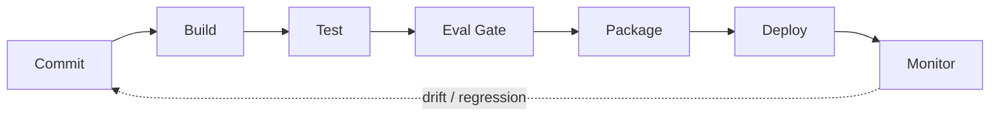

**Figure 1. CI/CD Pipeline - From One-Hot to Distributed Representations** (mermaid). Figure: CI/CD Pipeline view for From One-Hot to Distributed Representations. This diagram illustrates the principal components and their interactions as discussed in the surrounding section.

## Deep Dive: Mechanics, Variants and Trade-offs

Having established the essentials, we now go deeper into from one-hot to distributed representations. Beneath the abstraction lies a concrete process whose steps can each be measured, tested and optimised independently. The distinctions in this section are the ones that separate a working demo from a system that holds up under adversarial inputs, scale and the passage of time.

Consider the principal variants and how to choose between them. Each variant optimises for a different point in the design space - some for latency, some for accuracy, some for cost or operability - and the correct choice follows from explicit requirements rather than from defaults. Latency, accuracy and cost form a tension triangle: improving one typically pressures the others, so explicit budgets are essential.

In practice this is supported by a mature tooling ecosystem, including sentence-transformers, OpenAI embeddings, FAISS, Cohere. Tools accelerate the work but do not substitute for understanding: the same principles apply whichever implementation you select, and the ability to reason from first principles is what lets you debug when a tool behaves unexpectedly.

A frequent source of subtle bugs is the interaction with multimodal and cross-encoder embeddings. Because multimodal and cross-encoder embeddings concerns cLIP-style joint spaces and the bi-encoder/cross-encoder trade-off, changes there can silently alter the behaviour analysed here. The remedy is contract tests at the boundary and end-to-end evaluations that exercise the interaction explicitly.

Finally, attend to edge cases and degradation. Define what the system should do under partial failure, unexpected inputs and load spikes, and make that behaviour explicit and tested rather than emergent. Graceful degradation - returning a safe, useful result when the ideal one is unavailable - is a hallmark of mature engineering.

For deeper study, the literature offers authoritative treatments such as Mikolov et al. — Word2Vec (2013) and Reimers & Gurevych — Sentence-BERT (2019). These primary sources reward careful reading and ground the practical guidance above in established results.

## Advanced Considerations

Having established the essentials, we now go deeper into from one-hot to distributed representations. Beneath the abstraction lies a concrete process whose steps can each be measured, tested and optimised independently. The distinctions in this section are the ones that separate a working demo from a system that holds up under adversarial inputs, scale and the passage of time.

Consider the principal variants and how to choose between them. Each variant optimises for a different point in the design space - some for latency, some for accuracy, some for cost or operability - and the correct choice follows from explicit requirements rather than from defaults. Every added component buys capability at the price of operational surface area, and that bargain should be made consciously.

In practice this is supported by a mature tooling ecosystem, including sentence-transformers, OpenAI embeddings, FAISS, Cohere. Tools accelerate the work but do not substitute for understanding: the same principles apply whichever implementation you select, and the ability to reason from first principles is what lets you debug when a tool behaves unexpectedly.

A frequent source of subtle bugs is the interaction with hybrid search. Because hybrid search concerns combining lexical (BM25) and dense retrieval with fusion, changes there can silently alter the behaviour analysed here. The remedy is contract tests at the boundary and end-to-end evaluations that exercise the interaction explicitly.

Finally, attend to edge cases and degradation. Define what the system should do under partial failure, unexpected inputs and load spikes, and make that behaviour explicit and tested rather than emergent. Graceful degradation - returning a safe, useful result when the ideal one is unavailable - is a hallmark of mature engineering.

For deeper study, the literature offers authoritative treatments such as Mikolov et al. — Word2Vec (2013) and Reimers & Gurevych — Sentence-BERT (2019). These primary sources reward careful reading and ground the practical guidance above in established results.

## Worked Example

A worked example clarifies how these ideas behave in practice. A compliance organisation needs near-duplicate detection across document repositories. They decide to apply from one-hot to distributed representations as part of their Embeddings solution, but wisely treat it as a hypothesis to be validated rather than a foregone conclusion.

The team begins by stating the objective precisely and defining how success will be measured before writing any code. They establish a small but representative evaluation set, agree on acceptance thresholds, and only then prototype the simplest design that could work. Early measurement reveals which assumptions hold and which must be revised, saving weeks of misdirected effort and surfacing edge cases while they are still cheap to fix.

As the prototype matures into a service, the team hardens it: adding input validation, error handling, caching where it pays off, and monitoring that ties back to the original success metric. They document each significant decision in an architecture decision record so that future maintainers understand not just what was built but why.

The outcome is instructive. The system that reaches production is not the most sophisticated design the team considered, but the one whose behaviour they could measure, explain and operate. This is the recurring lesson of Embeddings: durable value comes from the whole system, not from any single clever component.

## Industry Use Cases

Across industries, the ideas in this chapter recur in recognisable ways. The following vignettes show how different sectors apply them and what they have in common.

**Search.** Semantic search across heterogeneous enterprise content. The common thread is that value comes not from the model alone but from the surrounding system - data quality, evaluation, integration and operations - which is precisely where most of the engineering effort belongs.

**E-commerce.** Visual and textual product similarity and recommendation. The common thread is that value comes not from the model alone but from the surrounding system - data quality, evaluation, integration and operations - which is precisely where most of the engineering effort belongs.

**Support.** Deduplicating and routing tickets by semantic similarity. The common thread is that value comes not from the model alone but from the surrounding system - data quality, evaluation, integration and operations - which is precisely where most of the engineering effort belongs.

**Compliance.** Near-duplicate detection across document repositories. The common thread is that value comes not from the model alone but from the surrounding system - data quality, evaluation, integration and operations - which is precisely where most of the engineering effort belongs.

## Best Practices

The following practices consistently separate successful Embeddings efforts from struggling ones. They are deliberately concrete so they can be adopted as checklist items in design and code review.

- Normalise vectors and pick the distance metric the model was trained for.
- Pin embedding model versions and re-index atomically on change.
- Evaluate retrieval with recall@k and nDCG on a labelled set.
- Use hybrid search to recover exact-match and rare-term queries.

None of these are exotic; they are the unglamorous disciplines that compound into reliability. The cost of adopting them is small compared with the cost of the incidents they prevent, and they become second nature with practice.

## Common Pitfalls

Equally instructive are the failure modes that recur in practice. Each pitfall below has a clear early warning sign and a known remedy, so treat them as a diagnostic checklist when something feels wrong:

- Mixing vectors from different model versions in one index.
- Choosing the wrong similarity metric for the embedding model.
- Over-chunking or under-chunking documents before embedding.
- Ignoring drift after upgrading the embedding model.

The pattern is consistent: most failures stem from skipping measurement, conflating prototype and production standards, or deferring cross-cutting concerns such as security and cost until they become emergencies. Naming these traps in advance is the cheapest way to avoid them.

## Governance, Security and Cost Notes

No discussion of from one-hot to distributed representations is complete without its governance, security and cost dimensions, which are too often deferred until they become emergencies. Treating them as first-class concerns from the outset is both cheaper and safer.

**Governance.** Classify the risk of this capability, document its intended and out-of-scope uses, and ensure decisions are traceable to satisfy internal policy and external regulation such as the NIST AI RMF, ISO/IEC 42001 and the EU AI Act. **Security.** Treat all external input as untrusted, validate outputs before acting on them, apply least privilege to any tools or data access, and map controls to the OWASP LLM Top 10 and MITRE ATLAS.

**Cost and sustainability.** Establish explicit budgets for compute, tokens and latency, attribute spend to owners, and revisit the economics as usage scales - a design that is affordable at pilot scale can become untenable at production volume. Building these reflexes into everyday engineering is what allows a Embeddings system to be not only capable but also trustworthy and economically sound.

## Hands-On Exercises

Work through the following exercises. They are designed to move understanding from recognition to application - the level required for real engineering work - so prefer writing and building over merely reading.

1. Explain from one-hot to distributed representations to a colleague unfamiliar with Embeddings, using a concrete example from your own domain.
2. Sketch a reference architecture that incorporates from one-hot to distributed representations and annotate where observability, security and cost controls belong.
3. Design an evaluation that would tell you whether from one-hot to distributed representations is working in production, including the metric, the dataset and the acceptance threshold.
4. Identify two pitfalls relevant to from one-hot to distributed representations in your environment and describe the early warning signals you would monitor.
5. Prototype the simplest implementation that demonstrates from one-hot to distributed representations, then list exactly what would need to change to make it production-ready.

## Key Takeaways

Key takeaways from this chapter:

- From One-Hot to Distributed Representations is a systems concern in Embeddings: data, models and operations must be co-designed.
- Measurement is non-negotiable; define success metrics and evaluation before building.
- Favour the simplest design that meets the requirement, and add complexity only when evidence demands it.
- Security, cost and observability are first-class requirements, not afterthoughts.
- Document decisions so the system remains understandable and operable as it evolves.

## Code Walkthrough

Pipelines keep From One-Hot to Distributed Representations logic modular and testable. Each stage is a pure function, errors are captured per item, and the composition is trivial to extend or reorder.

The full listing is shown below; study it line by line and reproduce it locally before moving on.

### Listing: A composable processing pipeline for From One-Hot to Distributed Representations

```python
from collections.abc import Iterable, Iterator
from typing import Protocol


class Stage(Protocol):
    def __call__(self, item: dict) -> dict: ...


def pipeline(stages: list[Stage]) -> Stage:
    """Compose ordered stages into a single callable for From One-Hot to Distributed Representations."""

    def run(item: dict) -> dict:
        for stage in stages:
            item = stage(item)
        return item

    return run


def validate(item: dict) -> dict:
    if "text" not in item:
        raise ValueError("missing required field: text")
    return item


def normalise(item: dict) -> dict:
    item["text"] = item["text"].strip().lower()
    return item


def enrich(item: dict) -> dict:
    item["length"] = len(item["text"])
    return item


process = pipeline([validate, normalise, enrich])


def run_batch(items: Iterable[dict]) -> Iterator[dict]:
    for item in items:
        try:
            yield process(dict(item))
        except ValueError as exc:
            yield {"error": str(exc), "item": item}

```

## Review Questions

1. In the context of Embeddings, which statement best describes “From One-Hot to Distributed Representations”?
   - A. It eliminates the need for any evaluation or monitoring.
   - B. It is only relevant to academic research, not production.
   - C. It guarantees deterministic output regardless of input.
   - D. Why dense vectors generalise where sparse encodings cannot.
   - **Answer: D.** From One-Hot to Distributed Representations: Why dense vectors generalise where sparse encodings cannot.
2. Which of the following is a recommended best practice when working with Embeddings?
   - A. Over-chunking or under-chunking documents before embedding.
   - B. It guarantees deterministic output regardless of input.
   - C. Use hybrid search to recover exact-match and rare-term queries.
   - D. It eliminates the need for any evaluation or monitoring.
   - **Answer: C.** Best practice: Use hybrid search to recover exact-match and rare-term queries.
3. Which of the following is a common pitfall to avoid in Embeddings?
   - A. Evaluate retrieval with recall@k and nDCG on a labelled set.
   - B. It guarantees deterministic output regardless of input.
   - C. Choosing the wrong similarity metric for the embedding model.
   - D. It eliminates the need for any evaluation or monitoring.
   - **Answer: C.** Pitfall to avoid: Choosing the wrong similarity metric for the embedding model.
4. *(Discussion)* Explain From One-Hot to Distributed Representations and why it matters in a production Embeddings system.
   - **Model answer:** A strong answer defines from one-hot to distributed representations (Why dense vectors generalise where sparse encodings cannot.) then connects it to architecture, evaluation, cost, security and operations for Embeddings, citing concrete trade-offs and a real-world example.

---


# Chapter 2. Word, Sentence and Document Embeddings

_This chapter examines word, sentence and document embeddings within Embeddings. It covers word2Vec, GloVe, sentence transformers and pooling strategies, derives a reference architecture, walks through a worked example and runnable code, surveys industry use cases, and distils best practices and pitfalls, closing with exercises and review questions._

## Introduction

We define Word, Sentence and Document Embeddings as word2Vec, GloVe, sentence transformers and pooling strategies. Understanding this matters because Embeddings systems succeed or fail on exactly these decisions. What distinguishes a production-grade approach from a prototype is the discipline of measurement: every claim is backed by an evaluation rather than intuition.

This chapter builds intuition first, then formalises the ideas, derives an architecture, and finishes with code, exercises and review questions so the material transfers directly to your own Embeddings work. Read it actively: pause at each diagram, reproduce the code, and attempt the exercises before consulting the answers.

## Theory and Foundations

Word, Sentence and Document Embeddings refers to word2Vec, GloVe, sentence transformers and pooling strategies. It helps to separate the conceptual model from its implementation: the former guides reasoning, the latter must contend with real-world constraints. The underlying mechanism is best appreciated by tracing a single request from input to output and noting where state is created and consumed.

To place this in context, recall the broader picture: Embeddings map discrete objects—words, sentences, images, users, products—into continuous vector spaces where geometric proximity encodes semantic similarity. Within that picture, word, sentence and document embeddings is one of the load-bearing ideas - the kind that, when understood deeply, makes the rest of Embeddings fall into place. Understanding this matters because Embeddings systems succeed or fail on exactly these decisions.

Word, Sentence and Document Embeddings cannot be understood in isolation from evaluating embedding quality. Recall that evaluating embedding quality concerns retrieval metrics (recall@k, MRR, nDCG) and benchmark suites like MTEB. The two interact directly: decisions in one constrain the design space of the other, which is why mature teams reason about them together rather than sequentially. Simplicity is a feature. The simplest design that meets the requirement should be the default, with complexity added only when measurement justifies it.

Word, Sentence and Document Embeddings cannot be understood in isolation from similarity metrics and normalisation. Recall that similarity metrics and normalisation concerns cosine, dot product and Euclidean distance and when each applies. The two interact directly: decisions in one constrain the design space of the other, which is why mature teams reason about them together rather than sequentially. As with most architectural decisions, the choice is rarely binary; the skill lies in quantifying the trade-offs and choosing deliberately.

Several established patterns apply directly to word, sentence and document embeddings. The first, hybrid lexical + dense fusion (reciprocal rank fusion), is widely adopted because it makes the system's behaviour predictable and observable. A complementary pattern, matryoshka embeddings for adaptive dimensionality, addresses a related concern and is often deployed alongside it. Patterns are not dogma; they are distilled experience that shortcuts the search for a sound design, and each carries assumptions worth checking against your context.

Knowing when not to use a technique is as valuable as knowing how to use it. In a small prototype, shortcuts around word, sentence and document embeddings are invisible; in a production Embeddings system serving real traffic, they surface as incidents, cost overruns or compliance gaps. Latency, accuracy and cost form a tension triangle: improving one typically pressures the others, so explicit budgets are essential. The remainder of this chapter turns these principles into an architecture, code and a checklist you can apply immediately.

## Architecture and Design

From an architectural standpoint, Word, Sentence and Document Embeddings sits at the intersection of data, models and operations. An embedding platform exposes a versioned embedding service that batches and caches encode requests, writes vectors to an ANN index (HNSW/IVF) with stored metadata, and supports hybrid retrieval that fuses lexical and dense scores before an optional cross-encoder re-ranks the top candidates.

Concretely, the principal building blocks include from one-hot to distributed representations, word, sentence and document embeddings, contrastive representation learning, similarity metrics and normalisation and multimodal and cross-encoder embeddings. Each is a replaceable component behind a stable interface, so the team can upgrade an implementation - a model, an index, a policy engine - without rewriting its neighbours. The contracts between components are where reliability is won or lost, so they are specified explicitly and tested in isolation.

The diagram accompanying this section makes the data and control flow explicit. Requests enter through a well-defined boundary where they are authenticated and validated; only then are they dispatched to the components that perform the work. This boundary is also where rate limiting, quota enforcement and audit logging live, keeping cross-cutting concerns out of the core logic and in one auditable place.

Two qualities deserve emphasis. First, observability is designed in, not bolted on: every component emits structured telemetry so that failures can be localised in minutes rather than hours. Second, the architecture is evolvable - components communicate through stable contracts so that any single part of the Embeddings system can be replaced without a rewrite. Latency, accuracy and cost form a tension triangle: improving one typically pressures the others, so explicit budgets are essential.

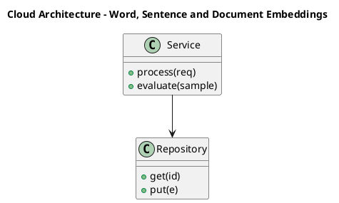

_Source diagram (plantuml); render with the appropriate tool._

**Figure 2. Cloud Architecture - Word, Sentence and Document Embeddings** (plantuml). Figure: Cloud Architecture view for Word, Sentence and Document Embeddings. This diagram illustrates the principal components and their interactions as discussed in the surrounding section.

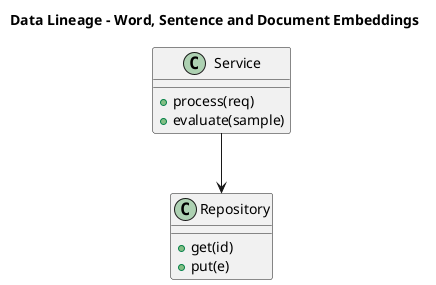

_Source diagram (plantuml); render with the appropriate tool._

**Figure 3. Data Lineage - Word, Sentence and Document Embeddings** (plantuml). Figure: Data Lineage view for Word, Sentence and Document Embeddings. This diagram illustrates the principal components and their interactions as discussed in the surrounding section.

## Deep Dive: Mechanics, Variants and Trade-offs

Having established the essentials, we now go deeper into word, sentence and document embeddings. Mechanically, the behaviour emerges from a few interacting parts that are simpler than the whole they produce. The distinctions in this section are the ones that separate a working demo from a system that holds up under adversarial inputs, scale and the passage of time.

Consider the principal variants and how to choose between them. Each variant optimises for a different point in the design space - some for latency, some for accuracy, some for cost or operability - and the correct choice follows from explicit requirements rather than from defaults. As with most architectural decisions, the choice is rarely binary; the skill lies in quantifying the trade-offs and choosing deliberately.

In practice this is supported by a mature tooling ecosystem, including sentence-transformers, OpenAI embeddings, FAISS, Cohere. Tools accelerate the work but do not substitute for understanding: the same principles apply whichever implementation you select, and the ability to reason from first principles is what lets you debug when a tool behaves unexpectedly.

A frequent source of subtle bugs is the interaction with evaluating embedding quality. Because evaluating embedding quality concerns retrieval metrics (recall@k, MRR, nDCG) and benchmark suites like MTEB, changes there can silently alter the behaviour analysed here. The remedy is contract tests at the boundary and end-to-end evaluations that exercise the interaction explicitly.

Finally, attend to edge cases and degradation. Define what the system should do under partial failure, unexpected inputs and load spikes, and make that behaviour explicit and tested rather than emergent. Graceful degradation - returning a safe, useful result when the ideal one is unavailable - is a hallmark of mature engineering.

For deeper study, the literature offers authoritative treatments such as Mikolov et al. — Word2Vec (2013) and Reimers & Gurevych — Sentence-BERT (2019). These primary sources reward careful reading and ground the practical guidance above in established results.

## Advanced Considerations

Having established the essentials, we now go deeper into word, sentence and document embeddings. The underlying mechanism is best appreciated by tracing a single request from input to output and noting where state is created and consumed. The distinctions in this section are the ones that separate a working demo from a system that holds up under adversarial inputs, scale and the passage of time.

Consider the principal variants and how to choose between them. Each variant optimises for a different point in the design space - some for latency, some for accuracy, some for cost or operability - and the correct choice follows from explicit requirements rather than from defaults. As with most architectural decisions, the choice is rarely binary; the skill lies in quantifying the trade-offs and choosing deliberately.

In practice this is supported by a mature tooling ecosystem, including sentence-transformers, OpenAI embeddings, FAISS, Cohere. Tools accelerate the work but do not substitute for understanding: the same principles apply whichever implementation you select, and the ability to reason from first principles is what lets you debug when a tool behaves unexpectedly.

A frequent source of subtle bugs is the interaction with indexing for approximate nearest neighbour search. Because indexing for approximate nearest neighbour search concerns hNSW, IVF and the recall/latency frontier, changes there can silently alter the behaviour analysed here. The remedy is contract tests at the boundary and end-to-end evaluations that exercise the interaction explicitly.

Finally, attend to edge cases and degradation. Define what the system should do under partial failure, unexpected inputs and load spikes, and make that behaviour explicit and tested rather than emergent. Graceful degradation - returning a safe, useful result when the ideal one is unavailable - is a hallmark of mature engineering.

For deeper study, the literature offers authoritative treatments such as Mikolov et al. — Word2Vec (2013) and Reimers & Gurevych — Sentence-BERT (2019). These primary sources reward careful reading and ground the practical guidance above in established results.

## Worked Example

A worked example clarifies how these ideas behave in practice. A e-commerce organisation needs visual and textual product similarity and recommendation. They decide to apply word, sentence and document embeddings as part of their Embeddings solution, but wisely treat it as a hypothesis to be validated rather than a foregone conclusion.

The team begins by stating the objective precisely and defining how success will be measured before writing any code. They establish a small but representative evaluation set, agree on acceptance thresholds, and only then prototype the simplest design that could work. Early measurement reveals which assumptions hold and which must be revised, saving weeks of misdirected effort and surfacing edge cases while they are still cheap to fix.

As the prototype matures into a service, the team hardens it: adding input validation, error handling, caching where it pays off, and monitoring that ties back to the original success metric. They document each significant decision in an architecture decision record so that future maintainers understand not just what was built but why.

The outcome is instructive. The system that reaches production is not the most sophisticated design the team considered, but the one whose behaviour they could measure, explain and operate. This is the recurring lesson of Embeddings: durable value comes from the whole system, not from any single clever component.

## Industry Use Cases

Across industries, the ideas in this chapter recur in recognisable ways. The following vignettes show how different sectors apply them and what they have in common.

**Search.** Semantic search across heterogeneous enterprise content. The common thread is that value comes not from the model alone but from the surrounding system - data quality, evaluation, integration and operations - which is precisely where most of the engineering effort belongs.

**E-commerce.** Visual and textual product similarity and recommendation. The common thread is that value comes not from the model alone but from the surrounding system - data quality, evaluation, integration and operations - which is precisely where most of the engineering effort belongs.

**Support.** Deduplicating and routing tickets by semantic similarity. The common thread is that value comes not from the model alone but from the surrounding system - data quality, evaluation, integration and operations - which is precisely where most of the engineering effort belongs.

**Compliance.** Near-duplicate detection across document repositories. The common thread is that value comes not from the model alone but from the surrounding system - data quality, evaluation, integration and operations - which is precisely where most of the engineering effort belongs.

## Best Practices

The following practices consistently separate successful Embeddings efforts from struggling ones. They are deliberately concrete so they can be adopted as checklist items in design and code review.

- Normalise vectors and pick the distance metric the model was trained for.
- Pin embedding model versions and re-index atomically on change.
- Evaluate retrieval with recall@k and nDCG on a labelled set.
- Use hybrid search to recover exact-match and rare-term queries.

None of these are exotic; they are the unglamorous disciplines that compound into reliability. The cost of adopting them is small compared with the cost of the incidents they prevent, and they become second nature with practice.

## Common Pitfalls

Equally instructive are the failure modes that recur in practice. Each pitfall below has a clear early warning sign and a known remedy, so treat them as a diagnostic checklist when something feels wrong:

- Mixing vectors from different model versions in one index.
- Choosing the wrong similarity metric for the embedding model.
- Over-chunking or under-chunking documents before embedding.
- Ignoring drift after upgrading the embedding model.

The pattern is consistent: most failures stem from skipping measurement, conflating prototype and production standards, or deferring cross-cutting concerns such as security and cost until they become emergencies. Naming these traps in advance is the cheapest way to avoid them.

## Governance, Security and Cost Notes

No discussion of word, sentence and document embeddings is complete without its governance, security and cost dimensions, which are too often deferred until they become emergencies. Treating them as first-class concerns from the outset is both cheaper and safer.

**Governance.** Classify the risk of this capability, document its intended and out-of-scope uses, and ensure decisions are traceable to satisfy internal policy and external regulation such as the NIST AI RMF, ISO/IEC 42001 and the EU AI Act. **Security.** Treat all external input as untrusted, validate outputs before acting on them, apply least privilege to any tools or data access, and map controls to the OWASP LLM Top 10 and MITRE ATLAS.

**Cost and sustainability.** Establish explicit budgets for compute, tokens and latency, attribute spend to owners, and revisit the economics as usage scales - a design that is affordable at pilot scale can become untenable at production volume. Building these reflexes into everyday engineering is what allows a Embeddings system to be not only capable but also trustworthy and economically sound.

## Hands-On Exercises

Work through the following exercises. They are designed to move understanding from recognition to application - the level required for real engineering work - so prefer writing and building over merely reading.

1. Explain word, sentence and document embeddings to a colleague unfamiliar with Embeddings, using a concrete example from your own domain.
2. Sketch a reference architecture that incorporates word, sentence and document embeddings and annotate where observability, security and cost controls belong.
3. Design an evaluation that would tell you whether word, sentence and document embeddings is working in production, including the metric, the dataset and the acceptance threshold.
4. Identify two pitfalls relevant to word, sentence and document embeddings in your environment and describe the early warning signals you would monitor.
5. Prototype the simplest implementation that demonstrates word, sentence and document embeddings, then list exactly what would need to change to make it production-ready.

## Key Takeaways

Key takeaways from this chapter:

- Word, Sentence and Document Embeddings is a systems concern in Embeddings: data, models and operations must be co-designed.
- Measurement is non-negotiable; define success metrics and evaluation before building.
- Favour the simplest design that meets the requirement, and add complexity only when evidence demands it.
- Security, cost and observability are first-class requirements, not afterthoughts.
- Document decisions so the system remains understandable and operable as it evolves.

## Code Walkthrough

Every change to a Embeddings system should pass an evaluation gate. This example shows the minimal shape: align predictions and references, compute a metric, and return a pass/fail decision for CI.

The full listing is shown below; study it line by line and reproduce it locally before moving on.

### Listing: Evaluating Word, Sentence and Document Embeddings with a regression gate

```python
from dataclasses import dataclass


@dataclass
class EvalResult:
    metric: str
    score: float
    passed: bool


def evaluate(predictions: list[str], references: list[str],
             threshold: float = 0.8) -> EvalResult:
    """Score Word, Sentence and Document Embeddings output against references with a simple exact-match metric.

    In practice you would combine several metrics (exact match, semantic
    similarity, LLM-as-judge) and gate releases on the aggregate.
    """
    if len(predictions) != len(references):
        raise ValueError("predictions and references must align")
    hits = sum(p.strip() == r.strip() for p, r in zip(predictions, references))
    score = hits / len(references) if references else 0.0
    return EvalResult(metric="exact_match", score=score, passed=score >= threshold)


if __name__ == "__main__":
    result = evaluate(["yes", "no"], ["yes", "yes"])
    print(f"{result.metric}={result.score:.2f} passed={result.passed}")

```

## Review Questions

1. In the context of Embeddings, which statement best describes “Word, Sentence and Document Embeddings”?
   - A. Word2Vec, GloVe, sentence transformers and pooling strategies.
   - B. It guarantees deterministic output regardless of input.
   - C. It eliminates the need for any evaluation or monitoring.
   - D. It is only relevant to academic research, not production.
   - **Answer: A.** Word, Sentence and Document Embeddings: Word2Vec, GloVe, sentence transformers and pooling strategies.
2. Which of the following is a recommended best practice when working with Embeddings?
   - A. It eliminates the need for any evaluation or monitoring.
   - B. Ignoring drift after upgrading the embedding model.
   - C. Evaluate retrieval with recall@k and nDCG on a labelled set.
   - D. It guarantees deterministic output regardless of input.
   - **Answer: C.** Best practice: Evaluate retrieval with recall@k and nDCG on a labelled set.
3. Which of the following is a common pitfall to avoid in Embeddings?
   - A. It eliminates the need for any evaluation or monitoring.
   - B. Use hybrid search to recover exact-match and rare-term queries.
   - C. Pin embedding model versions and re-index atomically on change.
   - D. Over-chunking or under-chunking documents before embedding.
   - **Answer: D.** Pitfall to avoid: Over-chunking or under-chunking documents before embedding.
4. *(Discussion)* Walk through how you would design Word, Sentence and Document Embeddings for an enterprise Embeddings workload.
   - **Model answer:** A strong answer defines word, sentence and document embeddings (Word2Vec, GloVe, sentence transformers and pooling strategies.) then connects it to architecture, evaluation, cost, security and operations for Embeddings, citing concrete trade-offs and a real-world example.

---


# Chapter 3. Contrastive Representation Learning

_This chapter examines contrastive representation learning within Embeddings. It covers infoNCE, positive/negative mining and the geometry of good embeddings, derives a reference architecture, walks through a worked example and runnable code, surveys industry use cases, and distils best practices and pitfalls, closing with exercises and review questions._

## Introduction

At its core, Contrastive Representation Learning concerns infoNCE, positive/negative mining and the geometry of good embeddings. Getting this right early prevents expensive rework once a Embeddings system reaches scale. It helps to separate the conceptual model from its implementation: the former guides reasoning, the latter must contend with real-world constraints.

This chapter builds intuition first, then formalises the ideas, derives an architecture, and finishes with code, exercises and review questions so the material transfers directly to your own Embeddings work. Read it actively: pause at each diagram, reproduce the code, and attempt the exercises before consulting the answers.

## Theory and Foundations

At its core, Contrastive Representation Learning concerns infoNCE, positive/negative mining and the geometry of good embeddings. In an enterprise setting, this translates into concrete requirements: clear interfaces, measurable quality, and controls that satisfy security and governance. It pays to understand the mechanism rather than treat it as a black box, because most production incidents are explained by one of its steps misbehaving.

To place this in context, recall the broader picture: Embeddings map discrete objects—words, sentences, images, users, products—into continuous vector spaces where geometric proximity encodes semantic similarity. Within that picture, contrastive representation learning is one of the load-bearing ideas - the kind that, when understood deeply, makes the rest of Embeddings fall into place. Getting this right early prevents expensive rework once a Embeddings system reaches scale.

Contrastive Representation Learning cannot be understood in isolation from embedding drift and re-indexing. Recall that embedding drift and re-indexing concerns detecting model changes and managing versioned vector stores. The two interact directly: decisions in one constrain the design space of the other, which is why mature teams reason about them together rather than sequentially. Simplicity is a feature. The simplest design that meets the requirement should be the default, with complexity added only when measurement justifies it.

Contrastive Representation Learning cannot be understood in isolation from dimensionality, compression and quantisation. Recall that dimensionality, compression and quantisation concerns matryoshka embeddings, PCA and product quantisation for cost control. The two interact directly: decisions in one constrain the design space of the other, which is why mature teams reason about them together rather than sequentially. Latency, accuracy and cost form a tension triangle: improving one typically pressures the others, so explicit budgets are essential.

Several established patterns apply directly to contrastive representation learning. The first, matryoshka embeddings for adaptive dimensionality, is widely adopted because it makes the system's behaviour predictable and observable. A complementary pattern, bi-encoder retrieval followed by cross-encoder re-ranking, addresses a related concern and is often deployed alongside it. Patterns are not dogma; they are distilled experience that shortcuts the search for a sound design, and each carries assumptions worth checking against your context.

The decision of whether to adopt this should be driven by requirements, not by novelty. In a small prototype, shortcuts around contrastive representation learning are invisible; in a production Embeddings system serving real traffic, they surface as incidents, cost overruns or compliance gaps. Simplicity is a feature. The simplest design that meets the requirement should be the default, with complexity added only when measurement justifies it. The remainder of this chapter turns these principles into an architecture, code and a checklist you can apply immediately.

## Architecture and Design

A robust architecture for Contrastive Representation Learning is layered so each part can evolve independently without destabilising the whole. An embedding platform exposes a versioned embedding service that batches and caches encode requests, writes vectors to an ANN index (HNSW/IVF) with stored metadata, and supports hybrid retrieval that fuses lexical and dense scores before an optional cross-encoder re-ranks the top candidates.

Concretely, the principal building blocks include from one-hot to distributed representations, word, sentence and document embeddings, contrastive representation learning, similarity metrics and normalisation and multimodal and cross-encoder embeddings. Each is a replaceable component behind a stable interface, so the team can upgrade an implementation - a model, an index, a policy engine - without rewriting its neighbours. The contracts between components are where reliability is won or lost, so they are specified explicitly and tested in isolation.

The diagram accompanying this section makes the data and control flow explicit. Requests enter through a well-defined boundary where they are authenticated and validated; only then are they dispatched to the components that perform the work. This boundary is also where rate limiting, quota enforcement and audit logging live, keeping cross-cutting concerns out of the core logic and in one auditable place.

Two qualities deserve emphasis. First, observability is designed in, not bolted on: every component emits structured telemetry so that failures can be localised in minutes rather than hours. Second, the architecture is evolvable - components communicate through stable contracts so that any single part of the Embeddings system can be replaced without a rewrite. Simplicity is a feature. The simplest design that meets the requirement should be the default, with complexity added only when measurement justifies it.

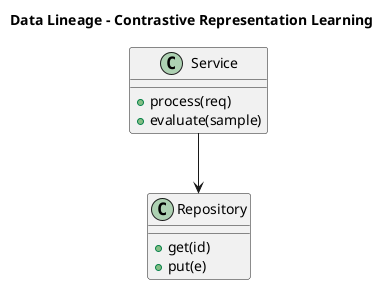

_Source diagram (plantuml); render with the appropriate tool._

**Figure 4. Data Lineage - Contrastive Representation Learning** (plantuml). Figure: Data Lineage view for Contrastive Representation Learning. This diagram illustrates the principal components and their interactions as discussed in the surrounding section.

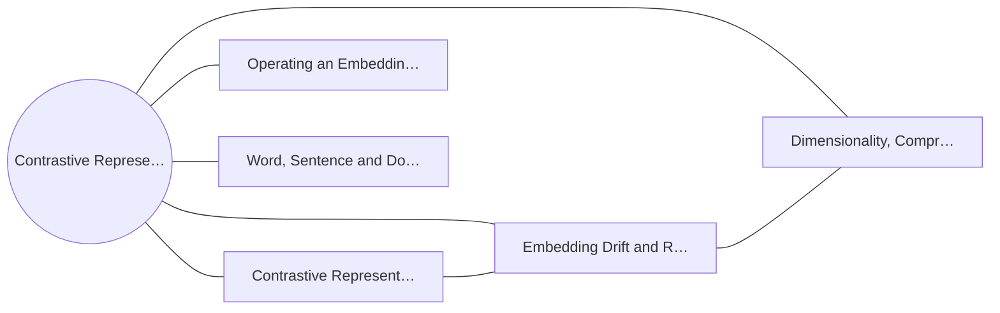

**Figure 5. Capability Map - Contrastive Representation Learning** (mermaid). Figure: Capability Map view for Contrastive Representation Learning. This diagram illustrates the principal components and their interactions as discussed in the surrounding section.

## Deep Dive: Mechanics, Variants and Trade-offs

Having established the essentials, we now go deeper into contrastive representation learning. It pays to understand the mechanism rather than treat it as a black box, because most production incidents are explained by one of its steps misbehaving. The distinctions in this section are the ones that separate a working demo from a system that holds up under adversarial inputs, scale and the passage of time.

Consider the principal variants and how to choose between them. Each variant optimises for a different point in the design space - some for latency, some for accuracy, some for cost or operability - and the correct choice follows from explicit requirements rather than from defaults. Simplicity is a feature. The simplest design that meets the requirement should be the default, with complexity added only when measurement justifies it.

In practice this is supported by a mature tooling ecosystem, including sentence-transformers, OpenAI embeddings, FAISS, Cohere. Tools accelerate the work but do not substitute for understanding: the same principles apply whichever implementation you select, and the ability to reason from first principles is what lets you debug when a tool behaves unexpectedly.

A frequent source of subtle bugs is the interaction with embedding drift and re-indexing. Because embedding drift and re-indexing concerns detecting model changes and managing versioned vector stores, changes there can silently alter the behaviour analysed here. The remedy is contract tests at the boundary and end-to-end evaluations that exercise the interaction explicitly.

Finally, attend to edge cases and degradation. Define what the system should do under partial failure, unexpected inputs and load spikes, and make that behaviour explicit and tested rather than emergent. Graceful degradation - returning a safe, useful result when the ideal one is unavailable - is a hallmark of mature engineering.

For deeper study, the literature offers authoritative treatments such as Mikolov et al. — Word2Vec (2013) and Reimers & Gurevych — Sentence-BERT (2019). These primary sources reward careful reading and ground the practical guidance above in established results.

## Advanced Considerations

Having established the essentials, we now go deeper into contrastive representation learning. Beneath the abstraction lies a concrete process whose steps can each be measured, tested and optimised independently. The distinctions in this section are the ones that separate a working demo from a system that holds up under adversarial inputs, scale and the passage of time.

Consider the principal variants and how to choose between them. Each variant optimises for a different point in the design space - some for latency, some for accuracy, some for cost or operability - and the correct choice follows from explicit requirements rather than from defaults. Every added component buys capability at the price of operational surface area, and that bargain should be made consciously.

In practice this is supported by a mature tooling ecosystem, including sentence-transformers, OpenAI embeddings, FAISS, Cohere. Tools accelerate the work but do not substitute for understanding: the same principles apply whichever implementation you select, and the ability to reason from first principles is what lets you debug when a tool behaves unexpectedly.

A frequent source of subtle bugs is the interaction with the retrieval stack reference architecture. Because the retrieval stack reference architecture concerns embedding service, vector index and re-ranking as a pipeline, changes there can silently alter the behaviour analysed here. The remedy is contract tests at the boundary and end-to-end evaluations that exercise the interaction explicitly.

Finally, attend to edge cases and degradation. Define what the system should do under partial failure, unexpected inputs and load spikes, and make that behaviour explicit and tested rather than emergent. Graceful degradation - returning a safe, useful result when the ideal one is unavailable - is a hallmark of mature engineering.

For deeper study, the literature offers authoritative treatments such as Mikolov et al. — Word2Vec (2013) and Reimers & Gurevych — Sentence-BERT (2019). These primary sources reward careful reading and ground the practical guidance above in established results.

## Worked Example

Consider a concrete scenario. A e-commerce organisation needs visual and textual product similarity and recommendation. They decide to apply contrastive representation learning as part of their Embeddings solution, but wisely treat it as a hypothesis to be validated rather than a foregone conclusion.

The team begins by stating the objective precisely and defining how success will be measured before writing any code. They establish a small but representative evaluation set, agree on acceptance thresholds, and only then prototype the simplest design that could work. Early measurement reveals which assumptions hold and which must be revised, saving weeks of misdirected effort and surfacing edge cases while they are still cheap to fix.

As the prototype matures into a service, the team hardens it: adding input validation, error handling, caching where it pays off, and monitoring that ties back to the original success metric. They document each significant decision in an architecture decision record so that future maintainers understand not just what was built but why.

The outcome is instructive. The system that reaches production is not the most sophisticated design the team considered, but the one whose behaviour they could measure, explain and operate. This is the recurring lesson of Embeddings: durable value comes from the whole system, not from any single clever component.

## Industry Use Cases

Across industries, the ideas in this chapter recur in recognisable ways. The following vignettes show how different sectors apply them and what they have in common.

**Search.** Semantic search across heterogeneous enterprise content. The common thread is that value comes not from the model alone but from the surrounding system - data quality, evaluation, integration and operations - which is precisely where most of the engineering effort belongs.

**E-commerce.** Visual and textual product similarity and recommendation. The common thread is that value comes not from the model alone but from the surrounding system - data quality, evaluation, integration and operations - which is precisely where most of the engineering effort belongs.

**Support.** Deduplicating and routing tickets by semantic similarity. The common thread is that value comes not from the model alone but from the surrounding system - data quality, evaluation, integration and operations - which is precisely where most of the engineering effort belongs.

**Compliance.** Near-duplicate detection across document repositories. The common thread is that value comes not from the model alone but from the surrounding system - data quality, evaluation, integration and operations - which is precisely where most of the engineering effort belongs.

## Best Practices

The following practices consistently separate successful Embeddings efforts from struggling ones. They are deliberately concrete so they can be adopted as checklist items in design and code review.

- Normalise vectors and pick the distance metric the model was trained for.
- Pin embedding model versions and re-index atomically on change.
- Evaluate retrieval with recall@k and nDCG on a labelled set.
- Use hybrid search to recover exact-match and rare-term queries.

None of these are exotic; they are the unglamorous disciplines that compound into reliability. The cost of adopting them is small compared with the cost of the incidents they prevent, and they become second nature with practice.

## Common Pitfalls

Equally instructive are the failure modes that recur in practice. Each pitfall below has a clear early warning sign and a known remedy, so treat them as a diagnostic checklist when something feels wrong:

- Mixing vectors from different model versions in one index.
- Choosing the wrong similarity metric for the embedding model.
- Over-chunking or under-chunking documents before embedding.
- Ignoring drift after upgrading the embedding model.

The pattern is consistent: most failures stem from skipping measurement, conflating prototype and production standards, or deferring cross-cutting concerns such as security and cost until they become emergencies. Naming these traps in advance is the cheapest way to avoid them.

## Governance, Security and Cost Notes

No discussion of contrastive representation learning is complete without its governance, security and cost dimensions, which are too often deferred until they become emergencies. Treating them as first-class concerns from the outset is both cheaper and safer.

**Governance.** Classify the risk of this capability, document its intended and out-of-scope uses, and ensure decisions are traceable to satisfy internal policy and external regulation such as the NIST AI RMF, ISO/IEC 42001 and the EU AI Act. **Security.** Treat all external input as untrusted, validate outputs before acting on them, apply least privilege to any tools or data access, and map controls to the OWASP LLM Top 10 and MITRE ATLAS.

**Cost and sustainability.** Establish explicit budgets for compute, tokens and latency, attribute spend to owners, and revisit the economics as usage scales - a design that is affordable at pilot scale can become untenable at production volume. Building these reflexes into everyday engineering is what allows a Embeddings system to be not only capable but also trustworthy and economically sound.

## Hands-On Exercises

Work through the following exercises. They are designed to move understanding from recognition to application - the level required for real engineering work - so prefer writing and building over merely reading.

1. Explain contrastive representation learning to a colleague unfamiliar with Embeddings, using a concrete example from your own domain.
2. Sketch a reference architecture that incorporates contrastive representation learning and annotate where observability, security and cost controls belong.
3. Design an evaluation that would tell you whether contrastive representation learning is working in production, including the metric, the dataset and the acceptance threshold.
4. Identify two pitfalls relevant to contrastive representation learning in your environment and describe the early warning signals you would monitor.
5. Prototype the simplest implementation that demonstrates contrastive representation learning, then list exactly what would need to change to make it production-ready.

## Key Takeaways

Key takeaways from this chapter:

- Contrastive Representation Learning is a systems concern in Embeddings: data, models and operations must be co-designed.
- Measurement is non-negotiable; define success metrics and evaluation before building.
- Favour the simplest design that meets the requirement, and add complexity only when evidence demands it.
- Security, cost and observability are first-class requirements, not afterthoughts.
- Document decisions so the system remains understandable and operable as it evolves.

## Code Walkthrough

Pipelines keep Contrastive Representation Learning logic modular and testable. Each stage is a pure function, errors are captured per item, and the composition is trivial to extend or reorder.

The full listing is shown below; study it line by line and reproduce it locally before moving on.

### Listing: A composable processing pipeline for Contrastive Representation Learning

```python
from collections.abc import Iterable, Iterator
from typing import Protocol


class Stage(Protocol):
    def __call__(self, item: dict) -> dict: ...


def pipeline(stages: list[Stage]) -> Stage:
    """Compose ordered stages into a single callable for Contrastive Representation Learning."""

    def run(item: dict) -> dict:
        for stage in stages:
            item = stage(item)
        return item

    return run


def validate(item: dict) -> dict:
    if "text" not in item:
        raise ValueError("missing required field: text")
    return item


def normalise(item: dict) -> dict:
    item["text"] = item["text"].strip().lower()
    return item


def enrich(item: dict) -> dict:
    item["length"] = len(item["text"])
    return item


process = pipeline([validate, normalise, enrich])


def run_batch(items: Iterable[dict]) -> Iterator[dict]:
    for item in items:
        try:
            yield process(dict(item))
        except ValueError as exc:
            yield {"error": str(exc), "item": item}

```

## Review Questions

1. In the context of Embeddings, which statement best describes “Contrastive Representation Learning”?
   - A. It guarantees deterministic output regardless of input.
   - B. It applies exclusively to image data.
   - C. InfoNCE, positive/negative mining and the geometry of good embeddings.
   - D. It removes all security and governance requirements.
   - **Answer: C.** Contrastive Representation Learning: InfoNCE, positive/negative mining and the geometry of good embeddings.
2. Which of the following is a recommended best practice when working with Embeddings?
   - A. Use hybrid search to recover exact-match and rare-term queries.
   - B. It applies exclusively to image data.
   - C. It removes all security and governance requirements.
   - D. Choosing the wrong similarity metric for the embedding model.
   - **Answer: A.** Best practice: Use hybrid search to recover exact-match and rare-term queries.
3. Which of the following is a common pitfall to avoid in Embeddings?
   - A. It applies exclusively to image data.
   - B. It eliminates the need for any evaluation or monitoring.
   - C. Mixing vectors from different model versions in one index.
   - D. Evaluate retrieval with recall@k and nDCG on a labelled set.
   - **Answer: C.** Pitfall to avoid: Mixing vectors from different model versions in one index.
4. *(Discussion)* What trade-offs would you weigh when implementing Contrastive Representation Learning?
   - **Model answer:** A strong answer defines contrastive representation learning (InfoNCE, positive/negative mining and the geometry of good embeddings.) then connects it to architecture, evaluation, cost, security and operations for Embeddings, citing concrete trade-offs and a real-world example.

---


# Chapter 4. Similarity Metrics and Normalisation

_This chapter examines similarity metrics and normalisation within Embeddings. It covers cosine, dot product and Euclidean distance and when each applies, derives a reference architecture, walks through a worked example and runnable code, surveys industry use cases, and distils best practices and pitfalls, closing with exercises and review questions._

## Introduction

We define Similarity Metrics and Normalisation as cosine, dot product and Euclidean distance and when each applies. This concept recurs throughout the Embeddings lifecycle, from design to operations. What distinguishes a production-grade approach from a prototype is the discipline of measurement: every claim is backed by an evaluation rather than intuition.

This chapter builds intuition first, then formalises the ideas, derives an architecture, and finishes with code, exercises and review questions so the material transfers directly to your own Embeddings work. Read it actively: pause at each diagram, reproduce the code, and attempt the exercises before consulting the answers.

## Theory and Foundations

Formally, Similarity Metrics and Normalisation addresses cosine, dot product and Euclidean distance and when each applies. It helps to separate the conceptual model from its implementation: the former guides reasoning, the latter must contend with real-world constraints. Beneath the abstraction lies a concrete process whose steps can each be measured, tested and optimised independently.

To place this in context, recall the broader picture: Embeddings map discrete objects—words, sentences, images, users, products—into continuous vector spaces where geometric proximity encodes semantic similarity. Within that picture, similarity metrics and normalisation is one of the load-bearing ideas - the kind that, when understood deeply, makes the rest of Embeddings fall into place. This concept recurs throughout the Embeddings lifecycle, from design to operations.

Similarity Metrics and Normalisation cannot be understood in isolation from operating an embedding service. Recall that operating an embedding service concerns batching, caching, versioning and cost at scale. The two interact directly: decisions in one constrain the design space of the other, which is why mature teams reason about them together rather than sequentially. Every added component buys capability at the price of operational surface area, and that bargain should be made consciously.

Similarity Metrics and Normalisation cannot be understood in isolation from word, sentence and document embeddings. Recall that word, sentence and document embeddings concerns word2Vec, GloVe, sentence transformers and pooling strategies. The two interact directly: decisions in one constrain the design space of the other, which is why mature teams reason about them together rather than sequentially. There is an inherent trade-off between fidelity and cost, and the correct balance depends on the use case and its tolerance for error.

Several established patterns apply directly to similarity metrics and normalisation. The first, bi-encoder retrieval followed by cross-encoder re-ranking, is widely adopted because it makes the system's behaviour predictable and observable. A complementary pattern, versioned indexes with blue/green re-embedding, addresses a related concern and is often deployed alongside it. Patterns are not dogma; they are distilled experience that shortcuts the search for a sound design, and each carries assumptions worth checking against your context.

Knowing when not to use a technique is as valuable as knowing how to use it. In a small prototype, shortcuts around similarity metrics and normalisation are invisible; in a production Embeddings system serving real traffic, they surface as incidents, cost overruns or compliance gaps. Latency, accuracy and cost form a tension triangle: improving one typically pressures the others, so explicit budgets are essential. The remainder of this chapter turns these principles into an architecture, code and a checklist you can apply immediately.

## Architecture and Design

A robust architecture for Similarity Metrics and Normalisation is layered so each part can evolve independently without destabilising the whole. An embedding platform exposes a versioned embedding service that batches and caches encode requests, writes vectors to an ANN index (HNSW/IVF) with stored metadata, and supports hybrid retrieval that fuses lexical and dense scores before an optional cross-encoder re-ranks the top candidates.

Concretely, the principal building blocks include from one-hot to distributed representations, word, sentence and document embeddings, contrastive representation learning, similarity metrics and normalisation and multimodal and cross-encoder embeddings. Each is a replaceable component behind a stable interface, so the team can upgrade an implementation - a model, an index, a policy engine - without rewriting its neighbours. The contracts between components are where reliability is won or lost, so they are specified explicitly and tested in isolation.

The diagram accompanying this section makes the data and control flow explicit. Requests enter through a well-defined boundary where they are authenticated and validated; only then are they dispatched to the components that perform the work. This boundary is also where rate limiting, quota enforcement and audit logging live, keeping cross-cutting concerns out of the core logic and in one auditable place.

Two qualities deserve emphasis. First, observability is designed in, not bolted on: every component emits structured telemetry so that failures can be localised in minutes rather than hours. Second, the architecture is evolvable - components communicate through stable contracts so that any single part of the Embeddings system can be replaced without a rewrite. Simplicity is a feature. The simplest design that meets the requirement should be the default, with complexity added only when measurement justifies it.

<div class="diagram-svg">

<svg xmlns="http://www.w3.org/2000/svg" width="840" height="460" data-tpl="honeycomb" data-pal="0-3" viewBox="0 0 840 460" font-family="Inter, Segoe UI, Arial, sans-serif"><defs><marker id="ar" markerWidth="9" markerHeight="9" refX="7" refY="3" orient="auto"><path d="M0,0 L7,3 L0,6 z" fill="#94a3b8"/></marker><marker id="arw" markerWidth="9" markerHeight="9" refX="7" refY="3" orient="auto"><path d="M0,0 L7,3 L0,6 z" fill="#ffffff"/></marker><filter id="sh" x="-20%" y="-20%" width="140%" height="140%"><feDropShadow dx="0" dy="2" stdDeviation="3" flood-color="#0f172a" flood-opacity="0.16"/></filter></defs><defs><linearGradient id="bn2505f59" x1="0" y1="0" x2="1" y2="0"><stop offset="0" stop-color="#8b5cf6"/><stop offset="1" stop-color="#a78bfa"/></linearGradient></defs><rect width="840" height="460" rx="14" fill="#ffffff"/><rect x="0" y="0" width="840" height="48" rx="14" fill="url(#bn2505f59)"/><rect x="0" y="32" width="840" height="16" fill="url(#bn2505f59)"/><text x="420" y="25" text-anchor="middle" font-size="14.5" font-weight="700" fill="#ffffff" dominant-baseline="middle">Capability Map - Similarity Metrics and Normalisation</text><polygon points="465,212 465,264 420,290 375,264 375,212 420,186" fill="#8b5cf6"/><text x="420" y="233" text-anchor="middle" font-size="9.5" font-weight="600" fill="#fff" dominant-baseline="middle">Similarity</text><text x="420" y="243" text-anchor="middle" font-size="9.5" font-weight="600" fill="#fff" dominant-baseline="middle">Metrics and</text><polygon points="375,212 375,264 330,290 284,264 284,212 330,186" fill="#a78bfa"/><text x="330" y="233" text-anchor="middle" font-size="9.5" font-weight="600" fill="#fff" dominant-baseline="middle">Operating</text><text x="330" y="243" text-anchor="middle" font-size="9.5" font-weight="600" fill="#fff" dominant-baseline="middle">an</text><polygon points="556,212 556,264 510,290 465,264 465,212 510,186" fill="#c4b5fd"/><text x="510" y="233" text-anchor="middle" font-size="9.5" font-weight="600" fill="#fff" dominant-baseline="middle">Word,</text><text x="510" y="243" text-anchor="middle" font-size="9.5" font-weight="600" fill="#fff" dominant-baseline="middle">Sentence</text><polygon points="420,134 420,186 375,212 330,186 330,134 375,108" fill="#4338ca"/><text x="375" y="155" text-anchor="middle" font-size="9.5" font-weight="600" fill="#fff" dominant-baseline="middle">From</text><text x="375" y="165" text-anchor="middle" font-size="9.5" font-weight="600" fill="#fff" dominant-baseline="middle">One-Hot to</text><polygon points="510,134 510,186 465,212 420,186 420,134 465,108" fill="#6d28d9"/><text x="465" y="155" text-anchor="middle" font-size="9.5" font-weight="600" fill="#fff" dominant-baseline="middle">Indexing</text><text x="465" y="165" text-anchor="middle" font-size="9.5" font-weight="600" fill="#fff" dominant-baseline="middle">for</text><polygon points="420,290 420,342 375,368 330,342 330,290 375,264" fill="#7c3aed"/><text x="375" y="311" text-anchor="middle" font-size="9.5" font-weight="600" fill="#fff" dominant-baseline="middle">Multimodal</text><text x="375" y="321" text-anchor="middle" font-size="9.5" font-weight="600" fill="#fff" dominant-baseline="middle">and</text><polygon points="510,290 510,342 465,368 420,342 420,290 465,264" fill="#8b5cf6"/><text x="465" y="311" text-anchor="middle" font-size="9.5" font-weight="600" fill="#fff" dominant-baseline="middle">Privacy and</text><text x="465" y="321" text-anchor="middle" font-size="9.5" font-weight="600" fill="#fff" dominant-baseline="middle">Embedding</text><text x="28" y="446" text-anchor="start" font-size="9.5" font-weight="500" fill="#64748b" dominant-baseline="middle">Similarity Metrics and Normalisation  •  Capability Map</text></svg>

</div>

**Figure 6. Capability Map - Similarity Metrics and Normalisation** (svg). Figure: Capability Map view for Similarity Metrics and Normalisation. This diagram illustrates the principal components and their interactions as discussed in the surrounding section.

## Deep Dive: Mechanics, Variants and Trade-offs

Having established the essentials, we now go deeper into similarity metrics and normalisation. Beneath the abstraction lies a concrete process whose steps can each be measured, tested and optimised independently. The distinctions in this section are the ones that separate a working demo from a system that holds up under adversarial inputs, scale and the passage of time.

Consider the principal variants and how to choose between them. Each variant optimises for a different point in the design space - some for latency, some for accuracy, some for cost or operability - and the correct choice follows from explicit requirements rather than from defaults. There is an inherent trade-off between fidelity and cost, and the correct balance depends on the use case and its tolerance for error.

In practice this is supported by a mature tooling ecosystem, including sentence-transformers, OpenAI embeddings, FAISS, Cohere. Tools accelerate the work but do not substitute for understanding: the same principles apply whichever implementation you select, and the ability to reason from first principles is what lets you debug when a tool behaves unexpectedly.

A frequent source of subtle bugs is the interaction with operating an embedding service. Because operating an embedding service concerns batching, caching, versioning and cost at scale, changes there can silently alter the behaviour analysed here. The remedy is contract tests at the boundary and end-to-end evaluations that exercise the interaction explicitly.

Finally, attend to edge cases and degradation. Define what the system should do under partial failure, unexpected inputs and load spikes, and make that behaviour explicit and tested rather than emergent. Graceful degradation - returning a safe, useful result when the ideal one is unavailable - is a hallmark of mature engineering.

For deeper study, the literature offers authoritative treatments such as Mikolov et al. — Word2Vec (2013) and Reimers & Gurevych — Sentence-BERT (2019). These primary sources reward careful reading and ground the practical guidance above in established results.

## Advanced Considerations

Having established the essentials, we now go deeper into similarity metrics and normalisation. Beneath the abstraction lies a concrete process whose steps can each be measured, tested and optimised independently. The distinctions in this section are the ones that separate a working demo from a system that holds up under adversarial inputs, scale and the passage of time.

Consider the principal variants and how to choose between them. Each variant optimises for a different point in the design space - some for latency, some for accuracy, some for cost or operability - and the correct choice follows from explicit requirements rather than from defaults. Simplicity is a feature. The simplest design that meets the requirement should be the default, with complexity added only when measurement justifies it.

In practice this is supported by a mature tooling ecosystem, including sentence-transformers, OpenAI embeddings, FAISS, Cohere. Tools accelerate the work but do not substitute for understanding: the same principles apply whichever implementation you select, and the ability to reason from first principles is what lets you debug when a tool behaves unexpectedly.

A frequent source of subtle bugs is the interaction with from one-hot to distributed representations. Because from one-hot to distributed representations concerns why dense vectors generalise where sparse encodings cannot, changes there can silently alter the behaviour analysed here. The remedy is contract tests at the boundary and end-to-end evaluations that exercise the interaction explicitly.

Finally, attend to edge cases and degradation. Define what the system should do under partial failure, unexpected inputs and load spikes, and make that behaviour explicit and tested rather than emergent. Graceful degradation - returning a safe, useful result when the ideal one is unavailable - is a hallmark of mature engineering.

For deeper study, the literature offers authoritative treatments such as Mikolov et al. — Word2Vec (2013) and Reimers & Gurevych — Sentence-BERT (2019). These primary sources reward careful reading and ground the practical guidance above in established results.

## Worked Example

Consider a concrete scenario. A search organisation needs semantic search across heterogeneous enterprise content. They decide to apply similarity metrics and normalisation as part of their Embeddings solution, but wisely treat it as a hypothesis to be validated rather than a foregone conclusion.

The team begins by stating the objective precisely and defining how success will be measured before writing any code. They establish a small but representative evaluation set, agree on acceptance thresholds, and only then prototype the simplest design that could work. Early measurement reveals which assumptions hold and which must be revised, saving weeks of misdirected effort and surfacing edge cases while they are still cheap to fix.

As the prototype matures into a service, the team hardens it: adding input validation, error handling, caching where it pays off, and monitoring that ties back to the original success metric. They document each significant decision in an architecture decision record so that future maintainers understand not just what was built but why.

The outcome is instructive. The system that reaches production is not the most sophisticated design the team considered, but the one whose behaviour they could measure, explain and operate. This is the recurring lesson of Embeddings: durable value comes from the whole system, not from any single clever component.

## Industry Use Cases

Across industries, the ideas in this chapter recur in recognisable ways. The following vignettes show how different sectors apply them and what they have in common.

**Search.** Semantic search across heterogeneous enterprise content. The common thread is that value comes not from the model alone but from the surrounding system - data quality, evaluation, integration and operations - which is precisely where most of the engineering effort belongs.

**E-commerce.** Visual and textual product similarity and recommendation. The common thread is that value comes not from the model alone but from the surrounding system - data quality, evaluation, integration and operations - which is precisely where most of the engineering effort belongs.

**Support.** Deduplicating and routing tickets by semantic similarity. The common thread is that value comes not from the model alone but from the surrounding system - data quality, evaluation, integration and operations - which is precisely where most of the engineering effort belongs.

**Compliance.** Near-duplicate detection across document repositories. The common thread is that value comes not from the model alone but from the surrounding system - data quality, evaluation, integration and operations - which is precisely where most of the engineering effort belongs.

## Best Practices

The following practices consistently separate successful Embeddings efforts from struggling ones. They are deliberately concrete so they can be adopted as checklist items in design and code review.

- Normalise vectors and pick the distance metric the model was trained for.
- Pin embedding model versions and re-index atomically on change.
- Evaluate retrieval with recall@k and nDCG on a labelled set.
- Use hybrid search to recover exact-match and rare-term queries.

None of these are exotic; they are the unglamorous disciplines that compound into reliability. The cost of adopting them is small compared with the cost of the incidents they prevent, and they become second nature with practice.

## Common Pitfalls

Equally instructive are the failure modes that recur in practice. Each pitfall below has a clear early warning sign and a known remedy, so treat them as a diagnostic checklist when something feels wrong:

- Mixing vectors from different model versions in one index.
- Choosing the wrong similarity metric for the embedding model.
- Over-chunking or under-chunking documents before embedding.
- Ignoring drift after upgrading the embedding model.

The pattern is consistent: most failures stem from skipping measurement, conflating prototype and production standards, or deferring cross-cutting concerns such as security and cost until they become emergencies. Naming these traps in advance is the cheapest way to avoid them.

## Governance, Security and Cost Notes

No discussion of similarity metrics and normalisation is complete without its governance, security and cost dimensions, which are too often deferred until they become emergencies. Treating them as first-class concerns from the outset is both cheaper and safer.

**Governance.** Classify the risk of this capability, document its intended and out-of-scope uses, and ensure decisions are traceable to satisfy internal policy and external regulation such as the NIST AI RMF, ISO/IEC 42001 and the EU AI Act. **Security.** Treat all external input as untrusted, validate outputs before acting on them, apply least privilege to any tools or data access, and map controls to the OWASP LLM Top 10 and MITRE ATLAS.

**Cost and sustainability.** Establish explicit budgets for compute, tokens and latency, attribute spend to owners, and revisit the economics as usage scales - a design that is affordable at pilot scale can become untenable at production volume. Building these reflexes into everyday engineering is what allows a Embeddings system to be not only capable but also trustworthy and economically sound.

## Hands-On Exercises

Work through the following exercises. They are designed to move understanding from recognition to application - the level required for real engineering work - so prefer writing and building over merely reading.

1. Explain similarity metrics and normalisation to a colleague unfamiliar with Embeddings, using a concrete example from your own domain.
2. Sketch a reference architecture that incorporates similarity metrics and normalisation and annotate where observability, security and cost controls belong.
3. Design an evaluation that would tell you whether similarity metrics and normalisation is working in production, including the metric, the dataset and the acceptance threshold.
4. Identify two pitfalls relevant to similarity metrics and normalisation in your environment and describe the early warning signals you would monitor.
5. Prototype the simplest implementation that demonstrates similarity metrics and normalisation, then list exactly what would need to change to make it production-ready.

## Key Takeaways

Key takeaways from this chapter:

- Similarity Metrics and Normalisation is a systems concern in Embeddings: data, models and operations must be co-designed.
- Measurement is non-negotiable; define success metrics and evaluation before building.
- Favour the simplest design that meets the requirement, and add complexity only when evidence demands it.
- Security, cost and observability are first-class requirements, not afterthoughts.
- Document decisions so the system remains understandable and operable as it evolves.

## Code Walkthrough

This listing shows a configuration-driven Similarity Metrics and Normalisation component with retry semantics and typed interfaces — the shape we expect from production Embeddings code rather than a notebook prototype.

The full listing is shown below; study it line by line and reproduce it locally before moving on.

### Listing: Implementing a Similarity Metrics and Normalisation component

```python
from __future__ import annotations

from dataclasses import dataclass, field
from typing import Any


@dataclass(slots=True)
class SimilarityMetricsAndConfig:
    """Configuration for the Similarity Metrics and Normalisation component in a Embeddings system."""

    name: str
    timeout_s: float = 30.0
    max_retries: int = 3
    options: dict[str, Any] = field(default_factory=dict)


class SimilarityMetricsAnd:
    """A minimal, production-shaped implementation of Similarity Metrics and Normalisation."""

    def __init__(self, config: SimilarityMetricsAndConfig) -> None:
        self._config = config
        self._calls = 0

    def run(self, payload: dict[str, Any]) -> dict[str, Any]:
        """Process a request, retrying transient failures with backoff."""
        last_error: Exception | None = None
        for attempt in range(self._config.max_retries):
            try:
                self._calls += 1
                return self._process(payload)
            except TimeoutError as exc:  # transient
                last_error = exc
                continue
        raise RuntimeError(f"SimilarityMetricsAnd failed after retries") from last_error

    def _process(self, payload: dict[str, Any]) -> dict[str, Any]:
        # Domain-specific logic for Similarity Metrics and Normalisation goes here.
        return {"status": "ok", "input_keys": sorted(payload), "calls": self._calls}

```

## Review Questions

1. In the context of Embeddings, which statement best describes “Similarity Metrics and Normalisation”?
   - A. Cosine, dot product and Euclidean distance and when each applies.
   - B. It applies exclusively to image data.
   - C. It makes the system slower but has no other effect.
   - D. It guarantees deterministic output regardless of input.
   - **Answer: A.** Similarity Metrics and Normalisation: Cosine, dot product and Euclidean distance and when each applies.
2. Which of the following is a recommended best practice when working with Embeddings?
   - A. It eliminates the need for any evaluation or monitoring.
   - B. Evaluate retrieval with recall@k and nDCG on a labelled set.
   - C. It makes the system slower but has no other effect.
   - D. It is only relevant to academic research, not production.
   - **Answer: B.** Best practice: Evaluate retrieval with recall@k and nDCG on a labelled set.
3. Which of the following is a common pitfall to avoid in Embeddings?
   - A. Use hybrid search to recover exact-match and rare-term queries.
   - B. It applies exclusively to image data.
   - C. Choosing the wrong similarity metric for the embedding model.
   - D. It removes all security and governance requirements.
   - **Answer: C.** Pitfall to avoid: Choosing the wrong similarity metric for the embedding model.
4. *(Discussion)* How does Similarity Metrics and Normalisation interact with security and governance requirements?
   - **Model answer:** A strong answer defines similarity metrics and normalisation (Cosine, dot product and Euclidean distance and when each applies.) then connects it to architecture, evaluation, cost, security and operations for Embeddings, citing concrete trade-offs and a real-world example.

---


# Chapter 5. Multimodal and Cross-Encoder Embeddings

_This chapter examines multimodal and cross-encoder embeddings within Embeddings. It covers cLIP-style joint spaces and the bi-encoder/cross-encoder trade-off, derives a reference architecture, walks through a worked example and runnable code, surveys industry use cases, and distils best practices and pitfalls, closing with exercises and review questions._

## Introduction

Formally, Multimodal and Cross-Encoder Embeddings addresses cLIP-style joint spaces and the bi-encoder/cross-encoder trade-off. Understanding this matters because Embeddings systems succeed or fail on exactly these decisions. In an enterprise setting, this translates into concrete requirements: clear interfaces, measurable quality, and controls that satisfy security and governance.

This chapter builds intuition first, then formalises the ideas, derives an architecture, and finishes with code, exercises and review questions so the material transfers directly to your own Embeddings work. Read it actively: pause at each diagram, reproduce the code, and attempt the exercises before consulting the answers.

## Theory and Foundations

Formally, Multimodal and Cross-Encoder Embeddings addresses cLIP-style joint spaces and the bi-encoder/cross-encoder trade-off. The right abstraction here pays compounding dividends, because downstream components depend on its guarantees. Beneath the abstraction lies a concrete process whose steps can each be measured, tested and optimised independently.

To place this in context, recall the broader picture: Embeddings map discrete objects—words, sentences, images, users, products—into continuous vector spaces where geometric proximity encodes semantic similarity. Within that picture, multimodal and cross-encoder embeddings is one of the load-bearing ideas - the kind that, when understood deeply, makes the rest of Embeddings fall into place. Teams that master this consistently ship more reliable Embeddings systems at lower cost.

Multimodal and Cross-Encoder Embeddings cannot be understood in isolation from contrastive representation learning. Recall that contrastive representation learning concerns infoNCE, positive/negative mining and the geometry of good embeddings. The two interact directly: decisions in one constrain the design space of the other, which is why mature teams reason about them together rather than sequentially. As with most architectural decisions, the choice is rarely binary; the skill lies in quantifying the trade-offs and choosing deliberately.

Multimodal and Cross-Encoder Embeddings cannot be understood in isolation from indexing for approximate nearest neighbour search. Recall that indexing for approximate nearest neighbour search concerns hNSW, IVF and the recall/latency frontier. The two interact directly: decisions in one constrain the design space of the other, which is why mature teams reason about them together rather than sequentially. Latency, accuracy and cost form a tension triangle: improving one typically pressures the others, so explicit budgets are essential.

Several established patterns apply directly to multimodal and cross-encoder embeddings. The first, bi-encoder retrieval followed by cross-encoder re-ranking, is widely adopted because it makes the system's behaviour predictable and observable. A complementary pattern, matryoshka embeddings for adaptive dimensionality, addresses a related concern and is often deployed alongside it. Patterns are not dogma; they are distilled experience that shortcuts the search for a sound design, and each carries assumptions worth checking against your context.

The decision of whether to adopt this should be driven by requirements, not by novelty. In a small prototype, shortcuts around multimodal and cross-encoder embeddings are invisible; in a production Embeddings system serving real traffic, they surface as incidents, cost overruns or compliance gaps. There is an inherent trade-off between fidelity and cost, and the correct balance depends on the use case and its tolerance for error. The remainder of this chapter turns these principles into an architecture, code and a checklist you can apply immediately.

## Architecture and Design

From an architectural standpoint, Multimodal and Cross-Encoder Embeddings sits at the intersection of data, models and operations. An embedding platform exposes a versioned embedding service that batches and caches encode requests, writes vectors to an ANN index (HNSW/IVF) with stored metadata, and supports hybrid retrieval that fuses lexical and dense scores before an optional cross-encoder re-ranks the top candidates.

Concretely, the principal building blocks include from one-hot to distributed representations, word, sentence and document embeddings, contrastive representation learning, similarity metrics and normalisation and multimodal and cross-encoder embeddings. Each is a replaceable component behind a stable interface, so the team can upgrade an implementation - a model, an index, a policy engine - without rewriting its neighbours. The contracts between components are where reliability is won or lost, so they are specified explicitly and tested in isolation.

The diagram accompanying this section makes the data and control flow explicit. Requests enter through a well-defined boundary where they are authenticated and validated; only then are they dispatched to the components that perform the work. This boundary is also where rate limiting, quota enforcement and audit logging live, keeping cross-cutting concerns out of the core logic and in one auditable place.

Two qualities deserve emphasis. First, observability is designed in, not bolted on: every component emits structured telemetry so that failures can be localised in minutes rather than hours. Second, the architecture is evolvable - components communicate through stable contracts so that any single part of the Embeddings system can be replaced without a rewrite. Latency, accuracy and cost form a tension triangle: improving one typically pressures the others, so explicit budgets are essential.

<div class="diagram-svg">

<svg xmlns="http://www.w3.org/2000/svg" width="840" height="460" data-tpl="layered" data-pal="3-3" viewBox="0 0 840 460" font-family="Inter, Segoe UI, Arial, sans-serif"><defs><marker id="ar" markerWidth="9" markerHeight="9" refX="7" refY="3" orient="auto"><path d="M0,0 L7,3 L0,6 z" fill="#94a3b8"/></marker><marker id="arw" markerWidth="9" markerHeight="9" refX="7" refY="3" orient="auto"><path d="M0,0 L7,3 L0,6 z" fill="#ffffff"/></marker><filter id="sh" x="-20%" y="-20%" width="140%" height="140%"><feDropShadow dx="0" dy="2" stdDeviation="3" flood-color="#0f172a" flood-opacity="0.16"/></filter></defs><defs><linearGradient id="bnd556e20" x1="0" y1="0" x2="1" y2="0"><stop offset="0" stop-color="#ea580c"/><stop offset="1" stop-color="#f97316"/></linearGradient></defs><rect width="840" height="460" rx="14" fill="#ffffff"/><rect x="0" y="0" width="840" height="48" rx="14" fill="url(#bnd556e20)"/><rect x="0" y="32" width="840" height="16" fill="url(#bnd556e20)"/><text x="420" y="25" text-anchor="middle" font-size="14.5" font-weight="700" fill="#ffffff" dominant-baseline="middle">Operating Model - Multimodal and Cross-Encoder Embeddings</text><rect x="28" y="64" width="784" height="104" rx="14" fill="#f8fafc" stroke="#e2e8f0" stroke-width="1"/><text x="42" y="80" text-anchor="start" font-size="11" font-weight="700" fill="#64748b" dominant-baseline="middle">Experience</text><rect x="42" y="96" width="371" height="52" rx="11" fill="#ea580c" filter="url(#sh)"/><text x="228" y="122" text-anchor="middle" font-size="11" font-weight="600" fill="#ffffff" dominant-baseline="middle">Multimodal and Cross-Encoder Embeddings</text><rect x="427" y="96" width="371" height="52" rx="11" fill="#f97316" filter="url(#sh)"/><text x="612" y="122" text-anchor="middle" font-size="11" font-weight="600" fill="#ffffff" dominant-baseline="middle">Contrastive Representation Learning</text><rect x="28" y="186" width="784" height="104" rx="14" fill="#f8fafc" stroke="#e2e8f0" stroke-width="1"/><text x="42" y="202" text-anchor="start" font-size="11" font-weight="700" fill="#64748b" dominant-baseline="middle">Platform</text><rect x="42" y="218" width="178" height="52" rx="11" fill="#f97316" filter="url(#sh)"/><text x="131" y="239" text-anchor="middle" font-size="9.5" font-weight="600" fill="#ffffff" dominant-baseline="middle">Multimodal and Cross-Encoder</text><text x="131" y="249" text-anchor="middle" font-size="9.5" font-weight="600" fill="#ffffff" dominant-baseline="middle">Embeddings</text><rect x="234" y="218" width="178" height="52" rx="11" fill="#fb923c" filter="url(#sh)"/><text x="324" y="239" text-anchor="middle" font-size="9.5" font-weight="600" fill="#ffffff" dominant-baseline="middle">Contrastive Representation</text><text x="324" y="249" text-anchor="middle" font-size="9.5" font-weight="600" fill="#ffffff" dominant-baseline="middle">Learning</text><rect x="427" y="218" width="178" height="52" rx="11" fill="#b45309" filter="url(#sh)"/><text x="516" y="239" text-anchor="middle" font-size="9.5" font-weight="600" fill="#ffffff" dominant-baseline="middle">Indexing for Approximate Nearest</text><text x="516" y="249" text-anchor="middle" font-size="9.5" font-weight="600" fill="#ffffff" dominant-baseline="middle">Neighbour Search</text><rect x="620" y="218" width="178" height="52" rx="11" fill="#d97706" filter="url(#sh)"/><text x="709" y="244" text-anchor="middle" font-size="11" font-weight="600" fill="#ffffff" dominant-baseline="middle">Evaluating Embedding Quality</text><rect x="28" y="308" width="784" height="104" rx="14" fill="#f8fafc" stroke="#e2e8f0" stroke-width="1"/><text x="42" y="324" text-anchor="start" font-size="11" font-weight="700" fill="#64748b" dominant-baseline="middle">Data &amp; Operations</text><rect x="42" y="340" width="178" height="52" rx="11" fill="#fb923c" filter="url(#sh)"/><text x="131" y="366" text-anchor="middle" font-size="11" font-weight="600" fill="#ffffff" dominant-baseline="middle">Store</text><rect x="234" y="340" width="178" height="52" rx="11" fill="#b45309" filter="url(#sh)"/><text x="324" y="366" text-anchor="middle" font-size="11" font-weight="600" fill="#ffffff" dominant-baseline="middle">Index</text><rect x="427" y="340" width="178" height="52" rx="11" fill="#d97706" filter="url(#sh)"/><text x="516" y="366" text-anchor="middle" font-size="11" font-weight="600" fill="#ffffff" dominant-baseline="middle">Observability</text><rect x="620" y="340" width="178" height="52" rx="11" fill="#f59e0b" filter="url(#sh)"/><text x="709" y="366" text-anchor="middle" font-size="11" font-weight="600" fill="#ffffff" dominant-baseline="middle">Security</text><text x="28" y="446" text-anchor="start" font-size="9.5" font-weight="500" fill="#64748b" dominant-baseline="middle">Multimodal and Cross-Encoder Embeddings  •  Operating Model</text></svg>

</div>

**Figure 7. Operating Model - Multimodal and Cross-Encoder Embeddings** (svg). Figure: Operating Model view for Multimodal and Cross-Encoder Embeddings. This diagram illustrates the principal components and their interactions as discussed in the surrounding section.

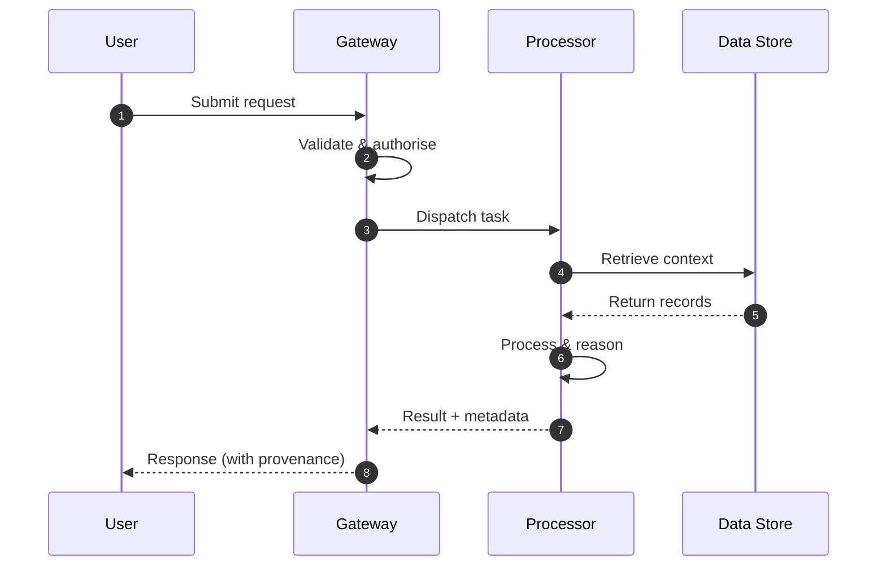

**Figure 8. Sequence - Multimodal and Cross-Encoder Embeddings** (mermaid). Figure: Sequence view for Multimodal and Cross-Encoder Embeddings. This diagram illustrates the principal components and their interactions as discussed in the surrounding section.

## Deep Dive: Mechanics, Variants and Trade-offs

Having established the essentials, we now go deeper into multimodal and cross-encoder embeddings. It pays to understand the mechanism rather than treat it as a black box, because most production incidents are explained by one of its steps misbehaving. The distinctions in this section are the ones that separate a working demo from a system that holds up under adversarial inputs, scale and the passage of time.

Consider the principal variants and how to choose between them. Each variant optimises for a different point in the design space - some for latency, some for accuracy, some for cost or operability - and the correct choice follows from explicit requirements rather than from defaults. Latency, accuracy and cost form a tension triangle: improving one typically pressures the others, so explicit budgets are essential.

In practice this is supported by a mature tooling ecosystem, including sentence-transformers, OpenAI embeddings, FAISS, Cohere. Tools accelerate the work but do not substitute for understanding: the same principles apply whichever implementation you select, and the ability to reason from first principles is what lets you debug when a tool behaves unexpectedly.

A frequent source of subtle bugs is the interaction with contrastive representation learning. Because contrastive representation learning concerns infoNCE, positive/negative mining and the geometry of good embeddings, changes there can silently alter the behaviour analysed here. The remedy is contract tests at the boundary and end-to-end evaluations that exercise the interaction explicitly.

Finally, attend to edge cases and degradation. Define what the system should do under partial failure, unexpected inputs and load spikes, and make that behaviour explicit and tested rather than emergent. Graceful degradation - returning a safe, useful result when the ideal one is unavailable - is a hallmark of mature engineering.

For deeper study, the literature offers authoritative treatments such as Mikolov et al. — Word2Vec (2013) and Reimers & Gurevych — Sentence-BERT (2019). These primary sources reward careful reading and ground the practical guidance above in established results.

## Advanced Considerations

Having established the essentials, we now go deeper into multimodal and cross-encoder embeddings. Mechanically, the behaviour emerges from a few interacting parts that are simpler than the whole they produce. The distinctions in this section are the ones that separate a working demo from a system that holds up under adversarial inputs, scale and the passage of time.

Consider the principal variants and how to choose between them. Each variant optimises for a different point in the design space - some for latency, some for accuracy, some for cost or operability - and the correct choice follows from explicit requirements rather than from defaults. Latency, accuracy and cost form a tension triangle: improving one typically pressures the others, so explicit budgets are essential.

In practice this is supported by a mature tooling ecosystem, including sentence-transformers, OpenAI embeddings, FAISS, Cohere. Tools accelerate the work but do not substitute for understanding: the same principles apply whichever implementation you select, and the ability to reason from first principles is what lets you debug when a tool behaves unexpectedly.

A frequent source of subtle bugs is the interaction with the retrieval stack reference architecture. Because the retrieval stack reference architecture concerns embedding service, vector index and re-ranking as a pipeline, changes there can silently alter the behaviour analysed here. The remedy is contract tests at the boundary and end-to-end evaluations that exercise the interaction explicitly.

Finally, attend to edge cases and degradation. Define what the system should do under partial failure, unexpected inputs and load spikes, and make that behaviour explicit and tested rather than emergent. Graceful degradation - returning a safe, useful result when the ideal one is unavailable - is a hallmark of mature engineering.

For deeper study, the literature offers authoritative treatments such as Mikolov et al. — Word2Vec (2013) and Reimers & Gurevych — Sentence-BERT (2019). These primary sources reward careful reading and ground the practical guidance above in established results.

## Worked Example

To ground the discussion, walk through a representative example. A e-commerce organisation needs visual and textual product similarity and recommendation. They decide to apply multimodal and cross-encoder embeddings as part of their Embeddings solution, but wisely treat it as a hypothesis to be validated rather than a foregone conclusion.

The team begins by stating the objective precisely and defining how success will be measured before writing any code. They establish a small but representative evaluation set, agree on acceptance thresholds, and only then prototype the simplest design that could work. Early measurement reveals which assumptions hold and which must be revised, saving weeks of misdirected effort and surfacing edge cases while they are still cheap to fix.

As the prototype matures into a service, the team hardens it: adding input validation, error handling, caching where it pays off, and monitoring that ties back to the original success metric. They document each significant decision in an architecture decision record so that future maintainers understand not just what was built but why.

The outcome is instructive. The system that reaches production is not the most sophisticated design the team considered, but the one whose behaviour they could measure, explain and operate. This is the recurring lesson of Embeddings: durable value comes from the whole system, not from any single clever component.

## Industry Use Cases

Across industries, the ideas in this chapter recur in recognisable ways. The following vignettes show how different sectors apply them and what they have in common.

**Search.** Semantic search across heterogeneous enterprise content. The common thread is that value comes not from the model alone but from the surrounding system - data quality, evaluation, integration and operations - which is precisely where most of the engineering effort belongs.

**E-commerce.** Visual and textual product similarity and recommendation. The common thread is that value comes not from the model alone but from the surrounding system - data quality, evaluation, integration and operations - which is precisely where most of the engineering effort belongs.

**Support.** Deduplicating and routing tickets by semantic similarity. The common thread is that value comes not from the model alone but from the surrounding system - data quality, evaluation, integration and operations - which is precisely where most of the engineering effort belongs.

**Compliance.** Near-duplicate detection across document repositories. The common thread is that value comes not from the model alone but from the surrounding system - data quality, evaluation, integration and operations - which is precisely where most of the engineering effort belongs.

## Best Practices

The following practices consistently separate successful Embeddings efforts from struggling ones. They are deliberately concrete so they can be adopted as checklist items in design and code review.

- Normalise vectors and pick the distance metric the model was trained for.
- Pin embedding model versions and re-index atomically on change.
- Evaluate retrieval with recall@k and nDCG on a labelled set.
- Use hybrid search to recover exact-match and rare-term queries.

None of these are exotic; they are the unglamorous disciplines that compound into reliability. The cost of adopting them is small compared with the cost of the incidents they prevent, and they become second nature with practice.

## Common Pitfalls

Equally instructive are the failure modes that recur in practice. Each pitfall below has a clear early warning sign and a known remedy, so treat them as a diagnostic checklist when something feels wrong:

- Mixing vectors from different model versions in one index.
- Choosing the wrong similarity metric for the embedding model.
- Over-chunking or under-chunking documents before embedding.
- Ignoring drift after upgrading the embedding model.

The pattern is consistent: most failures stem from skipping measurement, conflating prototype and production standards, or deferring cross-cutting concerns such as security and cost until they become emergencies. Naming these traps in advance is the cheapest way to avoid them.

## Governance, Security and Cost Notes

No discussion of multimodal and cross-encoder embeddings is complete without its governance, security and cost dimensions, which are too often deferred until they become emergencies. Treating them as first-class concerns from the outset is both cheaper and safer.

**Governance.** Classify the risk of this capability, document its intended and out-of-scope uses, and ensure decisions are traceable to satisfy internal policy and external regulation such as the NIST AI RMF, ISO/IEC 42001 and the EU AI Act. **Security.** Treat all external input as untrusted, validate outputs before acting on them, apply least privilege to any tools or data access, and map controls to the OWASP LLM Top 10 and MITRE ATLAS.

**Cost and sustainability.** Establish explicit budgets for compute, tokens and latency, attribute spend to owners, and revisit the economics as usage scales - a design that is affordable at pilot scale can become untenable at production volume. Building these reflexes into everyday engineering is what allows a Embeddings system to be not only capable but also trustworthy and economically sound.

## Hands-On Exercises

Work through the following exercises. They are designed to move understanding from recognition to application - the level required for real engineering work - so prefer writing and building over merely reading.

1. Explain multimodal and cross-encoder embeddings to a colleague unfamiliar with Embeddings, using a concrete example from your own domain.
2. Sketch a reference architecture that incorporates multimodal and cross-encoder embeddings and annotate where observability, security and cost controls belong.
3. Design an evaluation that would tell you whether multimodal and cross-encoder embeddings is working in production, including the metric, the dataset and the acceptance threshold.
4. Identify two pitfalls relevant to multimodal and cross-encoder embeddings in your environment and describe the early warning signals you would monitor.
5. Prototype the simplest implementation that demonstrates multimodal and cross-encoder embeddings, then list exactly what would need to change to make it production-ready.

## Key Takeaways

Key takeaways from this chapter:

- Multimodal and Cross-Encoder Embeddings is a systems concern in Embeddings: data, models and operations must be co-designed.
- Measurement is non-negotiable; define success metrics and evaluation before building.
- Favour the simplest design that meets the requirement, and add complexity only when evidence demands it.
- Security, cost and observability are first-class requirements, not afterthoughts.
- Document decisions so the system remains understandable and operable as it evolves.

## Code Walkthrough

This listing shows a configuration-driven Multimodal and Cross-Encoder Embeddings component with retry semantics and typed interfaces — the shape we expect from production Embeddings code rather than a notebook prototype.

The full listing is shown below; study it line by line and reproduce it locally before moving on.

### Listing: Implementing a Multimodal and Cross-Encoder Embeddings component

```python
from __future__ import annotations

from dataclasses import dataclass, field
from typing import Any


@dataclass(slots=True)
class MultimodalAndConfig:
    """Configuration for the Multimodal and Cross-Encoder Embeddings component in a Embeddings system."""

    name: str
    timeout_s: float = 30.0
    max_retries: int = 3
    options: dict[str, Any] = field(default_factory=dict)


class MultimodalAnd:
    """A minimal, production-shaped implementation of Multimodal and Cross-Encoder Embeddings."""

    def __init__(self, config: MultimodalAndConfig) -> None:
        self._config = config
        self._calls = 0

    def run(self, payload: dict[str, Any]) -> dict[str, Any]:
        """Process a request, retrying transient failures with backoff."""
        last_error: Exception | None = None
        for attempt in range(self._config.max_retries):
            try:
                self._calls += 1
                return self._process(payload)
            except TimeoutError as exc:  # transient
                last_error = exc
                continue
        raise RuntimeError(f"MultimodalAnd failed after retries") from last_error

    def _process(self, payload: dict[str, Any]) -> dict[str, Any]:
        # Domain-specific logic for Multimodal and Cross-Encoder Embeddings goes here.
        return {"status": "ok", "input_keys": sorted(payload), "calls": self._calls}

```

## Review Questions

1. In the context of Embeddings, which statement best describes “Multimodal and Cross-Encoder Embeddings”?
   - A. It guarantees deterministic output regardless of input.
   - B. It is only relevant to academic research, not production.
   - C. CLIP-style joint spaces and the bi-encoder/cross-encoder trade-off.
   - D. It makes the system slower but has no other effect.
   - **Answer: C.** Multimodal and Cross-Encoder Embeddings: CLIP-style joint spaces and the bi-encoder/cross-encoder trade-off.
2. Which of the following is a recommended best practice when working with Embeddings?
   - A. It eliminates the need for any evaluation or monitoring.
   - B. It makes the system slower but has no other effect.
   - C. Pin embedding model versions and re-index atomically on change.
   - D. Choosing the wrong similarity metric for the embedding model.
   - **Answer: C.** Best practice: Pin embedding model versions and re-index atomically on change.
3. Which of the following is a common pitfall to avoid in Embeddings?
   - A. Choosing the wrong similarity metric for the embedding model.
   - B. It removes all security and governance requirements.
   - C. It guarantees deterministic output regardless of input.
   - D. Use hybrid search to recover exact-match and rare-term queries.
   - **Answer: A.** Pitfall to avoid: Choosing the wrong similarity metric for the embedding model.
4. *(Discussion)* Walk through how you would design Multimodal and Cross-Encoder Embeddings for an enterprise Embeddings workload.
   - **Model answer:** A strong answer defines multimodal and cross-encoder embeddings (CLIP-style joint spaces and the bi-encoder/cross-encoder trade-off.) then connects it to architecture, evaluation, cost, security and operations for Embeddings, citing concrete trade-offs and a real-world example.

---


# Chapter 6. Dimensionality, Compression and Quantisation

_This chapter examines dimensionality, compression and quantisation within Embeddings. It covers matryoshka embeddings, PCA and product quantisation for cost control, derives a reference architecture, walks through a worked example and runnable code, surveys industry use cases, and distils best practices and pitfalls, closing with exercises and review questions._

## Introduction

Dimensionality, Compression and Quantisation refers to matryoshka embeddings, PCA and product quantisation for cost control. This concept recurs throughout the Embeddings lifecycle, from design to operations. In an enterprise setting, this translates into concrete requirements: clear interfaces, measurable quality, and controls that satisfy security and governance.

This chapter builds intuition first, then formalises the ideas, derives an architecture, and finishes with code, exercises and review questions so the material transfers directly to your own Embeddings work. Read it actively: pause at each diagram, reproduce the code, and attempt the exercises before consulting the answers.

## Theory and Foundations

At its core, Dimensionality, Compression and Quantisation concerns matryoshka embeddings, PCA and product quantisation for cost control. In an enterprise setting, this translates into concrete requirements: clear interfaces, measurable quality, and controls that satisfy security and governance. It pays to understand the mechanism rather than treat it as a black box, because most production incidents are explained by one of its steps misbehaving.

To place this in context, recall the broader picture: Embeddings map discrete objects—words, sentences, images, users, products—into continuous vector spaces where geometric proximity encodes semantic similarity. Within that picture, dimensionality, compression and quantisation is one of the load-bearing ideas - the kind that, when understood deeply, makes the rest of Embeddings fall into place. It is foundational: later capabilities in Embeddings are built directly on top of it.

Dimensionality, Compression and Quantisation cannot be understood in isolation from similarity metrics and normalisation. Recall that similarity metrics and normalisation concerns cosine, dot product and Euclidean distance and when each applies. The two interact directly: decisions in one constrain the design space of the other, which is why mature teams reason about them together rather than sequentially. There is an inherent trade-off between fidelity and cost, and the correct balance depends on the use case and its tolerance for error.

Dimensionality, Compression and Quantisation cannot be understood in isolation from the retrieval stack reference architecture. Recall that the retrieval stack reference architecture concerns embedding service, vector index and re-ranking as a pipeline. The two interact directly: decisions in one constrain the design space of the other, which is why mature teams reason about them together rather than sequentially. Simplicity is a feature. The simplest design that meets the requirement should be the default, with complexity added only when measurement justifies it.

Several established patterns apply directly to dimensionality, compression and quantisation. The first, bi-encoder retrieval followed by cross-encoder re-ranking, is widely adopted because it makes the system's behaviour predictable and observable. A complementary pattern, versioned indexes with blue/green re-embedding, addresses a related concern and is often deployed alongside it. Patterns are not dogma; they are distilled experience that shortcuts the search for a sound design, and each carries assumptions worth checking against your context.

It is worth being explicit about when to apply this and when to reach for something simpler. In a small prototype, shortcuts around dimensionality, compression and quantisation are invisible; in a production Embeddings system serving real traffic, they surface as incidents, cost overruns or compliance gaps. Simplicity is a feature. The simplest design that meets the requirement should be the default, with complexity added only when measurement justifies it. The remainder of this chapter turns these principles into an architecture, code and a checklist you can apply immediately.

## Architecture and Design

From an architectural standpoint, Dimensionality, Compression and Quantisation sits at the intersection of data, models and operations. An embedding platform exposes a versioned embedding service that batches and caches encode requests, writes vectors to an ANN index (HNSW/IVF) with stored metadata, and supports hybrid retrieval that fuses lexical and dense scores before an optional cross-encoder re-ranks the top candidates.

Concretely, the principal building blocks include from one-hot to distributed representations, word, sentence and document embeddings, contrastive representation learning, similarity metrics and normalisation and multimodal and cross-encoder embeddings. Each is a replaceable component behind a stable interface, so the team can upgrade an implementation - a model, an index, a policy engine - without rewriting its neighbours. The contracts between components are where reliability is won or lost, so they are specified explicitly and tested in isolation.

The diagram accompanying this section makes the data and control flow explicit. Requests enter through a well-defined boundary where they are authenticated and validated; only then are they dispatched to the components that perform the work. This boundary is also where rate limiting, quota enforcement and audit logging live, keeping cross-cutting concerns out of the core logic and in one auditable place.

Two qualities deserve emphasis. First, observability is designed in, not bolted on: every component emits structured telemetry so that failures can be localised in minutes rather than hours. Second, the architecture is evolvable - components communicate through stable contracts so that any single part of the Embeddings system can be replaced without a rewrite. As with most architectural decisions, the choice is rarely binary; the skill lies in quantifying the trade-offs and choosing deliberately.


**Figure 9. Sequence - Dimensionality, Compression and Quantisation** (mermaid). Figure: Sequence view for Dimensionality, Compression and Quantisation. This diagram illustrates the principal components and their interactions as discussed in the surrounding section.

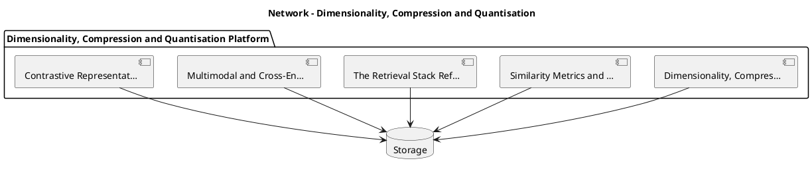

_Source diagram (plantuml); render with the appropriate tool._

**Figure 10. Network - Dimensionality, Compression and Quantisation** (plantuml). Figure: Network view for Dimensionality, Compression and Quantisation. This diagram illustrates the principal components and their interactions as discussed in the surrounding section.

## Deep Dive: Mechanics, Variants and Trade-offs

Having established the essentials, we now go deeper into dimensionality, compression and quantisation. Beneath the abstraction lies a concrete process whose steps can each be measured, tested and optimised independently. The distinctions in this section are the ones that separate a working demo from a system that holds up under adversarial inputs, scale and the passage of time.

Consider the principal variants and how to choose between them. Each variant optimises for a different point in the design space - some for latency, some for accuracy, some for cost or operability - and the correct choice follows from explicit requirements rather than from defaults. Latency, accuracy and cost form a tension triangle: improving one typically pressures the others, so explicit budgets are essential.

In practice this is supported by a mature tooling ecosystem, including sentence-transformers, OpenAI embeddings, FAISS, Cohere. Tools accelerate the work but do not substitute for understanding: the same principles apply whichever implementation you select, and the ability to reason from first principles is what lets you debug when a tool behaves unexpectedly.

A frequent source of subtle bugs is the interaction with similarity metrics and normalisation. Because similarity metrics and normalisation concerns cosine, dot product and Euclidean distance and when each applies, changes there can silently alter the behaviour analysed here. The remedy is contract tests at the boundary and end-to-end evaluations that exercise the interaction explicitly.

Finally, attend to edge cases and degradation. Define what the system should do under partial failure, unexpected inputs and load spikes, and make that behaviour explicit and tested rather than emergent. Graceful degradation - returning a safe, useful result when the ideal one is unavailable - is a hallmark of mature engineering.

For deeper study, the literature offers authoritative treatments such as Mikolov et al. — Word2Vec (2013) and Reimers & Gurevych — Sentence-BERT (2019). These primary sources reward careful reading and ground the practical guidance above in established results.

## Advanced Considerations

Having established the essentials, we now go deeper into dimensionality, compression and quantisation. Beneath the abstraction lies a concrete process whose steps can each be measured, tested and optimised independently. The distinctions in this section are the ones that separate a working demo from a system that holds up under adversarial inputs, scale and the passage of time.

Consider the principal variants and how to choose between them. Each variant optimises for a different point in the design space - some for latency, some for accuracy, some for cost or operability - and the correct choice follows from explicit requirements rather than from defaults. There is an inherent trade-off between fidelity and cost, and the correct balance depends on the use case and its tolerance for error.

In practice this is supported by a mature tooling ecosystem, including sentence-transformers, OpenAI embeddings, FAISS, Cohere. Tools accelerate the work but do not substitute for understanding: the same principles apply whichever implementation you select, and the ability to reason from first principles is what lets you debug when a tool behaves unexpectedly.

A frequent source of subtle bugs is the interaction with embedding drift and re-indexing. Because embedding drift and re-indexing concerns detecting model changes and managing versioned vector stores, changes there can silently alter the behaviour analysed here. The remedy is contract tests at the boundary and end-to-end evaluations that exercise the interaction explicitly.

Finally, attend to edge cases and degradation. Define what the system should do under partial failure, unexpected inputs and load spikes, and make that behaviour explicit and tested rather than emergent. Graceful degradation - returning a safe, useful result when the ideal one is unavailable - is a hallmark of mature engineering.

For deeper study, the literature offers authoritative treatments such as Mikolov et al. — Word2Vec (2013) and Reimers & Gurevych — Sentence-BERT (2019). These primary sources reward careful reading and ground the practical guidance above in established results.

## Worked Example

Consider a concrete scenario. A support organisation needs deduplicating and routing tickets by semantic similarity. They decide to apply dimensionality, compression and quantisation as part of their Embeddings solution, but wisely treat it as a hypothesis to be validated rather than a foregone conclusion.

The team begins by stating the objective precisely and defining how success will be measured before writing any code. They establish a small but representative evaluation set, agree on acceptance thresholds, and only then prototype the simplest design that could work. Early measurement reveals which assumptions hold and which must be revised, saving weeks of misdirected effort and surfacing edge cases while they are still cheap to fix.

As the prototype matures into a service, the team hardens it: adding input validation, error handling, caching where it pays off, and monitoring that ties back to the original success metric. They document each significant decision in an architecture decision record so that future maintainers understand not just what was built but why.

The outcome is instructive. The system that reaches production is not the most sophisticated design the team considered, but the one whose behaviour they could measure, explain and operate. This is the recurring lesson of Embeddings: durable value comes from the whole system, not from any single clever component.

## Industry Use Cases

Across industries, the ideas in this chapter recur in recognisable ways. The following vignettes show how different sectors apply them and what they have in common.

**Search.** Semantic search across heterogeneous enterprise content. The common thread is that value comes not from the model alone but from the surrounding system - data quality, evaluation, integration and operations - which is precisely where most of the engineering effort belongs.

**E-commerce.** Visual and textual product similarity and recommendation. The common thread is that value comes not from the model alone but from the surrounding system - data quality, evaluation, integration and operations - which is precisely where most of the engineering effort belongs.

**Support.** Deduplicating and routing tickets by semantic similarity. The common thread is that value comes not from the model alone but from the surrounding system - data quality, evaluation, integration and operations - which is precisely where most of the engineering effort belongs.

**Compliance.** Near-duplicate detection across document repositories. The common thread is that value comes not from the model alone but from the surrounding system - data quality, evaluation, integration and operations - which is precisely where most of the engineering effort belongs.

## Best Practices

The following practices consistently separate successful Embeddings efforts from struggling ones. They are deliberately concrete so they can be adopted as checklist items in design and code review.

- Normalise vectors and pick the distance metric the model was trained for.
- Pin embedding model versions and re-index atomically on change.
- Evaluate retrieval with recall@k and nDCG on a labelled set.
- Use hybrid search to recover exact-match and rare-term queries.

None of these are exotic; they are the unglamorous disciplines that compound into reliability. The cost of adopting them is small compared with the cost of the incidents they prevent, and they become second nature with practice.

## Common Pitfalls

Equally instructive are the failure modes that recur in practice. Each pitfall below has a clear early warning sign and a known remedy, so treat them as a diagnostic checklist when something feels wrong:

- Mixing vectors from different model versions in one index.
- Choosing the wrong similarity metric for the embedding model.
- Over-chunking or under-chunking documents before embedding.
- Ignoring drift after upgrading the embedding model.

The pattern is consistent: most failures stem from skipping measurement, conflating prototype and production standards, or deferring cross-cutting concerns such as security and cost until they become emergencies. Naming these traps in advance is the cheapest way to avoid them.

## Governance, Security and Cost Notes

No discussion of dimensionality, compression and quantisation is complete without its governance, security and cost dimensions, which are too often deferred until they become emergencies. Treating them as first-class concerns from the outset is both cheaper and safer.

**Governance.** Classify the risk of this capability, document its intended and out-of-scope uses, and ensure decisions are traceable to satisfy internal policy and external regulation such as the NIST AI RMF, ISO/IEC 42001 and the EU AI Act. **Security.** Treat all external input as untrusted, validate outputs before acting on them, apply least privilege to any tools or data access, and map controls to the OWASP LLM Top 10 and MITRE ATLAS.

**Cost and sustainability.** Establish explicit budgets for compute, tokens and latency, attribute spend to owners, and revisit the economics as usage scales - a design that is affordable at pilot scale can become untenable at production volume. Building these reflexes into everyday engineering is what allows a Embeddings system to be not only capable but also trustworthy and economically sound.

## Hands-On Exercises

Work through the following exercises. They are designed to move understanding from recognition to application - the level required for real engineering work - so prefer writing and building over merely reading.

1. Explain dimensionality, compression and quantisation to a colleague unfamiliar with Embeddings, using a concrete example from your own domain.
2. Sketch a reference architecture that incorporates dimensionality, compression and quantisation and annotate where observability, security and cost controls belong.
3. Design an evaluation that would tell you whether dimensionality, compression and quantisation is working in production, including the metric, the dataset and the acceptance threshold.
4. Identify two pitfalls relevant to dimensionality, compression and quantisation in your environment and describe the early warning signals you would monitor.
5. Prototype the simplest implementation that demonstrates dimensionality, compression and quantisation, then list exactly what would need to change to make it production-ready.

## Key Takeaways

Key takeaways from this chapter:

- Dimensionality, Compression and Quantisation is a systems concern in Embeddings: data, models and operations must be co-designed.
- Measurement is non-negotiable; define success metrics and evaluation before building.
- Favour the simplest design that meets the requirement, and add complexity only when evidence demands it.
- Security, cost and observability are first-class requirements, not afterthoughts.
- Document decisions so the system remains understandable and operable as it evolves.

## Code Walkthrough

Every change to a Embeddings system should pass an evaluation gate. This example shows the minimal shape: align predictions and references, compute a metric, and return a pass/fail decision for CI.

The full listing is shown below; study it line by line and reproduce it locally before moving on.

### Listing: Evaluating Dimensionality, Compression and Quantisation with a regression gate

```python
from dataclasses import dataclass


@dataclass
class EvalResult:
    metric: str
    score: float
    passed: bool


def evaluate(predictions: list[str], references: list[str],
             threshold: float = 0.8) -> EvalResult:
    """Score Dimensionality, Compression and Quantisation output against references with a simple exact-match metric.

    In practice you would combine several metrics (exact match, semantic
    similarity, LLM-as-judge) and gate releases on the aggregate.
    """
    if len(predictions) != len(references):
        raise ValueError("predictions and references must align")
    hits = sum(p.strip() == r.strip() for p, r in zip(predictions, references))
    score = hits / len(references) if references else 0.0
    return EvalResult(metric="exact_match", score=score, passed=score >= threshold)


if __name__ == "__main__":
    result = evaluate(["yes", "no"], ["yes", "yes"])
    print(f"{result.metric}={result.score:.2f} passed={result.passed}")

```

## Review Questions

1. In the context of Embeddings, which statement best describes “Dimensionality, Compression and Quantisation”?
   - A. It removes all security and governance requirements.
   - B. It applies exclusively to image data.
   - C. Matryoshka embeddings, PCA and product quantisation for cost control.
   - D. It eliminates the need for any evaluation or monitoring.
   - **Answer: C.** Dimensionality, Compression and Quantisation: Matryoshka embeddings, PCA and product quantisation for cost control.
2. Which of the following is a recommended best practice when working with Embeddings?
   - A. It removes all security and governance requirements.
   - B. Over-chunking or under-chunking documents before embedding.
   - C. Choosing the wrong similarity metric for the embedding model.
   - D. Pin embedding model versions and re-index atomically on change.
   - **Answer: D.** Best practice: Pin embedding model versions and re-index atomically on change.
3. Which of the following is a common pitfall to avoid in Embeddings?
   - A. Evaluate retrieval with recall@k and nDCG on a labelled set.
   - B. It eliminates the need for any evaluation or monitoring.
   - C. Ignoring drift after upgrading the embedding model.
   - D. It removes all security and governance requirements.
   - **Answer: C.** Pitfall to avoid: Ignoring drift after upgrading the embedding model.
4. *(Discussion)* How does Dimensionality, Compression and Quantisation interact with security and governance requirements?
   - **Model answer:** A strong answer defines dimensionality, compression and quantisation (Matryoshka embeddings, PCA and product quantisation for cost control.) then connects it to architecture, evaluation, cost, security and operations for Embeddings, citing concrete trade-offs and a real-world example.

---


# Chapter 7. Indexing for Approximate Nearest Neighbour Search

_This chapter examines indexing for approximate nearest neighbour search within Embeddings. It covers hNSW, IVF and the recall/latency frontier, derives a reference architecture, walks through a worked example and runnable code, surveys industry use cases, and distils best practices and pitfalls, closing with exercises and review questions._

## Introduction

Formally, Indexing for Approximate Nearest Neighbour Search addresses hNSW, IVF and the recall/latency frontier. Neglecting it is one of the most common reasons Embeddings initiatives stall in production. Seasoned practitioners treat this as a systems problem, co-designing data, models and operations rather than optimising any one in isolation.

This chapter builds intuition first, then formalises the ideas, derives an architecture, and finishes with code, exercises and review questions so the material transfers directly to your own Embeddings work. Read it actively: pause at each diagram, reproduce the code, and attempt the exercises before consulting the answers.

## Theory and Foundations

At its core, Indexing for Approximate Nearest Neighbour Search concerns hNSW, IVF and the recall/latency frontier. What distinguishes a production-grade approach from a prototype is the discipline of measurement: every claim is backed by an evaluation rather than intuition. Beneath the abstraction lies a concrete process whose steps can each be measured, tested and optimised independently.

To place this in context, recall the broader picture: Embeddings map discrete objects—words, sentences, images, users, products—into continuous vector spaces where geometric proximity encodes semantic similarity. Within that picture, indexing for approximate nearest neighbour search is one of the load-bearing ideas - the kind that, when understood deeply, makes the rest of Embeddings fall into place. This concept recurs throughout the Embeddings lifecycle, from design to operations.

Indexing for Approximate Nearest Neighbour Search cannot be understood in isolation from privacy and embedding inversion. Recall that privacy and embedding inversion concerns what embeddings leak and how to mitigate it. The two interact directly: decisions in one constrain the design space of the other, which is why mature teams reason about them together rather than sequentially. Latency, accuracy and cost form a tension triangle: improving one typically pressures the others, so explicit budgets are essential.

Indexing for Approximate Nearest Neighbour Search cannot be understood in isolation from word, sentence and document embeddings. Recall that word, sentence and document embeddings concerns word2Vec, GloVe, sentence transformers and pooling strategies. The two interact directly: decisions in one constrain the design space of the other, which is why mature teams reason about them together rather than sequentially. There is an inherent trade-off between fidelity and cost, and the correct balance depends on the use case and its tolerance for error.

Several established patterns apply directly to indexing for approximate nearest neighbour search. The first, versioned indexes with blue/green re-embedding, is widely adopted because it makes the system's behaviour predictable and observable. A complementary pattern, bi-encoder retrieval followed by cross-encoder re-ranking, addresses a related concern and is often deployed alongside it. Patterns are not dogma; they are distilled experience that shortcuts the search for a sound design, and each carries assumptions worth checking against your context.

It is worth being explicit about when to apply this and when to reach for something simpler. In a small prototype, shortcuts around indexing for approximate nearest neighbour search are invisible; in a production Embeddings system serving real traffic, they surface as incidents, cost overruns or compliance gaps. Simplicity is a feature. The simplest design that meets the requirement should be the default, with complexity added only when measurement justifies it. The remainder of this chapter turns these principles into an architecture, code and a checklist you can apply immediately.

## Architecture and Design

The reference architecture for Indexing for Approximate Nearest Neighbour Search separates concerns into clearly bounded components with explicit contracts. An embedding platform exposes a versioned embedding service that batches and caches encode requests, writes vectors to an ANN index (HNSW/IVF) with stored metadata, and supports hybrid retrieval that fuses lexical and dense scores before an optional cross-encoder re-ranks the top candidates.

Concretely, the principal building blocks include from one-hot to distributed representations, word, sentence and document embeddings, contrastive representation learning, similarity metrics and normalisation and multimodal and cross-encoder embeddings. Each is a replaceable component behind a stable interface, so the team can upgrade an implementation - a model, an index, a policy engine - without rewriting its neighbours. The contracts between components are where reliability is won or lost, so they are specified explicitly and tested in isolation.

The diagram accompanying this section makes the data and control flow explicit. Requests enter through a well-defined boundary where they are authenticated and validated; only then are they dispatched to the components that perform the work. This boundary is also where rate limiting, quota enforcement and audit logging live, keeping cross-cutting concerns out of the core logic and in one auditable place.

Two qualities deserve emphasis. First, observability is designed in, not bolted on: every component emits structured telemetry so that failures can be localised in minutes rather than hours. Second, the architecture is evolvable - components communicate through stable contracts so that any single part of the Embeddings system can be replaced without a rewrite. There is an inherent trade-off between fidelity and cost, and the correct balance depends on the use case and its tolerance for error.

```xml
<mxfile host="ai-university">
  <diagram name="Network">
    <mxGraphModel dx="800" dy="600" grid="1" gridSize="10">
      <root>
        <mxCell id="0"/>
        <mxCell id="1" parent="0"/>
        <mxCell id="title" value="Network - Indexing for Approximate Nearest Neighbour Search" style="text;fontSize=16;fontStyle=1" vertex="1" parent="1"><mxGeometry x="40" y="20" width="600" height="30" as="geometry"/></mxCell>
        <mxCell id="hub" value="Indexing for Approxim…" style="rounded=1;fillColor=#0f172a;fontColor=#ffffff;fontStyle=1" vertex="1" parent="1"><mxGeometry x="300" y="180" width="160" height="60" as="geometry"/></mxCell>
        <mxCell id="n0" value="Indexing for Approximat…" style="rounded=1;fillColor=#e0e7ff;strokeColor=#4338ca" vertex="1" parent="1"><mxGeometry x="60" y="80" width="160" height="50" as="geometry"/></mxCell>
        <mxCell id="e0" style="edgeStyle=orthogonalEdgeStyle" edge="1" parent="1" source="hub" target="n0"><mxGeometry relative="1" as="geometry"/></mxCell>
        <mxCell id="n1" value="Privacy and Embedding I…" style="rounded=1;fillColor=#e0e7ff;strokeColor=#4338ca" vertex="1" parent="1"><mxGeometry x="600" y="170" width="160" height="50" as="geometry"/></mxCell>
        <mxCell id="e1" style="edgeStyle=orthogonalEdgeStyle" edge="1" parent="1" source="hub" target="n1"><mxGeometry relative="1" as="geometry"/></mxCell>
        <mxCell id="n2" value="Word, Sentence and Docu…" style="rounded=1;fillColor=#e0e7ff;strokeColor=#4338ca" vertex="1" parent="1"><mxGeometry x="60" y="260" width="160" height="50" as="geometry"/></mxCell>
        <mxCell id="e2" style="edgeStyle=orthogonalEdgeStyle" edge="1" parent="1" source="hub" target="n2"><mxGeometry relative="1" as="geometry"/></mxCell>
        <mxCell id="n3" value="Similarity Metrics and …" style="rounded=1;fillColor=#e0e7ff;strokeColor=#4338ca" vertex="1" parent="1"><mxGeometry x="600" y="350" width="160" height="50" as="geometry"/></mxCell>
        <mxCell id="e3" style="edgeStyle=orthogonalEdgeStyle" edge="1" parent="1" source="hub" target="n3"><mxGeometry relative="1" as="geometry"/></mxCell>
        <mxCell id="n4" value="Operating an Embedding …" style="rounded=1;fillColor=#e0e7ff;strokeColor=#4338ca" vertex="1" parent="1"><mxGeometry x="60" y="440" width="160" height="50" as="geometry"/></mxCell>
        <mxCell id="e4" style="edgeStyle=orthogonalEdgeStyle" edge="1" parent="1" source="hub" target="n4"><mxGeometry relative="1" as="geometry"/></mxCell>
      </root>
    </mxGraphModel>
  </diagram>
</mxfile>
```

_Source diagram (drawio); render with the appropriate tool._

**Figure 11. Network - Indexing for Approximate Nearest Neighbour Search** (drawio). Figure: Network view for Indexing for Approximate Nearest Neighbour Search. This diagram illustrates the principal components and their interactions as discussed in the surrounding section.

## Deep Dive: Mechanics, Variants and Trade-offs

Having established the essentials, we now go deeper into indexing for approximate nearest neighbour search. Mechanically, the behaviour emerges from a few interacting parts that are simpler than the whole they produce. The distinctions in this section are the ones that separate a working demo from a system that holds up under adversarial inputs, scale and the passage of time.

Consider the principal variants and how to choose between them. Each variant optimises for a different point in the design space - some for latency, some for accuracy, some for cost or operability - and the correct choice follows from explicit requirements rather than from defaults. There is an inherent trade-off between fidelity and cost, and the correct balance depends on the use case and its tolerance for error.

In practice this is supported by a mature tooling ecosystem, including sentence-transformers, OpenAI embeddings, FAISS, Cohere. Tools accelerate the work but do not substitute for understanding: the same principles apply whichever implementation you select, and the ability to reason from first principles is what lets you debug when a tool behaves unexpectedly.

A frequent source of subtle bugs is the interaction with privacy and embedding inversion. Because privacy and embedding inversion concerns what embeddings leak and how to mitigate it, changes there can silently alter the behaviour analysed here. The remedy is contract tests at the boundary and end-to-end evaluations that exercise the interaction explicitly.

Finally, attend to edge cases and degradation. Define what the system should do under partial failure, unexpected inputs and load spikes, and make that behaviour explicit and tested rather than emergent. Graceful degradation - returning a safe, useful result when the ideal one is unavailable - is a hallmark of mature engineering.

For deeper study, the literature offers authoritative treatments such as Mikolov et al. — Word2Vec (2013) and Reimers & Gurevych — Sentence-BERT (2019). These primary sources reward careful reading and ground the practical guidance above in established results.

## Advanced Considerations

Having established the essentials, we now go deeper into indexing for approximate nearest neighbour search. Mechanically, the behaviour emerges from a few interacting parts that are simpler than the whole they produce. The distinctions in this section are the ones that separate a working demo from a system that holds up under adversarial inputs, scale and the passage of time.

Consider the principal variants and how to choose between them. Each variant optimises for a different point in the design space - some for latency, some for accuracy, some for cost or operability - and the correct choice follows from explicit requirements rather than from defaults. As with most architectural decisions, the choice is rarely binary; the skill lies in quantifying the trade-offs and choosing deliberately.

In practice this is supported by a mature tooling ecosystem, including sentence-transformers, OpenAI embeddings, FAISS, Cohere. Tools accelerate the work but do not substitute for understanding: the same principles apply whichever implementation you select, and the ability to reason from first principles is what lets you debug when a tool behaves unexpectedly.

A frequent source of subtle bugs is the interaction with similarity metrics and normalisation. Because similarity metrics and normalisation concerns cosine, dot product and Euclidean distance and when each applies, changes there can silently alter the behaviour analysed here. The remedy is contract tests at the boundary and end-to-end evaluations that exercise the interaction explicitly.

Finally, attend to edge cases and degradation. Define what the system should do under partial failure, unexpected inputs and load spikes, and make that behaviour explicit and tested rather than emergent. Graceful degradation - returning a safe, useful result when the ideal one is unavailable - is a hallmark of mature engineering.

For deeper study, the literature offers authoritative treatments such as Mikolov et al. — Word2Vec (2013) and Reimers & Gurevych — Sentence-BERT (2019). These primary sources reward careful reading and ground the practical guidance above in established results.

## Worked Example

Consider a concrete scenario. A compliance organisation needs near-duplicate detection across document repositories. They decide to apply indexing for approximate nearest neighbour search as part of their Embeddings solution, but wisely treat it as a hypothesis to be validated rather than a foregone conclusion.

The team begins by stating the objective precisely and defining how success will be measured before writing any code. They establish a small but representative evaluation set, agree on acceptance thresholds, and only then prototype the simplest design that could work. Early measurement reveals which assumptions hold and which must be revised, saving weeks of misdirected effort and surfacing edge cases while they are still cheap to fix.

As the prototype matures into a service, the team hardens it: adding input validation, error handling, caching where it pays off, and monitoring that ties back to the original success metric. They document each significant decision in an architecture decision record so that future maintainers understand not just what was built but why.

The outcome is instructive. The system that reaches production is not the most sophisticated design the team considered, but the one whose behaviour they could measure, explain and operate. This is the recurring lesson of Embeddings: durable value comes from the whole system, not from any single clever component.

## Industry Use Cases

Across industries, the ideas in this chapter recur in recognisable ways. The following vignettes show how different sectors apply them and what they have in common.

**Search.** Semantic search across heterogeneous enterprise content. The common thread is that value comes not from the model alone but from the surrounding system - data quality, evaluation, integration and operations - which is precisely where most of the engineering effort belongs.

**E-commerce.** Visual and textual product similarity and recommendation. The common thread is that value comes not from the model alone but from the surrounding system - data quality, evaluation, integration and operations - which is precisely where most of the engineering effort belongs.

**Support.** Deduplicating and routing tickets by semantic similarity. The common thread is that value comes not from the model alone but from the surrounding system - data quality, evaluation, integration and operations - which is precisely where most of the engineering effort belongs.

**Compliance.** Near-duplicate detection across document repositories. The common thread is that value comes not from the model alone but from the surrounding system - data quality, evaluation, integration and operations - which is precisely where most of the engineering effort belongs.

## Best Practices

The following practices consistently separate successful Embeddings efforts from struggling ones. They are deliberately concrete so they can be adopted as checklist items in design and code review.

- Normalise vectors and pick the distance metric the model was trained for.
- Pin embedding model versions and re-index atomically on change.
- Evaluate retrieval with recall@k and nDCG on a labelled set.
- Use hybrid search to recover exact-match and rare-term queries.

None of these are exotic; they are the unglamorous disciplines that compound into reliability. The cost of adopting them is small compared with the cost of the incidents they prevent, and they become second nature with practice.

## Common Pitfalls

Equally instructive are the failure modes that recur in practice. Each pitfall below has a clear early warning sign and a known remedy, so treat them as a diagnostic checklist when something feels wrong:

- Mixing vectors from different model versions in one index.
- Choosing the wrong similarity metric for the embedding model.
- Over-chunking or under-chunking documents before embedding.
- Ignoring drift after upgrading the embedding model.

The pattern is consistent: most failures stem from skipping measurement, conflating prototype and production standards, or deferring cross-cutting concerns such as security and cost until they become emergencies. Naming these traps in advance is the cheapest way to avoid them.

## Governance, Security and Cost Notes

No discussion of indexing for approximate nearest neighbour search is complete without its governance, security and cost dimensions, which are too often deferred until they become emergencies. Treating them as first-class concerns from the outset is both cheaper and safer.

**Governance.** Classify the risk of this capability, document its intended and out-of-scope uses, and ensure decisions are traceable to satisfy internal policy and external regulation such as the NIST AI RMF, ISO/IEC 42001 and the EU AI Act. **Security.** Treat all external input as untrusted, validate outputs before acting on them, apply least privilege to any tools or data access, and map controls to the OWASP LLM Top 10 and MITRE ATLAS.

**Cost and sustainability.** Establish explicit budgets for compute, tokens and latency, attribute spend to owners, and revisit the economics as usage scales - a design that is affordable at pilot scale can become untenable at production volume. Building these reflexes into everyday engineering is what allows a Embeddings system to be not only capable but also trustworthy and economically sound.

## Hands-On Exercises

Work through the following exercises. They are designed to move understanding from recognition to application - the level required for real engineering work - so prefer writing and building over merely reading.

1. Explain indexing for approximate nearest neighbour search to a colleague unfamiliar with Embeddings, using a concrete example from your own domain.
2. Sketch a reference architecture that incorporates indexing for approximate nearest neighbour search and annotate where observability, security and cost controls belong.
3. Design an evaluation that would tell you whether indexing for approximate nearest neighbour search is working in production, including the metric, the dataset and the acceptance threshold.
4. Identify two pitfalls relevant to indexing for approximate nearest neighbour search in your environment and describe the early warning signals you would monitor.
5. Prototype the simplest implementation that demonstrates indexing for approximate nearest neighbour search, then list exactly what would need to change to make it production-ready.

## Key Takeaways

Key takeaways from this chapter:

- Indexing for Approximate Nearest Neighbour Search is a systems concern in Embeddings: data, models and operations must be co-designed.
- Measurement is non-negotiable; define success metrics and evaluation before building.
- Favour the simplest design that meets the requirement, and add complexity only when evidence demands it.
- Security, cost and observability are first-class requirements, not afterthoughts.
- Document decisions so the system remains understandable and operable as it evolves.

## Code Walkthrough

This listing shows a configuration-driven Indexing for Approximate Nearest Neighbour Search component with retry semantics and typed interfaces — the shape we expect from production Embeddings code rather than a notebook prototype.

The full listing is shown below; study it line by line and reproduce it locally before moving on.

### Listing: Implementing a Indexing for Approximate Nearest Neighbour Search component

```python
from __future__ import annotations

from dataclasses import dataclass, field
from typing import Any


@dataclass(slots=True)
class IndexingForApproximateConfig:
    """Configuration for the Indexing for Approximate Nearest Neighbour Search component in a Embeddings system."""

    name: str
    timeout_s: float = 30.0
    max_retries: int = 3
    options: dict[str, Any] = field(default_factory=dict)


class IndexingForApproximate:
    """A minimal, production-shaped implementation of Indexing for Approximate Nearest Neighbour Search."""

    def __init__(self, config: IndexingForApproximateConfig) -> None:
        self._config = config
        self._calls = 0

    def run(self, payload: dict[str, Any]) -> dict[str, Any]:
        """Process a request, retrying transient failures with backoff."""
        last_error: Exception | None = None
        for attempt in range(self._config.max_retries):
            try:
                self._calls += 1
                return self._process(payload)
            except TimeoutError as exc:  # transient
                last_error = exc
                continue
        raise RuntimeError(f"IndexingForApproximate failed after retries") from last_error

    def _process(self, payload: dict[str, Any]) -> dict[str, Any]:
        # Domain-specific logic for Indexing for Approximate Nearest Neighbour Search goes here.
        return {"status": "ok", "input_keys": sorted(payload), "calls": self._calls}

```

## Review Questions

1. In the context of Embeddings, which statement best describes “Indexing for Approximate Nearest Neighbour Search”?
   - A. It removes all security and governance requirements.
   - B. It makes the system slower but has no other effect.
   - C. HNSW, IVF and the recall/latency frontier.
   - D. It guarantees deterministic output regardless of input.
   - **Answer: C.** Indexing for Approximate Nearest Neighbour Search: HNSW, IVF and the recall/latency frontier.
2. Which of the following is a recommended best practice when working with Embeddings?
   - A. Pin embedding model versions and re-index atomically on change.
   - B. It guarantees deterministic output regardless of input.
   - C. It applies exclusively to image data.
   - D. Mixing vectors from different model versions in one index.
   - **Answer: A.** Best practice: Pin embedding model versions and re-index atomically on change.
3. Which of the following is a common pitfall to avoid in Embeddings?
   - A. It makes the system slower but has no other effect.
   - B. It eliminates the need for any evaluation or monitoring.
   - C. Mixing vectors from different model versions in one index.
   - D. It applies exclusively to image data.
   - **Answer: C.** Pitfall to avoid: Mixing vectors from different model versions in one index.
4. *(Discussion)* How would you test and monitor Indexing for Approximate Nearest Neighbour Search in production?
   - **Model answer:** A strong answer defines indexing for approximate nearest neighbour search (HNSW, IVF and the recall/latency frontier.) then connects it to architecture, evaluation, cost, security and operations for Embeddings, citing concrete trade-offs and a real-world example.

---


# Chapter 8. Evaluating Embedding Quality

_This chapter examines evaluating embedding quality within Embeddings. It covers retrieval metrics (recall@k, MRR, nDCG) and benchmark suites like MTEB, derives a reference architecture, walks through a worked example and runnable code, surveys industry use cases, and distils best practices and pitfalls, closing with exercises and review questions._

## Introduction

In practical terms, Evaluating Embedding Quality is best understood as retrieval metrics (recall@k, MRR, nDCG) and benchmark suites like MTEB. Neglecting it is one of the most common reasons Embeddings initiatives stall in production. It helps to separate the conceptual model from its implementation: the former guides reasoning, the latter must contend with real-world constraints.

This chapter builds intuition first, then formalises the ideas, derives an architecture, and finishes with code, exercises and review questions so the material transfers directly to your own Embeddings work. Read it actively: pause at each diagram, reproduce the code, and attempt the exercises before consulting the answers.

## Theory and Foundations

In practical terms, Evaluating Embedding Quality is best understood as retrieval metrics (recall@k, MRR, nDCG) and benchmark suites like MTEB. It helps to separate the conceptual model from its implementation: the former guides reasoning, the latter must contend with real-world constraints. Mechanically, the behaviour emerges from a few interacting parts that are simpler than the whole they produce.

To place this in context, recall the broader picture: Embeddings map discrete objects—words, sentences, images, users, products—into continuous vector spaces where geometric proximity encodes semantic similarity. Within that picture, evaluating embedding quality is one of the load-bearing ideas - the kind that, when understood deeply, makes the rest of Embeddings fall into place. Neglecting it is one of the most common reasons Embeddings initiatives stall in production.

Evaluating Embedding Quality cannot be understood in isolation from the retrieval stack reference architecture. Recall that the retrieval stack reference architecture concerns embedding service, vector index and re-ranking as a pipeline. The two interact directly: decisions in one constrain the design space of the other, which is why mature teams reason about them together rather than sequentially. Every added component buys capability at the price of operational surface area, and that bargain should be made consciously.

Evaluating Embedding Quality cannot be understood in isolation from embedding drift and re-indexing. Recall that embedding drift and re-indexing concerns detecting model changes and managing versioned vector stores. The two interact directly: decisions in one constrain the design space of the other, which is why mature teams reason about them together rather than sequentially. Every added component buys capability at the price of operational surface area, and that bargain should be made consciously.

Several established patterns apply directly to evaluating embedding quality. The first, hybrid lexical + dense fusion (reciprocal rank fusion), is widely adopted because it makes the system's behaviour predictable and observable. A complementary pattern, versioned indexes with blue/green re-embedding, addresses a related concern and is often deployed alongside it. Patterns are not dogma; they are distilled experience that shortcuts the search for a sound design, and each carries assumptions worth checking against your context.

Knowing when not to use a technique is as valuable as knowing how to use it. In a small prototype, shortcuts around evaluating embedding quality are invisible; in a production Embeddings system serving real traffic, they surface as incidents, cost overruns or compliance gaps. Every added component buys capability at the price of operational surface area, and that bargain should be made consciously. The remainder of this chapter turns these principles into an architecture, code and a checklist you can apply immediately.

## Architecture and Design

The reference architecture for Evaluating Embedding Quality separates concerns into clearly bounded components with explicit contracts. An embedding platform exposes a versioned embedding service that batches and caches encode requests, writes vectors to an ANN index (HNSW/IVF) with stored metadata, and supports hybrid retrieval that fuses lexical and dense scores before an optional cross-encoder re-ranks the top candidates.

Concretely, the principal building blocks include from one-hot to distributed representations, word, sentence and document embeddings, contrastive representation learning, similarity metrics and normalisation and multimodal and cross-encoder embeddings. Each is a replaceable component behind a stable interface, so the team can upgrade an implementation - a model, an index, a policy engine - without rewriting its neighbours. The contracts between components are where reliability is won or lost, so they are specified explicitly and tested in isolation.

The diagram accompanying this section makes the data and control flow explicit. Requests enter through a well-defined boundary where they are authenticated and validated; only then are they dispatched to the components that perform the work. This boundary is also where rate limiting, quota enforcement and audit logging live, keeping cross-cutting concerns out of the core logic and in one auditable place.

Two qualities deserve emphasis. First, observability is designed in, not bolted on: every component emits structured telemetry so that failures can be localised in minutes rather than hours. Second, the architecture is evolvable - components communicate through stable contracts so that any single part of the Embeddings system can be replaced without a rewrite. Every added component buys capability at the price of operational surface area, and that bargain should be made consciously.

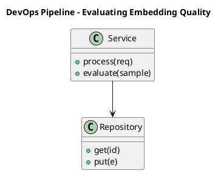

_Source diagram (plantuml); render with the appropriate tool._

**Figure 12. DevOps Pipeline - Evaluating Embedding Quality** (plantuml). Figure: DevOps Pipeline view for Evaluating Embedding Quality. This diagram illustrates the principal components and their interactions as discussed in the surrounding section.

```xml
<mxfile host="ai-university">
  <diagram name="Application Flow">
    <mxGraphModel dx="800" dy="600" grid="1" gridSize="10">
      <root>
        <mxCell id="0"/>
        <mxCell id="1" parent="0"/>
        <mxCell id="title" value="Application Flow - Evaluating Embedding Quality" style="text;fontSize=16;fontStyle=1" vertex="1" parent="1"><mxGeometry x="40" y="20" width="600" height="30" as="geometry"/></mxCell>
        <mxCell id="hub" value="Evaluating Embedding …" style="rounded=1;fillColor=#0f172a;fontColor=#ffffff;fontStyle=1" vertex="1" parent="1"><mxGeometry x="300" y="180" width="160" height="60" as="geometry"/></mxCell>
        <mxCell id="n0" value="Evaluating Embedding Qu…" style="rounded=1;fillColor=#e0e7ff;strokeColor=#4338ca" vertex="1" parent="1"><mxGeometry x="60" y="80" width="160" height="50" as="geometry"/></mxCell>
        <mxCell id="e0" style="edgeStyle=orthogonalEdgeStyle" edge="1" parent="1" source="hub" target="n0"><mxGeometry relative="1" as="geometry"/></mxCell>
        <mxCell id="n1" value="The Retrieval Stack Ref…" style="rounded=1;fillColor=#e0e7ff;strokeColor=#4338ca" vertex="1" parent="1"><mxGeometry x="600" y="170" width="160" height="50" as="geometry"/></mxCell>
        <mxCell id="e1" style="edgeStyle=orthogonalEdgeStyle" edge="1" parent="1" source="hub" target="n1"><mxGeometry relative="1" as="geometry"/></mxCell>
        <mxCell id="n2" value="Embedding Drift and Re-…" style="rounded=1;fillColor=#e0e7ff;strokeColor=#4338ca" vertex="1" parent="1"><mxGeometry x="60" y="260" width="160" height="50" as="geometry"/></mxCell>
        <mxCell id="e2" style="edgeStyle=orthogonalEdgeStyle" edge="1" parent="1" source="hub" target="n2"><mxGeometry relative="1" as="geometry"/></mxCell>
        <mxCell id="n3" value="Privacy and Embedding I…" style="rounded=1;fillColor=#e0e7ff;strokeColor=#4338ca" vertex="1" parent="1"><mxGeometry x="600" y="350" width="160" height="50" as="geometry"/></mxCell>
        <mxCell id="e3" style="edgeStyle=orthogonalEdgeStyle" edge="1" parent="1" source="hub" target="n3"><mxGeometry relative="1" as="geometry"/></mxCell>
        <mxCell id="n4" value="Dimensionality, Compres…" style="rounded=1;fillColor=#e0e7ff;strokeColor=#4338ca" vertex="1" parent="1"><mxGeometry x="60" y="440" width="160" height="50" as="geometry"/></mxCell>
        <mxCell id="e4" style="edgeStyle=orthogonalEdgeStyle" edge="1" parent="1" source="hub" target="n4"><mxGeometry relative="1" as="geometry"/></mxCell>
      </root>
    </mxGraphModel>
  </diagram>
</mxfile>
```

_Source diagram (drawio); render with the appropriate tool._

**Figure 13. Application Flow - Evaluating Embedding Quality** (drawio). Figure: Application Flow view for Evaluating Embedding Quality. This diagram illustrates the principal components and their interactions as discussed in the surrounding section.

## Deep Dive: Mechanics, Variants and Trade-offs

Having established the essentials, we now go deeper into evaluating embedding quality. The underlying mechanism is best appreciated by tracing a single request from input to output and noting where state is created and consumed. The distinctions in this section are the ones that separate a working demo from a system that holds up under adversarial inputs, scale and the passage of time.

Consider the principal variants and how to choose between them. Each variant optimises for a different point in the design space - some for latency, some for accuracy, some for cost or operability - and the correct choice follows from explicit requirements rather than from defaults. As with most architectural decisions, the choice is rarely binary; the skill lies in quantifying the trade-offs and choosing deliberately.

In practice this is supported by a mature tooling ecosystem, including sentence-transformers, OpenAI embeddings, FAISS, Cohere. Tools accelerate the work but do not substitute for understanding: the same principles apply whichever implementation you select, and the ability to reason from first principles is what lets you debug when a tool behaves unexpectedly.

A frequent source of subtle bugs is the interaction with the retrieval stack reference architecture. Because the retrieval stack reference architecture concerns embedding service, vector index and re-ranking as a pipeline, changes there can silently alter the behaviour analysed here. The remedy is contract tests at the boundary and end-to-end evaluations that exercise the interaction explicitly.

Finally, attend to edge cases and degradation. Define what the system should do under partial failure, unexpected inputs and load spikes, and make that behaviour explicit and tested rather than emergent. Graceful degradation - returning a safe, useful result when the ideal one is unavailable - is a hallmark of mature engineering.

For deeper study, the literature offers authoritative treatments such as Mikolov et al. — Word2Vec (2013) and Reimers & Gurevych — Sentence-BERT (2019). These primary sources reward careful reading and ground the practical guidance above in established results.

## Advanced Considerations

Having established the essentials, we now go deeper into evaluating embedding quality. Mechanically, the behaviour emerges from a few interacting parts that are simpler than the whole they produce. The distinctions in this section are the ones that separate a working demo from a system that holds up under adversarial inputs, scale and the passage of time.

Consider the principal variants and how to choose between them. Each variant optimises for a different point in the design space - some for latency, some for accuracy, some for cost or operability - and the correct choice follows from explicit requirements rather than from defaults. Simplicity is a feature. The simplest design that meets the requirement should be the default, with complexity added only when measurement justifies it.

In practice this is supported by a mature tooling ecosystem, including sentence-transformers, OpenAI embeddings, FAISS, Cohere. Tools accelerate the work but do not substitute for understanding: the same principles apply whichever implementation you select, and the ability to reason from first principles is what lets you debug when a tool behaves unexpectedly.

A frequent source of subtle bugs is the interaction with contrastive representation learning. Because contrastive representation learning concerns infoNCE, positive/negative mining and the geometry of good embeddings, changes there can silently alter the behaviour analysed here. The remedy is contract tests at the boundary and end-to-end evaluations that exercise the interaction explicitly.

Finally, attend to edge cases and degradation. Define what the system should do under partial failure, unexpected inputs and load spikes, and make that behaviour explicit and tested rather than emergent. Graceful degradation - returning a safe, useful result when the ideal one is unavailable - is a hallmark of mature engineering.

For deeper study, the literature offers authoritative treatments such as Mikolov et al. — Word2Vec (2013) and Reimers & Gurevych — Sentence-BERT (2019). These primary sources reward careful reading and ground the practical guidance above in established results.

## Worked Example

A worked example clarifies how these ideas behave in practice. A search organisation needs semantic search across heterogeneous enterprise content. They decide to apply evaluating embedding quality as part of their Embeddings solution, but wisely treat it as a hypothesis to be validated rather than a foregone conclusion.

The team begins by stating the objective precisely and defining how success will be measured before writing any code. They establish a small but representative evaluation set, agree on acceptance thresholds, and only then prototype the simplest design that could work. Early measurement reveals which assumptions hold and which must be revised, saving weeks of misdirected effort and surfacing edge cases while they are still cheap to fix.

As the prototype matures into a service, the team hardens it: adding input validation, error handling, caching where it pays off, and monitoring that ties back to the original success metric. They document each significant decision in an architecture decision record so that future maintainers understand not just what was built but why.

The outcome is instructive. The system that reaches production is not the most sophisticated design the team considered, but the one whose behaviour they could measure, explain and operate. This is the recurring lesson of Embeddings: durable value comes from the whole system, not from any single clever component.

## Industry Use Cases

Across industries, the ideas in this chapter recur in recognisable ways. The following vignettes show how different sectors apply them and what they have in common.

**Search.** Semantic search across heterogeneous enterprise content. The common thread is that value comes not from the model alone but from the surrounding system - data quality, evaluation, integration and operations - which is precisely where most of the engineering effort belongs.

**E-commerce.** Visual and textual product similarity and recommendation. The common thread is that value comes not from the model alone but from the surrounding system - data quality, evaluation, integration and operations - which is precisely where most of the engineering effort belongs.

**Support.** Deduplicating and routing tickets by semantic similarity. The common thread is that value comes not from the model alone but from the surrounding system - data quality, evaluation, integration and operations - which is precisely where most of the engineering effort belongs.

**Compliance.** Near-duplicate detection across document repositories. The common thread is that value comes not from the model alone but from the surrounding system - data quality, evaluation, integration and operations - which is precisely where most of the engineering effort belongs.

## Best Practices

The following practices consistently separate successful Embeddings efforts from struggling ones. They are deliberately concrete so they can be adopted as checklist items in design and code review.

- Normalise vectors and pick the distance metric the model was trained for.
- Pin embedding model versions and re-index atomically on change.
- Evaluate retrieval with recall@k and nDCG on a labelled set.
- Use hybrid search to recover exact-match and rare-term queries.

None of these are exotic; they are the unglamorous disciplines that compound into reliability. The cost of adopting them is small compared with the cost of the incidents they prevent, and they become second nature with practice.

## Common Pitfalls

Equally instructive are the failure modes that recur in practice. Each pitfall below has a clear early warning sign and a known remedy, so treat them as a diagnostic checklist when something feels wrong:

- Mixing vectors from different model versions in one index.
- Choosing the wrong similarity metric for the embedding model.
- Over-chunking or under-chunking documents before embedding.
- Ignoring drift after upgrading the embedding model.

The pattern is consistent: most failures stem from skipping measurement, conflating prototype and production standards, or deferring cross-cutting concerns such as security and cost until they become emergencies. Naming these traps in advance is the cheapest way to avoid them.

## Governance, Security and Cost Notes

No discussion of evaluating embedding quality is complete without its governance, security and cost dimensions, which are too often deferred until they become emergencies. Treating them as first-class concerns from the outset is both cheaper and safer.

**Governance.** Classify the risk of this capability, document its intended and out-of-scope uses, and ensure decisions are traceable to satisfy internal policy and external regulation such as the NIST AI RMF, ISO/IEC 42001 and the EU AI Act. **Security.** Treat all external input as untrusted, validate outputs before acting on them, apply least privilege to any tools or data access, and map controls to the OWASP LLM Top 10 and MITRE ATLAS.

**Cost and sustainability.** Establish explicit budgets for compute, tokens and latency, attribute spend to owners, and revisit the economics as usage scales - a design that is affordable at pilot scale can become untenable at production volume. Building these reflexes into everyday engineering is what allows a Embeddings system to be not only capable but also trustworthy and economically sound.

## Hands-On Exercises

Work through the following exercises. They are designed to move understanding from recognition to application - the level required for real engineering work - so prefer writing and building over merely reading.

1. Explain evaluating embedding quality to a colleague unfamiliar with Embeddings, using a concrete example from your own domain.
2. Sketch a reference architecture that incorporates evaluating embedding quality and annotate where observability, security and cost controls belong.
3. Design an evaluation that would tell you whether evaluating embedding quality is working in production, including the metric, the dataset and the acceptance threshold.
4. Identify two pitfalls relevant to evaluating embedding quality in your environment and describe the early warning signals you would monitor.
5. Prototype the simplest implementation that demonstrates evaluating embedding quality, then list exactly what would need to change to make it production-ready.

## Key Takeaways

Key takeaways from this chapter:

- Evaluating Embedding Quality is a systems concern in Embeddings: data, models and operations must be co-designed.
- Measurement is non-negotiable; define success metrics and evaluation before building.
- Favour the simplest design that meets the requirement, and add complexity only when evidence demands it.
- Security, cost and observability are first-class requirements, not afterthoughts.
- Document decisions so the system remains understandable and operable as it evolves.

## Code Walkthrough

This listing shows a configuration-driven Evaluating Embedding Quality component with retry semantics and typed interfaces — the shape we expect from production Embeddings code rather than a notebook prototype.

The full listing is shown below; study it line by line and reproduce it locally before moving on.

### Listing: Implementing a Evaluating Embedding Quality component

```python
from __future__ import annotations

from dataclasses import dataclass, field
from typing import Any


@dataclass(slots=True)
class EvaluatingEmbeddingQualityConfig:
    """Configuration for the Evaluating Embedding Quality component in a Embeddings system."""

    name: str
    timeout_s: float = 30.0
    max_retries: int = 3
    options: dict[str, Any] = field(default_factory=dict)


class EvaluatingEmbeddingQuality:
    """A minimal, production-shaped implementation of Evaluating Embedding Quality."""

    def __init__(self, config: EvaluatingEmbeddingQualityConfig) -> None:
        self._config = config
        self._calls = 0

    def run(self, payload: dict[str, Any]) -> dict[str, Any]:
        """Process a request, retrying transient failures with backoff."""
        last_error: Exception | None = None
        for attempt in range(self._config.max_retries):
            try:
                self._calls += 1
                return self._process(payload)
            except TimeoutError as exc:  # transient
                last_error = exc
                continue
        raise RuntimeError(f"EvaluatingEmbeddingQuality failed after retries") from last_error

    def _process(self, payload: dict[str, Any]) -> dict[str, Any]:
        # Domain-specific logic for Evaluating Embedding Quality goes here.
        return {"status": "ok", "input_keys": sorted(payload), "calls": self._calls}

```

## Review Questions

1. In the context of Embeddings, which statement best describes “Evaluating Embedding Quality”?
   - A. It eliminates the need for any evaluation or monitoring.
   - B. It guarantees deterministic output regardless of input.
   - C. It applies exclusively to image data.
   - D. Retrieval metrics (recall@k, MRR, nDCG) and benchmark suites like MTEB.
   - **Answer: D.** Evaluating Embedding Quality: Retrieval metrics (recall@k, MRR, nDCG) and benchmark suites like MTEB.
2. Which of the following is a recommended best practice when working with Embeddings?
   - A. Pin embedding model versions and re-index atomically on change.
   - B. Choosing the wrong similarity metric for the embedding model.
   - C. It makes the system slower but has no other effect.
   - D. Over-chunking or under-chunking documents before embedding.
   - **Answer: A.** Best practice: Pin embedding model versions and re-index atomically on change.
3. Which of the following is a common pitfall to avoid in Embeddings?
   - A. It applies exclusively to image data.
   - B. It removes all security and governance requirements.
   - C. Use hybrid search to recover exact-match and rare-term queries.
   - D. Ignoring drift after upgrading the embedding model.
   - **Answer: D.** Pitfall to avoid: Ignoring drift after upgrading the embedding model.
4. *(Discussion)* How would you test and monitor Evaluating Embedding Quality in production?
   - **Model answer:** A strong answer defines evaluating embedding quality (Retrieval metrics (recall@k, MRR, nDCG) and benchmark suites like MTEB.) then connects it to architecture, evaluation, cost, security and operations for Embeddings, citing concrete trade-offs and a real-world example.

---


# Chapter 9. Domain Adaptation and Fine-Tuning

_This chapter examines domain adaptation and fine-tuning within Embeddings. It covers adapting general embeddings to specialised corpora, derives a reference architecture, walks through a worked example and runnable code, surveys industry use cases, and distils best practices and pitfalls, closing with exercises and review questions._

## Introduction

Domain Adaptation and Fine-Tuning refers to adapting general embeddings to specialised corpora. Getting this right early prevents expensive rework once a Embeddings system reaches scale. The right abstraction here pays compounding dividends, because downstream components depend on its guarantees.

This chapter builds intuition first, then formalises the ideas, derives an architecture, and finishes with code, exercises and review questions so the material transfers directly to your own Embeddings work. Read it actively: pause at each diagram, reproduce the code, and attempt the exercises before consulting the answers.

## Theory and Foundations

We define Domain Adaptation and Fine-Tuning as adapting general embeddings to specialised corpora. Seasoned practitioners treat this as a systems problem, co-designing data, models and operations rather than optimising any one in isolation. The underlying mechanism is best appreciated by tracing a single request from input to output and noting where state is created and consumed.

To place this in context, recall the broader picture: Embeddings map discrete objects—words, sentences, images, users, products—into continuous vector spaces where geometric proximity encodes semantic similarity. Within that picture, domain adaptation and fine-tuning is one of the load-bearing ideas - the kind that, when understood deeply, makes the rest of Embeddings fall into place. It is foundational: later capabilities in Embeddings are built directly on top of it.

Domain Adaptation and Fine-Tuning cannot be understood in isolation from from one-hot to distributed representations. Recall that from one-hot to distributed representations concerns why dense vectors generalise where sparse encodings cannot. The two interact directly: decisions in one constrain the design space of the other, which is why mature teams reason about them together rather than sequentially. There is an inherent trade-off between fidelity and cost, and the correct balance depends on the use case and its tolerance for error.

Domain Adaptation and Fine-Tuning cannot be understood in isolation from contrastive representation learning. Recall that contrastive representation learning concerns infoNCE, positive/negative mining and the geometry of good embeddings. The two interact directly: decisions in one constrain the design space of the other, which is why mature teams reason about them together rather than sequentially. There is an inherent trade-off between fidelity and cost, and the correct balance depends on the use case and its tolerance for error.

Several established patterns apply directly to domain adaptation and fine-tuning. The first, matryoshka embeddings for adaptive dimensionality, is widely adopted because it makes the system's behaviour predictable and observable. A complementary pattern, hybrid lexical + dense fusion (reciprocal rank fusion), addresses a related concern and is often deployed alongside it. Patterns are not dogma; they are distilled experience that shortcuts the search for a sound design, and each carries assumptions worth checking against your context.

Knowing when not to use a technique is as valuable as knowing how to use it. In a small prototype, shortcuts around domain adaptation and fine-tuning are invisible; in a production Embeddings system serving real traffic, they surface as incidents, cost overruns or compliance gaps. Simplicity is a feature. The simplest design that meets the requirement should be the default, with complexity added only when measurement justifies it. The remainder of this chapter turns these principles into an architecture, code and a checklist you can apply immediately.

## Architecture and Design

The reference architecture for Domain Adaptation and Fine-Tuning separates concerns into clearly bounded components with explicit contracts. An embedding platform exposes a versioned embedding service that batches and caches encode requests, writes vectors to an ANN index (HNSW/IVF) with stored metadata, and supports hybrid retrieval that fuses lexical and dense scores before an optional cross-encoder re-ranks the top candidates.

Concretely, the principal building blocks include from one-hot to distributed representations, word, sentence and document embeddings, contrastive representation learning, similarity metrics and normalisation and multimodal and cross-encoder embeddings. Each is a replaceable component behind a stable interface, so the team can upgrade an implementation - a model, an index, a policy engine - without rewriting its neighbours. The contracts between components are where reliability is won or lost, so they are specified explicitly and tested in isolation.

The diagram accompanying this section makes the data and control flow explicit. Requests enter through a well-defined boundary where they are authenticated and validated; only then are they dispatched to the components that perform the work. This boundary is also where rate limiting, quota enforcement and audit logging live, keeping cross-cutting concerns out of the core logic and in one auditable place.

Two qualities deserve emphasis. First, observability is designed in, not bolted on: every component emits structured telemetry so that failures can be localised in minutes rather than hours. Second, the architecture is evolvable - components communicate through stable contracts so that any single part of the Embeddings system can be replaced without a rewrite. As with most architectural decisions, the choice is rarely binary; the skill lies in quantifying the trade-offs and choosing deliberately.

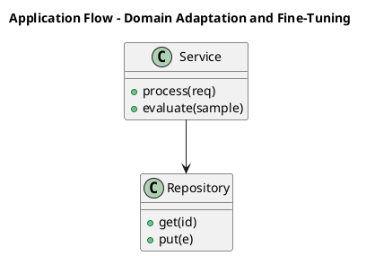

_Source diagram (plantuml); render with the appropriate tool._

**Figure 14. Application Flow - Domain Adaptation and Fine-Tuning** (plantuml). Figure: Application Flow view for Domain Adaptation and Fine-Tuning. This diagram illustrates the principal components and their interactions as discussed in the surrounding section.

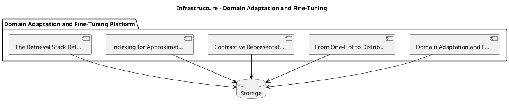

_Source diagram (plantuml); render with the appropriate tool._

**Figure 15. Infrastructure - Domain Adaptation and Fine-Tuning** (plantuml). Figure: Infrastructure view for Domain Adaptation and Fine-Tuning. This diagram illustrates the principal components and their interactions as discussed in the surrounding section.

## Deep Dive: Mechanics, Variants and Trade-offs

Having established the essentials, we now go deeper into domain adaptation and fine-tuning. Mechanically, the behaviour emerges from a few interacting parts that are simpler than the whole they produce. The distinctions in this section are the ones that separate a working demo from a system that holds up under adversarial inputs, scale and the passage of time.

Consider the principal variants and how to choose between them. Each variant optimises for a different point in the design space - some for latency, some for accuracy, some for cost or operability - and the correct choice follows from explicit requirements rather than from defaults. Latency, accuracy and cost form a tension triangle: improving one typically pressures the others, so explicit budgets are essential.

In practice this is supported by a mature tooling ecosystem, including sentence-transformers, OpenAI embeddings, FAISS, Cohere. Tools accelerate the work but do not substitute for understanding: the same principles apply whichever implementation you select, and the ability to reason from first principles is what lets you debug when a tool behaves unexpectedly.

A frequent source of subtle bugs is the interaction with from one-hot to distributed representations. Because from one-hot to distributed representations concerns why dense vectors generalise where sparse encodings cannot, changes there can silently alter the behaviour analysed here. The remedy is contract tests at the boundary and end-to-end evaluations that exercise the interaction explicitly.

Finally, attend to edge cases and degradation. Define what the system should do under partial failure, unexpected inputs and load spikes, and make that behaviour explicit and tested rather than emergent. Graceful degradation - returning a safe, useful result when the ideal one is unavailable - is a hallmark of mature engineering.

For deeper study, the literature offers authoritative treatments such as Mikolov et al. — Word2Vec (2013) and Reimers & Gurevych — Sentence-BERT (2019). These primary sources reward careful reading and ground the practical guidance above in established results.

## Advanced Considerations

Having established the essentials, we now go deeper into domain adaptation and fine-tuning. It pays to understand the mechanism rather than treat it as a black box, because most production incidents are explained by one of its steps misbehaving. The distinctions in this section are the ones that separate a working demo from a system that holds up under adversarial inputs, scale and the passage of time.

Consider the principal variants and how to choose between them. Each variant optimises for a different point in the design space - some for latency, some for accuracy, some for cost or operability - and the correct choice follows from explicit requirements rather than from defaults. Latency, accuracy and cost form a tension triangle: improving one typically pressures the others, so explicit budgets are essential.

In practice this is supported by a mature tooling ecosystem, including sentence-transformers, OpenAI embeddings, FAISS, Cohere. Tools accelerate the work but do not substitute for understanding: the same principles apply whichever implementation you select, and the ability to reason from first principles is what lets you debug when a tool behaves unexpectedly.

A frequent source of subtle bugs is the interaction with indexing for approximate nearest neighbour search. Because indexing for approximate nearest neighbour search concerns hNSW, IVF and the recall/latency frontier, changes there can silently alter the behaviour analysed here. The remedy is contract tests at the boundary and end-to-end evaluations that exercise the interaction explicitly.

Finally, attend to edge cases and degradation. Define what the system should do under partial failure, unexpected inputs and load spikes, and make that behaviour explicit and tested rather than emergent. Graceful degradation - returning a safe, useful result when the ideal one is unavailable - is a hallmark of mature engineering.

For deeper study, the literature offers authoritative treatments such as Mikolov et al. — Word2Vec (2013) and Reimers & Gurevych — Sentence-BERT (2019). These primary sources reward careful reading and ground the practical guidance above in established results.

## Worked Example

A worked example clarifies how these ideas behave in practice. A search organisation needs semantic search across heterogeneous enterprise content. They decide to apply domain adaptation and fine-tuning as part of their Embeddings solution, but wisely treat it as a hypothesis to be validated rather than a foregone conclusion.

The team begins by stating the objective precisely and defining how success will be measured before writing any code. They establish a small but representative evaluation set, agree on acceptance thresholds, and only then prototype the simplest design that could work. Early measurement reveals which assumptions hold and which must be revised, saving weeks of misdirected effort and surfacing edge cases while they are still cheap to fix.

As the prototype matures into a service, the team hardens it: adding input validation, error handling, caching where it pays off, and monitoring that ties back to the original success metric. They document each significant decision in an architecture decision record so that future maintainers understand not just what was built but why.

The outcome is instructive. The system that reaches production is not the most sophisticated design the team considered, but the one whose behaviour they could measure, explain and operate. This is the recurring lesson of Embeddings: durable value comes from the whole system, not from any single clever component.

## Industry Use Cases

Across industries, the ideas in this chapter recur in recognisable ways. The following vignettes show how different sectors apply them and what they have in common.

**Search.** Semantic search across heterogeneous enterprise content. The common thread is that value comes not from the model alone but from the surrounding system - data quality, evaluation, integration and operations - which is precisely where most of the engineering effort belongs.

**E-commerce.** Visual and textual product similarity and recommendation. The common thread is that value comes not from the model alone but from the surrounding system - data quality, evaluation, integration and operations - which is precisely where most of the engineering effort belongs.

**Support.** Deduplicating and routing tickets by semantic similarity. The common thread is that value comes not from the model alone but from the surrounding system - data quality, evaluation, integration and operations - which is precisely where most of the engineering effort belongs.

**Compliance.** Near-duplicate detection across document repositories. The common thread is that value comes not from the model alone but from the surrounding system - data quality, evaluation, integration and operations - which is precisely where most of the engineering effort belongs.

## Best Practices

The following practices consistently separate successful Embeddings efforts from struggling ones. They are deliberately concrete so they can be adopted as checklist items in design and code review.

- Normalise vectors and pick the distance metric the model was trained for.
- Pin embedding model versions and re-index atomically on change.
- Evaluate retrieval with recall@k and nDCG on a labelled set.
- Use hybrid search to recover exact-match and rare-term queries.

None of these are exotic; they are the unglamorous disciplines that compound into reliability. The cost of adopting them is small compared with the cost of the incidents they prevent, and they become second nature with practice.

## Common Pitfalls

Equally instructive are the failure modes that recur in practice. Each pitfall below has a clear early warning sign and a known remedy, so treat them as a diagnostic checklist when something feels wrong:

- Mixing vectors from different model versions in one index.
- Choosing the wrong similarity metric for the embedding model.
- Over-chunking or under-chunking documents before embedding.
- Ignoring drift after upgrading the embedding model.

The pattern is consistent: most failures stem from skipping measurement, conflating prototype and production standards, or deferring cross-cutting concerns such as security and cost until they become emergencies. Naming these traps in advance is the cheapest way to avoid them.

## Governance, Security and Cost Notes

No discussion of domain adaptation and fine-tuning is complete without its governance, security and cost dimensions, which are too often deferred until they become emergencies. Treating them as first-class concerns from the outset is both cheaper and safer.

**Governance.** Classify the risk of this capability, document its intended and out-of-scope uses, and ensure decisions are traceable to satisfy internal policy and external regulation such as the NIST AI RMF, ISO/IEC 42001 and the EU AI Act. **Security.** Treat all external input as untrusted, validate outputs before acting on them, apply least privilege to any tools or data access, and map controls to the OWASP LLM Top 10 and MITRE ATLAS.

**Cost and sustainability.** Establish explicit budgets for compute, tokens and latency, attribute spend to owners, and revisit the economics as usage scales - a design that is affordable at pilot scale can become untenable at production volume. Building these reflexes into everyday engineering is what allows a Embeddings system to be not only capable but also trustworthy and economically sound.

## Hands-On Exercises

Work through the following exercises. They are designed to move understanding from recognition to application - the level required for real engineering work - so prefer writing and building over merely reading.

1. Explain domain adaptation and fine-tuning to a colleague unfamiliar with Embeddings, using a concrete example from your own domain.
2. Sketch a reference architecture that incorporates domain adaptation and fine-tuning and annotate where observability, security and cost controls belong.
3. Design an evaluation that would tell you whether domain adaptation and fine-tuning is working in production, including the metric, the dataset and the acceptance threshold.
4. Identify two pitfalls relevant to domain adaptation and fine-tuning in your environment and describe the early warning signals you would monitor.
5. Prototype the simplest implementation that demonstrates domain adaptation and fine-tuning, then list exactly what would need to change to make it production-ready.

## Key Takeaways

Key takeaways from this chapter:

- Domain Adaptation and Fine-Tuning is a systems concern in Embeddings: data, models and operations must be co-designed.
- Measurement is non-negotiable; define success metrics and evaluation before building.
- Favour the simplest design that meets the requirement, and add complexity only when evidence demands it.
- Security, cost and observability are first-class requirements, not afterthoughts.
- Document decisions so the system remains understandable and operable as it evolves.

## Code Walkthrough

Every change to a Embeddings system should pass an evaluation gate. This example shows the minimal shape: align predictions and references, compute a metric, and return a pass/fail decision for CI.

The full listing is shown below; study it line by line and reproduce it locally before moving on.

### Listing: Evaluating Domain Adaptation and Fine-Tuning with a regression gate

```python
from dataclasses import dataclass


@dataclass
class EvalResult:
    metric: str
    score: float
    passed: bool


def evaluate(predictions: list[str], references: list[str],
             threshold: float = 0.8) -> EvalResult:
    """Score Domain Adaptation and Fine-Tuning output against references with a simple exact-match metric.

    In practice you would combine several metrics (exact match, semantic
    similarity, LLM-as-judge) and gate releases on the aggregate.
    """
    if len(predictions) != len(references):
        raise ValueError("predictions and references must align")
    hits = sum(p.strip() == r.strip() for p, r in zip(predictions, references))
    score = hits / len(references) if references else 0.0
    return EvalResult(metric="exact_match", score=score, passed=score >= threshold)


if __name__ == "__main__":
    result = evaluate(["yes", "no"], ["yes", "yes"])
    print(f"{result.metric}={result.score:.2f} passed={result.passed}")

```

## Review Questions

1. In the context of Embeddings, which statement best describes “Domain Adaptation and Fine-Tuning”?
   - A. It makes the system slower but has no other effect.
   - B. It removes all security and governance requirements.
   - C. Adapting general embeddings to specialised corpora.
   - D. It guarantees deterministic output regardless of input.
   - **Answer: C.** Domain Adaptation and Fine-Tuning: Adapting general embeddings to specialised corpora.
2. Which of the following is a recommended best practice when working with Embeddings?
   - A. Pin embedding model versions and re-index atomically on change.
   - B. Over-chunking or under-chunking documents before embedding.
   - C. It eliminates the need for any evaluation or monitoring.
   - D. Mixing vectors from different model versions in one index.
   - **Answer: A.** Best practice: Pin embedding model versions and re-index atomically on change.
3. Which of the following is a common pitfall to avoid in Embeddings?
   - A. Normalise vectors and pick the distance metric the model was trained for.
   - B. It makes the system slower but has no other effect.
   - C. Use hybrid search to recover exact-match and rare-term queries.
   - D. Choosing the wrong similarity metric for the embedding model.
   - **Answer: D.** Pitfall to avoid: Choosing the wrong similarity metric for the embedding model.
4. *(Discussion)* How would you test and monitor Domain Adaptation and Fine-Tuning in production?
   - **Model answer:** A strong answer defines domain adaptation and fine-tuning (Adapting general embeddings to specialised corpora.) then connects it to architecture, evaluation, cost, security and operations for Embeddings, citing concrete trade-offs and a real-world example.

---


# Chapter 10. Embedding Drift and Re-Indexing

_This chapter examines embedding drift and re-indexing within Embeddings. It covers detecting model changes and managing versioned vector stores, derives a reference architecture, walks through a worked example and runnable code, surveys industry use cases, and distils best practices and pitfalls, closing with exercises and review questions._

## Introduction

Embedding Drift and Re-Indexing can be characterised as detecting model changes and managing versioned vector stores. It is foundational: later capabilities in Embeddings are built directly on top of it. The practical implication is that design choices here ripple through latency, cost and maintainability for the lifetime of the system.

This chapter builds intuition first, then formalises the ideas, derives an architecture, and finishes with code, exercises and review questions so the material transfers directly to your own Embeddings work. Read it actively: pause at each diagram, reproduce the code, and attempt the exercises before consulting the answers.

## Theory and Foundations

Embedding Drift and Re-Indexing can be characterised as detecting model changes and managing versioned vector stores. The practical implication is that design choices here ripple through latency, cost and maintainability for the lifetime of the system. The underlying mechanism is best appreciated by tracing a single request from input to output and noting where state is created and consumed.

To place this in context, recall the broader picture: Embeddings map discrete objects—words, sentences, images, users, products—into continuous vector spaces where geometric proximity encodes semantic similarity. Within that picture, embedding drift and re-indexing is one of the load-bearing ideas - the kind that, when understood deeply, makes the rest of Embeddings fall into place. Understanding this matters because Embeddings systems succeed or fail on exactly these decisions.

Embedding Drift and Re-Indexing cannot be understood in isolation from the retrieval stack reference architecture. Recall that the retrieval stack reference architecture concerns embedding service, vector index and re-ranking as a pipeline. The two interact directly: decisions in one constrain the design space of the other, which is why mature teams reason about them together rather than sequentially. Every added component buys capability at the price of operational surface area, and that bargain should be made consciously.

Embedding Drift and Re-Indexing cannot be understood in isolation from multimodal and cross-encoder embeddings. Recall that multimodal and cross-encoder embeddings concerns cLIP-style joint spaces and the bi-encoder/cross-encoder trade-off. The two interact directly: decisions in one constrain the design space of the other, which is why mature teams reason about them together rather than sequentially. Latency, accuracy and cost form a tension triangle: improving one typically pressures the others, so explicit budgets are essential.

Several established patterns apply directly to embedding drift and re-indexing. The first, versioned indexes with blue/green re-embedding, is widely adopted because it makes the system's behaviour predictable and observable. A complementary pattern, bi-encoder retrieval followed by cross-encoder re-ranking, addresses a related concern and is often deployed alongside it. Patterns are not dogma; they are distilled experience that shortcuts the search for a sound design, and each carries assumptions worth checking against your context.

It is worth being explicit about when to apply this and when to reach for something simpler. In a small prototype, shortcuts around embedding drift and re-indexing are invisible; in a production Embeddings system serving real traffic, they surface as incidents, cost overruns or compliance gaps. Simplicity is a feature. The simplest design that meets the requirement should be the default, with complexity added only when measurement justifies it. The remainder of this chapter turns these principles into an architecture, code and a checklist you can apply immediately.

## Architecture and Design

The reference architecture for Embedding Drift and Re-Indexing separates concerns into clearly bounded components with explicit contracts. An embedding platform exposes a versioned embedding service that batches and caches encode requests, writes vectors to an ANN index (HNSW/IVF) with stored metadata, and supports hybrid retrieval that fuses lexical and dense scores before an optional cross-encoder re-ranks the top candidates.

Concretely, the principal building blocks include from one-hot to distributed representations, word, sentence and document embeddings, contrastive representation learning, similarity metrics and normalisation and multimodal and cross-encoder embeddings. Each is a replaceable component behind a stable interface, so the team can upgrade an implementation - a model, an index, a policy engine - without rewriting its neighbours. The contracts between components are where reliability is won or lost, so they are specified explicitly and tested in isolation.

The diagram accompanying this section makes the data and control flow explicit. Requests enter through a well-defined boundary where they are authenticated and validated; only then are they dispatched to the components that perform the work. This boundary is also where rate limiting, quota enforcement and audit logging live, keeping cross-cutting concerns out of the core logic and in one auditable place.

Two qualities deserve emphasis. First, observability is designed in, not bolted on: every component emits structured telemetry so that failures can be localised in minutes rather than hours. Second, the architecture is evolvable - components communicate through stable contracts so that any single part of the Embeddings system can be replaced without a rewrite. Every added component buys capability at the price of operational surface area, and that bargain should be made consciously.

```xml
<mxfile host="ai-university">
  <diagram name="Infrastructure">
    <mxGraphModel dx="800" dy="600" grid="1" gridSize="10">
      <root>
        <mxCell id="0"/>
        <mxCell id="1" parent="0"/>
        <mxCell id="title" value="Infrastructure - Embedding Drift and Re-Indexing" style="text;fontSize=16;fontStyle=1" vertex="1" parent="1"><mxGeometry x="40" y="20" width="600" height="30" as="geometry"/></mxCell>
        <mxCell id="hub" value="Embedding Drift and R…" style="rounded=1;fillColor=#0f172a;fontColor=#ffffff;fontStyle=1" vertex="1" parent="1"><mxGeometry x="300" y="180" width="160" height="60" as="geometry"/></mxCell>
        <mxCell id="n0" value="Embedding Drift and Re-…" style="rounded=1;fillColor=#e0e7ff;strokeColor=#4338ca" vertex="1" parent="1"><mxGeometry x="60" y="80" width="160" height="50" as="geometry"/></mxCell>
        <mxCell id="e0" style="edgeStyle=orthogonalEdgeStyle" edge="1" parent="1" source="hub" target="n0"><mxGeometry relative="1" as="geometry"/></mxCell>
        <mxCell id="n1" value="The Retrieval Stack Ref…" style="rounded=1;fillColor=#e0e7ff;strokeColor=#4338ca" vertex="1" parent="1"><mxGeometry x="600" y="170" width="160" height="50" as="geometry"/></mxCell>
        <mxCell id="e1" style="edgeStyle=orthogonalEdgeStyle" edge="1" parent="1" source="hub" target="n1"><mxGeometry relative="1" as="geometry"/></mxCell>
        <mxCell id="n2" value="Multimodal and Cross-En…" style="rounded=1;fillColor=#e0e7ff;strokeColor=#4338ca" vertex="1" parent="1"><mxGeometry x="60" y="260" width="160" height="50" as="geometry"/></mxCell>
        <mxCell id="e2" style="edgeStyle=orthogonalEdgeStyle" edge="1" parent="1" source="hub" target="n2"><mxGeometry relative="1" as="geometry"/></mxCell>
        <mxCell id="n3" value="Similarity Metrics and …" style="rounded=1;fillColor=#e0e7ff;strokeColor=#4338ca" vertex="1" parent="1"><mxGeometry x="600" y="350" width="160" height="50" as="geometry"/></mxCell>
        <mxCell id="e3" style="edgeStyle=orthogonalEdgeStyle" edge="1" parent="1" source="hub" target="n3"><mxGeometry relative="1" as="geometry"/></mxCell>
        <mxCell id="n4" value="Privacy and Embedding I…" style="rounded=1;fillColor=#e0e7ff;strokeColor=#4338ca" vertex="1" parent="1"><mxGeometry x="60" y="440" width="160" height="50" as="geometry"/></mxCell>
        <mxCell id="e4" style="edgeStyle=orthogonalEdgeStyle" edge="1" parent="1" source="hub" target="n4"><mxGeometry relative="1" as="geometry"/></mxCell>
      </root>
    </mxGraphModel>
  </diagram>
</mxfile>
```

_Source diagram (drawio); render with the appropriate tool._

**Figure 16. Infrastructure - Embedding Drift and Re-Indexing** (drawio). Figure: Infrastructure view for Embedding Drift and Re-Indexing. This diagram illustrates the principal components and their interactions as discussed in the surrounding section.

<div class="diagram-svg">

<svg xmlns="http://www.w3.org/2000/svg" width="840" height="460" data-tpl="steps" data-pal="11-0" viewBox="0 0 840 460" font-family="Inter, Segoe UI, Arial, sans-serif"><defs><marker id="ar" markerWidth="9" markerHeight="9" refX="7" refY="3" orient="auto"><path d="M0,0 L7,3 L0,6 z" fill="#94a3b8"/></marker><marker id="arw" markerWidth="9" markerHeight="9" refX="7" refY="3" orient="auto"><path d="M0,0 L7,3 L0,6 z" fill="#ffffff"/></marker><filter id="sh" x="-20%" y="-20%" width="140%" height="140%"><feDropShadow dx="0" dy="2" stdDeviation="3" flood-color="#0f172a" flood-opacity="0.16"/></filter></defs><defs><linearGradient id="bn8956c08" x1="0" y1="0" x2="1" y2="0"><stop offset="0" stop-color="#0f172a"/><stop offset="1" stop-color="#1e40af"/></linearGradient></defs><rect width="840" height="460" rx="14" fill="#ffffff"/><rect x="0" y="0" width="840" height="48" rx="14" fill="url(#bn8956c08)"/><rect x="0" y="32" width="840" height="16" fill="url(#bn8956c08)"/><text x="420" y="25" text-anchor="middle" font-size="14.5" font-weight="700" fill="#ffffff" dominant-baseline="middle">Agent Architecture - Embedding Drift and Re-Indexing</text><rect x="30" y="200" width="132" height="70" rx="12" fill="#0f172a"/><circle cx="54" cy="224" r="15" fill="#ffffff"/><text x="54" y="224" text-anchor="middle" font-size="13" font-weight="600" fill="#0f172a" dominant-baseline="middle">1</text><text x="96" y="242" text-anchor="middle" font-size="10.5" font-weight="600" fill="#fff" dominant-baseline="middle">Embedding Drift</text><text x="96" y="254" text-anchor="middle" font-size="10.5" font-weight="600" fill="#fff" dominant-baseline="middle">and Re-Indexing</text><rect x="192" y="200" width="132" height="70" rx="12" fill="#1e40af"/><circle cx="216" cy="224" r="15" fill="#ffffff"/><text x="216" y="224" text-anchor="middle" font-size="13" font-weight="600" fill="#1e40af" dominant-baseline="middle">2</text><text x="258" y="242" text-anchor="middle" font-size="10.5" font-weight="600" fill="#fff" dominant-baseline="middle">The Retrieval</text><text x="258" y="254" text-anchor="middle" font-size="10.5" font-weight="600" fill="#fff" dominant-baseline="middle">Stack Reference</text><line x1="162" y1="235" x2="192" y2="235" stroke="#94a3b8" stroke-width="2" marker-end="url(#ar)"/><rect x="354" y="200" width="132" height="70" rx="12" fill="#0e7490"/><circle cx="378" cy="224" r="15" fill="#ffffff"/><text x="378" y="224" text-anchor="middle" font-size="13" font-weight="600" fill="#0e7490" dominant-baseline="middle">3</text><text x="420" y="242" text-anchor="middle" font-size="10.5" font-weight="600" fill="#fff" dominant-baseline="middle">Multimodal and</text><text x="420" y="254" text-anchor="middle" font-size="10.5" font-weight="600" fill="#fff" dominant-baseline="middle">Cross-Encoder</text><line x1="324" y1="235" x2="354" y2="235" stroke="#94a3b8" stroke-width="2" marker-end="url(#ar)"/><rect x="516" y="200" width="132" height="70" rx="12" fill="#b45309"/><circle cx="540" cy="224" r="15" fill="#ffffff"/><text x="540" y="224" text-anchor="middle" font-size="13" font-weight="600" fill="#b45309" dominant-baseline="middle">4</text><text x="582" y="242" text-anchor="middle" font-size="10.5" font-weight="600" fill="#fff" dominant-baseline="middle">Similarity Metrics</text><text x="582" y="254" text-anchor="middle" font-size="10.5" font-weight="600" fill="#fff" dominant-baseline="middle">and Normalisation</text><line x1="486" y1="235" x2="516" y2="235" stroke="#94a3b8" stroke-width="2" marker-end="url(#ar)"/><rect x="678" y="200" width="132" height="70" rx="12" fill="#9f1239"/><circle cx="702" cy="224" r="15" fill="#ffffff"/><text x="702" y="224" text-anchor="middle" font-size="13" font-weight="600" fill="#9f1239" dominant-baseline="middle">5</text><text x="744" y="242" text-anchor="middle" font-size="10.5" font-weight="600" fill="#fff" dominant-baseline="middle">Privacy and</text><text x="744" y="254" text-anchor="middle" font-size="10.5" font-weight="600" fill="#fff" dominant-baseline="middle">Embedding</text><line x1="648" y1="235" x2="678" y2="235" stroke="#94a3b8" stroke-width="2" marker-end="url(#ar)"/><text x="28" y="446" text-anchor="start" font-size="9.5" font-weight="500" fill="#64748b" dominant-baseline="middle">Embedding Drift and Re-Indexing  •  Agent Architecture</text></svg>

</div>

**Figure 17. Agent Architecture - Embedding Drift and Re-Indexing** (svg). Figure: Agent Architecture view for Embedding Drift and Re-Indexing. This diagram illustrates the principal components and their interactions as discussed in the surrounding section.

## Deep Dive: Mechanics, Variants and Trade-offs

Having established the essentials, we now go deeper into embedding drift and re-indexing. The underlying mechanism is best appreciated by tracing a single request from input to output and noting where state is created and consumed. The distinctions in this section are the ones that separate a working demo from a system that holds up under adversarial inputs, scale and the passage of time.

Consider the principal variants and how to choose between them. Each variant optimises for a different point in the design space - some for latency, some for accuracy, some for cost or operability - and the correct choice follows from explicit requirements rather than from defaults. There is an inherent trade-off between fidelity and cost, and the correct balance depends on the use case and its tolerance for error.

In practice this is supported by a mature tooling ecosystem, including sentence-transformers, OpenAI embeddings, FAISS, Cohere. Tools accelerate the work but do not substitute for understanding: the same principles apply whichever implementation you select, and the ability to reason from first principles is what lets you debug when a tool behaves unexpectedly.

A frequent source of subtle bugs is the interaction with the retrieval stack reference architecture. Because the retrieval stack reference architecture concerns embedding service, vector index and re-ranking as a pipeline, changes there can silently alter the behaviour analysed here. The remedy is contract tests at the boundary and end-to-end evaluations that exercise the interaction explicitly.

Finally, attend to edge cases and degradation. Define what the system should do under partial failure, unexpected inputs and load spikes, and make that behaviour explicit and tested rather than emergent. Graceful degradation - returning a safe, useful result when the ideal one is unavailable - is a hallmark of mature engineering.

For deeper study, the literature offers authoritative treatments such as Mikolov et al. — Word2Vec (2013) and Reimers & Gurevych — Sentence-BERT (2019). These primary sources reward careful reading and ground the practical guidance above in established results.

## Advanced Considerations

Having established the essentials, we now go deeper into embedding drift and re-indexing. Beneath the abstraction lies a concrete process whose steps can each be measured, tested and optimised independently. The distinctions in this section are the ones that separate a working demo from a system that holds up under adversarial inputs, scale and the passage of time.

Consider the principal variants and how to choose between them. Each variant optimises for a different point in the design space - some for latency, some for accuracy, some for cost or operability - and the correct choice follows from explicit requirements rather than from defaults. As with most architectural decisions, the choice is rarely binary; the skill lies in quantifying the trade-offs and choosing deliberately.

In practice this is supported by a mature tooling ecosystem, including sentence-transformers, OpenAI embeddings, FAISS, Cohere. Tools accelerate the work but do not substitute for understanding: the same principles apply whichever implementation you select, and the ability to reason from first principles is what lets you debug when a tool behaves unexpectedly.

A frequent source of subtle bugs is the interaction with privacy and embedding inversion. Because privacy and embedding inversion concerns what embeddings leak and how to mitigate it, changes there can silently alter the behaviour analysed here. The remedy is contract tests at the boundary and end-to-end evaluations that exercise the interaction explicitly.

Finally, attend to edge cases and degradation. Define what the system should do under partial failure, unexpected inputs and load spikes, and make that behaviour explicit and tested rather than emergent. Graceful degradation - returning a safe, useful result when the ideal one is unavailable - is a hallmark of mature engineering.

For deeper study, the literature offers authoritative treatments such as Mikolov et al. — Word2Vec (2013) and Reimers & Gurevych — Sentence-BERT (2019). These primary sources reward careful reading and ground the practical guidance above in established results.

## Worked Example

Consider a concrete scenario. A compliance organisation needs near-duplicate detection across document repositories. They decide to apply embedding drift and re-indexing as part of their Embeddings solution, but wisely treat it as a hypothesis to be validated rather than a foregone conclusion.

The team begins by stating the objective precisely and defining how success will be measured before writing any code. They establish a small but representative evaluation set, agree on acceptance thresholds, and only then prototype the simplest design that could work. Early measurement reveals which assumptions hold and which must be revised, saving weeks of misdirected effort and surfacing edge cases while they are still cheap to fix.

As the prototype matures into a service, the team hardens it: adding input validation, error handling, caching where it pays off, and monitoring that ties back to the original success metric. They document each significant decision in an architecture decision record so that future maintainers understand not just what was built but why.

The outcome is instructive. The system that reaches production is not the most sophisticated design the team considered, but the one whose behaviour they could measure, explain and operate. This is the recurring lesson of Embeddings: durable value comes from the whole system, not from any single clever component.

## Industry Use Cases

Across industries, the ideas in this chapter recur in recognisable ways. The following vignettes show how different sectors apply them and what they have in common.

**Search.** Semantic search across heterogeneous enterprise content. The common thread is that value comes not from the model alone but from the surrounding system - data quality, evaluation, integration and operations - which is precisely where most of the engineering effort belongs.

**E-commerce.** Visual and textual product similarity and recommendation. The common thread is that value comes not from the model alone but from the surrounding system - data quality, evaluation, integration and operations - which is precisely where most of the engineering effort belongs.

**Support.** Deduplicating and routing tickets by semantic similarity. The common thread is that value comes not from the model alone but from the surrounding system - data quality, evaluation, integration and operations - which is precisely where most of the engineering effort belongs.

**Compliance.** Near-duplicate detection across document repositories. The common thread is that value comes not from the model alone but from the surrounding system - data quality, evaluation, integration and operations - which is precisely where most of the engineering effort belongs.

## Best Practices

The following practices consistently separate successful Embeddings efforts from struggling ones. They are deliberately concrete so they can be adopted as checklist items in design and code review.

- Normalise vectors and pick the distance metric the model was trained for.
- Pin embedding model versions and re-index atomically on change.
- Evaluate retrieval with recall@k and nDCG on a labelled set.
- Use hybrid search to recover exact-match and rare-term queries.

None of these are exotic; they are the unglamorous disciplines that compound into reliability. The cost of adopting them is small compared with the cost of the incidents they prevent, and they become second nature with practice.

## Common Pitfalls

Equally instructive are the failure modes that recur in practice. Each pitfall below has a clear early warning sign and a known remedy, so treat them as a diagnostic checklist when something feels wrong:

- Mixing vectors from different model versions in one index.
- Choosing the wrong similarity metric for the embedding model.
- Over-chunking or under-chunking documents before embedding.
- Ignoring drift after upgrading the embedding model.

The pattern is consistent: most failures stem from skipping measurement, conflating prototype and production standards, or deferring cross-cutting concerns such as security and cost until they become emergencies. Naming these traps in advance is the cheapest way to avoid them.

## Governance, Security and Cost Notes

No discussion of embedding drift and re-indexing is complete without its governance, security and cost dimensions, which are too often deferred until they become emergencies. Treating them as first-class concerns from the outset is both cheaper and safer.

**Governance.** Classify the risk of this capability, document its intended and out-of-scope uses, and ensure decisions are traceable to satisfy internal policy and external regulation such as the NIST AI RMF, ISO/IEC 42001 and the EU AI Act. **Security.** Treat all external input as untrusted, validate outputs before acting on them, apply least privilege to any tools or data access, and map controls to the OWASP LLM Top 10 and MITRE ATLAS.

**Cost and sustainability.** Establish explicit budgets for compute, tokens and latency, attribute spend to owners, and revisit the economics as usage scales - a design that is affordable at pilot scale can become untenable at production volume. Building these reflexes into everyday engineering is what allows a Embeddings system to be not only capable but also trustworthy and economically sound.

## Hands-On Exercises

Work through the following exercises. They are designed to move understanding from recognition to application - the level required for real engineering work - so prefer writing and building over merely reading.

1. Explain embedding drift and re-indexing to a colleague unfamiliar with Embeddings, using a concrete example from your own domain.
2. Sketch a reference architecture that incorporates embedding drift and re-indexing and annotate where observability, security and cost controls belong.
3. Design an evaluation that would tell you whether embedding drift and re-indexing is working in production, including the metric, the dataset and the acceptance threshold.
4. Identify two pitfalls relevant to embedding drift and re-indexing in your environment and describe the early warning signals you would monitor.
5. Prototype the simplest implementation that demonstrates embedding drift and re-indexing, then list exactly what would need to change to make it production-ready.

## Key Takeaways

Key takeaways from this chapter:

- Embedding Drift and Re-Indexing is a systems concern in Embeddings: data, models and operations must be co-designed.
- Measurement is non-negotiable; define success metrics and evaluation before building.
- Favour the simplest design that meets the requirement, and add complexity only when evidence demands it.
- Security, cost and observability are first-class requirements, not afterthoughts.
- Document decisions so the system remains understandable and operable as it evolves.

## Code Walkthrough

Pipelines keep Embedding Drift and Re-Indexing logic modular and testable. Each stage is a pure function, errors are captured per item, and the composition is trivial to extend or reorder.

The full listing is shown below; study it line by line and reproduce it locally before moving on.

### Listing: A composable processing pipeline for Embedding Drift and Re-Indexing

```python
from collections.abc import Iterable, Iterator
from typing import Protocol


class Stage(Protocol):
    def __call__(self, item: dict) -> dict: ...


def pipeline(stages: list[Stage]) -> Stage:
    """Compose ordered stages into a single callable for Embedding Drift and Re-Indexing."""

    def run(item: dict) -> dict:
        for stage in stages:
            item = stage(item)
        return item

    return run


def validate(item: dict) -> dict:
    if "text" not in item:
        raise ValueError("missing required field: text")
    return item


def normalise(item: dict) -> dict:
    item["text"] = item["text"].strip().lower()
    return item


def enrich(item: dict) -> dict:
    item["length"] = len(item["text"])
    return item


process = pipeline([validate, normalise, enrich])


def run_batch(items: Iterable[dict]) -> Iterator[dict]:
    for item in items:
        try:
            yield process(dict(item))
        except ValueError as exc:
            yield {"error": str(exc), "item": item}

```

## Review Questions

1. In the context of Embeddings, which statement best describes “Embedding Drift and Re-Indexing”?
   - A. It applies exclusively to image data.
   - B. Detecting model changes and managing versioned vector stores.
   - C. It makes the system slower but has no other effect.
   - D. It is only relevant to academic research, not production.
   - **Answer: B.** Embedding Drift and Re-Indexing: Detecting model changes and managing versioned vector stores.
2. Which of the following is a recommended best practice when working with Embeddings?
   - A. It is only relevant to academic research, not production.
   - B. Ignoring drift after upgrading the embedding model.
   - C. It applies exclusively to image data.
   - D. Normalise vectors and pick the distance metric the model was trained for.
   - **Answer: D.** Best practice: Normalise vectors and pick the distance metric the model was trained for.
3. Which of the following is a common pitfall to avoid in Embeddings?
   - A. Normalise vectors and pick the distance metric the model was trained for.
   - B. Evaluate retrieval with recall@k and nDCG on a labelled set.
   - C. Ignoring drift after upgrading the embedding model.
   - D. It guarantees deterministic output regardless of input.
   - **Answer: C.** Pitfall to avoid: Ignoring drift after upgrading the embedding model.
4. *(Discussion)* Walk through how you would design Embedding Drift and Re-Indexing for an enterprise Embeddings workload.
   - **Model answer:** A strong answer defines embedding drift and re-indexing (Detecting model changes and managing versioned vector stores.) then connects it to architecture, evaluation, cost, security and operations for Embeddings, citing concrete trade-offs and a real-world example.

---


# Chapter 11. Hybrid Search

_This chapter examines hybrid search within Embeddings. It covers combining lexical (BM25) and dense retrieval with fusion, derives a reference architecture, walks through a worked example and runnable code, surveys industry use cases, and distils best practices and pitfalls, closing with exercises and review questions._

## Introduction

In practical terms, Hybrid Search is best understood as combining lexical (BM25) and dense retrieval with fusion. Understanding this matters because Embeddings systems succeed or fail on exactly these decisions. Seasoned practitioners treat this as a systems problem, co-designing data, models and operations rather than optimising any one in isolation.

This chapter builds intuition first, then formalises the ideas, derives an architecture, and finishes with code, exercises and review questions so the material transfers directly to your own Embeddings work. Read it actively: pause at each diagram, reproduce the code, and attempt the exercises before consulting the answers.

## Theory and Foundations

We define Hybrid Search as combining lexical (BM25) and dense retrieval with fusion. Seasoned practitioners treat this as a systems problem, co-designing data, models and operations rather than optimising any one in isolation. Mechanically, the behaviour emerges from a few interacting parts that are simpler than the whole they produce.

To place this in context, recall the broader picture: Embeddings map discrete objects—words, sentences, images, users, products—into continuous vector spaces where geometric proximity encodes semantic similarity. Within that picture, hybrid search is one of the load-bearing ideas - the kind that, when understood deeply, makes the rest of Embeddings fall into place. It is foundational: later capabilities in Embeddings are built directly on top of it.

Hybrid Search cannot be understood in isolation from from one-hot to distributed representations. Recall that from one-hot to distributed representations concerns why dense vectors generalise where sparse encodings cannot. The two interact directly: decisions in one constrain the design space of the other, which is why mature teams reason about them together rather than sequentially. Latency, accuracy and cost form a tension triangle: improving one typically pressures the others, so explicit budgets are essential.

Hybrid Search cannot be understood in isolation from dimensionality, compression and quantisation. Recall that dimensionality, compression and quantisation concerns matryoshka embeddings, PCA and product quantisation for cost control. The two interact directly: decisions in one constrain the design space of the other, which is why mature teams reason about them together rather than sequentially. As with most architectural decisions, the choice is rarely binary; the skill lies in quantifying the trade-offs and choosing deliberately.

Several established patterns apply directly to hybrid search. The first, hybrid lexical + dense fusion (reciprocal rank fusion), is widely adopted because it makes the system's behaviour predictable and observable. A complementary pattern, versioned indexes with blue/green re-embedding, addresses a related concern and is often deployed alongside it. Patterns are not dogma; they are distilled experience that shortcuts the search for a sound design, and each carries assumptions worth checking against your context.

It is worth being explicit about when to apply this and when to reach for something simpler. In a small prototype, shortcuts around hybrid search are invisible; in a production Embeddings system serving real traffic, they surface as incidents, cost overruns or compliance gaps. There is an inherent trade-off between fidelity and cost, and the correct balance depends on the use case and its tolerance for error. The remainder of this chapter turns these principles into an architecture, code and a checklist you can apply immediately.

## Architecture and Design

The reference architecture for Hybrid Search separates concerns into clearly bounded components with explicit contracts. An embedding platform exposes a versioned embedding service that batches and caches encode requests, writes vectors to an ANN index (HNSW/IVF) with stored metadata, and supports hybrid retrieval that fuses lexical and dense scores before an optional cross-encoder re-ranks the top candidates.

Concretely, the principal building blocks include from one-hot to distributed representations, word, sentence and document embeddings, contrastive representation learning, similarity metrics and normalisation and multimodal and cross-encoder embeddings. Each is a replaceable component behind a stable interface, so the team can upgrade an implementation - a model, an index, a policy engine - without rewriting its neighbours. The contracts between components are where reliability is won or lost, so they are specified explicitly and tested in isolation.

The diagram accompanying this section makes the data and control flow explicit. Requests enter through a well-defined boundary where they are authenticated and validated; only then are they dispatched to the components that perform the work. This boundary is also where rate limiting, quota enforcement and audit logging live, keeping cross-cutting concerns out of the core logic and in one auditable place.

Two qualities deserve emphasis. First, observability is designed in, not bolted on: every component emits structured telemetry so that failures can be localised in minutes rather than hours. Second, the architecture is evolvable - components communicate through stable contracts so that any single part of the Embeddings system can be replaced without a rewrite. Every added component buys capability at the price of operational surface area, and that bargain should be made consciously.

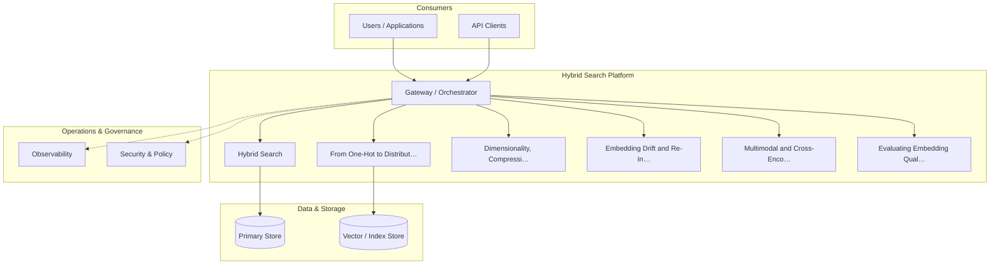

**Figure 18. Agent Architecture - Hybrid Search** (mermaid). Figure: Agent Architecture view for Hybrid Search. This diagram illustrates the principal components and their interactions as discussed in the surrounding section.

## Deep Dive: Mechanics, Variants and Trade-offs

Having established the essentials, we now go deeper into hybrid search. Beneath the abstraction lies a concrete process whose steps can each be measured, tested and optimised independently. The distinctions in this section are the ones that separate a working demo from a system that holds up under adversarial inputs, scale and the passage of time.

Consider the principal variants and how to choose between them. Each variant optimises for a different point in the design space - some for latency, some for accuracy, some for cost or operability - and the correct choice follows from explicit requirements rather than from defaults. Simplicity is a feature. The simplest design that meets the requirement should be the default, with complexity added only when measurement justifies it.

In practice this is supported by a mature tooling ecosystem, including sentence-transformers, OpenAI embeddings, FAISS, Cohere. Tools accelerate the work but do not substitute for understanding: the same principles apply whichever implementation you select, and the ability to reason from first principles is what lets you debug when a tool behaves unexpectedly.

A frequent source of subtle bugs is the interaction with from one-hot to distributed representations. Because from one-hot to distributed representations concerns why dense vectors generalise where sparse encodings cannot, changes there can silently alter the behaviour analysed here. The remedy is contract tests at the boundary and end-to-end evaluations that exercise the interaction explicitly.

Finally, attend to edge cases and degradation. Define what the system should do under partial failure, unexpected inputs and load spikes, and make that behaviour explicit and tested rather than emergent. Graceful degradation - returning a safe, useful result when the ideal one is unavailable - is a hallmark of mature engineering.

For deeper study, the literature offers authoritative treatments such as Mikolov et al. — Word2Vec (2013) and Reimers & Gurevych — Sentence-BERT (2019). These primary sources reward careful reading and ground the practical guidance above in established results.

## Advanced Considerations

Having established the essentials, we now go deeper into hybrid search. Mechanically, the behaviour emerges from a few interacting parts that are simpler than the whole they produce. The distinctions in this section are the ones that separate a working demo from a system that holds up under adversarial inputs, scale and the passage of time.

Consider the principal variants and how to choose between them. Each variant optimises for a different point in the design space - some for latency, some for accuracy, some for cost or operability - and the correct choice follows from explicit requirements rather than from defaults. Every added component buys capability at the price of operational surface area, and that bargain should be made consciously.

In practice this is supported by a mature tooling ecosystem, including sentence-transformers, OpenAI embeddings, FAISS, Cohere. Tools accelerate the work but do not substitute for understanding: the same principles apply whichever implementation you select, and the ability to reason from first principles is what lets you debug when a tool behaves unexpectedly.

A frequent source of subtle bugs is the interaction with contrastive representation learning. Because contrastive representation learning concerns infoNCE, positive/negative mining and the geometry of good embeddings, changes there can silently alter the behaviour analysed here. The remedy is contract tests at the boundary and end-to-end evaluations that exercise the interaction explicitly.

Finally, attend to edge cases and degradation. Define what the system should do under partial failure, unexpected inputs and load spikes, and make that behaviour explicit and tested rather than emergent. Graceful degradation - returning a safe, useful result when the ideal one is unavailable - is a hallmark of mature engineering.

For deeper study, the literature offers authoritative treatments such as Mikolov et al. — Word2Vec (2013) and Reimers & Gurevych — Sentence-BERT (2019). These primary sources reward careful reading and ground the practical guidance above in established results.

## Worked Example

A worked example clarifies how these ideas behave in practice. A e-commerce organisation needs visual and textual product similarity and recommendation. They decide to apply hybrid search as part of their Embeddings solution, but wisely treat it as a hypothesis to be validated rather than a foregone conclusion.

The team begins by stating the objective precisely and defining how success will be measured before writing any code. They establish a small but representative evaluation set, agree on acceptance thresholds, and only then prototype the simplest design that could work. Early measurement reveals which assumptions hold and which must be revised, saving weeks of misdirected effort and surfacing edge cases while they are still cheap to fix.

As the prototype matures into a service, the team hardens it: adding input validation, error handling, caching where it pays off, and monitoring that ties back to the original success metric. They document each significant decision in an architecture decision record so that future maintainers understand not just what was built but why.

The outcome is instructive. The system that reaches production is not the most sophisticated design the team considered, but the one whose behaviour they could measure, explain and operate. This is the recurring lesson of Embeddings: durable value comes from the whole system, not from any single clever component.

## Industry Use Cases

Across industries, the ideas in this chapter recur in recognisable ways. The following vignettes show how different sectors apply them and what they have in common.

**Search.** Semantic search across heterogeneous enterprise content. The common thread is that value comes not from the model alone but from the surrounding system - data quality, evaluation, integration and operations - which is precisely where most of the engineering effort belongs.

**E-commerce.** Visual and textual product similarity and recommendation. The common thread is that value comes not from the model alone but from the surrounding system - data quality, evaluation, integration and operations - which is precisely where most of the engineering effort belongs.

**Support.** Deduplicating and routing tickets by semantic similarity. The common thread is that value comes not from the model alone but from the surrounding system - data quality, evaluation, integration and operations - which is precisely where most of the engineering effort belongs.

**Compliance.** Near-duplicate detection across document repositories. The common thread is that value comes not from the model alone but from the surrounding system - data quality, evaluation, integration and operations - which is precisely where most of the engineering effort belongs.

## Best Practices

The following practices consistently separate successful Embeddings efforts from struggling ones. They are deliberately concrete so they can be adopted as checklist items in design and code review.

- Normalise vectors and pick the distance metric the model was trained for.
- Pin embedding model versions and re-index atomically on change.
- Evaluate retrieval with recall@k and nDCG on a labelled set.
- Use hybrid search to recover exact-match and rare-term queries.

None of these are exotic; they are the unglamorous disciplines that compound into reliability. The cost of adopting them is small compared with the cost of the incidents they prevent, and they become second nature with practice.

## Common Pitfalls

Equally instructive are the failure modes that recur in practice. Each pitfall below has a clear early warning sign and a known remedy, so treat them as a diagnostic checklist when something feels wrong:

- Mixing vectors from different model versions in one index.
- Choosing the wrong similarity metric for the embedding model.
- Over-chunking or under-chunking documents before embedding.
- Ignoring drift after upgrading the embedding model.

The pattern is consistent: most failures stem from skipping measurement, conflating prototype and production standards, or deferring cross-cutting concerns such as security and cost until they become emergencies. Naming these traps in advance is the cheapest way to avoid them.

## Governance, Security and Cost Notes

No discussion of hybrid search is complete without its governance, security and cost dimensions, which are too often deferred until they become emergencies. Treating them as first-class concerns from the outset is both cheaper and safer.

**Governance.** Classify the risk of this capability, document its intended and out-of-scope uses, and ensure decisions are traceable to satisfy internal policy and external regulation such as the NIST AI RMF, ISO/IEC 42001 and the EU AI Act. **Security.** Treat all external input as untrusted, validate outputs before acting on them, apply least privilege to any tools or data access, and map controls to the OWASP LLM Top 10 and MITRE ATLAS.

**Cost and sustainability.** Establish explicit budgets for compute, tokens and latency, attribute spend to owners, and revisit the economics as usage scales - a design that is affordable at pilot scale can become untenable at production volume. Building these reflexes into everyday engineering is what allows a Embeddings system to be not only capable but also trustworthy and economically sound.

## Hands-On Exercises

Work through the following exercises. They are designed to move understanding from recognition to application - the level required for real engineering work - so prefer writing and building over merely reading.

1. Explain hybrid search to a colleague unfamiliar with Embeddings, using a concrete example from your own domain.
2. Sketch a reference architecture that incorporates hybrid search and annotate where observability, security and cost controls belong.
3. Design an evaluation that would tell you whether hybrid search is working in production, including the metric, the dataset and the acceptance threshold.
4. Identify two pitfalls relevant to hybrid search in your environment and describe the early warning signals you would monitor.
5. Prototype the simplest implementation that demonstrates hybrid search, then list exactly what would need to change to make it production-ready.

## Key Takeaways

Key takeaways from this chapter:

- Hybrid Search is a systems concern in Embeddings: data, models and operations must be co-designed.
- Measurement is non-negotiable; define success metrics and evaluation before building.
- Favour the simplest design that meets the requirement, and add complexity only when evidence demands it.
- Security, cost and observability are first-class requirements, not afterthoughts.
- Document decisions so the system remains understandable and operable as it evolves.

## Code Walkthrough

Pipelines keep Hybrid Search logic modular and testable. Each stage is a pure function, errors are captured per item, and the composition is trivial to extend or reorder.

The full listing is shown below; study it line by line and reproduce it locally before moving on.

### Listing: A composable processing pipeline for Hybrid Search

```python
from collections.abc import Iterable, Iterator
from typing import Protocol


class Stage(Protocol):
    def __call__(self, item: dict) -> dict: ...


def pipeline(stages: list[Stage]) -> Stage:
    """Compose ordered stages into a single callable for Hybrid Search."""

    def run(item: dict) -> dict:
        for stage in stages:
            item = stage(item)
        return item

    return run


def validate(item: dict) -> dict:
    if "text" not in item:
        raise ValueError("missing required field: text")
    return item


def normalise(item: dict) -> dict:
    item["text"] = item["text"].strip().lower()
    return item


def enrich(item: dict) -> dict:
    item["length"] = len(item["text"])
    return item


process = pipeline([validate, normalise, enrich])


def run_batch(items: Iterable[dict]) -> Iterator[dict]:
    for item in items:
        try:
            yield process(dict(item))
        except ValueError as exc:
            yield {"error": str(exc), "item": item}

```

## Review Questions

1. In the context of Embeddings, which statement best describes “Hybrid Search”?
   - A. It eliminates the need for any evaluation or monitoring.
   - B. Combining lexical (BM25) and dense retrieval with fusion.
   - C. It is only relevant to academic research, not production.
   - D. It guarantees deterministic output regardless of input.
   - **Answer: B.** Hybrid Search: Combining lexical (BM25) and dense retrieval with fusion.
2. Which of the following is a recommended best practice when working with Embeddings?
   - A. Normalise vectors and pick the distance metric the model was trained for.
   - B. It makes the system slower but has no other effect.
   - C. It removes all security and governance requirements.
   - D. Over-chunking or under-chunking documents before embedding.
   - **Answer: A.** Best practice: Normalise vectors and pick the distance metric the model was trained for.
3. Which of the following is a common pitfall to avoid in Embeddings?
   - A. Normalise vectors and pick the distance metric the model was trained for.
   - B. It guarantees deterministic output regardless of input.
   - C. Over-chunking or under-chunking documents before embedding.
   - D. It eliminates the need for any evaluation or monitoring.
   - **Answer: C.** Pitfall to avoid: Over-chunking or under-chunking documents before embedding.
4. *(Discussion)* How would you test and monitor Hybrid Search in production?
   - **Model answer:** A strong answer defines hybrid search (Combining lexical (BM25) and dense retrieval with fusion.) then connects it to architecture, evaluation, cost, security and operations for Embeddings, citing concrete trade-offs and a real-world example.

---


# Chapter 12. Operating an Embedding Service

_This chapter examines operating an embedding service within Embeddings. It covers batching, caching, versioning and cost at scale, derives a reference architecture, walks through a worked example and runnable code, surveys industry use cases, and distils best practices and pitfalls, closing with exercises and review questions._

## Introduction

In practical terms, Operating an Embedding Service is best understood as batching, caching, versioning and cost at scale. This concept recurs throughout the Embeddings lifecycle, from design to operations. It helps to separate the conceptual model from its implementation: the former guides reasoning, the latter must contend with real-world constraints.

This chapter builds intuition first, then formalises the ideas, derives an architecture, and finishes with code, exercises and review questions so the material transfers directly to your own Embeddings work. Read it actively: pause at each diagram, reproduce the code, and attempt the exercises before consulting the answers.

## Theory and Foundations

In practical terms, Operating an Embedding Service is best understood as batching, caching, versioning and cost at scale. It helps to separate the conceptual model from its implementation: the former guides reasoning, the latter must contend with real-world constraints. The underlying mechanism is best appreciated by tracing a single request from input to output and noting where state is created and consumed.

To place this in context, recall the broader picture: Embeddings map discrete objects—words, sentences, images, users, products—into continuous vector spaces where geometric proximity encodes semantic similarity. Within that picture, operating an embedding service is one of the load-bearing ideas - the kind that, when understood deeply, makes the rest of Embeddings fall into place. Neglecting it is one of the most common reasons Embeddings initiatives stall in production.

Operating an Embedding Service cannot be understood in isolation from indexing for approximate nearest neighbour search. Recall that indexing for approximate nearest neighbour search concerns hNSW, IVF and the recall/latency frontier. The two interact directly: decisions in one constrain the design space of the other, which is why mature teams reason about them together rather than sequentially. Every added component buys capability at the price of operational surface area, and that bargain should be made consciously.

Operating an Embedding Service cannot be understood in isolation from the retrieval stack reference architecture. Recall that the retrieval stack reference architecture concerns embedding service, vector index and re-ranking as a pipeline. The two interact directly: decisions in one constrain the design space of the other, which is why mature teams reason about them together rather than sequentially. As with most architectural decisions, the choice is rarely binary; the skill lies in quantifying the trade-offs and choosing deliberately.

Several established patterns apply directly to operating an embedding service. The first, hybrid lexical + dense fusion (reciprocal rank fusion), is widely adopted because it makes the system's behaviour predictable and observable. A complementary pattern, matryoshka embeddings for adaptive dimensionality, addresses a related concern and is often deployed alongside it. Patterns are not dogma; they are distilled experience that shortcuts the search for a sound design, and each carries assumptions worth checking against your context.

Knowing when not to use a technique is as valuable as knowing how to use it. In a small prototype, shortcuts around operating an embedding service are invisible; in a production Embeddings system serving real traffic, they surface as incidents, cost overruns or compliance gaps. As with most architectural decisions, the choice is rarely binary; the skill lies in quantifying the trade-offs and choosing deliberately. The remainder of this chapter turns these principles into an architecture, code and a checklist you can apply immediately.

## Architecture and Design

The reference architecture for Operating an Embedding Service separates concerns into clearly bounded components with explicit contracts. An embedding platform exposes a versioned embedding service that batches and caches encode requests, writes vectors to an ANN index (HNSW/IVF) with stored metadata, and supports hybrid retrieval that fuses lexical and dense scores before an optional cross-encoder re-ranks the top candidates.

Concretely, the principal building blocks include from one-hot to distributed representations, word, sentence and document embeddings, contrastive representation learning, similarity metrics and normalisation and multimodal and cross-encoder embeddings. Each is a replaceable component behind a stable interface, so the team can upgrade an implementation - a model, an index, a policy engine - without rewriting its neighbours. The contracts between components are where reliability is won or lost, so they are specified explicitly and tested in isolation.

The diagram accompanying this section makes the data and control flow explicit. Requests enter through a well-defined boundary where they are authenticated and validated; only then are they dispatched to the components that perform the work. This boundary is also where rate limiting, quota enforcement and audit logging live, keeping cross-cutting concerns out of the core logic and in one auditable place.

Two qualities deserve emphasis. First, observability is designed in, not bolted on: every component emits structured telemetry so that failures can be localised in minutes rather than hours. Second, the architecture is evolvable - components communicate through stable contracts so that any single part of the Embeddings system can be replaced without a rewrite. Latency, accuracy and cost form a tension triangle: improving one typically pressures the others, so explicit budgets are essential.

<div class="diagram-svg">

<svg xmlns="http://www.w3.org/2000/svg" width="840" height="460" data-tpl="radial" data-pal="2-4" viewBox="0 0 840 460" font-family="Inter, Segoe UI, Arial, sans-serif"><defs><marker id="ar" markerWidth="9" markerHeight="9" refX="7" refY="3" orient="auto"><path d="M0,0 L7,3 L0,6 z" fill="#94a3b8"/></marker><marker id="arw" markerWidth="9" markerHeight="9" refX="7" refY="3" orient="auto"><path d="M0,0 L7,3 L0,6 z" fill="#ffffff"/></marker><filter id="sh" x="-20%" y="-20%" width="140%" height="140%"><feDropShadow dx="0" dy="2" stdDeviation="3" flood-color="#0f172a" flood-opacity="0.16"/></filter></defs><defs><linearGradient id="bn765d1ed" x1="0" y1="0" x2="1" y2="0"><stop offset="0" stop-color="#0d9488"/><stop offset="1" stop-color="#14b8a6"/></linearGradient></defs><rect width="840" height="460" rx="14" fill="#ffffff"/><rect x="0" y="0" width="840" height="48" rx="14" fill="url(#bn765d1ed)"/><rect x="0" y="32" width="840" height="16" fill="url(#bn765d1ed)"/><text x="420" y="25" text-anchor="middle" font-size="14.5" font-weight="700" fill="#ffffff" dominant-baseline="middle">Knowledge Graph - Operating an Embedding Service</text><circle cx="420.0" cy="238.0" r="52" fill="#0f172a"/><text x="420" y="231" text-anchor="middle" font-size="12" font-weight="600" fill="#fff" dominant-baseline="middle">Operating an</text><text x="420" y="245" text-anchor="middle" font-size="12" font-weight="600" fill="#fff" dominant-baseline="middle">Embedding</text><line x1="420" y1="186" x2="420" y2="102" stroke="#94a3b8" stroke-width="2" marker-end="url(#ar)"/><rect x="342" y="65" width="156" height="46" rx="11" fill="#0d9488" filter="url(#sh)"/><text x="420" y="83" text-anchor="middle" font-size="9.5" font-weight="600" fill="#ffffff" dominant-baseline="middle">Operating an Embedding</text><text x="420" y="93" text-anchor="middle" font-size="9.5" font-weight="600" fill="#ffffff" dominant-baseline="middle">Service</text><line x1="465" y1="212" x2="631" y2="170" stroke="#94a3b8" stroke-width="2" marker-end="url(#ar)"/><rect x="576" y="140" width="156" height="46" rx="11" fill="#14b8a6" filter="url(#sh)"/><text x="654" y="158" text-anchor="middle" font-size="9.5" font-weight="600" fill="#ffffff" dominant-baseline="middle">Indexing for Approximate</text><text x="654" y="168" text-anchor="middle" font-size="9.5" font-weight="600" fill="#ffffff" dominant-baseline="middle">Nearest Neighbour Search</text><line x1="465" y1="264" x2="631" y2="306" stroke="#94a3b8" stroke-width="2" marker-end="url(#ar)"/><rect x="576" y="290" width="156" height="46" rx="11" fill="#047857" filter="url(#sh)"/><text x="654" y="308" text-anchor="middle" font-size="9.5" font-weight="600" fill="#ffffff" dominant-baseline="middle">The Retrieval Stack</text><text x="654" y="318" text-anchor="middle" font-size="9.5" font-weight="600" fill="#ffffff" dominant-baseline="middle">Reference Architecture</text><line x1="420" y1="290" x2="420" y2="374" stroke="#94a3b8" stroke-width="2" marker-end="url(#ar)"/><rect x="342" y="365" width="156" height="46" rx="11" fill="#059669" filter="url(#sh)"/><text x="420" y="388" text-anchor="middle" font-size="11" font-weight="600" fill="#ffffff" dominant-baseline="middle">Hybrid Search</text><line x1="375" y1="264" x2="209" y2="306" stroke="#94a3b8" stroke-width="2" marker-end="url(#ar)"/><rect x="108" y="290" width="156" height="46" rx="11" fill="#10b981" filter="url(#sh)"/><text x="186" y="308" text-anchor="middle" font-size="9.5" font-weight="600" fill="#ffffff" dominant-baseline="middle">Contrastive Representation</text><text x="186" y="318" text-anchor="middle" font-size="9.5" font-weight="600" fill="#ffffff" dominant-baseline="middle">Learning</text><line x1="375" y1="212" x2="209" y2="170" stroke="#94a3b8" stroke-width="2" marker-end="url(#ar)"/><rect x="108" y="140" width="156" height="46" rx="11" fill="#34d399" filter="url(#sh)"/><text x="186" y="158" text-anchor="middle" font-size="9.5" font-weight="600" fill="#ffffff" dominant-baseline="middle">Privacy and Embedding</text><text x="186" y="168" text-anchor="middle" font-size="9.5" font-weight="600" fill="#ffffff" dominant-baseline="middle">Inversion</text><text x="28" y="446" text-anchor="start" font-size="9.5" font-weight="500" fill="#64748b" dominant-baseline="middle">Operating an Embedding Service  •  Knowledge Graph</text></svg>

</div>

**Figure 19. Knowledge Graph - Operating an Embedding Service** (svg). Figure: Knowledge Graph view for Operating an Embedding Service. This diagram illustrates the principal components and their interactions as discussed in the surrounding section.

## Deep Dive: Mechanics, Variants and Trade-offs

Having established the essentials, we now go deeper into operating an embedding service. Beneath the abstraction lies a concrete process whose steps can each be measured, tested and optimised independently. The distinctions in this section are the ones that separate a working demo from a system that holds up under adversarial inputs, scale and the passage of time.

Consider the principal variants and how to choose between them. Each variant optimises for a different point in the design space - some for latency, some for accuracy, some for cost or operability - and the correct choice follows from explicit requirements rather than from defaults. As with most architectural decisions, the choice is rarely binary; the skill lies in quantifying the trade-offs and choosing deliberately.

In practice this is supported by a mature tooling ecosystem, including sentence-transformers, OpenAI embeddings, FAISS, Cohere. Tools accelerate the work but do not substitute for understanding: the same principles apply whichever implementation you select, and the ability to reason from first principles is what lets you debug when a tool behaves unexpectedly.

A frequent source of subtle bugs is the interaction with indexing for approximate nearest neighbour search. Because indexing for approximate nearest neighbour search concerns hNSW, IVF and the recall/latency frontier, changes there can silently alter the behaviour analysed here. The remedy is contract tests at the boundary and end-to-end evaluations that exercise the interaction explicitly.

Finally, attend to edge cases and degradation. Define what the system should do under partial failure, unexpected inputs and load spikes, and make that behaviour explicit and tested rather than emergent. Graceful degradation - returning a safe, useful result when the ideal one is unavailable - is a hallmark of mature engineering.

For deeper study, the literature offers authoritative treatments such as Mikolov et al. — Word2Vec (2013) and Reimers & Gurevych — Sentence-BERT (2019). These primary sources reward careful reading and ground the practical guidance above in established results.

## Advanced Considerations

Having established the essentials, we now go deeper into operating an embedding service. Beneath the abstraction lies a concrete process whose steps can each be measured, tested and optimised independently. The distinctions in this section are the ones that separate a working demo from a system that holds up under adversarial inputs, scale and the passage of time.

Consider the principal variants and how to choose between them. Each variant optimises for a different point in the design space - some for latency, some for accuracy, some for cost or operability - and the correct choice follows from explicit requirements rather than from defaults. As with most architectural decisions, the choice is rarely binary; the skill lies in quantifying the trade-offs and choosing deliberately.

In practice this is supported by a mature tooling ecosystem, including sentence-transformers, OpenAI embeddings, FAISS, Cohere. Tools accelerate the work but do not substitute for understanding: the same principles apply whichever implementation you select, and the ability to reason from first principles is what lets you debug when a tool behaves unexpectedly.

A frequent source of subtle bugs is the interaction with contrastive representation learning. Because contrastive representation learning concerns infoNCE, positive/negative mining and the geometry of good embeddings, changes there can silently alter the behaviour analysed here. The remedy is contract tests at the boundary and end-to-end evaluations that exercise the interaction explicitly.

Finally, attend to edge cases and degradation. Define what the system should do under partial failure, unexpected inputs and load spikes, and make that behaviour explicit and tested rather than emergent. Graceful degradation - returning a safe, useful result when the ideal one is unavailable - is a hallmark of mature engineering.

For deeper study, the literature offers authoritative treatments such as Mikolov et al. — Word2Vec (2013) and Reimers & Gurevych — Sentence-BERT (2019). These primary sources reward careful reading and ground the practical guidance above in established results.

## Worked Example

Consider a concrete scenario. A support organisation needs deduplicating and routing tickets by semantic similarity. They decide to apply operating an embedding service as part of their Embeddings solution, but wisely treat it as a hypothesis to be validated rather than a foregone conclusion.

The team begins by stating the objective precisely and defining how success will be measured before writing any code. They establish a small but representative evaluation set, agree on acceptance thresholds, and only then prototype the simplest design that could work. Early measurement reveals which assumptions hold and which must be revised, saving weeks of misdirected effort and surfacing edge cases while they are still cheap to fix.

As the prototype matures into a service, the team hardens it: adding input validation, error handling, caching where it pays off, and monitoring that ties back to the original success metric. They document each significant decision in an architecture decision record so that future maintainers understand not just what was built but why.

The outcome is instructive. The system that reaches production is not the most sophisticated design the team considered, but the one whose behaviour they could measure, explain and operate. This is the recurring lesson of Embeddings: durable value comes from the whole system, not from any single clever component.

## Industry Use Cases

Across industries, the ideas in this chapter recur in recognisable ways. The following vignettes show how different sectors apply them and what they have in common.

**Search.** Semantic search across heterogeneous enterprise content. The common thread is that value comes not from the model alone but from the surrounding system - data quality, evaluation, integration and operations - which is precisely where most of the engineering effort belongs.

**E-commerce.** Visual and textual product similarity and recommendation. The common thread is that value comes not from the model alone but from the surrounding system - data quality, evaluation, integration and operations - which is precisely where most of the engineering effort belongs.

**Support.** Deduplicating and routing tickets by semantic similarity. The common thread is that value comes not from the model alone but from the surrounding system - data quality, evaluation, integration and operations - which is precisely where most of the engineering effort belongs.

**Compliance.** Near-duplicate detection across document repositories. The common thread is that value comes not from the model alone but from the surrounding system - data quality, evaluation, integration and operations - which is precisely where most of the engineering effort belongs.

## Best Practices

The following practices consistently separate successful Embeddings efforts from struggling ones. They are deliberately concrete so they can be adopted as checklist items in design and code review.

- Normalise vectors and pick the distance metric the model was trained for.
- Pin embedding model versions and re-index atomically on change.
- Evaluate retrieval with recall@k and nDCG on a labelled set.
- Use hybrid search to recover exact-match and rare-term queries.

None of these are exotic; they are the unglamorous disciplines that compound into reliability. The cost of adopting them is small compared with the cost of the incidents they prevent, and they become second nature with practice.

## Common Pitfalls

Equally instructive are the failure modes that recur in practice. Each pitfall below has a clear early warning sign and a known remedy, so treat them as a diagnostic checklist when something feels wrong:

- Mixing vectors from different model versions in one index.
- Choosing the wrong similarity metric for the embedding model.
- Over-chunking or under-chunking documents before embedding.
- Ignoring drift after upgrading the embedding model.

The pattern is consistent: most failures stem from skipping measurement, conflating prototype and production standards, or deferring cross-cutting concerns such as security and cost until they become emergencies. Naming these traps in advance is the cheapest way to avoid them.

## Governance, Security and Cost Notes

No discussion of operating an embedding service is complete without its governance, security and cost dimensions, which are too often deferred until they become emergencies. Treating them as first-class concerns from the outset is both cheaper and safer.

**Governance.** Classify the risk of this capability, document its intended and out-of-scope uses, and ensure decisions are traceable to satisfy internal policy and external regulation such as the NIST AI RMF, ISO/IEC 42001 and the EU AI Act. **Security.** Treat all external input as untrusted, validate outputs before acting on them, apply least privilege to any tools or data access, and map controls to the OWASP LLM Top 10 and MITRE ATLAS.

**Cost and sustainability.** Establish explicit budgets for compute, tokens and latency, attribute spend to owners, and revisit the economics as usage scales - a design that is affordable at pilot scale can become untenable at production volume. Building these reflexes into everyday engineering is what allows a Embeddings system to be not only capable but also trustworthy and economically sound.

## Hands-On Exercises

Work through the following exercises. They are designed to move understanding from recognition to application - the level required for real engineering work - so prefer writing and building over merely reading.

1. Explain operating an embedding service to a colleague unfamiliar with Embeddings, using a concrete example from your own domain.
2. Sketch a reference architecture that incorporates operating an embedding service and annotate where observability, security and cost controls belong.
3. Design an evaluation that would tell you whether operating an embedding service is working in production, including the metric, the dataset and the acceptance threshold.
4. Identify two pitfalls relevant to operating an embedding service in your environment and describe the early warning signals you would monitor.
5. Prototype the simplest implementation that demonstrates operating an embedding service, then list exactly what would need to change to make it production-ready.

## Key Takeaways

Key takeaways from this chapter:

- Operating an Embedding Service is a systems concern in Embeddings: data, models and operations must be co-designed.
- Measurement is non-negotiable; define success metrics and evaluation before building.
- Favour the simplest design that meets the requirement, and add complexity only when evidence demands it.
- Security, cost and observability are first-class requirements, not afterthoughts.
- Document decisions so the system remains understandable and operable as it evolves.

## Code Walkthrough

Every change to a Embeddings system should pass an evaluation gate. This example shows the minimal shape: align predictions and references, compute a metric, and return a pass/fail decision for CI.

The full listing is shown below; study it line by line and reproduce it locally before moving on.

### Listing: Evaluating Operating an Embedding Service with a regression gate

```python
from dataclasses import dataclass


@dataclass
class EvalResult:
    metric: str
    score: float
    passed: bool


def evaluate(predictions: list[str], references: list[str],
             threshold: float = 0.8) -> EvalResult:
    """Score Operating an Embedding Service output against references with a simple exact-match metric.

    In practice you would combine several metrics (exact match, semantic
    similarity, LLM-as-judge) and gate releases on the aggregate.
    """
    if len(predictions) != len(references):
        raise ValueError("predictions and references must align")
    hits = sum(p.strip() == r.strip() for p, r in zip(predictions, references))
    score = hits / len(references) if references else 0.0
    return EvalResult(metric="exact_match", score=score, passed=score >= threshold)


if __name__ == "__main__":
    result = evaluate(["yes", "no"], ["yes", "yes"])
    print(f"{result.metric}={result.score:.2f} passed={result.passed}")

```

## Review Questions

1. In the context of Embeddings, which statement best describes “Operating an Embedding Service”?
   - A. Batching, caching, versioning and cost at scale.
   - B. It is only relevant to academic research, not production.
   - C. It eliminates the need for any evaluation or monitoring.
   - D. It applies exclusively to image data.
   - **Answer: A.** Operating an Embedding Service: Batching, caching, versioning and cost at scale.
2. Which of the following is a recommended best practice when working with Embeddings?
   - A. Use hybrid search to recover exact-match and rare-term queries.
   - B. Ignoring drift after upgrading the embedding model.
   - C. It makes the system slower but has no other effect.
   - D. Mixing vectors from different model versions in one index.
   - **Answer: A.** Best practice: Use hybrid search to recover exact-match and rare-term queries.
3. Which of the following is a common pitfall to avoid in Embeddings?
   - A. It eliminates the need for any evaluation or monitoring.
   - B. Ignoring drift after upgrading the embedding model.
   - C. Normalise vectors and pick the distance metric the model was trained for.
   - D. Pin embedding model versions and re-index atomically on change.
   - **Answer: B.** Pitfall to avoid: Ignoring drift after upgrading the embedding model.
4. *(Discussion)* How does Operating an Embedding Service interact with security and governance requirements?
   - **Model answer:** A strong answer defines operating an embedding service (Batching, caching, versioning and cost at scale.) then connects it to architecture, evaluation, cost, security and operations for Embeddings, citing concrete trade-offs and a real-world example.

---


# Chapter 13. Privacy and Embedding Inversion

_This chapter examines privacy and embedding inversion within Embeddings. It covers what embeddings leak and how to mitigate it, derives a reference architecture, walks through a worked example and runnable code, surveys industry use cases, and distils best practices and pitfalls, closing with exercises and review questions._

## Introduction

In practical terms, Privacy and Embedding Inversion is best understood as what embeddings leak and how to mitigate it. Neglecting it is one of the most common reasons Embeddings initiatives stall in production. The right abstraction here pays compounding dividends, because downstream components depend on its guarantees.

This chapter builds intuition first, then formalises the ideas, derives an architecture, and finishes with code, exercises and review questions so the material transfers directly to your own Embeddings work. Read it actively: pause at each diagram, reproduce the code, and attempt the exercises before consulting the answers.

## Theory and Foundations

Privacy and Embedding Inversion can be characterised as what embeddings leak and how to mitigate it. The right abstraction here pays compounding dividends, because downstream components depend on its guarantees. Beneath the abstraction lies a concrete process whose steps can each be measured, tested and optimised independently.

To place this in context, recall the broader picture: Embeddings map discrete objects—words, sentences, images, users, products—into continuous vector spaces where geometric proximity encodes semantic similarity. Within that picture, privacy and embedding inversion is one of the load-bearing ideas - the kind that, when understood deeply, makes the rest of Embeddings fall into place. Understanding this matters because Embeddings systems succeed or fail on exactly these decisions.

Privacy and Embedding Inversion cannot be understood in isolation from dimensionality, compression and quantisation. Recall that dimensionality, compression and quantisation concerns matryoshka embeddings, PCA and product quantisation for cost control. The two interact directly: decisions in one constrain the design space of the other, which is why mature teams reason about them together rather than sequentially. There is an inherent trade-off between fidelity and cost, and the correct balance depends on the use case and its tolerance for error.

Privacy and Embedding Inversion cannot be understood in isolation from similarity metrics and normalisation. Recall that similarity metrics and normalisation concerns cosine, dot product and Euclidean distance and when each applies. The two interact directly: decisions in one constrain the design space of the other, which is why mature teams reason about them together rather than sequentially. Simplicity is a feature. The simplest design that meets the requirement should be the default, with complexity added only when measurement justifies it.

Several established patterns apply directly to privacy and embedding inversion. The first, hybrid lexical + dense fusion (reciprocal rank fusion), is widely adopted because it makes the system's behaviour predictable and observable. A complementary pattern, versioned indexes with blue/green re-embedding, addresses a related concern and is often deployed alongside it. Patterns are not dogma; they are distilled experience that shortcuts the search for a sound design, and each carries assumptions worth checking against your context.

It is worth being explicit about when to apply this and when to reach for something simpler. In a small prototype, shortcuts around privacy and embedding inversion are invisible; in a production Embeddings system serving real traffic, they surface as incidents, cost overruns or compliance gaps. There is an inherent trade-off between fidelity and cost, and the correct balance depends on the use case and its tolerance for error. The remainder of this chapter turns these principles into an architecture, code and a checklist you can apply immediately.

## Architecture and Design

A robust architecture for Privacy and Embedding Inversion is layered so each part can evolve independently without destabilising the whole. An embedding platform exposes a versioned embedding service that batches and caches encode requests, writes vectors to an ANN index (HNSW/IVF) with stored metadata, and supports hybrid retrieval that fuses lexical and dense scores before an optional cross-encoder re-ranks the top candidates.

Concretely, the principal building blocks include from one-hot to distributed representations, word, sentence and document embeddings, contrastive representation learning, similarity metrics and normalisation and multimodal and cross-encoder embeddings. Each is a replaceable component behind a stable interface, so the team can upgrade an implementation - a model, an index, a policy engine - without rewriting its neighbours. The contracts between components are where reliability is won or lost, so they are specified explicitly and tested in isolation.

The diagram accompanying this section makes the data and control flow explicit. Requests enter through a well-defined boundary where they are authenticated and validated; only then are they dispatched to the components that perform the work. This boundary is also where rate limiting, quota enforcement and audit logging live, keeping cross-cutting concerns out of the core logic and in one auditable place.

Two qualities deserve emphasis. First, observability is designed in, not bolted on: every component emits structured telemetry so that failures can be localised in minutes rather than hours. Second, the architecture is evolvable - components communicate through stable contracts so that any single part of the Embeddings system can be replaced without a rewrite. There is an inherent trade-off between fidelity and cost, and the correct balance depends on the use case and its tolerance for error.

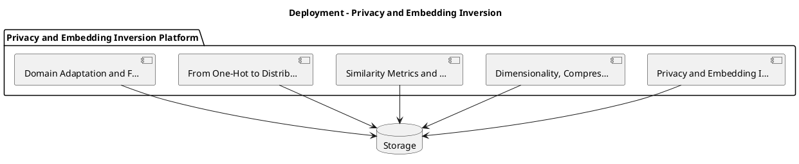

_Source diagram (plantuml); render with the appropriate tool._

**Figure 20. Deployment - Privacy and Embedding Inversion** (plantuml). Figure: Deployment view for Privacy and Embedding Inversion. This diagram illustrates the principal components and their interactions as discussed in the surrounding section.

## Deep Dive: Mechanics, Variants and Trade-offs

Having established the essentials, we now go deeper into privacy and embedding inversion. The underlying mechanism is best appreciated by tracing a single request from input to output and noting where state is created and consumed. The distinctions in this section are the ones that separate a working demo from a system that holds up under adversarial inputs, scale and the passage of time.

Consider the principal variants and how to choose between them. Each variant optimises for a different point in the design space - some for latency, some for accuracy, some for cost or operability - and the correct choice follows from explicit requirements rather than from defaults. As with most architectural decisions, the choice is rarely binary; the skill lies in quantifying the trade-offs and choosing deliberately.

In practice this is supported by a mature tooling ecosystem, including sentence-transformers, OpenAI embeddings, FAISS, Cohere. Tools accelerate the work but do not substitute for understanding: the same principles apply whichever implementation you select, and the ability to reason from first principles is what lets you debug when a tool behaves unexpectedly.

A frequent source of subtle bugs is the interaction with dimensionality, compression and quantisation. Because dimensionality, compression and quantisation concerns matryoshka embeddings, PCA and product quantisation for cost control, changes there can silently alter the behaviour analysed here. The remedy is contract tests at the boundary and end-to-end evaluations that exercise the interaction explicitly.

Finally, attend to edge cases and degradation. Define what the system should do under partial failure, unexpected inputs and load spikes, and make that behaviour explicit and tested rather than emergent. Graceful degradation - returning a safe, useful result when the ideal one is unavailable - is a hallmark of mature engineering.

For deeper study, the literature offers authoritative treatments such as Mikolov et al. — Word2Vec (2013) and Reimers & Gurevych — Sentence-BERT (2019). These primary sources reward careful reading and ground the practical guidance above in established results.

## Advanced Considerations

Having established the essentials, we now go deeper into privacy and embedding inversion. The underlying mechanism is best appreciated by tracing a single request from input to output and noting where state is created and consumed. The distinctions in this section are the ones that separate a working demo from a system that holds up under adversarial inputs, scale and the passage of time.

Consider the principal variants and how to choose between them. Each variant optimises for a different point in the design space - some for latency, some for accuracy, some for cost or operability - and the correct choice follows from explicit requirements rather than from defaults. Every added component buys capability at the price of operational surface area, and that bargain should be made consciously.

In practice this is supported by a mature tooling ecosystem, including sentence-transformers, OpenAI embeddings, FAISS, Cohere. Tools accelerate the work but do not substitute for understanding: the same principles apply whichever implementation you select, and the ability to reason from first principles is what lets you debug when a tool behaves unexpectedly.

A frequent source of subtle bugs is the interaction with evaluating embedding quality. Because evaluating embedding quality concerns retrieval metrics (recall@k, MRR, nDCG) and benchmark suites like MTEB, changes there can silently alter the behaviour analysed here. The remedy is contract tests at the boundary and end-to-end evaluations that exercise the interaction explicitly.

Finally, attend to edge cases and degradation. Define what the system should do under partial failure, unexpected inputs and load spikes, and make that behaviour explicit and tested rather than emergent. Graceful degradation - returning a safe, useful result when the ideal one is unavailable - is a hallmark of mature engineering.

For deeper study, the literature offers authoritative treatments such as Mikolov et al. — Word2Vec (2013) and Reimers & Gurevych — Sentence-BERT (2019). These primary sources reward careful reading and ground the practical guidance above in established results.

## Worked Example

To ground the discussion, walk through a representative example. A e-commerce organisation needs visual and textual product similarity and recommendation. They decide to apply privacy and embedding inversion as part of their Embeddings solution, but wisely treat it as a hypothesis to be validated rather than a foregone conclusion.

The team begins by stating the objective precisely and defining how success will be measured before writing any code. They establish a small but representative evaluation set, agree on acceptance thresholds, and only then prototype the simplest design that could work. Early measurement reveals which assumptions hold and which must be revised, saving weeks of misdirected effort and surfacing edge cases while they are still cheap to fix.

As the prototype matures into a service, the team hardens it: adding input validation, error handling, caching where it pays off, and monitoring that ties back to the original success metric. They document each significant decision in an architecture decision record so that future maintainers understand not just what was built but why.

The outcome is instructive. The system that reaches production is not the most sophisticated design the team considered, but the one whose behaviour they could measure, explain and operate. This is the recurring lesson of Embeddings: durable value comes from the whole system, not from any single clever component.

## Industry Use Cases

Across industries, the ideas in this chapter recur in recognisable ways. The following vignettes show how different sectors apply them and what they have in common.

**Search.** Semantic search across heterogeneous enterprise content. The common thread is that value comes not from the model alone but from the surrounding system - data quality, evaluation, integration and operations - which is precisely where most of the engineering effort belongs.

**E-commerce.** Visual and textual product similarity and recommendation. The common thread is that value comes not from the model alone but from the surrounding system - data quality, evaluation, integration and operations - which is precisely where most of the engineering effort belongs.

**Support.** Deduplicating and routing tickets by semantic similarity. The common thread is that value comes not from the model alone but from the surrounding system - data quality, evaluation, integration and operations - which is precisely where most of the engineering effort belongs.

**Compliance.** Near-duplicate detection across document repositories. The common thread is that value comes not from the model alone but from the surrounding system - data quality, evaluation, integration and operations - which is precisely where most of the engineering effort belongs.

## Best Practices

The following practices consistently separate successful Embeddings efforts from struggling ones. They are deliberately concrete so they can be adopted as checklist items in design and code review.

- Normalise vectors and pick the distance metric the model was trained for.
- Pin embedding model versions and re-index atomically on change.
- Evaluate retrieval with recall@k and nDCG on a labelled set.
- Use hybrid search to recover exact-match and rare-term queries.

None of these are exotic; they are the unglamorous disciplines that compound into reliability. The cost of adopting them is small compared with the cost of the incidents they prevent, and they become second nature with practice.

## Common Pitfalls

Equally instructive are the failure modes that recur in practice. Each pitfall below has a clear early warning sign and a known remedy, so treat them as a diagnostic checklist when something feels wrong:

- Mixing vectors from different model versions in one index.
- Choosing the wrong similarity metric for the embedding model.
- Over-chunking or under-chunking documents before embedding.
- Ignoring drift after upgrading the embedding model.

The pattern is consistent: most failures stem from skipping measurement, conflating prototype and production standards, or deferring cross-cutting concerns such as security and cost until they become emergencies. Naming these traps in advance is the cheapest way to avoid them.

## Governance, Security and Cost Notes

No discussion of privacy and embedding inversion is complete without its governance, security and cost dimensions, which are too often deferred until they become emergencies. Treating them as first-class concerns from the outset is both cheaper and safer.

**Governance.** Classify the risk of this capability, document its intended and out-of-scope uses, and ensure decisions are traceable to satisfy internal policy and external regulation such as the NIST AI RMF, ISO/IEC 42001 and the EU AI Act. **Security.** Treat all external input as untrusted, validate outputs before acting on them, apply least privilege to any tools or data access, and map controls to the OWASP LLM Top 10 and MITRE ATLAS.

**Cost and sustainability.** Establish explicit budgets for compute, tokens and latency, attribute spend to owners, and revisit the economics as usage scales - a design that is affordable at pilot scale can become untenable at production volume. Building these reflexes into everyday engineering is what allows a Embeddings system to be not only capable but also trustworthy and economically sound.

## Hands-On Exercises

Work through the following exercises. They are designed to move understanding from recognition to application - the level required for real engineering work - so prefer writing and building over merely reading.

1. Explain privacy and embedding inversion to a colleague unfamiliar with Embeddings, using a concrete example from your own domain.
2. Sketch a reference architecture that incorporates privacy and embedding inversion and annotate where observability, security and cost controls belong.
3. Design an evaluation that would tell you whether privacy and embedding inversion is working in production, including the metric, the dataset and the acceptance threshold.
4. Identify two pitfalls relevant to privacy and embedding inversion in your environment and describe the early warning signals you would monitor.
5. Prototype the simplest implementation that demonstrates privacy and embedding inversion, then list exactly what would need to change to make it production-ready.

## Key Takeaways

Key takeaways from this chapter:

- Privacy and Embedding Inversion is a systems concern in Embeddings: data, models and operations must be co-designed.
- Measurement is non-negotiable; define success metrics and evaluation before building.
- Favour the simplest design that meets the requirement, and add complexity only when evidence demands it.
- Security, cost and observability are first-class requirements, not afterthoughts.
- Document decisions so the system remains understandable and operable as it evolves.

## Code Walkthrough

Pipelines keep Privacy and Embedding Inversion logic modular and testable. Each stage is a pure function, errors are captured per item, and the composition is trivial to extend or reorder.

The full listing is shown below; study it line by line and reproduce it locally before moving on.

### Listing: A composable processing pipeline for Privacy and Embedding Inversion

```python
from collections.abc import Iterable, Iterator
from typing import Protocol


class Stage(Protocol):
    def __call__(self, item: dict) -> dict: ...


def pipeline(stages: list[Stage]) -> Stage:
    """Compose ordered stages into a single callable for Privacy and Embedding Inversion."""

    def run(item: dict) -> dict:
        for stage in stages:
            item = stage(item)
        return item

    return run


def validate(item: dict) -> dict:
    if "text" not in item:
        raise ValueError("missing required field: text")
    return item


def normalise(item: dict) -> dict:
    item["text"] = item["text"].strip().lower()
    return item


def enrich(item: dict) -> dict:
    item["length"] = len(item["text"])
    return item


process = pipeline([validate, normalise, enrich])


def run_batch(items: Iterable[dict]) -> Iterator[dict]:
    for item in items:
        try:
            yield process(dict(item))
        except ValueError as exc:
            yield {"error": str(exc), "item": item}

```

## Review Questions

1. In the context of Embeddings, which statement best describes “Privacy and Embedding Inversion”?
   - A. It is only relevant to academic research, not production.
   - B. What embeddings leak and how to mitigate it.
   - C. It guarantees deterministic output regardless of input.
   - D. It applies exclusively to image data.
   - **Answer: B.** Privacy and Embedding Inversion: What embeddings leak and how to mitigate it.
2. Which of the following is a recommended best practice when working with Embeddings?
   - A. It makes the system slower but has no other effect.
   - B. It guarantees deterministic output regardless of input.
   - C. Pin embedding model versions and re-index atomically on change.
   - D. Choosing the wrong similarity metric for the embedding model.
   - **Answer: C.** Best practice: Pin embedding model versions and re-index atomically on change.
3. Which of the following is a common pitfall to avoid in Embeddings?
   - A. It is only relevant to academic research, not production.
   - B. It guarantees deterministic output regardless of input.
   - C. Pin embedding model versions and re-index atomically on change.
   - D. Mixing vectors from different model versions in one index.
   - **Answer: D.** Pitfall to avoid: Mixing vectors from different model versions in one index.
4. *(Discussion)* Walk through how you would design Privacy and Embedding Inversion for an enterprise Embeddings workload.
   - **Model answer:** A strong answer defines privacy and embedding inversion (What embeddings leak and how to mitigate it.) then connects it to architecture, evaluation, cost, security and operations for Embeddings, citing concrete trade-offs and a real-world example.

---


# Chapter 14. The Retrieval Stack Reference Architecture

_This chapter examines the retrieval stack reference architecture within Embeddings. It covers embedding service, vector index and re-ranking as a pipeline, derives a reference architecture, walks through a worked example and runnable code, surveys industry use cases, and distils best practices and pitfalls, closing with exercises and review questions._

## Introduction

We define The Retrieval Stack Reference Architecture as embedding service, vector index and re-ranking as a pipeline. This concept recurs throughout the Embeddings lifecycle, from design to operations. It helps to separate the conceptual model from its implementation: the former guides reasoning, the latter must contend with real-world constraints.

This chapter builds intuition first, then formalises the ideas, derives an architecture, and finishes with code, exercises and review questions so the material transfers directly to your own Embeddings work. Read it actively: pause at each diagram, reproduce the code, and attempt the exercises before consulting the answers.

## Theory and Foundations

The Retrieval Stack Reference Architecture can be characterised as embedding service, vector index and re-ranking as a pipeline. Seasoned practitioners treat this as a systems problem, co-designing data, models and operations rather than optimising any one in isolation. The underlying mechanism is best appreciated by tracing a single request from input to output and noting where state is created and consumed.

To place this in context, recall the broader picture: Embeddings map discrete objects—words, sentences, images, users, products—into continuous vector spaces where geometric proximity encodes semantic similarity. Within that picture, the retrieval stack reference architecture is one of the load-bearing ideas - the kind that, when understood deeply, makes the rest of Embeddings fall into place. Understanding this matters because Embeddings systems succeed or fail on exactly these decisions.

The Retrieval Stack Reference Architecture cannot be understood in isolation from evaluating embedding quality. Recall that evaluating embedding quality concerns retrieval metrics (recall@k, MRR, nDCG) and benchmark suites like MTEB. The two interact directly: decisions in one constrain the design space of the other, which is why mature teams reason about them together rather than sequentially. As with most architectural decisions, the choice is rarely binary; the skill lies in quantifying the trade-offs and choosing deliberately.

The Retrieval Stack Reference Architecture cannot be understood in isolation from privacy and embedding inversion. Recall that privacy and embedding inversion concerns what embeddings leak and how to mitigate it. The two interact directly: decisions in one constrain the design space of the other, which is why mature teams reason about them together rather than sequentially. There is an inherent trade-off between fidelity and cost, and the correct balance depends on the use case and its tolerance for error.

Several established patterns apply directly to the retrieval stack reference architecture. The first, hybrid lexical + dense fusion (reciprocal rank fusion), is widely adopted because it makes the system's behaviour predictable and observable. A complementary pattern, bi-encoder retrieval followed by cross-encoder re-ranking, addresses a related concern and is often deployed alongside it. Patterns are not dogma; they are distilled experience that shortcuts the search for a sound design, and each carries assumptions worth checking against your context.

Knowing when not to use a technique is as valuable as knowing how to use it. In a small prototype, shortcuts around the retrieval stack reference architecture are invisible; in a production Embeddings system serving real traffic, they surface as incidents, cost overruns or compliance gaps. Simplicity is a feature. The simplest design that meets the requirement should be the default, with complexity added only when measurement justifies it. The remainder of this chapter turns these principles into an architecture, code and a checklist you can apply immediately.

## Architecture and Design

The reference architecture for The Retrieval Stack Reference Architecture separates concerns into clearly bounded components with explicit contracts. An embedding platform exposes a versioned embedding service that batches and caches encode requests, writes vectors to an ANN index (HNSW/IVF) with stored metadata, and supports hybrid retrieval that fuses lexical and dense scores before an optional cross-encoder re-ranks the top candidates.

Concretely, the principal building blocks include from one-hot to distributed representations, word, sentence and document embeddings, contrastive representation learning, similarity metrics and normalisation and multimodal and cross-encoder embeddings. Each is a replaceable component behind a stable interface, so the team can upgrade an implementation - a model, an index, a policy engine - without rewriting its neighbours. The contracts between components are where reliability is won or lost, so they are specified explicitly and tested in isolation.

The diagram accompanying this section makes the data and control flow explicit. Requests enter through a well-defined boundary where they are authenticated and validated; only then are they dispatched to the components that perform the work. This boundary is also where rate limiting, quota enforcement and audit logging live, keeping cross-cutting concerns out of the core logic and in one auditable place.

Two qualities deserve emphasis. First, observability is designed in, not bolted on: every component emits structured telemetry so that failures can be localised in minutes rather than hours. Second, the architecture is evolvable - components communicate through stable contracts so that any single part of the Embeddings system can be replaced without a rewrite. There is an inherent trade-off between fidelity and cost, and the correct balance depends on the use case and its tolerance for error.

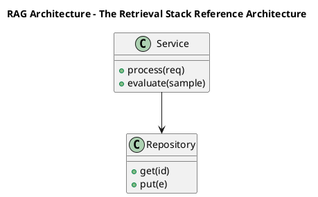

_Source diagram (plantuml); render with the appropriate tool._

**Figure 21. RAG Architecture - The Retrieval Stack Reference Architecture** (plantuml). Figure: RAG Architecture view for The Retrieval Stack Reference Architecture. This diagram illustrates the principal components and their interactions as discussed in the surrounding section.

## Deep Dive: Mechanics, Variants and Trade-offs

Having established the essentials, we now go deeper into the retrieval stack reference architecture. Beneath the abstraction lies a concrete process whose steps can each be measured, tested and optimised independently. The distinctions in this section are the ones that separate a working demo from a system that holds up under adversarial inputs, scale and the passage of time.

Consider the principal variants and how to choose between them. Each variant optimises for a different point in the design space - some for latency, some for accuracy, some for cost or operability - and the correct choice follows from explicit requirements rather than from defaults. There is an inherent trade-off between fidelity and cost, and the correct balance depends on the use case and its tolerance for error.

In practice this is supported by a mature tooling ecosystem, including sentence-transformers, OpenAI embeddings, FAISS, Cohere. Tools accelerate the work but do not substitute for understanding: the same principles apply whichever implementation you select, and the ability to reason from first principles is what lets you debug when a tool behaves unexpectedly.

A frequent source of subtle bugs is the interaction with evaluating embedding quality. Because evaluating embedding quality concerns retrieval metrics (recall@k, MRR, nDCG) and benchmark suites like MTEB, changes there can silently alter the behaviour analysed here. The remedy is contract tests at the boundary and end-to-end evaluations that exercise the interaction explicitly.

Finally, attend to edge cases and degradation. Define what the system should do under partial failure, unexpected inputs and load spikes, and make that behaviour explicit and tested rather than emergent. Graceful degradation - returning a safe, useful result when the ideal one is unavailable - is a hallmark of mature engineering.

For deeper study, the literature offers authoritative treatments such as Mikolov et al. — Word2Vec (2013) and Reimers & Gurevych — Sentence-BERT (2019). These primary sources reward careful reading and ground the practical guidance above in established results.

## Advanced Considerations

Having established the essentials, we now go deeper into the retrieval stack reference architecture. Beneath the abstraction lies a concrete process whose steps can each be measured, tested and optimised independently. The distinctions in this section are the ones that separate a working demo from a system that holds up under adversarial inputs, scale and the passage of time.

Consider the principal variants and how to choose between them. Each variant optimises for a different point in the design space - some for latency, some for accuracy, some for cost or operability - and the correct choice follows from explicit requirements rather than from defaults. As with most architectural decisions, the choice is rarely binary; the skill lies in quantifying the trade-offs and choosing deliberately.

In practice this is supported by a mature tooling ecosystem, including sentence-transformers, OpenAI embeddings, FAISS, Cohere. Tools accelerate the work but do not substitute for understanding: the same principles apply whichever implementation you select, and the ability to reason from first principles is what lets you debug when a tool behaves unexpectedly.

A frequent source of subtle bugs is the interaction with evaluating embedding quality. Because evaluating embedding quality concerns retrieval metrics (recall@k, MRR, nDCG) and benchmark suites like MTEB, changes there can silently alter the behaviour analysed here. The remedy is contract tests at the boundary and end-to-end evaluations that exercise the interaction explicitly.

Finally, attend to edge cases and degradation. Define what the system should do under partial failure, unexpected inputs and load spikes, and make that behaviour explicit and tested rather than emergent. Graceful degradation - returning a safe, useful result when the ideal one is unavailable - is a hallmark of mature engineering.

For deeper study, the literature offers authoritative treatments such as Mikolov et al. — Word2Vec (2013) and Reimers & Gurevych — Sentence-BERT (2019). These primary sources reward careful reading and ground the practical guidance above in established results.

## Worked Example

To ground the discussion, walk through a representative example. A e-commerce organisation needs visual and textual product similarity and recommendation. They decide to apply the retrieval stack reference architecture as part of their Embeddings solution, but wisely treat it as a hypothesis to be validated rather than a foregone conclusion.

The team begins by stating the objective precisely and defining how success will be measured before writing any code. They establish a small but representative evaluation set, agree on acceptance thresholds, and only then prototype the simplest design that could work. Early measurement reveals which assumptions hold and which must be revised, saving weeks of misdirected effort and surfacing edge cases while they are still cheap to fix.

As the prototype matures into a service, the team hardens it: adding input validation, error handling, caching where it pays off, and monitoring that ties back to the original success metric. They document each significant decision in an architecture decision record so that future maintainers understand not just what was built but why.

The outcome is instructive. The system that reaches production is not the most sophisticated design the team considered, but the one whose behaviour they could measure, explain and operate. This is the recurring lesson of Embeddings: durable value comes from the whole system, not from any single clever component.

## Industry Use Cases

Across industries, the ideas in this chapter recur in recognisable ways. The following vignettes show how different sectors apply them and what they have in common.

**Search.** Semantic search across heterogeneous enterprise content. The common thread is that value comes not from the model alone but from the surrounding system - data quality, evaluation, integration and operations - which is precisely where most of the engineering effort belongs.

**E-commerce.** Visual and textual product similarity and recommendation. The common thread is that value comes not from the model alone but from the surrounding system - data quality, evaluation, integration and operations - which is precisely where most of the engineering effort belongs.

**Support.** Deduplicating and routing tickets by semantic similarity. The common thread is that value comes not from the model alone but from the surrounding system - data quality, evaluation, integration and operations - which is precisely where most of the engineering effort belongs.

**Compliance.** Near-duplicate detection across document repositories. The common thread is that value comes not from the model alone but from the surrounding system - data quality, evaluation, integration and operations - which is precisely where most of the engineering effort belongs.

## Best Practices

The following practices consistently separate successful Embeddings efforts from struggling ones. They are deliberately concrete so they can be adopted as checklist items in design and code review.

- Normalise vectors and pick the distance metric the model was trained for.
- Pin embedding model versions and re-index atomically on change.
- Evaluate retrieval with recall@k and nDCG on a labelled set.
- Use hybrid search to recover exact-match and rare-term queries.

None of these are exotic; they are the unglamorous disciplines that compound into reliability. The cost of adopting them is small compared with the cost of the incidents they prevent, and they become second nature with practice.

## Common Pitfalls

Equally instructive are the failure modes that recur in practice. Each pitfall below has a clear early warning sign and a known remedy, so treat them as a diagnostic checklist when something feels wrong:

- Mixing vectors from different model versions in one index.
- Choosing the wrong similarity metric for the embedding model.
- Over-chunking or under-chunking documents before embedding.
- Ignoring drift after upgrading the embedding model.

The pattern is consistent: most failures stem from skipping measurement, conflating prototype and production standards, or deferring cross-cutting concerns such as security and cost until they become emergencies. Naming these traps in advance is the cheapest way to avoid them.

## Governance, Security and Cost Notes

No discussion of the retrieval stack reference architecture is complete without its governance, security and cost dimensions, which are too often deferred until they become emergencies. Treating them as first-class concerns from the outset is both cheaper and safer.

**Governance.** Classify the risk of this capability, document its intended and out-of-scope uses, and ensure decisions are traceable to satisfy internal policy and external regulation such as the NIST AI RMF, ISO/IEC 42001 and the EU AI Act. **Security.** Treat all external input as untrusted, validate outputs before acting on them, apply least privilege to any tools or data access, and map controls to the OWASP LLM Top 10 and MITRE ATLAS.

**Cost and sustainability.** Establish explicit budgets for compute, tokens and latency, attribute spend to owners, and revisit the economics as usage scales - a design that is affordable at pilot scale can become untenable at production volume. Building these reflexes into everyday engineering is what allows a Embeddings system to be not only capable but also trustworthy and economically sound.

## Hands-On Exercises

Work through the following exercises. They are designed to move understanding from recognition to application - the level required for real engineering work - so prefer writing and building over merely reading.

1. Explain the retrieval stack reference architecture to a colleague unfamiliar with Embeddings, using a concrete example from your own domain.
2. Sketch a reference architecture that incorporates the retrieval stack reference architecture and annotate where observability, security and cost controls belong.
3. Design an evaluation that would tell you whether the retrieval stack reference architecture is working in production, including the metric, the dataset and the acceptance threshold.
4. Identify two pitfalls relevant to the retrieval stack reference architecture in your environment and describe the early warning signals you would monitor.
5. Prototype the simplest implementation that demonstrates the retrieval stack reference architecture, then list exactly what would need to change to make it production-ready.

## Key Takeaways

Key takeaways from this chapter:

- The Retrieval Stack Reference Architecture is a systems concern in Embeddings: data, models and operations must be co-designed.
- Measurement is non-negotiable; define success metrics and evaluation before building.
- Favour the simplest design that meets the requirement, and add complexity only when evidence demands it.
- Security, cost and observability are first-class requirements, not afterthoughts.
- Document decisions so the system remains understandable and operable as it evolves.

## Code Walkthrough

Every change to a Embeddings system should pass an evaluation gate. This example shows the minimal shape: align predictions and references, compute a metric, and return a pass/fail decision for CI.

The full listing is shown below; study it line by line and reproduce it locally before moving on.

### Listing: Evaluating The Retrieval Stack Reference Architecture with a regression gate

```python
from dataclasses import dataclass


@dataclass
class EvalResult:
    metric: str
    score: float
    passed: bool


def evaluate(predictions: list[str], references: list[str],
             threshold: float = 0.8) -> EvalResult:
    """Score The Retrieval Stack Reference Architecture output against references with a simple exact-match metric.

    In practice you would combine several metrics (exact match, semantic
    similarity, LLM-as-judge) and gate releases on the aggregate.
    """
    if len(predictions) != len(references):
        raise ValueError("predictions and references must align")
    hits = sum(p.strip() == r.strip() for p, r in zip(predictions, references))
    score = hits / len(references) if references else 0.0
    return EvalResult(metric="exact_match", score=score, passed=score >= threshold)


if __name__ == "__main__":
    result = evaluate(["yes", "no"], ["yes", "yes"])
    print(f"{result.metric}={result.score:.2f} passed={result.passed}")

```

## Review Questions

1. In the context of Embeddings, which statement best describes “The Retrieval Stack Reference Architecture”?
   - A. It is only relevant to academic research, not production.
   - B. Embedding service, vector index and re-ranking as a pipeline.
   - C. It guarantees deterministic output regardless of input.
   - D. It makes the system slower but has no other effect.
   - **Answer: B.** The Retrieval Stack Reference Architecture: Embedding service, vector index and re-ranking as a pipeline.
2. Which of the following is a recommended best practice when working with Embeddings?
   - A. Use hybrid search to recover exact-match and rare-term queries.
   - B. It eliminates the need for any evaluation or monitoring.
   - C. It makes the system slower but has no other effect.
   - D. It applies exclusively to image data.
   - **Answer: A.** Best practice: Use hybrid search to recover exact-match and rare-term queries.
3. Which of the following is a common pitfall to avoid in Embeddings?
   - A. Evaluate retrieval with recall@k and nDCG on a labelled set.
   - B. It removes all security and governance requirements.
   - C. Ignoring drift after upgrading the embedding model.
   - D. It applies exclusively to image data.
   - **Answer: C.** Pitfall to avoid: Ignoring drift after upgrading the embedding model.
4. *(Discussion)* How does The Retrieval Stack Reference Architecture interact with security and governance requirements?
   - **Model answer:** A strong answer defines the retrieval stack reference architecture (Embedding service, vector index and re-ranking as a pipeline.) then connects it to architecture, evaluation, cost, security and operations for Embeddings, citing concrete trade-offs and a real-world example.

---


# Chapter 15. Putting It Together: A Reference Implementation

_This chapter examines putting it together: a reference implementation within Embeddings. It covers an end-to-end reference implementation that integrates the components of a Embeddings system into a cohesive, working whole, derives a reference architecture, walks through a worked example and runnable code, surveys industry use cases, and distils best practices and pitfalls, closing with exercises and review questions._

## Introduction

Formally, Putting It Together: A Reference Implementation addresses an end-to-end reference implementation that integrates the components of a Embeddings system into a cohesive, working whole. Getting this right early prevents expensive rework once a Embeddings system reaches scale. The practical implication is that design choices here ripple through latency, cost and maintainability for the lifetime of the system.

This chapter builds intuition first, then formalises the ideas, derives an architecture, and finishes with code, exercises and review questions so the material transfers directly to your own Embeddings work. Read it actively: pause at each diagram, reproduce the code, and attempt the exercises before consulting the answers.

## Theory and Foundations

Formally, Putting It Together: A Reference Implementation addresses an end-to-end reference implementation that integrates the components of a Embeddings system into a cohesive, working whole. The practical implication is that design choices here ripple through latency, cost and maintainability for the lifetime of the system. The underlying mechanism is best appreciated by tracing a single request from input to output and noting where state is created and consumed.

To place this in context, recall the broader picture: Embeddings map discrete objects—words, sentences, images, users, products—into continuous vector spaces where geometric proximity encodes semantic similarity. Within that picture, putting it together: a reference implementation is one of the load-bearing ideas - the kind that, when understood deeply, makes the rest of Embeddings fall into place. Getting this right early prevents expensive rework once a Embeddings system reaches scale.

Putting It Together: A Reference Implementation cannot be understood in isolation from similarity metrics and normalisation. Recall that similarity metrics and normalisation concerns cosine, dot product and Euclidean distance and when each applies. The two interact directly: decisions in one constrain the design space of the other, which is why mature teams reason about them together rather than sequentially. As with most architectural decisions, the choice is rarely binary; the skill lies in quantifying the trade-offs and choosing deliberately.

Putting It Together: A Reference Implementation cannot be understood in isolation from the retrieval stack reference architecture. Recall that the retrieval stack reference architecture concerns embedding service, vector index and re-ranking as a pipeline. The two interact directly: decisions in one constrain the design space of the other, which is why mature teams reason about them together rather than sequentially. As with most architectural decisions, the choice is rarely binary; the skill lies in quantifying the trade-offs and choosing deliberately.

Several established patterns apply directly to putting it together: a reference implementation. The first, hybrid lexical + dense fusion (reciprocal rank fusion), is widely adopted because it makes the system's behaviour predictable and observable. A complementary pattern, matryoshka embeddings for adaptive dimensionality, addresses a related concern and is often deployed alongside it. Patterns are not dogma; they are distilled experience that shortcuts the search for a sound design, and each carries assumptions worth checking against your context.

It is worth being explicit about when to apply this and when to reach for something simpler. In a small prototype, shortcuts around putting it together: a reference implementation are invisible; in a production Embeddings system serving real traffic, they surface as incidents, cost overruns or compliance gaps. Latency, accuracy and cost form a tension triangle: improving one typically pressures the others, so explicit budgets are essential. The remainder of this chapter turns these principles into an architecture, code and a checklist you can apply immediately.

## Architecture and Design

The reference architecture for Putting It Together: A Reference Implementation separates concerns into clearly bounded components with explicit contracts. An embedding platform exposes a versioned embedding service that batches and caches encode requests, writes vectors to an ANN index (HNSW/IVF) with stored metadata, and supports hybrid retrieval that fuses lexical and dense scores before an optional cross-encoder re-ranks the top candidates.

Concretely, the principal building blocks include from one-hot to distributed representations, word, sentence and document embeddings, contrastive representation learning, similarity metrics and normalisation and multimodal and cross-encoder embeddings. Each is a replaceable component behind a stable interface, so the team can upgrade an implementation - a model, an index, a policy engine - without rewriting its neighbours. The contracts between components are where reliability is won or lost, so they are specified explicitly and tested in isolation.

The diagram accompanying this section makes the data and control flow explicit. Requests enter through a well-defined boundary where they are authenticated and validated; only then are they dispatched to the components that perform the work. This boundary is also where rate limiting, quota enforcement and audit logging live, keeping cross-cutting concerns out of the core logic and in one auditable place.

Two qualities deserve emphasis. First, observability is designed in, not bolted on: every component emits structured telemetry so that failures can be localised in minutes rather than hours. Second, the architecture is evolvable - components communicate through stable contracts so that any single part of the Embeddings system can be replaced without a rewrite. Simplicity is a feature. The simplest design that meets the requirement should be the default, with complexity added only when measurement justifies it.

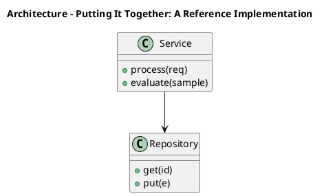

_Source diagram (plantuml); render with the appropriate tool._

**Figure 22. Architecture - Putting It Together: A Reference Implementation** (plantuml). Figure: Architecture view for Putting It Together: A Reference Implementation. This diagram illustrates the principal components and their interactions as discussed in the surrounding section.

<div class="diagram-svg">

<svg xmlns="http://www.w3.org/2000/svg" width="840" height="460" data-tpl="flow_h" data-pal="10-0" viewBox="0 0 840 460" font-family="Inter, Segoe UI, Arial, sans-serif"><defs><marker id="ar" markerWidth="9" markerHeight="9" refX="7" refY="3" orient="auto"><path d="M0,0 L7,3 L0,6 z" fill="#94a3b8"/></marker><marker id="arw" markerWidth="9" markerHeight="9" refX="7" refY="3" orient="auto"><path d="M0,0 L7,3 L0,6 z" fill="#ffffff"/></marker><filter id="sh" x="-20%" y="-20%" width="140%" height="140%"><feDropShadow dx="0" dy="2" stdDeviation="3" flood-color="#0f172a" flood-opacity="0.16"/></filter></defs><defs><linearGradient id="bn6f56b9f" x1="0" y1="0" x2="1" y2="0"><stop offset="0" stop-color="#14532d"/><stop offset="1" stop-color="#166534"/></linearGradient></defs><rect width="840" height="460" rx="14" fill="#ffffff"/><rect x="0" y="0" width="840" height="48" rx="14" fill="url(#bn6f56b9f)"/><rect x="0" y="32" width="840" height="16" fill="url(#bn6f56b9f)"/><text x="420" y="25" text-anchor="middle" font-size="14.5" font-weight="700" fill="#ffffff" dominant-baseline="middle">Business Process - Putting It Together: A Reference Implementation</text><rect x="39" y="196" width="130" height="68" rx="11" fill="#14532d" filter="url(#sh)"/><text x="104" y="218" text-anchor="middle" font-size="10.5" font-weight="600" fill="#ffffff" dominant-baseline="middle">Putting It Together:</text><text x="104" y="230" text-anchor="middle" font-size="10.5" font-weight="600" fill="#ffffff" dominant-baseline="middle">A Reference</text><text x="104" y="242" text-anchor="middle" font-size="10.5" font-weight="600" fill="#ffffff" dominant-baseline="middle">Implementation</text><rect x="197" y="196" width="130" height="68" rx="11" fill="#166534" filter="url(#sh)"/><text x="262" y="224" text-anchor="middle" font-size="10.5" font-weight="600" fill="#ffffff" dominant-baseline="middle">Similarity Metrics</text><text x="262" y="236" text-anchor="middle" font-size="10.5" font-weight="600" fill="#ffffff" dominant-baseline="middle">and Normalisation</text><line x1="169" y1="230" x2="197" y2="230" stroke="#94a3b8" stroke-width="2" marker-end="url(#ar)"/><rect x="355" y="196" width="130" height="68" rx="11" fill="#15803d" filter="url(#sh)"/><text x="420" y="218" text-anchor="middle" font-size="10.5" font-weight="600" fill="#ffffff" dominant-baseline="middle">The Retrieval Stack</text><text x="420" y="230" text-anchor="middle" font-size="10.5" font-weight="600" fill="#ffffff" dominant-baseline="middle">Reference</text><text x="420" y="242" text-anchor="middle" font-size="10.5" font-weight="600" fill="#ffffff" dominant-baseline="middle">Architecture</text><line x1="327" y1="230" x2="355" y2="230" stroke="#94a3b8" stroke-width="2" marker-end="url(#ar)"/><rect x="513" y="196" width="130" height="68" rx="11" fill="#16a34a" filter="url(#sh)"/><text x="578" y="218" text-anchor="middle" font-size="10.5" font-weight="600" fill="#ffffff" dominant-baseline="middle">Indexing for</text><text x="578" y="230" text-anchor="middle" font-size="10.5" font-weight="600" fill="#ffffff" dominant-baseline="middle">Approximate Nearest</text><text x="578" y="242" text-anchor="middle" font-size="10.5" font-weight="600" fill="#ffffff" dominant-baseline="middle">Neighbour Search</text><line x1="485" y1="230" x2="513" y2="230" stroke="#94a3b8" stroke-width="2" marker-end="url(#ar)"/><rect x="671" y="196" width="130" height="68" rx="11" fill="#22c55e" filter="url(#sh)"/><text x="736" y="218" text-anchor="middle" font-size="10.5" font-weight="600" fill="#ffffff" dominant-baseline="middle">From One-Hot to</text><text x="736" y="230" text-anchor="middle" font-size="10.5" font-weight="600" fill="#ffffff" dominant-baseline="middle">Distributed</text><text x="736" y="242" text-anchor="middle" font-size="10.5" font-weight="600" fill="#ffffff" dominant-baseline="middle">Representations</text><line x1="643" y1="230" x2="671" y2="230" stroke="#94a3b8" stroke-width="2" marker-end="url(#ar)"/><text x="420" y="300" text-anchor="middle" font-size="11" font-weight="500" fill="#64748b" dominant-baseline="middle">end-to-end flow</text><text x="28" y="446" text-anchor="start" font-size="9.5" font-weight="500" fill="#64748b" dominant-baseline="middle">Putting It Together: A Reference Implementation  •  Business Process</text></svg>

</div>

**Figure 23. Business Process - Putting It Together: A Reference Implementation** (svg). Figure: Business Process view for Putting It Together: A Reference Implementation. This diagram illustrates the principal components and their interactions as discussed in the surrounding section.

## Deep Dive: Mechanics, Variants and Trade-offs

Having established the essentials, we now go deeper into putting it together: a reference implementation. It pays to understand the mechanism rather than treat it as a black box, because most production incidents are explained by one of its steps misbehaving. The distinctions in this section are the ones that separate a working demo from a system that holds up under adversarial inputs, scale and the passage of time.

Consider the principal variants and how to choose between them. Each variant optimises for a different point in the design space - some for latency, some for accuracy, some for cost or operability - and the correct choice follows from explicit requirements rather than from defaults. There is an inherent trade-off between fidelity and cost, and the correct balance depends on the use case and its tolerance for error.

In practice this is supported by a mature tooling ecosystem, including sentence-transformers, OpenAI embeddings, FAISS, Cohere. Tools accelerate the work but do not substitute for understanding: the same principles apply whichever implementation you select, and the ability to reason from first principles is what lets you debug when a tool behaves unexpectedly.

A frequent source of subtle bugs is the interaction with similarity metrics and normalisation. Because similarity metrics and normalisation concerns cosine, dot product and Euclidean distance and when each applies, changes there can silently alter the behaviour analysed here. The remedy is contract tests at the boundary and end-to-end evaluations that exercise the interaction explicitly.

Finally, attend to edge cases and degradation. Define what the system should do under partial failure, unexpected inputs and load spikes, and make that behaviour explicit and tested rather than emergent. Graceful degradation - returning a safe, useful result when the ideal one is unavailable - is a hallmark of mature engineering.

For deeper study, the literature offers authoritative treatments such as Mikolov et al. — Word2Vec (2013) and Reimers & Gurevych — Sentence-BERT (2019). These primary sources reward careful reading and ground the practical guidance above in established results.

## Advanced Considerations

Having established the essentials, we now go deeper into putting it together: a reference implementation. Mechanically, the behaviour emerges from a few interacting parts that are simpler than the whole they produce. The distinctions in this section are the ones that separate a working demo from a system that holds up under adversarial inputs, scale and the passage of time.

Consider the principal variants and how to choose between them. Each variant optimises for a different point in the design space - some for latency, some for accuracy, some for cost or operability - and the correct choice follows from explicit requirements rather than from defaults. Latency, accuracy and cost form a tension triangle: improving one typically pressures the others, so explicit budgets are essential.

In practice this is supported by a mature tooling ecosystem, including sentence-transformers, OpenAI embeddings, FAISS, Cohere. Tools accelerate the work but do not substitute for understanding: the same principles apply whichever implementation you select, and the ability to reason from first principles is what lets you debug when a tool behaves unexpectedly.

A frequent source of subtle bugs is the interaction with from one-hot to distributed representations. Because from one-hot to distributed representations concerns why dense vectors generalise where sparse encodings cannot, changes there can silently alter the behaviour analysed here. The remedy is contract tests at the boundary and end-to-end evaluations that exercise the interaction explicitly.

Finally, attend to edge cases and degradation. Define what the system should do under partial failure, unexpected inputs and load spikes, and make that behaviour explicit and tested rather than emergent. Graceful degradation - returning a safe, useful result when the ideal one is unavailable - is a hallmark of mature engineering.

For deeper study, the literature offers authoritative treatments such as Mikolov et al. — Word2Vec (2013) and Reimers & Gurevych — Sentence-BERT (2019). These primary sources reward careful reading and ground the practical guidance above in established results.

## Worked Example

Consider a concrete scenario. A support organisation needs deduplicating and routing tickets by semantic similarity. They decide to apply putting it together: a reference implementation as part of their Embeddings solution, but wisely treat it as a hypothesis to be validated rather than a foregone conclusion.

The team begins by stating the objective precisely and defining how success will be measured before writing any code. They establish a small but representative evaluation set, agree on acceptance thresholds, and only then prototype the simplest design that could work. Early measurement reveals which assumptions hold and which must be revised, saving weeks of misdirected effort and surfacing edge cases while they are still cheap to fix.

As the prototype matures into a service, the team hardens it: adding input validation, error handling, caching where it pays off, and monitoring that ties back to the original success metric. They document each significant decision in an architecture decision record so that future maintainers understand not just what was built but why.

The outcome is instructive. The system that reaches production is not the most sophisticated design the team considered, but the one whose behaviour they could measure, explain and operate. This is the recurring lesson of Embeddings: durable value comes from the whole system, not from any single clever component.

## Industry Use Cases

Across industries, the ideas in this chapter recur in recognisable ways. The following vignettes show how different sectors apply them and what they have in common.

**Search.** Semantic search across heterogeneous enterprise content. The common thread is that value comes not from the model alone but from the surrounding system - data quality, evaluation, integration and operations - which is precisely where most of the engineering effort belongs.

**E-commerce.** Visual and textual product similarity and recommendation. The common thread is that value comes not from the model alone but from the surrounding system - data quality, evaluation, integration and operations - which is precisely where most of the engineering effort belongs.

**Support.** Deduplicating and routing tickets by semantic similarity. The common thread is that value comes not from the model alone but from the surrounding system - data quality, evaluation, integration and operations - which is precisely where most of the engineering effort belongs.

**Compliance.** Near-duplicate detection across document repositories. The common thread is that value comes not from the model alone but from the surrounding system - data quality, evaluation, integration and operations - which is precisely where most of the engineering effort belongs.

## Best Practices

The following practices consistently separate successful Embeddings efforts from struggling ones. They are deliberately concrete so they can be adopted as checklist items in design and code review.

- Normalise vectors and pick the distance metric the model was trained for.
- Pin embedding model versions and re-index atomically on change.
- Evaluate retrieval with recall@k and nDCG on a labelled set.
- Use hybrid search to recover exact-match and rare-term queries.

None of these are exotic; they are the unglamorous disciplines that compound into reliability. The cost of adopting them is small compared with the cost of the incidents they prevent, and they become second nature with practice.

## Common Pitfalls

Equally instructive are the failure modes that recur in practice. Each pitfall below has a clear early warning sign and a known remedy, so treat them as a diagnostic checklist when something feels wrong:

- Mixing vectors from different model versions in one index.
- Choosing the wrong similarity metric for the embedding model.
- Over-chunking or under-chunking documents before embedding.
- Ignoring drift after upgrading the embedding model.

The pattern is consistent: most failures stem from skipping measurement, conflating prototype and production standards, or deferring cross-cutting concerns such as security and cost until they become emergencies. Naming these traps in advance is the cheapest way to avoid them.

## Governance, Security and Cost Notes

No discussion of putting it together: a reference implementation is complete without its governance, security and cost dimensions, which are too often deferred until they become emergencies. Treating them as first-class concerns from the outset is both cheaper and safer.

**Governance.** Classify the risk of this capability, document its intended and out-of-scope uses, and ensure decisions are traceable to satisfy internal policy and external regulation such as the NIST AI RMF, ISO/IEC 42001 and the EU AI Act. **Security.** Treat all external input as untrusted, validate outputs before acting on them, apply least privilege to any tools or data access, and map controls to the OWASP LLM Top 10 and MITRE ATLAS.

**Cost and sustainability.** Establish explicit budgets for compute, tokens and latency, attribute spend to owners, and revisit the economics as usage scales - a design that is affordable at pilot scale can become untenable at production volume. Building these reflexes into everyday engineering is what allows a Embeddings system to be not only capable but also trustworthy and economically sound.

## Hands-On Exercises

Work through the following exercises. They are designed to move understanding from recognition to application - the level required for real engineering work - so prefer writing and building over merely reading.

1. Explain putting it together: a reference implementation to a colleague unfamiliar with Embeddings, using a concrete example from your own domain.
2. Sketch a reference architecture that incorporates putting it together: a reference implementation and annotate where observability, security and cost controls belong.
3. Design an evaluation that would tell you whether putting it together: a reference implementation is working in production, including the metric, the dataset and the acceptance threshold.
4. Identify two pitfalls relevant to putting it together: a reference implementation in your environment and describe the early warning signals you would monitor.
5. Prototype the simplest implementation that demonstrates putting it together: a reference implementation, then list exactly what would need to change to make it production-ready.

## Key Takeaways

Key takeaways from this chapter:

- Putting It Together: A Reference Implementation is a systems concern in Embeddings: data, models and operations must be co-designed.
- Measurement is non-negotiable; define success metrics and evaluation before building.
- Favour the simplest design that meets the requirement, and add complexity only when evidence demands it.
- Security, cost and observability are first-class requirements, not afterthoughts.
- Document decisions so the system remains understandable and operable as it evolves.

## Code Walkthrough

Pipelines keep Putting It Together: A Reference Implementation logic modular and testable. Each stage is a pure function, errors are captured per item, and the composition is trivial to extend or reorder.

The full listing is shown below; study it line by line and reproduce it locally before moving on.

### Listing: A composable processing pipeline for Putting It Together: A Reference Implementation

```python
from collections.abc import Iterable, Iterator
from typing import Protocol


class Stage(Protocol):
    def __call__(self, item: dict) -> dict: ...


def pipeline(stages: list[Stage]) -> Stage:
    """Compose ordered stages into a single callable for Putting It Together: A Reference Implementation."""

    def run(item: dict) -> dict:
        for stage in stages:
            item = stage(item)
        return item

    return run


def validate(item: dict) -> dict:
    if "text" not in item:
        raise ValueError("missing required field: text")
    return item


def normalise(item: dict) -> dict:
    item["text"] = item["text"].strip().lower()
    return item


def enrich(item: dict) -> dict:
    item["length"] = len(item["text"])
    return item


process = pipeline([validate, normalise, enrich])


def run_batch(items: Iterable[dict]) -> Iterator[dict]:
    for item in items:
        try:
            yield process(dict(item))
        except ValueError as exc:
            yield {"error": str(exc), "item": item}

```

## Review Questions

1. In the context of Embeddings, which statement best describes “Putting It Together: A Reference Implementation”?
   - A. an end-to-end reference implementation that integrates the components of a Embeddings system into a cohesive, working whole
   - B. It makes the system slower but has no other effect.
   - C. It is only relevant to academic research, not production.
   - D. It guarantees deterministic output regardless of input.
   - **Answer: A.** Putting It Together: A Reference Implementation: an end-to-end reference implementation that integrates the components of a Embeddings system into a cohesive, working whole
2. Which of the following is a recommended best practice when working with Embeddings?
   - A. Over-chunking or under-chunking documents before embedding.
   - B. It removes all security and governance requirements.
   - C. Normalise vectors and pick the distance metric the model was trained for.
   - D. It guarantees deterministic output regardless of input.
   - **Answer: C.** Best practice: Normalise vectors and pick the distance metric the model was trained for.
3. Which of the following is a common pitfall to avoid in Embeddings?
   - A. It makes the system slower but has no other effect.
   - B. Ignoring drift after upgrading the embedding model.
   - C. It guarantees deterministic output regardless of input.
   - D. Normalise vectors and pick the distance metric the model was trained for.
   - **Answer: B.** Pitfall to avoid: Ignoring drift after upgrading the embedding model.
4. *(Discussion)* What trade-offs would you weigh when implementing Putting It Together: A Reference Implementation?
   - **Model answer:** A strong answer defines putting it together: a reference implementation (an end-to-end reference implementation that integrates the components of a Embeddings system into a cohesive, working whole) then connects it to architecture, evaluation, cost, security and operations for Embeddings, citing concrete trade-offs and a real-world example.

---


# Chapter 16. Hands-On Lab: Building an End-to-End Embeddings System

_This chapter examines hands-on lab: building an end-to-end embeddings system within Embeddings. It covers a guided, build-along laboratory that constructs a functioning Embeddings system from first principles, derives a reference architecture, walks through a worked example and runnable code, surveys industry use cases, and distils best practices and pitfalls, closing with exercises and review questions._

## Introduction

Formally, Hands-On Lab: Building an End-to-End Embeddings System addresses a guided, build-along laboratory that constructs a functioning Embeddings system from first principles. This concept recurs throughout the Embeddings lifecycle, from design to operations. It helps to separate the conceptual model from its implementation: the former guides reasoning, the latter must contend with real-world constraints.

This chapter builds intuition first, then formalises the ideas, derives an architecture, and finishes with code, exercises and review questions so the material transfers directly to your own Embeddings work. Read it actively: pause at each diagram, reproduce the code, and attempt the exercises before consulting the answers.

## Theory and Foundations

At its core, Hands-On Lab: Building an End-to-End Embeddings System concerns a guided, build-along laboratory that constructs a functioning Embeddings system from first principles. It helps to separate the conceptual model from its implementation: the former guides reasoning, the latter must contend with real-world constraints. Mechanically, the behaviour emerges from a few interacting parts that are simpler than the whole they produce.

To place this in context, recall the broader picture: Embeddings map discrete objects—words, sentences, images, users, products—into continuous vector spaces where geometric proximity encodes semantic similarity. Within that picture, hands-on lab: building an end-to-end embeddings system is one of the load-bearing ideas - the kind that, when understood deeply, makes the rest of Embeddings fall into place. Understanding this matters because Embeddings systems succeed or fail on exactly these decisions.

Hands-On Lab: Building an End-to-End Embeddings System cannot be understood in isolation from similarity metrics and normalisation. Recall that similarity metrics and normalisation concerns cosine, dot product and Euclidean distance and when each applies. The two interact directly: decisions in one constrain the design space of the other, which is why mature teams reason about them together rather than sequentially. Simplicity is a feature. The simplest design that meets the requirement should be the default, with complexity added only when measurement justifies it.

Hands-On Lab: Building an End-to-End Embeddings System cannot be understood in isolation from from one-hot to distributed representations. Recall that from one-hot to distributed representations concerns why dense vectors generalise where sparse encodings cannot. The two interact directly: decisions in one constrain the design space of the other, which is why mature teams reason about them together rather than sequentially. There is an inherent trade-off between fidelity and cost, and the correct balance depends on the use case and its tolerance for error.

Several established patterns apply directly to hands-on lab: building an end-to-end embeddings system. The first, hybrid lexical + dense fusion (reciprocal rank fusion), is widely adopted because it makes the system's behaviour predictable and observable. A complementary pattern, bi-encoder retrieval followed by cross-encoder re-ranking, addresses a related concern and is often deployed alongside it. Patterns are not dogma; they are distilled experience that shortcuts the search for a sound design, and each carries assumptions worth checking against your context.

The decision of whether to adopt this should be driven by requirements, not by novelty. In a small prototype, shortcuts around hands-on lab: building an end-to-end embeddings system are invisible; in a production Embeddings system serving real traffic, they surface as incidents, cost overruns or compliance gaps. Latency, accuracy and cost form a tension triangle: improving one typically pressures the others, so explicit budgets are essential. The remainder of this chapter turns these principles into an architecture, code and a checklist you can apply immediately.

## Architecture and Design

A robust architecture for Hands-On Lab: Building an End-to-End Embeddings System is layered so each part can evolve independently without destabilising the whole. An embedding platform exposes a versioned embedding service that batches and caches encode requests, writes vectors to an ANN index (HNSW/IVF) with stored metadata, and supports hybrid retrieval that fuses lexical and dense scores before an optional cross-encoder re-ranks the top candidates.

Concretely, the principal building blocks include from one-hot to distributed representations, word, sentence and document embeddings, contrastive representation learning, similarity metrics and normalisation and multimodal and cross-encoder embeddings. Each is a replaceable component behind a stable interface, so the team can upgrade an implementation - a model, an index, a policy engine - without rewriting its neighbours. The contracts between components are where reliability is won or lost, so they are specified explicitly and tested in isolation.

The diagram accompanying this section makes the data and control flow explicit. Requests enter through a well-defined boundary where they are authenticated and validated; only then are they dispatched to the components that perform the work. This boundary is also where rate limiting, quota enforcement and audit logging live, keeping cross-cutting concerns out of the core logic and in one auditable place.

Two qualities deserve emphasis. First, observability is designed in, not bolted on: every component emits structured telemetry so that failures can be localised in minutes rather than hours. Second, the architecture is evolvable - components communicate through stable contracts so that any single part of the Embeddings system can be replaced without a rewrite. Every added component buys capability at the price of operational surface area, and that bargain should be made consciously.

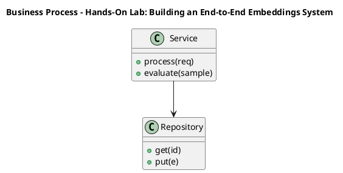

_Source diagram (plantuml); render with the appropriate tool._

**Figure 24. Business Process - Hands-On Lab: Building an End-to-End Embeddings System** (plantuml). Figure: Business Process view for Hands-On Lab: Building an End-to-End Embeddings System. This diagram illustrates the principal components and their interactions as discussed in the surrounding section.

## Deep Dive: Mechanics, Variants and Trade-offs

Having established the essentials, we now go deeper into hands-on lab: building an end-to-end embeddings system. Beneath the abstraction lies a concrete process whose steps can each be measured, tested and optimised independently. The distinctions in this section are the ones that separate a working demo from a system that holds up under adversarial inputs, scale and the passage of time.

Consider the principal variants and how to choose between them. Each variant optimises for a different point in the design space - some for latency, some for accuracy, some for cost or operability - and the correct choice follows from explicit requirements rather than from defaults. As with most architectural decisions, the choice is rarely binary; the skill lies in quantifying the trade-offs and choosing deliberately.

In practice this is supported by a mature tooling ecosystem, including sentence-transformers, OpenAI embeddings, FAISS, Cohere. Tools accelerate the work but do not substitute for understanding: the same principles apply whichever implementation you select, and the ability to reason from first principles is what lets you debug when a tool behaves unexpectedly.

A frequent source of subtle bugs is the interaction with similarity metrics and normalisation. Because similarity metrics and normalisation concerns cosine, dot product and Euclidean distance and when each applies, changes there can silently alter the behaviour analysed here. The remedy is contract tests at the boundary and end-to-end evaluations that exercise the interaction explicitly.

Finally, attend to edge cases and degradation. Define what the system should do under partial failure, unexpected inputs and load spikes, and make that behaviour explicit and tested rather than emergent. Graceful degradation - returning a safe, useful result when the ideal one is unavailable - is a hallmark of mature engineering.

For deeper study, the literature offers authoritative treatments such as Mikolov et al. — Word2Vec (2013) and Reimers & Gurevych — Sentence-BERT (2019). These primary sources reward careful reading and ground the practical guidance above in established results.

## Advanced Considerations

Having established the essentials, we now go deeper into hands-on lab: building an end-to-end embeddings system. Mechanically, the behaviour emerges from a few interacting parts that are simpler than the whole they produce. The distinctions in this section are the ones that separate a working demo from a system that holds up under adversarial inputs, scale and the passage of time.

Consider the principal variants and how to choose between them. Each variant optimises for a different point in the design space - some for latency, some for accuracy, some for cost or operability - and the correct choice follows from explicit requirements rather than from defaults. Simplicity is a feature. The simplest design that meets the requirement should be the default, with complexity added only when measurement justifies it.

In practice this is supported by a mature tooling ecosystem, including sentence-transformers, OpenAI embeddings, FAISS, Cohere. Tools accelerate the work but do not substitute for understanding: the same principles apply whichever implementation you select, and the ability to reason from first principles is what lets you debug when a tool behaves unexpectedly.

A frequent source of subtle bugs is the interaction with multimodal and cross-encoder embeddings. Because multimodal and cross-encoder embeddings concerns cLIP-style joint spaces and the bi-encoder/cross-encoder trade-off, changes there can silently alter the behaviour analysed here. The remedy is contract tests at the boundary and end-to-end evaluations that exercise the interaction explicitly.

Finally, attend to edge cases and degradation. Define what the system should do under partial failure, unexpected inputs and load spikes, and make that behaviour explicit and tested rather than emergent. Graceful degradation - returning a safe, useful result when the ideal one is unavailable - is a hallmark of mature engineering.

For deeper study, the literature offers authoritative treatments such as Mikolov et al. — Word2Vec (2013) and Reimers & Gurevych — Sentence-BERT (2019). These primary sources reward careful reading and ground the practical guidance above in established results.

## Worked Example

Consider a concrete scenario. A e-commerce organisation needs visual and textual product similarity and recommendation. They decide to apply hands-on lab: building an end-to-end embeddings system as part of their Embeddings solution, but wisely treat it as a hypothesis to be validated rather than a foregone conclusion.

The team begins by stating the objective precisely and defining how success will be measured before writing any code. They establish a small but representative evaluation set, agree on acceptance thresholds, and only then prototype the simplest design that could work. Early measurement reveals which assumptions hold and which must be revised, saving weeks of misdirected effort and surfacing edge cases while they are still cheap to fix.

As the prototype matures into a service, the team hardens it: adding input validation, error handling, caching where it pays off, and monitoring that ties back to the original success metric. They document each significant decision in an architecture decision record so that future maintainers understand not just what was built but why.

The outcome is instructive. The system that reaches production is not the most sophisticated design the team considered, but the one whose behaviour they could measure, explain and operate. This is the recurring lesson of Embeddings: durable value comes from the whole system, not from any single clever component.

## Industry Use Cases

Across industries, the ideas in this chapter recur in recognisable ways. The following vignettes show how different sectors apply them and what they have in common.

**Search.** Semantic search across heterogeneous enterprise content. The common thread is that value comes not from the model alone but from the surrounding system - data quality, evaluation, integration and operations - which is precisely where most of the engineering effort belongs.

**E-commerce.** Visual and textual product similarity and recommendation. The common thread is that value comes not from the model alone but from the surrounding system - data quality, evaluation, integration and operations - which is precisely where most of the engineering effort belongs.

**Support.** Deduplicating and routing tickets by semantic similarity. The common thread is that value comes not from the model alone but from the surrounding system - data quality, evaluation, integration and operations - which is precisely where most of the engineering effort belongs.

**Compliance.** Near-duplicate detection across document repositories. The common thread is that value comes not from the model alone but from the surrounding system - data quality, evaluation, integration and operations - which is precisely where most of the engineering effort belongs.

## Best Practices

The following practices consistently separate successful Embeddings efforts from struggling ones. They are deliberately concrete so they can be adopted as checklist items in design and code review.

- Normalise vectors and pick the distance metric the model was trained for.
- Pin embedding model versions and re-index atomically on change.
- Evaluate retrieval with recall@k and nDCG on a labelled set.
- Use hybrid search to recover exact-match and rare-term queries.

None of these are exotic; they are the unglamorous disciplines that compound into reliability. The cost of adopting them is small compared with the cost of the incidents they prevent, and they become second nature with practice.

## Common Pitfalls

Equally instructive are the failure modes that recur in practice. Each pitfall below has a clear early warning sign and a known remedy, so treat them as a diagnostic checklist when something feels wrong:

- Mixing vectors from different model versions in one index.
- Choosing the wrong similarity metric for the embedding model.
- Over-chunking or under-chunking documents before embedding.
- Ignoring drift after upgrading the embedding model.

The pattern is consistent: most failures stem from skipping measurement, conflating prototype and production standards, or deferring cross-cutting concerns such as security and cost until they become emergencies. Naming these traps in advance is the cheapest way to avoid them.

## Governance, Security and Cost Notes

No discussion of hands-on lab: building an end-to-end embeddings system is complete without its governance, security and cost dimensions, which are too often deferred until they become emergencies. Treating them as first-class concerns from the outset is both cheaper and safer.

**Governance.** Classify the risk of this capability, document its intended and out-of-scope uses, and ensure decisions are traceable to satisfy internal policy and external regulation such as the NIST AI RMF, ISO/IEC 42001 and the EU AI Act. **Security.** Treat all external input as untrusted, validate outputs before acting on them, apply least privilege to any tools or data access, and map controls to the OWASP LLM Top 10 and MITRE ATLAS.

**Cost and sustainability.** Establish explicit budgets for compute, tokens and latency, attribute spend to owners, and revisit the economics as usage scales - a design that is affordable at pilot scale can become untenable at production volume. Building these reflexes into everyday engineering is what allows a Embeddings system to be not only capable but also trustworthy and economically sound.

## Hands-On Exercises

Work through the following exercises. They are designed to move understanding from recognition to application - the level required for real engineering work - so prefer writing and building over merely reading.

1. Explain hands-on lab: building an end-to-end embeddings system to a colleague unfamiliar with Embeddings, using a concrete example from your own domain.
2. Sketch a reference architecture that incorporates hands-on lab: building an end-to-end embeddings system and annotate where observability, security and cost controls belong.
3. Design an evaluation that would tell you whether hands-on lab: building an end-to-end embeddings system is working in production, including the metric, the dataset and the acceptance threshold.
4. Identify two pitfalls relevant to hands-on lab: building an end-to-end embeddings system in your environment and describe the early warning signals you would monitor.
5. Prototype the simplest implementation that demonstrates hands-on lab: building an end-to-end embeddings system, then list exactly what would need to change to make it production-ready.

## Key Takeaways

Key takeaways from this chapter:

- Hands-On Lab: Building an End-to-End Embeddings System is a systems concern in Embeddings: data, models and operations must be co-designed.
- Measurement is non-negotiable; define success metrics and evaluation before building.
- Favour the simplest design that meets the requirement, and add complexity only when evidence demands it.
- Security, cost and observability are first-class requirements, not afterthoughts.
- Document decisions so the system remains understandable and operable as it evolves.

## Code Walkthrough

Pipelines keep Hands-On Lab: Building an End-to-End Embeddings System logic modular and testable. Each stage is a pure function, errors are captured per item, and the composition is trivial to extend or reorder.

The full listing is shown below; study it line by line and reproduce it locally before moving on.

### Listing: A composable processing pipeline for Hands-On Lab: Building an End-to-End Embeddings System

```python
from collections.abc import Iterable, Iterator
from typing import Protocol


class Stage(Protocol):
    def __call__(self, item: dict) -> dict: ...


def pipeline(stages: list[Stage]) -> Stage:
    """Compose ordered stages into a single callable for Hands-On Lab: Building an End-to-End Embeddings System."""

    def run(item: dict) -> dict:
        for stage in stages:
            item = stage(item)
        return item

    return run


def validate(item: dict) -> dict:
    if "text" not in item:
        raise ValueError("missing required field: text")
    return item


def normalise(item: dict) -> dict:
    item["text"] = item["text"].strip().lower()
    return item


def enrich(item: dict) -> dict:
    item["length"] = len(item["text"])
    return item


process = pipeline([validate, normalise, enrich])


def run_batch(items: Iterable[dict]) -> Iterator[dict]:
    for item in items:
        try:
            yield process(dict(item))
        except ValueError as exc:
            yield {"error": str(exc), "item": item}

```

## Review Questions

1. In the context of Embeddings, which statement best describes “Hands-On Lab: Building an End-to-End Embeddings System”?
   - A. It removes all security and governance requirements.
   - B. It is only relevant to academic research, not production.
   - C. a guided, build-along laboratory that constructs a functioning Embeddings system from first principles
   - D. It makes the system slower but has no other effect.
   - **Answer: C.** Hands-On Lab: Building an End-to-End Embeddings System: a guided, build-along laboratory that constructs a functioning Embeddings system from first principles
2. Which of the following is a recommended best practice when working with Embeddings?
   - A. Normalise vectors and pick the distance metric the model was trained for.
   - B. Ignoring drift after upgrading the embedding model.
   - C. It eliminates the need for any evaluation or monitoring.
   - D. It removes all security and governance requirements.
   - **Answer: A.** Best practice: Normalise vectors and pick the distance metric the model was trained for.
3. Which of the following is a common pitfall to avoid in Embeddings?
   - A. Evaluate retrieval with recall@k and nDCG on a labelled set.
   - B. Over-chunking or under-chunking documents before embedding.
   - C. It makes the system slower but has no other effect.
   - D. Use hybrid search to recover exact-match and rare-term queries.
   - **Answer: B.** Pitfall to avoid: Over-chunking or under-chunking documents before embedding.
4. *(Discussion)* Walk through how you would design Hands-On Lab: Building an End-to-End Embeddings System for an enterprise Embeddings workload.
   - **Model answer:** A strong answer defines hands-on lab: building an end-to-end embeddings system (a guided, build-along laboratory that constructs a functioning Embeddings system from first principles) then connects it to architecture, evaluation, cost, security and operations for Embeddings, citing concrete trade-offs and a real-world example.

---


# Chapter 17. Case Study: Search at Scale

_This chapter examines case study: search at scale within Embeddings. It covers a detailed case study of deploying Embeddings in a demanding search environment, including the decisions, trade-offs and outcomes, derives a reference architecture, walks through a worked example and runnable code, surveys industry use cases, and distils best practices and pitfalls, closing with exercises and review questions._

## Introduction

Case Study: Search at Scale can be characterised as a detailed case study of deploying Embeddings in a demanding search environment, including the decisions, trade-offs and outcomes. It is foundational: later capabilities in Embeddings are built directly on top of it. Seasoned practitioners treat this as a systems problem, co-designing data, models and operations rather than optimising any one in isolation.

This chapter builds intuition first, then formalises the ideas, derives an architecture, and finishes with code, exercises and review questions so the material transfers directly to your own Embeddings work. Read it actively: pause at each diagram, reproduce the code, and attempt the exercises before consulting the answers.

## Theory and Foundations

Case Study: Search at Scale can be characterised as a detailed case study of deploying Embeddings in a demanding search environment, including the decisions, trade-offs and outcomes. It helps to separate the conceptual model from its implementation: the former guides reasoning, the latter must contend with real-world constraints. The underlying mechanism is best appreciated by tracing a single request from input to output and noting where state is created and consumed.

To place this in context, recall the broader picture: Embeddings map discrete objects—words, sentences, images, users, products—into continuous vector spaces where geometric proximity encodes semantic similarity. Within that picture, case study: search at scale is one of the load-bearing ideas - the kind that, when understood deeply, makes the rest of Embeddings fall into place. It is foundational: later capabilities in Embeddings are built directly on top of it.

Case Study: Search at Scale cannot be understood in isolation from evaluating embedding quality. Recall that evaluating embedding quality concerns retrieval metrics (recall@k, MRR, nDCG) and benchmark suites like MTEB. The two interact directly: decisions in one constrain the design space of the other, which is why mature teams reason about them together rather than sequentially. There is an inherent trade-off between fidelity and cost, and the correct balance depends on the use case and its tolerance for error.

Case Study: Search at Scale cannot be understood in isolation from from one-hot to distributed representations. Recall that from one-hot to distributed representations concerns why dense vectors generalise where sparse encodings cannot. The two interact directly: decisions in one constrain the design space of the other, which is why mature teams reason about them together rather than sequentially. There is an inherent trade-off between fidelity and cost, and the correct balance depends on the use case and its tolerance for error.

Several established patterns apply directly to case study: search at scale. The first, versioned indexes with blue/green re-embedding, is widely adopted because it makes the system's behaviour predictable and observable. A complementary pattern, matryoshka embeddings for adaptive dimensionality, addresses a related concern and is often deployed alongside it. Patterns are not dogma; they are distilled experience that shortcuts the search for a sound design, and each carries assumptions worth checking against your context.

Knowing when not to use a technique is as valuable as knowing how to use it. In a small prototype, shortcuts around case study: search at scale are invisible; in a production Embeddings system serving real traffic, they surface as incidents, cost overruns or compliance gaps. As with most architectural decisions, the choice is rarely binary; the skill lies in quantifying the trade-offs and choosing deliberately. The remainder of this chapter turns these principles into an architecture, code and a checklist you can apply immediately.

## Architecture and Design

A robust architecture for Case Study: Search at Scale is layered so each part can evolve independently without destabilising the whole. An embedding platform exposes a versioned embedding service that batches and caches encode requests, writes vectors to an ANN index (HNSW/IVF) with stored metadata, and supports hybrid retrieval that fuses lexical and dense scores before an optional cross-encoder re-ranks the top candidates.

Concretely, the principal building blocks include from one-hot to distributed representations, word, sentence and document embeddings, contrastive representation learning, similarity metrics and normalisation and multimodal and cross-encoder embeddings. Each is a replaceable component behind a stable interface, so the team can upgrade an implementation - a model, an index, a policy engine - without rewriting its neighbours. The contracts between components are where reliability is won or lost, so they are specified explicitly and tested in isolation.

The diagram accompanying this section makes the data and control flow explicit. Requests enter through a well-defined boundary where they are authenticated and validated; only then are they dispatched to the components that perform the work. This boundary is also where rate limiting, quota enforcement and audit logging live, keeping cross-cutting concerns out of the core logic and in one auditable place.

Two qualities deserve emphasis. First, observability is designed in, not bolted on: every component emits structured telemetry so that failures can be localised in minutes rather than hours. Second, the architecture is evolvable - components communicate through stable contracts so that any single part of the Embeddings system can be replaced without a rewrite. Simplicity is a feature. The simplest design that meets the requirement should be the default, with complexity added only when measurement justifies it.

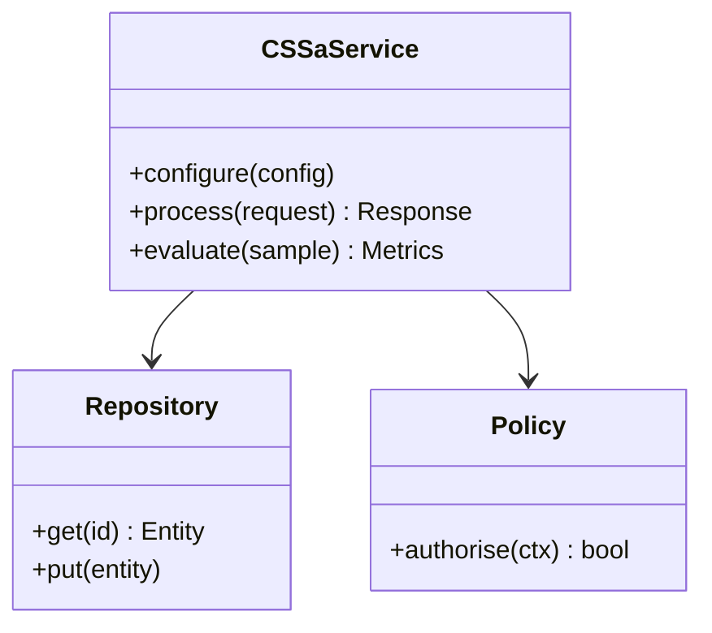

**Figure 25. Class - Case Study: Search at Scale** (mermaid). Figure: Class view for Case Study: Search at Scale. This diagram illustrates the principal components and their interactions as discussed in the surrounding section.

## Deep Dive: Mechanics, Variants and Trade-offs

Having established the essentials, we now go deeper into case study: search at scale. Beneath the abstraction lies a concrete process whose steps can each be measured, tested and optimised independently. The distinctions in this section are the ones that separate a working demo from a system that holds up under adversarial inputs, scale and the passage of time.

Consider the principal variants and how to choose between them. Each variant optimises for a different point in the design space - some for latency, some for accuracy, some for cost or operability - and the correct choice follows from explicit requirements rather than from defaults. As with most architectural decisions, the choice is rarely binary; the skill lies in quantifying the trade-offs and choosing deliberately.

In practice this is supported by a mature tooling ecosystem, including sentence-transformers, OpenAI embeddings, FAISS, Cohere. Tools accelerate the work but do not substitute for understanding: the same principles apply whichever implementation you select, and the ability to reason from first principles is what lets you debug when a tool behaves unexpectedly.

A frequent source of subtle bugs is the interaction with evaluating embedding quality. Because evaluating embedding quality concerns retrieval metrics (recall@k, MRR, nDCG) and benchmark suites like MTEB, changes there can silently alter the behaviour analysed here. The remedy is contract tests at the boundary and end-to-end evaluations that exercise the interaction explicitly.

Finally, attend to edge cases and degradation. Define what the system should do under partial failure, unexpected inputs and load spikes, and make that behaviour explicit and tested rather than emergent. Graceful degradation - returning a safe, useful result when the ideal one is unavailable - is a hallmark of mature engineering.

For deeper study, the literature offers authoritative treatments such as Mikolov et al. — Word2Vec (2013) and Reimers & Gurevych — Sentence-BERT (2019). These primary sources reward careful reading and ground the practical guidance above in established results.

## Advanced Considerations

Having established the essentials, we now go deeper into case study: search at scale. The underlying mechanism is best appreciated by tracing a single request from input to output and noting where state is created and consumed. The distinctions in this section are the ones that separate a working demo from a system that holds up under adversarial inputs, scale and the passage of time.

Consider the principal variants and how to choose between them. Each variant optimises for a different point in the design space - some for latency, some for accuracy, some for cost or operability - and the correct choice follows from explicit requirements rather than from defaults. As with most architectural decisions, the choice is rarely binary; the skill lies in quantifying the trade-offs and choosing deliberately.

In practice this is supported by a mature tooling ecosystem, including sentence-transformers, OpenAI embeddings, FAISS, Cohere. Tools accelerate the work but do not substitute for understanding: the same principles apply whichever implementation you select, and the ability to reason from first principles is what lets you debug when a tool behaves unexpectedly.

A frequent source of subtle bugs is the interaction with multimodal and cross-encoder embeddings. Because multimodal and cross-encoder embeddings concerns cLIP-style joint spaces and the bi-encoder/cross-encoder trade-off, changes there can silently alter the behaviour analysed here. The remedy is contract tests at the boundary and end-to-end evaluations that exercise the interaction explicitly.

Finally, attend to edge cases and degradation. Define what the system should do under partial failure, unexpected inputs and load spikes, and make that behaviour explicit and tested rather than emergent. Graceful degradation - returning a safe, useful result when the ideal one is unavailable - is a hallmark of mature engineering.

For deeper study, the literature offers authoritative treatments such as Mikolov et al. — Word2Vec (2013) and Reimers & Gurevych — Sentence-BERT (2019). These primary sources reward careful reading and ground the practical guidance above in established results.

## Worked Example

A worked example clarifies how these ideas behave in practice. A e-commerce organisation needs visual and textual product similarity and recommendation. They decide to apply case study: search at scale as part of their Embeddings solution, but wisely treat it as a hypothesis to be validated rather than a foregone conclusion.

The team begins by stating the objective precisely and defining how success will be measured before writing any code. They establish a small but representative evaluation set, agree on acceptance thresholds, and only then prototype the simplest design that could work. Early measurement reveals which assumptions hold and which must be revised, saving weeks of misdirected effort and surfacing edge cases while they are still cheap to fix.

As the prototype matures into a service, the team hardens it: adding input validation, error handling, caching where it pays off, and monitoring that ties back to the original success metric. They document each significant decision in an architecture decision record so that future maintainers understand not just what was built but why.

The outcome is instructive. The system that reaches production is not the most sophisticated design the team considered, but the one whose behaviour they could measure, explain and operate. This is the recurring lesson of Embeddings: durable value comes from the whole system, not from any single clever component.

## Industry Use Cases

Across industries, the ideas in this chapter recur in recognisable ways. The following vignettes show how different sectors apply them and what they have in common.

**Search.** Semantic search across heterogeneous enterprise content. The common thread is that value comes not from the model alone but from the surrounding system - data quality, evaluation, integration and operations - which is precisely where most of the engineering effort belongs.

**E-commerce.** Visual and textual product similarity and recommendation. The common thread is that value comes not from the model alone but from the surrounding system - data quality, evaluation, integration and operations - which is precisely where most of the engineering effort belongs.

**Support.** Deduplicating and routing tickets by semantic similarity. The common thread is that value comes not from the model alone but from the surrounding system - data quality, evaluation, integration and operations - which is precisely where most of the engineering effort belongs.

**Compliance.** Near-duplicate detection across document repositories. The common thread is that value comes not from the model alone but from the surrounding system - data quality, evaluation, integration and operations - which is precisely where most of the engineering effort belongs.

## Best Practices

The following practices consistently separate successful Embeddings efforts from struggling ones. They are deliberately concrete so they can be adopted as checklist items in design and code review.

- Normalise vectors and pick the distance metric the model was trained for.
- Pin embedding model versions and re-index atomically on change.
- Evaluate retrieval with recall@k and nDCG on a labelled set.
- Use hybrid search to recover exact-match and rare-term queries.

None of these are exotic; they are the unglamorous disciplines that compound into reliability. The cost of adopting them is small compared with the cost of the incidents they prevent, and they become second nature with practice.

## Common Pitfalls

Equally instructive are the failure modes that recur in practice. Each pitfall below has a clear early warning sign and a known remedy, so treat them as a diagnostic checklist when something feels wrong:

- Mixing vectors from different model versions in one index.
- Choosing the wrong similarity metric for the embedding model.
- Over-chunking or under-chunking documents before embedding.
- Ignoring drift after upgrading the embedding model.

The pattern is consistent: most failures stem from skipping measurement, conflating prototype and production standards, or deferring cross-cutting concerns such as security and cost until they become emergencies. Naming these traps in advance is the cheapest way to avoid them.

## Governance, Security and Cost Notes

No discussion of case study: search at scale is complete without its governance, security and cost dimensions, which are too often deferred until they become emergencies. Treating them as first-class concerns from the outset is both cheaper and safer.

**Governance.** Classify the risk of this capability, document its intended and out-of-scope uses, and ensure decisions are traceable to satisfy internal policy and external regulation such as the NIST AI RMF, ISO/IEC 42001 and the EU AI Act. **Security.** Treat all external input as untrusted, validate outputs before acting on them, apply least privilege to any tools or data access, and map controls to the OWASP LLM Top 10 and MITRE ATLAS.

**Cost and sustainability.** Establish explicit budgets for compute, tokens and latency, attribute spend to owners, and revisit the economics as usage scales - a design that is affordable at pilot scale can become untenable at production volume. Building these reflexes into everyday engineering is what allows a Embeddings system to be not only capable but also trustworthy and economically sound.

## Hands-On Exercises

Work through the following exercises. They are designed to move understanding from recognition to application - the level required for real engineering work - so prefer writing and building over merely reading.

1. Explain case study: search at scale to a colleague unfamiliar with Embeddings, using a concrete example from your own domain.
2. Sketch a reference architecture that incorporates case study: search at scale and annotate where observability, security and cost controls belong.
3. Design an evaluation that would tell you whether case study: search at scale is working in production, including the metric, the dataset and the acceptance threshold.
4. Identify two pitfalls relevant to case study: search at scale in your environment and describe the early warning signals you would monitor.
5. Prototype the simplest implementation that demonstrates case study: search at scale, then list exactly what would need to change to make it production-ready.

## Key Takeaways

Key takeaways from this chapter:

- Case Study: Search at Scale is a systems concern in Embeddings: data, models and operations must be co-designed.
- Measurement is non-negotiable; define success metrics and evaluation before building.
- Favour the simplest design that meets the requirement, and add complexity only when evidence demands it.
- Security, cost and observability are first-class requirements, not afterthoughts.
- Document decisions so the system remains understandable and operable as it evolves.

## Code Walkthrough

Pipelines keep Case Study: Search at Scale logic modular and testable. Each stage is a pure function, errors are captured per item, and the composition is trivial to extend or reorder.

The full listing is shown below; study it line by line and reproduce it locally before moving on.

### Listing: A composable processing pipeline for Case Study: Search at Scale

```python
from collections.abc import Iterable, Iterator
from typing import Protocol


class Stage(Protocol):
    def __call__(self, item: dict) -> dict: ...


def pipeline(stages: list[Stage]) -> Stage:
    """Compose ordered stages into a single callable for Case Study: Search at Scale."""

    def run(item: dict) -> dict:
        for stage in stages:
            item = stage(item)
        return item

    return run


def validate(item: dict) -> dict:
    if "text" not in item:
        raise ValueError("missing required field: text")
    return item


def normalise(item: dict) -> dict:
    item["text"] = item["text"].strip().lower()
    return item


def enrich(item: dict) -> dict:
    item["length"] = len(item["text"])
    return item


process = pipeline([validate, normalise, enrich])


def run_batch(items: Iterable[dict]) -> Iterator[dict]:
    for item in items:
        try:
            yield process(dict(item))
        except ValueError as exc:
            yield {"error": str(exc), "item": item}

```

## Review Questions

1. In the context of Embeddings, which statement best describes “Case Study: Search at Scale”?
   - A. It eliminates the need for any evaluation or monitoring.
   - B. It applies exclusively to image data.
   - C. a detailed case study of deploying Embeddings in a demanding search environment, including the decisions, trade-offs and outcomes
   - D. It makes the system slower but has no other effect.
   - **Answer: C.** Case Study: Search at Scale: a detailed case study of deploying Embeddings in a demanding search environment, including the decisions, trade-offs and outcomes
2. Which of the following is a recommended best practice when working with Embeddings?
   - A. Normalise vectors and pick the distance metric the model was trained for.
   - B. It applies exclusively to image data.
   - C. It eliminates the need for any evaluation or monitoring.
   - D. It removes all security and governance requirements.
   - **Answer: A.** Best practice: Normalise vectors and pick the distance metric the model was trained for.
3. Which of the following is a common pitfall to avoid in Embeddings?
   - A. It makes the system slower but has no other effect.
   - B. It guarantees deterministic output regardless of input.
   - C. Pin embedding model versions and re-index atomically on change.
   - D. Over-chunking or under-chunking documents before embedding.
   - **Answer: D.** Pitfall to avoid: Over-chunking or under-chunking documents before embedding.
4. *(Discussion)* Walk through how you would design Case Study: Search at Scale for an enterprise Embeddings workload.
   - **Model answer:** A strong answer defines case study: search at scale (a detailed case study of deploying Embeddings in a demanding search environment, including the decisions, trade-offs and outcomes) then connects it to architecture, evaluation, cost, security and operations for Embeddings, citing concrete trade-offs and a real-world example.

---


# Chapter 18. Operating in Production

_This chapter examines operating in production within Embeddings. It covers the operational discipline required to run a Embeddings system reliably, including monitoring, incident response and continuous improvement, derives a reference architecture, walks through a worked example and runnable code, surveys industry use cases, and distils best practices and pitfalls, closing with exercises and review questions._

## Introduction

Operating in Production refers to the operational discipline required to run a Embeddings system reliably, including monitoring, incident response and continuous improvement. Understanding this matters because Embeddings systems succeed or fail on exactly these decisions. It helps to separate the conceptual model from its implementation: the former guides reasoning, the latter must contend with real-world constraints.

This chapter builds intuition first, then formalises the ideas, derives an architecture, and finishes with code, exercises and review questions so the material transfers directly to your own Embeddings work. Read it actively: pause at each diagram, reproduce the code, and attempt the exercises before consulting the answers.

## Theory and Foundations

Operating in Production refers to the operational discipline required to run a Embeddings system reliably, including monitoring, incident response and continuous improvement. Seasoned practitioners treat this as a systems problem, co-designing data, models and operations rather than optimising any one in isolation. It pays to understand the mechanism rather than treat it as a black box, because most production incidents are explained by one of its steps misbehaving.

To place this in context, recall the broader picture: Embeddings map discrete objects—words, sentences, images, users, products—into continuous vector spaces where geometric proximity encodes semantic similarity. Within that picture, operating in production is one of the load-bearing ideas - the kind that, when understood deeply, makes the rest of Embeddings fall into place. It is foundational: later capabilities in Embeddings are built directly on top of it.

Operating in Production cannot be understood in isolation from operating an embedding service. Recall that operating an embedding service concerns batching, caching, versioning and cost at scale. The two interact directly: decisions in one constrain the design space of the other, which is why mature teams reason about them together rather than sequentially. Every added component buys capability at the price of operational surface area, and that bargain should be made consciously.

Operating in Production cannot be understood in isolation from from one-hot to distributed representations. Recall that from one-hot to distributed representations concerns why dense vectors generalise where sparse encodings cannot. The two interact directly: decisions in one constrain the design space of the other, which is why mature teams reason about them together rather than sequentially. As with most architectural decisions, the choice is rarely binary; the skill lies in quantifying the trade-offs and choosing deliberately.

Several established patterns apply directly to operating in production. The first, bi-encoder retrieval followed by cross-encoder re-ranking, is widely adopted because it makes the system's behaviour predictable and observable. A complementary pattern, hybrid lexical + dense fusion (reciprocal rank fusion), addresses a related concern and is often deployed alongside it. Patterns are not dogma; they are distilled experience that shortcuts the search for a sound design, and each carries assumptions worth checking against your context.

Knowing when not to use a technique is as valuable as knowing how to use it. In a small prototype, shortcuts around operating in production are invisible; in a production Embeddings system serving real traffic, they surface as incidents, cost overruns or compliance gaps. As with most architectural decisions, the choice is rarely binary; the skill lies in quantifying the trade-offs and choosing deliberately. The remainder of this chapter turns these principles into an architecture, code and a checklist you can apply immediately.

## Architecture and Design

The reference architecture for Operating in Production separates concerns into clearly bounded components with explicit contracts. An embedding platform exposes a versioned embedding service that batches and caches encode requests, writes vectors to an ANN index (HNSW/IVF) with stored metadata, and supports hybrid retrieval that fuses lexical and dense scores before an optional cross-encoder re-ranks the top candidates.

Concretely, the principal building blocks include from one-hot to distributed representations, word, sentence and document embeddings, contrastive representation learning, similarity metrics and normalisation and multimodal and cross-encoder embeddings. Each is a replaceable component behind a stable interface, so the team can upgrade an implementation - a model, an index, a policy engine - without rewriting its neighbours. The contracts between components are where reliability is won or lost, so they are specified explicitly and tested in isolation.

The diagram accompanying this section makes the data and control flow explicit. Requests enter through a well-defined boundary where they are authenticated and validated; only then are they dispatched to the components that perform the work. This boundary is also where rate limiting, quota enforcement and audit logging live, keeping cross-cutting concerns out of the core logic and in one auditable place.

Two qualities deserve emphasis. First, observability is designed in, not bolted on: every component emits structured telemetry so that failures can be localised in minutes rather than hours. Second, the architecture is evolvable - components communicate through stable contracts so that any single part of the Embeddings system can be replaced without a rewrite. There is an inherent trade-off between fidelity and cost, and the correct balance depends on the use case and its tolerance for error.

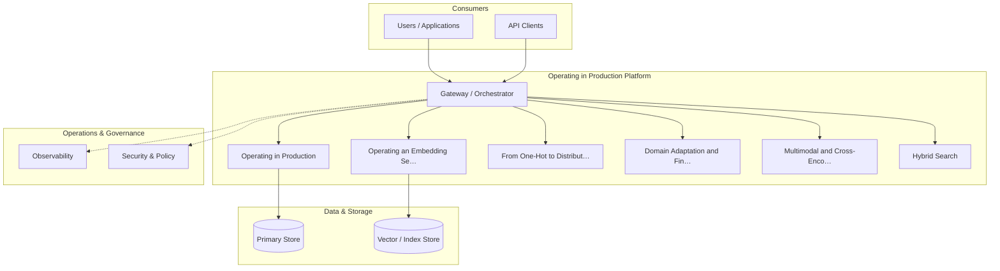

**Figure 26. Security Architecture - Operating in Production** (mermaid). Figure: Security Architecture view for Operating in Production. This diagram illustrates the principal components and their interactions as discussed in the surrounding section.

## Deep Dive: Mechanics, Variants and Trade-offs

Having established the essentials, we now go deeper into operating in production. It pays to understand the mechanism rather than treat it as a black box, because most production incidents are explained by one of its steps misbehaving. The distinctions in this section are the ones that separate a working demo from a system that holds up under adversarial inputs, scale and the passage of time.

Consider the principal variants and how to choose between them. Each variant optimises for a different point in the design space - some for latency, some for accuracy, some for cost or operability - and the correct choice follows from explicit requirements rather than from defaults. Simplicity is a feature. The simplest design that meets the requirement should be the default, with complexity added only when measurement justifies it.

In practice this is supported by a mature tooling ecosystem, including sentence-transformers, OpenAI embeddings, FAISS, Cohere. Tools accelerate the work but do not substitute for understanding: the same principles apply whichever implementation you select, and the ability to reason from first principles is what lets you debug when a tool behaves unexpectedly.

A frequent source of subtle bugs is the interaction with operating an embedding service. Because operating an embedding service concerns batching, caching, versioning and cost at scale, changes there can silently alter the behaviour analysed here. The remedy is contract tests at the boundary and end-to-end evaluations that exercise the interaction explicitly.

Finally, attend to edge cases and degradation. Define what the system should do under partial failure, unexpected inputs and load spikes, and make that behaviour explicit and tested rather than emergent. Graceful degradation - returning a safe, useful result when the ideal one is unavailable - is a hallmark of mature engineering.

For deeper study, the literature offers authoritative treatments such as Mikolov et al. — Word2Vec (2013) and Reimers & Gurevych — Sentence-BERT (2019). These primary sources reward careful reading and ground the practical guidance above in established results.

## Advanced Considerations

Having established the essentials, we now go deeper into operating in production. It pays to understand the mechanism rather than treat it as a black box, because most production incidents are explained by one of its steps misbehaving. The distinctions in this section are the ones that separate a working demo from a system that holds up under adversarial inputs, scale and the passage of time.

Consider the principal variants and how to choose between them. Each variant optimises for a different point in the design space - some for latency, some for accuracy, some for cost or operability - and the correct choice follows from explicit requirements rather than from defaults. There is an inherent trade-off between fidelity and cost, and the correct balance depends on the use case and its tolerance for error.

In practice this is supported by a mature tooling ecosystem, including sentence-transformers, OpenAI embeddings, FAISS, Cohere. Tools accelerate the work but do not substitute for understanding: the same principles apply whichever implementation you select, and the ability to reason from first principles is what lets you debug when a tool behaves unexpectedly.

A frequent source of subtle bugs is the interaction with evaluating embedding quality. Because evaluating embedding quality concerns retrieval metrics (recall@k, MRR, nDCG) and benchmark suites like MTEB, changes there can silently alter the behaviour analysed here. The remedy is contract tests at the boundary and end-to-end evaluations that exercise the interaction explicitly.

Finally, attend to edge cases and degradation. Define what the system should do under partial failure, unexpected inputs and load spikes, and make that behaviour explicit and tested rather than emergent. Graceful degradation - returning a safe, useful result when the ideal one is unavailable - is a hallmark of mature engineering.

For deeper study, the literature offers authoritative treatments such as Mikolov et al. — Word2Vec (2013) and Reimers & Gurevych — Sentence-BERT (2019). These primary sources reward careful reading and ground the practical guidance above in established results.

## Worked Example

To ground the discussion, walk through a representative example. A e-commerce organisation needs visual and textual product similarity and recommendation. They decide to apply operating in production as part of their Embeddings solution, but wisely treat it as a hypothesis to be validated rather than a foregone conclusion.

The team begins by stating the objective precisely and defining how success will be measured before writing any code. They establish a small but representative evaluation set, agree on acceptance thresholds, and only then prototype the simplest design that could work. Early measurement reveals which assumptions hold and which must be revised, saving weeks of misdirected effort and surfacing edge cases while they are still cheap to fix.

As the prototype matures into a service, the team hardens it: adding input validation, error handling, caching where it pays off, and monitoring that ties back to the original success metric. They document each significant decision in an architecture decision record so that future maintainers understand not just what was built but why.

The outcome is instructive. The system that reaches production is not the most sophisticated design the team considered, but the one whose behaviour they could measure, explain and operate. This is the recurring lesson of Embeddings: durable value comes from the whole system, not from any single clever component.

## Industry Use Cases

Across industries, the ideas in this chapter recur in recognisable ways. The following vignettes show how different sectors apply them and what they have in common.

**Search.** Semantic search across heterogeneous enterprise content. The common thread is that value comes not from the model alone but from the surrounding system - data quality, evaluation, integration and operations - which is precisely where most of the engineering effort belongs.

**E-commerce.** Visual and textual product similarity and recommendation. The common thread is that value comes not from the model alone but from the surrounding system - data quality, evaluation, integration and operations - which is precisely where most of the engineering effort belongs.

**Support.** Deduplicating and routing tickets by semantic similarity. The common thread is that value comes not from the model alone but from the surrounding system - data quality, evaluation, integration and operations - which is precisely where most of the engineering effort belongs.

**Compliance.** Near-duplicate detection across document repositories. The common thread is that value comes not from the model alone but from the surrounding system - data quality, evaluation, integration and operations - which is precisely where most of the engineering effort belongs.

## Best Practices

The following practices consistently separate successful Embeddings efforts from struggling ones. They are deliberately concrete so they can be adopted as checklist items in design and code review.

- Normalise vectors and pick the distance metric the model was trained for.
- Pin embedding model versions and re-index atomically on change.
- Evaluate retrieval with recall@k and nDCG on a labelled set.
- Use hybrid search to recover exact-match and rare-term queries.

None of these are exotic; they are the unglamorous disciplines that compound into reliability. The cost of adopting them is small compared with the cost of the incidents they prevent, and they become second nature with practice.

## Common Pitfalls

Equally instructive are the failure modes that recur in practice. Each pitfall below has a clear early warning sign and a known remedy, so treat them as a diagnostic checklist when something feels wrong:

- Mixing vectors from different model versions in one index.
- Choosing the wrong similarity metric for the embedding model.
- Over-chunking or under-chunking documents before embedding.
- Ignoring drift after upgrading the embedding model.

The pattern is consistent: most failures stem from skipping measurement, conflating prototype and production standards, or deferring cross-cutting concerns such as security and cost until they become emergencies. Naming these traps in advance is the cheapest way to avoid them.

## Governance, Security and Cost Notes

No discussion of operating in production is complete without its governance, security and cost dimensions, which are too often deferred until they become emergencies. Treating them as first-class concerns from the outset is both cheaper and safer.

**Governance.** Classify the risk of this capability, document its intended and out-of-scope uses, and ensure decisions are traceable to satisfy internal policy and external regulation such as the NIST AI RMF, ISO/IEC 42001 and the EU AI Act. **Security.** Treat all external input as untrusted, validate outputs before acting on them, apply least privilege to any tools or data access, and map controls to the OWASP LLM Top 10 and MITRE ATLAS.

**Cost and sustainability.** Establish explicit budgets for compute, tokens and latency, attribute spend to owners, and revisit the economics as usage scales - a design that is affordable at pilot scale can become untenable at production volume. Building these reflexes into everyday engineering is what allows a Embeddings system to be not only capable but also trustworthy and economically sound.

## Hands-On Exercises

Work through the following exercises. They are designed to move understanding from recognition to application - the level required for real engineering work - so prefer writing and building over merely reading.

1. Explain operating in production to a colleague unfamiliar with Embeddings, using a concrete example from your own domain.
2. Sketch a reference architecture that incorporates operating in production and annotate where observability, security and cost controls belong.
3. Design an evaluation that would tell you whether operating in production is working in production, including the metric, the dataset and the acceptance threshold.
4. Identify two pitfalls relevant to operating in production in your environment and describe the early warning signals you would monitor.
5. Prototype the simplest implementation that demonstrates operating in production, then list exactly what would need to change to make it production-ready.

## Key Takeaways

Key takeaways from this chapter:

- Operating in Production is a systems concern in Embeddings: data, models and operations must be co-designed.
- Measurement is non-negotiable; define success metrics and evaluation before building.
- Favour the simplest design that meets the requirement, and add complexity only when evidence demands it.
- Security, cost and observability are first-class requirements, not afterthoughts.
- Document decisions so the system remains understandable and operable as it evolves.

## Code Walkthrough

This listing shows a configuration-driven Operating in Production component with retry semantics and typed interfaces — the shape we expect from production Embeddings code rather than a notebook prototype.

The full listing is shown below; study it line by line and reproduce it locally before moving on.

### Listing: Implementing a Operating in Production component

```python
from __future__ import annotations

from dataclasses import dataclass, field
from typing import Any


@dataclass(slots=True)
class OperatingInProductionConfig:
    """Configuration for the Operating in Production component in a Embeddings system."""

    name: str
    timeout_s: float = 30.0
    max_retries: int = 3
    options: dict[str, Any] = field(default_factory=dict)


class OperatingInProduction:
    """A minimal, production-shaped implementation of Operating in Production."""

    def __init__(self, config: OperatingInProductionConfig) -> None:
        self._config = config
        self._calls = 0

    def run(self, payload: dict[str, Any]) -> dict[str, Any]:
        """Process a request, retrying transient failures with backoff."""
        last_error: Exception | None = None
        for attempt in range(self._config.max_retries):
            try:
                self._calls += 1
                return self._process(payload)
            except TimeoutError as exc:  # transient
                last_error = exc
                continue
        raise RuntimeError(f"OperatingInProduction failed after retries") from last_error

    def _process(self, payload: dict[str, Any]) -> dict[str, Any]:
        # Domain-specific logic for Operating in Production goes here.
        return {"status": "ok", "input_keys": sorted(payload), "calls": self._calls}

```

## Review Questions

1. In the context of Embeddings, which statement best describes “Operating in Production”?
   - A. It removes all security and governance requirements.
   - B. It eliminates the need for any evaluation or monitoring.
   - C. the operational discipline required to run a Embeddings system reliably, including monitoring, incident response and continuous improvement
   - D. It makes the system slower but has no other effect.
   - **Answer: C.** Operating in Production: the operational discipline required to run a Embeddings system reliably, including monitoring, incident response and continuous improvement
2. Which of the following is a recommended best practice when working with Embeddings?
   - A. Use hybrid search to recover exact-match and rare-term queries.
   - B. It makes the system slower but has no other effect.
   - C. It guarantees deterministic output regardless of input.
   - D. Choosing the wrong similarity metric for the embedding model.
   - **Answer: A.** Best practice: Use hybrid search to recover exact-match and rare-term queries.
3. Which of the following is a common pitfall to avoid in Embeddings?
   - A. Over-chunking or under-chunking documents before embedding.
   - B. It removes all security and governance requirements.
   - C. Normalise vectors and pick the distance metric the model was trained for.
   - D. It makes the system slower but has no other effect.
   - **Answer: A.** Pitfall to avoid: Over-chunking or under-chunking documents before embedding.
4. *(Discussion)* Explain Operating in Production and why it matters in a production Embeddings system.
   - **Model answer:** A strong answer defines operating in production (the operational discipline required to run a Embeddings system reliably, including monitoring, incident response and continuous improvement) then connects it to architecture, evaluation, cost, security and operations for Embeddings, citing concrete trade-offs and a real-world example.

---


# Chapter 19. Evaluation and Quality Assurance

_This chapter examines evaluation and quality assurance within Embeddings. It covers a rigorous approach to measuring and assuring the quality of a Embeddings system before and after release, derives a reference architecture, walks through a worked example and runnable code, surveys industry use cases, and distils best practices and pitfalls, closing with exercises and review questions._

## Introduction

Evaluation and Quality Assurance refers to a rigorous approach to measuring and assuring the quality of a Embeddings system before and after release. Getting this right early prevents expensive rework once a Embeddings system reaches scale. Seasoned practitioners treat this as a systems problem, co-designing data, models and operations rather than optimising any one in isolation.

This chapter builds intuition first, then formalises the ideas, derives an architecture, and finishes with code, exercises and review questions so the material transfers directly to your own Embeddings work. Read it actively: pause at each diagram, reproduce the code, and attempt the exercises before consulting the answers.

## Theory and Foundations

In practical terms, Evaluation and Quality Assurance is best understood as a rigorous approach to measuring and assuring the quality of a Embeddings system before and after release. The right abstraction here pays compounding dividends, because downstream components depend on its guarantees. Mechanically, the behaviour emerges from a few interacting parts that are simpler than the whole they produce.

To place this in context, recall the broader picture: Embeddings map discrete objects—words, sentences, images, users, products—into continuous vector spaces where geometric proximity encodes semantic similarity. Within that picture, evaluation and quality assurance is one of the load-bearing ideas - the kind that, when understood deeply, makes the rest of Embeddings fall into place. It is foundational: later capabilities in Embeddings are built directly on top of it.

Evaluation and Quality Assurance cannot be understood in isolation from operating an embedding service. Recall that operating an embedding service concerns batching, caching, versioning and cost at scale. The two interact directly: decisions in one constrain the design space of the other, which is why mature teams reason about them together rather than sequentially. Simplicity is a feature. The simplest design that meets the requirement should be the default, with complexity added only when measurement justifies it.

Evaluation and Quality Assurance cannot be understood in isolation from domain adaptation and fine-tuning. Recall that domain adaptation and fine-tuning concerns adapting general embeddings to specialised corpora. The two interact directly: decisions in one constrain the design space of the other, which is why mature teams reason about them together rather than sequentially. Every added component buys capability at the price of operational surface area, and that bargain should be made consciously.

Several established patterns apply directly to evaluation and quality assurance. The first, hybrid lexical + dense fusion (reciprocal rank fusion), is widely adopted because it makes the system's behaviour predictable and observable. A complementary pattern, versioned indexes with blue/green re-embedding, addresses a related concern and is often deployed alongside it. Patterns are not dogma; they are distilled experience that shortcuts the search for a sound design, and each carries assumptions worth checking against your context.

Knowing when not to use a technique is as valuable as knowing how to use it. In a small prototype, shortcuts around evaluation and quality assurance are invisible; in a production Embeddings system serving real traffic, they surface as incidents, cost overruns or compliance gaps. Latency, accuracy and cost form a tension triangle: improving one typically pressures the others, so explicit budgets are essential. The remainder of this chapter turns these principles into an architecture, code and a checklist you can apply immediately.

## Architecture and Design

The reference architecture for Evaluation and Quality Assurance separates concerns into clearly bounded components with explicit contracts. An embedding platform exposes a versioned embedding service that batches and caches encode requests, writes vectors to an ANN index (HNSW/IVF) with stored metadata, and supports hybrid retrieval that fuses lexical and dense scores before an optional cross-encoder re-ranks the top candidates.

Concretely, the principal building blocks include from one-hot to distributed representations, word, sentence and document embeddings, contrastive representation learning, similarity metrics and normalisation and multimodal and cross-encoder embeddings. Each is a replaceable component behind a stable interface, so the team can upgrade an implementation - a model, an index, a policy engine - without rewriting its neighbours. The contracts between components are where reliability is won or lost, so they are specified explicitly and tested in isolation.

The diagram accompanying this section makes the data and control flow explicit. Requests enter through a well-defined boundary where they are authenticated and validated; only then are they dispatched to the components that perform the work. This boundary is also where rate limiting, quota enforcement and audit logging live, keeping cross-cutting concerns out of the core logic and in one auditable place.

Two qualities deserve emphasis. First, observability is designed in, not bolted on: every component emits structured telemetry so that failures can be localised in minutes rather than hours. Second, the architecture is evolvable - components communicate through stable contracts so that any single part of the Embeddings system can be replaced without a rewrite. Every added component buys capability at the price of operational surface area, and that bargain should be made consciously.

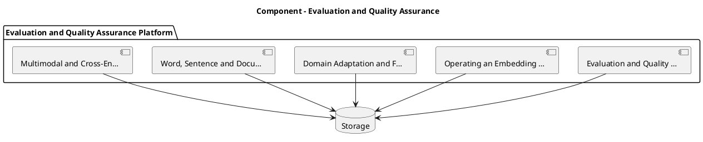

_Source diagram (plantuml); render with the appropriate tool._

**Figure 27. Component - Evaluation and Quality Assurance** (plantuml). Figure: Component view for Evaluation and Quality Assurance. This diagram illustrates the principal components and their interactions as discussed in the surrounding section.

```xml
<mxfile host="ai-university">
  <diagram name="Data Flow">
    <mxGraphModel dx="800" dy="600" grid="1" gridSize="10">
      <root>
        <mxCell id="0"/>
        <mxCell id="1" parent="0"/>
        <mxCell id="title" value="Data Flow - Evaluation and Quality Assurance" style="text;fontSize=16;fontStyle=1" vertex="1" parent="1"><mxGeometry x="40" y="20" width="600" height="30" as="geometry"/></mxCell>
        <mxCell id="hub" value="Evaluation and Qualit…" style="rounded=1;fillColor=#0f172a;fontColor=#ffffff;fontStyle=1" vertex="1" parent="1"><mxGeometry x="300" y="180" width="160" height="60" as="geometry"/></mxCell>
        <mxCell id="n0" value="Evaluation and Quality …" style="rounded=1;fillColor=#e0e7ff;strokeColor=#4338ca" vertex="1" parent="1"><mxGeometry x="60" y="80" width="160" height="50" as="geometry"/></mxCell>
        <mxCell id="e0" style="edgeStyle=orthogonalEdgeStyle" edge="1" parent="1" source="hub" target="n0"><mxGeometry relative="1" as="geometry"/></mxCell>
        <mxCell id="n1" value="Operating an Embedding …" style="rounded=1;fillColor=#e0e7ff;strokeColor=#4338ca" vertex="1" parent="1"><mxGeometry x="600" y="170" width="160" height="50" as="geometry"/></mxCell>
        <mxCell id="e1" style="edgeStyle=orthogonalEdgeStyle" edge="1" parent="1" source="hub" target="n1"><mxGeometry relative="1" as="geometry"/></mxCell>
        <mxCell id="n2" value="Domain Adaptation and F…" style="rounded=1;fillColor=#e0e7ff;strokeColor=#4338ca" vertex="1" parent="1"><mxGeometry x="60" y="260" width="160" height="50" as="geometry"/></mxCell>
        <mxCell id="e2" style="edgeStyle=orthogonalEdgeStyle" edge="1" parent="1" source="hub" target="n2"><mxGeometry relative="1" as="geometry"/></mxCell>
        <mxCell id="n3" value="Word, Sentence and Docu…" style="rounded=1;fillColor=#e0e7ff;strokeColor=#4338ca" vertex="1" parent="1"><mxGeometry x="600" y="350" width="160" height="50" as="geometry"/></mxCell>
        <mxCell id="e3" style="edgeStyle=orthogonalEdgeStyle" edge="1" parent="1" source="hub" target="n3"><mxGeometry relative="1" as="geometry"/></mxCell>
        <mxCell id="n4" value="Multimodal and Cross-En…" style="rounded=1;fillColor=#e0e7ff;strokeColor=#4338ca" vertex="1" parent="1"><mxGeometry x="60" y="440" width="160" height="50" as="geometry"/></mxCell>
        <mxCell id="e4" style="edgeStyle=orthogonalEdgeStyle" edge="1" parent="1" source="hub" target="n4"><mxGeometry relative="1" as="geometry"/></mxCell>
      </root>
    </mxGraphModel>
  </diagram>
</mxfile>
```

_Source diagram (drawio); render with the appropriate tool._

**Figure 28. Data Flow - Evaluation and Quality Assurance** (drawio). Figure: Data Flow view for Evaluation and Quality Assurance. This diagram illustrates the principal components and their interactions as discussed in the surrounding section.

## Deep Dive: Mechanics, Variants and Trade-offs

Having established the essentials, we now go deeper into evaluation and quality assurance. Mechanically, the behaviour emerges from a few interacting parts that are simpler than the whole they produce. The distinctions in this section are the ones that separate a working demo from a system that holds up under adversarial inputs, scale and the passage of time.

Consider the principal variants and how to choose between them. Each variant optimises for a different point in the design space - some for latency, some for accuracy, some for cost or operability - and the correct choice follows from explicit requirements rather than from defaults. There is an inherent trade-off between fidelity and cost, and the correct balance depends on the use case and its tolerance for error.

In practice this is supported by a mature tooling ecosystem, including sentence-transformers, OpenAI embeddings, FAISS, Cohere. Tools accelerate the work but do not substitute for understanding: the same principles apply whichever implementation you select, and the ability to reason from first principles is what lets you debug when a tool behaves unexpectedly.

A frequent source of subtle bugs is the interaction with operating an embedding service. Because operating an embedding service concerns batching, caching, versioning and cost at scale, changes there can silently alter the behaviour analysed here. The remedy is contract tests at the boundary and end-to-end evaluations that exercise the interaction explicitly.

Finally, attend to edge cases and degradation. Define what the system should do under partial failure, unexpected inputs and load spikes, and make that behaviour explicit and tested rather than emergent. Graceful degradation - returning a safe, useful result when the ideal one is unavailable - is a hallmark of mature engineering.

For deeper study, the literature offers authoritative treatments such as Mikolov et al. — Word2Vec (2013) and Reimers & Gurevych — Sentence-BERT (2019). These primary sources reward careful reading and ground the practical guidance above in established results.

## Advanced Considerations

Having established the essentials, we now go deeper into evaluation and quality assurance. Mechanically, the behaviour emerges from a few interacting parts that are simpler than the whole they produce. The distinctions in this section are the ones that separate a working demo from a system that holds up under adversarial inputs, scale and the passage of time.

Consider the principal variants and how to choose between them. Each variant optimises for a different point in the design space - some for latency, some for accuracy, some for cost or operability - and the correct choice follows from explicit requirements rather than from defaults. As with most architectural decisions, the choice is rarely binary; the skill lies in quantifying the trade-offs and choosing deliberately.

In practice this is supported by a mature tooling ecosystem, including sentence-transformers, OpenAI embeddings, FAISS, Cohere. Tools accelerate the work but do not substitute for understanding: the same principles apply whichever implementation you select, and the ability to reason from first principles is what lets you debug when a tool behaves unexpectedly.

A frequent source of subtle bugs is the interaction with dimensionality, compression and quantisation. Because dimensionality, compression and quantisation concerns matryoshka embeddings, PCA and product quantisation for cost control, changes there can silently alter the behaviour analysed here. The remedy is contract tests at the boundary and end-to-end evaluations that exercise the interaction explicitly.

Finally, attend to edge cases and degradation. Define what the system should do under partial failure, unexpected inputs and load spikes, and make that behaviour explicit and tested rather than emergent. Graceful degradation - returning a safe, useful result when the ideal one is unavailable - is a hallmark of mature engineering.

For deeper study, the literature offers authoritative treatments such as Mikolov et al. — Word2Vec (2013) and Reimers & Gurevych — Sentence-BERT (2019). These primary sources reward careful reading and ground the practical guidance above in established results.

## Worked Example

To ground the discussion, walk through a representative example. A support organisation needs deduplicating and routing tickets by semantic similarity. They decide to apply evaluation and quality assurance as part of their Embeddings solution, but wisely treat it as a hypothesis to be validated rather than a foregone conclusion.

The team begins by stating the objective precisely and defining how success will be measured before writing any code. They establish a small but representative evaluation set, agree on acceptance thresholds, and only then prototype the simplest design that could work. Early measurement reveals which assumptions hold and which must be revised, saving weeks of misdirected effort and surfacing edge cases while they are still cheap to fix.

As the prototype matures into a service, the team hardens it: adding input validation, error handling, caching where it pays off, and monitoring that ties back to the original success metric. They document each significant decision in an architecture decision record so that future maintainers understand not just what was built but why.

The outcome is instructive. The system that reaches production is not the most sophisticated design the team considered, but the one whose behaviour they could measure, explain and operate. This is the recurring lesson of Embeddings: durable value comes from the whole system, not from any single clever component.

## Industry Use Cases

Across industries, the ideas in this chapter recur in recognisable ways. The following vignettes show how different sectors apply them and what they have in common.

**Search.** Semantic search across heterogeneous enterprise content. The common thread is that value comes not from the model alone but from the surrounding system - data quality, evaluation, integration and operations - which is precisely where most of the engineering effort belongs.

**E-commerce.** Visual and textual product similarity and recommendation. The common thread is that value comes not from the model alone but from the surrounding system - data quality, evaluation, integration and operations - which is precisely where most of the engineering effort belongs.

**Support.** Deduplicating and routing tickets by semantic similarity. The common thread is that value comes not from the model alone but from the surrounding system - data quality, evaluation, integration and operations - which is precisely where most of the engineering effort belongs.

**Compliance.** Near-duplicate detection across document repositories. The common thread is that value comes not from the model alone but from the surrounding system - data quality, evaluation, integration and operations - which is precisely where most of the engineering effort belongs.

## Best Practices

The following practices consistently separate successful Embeddings efforts from struggling ones. They are deliberately concrete so they can be adopted as checklist items in design and code review.

- Normalise vectors and pick the distance metric the model was trained for.
- Pin embedding model versions and re-index atomically on change.
- Evaluate retrieval with recall@k and nDCG on a labelled set.
- Use hybrid search to recover exact-match and rare-term queries.

None of these are exotic; they are the unglamorous disciplines that compound into reliability. The cost of adopting them is small compared with the cost of the incidents they prevent, and they become second nature with practice.

## Common Pitfalls

Equally instructive are the failure modes that recur in practice. Each pitfall below has a clear early warning sign and a known remedy, so treat them as a diagnostic checklist when something feels wrong:

- Mixing vectors from different model versions in one index.
- Choosing the wrong similarity metric for the embedding model.
- Over-chunking or under-chunking documents before embedding.
- Ignoring drift after upgrading the embedding model.

The pattern is consistent: most failures stem from skipping measurement, conflating prototype and production standards, or deferring cross-cutting concerns such as security and cost until they become emergencies. Naming these traps in advance is the cheapest way to avoid them.

## Governance, Security and Cost Notes

No discussion of evaluation and quality assurance is complete without its governance, security and cost dimensions, which are too often deferred until they become emergencies. Treating them as first-class concerns from the outset is both cheaper and safer.

**Governance.** Classify the risk of this capability, document its intended and out-of-scope uses, and ensure decisions are traceable to satisfy internal policy and external regulation such as the NIST AI RMF, ISO/IEC 42001 and the EU AI Act. **Security.** Treat all external input as untrusted, validate outputs before acting on them, apply least privilege to any tools or data access, and map controls to the OWASP LLM Top 10 and MITRE ATLAS.

**Cost and sustainability.** Establish explicit budgets for compute, tokens and latency, attribute spend to owners, and revisit the economics as usage scales - a design that is affordable at pilot scale can become untenable at production volume. Building these reflexes into everyday engineering is what allows a Embeddings system to be not only capable but also trustworthy and economically sound.

## Hands-On Exercises

Work through the following exercises. They are designed to move understanding from recognition to application - the level required for real engineering work - so prefer writing and building over merely reading.

1. Explain evaluation and quality assurance to a colleague unfamiliar with Embeddings, using a concrete example from your own domain.
2. Sketch a reference architecture that incorporates evaluation and quality assurance and annotate where observability, security and cost controls belong.
3. Design an evaluation that would tell you whether evaluation and quality assurance is working in production, including the metric, the dataset and the acceptance threshold.
4. Identify two pitfalls relevant to evaluation and quality assurance in your environment and describe the early warning signals you would monitor.
5. Prototype the simplest implementation that demonstrates evaluation and quality assurance, then list exactly what would need to change to make it production-ready.

## Key Takeaways

Key takeaways from this chapter:

- Evaluation and Quality Assurance is a systems concern in Embeddings: data, models and operations must be co-designed.
- Measurement is non-negotiable; define success metrics and evaluation before building.
- Favour the simplest design that meets the requirement, and add complexity only when evidence demands it.
- Security, cost and observability are first-class requirements, not afterthoughts.
- Document decisions so the system remains understandable and operable as it evolves.

## Code Walkthrough

This listing shows a configuration-driven Evaluation and Quality Assurance component with retry semantics and typed interfaces — the shape we expect from production Embeddings code rather than a notebook prototype.

The full listing is shown below; study it line by line and reproduce it locally before moving on.

### Listing: Implementing a Evaluation and Quality Assurance component

```python
from __future__ import annotations

from dataclasses import dataclass, field
from typing import Any


@dataclass(slots=True)
class EvaluationAndQualityConfig:
    """Configuration for the Evaluation and Quality Assurance component in a Embeddings system."""

    name: str
    timeout_s: float = 30.0
    max_retries: int = 3
    options: dict[str, Any] = field(default_factory=dict)


class EvaluationAndQuality:
    """A minimal, production-shaped implementation of Evaluation and Quality Assurance."""

    def __init__(self, config: EvaluationAndQualityConfig) -> None:
        self._config = config
        self._calls = 0

    def run(self, payload: dict[str, Any]) -> dict[str, Any]:
        """Process a request, retrying transient failures with backoff."""
        last_error: Exception | None = None
        for attempt in range(self._config.max_retries):
            try:
                self._calls += 1
                return self._process(payload)
            except TimeoutError as exc:  # transient
                last_error = exc
                continue
        raise RuntimeError(f"EvaluationAndQuality failed after retries") from last_error

    def _process(self, payload: dict[str, Any]) -> dict[str, Any]:
        # Domain-specific logic for Evaluation and Quality Assurance goes here.
        return {"status": "ok", "input_keys": sorted(payload), "calls": self._calls}

```

## Review Questions

1. In the context of Embeddings, which statement best describes “Evaluation and Quality Assurance”?
   - A. It is only relevant to academic research, not production.
   - B. a rigorous approach to measuring and assuring the quality of a Embeddings system before and after release
   - C. It eliminates the need for any evaluation or monitoring.
   - D. It removes all security and governance requirements.
   - **Answer: B.** Evaluation and Quality Assurance: a rigorous approach to measuring and assuring the quality of a Embeddings system before and after release
2. Which of the following is a recommended best practice when working with Embeddings?
   - A. It is only relevant to academic research, not production.
   - B. Use hybrid search to recover exact-match and rare-term queries.
   - C. It eliminates the need for any evaluation or monitoring.
   - D. It removes all security and governance requirements.
   - **Answer: B.** Best practice: Use hybrid search to recover exact-match and rare-term queries.
3. Which of the following is a common pitfall to avoid in Embeddings?
   - A. It removes all security and governance requirements.
   - B. Over-chunking or under-chunking documents before embedding.
   - C. It applies exclusively to image data.
   - D. Pin embedding model versions and re-index atomically on change.
   - **Answer: B.** Pitfall to avoid: Over-chunking or under-chunking documents before embedding.
4. *(Discussion)* Walk through how you would design Evaluation and Quality Assurance for an enterprise Embeddings workload.
   - **Model answer:** A strong answer defines evaluation and quality assurance (a rigorous approach to measuring and assuring the quality of a Embeddings system before and after release) then connects it to architecture, evaluation, cost, security and operations for Embeddings, citing concrete trade-offs and a real-world example.

---


# Chapter 20. Security, Privacy and Governance

_This chapter examines security, privacy and governance within Embeddings. It covers the security, privacy and governance controls that make a Embeddings system trustworthy and compliant, derives a reference architecture, walks through a worked example and runnable code, surveys industry use cases, and distils best practices and pitfalls, closing with exercises and review questions._

## Introduction

Security, Privacy and Governance refers to the security, privacy and governance controls that make a Embeddings system trustworthy and compliant. It is foundational: later capabilities in Embeddings are built directly on top of it. The practical implication is that design choices here ripple through latency, cost and maintainability for the lifetime of the system.

This chapter builds intuition first, then formalises the ideas, derives an architecture, and finishes with code, exercises and review questions so the material transfers directly to your own Embeddings work. Read it actively: pause at each diagram, reproduce the code, and attempt the exercises before consulting the answers.

## Theory and Foundations

Security, Privacy and Governance refers to the security, privacy and governance controls that make a Embeddings system trustworthy and compliant. The right abstraction here pays compounding dividends, because downstream components depend on its guarantees. It pays to understand the mechanism rather than treat it as a black box, because most production incidents are explained by one of its steps misbehaving.

To place this in context, recall the broader picture: Embeddings map discrete objects—words, sentences, images, users, products—into continuous vector spaces where geometric proximity encodes semantic similarity. Within that picture, security, privacy and governance is one of the load-bearing ideas - the kind that, when understood deeply, makes the rest of Embeddings fall into place. This concept recurs throughout the Embeddings lifecycle, from design to operations.

Security, Privacy and Governance cannot be understood in isolation from operating an embedding service. Recall that operating an embedding service concerns batching, caching, versioning and cost at scale. The two interact directly: decisions in one constrain the design space of the other, which is why mature teams reason about them together rather than sequentially. Simplicity is a feature. The simplest design that meets the requirement should be the default, with complexity added only when measurement justifies it.

Security, Privacy and Governance cannot be understood in isolation from indexing for approximate nearest neighbour search. Recall that indexing for approximate nearest neighbour search concerns hNSW, IVF and the recall/latency frontier. The two interact directly: decisions in one constrain the design space of the other, which is why mature teams reason about them together rather than sequentially. Latency, accuracy and cost form a tension triangle: improving one typically pressures the others, so explicit budgets are essential.

Several established patterns apply directly to security, privacy and governance. The first, matryoshka embeddings for adaptive dimensionality, is widely adopted because it makes the system's behaviour predictable and observable. A complementary pattern, bi-encoder retrieval followed by cross-encoder re-ranking, addresses a related concern and is often deployed alongside it. Patterns are not dogma; they are distilled experience that shortcuts the search for a sound design, and each carries assumptions worth checking against your context.

Knowing when not to use a technique is as valuable as knowing how to use it. In a small prototype, shortcuts around security, privacy and governance are invisible; in a production Embeddings system serving real traffic, they surface as incidents, cost overruns or compliance gaps. As with most architectural decisions, the choice is rarely binary; the skill lies in quantifying the trade-offs and choosing deliberately. The remainder of this chapter turns these principles into an architecture, code and a checklist you can apply immediately.

## Architecture and Design

The reference architecture for Security, Privacy and Governance separates concerns into clearly bounded components with explicit contracts. An embedding platform exposes a versioned embedding service that batches and caches encode requests, writes vectors to an ANN index (HNSW/IVF) with stored metadata, and supports hybrid retrieval that fuses lexical and dense scores before an optional cross-encoder re-ranks the top candidates.

Concretely, the principal building blocks include from one-hot to distributed representations, word, sentence and document embeddings, contrastive representation learning, similarity metrics and normalisation and multimodal and cross-encoder embeddings. Each is a replaceable component behind a stable interface, so the team can upgrade an implementation - a model, an index, a policy engine - without rewriting its neighbours. The contracts between components are where reliability is won or lost, so they are specified explicitly and tested in isolation.

The diagram accompanying this section makes the data and control flow explicit. Requests enter through a well-defined boundary where they are authenticated and validated; only then are they dispatched to the components that perform the work. This boundary is also where rate limiting, quota enforcement and audit logging live, keeping cross-cutting concerns out of the core logic and in one auditable place.

Two qualities deserve emphasis. First, observability is designed in, not bolted on: every component emits structured telemetry so that failures can be localised in minutes rather than hours. Second, the architecture is evolvable - components communicate through stable contracts so that any single part of the Embeddings system can be replaced without a rewrite. Simplicity is a feature. The simplest design that meets the requirement should be the default, with complexity added only when measurement justifies it.

<div class="diagram-svg">

<svg xmlns="http://www.w3.org/2000/svg" width="840" height="460" data-tpl="flow_h" data-pal="6-1" viewBox="0 0 840 460" font-family="Inter, Segoe UI, Arial, sans-serif"><defs><marker id="ar" markerWidth="9" markerHeight="9" refX="7" refY="3" orient="auto"><path d="M0,0 L7,3 L0,6 z" fill="#94a3b8"/></marker><marker id="arw" markerWidth="9" markerHeight="9" refX="7" refY="3" orient="auto"><path d="M0,0 L7,3 L0,6 z" fill="#ffffff"/></marker><filter id="sh" x="-20%" y="-20%" width="140%" height="140%"><feDropShadow dx="0" dy="2" stdDeviation="3" flood-color="#0f172a" flood-opacity="0.16"/></filter></defs><defs><linearGradient id="bn2b63eab" x1="0" y1="0" x2="1" y2="0"><stop offset="0" stop-color="#475569"/><stop offset="1" stop-color="#64748b"/></linearGradient></defs><rect width="840" height="460" rx="14" fill="#ffffff"/><rect x="0" y="0" width="840" height="48" rx="14" fill="url(#bn2b63eab)"/><rect x="0" y="32" width="840" height="16" fill="url(#bn2b63eab)"/><text x="420" y="25" text-anchor="middle" font-size="14.5" font-weight="700" fill="#ffffff" dominant-baseline="middle">Data Flow - Security, Privacy and Governance</text><rect x="39" y="196" width="130" height="68" rx="11" fill="#475569" filter="url(#sh)"/><text x="104" y="224" text-anchor="middle" font-size="10.5" font-weight="600" fill="#ffffff" dominant-baseline="middle">Security, Privacy and</text><text x="104" y="236" text-anchor="middle" font-size="10.5" font-weight="600" fill="#ffffff" dominant-baseline="middle">Governance</text><rect x="197" y="196" width="130" height="68" rx="11" fill="#64748b" filter="url(#sh)"/><text x="262" y="224" text-anchor="middle" font-size="10.5" font-weight="600" fill="#ffffff" dominant-baseline="middle">Operating an</text><text x="262" y="236" text-anchor="middle" font-size="10.5" font-weight="600" fill="#ffffff" dominant-baseline="middle">Embedding Service</text><line x1="169" y1="230" x2="197" y2="230" stroke="#94a3b8" stroke-width="2" marker-end="url(#ar)"/><rect x="355" y="196" width="130" height="68" rx="11" fill="#0f172a" filter="url(#sh)"/><text x="420" y="218" text-anchor="middle" font-size="10.5" font-weight="600" fill="#ffffff" dominant-baseline="middle">Indexing for</text><text x="420" y="230" text-anchor="middle" font-size="10.5" font-weight="600" fill="#ffffff" dominant-baseline="middle">Approximate Nearest</text><text x="420" y="242" text-anchor="middle" font-size="10.5" font-weight="600" fill="#ffffff" dominant-baseline="middle">Neighbour Search</text><line x1="327" y1="230" x2="355" y2="230" stroke="#94a3b8" stroke-width="2" marker-end="url(#ar)"/><rect x="513" y="196" width="130" height="68" rx="11" fill="#1e293b" filter="url(#sh)"/><text x="578" y="218" text-anchor="middle" font-size="10.5" font-weight="600" fill="#ffffff" dominant-baseline="middle">The Retrieval Stack</text><text x="578" y="230" text-anchor="middle" font-size="10.5" font-weight="600" fill="#ffffff" dominant-baseline="middle">Reference</text><text x="578" y="242" text-anchor="middle" font-size="10.5" font-weight="600" fill="#ffffff" dominant-baseline="middle">Architecture</text><line x1="485" y1="230" x2="513" y2="230" stroke="#94a3b8" stroke-width="2" marker-end="url(#ar)"/><rect x="671" y="196" width="130" height="68" rx="11" fill="#94a3b8" filter="url(#sh)"/><text x="736" y="218" text-anchor="middle" font-size="10.5" font-weight="600" fill="#ffffff" dominant-baseline="middle">Multimodal and</text><text x="736" y="230" text-anchor="middle" font-size="10.5" font-weight="600" fill="#ffffff" dominant-baseline="middle">Cross-Encoder</text><text x="736" y="242" text-anchor="middle" font-size="10.5" font-weight="600" fill="#ffffff" dominant-baseline="middle">Embeddings</text><line x1="643" y1="230" x2="671" y2="230" stroke="#94a3b8" stroke-width="2" marker-end="url(#ar)"/><text x="420" y="300" text-anchor="middle" font-size="11" font-weight="500" fill="#64748b" dominant-baseline="middle">end-to-end flow</text><text x="28" y="446" text-anchor="start" font-size="9.5" font-weight="500" fill="#64748b" dominant-baseline="middle">Security, Privacy and Governance  •  Data Flow</text></svg>

</div>

**Figure 29. Data Flow - Security, Privacy and Governance** (svg). Figure: Data Flow view for Security, Privacy and Governance. This diagram illustrates the principal components and their interactions as discussed in the surrounding section.

## Deep Dive: Mechanics, Variants and Trade-offs

Having established the essentials, we now go deeper into security, privacy and governance. The underlying mechanism is best appreciated by tracing a single request from input to output and noting where state is created and consumed. The distinctions in this section are the ones that separate a working demo from a system that holds up under adversarial inputs, scale and the passage of time.

Consider the principal variants and how to choose between them. Each variant optimises for a different point in the design space - some for latency, some for accuracy, some for cost or operability - and the correct choice follows from explicit requirements rather than from defaults. Simplicity is a feature. The simplest design that meets the requirement should be the default, with complexity added only when measurement justifies it.

In practice this is supported by a mature tooling ecosystem, including sentence-transformers, OpenAI embeddings, FAISS, Cohere. Tools accelerate the work but do not substitute for understanding: the same principles apply whichever implementation you select, and the ability to reason from first principles is what lets you debug when a tool behaves unexpectedly.

A frequent source of subtle bugs is the interaction with operating an embedding service. Because operating an embedding service concerns batching, caching, versioning and cost at scale, changes there can silently alter the behaviour analysed here. The remedy is contract tests at the boundary and end-to-end evaluations that exercise the interaction explicitly.

Finally, attend to edge cases and degradation. Define what the system should do under partial failure, unexpected inputs and load spikes, and make that behaviour explicit and tested rather than emergent. Graceful degradation - returning a safe, useful result when the ideal one is unavailable - is a hallmark of mature engineering.

For deeper study, the literature offers authoritative treatments such as Mikolov et al. — Word2Vec (2013) and Reimers & Gurevych — Sentence-BERT (2019). These primary sources reward careful reading and ground the practical guidance above in established results.

## Advanced Considerations

Having established the essentials, we now go deeper into security, privacy and governance. It pays to understand the mechanism rather than treat it as a black box, because most production incidents are explained by one of its steps misbehaving. The distinctions in this section are the ones that separate a working demo from a system that holds up under adversarial inputs, scale and the passage of time.

Consider the principal variants and how to choose between them. Each variant optimises for a different point in the design space - some for latency, some for accuracy, some for cost or operability - and the correct choice follows from explicit requirements rather than from defaults. Every added component buys capability at the price of operational surface area, and that bargain should be made consciously.

In practice this is supported by a mature tooling ecosystem, including sentence-transformers, OpenAI embeddings, FAISS, Cohere. Tools accelerate the work but do not substitute for understanding: the same principles apply whichever implementation you select, and the ability to reason from first principles is what lets you debug when a tool behaves unexpectedly.

A frequent source of subtle bugs is the interaction with from one-hot to distributed representations. Because from one-hot to distributed representations concerns why dense vectors generalise where sparse encodings cannot, changes there can silently alter the behaviour analysed here. The remedy is contract tests at the boundary and end-to-end evaluations that exercise the interaction explicitly.

Finally, attend to edge cases and degradation. Define what the system should do under partial failure, unexpected inputs and load spikes, and make that behaviour explicit and tested rather than emergent. Graceful degradation - returning a safe, useful result when the ideal one is unavailable - is a hallmark of mature engineering.

For deeper study, the literature offers authoritative treatments such as Mikolov et al. — Word2Vec (2013) and Reimers & Gurevych — Sentence-BERT (2019). These primary sources reward careful reading and ground the practical guidance above in established results.

## Worked Example

To ground the discussion, walk through a representative example. A e-commerce organisation needs visual and textual product similarity and recommendation. They decide to apply security, privacy and governance as part of their Embeddings solution, but wisely treat it as a hypothesis to be validated rather than a foregone conclusion.

The team begins by stating the objective precisely and defining how success will be measured before writing any code. They establish a small but representative evaluation set, agree on acceptance thresholds, and only then prototype the simplest design that could work. Early measurement reveals which assumptions hold and which must be revised, saving weeks of misdirected effort and surfacing edge cases while they are still cheap to fix.

As the prototype matures into a service, the team hardens it: adding input validation, error handling, caching where it pays off, and monitoring that ties back to the original success metric. They document each significant decision in an architecture decision record so that future maintainers understand not just what was built but why.

The outcome is instructive. The system that reaches production is not the most sophisticated design the team considered, but the one whose behaviour they could measure, explain and operate. This is the recurring lesson of Embeddings: durable value comes from the whole system, not from any single clever component.

## Industry Use Cases

Across industries, the ideas in this chapter recur in recognisable ways. The following vignettes show how different sectors apply them and what they have in common.

**Search.** Semantic search across heterogeneous enterprise content. The common thread is that value comes not from the model alone but from the surrounding system - data quality, evaluation, integration and operations - which is precisely where most of the engineering effort belongs.

**E-commerce.** Visual and textual product similarity and recommendation. The common thread is that value comes not from the model alone but from the surrounding system - data quality, evaluation, integration and operations - which is precisely where most of the engineering effort belongs.

**Support.** Deduplicating and routing tickets by semantic similarity. The common thread is that value comes not from the model alone but from the surrounding system - data quality, evaluation, integration and operations - which is precisely where most of the engineering effort belongs.

**Compliance.** Near-duplicate detection across document repositories. The common thread is that value comes not from the model alone but from the surrounding system - data quality, evaluation, integration and operations - which is precisely where most of the engineering effort belongs.

## Best Practices

The following practices consistently separate successful Embeddings efforts from struggling ones. They are deliberately concrete so they can be adopted as checklist items in design and code review.

- Normalise vectors and pick the distance metric the model was trained for.
- Pin embedding model versions and re-index atomically on change.
- Evaluate retrieval with recall@k and nDCG on a labelled set.
- Use hybrid search to recover exact-match and rare-term queries.

None of these are exotic; they are the unglamorous disciplines that compound into reliability. The cost of adopting them is small compared with the cost of the incidents they prevent, and they become second nature with practice.

## Common Pitfalls

Equally instructive are the failure modes that recur in practice. Each pitfall below has a clear early warning sign and a known remedy, so treat them as a diagnostic checklist when something feels wrong:

- Mixing vectors from different model versions in one index.
- Choosing the wrong similarity metric for the embedding model.
- Over-chunking or under-chunking documents before embedding.
- Ignoring drift after upgrading the embedding model.

The pattern is consistent: most failures stem from skipping measurement, conflating prototype and production standards, or deferring cross-cutting concerns such as security and cost until they become emergencies. Naming these traps in advance is the cheapest way to avoid them.

## Governance, Security and Cost Notes

No discussion of security, privacy and governance is complete without its governance, security and cost dimensions, which are too often deferred until they become emergencies. Treating them as first-class concerns from the outset is both cheaper and safer.

**Governance.** Classify the risk of this capability, document its intended and out-of-scope uses, and ensure decisions are traceable to satisfy internal policy and external regulation such as the NIST AI RMF, ISO/IEC 42001 and the EU AI Act. **Security.** Treat all external input as untrusted, validate outputs before acting on them, apply least privilege to any tools or data access, and map controls to the OWASP LLM Top 10 and MITRE ATLAS.

**Cost and sustainability.** Establish explicit budgets for compute, tokens and latency, attribute spend to owners, and revisit the economics as usage scales - a design that is affordable at pilot scale can become untenable at production volume. Building these reflexes into everyday engineering is what allows a Embeddings system to be not only capable but also trustworthy and economically sound.

## Hands-On Exercises

Work through the following exercises. They are designed to move understanding from recognition to application - the level required for real engineering work - so prefer writing and building over merely reading.

1. Explain security, privacy and governance to a colleague unfamiliar with Embeddings, using a concrete example from your own domain.
2. Sketch a reference architecture that incorporates security, privacy and governance and annotate where observability, security and cost controls belong.
3. Design an evaluation that would tell you whether security, privacy and governance is working in production, including the metric, the dataset and the acceptance threshold.
4. Identify two pitfalls relevant to security, privacy and governance in your environment and describe the early warning signals you would monitor.
5. Prototype the simplest implementation that demonstrates security, privacy and governance, then list exactly what would need to change to make it production-ready.

## Key Takeaways

Key takeaways from this chapter:

- Security, Privacy and Governance is a systems concern in Embeddings: data, models and operations must be co-designed.
- Measurement is non-negotiable; define success metrics and evaluation before building.
- Favour the simplest design that meets the requirement, and add complexity only when evidence demands it.
- Security, cost and observability are first-class requirements, not afterthoughts.
- Document decisions so the system remains understandable and operable as it evolves.

## Code Walkthrough

Every change to a Embeddings system should pass an evaluation gate. This example shows the minimal shape: align predictions and references, compute a metric, and return a pass/fail decision for CI.

The full listing is shown below; study it line by line and reproduce it locally before moving on.

### Listing: Evaluating Security, Privacy and Governance with a regression gate

```python
from dataclasses import dataclass


@dataclass
class EvalResult:
    metric: str
    score: float
    passed: bool


def evaluate(predictions: list[str], references: list[str],
             threshold: float = 0.8) -> EvalResult:
    """Score Security, Privacy and Governance output against references with a simple exact-match metric.

    In practice you would combine several metrics (exact match, semantic
    similarity, LLM-as-judge) and gate releases on the aggregate.
    """
    if len(predictions) != len(references):
        raise ValueError("predictions and references must align")
    hits = sum(p.strip() == r.strip() for p, r in zip(predictions, references))
    score = hits / len(references) if references else 0.0
    return EvalResult(metric="exact_match", score=score, passed=score >= threshold)


if __name__ == "__main__":
    result = evaluate(["yes", "no"], ["yes", "yes"])
    print(f"{result.metric}={result.score:.2f} passed={result.passed}")

```

## Review Questions

1. In the context of Embeddings, which statement best describes “Security, Privacy and Governance”?
   - A. It removes all security and governance requirements.
   - B. the security, privacy and governance controls that make a Embeddings system trustworthy and compliant
   - C. It applies exclusively to image data.
   - D. It is only relevant to academic research, not production.
   - **Answer: B.** Security, Privacy and Governance: the security, privacy and governance controls that make a Embeddings system trustworthy and compliant
2. Which of the following is a recommended best practice when working with Embeddings?
   - A. Evaluate retrieval with recall@k and nDCG on a labelled set.
   - B. It makes the system slower but has no other effect.
   - C. It removes all security and governance requirements.
   - D. It applies exclusively to image data.
   - **Answer: A.** Best practice: Evaluate retrieval with recall@k and nDCG on a labelled set.
3. Which of the following is a common pitfall to avoid in Embeddings?
   - A. It applies exclusively to image data.
   - B. Pin embedding model versions and re-index atomically on change.
   - C. It eliminates the need for any evaluation or monitoring.
   - D. Mixing vectors from different model versions in one index.
   - **Answer: D.** Pitfall to avoid: Mixing vectors from different model versions in one index.
4. *(Discussion)* How would you test and monitor Security, Privacy and Governance in production?
   - **Model answer:** A strong answer defines security, privacy and governance (the security, privacy and governance controls that make a Embeddings system trustworthy and compliant) then connects it to architecture, evaluation, cost, security and operations for Embeddings, citing concrete trade-offs and a real-world example.

---


# Chapter 21. Cost, Performance and Scaling

_This chapter examines cost, performance and scaling within Embeddings. It covers techniques for controlling cost and latency while scaling a Embeddings system to production traffic, derives a reference architecture, walks through a worked example and runnable code, surveys industry use cases, and distils best practices and pitfalls, closing with exercises and review questions._

## Introduction

At its core, Cost, Performance and Scaling concerns techniques for controlling cost and latency while scaling a Embeddings system to production traffic. It is foundational: later capabilities in Embeddings are built directly on top of it. In an enterprise setting, this translates into concrete requirements: clear interfaces, measurable quality, and controls that satisfy security and governance.

This chapter builds intuition first, then formalises the ideas, derives an architecture, and finishes with code, exercises and review questions so the material transfers directly to your own Embeddings work. Read it actively: pause at each diagram, reproduce the code, and attempt the exercises before consulting the answers.

## Theory and Foundations

Cost, Performance and Scaling can be characterised as techniques for controlling cost and latency while scaling a Embeddings system to production traffic. In an enterprise setting, this translates into concrete requirements: clear interfaces, measurable quality, and controls that satisfy security and governance. Mechanically, the behaviour emerges from a few interacting parts that are simpler than the whole they produce.

To place this in context, recall the broader picture: Embeddings map discrete objects—words, sentences, images, users, products—into continuous vector spaces where geometric proximity encodes semantic similarity. Within that picture, cost, performance and scaling is one of the load-bearing ideas - the kind that, when understood deeply, makes the rest of Embeddings fall into place. It is foundational: later capabilities in Embeddings are built directly on top of it.

Cost, Performance and Scaling cannot be understood in isolation from indexing for approximate nearest neighbour search. Recall that indexing for approximate nearest neighbour search concerns hNSW, IVF and the recall/latency frontier. The two interact directly: decisions in one constrain the design space of the other, which is why mature teams reason about them together rather than sequentially. Simplicity is a feature. The simplest design that meets the requirement should be the default, with complexity added only when measurement justifies it.

Cost, Performance and Scaling cannot be understood in isolation from dimensionality, compression and quantisation. Recall that dimensionality, compression and quantisation concerns matryoshka embeddings, PCA and product quantisation for cost control. The two interact directly: decisions in one constrain the design space of the other, which is why mature teams reason about them together rather than sequentially. Every added component buys capability at the price of operational surface area, and that bargain should be made consciously.

Several established patterns apply directly to cost, performance and scaling. The first, bi-encoder retrieval followed by cross-encoder re-ranking, is widely adopted because it makes the system's behaviour predictable and observable. A complementary pattern, versioned indexes with blue/green re-embedding, addresses a related concern and is often deployed alongside it. Patterns are not dogma; they are distilled experience that shortcuts the search for a sound design, and each carries assumptions worth checking against your context.

The decision of whether to adopt this should be driven by requirements, not by novelty. In a small prototype, shortcuts around cost, performance and scaling are invisible; in a production Embeddings system serving real traffic, they surface as incidents, cost overruns or compliance gaps. Latency, accuracy and cost form a tension triangle: improving one typically pressures the others, so explicit budgets are essential. The remainder of this chapter turns these principles into an architecture, code and a checklist you can apply immediately.

## Architecture and Design

From an architectural standpoint, Cost, Performance and Scaling sits at the intersection of data, models and operations. An embedding platform exposes a versioned embedding service that batches and caches encode requests, writes vectors to an ANN index (HNSW/IVF) with stored metadata, and supports hybrid retrieval that fuses lexical and dense scores before an optional cross-encoder re-ranks the top candidates.

Concretely, the principal building blocks include from one-hot to distributed representations, word, sentence and document embeddings, contrastive representation learning, similarity metrics and normalisation and multimodal and cross-encoder embeddings. Each is a replaceable component behind a stable interface, so the team can upgrade an implementation - a model, an index, a policy engine - without rewriting its neighbours. The contracts between components are where reliability is won or lost, so they are specified explicitly and tested in isolation.

The diagram accompanying this section makes the data and control flow explicit. Requests enter through a well-defined boundary where they are authenticated and validated; only then are they dispatched to the components that perform the work. This boundary is also where rate limiting, quota enforcement and audit logging live, keeping cross-cutting concerns out of the core logic and in one auditable place.

Two qualities deserve emphasis. First, observability is designed in, not bolted on: every component emits structured telemetry so that failures can be localised in minutes rather than hours. Second, the architecture is evolvable - components communicate through stable contracts so that any single part of the Embeddings system can be replaced without a rewrite. There is an inherent trade-off between fidelity and cost, and the correct balance depends on the use case and its tolerance for error.

```xml
<mxfile host="ai-university">
  <diagram name="CI/CD Pipeline">
    <mxGraphModel dx="800" dy="600" grid="1" gridSize="10">
      <root>
        <mxCell id="0"/>
        <mxCell id="1" parent="0"/>
        <mxCell id="title" value="CI/CD Pipeline - Cost, Performance and Scaling" style="text;fontSize=16;fontStyle=1" vertex="1" parent="1"><mxGeometry x="40" y="20" width="600" height="30" as="geometry"/></mxCell>
        <mxCell id="hub" value="Cost, Performance and…" style="rounded=1;fillColor=#0f172a;fontColor=#ffffff;fontStyle=1" vertex="1" parent="1"><mxGeometry x="300" y="180" width="160" height="60" as="geometry"/></mxCell>
        <mxCell id="n0" value="Cost, Performance and S…" style="rounded=1;fillColor=#e0e7ff;strokeColor=#4338ca" vertex="1" parent="1"><mxGeometry x="60" y="80" width="160" height="50" as="geometry"/></mxCell>
        <mxCell id="e0" style="edgeStyle=orthogonalEdgeStyle" edge="1" parent="1" source="hub" target="n0"><mxGeometry relative="1" as="geometry"/></mxCell>
        <mxCell id="n1" value="Indexing for Approximat…" style="rounded=1;fillColor=#e0e7ff;strokeColor=#4338ca" vertex="1" parent="1"><mxGeometry x="600" y="170" width="160" height="50" as="geometry"/></mxCell>
        <mxCell id="e1" style="edgeStyle=orthogonalEdgeStyle" edge="1" parent="1" source="hub" target="n1"><mxGeometry relative="1" as="geometry"/></mxCell>
        <mxCell id="n2" value="Dimensionality, Compres…" style="rounded=1;fillColor=#e0e7ff;strokeColor=#4338ca" vertex="1" parent="1"><mxGeometry x="60" y="260" width="160" height="50" as="geometry"/></mxCell>
        <mxCell id="e2" style="edgeStyle=orthogonalEdgeStyle" edge="1" parent="1" source="hub" target="n2"><mxGeometry relative="1" as="geometry"/></mxCell>
        <mxCell id="n3" value="Multimodal and Cross-En…" style="rounded=1;fillColor=#e0e7ff;strokeColor=#4338ca" vertex="1" parent="1"><mxGeometry x="600" y="350" width="160" height="50" as="geometry"/></mxCell>
        <mxCell id="e3" style="edgeStyle=orthogonalEdgeStyle" edge="1" parent="1" source="hub" target="n3"><mxGeometry relative="1" as="geometry"/></mxCell>
        <mxCell id="n4" value="The Retrieval Stack Ref…" style="rounded=1;fillColor=#e0e7ff;strokeColor=#4338ca" vertex="1" parent="1"><mxGeometry x="60" y="440" width="160" height="50" as="geometry"/></mxCell>
        <mxCell id="e4" style="edgeStyle=orthogonalEdgeStyle" edge="1" parent="1" source="hub" target="n4"><mxGeometry relative="1" as="geometry"/></mxCell>
      </root>
    </mxGraphModel>
  </diagram>
</mxfile>
```

_Source diagram (drawio); render with the appropriate tool._

**Figure 30. CI/CD Pipeline - Cost, Performance and Scaling** (drawio). Figure: CI/CD Pipeline view for Cost, Performance and Scaling. This diagram illustrates the principal components and their interactions as discussed in the surrounding section.

## Deep Dive: Mechanics, Variants and Trade-offs

Having established the essentials, we now go deeper into cost, performance and scaling. Mechanically, the behaviour emerges from a few interacting parts that are simpler than the whole they produce. The distinctions in this section are the ones that separate a working demo from a system that holds up under adversarial inputs, scale and the passage of time.

Consider the principal variants and how to choose between them. Each variant optimises for a different point in the design space - some for latency, some for accuracy, some for cost or operability - and the correct choice follows from explicit requirements rather than from defaults. As with most architectural decisions, the choice is rarely binary; the skill lies in quantifying the trade-offs and choosing deliberately.

In practice this is supported by a mature tooling ecosystem, including sentence-transformers, OpenAI embeddings, FAISS, Cohere. Tools accelerate the work but do not substitute for understanding: the same principles apply whichever implementation you select, and the ability to reason from first principles is what lets you debug when a tool behaves unexpectedly.

A frequent source of subtle bugs is the interaction with indexing for approximate nearest neighbour search. Because indexing for approximate nearest neighbour search concerns hNSW, IVF and the recall/latency frontier, changes there can silently alter the behaviour analysed here. The remedy is contract tests at the boundary and end-to-end evaluations that exercise the interaction explicitly.

Finally, attend to edge cases and degradation. Define what the system should do under partial failure, unexpected inputs and load spikes, and make that behaviour explicit and tested rather than emergent. Graceful degradation - returning a safe, useful result when the ideal one is unavailable - is a hallmark of mature engineering.

For deeper study, the literature offers authoritative treatments such as Mikolov et al. — Word2Vec (2013) and Reimers & Gurevych — Sentence-BERT (2019). These primary sources reward careful reading and ground the practical guidance above in established results.

## Advanced Considerations

Having established the essentials, we now go deeper into cost, performance and scaling. Beneath the abstraction lies a concrete process whose steps can each be measured, tested and optimised independently. The distinctions in this section are the ones that separate a working demo from a system that holds up under adversarial inputs, scale and the passage of time.

Consider the principal variants and how to choose between them. Each variant optimises for a different point in the design space - some for latency, some for accuracy, some for cost or operability - and the correct choice follows from explicit requirements rather than from defaults. Simplicity is a feature. The simplest design that meets the requirement should be the default, with complexity added only when measurement justifies it.

In practice this is supported by a mature tooling ecosystem, including sentence-transformers, OpenAI embeddings, FAISS, Cohere. Tools accelerate the work but do not substitute for understanding: the same principles apply whichever implementation you select, and the ability to reason from first principles is what lets you debug when a tool behaves unexpectedly.

A frequent source of subtle bugs is the interaction with multimodal and cross-encoder embeddings. Because multimodal and cross-encoder embeddings concerns cLIP-style joint spaces and the bi-encoder/cross-encoder trade-off, changes there can silently alter the behaviour analysed here. The remedy is contract tests at the boundary and end-to-end evaluations that exercise the interaction explicitly.

Finally, attend to edge cases and degradation. Define what the system should do under partial failure, unexpected inputs and load spikes, and make that behaviour explicit and tested rather than emergent. Graceful degradation - returning a safe, useful result when the ideal one is unavailable - is a hallmark of mature engineering.

For deeper study, the literature offers authoritative treatments such as Mikolov et al. — Word2Vec (2013) and Reimers & Gurevych — Sentence-BERT (2019). These primary sources reward careful reading and ground the practical guidance above in established results.

## Worked Example

Consider a concrete scenario. A compliance organisation needs near-duplicate detection across document repositories. They decide to apply cost, performance and scaling as part of their Embeddings solution, but wisely treat it as a hypothesis to be validated rather than a foregone conclusion.

The team begins by stating the objective precisely and defining how success will be measured before writing any code. They establish a small but representative evaluation set, agree on acceptance thresholds, and only then prototype the simplest design that could work. Early measurement reveals which assumptions hold and which must be revised, saving weeks of misdirected effort and surfacing edge cases while they are still cheap to fix.

As the prototype matures into a service, the team hardens it: adding input validation, error handling, caching where it pays off, and monitoring that ties back to the original success metric. They document each significant decision in an architecture decision record so that future maintainers understand not just what was built but why.

The outcome is instructive. The system that reaches production is not the most sophisticated design the team considered, but the one whose behaviour they could measure, explain and operate. This is the recurring lesson of Embeddings: durable value comes from the whole system, not from any single clever component.

## Industry Use Cases

Across industries, the ideas in this chapter recur in recognisable ways. The following vignettes show how different sectors apply them and what they have in common.

**Search.** Semantic search across heterogeneous enterprise content. The common thread is that value comes not from the model alone but from the surrounding system - data quality, evaluation, integration and operations - which is precisely where most of the engineering effort belongs.

**E-commerce.** Visual and textual product similarity and recommendation. The common thread is that value comes not from the model alone but from the surrounding system - data quality, evaluation, integration and operations - which is precisely where most of the engineering effort belongs.

**Support.** Deduplicating and routing tickets by semantic similarity. The common thread is that value comes not from the model alone but from the surrounding system - data quality, evaluation, integration and operations - which is precisely where most of the engineering effort belongs.

**Compliance.** Near-duplicate detection across document repositories. The common thread is that value comes not from the model alone but from the surrounding system - data quality, evaluation, integration and operations - which is precisely where most of the engineering effort belongs.

## Best Practices

The following practices consistently separate successful Embeddings efforts from struggling ones. They are deliberately concrete so they can be adopted as checklist items in design and code review.

- Normalise vectors and pick the distance metric the model was trained for.
- Pin embedding model versions and re-index atomically on change.
- Evaluate retrieval with recall@k and nDCG on a labelled set.
- Use hybrid search to recover exact-match and rare-term queries.

None of these are exotic; they are the unglamorous disciplines that compound into reliability. The cost of adopting them is small compared with the cost of the incidents they prevent, and they become second nature with practice.

## Common Pitfalls

Equally instructive are the failure modes that recur in practice. Each pitfall below has a clear early warning sign and a known remedy, so treat them as a diagnostic checklist when something feels wrong:

- Mixing vectors from different model versions in one index.
- Choosing the wrong similarity metric for the embedding model.
- Over-chunking or under-chunking documents before embedding.
- Ignoring drift after upgrading the embedding model.

The pattern is consistent: most failures stem from skipping measurement, conflating prototype and production standards, or deferring cross-cutting concerns such as security and cost until they become emergencies. Naming these traps in advance is the cheapest way to avoid them.

## Governance, Security and Cost Notes

No discussion of cost, performance and scaling is complete without its governance, security and cost dimensions, which are too often deferred until they become emergencies. Treating them as first-class concerns from the outset is both cheaper and safer.

**Governance.** Classify the risk of this capability, document its intended and out-of-scope uses, and ensure decisions are traceable to satisfy internal policy and external regulation such as the NIST AI RMF, ISO/IEC 42001 and the EU AI Act. **Security.** Treat all external input as untrusted, validate outputs before acting on them, apply least privilege to any tools or data access, and map controls to the OWASP LLM Top 10 and MITRE ATLAS.

**Cost and sustainability.** Establish explicit budgets for compute, tokens and latency, attribute spend to owners, and revisit the economics as usage scales - a design that is affordable at pilot scale can become untenable at production volume. Building these reflexes into everyday engineering is what allows a Embeddings system to be not only capable but also trustworthy and economically sound.

## Hands-On Exercises

Work through the following exercises. They are designed to move understanding from recognition to application - the level required for real engineering work - so prefer writing and building over merely reading.

1. Explain cost, performance and scaling to a colleague unfamiliar with Embeddings, using a concrete example from your own domain.
2. Sketch a reference architecture that incorporates cost, performance and scaling and annotate where observability, security and cost controls belong.
3. Design an evaluation that would tell you whether cost, performance and scaling is working in production, including the metric, the dataset and the acceptance threshold.
4. Identify two pitfalls relevant to cost, performance and scaling in your environment and describe the early warning signals you would monitor.
5. Prototype the simplest implementation that demonstrates cost, performance and scaling, then list exactly what would need to change to make it production-ready.

## Key Takeaways

Key takeaways from this chapter:

- Cost, Performance and Scaling is a systems concern in Embeddings: data, models and operations must be co-designed.
- Measurement is non-negotiable; define success metrics and evaluation before building.
- Favour the simplest design that meets the requirement, and add complexity only when evidence demands it.
- Security, cost and observability are first-class requirements, not afterthoughts.
- Document decisions so the system remains understandable and operable as it evolves.

## Code Walkthrough

This listing shows a configuration-driven Cost, Performance and Scaling component with retry semantics and typed interfaces — the shape we expect from production Embeddings code rather than a notebook prototype.

The full listing is shown below; study it line by line and reproduce it locally before moving on.

### Listing: Implementing a Cost, Performance and Scaling component

```python
from __future__ import annotations

from dataclasses import dataclass, field
from typing import Any


@dataclass(slots=True)
class PerformanceAndConfig:
    """Configuration for the Cost, Performance and Scaling component in a Embeddings system."""

    name: str
    timeout_s: float = 30.0
    max_retries: int = 3
    options: dict[str, Any] = field(default_factory=dict)


class PerformanceAnd:
    """A minimal, production-shaped implementation of Cost, Performance and Scaling."""

    def __init__(self, config: PerformanceAndConfig) -> None:
        self._config = config
        self._calls = 0

    def run(self, payload: dict[str, Any]) -> dict[str, Any]:
        """Process a request, retrying transient failures with backoff."""
        last_error: Exception | None = None
        for attempt in range(self._config.max_retries):
            try:
                self._calls += 1
                return self._process(payload)
            except TimeoutError as exc:  # transient
                last_error = exc
                continue
        raise RuntimeError(f"PerformanceAnd failed after retries") from last_error

    def _process(self, payload: dict[str, Any]) -> dict[str, Any]:
        # Domain-specific logic for Cost, Performance and Scaling goes here.
        return {"status": "ok", "input_keys": sorted(payload), "calls": self._calls}

```

## Review Questions

1. In the context of Embeddings, which statement best describes “Cost, Performance and Scaling”?
   - A. It guarantees deterministic output regardless of input.
   - B. It removes all security and governance requirements.
   - C. techniques for controlling cost and latency while scaling a Embeddings system to production traffic
   - D. It makes the system slower but has no other effect.
   - **Answer: C.** Cost, Performance and Scaling: techniques for controlling cost and latency while scaling a Embeddings system to production traffic
2. Which of the following is a recommended best practice when working with Embeddings?
   - A. It applies exclusively to image data.
   - B. It makes the system slower but has no other effect.
   - C. Normalise vectors and pick the distance metric the model was trained for.
   - D. It is only relevant to academic research, not production.
   - **Answer: C.** Best practice: Normalise vectors and pick the distance metric the model was trained for.
3. Which of the following is a common pitfall to avoid in Embeddings?
   - A. Over-chunking or under-chunking documents before embedding.
   - B. It removes all security and governance requirements.
   - C. Normalise vectors and pick the distance metric the model was trained for.
   - D. Use hybrid search to recover exact-match and rare-term queries.
   - **Answer: A.** Pitfall to avoid: Over-chunking or under-chunking documents before embedding.
4. *(Discussion)* Explain Cost, Performance and Scaling and why it matters in a production Embeddings system.
   - **Model answer:** A strong answer defines cost, performance and scaling (techniques for controlling cost and latency while scaling a Embeddings system to production traffic) then connects it to architecture, evaluation, cost, security and operations for Embeddings, citing concrete trade-offs and a real-world example.

---


# Chapter 22. Integration and Interoperability

_This chapter examines integration and interoperability within Embeddings. It covers patterns for integrating a Embeddings system with surrounding enterprise systems and data, derives a reference architecture, walks through a worked example and runnable code, surveys industry use cases, and distils best practices and pitfalls, closing with exercises and review questions._

## Introduction

Integration and Interoperability can be characterised as patterns for integrating a Embeddings system with surrounding enterprise systems and data. Getting this right early prevents expensive rework once a Embeddings system reaches scale. What distinguishes a production-grade approach from a prototype is the discipline of measurement: every claim is backed by an evaluation rather than intuition.

This chapter builds intuition first, then formalises the ideas, derives an architecture, and finishes with code, exercises and review questions so the material transfers directly to your own Embeddings work. Read it actively: pause at each diagram, reproduce the code, and attempt the exercises before consulting the answers.

## Theory and Foundations

Integration and Interoperability refers to patterns for integrating a Embeddings system with surrounding enterprise systems and data. In an enterprise setting, this translates into concrete requirements: clear interfaces, measurable quality, and controls that satisfy security and governance. Mechanically, the behaviour emerges from a few interacting parts that are simpler than the whole they produce.

To place this in context, recall the broader picture: Embeddings map discrete objects—words, sentences, images, users, products—into continuous vector spaces where geometric proximity encodes semantic similarity. Within that picture, integration and interoperability is one of the load-bearing ideas - the kind that, when understood deeply, makes the rest of Embeddings fall into place. Getting this right early prevents expensive rework once a Embeddings system reaches scale.

Integration and Interoperability cannot be understood in isolation from dimensionality, compression and quantisation. Recall that dimensionality, compression and quantisation concerns matryoshka embeddings, PCA and product quantisation for cost control. The two interact directly: decisions in one constrain the design space of the other, which is why mature teams reason about them together rather than sequentially. Every added component buys capability at the price of operational surface area, and that bargain should be made consciously.

Integration and Interoperability cannot be understood in isolation from similarity metrics and normalisation. Recall that similarity metrics and normalisation concerns cosine, dot product and Euclidean distance and when each applies. The two interact directly: decisions in one constrain the design space of the other, which is why mature teams reason about them together rather than sequentially. As with most architectural decisions, the choice is rarely binary; the skill lies in quantifying the trade-offs and choosing deliberately.

Several established patterns apply directly to integration and interoperability. The first, hybrid lexical + dense fusion (reciprocal rank fusion), is widely adopted because it makes the system's behaviour predictable and observable. A complementary pattern, matryoshka embeddings for adaptive dimensionality, addresses a related concern and is often deployed alongside it. Patterns are not dogma; they are distilled experience that shortcuts the search for a sound design, and each carries assumptions worth checking against your context.

The decision of whether to adopt this should be driven by requirements, not by novelty. In a small prototype, shortcuts around integration and interoperability are invisible; in a production Embeddings system serving real traffic, they surface as incidents, cost overruns or compliance gaps. Every added component buys capability at the price of operational surface area, and that bargain should be made consciously. The remainder of this chapter turns these principles into an architecture, code and a checklist you can apply immediately.

## Architecture and Design

A robust architecture for Integration and Interoperability is layered so each part can evolve independently without destabilising the whole. An embedding platform exposes a versioned embedding service that batches and caches encode requests, writes vectors to an ANN index (HNSW/IVF) with stored metadata, and supports hybrid retrieval that fuses lexical and dense scores before an optional cross-encoder re-ranks the top candidates.

Concretely, the principal building blocks include from one-hot to distributed representations, word, sentence and document embeddings, contrastive representation learning, similarity metrics and normalisation and multimodal and cross-encoder embeddings. Each is a replaceable component behind a stable interface, so the team can upgrade an implementation - a model, an index, a policy engine - without rewriting its neighbours. The contracts between components are where reliability is won or lost, so they are specified explicitly and tested in isolation.

The diagram accompanying this section makes the data and control flow explicit. Requests enter through a well-defined boundary where they are authenticated and validated; only then are they dispatched to the components that perform the work. This boundary is also where rate limiting, quota enforcement and audit logging live, keeping cross-cutting concerns out of the core logic and in one auditable place.

Two qualities deserve emphasis. First, observability is designed in, not bolted on: every component emits structured telemetry so that failures can be localised in minutes rather than hours. Second, the architecture is evolvable - components communicate through stable contracts so that any single part of the Embeddings system can be replaced without a rewrite. Every added component buys capability at the price of operational surface area, and that bargain should be made consciously.

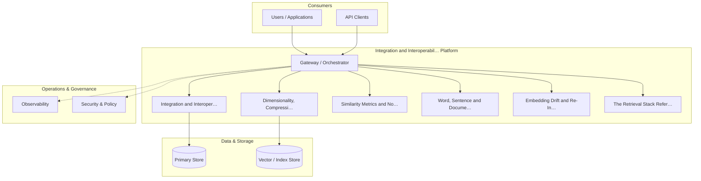

**Figure 31. Cloud Architecture - Integration and Interoperability** (mermaid). Figure: Cloud Architecture view for Integration and Interoperability. This diagram illustrates the principal components and their interactions as discussed in the surrounding section.

## Deep Dive: Mechanics, Variants and Trade-offs

Having established the essentials, we now go deeper into integration and interoperability. It pays to understand the mechanism rather than treat it as a black box, because most production incidents are explained by one of its steps misbehaving. The distinctions in this section are the ones that separate a working demo from a system that holds up under adversarial inputs, scale and the passage of time.

Consider the principal variants and how to choose between them. Each variant optimises for a different point in the design space - some for latency, some for accuracy, some for cost or operability - and the correct choice follows from explicit requirements rather than from defaults. Simplicity is a feature. The simplest design that meets the requirement should be the default, with complexity added only when measurement justifies it.

In practice this is supported by a mature tooling ecosystem, including sentence-transformers, OpenAI embeddings, FAISS, Cohere. Tools accelerate the work but do not substitute for understanding: the same principles apply whichever implementation you select, and the ability to reason from first principles is what lets you debug when a tool behaves unexpectedly.

A frequent source of subtle bugs is the interaction with dimensionality, compression and quantisation. Because dimensionality, compression and quantisation concerns matryoshka embeddings, PCA and product quantisation for cost control, changes there can silently alter the behaviour analysed here. The remedy is contract tests at the boundary and end-to-end evaluations that exercise the interaction explicitly.

Finally, attend to edge cases and degradation. Define what the system should do under partial failure, unexpected inputs and load spikes, and make that behaviour explicit and tested rather than emergent. Graceful degradation - returning a safe, useful result when the ideal one is unavailable - is a hallmark of mature engineering.

For deeper study, the literature offers authoritative treatments such as Mikolov et al. — Word2Vec (2013) and Reimers & Gurevych — Sentence-BERT (2019). These primary sources reward careful reading and ground the practical guidance above in established results.

## Advanced Considerations

Having established the essentials, we now go deeper into integration and interoperability. Mechanically, the behaviour emerges from a few interacting parts that are simpler than the whole they produce. The distinctions in this section are the ones that separate a working demo from a system that holds up under adversarial inputs, scale and the passage of time.

Consider the principal variants and how to choose between them. Each variant optimises for a different point in the design space - some for latency, some for accuracy, some for cost or operability - and the correct choice follows from explicit requirements rather than from defaults. Every added component buys capability at the price of operational surface area, and that bargain should be made consciously.

In practice this is supported by a mature tooling ecosystem, including sentence-transformers, OpenAI embeddings, FAISS, Cohere. Tools accelerate the work but do not substitute for understanding: the same principles apply whichever implementation you select, and the ability to reason from first principles is what lets you debug when a tool behaves unexpectedly.

A frequent source of subtle bugs is the interaction with dimensionality, compression and quantisation. Because dimensionality, compression and quantisation concerns matryoshka embeddings, PCA and product quantisation for cost control, changes there can silently alter the behaviour analysed here. The remedy is contract tests at the boundary and end-to-end evaluations that exercise the interaction explicitly.

Finally, attend to edge cases and degradation. Define what the system should do under partial failure, unexpected inputs and load spikes, and make that behaviour explicit and tested rather than emergent. Graceful degradation - returning a safe, useful result when the ideal one is unavailable - is a hallmark of mature engineering.

For deeper study, the literature offers authoritative treatments such as Mikolov et al. — Word2Vec (2013) and Reimers & Gurevych — Sentence-BERT (2019). These primary sources reward careful reading and ground the practical guidance above in established results.

## Worked Example

Consider a concrete scenario. A e-commerce organisation needs visual and textual product similarity and recommendation. They decide to apply integration and interoperability as part of their Embeddings solution, but wisely treat it as a hypothesis to be validated rather than a foregone conclusion.

The team begins by stating the objective precisely and defining how success will be measured before writing any code. They establish a small but representative evaluation set, agree on acceptance thresholds, and only then prototype the simplest design that could work. Early measurement reveals which assumptions hold and which must be revised, saving weeks of misdirected effort and surfacing edge cases while they are still cheap to fix.

As the prototype matures into a service, the team hardens it: adding input validation, error handling, caching where it pays off, and monitoring that ties back to the original success metric. They document each significant decision in an architecture decision record so that future maintainers understand not just what was built but why.

The outcome is instructive. The system that reaches production is not the most sophisticated design the team considered, but the one whose behaviour they could measure, explain and operate. This is the recurring lesson of Embeddings: durable value comes from the whole system, not from any single clever component.

## Industry Use Cases

Across industries, the ideas in this chapter recur in recognisable ways. The following vignettes show how different sectors apply them and what they have in common.

**Search.** Semantic search across heterogeneous enterprise content. The common thread is that value comes not from the model alone but from the surrounding system - data quality, evaluation, integration and operations - which is precisely where most of the engineering effort belongs.

**E-commerce.** Visual and textual product similarity and recommendation. The common thread is that value comes not from the model alone but from the surrounding system - data quality, evaluation, integration and operations - which is precisely where most of the engineering effort belongs.

**Support.** Deduplicating and routing tickets by semantic similarity. The common thread is that value comes not from the model alone but from the surrounding system - data quality, evaluation, integration and operations - which is precisely where most of the engineering effort belongs.

**Compliance.** Near-duplicate detection across document repositories. The common thread is that value comes not from the model alone but from the surrounding system - data quality, evaluation, integration and operations - which is precisely where most of the engineering effort belongs.

## Best Practices

The following practices consistently separate successful Embeddings efforts from struggling ones. They are deliberately concrete so they can be adopted as checklist items in design and code review.

- Normalise vectors and pick the distance metric the model was trained for.
- Pin embedding model versions and re-index atomically on change.
- Evaluate retrieval with recall@k and nDCG on a labelled set.
- Use hybrid search to recover exact-match and rare-term queries.

None of these are exotic; they are the unglamorous disciplines that compound into reliability. The cost of adopting them is small compared with the cost of the incidents they prevent, and they become second nature with practice.

## Common Pitfalls

Equally instructive are the failure modes that recur in practice. Each pitfall below has a clear early warning sign and a known remedy, so treat them as a diagnostic checklist when something feels wrong:

- Mixing vectors from different model versions in one index.
- Choosing the wrong similarity metric for the embedding model.
- Over-chunking or under-chunking documents before embedding.
- Ignoring drift after upgrading the embedding model.

The pattern is consistent: most failures stem from skipping measurement, conflating prototype and production standards, or deferring cross-cutting concerns such as security and cost until they become emergencies. Naming these traps in advance is the cheapest way to avoid them.

## Governance, Security and Cost Notes

No discussion of integration and interoperability is complete without its governance, security and cost dimensions, which are too often deferred until they become emergencies. Treating them as first-class concerns from the outset is both cheaper and safer.

**Governance.** Classify the risk of this capability, document its intended and out-of-scope uses, and ensure decisions are traceable to satisfy internal policy and external regulation such as the NIST AI RMF, ISO/IEC 42001 and the EU AI Act. **Security.** Treat all external input as untrusted, validate outputs before acting on them, apply least privilege to any tools or data access, and map controls to the OWASP LLM Top 10 and MITRE ATLAS.

**Cost and sustainability.** Establish explicit budgets for compute, tokens and latency, attribute spend to owners, and revisit the economics as usage scales - a design that is affordable at pilot scale can become untenable at production volume. Building these reflexes into everyday engineering is what allows a Embeddings system to be not only capable but also trustworthy and economically sound.

## Hands-On Exercises

Work through the following exercises. They are designed to move understanding from recognition to application - the level required for real engineering work - so prefer writing and building over merely reading.

1. Explain integration and interoperability to a colleague unfamiliar with Embeddings, using a concrete example from your own domain.
2. Sketch a reference architecture that incorporates integration and interoperability and annotate where observability, security and cost controls belong.
3. Design an evaluation that would tell you whether integration and interoperability is working in production, including the metric, the dataset and the acceptance threshold.
4. Identify two pitfalls relevant to integration and interoperability in your environment and describe the early warning signals you would monitor.
5. Prototype the simplest implementation that demonstrates integration and interoperability, then list exactly what would need to change to make it production-ready.

## Key Takeaways

Key takeaways from this chapter:

- Integration and Interoperability is a systems concern in Embeddings: data, models and operations must be co-designed.
- Measurement is non-negotiable; define success metrics and evaluation before building.
- Favour the simplest design that meets the requirement, and add complexity only when evidence demands it.
- Security, cost and observability are first-class requirements, not afterthoughts.
- Document decisions so the system remains understandable and operable as it evolves.

## Code Walkthrough

This listing shows a configuration-driven Integration and Interoperability component with retry semantics and typed interfaces — the shape we expect from production Embeddings code rather than a notebook prototype.

The full listing is shown below; study it line by line and reproduce it locally before moving on.

### Listing: Implementing a Integration and Interoperability component

```python
from __future__ import annotations

from dataclasses import dataclass, field
from typing import Any


@dataclass(slots=True)
class IntegrationAndInteroperabilityConfig:
    """Configuration for the Integration and Interoperability component in a Embeddings system."""

    name: str
    timeout_s: float = 30.0
    max_retries: int = 3
    options: dict[str, Any] = field(default_factory=dict)


class IntegrationAndInteroperability:
    """A minimal, production-shaped implementation of Integration and Interoperability."""

    def __init__(self, config: IntegrationAndInteroperabilityConfig) -> None:
        self._config = config
        self._calls = 0

    def run(self, payload: dict[str, Any]) -> dict[str, Any]:
        """Process a request, retrying transient failures with backoff."""
        last_error: Exception | None = None
        for attempt in range(self._config.max_retries):
            try:
                self._calls += 1
                return self._process(payload)
            except TimeoutError as exc:  # transient
                last_error = exc
                continue
        raise RuntimeError(f"IntegrationAndInteroperability failed after retries") from last_error

    def _process(self, payload: dict[str, Any]) -> dict[str, Any]:
        # Domain-specific logic for Integration and Interoperability goes here.
        return {"status": "ok", "input_keys": sorted(payload), "calls": self._calls}

```

## Review Questions

1. In the context of Embeddings, which statement best describes “Integration and Interoperability”?
   - A. It guarantees deterministic output regardless of input.
   - B. It eliminates the need for any evaluation or monitoring.
   - C. patterns for integrating a Embeddings system with surrounding enterprise systems and data
   - D. It applies exclusively to image data.
   - **Answer: C.** Integration and Interoperability: patterns for integrating a Embeddings system with surrounding enterprise systems and data
2. Which of the following is a recommended best practice when working with Embeddings?
   - A. Ignoring drift after upgrading the embedding model.
   - B. Use hybrid search to recover exact-match and rare-term queries.
   - C. It applies exclusively to image data.
   - D. It removes all security and governance requirements.
   - **Answer: B.** Best practice: Use hybrid search to recover exact-match and rare-term queries.
3. Which of the following is a common pitfall to avoid in Embeddings?
   - A. Choosing the wrong similarity metric for the embedding model.
   - B. Evaluate retrieval with recall@k and nDCG on a labelled set.
   - C. Normalise vectors and pick the distance metric the model was trained for.
   - D. It is only relevant to academic research, not production.
   - **Answer: A.** Pitfall to avoid: Choosing the wrong similarity metric for the embedding model.
4. *(Discussion)* Walk through how you would design Integration and Interoperability for an enterprise Embeddings workload.
   - **Model answer:** A strong answer defines integration and interoperability (patterns for integrating a Embeddings system with surrounding enterprise systems and data) then connects it to architecture, evaluation, cost, security and operations for Embeddings, citing concrete trade-offs and a real-world example.

---


# Chapter 23. Trends and Research Directions

_This chapter examines trends and research directions within Embeddings. It covers emerging trends, open problems and research directions shaping the future of Embeddings, derives a reference architecture, walks through a worked example and runnable code, surveys industry use cases, and distils best practices and pitfalls, closing with exercises and review questions._

## Introduction

At its core, Trends and Research Directions concerns emerging trends, open problems and research directions shaping the future of Embeddings. This concept recurs throughout the Embeddings lifecycle, from design to operations. It helps to separate the conceptual model from its implementation: the former guides reasoning, the latter must contend with real-world constraints.

This chapter builds intuition first, then formalises the ideas, derives an architecture, and finishes with code, exercises and review questions so the material transfers directly to your own Embeddings work. Read it actively: pause at each diagram, reproduce the code, and attempt the exercises before consulting the answers.

## Theory and Foundations

Formally, Trends and Research Directions addresses emerging trends, open problems and research directions shaping the future of Embeddings. The right abstraction here pays compounding dividends, because downstream components depend on its guarantees. The underlying mechanism is best appreciated by tracing a single request from input to output and noting where state is created and consumed.

To place this in context, recall the broader picture: Embeddings map discrete objects—words, sentences, images, users, products—into continuous vector spaces where geometric proximity encodes semantic similarity. Within that picture, trends and research directions is one of the load-bearing ideas - the kind that, when understood deeply, makes the rest of Embeddings fall into place. Understanding this matters because Embeddings systems succeed or fail on exactly these decisions.

Trends and Research Directions cannot be understood in isolation from the retrieval stack reference architecture. Recall that the retrieval stack reference architecture concerns embedding service, vector index and re-ranking as a pipeline. The two interact directly: decisions in one constrain the design space of the other, which is why mature teams reason about them together rather than sequentially. Simplicity is a feature. The simplest design that meets the requirement should be the default, with complexity added only when measurement justifies it.

Trends and Research Directions cannot be understood in isolation from multimodal and cross-encoder embeddings. Recall that multimodal and cross-encoder embeddings concerns cLIP-style joint spaces and the bi-encoder/cross-encoder trade-off. The two interact directly: decisions in one constrain the design space of the other, which is why mature teams reason about them together rather than sequentially. Latency, accuracy and cost form a tension triangle: improving one typically pressures the others, so explicit budgets are essential.

Several established patterns apply directly to trends and research directions. The first, hybrid lexical + dense fusion (reciprocal rank fusion), is widely adopted because it makes the system's behaviour predictable and observable. A complementary pattern, bi-encoder retrieval followed by cross-encoder re-ranking, addresses a related concern and is often deployed alongside it. Patterns are not dogma; they are distilled experience that shortcuts the search for a sound design, and each carries assumptions worth checking against your context.

Knowing when not to use a technique is as valuable as knowing how to use it. In a small prototype, shortcuts around trends and research directions are invisible; in a production Embeddings system serving real traffic, they surface as incidents, cost overruns or compliance gaps. Every added component buys capability at the price of operational surface area, and that bargain should be made consciously. The remainder of this chapter turns these principles into an architecture, code and a checklist you can apply immediately.

## Architecture and Design

From an architectural standpoint, Trends and Research Directions sits at the intersection of data, models and operations. An embedding platform exposes a versioned embedding service that batches and caches encode requests, writes vectors to an ANN index (HNSW/IVF) with stored metadata, and supports hybrid retrieval that fuses lexical and dense scores before an optional cross-encoder re-ranks the top candidates.

Concretely, the principal building blocks include from one-hot to distributed representations, word, sentence and document embeddings, contrastive representation learning, similarity metrics and normalisation and multimodal and cross-encoder embeddings. Each is a replaceable component behind a stable interface, so the team can upgrade an implementation - a model, an index, a policy engine - without rewriting its neighbours. The contracts between components are where reliability is won or lost, so they are specified explicitly and tested in isolation.

The diagram accompanying this section makes the data and control flow explicit. Requests enter through a well-defined boundary where they are authenticated and validated; only then are they dispatched to the components that perform the work. This boundary is also where rate limiting, quota enforcement and audit logging live, keeping cross-cutting concerns out of the core logic and in one auditable place.

Two qualities deserve emphasis. First, observability is designed in, not bolted on: every component emits structured telemetry so that failures can be localised in minutes rather than hours. Second, the architecture is evolvable - components communicate through stable contracts so that any single part of the Embeddings system can be replaced without a rewrite. Latency, accuracy and cost form a tension triangle: improving one typically pressures the others, so explicit budgets are essential.

```mermaid
flowchart LR
  SRC[Sources] --> ING[Ingestion]
  ING --> VAL{Validate}
  VAL -- ok --> XF[Transform / Enrich]
  VAL -- reject --> DLQ[(Dead-letter)]
  XF --> IDX[Index / Embed]
  IDX --> STORE[(Serving Store)]
  STORE --> CONS[Consumers]
```

**Figure 32. Data Lineage - Trends and Research Directions** (mermaid). Figure: Data Lineage view for Trends and Research Directions. This diagram illustrates the principal components and their interactions as discussed in the surrounding section.

## Deep Dive: Mechanics, Variants and Trade-offs

Having established the essentials, we now go deeper into trends and research directions. It pays to understand the mechanism rather than treat it as a black box, because most production incidents are explained by one of its steps misbehaving. The distinctions in this section are the ones that separate a working demo from a system that holds up under adversarial inputs, scale and the passage of time.

Consider the principal variants and how to choose between them. Each variant optimises for a different point in the design space - some for latency, some for accuracy, some for cost or operability - and the correct choice follows from explicit requirements rather than from defaults. Latency, accuracy and cost form a tension triangle: improving one typically pressures the others, so explicit budgets are essential.

In practice this is supported by a mature tooling ecosystem, including sentence-transformers, OpenAI embeddings, FAISS, Cohere. Tools accelerate the work but do not substitute for understanding: the same principles apply whichever implementation you select, and the ability to reason from first principles is what lets you debug when a tool behaves unexpectedly.

A frequent source of subtle bugs is the interaction with the retrieval stack reference architecture. Because the retrieval stack reference architecture concerns embedding service, vector index and re-ranking as a pipeline, changes there can silently alter the behaviour analysed here. The remedy is contract tests at the boundary and end-to-end evaluations that exercise the interaction explicitly.

Finally, attend to edge cases and degradation. Define what the system should do under partial failure, unexpected inputs and load spikes, and make that behaviour explicit and tested rather than emergent. Graceful degradation - returning a safe, useful result when the ideal one is unavailable - is a hallmark of mature engineering.

For deeper study, the literature offers authoritative treatments such as Mikolov et al. — Word2Vec (2013) and Reimers & Gurevych — Sentence-BERT (2019). These primary sources reward careful reading and ground the practical guidance above in established results.

## Advanced Considerations

Having established the essentials, we now go deeper into trends and research directions. Beneath the abstraction lies a concrete process whose steps can each be measured, tested and optimised independently. The distinctions in this section are the ones that separate a working demo from a system that holds up under adversarial inputs, scale and the passage of time.

Consider the principal variants and how to choose between them. Each variant optimises for a different point in the design space - some for latency, some for accuracy, some for cost or operability - and the correct choice follows from explicit requirements rather than from defaults. Latency, accuracy and cost form a tension triangle: improving one typically pressures the others, so explicit budgets are essential.

In practice this is supported by a mature tooling ecosystem, including sentence-transformers, OpenAI embeddings, FAISS, Cohere. Tools accelerate the work but do not substitute for understanding: the same principles apply whichever implementation you select, and the ability to reason from first principles is what lets you debug when a tool behaves unexpectedly.

A frequent source of subtle bugs is the interaction with similarity metrics and normalisation. Because similarity metrics and normalisation concerns cosine, dot product and Euclidean distance and when each applies, changes there can silently alter the behaviour analysed here. The remedy is contract tests at the boundary and end-to-end evaluations that exercise the interaction explicitly.

Finally, attend to edge cases and degradation. Define what the system should do under partial failure, unexpected inputs and load spikes, and make that behaviour explicit and tested rather than emergent. Graceful degradation - returning a safe, useful result when the ideal one is unavailable - is a hallmark of mature engineering.

For deeper study, the literature offers authoritative treatments such as Mikolov et al. — Word2Vec (2013) and Reimers & Gurevych — Sentence-BERT (2019). These primary sources reward careful reading and ground the practical guidance above in established results.

## Worked Example

To ground the discussion, walk through a representative example. A e-commerce organisation needs visual and textual product similarity and recommendation. They decide to apply trends and research directions as part of their Embeddings solution, but wisely treat it as a hypothesis to be validated rather than a foregone conclusion.

The team begins by stating the objective precisely and defining how success will be measured before writing any code. They establish a small but representative evaluation set, agree on acceptance thresholds, and only then prototype the simplest design that could work. Early measurement reveals which assumptions hold and which must be revised, saving weeks of misdirected effort and surfacing edge cases while they are still cheap to fix.

As the prototype matures into a service, the team hardens it: adding input validation, error handling, caching where it pays off, and monitoring that ties back to the original success metric. They document each significant decision in an architecture decision record so that future maintainers understand not just what was built but why.

The outcome is instructive. The system that reaches production is not the most sophisticated design the team considered, but the one whose behaviour they could measure, explain and operate. This is the recurring lesson of Embeddings: durable value comes from the whole system, not from any single clever component.

## Industry Use Cases

Across industries, the ideas in this chapter recur in recognisable ways. The following vignettes show how different sectors apply them and what they have in common.

**Search.** Semantic search across heterogeneous enterprise content. The common thread is that value comes not from the model alone but from the surrounding system - data quality, evaluation, integration and operations - which is precisely where most of the engineering effort belongs.

**E-commerce.** Visual and textual product similarity and recommendation. The common thread is that value comes not from the model alone but from the surrounding system - data quality, evaluation, integration and operations - which is precisely where most of the engineering effort belongs.

**Support.** Deduplicating and routing tickets by semantic similarity. The common thread is that value comes not from the model alone but from the surrounding system - data quality, evaluation, integration and operations - which is precisely where most of the engineering effort belongs.

**Compliance.** Near-duplicate detection across document repositories. The common thread is that value comes not from the model alone but from the surrounding system - data quality, evaluation, integration and operations - which is precisely where most of the engineering effort belongs.

## Best Practices

The following practices consistently separate successful Embeddings efforts from struggling ones. They are deliberately concrete so they can be adopted as checklist items in design and code review.

- Normalise vectors and pick the distance metric the model was trained for.
- Pin embedding model versions and re-index atomically on change.
- Evaluate retrieval with recall@k and nDCG on a labelled set.
- Use hybrid search to recover exact-match and rare-term queries.

None of these are exotic; they are the unglamorous disciplines that compound into reliability. The cost of adopting them is small compared with the cost of the incidents they prevent, and they become second nature with practice.

## Common Pitfalls

Equally instructive are the failure modes that recur in practice. Each pitfall below has a clear early warning sign and a known remedy, so treat them as a diagnostic checklist when something feels wrong:

- Mixing vectors from different model versions in one index.
- Choosing the wrong similarity metric for the embedding model.
- Over-chunking or under-chunking documents before embedding.
- Ignoring drift after upgrading the embedding model.

The pattern is consistent: most failures stem from skipping measurement, conflating prototype and production standards, or deferring cross-cutting concerns such as security and cost until they become emergencies. Naming these traps in advance is the cheapest way to avoid them.

## Governance, Security and Cost Notes

No discussion of trends and research directions is complete without its governance, security and cost dimensions, which are too often deferred until they become emergencies. Treating them as first-class concerns from the outset is both cheaper and safer.

**Governance.** Classify the risk of this capability, document its intended and out-of-scope uses, and ensure decisions are traceable to satisfy internal policy and external regulation such as the NIST AI RMF, ISO/IEC 42001 and the EU AI Act. **Security.** Treat all external input as untrusted, validate outputs before acting on them, apply least privilege to any tools or data access, and map controls to the OWASP LLM Top 10 and MITRE ATLAS.

**Cost and sustainability.** Establish explicit budgets for compute, tokens and latency, attribute spend to owners, and revisit the economics as usage scales - a design that is affordable at pilot scale can become untenable at production volume. Building these reflexes into everyday engineering is what allows a Embeddings system to be not only capable but also trustworthy and economically sound.

## Hands-On Exercises

Work through the following exercises. They are designed to move understanding from recognition to application - the level required for real engineering work - so prefer writing and building over merely reading.

1. Explain trends and research directions to a colleague unfamiliar with Embeddings, using a concrete example from your own domain.
2. Sketch a reference architecture that incorporates trends and research directions and annotate where observability, security and cost controls belong.
3. Design an evaluation that would tell you whether trends and research directions is working in production, including the metric, the dataset and the acceptance threshold.
4. Identify two pitfalls relevant to trends and research directions in your environment and describe the early warning signals you would monitor.
5. Prototype the simplest implementation that demonstrates trends and research directions, then list exactly what would need to change to make it production-ready.

## Key Takeaways

Key takeaways from this chapter:

- Trends and Research Directions is a systems concern in Embeddings: data, models and operations must be co-designed.
- Measurement is non-negotiable; define success metrics and evaluation before building.
- Favour the simplest design that meets the requirement, and add complexity only when evidence demands it.
- Security, cost and observability are first-class requirements, not afterthoughts.
- Document decisions so the system remains understandable and operable as it evolves.

## Review Questions

1. In the context of Embeddings, which statement best describes “Trends and Research Directions”?
   - A. emerging trends, open problems and research directions shaping the future of Embeddings
   - B. It is only relevant to academic research, not production.
   - C. It makes the system slower but has no other effect.
   - D. It removes all security and governance requirements.
   - **Answer: A.** Trends and Research Directions: emerging trends, open problems and research directions shaping the future of Embeddings
2. Which of the following is a recommended best practice when working with Embeddings?
   - A. Use hybrid search to recover exact-match and rare-term queries.
   - B. Over-chunking or under-chunking documents before embedding.
   - C. Mixing vectors from different model versions in one index.
   - D. It makes the system slower but has no other effect.
   - **Answer: A.** Best practice: Use hybrid search to recover exact-match and rare-term queries.
3. Which of the following is a common pitfall to avoid in Embeddings?
   - A. It is only relevant to academic research, not production.
   - B. Over-chunking or under-chunking documents before embedding.
   - C. Pin embedding model versions and re-index atomically on change.
   - D. It removes all security and governance requirements.
   - **Answer: B.** Pitfall to avoid: Over-chunking or under-chunking documents before embedding.
4. *(Discussion)* Explain Trends and Research Directions and why it matters in a production Embeddings system.
   - **Model answer:** A strong answer defines trends and research directions (emerging trends, open problems and research directions shaping the future of Embeddings) then connects it to architecture, evaluation, cost, security and operations for Embeddings, citing concrete trade-offs and a real-world example.

---


# Chapter 24. Capstone Project

_This chapter examines capstone project within Embeddings. It covers a substantial capstone project that consolidates the entire book into a portfolio-grade Embeddings deliverable, derives a reference architecture, walks through a worked example and runnable code, surveys industry use cases, and distils best practices and pitfalls, closing with exercises and review questions._

## Introduction

We define Capstone Project as a substantial capstone project that consolidates the entire book into a portfolio-grade Embeddings deliverable. Understanding this matters because Embeddings systems succeed or fail on exactly these decisions. It helps to separate the conceptual model from its implementation: the former guides reasoning, the latter must contend with real-world constraints.

This chapter builds intuition first, then formalises the ideas, derives an architecture, and finishes with code, exercises and review questions so the material transfers directly to your own Embeddings work. Read it actively: pause at each diagram, reproduce the code, and attempt the exercises before consulting the answers.

## Theory and Foundations

In practical terms, Capstone Project is best understood as a substantial capstone project that consolidates the entire book into a portfolio-grade Embeddings deliverable. The practical implication is that design choices here ripple through latency, cost and maintainability for the lifetime of the system. Mechanically, the behaviour emerges from a few interacting parts that are simpler than the whole they produce.

To place this in context, recall the broader picture: Embeddings map discrete objects—words, sentences, images, users, products—into continuous vector spaces where geometric proximity encodes semantic similarity. Within that picture, capstone project is one of the load-bearing ideas - the kind that, when understood deeply, makes the rest of Embeddings fall into place. Getting this right early prevents expensive rework once a Embeddings system reaches scale.

Capstone Project cannot be understood in isolation from contrastive representation learning. Recall that contrastive representation learning concerns infoNCE, positive/negative mining and the geometry of good embeddings. The two interact directly: decisions in one constrain the design space of the other, which is why mature teams reason about them together rather than sequentially. There is an inherent trade-off between fidelity and cost, and the correct balance depends on the use case and its tolerance for error.

Capstone Project cannot be understood in isolation from privacy and embedding inversion. Recall that privacy and embedding inversion concerns what embeddings leak and how to mitigate it. The two interact directly: decisions in one constrain the design space of the other, which is why mature teams reason about them together rather than sequentially. Every added component buys capability at the price of operational surface area, and that bargain should be made consciously.

Several established patterns apply directly to capstone project. The first, matryoshka embeddings for adaptive dimensionality, is widely adopted because it makes the system's behaviour predictable and observable. A complementary pattern, hybrid lexical + dense fusion (reciprocal rank fusion), addresses a related concern and is often deployed alongside it. Patterns are not dogma; they are distilled experience that shortcuts the search for a sound design, and each carries assumptions worth checking against your context.

It is worth being explicit about when to apply this and when to reach for something simpler. In a small prototype, shortcuts around capstone project are invisible; in a production Embeddings system serving real traffic, they surface as incidents, cost overruns or compliance gaps. As with most architectural decisions, the choice is rarely binary; the skill lies in quantifying the trade-offs and choosing deliberately. The remainder of this chapter turns these principles into an architecture, code and a checklist you can apply immediately.

## Architecture and Design

The reference architecture for Capstone Project separates concerns into clearly bounded components with explicit contracts. An embedding platform exposes a versioned embedding service that batches and caches encode requests, writes vectors to an ANN index (HNSW/IVF) with stored metadata, and supports hybrid retrieval that fuses lexical and dense scores before an optional cross-encoder re-ranks the top candidates.

Concretely, the principal building blocks include from one-hot to distributed representations, word, sentence and document embeddings, contrastive representation learning, similarity metrics and normalisation and multimodal and cross-encoder embeddings. Each is a replaceable component behind a stable interface, so the team can upgrade an implementation - a model, an index, a policy engine - without rewriting its neighbours. The contracts between components are where reliability is won or lost, so they are specified explicitly and tested in isolation.

The diagram accompanying this section makes the data and control flow explicit. Requests enter through a well-defined boundary where they are authenticated and validated; only then are they dispatched to the components that perform the work. This boundary is also where rate limiting, quota enforcement and audit logging live, keeping cross-cutting concerns out of the core logic and in one auditable place.

Two qualities deserve emphasis. First, observability is designed in, not bolted on: every component emits structured telemetry so that failures can be localised in minutes rather than hours. Second, the architecture is evolvable - components communicate through stable contracts so that any single part of the Embeddings system can be replaced without a rewrite. Simplicity is a feature. The simplest design that meets the requirement should be the default, with complexity added only when measurement justifies it.

<div class="diagram-svg">

<svg xmlns="http://www.w3.org/2000/svg" width="840" height="460" data-tpl="kpi" data-pal="2-4" viewBox="0 0 840 460" font-family="Inter, Segoe UI, Arial, sans-serif"><defs><marker id="ar" markerWidth="9" markerHeight="9" refX="7" refY="3" orient="auto"><path d="M0,0 L7,3 L0,6 z" fill="#94a3b8"/></marker><marker id="arw" markerWidth="9" markerHeight="9" refX="7" refY="3" orient="auto"><path d="M0,0 L7,3 L0,6 z" fill="#ffffff"/></marker><filter id="sh" x="-20%" y="-20%" width="140%" height="140%"><feDropShadow dx="0" dy="2" stdDeviation="3" flood-color="#0f172a" flood-opacity="0.16"/></filter></defs><defs><linearGradient id="bnf84d19d" x1="0" y1="0" x2="1" y2="0"><stop offset="0" stop-color="#0d9488"/><stop offset="1" stop-color="#14b8a6"/></linearGradient></defs><rect width="840" height="460" rx="14" fill="#ffffff"/><rect x="0" y="0" width="840" height="48" rx="14" fill="url(#bnf84d19d)"/><rect x="0" y="32" width="840" height="16" fill="url(#bnf84d19d)"/><text x="420" y="25" text-anchor="middle" font-size="14.5" font-weight="700" fill="#ffffff" dominant-baseline="middle">Capability Map - Capstone Project</text><rect x="28" y="90" width="182" height="150" rx="14" fill="#f8fafc" stroke="#e2e8f0" stroke-width="1"/><rect x="28" y="90" width="182" height="8" rx="0" fill="#0d9488"/><text x="119" y="150" text-anchor="middle" font-size="30" font-weight="800" fill="#0d9488" dominant-baseline="middle">97%</text><text x="119" y="198" text-anchor="middle" font-size="11" font-weight="600" fill="#64748b" dominant-baseline="middle">Capstone Project</text><rect x="228" y="90" width="182" height="150" rx="14" fill="#f8fafc" stroke="#e2e8f0" stroke-width="1"/><rect x="228" y="90" width="182" height="8" rx="0" fill="#14b8a6"/><text x="320" y="150" text-anchor="middle" font-size="30" font-weight="800" fill="#14b8a6" dominant-baseline="middle">79%</text><text x="320" y="192" text-anchor="middle" font-size="11" font-weight="600" fill="#64748b" dominant-baseline="middle">Contrastive</text><text x="320" y="204" text-anchor="middle" font-size="11" font-weight="600" fill="#64748b" dominant-baseline="middle">Representation</text><rect x="429" y="90" width="182" height="150" rx="14" fill="#f8fafc" stroke="#e2e8f0" stroke-width="1"/><rect x="429" y="90" width="182" height="8" rx="0" fill="#047857"/><text x="520" y="150" text-anchor="middle" font-size="30" font-weight="800" fill="#047857" dominant-baseline="middle">40%</text><text x="520" y="192" text-anchor="middle" font-size="11" font-weight="600" fill="#64748b" dominant-baseline="middle">Privacy and Embedding</text><text x="520" y="204" text-anchor="middle" font-size="11" font-weight="600" fill="#64748b" dominant-baseline="middle">Inversion</text><rect x="630" y="90" width="182" height="150" rx="14" fill="#f8fafc" stroke="#e2e8f0" stroke-width="1"/><rect x="630" y="90" width="182" height="8" rx="0" fill="#059669"/><text x="721" y="150" text-anchor="middle" font-size="30" font-weight="800" fill="#059669" dominant-baseline="middle">44%</text><text x="721" y="192" text-anchor="middle" font-size="11" font-weight="600" fill="#64748b" dominant-baseline="middle">From One-Hot to</text><text x="721" y="204" text-anchor="middle" font-size="11" font-weight="600" fill="#64748b" dominant-baseline="middle">Distributed</text><text x="28" y="446" text-anchor="start" font-size="9.5" font-weight="500" fill="#64748b" dominant-baseline="middle">Capstone Project  •  Capability Map</text></svg>

</div>

**Figure 33. Capability Map - Capstone Project** (svg). Figure: Capability Map view for Capstone Project. This diagram illustrates the principal components and their interactions as discussed in the surrounding section.

## Deep Dive: Mechanics, Variants and Trade-offs

Having established the essentials, we now go deeper into capstone project. The underlying mechanism is best appreciated by tracing a single request from input to output and noting where state is created and consumed. The distinctions in this section are the ones that separate a working demo from a system that holds up under adversarial inputs, scale and the passage of time.

Consider the principal variants and how to choose between them. Each variant optimises for a different point in the design space - some for latency, some for accuracy, some for cost or operability - and the correct choice follows from explicit requirements rather than from defaults. Every added component buys capability at the price of operational surface area, and that bargain should be made consciously.

In practice this is supported by a mature tooling ecosystem, including sentence-transformers, OpenAI embeddings, FAISS, Cohere. Tools accelerate the work but do not substitute for understanding: the same principles apply whichever implementation you select, and the ability to reason from first principles is what lets you debug when a tool behaves unexpectedly.

A frequent source of subtle bugs is the interaction with contrastive representation learning. Because contrastive representation learning concerns infoNCE, positive/negative mining and the geometry of good embeddings, changes there can silently alter the behaviour analysed here. The remedy is contract tests at the boundary and end-to-end evaluations that exercise the interaction explicitly.

Finally, attend to edge cases and degradation. Define what the system should do under partial failure, unexpected inputs and load spikes, and make that behaviour explicit and tested rather than emergent. Graceful degradation - returning a safe, useful result when the ideal one is unavailable - is a hallmark of mature engineering.

For deeper study, the literature offers authoritative treatments such as Mikolov et al. — Word2Vec (2013) and Reimers & Gurevych — Sentence-BERT (2019). These primary sources reward careful reading and ground the practical guidance above in established results.

## Advanced Considerations

Having established the essentials, we now go deeper into capstone project. Beneath the abstraction lies a concrete process whose steps can each be measured, tested and optimised independently. The distinctions in this section are the ones that separate a working demo from a system that holds up under adversarial inputs, scale and the passage of time.

Consider the principal variants and how to choose between them. Each variant optimises for a different point in the design space - some for latency, some for accuracy, some for cost or operability - and the correct choice follows from explicit requirements rather than from defaults. As with most architectural decisions, the choice is rarely binary; the skill lies in quantifying the trade-offs and choosing deliberately.

In practice this is supported by a mature tooling ecosystem, including sentence-transformers, OpenAI embeddings, FAISS, Cohere. Tools accelerate the work but do not substitute for understanding: the same principles apply whichever implementation you select, and the ability to reason from first principles is what lets you debug when a tool behaves unexpectedly.

A frequent source of subtle bugs is the interaction with dimensionality, compression and quantisation. Because dimensionality, compression and quantisation concerns matryoshka embeddings, PCA and product quantisation for cost control, changes there can silently alter the behaviour analysed here. The remedy is contract tests at the boundary and end-to-end evaluations that exercise the interaction explicitly.

Finally, attend to edge cases and degradation. Define what the system should do under partial failure, unexpected inputs and load spikes, and make that behaviour explicit and tested rather than emergent. Graceful degradation - returning a safe, useful result when the ideal one is unavailable - is a hallmark of mature engineering.

For deeper study, the literature offers authoritative treatments such as Mikolov et al. — Word2Vec (2013) and Reimers & Gurevych — Sentence-BERT (2019). These primary sources reward careful reading and ground the practical guidance above in established results.

## Worked Example

A worked example clarifies how these ideas behave in practice. A e-commerce organisation needs visual and textual product similarity and recommendation. They decide to apply capstone project as part of their Embeddings solution, but wisely treat it as a hypothesis to be validated rather than a foregone conclusion.

The team begins by stating the objective precisely and defining how success will be measured before writing any code. They establish a small but representative evaluation set, agree on acceptance thresholds, and only then prototype the simplest design that could work. Early measurement reveals which assumptions hold and which must be revised, saving weeks of misdirected effort and surfacing edge cases while they are still cheap to fix.

As the prototype matures into a service, the team hardens it: adding input validation, error handling, caching where it pays off, and monitoring that ties back to the original success metric. They document each significant decision in an architecture decision record so that future maintainers understand not just what was built but why.

The outcome is instructive. The system that reaches production is not the most sophisticated design the team considered, but the one whose behaviour they could measure, explain and operate. This is the recurring lesson of Embeddings: durable value comes from the whole system, not from any single clever component.

## Industry Use Cases

Across industries, the ideas in this chapter recur in recognisable ways. The following vignettes show how different sectors apply them and what they have in common.

**Search.** Semantic search across heterogeneous enterprise content. The common thread is that value comes not from the model alone but from the surrounding system - data quality, evaluation, integration and operations - which is precisely where most of the engineering effort belongs.

**E-commerce.** Visual and textual product similarity and recommendation. The common thread is that value comes not from the model alone but from the surrounding system - data quality, evaluation, integration and operations - which is precisely where most of the engineering effort belongs.

**Support.** Deduplicating and routing tickets by semantic similarity. The common thread is that value comes not from the model alone but from the surrounding system - data quality, evaluation, integration and operations - which is precisely where most of the engineering effort belongs.

**Compliance.** Near-duplicate detection across document repositories. The common thread is that value comes not from the model alone but from the surrounding system - data quality, evaluation, integration and operations - which is precisely where most of the engineering effort belongs.

## Best Practices

The following practices consistently separate successful Embeddings efforts from struggling ones. They are deliberately concrete so they can be adopted as checklist items in design and code review.

- Normalise vectors and pick the distance metric the model was trained for.
- Pin embedding model versions and re-index atomically on change.
- Evaluate retrieval with recall@k and nDCG on a labelled set.
- Use hybrid search to recover exact-match and rare-term queries.

None of these are exotic; they are the unglamorous disciplines that compound into reliability. The cost of adopting them is small compared with the cost of the incidents they prevent, and they become second nature with practice.

## Common Pitfalls

Equally instructive are the failure modes that recur in practice. Each pitfall below has a clear early warning sign and a known remedy, so treat them as a diagnostic checklist when something feels wrong:

- Mixing vectors from different model versions in one index.
- Choosing the wrong similarity metric for the embedding model.
- Over-chunking or under-chunking documents before embedding.
- Ignoring drift after upgrading the embedding model.

The pattern is consistent: most failures stem from skipping measurement, conflating prototype and production standards, or deferring cross-cutting concerns such as security and cost until they become emergencies. Naming these traps in advance is the cheapest way to avoid them.

## Governance, Security and Cost Notes

No discussion of capstone project is complete without its governance, security and cost dimensions, which are too often deferred until they become emergencies. Treating them as first-class concerns from the outset is both cheaper and safer.

**Governance.** Classify the risk of this capability, document its intended and out-of-scope uses, and ensure decisions are traceable to satisfy internal policy and external regulation such as the NIST AI RMF, ISO/IEC 42001 and the EU AI Act. **Security.** Treat all external input as untrusted, validate outputs before acting on them, apply least privilege to any tools or data access, and map controls to the OWASP LLM Top 10 and MITRE ATLAS.

**Cost and sustainability.** Establish explicit budgets for compute, tokens and latency, attribute spend to owners, and revisit the economics as usage scales - a design that is affordable at pilot scale can become untenable at production volume. Building these reflexes into everyday engineering is what allows a Embeddings system to be not only capable but also trustworthy and economically sound.

## Hands-On Exercises

Work through the following exercises. They are designed to move understanding from recognition to application - the level required for real engineering work - so prefer writing and building over merely reading.

1. Explain capstone project to a colleague unfamiliar with Embeddings, using a concrete example from your own domain.
2. Sketch a reference architecture that incorporates capstone project and annotate where observability, security and cost controls belong.
3. Design an evaluation that would tell you whether capstone project is working in production, including the metric, the dataset and the acceptance threshold.
4. Identify two pitfalls relevant to capstone project in your environment and describe the early warning signals you would monitor.
5. Prototype the simplest implementation that demonstrates capstone project, then list exactly what would need to change to make it production-ready.

## Key Takeaways

Key takeaways from this chapter:

- Capstone Project is a systems concern in Embeddings: data, models and operations must be co-designed.
- Measurement is non-negotiable; define success metrics and evaluation before building.
- Favour the simplest design that meets the requirement, and add complexity only when evidence demands it.
- Security, cost and observability are first-class requirements, not afterthoughts.
- Document decisions so the system remains understandable and operable as it evolves.

## Code Walkthrough

This listing shows a configuration-driven Capstone Project component with retry semantics and typed interfaces — the shape we expect from production Embeddings code rather than a notebook prototype.

The full listing is shown below; study it line by line and reproduce it locally before moving on.

### Listing: Implementing a Capstone Project component

```python
from __future__ import annotations

from dataclasses import dataclass, field
from typing import Any


@dataclass(slots=True)
class CapstoneProjectConfig:
    """Configuration for the Capstone Project component in a Embeddings system."""

    name: str
    timeout_s: float = 30.0
    max_retries: int = 3
    options: dict[str, Any] = field(default_factory=dict)


class CapstoneProject:
    """A minimal, production-shaped implementation of Capstone Project."""

    def __init__(self, config: CapstoneProjectConfig) -> None:
        self._config = config
        self._calls = 0

    def run(self, payload: dict[str, Any]) -> dict[str, Any]:
        """Process a request, retrying transient failures with backoff."""
        last_error: Exception | None = None
        for attempt in range(self._config.max_retries):
            try:
                self._calls += 1
                return self._process(payload)
            except TimeoutError as exc:  # transient
                last_error = exc
                continue
        raise RuntimeError(f"CapstoneProject failed after retries") from last_error

    def _process(self, payload: dict[str, Any]) -> dict[str, Any]:
        # Domain-specific logic for Capstone Project goes here.
        return {"status": "ok", "input_keys": sorted(payload), "calls": self._calls}

```

## Review Questions

1. In the context of Embeddings, which statement best describes “Capstone Project”?
   - A. It eliminates the need for any evaluation or monitoring.
   - B. a substantial capstone project that consolidates the entire book into a portfolio-grade Embeddings deliverable
   - C. It removes all security and governance requirements.
   - D. It makes the system slower but has no other effect.
   - **Answer: B.** Capstone Project: a substantial capstone project that consolidates the entire book into a portfolio-grade Embeddings deliverable
2. Which of the following is a recommended best practice when working with Embeddings?
   - A. Over-chunking or under-chunking documents before embedding.
   - B. Normalise vectors and pick the distance metric the model was trained for.
   - C. Ignoring drift after upgrading the embedding model.
   - D. It eliminates the need for any evaluation or monitoring.
   - **Answer: B.** Best practice: Normalise vectors and pick the distance metric the model was trained for.
3. Which of the following is a common pitfall to avoid in Embeddings?
   - A. It makes the system slower but has no other effect.
   - B. It guarantees deterministic output regardless of input.
   - C. Choosing the wrong similarity metric for the embedding model.
   - D. Use hybrid search to recover exact-match and rare-term queries.
   - **Answer: C.** Pitfall to avoid: Choosing the wrong similarity metric for the embedding model.
4. *(Discussion)* How does Capstone Project interact with security and governance requirements?
   - **Model answer:** A strong answer defines capstone project (a substantial capstone project that consolidates the entire book into a portfolio-grade Embeddings deliverable) then connects it to architecture, evaluation, cost, security and operations for Embeddings, citing concrete trade-offs and a real-world example.

---


# Chapter 25. Certification Preparation and Review

_This chapter examines certification preparation and review within Embeddings. It covers a structured review and certification-style preparation covering the full breadth of Embeddings, derives a reference architecture, walks through a worked example and runnable code, surveys industry use cases, and distils best practices and pitfalls, closing with exercises and review questions._

## Introduction

We define Certification Preparation and Review as a structured review and certification-style preparation covering the full breadth of Embeddings. Getting this right early prevents expensive rework once a Embeddings system reaches scale. In an enterprise setting, this translates into concrete requirements: clear interfaces, measurable quality, and controls that satisfy security and governance.

This chapter builds intuition first, then formalises the ideas, derives an architecture, and finishes with code, exercises and review questions so the material transfers directly to your own Embeddings work. Read it actively: pause at each diagram, reproduce the code, and attempt the exercises before consulting the answers.

## Theory and Foundations

Certification Preparation and Review can be characterised as a structured review and certification-style preparation covering the full breadth of Embeddings. Seasoned practitioners treat this as a systems problem, co-designing data, models and operations rather than optimising any one in isolation. It pays to understand the mechanism rather than treat it as a black box, because most production incidents are explained by one of its steps misbehaving.

To place this in context, recall the broader picture: Embeddings map discrete objects—words, sentences, images, users, products—into continuous vector spaces where geometric proximity encodes semantic similarity. Within that picture, certification preparation and review is one of the load-bearing ideas - the kind that, when understood deeply, makes the rest of Embeddings fall into place. Understanding this matters because Embeddings systems succeed or fail on exactly these decisions.

Certification Preparation and Review cannot be understood in isolation from multimodal and cross-encoder embeddings. Recall that multimodal and cross-encoder embeddings concerns cLIP-style joint spaces and the bi-encoder/cross-encoder trade-off. The two interact directly: decisions in one constrain the design space of the other, which is why mature teams reason about them together rather than sequentially. There is an inherent trade-off between fidelity and cost, and the correct balance depends on the use case and its tolerance for error.

Certification Preparation and Review cannot be understood in isolation from the retrieval stack reference architecture. Recall that the retrieval stack reference architecture concerns embedding service, vector index and re-ranking as a pipeline. The two interact directly: decisions in one constrain the design space of the other, which is why mature teams reason about them together rather than sequentially. Latency, accuracy and cost form a tension triangle: improving one typically pressures the others, so explicit budgets are essential.

Several established patterns apply directly to certification preparation and review. The first, versioned indexes with blue/green re-embedding, is widely adopted because it makes the system's behaviour predictable and observable. A complementary pattern, matryoshka embeddings for adaptive dimensionality, addresses a related concern and is often deployed alongside it. Patterns are not dogma; they are distilled experience that shortcuts the search for a sound design, and each carries assumptions worth checking against your context.

The decision of whether to adopt this should be driven by requirements, not by novelty. In a small prototype, shortcuts around certification preparation and review are invisible; in a production Embeddings system serving real traffic, they surface as incidents, cost overruns or compliance gaps. Every added component buys capability at the price of operational surface area, and that bargain should be made consciously. The remainder of this chapter turns these principles into an architecture, code and a checklist you can apply immediately.

## Architecture and Design

From an architectural standpoint, Certification Preparation and Review sits at the intersection of data, models and operations. An embedding platform exposes a versioned embedding service that batches and caches encode requests, writes vectors to an ANN index (HNSW/IVF) with stored metadata, and supports hybrid retrieval that fuses lexical and dense scores before an optional cross-encoder re-ranks the top candidates.

Concretely, the principal building blocks include from one-hot to distributed representations, word, sentence and document embeddings, contrastive representation learning, similarity metrics and normalisation and multimodal and cross-encoder embeddings. Each is a replaceable component behind a stable interface, so the team can upgrade an implementation - a model, an index, a policy engine - without rewriting its neighbours. The contracts between components are where reliability is won or lost, so they are specified explicitly and tested in isolation.

The diagram accompanying this section makes the data and control flow explicit. Requests enter through a well-defined boundary where they are authenticated and validated; only then are they dispatched to the components that perform the work. This boundary is also where rate limiting, quota enforcement and audit logging live, keeping cross-cutting concerns out of the core logic and in one auditable place.

Two qualities deserve emphasis. First, observability is designed in, not bolted on: every component emits structured telemetry so that failures can be localised in minutes rather than hours. Second, the architecture is evolvable - components communicate through stable contracts so that any single part of the Embeddings system can be replaced without a rewrite. As with most architectural decisions, the choice is rarely binary; the skill lies in quantifying the trade-offs and choosing deliberately.

```xml
<mxfile host="ai-university">
  <diagram name="Operating Model">
    <mxGraphModel dx="800" dy="600" grid="1" gridSize="10">
      <root>
        <mxCell id="0"/>
        <mxCell id="1" parent="0"/>
        <mxCell id="title" value="Operating Model - Certification Preparation and Review" style="text;fontSize=16;fontStyle=1" vertex="1" parent="1"><mxGeometry x="40" y="20" width="600" height="30" as="geometry"/></mxCell>
        <mxCell id="hub" value="Certification Prepara…" style="rounded=1;fillColor=#0f172a;fontColor=#ffffff;fontStyle=1" vertex="1" parent="1"><mxGeometry x="300" y="180" width="160" height="60" as="geometry"/></mxCell>
        <mxCell id="n0" value="Certification Preparati…" style="rounded=1;fillColor=#e0e7ff;strokeColor=#4338ca" vertex="1" parent="1"><mxGeometry x="60" y="80" width="160" height="50" as="geometry"/></mxCell>
        <mxCell id="e0" style="edgeStyle=orthogonalEdgeStyle" edge="1" parent="1" source="hub" target="n0"><mxGeometry relative="1" as="geometry"/></mxCell>
        <mxCell id="n1" value="Multimodal and Cross-En…" style="rounded=1;fillColor=#e0e7ff;strokeColor=#4338ca" vertex="1" parent="1"><mxGeometry x="600" y="170" width="160" height="50" as="geometry"/></mxCell>
        <mxCell id="e1" style="edgeStyle=orthogonalEdgeStyle" edge="1" parent="1" source="hub" target="n1"><mxGeometry relative="1" as="geometry"/></mxCell>
        <mxCell id="n2" value="The Retrieval Stack Ref…" style="rounded=1;fillColor=#e0e7ff;strokeColor=#4338ca" vertex="1" parent="1"><mxGeometry x="60" y="260" width="160" height="50" as="geometry"/></mxCell>
        <mxCell id="e2" style="edgeStyle=orthogonalEdgeStyle" edge="1" parent="1" source="hub" target="n2"><mxGeometry relative="1" as="geometry"/></mxCell>
        <mxCell id="n3" value="Indexing for Approximat…" style="rounded=1;fillColor=#e0e7ff;strokeColor=#4338ca" vertex="1" parent="1"><mxGeometry x="600" y="350" width="160" height="50" as="geometry"/></mxCell>
        <mxCell id="e3" style="edgeStyle=orthogonalEdgeStyle" edge="1" parent="1" source="hub" target="n3"><mxGeometry relative="1" as="geometry"/></mxCell>
        <mxCell id="n4" value="Word, Sentence and Docu…" style="rounded=1;fillColor=#e0e7ff;strokeColor=#4338ca" vertex="1" parent="1"><mxGeometry x="60" y="440" width="160" height="50" as="geometry"/></mxCell>
        <mxCell id="e4" style="edgeStyle=orthogonalEdgeStyle" edge="1" parent="1" source="hub" target="n4"><mxGeometry relative="1" as="geometry"/></mxCell>
      </root>
    </mxGraphModel>
  </diagram>
</mxfile>
```

_Source diagram (drawio); render with the appropriate tool._

**Figure 34. Operating Model - Certification Preparation and Review** (drawio). Figure: Operating Model view for Certification Preparation and Review. This diagram illustrates the principal components and their interactions as discussed in the surrounding section.

```plantuml
@startuml
title Sequence - Certification Preparation and Review
actor User
participant Gateway
participant Processor
database Store
User -> Gateway : request
Gateway -> Processor : dispatch
Processor -> Store : retrieve
Store --> Processor : context
Processor --> Gateway : result
Gateway --> User : response
@enduml
```

_Source diagram (plantuml); render with the appropriate tool._

**Figure 35. Sequence - Certification Preparation and Review** (plantuml). Figure: Sequence view for Certification Preparation and Review. This diagram illustrates the principal components and their interactions as discussed in the surrounding section.

## Deep Dive: Mechanics, Variants and Trade-offs

Having established the essentials, we now go deeper into certification preparation and review. It pays to understand the mechanism rather than treat it as a black box, because most production incidents are explained by one of its steps misbehaving. The distinctions in this section are the ones that separate a working demo from a system that holds up under adversarial inputs, scale and the passage of time.

Consider the principal variants and how to choose between them. Each variant optimises for a different point in the design space - some for latency, some for accuracy, some for cost or operability - and the correct choice follows from explicit requirements rather than from defaults. Latency, accuracy and cost form a tension triangle: improving one typically pressures the others, so explicit budgets are essential.

In practice this is supported by a mature tooling ecosystem, including sentence-transformers, OpenAI embeddings, FAISS, Cohere. Tools accelerate the work but do not substitute for understanding: the same principles apply whichever implementation you select, and the ability to reason from first principles is what lets you debug when a tool behaves unexpectedly.

A frequent source of subtle bugs is the interaction with multimodal and cross-encoder embeddings. Because multimodal and cross-encoder embeddings concerns cLIP-style joint spaces and the bi-encoder/cross-encoder trade-off, changes there can silently alter the behaviour analysed here. The remedy is contract tests at the boundary and end-to-end evaluations that exercise the interaction explicitly.

Finally, attend to edge cases and degradation. Define what the system should do under partial failure, unexpected inputs and load spikes, and make that behaviour explicit and tested rather than emergent. Graceful degradation - returning a safe, useful result when the ideal one is unavailable - is a hallmark of mature engineering.

For deeper study, the literature offers authoritative treatments such as Mikolov et al. — Word2Vec (2013) and Reimers & Gurevych — Sentence-BERT (2019). These primary sources reward careful reading and ground the practical guidance above in established results.

## Advanced Considerations

Having established the essentials, we now go deeper into certification preparation and review. Mechanically, the behaviour emerges from a few interacting parts that are simpler than the whole they produce. The distinctions in this section are the ones that separate a working demo from a system that holds up under adversarial inputs, scale and the passage of time.

Consider the principal variants and how to choose between them. Each variant optimises for a different point in the design space - some for latency, some for accuracy, some for cost or operability - and the correct choice follows from explicit requirements rather than from defaults. Every added component buys capability at the price of operational surface area, and that bargain should be made consciously.

In practice this is supported by a mature tooling ecosystem, including sentence-transformers, OpenAI embeddings, FAISS, Cohere. Tools accelerate the work but do not substitute for understanding: the same principles apply whichever implementation you select, and the ability to reason from first principles is what lets you debug when a tool behaves unexpectedly.

A frequent source of subtle bugs is the interaction with privacy and embedding inversion. Because privacy and embedding inversion concerns what embeddings leak and how to mitigate it, changes there can silently alter the behaviour analysed here. The remedy is contract tests at the boundary and end-to-end evaluations that exercise the interaction explicitly.

Finally, attend to edge cases and degradation. Define what the system should do under partial failure, unexpected inputs and load spikes, and make that behaviour explicit and tested rather than emergent. Graceful degradation - returning a safe, useful result when the ideal one is unavailable - is a hallmark of mature engineering.

For deeper study, the literature offers authoritative treatments such as Mikolov et al. — Word2Vec (2013) and Reimers & Gurevych — Sentence-BERT (2019). These primary sources reward careful reading and ground the practical guidance above in established results.

## Worked Example

Consider a concrete scenario. A e-commerce organisation needs visual and textual product similarity and recommendation. They decide to apply certification preparation and review as part of their Embeddings solution, but wisely treat it as a hypothesis to be validated rather than a foregone conclusion.

The team begins by stating the objective precisely and defining how success will be measured before writing any code. They establish a small but representative evaluation set, agree on acceptance thresholds, and only then prototype the simplest design that could work. Early measurement reveals which assumptions hold and which must be revised, saving weeks of misdirected effort and surfacing edge cases while they are still cheap to fix.

As the prototype matures into a service, the team hardens it: adding input validation, error handling, caching where it pays off, and monitoring that ties back to the original success metric. They document each significant decision in an architecture decision record so that future maintainers understand not just what was built but why.

The outcome is instructive. The system that reaches production is not the most sophisticated design the team considered, but the one whose behaviour they could measure, explain and operate. This is the recurring lesson of Embeddings: durable value comes from the whole system, not from any single clever component.

## Industry Use Cases

Across industries, the ideas in this chapter recur in recognisable ways. The following vignettes show how different sectors apply them and what they have in common.

**Search.** Semantic search across heterogeneous enterprise content. The common thread is that value comes not from the model alone but from the surrounding system - data quality, evaluation, integration and operations - which is precisely where most of the engineering effort belongs.

**E-commerce.** Visual and textual product similarity and recommendation. The common thread is that value comes not from the model alone but from the surrounding system - data quality, evaluation, integration and operations - which is precisely where most of the engineering effort belongs.

**Support.** Deduplicating and routing tickets by semantic similarity. The common thread is that value comes not from the model alone but from the surrounding system - data quality, evaluation, integration and operations - which is precisely where most of the engineering effort belongs.

**Compliance.** Near-duplicate detection across document repositories. The common thread is that value comes not from the model alone but from the surrounding system - data quality, evaluation, integration and operations - which is precisely where most of the engineering effort belongs.

## Best Practices

The following practices consistently separate successful Embeddings efforts from struggling ones. They are deliberately concrete so they can be adopted as checklist items in design and code review.

- Normalise vectors and pick the distance metric the model was trained for.
- Pin embedding model versions and re-index atomically on change.
- Evaluate retrieval with recall@k and nDCG on a labelled set.
- Use hybrid search to recover exact-match and rare-term queries.

None of these are exotic; they are the unglamorous disciplines that compound into reliability. The cost of adopting them is small compared with the cost of the incidents they prevent, and they become second nature with practice.

## Common Pitfalls

Equally instructive are the failure modes that recur in practice. Each pitfall below has a clear early warning sign and a known remedy, so treat them as a diagnostic checklist when something feels wrong:

- Mixing vectors from different model versions in one index.
- Choosing the wrong similarity metric for the embedding model.
- Over-chunking or under-chunking documents before embedding.
- Ignoring drift after upgrading the embedding model.

The pattern is consistent: most failures stem from skipping measurement, conflating prototype and production standards, or deferring cross-cutting concerns such as security and cost until they become emergencies. Naming these traps in advance is the cheapest way to avoid them.

## Governance, Security and Cost Notes

No discussion of certification preparation and review is complete without its governance, security and cost dimensions, which are too often deferred until they become emergencies. Treating them as first-class concerns from the outset is both cheaper and safer.

**Governance.** Classify the risk of this capability, document its intended and out-of-scope uses, and ensure decisions are traceable to satisfy internal policy and external regulation such as the NIST AI RMF, ISO/IEC 42001 and the EU AI Act. **Security.** Treat all external input as untrusted, validate outputs before acting on them, apply least privilege to any tools or data access, and map controls to the OWASP LLM Top 10 and MITRE ATLAS.

**Cost and sustainability.** Establish explicit budgets for compute, tokens and latency, attribute spend to owners, and revisit the economics as usage scales - a design that is affordable at pilot scale can become untenable at production volume. Building these reflexes into everyday engineering is what allows a Embeddings system to be not only capable but also trustworthy and economically sound.

## Hands-On Exercises

Work through the following exercises. They are designed to move understanding from recognition to application - the level required for real engineering work - so prefer writing and building over merely reading.

1. Explain certification preparation and review to a colleague unfamiliar with Embeddings, using a concrete example from your own domain.
2. Sketch a reference architecture that incorporates certification preparation and review and annotate where observability, security and cost controls belong.
3. Design an evaluation that would tell you whether certification preparation and review is working in production, including the metric, the dataset and the acceptance threshold.
4. Identify two pitfalls relevant to certification preparation and review in your environment and describe the early warning signals you would monitor.
5. Prototype the simplest implementation that demonstrates certification preparation and review, then list exactly what would need to change to make it production-ready.

## Key Takeaways

Key takeaways from this chapter:

- Certification Preparation and Review is a systems concern in Embeddings: data, models and operations must be co-designed.
- Measurement is non-negotiable; define success metrics and evaluation before building.
- Favour the simplest design that meets the requirement, and add complexity only when evidence demands it.
- Security, cost and observability are first-class requirements, not afterthoughts.
- Document decisions so the system remains understandable and operable as it evolves.

## Code Walkthrough

This listing shows a configuration-driven Certification Preparation and Review component with retry semantics and typed interfaces — the shape we expect from production Embeddings code rather than a notebook prototype.

The full listing is shown below; study it line by line and reproduce it locally before moving on.

### Listing: Implementing a Certification Preparation and Review component

```python
from __future__ import annotations

from dataclasses import dataclass, field
from typing import Any


@dataclass(slots=True)
class CertificationPreparationAndConfig:
    """Configuration for the Certification Preparation and Review component in a Embeddings system."""

    name: str
    timeout_s: float = 30.0
    max_retries: int = 3
    options: dict[str, Any] = field(default_factory=dict)


class CertificationPreparationAnd:
    """A minimal, production-shaped implementation of Certification Preparation and Review."""

    def __init__(self, config: CertificationPreparationAndConfig) -> None:
        self._config = config
        self._calls = 0

    def run(self, payload: dict[str, Any]) -> dict[str, Any]:
        """Process a request, retrying transient failures with backoff."""
        last_error: Exception | None = None
        for attempt in range(self._config.max_retries):
            try:
                self._calls += 1
                return self._process(payload)
            except TimeoutError as exc:  # transient
                last_error = exc
                continue
        raise RuntimeError(f"CertificationPreparationAnd failed after retries") from last_error

    def _process(self, payload: dict[str, Any]) -> dict[str, Any]:
        # Domain-specific logic for Certification Preparation and Review goes here.
        return {"status": "ok", "input_keys": sorted(payload), "calls": self._calls}

```

## Review Questions

1. In the context of Embeddings, which statement best describes “Certification Preparation and Review”?
   - A. It is only relevant to academic research, not production.
   - B. It guarantees deterministic output regardless of input.
   - C. It removes all security and governance requirements.
   - D. a structured review and certification-style preparation covering the full breadth of Embeddings
   - **Answer: D.** Certification Preparation and Review: a structured review and certification-style preparation covering the full breadth of Embeddings
2. Which of the following is a recommended best practice when working with Embeddings?
   - A. It eliminates the need for any evaluation or monitoring.
   - B. It is only relevant to academic research, not production.
   - C. Over-chunking or under-chunking documents before embedding.
   - D. Use hybrid search to recover exact-match and rare-term queries.
   - **Answer: D.** Best practice: Use hybrid search to recover exact-match and rare-term queries.
3. Which of the following is a common pitfall to avoid in Embeddings?
   - A. Choosing the wrong similarity metric for the embedding model.
   - B. Pin embedding model versions and re-index atomically on change.
   - C. It is only relevant to academic research, not production.
   - D. Normalise vectors and pick the distance metric the model was trained for.
   - **Answer: A.** Pitfall to avoid: Choosing the wrong similarity metric for the embedding model.
4. *(Discussion)* How does Certification Preparation and Review interact with security and governance requirements?
   - **Model answer:** A strong answer defines certification preparation and review (a structured review and certification-style preparation covering the full breadth of Embeddings) then connects it to architecture, evaluation, cost, security and operations for Embeddings, citing concrete trade-offs and a real-world example.

---


# Hands-On Labs

## Lab 1: End-to-End Embeddings Build

**Objective.** Build a working slice of a Embeddings system that demonstrates the core concepts end to end. **Steps.** (1) Define the objective and success metric. (2) Assemble a minimal dataset or fixtures. (3) Implement the core component using the patterns from the chapters. (4) Add an evaluation gate. (5) Instrument observability. (6) Document the design decisions in an architecture decision record. **Deliverable.** A reproducible repository with code, an evaluation report and a short design document suitable for a portfolio.

## Lab 2: End-to-End Embeddings Build

**Objective.** Build a working slice of a Embeddings system that demonstrates the core concepts end to end. **Steps.** (1) Define the objective and success metric. (2) Assemble a minimal dataset or fixtures. (3) Implement the core component using the patterns from the chapters. (4) Add an evaluation gate. (5) Instrument observability. (6) Document the design decisions in an architecture decision record. **Deliverable.** A reproducible repository with code, an evaluation report and a short design document suitable for a portfolio.


# Case Studies

## Search: Embeddings in Practice

**Context.** A search organisation set out to apply Embeddings to semantic search across heterogeneous enterprise content. **Approach.** The team began with a precise objective and an evaluation set, prototyped the simplest viable design, then hardened it with monitoring, security controls and cost budgets. **Outcome.** Measured against the original metric, the system delivered durable value because the surrounding engineering - data quality, evaluation and operations - was treated as seriously as the model itself. **Lessons.** Start with measurement, resist premature complexity, and design governance and observability in from day one.

## E-commerce: Embeddings in Practice

**Context.** A e-commerce organisation set out to apply Embeddings to visual and textual product similarity and recommendation. **Approach.** The team began with a precise objective and an evaluation set, prototyped the simplest viable design, then hardened it with monitoring, security controls and cost budgets. **Outcome.** Measured against the original metric, the system delivered durable value because the surrounding engineering - data quality, evaluation and operations - was treated as seriously as the model itself. **Lessons.** Start with measurement, resist premature complexity, and design governance and observability in from day one.

## Support: Embeddings in Practice

**Context.** A support organisation set out to apply Embeddings to deduplicating and routing tickets by semantic similarity. **Approach.** The team began with a precise objective and an evaluation set, prototyped the simplest viable design, then hardened it with monitoring, security controls and cost budgets. **Outcome.** Measured against the original metric, the system delivered durable value because the surrounding engineering - data quality, evaluation and operations - was treated as seriously as the model itself. **Lessons.** Start with measurement, resist premature complexity, and design governance and observability in from day one.


# Interview Questions

A consolidated bank of discussion-style interview questions drawn from across the book, suitable for preparation and technical screening.

1. Explain From One-Hot to Distributed Representations and why it matters in a production Embeddings system.
   - **Guidance:** A strong answer defines from one-hot to distributed representations (Why dense vectors generalise where sparse encodings cannot.) then connects it to architecture, evaluation, cost, security and operations for Embeddings, citing concrete trade-offs and a real-world example.
2. Walk through how you would design Word, Sentence and Document Embeddings for an enterprise Embeddings workload.
   - **Guidance:** A strong answer defines word, sentence and document embeddings (Word2Vec, GloVe, sentence transformers and pooling strategies.) then connects it to architecture, evaluation, cost, security and operations for Embeddings, citing concrete trade-offs and a real-world example.
3. What trade-offs would you weigh when implementing Contrastive Representation Learning?
   - **Guidance:** A strong answer defines contrastive representation learning (InfoNCE, positive/negative mining and the geometry of good embeddings.) then connects it to architecture, evaluation, cost, security and operations for Embeddings, citing concrete trade-offs and a real-world example.
4. How does Similarity Metrics and Normalisation interact with security and governance requirements?
   - **Guidance:** A strong answer defines similarity metrics and normalisation (Cosine, dot product and Euclidean distance and when each applies.) then connects it to architecture, evaluation, cost, security and operations for Embeddings, citing concrete trade-offs and a real-world example.
5. Walk through how you would design Multimodal and Cross-Encoder Embeddings for an enterprise Embeddings workload.
   - **Guidance:** A strong answer defines multimodal and cross-encoder embeddings (CLIP-style joint spaces and the bi-encoder/cross-encoder trade-off.) then connects it to architecture, evaluation, cost, security and operations for Embeddings, citing concrete trade-offs and a real-world example.
6. How does Dimensionality, Compression and Quantisation interact with security and governance requirements?
   - **Guidance:** A strong answer defines dimensionality, compression and quantisation (Matryoshka embeddings, PCA and product quantisation for cost control.) then connects it to architecture, evaluation, cost, security and operations for Embeddings, citing concrete trade-offs and a real-world example.
7. How would you test and monitor Indexing for Approximate Nearest Neighbour Search in production?
   - **Guidance:** A strong answer defines indexing for approximate nearest neighbour search (HNSW, IVF and the recall/latency frontier.) then connects it to architecture, evaluation, cost, security and operations for Embeddings, citing concrete trade-offs and a real-world example.
8. How would you test and monitor Evaluating Embedding Quality in production?
   - **Guidance:** A strong answer defines evaluating embedding quality (Retrieval metrics (recall@k, MRR, nDCG) and benchmark suites like MTEB.) then connects it to architecture, evaluation, cost, security and operations for Embeddings, citing concrete trade-offs and a real-world example.
9. How would you test and monitor Domain Adaptation and Fine-Tuning in production?
   - **Guidance:** A strong answer defines domain adaptation and fine-tuning (Adapting general embeddings to specialised corpora.) then connects it to architecture, evaluation, cost, security and operations for Embeddings, citing concrete trade-offs and a real-world example.
10. Walk through how you would design Embedding Drift and Re-Indexing for an enterprise Embeddings workload.
   - **Guidance:** A strong answer defines embedding drift and re-indexing (Detecting model changes and managing versioned vector stores.) then connects it to architecture, evaluation, cost, security and operations for Embeddings, citing concrete trade-offs and a real-world example.
11. How would you test and monitor Hybrid Search in production?
   - **Guidance:** A strong answer defines hybrid search (Combining lexical (BM25) and dense retrieval with fusion.) then connects it to architecture, evaluation, cost, security and operations for Embeddings, citing concrete trade-offs and a real-world example.
12. How does Operating an Embedding Service interact with security and governance requirements?
   - **Guidance:** A strong answer defines operating an embedding service (Batching, caching, versioning and cost at scale.) then connects it to architecture, evaluation, cost, security and operations for Embeddings, citing concrete trade-offs and a real-world example.
13. Walk through how you would design Privacy and Embedding Inversion for an enterprise Embeddings workload.
   - **Guidance:** A strong answer defines privacy and embedding inversion (What embeddings leak and how to mitigate it.) then connects it to architecture, evaluation, cost, security and operations for Embeddings, citing concrete trade-offs and a real-world example.
14. How does The Retrieval Stack Reference Architecture interact with security and governance requirements?
   - **Guidance:** A strong answer defines the retrieval stack reference architecture (Embedding service, vector index and re-ranking as a pipeline.) then connects it to architecture, evaluation, cost, security and operations for Embeddings, citing concrete trade-offs and a real-world example.
15. What trade-offs would you weigh when implementing Putting It Together: A Reference Implementation?
   - **Guidance:** A strong answer defines putting it together: a reference implementation (an end-to-end reference implementation that integrates the components of a Embeddings system into a cohesive, working whole) then connects it to architecture, evaluation, cost, security and operations for Embeddings, citing concrete trade-offs and a real-world example.
16. Walk through how you would design Hands-On Lab: Building an End-to-End Embeddings System for an enterprise Embeddings workload.
   - **Guidance:** A strong answer defines hands-on lab: building an end-to-end embeddings system (a guided, build-along laboratory that constructs a functioning Embeddings system from first principles) then connects it to architecture, evaluation, cost, security and operations for Embeddings, citing concrete trade-offs and a real-world example.
17. Walk through how you would design Case Study: Search at Scale for an enterprise Embeddings workload.
   - **Guidance:** A strong answer defines case study: search at scale (a detailed case study of deploying Embeddings in a demanding search environment, including the decisions, trade-offs and outcomes) then connects it to architecture, evaluation, cost, security and operations for Embeddings, citing concrete trade-offs and a real-world example.
18. Explain Operating in Production and why it matters in a production Embeddings system.
   - **Guidance:** A strong answer defines operating in production (the operational discipline required to run a Embeddings system reliably, including monitoring, incident response and continuous improvement) then connects it to architecture, evaluation, cost, security and operations for Embeddings, citing concrete trade-offs and a real-world example.
19. Walk through how you would design Evaluation and Quality Assurance for an enterprise Embeddings workload.
   - **Guidance:** A strong answer defines evaluation and quality assurance (a rigorous approach to measuring and assuring the quality of a Embeddings system before and after release) then connects it to architecture, evaluation, cost, security and operations for Embeddings, citing concrete trade-offs and a real-world example.
20. How would you test and monitor Security, Privacy and Governance in production?
   - **Guidance:** A strong answer defines security, privacy and governance (the security, privacy and governance controls that make a Embeddings system trustworthy and compliant) then connects it to architecture, evaluation, cost, security and operations for Embeddings, citing concrete trade-offs and a real-world example.
21. Explain Cost, Performance and Scaling and why it matters in a production Embeddings system.
   - **Guidance:** A strong answer defines cost, performance and scaling (techniques for controlling cost and latency while scaling a Embeddings system to production traffic) then connects it to architecture, evaluation, cost, security and operations for Embeddings, citing concrete trade-offs and a real-world example.
22. Walk through how you would design Integration and Interoperability for an enterprise Embeddings workload.
   - **Guidance:** A strong answer defines integration and interoperability (patterns for integrating a Embeddings system with surrounding enterprise systems and data) then connects it to architecture, evaluation, cost, security and operations for Embeddings, citing concrete trade-offs and a real-world example.
23. Explain Trends and Research Directions and why it matters in a production Embeddings system.
   - **Guidance:** A strong answer defines trends and research directions (emerging trends, open problems and research directions shaping the future of Embeddings) then connects it to architecture, evaluation, cost, security and operations for Embeddings, citing concrete trade-offs and a real-world example.
24. How does Capstone Project interact with security and governance requirements?
   - **Guidance:** A strong answer defines capstone project (a substantial capstone project that consolidates the entire book into a portfolio-grade Embeddings deliverable) then connects it to architecture, evaluation, cost, security and operations for Embeddings, citing concrete trade-offs and a real-world example.
25. How does Certification Preparation and Review interact with security and governance requirements?
   - **Guidance:** A strong answer defines certification preparation and review (a structured review and certification-style preparation covering the full breadth of Embeddings) then connects it to architecture, evaluation, cost, security and operations for Embeddings, citing concrete trade-offs and a real-world example.

# Certification Questions

Certification-style multiple-choice questions covering best practices and common pitfalls.

1. Which of the following is a recommended best practice when working with Embeddings?
   - A. Over-chunking or under-chunking documents before embedding.
   - B. It guarantees deterministic output regardless of input.
   - C. Use hybrid search to recover exact-match and rare-term queries.
   - D. It eliminates the need for any evaluation or monitoring.
   - **Answer: C.** Best practice: Use hybrid search to recover exact-match and rare-term queries.
2. Which of the following is a common pitfall to avoid in Embeddings?
   - A. Evaluate retrieval with recall@k and nDCG on a labelled set.
   - B. It guarantees deterministic output regardless of input.
   - C. Choosing the wrong similarity metric for the embedding model.
   - D. It eliminates the need for any evaluation or monitoring.
   - **Answer: C.** Pitfall to avoid: Choosing the wrong similarity metric for the embedding model.
3. Which of the following is a recommended best practice when working with Embeddings?
   - A. It eliminates the need for any evaluation or monitoring.
   - B. Ignoring drift after upgrading the embedding model.
   - C. Evaluate retrieval with recall@k and nDCG on a labelled set.
   - D. It guarantees deterministic output regardless of input.
   - **Answer: C.** Best practice: Evaluate retrieval with recall@k and nDCG on a labelled set.
4. Which of the following is a common pitfall to avoid in Embeddings?
   - A. It eliminates the need for any evaluation or monitoring.
   - B. Use hybrid search to recover exact-match and rare-term queries.
   - C. Pin embedding model versions and re-index atomically on change.
   - D. Over-chunking or under-chunking documents before embedding.
   - **Answer: D.** Pitfall to avoid: Over-chunking or under-chunking documents before embedding.
5. Which of the following is a recommended best practice when working with Embeddings?
   - A. Use hybrid search to recover exact-match and rare-term queries.
   - B. It applies exclusively to image data.
   - C. It removes all security and governance requirements.
   - D. Choosing the wrong similarity metric for the embedding model.
   - **Answer: A.** Best practice: Use hybrid search to recover exact-match and rare-term queries.
6. Which of the following is a common pitfall to avoid in Embeddings?
   - A. It applies exclusively to image data.
   - B. It eliminates the need for any evaluation or monitoring.
   - C. Mixing vectors from different model versions in one index.
   - D. Evaluate retrieval with recall@k and nDCG on a labelled set.
   - **Answer: C.** Pitfall to avoid: Mixing vectors from different model versions in one index.
7. Which of the following is a recommended best practice when working with Embeddings?
   - A. It eliminates the need for any evaluation or monitoring.
   - B. Evaluate retrieval with recall@k and nDCG on a labelled set.
   - C. It makes the system slower but has no other effect.
   - D. It is only relevant to academic research, not production.
   - **Answer: B.** Best practice: Evaluate retrieval with recall@k and nDCG on a labelled set.
8. Which of the following is a common pitfall to avoid in Embeddings?
   - A. Use hybrid search to recover exact-match and rare-term queries.
   - B. It applies exclusively to image data.
   - C. Choosing the wrong similarity metric for the embedding model.
   - D. It removes all security and governance requirements.
   - **Answer: C.** Pitfall to avoid: Choosing the wrong similarity metric for the embedding model.
9. Which of the following is a recommended best practice when working with Embeddings?
   - A. It eliminates the need for any evaluation or monitoring.
   - B. It makes the system slower but has no other effect.
   - C. Pin embedding model versions and re-index atomically on change.
   - D. Choosing the wrong similarity metric for the embedding model.
   - **Answer: C.** Best practice: Pin embedding model versions and re-index atomically on change.
10. Which of the following is a common pitfall to avoid in Embeddings?
   - A. Choosing the wrong similarity metric for the embedding model.
   - B. It removes all security and governance requirements.
   - C. It guarantees deterministic output regardless of input.
   - D. Use hybrid search to recover exact-match and rare-term queries.
   - **Answer: A.** Pitfall to avoid: Choosing the wrong similarity metric for the embedding model.
11. Which of the following is a recommended best practice when working with Embeddings?
   - A. It removes all security and governance requirements.
   - B. Over-chunking or under-chunking documents before embedding.
   - C. Choosing the wrong similarity metric for the embedding model.
   - D. Pin embedding model versions and re-index atomically on change.
   - **Answer: D.** Best practice: Pin embedding model versions and re-index atomically on change.
12. Which of the following is a common pitfall to avoid in Embeddings?
   - A. Evaluate retrieval with recall@k and nDCG on a labelled set.
   - B. It eliminates the need for any evaluation or monitoring.
   - C. Ignoring drift after upgrading the embedding model.
   - D. It removes all security and governance requirements.
   - **Answer: C.** Pitfall to avoid: Ignoring drift after upgrading the embedding model.
13. Which of the following is a recommended best practice when working with Embeddings?
   - A. Pin embedding model versions and re-index atomically on change.
   - B. It guarantees deterministic output regardless of input.
   - C. It applies exclusively to image data.
   - D. Mixing vectors from different model versions in one index.
   - **Answer: A.** Best practice: Pin embedding model versions and re-index atomically on change.
14. Which of the following is a common pitfall to avoid in Embeddings?
   - A. It makes the system slower but has no other effect.
   - B. It eliminates the need for any evaluation or monitoring.
   - C. Mixing vectors from different model versions in one index.
   - D. It applies exclusively to image data.
   - **Answer: C.** Pitfall to avoid: Mixing vectors from different model versions in one index.
15. Which of the following is a recommended best practice when working with Embeddings?
   - A. Pin embedding model versions and re-index atomically on change.
   - B. Choosing the wrong similarity metric for the embedding model.
   - C. It makes the system slower but has no other effect.
   - D. Over-chunking or under-chunking documents before embedding.
   - **Answer: A.** Best practice: Pin embedding model versions and re-index atomically on change.
16. Which of the following is a common pitfall to avoid in Embeddings?
   - A. It applies exclusively to image data.
   - B. It removes all security and governance requirements.
   - C. Use hybrid search to recover exact-match and rare-term queries.
   - D. Ignoring drift after upgrading the embedding model.
   - **Answer: D.** Pitfall to avoid: Ignoring drift after upgrading the embedding model.
17. Which of the following is a recommended best practice when working with Embeddings?
   - A. Pin embedding model versions and re-index atomically on change.
   - B. Over-chunking or under-chunking documents before embedding.
   - C. It eliminates the need for any evaluation or monitoring.
   - D. Mixing vectors from different model versions in one index.
   - **Answer: A.** Best practice: Pin embedding model versions and re-index atomically on change.
18. Which of the following is a common pitfall to avoid in Embeddings?
   - A. Normalise vectors and pick the distance metric the model was trained for.
   - B. It makes the system slower but has no other effect.
   - C. Use hybrid search to recover exact-match and rare-term queries.
   - D. Choosing the wrong similarity metric for the embedding model.
   - **Answer: D.** Pitfall to avoid: Choosing the wrong similarity metric for the embedding model.
19. Which of the following is a recommended best practice when working with Embeddings?
   - A. It is only relevant to academic research, not production.
   - B. Ignoring drift after upgrading the embedding model.
   - C. It applies exclusively to image data.
   - D. Normalise vectors and pick the distance metric the model was trained for.
   - **Answer: D.** Best practice: Normalise vectors and pick the distance metric the model was trained for.
20. Which of the following is a common pitfall to avoid in Embeddings?
   - A. Normalise vectors and pick the distance metric the model was trained for.
   - B. Evaluate retrieval with recall@k and nDCG on a labelled set.
   - C. Ignoring drift after upgrading the embedding model.
   - D. It guarantees deterministic output regardless of input.
   - **Answer: C.** Pitfall to avoid: Ignoring drift after upgrading the embedding model.
21. Which of the following is a recommended best practice when working with Embeddings?
   - A. Normalise vectors and pick the distance metric the model was trained for.
   - B. It makes the system slower but has no other effect.
   - C. It removes all security and governance requirements.
   - D. Over-chunking or under-chunking documents before embedding.
   - **Answer: A.** Best practice: Normalise vectors and pick the distance metric the model was trained for.
22. Which of the following is a common pitfall to avoid in Embeddings?
   - A. Normalise vectors and pick the distance metric the model was trained for.
   - B. It guarantees deterministic output regardless of input.
   - C. Over-chunking or under-chunking documents before embedding.
   - D. It eliminates the need for any evaluation or monitoring.
   - **Answer: C.** Pitfall to avoid: Over-chunking or under-chunking documents before embedding.
23. Which of the following is a recommended best practice when working with Embeddings?
   - A. Use hybrid search to recover exact-match and rare-term queries.
   - B. Ignoring drift after upgrading the embedding model.
   - C. It makes the system slower but has no other effect.
   - D. Mixing vectors from different model versions in one index.
   - **Answer: A.** Best practice: Use hybrid search to recover exact-match and rare-term queries.
24. Which of the following is a common pitfall to avoid in Embeddings?
   - A. It eliminates the need for any evaluation or monitoring.
   - B. Ignoring drift after upgrading the embedding model.
   - C. Normalise vectors and pick the distance metric the model was trained for.
   - D. Pin embedding model versions and re-index atomically on change.
   - **Answer: B.** Pitfall to avoid: Ignoring drift after upgrading the embedding model.
25. Which of the following is a recommended best practice when working with Embeddings?
   - A. It makes the system slower but has no other effect.
   - B. It guarantees deterministic output regardless of input.
   - C. Pin embedding model versions and re-index atomically on change.
   - D. Choosing the wrong similarity metric for the embedding model.
   - **Answer: C.** Best practice: Pin embedding model versions and re-index atomically on change.
26. Which of the following is a common pitfall to avoid in Embeddings?
   - A. It is only relevant to academic research, not production.
   - B. It guarantees deterministic output regardless of input.
   - C. Pin embedding model versions and re-index atomically on change.
   - D. Mixing vectors from different model versions in one index.
   - **Answer: D.** Pitfall to avoid: Mixing vectors from different model versions in one index.
27. Which of the following is a recommended best practice when working with Embeddings?
   - A. Use hybrid search to recover exact-match and rare-term queries.
   - B. It eliminates the need for any evaluation or monitoring.
   - C. It makes the system slower but has no other effect.
   - D. It applies exclusively to image data.
   - **Answer: A.** Best practice: Use hybrid search to recover exact-match and rare-term queries.
28. Which of the following is a common pitfall to avoid in Embeddings?
   - A. Evaluate retrieval with recall@k and nDCG on a labelled set.
   - B. It removes all security and governance requirements.
   - C. Ignoring drift after upgrading the embedding model.
   - D. It applies exclusively to image data.
   - **Answer: C.** Pitfall to avoid: Ignoring drift after upgrading the embedding model.
29. Which of the following is a recommended best practice when working with Embeddings?
   - A. Over-chunking or under-chunking documents before embedding.
   - B. It removes all security and governance requirements.
   - C. Normalise vectors and pick the distance metric the model was trained for.
   - D. It guarantees deterministic output regardless of input.
   - **Answer: C.** Best practice: Normalise vectors and pick the distance metric the model was trained for.
30. Which of the following is a common pitfall to avoid in Embeddings?
   - A. It makes the system slower but has no other effect.
   - B. Ignoring drift after upgrading the embedding model.
   - C. It guarantees deterministic output regardless of input.
   - D. Normalise vectors and pick the distance metric the model was trained for.
   - **Answer: B.** Pitfall to avoid: Ignoring drift after upgrading the embedding model.
31. Which of the following is a recommended best practice when working with Embeddings?
   - A. Normalise vectors and pick the distance metric the model was trained for.
   - B. Ignoring drift after upgrading the embedding model.
   - C. It eliminates the need for any evaluation or monitoring.
   - D. It removes all security and governance requirements.
   - **Answer: A.** Best practice: Normalise vectors and pick the distance metric the model was trained for.
32. Which of the following is a common pitfall to avoid in Embeddings?
   - A. Evaluate retrieval with recall@k and nDCG on a labelled set.
   - B. Over-chunking or under-chunking documents before embedding.
   - C. It makes the system slower but has no other effect.
   - D. Use hybrid search to recover exact-match and rare-term queries.
   - **Answer: B.** Pitfall to avoid: Over-chunking or under-chunking documents before embedding.
33. Which of the following is a recommended best practice when working with Embeddings?
   - A. Normalise vectors and pick the distance metric the model was trained for.
   - B. It applies exclusively to image data.
   - C. It eliminates the need for any evaluation or monitoring.
   - D. It removes all security and governance requirements.
   - **Answer: A.** Best practice: Normalise vectors and pick the distance metric the model was trained for.
34. Which of the following is a common pitfall to avoid in Embeddings?
   - A. It makes the system slower but has no other effect.
   - B. It guarantees deterministic output regardless of input.
   - C. Pin embedding model versions and re-index atomically on change.
   - D. Over-chunking or under-chunking documents before embedding.
   - **Answer: D.** Pitfall to avoid: Over-chunking or under-chunking documents before embedding.
35. Which of the following is a recommended best practice when working with Embeddings?
   - A. Use hybrid search to recover exact-match and rare-term queries.
   - B. It makes the system slower but has no other effect.
   - C. It guarantees deterministic output regardless of input.
   - D. Choosing the wrong similarity metric for the embedding model.
   - **Answer: A.** Best practice: Use hybrid search to recover exact-match and rare-term queries.
36. Which of the following is a common pitfall to avoid in Embeddings?
   - A. Over-chunking or under-chunking documents before embedding.
   - B. It removes all security and governance requirements.
   - C. Normalise vectors and pick the distance metric the model was trained for.
   - D. It makes the system slower but has no other effect.
   - **Answer: A.** Pitfall to avoid: Over-chunking or under-chunking documents before embedding.
37. Which of the following is a recommended best practice when working with Embeddings?
   - A. It is only relevant to academic research, not production.
   - B. Use hybrid search to recover exact-match and rare-term queries.
   - C. It eliminates the need for any evaluation or monitoring.
   - D. It removes all security and governance requirements.
   - **Answer: B.** Best practice: Use hybrid search to recover exact-match and rare-term queries.
38. Which of the following is a common pitfall to avoid in Embeddings?
   - A. It removes all security and governance requirements.
   - B. Over-chunking or under-chunking documents before embedding.
   - C. It applies exclusively to image data.
   - D. Pin embedding model versions and re-index atomically on change.
   - **Answer: B.** Pitfall to avoid: Over-chunking or under-chunking documents before embedding.
39. Which of the following is a recommended best practice when working with Embeddings?
   - A. Evaluate retrieval with recall@k and nDCG on a labelled set.
   - B. It makes the system slower but has no other effect.
   - C. It removes all security and governance requirements.
   - D. It applies exclusively to image data.
   - **Answer: A.** Best practice: Evaluate retrieval with recall@k and nDCG on a labelled set.
40. Which of the following is a common pitfall to avoid in Embeddings?
   - A. It applies exclusively to image data.
   - B. Pin embedding model versions and re-index atomically on change.
   - C. It eliminates the need for any evaluation or monitoring.
   - D. Mixing vectors from different model versions in one index.
   - **Answer: D.** Pitfall to avoid: Mixing vectors from different model versions in one index.
41. Which of the following is a recommended best practice when working with Embeddings?
   - A. It applies exclusively to image data.
   - B. It makes the system slower but has no other effect.
   - C. Normalise vectors and pick the distance metric the model was trained for.
   - D. It is only relevant to academic research, not production.
   - **Answer: C.** Best practice: Normalise vectors and pick the distance metric the model was trained for.
42. Which of the following is a common pitfall to avoid in Embeddings?
   - A. Over-chunking or under-chunking documents before embedding.
   - B. It removes all security and governance requirements.
   - C. Normalise vectors and pick the distance metric the model was trained for.
   - D. Use hybrid search to recover exact-match and rare-term queries.
   - **Answer: A.** Pitfall to avoid: Over-chunking or under-chunking documents before embedding.
43. Which of the following is a recommended best practice when working with Embeddings?
   - A. Ignoring drift after upgrading the embedding model.
   - B. Use hybrid search to recover exact-match and rare-term queries.
   - C. It applies exclusively to image data.
   - D. It removes all security and governance requirements.
   - **Answer: B.** Best practice: Use hybrid search to recover exact-match and rare-term queries.
44. Which of the following is a common pitfall to avoid in Embeddings?
   - A. Choosing the wrong similarity metric for the embedding model.
   - B. Evaluate retrieval with recall@k and nDCG on a labelled set.
   - C. Normalise vectors and pick the distance metric the model was trained for.
   - D. It is only relevant to academic research, not production.
   - **Answer: A.** Pitfall to avoid: Choosing the wrong similarity metric for the embedding model.
45. Which of the following is a recommended best practice when working with Embeddings?
   - A. Use hybrid search to recover exact-match and rare-term queries.
   - B. Over-chunking or under-chunking documents before embedding.
   - C. Mixing vectors from different model versions in one index.
   - D. It makes the system slower but has no other effect.
   - **Answer: A.** Best practice: Use hybrid search to recover exact-match and rare-term queries.
46. Which of the following is a common pitfall to avoid in Embeddings?
   - A. It is only relevant to academic research, not production.
   - B. Over-chunking or under-chunking documents before embedding.
   - C. Pin embedding model versions and re-index atomically on change.
   - D. It removes all security and governance requirements.
   - **Answer: B.** Pitfall to avoid: Over-chunking or under-chunking documents before embedding.
47. Which of the following is a recommended best practice when working with Embeddings?
   - A. Over-chunking or under-chunking documents before embedding.
   - B. Normalise vectors and pick the distance metric the model was trained for.
   - C. Ignoring drift after upgrading the embedding model.
   - D. It eliminates the need for any evaluation or monitoring.
   - **Answer: B.** Best practice: Normalise vectors and pick the distance metric the model was trained for.
48. Which of the following is a common pitfall to avoid in Embeddings?
   - A. It makes the system slower but has no other effect.
   - B. It guarantees deterministic output regardless of input.
   - C. Choosing the wrong similarity metric for the embedding model.
   - D. Use hybrid search to recover exact-match and rare-term queries.
   - **Answer: C.** Pitfall to avoid: Choosing the wrong similarity metric for the embedding model.
49. Which of the following is a recommended best practice when working with Embeddings?
   - A. It eliminates the need for any evaluation or monitoring.
   - B. It is only relevant to academic research, not production.
   - C. Over-chunking or under-chunking documents before embedding.
   - D. Use hybrid search to recover exact-match and rare-term queries.
   - **Answer: D.** Best practice: Use hybrid search to recover exact-match and rare-term queries.
50. Which of the following is a common pitfall to avoid in Embeddings?
   - A. Choosing the wrong similarity metric for the embedding model.
   - B. Pin embedding model versions and re-index atomically on change.
   - C. It is only relevant to academic research, not production.
   - D. Normalise vectors and pick the distance metric the model was trained for.
   - **Answer: A.** Pitfall to avoid: Choosing the wrong similarity metric for the embedding model.

# Assessment Exercises

Assessment items to verify conceptual understanding.

1. In the context of Embeddings, which statement best describes “From One-Hot to Distributed Representations”?
   - A. It eliminates the need for any evaluation or monitoring.
   - B. It is only relevant to academic research, not production.
   - C. It guarantees deterministic output regardless of input.
   - D. Why dense vectors generalise where sparse encodings cannot.
   - **Answer: D.** From One-Hot to Distributed Representations: Why dense vectors generalise where sparse encodings cannot.
2. In the context of Embeddings, which statement best describes “Word, Sentence and Document Embeddings”?
   - A. Word2Vec, GloVe, sentence transformers and pooling strategies.
   - B. It guarantees deterministic output regardless of input.
   - C. It eliminates the need for any evaluation or monitoring.
   - D. It is only relevant to academic research, not production.
   - **Answer: A.** Word, Sentence and Document Embeddings: Word2Vec, GloVe, sentence transformers and pooling strategies.
3. In the context of Embeddings, which statement best describes “Contrastive Representation Learning”?
   - A. It guarantees deterministic output regardless of input.
   - B. It applies exclusively to image data.
   - C. InfoNCE, positive/negative mining and the geometry of good embeddings.
   - D. It removes all security and governance requirements.
   - **Answer: C.** Contrastive Representation Learning: InfoNCE, positive/negative mining and the geometry of good embeddings.
4. In the context of Embeddings, which statement best describes “Similarity Metrics and Normalisation”?
   - A. Cosine, dot product and Euclidean distance and when each applies.
   - B. It applies exclusively to image data.
   - C. It makes the system slower but has no other effect.
   - D. It guarantees deterministic output regardless of input.
   - **Answer: A.** Similarity Metrics and Normalisation: Cosine, dot product and Euclidean distance and when each applies.
5. In the context of Embeddings, which statement best describes “Multimodal and Cross-Encoder Embeddings”?
   - A. It guarantees deterministic output regardless of input.
   - B. It is only relevant to academic research, not production.
   - C. CLIP-style joint spaces and the bi-encoder/cross-encoder trade-off.
   - D. It makes the system slower but has no other effect.
   - **Answer: C.** Multimodal and Cross-Encoder Embeddings: CLIP-style joint spaces and the bi-encoder/cross-encoder trade-off.
6. In the context of Embeddings, which statement best describes “Dimensionality, Compression and Quantisation”?
   - A. It removes all security and governance requirements.
   - B. It applies exclusively to image data.
   - C. Matryoshka embeddings, PCA and product quantisation for cost control.
   - D. It eliminates the need for any evaluation or monitoring.
   - **Answer: C.** Dimensionality, Compression and Quantisation: Matryoshka embeddings, PCA and product quantisation for cost control.
7. In the context of Embeddings, which statement best describes “Indexing for Approximate Nearest Neighbour Search”?
   - A. It removes all security and governance requirements.
   - B. It makes the system slower but has no other effect.
   - C. HNSW, IVF and the recall/latency frontier.
   - D. It guarantees deterministic output regardless of input.
   - **Answer: C.** Indexing for Approximate Nearest Neighbour Search: HNSW, IVF and the recall/latency frontier.
8. In the context of Embeddings, which statement best describes “Evaluating Embedding Quality”?
   - A. It eliminates the need for any evaluation or monitoring.
   - B. It guarantees deterministic output regardless of input.
   - C. It applies exclusively to image data.
   - D. Retrieval metrics (recall@k, MRR, nDCG) and benchmark suites like MTEB.
   - **Answer: D.** Evaluating Embedding Quality: Retrieval metrics (recall@k, MRR, nDCG) and benchmark suites like MTEB.
9. In the context of Embeddings, which statement best describes “Domain Adaptation and Fine-Tuning”?
   - A. It makes the system slower but has no other effect.
   - B. It removes all security and governance requirements.
   - C. Adapting general embeddings to specialised corpora.
   - D. It guarantees deterministic output regardless of input.
   - **Answer: C.** Domain Adaptation and Fine-Tuning: Adapting general embeddings to specialised corpora.
10. In the context of Embeddings, which statement best describes “Embedding Drift and Re-Indexing”?
   - A. It applies exclusively to image data.
   - B. Detecting model changes and managing versioned vector stores.
   - C. It makes the system slower but has no other effect.
   - D. It is only relevant to academic research, not production.
   - **Answer: B.** Embedding Drift and Re-Indexing: Detecting model changes and managing versioned vector stores.
11. In the context of Embeddings, which statement best describes “Hybrid Search”?
   - A. It eliminates the need for any evaluation or monitoring.
   - B. Combining lexical (BM25) and dense retrieval with fusion.
   - C. It is only relevant to academic research, not production.
   - D. It guarantees deterministic output regardless of input.
   - **Answer: B.** Hybrid Search: Combining lexical (BM25) and dense retrieval with fusion.
12. In the context of Embeddings, which statement best describes “Operating an Embedding Service”?
   - A. Batching, caching, versioning and cost at scale.
   - B. It is only relevant to academic research, not production.
   - C. It eliminates the need for any evaluation or monitoring.
   - D. It applies exclusively to image data.
   - **Answer: A.** Operating an Embedding Service: Batching, caching, versioning and cost at scale.
13. In the context of Embeddings, which statement best describes “Privacy and Embedding Inversion”?
   - A. It is only relevant to academic research, not production.
   - B. What embeddings leak and how to mitigate it.
   - C. It guarantees deterministic output regardless of input.
   - D. It applies exclusively to image data.
   - **Answer: B.** Privacy and Embedding Inversion: What embeddings leak and how to mitigate it.
14. In the context of Embeddings, which statement best describes “The Retrieval Stack Reference Architecture”?
   - A. It is only relevant to academic research, not production.
   - B. Embedding service, vector index and re-ranking as a pipeline.
   - C. It guarantees deterministic output regardless of input.
   - D. It makes the system slower but has no other effect.
   - **Answer: B.** The Retrieval Stack Reference Architecture: Embedding service, vector index and re-ranking as a pipeline.
15. In the context of Embeddings, which statement best describes “Putting It Together: A Reference Implementation”?
   - A. an end-to-end reference implementation that integrates the components of a Embeddings system into a cohesive, working whole
   - B. It makes the system slower but has no other effect.
   - C. It is only relevant to academic research, not production.
   - D. It guarantees deterministic output regardless of input.
   - **Answer: A.** Putting It Together: A Reference Implementation: an end-to-end reference implementation that integrates the components of a Embeddings system into a cohesive, working whole
16. In the context of Embeddings, which statement best describes “Hands-On Lab: Building an End-to-End Embeddings System”?
   - A. It removes all security and governance requirements.
   - B. It is only relevant to academic research, not production.
   - C. a guided, build-along laboratory that constructs a functioning Embeddings system from first principles
   - D. It makes the system slower but has no other effect.
   - **Answer: C.** Hands-On Lab: Building an End-to-End Embeddings System: a guided, build-along laboratory that constructs a functioning Embeddings system from first principles
17. In the context of Embeddings, which statement best describes “Case Study: Search at Scale”?
   - A. It eliminates the need for any evaluation or monitoring.
   - B. It applies exclusively to image data.
   - C. a detailed case study of deploying Embeddings in a demanding search environment, including the decisions, trade-offs and outcomes
   - D. It makes the system slower but has no other effect.
   - **Answer: C.** Case Study: Search at Scale: a detailed case study of deploying Embeddings in a demanding search environment, including the decisions, trade-offs and outcomes
18. In the context of Embeddings, which statement best describes “Operating in Production”?
   - A. It removes all security and governance requirements.
   - B. It eliminates the need for any evaluation or monitoring.
   - C. the operational discipline required to run a Embeddings system reliably, including monitoring, incident response and continuous improvement
   - D. It makes the system slower but has no other effect.
   - **Answer: C.** Operating in Production: the operational discipline required to run a Embeddings system reliably, including monitoring, incident response and continuous improvement
19. In the context of Embeddings, which statement best describes “Evaluation and Quality Assurance”?
   - A. It is only relevant to academic research, not production.
   - B. a rigorous approach to measuring and assuring the quality of a Embeddings system before and after release
   - C. It eliminates the need for any evaluation or monitoring.
   - D. It removes all security and governance requirements.
   - **Answer: B.** Evaluation and Quality Assurance: a rigorous approach to measuring and assuring the quality of a Embeddings system before and after release
20. In the context of Embeddings, which statement best describes “Security, Privacy and Governance”?
   - A. It removes all security and governance requirements.
   - B. the security, privacy and governance controls that make a Embeddings system trustworthy and compliant
   - C. It applies exclusively to image data.
   - D. It is only relevant to academic research, not production.
   - **Answer: B.** Security, Privacy and Governance: the security, privacy and governance controls that make a Embeddings system trustworthy and compliant
21. In the context of Embeddings, which statement best describes “Cost, Performance and Scaling”?
   - A. It guarantees deterministic output regardless of input.
   - B. It removes all security and governance requirements.
   - C. techniques for controlling cost and latency while scaling a Embeddings system to production traffic
   - D. It makes the system slower but has no other effect.
   - **Answer: C.** Cost, Performance and Scaling: techniques for controlling cost and latency while scaling a Embeddings system to production traffic
22. In the context of Embeddings, which statement best describes “Integration and Interoperability”?
   - A. It guarantees deterministic output regardless of input.
   - B. It eliminates the need for any evaluation or monitoring.
   - C. patterns for integrating a Embeddings system with surrounding enterprise systems and data
   - D. It applies exclusively to image data.
   - **Answer: C.** Integration and Interoperability: patterns for integrating a Embeddings system with surrounding enterprise systems and data
23. In the context of Embeddings, which statement best describes “Trends and Research Directions”?
   - A. emerging trends, open problems and research directions shaping the future of Embeddings
   - B. It is only relevant to academic research, not production.
   - C. It makes the system slower but has no other effect.
   - D. It removes all security and governance requirements.
   - **Answer: A.** Trends and Research Directions: emerging trends, open problems and research directions shaping the future of Embeddings
24. In the context of Embeddings, which statement best describes “Capstone Project”?
   - A. It eliminates the need for any evaluation or monitoring.
   - B. a substantial capstone project that consolidates the entire book into a portfolio-grade Embeddings deliverable
   - C. It removes all security and governance requirements.
   - D. It makes the system slower but has no other effect.
   - **Answer: B.** Capstone Project: a substantial capstone project that consolidates the entire book into a portfolio-grade Embeddings deliverable
25. In the context of Embeddings, which statement best describes “Certification Preparation and Review”?
   - A. It is only relevant to academic research, not production.
   - B. It guarantees deterministic output regardless of input.
   - C. It removes all security and governance requirements.
   - D. a structured review and certification-style preparation covering the full breadth of Embeddings
   - **Answer: D.** Certification Preparation and Review: a structured review and certification-style preparation covering the full breadth of Embeddings

# References

1. Mikolov et al. — Word2Vec (2013)
2. Reimers & Gurevych — Sentence-BERT (2019)
3. Radford et al. — CLIP (2021)
4. NIST - Artificial Intelligence Risk Management Framework (AI RMF 1.0)
5. ISO/IEC 42001:2023 - Information technology - AI management system
6. OWASP - Top 10 for Large Language Model Applications
7. AI-University - Enterprise AI Reference Architecture (this series)

# Glossary

**Table 2. Glossary of key terms**

| Term | Definition |
|------|------------|
| Embedding | A dense vector representation of an object. |
| Cosine similarity | Similarity based on the angle between vectors. |
| ANN | Approximate nearest-neighbour search. |
| Re-ranking | Refining retrieval order with a stronger model. |
| Foundation model | A large model pre-trained on broad data and adaptable to many tasks. |
| Evaluation gate | An automated quality check that must pass before release. |
| Observability | The ability to understand a system's internal state from its outputs. |

# Index

ANN, Capstone Project, Case Study: Search at Scale, Certification Preparation and Review, Contrastive Representation Learning, Cosine similarity, Cost, Performance and Scaling, Dimensionality, Compression and Quantisation, Domain Adaptation and Fine-Tuning, Embedding, Embedding Drift and Re-Indexing, Evaluating Embedding Quality, Evaluation and Quality Assurance, From One-Hot to Distributed Representations, Hands-On Lab: Building an End-to-End Embeddings System, Hybrid Search, Indexing for Approximate Nearest Neighbour Search, Integration and Interoperability, Multimodal and Cross-Encoder Embeddings, Operating an Embedding Service, Operating in Production, Privacy and Embedding Inversion, Putting It Together: A Reference Implementation, Re-ranking, Security, Privacy and Governance, Similarity Metrics and Normalisation, The Retrieval Stack Reference Architecture, Trends and Research Directions, Word, Sentence and Document Embeddings

