# Generative AI: Foundations

## Designing, deploying and governing systems that create content — a foundational guide for newcomers building a rigorous base.

**Generative AI** &nbsp;|&nbsp; **Level:** Foundational &nbsp;|&nbsp; **First Edition**

**Authors:** Carlos Mendoza, Dr. Elena Petrova

**Publisher:** AI-University Press &nbsp;|&nbsp; **ISBN:** 978-6-59384-156-5 &nbsp;|&nbsp; **Version:** 1.0.0 &nbsp;|&nbsp; **2026**


---

## Copyright

Copyright © 2026 AI-University Press. All rights reserved.

This work is published as part of the AI-University Enterprise AI Knowledge Series. It is generated by an automated publishing engine and curated for professional and educational use. No part of this publication may be reproduced for commercial resale without attribution to AI-University Press.

First published 2026. First Edition. Document version 1.0.0.


---

## Table of Contents

**Front Matter**

- Executive Summary
- Learning Objectives
- Industry Context
- Business Perspective
- Technical Perspective
- Architecture Perspective
- Governance Perspective
- Security Perspective

**Chapters**

1. Generative Modelling Foundations
2. Large Language Models as Generators
3. Diffusion Models for Images and Audio
4. Multimodal Generation
5. Grounding with Enterprise Data
6. Controllability and Structured Output
7. Evaluation of Generative Systems
8. Safety, Guardrails and Content Moderation
9. Cost, Latency and Throughput Engineering
10. Synthetic Data Generation
11. Enterprise Use-Case Patterns
12. Productionising Generative Applications
13. Governance and Intellectual Property
14. The GenAI Reference Architecture
15. Putting It Together: A Reference Implementation
16. Hands-On Lab: Building an End-to-End Generative AI System
17. Case Study: Legal at Scale
18. Operating in Production
19. Evaluation and Quality Assurance
20. Security, Privacy and Governance
21. Cost, Performance and Scaling
22. Integration and Interoperability
23. Trends and Research Directions
24. Capstone Project
25. Certification Preparation and Review

**Back Matter**

- Hands-On Labs
- Case Studies
- Interview Questions
- Certification Questions
- Assessment Exercises
- References
- Glossary
- Index

---

**Table 1. Chapter overview and estimated length**

| # | Chapter | Est. pages | Diagrams | Code | Questions |
|---|---------|-----------:|---------:|-----:|----------:|
| 1 | Generative Modelling Foundations | 10 | 1 | 1 | 4 |
| 2 | Large Language Models as Generators | 11 | 1 | 1 | 4 |
| 3 | Diffusion Models for Images and Audio | 11 | 2 | 1 | 4 |
| 4 | Multimodal Generation | 10 | 1 | 1 | 4 |
| 5 | Grounding with Enterprise Data | 11 | 1 | 1 | 4 |
| 6 | Controllability and Structured Output | 11 | 2 | 1 | 4 |
| 7 | Evaluation of Generative Systems | 11 | 2 | 1 | 4 |
| 8 | Safety, Guardrails and Content Moderation | 11 | 2 | 1 | 4 |
| 9 | Cost, Latency and Throughput Engineering | 11 | 1 | 1 | 4 |
| 10 | Synthetic Data Generation | 10 | 1 | 1 | 4 |
| 11 | Enterprise Use-Case Patterns | 10 | 1 | 1 | 4 |
| 12 | Productionising Generative Applications | 11 | 2 | 1 | 4 |
| 13 | Governance and Intellectual Property | 11 | 1 | 1 | 4 |
| 14 | The GenAI Reference Architecture | 11 | 2 | 1 | 4 |
| 15 | Putting It Together: A Reference Implementation | 11 | 1 | 1 | 4 |
| 16 | Hands-On Lab: Building an End-to-End Generative AI System | 11 | 2 | 1 | 4 |
| 17 | Case Study: Legal at Scale | 11 | 1 | 1 | 4 |
| 18 | Operating in Production | 10 | 1 | 1 | 4 |
| 19 | Evaluation and Quality Assurance | 11 | 2 | 1 | 4 |
| 20 | Security, Privacy and Governance | 11 | 1 | 1 | 4 |
| 21 | Cost, Performance and Scaling | 11 | 2 | 1 | 4 |
| 22 | Integration and Interoperability | 11 | 2 | 1 | 4 |
| 23 | Trends and Research Directions | 10 | 2 | 0 | 4 |
| 24 | Capstone Project | 11 | 2 | 1 | 4 |
| 25 | Certification Preparation and Review | 11 | 2 | 1 | 4 |

---

## List of Figures

- Figure 1. Agent Architecture - Generative Modelling Foundations
- Figure 2. Sequence - Large Language Models as Generators
- Figure 3. Business Process - Diffusion Models for Images and Audio
- Figure 4. Application Flow - Diffusion Models for Images and Audio
- Figure 5. Application Flow - Multimodal Generation
- Figure 6. Knowledge Graph - Grounding with Enterprise Data
- Figure 7. Operating Model - Controllability and Structured Output
- Figure 8. Cloud Architecture - Controllability and Structured Output
- Figure 9. Cloud Architecture - Evaluation of Generative Systems
- Figure 10. Infrastructure - Evaluation of Generative Systems
- Figure 11. Infrastructure - Safety, Guardrails and Content Moderation
- Figure 12. Data Lineage - Safety, Guardrails and Content Moderation
- Figure 13. Data Lineage - Cost, Latency and Throughput Engineering
- Figure 14. CI/CD Pipeline - Synthetic Data Generation
- Figure 15. Architecture - Enterprise Use-Case Patterns
- Figure 16. Component - Productionising Generative Applications
- Figure 17. Security Architecture - Productionising Generative Applications
- Figure 18. Security Architecture - Governance and Intellectual Property
- Figure 19. Class - The GenAI Reference Architecture
- Figure 20. Capability Map - The GenAI Reference Architecture
- Figure 21. Capability Map - Putting It Together: A Reference Implementation
- Figure 22. Data Flow - Hands-On Lab: Building an End-to-End Generative AI System
- Figure 23. Network - Hands-On Lab: Building an End-to-End Generative AI System
- Figure 24. Network - Case Study: Legal at Scale
- Figure 25. Deployment - Operating in Production
- Figure 26. RAG Architecture - Evaluation and Quality Assurance
- Figure 27. DevOps Pipeline - Evaluation and Quality Assurance
- Figure 28. DevOps Pipeline - Security, Privacy and Governance
- Figure 29. Agent Architecture - Cost, Performance and Scaling
- Figure 30. Sequence - Cost, Performance and Scaling
- Figure 31. Sequence - Integration and Interoperability
- Figure 32. Business Process - Integration and Interoperability
- Figure 33. Business Process - Trends and Research Directions
- Figure 34. Application Flow - Trends and Research Directions
- Figure 35. Application Flow - Capstone Project
- Figure 36. Knowledge Graph - Capstone Project
- Figure 37. Knowledge Graph - Certification Preparation and Review
- Figure 38. Operating Model - Certification Preparation and Review

---

## List of Tables

- Table 1. Chapter overview and estimated length
- Table 2. Glossary of key terms

---

## Executive Summary

Generative AI refers to models that synthesise novel content—text, images, audio, code and structured data—by learning the distribution of training data and sampling from it. The enterprise value lies not in novelty but in productivity: drafting, summarisation, code generation, synthetic data and customer interaction. This book frames generative AI as a capability that must be productised: grounded in enterprise data, guarded against harmful output, evaluated continuously and operated under clear cost and latency budgets. This volume is written for newcomers building a rigorous base. It progresses from first principles to enterprise-grade design and operations, with every chapter combining theory, architecture, worked examples, runnable code, exercises and assessment. The treatment is deliberately practical: the emphasis throughout is on decisions that hold up in production, backed by measurement rather than intuition.

## Learning Objectives

After completing this book, the reader will be able to:

- Explain the foundational principles of Generative AI and articulate where it creates value.
- Design a reference architecture for a Generative AI system that meets enterprise quality attributes.
- Implement core Generative AI components following production engineering standards.
- Evaluate Generative AI systems rigorously and gate releases on measurable quality.
- Apply security, privacy and governance controls appropriate to Generative AI.
- Operate Generative AI systems reliably, controlling cost, latency and drift.
- Recognise common pitfalls in Generative AI and apply proven mitigations.

## Industry Context

Generative AI sits within a rapidly maturing AI landscape in which organisations are moving from experimentation to dependable, governed deployment. The competitive advantage no longer comes from access to models alone but from the engineering and operational discipline that turns capability into reliable, compliant business outcomes. This book situates the subject in that context so readers can connect technical choices to organisational value.

## Business Perspective

From a business perspective, Generative AI initiatives must be justified by clear value: revenue growth, cost reduction, risk mitigation or improved experience. Leaders should insist on measurable objectives, realistic unit economics that account for inference cost, and a roadmap that sequences capability against risk. The most common failure is not technical but strategic: building capability that is never connected to a decision or workflow that matters.

## Technical Perspective

The technical perspective treats Generative AI as a systems discipline. A production generative-AI platform places a model gateway in front of one or more foundation models, with orchestration handling prompt assembly, retrieval, tool calls and guardrails. A semantic cache reduces cost and latency, an evaluation service scores responses offline and online, and an observability layer captures prompts, completions, tokens, cost and quality signals for every request. Throughout, the book favours clear interfaces, reproducibility and measurement.

## Architecture Perspective

Architecturally, a Generative AI platform is layered into data, model, application and operations planes, each with explicit contracts so they can evolve independently. A model gateway centralises access and control; observability and security are cross-cutting and designed in from the start. Reference architectures and blueprints appear in every chapter and are consolidated in the capstone.

## Governance Perspective

Governance ensures Generative AI is developed and used responsibly, legally and in line with organisational values. This book embeds governance as lifecycle gates - risk classification, documentation, approval and monitoring - rather than as a final checkpoint, aligning with frameworks such as the NIST AI RMF, ISO/IEC 42001 and the EU AI Act.

## Security Perspective

Security for Generative AI extends traditional controls with ML-specific defences against prompt injection, data poisoning, model extraction and insecure output handling. Defence in depth - input validation, constrained decoding, output validation, sandboxed tools and continuous monitoring - is applied consistently, mapped to the OWASP LLM Top 10 and MITRE ATLAS.


---


# Chapter 1. Generative Modelling Foundations

_This chapter examines generative modelling foundations within Generative AI. It covers likelihood-based versus implicit models; autoregressive, diffusion and variational approaches and the trade-offs between fidelity and diversity, derives a reference architecture, walks through a worked example and runnable code, surveys industry use cases, and distils best practices and pitfalls, closing with exercises and review questions._

## Introduction

At its core, Generative Modelling Foundations concerns likelihood-based versus implicit models; autoregressive, diffusion and variational approaches and the trade-offs between fidelity and diversity. Getting this right early prevents expensive rework once a Generative AI system reaches scale. In an enterprise setting, this translates into concrete requirements: clear interfaces, measurable quality, and controls that satisfy security and governance.

This chapter builds intuition first, then formalises the ideas, derives an architecture, and finishes with code, exercises and review questions so the material transfers directly to your own Generative AI work. Read it actively: pause at each diagram, reproduce the code, and attempt the exercises before consulting the answers.

## Theory and Foundations

At its core, Generative Modelling Foundations concerns likelihood-based versus implicit models; autoregressive, diffusion and variational approaches and the trade-offs between fidelity and diversity. The right abstraction here pays compounding dividends, because downstream components depend on its guarantees. Mechanically, the behaviour emerges from a few interacting parts that are simpler than the whole they produce.

To place this in context, recall the broader picture: Generative AI refers to models that synthesise novel content—text, images, audio, code and structured data—by learning the distribution of training data and sampling from it. Within that picture, generative modelling foundations is one of the load-bearing ideas - the kind that, when understood deeply, makes the rest of Generative AI fall into place. This concept recurs throughout the Generative AI lifecycle, from design to operations.

Generative Modelling Foundations cannot be understood in isolation from evaluation of generative systems. Recall that evaluation of generative systems concerns reference-based and reference-free metrics, LLM-as-judge, human preference evaluation and red-teaming. The two interact directly: decisions in one constrain the design space of the other, which is why mature teams reason about them together rather than sequentially. There is an inherent trade-off between fidelity and cost, and the correct balance depends on the use case and its tolerance for error.

Generative Modelling Foundations cannot be understood in isolation from multimodal generation. Recall that multimodal generation concerns joint text–image–audio models, cross-attention conditioning and unified tokenisation strategies. The two interact directly: decisions in one constrain the design space of the other, which is why mature teams reason about them together rather than sequentially. As with most architectural decisions, the choice is rarely binary; the skill lies in quantifying the trade-offs and choosing deliberately.

Several established patterns apply directly to generative modelling foundations. The first, semantic caching keyed on normalised prompts and embeddings, is widely adopted because it makes the system's behaviour predictable and observable. A complementary pattern, retrieval-augmented grounding to reduce hallucination, addresses a related concern and is often deployed alongside it. Patterns are not dogma; they are distilled experience that shortcuts the search for a sound design, and each carries assumptions worth checking against your context.

It is worth being explicit about when to apply this and when to reach for something simpler. In a small prototype, shortcuts around generative modelling foundations are invisible; in a production Generative AI system serving real traffic, they surface as incidents, cost overruns or compliance gaps. Every added component buys capability at the price of operational surface area, and that bargain should be made consciously. The remainder of this chapter turns these principles into an architecture, code and a checklist you can apply immediately.

## Architecture and Design

A robust architecture for Generative Modelling Foundations is layered so each part can evolve independently without destabilising the whole. A production generative-AI platform places a model gateway in front of one or more foundation models, with orchestration handling prompt assembly, retrieval, tool calls and guardrails. A semantic cache reduces cost and latency, an evaluation service scores responses offline and online, and an observability layer captures prompts, completions, tokens, cost and quality signals for every request.

Concretely, the principal building blocks include generative modelling foundations, large language models as generators, diffusion models for images and audio, multimodal generation and grounding with enterprise data. Each is a replaceable component behind a stable interface, so the team can upgrade an implementation - a model, an index, a policy engine - without rewriting its neighbours. The contracts between components are where reliability is won or lost, so they are specified explicitly and tested in isolation.

The diagram accompanying this section makes the data and control flow explicit. Requests enter through a well-defined boundary where they are authenticated and validated; only then are they dispatched to the components that perform the work. This boundary is also where rate limiting, quota enforcement and audit logging live, keeping cross-cutting concerns out of the core logic and in one auditable place.

Two qualities deserve emphasis. First, observability is designed in, not bolted on: every component emits structured telemetry so that failures can be localised in minutes rather than hours. Second, the architecture is evolvable - components communicate through stable contracts so that any single part of the Generative AI system can be replaced without a rewrite. Simplicity is a feature. The simplest design that meets the requirement should be the default, with complexity added only when measurement justifies it.

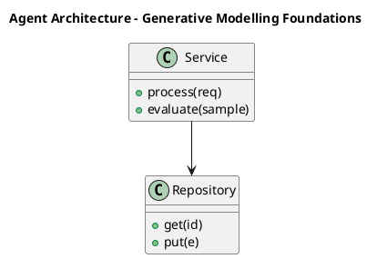

_Source diagram (plantuml); render with the appropriate tool._

**Figure 1. Agent Architecture - Generative Modelling Foundations** (plantuml). Figure: Agent Architecture view for Generative AI. This diagram illustrates the principal components and their interactions as discussed in the surrounding section.

## Deep Dive: Mechanics, Variants and Trade-offs

Having established the essentials, we now go deeper into generative modelling foundations. It pays to understand the mechanism rather than treat it as a black box, because most production incidents are explained by one of its steps misbehaving. The distinctions in this section are the ones that separate a working demo from a system that holds up under adversarial inputs, scale and the passage of time.

Consider the principal variants and how to choose between them. Each variant optimises for a different point in the design space - some for latency, some for accuracy, some for cost or operability - and the correct choice follows from explicit requirements rather than from defaults. Every added component buys capability at the price of operational surface area, and that bargain should be made consciously.

In practice this is supported by a mature tooling ecosystem, including OpenAI API, Anthropic Claude, LangChain, LlamaIndex. Tools accelerate the work but do not substitute for understanding: the same principles apply whichever implementation you select, and the ability to reason from first principles is what lets you debug when a tool behaves unexpectedly.

A frequent source of subtle bugs is the interaction with evaluation of generative systems. Because evaluation of generative systems concerns reference-based and reference-free metrics, LLM-as-judge, human preference evaluation and red-teaming, changes there can silently alter the behaviour analysed here. The remedy is contract tests at the boundary and end-to-end evaluations that exercise the interaction explicitly.

Finally, attend to edge cases and degradation. Define what the system should do under partial failure, unexpected inputs and load spikes, and make that behaviour explicit and tested rather than emergent. Graceful degradation - returning a safe, useful result when the ideal one is unavailable - is a hallmark of mature engineering.

For deeper study, the literature offers authoritative treatments such as Ho et al. — Denoising Diffusion Probabilistic Models (2020) and Brown et al. — Language Models are Few-Shot Learners (2020). These primary sources reward careful reading and ground the practical guidance above in established results.

## Advanced Considerations

Having established the essentials, we now go deeper into generative modelling foundations. It pays to understand the mechanism rather than treat it as a black box, because most production incidents are explained by one of its steps misbehaving. The distinctions in this section are the ones that separate a working demo from a system that holds up under adversarial inputs, scale and the passage of time.

Consider the principal variants and how to choose between them. Each variant optimises for a different point in the design space - some for latency, some for accuracy, some for cost or operability - and the correct choice follows from explicit requirements rather than from defaults. Every added component buys capability at the price of operational surface area, and that bargain should be made consciously.

In practice this is supported by a mature tooling ecosystem, including OpenAI API, Anthropic Claude, LangChain, LlamaIndex. Tools accelerate the work but do not substitute for understanding: the same principles apply whichever implementation you select, and the ability to reason from first principles is what lets you debug when a tool behaves unexpectedly.

A frequent source of subtle bugs is the interaction with governance and intellectual property. Because governance and intellectual property concerns provenance, watermarking, licensing and the legal landscape of generated content, changes there can silently alter the behaviour analysed here. The remedy is contract tests at the boundary and end-to-end evaluations that exercise the interaction explicitly.

Finally, attend to edge cases and degradation. Define what the system should do under partial failure, unexpected inputs and load spikes, and make that behaviour explicit and tested rather than emergent. Graceful degradation - returning a safe, useful result when the ideal one is unavailable - is a hallmark of mature engineering.

For deeper study, the literature offers authoritative treatments such as Ho et al. — Denoising Diffusion Probabilistic Models (2020) and Brown et al. — Language Models are Few-Shot Learners (2020). These primary sources reward careful reading and ground the practical guidance above in established results.

## Worked Example

To ground the discussion, walk through a representative example. A legal organisation needs contract drafting and clause extraction with citation back to source. They decide to apply generative modelling foundations as part of their Generative AI solution, but wisely treat it as a hypothesis to be validated rather than a foregone conclusion.

The team begins by stating the objective precisely and defining how success will be measured before writing any code. They establish a small but representative evaluation set, agree on acceptance thresholds, and only then prototype the simplest design that could work. Early measurement reveals which assumptions hold and which must be revised, saving weeks of misdirected effort and surfacing edge cases while they are still cheap to fix.

As the prototype matures into a service, the team hardens it: adding input validation, error handling, caching where it pays off, and monitoring that ties back to the original success metric. They document each significant decision in an architecture decision record so that future maintainers understand not just what was built but why.

The outcome is instructive. The system that reaches production is not the most sophisticated design the team considered, but the one whose behaviour they could measure, explain and operate. This is the recurring lesson of Generative AI: durable value comes from the whole system, not from any single clever component.

## Industry Use Cases

Across industries, the ideas in this chapter recur in recognisable ways. The following vignettes show how different sectors apply them and what they have in common.

**Legal.** Contract drafting and clause extraction with citation back to source. The common thread is that value comes not from the model alone but from the surrounding system - data quality, evaluation, integration and operations - which is precisely where most of the engineering effort belongs.

**Software.** Code generation, refactoring and test synthesis inside the IDE. The common thread is that value comes not from the model alone but from the surrounding system - data quality, evaluation, integration and operations - which is precisely where most of the engineering effort belongs.

**Marketing.** Brand-safe content generation with human-in-the-loop review. The common thread is that value comes not from the model alone but from the surrounding system - data quality, evaluation, integration and operations - which is precisely where most of the engineering effort belongs.

**Customer Service.** Grounded assistants that resolve tickets with cited policy. The common thread is that value comes not from the model alone but from the surrounding system - data quality, evaluation, integration and operations - which is precisely where most of the engineering effort belongs.

## Best Practices

The following practices consistently separate successful Generative AI efforts from struggling ones. They are deliberately concrete so they can be adopted as checklist items in design and code review.

- Treat prompts as versioned, tested artefacts under source control.
- Always ground high-stakes generations in retrieved, citable sources.
- Define explicit cost and latency budgets per use case and route accordingly.
- Run an automated evaluation suite on every prompt or model change.

None of these are exotic; they are the unglamorous disciplines that compound into reliability. The cost of adopting them is small compared with the cost of the incidents they prevent, and they become second nature with practice.

## Common Pitfalls

Equally instructive are the failure modes that recur in practice. Each pitfall below has a clear early warning sign and a known remedy, so treat them as a diagnostic checklist when something feels wrong:

- Shipping ungrounded generations into high-stakes workflows.
- Ignoring token cost growth as adoption scales.
- Relying on a single provider with no fallback or routing strategy.
- Evaluating only with anecdotes instead of a versioned test set.

The pattern is consistent: most failures stem from skipping measurement, conflating prototype and production standards, or deferring cross-cutting concerns such as security and cost until they become emergencies. Naming these traps in advance is the cheapest way to avoid them.

## Governance, Security and Cost Notes

No discussion of generative modelling foundations is complete without its governance, security and cost dimensions, which are too often deferred until they become emergencies. Treating them as first-class concerns from the outset is both cheaper and safer.

**Governance.** Classify the risk of this capability, document its intended and out-of-scope uses, and ensure decisions are traceable to satisfy internal policy and external regulation such as the NIST AI RMF, ISO/IEC 42001 and the EU AI Act. **Security.** Treat all external input as untrusted, validate outputs before acting on them, apply least privilege to any tools or data access, and map controls to the OWASP LLM Top 10 and MITRE ATLAS.

**Cost and sustainability.** Establish explicit budgets for compute, tokens and latency, attribute spend to owners, and revisit the economics as usage scales - a design that is affordable at pilot scale can become untenable at production volume. Building these reflexes into everyday engineering is what allows a Generative AI system to be not only capable but also trustworthy and economically sound.

## Hands-On Exercises

Work through the following exercises. They are designed to move understanding from recognition to application - the level required for real engineering work - so prefer writing and building over merely reading.

1. Explain generative modelling foundations to a colleague unfamiliar with Generative AI, using a concrete example from your own domain.
2. Sketch a reference architecture that incorporates generative modelling foundations and annotate where observability, security and cost controls belong.
3. Design an evaluation that would tell you whether generative modelling foundations is working in production, including the metric, the dataset and the acceptance threshold.
4. Identify two pitfalls relevant to generative modelling foundations in your environment and describe the early warning signals you would monitor.
5. Prototype the simplest implementation that demonstrates generative modelling foundations, then list exactly what would need to change to make it production-ready.

## Key Takeaways

Key takeaways from this chapter:

- Generative Modelling Foundations is a systems concern in Generative AI: data, models and operations must be co-designed.
- Measurement is non-negotiable; define success metrics and evaluation before building.
- Favour the simplest design that meets the requirement, and add complexity only when evidence demands it.
- Security, cost and observability are first-class requirements, not afterthoughts.
- Document decisions so the system remains understandable and operable as it evolves.

## Code Walkthrough

Pipelines keep Generative Modelling Foundations logic modular and testable. Each stage is a pure function, errors are captured per item, and the composition is trivial to extend or reorder.

The full listing is shown below; study it line by line and reproduce it locally before moving on.

### Listing: A composable processing pipeline for Generative Modelling Foundations

```python
from collections.abc import Iterable, Iterator
from typing import Protocol


class Stage(Protocol):
    def __call__(self, item: dict) -> dict: ...


def pipeline(stages: list[Stage]) -> Stage:
    """Compose ordered stages into a single callable for Generative Modelling Foundations."""

    def run(item: dict) -> dict:
        for stage in stages:
            item = stage(item)
        return item

    return run


def validate(item: dict) -> dict:
    if "text" not in item:
        raise ValueError("missing required field: text")
    return item


def normalise(item: dict) -> dict:
    item["text"] = item["text"].strip().lower()
    return item


def enrich(item: dict) -> dict:
    item["length"] = len(item["text"])
    return item


process = pipeline([validate, normalise, enrich])


def run_batch(items: Iterable[dict]) -> Iterator[dict]:
    for item in items:
        try:
            yield process(dict(item))
        except ValueError as exc:
            yield {"error": str(exc), "item": item}

```

## Review Questions

1. In the context of Generative AI, which statement best describes “Generative Modelling Foundations”?
   - A. It is only relevant to academic research, not production.
   - B. Likelihood-based versus implicit models; autoregressive, diffusion and variational approaches and the trade-offs between fidelity and diversity.
   - C. It eliminates the need for any evaluation or monitoring.
   - D. It makes the system slower but has no other effect.
   - **Answer: B.** Generative Modelling Foundations: Likelihood-based versus implicit models; autoregressive, diffusion and variational approaches and the trade-offs between fidelity and diversity.
2. Which of the following is a recommended best practice when working with Generative AI?
   - A. It makes the system slower but has no other effect.
   - B. Shipping ungrounded generations into high-stakes workflows.
   - C. Always ground high-stakes generations in retrieved, citable sources.
   - D. It eliminates the need for any evaluation or monitoring.
   - **Answer: C.** Best practice: Always ground high-stakes generations in retrieved, citable sources.
3. Which of the following is a common pitfall to avoid in Generative AI?
   - A. Treat prompts as versioned, tested artefacts under source control.
   - B. Ignoring token cost growth as adoption scales.
   - C. Always ground high-stakes generations in retrieved, citable sources.
   - D. Define explicit cost and latency budgets per use case and route accordingly.
   - **Answer: B.** Pitfall to avoid: Ignoring token cost growth as adoption scales.
4. *(Discussion)* Walk through how you would design Generative Modelling Foundations for an enterprise Generative AI workload.
   - **Model answer:** A strong answer defines generative modelling foundations (Likelihood-based versus implicit models; autoregressive, diffusion and variational approaches and the trade-offs between fidelity and diversity.) then connects it to architecture, evaluation, cost, security and operations for Generative AI, citing concrete trade-offs and a real-world example.

---


# Chapter 2. Large Language Models as Generators

_This chapter examines large language models as generators within Generative AI. It covers next-token prediction, sampling strategies (temperature, top-k, top-p) and the emergence of instruction following, derives a reference architecture, walks through a worked example and runnable code, surveys industry use cases, and distils best practices and pitfalls, closing with exercises and review questions._

## Introduction

We define Large Language Models as Generators as next-token prediction, sampling strategies (temperature, top-k, top-p) and the emergence of instruction following. Teams that master this consistently ship more reliable Generative AI systems at lower cost. It helps to separate the conceptual model from its implementation: the former guides reasoning, the latter must contend with real-world constraints.

This chapter builds intuition first, then formalises the ideas, derives an architecture, and finishes with code, exercises and review questions so the material transfers directly to your own Generative AI work. Read it actively: pause at each diagram, reproduce the code, and attempt the exercises before consulting the answers.

## Theory and Foundations

Formally, Large Language Models as Generators addresses next-token prediction, sampling strategies (temperature, top-k, top-p) and the emergence of instruction following. What distinguishes a production-grade approach from a prototype is the discipline of measurement: every claim is backed by an evaluation rather than intuition. Mechanically, the behaviour emerges from a few interacting parts that are simpler than the whole they produce.

To place this in context, recall the broader picture: Generative AI refers to models that synthesise novel content—text, images, audio, code and structured data—by learning the distribution of training data and sampling from it. Within that picture, large language models as generators is one of the load-bearing ideas - the kind that, when understood deeply, makes the rest of Generative AI fall into place. Getting this right early prevents expensive rework once a Generative AI system reaches scale.

Large Language Models as Generators cannot be understood in isolation from governance and intellectual property. Recall that governance and intellectual property concerns provenance, watermarking, licensing and the legal landscape of generated content. The two interact directly: decisions in one constrain the design space of the other, which is why mature teams reason about them together rather than sequentially. Simplicity is a feature. The simplest design that meets the requirement should be the default, with complexity added only when measurement justifies it.

Large Language Models as Generators cannot be understood in isolation from diffusion models for images and audio. Recall that diffusion models for images and audio concerns forward/reverse diffusion, denoising objectives, latent diffusion and classifier-free guidance. The two interact directly: decisions in one constrain the design space of the other, which is why mature teams reason about them together rather than sequentially. Latency, accuracy and cost form a tension triangle: improving one typically pressures the others, so explicit budgets are essential.

Several established patterns apply directly to large language models as generators. The first, guardrail sandwich: validate inputs, constrain decoding, validate outputs, is widely adopted because it makes the system's behaviour predictable and observable. A complementary pattern, semantic caching keyed on normalised prompts and embeddings, addresses a related concern and is often deployed alongside it. Patterns are not dogma; they are distilled experience that shortcuts the search for a sound design, and each carries assumptions worth checking against your context.

It is worth being explicit about when to apply this and when to reach for something simpler. In a small prototype, shortcuts around large language models as generators are invisible; in a production Generative AI system serving real traffic, they surface as incidents, cost overruns or compliance gaps. Latency, accuracy and cost form a tension triangle: improving one typically pressures the others, so explicit budgets are essential. The remainder of this chapter turns these principles into an architecture, code and a checklist you can apply immediately.

## Architecture and Design

From an architectural standpoint, Large Language Models as Generators sits at the intersection of data, models and operations. A production generative-AI platform places a model gateway in front of one or more foundation models, with orchestration handling prompt assembly, retrieval, tool calls and guardrails. A semantic cache reduces cost and latency, an evaluation service scores responses offline and online, and an observability layer captures prompts, completions, tokens, cost and quality signals for every request.

Concretely, the principal building blocks include generative modelling foundations, large language models as generators, diffusion models for images and audio, multimodal generation and grounding with enterprise data. Each is a replaceable component behind a stable interface, so the team can upgrade an implementation - a model, an index, a policy engine - without rewriting its neighbours. The contracts between components are where reliability is won or lost, so they are specified explicitly and tested in isolation.

The diagram accompanying this section makes the data and control flow explicit. Requests enter through a well-defined boundary where they are authenticated and validated; only then are they dispatched to the components that perform the work. This boundary is also where rate limiting, quota enforcement and audit logging live, keeping cross-cutting concerns out of the core logic and in one auditable place.

Two qualities deserve emphasis. First, observability is designed in, not bolted on: every component emits structured telemetry so that failures can be localised in minutes rather than hours. Second, the architecture is evolvable - components communicate through stable contracts so that any single part of the Generative AI system can be replaced without a rewrite. Every added component buys capability at the price of operational surface area, and that bargain should be made consciously.

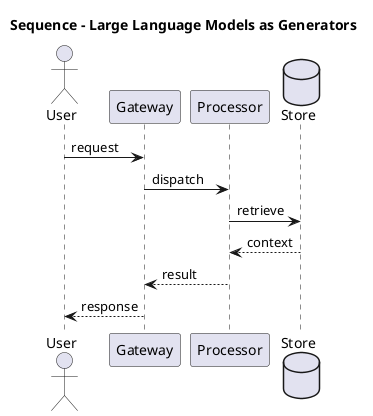

_Source diagram (plantuml); render with the appropriate tool._

**Figure 2. Sequence - Large Language Models as Generators** (plantuml). Figure: Sequence view for Generative AI. This diagram illustrates the principal components and their interactions as discussed in the surrounding section.

## Deep Dive: Mechanics, Variants and Trade-offs

Having established the essentials, we now go deeper into large language models as generators. Beneath the abstraction lies a concrete process whose steps can each be measured, tested and optimised independently. The distinctions in this section are the ones that separate a working demo from a system that holds up under adversarial inputs, scale and the passage of time.

Consider the principal variants and how to choose between them. Each variant optimises for a different point in the design space - some for latency, some for accuracy, some for cost or operability - and the correct choice follows from explicit requirements rather than from defaults. Latency, accuracy and cost form a tension triangle: improving one typically pressures the others, so explicit budgets are essential.

In practice this is supported by a mature tooling ecosystem, including OpenAI API, Anthropic Claude, LangChain, LlamaIndex. Tools accelerate the work but do not substitute for understanding: the same principles apply whichever implementation you select, and the ability to reason from first principles is what lets you debug when a tool behaves unexpectedly.

A frequent source of subtle bugs is the interaction with governance and intellectual property. Because governance and intellectual property concerns provenance, watermarking, licensing and the legal landscape of generated content, changes there can silently alter the behaviour analysed here. The remedy is contract tests at the boundary and end-to-end evaluations that exercise the interaction explicitly.

Finally, attend to edge cases and degradation. Define what the system should do under partial failure, unexpected inputs and load spikes, and make that behaviour explicit and tested rather than emergent. Graceful degradation - returning a safe, useful result when the ideal one is unavailable - is a hallmark of mature engineering.

For deeper study, the literature offers authoritative treatments such as Ho et al. — Denoising Diffusion Probabilistic Models (2020) and Brown et al. — Language Models are Few-Shot Learners (2020). These primary sources reward careful reading and ground the practical guidance above in established results.

## Advanced Considerations

Having established the essentials, we now go deeper into large language models as generators. The underlying mechanism is best appreciated by tracing a single request from input to output and noting where state is created and consumed. The distinctions in this section are the ones that separate a working demo from a system that holds up under adversarial inputs, scale and the passage of time.

Consider the principal variants and how to choose between them. Each variant optimises for a different point in the design space - some for latency, some for accuracy, some for cost or operability - and the correct choice follows from explicit requirements rather than from defaults. Every added component buys capability at the price of operational surface area, and that bargain should be made consciously.

In practice this is supported by a mature tooling ecosystem, including OpenAI API, Anthropic Claude, LangChain, LlamaIndex. Tools accelerate the work but do not substitute for understanding: the same principles apply whichever implementation you select, and the ability to reason from first principles is what lets you debug when a tool behaves unexpectedly.

A frequent source of subtle bugs is the interaction with controllability and structured output. Because controllability and structured output concerns constrained decoding, JSON/schema enforcement and function calling for reliable downstream integration, changes there can silently alter the behaviour analysed here. The remedy is contract tests at the boundary and end-to-end evaluations that exercise the interaction explicitly.

Finally, attend to edge cases and degradation. Define what the system should do under partial failure, unexpected inputs and load spikes, and make that behaviour explicit and tested rather than emergent. Graceful degradation - returning a safe, useful result when the ideal one is unavailable - is a hallmark of mature engineering.

For deeper study, the literature offers authoritative treatments such as Ho et al. — Denoising Diffusion Probabilistic Models (2020) and Brown et al. — Language Models are Few-Shot Learners (2020). These primary sources reward careful reading and ground the practical guidance above in established results.

## Worked Example

To ground the discussion, walk through a representative example. A marketing organisation needs brand-safe content generation with human-in-the-loop review. They decide to apply large language models as generators as part of their Generative AI solution, but wisely treat it as a hypothesis to be validated rather than a foregone conclusion.

The team begins by stating the objective precisely and defining how success will be measured before writing any code. They establish a small but representative evaluation set, agree on acceptance thresholds, and only then prototype the simplest design that could work. Early measurement reveals which assumptions hold and which must be revised, saving weeks of misdirected effort and surfacing edge cases while they are still cheap to fix.

As the prototype matures into a service, the team hardens it: adding input validation, error handling, caching where it pays off, and monitoring that ties back to the original success metric. They document each significant decision in an architecture decision record so that future maintainers understand not just what was built but why.

The outcome is instructive. The system that reaches production is not the most sophisticated design the team considered, but the one whose behaviour they could measure, explain and operate. This is the recurring lesson of Generative AI: durable value comes from the whole system, not from any single clever component.

## Industry Use Cases

Across industries, the ideas in this chapter recur in recognisable ways. The following vignettes show how different sectors apply them and what they have in common.

**Legal.** Contract drafting and clause extraction with citation back to source. The common thread is that value comes not from the model alone but from the surrounding system - data quality, evaluation, integration and operations - which is precisely where most of the engineering effort belongs.

**Software.** Code generation, refactoring and test synthesis inside the IDE. The common thread is that value comes not from the model alone but from the surrounding system - data quality, evaluation, integration and operations - which is precisely where most of the engineering effort belongs.

**Marketing.** Brand-safe content generation with human-in-the-loop review. The common thread is that value comes not from the model alone but from the surrounding system - data quality, evaluation, integration and operations - which is precisely where most of the engineering effort belongs.

**Customer Service.** Grounded assistants that resolve tickets with cited policy. The common thread is that value comes not from the model alone but from the surrounding system - data quality, evaluation, integration and operations - which is precisely where most of the engineering effort belongs.

## Best Practices

The following practices consistently separate successful Generative AI efforts from struggling ones. They are deliberately concrete so they can be adopted as checklist items in design and code review.

- Treat prompts as versioned, tested artefacts under source control.
- Always ground high-stakes generations in retrieved, citable sources.
- Define explicit cost and latency budgets per use case and route accordingly.
- Run an automated evaluation suite on every prompt or model change.

None of these are exotic; they are the unglamorous disciplines that compound into reliability. The cost of adopting them is small compared with the cost of the incidents they prevent, and they become second nature with practice.

## Common Pitfalls

Equally instructive are the failure modes that recur in practice. Each pitfall below has a clear early warning sign and a known remedy, so treat them as a diagnostic checklist when something feels wrong:

- Shipping ungrounded generations into high-stakes workflows.
- Ignoring token cost growth as adoption scales.
- Relying on a single provider with no fallback or routing strategy.
- Evaluating only with anecdotes instead of a versioned test set.

The pattern is consistent: most failures stem from skipping measurement, conflating prototype and production standards, or deferring cross-cutting concerns such as security and cost until they become emergencies. Naming these traps in advance is the cheapest way to avoid them.

## Governance, Security and Cost Notes

No discussion of large language models as generators is complete without its governance, security and cost dimensions, which are too often deferred until they become emergencies. Treating them as first-class concerns from the outset is both cheaper and safer.

**Governance.** Classify the risk of this capability, document its intended and out-of-scope uses, and ensure decisions are traceable to satisfy internal policy and external regulation such as the NIST AI RMF, ISO/IEC 42001 and the EU AI Act. **Security.** Treat all external input as untrusted, validate outputs before acting on them, apply least privilege to any tools or data access, and map controls to the OWASP LLM Top 10 and MITRE ATLAS.

**Cost and sustainability.** Establish explicit budgets for compute, tokens and latency, attribute spend to owners, and revisit the economics as usage scales - a design that is affordable at pilot scale can become untenable at production volume. Building these reflexes into everyday engineering is what allows a Generative AI system to be not only capable but also trustworthy and economically sound.

## Hands-On Exercises

Work through the following exercises. They are designed to move understanding from recognition to application - the level required for real engineering work - so prefer writing and building over merely reading.

1. Explain large language models as generators to a colleague unfamiliar with Generative AI, using a concrete example from your own domain.
2. Sketch a reference architecture that incorporates large language models as generators and annotate where observability, security and cost controls belong.
3. Design an evaluation that would tell you whether large language models as generators is working in production, including the metric, the dataset and the acceptance threshold.
4. Identify two pitfalls relevant to large language models as generators in your environment and describe the early warning signals you would monitor.
5. Prototype the simplest implementation that demonstrates large language models as generators, then list exactly what would need to change to make it production-ready.

## Key Takeaways

Key takeaways from this chapter:

- Large Language Models as Generators is a systems concern in Generative AI: data, models and operations must be co-designed.
- Measurement is non-negotiable; define success metrics and evaluation before building.
- Favour the simplest design that meets the requirement, and add complexity only when evidence demands it.
- Security, cost and observability are first-class requirements, not afterthoughts.
- Document decisions so the system remains understandable and operable as it evolves.

## Code Walkthrough

Pipelines keep Large Language Models as Generators logic modular and testable. Each stage is a pure function, errors are captured per item, and the composition is trivial to extend or reorder.

The full listing is shown below; study it line by line and reproduce it locally before moving on.

### Listing: A composable processing pipeline for Large Language Models as Generators

```python
from collections.abc import Iterable, Iterator
from typing import Protocol


class Stage(Protocol):
    def __call__(self, item: dict) -> dict: ...


def pipeline(stages: list[Stage]) -> Stage:
    """Compose ordered stages into a single callable for Large Language Models as Generators."""

    def run(item: dict) -> dict:
        for stage in stages:
            item = stage(item)
        return item

    return run


def validate(item: dict) -> dict:
    if "text" not in item:
        raise ValueError("missing required field: text")
    return item


def normalise(item: dict) -> dict:
    item["text"] = item["text"].strip().lower()
    return item


def enrich(item: dict) -> dict:
    item["length"] = len(item["text"])
    return item


process = pipeline([validate, normalise, enrich])


def run_batch(items: Iterable[dict]) -> Iterator[dict]:
    for item in items:
        try:
            yield process(dict(item))
        except ValueError as exc:
            yield {"error": str(exc), "item": item}

```

## Review Questions

1. In the context of Generative AI, which statement best describes “Large Language Models as Generators”?
   - A. It removes all security and governance requirements.
   - B. Next-token prediction, sampling strategies (temperature, top-k, top-p) and the emergence of instruction following.
   - C. It applies exclusively to image data.
   - D. It is only relevant to academic research, not production.
   - **Answer: B.** Large Language Models as Generators: Next-token prediction, sampling strategies (temperature, top-k, top-p) and the emergence of instruction following.
2. Which of the following is a recommended best practice when working with Generative AI?
   - A. It is only relevant to academic research, not production.
   - B. Relying on a single provider with no fallback or routing strategy.
   - C. Shipping ungrounded generations into high-stakes workflows.
   - D. Run an automated evaluation suite on every prompt or model change.
   - **Answer: D.** Best practice: Run an automated evaluation suite on every prompt or model change.
3. Which of the following is a common pitfall to avoid in Generative AI?
   - A. Treat prompts as versioned, tested artefacts under source control.
   - B. Ignoring token cost growth as adoption scales.
   - C. It is only relevant to academic research, not production.
   - D. Run an automated evaluation suite on every prompt or model change.
   - **Answer: B.** Pitfall to avoid: Ignoring token cost growth as adoption scales.
4. *(Discussion)* Walk through how you would design Large Language Models as Generators for an enterprise Generative AI workload.
   - **Model answer:** A strong answer defines large language models as generators (Next-token prediction, sampling strategies (temperature, top-k, top-p) and the emergence of instruction following.) then connects it to architecture, evaluation, cost, security and operations for Generative AI, citing concrete trade-offs and a real-world example.

---


# Chapter 3. Diffusion Models for Images and Audio

_This chapter examines diffusion models for images and audio within Generative AI. It covers forward/reverse diffusion, denoising objectives, latent diffusion and classifier-free guidance, derives a reference architecture, walks through a worked example and runnable code, surveys industry use cases, and distils best practices and pitfalls, closing with exercises and review questions._

## Introduction

We define Diffusion Models for Images and Audio as forward/reverse diffusion, denoising objectives, latent diffusion and classifier-free guidance. It is foundational: later capabilities in Generative AI are built directly on top of it. The practical implication is that design choices here ripple through latency, cost and maintainability for the lifetime of the system.

This chapter builds intuition first, then formalises the ideas, derives an architecture, and finishes with code, exercises and review questions so the material transfers directly to your own Generative AI work. Read it actively: pause at each diagram, reproduce the code, and attempt the exercises before consulting the answers.

## Theory and Foundations

We define Diffusion Models for Images and Audio as forward/reverse diffusion, denoising objectives, latent diffusion and classifier-free guidance. In an enterprise setting, this translates into concrete requirements: clear interfaces, measurable quality, and controls that satisfy security and governance. Beneath the abstraction lies a concrete process whose steps can each be measured, tested and optimised independently.

To place this in context, recall the broader picture: Generative AI refers to models that synthesise novel content—text, images, audio, code and structured data—by learning the distribution of training data and sampling from it. Within that picture, diffusion models for images and audio is one of the load-bearing ideas - the kind that, when understood deeply, makes the rest of Generative AI fall into place. Neglecting it is one of the most common reasons Generative AI initiatives stall in production.

Diffusion Models for Images and Audio cannot be understood in isolation from productionising generative applications. Recall that productionising generative applications concerns prompt management, versioning, observability and continuous evaluation in CI. The two interact directly: decisions in one constrain the design space of the other, which is why mature teams reason about them together rather than sequentially. Latency, accuracy and cost form a tension triangle: improving one typically pressures the others, so explicit budgets are essential.

Diffusion Models for Images and Audio cannot be understood in isolation from grounding with enterprise data. Recall that grounding with enterprise data concerns retrieval augmentation, tool use and structured outputs to keep generations factual and policy-compliant. The two interact directly: decisions in one constrain the design space of the other, which is why mature teams reason about them together rather than sequentially. Simplicity is a feature. The simplest design that meets the requirement should be the default, with complexity added only when measurement justifies it.

Several established patterns apply directly to diffusion models for images and audio. The first, guardrail sandwich: validate inputs, constrain decoding, validate outputs, is widely adopted because it makes the system's behaviour predictable and observable. A complementary pattern, model gateway abstracting multiple providers behind one api, addresses a related concern and is often deployed alongside it. Patterns are not dogma; they are distilled experience that shortcuts the search for a sound design, and each carries assumptions worth checking against your context.

Knowing when not to use a technique is as valuable as knowing how to use it. In a small prototype, shortcuts around diffusion models for images and audio are invisible; in a production Generative AI system serving real traffic, they surface as incidents, cost overruns or compliance gaps. Every added component buys capability at the price of operational surface area, and that bargain should be made consciously. The remainder of this chapter turns these principles into an architecture, code and a checklist you can apply immediately.

## Architecture and Design

From an architectural standpoint, Diffusion Models for Images and Audio sits at the intersection of data, models and operations. A production generative-AI platform places a model gateway in front of one or more foundation models, with orchestration handling prompt assembly, retrieval, tool calls and guardrails. A semantic cache reduces cost and latency, an evaluation service scores responses offline and online, and an observability layer captures prompts, completions, tokens, cost and quality signals for every request.

Concretely, the principal building blocks include generative modelling foundations, large language models as generators, diffusion models for images and audio, multimodal generation and grounding with enterprise data. Each is a replaceable component behind a stable interface, so the team can upgrade an implementation - a model, an index, a policy engine - without rewriting its neighbours. The contracts between components are where reliability is won or lost, so they are specified explicitly and tested in isolation.

The diagram accompanying this section makes the data and control flow explicit. Requests enter through a well-defined boundary where they are authenticated and validated; only then are they dispatched to the components that perform the work. This boundary is also where rate limiting, quota enforcement and audit logging live, keeping cross-cutting concerns out of the core logic and in one auditable place.

Two qualities deserve emphasis. First, observability is designed in, not bolted on: every component emits structured telemetry so that failures can be localised in minutes rather than hours. Second, the architecture is evolvable - components communicate through stable contracts so that any single part of the Generative AI system can be replaced without a rewrite. Latency, accuracy and cost form a tension triangle: improving one typically pressures the others, so explicit budgets are essential.

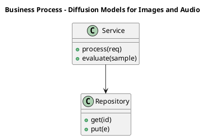

_Source diagram (plantuml); render with the appropriate tool._

**Figure 3. Business Process - Diffusion Models for Images and Audio** (plantuml). Figure: Business Process view for Generative AI. This diagram illustrates the principal components and their interactions as discussed in the surrounding section.

<div class="diagram-svg">

<svg xmlns="http://www.w3.org/2000/svg" width="760" height="380" viewBox="0 0 760 380" font-family="Inter, Segoe UI, Arial, sans-serif">
<defs><marker id="arrow" markerWidth="10" markerHeight="10" refX="8" refY="3" orient="auto" markerUnits="strokeWidth"><path d="M0,0 L8,3 L0,6 z" fill="#94a3b8"/></marker><marker id="arrowA" markerWidth="10" markerHeight="10" refX="8" refY="3" orient="auto" markerUnits="strokeWidth"><path d="M0,0 L8,3 L0,6 z" fill="#4338ca"/></marker></defs>
<rect width="760" height="380" rx="12" fill="#f8fafc"/>
<text x="380" y="30" text-anchor="middle" font-size="17" font-weight="700" fill="#0f172a">Application Flow - Diffusion Models for Images and Audio</text>
<rect x="40.0" y="166.0" width="104" height="60" rx="10" fill="#ffffff" stroke="#4338ca" stroke-width="2"/><text x="92.0" y="200.08" text-anchor="middle" font-size="12" font-weight="600" fill="#0f172a">Request</text>
<rect x="155.2" y="166.0" width="104" height="60" rx="10" fill="#ffffff" stroke="#7c3aed" stroke-width="2"/><text x="207.2" y="200.08" text-anchor="middle" font-size="12" font-weight="600" fill="#0f172a">Auth</text>
<line x1="144.0" y1="196.0" x2="155.2" y2="196.0" stroke="#4338ca" stroke-width="2" marker-end="url(#arrowA)"/>
<rect x="270.4" y="166.0" width="104" height="60" rx="10" fill="#ffffff" stroke="#0891b2" stroke-width="2"/><text x="322.4" y="200.08" text-anchor="middle" font-size="12" font-weight="600" fill="#0f172a">Route</text>
<line x1="259.2" y1="196.0" x2="270.4" y2="196.0" stroke="#4338ca" stroke-width="2" marker-end="url(#arrowA)"/>
<rect x="385.6" y="166.0" width="104" height="60" rx="10" fill="#ffffff" stroke="#059669" stroke-width="2"/><text x="437.6" y="200.08" text-anchor="middle" font-size="12" font-weight="600" fill="#0f172a">Process</text>
<line x1="374.4" y1="196.0" x2="385.6" y2="196.0" stroke="#4338ca" stroke-width="2" marker-end="url(#arrowA)"/>
<rect x="500.8" y="166.0" width="104" height="60" rx="10" fill="#ffffff" stroke="#d97706" stroke-width="2"/><text x="552.8" y="200.08" text-anchor="middle" font-size="12" font-weight="600" fill="#0f172a">Persist</text>
<line x1="489.6" y1="196.0" x2="500.8" y2="196.0" stroke="#4338ca" stroke-width="2" marker-end="url(#arrowA)"/>
<rect x="616.0" y="166.0" width="104" height="60" rx="10" fill="#ffffff" stroke="#dc2626" stroke-width="2"/><text x="668.0" y="200.08" text-anchor="middle" font-size="12" font-weight="600" fill="#0f172a">Respond</text>
<line x1="604.8" y1="196.0" x2="616.0" y2="196.0" stroke="#4338ca" stroke-width="2" marker-end="url(#arrowA)"/>
<path d="M668.0,226.0 q0,46 -288.0,46 q-288.0,0 -288.0,-46" fill="none" stroke="#cbd5e1" stroke-width="1.6" stroke-dasharray="5 4" marker-end="url(#arrow)"/>
<text x="380.0" y="288.0" text-anchor="middle" font-size="9.5" fill="#94a3b8">feedback / monitoring loop</text>
</svg>

</div>

**Figure 4. Application Flow - Diffusion Models for Images and Audio** (svg). Figure: Application Flow view for Generative AI. This diagram illustrates the principal components and their interactions as discussed in the surrounding section.

## Deep Dive: Mechanics, Variants and Trade-offs

Having established the essentials, we now go deeper into diffusion models for images and audio. Beneath the abstraction lies a concrete process whose steps can each be measured, tested and optimised independently. The distinctions in this section are the ones that separate a working demo from a system that holds up under adversarial inputs, scale and the passage of time.

Consider the principal variants and how to choose between them. Each variant optimises for a different point in the design space - some for latency, some for accuracy, some for cost or operability - and the correct choice follows from explicit requirements rather than from defaults. There is an inherent trade-off between fidelity and cost, and the correct balance depends on the use case and its tolerance for error.

In practice this is supported by a mature tooling ecosystem, including OpenAI API, Anthropic Claude, LangChain, LlamaIndex. Tools accelerate the work but do not substitute for understanding: the same principles apply whichever implementation you select, and the ability to reason from first principles is what lets you debug when a tool behaves unexpectedly.

A frequent source of subtle bugs is the interaction with productionising generative applications. Because productionising generative applications concerns prompt management, versioning, observability and continuous evaluation in CI, changes there can silently alter the behaviour analysed here. The remedy is contract tests at the boundary and end-to-end evaluations that exercise the interaction explicitly.

Finally, attend to edge cases and degradation. Define what the system should do under partial failure, unexpected inputs and load spikes, and make that behaviour explicit and tested rather than emergent. Graceful degradation - returning a safe, useful result when the ideal one is unavailable - is a hallmark of mature engineering.

For deeper study, the literature offers authoritative treatments such as Ho et al. — Denoising Diffusion Probabilistic Models (2020) and Brown et al. — Language Models are Few-Shot Learners (2020). These primary sources reward careful reading and ground the practical guidance above in established results.

## Advanced Considerations

Having established the essentials, we now go deeper into diffusion models for images and audio. Mechanically, the behaviour emerges from a few interacting parts that are simpler than the whole they produce. The distinctions in this section are the ones that separate a working demo from a system that holds up under adversarial inputs, scale and the passage of time.

Consider the principal variants and how to choose between them. Each variant optimises for a different point in the design space - some for latency, some for accuracy, some for cost or operability - and the correct choice follows from explicit requirements rather than from defaults. Simplicity is a feature. The simplest design that meets the requirement should be the default, with complexity added only when measurement justifies it.

In practice this is supported by a mature tooling ecosystem, including OpenAI API, Anthropic Claude, LangChain, LlamaIndex. Tools accelerate the work but do not substitute for understanding: the same principles apply whichever implementation you select, and the ability to reason from first principles is what lets you debug when a tool behaves unexpectedly.

A frequent source of subtle bugs is the interaction with evaluation of generative systems. Because evaluation of generative systems concerns reference-based and reference-free metrics, LLM-as-judge, human preference evaluation and red-teaming, changes there can silently alter the behaviour analysed here. The remedy is contract tests at the boundary and end-to-end evaluations that exercise the interaction explicitly.

Finally, attend to edge cases and degradation. Define what the system should do under partial failure, unexpected inputs and load spikes, and make that behaviour explicit and tested rather than emergent. Graceful degradation - returning a safe, useful result when the ideal one is unavailable - is a hallmark of mature engineering.

For deeper study, the literature offers authoritative treatments such as Ho et al. — Denoising Diffusion Probabilistic Models (2020) and Brown et al. — Language Models are Few-Shot Learners (2020). These primary sources reward careful reading and ground the practical guidance above in established results.

## Worked Example

Consider a concrete scenario. A software organisation needs code generation, refactoring and test synthesis inside the IDE. They decide to apply diffusion models for images and audio as part of their Generative AI solution, but wisely treat it as a hypothesis to be validated rather than a foregone conclusion.

The team begins by stating the objective precisely and defining how success will be measured before writing any code. They establish a small but representative evaluation set, agree on acceptance thresholds, and only then prototype the simplest design that could work. Early measurement reveals which assumptions hold and which must be revised, saving weeks of misdirected effort and surfacing edge cases while they are still cheap to fix.

As the prototype matures into a service, the team hardens it: adding input validation, error handling, caching where it pays off, and monitoring that ties back to the original success metric. They document each significant decision in an architecture decision record so that future maintainers understand not just what was built but why.

The outcome is instructive. The system that reaches production is not the most sophisticated design the team considered, but the one whose behaviour they could measure, explain and operate. This is the recurring lesson of Generative AI: durable value comes from the whole system, not from any single clever component.

## Industry Use Cases

Across industries, the ideas in this chapter recur in recognisable ways. The following vignettes show how different sectors apply them and what they have in common.

**Legal.** Contract drafting and clause extraction with citation back to source. The common thread is that value comes not from the model alone but from the surrounding system - data quality, evaluation, integration and operations - which is precisely where most of the engineering effort belongs.

**Software.** Code generation, refactoring and test synthesis inside the IDE. The common thread is that value comes not from the model alone but from the surrounding system - data quality, evaluation, integration and operations - which is precisely where most of the engineering effort belongs.

**Marketing.** Brand-safe content generation with human-in-the-loop review. The common thread is that value comes not from the model alone but from the surrounding system - data quality, evaluation, integration and operations - which is precisely where most of the engineering effort belongs.

**Customer Service.** Grounded assistants that resolve tickets with cited policy. The common thread is that value comes not from the model alone but from the surrounding system - data quality, evaluation, integration and operations - which is precisely where most of the engineering effort belongs.

## Best Practices

The following practices consistently separate successful Generative AI efforts from struggling ones. They are deliberately concrete so they can be adopted as checklist items in design and code review.

- Treat prompts as versioned, tested artefacts under source control.
- Always ground high-stakes generations in retrieved, citable sources.
- Define explicit cost and latency budgets per use case and route accordingly.
- Run an automated evaluation suite on every prompt or model change.

None of these are exotic; they are the unglamorous disciplines that compound into reliability. The cost of adopting them is small compared with the cost of the incidents they prevent, and they become second nature with practice.

## Common Pitfalls

Equally instructive are the failure modes that recur in practice. Each pitfall below has a clear early warning sign and a known remedy, so treat them as a diagnostic checklist when something feels wrong:

- Shipping ungrounded generations into high-stakes workflows.
- Ignoring token cost growth as adoption scales.
- Relying on a single provider with no fallback or routing strategy.
- Evaluating only with anecdotes instead of a versioned test set.

The pattern is consistent: most failures stem from skipping measurement, conflating prototype and production standards, or deferring cross-cutting concerns such as security and cost until they become emergencies. Naming these traps in advance is the cheapest way to avoid them.

## Governance, Security and Cost Notes

No discussion of diffusion models for images and audio is complete without its governance, security and cost dimensions, which are too often deferred until they become emergencies. Treating them as first-class concerns from the outset is both cheaper and safer.

**Governance.** Classify the risk of this capability, document its intended and out-of-scope uses, and ensure decisions are traceable to satisfy internal policy and external regulation such as the NIST AI RMF, ISO/IEC 42001 and the EU AI Act. **Security.** Treat all external input as untrusted, validate outputs before acting on them, apply least privilege to any tools or data access, and map controls to the OWASP LLM Top 10 and MITRE ATLAS.

**Cost and sustainability.** Establish explicit budgets for compute, tokens and latency, attribute spend to owners, and revisit the economics as usage scales - a design that is affordable at pilot scale can become untenable at production volume. Building these reflexes into everyday engineering is what allows a Generative AI system to be not only capable but also trustworthy and economically sound.

## Hands-On Exercises

Work through the following exercises. They are designed to move understanding from recognition to application - the level required for real engineering work - so prefer writing and building over merely reading.

1. Explain diffusion models for images and audio to a colleague unfamiliar with Generative AI, using a concrete example from your own domain.
2. Sketch a reference architecture that incorporates diffusion models for images and audio and annotate where observability, security and cost controls belong.
3. Design an evaluation that would tell you whether diffusion models for images and audio is working in production, including the metric, the dataset and the acceptance threshold.
4. Identify two pitfalls relevant to diffusion models for images and audio in your environment and describe the early warning signals you would monitor.
5. Prototype the simplest implementation that demonstrates diffusion models for images and audio, then list exactly what would need to change to make it production-ready.

## Key Takeaways

Key takeaways from this chapter:

- Diffusion Models for Images and Audio is a systems concern in Generative AI: data, models and operations must be co-designed.
- Measurement is non-negotiable; define success metrics and evaluation before building.
- Favour the simplest design that meets the requirement, and add complexity only when evidence demands it.
- Security, cost and observability are first-class requirements, not afterthoughts.
- Document decisions so the system remains understandable and operable as it evolves.

## Code Walkthrough

Pipelines keep Diffusion Models for Images and Audio logic modular and testable. Each stage is a pure function, errors are captured per item, and the composition is trivial to extend or reorder.

The full listing is shown below; study it line by line and reproduce it locally before moving on.

### Listing: A composable processing pipeline for Diffusion Models for Images and Audio

```python
from collections.abc import Iterable, Iterator
from typing import Protocol


class Stage(Protocol):
    def __call__(self, item: dict) -> dict: ...


def pipeline(stages: list[Stage]) -> Stage:
    """Compose ordered stages into a single callable for Diffusion Models for Images and Audio."""

    def run(item: dict) -> dict:
        for stage in stages:
            item = stage(item)
        return item

    return run


def validate(item: dict) -> dict:
    if "text" not in item:
        raise ValueError("missing required field: text")
    return item


def normalise(item: dict) -> dict:
    item["text"] = item["text"].strip().lower()
    return item


def enrich(item: dict) -> dict:
    item["length"] = len(item["text"])
    return item


process = pipeline([validate, normalise, enrich])


def run_batch(items: Iterable[dict]) -> Iterator[dict]:
    for item in items:
        try:
            yield process(dict(item))
        except ValueError as exc:
            yield {"error": str(exc), "item": item}

```

## Review Questions

1. In the context of Generative AI, which statement best describes “Diffusion Models for Images and Audio”?
   - A. It guarantees deterministic output regardless of input.
   - B. Forward/reverse diffusion, denoising objectives, latent diffusion and classifier-free guidance.
   - C. It removes all security and governance requirements.
   - D. It applies exclusively to image data.
   - **Answer: B.** Diffusion Models for Images and Audio: Forward/reverse diffusion, denoising objectives, latent diffusion and classifier-free guidance.
2. Which of the following is a recommended best practice when working with Generative AI?
   - A. It applies exclusively to image data.
   - B. It eliminates the need for any evaluation or monitoring.
   - C. Run an automated evaluation suite on every prompt or model change.
   - D. It is only relevant to academic research, not production.
   - **Answer: C.** Best practice: Run an automated evaluation suite on every prompt or model change.
3. Which of the following is a common pitfall to avoid in Generative AI?
   - A. It guarantees deterministic output regardless of input.
   - B. It is only relevant to academic research, not production.
   - C. Evaluating only with anecdotes instead of a versioned test set.
   - D. Always ground high-stakes generations in retrieved, citable sources.
   - **Answer: C.** Pitfall to avoid: Evaluating only with anecdotes instead of a versioned test set.
4. *(Discussion)* Describe a failure mode of Diffusion Models for Images and Audio and how you would mitigate it.
   - **Model answer:** A strong answer defines diffusion models for images and audio (Forward/reverse diffusion, denoising objectives, latent diffusion and classifier-free guidance.) then connects it to architecture, evaluation, cost, security and operations for Generative AI, citing concrete trade-offs and a real-world example.

---


# Chapter 4. Multimodal Generation

_This chapter examines multimodal generation within Generative AI. It covers joint text–image–audio models, cross-attention conditioning and unified tokenisation strategies, derives a reference architecture, walks through a worked example and runnable code, surveys industry use cases, and distils best practices and pitfalls, closing with exercises and review questions._

## Introduction

Multimodal Generation can be characterised as joint text–image–audio models, cross-attention conditioning and unified tokenisation strategies. Teams that master this consistently ship more reliable Generative AI systems at lower cost. It helps to separate the conceptual model from its implementation: the former guides reasoning, the latter must contend with real-world constraints.

This chapter builds intuition first, then formalises the ideas, derives an architecture, and finishes with code, exercises and review questions so the material transfers directly to your own Generative AI work. Read it actively: pause at each diagram, reproduce the code, and attempt the exercises before consulting the answers.

## Theory and Foundations

Multimodal Generation can be characterised as joint text–image–audio models, cross-attention conditioning and unified tokenisation strategies. What distinguishes a production-grade approach from a prototype is the discipline of measurement: every claim is backed by an evaluation rather than intuition. Mechanically, the behaviour emerges from a few interacting parts that are simpler than the whole they produce.

To place this in context, recall the broader picture: Generative AI refers to models that synthesise novel content—text, images, audio, code and structured data—by learning the distribution of training data and sampling from it. Within that picture, multimodal generation is one of the load-bearing ideas - the kind that, when understood deeply, makes the rest of Generative AI fall into place. This concept recurs throughout the Generative AI lifecycle, from design to operations.

Multimodal Generation cannot be understood in isolation from diffusion models for images and audio. Recall that diffusion models for images and audio concerns forward/reverse diffusion, denoising objectives, latent diffusion and classifier-free guidance. The two interact directly: decisions in one constrain the design space of the other, which is why mature teams reason about them together rather than sequentially. Every added component buys capability at the price of operational surface area, and that bargain should be made consciously.

Multimodal Generation cannot be understood in isolation from synthetic data generation. Recall that synthetic data generation concerns augmenting scarce datasets, privacy-preserving generation and avoiding model collapse from recursive training. The two interact directly: decisions in one constrain the design space of the other, which is why mature teams reason about them together rather than sequentially. Latency, accuracy and cost form a tension triangle: improving one typically pressures the others, so explicit budgets are essential.

Several established patterns apply directly to multimodal generation. The first, guardrail sandwich: validate inputs, constrain decoding, validate outputs, is widely adopted because it makes the system's behaviour predictable and observable. A complementary pattern, semantic caching keyed on normalised prompts and embeddings, addresses a related concern and is often deployed alongside it. Patterns are not dogma; they are distilled experience that shortcuts the search for a sound design, and each carries assumptions worth checking against your context.

It is worth being explicit about when to apply this and when to reach for something simpler. In a small prototype, shortcuts around multimodal generation are invisible; in a production Generative AI system serving real traffic, they surface as incidents, cost overruns or compliance gaps. Simplicity is a feature. The simplest design that meets the requirement should be the default, with complexity added only when measurement justifies it. The remainder of this chapter turns these principles into an architecture, code and a checklist you can apply immediately.

## Architecture and Design

The reference architecture for Multimodal Generation separates concerns into clearly bounded components with explicit contracts. A production generative-AI platform places a model gateway in front of one or more foundation models, with orchestration handling prompt assembly, retrieval, tool calls and guardrails. A semantic cache reduces cost and latency, an evaluation service scores responses offline and online, and an observability layer captures prompts, completions, tokens, cost and quality signals for every request.

Concretely, the principal building blocks include generative modelling foundations, large language models as generators, diffusion models for images and audio, multimodal generation and grounding with enterprise data. Each is a replaceable component behind a stable interface, so the team can upgrade an implementation - a model, an index, a policy engine - without rewriting its neighbours. The contracts between components are where reliability is won or lost, so they are specified explicitly and tested in isolation.

The diagram accompanying this section makes the data and control flow explicit. Requests enter through a well-defined boundary where they are authenticated and validated; only then are they dispatched to the components that perform the work. This boundary is also where rate limiting, quota enforcement and audit logging live, keeping cross-cutting concerns out of the core logic and in one auditable place.

Two qualities deserve emphasis. First, observability is designed in, not bolted on: every component emits structured telemetry so that failures can be localised in minutes rather than hours. Second, the architecture is evolvable - components communicate through stable contracts so that any single part of the Generative AI system can be replaced without a rewrite. Every added component buys capability at the price of operational surface area, and that bargain should be made consciously.

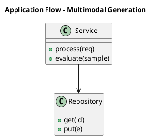

_Source diagram (plantuml); render with the appropriate tool._

**Figure 5. Application Flow - Multimodal Generation** (plantuml). Figure: Application Flow view for Generative AI. This diagram illustrates the principal components and their interactions as discussed in the surrounding section.

## Deep Dive: Mechanics, Variants and Trade-offs

Having established the essentials, we now go deeper into multimodal generation. Beneath the abstraction lies a concrete process whose steps can each be measured, tested and optimised independently. The distinctions in this section are the ones that separate a working demo from a system that holds up under adversarial inputs, scale and the passage of time.

Consider the principal variants and how to choose between them. Each variant optimises for a different point in the design space - some for latency, some for accuracy, some for cost or operability - and the correct choice follows from explicit requirements rather than from defaults. There is an inherent trade-off between fidelity and cost, and the correct balance depends on the use case and its tolerance for error.

In practice this is supported by a mature tooling ecosystem, including OpenAI API, Anthropic Claude, LangChain, LlamaIndex. Tools accelerate the work but do not substitute for understanding: the same principles apply whichever implementation you select, and the ability to reason from first principles is what lets you debug when a tool behaves unexpectedly.

A frequent source of subtle bugs is the interaction with diffusion models for images and audio. Because diffusion models for images and audio concerns forward/reverse diffusion, denoising objectives, latent diffusion and classifier-free guidance, changes there can silently alter the behaviour analysed here. The remedy is contract tests at the boundary and end-to-end evaluations that exercise the interaction explicitly.

Finally, attend to edge cases and degradation. Define what the system should do under partial failure, unexpected inputs and load spikes, and make that behaviour explicit and tested rather than emergent. Graceful degradation - returning a safe, useful result when the ideal one is unavailable - is a hallmark of mature engineering.

For deeper study, the literature offers authoritative treatments such as Ho et al. — Denoising Diffusion Probabilistic Models (2020) and Brown et al. — Language Models are Few-Shot Learners (2020). These primary sources reward careful reading and ground the practical guidance above in established results.

## Advanced Considerations

Having established the essentials, we now go deeper into multimodal generation. Beneath the abstraction lies a concrete process whose steps can each be measured, tested and optimised independently. The distinctions in this section are the ones that separate a working demo from a system that holds up under adversarial inputs, scale and the passage of time.

Consider the principal variants and how to choose between them. Each variant optimises for a different point in the design space - some for latency, some for accuracy, some for cost or operability - and the correct choice follows from explicit requirements rather than from defaults. As with most architectural decisions, the choice is rarely binary; the skill lies in quantifying the trade-offs and choosing deliberately.

In practice this is supported by a mature tooling ecosystem, including OpenAI API, Anthropic Claude, LangChain, LlamaIndex. Tools accelerate the work but do not substitute for understanding: the same principles apply whichever implementation you select, and the ability to reason from first principles is what lets you debug when a tool behaves unexpectedly.

A frequent source of subtle bugs is the interaction with generative modelling foundations. Because generative modelling foundations concerns likelihood-based versus implicit models; autoregressive, diffusion and variational approaches and the trade-offs between fidelity and diversity, changes there can silently alter the behaviour analysed here. The remedy is contract tests at the boundary and end-to-end evaluations that exercise the interaction explicitly.

Finally, attend to edge cases and degradation. Define what the system should do under partial failure, unexpected inputs and load spikes, and make that behaviour explicit and tested rather than emergent. Graceful degradation - returning a safe, useful result when the ideal one is unavailable - is a hallmark of mature engineering.

For deeper study, the literature offers authoritative treatments such as Ho et al. — Denoising Diffusion Probabilistic Models (2020) and Brown et al. — Language Models are Few-Shot Learners (2020). These primary sources reward careful reading and ground the practical guidance above in established results.

## Worked Example

Consider a concrete scenario. A customer service organisation needs grounded assistants that resolve tickets with cited policy. They decide to apply multimodal generation as part of their Generative AI solution, but wisely treat it as a hypothesis to be validated rather than a foregone conclusion.

The team begins by stating the objective precisely and defining how success will be measured before writing any code. They establish a small but representative evaluation set, agree on acceptance thresholds, and only then prototype the simplest design that could work. Early measurement reveals which assumptions hold and which must be revised, saving weeks of misdirected effort and surfacing edge cases while they are still cheap to fix.

As the prototype matures into a service, the team hardens it: adding input validation, error handling, caching where it pays off, and monitoring that ties back to the original success metric. They document each significant decision in an architecture decision record so that future maintainers understand not just what was built but why.

The outcome is instructive. The system that reaches production is not the most sophisticated design the team considered, but the one whose behaviour they could measure, explain and operate. This is the recurring lesson of Generative AI: durable value comes from the whole system, not from any single clever component.

## Industry Use Cases

Across industries, the ideas in this chapter recur in recognisable ways. The following vignettes show how different sectors apply them and what they have in common.

**Legal.** Contract drafting and clause extraction with citation back to source. The common thread is that value comes not from the model alone but from the surrounding system - data quality, evaluation, integration and operations - which is precisely where most of the engineering effort belongs.

**Software.** Code generation, refactoring and test synthesis inside the IDE. The common thread is that value comes not from the model alone but from the surrounding system - data quality, evaluation, integration and operations - which is precisely where most of the engineering effort belongs.

**Marketing.** Brand-safe content generation with human-in-the-loop review. The common thread is that value comes not from the model alone but from the surrounding system - data quality, evaluation, integration and operations - which is precisely where most of the engineering effort belongs.

**Customer Service.** Grounded assistants that resolve tickets with cited policy. The common thread is that value comes not from the model alone but from the surrounding system - data quality, evaluation, integration and operations - which is precisely where most of the engineering effort belongs.

## Best Practices

The following practices consistently separate successful Generative AI efforts from struggling ones. They are deliberately concrete so they can be adopted as checklist items in design and code review.

- Treat prompts as versioned, tested artefacts under source control.
- Always ground high-stakes generations in retrieved, citable sources.
- Define explicit cost and latency budgets per use case and route accordingly.
- Run an automated evaluation suite on every prompt or model change.

None of these are exotic; they are the unglamorous disciplines that compound into reliability. The cost of adopting them is small compared with the cost of the incidents they prevent, and they become second nature with practice.

## Common Pitfalls

Equally instructive are the failure modes that recur in practice. Each pitfall below has a clear early warning sign and a known remedy, so treat them as a diagnostic checklist when something feels wrong:

- Shipping ungrounded generations into high-stakes workflows.
- Ignoring token cost growth as adoption scales.
- Relying on a single provider with no fallback or routing strategy.
- Evaluating only with anecdotes instead of a versioned test set.

The pattern is consistent: most failures stem from skipping measurement, conflating prototype and production standards, or deferring cross-cutting concerns such as security and cost until they become emergencies. Naming these traps in advance is the cheapest way to avoid them.

## Governance, Security and Cost Notes

No discussion of multimodal generation is complete without its governance, security and cost dimensions, which are too often deferred until they become emergencies. Treating them as first-class concerns from the outset is both cheaper and safer.

**Governance.** Classify the risk of this capability, document its intended and out-of-scope uses, and ensure decisions are traceable to satisfy internal policy and external regulation such as the NIST AI RMF, ISO/IEC 42001 and the EU AI Act. **Security.** Treat all external input as untrusted, validate outputs before acting on them, apply least privilege to any tools or data access, and map controls to the OWASP LLM Top 10 and MITRE ATLAS.

**Cost and sustainability.** Establish explicit budgets for compute, tokens and latency, attribute spend to owners, and revisit the economics as usage scales - a design that is affordable at pilot scale can become untenable at production volume. Building these reflexes into everyday engineering is what allows a Generative AI system to be not only capable but also trustworthy and economically sound.

## Hands-On Exercises

Work through the following exercises. They are designed to move understanding from recognition to application - the level required for real engineering work - so prefer writing and building over merely reading.

1. Explain multimodal generation to a colleague unfamiliar with Generative AI, using a concrete example from your own domain.
2. Sketch a reference architecture that incorporates multimodal generation and annotate where observability, security and cost controls belong.
3. Design an evaluation that would tell you whether multimodal generation is working in production, including the metric, the dataset and the acceptance threshold.
4. Identify two pitfalls relevant to multimodal generation in your environment and describe the early warning signals you would monitor.
5. Prototype the simplest implementation that demonstrates multimodal generation, then list exactly what would need to change to make it production-ready.

## Key Takeaways

Key takeaways from this chapter:

- Multimodal Generation is a systems concern in Generative AI: data, models and operations must be co-designed.
- Measurement is non-negotiable; define success metrics and evaluation before building.
- Favour the simplest design that meets the requirement, and add complexity only when evidence demands it.
- Security, cost and observability are first-class requirements, not afterthoughts.
- Document decisions so the system remains understandable and operable as it evolves.

## Code Walkthrough

This listing shows a configuration-driven Multimodal Generation component with retry semantics and typed interfaces — the shape we expect from production Generative AI code rather than a notebook prototype.

The full listing is shown below; study it line by line and reproduce it locally before moving on.

### Listing: Implementing a Multimodal Generation component

```python
from __future__ import annotations

from dataclasses import dataclass, field
from typing import Any


@dataclass(slots=True)
class MultimodalGenerationConfig:
    """Configuration for the Multimodal Generation component in a Generative AI system."""

    name: str
    timeout_s: float = 30.0
    max_retries: int = 3
    options: dict[str, Any] = field(default_factory=dict)


class MultimodalGeneration:
    """A minimal, production-shaped implementation of Multimodal Generation."""

    def __init__(self, config: MultimodalGenerationConfig) -> None:
        self._config = config
        self._calls = 0

    def run(self, payload: dict[str, Any]) -> dict[str, Any]:
        """Process a request, retrying transient failures with backoff."""
        last_error: Exception | None = None
        for attempt in range(self._config.max_retries):
            try:
                self._calls += 1
                return self._process(payload)
            except TimeoutError as exc:  # transient
                last_error = exc
                continue
        raise RuntimeError(f"MultimodalGeneration failed after retries") from last_error

    def _process(self, payload: dict[str, Any]) -> dict[str, Any]:
        # Domain-specific logic for Multimodal Generation goes here.
        return {"status": "ok", "input_keys": sorted(payload), "calls": self._calls}

```

## Review Questions

1. In the context of Generative AI, which statement best describes “Multimodal Generation”?
   - A. It is only relevant to academic research, not production.
   - B. It guarantees deterministic output regardless of input.
   - C. It removes all security and governance requirements.
   - D. Joint text–image–audio models, cross-attention conditioning and unified tokenisation strategies.
   - **Answer: D.** Multimodal Generation: Joint text–image–audio models, cross-attention conditioning and unified tokenisation strategies.
2. Which of the following is a recommended best practice when working with Generative AI?
   - A. It applies exclusively to image data.
   - B. Treat prompts as versioned, tested artefacts under source control.
   - C. Shipping ungrounded generations into high-stakes workflows.
   - D. Ignoring token cost growth as adoption scales.
   - **Answer: B.** Best practice: Treat prompts as versioned, tested artefacts under source control.
3. Which of the following is a common pitfall to avoid in Generative AI?
   - A. Relying on a single provider with no fallback or routing strategy.
   - B. It applies exclusively to image data.
   - C. Treat prompts as versioned, tested artefacts under source control.
   - D. Always ground high-stakes generations in retrieved, citable sources.
   - **Answer: A.** Pitfall to avoid: Relying on a single provider with no fallback or routing strategy.
4. *(Discussion)* Explain Multimodal Generation and why it matters in a production Generative AI system.
   - **Model answer:** A strong answer defines multimodal generation (Joint text–image–audio models, cross-attention conditioning and unified tokenisation strategies.) then connects it to architecture, evaluation, cost, security and operations for Generative AI, citing concrete trade-offs and a real-world example.

---


# Chapter 5. Grounding with Enterprise Data

_This chapter examines grounding with enterprise data within Generative AI. It covers retrieval augmentation, tool use and structured outputs to keep generations factual and policy-compliant, derives a reference architecture, walks through a worked example and runnable code, surveys industry use cases, and distils best practices and pitfalls, closing with exercises and review questions._

## Introduction

We define Grounding with Enterprise Data as retrieval augmentation, tool use and structured outputs to keep generations factual and policy-compliant. Neglecting it is one of the most common reasons Generative AI initiatives stall in production. In an enterprise setting, this translates into concrete requirements: clear interfaces, measurable quality, and controls that satisfy security and governance.

This chapter builds intuition first, then formalises the ideas, derives an architecture, and finishes with code, exercises and review questions so the material transfers directly to your own Generative AI work. Read it actively: pause at each diagram, reproduce the code, and attempt the exercises before consulting the answers.

## Theory and Foundations

We define Grounding with Enterprise Data as retrieval augmentation, tool use and structured outputs to keep generations factual and policy-compliant. Seasoned practitioners treat this as a systems problem, co-designing data, models and operations rather than optimising any one in isolation. It pays to understand the mechanism rather than treat it as a black box, because most production incidents are explained by one of its steps misbehaving.

To place this in context, recall the broader picture: Generative AI refers to models that synthesise novel content—text, images, audio, code and structured data—by learning the distribution of training data and sampling from it. Within that picture, grounding with enterprise data is one of the load-bearing ideas - the kind that, when understood deeply, makes the rest of Generative AI fall into place. Teams that master this consistently ship more reliable Generative AI systems at lower cost.

Grounding with Enterprise Data cannot be understood in isolation from productionising generative applications. Recall that productionising generative applications concerns prompt management, versioning, observability and continuous evaluation in CI. The two interact directly: decisions in one constrain the design space of the other, which is why mature teams reason about them together rather than sequentially. Simplicity is a feature. The simplest design that meets the requirement should be the default, with complexity added only when measurement justifies it.

Grounding with Enterprise Data cannot be understood in isolation from enterprise use-case patterns. Recall that enterprise use-case patterns concerns assistants, copilots, summarisers and autonomous workflows mapped to value. The two interact directly: decisions in one constrain the design space of the other, which is why mature teams reason about them together rather than sequentially. Simplicity is a feature. The simplest design that meets the requirement should be the default, with complexity added only when measurement justifies it.

Several established patterns apply directly to grounding with enterprise data. The first, model gateway abstracting multiple providers behind one api, is widely adopted because it makes the system's behaviour predictable and observable. A complementary pattern, semantic caching keyed on normalised prompts and embeddings, addresses a related concern and is often deployed alongside it. Patterns are not dogma; they are distilled experience that shortcuts the search for a sound design, and each carries assumptions worth checking against your context.

It is worth being explicit about when to apply this and when to reach for something simpler. In a small prototype, shortcuts around grounding with enterprise data are invisible; in a production Generative AI system serving real traffic, they surface as incidents, cost overruns or compliance gaps. Simplicity is a feature. The simplest design that meets the requirement should be the default, with complexity added only when measurement justifies it. The remainder of this chapter turns these principles into an architecture, code and a checklist you can apply immediately.

## Architecture and Design

The reference architecture for Grounding with Enterprise Data separates concerns into clearly bounded components with explicit contracts. A production generative-AI platform places a model gateway in front of one or more foundation models, with orchestration handling prompt assembly, retrieval, tool calls and guardrails. A semantic cache reduces cost and latency, an evaluation service scores responses offline and online, and an observability layer captures prompts, completions, tokens, cost and quality signals for every request.

Concretely, the principal building blocks include generative modelling foundations, large language models as generators, diffusion models for images and audio, multimodal generation and grounding with enterprise data. Each is a replaceable component behind a stable interface, so the team can upgrade an implementation - a model, an index, a policy engine - without rewriting its neighbours. The contracts between components are where reliability is won or lost, so they are specified explicitly and tested in isolation.

The diagram accompanying this section makes the data and control flow explicit. Requests enter through a well-defined boundary where they are authenticated and validated; only then are they dispatched to the components that perform the work. This boundary is also where rate limiting, quota enforcement and audit logging live, keeping cross-cutting concerns out of the core logic and in one auditable place.

Two qualities deserve emphasis. First, observability is designed in, not bolted on: every component emits structured telemetry so that failures can be localised in minutes rather than hours. Second, the architecture is evolvable - components communicate through stable contracts so that any single part of the Generative AI system can be replaced without a rewrite. Simplicity is a feature. The simplest design that meets the requirement should be the default, with complexity added only when measurement justifies it.

<div class="diagram-svg">

<svg xmlns="http://www.w3.org/2000/svg" width="760" height="380" viewBox="0 0 760 380" font-family="Inter, Segoe UI, Arial, sans-serif">
<defs><marker id="arrow" markerWidth="10" markerHeight="10" refX="8" refY="3" orient="auto" markerUnits="strokeWidth"><path d="M0,0 L8,3 L0,6 z" fill="#94a3b8"/></marker><marker id="arrowA" markerWidth="10" markerHeight="10" refX="8" refY="3" orient="auto" markerUnits="strokeWidth"><path d="M0,0 L8,3 L0,6 z" fill="#4338ca"/></marker></defs>
<rect width="760" height="380" rx="12" fill="#f8fafc"/>
<text x="380" y="30" text-anchor="middle" font-size="17" font-weight="700" fill="#0f172a">Knowledge Graph - Grounding with Enterprise Data</text>
<circle cx="380.0" cy="198.0" r="46" fill="#0f172a"/>
<text x="380.0" y="202.0" text-anchor="middle" font-size="12" font-weight="700" fill="#ffffff">Generative AI</text>
<line x1="380.0" y1="152.0" x2="380.0" y2="92.0" stroke="#94a3b8" stroke-width="2" marker-end="url(#arrow)"/>
<rect x="306.0" y="58.0" width="148" height="44" rx="10" fill="#ffffff" stroke="#4338ca" stroke-width="2"/><text x="380.0" y="83.74" text-anchor="middle" font-size="11" font-weight="600" fill="#0f172a">Generative Modelling Fo…</text>
<line x1="419.83716857408416" y1="175.0" x2="575.7217412552832" y2="145.0" stroke="#94a3b8" stroke-width="2" marker-end="url(#arrow)"/>
<rect x="522.5063509461097" y="117.0" width="148" height="44" rx="10" fill="#ffffff" stroke="#7c3aed" stroke-width="2"/><text x="596.5063509461097" y="142.74" text-anchor="middle" font-size="11" font-weight="600" fill="#0f172a">Large Language Models a…</text>
<line x1="419.83716857408416" y1="221.0" x2="575.7217412552832" y2="251.0" stroke="#94a3b8" stroke-width="2" marker-end="url(#arrow)"/>
<rect x="522.5063509461097" y="235.0" width="148" height="44" rx="10" fill="#ffffff" stroke="#0891b2" stroke-width="2"/><text x="596.5063509461097" y="260.74" text-anchor="middle" font-size="11" font-weight="600" fill="#0f172a">Diffusion Models for Im…</text>
<line x1="380.0" y1="244.0" x2="380.0" y2="304.0" stroke="#94a3b8" stroke-width="2" marker-end="url(#arrow)"/>
<rect x="306.0" y="294.0" width="148" height="44" rx="10" fill="#ffffff" stroke="#059669" stroke-width="2"/><text x="380.0" y="319.74" text-anchor="middle" font-size="11" font-weight="600" fill="#0f172a">Multimodal Generation</text>
<line x1="340.16283142591584" y1="221.0" x2="184.2782587447169" y2="251.00000000000006" stroke="#94a3b8" stroke-width="2" marker-end="url(#arrow)"/>
<rect x="89.49364905389038" y="235.00000000000006" width="148" height="44" rx="10" fill="#ffffff" stroke="#d97706" stroke-width="2"/><text x="163.49364905389038" y="260.74000000000007" text-anchor="middle" font-size="11" font-weight="600" fill="#0f172a">Grounding with Enterpri…</text>
<line x1="340.16283142591584" y1="175.0" x2="184.27825874471688" y2="145.0" stroke="#94a3b8" stroke-width="2" marker-end="url(#arrow)"/>
<rect x="89.49364905389035" y="117.0" width="148" height="44" rx="10" fill="#ffffff" stroke="#dc2626" stroke-width="2"/><text x="163.49364905389035" y="142.74" text-anchor="middle" font-size="11" font-weight="600" fill="#0f172a">Controllability and Str…</text>
</svg>

</div>

**Figure 6. Knowledge Graph - Grounding with Enterprise Data** (svg). Figure: Knowledge Graph view for Generative AI. This diagram illustrates the principal components and their interactions as discussed in the surrounding section.

## Deep Dive: Mechanics, Variants and Trade-offs

Having established the essentials, we now go deeper into grounding with enterprise data. Mechanically, the behaviour emerges from a few interacting parts that are simpler than the whole they produce. The distinctions in this section are the ones that separate a working demo from a system that holds up under adversarial inputs, scale and the passage of time.

Consider the principal variants and how to choose between them. Each variant optimises for a different point in the design space - some for latency, some for accuracy, some for cost or operability - and the correct choice follows from explicit requirements rather than from defaults. There is an inherent trade-off between fidelity and cost, and the correct balance depends on the use case and its tolerance for error.

In practice this is supported by a mature tooling ecosystem, including OpenAI API, Anthropic Claude, LangChain, LlamaIndex. Tools accelerate the work but do not substitute for understanding: the same principles apply whichever implementation you select, and the ability to reason from first principles is what lets you debug when a tool behaves unexpectedly.

A frequent source of subtle bugs is the interaction with productionising generative applications. Because productionising generative applications concerns prompt management, versioning, observability and continuous evaluation in CI, changes there can silently alter the behaviour analysed here. The remedy is contract tests at the boundary and end-to-end evaluations that exercise the interaction explicitly.

Finally, attend to edge cases and degradation. Define what the system should do under partial failure, unexpected inputs and load spikes, and make that behaviour explicit and tested rather than emergent. Graceful degradation - returning a safe, useful result when the ideal one is unavailable - is a hallmark of mature engineering.

For deeper study, the literature offers authoritative treatments such as Ho et al. — Denoising Diffusion Probabilistic Models (2020) and Brown et al. — Language Models are Few-Shot Learners (2020). These primary sources reward careful reading and ground the practical guidance above in established results.

## Advanced Considerations

Having established the essentials, we now go deeper into grounding with enterprise data. Mechanically, the behaviour emerges from a few interacting parts that are simpler than the whole they produce. The distinctions in this section are the ones that separate a working demo from a system that holds up under adversarial inputs, scale and the passage of time.

Consider the principal variants and how to choose between them. Each variant optimises for a different point in the design space - some for latency, some for accuracy, some for cost or operability - and the correct choice follows from explicit requirements rather than from defaults. There is an inherent trade-off between fidelity and cost, and the correct balance depends on the use case and its tolerance for error.

In practice this is supported by a mature tooling ecosystem, including OpenAI API, Anthropic Claude, LangChain, LlamaIndex. Tools accelerate the work but do not substitute for understanding: the same principles apply whichever implementation you select, and the ability to reason from first principles is what lets you debug when a tool behaves unexpectedly.

A frequent source of subtle bugs is the interaction with productionising generative applications. Because productionising generative applications concerns prompt management, versioning, observability and continuous evaluation in CI, changes there can silently alter the behaviour analysed here. The remedy is contract tests at the boundary and end-to-end evaluations that exercise the interaction explicitly.

Finally, attend to edge cases and degradation. Define what the system should do under partial failure, unexpected inputs and load spikes, and make that behaviour explicit and tested rather than emergent. Graceful degradation - returning a safe, useful result when the ideal one is unavailable - is a hallmark of mature engineering.

For deeper study, the literature offers authoritative treatments such as Ho et al. — Denoising Diffusion Probabilistic Models (2020) and Brown et al. — Language Models are Few-Shot Learners (2020). These primary sources reward careful reading and ground the practical guidance above in established results.

## Worked Example

To ground the discussion, walk through a representative example. A marketing organisation needs brand-safe content generation with human-in-the-loop review. They decide to apply grounding with enterprise data as part of their Generative AI solution, but wisely treat it as a hypothesis to be validated rather than a foregone conclusion.

The team begins by stating the objective precisely and defining how success will be measured before writing any code. They establish a small but representative evaluation set, agree on acceptance thresholds, and only then prototype the simplest design that could work. Early measurement reveals which assumptions hold and which must be revised, saving weeks of misdirected effort and surfacing edge cases while they are still cheap to fix.

As the prototype matures into a service, the team hardens it: adding input validation, error handling, caching where it pays off, and monitoring that ties back to the original success metric. They document each significant decision in an architecture decision record so that future maintainers understand not just what was built but why.

The outcome is instructive. The system that reaches production is not the most sophisticated design the team considered, but the one whose behaviour they could measure, explain and operate. This is the recurring lesson of Generative AI: durable value comes from the whole system, not from any single clever component.

## Industry Use Cases

Across industries, the ideas in this chapter recur in recognisable ways. The following vignettes show how different sectors apply them and what they have in common.

**Legal.** Contract drafting and clause extraction with citation back to source. The common thread is that value comes not from the model alone but from the surrounding system - data quality, evaluation, integration and operations - which is precisely where most of the engineering effort belongs.

**Software.** Code generation, refactoring and test synthesis inside the IDE. The common thread is that value comes not from the model alone but from the surrounding system - data quality, evaluation, integration and operations - which is precisely where most of the engineering effort belongs.

**Marketing.** Brand-safe content generation with human-in-the-loop review. The common thread is that value comes not from the model alone but from the surrounding system - data quality, evaluation, integration and operations - which is precisely where most of the engineering effort belongs.

**Customer Service.** Grounded assistants that resolve tickets with cited policy. The common thread is that value comes not from the model alone but from the surrounding system - data quality, evaluation, integration and operations - which is precisely where most of the engineering effort belongs.

## Best Practices

The following practices consistently separate successful Generative AI efforts from struggling ones. They are deliberately concrete so they can be adopted as checklist items in design and code review.

- Treat prompts as versioned, tested artefacts under source control.
- Always ground high-stakes generations in retrieved, citable sources.
- Define explicit cost and latency budgets per use case and route accordingly.
- Run an automated evaluation suite on every prompt or model change.

None of these are exotic; they are the unglamorous disciplines that compound into reliability. The cost of adopting them is small compared with the cost of the incidents they prevent, and they become second nature with practice.

## Common Pitfalls

Equally instructive are the failure modes that recur in practice. Each pitfall below has a clear early warning sign and a known remedy, so treat them as a diagnostic checklist when something feels wrong:

- Shipping ungrounded generations into high-stakes workflows.
- Ignoring token cost growth as adoption scales.
- Relying on a single provider with no fallback or routing strategy.
- Evaluating only with anecdotes instead of a versioned test set.

The pattern is consistent: most failures stem from skipping measurement, conflating prototype and production standards, or deferring cross-cutting concerns such as security and cost until they become emergencies. Naming these traps in advance is the cheapest way to avoid them.

## Governance, Security and Cost Notes

No discussion of grounding with enterprise data is complete without its governance, security and cost dimensions, which are too often deferred until they become emergencies. Treating them as first-class concerns from the outset is both cheaper and safer.

**Governance.** Classify the risk of this capability, document its intended and out-of-scope uses, and ensure decisions are traceable to satisfy internal policy and external regulation such as the NIST AI RMF, ISO/IEC 42001 and the EU AI Act. **Security.** Treat all external input as untrusted, validate outputs before acting on them, apply least privilege to any tools or data access, and map controls to the OWASP LLM Top 10 and MITRE ATLAS.

**Cost and sustainability.** Establish explicit budgets for compute, tokens and latency, attribute spend to owners, and revisit the economics as usage scales - a design that is affordable at pilot scale can become untenable at production volume. Building these reflexes into everyday engineering is what allows a Generative AI system to be not only capable but also trustworthy and economically sound.

## Hands-On Exercises

Work through the following exercises. They are designed to move understanding from recognition to application - the level required for real engineering work - so prefer writing and building over merely reading.

1. Explain grounding with enterprise data to a colleague unfamiliar with Generative AI, using a concrete example from your own domain.
2. Sketch a reference architecture that incorporates grounding with enterprise data and annotate where observability, security and cost controls belong.
3. Design an evaluation that would tell you whether grounding with enterprise data is working in production, including the metric, the dataset and the acceptance threshold.
4. Identify two pitfalls relevant to grounding with enterprise data in your environment and describe the early warning signals you would monitor.
5. Prototype the simplest implementation that demonstrates grounding with enterprise data, then list exactly what would need to change to make it production-ready.

## Key Takeaways

Key takeaways from this chapter:

- Grounding with Enterprise Data is a systems concern in Generative AI: data, models and operations must be co-designed.
- Measurement is non-negotiable; define success metrics and evaluation before building.
- Favour the simplest design that meets the requirement, and add complexity only when evidence demands it.
- Security, cost and observability are first-class requirements, not afterthoughts.
- Document decisions so the system remains understandable and operable as it evolves.

## Code Walkthrough

This listing shows a configuration-driven Grounding with Enterprise Data component with retry semantics and typed interfaces — the shape we expect from production Generative AI code rather than a notebook prototype.

The full listing is shown below; study it line by line and reproduce it locally before moving on.

### Listing: Implementing a Grounding with Enterprise Data component

```python
from __future__ import annotations

from dataclasses import dataclass, field
from typing import Any


@dataclass(slots=True)
class GroundingWithEnterpriseConfig:
    """Configuration for the Grounding with Enterprise Data component in a Generative AI system."""

    name: str
    timeout_s: float = 30.0
    max_retries: int = 3
    options: dict[str, Any] = field(default_factory=dict)


class GroundingWithEnterprise:
    """A minimal, production-shaped implementation of Grounding with Enterprise Data."""

    def __init__(self, config: GroundingWithEnterpriseConfig) -> None:
        self._config = config
        self._calls = 0

    def run(self, payload: dict[str, Any]) -> dict[str, Any]:
        """Process a request, retrying transient failures with backoff."""
        last_error: Exception | None = None
        for attempt in range(self._config.max_retries):
            try:
                self._calls += 1
                return self._process(payload)
            except TimeoutError as exc:  # transient
                last_error = exc
                continue
        raise RuntimeError(f"GroundingWithEnterprise failed after retries") from last_error

    def _process(self, payload: dict[str, Any]) -> dict[str, Any]:
        # Domain-specific logic for Grounding with Enterprise Data goes here.
        return {"status": "ok", "input_keys": sorted(payload), "calls": self._calls}

```

## Review Questions

1. In the context of Generative AI, which statement best describes “Grounding with Enterprise Data”?
   - A. It makes the system slower but has no other effect.
   - B. It is only relevant to academic research, not production.
   - C. It removes all security and governance requirements.
   - D. Retrieval augmentation, tool use and structured outputs to keep generations factual and policy-compliant.
   - **Answer: D.** Grounding with Enterprise Data: Retrieval augmentation, tool use and structured outputs to keep generations factual and policy-compliant.
2. Which of the following is a recommended best practice when working with Generative AI?
   - A. It makes the system slower but has no other effect.
   - B. Run an automated evaluation suite on every prompt or model change.
   - C. Ignoring token cost growth as adoption scales.
   - D. It guarantees deterministic output regardless of input.
   - **Answer: B.** Best practice: Run an automated evaluation suite on every prompt or model change.
3. Which of the following is a common pitfall to avoid in Generative AI?
   - A. Define explicit cost and latency budgets per use case and route accordingly.
   - B. It removes all security and governance requirements.
   - C. It is only relevant to academic research, not production.
   - D. Relying on a single provider with no fallback or routing strategy.
   - **Answer: D.** Pitfall to avoid: Relying on a single provider with no fallback or routing strategy.
4. *(Discussion)* Walk through how you would design Grounding with Enterprise Data for an enterprise Generative AI workload.
   - **Model answer:** A strong answer defines grounding with enterprise data (Retrieval augmentation, tool use and structured outputs to keep generations factual and policy-compliant.) then connects it to architecture, evaluation, cost, security and operations for Generative AI, citing concrete trade-offs and a real-world example.

---


# Chapter 6. Controllability and Structured Output

_This chapter examines controllability and structured output within Generative AI. It covers constrained decoding, JSON/schema enforcement and function calling for reliable downstream integration, derives a reference architecture, walks through a worked example and runnable code, surveys industry use cases, and distils best practices and pitfalls, closing with exercises and review questions._

## Introduction

We define Controllability and Structured Output as constrained decoding, JSON/schema enforcement and function calling for reliable downstream integration. This concept recurs throughout the Generative AI lifecycle, from design to operations. What distinguishes a production-grade approach from a prototype is the discipline of measurement: every claim is backed by an evaluation rather than intuition.

This chapter builds intuition first, then formalises the ideas, derives an architecture, and finishes with code, exercises and review questions so the material transfers directly to your own Generative AI work. Read it actively: pause at each diagram, reproduce the code, and attempt the exercises before consulting the answers.

## Theory and Foundations

We define Controllability and Structured Output as constrained decoding, JSON/schema enforcement and function calling for reliable downstream integration. The right abstraction here pays compounding dividends, because downstream components depend on its guarantees. Mechanically, the behaviour emerges from a few interacting parts that are simpler than the whole they produce.

To place this in context, recall the broader picture: Generative AI refers to models that synthesise novel content—text, images, audio, code and structured data—by learning the distribution of training data and sampling from it. Within that picture, controllability and structured output is one of the load-bearing ideas - the kind that, when understood deeply, makes the rest of Generative AI fall into place. Understanding this matters because Generative AI systems succeed or fail on exactly these decisions.

Controllability and Structured Output cannot be understood in isolation from large language models as generators. Recall that large language models as generators concerns next-token prediction, sampling strategies (temperature, top-k, top-p) and the emergence of instruction following. The two interact directly: decisions in one constrain the design space of the other, which is why mature teams reason about them together rather than sequentially. Latency, accuracy and cost form a tension triangle: improving one typically pressures the others, so explicit budgets are essential.

Controllability and Structured Output cannot be understood in isolation from synthetic data generation. Recall that synthetic data generation concerns augmenting scarce datasets, privacy-preserving generation and avoiding model collapse from recursive training. The two interact directly: decisions in one constrain the design space of the other, which is why mature teams reason about them together rather than sequentially. Simplicity is a feature. The simplest design that meets the requirement should be the default, with complexity added only when measurement justifies it.

Several established patterns apply directly to controllability and structured output. The first, semantic caching keyed on normalised prompts and embeddings, is widely adopted because it makes the system's behaviour predictable and observable. A complementary pattern, retrieval-augmented grounding to reduce hallucination, addresses a related concern and is often deployed alongside it. Patterns are not dogma; they are distilled experience that shortcuts the search for a sound design, and each carries assumptions worth checking against your context.

Knowing when not to use a technique is as valuable as knowing how to use it. In a small prototype, shortcuts around controllability and structured output are invisible; in a production Generative AI system serving real traffic, they surface as incidents, cost overruns or compliance gaps. Latency, accuracy and cost form a tension triangle: improving one typically pressures the others, so explicit budgets are essential. The remainder of this chapter turns these principles into an architecture, code and a checklist you can apply immediately.

## Architecture and Design

From an architectural standpoint, Controllability and Structured Output sits at the intersection of data, models and operations. A production generative-AI platform places a model gateway in front of one or more foundation models, with orchestration handling prompt assembly, retrieval, tool calls and guardrails. A semantic cache reduces cost and latency, an evaluation service scores responses offline and online, and an observability layer captures prompts, completions, tokens, cost and quality signals for every request.

Concretely, the principal building blocks include generative modelling foundations, large language models as generators, diffusion models for images and audio, multimodal generation and grounding with enterprise data. Each is a replaceable component behind a stable interface, so the team can upgrade an implementation - a model, an index, a policy engine - without rewriting its neighbours. The contracts between components are where reliability is won or lost, so they are specified explicitly and tested in isolation.

The diagram accompanying this section makes the data and control flow explicit. Requests enter through a well-defined boundary where they are authenticated and validated; only then are they dispatched to the components that perform the work. This boundary is also where rate limiting, quota enforcement and audit logging live, keeping cross-cutting concerns out of the core logic and in one auditable place.

Two qualities deserve emphasis. First, observability is designed in, not bolted on: every component emits structured telemetry so that failures can be localised in minutes rather than hours. Second, the architecture is evolvable - components communicate through stable contracts so that any single part of the Generative AI system can be replaced without a rewrite. Simplicity is a feature. The simplest design that meets the requirement should be the default, with complexity added only when measurement justifies it.

<div class="diagram-svg">

<svg xmlns="http://www.w3.org/2000/svg" width="760" height="380" viewBox="0 0 760 380" font-family="Inter, Segoe UI, Arial, sans-serif">
<defs><marker id="arrow" markerWidth="10" markerHeight="10" refX="8" refY="3" orient="auto" markerUnits="strokeWidth"><path d="M0,0 L8,3 L0,6 z" fill="#94a3b8"/></marker><marker id="arrowA" markerWidth="10" markerHeight="10" refX="8" refY="3" orient="auto" markerUnits="strokeWidth"><path d="M0,0 L8,3 L0,6 z" fill="#4338ca"/></marker></defs>
<rect width="760" height="380" rx="12" fill="#f8fafc"/>
<text x="380" y="30" text-anchor="middle" font-size="17" font-weight="700" fill="#0f172a">Operating Model - Controllability and Structured Output</text>
<circle cx="380.0" cy="198.0" r="46" fill="#0f172a"/>
<text x="380.0" y="202.0" text-anchor="middle" font-size="12" font-weight="700" fill="#ffffff">Generative AI</text>
<line x1="380.0" y1="152.0" x2="380.0" y2="92.0" stroke="#94a3b8" stroke-width="2" marker-end="url(#arrow)"/>
<rect x="306.0" y="58.0" width="148" height="44" rx="10" fill="#ffffff" stroke="#4338ca" stroke-width="2"/><text x="380.0" y="83.74" text-anchor="middle" font-size="11" font-weight="600" fill="#0f172a">Generative Modelling Fo…</text>
<line x1="419.83716857408416" y1="175.0" x2="575.7217412552832" y2="145.0" stroke="#94a3b8" stroke-width="2" marker-end="url(#arrow)"/>
<rect x="522.5063509461097" y="117.0" width="148" height="44" rx="10" fill="#ffffff" stroke="#7c3aed" stroke-width="2"/><text x="596.5063509461097" y="142.74" text-anchor="middle" font-size="11" font-weight="600" fill="#0f172a">Large Language Models a…</text>
<line x1="419.83716857408416" y1="221.0" x2="575.7217412552832" y2="251.0" stroke="#94a3b8" stroke-width="2" marker-end="url(#arrow)"/>
<rect x="522.5063509461097" y="235.0" width="148" height="44" rx="10" fill="#ffffff" stroke="#0891b2" stroke-width="2"/><text x="596.5063509461097" y="260.74" text-anchor="middle" font-size="11" font-weight="600" fill="#0f172a">Diffusion Models for Im…</text>
<line x1="380.0" y1="244.0" x2="380.0" y2="304.0" stroke="#94a3b8" stroke-width="2" marker-end="url(#arrow)"/>
<rect x="306.0" y="294.0" width="148" height="44" rx="10" fill="#ffffff" stroke="#059669" stroke-width="2"/><text x="380.0" y="319.74" text-anchor="middle" font-size="11" font-weight="600" fill="#0f172a">Multimodal Generation</text>
<line x1="340.16283142591584" y1="221.0" x2="184.2782587447169" y2="251.00000000000006" stroke="#94a3b8" stroke-width="2" marker-end="url(#arrow)"/>
<rect x="89.49364905389038" y="235.00000000000006" width="148" height="44" rx="10" fill="#ffffff" stroke="#d97706" stroke-width="2"/><text x="163.49364905389038" y="260.74000000000007" text-anchor="middle" font-size="11" font-weight="600" fill="#0f172a">Grounding with Enterpri…</text>
<line x1="340.16283142591584" y1="175.0" x2="184.27825874471688" y2="145.0" stroke="#94a3b8" stroke-width="2" marker-end="url(#arrow)"/>
<rect x="89.49364905389035" y="117.0" width="148" height="44" rx="10" fill="#ffffff" stroke="#dc2626" stroke-width="2"/><text x="163.49364905389035" y="142.74" text-anchor="middle" font-size="11" font-weight="600" fill="#0f172a">Controllability and Str…</text>
</svg>

</div>

**Figure 7. Operating Model - Controllability and Structured Output** (svg). Figure: Operating Model view for Generative AI. This diagram illustrates the principal components and their interactions as discussed in the surrounding section.

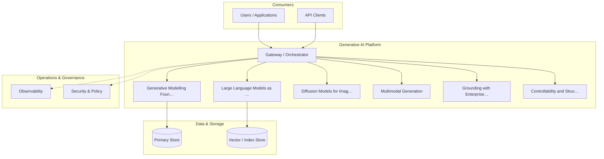

**Figure 8. Cloud Architecture - Controllability and Structured Output** (mermaid). Figure: Cloud Architecture view for Generative AI. This diagram illustrates the principal components and their interactions as discussed in the surrounding section.

## Deep Dive: Mechanics, Variants and Trade-offs

Having established the essentials, we now go deeper into controllability and structured output. It pays to understand the mechanism rather than treat it as a black box, because most production incidents are explained by one of its steps misbehaving. The distinctions in this section are the ones that separate a working demo from a system that holds up under adversarial inputs, scale and the passage of time.

Consider the principal variants and how to choose between them. Each variant optimises for a different point in the design space - some for latency, some for accuracy, some for cost or operability - and the correct choice follows from explicit requirements rather than from defaults. Every added component buys capability at the price of operational surface area, and that bargain should be made consciously.

In practice this is supported by a mature tooling ecosystem, including OpenAI API, Anthropic Claude, LangChain, LlamaIndex. Tools accelerate the work but do not substitute for understanding: the same principles apply whichever implementation you select, and the ability to reason from first principles is what lets you debug when a tool behaves unexpectedly.

A frequent source of subtle bugs is the interaction with large language models as generators. Because large language models as generators concerns next-token prediction, sampling strategies (temperature, top-k, top-p) and the emergence of instruction following, changes there can silently alter the behaviour analysed here. The remedy is contract tests at the boundary and end-to-end evaluations that exercise the interaction explicitly.

Finally, attend to edge cases and degradation. Define what the system should do under partial failure, unexpected inputs and load spikes, and make that behaviour explicit and tested rather than emergent. Graceful degradation - returning a safe, useful result when the ideal one is unavailable - is a hallmark of mature engineering.

For deeper study, the literature offers authoritative treatments such as Ho et al. — Denoising Diffusion Probabilistic Models (2020) and Brown et al. — Language Models are Few-Shot Learners (2020). These primary sources reward careful reading and ground the practical guidance above in established results.

## Advanced Considerations

Having established the essentials, we now go deeper into controllability and structured output. The underlying mechanism is best appreciated by tracing a single request from input to output and noting where state is created and consumed. The distinctions in this section are the ones that separate a working demo from a system that holds up under adversarial inputs, scale and the passage of time.

Consider the principal variants and how to choose between them. Each variant optimises for a different point in the design space - some for latency, some for accuracy, some for cost or operability - and the correct choice follows from explicit requirements rather than from defaults. Latency, accuracy and cost form a tension triangle: improving one typically pressures the others, so explicit budgets are essential.

In practice this is supported by a mature tooling ecosystem, including OpenAI API, Anthropic Claude, LangChain, LlamaIndex. Tools accelerate the work but do not substitute for understanding: the same principles apply whichever implementation you select, and the ability to reason from first principles is what lets you debug when a tool behaves unexpectedly.

A frequent source of subtle bugs is the interaction with generative modelling foundations. Because generative modelling foundations concerns likelihood-based versus implicit models; autoregressive, diffusion and variational approaches and the trade-offs between fidelity and diversity, changes there can silently alter the behaviour analysed here. The remedy is contract tests at the boundary and end-to-end evaluations that exercise the interaction explicitly.

Finally, attend to edge cases and degradation. Define what the system should do under partial failure, unexpected inputs and load spikes, and make that behaviour explicit and tested rather than emergent. Graceful degradation - returning a safe, useful result when the ideal one is unavailable - is a hallmark of mature engineering.

For deeper study, the literature offers authoritative treatments such as Ho et al. — Denoising Diffusion Probabilistic Models (2020) and Brown et al. — Language Models are Few-Shot Learners (2020). These primary sources reward careful reading and ground the practical guidance above in established results.

## Worked Example

To ground the discussion, walk through a representative example. A legal organisation needs contract drafting and clause extraction with citation back to source. They decide to apply controllability and structured output as part of their Generative AI solution, but wisely treat it as a hypothesis to be validated rather than a foregone conclusion.

The team begins by stating the objective precisely and defining how success will be measured before writing any code. They establish a small but representative evaluation set, agree on acceptance thresholds, and only then prototype the simplest design that could work. Early measurement reveals which assumptions hold and which must be revised, saving weeks of misdirected effort and surfacing edge cases while they are still cheap to fix.

As the prototype matures into a service, the team hardens it: adding input validation, error handling, caching where it pays off, and monitoring that ties back to the original success metric. They document each significant decision in an architecture decision record so that future maintainers understand not just what was built but why.

The outcome is instructive. The system that reaches production is not the most sophisticated design the team considered, but the one whose behaviour they could measure, explain and operate. This is the recurring lesson of Generative AI: durable value comes from the whole system, not from any single clever component.

## Industry Use Cases

Across industries, the ideas in this chapter recur in recognisable ways. The following vignettes show how different sectors apply them and what they have in common.

**Legal.** Contract drafting and clause extraction with citation back to source. The common thread is that value comes not from the model alone but from the surrounding system - data quality, evaluation, integration and operations - which is precisely where most of the engineering effort belongs.

**Software.** Code generation, refactoring and test synthesis inside the IDE. The common thread is that value comes not from the model alone but from the surrounding system - data quality, evaluation, integration and operations - which is precisely where most of the engineering effort belongs.

**Marketing.** Brand-safe content generation with human-in-the-loop review. The common thread is that value comes not from the model alone but from the surrounding system - data quality, evaluation, integration and operations - which is precisely where most of the engineering effort belongs.

**Customer Service.** Grounded assistants that resolve tickets with cited policy. The common thread is that value comes not from the model alone but from the surrounding system - data quality, evaluation, integration and operations - which is precisely where most of the engineering effort belongs.

## Best Practices

The following practices consistently separate successful Generative AI efforts from struggling ones. They are deliberately concrete so they can be adopted as checklist items in design and code review.

- Treat prompts as versioned, tested artefacts under source control.
- Always ground high-stakes generations in retrieved, citable sources.
- Define explicit cost and latency budgets per use case and route accordingly.
- Run an automated evaluation suite on every prompt or model change.

None of these are exotic; they are the unglamorous disciplines that compound into reliability. The cost of adopting them is small compared with the cost of the incidents they prevent, and they become second nature with practice.

## Common Pitfalls

Equally instructive are the failure modes that recur in practice. Each pitfall below has a clear early warning sign and a known remedy, so treat them as a diagnostic checklist when something feels wrong:

- Shipping ungrounded generations into high-stakes workflows.
- Ignoring token cost growth as adoption scales.
- Relying on a single provider with no fallback or routing strategy.
- Evaluating only with anecdotes instead of a versioned test set.

The pattern is consistent: most failures stem from skipping measurement, conflating prototype and production standards, or deferring cross-cutting concerns such as security and cost until they become emergencies. Naming these traps in advance is the cheapest way to avoid them.

## Governance, Security and Cost Notes

No discussion of controllability and structured output is complete without its governance, security and cost dimensions, which are too often deferred until they become emergencies. Treating them as first-class concerns from the outset is both cheaper and safer.

**Governance.** Classify the risk of this capability, document its intended and out-of-scope uses, and ensure decisions are traceable to satisfy internal policy and external regulation such as the NIST AI RMF, ISO/IEC 42001 and the EU AI Act. **Security.** Treat all external input as untrusted, validate outputs before acting on them, apply least privilege to any tools or data access, and map controls to the OWASP LLM Top 10 and MITRE ATLAS.

**Cost and sustainability.** Establish explicit budgets for compute, tokens and latency, attribute spend to owners, and revisit the economics as usage scales - a design that is affordable at pilot scale can become untenable at production volume. Building these reflexes into everyday engineering is what allows a Generative AI system to be not only capable but also trustworthy and economically sound.

## Hands-On Exercises

Work through the following exercises. They are designed to move understanding from recognition to application - the level required for real engineering work - so prefer writing and building over merely reading.

1. Explain controllability and structured output to a colleague unfamiliar with Generative AI, using a concrete example from your own domain.
2. Sketch a reference architecture that incorporates controllability and structured output and annotate where observability, security and cost controls belong.
3. Design an evaluation that would tell you whether controllability and structured output is working in production, including the metric, the dataset and the acceptance threshold.
4. Identify two pitfalls relevant to controllability and structured output in your environment and describe the early warning signals you would monitor.
5. Prototype the simplest implementation that demonstrates controllability and structured output, then list exactly what would need to change to make it production-ready.

## Key Takeaways

Key takeaways from this chapter:

- Controllability and Structured Output is a systems concern in Generative AI: data, models and operations must be co-designed.
- Measurement is non-negotiable; define success metrics and evaluation before building.
- Favour the simplest design that meets the requirement, and add complexity only when evidence demands it.
- Security, cost and observability are first-class requirements, not afterthoughts.
- Document decisions so the system remains understandable and operable as it evolves.

## Code Walkthrough

Pipelines keep Controllability and Structured Output logic modular and testable. Each stage is a pure function, errors are captured per item, and the composition is trivial to extend or reorder.

The full listing is shown below; study it line by line and reproduce it locally before moving on.

### Listing: A composable processing pipeline for Controllability and Structured Output

```python
from collections.abc import Iterable, Iterator
from typing import Protocol


class Stage(Protocol):
    def __call__(self, item: dict) -> dict: ...


def pipeline(stages: list[Stage]) -> Stage:
    """Compose ordered stages into a single callable for Controllability and Structured Output."""

    def run(item: dict) -> dict:
        for stage in stages:
            item = stage(item)
        return item

    return run


def validate(item: dict) -> dict:
    if "text" not in item:
        raise ValueError("missing required field: text")
    return item


def normalise(item: dict) -> dict:
    item["text"] = item["text"].strip().lower()
    return item


def enrich(item: dict) -> dict:
    item["length"] = len(item["text"])
    return item


process = pipeline([validate, normalise, enrich])


def run_batch(items: Iterable[dict]) -> Iterator[dict]:
    for item in items:
        try:
            yield process(dict(item))
        except ValueError as exc:
            yield {"error": str(exc), "item": item}

```

## Review Questions

1. In the context of Generative AI, which statement best describes “Controllability and Structured Output”?
   - A. It guarantees deterministic output regardless of input.
   - B. It makes the system slower but has no other effect.
   - C. It applies exclusively to image data.
   - D. Constrained decoding, JSON/schema enforcement and function calling for reliable downstream integration.
   - **Answer: D.** Controllability and Structured Output: Constrained decoding, JSON/schema enforcement and function calling for reliable downstream integration.
2. Which of the following is a recommended best practice when working with Generative AI?
   - A. Evaluating only with anecdotes instead of a versioned test set.
   - B. Treat prompts as versioned, tested artefacts under source control.
   - C. Relying on a single provider with no fallback or routing strategy.
   - D. It removes all security and governance requirements.
   - **Answer: B.** Best practice: Treat prompts as versioned, tested artefacts under source control.
3. Which of the following is a common pitfall to avoid in Generative AI?
   - A. Evaluating only with anecdotes instead of a versioned test set.
   - B. It is only relevant to academic research, not production.
   - C. It applies exclusively to image data.
   - D. Treat prompts as versioned, tested artefacts under source control.
   - **Answer: A.** Pitfall to avoid: Evaluating only with anecdotes instead of a versioned test set.
4. *(Discussion)* How would you test and monitor Controllability and Structured Output in production?
   - **Model answer:** A strong answer defines controllability and structured output (Constrained decoding, JSON/schema enforcement and function calling for reliable downstream integration.) then connects it to architecture, evaluation, cost, security and operations for Generative AI, citing concrete trade-offs and a real-world example.

---


# Chapter 7. Evaluation of Generative Systems

_This chapter examines evaluation of generative systems within Generative AI. It covers reference-based and reference-free metrics, LLM-as-judge, human preference evaluation and red-teaming, derives a reference architecture, walks through a worked example and runnable code, surveys industry use cases, and distils best practices and pitfalls, closing with exercises and review questions._

## Introduction

At its core, Evaluation of Generative Systems concerns reference-based and reference-free metrics, LLM-as-judge, human preference evaluation and red-teaming. Teams that master this consistently ship more reliable Generative AI systems at lower cost. Seasoned practitioners treat this as a systems problem, co-designing data, models and operations rather than optimising any one in isolation.

This chapter builds intuition first, then formalises the ideas, derives an architecture, and finishes with code, exercises and review questions so the material transfers directly to your own Generative AI work. Read it actively: pause at each diagram, reproduce the code, and attempt the exercises before consulting the answers.

## Theory and Foundations

Evaluation of Generative Systems refers to reference-based and reference-free metrics, LLM-as-judge, human preference evaluation and red-teaming. What distinguishes a production-grade approach from a prototype is the discipline of measurement: every claim is backed by an evaluation rather than intuition. Beneath the abstraction lies a concrete process whose steps can each be measured, tested and optimised independently.

To place this in context, recall the broader picture: Generative AI refers to models that synthesise novel content—text, images, audio, code and structured data—by learning the distribution of training data and sampling from it. Within that picture, evaluation of generative systems is one of the load-bearing ideas - the kind that, when understood deeply, makes the rest of Generative AI fall into place. Teams that master this consistently ship more reliable Generative AI systems at lower cost.

Evaluation of Generative Systems cannot be understood in isolation from generative modelling foundations. Recall that generative modelling foundations concerns likelihood-based versus implicit models; autoregressive, diffusion and variational approaches and the trade-offs between fidelity and diversity. The two interact directly: decisions in one constrain the design space of the other, which is why mature teams reason about them together rather than sequentially. Every added component buys capability at the price of operational surface area, and that bargain should be made consciously.

Evaluation of Generative Systems cannot be understood in isolation from productionising generative applications. Recall that productionising generative applications concerns prompt management, versioning, observability and continuous evaluation in CI. The two interact directly: decisions in one constrain the design space of the other, which is why mature teams reason about them together rather than sequentially. As with most architectural decisions, the choice is rarely binary; the skill lies in quantifying the trade-offs and choosing deliberately.

Several established patterns apply directly to evaluation of generative systems. The first, model gateway abstracting multiple providers behind one api, is widely adopted because it makes the system's behaviour predictable and observable. A complementary pattern, semantic caching keyed on normalised prompts and embeddings, addresses a related concern and is often deployed alongside it. Patterns are not dogma; they are distilled experience that shortcuts the search for a sound design, and each carries assumptions worth checking against your context.

The decision of whether to adopt this should be driven by requirements, not by novelty. In a small prototype, shortcuts around evaluation of generative systems are invisible; in a production Generative AI system serving real traffic, they surface as incidents, cost overruns or compliance gaps. As with most architectural decisions, the choice is rarely binary; the skill lies in quantifying the trade-offs and choosing deliberately. The remainder of this chapter turns these principles into an architecture, code and a checklist you can apply immediately.

## Architecture and Design

The reference architecture for Evaluation of Generative Systems separates concerns into clearly bounded components with explicit contracts. A production generative-AI platform places a model gateway in front of one or more foundation models, with orchestration handling prompt assembly, retrieval, tool calls and guardrails. A semantic cache reduces cost and latency, an evaluation service scores responses offline and online, and an observability layer captures prompts, completions, tokens, cost and quality signals for every request.

Concretely, the principal building blocks include generative modelling foundations, large language models as generators, diffusion models for images and audio, multimodal generation and grounding with enterprise data. Each is a replaceable component behind a stable interface, so the team can upgrade an implementation - a model, an index, a policy engine - without rewriting its neighbours. The contracts between components are where reliability is won or lost, so they are specified explicitly and tested in isolation.

The diagram accompanying this section makes the data and control flow explicit. Requests enter through a well-defined boundary where they are authenticated and validated; only then are they dispatched to the components that perform the work. This boundary is also where rate limiting, quota enforcement and audit logging live, keeping cross-cutting concerns out of the core logic and in one auditable place.

Two qualities deserve emphasis. First, observability is designed in, not bolted on: every component emits structured telemetry so that failures can be localised in minutes rather than hours. Second, the architecture is evolvable - components communicate through stable contracts so that any single part of the Generative AI system can be replaced without a rewrite. Simplicity is a feature. The simplest design that meets the requirement should be the default, with complexity added only when measurement justifies it.

```xml
<mxfile host="ai-university">
  <diagram name="Cloud Architecture">
    <mxGraphModel dx="800" dy="600" grid="1" gridSize="10">
      <root>
        <mxCell id="0"/>
        <mxCell id="1" parent="0"/>
        <mxCell id="title" value="Cloud Architecture - Evaluation of Generative Systems" style="text;fontSize=16;fontStyle=1" vertex="1" parent="1"><mxGeometry x="40" y="20" width="600" height="30" as="geometry"/></mxCell>
        <mxCell id="hub" value="Generative AI" style="rounded=1;fillColor=#0f172a;fontColor=#ffffff;fontStyle=1" vertex="1" parent="1"><mxGeometry x="300" y="180" width="160" height="60" as="geometry"/></mxCell>
        <mxCell id="n0" value="Generative Modelling Fo…" style="rounded=1;fillColor=#e0e7ff;strokeColor=#4338ca" vertex="1" parent="1"><mxGeometry x="60" y="80" width="160" height="50" as="geometry"/></mxCell>
        <mxCell id="e0" style="edgeStyle=orthogonalEdgeStyle" edge="1" parent="1" source="hub" target="n0"><mxGeometry relative="1" as="geometry"/></mxCell>
        <mxCell id="n1" value="Large Language Models a…" style="rounded=1;fillColor=#e0e7ff;strokeColor=#4338ca" vertex="1" parent="1"><mxGeometry x="600" y="170" width="160" height="50" as="geometry"/></mxCell>
        <mxCell id="e1" style="edgeStyle=orthogonalEdgeStyle" edge="1" parent="1" source="hub" target="n1"><mxGeometry relative="1" as="geometry"/></mxCell>
        <mxCell id="n2" value="Diffusion Models for Im…" style="rounded=1;fillColor=#e0e7ff;strokeColor=#4338ca" vertex="1" parent="1"><mxGeometry x="60" y="260" width="160" height="50" as="geometry"/></mxCell>
        <mxCell id="e2" style="edgeStyle=orthogonalEdgeStyle" edge="1" parent="1" source="hub" target="n2"><mxGeometry relative="1" as="geometry"/></mxCell>
        <mxCell id="n3" value="Multimodal Generation" style="rounded=1;fillColor=#e0e7ff;strokeColor=#4338ca" vertex="1" parent="1"><mxGeometry x="600" y="350" width="160" height="50" as="geometry"/></mxCell>
        <mxCell id="e3" style="edgeStyle=orthogonalEdgeStyle" edge="1" parent="1" source="hub" target="n3"><mxGeometry relative="1" as="geometry"/></mxCell>
        <mxCell id="n4" value="Grounding with Enterpri…" style="rounded=1;fillColor=#e0e7ff;strokeColor=#4338ca" vertex="1" parent="1"><mxGeometry x="60" y="440" width="160" height="50" as="geometry"/></mxCell>
        <mxCell id="e4" style="edgeStyle=orthogonalEdgeStyle" edge="1" parent="1" source="hub" target="n4"><mxGeometry relative="1" as="geometry"/></mxCell>
      </root>
    </mxGraphModel>
  </diagram>
</mxfile>
```

_Source diagram (drawio); render with the appropriate tool._

**Figure 9. Cloud Architecture - Evaluation of Generative Systems** (drawio). Figure: Cloud Architecture view for Generative AI. This diagram illustrates the principal components and their interactions as discussed in the surrounding section.

```xml
<mxfile host="ai-university">
  <diagram name="Infrastructure">
    <mxGraphModel dx="800" dy="600" grid="1" gridSize="10">
      <root>
        <mxCell id="0"/>
        <mxCell id="1" parent="0"/>
        <mxCell id="title" value="Infrastructure - Evaluation of Generative Systems" style="text;fontSize=16;fontStyle=1" vertex="1" parent="1"><mxGeometry x="40" y="20" width="600" height="30" as="geometry"/></mxCell>
        <mxCell id="hub" value="Generative AI" style="rounded=1;fillColor=#0f172a;fontColor=#ffffff;fontStyle=1" vertex="1" parent="1"><mxGeometry x="300" y="180" width="160" height="60" as="geometry"/></mxCell>
        <mxCell id="n0" value="Generative Modelling Fo…" style="rounded=1;fillColor=#e0e7ff;strokeColor=#4338ca" vertex="1" parent="1"><mxGeometry x="60" y="80" width="160" height="50" as="geometry"/></mxCell>
        <mxCell id="e0" style="edgeStyle=orthogonalEdgeStyle" edge="1" parent="1" source="hub" target="n0"><mxGeometry relative="1" as="geometry"/></mxCell>
        <mxCell id="n1" value="Large Language Models a…" style="rounded=1;fillColor=#e0e7ff;strokeColor=#4338ca" vertex="1" parent="1"><mxGeometry x="600" y="170" width="160" height="50" as="geometry"/></mxCell>
        <mxCell id="e1" style="edgeStyle=orthogonalEdgeStyle" edge="1" parent="1" source="hub" target="n1"><mxGeometry relative="1" as="geometry"/></mxCell>
        <mxCell id="n2" value="Diffusion Models for Im…" style="rounded=1;fillColor=#e0e7ff;strokeColor=#4338ca" vertex="1" parent="1"><mxGeometry x="60" y="260" width="160" height="50" as="geometry"/></mxCell>
        <mxCell id="e2" style="edgeStyle=orthogonalEdgeStyle" edge="1" parent="1" source="hub" target="n2"><mxGeometry relative="1" as="geometry"/></mxCell>
        <mxCell id="n3" value="Multimodal Generation" style="rounded=1;fillColor=#e0e7ff;strokeColor=#4338ca" vertex="1" parent="1"><mxGeometry x="600" y="350" width="160" height="50" as="geometry"/></mxCell>
        <mxCell id="e3" style="edgeStyle=orthogonalEdgeStyle" edge="1" parent="1" source="hub" target="n3"><mxGeometry relative="1" as="geometry"/></mxCell>
        <mxCell id="n4" value="Grounding with Enterpri…" style="rounded=1;fillColor=#e0e7ff;strokeColor=#4338ca" vertex="1" parent="1"><mxGeometry x="60" y="440" width="160" height="50" as="geometry"/></mxCell>
        <mxCell id="e4" style="edgeStyle=orthogonalEdgeStyle" edge="1" parent="1" source="hub" target="n4"><mxGeometry relative="1" as="geometry"/></mxCell>
      </root>
    </mxGraphModel>
  </diagram>
</mxfile>
```

_Source diagram (drawio); render with the appropriate tool._

**Figure 10. Infrastructure - Evaluation of Generative Systems** (drawio). Figure: Infrastructure view for Generative AI. This diagram illustrates the principal components and their interactions as discussed in the surrounding section.

## Deep Dive: Mechanics, Variants and Trade-offs

Having established the essentials, we now go deeper into evaluation of generative systems. Beneath the abstraction lies a concrete process whose steps can each be measured, tested and optimised independently. The distinctions in this section are the ones that separate a working demo from a system that holds up under adversarial inputs, scale and the passage of time.

Consider the principal variants and how to choose between them. Each variant optimises for a different point in the design space - some for latency, some for accuracy, some for cost or operability - and the correct choice follows from explicit requirements rather than from defaults. Every added component buys capability at the price of operational surface area, and that bargain should be made consciously.

In practice this is supported by a mature tooling ecosystem, including OpenAI API, Anthropic Claude, LangChain, LlamaIndex. Tools accelerate the work but do not substitute for understanding: the same principles apply whichever implementation you select, and the ability to reason from first principles is what lets you debug when a tool behaves unexpectedly.

A frequent source of subtle bugs is the interaction with generative modelling foundations. Because generative modelling foundations concerns likelihood-based versus implicit models; autoregressive, diffusion and variational approaches and the trade-offs between fidelity and diversity, changes there can silently alter the behaviour analysed here. The remedy is contract tests at the boundary and end-to-end evaluations that exercise the interaction explicitly.

Finally, attend to edge cases and degradation. Define what the system should do under partial failure, unexpected inputs and load spikes, and make that behaviour explicit and tested rather than emergent. Graceful degradation - returning a safe, useful result when the ideal one is unavailable - is a hallmark of mature engineering.

For deeper study, the literature offers authoritative treatments such as Ho et al. — Denoising Diffusion Probabilistic Models (2020) and Brown et al. — Language Models are Few-Shot Learners (2020). These primary sources reward careful reading and ground the practical guidance above in established results.

## Advanced Considerations

Having established the essentials, we now go deeper into evaluation of generative systems. Beneath the abstraction lies a concrete process whose steps can each be measured, tested and optimised independently. The distinctions in this section are the ones that separate a working demo from a system that holds up under adversarial inputs, scale and the passage of time.

Consider the principal variants and how to choose between them. Each variant optimises for a different point in the design space - some for latency, some for accuracy, some for cost or operability - and the correct choice follows from explicit requirements rather than from defaults. Latency, accuracy and cost form a tension triangle: improving one typically pressures the others, so explicit budgets are essential.

In practice this is supported by a mature tooling ecosystem, including OpenAI API, Anthropic Claude, LangChain, LlamaIndex. Tools accelerate the work but do not substitute for understanding: the same principles apply whichever implementation you select, and the ability to reason from first principles is what lets you debug when a tool behaves unexpectedly.

A frequent source of subtle bugs is the interaction with generative modelling foundations. Because generative modelling foundations concerns likelihood-based versus implicit models; autoregressive, diffusion and variational approaches and the trade-offs between fidelity and diversity, changes there can silently alter the behaviour analysed here. The remedy is contract tests at the boundary and end-to-end evaluations that exercise the interaction explicitly.

Finally, attend to edge cases and degradation. Define what the system should do under partial failure, unexpected inputs and load spikes, and make that behaviour explicit and tested rather than emergent. Graceful degradation - returning a safe, useful result when the ideal one is unavailable - is a hallmark of mature engineering.

For deeper study, the literature offers authoritative treatments such as Ho et al. — Denoising Diffusion Probabilistic Models (2020) and Brown et al. — Language Models are Few-Shot Learners (2020). These primary sources reward careful reading and ground the practical guidance above in established results.

## Worked Example

Consider a concrete scenario. A legal organisation needs contract drafting and clause extraction with citation back to source. They decide to apply evaluation of generative systems as part of their Generative AI solution, but wisely treat it as a hypothesis to be validated rather than a foregone conclusion.

The team begins by stating the objective precisely and defining how success will be measured before writing any code. They establish a small but representative evaluation set, agree on acceptance thresholds, and only then prototype the simplest design that could work. Early measurement reveals which assumptions hold and which must be revised, saving weeks of misdirected effort and surfacing edge cases while they are still cheap to fix.

As the prototype matures into a service, the team hardens it: adding input validation, error handling, caching where it pays off, and monitoring that ties back to the original success metric. They document each significant decision in an architecture decision record so that future maintainers understand not just what was built but why.

The outcome is instructive. The system that reaches production is not the most sophisticated design the team considered, but the one whose behaviour they could measure, explain and operate. This is the recurring lesson of Generative AI: durable value comes from the whole system, not from any single clever component.

## Industry Use Cases

Across industries, the ideas in this chapter recur in recognisable ways. The following vignettes show how different sectors apply them and what they have in common.

**Legal.** Contract drafting and clause extraction with citation back to source. The common thread is that value comes not from the model alone but from the surrounding system - data quality, evaluation, integration and operations - which is precisely where most of the engineering effort belongs.

**Software.** Code generation, refactoring and test synthesis inside the IDE. The common thread is that value comes not from the model alone but from the surrounding system - data quality, evaluation, integration and operations - which is precisely where most of the engineering effort belongs.

**Marketing.** Brand-safe content generation with human-in-the-loop review. The common thread is that value comes not from the model alone but from the surrounding system - data quality, evaluation, integration and operations - which is precisely where most of the engineering effort belongs.

**Customer Service.** Grounded assistants that resolve tickets with cited policy. The common thread is that value comes not from the model alone but from the surrounding system - data quality, evaluation, integration and operations - which is precisely where most of the engineering effort belongs.

## Best Practices

The following practices consistently separate successful Generative AI efforts from struggling ones. They are deliberately concrete so they can be adopted as checklist items in design and code review.

- Treat prompts as versioned, tested artefacts under source control.
- Always ground high-stakes generations in retrieved, citable sources.
- Define explicit cost and latency budgets per use case and route accordingly.
- Run an automated evaluation suite on every prompt or model change.

None of these are exotic; they are the unglamorous disciplines that compound into reliability. The cost of adopting them is small compared with the cost of the incidents they prevent, and they become second nature with practice.

## Common Pitfalls

Equally instructive are the failure modes that recur in practice. Each pitfall below has a clear early warning sign and a known remedy, so treat them as a diagnostic checklist when something feels wrong:

- Shipping ungrounded generations into high-stakes workflows.
- Ignoring token cost growth as adoption scales.
- Relying on a single provider with no fallback or routing strategy.
- Evaluating only with anecdotes instead of a versioned test set.

The pattern is consistent: most failures stem from skipping measurement, conflating prototype and production standards, or deferring cross-cutting concerns such as security and cost until they become emergencies. Naming these traps in advance is the cheapest way to avoid them.

## Governance, Security and Cost Notes

No discussion of evaluation of generative systems is complete without its governance, security and cost dimensions, which are too often deferred until they become emergencies. Treating them as first-class concerns from the outset is both cheaper and safer.

**Governance.** Classify the risk of this capability, document its intended and out-of-scope uses, and ensure decisions are traceable to satisfy internal policy and external regulation such as the NIST AI RMF, ISO/IEC 42001 and the EU AI Act. **Security.** Treat all external input as untrusted, validate outputs before acting on them, apply least privilege to any tools or data access, and map controls to the OWASP LLM Top 10 and MITRE ATLAS.

**Cost and sustainability.** Establish explicit budgets for compute, tokens and latency, attribute spend to owners, and revisit the economics as usage scales - a design that is affordable at pilot scale can become untenable at production volume. Building these reflexes into everyday engineering is what allows a Generative AI system to be not only capable but also trustworthy and economically sound.

## Hands-On Exercises

Work through the following exercises. They are designed to move understanding from recognition to application - the level required for real engineering work - so prefer writing and building over merely reading.

1. Explain evaluation of generative systems to a colleague unfamiliar with Generative AI, using a concrete example from your own domain.
2. Sketch a reference architecture that incorporates evaluation of generative systems and annotate where observability, security and cost controls belong.
3. Design an evaluation that would tell you whether evaluation of generative systems is working in production, including the metric, the dataset and the acceptance threshold.
4. Identify two pitfalls relevant to evaluation of generative systems in your environment and describe the early warning signals you would monitor.
5. Prototype the simplest implementation that demonstrates evaluation of generative systems, then list exactly what would need to change to make it production-ready.

## Key Takeaways

Key takeaways from this chapter:

- Evaluation of Generative Systems is a systems concern in Generative AI: data, models and operations must be co-designed.
- Measurement is non-negotiable; define success metrics and evaluation before building.
- Favour the simplest design that meets the requirement, and add complexity only when evidence demands it.
- Security, cost and observability are first-class requirements, not afterthoughts.
- Document decisions so the system remains understandable and operable as it evolves.

## Code Walkthrough

Every change to a Generative AI system should pass an evaluation gate. This example shows the minimal shape: align predictions and references, compute a metric, and return a pass/fail decision for CI.

The full listing is shown below; study it line by line and reproduce it locally before moving on.

### Listing: Evaluating Evaluation of Generative Systems with a regression gate

```python
from dataclasses import dataclass


@dataclass
class EvalResult:
    metric: str
    score: float
    passed: bool


def evaluate(predictions: list[str], references: list[str],
             threshold: float = 0.8) -> EvalResult:
    """Score Evaluation of Generative Systems output against references with a simple exact-match metric.

    In practice you would combine several metrics (exact match, semantic
    similarity, LLM-as-judge) and gate releases on the aggregate.
    """
    if len(predictions) != len(references):
        raise ValueError("predictions and references must align")
    hits = sum(p.strip() == r.strip() for p, r in zip(predictions, references))
    score = hits / len(references) if references else 0.0
    return EvalResult(metric="exact_match", score=score, passed=score >= threshold)


if __name__ == "__main__":
    result = evaluate(["yes", "no"], ["yes", "yes"])
    print(f"{result.metric}={result.score:.2f} passed={result.passed}")

```

## Review Questions

1. In the context of Generative AI, which statement best describes “Evaluation of Generative Systems”?
   - A. It makes the system slower but has no other effect.
   - B. It is only relevant to academic research, not production.
   - C. It guarantees deterministic output regardless of input.
   - D. Reference-based and reference-free metrics, LLM-as-judge, human preference evaluation and red-teaming.
   - **Answer: D.** Evaluation of Generative Systems: Reference-based and reference-free metrics, LLM-as-judge, human preference evaluation and red-teaming.
2. Which of the following is a recommended best practice when working with Generative AI?
   - A. Evaluating only with anecdotes instead of a versioned test set.
   - B. It guarantees deterministic output regardless of input.
   - C. Shipping ungrounded generations into high-stakes workflows.
   - D. Define explicit cost and latency budgets per use case and route accordingly.
   - **Answer: D.** Best practice: Define explicit cost and latency budgets per use case and route accordingly.
3. Which of the following is a common pitfall to avoid in Generative AI?
   - A. It guarantees deterministic output regardless of input.
   - B. It is only relevant to academic research, not production.
   - C. Define explicit cost and latency budgets per use case and route accordingly.
   - D. Relying on a single provider with no fallback or routing strategy.
   - **Answer: D.** Pitfall to avoid: Relying on a single provider with no fallback or routing strategy.
4. *(Discussion)* Walk through how you would design Evaluation of Generative Systems for an enterprise Generative AI workload.
   - **Model answer:** A strong answer defines evaluation of generative systems (Reference-based and reference-free metrics, LLM-as-judge, human preference evaluation and red-teaming.) then connects it to architecture, evaluation, cost, security and operations for Generative AI, citing concrete trade-offs and a real-world example.

---


# Chapter 8. Safety, Guardrails and Content Moderation

_This chapter examines safety, guardrails and content moderation within Generative AI. It covers input/output filtering, jailbreak resistance and layered defence in depth, derives a reference architecture, walks through a worked example and runnable code, surveys industry use cases, and distils best practices and pitfalls, closing with exercises and review questions._

## Introduction

In practical terms, Safety, Guardrails and Content Moderation is best understood as input/output filtering, jailbreak resistance and layered defence in depth. Getting this right early prevents expensive rework once a Generative AI system reaches scale. The right abstraction here pays compounding dividends, because downstream components depend on its guarantees.

This chapter builds intuition first, then formalises the ideas, derives an architecture, and finishes with code, exercises and review questions so the material transfers directly to your own Generative AI work. Read it actively: pause at each diagram, reproduce the code, and attempt the exercises before consulting the answers.

## Theory and Foundations

Formally, Safety, Guardrails and Content Moderation addresses input/output filtering, jailbreak resistance and layered defence in depth. The practical implication is that design choices here ripple through latency, cost and maintainability for the lifetime of the system. Beneath the abstraction lies a concrete process whose steps can each be measured, tested and optimised independently.

To place this in context, recall the broader picture: Generative AI refers to models that synthesise novel content—text, images, audio, code and structured data—by learning the distribution of training data and sampling from it. Within that picture, safety, guardrails and content moderation is one of the load-bearing ideas - the kind that, when understood deeply, makes the rest of Generative AI fall into place. Getting this right early prevents expensive rework once a Generative AI system reaches scale.

Safety, Guardrails and Content Moderation cannot be understood in isolation from enterprise use-case patterns. Recall that enterprise use-case patterns concerns assistants, copilots, summarisers and autonomous workflows mapped to value. The two interact directly: decisions in one constrain the design space of the other, which is why mature teams reason about them together rather than sequentially. There is an inherent trade-off between fidelity and cost, and the correct balance depends on the use case and its tolerance for error.

Safety, Guardrails and Content Moderation cannot be understood in isolation from multimodal generation. Recall that multimodal generation concerns joint text–image–audio models, cross-attention conditioning and unified tokenisation strategies. The two interact directly: decisions in one constrain the design space of the other, which is why mature teams reason about them together rather than sequentially. Latency, accuracy and cost form a tension triangle: improving one typically pressures the others, so explicit budgets are essential.

Several established patterns apply directly to safety, guardrails and content moderation. The first, model gateway abstracting multiple providers behind one api, is widely adopted because it makes the system's behaviour predictable and observable. A complementary pattern, retrieval-augmented grounding to reduce hallucination, addresses a related concern and is often deployed alongside it. Patterns are not dogma; they are distilled experience that shortcuts the search for a sound design, and each carries assumptions worth checking against your context.

It is worth being explicit about when to apply this and when to reach for something simpler. In a small prototype, shortcuts around safety, guardrails and content moderation are invisible; in a production Generative AI system serving real traffic, they surface as incidents, cost overruns or compliance gaps. There is an inherent trade-off between fidelity and cost, and the correct balance depends on the use case and its tolerance for error. The remainder of this chapter turns these principles into an architecture, code and a checklist you can apply immediately.

## Architecture and Design

The reference architecture for Safety, Guardrails and Content Moderation separates concerns into clearly bounded components with explicit contracts. A production generative-AI platform places a model gateway in front of one or more foundation models, with orchestration handling prompt assembly, retrieval, tool calls and guardrails. A semantic cache reduces cost and latency, an evaluation service scores responses offline and online, and an observability layer captures prompts, completions, tokens, cost and quality signals for every request.

Concretely, the principal building blocks include generative modelling foundations, large language models as generators, diffusion models for images and audio, multimodal generation and grounding with enterprise data. Each is a replaceable component behind a stable interface, so the team can upgrade an implementation - a model, an index, a policy engine - without rewriting its neighbours. The contracts between components are where reliability is won or lost, so they are specified explicitly and tested in isolation.

The diagram accompanying this section makes the data and control flow explicit. Requests enter through a well-defined boundary where they are authenticated and validated; only then are they dispatched to the components that perform the work. This boundary is also where rate limiting, quota enforcement and audit logging live, keeping cross-cutting concerns out of the core logic and in one auditable place.

Two qualities deserve emphasis. First, observability is designed in, not bolted on: every component emits structured telemetry so that failures can be localised in minutes rather than hours. Second, the architecture is evolvable - components communicate through stable contracts so that any single part of the Generative AI system can be replaced without a rewrite. There is an inherent trade-off between fidelity and cost, and the correct balance depends on the use case and its tolerance for error.

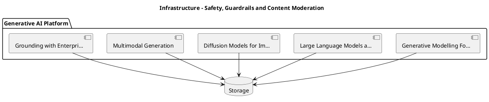

_Source diagram (plantuml); render with the appropriate tool._

**Figure 11. Infrastructure - Safety, Guardrails and Content Moderation** (plantuml). Figure: Infrastructure view for Generative AI. This diagram illustrates the principal components and their interactions as discussed in the surrounding section.

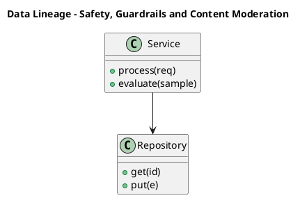

_Source diagram (plantuml); render with the appropriate tool._

**Figure 12. Data Lineage - Safety, Guardrails and Content Moderation** (plantuml). Figure: Data Lineage view for Generative AI. This diagram illustrates the principal components and their interactions as discussed in the surrounding section.

## Deep Dive: Mechanics, Variants and Trade-offs

Having established the essentials, we now go deeper into safety, guardrails and content moderation. Beneath the abstraction lies a concrete process whose steps can each be measured, tested and optimised independently. The distinctions in this section are the ones that separate a working demo from a system that holds up under adversarial inputs, scale and the passage of time.

Consider the principal variants and how to choose between them. Each variant optimises for a different point in the design space - some for latency, some for accuracy, some for cost or operability - and the correct choice follows from explicit requirements rather than from defaults. Latency, accuracy and cost form a tension triangle: improving one typically pressures the others, so explicit budgets are essential.

In practice this is supported by a mature tooling ecosystem, including OpenAI API, Anthropic Claude, LangChain, LlamaIndex. Tools accelerate the work but do not substitute for understanding: the same principles apply whichever implementation you select, and the ability to reason from first principles is what lets you debug when a tool behaves unexpectedly.

A frequent source of subtle bugs is the interaction with enterprise use-case patterns. Because enterprise use-case patterns concerns assistants, copilots, summarisers and autonomous workflows mapped to value, changes there can silently alter the behaviour analysed here. The remedy is contract tests at the boundary and end-to-end evaluations that exercise the interaction explicitly.

Finally, attend to edge cases and degradation. Define what the system should do under partial failure, unexpected inputs and load spikes, and make that behaviour explicit and tested rather than emergent. Graceful degradation - returning a safe, useful result when the ideal one is unavailable - is a hallmark of mature engineering.

For deeper study, the literature offers authoritative treatments such as Ho et al. — Denoising Diffusion Probabilistic Models (2020) and Brown et al. — Language Models are Few-Shot Learners (2020). These primary sources reward careful reading and ground the practical guidance above in established results.

## Advanced Considerations

Having established the essentials, we now go deeper into safety, guardrails and content moderation. The underlying mechanism is best appreciated by tracing a single request from input to output and noting where state is created and consumed. The distinctions in this section are the ones that separate a working demo from a system that holds up under adversarial inputs, scale and the passage of time.

Consider the principal variants and how to choose between them. Each variant optimises for a different point in the design space - some for latency, some for accuracy, some for cost or operability - and the correct choice follows from explicit requirements rather than from defaults. Latency, accuracy and cost form a tension triangle: improving one typically pressures the others, so explicit budgets are essential.

In practice this is supported by a mature tooling ecosystem, including OpenAI API, Anthropic Claude, LangChain, LlamaIndex. Tools accelerate the work but do not substitute for understanding: the same principles apply whichever implementation you select, and the ability to reason from first principles is what lets you debug when a tool behaves unexpectedly.

A frequent source of subtle bugs is the interaction with cost, latency and throughput engineering. Because cost, latency and throughput engineering concerns token economics, caching, batching, distillation and routing across model tiers, changes there can silently alter the behaviour analysed here. The remedy is contract tests at the boundary and end-to-end evaluations that exercise the interaction explicitly.

Finally, attend to edge cases and degradation. Define what the system should do under partial failure, unexpected inputs and load spikes, and make that behaviour explicit and tested rather than emergent. Graceful degradation - returning a safe, useful result when the ideal one is unavailable - is a hallmark of mature engineering.

For deeper study, the literature offers authoritative treatments such as Ho et al. — Denoising Diffusion Probabilistic Models (2020) and Brown et al. — Language Models are Few-Shot Learners (2020). These primary sources reward careful reading and ground the practical guidance above in established results.

## Worked Example

Consider a concrete scenario. A legal organisation needs contract drafting and clause extraction with citation back to source. They decide to apply safety, guardrails and content moderation as part of their Generative AI solution, but wisely treat it as a hypothesis to be validated rather than a foregone conclusion.

The team begins by stating the objective precisely and defining how success will be measured before writing any code. They establish a small but representative evaluation set, agree on acceptance thresholds, and only then prototype the simplest design that could work. Early measurement reveals which assumptions hold and which must be revised, saving weeks of misdirected effort and surfacing edge cases while they are still cheap to fix.

As the prototype matures into a service, the team hardens it: adding input validation, error handling, caching where it pays off, and monitoring that ties back to the original success metric. They document each significant decision in an architecture decision record so that future maintainers understand not just what was built but why.

The outcome is instructive. The system that reaches production is not the most sophisticated design the team considered, but the one whose behaviour they could measure, explain and operate. This is the recurring lesson of Generative AI: durable value comes from the whole system, not from any single clever component.

## Industry Use Cases

Across industries, the ideas in this chapter recur in recognisable ways. The following vignettes show how different sectors apply them and what they have in common.

**Legal.** Contract drafting and clause extraction with citation back to source. The common thread is that value comes not from the model alone but from the surrounding system - data quality, evaluation, integration and operations - which is precisely where most of the engineering effort belongs.

**Software.** Code generation, refactoring and test synthesis inside the IDE. The common thread is that value comes not from the model alone but from the surrounding system - data quality, evaluation, integration and operations - which is precisely where most of the engineering effort belongs.

**Marketing.** Brand-safe content generation with human-in-the-loop review. The common thread is that value comes not from the model alone but from the surrounding system - data quality, evaluation, integration and operations - which is precisely where most of the engineering effort belongs.

**Customer Service.** Grounded assistants that resolve tickets with cited policy. The common thread is that value comes not from the model alone but from the surrounding system - data quality, evaluation, integration and operations - which is precisely where most of the engineering effort belongs.

## Best Practices

The following practices consistently separate successful Generative AI efforts from struggling ones. They are deliberately concrete so they can be adopted as checklist items in design and code review.

- Treat prompts as versioned, tested artefacts under source control.
- Always ground high-stakes generations in retrieved, citable sources.
- Define explicit cost and latency budgets per use case and route accordingly.
- Run an automated evaluation suite on every prompt or model change.

None of these are exotic; they are the unglamorous disciplines that compound into reliability. The cost of adopting them is small compared with the cost of the incidents they prevent, and they become second nature with practice.

## Common Pitfalls

Equally instructive are the failure modes that recur in practice. Each pitfall below has a clear early warning sign and a known remedy, so treat them as a diagnostic checklist when something feels wrong:

- Shipping ungrounded generations into high-stakes workflows.
- Ignoring token cost growth as adoption scales.
- Relying on a single provider with no fallback or routing strategy.
- Evaluating only with anecdotes instead of a versioned test set.

The pattern is consistent: most failures stem from skipping measurement, conflating prototype and production standards, or deferring cross-cutting concerns such as security and cost until they become emergencies. Naming these traps in advance is the cheapest way to avoid them.

## Governance, Security and Cost Notes

No discussion of safety, guardrails and content moderation is complete without its governance, security and cost dimensions, which are too often deferred until they become emergencies. Treating them as first-class concerns from the outset is both cheaper and safer.

**Governance.** Classify the risk of this capability, document its intended and out-of-scope uses, and ensure decisions are traceable to satisfy internal policy and external regulation such as the NIST AI RMF, ISO/IEC 42001 and the EU AI Act. **Security.** Treat all external input as untrusted, validate outputs before acting on them, apply least privilege to any tools or data access, and map controls to the OWASP LLM Top 10 and MITRE ATLAS.

**Cost and sustainability.** Establish explicit budgets for compute, tokens and latency, attribute spend to owners, and revisit the economics as usage scales - a design that is affordable at pilot scale can become untenable at production volume. Building these reflexes into everyday engineering is what allows a Generative AI system to be not only capable but also trustworthy and economically sound.

## Hands-On Exercises

Work through the following exercises. They are designed to move understanding from recognition to application - the level required for real engineering work - so prefer writing and building over merely reading.

1. Explain safety, guardrails and content moderation to a colleague unfamiliar with Generative AI, using a concrete example from your own domain.
2. Sketch a reference architecture that incorporates safety, guardrails and content moderation and annotate where observability, security and cost controls belong.
3. Design an evaluation that would tell you whether safety, guardrails and content moderation is working in production, including the metric, the dataset and the acceptance threshold.
4. Identify two pitfalls relevant to safety, guardrails and content moderation in your environment and describe the early warning signals you would monitor.
5. Prototype the simplest implementation that demonstrates safety, guardrails and content moderation, then list exactly what would need to change to make it production-ready.

## Key Takeaways

Key takeaways from this chapter:

- Safety, Guardrails and Content Moderation is a systems concern in Generative AI: data, models and operations must be co-designed.
- Measurement is non-negotiable; define success metrics and evaluation before building.
- Favour the simplest design that meets the requirement, and add complexity only when evidence demands it.
- Security, cost and observability are first-class requirements, not afterthoughts.
- Document decisions so the system remains understandable and operable as it evolves.

## Code Walkthrough

Every change to a Generative AI system should pass an evaluation gate. This example shows the minimal shape: align predictions and references, compute a metric, and return a pass/fail decision for CI.

The full listing is shown below; study it line by line and reproduce it locally before moving on.

### Listing: Evaluating Safety, Guardrails and Content Moderation with a regression gate

```python
from dataclasses import dataclass


@dataclass
class EvalResult:
    metric: str
    score: float
    passed: bool


def evaluate(predictions: list[str], references: list[str],
             threshold: float = 0.8) -> EvalResult:
    """Score Safety, Guardrails and Content Moderation output against references with a simple exact-match metric.

    In practice you would combine several metrics (exact match, semantic
    similarity, LLM-as-judge) and gate releases on the aggregate.
    """
    if len(predictions) != len(references):
        raise ValueError("predictions and references must align")
    hits = sum(p.strip() == r.strip() for p, r in zip(predictions, references))
    score = hits / len(references) if references else 0.0
    return EvalResult(metric="exact_match", score=score, passed=score >= threshold)


if __name__ == "__main__":
    result = evaluate(["yes", "no"], ["yes", "yes"])
    print(f"{result.metric}={result.score:.2f} passed={result.passed}")

```

## Review Questions

1. In the context of Generative AI, which statement best describes “Safety, Guardrails and Content Moderation”?
   - A. Input/output filtering, jailbreak resistance and layered defence in depth.
   - B. It applies exclusively to image data.
   - C. It removes all security and governance requirements.
   - D. It guarantees deterministic output regardless of input.
   - **Answer: A.** Safety, Guardrails and Content Moderation: Input/output filtering, jailbreak resistance and layered defence in depth.
2. Which of the following is a recommended best practice when working with Generative AI?
   - A. Run an automated evaluation suite on every prompt or model change.
   - B. Evaluating only with anecdotes instead of a versioned test set.
   - C. Relying on a single provider with no fallback or routing strategy.
   - D. It applies exclusively to image data.
   - **Answer: A.** Best practice: Run an automated evaluation suite on every prompt or model change.
3. Which of the following is a common pitfall to avoid in Generative AI?
   - A. It eliminates the need for any evaluation or monitoring.
   - B. Shipping ungrounded generations into high-stakes workflows.
   - C. Treat prompts as versioned, tested artefacts under source control.
   - D. It guarantees deterministic output regardless of input.
   - **Answer: B.** Pitfall to avoid: Shipping ungrounded generations into high-stakes workflows.
4. *(Discussion)* What trade-offs would you weigh when implementing Safety, Guardrails and Content Moderation?
   - **Model answer:** A strong answer defines safety, guardrails and content moderation (Input/output filtering, jailbreak resistance and layered defence in depth.) then connects it to architecture, evaluation, cost, security and operations for Generative AI, citing concrete trade-offs and a real-world example.

---


# Chapter 9. Cost, Latency and Throughput Engineering

_This chapter examines cost, latency and throughput engineering within Generative AI. It covers token economics, caching, batching, distillation and routing across model tiers, derives a reference architecture, walks through a worked example and runnable code, surveys industry use cases, and distils best practices and pitfalls, closing with exercises and review questions._

## Introduction

Cost, Latency and Throughput Engineering refers to token economics, caching, batching, distillation and routing across model tiers. This concept recurs throughout the Generative AI lifecycle, from design to operations. In an enterprise setting, this translates into concrete requirements: clear interfaces, measurable quality, and controls that satisfy security and governance.

This chapter builds intuition first, then formalises the ideas, derives an architecture, and finishes with code, exercises and review questions so the material transfers directly to your own Generative AI work. Read it actively: pause at each diagram, reproduce the code, and attempt the exercises before consulting the answers.

## Theory and Foundations

We define Cost, Latency and Throughput Engineering as token economics, caching, batching, distillation and routing across model tiers. It helps to separate the conceptual model from its implementation: the former guides reasoning, the latter must contend with real-world constraints. Beneath the abstraction lies a concrete process whose steps can each be measured, tested and optimised independently.

To place this in context, recall the broader picture: Generative AI refers to models that synthesise novel content—text, images, audio, code and structured data—by learning the distribution of training data and sampling from it. Within that picture, cost, latency and throughput engineering is one of the load-bearing ideas - the kind that, when understood deeply, makes the rest of Generative AI fall into place. Getting this right early prevents expensive rework once a Generative AI system reaches scale.

Cost, Latency and Throughput Engineering cannot be understood in isolation from enterprise use-case patterns. Recall that enterprise use-case patterns concerns assistants, copilots, summarisers and autonomous workflows mapped to value. The two interact directly: decisions in one constrain the design space of the other, which is why mature teams reason about them together rather than sequentially. As with most architectural decisions, the choice is rarely binary; the skill lies in quantifying the trade-offs and choosing deliberately.

Cost, Latency and Throughput Engineering cannot be understood in isolation from generative modelling foundations. Recall that generative modelling foundations concerns likelihood-based versus implicit models; autoregressive, diffusion and variational approaches and the trade-offs between fidelity and diversity. The two interact directly: decisions in one constrain the design space of the other, which is why mature teams reason about them together rather than sequentially. There is an inherent trade-off between fidelity and cost, and the correct balance depends on the use case and its tolerance for error.

Several established patterns apply directly to cost, latency and throughput engineering. The first, retrieval-augmented grounding to reduce hallucination, is widely adopted because it makes the system's behaviour predictable and observable. A complementary pattern, model gateway abstracting multiple providers behind one api, addresses a related concern and is often deployed alongside it. Patterns are not dogma; they are distilled experience that shortcuts the search for a sound design, and each carries assumptions worth checking against your context.

The decision of whether to adopt this should be driven by requirements, not by novelty. In a small prototype, shortcuts around cost, latency and throughput engineering are invisible; in a production Generative AI system serving real traffic, they surface as incidents, cost overruns or compliance gaps. Every added component buys capability at the price of operational surface area, and that bargain should be made consciously. The remainder of this chapter turns these principles into an architecture, code and a checklist you can apply immediately.

## Architecture and Design

From an architectural standpoint, Cost, Latency and Throughput Engineering sits at the intersection of data, models and operations. A production generative-AI platform places a model gateway in front of one or more foundation models, with orchestration handling prompt assembly, retrieval, tool calls and guardrails. A semantic cache reduces cost and latency, an evaluation service scores responses offline and online, and an observability layer captures prompts, completions, tokens, cost and quality signals for every request.

Concretely, the principal building blocks include generative modelling foundations, large language models as generators, diffusion models for images and audio, multimodal generation and grounding with enterprise data. Each is a replaceable component behind a stable interface, so the team can upgrade an implementation - a model, an index, a policy engine - without rewriting its neighbours. The contracts between components are where reliability is won or lost, so they are specified explicitly and tested in isolation.

The diagram accompanying this section makes the data and control flow explicit. Requests enter through a well-defined boundary where they are authenticated and validated; only then are they dispatched to the components that perform the work. This boundary is also where rate limiting, quota enforcement and audit logging live, keeping cross-cutting concerns out of the core logic and in one auditable place.

Two qualities deserve emphasis. First, observability is designed in, not bolted on: every component emits structured telemetry so that failures can be localised in minutes rather than hours. Second, the architecture is evolvable - components communicate through stable contracts so that any single part of the Generative AI system can be replaced without a rewrite. Every added component buys capability at the price of operational surface area, and that bargain should be made consciously.

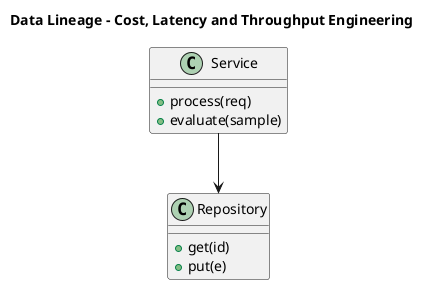

_Source diagram (plantuml); render with the appropriate tool._

**Figure 13. Data Lineage - Cost, Latency and Throughput Engineering** (plantuml). Figure: Data Lineage view for Generative AI. This diagram illustrates the principal components and their interactions as discussed in the surrounding section.

## Deep Dive: Mechanics, Variants and Trade-offs

Having established the essentials, we now go deeper into cost, latency and throughput engineering. Beneath the abstraction lies a concrete process whose steps can each be measured, tested and optimised independently. The distinctions in this section are the ones that separate a working demo from a system that holds up under adversarial inputs, scale and the passage of time.

Consider the principal variants and how to choose between them. Each variant optimises for a different point in the design space - some for latency, some for accuracy, some for cost or operability - and the correct choice follows from explicit requirements rather than from defaults. Simplicity is a feature. The simplest design that meets the requirement should be the default, with complexity added only when measurement justifies it.

In practice this is supported by a mature tooling ecosystem, including OpenAI API, Anthropic Claude, LangChain, LlamaIndex. Tools accelerate the work but do not substitute for understanding: the same principles apply whichever implementation you select, and the ability to reason from first principles is what lets you debug when a tool behaves unexpectedly.

A frequent source of subtle bugs is the interaction with enterprise use-case patterns. Because enterprise use-case patterns concerns assistants, copilots, summarisers and autonomous workflows mapped to value, changes there can silently alter the behaviour analysed here. The remedy is contract tests at the boundary and end-to-end evaluations that exercise the interaction explicitly.

Finally, attend to edge cases and degradation. Define what the system should do under partial failure, unexpected inputs and load spikes, and make that behaviour explicit and tested rather than emergent. Graceful degradation - returning a safe, useful result when the ideal one is unavailable - is a hallmark of mature engineering.

For deeper study, the literature offers authoritative treatments such as Ho et al. — Denoising Diffusion Probabilistic Models (2020) and Brown et al. — Language Models are Few-Shot Learners (2020). These primary sources reward careful reading and ground the practical guidance above in established results.

## Advanced Considerations

Having established the essentials, we now go deeper into cost, latency and throughput engineering. Beneath the abstraction lies a concrete process whose steps can each be measured, tested and optimised independently. The distinctions in this section are the ones that separate a working demo from a system that holds up under adversarial inputs, scale and the passage of time.

Consider the principal variants and how to choose between them. Each variant optimises for a different point in the design space - some for latency, some for accuracy, some for cost or operability - and the correct choice follows from explicit requirements rather than from defaults. Simplicity is a feature. The simplest design that meets the requirement should be the default, with complexity added only when measurement justifies it.

In practice this is supported by a mature tooling ecosystem, including OpenAI API, Anthropic Claude, LangChain, LlamaIndex. Tools accelerate the work but do not substitute for understanding: the same principles apply whichever implementation you select, and the ability to reason from first principles is what lets you debug when a tool behaves unexpectedly.

A frequent source of subtle bugs is the interaction with multimodal generation. Because multimodal generation concerns joint text–image–audio models, cross-attention conditioning and unified tokenisation strategies, changes there can silently alter the behaviour analysed here. The remedy is contract tests at the boundary and end-to-end evaluations that exercise the interaction explicitly.

Finally, attend to edge cases and degradation. Define what the system should do under partial failure, unexpected inputs and load spikes, and make that behaviour explicit and tested rather than emergent. Graceful degradation - returning a safe, useful result when the ideal one is unavailable - is a hallmark of mature engineering.

For deeper study, the literature offers authoritative treatments such as Ho et al. — Denoising Diffusion Probabilistic Models (2020) and Brown et al. — Language Models are Few-Shot Learners (2020). These primary sources reward careful reading and ground the practical guidance above in established results.

## Worked Example

A worked example clarifies how these ideas behave in practice. A legal organisation needs contract drafting and clause extraction with citation back to source. They decide to apply cost, latency and throughput engineering as part of their Generative AI solution, but wisely treat it as a hypothesis to be validated rather than a foregone conclusion.

The team begins by stating the objective precisely and defining how success will be measured before writing any code. They establish a small but representative evaluation set, agree on acceptance thresholds, and only then prototype the simplest design that could work. Early measurement reveals which assumptions hold and which must be revised, saving weeks of misdirected effort and surfacing edge cases while they are still cheap to fix.

As the prototype matures into a service, the team hardens it: adding input validation, error handling, caching where it pays off, and monitoring that ties back to the original success metric. They document each significant decision in an architecture decision record so that future maintainers understand not just what was built but why.

The outcome is instructive. The system that reaches production is not the most sophisticated design the team considered, but the one whose behaviour they could measure, explain and operate. This is the recurring lesson of Generative AI: durable value comes from the whole system, not from any single clever component.

## Industry Use Cases

Across industries, the ideas in this chapter recur in recognisable ways. The following vignettes show how different sectors apply them and what they have in common.

**Legal.** Contract drafting and clause extraction with citation back to source. The common thread is that value comes not from the model alone but from the surrounding system - data quality, evaluation, integration and operations - which is precisely where most of the engineering effort belongs.

**Software.** Code generation, refactoring and test synthesis inside the IDE. The common thread is that value comes not from the model alone but from the surrounding system - data quality, evaluation, integration and operations - which is precisely where most of the engineering effort belongs.

**Marketing.** Brand-safe content generation with human-in-the-loop review. The common thread is that value comes not from the model alone but from the surrounding system - data quality, evaluation, integration and operations - which is precisely where most of the engineering effort belongs.

**Customer Service.** Grounded assistants that resolve tickets with cited policy. The common thread is that value comes not from the model alone but from the surrounding system - data quality, evaluation, integration and operations - which is precisely where most of the engineering effort belongs.

## Best Practices

The following practices consistently separate successful Generative AI efforts from struggling ones. They are deliberately concrete so they can be adopted as checklist items in design and code review.

- Treat prompts as versioned, tested artefacts under source control.
- Always ground high-stakes generations in retrieved, citable sources.
- Define explicit cost and latency budgets per use case and route accordingly.
- Run an automated evaluation suite on every prompt or model change.

None of these are exotic; they are the unglamorous disciplines that compound into reliability. The cost of adopting them is small compared with the cost of the incidents they prevent, and they become second nature with practice.

## Common Pitfalls

Equally instructive are the failure modes that recur in practice. Each pitfall below has a clear early warning sign and a known remedy, so treat them as a diagnostic checklist when something feels wrong:

- Shipping ungrounded generations into high-stakes workflows.
- Ignoring token cost growth as adoption scales.
- Relying on a single provider with no fallback or routing strategy.
- Evaluating only with anecdotes instead of a versioned test set.

The pattern is consistent: most failures stem from skipping measurement, conflating prototype and production standards, or deferring cross-cutting concerns such as security and cost until they become emergencies. Naming these traps in advance is the cheapest way to avoid them.

## Governance, Security and Cost Notes

No discussion of cost, latency and throughput engineering is complete without its governance, security and cost dimensions, which are too often deferred until they become emergencies. Treating them as first-class concerns from the outset is both cheaper and safer.

**Governance.** Classify the risk of this capability, document its intended and out-of-scope uses, and ensure decisions are traceable to satisfy internal policy and external regulation such as the NIST AI RMF, ISO/IEC 42001 and the EU AI Act. **Security.** Treat all external input as untrusted, validate outputs before acting on them, apply least privilege to any tools or data access, and map controls to the OWASP LLM Top 10 and MITRE ATLAS.

**Cost and sustainability.** Establish explicit budgets for compute, tokens and latency, attribute spend to owners, and revisit the economics as usage scales - a design that is affordable at pilot scale can become untenable at production volume. Building these reflexes into everyday engineering is what allows a Generative AI system to be not only capable but also trustworthy and economically sound.

## Hands-On Exercises

Work through the following exercises. They are designed to move understanding from recognition to application - the level required for real engineering work - so prefer writing and building over merely reading.

1. Explain cost, latency and throughput engineering to a colleague unfamiliar with Generative AI, using a concrete example from your own domain.
2. Sketch a reference architecture that incorporates cost, latency and throughput engineering and annotate where observability, security and cost controls belong.
3. Design an evaluation that would tell you whether cost, latency and throughput engineering is working in production, including the metric, the dataset and the acceptance threshold.
4. Identify two pitfalls relevant to cost, latency and throughput engineering in your environment and describe the early warning signals you would monitor.
5. Prototype the simplest implementation that demonstrates cost, latency and throughput engineering, then list exactly what would need to change to make it production-ready.

## Key Takeaways

Key takeaways from this chapter:

- Cost, Latency and Throughput Engineering is a systems concern in Generative AI: data, models and operations must be co-designed.
- Measurement is non-negotiable; define success metrics and evaluation before building.
- Favour the simplest design that meets the requirement, and add complexity only when evidence demands it.
- Security, cost and observability are first-class requirements, not afterthoughts.
- Document decisions so the system remains understandable and operable as it evolves.

## Code Walkthrough

This listing shows a configuration-driven Cost, Latency and Throughput Engineering component with retry semantics and typed interfaces — the shape we expect from production Generative AI code rather than a notebook prototype.

The full listing is shown below; study it line by line and reproduce it locally before moving on.

### Listing: Implementing a Cost, Latency and Throughput Engineering component

```python
from __future__ import annotations

from dataclasses import dataclass, field
from typing import Any


@dataclass(slots=True)
class LatencyAndConfig:
    """Configuration for the Cost, Latency and Throughput Engineering component in a Generative AI system."""

    name: str
    timeout_s: float = 30.0
    max_retries: int = 3
    options: dict[str, Any] = field(default_factory=dict)


class LatencyAnd:
    """A minimal, production-shaped implementation of Cost, Latency and Throughput Engineering."""

    def __init__(self, config: LatencyAndConfig) -> None:
        self._config = config
        self._calls = 0

    def run(self, payload: dict[str, Any]) -> dict[str, Any]:
        """Process a request, retrying transient failures with backoff."""
        last_error: Exception | None = None
        for attempt in range(self._config.max_retries):
            try:
                self._calls += 1
                return self._process(payload)
            except TimeoutError as exc:  # transient
                last_error = exc
                continue
        raise RuntimeError(f"LatencyAnd failed after retries") from last_error

    def _process(self, payload: dict[str, Any]) -> dict[str, Any]:
        # Domain-specific logic for Cost, Latency and Throughput Engineering goes here.
        return {"status": "ok", "input_keys": sorted(payload), "calls": self._calls}

```

## Review Questions

1. In the context of Generative AI, which statement best describes “Cost, Latency and Throughput Engineering”?
   - A. It is only relevant to academic research, not production.
   - B. Token economics, caching, batching, distillation and routing across model tiers.
   - C. It makes the system slower but has no other effect.
   - D. It applies exclusively to image data.
   - **Answer: B.** Cost, Latency and Throughput Engineering: Token economics, caching, batching, distillation and routing across model tiers.
2. Which of the following is a recommended best practice when working with Generative AI?
   - A. Ignoring token cost growth as adoption scales.
   - B. Always ground high-stakes generations in retrieved, citable sources.
   - C. It applies exclusively to image data.
   - D. Relying on a single provider with no fallback or routing strategy.
   - **Answer: B.** Best practice: Always ground high-stakes generations in retrieved, citable sources.
3. Which of the following is a common pitfall to avoid in Generative AI?
   - A. It is only relevant to academic research, not production.
   - B. It eliminates the need for any evaluation or monitoring.
   - C. It makes the system slower but has no other effect.
   - D. Relying on a single provider with no fallback or routing strategy.
   - **Answer: D.** Pitfall to avoid: Relying on a single provider with no fallback or routing strategy.
4. *(Discussion)* Walk through how you would design Cost, Latency and Throughput Engineering for an enterprise Generative AI workload.
   - **Model answer:** A strong answer defines cost, latency and throughput engineering (Token economics, caching, batching, distillation and routing across model tiers.) then connects it to architecture, evaluation, cost, security and operations for Generative AI, citing concrete trade-offs and a real-world example.

---


# Chapter 10. Synthetic Data Generation

_This chapter examines synthetic data generation within Generative AI. It covers augmenting scarce datasets, privacy-preserving generation and avoiding model collapse from recursive training, derives a reference architecture, walks through a worked example and runnable code, surveys industry use cases, and distils best practices and pitfalls, closing with exercises and review questions._

## Introduction

We define Synthetic Data Generation as augmenting scarce datasets, privacy-preserving generation and avoiding model collapse from recursive training. This concept recurs throughout the Generative AI lifecycle, from design to operations. Seasoned practitioners treat this as a systems problem, co-designing data, models and operations rather than optimising any one in isolation.

This chapter builds intuition first, then formalises the ideas, derives an architecture, and finishes with code, exercises and review questions so the material transfers directly to your own Generative AI work. Read it actively: pause at each diagram, reproduce the code, and attempt the exercises before consulting the answers.

## Theory and Foundations

In practical terms, Synthetic Data Generation is best understood as augmenting scarce datasets, privacy-preserving generation and avoiding model collapse from recursive training. The practical implication is that design choices here ripple through latency, cost and maintainability for the lifetime of the system. It pays to understand the mechanism rather than treat it as a black box, because most production incidents are explained by one of its steps misbehaving.

To place this in context, recall the broader picture: Generative AI refers to models that synthesise novel content—text, images, audio, code and structured data—by learning the distribution of training data and sampling from it. Within that picture, synthetic data generation is one of the load-bearing ideas - the kind that, when understood deeply, makes the rest of Generative AI fall into place. Getting this right early prevents expensive rework once a Generative AI system reaches scale.

Synthetic Data Generation cannot be understood in isolation from enterprise use-case patterns. Recall that enterprise use-case patterns concerns assistants, copilots, summarisers and autonomous workflows mapped to value. The two interact directly: decisions in one constrain the design space of the other, which is why mature teams reason about them together rather than sequentially. There is an inherent trade-off between fidelity and cost, and the correct balance depends on the use case and its tolerance for error.

Synthetic Data Generation cannot be understood in isolation from governance and intellectual property. Recall that governance and intellectual property concerns provenance, watermarking, licensing and the legal landscape of generated content. The two interact directly: decisions in one constrain the design space of the other, which is why mature teams reason about them together rather than sequentially. There is an inherent trade-off between fidelity and cost, and the correct balance depends on the use case and its tolerance for error.

Several established patterns apply directly to synthetic data generation. The first, model gateway abstracting multiple providers behind one api, is widely adopted because it makes the system's behaviour predictable and observable. A complementary pattern, retrieval-augmented grounding to reduce hallucination, addresses a related concern and is often deployed alongside it. Patterns are not dogma; they are distilled experience that shortcuts the search for a sound design, and each carries assumptions worth checking against your context.

It is worth being explicit about when to apply this and when to reach for something simpler. In a small prototype, shortcuts around synthetic data generation are invisible; in a production Generative AI system serving real traffic, they surface as incidents, cost overruns or compliance gaps. Every added component buys capability at the price of operational surface area, and that bargain should be made consciously. The remainder of this chapter turns these principles into an architecture, code and a checklist you can apply immediately.

## Architecture and Design

The reference architecture for Synthetic Data Generation separates concerns into clearly bounded components with explicit contracts. A production generative-AI platform places a model gateway in front of one or more foundation models, with orchestration handling prompt assembly, retrieval, tool calls and guardrails. A semantic cache reduces cost and latency, an evaluation service scores responses offline and online, and an observability layer captures prompts, completions, tokens, cost and quality signals for every request.

Concretely, the principal building blocks include generative modelling foundations, large language models as generators, diffusion models for images and audio, multimodal generation and grounding with enterprise data. Each is a replaceable component behind a stable interface, so the team can upgrade an implementation - a model, an index, a policy engine - without rewriting its neighbours. The contracts between components are where reliability is won or lost, so they are specified explicitly and tested in isolation.

The diagram accompanying this section makes the data and control flow explicit. Requests enter through a well-defined boundary where they are authenticated and validated; only then are they dispatched to the components that perform the work. This boundary is also where rate limiting, quota enforcement and audit logging live, keeping cross-cutting concerns out of the core logic and in one auditable place.

Two qualities deserve emphasis. First, observability is designed in, not bolted on: every component emits structured telemetry so that failures can be localised in minutes rather than hours. Second, the architecture is evolvable - components communicate through stable contracts so that any single part of the Generative AI system can be replaced without a rewrite. As with most architectural decisions, the choice is rarely binary; the skill lies in quantifying the trade-offs and choosing deliberately.

<div class="diagram-svg">

<svg xmlns="http://www.w3.org/2000/svg" width="760" height="380" viewBox="0 0 760 380" font-family="Inter, Segoe UI, Arial, sans-serif">
<defs><marker id="arrow" markerWidth="10" markerHeight="10" refX="8" refY="3" orient="auto" markerUnits="strokeWidth"><path d="M0,0 L8,3 L0,6 z" fill="#94a3b8"/></marker><marker id="arrowA" markerWidth="10" markerHeight="10" refX="8" refY="3" orient="auto" markerUnits="strokeWidth"><path d="M0,0 L8,3 L0,6 z" fill="#4338ca"/></marker></defs>
<rect width="760" height="380" rx="12" fill="#f8fafc"/>
<text x="380" y="30" text-anchor="middle" font-size="17" font-weight="700" fill="#0f172a">CI/CD Pipeline - Synthetic Data Generation</text>
<rect x="40.0" y="166.0" width="104" height="60" rx="10" fill="#ffffff" stroke="#4338ca" stroke-width="2"/><text x="92.0" y="200.08" text-anchor="middle" font-size="12" font-weight="600" fill="#0f172a">Commit</text>
<rect x="155.2" y="166.0" width="104" height="60" rx="10" fill="#ffffff" stroke="#7c3aed" stroke-width="2"/><text x="207.2" y="200.08" text-anchor="middle" font-size="12" font-weight="600" fill="#0f172a">Build</text>
<line x1="144.0" y1="196.0" x2="155.2" y2="196.0" stroke="#4338ca" stroke-width="2" marker-end="url(#arrowA)"/>
<rect x="270.4" y="166.0" width="104" height="60" rx="10" fill="#ffffff" stroke="#0891b2" stroke-width="2"/><text x="322.4" y="200.08" text-anchor="middle" font-size="12" font-weight="600" fill="#0f172a">Eval Gate</text>
<line x1="259.2" y1="196.0" x2="270.4" y2="196.0" stroke="#4338ca" stroke-width="2" marker-end="url(#arrowA)"/>
<rect x="385.6" y="166.0" width="104" height="60" rx="10" fill="#ffffff" stroke="#059669" stroke-width="2"/><text x="437.6" y="200.08" text-anchor="middle" font-size="12" font-weight="600" fill="#0f172a">Package</text>
<line x1="374.4" y1="196.0" x2="385.6" y2="196.0" stroke="#4338ca" stroke-width="2" marker-end="url(#arrowA)"/>
<rect x="500.8" y="166.0" width="104" height="60" rx="10" fill="#ffffff" stroke="#d97706" stroke-width="2"/><text x="552.8" y="200.08" text-anchor="middle" font-size="12" font-weight="600" fill="#0f172a">Deploy</text>
<line x1="489.6" y1="196.0" x2="500.8" y2="196.0" stroke="#4338ca" stroke-width="2" marker-end="url(#arrowA)"/>
<rect x="616.0" y="166.0" width="104" height="60" rx="10" fill="#ffffff" stroke="#dc2626" stroke-width="2"/><text x="668.0" y="200.08" text-anchor="middle" font-size="12" font-weight="600" fill="#0f172a">Monitor</text>
<line x1="604.8" y1="196.0" x2="616.0" y2="196.0" stroke="#4338ca" stroke-width="2" marker-end="url(#arrowA)"/>
<path d="M668.0,226.0 q0,46 -288.0,46 q-288.0,0 -288.0,-46" fill="none" stroke="#cbd5e1" stroke-width="1.6" stroke-dasharray="5 4" marker-end="url(#arrow)"/>
<text x="380.0" y="288.0" text-anchor="middle" font-size="9.5" fill="#94a3b8">feedback / monitoring loop</text>
</svg>

</div>

**Figure 14. CI/CD Pipeline - Synthetic Data Generation** (svg). Figure: CI/CD Pipeline view for Generative AI. This diagram illustrates the principal components and their interactions as discussed in the surrounding section.

## Deep Dive: Mechanics, Variants and Trade-offs

Having established the essentials, we now go deeper into synthetic data generation. It pays to understand the mechanism rather than treat it as a black box, because most production incidents are explained by one of its steps misbehaving. The distinctions in this section are the ones that separate a working demo from a system that holds up under adversarial inputs, scale and the passage of time.

Consider the principal variants and how to choose between them. Each variant optimises for a different point in the design space - some for latency, some for accuracy, some for cost or operability - and the correct choice follows from explicit requirements rather than from defaults. Latency, accuracy and cost form a tension triangle: improving one typically pressures the others, so explicit budgets are essential.

In practice this is supported by a mature tooling ecosystem, including OpenAI API, Anthropic Claude, LangChain, LlamaIndex. Tools accelerate the work but do not substitute for understanding: the same principles apply whichever implementation you select, and the ability to reason from first principles is what lets you debug when a tool behaves unexpectedly.

A frequent source of subtle bugs is the interaction with enterprise use-case patterns. Because enterprise use-case patterns concerns assistants, copilots, summarisers and autonomous workflows mapped to value, changes there can silently alter the behaviour analysed here. The remedy is contract tests at the boundary and end-to-end evaluations that exercise the interaction explicitly.

Finally, attend to edge cases and degradation. Define what the system should do under partial failure, unexpected inputs and load spikes, and make that behaviour explicit and tested rather than emergent. Graceful degradation - returning a safe, useful result when the ideal one is unavailable - is a hallmark of mature engineering.

For deeper study, the literature offers authoritative treatments such as Ho et al. — Denoising Diffusion Probabilistic Models (2020) and Brown et al. — Language Models are Few-Shot Learners (2020). These primary sources reward careful reading and ground the practical guidance above in established results.

## Advanced Considerations

Having established the essentials, we now go deeper into synthetic data generation. Beneath the abstraction lies a concrete process whose steps can each be measured, tested and optimised independently. The distinctions in this section are the ones that separate a working demo from a system that holds up under adversarial inputs, scale and the passage of time.

Consider the principal variants and how to choose between them. Each variant optimises for a different point in the design space - some for latency, some for accuracy, some for cost or operability - and the correct choice follows from explicit requirements rather than from defaults. As with most architectural decisions, the choice is rarely binary; the skill lies in quantifying the trade-offs and choosing deliberately.

In practice this is supported by a mature tooling ecosystem, including OpenAI API, Anthropic Claude, LangChain, LlamaIndex. Tools accelerate the work but do not substitute for understanding: the same principles apply whichever implementation you select, and the ability to reason from first principles is what lets you debug when a tool behaves unexpectedly.

A frequent source of subtle bugs is the interaction with governance and intellectual property. Because governance and intellectual property concerns provenance, watermarking, licensing and the legal landscape of generated content, changes there can silently alter the behaviour analysed here. The remedy is contract tests at the boundary and end-to-end evaluations that exercise the interaction explicitly.

Finally, attend to edge cases and degradation. Define what the system should do under partial failure, unexpected inputs and load spikes, and make that behaviour explicit and tested rather than emergent. Graceful degradation - returning a safe, useful result when the ideal one is unavailable - is a hallmark of mature engineering.

For deeper study, the literature offers authoritative treatments such as Ho et al. — Denoising Diffusion Probabilistic Models (2020) and Brown et al. — Language Models are Few-Shot Learners (2020). These primary sources reward careful reading and ground the practical guidance above in established results.

## Worked Example

A worked example clarifies how these ideas behave in practice. A software organisation needs code generation, refactoring and test synthesis inside the IDE. They decide to apply synthetic data generation as part of their Generative AI solution, but wisely treat it as a hypothesis to be validated rather than a foregone conclusion.

The team begins by stating the objective precisely and defining how success will be measured before writing any code. They establish a small but representative evaluation set, agree on acceptance thresholds, and only then prototype the simplest design that could work. Early measurement reveals which assumptions hold and which must be revised, saving weeks of misdirected effort and surfacing edge cases while they are still cheap to fix.

As the prototype matures into a service, the team hardens it: adding input validation, error handling, caching where it pays off, and monitoring that ties back to the original success metric. They document each significant decision in an architecture decision record so that future maintainers understand not just what was built but why.

The outcome is instructive. The system that reaches production is not the most sophisticated design the team considered, but the one whose behaviour they could measure, explain and operate. This is the recurring lesson of Generative AI: durable value comes from the whole system, not from any single clever component.

## Industry Use Cases

Across industries, the ideas in this chapter recur in recognisable ways. The following vignettes show how different sectors apply them and what they have in common.

**Legal.** Contract drafting and clause extraction with citation back to source. The common thread is that value comes not from the model alone but from the surrounding system - data quality, evaluation, integration and operations - which is precisely where most of the engineering effort belongs.

**Software.** Code generation, refactoring and test synthesis inside the IDE. The common thread is that value comes not from the model alone but from the surrounding system - data quality, evaluation, integration and operations - which is precisely where most of the engineering effort belongs.

**Marketing.** Brand-safe content generation with human-in-the-loop review. The common thread is that value comes not from the model alone but from the surrounding system - data quality, evaluation, integration and operations - which is precisely where most of the engineering effort belongs.

**Customer Service.** Grounded assistants that resolve tickets with cited policy. The common thread is that value comes not from the model alone but from the surrounding system - data quality, evaluation, integration and operations - which is precisely where most of the engineering effort belongs.

## Best Practices

The following practices consistently separate successful Generative AI efforts from struggling ones. They are deliberately concrete so they can be adopted as checklist items in design and code review.

- Treat prompts as versioned, tested artefacts under source control.
- Always ground high-stakes generations in retrieved, citable sources.
- Define explicit cost and latency budgets per use case and route accordingly.
- Run an automated evaluation suite on every prompt or model change.

None of these are exotic; they are the unglamorous disciplines that compound into reliability. The cost of adopting them is small compared with the cost of the incidents they prevent, and they become second nature with practice.

## Common Pitfalls

Equally instructive are the failure modes that recur in practice. Each pitfall below has a clear early warning sign and a known remedy, so treat them as a diagnostic checklist when something feels wrong:

- Shipping ungrounded generations into high-stakes workflows.
- Ignoring token cost growth as adoption scales.
- Relying on a single provider with no fallback or routing strategy.
- Evaluating only with anecdotes instead of a versioned test set.

The pattern is consistent: most failures stem from skipping measurement, conflating prototype and production standards, or deferring cross-cutting concerns such as security and cost until they become emergencies. Naming these traps in advance is the cheapest way to avoid them.

## Governance, Security and Cost Notes

No discussion of synthetic data generation is complete without its governance, security and cost dimensions, which are too often deferred until they become emergencies. Treating them as first-class concerns from the outset is both cheaper and safer.

**Governance.** Classify the risk of this capability, document its intended and out-of-scope uses, and ensure decisions are traceable to satisfy internal policy and external regulation such as the NIST AI RMF, ISO/IEC 42001 and the EU AI Act. **Security.** Treat all external input as untrusted, validate outputs before acting on them, apply least privilege to any tools or data access, and map controls to the OWASP LLM Top 10 and MITRE ATLAS.

**Cost and sustainability.** Establish explicit budgets for compute, tokens and latency, attribute spend to owners, and revisit the economics as usage scales - a design that is affordable at pilot scale can become untenable at production volume. Building these reflexes into everyday engineering is what allows a Generative AI system to be not only capable but also trustworthy and economically sound.

## Hands-On Exercises

Work through the following exercises. They are designed to move understanding from recognition to application - the level required for real engineering work - so prefer writing and building over merely reading.

1. Explain synthetic data generation to a colleague unfamiliar with Generative AI, using a concrete example from your own domain.
2. Sketch a reference architecture that incorporates synthetic data generation and annotate where observability, security and cost controls belong.
3. Design an evaluation that would tell you whether synthetic data generation is working in production, including the metric, the dataset and the acceptance threshold.
4. Identify two pitfalls relevant to synthetic data generation in your environment and describe the early warning signals you would monitor.
5. Prototype the simplest implementation that demonstrates synthetic data generation, then list exactly what would need to change to make it production-ready.

## Key Takeaways

Key takeaways from this chapter:

- Synthetic Data Generation is a systems concern in Generative AI: data, models and operations must be co-designed.
- Measurement is non-negotiable; define success metrics and evaluation before building.
- Favour the simplest design that meets the requirement, and add complexity only when evidence demands it.
- Security, cost and observability are first-class requirements, not afterthoughts.
- Document decisions so the system remains understandable and operable as it evolves.

## Code Walkthrough

Every change to a Generative AI system should pass an evaluation gate. This example shows the minimal shape: align predictions and references, compute a metric, and return a pass/fail decision for CI.

The full listing is shown below; study it line by line and reproduce it locally before moving on.

### Listing: Evaluating Synthetic Data Generation with a regression gate

```python
from dataclasses import dataclass


@dataclass
class EvalResult:
    metric: str
    score: float
    passed: bool


def evaluate(predictions: list[str], references: list[str],
             threshold: float = 0.8) -> EvalResult:
    """Score Synthetic Data Generation output against references with a simple exact-match metric.

    In practice you would combine several metrics (exact match, semantic
    similarity, LLM-as-judge) and gate releases on the aggregate.
    """
    if len(predictions) != len(references):
        raise ValueError("predictions and references must align")
    hits = sum(p.strip() == r.strip() for p, r in zip(predictions, references))
    score = hits / len(references) if references else 0.0
    return EvalResult(metric="exact_match", score=score, passed=score >= threshold)


if __name__ == "__main__":
    result = evaluate(["yes", "no"], ["yes", "yes"])
    print(f"{result.metric}={result.score:.2f} passed={result.passed}")

```

## Review Questions

1. In the context of Generative AI, which statement best describes “Synthetic Data Generation”?
   - A. Augmenting scarce datasets, privacy-preserving generation and avoiding model collapse from recursive training.
   - B. It is only relevant to academic research, not production.
   - C. It removes all security and governance requirements.
   - D. It eliminates the need for any evaluation or monitoring.
   - **Answer: A.** Synthetic Data Generation: Augmenting scarce datasets, privacy-preserving generation and avoiding model collapse from recursive training.
2. Which of the following is a recommended best practice when working with Generative AI?
   - A. Shipping ungrounded generations into high-stakes workflows.
   - B. Define explicit cost and latency budgets per use case and route accordingly.
   - C. It applies exclusively to image data.
   - D. It eliminates the need for any evaluation or monitoring.
   - **Answer: B.** Best practice: Define explicit cost and latency budgets per use case and route accordingly.
3. Which of the following is a common pitfall to avoid in Generative AI?
   - A. Shipping ungrounded generations into high-stakes workflows.
   - B. Run an automated evaluation suite on every prompt or model change.
   - C. Treat prompts as versioned, tested artefacts under source control.
   - D. It applies exclusively to image data.
   - **Answer: A.** Pitfall to avoid: Shipping ungrounded generations into high-stakes workflows.
4. *(Discussion)* How does Synthetic Data Generation interact with security and governance requirements?
   - **Model answer:** A strong answer defines synthetic data generation (Augmenting scarce datasets, privacy-preserving generation and avoiding model collapse from recursive training.) then connects it to architecture, evaluation, cost, security and operations for Generative AI, citing concrete trade-offs and a real-world example.

---


# Chapter 11. Enterprise Use-Case Patterns

_This chapter examines enterprise use-case patterns within Generative AI. It covers assistants, copilots, summarisers and autonomous workflows mapped to value, derives a reference architecture, walks through a worked example and runnable code, surveys industry use cases, and distils best practices and pitfalls, closing with exercises and review questions._

## Introduction

We define Enterprise Use-Case Patterns as assistants, copilots, summarisers and autonomous workflows mapped to value. This concept recurs throughout the Generative AI lifecycle, from design to operations. What distinguishes a production-grade approach from a prototype is the discipline of measurement: every claim is backed by an evaluation rather than intuition.

This chapter builds intuition first, then formalises the ideas, derives an architecture, and finishes with code, exercises and review questions so the material transfers directly to your own Generative AI work. Read it actively: pause at each diagram, reproduce the code, and attempt the exercises before consulting the answers.

## Theory and Foundations

Formally, Enterprise Use-Case Patterns addresses assistants, copilots, summarisers and autonomous workflows mapped to value. It helps to separate the conceptual model from its implementation: the former guides reasoning, the latter must contend with real-world constraints. The underlying mechanism is best appreciated by tracing a single request from input to output and noting where state is created and consumed.

To place this in context, recall the broader picture: Generative AI refers to models that synthesise novel content—text, images, audio, code and structured data—by learning the distribution of training data and sampling from it. Within that picture, enterprise use-case patterns is one of the load-bearing ideas - the kind that, when understood deeply, makes the rest of Generative AI fall into place. It is foundational: later capabilities in Generative AI are built directly on top of it.

Enterprise Use-Case Patterns cannot be understood in isolation from controllability and structured output. Recall that controllability and structured output concerns constrained decoding, JSON/schema enforcement and function calling for reliable downstream integration. The two interact directly: decisions in one constrain the design space of the other, which is why mature teams reason about them together rather than sequentially. As with most architectural decisions, the choice is rarely binary; the skill lies in quantifying the trade-offs and choosing deliberately.

Enterprise Use-Case Patterns cannot be understood in isolation from productionising generative applications. Recall that productionising generative applications concerns prompt management, versioning, observability and continuous evaluation in CI. The two interact directly: decisions in one constrain the design space of the other, which is why mature teams reason about them together rather than sequentially. Every added component buys capability at the price of operational surface area, and that bargain should be made consciously.

Several established patterns apply directly to enterprise use-case patterns. The first, retrieval-augmented grounding to reduce hallucination, is widely adopted because it makes the system's behaviour predictable and observable. A complementary pattern, model gateway abstracting multiple providers behind one api, addresses a related concern and is often deployed alongside it. Patterns are not dogma; they are distilled experience that shortcuts the search for a sound design, and each carries assumptions worth checking against your context.

The decision of whether to adopt this should be driven by requirements, not by novelty. In a small prototype, shortcuts around enterprise use-case patterns are invisible; in a production Generative AI system serving real traffic, they surface as incidents, cost overruns or compliance gaps. Latency, accuracy and cost form a tension triangle: improving one typically pressures the others, so explicit budgets are essential. The remainder of this chapter turns these principles into an architecture, code and a checklist you can apply immediately.

## Architecture and Design

From an architectural standpoint, Enterprise Use-Case Patterns sits at the intersection of data, models and operations. A production generative-AI platform places a model gateway in front of one or more foundation models, with orchestration handling prompt assembly, retrieval, tool calls and guardrails. A semantic cache reduces cost and latency, an evaluation service scores responses offline and online, and an observability layer captures prompts, completions, tokens, cost and quality signals for every request.

Concretely, the principal building blocks include generative modelling foundations, large language models as generators, diffusion models for images and audio, multimodal generation and grounding with enterprise data. Each is a replaceable component behind a stable interface, so the team can upgrade an implementation - a model, an index, a policy engine - without rewriting its neighbours. The contracts between components are where reliability is won or lost, so they are specified explicitly and tested in isolation.

The diagram accompanying this section makes the data and control flow explicit. Requests enter through a well-defined boundary where they are authenticated and validated; only then are they dispatched to the components that perform the work. This boundary is also where rate limiting, quota enforcement and audit logging live, keeping cross-cutting concerns out of the core logic and in one auditable place.

Two qualities deserve emphasis. First, observability is designed in, not bolted on: every component emits structured telemetry so that failures can be localised in minutes rather than hours. Second, the architecture is evolvable - components communicate through stable contracts so that any single part of the Generative AI system can be replaced without a rewrite. There is an inherent trade-off between fidelity and cost, and the correct balance depends on the use case and its tolerance for error.

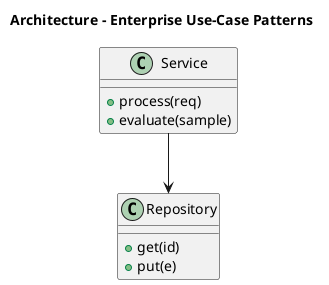

_Source diagram (plantuml); render with the appropriate tool._

**Figure 15. Architecture - Enterprise Use-Case Patterns** (plantuml). Figure: Architecture view for Generative AI. This diagram illustrates the principal components and their interactions as discussed in the surrounding section.

## Deep Dive: Mechanics, Variants and Trade-offs

Having established the essentials, we now go deeper into enterprise use-case patterns. The underlying mechanism is best appreciated by tracing a single request from input to output and noting where state is created and consumed. The distinctions in this section are the ones that separate a working demo from a system that holds up under adversarial inputs, scale and the passage of time.

Consider the principal variants and how to choose between them. Each variant optimises for a different point in the design space - some for latency, some for accuracy, some for cost or operability - and the correct choice follows from explicit requirements rather than from defaults. Simplicity is a feature. The simplest design that meets the requirement should be the default, with complexity added only when measurement justifies it.

In practice this is supported by a mature tooling ecosystem, including OpenAI API, Anthropic Claude, LangChain, LlamaIndex. Tools accelerate the work but do not substitute for understanding: the same principles apply whichever implementation you select, and the ability to reason from first principles is what lets you debug when a tool behaves unexpectedly.

A frequent source of subtle bugs is the interaction with controllability and structured output. Because controllability and structured output concerns constrained decoding, JSON/schema enforcement and function calling for reliable downstream integration, changes there can silently alter the behaviour analysed here. The remedy is contract tests at the boundary and end-to-end evaluations that exercise the interaction explicitly.

Finally, attend to edge cases and degradation. Define what the system should do under partial failure, unexpected inputs and load spikes, and make that behaviour explicit and tested rather than emergent. Graceful degradation - returning a safe, useful result when the ideal one is unavailable - is a hallmark of mature engineering.

For deeper study, the literature offers authoritative treatments such as Ho et al. — Denoising Diffusion Probabilistic Models (2020) and Brown et al. — Language Models are Few-Shot Learners (2020). These primary sources reward careful reading and ground the practical guidance above in established results.

## Advanced Considerations

Having established the essentials, we now go deeper into enterprise use-case patterns. Mechanically, the behaviour emerges from a few interacting parts that are simpler than the whole they produce. The distinctions in this section are the ones that separate a working demo from a system that holds up under adversarial inputs, scale and the passage of time.

Consider the principal variants and how to choose between them. Each variant optimises for a different point in the design space - some for latency, some for accuracy, some for cost or operability - and the correct choice follows from explicit requirements rather than from defaults. Latency, accuracy and cost form a tension triangle: improving one typically pressures the others, so explicit budgets are essential.

In practice this is supported by a mature tooling ecosystem, including OpenAI API, Anthropic Claude, LangChain, LlamaIndex. Tools accelerate the work but do not substitute for understanding: the same principles apply whichever implementation you select, and the ability to reason from first principles is what lets you debug when a tool behaves unexpectedly.

A frequent source of subtle bugs is the interaction with synthetic data generation. Because synthetic data generation concerns augmenting scarce datasets, privacy-preserving generation and avoiding model collapse from recursive training, changes there can silently alter the behaviour analysed here. The remedy is contract tests at the boundary and end-to-end evaluations that exercise the interaction explicitly.

Finally, attend to edge cases and degradation. Define what the system should do under partial failure, unexpected inputs and load spikes, and make that behaviour explicit and tested rather than emergent. Graceful degradation - returning a safe, useful result when the ideal one is unavailable - is a hallmark of mature engineering.

For deeper study, the literature offers authoritative treatments such as Ho et al. — Denoising Diffusion Probabilistic Models (2020) and Brown et al. — Language Models are Few-Shot Learners (2020). These primary sources reward careful reading and ground the practical guidance above in established results.

## Worked Example

To ground the discussion, walk through a representative example. A marketing organisation needs brand-safe content generation with human-in-the-loop review. They decide to apply enterprise use-case patterns as part of their Generative AI solution, but wisely treat it as a hypothesis to be validated rather than a foregone conclusion.

The team begins by stating the objective precisely and defining how success will be measured before writing any code. They establish a small but representative evaluation set, agree on acceptance thresholds, and only then prototype the simplest design that could work. Early measurement reveals which assumptions hold and which must be revised, saving weeks of misdirected effort and surfacing edge cases while they are still cheap to fix.

As the prototype matures into a service, the team hardens it: adding input validation, error handling, caching where it pays off, and monitoring that ties back to the original success metric. They document each significant decision in an architecture decision record so that future maintainers understand not just what was built but why.

The outcome is instructive. The system that reaches production is not the most sophisticated design the team considered, but the one whose behaviour they could measure, explain and operate. This is the recurring lesson of Generative AI: durable value comes from the whole system, not from any single clever component.

## Industry Use Cases

Across industries, the ideas in this chapter recur in recognisable ways. The following vignettes show how different sectors apply them and what they have in common.

**Legal.** Contract drafting and clause extraction with citation back to source. The common thread is that value comes not from the model alone but from the surrounding system - data quality, evaluation, integration and operations - which is precisely where most of the engineering effort belongs.

**Software.** Code generation, refactoring and test synthesis inside the IDE. The common thread is that value comes not from the model alone but from the surrounding system - data quality, evaluation, integration and operations - which is precisely where most of the engineering effort belongs.

**Marketing.** Brand-safe content generation with human-in-the-loop review. The common thread is that value comes not from the model alone but from the surrounding system - data quality, evaluation, integration and operations - which is precisely where most of the engineering effort belongs.

**Customer Service.** Grounded assistants that resolve tickets with cited policy. The common thread is that value comes not from the model alone but from the surrounding system - data quality, evaluation, integration and operations - which is precisely where most of the engineering effort belongs.

## Best Practices

The following practices consistently separate successful Generative AI efforts from struggling ones. They are deliberately concrete so they can be adopted as checklist items in design and code review.

- Treat prompts as versioned, tested artefacts under source control.
- Always ground high-stakes generations in retrieved, citable sources.
- Define explicit cost and latency budgets per use case and route accordingly.
- Run an automated evaluation suite on every prompt or model change.

None of these are exotic; they are the unglamorous disciplines that compound into reliability. The cost of adopting them is small compared with the cost of the incidents they prevent, and they become second nature with practice.

## Common Pitfalls

Equally instructive are the failure modes that recur in practice. Each pitfall below has a clear early warning sign and a known remedy, so treat them as a diagnostic checklist when something feels wrong:

- Shipping ungrounded generations into high-stakes workflows.
- Ignoring token cost growth as adoption scales.
- Relying on a single provider with no fallback or routing strategy.
- Evaluating only with anecdotes instead of a versioned test set.

The pattern is consistent: most failures stem from skipping measurement, conflating prototype and production standards, or deferring cross-cutting concerns such as security and cost until they become emergencies. Naming these traps in advance is the cheapest way to avoid them.

## Governance, Security and Cost Notes

No discussion of enterprise use-case patterns is complete without its governance, security and cost dimensions, which are too often deferred until they become emergencies. Treating them as first-class concerns from the outset is both cheaper and safer.

**Governance.** Classify the risk of this capability, document its intended and out-of-scope uses, and ensure decisions are traceable to satisfy internal policy and external regulation such as the NIST AI RMF, ISO/IEC 42001 and the EU AI Act. **Security.** Treat all external input as untrusted, validate outputs before acting on them, apply least privilege to any tools or data access, and map controls to the OWASP LLM Top 10 and MITRE ATLAS.

**Cost and sustainability.** Establish explicit budgets for compute, tokens and latency, attribute spend to owners, and revisit the economics as usage scales - a design that is affordable at pilot scale can become untenable at production volume. Building these reflexes into everyday engineering is what allows a Generative AI system to be not only capable but also trustworthy and economically sound.

## Hands-On Exercises

Work through the following exercises. They are designed to move understanding from recognition to application - the level required for real engineering work - so prefer writing and building over merely reading.

1. Explain enterprise use-case patterns to a colleague unfamiliar with Generative AI, using a concrete example from your own domain.
2. Sketch a reference architecture that incorporates enterprise use-case patterns and annotate where observability, security and cost controls belong.
3. Design an evaluation that would tell you whether enterprise use-case patterns is working in production, including the metric, the dataset and the acceptance threshold.
4. Identify two pitfalls relevant to enterprise use-case patterns in your environment and describe the early warning signals you would monitor.
5. Prototype the simplest implementation that demonstrates enterprise use-case patterns, then list exactly what would need to change to make it production-ready.

## Key Takeaways

Key takeaways from this chapter:

- Enterprise Use-Case Patterns is a systems concern in Generative AI: data, models and operations must be co-designed.
- Measurement is non-negotiable; define success metrics and evaluation before building.
- Favour the simplest design that meets the requirement, and add complexity only when evidence demands it.
- Security, cost and observability are first-class requirements, not afterthoughts.
- Document decisions so the system remains understandable and operable as it evolves.

## Code Walkthrough

This listing shows a configuration-driven Enterprise Use-Case Patterns component with retry semantics and typed interfaces — the shape we expect from production Generative AI code rather than a notebook prototype.

The full listing is shown below; study it line by line and reproduce it locally before moving on.

### Listing: Implementing a Enterprise Use-Case Patterns component

```python
from __future__ import annotations

from dataclasses import dataclass, field
from typing import Any


@dataclass(slots=True)
class EnterprisePatternsConfig:
    """Configuration for the Enterprise Use-Case Patterns component in a Generative AI system."""

    name: str
    timeout_s: float = 30.0
    max_retries: int = 3
    options: dict[str, Any] = field(default_factory=dict)


class EnterprisePatterns:
    """A minimal, production-shaped implementation of Enterprise Use-Case Patterns."""

    def __init__(self, config: EnterprisePatternsConfig) -> None:
        self._config = config
        self._calls = 0

    def run(self, payload: dict[str, Any]) -> dict[str, Any]:
        """Process a request, retrying transient failures with backoff."""
        last_error: Exception | None = None
        for attempt in range(self._config.max_retries):
            try:
                self._calls += 1
                return self._process(payload)
            except TimeoutError as exc:  # transient
                last_error = exc
                continue
        raise RuntimeError(f"EnterprisePatterns failed after retries") from last_error

    def _process(self, payload: dict[str, Any]) -> dict[str, Any]:
        # Domain-specific logic for Enterprise Use-Case Patterns goes here.
        return {"status": "ok", "input_keys": sorted(payload), "calls": self._calls}

```

## Review Questions

1. In the context of Generative AI, which statement best describes “Enterprise Use-Case Patterns”?
   - A. It applies exclusively to image data.
   - B. Assistants, copilots, summarisers and autonomous workflows mapped to value.
   - C. It removes all security and governance requirements.
   - D. It is only relevant to academic research, not production.
   - **Answer: B.** Enterprise Use-Case Patterns: Assistants, copilots, summarisers and autonomous workflows mapped to value.
2. Which of the following is a recommended best practice when working with Generative AI?
   - A. Evaluating only with anecdotes instead of a versioned test set.
   - B. Always ground high-stakes generations in retrieved, citable sources.
   - C. It removes all security and governance requirements.
   - D. Shipping ungrounded generations into high-stakes workflows.
   - **Answer: B.** Best practice: Always ground high-stakes generations in retrieved, citable sources.
3. Which of the following is a common pitfall to avoid in Generative AI?
   - A. Run an automated evaluation suite on every prompt or model change.
   - B. It removes all security and governance requirements.
   - C. It guarantees deterministic output regardless of input.
   - D. Ignoring token cost growth as adoption scales.
   - **Answer: D.** Pitfall to avoid: Ignoring token cost growth as adoption scales.
4. *(Discussion)* How would you test and monitor Enterprise Use-Case Patterns in production?
   - **Model answer:** A strong answer defines enterprise use-case patterns (Assistants, copilots, summarisers and autonomous workflows mapped to value.) then connects it to architecture, evaluation, cost, security and operations for Generative AI, citing concrete trade-offs and a real-world example.

---


# Chapter 12. Productionising Generative Applications

_This chapter examines productionising generative applications within Generative AI. It covers prompt management, versioning, observability and continuous evaluation in CI, derives a reference architecture, walks through a worked example and runnable code, surveys industry use cases, and distils best practices and pitfalls, closing with exercises and review questions._

## Introduction

At its core, Productionising Generative Applications concerns prompt management, versioning, observability and continuous evaluation in CI. Understanding this matters because Generative AI systems succeed or fail on exactly these decisions. In an enterprise setting, this translates into concrete requirements: clear interfaces, measurable quality, and controls that satisfy security and governance.

This chapter builds intuition first, then formalises the ideas, derives an architecture, and finishes with code, exercises and review questions so the material transfers directly to your own Generative AI work. Read it actively: pause at each diagram, reproduce the code, and attempt the exercises before consulting the answers.

## Theory and Foundations

In practical terms, Productionising Generative Applications is best understood as prompt management, versioning, observability and continuous evaluation in CI. In an enterprise setting, this translates into concrete requirements: clear interfaces, measurable quality, and controls that satisfy security and governance. It pays to understand the mechanism rather than treat it as a black box, because most production incidents are explained by one of its steps misbehaving.

To place this in context, recall the broader picture: Generative AI refers to models that synthesise novel content—text, images, audio, code and structured data—by learning the distribution of training data and sampling from it. Within that picture, productionising generative applications is one of the load-bearing ideas - the kind that, when understood deeply, makes the rest of Generative AI fall into place. Getting this right early prevents expensive rework once a Generative AI system reaches scale.

Productionising Generative Applications cannot be understood in isolation from governance and intellectual property. Recall that governance and intellectual property concerns provenance, watermarking, licensing and the legal landscape of generated content. The two interact directly: decisions in one constrain the design space of the other, which is why mature teams reason about them together rather than sequentially. Latency, accuracy and cost form a tension triangle: improving one typically pressures the others, so explicit budgets are essential.

Productionising Generative Applications cannot be understood in isolation from generative modelling foundations. Recall that generative modelling foundations concerns likelihood-based versus implicit models; autoregressive, diffusion and variational approaches and the trade-offs between fidelity and diversity. The two interact directly: decisions in one constrain the design space of the other, which is why mature teams reason about them together rather than sequentially. Every added component buys capability at the price of operational surface area, and that bargain should be made consciously.

Several established patterns apply directly to productionising generative applications. The first, semantic caching keyed on normalised prompts and embeddings, is widely adopted because it makes the system's behaviour predictable and observable. A complementary pattern, guardrail sandwich: validate inputs, constrain decoding, validate outputs, addresses a related concern and is often deployed alongside it. Patterns are not dogma; they are distilled experience that shortcuts the search for a sound design, and each carries assumptions worth checking against your context.

It is worth being explicit about when to apply this and when to reach for something simpler. In a small prototype, shortcuts around productionising generative applications are invisible; in a production Generative AI system serving real traffic, they surface as incidents, cost overruns or compliance gaps. Latency, accuracy and cost form a tension triangle: improving one typically pressures the others, so explicit budgets are essential. The remainder of this chapter turns these principles into an architecture, code and a checklist you can apply immediately.

## Architecture and Design

A robust architecture for Productionising Generative Applications is layered so each part can evolve independently without destabilising the whole. A production generative-AI platform places a model gateway in front of one or more foundation models, with orchestration handling prompt assembly, retrieval, tool calls and guardrails. A semantic cache reduces cost and latency, an evaluation service scores responses offline and online, and an observability layer captures prompts, completions, tokens, cost and quality signals for every request.

Concretely, the principal building blocks include generative modelling foundations, large language models as generators, diffusion models for images and audio, multimodal generation and grounding with enterprise data. Each is a replaceable component behind a stable interface, so the team can upgrade an implementation - a model, an index, a policy engine - without rewriting its neighbours. The contracts between components are where reliability is won or lost, so they are specified explicitly and tested in isolation.

The diagram accompanying this section makes the data and control flow explicit. Requests enter through a well-defined boundary where they are authenticated and validated; only then are they dispatched to the components that perform the work. This boundary is also where rate limiting, quota enforcement and audit logging live, keeping cross-cutting concerns out of the core logic and in one auditable place.

Two qualities deserve emphasis. First, observability is designed in, not bolted on: every component emits structured telemetry so that failures can be localised in minutes rather than hours. Second, the architecture is evolvable - components communicate through stable contracts so that any single part of the Generative AI system can be replaced without a rewrite. As with most architectural decisions, the choice is rarely binary; the skill lies in quantifying the trade-offs and choosing deliberately.


_Source diagram (plantuml); render with the appropriate tool._

**Figure 16. Component - Productionising Generative Applications** (plantuml). Figure: Component view for Generative AI. This diagram illustrates the principal components and their interactions as discussed in the surrounding section.

```xml
<mxfile host="ai-university">
  <diagram name="Security Architecture">
    <mxGraphModel dx="800" dy="600" grid="1" gridSize="10">
      <root>
        <mxCell id="0"/>
        <mxCell id="1" parent="0"/>
        <mxCell id="title" value="Security Architecture - Productionising Generative Applicat…" style="text;fontSize=16;fontStyle=1" vertex="1" parent="1"><mxGeometry x="40" y="20" width="600" height="30" as="geometry"/></mxCell>
        <mxCell id="hub" value="Generative AI" style="rounded=1;fillColor=#0f172a;fontColor=#ffffff;fontStyle=1" vertex="1" parent="1"><mxGeometry x="300" y="180" width="160" height="60" as="geometry"/></mxCell>
        <mxCell id="n0" value="Generative Modelling Fo…" style="rounded=1;fillColor=#e0e7ff;strokeColor=#4338ca" vertex="1" parent="1"><mxGeometry x="60" y="80" width="160" height="50" as="geometry"/></mxCell>
        <mxCell id="e0" style="edgeStyle=orthogonalEdgeStyle" edge="1" parent="1" source="hub" target="n0"><mxGeometry relative="1" as="geometry"/></mxCell>
        <mxCell id="n1" value="Large Language Models a…" style="rounded=1;fillColor=#e0e7ff;strokeColor=#4338ca" vertex="1" parent="1"><mxGeometry x="600" y="170" width="160" height="50" as="geometry"/></mxCell>
        <mxCell id="e1" style="edgeStyle=orthogonalEdgeStyle" edge="1" parent="1" source="hub" target="n1"><mxGeometry relative="1" as="geometry"/></mxCell>
        <mxCell id="n2" value="Diffusion Models for Im…" style="rounded=1;fillColor=#e0e7ff;strokeColor=#4338ca" vertex="1" parent="1"><mxGeometry x="60" y="260" width="160" height="50" as="geometry"/></mxCell>
        <mxCell id="e2" style="edgeStyle=orthogonalEdgeStyle" edge="1" parent="1" source="hub" target="n2"><mxGeometry relative="1" as="geometry"/></mxCell>
        <mxCell id="n3" value="Multimodal Generation" style="rounded=1;fillColor=#e0e7ff;strokeColor=#4338ca" vertex="1" parent="1"><mxGeometry x="600" y="350" width="160" height="50" as="geometry"/></mxCell>
        <mxCell id="e3" style="edgeStyle=orthogonalEdgeStyle" edge="1" parent="1" source="hub" target="n3"><mxGeometry relative="1" as="geometry"/></mxCell>
        <mxCell id="n4" value="Grounding with Enterpri…" style="rounded=1;fillColor=#e0e7ff;strokeColor=#4338ca" vertex="1" parent="1"><mxGeometry x="60" y="440" width="160" height="50" as="geometry"/></mxCell>
        <mxCell id="e4" style="edgeStyle=orthogonalEdgeStyle" edge="1" parent="1" source="hub" target="n4"><mxGeometry relative="1" as="geometry"/></mxCell>
      </root>
    </mxGraphModel>
  </diagram>
</mxfile>
```

_Source diagram (drawio); render with the appropriate tool._

**Figure 17. Security Architecture - Productionising Generative Applications** (drawio). Figure: Security Architecture view for Generative AI. This diagram illustrates the principal components and their interactions as discussed in the surrounding section.

## Deep Dive: Mechanics, Variants and Trade-offs

Having established the essentials, we now go deeper into productionising generative applications. It pays to understand the mechanism rather than treat it as a black box, because most production incidents are explained by one of its steps misbehaving. The distinctions in this section are the ones that separate a working demo from a system that holds up under adversarial inputs, scale and the passage of time.

Consider the principal variants and how to choose between them. Each variant optimises for a different point in the design space - some for latency, some for accuracy, some for cost or operability - and the correct choice follows from explicit requirements rather than from defaults. There is an inherent trade-off between fidelity and cost, and the correct balance depends on the use case and its tolerance for error.

In practice this is supported by a mature tooling ecosystem, including OpenAI API, Anthropic Claude, LangChain, LlamaIndex. Tools accelerate the work but do not substitute for understanding: the same principles apply whichever implementation you select, and the ability to reason from first principles is what lets you debug when a tool behaves unexpectedly.

A frequent source of subtle bugs is the interaction with governance and intellectual property. Because governance and intellectual property concerns provenance, watermarking, licensing and the legal landscape of generated content, changes there can silently alter the behaviour analysed here. The remedy is contract tests at the boundary and end-to-end evaluations that exercise the interaction explicitly.

Finally, attend to edge cases and degradation. Define what the system should do under partial failure, unexpected inputs and load spikes, and make that behaviour explicit and tested rather than emergent. Graceful degradation - returning a safe, useful result when the ideal one is unavailable - is a hallmark of mature engineering.

For deeper study, the literature offers authoritative treatments such as Ho et al. — Denoising Diffusion Probabilistic Models (2020) and Brown et al. — Language Models are Few-Shot Learners (2020). These primary sources reward careful reading and ground the practical guidance above in established results.

## Advanced Considerations

Having established the essentials, we now go deeper into productionising generative applications. Mechanically, the behaviour emerges from a few interacting parts that are simpler than the whole they produce. The distinctions in this section are the ones that separate a working demo from a system that holds up under adversarial inputs, scale and the passage of time.

Consider the principal variants and how to choose between them. Each variant optimises for a different point in the design space - some for latency, some for accuracy, some for cost or operability - and the correct choice follows from explicit requirements rather than from defaults. Latency, accuracy and cost form a tension triangle: improving one typically pressures the others, so explicit budgets are essential.

In practice this is supported by a mature tooling ecosystem, including OpenAI API, Anthropic Claude, LangChain, LlamaIndex. Tools accelerate the work but do not substitute for understanding: the same principles apply whichever implementation you select, and the ability to reason from first principles is what lets you debug when a tool behaves unexpectedly.

A frequent source of subtle bugs is the interaction with multimodal generation. Because multimodal generation concerns joint text–image–audio models, cross-attention conditioning and unified tokenisation strategies, changes there can silently alter the behaviour analysed here. The remedy is contract tests at the boundary and end-to-end evaluations that exercise the interaction explicitly.

Finally, attend to edge cases and degradation. Define what the system should do under partial failure, unexpected inputs and load spikes, and make that behaviour explicit and tested rather than emergent. Graceful degradation - returning a safe, useful result when the ideal one is unavailable - is a hallmark of mature engineering.

For deeper study, the literature offers authoritative treatments such as Ho et al. — Denoising Diffusion Probabilistic Models (2020) and Brown et al. — Language Models are Few-Shot Learners (2020). These primary sources reward careful reading and ground the practical guidance above in established results.

## Worked Example

To ground the discussion, walk through a representative example. A customer service organisation needs grounded assistants that resolve tickets with cited policy. They decide to apply productionising generative applications as part of their Generative AI solution, but wisely treat it as a hypothesis to be validated rather than a foregone conclusion.

The team begins by stating the objective precisely and defining how success will be measured before writing any code. They establish a small but representative evaluation set, agree on acceptance thresholds, and only then prototype the simplest design that could work. Early measurement reveals which assumptions hold and which must be revised, saving weeks of misdirected effort and surfacing edge cases while they are still cheap to fix.

As the prototype matures into a service, the team hardens it: adding input validation, error handling, caching where it pays off, and monitoring that ties back to the original success metric. They document each significant decision in an architecture decision record so that future maintainers understand not just what was built but why.

The outcome is instructive. The system that reaches production is not the most sophisticated design the team considered, but the one whose behaviour they could measure, explain and operate. This is the recurring lesson of Generative AI: durable value comes from the whole system, not from any single clever component.

## Industry Use Cases

Across industries, the ideas in this chapter recur in recognisable ways. The following vignettes show how different sectors apply them and what they have in common.

**Legal.** Contract drafting and clause extraction with citation back to source. The common thread is that value comes not from the model alone but from the surrounding system - data quality, evaluation, integration and operations - which is precisely where most of the engineering effort belongs.

**Software.** Code generation, refactoring and test synthesis inside the IDE. The common thread is that value comes not from the model alone but from the surrounding system - data quality, evaluation, integration and operations - which is precisely where most of the engineering effort belongs.

**Marketing.** Brand-safe content generation with human-in-the-loop review. The common thread is that value comes not from the model alone but from the surrounding system - data quality, evaluation, integration and operations - which is precisely where most of the engineering effort belongs.

**Customer Service.** Grounded assistants that resolve tickets with cited policy. The common thread is that value comes not from the model alone but from the surrounding system - data quality, evaluation, integration and operations - which is precisely where most of the engineering effort belongs.

## Best Practices

The following practices consistently separate successful Generative AI efforts from struggling ones. They are deliberately concrete so they can be adopted as checklist items in design and code review.

- Treat prompts as versioned, tested artefacts under source control.
- Always ground high-stakes generations in retrieved, citable sources.
- Define explicit cost and latency budgets per use case and route accordingly.
- Run an automated evaluation suite on every prompt or model change.

None of these are exotic; they are the unglamorous disciplines that compound into reliability. The cost of adopting them is small compared with the cost of the incidents they prevent, and they become second nature with practice.

## Common Pitfalls

Equally instructive are the failure modes that recur in practice. Each pitfall below has a clear early warning sign and a known remedy, so treat them as a diagnostic checklist when something feels wrong:

- Shipping ungrounded generations into high-stakes workflows.
- Ignoring token cost growth as adoption scales.
- Relying on a single provider with no fallback or routing strategy.
- Evaluating only with anecdotes instead of a versioned test set.

The pattern is consistent: most failures stem from skipping measurement, conflating prototype and production standards, or deferring cross-cutting concerns such as security and cost until they become emergencies. Naming these traps in advance is the cheapest way to avoid them.

## Governance, Security and Cost Notes

No discussion of productionising generative applications is complete without its governance, security and cost dimensions, which are too often deferred until they become emergencies. Treating them as first-class concerns from the outset is both cheaper and safer.

**Governance.** Classify the risk of this capability, document its intended and out-of-scope uses, and ensure decisions are traceable to satisfy internal policy and external regulation such as the NIST AI RMF, ISO/IEC 42001 and the EU AI Act. **Security.** Treat all external input as untrusted, validate outputs before acting on them, apply least privilege to any tools or data access, and map controls to the OWASP LLM Top 10 and MITRE ATLAS.

**Cost and sustainability.** Establish explicit budgets for compute, tokens and latency, attribute spend to owners, and revisit the economics as usage scales - a design that is affordable at pilot scale can become untenable at production volume. Building these reflexes into everyday engineering is what allows a Generative AI system to be not only capable but also trustworthy and economically sound.

## Hands-On Exercises

Work through the following exercises. They are designed to move understanding from recognition to application - the level required for real engineering work - so prefer writing and building over merely reading.

1. Explain productionising generative applications to a colleague unfamiliar with Generative AI, using a concrete example from your own domain.
2. Sketch a reference architecture that incorporates productionising generative applications and annotate where observability, security and cost controls belong.
3. Design an evaluation that would tell you whether productionising generative applications is working in production, including the metric, the dataset and the acceptance threshold.
4. Identify two pitfalls relevant to productionising generative applications in your environment and describe the early warning signals you would monitor.
5. Prototype the simplest implementation that demonstrates productionising generative applications, then list exactly what would need to change to make it production-ready.

## Key Takeaways

Key takeaways from this chapter:

- Productionising Generative Applications is a systems concern in Generative AI: data, models and operations must be co-designed.
- Measurement is non-negotiable; define success metrics and evaluation before building.
- Favour the simplest design that meets the requirement, and add complexity only when evidence demands it.
- Security, cost and observability are first-class requirements, not afterthoughts.
- Document decisions so the system remains understandable and operable as it evolves.

## Code Walkthrough

Pipelines keep Productionising Generative Applications logic modular and testable. Each stage is a pure function, errors are captured per item, and the composition is trivial to extend or reorder.

The full listing is shown below; study it line by line and reproduce it locally before moving on.

### Listing: A composable processing pipeline for Productionising Generative Applications

```python
from collections.abc import Iterable, Iterator
from typing import Protocol


class Stage(Protocol):
    def __call__(self, item: dict) -> dict: ...


def pipeline(stages: list[Stage]) -> Stage:
    """Compose ordered stages into a single callable for Productionising Generative Applications."""

    def run(item: dict) -> dict:
        for stage in stages:
            item = stage(item)
        return item

    return run


def validate(item: dict) -> dict:
    if "text" not in item:
        raise ValueError("missing required field: text")
    return item


def normalise(item: dict) -> dict:
    item["text"] = item["text"].strip().lower()
    return item


def enrich(item: dict) -> dict:
    item["length"] = len(item["text"])
    return item


process = pipeline([validate, normalise, enrich])


def run_batch(items: Iterable[dict]) -> Iterator[dict]:
    for item in items:
        try:
            yield process(dict(item))
        except ValueError as exc:
            yield {"error": str(exc), "item": item}

```

## Review Questions

1. In the context of Generative AI, which statement best describes “Productionising Generative Applications”?
   - A. It applies exclusively to image data.
   - B. It guarantees deterministic output regardless of input.
   - C. It is only relevant to academic research, not production.
   - D. Prompt management, versioning, observability and continuous evaluation in CI.
   - **Answer: D.** Productionising Generative Applications: Prompt management, versioning, observability and continuous evaluation in CI.
2. Which of the following is a recommended best practice when working with Generative AI?
   - A. Ignoring token cost growth as adoption scales.
   - B. Relying on a single provider with no fallback or routing strategy.
   - C. Define explicit cost and latency budgets per use case and route accordingly.
   - D. Evaluating only with anecdotes instead of a versioned test set.
   - **Answer: C.** Best practice: Define explicit cost and latency budgets per use case and route accordingly.
3. Which of the following is a common pitfall to avoid in Generative AI?
   - A. Relying on a single provider with no fallback or routing strategy.
   - B. It eliminates the need for any evaluation or monitoring.
   - C. Always ground high-stakes generations in retrieved, citable sources.
   - D. It is only relevant to academic research, not production.
   - **Answer: A.** Pitfall to avoid: Relying on a single provider with no fallback or routing strategy.
4. *(Discussion)* Describe a failure mode of Productionising Generative Applications and how you would mitigate it.
   - **Model answer:** A strong answer defines productionising generative applications (Prompt management, versioning, observability and continuous evaluation in CI.) then connects it to architecture, evaluation, cost, security and operations for Generative AI, citing concrete trade-offs and a real-world example.

---


# Chapter 13. Governance and Intellectual Property

_This chapter examines governance and intellectual property within Generative AI. It covers provenance, watermarking, licensing and the legal landscape of generated content, derives a reference architecture, walks through a worked example and runnable code, surveys industry use cases, and distils best practices and pitfalls, closing with exercises and review questions._

## Introduction

Formally, Governance and Intellectual Property addresses provenance, watermarking, licensing and the legal landscape of generated content. Understanding this matters because Generative AI systems succeed or fail on exactly these decisions. The right abstraction here pays compounding dividends, because downstream components depend on its guarantees.

This chapter builds intuition first, then formalises the ideas, derives an architecture, and finishes with code, exercises and review questions so the material transfers directly to your own Generative AI work. Read it actively: pause at each diagram, reproduce the code, and attempt the exercises before consulting the answers.

## Theory and Foundations

In practical terms, Governance and Intellectual Property is best understood as provenance, watermarking, licensing and the legal landscape of generated content. In an enterprise setting, this translates into concrete requirements: clear interfaces, measurable quality, and controls that satisfy security and governance. Beneath the abstraction lies a concrete process whose steps can each be measured, tested and optimised independently.

To place this in context, recall the broader picture: Generative AI refers to models that synthesise novel content—text, images, audio, code and structured data—by learning the distribution of training data and sampling from it. Within that picture, governance and intellectual property is one of the load-bearing ideas - the kind that, when understood deeply, makes the rest of Generative AI fall into place. This concept recurs throughout the Generative AI lifecycle, from design to operations.

Governance and Intellectual Property cannot be understood in isolation from the genai reference architecture. Recall that the genai reference architecture concerns gateways, orchestration, retrieval, guardrails and evaluation as a cohesive platform. The two interact directly: decisions in one constrain the design space of the other, which is why mature teams reason about them together rather than sequentially. Every added component buys capability at the price of operational surface area, and that bargain should be made consciously.

Governance and Intellectual Property cannot be understood in isolation from generative modelling foundations. Recall that generative modelling foundations concerns likelihood-based versus implicit models; autoregressive, diffusion and variational approaches and the trade-offs between fidelity and diversity. The two interact directly: decisions in one constrain the design space of the other, which is why mature teams reason about them together rather than sequentially. As with most architectural decisions, the choice is rarely binary; the skill lies in quantifying the trade-offs and choosing deliberately.

Several established patterns apply directly to governance and intellectual property. The first, model gateway abstracting multiple providers behind one api, is widely adopted because it makes the system's behaviour predictable and observable. A complementary pattern, guardrail sandwich: validate inputs, constrain decoding, validate outputs, addresses a related concern and is often deployed alongside it. Patterns are not dogma; they are distilled experience that shortcuts the search for a sound design, and each carries assumptions worth checking against your context.

It is worth being explicit about when to apply this and when to reach for something simpler. In a small prototype, shortcuts around governance and intellectual property are invisible; in a production Generative AI system serving real traffic, they surface as incidents, cost overruns or compliance gaps. Latency, accuracy and cost form a tension triangle: improving one typically pressures the others, so explicit budgets are essential. The remainder of this chapter turns these principles into an architecture, code and a checklist you can apply immediately.

## Architecture and Design

A robust architecture for Governance and Intellectual Property is layered so each part can evolve independently without destabilising the whole. A production generative-AI platform places a model gateway in front of one or more foundation models, with orchestration handling prompt assembly, retrieval, tool calls and guardrails. A semantic cache reduces cost and latency, an evaluation service scores responses offline and online, and an observability layer captures prompts, completions, tokens, cost and quality signals for every request.

Concretely, the principal building blocks include generative modelling foundations, large language models as generators, diffusion models for images and audio, multimodal generation and grounding with enterprise data. Each is a replaceable component behind a stable interface, so the team can upgrade an implementation - a model, an index, a policy engine - without rewriting its neighbours. The contracts between components are where reliability is won or lost, so they are specified explicitly and tested in isolation.

The diagram accompanying this section makes the data and control flow explicit. Requests enter through a well-defined boundary where they are authenticated and validated; only then are they dispatched to the components that perform the work. This boundary is also where rate limiting, quota enforcement and audit logging live, keeping cross-cutting concerns out of the core logic and in one auditable place.

Two qualities deserve emphasis. First, observability is designed in, not bolted on: every component emits structured telemetry so that failures can be localised in minutes rather than hours. Second, the architecture is evolvable - components communicate through stable contracts so that any single part of the Generative AI system can be replaced without a rewrite. As with most architectural decisions, the choice is rarely binary; the skill lies in quantifying the trade-offs and choosing deliberately.


**Figure 18. Security Architecture - Governance and Intellectual Property** (mermaid). Figure: Security Architecture view for Generative AI. This diagram illustrates the principal components and their interactions as discussed in the surrounding section.

## Deep Dive: Mechanics, Variants and Trade-offs

Having established the essentials, we now go deeper into governance and intellectual property. It pays to understand the mechanism rather than treat it as a black box, because most production incidents are explained by one of its steps misbehaving. The distinctions in this section are the ones that separate a working demo from a system that holds up under adversarial inputs, scale and the passage of time.

Consider the principal variants and how to choose between them. Each variant optimises for a different point in the design space - some for latency, some for accuracy, some for cost or operability - and the correct choice follows from explicit requirements rather than from defaults. Simplicity is a feature. The simplest design that meets the requirement should be the default, with complexity added only when measurement justifies it.

In practice this is supported by a mature tooling ecosystem, including OpenAI API, Anthropic Claude, LangChain, LlamaIndex. Tools accelerate the work but do not substitute for understanding: the same principles apply whichever implementation you select, and the ability to reason from first principles is what lets you debug when a tool behaves unexpectedly.

A frequent source of subtle bugs is the interaction with the genai reference architecture. Because the genai reference architecture concerns gateways, orchestration, retrieval, guardrails and evaluation as a cohesive platform, changes there can silently alter the behaviour analysed here. The remedy is contract tests at the boundary and end-to-end evaluations that exercise the interaction explicitly.

Finally, attend to edge cases and degradation. Define what the system should do under partial failure, unexpected inputs and load spikes, and make that behaviour explicit and tested rather than emergent. Graceful degradation - returning a safe, useful result when the ideal one is unavailable - is a hallmark of mature engineering.

For deeper study, the literature offers authoritative treatments such as Ho et al. — Denoising Diffusion Probabilistic Models (2020) and Brown et al. — Language Models are Few-Shot Learners (2020). These primary sources reward careful reading and ground the practical guidance above in established results.

## Advanced Considerations

Having established the essentials, we now go deeper into governance and intellectual property. Beneath the abstraction lies a concrete process whose steps can each be measured, tested and optimised independently. The distinctions in this section are the ones that separate a working demo from a system that holds up under adversarial inputs, scale and the passage of time.

Consider the principal variants and how to choose between them. Each variant optimises for a different point in the design space - some for latency, some for accuracy, some for cost or operability - and the correct choice follows from explicit requirements rather than from defaults. As with most architectural decisions, the choice is rarely binary; the skill lies in quantifying the trade-offs and choosing deliberately.

In practice this is supported by a mature tooling ecosystem, including OpenAI API, Anthropic Claude, LangChain, LlamaIndex. Tools accelerate the work but do not substitute for understanding: the same principles apply whichever implementation you select, and the ability to reason from first principles is what lets you debug when a tool behaves unexpectedly.

A frequent source of subtle bugs is the interaction with large language models as generators. Because large language models as generators concerns next-token prediction, sampling strategies (temperature, top-k, top-p) and the emergence of instruction following, changes there can silently alter the behaviour analysed here. The remedy is contract tests at the boundary and end-to-end evaluations that exercise the interaction explicitly.

Finally, attend to edge cases and degradation. Define what the system should do under partial failure, unexpected inputs and load spikes, and make that behaviour explicit and tested rather than emergent. Graceful degradation - returning a safe, useful result when the ideal one is unavailable - is a hallmark of mature engineering.

For deeper study, the literature offers authoritative treatments such as Ho et al. — Denoising Diffusion Probabilistic Models (2020) and Brown et al. — Language Models are Few-Shot Learners (2020). These primary sources reward careful reading and ground the practical guidance above in established results.

## Worked Example

To ground the discussion, walk through a representative example. A marketing organisation needs brand-safe content generation with human-in-the-loop review. They decide to apply governance and intellectual property as part of their Generative AI solution, but wisely treat it as a hypothesis to be validated rather than a foregone conclusion.

The team begins by stating the objective precisely and defining how success will be measured before writing any code. They establish a small but representative evaluation set, agree on acceptance thresholds, and only then prototype the simplest design that could work. Early measurement reveals which assumptions hold and which must be revised, saving weeks of misdirected effort and surfacing edge cases while they are still cheap to fix.

As the prototype matures into a service, the team hardens it: adding input validation, error handling, caching where it pays off, and monitoring that ties back to the original success metric. They document each significant decision in an architecture decision record so that future maintainers understand not just what was built but why.

The outcome is instructive. The system that reaches production is not the most sophisticated design the team considered, but the one whose behaviour they could measure, explain and operate. This is the recurring lesson of Generative AI: durable value comes from the whole system, not from any single clever component.

## Industry Use Cases

Across industries, the ideas in this chapter recur in recognisable ways. The following vignettes show how different sectors apply them and what they have in common.

**Legal.** Contract drafting and clause extraction with citation back to source. The common thread is that value comes not from the model alone but from the surrounding system - data quality, evaluation, integration and operations - which is precisely where most of the engineering effort belongs.

**Software.** Code generation, refactoring and test synthesis inside the IDE. The common thread is that value comes not from the model alone but from the surrounding system - data quality, evaluation, integration and operations - which is precisely where most of the engineering effort belongs.

**Marketing.** Brand-safe content generation with human-in-the-loop review. The common thread is that value comes not from the model alone but from the surrounding system - data quality, evaluation, integration and operations - which is precisely where most of the engineering effort belongs.

**Customer Service.** Grounded assistants that resolve tickets with cited policy. The common thread is that value comes not from the model alone but from the surrounding system - data quality, evaluation, integration and operations - which is precisely where most of the engineering effort belongs.

## Best Practices

The following practices consistently separate successful Generative AI efforts from struggling ones. They are deliberately concrete so they can be adopted as checklist items in design and code review.

- Treat prompts as versioned, tested artefacts under source control.
- Always ground high-stakes generations in retrieved, citable sources.
- Define explicit cost and latency budgets per use case and route accordingly.
- Run an automated evaluation suite on every prompt or model change.

None of these are exotic; they are the unglamorous disciplines that compound into reliability. The cost of adopting them is small compared with the cost of the incidents they prevent, and they become second nature with practice.

## Common Pitfalls

Equally instructive are the failure modes that recur in practice. Each pitfall below has a clear early warning sign and a known remedy, so treat them as a diagnostic checklist when something feels wrong:

- Shipping ungrounded generations into high-stakes workflows.
- Ignoring token cost growth as adoption scales.
- Relying on a single provider with no fallback or routing strategy.
- Evaluating only with anecdotes instead of a versioned test set.

The pattern is consistent: most failures stem from skipping measurement, conflating prototype and production standards, or deferring cross-cutting concerns such as security and cost until they become emergencies. Naming these traps in advance is the cheapest way to avoid them.

## Governance, Security and Cost Notes

No discussion of governance and intellectual property is complete without its governance, security and cost dimensions, which are too often deferred until they become emergencies. Treating them as first-class concerns from the outset is both cheaper and safer.

**Governance.** Classify the risk of this capability, document its intended and out-of-scope uses, and ensure decisions are traceable to satisfy internal policy and external regulation such as the NIST AI RMF, ISO/IEC 42001 and the EU AI Act. **Security.** Treat all external input as untrusted, validate outputs before acting on them, apply least privilege to any tools or data access, and map controls to the OWASP LLM Top 10 and MITRE ATLAS.

**Cost and sustainability.** Establish explicit budgets for compute, tokens and latency, attribute spend to owners, and revisit the economics as usage scales - a design that is affordable at pilot scale can become untenable at production volume. Building these reflexes into everyday engineering is what allows a Generative AI system to be not only capable but also trustworthy and economically sound.

## Hands-On Exercises

Work through the following exercises. They are designed to move understanding from recognition to application - the level required for real engineering work - so prefer writing and building over merely reading.

1. Explain governance and intellectual property to a colleague unfamiliar with Generative AI, using a concrete example from your own domain.
2. Sketch a reference architecture that incorporates governance and intellectual property and annotate where observability, security and cost controls belong.
3. Design an evaluation that would tell you whether governance and intellectual property is working in production, including the metric, the dataset and the acceptance threshold.
4. Identify two pitfalls relevant to governance and intellectual property in your environment and describe the early warning signals you would monitor.
5. Prototype the simplest implementation that demonstrates governance and intellectual property, then list exactly what would need to change to make it production-ready.

## Key Takeaways

Key takeaways from this chapter:

- Governance and Intellectual Property is a systems concern in Generative AI: data, models and operations must be co-designed.
- Measurement is non-negotiable; define success metrics and evaluation before building.
- Favour the simplest design that meets the requirement, and add complexity only when evidence demands it.
- Security, cost and observability are first-class requirements, not afterthoughts.
- Document decisions so the system remains understandable and operable as it evolves.

## Code Walkthrough

This listing shows a configuration-driven Governance and Intellectual Property component with retry semantics and typed interfaces — the shape we expect from production Generative AI code rather than a notebook prototype.

The full listing is shown below; study it line by line and reproduce it locally before moving on.

### Listing: Implementing a Governance and Intellectual Property component

```python
from __future__ import annotations

from dataclasses import dataclass, field
from typing import Any


@dataclass(slots=True)
class GovernanceAndIntellectualConfig:
    """Configuration for the Governance and Intellectual Property component in a Generative AI system."""

    name: str
    timeout_s: float = 30.0
    max_retries: int = 3
    options: dict[str, Any] = field(default_factory=dict)


class GovernanceAndIntellectual:
    """A minimal, production-shaped implementation of Governance and Intellectual Property."""

    def __init__(self, config: GovernanceAndIntellectualConfig) -> None:
        self._config = config
        self._calls = 0

    def run(self, payload: dict[str, Any]) -> dict[str, Any]:
        """Process a request, retrying transient failures with backoff."""
        last_error: Exception | None = None
        for attempt in range(self._config.max_retries):
            try:
                self._calls += 1
                return self._process(payload)
            except TimeoutError as exc:  # transient
                last_error = exc
                continue
        raise RuntimeError(f"GovernanceAndIntellectual failed after retries") from last_error

    def _process(self, payload: dict[str, Any]) -> dict[str, Any]:
        # Domain-specific logic for Governance and Intellectual Property goes here.
        return {"status": "ok", "input_keys": sorted(payload), "calls": self._calls}

```

## Review Questions

1. In the context of Generative AI, which statement best describes “Governance and Intellectual Property”?
   - A. It removes all security and governance requirements.
   - B. It applies exclusively to image data.
   - C. Provenance, watermarking, licensing and the legal landscape of generated content.
   - D. It eliminates the need for any evaluation or monitoring.
   - **Answer: C.** Governance and Intellectual Property: Provenance, watermarking, licensing and the legal landscape of generated content.
2. Which of the following is a recommended best practice when working with Generative AI?
   - A. It applies exclusively to image data.
   - B. It eliminates the need for any evaluation or monitoring.
   - C. Relying on a single provider with no fallback or routing strategy.
   - D. Always ground high-stakes generations in retrieved, citable sources.
   - **Answer: D.** Best practice: Always ground high-stakes generations in retrieved, citable sources.
3. Which of the following is a common pitfall to avoid in Generative AI?
   - A. It eliminates the need for any evaluation or monitoring.
   - B. Ignoring token cost growth as adoption scales.
   - C. It guarantees deterministic output regardless of input.
   - D. Run an automated evaluation suite on every prompt or model change.
   - **Answer: B.** Pitfall to avoid: Ignoring token cost growth as adoption scales.
4. *(Discussion)* Describe a failure mode of Governance and Intellectual Property and how you would mitigate it.
   - **Model answer:** A strong answer defines governance and intellectual property (Provenance, watermarking, licensing and the legal landscape of generated content.) then connects it to architecture, evaluation, cost, security and operations for Generative AI, citing concrete trade-offs and a real-world example.

---


# Chapter 14. The GenAI Reference Architecture

_This chapter examines the genai reference architecture within Generative AI. It covers gateways, orchestration, retrieval, guardrails and evaluation as a cohesive platform, derives a reference architecture, walks through a worked example and runnable code, surveys industry use cases, and distils best practices and pitfalls, closing with exercises and review questions._

## Introduction

We define The GenAI Reference Architecture as gateways, orchestration, retrieval, guardrails and evaluation as a cohesive platform. This concept recurs throughout the Generative AI lifecycle, from design to operations. The right abstraction here pays compounding dividends, because downstream components depend on its guarantees.

This chapter builds intuition first, then formalises the ideas, derives an architecture, and finishes with code, exercises and review questions so the material transfers directly to your own Generative AI work. Read it actively: pause at each diagram, reproduce the code, and attempt the exercises before consulting the answers.

## Theory and Foundations

We define The GenAI Reference Architecture as gateways, orchestration, retrieval, guardrails and evaluation as a cohesive platform. In an enterprise setting, this translates into concrete requirements: clear interfaces, measurable quality, and controls that satisfy security and governance. Mechanically, the behaviour emerges from a few interacting parts that are simpler than the whole they produce.

To place this in context, recall the broader picture: Generative AI refers to models that synthesise novel content—text, images, audio, code and structured data—by learning the distribution of training data and sampling from it. Within that picture, the genai reference architecture is one of the load-bearing ideas - the kind that, when understood deeply, makes the rest of Generative AI fall into place. It is foundational: later capabilities in Generative AI are built directly on top of it.

The GenAI Reference Architecture cannot be understood in isolation from diffusion models for images and audio. Recall that diffusion models for images and audio concerns forward/reverse diffusion, denoising objectives, latent diffusion and classifier-free guidance. The two interact directly: decisions in one constrain the design space of the other, which is why mature teams reason about them together rather than sequentially. Every added component buys capability at the price of operational surface area, and that bargain should be made consciously.

The GenAI Reference Architecture cannot be understood in isolation from evaluation of generative systems. Recall that evaluation of generative systems concerns reference-based and reference-free metrics, LLM-as-judge, human preference evaluation and red-teaming. The two interact directly: decisions in one constrain the design space of the other, which is why mature teams reason about them together rather than sequentially. Simplicity is a feature. The simplest design that meets the requirement should be the default, with complexity added only when measurement justifies it.

Several established patterns apply directly to the genai reference architecture. The first, retrieval-augmented grounding to reduce hallucination, is widely adopted because it makes the system's behaviour predictable and observable. A complementary pattern, guardrail sandwich: validate inputs, constrain decoding, validate outputs, addresses a related concern and is often deployed alongside it. Patterns are not dogma; they are distilled experience that shortcuts the search for a sound design, and each carries assumptions worth checking against your context.

Knowing when not to use a technique is as valuable as knowing how to use it. In a small prototype, shortcuts around the genai reference architecture are invisible; in a production Generative AI system serving real traffic, they surface as incidents, cost overruns or compliance gaps. As with most architectural decisions, the choice is rarely binary; the skill lies in quantifying the trade-offs and choosing deliberately. The remainder of this chapter turns these principles into an architecture, code and a checklist you can apply immediately.

## Architecture and Design

A robust architecture for The GenAI Reference Architecture is layered so each part can evolve independently without destabilising the whole. A production generative-AI platform places a model gateway in front of one or more foundation models, with orchestration handling prompt assembly, retrieval, tool calls and guardrails. A semantic cache reduces cost and latency, an evaluation service scores responses offline and online, and an observability layer captures prompts, completions, tokens, cost and quality signals for every request.

Concretely, the principal building blocks include generative modelling foundations, large language models as generators, diffusion models for images and audio, multimodal generation and grounding with enterprise data. Each is a replaceable component behind a stable interface, so the team can upgrade an implementation - a model, an index, a policy engine - without rewriting its neighbours. The contracts between components are where reliability is won or lost, so they are specified explicitly and tested in isolation.

The diagram accompanying this section makes the data and control flow explicit. Requests enter through a well-defined boundary where they are authenticated and validated; only then are they dispatched to the components that perform the work. This boundary is also where rate limiting, quota enforcement and audit logging live, keeping cross-cutting concerns out of the core logic and in one auditable place.

Two qualities deserve emphasis. First, observability is designed in, not bolted on: every component emits structured telemetry so that failures can be localised in minutes rather than hours. Second, the architecture is evolvable - components communicate through stable contracts so that any single part of the Generative AI system can be replaced without a rewrite. Simplicity is a feature. The simplest design that meets the requirement should be the default, with complexity added only when measurement justifies it.

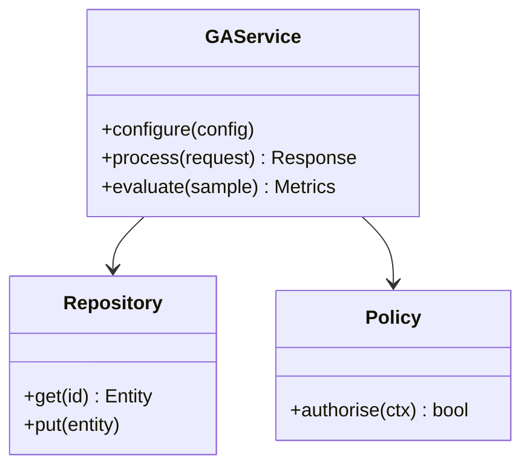

**Figure 19. Class - The GenAI Reference Architecture** (mermaid). Figure: Class view for Generative AI. This diagram illustrates the principal components and their interactions as discussed in the surrounding section.

<div class="diagram-svg">

<svg xmlns="http://www.w3.org/2000/svg" width="760" height="380" viewBox="0 0 760 380" font-family="Inter, Segoe UI, Arial, sans-serif">
<defs><marker id="arrow" markerWidth="10" markerHeight="10" refX="8" refY="3" orient="auto" markerUnits="strokeWidth"><path d="M0,0 L8,3 L0,6 z" fill="#94a3b8"/></marker><marker id="arrowA" markerWidth="10" markerHeight="10" refX="8" refY="3" orient="auto" markerUnits="strokeWidth"><path d="M0,0 L8,3 L0,6 z" fill="#4338ca"/></marker></defs>
<rect width="760" height="380" rx="12" fill="#f8fafc"/>
<text x="380" y="30" text-anchor="middle" font-size="17" font-weight="700" fill="#0f172a">Capability Map - The GenAI Reference Architecture</text>
<circle cx="380.0" cy="198.0" r="46" fill="#0f172a"/>
<text x="380.0" y="202.0" text-anchor="middle" font-size="12" font-weight="700" fill="#ffffff">Generative AI</text>
<line x1="380.0" y1="152.0" x2="380.0" y2="92.0" stroke="#94a3b8" stroke-width="2" marker-end="url(#arrow)"/>
<rect x="306.0" y="58.0" width="148" height="44" rx="10" fill="#ffffff" stroke="#4338ca" stroke-width="2"/><text x="380.0" y="83.74" text-anchor="middle" font-size="11" font-weight="600" fill="#0f172a">Generative Modelling Fo…</text>
<line x1="419.83716857408416" y1="175.0" x2="575.7217412552832" y2="145.0" stroke="#94a3b8" stroke-width="2" marker-end="url(#arrow)"/>
<rect x="522.5063509461097" y="117.0" width="148" height="44" rx="10" fill="#ffffff" stroke="#7c3aed" stroke-width="2"/><text x="596.5063509461097" y="142.74" text-anchor="middle" font-size="11" font-weight="600" fill="#0f172a">Large Language Models a…</text>
<line x1="419.83716857408416" y1="221.0" x2="575.7217412552832" y2="251.0" stroke="#94a3b8" stroke-width="2" marker-end="url(#arrow)"/>
<rect x="522.5063509461097" y="235.0" width="148" height="44" rx="10" fill="#ffffff" stroke="#0891b2" stroke-width="2"/><text x="596.5063509461097" y="260.74" text-anchor="middle" font-size="11" font-weight="600" fill="#0f172a">Diffusion Models for Im…</text>
<line x1="380.0" y1="244.0" x2="380.0" y2="304.0" stroke="#94a3b8" stroke-width="2" marker-end="url(#arrow)"/>
<rect x="306.0" y="294.0" width="148" height="44" rx="10" fill="#ffffff" stroke="#059669" stroke-width="2"/><text x="380.0" y="319.74" text-anchor="middle" font-size="11" font-weight="600" fill="#0f172a">Multimodal Generation</text>
<line x1="340.16283142591584" y1="221.0" x2="184.2782587447169" y2="251.00000000000006" stroke="#94a3b8" stroke-width="2" marker-end="url(#arrow)"/>
<rect x="89.49364905389038" y="235.00000000000006" width="148" height="44" rx="10" fill="#ffffff" stroke="#d97706" stroke-width="2"/><text x="163.49364905389038" y="260.74000000000007" text-anchor="middle" font-size="11" font-weight="600" fill="#0f172a">Grounding with Enterpri…</text>
<line x1="340.16283142591584" y1="175.0" x2="184.27825874471688" y2="145.0" stroke="#94a3b8" stroke-width="2" marker-end="url(#arrow)"/>
<rect x="89.49364905389035" y="117.0" width="148" height="44" rx="10" fill="#ffffff" stroke="#dc2626" stroke-width="2"/><text x="163.49364905389035" y="142.74" text-anchor="middle" font-size="11" font-weight="600" fill="#0f172a">Controllability and Str…</text>
</svg>

</div>

**Figure 20. Capability Map - The GenAI Reference Architecture** (svg). Figure: Capability Map view for Generative AI. This diagram illustrates the principal components and their interactions as discussed in the surrounding section.

## Deep Dive: Mechanics, Variants and Trade-offs

Having established the essentials, we now go deeper into the genai reference architecture. Mechanically, the behaviour emerges from a few interacting parts that are simpler than the whole they produce. The distinctions in this section are the ones that separate a working demo from a system that holds up under adversarial inputs, scale and the passage of time.

Consider the principal variants and how to choose between them. Each variant optimises for a different point in the design space - some for latency, some for accuracy, some for cost or operability - and the correct choice follows from explicit requirements rather than from defaults. There is an inherent trade-off between fidelity and cost, and the correct balance depends on the use case and its tolerance for error.

In practice this is supported by a mature tooling ecosystem, including OpenAI API, Anthropic Claude, LangChain, LlamaIndex. Tools accelerate the work but do not substitute for understanding: the same principles apply whichever implementation you select, and the ability to reason from first principles is what lets you debug when a tool behaves unexpectedly.

A frequent source of subtle bugs is the interaction with diffusion models for images and audio. Because diffusion models for images and audio concerns forward/reverse diffusion, denoising objectives, latent diffusion and classifier-free guidance, changes there can silently alter the behaviour analysed here. The remedy is contract tests at the boundary and end-to-end evaluations that exercise the interaction explicitly.

Finally, attend to edge cases and degradation. Define what the system should do under partial failure, unexpected inputs and load spikes, and make that behaviour explicit and tested rather than emergent. Graceful degradation - returning a safe, useful result when the ideal one is unavailable - is a hallmark of mature engineering.

For deeper study, the literature offers authoritative treatments such as Ho et al. — Denoising Diffusion Probabilistic Models (2020) and Brown et al. — Language Models are Few-Shot Learners (2020). These primary sources reward careful reading and ground the practical guidance above in established results.

## Advanced Considerations

Having established the essentials, we now go deeper into the genai reference architecture. The underlying mechanism is best appreciated by tracing a single request from input to output and noting where state is created and consumed. The distinctions in this section are the ones that separate a working demo from a system that holds up under adversarial inputs, scale and the passage of time.

Consider the principal variants and how to choose between them. Each variant optimises for a different point in the design space - some for latency, some for accuracy, some for cost or operability - and the correct choice follows from explicit requirements rather than from defaults. There is an inherent trade-off between fidelity and cost, and the correct balance depends on the use case and its tolerance for error.

In practice this is supported by a mature tooling ecosystem, including OpenAI API, Anthropic Claude, LangChain, LlamaIndex. Tools accelerate the work but do not substitute for understanding: the same principles apply whichever implementation you select, and the ability to reason from first principles is what lets you debug when a tool behaves unexpectedly.

A frequent source of subtle bugs is the interaction with governance and intellectual property. Because governance and intellectual property concerns provenance, watermarking, licensing and the legal landscape of generated content, changes there can silently alter the behaviour analysed here. The remedy is contract tests at the boundary and end-to-end evaluations that exercise the interaction explicitly.

Finally, attend to edge cases and degradation. Define what the system should do under partial failure, unexpected inputs and load spikes, and make that behaviour explicit and tested rather than emergent. Graceful degradation - returning a safe, useful result when the ideal one is unavailable - is a hallmark of mature engineering.

For deeper study, the literature offers authoritative treatments such as Ho et al. — Denoising Diffusion Probabilistic Models (2020) and Brown et al. — Language Models are Few-Shot Learners (2020). These primary sources reward careful reading and ground the practical guidance above in established results.

## Worked Example

A worked example clarifies how these ideas behave in practice. A marketing organisation needs brand-safe content generation with human-in-the-loop review. They decide to apply the genai reference architecture as part of their Generative AI solution, but wisely treat it as a hypothesis to be validated rather than a foregone conclusion.

The team begins by stating the objective precisely and defining how success will be measured before writing any code. They establish a small but representative evaluation set, agree on acceptance thresholds, and only then prototype the simplest design that could work. Early measurement reveals which assumptions hold and which must be revised, saving weeks of misdirected effort and surfacing edge cases while they are still cheap to fix.

As the prototype matures into a service, the team hardens it: adding input validation, error handling, caching where it pays off, and monitoring that ties back to the original success metric. They document each significant decision in an architecture decision record so that future maintainers understand not just what was built but why.

The outcome is instructive. The system that reaches production is not the most sophisticated design the team considered, but the one whose behaviour they could measure, explain and operate. This is the recurring lesson of Generative AI: durable value comes from the whole system, not from any single clever component.

## Industry Use Cases

Across industries, the ideas in this chapter recur in recognisable ways. The following vignettes show how different sectors apply them and what they have in common.

**Legal.** Contract drafting and clause extraction with citation back to source. The common thread is that value comes not from the model alone but from the surrounding system - data quality, evaluation, integration and operations - which is precisely where most of the engineering effort belongs.

**Software.** Code generation, refactoring and test synthesis inside the IDE. The common thread is that value comes not from the model alone but from the surrounding system - data quality, evaluation, integration and operations - which is precisely where most of the engineering effort belongs.

**Marketing.** Brand-safe content generation with human-in-the-loop review. The common thread is that value comes not from the model alone but from the surrounding system - data quality, evaluation, integration and operations - which is precisely where most of the engineering effort belongs.

**Customer Service.** Grounded assistants that resolve tickets with cited policy. The common thread is that value comes not from the model alone but from the surrounding system - data quality, evaluation, integration and operations - which is precisely where most of the engineering effort belongs.

## Best Practices

The following practices consistently separate successful Generative AI efforts from struggling ones. They are deliberately concrete so they can be adopted as checklist items in design and code review.

- Treat prompts as versioned, tested artefacts under source control.
- Always ground high-stakes generations in retrieved, citable sources.
- Define explicit cost and latency budgets per use case and route accordingly.
- Run an automated evaluation suite on every prompt or model change.

None of these are exotic; they are the unglamorous disciplines that compound into reliability. The cost of adopting them is small compared with the cost of the incidents they prevent, and they become second nature with practice.

## Common Pitfalls

Equally instructive are the failure modes that recur in practice. Each pitfall below has a clear early warning sign and a known remedy, so treat them as a diagnostic checklist when something feels wrong:

- Shipping ungrounded generations into high-stakes workflows.
- Ignoring token cost growth as adoption scales.
- Relying on a single provider with no fallback or routing strategy.
- Evaluating only with anecdotes instead of a versioned test set.

The pattern is consistent: most failures stem from skipping measurement, conflating prototype and production standards, or deferring cross-cutting concerns such as security and cost until they become emergencies. Naming these traps in advance is the cheapest way to avoid them.

## Governance, Security and Cost Notes

No discussion of the genai reference architecture is complete without its governance, security and cost dimensions, which are too often deferred until they become emergencies. Treating them as first-class concerns from the outset is both cheaper and safer.

**Governance.** Classify the risk of this capability, document its intended and out-of-scope uses, and ensure decisions are traceable to satisfy internal policy and external regulation such as the NIST AI RMF, ISO/IEC 42001 and the EU AI Act. **Security.** Treat all external input as untrusted, validate outputs before acting on them, apply least privilege to any tools or data access, and map controls to the OWASP LLM Top 10 and MITRE ATLAS.

**Cost and sustainability.** Establish explicit budgets for compute, tokens and latency, attribute spend to owners, and revisit the economics as usage scales - a design that is affordable at pilot scale can become untenable at production volume. Building these reflexes into everyday engineering is what allows a Generative AI system to be not only capable but also trustworthy and economically sound.

## Hands-On Exercises

Work through the following exercises. They are designed to move understanding from recognition to application - the level required for real engineering work - so prefer writing and building over merely reading.

1. Explain the genai reference architecture to a colleague unfamiliar with Generative AI, using a concrete example from your own domain.
2. Sketch a reference architecture that incorporates the genai reference architecture and annotate where observability, security and cost controls belong.
3. Design an evaluation that would tell you whether the genai reference architecture is working in production, including the metric, the dataset and the acceptance threshold.
4. Identify two pitfalls relevant to the genai reference architecture in your environment and describe the early warning signals you would monitor.
5. Prototype the simplest implementation that demonstrates the genai reference architecture, then list exactly what would need to change to make it production-ready.

## Key Takeaways

Key takeaways from this chapter:

- The GenAI Reference Architecture is a systems concern in Generative AI: data, models and operations must be co-designed.
- Measurement is non-negotiable; define success metrics and evaluation before building.
- Favour the simplest design that meets the requirement, and add complexity only when evidence demands it.
- Security, cost and observability are first-class requirements, not afterthoughts.
- Document decisions so the system remains understandable and operable as it evolves.

## Code Walkthrough

Every change to a Generative AI system should pass an evaluation gate. This example shows the minimal shape: align predictions and references, compute a metric, and return a pass/fail decision for CI.

The full listing is shown below; study it line by line and reproduce it locally before moving on.

### Listing: Evaluating The GenAI Reference Architecture with a regression gate

```python
from dataclasses import dataclass


@dataclass
class EvalResult:
    metric: str
    score: float
    passed: bool


def evaluate(predictions: list[str], references: list[str],
             threshold: float = 0.8) -> EvalResult:
    """Score The GenAI Reference Architecture output against references with a simple exact-match metric.

    In practice you would combine several metrics (exact match, semantic
    similarity, LLM-as-judge) and gate releases on the aggregate.
    """
    if len(predictions) != len(references):
        raise ValueError("predictions and references must align")
    hits = sum(p.strip() == r.strip() for p, r in zip(predictions, references))
    score = hits / len(references) if references else 0.0
    return EvalResult(metric="exact_match", score=score, passed=score >= threshold)


if __name__ == "__main__":
    result = evaluate(["yes", "no"], ["yes", "yes"])
    print(f"{result.metric}={result.score:.2f} passed={result.passed}")

```

## Review Questions

1. In the context of Generative AI, which statement best describes “The GenAI Reference Architecture”?
   - A. It eliminates the need for any evaluation or monitoring.
   - B. It applies exclusively to image data.
   - C. It removes all security and governance requirements.
   - D. Gateways, orchestration, retrieval, guardrails and evaluation as a cohesive platform.
   - **Answer: D.** The GenAI Reference Architecture: Gateways, orchestration, retrieval, guardrails and evaluation as a cohesive platform.
2. Which of the following is a recommended best practice when working with Generative AI?
   - A. Define explicit cost and latency budgets per use case and route accordingly.
   - B. Evaluating only with anecdotes instead of a versioned test set.
   - C. Shipping ungrounded generations into high-stakes workflows.
   - D. It removes all security and governance requirements.
   - **Answer: A.** Best practice: Define explicit cost and latency budgets per use case and route accordingly.
3. Which of the following is a common pitfall to avoid in Generative AI?
   - A. It guarantees deterministic output regardless of input.
   - B. Run an automated evaluation suite on every prompt or model change.
   - C. Relying on a single provider with no fallback or routing strategy.
   - D. It removes all security and governance requirements.
   - **Answer: C.** Pitfall to avoid: Relying on a single provider with no fallback or routing strategy.
4. *(Discussion)* How does The GenAI Reference Architecture interact with security and governance requirements?
   - **Model answer:** A strong answer defines the genai reference architecture (Gateways, orchestration, retrieval, guardrails and evaluation as a cohesive platform.) then connects it to architecture, evaluation, cost, security and operations for Generative AI, citing concrete trade-offs and a real-world example.

---


# Chapter 15. Putting It Together: A Reference Implementation

_This chapter examines putting it together: a reference implementation within Generative AI. It covers an end-to-end reference implementation that integrates the components of a Generative AI system into a cohesive, working whole, derives a reference architecture, walks through a worked example and runnable code, surveys industry use cases, and distils best practices and pitfalls, closing with exercises and review questions._

## Introduction

Putting It Together: A Reference Implementation refers to an end-to-end reference implementation that integrates the components of a Generative AI system into a cohesive, working whole. This concept recurs throughout the Generative AI lifecycle, from design to operations. What distinguishes a production-grade approach from a prototype is the discipline of measurement: every claim is backed by an evaluation rather than intuition.

This chapter builds intuition first, then formalises the ideas, derives an architecture, and finishes with code, exercises and review questions so the material transfers directly to your own Generative AI work. Read it actively: pause at each diagram, reproduce the code, and attempt the exercises before consulting the answers.

## Theory and Foundations

At its core, Putting It Together: A Reference Implementation concerns an end-to-end reference implementation that integrates the components of a Generative AI system into a cohesive, working whole. The right abstraction here pays compounding dividends, because downstream components depend on its guarantees. It pays to understand the mechanism rather than treat it as a black box, because most production incidents are explained by one of its steps misbehaving.

To place this in context, recall the broader picture: Generative AI refers to models that synthesise novel content—text, images, audio, code and structured data—by learning the distribution of training data and sampling from it. Within that picture, putting it together: a reference implementation is one of the load-bearing ideas - the kind that, when understood deeply, makes the rest of Generative AI fall into place. This concept recurs throughout the Generative AI lifecycle, from design to operations.

Putting It Together: A Reference Implementation cannot be understood in isolation from large language models as generators. Recall that large language models as generators concerns next-token prediction, sampling strategies (temperature, top-k, top-p) and the emergence of instruction following. The two interact directly: decisions in one constrain the design space of the other, which is why mature teams reason about them together rather than sequentially. Simplicity is a feature. The simplest design that meets the requirement should be the default, with complexity added only when measurement justifies it.

Putting It Together: A Reference Implementation cannot be understood in isolation from productionising generative applications. Recall that productionising generative applications concerns prompt management, versioning, observability and continuous evaluation in CI. The two interact directly: decisions in one constrain the design space of the other, which is why mature teams reason about them together rather than sequentially. Latency, accuracy and cost form a tension triangle: improving one typically pressures the others, so explicit budgets are essential.

Several established patterns apply directly to putting it together: a reference implementation. The first, model gateway abstracting multiple providers behind one api, is widely adopted because it makes the system's behaviour predictable and observable. A complementary pattern, retrieval-augmented grounding to reduce hallucination, addresses a related concern and is often deployed alongside it. Patterns are not dogma; they are distilled experience that shortcuts the search for a sound design, and each carries assumptions worth checking against your context.

It is worth being explicit about when to apply this and when to reach for something simpler. In a small prototype, shortcuts around putting it together: a reference implementation are invisible; in a production Generative AI system serving real traffic, they surface as incidents, cost overruns or compliance gaps. As with most architectural decisions, the choice is rarely binary; the skill lies in quantifying the trade-offs and choosing deliberately. The remainder of this chapter turns these principles into an architecture, code and a checklist you can apply immediately.

## Architecture and Design

From an architectural standpoint, Putting It Together: A Reference Implementation sits at the intersection of data, models and operations. A production generative-AI platform places a model gateway in front of one or more foundation models, with orchestration handling prompt assembly, retrieval, tool calls and guardrails. A semantic cache reduces cost and latency, an evaluation service scores responses offline and online, and an observability layer captures prompts, completions, tokens, cost and quality signals for every request.

Concretely, the principal building blocks include generative modelling foundations, large language models as generators, diffusion models for images and audio, multimodal generation and grounding with enterprise data. Each is a replaceable component behind a stable interface, so the team can upgrade an implementation - a model, an index, a policy engine - without rewriting its neighbours. The contracts between components are where reliability is won or lost, so they are specified explicitly and tested in isolation.

The diagram accompanying this section makes the data and control flow explicit. Requests enter through a well-defined boundary where they are authenticated and validated; only then are they dispatched to the components that perform the work. This boundary is also where rate limiting, quota enforcement and audit logging live, keeping cross-cutting concerns out of the core logic and in one auditable place.

Two qualities deserve emphasis. First, observability is designed in, not bolted on: every component emits structured telemetry so that failures can be localised in minutes rather than hours. Second, the architecture is evolvable - components communicate through stable contracts so that any single part of the Generative AI system can be replaced without a rewrite. As with most architectural decisions, the choice is rarely binary; the skill lies in quantifying the trade-offs and choosing deliberately.

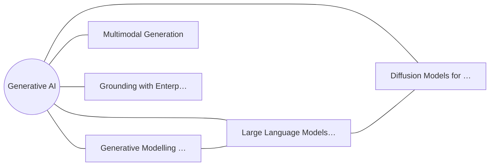

**Figure 21. Capability Map - Putting It Together: A Reference Implementation** (mermaid). Figure: Capability Map view for Generative AI. This diagram illustrates the principal components and their interactions as discussed in the surrounding section.

## Deep Dive: Mechanics, Variants and Trade-offs

Having established the essentials, we now go deeper into putting it together: a reference implementation. Beneath the abstraction lies a concrete process whose steps can each be measured, tested and optimised independently. The distinctions in this section are the ones that separate a working demo from a system that holds up under adversarial inputs, scale and the passage of time.

Consider the principal variants and how to choose between them. Each variant optimises for a different point in the design space - some for latency, some for accuracy, some for cost or operability - and the correct choice follows from explicit requirements rather than from defaults. There is an inherent trade-off between fidelity and cost, and the correct balance depends on the use case and its tolerance for error.

In practice this is supported by a mature tooling ecosystem, including OpenAI API, Anthropic Claude, LangChain, LlamaIndex. Tools accelerate the work but do not substitute for understanding: the same principles apply whichever implementation you select, and the ability to reason from first principles is what lets you debug when a tool behaves unexpectedly.

A frequent source of subtle bugs is the interaction with large language models as generators. Because large language models as generators concerns next-token prediction, sampling strategies (temperature, top-k, top-p) and the emergence of instruction following, changes there can silently alter the behaviour analysed here. The remedy is contract tests at the boundary and end-to-end evaluations that exercise the interaction explicitly.

Finally, attend to edge cases and degradation. Define what the system should do under partial failure, unexpected inputs and load spikes, and make that behaviour explicit and tested rather than emergent. Graceful degradation - returning a safe, useful result when the ideal one is unavailable - is a hallmark of mature engineering.

For deeper study, the literature offers authoritative treatments such as Ho et al. — Denoising Diffusion Probabilistic Models (2020) and Brown et al. — Language Models are Few-Shot Learners (2020). These primary sources reward careful reading and ground the practical guidance above in established results.

## Advanced Considerations

Having established the essentials, we now go deeper into putting it together: a reference implementation. The underlying mechanism is best appreciated by tracing a single request from input to output and noting where state is created and consumed. The distinctions in this section are the ones that separate a working demo from a system that holds up under adversarial inputs, scale and the passage of time.

Consider the principal variants and how to choose between them. Each variant optimises for a different point in the design space - some for latency, some for accuracy, some for cost or operability - and the correct choice follows from explicit requirements rather than from defaults. Simplicity is a feature. The simplest design that meets the requirement should be the default, with complexity added only when measurement justifies it.

In practice this is supported by a mature tooling ecosystem, including OpenAI API, Anthropic Claude, LangChain, LlamaIndex. Tools accelerate the work but do not substitute for understanding: the same principles apply whichever implementation you select, and the ability to reason from first principles is what lets you debug when a tool behaves unexpectedly.

A frequent source of subtle bugs is the interaction with diffusion models for images and audio. Because diffusion models for images and audio concerns forward/reverse diffusion, denoising objectives, latent diffusion and classifier-free guidance, changes there can silently alter the behaviour analysed here. The remedy is contract tests at the boundary and end-to-end evaluations that exercise the interaction explicitly.

Finally, attend to edge cases and degradation. Define what the system should do under partial failure, unexpected inputs and load spikes, and make that behaviour explicit and tested rather than emergent. Graceful degradation - returning a safe, useful result when the ideal one is unavailable - is a hallmark of mature engineering.

For deeper study, the literature offers authoritative treatments such as Ho et al. — Denoising Diffusion Probabilistic Models (2020) and Brown et al. — Language Models are Few-Shot Learners (2020). These primary sources reward careful reading and ground the practical guidance above in established results.

## Worked Example

To ground the discussion, walk through a representative example. A software organisation needs code generation, refactoring and test synthesis inside the IDE. They decide to apply putting it together: a reference implementation as part of their Generative AI solution, but wisely treat it as a hypothesis to be validated rather than a foregone conclusion.

The team begins by stating the objective precisely and defining how success will be measured before writing any code. They establish a small but representative evaluation set, agree on acceptance thresholds, and only then prototype the simplest design that could work. Early measurement reveals which assumptions hold and which must be revised, saving weeks of misdirected effort and surfacing edge cases while they are still cheap to fix.

As the prototype matures into a service, the team hardens it: adding input validation, error handling, caching where it pays off, and monitoring that ties back to the original success metric. They document each significant decision in an architecture decision record so that future maintainers understand not just what was built but why.

The outcome is instructive. The system that reaches production is not the most sophisticated design the team considered, but the one whose behaviour they could measure, explain and operate. This is the recurring lesson of Generative AI: durable value comes from the whole system, not from any single clever component.

## Industry Use Cases

Across industries, the ideas in this chapter recur in recognisable ways. The following vignettes show how different sectors apply them and what they have in common.

**Legal.** Contract drafting and clause extraction with citation back to source. The common thread is that value comes not from the model alone but from the surrounding system - data quality, evaluation, integration and operations - which is precisely where most of the engineering effort belongs.

**Software.** Code generation, refactoring and test synthesis inside the IDE. The common thread is that value comes not from the model alone but from the surrounding system - data quality, evaluation, integration and operations - which is precisely where most of the engineering effort belongs.

**Marketing.** Brand-safe content generation with human-in-the-loop review. The common thread is that value comes not from the model alone but from the surrounding system - data quality, evaluation, integration and operations - which is precisely where most of the engineering effort belongs.

**Customer Service.** Grounded assistants that resolve tickets with cited policy. The common thread is that value comes not from the model alone but from the surrounding system - data quality, evaluation, integration and operations - which is precisely where most of the engineering effort belongs.

## Best Practices

The following practices consistently separate successful Generative AI efforts from struggling ones. They are deliberately concrete so they can be adopted as checklist items in design and code review.

- Treat prompts as versioned, tested artefacts under source control.
- Always ground high-stakes generations in retrieved, citable sources.
- Define explicit cost and latency budgets per use case and route accordingly.
- Run an automated evaluation suite on every prompt or model change.

None of these are exotic; they are the unglamorous disciplines that compound into reliability. The cost of adopting them is small compared with the cost of the incidents they prevent, and they become second nature with practice.

## Common Pitfalls

Equally instructive are the failure modes that recur in practice. Each pitfall below has a clear early warning sign and a known remedy, so treat them as a diagnostic checklist when something feels wrong:

- Shipping ungrounded generations into high-stakes workflows.
- Ignoring token cost growth as adoption scales.
- Relying on a single provider with no fallback or routing strategy.
- Evaluating only with anecdotes instead of a versioned test set.

The pattern is consistent: most failures stem from skipping measurement, conflating prototype and production standards, or deferring cross-cutting concerns such as security and cost until they become emergencies. Naming these traps in advance is the cheapest way to avoid them.

## Governance, Security and Cost Notes

No discussion of putting it together: a reference implementation is complete without its governance, security and cost dimensions, which are too often deferred until they become emergencies. Treating them as first-class concerns from the outset is both cheaper and safer.

**Governance.** Classify the risk of this capability, document its intended and out-of-scope uses, and ensure decisions are traceable to satisfy internal policy and external regulation such as the NIST AI RMF, ISO/IEC 42001 and the EU AI Act. **Security.** Treat all external input as untrusted, validate outputs before acting on them, apply least privilege to any tools or data access, and map controls to the OWASP LLM Top 10 and MITRE ATLAS.

**Cost and sustainability.** Establish explicit budgets for compute, tokens and latency, attribute spend to owners, and revisit the economics as usage scales - a design that is affordable at pilot scale can become untenable at production volume. Building these reflexes into everyday engineering is what allows a Generative AI system to be not only capable but also trustworthy and economically sound.

## Hands-On Exercises

Work through the following exercises. They are designed to move understanding from recognition to application - the level required for real engineering work - so prefer writing and building over merely reading.

1. Explain putting it together: a reference implementation to a colleague unfamiliar with Generative AI, using a concrete example from your own domain.
2. Sketch a reference architecture that incorporates putting it together: a reference implementation and annotate where observability, security and cost controls belong.
3. Design an evaluation that would tell you whether putting it together: a reference implementation is working in production, including the metric, the dataset and the acceptance threshold.
4. Identify two pitfalls relevant to putting it together: a reference implementation in your environment and describe the early warning signals you would monitor.
5. Prototype the simplest implementation that demonstrates putting it together: a reference implementation, then list exactly what would need to change to make it production-ready.

## Key Takeaways

Key takeaways from this chapter:

- Putting It Together: A Reference Implementation is a systems concern in Generative AI: data, models and operations must be co-designed.
- Measurement is non-negotiable; define success metrics and evaluation before building.
- Favour the simplest design that meets the requirement, and add complexity only when evidence demands it.
- Security, cost and observability are first-class requirements, not afterthoughts.
- Document decisions so the system remains understandable and operable as it evolves.

## Code Walkthrough

Every change to a Generative AI system should pass an evaluation gate. This example shows the minimal shape: align predictions and references, compute a metric, and return a pass/fail decision for CI.

The full listing is shown below; study it line by line and reproduce it locally before moving on.

### Listing: Evaluating Putting It Together: A Reference Implementation with a regression gate

```python
from dataclasses import dataclass


@dataclass
class EvalResult:
    metric: str
    score: float
    passed: bool


def evaluate(predictions: list[str], references: list[str],
             threshold: float = 0.8) -> EvalResult:
    """Score Putting It Together: A Reference Implementation output against references with a simple exact-match metric.

    In practice you would combine several metrics (exact match, semantic
    similarity, LLM-as-judge) and gate releases on the aggregate.
    """
    if len(predictions) != len(references):
        raise ValueError("predictions and references must align")
    hits = sum(p.strip() == r.strip() for p, r in zip(predictions, references))
    score = hits / len(references) if references else 0.0
    return EvalResult(metric="exact_match", score=score, passed=score >= threshold)


if __name__ == "__main__":
    result = evaluate(["yes", "no"], ["yes", "yes"])
    print(f"{result.metric}={result.score:.2f} passed={result.passed}")

```

## Review Questions

1. In the context of Generative AI, which statement best describes “Putting It Together: A Reference Implementation”?
   - A. It is only relevant to academic research, not production.
   - B. an end-to-end reference implementation that integrates the components of a Generative AI system into a cohesive, working whole
   - C. It eliminates the need for any evaluation or monitoring.
   - D. It removes all security and governance requirements.
   - **Answer: B.** Putting It Together: A Reference Implementation: an end-to-end reference implementation that integrates the components of a Generative AI system into a cohesive, working whole
2. Which of the following is a recommended best practice when working with Generative AI?
   - A. Shipping ungrounded generations into high-stakes workflows.
   - B. It removes all security and governance requirements.
   - C. Always ground high-stakes generations in retrieved, citable sources.
   - D. It applies exclusively to image data.
   - **Answer: C.** Best practice: Always ground high-stakes generations in retrieved, citable sources.
3. Which of the following is a common pitfall to avoid in Generative AI?
   - A. Run an automated evaluation suite on every prompt or model change.
   - B. Treat prompts as versioned, tested artefacts under source control.
   - C. Ignoring token cost growth as adoption scales.
   - D. It guarantees deterministic output regardless of input.
   - **Answer: C.** Pitfall to avoid: Ignoring token cost growth as adoption scales.
4. *(Discussion)* How does Putting It Together: A Reference Implementation interact with security and governance requirements?
   - **Model answer:** A strong answer defines putting it together: a reference implementation (an end-to-end reference implementation that integrates the components of a Generative AI system into a cohesive, working whole) then connects it to architecture, evaluation, cost, security and operations for Generative AI, citing concrete trade-offs and a real-world example.

---


# Chapter 16. Hands-On Lab: Building an End-to-End Generative AI System

_This chapter examines hands-on lab: building an end-to-end generative ai system within Generative AI. It covers a guided, build-along laboratory that constructs a functioning Generative AI system from first principles, derives a reference architecture, walks through a worked example and runnable code, surveys industry use cases, and distils best practices and pitfalls, closing with exercises and review questions._

## Introduction

In practical terms, Hands-On Lab: Building an End-to-End Generative AI System is best understood as a guided, build-along laboratory that constructs a functioning Generative AI system from first principles. It is foundational: later capabilities in Generative AI are built directly on top of it. Seasoned practitioners treat this as a systems problem, co-designing data, models and operations rather than optimising any one in isolation.

This chapter builds intuition first, then formalises the ideas, derives an architecture, and finishes with code, exercises and review questions so the material transfers directly to your own Generative AI work. Read it actively: pause at each diagram, reproduce the code, and attempt the exercises before consulting the answers.

## Theory and Foundations

Formally, Hands-On Lab: Building an End-to-End Generative AI System addresses a guided, build-along laboratory that constructs a functioning Generative AI system from first principles. The practical implication is that design choices here ripple through latency, cost and maintainability for the lifetime of the system. The underlying mechanism is best appreciated by tracing a single request from input to output and noting where state is created and consumed.

To place this in context, recall the broader picture: Generative AI refers to models that synthesise novel content—text, images, audio, code and structured data—by learning the distribution of training data and sampling from it. Within that picture, hands-on lab: building an end-to-end generative ai system is one of the load-bearing ideas - the kind that, when understood deeply, makes the rest of Generative AI fall into place. Understanding this matters because Generative AI systems succeed or fail on exactly these decisions.

Hands-On Lab: Building an End-to-End Generative AI System cannot be understood in isolation from diffusion models for images and audio. Recall that diffusion models for images and audio concerns forward/reverse diffusion, denoising objectives, latent diffusion and classifier-free guidance. The two interact directly: decisions in one constrain the design space of the other, which is why mature teams reason about them together rather than sequentially. Every added component buys capability at the price of operational surface area, and that bargain should be made consciously.

Hands-On Lab: Building an End-to-End Generative AI System cannot be understood in isolation from the genai reference architecture. Recall that the genai reference architecture concerns gateways, orchestration, retrieval, guardrails and evaluation as a cohesive platform. The two interact directly: decisions in one constrain the design space of the other, which is why mature teams reason about them together rather than sequentially. As with most architectural decisions, the choice is rarely binary; the skill lies in quantifying the trade-offs and choosing deliberately.

Several established patterns apply directly to hands-on lab: building an end-to-end generative ai system. The first, guardrail sandwich: validate inputs, constrain decoding, validate outputs, is widely adopted because it makes the system's behaviour predictable and observable. A complementary pattern, semantic caching keyed on normalised prompts and embeddings, addresses a related concern and is often deployed alongside it. Patterns are not dogma; they are distilled experience that shortcuts the search for a sound design, and each carries assumptions worth checking against your context.

Knowing when not to use a technique is as valuable as knowing how to use it. In a small prototype, shortcuts around hands-on lab: building an end-to-end generative ai system are invisible; in a production Generative AI system serving real traffic, they surface as incidents, cost overruns or compliance gaps. There is an inherent trade-off between fidelity and cost, and the correct balance depends on the use case and its tolerance for error. The remainder of this chapter turns these principles into an architecture, code and a checklist you can apply immediately.

## Architecture and Design

A robust architecture for Hands-On Lab: Building an End-to-End Generative AI System is layered so each part can evolve independently without destabilising the whole. A production generative-AI platform places a model gateway in front of one or more foundation models, with orchestration handling prompt assembly, retrieval, tool calls and guardrails. A semantic cache reduces cost and latency, an evaluation service scores responses offline and online, and an observability layer captures prompts, completions, tokens, cost and quality signals for every request.

Concretely, the principal building blocks include generative modelling foundations, large language models as generators, diffusion models for images and audio, multimodal generation and grounding with enterprise data. Each is a replaceable component behind a stable interface, so the team can upgrade an implementation - a model, an index, a policy engine - without rewriting its neighbours. The contracts between components are where reliability is won or lost, so they are specified explicitly and tested in isolation.

The diagram accompanying this section makes the data and control flow explicit. Requests enter through a well-defined boundary where they are authenticated and validated; only then are they dispatched to the components that perform the work. This boundary is also where rate limiting, quota enforcement and audit logging live, keeping cross-cutting concerns out of the core logic and in one auditable place.

Two qualities deserve emphasis. First, observability is designed in, not bolted on: every component emits structured telemetry so that failures can be localised in minutes rather than hours. Second, the architecture is evolvable - components communicate through stable contracts so that any single part of the Generative AI system can be replaced without a rewrite. Every added component buys capability at the price of operational surface area, and that bargain should be made consciously.

<div class="diagram-svg">

<svg xmlns="http://www.w3.org/2000/svg" width="760" height="380" viewBox="0 0 760 380" font-family="Inter, Segoe UI, Arial, sans-serif">
<defs><marker id="arrow" markerWidth="10" markerHeight="10" refX="8" refY="3" orient="auto" markerUnits="strokeWidth"><path d="M0,0 L8,3 L0,6 z" fill="#94a3b8"/></marker><marker id="arrowA" markerWidth="10" markerHeight="10" refX="8" refY="3" orient="auto" markerUnits="strokeWidth"><path d="M0,0 L8,3 L0,6 z" fill="#4338ca"/></marker></defs>
<rect width="760" height="380" rx="12" fill="#f8fafc"/>
<text x="380" y="30" text-anchor="middle" font-size="17" font-weight="700" fill="#0f172a">Data Flow - Hands-On Lab: Building an End-to-End Generative…</text>
<rect x="40.0" y="166.0" width="104" height="60" rx="10" fill="#ffffff" stroke="#4338ca" stroke-width="2"/><text x="92.0" y="200.08" text-anchor="middle" font-size="12" font-weight="600" fill="#0f172a">Sources</text>
<rect x="155.2" y="166.0" width="104" height="60" rx="10" fill="#ffffff" stroke="#7c3aed" stroke-width="2"/><text x="207.2" y="200.08" text-anchor="middle" font-size="12" font-weight="600" fill="#0f172a">Ingest</text>
<line x1="144.0" y1="196.0" x2="155.2" y2="196.0" stroke="#4338ca" stroke-width="2" marker-end="url(#arrowA)"/>
<rect x="270.4" y="166.0" width="104" height="60" rx="10" fill="#ffffff" stroke="#0891b2" stroke-width="2"/><text x="322.4" y="200.08" text-anchor="middle" font-size="12" font-weight="600" fill="#0f172a">Validate</text>
<line x1="259.2" y1="196.0" x2="270.4" y2="196.0" stroke="#4338ca" stroke-width="2" marker-end="url(#arrowA)"/>
<rect x="385.6" y="166.0" width="104" height="60" rx="10" fill="#ffffff" stroke="#059669" stroke-width="2"/><text x="437.6" y="200.08" text-anchor="middle" font-size="12" font-weight="600" fill="#0f172a">Transform</text>
<line x1="374.4" y1="196.0" x2="385.6" y2="196.0" stroke="#4338ca" stroke-width="2" marker-end="url(#arrowA)"/>
<rect x="500.8" y="166.0" width="104" height="60" rx="10" fill="#ffffff" stroke="#d97706" stroke-width="2"/><text x="552.8" y="200.08" text-anchor="middle" font-size="12" font-weight="600" fill="#0f172a">Index</text>
<line x1="489.6" y1="196.0" x2="500.8" y2="196.0" stroke="#4338ca" stroke-width="2" marker-end="url(#arrowA)"/>
<rect x="616.0" y="166.0" width="104" height="60" rx="10" fill="#ffffff" stroke="#dc2626" stroke-width="2"/><text x="668.0" y="200.08" text-anchor="middle" font-size="12" font-weight="600" fill="#0f172a">Serve</text>
<line x1="604.8" y1="196.0" x2="616.0" y2="196.0" stroke="#4338ca" stroke-width="2" marker-end="url(#arrowA)"/>
<path d="M668.0,226.0 q0,46 -288.0,46 q-288.0,0 -288.0,-46" fill="none" stroke="#cbd5e1" stroke-width="1.6" stroke-dasharray="5 4" marker-end="url(#arrow)"/>
<text x="380.0" y="288.0" text-anchor="middle" font-size="9.5" fill="#94a3b8">feedback / monitoring loop</text>
</svg>

</div>

**Figure 22. Data Flow - Hands-On Lab: Building an End-to-End Generative AI System** (svg). Figure: Data Flow view for Generative AI. This diagram illustrates the principal components and their interactions as discussed in the surrounding section.

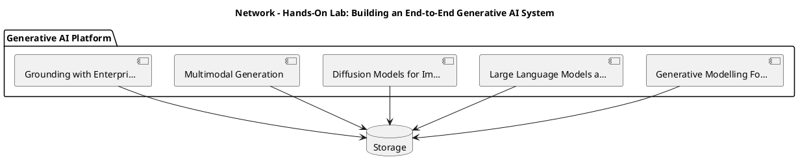

_Source diagram (plantuml); render with the appropriate tool._

**Figure 23. Network - Hands-On Lab: Building an End-to-End Generative AI System** (plantuml). Figure: Network view for Generative AI. This diagram illustrates the principal components and their interactions as discussed in the surrounding section.

## Deep Dive: Mechanics, Variants and Trade-offs

Having established the essentials, we now go deeper into hands-on lab: building an end-to-end generative ai system. Beneath the abstraction lies a concrete process whose steps can each be measured, tested and optimised independently. The distinctions in this section are the ones that separate a working demo from a system that holds up under adversarial inputs, scale and the passage of time.

Consider the principal variants and how to choose between them. Each variant optimises for a different point in the design space - some for latency, some for accuracy, some for cost or operability - and the correct choice follows from explicit requirements rather than from defaults. As with most architectural decisions, the choice is rarely binary; the skill lies in quantifying the trade-offs and choosing deliberately.

In practice this is supported by a mature tooling ecosystem, including OpenAI API, Anthropic Claude, LangChain, LlamaIndex. Tools accelerate the work but do not substitute for understanding: the same principles apply whichever implementation you select, and the ability to reason from first principles is what lets you debug when a tool behaves unexpectedly.

A frequent source of subtle bugs is the interaction with diffusion models for images and audio. Because diffusion models for images and audio concerns forward/reverse diffusion, denoising objectives, latent diffusion and classifier-free guidance, changes there can silently alter the behaviour analysed here. The remedy is contract tests at the boundary and end-to-end evaluations that exercise the interaction explicitly.

Finally, attend to edge cases and degradation. Define what the system should do under partial failure, unexpected inputs and load spikes, and make that behaviour explicit and tested rather than emergent. Graceful degradation - returning a safe, useful result when the ideal one is unavailable - is a hallmark of mature engineering.

For deeper study, the literature offers authoritative treatments such as Ho et al. — Denoising Diffusion Probabilistic Models (2020) and Brown et al. — Language Models are Few-Shot Learners (2020). These primary sources reward careful reading and ground the practical guidance above in established results.

## Advanced Considerations

Having established the essentials, we now go deeper into hands-on lab: building an end-to-end generative ai system. Mechanically, the behaviour emerges from a few interacting parts that are simpler than the whole they produce. The distinctions in this section are the ones that separate a working demo from a system that holds up under adversarial inputs, scale and the passage of time.

Consider the principal variants and how to choose between them. Each variant optimises for a different point in the design space - some for latency, some for accuracy, some for cost or operability - and the correct choice follows from explicit requirements rather than from defaults. Simplicity is a feature. The simplest design that meets the requirement should be the default, with complexity added only when measurement justifies it.

In practice this is supported by a mature tooling ecosystem, including OpenAI API, Anthropic Claude, LangChain, LlamaIndex. Tools accelerate the work but do not substitute for understanding: the same principles apply whichever implementation you select, and the ability to reason from first principles is what lets you debug when a tool behaves unexpectedly.

A frequent source of subtle bugs is the interaction with the genai reference architecture. Because the genai reference architecture concerns gateways, orchestration, retrieval, guardrails and evaluation as a cohesive platform, changes there can silently alter the behaviour analysed here. The remedy is contract tests at the boundary and end-to-end evaluations that exercise the interaction explicitly.

Finally, attend to edge cases and degradation. Define what the system should do under partial failure, unexpected inputs and load spikes, and make that behaviour explicit and tested rather than emergent. Graceful degradation - returning a safe, useful result when the ideal one is unavailable - is a hallmark of mature engineering.

For deeper study, the literature offers authoritative treatments such as Ho et al. — Denoising Diffusion Probabilistic Models (2020) and Brown et al. — Language Models are Few-Shot Learners (2020). These primary sources reward careful reading and ground the practical guidance above in established results.

## Worked Example

Consider a concrete scenario. A customer service organisation needs grounded assistants that resolve tickets with cited policy. They decide to apply hands-on lab: building an end-to-end generative ai system as part of their Generative AI solution, but wisely treat it as a hypothesis to be validated rather than a foregone conclusion.

The team begins by stating the objective precisely and defining how success will be measured before writing any code. They establish a small but representative evaluation set, agree on acceptance thresholds, and only then prototype the simplest design that could work. Early measurement reveals which assumptions hold and which must be revised, saving weeks of misdirected effort and surfacing edge cases while they are still cheap to fix.

As the prototype matures into a service, the team hardens it: adding input validation, error handling, caching where it pays off, and monitoring that ties back to the original success metric. They document each significant decision in an architecture decision record so that future maintainers understand not just what was built but why.

The outcome is instructive. The system that reaches production is not the most sophisticated design the team considered, but the one whose behaviour they could measure, explain and operate. This is the recurring lesson of Generative AI: durable value comes from the whole system, not from any single clever component.

## Industry Use Cases

Across industries, the ideas in this chapter recur in recognisable ways. The following vignettes show how different sectors apply them and what they have in common.

**Legal.** Contract drafting and clause extraction with citation back to source. The common thread is that value comes not from the model alone but from the surrounding system - data quality, evaluation, integration and operations - which is precisely where most of the engineering effort belongs.

**Software.** Code generation, refactoring and test synthesis inside the IDE. The common thread is that value comes not from the model alone but from the surrounding system - data quality, evaluation, integration and operations - which is precisely where most of the engineering effort belongs.

**Marketing.** Brand-safe content generation with human-in-the-loop review. The common thread is that value comes not from the model alone but from the surrounding system - data quality, evaluation, integration and operations - which is precisely where most of the engineering effort belongs.

**Customer Service.** Grounded assistants that resolve tickets with cited policy. The common thread is that value comes not from the model alone but from the surrounding system - data quality, evaluation, integration and operations - which is precisely where most of the engineering effort belongs.

## Best Practices

The following practices consistently separate successful Generative AI efforts from struggling ones. They are deliberately concrete so they can be adopted as checklist items in design and code review.

- Treat prompts as versioned, tested artefacts under source control.
- Always ground high-stakes generations in retrieved, citable sources.
- Define explicit cost and latency budgets per use case and route accordingly.
- Run an automated evaluation suite on every prompt or model change.

None of these are exotic; they are the unglamorous disciplines that compound into reliability. The cost of adopting them is small compared with the cost of the incidents they prevent, and they become second nature with practice.

## Common Pitfalls

Equally instructive are the failure modes that recur in practice. Each pitfall below has a clear early warning sign and a known remedy, so treat them as a diagnostic checklist when something feels wrong:

- Shipping ungrounded generations into high-stakes workflows.
- Ignoring token cost growth as adoption scales.
- Relying on a single provider with no fallback or routing strategy.
- Evaluating only with anecdotes instead of a versioned test set.

The pattern is consistent: most failures stem from skipping measurement, conflating prototype and production standards, or deferring cross-cutting concerns such as security and cost until they become emergencies. Naming these traps in advance is the cheapest way to avoid them.

## Governance, Security and Cost Notes

No discussion of hands-on lab: building an end-to-end generative ai system is complete without its governance, security and cost dimensions, which are too often deferred until they become emergencies. Treating them as first-class concerns from the outset is both cheaper and safer.

**Governance.** Classify the risk of this capability, document its intended and out-of-scope uses, and ensure decisions are traceable to satisfy internal policy and external regulation such as the NIST AI RMF, ISO/IEC 42001 and the EU AI Act. **Security.** Treat all external input as untrusted, validate outputs before acting on them, apply least privilege to any tools or data access, and map controls to the OWASP LLM Top 10 and MITRE ATLAS.

**Cost and sustainability.** Establish explicit budgets for compute, tokens and latency, attribute spend to owners, and revisit the economics as usage scales - a design that is affordable at pilot scale can become untenable at production volume. Building these reflexes into everyday engineering is what allows a Generative AI system to be not only capable but also trustworthy and economically sound.

## Hands-On Exercises

Work through the following exercises. They are designed to move understanding from recognition to application - the level required for real engineering work - so prefer writing and building over merely reading.

1. Explain hands-on lab: building an end-to-end generative ai system to a colleague unfamiliar with Generative AI, using a concrete example from your own domain.
2. Sketch a reference architecture that incorporates hands-on lab: building an end-to-end generative ai system and annotate where observability, security and cost controls belong.
3. Design an evaluation that would tell you whether hands-on lab: building an end-to-end generative ai system is working in production, including the metric, the dataset and the acceptance threshold.
4. Identify two pitfalls relevant to hands-on lab: building an end-to-end generative ai system in your environment and describe the early warning signals you would monitor.
5. Prototype the simplest implementation that demonstrates hands-on lab: building an end-to-end generative ai system, then list exactly what would need to change to make it production-ready.

## Key Takeaways

Key takeaways from this chapter:

- Hands-On Lab: Building an End-to-End Generative AI System is a systems concern in Generative AI: data, models and operations must be co-designed.
- Measurement is non-negotiable; define success metrics and evaluation before building.
- Favour the simplest design that meets the requirement, and add complexity only when evidence demands it.
- Security, cost and observability are first-class requirements, not afterthoughts.
- Document decisions so the system remains understandable and operable as it evolves.

## Code Walkthrough

Every change to a Generative AI system should pass an evaluation gate. This example shows the minimal shape: align predictions and references, compute a metric, and return a pass/fail decision for CI.

The full listing is shown below; study it line by line and reproduce it locally before moving on.

### Listing: Evaluating Hands-On Lab: Building an End-to-End Generative AI System with a regression gate

```python
from dataclasses import dataclass


@dataclass
class EvalResult:
    metric: str
    score: float
    passed: bool


def evaluate(predictions: list[str], references: list[str],
             threshold: float = 0.8) -> EvalResult:
    """Score Hands-On Lab: Building an End-to-End Generative AI System output against references with a simple exact-match metric.

    In practice you would combine several metrics (exact match, semantic
    similarity, LLM-as-judge) and gate releases on the aggregate.
    """
    if len(predictions) != len(references):
        raise ValueError("predictions and references must align")
    hits = sum(p.strip() == r.strip() for p, r in zip(predictions, references))
    score = hits / len(references) if references else 0.0
    return EvalResult(metric="exact_match", score=score, passed=score >= threshold)


if __name__ == "__main__":
    result = evaluate(["yes", "no"], ["yes", "yes"])
    print(f"{result.metric}={result.score:.2f} passed={result.passed}")

```

## Review Questions

1. In the context of Generative AI, which statement best describes “Hands-On Lab: Building an End-to-End Generative AI System”?
   - A. It applies exclusively to image data.
   - B. It eliminates the need for any evaluation or monitoring.
   - C. It is only relevant to academic research, not production.
   - D. a guided, build-along laboratory that constructs a functioning Generative AI system from first principles
   - **Answer: D.** Hands-On Lab: Building an End-to-End Generative AI System: a guided, build-along laboratory that constructs a functioning Generative AI system from first principles
2. Which of the following is a recommended best practice when working with Generative AI?
   - A. Always ground high-stakes generations in retrieved, citable sources.
   - B. It makes the system slower but has no other effect.
   - C. It eliminates the need for any evaluation or monitoring.
   - D. It applies exclusively to image data.
   - **Answer: A.** Best practice: Always ground high-stakes generations in retrieved, citable sources.
3. Which of the following is a common pitfall to avoid in Generative AI?
   - A. Always ground high-stakes generations in retrieved, citable sources.
   - B. It guarantees deterministic output regardless of input.
   - C. Evaluating only with anecdotes instead of a versioned test set.
   - D. It makes the system slower but has no other effect.
   - **Answer: C.** Pitfall to avoid: Evaluating only with anecdotes instead of a versioned test set.
4. *(Discussion)* How would you test and monitor Hands-On Lab: Building an End-to-End Generative AI System in production?
   - **Model answer:** A strong answer defines hands-on lab: building an end-to-end generative ai system (a guided, build-along laboratory that constructs a functioning Generative AI system from first principles) then connects it to architecture, evaluation, cost, security and operations for Generative AI, citing concrete trade-offs and a real-world example.

---


# Chapter 17. Case Study: Legal at Scale

_This chapter examines case study: legal at scale within Generative AI. It covers a detailed case study of deploying Generative AI in a demanding legal environment, including the decisions, trade-offs and outcomes, derives a reference architecture, walks through a worked example and runnable code, surveys industry use cases, and distils best practices and pitfalls, closing with exercises and review questions._

## Introduction

In practical terms, Case Study: Legal at Scale is best understood as a detailed case study of deploying Generative AI in a demanding legal environment, including the decisions, trade-offs and outcomes. It is foundational: later capabilities in Generative AI are built directly on top of it. In an enterprise setting, this translates into concrete requirements: clear interfaces, measurable quality, and controls that satisfy security and governance.

This chapter builds intuition first, then formalises the ideas, derives an architecture, and finishes with code, exercises and review questions so the material transfers directly to your own Generative AI work. Read it actively: pause at each diagram, reproduce the code, and attempt the exercises before consulting the answers.

## Theory and Foundations

Case Study: Legal at Scale refers to a detailed case study of deploying Generative AI in a demanding legal environment, including the decisions, trade-offs and outcomes. In an enterprise setting, this translates into concrete requirements: clear interfaces, measurable quality, and controls that satisfy security and governance. Beneath the abstraction lies a concrete process whose steps can each be measured, tested and optimised independently.

To place this in context, recall the broader picture: Generative AI refers to models that synthesise novel content—text, images, audio, code and structured data—by learning the distribution of training data and sampling from it. Within that picture, case study: legal at scale is one of the load-bearing ideas - the kind that, when understood deeply, makes the rest of Generative AI fall into place. Teams that master this consistently ship more reliable Generative AI systems at lower cost.

Case Study: Legal at Scale cannot be understood in isolation from evaluation of generative systems. Recall that evaluation of generative systems concerns reference-based and reference-free metrics, LLM-as-judge, human preference evaluation and red-teaming. The two interact directly: decisions in one constrain the design space of the other, which is why mature teams reason about them together rather than sequentially. Every added component buys capability at the price of operational surface area, and that bargain should be made consciously.

Case Study: Legal at Scale cannot be understood in isolation from cost, latency and throughput engineering. Recall that cost, latency and throughput engineering concerns token economics, caching, batching, distillation and routing across model tiers. The two interact directly: decisions in one constrain the design space of the other, which is why mature teams reason about them together rather than sequentially. Latency, accuracy and cost form a tension triangle: improving one typically pressures the others, so explicit budgets are essential.

Several established patterns apply directly to case study: legal at scale. The first, retrieval-augmented grounding to reduce hallucination, is widely adopted because it makes the system's behaviour predictable and observable. A complementary pattern, model gateway abstracting multiple providers behind one api, addresses a related concern and is often deployed alongside it. Patterns are not dogma; they are distilled experience that shortcuts the search for a sound design, and each carries assumptions worth checking against your context.

The decision of whether to adopt this should be driven by requirements, not by novelty. In a small prototype, shortcuts around case study: legal at scale are invisible; in a production Generative AI system serving real traffic, they surface as incidents, cost overruns or compliance gaps. Simplicity is a feature. The simplest design that meets the requirement should be the default, with complexity added only when measurement justifies it. The remainder of this chapter turns these principles into an architecture, code and a checklist you can apply immediately.

## Architecture and Design

The reference architecture for Case Study: Legal at Scale separates concerns into clearly bounded components with explicit contracts. A production generative-AI platform places a model gateway in front of one or more foundation models, with orchestration handling prompt assembly, retrieval, tool calls and guardrails. A semantic cache reduces cost and latency, an evaluation service scores responses offline and online, and an observability layer captures prompts, completions, tokens, cost and quality signals for every request.

Concretely, the principal building blocks include generative modelling foundations, large language models as generators, diffusion models for images and audio, multimodal generation and grounding with enterprise data. Each is a replaceable component behind a stable interface, so the team can upgrade an implementation - a model, an index, a policy engine - without rewriting its neighbours. The contracts between components are where reliability is won or lost, so they are specified explicitly and tested in isolation.

The diagram accompanying this section makes the data and control flow explicit. Requests enter through a well-defined boundary where they are authenticated and validated; only then are they dispatched to the components that perform the work. This boundary is also where rate limiting, quota enforcement and audit logging live, keeping cross-cutting concerns out of the core logic and in one auditable place.

Two qualities deserve emphasis. First, observability is designed in, not bolted on: every component emits structured telemetry so that failures can be localised in minutes rather than hours. Second, the architecture is evolvable - components communicate through stable contracts so that any single part of the Generative AI system can be replaced without a rewrite. There is an inherent trade-off between fidelity and cost, and the correct balance depends on the use case and its tolerance for error.

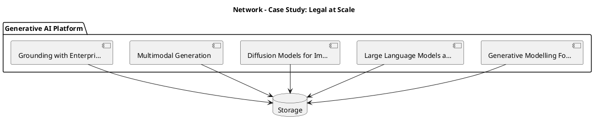

_Source diagram (plantuml); render with the appropriate tool._

**Figure 24. Network - Case Study: Legal at Scale** (plantuml). Figure: Network view for Generative AI. This diagram illustrates the principal components and their interactions as discussed in the surrounding section.

## Deep Dive: Mechanics, Variants and Trade-offs

Having established the essentials, we now go deeper into case study: legal at scale. Mechanically, the behaviour emerges from a few interacting parts that are simpler than the whole they produce. The distinctions in this section are the ones that separate a working demo from a system that holds up under adversarial inputs, scale and the passage of time.

Consider the principal variants and how to choose between them. Each variant optimises for a different point in the design space - some for latency, some for accuracy, some for cost or operability - and the correct choice follows from explicit requirements rather than from defaults. There is an inherent trade-off between fidelity and cost, and the correct balance depends on the use case and its tolerance for error.

In practice this is supported by a mature tooling ecosystem, including OpenAI API, Anthropic Claude, LangChain, LlamaIndex. Tools accelerate the work but do not substitute for understanding: the same principles apply whichever implementation you select, and the ability to reason from first principles is what lets you debug when a tool behaves unexpectedly.

A frequent source of subtle bugs is the interaction with evaluation of generative systems. Because evaluation of generative systems concerns reference-based and reference-free metrics, LLM-as-judge, human preference evaluation and red-teaming, changes there can silently alter the behaviour analysed here. The remedy is contract tests at the boundary and end-to-end evaluations that exercise the interaction explicitly.

Finally, attend to edge cases and degradation. Define what the system should do under partial failure, unexpected inputs and load spikes, and make that behaviour explicit and tested rather than emergent. Graceful degradation - returning a safe, useful result when the ideal one is unavailable - is a hallmark of mature engineering.

For deeper study, the literature offers authoritative treatments such as Ho et al. — Denoising Diffusion Probabilistic Models (2020) and Brown et al. — Language Models are Few-Shot Learners (2020). These primary sources reward careful reading and ground the practical guidance above in established results.

## Advanced Considerations

Having established the essentials, we now go deeper into case study: legal at scale. It pays to understand the mechanism rather than treat it as a black box, because most production incidents are explained by one of its steps misbehaving. The distinctions in this section are the ones that separate a working demo from a system that holds up under adversarial inputs, scale and the passage of time.

Consider the principal variants and how to choose between them. Each variant optimises for a different point in the design space - some for latency, some for accuracy, some for cost or operability - and the correct choice follows from explicit requirements rather than from defaults. There is an inherent trade-off between fidelity and cost, and the correct balance depends on the use case and its tolerance for error.

In practice this is supported by a mature tooling ecosystem, including OpenAI API, Anthropic Claude, LangChain, LlamaIndex. Tools accelerate the work but do not substitute for understanding: the same principles apply whichever implementation you select, and the ability to reason from first principles is what lets you debug when a tool behaves unexpectedly.

A frequent source of subtle bugs is the interaction with generative modelling foundations. Because generative modelling foundations concerns likelihood-based versus implicit models; autoregressive, diffusion and variational approaches and the trade-offs between fidelity and diversity, changes there can silently alter the behaviour analysed here. The remedy is contract tests at the boundary and end-to-end evaluations that exercise the interaction explicitly.

Finally, attend to edge cases and degradation. Define what the system should do under partial failure, unexpected inputs and load spikes, and make that behaviour explicit and tested rather than emergent. Graceful degradation - returning a safe, useful result when the ideal one is unavailable - is a hallmark of mature engineering.

For deeper study, the literature offers authoritative treatments such as Ho et al. — Denoising Diffusion Probabilistic Models (2020) and Brown et al. — Language Models are Few-Shot Learners (2020). These primary sources reward careful reading and ground the practical guidance above in established results.

## Worked Example

Consider a concrete scenario. A marketing organisation needs brand-safe content generation with human-in-the-loop review. They decide to apply case study: legal at scale as part of their Generative AI solution, but wisely treat it as a hypothesis to be validated rather than a foregone conclusion.

The team begins by stating the objective precisely and defining how success will be measured before writing any code. They establish a small but representative evaluation set, agree on acceptance thresholds, and only then prototype the simplest design that could work. Early measurement reveals which assumptions hold and which must be revised, saving weeks of misdirected effort and surfacing edge cases while they are still cheap to fix.

As the prototype matures into a service, the team hardens it: adding input validation, error handling, caching where it pays off, and monitoring that ties back to the original success metric. They document each significant decision in an architecture decision record so that future maintainers understand not just what was built but why.

The outcome is instructive. The system that reaches production is not the most sophisticated design the team considered, but the one whose behaviour they could measure, explain and operate. This is the recurring lesson of Generative AI: durable value comes from the whole system, not from any single clever component.

## Industry Use Cases

Across industries, the ideas in this chapter recur in recognisable ways. The following vignettes show how different sectors apply them and what they have in common.

**Legal.** Contract drafting and clause extraction with citation back to source. The common thread is that value comes not from the model alone but from the surrounding system - data quality, evaluation, integration and operations - which is precisely where most of the engineering effort belongs.

**Software.** Code generation, refactoring and test synthesis inside the IDE. The common thread is that value comes not from the model alone but from the surrounding system - data quality, evaluation, integration and operations - which is precisely where most of the engineering effort belongs.

**Marketing.** Brand-safe content generation with human-in-the-loop review. The common thread is that value comes not from the model alone but from the surrounding system - data quality, evaluation, integration and operations - which is precisely where most of the engineering effort belongs.

**Customer Service.** Grounded assistants that resolve tickets with cited policy. The common thread is that value comes not from the model alone but from the surrounding system - data quality, evaluation, integration and operations - which is precisely where most of the engineering effort belongs.

## Best Practices

The following practices consistently separate successful Generative AI efforts from struggling ones. They are deliberately concrete so they can be adopted as checklist items in design and code review.

- Treat prompts as versioned, tested artefacts under source control.
- Always ground high-stakes generations in retrieved, citable sources.
- Define explicit cost and latency budgets per use case and route accordingly.
- Run an automated evaluation suite on every prompt or model change.

None of these are exotic; they are the unglamorous disciplines that compound into reliability. The cost of adopting them is small compared with the cost of the incidents they prevent, and they become second nature with practice.

## Common Pitfalls

Equally instructive are the failure modes that recur in practice. Each pitfall below has a clear early warning sign and a known remedy, so treat them as a diagnostic checklist when something feels wrong:

- Shipping ungrounded generations into high-stakes workflows.
- Ignoring token cost growth as adoption scales.
- Relying on a single provider with no fallback or routing strategy.
- Evaluating only with anecdotes instead of a versioned test set.

The pattern is consistent: most failures stem from skipping measurement, conflating prototype and production standards, or deferring cross-cutting concerns such as security and cost until they become emergencies. Naming these traps in advance is the cheapest way to avoid them.

## Governance, Security and Cost Notes

No discussion of case study: legal at scale is complete without its governance, security and cost dimensions, which are too often deferred until they become emergencies. Treating them as first-class concerns from the outset is both cheaper and safer.

**Governance.** Classify the risk of this capability, document its intended and out-of-scope uses, and ensure decisions are traceable to satisfy internal policy and external regulation such as the NIST AI RMF, ISO/IEC 42001 and the EU AI Act. **Security.** Treat all external input as untrusted, validate outputs before acting on them, apply least privilege to any tools or data access, and map controls to the OWASP LLM Top 10 and MITRE ATLAS.

**Cost and sustainability.** Establish explicit budgets for compute, tokens and latency, attribute spend to owners, and revisit the economics as usage scales - a design that is affordable at pilot scale can become untenable at production volume. Building these reflexes into everyday engineering is what allows a Generative AI system to be not only capable but also trustworthy and economically sound.

## Hands-On Exercises

Work through the following exercises. They are designed to move understanding from recognition to application - the level required for real engineering work - so prefer writing and building over merely reading.

1. Explain case study: legal at scale to a colleague unfamiliar with Generative AI, using a concrete example from your own domain.
2. Sketch a reference architecture that incorporates case study: legal at scale and annotate where observability, security and cost controls belong.
3. Design an evaluation that would tell you whether case study: legal at scale is working in production, including the metric, the dataset and the acceptance threshold.
4. Identify two pitfalls relevant to case study: legal at scale in your environment and describe the early warning signals you would monitor.
5. Prototype the simplest implementation that demonstrates case study: legal at scale, then list exactly what would need to change to make it production-ready.

## Key Takeaways

Key takeaways from this chapter:

- Case Study: Legal at Scale is a systems concern in Generative AI: data, models and operations must be co-designed.
- Measurement is non-negotiable; define success metrics and evaluation before building.
- Favour the simplest design that meets the requirement, and add complexity only when evidence demands it.
- Security, cost and observability are first-class requirements, not afterthoughts.
- Document decisions so the system remains understandable and operable as it evolves.

## Code Walkthrough

Pipelines keep Case Study: Legal at Scale logic modular and testable. Each stage is a pure function, errors are captured per item, and the composition is trivial to extend or reorder.

The full listing is shown below; study it line by line and reproduce it locally before moving on.

### Listing: A composable processing pipeline for Case Study: Legal at Scale

```python
from collections.abc import Iterable, Iterator
from typing import Protocol


class Stage(Protocol):
    def __call__(self, item: dict) -> dict: ...


def pipeline(stages: list[Stage]) -> Stage:
    """Compose ordered stages into a single callable for Case Study: Legal at Scale."""

    def run(item: dict) -> dict:
        for stage in stages:
            item = stage(item)
        return item

    return run


def validate(item: dict) -> dict:
    if "text" not in item:
        raise ValueError("missing required field: text")
    return item


def normalise(item: dict) -> dict:
    item["text"] = item["text"].strip().lower()
    return item


def enrich(item: dict) -> dict:
    item["length"] = len(item["text"])
    return item


process = pipeline([validate, normalise, enrich])


def run_batch(items: Iterable[dict]) -> Iterator[dict]:
    for item in items:
        try:
            yield process(dict(item))
        except ValueError as exc:
            yield {"error": str(exc), "item": item}

```

## Review Questions

1. In the context of Generative AI, which statement best describes “Case Study: Legal at Scale”?
   - A. It eliminates the need for any evaluation or monitoring.
   - B. It removes all security and governance requirements.
   - C. a detailed case study of deploying Generative AI in a demanding legal environment, including the decisions, trade-offs and outcomes
   - D. It is only relevant to academic research, not production.
   - **Answer: C.** Case Study: Legal at Scale: a detailed case study of deploying Generative AI in a demanding legal environment, including the decisions, trade-offs and outcomes
2. Which of the following is a recommended best practice when working with Generative AI?
   - A. Run an automated evaluation suite on every prompt or model change.
   - B. It removes all security and governance requirements.
   - C. It applies exclusively to image data.
   - D. It eliminates the need for any evaluation or monitoring.
   - **Answer: A.** Best practice: Run an automated evaluation suite on every prompt or model change.
3. Which of the following is a common pitfall to avoid in Generative AI?
   - A. Run an automated evaluation suite on every prompt or model change.
   - B. It guarantees deterministic output regardless of input.
   - C. Ignoring token cost growth as adoption scales.
   - D. Always ground high-stakes generations in retrieved, citable sources.
   - **Answer: C.** Pitfall to avoid: Ignoring token cost growth as adoption scales.
4. *(Discussion)* How would you test and monitor Case Study: Legal at Scale in production?
   - **Model answer:** A strong answer defines case study: legal at scale (a detailed case study of deploying Generative AI in a demanding legal environment, including the decisions, trade-offs and outcomes) then connects it to architecture, evaluation, cost, security and operations for Generative AI, citing concrete trade-offs and a real-world example.

---


# Chapter 18. Operating in Production

_This chapter examines operating in production within Generative AI. It covers the operational discipline required to run a Generative AI system reliably, including monitoring, incident response and continuous improvement, derives a reference architecture, walks through a worked example and runnable code, surveys industry use cases, and distils best practices and pitfalls, closing with exercises and review questions._

## Introduction

Operating in Production can be characterised as the operational discipline required to run a Generative AI system reliably, including monitoring, incident response and continuous improvement. Understanding this matters because Generative AI systems succeed or fail on exactly these decisions. The right abstraction here pays compounding dividends, because downstream components depend on its guarantees.

This chapter builds intuition first, then formalises the ideas, derives an architecture, and finishes with code, exercises and review questions so the material transfers directly to your own Generative AI work. Read it actively: pause at each diagram, reproduce the code, and attempt the exercises before consulting the answers.

## Theory and Foundations

At its core, Operating in Production concerns the operational discipline required to run a Generative AI system reliably, including monitoring, incident response and continuous improvement. The practical implication is that design choices here ripple through latency, cost and maintainability for the lifetime of the system. Beneath the abstraction lies a concrete process whose steps can each be measured, tested and optimised independently.

To place this in context, recall the broader picture: Generative AI refers to models that synthesise novel content—text, images, audio, code and structured data—by learning the distribution of training data and sampling from it. Within that picture, operating in production is one of the load-bearing ideas - the kind that, when understood deeply, makes the rest of Generative AI fall into place. Teams that master this consistently ship more reliable Generative AI systems at lower cost.

Operating in Production cannot be understood in isolation from productionising generative applications. Recall that productionising generative applications concerns prompt management, versioning, observability and continuous evaluation in CI. The two interact directly: decisions in one constrain the design space of the other, which is why mature teams reason about them together rather than sequentially. Simplicity is a feature. The simplest design that meets the requirement should be the default, with complexity added only when measurement justifies it.

Operating in Production cannot be understood in isolation from diffusion models for images and audio. Recall that diffusion models for images and audio concerns forward/reverse diffusion, denoising objectives, latent diffusion and classifier-free guidance. The two interact directly: decisions in one constrain the design space of the other, which is why mature teams reason about them together rather than sequentially. Simplicity is a feature. The simplest design that meets the requirement should be the default, with complexity added only when measurement justifies it.

Several established patterns apply directly to operating in production. The first, semantic caching keyed on normalised prompts and embeddings, is widely adopted because it makes the system's behaviour predictable and observable. A complementary pattern, guardrail sandwich: validate inputs, constrain decoding, validate outputs, addresses a related concern and is often deployed alongside it. Patterns are not dogma; they are distilled experience that shortcuts the search for a sound design, and each carries assumptions worth checking against your context.

It is worth being explicit about when to apply this and when to reach for something simpler. In a small prototype, shortcuts around operating in production are invisible; in a production Generative AI system serving real traffic, they surface as incidents, cost overruns or compliance gaps. Simplicity is a feature. The simplest design that meets the requirement should be the default, with complexity added only when measurement justifies it. The remainder of this chapter turns these principles into an architecture, code and a checklist you can apply immediately.

## Architecture and Design

The reference architecture for Operating in Production separates concerns into clearly bounded components with explicit contracts. A production generative-AI platform places a model gateway in front of one or more foundation models, with orchestration handling prompt assembly, retrieval, tool calls and guardrails. A semantic cache reduces cost and latency, an evaluation service scores responses offline and online, and an observability layer captures prompts, completions, tokens, cost and quality signals for every request.

Concretely, the principal building blocks include generative modelling foundations, large language models as generators, diffusion models for images and audio, multimodal generation and grounding with enterprise data. Each is a replaceable component behind a stable interface, so the team can upgrade an implementation - a model, an index, a policy engine - without rewriting its neighbours. The contracts between components are where reliability is won or lost, so they are specified explicitly and tested in isolation.

The diagram accompanying this section makes the data and control flow explicit. Requests enter through a well-defined boundary where they are authenticated and validated; only then are they dispatched to the components that perform the work. This boundary is also where rate limiting, quota enforcement and audit logging live, keeping cross-cutting concerns out of the core logic and in one auditable place.

Two qualities deserve emphasis. First, observability is designed in, not bolted on: every component emits structured telemetry so that failures can be localised in minutes rather than hours. Second, the architecture is evolvable - components communicate through stable contracts so that any single part of the Generative AI system can be replaced without a rewrite. Every added component buys capability at the price of operational surface area, and that bargain should be made consciously.

```xml
<mxfile host="ai-university">
  <diagram name="Deployment">
    <mxGraphModel dx="800" dy="600" grid="1" gridSize="10">
      <root>
        <mxCell id="0"/>
        <mxCell id="1" parent="0"/>
        <mxCell id="title" value="Deployment - Operating in Production" style="text;fontSize=16;fontStyle=1" vertex="1" parent="1"><mxGeometry x="40" y="20" width="600" height="30" as="geometry"/></mxCell>
        <mxCell id="hub" value="Generative AI" style="rounded=1;fillColor=#0f172a;fontColor=#ffffff;fontStyle=1" vertex="1" parent="1"><mxGeometry x="300" y="180" width="160" height="60" as="geometry"/></mxCell>
        <mxCell id="n0" value="Generative Modelling Fo…" style="rounded=1;fillColor=#e0e7ff;strokeColor=#4338ca" vertex="1" parent="1"><mxGeometry x="60" y="80" width="160" height="50" as="geometry"/></mxCell>
        <mxCell id="e0" style="edgeStyle=orthogonalEdgeStyle" edge="1" parent="1" source="hub" target="n0"><mxGeometry relative="1" as="geometry"/></mxCell>
        <mxCell id="n1" value="Large Language Models a…" style="rounded=1;fillColor=#e0e7ff;strokeColor=#4338ca" vertex="1" parent="1"><mxGeometry x="600" y="170" width="160" height="50" as="geometry"/></mxCell>
        <mxCell id="e1" style="edgeStyle=orthogonalEdgeStyle" edge="1" parent="1" source="hub" target="n1"><mxGeometry relative="1" as="geometry"/></mxCell>
        <mxCell id="n2" value="Diffusion Models for Im…" style="rounded=1;fillColor=#e0e7ff;strokeColor=#4338ca" vertex="1" parent="1"><mxGeometry x="60" y="260" width="160" height="50" as="geometry"/></mxCell>
        <mxCell id="e2" style="edgeStyle=orthogonalEdgeStyle" edge="1" parent="1" source="hub" target="n2"><mxGeometry relative="1" as="geometry"/></mxCell>
        <mxCell id="n3" value="Multimodal Generation" style="rounded=1;fillColor=#e0e7ff;strokeColor=#4338ca" vertex="1" parent="1"><mxGeometry x="600" y="350" width="160" height="50" as="geometry"/></mxCell>
        <mxCell id="e3" style="edgeStyle=orthogonalEdgeStyle" edge="1" parent="1" source="hub" target="n3"><mxGeometry relative="1" as="geometry"/></mxCell>
        <mxCell id="n4" value="Grounding with Enterpri…" style="rounded=1;fillColor=#e0e7ff;strokeColor=#4338ca" vertex="1" parent="1"><mxGeometry x="60" y="440" width="160" height="50" as="geometry"/></mxCell>
        <mxCell id="e4" style="edgeStyle=orthogonalEdgeStyle" edge="1" parent="1" source="hub" target="n4"><mxGeometry relative="1" as="geometry"/></mxCell>
      </root>
    </mxGraphModel>
  </diagram>
</mxfile>
```

_Source diagram (drawio); render with the appropriate tool._

**Figure 25. Deployment - Operating in Production** (drawio). Figure: Deployment view for Generative AI. This diagram illustrates the principal components and their interactions as discussed in the surrounding section.

## Deep Dive: Mechanics, Variants and Trade-offs

Having established the essentials, we now go deeper into operating in production. Mechanically, the behaviour emerges from a few interacting parts that are simpler than the whole they produce. The distinctions in this section are the ones that separate a working demo from a system that holds up under adversarial inputs, scale and the passage of time.

Consider the principal variants and how to choose between them. Each variant optimises for a different point in the design space - some for latency, some for accuracy, some for cost or operability - and the correct choice follows from explicit requirements rather than from defaults. Simplicity is a feature. The simplest design that meets the requirement should be the default, with complexity added only when measurement justifies it.

In practice this is supported by a mature tooling ecosystem, including OpenAI API, Anthropic Claude, LangChain, LlamaIndex. Tools accelerate the work but do not substitute for understanding: the same principles apply whichever implementation you select, and the ability to reason from first principles is what lets you debug when a tool behaves unexpectedly.

A frequent source of subtle bugs is the interaction with productionising generative applications. Because productionising generative applications concerns prompt management, versioning, observability and continuous evaluation in CI, changes there can silently alter the behaviour analysed here. The remedy is contract tests at the boundary and end-to-end evaluations that exercise the interaction explicitly.

Finally, attend to edge cases and degradation. Define what the system should do under partial failure, unexpected inputs and load spikes, and make that behaviour explicit and tested rather than emergent. Graceful degradation - returning a safe, useful result when the ideal one is unavailable - is a hallmark of mature engineering.

For deeper study, the literature offers authoritative treatments such as Ho et al. — Denoising Diffusion Probabilistic Models (2020) and Brown et al. — Language Models are Few-Shot Learners (2020). These primary sources reward careful reading and ground the practical guidance above in established results.

## Advanced Considerations

Having established the essentials, we now go deeper into operating in production. Beneath the abstraction lies a concrete process whose steps can each be measured, tested and optimised independently. The distinctions in this section are the ones that separate a working demo from a system that holds up under adversarial inputs, scale and the passage of time.

Consider the principal variants and how to choose between them. Each variant optimises for a different point in the design space - some for latency, some for accuracy, some for cost or operability - and the correct choice follows from explicit requirements rather than from defaults. Every added component buys capability at the price of operational surface area, and that bargain should be made consciously.

In practice this is supported by a mature tooling ecosystem, including OpenAI API, Anthropic Claude, LangChain, LlamaIndex. Tools accelerate the work but do not substitute for understanding: the same principles apply whichever implementation you select, and the ability to reason from first principles is what lets you debug when a tool behaves unexpectedly.

A frequent source of subtle bugs is the interaction with the genai reference architecture. Because the genai reference architecture concerns gateways, orchestration, retrieval, guardrails and evaluation as a cohesive platform, changes there can silently alter the behaviour analysed here. The remedy is contract tests at the boundary and end-to-end evaluations that exercise the interaction explicitly.

Finally, attend to edge cases and degradation. Define what the system should do under partial failure, unexpected inputs and load spikes, and make that behaviour explicit and tested rather than emergent. Graceful degradation - returning a safe, useful result when the ideal one is unavailable - is a hallmark of mature engineering.

For deeper study, the literature offers authoritative treatments such as Ho et al. — Denoising Diffusion Probabilistic Models (2020) and Brown et al. — Language Models are Few-Shot Learners (2020). These primary sources reward careful reading and ground the practical guidance above in established results.

## Worked Example

A worked example clarifies how these ideas behave in practice. A marketing organisation needs brand-safe content generation with human-in-the-loop review. They decide to apply operating in production as part of their Generative AI solution, but wisely treat it as a hypothesis to be validated rather than a foregone conclusion.

The team begins by stating the objective precisely and defining how success will be measured before writing any code. They establish a small but representative evaluation set, agree on acceptance thresholds, and only then prototype the simplest design that could work. Early measurement reveals which assumptions hold and which must be revised, saving weeks of misdirected effort and surfacing edge cases while they are still cheap to fix.

As the prototype matures into a service, the team hardens it: adding input validation, error handling, caching where it pays off, and monitoring that ties back to the original success metric. They document each significant decision in an architecture decision record so that future maintainers understand not just what was built but why.

The outcome is instructive. The system that reaches production is not the most sophisticated design the team considered, but the one whose behaviour they could measure, explain and operate. This is the recurring lesson of Generative AI: durable value comes from the whole system, not from any single clever component.

## Industry Use Cases

Across industries, the ideas in this chapter recur in recognisable ways. The following vignettes show how different sectors apply them and what they have in common.

**Legal.** Contract drafting and clause extraction with citation back to source. The common thread is that value comes not from the model alone but from the surrounding system - data quality, evaluation, integration and operations - which is precisely where most of the engineering effort belongs.

**Software.** Code generation, refactoring and test synthesis inside the IDE. The common thread is that value comes not from the model alone but from the surrounding system - data quality, evaluation, integration and operations - which is precisely where most of the engineering effort belongs.

**Marketing.** Brand-safe content generation with human-in-the-loop review. The common thread is that value comes not from the model alone but from the surrounding system - data quality, evaluation, integration and operations - which is precisely where most of the engineering effort belongs.

**Customer Service.** Grounded assistants that resolve tickets with cited policy. The common thread is that value comes not from the model alone but from the surrounding system - data quality, evaluation, integration and operations - which is precisely where most of the engineering effort belongs.

## Best Practices

The following practices consistently separate successful Generative AI efforts from struggling ones. They are deliberately concrete so they can be adopted as checklist items in design and code review.

- Treat prompts as versioned, tested artefacts under source control.
- Always ground high-stakes generations in retrieved, citable sources.
- Define explicit cost and latency budgets per use case and route accordingly.
- Run an automated evaluation suite on every prompt or model change.

None of these are exotic; they are the unglamorous disciplines that compound into reliability. The cost of adopting them is small compared with the cost of the incidents they prevent, and they become second nature with practice.

## Common Pitfalls

Equally instructive are the failure modes that recur in practice. Each pitfall below has a clear early warning sign and a known remedy, so treat them as a diagnostic checklist when something feels wrong:

- Shipping ungrounded generations into high-stakes workflows.
- Ignoring token cost growth as adoption scales.
- Relying on a single provider with no fallback or routing strategy.
- Evaluating only with anecdotes instead of a versioned test set.

The pattern is consistent: most failures stem from skipping measurement, conflating prototype and production standards, or deferring cross-cutting concerns such as security and cost until they become emergencies. Naming these traps in advance is the cheapest way to avoid them.

## Governance, Security and Cost Notes

No discussion of operating in production is complete without its governance, security and cost dimensions, which are too often deferred until they become emergencies. Treating them as first-class concerns from the outset is both cheaper and safer.

**Governance.** Classify the risk of this capability, document its intended and out-of-scope uses, and ensure decisions are traceable to satisfy internal policy and external regulation such as the NIST AI RMF, ISO/IEC 42001 and the EU AI Act. **Security.** Treat all external input as untrusted, validate outputs before acting on them, apply least privilege to any tools or data access, and map controls to the OWASP LLM Top 10 and MITRE ATLAS.

**Cost and sustainability.** Establish explicit budgets for compute, tokens and latency, attribute spend to owners, and revisit the economics as usage scales - a design that is affordable at pilot scale can become untenable at production volume. Building these reflexes into everyday engineering is what allows a Generative AI system to be not only capable but also trustworthy and economically sound.

## Hands-On Exercises

Work through the following exercises. They are designed to move understanding from recognition to application - the level required for real engineering work - so prefer writing and building over merely reading.

1. Explain operating in production to a colleague unfamiliar with Generative AI, using a concrete example from your own domain.
2. Sketch a reference architecture that incorporates operating in production and annotate where observability, security and cost controls belong.
3. Design an evaluation that would tell you whether operating in production is working in production, including the metric, the dataset and the acceptance threshold.
4. Identify two pitfalls relevant to operating in production in your environment and describe the early warning signals you would monitor.
5. Prototype the simplest implementation that demonstrates operating in production, then list exactly what would need to change to make it production-ready.

## Key Takeaways

Key takeaways from this chapter:

- Operating in Production is a systems concern in Generative AI: data, models and operations must be co-designed.
- Measurement is non-negotiable; define success metrics and evaluation before building.
- Favour the simplest design that meets the requirement, and add complexity only when evidence demands it.
- Security, cost and observability are first-class requirements, not afterthoughts.
- Document decisions so the system remains understandable and operable as it evolves.

## Code Walkthrough

This listing shows a configuration-driven Operating in Production component with retry semantics and typed interfaces — the shape we expect from production Generative AI code rather than a notebook prototype.

The full listing is shown below; study it line by line and reproduce it locally before moving on.

### Listing: Implementing a Operating in Production component

```python
from __future__ import annotations

from dataclasses import dataclass, field
from typing import Any


@dataclass(slots=True)
class OperatingInProductionConfig:
    """Configuration for the Operating in Production component in a Generative AI system."""

    name: str
    timeout_s: float = 30.0
    max_retries: int = 3
    options: dict[str, Any] = field(default_factory=dict)


class OperatingInProduction:
    """A minimal, production-shaped implementation of Operating in Production."""

    def __init__(self, config: OperatingInProductionConfig) -> None:
        self._config = config
        self._calls = 0

    def run(self, payload: dict[str, Any]) -> dict[str, Any]:
        """Process a request, retrying transient failures with backoff."""
        last_error: Exception | None = None
        for attempt in range(self._config.max_retries):
            try:
                self._calls += 1
                return self._process(payload)
            except TimeoutError as exc:  # transient
                last_error = exc
                continue
        raise RuntimeError(f"OperatingInProduction failed after retries") from last_error

    def _process(self, payload: dict[str, Any]) -> dict[str, Any]:
        # Domain-specific logic for Operating in Production goes here.
        return {"status": "ok", "input_keys": sorted(payload), "calls": self._calls}

```

## Review Questions

1. In the context of Generative AI, which statement best describes “Operating in Production”?
   - A. It guarantees deterministic output regardless of input.
   - B. It makes the system slower but has no other effect.
   - C. It removes all security and governance requirements.
   - D. the operational discipline required to run a Generative AI system reliably, including monitoring, incident response and continuous improvement
   - **Answer: D.** Operating in Production: the operational discipline required to run a Generative AI system reliably, including monitoring, incident response and continuous improvement
2. Which of the following is a recommended best practice when working with Generative AI?
   - A. It is only relevant to academic research, not production.
   - B. Ignoring token cost growth as adoption scales.
   - C. Define explicit cost and latency budgets per use case and route accordingly.
   - D. Shipping ungrounded generations into high-stakes workflows.
   - **Answer: C.** Best practice: Define explicit cost and latency budgets per use case and route accordingly.
3. Which of the following is a common pitfall to avoid in Generative AI?
   - A. It makes the system slower but has no other effect.
   - B. It guarantees deterministic output regardless of input.
   - C. It removes all security and governance requirements.
   - D. Ignoring token cost growth as adoption scales.
   - **Answer: D.** Pitfall to avoid: Ignoring token cost growth as adoption scales.
4. *(Discussion)* How does Operating in Production interact with security and governance requirements?
   - **Model answer:** A strong answer defines operating in production (the operational discipline required to run a Generative AI system reliably, including monitoring, incident response and continuous improvement) then connects it to architecture, evaluation, cost, security and operations for Generative AI, citing concrete trade-offs and a real-world example.

---


# Chapter 19. Evaluation and Quality Assurance

_This chapter examines evaluation and quality assurance within Generative AI. It covers a rigorous approach to measuring and assuring the quality of a Generative AI system before and after release, derives a reference architecture, walks through a worked example and runnable code, surveys industry use cases, and distils best practices and pitfalls, closing with exercises and review questions._

## Introduction

Evaluation and Quality Assurance can be characterised as a rigorous approach to measuring and assuring the quality of a Generative AI system before and after release. Neglecting it is one of the most common reasons Generative AI initiatives stall in production. It helps to separate the conceptual model from its implementation: the former guides reasoning, the latter must contend with real-world constraints.

This chapter builds intuition first, then formalises the ideas, derives an architecture, and finishes with code, exercises and review questions so the material transfers directly to your own Generative AI work. Read it actively: pause at each diagram, reproduce the code, and attempt the exercises before consulting the answers.

## Theory and Foundations

Formally, Evaluation and Quality Assurance addresses a rigorous approach to measuring and assuring the quality of a Generative AI system before and after release. Seasoned practitioners treat this as a systems problem, co-designing data, models and operations rather than optimising any one in isolation. Beneath the abstraction lies a concrete process whose steps can each be measured, tested and optimised independently.

To place this in context, recall the broader picture: Generative AI refers to models that synthesise novel content—text, images, audio, code and structured data—by learning the distribution of training data and sampling from it. Within that picture, evaluation and quality assurance is one of the load-bearing ideas - the kind that, when understood deeply, makes the rest of Generative AI fall into place. Understanding this matters because Generative AI systems succeed or fail on exactly these decisions.

Evaluation and Quality Assurance cannot be understood in isolation from large language models as generators. Recall that large language models as generators concerns next-token prediction, sampling strategies (temperature, top-k, top-p) and the emergence of instruction following. The two interact directly: decisions in one constrain the design space of the other, which is why mature teams reason about them together rather than sequentially. As with most architectural decisions, the choice is rarely binary; the skill lies in quantifying the trade-offs and choosing deliberately.

Evaluation and Quality Assurance cannot be understood in isolation from multimodal generation. Recall that multimodal generation concerns joint text–image–audio models, cross-attention conditioning and unified tokenisation strategies. The two interact directly: decisions in one constrain the design space of the other, which is why mature teams reason about them together rather than sequentially. Every added component buys capability at the price of operational surface area, and that bargain should be made consciously.

Several established patterns apply directly to evaluation and quality assurance. The first, semantic caching keyed on normalised prompts and embeddings, is widely adopted because it makes the system's behaviour predictable and observable. A complementary pattern, guardrail sandwich: validate inputs, constrain decoding, validate outputs, addresses a related concern and is often deployed alongside it. Patterns are not dogma; they are distilled experience that shortcuts the search for a sound design, and each carries assumptions worth checking against your context.

It is worth being explicit about when to apply this and when to reach for something simpler. In a small prototype, shortcuts around evaluation and quality assurance are invisible; in a production Generative AI system serving real traffic, they surface as incidents, cost overruns or compliance gaps. There is an inherent trade-off between fidelity and cost, and the correct balance depends on the use case and its tolerance for error. The remainder of this chapter turns these principles into an architecture, code and a checklist you can apply immediately.

## Architecture and Design

From an architectural standpoint, Evaluation and Quality Assurance sits at the intersection of data, models and operations. A production generative-AI platform places a model gateway in front of one or more foundation models, with orchestration handling prompt assembly, retrieval, tool calls and guardrails. A semantic cache reduces cost and latency, an evaluation service scores responses offline and online, and an observability layer captures prompts, completions, tokens, cost and quality signals for every request.

Concretely, the principal building blocks include generative modelling foundations, large language models as generators, diffusion models for images and audio, multimodal generation and grounding with enterprise data. Each is a replaceable component behind a stable interface, so the team can upgrade an implementation - a model, an index, a policy engine - without rewriting its neighbours. The contracts between components are where reliability is won or lost, so they are specified explicitly and tested in isolation.

The diagram accompanying this section makes the data and control flow explicit. Requests enter through a well-defined boundary where they are authenticated and validated; only then are they dispatched to the components that perform the work. This boundary is also where rate limiting, quota enforcement and audit logging live, keeping cross-cutting concerns out of the core logic and in one auditable place.

Two qualities deserve emphasis. First, observability is designed in, not bolted on: every component emits structured telemetry so that failures can be localised in minutes rather than hours. Second, the architecture is evolvable - components communicate through stable contracts so that any single part of the Generative AI system can be replaced without a rewrite. Latency, accuracy and cost form a tension triangle: improving one typically pressures the others, so explicit budgets are essential.

<div class="diagram-svg">

<svg xmlns="http://www.w3.org/2000/svg" width="760" height="380" viewBox="0 0 760 380" font-family="Inter, Segoe UI, Arial, sans-serif">
<defs><marker id="arrow" markerWidth="10" markerHeight="10" refX="8" refY="3" orient="auto" markerUnits="strokeWidth"><path d="M0,0 L8,3 L0,6 z" fill="#94a3b8"/></marker><marker id="arrowA" markerWidth="10" markerHeight="10" refX="8" refY="3" orient="auto" markerUnits="strokeWidth"><path d="M0,0 L8,3 L0,6 z" fill="#4338ca"/></marker></defs>
<rect width="760" height="380" rx="12" fill="#f8fafc"/>
<text x="380" y="30" text-anchor="middle" font-size="17" font-weight="700" fill="#0f172a">RAG Architecture - Evaluation and Quality Assurance</text>
<rect x="40.0" y="166.0" width="104" height="60" rx="10" fill="#ffffff" stroke="#4338ca" stroke-width="2"/><text x="92.0" y="200.08" text-anchor="middle" font-size="12" font-weight="600" fill="#0f172a">Query</text>
<rect x="155.2" y="166.0" width="104" height="60" rx="10" fill="#ffffff" stroke="#7c3aed" stroke-width="2"/><text x="207.2" y="200.08" text-anchor="middle" font-size="12" font-weight="600" fill="#0f172a">Embed</text>
<line x1="144.0" y1="196.0" x2="155.2" y2="196.0" stroke="#4338ca" stroke-width="2" marker-end="url(#arrowA)"/>
<rect x="270.4" y="166.0" width="104" height="60" rx="10" fill="#ffffff" stroke="#0891b2" stroke-width="2"/><text x="322.4" y="200.08" text-anchor="middle" font-size="12" font-weight="600" fill="#0f172a">Retrieve</text>
<line x1="259.2" y1="196.0" x2="270.4" y2="196.0" stroke="#4338ca" stroke-width="2" marker-end="url(#arrowA)"/>
<rect x="385.6" y="166.0" width="104" height="60" rx="10" fill="#ffffff" stroke="#059669" stroke-width="2"/><text x="437.6" y="200.08" text-anchor="middle" font-size="12" font-weight="600" fill="#0f172a">Re-rank</text>
<line x1="374.4" y1="196.0" x2="385.6" y2="196.0" stroke="#4338ca" stroke-width="2" marker-end="url(#arrowA)"/>
<rect x="500.8" y="166.0" width="104" height="60" rx="10" fill="#ffffff" stroke="#d97706" stroke-width="2"/><text x="552.8" y="200.08" text-anchor="middle" font-size="12" font-weight="600" fill="#0f172a">Generate</text>
<line x1="489.6" y1="196.0" x2="500.8" y2="196.0" stroke="#4338ca" stroke-width="2" marker-end="url(#arrowA)"/>
<rect x="616.0" y="166.0" width="104" height="60" rx="10" fill="#ffffff" stroke="#dc2626" stroke-width="2"/><text x="668.0" y="200.08" text-anchor="middle" font-size="12" font-weight="600" fill="#0f172a">Answer</text>
<line x1="604.8" y1="196.0" x2="616.0" y2="196.0" stroke="#4338ca" stroke-width="2" marker-end="url(#arrowA)"/>
<path d="M668.0,226.0 q0,46 -288.0,46 q-288.0,0 -288.0,-46" fill="none" stroke="#cbd5e1" stroke-width="1.6" stroke-dasharray="5 4" marker-end="url(#arrow)"/>
<text x="380.0" y="288.0" text-anchor="middle" font-size="9.5" fill="#94a3b8">feedback / monitoring loop</text>
</svg>

</div>

**Figure 26. RAG Architecture - Evaluation and Quality Assurance** (svg). Figure: RAG Architecture view for Generative AI. This diagram illustrates the principal components and their interactions as discussed in the surrounding section.

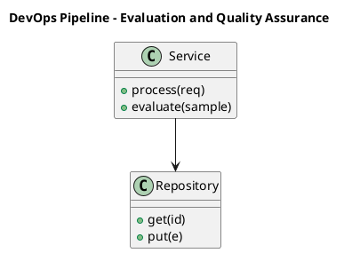

_Source diagram (plantuml); render with the appropriate tool._

**Figure 27. DevOps Pipeline - Evaluation and Quality Assurance** (plantuml). Figure: DevOps Pipeline view for Generative AI. This diagram illustrates the principal components and their interactions as discussed in the surrounding section.

## Deep Dive: Mechanics, Variants and Trade-offs

Having established the essentials, we now go deeper into evaluation and quality assurance. The underlying mechanism is best appreciated by tracing a single request from input to output and noting where state is created and consumed. The distinctions in this section are the ones that separate a working demo from a system that holds up under adversarial inputs, scale and the passage of time.

Consider the principal variants and how to choose between them. Each variant optimises for a different point in the design space - some for latency, some for accuracy, some for cost or operability - and the correct choice follows from explicit requirements rather than from defaults. As with most architectural decisions, the choice is rarely binary; the skill lies in quantifying the trade-offs and choosing deliberately.

In practice this is supported by a mature tooling ecosystem, including OpenAI API, Anthropic Claude, LangChain, LlamaIndex. Tools accelerate the work but do not substitute for understanding: the same principles apply whichever implementation you select, and the ability to reason from first principles is what lets you debug when a tool behaves unexpectedly.

A frequent source of subtle bugs is the interaction with large language models as generators. Because large language models as generators concerns next-token prediction, sampling strategies (temperature, top-k, top-p) and the emergence of instruction following, changes there can silently alter the behaviour analysed here. The remedy is contract tests at the boundary and end-to-end evaluations that exercise the interaction explicitly.

Finally, attend to edge cases and degradation. Define what the system should do under partial failure, unexpected inputs and load spikes, and make that behaviour explicit and tested rather than emergent. Graceful degradation - returning a safe, useful result when the ideal one is unavailable - is a hallmark of mature engineering.

For deeper study, the literature offers authoritative treatments such as Ho et al. — Denoising Diffusion Probabilistic Models (2020) and Brown et al. — Language Models are Few-Shot Learners (2020). These primary sources reward careful reading and ground the practical guidance above in established results.

## Advanced Considerations

Having established the essentials, we now go deeper into evaluation and quality assurance. Beneath the abstraction lies a concrete process whose steps can each be measured, tested and optimised independently. The distinctions in this section are the ones that separate a working demo from a system that holds up under adversarial inputs, scale and the passage of time.

Consider the principal variants and how to choose between them. Each variant optimises for a different point in the design space - some for latency, some for accuracy, some for cost or operability - and the correct choice follows from explicit requirements rather than from defaults. Simplicity is a feature. The simplest design that meets the requirement should be the default, with complexity added only when measurement justifies it.

In practice this is supported by a mature tooling ecosystem, including OpenAI API, Anthropic Claude, LangChain, LlamaIndex. Tools accelerate the work but do not substitute for understanding: the same principles apply whichever implementation you select, and the ability to reason from first principles is what lets you debug when a tool behaves unexpectedly.

A frequent source of subtle bugs is the interaction with productionising generative applications. Because productionising generative applications concerns prompt management, versioning, observability and continuous evaluation in CI, changes there can silently alter the behaviour analysed here. The remedy is contract tests at the boundary and end-to-end evaluations that exercise the interaction explicitly.

Finally, attend to edge cases and degradation. Define what the system should do under partial failure, unexpected inputs and load spikes, and make that behaviour explicit and tested rather than emergent. Graceful degradation - returning a safe, useful result when the ideal one is unavailable - is a hallmark of mature engineering.

For deeper study, the literature offers authoritative treatments such as Ho et al. — Denoising Diffusion Probabilistic Models (2020) and Brown et al. — Language Models are Few-Shot Learners (2020). These primary sources reward careful reading and ground the practical guidance above in established results.

## Worked Example

A worked example clarifies how these ideas behave in practice. A customer service organisation needs grounded assistants that resolve tickets with cited policy. They decide to apply evaluation and quality assurance as part of their Generative AI solution, but wisely treat it as a hypothesis to be validated rather than a foregone conclusion.

The team begins by stating the objective precisely and defining how success will be measured before writing any code. They establish a small but representative evaluation set, agree on acceptance thresholds, and only then prototype the simplest design that could work. Early measurement reveals which assumptions hold and which must be revised, saving weeks of misdirected effort and surfacing edge cases while they are still cheap to fix.

As the prototype matures into a service, the team hardens it: adding input validation, error handling, caching where it pays off, and monitoring that ties back to the original success metric. They document each significant decision in an architecture decision record so that future maintainers understand not just what was built but why.

The outcome is instructive. The system that reaches production is not the most sophisticated design the team considered, but the one whose behaviour they could measure, explain and operate. This is the recurring lesson of Generative AI: durable value comes from the whole system, not from any single clever component.

## Industry Use Cases

Across industries, the ideas in this chapter recur in recognisable ways. The following vignettes show how different sectors apply them and what they have in common.

**Legal.** Contract drafting and clause extraction with citation back to source. The common thread is that value comes not from the model alone but from the surrounding system - data quality, evaluation, integration and operations - which is precisely where most of the engineering effort belongs.

**Software.** Code generation, refactoring and test synthesis inside the IDE. The common thread is that value comes not from the model alone but from the surrounding system - data quality, evaluation, integration and operations - which is precisely where most of the engineering effort belongs.

**Marketing.** Brand-safe content generation with human-in-the-loop review. The common thread is that value comes not from the model alone but from the surrounding system - data quality, evaluation, integration and operations - which is precisely where most of the engineering effort belongs.

**Customer Service.** Grounded assistants that resolve tickets with cited policy. The common thread is that value comes not from the model alone but from the surrounding system - data quality, evaluation, integration and operations - which is precisely where most of the engineering effort belongs.

## Best Practices

The following practices consistently separate successful Generative AI efforts from struggling ones. They are deliberately concrete so they can be adopted as checklist items in design and code review.

- Treat prompts as versioned, tested artefacts under source control.
- Always ground high-stakes generations in retrieved, citable sources.
- Define explicit cost and latency budgets per use case and route accordingly.
- Run an automated evaluation suite on every prompt or model change.

None of these are exotic; they are the unglamorous disciplines that compound into reliability. The cost of adopting them is small compared with the cost of the incidents they prevent, and they become second nature with practice.

## Common Pitfalls

Equally instructive are the failure modes that recur in practice. Each pitfall below has a clear early warning sign and a known remedy, so treat them as a diagnostic checklist when something feels wrong:

- Shipping ungrounded generations into high-stakes workflows.
- Ignoring token cost growth as adoption scales.
- Relying on a single provider with no fallback or routing strategy.
- Evaluating only with anecdotes instead of a versioned test set.

The pattern is consistent: most failures stem from skipping measurement, conflating prototype and production standards, or deferring cross-cutting concerns such as security and cost until they become emergencies. Naming these traps in advance is the cheapest way to avoid them.

## Governance, Security and Cost Notes

No discussion of evaluation and quality assurance is complete without its governance, security and cost dimensions, which are too often deferred until they become emergencies. Treating them as first-class concerns from the outset is both cheaper and safer.

**Governance.** Classify the risk of this capability, document its intended and out-of-scope uses, and ensure decisions are traceable to satisfy internal policy and external regulation such as the NIST AI RMF, ISO/IEC 42001 and the EU AI Act. **Security.** Treat all external input as untrusted, validate outputs before acting on them, apply least privilege to any tools or data access, and map controls to the OWASP LLM Top 10 and MITRE ATLAS.

**Cost and sustainability.** Establish explicit budgets for compute, tokens and latency, attribute spend to owners, and revisit the economics as usage scales - a design that is affordable at pilot scale can become untenable at production volume. Building these reflexes into everyday engineering is what allows a Generative AI system to be not only capable but also trustworthy and economically sound.

## Hands-On Exercises

Work through the following exercises. They are designed to move understanding from recognition to application - the level required for real engineering work - so prefer writing and building over merely reading.

1. Explain evaluation and quality assurance to a colleague unfamiliar with Generative AI, using a concrete example from your own domain.
2. Sketch a reference architecture that incorporates evaluation and quality assurance and annotate where observability, security and cost controls belong.
3. Design an evaluation that would tell you whether evaluation and quality assurance is working in production, including the metric, the dataset and the acceptance threshold.
4. Identify two pitfalls relevant to evaluation and quality assurance in your environment and describe the early warning signals you would monitor.
5. Prototype the simplest implementation that demonstrates evaluation and quality assurance, then list exactly what would need to change to make it production-ready.

## Key Takeaways

Key takeaways from this chapter:

- Evaluation and Quality Assurance is a systems concern in Generative AI: data, models and operations must be co-designed.
- Measurement is non-negotiable; define success metrics and evaluation before building.
- Favour the simplest design that meets the requirement, and add complexity only when evidence demands it.
- Security, cost and observability are first-class requirements, not afterthoughts.
- Document decisions so the system remains understandable and operable as it evolves.

## Code Walkthrough

Every change to a Generative AI system should pass an evaluation gate. This example shows the minimal shape: align predictions and references, compute a metric, and return a pass/fail decision for CI.

The full listing is shown below; study it line by line and reproduce it locally before moving on.

### Listing: Evaluating Evaluation and Quality Assurance with a regression gate

```python
from dataclasses import dataclass


@dataclass
class EvalResult:
    metric: str
    score: float
    passed: bool


def evaluate(predictions: list[str], references: list[str],
             threshold: float = 0.8) -> EvalResult:
    """Score Evaluation and Quality Assurance output against references with a simple exact-match metric.

    In practice you would combine several metrics (exact match, semantic
    similarity, LLM-as-judge) and gate releases on the aggregate.
    """
    if len(predictions) != len(references):
        raise ValueError("predictions and references must align")
    hits = sum(p.strip() == r.strip() for p, r in zip(predictions, references))
    score = hits / len(references) if references else 0.0
    return EvalResult(metric="exact_match", score=score, passed=score >= threshold)


if __name__ == "__main__":
    result = evaluate(["yes", "no"], ["yes", "yes"])
    print(f"{result.metric}={result.score:.2f} passed={result.passed}")

```

## Review Questions

1. In the context of Generative AI, which statement best describes “Evaluation and Quality Assurance”?
   - A. It applies exclusively to image data.
   - B. It guarantees deterministic output regardless of input.
   - C. a rigorous approach to measuring and assuring the quality of a Generative AI system before and after release
   - D. It is only relevant to academic research, not production.
   - **Answer: C.** Evaluation and Quality Assurance: a rigorous approach to measuring and assuring the quality of a Generative AI system before and after release
2. Which of the following is a recommended best practice when working with Generative AI?
   - A. It makes the system slower but has no other effect.
   - B. Define explicit cost and latency budgets per use case and route accordingly.
   - C. Relying on a single provider with no fallback or routing strategy.
   - D. It eliminates the need for any evaluation or monitoring.
   - **Answer: B.** Best practice: Define explicit cost and latency budgets per use case and route accordingly.
3. Which of the following is a common pitfall to avoid in Generative AI?
   - A. Relying on a single provider with no fallback or routing strategy.
   - B. It removes all security and governance requirements.
   - C. It applies exclusively to image data.
   - D. It eliminates the need for any evaluation or monitoring.
   - **Answer: A.** Pitfall to avoid: Relying on a single provider with no fallback or routing strategy.
4. *(Discussion)* How would you test and monitor Evaluation and Quality Assurance in production?
   - **Model answer:** A strong answer defines evaluation and quality assurance (a rigorous approach to measuring and assuring the quality of a Generative AI system before and after release) then connects it to architecture, evaluation, cost, security and operations for Generative AI, citing concrete trade-offs and a real-world example.

---


# Chapter 20. Security, Privacy and Governance

_This chapter examines security, privacy and governance within Generative AI. It covers the security, privacy and governance controls that make a Generative AI system trustworthy and compliant, derives a reference architecture, walks through a worked example and runnable code, surveys industry use cases, and distils best practices and pitfalls, closing with exercises and review questions._

## Introduction

In practical terms, Security, Privacy and Governance is best understood as the security, privacy and governance controls that make a Generative AI system trustworthy and compliant. Neglecting it is one of the most common reasons Generative AI initiatives stall in production. Seasoned practitioners treat this as a systems problem, co-designing data, models and operations rather than optimising any one in isolation.

This chapter builds intuition first, then formalises the ideas, derives an architecture, and finishes with code, exercises and review questions so the material transfers directly to your own Generative AI work. Read it actively: pause at each diagram, reproduce the code, and attempt the exercises before consulting the answers.

## Theory and Foundations

Security, Privacy and Governance refers to the security, privacy and governance controls that make a Generative AI system trustworthy and compliant. What distinguishes a production-grade approach from a prototype is the discipline of measurement: every claim is backed by an evaluation rather than intuition. The underlying mechanism is best appreciated by tracing a single request from input to output and noting where state is created and consumed.

To place this in context, recall the broader picture: Generative AI refers to models that synthesise novel content—text, images, audio, code and structured data—by learning the distribution of training data and sampling from it. Within that picture, security, privacy and governance is one of the load-bearing ideas - the kind that, when understood deeply, makes the rest of Generative AI fall into place. It is foundational: later capabilities in Generative AI are built directly on top of it.

Security, Privacy and Governance cannot be understood in isolation from safety, guardrails and content moderation. Recall that safety, guardrails and content moderation concerns input/output filtering, jailbreak resistance and layered defence in depth. The two interact directly: decisions in one constrain the design space of the other, which is why mature teams reason about them together rather than sequentially. Every added component buys capability at the price of operational surface area, and that bargain should be made consciously.

Security, Privacy and Governance cannot be understood in isolation from productionising generative applications. Recall that productionising generative applications concerns prompt management, versioning, observability and continuous evaluation in CI. The two interact directly: decisions in one constrain the design space of the other, which is why mature teams reason about them together rather than sequentially. Simplicity is a feature. The simplest design that meets the requirement should be the default, with complexity added only when measurement justifies it.

Several established patterns apply directly to security, privacy and governance. The first, retrieval-augmented grounding to reduce hallucination, is widely adopted because it makes the system's behaviour predictable and observable. A complementary pattern, semantic caching keyed on normalised prompts and embeddings, addresses a related concern and is often deployed alongside it. Patterns are not dogma; they are distilled experience that shortcuts the search for a sound design, and each carries assumptions worth checking against your context.

Knowing when not to use a technique is as valuable as knowing how to use it. In a small prototype, shortcuts around security, privacy and governance are invisible; in a production Generative AI system serving real traffic, they surface as incidents, cost overruns or compliance gaps. As with most architectural decisions, the choice is rarely binary; the skill lies in quantifying the trade-offs and choosing deliberately. The remainder of this chapter turns these principles into an architecture, code and a checklist you can apply immediately.

## Architecture and Design

From an architectural standpoint, Security, Privacy and Governance sits at the intersection of data, models and operations. A production generative-AI platform places a model gateway in front of one or more foundation models, with orchestration handling prompt assembly, retrieval, tool calls and guardrails. A semantic cache reduces cost and latency, an evaluation service scores responses offline and online, and an observability layer captures prompts, completions, tokens, cost and quality signals for every request.

Concretely, the principal building blocks include generative modelling foundations, large language models as generators, diffusion models for images and audio, multimodal generation and grounding with enterprise data. Each is a replaceable component behind a stable interface, so the team can upgrade an implementation - a model, an index, a policy engine - without rewriting its neighbours. The contracts between components are where reliability is won or lost, so they are specified explicitly and tested in isolation.

The diagram accompanying this section makes the data and control flow explicit. Requests enter through a well-defined boundary where they are authenticated and validated; only then are they dispatched to the components that perform the work. This boundary is also where rate limiting, quota enforcement and audit logging live, keeping cross-cutting concerns out of the core logic and in one auditable place.

Two qualities deserve emphasis. First, observability is designed in, not bolted on: every component emits structured telemetry so that failures can be localised in minutes rather than hours. Second, the architecture is evolvable - components communicate through stable contracts so that any single part of the Generative AI system can be replaced without a rewrite. Latency, accuracy and cost form a tension triangle: improving one typically pressures the others, so explicit budgets are essential.

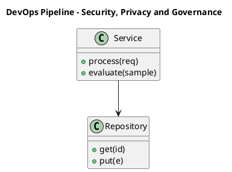

_Source diagram (plantuml); render with the appropriate tool._

**Figure 28. DevOps Pipeline - Security, Privacy and Governance** (plantuml). Figure: DevOps Pipeline view for Generative AI. This diagram illustrates the principal components and their interactions as discussed in the surrounding section.

## Deep Dive: Mechanics, Variants and Trade-offs

Having established the essentials, we now go deeper into security, privacy and governance. The underlying mechanism is best appreciated by tracing a single request from input to output and noting where state is created and consumed. The distinctions in this section are the ones that separate a working demo from a system that holds up under adversarial inputs, scale and the passage of time.

Consider the principal variants and how to choose between them. Each variant optimises for a different point in the design space - some for latency, some for accuracy, some for cost or operability - and the correct choice follows from explicit requirements rather than from defaults. Latency, accuracy and cost form a tension triangle: improving one typically pressures the others, so explicit budgets are essential.

In practice this is supported by a mature tooling ecosystem, including OpenAI API, Anthropic Claude, LangChain, LlamaIndex. Tools accelerate the work but do not substitute for understanding: the same principles apply whichever implementation you select, and the ability to reason from first principles is what lets you debug when a tool behaves unexpectedly.

A frequent source of subtle bugs is the interaction with safety, guardrails and content moderation. Because safety, guardrails and content moderation concerns input/output filtering, jailbreak resistance and layered defence in depth, changes there can silently alter the behaviour analysed here. The remedy is contract tests at the boundary and end-to-end evaluations that exercise the interaction explicitly.

Finally, attend to edge cases and degradation. Define what the system should do under partial failure, unexpected inputs and load spikes, and make that behaviour explicit and tested rather than emergent. Graceful degradation - returning a safe, useful result when the ideal one is unavailable - is a hallmark of mature engineering.

For deeper study, the literature offers authoritative treatments such as Ho et al. — Denoising Diffusion Probabilistic Models (2020) and Brown et al. — Language Models are Few-Shot Learners (2020). These primary sources reward careful reading and ground the practical guidance above in established results.

## Advanced Considerations

Having established the essentials, we now go deeper into security, privacy and governance. It pays to understand the mechanism rather than treat it as a black box, because most production incidents are explained by one of its steps misbehaving. The distinctions in this section are the ones that separate a working demo from a system that holds up under adversarial inputs, scale and the passage of time.

Consider the principal variants and how to choose between them. Each variant optimises for a different point in the design space - some for latency, some for accuracy, some for cost or operability - and the correct choice follows from explicit requirements rather than from defaults. Latency, accuracy and cost form a tension triangle: improving one typically pressures the others, so explicit budgets are essential.

In practice this is supported by a mature tooling ecosystem, including OpenAI API, Anthropic Claude, LangChain, LlamaIndex. Tools accelerate the work but do not substitute for understanding: the same principles apply whichever implementation you select, and the ability to reason from first principles is what lets you debug when a tool behaves unexpectedly.

A frequent source of subtle bugs is the interaction with cost, latency and throughput engineering. Because cost, latency and throughput engineering concerns token economics, caching, batching, distillation and routing across model tiers, changes there can silently alter the behaviour analysed here. The remedy is contract tests at the boundary and end-to-end evaluations that exercise the interaction explicitly.

Finally, attend to edge cases and degradation. Define what the system should do under partial failure, unexpected inputs and load spikes, and make that behaviour explicit and tested rather than emergent. Graceful degradation - returning a safe, useful result when the ideal one is unavailable - is a hallmark of mature engineering.

For deeper study, the literature offers authoritative treatments such as Ho et al. — Denoising Diffusion Probabilistic Models (2020) and Brown et al. — Language Models are Few-Shot Learners (2020). These primary sources reward careful reading and ground the practical guidance above in established results.

## Worked Example

A worked example clarifies how these ideas behave in practice. A customer service organisation needs grounded assistants that resolve tickets with cited policy. They decide to apply security, privacy and governance as part of their Generative AI solution, but wisely treat it as a hypothesis to be validated rather than a foregone conclusion.

The team begins by stating the objective precisely and defining how success will be measured before writing any code. They establish a small but representative evaluation set, agree on acceptance thresholds, and only then prototype the simplest design that could work. Early measurement reveals which assumptions hold and which must be revised, saving weeks of misdirected effort and surfacing edge cases while they are still cheap to fix.

As the prototype matures into a service, the team hardens it: adding input validation, error handling, caching where it pays off, and monitoring that ties back to the original success metric. They document each significant decision in an architecture decision record so that future maintainers understand not just what was built but why.

The outcome is instructive. The system that reaches production is not the most sophisticated design the team considered, but the one whose behaviour they could measure, explain and operate. This is the recurring lesson of Generative AI: durable value comes from the whole system, not from any single clever component.

## Industry Use Cases

Across industries, the ideas in this chapter recur in recognisable ways. The following vignettes show how different sectors apply them and what they have in common.

**Legal.** Contract drafting and clause extraction with citation back to source. The common thread is that value comes not from the model alone but from the surrounding system - data quality, evaluation, integration and operations - which is precisely where most of the engineering effort belongs.

**Software.** Code generation, refactoring and test synthesis inside the IDE. The common thread is that value comes not from the model alone but from the surrounding system - data quality, evaluation, integration and operations - which is precisely where most of the engineering effort belongs.

**Marketing.** Brand-safe content generation with human-in-the-loop review. The common thread is that value comes not from the model alone but from the surrounding system - data quality, evaluation, integration and operations - which is precisely where most of the engineering effort belongs.

**Customer Service.** Grounded assistants that resolve tickets with cited policy. The common thread is that value comes not from the model alone but from the surrounding system - data quality, evaluation, integration and operations - which is precisely where most of the engineering effort belongs.

## Best Practices

The following practices consistently separate successful Generative AI efforts from struggling ones. They are deliberately concrete so they can be adopted as checklist items in design and code review.

- Treat prompts as versioned, tested artefacts under source control.
- Always ground high-stakes generations in retrieved, citable sources.
- Define explicit cost and latency budgets per use case and route accordingly.
- Run an automated evaluation suite on every prompt or model change.

None of these are exotic; they are the unglamorous disciplines that compound into reliability. The cost of adopting them is small compared with the cost of the incidents they prevent, and they become second nature with practice.

## Common Pitfalls

Equally instructive are the failure modes that recur in practice. Each pitfall below has a clear early warning sign and a known remedy, so treat them as a diagnostic checklist when something feels wrong:

- Shipping ungrounded generations into high-stakes workflows.
- Ignoring token cost growth as adoption scales.
- Relying on a single provider with no fallback or routing strategy.
- Evaluating only with anecdotes instead of a versioned test set.

The pattern is consistent: most failures stem from skipping measurement, conflating prototype and production standards, or deferring cross-cutting concerns such as security and cost until they become emergencies. Naming these traps in advance is the cheapest way to avoid them.

## Governance, Security and Cost Notes

No discussion of security, privacy and governance is complete without its governance, security and cost dimensions, which are too often deferred until they become emergencies. Treating them as first-class concerns from the outset is both cheaper and safer.

**Governance.** Classify the risk of this capability, document its intended and out-of-scope uses, and ensure decisions are traceable to satisfy internal policy and external regulation such as the NIST AI RMF, ISO/IEC 42001 and the EU AI Act. **Security.** Treat all external input as untrusted, validate outputs before acting on them, apply least privilege to any tools or data access, and map controls to the OWASP LLM Top 10 and MITRE ATLAS.

**Cost and sustainability.** Establish explicit budgets for compute, tokens and latency, attribute spend to owners, and revisit the economics as usage scales - a design that is affordable at pilot scale can become untenable at production volume. Building these reflexes into everyday engineering is what allows a Generative AI system to be not only capable but also trustworthy and economically sound.

## Hands-On Exercises

Work through the following exercises. They are designed to move understanding from recognition to application - the level required for real engineering work - so prefer writing and building over merely reading.

1. Explain security, privacy and governance to a colleague unfamiliar with Generative AI, using a concrete example from your own domain.
2. Sketch a reference architecture that incorporates security, privacy and governance and annotate where observability, security and cost controls belong.
3. Design an evaluation that would tell you whether security, privacy and governance is working in production, including the metric, the dataset and the acceptance threshold.
4. Identify two pitfalls relevant to security, privacy and governance in your environment and describe the early warning signals you would monitor.
5. Prototype the simplest implementation that demonstrates security, privacy and governance, then list exactly what would need to change to make it production-ready.

## Key Takeaways

Key takeaways from this chapter:

- Security, Privacy and Governance is a systems concern in Generative AI: data, models and operations must be co-designed.
- Measurement is non-negotiable; define success metrics and evaluation before building.
- Favour the simplest design that meets the requirement, and add complexity only when evidence demands it.
- Security, cost and observability are first-class requirements, not afterthoughts.
- Document decisions so the system remains understandable and operable as it evolves.

## Code Walkthrough

Pipelines keep Security, Privacy and Governance logic modular and testable. Each stage is a pure function, errors are captured per item, and the composition is trivial to extend or reorder.

The full listing is shown below; study it line by line and reproduce it locally before moving on.

### Listing: A composable processing pipeline for Security, Privacy and Governance

```python
from collections.abc import Iterable, Iterator
from typing import Protocol


class Stage(Protocol):
    def __call__(self, item: dict) -> dict: ...


def pipeline(stages: list[Stage]) -> Stage:
    """Compose ordered stages into a single callable for Security, Privacy and Governance."""

    def run(item: dict) -> dict:
        for stage in stages:
            item = stage(item)
        return item

    return run


def validate(item: dict) -> dict:
    if "text" not in item:
        raise ValueError("missing required field: text")
    return item


def normalise(item: dict) -> dict:
    item["text"] = item["text"].strip().lower()
    return item


def enrich(item: dict) -> dict:
    item["length"] = len(item["text"])
    return item


process = pipeline([validate, normalise, enrich])


def run_batch(items: Iterable[dict]) -> Iterator[dict]:
    for item in items:
        try:
            yield process(dict(item))
        except ValueError as exc:
            yield {"error": str(exc), "item": item}

```

## Review Questions

1. In the context of Generative AI, which statement best describes “Security, Privacy and Governance”?
   - A. It removes all security and governance requirements.
   - B. It eliminates the need for any evaluation or monitoring.
   - C. It guarantees deterministic output regardless of input.
   - D. the security, privacy and governance controls that make a Generative AI system trustworthy and compliant
   - **Answer: D.** Security, Privacy and Governance: the security, privacy and governance controls that make a Generative AI system trustworthy and compliant
2. Which of the following is a recommended best practice when working with Generative AI?
   - A. It applies exclusively to image data.
   - B. Always ground high-stakes generations in retrieved, citable sources.
   - C. Shipping ungrounded generations into high-stakes workflows.
   - D. Evaluating only with anecdotes instead of a versioned test set.
   - **Answer: B.** Best practice: Always ground high-stakes generations in retrieved, citable sources.
3. Which of the following is a common pitfall to avoid in Generative AI?
   - A. Evaluating only with anecdotes instead of a versioned test set.
   - B. Run an automated evaluation suite on every prompt or model change.
   - C. Always ground high-stakes generations in retrieved, citable sources.
   - D. It guarantees deterministic output regardless of input.
   - **Answer: A.** Pitfall to avoid: Evaluating only with anecdotes instead of a versioned test set.
4. *(Discussion)* Describe a failure mode of Security, Privacy and Governance and how you would mitigate it.
   - **Model answer:** A strong answer defines security, privacy and governance (the security, privacy and governance controls that make a Generative AI system trustworthy and compliant) then connects it to architecture, evaluation, cost, security and operations for Generative AI, citing concrete trade-offs and a real-world example.

---


# Chapter 21. Cost, Performance and Scaling

_This chapter examines cost, performance and scaling within Generative AI. It covers techniques for controlling cost and latency while scaling a Generative AI system to production traffic, derives a reference architecture, walks through a worked example and runnable code, surveys industry use cases, and distils best practices and pitfalls, closing with exercises and review questions._

## Introduction

We define Cost, Performance and Scaling as techniques for controlling cost and latency while scaling a Generative AI system to production traffic. It is foundational: later capabilities in Generative AI are built directly on top of it. It helps to separate the conceptual model from its implementation: the former guides reasoning, the latter must contend with real-world constraints.

This chapter builds intuition first, then formalises the ideas, derives an architecture, and finishes with code, exercises and review questions so the material transfers directly to your own Generative AI work. Read it actively: pause at each diagram, reproduce the code, and attempt the exercises before consulting the answers.

## Theory and Foundations

Formally, Cost, Performance and Scaling addresses techniques for controlling cost and latency while scaling a Generative AI system to production traffic. The right abstraction here pays compounding dividends, because downstream components depend on its guarantees. It pays to understand the mechanism rather than treat it as a black box, because most production incidents are explained by one of its steps misbehaving.

To place this in context, recall the broader picture: Generative AI refers to models that synthesise novel content—text, images, audio, code and structured data—by learning the distribution of training data and sampling from it. Within that picture, cost, performance and scaling is one of the load-bearing ideas - the kind that, when understood deeply, makes the rest of Generative AI fall into place. Teams that master this consistently ship more reliable Generative AI systems at lower cost.

Cost, Performance and Scaling cannot be understood in isolation from large language models as generators. Recall that large language models as generators concerns next-token prediction, sampling strategies (temperature, top-k, top-p) and the emergence of instruction following. The two interact directly: decisions in one constrain the design space of the other, which is why mature teams reason about them together rather than sequentially. As with most architectural decisions, the choice is rarely binary; the skill lies in quantifying the trade-offs and choosing deliberately.

Cost, Performance and Scaling cannot be understood in isolation from cost, latency and throughput engineering. Recall that cost, latency and throughput engineering concerns token economics, caching, batching, distillation and routing across model tiers. The two interact directly: decisions in one constrain the design space of the other, which is why mature teams reason about them together rather than sequentially. As with most architectural decisions, the choice is rarely binary; the skill lies in quantifying the trade-offs and choosing deliberately.

Several established patterns apply directly to cost, performance and scaling. The first, semantic caching keyed on normalised prompts and embeddings, is widely adopted because it makes the system's behaviour predictable and observable. A complementary pattern, retrieval-augmented grounding to reduce hallucination, addresses a related concern and is often deployed alongside it. Patterns are not dogma; they are distilled experience that shortcuts the search for a sound design, and each carries assumptions worth checking against your context.

It is worth being explicit about when to apply this and when to reach for something simpler. In a small prototype, shortcuts around cost, performance and scaling are invisible; in a production Generative AI system serving real traffic, they surface as incidents, cost overruns or compliance gaps. Every added component buys capability at the price of operational surface area, and that bargain should be made consciously. The remainder of this chapter turns these principles into an architecture, code and a checklist you can apply immediately.

## Architecture and Design

The reference architecture for Cost, Performance and Scaling separates concerns into clearly bounded components with explicit contracts. A production generative-AI platform places a model gateway in front of one or more foundation models, with orchestration handling prompt assembly, retrieval, tool calls and guardrails. A semantic cache reduces cost and latency, an evaluation service scores responses offline and online, and an observability layer captures prompts, completions, tokens, cost and quality signals for every request.

Concretely, the principal building blocks include generative modelling foundations, large language models as generators, diffusion models for images and audio, multimodal generation and grounding with enterprise data. Each is a replaceable component behind a stable interface, so the team can upgrade an implementation - a model, an index, a policy engine - without rewriting its neighbours. The contracts between components are where reliability is won or lost, so they are specified explicitly and tested in isolation.

The diagram accompanying this section makes the data and control flow explicit. Requests enter through a well-defined boundary where they are authenticated and validated; only then are they dispatched to the components that perform the work. This boundary is also where rate limiting, quota enforcement and audit logging live, keeping cross-cutting concerns out of the core logic and in one auditable place.

Two qualities deserve emphasis. First, observability is designed in, not bolted on: every component emits structured telemetry so that failures can be localised in minutes rather than hours. Second, the architecture is evolvable - components communicate through stable contracts so that any single part of the Generative AI system can be replaced without a rewrite. As with most architectural decisions, the choice is rarely binary; the skill lies in quantifying the trade-offs and choosing deliberately.

```xml
<mxfile host="ai-university">
  <diagram name="Agent Architecture">
    <mxGraphModel dx="800" dy="600" grid="1" gridSize="10">
      <root>
        <mxCell id="0"/>
        <mxCell id="1" parent="0"/>
        <mxCell id="title" value="Agent Architecture - Cost, Performance and Scaling" style="text;fontSize=16;fontStyle=1" vertex="1" parent="1"><mxGeometry x="40" y="20" width="600" height="30" as="geometry"/></mxCell>
        <mxCell id="hub" value="Generative AI" style="rounded=1;fillColor=#0f172a;fontColor=#ffffff;fontStyle=1" vertex="1" parent="1"><mxGeometry x="300" y="180" width="160" height="60" as="geometry"/></mxCell>
        <mxCell id="n0" value="Generative Modelling Fo…" style="rounded=1;fillColor=#e0e7ff;strokeColor=#4338ca" vertex="1" parent="1"><mxGeometry x="60" y="80" width="160" height="50" as="geometry"/></mxCell>
        <mxCell id="e0" style="edgeStyle=orthogonalEdgeStyle" edge="1" parent="1" source="hub" target="n0"><mxGeometry relative="1" as="geometry"/></mxCell>
        <mxCell id="n1" value="Large Language Models a…" style="rounded=1;fillColor=#e0e7ff;strokeColor=#4338ca" vertex="1" parent="1"><mxGeometry x="600" y="170" width="160" height="50" as="geometry"/></mxCell>
        <mxCell id="e1" style="edgeStyle=orthogonalEdgeStyle" edge="1" parent="1" source="hub" target="n1"><mxGeometry relative="1" as="geometry"/></mxCell>
        <mxCell id="n2" value="Diffusion Models for Im…" style="rounded=1;fillColor=#e0e7ff;strokeColor=#4338ca" vertex="1" parent="1"><mxGeometry x="60" y="260" width="160" height="50" as="geometry"/></mxCell>
        <mxCell id="e2" style="edgeStyle=orthogonalEdgeStyle" edge="1" parent="1" source="hub" target="n2"><mxGeometry relative="1" as="geometry"/></mxCell>
        <mxCell id="n3" value="Multimodal Generation" style="rounded=1;fillColor=#e0e7ff;strokeColor=#4338ca" vertex="1" parent="1"><mxGeometry x="600" y="350" width="160" height="50" as="geometry"/></mxCell>
        <mxCell id="e3" style="edgeStyle=orthogonalEdgeStyle" edge="1" parent="1" source="hub" target="n3"><mxGeometry relative="1" as="geometry"/></mxCell>
        <mxCell id="n4" value="Grounding with Enterpri…" style="rounded=1;fillColor=#e0e7ff;strokeColor=#4338ca" vertex="1" parent="1"><mxGeometry x="60" y="440" width="160" height="50" as="geometry"/></mxCell>
        <mxCell id="e4" style="edgeStyle=orthogonalEdgeStyle" edge="1" parent="1" source="hub" target="n4"><mxGeometry relative="1" as="geometry"/></mxCell>
      </root>
    </mxGraphModel>
  </diagram>
</mxfile>
```

_Source diagram (drawio); render with the appropriate tool._

**Figure 29. Agent Architecture - Cost, Performance and Scaling** (drawio). Figure: Agent Architecture view for Generative AI. This diagram illustrates the principal components and their interactions as discussed in the surrounding section.

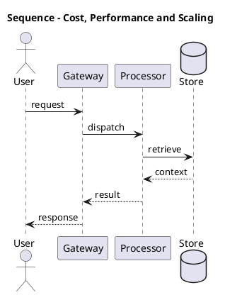

_Source diagram (plantuml); render with the appropriate tool._

**Figure 30. Sequence - Cost, Performance and Scaling** (plantuml). Figure: Sequence view for Generative AI. This diagram illustrates the principal components and their interactions as discussed in the surrounding section.

## Deep Dive: Mechanics, Variants and Trade-offs

Having established the essentials, we now go deeper into cost, performance and scaling. The underlying mechanism is best appreciated by tracing a single request from input to output and noting where state is created and consumed. The distinctions in this section are the ones that separate a working demo from a system that holds up under adversarial inputs, scale and the passage of time.

Consider the principal variants and how to choose between them. Each variant optimises for a different point in the design space - some for latency, some for accuracy, some for cost or operability - and the correct choice follows from explicit requirements rather than from defaults. As with most architectural decisions, the choice is rarely binary; the skill lies in quantifying the trade-offs and choosing deliberately.

In practice this is supported by a mature tooling ecosystem, including OpenAI API, Anthropic Claude, LangChain, LlamaIndex. Tools accelerate the work but do not substitute for understanding: the same principles apply whichever implementation you select, and the ability to reason from first principles is what lets you debug when a tool behaves unexpectedly.

A frequent source of subtle bugs is the interaction with large language models as generators. Because large language models as generators concerns next-token prediction, sampling strategies (temperature, top-k, top-p) and the emergence of instruction following, changes there can silently alter the behaviour analysed here. The remedy is contract tests at the boundary and end-to-end evaluations that exercise the interaction explicitly.

Finally, attend to edge cases and degradation. Define what the system should do under partial failure, unexpected inputs and load spikes, and make that behaviour explicit and tested rather than emergent. Graceful degradation - returning a safe, useful result when the ideal one is unavailable - is a hallmark of mature engineering.

For deeper study, the literature offers authoritative treatments such as Ho et al. — Denoising Diffusion Probabilistic Models (2020) and Brown et al. — Language Models are Few-Shot Learners (2020). These primary sources reward careful reading and ground the practical guidance above in established results.

## Advanced Considerations

Having established the essentials, we now go deeper into cost, performance and scaling. The underlying mechanism is best appreciated by tracing a single request from input to output and noting where state is created and consumed. The distinctions in this section are the ones that separate a working demo from a system that holds up under adversarial inputs, scale and the passage of time.

Consider the principal variants and how to choose between them. Each variant optimises for a different point in the design space - some for latency, some for accuracy, some for cost or operability - and the correct choice follows from explicit requirements rather than from defaults. Every added component buys capability at the price of operational surface area, and that bargain should be made consciously.

In practice this is supported by a mature tooling ecosystem, including OpenAI API, Anthropic Claude, LangChain, LlamaIndex. Tools accelerate the work but do not substitute for understanding: the same principles apply whichever implementation you select, and the ability to reason from first principles is what lets you debug when a tool behaves unexpectedly.

A frequent source of subtle bugs is the interaction with productionising generative applications. Because productionising generative applications concerns prompt management, versioning, observability and continuous evaluation in CI, changes there can silently alter the behaviour analysed here. The remedy is contract tests at the boundary and end-to-end evaluations that exercise the interaction explicitly.

Finally, attend to edge cases and degradation. Define what the system should do under partial failure, unexpected inputs and load spikes, and make that behaviour explicit and tested rather than emergent. Graceful degradation - returning a safe, useful result when the ideal one is unavailable - is a hallmark of mature engineering.

For deeper study, the literature offers authoritative treatments such as Ho et al. — Denoising Diffusion Probabilistic Models (2020) and Brown et al. — Language Models are Few-Shot Learners (2020). These primary sources reward careful reading and ground the practical guidance above in established results.

## Worked Example

To ground the discussion, walk through a representative example. A customer service organisation needs grounded assistants that resolve tickets with cited policy. They decide to apply cost, performance and scaling as part of their Generative AI solution, but wisely treat it as a hypothesis to be validated rather than a foregone conclusion.

The team begins by stating the objective precisely and defining how success will be measured before writing any code. They establish a small but representative evaluation set, agree on acceptance thresholds, and only then prototype the simplest design that could work. Early measurement reveals which assumptions hold and which must be revised, saving weeks of misdirected effort and surfacing edge cases while they are still cheap to fix.

As the prototype matures into a service, the team hardens it: adding input validation, error handling, caching where it pays off, and monitoring that ties back to the original success metric. They document each significant decision in an architecture decision record so that future maintainers understand not just what was built but why.

The outcome is instructive. The system that reaches production is not the most sophisticated design the team considered, but the one whose behaviour they could measure, explain and operate. This is the recurring lesson of Generative AI: durable value comes from the whole system, not from any single clever component.

## Industry Use Cases

Across industries, the ideas in this chapter recur in recognisable ways. The following vignettes show how different sectors apply them and what they have in common.

**Legal.** Contract drafting and clause extraction with citation back to source. The common thread is that value comes not from the model alone but from the surrounding system - data quality, evaluation, integration and operations - which is precisely where most of the engineering effort belongs.

**Software.** Code generation, refactoring and test synthesis inside the IDE. The common thread is that value comes not from the model alone but from the surrounding system - data quality, evaluation, integration and operations - which is precisely where most of the engineering effort belongs.

**Marketing.** Brand-safe content generation with human-in-the-loop review. The common thread is that value comes not from the model alone but from the surrounding system - data quality, evaluation, integration and operations - which is precisely where most of the engineering effort belongs.

**Customer Service.** Grounded assistants that resolve tickets with cited policy. The common thread is that value comes not from the model alone but from the surrounding system - data quality, evaluation, integration and operations - which is precisely where most of the engineering effort belongs.

## Best Practices

The following practices consistently separate successful Generative AI efforts from struggling ones. They are deliberately concrete so they can be adopted as checklist items in design and code review.

- Treat prompts as versioned, tested artefacts under source control.
- Always ground high-stakes generations in retrieved, citable sources.
- Define explicit cost and latency budgets per use case and route accordingly.
- Run an automated evaluation suite on every prompt or model change.

None of these are exotic; they are the unglamorous disciplines that compound into reliability. The cost of adopting them is small compared with the cost of the incidents they prevent, and they become second nature with practice.

## Common Pitfalls

Equally instructive are the failure modes that recur in practice. Each pitfall below has a clear early warning sign and a known remedy, so treat them as a diagnostic checklist when something feels wrong:

- Shipping ungrounded generations into high-stakes workflows.
- Ignoring token cost growth as adoption scales.
- Relying on a single provider with no fallback or routing strategy.
- Evaluating only with anecdotes instead of a versioned test set.

The pattern is consistent: most failures stem from skipping measurement, conflating prototype and production standards, or deferring cross-cutting concerns such as security and cost until they become emergencies. Naming these traps in advance is the cheapest way to avoid them.

## Governance, Security and Cost Notes

No discussion of cost, performance and scaling is complete without its governance, security and cost dimensions, which are too often deferred until they become emergencies. Treating them as first-class concerns from the outset is both cheaper and safer.

**Governance.** Classify the risk of this capability, document its intended and out-of-scope uses, and ensure decisions are traceable to satisfy internal policy and external regulation such as the NIST AI RMF, ISO/IEC 42001 and the EU AI Act. **Security.** Treat all external input as untrusted, validate outputs before acting on them, apply least privilege to any tools or data access, and map controls to the OWASP LLM Top 10 and MITRE ATLAS.

**Cost and sustainability.** Establish explicit budgets for compute, tokens and latency, attribute spend to owners, and revisit the economics as usage scales - a design that is affordable at pilot scale can become untenable at production volume. Building these reflexes into everyday engineering is what allows a Generative AI system to be not only capable but also trustworthy and economically sound.

## Hands-On Exercises

Work through the following exercises. They are designed to move understanding from recognition to application - the level required for real engineering work - so prefer writing and building over merely reading.

1. Explain cost, performance and scaling to a colleague unfamiliar with Generative AI, using a concrete example from your own domain.
2. Sketch a reference architecture that incorporates cost, performance and scaling and annotate where observability, security and cost controls belong.
3. Design an evaluation that would tell you whether cost, performance and scaling is working in production, including the metric, the dataset and the acceptance threshold.
4. Identify two pitfalls relevant to cost, performance and scaling in your environment and describe the early warning signals you would monitor.
5. Prototype the simplest implementation that demonstrates cost, performance and scaling, then list exactly what would need to change to make it production-ready.

## Key Takeaways

Key takeaways from this chapter:

- Cost, Performance and Scaling is a systems concern in Generative AI: data, models and operations must be co-designed.
- Measurement is non-negotiable; define success metrics and evaluation before building.
- Favour the simplest design that meets the requirement, and add complexity only when evidence demands it.
- Security, cost and observability are first-class requirements, not afterthoughts.
- Document decisions so the system remains understandable and operable as it evolves.

## Code Walkthrough

This listing shows a configuration-driven Cost, Performance and Scaling component with retry semantics and typed interfaces — the shape we expect from production Generative AI code rather than a notebook prototype.

The full listing is shown below; study it line by line and reproduce it locally before moving on.

### Listing: Implementing a Cost, Performance and Scaling component

```python
from __future__ import annotations

from dataclasses import dataclass, field
from typing import Any


@dataclass(slots=True)
class PerformanceAndConfig:
    """Configuration for the Cost, Performance and Scaling component in a Generative AI system."""

    name: str
    timeout_s: float = 30.0
    max_retries: int = 3
    options: dict[str, Any] = field(default_factory=dict)


class PerformanceAnd:
    """A minimal, production-shaped implementation of Cost, Performance and Scaling."""

    def __init__(self, config: PerformanceAndConfig) -> None:
        self._config = config
        self._calls = 0

    def run(self, payload: dict[str, Any]) -> dict[str, Any]:
        """Process a request, retrying transient failures with backoff."""
        last_error: Exception | None = None
        for attempt in range(self._config.max_retries):
            try:
                self._calls += 1
                return self._process(payload)
            except TimeoutError as exc:  # transient
                last_error = exc
                continue
        raise RuntimeError(f"PerformanceAnd failed after retries") from last_error

    def _process(self, payload: dict[str, Any]) -> dict[str, Any]:
        # Domain-specific logic for Cost, Performance and Scaling goes here.
        return {"status": "ok", "input_keys": sorted(payload), "calls": self._calls}

```

## Review Questions

1. In the context of Generative AI, which statement best describes “Cost, Performance and Scaling”?
   - A. It makes the system slower but has no other effect.
   - B. It removes all security and governance requirements.
   - C. techniques for controlling cost and latency while scaling a Generative AI system to production traffic
   - D. It applies exclusively to image data.
   - **Answer: C.** Cost, Performance and Scaling: techniques for controlling cost and latency while scaling a Generative AI system to production traffic
2. Which of the following is a recommended best practice when working with Generative AI?
   - A. It removes all security and governance requirements.
   - B. Run an automated evaluation suite on every prompt or model change.
   - C. Shipping ungrounded generations into high-stakes workflows.
   - D. It applies exclusively to image data.
   - **Answer: B.** Best practice: Run an automated evaluation suite on every prompt or model change.
3. Which of the following is a common pitfall to avoid in Generative AI?
   - A. Run an automated evaluation suite on every prompt or model change.
   - B. It applies exclusively to image data.
   - C. Treat prompts as versioned, tested artefacts under source control.
   - D. Ignoring token cost growth as adoption scales.
   - **Answer: D.** Pitfall to avoid: Ignoring token cost growth as adoption scales.
4. *(Discussion)* Describe a failure mode of Cost, Performance and Scaling and how you would mitigate it.
   - **Model answer:** A strong answer defines cost, performance and scaling (techniques for controlling cost and latency while scaling a Generative AI system to production traffic) then connects it to architecture, evaluation, cost, security and operations for Generative AI, citing concrete trade-offs and a real-world example.

---


# Chapter 22. Integration and Interoperability

_This chapter examines integration and interoperability within Generative AI. It covers patterns for integrating a Generative AI system with surrounding enterprise systems and data, derives a reference architecture, walks through a worked example and runnable code, surveys industry use cases, and distils best practices and pitfalls, closing with exercises and review questions._

## Introduction

Integration and Interoperability can be characterised as patterns for integrating a Generative AI system with surrounding enterprise systems and data. Neglecting it is one of the most common reasons Generative AI initiatives stall in production. In an enterprise setting, this translates into concrete requirements: clear interfaces, measurable quality, and controls that satisfy security and governance.

This chapter builds intuition first, then formalises the ideas, derives an architecture, and finishes with code, exercises and review questions so the material transfers directly to your own Generative AI work. Read it actively: pause at each diagram, reproduce the code, and attempt the exercises before consulting the answers.

## Theory and Foundations

At its core, Integration and Interoperability concerns patterns for integrating a Generative AI system with surrounding enterprise systems and data. It helps to separate the conceptual model from its implementation: the former guides reasoning, the latter must contend with real-world constraints. It pays to understand the mechanism rather than treat it as a black box, because most production incidents are explained by one of its steps misbehaving.

To place this in context, recall the broader picture: Generative AI refers to models that synthesise novel content—text, images, audio, code and structured data—by learning the distribution of training data and sampling from it. Within that picture, integration and interoperability is one of the load-bearing ideas - the kind that, when understood deeply, makes the rest of Generative AI fall into place. This concept recurs throughout the Generative AI lifecycle, from design to operations.

Integration and Interoperability cannot be understood in isolation from cost, latency and throughput engineering. Recall that cost, latency and throughput engineering concerns token economics, caching, batching, distillation and routing across model tiers. The two interact directly: decisions in one constrain the design space of the other, which is why mature teams reason about them together rather than sequentially. Every added component buys capability at the price of operational surface area, and that bargain should be made consciously.

Integration and Interoperability cannot be understood in isolation from productionising generative applications. Recall that productionising generative applications concerns prompt management, versioning, observability and continuous evaluation in CI. The two interact directly: decisions in one constrain the design space of the other, which is why mature teams reason about them together rather than sequentially. Simplicity is a feature. The simplest design that meets the requirement should be the default, with complexity added only when measurement justifies it.

Several established patterns apply directly to integration and interoperability. The first, semantic caching keyed on normalised prompts and embeddings, is widely adopted because it makes the system's behaviour predictable and observable. A complementary pattern, guardrail sandwich: validate inputs, constrain decoding, validate outputs, addresses a related concern and is often deployed alongside it. Patterns are not dogma; they are distilled experience that shortcuts the search for a sound design, and each carries assumptions worth checking against your context.

The decision of whether to adopt this should be driven by requirements, not by novelty. In a small prototype, shortcuts around integration and interoperability are invisible; in a production Generative AI system serving real traffic, they surface as incidents, cost overruns or compliance gaps. As with most architectural decisions, the choice is rarely binary; the skill lies in quantifying the trade-offs and choosing deliberately. The remainder of this chapter turns these principles into an architecture, code and a checklist you can apply immediately.

## Architecture and Design

From an architectural standpoint, Integration and Interoperability sits at the intersection of data, models and operations. A production generative-AI platform places a model gateway in front of one or more foundation models, with orchestration handling prompt assembly, retrieval, tool calls and guardrails. A semantic cache reduces cost and latency, an evaluation service scores responses offline and online, and an observability layer captures prompts, completions, tokens, cost and quality signals for every request.

Concretely, the principal building blocks include generative modelling foundations, large language models as generators, diffusion models for images and audio, multimodal generation and grounding with enterprise data. Each is a replaceable component behind a stable interface, so the team can upgrade an implementation - a model, an index, a policy engine - without rewriting its neighbours. The contracts between components are where reliability is won or lost, so they are specified explicitly and tested in isolation.

The diagram accompanying this section makes the data and control flow explicit. Requests enter through a well-defined boundary where they are authenticated and validated; only then are they dispatched to the components that perform the work. This boundary is also where rate limiting, quota enforcement and audit logging live, keeping cross-cutting concerns out of the core logic and in one auditable place.

Two qualities deserve emphasis. First, observability is designed in, not bolted on: every component emits structured telemetry so that failures can be localised in minutes rather than hours. Second, the architecture is evolvable - components communicate through stable contracts so that any single part of the Generative AI system can be replaced without a rewrite. Latency, accuracy and cost form a tension triangle: improving one typically pressures the others, so explicit budgets are essential.

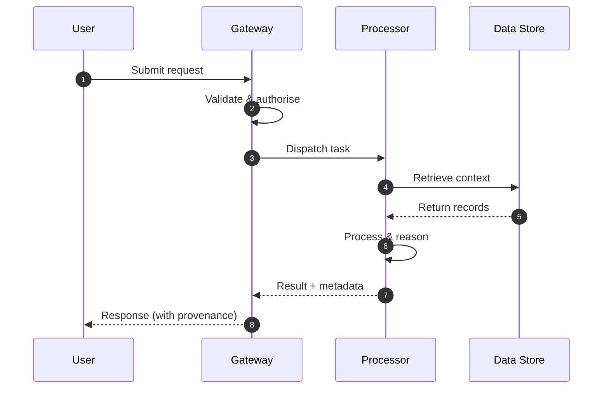

**Figure 31. Sequence - Integration and Interoperability** (mermaid). Figure: Sequence view for Generative AI. This diagram illustrates the principal components and their interactions as discussed in the surrounding section.

```xml
<mxfile host="ai-university">
  <diagram name="Business Process">
    <mxGraphModel dx="800" dy="600" grid="1" gridSize="10">
      <root>
        <mxCell id="0"/>
        <mxCell id="1" parent="0"/>
        <mxCell id="title" value="Business Process - Integration and Interoperability" style="text;fontSize=16;fontStyle=1" vertex="1" parent="1"><mxGeometry x="40" y="20" width="600" height="30" as="geometry"/></mxCell>
        <mxCell id="hub" value="Generative AI" style="rounded=1;fillColor=#0f172a;fontColor=#ffffff;fontStyle=1" vertex="1" parent="1"><mxGeometry x="300" y="180" width="160" height="60" as="geometry"/></mxCell>
        <mxCell id="n0" value="Generative Modelling Fo…" style="rounded=1;fillColor=#e0e7ff;strokeColor=#4338ca" vertex="1" parent="1"><mxGeometry x="60" y="80" width="160" height="50" as="geometry"/></mxCell>
        <mxCell id="e0" style="edgeStyle=orthogonalEdgeStyle" edge="1" parent="1" source="hub" target="n0"><mxGeometry relative="1" as="geometry"/></mxCell>
        <mxCell id="n1" value="Large Language Models a…" style="rounded=1;fillColor=#e0e7ff;strokeColor=#4338ca" vertex="1" parent="1"><mxGeometry x="600" y="170" width="160" height="50" as="geometry"/></mxCell>
        <mxCell id="e1" style="edgeStyle=orthogonalEdgeStyle" edge="1" parent="1" source="hub" target="n1"><mxGeometry relative="1" as="geometry"/></mxCell>
        <mxCell id="n2" value="Diffusion Models for Im…" style="rounded=1;fillColor=#e0e7ff;strokeColor=#4338ca" vertex="1" parent="1"><mxGeometry x="60" y="260" width="160" height="50" as="geometry"/></mxCell>
        <mxCell id="e2" style="edgeStyle=orthogonalEdgeStyle" edge="1" parent="1" source="hub" target="n2"><mxGeometry relative="1" as="geometry"/></mxCell>
        <mxCell id="n3" value="Multimodal Generation" style="rounded=1;fillColor=#e0e7ff;strokeColor=#4338ca" vertex="1" parent="1"><mxGeometry x="600" y="350" width="160" height="50" as="geometry"/></mxCell>
        <mxCell id="e3" style="edgeStyle=orthogonalEdgeStyle" edge="1" parent="1" source="hub" target="n3"><mxGeometry relative="1" as="geometry"/></mxCell>
        <mxCell id="n4" value="Grounding with Enterpri…" style="rounded=1;fillColor=#e0e7ff;strokeColor=#4338ca" vertex="1" parent="1"><mxGeometry x="60" y="440" width="160" height="50" as="geometry"/></mxCell>
        <mxCell id="e4" style="edgeStyle=orthogonalEdgeStyle" edge="1" parent="1" source="hub" target="n4"><mxGeometry relative="1" as="geometry"/></mxCell>
      </root>
    </mxGraphModel>
  </diagram>
</mxfile>
```

_Source diagram (drawio); render with the appropriate tool._

**Figure 32. Business Process - Integration and Interoperability** (drawio). Figure: Business Process view for Generative AI. This diagram illustrates the principal components and their interactions as discussed in the surrounding section.

## Deep Dive: Mechanics, Variants and Trade-offs

Having established the essentials, we now go deeper into integration and interoperability. It pays to understand the mechanism rather than treat it as a black box, because most production incidents are explained by one of its steps misbehaving. The distinctions in this section are the ones that separate a working demo from a system that holds up under adversarial inputs, scale and the passage of time.

Consider the principal variants and how to choose between them. Each variant optimises for a different point in the design space - some for latency, some for accuracy, some for cost or operability - and the correct choice follows from explicit requirements rather than from defaults. As with most architectural decisions, the choice is rarely binary; the skill lies in quantifying the trade-offs and choosing deliberately.

In practice this is supported by a mature tooling ecosystem, including OpenAI API, Anthropic Claude, LangChain, LlamaIndex. Tools accelerate the work but do not substitute for understanding: the same principles apply whichever implementation you select, and the ability to reason from first principles is what lets you debug when a tool behaves unexpectedly.

A frequent source of subtle bugs is the interaction with cost, latency and throughput engineering. Because cost, latency and throughput engineering concerns token economics, caching, batching, distillation and routing across model tiers, changes there can silently alter the behaviour analysed here. The remedy is contract tests at the boundary and end-to-end evaluations that exercise the interaction explicitly.

Finally, attend to edge cases and degradation. Define what the system should do under partial failure, unexpected inputs and load spikes, and make that behaviour explicit and tested rather than emergent. Graceful degradation - returning a safe, useful result when the ideal one is unavailable - is a hallmark of mature engineering.

For deeper study, the literature offers authoritative treatments such as Ho et al. — Denoising Diffusion Probabilistic Models (2020) and Brown et al. — Language Models are Few-Shot Learners (2020). These primary sources reward careful reading and ground the practical guidance above in established results.

## Advanced Considerations

Having established the essentials, we now go deeper into integration and interoperability. Beneath the abstraction lies a concrete process whose steps can each be measured, tested and optimised independently. The distinctions in this section are the ones that separate a working demo from a system that holds up under adversarial inputs, scale and the passage of time.

Consider the principal variants and how to choose between them. Each variant optimises for a different point in the design space - some for latency, some for accuracy, some for cost or operability - and the correct choice follows from explicit requirements rather than from defaults. There is an inherent trade-off between fidelity and cost, and the correct balance depends on the use case and its tolerance for error.

In practice this is supported by a mature tooling ecosystem, including OpenAI API, Anthropic Claude, LangChain, LlamaIndex. Tools accelerate the work but do not substitute for understanding: the same principles apply whichever implementation you select, and the ability to reason from first principles is what lets you debug when a tool behaves unexpectedly.

A frequent source of subtle bugs is the interaction with the genai reference architecture. Because the genai reference architecture concerns gateways, orchestration, retrieval, guardrails and evaluation as a cohesive platform, changes there can silently alter the behaviour analysed here. The remedy is contract tests at the boundary and end-to-end evaluations that exercise the interaction explicitly.

Finally, attend to edge cases and degradation. Define what the system should do under partial failure, unexpected inputs and load spikes, and make that behaviour explicit and tested rather than emergent. Graceful degradation - returning a safe, useful result when the ideal one is unavailable - is a hallmark of mature engineering.

For deeper study, the literature offers authoritative treatments such as Ho et al. — Denoising Diffusion Probabilistic Models (2020) and Brown et al. — Language Models are Few-Shot Learners (2020). These primary sources reward careful reading and ground the practical guidance above in established results.

## Worked Example

A worked example clarifies how these ideas behave in practice. A customer service organisation needs grounded assistants that resolve tickets with cited policy. They decide to apply integration and interoperability as part of their Generative AI solution, but wisely treat it as a hypothesis to be validated rather than a foregone conclusion.

The team begins by stating the objective precisely and defining how success will be measured before writing any code. They establish a small but representative evaluation set, agree on acceptance thresholds, and only then prototype the simplest design that could work. Early measurement reveals which assumptions hold and which must be revised, saving weeks of misdirected effort and surfacing edge cases while they are still cheap to fix.

As the prototype matures into a service, the team hardens it: adding input validation, error handling, caching where it pays off, and monitoring that ties back to the original success metric. They document each significant decision in an architecture decision record so that future maintainers understand not just what was built but why.

The outcome is instructive. The system that reaches production is not the most sophisticated design the team considered, but the one whose behaviour they could measure, explain and operate. This is the recurring lesson of Generative AI: durable value comes from the whole system, not from any single clever component.

## Industry Use Cases

Across industries, the ideas in this chapter recur in recognisable ways. The following vignettes show how different sectors apply them and what they have in common.

**Legal.** Contract drafting and clause extraction with citation back to source. The common thread is that value comes not from the model alone but from the surrounding system - data quality, evaluation, integration and operations - which is precisely where most of the engineering effort belongs.

**Software.** Code generation, refactoring and test synthesis inside the IDE. The common thread is that value comes not from the model alone but from the surrounding system - data quality, evaluation, integration and operations - which is precisely where most of the engineering effort belongs.

**Marketing.** Brand-safe content generation with human-in-the-loop review. The common thread is that value comes not from the model alone but from the surrounding system - data quality, evaluation, integration and operations - which is precisely where most of the engineering effort belongs.

**Customer Service.** Grounded assistants that resolve tickets with cited policy. The common thread is that value comes not from the model alone but from the surrounding system - data quality, evaluation, integration and operations - which is precisely where most of the engineering effort belongs.

## Best Practices

The following practices consistently separate successful Generative AI efforts from struggling ones. They are deliberately concrete so they can be adopted as checklist items in design and code review.

- Treat prompts as versioned, tested artefacts under source control.
- Always ground high-stakes generations in retrieved, citable sources.
- Define explicit cost and latency budgets per use case and route accordingly.
- Run an automated evaluation suite on every prompt or model change.

None of these are exotic; they are the unglamorous disciplines that compound into reliability. The cost of adopting them is small compared with the cost of the incidents they prevent, and they become second nature with practice.

## Common Pitfalls

Equally instructive are the failure modes that recur in practice. Each pitfall below has a clear early warning sign and a known remedy, so treat them as a diagnostic checklist when something feels wrong:

- Shipping ungrounded generations into high-stakes workflows.
- Ignoring token cost growth as adoption scales.
- Relying on a single provider with no fallback or routing strategy.
- Evaluating only with anecdotes instead of a versioned test set.

The pattern is consistent: most failures stem from skipping measurement, conflating prototype and production standards, or deferring cross-cutting concerns such as security and cost until they become emergencies. Naming these traps in advance is the cheapest way to avoid them.

## Governance, Security and Cost Notes

No discussion of integration and interoperability is complete without its governance, security and cost dimensions, which are too often deferred until they become emergencies. Treating them as first-class concerns from the outset is both cheaper and safer.

**Governance.** Classify the risk of this capability, document its intended and out-of-scope uses, and ensure decisions are traceable to satisfy internal policy and external regulation such as the NIST AI RMF, ISO/IEC 42001 and the EU AI Act. **Security.** Treat all external input as untrusted, validate outputs before acting on them, apply least privilege to any tools or data access, and map controls to the OWASP LLM Top 10 and MITRE ATLAS.

**Cost and sustainability.** Establish explicit budgets for compute, tokens and latency, attribute spend to owners, and revisit the economics as usage scales - a design that is affordable at pilot scale can become untenable at production volume. Building these reflexes into everyday engineering is what allows a Generative AI system to be not only capable but also trustworthy and economically sound.

## Hands-On Exercises

Work through the following exercises. They are designed to move understanding from recognition to application - the level required for real engineering work - so prefer writing and building over merely reading.

1. Explain integration and interoperability to a colleague unfamiliar with Generative AI, using a concrete example from your own domain.
2. Sketch a reference architecture that incorporates integration and interoperability and annotate where observability, security and cost controls belong.
3. Design an evaluation that would tell you whether integration and interoperability is working in production, including the metric, the dataset and the acceptance threshold.
4. Identify two pitfalls relevant to integration and interoperability in your environment and describe the early warning signals you would monitor.
5. Prototype the simplest implementation that demonstrates integration and interoperability, then list exactly what would need to change to make it production-ready.

## Key Takeaways

Key takeaways from this chapter:

- Integration and Interoperability is a systems concern in Generative AI: data, models and operations must be co-designed.
- Measurement is non-negotiable; define success metrics and evaluation before building.
- Favour the simplest design that meets the requirement, and add complexity only when evidence demands it.
- Security, cost and observability are first-class requirements, not afterthoughts.
- Document decisions so the system remains understandable and operable as it evolves.

## Code Walkthrough

This listing shows a configuration-driven Integration and Interoperability component with retry semantics and typed interfaces — the shape we expect from production Generative AI code rather than a notebook prototype.

The full listing is shown below; study it line by line and reproduce it locally before moving on.

### Listing: Implementing a Integration and Interoperability component

```python
from __future__ import annotations

from dataclasses import dataclass, field
from typing import Any


@dataclass(slots=True)
class IntegrationAndInteroperabilityConfig:
    """Configuration for the Integration and Interoperability component in a Generative AI system."""

    name: str
    timeout_s: float = 30.0
    max_retries: int = 3
    options: dict[str, Any] = field(default_factory=dict)


class IntegrationAndInteroperability:
    """A minimal, production-shaped implementation of Integration and Interoperability."""

    def __init__(self, config: IntegrationAndInteroperabilityConfig) -> None:
        self._config = config
        self._calls = 0

    def run(self, payload: dict[str, Any]) -> dict[str, Any]:
        """Process a request, retrying transient failures with backoff."""
        last_error: Exception | None = None
        for attempt in range(self._config.max_retries):
            try:
                self._calls += 1
                return self._process(payload)
            except TimeoutError as exc:  # transient
                last_error = exc
                continue
        raise RuntimeError(f"IntegrationAndInteroperability failed after retries") from last_error

    def _process(self, payload: dict[str, Any]) -> dict[str, Any]:
        # Domain-specific logic for Integration and Interoperability goes here.
        return {"status": "ok", "input_keys": sorted(payload), "calls": self._calls}

```

## Review Questions

1. In the context of Generative AI, which statement best describes “Integration and Interoperability”?
   - A. It removes all security and governance requirements.
   - B. It is only relevant to academic research, not production.
   - C. It guarantees deterministic output regardless of input.
   - D. patterns for integrating a Generative AI system with surrounding enterprise systems and data
   - **Answer: D.** Integration and Interoperability: patterns for integrating a Generative AI system with surrounding enterprise systems and data
2. Which of the following is a recommended best practice when working with Generative AI?
   - A. Relying on a single provider with no fallback or routing strategy.
   - B. It applies exclusively to image data.
   - C. Define explicit cost and latency budgets per use case and route accordingly.
   - D. It guarantees deterministic output regardless of input.
   - **Answer: C.** Best practice: Define explicit cost and latency budgets per use case and route accordingly.
3. Which of the following is a common pitfall to avoid in Generative AI?
   - A. Relying on a single provider with no fallback or routing strategy.
   - B. It makes the system slower but has no other effect.
   - C. Always ground high-stakes generations in retrieved, citable sources.
   - D. It applies exclusively to image data.
   - **Answer: A.** Pitfall to avoid: Relying on a single provider with no fallback or routing strategy.
4. *(Discussion)* Explain Integration and Interoperability and why it matters in a production Generative AI system.
   - **Model answer:** A strong answer defines integration and interoperability (patterns for integrating a Generative AI system with surrounding enterprise systems and data) then connects it to architecture, evaluation, cost, security and operations for Generative AI, citing concrete trade-offs and a real-world example.

---


# Chapter 23. Trends and Research Directions

_This chapter examines trends and research directions within Generative AI. It covers emerging trends, open problems and research directions shaping the future of Generative AI, derives a reference architecture, walks through a worked example and runnable code, surveys industry use cases, and distils best practices and pitfalls, closing with exercises and review questions._

## Introduction

Trends and Research Directions can be characterised as emerging trends, open problems and research directions shaping the future of Generative AI. It is foundational: later capabilities in Generative AI are built directly on top of it. Seasoned practitioners treat this as a systems problem, co-designing data, models and operations rather than optimising any one in isolation.

This chapter builds intuition first, then formalises the ideas, derives an architecture, and finishes with code, exercises and review questions so the material transfers directly to your own Generative AI work. Read it actively: pause at each diagram, reproduce the code, and attempt the exercises before consulting the answers.

## Theory and Foundations

Formally, Trends and Research Directions addresses emerging trends, open problems and research directions shaping the future of Generative AI. In an enterprise setting, this translates into concrete requirements: clear interfaces, measurable quality, and controls that satisfy security and governance. Mechanically, the behaviour emerges from a few interacting parts that are simpler than the whole they produce.

To place this in context, recall the broader picture: Generative AI refers to models that synthesise novel content—text, images, audio, code and structured data—by learning the distribution of training data and sampling from it. Within that picture, trends and research directions is one of the load-bearing ideas - the kind that, when understood deeply, makes the rest of Generative AI fall into place. Teams that master this consistently ship more reliable Generative AI systems at lower cost.

Trends and Research Directions cannot be understood in isolation from generative modelling foundations. Recall that generative modelling foundations concerns likelihood-based versus implicit models; autoregressive, diffusion and variational approaches and the trade-offs between fidelity and diversity. The two interact directly: decisions in one constrain the design space of the other, which is why mature teams reason about them together rather than sequentially. As with most architectural decisions, the choice is rarely binary; the skill lies in quantifying the trade-offs and choosing deliberately.

Trends and Research Directions cannot be understood in isolation from productionising generative applications. Recall that productionising generative applications concerns prompt management, versioning, observability and continuous evaluation in CI. The two interact directly: decisions in one constrain the design space of the other, which is why mature teams reason about them together rather than sequentially. Every added component buys capability at the price of operational surface area, and that bargain should be made consciously.

Several established patterns apply directly to trends and research directions. The first, semantic caching keyed on normalised prompts and embeddings, is widely adopted because it makes the system's behaviour predictable and observable. A complementary pattern, model gateway abstracting multiple providers behind one api, addresses a related concern and is often deployed alongside it. Patterns are not dogma; they are distilled experience that shortcuts the search for a sound design, and each carries assumptions worth checking against your context.

It is worth being explicit about when to apply this and when to reach for something simpler. In a small prototype, shortcuts around trends and research directions are invisible; in a production Generative AI system serving real traffic, they surface as incidents, cost overruns or compliance gaps. Every added component buys capability at the price of operational surface area, and that bargain should be made consciously. The remainder of this chapter turns these principles into an architecture, code and a checklist you can apply immediately.

## Architecture and Design

A robust architecture for Trends and Research Directions is layered so each part can evolve independently without destabilising the whole. A production generative-AI platform places a model gateway in front of one or more foundation models, with orchestration handling prompt assembly, retrieval, tool calls and guardrails. A semantic cache reduces cost and latency, an evaluation service scores responses offline and online, and an observability layer captures prompts, completions, tokens, cost and quality signals for every request.

Concretely, the principal building blocks include generative modelling foundations, large language models as generators, diffusion models for images and audio, multimodal generation and grounding with enterprise data. Each is a replaceable component behind a stable interface, so the team can upgrade an implementation - a model, an index, a policy engine - without rewriting its neighbours. The contracts between components are where reliability is won or lost, so they are specified explicitly and tested in isolation.

The diagram accompanying this section makes the data and control flow explicit. Requests enter through a well-defined boundary where they are authenticated and validated; only then are they dispatched to the components that perform the work. This boundary is also where rate limiting, quota enforcement and audit logging live, keeping cross-cutting concerns out of the core logic and in one auditable place.

Two qualities deserve emphasis. First, observability is designed in, not bolted on: every component emits structured telemetry so that failures can be localised in minutes rather than hours. Second, the architecture is evolvable - components communicate through stable contracts so that any single part of the Generative AI system can be replaced without a rewrite. Simplicity is a feature. The simplest design that meets the requirement should be the default, with complexity added only when measurement justifies it.

<div class="diagram-svg">

<svg xmlns="http://www.w3.org/2000/svg" width="760" height="380" viewBox="0 0 760 380" font-family="Inter, Segoe UI, Arial, sans-serif">
<defs><marker id="arrow" markerWidth="10" markerHeight="10" refX="8" refY="3" orient="auto" markerUnits="strokeWidth"><path d="M0,0 L8,3 L0,6 z" fill="#94a3b8"/></marker><marker id="arrowA" markerWidth="10" markerHeight="10" refX="8" refY="3" orient="auto" markerUnits="strokeWidth"><path d="M0,0 L8,3 L0,6 z" fill="#4338ca"/></marker></defs>
<rect width="760" height="380" rx="12" fill="#f8fafc"/>
<text x="380" y="30" text-anchor="middle" font-size="17" font-weight="700" fill="#0f172a">Business Process - Trends and Research Directions</text>
<rect x="40.0" y="166.0" width="104" height="60" rx="10" fill="#ffffff" stroke="#4338ca" stroke-width="2"/><text x="92.0" y="200.08" text-anchor="middle" font-size="12" font-weight="600" fill="#0f172a">Intake</text>
<rect x="155.2" y="166.0" width="104" height="60" rx="10" fill="#ffffff" stroke="#7c3aed" stroke-width="2"/><text x="207.2" y="200.08" text-anchor="middle" font-size="12" font-weight="600" fill="#0f172a">Assess</text>
<line x1="144.0" y1="196.0" x2="155.2" y2="196.0" stroke="#4338ca" stroke-width="2" marker-end="url(#arrowA)"/>
<rect x="270.4" y="166.0" width="104" height="60" rx="10" fill="#ffffff" stroke="#0891b2" stroke-width="2"/><text x="322.4" y="200.08" text-anchor="middle" font-size="12" font-weight="600" fill="#0f172a">Decide</text>
<line x1="259.2" y1="196.0" x2="270.4" y2="196.0" stroke="#4338ca" stroke-width="2" marker-end="url(#arrowA)"/>
<rect x="385.6" y="166.0" width="104" height="60" rx="10" fill="#ffffff" stroke="#059669" stroke-width="2"/><text x="437.6" y="200.08" text-anchor="middle" font-size="12" font-weight="600" fill="#0f172a">Execute</text>
<line x1="374.4" y1="196.0" x2="385.6" y2="196.0" stroke="#4338ca" stroke-width="2" marker-end="url(#arrowA)"/>
<rect x="500.8" y="166.0" width="104" height="60" rx="10" fill="#ffffff" stroke="#d97706" stroke-width="2"/><text x="552.8" y="200.08" text-anchor="middle" font-size="12" font-weight="600" fill="#0f172a">Review</text>
<line x1="489.6" y1="196.0" x2="500.8" y2="196.0" stroke="#4338ca" stroke-width="2" marker-end="url(#arrowA)"/>
<rect x="616.0" y="166.0" width="104" height="60" rx="10" fill="#ffffff" stroke="#dc2626" stroke-width="2"/><text x="668.0" y="200.08" text-anchor="middle" font-size="12" font-weight="600" fill="#0f172a">Close</text>
<line x1="604.8" y1="196.0" x2="616.0" y2="196.0" stroke="#4338ca" stroke-width="2" marker-end="url(#arrowA)"/>
<path d="M668.0,226.0 q0,46 -288.0,46 q-288.0,0 -288.0,-46" fill="none" stroke="#cbd5e1" stroke-width="1.6" stroke-dasharray="5 4" marker-end="url(#arrow)"/>
<text x="380.0" y="288.0" text-anchor="middle" font-size="9.5" fill="#94a3b8">feedback / monitoring loop</text>
</svg>

</div>

**Figure 33. Business Process - Trends and Research Directions** (svg). Figure: Business Process view for Generative AI. This diagram illustrates the principal components and their interactions as discussed in the surrounding section.

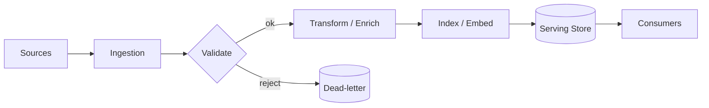

**Figure 34. Application Flow - Trends and Research Directions** (mermaid). Figure: Application Flow view for Generative AI. This diagram illustrates the principal components and their interactions as discussed in the surrounding section.

## Deep Dive: Mechanics, Variants and Trade-offs

Having established the essentials, we now go deeper into trends and research directions. The underlying mechanism is best appreciated by tracing a single request from input to output and noting where state is created and consumed. The distinctions in this section are the ones that separate a working demo from a system that holds up under adversarial inputs, scale and the passage of time.

Consider the principal variants and how to choose between them. Each variant optimises for a different point in the design space - some for latency, some for accuracy, some for cost or operability - and the correct choice follows from explicit requirements rather than from defaults. There is an inherent trade-off between fidelity and cost, and the correct balance depends on the use case and its tolerance for error.

In practice this is supported by a mature tooling ecosystem, including OpenAI API, Anthropic Claude, LangChain, LlamaIndex. Tools accelerate the work but do not substitute for understanding: the same principles apply whichever implementation you select, and the ability to reason from first principles is what lets you debug when a tool behaves unexpectedly.

A frequent source of subtle bugs is the interaction with generative modelling foundations. Because generative modelling foundations concerns likelihood-based versus implicit models; autoregressive, diffusion and variational approaches and the trade-offs between fidelity and diversity, changes there can silently alter the behaviour analysed here. The remedy is contract tests at the boundary and end-to-end evaluations that exercise the interaction explicitly.

Finally, attend to edge cases and degradation. Define what the system should do under partial failure, unexpected inputs and load spikes, and make that behaviour explicit and tested rather than emergent. Graceful degradation - returning a safe, useful result when the ideal one is unavailable - is a hallmark of mature engineering.

For deeper study, the literature offers authoritative treatments such as Ho et al. — Denoising Diffusion Probabilistic Models (2020) and Brown et al. — Language Models are Few-Shot Learners (2020). These primary sources reward careful reading and ground the practical guidance above in established results.

## Advanced Considerations

Having established the essentials, we now go deeper into trends and research directions. The underlying mechanism is best appreciated by tracing a single request from input to output and noting where state is created and consumed. The distinctions in this section are the ones that separate a working demo from a system that holds up under adversarial inputs, scale and the passage of time.

Consider the principal variants and how to choose between them. Each variant optimises for a different point in the design space - some for latency, some for accuracy, some for cost or operability - and the correct choice follows from explicit requirements rather than from defaults. Simplicity is a feature. The simplest design that meets the requirement should be the default, with complexity added only when measurement justifies it.

In practice this is supported by a mature tooling ecosystem, including OpenAI API, Anthropic Claude, LangChain, LlamaIndex. Tools accelerate the work but do not substitute for understanding: the same principles apply whichever implementation you select, and the ability to reason from first principles is what lets you debug when a tool behaves unexpectedly.

A frequent source of subtle bugs is the interaction with multimodal generation. Because multimodal generation concerns joint text–image–audio models, cross-attention conditioning and unified tokenisation strategies, changes there can silently alter the behaviour analysed here. The remedy is contract tests at the boundary and end-to-end evaluations that exercise the interaction explicitly.

Finally, attend to edge cases and degradation. Define what the system should do under partial failure, unexpected inputs and load spikes, and make that behaviour explicit and tested rather than emergent. Graceful degradation - returning a safe, useful result when the ideal one is unavailable - is a hallmark of mature engineering.

For deeper study, the literature offers authoritative treatments such as Ho et al. — Denoising Diffusion Probabilistic Models (2020) and Brown et al. — Language Models are Few-Shot Learners (2020). These primary sources reward careful reading and ground the practical guidance above in established results.

## Worked Example

To ground the discussion, walk through a representative example. A customer service organisation needs grounded assistants that resolve tickets with cited policy. They decide to apply trends and research directions as part of their Generative AI solution, but wisely treat it as a hypothesis to be validated rather than a foregone conclusion.

The team begins by stating the objective precisely and defining how success will be measured before writing any code. They establish a small but representative evaluation set, agree on acceptance thresholds, and only then prototype the simplest design that could work. Early measurement reveals which assumptions hold and which must be revised, saving weeks of misdirected effort and surfacing edge cases while they are still cheap to fix.

As the prototype matures into a service, the team hardens it: adding input validation, error handling, caching where it pays off, and monitoring that ties back to the original success metric. They document each significant decision in an architecture decision record so that future maintainers understand not just what was built but why.

The outcome is instructive. The system that reaches production is not the most sophisticated design the team considered, but the one whose behaviour they could measure, explain and operate. This is the recurring lesson of Generative AI: durable value comes from the whole system, not from any single clever component.

## Industry Use Cases

Across industries, the ideas in this chapter recur in recognisable ways. The following vignettes show how different sectors apply them and what they have in common.

**Legal.** Contract drafting and clause extraction with citation back to source. The common thread is that value comes not from the model alone but from the surrounding system - data quality, evaluation, integration and operations - which is precisely where most of the engineering effort belongs.

**Software.** Code generation, refactoring and test synthesis inside the IDE. The common thread is that value comes not from the model alone but from the surrounding system - data quality, evaluation, integration and operations - which is precisely where most of the engineering effort belongs.

**Marketing.** Brand-safe content generation with human-in-the-loop review. The common thread is that value comes not from the model alone but from the surrounding system - data quality, evaluation, integration and operations - which is precisely where most of the engineering effort belongs.

**Customer Service.** Grounded assistants that resolve tickets with cited policy. The common thread is that value comes not from the model alone but from the surrounding system - data quality, evaluation, integration and operations - which is precisely where most of the engineering effort belongs.

## Best Practices

The following practices consistently separate successful Generative AI efforts from struggling ones. They are deliberately concrete so they can be adopted as checklist items in design and code review.

- Treat prompts as versioned, tested artefacts under source control.
- Always ground high-stakes generations in retrieved, citable sources.
- Define explicit cost and latency budgets per use case and route accordingly.
- Run an automated evaluation suite on every prompt or model change.

None of these are exotic; they are the unglamorous disciplines that compound into reliability. The cost of adopting them is small compared with the cost of the incidents they prevent, and they become second nature with practice.

## Common Pitfalls

Equally instructive are the failure modes that recur in practice. Each pitfall below has a clear early warning sign and a known remedy, so treat them as a diagnostic checklist when something feels wrong:

- Shipping ungrounded generations into high-stakes workflows.
- Ignoring token cost growth as adoption scales.
- Relying on a single provider with no fallback or routing strategy.
- Evaluating only with anecdotes instead of a versioned test set.

The pattern is consistent: most failures stem from skipping measurement, conflating prototype and production standards, or deferring cross-cutting concerns such as security and cost until they become emergencies. Naming these traps in advance is the cheapest way to avoid them.

## Governance, Security and Cost Notes

No discussion of trends and research directions is complete without its governance, security and cost dimensions, which are too often deferred until they become emergencies. Treating them as first-class concerns from the outset is both cheaper and safer.

**Governance.** Classify the risk of this capability, document its intended and out-of-scope uses, and ensure decisions are traceable to satisfy internal policy and external regulation such as the NIST AI RMF, ISO/IEC 42001 and the EU AI Act. **Security.** Treat all external input as untrusted, validate outputs before acting on them, apply least privilege to any tools or data access, and map controls to the OWASP LLM Top 10 and MITRE ATLAS.

**Cost and sustainability.** Establish explicit budgets for compute, tokens and latency, attribute spend to owners, and revisit the economics as usage scales - a design that is affordable at pilot scale can become untenable at production volume. Building these reflexes into everyday engineering is what allows a Generative AI system to be not only capable but also trustworthy and economically sound.

## Hands-On Exercises

Work through the following exercises. They are designed to move understanding from recognition to application - the level required for real engineering work - so prefer writing and building over merely reading.

1. Explain trends and research directions to a colleague unfamiliar with Generative AI, using a concrete example from your own domain.
2. Sketch a reference architecture that incorporates trends and research directions and annotate where observability, security and cost controls belong.
3. Design an evaluation that would tell you whether trends and research directions is working in production, including the metric, the dataset and the acceptance threshold.
4. Identify two pitfalls relevant to trends and research directions in your environment and describe the early warning signals you would monitor.
5. Prototype the simplest implementation that demonstrates trends and research directions, then list exactly what would need to change to make it production-ready.

## Key Takeaways

Key takeaways from this chapter:

- Trends and Research Directions is a systems concern in Generative AI: data, models and operations must be co-designed.
- Measurement is non-negotiable; define success metrics and evaluation before building.
- Favour the simplest design that meets the requirement, and add complexity only when evidence demands it.
- Security, cost and observability are first-class requirements, not afterthoughts.
- Document decisions so the system remains understandable and operable as it evolves.

## Review Questions

1. In the context of Generative AI, which statement best describes “Trends and Research Directions”?
   - A. It makes the system slower but has no other effect.
   - B. emerging trends, open problems and research directions shaping the future of Generative AI
   - C. It guarantees deterministic output regardless of input.
   - D. It is only relevant to academic research, not production.
   - **Answer: B.** Trends and Research Directions: emerging trends, open problems and research directions shaping the future of Generative AI
2. Which of the following is a recommended best practice when working with Generative AI?
   - A. It removes all security and governance requirements.
   - B. Run an automated evaluation suite on every prompt or model change.
   - C. It applies exclusively to image data.
   - D. It guarantees deterministic output regardless of input.
   - **Answer: B.** Best practice: Run an automated evaluation suite on every prompt or model change.
3. Which of the following is a common pitfall to avoid in Generative AI?
   - A. Define explicit cost and latency budgets per use case and route accordingly.
   - B. It is only relevant to academic research, not production.
   - C. It removes all security and governance requirements.
   - D. Evaluating only with anecdotes instead of a versioned test set.
   - **Answer: D.** Pitfall to avoid: Evaluating only with anecdotes instead of a versioned test set.
4. *(Discussion)* Walk through how you would design Trends and Research Directions for an enterprise Generative AI workload.
   - **Model answer:** A strong answer defines trends and research directions (emerging trends, open problems and research directions shaping the future of Generative AI) then connects it to architecture, evaluation, cost, security and operations for Generative AI, citing concrete trade-offs and a real-world example.

---


# Chapter 24. Capstone Project

_This chapter examines capstone project within Generative AI. It covers a substantial capstone project that consolidates the entire book into a portfolio-grade Generative AI deliverable, derives a reference architecture, walks through a worked example and runnable code, surveys industry use cases, and distils best practices and pitfalls, closing with exercises and review questions._

## Introduction

We define Capstone Project as a substantial capstone project that consolidates the entire book into a portfolio-grade Generative AI deliverable. Getting this right early prevents expensive rework once a Generative AI system reaches scale. The practical implication is that design choices here ripple through latency, cost and maintainability for the lifetime of the system.

This chapter builds intuition first, then formalises the ideas, derives an architecture, and finishes with code, exercises and review questions so the material transfers directly to your own Generative AI work. Read it actively: pause at each diagram, reproduce the code, and attempt the exercises before consulting the answers.

## Theory and Foundations

We define Capstone Project as a substantial capstone project that consolidates the entire book into a portfolio-grade Generative AI deliverable. The right abstraction here pays compounding dividends, because downstream components depend on its guarantees. Mechanically, the behaviour emerges from a few interacting parts that are simpler than the whole they produce.

To place this in context, recall the broader picture: Generative AI refers to models that synthesise novel content—text, images, audio, code and structured data—by learning the distribution of training data and sampling from it. Within that picture, capstone project is one of the load-bearing ideas - the kind that, when understood deeply, makes the rest of Generative AI fall into place. It is foundational: later capabilities in Generative AI are built directly on top of it.

Capstone Project cannot be understood in isolation from governance and intellectual property. Recall that governance and intellectual property concerns provenance, watermarking, licensing and the legal landscape of generated content. The two interact directly: decisions in one constrain the design space of the other, which is why mature teams reason about them together rather than sequentially. Simplicity is a feature. The simplest design that meets the requirement should be the default, with complexity added only when measurement justifies it.

Capstone Project cannot be understood in isolation from the genai reference architecture. Recall that the genai reference architecture concerns gateways, orchestration, retrieval, guardrails and evaluation as a cohesive platform. The two interact directly: decisions in one constrain the design space of the other, which is why mature teams reason about them together rather than sequentially. Simplicity is a feature. The simplest design that meets the requirement should be the default, with complexity added only when measurement justifies it.

Several established patterns apply directly to capstone project. The first, semantic caching keyed on normalised prompts and embeddings, is widely adopted because it makes the system's behaviour predictable and observable. A complementary pattern, model gateway abstracting multiple providers behind one api, addresses a related concern and is often deployed alongside it. Patterns are not dogma; they are distilled experience that shortcuts the search for a sound design, and each carries assumptions worth checking against your context.

The decision of whether to adopt this should be driven by requirements, not by novelty. In a small prototype, shortcuts around capstone project are invisible; in a production Generative AI system serving real traffic, they surface as incidents, cost overruns or compliance gaps. Simplicity is a feature. The simplest design that meets the requirement should be the default, with complexity added only when measurement justifies it. The remainder of this chapter turns these principles into an architecture, code and a checklist you can apply immediately.

## Architecture and Design

A robust architecture for Capstone Project is layered so each part can evolve independently without destabilising the whole. A production generative-AI platform places a model gateway in front of one or more foundation models, with orchestration handling prompt assembly, retrieval, tool calls and guardrails. A semantic cache reduces cost and latency, an evaluation service scores responses offline and online, and an observability layer captures prompts, completions, tokens, cost and quality signals for every request.

Concretely, the principal building blocks include generative modelling foundations, large language models as generators, diffusion models for images and audio, multimodal generation and grounding with enterprise data. Each is a replaceable component behind a stable interface, so the team can upgrade an implementation - a model, an index, a policy engine - without rewriting its neighbours. The contracts between components are where reliability is won or lost, so they are specified explicitly and tested in isolation.

The diagram accompanying this section makes the data and control flow explicit. Requests enter through a well-defined boundary where they are authenticated and validated; only then are they dispatched to the components that perform the work. This boundary is also where rate limiting, quota enforcement and audit logging live, keeping cross-cutting concerns out of the core logic and in one auditable place.

Two qualities deserve emphasis. First, observability is designed in, not bolted on: every component emits structured telemetry so that failures can be localised in minutes rather than hours. Second, the architecture is evolvable - components communicate through stable contracts so that any single part of the Generative AI system can be replaced without a rewrite. As with most architectural decisions, the choice is rarely binary; the skill lies in quantifying the trade-offs and choosing deliberately.

```xml
<mxfile host="ai-university">
  <diagram name="Application Flow">
    <mxGraphModel dx="800" dy="600" grid="1" gridSize="10">
      <root>
        <mxCell id="0"/>
        <mxCell id="1" parent="0"/>
        <mxCell id="title" value="Application Flow - Capstone Project" style="text;fontSize=16;fontStyle=1" vertex="1" parent="1"><mxGeometry x="40" y="20" width="600" height="30" as="geometry"/></mxCell>
        <mxCell id="hub" value="Generative AI" style="rounded=1;fillColor=#0f172a;fontColor=#ffffff;fontStyle=1" vertex="1" parent="1"><mxGeometry x="300" y="180" width="160" height="60" as="geometry"/></mxCell>
        <mxCell id="n0" value="Generative Modelling Fo…" style="rounded=1;fillColor=#e0e7ff;strokeColor=#4338ca" vertex="1" parent="1"><mxGeometry x="60" y="80" width="160" height="50" as="geometry"/></mxCell>
        <mxCell id="e0" style="edgeStyle=orthogonalEdgeStyle" edge="1" parent="1" source="hub" target="n0"><mxGeometry relative="1" as="geometry"/></mxCell>
        <mxCell id="n1" value="Large Language Models a…" style="rounded=1;fillColor=#e0e7ff;strokeColor=#4338ca" vertex="1" parent="1"><mxGeometry x="600" y="170" width="160" height="50" as="geometry"/></mxCell>
        <mxCell id="e1" style="edgeStyle=orthogonalEdgeStyle" edge="1" parent="1" source="hub" target="n1"><mxGeometry relative="1" as="geometry"/></mxCell>
        <mxCell id="n2" value="Diffusion Models for Im…" style="rounded=1;fillColor=#e0e7ff;strokeColor=#4338ca" vertex="1" parent="1"><mxGeometry x="60" y="260" width="160" height="50" as="geometry"/></mxCell>
        <mxCell id="e2" style="edgeStyle=orthogonalEdgeStyle" edge="1" parent="1" source="hub" target="n2"><mxGeometry relative="1" as="geometry"/></mxCell>
        <mxCell id="n3" value="Multimodal Generation" style="rounded=1;fillColor=#e0e7ff;strokeColor=#4338ca" vertex="1" parent="1"><mxGeometry x="600" y="350" width="160" height="50" as="geometry"/></mxCell>
        <mxCell id="e3" style="edgeStyle=orthogonalEdgeStyle" edge="1" parent="1" source="hub" target="n3"><mxGeometry relative="1" as="geometry"/></mxCell>
        <mxCell id="n4" value="Grounding with Enterpri…" style="rounded=1;fillColor=#e0e7ff;strokeColor=#4338ca" vertex="1" parent="1"><mxGeometry x="60" y="440" width="160" height="50" as="geometry"/></mxCell>
        <mxCell id="e4" style="edgeStyle=orthogonalEdgeStyle" edge="1" parent="1" source="hub" target="n4"><mxGeometry relative="1" as="geometry"/></mxCell>
      </root>
    </mxGraphModel>
  </diagram>
</mxfile>
```

_Source diagram (drawio); render with the appropriate tool._

**Figure 35. Application Flow - Capstone Project** (drawio). Figure: Application Flow view for Generative AI. This diagram illustrates the principal components and their interactions as discussed in the surrounding section.

<div class="diagram-svg">

<svg xmlns="http://www.w3.org/2000/svg" width="760" height="380" viewBox="0 0 760 380" font-family="Inter, Segoe UI, Arial, sans-serif">
<defs><marker id="arrow" markerWidth="10" markerHeight="10" refX="8" refY="3" orient="auto" markerUnits="strokeWidth"><path d="M0,0 L8,3 L0,6 z" fill="#94a3b8"/></marker><marker id="arrowA" markerWidth="10" markerHeight="10" refX="8" refY="3" orient="auto" markerUnits="strokeWidth"><path d="M0,0 L8,3 L0,6 z" fill="#4338ca"/></marker></defs>
<rect width="760" height="380" rx="12" fill="#f8fafc"/>
<text x="380" y="30" text-anchor="middle" font-size="17" font-weight="700" fill="#0f172a">Knowledge Graph - Capstone Project</text>
<circle cx="380.0" cy="198.0" r="46" fill="#0f172a"/>
<text x="380.0" y="202.0" text-anchor="middle" font-size="12" font-weight="700" fill="#ffffff">Generative AI</text>
<line x1="380.0" y1="152.0" x2="380.0" y2="92.0" stroke="#94a3b8" stroke-width="2" marker-end="url(#arrow)"/>
<rect x="306.0" y="58.0" width="148" height="44" rx="10" fill="#ffffff" stroke="#4338ca" stroke-width="2"/><text x="380.0" y="83.74" text-anchor="middle" font-size="11" font-weight="600" fill="#0f172a">Generative Modelling Fo…</text>
<line x1="419.83716857408416" y1="175.0" x2="575.7217412552832" y2="145.0" stroke="#94a3b8" stroke-width="2" marker-end="url(#arrow)"/>
<rect x="522.5063509461097" y="117.0" width="148" height="44" rx="10" fill="#ffffff" stroke="#7c3aed" stroke-width="2"/><text x="596.5063509461097" y="142.74" text-anchor="middle" font-size="11" font-weight="600" fill="#0f172a">Large Language Models a…</text>
<line x1="419.83716857408416" y1="221.0" x2="575.7217412552832" y2="251.0" stroke="#94a3b8" stroke-width="2" marker-end="url(#arrow)"/>
<rect x="522.5063509461097" y="235.0" width="148" height="44" rx="10" fill="#ffffff" stroke="#0891b2" stroke-width="2"/><text x="596.5063509461097" y="260.74" text-anchor="middle" font-size="11" font-weight="600" fill="#0f172a">Diffusion Models for Im…</text>
<line x1="380.0" y1="244.0" x2="380.0" y2="304.0" stroke="#94a3b8" stroke-width="2" marker-end="url(#arrow)"/>
<rect x="306.0" y="294.0" width="148" height="44" rx="10" fill="#ffffff" stroke="#059669" stroke-width="2"/><text x="380.0" y="319.74" text-anchor="middle" font-size="11" font-weight="600" fill="#0f172a">Multimodal Generation</text>
<line x1="340.16283142591584" y1="221.0" x2="184.2782587447169" y2="251.00000000000006" stroke="#94a3b8" stroke-width="2" marker-end="url(#arrow)"/>
<rect x="89.49364905389038" y="235.00000000000006" width="148" height="44" rx="10" fill="#ffffff" stroke="#d97706" stroke-width="2"/><text x="163.49364905389038" y="260.74000000000007" text-anchor="middle" font-size="11" font-weight="600" fill="#0f172a">Grounding with Enterpri…</text>
<line x1="340.16283142591584" y1="175.0" x2="184.27825874471688" y2="145.0" stroke="#94a3b8" stroke-width="2" marker-end="url(#arrow)"/>
<rect x="89.49364905389035" y="117.0" width="148" height="44" rx="10" fill="#ffffff" stroke="#dc2626" stroke-width="2"/><text x="163.49364905389035" y="142.74" text-anchor="middle" font-size="11" font-weight="600" fill="#0f172a">Controllability and Str…</text>
</svg>

</div>

**Figure 36. Knowledge Graph - Capstone Project** (svg). Figure: Knowledge Graph view for Generative AI. This diagram illustrates the principal components and their interactions as discussed in the surrounding section.

## Deep Dive: Mechanics, Variants and Trade-offs

Having established the essentials, we now go deeper into capstone project. The underlying mechanism is best appreciated by tracing a single request from input to output and noting where state is created and consumed. The distinctions in this section are the ones that separate a working demo from a system that holds up under adversarial inputs, scale and the passage of time.

Consider the principal variants and how to choose between them. Each variant optimises for a different point in the design space - some for latency, some for accuracy, some for cost or operability - and the correct choice follows from explicit requirements rather than from defaults. As with most architectural decisions, the choice is rarely binary; the skill lies in quantifying the trade-offs and choosing deliberately.

In practice this is supported by a mature tooling ecosystem, including OpenAI API, Anthropic Claude, LangChain, LlamaIndex. Tools accelerate the work but do not substitute for understanding: the same principles apply whichever implementation you select, and the ability to reason from first principles is what lets you debug when a tool behaves unexpectedly.

A frequent source of subtle bugs is the interaction with governance and intellectual property. Because governance and intellectual property concerns provenance, watermarking, licensing and the legal landscape of generated content, changes there can silently alter the behaviour analysed here. The remedy is contract tests at the boundary and end-to-end evaluations that exercise the interaction explicitly.

Finally, attend to edge cases and degradation. Define what the system should do under partial failure, unexpected inputs and load spikes, and make that behaviour explicit and tested rather than emergent. Graceful degradation - returning a safe, useful result when the ideal one is unavailable - is a hallmark of mature engineering.

For deeper study, the literature offers authoritative treatments such as Ho et al. — Denoising Diffusion Probabilistic Models (2020) and Brown et al. — Language Models are Few-Shot Learners (2020). These primary sources reward careful reading and ground the practical guidance above in established results.

## Advanced Considerations

Having established the essentials, we now go deeper into capstone project. Mechanically, the behaviour emerges from a few interacting parts that are simpler than the whole they produce. The distinctions in this section are the ones that separate a working demo from a system that holds up under adversarial inputs, scale and the passage of time.

Consider the principal variants and how to choose between them. Each variant optimises for a different point in the design space - some for latency, some for accuracy, some for cost or operability - and the correct choice follows from explicit requirements rather than from defaults. Latency, accuracy and cost form a tension triangle: improving one typically pressures the others, so explicit budgets are essential.

In practice this is supported by a mature tooling ecosystem, including OpenAI API, Anthropic Claude, LangChain, LlamaIndex. Tools accelerate the work but do not substitute for understanding: the same principles apply whichever implementation you select, and the ability to reason from first principles is what lets you debug when a tool behaves unexpectedly.

A frequent source of subtle bugs is the interaction with controllability and structured output. Because controllability and structured output concerns constrained decoding, JSON/schema enforcement and function calling for reliable downstream integration, changes there can silently alter the behaviour analysed here. The remedy is contract tests at the boundary and end-to-end evaluations that exercise the interaction explicitly.

Finally, attend to edge cases and degradation. Define what the system should do under partial failure, unexpected inputs and load spikes, and make that behaviour explicit and tested rather than emergent. Graceful degradation - returning a safe, useful result when the ideal one is unavailable - is a hallmark of mature engineering.

For deeper study, the literature offers authoritative treatments such as Ho et al. — Denoising Diffusion Probabilistic Models (2020) and Brown et al. — Language Models are Few-Shot Learners (2020). These primary sources reward careful reading and ground the practical guidance above in established results.

## Worked Example

Consider a concrete scenario. A legal organisation needs contract drafting and clause extraction with citation back to source. They decide to apply capstone project as part of their Generative AI solution, but wisely treat it as a hypothesis to be validated rather than a foregone conclusion.

The team begins by stating the objective precisely and defining how success will be measured before writing any code. They establish a small but representative evaluation set, agree on acceptance thresholds, and only then prototype the simplest design that could work. Early measurement reveals which assumptions hold and which must be revised, saving weeks of misdirected effort and surfacing edge cases while they are still cheap to fix.

As the prototype matures into a service, the team hardens it: adding input validation, error handling, caching where it pays off, and monitoring that ties back to the original success metric. They document each significant decision in an architecture decision record so that future maintainers understand not just what was built but why.

The outcome is instructive. The system that reaches production is not the most sophisticated design the team considered, but the one whose behaviour they could measure, explain and operate. This is the recurring lesson of Generative AI: durable value comes from the whole system, not from any single clever component.

## Industry Use Cases

Across industries, the ideas in this chapter recur in recognisable ways. The following vignettes show how different sectors apply them and what they have in common.

**Legal.** Contract drafting and clause extraction with citation back to source. The common thread is that value comes not from the model alone but from the surrounding system - data quality, evaluation, integration and operations - which is precisely where most of the engineering effort belongs.

**Software.** Code generation, refactoring and test synthesis inside the IDE. The common thread is that value comes not from the model alone but from the surrounding system - data quality, evaluation, integration and operations - which is precisely where most of the engineering effort belongs.

**Marketing.** Brand-safe content generation with human-in-the-loop review. The common thread is that value comes not from the model alone but from the surrounding system - data quality, evaluation, integration and operations - which is precisely where most of the engineering effort belongs.

**Customer Service.** Grounded assistants that resolve tickets with cited policy. The common thread is that value comes not from the model alone but from the surrounding system - data quality, evaluation, integration and operations - which is precisely where most of the engineering effort belongs.

## Best Practices

The following practices consistently separate successful Generative AI efforts from struggling ones. They are deliberately concrete so they can be adopted as checklist items in design and code review.

- Treat prompts as versioned, tested artefacts under source control.
- Always ground high-stakes generations in retrieved, citable sources.
- Define explicit cost and latency budgets per use case and route accordingly.
- Run an automated evaluation suite on every prompt or model change.

None of these are exotic; they are the unglamorous disciplines that compound into reliability. The cost of adopting them is small compared with the cost of the incidents they prevent, and they become second nature with practice.

## Common Pitfalls

Equally instructive are the failure modes that recur in practice. Each pitfall below has a clear early warning sign and a known remedy, so treat them as a diagnostic checklist when something feels wrong:

- Shipping ungrounded generations into high-stakes workflows.
- Ignoring token cost growth as adoption scales.
- Relying on a single provider with no fallback or routing strategy.
- Evaluating only with anecdotes instead of a versioned test set.

The pattern is consistent: most failures stem from skipping measurement, conflating prototype and production standards, or deferring cross-cutting concerns such as security and cost until they become emergencies. Naming these traps in advance is the cheapest way to avoid them.

## Governance, Security and Cost Notes

No discussion of capstone project is complete without its governance, security and cost dimensions, which are too often deferred until they become emergencies. Treating them as first-class concerns from the outset is both cheaper and safer.

**Governance.** Classify the risk of this capability, document its intended and out-of-scope uses, and ensure decisions are traceable to satisfy internal policy and external regulation such as the NIST AI RMF, ISO/IEC 42001 and the EU AI Act. **Security.** Treat all external input as untrusted, validate outputs before acting on them, apply least privilege to any tools or data access, and map controls to the OWASP LLM Top 10 and MITRE ATLAS.

**Cost and sustainability.** Establish explicit budgets for compute, tokens and latency, attribute spend to owners, and revisit the economics as usage scales - a design that is affordable at pilot scale can become untenable at production volume. Building these reflexes into everyday engineering is what allows a Generative AI system to be not only capable but also trustworthy and economically sound.

## Hands-On Exercises

Work through the following exercises. They are designed to move understanding from recognition to application - the level required for real engineering work - so prefer writing and building over merely reading.

1. Explain capstone project to a colleague unfamiliar with Generative AI, using a concrete example from your own domain.
2. Sketch a reference architecture that incorporates capstone project and annotate where observability, security and cost controls belong.
3. Design an evaluation that would tell you whether capstone project is working in production, including the metric, the dataset and the acceptance threshold.
4. Identify two pitfalls relevant to capstone project in your environment and describe the early warning signals you would monitor.
5. Prototype the simplest implementation that demonstrates capstone project, then list exactly what would need to change to make it production-ready.

## Key Takeaways

Key takeaways from this chapter:

- Capstone Project is a systems concern in Generative AI: data, models and operations must be co-designed.
- Measurement is non-negotiable; define success metrics and evaluation before building.
- Favour the simplest design that meets the requirement, and add complexity only when evidence demands it.
- Security, cost and observability are first-class requirements, not afterthoughts.
- Document decisions so the system remains understandable and operable as it evolves.

## Code Walkthrough

Pipelines keep Capstone Project logic modular and testable. Each stage is a pure function, errors are captured per item, and the composition is trivial to extend or reorder.

The full listing is shown below; study it line by line and reproduce it locally before moving on.

### Listing: A composable processing pipeline for Capstone Project

```python
from collections.abc import Iterable, Iterator
from typing import Protocol


class Stage(Protocol):
    def __call__(self, item: dict) -> dict: ...


def pipeline(stages: list[Stage]) -> Stage:
    """Compose ordered stages into a single callable for Capstone Project."""

    def run(item: dict) -> dict:
        for stage in stages:
            item = stage(item)
        return item

    return run


def validate(item: dict) -> dict:
    if "text" not in item:
        raise ValueError("missing required field: text")
    return item


def normalise(item: dict) -> dict:
    item["text"] = item["text"].strip().lower()
    return item


def enrich(item: dict) -> dict:
    item["length"] = len(item["text"])
    return item


process = pipeline([validate, normalise, enrich])


def run_batch(items: Iterable[dict]) -> Iterator[dict]:
    for item in items:
        try:
            yield process(dict(item))
        except ValueError as exc:
            yield {"error": str(exc), "item": item}

```

## Review Questions

1. In the context of Generative AI, which statement best describes “Capstone Project”?
   - A. It is only relevant to academic research, not production.
   - B. It eliminates the need for any evaluation or monitoring.
   - C. a substantial capstone project that consolidates the entire book into a portfolio-grade Generative AI deliverable
   - D. It applies exclusively to image data.
   - **Answer: C.** Capstone Project: a substantial capstone project that consolidates the entire book into a portfolio-grade Generative AI deliverable
2. Which of the following is a recommended best practice when working with Generative AI?
   - A. Treat prompts as versioned, tested artefacts under source control.
   - B. It applies exclusively to image data.
   - C. Evaluating only with anecdotes instead of a versioned test set.
   - D. It is only relevant to academic research, not production.
   - **Answer: A.** Best practice: Treat prompts as versioned, tested artefacts under source control.
3. Which of the following is a common pitfall to avoid in Generative AI?
   - A. It guarantees deterministic output regardless of input.
   - B. Run an automated evaluation suite on every prompt or model change.
   - C. Treat prompts as versioned, tested artefacts under source control.
   - D. Relying on a single provider with no fallback or routing strategy.
   - **Answer: D.** Pitfall to avoid: Relying on a single provider with no fallback or routing strategy.
4. *(Discussion)* Walk through how you would design Capstone Project for an enterprise Generative AI workload.
   - **Model answer:** A strong answer defines capstone project (a substantial capstone project that consolidates the entire book into a portfolio-grade Generative AI deliverable) then connects it to architecture, evaluation, cost, security and operations for Generative AI, citing concrete trade-offs and a real-world example.

---


# Chapter 25. Certification Preparation and Review

_This chapter examines certification preparation and review within Generative AI. It covers a structured review and certification-style preparation covering the full breadth of Generative AI, derives a reference architecture, walks through a worked example and runnable code, surveys industry use cases, and distils best practices and pitfalls, closing with exercises and review questions._

## Introduction

In practical terms, Certification Preparation and Review is best understood as a structured review and certification-style preparation covering the full breadth of Generative AI. It is foundational: later capabilities in Generative AI are built directly on top of it. Seasoned practitioners treat this as a systems problem, co-designing data, models and operations rather than optimising any one in isolation.

This chapter builds intuition first, then formalises the ideas, derives an architecture, and finishes with code, exercises and review questions so the material transfers directly to your own Generative AI work. Read it actively: pause at each diagram, reproduce the code, and attempt the exercises before consulting the answers.

## Theory and Foundations

In practical terms, Certification Preparation and Review is best understood as a structured review and certification-style preparation covering the full breadth of Generative AI. Seasoned practitioners treat this as a systems problem, co-designing data, models and operations rather than optimising any one in isolation. It pays to understand the mechanism rather than treat it as a black box, because most production incidents are explained by one of its steps misbehaving.

To place this in context, recall the broader picture: Generative AI refers to models that synthesise novel content—text, images, audio, code and structured data—by learning the distribution of training data and sampling from it. Within that picture, certification preparation and review is one of the load-bearing ideas - the kind that, when understood deeply, makes the rest of Generative AI fall into place. This concept recurs throughout the Generative AI lifecycle, from design to operations.

Certification Preparation and Review cannot be understood in isolation from grounding with enterprise data. Recall that grounding with enterprise data concerns retrieval augmentation, tool use and structured outputs to keep generations factual and policy-compliant. The two interact directly: decisions in one constrain the design space of the other, which is why mature teams reason about them together rather than sequentially. There is an inherent trade-off between fidelity and cost, and the correct balance depends on the use case and its tolerance for error.

Certification Preparation and Review cannot be understood in isolation from diffusion models for images and audio. Recall that diffusion models for images and audio concerns forward/reverse diffusion, denoising objectives, latent diffusion and classifier-free guidance. The two interact directly: decisions in one constrain the design space of the other, which is why mature teams reason about them together rather than sequentially. Every added component buys capability at the price of operational surface area, and that bargain should be made consciously.

Several established patterns apply directly to certification preparation and review. The first, model gateway abstracting multiple providers behind one api, is widely adopted because it makes the system's behaviour predictable and observable. A complementary pattern, guardrail sandwich: validate inputs, constrain decoding, validate outputs, addresses a related concern and is often deployed alongside it. Patterns are not dogma; they are distilled experience that shortcuts the search for a sound design, and each carries assumptions worth checking against your context.

Knowing when not to use a technique is as valuable as knowing how to use it. In a small prototype, shortcuts around certification preparation and review are invisible; in a production Generative AI system serving real traffic, they surface as incidents, cost overruns or compliance gaps. Latency, accuracy and cost form a tension triangle: improving one typically pressures the others, so explicit budgets are essential. The remainder of this chapter turns these principles into an architecture, code and a checklist you can apply immediately.

## Architecture and Design

From an architectural standpoint, Certification Preparation and Review sits at the intersection of data, models and operations. A production generative-AI platform places a model gateway in front of one or more foundation models, with orchestration handling prompt assembly, retrieval, tool calls and guardrails. A semantic cache reduces cost and latency, an evaluation service scores responses offline and online, and an observability layer captures prompts, completions, tokens, cost and quality signals for every request.

Concretely, the principal building blocks include generative modelling foundations, large language models as generators, diffusion models for images and audio, multimodal generation and grounding with enterprise data. Each is a replaceable component behind a stable interface, so the team can upgrade an implementation - a model, an index, a policy engine - without rewriting its neighbours. The contracts between components are where reliability is won or lost, so they are specified explicitly and tested in isolation.

The diagram accompanying this section makes the data and control flow explicit. Requests enter through a well-defined boundary where they are authenticated and validated; only then are they dispatched to the components that perform the work. This boundary is also where rate limiting, quota enforcement and audit logging live, keeping cross-cutting concerns out of the core logic and in one auditable place.

Two qualities deserve emphasis. First, observability is designed in, not bolted on: every component emits structured telemetry so that failures can be localised in minutes rather than hours. Second, the architecture is evolvable - components communicate through stable contracts so that any single part of the Generative AI system can be replaced without a rewrite. There is an inherent trade-off between fidelity and cost, and the correct balance depends on the use case and its tolerance for error.

<div class="diagram-svg">

<svg xmlns="http://www.w3.org/2000/svg" width="760" height="380" viewBox="0 0 760 380" font-family="Inter, Segoe UI, Arial, sans-serif">
<defs><marker id="arrow" markerWidth="10" markerHeight="10" refX="8" refY="3" orient="auto" markerUnits="strokeWidth"><path d="M0,0 L8,3 L0,6 z" fill="#94a3b8"/></marker><marker id="arrowA" markerWidth="10" markerHeight="10" refX="8" refY="3" orient="auto" markerUnits="strokeWidth"><path d="M0,0 L8,3 L0,6 z" fill="#4338ca"/></marker></defs>
<rect width="760" height="380" rx="12" fill="#f8fafc"/>
<text x="380" y="30" text-anchor="middle" font-size="17" font-weight="700" fill="#0f172a">Knowledge Graph - Certification Preparation and Review</text>
<circle cx="380.0" cy="198.0" r="46" fill="#0f172a"/>
<text x="380.0" y="202.0" text-anchor="middle" font-size="12" font-weight="700" fill="#ffffff">Generative AI</text>
<line x1="380.0" y1="152.0" x2="380.0" y2="92.0" stroke="#94a3b8" stroke-width="2" marker-end="url(#arrow)"/>
<rect x="306.0" y="58.0" width="148" height="44" rx="10" fill="#ffffff" stroke="#4338ca" stroke-width="2"/><text x="380.0" y="83.74" text-anchor="middle" font-size="11" font-weight="600" fill="#0f172a">Generative Modelling Fo…</text>
<line x1="419.83716857408416" y1="175.0" x2="575.7217412552832" y2="145.0" stroke="#94a3b8" stroke-width="2" marker-end="url(#arrow)"/>
<rect x="522.5063509461097" y="117.0" width="148" height="44" rx="10" fill="#ffffff" stroke="#7c3aed" stroke-width="2"/><text x="596.5063509461097" y="142.74" text-anchor="middle" font-size="11" font-weight="600" fill="#0f172a">Large Language Models a…</text>
<line x1="419.83716857408416" y1="221.0" x2="575.7217412552832" y2="251.0" stroke="#94a3b8" stroke-width="2" marker-end="url(#arrow)"/>
<rect x="522.5063509461097" y="235.0" width="148" height="44" rx="10" fill="#ffffff" stroke="#0891b2" stroke-width="2"/><text x="596.5063509461097" y="260.74" text-anchor="middle" font-size="11" font-weight="600" fill="#0f172a">Diffusion Models for Im…</text>
<line x1="380.0" y1="244.0" x2="380.0" y2="304.0" stroke="#94a3b8" stroke-width="2" marker-end="url(#arrow)"/>
<rect x="306.0" y="294.0" width="148" height="44" rx="10" fill="#ffffff" stroke="#059669" stroke-width="2"/><text x="380.0" y="319.74" text-anchor="middle" font-size="11" font-weight="600" fill="#0f172a">Multimodal Generation</text>
<line x1="340.16283142591584" y1="221.0" x2="184.2782587447169" y2="251.00000000000006" stroke="#94a3b8" stroke-width="2" marker-end="url(#arrow)"/>
<rect x="89.49364905389038" y="235.00000000000006" width="148" height="44" rx="10" fill="#ffffff" stroke="#d97706" stroke-width="2"/><text x="163.49364905389038" y="260.74000000000007" text-anchor="middle" font-size="11" font-weight="600" fill="#0f172a">Grounding with Enterpri…</text>
<line x1="340.16283142591584" y1="175.0" x2="184.27825874471688" y2="145.0" stroke="#94a3b8" stroke-width="2" marker-end="url(#arrow)"/>
<rect x="89.49364905389035" y="117.0" width="148" height="44" rx="10" fill="#ffffff" stroke="#dc2626" stroke-width="2"/><text x="163.49364905389035" y="142.74" text-anchor="middle" font-size="11" font-weight="600" fill="#0f172a">Controllability and Str…</text>
</svg>

</div>

**Figure 37. Knowledge Graph - Certification Preparation and Review** (svg). Figure: Knowledge Graph view for Generative AI. This diagram illustrates the principal components and their interactions as discussed in the surrounding section.

```xml
<mxfile host="ai-university">
  <diagram name="Operating Model">
    <mxGraphModel dx="800" dy="600" grid="1" gridSize="10">
      <root>
        <mxCell id="0"/>
        <mxCell id="1" parent="0"/>
        <mxCell id="title" value="Operating Model - Certification Preparation and Review" style="text;fontSize=16;fontStyle=1" vertex="1" parent="1"><mxGeometry x="40" y="20" width="600" height="30" as="geometry"/></mxCell>
        <mxCell id="hub" value="Generative AI" style="rounded=1;fillColor=#0f172a;fontColor=#ffffff;fontStyle=1" vertex="1" parent="1"><mxGeometry x="300" y="180" width="160" height="60" as="geometry"/></mxCell>
        <mxCell id="n0" value="Generative Modelling Fo…" style="rounded=1;fillColor=#e0e7ff;strokeColor=#4338ca" vertex="1" parent="1"><mxGeometry x="60" y="80" width="160" height="50" as="geometry"/></mxCell>
        <mxCell id="e0" style="edgeStyle=orthogonalEdgeStyle" edge="1" parent="1" source="hub" target="n0"><mxGeometry relative="1" as="geometry"/></mxCell>
        <mxCell id="n1" value="Large Language Models a…" style="rounded=1;fillColor=#e0e7ff;strokeColor=#4338ca" vertex="1" parent="1"><mxGeometry x="600" y="170" width="160" height="50" as="geometry"/></mxCell>
        <mxCell id="e1" style="edgeStyle=orthogonalEdgeStyle" edge="1" parent="1" source="hub" target="n1"><mxGeometry relative="1" as="geometry"/></mxCell>
        <mxCell id="n2" value="Diffusion Models for Im…" style="rounded=1;fillColor=#e0e7ff;strokeColor=#4338ca" vertex="1" parent="1"><mxGeometry x="60" y="260" width="160" height="50" as="geometry"/></mxCell>
        <mxCell id="e2" style="edgeStyle=orthogonalEdgeStyle" edge="1" parent="1" source="hub" target="n2"><mxGeometry relative="1" as="geometry"/></mxCell>
        <mxCell id="n3" value="Multimodal Generation" style="rounded=1;fillColor=#e0e7ff;strokeColor=#4338ca" vertex="1" parent="1"><mxGeometry x="600" y="350" width="160" height="50" as="geometry"/></mxCell>
        <mxCell id="e3" style="edgeStyle=orthogonalEdgeStyle" edge="1" parent="1" source="hub" target="n3"><mxGeometry relative="1" as="geometry"/></mxCell>
        <mxCell id="n4" value="Grounding with Enterpri…" style="rounded=1;fillColor=#e0e7ff;strokeColor=#4338ca" vertex="1" parent="1"><mxGeometry x="60" y="440" width="160" height="50" as="geometry"/></mxCell>
        <mxCell id="e4" style="edgeStyle=orthogonalEdgeStyle" edge="1" parent="1" source="hub" target="n4"><mxGeometry relative="1" as="geometry"/></mxCell>
      </root>
    </mxGraphModel>
  </diagram>
</mxfile>
```

_Source diagram (drawio); render with the appropriate tool._

**Figure 38. Operating Model - Certification Preparation and Review** (drawio). Figure: Operating Model view for Generative AI. This diagram illustrates the principal components and their interactions as discussed in the surrounding section.

## Deep Dive: Mechanics, Variants and Trade-offs

Having established the essentials, we now go deeper into certification preparation and review. It pays to understand the mechanism rather than treat it as a black box, because most production incidents are explained by one of its steps misbehaving. The distinctions in this section are the ones that separate a working demo from a system that holds up under adversarial inputs, scale and the passage of time.

Consider the principal variants and how to choose between them. Each variant optimises for a different point in the design space - some for latency, some for accuracy, some for cost or operability - and the correct choice follows from explicit requirements rather than from defaults. As with most architectural decisions, the choice is rarely binary; the skill lies in quantifying the trade-offs and choosing deliberately.

In practice this is supported by a mature tooling ecosystem, including OpenAI API, Anthropic Claude, LangChain, LlamaIndex. Tools accelerate the work but do not substitute for understanding: the same principles apply whichever implementation you select, and the ability to reason from first principles is what lets you debug when a tool behaves unexpectedly.

A frequent source of subtle bugs is the interaction with grounding with enterprise data. Because grounding with enterprise data concerns retrieval augmentation, tool use and structured outputs to keep generations factual and policy-compliant, changes there can silently alter the behaviour analysed here. The remedy is contract tests at the boundary and end-to-end evaluations that exercise the interaction explicitly.

Finally, attend to edge cases and degradation. Define what the system should do under partial failure, unexpected inputs and load spikes, and make that behaviour explicit and tested rather than emergent. Graceful degradation - returning a safe, useful result when the ideal one is unavailable - is a hallmark of mature engineering.

For deeper study, the literature offers authoritative treatments such as Ho et al. — Denoising Diffusion Probabilistic Models (2020) and Brown et al. — Language Models are Few-Shot Learners (2020). These primary sources reward careful reading and ground the practical guidance above in established results.

## Advanced Considerations

Having established the essentials, we now go deeper into certification preparation and review. Beneath the abstraction lies a concrete process whose steps can each be measured, tested and optimised independently. The distinctions in this section are the ones that separate a working demo from a system that holds up under adversarial inputs, scale and the passage of time.

Consider the principal variants and how to choose between them. Each variant optimises for a different point in the design space - some for latency, some for accuracy, some for cost or operability - and the correct choice follows from explicit requirements rather than from defaults. Simplicity is a feature. The simplest design that meets the requirement should be the default, with complexity added only when measurement justifies it.

In practice this is supported by a mature tooling ecosystem, including OpenAI API, Anthropic Claude, LangChain, LlamaIndex. Tools accelerate the work but do not substitute for understanding: the same principles apply whichever implementation you select, and the ability to reason from first principles is what lets you debug when a tool behaves unexpectedly.

A frequent source of subtle bugs is the interaction with safety, guardrails and content moderation. Because safety, guardrails and content moderation concerns input/output filtering, jailbreak resistance and layered defence in depth, changes there can silently alter the behaviour analysed here. The remedy is contract tests at the boundary and end-to-end evaluations that exercise the interaction explicitly.

Finally, attend to edge cases and degradation. Define what the system should do under partial failure, unexpected inputs and load spikes, and make that behaviour explicit and tested rather than emergent. Graceful degradation - returning a safe, useful result when the ideal one is unavailable - is a hallmark of mature engineering.

For deeper study, the literature offers authoritative treatments such as Ho et al. — Denoising Diffusion Probabilistic Models (2020) and Brown et al. — Language Models are Few-Shot Learners (2020). These primary sources reward careful reading and ground the practical guidance above in established results.

## Worked Example

A worked example clarifies how these ideas behave in practice. A customer service organisation needs grounded assistants that resolve tickets with cited policy. They decide to apply certification preparation and review as part of their Generative AI solution, but wisely treat it as a hypothesis to be validated rather than a foregone conclusion.

The team begins by stating the objective precisely and defining how success will be measured before writing any code. They establish a small but representative evaluation set, agree on acceptance thresholds, and only then prototype the simplest design that could work. Early measurement reveals which assumptions hold and which must be revised, saving weeks of misdirected effort and surfacing edge cases while they are still cheap to fix.

As the prototype matures into a service, the team hardens it: adding input validation, error handling, caching where it pays off, and monitoring that ties back to the original success metric. They document each significant decision in an architecture decision record so that future maintainers understand not just what was built but why.

The outcome is instructive. The system that reaches production is not the most sophisticated design the team considered, but the one whose behaviour they could measure, explain and operate. This is the recurring lesson of Generative AI: durable value comes from the whole system, not from any single clever component.

## Industry Use Cases

Across industries, the ideas in this chapter recur in recognisable ways. The following vignettes show how different sectors apply them and what they have in common.

**Legal.** Contract drafting and clause extraction with citation back to source. The common thread is that value comes not from the model alone but from the surrounding system - data quality, evaluation, integration and operations - which is precisely where most of the engineering effort belongs.

**Software.** Code generation, refactoring and test synthesis inside the IDE. The common thread is that value comes not from the model alone but from the surrounding system - data quality, evaluation, integration and operations - which is precisely where most of the engineering effort belongs.

**Marketing.** Brand-safe content generation with human-in-the-loop review. The common thread is that value comes not from the model alone but from the surrounding system - data quality, evaluation, integration and operations - which is precisely where most of the engineering effort belongs.

**Customer Service.** Grounded assistants that resolve tickets with cited policy. The common thread is that value comes not from the model alone but from the surrounding system - data quality, evaluation, integration and operations - which is precisely where most of the engineering effort belongs.

## Best Practices

The following practices consistently separate successful Generative AI efforts from struggling ones. They are deliberately concrete so they can be adopted as checklist items in design and code review.

- Treat prompts as versioned, tested artefacts under source control.
- Always ground high-stakes generations in retrieved, citable sources.
- Define explicit cost and latency budgets per use case and route accordingly.
- Run an automated evaluation suite on every prompt or model change.

None of these are exotic; they are the unglamorous disciplines that compound into reliability. The cost of adopting them is small compared with the cost of the incidents they prevent, and they become second nature with practice.

## Common Pitfalls

Equally instructive are the failure modes that recur in practice. Each pitfall below has a clear early warning sign and a known remedy, so treat them as a diagnostic checklist when something feels wrong:

- Shipping ungrounded generations into high-stakes workflows.
- Ignoring token cost growth as adoption scales.
- Relying on a single provider with no fallback or routing strategy.
- Evaluating only with anecdotes instead of a versioned test set.

The pattern is consistent: most failures stem from skipping measurement, conflating prototype and production standards, or deferring cross-cutting concerns such as security and cost until they become emergencies. Naming these traps in advance is the cheapest way to avoid them.

## Governance, Security and Cost Notes

No discussion of certification preparation and review is complete without its governance, security and cost dimensions, which are too often deferred until they become emergencies. Treating them as first-class concerns from the outset is both cheaper and safer.

**Governance.** Classify the risk of this capability, document its intended and out-of-scope uses, and ensure decisions are traceable to satisfy internal policy and external regulation such as the NIST AI RMF, ISO/IEC 42001 and the EU AI Act. **Security.** Treat all external input as untrusted, validate outputs before acting on them, apply least privilege to any tools or data access, and map controls to the OWASP LLM Top 10 and MITRE ATLAS.

**Cost and sustainability.** Establish explicit budgets for compute, tokens and latency, attribute spend to owners, and revisit the economics as usage scales - a design that is affordable at pilot scale can become untenable at production volume. Building these reflexes into everyday engineering is what allows a Generative AI system to be not only capable but also trustworthy and economically sound.

## Hands-On Exercises

Work through the following exercises. They are designed to move understanding from recognition to application - the level required for real engineering work - so prefer writing and building over merely reading.

1. Explain certification preparation and review to a colleague unfamiliar with Generative AI, using a concrete example from your own domain.
2. Sketch a reference architecture that incorporates certification preparation and review and annotate where observability, security and cost controls belong.
3. Design an evaluation that would tell you whether certification preparation and review is working in production, including the metric, the dataset and the acceptance threshold.
4. Identify two pitfalls relevant to certification preparation and review in your environment and describe the early warning signals you would monitor.
5. Prototype the simplest implementation that demonstrates certification preparation and review, then list exactly what would need to change to make it production-ready.

## Key Takeaways

Key takeaways from this chapter:

- Certification Preparation and Review is a systems concern in Generative AI: data, models and operations must be co-designed.
- Measurement is non-negotiable; define success metrics and evaluation before building.
- Favour the simplest design that meets the requirement, and add complexity only when evidence demands it.
- Security, cost and observability are first-class requirements, not afterthoughts.
- Document decisions so the system remains understandable and operable as it evolves.

## Code Walkthrough

This listing shows a configuration-driven Certification Preparation and Review component with retry semantics and typed interfaces — the shape we expect from production Generative AI code rather than a notebook prototype.

The full listing is shown below; study it line by line and reproduce it locally before moving on.

### Listing: Implementing a Certification Preparation and Review component

```python
from __future__ import annotations

from dataclasses import dataclass, field
from typing import Any


@dataclass(slots=True)
class CertificationPreparationAndConfig:
    """Configuration for the Certification Preparation and Review component in a Generative AI system."""

    name: str
    timeout_s: float = 30.0
    max_retries: int = 3
    options: dict[str, Any] = field(default_factory=dict)


class CertificationPreparationAnd:
    """A minimal, production-shaped implementation of Certification Preparation and Review."""

    def __init__(self, config: CertificationPreparationAndConfig) -> None:
        self._config = config
        self._calls = 0

    def run(self, payload: dict[str, Any]) -> dict[str, Any]:
        """Process a request, retrying transient failures with backoff."""
        last_error: Exception | None = None
        for attempt in range(self._config.max_retries):
            try:
                self._calls += 1
                return self._process(payload)
            except TimeoutError as exc:  # transient
                last_error = exc
                continue
        raise RuntimeError(f"CertificationPreparationAnd failed after retries") from last_error

    def _process(self, payload: dict[str, Any]) -> dict[str, Any]:
        # Domain-specific logic for Certification Preparation and Review goes here.
        return {"status": "ok", "input_keys": sorted(payload), "calls": self._calls}

```

## Review Questions

1. In the context of Generative AI, which statement best describes “Certification Preparation and Review”?
   - A. It applies exclusively to image data.
   - B. It guarantees deterministic output regardless of input.
   - C. It eliminates the need for any evaluation or monitoring.
   - D. a structured review and certification-style preparation covering the full breadth of Generative AI
   - **Answer: D.** Certification Preparation and Review: a structured review and certification-style preparation covering the full breadth of Generative AI
2. Which of the following is a recommended best practice when working with Generative AI?
   - A. Ignoring token cost growth as adoption scales.
   - B. It eliminates the need for any evaluation or monitoring.
   - C. It makes the system slower but has no other effect.
   - D. Treat prompts as versioned, tested artefacts under source control.
   - **Answer: D.** Best practice: Treat prompts as versioned, tested artefacts under source control.
3. Which of the following is a common pitfall to avoid in Generative AI?
   - A. Always ground high-stakes generations in retrieved, citable sources.
   - B. Ignoring token cost growth as adoption scales.
   - C. It guarantees deterministic output regardless of input.
   - D. It eliminates the need for any evaluation or monitoring.
   - **Answer: B.** Pitfall to avoid: Ignoring token cost growth as adoption scales.
4. *(Discussion)* Walk through how you would design Certification Preparation and Review for an enterprise Generative AI workload.
   - **Model answer:** A strong answer defines certification preparation and review (a structured review and certification-style preparation covering the full breadth of Generative AI) then connects it to architecture, evaluation, cost, security and operations for Generative AI, citing concrete trade-offs and a real-world example.

---


# Hands-On Labs

## Lab 1: End-to-End Generative AI Build

**Objective.** Build a working slice of a Generative AI system that demonstrates the core concepts end to end. **Steps.** (1) Define the objective and success metric. (2) Assemble a minimal dataset or fixtures. (3) Implement the core component using the patterns from the chapters. (4) Add an evaluation gate. (5) Instrument observability. (6) Document the design decisions in an architecture decision record. **Deliverable.** A reproducible repository with code, an evaluation report and a short design document suitable for a portfolio.

## Lab 2: End-to-End Generative AI Build

**Objective.** Build a working slice of a Generative AI system that demonstrates the core concepts end to end. **Steps.** (1) Define the objective and success metric. (2) Assemble a minimal dataset or fixtures. (3) Implement the core component using the patterns from the chapters. (4) Add an evaluation gate. (5) Instrument observability. (6) Document the design decisions in an architecture decision record. **Deliverable.** A reproducible repository with code, an evaluation report and a short design document suitable for a portfolio.


# Case Studies

## Legal: Generative AI in Practice

**Context.** A legal organisation set out to apply Generative AI to contract drafting and clause extraction with citation back to source. **Approach.** The team began with a precise objective and an evaluation set, prototyped the simplest viable design, then hardened it with monitoring, security controls and cost budgets. **Outcome.** Measured against the original metric, the system delivered durable value because the surrounding engineering - data quality, evaluation and operations - was treated as seriously as the model itself. **Lessons.** Start with measurement, resist premature complexity, and design governance and observability in from day one.

## Software: Generative AI in Practice

**Context.** A software organisation set out to apply Generative AI to code generation, refactoring and test synthesis inside the IDE. **Approach.** The team began with a precise objective and an evaluation set, prototyped the simplest viable design, then hardened it with monitoring, security controls and cost budgets. **Outcome.** Measured against the original metric, the system delivered durable value because the surrounding engineering - data quality, evaluation and operations - was treated as seriously as the model itself. **Lessons.** Start with measurement, resist premature complexity, and design governance and observability in from day one.

## Marketing: Generative AI in Practice

**Context.** A marketing organisation set out to apply Generative AI to brand-safe content generation with human-in-the-loop review. **Approach.** The team began with a precise objective and an evaluation set, prototyped the simplest viable design, then hardened it with monitoring, security controls and cost budgets. **Outcome.** Measured against the original metric, the system delivered durable value because the surrounding engineering - data quality, evaluation and operations - was treated as seriously as the model itself. **Lessons.** Start with measurement, resist premature complexity, and design governance and observability in from day one.


# Interview Questions

A consolidated bank of discussion-style interview questions drawn from across the book, suitable for preparation and technical screening.

1. Walk through how you would design Generative Modelling Foundations for an enterprise Generative AI workload.
   - **Guidance:** A strong answer defines generative modelling foundations (Likelihood-based versus implicit models; autoregressive, diffusion and variational approaches and the trade-offs between fidelity and diversity.) then connects it to architecture, evaluation, cost, security and operations for Generative AI, citing concrete trade-offs and a real-world example.
2. Walk through how you would design Large Language Models as Generators for an enterprise Generative AI workload.
   - **Guidance:** A strong answer defines large language models as generators (Next-token prediction, sampling strategies (temperature, top-k, top-p) and the emergence of instruction following.) then connects it to architecture, evaluation, cost, security and operations for Generative AI, citing concrete trade-offs and a real-world example.
3. Describe a failure mode of Diffusion Models for Images and Audio and how you would mitigate it.
   - **Guidance:** A strong answer defines diffusion models for images and audio (Forward/reverse diffusion, denoising objectives, latent diffusion and classifier-free guidance.) then connects it to architecture, evaluation, cost, security and operations for Generative AI, citing concrete trade-offs and a real-world example.
4. Explain Multimodal Generation and why it matters in a production Generative AI system.
   - **Guidance:** A strong answer defines multimodal generation (Joint text–image–audio models, cross-attention conditioning and unified tokenisation strategies.) then connects it to architecture, evaluation, cost, security and operations for Generative AI, citing concrete trade-offs and a real-world example.
5. Walk through how you would design Grounding with Enterprise Data for an enterprise Generative AI workload.
   - **Guidance:** A strong answer defines grounding with enterprise data (Retrieval augmentation, tool use and structured outputs to keep generations factual and policy-compliant.) then connects it to architecture, evaluation, cost, security and operations for Generative AI, citing concrete trade-offs and a real-world example.
6. How would you test and monitor Controllability and Structured Output in production?
   - **Guidance:** A strong answer defines controllability and structured output (Constrained decoding, JSON/schema enforcement and function calling for reliable downstream integration.) then connects it to architecture, evaluation, cost, security and operations for Generative AI, citing concrete trade-offs and a real-world example.
7. Walk through how you would design Evaluation of Generative Systems for an enterprise Generative AI workload.
   - **Guidance:** A strong answer defines evaluation of generative systems (Reference-based and reference-free metrics, LLM-as-judge, human preference evaluation and red-teaming.) then connects it to architecture, evaluation, cost, security and operations for Generative AI, citing concrete trade-offs and a real-world example.
8. What trade-offs would you weigh when implementing Safety, Guardrails and Content Moderation?
   - **Guidance:** A strong answer defines safety, guardrails and content moderation (Input/output filtering, jailbreak resistance and layered defence in depth.) then connects it to architecture, evaluation, cost, security and operations for Generative AI, citing concrete trade-offs and a real-world example.
9. Walk through how you would design Cost, Latency and Throughput Engineering for an enterprise Generative AI workload.
   - **Guidance:** A strong answer defines cost, latency and throughput engineering (Token economics, caching, batching, distillation and routing across model tiers.) then connects it to architecture, evaluation, cost, security and operations for Generative AI, citing concrete trade-offs and a real-world example.
10. How does Synthetic Data Generation interact with security and governance requirements?
   - **Guidance:** A strong answer defines synthetic data generation (Augmenting scarce datasets, privacy-preserving generation and avoiding model collapse from recursive training.) then connects it to architecture, evaluation, cost, security and operations for Generative AI, citing concrete trade-offs and a real-world example.
11. How would you test and monitor Enterprise Use-Case Patterns in production?
   - **Guidance:** A strong answer defines enterprise use-case patterns (Assistants, copilots, summarisers and autonomous workflows mapped to value.) then connects it to architecture, evaluation, cost, security and operations for Generative AI, citing concrete trade-offs and a real-world example.
12. Describe a failure mode of Productionising Generative Applications and how you would mitigate it.
   - **Guidance:** A strong answer defines productionising generative applications (Prompt management, versioning, observability and continuous evaluation in CI.) then connects it to architecture, evaluation, cost, security and operations for Generative AI, citing concrete trade-offs and a real-world example.
13. Describe a failure mode of Governance and Intellectual Property and how you would mitigate it.
   - **Guidance:** A strong answer defines governance and intellectual property (Provenance, watermarking, licensing and the legal landscape of generated content.) then connects it to architecture, evaluation, cost, security and operations for Generative AI, citing concrete trade-offs and a real-world example.
14. How does The GenAI Reference Architecture interact with security and governance requirements?
   - **Guidance:** A strong answer defines the genai reference architecture (Gateways, orchestration, retrieval, guardrails and evaluation as a cohesive platform.) then connects it to architecture, evaluation, cost, security and operations for Generative AI, citing concrete trade-offs and a real-world example.
15. How does Putting It Together: A Reference Implementation interact with security and governance requirements?
   - **Guidance:** A strong answer defines putting it together: a reference implementation (an end-to-end reference implementation that integrates the components of a Generative AI system into a cohesive, working whole) then connects it to architecture, evaluation, cost, security and operations for Generative AI, citing concrete trade-offs and a real-world example.
16. How would you test and monitor Hands-On Lab: Building an End-to-End Generative AI System in production?
   - **Guidance:** A strong answer defines hands-on lab: building an end-to-end generative ai system (a guided, build-along laboratory that constructs a functioning Generative AI system from first principles) then connects it to architecture, evaluation, cost, security and operations for Generative AI, citing concrete trade-offs and a real-world example.
17. How would you test and monitor Case Study: Legal at Scale in production?
   - **Guidance:** A strong answer defines case study: legal at scale (a detailed case study of deploying Generative AI in a demanding legal environment, including the decisions, trade-offs and outcomes) then connects it to architecture, evaluation, cost, security and operations for Generative AI, citing concrete trade-offs and a real-world example.
18. How does Operating in Production interact with security and governance requirements?
   - **Guidance:** A strong answer defines operating in production (the operational discipline required to run a Generative AI system reliably, including monitoring, incident response and continuous improvement) then connects it to architecture, evaluation, cost, security and operations for Generative AI, citing concrete trade-offs and a real-world example.
19. How would you test and monitor Evaluation and Quality Assurance in production?
   - **Guidance:** A strong answer defines evaluation and quality assurance (a rigorous approach to measuring and assuring the quality of a Generative AI system before and after release) then connects it to architecture, evaluation, cost, security and operations for Generative AI, citing concrete trade-offs and a real-world example.
20. Describe a failure mode of Security, Privacy and Governance and how you would mitigate it.
   - **Guidance:** A strong answer defines security, privacy and governance (the security, privacy and governance controls that make a Generative AI system trustworthy and compliant) then connects it to architecture, evaluation, cost, security and operations for Generative AI, citing concrete trade-offs and a real-world example.
21. Describe a failure mode of Cost, Performance and Scaling and how you would mitigate it.
   - **Guidance:** A strong answer defines cost, performance and scaling (techniques for controlling cost and latency while scaling a Generative AI system to production traffic) then connects it to architecture, evaluation, cost, security and operations for Generative AI, citing concrete trade-offs and a real-world example.
22. Explain Integration and Interoperability and why it matters in a production Generative AI system.
   - **Guidance:** A strong answer defines integration and interoperability (patterns for integrating a Generative AI system with surrounding enterprise systems and data) then connects it to architecture, evaluation, cost, security and operations for Generative AI, citing concrete trade-offs and a real-world example.
23. Walk through how you would design Trends and Research Directions for an enterprise Generative AI workload.
   - **Guidance:** A strong answer defines trends and research directions (emerging trends, open problems and research directions shaping the future of Generative AI) then connects it to architecture, evaluation, cost, security and operations for Generative AI, citing concrete trade-offs and a real-world example.
24. Walk through how you would design Capstone Project for an enterprise Generative AI workload.
   - **Guidance:** A strong answer defines capstone project (a substantial capstone project that consolidates the entire book into a portfolio-grade Generative AI deliverable) then connects it to architecture, evaluation, cost, security and operations for Generative AI, citing concrete trade-offs and a real-world example.
25. Walk through how you would design Certification Preparation and Review for an enterprise Generative AI workload.
   - **Guidance:** A strong answer defines certification preparation and review (a structured review and certification-style preparation covering the full breadth of Generative AI) then connects it to architecture, evaluation, cost, security and operations for Generative AI, citing concrete trade-offs and a real-world example.

# Certification Questions

Certification-style multiple-choice questions covering best practices and common pitfalls.

1. Which of the following is a recommended best practice when working with Generative AI?
   - A. It makes the system slower but has no other effect.
   - B. Shipping ungrounded generations into high-stakes workflows.
   - C. Always ground high-stakes generations in retrieved, citable sources.
   - D. It eliminates the need for any evaluation or monitoring.
   - **Answer: C.** Best practice: Always ground high-stakes generations in retrieved, citable sources.
2. Which of the following is a common pitfall to avoid in Generative AI?
   - A. Treat prompts as versioned, tested artefacts under source control.
   - B. Ignoring token cost growth as adoption scales.
   - C. Always ground high-stakes generations in retrieved, citable sources.
   - D. Define explicit cost and latency budgets per use case and route accordingly.
   - **Answer: B.** Pitfall to avoid: Ignoring token cost growth as adoption scales.
3. Which of the following is a recommended best practice when working with Generative AI?
   - A. It is only relevant to academic research, not production.
   - B. Relying on a single provider with no fallback or routing strategy.
   - C. Shipping ungrounded generations into high-stakes workflows.
   - D. Run an automated evaluation suite on every prompt or model change.
   - **Answer: D.** Best practice: Run an automated evaluation suite on every prompt or model change.
4. Which of the following is a common pitfall to avoid in Generative AI?
   - A. Treat prompts as versioned, tested artefacts under source control.
   - B. Ignoring token cost growth as adoption scales.
   - C. It is only relevant to academic research, not production.
   - D. Run an automated evaluation suite on every prompt or model change.
   - **Answer: B.** Pitfall to avoid: Ignoring token cost growth as adoption scales.
5. Which of the following is a recommended best practice when working with Generative AI?
   - A. It applies exclusively to image data.
   - B. It eliminates the need for any evaluation or monitoring.
   - C. Run an automated evaluation suite on every prompt or model change.
   - D. It is only relevant to academic research, not production.
   - **Answer: C.** Best practice: Run an automated evaluation suite on every prompt or model change.
6. Which of the following is a common pitfall to avoid in Generative AI?
   - A. It guarantees deterministic output regardless of input.
   - B. It is only relevant to academic research, not production.
   - C. Evaluating only with anecdotes instead of a versioned test set.
   - D. Always ground high-stakes generations in retrieved, citable sources.
   - **Answer: C.** Pitfall to avoid: Evaluating only with anecdotes instead of a versioned test set.
7. Which of the following is a recommended best practice when working with Generative AI?
   - A. It applies exclusively to image data.
   - B. Treat prompts as versioned, tested artefacts under source control.
   - C. Shipping ungrounded generations into high-stakes workflows.
   - D. Ignoring token cost growth as adoption scales.
   - **Answer: B.** Best practice: Treat prompts as versioned, tested artefacts under source control.
8. Which of the following is a common pitfall to avoid in Generative AI?
   - A. Relying on a single provider with no fallback or routing strategy.
   - B. It applies exclusively to image data.
   - C. Treat prompts as versioned, tested artefacts under source control.
   - D. Always ground high-stakes generations in retrieved, citable sources.
   - **Answer: A.** Pitfall to avoid: Relying on a single provider with no fallback or routing strategy.
9. Which of the following is a recommended best practice when working with Generative AI?
   - A. It makes the system slower but has no other effect.
   - B. Run an automated evaluation suite on every prompt or model change.
   - C. Ignoring token cost growth as adoption scales.
   - D. It guarantees deterministic output regardless of input.
   - **Answer: B.** Best practice: Run an automated evaluation suite on every prompt or model change.
10. Which of the following is a common pitfall to avoid in Generative AI?
   - A. Define explicit cost and latency budgets per use case and route accordingly.
   - B. It removes all security and governance requirements.
   - C. It is only relevant to academic research, not production.
   - D. Relying on a single provider with no fallback or routing strategy.
   - **Answer: D.** Pitfall to avoid: Relying on a single provider with no fallback or routing strategy.
11. Which of the following is a recommended best practice when working with Generative AI?
   - A. Evaluating only with anecdotes instead of a versioned test set.
   - B. Treat prompts as versioned, tested artefacts under source control.
   - C. Relying on a single provider with no fallback or routing strategy.
   - D. It removes all security and governance requirements.
   - **Answer: B.** Best practice: Treat prompts as versioned, tested artefacts under source control.
12. Which of the following is a common pitfall to avoid in Generative AI?
   - A. Evaluating only with anecdotes instead of a versioned test set.
   - B. It is only relevant to academic research, not production.
   - C. It applies exclusively to image data.
   - D. Treat prompts as versioned, tested artefacts under source control.
   - **Answer: A.** Pitfall to avoid: Evaluating only with anecdotes instead of a versioned test set.
13. Which of the following is a recommended best practice when working with Generative AI?
   - A. Evaluating only with anecdotes instead of a versioned test set.
   - B. It guarantees deterministic output regardless of input.
   - C. Shipping ungrounded generations into high-stakes workflows.
   - D. Define explicit cost and latency budgets per use case and route accordingly.
   - **Answer: D.** Best practice: Define explicit cost and latency budgets per use case and route accordingly.
14. Which of the following is a common pitfall to avoid in Generative AI?
   - A. It guarantees deterministic output regardless of input.
   - B. It is only relevant to academic research, not production.
   - C. Define explicit cost and latency budgets per use case and route accordingly.
   - D. Relying on a single provider with no fallback or routing strategy.
   - **Answer: D.** Pitfall to avoid: Relying on a single provider with no fallback or routing strategy.
15. Which of the following is a recommended best practice when working with Generative AI?
   - A. Run an automated evaluation suite on every prompt or model change.
   - B. Evaluating only with anecdotes instead of a versioned test set.
   - C. Relying on a single provider with no fallback or routing strategy.
   - D. It applies exclusively to image data.
   - **Answer: A.** Best practice: Run an automated evaluation suite on every prompt or model change.
16. Which of the following is a common pitfall to avoid in Generative AI?
   - A. It eliminates the need for any evaluation or monitoring.
   - B. Shipping ungrounded generations into high-stakes workflows.
   - C. Treat prompts as versioned, tested artefacts under source control.
   - D. It guarantees deterministic output regardless of input.
   - **Answer: B.** Pitfall to avoid: Shipping ungrounded generations into high-stakes workflows.
17. Which of the following is a recommended best practice when working with Generative AI?
   - A. Ignoring token cost growth as adoption scales.
   - B. Always ground high-stakes generations in retrieved, citable sources.
   - C. It applies exclusively to image data.
   - D. Relying on a single provider with no fallback or routing strategy.
   - **Answer: B.** Best practice: Always ground high-stakes generations in retrieved, citable sources.
18. Which of the following is a common pitfall to avoid in Generative AI?
   - A. It is only relevant to academic research, not production.
   - B. It eliminates the need for any evaluation or monitoring.
   - C. It makes the system slower but has no other effect.
   - D. Relying on a single provider with no fallback or routing strategy.
   - **Answer: D.** Pitfall to avoid: Relying on a single provider with no fallback or routing strategy.
19. Which of the following is a recommended best practice when working with Generative AI?
   - A. Shipping ungrounded generations into high-stakes workflows.
   - B. Define explicit cost and latency budgets per use case and route accordingly.
   - C. It applies exclusively to image data.
   - D. It eliminates the need for any evaluation or monitoring.
   - **Answer: B.** Best practice: Define explicit cost and latency budgets per use case and route accordingly.
20. Which of the following is a common pitfall to avoid in Generative AI?
   - A. Shipping ungrounded generations into high-stakes workflows.
   - B. Run an automated evaluation suite on every prompt or model change.
   - C. Treat prompts as versioned, tested artefacts under source control.
   - D. It applies exclusively to image data.
   - **Answer: A.** Pitfall to avoid: Shipping ungrounded generations into high-stakes workflows.
21. Which of the following is a recommended best practice when working with Generative AI?
   - A. Evaluating only with anecdotes instead of a versioned test set.
   - B. Always ground high-stakes generations in retrieved, citable sources.
   - C. It removes all security and governance requirements.
   - D. Shipping ungrounded generations into high-stakes workflows.
   - **Answer: B.** Best practice: Always ground high-stakes generations in retrieved, citable sources.
22. Which of the following is a common pitfall to avoid in Generative AI?
   - A. Run an automated evaluation suite on every prompt or model change.
   - B. It removes all security and governance requirements.
   - C. It guarantees deterministic output regardless of input.
   - D. Ignoring token cost growth as adoption scales.
   - **Answer: D.** Pitfall to avoid: Ignoring token cost growth as adoption scales.
23. Which of the following is a recommended best practice when working with Generative AI?
   - A. Ignoring token cost growth as adoption scales.
   - B. Relying on a single provider with no fallback or routing strategy.
   - C. Define explicit cost and latency budgets per use case and route accordingly.
   - D. Evaluating only with anecdotes instead of a versioned test set.
   - **Answer: C.** Best practice: Define explicit cost and latency budgets per use case and route accordingly.
24. Which of the following is a common pitfall to avoid in Generative AI?
   - A. Relying on a single provider with no fallback or routing strategy.
   - B. It eliminates the need for any evaluation or monitoring.
   - C. Always ground high-stakes generations in retrieved, citable sources.
   - D. It is only relevant to academic research, not production.
   - **Answer: A.** Pitfall to avoid: Relying on a single provider with no fallback or routing strategy.
25. Which of the following is a recommended best practice when working with Generative AI?
   - A. It applies exclusively to image data.
   - B. It eliminates the need for any evaluation or monitoring.
   - C. Relying on a single provider with no fallback or routing strategy.
   - D. Always ground high-stakes generations in retrieved, citable sources.
   - **Answer: D.** Best practice: Always ground high-stakes generations in retrieved, citable sources.
26. Which of the following is a common pitfall to avoid in Generative AI?
   - A. It eliminates the need for any evaluation or monitoring.
   - B. Ignoring token cost growth as adoption scales.
   - C. It guarantees deterministic output regardless of input.
   - D. Run an automated evaluation suite on every prompt or model change.
   - **Answer: B.** Pitfall to avoid: Ignoring token cost growth as adoption scales.
27. Which of the following is a recommended best practice when working with Generative AI?
   - A. Define explicit cost and latency budgets per use case and route accordingly.
   - B. Evaluating only with anecdotes instead of a versioned test set.
   - C. Shipping ungrounded generations into high-stakes workflows.
   - D. It removes all security and governance requirements.
   - **Answer: A.** Best practice: Define explicit cost and latency budgets per use case and route accordingly.
28. Which of the following is a common pitfall to avoid in Generative AI?
   - A. It guarantees deterministic output regardless of input.
   - B. Run an automated evaluation suite on every prompt or model change.
   - C. Relying on a single provider with no fallback or routing strategy.
   - D. It removes all security and governance requirements.
   - **Answer: C.** Pitfall to avoid: Relying on a single provider with no fallback or routing strategy.
29. Which of the following is a recommended best practice when working with Generative AI?
   - A. Shipping ungrounded generations into high-stakes workflows.
   - B. It removes all security and governance requirements.
   - C. Always ground high-stakes generations in retrieved, citable sources.
   - D. It applies exclusively to image data.
   - **Answer: C.** Best practice: Always ground high-stakes generations in retrieved, citable sources.
30. Which of the following is a common pitfall to avoid in Generative AI?
   - A. Run an automated evaluation suite on every prompt or model change.
   - B. Treat prompts as versioned, tested artefacts under source control.
   - C. Ignoring token cost growth as adoption scales.
   - D. It guarantees deterministic output regardless of input.
   - **Answer: C.** Pitfall to avoid: Ignoring token cost growth as adoption scales.
31. Which of the following is a recommended best practice when working with Generative AI?
   - A. Always ground high-stakes generations in retrieved, citable sources.
   - B. It makes the system slower but has no other effect.
   - C. It eliminates the need for any evaluation or monitoring.
   - D. It applies exclusively to image data.
   - **Answer: A.** Best practice: Always ground high-stakes generations in retrieved, citable sources.
32. Which of the following is a common pitfall to avoid in Generative AI?
   - A. Always ground high-stakes generations in retrieved, citable sources.
   - B. It guarantees deterministic output regardless of input.
   - C. Evaluating only with anecdotes instead of a versioned test set.
   - D. It makes the system slower but has no other effect.
   - **Answer: C.** Pitfall to avoid: Evaluating only with anecdotes instead of a versioned test set.
33. Which of the following is a recommended best practice when working with Generative AI?
   - A. Run an automated evaluation suite on every prompt or model change.
   - B. It removes all security and governance requirements.
   - C. It applies exclusively to image data.
   - D. It eliminates the need for any evaluation or monitoring.
   - **Answer: A.** Best practice: Run an automated evaluation suite on every prompt or model change.
34. Which of the following is a common pitfall to avoid in Generative AI?
   - A. Run an automated evaluation suite on every prompt or model change.
   - B. It guarantees deterministic output regardless of input.
   - C. Ignoring token cost growth as adoption scales.
   - D. Always ground high-stakes generations in retrieved, citable sources.
   - **Answer: C.** Pitfall to avoid: Ignoring token cost growth as adoption scales.
35. Which of the following is a recommended best practice when working with Generative AI?
   - A. It is only relevant to academic research, not production.
   - B. Ignoring token cost growth as adoption scales.
   - C. Define explicit cost and latency budgets per use case and route accordingly.
   - D. Shipping ungrounded generations into high-stakes workflows.
   - **Answer: C.** Best practice: Define explicit cost and latency budgets per use case and route accordingly.
36. Which of the following is a common pitfall to avoid in Generative AI?
   - A. It makes the system slower but has no other effect.
   - B. It guarantees deterministic output regardless of input.
   - C. It removes all security and governance requirements.
   - D. Ignoring token cost growth as adoption scales.
   - **Answer: D.** Pitfall to avoid: Ignoring token cost growth as adoption scales.
37. Which of the following is a recommended best practice when working with Generative AI?
   - A. It makes the system slower but has no other effect.
   - B. Define explicit cost and latency budgets per use case and route accordingly.
   - C. Relying on a single provider with no fallback or routing strategy.
   - D. It eliminates the need for any evaluation or monitoring.
   - **Answer: B.** Best practice: Define explicit cost and latency budgets per use case and route accordingly.
38. Which of the following is a common pitfall to avoid in Generative AI?
   - A. Relying on a single provider with no fallback or routing strategy.
   - B. It removes all security and governance requirements.
   - C. It applies exclusively to image data.
   - D. It eliminates the need for any evaluation or monitoring.
   - **Answer: A.** Pitfall to avoid: Relying on a single provider with no fallback or routing strategy.
39. Which of the following is a recommended best practice when working with Generative AI?
   - A. It applies exclusively to image data.
   - B. Always ground high-stakes generations in retrieved, citable sources.
   - C. Shipping ungrounded generations into high-stakes workflows.
   - D. Evaluating only with anecdotes instead of a versioned test set.
   - **Answer: B.** Best practice: Always ground high-stakes generations in retrieved, citable sources.
40. Which of the following is a common pitfall to avoid in Generative AI?
   - A. Evaluating only with anecdotes instead of a versioned test set.
   - B. Run an automated evaluation suite on every prompt or model change.
   - C. Always ground high-stakes generations in retrieved, citable sources.
   - D. It guarantees deterministic output regardless of input.
   - **Answer: A.** Pitfall to avoid: Evaluating only with anecdotes instead of a versioned test set.
41. Which of the following is a recommended best practice when working with Generative AI?
   - A. It removes all security and governance requirements.
   - B. Run an automated evaluation suite on every prompt or model change.
   - C. Shipping ungrounded generations into high-stakes workflows.
   - D. It applies exclusively to image data.
   - **Answer: B.** Best practice: Run an automated evaluation suite on every prompt or model change.
42. Which of the following is a common pitfall to avoid in Generative AI?
   - A. Run an automated evaluation suite on every prompt or model change.
   - B. It applies exclusively to image data.
   - C. Treat prompts as versioned, tested artefacts under source control.
   - D. Ignoring token cost growth as adoption scales.
   - **Answer: D.** Pitfall to avoid: Ignoring token cost growth as adoption scales.
43. Which of the following is a recommended best practice when working with Generative AI?
   - A. Relying on a single provider with no fallback or routing strategy.
   - B. It applies exclusively to image data.
   - C. Define explicit cost and latency budgets per use case and route accordingly.
   - D. It guarantees deterministic output regardless of input.
   - **Answer: C.** Best practice: Define explicit cost and latency budgets per use case and route accordingly.
44. Which of the following is a common pitfall to avoid in Generative AI?
   - A. Relying on a single provider with no fallback or routing strategy.
   - B. It makes the system slower but has no other effect.
   - C. Always ground high-stakes generations in retrieved, citable sources.
   - D. It applies exclusively to image data.
   - **Answer: A.** Pitfall to avoid: Relying on a single provider with no fallback or routing strategy.
45. Which of the following is a recommended best practice when working with Generative AI?
   - A. It removes all security and governance requirements.
   - B. Run an automated evaluation suite on every prompt or model change.
   - C. It applies exclusively to image data.
   - D. It guarantees deterministic output regardless of input.
   - **Answer: B.** Best practice: Run an automated evaluation suite on every prompt or model change.
46. Which of the following is a common pitfall to avoid in Generative AI?
   - A. Define explicit cost and latency budgets per use case and route accordingly.
   - B. It is only relevant to academic research, not production.
   - C. It removes all security and governance requirements.
   - D. Evaluating only with anecdotes instead of a versioned test set.
   - **Answer: D.** Pitfall to avoid: Evaluating only with anecdotes instead of a versioned test set.
47. Which of the following is a recommended best practice when working with Generative AI?
   - A. Treat prompts as versioned, tested artefacts under source control.
   - B. It applies exclusively to image data.
   - C. Evaluating only with anecdotes instead of a versioned test set.
   - D. It is only relevant to academic research, not production.
   - **Answer: A.** Best practice: Treat prompts as versioned, tested artefacts under source control.
48. Which of the following is a common pitfall to avoid in Generative AI?
   - A. It guarantees deterministic output regardless of input.
   - B. Run an automated evaluation suite on every prompt or model change.
   - C. Treat prompts as versioned, tested artefacts under source control.
   - D. Relying on a single provider with no fallback or routing strategy.
   - **Answer: D.** Pitfall to avoid: Relying on a single provider with no fallback or routing strategy.
49. Which of the following is a recommended best practice when working with Generative AI?
   - A. Ignoring token cost growth as adoption scales.
   - B. It eliminates the need for any evaluation or monitoring.
   - C. It makes the system slower but has no other effect.
   - D. Treat prompts as versioned, tested artefacts under source control.
   - **Answer: D.** Best practice: Treat prompts as versioned, tested artefacts under source control.
50. Which of the following is a common pitfall to avoid in Generative AI?
   - A. Always ground high-stakes generations in retrieved, citable sources.
   - B. Ignoring token cost growth as adoption scales.
   - C. It guarantees deterministic output regardless of input.
   - D. It eliminates the need for any evaluation or monitoring.
   - **Answer: B.** Pitfall to avoid: Ignoring token cost growth as adoption scales.

# Assessment Exercises

Assessment items to verify conceptual understanding.

1. In the context of Generative AI, which statement best describes “Generative Modelling Foundations”?
   - A. It is only relevant to academic research, not production.
   - B. Likelihood-based versus implicit models; autoregressive, diffusion and variational approaches and the trade-offs between fidelity and diversity.
   - C. It eliminates the need for any evaluation or monitoring.
   - D. It makes the system slower but has no other effect.
   - **Answer: B.** Generative Modelling Foundations: Likelihood-based versus implicit models; autoregressive, diffusion and variational approaches and the trade-offs between fidelity and diversity.
2. In the context of Generative AI, which statement best describes “Large Language Models as Generators”?
   - A. It removes all security and governance requirements.
   - B. Next-token prediction, sampling strategies (temperature, top-k, top-p) and the emergence of instruction following.
   - C. It applies exclusively to image data.
   - D. It is only relevant to academic research, not production.
   - **Answer: B.** Large Language Models as Generators: Next-token prediction, sampling strategies (temperature, top-k, top-p) and the emergence of instruction following.
3. In the context of Generative AI, which statement best describes “Diffusion Models for Images and Audio”?
   - A. It guarantees deterministic output regardless of input.
   - B. Forward/reverse diffusion, denoising objectives, latent diffusion and classifier-free guidance.
   - C. It removes all security and governance requirements.
   - D. It applies exclusively to image data.
   - **Answer: B.** Diffusion Models for Images and Audio: Forward/reverse diffusion, denoising objectives, latent diffusion and classifier-free guidance.
4. In the context of Generative AI, which statement best describes “Multimodal Generation”?
   - A. It is only relevant to academic research, not production.
   - B. It guarantees deterministic output regardless of input.
   - C. It removes all security and governance requirements.
   - D. Joint text–image–audio models, cross-attention conditioning and unified tokenisation strategies.
   - **Answer: D.** Multimodal Generation: Joint text–image–audio models, cross-attention conditioning and unified tokenisation strategies.
5. In the context of Generative AI, which statement best describes “Grounding with Enterprise Data”?
   - A. It makes the system slower but has no other effect.
   - B. It is only relevant to academic research, not production.
   - C. It removes all security and governance requirements.
   - D. Retrieval augmentation, tool use and structured outputs to keep generations factual and policy-compliant.
   - **Answer: D.** Grounding with Enterprise Data: Retrieval augmentation, tool use and structured outputs to keep generations factual and policy-compliant.
6. In the context of Generative AI, which statement best describes “Controllability and Structured Output”?
   - A. It guarantees deterministic output regardless of input.
   - B. It makes the system slower but has no other effect.
   - C. It applies exclusively to image data.
   - D. Constrained decoding, JSON/schema enforcement and function calling for reliable downstream integration.
   - **Answer: D.** Controllability and Structured Output: Constrained decoding, JSON/schema enforcement and function calling for reliable downstream integration.
7. In the context of Generative AI, which statement best describes “Evaluation of Generative Systems”?
   - A. It makes the system slower but has no other effect.
   - B. It is only relevant to academic research, not production.
   - C. It guarantees deterministic output regardless of input.
   - D. Reference-based and reference-free metrics, LLM-as-judge, human preference evaluation and red-teaming.
   - **Answer: D.** Evaluation of Generative Systems: Reference-based and reference-free metrics, LLM-as-judge, human preference evaluation and red-teaming.
8. In the context of Generative AI, which statement best describes “Safety, Guardrails and Content Moderation”?
   - A. Input/output filtering, jailbreak resistance and layered defence in depth.
   - B. It applies exclusively to image data.
   - C. It removes all security and governance requirements.
   - D. It guarantees deterministic output regardless of input.
   - **Answer: A.** Safety, Guardrails and Content Moderation: Input/output filtering, jailbreak resistance and layered defence in depth.
9. In the context of Generative AI, which statement best describes “Cost, Latency and Throughput Engineering”?
   - A. It is only relevant to academic research, not production.
   - B. Token economics, caching, batching, distillation and routing across model tiers.
   - C. It makes the system slower but has no other effect.
   - D. It applies exclusively to image data.
   - **Answer: B.** Cost, Latency and Throughput Engineering: Token economics, caching, batching, distillation and routing across model tiers.
10. In the context of Generative AI, which statement best describes “Synthetic Data Generation”?
   - A. Augmenting scarce datasets, privacy-preserving generation and avoiding model collapse from recursive training.
   - B. It is only relevant to academic research, not production.
   - C. It removes all security and governance requirements.
   - D. It eliminates the need for any evaluation or monitoring.
   - **Answer: A.** Synthetic Data Generation: Augmenting scarce datasets, privacy-preserving generation and avoiding model collapse from recursive training.
11. In the context of Generative AI, which statement best describes “Enterprise Use-Case Patterns”?
   - A. It applies exclusively to image data.
   - B. Assistants, copilots, summarisers and autonomous workflows mapped to value.
   - C. It removes all security and governance requirements.
   - D. It is only relevant to academic research, not production.
   - **Answer: B.** Enterprise Use-Case Patterns: Assistants, copilots, summarisers and autonomous workflows mapped to value.
12. In the context of Generative AI, which statement best describes “Productionising Generative Applications”?
   - A. It applies exclusively to image data.
   - B. It guarantees deterministic output regardless of input.
   - C. It is only relevant to academic research, not production.
   - D. Prompt management, versioning, observability and continuous evaluation in CI.
   - **Answer: D.** Productionising Generative Applications: Prompt management, versioning, observability and continuous evaluation in CI.
13. In the context of Generative AI, which statement best describes “Governance and Intellectual Property”?
   - A. It removes all security and governance requirements.
   - B. It applies exclusively to image data.
   - C. Provenance, watermarking, licensing and the legal landscape of generated content.
   - D. It eliminates the need for any evaluation or monitoring.
   - **Answer: C.** Governance and Intellectual Property: Provenance, watermarking, licensing and the legal landscape of generated content.
14. In the context of Generative AI, which statement best describes “The GenAI Reference Architecture”?
   - A. It eliminates the need for any evaluation or monitoring.
   - B. It applies exclusively to image data.
   - C. It removes all security and governance requirements.
   - D. Gateways, orchestration, retrieval, guardrails and evaluation as a cohesive platform.
   - **Answer: D.** The GenAI Reference Architecture: Gateways, orchestration, retrieval, guardrails and evaluation as a cohesive platform.
15. In the context of Generative AI, which statement best describes “Putting It Together: A Reference Implementation”?
   - A. It is only relevant to academic research, not production.
   - B. an end-to-end reference implementation that integrates the components of a Generative AI system into a cohesive, working whole
   - C. It eliminates the need for any evaluation or monitoring.
   - D. It removes all security and governance requirements.
   - **Answer: B.** Putting It Together: A Reference Implementation: an end-to-end reference implementation that integrates the components of a Generative AI system into a cohesive, working whole
16. In the context of Generative AI, which statement best describes “Hands-On Lab: Building an End-to-End Generative AI System”?
   - A. It applies exclusively to image data.
   - B. It eliminates the need for any evaluation or monitoring.
   - C. It is only relevant to academic research, not production.
   - D. a guided, build-along laboratory that constructs a functioning Generative AI system from first principles
   - **Answer: D.** Hands-On Lab: Building an End-to-End Generative AI System: a guided, build-along laboratory that constructs a functioning Generative AI system from first principles
17. In the context of Generative AI, which statement best describes “Case Study: Legal at Scale”?
   - A. It eliminates the need for any evaluation or monitoring.
   - B. It removes all security and governance requirements.
   - C. a detailed case study of deploying Generative AI in a demanding legal environment, including the decisions, trade-offs and outcomes
   - D. It is only relevant to academic research, not production.
   - **Answer: C.** Case Study: Legal at Scale: a detailed case study of deploying Generative AI in a demanding legal environment, including the decisions, trade-offs and outcomes
18. In the context of Generative AI, which statement best describes “Operating in Production”?
   - A. It guarantees deterministic output regardless of input.
   - B. It makes the system slower but has no other effect.
   - C. It removes all security and governance requirements.
   - D. the operational discipline required to run a Generative AI system reliably, including monitoring, incident response and continuous improvement
   - **Answer: D.** Operating in Production: the operational discipline required to run a Generative AI system reliably, including monitoring, incident response and continuous improvement
19. In the context of Generative AI, which statement best describes “Evaluation and Quality Assurance”?
   - A. It applies exclusively to image data.
   - B. It guarantees deterministic output regardless of input.
   - C. a rigorous approach to measuring and assuring the quality of a Generative AI system before and after release
   - D. It is only relevant to academic research, not production.
   - **Answer: C.** Evaluation and Quality Assurance: a rigorous approach to measuring and assuring the quality of a Generative AI system before and after release
20. In the context of Generative AI, which statement best describes “Security, Privacy and Governance”?
   - A. It removes all security and governance requirements.
   - B. It eliminates the need for any evaluation or monitoring.
   - C. It guarantees deterministic output regardless of input.
   - D. the security, privacy and governance controls that make a Generative AI system trustworthy and compliant
   - **Answer: D.** Security, Privacy and Governance: the security, privacy and governance controls that make a Generative AI system trustworthy and compliant
21. In the context of Generative AI, which statement best describes “Cost, Performance and Scaling”?
   - A. It makes the system slower but has no other effect.
   - B. It removes all security and governance requirements.
   - C. techniques for controlling cost and latency while scaling a Generative AI system to production traffic
   - D. It applies exclusively to image data.
   - **Answer: C.** Cost, Performance and Scaling: techniques for controlling cost and latency while scaling a Generative AI system to production traffic
22. In the context of Generative AI, which statement best describes “Integration and Interoperability”?
   - A. It removes all security and governance requirements.
   - B. It is only relevant to academic research, not production.
   - C. It guarantees deterministic output regardless of input.
   - D. patterns for integrating a Generative AI system with surrounding enterprise systems and data
   - **Answer: D.** Integration and Interoperability: patterns for integrating a Generative AI system with surrounding enterprise systems and data
23. In the context of Generative AI, which statement best describes “Trends and Research Directions”?
   - A. It makes the system slower but has no other effect.
   - B. emerging trends, open problems and research directions shaping the future of Generative AI
   - C. It guarantees deterministic output regardless of input.
   - D. It is only relevant to academic research, not production.
   - **Answer: B.** Trends and Research Directions: emerging trends, open problems and research directions shaping the future of Generative AI
24. In the context of Generative AI, which statement best describes “Capstone Project”?
   - A. It is only relevant to academic research, not production.
   - B. It eliminates the need for any evaluation or monitoring.
   - C. a substantial capstone project that consolidates the entire book into a portfolio-grade Generative AI deliverable
   - D. It applies exclusively to image data.
   - **Answer: C.** Capstone Project: a substantial capstone project that consolidates the entire book into a portfolio-grade Generative AI deliverable
25. In the context of Generative AI, which statement best describes “Certification Preparation and Review”?
   - A. It applies exclusively to image data.
   - B. It guarantees deterministic output regardless of input.
   - C. It eliminates the need for any evaluation or monitoring.
   - D. a structured review and certification-style preparation covering the full breadth of Generative AI
   - **Answer: D.** Certification Preparation and Review: a structured review and certification-style preparation covering the full breadth of Generative AI

# References

1. Ho et al. — Denoising Diffusion Probabilistic Models (2020)
2. Brown et al. — Language Models are Few-Shot Learners (2020)
3. Rombach et al. — High-Resolution Image Synthesis with Latent Diffusion (2022)
4. NIST - Artificial Intelligence Risk Management Framework (AI RMF 1.0)
5. ISO/IEC 42001:2023 - Information technology - AI management system
6. OWASP - Top 10 for Large Language Model Applications
7. AI-University - Enterprise AI Reference Architecture (this series)

# Glossary

**Table 2. Glossary of key terms**

| Term | Definition |
|------|------------|
| Autoregressive model | A model that generates output one token at a time. |
| Diffusion model | A generator that learns to reverse a noising process. |
| Hallucination | Confident but unsupported or fabricated model output. |
| Guardrail | A control that constrains model inputs or outputs. |
| Foundation model | A large model pre-trained on broad data and adaptable to many tasks. |
| Evaluation gate | An automated quality check that must pass before release. |
| Observability | The ability to understand a system's internal state from its outputs. |

# Index

Autoregressive model, Capstone Project, Case Study: Legal at Scale, Certification Preparation and Review, Controllability and Structured Output, Cost, Latency and Throughput Engineering, Cost, Performance and Scaling, Diffusion Models for Images and Audio, Diffusion model, Enterprise Use-Case Patterns, Evaluation and Quality Assurance, Evaluation of Generative Systems, Generative Modelling Foundations, Governance and Intellectual Property, Grounding with Enterprise Data, Guardrail, Hallucination, Hands-On Lab: Building an End-to-End Generative AI System, Integration and Interoperability, Large Language Models as Generators, Multimodal Generation, Operating in Production, Productionising Generative Applications, Putting It Together: A Reference Implementation, Safety, Guardrails and Content Moderation, Security, Privacy and Governance, Synthetic Data Generation, The GenAI Reference Architecture, Trends and Research Directions

