# GraphRAG: Foundations

## Knowledge-graph-grounded retrieval for global reasoning — a foundational guide for newcomers building a rigorous base.

**GraphRAG** &nbsp;|&nbsp; **Level:** Foundational &nbsp;|&nbsp; **First Edition**

**Authors:** Dr. Ngozi Eze, Dr. Elena Petrova, The AI-University Faculty

**Publisher:** AI-University Press &nbsp;|&nbsp; **ISBN:** 978-7-99959-149-8 &nbsp;|&nbsp; **Version:** 1.0.0 &nbsp;|&nbsp; **2026**


---

## Copyright

Copyright © 2026 AI-University Press. All rights reserved.

This work is published as part of the AI-University Enterprise AI Knowledge Series. It is generated by an automated publishing engine and curated for professional and educational use. No part of this publication may be reproduced for commercial resale without attribution to AI-University Press.

First published 2026. First Edition. Document version 1.0.0.


---

## Table of Contents

**Front Matter**

- Executive Summary
- Learning Objectives
- Industry Context
- Business Perspective
- Technical Perspective
- Architecture Perspective
- Governance Perspective
- Security Perspective

**Chapters**

1. Limits of Vector-Only RAG
2. Knowledge Graph Construction from Text
3. Entity Resolution and Deduplication
4. Community Detection and Summarisation
5. Local versus Global Search
6. Graph + Vector Hybrid Retrieval
7. Query Routing in GraphRAG
8. Multi-Hop Reasoning over Graphs
9. Evaluation of GraphRAG
10. Cost and Indexing Trade-offs
11. Incremental Graph Updates
12. Operating GraphRAG
13. Security and Provenance
14. The GraphRAG Reference Architecture
15. Putting It Together: A Reference Implementation
16. Hands-On Lab: Building an End-to-End GraphRAG System
17. Case Study: Research at Scale
18. Operating in Production
19. Evaluation and Quality Assurance
20. Security, Privacy and Governance
21. Cost, Performance and Scaling
22. Integration and Interoperability
23. Trends and Research Directions
24. Capstone Project
25. Certification Preparation and Review

**Back Matter**

- Hands-On Labs
- Case Studies
- Interview Questions
- Certification Questions
- Assessment Exercises
- References
- Glossary
- Index

---

**Table 1. Chapter overview and estimated length**

| # | Chapter | Est. pages | Diagrams | Code | Questions |
|---|---------|-----------:|---------:|-----:|----------:|
| 1 | Limits of Vector-Only RAG | 11 | 2 | 1 | 4 |
| 2 | Knowledge Graph Construction from Text | 10 | 1 | 1 | 4 |
| 3 | Entity Resolution and Deduplication | 10 | 1 | 1 | 4 |
| 4 | Community Detection and Summarisation | 10 | 1 | 1 | 4 |
| 5 | Local versus Global Search | 10 | 1 | 1 | 4 |
| 6 | Graph + Vector Hybrid Retrieval | 10 | 1 | 1 | 4 |
| 7 | Query Routing in GraphRAG | 10 | 1 | 1 | 4 |
| 8 | Multi-Hop Reasoning over Graphs | 10 | 1 | 1 | 4 |
| 9 | Evaluation of GraphRAG | 10 | 1 | 1 | 4 |
| 10 | Cost and Indexing Trade-offs | 10 | 1 | 1 | 4 |
| 11 | Incremental Graph Updates | 10 | 1 | 1 | 4 |
| 12 | Operating GraphRAG | 11 | 2 | 1 | 4 |
| 13 | Security and Provenance | 10 | 1 | 1 | 4 |
| 14 | The GraphRAG Reference Architecture | 10 | 1 | 1 | 4 |
| 15 | Putting It Together: A Reference Implementation | 11 | 2 | 1 | 4 |
| 16 | Hands-On Lab: Building an End-to-End GraphRAG System | 11 | 2 | 1 | 4 |
| 17 | Case Study: Research at Scale | 10 | 1 | 1 | 4 |
| 18 | Operating in Production | 10 | 1 | 1 | 4 |
| 19 | Evaluation and Quality Assurance | 11 | 2 | 1 | 4 |
| 20 | Security, Privacy and Governance | 10 | 1 | 1 | 4 |
| 21 | Cost, Performance and Scaling | 10 | 1 | 1 | 4 |
| 22 | Integration and Interoperability | 11 | 2 | 1 | 4 |
| 23 | Trends and Research Directions | 9 | 1 | 0 | 4 |
| 24 | Capstone Project | 10 | 1 | 1 | 4 |
| 25 | Certification Preparation and Review | 10 | 1 | 1 | 4 |

---

## List of Figures

- Figure 1. Component - Limits of Vector-Only RAG
- Figure 2. Security Architecture - Limits of Vector-Only RAG
- Figure 3. Security Architecture - Knowledge Graph Construction from Text
- Figure 4. DevOps Pipeline - Entity Resolution and Deduplication
- Figure 5. Application Flow - Community Detection and Summarisation
- Figure 6. Knowledge Graph - Local versus Global Search
- Figure 7. Architecture - Graph + Vector Hybrid Retrieval
- Figure 8. Infrastructure - Query Routing in GraphRAG
- Figure 9. Business Process - Multi-Hop Reasoning over Graphs
- Figure 10. Operating Model - Evaluation of GraphRAG
- Figure 11. Class - Cost and Indexing Trade-offs
- Figure 12. Deployment - Incremental Graph Updates
- Figure 13. RAG Architecture - Operating GraphRAG
- Figure 14. Sequence - Operating GraphRAG
- Figure 15. Sequence - Security and Provenance
- Figure 16. Cloud Architecture - The GraphRAG Reference Architecture
- Figure 17. Data Lineage - Putting It Together: A Reference Implementation
- Figure 18. Network - Putting It Together: A Reference Implementation
- Figure 19. Network - Hands-On Lab: Building an End-to-End GraphRAG System
- Figure 20. Data Flow - Hands-On Lab: Building an End-to-End GraphRAG System
- Figure 21. Data Flow - Case Study: Research at Scale
- Figure 22. Agent Architecture - Operating in Production
- Figure 23. Capability Map - Evaluation and Quality Assurance
- Figure 24. CI/CD Pipeline - Evaluation and Quality Assurance
- Figure 25. CI/CD Pipeline - Security, Privacy and Governance
- Figure 26. Component - Cost, Performance and Scaling
- Figure 27. Security Architecture - Integration and Interoperability
- Figure 28. DevOps Pipeline - Integration and Interoperability
- Figure 29. DevOps Pipeline - Trends and Research Directions
- Figure 30. Application Flow - Capstone Project
- Figure 31. Knowledge Graph - Certification Preparation and Review

---

## List of Tables

- Table 1. Chapter overview and estimated length
- Table 2. Glossary of key terms

---

## Executive Summary

GraphRAG augments retrieval-augmented generation with a knowledge graph constructed from a corpus, enabling multi-hop reasoning, community summarisation and global questions that flat vector retrieval cannot answer. By extracting entities and relationships and clustering them into hierarchical communities, GraphRAG supports both local (entity-centric) and global (theme-level) queries with traceable structure. This volume is written for newcomers building a rigorous base. It progresses from first principles to enterprise-grade design and operations, with every chapter combining theory, architecture, worked examples, runnable code, exercises and assessment. The treatment is deliberately practical: the emphasis throughout is on decisions that hold up in production, backed by measurement rather than intuition.

## Learning Objectives

After completing this book, the reader will be able to:

- Explain the foundational principles of GraphRAG and articulate where it creates value.
- Design a reference architecture for a GraphRAG system that meets enterprise quality attributes.
- Implement core GraphRAG components following production engineering standards.
- Evaluate GraphRAG systems rigorously and gate releases on measurable quality.
- Apply security, privacy and governance controls appropriate to GraphRAG.
- Operate GraphRAG systems reliably, controlling cost, latency and drift.
- Recognise common pitfalls in GraphRAG and apply proven mitigations.

## Industry Context

GraphRAG sits within a rapidly maturing AI landscape in which organisations are moving from experimentation to dependable, governed deployment. The competitive advantage no longer comes from access to models alone but from the engineering and operational discipline that turns capability into reliable, compliant business outcomes. This book situates the subject in that context so readers can connect technical choices to organisational value.

## Business Perspective

From a business perspective, GraphRAG initiatives must be justified by clear value: revenue growth, cost reduction, risk mitigation or improved experience. Leaders should insist on measurable objectives, realistic unit economics that account for inference cost, and a roadmap that sequences capability against risk. The most common failure is not technical but strategic: building capability that is never connected to a decision or workflow that matters.

## Technical Perspective

The technical perspective treats GraphRAG as a systems discipline. GraphRAG indexing extracts entities and relations from chunks, resolves duplicates, builds a graph, detects communities and pre-summarises them. At query time a router selects local search (entity neighbourhoods + linked text) or global search (map-reduce over community summaries), then synthesises a cited answer. Throughout, the book favours clear interfaces, reproducibility and measurement.

## Architecture Perspective

Architecturally, a GraphRAG platform is layered into data, model, application and operations planes, each with explicit contracts so they can evolve independently. A model gateway centralises access and control; observability and security are cross-cutting and designed in from the start. Reference architectures and blueprints appear in every chapter and are consolidated in the capstone.

## Governance Perspective

Governance ensures GraphRAG is developed and used responsibly, legally and in line with organisational values. This book embeds governance as lifecycle gates - risk classification, documentation, approval and monitoring - rather than as a final checkpoint, aligning with frameworks such as the NIST AI RMF, ISO/IEC 42001 and the EU AI Act.

## Security Perspective

Security for GraphRAG extends traditional controls with ML-specific defences against prompt injection, data poisoning, model extraction and insecure output handling. Defence in depth - input validation, constrained decoding, output validation, sandboxed tools and continuous monitoring - is applied consistently, mapped to the OWASP LLM Top 10 and MITRE ATLAS.


---


# Chapter 1. Limits of Vector-Only RAG

_This chapter examines limits of vector-only rag within GraphRAG. It covers why local similarity fails on global, multi-hop and aggregative questions, derives a reference architecture, walks through a worked example and runnable code, surveys industry use cases, and distils best practices and pitfalls, closing with exercises and review questions._

## Introduction

Limits of Vector-Only RAG refers to why local similarity fails on global, multi-hop and aggregative questions. Teams that master this consistently ship more reliable GraphRAG systems at lower cost. Seasoned practitioners treat this as a systems problem, co-designing data, models and operations rather than optimising any one in isolation.

This chapter builds intuition first, then formalises the ideas, derives an architecture, and finishes with code, exercises and review questions so the material transfers directly to your own GraphRAG work. Read it actively: pause at each diagram, reproduce the code, and attempt the exercises before consulting the answers.

## Theory and Foundations

Limits of Vector-Only RAG can be characterised as why local similarity fails on global, multi-hop and aggregative questions. It helps to separate the conceptual model from its implementation: the former guides reasoning, the latter must contend with real-world constraints. The underlying mechanism is best appreciated by tracing a single request from input to output and noting where state is created and consumed.

To place this in context, recall the broader picture: GraphRAG augments retrieval-augmented generation with a knowledge graph constructed from a corpus, enabling multi-hop reasoning, community summarisation and global questions that flat vector retrieval cannot answer. Within that picture, limits of vector-only rag is one of the load-bearing ideas - the kind that, when understood deeply, makes the rest of GraphRAG fall into place. Getting this right early prevents expensive rework once a GraphRAG system reaches scale.

Limits of Vector-Only RAG cannot be understood in isolation from multi-hop reasoning over graphs. Recall that multi-hop reasoning over graphs concerns traversing relationships to answer connected questions. The two interact directly: decisions in one constrain the design space of the other, which is why mature teams reason about them together rather than sequentially. Every added component buys capability at the price of operational surface area, and that bargain should be made consciously.

Limits of Vector-Only RAG cannot be understood in isolation from cost and indexing trade-offs. Recall that cost and indexing trade-offs concerns the build cost of graph extraction versus query-time value. The two interact directly: decisions in one constrain the design space of the other, which is why mature teams reason about them together rather than sequentially. There is an inherent trade-off between fidelity and cost, and the correct balance depends on the use case and its tolerance for error.

Several established patterns apply directly to limits of vector-only rag. The first, hierarchical community summaries for scalable synthesis, is widely adopted because it makes the system's behaviour predictable and observable. A complementary pattern, entity-neighbourhood expansion for local questions, addresses a related concern and is often deployed alongside it. Patterns are not dogma; they are distilled experience that shortcuts the search for a sound design, and each carries assumptions worth checking against your context.

The decision of whether to adopt this should be driven by requirements, not by novelty. In a small prototype, shortcuts around limits of vector-only rag are invisible; in a production GraphRAG system serving real traffic, they surface as incidents, cost overruns or compliance gaps. Simplicity is a feature. The simplest design that meets the requirement should be the default, with complexity added only when measurement justifies it. The remainder of this chapter turns these principles into an architecture, code and a checklist you can apply immediately.

## Architecture and Design

From an architectural standpoint, Limits of Vector-Only RAG sits at the intersection of data, models and operations. GraphRAG indexing extracts entities and relations from chunks, resolves duplicates, builds a graph, detects communities and pre-summarises them. At query time a router selects local search (entity neighbourhoods + linked text) or global search (map-reduce over community summaries), then synthesises a cited answer.

Concretely, the principal building blocks include limits of vector-only rag, knowledge graph construction from text, entity resolution and deduplication, community detection and summarisation and local versus global search. Each is a replaceable component behind a stable interface, so the team can upgrade an implementation - a model, an index, a policy engine - without rewriting its neighbours. The contracts between components are where reliability is won or lost, so they are specified explicitly and tested in isolation.

The diagram accompanying this section makes the data and control flow explicit. Requests enter through a well-defined boundary where they are authenticated and validated; only then are they dispatched to the components that perform the work. This boundary is also where rate limiting, quota enforcement and audit logging live, keeping cross-cutting concerns out of the core logic and in one auditable place.

Two qualities deserve emphasis. First, observability is designed in, not bolted on: every component emits structured telemetry so that failures can be localised in minutes rather than hours. Second, the architecture is evolvable - components communicate through stable contracts so that any single part of the GraphRAG system can be replaced without a rewrite. Every added component buys capability at the price of operational surface area, and that bargain should be made consciously.

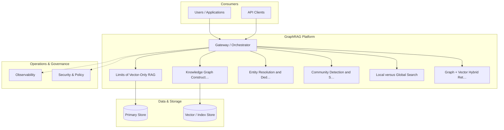

**Figure 1. Component - Limits of Vector-Only RAG** (mermaid). Figure: Component view for GraphRAG. This diagram illustrates the principal components and their interactions as discussed in the surrounding section.

<div class="diagram-svg">

<svg xmlns="http://www.w3.org/2000/svg" width="760" height="360" viewBox="0 0 760 360" font-family="Inter, Arial, sans-serif">
<rect width="760" height="360" fill="#f8fafc"/>
<text x="380" y="34" text-anchor="middle" font-size="20" font-weight="700" fill="#0f172a">Security Architecture - Limits of Vector-Only RAG</text>
<rect x="290" y="162" width="180" height="56" rx="12" fill="#0f172a"/>
<text x="380" y="195" text-anchor="middle" font-size="14" font-weight="700" fill="#ffffff">GraphRAG</text>
<line x1="380" y1="190" x2="380" y2="70" stroke="#94a3b8" stroke-width="2"/>
<rect x="308" y="48" width="144" height="44" rx="10" fill="#ffffff" stroke="#2563eb" stroke-width="2"/>
<text x="380" y="74" text-anchor="middle" font-size="11" fill="#0f172a">Limits of Vector-On…</text>
<line x1="380" y1="190" x2="617" y2="153" stroke="#94a3b8" stroke-width="2"/>
<rect x="545" y="131" width="144" height="44" rx="10" fill="#ffffff" stroke="#7c3aed" stroke-width="2"/>
<text x="617" y="157" text-anchor="middle" font-size="11" fill="#0f172a">Knowledge Graph Con…</text>
<line x1="380" y1="190" x2="526" y2="287" stroke="#94a3b8" stroke-width="2"/>
<rect x="454" y="265" width="144" height="44" rx="10" fill="#ffffff" stroke="#0891b2" stroke-width="2"/>
<text x="526" y="291" text-anchor="middle" font-size="11" fill="#0f172a">Entity Resolution a…</text>
<line x1="380" y1="190" x2="234" y2="287" stroke="#94a3b8" stroke-width="2"/>
<rect x="162" y="265" width="144" height="44" rx="10" fill="#ffffff" stroke="#059669" stroke-width="2"/>
<text x="234" y="291" text-anchor="middle" font-size="11" fill="#0f172a">Community Detection…</text>
<line x1="380" y1="190" x2="143" y2="153" stroke="#94a3b8" stroke-width="2"/>
<rect x="71" y="131" width="144" height="44" rx="10" fill="#ffffff" stroke="#d97706" stroke-width="2"/>
<text x="143" y="157" text-anchor="middle" font-size="11" fill="#0f172a">Local versus Global…</text>
</svg>

</div>

**Figure 2. Security Architecture - Limits of Vector-Only RAG** (svg). Figure: Security Architecture view for GraphRAG. This diagram illustrates the principal components and their interactions as discussed in the surrounding section.

## Deep Dive: Mechanics, Variants and Trade-offs

Having established the essentials, we now go deeper into limits of vector-only rag. It pays to understand the mechanism rather than treat it as a black box, because most production incidents are explained by one of its steps misbehaving. The distinctions in this section are the ones that separate a working demo from a system that holds up under adversarial inputs, scale and the passage of time.

Consider the principal variants and how to choose between them. Each variant optimises for a different point in the design space - some for latency, some for accuracy, some for cost or operability - and the correct choice follows from explicit requirements rather than from defaults. As with most architectural decisions, the choice is rarely binary; the skill lies in quantifying the trade-offs and choosing deliberately.

In practice this is supported by a mature tooling ecosystem, including Microsoft GraphRAG, Neo4j, LlamaIndex, NetworkX. Tools accelerate the work but do not substitute for understanding: the same principles apply whichever implementation you select, and the ability to reason from first principles is what lets you debug when a tool behaves unexpectedly.

A frequent source of subtle bugs is the interaction with multi-hop reasoning over graphs. Because multi-hop reasoning over graphs concerns traversing relationships to answer connected questions, changes there can silently alter the behaviour analysed here. The remedy is contract tests at the boundary and end-to-end evaluations that exercise the interaction explicitly.

Finally, attend to edge cases and degradation. Define what the system should do under partial failure, unexpected inputs and load spikes, and make that behaviour explicit and tested rather than emergent. Graceful degradation - returning a safe, useful result when the ideal one is unavailable - is a hallmark of mature engineering.

For deeper study, the literature offers authoritative treatments such as Edge et al. — From Local to Global: Graph RAG (Microsoft, 2024) and Traag et al. — Leiden community detection (2019). These primary sources reward careful reading and ground the practical guidance above in established results.

## Advanced Considerations

Having established the essentials, we now go deeper into limits of vector-only rag. The underlying mechanism is best appreciated by tracing a single request from input to output and noting where state is created and consumed. The distinctions in this section are the ones that separate a working demo from a system that holds up under adversarial inputs, scale and the passage of time.

Consider the principal variants and how to choose between them. Each variant optimises for a different point in the design space - some for latency, some for accuracy, some for cost or operability - and the correct choice follows from explicit requirements rather than from defaults. As with most architectural decisions, the choice is rarely binary; the skill lies in quantifying the trade-offs and choosing deliberately.

In practice this is supported by a mature tooling ecosystem, including Microsoft GraphRAG, Neo4j, LlamaIndex, NetworkX. Tools accelerate the work but do not substitute for understanding: the same principles apply whichever implementation you select, and the ability to reason from first principles is what lets you debug when a tool behaves unexpectedly.

A frequent source of subtle bugs is the interaction with operating graphrag. Because operating graphrag concerns pipelines, storage and monitoring, changes there can silently alter the behaviour analysed here. The remedy is contract tests at the boundary and end-to-end evaluations that exercise the interaction explicitly.

Finally, attend to edge cases and degradation. Define what the system should do under partial failure, unexpected inputs and load spikes, and make that behaviour explicit and tested rather than emergent. Graceful degradation - returning a safe, useful result when the ideal one is unavailable - is a hallmark of mature engineering.

For deeper study, the literature offers authoritative treatments such as Edge et al. — From Local to Global: Graph RAG (Microsoft, 2024) and Traag et al. — Leiden community detection (2019). These primary sources reward careful reading and ground the practical guidance above in established results.

## Worked Example

To ground the discussion, walk through a representative example. A intelligence organisation needs connecting entities across heterogeneous reports. They decide to apply limits of vector-only rag as part of their GraphRAG solution, but wisely treat it as a hypothesis to be validated rather than a foregone conclusion.

The team begins by stating the objective precisely and defining how success will be measured before writing any code. They establish a small but representative evaluation set, agree on acceptance thresholds, and only then prototype the simplest design that could work. Early measurement reveals which assumptions hold and which must be revised, saving weeks of misdirected effort and surfacing edge cases while they are still cheap to fix.

As the prototype matures into a service, the team hardens it: adding input validation, error handling, caching where it pays off, and monitoring that ties back to the original success metric. They document each significant decision in an architecture decision record so that future maintainers understand not just what was built but why.

The outcome is instructive. The system that reaches production is not the most sophisticated design the team considered, but the one whose behaviour they could measure, explain and operate. This is the recurring lesson of GraphRAG: durable value comes from the whole system, not from any single clever component.

## Industry Use Cases

Across industries, the ideas in this chapter recur in recognisable ways. The following vignettes show how different sectors apply them and what they have in common.

**Research.** Literature synthesis across thousands of papers. The common thread is that value comes not from the model alone but from the surrounding system - data quality, evaluation, integration and operations - which is precisely where most of the engineering effort belongs.

**Intelligence.** Connecting entities across heterogeneous reports. The common thread is that value comes not from the model alone but from the surrounding system - data quality, evaluation, integration and operations - which is precisely where most of the engineering effort belongs.

**Enterprise.** Whole-corpus thematic questions over documentation. The common thread is that value comes not from the model alone but from the surrounding system - data quality, evaluation, integration and operations - which is precisely where most of the engineering effort belongs.

**Compliance.** Tracing relationships across regulatory filings. The common thread is that value comes not from the model alone but from the surrounding system - data quality, evaluation, integration and operations - which is precisely where most of the engineering effort belongs.

## Best Practices

The following practices consistently separate successful GraphRAG efforts from struggling ones. They are deliberately concrete so they can be adopted as checklist items in design and code review.

- Invest in entity resolution; graph quality dominates answer quality.
- Route global questions to community summaries, not raw chunks.
- Cache community summaries to amortise extraction cost.
- Track provenance through edges for citation.

None of these are exotic; they are the unglamorous disciplines that compound into reliability. The cost of adopting them is small compared with the cost of the incidents they prevent, and they become second nature with practice.

## Common Pitfalls

Equally instructive are the failure modes that recur in practice. Each pitfall below has a clear early warning sign and a known remedy, so treat them as a diagnostic checklist when something feels wrong:

- Skipping entity resolution and fragmenting the graph.
- Applying GraphRAG where simple RAG suffices, inflating cost.
- Stale graphs after corpus updates.
- Unbounded extraction cost on huge corpora.

The pattern is consistent: most failures stem from skipping measurement, conflating prototype and production standards, or deferring cross-cutting concerns such as security and cost until they become emergencies. Naming these traps in advance is the cheapest way to avoid them.

## Governance, Security and Cost Notes

No discussion of limits of vector-only rag is complete without its governance, security and cost dimensions, which are too often deferred until they become emergencies. Treating them as first-class concerns from the outset is both cheaper and safer.

**Governance.** Classify the risk of this capability, document its intended and out-of-scope uses, and ensure decisions are traceable to satisfy internal policy and external regulation such as the NIST AI RMF, ISO/IEC 42001 and the EU AI Act. **Security.** Treat all external input as untrusted, validate outputs before acting on them, apply least privilege to any tools or data access, and map controls to the OWASP LLM Top 10 and MITRE ATLAS.

**Cost and sustainability.** Establish explicit budgets for compute, tokens and latency, attribute spend to owners, and revisit the economics as usage scales - a design that is affordable at pilot scale can become untenable at production volume. Building these reflexes into everyday engineering is what allows a GraphRAG system to be not only capable but also trustworthy and economically sound.

## Hands-On Exercises

Work through the following exercises. They are designed to move understanding from recognition to application - the level required for real engineering work - so prefer writing and building over merely reading.

1. Explain limits of vector-only rag to a colleague unfamiliar with GraphRAG, using a concrete example from your own domain.
2. Sketch a reference architecture that incorporates limits of vector-only rag and annotate where observability, security and cost controls belong.
3. Design an evaluation that would tell you whether limits of vector-only rag is working in production, including the metric, the dataset and the acceptance threshold.
4. Identify two pitfalls relevant to limits of vector-only rag in your environment and describe the early warning signals you would monitor.
5. Prototype the simplest implementation that demonstrates limits of vector-only rag, then list exactly what would need to change to make it production-ready.

## Key Takeaways

Key takeaways from this chapter:

- Limits of Vector-Only RAG is a systems concern in GraphRAG: data, models and operations must be co-designed.
- Measurement is non-negotiable; define success metrics and evaluation before building.
- Favour the simplest design that meets the requirement, and add complexity only when evidence demands it.
- Security, cost and observability are first-class requirements, not afterthoughts.
- Document decisions so the system remains understandable and operable as it evolves.

## Code Walkthrough

Every change to a GraphRAG system should pass an evaluation gate. This example shows the minimal shape: align predictions and references, compute a metric, and return a pass/fail decision for CI.

The full listing is shown below; study it line by line and reproduce it locally before moving on.

### Listing: Evaluating Limits of Vector-Only RAG with a regression gate

```python
from dataclasses import dataclass


@dataclass
class EvalResult:
    metric: str
    score: float
    passed: bool


def evaluate(predictions: list[str], references: list[str],
             threshold: float = 0.8) -> EvalResult:
    """Score Limits of Vector-Only RAG output against references with a simple exact-match metric.

    In practice you would combine several metrics (exact match, semantic
    similarity, LLM-as-judge) and gate releases on the aggregate.
    """
    if len(predictions) != len(references):
        raise ValueError("predictions and references must align")
    hits = sum(p.strip() == r.strip() for p, r in zip(predictions, references))
    score = hits / len(references) if references else 0.0
    return EvalResult(metric="exact_match", score=score, passed=score >= threshold)


if __name__ == "__main__":
    result = evaluate(["yes", "no"], ["yes", "yes"])
    print(f"{result.metric}={result.score:.2f} passed={result.passed}")

```

## Review Questions

1. In the context of GraphRAG, which statement best describes “Limits of Vector-Only RAG”?
   - A. It removes all security and governance requirements.
   - B. Why local similarity fails on global, multi-hop and aggregative questions.
   - C. It makes the system slower but has no other effect.
   - D. It eliminates the need for any evaluation or monitoring.
   - **Answer: B.** Limits of Vector-Only RAG: Why local similarity fails on global, multi-hop and aggregative questions.
2. Which of the following is a recommended best practice when working with GraphRAG?
   - A. It is only relevant to academic research, not production.
   - B. Invest in entity resolution; graph quality dominates answer quality.
   - C. Applying GraphRAG where simple RAG suffices, inflating cost.
   - D. It applies exclusively to image data.
   - **Answer: B.** Best practice: Invest in entity resolution; graph quality dominates answer quality.
3. Which of the following is a common pitfall to avoid in GraphRAG?
   - A. It applies exclusively to image data.
   - B. It makes the system slower but has no other effect.
   - C. Stale graphs after corpus updates.
   - D. Invest in entity resolution; graph quality dominates answer quality.
   - **Answer: C.** Pitfall to avoid: Stale graphs after corpus updates.
4. *(Discussion)* Explain Limits of Vector-Only RAG and why it matters in a production GraphRAG system.
   - **Model answer:** A strong answer defines limits of vector-only rag (Why local similarity fails on global, multi-hop and aggregative questions.) then connects it to architecture, evaluation, cost, security and operations for GraphRAG, citing concrete trade-offs and a real-world example.

---


# Chapter 2. Knowledge Graph Construction from Text

_This chapter examines knowledge graph construction from text within GraphRAG. It covers lLM-driven entity and relationship extraction and schema design, derives a reference architecture, walks through a worked example and runnable code, surveys industry use cases, and distils best practices and pitfalls, closing with exercises and review questions._

## Introduction

Knowledge Graph Construction from Text can be characterised as lLM-driven entity and relationship extraction and schema design. This concept recurs throughout the GraphRAG lifecycle, from design to operations. The right abstraction here pays compounding dividends, because downstream components depend on its guarantees.

This chapter builds intuition first, then formalises the ideas, derives an architecture, and finishes with code, exercises and review questions so the material transfers directly to your own GraphRAG work. Read it actively: pause at each diagram, reproduce the code, and attempt the exercises before consulting the answers.

## Theory and Foundations

Formally, Knowledge Graph Construction from Text addresses lLM-driven entity and relationship extraction and schema design. It helps to separate the conceptual model from its implementation: the former guides reasoning, the latter must contend with real-world constraints. Beneath the abstraction lies a concrete process whose steps can each be measured, tested and optimised independently.

To place this in context, recall the broader picture: GraphRAG augments retrieval-augmented generation with a knowledge graph constructed from a corpus, enabling multi-hop reasoning, community summarisation and global questions that flat vector retrieval cannot answer. Within that picture, knowledge graph construction from text is one of the load-bearing ideas - the kind that, when understood deeply, makes the rest of GraphRAG fall into place. Teams that master this consistently ship more reliable GraphRAG systems at lower cost.

Knowledge Graph Construction from Text cannot be understood in isolation from operating graphrag. Recall that operating graphrag concerns pipelines, storage and monitoring. The two interact directly: decisions in one constrain the design space of the other, which is why mature teams reason about them together rather than sequentially. Every added component buys capability at the price of operational surface area, and that bargain should be made consciously.

Knowledge Graph Construction from Text cannot be understood in isolation from query routing in graphrag. Recall that query routing in graphrag concerns choosing local, global or hybrid strategies per question. The two interact directly: decisions in one constrain the design space of the other, which is why mature teams reason about them together rather than sequentially. Simplicity is a feature. The simplest design that meets the requirement should be the default, with complexity added only when measurement justifies it.

Several established patterns apply directly to knowledge graph construction from text. The first, hierarchical community summaries for scalable synthesis, is widely adopted because it makes the system's behaviour predictable and observable. A complementary pattern, entity-neighbourhood expansion for local questions, addresses a related concern and is often deployed alongside it. Patterns are not dogma; they are distilled experience that shortcuts the search for a sound design, and each carries assumptions worth checking against your context.

It is worth being explicit about when to apply this and when to reach for something simpler. In a small prototype, shortcuts around knowledge graph construction from text are invisible; in a production GraphRAG system serving real traffic, they surface as incidents, cost overruns or compliance gaps. Every added component buys capability at the price of operational surface area, and that bargain should be made consciously. The remainder of this chapter turns these principles into an architecture, code and a checklist you can apply immediately.

## Architecture and Design

From an architectural standpoint, Knowledge Graph Construction from Text sits at the intersection of data, models and operations. GraphRAG indexing extracts entities and relations from chunks, resolves duplicates, builds a graph, detects communities and pre-summarises them. At query time a router selects local search (entity neighbourhoods + linked text) or global search (map-reduce over community summaries), then synthesises a cited answer.

Concretely, the principal building blocks include limits of vector-only rag, knowledge graph construction from text, entity resolution and deduplication, community detection and summarisation and local versus global search. Each is a replaceable component behind a stable interface, so the team can upgrade an implementation - a model, an index, a policy engine - without rewriting its neighbours. The contracts between components are where reliability is won or lost, so they are specified explicitly and tested in isolation.

The diagram accompanying this section makes the data and control flow explicit. Requests enter through a well-defined boundary where they are authenticated and validated; only then are they dispatched to the components that perform the work. This boundary is also where rate limiting, quota enforcement and audit logging live, keeping cross-cutting concerns out of the core logic and in one auditable place.

Two qualities deserve emphasis. First, observability is designed in, not bolted on: every component emits structured telemetry so that failures can be localised in minutes rather than hours. Second, the architecture is evolvable - components communicate through stable contracts so that any single part of the GraphRAG system can be replaced without a rewrite. As with most architectural decisions, the choice is rarely binary; the skill lies in quantifying the trade-offs and choosing deliberately.

<div class="diagram-svg">

<svg xmlns="http://www.w3.org/2000/svg" width="760" height="360" viewBox="0 0 760 360" font-family="Inter, Arial, sans-serif">
<rect width="760" height="360" fill="#f8fafc"/>
<text x="380" y="34" text-anchor="middle" font-size="20" font-weight="700" fill="#0f172a">Security Architecture - Knowledge Graph Construction fr…</text>
<rect x="290" y="162" width="180" height="56" rx="12" fill="#0f172a"/>
<text x="380" y="195" text-anchor="middle" font-size="14" font-weight="700" fill="#ffffff">GraphRAG</text>
<line x1="380" y1="190" x2="380" y2="70" stroke="#94a3b8" stroke-width="2"/>
<rect x="308" y="48" width="144" height="44" rx="10" fill="#ffffff" stroke="#2563eb" stroke-width="2"/>
<text x="380" y="74" text-anchor="middle" font-size="11" fill="#0f172a">Limits of Vector-On…</text>
<line x1="380" y1="190" x2="617" y2="153" stroke="#94a3b8" stroke-width="2"/>
<rect x="545" y="131" width="144" height="44" rx="10" fill="#ffffff" stroke="#7c3aed" stroke-width="2"/>
<text x="617" y="157" text-anchor="middle" font-size="11" fill="#0f172a">Knowledge Graph Con…</text>
<line x1="380" y1="190" x2="526" y2="287" stroke="#94a3b8" stroke-width="2"/>
<rect x="454" y="265" width="144" height="44" rx="10" fill="#ffffff" stroke="#0891b2" stroke-width="2"/>
<text x="526" y="291" text-anchor="middle" font-size="11" fill="#0f172a">Entity Resolution a…</text>
<line x1="380" y1="190" x2="234" y2="287" stroke="#94a3b8" stroke-width="2"/>
<rect x="162" y="265" width="144" height="44" rx="10" fill="#ffffff" stroke="#059669" stroke-width="2"/>
<text x="234" y="291" text-anchor="middle" font-size="11" fill="#0f172a">Community Detection…</text>
<line x1="380" y1="190" x2="143" y2="153" stroke="#94a3b8" stroke-width="2"/>
<rect x="71" y="131" width="144" height="44" rx="10" fill="#ffffff" stroke="#d97706" stroke-width="2"/>
<text x="143" y="157" text-anchor="middle" font-size="11" fill="#0f172a">Local versus Global…</text>
</svg>

</div>

**Figure 3. Security Architecture - Knowledge Graph Construction from Text** (svg). Figure: Security Architecture view for GraphRAG. This diagram illustrates the principal components and their interactions as discussed in the surrounding section.

## Deep Dive: Mechanics, Variants and Trade-offs

Having established the essentials, we now go deeper into knowledge graph construction from text. It pays to understand the mechanism rather than treat it as a black box, because most production incidents are explained by one of its steps misbehaving. The distinctions in this section are the ones that separate a working demo from a system that holds up under adversarial inputs, scale and the passage of time.

Consider the principal variants and how to choose between them. Each variant optimises for a different point in the design space - some for latency, some for accuracy, some for cost or operability - and the correct choice follows from explicit requirements rather than from defaults. As with most architectural decisions, the choice is rarely binary; the skill lies in quantifying the trade-offs and choosing deliberately.

In practice this is supported by a mature tooling ecosystem, including Microsoft GraphRAG, Neo4j, LlamaIndex, NetworkX. Tools accelerate the work but do not substitute for understanding: the same principles apply whichever implementation you select, and the ability to reason from first principles is what lets you debug when a tool behaves unexpectedly.

A frequent source of subtle bugs is the interaction with operating graphrag. Because operating graphrag concerns pipelines, storage and monitoring, changes there can silently alter the behaviour analysed here. The remedy is contract tests at the boundary and end-to-end evaluations that exercise the interaction explicitly.

Finally, attend to edge cases and degradation. Define what the system should do under partial failure, unexpected inputs and load spikes, and make that behaviour explicit and tested rather than emergent. Graceful degradation - returning a safe, useful result when the ideal one is unavailable - is a hallmark of mature engineering.

For deeper study, the literature offers authoritative treatments such as Edge et al. — From Local to Global: Graph RAG (Microsoft, 2024) and Traag et al. — Leiden community detection (2019). These primary sources reward careful reading and ground the practical guidance above in established results.

## Advanced Considerations

Having established the essentials, we now go deeper into knowledge graph construction from text. The underlying mechanism is best appreciated by tracing a single request from input to output and noting where state is created and consumed. The distinctions in this section are the ones that separate a working demo from a system that holds up under adversarial inputs, scale and the passage of time.

Consider the principal variants and how to choose between them. Each variant optimises for a different point in the design space - some for latency, some for accuracy, some for cost or operability - and the correct choice follows from explicit requirements rather than from defaults. There is an inherent trade-off between fidelity and cost, and the correct balance depends on the use case and its tolerance for error.

In practice this is supported by a mature tooling ecosystem, including Microsoft GraphRAG, Neo4j, LlamaIndex, NetworkX. Tools accelerate the work but do not substitute for understanding: the same principles apply whichever implementation you select, and the ability to reason from first principles is what lets you debug when a tool behaves unexpectedly.

A frequent source of subtle bugs is the interaction with security and provenance. Because security and provenance concerns source attribution through graph edges, changes there can silently alter the behaviour analysed here. The remedy is contract tests at the boundary and end-to-end evaluations that exercise the interaction explicitly.

Finally, attend to edge cases and degradation. Define what the system should do under partial failure, unexpected inputs and load spikes, and make that behaviour explicit and tested rather than emergent. Graceful degradation - returning a safe, useful result when the ideal one is unavailable - is a hallmark of mature engineering.

For deeper study, the literature offers authoritative treatments such as Edge et al. — From Local to Global: Graph RAG (Microsoft, 2024) and Traag et al. — Leiden community detection (2019). These primary sources reward careful reading and ground the practical guidance above in established results.

## Worked Example

Consider a concrete scenario. A research organisation needs literature synthesis across thousands of papers. They decide to apply knowledge graph construction from text as part of their GraphRAG solution, but wisely treat it as a hypothesis to be validated rather than a foregone conclusion.

The team begins by stating the objective precisely and defining how success will be measured before writing any code. They establish a small but representative evaluation set, agree on acceptance thresholds, and only then prototype the simplest design that could work. Early measurement reveals which assumptions hold and which must be revised, saving weeks of misdirected effort and surfacing edge cases while they are still cheap to fix.

As the prototype matures into a service, the team hardens it: adding input validation, error handling, caching where it pays off, and monitoring that ties back to the original success metric. They document each significant decision in an architecture decision record so that future maintainers understand not just what was built but why.

The outcome is instructive. The system that reaches production is not the most sophisticated design the team considered, but the one whose behaviour they could measure, explain and operate. This is the recurring lesson of GraphRAG: durable value comes from the whole system, not from any single clever component.

## Industry Use Cases

Across industries, the ideas in this chapter recur in recognisable ways. The following vignettes show how different sectors apply them and what they have in common.

**Research.** Literature synthesis across thousands of papers. The common thread is that value comes not from the model alone but from the surrounding system - data quality, evaluation, integration and operations - which is precisely where most of the engineering effort belongs.

**Intelligence.** Connecting entities across heterogeneous reports. The common thread is that value comes not from the model alone but from the surrounding system - data quality, evaluation, integration and operations - which is precisely where most of the engineering effort belongs.

**Enterprise.** Whole-corpus thematic questions over documentation. The common thread is that value comes not from the model alone but from the surrounding system - data quality, evaluation, integration and operations - which is precisely where most of the engineering effort belongs.

**Compliance.** Tracing relationships across regulatory filings. The common thread is that value comes not from the model alone but from the surrounding system - data quality, evaluation, integration and operations - which is precisely where most of the engineering effort belongs.

## Best Practices

The following practices consistently separate successful GraphRAG efforts from struggling ones. They are deliberately concrete so they can be adopted as checklist items in design and code review.

- Invest in entity resolution; graph quality dominates answer quality.
- Route global questions to community summaries, not raw chunks.
- Cache community summaries to amortise extraction cost.
- Track provenance through edges for citation.

None of these are exotic; they are the unglamorous disciplines that compound into reliability. The cost of adopting them is small compared with the cost of the incidents they prevent, and they become second nature with practice.

## Common Pitfalls

Equally instructive are the failure modes that recur in practice. Each pitfall below has a clear early warning sign and a known remedy, so treat them as a diagnostic checklist when something feels wrong:

- Skipping entity resolution and fragmenting the graph.
- Applying GraphRAG where simple RAG suffices, inflating cost.
- Stale graphs after corpus updates.
- Unbounded extraction cost on huge corpora.

The pattern is consistent: most failures stem from skipping measurement, conflating prototype and production standards, or deferring cross-cutting concerns such as security and cost until they become emergencies. Naming these traps in advance is the cheapest way to avoid them.

## Governance, Security and Cost Notes

No discussion of knowledge graph construction from text is complete without its governance, security and cost dimensions, which are too often deferred until they become emergencies. Treating them as first-class concerns from the outset is both cheaper and safer.

**Governance.** Classify the risk of this capability, document its intended and out-of-scope uses, and ensure decisions are traceable to satisfy internal policy and external regulation such as the NIST AI RMF, ISO/IEC 42001 and the EU AI Act. **Security.** Treat all external input as untrusted, validate outputs before acting on them, apply least privilege to any tools or data access, and map controls to the OWASP LLM Top 10 and MITRE ATLAS.

**Cost and sustainability.** Establish explicit budgets for compute, tokens and latency, attribute spend to owners, and revisit the economics as usage scales - a design that is affordable at pilot scale can become untenable at production volume. Building these reflexes into everyday engineering is what allows a GraphRAG system to be not only capable but also trustworthy and economically sound.

## Hands-On Exercises

Work through the following exercises. They are designed to move understanding from recognition to application - the level required for real engineering work - so prefer writing and building over merely reading.

1. Explain knowledge graph construction from text to a colleague unfamiliar with GraphRAG, using a concrete example from your own domain.
2. Sketch a reference architecture that incorporates knowledge graph construction from text and annotate where observability, security and cost controls belong.
3. Design an evaluation that would tell you whether knowledge graph construction from text is working in production, including the metric, the dataset and the acceptance threshold.
4. Identify two pitfalls relevant to knowledge graph construction from text in your environment and describe the early warning signals you would monitor.
5. Prototype the simplest implementation that demonstrates knowledge graph construction from text, then list exactly what would need to change to make it production-ready.

## Key Takeaways

Key takeaways from this chapter:

- Knowledge Graph Construction from Text is a systems concern in GraphRAG: data, models and operations must be co-designed.
- Measurement is non-negotiable; define success metrics and evaluation before building.
- Favour the simplest design that meets the requirement, and add complexity only when evidence demands it.
- Security, cost and observability are first-class requirements, not afterthoughts.
- Document decisions so the system remains understandable and operable as it evolves.

## Code Walkthrough

Pipelines keep Knowledge Graph Construction from Text logic modular and testable. Each stage is a pure function, errors are captured per item, and the composition is trivial to extend or reorder.

The full listing is shown below; study it line by line and reproduce it locally before moving on.

### Listing: A composable processing pipeline for Knowledge Graph Construction from Text

```python
from collections.abc import Iterable, Iterator
from typing import Protocol


class Stage(Protocol):
    def __call__(self, item: dict) -> dict: ...


def pipeline(stages: list[Stage]) -> Stage:
    """Compose ordered stages into a single callable for Knowledge Graph Construction from Text."""

    def run(item: dict) -> dict:
        for stage in stages:
            item = stage(item)
        return item

    return run


def validate(item: dict) -> dict:
    if "text" not in item:
        raise ValueError("missing required field: text")
    return item


def normalise(item: dict) -> dict:
    item["text"] = item["text"].strip().lower()
    return item


def enrich(item: dict) -> dict:
    item["length"] = len(item["text"])
    return item


process = pipeline([validate, normalise, enrich])


def run_batch(items: Iterable[dict]) -> Iterator[dict]:
    for item in items:
        try:
            yield process(dict(item))
        except ValueError as exc:
            yield {"error": str(exc), "item": item}

```

## Review Questions

1. In the context of GraphRAG, which statement best describes “Knowledge Graph Construction from Text”?
   - A. It eliminates the need for any evaluation or monitoring.
   - B. It guarantees deterministic output regardless of input.
   - C. LLM-driven entity and relationship extraction and schema design.
   - D. It is only relevant to academic research, not production.
   - **Answer: C.** Knowledge Graph Construction from Text: LLM-driven entity and relationship extraction and schema design.
2. Which of the following is a recommended best practice when working with GraphRAG?
   - A. Skipping entity resolution and fragmenting the graph.
   - B. Track provenance through edges for citation.
   - C. It is only relevant to academic research, not production.
   - D. It eliminates the need for any evaluation or monitoring.
   - **Answer: B.** Best practice: Track provenance through edges for citation.
3. Which of the following is a common pitfall to avoid in GraphRAG?
   - A. Unbounded extraction cost on huge corpora.
   - B. It is only relevant to academic research, not production.
   - C. Cache community summaries to amortise extraction cost.
   - D. Invest in entity resolution; graph quality dominates answer quality.
   - **Answer: A.** Pitfall to avoid: Unbounded extraction cost on huge corpora.
4. *(Discussion)* Explain Knowledge Graph Construction from Text and why it matters in a production GraphRAG system.
   - **Model answer:** A strong answer defines knowledge graph construction from text (LLM-driven entity and relationship extraction and schema design.) then connects it to architecture, evaluation, cost, security and operations for GraphRAG, citing concrete trade-offs and a real-world example.

---


# Chapter 3. Entity Resolution and Deduplication

_This chapter examines entity resolution and deduplication within GraphRAG. It covers merging coreferent entities into a clean graph, derives a reference architecture, walks through a worked example and runnable code, surveys industry use cases, and distils best practices and pitfalls, closing with exercises and review questions._

## Introduction

Entity Resolution and Deduplication refers to merging coreferent entities into a clean graph. Getting this right early prevents expensive rework once a GraphRAG system reaches scale. The practical implication is that design choices here ripple through latency, cost and maintainability for the lifetime of the system.

This chapter builds intuition first, then formalises the ideas, derives an architecture, and finishes with code, exercises and review questions so the material transfers directly to your own GraphRAG work. Read it actively: pause at each diagram, reproduce the code, and attempt the exercises before consulting the answers.

## Theory and Foundations

Entity Resolution and Deduplication can be characterised as merging coreferent entities into a clean graph. The practical implication is that design choices here ripple through latency, cost and maintainability for the lifetime of the system. The underlying mechanism is best appreciated by tracing a single request from input to output and noting where state is created and consumed.

To place this in context, recall the broader picture: GraphRAG augments retrieval-augmented generation with a knowledge graph constructed from a corpus, enabling multi-hop reasoning, community summarisation and global questions that flat vector retrieval cannot answer. Within that picture, entity resolution and deduplication is one of the load-bearing ideas - the kind that, when understood deeply, makes the rest of GraphRAG fall into place. Understanding this matters because GraphRAG systems succeed or fail on exactly these decisions.

Entity Resolution and Deduplication cannot be understood in isolation from security and provenance. Recall that security and provenance concerns source attribution through graph edges. The two interact directly: decisions in one constrain the design space of the other, which is why mature teams reason about them together rather than sequentially. Every added component buys capability at the price of operational surface area, and that bargain should be made consciously.

Entity Resolution and Deduplication cannot be understood in isolation from community detection and summarisation. Recall that community detection and summarisation concerns hierarchical clustering (e.g. Leiden) and map-reduce summaries. The two interact directly: decisions in one constrain the design space of the other, which is why mature teams reason about them together rather than sequentially. As with most architectural decisions, the choice is rarely binary; the skill lies in quantifying the trade-offs and choosing deliberately.

Several established patterns apply directly to entity resolution and deduplication. The first, hierarchical community summaries for scalable synthesis, is widely adopted because it makes the system's behaviour predictable and observable. A complementary pattern, hybrid graph traversal + vector similarity, addresses a related concern and is often deployed alongside it. Patterns are not dogma; they are distilled experience that shortcuts the search for a sound design, and each carries assumptions worth checking against your context.

The decision of whether to adopt this should be driven by requirements, not by novelty. In a small prototype, shortcuts around entity resolution and deduplication are invisible; in a production GraphRAG system serving real traffic, they surface as incidents, cost overruns or compliance gaps. There is an inherent trade-off between fidelity and cost, and the correct balance depends on the use case and its tolerance for error. The remainder of this chapter turns these principles into an architecture, code and a checklist you can apply immediately.

## Architecture and Design

The reference architecture for Entity Resolution and Deduplication separates concerns into clearly bounded components with explicit contracts. GraphRAG indexing extracts entities and relations from chunks, resolves duplicates, builds a graph, detects communities and pre-summarises them. At query time a router selects local search (entity neighbourhoods + linked text) or global search (map-reduce over community summaries), then synthesises a cited answer.

Concretely, the principal building blocks include limits of vector-only rag, knowledge graph construction from text, entity resolution and deduplication, community detection and summarisation and local versus global search. Each is a replaceable component behind a stable interface, so the team can upgrade an implementation - a model, an index, a policy engine - without rewriting its neighbours. The contracts between components are where reliability is won or lost, so they are specified explicitly and tested in isolation.

The diagram accompanying this section makes the data and control flow explicit. Requests enter through a well-defined boundary where they are authenticated and validated; only then are they dispatched to the components that perform the work. This boundary is also where rate limiting, quota enforcement and audit logging live, keeping cross-cutting concerns out of the core logic and in one auditable place.

Two qualities deserve emphasis. First, observability is designed in, not bolted on: every component emits structured telemetry so that failures can be localised in minutes rather than hours. Second, the architecture is evolvable - components communicate through stable contracts so that any single part of the GraphRAG system can be replaced without a rewrite. Every added component buys capability at the price of operational surface area, and that bargain should be made consciously.

```xml
<mxfile host="ai-university">
  <diagram name="DevOps Pipeline">
    <mxGraphModel dx="800" dy="600" grid="1" gridSize="10">
      <root>
        <mxCell id="0"/>
        <mxCell id="1" parent="0"/>
        <mxCell id="title" value="DevOps Pipeline - Entity Resolution and Deduplication" style="text;fontSize=16;fontStyle=1" vertex="1" parent="1"><mxGeometry x="40" y="20" width="600" height="30" as="geometry"/></mxCell>
        <mxCell id="hub" value="GraphRAG" style="rounded=1;fillColor=#0f172a;fontColor=#ffffff;fontStyle=1" vertex="1" parent="1"><mxGeometry x="300" y="180" width="160" height="60" as="geometry"/></mxCell>
        <mxCell id="n0" value="Limits of Vector-Only R…" style="rounded=1;fillColor=#e0e7ff;strokeColor=#4338ca" vertex="1" parent="1"><mxGeometry x="60" y="80" width="160" height="50" as="geometry"/></mxCell>
        <mxCell id="e0" style="edgeStyle=orthogonalEdgeStyle" edge="1" parent="1" source="hub" target="n0"><mxGeometry relative="1" as="geometry"/></mxCell>
        <mxCell id="n1" value="Knowledge Graph Constru…" style="rounded=1;fillColor=#e0e7ff;strokeColor=#4338ca" vertex="1" parent="1"><mxGeometry x="600" y="170" width="160" height="50" as="geometry"/></mxCell>
        <mxCell id="e1" style="edgeStyle=orthogonalEdgeStyle" edge="1" parent="1" source="hub" target="n1"><mxGeometry relative="1" as="geometry"/></mxCell>
        <mxCell id="n2" value="Entity Resolution and D…" style="rounded=1;fillColor=#e0e7ff;strokeColor=#4338ca" vertex="1" parent="1"><mxGeometry x="60" y="260" width="160" height="50" as="geometry"/></mxCell>
        <mxCell id="e2" style="edgeStyle=orthogonalEdgeStyle" edge="1" parent="1" source="hub" target="n2"><mxGeometry relative="1" as="geometry"/></mxCell>
        <mxCell id="n3" value="Community Detection and…" style="rounded=1;fillColor=#e0e7ff;strokeColor=#4338ca" vertex="1" parent="1"><mxGeometry x="600" y="350" width="160" height="50" as="geometry"/></mxCell>
        <mxCell id="e3" style="edgeStyle=orthogonalEdgeStyle" edge="1" parent="1" source="hub" target="n3"><mxGeometry relative="1" as="geometry"/></mxCell>
        <mxCell id="n4" value="Local versus Global Sea…" style="rounded=1;fillColor=#e0e7ff;strokeColor=#4338ca" vertex="1" parent="1"><mxGeometry x="60" y="440" width="160" height="50" as="geometry"/></mxCell>
        <mxCell id="e4" style="edgeStyle=orthogonalEdgeStyle" edge="1" parent="1" source="hub" target="n4"><mxGeometry relative="1" as="geometry"/></mxCell>
      </root>
    </mxGraphModel>
  </diagram>
</mxfile>
```

_Source diagram (drawio); render with the appropriate tool._

**Figure 4. DevOps Pipeline - Entity Resolution and Deduplication** (drawio). Figure: DevOps Pipeline view for GraphRAG. This diagram illustrates the principal components and their interactions as discussed in the surrounding section.

## Deep Dive: Mechanics, Variants and Trade-offs

Having established the essentials, we now go deeper into entity resolution and deduplication. Mechanically, the behaviour emerges from a few interacting parts that are simpler than the whole they produce. The distinctions in this section are the ones that separate a working demo from a system that holds up under adversarial inputs, scale and the passage of time.

Consider the principal variants and how to choose between them. Each variant optimises for a different point in the design space - some for latency, some for accuracy, some for cost or operability - and the correct choice follows from explicit requirements rather than from defaults. Simplicity is a feature. The simplest design that meets the requirement should be the default, with complexity added only when measurement justifies it.

In practice this is supported by a mature tooling ecosystem, including Microsoft GraphRAG, Neo4j, LlamaIndex, NetworkX. Tools accelerate the work but do not substitute for understanding: the same principles apply whichever implementation you select, and the ability to reason from first principles is what lets you debug when a tool behaves unexpectedly.

A frequent source of subtle bugs is the interaction with security and provenance. Because security and provenance concerns source attribution through graph edges, changes there can silently alter the behaviour analysed here. The remedy is contract tests at the boundary and end-to-end evaluations that exercise the interaction explicitly.

Finally, attend to edge cases and degradation. Define what the system should do under partial failure, unexpected inputs and load spikes, and make that behaviour explicit and tested rather than emergent. Graceful degradation - returning a safe, useful result when the ideal one is unavailable - is a hallmark of mature engineering.

For deeper study, the literature offers authoritative treatments such as Edge et al. — From Local to Global: Graph RAG (Microsoft, 2024) and Traag et al. — Leiden community detection (2019). These primary sources reward careful reading and ground the practical guidance above in established results.

## Advanced Considerations

Having established the essentials, we now go deeper into entity resolution and deduplication. The underlying mechanism is best appreciated by tracing a single request from input to output and noting where state is created and consumed. The distinctions in this section are the ones that separate a working demo from a system that holds up under adversarial inputs, scale and the passage of time.

Consider the principal variants and how to choose between them. Each variant optimises for a different point in the design space - some for latency, some for accuracy, some for cost or operability - and the correct choice follows from explicit requirements rather than from defaults. Simplicity is a feature. The simplest design that meets the requirement should be the default, with complexity added only when measurement justifies it.

In practice this is supported by a mature tooling ecosystem, including Microsoft GraphRAG, Neo4j, LlamaIndex, NetworkX. Tools accelerate the work but do not substitute for understanding: the same principles apply whichever implementation you select, and the ability to reason from first principles is what lets you debug when a tool behaves unexpectedly.

A frequent source of subtle bugs is the interaction with incremental graph updates. Because incremental graph updates concerns keeping the graph fresh as the corpus changes, changes there can silently alter the behaviour analysed here. The remedy is contract tests at the boundary and end-to-end evaluations that exercise the interaction explicitly.

Finally, attend to edge cases and degradation. Define what the system should do under partial failure, unexpected inputs and load spikes, and make that behaviour explicit and tested rather than emergent. Graceful degradation - returning a safe, useful result when the ideal one is unavailable - is a hallmark of mature engineering.

For deeper study, the literature offers authoritative treatments such as Edge et al. — From Local to Global: Graph RAG (Microsoft, 2024) and Traag et al. — Leiden community detection (2019). These primary sources reward careful reading and ground the practical guidance above in established results.

## Worked Example

A worked example clarifies how these ideas behave in practice. A compliance organisation needs tracing relationships across regulatory filings. They decide to apply entity resolution and deduplication as part of their GraphRAG solution, but wisely treat it as a hypothesis to be validated rather than a foregone conclusion.

The team begins by stating the objective precisely and defining how success will be measured before writing any code. They establish a small but representative evaluation set, agree on acceptance thresholds, and only then prototype the simplest design that could work. Early measurement reveals which assumptions hold and which must be revised, saving weeks of misdirected effort and surfacing edge cases while they are still cheap to fix.

As the prototype matures into a service, the team hardens it: adding input validation, error handling, caching where it pays off, and monitoring that ties back to the original success metric. They document each significant decision in an architecture decision record so that future maintainers understand not just what was built but why.

The outcome is instructive. The system that reaches production is not the most sophisticated design the team considered, but the one whose behaviour they could measure, explain and operate. This is the recurring lesson of GraphRAG: durable value comes from the whole system, not from any single clever component.

## Industry Use Cases

Across industries, the ideas in this chapter recur in recognisable ways. The following vignettes show how different sectors apply them and what they have in common.

**Research.** Literature synthesis across thousands of papers. The common thread is that value comes not from the model alone but from the surrounding system - data quality, evaluation, integration and operations - which is precisely where most of the engineering effort belongs.

**Intelligence.** Connecting entities across heterogeneous reports. The common thread is that value comes not from the model alone but from the surrounding system - data quality, evaluation, integration and operations - which is precisely where most of the engineering effort belongs.

**Enterprise.** Whole-corpus thematic questions over documentation. The common thread is that value comes not from the model alone but from the surrounding system - data quality, evaluation, integration and operations - which is precisely where most of the engineering effort belongs.

**Compliance.** Tracing relationships across regulatory filings. The common thread is that value comes not from the model alone but from the surrounding system - data quality, evaluation, integration and operations - which is precisely where most of the engineering effort belongs.

## Best Practices

The following practices consistently separate successful GraphRAG efforts from struggling ones. They are deliberately concrete so they can be adopted as checklist items in design and code review.

- Invest in entity resolution; graph quality dominates answer quality.
- Route global questions to community summaries, not raw chunks.
- Cache community summaries to amortise extraction cost.
- Track provenance through edges for citation.

None of these are exotic; they are the unglamorous disciplines that compound into reliability. The cost of adopting them is small compared with the cost of the incidents they prevent, and they become second nature with practice.

## Common Pitfalls

Equally instructive are the failure modes that recur in practice. Each pitfall below has a clear early warning sign and a known remedy, so treat them as a diagnostic checklist when something feels wrong:

- Skipping entity resolution and fragmenting the graph.
- Applying GraphRAG where simple RAG suffices, inflating cost.
- Stale graphs after corpus updates.
- Unbounded extraction cost on huge corpora.

The pattern is consistent: most failures stem from skipping measurement, conflating prototype and production standards, or deferring cross-cutting concerns such as security and cost until they become emergencies. Naming these traps in advance is the cheapest way to avoid them.

## Governance, Security and Cost Notes

No discussion of entity resolution and deduplication is complete without its governance, security and cost dimensions, which are too often deferred until they become emergencies. Treating them as first-class concerns from the outset is both cheaper and safer.

**Governance.** Classify the risk of this capability, document its intended and out-of-scope uses, and ensure decisions are traceable to satisfy internal policy and external regulation such as the NIST AI RMF, ISO/IEC 42001 and the EU AI Act. **Security.** Treat all external input as untrusted, validate outputs before acting on them, apply least privilege to any tools or data access, and map controls to the OWASP LLM Top 10 and MITRE ATLAS.

**Cost and sustainability.** Establish explicit budgets for compute, tokens and latency, attribute spend to owners, and revisit the economics as usage scales - a design that is affordable at pilot scale can become untenable at production volume. Building these reflexes into everyday engineering is what allows a GraphRAG system to be not only capable but also trustworthy and economically sound.

## Hands-On Exercises

Work through the following exercises. They are designed to move understanding from recognition to application - the level required for real engineering work - so prefer writing and building over merely reading.

1. Explain entity resolution and deduplication to a colleague unfamiliar with GraphRAG, using a concrete example from your own domain.
2. Sketch a reference architecture that incorporates entity resolution and deduplication and annotate where observability, security and cost controls belong.
3. Design an evaluation that would tell you whether entity resolution and deduplication is working in production, including the metric, the dataset and the acceptance threshold.
4. Identify two pitfalls relevant to entity resolution and deduplication in your environment and describe the early warning signals you would monitor.
5. Prototype the simplest implementation that demonstrates entity resolution and deduplication, then list exactly what would need to change to make it production-ready.

## Key Takeaways

Key takeaways from this chapter:

- Entity Resolution and Deduplication is a systems concern in GraphRAG: data, models and operations must be co-designed.
- Measurement is non-negotiable; define success metrics and evaluation before building.
- Favour the simplest design that meets the requirement, and add complexity only when evidence demands it.
- Security, cost and observability are first-class requirements, not afterthoughts.
- Document decisions so the system remains understandable and operable as it evolves.

## Code Walkthrough

Pipelines keep Entity Resolution and Deduplication logic modular and testable. Each stage is a pure function, errors are captured per item, and the composition is trivial to extend or reorder.

The full listing is shown below; study it line by line and reproduce it locally before moving on.

### Listing: A composable processing pipeline for Entity Resolution and Deduplication

```python
from collections.abc import Iterable, Iterator
from typing import Protocol


class Stage(Protocol):
    def __call__(self, item: dict) -> dict: ...


def pipeline(stages: list[Stage]) -> Stage:
    """Compose ordered stages into a single callable for Entity Resolution and Deduplication."""

    def run(item: dict) -> dict:
        for stage in stages:
            item = stage(item)
        return item

    return run


def validate(item: dict) -> dict:
    if "text" not in item:
        raise ValueError("missing required field: text")
    return item


def normalise(item: dict) -> dict:
    item["text"] = item["text"].strip().lower()
    return item


def enrich(item: dict) -> dict:
    item["length"] = len(item["text"])
    return item


process = pipeline([validate, normalise, enrich])


def run_batch(items: Iterable[dict]) -> Iterator[dict]:
    for item in items:
        try:
            yield process(dict(item))
        except ValueError as exc:
            yield {"error": str(exc), "item": item}

```

## Review Questions

1. In the context of GraphRAG, which statement best describes “Entity Resolution and Deduplication”?
   - A. Merging coreferent entities into a clean graph.
   - B. It removes all security and governance requirements.
   - C. It is only relevant to academic research, not production.
   - D. It eliminates the need for any evaluation or monitoring.
   - **Answer: A.** Entity Resolution and Deduplication: Merging coreferent entities into a clean graph.
2. Which of the following is a recommended best practice when working with GraphRAG?
   - A. Invest in entity resolution; graph quality dominates answer quality.
   - B. It is only relevant to academic research, not production.
   - C. It guarantees deterministic output regardless of input.
   - D. Stale graphs after corpus updates.
   - **Answer: A.** Best practice: Invest in entity resolution; graph quality dominates answer quality.
3. Which of the following is a common pitfall to avoid in GraphRAG?
   - A. Invest in entity resolution; graph quality dominates answer quality.
   - B. Unbounded extraction cost on huge corpora.
   - C. It applies exclusively to image data.
   - D. It removes all security and governance requirements.
   - **Answer: B.** Pitfall to avoid: Unbounded extraction cost on huge corpora.
4. *(Discussion)* Walk through how you would design Entity Resolution and Deduplication for an enterprise GraphRAG workload.
   - **Model answer:** A strong answer defines entity resolution and deduplication (Merging coreferent entities into a clean graph.) then connects it to architecture, evaluation, cost, security and operations for GraphRAG, citing concrete trade-offs and a real-world example.

---


# Chapter 4. Community Detection and Summarisation

_This chapter examines community detection and summarisation within GraphRAG. It covers hierarchical clustering (e.g. Leiden) and map-reduce summaries, derives a reference architecture, walks through a worked example and runnable code, surveys industry use cases, and distils best practices and pitfalls, closing with exercises and review questions._

## Introduction

Community Detection and Summarisation can be characterised as hierarchical clustering (e.g. Leiden) and map-reduce summaries. Neglecting it is one of the most common reasons GraphRAG initiatives stall in production. It helps to separate the conceptual model from its implementation: the former guides reasoning, the latter must contend with real-world constraints.

This chapter builds intuition first, then formalises the ideas, derives an architecture, and finishes with code, exercises and review questions so the material transfers directly to your own GraphRAG work. Read it actively: pause at each diagram, reproduce the code, and attempt the exercises before consulting the answers.

## Theory and Foundations

At its core, Community Detection and Summarisation concerns hierarchical clustering (e.g. Leiden) and map-reduce summaries. In an enterprise setting, this translates into concrete requirements: clear interfaces, measurable quality, and controls that satisfy security and governance. Beneath the abstraction lies a concrete process whose steps can each be measured, tested and optimised independently.

To place this in context, recall the broader picture: GraphRAG augments retrieval-augmented generation with a knowledge graph constructed from a corpus, enabling multi-hop reasoning, community summarisation and global questions that flat vector retrieval cannot answer. Within that picture, community detection and summarisation is one of the load-bearing ideas - the kind that, when understood deeply, makes the rest of GraphRAG fall into place. Getting this right early prevents expensive rework once a GraphRAG system reaches scale.

Community Detection and Summarisation cannot be understood in isolation from knowledge graph construction from text. Recall that knowledge graph construction from text concerns lLM-driven entity and relationship extraction and schema design. The two interact directly: decisions in one constrain the design space of the other, which is why mature teams reason about them together rather than sequentially. Simplicity is a feature. The simplest design that meets the requirement should be the default, with complexity added only when measurement justifies it.

Community Detection and Summarisation cannot be understood in isolation from security and provenance. Recall that security and provenance concerns source attribution through graph edges. The two interact directly: decisions in one constrain the design space of the other, which is why mature teams reason about them together rather than sequentially. As with most architectural decisions, the choice is rarely binary; the skill lies in quantifying the trade-offs and choosing deliberately.

Several established patterns apply directly to community detection and summarisation. The first, entity-neighbourhood expansion for local questions, is widely adopted because it makes the system's behaviour predictable and observable. A complementary pattern, map-reduce community summarisation for global questions, addresses a related concern and is often deployed alongside it. Patterns are not dogma; they are distilled experience that shortcuts the search for a sound design, and each carries assumptions worth checking against your context.

The decision of whether to adopt this should be driven by requirements, not by novelty. In a small prototype, shortcuts around community detection and summarisation are invisible; in a production GraphRAG system serving real traffic, they surface as incidents, cost overruns or compliance gaps. Every added component buys capability at the price of operational surface area, and that bargain should be made consciously. The remainder of this chapter turns these principles into an architecture, code and a checklist you can apply immediately.

## Architecture and Design

The reference architecture for Community Detection and Summarisation separates concerns into clearly bounded components with explicit contracts. GraphRAG indexing extracts entities and relations from chunks, resolves duplicates, builds a graph, detects communities and pre-summarises them. At query time a router selects local search (entity neighbourhoods + linked text) or global search (map-reduce over community summaries), then synthesises a cited answer.

Concretely, the principal building blocks include limits of vector-only rag, knowledge graph construction from text, entity resolution and deduplication, community detection and summarisation and local versus global search. Each is a replaceable component behind a stable interface, so the team can upgrade an implementation - a model, an index, a policy engine - without rewriting its neighbours. The contracts between components are where reliability is won or lost, so they are specified explicitly and tested in isolation.

The diagram accompanying this section makes the data and control flow explicit. Requests enter through a well-defined boundary where they are authenticated and validated; only then are they dispatched to the components that perform the work. This boundary is also where rate limiting, quota enforcement and audit logging live, keeping cross-cutting concerns out of the core logic and in one auditable place.

Two qualities deserve emphasis. First, observability is designed in, not bolted on: every component emits structured telemetry so that failures can be localised in minutes rather than hours. Second, the architecture is evolvable - components communicate through stable contracts so that any single part of the GraphRAG system can be replaced without a rewrite. Every added component buys capability at the price of operational surface area, and that bargain should be made consciously.

<div class="diagram-svg">

<svg xmlns="http://www.w3.org/2000/svg" width="760" height="360" viewBox="0 0 760 360" font-family="Inter, Arial, sans-serif">
<rect width="760" height="360" fill="#f8fafc"/>
<text x="380" y="34" text-anchor="middle" font-size="20" font-weight="700" fill="#0f172a">Application Flow - Community Detection and Summarisation</text>
<rect x="290" y="162" width="180" height="56" rx="12" fill="#0f172a"/>
<text x="380" y="195" text-anchor="middle" font-size="14" font-weight="700" fill="#ffffff">GraphRAG</text>
<line x1="380" y1="190" x2="380" y2="70" stroke="#94a3b8" stroke-width="2"/>
<rect x="308" y="48" width="144" height="44" rx="10" fill="#ffffff" stroke="#2563eb" stroke-width="2"/>
<text x="380" y="74" text-anchor="middle" font-size="11" fill="#0f172a">Limits of Vector-On…</text>
<line x1="380" y1="190" x2="617" y2="153" stroke="#94a3b8" stroke-width="2"/>
<rect x="545" y="131" width="144" height="44" rx="10" fill="#ffffff" stroke="#7c3aed" stroke-width="2"/>
<text x="617" y="157" text-anchor="middle" font-size="11" fill="#0f172a">Knowledge Graph Con…</text>
<line x1="380" y1="190" x2="526" y2="287" stroke="#94a3b8" stroke-width="2"/>
<rect x="454" y="265" width="144" height="44" rx="10" fill="#ffffff" stroke="#0891b2" stroke-width="2"/>
<text x="526" y="291" text-anchor="middle" font-size="11" fill="#0f172a">Entity Resolution a…</text>
<line x1="380" y1="190" x2="234" y2="287" stroke="#94a3b8" stroke-width="2"/>
<rect x="162" y="265" width="144" height="44" rx="10" fill="#ffffff" stroke="#059669" stroke-width="2"/>
<text x="234" y="291" text-anchor="middle" font-size="11" fill="#0f172a">Community Detection…</text>
<line x1="380" y1="190" x2="143" y2="153" stroke="#94a3b8" stroke-width="2"/>
<rect x="71" y="131" width="144" height="44" rx="10" fill="#ffffff" stroke="#d97706" stroke-width="2"/>
<text x="143" y="157" text-anchor="middle" font-size="11" fill="#0f172a">Local versus Global…</text>
</svg>

</div>

**Figure 5. Application Flow - Community Detection and Summarisation** (svg). Figure: Application Flow view for GraphRAG. This diagram illustrates the principal components and their interactions as discussed in the surrounding section.

## Deep Dive: Mechanics, Variants and Trade-offs

Having established the essentials, we now go deeper into community detection and summarisation. The underlying mechanism is best appreciated by tracing a single request from input to output and noting where state is created and consumed. The distinctions in this section are the ones that separate a working demo from a system that holds up under adversarial inputs, scale and the passage of time.

Consider the principal variants and how to choose between them. Each variant optimises for a different point in the design space - some for latency, some for accuracy, some for cost or operability - and the correct choice follows from explicit requirements rather than from defaults. As with most architectural decisions, the choice is rarely binary; the skill lies in quantifying the trade-offs and choosing deliberately.

In practice this is supported by a mature tooling ecosystem, including Microsoft GraphRAG, Neo4j, LlamaIndex, NetworkX. Tools accelerate the work but do not substitute for understanding: the same principles apply whichever implementation you select, and the ability to reason from first principles is what lets you debug when a tool behaves unexpectedly.

A frequent source of subtle bugs is the interaction with knowledge graph construction from text. Because knowledge graph construction from text concerns lLM-driven entity and relationship extraction and schema design, changes there can silently alter the behaviour analysed here. The remedy is contract tests at the boundary and end-to-end evaluations that exercise the interaction explicitly.

Finally, attend to edge cases and degradation. Define what the system should do under partial failure, unexpected inputs and load spikes, and make that behaviour explicit and tested rather than emergent. Graceful degradation - returning a safe, useful result when the ideal one is unavailable - is a hallmark of mature engineering.

For deeper study, the literature offers authoritative treatments such as Edge et al. — From Local to Global: Graph RAG (Microsoft, 2024) and Traag et al. — Leiden community detection (2019). These primary sources reward careful reading and ground the practical guidance above in established results.

## Advanced Considerations

Having established the essentials, we now go deeper into community detection and summarisation. It pays to understand the mechanism rather than treat it as a black box, because most production incidents are explained by one of its steps misbehaving. The distinctions in this section are the ones that separate a working demo from a system that holds up under adversarial inputs, scale and the passage of time.

Consider the principal variants and how to choose between them. Each variant optimises for a different point in the design space - some for latency, some for accuracy, some for cost or operability - and the correct choice follows from explicit requirements rather than from defaults. As with most architectural decisions, the choice is rarely binary; the skill lies in quantifying the trade-offs and choosing deliberately.

In practice this is supported by a mature tooling ecosystem, including Microsoft GraphRAG, Neo4j, LlamaIndex, NetworkX. Tools accelerate the work but do not substitute for understanding: the same principles apply whichever implementation you select, and the ability to reason from first principles is what lets you debug when a tool behaves unexpectedly.

A frequent source of subtle bugs is the interaction with limits of vector-only rag. Because limits of vector-only rag concerns why local similarity fails on global, multi-hop and aggregative questions, changes there can silently alter the behaviour analysed here. The remedy is contract tests at the boundary and end-to-end evaluations that exercise the interaction explicitly.

Finally, attend to edge cases and degradation. Define what the system should do under partial failure, unexpected inputs and load spikes, and make that behaviour explicit and tested rather than emergent. Graceful degradation - returning a safe, useful result when the ideal one is unavailable - is a hallmark of mature engineering.

For deeper study, the literature offers authoritative treatments such as Edge et al. — From Local to Global: Graph RAG (Microsoft, 2024) and Traag et al. — Leiden community detection (2019). These primary sources reward careful reading and ground the practical guidance above in established results.

## Worked Example

To ground the discussion, walk through a representative example. A intelligence organisation needs connecting entities across heterogeneous reports. They decide to apply community detection and summarisation as part of their GraphRAG solution, but wisely treat it as a hypothesis to be validated rather than a foregone conclusion.

The team begins by stating the objective precisely and defining how success will be measured before writing any code. They establish a small but representative evaluation set, agree on acceptance thresholds, and only then prototype the simplest design that could work. Early measurement reveals which assumptions hold and which must be revised, saving weeks of misdirected effort and surfacing edge cases while they are still cheap to fix.

As the prototype matures into a service, the team hardens it: adding input validation, error handling, caching where it pays off, and monitoring that ties back to the original success metric. They document each significant decision in an architecture decision record so that future maintainers understand not just what was built but why.

The outcome is instructive. The system that reaches production is not the most sophisticated design the team considered, but the one whose behaviour they could measure, explain and operate. This is the recurring lesson of GraphRAG: durable value comes from the whole system, not from any single clever component.

## Industry Use Cases

Across industries, the ideas in this chapter recur in recognisable ways. The following vignettes show how different sectors apply them and what they have in common.

**Research.** Literature synthesis across thousands of papers. The common thread is that value comes not from the model alone but from the surrounding system - data quality, evaluation, integration and operations - which is precisely where most of the engineering effort belongs.

**Intelligence.** Connecting entities across heterogeneous reports. The common thread is that value comes not from the model alone but from the surrounding system - data quality, evaluation, integration and operations - which is precisely where most of the engineering effort belongs.

**Enterprise.** Whole-corpus thematic questions over documentation. The common thread is that value comes not from the model alone but from the surrounding system - data quality, evaluation, integration and operations - which is precisely where most of the engineering effort belongs.

**Compliance.** Tracing relationships across regulatory filings. The common thread is that value comes not from the model alone but from the surrounding system - data quality, evaluation, integration and operations - which is precisely where most of the engineering effort belongs.

## Best Practices

The following practices consistently separate successful GraphRAG efforts from struggling ones. They are deliberately concrete so they can be adopted as checklist items in design and code review.

- Invest in entity resolution; graph quality dominates answer quality.
- Route global questions to community summaries, not raw chunks.
- Cache community summaries to amortise extraction cost.
- Track provenance through edges for citation.

None of these are exotic; they are the unglamorous disciplines that compound into reliability. The cost of adopting them is small compared with the cost of the incidents they prevent, and they become second nature with practice.

## Common Pitfalls

Equally instructive are the failure modes that recur in practice. Each pitfall below has a clear early warning sign and a known remedy, so treat them as a diagnostic checklist when something feels wrong:

- Skipping entity resolution and fragmenting the graph.
- Applying GraphRAG where simple RAG suffices, inflating cost.
- Stale graphs after corpus updates.
- Unbounded extraction cost on huge corpora.

The pattern is consistent: most failures stem from skipping measurement, conflating prototype and production standards, or deferring cross-cutting concerns such as security and cost until they become emergencies. Naming these traps in advance is the cheapest way to avoid them.

## Governance, Security and Cost Notes

No discussion of community detection and summarisation is complete without its governance, security and cost dimensions, which are too often deferred until they become emergencies. Treating them as first-class concerns from the outset is both cheaper and safer.

**Governance.** Classify the risk of this capability, document its intended and out-of-scope uses, and ensure decisions are traceable to satisfy internal policy and external regulation such as the NIST AI RMF, ISO/IEC 42001 and the EU AI Act. **Security.** Treat all external input as untrusted, validate outputs before acting on them, apply least privilege to any tools or data access, and map controls to the OWASP LLM Top 10 and MITRE ATLAS.

**Cost and sustainability.** Establish explicit budgets for compute, tokens and latency, attribute spend to owners, and revisit the economics as usage scales - a design that is affordable at pilot scale can become untenable at production volume. Building these reflexes into everyday engineering is what allows a GraphRAG system to be not only capable but also trustworthy and economically sound.

## Hands-On Exercises

Work through the following exercises. They are designed to move understanding from recognition to application - the level required for real engineering work - so prefer writing and building over merely reading.

1. Explain community detection and summarisation to a colleague unfamiliar with GraphRAG, using a concrete example from your own domain.
2. Sketch a reference architecture that incorporates community detection and summarisation and annotate where observability, security and cost controls belong.
3. Design an evaluation that would tell you whether community detection and summarisation is working in production, including the metric, the dataset and the acceptance threshold.
4. Identify two pitfalls relevant to community detection and summarisation in your environment and describe the early warning signals you would monitor.
5. Prototype the simplest implementation that demonstrates community detection and summarisation, then list exactly what would need to change to make it production-ready.

## Key Takeaways

Key takeaways from this chapter:

- Community Detection and Summarisation is a systems concern in GraphRAG: data, models and operations must be co-designed.
- Measurement is non-negotiable; define success metrics and evaluation before building.
- Favour the simplest design that meets the requirement, and add complexity only when evidence demands it.
- Security, cost and observability are first-class requirements, not afterthoughts.
- Document decisions so the system remains understandable and operable as it evolves.

## Code Walkthrough

This listing shows a configuration-driven Community Detection and Summarisation component with retry semantics and typed interfaces — the shape we expect from production GraphRAG code rather than a notebook prototype.

The full listing is shown below; study it line by line and reproduce it locally before moving on.

### Listing: Implementing a Community Detection and Summarisation component

```python
from __future__ import annotations

from dataclasses import dataclass, field
from typing import Any


@dataclass(slots=True)
class CommunityDetectionAndConfig:
    """Configuration for the Community Detection and Summarisation component in a GraphRAG system."""

    name: str
    timeout_s: float = 30.0
    max_retries: int = 3
    options: dict[str, Any] = field(default_factory=dict)


class CommunityDetectionAnd:
    """A minimal, production-shaped implementation of Community Detection and Summarisation."""

    def __init__(self, config: CommunityDetectionAndConfig) -> None:
        self._config = config
        self._calls = 0

    def run(self, payload: dict[str, Any]) -> dict[str, Any]:
        """Process a request, retrying transient failures with backoff."""
        last_error: Exception | None = None
        for attempt in range(self._config.max_retries):
            try:
                self._calls += 1
                return self._process(payload)
            except TimeoutError as exc:  # transient
                last_error = exc
                continue
        raise RuntimeError(f"CommunityDetectionAnd failed after retries") from last_error

    def _process(self, payload: dict[str, Any]) -> dict[str, Any]:
        # Domain-specific logic for Community Detection and Summarisation goes here.
        return {"status": "ok", "input_keys": sorted(payload), "calls": self._calls}

```

## Review Questions

1. In the context of GraphRAG, which statement best describes “Community Detection and Summarisation”?
   - A. It makes the system slower but has no other effect.
   - B. It is only relevant to academic research, not production.
   - C. It guarantees deterministic output regardless of input.
   - D. Hierarchical clustering (e.g. Leiden) and map-reduce summaries.
   - **Answer: D.** Community Detection and Summarisation: Hierarchical clustering (e.g. Leiden) and map-reduce summaries.
2. Which of the following is a recommended best practice when working with GraphRAG?
   - A. Track provenance through edges for citation.
   - B. It eliminates the need for any evaluation or monitoring.
   - C. It removes all security and governance requirements.
   - D. Stale graphs after corpus updates.
   - **Answer: A.** Best practice: Track provenance through edges for citation.
3. Which of the following is a common pitfall to avoid in GraphRAG?
   - A. Stale graphs after corpus updates.
   - B. Invest in entity resolution; graph quality dominates answer quality.
   - C. It applies exclusively to image data.
   - D. Route global questions to community summaries, not raw chunks.
   - **Answer: A.** Pitfall to avoid: Stale graphs after corpus updates.
4. *(Discussion)* How would you test and monitor Community Detection and Summarisation in production?
   - **Model answer:** A strong answer defines community detection and summarisation (Hierarchical clustering (e.g. Leiden) and map-reduce summaries.) then connects it to architecture, evaluation, cost, security and operations for GraphRAG, citing concrete trade-offs and a real-world example.

---


# Chapter 5. Local versus Global Search

_This chapter examines local versus global search within GraphRAG. It covers entity-centric retrieval versus community-level synthesis, derives a reference architecture, walks through a worked example and runnable code, surveys industry use cases, and distils best practices and pitfalls, closing with exercises and review questions._

## Introduction

We define Local versus Global Search as entity-centric retrieval versus community-level synthesis. This concept recurs throughout the GraphRAG lifecycle, from design to operations. It helps to separate the conceptual model from its implementation: the former guides reasoning, the latter must contend with real-world constraints.

This chapter builds intuition first, then formalises the ideas, derives an architecture, and finishes with code, exercises and review questions so the material transfers directly to your own GraphRAG work. Read it actively: pause at each diagram, reproduce the code, and attempt the exercises before consulting the answers.

## Theory and Foundations

Local versus Global Search refers to entity-centric retrieval versus community-level synthesis. The practical implication is that design choices here ripple through latency, cost and maintainability for the lifetime of the system. Mechanically, the behaviour emerges from a few interacting parts that are simpler than the whole they produce.

To place this in context, recall the broader picture: GraphRAG augments retrieval-augmented generation with a knowledge graph constructed from a corpus, enabling multi-hop reasoning, community summarisation and global questions that flat vector retrieval cannot answer. Within that picture, local versus global search is one of the load-bearing ideas - the kind that, when understood deeply, makes the rest of GraphRAG fall into place. Getting this right early prevents expensive rework once a GraphRAG system reaches scale.

Local versus Global Search cannot be understood in isolation from knowledge graph construction from text. Recall that knowledge graph construction from text concerns lLM-driven entity and relationship extraction and schema design. The two interact directly: decisions in one constrain the design space of the other, which is why mature teams reason about them together rather than sequentially. Every added component buys capability at the price of operational surface area, and that bargain should be made consciously.

Local versus Global Search cannot be understood in isolation from operating graphrag. Recall that operating graphrag concerns pipelines, storage and monitoring. The two interact directly: decisions in one constrain the design space of the other, which is why mature teams reason about them together rather than sequentially. Latency, accuracy and cost form a tension triangle: improving one typically pressures the others, so explicit budgets are essential.

Several established patterns apply directly to local versus global search. The first, hierarchical community summaries for scalable synthesis, is widely adopted because it makes the system's behaviour predictable and observable. A complementary pattern, hybrid graph traversal + vector similarity, addresses a related concern and is often deployed alongside it. Patterns are not dogma; they are distilled experience that shortcuts the search for a sound design, and each carries assumptions worth checking against your context.

Knowing when not to use a technique is as valuable as knowing how to use it. In a small prototype, shortcuts around local versus global search are invisible; in a production GraphRAG system serving real traffic, they surface as incidents, cost overruns or compliance gaps. Every added component buys capability at the price of operational surface area, and that bargain should be made consciously. The remainder of this chapter turns these principles into an architecture, code and a checklist you can apply immediately.

## Architecture and Design

The reference architecture for Local versus Global Search separates concerns into clearly bounded components with explicit contracts. GraphRAG indexing extracts entities and relations from chunks, resolves duplicates, builds a graph, detects communities and pre-summarises them. At query time a router selects local search (entity neighbourhoods + linked text) or global search (map-reduce over community summaries), then synthesises a cited answer.

Concretely, the principal building blocks include limits of vector-only rag, knowledge graph construction from text, entity resolution and deduplication, community detection and summarisation and local versus global search. Each is a replaceable component behind a stable interface, so the team can upgrade an implementation - a model, an index, a policy engine - without rewriting its neighbours. The contracts between components are where reliability is won or lost, so they are specified explicitly and tested in isolation.

The diagram accompanying this section makes the data and control flow explicit. Requests enter through a well-defined boundary where they are authenticated and validated; only then are they dispatched to the components that perform the work. This boundary is also where rate limiting, quota enforcement and audit logging live, keeping cross-cutting concerns out of the core logic and in one auditable place.

Two qualities deserve emphasis. First, observability is designed in, not bolted on: every component emits structured telemetry so that failures can be localised in minutes rather than hours. Second, the architecture is evolvable - components communicate through stable contracts so that any single part of the GraphRAG system can be replaced without a rewrite. There is an inherent trade-off between fidelity and cost, and the correct balance depends on the use case and its tolerance for error.

<div class="diagram-svg">

<svg xmlns="http://www.w3.org/2000/svg" width="760" height="360" viewBox="0 0 760 360" font-family="Inter, Arial, sans-serif">
<rect width="760" height="360" fill="#f8fafc"/>
<text x="380" y="34" text-anchor="middle" font-size="20" font-weight="700" fill="#0f172a">Knowledge Graph - Local versus Global Search</text>
<rect x="290" y="162" width="180" height="56" rx="12" fill="#0f172a"/>
<text x="380" y="195" text-anchor="middle" font-size="14" font-weight="700" fill="#ffffff">GraphRAG</text>
<line x1="380" y1="190" x2="380" y2="70" stroke="#94a3b8" stroke-width="2"/>
<rect x="308" y="48" width="144" height="44" rx="10" fill="#ffffff" stroke="#2563eb" stroke-width="2"/>
<text x="380" y="74" text-anchor="middle" font-size="11" fill="#0f172a">Limits of Vector-On…</text>
<line x1="380" y1="190" x2="617" y2="153" stroke="#94a3b8" stroke-width="2"/>
<rect x="545" y="131" width="144" height="44" rx="10" fill="#ffffff" stroke="#7c3aed" stroke-width="2"/>
<text x="617" y="157" text-anchor="middle" font-size="11" fill="#0f172a">Knowledge Graph Con…</text>
<line x1="380" y1="190" x2="526" y2="287" stroke="#94a3b8" stroke-width="2"/>
<rect x="454" y="265" width="144" height="44" rx="10" fill="#ffffff" stroke="#0891b2" stroke-width="2"/>
<text x="526" y="291" text-anchor="middle" font-size="11" fill="#0f172a">Entity Resolution a…</text>
<line x1="380" y1="190" x2="234" y2="287" stroke="#94a3b8" stroke-width="2"/>
<rect x="162" y="265" width="144" height="44" rx="10" fill="#ffffff" stroke="#059669" stroke-width="2"/>
<text x="234" y="291" text-anchor="middle" font-size="11" fill="#0f172a">Community Detection…</text>
<line x1="380" y1="190" x2="143" y2="153" stroke="#94a3b8" stroke-width="2"/>
<rect x="71" y="131" width="144" height="44" rx="10" fill="#ffffff" stroke="#d97706" stroke-width="2"/>
<text x="143" y="157" text-anchor="middle" font-size="11" fill="#0f172a">Local versus Global…</text>
</svg>

</div>

**Figure 6. Knowledge Graph - Local versus Global Search** (svg). Figure: Knowledge Graph view for GraphRAG. This diagram illustrates the principal components and their interactions as discussed in the surrounding section.

## Deep Dive: Mechanics, Variants and Trade-offs

Having established the essentials, we now go deeper into local versus global search. The underlying mechanism is best appreciated by tracing a single request from input to output and noting where state is created and consumed. The distinctions in this section are the ones that separate a working demo from a system that holds up under adversarial inputs, scale and the passage of time.

Consider the principal variants and how to choose between them. Each variant optimises for a different point in the design space - some for latency, some for accuracy, some for cost or operability - and the correct choice follows from explicit requirements rather than from defaults. Every added component buys capability at the price of operational surface area, and that bargain should be made consciously.

In practice this is supported by a mature tooling ecosystem, including Microsoft GraphRAG, Neo4j, LlamaIndex, NetworkX. Tools accelerate the work but do not substitute for understanding: the same principles apply whichever implementation you select, and the ability to reason from first principles is what lets you debug when a tool behaves unexpectedly.

A frequent source of subtle bugs is the interaction with knowledge graph construction from text. Because knowledge graph construction from text concerns lLM-driven entity and relationship extraction and schema design, changes there can silently alter the behaviour analysed here. The remedy is contract tests at the boundary and end-to-end evaluations that exercise the interaction explicitly.

Finally, attend to edge cases and degradation. Define what the system should do under partial failure, unexpected inputs and load spikes, and make that behaviour explicit and tested rather than emergent. Graceful degradation - returning a safe, useful result when the ideal one is unavailable - is a hallmark of mature engineering.

For deeper study, the literature offers authoritative treatments such as Edge et al. — From Local to Global: Graph RAG (Microsoft, 2024) and Traag et al. — Leiden community detection (2019). These primary sources reward careful reading and ground the practical guidance above in established results.

## Advanced Considerations

Having established the essentials, we now go deeper into local versus global search. It pays to understand the mechanism rather than treat it as a black box, because most production incidents are explained by one of its steps misbehaving. The distinctions in this section are the ones that separate a working demo from a system that holds up under adversarial inputs, scale and the passage of time.

Consider the principal variants and how to choose between them. Each variant optimises for a different point in the design space - some for latency, some for accuracy, some for cost or operability - and the correct choice follows from explicit requirements rather than from defaults. Simplicity is a feature. The simplest design that meets the requirement should be the default, with complexity added only when measurement justifies it.

In practice this is supported by a mature tooling ecosystem, including Microsoft GraphRAG, Neo4j, LlamaIndex, NetworkX. Tools accelerate the work but do not substitute for understanding: the same principles apply whichever implementation you select, and the ability to reason from first principles is what lets you debug when a tool behaves unexpectedly.

A frequent source of subtle bugs is the interaction with multi-hop reasoning over graphs. Because multi-hop reasoning over graphs concerns traversing relationships to answer connected questions, changes there can silently alter the behaviour analysed here. The remedy is contract tests at the boundary and end-to-end evaluations that exercise the interaction explicitly.

Finally, attend to edge cases and degradation. Define what the system should do under partial failure, unexpected inputs and load spikes, and make that behaviour explicit and tested rather than emergent. Graceful degradation - returning a safe, useful result when the ideal one is unavailable - is a hallmark of mature engineering.

For deeper study, the literature offers authoritative treatments such as Edge et al. — From Local to Global: Graph RAG (Microsoft, 2024) and Traag et al. — Leiden community detection (2019). These primary sources reward careful reading and ground the practical guidance above in established results.

## Worked Example

To ground the discussion, walk through a representative example. A intelligence organisation needs connecting entities across heterogeneous reports. They decide to apply local versus global search as part of their GraphRAG solution, but wisely treat it as a hypothesis to be validated rather than a foregone conclusion.

The team begins by stating the objective precisely and defining how success will be measured before writing any code. They establish a small but representative evaluation set, agree on acceptance thresholds, and only then prototype the simplest design that could work. Early measurement reveals which assumptions hold and which must be revised, saving weeks of misdirected effort and surfacing edge cases while they are still cheap to fix.

As the prototype matures into a service, the team hardens it: adding input validation, error handling, caching where it pays off, and monitoring that ties back to the original success metric. They document each significant decision in an architecture decision record so that future maintainers understand not just what was built but why.

The outcome is instructive. The system that reaches production is not the most sophisticated design the team considered, but the one whose behaviour they could measure, explain and operate. This is the recurring lesson of GraphRAG: durable value comes from the whole system, not from any single clever component.

## Industry Use Cases

Across industries, the ideas in this chapter recur in recognisable ways. The following vignettes show how different sectors apply them and what they have in common.

**Research.** Literature synthesis across thousands of papers. The common thread is that value comes not from the model alone but from the surrounding system - data quality, evaluation, integration and operations - which is precisely where most of the engineering effort belongs.

**Intelligence.** Connecting entities across heterogeneous reports. The common thread is that value comes not from the model alone but from the surrounding system - data quality, evaluation, integration and operations - which is precisely where most of the engineering effort belongs.

**Enterprise.** Whole-corpus thematic questions over documentation. The common thread is that value comes not from the model alone but from the surrounding system - data quality, evaluation, integration and operations - which is precisely where most of the engineering effort belongs.

**Compliance.** Tracing relationships across regulatory filings. The common thread is that value comes not from the model alone but from the surrounding system - data quality, evaluation, integration and operations - which is precisely where most of the engineering effort belongs.

## Best Practices

The following practices consistently separate successful GraphRAG efforts from struggling ones. They are deliberately concrete so they can be adopted as checklist items in design and code review.

- Invest in entity resolution; graph quality dominates answer quality.
- Route global questions to community summaries, not raw chunks.
- Cache community summaries to amortise extraction cost.
- Track provenance through edges for citation.

None of these are exotic; they are the unglamorous disciplines that compound into reliability. The cost of adopting them is small compared with the cost of the incidents they prevent, and they become second nature with practice.

## Common Pitfalls

Equally instructive are the failure modes that recur in practice. Each pitfall below has a clear early warning sign and a known remedy, so treat them as a diagnostic checklist when something feels wrong:

- Skipping entity resolution and fragmenting the graph.
- Applying GraphRAG where simple RAG suffices, inflating cost.
- Stale graphs after corpus updates.
- Unbounded extraction cost on huge corpora.

The pattern is consistent: most failures stem from skipping measurement, conflating prototype and production standards, or deferring cross-cutting concerns such as security and cost until they become emergencies. Naming these traps in advance is the cheapest way to avoid them.

## Governance, Security and Cost Notes

No discussion of local versus global search is complete without its governance, security and cost dimensions, which are too often deferred until they become emergencies. Treating them as first-class concerns from the outset is both cheaper and safer.

**Governance.** Classify the risk of this capability, document its intended and out-of-scope uses, and ensure decisions are traceable to satisfy internal policy and external regulation such as the NIST AI RMF, ISO/IEC 42001 and the EU AI Act. **Security.** Treat all external input as untrusted, validate outputs before acting on them, apply least privilege to any tools or data access, and map controls to the OWASP LLM Top 10 and MITRE ATLAS.

**Cost and sustainability.** Establish explicit budgets for compute, tokens and latency, attribute spend to owners, and revisit the economics as usage scales - a design that is affordable at pilot scale can become untenable at production volume. Building these reflexes into everyday engineering is what allows a GraphRAG system to be not only capable but also trustworthy and economically sound.

## Hands-On Exercises

Work through the following exercises. They are designed to move understanding from recognition to application - the level required for real engineering work - so prefer writing and building over merely reading.

1. Explain local versus global search to a colleague unfamiliar with GraphRAG, using a concrete example from your own domain.
2. Sketch a reference architecture that incorporates local versus global search and annotate where observability, security and cost controls belong.
3. Design an evaluation that would tell you whether local versus global search is working in production, including the metric, the dataset and the acceptance threshold.
4. Identify two pitfalls relevant to local versus global search in your environment and describe the early warning signals you would monitor.
5. Prototype the simplest implementation that demonstrates local versus global search, then list exactly what would need to change to make it production-ready.

## Key Takeaways

Key takeaways from this chapter:

- Local versus Global Search is a systems concern in GraphRAG: data, models and operations must be co-designed.
- Measurement is non-negotiable; define success metrics and evaluation before building.
- Favour the simplest design that meets the requirement, and add complexity only when evidence demands it.
- Security, cost and observability are first-class requirements, not afterthoughts.
- Document decisions so the system remains understandable and operable as it evolves.

## Code Walkthrough

Pipelines keep Local versus Global Search logic modular and testable. Each stage is a pure function, errors are captured per item, and the composition is trivial to extend or reorder.

The full listing is shown below; study it line by line and reproduce it locally before moving on.

### Listing: A composable processing pipeline for Local versus Global Search

```python
from collections.abc import Iterable, Iterator
from typing import Protocol


class Stage(Protocol):
    def __call__(self, item: dict) -> dict: ...


def pipeline(stages: list[Stage]) -> Stage:
    """Compose ordered stages into a single callable for Local versus Global Search."""

    def run(item: dict) -> dict:
        for stage in stages:
            item = stage(item)
        return item

    return run


def validate(item: dict) -> dict:
    if "text" not in item:
        raise ValueError("missing required field: text")
    return item


def normalise(item: dict) -> dict:
    item["text"] = item["text"].strip().lower()
    return item


def enrich(item: dict) -> dict:
    item["length"] = len(item["text"])
    return item


process = pipeline([validate, normalise, enrich])


def run_batch(items: Iterable[dict]) -> Iterator[dict]:
    for item in items:
        try:
            yield process(dict(item))
        except ValueError as exc:
            yield {"error": str(exc), "item": item}

```

## Review Questions

1. In the context of GraphRAG, which statement best describes “Local versus Global Search”?
   - A. Entity-centric retrieval versus community-level synthesis.
   - B. It eliminates the need for any evaluation or monitoring.
   - C. It applies exclusively to image data.
   - D. It removes all security and governance requirements.
   - **Answer: A.** Local versus Global Search: Entity-centric retrieval versus community-level synthesis.
2. Which of the following is a recommended best practice when working with GraphRAG?
   - A. Skipping entity resolution and fragmenting the graph.
   - B. It guarantees deterministic output regardless of input.
   - C. It applies exclusively to image data.
   - D. Route global questions to community summaries, not raw chunks.
   - **Answer: D.** Best practice: Route global questions to community summaries, not raw chunks.
3. Which of the following is a common pitfall to avoid in GraphRAG?
   - A. It makes the system slower but has no other effect.
   - B. Applying GraphRAG where simple RAG suffices, inflating cost.
   - C. It applies exclusively to image data.
   - D. Cache community summaries to amortise extraction cost.
   - **Answer: B.** Pitfall to avoid: Applying GraphRAG where simple RAG suffices, inflating cost.
4. *(Discussion)* Describe a failure mode of Local versus Global Search and how you would mitigate it.
   - **Model answer:** A strong answer defines local versus global search (Entity-centric retrieval versus community-level synthesis.) then connects it to architecture, evaluation, cost, security and operations for GraphRAG, citing concrete trade-offs and a real-world example.

---


# Chapter 6. Graph + Vector Hybrid Retrieval

_This chapter examines graph + vector hybrid retrieval within GraphRAG. It covers combining structural traversal with semantic similarity, derives a reference architecture, walks through a worked example and runnable code, surveys industry use cases, and distils best practices and pitfalls, closing with exercises and review questions._

## Introduction

Graph + Vector Hybrid Retrieval can be characterised as combining structural traversal with semantic similarity. Neglecting it is one of the most common reasons GraphRAG initiatives stall in production. The practical implication is that design choices here ripple through latency, cost and maintainability for the lifetime of the system.

This chapter builds intuition first, then formalises the ideas, derives an architecture, and finishes with code, exercises and review questions so the material transfers directly to your own GraphRAG work. Read it actively: pause at each diagram, reproduce the code, and attempt the exercises before consulting the answers.

## Theory and Foundations

We define Graph + Vector Hybrid Retrieval as combining structural traversal with semantic similarity. The practical implication is that design choices here ripple through latency, cost and maintainability for the lifetime of the system. It pays to understand the mechanism rather than treat it as a black box, because most production incidents are explained by one of its steps misbehaving.

To place this in context, recall the broader picture: GraphRAG augments retrieval-augmented generation with a knowledge graph constructed from a corpus, enabling multi-hop reasoning, community summarisation and global questions that flat vector retrieval cannot answer. Within that picture, graph + vector hybrid retrieval is one of the load-bearing ideas - the kind that, when understood deeply, makes the rest of GraphRAG fall into place. Neglecting it is one of the most common reasons GraphRAG initiatives stall in production.

Graph + Vector Hybrid Retrieval cannot be understood in isolation from incremental graph updates. Recall that incremental graph updates concerns keeping the graph fresh as the corpus changes. The two interact directly: decisions in one constrain the design space of the other, which is why mature teams reason about them together rather than sequentially. There is an inherent trade-off between fidelity and cost, and the correct balance depends on the use case and its tolerance for error.

Graph + Vector Hybrid Retrieval cannot be understood in isolation from community detection and summarisation. Recall that community detection and summarisation concerns hierarchical clustering (e.g. Leiden) and map-reduce summaries. The two interact directly: decisions in one constrain the design space of the other, which is why mature teams reason about them together rather than sequentially. Every added component buys capability at the price of operational surface area, and that bargain should be made consciously.

Several established patterns apply directly to graph + vector hybrid retrieval. The first, entity-neighbourhood expansion for local questions, is widely adopted because it makes the system's behaviour predictable and observable. A complementary pattern, hybrid graph traversal + vector similarity, addresses a related concern and is often deployed alongside it. Patterns are not dogma; they are distilled experience that shortcuts the search for a sound design, and each carries assumptions worth checking against your context.

Knowing when not to use a technique is as valuable as knowing how to use it. In a small prototype, shortcuts around graph + vector hybrid retrieval are invisible; in a production GraphRAG system serving real traffic, they surface as incidents, cost overruns or compliance gaps. Simplicity is a feature. The simplest design that meets the requirement should be the default, with complexity added only when measurement justifies it. The remainder of this chapter turns these principles into an architecture, code and a checklist you can apply immediately.

## Architecture and Design

A robust architecture for Graph + Vector Hybrid Retrieval is layered so each part can evolve independently without destabilising the whole. GraphRAG indexing extracts entities and relations from chunks, resolves duplicates, builds a graph, detects communities and pre-summarises them. At query time a router selects local search (entity neighbourhoods + linked text) or global search (map-reduce over community summaries), then synthesises a cited answer.

Concretely, the principal building blocks include limits of vector-only rag, knowledge graph construction from text, entity resolution and deduplication, community detection and summarisation and local versus global search. Each is a replaceable component behind a stable interface, so the team can upgrade an implementation - a model, an index, a policy engine - without rewriting its neighbours. The contracts between components are where reliability is won or lost, so they are specified explicitly and tested in isolation.

The diagram accompanying this section makes the data and control flow explicit. Requests enter through a well-defined boundary where they are authenticated and validated; only then are they dispatched to the components that perform the work. This boundary is also where rate limiting, quota enforcement and audit logging live, keeping cross-cutting concerns out of the core logic and in one auditable place.

Two qualities deserve emphasis. First, observability is designed in, not bolted on: every component emits structured telemetry so that failures can be localised in minutes rather than hours. Second, the architecture is evolvable - components communicate through stable contracts so that any single part of the GraphRAG system can be replaced without a rewrite. Latency, accuracy and cost form a tension triangle: improving one typically pressures the others, so explicit budgets are essential.


**Figure 7. Architecture - Graph + Vector Hybrid Retrieval** (mermaid). Figure: Architecture view for GraphRAG. This diagram illustrates the principal components and their interactions as discussed in the surrounding section.

## Deep Dive: Mechanics, Variants and Trade-offs

Having established the essentials, we now go deeper into graph + vector hybrid retrieval. The underlying mechanism is best appreciated by tracing a single request from input to output and noting where state is created and consumed. The distinctions in this section are the ones that separate a working demo from a system that holds up under adversarial inputs, scale and the passage of time.

Consider the principal variants and how to choose between them. Each variant optimises for a different point in the design space - some for latency, some for accuracy, some for cost or operability - and the correct choice follows from explicit requirements rather than from defaults. There is an inherent trade-off between fidelity and cost, and the correct balance depends on the use case and its tolerance for error.

In practice this is supported by a mature tooling ecosystem, including Microsoft GraphRAG, Neo4j, LlamaIndex, NetworkX. Tools accelerate the work but do not substitute for understanding: the same principles apply whichever implementation you select, and the ability to reason from first principles is what lets you debug when a tool behaves unexpectedly.

A frequent source of subtle bugs is the interaction with incremental graph updates. Because incremental graph updates concerns keeping the graph fresh as the corpus changes, changes there can silently alter the behaviour analysed here. The remedy is contract tests at the boundary and end-to-end evaluations that exercise the interaction explicitly.

Finally, attend to edge cases and degradation. Define what the system should do under partial failure, unexpected inputs and load spikes, and make that behaviour explicit and tested rather than emergent. Graceful degradation - returning a safe, useful result when the ideal one is unavailable - is a hallmark of mature engineering.

For deeper study, the literature offers authoritative treatments such as Edge et al. — From Local to Global: Graph RAG (Microsoft, 2024) and Traag et al. — Leiden community detection (2019). These primary sources reward careful reading and ground the practical guidance above in established results.

## Advanced Considerations

Having established the essentials, we now go deeper into graph + vector hybrid retrieval. Beneath the abstraction lies a concrete process whose steps can each be measured, tested and optimised independently. The distinctions in this section are the ones that separate a working demo from a system that holds up under adversarial inputs, scale and the passage of time.

Consider the principal variants and how to choose between them. Each variant optimises for a different point in the design space - some for latency, some for accuracy, some for cost or operability - and the correct choice follows from explicit requirements rather than from defaults. There is an inherent trade-off between fidelity and cost, and the correct balance depends on the use case and its tolerance for error.

In practice this is supported by a mature tooling ecosystem, including Microsoft GraphRAG, Neo4j, LlamaIndex, NetworkX. Tools accelerate the work but do not substitute for understanding: the same principles apply whichever implementation you select, and the ability to reason from first principles is what lets you debug when a tool behaves unexpectedly.

A frequent source of subtle bugs is the interaction with operating graphrag. Because operating graphrag concerns pipelines, storage and monitoring, changes there can silently alter the behaviour analysed here. The remedy is contract tests at the boundary and end-to-end evaluations that exercise the interaction explicitly.

Finally, attend to edge cases and degradation. Define what the system should do under partial failure, unexpected inputs and load spikes, and make that behaviour explicit and tested rather than emergent. Graceful degradation - returning a safe, useful result when the ideal one is unavailable - is a hallmark of mature engineering.

For deeper study, the literature offers authoritative treatments such as Edge et al. — From Local to Global: Graph RAG (Microsoft, 2024) and Traag et al. — Leiden community detection (2019). These primary sources reward careful reading and ground the practical guidance above in established results.

## Worked Example

To ground the discussion, walk through a representative example. A research organisation needs literature synthesis across thousands of papers. They decide to apply graph + vector hybrid retrieval as part of their GraphRAG solution, but wisely treat it as a hypothesis to be validated rather than a foregone conclusion.

The team begins by stating the objective precisely and defining how success will be measured before writing any code. They establish a small but representative evaluation set, agree on acceptance thresholds, and only then prototype the simplest design that could work. Early measurement reveals which assumptions hold and which must be revised, saving weeks of misdirected effort and surfacing edge cases while they are still cheap to fix.

As the prototype matures into a service, the team hardens it: adding input validation, error handling, caching where it pays off, and monitoring that ties back to the original success metric. They document each significant decision in an architecture decision record so that future maintainers understand not just what was built but why.

The outcome is instructive. The system that reaches production is not the most sophisticated design the team considered, but the one whose behaviour they could measure, explain and operate. This is the recurring lesson of GraphRAG: durable value comes from the whole system, not from any single clever component.

## Industry Use Cases

Across industries, the ideas in this chapter recur in recognisable ways. The following vignettes show how different sectors apply them and what they have in common.

**Research.** Literature synthesis across thousands of papers. The common thread is that value comes not from the model alone but from the surrounding system - data quality, evaluation, integration and operations - which is precisely where most of the engineering effort belongs.

**Intelligence.** Connecting entities across heterogeneous reports. The common thread is that value comes not from the model alone but from the surrounding system - data quality, evaluation, integration and operations - which is precisely where most of the engineering effort belongs.

**Enterprise.** Whole-corpus thematic questions over documentation. The common thread is that value comes not from the model alone but from the surrounding system - data quality, evaluation, integration and operations - which is precisely where most of the engineering effort belongs.

**Compliance.** Tracing relationships across regulatory filings. The common thread is that value comes not from the model alone but from the surrounding system - data quality, evaluation, integration and operations - which is precisely where most of the engineering effort belongs.

## Best Practices

The following practices consistently separate successful GraphRAG efforts from struggling ones. They are deliberately concrete so they can be adopted as checklist items in design and code review.

- Invest in entity resolution; graph quality dominates answer quality.
- Route global questions to community summaries, not raw chunks.
- Cache community summaries to amortise extraction cost.
- Track provenance through edges for citation.

None of these are exotic; they are the unglamorous disciplines that compound into reliability. The cost of adopting them is small compared with the cost of the incidents they prevent, and they become second nature with practice.

## Common Pitfalls

Equally instructive are the failure modes that recur in practice. Each pitfall below has a clear early warning sign and a known remedy, so treat them as a diagnostic checklist when something feels wrong:

- Skipping entity resolution and fragmenting the graph.
- Applying GraphRAG where simple RAG suffices, inflating cost.
- Stale graphs after corpus updates.
- Unbounded extraction cost on huge corpora.

The pattern is consistent: most failures stem from skipping measurement, conflating prototype and production standards, or deferring cross-cutting concerns such as security and cost until they become emergencies. Naming these traps in advance is the cheapest way to avoid them.

## Governance, Security and Cost Notes

No discussion of graph + vector hybrid retrieval is complete without its governance, security and cost dimensions, which are too often deferred until they become emergencies. Treating them as first-class concerns from the outset is both cheaper and safer.

**Governance.** Classify the risk of this capability, document its intended and out-of-scope uses, and ensure decisions are traceable to satisfy internal policy and external regulation such as the NIST AI RMF, ISO/IEC 42001 and the EU AI Act. **Security.** Treat all external input as untrusted, validate outputs before acting on them, apply least privilege to any tools or data access, and map controls to the OWASP LLM Top 10 and MITRE ATLAS.

**Cost and sustainability.** Establish explicit budgets for compute, tokens and latency, attribute spend to owners, and revisit the economics as usage scales - a design that is affordable at pilot scale can become untenable at production volume. Building these reflexes into everyday engineering is what allows a GraphRAG system to be not only capable but also trustworthy and economically sound.

## Hands-On Exercises

Work through the following exercises. They are designed to move understanding from recognition to application - the level required for real engineering work - so prefer writing and building over merely reading.

1. Explain graph + vector hybrid retrieval to a colleague unfamiliar with GraphRAG, using a concrete example from your own domain.
2. Sketch a reference architecture that incorporates graph + vector hybrid retrieval and annotate where observability, security and cost controls belong.
3. Design an evaluation that would tell you whether graph + vector hybrid retrieval is working in production, including the metric, the dataset and the acceptance threshold.
4. Identify two pitfalls relevant to graph + vector hybrid retrieval in your environment and describe the early warning signals you would monitor.
5. Prototype the simplest implementation that demonstrates graph + vector hybrid retrieval, then list exactly what would need to change to make it production-ready.

## Key Takeaways

Key takeaways from this chapter:

- Graph + Vector Hybrid Retrieval is a systems concern in GraphRAG: data, models and operations must be co-designed.
- Measurement is non-negotiable; define success metrics and evaluation before building.
- Favour the simplest design that meets the requirement, and add complexity only when evidence demands it.
- Security, cost and observability are first-class requirements, not afterthoughts.
- Document decisions so the system remains understandable and operable as it evolves.

## Code Walkthrough

Every change to a GraphRAG system should pass an evaluation gate. This example shows the minimal shape: align predictions and references, compute a metric, and return a pass/fail decision for CI.

The full listing is shown below; study it line by line and reproduce it locally before moving on.

### Listing: Evaluating Graph + Vector Hybrid Retrieval with a regression gate

```python
from dataclasses import dataclass


@dataclass
class EvalResult:
    metric: str
    score: float
    passed: bool


def evaluate(predictions: list[str], references: list[str],
             threshold: float = 0.8) -> EvalResult:
    """Score Graph + Vector Hybrid Retrieval output against references with a simple exact-match metric.

    In practice you would combine several metrics (exact match, semantic
    similarity, LLM-as-judge) and gate releases on the aggregate.
    """
    if len(predictions) != len(references):
        raise ValueError("predictions and references must align")
    hits = sum(p.strip() == r.strip() for p, r in zip(predictions, references))
    score = hits / len(references) if references else 0.0
    return EvalResult(metric="exact_match", score=score, passed=score >= threshold)


if __name__ == "__main__":
    result = evaluate(["yes", "no"], ["yes", "yes"])
    print(f"{result.metric}={result.score:.2f} passed={result.passed}")

```

## Review Questions

1. In the context of GraphRAG, which statement best describes “Graph + Vector Hybrid Retrieval”?
   - A. It is only relevant to academic research, not production.
   - B. Combining structural traversal with semantic similarity.
   - C. It makes the system slower but has no other effect.
   - D. It removes all security and governance requirements.
   - **Answer: B.** Graph + Vector Hybrid Retrieval: Combining structural traversal with semantic similarity.
2. Which of the following is a recommended best practice when working with GraphRAG?
   - A. Track provenance through edges for citation.
   - B. Skipping entity resolution and fragmenting the graph.
   - C. It makes the system slower but has no other effect.
   - D. Unbounded extraction cost on huge corpora.
   - **Answer: A.** Best practice: Track provenance through edges for citation.
3. Which of the following is a common pitfall to avoid in GraphRAG?
   - A. It guarantees deterministic output regardless of input.
   - B. Route global questions to community summaries, not raw chunks.
   - C. Stale graphs after corpus updates.
   - D. Cache community summaries to amortise extraction cost.
   - **Answer: C.** Pitfall to avoid: Stale graphs after corpus updates.
4. *(Discussion)* What trade-offs would you weigh when implementing Graph + Vector Hybrid Retrieval?
   - **Model answer:** A strong answer defines graph + vector hybrid retrieval (Combining structural traversal with semantic similarity.) then connects it to architecture, evaluation, cost, security and operations for GraphRAG, citing concrete trade-offs and a real-world example.

---


# Chapter 7. Query Routing in GraphRAG

_This chapter examines query routing in graphrag within GraphRAG. It covers choosing local, global or hybrid strategies per question, derives a reference architecture, walks through a worked example and runnable code, surveys industry use cases, and distils best practices and pitfalls, closing with exercises and review questions._

## Introduction

Query Routing in GraphRAG can be characterised as choosing local, global or hybrid strategies per question. Understanding this matters because GraphRAG systems succeed or fail on exactly these decisions. It helps to separate the conceptual model from its implementation: the former guides reasoning, the latter must contend with real-world constraints.

This chapter builds intuition first, then formalises the ideas, derives an architecture, and finishes with code, exercises and review questions so the material transfers directly to your own GraphRAG work. Read it actively: pause at each diagram, reproduce the code, and attempt the exercises before consulting the answers.

## Theory and Foundations

At its core, Query Routing in GraphRAG concerns choosing local, global or hybrid strategies per question. In an enterprise setting, this translates into concrete requirements: clear interfaces, measurable quality, and controls that satisfy security and governance. The underlying mechanism is best appreciated by tracing a single request from input to output and noting where state is created and consumed.

To place this in context, recall the broader picture: GraphRAG augments retrieval-augmented generation with a knowledge graph constructed from a corpus, enabling multi-hop reasoning, community summarisation and global questions that flat vector retrieval cannot answer. Within that picture, query routing in graphrag is one of the load-bearing ideas - the kind that, when understood deeply, makes the rest of GraphRAG fall into place. Teams that master this consistently ship more reliable GraphRAG systems at lower cost.

Query Routing in GraphRAG cannot be understood in isolation from incremental graph updates. Recall that incremental graph updates concerns keeping the graph fresh as the corpus changes. The two interact directly: decisions in one constrain the design space of the other, which is why mature teams reason about them together rather than sequentially. There is an inherent trade-off between fidelity and cost, and the correct balance depends on the use case and its tolerance for error.

Query Routing in GraphRAG cannot be understood in isolation from entity resolution and deduplication. Recall that entity resolution and deduplication concerns merging coreferent entities into a clean graph. The two interact directly: decisions in one constrain the design space of the other, which is why mature teams reason about them together rather than sequentially. As with most architectural decisions, the choice is rarely binary; the skill lies in quantifying the trade-offs and choosing deliberately.

Several established patterns apply directly to query routing in graphrag. The first, hybrid graph traversal + vector similarity, is widely adopted because it makes the system's behaviour predictable and observable. A complementary pattern, map-reduce community summarisation for global questions, addresses a related concern and is often deployed alongside it. Patterns are not dogma; they are distilled experience that shortcuts the search for a sound design, and each carries assumptions worth checking against your context.

The decision of whether to adopt this should be driven by requirements, not by novelty. In a small prototype, shortcuts around query routing in graphrag are invisible; in a production GraphRAG system serving real traffic, they surface as incidents, cost overruns or compliance gaps. As with most architectural decisions, the choice is rarely binary; the skill lies in quantifying the trade-offs and choosing deliberately. The remainder of this chapter turns these principles into an architecture, code and a checklist you can apply immediately.

## Architecture and Design

The reference architecture for Query Routing in GraphRAG separates concerns into clearly bounded components with explicit contracts. GraphRAG indexing extracts entities and relations from chunks, resolves duplicates, builds a graph, detects communities and pre-summarises them. At query time a router selects local search (entity neighbourhoods + linked text) or global search (map-reduce over community summaries), then synthesises a cited answer.

Concretely, the principal building blocks include limits of vector-only rag, knowledge graph construction from text, entity resolution and deduplication, community detection and summarisation and local versus global search. Each is a replaceable component behind a stable interface, so the team can upgrade an implementation - a model, an index, a policy engine - without rewriting its neighbours. The contracts between components are where reliability is won or lost, so they are specified explicitly and tested in isolation.

The diagram accompanying this section makes the data and control flow explicit. Requests enter through a well-defined boundary where they are authenticated and validated; only then are they dispatched to the components that perform the work. This boundary is also where rate limiting, quota enforcement and audit logging live, keeping cross-cutting concerns out of the core logic and in one auditable place.

Two qualities deserve emphasis. First, observability is designed in, not bolted on: every component emits structured telemetry so that failures can be localised in minutes rather than hours. Second, the architecture is evolvable - components communicate through stable contracts so that any single part of the GraphRAG system can be replaced without a rewrite. There is an inherent trade-off between fidelity and cost, and the correct balance depends on the use case and its tolerance for error.

```xml
<mxfile host="ai-university">
  <diagram name="Infrastructure">
    <mxGraphModel dx="800" dy="600" grid="1" gridSize="10">
      <root>
        <mxCell id="0"/>
        <mxCell id="1" parent="0"/>
        <mxCell id="title" value="Infrastructure - Query Routing in GraphRAG" style="text;fontSize=16;fontStyle=1" vertex="1" parent="1"><mxGeometry x="40" y="20" width="600" height="30" as="geometry"/></mxCell>
        <mxCell id="hub" value="GraphRAG" style="rounded=1;fillColor=#0f172a;fontColor=#ffffff;fontStyle=1" vertex="1" parent="1"><mxGeometry x="300" y="180" width="160" height="60" as="geometry"/></mxCell>
        <mxCell id="n0" value="Limits of Vector-Only R…" style="rounded=1;fillColor=#e0e7ff;strokeColor=#4338ca" vertex="1" parent="1"><mxGeometry x="60" y="80" width="160" height="50" as="geometry"/></mxCell>
        <mxCell id="e0" style="edgeStyle=orthogonalEdgeStyle" edge="1" parent="1" source="hub" target="n0"><mxGeometry relative="1" as="geometry"/></mxCell>
        <mxCell id="n1" value="Knowledge Graph Constru…" style="rounded=1;fillColor=#e0e7ff;strokeColor=#4338ca" vertex="1" parent="1"><mxGeometry x="600" y="170" width="160" height="50" as="geometry"/></mxCell>
        <mxCell id="e1" style="edgeStyle=orthogonalEdgeStyle" edge="1" parent="1" source="hub" target="n1"><mxGeometry relative="1" as="geometry"/></mxCell>
        <mxCell id="n2" value="Entity Resolution and D…" style="rounded=1;fillColor=#e0e7ff;strokeColor=#4338ca" vertex="1" parent="1"><mxGeometry x="60" y="260" width="160" height="50" as="geometry"/></mxCell>
        <mxCell id="e2" style="edgeStyle=orthogonalEdgeStyle" edge="1" parent="1" source="hub" target="n2"><mxGeometry relative="1" as="geometry"/></mxCell>
        <mxCell id="n3" value="Community Detection and…" style="rounded=1;fillColor=#e0e7ff;strokeColor=#4338ca" vertex="1" parent="1"><mxGeometry x="600" y="350" width="160" height="50" as="geometry"/></mxCell>
        <mxCell id="e3" style="edgeStyle=orthogonalEdgeStyle" edge="1" parent="1" source="hub" target="n3"><mxGeometry relative="1" as="geometry"/></mxCell>
        <mxCell id="n4" value="Local versus Global Sea…" style="rounded=1;fillColor=#e0e7ff;strokeColor=#4338ca" vertex="1" parent="1"><mxGeometry x="60" y="440" width="160" height="50" as="geometry"/></mxCell>
        <mxCell id="e4" style="edgeStyle=orthogonalEdgeStyle" edge="1" parent="1" source="hub" target="n4"><mxGeometry relative="1" as="geometry"/></mxCell>
      </root>
    </mxGraphModel>
  </diagram>
</mxfile>
```

_Source diagram (drawio); render with the appropriate tool._

**Figure 8. Infrastructure - Query Routing in GraphRAG** (drawio). Figure: Infrastructure view for GraphRAG. This diagram illustrates the principal components and their interactions as discussed in the surrounding section.

## Deep Dive: Mechanics, Variants and Trade-offs

Having established the essentials, we now go deeper into query routing in graphrag. Mechanically, the behaviour emerges from a few interacting parts that are simpler than the whole they produce. The distinctions in this section are the ones that separate a working demo from a system that holds up under adversarial inputs, scale and the passage of time.

Consider the principal variants and how to choose between them. Each variant optimises for a different point in the design space - some for latency, some for accuracy, some for cost or operability - and the correct choice follows from explicit requirements rather than from defaults. Latency, accuracy and cost form a tension triangle: improving one typically pressures the others, so explicit budgets are essential.

In practice this is supported by a mature tooling ecosystem, including Microsoft GraphRAG, Neo4j, LlamaIndex, NetworkX. Tools accelerate the work but do not substitute for understanding: the same principles apply whichever implementation you select, and the ability to reason from first principles is what lets you debug when a tool behaves unexpectedly.

A frequent source of subtle bugs is the interaction with incremental graph updates. Because incremental graph updates concerns keeping the graph fresh as the corpus changes, changes there can silently alter the behaviour analysed here. The remedy is contract tests at the boundary and end-to-end evaluations that exercise the interaction explicitly.

Finally, attend to edge cases and degradation. Define what the system should do under partial failure, unexpected inputs and load spikes, and make that behaviour explicit and tested rather than emergent. Graceful degradation - returning a safe, useful result when the ideal one is unavailable - is a hallmark of mature engineering.

For deeper study, the literature offers authoritative treatments such as Edge et al. — From Local to Global: Graph RAG (Microsoft, 2024) and Traag et al. — Leiden community detection (2019). These primary sources reward careful reading and ground the practical guidance above in established results.

## Advanced Considerations

Having established the essentials, we now go deeper into query routing in graphrag. Beneath the abstraction lies a concrete process whose steps can each be measured, tested and optimised independently. The distinctions in this section are the ones that separate a working demo from a system that holds up under adversarial inputs, scale and the passage of time.

Consider the principal variants and how to choose between them. Each variant optimises for a different point in the design space - some for latency, some for accuracy, some for cost or operability - and the correct choice follows from explicit requirements rather than from defaults. Simplicity is a feature. The simplest design that meets the requirement should be the default, with complexity added only when measurement justifies it.

In practice this is supported by a mature tooling ecosystem, including Microsoft GraphRAG, Neo4j, LlamaIndex, NetworkX. Tools accelerate the work but do not substitute for understanding: the same principles apply whichever implementation you select, and the ability to reason from first principles is what lets you debug when a tool behaves unexpectedly.

A frequent source of subtle bugs is the interaction with security and provenance. Because security and provenance concerns source attribution through graph edges, changes there can silently alter the behaviour analysed here. The remedy is contract tests at the boundary and end-to-end evaluations that exercise the interaction explicitly.

Finally, attend to edge cases and degradation. Define what the system should do under partial failure, unexpected inputs and load spikes, and make that behaviour explicit and tested rather than emergent. Graceful degradation - returning a safe, useful result when the ideal one is unavailable - is a hallmark of mature engineering.

For deeper study, the literature offers authoritative treatments such as Edge et al. — From Local to Global: Graph RAG (Microsoft, 2024) and Traag et al. — Leiden community detection (2019). These primary sources reward careful reading and ground the practical guidance above in established results.

## Worked Example

A worked example clarifies how these ideas behave in practice. A research organisation needs literature synthesis across thousands of papers. They decide to apply query routing in graphrag as part of their GraphRAG solution, but wisely treat it as a hypothesis to be validated rather than a foregone conclusion.

The team begins by stating the objective precisely and defining how success will be measured before writing any code. They establish a small but representative evaluation set, agree on acceptance thresholds, and only then prototype the simplest design that could work. Early measurement reveals which assumptions hold and which must be revised, saving weeks of misdirected effort and surfacing edge cases while they are still cheap to fix.

As the prototype matures into a service, the team hardens it: adding input validation, error handling, caching where it pays off, and monitoring that ties back to the original success metric. They document each significant decision in an architecture decision record so that future maintainers understand not just what was built but why.

The outcome is instructive. The system that reaches production is not the most sophisticated design the team considered, but the one whose behaviour they could measure, explain and operate. This is the recurring lesson of GraphRAG: durable value comes from the whole system, not from any single clever component.

## Industry Use Cases

Across industries, the ideas in this chapter recur in recognisable ways. The following vignettes show how different sectors apply them and what they have in common.

**Research.** Literature synthesis across thousands of papers. The common thread is that value comes not from the model alone but from the surrounding system - data quality, evaluation, integration and operations - which is precisely where most of the engineering effort belongs.

**Intelligence.** Connecting entities across heterogeneous reports. The common thread is that value comes not from the model alone but from the surrounding system - data quality, evaluation, integration and operations - which is precisely where most of the engineering effort belongs.

**Enterprise.** Whole-corpus thematic questions over documentation. The common thread is that value comes not from the model alone but from the surrounding system - data quality, evaluation, integration and operations - which is precisely where most of the engineering effort belongs.

**Compliance.** Tracing relationships across regulatory filings. The common thread is that value comes not from the model alone but from the surrounding system - data quality, evaluation, integration and operations - which is precisely where most of the engineering effort belongs.

## Best Practices

The following practices consistently separate successful GraphRAG efforts from struggling ones. They are deliberately concrete so they can be adopted as checklist items in design and code review.

- Invest in entity resolution; graph quality dominates answer quality.
- Route global questions to community summaries, not raw chunks.
- Cache community summaries to amortise extraction cost.
- Track provenance through edges for citation.

None of these are exotic; they are the unglamorous disciplines that compound into reliability. The cost of adopting them is small compared with the cost of the incidents they prevent, and they become second nature with practice.

## Common Pitfalls

Equally instructive are the failure modes that recur in practice. Each pitfall below has a clear early warning sign and a known remedy, so treat them as a diagnostic checklist when something feels wrong:

- Skipping entity resolution and fragmenting the graph.
- Applying GraphRAG where simple RAG suffices, inflating cost.
- Stale graphs after corpus updates.
- Unbounded extraction cost on huge corpora.

The pattern is consistent: most failures stem from skipping measurement, conflating prototype and production standards, or deferring cross-cutting concerns such as security and cost until they become emergencies. Naming these traps in advance is the cheapest way to avoid them.

## Governance, Security and Cost Notes

No discussion of query routing in graphrag is complete without its governance, security and cost dimensions, which are too often deferred until they become emergencies. Treating them as first-class concerns from the outset is both cheaper and safer.

**Governance.** Classify the risk of this capability, document its intended and out-of-scope uses, and ensure decisions are traceable to satisfy internal policy and external regulation such as the NIST AI RMF, ISO/IEC 42001 and the EU AI Act. **Security.** Treat all external input as untrusted, validate outputs before acting on them, apply least privilege to any tools or data access, and map controls to the OWASP LLM Top 10 and MITRE ATLAS.

**Cost and sustainability.** Establish explicit budgets for compute, tokens and latency, attribute spend to owners, and revisit the economics as usage scales - a design that is affordable at pilot scale can become untenable at production volume. Building these reflexes into everyday engineering is what allows a GraphRAG system to be not only capable but also trustworthy and economically sound.

## Hands-On Exercises

Work through the following exercises. They are designed to move understanding from recognition to application - the level required for real engineering work - so prefer writing and building over merely reading.

1. Explain query routing in graphrag to a colleague unfamiliar with GraphRAG, using a concrete example from your own domain.
2. Sketch a reference architecture that incorporates query routing in graphrag and annotate where observability, security and cost controls belong.
3. Design an evaluation that would tell you whether query routing in graphrag is working in production, including the metric, the dataset and the acceptance threshold.
4. Identify two pitfalls relevant to query routing in graphrag in your environment and describe the early warning signals you would monitor.
5. Prototype the simplest implementation that demonstrates query routing in graphrag, then list exactly what would need to change to make it production-ready.

## Key Takeaways

Key takeaways from this chapter:

- Query Routing in GraphRAG is a systems concern in GraphRAG: data, models and operations must be co-designed.
- Measurement is non-negotiable; define success metrics and evaluation before building.
- Favour the simplest design that meets the requirement, and add complexity only when evidence demands it.
- Security, cost and observability are first-class requirements, not afterthoughts.
- Document decisions so the system remains understandable and operable as it evolves.

## Code Walkthrough

Pipelines keep Query Routing in GraphRAG logic modular and testable. Each stage is a pure function, errors are captured per item, and the composition is trivial to extend or reorder.

The full listing is shown below; study it line by line and reproduce it locally before moving on.

### Listing: A composable processing pipeline for Query Routing in GraphRAG

```python
from collections.abc import Iterable, Iterator
from typing import Protocol


class Stage(Protocol):
    def __call__(self, item: dict) -> dict: ...


def pipeline(stages: list[Stage]) -> Stage:
    """Compose ordered stages into a single callable for Query Routing in GraphRAG."""

    def run(item: dict) -> dict:
        for stage in stages:
            item = stage(item)
        return item

    return run


def validate(item: dict) -> dict:
    if "text" not in item:
        raise ValueError("missing required field: text")
    return item


def normalise(item: dict) -> dict:
    item["text"] = item["text"].strip().lower()
    return item


def enrich(item: dict) -> dict:
    item["length"] = len(item["text"])
    return item


process = pipeline([validate, normalise, enrich])


def run_batch(items: Iterable[dict]) -> Iterator[dict]:
    for item in items:
        try:
            yield process(dict(item))
        except ValueError as exc:
            yield {"error": str(exc), "item": item}

```

## Review Questions

1. In the context of GraphRAG, which statement best describes “Query Routing in GraphRAG”?
   - A. It makes the system slower but has no other effect.
   - B. It removes all security and governance requirements.
   - C. Choosing local, global or hybrid strategies per question.
   - D. It eliminates the need for any evaluation or monitoring.
   - **Answer: C.** Query Routing in GraphRAG: Choosing local, global or hybrid strategies per question.
2. Which of the following is a recommended best practice when working with GraphRAG?
   - A. Route global questions to community summaries, not raw chunks.
   - B. Applying GraphRAG where simple RAG suffices, inflating cost.
   - C. It is only relevant to academic research, not production.
   - D. Skipping entity resolution and fragmenting the graph.
   - **Answer: A.** Best practice: Route global questions to community summaries, not raw chunks.
3. Which of the following is a common pitfall to avoid in GraphRAG?
   - A. It applies exclusively to image data.
   - B. Cache community summaries to amortise extraction cost.
   - C. Applying GraphRAG where simple RAG suffices, inflating cost.
   - D. Track provenance through edges for citation.
   - **Answer: C.** Pitfall to avoid: Applying GraphRAG where simple RAG suffices, inflating cost.
4. *(Discussion)* Describe a failure mode of Query Routing in GraphRAG and how you would mitigate it.
   - **Model answer:** A strong answer defines query routing in graphrag (Choosing local, global or hybrid strategies per question.) then connects it to architecture, evaluation, cost, security and operations for GraphRAG, citing concrete trade-offs and a real-world example.

---


# Chapter 8. Multi-Hop Reasoning over Graphs

_This chapter examines multi-hop reasoning over graphs within GraphRAG. It covers traversing relationships to answer connected questions, derives a reference architecture, walks through a worked example and runnable code, surveys industry use cases, and distils best practices and pitfalls, closing with exercises and review questions._

## Introduction

In practical terms, Multi-Hop Reasoning over Graphs is best understood as traversing relationships to answer connected questions. It is foundational: later capabilities in GraphRAG are built directly on top of it. Seasoned practitioners treat this as a systems problem, co-designing data, models and operations rather than optimising any one in isolation.

This chapter builds intuition first, then formalises the ideas, derives an architecture, and finishes with code, exercises and review questions so the material transfers directly to your own GraphRAG work. Read it actively: pause at each diagram, reproduce the code, and attempt the exercises before consulting the answers.

## Theory and Foundations

Formally, Multi-Hop Reasoning over Graphs addresses traversing relationships to answer connected questions. Seasoned practitioners treat this as a systems problem, co-designing data, models and operations rather than optimising any one in isolation. It pays to understand the mechanism rather than treat it as a black box, because most production incidents are explained by one of its steps misbehaving.

To place this in context, recall the broader picture: GraphRAG augments retrieval-augmented generation with a knowledge graph constructed from a corpus, enabling multi-hop reasoning, community summarisation and global questions that flat vector retrieval cannot answer. Within that picture, multi-hop reasoning over graphs is one of the load-bearing ideas - the kind that, when understood deeply, makes the rest of GraphRAG fall into place. Teams that master this consistently ship more reliable GraphRAG systems at lower cost.

Multi-Hop Reasoning over Graphs cannot be understood in isolation from incremental graph updates. Recall that incremental graph updates concerns keeping the graph fresh as the corpus changes. The two interact directly: decisions in one constrain the design space of the other, which is why mature teams reason about them together rather than sequentially. As with most architectural decisions, the choice is rarely binary; the skill lies in quantifying the trade-offs and choosing deliberately.

Multi-Hop Reasoning over Graphs cannot be understood in isolation from the graphrag reference architecture. Recall that the graphrag reference architecture concerns indexing and query pipelines end to end. The two interact directly: decisions in one constrain the design space of the other, which is why mature teams reason about them together rather than sequentially. There is an inherent trade-off between fidelity and cost, and the correct balance depends on the use case and its tolerance for error.

Several established patterns apply directly to multi-hop reasoning over graphs. The first, hierarchical community summaries for scalable synthesis, is widely adopted because it makes the system's behaviour predictable and observable. A complementary pattern, hybrid graph traversal + vector similarity, addresses a related concern and is often deployed alongside it. Patterns are not dogma; they are distilled experience that shortcuts the search for a sound design, and each carries assumptions worth checking against your context.

The decision of whether to adopt this should be driven by requirements, not by novelty. In a small prototype, shortcuts around multi-hop reasoning over graphs are invisible; in a production GraphRAG system serving real traffic, they surface as incidents, cost overruns or compliance gaps. There is an inherent trade-off between fidelity and cost, and the correct balance depends on the use case and its tolerance for error. The remainder of this chapter turns these principles into an architecture, code and a checklist you can apply immediately.

## Architecture and Design

From an architectural standpoint, Multi-Hop Reasoning over Graphs sits at the intersection of data, models and operations. GraphRAG indexing extracts entities and relations from chunks, resolves duplicates, builds a graph, detects communities and pre-summarises them. At query time a router selects local search (entity neighbourhoods + linked text) or global search (map-reduce over community summaries), then synthesises a cited answer.

Concretely, the principal building blocks include limits of vector-only rag, knowledge graph construction from text, entity resolution and deduplication, community detection and summarisation and local versus global search. Each is a replaceable component behind a stable interface, so the team can upgrade an implementation - a model, an index, a policy engine - without rewriting its neighbours. The contracts between components are where reliability is won or lost, so they are specified explicitly and tested in isolation.

The diagram accompanying this section makes the data and control flow explicit. Requests enter through a well-defined boundary where they are authenticated and validated; only then are they dispatched to the components that perform the work. This boundary is also where rate limiting, quota enforcement and audit logging live, keeping cross-cutting concerns out of the core logic and in one auditable place.

Two qualities deserve emphasis. First, observability is designed in, not bolted on: every component emits structured telemetry so that failures can be localised in minutes rather than hours. Second, the architecture is evolvable - components communicate through stable contracts so that any single part of the GraphRAG system can be replaced without a rewrite. Simplicity is a feature. The simplest design that meets the requirement should be the default, with complexity added only when measurement justifies it.

```xml
<mxfile host="ai-university">
  <diagram name="Business Process">
    <mxGraphModel dx="800" dy="600" grid="1" gridSize="10">
      <root>
        <mxCell id="0"/>
        <mxCell id="1" parent="0"/>
        <mxCell id="title" value="Business Process - Multi-Hop Reasoning over Graphs" style="text;fontSize=16;fontStyle=1" vertex="1" parent="1"><mxGeometry x="40" y="20" width="600" height="30" as="geometry"/></mxCell>
        <mxCell id="hub" value="GraphRAG" style="rounded=1;fillColor=#0f172a;fontColor=#ffffff;fontStyle=1" vertex="1" parent="1"><mxGeometry x="300" y="180" width="160" height="60" as="geometry"/></mxCell>
        <mxCell id="n0" value="Limits of Vector-Only R…" style="rounded=1;fillColor=#e0e7ff;strokeColor=#4338ca" vertex="1" parent="1"><mxGeometry x="60" y="80" width="160" height="50" as="geometry"/></mxCell>
        <mxCell id="e0" style="edgeStyle=orthogonalEdgeStyle" edge="1" parent="1" source="hub" target="n0"><mxGeometry relative="1" as="geometry"/></mxCell>
        <mxCell id="n1" value="Knowledge Graph Constru…" style="rounded=1;fillColor=#e0e7ff;strokeColor=#4338ca" vertex="1" parent="1"><mxGeometry x="600" y="170" width="160" height="50" as="geometry"/></mxCell>
        <mxCell id="e1" style="edgeStyle=orthogonalEdgeStyle" edge="1" parent="1" source="hub" target="n1"><mxGeometry relative="1" as="geometry"/></mxCell>
        <mxCell id="n2" value="Entity Resolution and D…" style="rounded=1;fillColor=#e0e7ff;strokeColor=#4338ca" vertex="1" parent="1"><mxGeometry x="60" y="260" width="160" height="50" as="geometry"/></mxCell>
        <mxCell id="e2" style="edgeStyle=orthogonalEdgeStyle" edge="1" parent="1" source="hub" target="n2"><mxGeometry relative="1" as="geometry"/></mxCell>
        <mxCell id="n3" value="Community Detection and…" style="rounded=1;fillColor=#e0e7ff;strokeColor=#4338ca" vertex="1" parent="1"><mxGeometry x="600" y="350" width="160" height="50" as="geometry"/></mxCell>
        <mxCell id="e3" style="edgeStyle=orthogonalEdgeStyle" edge="1" parent="1" source="hub" target="n3"><mxGeometry relative="1" as="geometry"/></mxCell>
        <mxCell id="n4" value="Local versus Global Sea…" style="rounded=1;fillColor=#e0e7ff;strokeColor=#4338ca" vertex="1" parent="1"><mxGeometry x="60" y="440" width="160" height="50" as="geometry"/></mxCell>
        <mxCell id="e4" style="edgeStyle=orthogonalEdgeStyle" edge="1" parent="1" source="hub" target="n4"><mxGeometry relative="1" as="geometry"/></mxCell>
      </root>
    </mxGraphModel>
  </diagram>
</mxfile>
```

_Source diagram (drawio); render with the appropriate tool._

**Figure 9. Business Process - Multi-Hop Reasoning over Graphs** (drawio). Figure: Business Process view for GraphRAG. This diagram illustrates the principal components and their interactions as discussed in the surrounding section.

## Deep Dive: Mechanics, Variants and Trade-offs

Having established the essentials, we now go deeper into multi-hop reasoning over graphs. The underlying mechanism is best appreciated by tracing a single request from input to output and noting where state is created and consumed. The distinctions in this section are the ones that separate a working demo from a system that holds up under adversarial inputs, scale and the passage of time.

Consider the principal variants and how to choose between them. Each variant optimises for a different point in the design space - some for latency, some for accuracy, some for cost or operability - and the correct choice follows from explicit requirements rather than from defaults. Latency, accuracy and cost form a tension triangle: improving one typically pressures the others, so explicit budgets are essential.

In practice this is supported by a mature tooling ecosystem, including Microsoft GraphRAG, Neo4j, LlamaIndex, NetworkX. Tools accelerate the work but do not substitute for understanding: the same principles apply whichever implementation you select, and the ability to reason from first principles is what lets you debug when a tool behaves unexpectedly.

A frequent source of subtle bugs is the interaction with incremental graph updates. Because incremental graph updates concerns keeping the graph fresh as the corpus changes, changes there can silently alter the behaviour analysed here. The remedy is contract tests at the boundary and end-to-end evaluations that exercise the interaction explicitly.

Finally, attend to edge cases and degradation. Define what the system should do under partial failure, unexpected inputs and load spikes, and make that behaviour explicit and tested rather than emergent. Graceful degradation - returning a safe, useful result when the ideal one is unavailable - is a hallmark of mature engineering.

For deeper study, the literature offers authoritative treatments such as Edge et al. — From Local to Global: Graph RAG (Microsoft, 2024) and Traag et al. — Leiden community detection (2019). These primary sources reward careful reading and ground the practical guidance above in established results.

## Advanced Considerations

Having established the essentials, we now go deeper into multi-hop reasoning over graphs. Beneath the abstraction lies a concrete process whose steps can each be measured, tested and optimised independently. The distinctions in this section are the ones that separate a working demo from a system that holds up under adversarial inputs, scale and the passage of time.

Consider the principal variants and how to choose between them. Each variant optimises for a different point in the design space - some for latency, some for accuracy, some for cost or operability - and the correct choice follows from explicit requirements rather than from defaults. There is an inherent trade-off between fidelity and cost, and the correct balance depends on the use case and its tolerance for error.

In practice this is supported by a mature tooling ecosystem, including Microsoft GraphRAG, Neo4j, LlamaIndex, NetworkX. Tools accelerate the work but do not substitute for understanding: the same principles apply whichever implementation you select, and the ability to reason from first principles is what lets you debug when a tool behaves unexpectedly.

A frequent source of subtle bugs is the interaction with graph + vector hybrid retrieval. Because graph + vector hybrid retrieval concerns combining structural traversal with semantic similarity, changes there can silently alter the behaviour analysed here. The remedy is contract tests at the boundary and end-to-end evaluations that exercise the interaction explicitly.

Finally, attend to edge cases and degradation. Define what the system should do under partial failure, unexpected inputs and load spikes, and make that behaviour explicit and tested rather than emergent. Graceful degradation - returning a safe, useful result when the ideal one is unavailable - is a hallmark of mature engineering.

For deeper study, the literature offers authoritative treatments such as Edge et al. — From Local to Global: Graph RAG (Microsoft, 2024) and Traag et al. — Leiden community detection (2019). These primary sources reward careful reading and ground the practical guidance above in established results.

## Worked Example

A worked example clarifies how these ideas behave in practice. A research organisation needs literature synthesis across thousands of papers. They decide to apply multi-hop reasoning over graphs as part of their GraphRAG solution, but wisely treat it as a hypothesis to be validated rather than a foregone conclusion.

The team begins by stating the objective precisely and defining how success will be measured before writing any code. They establish a small but representative evaluation set, agree on acceptance thresholds, and only then prototype the simplest design that could work. Early measurement reveals which assumptions hold and which must be revised, saving weeks of misdirected effort and surfacing edge cases while they are still cheap to fix.

As the prototype matures into a service, the team hardens it: adding input validation, error handling, caching where it pays off, and monitoring that ties back to the original success metric. They document each significant decision in an architecture decision record so that future maintainers understand not just what was built but why.

The outcome is instructive. The system that reaches production is not the most sophisticated design the team considered, but the one whose behaviour they could measure, explain and operate. This is the recurring lesson of GraphRAG: durable value comes from the whole system, not from any single clever component.

## Industry Use Cases

Across industries, the ideas in this chapter recur in recognisable ways. The following vignettes show how different sectors apply them and what they have in common.

**Research.** Literature synthesis across thousands of papers. The common thread is that value comes not from the model alone but from the surrounding system - data quality, evaluation, integration and operations - which is precisely where most of the engineering effort belongs.

**Intelligence.** Connecting entities across heterogeneous reports. The common thread is that value comes not from the model alone but from the surrounding system - data quality, evaluation, integration and operations - which is precisely where most of the engineering effort belongs.

**Enterprise.** Whole-corpus thematic questions over documentation. The common thread is that value comes not from the model alone but from the surrounding system - data quality, evaluation, integration and operations - which is precisely where most of the engineering effort belongs.

**Compliance.** Tracing relationships across regulatory filings. The common thread is that value comes not from the model alone but from the surrounding system - data quality, evaluation, integration and operations - which is precisely where most of the engineering effort belongs.

## Best Practices

The following practices consistently separate successful GraphRAG efforts from struggling ones. They are deliberately concrete so they can be adopted as checklist items in design and code review.

- Invest in entity resolution; graph quality dominates answer quality.
- Route global questions to community summaries, not raw chunks.
- Cache community summaries to amortise extraction cost.
- Track provenance through edges for citation.

None of these are exotic; they are the unglamorous disciplines that compound into reliability. The cost of adopting them is small compared with the cost of the incidents they prevent, and they become second nature with practice.

## Common Pitfalls

Equally instructive are the failure modes that recur in practice. Each pitfall below has a clear early warning sign and a known remedy, so treat them as a diagnostic checklist when something feels wrong:

- Skipping entity resolution and fragmenting the graph.
- Applying GraphRAG where simple RAG suffices, inflating cost.
- Stale graphs after corpus updates.
- Unbounded extraction cost on huge corpora.

The pattern is consistent: most failures stem from skipping measurement, conflating prototype and production standards, or deferring cross-cutting concerns such as security and cost until they become emergencies. Naming these traps in advance is the cheapest way to avoid them.

## Governance, Security and Cost Notes

No discussion of multi-hop reasoning over graphs is complete without its governance, security and cost dimensions, which are too often deferred until they become emergencies. Treating them as first-class concerns from the outset is both cheaper and safer.

**Governance.** Classify the risk of this capability, document its intended and out-of-scope uses, and ensure decisions are traceable to satisfy internal policy and external regulation such as the NIST AI RMF, ISO/IEC 42001 and the EU AI Act. **Security.** Treat all external input as untrusted, validate outputs before acting on them, apply least privilege to any tools or data access, and map controls to the OWASP LLM Top 10 and MITRE ATLAS.

**Cost and sustainability.** Establish explicit budgets for compute, tokens and latency, attribute spend to owners, and revisit the economics as usage scales - a design that is affordable at pilot scale can become untenable at production volume. Building these reflexes into everyday engineering is what allows a GraphRAG system to be not only capable but also trustworthy and economically sound.

## Hands-On Exercises

Work through the following exercises. They are designed to move understanding from recognition to application - the level required for real engineering work - so prefer writing and building over merely reading.

1. Explain multi-hop reasoning over graphs to a colleague unfamiliar with GraphRAG, using a concrete example from your own domain.
2. Sketch a reference architecture that incorporates multi-hop reasoning over graphs and annotate where observability, security and cost controls belong.
3. Design an evaluation that would tell you whether multi-hop reasoning over graphs is working in production, including the metric, the dataset and the acceptance threshold.
4. Identify two pitfalls relevant to multi-hop reasoning over graphs in your environment and describe the early warning signals you would monitor.
5. Prototype the simplest implementation that demonstrates multi-hop reasoning over graphs, then list exactly what would need to change to make it production-ready.

## Key Takeaways

Key takeaways from this chapter:

- Multi-Hop Reasoning over Graphs is a systems concern in GraphRAG: data, models and operations must be co-designed.
- Measurement is non-negotiable; define success metrics and evaluation before building.
- Favour the simplest design that meets the requirement, and add complexity only when evidence demands it.
- Security, cost and observability are first-class requirements, not afterthoughts.
- Document decisions so the system remains understandable and operable as it evolves.

## Code Walkthrough

Every change to a GraphRAG system should pass an evaluation gate. This example shows the minimal shape: align predictions and references, compute a metric, and return a pass/fail decision for CI.

The full listing is shown below; study it line by line and reproduce it locally before moving on.

### Listing: Evaluating Multi-Hop Reasoning over Graphs with a regression gate

```python
from dataclasses import dataclass


@dataclass
class EvalResult:
    metric: str
    score: float
    passed: bool


def evaluate(predictions: list[str], references: list[str],
             threshold: float = 0.8) -> EvalResult:
    """Score Multi-Hop Reasoning over Graphs output against references with a simple exact-match metric.

    In practice you would combine several metrics (exact match, semantic
    similarity, LLM-as-judge) and gate releases on the aggregate.
    """
    if len(predictions) != len(references):
        raise ValueError("predictions and references must align")
    hits = sum(p.strip() == r.strip() for p, r in zip(predictions, references))
    score = hits / len(references) if references else 0.0
    return EvalResult(metric="exact_match", score=score, passed=score >= threshold)


if __name__ == "__main__":
    result = evaluate(["yes", "no"], ["yes", "yes"])
    print(f"{result.metric}={result.score:.2f} passed={result.passed}")

```

## Review Questions

1. In the context of GraphRAG, which statement best describes “Multi-Hop Reasoning over Graphs”?
   - A. It makes the system slower but has no other effect.
   - B. It guarantees deterministic output regardless of input.
   - C. Traversing relationships to answer connected questions.
   - D. It eliminates the need for any evaluation or monitoring.
   - **Answer: C.** Multi-Hop Reasoning over Graphs: Traversing relationships to answer connected questions.
2. Which of the following is a recommended best practice when working with GraphRAG?
   - A. Track provenance through edges for citation.
   - B. It guarantees deterministic output regardless of input.
   - C. Unbounded extraction cost on huge corpora.
   - D. Stale graphs after corpus updates.
   - **Answer: A.** Best practice: Track provenance through edges for citation.
3. Which of the following is a common pitfall to avoid in GraphRAG?
   - A. Cache community summaries to amortise extraction cost.
   - B. It removes all security and governance requirements.
   - C. Unbounded extraction cost on huge corpora.
   - D. Invest in entity resolution; graph quality dominates answer quality.
   - **Answer: C.** Pitfall to avoid: Unbounded extraction cost on huge corpora.
4. *(Discussion)* What trade-offs would you weigh when implementing Multi-Hop Reasoning over Graphs?
   - **Model answer:** A strong answer defines multi-hop reasoning over graphs (Traversing relationships to answer connected questions.) then connects it to architecture, evaluation, cost, security and operations for GraphRAG, citing concrete trade-offs and a real-world example.

---


# Chapter 9. Evaluation of GraphRAG

_This chapter examines evaluation of graphrag within GraphRAG. It covers comprehensiveness, diversity and groundedness metrics, derives a reference architecture, walks through a worked example and runnable code, surveys industry use cases, and distils best practices and pitfalls, closing with exercises and review questions._

## Introduction

In practical terms, Evaluation of GraphRAG is best understood as comprehensiveness, diversity and groundedness metrics. Understanding this matters because GraphRAG systems succeed or fail on exactly these decisions. The right abstraction here pays compounding dividends, because downstream components depend on its guarantees.

This chapter builds intuition first, then formalises the ideas, derives an architecture, and finishes with code, exercises and review questions so the material transfers directly to your own GraphRAG work. Read it actively: pause at each diagram, reproduce the code, and attempt the exercises before consulting the answers.

## Theory and Foundations

At its core, Evaluation of GraphRAG concerns comprehensiveness, diversity and groundedness metrics. It helps to separate the conceptual model from its implementation: the former guides reasoning, the latter must contend with real-world constraints. Beneath the abstraction lies a concrete process whose steps can each be measured, tested and optimised independently.

To place this in context, recall the broader picture: GraphRAG augments retrieval-augmented generation with a knowledge graph constructed from a corpus, enabling multi-hop reasoning, community summarisation and global questions that flat vector retrieval cannot answer. Within that picture, evaluation of graphrag is one of the load-bearing ideas - the kind that, when understood deeply, makes the rest of GraphRAG fall into place. Teams that master this consistently ship more reliable GraphRAG systems at lower cost.

Evaluation of GraphRAG cannot be understood in isolation from entity resolution and deduplication. Recall that entity resolution and deduplication concerns merging coreferent entities into a clean graph. The two interact directly: decisions in one constrain the design space of the other, which is why mature teams reason about them together rather than sequentially. Every added component buys capability at the price of operational surface area, and that bargain should be made consciously.

Evaluation of GraphRAG cannot be understood in isolation from the graphrag reference architecture. Recall that the graphrag reference architecture concerns indexing and query pipelines end to end. The two interact directly: decisions in one constrain the design space of the other, which is why mature teams reason about them together rather than sequentially. As with most architectural decisions, the choice is rarely binary; the skill lies in quantifying the trade-offs and choosing deliberately.

Several established patterns apply directly to evaluation of graphrag. The first, hierarchical community summaries for scalable synthesis, is widely adopted because it makes the system's behaviour predictable and observable. A complementary pattern, entity-neighbourhood expansion for local questions, addresses a related concern and is often deployed alongside it. Patterns are not dogma; they are distilled experience that shortcuts the search for a sound design, and each carries assumptions worth checking against your context.

It is worth being explicit about when to apply this and when to reach for something simpler. In a small prototype, shortcuts around evaluation of graphrag are invisible; in a production GraphRAG system serving real traffic, they surface as incidents, cost overruns or compliance gaps. As with most architectural decisions, the choice is rarely binary; the skill lies in quantifying the trade-offs and choosing deliberately. The remainder of this chapter turns these principles into an architecture, code and a checklist you can apply immediately.

## Architecture and Design

A robust architecture for Evaluation of GraphRAG is layered so each part can evolve independently without destabilising the whole. GraphRAG indexing extracts entities and relations from chunks, resolves duplicates, builds a graph, detects communities and pre-summarises them. At query time a router selects local search (entity neighbourhoods + linked text) or global search (map-reduce over community summaries), then synthesises a cited answer.

Concretely, the principal building blocks include limits of vector-only rag, knowledge graph construction from text, entity resolution and deduplication, community detection and summarisation and local versus global search. Each is a replaceable component behind a stable interface, so the team can upgrade an implementation - a model, an index, a policy engine - without rewriting its neighbours. The contracts between components are where reliability is won or lost, so they are specified explicitly and tested in isolation.

The diagram accompanying this section makes the data and control flow explicit. Requests enter through a well-defined boundary where they are authenticated and validated; only then are they dispatched to the components that perform the work. This boundary is also where rate limiting, quota enforcement and audit logging live, keeping cross-cutting concerns out of the core logic and in one auditable place.

Two qualities deserve emphasis. First, observability is designed in, not bolted on: every component emits structured telemetry so that failures can be localised in minutes rather than hours. Second, the architecture is evolvable - components communicate through stable contracts so that any single part of the GraphRAG system can be replaced without a rewrite. There is an inherent trade-off between fidelity and cost, and the correct balance depends on the use case and its tolerance for error.

<div class="diagram-svg">

<svg xmlns="http://www.w3.org/2000/svg" width="760" height="360" viewBox="0 0 760 360" font-family="Inter, Arial, sans-serif">
<rect width="760" height="360" fill="#f8fafc"/>
<text x="380" y="34" text-anchor="middle" font-size="20" font-weight="700" fill="#0f172a">Operating Model - Evaluation of GraphRAG</text>
<rect x="290" y="162" width="180" height="56" rx="12" fill="#0f172a"/>
<text x="380" y="195" text-anchor="middle" font-size="14" font-weight="700" fill="#ffffff">GraphRAG</text>
<line x1="380" y1="190" x2="380" y2="70" stroke="#94a3b8" stroke-width="2"/>
<rect x="308" y="48" width="144" height="44" rx="10" fill="#ffffff" stroke="#2563eb" stroke-width="2"/>
<text x="380" y="74" text-anchor="middle" font-size="11" fill="#0f172a">Limits of Vector-On…</text>
<line x1="380" y1="190" x2="617" y2="153" stroke="#94a3b8" stroke-width="2"/>
<rect x="545" y="131" width="144" height="44" rx="10" fill="#ffffff" stroke="#7c3aed" stroke-width="2"/>
<text x="617" y="157" text-anchor="middle" font-size="11" fill="#0f172a">Knowledge Graph Con…</text>
<line x1="380" y1="190" x2="526" y2="287" stroke="#94a3b8" stroke-width="2"/>
<rect x="454" y="265" width="144" height="44" rx="10" fill="#ffffff" stroke="#0891b2" stroke-width="2"/>
<text x="526" y="291" text-anchor="middle" font-size="11" fill="#0f172a">Entity Resolution a…</text>
<line x1="380" y1="190" x2="234" y2="287" stroke="#94a3b8" stroke-width="2"/>
<rect x="162" y="265" width="144" height="44" rx="10" fill="#ffffff" stroke="#059669" stroke-width="2"/>
<text x="234" y="291" text-anchor="middle" font-size="11" fill="#0f172a">Community Detection…</text>
<line x1="380" y1="190" x2="143" y2="153" stroke="#94a3b8" stroke-width="2"/>
<rect x="71" y="131" width="144" height="44" rx="10" fill="#ffffff" stroke="#d97706" stroke-width="2"/>
<text x="143" y="157" text-anchor="middle" font-size="11" fill="#0f172a">Local versus Global…</text>
</svg>

</div>

**Figure 10. Operating Model - Evaluation of GraphRAG** (svg). Figure: Operating Model view for GraphRAG. This diagram illustrates the principal components and their interactions as discussed in the surrounding section.

## Deep Dive: Mechanics, Variants and Trade-offs

Having established the essentials, we now go deeper into evaluation of graphrag. Mechanically, the behaviour emerges from a few interacting parts that are simpler than the whole they produce. The distinctions in this section are the ones that separate a working demo from a system that holds up under adversarial inputs, scale and the passage of time.

Consider the principal variants and how to choose between them. Each variant optimises for a different point in the design space - some for latency, some for accuracy, some for cost or operability - and the correct choice follows from explicit requirements rather than from defaults. Latency, accuracy and cost form a tension triangle: improving one typically pressures the others, so explicit budgets are essential.

In practice this is supported by a mature tooling ecosystem, including Microsoft GraphRAG, Neo4j, LlamaIndex, NetworkX. Tools accelerate the work but do not substitute for understanding: the same principles apply whichever implementation you select, and the ability to reason from first principles is what lets you debug when a tool behaves unexpectedly.

A frequent source of subtle bugs is the interaction with entity resolution and deduplication. Because entity resolution and deduplication concerns merging coreferent entities into a clean graph, changes there can silently alter the behaviour analysed here. The remedy is contract tests at the boundary and end-to-end evaluations that exercise the interaction explicitly.

Finally, attend to edge cases and degradation. Define what the system should do under partial failure, unexpected inputs and load spikes, and make that behaviour explicit and tested rather than emergent. Graceful degradation - returning a safe, useful result when the ideal one is unavailable - is a hallmark of mature engineering.

For deeper study, the literature offers authoritative treatments such as Edge et al. — From Local to Global: Graph RAG (Microsoft, 2024) and Traag et al. — Leiden community detection (2019). These primary sources reward careful reading and ground the practical guidance above in established results.

## Advanced Considerations

Having established the essentials, we now go deeper into evaluation of graphrag. It pays to understand the mechanism rather than treat it as a black box, because most production incidents are explained by one of its steps misbehaving. The distinctions in this section are the ones that separate a working demo from a system that holds up under adversarial inputs, scale and the passage of time.

Consider the principal variants and how to choose between them. Each variant optimises for a different point in the design space - some for latency, some for accuracy, some for cost or operability - and the correct choice follows from explicit requirements rather than from defaults. Simplicity is a feature. The simplest design that meets the requirement should be the default, with complexity added only when measurement justifies it.

In practice this is supported by a mature tooling ecosystem, including Microsoft GraphRAG, Neo4j, LlamaIndex, NetworkX. Tools accelerate the work but do not substitute for understanding: the same principles apply whichever implementation you select, and the ability to reason from first principles is what lets you debug when a tool behaves unexpectedly.

A frequent source of subtle bugs is the interaction with operating graphrag. Because operating graphrag concerns pipelines, storage and monitoring, changes there can silently alter the behaviour analysed here. The remedy is contract tests at the boundary and end-to-end evaluations that exercise the interaction explicitly.

Finally, attend to edge cases and degradation. Define what the system should do under partial failure, unexpected inputs and load spikes, and make that behaviour explicit and tested rather than emergent. Graceful degradation - returning a safe, useful result when the ideal one is unavailable - is a hallmark of mature engineering.

For deeper study, the literature offers authoritative treatments such as Edge et al. — From Local to Global: Graph RAG (Microsoft, 2024) and Traag et al. — Leiden community detection (2019). These primary sources reward careful reading and ground the practical guidance above in established results.

## Worked Example

Consider a concrete scenario. A enterprise organisation needs whole-corpus thematic questions over documentation. They decide to apply evaluation of graphrag as part of their GraphRAG solution, but wisely treat it as a hypothesis to be validated rather than a foregone conclusion.

The team begins by stating the objective precisely and defining how success will be measured before writing any code. They establish a small but representative evaluation set, agree on acceptance thresholds, and only then prototype the simplest design that could work. Early measurement reveals which assumptions hold and which must be revised, saving weeks of misdirected effort and surfacing edge cases while they are still cheap to fix.

As the prototype matures into a service, the team hardens it: adding input validation, error handling, caching where it pays off, and monitoring that ties back to the original success metric. They document each significant decision in an architecture decision record so that future maintainers understand not just what was built but why.

The outcome is instructive. The system that reaches production is not the most sophisticated design the team considered, but the one whose behaviour they could measure, explain and operate. This is the recurring lesson of GraphRAG: durable value comes from the whole system, not from any single clever component.

## Industry Use Cases

Across industries, the ideas in this chapter recur in recognisable ways. The following vignettes show how different sectors apply them and what they have in common.

**Research.** Literature synthesis across thousands of papers. The common thread is that value comes not from the model alone but from the surrounding system - data quality, evaluation, integration and operations - which is precisely where most of the engineering effort belongs.

**Intelligence.** Connecting entities across heterogeneous reports. The common thread is that value comes not from the model alone but from the surrounding system - data quality, evaluation, integration and operations - which is precisely where most of the engineering effort belongs.

**Enterprise.** Whole-corpus thematic questions over documentation. The common thread is that value comes not from the model alone but from the surrounding system - data quality, evaluation, integration and operations - which is precisely where most of the engineering effort belongs.

**Compliance.** Tracing relationships across regulatory filings. The common thread is that value comes not from the model alone but from the surrounding system - data quality, evaluation, integration and operations - which is precisely where most of the engineering effort belongs.

## Best Practices

The following practices consistently separate successful GraphRAG efforts from struggling ones. They are deliberately concrete so they can be adopted as checklist items in design and code review.

- Invest in entity resolution; graph quality dominates answer quality.
- Route global questions to community summaries, not raw chunks.
- Cache community summaries to amortise extraction cost.
- Track provenance through edges for citation.

None of these are exotic; they are the unglamorous disciplines that compound into reliability. The cost of adopting them is small compared with the cost of the incidents they prevent, and they become second nature with practice.

## Common Pitfalls

Equally instructive are the failure modes that recur in practice. Each pitfall below has a clear early warning sign and a known remedy, so treat them as a diagnostic checklist when something feels wrong:

- Skipping entity resolution and fragmenting the graph.
- Applying GraphRAG where simple RAG suffices, inflating cost.
- Stale graphs after corpus updates.
- Unbounded extraction cost on huge corpora.

The pattern is consistent: most failures stem from skipping measurement, conflating prototype and production standards, or deferring cross-cutting concerns such as security and cost until they become emergencies. Naming these traps in advance is the cheapest way to avoid them.

## Governance, Security and Cost Notes

No discussion of evaluation of graphrag is complete without its governance, security and cost dimensions, which are too often deferred until they become emergencies. Treating them as first-class concerns from the outset is both cheaper and safer.

**Governance.** Classify the risk of this capability, document its intended and out-of-scope uses, and ensure decisions are traceable to satisfy internal policy and external regulation such as the NIST AI RMF, ISO/IEC 42001 and the EU AI Act. **Security.** Treat all external input as untrusted, validate outputs before acting on them, apply least privilege to any tools or data access, and map controls to the OWASP LLM Top 10 and MITRE ATLAS.

**Cost and sustainability.** Establish explicit budgets for compute, tokens and latency, attribute spend to owners, and revisit the economics as usage scales - a design that is affordable at pilot scale can become untenable at production volume. Building these reflexes into everyday engineering is what allows a GraphRAG system to be not only capable but also trustworthy and economically sound.

## Hands-On Exercises

Work through the following exercises. They are designed to move understanding from recognition to application - the level required for real engineering work - so prefer writing and building over merely reading.

1. Explain evaluation of graphrag to a colleague unfamiliar with GraphRAG, using a concrete example from your own domain.
2. Sketch a reference architecture that incorporates evaluation of graphrag and annotate where observability, security and cost controls belong.
3. Design an evaluation that would tell you whether evaluation of graphrag is working in production, including the metric, the dataset and the acceptance threshold.
4. Identify two pitfalls relevant to evaluation of graphrag in your environment and describe the early warning signals you would monitor.
5. Prototype the simplest implementation that demonstrates evaluation of graphrag, then list exactly what would need to change to make it production-ready.

## Key Takeaways

Key takeaways from this chapter:

- Evaluation of GraphRAG is a systems concern in GraphRAG: data, models and operations must be co-designed.
- Measurement is non-negotiable; define success metrics and evaluation before building.
- Favour the simplest design that meets the requirement, and add complexity only when evidence demands it.
- Security, cost and observability are first-class requirements, not afterthoughts.
- Document decisions so the system remains understandable and operable as it evolves.

## Code Walkthrough

Every change to a GraphRAG system should pass an evaluation gate. This example shows the minimal shape: align predictions and references, compute a metric, and return a pass/fail decision for CI.

The full listing is shown below; study it line by line and reproduce it locally before moving on.

### Listing: Evaluating Evaluation of GraphRAG with a regression gate

```python
from dataclasses import dataclass


@dataclass
class EvalResult:
    metric: str
    score: float
    passed: bool


def evaluate(predictions: list[str], references: list[str],
             threshold: float = 0.8) -> EvalResult:
    """Score Evaluation of GraphRAG output against references with a simple exact-match metric.

    In practice you would combine several metrics (exact match, semantic
    similarity, LLM-as-judge) and gate releases on the aggregate.
    """
    if len(predictions) != len(references):
        raise ValueError("predictions and references must align")
    hits = sum(p.strip() == r.strip() for p, r in zip(predictions, references))
    score = hits / len(references) if references else 0.0
    return EvalResult(metric="exact_match", score=score, passed=score >= threshold)


if __name__ == "__main__":
    result = evaluate(["yes", "no"], ["yes", "yes"])
    print(f"{result.metric}={result.score:.2f} passed={result.passed}")

```

## Review Questions

1. In the context of GraphRAG, which statement best describes “Evaluation of GraphRAG”?
   - A. It is only relevant to academic research, not production.
   - B. It eliminates the need for any evaluation or monitoring.
   - C. It removes all security and governance requirements.
   - D. Comprehensiveness, diversity and groundedness metrics.
   - **Answer: D.** Evaluation of GraphRAG: Comprehensiveness, diversity and groundedness metrics.
2. Which of the following is a recommended best practice when working with GraphRAG?
   - A. Skipping entity resolution and fragmenting the graph.
   - B. It makes the system slower but has no other effect.
   - C. Track provenance through edges for citation.
   - D. Unbounded extraction cost on huge corpora.
   - **Answer: C.** Best practice: Track provenance through edges for citation.
3. Which of the following is a common pitfall to avoid in GraphRAG?
   - A. Applying GraphRAG where simple RAG suffices, inflating cost.
   - B. It removes all security and governance requirements.
   - C. Track provenance through edges for citation.
   - D. It makes the system slower but has no other effect.
   - **Answer: A.** Pitfall to avoid: Applying GraphRAG where simple RAG suffices, inflating cost.
4. *(Discussion)* How would you test and monitor Evaluation of GraphRAG in production?
   - **Model answer:** A strong answer defines evaluation of graphrag (Comprehensiveness, diversity and groundedness metrics.) then connects it to architecture, evaluation, cost, security and operations for GraphRAG, citing concrete trade-offs and a real-world example.

---


# Chapter 10. Cost and Indexing Trade-offs

_This chapter examines cost and indexing trade-offs within GraphRAG. It covers the build cost of graph extraction versus query-time value, derives a reference architecture, walks through a worked example and runnable code, surveys industry use cases, and distils best practices and pitfalls, closing with exercises and review questions._

## Introduction

We define Cost and Indexing Trade-offs as the build cost of graph extraction versus query-time value. Getting this right early prevents expensive rework once a GraphRAG system reaches scale. The right abstraction here pays compounding dividends, because downstream components depend on its guarantees.

This chapter builds intuition first, then formalises the ideas, derives an architecture, and finishes with code, exercises and review questions so the material transfers directly to your own GraphRAG work. Read it actively: pause at each diagram, reproduce the code, and attempt the exercises before consulting the answers.

## Theory and Foundations

Formally, Cost and Indexing Trade-offs addresses the build cost of graph extraction versus query-time value. The right abstraction here pays compounding dividends, because downstream components depend on its guarantees. Mechanically, the behaviour emerges from a few interacting parts that are simpler than the whole they produce.

To place this in context, recall the broader picture: GraphRAG augments retrieval-augmented generation with a knowledge graph constructed from a corpus, enabling multi-hop reasoning, community summarisation and global questions that flat vector retrieval cannot answer. Within that picture, cost and indexing trade-offs is one of the load-bearing ideas - the kind that, when understood deeply, makes the rest of GraphRAG fall into place. Neglecting it is one of the most common reasons GraphRAG initiatives stall in production.

Cost and Indexing Trade-offs cannot be understood in isolation from query routing in graphrag. Recall that query routing in graphrag concerns choosing local, global or hybrid strategies per question. The two interact directly: decisions in one constrain the design space of the other, which is why mature teams reason about them together rather than sequentially. As with most architectural decisions, the choice is rarely binary; the skill lies in quantifying the trade-offs and choosing deliberately.

Cost and Indexing Trade-offs cannot be understood in isolation from community detection and summarisation. Recall that community detection and summarisation concerns hierarchical clustering (e.g. Leiden) and map-reduce summaries. The two interact directly: decisions in one constrain the design space of the other, which is why mature teams reason about them together rather than sequentially. Simplicity is a feature. The simplest design that meets the requirement should be the default, with complexity added only when measurement justifies it.

Several established patterns apply directly to cost and indexing trade-offs. The first, hybrid graph traversal + vector similarity, is widely adopted because it makes the system's behaviour predictable and observable. A complementary pattern, hierarchical community summaries for scalable synthesis, addresses a related concern and is often deployed alongside it. Patterns are not dogma; they are distilled experience that shortcuts the search for a sound design, and each carries assumptions worth checking against your context.

The decision of whether to adopt this should be driven by requirements, not by novelty. In a small prototype, shortcuts around cost and indexing trade-offs are invisible; in a production GraphRAG system serving real traffic, they surface as incidents, cost overruns or compliance gaps. As with most architectural decisions, the choice is rarely binary; the skill lies in quantifying the trade-offs and choosing deliberately. The remainder of this chapter turns these principles into an architecture, code and a checklist you can apply immediately.

## Architecture and Design

The reference architecture for Cost and Indexing Trade-offs separates concerns into clearly bounded components with explicit contracts. GraphRAG indexing extracts entities and relations from chunks, resolves duplicates, builds a graph, detects communities and pre-summarises them. At query time a router selects local search (entity neighbourhoods + linked text) or global search (map-reduce over community summaries), then synthesises a cited answer.

Concretely, the principal building blocks include limits of vector-only rag, knowledge graph construction from text, entity resolution and deduplication, community detection and summarisation and local versus global search. Each is a replaceable component behind a stable interface, so the team can upgrade an implementation - a model, an index, a policy engine - without rewriting its neighbours. The contracts between components are where reliability is won or lost, so they are specified explicitly and tested in isolation.

The diagram accompanying this section makes the data and control flow explicit. Requests enter through a well-defined boundary where they are authenticated and validated; only then are they dispatched to the components that perform the work. This boundary is also where rate limiting, quota enforcement and audit logging live, keeping cross-cutting concerns out of the core logic and in one auditable place.

Two qualities deserve emphasis. First, observability is designed in, not bolted on: every component emits structured telemetry so that failures can be localised in minutes rather than hours. Second, the architecture is evolvable - components communicate through stable contracts so that any single part of the GraphRAG system can be replaced without a rewrite. As with most architectural decisions, the choice is rarely binary; the skill lies in quantifying the trade-offs and choosing deliberately.

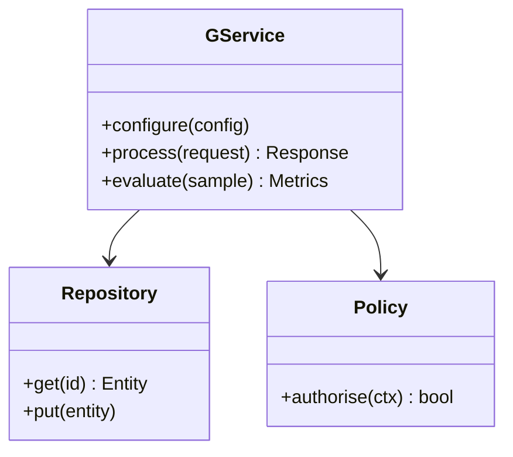

**Figure 11. Class - Cost and Indexing Trade-offs** (mermaid). Figure: Class view for GraphRAG. This diagram illustrates the principal components and their interactions as discussed in the surrounding section.

## Deep Dive: Mechanics, Variants and Trade-offs

Having established the essentials, we now go deeper into cost and indexing trade-offs. It pays to understand the mechanism rather than treat it as a black box, because most production incidents are explained by one of its steps misbehaving. The distinctions in this section are the ones that separate a working demo from a system that holds up under adversarial inputs, scale and the passage of time.

Consider the principal variants and how to choose between them. Each variant optimises for a different point in the design space - some for latency, some for accuracy, some for cost or operability - and the correct choice follows from explicit requirements rather than from defaults. As with most architectural decisions, the choice is rarely binary; the skill lies in quantifying the trade-offs and choosing deliberately.

In practice this is supported by a mature tooling ecosystem, including Microsoft GraphRAG, Neo4j, LlamaIndex, NetworkX. Tools accelerate the work but do not substitute for understanding: the same principles apply whichever implementation you select, and the ability to reason from first principles is what lets you debug when a tool behaves unexpectedly.

A frequent source of subtle bugs is the interaction with query routing in graphrag. Because query routing in graphrag concerns choosing local, global or hybrid strategies per question, changes there can silently alter the behaviour analysed here. The remedy is contract tests at the boundary and end-to-end evaluations that exercise the interaction explicitly.

Finally, attend to edge cases and degradation. Define what the system should do under partial failure, unexpected inputs and load spikes, and make that behaviour explicit and tested rather than emergent. Graceful degradation - returning a safe, useful result when the ideal one is unavailable - is a hallmark of mature engineering.

For deeper study, the literature offers authoritative treatments such as Edge et al. — From Local to Global: Graph RAG (Microsoft, 2024) and Traag et al. — Leiden community detection (2019). These primary sources reward careful reading and ground the practical guidance above in established results.

## Advanced Considerations

Having established the essentials, we now go deeper into cost and indexing trade-offs. It pays to understand the mechanism rather than treat it as a black box, because most production incidents are explained by one of its steps misbehaving. The distinctions in this section are the ones that separate a working demo from a system that holds up under adversarial inputs, scale and the passage of time.

Consider the principal variants and how to choose between them. Each variant optimises for a different point in the design space - some for latency, some for accuracy, some for cost or operability - and the correct choice follows from explicit requirements rather than from defaults. There is an inherent trade-off between fidelity and cost, and the correct balance depends on the use case and its tolerance for error.

In practice this is supported by a mature tooling ecosystem, including Microsoft GraphRAG, Neo4j, LlamaIndex, NetworkX. Tools accelerate the work but do not substitute for understanding: the same principles apply whichever implementation you select, and the ability to reason from first principles is what lets you debug when a tool behaves unexpectedly.

A frequent source of subtle bugs is the interaction with limits of vector-only rag. Because limits of vector-only rag concerns why local similarity fails on global, multi-hop and aggregative questions, changes there can silently alter the behaviour analysed here. The remedy is contract tests at the boundary and end-to-end evaluations that exercise the interaction explicitly.

Finally, attend to edge cases and degradation. Define what the system should do under partial failure, unexpected inputs and load spikes, and make that behaviour explicit and tested rather than emergent. Graceful degradation - returning a safe, useful result when the ideal one is unavailable - is a hallmark of mature engineering.

For deeper study, the literature offers authoritative treatments such as Edge et al. — From Local to Global: Graph RAG (Microsoft, 2024) and Traag et al. — Leiden community detection (2019). These primary sources reward careful reading and ground the practical guidance above in established results.

## Worked Example

To ground the discussion, walk through a representative example. A intelligence organisation needs connecting entities across heterogeneous reports. They decide to apply cost and indexing trade-offs as part of their GraphRAG solution, but wisely treat it as a hypothesis to be validated rather than a foregone conclusion.

The team begins by stating the objective precisely and defining how success will be measured before writing any code. They establish a small but representative evaluation set, agree on acceptance thresholds, and only then prototype the simplest design that could work. Early measurement reveals which assumptions hold and which must be revised, saving weeks of misdirected effort and surfacing edge cases while they are still cheap to fix.

As the prototype matures into a service, the team hardens it: adding input validation, error handling, caching where it pays off, and monitoring that ties back to the original success metric. They document each significant decision in an architecture decision record so that future maintainers understand not just what was built but why.

The outcome is instructive. The system that reaches production is not the most sophisticated design the team considered, but the one whose behaviour they could measure, explain and operate. This is the recurring lesson of GraphRAG: durable value comes from the whole system, not from any single clever component.

## Industry Use Cases

Across industries, the ideas in this chapter recur in recognisable ways. The following vignettes show how different sectors apply them and what they have in common.

**Research.** Literature synthesis across thousands of papers. The common thread is that value comes not from the model alone but from the surrounding system - data quality, evaluation, integration and operations - which is precisely where most of the engineering effort belongs.

**Intelligence.** Connecting entities across heterogeneous reports. The common thread is that value comes not from the model alone but from the surrounding system - data quality, evaluation, integration and operations - which is precisely where most of the engineering effort belongs.

**Enterprise.** Whole-corpus thematic questions over documentation. The common thread is that value comes not from the model alone but from the surrounding system - data quality, evaluation, integration and operations - which is precisely where most of the engineering effort belongs.

**Compliance.** Tracing relationships across regulatory filings. The common thread is that value comes not from the model alone but from the surrounding system - data quality, evaluation, integration and operations - which is precisely where most of the engineering effort belongs.

## Best Practices

The following practices consistently separate successful GraphRAG efforts from struggling ones. They are deliberately concrete so they can be adopted as checklist items in design and code review.

- Invest in entity resolution; graph quality dominates answer quality.
- Route global questions to community summaries, not raw chunks.
- Cache community summaries to amortise extraction cost.
- Track provenance through edges for citation.

None of these are exotic; they are the unglamorous disciplines that compound into reliability. The cost of adopting them is small compared with the cost of the incidents they prevent, and they become second nature with practice.

## Common Pitfalls

Equally instructive are the failure modes that recur in practice. Each pitfall below has a clear early warning sign and a known remedy, so treat them as a diagnostic checklist when something feels wrong:

- Skipping entity resolution and fragmenting the graph.
- Applying GraphRAG where simple RAG suffices, inflating cost.
- Stale graphs after corpus updates.
- Unbounded extraction cost on huge corpora.

The pattern is consistent: most failures stem from skipping measurement, conflating prototype and production standards, or deferring cross-cutting concerns such as security and cost until they become emergencies. Naming these traps in advance is the cheapest way to avoid them.

## Governance, Security and Cost Notes

No discussion of cost and indexing trade-offs is complete without its governance, security and cost dimensions, which are too often deferred until they become emergencies. Treating them as first-class concerns from the outset is both cheaper and safer.

**Governance.** Classify the risk of this capability, document its intended and out-of-scope uses, and ensure decisions are traceable to satisfy internal policy and external regulation such as the NIST AI RMF, ISO/IEC 42001 and the EU AI Act. **Security.** Treat all external input as untrusted, validate outputs before acting on them, apply least privilege to any tools or data access, and map controls to the OWASP LLM Top 10 and MITRE ATLAS.

**Cost and sustainability.** Establish explicit budgets for compute, tokens and latency, attribute spend to owners, and revisit the economics as usage scales - a design that is affordable at pilot scale can become untenable at production volume. Building these reflexes into everyday engineering is what allows a GraphRAG system to be not only capable but also trustworthy and economically sound.

## Hands-On Exercises

Work through the following exercises. They are designed to move understanding from recognition to application - the level required for real engineering work - so prefer writing and building over merely reading.

1. Explain cost and indexing trade-offs to a colleague unfamiliar with GraphRAG, using a concrete example from your own domain.
2. Sketch a reference architecture that incorporates cost and indexing trade-offs and annotate where observability, security and cost controls belong.
3. Design an evaluation that would tell you whether cost and indexing trade-offs is working in production, including the metric, the dataset and the acceptance threshold.
4. Identify two pitfalls relevant to cost and indexing trade-offs in your environment and describe the early warning signals you would monitor.
5. Prototype the simplest implementation that demonstrates cost and indexing trade-offs, then list exactly what would need to change to make it production-ready.

## Key Takeaways

Key takeaways from this chapter:

- Cost and Indexing Trade-offs is a systems concern in GraphRAG: data, models and operations must be co-designed.
- Measurement is non-negotiable; define success metrics and evaluation before building.
- Favour the simplest design that meets the requirement, and add complexity only when evidence demands it.
- Security, cost and observability are first-class requirements, not afterthoughts.
- Document decisions so the system remains understandable and operable as it evolves.

## Code Walkthrough

Pipelines keep Cost and Indexing Trade-offs logic modular and testable. Each stage is a pure function, errors are captured per item, and the composition is trivial to extend or reorder.

The full listing is shown below; study it line by line and reproduce it locally before moving on.

### Listing: A composable processing pipeline for Cost and Indexing Trade-offs

```python
from collections.abc import Iterable, Iterator
from typing import Protocol


class Stage(Protocol):
    def __call__(self, item: dict) -> dict: ...


def pipeline(stages: list[Stage]) -> Stage:
    """Compose ordered stages into a single callable for Cost and Indexing Trade-offs."""

    def run(item: dict) -> dict:
        for stage in stages:
            item = stage(item)
        return item

    return run


def validate(item: dict) -> dict:
    if "text" not in item:
        raise ValueError("missing required field: text")
    return item


def normalise(item: dict) -> dict:
    item["text"] = item["text"].strip().lower()
    return item


def enrich(item: dict) -> dict:
    item["length"] = len(item["text"])
    return item


process = pipeline([validate, normalise, enrich])


def run_batch(items: Iterable[dict]) -> Iterator[dict]:
    for item in items:
        try:
            yield process(dict(item))
        except ValueError as exc:
            yield {"error": str(exc), "item": item}

```

## Review Questions

1. In the context of GraphRAG, which statement best describes “Cost and Indexing Trade-offs”?
   - A. It eliminates the need for any evaluation or monitoring.
   - B. It is only relevant to academic research, not production.
   - C. It guarantees deterministic output regardless of input.
   - D. The build cost of graph extraction versus query-time value.
   - **Answer: D.** Cost and Indexing Trade-offs: The build cost of graph extraction versus query-time value.
2. Which of the following is a recommended best practice when working with GraphRAG?
   - A. It makes the system slower but has no other effect.
   - B. Unbounded extraction cost on huge corpora.
   - C. It is only relevant to academic research, not production.
   - D. Track provenance through edges for citation.
   - **Answer: D.** Best practice: Track provenance through edges for citation.
3. Which of the following is a common pitfall to avoid in GraphRAG?
   - A. Applying GraphRAG where simple RAG suffices, inflating cost.
   - B. It makes the system slower but has no other effect.
   - C. Route global questions to community summaries, not raw chunks.
   - D. Invest in entity resolution; graph quality dominates answer quality.
   - **Answer: A.** Pitfall to avoid: Applying GraphRAG where simple RAG suffices, inflating cost.
4. *(Discussion)* What trade-offs would you weigh when implementing Cost and Indexing Trade-offs?
   - **Model answer:** A strong answer defines cost and indexing trade-offs (The build cost of graph extraction versus query-time value.) then connects it to architecture, evaluation, cost, security and operations for GraphRAG, citing concrete trade-offs and a real-world example.

---


# Chapter 11. Incremental Graph Updates

_This chapter examines incremental graph updates within GraphRAG. It covers keeping the graph fresh as the corpus changes, derives a reference architecture, walks through a worked example and runnable code, surveys industry use cases, and distils best practices and pitfalls, closing with exercises and review questions._

## Introduction

Incremental Graph Updates can be characterised as keeping the graph fresh as the corpus changes. Teams that master this consistently ship more reliable GraphRAG systems at lower cost. Seasoned practitioners treat this as a systems problem, co-designing data, models and operations rather than optimising any one in isolation.

This chapter builds intuition first, then formalises the ideas, derives an architecture, and finishes with code, exercises and review questions so the material transfers directly to your own GraphRAG work. Read it actively: pause at each diagram, reproduce the code, and attempt the exercises before consulting the answers.

## Theory and Foundations

At its core, Incremental Graph Updates concerns keeping the graph fresh as the corpus changes. The right abstraction here pays compounding dividends, because downstream components depend on its guarantees. Beneath the abstraction lies a concrete process whose steps can each be measured, tested and optimised independently.

To place this in context, recall the broader picture: GraphRAG augments retrieval-augmented generation with a knowledge graph constructed from a corpus, enabling multi-hop reasoning, community summarisation and global questions that flat vector retrieval cannot answer. Within that picture, incremental graph updates is one of the load-bearing ideas - the kind that, when understood deeply, makes the rest of GraphRAG fall into place. It is foundational: later capabilities in GraphRAG are built directly on top of it.

Incremental Graph Updates cannot be understood in isolation from multi-hop reasoning over graphs. Recall that multi-hop reasoning over graphs concerns traversing relationships to answer connected questions. The two interact directly: decisions in one constrain the design space of the other, which is why mature teams reason about them together rather than sequentially. As with most architectural decisions, the choice is rarely binary; the skill lies in quantifying the trade-offs and choosing deliberately.

Incremental Graph Updates cannot be understood in isolation from operating graphrag. Recall that operating graphrag concerns pipelines, storage and monitoring. The two interact directly: decisions in one constrain the design space of the other, which is why mature teams reason about them together rather than sequentially. As with most architectural decisions, the choice is rarely binary; the skill lies in quantifying the trade-offs and choosing deliberately.

Several established patterns apply directly to incremental graph updates. The first, hierarchical community summaries for scalable synthesis, is widely adopted because it makes the system's behaviour predictable and observable. A complementary pattern, map-reduce community summarisation for global questions, addresses a related concern and is often deployed alongside it. Patterns are not dogma; they are distilled experience that shortcuts the search for a sound design, and each carries assumptions worth checking against your context.

Knowing when not to use a technique is as valuable as knowing how to use it. In a small prototype, shortcuts around incremental graph updates are invisible; in a production GraphRAG system serving real traffic, they surface as incidents, cost overruns or compliance gaps. As with most architectural decisions, the choice is rarely binary; the skill lies in quantifying the trade-offs and choosing deliberately. The remainder of this chapter turns these principles into an architecture, code and a checklist you can apply immediately.

## Architecture and Design

From an architectural standpoint, Incremental Graph Updates sits at the intersection of data, models and operations. GraphRAG indexing extracts entities and relations from chunks, resolves duplicates, builds a graph, detects communities and pre-summarises them. At query time a router selects local search (entity neighbourhoods + linked text) or global search (map-reduce over community summaries), then synthesises a cited answer.

Concretely, the principal building blocks include limits of vector-only rag, knowledge graph construction from text, entity resolution and deduplication, community detection and summarisation and local versus global search. Each is a replaceable component behind a stable interface, so the team can upgrade an implementation - a model, an index, a policy engine - without rewriting its neighbours. The contracts between components are where reliability is won or lost, so they are specified explicitly and tested in isolation.

The diagram accompanying this section makes the data and control flow explicit. Requests enter through a well-defined boundary where they are authenticated and validated; only then are they dispatched to the components that perform the work. This boundary is also where rate limiting, quota enforcement and audit logging live, keeping cross-cutting concerns out of the core logic and in one auditable place.

Two qualities deserve emphasis. First, observability is designed in, not bolted on: every component emits structured telemetry so that failures can be localised in minutes rather than hours. Second, the architecture is evolvable - components communicate through stable contracts so that any single part of the GraphRAG system can be replaced without a rewrite. As with most architectural decisions, the choice is rarely binary; the skill lies in quantifying the trade-offs and choosing deliberately.

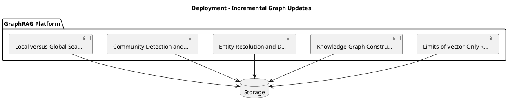

_Source diagram (plantuml); render with the appropriate tool._

**Figure 12. Deployment - Incremental Graph Updates** (plantuml). Figure: Deployment view for GraphRAG. This diagram illustrates the principal components and their interactions as discussed in the surrounding section.

## Deep Dive: Mechanics, Variants and Trade-offs

Having established the essentials, we now go deeper into incremental graph updates. Mechanically, the behaviour emerges from a few interacting parts that are simpler than the whole they produce. The distinctions in this section are the ones that separate a working demo from a system that holds up under adversarial inputs, scale and the passage of time.

Consider the principal variants and how to choose between them. Each variant optimises for a different point in the design space - some for latency, some for accuracy, some for cost or operability - and the correct choice follows from explicit requirements rather than from defaults. As with most architectural decisions, the choice is rarely binary; the skill lies in quantifying the trade-offs and choosing deliberately.

In practice this is supported by a mature tooling ecosystem, including Microsoft GraphRAG, Neo4j, LlamaIndex, NetworkX. Tools accelerate the work but do not substitute for understanding: the same principles apply whichever implementation you select, and the ability to reason from first principles is what lets you debug when a tool behaves unexpectedly.

A frequent source of subtle bugs is the interaction with multi-hop reasoning over graphs. Because multi-hop reasoning over graphs concerns traversing relationships to answer connected questions, changes there can silently alter the behaviour analysed here. The remedy is contract tests at the boundary and end-to-end evaluations that exercise the interaction explicitly.

Finally, attend to edge cases and degradation. Define what the system should do under partial failure, unexpected inputs and load spikes, and make that behaviour explicit and tested rather than emergent. Graceful degradation - returning a safe, useful result when the ideal one is unavailable - is a hallmark of mature engineering.

For deeper study, the literature offers authoritative treatments such as Edge et al. — From Local to Global: Graph RAG (Microsoft, 2024) and Traag et al. — Leiden community detection (2019). These primary sources reward careful reading and ground the practical guidance above in established results.

## Advanced Considerations

Having established the essentials, we now go deeper into incremental graph updates. It pays to understand the mechanism rather than treat it as a black box, because most production incidents are explained by one of its steps misbehaving. The distinctions in this section are the ones that separate a working demo from a system that holds up under adversarial inputs, scale and the passage of time.

Consider the principal variants and how to choose between them. Each variant optimises for a different point in the design space - some for latency, some for accuracy, some for cost or operability - and the correct choice follows from explicit requirements rather than from defaults. Simplicity is a feature. The simplest design that meets the requirement should be the default, with complexity added only when measurement justifies it.

In practice this is supported by a mature tooling ecosystem, including Microsoft GraphRAG, Neo4j, LlamaIndex, NetworkX. Tools accelerate the work but do not substitute for understanding: the same principles apply whichever implementation you select, and the ability to reason from first principles is what lets you debug when a tool behaves unexpectedly.

A frequent source of subtle bugs is the interaction with limits of vector-only rag. Because limits of vector-only rag concerns why local similarity fails on global, multi-hop and aggregative questions, changes there can silently alter the behaviour analysed here. The remedy is contract tests at the boundary and end-to-end evaluations that exercise the interaction explicitly.

Finally, attend to edge cases and degradation. Define what the system should do under partial failure, unexpected inputs and load spikes, and make that behaviour explicit and tested rather than emergent. Graceful degradation - returning a safe, useful result when the ideal one is unavailable - is a hallmark of mature engineering.

For deeper study, the literature offers authoritative treatments such as Edge et al. — From Local to Global: Graph RAG (Microsoft, 2024) and Traag et al. — Leiden community detection (2019). These primary sources reward careful reading and ground the practical guidance above in established results.

## Worked Example

A worked example clarifies how these ideas behave in practice. A intelligence organisation needs connecting entities across heterogeneous reports. They decide to apply incremental graph updates as part of their GraphRAG solution, but wisely treat it as a hypothesis to be validated rather than a foregone conclusion.

The team begins by stating the objective precisely and defining how success will be measured before writing any code. They establish a small but representative evaluation set, agree on acceptance thresholds, and only then prototype the simplest design that could work. Early measurement reveals which assumptions hold and which must be revised, saving weeks of misdirected effort and surfacing edge cases while they are still cheap to fix.

As the prototype matures into a service, the team hardens it: adding input validation, error handling, caching where it pays off, and monitoring that ties back to the original success metric. They document each significant decision in an architecture decision record so that future maintainers understand not just what was built but why.

The outcome is instructive. The system that reaches production is not the most sophisticated design the team considered, but the one whose behaviour they could measure, explain and operate. This is the recurring lesson of GraphRAG: durable value comes from the whole system, not from any single clever component.

## Industry Use Cases

Across industries, the ideas in this chapter recur in recognisable ways. The following vignettes show how different sectors apply them and what they have in common.

**Research.** Literature synthesis across thousands of papers. The common thread is that value comes not from the model alone but from the surrounding system - data quality, evaluation, integration and operations - which is precisely where most of the engineering effort belongs.

**Intelligence.** Connecting entities across heterogeneous reports. The common thread is that value comes not from the model alone but from the surrounding system - data quality, evaluation, integration and operations - which is precisely where most of the engineering effort belongs.

**Enterprise.** Whole-corpus thematic questions over documentation. The common thread is that value comes not from the model alone but from the surrounding system - data quality, evaluation, integration and operations - which is precisely where most of the engineering effort belongs.

**Compliance.** Tracing relationships across regulatory filings. The common thread is that value comes not from the model alone but from the surrounding system - data quality, evaluation, integration and operations - which is precisely where most of the engineering effort belongs.

## Best Practices

The following practices consistently separate successful GraphRAG efforts from struggling ones. They are deliberately concrete so they can be adopted as checklist items in design and code review.

- Invest in entity resolution; graph quality dominates answer quality.
- Route global questions to community summaries, not raw chunks.
- Cache community summaries to amortise extraction cost.
- Track provenance through edges for citation.

None of these are exotic; they are the unglamorous disciplines that compound into reliability. The cost of adopting them is small compared with the cost of the incidents they prevent, and they become second nature with practice.

## Common Pitfalls

Equally instructive are the failure modes that recur in practice. Each pitfall below has a clear early warning sign and a known remedy, so treat them as a diagnostic checklist when something feels wrong:

- Skipping entity resolution and fragmenting the graph.
- Applying GraphRAG where simple RAG suffices, inflating cost.
- Stale graphs after corpus updates.
- Unbounded extraction cost on huge corpora.

The pattern is consistent: most failures stem from skipping measurement, conflating prototype and production standards, or deferring cross-cutting concerns such as security and cost until they become emergencies. Naming these traps in advance is the cheapest way to avoid them.

## Governance, Security and Cost Notes

No discussion of incremental graph updates is complete without its governance, security and cost dimensions, which are too often deferred until they become emergencies. Treating them as first-class concerns from the outset is both cheaper and safer.

**Governance.** Classify the risk of this capability, document its intended and out-of-scope uses, and ensure decisions are traceable to satisfy internal policy and external regulation such as the NIST AI RMF, ISO/IEC 42001 and the EU AI Act. **Security.** Treat all external input as untrusted, validate outputs before acting on them, apply least privilege to any tools or data access, and map controls to the OWASP LLM Top 10 and MITRE ATLAS.

**Cost and sustainability.** Establish explicit budgets for compute, tokens and latency, attribute spend to owners, and revisit the economics as usage scales - a design that is affordable at pilot scale can become untenable at production volume. Building these reflexes into everyday engineering is what allows a GraphRAG system to be not only capable but also trustworthy and economically sound.

## Hands-On Exercises

Work through the following exercises. They are designed to move understanding from recognition to application - the level required for real engineering work - so prefer writing and building over merely reading.

1. Explain incremental graph updates to a colleague unfamiliar with GraphRAG, using a concrete example from your own domain.
2. Sketch a reference architecture that incorporates incremental graph updates and annotate where observability, security and cost controls belong.
3. Design an evaluation that would tell you whether incremental graph updates is working in production, including the metric, the dataset and the acceptance threshold.
4. Identify two pitfalls relevant to incremental graph updates in your environment and describe the early warning signals you would monitor.
5. Prototype the simplest implementation that demonstrates incremental graph updates, then list exactly what would need to change to make it production-ready.

## Key Takeaways

Key takeaways from this chapter:

- Incremental Graph Updates is a systems concern in GraphRAG: data, models and operations must be co-designed.
- Measurement is non-negotiable; define success metrics and evaluation before building.
- Favour the simplest design that meets the requirement, and add complexity only when evidence demands it.
- Security, cost and observability are first-class requirements, not afterthoughts.
- Document decisions so the system remains understandable and operable as it evolves.

## Code Walkthrough

Pipelines keep Incremental Graph Updates logic modular and testable. Each stage is a pure function, errors are captured per item, and the composition is trivial to extend or reorder.

The full listing is shown below; study it line by line and reproduce it locally before moving on.

### Listing: A composable processing pipeline for Incremental Graph Updates

```python
from collections.abc import Iterable, Iterator
from typing import Protocol


class Stage(Protocol):
    def __call__(self, item: dict) -> dict: ...


def pipeline(stages: list[Stage]) -> Stage:
    """Compose ordered stages into a single callable for Incremental Graph Updates."""

    def run(item: dict) -> dict:
        for stage in stages:
            item = stage(item)
        return item

    return run


def validate(item: dict) -> dict:
    if "text" not in item:
        raise ValueError("missing required field: text")
    return item


def normalise(item: dict) -> dict:
    item["text"] = item["text"].strip().lower()
    return item


def enrich(item: dict) -> dict:
    item["length"] = len(item["text"])
    return item


process = pipeline([validate, normalise, enrich])


def run_batch(items: Iterable[dict]) -> Iterator[dict]:
    for item in items:
        try:
            yield process(dict(item))
        except ValueError as exc:
            yield {"error": str(exc), "item": item}

```

## Review Questions

1. In the context of GraphRAG, which statement best describes “Incremental Graph Updates”?
   - A. It guarantees deterministic output regardless of input.
   - B. It removes all security and governance requirements.
   - C. Keeping the graph fresh as the corpus changes.
   - D. It is only relevant to academic research, not production.
   - **Answer: C.** Incremental Graph Updates: Keeping the graph fresh as the corpus changes.
2. Which of the following is a recommended best practice when working with GraphRAG?
   - A. Invest in entity resolution; graph quality dominates answer quality.
   - B. It guarantees deterministic output regardless of input.
   - C. Unbounded extraction cost on huge corpora.
   - D. Skipping entity resolution and fragmenting the graph.
   - **Answer: A.** Best practice: Invest in entity resolution; graph quality dominates answer quality.
3. Which of the following is a common pitfall to avoid in GraphRAG?
   - A. It applies exclusively to image data.
   - B. Invest in entity resolution; graph quality dominates answer quality.
   - C. It is only relevant to academic research, not production.
   - D. Skipping entity resolution and fragmenting the graph.
   - **Answer: D.** Pitfall to avoid: Skipping entity resolution and fragmenting the graph.
4. *(Discussion)* Describe a failure mode of Incremental Graph Updates and how you would mitigate it.
   - **Model answer:** A strong answer defines incremental graph updates (Keeping the graph fresh as the corpus changes.) then connects it to architecture, evaluation, cost, security and operations for GraphRAG, citing concrete trade-offs and a real-world example.

---


# Chapter 12. Operating GraphRAG

_This chapter examines operating graphrag within GraphRAG. It covers pipelines, storage and monitoring, derives a reference architecture, walks through a worked example and runnable code, surveys industry use cases, and distils best practices and pitfalls, closing with exercises and review questions._

## Introduction

Operating GraphRAG refers to pipelines, storage and monitoring. It is foundational: later capabilities in GraphRAG are built directly on top of it. The practical implication is that design choices here ripple through latency, cost and maintainability for the lifetime of the system.

This chapter builds intuition first, then formalises the ideas, derives an architecture, and finishes with code, exercises and review questions so the material transfers directly to your own GraphRAG work. Read it actively: pause at each diagram, reproduce the code, and attempt the exercises before consulting the answers.

## Theory and Foundations

We define Operating GraphRAG as pipelines, storage and monitoring. Seasoned practitioners treat this as a systems problem, co-designing data, models and operations rather than optimising any one in isolation. Beneath the abstraction lies a concrete process whose steps can each be measured, tested and optimised independently.

To place this in context, recall the broader picture: GraphRAG augments retrieval-augmented generation with a knowledge graph constructed from a corpus, enabling multi-hop reasoning, community summarisation and global questions that flat vector retrieval cannot answer. Within that picture, operating graphrag is one of the load-bearing ideas - the kind that, when understood deeply, makes the rest of GraphRAG fall into place. Understanding this matters because GraphRAG systems succeed or fail on exactly these decisions.

Operating GraphRAG cannot be understood in isolation from local versus global search. Recall that local versus global search concerns entity-centric retrieval versus community-level synthesis. The two interact directly: decisions in one constrain the design space of the other, which is why mature teams reason about them together rather than sequentially. There is an inherent trade-off between fidelity and cost, and the correct balance depends on the use case and its tolerance for error.

Operating GraphRAG cannot be understood in isolation from graph + vector hybrid retrieval. Recall that graph + vector hybrid retrieval concerns combining structural traversal with semantic similarity. The two interact directly: decisions in one constrain the design space of the other, which is why mature teams reason about them together rather than sequentially. Simplicity is a feature. The simplest design that meets the requirement should be the default, with complexity added only when measurement justifies it.

Several established patterns apply directly to operating graphrag. The first, hierarchical community summaries for scalable synthesis, is widely adopted because it makes the system's behaviour predictable and observable. A complementary pattern, entity-neighbourhood expansion for local questions, addresses a related concern and is often deployed alongside it. Patterns are not dogma; they are distilled experience that shortcuts the search for a sound design, and each carries assumptions worth checking against your context.

It is worth being explicit about when to apply this and when to reach for something simpler. In a small prototype, shortcuts around operating graphrag are invisible; in a production GraphRAG system serving real traffic, they surface as incidents, cost overruns or compliance gaps. Simplicity is a feature. The simplest design that meets the requirement should be the default, with complexity added only when measurement justifies it. The remainder of this chapter turns these principles into an architecture, code and a checklist you can apply immediately.

## Architecture and Design

The reference architecture for Operating GraphRAG separates concerns into clearly bounded components with explicit contracts. GraphRAG indexing extracts entities and relations from chunks, resolves duplicates, builds a graph, detects communities and pre-summarises them. At query time a router selects local search (entity neighbourhoods + linked text) or global search (map-reduce over community summaries), then synthesises a cited answer.

Concretely, the principal building blocks include limits of vector-only rag, knowledge graph construction from text, entity resolution and deduplication, community detection and summarisation and local versus global search. Each is a replaceable component behind a stable interface, so the team can upgrade an implementation - a model, an index, a policy engine - without rewriting its neighbours. The contracts between components are where reliability is won or lost, so they are specified explicitly and tested in isolation.

The diagram accompanying this section makes the data and control flow explicit. Requests enter through a well-defined boundary where they are authenticated and validated; only then are they dispatched to the components that perform the work. This boundary is also where rate limiting, quota enforcement and audit logging live, keeping cross-cutting concerns out of the core logic and in one auditable place.

Two qualities deserve emphasis. First, observability is designed in, not bolted on: every component emits structured telemetry so that failures can be localised in minutes rather than hours. Second, the architecture is evolvable - components communicate through stable contracts so that any single part of the GraphRAG system can be replaced without a rewrite. Latency, accuracy and cost form a tension triangle: improving one typically pressures the others, so explicit budgets are essential.


**Figure 13. RAG Architecture - Operating GraphRAG** (mermaid). Figure: RAG Architecture view for GraphRAG. This diagram illustrates the principal components and their interactions as discussed in the surrounding section.

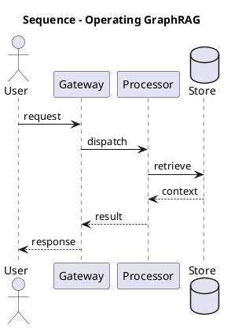

_Source diagram (plantuml); render with the appropriate tool._

**Figure 14. Sequence - Operating GraphRAG** (plantuml). Figure: Sequence view for GraphRAG. This diagram illustrates the principal components and their interactions as discussed in the surrounding section.

## Deep Dive: Mechanics, Variants and Trade-offs

Having established the essentials, we now go deeper into operating graphrag. Mechanically, the behaviour emerges from a few interacting parts that are simpler than the whole they produce. The distinctions in this section are the ones that separate a working demo from a system that holds up under adversarial inputs, scale and the passage of time.

Consider the principal variants and how to choose between them. Each variant optimises for a different point in the design space - some for latency, some for accuracy, some for cost or operability - and the correct choice follows from explicit requirements rather than from defaults. Simplicity is a feature. The simplest design that meets the requirement should be the default, with complexity added only when measurement justifies it.

In practice this is supported by a mature tooling ecosystem, including Microsoft GraphRAG, Neo4j, LlamaIndex, NetworkX. Tools accelerate the work but do not substitute for understanding: the same principles apply whichever implementation you select, and the ability to reason from first principles is what lets you debug when a tool behaves unexpectedly.

A frequent source of subtle bugs is the interaction with local versus global search. Because local versus global search concerns entity-centric retrieval versus community-level synthesis, changes there can silently alter the behaviour analysed here. The remedy is contract tests at the boundary and end-to-end evaluations that exercise the interaction explicitly.

Finally, attend to edge cases and degradation. Define what the system should do under partial failure, unexpected inputs and load spikes, and make that behaviour explicit and tested rather than emergent. Graceful degradation - returning a safe, useful result when the ideal one is unavailable - is a hallmark of mature engineering.

For deeper study, the literature offers authoritative treatments such as Edge et al. — From Local to Global: Graph RAG (Microsoft, 2024) and Traag et al. — Leiden community detection (2019). These primary sources reward careful reading and ground the practical guidance above in established results.

## Advanced Considerations

Having established the essentials, we now go deeper into operating graphrag. Mechanically, the behaviour emerges from a few interacting parts that are simpler than the whole they produce. The distinctions in this section are the ones that separate a working demo from a system that holds up under adversarial inputs, scale and the passage of time.

Consider the principal variants and how to choose between them. Each variant optimises for a different point in the design space - some for latency, some for accuracy, some for cost or operability - and the correct choice follows from explicit requirements rather than from defaults. Latency, accuracy and cost form a tension triangle: improving one typically pressures the others, so explicit budgets are essential.

In practice this is supported by a mature tooling ecosystem, including Microsoft GraphRAG, Neo4j, LlamaIndex, NetworkX. Tools accelerate the work but do not substitute for understanding: the same principles apply whichever implementation you select, and the ability to reason from first principles is what lets you debug when a tool behaves unexpectedly.

A frequent source of subtle bugs is the interaction with knowledge graph construction from text. Because knowledge graph construction from text concerns lLM-driven entity and relationship extraction and schema design, changes there can silently alter the behaviour analysed here. The remedy is contract tests at the boundary and end-to-end evaluations that exercise the interaction explicitly.

Finally, attend to edge cases and degradation. Define what the system should do under partial failure, unexpected inputs and load spikes, and make that behaviour explicit and tested rather than emergent. Graceful degradation - returning a safe, useful result when the ideal one is unavailable - is a hallmark of mature engineering.

For deeper study, the literature offers authoritative treatments such as Edge et al. — From Local to Global: Graph RAG (Microsoft, 2024) and Traag et al. — Leiden community detection (2019). These primary sources reward careful reading and ground the practical guidance above in established results.

## Worked Example

To ground the discussion, walk through a representative example. A intelligence organisation needs connecting entities across heterogeneous reports. They decide to apply operating graphrag as part of their GraphRAG solution, but wisely treat it as a hypothesis to be validated rather than a foregone conclusion.

The team begins by stating the objective precisely and defining how success will be measured before writing any code. They establish a small but representative evaluation set, agree on acceptance thresholds, and only then prototype the simplest design that could work. Early measurement reveals which assumptions hold and which must be revised, saving weeks of misdirected effort and surfacing edge cases while they are still cheap to fix.

As the prototype matures into a service, the team hardens it: adding input validation, error handling, caching where it pays off, and monitoring that ties back to the original success metric. They document each significant decision in an architecture decision record so that future maintainers understand not just what was built but why.

The outcome is instructive. The system that reaches production is not the most sophisticated design the team considered, but the one whose behaviour they could measure, explain and operate. This is the recurring lesson of GraphRAG: durable value comes from the whole system, not from any single clever component.

## Industry Use Cases

Across industries, the ideas in this chapter recur in recognisable ways. The following vignettes show how different sectors apply them and what they have in common.

**Research.** Literature synthesis across thousands of papers. The common thread is that value comes not from the model alone but from the surrounding system - data quality, evaluation, integration and operations - which is precisely where most of the engineering effort belongs.

**Intelligence.** Connecting entities across heterogeneous reports. The common thread is that value comes not from the model alone but from the surrounding system - data quality, evaluation, integration and operations - which is precisely where most of the engineering effort belongs.

**Enterprise.** Whole-corpus thematic questions over documentation. The common thread is that value comes not from the model alone but from the surrounding system - data quality, evaluation, integration and operations - which is precisely where most of the engineering effort belongs.

**Compliance.** Tracing relationships across regulatory filings. The common thread is that value comes not from the model alone but from the surrounding system - data quality, evaluation, integration and operations - which is precisely where most of the engineering effort belongs.

## Best Practices

The following practices consistently separate successful GraphRAG efforts from struggling ones. They are deliberately concrete so they can be adopted as checklist items in design and code review.

- Invest in entity resolution; graph quality dominates answer quality.
- Route global questions to community summaries, not raw chunks.
- Cache community summaries to amortise extraction cost.
- Track provenance through edges for citation.

None of these are exotic; they are the unglamorous disciplines that compound into reliability. The cost of adopting them is small compared with the cost of the incidents they prevent, and they become second nature with practice.

## Common Pitfalls

Equally instructive are the failure modes that recur in practice. Each pitfall below has a clear early warning sign and a known remedy, so treat them as a diagnostic checklist when something feels wrong:

- Skipping entity resolution and fragmenting the graph.
- Applying GraphRAG where simple RAG suffices, inflating cost.
- Stale graphs after corpus updates.
- Unbounded extraction cost on huge corpora.

The pattern is consistent: most failures stem from skipping measurement, conflating prototype and production standards, or deferring cross-cutting concerns such as security and cost until they become emergencies. Naming these traps in advance is the cheapest way to avoid them.

## Governance, Security and Cost Notes

No discussion of operating graphrag is complete without its governance, security and cost dimensions, which are too often deferred until they become emergencies. Treating them as first-class concerns from the outset is both cheaper and safer.

**Governance.** Classify the risk of this capability, document its intended and out-of-scope uses, and ensure decisions are traceable to satisfy internal policy and external regulation such as the NIST AI RMF, ISO/IEC 42001 and the EU AI Act. **Security.** Treat all external input as untrusted, validate outputs before acting on them, apply least privilege to any tools or data access, and map controls to the OWASP LLM Top 10 and MITRE ATLAS.

**Cost and sustainability.** Establish explicit budgets for compute, tokens and latency, attribute spend to owners, and revisit the economics as usage scales - a design that is affordable at pilot scale can become untenable at production volume. Building these reflexes into everyday engineering is what allows a GraphRAG system to be not only capable but also trustworthy and economically sound.

## Hands-On Exercises

Work through the following exercises. They are designed to move understanding from recognition to application - the level required for real engineering work - so prefer writing and building over merely reading.

1. Explain operating graphrag to a colleague unfamiliar with GraphRAG, using a concrete example from your own domain.
2. Sketch a reference architecture that incorporates operating graphrag and annotate where observability, security and cost controls belong.
3. Design an evaluation that would tell you whether operating graphrag is working in production, including the metric, the dataset and the acceptance threshold.
4. Identify two pitfalls relevant to operating graphrag in your environment and describe the early warning signals you would monitor.
5. Prototype the simplest implementation that demonstrates operating graphrag, then list exactly what would need to change to make it production-ready.

## Key Takeaways

Key takeaways from this chapter:

- Operating GraphRAG is a systems concern in GraphRAG: data, models and operations must be co-designed.
- Measurement is non-negotiable; define success metrics and evaluation before building.
- Favour the simplest design that meets the requirement, and add complexity only when evidence demands it.
- Security, cost and observability are first-class requirements, not afterthoughts.
- Document decisions so the system remains understandable and operable as it evolves.

## Code Walkthrough

Every change to a GraphRAG system should pass an evaluation gate. This example shows the minimal shape: align predictions and references, compute a metric, and return a pass/fail decision for CI.

The full listing is shown below; study it line by line and reproduce it locally before moving on.

### Listing: Evaluating Operating GraphRAG with a regression gate

```python
from dataclasses import dataclass


@dataclass
class EvalResult:
    metric: str
    score: float
    passed: bool


def evaluate(predictions: list[str], references: list[str],
             threshold: float = 0.8) -> EvalResult:
    """Score Operating GraphRAG output against references with a simple exact-match metric.

    In practice you would combine several metrics (exact match, semantic
    similarity, LLM-as-judge) and gate releases on the aggregate.
    """
    if len(predictions) != len(references):
        raise ValueError("predictions and references must align")
    hits = sum(p.strip() == r.strip() for p, r in zip(predictions, references))
    score = hits / len(references) if references else 0.0
    return EvalResult(metric="exact_match", score=score, passed=score >= threshold)


if __name__ == "__main__":
    result = evaluate(["yes", "no"], ["yes", "yes"])
    print(f"{result.metric}={result.score:.2f} passed={result.passed}")

```

## Review Questions

1. In the context of GraphRAG, which statement best describes “Operating GraphRAG”?
   - A. It is only relevant to academic research, not production.
   - B. It removes all security and governance requirements.
   - C. Pipelines, storage and monitoring.
   - D. It makes the system slower but has no other effect.
   - **Answer: C.** Operating GraphRAG: Pipelines, storage and monitoring.
2. Which of the following is a recommended best practice when working with GraphRAG?
   - A. Stale graphs after corpus updates.
   - B. It eliminates the need for any evaluation or monitoring.
   - C. Applying GraphRAG where simple RAG suffices, inflating cost.
   - D. Route global questions to community summaries, not raw chunks.
   - **Answer: D.** Best practice: Route global questions to community summaries, not raw chunks.
3. Which of the following is a common pitfall to avoid in GraphRAG?
   - A. It makes the system slower but has no other effect.
   - B. It eliminates the need for any evaluation or monitoring.
   - C. Route global questions to community summaries, not raw chunks.
   - D. Unbounded extraction cost on huge corpora.
   - **Answer: D.** Pitfall to avoid: Unbounded extraction cost on huge corpora.
4. *(Discussion)* How does Operating GraphRAG interact with security and governance requirements?
   - **Model answer:** A strong answer defines operating graphrag (Pipelines, storage and monitoring.) then connects it to architecture, evaluation, cost, security and operations for GraphRAG, citing concrete trade-offs and a real-world example.

---


# Chapter 13. Security and Provenance

_This chapter examines security and provenance within GraphRAG. It covers source attribution through graph edges, derives a reference architecture, walks through a worked example and runnable code, surveys industry use cases, and distils best practices and pitfalls, closing with exercises and review questions._

## Introduction

Formally, Security and Provenance addresses source attribution through graph edges. Getting this right early prevents expensive rework once a GraphRAG system reaches scale. What distinguishes a production-grade approach from a prototype is the discipline of measurement: every claim is backed by an evaluation rather than intuition.

This chapter builds intuition first, then formalises the ideas, derives an architecture, and finishes with code, exercises and review questions so the material transfers directly to your own GraphRAG work. Read it actively: pause at each diagram, reproduce the code, and attempt the exercises before consulting the answers.

## Theory and Foundations

Security and Provenance refers to source attribution through graph edges. The practical implication is that design choices here ripple through latency, cost and maintainability for the lifetime of the system. It pays to understand the mechanism rather than treat it as a black box, because most production incidents are explained by one of its steps misbehaving.

To place this in context, recall the broader picture: GraphRAG augments retrieval-augmented generation with a knowledge graph constructed from a corpus, enabling multi-hop reasoning, community summarisation and global questions that flat vector retrieval cannot answer. Within that picture, security and provenance is one of the load-bearing ideas - the kind that, when understood deeply, makes the rest of GraphRAG fall into place. This concept recurs throughout the GraphRAG lifecycle, from design to operations.

Security and Provenance cannot be understood in isolation from entity resolution and deduplication. Recall that entity resolution and deduplication concerns merging coreferent entities into a clean graph. The two interact directly: decisions in one constrain the design space of the other, which is why mature teams reason about them together rather than sequentially. There is an inherent trade-off between fidelity and cost, and the correct balance depends on the use case and its tolerance for error.

Security and Provenance cannot be understood in isolation from evaluation of graphrag. Recall that evaluation of graphrag concerns comprehensiveness, diversity and groundedness metrics. The two interact directly: decisions in one constrain the design space of the other, which is why mature teams reason about them together rather than sequentially. There is an inherent trade-off between fidelity and cost, and the correct balance depends on the use case and its tolerance for error.

Several established patterns apply directly to security and provenance. The first, hybrid graph traversal + vector similarity, is widely adopted because it makes the system's behaviour predictable and observable. A complementary pattern, entity-neighbourhood expansion for local questions, addresses a related concern and is often deployed alongside it. Patterns are not dogma; they are distilled experience that shortcuts the search for a sound design, and each carries assumptions worth checking against your context.

The decision of whether to adopt this should be driven by requirements, not by novelty. In a small prototype, shortcuts around security and provenance are invisible; in a production GraphRAG system serving real traffic, they surface as incidents, cost overruns or compliance gaps. There is an inherent trade-off between fidelity and cost, and the correct balance depends on the use case and its tolerance for error. The remainder of this chapter turns these principles into an architecture, code and a checklist you can apply immediately.

## Architecture and Design

The reference architecture for Security and Provenance separates concerns into clearly bounded components with explicit contracts. GraphRAG indexing extracts entities and relations from chunks, resolves duplicates, builds a graph, detects communities and pre-summarises them. At query time a router selects local search (entity neighbourhoods + linked text) or global search (map-reduce over community summaries), then synthesises a cited answer.

Concretely, the principal building blocks include limits of vector-only rag, knowledge graph construction from text, entity resolution and deduplication, community detection and summarisation and local versus global search. Each is a replaceable component behind a stable interface, so the team can upgrade an implementation - a model, an index, a policy engine - without rewriting its neighbours. The contracts between components are where reliability is won or lost, so they are specified explicitly and tested in isolation.

The diagram accompanying this section makes the data and control flow explicit. Requests enter through a well-defined boundary where they are authenticated and validated; only then are they dispatched to the components that perform the work. This boundary is also where rate limiting, quota enforcement and audit logging live, keeping cross-cutting concerns out of the core logic and in one auditable place.

Two qualities deserve emphasis. First, observability is designed in, not bolted on: every component emits structured telemetry so that failures can be localised in minutes rather than hours. Second, the architecture is evolvable - components communicate through stable contracts so that any single part of the GraphRAG system can be replaced without a rewrite. There is an inherent trade-off between fidelity and cost, and the correct balance depends on the use case and its tolerance for error.

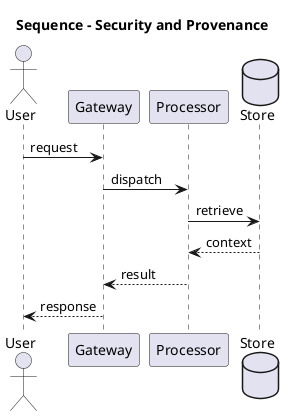

_Source diagram (plantuml); render with the appropriate tool._

**Figure 15. Sequence - Security and Provenance** (plantuml). Figure: Sequence view for GraphRAG. This diagram illustrates the principal components and their interactions as discussed in the surrounding section.

## Deep Dive: Mechanics, Variants and Trade-offs

Having established the essentials, we now go deeper into security and provenance. Mechanically, the behaviour emerges from a few interacting parts that are simpler than the whole they produce. The distinctions in this section are the ones that separate a working demo from a system that holds up under adversarial inputs, scale and the passage of time.

Consider the principal variants and how to choose between them. Each variant optimises for a different point in the design space - some for latency, some for accuracy, some for cost or operability - and the correct choice follows from explicit requirements rather than from defaults. Latency, accuracy and cost form a tension triangle: improving one typically pressures the others, so explicit budgets are essential.

In practice this is supported by a mature tooling ecosystem, including Microsoft GraphRAG, Neo4j, LlamaIndex, NetworkX. Tools accelerate the work but do not substitute for understanding: the same principles apply whichever implementation you select, and the ability to reason from first principles is what lets you debug when a tool behaves unexpectedly.

A frequent source of subtle bugs is the interaction with entity resolution and deduplication. Because entity resolution and deduplication concerns merging coreferent entities into a clean graph, changes there can silently alter the behaviour analysed here. The remedy is contract tests at the boundary and end-to-end evaluations that exercise the interaction explicitly.

Finally, attend to edge cases and degradation. Define what the system should do under partial failure, unexpected inputs and load spikes, and make that behaviour explicit and tested rather than emergent. Graceful degradation - returning a safe, useful result when the ideal one is unavailable - is a hallmark of mature engineering.

For deeper study, the literature offers authoritative treatments such as Edge et al. — From Local to Global: Graph RAG (Microsoft, 2024) and Traag et al. — Leiden community detection (2019). These primary sources reward careful reading and ground the practical guidance above in established results.

## Advanced Considerations

Having established the essentials, we now go deeper into security and provenance. The underlying mechanism is best appreciated by tracing a single request from input to output and noting where state is created and consumed. The distinctions in this section are the ones that separate a working demo from a system that holds up under adversarial inputs, scale and the passage of time.

Consider the principal variants and how to choose between them. Each variant optimises for a different point in the design space - some for latency, some for accuracy, some for cost or operability - and the correct choice follows from explicit requirements rather than from defaults. Every added component buys capability at the price of operational surface area, and that bargain should be made consciously.

In practice this is supported by a mature tooling ecosystem, including Microsoft GraphRAG, Neo4j, LlamaIndex, NetworkX. Tools accelerate the work but do not substitute for understanding: the same principles apply whichever implementation you select, and the ability to reason from first principles is what lets you debug when a tool behaves unexpectedly.

A frequent source of subtle bugs is the interaction with operating graphrag. Because operating graphrag concerns pipelines, storage and monitoring, changes there can silently alter the behaviour analysed here. The remedy is contract tests at the boundary and end-to-end evaluations that exercise the interaction explicitly.

Finally, attend to edge cases and degradation. Define what the system should do under partial failure, unexpected inputs and load spikes, and make that behaviour explicit and tested rather than emergent. Graceful degradation - returning a safe, useful result when the ideal one is unavailable - is a hallmark of mature engineering.

For deeper study, the literature offers authoritative treatments such as Edge et al. — From Local to Global: Graph RAG (Microsoft, 2024) and Traag et al. — Leiden community detection (2019). These primary sources reward careful reading and ground the practical guidance above in established results.

## Worked Example

To ground the discussion, walk through a representative example. A intelligence organisation needs connecting entities across heterogeneous reports. They decide to apply security and provenance as part of their GraphRAG solution, but wisely treat it as a hypothesis to be validated rather than a foregone conclusion.

The team begins by stating the objective precisely and defining how success will be measured before writing any code. They establish a small but representative evaluation set, agree on acceptance thresholds, and only then prototype the simplest design that could work. Early measurement reveals which assumptions hold and which must be revised, saving weeks of misdirected effort and surfacing edge cases while they are still cheap to fix.

As the prototype matures into a service, the team hardens it: adding input validation, error handling, caching where it pays off, and monitoring that ties back to the original success metric. They document each significant decision in an architecture decision record so that future maintainers understand not just what was built but why.

The outcome is instructive. The system that reaches production is not the most sophisticated design the team considered, but the one whose behaviour they could measure, explain and operate. This is the recurring lesson of GraphRAG: durable value comes from the whole system, not from any single clever component.

## Industry Use Cases

Across industries, the ideas in this chapter recur in recognisable ways. The following vignettes show how different sectors apply them and what they have in common.

**Research.** Literature synthesis across thousands of papers. The common thread is that value comes not from the model alone but from the surrounding system - data quality, evaluation, integration and operations - which is precisely where most of the engineering effort belongs.

**Intelligence.** Connecting entities across heterogeneous reports. The common thread is that value comes not from the model alone but from the surrounding system - data quality, evaluation, integration and operations - which is precisely where most of the engineering effort belongs.

**Enterprise.** Whole-corpus thematic questions over documentation. The common thread is that value comes not from the model alone but from the surrounding system - data quality, evaluation, integration and operations - which is precisely where most of the engineering effort belongs.

**Compliance.** Tracing relationships across regulatory filings. The common thread is that value comes not from the model alone but from the surrounding system - data quality, evaluation, integration and operations - which is precisely where most of the engineering effort belongs.

## Best Practices

The following practices consistently separate successful GraphRAG efforts from struggling ones. They are deliberately concrete so they can be adopted as checklist items in design and code review.

- Invest in entity resolution; graph quality dominates answer quality.
- Route global questions to community summaries, not raw chunks.
- Cache community summaries to amortise extraction cost.
- Track provenance through edges for citation.

None of these are exotic; they are the unglamorous disciplines that compound into reliability. The cost of adopting them is small compared with the cost of the incidents they prevent, and they become second nature with practice.

## Common Pitfalls

Equally instructive are the failure modes that recur in practice. Each pitfall below has a clear early warning sign and a known remedy, so treat them as a diagnostic checklist when something feels wrong:

- Skipping entity resolution and fragmenting the graph.
- Applying GraphRAG where simple RAG suffices, inflating cost.
- Stale graphs after corpus updates.
- Unbounded extraction cost on huge corpora.

The pattern is consistent: most failures stem from skipping measurement, conflating prototype and production standards, or deferring cross-cutting concerns such as security and cost until they become emergencies. Naming these traps in advance is the cheapest way to avoid them.

## Governance, Security and Cost Notes

No discussion of security and provenance is complete without its governance, security and cost dimensions, which are too often deferred until they become emergencies. Treating them as first-class concerns from the outset is both cheaper and safer.

**Governance.** Classify the risk of this capability, document its intended and out-of-scope uses, and ensure decisions are traceable to satisfy internal policy and external regulation such as the NIST AI RMF, ISO/IEC 42001 and the EU AI Act. **Security.** Treat all external input as untrusted, validate outputs before acting on them, apply least privilege to any tools or data access, and map controls to the OWASP LLM Top 10 and MITRE ATLAS.

**Cost and sustainability.** Establish explicit budgets for compute, tokens and latency, attribute spend to owners, and revisit the economics as usage scales - a design that is affordable at pilot scale can become untenable at production volume. Building these reflexes into everyday engineering is what allows a GraphRAG system to be not only capable but also trustworthy and economically sound.

## Hands-On Exercises

Work through the following exercises. They are designed to move understanding from recognition to application - the level required for real engineering work - so prefer writing and building over merely reading.

1. Explain security and provenance to a colleague unfamiliar with GraphRAG, using a concrete example from your own domain.
2. Sketch a reference architecture that incorporates security and provenance and annotate where observability, security and cost controls belong.
3. Design an evaluation that would tell you whether security and provenance is working in production, including the metric, the dataset and the acceptance threshold.
4. Identify two pitfalls relevant to security and provenance in your environment and describe the early warning signals you would monitor.
5. Prototype the simplest implementation that demonstrates security and provenance, then list exactly what would need to change to make it production-ready.

## Key Takeaways

Key takeaways from this chapter:

- Security and Provenance is a systems concern in GraphRAG: data, models and operations must be co-designed.
- Measurement is non-negotiable; define success metrics and evaluation before building.
- Favour the simplest design that meets the requirement, and add complexity only when evidence demands it.
- Security, cost and observability are first-class requirements, not afterthoughts.
- Document decisions so the system remains understandable and operable as it evolves.

## Code Walkthrough

Every change to a GraphRAG system should pass an evaluation gate. This example shows the minimal shape: align predictions and references, compute a metric, and return a pass/fail decision for CI.

The full listing is shown below; study it line by line and reproduce it locally before moving on.

### Listing: Evaluating Security and Provenance with a regression gate

```python
from dataclasses import dataclass


@dataclass
class EvalResult:
    metric: str
    score: float
    passed: bool


def evaluate(predictions: list[str], references: list[str],
             threshold: float = 0.8) -> EvalResult:
    """Score Security and Provenance output against references with a simple exact-match metric.

    In practice you would combine several metrics (exact match, semantic
    similarity, LLM-as-judge) and gate releases on the aggregate.
    """
    if len(predictions) != len(references):
        raise ValueError("predictions and references must align")
    hits = sum(p.strip() == r.strip() for p, r in zip(predictions, references))
    score = hits / len(references) if references else 0.0
    return EvalResult(metric="exact_match", score=score, passed=score >= threshold)


if __name__ == "__main__":
    result = evaluate(["yes", "no"], ["yes", "yes"])
    print(f"{result.metric}={result.score:.2f} passed={result.passed}")

```

## Review Questions

1. In the context of GraphRAG, which statement best describes “Security and Provenance”?
   - A. It is only relevant to academic research, not production.
   - B. It makes the system slower but has no other effect.
   - C. It removes all security and governance requirements.
   - D. Source attribution through graph edges.
   - **Answer: D.** Security and Provenance: Source attribution through graph edges.
2. Which of the following is a recommended best practice when working with GraphRAG?
   - A. It applies exclusively to image data.
   - B. It removes all security and governance requirements.
   - C. Track provenance through edges for citation.
   - D. It is only relevant to academic research, not production.
   - **Answer: C.** Best practice: Track provenance through edges for citation.
3. Which of the following is a common pitfall to avoid in GraphRAG?
   - A. It guarantees deterministic output regardless of input.
   - B. It applies exclusively to image data.
   - C. Stale graphs after corpus updates.
   - D. It removes all security and governance requirements.
   - **Answer: C.** Pitfall to avoid: Stale graphs after corpus updates.
4. *(Discussion)* Walk through how you would design Security and Provenance for an enterprise GraphRAG workload.
   - **Model answer:** A strong answer defines security and provenance (Source attribution through graph edges.) then connects it to architecture, evaluation, cost, security and operations for GraphRAG, citing concrete trade-offs and a real-world example.

---


# Chapter 14. The GraphRAG Reference Architecture

_This chapter examines the graphrag reference architecture within GraphRAG. It covers indexing and query pipelines end to end, derives a reference architecture, walks through a worked example and runnable code, surveys industry use cases, and distils best practices and pitfalls, closing with exercises and review questions._

## Introduction

At its core, The GraphRAG Reference Architecture concerns indexing and query pipelines end to end. Teams that master this consistently ship more reliable GraphRAG systems at lower cost. The right abstraction here pays compounding dividends, because downstream components depend on its guarantees.

This chapter builds intuition first, then formalises the ideas, derives an architecture, and finishes with code, exercises and review questions so the material transfers directly to your own GraphRAG work. Read it actively: pause at each diagram, reproduce the code, and attempt the exercises before consulting the answers.

## Theory and Foundations

At its core, The GraphRAG Reference Architecture concerns indexing and query pipelines end to end. In an enterprise setting, this translates into concrete requirements: clear interfaces, measurable quality, and controls that satisfy security and governance. The underlying mechanism is best appreciated by tracing a single request from input to output and noting where state is created and consumed.

To place this in context, recall the broader picture: GraphRAG augments retrieval-augmented generation with a knowledge graph constructed from a corpus, enabling multi-hop reasoning, community summarisation and global questions that flat vector retrieval cannot answer. Within that picture, the graphrag reference architecture is one of the load-bearing ideas - the kind that, when understood deeply, makes the rest of GraphRAG fall into place. Understanding this matters because GraphRAG systems succeed or fail on exactly these decisions.

The GraphRAG Reference Architecture cannot be understood in isolation from multi-hop reasoning over graphs. Recall that multi-hop reasoning over graphs concerns traversing relationships to answer connected questions. The two interact directly: decisions in one constrain the design space of the other, which is why mature teams reason about them together rather than sequentially. Latency, accuracy and cost form a tension triangle: improving one typically pressures the others, so explicit budgets are essential.

The GraphRAG Reference Architecture cannot be understood in isolation from cost and indexing trade-offs. Recall that cost and indexing trade-offs concerns the build cost of graph extraction versus query-time value. The two interact directly: decisions in one constrain the design space of the other, which is why mature teams reason about them together rather than sequentially. Simplicity is a feature. The simplest design that meets the requirement should be the default, with complexity added only when measurement justifies it.

Several established patterns apply directly to the graphrag reference architecture. The first, map-reduce community summarisation for global questions, is widely adopted because it makes the system's behaviour predictable and observable. A complementary pattern, entity-neighbourhood expansion for local questions, addresses a related concern and is often deployed alongside it. Patterns are not dogma; they are distilled experience that shortcuts the search for a sound design, and each carries assumptions worth checking against your context.

The decision of whether to adopt this should be driven by requirements, not by novelty. In a small prototype, shortcuts around the graphrag reference architecture are invisible; in a production GraphRAG system serving real traffic, they surface as incidents, cost overruns or compliance gaps. Simplicity is a feature. The simplest design that meets the requirement should be the default, with complexity added only when measurement justifies it. The remainder of this chapter turns these principles into an architecture, code and a checklist you can apply immediately.

## Architecture and Design

From an architectural standpoint, The GraphRAG Reference Architecture sits at the intersection of data, models and operations. GraphRAG indexing extracts entities and relations from chunks, resolves duplicates, builds a graph, detects communities and pre-summarises them. At query time a router selects local search (entity neighbourhoods + linked text) or global search (map-reduce over community summaries), then synthesises a cited answer.

Concretely, the principal building blocks include limits of vector-only rag, knowledge graph construction from text, entity resolution and deduplication, community detection and summarisation and local versus global search. Each is a replaceable component behind a stable interface, so the team can upgrade an implementation - a model, an index, a policy engine - without rewriting its neighbours. The contracts between components are where reliability is won or lost, so they are specified explicitly and tested in isolation.

The diagram accompanying this section makes the data and control flow explicit. Requests enter through a well-defined boundary where they are authenticated and validated; only then are they dispatched to the components that perform the work. This boundary is also where rate limiting, quota enforcement and audit logging live, keeping cross-cutting concerns out of the core logic and in one auditable place.

Two qualities deserve emphasis. First, observability is designed in, not bolted on: every component emits structured telemetry so that failures can be localised in minutes rather than hours. Second, the architecture is evolvable - components communicate through stable contracts so that any single part of the GraphRAG system can be replaced without a rewrite. Every added component buys capability at the price of operational surface area, and that bargain should be made consciously.

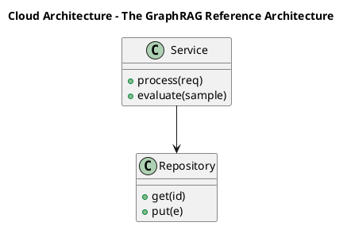

_Source diagram (plantuml); render with the appropriate tool._

**Figure 16. Cloud Architecture - The GraphRAG Reference Architecture** (plantuml). Figure: Cloud Architecture view for GraphRAG. This diagram illustrates the principal components and their interactions as discussed in the surrounding section.

## Deep Dive: Mechanics, Variants and Trade-offs

Having established the essentials, we now go deeper into the graphrag reference architecture. Beneath the abstraction lies a concrete process whose steps can each be measured, tested and optimised independently. The distinctions in this section are the ones that separate a working demo from a system that holds up under adversarial inputs, scale and the passage of time.

Consider the principal variants and how to choose between them. Each variant optimises for a different point in the design space - some for latency, some for accuracy, some for cost or operability - and the correct choice follows from explicit requirements rather than from defaults. Latency, accuracy and cost form a tension triangle: improving one typically pressures the others, so explicit budgets are essential.

In practice this is supported by a mature tooling ecosystem, including Microsoft GraphRAG, Neo4j, LlamaIndex, NetworkX. Tools accelerate the work but do not substitute for understanding: the same principles apply whichever implementation you select, and the ability to reason from first principles is what lets you debug when a tool behaves unexpectedly.

A frequent source of subtle bugs is the interaction with multi-hop reasoning over graphs. Because multi-hop reasoning over graphs concerns traversing relationships to answer connected questions, changes there can silently alter the behaviour analysed here. The remedy is contract tests at the boundary and end-to-end evaluations that exercise the interaction explicitly.

Finally, attend to edge cases and degradation. Define what the system should do under partial failure, unexpected inputs and load spikes, and make that behaviour explicit and tested rather than emergent. Graceful degradation - returning a safe, useful result when the ideal one is unavailable - is a hallmark of mature engineering.

For deeper study, the literature offers authoritative treatments such as Edge et al. — From Local to Global: Graph RAG (Microsoft, 2024) and Traag et al. — Leiden community detection (2019). These primary sources reward careful reading and ground the practical guidance above in established results.

## Advanced Considerations

Having established the essentials, we now go deeper into the graphrag reference architecture. Mechanically, the behaviour emerges from a few interacting parts that are simpler than the whole they produce. The distinctions in this section are the ones that separate a working demo from a system that holds up under adversarial inputs, scale and the passage of time.

Consider the principal variants and how to choose between them. Each variant optimises for a different point in the design space - some for latency, some for accuracy, some for cost or operability - and the correct choice follows from explicit requirements rather than from defaults. There is an inherent trade-off between fidelity and cost, and the correct balance depends on the use case and its tolerance for error.

In practice this is supported by a mature tooling ecosystem, including Microsoft GraphRAG, Neo4j, LlamaIndex, NetworkX. Tools accelerate the work but do not substitute for understanding: the same principles apply whichever implementation you select, and the ability to reason from first principles is what lets you debug when a tool behaves unexpectedly.

A frequent source of subtle bugs is the interaction with knowledge graph construction from text. Because knowledge graph construction from text concerns lLM-driven entity and relationship extraction and schema design, changes there can silently alter the behaviour analysed here. The remedy is contract tests at the boundary and end-to-end evaluations that exercise the interaction explicitly.

Finally, attend to edge cases and degradation. Define what the system should do under partial failure, unexpected inputs and load spikes, and make that behaviour explicit and tested rather than emergent. Graceful degradation - returning a safe, useful result when the ideal one is unavailable - is a hallmark of mature engineering.

For deeper study, the literature offers authoritative treatments such as Edge et al. — From Local to Global: Graph RAG (Microsoft, 2024) and Traag et al. — Leiden community detection (2019). These primary sources reward careful reading and ground the practical guidance above in established results.

## Worked Example

Consider a concrete scenario. A enterprise organisation needs whole-corpus thematic questions over documentation. They decide to apply the graphrag reference architecture as part of their GraphRAG solution, but wisely treat it as a hypothesis to be validated rather than a foregone conclusion.

The team begins by stating the objective precisely and defining how success will be measured before writing any code. They establish a small but representative evaluation set, agree on acceptance thresholds, and only then prototype the simplest design that could work. Early measurement reveals which assumptions hold and which must be revised, saving weeks of misdirected effort and surfacing edge cases while they are still cheap to fix.

As the prototype matures into a service, the team hardens it: adding input validation, error handling, caching where it pays off, and monitoring that ties back to the original success metric. They document each significant decision in an architecture decision record so that future maintainers understand not just what was built but why.

The outcome is instructive. The system that reaches production is not the most sophisticated design the team considered, but the one whose behaviour they could measure, explain and operate. This is the recurring lesson of GraphRAG: durable value comes from the whole system, not from any single clever component.

## Industry Use Cases

Across industries, the ideas in this chapter recur in recognisable ways. The following vignettes show how different sectors apply them and what they have in common.

**Research.** Literature synthesis across thousands of papers. The common thread is that value comes not from the model alone but from the surrounding system - data quality, evaluation, integration and operations - which is precisely where most of the engineering effort belongs.

**Intelligence.** Connecting entities across heterogeneous reports. The common thread is that value comes not from the model alone but from the surrounding system - data quality, evaluation, integration and operations - which is precisely where most of the engineering effort belongs.

**Enterprise.** Whole-corpus thematic questions over documentation. The common thread is that value comes not from the model alone but from the surrounding system - data quality, evaluation, integration and operations - which is precisely where most of the engineering effort belongs.

**Compliance.** Tracing relationships across regulatory filings. The common thread is that value comes not from the model alone but from the surrounding system - data quality, evaluation, integration and operations - which is precisely where most of the engineering effort belongs.

## Best Practices

The following practices consistently separate successful GraphRAG efforts from struggling ones. They are deliberately concrete so they can be adopted as checklist items in design and code review.

- Invest in entity resolution; graph quality dominates answer quality.
- Route global questions to community summaries, not raw chunks.
- Cache community summaries to amortise extraction cost.
- Track provenance through edges for citation.

None of these are exotic; they are the unglamorous disciplines that compound into reliability. The cost of adopting them is small compared with the cost of the incidents they prevent, and they become second nature with practice.

## Common Pitfalls

Equally instructive are the failure modes that recur in practice. Each pitfall below has a clear early warning sign and a known remedy, so treat them as a diagnostic checklist when something feels wrong:

- Skipping entity resolution and fragmenting the graph.
- Applying GraphRAG where simple RAG suffices, inflating cost.
- Stale graphs after corpus updates.
- Unbounded extraction cost on huge corpora.

The pattern is consistent: most failures stem from skipping measurement, conflating prototype and production standards, or deferring cross-cutting concerns such as security and cost until they become emergencies. Naming these traps in advance is the cheapest way to avoid them.

## Governance, Security and Cost Notes

No discussion of the graphrag reference architecture is complete without its governance, security and cost dimensions, which are too often deferred until they become emergencies. Treating them as first-class concerns from the outset is both cheaper and safer.

**Governance.** Classify the risk of this capability, document its intended and out-of-scope uses, and ensure decisions are traceable to satisfy internal policy and external regulation such as the NIST AI RMF, ISO/IEC 42001 and the EU AI Act. **Security.** Treat all external input as untrusted, validate outputs before acting on them, apply least privilege to any tools or data access, and map controls to the OWASP LLM Top 10 and MITRE ATLAS.

**Cost and sustainability.** Establish explicit budgets for compute, tokens and latency, attribute spend to owners, and revisit the economics as usage scales - a design that is affordable at pilot scale can become untenable at production volume. Building these reflexes into everyday engineering is what allows a GraphRAG system to be not only capable but also trustworthy and economically sound.

## Hands-On Exercises

Work through the following exercises. They are designed to move understanding from recognition to application - the level required for real engineering work - so prefer writing and building over merely reading.

1. Explain the graphrag reference architecture to a colleague unfamiliar with GraphRAG, using a concrete example from your own domain.
2. Sketch a reference architecture that incorporates the graphrag reference architecture and annotate where observability, security and cost controls belong.
3. Design an evaluation that would tell you whether the graphrag reference architecture is working in production, including the metric, the dataset and the acceptance threshold.
4. Identify two pitfalls relevant to the graphrag reference architecture in your environment and describe the early warning signals you would monitor.
5. Prototype the simplest implementation that demonstrates the graphrag reference architecture, then list exactly what would need to change to make it production-ready.

## Key Takeaways

Key takeaways from this chapter:

- The GraphRAG Reference Architecture is a systems concern in GraphRAG: data, models and operations must be co-designed.
- Measurement is non-negotiable; define success metrics and evaluation before building.
- Favour the simplest design that meets the requirement, and add complexity only when evidence demands it.
- Security, cost and observability are first-class requirements, not afterthoughts.
- Document decisions so the system remains understandable and operable as it evolves.

## Code Walkthrough

Every change to a GraphRAG system should pass an evaluation gate. This example shows the minimal shape: align predictions and references, compute a metric, and return a pass/fail decision for CI.

The full listing is shown below; study it line by line and reproduce it locally before moving on.

### Listing: Evaluating The GraphRAG Reference Architecture with a regression gate

```python
from dataclasses import dataclass


@dataclass
class EvalResult:
    metric: str
    score: float
    passed: bool


def evaluate(predictions: list[str], references: list[str],
             threshold: float = 0.8) -> EvalResult:
    """Score The GraphRAG Reference Architecture output against references with a simple exact-match metric.

    In practice you would combine several metrics (exact match, semantic
    similarity, LLM-as-judge) and gate releases on the aggregate.
    """
    if len(predictions) != len(references):
        raise ValueError("predictions and references must align")
    hits = sum(p.strip() == r.strip() for p, r in zip(predictions, references))
    score = hits / len(references) if references else 0.0
    return EvalResult(metric="exact_match", score=score, passed=score >= threshold)


if __name__ == "__main__":
    result = evaluate(["yes", "no"], ["yes", "yes"])
    print(f"{result.metric}={result.score:.2f} passed={result.passed}")

```

## Review Questions

1. In the context of GraphRAG, which statement best describes “The GraphRAG Reference Architecture”?
   - A. Indexing and query pipelines end to end.
   - B. It guarantees deterministic output regardless of input.
   - C. It is only relevant to academic research, not production.
   - D. It eliminates the need for any evaluation or monitoring.
   - **Answer: A.** The GraphRAG Reference Architecture: Indexing and query pipelines end to end.
2. Which of the following is a recommended best practice when working with GraphRAG?
   - A. Cache community summaries to amortise extraction cost.
   - B. Applying GraphRAG where simple RAG suffices, inflating cost.
   - C. Skipping entity resolution and fragmenting the graph.
   - D. It removes all security and governance requirements.
   - **Answer: A.** Best practice: Cache community summaries to amortise extraction cost.
3. Which of the following is a common pitfall to avoid in GraphRAG?
   - A. Cache community summaries to amortise extraction cost.
   - B. It guarantees deterministic output regardless of input.
   - C. Unbounded extraction cost on huge corpora.
   - D. It makes the system slower but has no other effect.
   - **Answer: C.** Pitfall to avoid: Unbounded extraction cost on huge corpora.
4. *(Discussion)* Explain The GraphRAG Reference Architecture and why it matters in a production GraphRAG system.
   - **Model answer:** A strong answer defines the graphrag reference architecture (Indexing and query pipelines end to end.) then connects it to architecture, evaluation, cost, security and operations for GraphRAG, citing concrete trade-offs and a real-world example.

---


# Chapter 15. Putting It Together: A Reference Implementation

_This chapter examines putting it together: a reference implementation within GraphRAG. It covers an end-to-end reference implementation that integrates the components of a GraphRAG system into a cohesive, working whole, derives a reference architecture, walks through a worked example and runnable code, surveys industry use cases, and distils best practices and pitfalls, closing with exercises and review questions._

## Introduction

Putting It Together: A Reference Implementation can be characterised as an end-to-end reference implementation that integrates the components of a GraphRAG system into a cohesive, working whole. Teams that master this consistently ship more reliable GraphRAG systems at lower cost. The practical implication is that design choices here ripple through latency, cost and maintainability for the lifetime of the system.

This chapter builds intuition first, then formalises the ideas, derives an architecture, and finishes with code, exercises and review questions so the material transfers directly to your own GraphRAG work. Read it actively: pause at each diagram, reproduce the code, and attempt the exercises before consulting the answers.

## Theory and Foundations

Putting It Together: A Reference Implementation refers to an end-to-end reference implementation that integrates the components of a GraphRAG system into a cohesive, working whole. Seasoned practitioners treat this as a systems problem, co-designing data, models and operations rather than optimising any one in isolation. Mechanically, the behaviour emerges from a few interacting parts that are simpler than the whole they produce.

To place this in context, recall the broader picture: GraphRAG augments retrieval-augmented generation with a knowledge graph constructed from a corpus, enabling multi-hop reasoning, community summarisation and global questions that flat vector retrieval cannot answer. Within that picture, putting it together: a reference implementation is one of the load-bearing ideas - the kind that, when understood deeply, makes the rest of GraphRAG fall into place. Understanding this matters because GraphRAG systems succeed or fail on exactly these decisions.

Putting It Together: A Reference Implementation cannot be understood in isolation from local versus global search. Recall that local versus global search concerns entity-centric retrieval versus community-level synthesis. The two interact directly: decisions in one constrain the design space of the other, which is why mature teams reason about them together rather than sequentially. Latency, accuracy and cost form a tension triangle: improving one typically pressures the others, so explicit budgets are essential.

Putting It Together: A Reference Implementation cannot be understood in isolation from entity resolution and deduplication. Recall that entity resolution and deduplication concerns merging coreferent entities into a clean graph. The two interact directly: decisions in one constrain the design space of the other, which is why mature teams reason about them together rather than sequentially. There is an inherent trade-off between fidelity and cost, and the correct balance depends on the use case and its tolerance for error.

Several established patterns apply directly to putting it together: a reference implementation. The first, entity-neighbourhood expansion for local questions, is widely adopted because it makes the system's behaviour predictable and observable. A complementary pattern, hybrid graph traversal + vector similarity, addresses a related concern and is often deployed alongside it. Patterns are not dogma; they are distilled experience that shortcuts the search for a sound design, and each carries assumptions worth checking against your context.

Knowing when not to use a technique is as valuable as knowing how to use it. In a small prototype, shortcuts around putting it together: a reference implementation are invisible; in a production GraphRAG system serving real traffic, they surface as incidents, cost overruns or compliance gaps. There is an inherent trade-off between fidelity and cost, and the correct balance depends on the use case and its tolerance for error. The remainder of this chapter turns these principles into an architecture, code and a checklist you can apply immediately.

## Architecture and Design

From an architectural standpoint, Putting It Together: A Reference Implementation sits at the intersection of data, models and operations. GraphRAG indexing extracts entities and relations from chunks, resolves duplicates, builds a graph, detects communities and pre-summarises them. At query time a router selects local search (entity neighbourhoods + linked text) or global search (map-reduce over community summaries), then synthesises a cited answer.

Concretely, the principal building blocks include limits of vector-only rag, knowledge graph construction from text, entity resolution and deduplication, community detection and summarisation and local versus global search. Each is a replaceable component behind a stable interface, so the team can upgrade an implementation - a model, an index, a policy engine - without rewriting its neighbours. The contracts between components are where reliability is won or lost, so they are specified explicitly and tested in isolation.

The diagram accompanying this section makes the data and control flow explicit. Requests enter through a well-defined boundary where they are authenticated and validated; only then are they dispatched to the components that perform the work. This boundary is also where rate limiting, quota enforcement and audit logging live, keeping cross-cutting concerns out of the core logic and in one auditable place.

Two qualities deserve emphasis. First, observability is designed in, not bolted on: every component emits structured telemetry so that failures can be localised in minutes rather than hours. Second, the architecture is evolvable - components communicate through stable contracts so that any single part of the GraphRAG system can be replaced without a rewrite. Simplicity is a feature. The simplest design that meets the requirement should be the default, with complexity added only when measurement justifies it.

<div class="diagram-svg">

<svg xmlns="http://www.w3.org/2000/svg" width="760" height="360" viewBox="0 0 760 360" font-family="Inter, Arial, sans-serif">
<rect width="760" height="360" fill="#f8fafc"/>
<text x="380" y="34" text-anchor="middle" font-size="20" font-weight="700" fill="#0f172a">Data Lineage - Putting It Together: A Reference Impleme…</text>
<rect x="290" y="162" width="180" height="56" rx="12" fill="#0f172a"/>
<text x="380" y="195" text-anchor="middle" font-size="14" font-weight="700" fill="#ffffff">GraphRAG</text>
<line x1="380" y1="190" x2="380" y2="70" stroke="#94a3b8" stroke-width="2"/>
<rect x="308" y="48" width="144" height="44" rx="10" fill="#ffffff" stroke="#2563eb" stroke-width="2"/>
<text x="380" y="74" text-anchor="middle" font-size="11" fill="#0f172a">Limits of Vector-On…</text>
<line x1="380" y1="190" x2="617" y2="153" stroke="#94a3b8" stroke-width="2"/>
<rect x="545" y="131" width="144" height="44" rx="10" fill="#ffffff" stroke="#7c3aed" stroke-width="2"/>
<text x="617" y="157" text-anchor="middle" font-size="11" fill="#0f172a">Knowledge Graph Con…</text>
<line x1="380" y1="190" x2="526" y2="287" stroke="#94a3b8" stroke-width="2"/>
<rect x="454" y="265" width="144" height="44" rx="10" fill="#ffffff" stroke="#0891b2" stroke-width="2"/>
<text x="526" y="291" text-anchor="middle" font-size="11" fill="#0f172a">Entity Resolution a…</text>
<line x1="380" y1="190" x2="234" y2="287" stroke="#94a3b8" stroke-width="2"/>
<rect x="162" y="265" width="144" height="44" rx="10" fill="#ffffff" stroke="#059669" stroke-width="2"/>
<text x="234" y="291" text-anchor="middle" font-size="11" fill="#0f172a">Community Detection…</text>
<line x1="380" y1="190" x2="143" y2="153" stroke="#94a3b8" stroke-width="2"/>
<rect x="71" y="131" width="144" height="44" rx="10" fill="#ffffff" stroke="#d97706" stroke-width="2"/>
<text x="143" y="157" text-anchor="middle" font-size="11" fill="#0f172a">Local versus Global…</text>
</svg>

</div>

**Figure 17. Data Lineage - Putting It Together: A Reference Implementation** (svg). Figure: Data Lineage view for GraphRAG. This diagram illustrates the principal components and their interactions as discussed in the surrounding section.

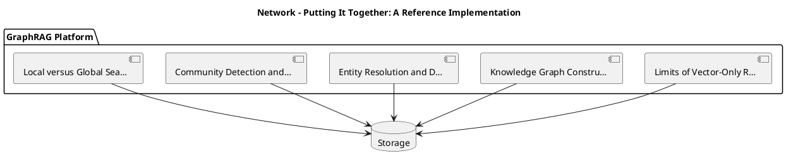

_Source diagram (plantuml); render with the appropriate tool._

**Figure 18. Network - Putting It Together: A Reference Implementation** (plantuml). Figure: Network view for GraphRAG. This diagram illustrates the principal components and their interactions as discussed in the surrounding section.

## Deep Dive: Mechanics, Variants and Trade-offs

Having established the essentials, we now go deeper into putting it together: a reference implementation. The underlying mechanism is best appreciated by tracing a single request from input to output and noting where state is created and consumed. The distinctions in this section are the ones that separate a working demo from a system that holds up under adversarial inputs, scale and the passage of time.

Consider the principal variants and how to choose between them. Each variant optimises for a different point in the design space - some for latency, some for accuracy, some for cost or operability - and the correct choice follows from explicit requirements rather than from defaults. As with most architectural decisions, the choice is rarely binary; the skill lies in quantifying the trade-offs and choosing deliberately.

In practice this is supported by a mature tooling ecosystem, including Microsoft GraphRAG, Neo4j, LlamaIndex, NetworkX. Tools accelerate the work but do not substitute for understanding: the same principles apply whichever implementation you select, and the ability to reason from first principles is what lets you debug when a tool behaves unexpectedly.

A frequent source of subtle bugs is the interaction with local versus global search. Because local versus global search concerns entity-centric retrieval versus community-level synthesis, changes there can silently alter the behaviour analysed here. The remedy is contract tests at the boundary and end-to-end evaluations that exercise the interaction explicitly.

Finally, attend to edge cases and degradation. Define what the system should do under partial failure, unexpected inputs and load spikes, and make that behaviour explicit and tested rather than emergent. Graceful degradation - returning a safe, useful result when the ideal one is unavailable - is a hallmark of mature engineering.

For deeper study, the literature offers authoritative treatments such as Edge et al. — From Local to Global: Graph RAG (Microsoft, 2024) and Traag et al. — Leiden community detection (2019). These primary sources reward careful reading and ground the practical guidance above in established results.

## Advanced Considerations

Having established the essentials, we now go deeper into putting it together: a reference implementation. It pays to understand the mechanism rather than treat it as a black box, because most production incidents are explained by one of its steps misbehaving. The distinctions in this section are the ones that separate a working demo from a system that holds up under adversarial inputs, scale and the passage of time.

Consider the principal variants and how to choose between them. Each variant optimises for a different point in the design space - some for latency, some for accuracy, some for cost or operability - and the correct choice follows from explicit requirements rather than from defaults. Simplicity is a feature. The simplest design that meets the requirement should be the default, with complexity added only when measurement justifies it.

In practice this is supported by a mature tooling ecosystem, including Microsoft GraphRAG, Neo4j, LlamaIndex, NetworkX. Tools accelerate the work but do not substitute for understanding: the same principles apply whichever implementation you select, and the ability to reason from first principles is what lets you debug when a tool behaves unexpectedly.

A frequent source of subtle bugs is the interaction with security and provenance. Because security and provenance concerns source attribution through graph edges, changes there can silently alter the behaviour analysed here. The remedy is contract tests at the boundary and end-to-end evaluations that exercise the interaction explicitly.

Finally, attend to edge cases and degradation. Define what the system should do under partial failure, unexpected inputs and load spikes, and make that behaviour explicit and tested rather than emergent. Graceful degradation - returning a safe, useful result when the ideal one is unavailable - is a hallmark of mature engineering.

For deeper study, the literature offers authoritative treatments such as Edge et al. — From Local to Global: Graph RAG (Microsoft, 2024) and Traag et al. — Leiden community detection (2019). These primary sources reward careful reading and ground the practical guidance above in established results.

## Worked Example

A worked example clarifies how these ideas behave in practice. A compliance organisation needs tracing relationships across regulatory filings. They decide to apply putting it together: a reference implementation as part of their GraphRAG solution, but wisely treat it as a hypothesis to be validated rather than a foregone conclusion.

The team begins by stating the objective precisely and defining how success will be measured before writing any code. They establish a small but representative evaluation set, agree on acceptance thresholds, and only then prototype the simplest design that could work. Early measurement reveals which assumptions hold and which must be revised, saving weeks of misdirected effort and surfacing edge cases while they are still cheap to fix.

As the prototype matures into a service, the team hardens it: adding input validation, error handling, caching where it pays off, and monitoring that ties back to the original success metric. They document each significant decision in an architecture decision record so that future maintainers understand not just what was built but why.

The outcome is instructive. The system that reaches production is not the most sophisticated design the team considered, but the one whose behaviour they could measure, explain and operate. This is the recurring lesson of GraphRAG: durable value comes from the whole system, not from any single clever component.

## Industry Use Cases

Across industries, the ideas in this chapter recur in recognisable ways. The following vignettes show how different sectors apply them and what they have in common.

**Research.** Literature synthesis across thousands of papers. The common thread is that value comes not from the model alone but from the surrounding system - data quality, evaluation, integration and operations - which is precisely where most of the engineering effort belongs.

**Intelligence.** Connecting entities across heterogeneous reports. The common thread is that value comes not from the model alone but from the surrounding system - data quality, evaluation, integration and operations - which is precisely where most of the engineering effort belongs.

**Enterprise.** Whole-corpus thematic questions over documentation. The common thread is that value comes not from the model alone but from the surrounding system - data quality, evaluation, integration and operations - which is precisely where most of the engineering effort belongs.

**Compliance.** Tracing relationships across regulatory filings. The common thread is that value comes not from the model alone but from the surrounding system - data quality, evaluation, integration and operations - which is precisely where most of the engineering effort belongs.

## Best Practices

The following practices consistently separate successful GraphRAG efforts from struggling ones. They are deliberately concrete so they can be adopted as checklist items in design and code review.

- Invest in entity resolution; graph quality dominates answer quality.
- Route global questions to community summaries, not raw chunks.
- Cache community summaries to amortise extraction cost.
- Track provenance through edges for citation.

None of these are exotic; they are the unglamorous disciplines that compound into reliability. The cost of adopting them is small compared with the cost of the incidents they prevent, and they become second nature with practice.

## Common Pitfalls

Equally instructive are the failure modes that recur in practice. Each pitfall below has a clear early warning sign and a known remedy, so treat them as a diagnostic checklist when something feels wrong:

- Skipping entity resolution and fragmenting the graph.
- Applying GraphRAG where simple RAG suffices, inflating cost.
- Stale graphs after corpus updates.
- Unbounded extraction cost on huge corpora.

The pattern is consistent: most failures stem from skipping measurement, conflating prototype and production standards, or deferring cross-cutting concerns such as security and cost until they become emergencies. Naming these traps in advance is the cheapest way to avoid them.

## Governance, Security and Cost Notes

No discussion of putting it together: a reference implementation is complete without its governance, security and cost dimensions, which are too often deferred until they become emergencies. Treating them as first-class concerns from the outset is both cheaper and safer.

**Governance.** Classify the risk of this capability, document its intended and out-of-scope uses, and ensure decisions are traceable to satisfy internal policy and external regulation such as the NIST AI RMF, ISO/IEC 42001 and the EU AI Act. **Security.** Treat all external input as untrusted, validate outputs before acting on them, apply least privilege to any tools or data access, and map controls to the OWASP LLM Top 10 and MITRE ATLAS.

**Cost and sustainability.** Establish explicit budgets for compute, tokens and latency, attribute spend to owners, and revisit the economics as usage scales - a design that is affordable at pilot scale can become untenable at production volume. Building these reflexes into everyday engineering is what allows a GraphRAG system to be not only capable but also trustworthy and economically sound.

## Hands-On Exercises

Work through the following exercises. They are designed to move understanding from recognition to application - the level required for real engineering work - so prefer writing and building over merely reading.

1. Explain putting it together: a reference implementation to a colleague unfamiliar with GraphRAG, using a concrete example from your own domain.
2. Sketch a reference architecture that incorporates putting it together: a reference implementation and annotate where observability, security and cost controls belong.
3. Design an evaluation that would tell you whether putting it together: a reference implementation is working in production, including the metric, the dataset and the acceptance threshold.
4. Identify two pitfalls relevant to putting it together: a reference implementation in your environment and describe the early warning signals you would monitor.
5. Prototype the simplest implementation that demonstrates putting it together: a reference implementation, then list exactly what would need to change to make it production-ready.

## Key Takeaways

Key takeaways from this chapter:

- Putting It Together: A Reference Implementation is a systems concern in GraphRAG: data, models and operations must be co-designed.
- Measurement is non-negotiable; define success metrics and evaluation before building.
- Favour the simplest design that meets the requirement, and add complexity only when evidence demands it.
- Security, cost and observability are first-class requirements, not afterthoughts.
- Document decisions so the system remains understandable and operable as it evolves.

## Code Walkthrough

This listing shows a configuration-driven Putting It Together: A Reference Implementation component with retry semantics and typed interfaces — the shape we expect from production GraphRAG code rather than a notebook prototype.

The full listing is shown below; study it line by line and reproduce it locally before moving on.

### Listing: Implementing a Putting It Together: A Reference Implementation component

```python
from __future__ import annotations

from dataclasses import dataclass, field
from typing import Any


@dataclass(slots=True)
class PuttingItConfig:
    """Configuration for the Putting It Together: A Reference Implementation component in a GraphRAG system."""

    name: str
    timeout_s: float = 30.0
    max_retries: int = 3
    options: dict[str, Any] = field(default_factory=dict)


class PuttingIt:
    """A minimal, production-shaped implementation of Putting It Together: A Reference Implementation."""

    def __init__(self, config: PuttingItConfig) -> None:
        self._config = config
        self._calls = 0

    def run(self, payload: dict[str, Any]) -> dict[str, Any]:
        """Process a request, retrying transient failures with backoff."""
        last_error: Exception | None = None
        for attempt in range(self._config.max_retries):
            try:
                self._calls += 1
                return self._process(payload)
            except TimeoutError as exc:  # transient
                last_error = exc
                continue
        raise RuntimeError(f"PuttingIt failed after retries") from last_error

    def _process(self, payload: dict[str, Any]) -> dict[str, Any]:
        # Domain-specific logic for Putting It Together: A Reference Implementation goes here.
        return {"status": "ok", "input_keys": sorted(payload), "calls": self._calls}

```

## Review Questions

1. In the context of GraphRAG, which statement best describes “Putting It Together: A Reference Implementation”?
   - A. an end-to-end reference implementation that integrates the components of a GraphRAG system into a cohesive, working whole
   - B. It removes all security and governance requirements.
   - C. It guarantees deterministic output regardless of input.
   - D. It is only relevant to academic research, not production.
   - **Answer: A.** Putting It Together: A Reference Implementation: an end-to-end reference implementation that integrates the components of a GraphRAG system into a cohesive, working whole
2. Which of the following is a recommended best practice when working with GraphRAG?
   - A. Route global questions to community summaries, not raw chunks.
   - B. It is only relevant to academic research, not production.
   - C. Stale graphs after corpus updates.
   - D. It makes the system slower but has no other effect.
   - **Answer: A.** Best practice: Route global questions to community summaries, not raw chunks.
3. Which of the following is a common pitfall to avoid in GraphRAG?
   - A. It eliminates the need for any evaluation or monitoring.
   - B. It is only relevant to academic research, not production.
   - C. Unbounded extraction cost on huge corpora.
   - D. Route global questions to community summaries, not raw chunks.
   - **Answer: C.** Pitfall to avoid: Unbounded extraction cost on huge corpora.
4. *(Discussion)* Explain Putting It Together: A Reference Implementation and why it matters in a production GraphRAG system.
   - **Model answer:** A strong answer defines putting it together: a reference implementation (an end-to-end reference implementation that integrates the components of a GraphRAG system into a cohesive, working whole) then connects it to architecture, evaluation, cost, security and operations for GraphRAG, citing concrete trade-offs and a real-world example.

---


# Chapter 16. Hands-On Lab: Building an End-to-End GraphRAG System

_This chapter examines hands-on lab: building an end-to-end graphrag system within GraphRAG. It covers a guided, build-along laboratory that constructs a functioning GraphRAG system from first principles, derives a reference architecture, walks through a worked example and runnable code, surveys industry use cases, and distils best practices and pitfalls, closing with exercises and review questions._

## Introduction

At its core, Hands-On Lab: Building an End-to-End GraphRAG System concerns a guided, build-along laboratory that constructs a functioning GraphRAG system from first principles. This concept recurs throughout the GraphRAG lifecycle, from design to operations. What distinguishes a production-grade approach from a prototype is the discipline of measurement: every claim is backed by an evaluation rather than intuition.

This chapter builds intuition first, then formalises the ideas, derives an architecture, and finishes with code, exercises and review questions so the material transfers directly to your own GraphRAG work. Read it actively: pause at each diagram, reproduce the code, and attempt the exercises before consulting the answers.

## Theory and Foundations

Hands-On Lab: Building an End-to-End GraphRAG System can be characterised as a guided, build-along laboratory that constructs a functioning GraphRAG system from first principles. In an enterprise setting, this translates into concrete requirements: clear interfaces, measurable quality, and controls that satisfy security and governance. It pays to understand the mechanism rather than treat it as a black box, because most production incidents are explained by one of its steps misbehaving.

To place this in context, recall the broader picture: GraphRAG augments retrieval-augmented generation with a knowledge graph constructed from a corpus, enabling multi-hop reasoning, community summarisation and global questions that flat vector retrieval cannot answer. Within that picture, hands-on lab: building an end-to-end graphrag system is one of the load-bearing ideas - the kind that, when understood deeply, makes the rest of GraphRAG fall into place. This concept recurs throughout the GraphRAG lifecycle, from design to operations.

Hands-On Lab: Building an End-to-End GraphRAG System cannot be understood in isolation from incremental graph updates. Recall that incremental graph updates concerns keeping the graph fresh as the corpus changes. The two interact directly: decisions in one constrain the design space of the other, which is why mature teams reason about them together rather than sequentially. Latency, accuracy and cost form a tension triangle: improving one typically pressures the others, so explicit budgets are essential.

Hands-On Lab: Building an End-to-End GraphRAG System cannot be understood in isolation from limits of vector-only rag. Recall that limits of vector-only rag concerns why local similarity fails on global, multi-hop and aggregative questions. The two interact directly: decisions in one constrain the design space of the other, which is why mature teams reason about them together rather than sequentially. Latency, accuracy and cost form a tension triangle: improving one typically pressures the others, so explicit budgets are essential.

Several established patterns apply directly to hands-on lab: building an end-to-end graphrag system. The first, map-reduce community summarisation for global questions, is widely adopted because it makes the system's behaviour predictable and observable. A complementary pattern, hierarchical community summaries for scalable synthesis, addresses a related concern and is often deployed alongside it. Patterns are not dogma; they are distilled experience that shortcuts the search for a sound design, and each carries assumptions worth checking against your context.

Knowing when not to use a technique is as valuable as knowing how to use it. In a small prototype, shortcuts around hands-on lab: building an end-to-end graphrag system are invisible; in a production GraphRAG system serving real traffic, they surface as incidents, cost overruns or compliance gaps. As with most architectural decisions, the choice is rarely binary; the skill lies in quantifying the trade-offs and choosing deliberately. The remainder of this chapter turns these principles into an architecture, code and a checklist you can apply immediately.

## Architecture and Design

From an architectural standpoint, Hands-On Lab: Building an End-to-End GraphRAG System sits at the intersection of data, models and operations. GraphRAG indexing extracts entities and relations from chunks, resolves duplicates, builds a graph, detects communities and pre-summarises them. At query time a router selects local search (entity neighbourhoods + linked text) or global search (map-reduce over community summaries), then synthesises a cited answer.

Concretely, the principal building blocks include limits of vector-only rag, knowledge graph construction from text, entity resolution and deduplication, community detection and summarisation and local versus global search. Each is a replaceable component behind a stable interface, so the team can upgrade an implementation - a model, an index, a policy engine - without rewriting its neighbours. The contracts between components are where reliability is won or lost, so they are specified explicitly and tested in isolation.

The diagram accompanying this section makes the data and control flow explicit. Requests enter through a well-defined boundary where they are authenticated and validated; only then are they dispatched to the components that perform the work. This boundary is also where rate limiting, quota enforcement and audit logging live, keeping cross-cutting concerns out of the core logic and in one auditable place.

Two qualities deserve emphasis. First, observability is designed in, not bolted on: every component emits structured telemetry so that failures can be localised in minutes rather than hours. Second, the architecture is evolvable - components communicate through stable contracts so that any single part of the GraphRAG system can be replaced without a rewrite. As with most architectural decisions, the choice is rarely binary; the skill lies in quantifying the trade-offs and choosing deliberately.

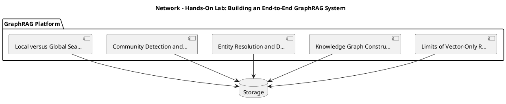

_Source diagram (plantuml); render with the appropriate tool._

**Figure 19. Network - Hands-On Lab: Building an End-to-End GraphRAG System** (plantuml). Figure: Network view for GraphRAG. This diagram illustrates the principal components and their interactions as discussed in the surrounding section.

<div class="diagram-svg">

<svg xmlns="http://www.w3.org/2000/svg" width="760" height="360" viewBox="0 0 760 360" font-family="Inter, Arial, sans-serif">
<rect width="760" height="360" fill="#f8fafc"/>
<text x="380" y="34" text-anchor="middle" font-size="20" font-weight="700" fill="#0f172a">Data Flow - Hands-On Lab: Building an End-to-End GraphR…</text>
<rect x="290" y="162" width="180" height="56" rx="12" fill="#0f172a"/>
<text x="380" y="195" text-anchor="middle" font-size="14" font-weight="700" fill="#ffffff">GraphRAG</text>
<line x1="380" y1="190" x2="380" y2="70" stroke="#94a3b8" stroke-width="2"/>
<rect x="308" y="48" width="144" height="44" rx="10" fill="#ffffff" stroke="#2563eb" stroke-width="2"/>
<text x="380" y="74" text-anchor="middle" font-size="11" fill="#0f172a">Limits of Vector-On…</text>
<line x1="380" y1="190" x2="617" y2="153" stroke="#94a3b8" stroke-width="2"/>
<rect x="545" y="131" width="144" height="44" rx="10" fill="#ffffff" stroke="#7c3aed" stroke-width="2"/>
<text x="617" y="157" text-anchor="middle" font-size="11" fill="#0f172a">Knowledge Graph Con…</text>
<line x1="380" y1="190" x2="526" y2="287" stroke="#94a3b8" stroke-width="2"/>
<rect x="454" y="265" width="144" height="44" rx="10" fill="#ffffff" stroke="#0891b2" stroke-width="2"/>
<text x="526" y="291" text-anchor="middle" font-size="11" fill="#0f172a">Entity Resolution a…</text>
<line x1="380" y1="190" x2="234" y2="287" stroke="#94a3b8" stroke-width="2"/>
<rect x="162" y="265" width="144" height="44" rx="10" fill="#ffffff" stroke="#059669" stroke-width="2"/>
<text x="234" y="291" text-anchor="middle" font-size="11" fill="#0f172a">Community Detection…</text>
<line x1="380" y1="190" x2="143" y2="153" stroke="#94a3b8" stroke-width="2"/>
<rect x="71" y="131" width="144" height="44" rx="10" fill="#ffffff" stroke="#d97706" stroke-width="2"/>
<text x="143" y="157" text-anchor="middle" font-size="11" fill="#0f172a">Local versus Global…</text>
</svg>

</div>

**Figure 20. Data Flow - Hands-On Lab: Building an End-to-End GraphRAG System** (svg). Figure: Data Flow view for GraphRAG. This diagram illustrates the principal components and their interactions as discussed in the surrounding section.

## Deep Dive: Mechanics, Variants and Trade-offs

Having established the essentials, we now go deeper into hands-on lab: building an end-to-end graphrag system. Mechanically, the behaviour emerges from a few interacting parts that are simpler than the whole they produce. The distinctions in this section are the ones that separate a working demo from a system that holds up under adversarial inputs, scale and the passage of time.

Consider the principal variants and how to choose between them. Each variant optimises for a different point in the design space - some for latency, some for accuracy, some for cost or operability - and the correct choice follows from explicit requirements rather than from defaults. As with most architectural decisions, the choice is rarely binary; the skill lies in quantifying the trade-offs and choosing deliberately.

In practice this is supported by a mature tooling ecosystem, including Microsoft GraphRAG, Neo4j, LlamaIndex, NetworkX. Tools accelerate the work but do not substitute for understanding: the same principles apply whichever implementation you select, and the ability to reason from first principles is what lets you debug when a tool behaves unexpectedly.

A frequent source of subtle bugs is the interaction with incremental graph updates. Because incremental graph updates concerns keeping the graph fresh as the corpus changes, changes there can silently alter the behaviour analysed here. The remedy is contract tests at the boundary and end-to-end evaluations that exercise the interaction explicitly.

Finally, attend to edge cases and degradation. Define what the system should do under partial failure, unexpected inputs and load spikes, and make that behaviour explicit and tested rather than emergent. Graceful degradation - returning a safe, useful result when the ideal one is unavailable - is a hallmark of mature engineering.

For deeper study, the literature offers authoritative treatments such as Edge et al. — From Local to Global: Graph RAG (Microsoft, 2024) and Traag et al. — Leiden community detection (2019). These primary sources reward careful reading and ground the practical guidance above in established results.

## Advanced Considerations

Having established the essentials, we now go deeper into hands-on lab: building an end-to-end graphrag system. Mechanically, the behaviour emerges from a few interacting parts that are simpler than the whole they produce. The distinctions in this section are the ones that separate a working demo from a system that holds up under adversarial inputs, scale and the passage of time.

Consider the principal variants and how to choose between them. Each variant optimises for a different point in the design space - some for latency, some for accuracy, some for cost or operability - and the correct choice follows from explicit requirements rather than from defaults. Simplicity is a feature. The simplest design that meets the requirement should be the default, with complexity added only when measurement justifies it.

In practice this is supported by a mature tooling ecosystem, including Microsoft GraphRAG, Neo4j, LlamaIndex, NetworkX. Tools accelerate the work but do not substitute for understanding: the same principles apply whichever implementation you select, and the ability to reason from first principles is what lets you debug when a tool behaves unexpectedly.

A frequent source of subtle bugs is the interaction with multi-hop reasoning over graphs. Because multi-hop reasoning over graphs concerns traversing relationships to answer connected questions, changes there can silently alter the behaviour analysed here. The remedy is contract tests at the boundary and end-to-end evaluations that exercise the interaction explicitly.

Finally, attend to edge cases and degradation. Define what the system should do under partial failure, unexpected inputs and load spikes, and make that behaviour explicit and tested rather than emergent. Graceful degradation - returning a safe, useful result when the ideal one is unavailable - is a hallmark of mature engineering.

For deeper study, the literature offers authoritative treatments such as Edge et al. — From Local to Global: Graph RAG (Microsoft, 2024) and Traag et al. — Leiden community detection (2019). These primary sources reward careful reading and ground the practical guidance above in established results.

## Worked Example

A worked example clarifies how these ideas behave in practice. A compliance organisation needs tracing relationships across regulatory filings. They decide to apply hands-on lab: building an end-to-end graphrag system as part of their GraphRAG solution, but wisely treat it as a hypothesis to be validated rather than a foregone conclusion.

The team begins by stating the objective precisely and defining how success will be measured before writing any code. They establish a small but representative evaluation set, agree on acceptance thresholds, and only then prototype the simplest design that could work. Early measurement reveals which assumptions hold and which must be revised, saving weeks of misdirected effort and surfacing edge cases while they are still cheap to fix.

As the prototype matures into a service, the team hardens it: adding input validation, error handling, caching where it pays off, and monitoring that ties back to the original success metric. They document each significant decision in an architecture decision record so that future maintainers understand not just what was built but why.

The outcome is instructive. The system that reaches production is not the most sophisticated design the team considered, but the one whose behaviour they could measure, explain and operate. This is the recurring lesson of GraphRAG: durable value comes from the whole system, not from any single clever component.

## Industry Use Cases

Across industries, the ideas in this chapter recur in recognisable ways. The following vignettes show how different sectors apply them and what they have in common.

**Research.** Literature synthesis across thousands of papers. The common thread is that value comes not from the model alone but from the surrounding system - data quality, evaluation, integration and operations - which is precisely where most of the engineering effort belongs.

**Intelligence.** Connecting entities across heterogeneous reports. The common thread is that value comes not from the model alone but from the surrounding system - data quality, evaluation, integration and operations - which is precisely where most of the engineering effort belongs.

**Enterprise.** Whole-corpus thematic questions over documentation. The common thread is that value comes not from the model alone but from the surrounding system - data quality, evaluation, integration and operations - which is precisely where most of the engineering effort belongs.

**Compliance.** Tracing relationships across regulatory filings. The common thread is that value comes not from the model alone but from the surrounding system - data quality, evaluation, integration and operations - which is precisely where most of the engineering effort belongs.

## Best Practices

The following practices consistently separate successful GraphRAG efforts from struggling ones. They are deliberately concrete so they can be adopted as checklist items in design and code review.

- Invest in entity resolution; graph quality dominates answer quality.
- Route global questions to community summaries, not raw chunks.
- Cache community summaries to amortise extraction cost.
- Track provenance through edges for citation.

None of these are exotic; they are the unglamorous disciplines that compound into reliability. The cost of adopting them is small compared with the cost of the incidents they prevent, and they become second nature with practice.

## Common Pitfalls

Equally instructive are the failure modes that recur in practice. Each pitfall below has a clear early warning sign and a known remedy, so treat them as a diagnostic checklist when something feels wrong:

- Skipping entity resolution and fragmenting the graph.
- Applying GraphRAG where simple RAG suffices, inflating cost.
- Stale graphs after corpus updates.
- Unbounded extraction cost on huge corpora.

The pattern is consistent: most failures stem from skipping measurement, conflating prototype and production standards, or deferring cross-cutting concerns such as security and cost until they become emergencies. Naming these traps in advance is the cheapest way to avoid them.

## Governance, Security and Cost Notes

No discussion of hands-on lab: building an end-to-end graphrag system is complete without its governance, security and cost dimensions, which are too often deferred until they become emergencies. Treating them as first-class concerns from the outset is both cheaper and safer.

**Governance.** Classify the risk of this capability, document its intended and out-of-scope uses, and ensure decisions are traceable to satisfy internal policy and external regulation such as the NIST AI RMF, ISO/IEC 42001 and the EU AI Act. **Security.** Treat all external input as untrusted, validate outputs before acting on them, apply least privilege to any tools or data access, and map controls to the OWASP LLM Top 10 and MITRE ATLAS.

**Cost and sustainability.** Establish explicit budgets for compute, tokens and latency, attribute spend to owners, and revisit the economics as usage scales - a design that is affordable at pilot scale can become untenable at production volume. Building these reflexes into everyday engineering is what allows a GraphRAG system to be not only capable but also trustworthy and economically sound.

## Hands-On Exercises

Work through the following exercises. They are designed to move understanding from recognition to application - the level required for real engineering work - so prefer writing and building over merely reading.

1. Explain hands-on lab: building an end-to-end graphrag system to a colleague unfamiliar with GraphRAG, using a concrete example from your own domain.
2. Sketch a reference architecture that incorporates hands-on lab: building an end-to-end graphrag system and annotate where observability, security and cost controls belong.
3. Design an evaluation that would tell you whether hands-on lab: building an end-to-end graphrag system is working in production, including the metric, the dataset and the acceptance threshold.
4. Identify two pitfalls relevant to hands-on lab: building an end-to-end graphrag system in your environment and describe the early warning signals you would monitor.
5. Prototype the simplest implementation that demonstrates hands-on lab: building an end-to-end graphrag system, then list exactly what would need to change to make it production-ready.

## Key Takeaways

Key takeaways from this chapter:

- Hands-On Lab: Building an End-to-End GraphRAG System is a systems concern in GraphRAG: data, models and operations must be co-designed.
- Measurement is non-negotiable; define success metrics and evaluation before building.
- Favour the simplest design that meets the requirement, and add complexity only when evidence demands it.
- Security, cost and observability are first-class requirements, not afterthoughts.
- Document decisions so the system remains understandable and operable as it evolves.

## Code Walkthrough

This listing shows a configuration-driven Hands-On Lab: Building an End-to-End GraphRAG System component with retry semantics and typed interfaces — the shape we expect from production GraphRAG code rather than a notebook prototype.

The full listing is shown below; study it line by line and reproduce it locally before moving on.

### Listing: Implementing a Hands-On Lab: Building an End-to-End GraphRAG System component

```python
from __future__ import annotations

from dataclasses import dataclass, field
from typing import Any


@dataclass(slots=True)
class BuildingConfig:
    """Configuration for the Hands-On Lab: Building an End-to-End GraphRAG System component in a GraphRAG system."""

    name: str
    timeout_s: float = 30.0
    max_retries: int = 3
    options: dict[str, Any] = field(default_factory=dict)


class Building:
    """A minimal, production-shaped implementation of Hands-On Lab: Building an End-to-End GraphRAG System."""

    def __init__(self, config: BuildingConfig) -> None:
        self._config = config
        self._calls = 0

    def run(self, payload: dict[str, Any]) -> dict[str, Any]:
        """Process a request, retrying transient failures with backoff."""
        last_error: Exception | None = None
        for attempt in range(self._config.max_retries):
            try:
                self._calls += 1
                return self._process(payload)
            except TimeoutError as exc:  # transient
                last_error = exc
                continue
        raise RuntimeError(f"Building failed after retries") from last_error

    def _process(self, payload: dict[str, Any]) -> dict[str, Any]:
        # Domain-specific logic for Hands-On Lab: Building an End-to-End GraphRAG System goes here.
        return {"status": "ok", "input_keys": sorted(payload), "calls": self._calls}

```

## Review Questions

1. In the context of GraphRAG, which statement best describes “Hands-On Lab: Building an End-to-End GraphRAG System”?
   - A. It is only relevant to academic research, not production.
   - B. It removes all security and governance requirements.
   - C. It makes the system slower but has no other effect.
   - D. a guided, build-along laboratory that constructs a functioning GraphRAG system from first principles
   - **Answer: D.** Hands-On Lab: Building an End-to-End GraphRAG System: a guided, build-along laboratory that constructs a functioning GraphRAG system from first principles
2. Which of the following is a recommended best practice when working with GraphRAG?
   - A. Track provenance through edges for citation.
   - B. It makes the system slower but has no other effect.
   - C. Applying GraphRAG where simple RAG suffices, inflating cost.
   - D. It is only relevant to academic research, not production.
   - **Answer: A.** Best practice: Track provenance through edges for citation.
3. Which of the following is a common pitfall to avoid in GraphRAG?
   - A. It applies exclusively to image data.
   - B. It guarantees deterministic output regardless of input.
   - C. Applying GraphRAG where simple RAG suffices, inflating cost.
   - D. It is only relevant to academic research, not production.
   - **Answer: C.** Pitfall to avoid: Applying GraphRAG where simple RAG suffices, inflating cost.
4. *(Discussion)* How would you test and monitor Hands-On Lab: Building an End-to-End GraphRAG System in production?
   - **Model answer:** A strong answer defines hands-on lab: building an end-to-end graphrag system (a guided, build-along laboratory that constructs a functioning GraphRAG system from first principles) then connects it to architecture, evaluation, cost, security and operations for GraphRAG, citing concrete trade-offs and a real-world example.

---


# Chapter 17. Case Study: Research at Scale

_This chapter examines case study: research at scale within GraphRAG. It covers a detailed case study of deploying GraphRAG in a demanding research environment, including the decisions, trade-offs and outcomes, derives a reference architecture, walks through a worked example and runnable code, surveys industry use cases, and distils best practices and pitfalls, closing with exercises and review questions._

## Introduction

Case Study: Research at Scale refers to a detailed case study of deploying GraphRAG in a demanding research environment, including the decisions, trade-offs and outcomes. Understanding this matters because GraphRAG systems succeed or fail on exactly these decisions. What distinguishes a production-grade approach from a prototype is the discipline of measurement: every claim is backed by an evaluation rather than intuition.

This chapter builds intuition first, then formalises the ideas, derives an architecture, and finishes with code, exercises and review questions so the material transfers directly to your own GraphRAG work. Read it actively: pause at each diagram, reproduce the code, and attempt the exercises before consulting the answers.

## Theory and Foundations

Formally, Case Study: Research at Scale addresses a detailed case study of deploying GraphRAG in a demanding research environment, including the decisions, trade-offs and outcomes. What distinguishes a production-grade approach from a prototype is the discipline of measurement: every claim is backed by an evaluation rather than intuition. Mechanically, the behaviour emerges from a few interacting parts that are simpler than the whole they produce.

To place this in context, recall the broader picture: GraphRAG augments retrieval-augmented generation with a knowledge graph constructed from a corpus, enabling multi-hop reasoning, community summarisation and global questions that flat vector retrieval cannot answer. Within that picture, case study: research at scale is one of the load-bearing ideas - the kind that, when understood deeply, makes the rest of GraphRAG fall into place. It is foundational: later capabilities in GraphRAG are built directly on top of it.

Case Study: Research at Scale cannot be understood in isolation from incremental graph updates. Recall that incremental graph updates concerns keeping the graph fresh as the corpus changes. The two interact directly: decisions in one constrain the design space of the other, which is why mature teams reason about them together rather than sequentially. Every added component buys capability at the price of operational surface area, and that bargain should be made consciously.

Case Study: Research at Scale cannot be understood in isolation from local versus global search. Recall that local versus global search concerns entity-centric retrieval versus community-level synthesis. The two interact directly: decisions in one constrain the design space of the other, which is why mature teams reason about them together rather than sequentially. There is an inherent trade-off between fidelity and cost, and the correct balance depends on the use case and its tolerance for error.

Several established patterns apply directly to case study: research at scale. The first, hybrid graph traversal + vector similarity, is widely adopted because it makes the system's behaviour predictable and observable. A complementary pattern, hierarchical community summaries for scalable synthesis, addresses a related concern and is often deployed alongside it. Patterns are not dogma; they are distilled experience that shortcuts the search for a sound design, and each carries assumptions worth checking against your context.

It is worth being explicit about when to apply this and when to reach for something simpler. In a small prototype, shortcuts around case study: research at scale are invisible; in a production GraphRAG system serving real traffic, they surface as incidents, cost overruns or compliance gaps. As with most architectural decisions, the choice is rarely binary; the skill lies in quantifying the trade-offs and choosing deliberately. The remainder of this chapter turns these principles into an architecture, code and a checklist you can apply immediately.

## Architecture and Design

A robust architecture for Case Study: Research at Scale is layered so each part can evolve independently without destabilising the whole. GraphRAG indexing extracts entities and relations from chunks, resolves duplicates, builds a graph, detects communities and pre-summarises them. At query time a router selects local search (entity neighbourhoods + linked text) or global search (map-reduce over community summaries), then synthesises a cited answer.

Concretely, the principal building blocks include limits of vector-only rag, knowledge graph construction from text, entity resolution and deduplication, community detection and summarisation and local versus global search. Each is a replaceable component behind a stable interface, so the team can upgrade an implementation - a model, an index, a policy engine - without rewriting its neighbours. The contracts between components are where reliability is won or lost, so they are specified explicitly and tested in isolation.

The diagram accompanying this section makes the data and control flow explicit. Requests enter through a well-defined boundary where they are authenticated and validated; only then are they dispatched to the components that perform the work. This boundary is also where rate limiting, quota enforcement and audit logging live, keeping cross-cutting concerns out of the core logic and in one auditable place.

Two qualities deserve emphasis. First, observability is designed in, not bolted on: every component emits structured telemetry so that failures can be localised in minutes rather than hours. Second, the architecture is evolvable - components communicate through stable contracts so that any single part of the GraphRAG system can be replaced without a rewrite. There is an inherent trade-off between fidelity and cost, and the correct balance depends on the use case and its tolerance for error.

<div class="diagram-svg">

<svg xmlns="http://www.w3.org/2000/svg" width="760" height="360" viewBox="0 0 760 360" font-family="Inter, Arial, sans-serif">
<rect width="760" height="360" fill="#f8fafc"/>
<text x="380" y="34" text-anchor="middle" font-size="20" font-weight="700" fill="#0f172a">Data Flow - Case Study: Research at Scale</text>
<rect x="290" y="162" width="180" height="56" rx="12" fill="#0f172a"/>
<text x="380" y="195" text-anchor="middle" font-size="14" font-weight="700" fill="#ffffff">GraphRAG</text>
<line x1="380" y1="190" x2="380" y2="70" stroke="#94a3b8" stroke-width="2"/>
<rect x="308" y="48" width="144" height="44" rx="10" fill="#ffffff" stroke="#2563eb" stroke-width="2"/>
<text x="380" y="74" text-anchor="middle" font-size="11" fill="#0f172a">Limits of Vector-On…</text>
<line x1="380" y1="190" x2="617" y2="153" stroke="#94a3b8" stroke-width="2"/>
<rect x="545" y="131" width="144" height="44" rx="10" fill="#ffffff" stroke="#7c3aed" stroke-width="2"/>
<text x="617" y="157" text-anchor="middle" font-size="11" fill="#0f172a">Knowledge Graph Con…</text>
<line x1="380" y1="190" x2="526" y2="287" stroke="#94a3b8" stroke-width="2"/>
<rect x="454" y="265" width="144" height="44" rx="10" fill="#ffffff" stroke="#0891b2" stroke-width="2"/>
<text x="526" y="291" text-anchor="middle" font-size="11" fill="#0f172a">Entity Resolution a…</text>
<line x1="380" y1="190" x2="234" y2="287" stroke="#94a3b8" stroke-width="2"/>
<rect x="162" y="265" width="144" height="44" rx="10" fill="#ffffff" stroke="#059669" stroke-width="2"/>
<text x="234" y="291" text-anchor="middle" font-size="11" fill="#0f172a">Community Detection…</text>
<line x1="380" y1="190" x2="143" y2="153" stroke="#94a3b8" stroke-width="2"/>
<rect x="71" y="131" width="144" height="44" rx="10" fill="#ffffff" stroke="#d97706" stroke-width="2"/>
<text x="143" y="157" text-anchor="middle" font-size="11" fill="#0f172a">Local versus Global…</text>
</svg>

</div>

**Figure 21. Data Flow - Case Study: Research at Scale** (svg). Figure: Data Flow view for GraphRAG. This diagram illustrates the principal components and their interactions as discussed in the surrounding section.

## Deep Dive: Mechanics, Variants and Trade-offs

Having established the essentials, we now go deeper into case study: research at scale. Beneath the abstraction lies a concrete process whose steps can each be measured, tested and optimised independently. The distinctions in this section are the ones that separate a working demo from a system that holds up under adversarial inputs, scale and the passage of time.

Consider the principal variants and how to choose between them. Each variant optimises for a different point in the design space - some for latency, some for accuracy, some for cost or operability - and the correct choice follows from explicit requirements rather than from defaults. There is an inherent trade-off between fidelity and cost, and the correct balance depends on the use case and its tolerance for error.

In practice this is supported by a mature tooling ecosystem, including Microsoft GraphRAG, Neo4j, LlamaIndex, NetworkX. Tools accelerate the work but do not substitute for understanding: the same principles apply whichever implementation you select, and the ability to reason from first principles is what lets you debug when a tool behaves unexpectedly.

A frequent source of subtle bugs is the interaction with incremental graph updates. Because incremental graph updates concerns keeping the graph fresh as the corpus changes, changes there can silently alter the behaviour analysed here. The remedy is contract tests at the boundary and end-to-end evaluations that exercise the interaction explicitly.

Finally, attend to edge cases and degradation. Define what the system should do under partial failure, unexpected inputs and load spikes, and make that behaviour explicit and tested rather than emergent. Graceful degradation - returning a safe, useful result when the ideal one is unavailable - is a hallmark of mature engineering.

For deeper study, the literature offers authoritative treatments such as Edge et al. — From Local to Global: Graph RAG (Microsoft, 2024) and Traag et al. — Leiden community detection (2019). These primary sources reward careful reading and ground the practical guidance above in established results.

## Advanced Considerations

Having established the essentials, we now go deeper into case study: research at scale. It pays to understand the mechanism rather than treat it as a black box, because most production incidents are explained by one of its steps misbehaving. The distinctions in this section are the ones that separate a working demo from a system that holds up under adversarial inputs, scale and the passage of time.

Consider the principal variants and how to choose between them. Each variant optimises for a different point in the design space - some for latency, some for accuracy, some for cost or operability - and the correct choice follows from explicit requirements rather than from defaults. Latency, accuracy and cost form a tension triangle: improving one typically pressures the others, so explicit budgets are essential.

In practice this is supported by a mature tooling ecosystem, including Microsoft GraphRAG, Neo4j, LlamaIndex, NetworkX. Tools accelerate the work but do not substitute for understanding: the same principles apply whichever implementation you select, and the ability to reason from first principles is what lets you debug when a tool behaves unexpectedly.

A frequent source of subtle bugs is the interaction with entity resolution and deduplication. Because entity resolution and deduplication concerns merging coreferent entities into a clean graph, changes there can silently alter the behaviour analysed here. The remedy is contract tests at the boundary and end-to-end evaluations that exercise the interaction explicitly.

Finally, attend to edge cases and degradation. Define what the system should do under partial failure, unexpected inputs and load spikes, and make that behaviour explicit and tested rather than emergent. Graceful degradation - returning a safe, useful result when the ideal one is unavailable - is a hallmark of mature engineering.

For deeper study, the literature offers authoritative treatments such as Edge et al. — From Local to Global: Graph RAG (Microsoft, 2024) and Traag et al. — Leiden community detection (2019). These primary sources reward careful reading and ground the practical guidance above in established results.

## Worked Example

To ground the discussion, walk through a representative example. A research organisation needs literature synthesis across thousands of papers. They decide to apply case study: research at scale as part of their GraphRAG solution, but wisely treat it as a hypothesis to be validated rather than a foregone conclusion.

The team begins by stating the objective precisely and defining how success will be measured before writing any code. They establish a small but representative evaluation set, agree on acceptance thresholds, and only then prototype the simplest design that could work. Early measurement reveals which assumptions hold and which must be revised, saving weeks of misdirected effort and surfacing edge cases while they are still cheap to fix.

As the prototype matures into a service, the team hardens it: adding input validation, error handling, caching where it pays off, and monitoring that ties back to the original success metric. They document each significant decision in an architecture decision record so that future maintainers understand not just what was built but why.

The outcome is instructive. The system that reaches production is not the most sophisticated design the team considered, but the one whose behaviour they could measure, explain and operate. This is the recurring lesson of GraphRAG: durable value comes from the whole system, not from any single clever component.

## Industry Use Cases

Across industries, the ideas in this chapter recur in recognisable ways. The following vignettes show how different sectors apply them and what they have in common.

**Research.** Literature synthesis across thousands of papers. The common thread is that value comes not from the model alone but from the surrounding system - data quality, evaluation, integration and operations - which is precisely where most of the engineering effort belongs.

**Intelligence.** Connecting entities across heterogeneous reports. The common thread is that value comes not from the model alone but from the surrounding system - data quality, evaluation, integration and operations - which is precisely where most of the engineering effort belongs.

**Enterprise.** Whole-corpus thematic questions over documentation. The common thread is that value comes not from the model alone but from the surrounding system - data quality, evaluation, integration and operations - which is precisely where most of the engineering effort belongs.

**Compliance.** Tracing relationships across regulatory filings. The common thread is that value comes not from the model alone but from the surrounding system - data quality, evaluation, integration and operations - which is precisely where most of the engineering effort belongs.

## Best Practices

The following practices consistently separate successful GraphRAG efforts from struggling ones. They are deliberately concrete so they can be adopted as checklist items in design and code review.

- Invest in entity resolution; graph quality dominates answer quality.
- Route global questions to community summaries, not raw chunks.
- Cache community summaries to amortise extraction cost.
- Track provenance through edges for citation.

None of these are exotic; they are the unglamorous disciplines that compound into reliability. The cost of adopting them is small compared with the cost of the incidents they prevent, and they become second nature with practice.

## Common Pitfalls

Equally instructive are the failure modes that recur in practice. Each pitfall below has a clear early warning sign and a known remedy, so treat them as a diagnostic checklist when something feels wrong:

- Skipping entity resolution and fragmenting the graph.
- Applying GraphRAG where simple RAG suffices, inflating cost.
- Stale graphs after corpus updates.
- Unbounded extraction cost on huge corpora.

The pattern is consistent: most failures stem from skipping measurement, conflating prototype and production standards, or deferring cross-cutting concerns such as security and cost until they become emergencies. Naming these traps in advance is the cheapest way to avoid them.

## Governance, Security and Cost Notes

No discussion of case study: research at scale is complete without its governance, security and cost dimensions, which are too often deferred until they become emergencies. Treating them as first-class concerns from the outset is both cheaper and safer.

**Governance.** Classify the risk of this capability, document its intended and out-of-scope uses, and ensure decisions are traceable to satisfy internal policy and external regulation such as the NIST AI RMF, ISO/IEC 42001 and the EU AI Act. **Security.** Treat all external input as untrusted, validate outputs before acting on them, apply least privilege to any tools or data access, and map controls to the OWASP LLM Top 10 and MITRE ATLAS.

**Cost and sustainability.** Establish explicit budgets for compute, tokens and latency, attribute spend to owners, and revisit the economics as usage scales - a design that is affordable at pilot scale can become untenable at production volume. Building these reflexes into everyday engineering is what allows a GraphRAG system to be not only capable but also trustworthy and economically sound.

## Hands-On Exercises

Work through the following exercises. They are designed to move understanding from recognition to application - the level required for real engineering work - so prefer writing and building over merely reading.

1. Explain case study: research at scale to a colleague unfamiliar with GraphRAG, using a concrete example from your own domain.
2. Sketch a reference architecture that incorporates case study: research at scale and annotate where observability, security and cost controls belong.
3. Design an evaluation that would tell you whether case study: research at scale is working in production, including the metric, the dataset and the acceptance threshold.
4. Identify two pitfalls relevant to case study: research at scale in your environment and describe the early warning signals you would monitor.
5. Prototype the simplest implementation that demonstrates case study: research at scale, then list exactly what would need to change to make it production-ready.

## Key Takeaways

Key takeaways from this chapter:

- Case Study: Research at Scale is a systems concern in GraphRAG: data, models and operations must be co-designed.
- Measurement is non-negotiable; define success metrics and evaluation before building.
- Favour the simplest design that meets the requirement, and add complexity only when evidence demands it.
- Security, cost and observability are first-class requirements, not afterthoughts.
- Document decisions so the system remains understandable and operable as it evolves.

## Code Walkthrough

Pipelines keep Case Study: Research at Scale logic modular and testable. Each stage is a pure function, errors are captured per item, and the composition is trivial to extend or reorder.

The full listing is shown below; study it line by line and reproduce it locally before moving on.

### Listing: A composable processing pipeline for Case Study: Research at Scale

```python
from collections.abc import Iterable, Iterator
from typing import Protocol


class Stage(Protocol):
    def __call__(self, item: dict) -> dict: ...


def pipeline(stages: list[Stage]) -> Stage:
    """Compose ordered stages into a single callable for Case Study: Research at Scale."""

    def run(item: dict) -> dict:
        for stage in stages:
            item = stage(item)
        return item

    return run


def validate(item: dict) -> dict:
    if "text" not in item:
        raise ValueError("missing required field: text")
    return item


def normalise(item: dict) -> dict:
    item["text"] = item["text"].strip().lower()
    return item


def enrich(item: dict) -> dict:
    item["length"] = len(item["text"])
    return item


process = pipeline([validate, normalise, enrich])


def run_batch(items: Iterable[dict]) -> Iterator[dict]:
    for item in items:
        try:
            yield process(dict(item))
        except ValueError as exc:
            yield {"error": str(exc), "item": item}

```

## Review Questions

1. In the context of GraphRAG, which statement best describes “Case Study: Research at Scale”?
   - A. It guarantees deterministic output regardless of input.
   - B. a detailed case study of deploying GraphRAG in a demanding research environment, including the decisions, trade-offs and outcomes
   - C. It removes all security and governance requirements.
   - D. It eliminates the need for any evaluation or monitoring.
   - **Answer: B.** Case Study: Research at Scale: a detailed case study of deploying GraphRAG in a demanding research environment, including the decisions, trade-offs and outcomes
2. Which of the following is a recommended best practice when working with GraphRAG?
   - A. It makes the system slower but has no other effect.
   - B. Applying GraphRAG where simple RAG suffices, inflating cost.
   - C. It applies exclusively to image data.
   - D. Invest in entity resolution; graph quality dominates answer quality.
   - **Answer: D.** Best practice: Invest in entity resolution; graph quality dominates answer quality.
3. Which of the following is a common pitfall to avoid in GraphRAG?
   - A. Invest in entity resolution; graph quality dominates answer quality.
   - B. It is only relevant to academic research, not production.
   - C. Skipping entity resolution and fragmenting the graph.
   - D. Route global questions to community summaries, not raw chunks.
   - **Answer: C.** Pitfall to avoid: Skipping entity resolution and fragmenting the graph.
4. *(Discussion)* What trade-offs would you weigh when implementing Case Study: Research at Scale?
   - **Model answer:** A strong answer defines case study: research at scale (a detailed case study of deploying GraphRAG in a demanding research environment, including the decisions, trade-offs and outcomes) then connects it to architecture, evaluation, cost, security and operations for GraphRAG, citing concrete trade-offs and a real-world example.

---


# Chapter 18. Operating in Production

_This chapter examines operating in production within GraphRAG. It covers the operational discipline required to run a GraphRAG system reliably, including monitoring, incident response and continuous improvement, derives a reference architecture, walks through a worked example and runnable code, surveys industry use cases, and distils best practices and pitfalls, closing with exercises and review questions._

## Introduction

In practical terms, Operating in Production is best understood as the operational discipline required to run a GraphRAG system reliably, including monitoring, incident response and continuous improvement. Neglecting it is one of the most common reasons GraphRAG initiatives stall in production. The right abstraction here pays compounding dividends, because downstream components depend on its guarantees.

This chapter builds intuition first, then formalises the ideas, derives an architecture, and finishes with code, exercises and review questions so the material transfers directly to your own GraphRAG work. Read it actively: pause at each diagram, reproduce the code, and attempt the exercises before consulting the answers.

## Theory and Foundations

We define Operating in Production as the operational discipline required to run a GraphRAG system reliably, including monitoring, incident response and continuous improvement. It helps to separate the conceptual model from its implementation: the former guides reasoning, the latter must contend with real-world constraints. The underlying mechanism is best appreciated by tracing a single request from input to output and noting where state is created and consumed.

To place this in context, recall the broader picture: GraphRAG augments retrieval-augmented generation with a knowledge graph constructed from a corpus, enabling multi-hop reasoning, community summarisation and global questions that flat vector retrieval cannot answer. Within that picture, operating in production is one of the load-bearing ideas - the kind that, when understood deeply, makes the rest of GraphRAG fall into place. Understanding this matters because GraphRAG systems succeed or fail on exactly these decisions.

Operating in Production cannot be understood in isolation from entity resolution and deduplication. Recall that entity resolution and deduplication concerns merging coreferent entities into a clean graph. The two interact directly: decisions in one constrain the design space of the other, which is why mature teams reason about them together rather than sequentially. There is an inherent trade-off between fidelity and cost, and the correct balance depends on the use case and its tolerance for error.

Operating in Production cannot be understood in isolation from graph + vector hybrid retrieval. Recall that graph + vector hybrid retrieval concerns combining structural traversal with semantic similarity. The two interact directly: decisions in one constrain the design space of the other, which is why mature teams reason about them together rather than sequentially. As with most architectural decisions, the choice is rarely binary; the skill lies in quantifying the trade-offs and choosing deliberately.

Several established patterns apply directly to operating in production. The first, hybrid graph traversal + vector similarity, is widely adopted because it makes the system's behaviour predictable and observable. A complementary pattern, hierarchical community summaries for scalable synthesis, addresses a related concern and is often deployed alongside it. Patterns are not dogma; they are distilled experience that shortcuts the search for a sound design, and each carries assumptions worth checking against your context.

The decision of whether to adopt this should be driven by requirements, not by novelty. In a small prototype, shortcuts around operating in production are invisible; in a production GraphRAG system serving real traffic, they surface as incidents, cost overruns or compliance gaps. Every added component buys capability at the price of operational surface area, and that bargain should be made consciously. The remainder of this chapter turns these principles into an architecture, code and a checklist you can apply immediately.

## Architecture and Design

From an architectural standpoint, Operating in Production sits at the intersection of data, models and operations. GraphRAG indexing extracts entities and relations from chunks, resolves duplicates, builds a graph, detects communities and pre-summarises them. At query time a router selects local search (entity neighbourhoods + linked text) or global search (map-reduce over community summaries), then synthesises a cited answer.

Concretely, the principal building blocks include limits of vector-only rag, knowledge graph construction from text, entity resolution and deduplication, community detection and summarisation and local versus global search. Each is a replaceable component behind a stable interface, so the team can upgrade an implementation - a model, an index, a policy engine - without rewriting its neighbours. The contracts between components are where reliability is won or lost, so they are specified explicitly and tested in isolation.

The diagram accompanying this section makes the data and control flow explicit. Requests enter through a well-defined boundary where they are authenticated and validated; only then are they dispatched to the components that perform the work. This boundary is also where rate limiting, quota enforcement and audit logging live, keeping cross-cutting concerns out of the core logic and in one auditable place.

Two qualities deserve emphasis. First, observability is designed in, not bolted on: every component emits structured telemetry so that failures can be localised in minutes rather than hours. Second, the architecture is evolvable - components communicate through stable contracts so that any single part of the GraphRAG system can be replaced without a rewrite. Every added component buys capability at the price of operational surface area, and that bargain should be made consciously.

```xml
<mxfile host="ai-university">
  <diagram name="Agent Architecture">
    <mxGraphModel dx="800" dy="600" grid="1" gridSize="10">
      <root>
        <mxCell id="0"/>
        <mxCell id="1" parent="0"/>
        <mxCell id="title" value="Agent Architecture - Operating in Production" style="text;fontSize=16;fontStyle=1" vertex="1" parent="1"><mxGeometry x="40" y="20" width="600" height="30" as="geometry"/></mxCell>
        <mxCell id="hub" value="GraphRAG" style="rounded=1;fillColor=#0f172a;fontColor=#ffffff;fontStyle=1" vertex="1" parent="1"><mxGeometry x="300" y="180" width="160" height="60" as="geometry"/></mxCell>
        <mxCell id="n0" value="Limits of Vector-Only R…" style="rounded=1;fillColor=#e0e7ff;strokeColor=#4338ca" vertex="1" parent="1"><mxGeometry x="60" y="80" width="160" height="50" as="geometry"/></mxCell>
        <mxCell id="e0" style="edgeStyle=orthogonalEdgeStyle" edge="1" parent="1" source="hub" target="n0"><mxGeometry relative="1" as="geometry"/></mxCell>
        <mxCell id="n1" value="Knowledge Graph Constru…" style="rounded=1;fillColor=#e0e7ff;strokeColor=#4338ca" vertex="1" parent="1"><mxGeometry x="600" y="170" width="160" height="50" as="geometry"/></mxCell>
        <mxCell id="e1" style="edgeStyle=orthogonalEdgeStyle" edge="1" parent="1" source="hub" target="n1"><mxGeometry relative="1" as="geometry"/></mxCell>
        <mxCell id="n2" value="Entity Resolution and D…" style="rounded=1;fillColor=#e0e7ff;strokeColor=#4338ca" vertex="1" parent="1"><mxGeometry x="60" y="260" width="160" height="50" as="geometry"/></mxCell>
        <mxCell id="e2" style="edgeStyle=orthogonalEdgeStyle" edge="1" parent="1" source="hub" target="n2"><mxGeometry relative="1" as="geometry"/></mxCell>
        <mxCell id="n3" value="Community Detection and…" style="rounded=1;fillColor=#e0e7ff;strokeColor=#4338ca" vertex="1" parent="1"><mxGeometry x="600" y="350" width="160" height="50" as="geometry"/></mxCell>
        <mxCell id="e3" style="edgeStyle=orthogonalEdgeStyle" edge="1" parent="1" source="hub" target="n3"><mxGeometry relative="1" as="geometry"/></mxCell>
        <mxCell id="n4" value="Local versus Global Sea…" style="rounded=1;fillColor=#e0e7ff;strokeColor=#4338ca" vertex="1" parent="1"><mxGeometry x="60" y="440" width="160" height="50" as="geometry"/></mxCell>
        <mxCell id="e4" style="edgeStyle=orthogonalEdgeStyle" edge="1" parent="1" source="hub" target="n4"><mxGeometry relative="1" as="geometry"/></mxCell>
      </root>
    </mxGraphModel>
  </diagram>
</mxfile>
```

_Source diagram (drawio); render with the appropriate tool._

**Figure 22. Agent Architecture - Operating in Production** (drawio). Figure: Agent Architecture view for GraphRAG. This diagram illustrates the principal components and their interactions as discussed in the surrounding section.

## Deep Dive: Mechanics, Variants and Trade-offs

Having established the essentials, we now go deeper into operating in production. The underlying mechanism is best appreciated by tracing a single request from input to output and noting where state is created and consumed. The distinctions in this section are the ones that separate a working demo from a system that holds up under adversarial inputs, scale and the passage of time.

Consider the principal variants and how to choose between them. Each variant optimises for a different point in the design space - some for latency, some for accuracy, some for cost or operability - and the correct choice follows from explicit requirements rather than from defaults. Every added component buys capability at the price of operational surface area, and that bargain should be made consciously.

In practice this is supported by a mature tooling ecosystem, including Microsoft GraphRAG, Neo4j, LlamaIndex, NetworkX. Tools accelerate the work but do not substitute for understanding: the same principles apply whichever implementation you select, and the ability to reason from first principles is what lets you debug when a tool behaves unexpectedly.

A frequent source of subtle bugs is the interaction with entity resolution and deduplication. Because entity resolution and deduplication concerns merging coreferent entities into a clean graph, changes there can silently alter the behaviour analysed here. The remedy is contract tests at the boundary and end-to-end evaluations that exercise the interaction explicitly.

Finally, attend to edge cases and degradation. Define what the system should do under partial failure, unexpected inputs and load spikes, and make that behaviour explicit and tested rather than emergent. Graceful degradation - returning a safe, useful result when the ideal one is unavailable - is a hallmark of mature engineering.

For deeper study, the literature offers authoritative treatments such as Edge et al. — From Local to Global: Graph RAG (Microsoft, 2024) and Traag et al. — Leiden community detection (2019). These primary sources reward careful reading and ground the practical guidance above in established results.

## Advanced Considerations

Having established the essentials, we now go deeper into operating in production. Beneath the abstraction lies a concrete process whose steps can each be measured, tested and optimised independently. The distinctions in this section are the ones that separate a working demo from a system that holds up under adversarial inputs, scale and the passage of time.

Consider the principal variants and how to choose between them. Each variant optimises for a different point in the design space - some for latency, some for accuracy, some for cost or operability - and the correct choice follows from explicit requirements rather than from defaults. As with most architectural decisions, the choice is rarely binary; the skill lies in quantifying the trade-offs and choosing deliberately.

In practice this is supported by a mature tooling ecosystem, including Microsoft GraphRAG, Neo4j, LlamaIndex, NetworkX. Tools accelerate the work but do not substitute for understanding: the same principles apply whichever implementation you select, and the ability to reason from first principles is what lets you debug when a tool behaves unexpectedly.

A frequent source of subtle bugs is the interaction with multi-hop reasoning over graphs. Because multi-hop reasoning over graphs concerns traversing relationships to answer connected questions, changes there can silently alter the behaviour analysed here. The remedy is contract tests at the boundary and end-to-end evaluations that exercise the interaction explicitly.

Finally, attend to edge cases and degradation. Define what the system should do under partial failure, unexpected inputs and load spikes, and make that behaviour explicit and tested rather than emergent. Graceful degradation - returning a safe, useful result when the ideal one is unavailable - is a hallmark of mature engineering.

For deeper study, the literature offers authoritative treatments such as Edge et al. — From Local to Global: Graph RAG (Microsoft, 2024) and Traag et al. — Leiden community detection (2019). These primary sources reward careful reading and ground the practical guidance above in established results.

## Worked Example

To ground the discussion, walk through a representative example. A research organisation needs literature synthesis across thousands of papers. They decide to apply operating in production as part of their GraphRAG solution, but wisely treat it as a hypothesis to be validated rather than a foregone conclusion.

The team begins by stating the objective precisely and defining how success will be measured before writing any code. They establish a small but representative evaluation set, agree on acceptance thresholds, and only then prototype the simplest design that could work. Early measurement reveals which assumptions hold and which must be revised, saving weeks of misdirected effort and surfacing edge cases while they are still cheap to fix.

As the prototype matures into a service, the team hardens it: adding input validation, error handling, caching where it pays off, and monitoring that ties back to the original success metric. They document each significant decision in an architecture decision record so that future maintainers understand not just what was built but why.

The outcome is instructive. The system that reaches production is not the most sophisticated design the team considered, but the one whose behaviour they could measure, explain and operate. This is the recurring lesson of GraphRAG: durable value comes from the whole system, not from any single clever component.

## Industry Use Cases

Across industries, the ideas in this chapter recur in recognisable ways. The following vignettes show how different sectors apply them and what they have in common.

**Research.** Literature synthesis across thousands of papers. The common thread is that value comes not from the model alone but from the surrounding system - data quality, evaluation, integration and operations - which is precisely where most of the engineering effort belongs.

**Intelligence.** Connecting entities across heterogeneous reports. The common thread is that value comes not from the model alone but from the surrounding system - data quality, evaluation, integration and operations - which is precisely where most of the engineering effort belongs.

**Enterprise.** Whole-corpus thematic questions over documentation. The common thread is that value comes not from the model alone but from the surrounding system - data quality, evaluation, integration and operations - which is precisely where most of the engineering effort belongs.

**Compliance.** Tracing relationships across regulatory filings. The common thread is that value comes not from the model alone but from the surrounding system - data quality, evaluation, integration and operations - which is precisely where most of the engineering effort belongs.

## Best Practices

The following practices consistently separate successful GraphRAG efforts from struggling ones. They are deliberately concrete so they can be adopted as checklist items in design and code review.

- Invest in entity resolution; graph quality dominates answer quality.
- Route global questions to community summaries, not raw chunks.
- Cache community summaries to amortise extraction cost.
- Track provenance through edges for citation.

None of these are exotic; they are the unglamorous disciplines that compound into reliability. The cost of adopting them is small compared with the cost of the incidents they prevent, and they become second nature with practice.

## Common Pitfalls

Equally instructive are the failure modes that recur in practice. Each pitfall below has a clear early warning sign and a known remedy, so treat them as a diagnostic checklist when something feels wrong:

- Skipping entity resolution and fragmenting the graph.
- Applying GraphRAG where simple RAG suffices, inflating cost.
- Stale graphs after corpus updates.
- Unbounded extraction cost on huge corpora.

The pattern is consistent: most failures stem from skipping measurement, conflating prototype and production standards, or deferring cross-cutting concerns such as security and cost until they become emergencies. Naming these traps in advance is the cheapest way to avoid them.

## Governance, Security and Cost Notes

No discussion of operating in production is complete without its governance, security and cost dimensions, which are too often deferred until they become emergencies. Treating them as first-class concerns from the outset is both cheaper and safer.

**Governance.** Classify the risk of this capability, document its intended and out-of-scope uses, and ensure decisions are traceable to satisfy internal policy and external regulation such as the NIST AI RMF, ISO/IEC 42001 and the EU AI Act. **Security.** Treat all external input as untrusted, validate outputs before acting on them, apply least privilege to any tools or data access, and map controls to the OWASP LLM Top 10 and MITRE ATLAS.

**Cost and sustainability.** Establish explicit budgets for compute, tokens and latency, attribute spend to owners, and revisit the economics as usage scales - a design that is affordable at pilot scale can become untenable at production volume. Building these reflexes into everyday engineering is what allows a GraphRAG system to be not only capable but also trustworthy and economically sound.

## Hands-On Exercises

Work through the following exercises. They are designed to move understanding from recognition to application - the level required for real engineering work - so prefer writing and building over merely reading.

1. Explain operating in production to a colleague unfamiliar with GraphRAG, using a concrete example from your own domain.
2. Sketch a reference architecture that incorporates operating in production and annotate where observability, security and cost controls belong.
3. Design an evaluation that would tell you whether operating in production is working in production, including the metric, the dataset and the acceptance threshold.
4. Identify two pitfalls relevant to operating in production in your environment and describe the early warning signals you would monitor.
5. Prototype the simplest implementation that demonstrates operating in production, then list exactly what would need to change to make it production-ready.

## Key Takeaways

Key takeaways from this chapter:

- Operating in Production is a systems concern in GraphRAG: data, models and operations must be co-designed.
- Measurement is non-negotiable; define success metrics and evaluation before building.
- Favour the simplest design that meets the requirement, and add complexity only when evidence demands it.
- Security, cost and observability are first-class requirements, not afterthoughts.
- Document decisions so the system remains understandable and operable as it evolves.

## Code Walkthrough

This listing shows a configuration-driven Operating in Production component with retry semantics and typed interfaces — the shape we expect from production GraphRAG code rather than a notebook prototype.

The full listing is shown below; study it line by line and reproduce it locally before moving on.

### Listing: Implementing a Operating in Production component

```python
from __future__ import annotations

from dataclasses import dataclass, field
from typing import Any


@dataclass(slots=True)
class OperatingInProductionConfig:
    """Configuration for the Operating in Production component in a GraphRAG system."""

    name: str
    timeout_s: float = 30.0
    max_retries: int = 3
    options: dict[str, Any] = field(default_factory=dict)


class OperatingInProduction:
    """A minimal, production-shaped implementation of Operating in Production."""

    def __init__(self, config: OperatingInProductionConfig) -> None:
        self._config = config
        self._calls = 0

    def run(self, payload: dict[str, Any]) -> dict[str, Any]:
        """Process a request, retrying transient failures with backoff."""
        last_error: Exception | None = None
        for attempt in range(self._config.max_retries):
            try:
                self._calls += 1
                return self._process(payload)
            except TimeoutError as exc:  # transient
                last_error = exc
                continue
        raise RuntimeError(f"OperatingInProduction failed after retries") from last_error

    def _process(self, payload: dict[str, Any]) -> dict[str, Any]:
        # Domain-specific logic for Operating in Production goes here.
        return {"status": "ok", "input_keys": sorted(payload), "calls": self._calls}

```

## Review Questions

1. In the context of GraphRAG, which statement best describes “Operating in Production”?
   - A. the operational discipline required to run a GraphRAG system reliably, including monitoring, incident response and continuous improvement
   - B. It applies exclusively to image data.
   - C. It makes the system slower but has no other effect.
   - D. It guarantees deterministic output regardless of input.
   - **Answer: A.** Operating in Production: the operational discipline required to run a GraphRAG system reliably, including monitoring, incident response and continuous improvement
2. Which of the following is a recommended best practice when working with GraphRAG?
   - A. It guarantees deterministic output regardless of input.
   - B. Unbounded extraction cost on huge corpora.
   - C. Track provenance through edges for citation.
   - D. It makes the system slower but has no other effect.
   - **Answer: C.** Best practice: Track provenance through edges for citation.
3. Which of the following is a common pitfall to avoid in GraphRAG?
   - A. Track provenance through edges for citation.
   - B. Cache community summaries to amortise extraction cost.
   - C. Unbounded extraction cost on huge corpora.
   - D. It applies exclusively to image data.
   - **Answer: C.** Pitfall to avoid: Unbounded extraction cost on huge corpora.
4. *(Discussion)* Walk through how you would design Operating in Production for an enterprise GraphRAG workload.
   - **Model answer:** A strong answer defines operating in production (the operational discipline required to run a GraphRAG system reliably, including monitoring, incident response and continuous improvement) then connects it to architecture, evaluation, cost, security and operations for GraphRAG, citing concrete trade-offs and a real-world example.

---


# Chapter 19. Evaluation and Quality Assurance

_This chapter examines evaluation and quality assurance within GraphRAG. It covers a rigorous approach to measuring and assuring the quality of a GraphRAG system before and after release, derives a reference architecture, walks through a worked example and runnable code, surveys industry use cases, and distils best practices and pitfalls, closing with exercises and review questions._

## Introduction

Formally, Evaluation and Quality Assurance addresses a rigorous approach to measuring and assuring the quality of a GraphRAG system before and after release. This concept recurs throughout the GraphRAG lifecycle, from design to operations. Seasoned practitioners treat this as a systems problem, co-designing data, models and operations rather than optimising any one in isolation.

This chapter builds intuition first, then formalises the ideas, derives an architecture, and finishes with code, exercises and review questions so the material transfers directly to your own GraphRAG work. Read it actively: pause at each diagram, reproduce the code, and attempt the exercises before consulting the answers.

## Theory and Foundations

Formally, Evaluation and Quality Assurance addresses a rigorous approach to measuring and assuring the quality of a GraphRAG system before and after release. Seasoned practitioners treat this as a systems problem, co-designing data, models and operations rather than optimising any one in isolation. Beneath the abstraction lies a concrete process whose steps can each be measured, tested and optimised independently.

To place this in context, recall the broader picture: GraphRAG augments retrieval-augmented generation with a knowledge graph constructed from a corpus, enabling multi-hop reasoning, community summarisation and global questions that flat vector retrieval cannot answer. Within that picture, evaluation and quality assurance is one of the load-bearing ideas - the kind that, when understood deeply, makes the rest of GraphRAG fall into place. Teams that master this consistently ship more reliable GraphRAG systems at lower cost.

Evaluation and Quality Assurance cannot be understood in isolation from community detection and summarisation. Recall that community detection and summarisation concerns hierarchical clustering (e.g. Leiden) and map-reduce summaries. The two interact directly: decisions in one constrain the design space of the other, which is why mature teams reason about them together rather than sequentially. As with most architectural decisions, the choice is rarely binary; the skill lies in quantifying the trade-offs and choosing deliberately.

Evaluation and Quality Assurance cannot be understood in isolation from graph + vector hybrid retrieval. Recall that graph + vector hybrid retrieval concerns combining structural traversal with semantic similarity. The two interact directly: decisions in one constrain the design space of the other, which is why mature teams reason about them together rather than sequentially. As with most architectural decisions, the choice is rarely binary; the skill lies in quantifying the trade-offs and choosing deliberately.

Several established patterns apply directly to evaluation and quality assurance. The first, hybrid graph traversal + vector similarity, is widely adopted because it makes the system's behaviour predictable and observable. A complementary pattern, hierarchical community summaries for scalable synthesis, addresses a related concern and is often deployed alongside it. Patterns are not dogma; they are distilled experience that shortcuts the search for a sound design, and each carries assumptions worth checking against your context.

It is worth being explicit about when to apply this and when to reach for something simpler. In a small prototype, shortcuts around evaluation and quality assurance are invisible; in a production GraphRAG system serving real traffic, they surface as incidents, cost overruns or compliance gaps. As with most architectural decisions, the choice is rarely binary; the skill lies in quantifying the trade-offs and choosing deliberately. The remainder of this chapter turns these principles into an architecture, code and a checklist you can apply immediately.

## Architecture and Design

From an architectural standpoint, Evaluation and Quality Assurance sits at the intersection of data, models and operations. GraphRAG indexing extracts entities and relations from chunks, resolves duplicates, builds a graph, detects communities and pre-summarises them. At query time a router selects local search (entity neighbourhoods + linked text) or global search (map-reduce over community summaries), then synthesises a cited answer.

Concretely, the principal building blocks include limits of vector-only rag, knowledge graph construction from text, entity resolution and deduplication, community detection and summarisation and local versus global search. Each is a replaceable component behind a stable interface, so the team can upgrade an implementation - a model, an index, a policy engine - without rewriting its neighbours. The contracts between components are where reliability is won or lost, so they are specified explicitly and tested in isolation.

The diagram accompanying this section makes the data and control flow explicit. Requests enter through a well-defined boundary where they are authenticated and validated; only then are they dispatched to the components that perform the work. This boundary is also where rate limiting, quota enforcement and audit logging live, keeping cross-cutting concerns out of the core logic and in one auditable place.

Two qualities deserve emphasis. First, observability is designed in, not bolted on: every component emits structured telemetry so that failures can be localised in minutes rather than hours. Second, the architecture is evolvable - components communicate through stable contracts so that any single part of the GraphRAG system can be replaced without a rewrite. Simplicity is a feature. The simplest design that meets the requirement should be the default, with complexity added only when measurement justifies it.

<div class="diagram-svg">

<svg xmlns="http://www.w3.org/2000/svg" width="760" height="360" viewBox="0 0 760 360" font-family="Inter, Arial, sans-serif">
<rect width="760" height="360" fill="#f8fafc"/>
<text x="380" y="34" text-anchor="middle" font-size="20" font-weight="700" fill="#0f172a">Capability Map - Evaluation and Quality Assurance</text>
<rect x="290" y="162" width="180" height="56" rx="12" fill="#0f172a"/>
<text x="380" y="195" text-anchor="middle" font-size="14" font-weight="700" fill="#ffffff">GraphRAG</text>
<line x1="380" y1="190" x2="380" y2="70" stroke="#94a3b8" stroke-width="2"/>
<rect x="308" y="48" width="144" height="44" rx="10" fill="#ffffff" stroke="#2563eb" stroke-width="2"/>
<text x="380" y="74" text-anchor="middle" font-size="11" fill="#0f172a">Limits of Vector-On…</text>
<line x1="380" y1="190" x2="617" y2="153" stroke="#94a3b8" stroke-width="2"/>
<rect x="545" y="131" width="144" height="44" rx="10" fill="#ffffff" stroke="#7c3aed" stroke-width="2"/>
<text x="617" y="157" text-anchor="middle" font-size="11" fill="#0f172a">Knowledge Graph Con…</text>
<line x1="380" y1="190" x2="526" y2="287" stroke="#94a3b8" stroke-width="2"/>
<rect x="454" y="265" width="144" height="44" rx="10" fill="#ffffff" stroke="#0891b2" stroke-width="2"/>
<text x="526" y="291" text-anchor="middle" font-size="11" fill="#0f172a">Entity Resolution a…</text>
<line x1="380" y1="190" x2="234" y2="287" stroke="#94a3b8" stroke-width="2"/>
<rect x="162" y="265" width="144" height="44" rx="10" fill="#ffffff" stroke="#059669" stroke-width="2"/>
<text x="234" y="291" text-anchor="middle" font-size="11" fill="#0f172a">Community Detection…</text>
<line x1="380" y1="190" x2="143" y2="153" stroke="#94a3b8" stroke-width="2"/>
<rect x="71" y="131" width="144" height="44" rx="10" fill="#ffffff" stroke="#d97706" stroke-width="2"/>
<text x="143" y="157" text-anchor="middle" font-size="11" fill="#0f172a">Local versus Global…</text>
</svg>

</div>

**Figure 23. Capability Map - Evaluation and Quality Assurance** (svg). Figure: Capability Map view for GraphRAG. This diagram illustrates the principal components and their interactions as discussed in the surrounding section.

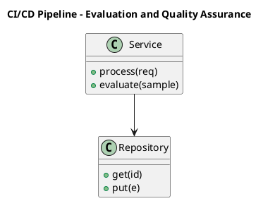

_Source diagram (plantuml); render with the appropriate tool._

**Figure 24. CI/CD Pipeline - Evaluation and Quality Assurance** (plantuml). Figure: CI/CD Pipeline view for GraphRAG. This diagram illustrates the principal components and their interactions as discussed in the surrounding section.

## Deep Dive: Mechanics, Variants and Trade-offs

Having established the essentials, we now go deeper into evaluation and quality assurance. It pays to understand the mechanism rather than treat it as a black box, because most production incidents are explained by one of its steps misbehaving. The distinctions in this section are the ones that separate a working demo from a system that holds up under adversarial inputs, scale and the passage of time.

Consider the principal variants and how to choose between them. Each variant optimises for a different point in the design space - some for latency, some for accuracy, some for cost or operability - and the correct choice follows from explicit requirements rather than from defaults. Simplicity is a feature. The simplest design that meets the requirement should be the default, with complexity added only when measurement justifies it.

In practice this is supported by a mature tooling ecosystem, including Microsoft GraphRAG, Neo4j, LlamaIndex, NetworkX. Tools accelerate the work but do not substitute for understanding: the same principles apply whichever implementation you select, and the ability to reason from first principles is what lets you debug when a tool behaves unexpectedly.

A frequent source of subtle bugs is the interaction with community detection and summarisation. Because community detection and summarisation concerns hierarchical clustering (e.g. Leiden) and map-reduce summaries, changes there can silently alter the behaviour analysed here. The remedy is contract tests at the boundary and end-to-end evaluations that exercise the interaction explicitly.

Finally, attend to edge cases and degradation. Define what the system should do under partial failure, unexpected inputs and load spikes, and make that behaviour explicit and tested rather than emergent. Graceful degradation - returning a safe, useful result when the ideal one is unavailable - is a hallmark of mature engineering.

For deeper study, the literature offers authoritative treatments such as Edge et al. — From Local to Global: Graph RAG (Microsoft, 2024) and Traag et al. — Leiden community detection (2019). These primary sources reward careful reading and ground the practical guidance above in established results.

## Advanced Considerations

Having established the essentials, we now go deeper into evaluation and quality assurance. It pays to understand the mechanism rather than treat it as a black box, because most production incidents are explained by one of its steps misbehaving. The distinctions in this section are the ones that separate a working demo from a system that holds up under adversarial inputs, scale and the passage of time.

Consider the principal variants and how to choose between them. Each variant optimises for a different point in the design space - some for latency, some for accuracy, some for cost or operability - and the correct choice follows from explicit requirements rather than from defaults. Latency, accuracy and cost form a tension triangle: improving one typically pressures the others, so explicit budgets are essential.

In practice this is supported by a mature tooling ecosystem, including Microsoft GraphRAG, Neo4j, LlamaIndex, NetworkX. Tools accelerate the work but do not substitute for understanding: the same principles apply whichever implementation you select, and the ability to reason from first principles is what lets you debug when a tool behaves unexpectedly.

A frequent source of subtle bugs is the interaction with the graphrag reference architecture. Because the graphrag reference architecture concerns indexing and query pipelines end to end, changes there can silently alter the behaviour analysed here. The remedy is contract tests at the boundary and end-to-end evaluations that exercise the interaction explicitly.

Finally, attend to edge cases and degradation. Define what the system should do under partial failure, unexpected inputs and load spikes, and make that behaviour explicit and tested rather than emergent. Graceful degradation - returning a safe, useful result when the ideal one is unavailable - is a hallmark of mature engineering.

For deeper study, the literature offers authoritative treatments such as Edge et al. — From Local to Global: Graph RAG (Microsoft, 2024) and Traag et al. — Leiden community detection (2019). These primary sources reward careful reading and ground the practical guidance above in established results.

## Worked Example

Consider a concrete scenario. A intelligence organisation needs connecting entities across heterogeneous reports. They decide to apply evaluation and quality assurance as part of their GraphRAG solution, but wisely treat it as a hypothesis to be validated rather than a foregone conclusion.

The team begins by stating the objective precisely and defining how success will be measured before writing any code. They establish a small but representative evaluation set, agree on acceptance thresholds, and only then prototype the simplest design that could work. Early measurement reveals which assumptions hold and which must be revised, saving weeks of misdirected effort and surfacing edge cases while they are still cheap to fix.

As the prototype matures into a service, the team hardens it: adding input validation, error handling, caching where it pays off, and monitoring that ties back to the original success metric. They document each significant decision in an architecture decision record so that future maintainers understand not just what was built but why.

The outcome is instructive. The system that reaches production is not the most sophisticated design the team considered, but the one whose behaviour they could measure, explain and operate. This is the recurring lesson of GraphRAG: durable value comes from the whole system, not from any single clever component.

## Industry Use Cases

Across industries, the ideas in this chapter recur in recognisable ways. The following vignettes show how different sectors apply them and what they have in common.

**Research.** Literature synthesis across thousands of papers. The common thread is that value comes not from the model alone but from the surrounding system - data quality, evaluation, integration and operations - which is precisely where most of the engineering effort belongs.

**Intelligence.** Connecting entities across heterogeneous reports. The common thread is that value comes not from the model alone but from the surrounding system - data quality, evaluation, integration and operations - which is precisely where most of the engineering effort belongs.

**Enterprise.** Whole-corpus thematic questions over documentation. The common thread is that value comes not from the model alone but from the surrounding system - data quality, evaluation, integration and operations - which is precisely where most of the engineering effort belongs.

**Compliance.** Tracing relationships across regulatory filings. The common thread is that value comes not from the model alone but from the surrounding system - data quality, evaluation, integration and operations - which is precisely where most of the engineering effort belongs.

## Best Practices

The following practices consistently separate successful GraphRAG efforts from struggling ones. They are deliberately concrete so they can be adopted as checklist items in design and code review.

- Invest in entity resolution; graph quality dominates answer quality.
- Route global questions to community summaries, not raw chunks.
- Cache community summaries to amortise extraction cost.
- Track provenance through edges for citation.

None of these are exotic; they are the unglamorous disciplines that compound into reliability. The cost of adopting them is small compared with the cost of the incidents they prevent, and they become second nature with practice.

## Common Pitfalls

Equally instructive are the failure modes that recur in practice. Each pitfall below has a clear early warning sign and a known remedy, so treat them as a diagnostic checklist when something feels wrong:

- Skipping entity resolution and fragmenting the graph.
- Applying GraphRAG where simple RAG suffices, inflating cost.
- Stale graphs after corpus updates.
- Unbounded extraction cost on huge corpora.

The pattern is consistent: most failures stem from skipping measurement, conflating prototype and production standards, or deferring cross-cutting concerns such as security and cost until they become emergencies. Naming these traps in advance is the cheapest way to avoid them.

## Governance, Security and Cost Notes

No discussion of evaluation and quality assurance is complete without its governance, security and cost dimensions, which are too often deferred until they become emergencies. Treating them as first-class concerns from the outset is both cheaper and safer.

**Governance.** Classify the risk of this capability, document its intended and out-of-scope uses, and ensure decisions are traceable to satisfy internal policy and external regulation such as the NIST AI RMF, ISO/IEC 42001 and the EU AI Act. **Security.** Treat all external input as untrusted, validate outputs before acting on them, apply least privilege to any tools or data access, and map controls to the OWASP LLM Top 10 and MITRE ATLAS.

**Cost and sustainability.** Establish explicit budgets for compute, tokens and latency, attribute spend to owners, and revisit the economics as usage scales - a design that is affordable at pilot scale can become untenable at production volume. Building these reflexes into everyday engineering is what allows a GraphRAG system to be not only capable but also trustworthy and economically sound.

## Hands-On Exercises

Work through the following exercises. They are designed to move understanding from recognition to application - the level required for real engineering work - so prefer writing and building over merely reading.

1. Explain evaluation and quality assurance to a colleague unfamiliar with GraphRAG, using a concrete example from your own domain.
2. Sketch a reference architecture that incorporates evaluation and quality assurance and annotate where observability, security and cost controls belong.
3. Design an evaluation that would tell you whether evaluation and quality assurance is working in production, including the metric, the dataset and the acceptance threshold.
4. Identify two pitfalls relevant to evaluation and quality assurance in your environment and describe the early warning signals you would monitor.
5. Prototype the simplest implementation that demonstrates evaluation and quality assurance, then list exactly what would need to change to make it production-ready.

## Key Takeaways

Key takeaways from this chapter:

- Evaluation and Quality Assurance is a systems concern in GraphRAG: data, models and operations must be co-designed.
- Measurement is non-negotiable; define success metrics and evaluation before building.
- Favour the simplest design that meets the requirement, and add complexity only when evidence demands it.
- Security, cost and observability are first-class requirements, not afterthoughts.
- Document decisions so the system remains understandable and operable as it evolves.

## Code Walkthrough

Every change to a GraphRAG system should pass an evaluation gate. This example shows the minimal shape: align predictions and references, compute a metric, and return a pass/fail decision for CI.

The full listing is shown below; study it line by line and reproduce it locally before moving on.

### Listing: Evaluating Evaluation and Quality Assurance with a regression gate

```python
from dataclasses import dataclass


@dataclass
class EvalResult:
    metric: str
    score: float
    passed: bool


def evaluate(predictions: list[str], references: list[str],
             threshold: float = 0.8) -> EvalResult:
    """Score Evaluation and Quality Assurance output against references with a simple exact-match metric.

    In practice you would combine several metrics (exact match, semantic
    similarity, LLM-as-judge) and gate releases on the aggregate.
    """
    if len(predictions) != len(references):
        raise ValueError("predictions and references must align")
    hits = sum(p.strip() == r.strip() for p, r in zip(predictions, references))
    score = hits / len(references) if references else 0.0
    return EvalResult(metric="exact_match", score=score, passed=score >= threshold)


if __name__ == "__main__":
    result = evaluate(["yes", "no"], ["yes", "yes"])
    print(f"{result.metric}={result.score:.2f} passed={result.passed}")

```

## Review Questions

1. In the context of GraphRAG, which statement best describes “Evaluation and Quality Assurance”?
   - A. It makes the system slower but has no other effect.
   - B. It applies exclusively to image data.
   - C. a rigorous approach to measuring and assuring the quality of a GraphRAG system before and after release
   - D. It removes all security and governance requirements.
   - **Answer: C.** Evaluation and Quality Assurance: a rigorous approach to measuring and assuring the quality of a GraphRAG system before and after release
2. Which of the following is a recommended best practice when working with GraphRAG?
   - A. Track provenance through edges for citation.
   - B. Unbounded extraction cost on huge corpora.
   - C. It guarantees deterministic output regardless of input.
   - D. Applying GraphRAG where simple RAG suffices, inflating cost.
   - **Answer: A.** Best practice: Track provenance through edges for citation.
3. Which of the following is a common pitfall to avoid in GraphRAG?
   - A. Cache community summaries to amortise extraction cost.
   - B. It guarantees deterministic output regardless of input.
   - C. Applying GraphRAG where simple RAG suffices, inflating cost.
   - D. It removes all security and governance requirements.
   - **Answer: C.** Pitfall to avoid: Applying GraphRAG where simple RAG suffices, inflating cost.
4. *(Discussion)* Describe a failure mode of Evaluation and Quality Assurance and how you would mitigate it.
   - **Model answer:** A strong answer defines evaluation and quality assurance (a rigorous approach to measuring and assuring the quality of a GraphRAG system before and after release) then connects it to architecture, evaluation, cost, security and operations for GraphRAG, citing concrete trade-offs and a real-world example.

---


# Chapter 20. Security, Privacy and Governance

_This chapter examines security, privacy and governance within GraphRAG. It covers the security, privacy and governance controls that make a GraphRAG system trustworthy and compliant, derives a reference architecture, walks through a worked example and runnable code, surveys industry use cases, and distils best practices and pitfalls, closing with exercises and review questions._

## Introduction

In practical terms, Security, Privacy and Governance is best understood as the security, privacy and governance controls that make a GraphRAG system trustworthy and compliant. It is foundational: later capabilities in GraphRAG are built directly on top of it. What distinguishes a production-grade approach from a prototype is the discipline of measurement: every claim is backed by an evaluation rather than intuition.

This chapter builds intuition first, then formalises the ideas, derives an architecture, and finishes with code, exercises and review questions so the material transfers directly to your own GraphRAG work. Read it actively: pause at each diagram, reproduce the code, and attempt the exercises before consulting the answers.

## Theory and Foundations

Security, Privacy and Governance refers to the security, privacy and governance controls that make a GraphRAG system trustworthy and compliant. What distinguishes a production-grade approach from a prototype is the discipline of measurement: every claim is backed by an evaluation rather than intuition. Beneath the abstraction lies a concrete process whose steps can each be measured, tested and optimised independently.

To place this in context, recall the broader picture: GraphRAG augments retrieval-augmented generation with a knowledge graph constructed from a corpus, enabling multi-hop reasoning, community summarisation and global questions that flat vector retrieval cannot answer. Within that picture, security, privacy and governance is one of the load-bearing ideas - the kind that, when understood deeply, makes the rest of GraphRAG fall into place. This concept recurs throughout the GraphRAG lifecycle, from design to operations.

Security, Privacy and Governance cannot be understood in isolation from cost and indexing trade-offs. Recall that cost and indexing trade-offs concerns the build cost of graph extraction versus query-time value. The two interact directly: decisions in one constrain the design space of the other, which is why mature teams reason about them together rather than sequentially. Every added component buys capability at the price of operational surface area, and that bargain should be made consciously.

Security, Privacy and Governance cannot be understood in isolation from multi-hop reasoning over graphs. Recall that multi-hop reasoning over graphs concerns traversing relationships to answer connected questions. The two interact directly: decisions in one constrain the design space of the other, which is why mature teams reason about them together rather than sequentially. Simplicity is a feature. The simplest design that meets the requirement should be the default, with complexity added only when measurement justifies it.

Several established patterns apply directly to security, privacy and governance. The first, map-reduce community summarisation for global questions, is widely adopted because it makes the system's behaviour predictable and observable. A complementary pattern, hybrid graph traversal + vector similarity, addresses a related concern and is often deployed alongside it. Patterns are not dogma; they are distilled experience that shortcuts the search for a sound design, and each carries assumptions worth checking against your context.

The decision of whether to adopt this should be driven by requirements, not by novelty. In a small prototype, shortcuts around security, privacy and governance are invisible; in a production GraphRAG system serving real traffic, they surface as incidents, cost overruns or compliance gaps. As with most architectural decisions, the choice is rarely binary; the skill lies in quantifying the trade-offs and choosing deliberately. The remainder of this chapter turns these principles into an architecture, code and a checklist you can apply immediately.

## Architecture and Design

A robust architecture for Security, Privacy and Governance is layered so each part can evolve independently without destabilising the whole. GraphRAG indexing extracts entities and relations from chunks, resolves duplicates, builds a graph, detects communities and pre-summarises them. At query time a router selects local search (entity neighbourhoods + linked text) or global search (map-reduce over community summaries), then synthesises a cited answer.

Concretely, the principal building blocks include limits of vector-only rag, knowledge graph construction from text, entity resolution and deduplication, community detection and summarisation and local versus global search. Each is a replaceable component behind a stable interface, so the team can upgrade an implementation - a model, an index, a policy engine - without rewriting its neighbours. The contracts between components are where reliability is won or lost, so they are specified explicitly and tested in isolation.

The diagram accompanying this section makes the data and control flow explicit. Requests enter through a well-defined boundary where they are authenticated and validated; only then are they dispatched to the components that perform the work. This boundary is also where rate limiting, quota enforcement and audit logging live, keeping cross-cutting concerns out of the core logic and in one auditable place.

Two qualities deserve emphasis. First, observability is designed in, not bolted on: every component emits structured telemetry so that failures can be localised in minutes rather than hours. Second, the architecture is evolvable - components communicate through stable contracts so that any single part of the GraphRAG system can be replaced without a rewrite. Every added component buys capability at the price of operational surface area, and that bargain should be made consciously.

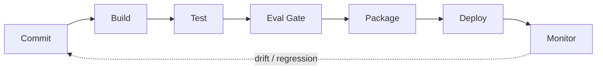

**Figure 25. CI/CD Pipeline - Security, Privacy and Governance** (mermaid). Figure: CI/CD Pipeline view for GraphRAG. This diagram illustrates the principal components and their interactions as discussed in the surrounding section.

## Deep Dive: Mechanics, Variants and Trade-offs

Having established the essentials, we now go deeper into security, privacy and governance. It pays to understand the mechanism rather than treat it as a black box, because most production incidents are explained by one of its steps misbehaving. The distinctions in this section are the ones that separate a working demo from a system that holds up under adversarial inputs, scale and the passage of time.

Consider the principal variants and how to choose between them. Each variant optimises for a different point in the design space - some for latency, some for accuracy, some for cost or operability - and the correct choice follows from explicit requirements rather than from defaults. Every added component buys capability at the price of operational surface area, and that bargain should be made consciously.

In practice this is supported by a mature tooling ecosystem, including Microsoft GraphRAG, Neo4j, LlamaIndex, NetworkX. Tools accelerate the work but do not substitute for understanding: the same principles apply whichever implementation you select, and the ability to reason from first principles is what lets you debug when a tool behaves unexpectedly.

A frequent source of subtle bugs is the interaction with cost and indexing trade-offs. Because cost and indexing trade-offs concerns the build cost of graph extraction versus query-time value, changes there can silently alter the behaviour analysed here. The remedy is contract tests at the boundary and end-to-end evaluations that exercise the interaction explicitly.

Finally, attend to edge cases and degradation. Define what the system should do under partial failure, unexpected inputs and load spikes, and make that behaviour explicit and tested rather than emergent. Graceful degradation - returning a safe, useful result when the ideal one is unavailable - is a hallmark of mature engineering.

For deeper study, the literature offers authoritative treatments such as Edge et al. — From Local to Global: Graph RAG (Microsoft, 2024) and Traag et al. — Leiden community detection (2019). These primary sources reward careful reading and ground the practical guidance above in established results.

## Advanced Considerations

Having established the essentials, we now go deeper into security, privacy and governance. The underlying mechanism is best appreciated by tracing a single request from input to output and noting where state is created and consumed. The distinctions in this section are the ones that separate a working demo from a system that holds up under adversarial inputs, scale and the passage of time.

Consider the principal variants and how to choose between them. Each variant optimises for a different point in the design space - some for latency, some for accuracy, some for cost or operability - and the correct choice follows from explicit requirements rather than from defaults. As with most architectural decisions, the choice is rarely binary; the skill lies in quantifying the trade-offs and choosing deliberately.

In practice this is supported by a mature tooling ecosystem, including Microsoft GraphRAG, Neo4j, LlamaIndex, NetworkX. Tools accelerate the work but do not substitute for understanding: the same principles apply whichever implementation you select, and the ability to reason from first principles is what lets you debug when a tool behaves unexpectedly.

A frequent source of subtle bugs is the interaction with limits of vector-only rag. Because limits of vector-only rag concerns why local similarity fails on global, multi-hop and aggregative questions, changes there can silently alter the behaviour analysed here. The remedy is contract tests at the boundary and end-to-end evaluations that exercise the interaction explicitly.

Finally, attend to edge cases and degradation. Define what the system should do under partial failure, unexpected inputs and load spikes, and make that behaviour explicit and tested rather than emergent. Graceful degradation - returning a safe, useful result when the ideal one is unavailable - is a hallmark of mature engineering.

For deeper study, the literature offers authoritative treatments such as Edge et al. — From Local to Global: Graph RAG (Microsoft, 2024) and Traag et al. — Leiden community detection (2019). These primary sources reward careful reading and ground the practical guidance above in established results.

## Worked Example

To ground the discussion, walk through a representative example. A intelligence organisation needs connecting entities across heterogeneous reports. They decide to apply security, privacy and governance as part of their GraphRAG solution, but wisely treat it as a hypothesis to be validated rather than a foregone conclusion.

The team begins by stating the objective precisely and defining how success will be measured before writing any code. They establish a small but representative evaluation set, agree on acceptance thresholds, and only then prototype the simplest design that could work. Early measurement reveals which assumptions hold and which must be revised, saving weeks of misdirected effort and surfacing edge cases while they are still cheap to fix.

As the prototype matures into a service, the team hardens it: adding input validation, error handling, caching where it pays off, and monitoring that ties back to the original success metric. They document each significant decision in an architecture decision record so that future maintainers understand not just what was built but why.

The outcome is instructive. The system that reaches production is not the most sophisticated design the team considered, but the one whose behaviour they could measure, explain and operate. This is the recurring lesson of GraphRAG: durable value comes from the whole system, not from any single clever component.

## Industry Use Cases

Across industries, the ideas in this chapter recur in recognisable ways. The following vignettes show how different sectors apply them and what they have in common.

**Research.** Literature synthesis across thousands of papers. The common thread is that value comes not from the model alone but from the surrounding system - data quality, evaluation, integration and operations - which is precisely where most of the engineering effort belongs.

**Intelligence.** Connecting entities across heterogeneous reports. The common thread is that value comes not from the model alone but from the surrounding system - data quality, evaluation, integration and operations - which is precisely where most of the engineering effort belongs.

**Enterprise.** Whole-corpus thematic questions over documentation. The common thread is that value comes not from the model alone but from the surrounding system - data quality, evaluation, integration and operations - which is precisely where most of the engineering effort belongs.

**Compliance.** Tracing relationships across regulatory filings. The common thread is that value comes not from the model alone but from the surrounding system - data quality, evaluation, integration and operations - which is precisely where most of the engineering effort belongs.

## Best Practices

The following practices consistently separate successful GraphRAG efforts from struggling ones. They are deliberately concrete so they can be adopted as checklist items in design and code review.

- Invest in entity resolution; graph quality dominates answer quality.
- Route global questions to community summaries, not raw chunks.
- Cache community summaries to amortise extraction cost.
- Track provenance through edges for citation.

None of these are exotic; they are the unglamorous disciplines that compound into reliability. The cost of adopting them is small compared with the cost of the incidents they prevent, and they become second nature with practice.

## Common Pitfalls

Equally instructive are the failure modes that recur in practice. Each pitfall below has a clear early warning sign and a known remedy, so treat them as a diagnostic checklist when something feels wrong:

- Skipping entity resolution and fragmenting the graph.
- Applying GraphRAG where simple RAG suffices, inflating cost.
- Stale graphs after corpus updates.
- Unbounded extraction cost on huge corpora.

The pattern is consistent: most failures stem from skipping measurement, conflating prototype and production standards, or deferring cross-cutting concerns such as security and cost until they become emergencies. Naming these traps in advance is the cheapest way to avoid them.

## Governance, Security and Cost Notes

No discussion of security, privacy and governance is complete without its governance, security and cost dimensions, which are too often deferred until they become emergencies. Treating them as first-class concerns from the outset is both cheaper and safer.

**Governance.** Classify the risk of this capability, document its intended and out-of-scope uses, and ensure decisions are traceable to satisfy internal policy and external regulation such as the NIST AI RMF, ISO/IEC 42001 and the EU AI Act. **Security.** Treat all external input as untrusted, validate outputs before acting on them, apply least privilege to any tools or data access, and map controls to the OWASP LLM Top 10 and MITRE ATLAS.

**Cost and sustainability.** Establish explicit budgets for compute, tokens and latency, attribute spend to owners, and revisit the economics as usage scales - a design that is affordable at pilot scale can become untenable at production volume. Building these reflexes into everyday engineering is what allows a GraphRAG system to be not only capable but also trustworthy and economically sound.

## Hands-On Exercises

Work through the following exercises. They are designed to move understanding from recognition to application - the level required for real engineering work - so prefer writing and building over merely reading.

1. Explain security, privacy and governance to a colleague unfamiliar with GraphRAG, using a concrete example from your own domain.
2. Sketch a reference architecture that incorporates security, privacy and governance and annotate where observability, security and cost controls belong.
3. Design an evaluation that would tell you whether security, privacy and governance is working in production, including the metric, the dataset and the acceptance threshold.
4. Identify two pitfalls relevant to security, privacy and governance in your environment and describe the early warning signals you would monitor.
5. Prototype the simplest implementation that demonstrates security, privacy and governance, then list exactly what would need to change to make it production-ready.

## Key Takeaways

Key takeaways from this chapter:

- Security, Privacy and Governance is a systems concern in GraphRAG: data, models and operations must be co-designed.
- Measurement is non-negotiable; define success metrics and evaluation before building.
- Favour the simplest design that meets the requirement, and add complexity only when evidence demands it.
- Security, cost and observability are first-class requirements, not afterthoughts.
- Document decisions so the system remains understandable and operable as it evolves.

## Code Walkthrough

This listing shows a configuration-driven Security, Privacy and Governance component with retry semantics and typed interfaces — the shape we expect from production GraphRAG code rather than a notebook prototype.

The full listing is shown below; study it line by line and reproduce it locally before moving on.

### Listing: Implementing a Security, Privacy and Governance component

```python
from __future__ import annotations

from dataclasses import dataclass, field
from typing import Any


@dataclass(slots=True)
class PrivacyAndConfig:
    """Configuration for the Security, Privacy and Governance component in a GraphRAG system."""

    name: str
    timeout_s: float = 30.0
    max_retries: int = 3
    options: dict[str, Any] = field(default_factory=dict)


class PrivacyAnd:
    """A minimal, production-shaped implementation of Security, Privacy and Governance."""

    def __init__(self, config: PrivacyAndConfig) -> None:
        self._config = config
        self._calls = 0

    def run(self, payload: dict[str, Any]) -> dict[str, Any]:
        """Process a request, retrying transient failures with backoff."""
        last_error: Exception | None = None
        for attempt in range(self._config.max_retries):
            try:
                self._calls += 1
                return self._process(payload)
            except TimeoutError as exc:  # transient
                last_error = exc
                continue
        raise RuntimeError(f"PrivacyAnd failed after retries") from last_error

    def _process(self, payload: dict[str, Any]) -> dict[str, Any]:
        # Domain-specific logic for Security, Privacy and Governance goes here.
        return {"status": "ok", "input_keys": sorted(payload), "calls": self._calls}

```

## Review Questions

1. In the context of GraphRAG, which statement best describes “Security, Privacy and Governance”?
   - A. It removes all security and governance requirements.
   - B. It eliminates the need for any evaluation or monitoring.
   - C. It makes the system slower but has no other effect.
   - D. the security, privacy and governance controls that make a GraphRAG system trustworthy and compliant
   - **Answer: D.** Security, Privacy and Governance: the security, privacy and governance controls that make a GraphRAG system trustworthy and compliant
2. Which of the following is a recommended best practice when working with GraphRAG?
   - A. It guarantees deterministic output regardless of input.
   - B. It makes the system slower but has no other effect.
   - C. Route global questions to community summaries, not raw chunks.
   - D. Stale graphs after corpus updates.
   - **Answer: C.** Best practice: Route global questions to community summaries, not raw chunks.
3. Which of the following is a common pitfall to avoid in GraphRAG?
   - A. Unbounded extraction cost on huge corpora.
   - B. Route global questions to community summaries, not raw chunks.
   - C. It removes all security and governance requirements.
   - D. It is only relevant to academic research, not production.
   - **Answer: A.** Pitfall to avoid: Unbounded extraction cost on huge corpora.
4. *(Discussion)* Walk through how you would design Security, Privacy and Governance for an enterprise GraphRAG workload.
   - **Model answer:** A strong answer defines security, privacy and governance (the security, privacy and governance controls that make a GraphRAG system trustworthy and compliant) then connects it to architecture, evaluation, cost, security and operations for GraphRAG, citing concrete trade-offs and a real-world example.

---


# Chapter 21. Cost, Performance and Scaling

_This chapter examines cost, performance and scaling within GraphRAG. It covers techniques for controlling cost and latency while scaling a GraphRAG system to production traffic, derives a reference architecture, walks through a worked example and runnable code, surveys industry use cases, and distils best practices and pitfalls, closing with exercises and review questions._

## Introduction

We define Cost, Performance and Scaling as techniques for controlling cost and latency while scaling a GraphRAG system to production traffic. Teams that master this consistently ship more reliable GraphRAG systems at lower cost. It helps to separate the conceptual model from its implementation: the former guides reasoning, the latter must contend with real-world constraints.

This chapter builds intuition first, then formalises the ideas, derives an architecture, and finishes with code, exercises and review questions so the material transfers directly to your own GraphRAG work. Read it actively: pause at each diagram, reproduce the code, and attempt the exercises before consulting the answers.

## Theory and Foundations

Cost, Performance and Scaling can be characterised as techniques for controlling cost and latency while scaling a GraphRAG system to production traffic. The practical implication is that design choices here ripple through latency, cost and maintainability for the lifetime of the system. The underlying mechanism is best appreciated by tracing a single request from input to output and noting where state is created and consumed.

To place this in context, recall the broader picture: GraphRAG augments retrieval-augmented generation with a knowledge graph constructed from a corpus, enabling multi-hop reasoning, community summarisation and global questions that flat vector retrieval cannot answer. Within that picture, cost, performance and scaling is one of the load-bearing ideas - the kind that, when understood deeply, makes the rest of GraphRAG fall into place. Teams that master this consistently ship more reliable GraphRAG systems at lower cost.

Cost, Performance and Scaling cannot be understood in isolation from query routing in graphrag. Recall that query routing in graphrag concerns choosing local, global or hybrid strategies per question. The two interact directly: decisions in one constrain the design space of the other, which is why mature teams reason about them together rather than sequentially. As with most architectural decisions, the choice is rarely binary; the skill lies in quantifying the trade-offs and choosing deliberately.

Cost, Performance and Scaling cannot be understood in isolation from multi-hop reasoning over graphs. Recall that multi-hop reasoning over graphs concerns traversing relationships to answer connected questions. The two interact directly: decisions in one constrain the design space of the other, which is why mature teams reason about them together rather than sequentially. There is an inherent trade-off between fidelity and cost, and the correct balance depends on the use case and its tolerance for error.

Several established patterns apply directly to cost, performance and scaling. The first, map-reduce community summarisation for global questions, is widely adopted because it makes the system's behaviour predictable and observable. A complementary pattern, entity-neighbourhood expansion for local questions, addresses a related concern and is often deployed alongside it. Patterns are not dogma; they are distilled experience that shortcuts the search for a sound design, and each carries assumptions worth checking against your context.

The decision of whether to adopt this should be driven by requirements, not by novelty. In a small prototype, shortcuts around cost, performance and scaling are invisible; in a production GraphRAG system serving real traffic, they surface as incidents, cost overruns or compliance gaps. As with most architectural decisions, the choice is rarely binary; the skill lies in quantifying the trade-offs and choosing deliberately. The remainder of this chapter turns these principles into an architecture, code and a checklist you can apply immediately.

## Architecture and Design

From an architectural standpoint, Cost, Performance and Scaling sits at the intersection of data, models and operations. GraphRAG indexing extracts entities and relations from chunks, resolves duplicates, builds a graph, detects communities and pre-summarises them. At query time a router selects local search (entity neighbourhoods + linked text) or global search (map-reduce over community summaries), then synthesises a cited answer.

Concretely, the principal building blocks include limits of vector-only rag, knowledge graph construction from text, entity resolution and deduplication, community detection and summarisation and local versus global search. Each is a replaceable component behind a stable interface, so the team can upgrade an implementation - a model, an index, a policy engine - without rewriting its neighbours. The contracts between components are where reliability is won or lost, so they are specified explicitly and tested in isolation.

The diagram accompanying this section makes the data and control flow explicit. Requests enter through a well-defined boundary where they are authenticated and validated; only then are they dispatched to the components that perform the work. This boundary is also where rate limiting, quota enforcement and audit logging live, keeping cross-cutting concerns out of the core logic and in one auditable place.

Two qualities deserve emphasis. First, observability is designed in, not bolted on: every component emits structured telemetry so that failures can be localised in minutes rather than hours. Second, the architecture is evolvable - components communicate through stable contracts so that any single part of the GraphRAG system can be replaced without a rewrite. Every added component buys capability at the price of operational surface area, and that bargain should be made consciously.


**Figure 26. Component - Cost, Performance and Scaling** (mermaid). Figure: Component view for GraphRAG. This diagram illustrates the principal components and their interactions as discussed in the surrounding section.

## Deep Dive: Mechanics, Variants and Trade-offs

Having established the essentials, we now go deeper into cost, performance and scaling. It pays to understand the mechanism rather than treat it as a black box, because most production incidents are explained by one of its steps misbehaving. The distinctions in this section are the ones that separate a working demo from a system that holds up under adversarial inputs, scale and the passage of time.

Consider the principal variants and how to choose between them. Each variant optimises for a different point in the design space - some for latency, some for accuracy, some for cost or operability - and the correct choice follows from explicit requirements rather than from defaults. Latency, accuracy and cost form a tension triangle: improving one typically pressures the others, so explicit budgets are essential.

In practice this is supported by a mature tooling ecosystem, including Microsoft GraphRAG, Neo4j, LlamaIndex, NetworkX. Tools accelerate the work but do not substitute for understanding: the same principles apply whichever implementation you select, and the ability to reason from first principles is what lets you debug when a tool behaves unexpectedly.

A frequent source of subtle bugs is the interaction with query routing in graphrag. Because query routing in graphrag concerns choosing local, global or hybrid strategies per question, changes there can silently alter the behaviour analysed here. The remedy is contract tests at the boundary and end-to-end evaluations that exercise the interaction explicitly.

Finally, attend to edge cases and degradation. Define what the system should do under partial failure, unexpected inputs and load spikes, and make that behaviour explicit and tested rather than emergent. Graceful degradation - returning a safe, useful result when the ideal one is unavailable - is a hallmark of mature engineering.

For deeper study, the literature offers authoritative treatments such as Edge et al. — From Local to Global: Graph RAG (Microsoft, 2024) and Traag et al. — Leiden community detection (2019). These primary sources reward careful reading and ground the practical guidance above in established results.

## Advanced Considerations

Having established the essentials, we now go deeper into cost, performance and scaling. It pays to understand the mechanism rather than treat it as a black box, because most production incidents are explained by one of its steps misbehaving. The distinctions in this section are the ones that separate a working demo from a system that holds up under adversarial inputs, scale and the passage of time.

Consider the principal variants and how to choose between them. Each variant optimises for a different point in the design space - some for latency, some for accuracy, some for cost or operability - and the correct choice follows from explicit requirements rather than from defaults. Every added component buys capability at the price of operational surface area, and that bargain should be made consciously.

In practice this is supported by a mature tooling ecosystem, including Microsoft GraphRAG, Neo4j, LlamaIndex, NetworkX. Tools accelerate the work but do not substitute for understanding: the same principles apply whichever implementation you select, and the ability to reason from first principles is what lets you debug when a tool behaves unexpectedly.

A frequent source of subtle bugs is the interaction with evaluation of graphrag. Because evaluation of graphrag concerns comprehensiveness, diversity and groundedness metrics, changes there can silently alter the behaviour analysed here. The remedy is contract tests at the boundary and end-to-end evaluations that exercise the interaction explicitly.

Finally, attend to edge cases and degradation. Define what the system should do under partial failure, unexpected inputs and load spikes, and make that behaviour explicit and tested rather than emergent. Graceful degradation - returning a safe, useful result when the ideal one is unavailable - is a hallmark of mature engineering.

For deeper study, the literature offers authoritative treatments such as Edge et al. — From Local to Global: Graph RAG (Microsoft, 2024) and Traag et al. — Leiden community detection (2019). These primary sources reward careful reading and ground the practical guidance above in established results.

## Worked Example

Consider a concrete scenario. A research organisation needs literature synthesis across thousands of papers. They decide to apply cost, performance and scaling as part of their GraphRAG solution, but wisely treat it as a hypothesis to be validated rather than a foregone conclusion.

The team begins by stating the objective precisely and defining how success will be measured before writing any code. They establish a small but representative evaluation set, agree on acceptance thresholds, and only then prototype the simplest design that could work. Early measurement reveals which assumptions hold and which must be revised, saving weeks of misdirected effort and surfacing edge cases while they are still cheap to fix.

As the prototype matures into a service, the team hardens it: adding input validation, error handling, caching where it pays off, and monitoring that ties back to the original success metric. They document each significant decision in an architecture decision record so that future maintainers understand not just what was built but why.

The outcome is instructive. The system that reaches production is not the most sophisticated design the team considered, but the one whose behaviour they could measure, explain and operate. This is the recurring lesson of GraphRAG: durable value comes from the whole system, not from any single clever component.

## Industry Use Cases

Across industries, the ideas in this chapter recur in recognisable ways. The following vignettes show how different sectors apply them and what they have in common.

**Research.** Literature synthesis across thousands of papers. The common thread is that value comes not from the model alone but from the surrounding system - data quality, evaluation, integration and operations - which is precisely where most of the engineering effort belongs.

**Intelligence.** Connecting entities across heterogeneous reports. The common thread is that value comes not from the model alone but from the surrounding system - data quality, evaluation, integration and operations - which is precisely where most of the engineering effort belongs.

**Enterprise.** Whole-corpus thematic questions over documentation. The common thread is that value comes not from the model alone but from the surrounding system - data quality, evaluation, integration and operations - which is precisely where most of the engineering effort belongs.

**Compliance.** Tracing relationships across regulatory filings. The common thread is that value comes not from the model alone but from the surrounding system - data quality, evaluation, integration and operations - which is precisely where most of the engineering effort belongs.

## Best Practices

The following practices consistently separate successful GraphRAG efforts from struggling ones. They are deliberately concrete so they can be adopted as checklist items in design and code review.

- Invest in entity resolution; graph quality dominates answer quality.
- Route global questions to community summaries, not raw chunks.
- Cache community summaries to amortise extraction cost.
- Track provenance through edges for citation.

None of these are exotic; they are the unglamorous disciplines that compound into reliability. The cost of adopting them is small compared with the cost of the incidents they prevent, and they become second nature with practice.

## Common Pitfalls

Equally instructive are the failure modes that recur in practice. Each pitfall below has a clear early warning sign and a known remedy, so treat them as a diagnostic checklist when something feels wrong:

- Skipping entity resolution and fragmenting the graph.
- Applying GraphRAG where simple RAG suffices, inflating cost.
- Stale graphs after corpus updates.
- Unbounded extraction cost on huge corpora.

The pattern is consistent: most failures stem from skipping measurement, conflating prototype and production standards, or deferring cross-cutting concerns such as security and cost until they become emergencies. Naming these traps in advance is the cheapest way to avoid them.

## Governance, Security and Cost Notes

No discussion of cost, performance and scaling is complete without its governance, security and cost dimensions, which are too often deferred until they become emergencies. Treating them as first-class concerns from the outset is both cheaper and safer.

**Governance.** Classify the risk of this capability, document its intended and out-of-scope uses, and ensure decisions are traceable to satisfy internal policy and external regulation such as the NIST AI RMF, ISO/IEC 42001 and the EU AI Act. **Security.** Treat all external input as untrusted, validate outputs before acting on them, apply least privilege to any tools or data access, and map controls to the OWASP LLM Top 10 and MITRE ATLAS.

**Cost and sustainability.** Establish explicit budgets for compute, tokens and latency, attribute spend to owners, and revisit the economics as usage scales - a design that is affordable at pilot scale can become untenable at production volume. Building these reflexes into everyday engineering is what allows a GraphRAG system to be not only capable but also trustworthy and economically sound.

## Hands-On Exercises

Work through the following exercises. They are designed to move understanding from recognition to application - the level required for real engineering work - so prefer writing and building over merely reading.

1. Explain cost, performance and scaling to a colleague unfamiliar with GraphRAG, using a concrete example from your own domain.
2. Sketch a reference architecture that incorporates cost, performance and scaling and annotate where observability, security and cost controls belong.
3. Design an evaluation that would tell you whether cost, performance and scaling is working in production, including the metric, the dataset and the acceptance threshold.
4. Identify two pitfalls relevant to cost, performance and scaling in your environment and describe the early warning signals you would monitor.
5. Prototype the simplest implementation that demonstrates cost, performance and scaling, then list exactly what would need to change to make it production-ready.

## Key Takeaways

Key takeaways from this chapter:

- Cost, Performance and Scaling is a systems concern in GraphRAG: data, models and operations must be co-designed.
- Measurement is non-negotiable; define success metrics and evaluation before building.
- Favour the simplest design that meets the requirement, and add complexity only when evidence demands it.
- Security, cost and observability are first-class requirements, not afterthoughts.
- Document decisions so the system remains understandable and operable as it evolves.

## Code Walkthrough

This listing shows a configuration-driven Cost, Performance and Scaling component with retry semantics and typed interfaces — the shape we expect from production GraphRAG code rather than a notebook prototype.

The full listing is shown below; study it line by line and reproduce it locally before moving on.

### Listing: Implementing a Cost, Performance and Scaling component

```python
from __future__ import annotations

from dataclasses import dataclass, field
from typing import Any


@dataclass(slots=True)
class PerformanceAndConfig:
    """Configuration for the Cost, Performance and Scaling component in a GraphRAG system."""

    name: str
    timeout_s: float = 30.0
    max_retries: int = 3
    options: dict[str, Any] = field(default_factory=dict)


class PerformanceAnd:
    """A minimal, production-shaped implementation of Cost, Performance and Scaling."""

    def __init__(self, config: PerformanceAndConfig) -> None:
        self._config = config
        self._calls = 0

    def run(self, payload: dict[str, Any]) -> dict[str, Any]:
        """Process a request, retrying transient failures with backoff."""
        last_error: Exception | None = None
        for attempt in range(self._config.max_retries):
            try:
                self._calls += 1
                return self._process(payload)
            except TimeoutError as exc:  # transient
                last_error = exc
                continue
        raise RuntimeError(f"PerformanceAnd failed after retries") from last_error

    def _process(self, payload: dict[str, Any]) -> dict[str, Any]:
        # Domain-specific logic for Cost, Performance and Scaling goes here.
        return {"status": "ok", "input_keys": sorted(payload), "calls": self._calls}

```

## Review Questions

1. In the context of GraphRAG, which statement best describes “Cost, Performance and Scaling”?
   - A. techniques for controlling cost and latency while scaling a GraphRAG system to production traffic
   - B. It removes all security and governance requirements.
   - C. It applies exclusively to image data.
   - D. It guarantees deterministic output regardless of input.
   - **Answer: A.** Cost, Performance and Scaling: techniques for controlling cost and latency while scaling a GraphRAG system to production traffic
2. Which of the following is a recommended best practice when working with GraphRAG?
   - A. Route global questions to community summaries, not raw chunks.
   - B. Skipping entity resolution and fragmenting the graph.
   - C. Stale graphs after corpus updates.
   - D. It removes all security and governance requirements.
   - **Answer: A.** Best practice: Route global questions to community summaries, not raw chunks.
3. Which of the following is a common pitfall to avoid in GraphRAG?
   - A. Route global questions to community summaries, not raw chunks.
   - B. Applying GraphRAG where simple RAG suffices, inflating cost.
   - C. Invest in entity resolution; graph quality dominates answer quality.
   - D. It makes the system slower but has no other effect.
   - **Answer: B.** Pitfall to avoid: Applying GraphRAG where simple RAG suffices, inflating cost.
4. *(Discussion)* How does Cost, Performance and Scaling interact with security and governance requirements?
   - **Model answer:** A strong answer defines cost, performance and scaling (techniques for controlling cost and latency while scaling a GraphRAG system to production traffic) then connects it to architecture, evaluation, cost, security and operations for GraphRAG, citing concrete trade-offs and a real-world example.

---


# Chapter 22. Integration and Interoperability

_This chapter examines integration and interoperability within GraphRAG. It covers patterns for integrating a GraphRAG system with surrounding enterprise systems and data, derives a reference architecture, walks through a worked example and runnable code, surveys industry use cases, and distils best practices and pitfalls, closing with exercises and review questions._

## Introduction

In practical terms, Integration and Interoperability is best understood as patterns for integrating a GraphRAG system with surrounding enterprise systems and data. It is foundational: later capabilities in GraphRAG are built directly on top of it. The right abstraction here pays compounding dividends, because downstream components depend on its guarantees.

This chapter builds intuition first, then formalises the ideas, derives an architecture, and finishes with code, exercises and review questions so the material transfers directly to your own GraphRAG work. Read it actively: pause at each diagram, reproduce the code, and attempt the exercises before consulting the answers.

## Theory and Foundations

Formally, Integration and Interoperability addresses patterns for integrating a GraphRAG system with surrounding enterprise systems and data. It helps to separate the conceptual model from its implementation: the former guides reasoning, the latter must contend with real-world constraints. It pays to understand the mechanism rather than treat it as a black box, because most production incidents are explained by one of its steps misbehaving.

To place this in context, recall the broader picture: GraphRAG augments retrieval-augmented generation with a knowledge graph constructed from a corpus, enabling multi-hop reasoning, community summarisation and global questions that flat vector retrieval cannot answer. Within that picture, integration and interoperability is one of the load-bearing ideas - the kind that, when understood deeply, makes the rest of GraphRAG fall into place. It is foundational: later capabilities in GraphRAG are built directly on top of it.

Integration and Interoperability cannot be understood in isolation from graph + vector hybrid retrieval. Recall that graph + vector hybrid retrieval concerns combining structural traversal with semantic similarity. The two interact directly: decisions in one constrain the design space of the other, which is why mature teams reason about them together rather than sequentially. As with most architectural decisions, the choice is rarely binary; the skill lies in quantifying the trade-offs and choosing deliberately.

Integration and Interoperability cannot be understood in isolation from evaluation of graphrag. Recall that evaluation of graphrag concerns comprehensiveness, diversity and groundedness metrics. The two interact directly: decisions in one constrain the design space of the other, which is why mature teams reason about them together rather than sequentially. Every added component buys capability at the price of operational surface area, and that bargain should be made consciously.

Several established patterns apply directly to integration and interoperability. The first, entity-neighbourhood expansion for local questions, is widely adopted because it makes the system's behaviour predictable and observable. A complementary pattern, hierarchical community summaries for scalable synthesis, addresses a related concern and is often deployed alongside it. Patterns are not dogma; they are distilled experience that shortcuts the search for a sound design, and each carries assumptions worth checking against your context.

The decision of whether to adopt this should be driven by requirements, not by novelty. In a small prototype, shortcuts around integration and interoperability are invisible; in a production GraphRAG system serving real traffic, they surface as incidents, cost overruns or compliance gaps. As with most architectural decisions, the choice is rarely binary; the skill lies in quantifying the trade-offs and choosing deliberately. The remainder of this chapter turns these principles into an architecture, code and a checklist you can apply immediately.

## Architecture and Design

A robust architecture for Integration and Interoperability is layered so each part can evolve independently without destabilising the whole. GraphRAG indexing extracts entities and relations from chunks, resolves duplicates, builds a graph, detects communities and pre-summarises them. At query time a router selects local search (entity neighbourhoods + linked text) or global search (map-reduce over community summaries), then synthesises a cited answer.

Concretely, the principal building blocks include limits of vector-only rag, knowledge graph construction from text, entity resolution and deduplication, community detection and summarisation and local versus global search. Each is a replaceable component behind a stable interface, so the team can upgrade an implementation - a model, an index, a policy engine - without rewriting its neighbours. The contracts between components are where reliability is won or lost, so they are specified explicitly and tested in isolation.

The diagram accompanying this section makes the data and control flow explicit. Requests enter through a well-defined boundary where they are authenticated and validated; only then are they dispatched to the components that perform the work. This boundary is also where rate limiting, quota enforcement and audit logging live, keeping cross-cutting concerns out of the core logic and in one auditable place.

Two qualities deserve emphasis. First, observability is designed in, not bolted on: every component emits structured telemetry so that failures can be localised in minutes rather than hours. Second, the architecture is evolvable - components communicate through stable contracts so that any single part of the GraphRAG system can be replaced without a rewrite. There is an inherent trade-off between fidelity and cost, and the correct balance depends on the use case and its tolerance for error.


**Figure 27. Security Architecture - Integration and Interoperability** (mermaid). Figure: Security Architecture view for GraphRAG. This diagram illustrates the principal components and their interactions as discussed in the surrounding section.

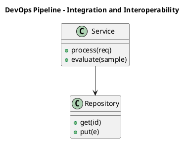

_Source diagram (plantuml); render with the appropriate tool._

**Figure 28. DevOps Pipeline - Integration and Interoperability** (plantuml). Figure: DevOps Pipeline view for GraphRAG. This diagram illustrates the principal components and their interactions as discussed in the surrounding section.

## Deep Dive: Mechanics, Variants and Trade-offs

Having established the essentials, we now go deeper into integration and interoperability. Mechanically, the behaviour emerges from a few interacting parts that are simpler than the whole they produce. The distinctions in this section are the ones that separate a working demo from a system that holds up under adversarial inputs, scale and the passage of time.

Consider the principal variants and how to choose between them. Each variant optimises for a different point in the design space - some for latency, some for accuracy, some for cost or operability - and the correct choice follows from explicit requirements rather than from defaults. There is an inherent trade-off between fidelity and cost, and the correct balance depends on the use case and its tolerance for error.

In practice this is supported by a mature tooling ecosystem, including Microsoft GraphRAG, Neo4j, LlamaIndex, NetworkX. Tools accelerate the work but do not substitute for understanding: the same principles apply whichever implementation you select, and the ability to reason from first principles is what lets you debug when a tool behaves unexpectedly.

A frequent source of subtle bugs is the interaction with graph + vector hybrid retrieval. Because graph + vector hybrid retrieval concerns combining structural traversal with semantic similarity, changes there can silently alter the behaviour analysed here. The remedy is contract tests at the boundary and end-to-end evaluations that exercise the interaction explicitly.

Finally, attend to edge cases and degradation. Define what the system should do under partial failure, unexpected inputs and load spikes, and make that behaviour explicit and tested rather than emergent. Graceful degradation - returning a safe, useful result when the ideal one is unavailable - is a hallmark of mature engineering.

For deeper study, the literature offers authoritative treatments such as Edge et al. — From Local to Global: Graph RAG (Microsoft, 2024) and Traag et al. — Leiden community detection (2019). These primary sources reward careful reading and ground the practical guidance above in established results.

## Advanced Considerations

Having established the essentials, we now go deeper into integration and interoperability. The underlying mechanism is best appreciated by tracing a single request from input to output and noting where state is created and consumed. The distinctions in this section are the ones that separate a working demo from a system that holds up under adversarial inputs, scale and the passage of time.

Consider the principal variants and how to choose between them. Each variant optimises for a different point in the design space - some for latency, some for accuracy, some for cost or operability - and the correct choice follows from explicit requirements rather than from defaults. Simplicity is a feature. The simplest design that meets the requirement should be the default, with complexity added only when measurement justifies it.

In practice this is supported by a mature tooling ecosystem, including Microsoft GraphRAG, Neo4j, LlamaIndex, NetworkX. Tools accelerate the work but do not substitute for understanding: the same principles apply whichever implementation you select, and the ability to reason from first principles is what lets you debug when a tool behaves unexpectedly.

A frequent source of subtle bugs is the interaction with evaluation of graphrag. Because evaluation of graphrag concerns comprehensiveness, diversity and groundedness metrics, changes there can silently alter the behaviour analysed here. The remedy is contract tests at the boundary and end-to-end evaluations that exercise the interaction explicitly.

Finally, attend to edge cases and degradation. Define what the system should do under partial failure, unexpected inputs and load spikes, and make that behaviour explicit and tested rather than emergent. Graceful degradation - returning a safe, useful result when the ideal one is unavailable - is a hallmark of mature engineering.

For deeper study, the literature offers authoritative treatments such as Edge et al. — From Local to Global: Graph RAG (Microsoft, 2024) and Traag et al. — Leiden community detection (2019). These primary sources reward careful reading and ground the practical guidance above in established results.

## Worked Example

To ground the discussion, walk through a representative example. A research organisation needs literature synthesis across thousands of papers. They decide to apply integration and interoperability as part of their GraphRAG solution, but wisely treat it as a hypothesis to be validated rather than a foregone conclusion.

The team begins by stating the objective precisely and defining how success will be measured before writing any code. They establish a small but representative evaluation set, agree on acceptance thresholds, and only then prototype the simplest design that could work. Early measurement reveals which assumptions hold and which must be revised, saving weeks of misdirected effort and surfacing edge cases while they are still cheap to fix.

As the prototype matures into a service, the team hardens it: adding input validation, error handling, caching where it pays off, and monitoring that ties back to the original success metric. They document each significant decision in an architecture decision record so that future maintainers understand not just what was built but why.

The outcome is instructive. The system that reaches production is not the most sophisticated design the team considered, but the one whose behaviour they could measure, explain and operate. This is the recurring lesson of GraphRAG: durable value comes from the whole system, not from any single clever component.

## Industry Use Cases

Across industries, the ideas in this chapter recur in recognisable ways. The following vignettes show how different sectors apply them and what they have in common.

**Research.** Literature synthesis across thousands of papers. The common thread is that value comes not from the model alone but from the surrounding system - data quality, evaluation, integration and operations - which is precisely where most of the engineering effort belongs.

**Intelligence.** Connecting entities across heterogeneous reports. The common thread is that value comes not from the model alone but from the surrounding system - data quality, evaluation, integration and operations - which is precisely where most of the engineering effort belongs.

**Enterprise.** Whole-corpus thematic questions over documentation. The common thread is that value comes not from the model alone but from the surrounding system - data quality, evaluation, integration and operations - which is precisely where most of the engineering effort belongs.

**Compliance.** Tracing relationships across regulatory filings. The common thread is that value comes not from the model alone but from the surrounding system - data quality, evaluation, integration and operations - which is precisely where most of the engineering effort belongs.

## Best Practices

The following practices consistently separate successful GraphRAG efforts from struggling ones. They are deliberately concrete so they can be adopted as checklist items in design and code review.

- Invest in entity resolution; graph quality dominates answer quality.
- Route global questions to community summaries, not raw chunks.
- Cache community summaries to amortise extraction cost.
- Track provenance through edges for citation.

None of these are exotic; they are the unglamorous disciplines that compound into reliability. The cost of adopting them is small compared with the cost of the incidents they prevent, and they become second nature with practice.

## Common Pitfalls

Equally instructive are the failure modes that recur in practice. Each pitfall below has a clear early warning sign and a known remedy, so treat them as a diagnostic checklist when something feels wrong:

- Skipping entity resolution and fragmenting the graph.
- Applying GraphRAG where simple RAG suffices, inflating cost.
- Stale graphs after corpus updates.
- Unbounded extraction cost on huge corpora.

The pattern is consistent: most failures stem from skipping measurement, conflating prototype and production standards, or deferring cross-cutting concerns such as security and cost until they become emergencies. Naming these traps in advance is the cheapest way to avoid them.

## Governance, Security and Cost Notes

No discussion of integration and interoperability is complete without its governance, security and cost dimensions, which are too often deferred until they become emergencies. Treating them as first-class concerns from the outset is both cheaper and safer.

**Governance.** Classify the risk of this capability, document its intended and out-of-scope uses, and ensure decisions are traceable to satisfy internal policy and external regulation such as the NIST AI RMF, ISO/IEC 42001 and the EU AI Act. **Security.** Treat all external input as untrusted, validate outputs before acting on them, apply least privilege to any tools or data access, and map controls to the OWASP LLM Top 10 and MITRE ATLAS.

**Cost and sustainability.** Establish explicit budgets for compute, tokens and latency, attribute spend to owners, and revisit the economics as usage scales - a design that is affordable at pilot scale can become untenable at production volume. Building these reflexes into everyday engineering is what allows a GraphRAG system to be not only capable but also trustworthy and economically sound.

## Hands-On Exercises

Work through the following exercises. They are designed to move understanding from recognition to application - the level required for real engineering work - so prefer writing and building over merely reading.

1. Explain integration and interoperability to a colleague unfamiliar with GraphRAG, using a concrete example from your own domain.
2. Sketch a reference architecture that incorporates integration and interoperability and annotate where observability, security and cost controls belong.
3. Design an evaluation that would tell you whether integration and interoperability is working in production, including the metric, the dataset and the acceptance threshold.
4. Identify two pitfalls relevant to integration and interoperability in your environment and describe the early warning signals you would monitor.
5. Prototype the simplest implementation that demonstrates integration and interoperability, then list exactly what would need to change to make it production-ready.

## Key Takeaways

Key takeaways from this chapter:

- Integration and Interoperability is a systems concern in GraphRAG: data, models and operations must be co-designed.
- Measurement is non-negotiable; define success metrics and evaluation before building.
- Favour the simplest design that meets the requirement, and add complexity only when evidence demands it.
- Security, cost and observability are first-class requirements, not afterthoughts.
- Document decisions so the system remains understandable and operable as it evolves.

## Code Walkthrough

Pipelines keep Integration and Interoperability logic modular and testable. Each stage is a pure function, errors are captured per item, and the composition is trivial to extend or reorder.

The full listing is shown below; study it line by line and reproduce it locally before moving on.

### Listing: A composable processing pipeline for Integration and Interoperability

```python
from collections.abc import Iterable, Iterator
from typing import Protocol


class Stage(Protocol):
    def __call__(self, item: dict) -> dict: ...


def pipeline(stages: list[Stage]) -> Stage:
    """Compose ordered stages into a single callable for Integration and Interoperability."""

    def run(item: dict) -> dict:
        for stage in stages:
            item = stage(item)
        return item

    return run


def validate(item: dict) -> dict:
    if "text" not in item:
        raise ValueError("missing required field: text")
    return item


def normalise(item: dict) -> dict:
    item["text"] = item["text"].strip().lower()
    return item


def enrich(item: dict) -> dict:
    item["length"] = len(item["text"])
    return item


process = pipeline([validate, normalise, enrich])


def run_batch(items: Iterable[dict]) -> Iterator[dict]:
    for item in items:
        try:
            yield process(dict(item))
        except ValueError as exc:
            yield {"error": str(exc), "item": item}

```

## Review Questions

1. In the context of GraphRAG, which statement best describes “Integration and Interoperability”?
   - A. It guarantees deterministic output regardless of input.
   - B. patterns for integrating a GraphRAG system with surrounding enterprise systems and data
   - C. It applies exclusively to image data.
   - D. It eliminates the need for any evaluation or monitoring.
   - **Answer: B.** Integration and Interoperability: patterns for integrating a GraphRAG system with surrounding enterprise systems and data
2. Which of the following is a recommended best practice when working with GraphRAG?
   - A. It makes the system slower but has no other effect.
   - B. Route global questions to community summaries, not raw chunks.
   - C. It is only relevant to academic research, not production.
   - D. It eliminates the need for any evaluation or monitoring.
   - **Answer: B.** Best practice: Route global questions to community summaries, not raw chunks.
3. Which of the following is a common pitfall to avoid in GraphRAG?
   - A. It makes the system slower but has no other effect.
   - B. Applying GraphRAG where simple RAG suffices, inflating cost.
   - C. It eliminates the need for any evaluation or monitoring.
   - D. Cache community summaries to amortise extraction cost.
   - **Answer: B.** Pitfall to avoid: Applying GraphRAG where simple RAG suffices, inflating cost.
4. *(Discussion)* What trade-offs would you weigh when implementing Integration and Interoperability?
   - **Model answer:** A strong answer defines integration and interoperability (patterns for integrating a GraphRAG system with surrounding enterprise systems and data) then connects it to architecture, evaluation, cost, security and operations for GraphRAG, citing concrete trade-offs and a real-world example.

---


# Chapter 23. Trends and Research Directions

_This chapter examines trends and research directions within GraphRAG. It covers emerging trends, open problems and research directions shaping the future of GraphRAG, derives a reference architecture, walks through a worked example and runnable code, surveys industry use cases, and distils best practices and pitfalls, closing with exercises and review questions._

## Introduction

Formally, Trends and Research Directions addresses emerging trends, open problems and research directions shaping the future of GraphRAG. This concept recurs throughout the GraphRAG lifecycle, from design to operations. The right abstraction here pays compounding dividends, because downstream components depend on its guarantees.

This chapter builds intuition first, then formalises the ideas, derives an architecture, and finishes with code, exercises and review questions so the material transfers directly to your own GraphRAG work. Read it actively: pause at each diagram, reproduce the code, and attempt the exercises before consulting the answers.

## Theory and Foundations

Trends and Research Directions can be characterised as emerging trends, open problems and research directions shaping the future of GraphRAG. Seasoned practitioners treat this as a systems problem, co-designing data, models and operations rather than optimising any one in isolation. It pays to understand the mechanism rather than treat it as a black box, because most production incidents are explained by one of its steps misbehaving.

To place this in context, recall the broader picture: GraphRAG augments retrieval-augmented generation with a knowledge graph constructed from a corpus, enabling multi-hop reasoning, community summarisation and global questions that flat vector retrieval cannot answer. Within that picture, trends and research directions is one of the load-bearing ideas - the kind that, when understood deeply, makes the rest of GraphRAG fall into place. This concept recurs throughout the GraphRAG lifecycle, from design to operations.

Trends and Research Directions cannot be understood in isolation from cost and indexing trade-offs. Recall that cost and indexing trade-offs concerns the build cost of graph extraction versus query-time value. The two interact directly: decisions in one constrain the design space of the other, which is why mature teams reason about them together rather than sequentially. Simplicity is a feature. The simplest design that meets the requirement should be the default, with complexity added only when measurement justifies it.

Trends and Research Directions cannot be understood in isolation from knowledge graph construction from text. Recall that knowledge graph construction from text concerns lLM-driven entity and relationship extraction and schema design. The two interact directly: decisions in one constrain the design space of the other, which is why mature teams reason about them together rather than sequentially. Latency, accuracy and cost form a tension triangle: improving one typically pressures the others, so explicit budgets are essential.

Several established patterns apply directly to trends and research directions. The first, map-reduce community summarisation for global questions, is widely adopted because it makes the system's behaviour predictable and observable. A complementary pattern, hierarchical community summaries for scalable synthesis, addresses a related concern and is often deployed alongside it. Patterns are not dogma; they are distilled experience that shortcuts the search for a sound design, and each carries assumptions worth checking against your context.

It is worth being explicit about when to apply this and when to reach for something simpler. In a small prototype, shortcuts around trends and research directions are invisible; in a production GraphRAG system serving real traffic, they surface as incidents, cost overruns or compliance gaps. There is an inherent trade-off between fidelity and cost, and the correct balance depends on the use case and its tolerance for error. The remainder of this chapter turns these principles into an architecture, code and a checklist you can apply immediately.

## Architecture and Design

A robust architecture for Trends and Research Directions is layered so each part can evolve independently without destabilising the whole. GraphRAG indexing extracts entities and relations from chunks, resolves duplicates, builds a graph, detects communities and pre-summarises them. At query time a router selects local search (entity neighbourhoods + linked text) or global search (map-reduce over community summaries), then synthesises a cited answer.

Concretely, the principal building blocks include limits of vector-only rag, knowledge graph construction from text, entity resolution and deduplication, community detection and summarisation and local versus global search. Each is a replaceable component behind a stable interface, so the team can upgrade an implementation - a model, an index, a policy engine - without rewriting its neighbours. The contracts between components are where reliability is won or lost, so they are specified explicitly and tested in isolation.

The diagram accompanying this section makes the data and control flow explicit. Requests enter through a well-defined boundary where they are authenticated and validated; only then are they dispatched to the components that perform the work. This boundary is also where rate limiting, quota enforcement and audit logging live, keeping cross-cutting concerns out of the core logic and in one auditable place.

Two qualities deserve emphasis. First, observability is designed in, not bolted on: every component emits structured telemetry so that failures can be localised in minutes rather than hours. Second, the architecture is evolvable - components communicate through stable contracts so that any single part of the GraphRAG system can be replaced without a rewrite. Simplicity is a feature. The simplest design that meets the requirement should be the default, with complexity added only when measurement justifies it.

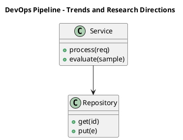

_Source diagram (plantuml); render with the appropriate tool._

**Figure 29. DevOps Pipeline - Trends and Research Directions** (plantuml). Figure: DevOps Pipeline view for GraphRAG. This diagram illustrates the principal components and their interactions as discussed in the surrounding section.

## Deep Dive: Mechanics, Variants and Trade-offs

Having established the essentials, we now go deeper into trends and research directions. Mechanically, the behaviour emerges from a few interacting parts that are simpler than the whole they produce. The distinctions in this section are the ones that separate a working demo from a system that holds up under adversarial inputs, scale and the passage of time.

Consider the principal variants and how to choose between them. Each variant optimises for a different point in the design space - some for latency, some for accuracy, some for cost or operability - and the correct choice follows from explicit requirements rather than from defaults. Every added component buys capability at the price of operational surface area, and that bargain should be made consciously.

In practice this is supported by a mature tooling ecosystem, including Microsoft GraphRAG, Neo4j, LlamaIndex, NetworkX. Tools accelerate the work but do not substitute for understanding: the same principles apply whichever implementation you select, and the ability to reason from first principles is what lets you debug when a tool behaves unexpectedly.

A frequent source of subtle bugs is the interaction with cost and indexing trade-offs. Because cost and indexing trade-offs concerns the build cost of graph extraction versus query-time value, changes there can silently alter the behaviour analysed here. The remedy is contract tests at the boundary and end-to-end evaluations that exercise the interaction explicitly.

Finally, attend to edge cases and degradation. Define what the system should do under partial failure, unexpected inputs and load spikes, and make that behaviour explicit and tested rather than emergent. Graceful degradation - returning a safe, useful result when the ideal one is unavailable - is a hallmark of mature engineering.

For deeper study, the literature offers authoritative treatments such as Edge et al. — From Local to Global: Graph RAG (Microsoft, 2024) and Traag et al. — Leiden community detection (2019). These primary sources reward careful reading and ground the practical guidance above in established results.

## Advanced Considerations

Having established the essentials, we now go deeper into trends and research directions. It pays to understand the mechanism rather than treat it as a black box, because most production incidents are explained by one of its steps misbehaving. The distinctions in this section are the ones that separate a working demo from a system that holds up under adversarial inputs, scale and the passage of time.

Consider the principal variants and how to choose between them. Each variant optimises for a different point in the design space - some for latency, some for accuracy, some for cost or operability - and the correct choice follows from explicit requirements rather than from defaults. As with most architectural decisions, the choice is rarely binary; the skill lies in quantifying the trade-offs and choosing deliberately.

In practice this is supported by a mature tooling ecosystem, including Microsoft GraphRAG, Neo4j, LlamaIndex, NetworkX. Tools accelerate the work but do not substitute for understanding: the same principles apply whichever implementation you select, and the ability to reason from first principles is what lets you debug when a tool behaves unexpectedly.

A frequent source of subtle bugs is the interaction with security and provenance. Because security and provenance concerns source attribution through graph edges, changes there can silently alter the behaviour analysed here. The remedy is contract tests at the boundary and end-to-end evaluations that exercise the interaction explicitly.

Finally, attend to edge cases and degradation. Define what the system should do under partial failure, unexpected inputs and load spikes, and make that behaviour explicit and tested rather than emergent. Graceful degradation - returning a safe, useful result when the ideal one is unavailable - is a hallmark of mature engineering.

For deeper study, the literature offers authoritative treatments such as Edge et al. — From Local to Global: Graph RAG (Microsoft, 2024) and Traag et al. — Leiden community detection (2019). These primary sources reward careful reading and ground the practical guidance above in established results.

## Worked Example

To ground the discussion, walk through a representative example. A intelligence organisation needs connecting entities across heterogeneous reports. They decide to apply trends and research directions as part of their GraphRAG solution, but wisely treat it as a hypothesis to be validated rather than a foregone conclusion.

The team begins by stating the objective precisely and defining how success will be measured before writing any code. They establish a small but representative evaluation set, agree on acceptance thresholds, and only then prototype the simplest design that could work. Early measurement reveals which assumptions hold and which must be revised, saving weeks of misdirected effort and surfacing edge cases while they are still cheap to fix.

As the prototype matures into a service, the team hardens it: adding input validation, error handling, caching where it pays off, and monitoring that ties back to the original success metric. They document each significant decision in an architecture decision record so that future maintainers understand not just what was built but why.

The outcome is instructive. The system that reaches production is not the most sophisticated design the team considered, but the one whose behaviour they could measure, explain and operate. This is the recurring lesson of GraphRAG: durable value comes from the whole system, not from any single clever component.

## Industry Use Cases

Across industries, the ideas in this chapter recur in recognisable ways. The following vignettes show how different sectors apply them and what they have in common.

**Research.** Literature synthesis across thousands of papers. The common thread is that value comes not from the model alone but from the surrounding system - data quality, evaluation, integration and operations - which is precisely where most of the engineering effort belongs.

**Intelligence.** Connecting entities across heterogeneous reports. The common thread is that value comes not from the model alone but from the surrounding system - data quality, evaluation, integration and operations - which is precisely where most of the engineering effort belongs.

**Enterprise.** Whole-corpus thematic questions over documentation. The common thread is that value comes not from the model alone but from the surrounding system - data quality, evaluation, integration and operations - which is precisely where most of the engineering effort belongs.

**Compliance.** Tracing relationships across regulatory filings. The common thread is that value comes not from the model alone but from the surrounding system - data quality, evaluation, integration and operations - which is precisely where most of the engineering effort belongs.

## Best Practices

The following practices consistently separate successful GraphRAG efforts from struggling ones. They are deliberately concrete so they can be adopted as checklist items in design and code review.

- Invest in entity resolution; graph quality dominates answer quality.
- Route global questions to community summaries, not raw chunks.
- Cache community summaries to amortise extraction cost.
- Track provenance through edges for citation.

None of these are exotic; they are the unglamorous disciplines that compound into reliability. The cost of adopting them is small compared with the cost of the incidents they prevent, and they become second nature with practice.

## Common Pitfalls

Equally instructive are the failure modes that recur in practice. Each pitfall below has a clear early warning sign and a known remedy, so treat them as a diagnostic checklist when something feels wrong:

- Skipping entity resolution and fragmenting the graph.
- Applying GraphRAG where simple RAG suffices, inflating cost.
- Stale graphs after corpus updates.
- Unbounded extraction cost on huge corpora.

The pattern is consistent: most failures stem from skipping measurement, conflating prototype and production standards, or deferring cross-cutting concerns such as security and cost until they become emergencies. Naming these traps in advance is the cheapest way to avoid them.

## Governance, Security and Cost Notes

No discussion of trends and research directions is complete without its governance, security and cost dimensions, which are too often deferred until they become emergencies. Treating them as first-class concerns from the outset is both cheaper and safer.

**Governance.** Classify the risk of this capability, document its intended and out-of-scope uses, and ensure decisions are traceable to satisfy internal policy and external regulation such as the NIST AI RMF, ISO/IEC 42001 and the EU AI Act. **Security.** Treat all external input as untrusted, validate outputs before acting on them, apply least privilege to any tools or data access, and map controls to the OWASP LLM Top 10 and MITRE ATLAS.

**Cost and sustainability.** Establish explicit budgets for compute, tokens and latency, attribute spend to owners, and revisit the economics as usage scales - a design that is affordable at pilot scale can become untenable at production volume. Building these reflexes into everyday engineering is what allows a GraphRAG system to be not only capable but also trustworthy and economically sound.

## Hands-On Exercises

Work through the following exercises. They are designed to move understanding from recognition to application - the level required for real engineering work - so prefer writing and building over merely reading.

1. Explain trends and research directions to a colleague unfamiliar with GraphRAG, using a concrete example from your own domain.
2. Sketch a reference architecture that incorporates trends and research directions and annotate where observability, security and cost controls belong.
3. Design an evaluation that would tell you whether trends and research directions is working in production, including the metric, the dataset and the acceptance threshold.
4. Identify two pitfalls relevant to trends and research directions in your environment and describe the early warning signals you would monitor.
5. Prototype the simplest implementation that demonstrates trends and research directions, then list exactly what would need to change to make it production-ready.

## Key Takeaways

Key takeaways from this chapter:

- Trends and Research Directions is a systems concern in GraphRAG: data, models and operations must be co-designed.
- Measurement is non-negotiable; define success metrics and evaluation before building.
- Favour the simplest design that meets the requirement, and add complexity only when evidence demands it.
- Security, cost and observability are first-class requirements, not afterthoughts.
- Document decisions so the system remains understandable and operable as it evolves.

## Review Questions

1. In the context of GraphRAG, which statement best describes “Trends and Research Directions”?
   - A. It guarantees deterministic output regardless of input.
   - B. It is only relevant to academic research, not production.
   - C. emerging trends, open problems and research directions shaping the future of GraphRAG
   - D. It applies exclusively to image data.
   - **Answer: C.** Trends and Research Directions: emerging trends, open problems and research directions shaping the future of GraphRAG
2. Which of the following is a recommended best practice when working with GraphRAG?
   - A. It makes the system slower but has no other effect.
   - B. It eliminates the need for any evaluation or monitoring.
   - C. Track provenance through edges for citation.
   - D. It applies exclusively to image data.
   - **Answer: C.** Best practice: Track provenance through edges for citation.
3. Which of the following is a common pitfall to avoid in GraphRAG?
   - A. It guarantees deterministic output regardless of input.
   - B. Track provenance through edges for citation.
   - C. It applies exclusively to image data.
   - D. Skipping entity resolution and fragmenting the graph.
   - **Answer: D.** Pitfall to avoid: Skipping entity resolution and fragmenting the graph.
4. *(Discussion)* Describe a failure mode of Trends and Research Directions and how you would mitigate it.
   - **Model answer:** A strong answer defines trends and research directions (emerging trends, open problems and research directions shaping the future of GraphRAG) then connects it to architecture, evaluation, cost, security and operations for GraphRAG, citing concrete trade-offs and a real-world example.

---


# Chapter 24. Capstone Project

_This chapter examines capstone project within GraphRAG. It covers a substantial capstone project that consolidates the entire book into a portfolio-grade GraphRAG deliverable, derives a reference architecture, walks through a worked example and runnable code, surveys industry use cases, and distils best practices and pitfalls, closing with exercises and review questions._

## Introduction

Capstone Project can be characterised as a substantial capstone project that consolidates the entire book into a portfolio-grade GraphRAG deliverable. Getting this right early prevents expensive rework once a GraphRAG system reaches scale. Seasoned practitioners treat this as a systems problem, co-designing data, models and operations rather than optimising any one in isolation.

This chapter builds intuition first, then formalises the ideas, derives an architecture, and finishes with code, exercises and review questions so the material transfers directly to your own GraphRAG work. Read it actively: pause at each diagram, reproduce the code, and attempt the exercises before consulting the answers.

## Theory and Foundations

Capstone Project refers to a substantial capstone project that consolidates the entire book into a portfolio-grade GraphRAG deliverable. Seasoned practitioners treat this as a systems problem, co-designing data, models and operations rather than optimising any one in isolation. It pays to understand the mechanism rather than treat it as a black box, because most production incidents are explained by one of its steps misbehaving.

To place this in context, recall the broader picture: GraphRAG augments retrieval-augmented generation with a knowledge graph constructed from a corpus, enabling multi-hop reasoning, community summarisation and global questions that flat vector retrieval cannot answer. Within that picture, capstone project is one of the load-bearing ideas - the kind that, when understood deeply, makes the rest of GraphRAG fall into place. It is foundational: later capabilities in GraphRAG are built directly on top of it.

Capstone Project cannot be understood in isolation from operating graphrag. Recall that operating graphrag concerns pipelines, storage and monitoring. The two interact directly: decisions in one constrain the design space of the other, which is why mature teams reason about them together rather than sequentially. Every added component buys capability at the price of operational surface area, and that bargain should be made consciously.

Capstone Project cannot be understood in isolation from the graphrag reference architecture. Recall that the graphrag reference architecture concerns indexing and query pipelines end to end. The two interact directly: decisions in one constrain the design space of the other, which is why mature teams reason about them together rather than sequentially. As with most architectural decisions, the choice is rarely binary; the skill lies in quantifying the trade-offs and choosing deliberately.

Several established patterns apply directly to capstone project. The first, hierarchical community summaries for scalable synthesis, is widely adopted because it makes the system's behaviour predictable and observable. A complementary pattern, entity-neighbourhood expansion for local questions, addresses a related concern and is often deployed alongside it. Patterns are not dogma; they are distilled experience that shortcuts the search for a sound design, and each carries assumptions worth checking against your context.

It is worth being explicit about when to apply this and when to reach for something simpler. In a small prototype, shortcuts around capstone project are invisible; in a production GraphRAG system serving real traffic, they surface as incidents, cost overruns or compliance gaps. There is an inherent trade-off between fidelity and cost, and the correct balance depends on the use case and its tolerance for error. The remainder of this chapter turns these principles into an architecture, code and a checklist you can apply immediately.

## Architecture and Design

The reference architecture for Capstone Project separates concerns into clearly bounded components with explicit contracts. GraphRAG indexing extracts entities and relations from chunks, resolves duplicates, builds a graph, detects communities and pre-summarises them. At query time a router selects local search (entity neighbourhoods + linked text) or global search (map-reduce over community summaries), then synthesises a cited answer.

Concretely, the principal building blocks include limits of vector-only rag, knowledge graph construction from text, entity resolution and deduplication, community detection and summarisation and local versus global search. Each is a replaceable component behind a stable interface, so the team can upgrade an implementation - a model, an index, a policy engine - without rewriting its neighbours. The contracts between components are where reliability is won or lost, so they are specified explicitly and tested in isolation.

The diagram accompanying this section makes the data and control flow explicit. Requests enter through a well-defined boundary where they are authenticated and validated; only then are they dispatched to the components that perform the work. This boundary is also where rate limiting, quota enforcement and audit logging live, keeping cross-cutting concerns out of the core logic and in one auditable place.

Two qualities deserve emphasis. First, observability is designed in, not bolted on: every component emits structured telemetry so that failures can be localised in minutes rather than hours. Second, the architecture is evolvable - components communicate through stable contracts so that any single part of the GraphRAG system can be replaced without a rewrite. Every added component buys capability at the price of operational surface area, and that bargain should be made consciously.

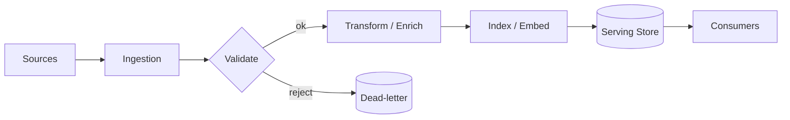

**Figure 30. Application Flow - Capstone Project** (mermaid). Figure: Application Flow view for GraphRAG. This diagram illustrates the principal components and their interactions as discussed in the surrounding section.

## Deep Dive: Mechanics, Variants and Trade-offs

Having established the essentials, we now go deeper into capstone project. Beneath the abstraction lies a concrete process whose steps can each be measured, tested and optimised independently. The distinctions in this section are the ones that separate a working demo from a system that holds up under adversarial inputs, scale and the passage of time.

Consider the principal variants and how to choose between them. Each variant optimises for a different point in the design space - some for latency, some for accuracy, some for cost or operability - and the correct choice follows from explicit requirements rather than from defaults. Latency, accuracy and cost form a tension triangle: improving one typically pressures the others, so explicit budgets are essential.

In practice this is supported by a mature tooling ecosystem, including Microsoft GraphRAG, Neo4j, LlamaIndex, NetworkX. Tools accelerate the work but do not substitute for understanding: the same principles apply whichever implementation you select, and the ability to reason from first principles is what lets you debug when a tool behaves unexpectedly.

A frequent source of subtle bugs is the interaction with operating graphrag. Because operating graphrag concerns pipelines, storage and monitoring, changes there can silently alter the behaviour analysed here. The remedy is contract tests at the boundary and end-to-end evaluations that exercise the interaction explicitly.

Finally, attend to edge cases and degradation. Define what the system should do under partial failure, unexpected inputs and load spikes, and make that behaviour explicit and tested rather than emergent. Graceful degradation - returning a safe, useful result when the ideal one is unavailable - is a hallmark of mature engineering.

For deeper study, the literature offers authoritative treatments such as Edge et al. — From Local to Global: Graph RAG (Microsoft, 2024) and Traag et al. — Leiden community detection (2019). These primary sources reward careful reading and ground the practical guidance above in established results.

## Advanced Considerations

Having established the essentials, we now go deeper into capstone project. Beneath the abstraction lies a concrete process whose steps can each be measured, tested and optimised independently. The distinctions in this section are the ones that separate a working demo from a system that holds up under adversarial inputs, scale and the passage of time.

Consider the principal variants and how to choose between them. Each variant optimises for a different point in the design space - some for latency, some for accuracy, some for cost or operability - and the correct choice follows from explicit requirements rather than from defaults. There is an inherent trade-off between fidelity and cost, and the correct balance depends on the use case and its tolerance for error.

In practice this is supported by a mature tooling ecosystem, including Microsoft GraphRAG, Neo4j, LlamaIndex, NetworkX. Tools accelerate the work but do not substitute for understanding: the same principles apply whichever implementation you select, and the ability to reason from first principles is what lets you debug when a tool behaves unexpectedly.

A frequent source of subtle bugs is the interaction with graph + vector hybrid retrieval. Because graph + vector hybrid retrieval concerns combining structural traversal with semantic similarity, changes there can silently alter the behaviour analysed here. The remedy is contract tests at the boundary and end-to-end evaluations that exercise the interaction explicitly.

Finally, attend to edge cases and degradation. Define what the system should do under partial failure, unexpected inputs and load spikes, and make that behaviour explicit and tested rather than emergent. Graceful degradation - returning a safe, useful result when the ideal one is unavailable - is a hallmark of mature engineering.

For deeper study, the literature offers authoritative treatments such as Edge et al. — From Local to Global: Graph RAG (Microsoft, 2024) and Traag et al. — Leiden community detection (2019). These primary sources reward careful reading and ground the practical guidance above in established results.

## Worked Example

To ground the discussion, walk through a representative example. A enterprise organisation needs whole-corpus thematic questions over documentation. They decide to apply capstone project as part of their GraphRAG solution, but wisely treat it as a hypothesis to be validated rather than a foregone conclusion.

The team begins by stating the objective precisely and defining how success will be measured before writing any code. They establish a small but representative evaluation set, agree on acceptance thresholds, and only then prototype the simplest design that could work. Early measurement reveals which assumptions hold and which must be revised, saving weeks of misdirected effort and surfacing edge cases while they are still cheap to fix.

As the prototype matures into a service, the team hardens it: adding input validation, error handling, caching where it pays off, and monitoring that ties back to the original success metric. They document each significant decision in an architecture decision record so that future maintainers understand not just what was built but why.

The outcome is instructive. The system that reaches production is not the most sophisticated design the team considered, but the one whose behaviour they could measure, explain and operate. This is the recurring lesson of GraphRAG: durable value comes from the whole system, not from any single clever component.

## Industry Use Cases

Across industries, the ideas in this chapter recur in recognisable ways. The following vignettes show how different sectors apply them and what they have in common.

**Research.** Literature synthesis across thousands of papers. The common thread is that value comes not from the model alone but from the surrounding system - data quality, evaluation, integration and operations - which is precisely where most of the engineering effort belongs.

**Intelligence.** Connecting entities across heterogeneous reports. The common thread is that value comes not from the model alone but from the surrounding system - data quality, evaluation, integration and operations - which is precisely where most of the engineering effort belongs.

**Enterprise.** Whole-corpus thematic questions over documentation. The common thread is that value comes not from the model alone but from the surrounding system - data quality, evaluation, integration and operations - which is precisely where most of the engineering effort belongs.

**Compliance.** Tracing relationships across regulatory filings. The common thread is that value comes not from the model alone but from the surrounding system - data quality, evaluation, integration and operations - which is precisely where most of the engineering effort belongs.

## Best Practices

The following practices consistently separate successful GraphRAG efforts from struggling ones. They are deliberately concrete so they can be adopted as checklist items in design and code review.

- Invest in entity resolution; graph quality dominates answer quality.
- Route global questions to community summaries, not raw chunks.
- Cache community summaries to amortise extraction cost.
- Track provenance through edges for citation.

None of these are exotic; they are the unglamorous disciplines that compound into reliability. The cost of adopting them is small compared with the cost of the incidents they prevent, and they become second nature with practice.

## Common Pitfalls

Equally instructive are the failure modes that recur in practice. Each pitfall below has a clear early warning sign and a known remedy, so treat them as a diagnostic checklist when something feels wrong:

- Skipping entity resolution and fragmenting the graph.
- Applying GraphRAG where simple RAG suffices, inflating cost.
- Stale graphs after corpus updates.
- Unbounded extraction cost on huge corpora.

The pattern is consistent: most failures stem from skipping measurement, conflating prototype and production standards, or deferring cross-cutting concerns such as security and cost until they become emergencies. Naming these traps in advance is the cheapest way to avoid them.

## Governance, Security and Cost Notes

No discussion of capstone project is complete without its governance, security and cost dimensions, which are too often deferred until they become emergencies. Treating them as first-class concerns from the outset is both cheaper and safer.

**Governance.** Classify the risk of this capability, document its intended and out-of-scope uses, and ensure decisions are traceable to satisfy internal policy and external regulation such as the NIST AI RMF, ISO/IEC 42001 and the EU AI Act. **Security.** Treat all external input as untrusted, validate outputs before acting on them, apply least privilege to any tools or data access, and map controls to the OWASP LLM Top 10 and MITRE ATLAS.

**Cost and sustainability.** Establish explicit budgets for compute, tokens and latency, attribute spend to owners, and revisit the economics as usage scales - a design that is affordable at pilot scale can become untenable at production volume. Building these reflexes into everyday engineering is what allows a GraphRAG system to be not only capable but also trustworthy and economically sound.

## Hands-On Exercises

Work through the following exercises. They are designed to move understanding from recognition to application - the level required for real engineering work - so prefer writing and building over merely reading.

1. Explain capstone project to a colleague unfamiliar with GraphRAG, using a concrete example from your own domain.
2. Sketch a reference architecture that incorporates capstone project and annotate where observability, security and cost controls belong.
3. Design an evaluation that would tell you whether capstone project is working in production, including the metric, the dataset and the acceptance threshold.
4. Identify two pitfalls relevant to capstone project in your environment and describe the early warning signals you would monitor.
5. Prototype the simplest implementation that demonstrates capstone project, then list exactly what would need to change to make it production-ready.

## Key Takeaways

Key takeaways from this chapter:

- Capstone Project is a systems concern in GraphRAG: data, models and operations must be co-designed.
- Measurement is non-negotiable; define success metrics and evaluation before building.
- Favour the simplest design that meets the requirement, and add complexity only when evidence demands it.
- Security, cost and observability are first-class requirements, not afterthoughts.
- Document decisions so the system remains understandable and operable as it evolves.

## Code Walkthrough

This listing shows a configuration-driven Capstone Project component with retry semantics and typed interfaces — the shape we expect from production GraphRAG code rather than a notebook prototype.

The full listing is shown below; study it line by line and reproduce it locally before moving on.

### Listing: Implementing a Capstone Project component

```python
from __future__ import annotations

from dataclasses import dataclass, field
from typing import Any


@dataclass(slots=True)
class CapstoneProjectConfig:
    """Configuration for the Capstone Project component in a GraphRAG system."""

    name: str
    timeout_s: float = 30.0
    max_retries: int = 3
    options: dict[str, Any] = field(default_factory=dict)


class CapstoneProject:
    """A minimal, production-shaped implementation of Capstone Project."""

    def __init__(self, config: CapstoneProjectConfig) -> None:
        self._config = config
        self._calls = 0

    def run(self, payload: dict[str, Any]) -> dict[str, Any]:
        """Process a request, retrying transient failures with backoff."""
        last_error: Exception | None = None
        for attempt in range(self._config.max_retries):
            try:
                self._calls += 1
                return self._process(payload)
            except TimeoutError as exc:  # transient
                last_error = exc
                continue
        raise RuntimeError(f"CapstoneProject failed after retries") from last_error

    def _process(self, payload: dict[str, Any]) -> dict[str, Any]:
        # Domain-specific logic for Capstone Project goes here.
        return {"status": "ok", "input_keys": sorted(payload), "calls": self._calls}

```

## Review Questions

1. In the context of GraphRAG, which statement best describes “Capstone Project”?
   - A. It applies exclusively to image data.
   - B. It guarantees deterministic output regardless of input.
   - C. It is only relevant to academic research, not production.
   - D. a substantial capstone project that consolidates the entire book into a portfolio-grade GraphRAG deliverable
   - **Answer: D.** Capstone Project: a substantial capstone project that consolidates the entire book into a portfolio-grade GraphRAG deliverable
2. Which of the following is a recommended best practice when working with GraphRAG?
   - A. It removes all security and governance requirements.
   - B. Skipping entity resolution and fragmenting the graph.
   - C. Cache community summaries to amortise extraction cost.
   - D. It guarantees deterministic output regardless of input.
   - **Answer: C.** Best practice: Cache community summaries to amortise extraction cost.
3. Which of the following is a common pitfall to avoid in GraphRAG?
   - A. It removes all security and governance requirements.
   - B. It makes the system slower but has no other effect.
   - C. Applying GraphRAG where simple RAG suffices, inflating cost.
   - D. Route global questions to community summaries, not raw chunks.
   - **Answer: C.** Pitfall to avoid: Applying GraphRAG where simple RAG suffices, inflating cost.
4. *(Discussion)* Explain Capstone Project and why it matters in a production GraphRAG system.
   - **Model answer:** A strong answer defines capstone project (a substantial capstone project that consolidates the entire book into a portfolio-grade GraphRAG deliverable) then connects it to architecture, evaluation, cost, security and operations for GraphRAG, citing concrete trade-offs and a real-world example.

---


# Chapter 25. Certification Preparation and Review

_This chapter examines certification preparation and review within GraphRAG. It covers a structured review and certification-style preparation covering the full breadth of GraphRAG, derives a reference architecture, walks through a worked example and runnable code, surveys industry use cases, and distils best practices and pitfalls, closing with exercises and review questions._

## Introduction

In practical terms, Certification Preparation and Review is best understood as a structured review and certification-style preparation covering the full breadth of GraphRAG. Getting this right early prevents expensive rework once a GraphRAG system reaches scale. The right abstraction here pays compounding dividends, because downstream components depend on its guarantees.

This chapter builds intuition first, then formalises the ideas, derives an architecture, and finishes with code, exercises and review questions so the material transfers directly to your own GraphRAG work. Read it actively: pause at each diagram, reproduce the code, and attempt the exercises before consulting the answers.

## Theory and Foundations

Certification Preparation and Review can be characterised as a structured review and certification-style preparation covering the full breadth of GraphRAG. Seasoned practitioners treat this as a systems problem, co-designing data, models and operations rather than optimising any one in isolation. Mechanically, the behaviour emerges from a few interacting parts that are simpler than the whole they produce.

To place this in context, recall the broader picture: GraphRAG augments retrieval-augmented generation with a knowledge graph constructed from a corpus, enabling multi-hop reasoning, community summarisation and global questions that flat vector retrieval cannot answer. Within that picture, certification preparation and review is one of the load-bearing ideas - the kind that, when understood deeply, makes the rest of GraphRAG fall into place. Neglecting it is one of the most common reasons GraphRAG initiatives stall in production.

Certification Preparation and Review cannot be understood in isolation from multi-hop reasoning over graphs. Recall that multi-hop reasoning over graphs concerns traversing relationships to answer connected questions. The two interact directly: decisions in one constrain the design space of the other, which is why mature teams reason about them together rather than sequentially. There is an inherent trade-off between fidelity and cost, and the correct balance depends on the use case and its tolerance for error.

Certification Preparation and Review cannot be understood in isolation from graph + vector hybrid retrieval. Recall that graph + vector hybrid retrieval concerns combining structural traversal with semantic similarity. The two interact directly: decisions in one constrain the design space of the other, which is why mature teams reason about them together rather than sequentially. As with most architectural decisions, the choice is rarely binary; the skill lies in quantifying the trade-offs and choosing deliberately.

Several established patterns apply directly to certification preparation and review. The first, entity-neighbourhood expansion for local questions, is widely adopted because it makes the system's behaviour predictable and observable. A complementary pattern, hybrid graph traversal + vector similarity, addresses a related concern and is often deployed alongside it. Patterns are not dogma; they are distilled experience that shortcuts the search for a sound design, and each carries assumptions worth checking against your context.

The decision of whether to adopt this should be driven by requirements, not by novelty. In a small prototype, shortcuts around certification preparation and review are invisible; in a production GraphRAG system serving real traffic, they surface as incidents, cost overruns or compliance gaps. As with most architectural decisions, the choice is rarely binary; the skill lies in quantifying the trade-offs and choosing deliberately. The remainder of this chapter turns these principles into an architecture, code and a checklist you can apply immediately.

## Architecture and Design

A robust architecture for Certification Preparation and Review is layered so each part can evolve independently without destabilising the whole. GraphRAG indexing extracts entities and relations from chunks, resolves duplicates, builds a graph, detects communities and pre-summarises them. At query time a router selects local search (entity neighbourhoods + linked text) or global search (map-reduce over community summaries), then synthesises a cited answer.

Concretely, the principal building blocks include limits of vector-only rag, knowledge graph construction from text, entity resolution and deduplication, community detection and summarisation and local versus global search. Each is a replaceable component behind a stable interface, so the team can upgrade an implementation - a model, an index, a policy engine - without rewriting its neighbours. The contracts between components are where reliability is won or lost, so they are specified explicitly and tested in isolation.

The diagram accompanying this section makes the data and control flow explicit. Requests enter through a well-defined boundary where they are authenticated and validated; only then are they dispatched to the components that perform the work. This boundary is also where rate limiting, quota enforcement and audit logging live, keeping cross-cutting concerns out of the core logic and in one auditable place.

Two qualities deserve emphasis. First, observability is designed in, not bolted on: every component emits structured telemetry so that failures can be localised in minutes rather than hours. Second, the architecture is evolvable - components communicate through stable contracts so that any single part of the GraphRAG system can be replaced without a rewrite. As with most architectural decisions, the choice is rarely binary; the skill lies in quantifying the trade-offs and choosing deliberately.

<div class="diagram-svg">

<svg xmlns="http://www.w3.org/2000/svg" width="760" height="360" viewBox="0 0 760 360" font-family="Inter, Arial, sans-serif">
<rect width="760" height="360" fill="#f8fafc"/>
<text x="380" y="34" text-anchor="middle" font-size="20" font-weight="700" fill="#0f172a">Knowledge Graph - Certification Preparation and Review</text>
<rect x="290" y="162" width="180" height="56" rx="12" fill="#0f172a"/>
<text x="380" y="195" text-anchor="middle" font-size="14" font-weight="700" fill="#ffffff">GraphRAG</text>
<line x1="380" y1="190" x2="380" y2="70" stroke="#94a3b8" stroke-width="2"/>
<rect x="308" y="48" width="144" height="44" rx="10" fill="#ffffff" stroke="#2563eb" stroke-width="2"/>
<text x="380" y="74" text-anchor="middle" font-size="11" fill="#0f172a">Limits of Vector-On…</text>
<line x1="380" y1="190" x2="617" y2="153" stroke="#94a3b8" stroke-width="2"/>
<rect x="545" y="131" width="144" height="44" rx="10" fill="#ffffff" stroke="#7c3aed" stroke-width="2"/>
<text x="617" y="157" text-anchor="middle" font-size="11" fill="#0f172a">Knowledge Graph Con…</text>
<line x1="380" y1="190" x2="526" y2="287" stroke="#94a3b8" stroke-width="2"/>
<rect x="454" y="265" width="144" height="44" rx="10" fill="#ffffff" stroke="#0891b2" stroke-width="2"/>
<text x="526" y="291" text-anchor="middle" font-size="11" fill="#0f172a">Entity Resolution a…</text>
<line x1="380" y1="190" x2="234" y2="287" stroke="#94a3b8" stroke-width="2"/>
<rect x="162" y="265" width="144" height="44" rx="10" fill="#ffffff" stroke="#059669" stroke-width="2"/>
<text x="234" y="291" text-anchor="middle" font-size="11" fill="#0f172a">Community Detection…</text>
<line x1="380" y1="190" x2="143" y2="153" stroke="#94a3b8" stroke-width="2"/>
<rect x="71" y="131" width="144" height="44" rx="10" fill="#ffffff" stroke="#d97706" stroke-width="2"/>
<text x="143" y="157" text-anchor="middle" font-size="11" fill="#0f172a">Local versus Global…</text>
</svg>

</div>

**Figure 31. Knowledge Graph - Certification Preparation and Review** (svg). Figure: Knowledge Graph view for GraphRAG. This diagram illustrates the principal components and their interactions as discussed in the surrounding section.

## Deep Dive: Mechanics, Variants and Trade-offs

Having established the essentials, we now go deeper into certification preparation and review. Mechanically, the behaviour emerges from a few interacting parts that are simpler than the whole they produce. The distinctions in this section are the ones that separate a working demo from a system that holds up under adversarial inputs, scale and the passage of time.

Consider the principal variants and how to choose between them. Each variant optimises for a different point in the design space - some for latency, some for accuracy, some for cost or operability - and the correct choice follows from explicit requirements rather than from defaults. Latency, accuracy and cost form a tension triangle: improving one typically pressures the others, so explicit budgets are essential.

In practice this is supported by a mature tooling ecosystem, including Microsoft GraphRAG, Neo4j, LlamaIndex, NetworkX. Tools accelerate the work but do not substitute for understanding: the same principles apply whichever implementation you select, and the ability to reason from first principles is what lets you debug when a tool behaves unexpectedly.

A frequent source of subtle bugs is the interaction with multi-hop reasoning over graphs. Because multi-hop reasoning over graphs concerns traversing relationships to answer connected questions, changes there can silently alter the behaviour analysed here. The remedy is contract tests at the boundary and end-to-end evaluations that exercise the interaction explicitly.

Finally, attend to edge cases and degradation. Define what the system should do under partial failure, unexpected inputs and load spikes, and make that behaviour explicit and tested rather than emergent. Graceful degradation - returning a safe, useful result when the ideal one is unavailable - is a hallmark of mature engineering.

For deeper study, the literature offers authoritative treatments such as Edge et al. — From Local to Global: Graph RAG (Microsoft, 2024) and Traag et al. — Leiden community detection (2019). These primary sources reward careful reading and ground the practical guidance above in established results.

## Advanced Considerations

Having established the essentials, we now go deeper into certification preparation and review. It pays to understand the mechanism rather than treat it as a black box, because most production incidents are explained by one of its steps misbehaving. The distinctions in this section are the ones that separate a working demo from a system that holds up under adversarial inputs, scale and the passage of time.

Consider the principal variants and how to choose between them. Each variant optimises for a different point in the design space - some for latency, some for accuracy, some for cost or operability - and the correct choice follows from explicit requirements rather than from defaults. Every added component buys capability at the price of operational surface area, and that bargain should be made consciously.

In practice this is supported by a mature tooling ecosystem, including Microsoft GraphRAG, Neo4j, LlamaIndex, NetworkX. Tools accelerate the work but do not substitute for understanding: the same principles apply whichever implementation you select, and the ability to reason from first principles is what lets you debug when a tool behaves unexpectedly.

A frequent source of subtle bugs is the interaction with query routing in graphrag. Because query routing in graphrag concerns choosing local, global or hybrid strategies per question, changes there can silently alter the behaviour analysed here. The remedy is contract tests at the boundary and end-to-end evaluations that exercise the interaction explicitly.

Finally, attend to edge cases and degradation. Define what the system should do under partial failure, unexpected inputs and load spikes, and make that behaviour explicit and tested rather than emergent. Graceful degradation - returning a safe, useful result when the ideal one is unavailable - is a hallmark of mature engineering.

For deeper study, the literature offers authoritative treatments such as Edge et al. — From Local to Global: Graph RAG (Microsoft, 2024) and Traag et al. — Leiden community detection (2019). These primary sources reward careful reading and ground the practical guidance above in established results.

## Worked Example

A worked example clarifies how these ideas behave in practice. A research organisation needs literature synthesis across thousands of papers. They decide to apply certification preparation and review as part of their GraphRAG solution, but wisely treat it as a hypothesis to be validated rather than a foregone conclusion.

The team begins by stating the objective precisely and defining how success will be measured before writing any code. They establish a small but representative evaluation set, agree on acceptance thresholds, and only then prototype the simplest design that could work. Early measurement reveals which assumptions hold and which must be revised, saving weeks of misdirected effort and surfacing edge cases while they are still cheap to fix.

As the prototype matures into a service, the team hardens it: adding input validation, error handling, caching where it pays off, and monitoring that ties back to the original success metric. They document each significant decision in an architecture decision record so that future maintainers understand not just what was built but why.

The outcome is instructive. The system that reaches production is not the most sophisticated design the team considered, but the one whose behaviour they could measure, explain and operate. This is the recurring lesson of GraphRAG: durable value comes from the whole system, not from any single clever component.

## Industry Use Cases

Across industries, the ideas in this chapter recur in recognisable ways. The following vignettes show how different sectors apply them and what they have in common.

**Research.** Literature synthesis across thousands of papers. The common thread is that value comes not from the model alone but from the surrounding system - data quality, evaluation, integration and operations - which is precisely where most of the engineering effort belongs.

**Intelligence.** Connecting entities across heterogeneous reports. The common thread is that value comes not from the model alone but from the surrounding system - data quality, evaluation, integration and operations - which is precisely where most of the engineering effort belongs.

**Enterprise.** Whole-corpus thematic questions over documentation. The common thread is that value comes not from the model alone but from the surrounding system - data quality, evaluation, integration and operations - which is precisely where most of the engineering effort belongs.

**Compliance.** Tracing relationships across regulatory filings. The common thread is that value comes not from the model alone but from the surrounding system - data quality, evaluation, integration and operations - which is precisely where most of the engineering effort belongs.

## Best Practices

The following practices consistently separate successful GraphRAG efforts from struggling ones. They are deliberately concrete so they can be adopted as checklist items in design and code review.

- Invest in entity resolution; graph quality dominates answer quality.
- Route global questions to community summaries, not raw chunks.
- Cache community summaries to amortise extraction cost.
- Track provenance through edges for citation.

None of these are exotic; they are the unglamorous disciplines that compound into reliability. The cost of adopting them is small compared with the cost of the incidents they prevent, and they become second nature with practice.

## Common Pitfalls

Equally instructive are the failure modes that recur in practice. Each pitfall below has a clear early warning sign and a known remedy, so treat them as a diagnostic checklist when something feels wrong:

- Skipping entity resolution and fragmenting the graph.
- Applying GraphRAG where simple RAG suffices, inflating cost.
- Stale graphs after corpus updates.
- Unbounded extraction cost on huge corpora.

The pattern is consistent: most failures stem from skipping measurement, conflating prototype and production standards, or deferring cross-cutting concerns such as security and cost until they become emergencies. Naming these traps in advance is the cheapest way to avoid them.

## Governance, Security and Cost Notes

No discussion of certification preparation and review is complete without its governance, security and cost dimensions, which are too often deferred until they become emergencies. Treating them as first-class concerns from the outset is both cheaper and safer.

**Governance.** Classify the risk of this capability, document its intended and out-of-scope uses, and ensure decisions are traceable to satisfy internal policy and external regulation such as the NIST AI RMF, ISO/IEC 42001 and the EU AI Act. **Security.** Treat all external input as untrusted, validate outputs before acting on them, apply least privilege to any tools or data access, and map controls to the OWASP LLM Top 10 and MITRE ATLAS.

**Cost and sustainability.** Establish explicit budgets for compute, tokens and latency, attribute spend to owners, and revisit the economics as usage scales - a design that is affordable at pilot scale can become untenable at production volume. Building these reflexes into everyday engineering is what allows a GraphRAG system to be not only capable but also trustworthy and economically sound.

## Hands-On Exercises

Work through the following exercises. They are designed to move understanding from recognition to application - the level required for real engineering work - so prefer writing and building over merely reading.

1. Explain certification preparation and review to a colleague unfamiliar with GraphRAG, using a concrete example from your own domain.
2. Sketch a reference architecture that incorporates certification preparation and review and annotate where observability, security and cost controls belong.
3. Design an evaluation that would tell you whether certification preparation and review is working in production, including the metric, the dataset and the acceptance threshold.
4. Identify two pitfalls relevant to certification preparation and review in your environment and describe the early warning signals you would monitor.
5. Prototype the simplest implementation that demonstrates certification preparation and review, then list exactly what would need to change to make it production-ready.

## Key Takeaways

Key takeaways from this chapter:

- Certification Preparation and Review is a systems concern in GraphRAG: data, models and operations must be co-designed.
- Measurement is non-negotiable; define success metrics and evaluation before building.
- Favour the simplest design that meets the requirement, and add complexity only when evidence demands it.
- Security, cost and observability are first-class requirements, not afterthoughts.
- Document decisions so the system remains understandable and operable as it evolves.

## Code Walkthrough

Every change to a GraphRAG system should pass an evaluation gate. This example shows the minimal shape: align predictions and references, compute a metric, and return a pass/fail decision for CI.

The full listing is shown below; study it line by line and reproduce it locally before moving on.

### Listing: Evaluating Certification Preparation and Review with a regression gate

```python
from dataclasses import dataclass


@dataclass
class EvalResult:
    metric: str
    score: float
    passed: bool


def evaluate(predictions: list[str], references: list[str],
             threshold: float = 0.8) -> EvalResult:
    """Score Certification Preparation and Review output against references with a simple exact-match metric.

    In practice you would combine several metrics (exact match, semantic
    similarity, LLM-as-judge) and gate releases on the aggregate.
    """
    if len(predictions) != len(references):
        raise ValueError("predictions and references must align")
    hits = sum(p.strip() == r.strip() for p, r in zip(predictions, references))
    score = hits / len(references) if references else 0.0
    return EvalResult(metric="exact_match", score=score, passed=score >= threshold)


if __name__ == "__main__":
    result = evaluate(["yes", "no"], ["yes", "yes"])
    print(f"{result.metric}={result.score:.2f} passed={result.passed}")

```

## Review Questions

1. In the context of GraphRAG, which statement best describes “Certification Preparation and Review”?
   - A. It is only relevant to academic research, not production.
   - B. It eliminates the need for any evaluation or monitoring.
   - C. a structured review and certification-style preparation covering the full breadth of GraphRAG
   - D. It guarantees deterministic output regardless of input.
   - **Answer: C.** Certification Preparation and Review: a structured review and certification-style preparation covering the full breadth of GraphRAG
2. Which of the following is a recommended best practice when working with GraphRAG?
   - A. Invest in entity resolution; graph quality dominates answer quality.
   - B. Stale graphs after corpus updates.
   - C. It applies exclusively to image data.
   - D. Applying GraphRAG where simple RAG suffices, inflating cost.
   - **Answer: A.** Best practice: Invest in entity resolution; graph quality dominates answer quality.
3. Which of the following is a common pitfall to avoid in GraphRAG?
   - A. It guarantees deterministic output regardless of input.
   - B. It is only relevant to academic research, not production.
   - C. Unbounded extraction cost on huge corpora.
   - D. It removes all security and governance requirements.
   - **Answer: C.** Pitfall to avoid: Unbounded extraction cost on huge corpora.
4. *(Discussion)* What trade-offs would you weigh when implementing Certification Preparation and Review?
   - **Model answer:** A strong answer defines certification preparation and review (a structured review and certification-style preparation covering the full breadth of GraphRAG) then connects it to architecture, evaluation, cost, security and operations for GraphRAG, citing concrete trade-offs and a real-world example.

---


# Hands-On Labs

## Lab 1: End-to-End GraphRAG Build

**Objective.** Build a working slice of a GraphRAG system that demonstrates the core concepts end to end. **Steps.** (1) Define the objective and success metric. (2) Assemble a minimal dataset or fixtures. (3) Implement the core component using the patterns from the chapters. (4) Add an evaluation gate. (5) Instrument observability. (6) Document the design decisions in an architecture decision record. **Deliverable.** A reproducible repository with code, an evaluation report and a short design document suitable for a portfolio.

## Lab 2: End-to-End GraphRAG Build

**Objective.** Build a working slice of a GraphRAG system that demonstrates the core concepts end to end. **Steps.** (1) Define the objective and success metric. (2) Assemble a minimal dataset or fixtures. (3) Implement the core component using the patterns from the chapters. (4) Add an evaluation gate. (5) Instrument observability. (6) Document the design decisions in an architecture decision record. **Deliverable.** A reproducible repository with code, an evaluation report and a short design document suitable for a portfolio.


# Case Studies

## Research: GraphRAG in Practice

**Context.** A research organisation set out to apply GraphRAG to literature synthesis across thousands of papers. **Approach.** The team began with a precise objective and an evaluation set, prototyped the simplest viable design, then hardened it with monitoring, security controls and cost budgets. **Outcome.** Measured against the original metric, the system delivered durable value because the surrounding engineering - data quality, evaluation and operations - was treated as seriously as the model itself. **Lessons.** Start with measurement, resist premature complexity, and design governance and observability in from day one.

## Intelligence: GraphRAG in Practice

**Context.** A intelligence organisation set out to apply GraphRAG to connecting entities across heterogeneous reports. **Approach.** The team began with a precise objective and an evaluation set, prototyped the simplest viable design, then hardened it with monitoring, security controls and cost budgets. **Outcome.** Measured against the original metric, the system delivered durable value because the surrounding engineering - data quality, evaluation and operations - was treated as seriously as the model itself. **Lessons.** Start with measurement, resist premature complexity, and design governance and observability in from day one.

## Enterprise: GraphRAG in Practice

**Context.** A enterprise organisation set out to apply GraphRAG to whole-corpus thematic questions over documentation. **Approach.** The team began with a precise objective and an evaluation set, prototyped the simplest viable design, then hardened it with monitoring, security controls and cost budgets. **Outcome.** Measured against the original metric, the system delivered durable value because the surrounding engineering - data quality, evaluation and operations - was treated as seriously as the model itself. **Lessons.** Start with measurement, resist premature complexity, and design governance and observability in from day one.


# Interview Questions

A consolidated bank of discussion-style interview questions drawn from across the book, suitable for preparation and technical screening.

1. Explain Limits of Vector-Only RAG and why it matters in a production GraphRAG system.
   - **Guidance:** A strong answer defines limits of vector-only rag (Why local similarity fails on global, multi-hop and aggregative questions.) then connects it to architecture, evaluation, cost, security and operations for GraphRAG, citing concrete trade-offs and a real-world example.
2. Explain Knowledge Graph Construction from Text and why it matters in a production GraphRAG system.
   - **Guidance:** A strong answer defines knowledge graph construction from text (LLM-driven entity and relationship extraction and schema design.) then connects it to architecture, evaluation, cost, security and operations for GraphRAG, citing concrete trade-offs and a real-world example.
3. Walk through how you would design Entity Resolution and Deduplication for an enterprise GraphRAG workload.
   - **Guidance:** A strong answer defines entity resolution and deduplication (Merging coreferent entities into a clean graph.) then connects it to architecture, evaluation, cost, security and operations for GraphRAG, citing concrete trade-offs and a real-world example.
4. How would you test and monitor Community Detection and Summarisation in production?
   - **Guidance:** A strong answer defines community detection and summarisation (Hierarchical clustering (e.g. Leiden) and map-reduce summaries.) then connects it to architecture, evaluation, cost, security and operations for GraphRAG, citing concrete trade-offs and a real-world example.
5. Describe a failure mode of Local versus Global Search and how you would mitigate it.
   - **Guidance:** A strong answer defines local versus global search (Entity-centric retrieval versus community-level synthesis.) then connects it to architecture, evaluation, cost, security and operations for GraphRAG, citing concrete trade-offs and a real-world example.
6. What trade-offs would you weigh when implementing Graph + Vector Hybrid Retrieval?
   - **Guidance:** A strong answer defines graph + vector hybrid retrieval (Combining structural traversal with semantic similarity.) then connects it to architecture, evaluation, cost, security and operations for GraphRAG, citing concrete trade-offs and a real-world example.
7. Describe a failure mode of Query Routing in GraphRAG and how you would mitigate it.
   - **Guidance:** A strong answer defines query routing in graphrag (Choosing local, global or hybrid strategies per question.) then connects it to architecture, evaluation, cost, security and operations for GraphRAG, citing concrete trade-offs and a real-world example.
8. What trade-offs would you weigh when implementing Multi-Hop Reasoning over Graphs?
   - **Guidance:** A strong answer defines multi-hop reasoning over graphs (Traversing relationships to answer connected questions.) then connects it to architecture, evaluation, cost, security and operations for GraphRAG, citing concrete trade-offs and a real-world example.
9. How would you test and monitor Evaluation of GraphRAG in production?
   - **Guidance:** A strong answer defines evaluation of graphrag (Comprehensiveness, diversity and groundedness metrics.) then connects it to architecture, evaluation, cost, security and operations for GraphRAG, citing concrete trade-offs and a real-world example.
10. What trade-offs would you weigh when implementing Cost and Indexing Trade-offs?
   - **Guidance:** A strong answer defines cost and indexing trade-offs (The build cost of graph extraction versus query-time value.) then connects it to architecture, evaluation, cost, security and operations for GraphRAG, citing concrete trade-offs and a real-world example.
11. Describe a failure mode of Incremental Graph Updates and how you would mitigate it.
   - **Guidance:** A strong answer defines incremental graph updates (Keeping the graph fresh as the corpus changes.) then connects it to architecture, evaluation, cost, security and operations for GraphRAG, citing concrete trade-offs and a real-world example.
12. How does Operating GraphRAG interact with security and governance requirements?
   - **Guidance:** A strong answer defines operating graphrag (Pipelines, storage and monitoring.) then connects it to architecture, evaluation, cost, security and operations for GraphRAG, citing concrete trade-offs and a real-world example.
13. Walk through how you would design Security and Provenance for an enterprise GraphRAG workload.
   - **Guidance:** A strong answer defines security and provenance (Source attribution through graph edges.) then connects it to architecture, evaluation, cost, security and operations for GraphRAG, citing concrete trade-offs and a real-world example.
14. Explain The GraphRAG Reference Architecture and why it matters in a production GraphRAG system.
   - **Guidance:** A strong answer defines the graphrag reference architecture (Indexing and query pipelines end to end.) then connects it to architecture, evaluation, cost, security and operations for GraphRAG, citing concrete trade-offs and a real-world example.
15. Explain Putting It Together: A Reference Implementation and why it matters in a production GraphRAG system.
   - **Guidance:** A strong answer defines putting it together: a reference implementation (an end-to-end reference implementation that integrates the components of a GraphRAG system into a cohesive, working whole) then connects it to architecture, evaluation, cost, security and operations for GraphRAG, citing concrete trade-offs and a real-world example.
16. How would you test and monitor Hands-On Lab: Building an End-to-End GraphRAG System in production?
   - **Guidance:** A strong answer defines hands-on lab: building an end-to-end graphrag system (a guided, build-along laboratory that constructs a functioning GraphRAG system from first principles) then connects it to architecture, evaluation, cost, security and operations for GraphRAG, citing concrete trade-offs and a real-world example.
17. What trade-offs would you weigh when implementing Case Study: Research at Scale?
   - **Guidance:** A strong answer defines case study: research at scale (a detailed case study of deploying GraphRAG in a demanding research environment, including the decisions, trade-offs and outcomes) then connects it to architecture, evaluation, cost, security and operations for GraphRAG, citing concrete trade-offs and a real-world example.
18. Walk through how you would design Operating in Production for an enterprise GraphRAG workload.
   - **Guidance:** A strong answer defines operating in production (the operational discipline required to run a GraphRAG system reliably, including monitoring, incident response and continuous improvement) then connects it to architecture, evaluation, cost, security and operations for GraphRAG, citing concrete trade-offs and a real-world example.
19. Describe a failure mode of Evaluation and Quality Assurance and how you would mitigate it.
   - **Guidance:** A strong answer defines evaluation and quality assurance (a rigorous approach to measuring and assuring the quality of a GraphRAG system before and after release) then connects it to architecture, evaluation, cost, security and operations for GraphRAG, citing concrete trade-offs and a real-world example.
20. Walk through how you would design Security, Privacy and Governance for an enterprise GraphRAG workload.
   - **Guidance:** A strong answer defines security, privacy and governance (the security, privacy and governance controls that make a GraphRAG system trustworthy and compliant) then connects it to architecture, evaluation, cost, security and operations for GraphRAG, citing concrete trade-offs and a real-world example.
21. How does Cost, Performance and Scaling interact with security and governance requirements?
   - **Guidance:** A strong answer defines cost, performance and scaling (techniques for controlling cost and latency while scaling a GraphRAG system to production traffic) then connects it to architecture, evaluation, cost, security and operations for GraphRAG, citing concrete trade-offs and a real-world example.
22. What trade-offs would you weigh when implementing Integration and Interoperability?
   - **Guidance:** A strong answer defines integration and interoperability (patterns for integrating a GraphRAG system with surrounding enterprise systems and data) then connects it to architecture, evaluation, cost, security and operations for GraphRAG, citing concrete trade-offs and a real-world example.
23. Describe a failure mode of Trends and Research Directions and how you would mitigate it.
   - **Guidance:** A strong answer defines trends and research directions (emerging trends, open problems and research directions shaping the future of GraphRAG) then connects it to architecture, evaluation, cost, security and operations for GraphRAG, citing concrete trade-offs and a real-world example.
24. Explain Capstone Project and why it matters in a production GraphRAG system.
   - **Guidance:** A strong answer defines capstone project (a substantial capstone project that consolidates the entire book into a portfolio-grade GraphRAG deliverable) then connects it to architecture, evaluation, cost, security and operations for GraphRAG, citing concrete trade-offs and a real-world example.
25. What trade-offs would you weigh when implementing Certification Preparation and Review?
   - **Guidance:** A strong answer defines certification preparation and review (a structured review and certification-style preparation covering the full breadth of GraphRAG) then connects it to architecture, evaluation, cost, security and operations for GraphRAG, citing concrete trade-offs and a real-world example.

# Certification Questions

Certification-style multiple-choice questions covering best practices and common pitfalls.

1. Which of the following is a recommended best practice when working with GraphRAG?
   - A. It is only relevant to academic research, not production.
   - B. Invest in entity resolution; graph quality dominates answer quality.
   - C. Applying GraphRAG where simple RAG suffices, inflating cost.
   - D. It applies exclusively to image data.
   - **Answer: B.** Best practice: Invest in entity resolution; graph quality dominates answer quality.
2. Which of the following is a common pitfall to avoid in GraphRAG?
   - A. It applies exclusively to image data.
   - B. It makes the system slower but has no other effect.
   - C. Stale graphs after corpus updates.
   - D. Invest in entity resolution; graph quality dominates answer quality.
   - **Answer: C.** Pitfall to avoid: Stale graphs after corpus updates.
3. Which of the following is a recommended best practice when working with GraphRAG?
   - A. Skipping entity resolution and fragmenting the graph.
   - B. Track provenance through edges for citation.
   - C. It is only relevant to academic research, not production.
   - D. It eliminates the need for any evaluation or monitoring.
   - **Answer: B.** Best practice: Track provenance through edges for citation.
4. Which of the following is a common pitfall to avoid in GraphRAG?
   - A. Unbounded extraction cost on huge corpora.
   - B. It is only relevant to academic research, not production.
   - C. Cache community summaries to amortise extraction cost.
   - D. Invest in entity resolution; graph quality dominates answer quality.
   - **Answer: A.** Pitfall to avoid: Unbounded extraction cost on huge corpora.
5. Which of the following is a recommended best practice when working with GraphRAG?
   - A. Invest in entity resolution; graph quality dominates answer quality.
   - B. It is only relevant to academic research, not production.
   - C. It guarantees deterministic output regardless of input.
   - D. Stale graphs after corpus updates.
   - **Answer: A.** Best practice: Invest in entity resolution; graph quality dominates answer quality.
6. Which of the following is a common pitfall to avoid in GraphRAG?
   - A. Invest in entity resolution; graph quality dominates answer quality.
   - B. Unbounded extraction cost on huge corpora.
   - C. It applies exclusively to image data.
   - D. It removes all security and governance requirements.
   - **Answer: B.** Pitfall to avoid: Unbounded extraction cost on huge corpora.
7. Which of the following is a recommended best practice when working with GraphRAG?
   - A. Track provenance through edges for citation.
   - B. It eliminates the need for any evaluation or monitoring.
   - C. It removes all security and governance requirements.
   - D. Stale graphs after corpus updates.
   - **Answer: A.** Best practice: Track provenance through edges for citation.
8. Which of the following is a common pitfall to avoid in GraphRAG?
   - A. Stale graphs after corpus updates.
   - B. Invest in entity resolution; graph quality dominates answer quality.
   - C. It applies exclusively to image data.
   - D. Route global questions to community summaries, not raw chunks.
   - **Answer: A.** Pitfall to avoid: Stale graphs after corpus updates.
9. Which of the following is a recommended best practice when working with GraphRAG?
   - A. Skipping entity resolution and fragmenting the graph.
   - B. It guarantees deterministic output regardless of input.
   - C. It applies exclusively to image data.
   - D. Route global questions to community summaries, not raw chunks.
   - **Answer: D.** Best practice: Route global questions to community summaries, not raw chunks.
10. Which of the following is a common pitfall to avoid in GraphRAG?
   - A. It makes the system slower but has no other effect.
   - B. Applying GraphRAG where simple RAG suffices, inflating cost.
   - C. It applies exclusively to image data.
   - D. Cache community summaries to amortise extraction cost.
   - **Answer: B.** Pitfall to avoid: Applying GraphRAG where simple RAG suffices, inflating cost.
11. Which of the following is a recommended best practice when working with GraphRAG?
   - A. Track provenance through edges for citation.
   - B. Skipping entity resolution and fragmenting the graph.
   - C. It makes the system slower but has no other effect.
   - D. Unbounded extraction cost on huge corpora.
   - **Answer: A.** Best practice: Track provenance through edges for citation.
12. Which of the following is a common pitfall to avoid in GraphRAG?
   - A. It guarantees deterministic output regardless of input.
   - B. Route global questions to community summaries, not raw chunks.
   - C. Stale graphs after corpus updates.
   - D. Cache community summaries to amortise extraction cost.
   - **Answer: C.** Pitfall to avoid: Stale graphs after corpus updates.
13. Which of the following is a recommended best practice when working with GraphRAG?
   - A. Route global questions to community summaries, not raw chunks.
   - B. Applying GraphRAG where simple RAG suffices, inflating cost.
   - C. It is only relevant to academic research, not production.
   - D. Skipping entity resolution and fragmenting the graph.
   - **Answer: A.** Best practice: Route global questions to community summaries, not raw chunks.
14. Which of the following is a common pitfall to avoid in GraphRAG?
   - A. It applies exclusively to image data.
   - B. Cache community summaries to amortise extraction cost.
   - C. Applying GraphRAG where simple RAG suffices, inflating cost.
   - D. Track provenance through edges for citation.
   - **Answer: C.** Pitfall to avoid: Applying GraphRAG where simple RAG suffices, inflating cost.
15. Which of the following is a recommended best practice when working with GraphRAG?
   - A. Track provenance through edges for citation.
   - B. It guarantees deterministic output regardless of input.
   - C. Unbounded extraction cost on huge corpora.
   - D. Stale graphs after corpus updates.
   - **Answer: A.** Best practice: Track provenance through edges for citation.
16. Which of the following is a common pitfall to avoid in GraphRAG?
   - A. Cache community summaries to amortise extraction cost.
   - B. It removes all security and governance requirements.
   - C. Unbounded extraction cost on huge corpora.
   - D. Invest in entity resolution; graph quality dominates answer quality.
   - **Answer: C.** Pitfall to avoid: Unbounded extraction cost on huge corpora.
17. Which of the following is a recommended best practice when working with GraphRAG?
   - A. Skipping entity resolution and fragmenting the graph.
   - B. It makes the system slower but has no other effect.
   - C. Track provenance through edges for citation.
   - D. Unbounded extraction cost on huge corpora.
   - **Answer: C.** Best practice: Track provenance through edges for citation.
18. Which of the following is a common pitfall to avoid in GraphRAG?
   - A. Applying GraphRAG where simple RAG suffices, inflating cost.
   - B. It removes all security and governance requirements.
   - C. Track provenance through edges for citation.
   - D. It makes the system slower but has no other effect.
   - **Answer: A.** Pitfall to avoid: Applying GraphRAG where simple RAG suffices, inflating cost.
19. Which of the following is a recommended best practice when working with GraphRAG?
   - A. It makes the system slower but has no other effect.
   - B. Unbounded extraction cost on huge corpora.
   - C. It is only relevant to academic research, not production.
   - D. Track provenance through edges for citation.
   - **Answer: D.** Best practice: Track provenance through edges for citation.
20. Which of the following is a common pitfall to avoid in GraphRAG?
   - A. Applying GraphRAG where simple RAG suffices, inflating cost.
   - B. It makes the system slower but has no other effect.
   - C. Route global questions to community summaries, not raw chunks.
   - D. Invest in entity resolution; graph quality dominates answer quality.
   - **Answer: A.** Pitfall to avoid: Applying GraphRAG where simple RAG suffices, inflating cost.
21. Which of the following is a recommended best practice when working with GraphRAG?
   - A. Invest in entity resolution; graph quality dominates answer quality.
   - B. It guarantees deterministic output regardless of input.
   - C. Unbounded extraction cost on huge corpora.
   - D. Skipping entity resolution and fragmenting the graph.
   - **Answer: A.** Best practice: Invest in entity resolution; graph quality dominates answer quality.
22. Which of the following is a common pitfall to avoid in GraphRAG?
   - A. It applies exclusively to image data.
   - B. Invest in entity resolution; graph quality dominates answer quality.
   - C. It is only relevant to academic research, not production.
   - D. Skipping entity resolution and fragmenting the graph.
   - **Answer: D.** Pitfall to avoid: Skipping entity resolution and fragmenting the graph.
23. Which of the following is a recommended best practice when working with GraphRAG?
   - A. Stale graphs after corpus updates.
   - B. It eliminates the need for any evaluation or monitoring.
   - C. Applying GraphRAG where simple RAG suffices, inflating cost.
   - D. Route global questions to community summaries, not raw chunks.
   - **Answer: D.** Best practice: Route global questions to community summaries, not raw chunks.
24. Which of the following is a common pitfall to avoid in GraphRAG?
   - A. It makes the system slower but has no other effect.
   - B. It eliminates the need for any evaluation or monitoring.
   - C. Route global questions to community summaries, not raw chunks.
   - D. Unbounded extraction cost on huge corpora.
   - **Answer: D.** Pitfall to avoid: Unbounded extraction cost on huge corpora.
25. Which of the following is a recommended best practice when working with GraphRAG?
   - A. It applies exclusively to image data.
   - B. It removes all security and governance requirements.
   - C. Track provenance through edges for citation.
   - D. It is only relevant to academic research, not production.
   - **Answer: C.** Best practice: Track provenance through edges for citation.
26. Which of the following is a common pitfall to avoid in GraphRAG?
   - A. It guarantees deterministic output regardless of input.
   - B. It applies exclusively to image data.
   - C. Stale graphs after corpus updates.
   - D. It removes all security and governance requirements.
   - **Answer: C.** Pitfall to avoid: Stale graphs after corpus updates.
27. Which of the following is a recommended best practice when working with GraphRAG?
   - A. Cache community summaries to amortise extraction cost.
   - B. Applying GraphRAG where simple RAG suffices, inflating cost.
   - C. Skipping entity resolution and fragmenting the graph.
   - D. It removes all security and governance requirements.
   - **Answer: A.** Best practice: Cache community summaries to amortise extraction cost.
28. Which of the following is a common pitfall to avoid in GraphRAG?
   - A. Cache community summaries to amortise extraction cost.
   - B. It guarantees deterministic output regardless of input.
   - C. Unbounded extraction cost on huge corpora.
   - D. It makes the system slower but has no other effect.
   - **Answer: C.** Pitfall to avoid: Unbounded extraction cost on huge corpora.
29. Which of the following is a recommended best practice when working with GraphRAG?
   - A. Route global questions to community summaries, not raw chunks.
   - B. It is only relevant to academic research, not production.
   - C. Stale graphs after corpus updates.
   - D. It makes the system slower but has no other effect.
   - **Answer: A.** Best practice: Route global questions to community summaries, not raw chunks.
30. Which of the following is a common pitfall to avoid in GraphRAG?
   - A. It eliminates the need for any evaluation or monitoring.
   - B. It is only relevant to academic research, not production.
   - C. Unbounded extraction cost on huge corpora.
   - D. Route global questions to community summaries, not raw chunks.
   - **Answer: C.** Pitfall to avoid: Unbounded extraction cost on huge corpora.
31. Which of the following is a recommended best practice when working with GraphRAG?
   - A. Track provenance through edges for citation.
   - B. It makes the system slower but has no other effect.
   - C. Applying GraphRAG where simple RAG suffices, inflating cost.
   - D. It is only relevant to academic research, not production.
   - **Answer: A.** Best practice: Track provenance through edges for citation.
32. Which of the following is a common pitfall to avoid in GraphRAG?
   - A. It applies exclusively to image data.
   - B. It guarantees deterministic output regardless of input.
   - C. Applying GraphRAG where simple RAG suffices, inflating cost.
   - D. It is only relevant to academic research, not production.
   - **Answer: C.** Pitfall to avoid: Applying GraphRAG where simple RAG suffices, inflating cost.
33. Which of the following is a recommended best practice when working with GraphRAG?
   - A. It makes the system slower but has no other effect.
   - B. Applying GraphRAG where simple RAG suffices, inflating cost.
   - C. It applies exclusively to image data.
   - D. Invest in entity resolution; graph quality dominates answer quality.
   - **Answer: D.** Best practice: Invest in entity resolution; graph quality dominates answer quality.
34. Which of the following is a common pitfall to avoid in GraphRAG?
   - A. Invest in entity resolution; graph quality dominates answer quality.
   - B. It is only relevant to academic research, not production.
   - C. Skipping entity resolution and fragmenting the graph.
   - D. Route global questions to community summaries, not raw chunks.
   - **Answer: C.** Pitfall to avoid: Skipping entity resolution and fragmenting the graph.
35. Which of the following is a recommended best practice when working with GraphRAG?
   - A. It guarantees deterministic output regardless of input.
   - B. Unbounded extraction cost on huge corpora.
   - C. Track provenance through edges for citation.
   - D. It makes the system slower but has no other effect.
   - **Answer: C.** Best practice: Track provenance through edges for citation.
36. Which of the following is a common pitfall to avoid in GraphRAG?
   - A. Track provenance through edges for citation.
   - B. Cache community summaries to amortise extraction cost.
   - C. Unbounded extraction cost on huge corpora.
   - D. It applies exclusively to image data.
   - **Answer: C.** Pitfall to avoid: Unbounded extraction cost on huge corpora.
37. Which of the following is a recommended best practice when working with GraphRAG?
   - A. Track provenance through edges for citation.
   - B. Unbounded extraction cost on huge corpora.
   - C. It guarantees deterministic output regardless of input.
   - D. Applying GraphRAG where simple RAG suffices, inflating cost.
   - **Answer: A.** Best practice: Track provenance through edges for citation.
38. Which of the following is a common pitfall to avoid in GraphRAG?
   - A. Cache community summaries to amortise extraction cost.
   - B. It guarantees deterministic output regardless of input.
   - C. Applying GraphRAG where simple RAG suffices, inflating cost.
   - D. It removes all security and governance requirements.
   - **Answer: C.** Pitfall to avoid: Applying GraphRAG where simple RAG suffices, inflating cost.
39. Which of the following is a recommended best practice when working with GraphRAG?
   - A. It guarantees deterministic output regardless of input.
   - B. It makes the system slower but has no other effect.
   - C. Route global questions to community summaries, not raw chunks.
   - D. Stale graphs after corpus updates.
   - **Answer: C.** Best practice: Route global questions to community summaries, not raw chunks.
40. Which of the following is a common pitfall to avoid in GraphRAG?
   - A. Unbounded extraction cost on huge corpora.
   - B. Route global questions to community summaries, not raw chunks.
   - C. It removes all security and governance requirements.
   - D. It is only relevant to academic research, not production.
   - **Answer: A.** Pitfall to avoid: Unbounded extraction cost on huge corpora.
41. Which of the following is a recommended best practice when working with GraphRAG?
   - A. Route global questions to community summaries, not raw chunks.
   - B. Skipping entity resolution and fragmenting the graph.
   - C. Stale graphs after corpus updates.
   - D. It removes all security and governance requirements.
   - **Answer: A.** Best practice: Route global questions to community summaries, not raw chunks.
42. Which of the following is a common pitfall to avoid in GraphRAG?
   - A. Route global questions to community summaries, not raw chunks.
   - B. Applying GraphRAG where simple RAG suffices, inflating cost.
   - C. Invest in entity resolution; graph quality dominates answer quality.
   - D. It makes the system slower but has no other effect.
   - **Answer: B.** Pitfall to avoid: Applying GraphRAG where simple RAG suffices, inflating cost.
43. Which of the following is a recommended best practice when working with GraphRAG?
   - A. It makes the system slower but has no other effect.
   - B. Route global questions to community summaries, not raw chunks.
   - C. It is only relevant to academic research, not production.
   - D. It eliminates the need for any evaluation or monitoring.
   - **Answer: B.** Best practice: Route global questions to community summaries, not raw chunks.
44. Which of the following is a common pitfall to avoid in GraphRAG?
   - A. It makes the system slower but has no other effect.
   - B. Applying GraphRAG where simple RAG suffices, inflating cost.
   - C. It eliminates the need for any evaluation or monitoring.
   - D. Cache community summaries to amortise extraction cost.
   - **Answer: B.** Pitfall to avoid: Applying GraphRAG where simple RAG suffices, inflating cost.
45. Which of the following is a recommended best practice when working with GraphRAG?
   - A. It makes the system slower but has no other effect.
   - B. It eliminates the need for any evaluation or monitoring.
   - C. Track provenance through edges for citation.
   - D. It applies exclusively to image data.
   - **Answer: C.** Best practice: Track provenance through edges for citation.
46. Which of the following is a common pitfall to avoid in GraphRAG?
   - A. It guarantees deterministic output regardless of input.
   - B. Track provenance through edges for citation.
   - C. It applies exclusively to image data.
   - D. Skipping entity resolution and fragmenting the graph.
   - **Answer: D.** Pitfall to avoid: Skipping entity resolution and fragmenting the graph.
47. Which of the following is a recommended best practice when working with GraphRAG?
   - A. It removes all security and governance requirements.
   - B. Skipping entity resolution and fragmenting the graph.
   - C. Cache community summaries to amortise extraction cost.
   - D. It guarantees deterministic output regardless of input.
   - **Answer: C.** Best practice: Cache community summaries to amortise extraction cost.
48. Which of the following is a common pitfall to avoid in GraphRAG?
   - A. It removes all security and governance requirements.
   - B. It makes the system slower but has no other effect.
   - C. Applying GraphRAG where simple RAG suffices, inflating cost.
   - D. Route global questions to community summaries, not raw chunks.
   - **Answer: C.** Pitfall to avoid: Applying GraphRAG where simple RAG suffices, inflating cost.
49. Which of the following is a recommended best practice when working with GraphRAG?
   - A. Invest in entity resolution; graph quality dominates answer quality.
   - B. Stale graphs after corpus updates.
   - C. It applies exclusively to image data.
   - D. Applying GraphRAG where simple RAG suffices, inflating cost.
   - **Answer: A.** Best practice: Invest in entity resolution; graph quality dominates answer quality.
50. Which of the following is a common pitfall to avoid in GraphRAG?
   - A. It guarantees deterministic output regardless of input.
   - B. It is only relevant to academic research, not production.
   - C. Unbounded extraction cost on huge corpora.
   - D. It removes all security and governance requirements.
   - **Answer: C.** Pitfall to avoid: Unbounded extraction cost on huge corpora.

# Assessment Exercises

Assessment items to verify conceptual understanding.

1. In the context of GraphRAG, which statement best describes “Limits of Vector-Only RAG”?
   - A. It removes all security and governance requirements.
   - B. Why local similarity fails on global, multi-hop and aggregative questions.
   - C. It makes the system slower but has no other effect.
   - D. It eliminates the need for any evaluation or monitoring.
   - **Answer: B.** Limits of Vector-Only RAG: Why local similarity fails on global, multi-hop and aggregative questions.
2. In the context of GraphRAG, which statement best describes “Knowledge Graph Construction from Text”?
   - A. It eliminates the need for any evaluation or monitoring.
   - B. It guarantees deterministic output regardless of input.
   - C. LLM-driven entity and relationship extraction and schema design.
   - D. It is only relevant to academic research, not production.
   - **Answer: C.** Knowledge Graph Construction from Text: LLM-driven entity and relationship extraction and schema design.
3. In the context of GraphRAG, which statement best describes “Entity Resolution and Deduplication”?
   - A. Merging coreferent entities into a clean graph.
   - B. It removes all security and governance requirements.
   - C. It is only relevant to academic research, not production.
   - D. It eliminates the need for any evaluation or monitoring.
   - **Answer: A.** Entity Resolution and Deduplication: Merging coreferent entities into a clean graph.
4. In the context of GraphRAG, which statement best describes “Community Detection and Summarisation”?
   - A. It makes the system slower but has no other effect.
   - B. It is only relevant to academic research, not production.
   - C. It guarantees deterministic output regardless of input.
   - D. Hierarchical clustering (e.g. Leiden) and map-reduce summaries.
   - **Answer: D.** Community Detection and Summarisation: Hierarchical clustering (e.g. Leiden) and map-reduce summaries.
5. In the context of GraphRAG, which statement best describes “Local versus Global Search”?
   - A. Entity-centric retrieval versus community-level synthesis.
   - B. It eliminates the need for any evaluation or monitoring.
   - C. It applies exclusively to image data.
   - D. It removes all security and governance requirements.
   - **Answer: A.** Local versus Global Search: Entity-centric retrieval versus community-level synthesis.
6. In the context of GraphRAG, which statement best describes “Graph + Vector Hybrid Retrieval”?
   - A. It is only relevant to academic research, not production.
   - B. Combining structural traversal with semantic similarity.
   - C. It makes the system slower but has no other effect.
   - D. It removes all security and governance requirements.
   - **Answer: B.** Graph + Vector Hybrid Retrieval: Combining structural traversal with semantic similarity.
7. In the context of GraphRAG, which statement best describes “Query Routing in GraphRAG”?
   - A. It makes the system slower but has no other effect.
   - B. It removes all security and governance requirements.
   - C. Choosing local, global or hybrid strategies per question.
   - D. It eliminates the need for any evaluation or monitoring.
   - **Answer: C.** Query Routing in GraphRAG: Choosing local, global or hybrid strategies per question.
8. In the context of GraphRAG, which statement best describes “Multi-Hop Reasoning over Graphs”?
   - A. It makes the system slower but has no other effect.
   - B. It guarantees deterministic output regardless of input.
   - C. Traversing relationships to answer connected questions.
   - D. It eliminates the need for any evaluation or monitoring.
   - **Answer: C.** Multi-Hop Reasoning over Graphs: Traversing relationships to answer connected questions.
9. In the context of GraphRAG, which statement best describes “Evaluation of GraphRAG”?
   - A. It is only relevant to academic research, not production.
   - B. It eliminates the need for any evaluation or monitoring.
   - C. It removes all security and governance requirements.
   - D. Comprehensiveness, diversity and groundedness metrics.
   - **Answer: D.** Evaluation of GraphRAG: Comprehensiveness, diversity and groundedness metrics.
10. In the context of GraphRAG, which statement best describes “Cost and Indexing Trade-offs”?
   - A. It eliminates the need for any evaluation or monitoring.
   - B. It is only relevant to academic research, not production.
   - C. It guarantees deterministic output regardless of input.
   - D. The build cost of graph extraction versus query-time value.
   - **Answer: D.** Cost and Indexing Trade-offs: The build cost of graph extraction versus query-time value.
11. In the context of GraphRAG, which statement best describes “Incremental Graph Updates”?
   - A. It guarantees deterministic output regardless of input.
   - B. It removes all security and governance requirements.
   - C. Keeping the graph fresh as the corpus changes.
   - D. It is only relevant to academic research, not production.
   - **Answer: C.** Incremental Graph Updates: Keeping the graph fresh as the corpus changes.
12. In the context of GraphRAG, which statement best describes “Operating GraphRAG”?
   - A. It is only relevant to academic research, not production.
   - B. It removes all security and governance requirements.
   - C. Pipelines, storage and monitoring.
   - D. It makes the system slower but has no other effect.
   - **Answer: C.** Operating GraphRAG: Pipelines, storage and monitoring.
13. In the context of GraphRAG, which statement best describes “Security and Provenance”?
   - A. It is only relevant to academic research, not production.
   - B. It makes the system slower but has no other effect.
   - C. It removes all security and governance requirements.
   - D. Source attribution through graph edges.
   - **Answer: D.** Security and Provenance: Source attribution through graph edges.
14. In the context of GraphRAG, which statement best describes “The GraphRAG Reference Architecture”?
   - A. Indexing and query pipelines end to end.
   - B. It guarantees deterministic output regardless of input.
   - C. It is only relevant to academic research, not production.
   - D. It eliminates the need for any evaluation or monitoring.
   - **Answer: A.** The GraphRAG Reference Architecture: Indexing and query pipelines end to end.
15. In the context of GraphRAG, which statement best describes “Putting It Together: A Reference Implementation”?
   - A. an end-to-end reference implementation that integrates the components of a GraphRAG system into a cohesive, working whole
   - B. It removes all security and governance requirements.
   - C. It guarantees deterministic output regardless of input.
   - D. It is only relevant to academic research, not production.
   - **Answer: A.** Putting It Together: A Reference Implementation: an end-to-end reference implementation that integrates the components of a GraphRAG system into a cohesive, working whole
16. In the context of GraphRAG, which statement best describes “Hands-On Lab: Building an End-to-End GraphRAG System”?
   - A. It is only relevant to academic research, not production.
   - B. It removes all security and governance requirements.
   - C. It makes the system slower but has no other effect.
   - D. a guided, build-along laboratory that constructs a functioning GraphRAG system from first principles
   - **Answer: D.** Hands-On Lab: Building an End-to-End GraphRAG System: a guided, build-along laboratory that constructs a functioning GraphRAG system from first principles
17. In the context of GraphRAG, which statement best describes “Case Study: Research at Scale”?
   - A. It guarantees deterministic output regardless of input.
   - B. a detailed case study of deploying GraphRAG in a demanding research environment, including the decisions, trade-offs and outcomes
   - C. It removes all security and governance requirements.
   - D. It eliminates the need for any evaluation or monitoring.
   - **Answer: B.** Case Study: Research at Scale: a detailed case study of deploying GraphRAG in a demanding research environment, including the decisions, trade-offs and outcomes
18. In the context of GraphRAG, which statement best describes “Operating in Production”?
   - A. the operational discipline required to run a GraphRAG system reliably, including monitoring, incident response and continuous improvement
   - B. It applies exclusively to image data.
   - C. It makes the system slower but has no other effect.
   - D. It guarantees deterministic output regardless of input.
   - **Answer: A.** Operating in Production: the operational discipline required to run a GraphRAG system reliably, including monitoring, incident response and continuous improvement
19. In the context of GraphRAG, which statement best describes “Evaluation and Quality Assurance”?
   - A. It makes the system slower but has no other effect.
   - B. It applies exclusively to image data.
   - C. a rigorous approach to measuring and assuring the quality of a GraphRAG system before and after release
   - D. It removes all security and governance requirements.
   - **Answer: C.** Evaluation and Quality Assurance: a rigorous approach to measuring and assuring the quality of a GraphRAG system before and after release
20. In the context of GraphRAG, which statement best describes “Security, Privacy and Governance”?
   - A. It removes all security and governance requirements.
   - B. It eliminates the need for any evaluation or monitoring.
   - C. It makes the system slower but has no other effect.
   - D. the security, privacy and governance controls that make a GraphRAG system trustworthy and compliant
   - **Answer: D.** Security, Privacy and Governance: the security, privacy and governance controls that make a GraphRAG system trustworthy and compliant
21. In the context of GraphRAG, which statement best describes “Cost, Performance and Scaling”?
   - A. techniques for controlling cost and latency while scaling a GraphRAG system to production traffic
   - B. It removes all security and governance requirements.
   - C. It applies exclusively to image data.
   - D. It guarantees deterministic output regardless of input.
   - **Answer: A.** Cost, Performance and Scaling: techniques for controlling cost and latency while scaling a GraphRAG system to production traffic
22. In the context of GraphRAG, which statement best describes “Integration and Interoperability”?
   - A. It guarantees deterministic output regardless of input.
   - B. patterns for integrating a GraphRAG system with surrounding enterprise systems and data
   - C. It applies exclusively to image data.
   - D. It eliminates the need for any evaluation or monitoring.
   - **Answer: B.** Integration and Interoperability: patterns for integrating a GraphRAG system with surrounding enterprise systems and data
23. In the context of GraphRAG, which statement best describes “Trends and Research Directions”?
   - A. It guarantees deterministic output regardless of input.
   - B. It is only relevant to academic research, not production.
   - C. emerging trends, open problems and research directions shaping the future of GraphRAG
   - D. It applies exclusively to image data.
   - **Answer: C.** Trends and Research Directions: emerging trends, open problems and research directions shaping the future of GraphRAG
24. In the context of GraphRAG, which statement best describes “Capstone Project”?
   - A. It applies exclusively to image data.
   - B. It guarantees deterministic output regardless of input.
   - C. It is only relevant to academic research, not production.
   - D. a substantial capstone project that consolidates the entire book into a portfolio-grade GraphRAG deliverable
   - **Answer: D.** Capstone Project: a substantial capstone project that consolidates the entire book into a portfolio-grade GraphRAG deliverable
25. In the context of GraphRAG, which statement best describes “Certification Preparation and Review”?
   - A. It is only relevant to academic research, not production.
   - B. It eliminates the need for any evaluation or monitoring.
   - C. a structured review and certification-style preparation covering the full breadth of GraphRAG
   - D. It guarantees deterministic output regardless of input.
   - **Answer: C.** Certification Preparation and Review: a structured review and certification-style preparation covering the full breadth of GraphRAG

# References

1. Edge et al. — From Local to Global: Graph RAG (Microsoft, 2024)
2. Traag et al. — Leiden community detection (2019)
3. NIST - Artificial Intelligence Risk Management Framework (AI RMF 1.0)
4. ISO/IEC 42001:2023 - Information technology - AI management system
5. OWASP - Top 10 for Large Language Model Applications
6. AI-University - Enterprise AI Reference Architecture (this series)

# Glossary

**Table 2. Glossary of key terms**

| Term | Definition |
|------|------------|
| Community | A densely connected cluster of graph nodes. |
| Local search | Entity-centric retrieval over a neighbourhood. |
| Global search | Theme-level synthesis over community summaries. |
| Entity resolution | Merging references to the same real entity. |
| Foundation model | A large model pre-trained on broad data and adaptable to many tasks. |
| Evaluation gate | An automated quality check that must pass before release. |
| Observability | The ability to understand a system's internal state from its outputs. |

# Index

Capstone Project, Case Study: Research at Scale, Certification Preparation and Review, Community, Community Detection and Summarisation, Cost and Indexing Trade-offs, Cost, Performance and Scaling, Entity Resolution and Deduplication, Entity resolution, Evaluation and Quality Assurance, Evaluation of GraphRAG, Global search, Graph + Vector Hybrid Retrieval, Hands-On Lab: Building an End-to-End GraphRAG System, Incremental Graph Updates, Integration and Interoperability, Knowledge Graph Construction from Text, Limits of Vector-Only RAG, Local search, Local versus Global Search, Multi-Hop Reasoning over Graphs, Operating GraphRAG, Operating in Production, Putting It Together: A Reference Implementation, Query Routing in GraphRAG, Security and Provenance, Security, Privacy and Governance, The GraphRAG Reference Architecture, Trends and Research Directions

