# Knowledge Graphs: Foundations

## Modelling, storing and reasoning over connected data — a foundational guide for newcomers building a rigorous base.

**Knowledge Graphs** &nbsp;|&nbsp; **Level:** Foundational &nbsp;|&nbsp; **First Edition**

**Authors:** Dr. Ngozi Eze

**Publisher:** AI-University Press &nbsp;|&nbsp; **ISBN:** 978-0-57595-662-9 &nbsp;|&nbsp; **Version:** 1.0.0 &nbsp;|&nbsp; **2026**


---

## Copyright

Copyright © 2026 AI-University Press. All rights reserved.

This work is published as part of the AI-University Enterprise AI Knowledge Series. It is generated by an automated publishing engine and curated for professional and educational use. No part of this publication may be reproduced for commercial resale without attribution to AI-University Press.

First published 2026. First Edition. Document version 1.0.0.


---

## Table of Contents

**Front Matter**

- Executive Summary
- Learning Objectives
- Industry Context
- Business Perspective
- Technical Perspective
- Architecture Perspective
- Governance Perspective
- Security Perspective

**Chapters**

1. Graphs, Triples and the Property Graph Model
2. Ontology and Schema Design
3. Entity Extraction and Linking
4. Graph Query Languages
5. Reasoning and Inference
6. Knowledge Graph Embeddings
7. Graph Algorithms for Insight
8. Data Quality and Entity Resolution
9. Scaling Graph Storage
10. Graphs for Grounding LLMs
11. Governance and Lineage
12. Operating Knowledge Graphs
13. Visualising Knowledge Graphs
14. The Enterprise Knowledge Graph Architecture
15. Putting It Together: A Reference Implementation
16. Hands-On Lab: Building an End-to-End Knowledge Graphs System
17. Case Study: Finance at Scale
18. Operating in Production
19. Evaluation and Quality Assurance
20. Security, Privacy and Governance
21. Cost, Performance and Scaling
22. Integration and Interoperability
23. Trends and Research Directions
24. Capstone Project
25. Certification Preparation and Review

**Back Matter**

- Hands-On Labs
- Case Studies
- Interview Questions
- Certification Questions
- Assessment Exercises
- References
- Glossary
- Index

---

**Table 1. Chapter overview and estimated length**

| # | Chapter | Est. pages | Diagrams | Code | Questions |
|---|---------|-----------:|---------:|-----:|----------:|
| 1 | Graphs, Triples and the Property Graph Model | 11 | 2 | 1 | 4 |
| 2 | Ontology and Schema Design | 10 | 1 | 1 | 4 |
| 3 | Entity Extraction and Linking | 11 | 2 | 1 | 4 |
| 4 | Graph Query Languages | 10 | 1 | 1 | 4 |
| 5 | Reasoning and Inference | 10 | 1 | 1 | 4 |
| 6 | Knowledge Graph Embeddings | 10 | 1 | 1 | 4 |
| 7 | Graph Algorithms for Insight | 10 | 1 | 1 | 4 |
| 8 | Data Quality and Entity Resolution | 11 | 2 | 1 | 4 |
| 9 | Scaling Graph Storage | 10 | 1 | 1 | 4 |
| 10 | Graphs for Grounding LLMs | 10 | 1 | 1 | 4 |
| 11 | Governance and Lineage | 11 | 2 | 1 | 4 |
| 12 | Operating Knowledge Graphs | 10 | 1 | 1 | 4 |
| 13 | Visualising Knowledge Graphs | 11 | 2 | 1 | 4 |
| 14 | The Enterprise Knowledge Graph Architecture | 10 | 1 | 1 | 4 |
| 15 | Putting It Together: A Reference Implementation | 10 | 1 | 1 | 4 |
| 16 | Hands-On Lab: Building an End-to-End Knowledge Graphs System | 11 | 1 | 1 | 4 |
| 17 | Case Study: Finance at Scale | 11 | 2 | 1 | 4 |
| 18 | Operating in Production | 10 | 1 | 1 | 4 |
| 19 | Evaluation and Quality Assurance | 10 | 1 | 1 | 4 |
| 20 | Security, Privacy and Governance | 10 | 1 | 1 | 4 |
| 21 | Cost, Performance and Scaling | 10 | 1 | 1 | 4 |
| 22 | Integration and Interoperability | 10 | 1 | 1 | 4 |
| 23 | Trends and Research Directions | 10 | 2 | 0 | 4 |
| 24 | Capstone Project | 10 | 1 | 1 | 4 |
| 25 | Certification Preparation and Review | 11 | 2 | 1 | 4 |

---

## List of Figures

- Figure 1. RAG Architecture - Graphs, Triples and the Property Graph Model
- Figure 2. DevOps Pipeline - Graphs, Triples and the Property Graph Model
- Figure 3. DevOps Pipeline - Ontology and Schema Design
- Figure 4. Deployment - Entity Extraction and Linking
- Figure 5. Security Architecture - Entity Extraction and Linking
- Figure 6. Security Architecture - Graph Query Languages
- Figure 7. Network - Reasoning and Inference
- Figure 8. Class - Knowledge Graph Embeddings
- Figure 9. Sequence - Graph Algorithms for Insight
- Figure 10. Data Flow - Data Quality and Entity Resolution
- Figure 11. Architecture - Data Quality and Entity Resolution
- Figure 12. Architecture - Scaling Graph Storage
- Figure 13. Operating Model - Graphs for Grounding LLMs
- Figure 14. Cloud Architecture - Governance and Lineage
- Figure 15. Business Process - Governance and Lineage
- Figure 16. Business Process - Operating Knowledge Graphs
- Figure 17. CI/CD Pipeline - Visualising Knowledge Graphs
- Figure 18. Data Lineage - Visualising Knowledge Graphs
- Figure 19. Data Lineage - The Enterprise Knowledge Graph Architecture
- Figure 20. Component - Putting It Together: A Reference Implementation
- Figure 21. Knowledge Graph - Hands-On Lab: Building an End-to-End Knowledge Graphs System
- Figure 22. Capability Map - Case Study: Finance at Scale
- Figure 23. Infrastructure - Case Study: Finance at Scale
- Figure 24. Infrastructure - Operating in Production
- Figure 25. Agent Architecture - Evaluation and Quality Assurance
- Figure 26. Application Flow - Security, Privacy and Governance
- Figure 27. RAG Architecture - Cost, Performance and Scaling
- Figure 28. DevOps Pipeline - Integration and Interoperability
- Figure 29. Deployment - Trends and Research Directions
- Figure 30. Security Architecture - Trends and Research Directions
- Figure 31. Security Architecture - Capstone Project
- Figure 32. Network - Certification Preparation and Review
- Figure 33. Class - Certification Preparation and Review

---

## List of Tables

- Table 1. Chapter overview and estimated length
- Table 2. Glossary of key terms

---

## Executive Summary

Knowledge graphs represent entities and their relationships as nodes and edges, enabling integration of heterogeneous data, semantic querying and reasoning. They power search, recommendations, fraud detection and now ground LLM systems. This book covers ontology design, ingestion, graph databases, query languages, embeddings and the operational practices of enterprise knowledge graphs. This volume is written for newcomers building a rigorous base. It progresses from first principles to enterprise-grade design and operations, with every chapter combining theory, architecture, worked examples, runnable code, exercises and assessment. The treatment is deliberately practical: the emphasis throughout is on decisions that hold up in production, backed by measurement rather than intuition.

## Learning Objectives

After completing this book, the reader will be able to:

- Explain the foundational principles of Knowledge Graphs and articulate where it creates value.
- Design a reference architecture for a Knowledge Graphs system that meets enterprise quality attributes.
- Implement core Knowledge Graphs components following production engineering standards.
- Evaluate Knowledge Graphs systems rigorously and gate releases on measurable quality.
- Apply security, privacy and governance controls appropriate to Knowledge Graphs.
- Operate Knowledge Graphs systems reliably, controlling cost, latency and drift.
- Recognise common pitfalls in Knowledge Graphs and apply proven mitigations.

## Industry Context

Knowledge Graphs sits within a rapidly maturing AI landscape in which organisations are moving from experimentation to dependable, governed deployment. The competitive advantage no longer comes from access to models alone but from the engineering and operational discipline that turns capability into reliable, compliant business outcomes. This book situates the subject in that context so readers can connect technical choices to organisational value.

## Business Perspective

From a business perspective, Knowledge Graphs initiatives must be justified by clear value: revenue growth, cost reduction, risk mitigation or improved experience. Leaders should insist on measurable objectives, realistic unit economics that account for inference cost, and a roadmap that sequences capability against risk. The most common failure is not technical but strategic: building capability that is never connected to a decision or workflow that matters.

## Technical Perspective

The technical perspective treats Knowledge Graphs as a systems discipline. An enterprise knowledge graph ingests from databases, documents and APIs through extraction and entity-resolution pipelines into a graph store governed by an ontology. Query services expose traversal and reasoning to applications, while a governance layer tracks provenance, versions and access. Throughout, the book favours clear interfaces, reproducibility and measurement.

## Architecture Perspective

Architecturally, a Knowledge Graphs platform is layered into data, model, application and operations planes, each with explicit contracts so they can evolve independently. A model gateway centralises access and control; observability and security are cross-cutting and designed in from the start. Reference architectures and blueprints appear in every chapter and are consolidated in the capstone.

## Governance Perspective

Governance ensures Knowledge Graphs is developed and used responsibly, legally and in line with organisational values. This book embeds governance as lifecycle gates - risk classification, documentation, approval and monitoring - rather than as a final checkpoint, aligning with frameworks such as the NIST AI RMF, ISO/IEC 42001 and the EU AI Act.

## Security Perspective

Security for Knowledge Graphs extends traditional controls with ML-specific defences against prompt injection, data poisoning, model extraction and insecure output handling. Defence in depth - input validation, constrained decoding, output validation, sandboxed tools and continuous monitoring - is applied consistently, mapped to the OWASP LLM Top 10 and MITRE ATLAS.


---


# Chapter 1. Graphs, Triples and the Property Graph Model

_This chapter examines graphs, triples and the property graph model within Knowledge Graphs. It covers rDF triples versus labelled property graphs and when to use each, derives a reference architecture, walks through a worked example and runnable code, surveys industry use cases, and distils best practices and pitfalls, closing with exercises and review questions._

## Introduction

Graphs, Triples and the Property Graph Model refers to rDF triples versus labelled property graphs and when to use each. Understanding this matters because Knowledge Graphs systems succeed or fail on exactly these decisions. What distinguishes a production-grade approach from a prototype is the discipline of measurement: every claim is backed by an evaluation rather than intuition.

This chapter builds intuition first, then formalises the ideas, derives an architecture, and finishes with code, exercises and review questions so the material transfers directly to your own Knowledge Graphs work. Read it actively: pause at each diagram, reproduce the code, and attempt the exercises before consulting the answers.

## Theory and Foundations

Graphs, Triples and the Property Graph Model refers to rDF triples versus labelled property graphs and when to use each. The practical implication is that design choices here ripple through latency, cost and maintainability for the lifetime of the system. Mechanically, the behaviour emerges from a few interacting parts that are simpler than the whole they produce.

To place this in context, recall the broader picture: Knowledge graphs represent entities and their relationships as nodes and edges, enabling integration of heterogeneous data, semantic querying and reasoning. Within that picture, graphs, triples and the property graph model is one of the load-bearing ideas - the kind that, when understood deeply, makes the rest of Knowledge Graphs fall into place. Neglecting it is one of the most common reasons Knowledge Graphs initiatives stall in production.

Graphs, Triples and the Property Graph Model cannot be understood in isolation from governance and lineage. Recall that governance and lineage concerns versioning, access control and auditability. The two interact directly: decisions in one constrain the design space of the other, which is why mature teams reason about them together rather than sequentially. Latency, accuracy and cost form a tension triangle: improving one typically pressures the others, so explicit budgets are essential.

Graphs, Triples and the Property Graph Model cannot be understood in isolation from reasoning and inference. Recall that reasoning and inference concerns rules, RDFS/OWL semantics and inferring implicit facts. The two interact directly: decisions in one constrain the design space of the other, which is why mature teams reason about them together rather than sequentially. Every added component buys capability at the price of operational surface area, and that bargain should be made consciously.

Several established patterns apply directly to graphs, triples and the property graph model. The first, embedding-based link prediction for completion, is widely adopted because it makes the system's behaviour predictable and observable. A complementary pattern, entity-resolution pipeline feeding a golden-record graph, addresses a related concern and is often deployed alongside it. Patterns are not dogma; they are distilled experience that shortcuts the search for a sound design, and each carries assumptions worth checking against your context.

Knowing when not to use a technique is as valuable as knowing how to use it. In a small prototype, shortcuts around graphs, triples and the property graph model are invisible; in a production Knowledge Graphs system serving real traffic, they surface as incidents, cost overruns or compliance gaps. As with most architectural decisions, the choice is rarely binary; the skill lies in quantifying the trade-offs and choosing deliberately. The remainder of this chapter turns these principles into an architecture, code and a checklist you can apply immediately.

## Architecture and Design

From an architectural standpoint, Graphs, Triples and the Property Graph Model sits at the intersection of data, models and operations. An enterprise knowledge graph ingests from databases, documents and APIs through extraction and entity-resolution pipelines into a graph store governed by an ontology. Query services expose traversal and reasoning to applications, while a governance layer tracks provenance, versions and access.

Concretely, the principal building blocks include graphs, triples and the property graph model, ontology and schema design, entity extraction and linking, graph query languages and reasoning and inference. Each is a replaceable component behind a stable interface, so the team can upgrade an implementation - a model, an index, a policy engine - without rewriting its neighbours. The contracts between components are where reliability is won or lost, so they are specified explicitly and tested in isolation.

The diagram accompanying this section makes the data and control flow explicit. Requests enter through a well-defined boundary where they are authenticated and validated; only then are they dispatched to the components that perform the work. This boundary is also where rate limiting, quota enforcement and audit logging live, keeping cross-cutting concerns out of the core logic and in one auditable place.

Two qualities deserve emphasis. First, observability is designed in, not bolted on: every component emits structured telemetry so that failures can be localised in minutes rather than hours. Second, the architecture is evolvable - components communicate through stable contracts so that any single part of the Knowledge Graphs system can be replaced without a rewrite. Every added component buys capability at the price of operational surface area, and that bargain should be made consciously.

<div class="diagram-svg">

<svg xmlns="http://www.w3.org/2000/svg" width="840" height="460" data-tpl="layered" data-pal="6-2" viewBox="0 0 840 460" font-family="Inter, Segoe UI, Arial, sans-serif"><defs><marker id="ar" markerWidth="9" markerHeight="9" refX="7" refY="3" orient="auto"><path d="M0,0 L7,3 L0,6 z" fill="#94a3b8"/></marker><marker id="arw" markerWidth="9" markerHeight="9" refX="7" refY="3" orient="auto"><path d="M0,0 L7,3 L0,6 z" fill="#ffffff"/></marker></defs><rect width="840" height="460" rx="14" fill="#ffffff"/><rect x="0" y="0" width="840" height="46" rx="14" fill="#64748b"/><rect x="0" y="30" width="840" height="16" fill="#64748b"/><text x="420" y="24" text-anchor="middle" font-size="15" font-weight="700" fill="#ffffff" dominant-baseline="middle">RAG Architecture - Graphs, Triples and the Property Graph Model</text><rect x="28" y="64" width="784" height="104" rx="14" fill="#f8fafc" stroke="#e2e8f0" stroke-width="1"/><text x="42" y="80" text-anchor="start" font-size="11" font-weight="700" fill="#64748b" dominant-baseline="middle">Experience</text><rect x="42" y="96" width="371" height="52" rx="11" fill="#64748b"/><text x="228" y="122" text-anchor="middle" font-size="11" font-weight="600" fill="#ffffff" dominant-baseline="middle">Reasoning and Inference</text><rect x="427" y="96" width="371" height="52" rx="11" fill="#0f172a"/><text x="612" y="122" text-anchor="middle" font-size="11" font-weight="600" fill="#ffffff" dominant-baseline="middle">Knowledge Graph Embeddings</text><rect x="28" y="186" width="784" height="104" rx="14" fill="#f8fafc" stroke="#e2e8f0" stroke-width="1"/><text x="42" y="202" text-anchor="start" font-size="11" font-weight="700" fill="#64748b" dominant-baseline="middle">Platform</text><rect x="42" y="218" width="178" height="52" rx="11" fill="#0f172a"/><text x="131" y="244" text-anchor="middle" font-size="11" font-weight="600" fill="#ffffff" dominant-baseline="middle">Graph Algorithms for Insight</text><rect x="234" y="218" width="178" height="52" rx="11" fill="#1e293b"/><text x="324" y="244" text-anchor="middle" font-size="11" font-weight="600" fill="#ffffff" dominant-baseline="middle">Data Quality and Entity Reso…</text><rect x="427" y="218" width="178" height="52" rx="11" fill="#94a3b8"/><text x="516" y="244" text-anchor="middle" font-size="11" font-weight="600" fill="#ffffff" dominant-baseline="middle">Scaling Graph Storage</text><rect x="620" y="218" width="178" height="52" rx="11" fill="#334155"/><text x="709" y="244" text-anchor="middle" font-size="11" font-weight="600" fill="#ffffff" dominant-baseline="middle">Graphs for Grounding LLMs</text><rect x="28" y="308" width="784" height="104" rx="14" fill="#f8fafc" stroke="#e2e8f0" stroke-width="1"/><text x="42" y="324" text-anchor="start" font-size="11" font-weight="700" fill="#64748b" dominant-baseline="middle">Data &amp; Operations</text><rect x="42" y="340" width="178" height="52" rx="11" fill="#1e293b"/><text x="131" y="366" text-anchor="middle" font-size="11" font-weight="600" fill="#ffffff" dominant-baseline="middle">Store</text><rect x="234" y="340" width="178" height="52" rx="11" fill="#94a3b8"/><text x="324" y="366" text-anchor="middle" font-size="11" font-weight="600" fill="#ffffff" dominant-baseline="middle">Index</text><rect x="427" y="340" width="178" height="52" rx="11" fill="#334155"/><text x="516" y="366" text-anchor="middle" font-size="11" font-weight="600" fill="#ffffff" dominant-baseline="middle">Observability</text><rect x="620" y="340" width="178" height="52" rx="11" fill="#475569"/><text x="709" y="366" text-anchor="middle" font-size="11" font-weight="600" fill="#ffffff" dominant-baseline="middle">Security</text></svg>

</div>

**Figure 1. RAG Architecture - Graphs, Triples and the Property Graph Model** (svg). Figure: RAG Architecture view for Knowledge Graphs. This diagram illustrates the principal components and their interactions as discussed in the surrounding section.

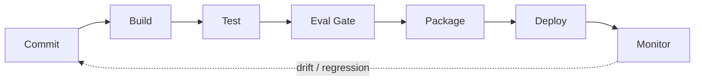

**Figure 2. DevOps Pipeline - Graphs, Triples and the Property Graph Model** (mermaid). Figure: DevOps Pipeline view for Knowledge Graphs. This diagram illustrates the principal components and their interactions as discussed in the surrounding section.

## Deep Dive: Mechanics, Variants and Trade-offs

Having established the essentials, we now go deeper into graphs, triples and the property graph model. Mechanically, the behaviour emerges from a few interacting parts that are simpler than the whole they produce. The distinctions in this section are the ones that separate a working demo from a system that holds up under adversarial inputs, scale and the passage of time.

Consider the principal variants and how to choose between them. Each variant optimises for a different point in the design space - some for latency, some for accuracy, some for cost or operability - and the correct choice follows from explicit requirements rather than from defaults. Simplicity is a feature. The simplest design that meets the requirement should be the default, with complexity added only when measurement justifies it.

In practice this is supported by a mature tooling ecosystem, including Neo4j, Amazon Neptune, RDFLib, Apache Jena. Tools accelerate the work but do not substitute for understanding: the same principles apply whichever implementation you select, and the ability to reason from first principles is what lets you debug when a tool behaves unexpectedly.

A frequent source of subtle bugs is the interaction with governance and lineage. Because governance and lineage concerns versioning, access control and auditability, changes there can silently alter the behaviour analysed here. The remedy is contract tests at the boundary and end-to-end evaluations that exercise the interaction explicitly.

Finally, attend to edge cases and degradation. Define what the system should do under partial failure, unexpected inputs and load spikes, and make that behaviour explicit and tested rather than emergent. Graceful degradation - returning a safe, useful result when the ideal one is unavailable - is a hallmark of mature engineering.

For deeper study, the literature offers authoritative treatments such as Hogan et al. — Knowledge Graphs (2021) and Bordes et al. — TransE (2013). These primary sources reward careful reading and ground the practical guidance above in established results.

## Advanced Considerations

Having established the essentials, we now go deeper into graphs, triples and the property graph model. It pays to understand the mechanism rather than treat it as a black box, because most production incidents are explained by one of its steps misbehaving. The distinctions in this section are the ones that separate a working demo from a system that holds up under adversarial inputs, scale and the passage of time.

Consider the principal variants and how to choose between them. Each variant optimises for a different point in the design space - some for latency, some for accuracy, some for cost or operability - and the correct choice follows from explicit requirements rather than from defaults. As with most architectural decisions, the choice is rarely binary; the skill lies in quantifying the trade-offs and choosing deliberately.

In practice this is supported by a mature tooling ecosystem, including Neo4j, Amazon Neptune, RDFLib, Apache Jena. Tools accelerate the work but do not substitute for understanding: the same principles apply whichever implementation you select, and the ability to reason from first principles is what lets you debug when a tool behaves unexpectedly.

A frequent source of subtle bugs is the interaction with reasoning and inference. Because reasoning and inference concerns rules, RDFS/OWL semantics and inferring implicit facts, changes there can silently alter the behaviour analysed here. The remedy is contract tests at the boundary and end-to-end evaluations that exercise the interaction explicitly.

Finally, attend to edge cases and degradation. Define what the system should do under partial failure, unexpected inputs and load spikes, and make that behaviour explicit and tested rather than emergent. Graceful degradation - returning a safe, useful result when the ideal one is unavailable - is a hallmark of mature engineering.

For deeper study, the literature offers authoritative treatments such as Hogan et al. — Knowledge Graphs (2021) and Bordes et al. — TransE (2013). These primary sources reward careful reading and ground the practical guidance above in established results.

## Worked Example

Consider a concrete scenario. A enterprise organisation needs 360-degree views linking customers, products and events. They decide to apply graphs, triples and the property graph model as part of their Knowledge Graphs solution, but wisely treat it as a hypothesis to be validated rather than a foregone conclusion.

The team begins by stating the objective precisely and defining how success will be measured before writing any code. They establish a small but representative evaluation set, agree on acceptance thresholds, and only then prototype the simplest design that could work. Early measurement reveals which assumptions hold and which must be revised, saving weeks of misdirected effort and surfacing edge cases while they are still cheap to fix.

As the prototype matures into a service, the team hardens it: adding input validation, error handling, caching where it pays off, and monitoring that ties back to the original success metric. They document each significant decision in an architecture decision record so that future maintainers understand not just what was built but why.

The outcome is instructive. The system that reaches production is not the most sophisticated design the team considered, but the one whose behaviour they could measure, explain and operate. This is the recurring lesson of Knowledge Graphs: durable value comes from the whole system, not from any single clever component.

## Industry Use Cases

Across industries, the ideas in this chapter recur in recognisable ways. The following vignettes show how different sectors apply them and what they have in common.

**Finance.** Fraud rings and beneficial-ownership analysis. The common thread is that value comes not from the model alone but from the surrounding system - data quality, evaluation, integration and operations - which is precisely where most of the engineering effort belongs.

**Healthcare.** Integrating clinical, genomic and literature data. The common thread is that value comes not from the model alone but from the surrounding system - data quality, evaluation, integration and operations - which is precisely where most of the engineering effort belongs.

**Retail.** Product knowledge graphs powering search and recommendations. The common thread is that value comes not from the model alone but from the surrounding system - data quality, evaluation, integration and operations - which is precisely where most of the engineering effort belongs.

**Enterprise.** 360-degree views linking customers, products and events. The common thread is that value comes not from the model alone but from the surrounding system - data quality, evaluation, integration and operations - which is precisely where most of the engineering effort belongs.

## Best Practices

The following practices consistently separate successful Knowledge Graphs efforts from struggling ones. They are deliberately concrete so they can be adopted as checklist items in design and code review.

- Design the ontology with domain experts before ingesting at scale.
- Treat entity resolution as a first-class, monitored pipeline.
- Record provenance on every fact for trust and debugging.
- Choose the model (RDF vs property graph) to fit query needs.

None of these are exotic; they are the unglamorous disciplines that compound into reliability. The cost of adopting them is small compared with the cost of the incidents they prevent, and they become second nature with practice.

## Common Pitfalls

Equally instructive are the failure modes that recur in practice. Each pitfall below has a clear early warning sign and a known remedy, so treat them as a diagnostic checklist when something feels wrong:

- Over-engineering the ontology before validating use cases.
- Neglecting entity resolution and creating duplicates.
- Ignoring provenance, making facts untrustworthy.
- Picking a graph engine that cannot scale to your traversal patterns.

The pattern is consistent: most failures stem from skipping measurement, conflating prototype and production standards, or deferring cross-cutting concerns such as security and cost until they become emergencies. Naming these traps in advance is the cheapest way to avoid them.

## Governance, Security and Cost Notes

No discussion of graphs, triples and the property graph model is complete without its governance, security and cost dimensions, which are too often deferred until they become emergencies. Treating them as first-class concerns from the outset is both cheaper and safer.

**Governance.** Classify the risk of this capability, document its intended and out-of-scope uses, and ensure decisions are traceable to satisfy internal policy and external regulation such as the NIST AI RMF, ISO/IEC 42001 and the EU AI Act. **Security.** Treat all external input as untrusted, validate outputs before acting on them, apply least privilege to any tools or data access, and map controls to the OWASP LLM Top 10 and MITRE ATLAS.

**Cost and sustainability.** Establish explicit budgets for compute, tokens and latency, attribute spend to owners, and revisit the economics as usage scales - a design that is affordable at pilot scale can become untenable at production volume. Building these reflexes into everyday engineering is what allows a Knowledge Graphs system to be not only capable but also trustworthy and economically sound.

## Hands-On Exercises

Work through the following exercises. They are designed to move understanding from recognition to application - the level required for real engineering work - so prefer writing and building over merely reading.

1. Explain graphs, triples and the property graph model to a colleague unfamiliar with Knowledge Graphs, using a concrete example from your own domain.
2. Sketch a reference architecture that incorporates graphs, triples and the property graph model and annotate where observability, security and cost controls belong.
3. Design an evaluation that would tell you whether graphs, triples and the property graph model is working in production, including the metric, the dataset and the acceptance threshold.
4. Identify two pitfalls relevant to graphs, triples and the property graph model in your environment and describe the early warning signals you would monitor.
5. Prototype the simplest implementation that demonstrates graphs, triples and the property graph model, then list exactly what would need to change to make it production-ready.

## Key Takeaways

Key takeaways from this chapter:

- Graphs, Triples and the Property Graph Model is a systems concern in Knowledge Graphs: data, models and operations must be co-designed.
- Measurement is non-negotiable; define success metrics and evaluation before building.
- Favour the simplest design that meets the requirement, and add complexity only when evidence demands it.
- Security, cost and observability are first-class requirements, not afterthoughts.
- Document decisions so the system remains understandable and operable as it evolves.

## Code Walkthrough

Pipelines keep Graphs, Triples and the Property Graph Model logic modular and testable. Each stage is a pure function, errors are captured per item, and the composition is trivial to extend or reorder.

The full listing is shown below; study it line by line and reproduce it locally before moving on.

### Listing: A composable processing pipeline for Graphs, Triples and the Property Graph Model

```python
from collections.abc import Iterable, Iterator
from typing import Protocol


class Stage(Protocol):
    def __call__(self, item: dict) -> dict: ...


def pipeline(stages: list[Stage]) -> Stage:
    """Compose ordered stages into a single callable for Graphs, Triples and the Property Graph Model."""

    def run(item: dict) -> dict:
        for stage in stages:
            item = stage(item)
        return item

    return run


def validate(item: dict) -> dict:
    if "text" not in item:
        raise ValueError("missing required field: text")
    return item


def normalise(item: dict) -> dict:
    item["text"] = item["text"].strip().lower()
    return item


def enrich(item: dict) -> dict:
    item["length"] = len(item["text"])
    return item


process = pipeline([validate, normalise, enrich])


def run_batch(items: Iterable[dict]) -> Iterator[dict]:
    for item in items:
        try:
            yield process(dict(item))
        except ValueError as exc:
            yield {"error": str(exc), "item": item}

```

## Review Questions

1. In the context of Knowledge Graphs, which statement best describes “Graphs, Triples and the Property Graph Model”?
   - A. It is only relevant to academic research, not production.
   - B. It guarantees deterministic output regardless of input.
   - C. RDF triples versus labelled property graphs and when to use each.
   - D. It makes the system slower but has no other effect.
   - **Answer: C.** Graphs, Triples and the Property Graph Model: RDF triples versus labelled property graphs and when to use each.
2. Which of the following is a recommended best practice when working with Knowledge Graphs?
   - A. Ignoring provenance, making facts untrustworthy.
   - B. It applies exclusively to image data.
   - C. Treat entity resolution as a first-class, monitored pipeline.
   - D. Over-engineering the ontology before validating use cases.
   - **Answer: C.** Best practice: Treat entity resolution as a first-class, monitored pipeline.
3. Which of the following is a common pitfall to avoid in Knowledge Graphs?
   - A. It is only relevant to academic research, not production.
   - B. Record provenance on every fact for trust and debugging.
   - C. Choose the model (RDF vs property graph) to fit query needs.
   - D. Neglecting entity resolution and creating duplicates.
   - **Answer: D.** Pitfall to avoid: Neglecting entity resolution and creating duplicates.
4. *(Discussion)* Describe a failure mode of Graphs, Triples and the Property Graph Model and how you would mitigate it.
   - **Model answer:** A strong answer defines graphs, triples and the property graph model (RDF triples versus labelled property graphs and when to use each.) then connects it to architecture, evaluation, cost, security and operations for Knowledge Graphs, citing concrete trade-offs and a real-world example.

---


# Chapter 2. Ontology and Schema Design

_This chapter examines ontology and schema design within Knowledge Graphs. It covers classes, properties, taxonomies and reusing standard vocabularies, derives a reference architecture, walks through a worked example and runnable code, surveys industry use cases, and distils best practices and pitfalls, closing with exercises and review questions._

## Introduction

At its core, Ontology and Schema Design concerns classes, properties, taxonomies and reusing standard vocabularies. Teams that master this consistently ship more reliable Knowledge Graphs systems at lower cost. It helps to separate the conceptual model from its implementation: the former guides reasoning, the latter must contend with real-world constraints.

This chapter builds intuition first, then formalises the ideas, derives an architecture, and finishes with code, exercises and review questions so the material transfers directly to your own Knowledge Graphs work. Read it actively: pause at each diagram, reproduce the code, and attempt the exercises before consulting the answers.

## Theory and Foundations

In practical terms, Ontology and Schema Design is best understood as classes, properties, taxonomies and reusing standard vocabularies. The practical implication is that design choices here ripple through latency, cost and maintainability for the lifetime of the system. Mechanically, the behaviour emerges from a few interacting parts that are simpler than the whole they produce.

To place this in context, recall the broader picture: Knowledge graphs represent entities and their relationships as nodes and edges, enabling integration of heterogeneous data, semantic querying and reasoning. Within that picture, ontology and schema design is one of the load-bearing ideas - the kind that, when understood deeply, makes the rest of Knowledge Graphs fall into place. Neglecting it is one of the most common reasons Knowledge Graphs initiatives stall in production.

Ontology and Schema Design cannot be understood in isolation from graphs, triples and the property graph model. Recall that graphs, triples and the property graph model concerns rDF triples versus labelled property graphs and when to use each. The two interact directly: decisions in one constrain the design space of the other, which is why mature teams reason about them together rather than sequentially. Simplicity is a feature. The simplest design that meets the requirement should be the default, with complexity added only when measurement justifies it.

Ontology and Schema Design cannot be understood in isolation from graphs for grounding llms. Recall that graphs for grounding llms concerns serving structured context to generative systems. The two interact directly: decisions in one constrain the design space of the other, which is why mature teams reason about them together rather than sequentially. Latency, accuracy and cost form a tension triangle: improving one typically pressures the others, so explicit budgets are essential.

Several established patterns apply directly to ontology and schema design. The first, entity-resolution pipeline feeding a golden-record graph, is widely adopted because it makes the system's behaviour predictable and observable. A complementary pattern, embedding-based link prediction for completion, addresses a related concern and is often deployed alongside it. Patterns are not dogma; they are distilled experience that shortcuts the search for a sound design, and each carries assumptions worth checking against your context.

It is worth being explicit about when to apply this and when to reach for something simpler. In a small prototype, shortcuts around ontology and schema design are invisible; in a production Knowledge Graphs system serving real traffic, they surface as incidents, cost overruns or compliance gaps. Latency, accuracy and cost form a tension triangle: improving one typically pressures the others, so explicit budgets are essential. The remainder of this chapter turns these principles into an architecture, code and a checklist you can apply immediately.

## Architecture and Design

A robust architecture for Ontology and Schema Design is layered so each part can evolve independently without destabilising the whole. An enterprise knowledge graph ingests from databases, documents and APIs through extraction and entity-resolution pipelines into a graph store governed by an ontology. Query services expose traversal and reasoning to applications, while a governance layer tracks provenance, versions and access.

Concretely, the principal building blocks include graphs, triples and the property graph model, ontology and schema design, entity extraction and linking, graph query languages and reasoning and inference. Each is a replaceable component behind a stable interface, so the team can upgrade an implementation - a model, an index, a policy engine - without rewriting its neighbours. The contracts between components are where reliability is won or lost, so they are specified explicitly and tested in isolation.

The diagram accompanying this section makes the data and control flow explicit. Requests enter through a well-defined boundary where they are authenticated and validated; only then are they dispatched to the components that perform the work. This boundary is also where rate limiting, quota enforcement and audit logging live, keeping cross-cutting concerns out of the core logic and in one auditable place.

Two qualities deserve emphasis. First, observability is designed in, not bolted on: every component emits structured telemetry so that failures can be localised in minutes rather than hours. Second, the architecture is evolvable - components communicate through stable contracts so that any single part of the Knowledge Graphs system can be replaced without a rewrite. Simplicity is a feature. The simplest design that meets the requirement should be the default, with complexity added only when measurement justifies it.

<div class="diagram-svg">

<svg xmlns="http://www.w3.org/2000/svg" width="840" height="460" data-tpl="roadmap" data-pal="2-4" viewBox="0 0 840 460" font-family="Inter, Segoe UI, Arial, sans-serif"><defs><marker id="ar" markerWidth="9" markerHeight="9" refX="7" refY="3" orient="auto"><path d="M0,0 L7,3 L0,6 z" fill="#94a3b8"/></marker><marker id="arw" markerWidth="9" markerHeight="9" refX="7" refY="3" orient="auto"><path d="M0,0 L7,3 L0,6 z" fill="#ffffff"/></marker></defs><rect width="840" height="460" rx="14" fill="#ffffff"/><rect x="0" y="0" width="840" height="46" rx="14" fill="#0d9488"/><rect x="0" y="30" width="840" height="16" fill="#0d9488"/><text x="420" y="24" text-anchor="middle" font-size="15" font-weight="700" fill="#ffffff" dominant-baseline="middle">DevOps Pipeline - Ontology and Schema Design</text><polygon points="28,204 206,204 224,234 206,264 28,264 46,234" fill="#0d9488"/><text x="126" y="234" text-anchor="middle" font-size="11" font-weight="600" fill="#fff" dominant-baseline="middle">Graphs for Grou…</text><text x="126" y="190" text-anchor="middle" font-size="11" font-weight="700" fill="#64748b" dominant-baseline="middle">Q1</text><polygon points="224,204 402,204 420,234 402,264 224,264 242,234" fill="#14b8a6"/><text x="322" y="234" text-anchor="middle" font-size="11" font-weight="600" fill="#fff" dominant-baseline="middle">Governance and …</text><text x="322" y="190" text-anchor="middle" font-size="11" font-weight="700" fill="#64748b" dominant-baseline="middle">Q2</text><polygon points="420,204 598,204 616,234 598,264 420,264 438,234" fill="#047857"/><text x="518" y="234" text-anchor="middle" font-size="11" font-weight="600" fill="#fff" dominant-baseline="middle">Operating Knowl…</text><text x="518" y="190" text-anchor="middle" font-size="11" font-weight="700" fill="#64748b" dominant-baseline="middle">Q3</text><polygon points="616,204 794,204 812,234 794,264 616,264 634,234" fill="#059669"/><text x="714" y="234" text-anchor="middle" font-size="11" font-weight="600" fill="#fff" dominant-baseline="middle">Visualising Kno…</text><text x="714" y="190" text-anchor="middle" font-size="11" font-weight="700" fill="#64748b" dominant-baseline="middle">Q4</text></svg>

</div>

**Figure 3. DevOps Pipeline - Ontology and Schema Design** (svg). Figure: DevOps Pipeline view for Knowledge Graphs. This diagram illustrates the principal components and their interactions as discussed in the surrounding section.

## Deep Dive: Mechanics, Variants and Trade-offs

Having established the essentials, we now go deeper into ontology and schema design. Beneath the abstraction lies a concrete process whose steps can each be measured, tested and optimised independently. The distinctions in this section are the ones that separate a working demo from a system that holds up under adversarial inputs, scale and the passage of time.

Consider the principal variants and how to choose between them. Each variant optimises for a different point in the design space - some for latency, some for accuracy, some for cost or operability - and the correct choice follows from explicit requirements rather than from defaults. Every added component buys capability at the price of operational surface area, and that bargain should be made consciously.

In practice this is supported by a mature tooling ecosystem, including Neo4j, Amazon Neptune, RDFLib, Apache Jena. Tools accelerate the work but do not substitute for understanding: the same principles apply whichever implementation you select, and the ability to reason from first principles is what lets you debug when a tool behaves unexpectedly.

A frequent source of subtle bugs is the interaction with graphs, triples and the property graph model. Because graphs, triples and the property graph model concerns rDF triples versus labelled property graphs and when to use each, changes there can silently alter the behaviour analysed here. The remedy is contract tests at the boundary and end-to-end evaluations that exercise the interaction explicitly.

Finally, attend to edge cases and degradation. Define what the system should do under partial failure, unexpected inputs and load spikes, and make that behaviour explicit and tested rather than emergent. Graceful degradation - returning a safe, useful result when the ideal one is unavailable - is a hallmark of mature engineering.

For deeper study, the literature offers authoritative treatments such as Hogan et al. — Knowledge Graphs (2021) and Bordes et al. — TransE (2013). These primary sources reward careful reading and ground the practical guidance above in established results.

## Advanced Considerations

Having established the essentials, we now go deeper into ontology and schema design. Beneath the abstraction lies a concrete process whose steps can each be measured, tested and optimised independently. The distinctions in this section are the ones that separate a working demo from a system that holds up under adversarial inputs, scale and the passage of time.

Consider the principal variants and how to choose between them. Each variant optimises for a different point in the design space - some for latency, some for accuracy, some for cost or operability - and the correct choice follows from explicit requirements rather than from defaults. Simplicity is a feature. The simplest design that meets the requirement should be the default, with complexity added only when measurement justifies it.

In practice this is supported by a mature tooling ecosystem, including Neo4j, Amazon Neptune, RDFLib, Apache Jena. Tools accelerate the work but do not substitute for understanding: the same principles apply whichever implementation you select, and the ability to reason from first principles is what lets you debug when a tool behaves unexpectedly.

A frequent source of subtle bugs is the interaction with reasoning and inference. Because reasoning and inference concerns rules, RDFS/OWL semantics and inferring implicit facts, changes there can silently alter the behaviour analysed here. The remedy is contract tests at the boundary and end-to-end evaluations that exercise the interaction explicitly.

Finally, attend to edge cases and degradation. Define what the system should do under partial failure, unexpected inputs and load spikes, and make that behaviour explicit and tested rather than emergent. Graceful degradation - returning a safe, useful result when the ideal one is unavailable - is a hallmark of mature engineering.

For deeper study, the literature offers authoritative treatments such as Hogan et al. — Knowledge Graphs (2021) and Bordes et al. — TransE (2013). These primary sources reward careful reading and ground the practical guidance above in established results.

## Worked Example

Consider a concrete scenario. A enterprise organisation needs 360-degree views linking customers, products and events. They decide to apply ontology and schema design as part of their Knowledge Graphs solution, but wisely treat it as a hypothesis to be validated rather than a foregone conclusion.

The team begins by stating the objective precisely and defining how success will be measured before writing any code. They establish a small but representative evaluation set, agree on acceptance thresholds, and only then prototype the simplest design that could work. Early measurement reveals which assumptions hold and which must be revised, saving weeks of misdirected effort and surfacing edge cases while they are still cheap to fix.

As the prototype matures into a service, the team hardens it: adding input validation, error handling, caching where it pays off, and monitoring that ties back to the original success metric. They document each significant decision in an architecture decision record so that future maintainers understand not just what was built but why.

The outcome is instructive. The system that reaches production is not the most sophisticated design the team considered, but the one whose behaviour they could measure, explain and operate. This is the recurring lesson of Knowledge Graphs: durable value comes from the whole system, not from any single clever component.

## Industry Use Cases

Across industries, the ideas in this chapter recur in recognisable ways. The following vignettes show how different sectors apply them and what they have in common.

**Finance.** Fraud rings and beneficial-ownership analysis. The common thread is that value comes not from the model alone but from the surrounding system - data quality, evaluation, integration and operations - which is precisely where most of the engineering effort belongs.

**Healthcare.** Integrating clinical, genomic and literature data. The common thread is that value comes not from the model alone but from the surrounding system - data quality, evaluation, integration and operations - which is precisely where most of the engineering effort belongs.

**Retail.** Product knowledge graphs powering search and recommendations. The common thread is that value comes not from the model alone but from the surrounding system - data quality, evaluation, integration and operations - which is precisely where most of the engineering effort belongs.

**Enterprise.** 360-degree views linking customers, products and events. The common thread is that value comes not from the model alone but from the surrounding system - data quality, evaluation, integration and operations - which is precisely where most of the engineering effort belongs.

## Best Practices

The following practices consistently separate successful Knowledge Graphs efforts from struggling ones. They are deliberately concrete so they can be adopted as checklist items in design and code review.

- Design the ontology with domain experts before ingesting at scale.
- Treat entity resolution as a first-class, monitored pipeline.
- Record provenance on every fact for trust and debugging.
- Choose the model (RDF vs property graph) to fit query needs.

None of these are exotic; they are the unglamorous disciplines that compound into reliability. The cost of adopting them is small compared with the cost of the incidents they prevent, and they become second nature with practice.

## Common Pitfalls

Equally instructive are the failure modes that recur in practice. Each pitfall below has a clear early warning sign and a known remedy, so treat them as a diagnostic checklist when something feels wrong:

- Over-engineering the ontology before validating use cases.
- Neglecting entity resolution and creating duplicates.
- Ignoring provenance, making facts untrustworthy.
- Picking a graph engine that cannot scale to your traversal patterns.

The pattern is consistent: most failures stem from skipping measurement, conflating prototype and production standards, or deferring cross-cutting concerns such as security and cost until they become emergencies. Naming these traps in advance is the cheapest way to avoid them.

## Governance, Security and Cost Notes

No discussion of ontology and schema design is complete without its governance, security and cost dimensions, which are too often deferred until they become emergencies. Treating them as first-class concerns from the outset is both cheaper and safer.

**Governance.** Classify the risk of this capability, document its intended and out-of-scope uses, and ensure decisions are traceable to satisfy internal policy and external regulation such as the NIST AI RMF, ISO/IEC 42001 and the EU AI Act. **Security.** Treat all external input as untrusted, validate outputs before acting on them, apply least privilege to any tools or data access, and map controls to the OWASP LLM Top 10 and MITRE ATLAS.

**Cost and sustainability.** Establish explicit budgets for compute, tokens and latency, attribute spend to owners, and revisit the economics as usage scales - a design that is affordable at pilot scale can become untenable at production volume. Building these reflexes into everyday engineering is what allows a Knowledge Graphs system to be not only capable but also trustworthy and economically sound.

## Hands-On Exercises

Work through the following exercises. They are designed to move understanding from recognition to application - the level required for real engineering work - so prefer writing and building over merely reading.

1. Explain ontology and schema design to a colleague unfamiliar with Knowledge Graphs, using a concrete example from your own domain.
2. Sketch a reference architecture that incorporates ontology and schema design and annotate where observability, security and cost controls belong.
3. Design an evaluation that would tell you whether ontology and schema design is working in production, including the metric, the dataset and the acceptance threshold.
4. Identify two pitfalls relevant to ontology and schema design in your environment and describe the early warning signals you would monitor.
5. Prototype the simplest implementation that demonstrates ontology and schema design, then list exactly what would need to change to make it production-ready.

## Key Takeaways

Key takeaways from this chapter:

- Ontology and Schema Design is a systems concern in Knowledge Graphs: data, models and operations must be co-designed.
- Measurement is non-negotiable; define success metrics and evaluation before building.
- Favour the simplest design that meets the requirement, and add complexity only when evidence demands it.
- Security, cost and observability are first-class requirements, not afterthoughts.
- Document decisions so the system remains understandable and operable as it evolves.

## Code Walkthrough

Every change to a Knowledge Graphs system should pass an evaluation gate. This example shows the minimal shape: align predictions and references, compute a metric, and return a pass/fail decision for CI.

The full listing is shown below; study it line by line and reproduce it locally before moving on.

### Listing: Evaluating Ontology and Schema Design with a regression gate

```python
from dataclasses import dataclass


@dataclass
class EvalResult:
    metric: str
    score: float
    passed: bool


def evaluate(predictions: list[str], references: list[str],
             threshold: float = 0.8) -> EvalResult:
    """Score Ontology and Schema Design output against references with a simple exact-match metric.

    In practice you would combine several metrics (exact match, semantic
    similarity, LLM-as-judge) and gate releases on the aggregate.
    """
    if len(predictions) != len(references):
        raise ValueError("predictions and references must align")
    hits = sum(p.strip() == r.strip() for p, r in zip(predictions, references))
    score = hits / len(references) if references else 0.0
    return EvalResult(metric="exact_match", score=score, passed=score >= threshold)


if __name__ == "__main__":
    result = evaluate(["yes", "no"], ["yes", "yes"])
    print(f"{result.metric}={result.score:.2f} passed={result.passed}")

```

## Review Questions

1. In the context of Knowledge Graphs, which statement best describes “Ontology and Schema Design”?
   - A. It is only relevant to academic research, not production.
   - B. It applies exclusively to image data.
   - C. It eliminates the need for any evaluation or monitoring.
   - D. Classes, properties, taxonomies and reusing standard vocabularies.
   - **Answer: D.** Ontology and Schema Design: Classes, properties, taxonomies and reusing standard vocabularies.
2. Which of the following is a recommended best practice when working with Knowledge Graphs?
   - A. It applies exclusively to image data.
   - B. It guarantees deterministic output regardless of input.
   - C. Treat entity resolution as a first-class, monitored pipeline.
   - D. Ignoring provenance, making facts untrustworthy.
   - **Answer: C.** Best practice: Treat entity resolution as a first-class, monitored pipeline.
3. Which of the following is a common pitfall to avoid in Knowledge Graphs?
   - A. Picking a graph engine that cannot scale to your traversal patterns.
   - B. It eliminates the need for any evaluation or monitoring.
   - C. Record provenance on every fact for trust and debugging.
   - D. It is only relevant to academic research, not production.
   - **Answer: A.** Pitfall to avoid: Picking a graph engine that cannot scale to your traversal patterns.
4. *(Discussion)* Explain Ontology and Schema Design and why it matters in a production Knowledge Graphs system.
   - **Model answer:** A strong answer defines ontology and schema design (Classes, properties, taxonomies and reusing standard vocabularies.) then connects it to architecture, evaluation, cost, security and operations for Knowledge Graphs, citing concrete trade-offs and a real-world example.

---


# Chapter 3. Entity Extraction and Linking

_This chapter examines entity extraction and linking within Knowledge Graphs. It covers populating the graph from structured and unstructured sources, derives a reference architecture, walks through a worked example and runnable code, surveys industry use cases, and distils best practices and pitfalls, closing with exercises and review questions._

## Introduction

Entity Extraction and Linking refers to populating the graph from structured and unstructured sources. Getting this right early prevents expensive rework once a Knowledge Graphs system reaches scale. What distinguishes a production-grade approach from a prototype is the discipline of measurement: every claim is backed by an evaluation rather than intuition.

This chapter builds intuition first, then formalises the ideas, derives an architecture, and finishes with code, exercises and review questions so the material transfers directly to your own Knowledge Graphs work. Read it actively: pause at each diagram, reproduce the code, and attempt the exercises before consulting the answers.

## Theory and Foundations

At its core, Entity Extraction and Linking concerns populating the graph from structured and unstructured sources. In an enterprise setting, this translates into concrete requirements: clear interfaces, measurable quality, and controls that satisfy security and governance. The underlying mechanism is best appreciated by tracing a single request from input to output and noting where state is created and consumed.

To place this in context, recall the broader picture: Knowledge graphs represent entities and their relationships as nodes and edges, enabling integration of heterogeneous data, semantic querying and reasoning. Within that picture, entity extraction and linking is one of the load-bearing ideas - the kind that, when understood deeply, makes the rest of Knowledge Graphs fall into place. This concept recurs throughout the Knowledge Graphs lifecycle, from design to operations.

Entity Extraction and Linking cannot be understood in isolation from knowledge graph embeddings. Recall that knowledge graph embeddings concerns transE, RotatE and link prediction for completion. The two interact directly: decisions in one constrain the design space of the other, which is why mature teams reason about them together rather than sequentially. There is an inherent trade-off between fidelity and cost, and the correct balance depends on the use case and its tolerance for error.

Entity Extraction and Linking cannot be understood in isolation from reasoning and inference. Recall that reasoning and inference concerns rules, RDFS/OWL semantics and inferring implicit facts. The two interact directly: decisions in one constrain the design space of the other, which is why mature teams reason about them together rather than sequentially. There is an inherent trade-off between fidelity and cost, and the correct balance depends on the use case and its tolerance for error.

Several established patterns apply directly to entity extraction and linking. The first, entity-resolution pipeline feeding a golden-record graph, is widely adopted because it makes the system's behaviour predictable and observable. A complementary pattern, provenance edges for full traceability, addresses a related concern and is often deployed alongside it. Patterns are not dogma; they are distilled experience that shortcuts the search for a sound design, and each carries assumptions worth checking against your context.

It is worth being explicit about when to apply this and when to reach for something simpler. In a small prototype, shortcuts around entity extraction and linking are invisible; in a production Knowledge Graphs system serving real traffic, they surface as incidents, cost overruns or compliance gaps. Simplicity is a feature. The simplest design that meets the requirement should be the default, with complexity added only when measurement justifies it. The remainder of this chapter turns these principles into an architecture, code and a checklist you can apply immediately.

## Architecture and Design

From an architectural standpoint, Entity Extraction and Linking sits at the intersection of data, models and operations. An enterprise knowledge graph ingests from databases, documents and APIs through extraction and entity-resolution pipelines into a graph store governed by an ontology. Query services expose traversal and reasoning to applications, while a governance layer tracks provenance, versions and access.

Concretely, the principal building blocks include graphs, triples and the property graph model, ontology and schema design, entity extraction and linking, graph query languages and reasoning and inference. Each is a replaceable component behind a stable interface, so the team can upgrade an implementation - a model, an index, a policy engine - without rewriting its neighbours. The contracts between components are where reliability is won or lost, so they are specified explicitly and tested in isolation.

The diagram accompanying this section makes the data and control flow explicit. Requests enter through a well-defined boundary where they are authenticated and validated; only then are they dispatched to the components that perform the work. This boundary is also where rate limiting, quota enforcement and audit logging live, keeping cross-cutting concerns out of the core logic and in one auditable place.

Two qualities deserve emphasis. First, observability is designed in, not bolted on: every component emits structured telemetry so that failures can be localised in minutes rather than hours. Second, the architecture is evolvable - components communicate through stable contracts so that any single part of the Knowledge Graphs system can be replaced without a rewrite. As with most architectural decisions, the choice is rarely binary; the skill lies in quantifying the trade-offs and choosing deliberately.


_Source diagram (plantuml); render with the appropriate tool._

**Figure 4. Deployment - Entity Extraction and Linking** (plantuml). Figure: Deployment view for Knowledge Graphs. This diagram illustrates the principal components and their interactions as discussed in the surrounding section.

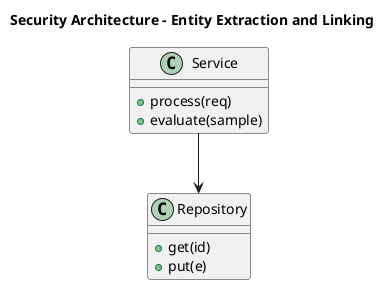

_Source diagram (plantuml); render with the appropriate tool._

**Figure 5. Security Architecture - Entity Extraction and Linking** (plantuml). Figure: Security Architecture view for Knowledge Graphs. This diagram illustrates the principal components and their interactions as discussed in the surrounding section.

## Deep Dive: Mechanics, Variants and Trade-offs

Having established the essentials, we now go deeper into entity extraction and linking. Mechanically, the behaviour emerges from a few interacting parts that are simpler than the whole they produce. The distinctions in this section are the ones that separate a working demo from a system that holds up under adversarial inputs, scale and the passage of time.

Consider the principal variants and how to choose between them. Each variant optimises for a different point in the design space - some for latency, some for accuracy, some for cost or operability - and the correct choice follows from explicit requirements rather than from defaults. Simplicity is a feature. The simplest design that meets the requirement should be the default, with complexity added only when measurement justifies it.

In practice this is supported by a mature tooling ecosystem, including Neo4j, Amazon Neptune, RDFLib, Apache Jena. Tools accelerate the work but do not substitute for understanding: the same principles apply whichever implementation you select, and the ability to reason from first principles is what lets you debug when a tool behaves unexpectedly.

A frequent source of subtle bugs is the interaction with knowledge graph embeddings. Because knowledge graph embeddings concerns transE, RotatE and link prediction for completion, changes there can silently alter the behaviour analysed here. The remedy is contract tests at the boundary and end-to-end evaluations that exercise the interaction explicitly.

Finally, attend to edge cases and degradation. Define what the system should do under partial failure, unexpected inputs and load spikes, and make that behaviour explicit and tested rather than emergent. Graceful degradation - returning a safe, useful result when the ideal one is unavailable - is a hallmark of mature engineering.

For deeper study, the literature offers authoritative treatments such as Hogan et al. — Knowledge Graphs (2021) and Bordes et al. — TransE (2013). These primary sources reward careful reading and ground the practical guidance above in established results.

## Advanced Considerations

Having established the essentials, we now go deeper into entity extraction and linking. The underlying mechanism is best appreciated by tracing a single request from input to output and noting where state is created and consumed. The distinctions in this section are the ones that separate a working demo from a system that holds up under adversarial inputs, scale and the passage of time.

Consider the principal variants and how to choose between them. Each variant optimises for a different point in the design space - some for latency, some for accuracy, some for cost or operability - and the correct choice follows from explicit requirements rather than from defaults. Simplicity is a feature. The simplest design that meets the requirement should be the default, with complexity added only when measurement justifies it.

In practice this is supported by a mature tooling ecosystem, including Neo4j, Amazon Neptune, RDFLib, Apache Jena. Tools accelerate the work but do not substitute for understanding: the same principles apply whichever implementation you select, and the ability to reason from first principles is what lets you debug when a tool behaves unexpectedly.

A frequent source of subtle bugs is the interaction with graph algorithms for insight. Because graph algorithms for insight concerns centrality, community detection and pathfinding, changes there can silently alter the behaviour analysed here. The remedy is contract tests at the boundary and end-to-end evaluations that exercise the interaction explicitly.

Finally, attend to edge cases and degradation. Define what the system should do under partial failure, unexpected inputs and load spikes, and make that behaviour explicit and tested rather than emergent. Graceful degradation - returning a safe, useful result when the ideal one is unavailable - is a hallmark of mature engineering.

For deeper study, the literature offers authoritative treatments such as Hogan et al. — Knowledge Graphs (2021) and Bordes et al. — TransE (2013). These primary sources reward careful reading and ground the practical guidance above in established results.

## Worked Example

To ground the discussion, walk through a representative example. A retail organisation needs product knowledge graphs powering search and recommendations. They decide to apply entity extraction and linking as part of their Knowledge Graphs solution, but wisely treat it as a hypothesis to be validated rather than a foregone conclusion.

The team begins by stating the objective precisely and defining how success will be measured before writing any code. They establish a small but representative evaluation set, agree on acceptance thresholds, and only then prototype the simplest design that could work. Early measurement reveals which assumptions hold and which must be revised, saving weeks of misdirected effort and surfacing edge cases while they are still cheap to fix.

As the prototype matures into a service, the team hardens it: adding input validation, error handling, caching where it pays off, and monitoring that ties back to the original success metric. They document each significant decision in an architecture decision record so that future maintainers understand not just what was built but why.

The outcome is instructive. The system that reaches production is not the most sophisticated design the team considered, but the one whose behaviour they could measure, explain and operate. This is the recurring lesson of Knowledge Graphs: durable value comes from the whole system, not from any single clever component.

## Industry Use Cases

Across industries, the ideas in this chapter recur in recognisable ways. The following vignettes show how different sectors apply them and what they have in common.

**Finance.** Fraud rings and beneficial-ownership analysis. The common thread is that value comes not from the model alone but from the surrounding system - data quality, evaluation, integration and operations - which is precisely where most of the engineering effort belongs.

**Healthcare.** Integrating clinical, genomic and literature data. The common thread is that value comes not from the model alone but from the surrounding system - data quality, evaluation, integration and operations - which is precisely where most of the engineering effort belongs.

**Retail.** Product knowledge graphs powering search and recommendations. The common thread is that value comes not from the model alone but from the surrounding system - data quality, evaluation, integration and operations - which is precisely where most of the engineering effort belongs.

**Enterprise.** 360-degree views linking customers, products and events. The common thread is that value comes not from the model alone but from the surrounding system - data quality, evaluation, integration and operations - which is precisely where most of the engineering effort belongs.

## Best Practices

The following practices consistently separate successful Knowledge Graphs efforts from struggling ones. They are deliberately concrete so they can be adopted as checklist items in design and code review.

- Design the ontology with domain experts before ingesting at scale.
- Treat entity resolution as a first-class, monitored pipeline.
- Record provenance on every fact for trust and debugging.
- Choose the model (RDF vs property graph) to fit query needs.

None of these are exotic; they are the unglamorous disciplines that compound into reliability. The cost of adopting them is small compared with the cost of the incidents they prevent, and they become second nature with practice.

## Common Pitfalls

Equally instructive are the failure modes that recur in practice. Each pitfall below has a clear early warning sign and a known remedy, so treat them as a diagnostic checklist when something feels wrong:

- Over-engineering the ontology before validating use cases.
- Neglecting entity resolution and creating duplicates.
- Ignoring provenance, making facts untrustworthy.
- Picking a graph engine that cannot scale to your traversal patterns.

The pattern is consistent: most failures stem from skipping measurement, conflating prototype and production standards, or deferring cross-cutting concerns such as security and cost until they become emergencies. Naming these traps in advance is the cheapest way to avoid them.

## Governance, Security and Cost Notes

No discussion of entity extraction and linking is complete without its governance, security and cost dimensions, which are too often deferred until they become emergencies. Treating them as first-class concerns from the outset is both cheaper and safer.

**Governance.** Classify the risk of this capability, document its intended and out-of-scope uses, and ensure decisions are traceable to satisfy internal policy and external regulation such as the NIST AI RMF, ISO/IEC 42001 and the EU AI Act. **Security.** Treat all external input as untrusted, validate outputs before acting on them, apply least privilege to any tools or data access, and map controls to the OWASP LLM Top 10 and MITRE ATLAS.

**Cost and sustainability.** Establish explicit budgets for compute, tokens and latency, attribute spend to owners, and revisit the economics as usage scales - a design that is affordable at pilot scale can become untenable at production volume. Building these reflexes into everyday engineering is what allows a Knowledge Graphs system to be not only capable but also trustworthy and economically sound.

## Hands-On Exercises

Work through the following exercises. They are designed to move understanding from recognition to application - the level required for real engineering work - so prefer writing and building over merely reading.

1. Explain entity extraction and linking to a colleague unfamiliar with Knowledge Graphs, using a concrete example from your own domain.
2. Sketch a reference architecture that incorporates entity extraction and linking and annotate where observability, security and cost controls belong.
3. Design an evaluation that would tell you whether entity extraction and linking is working in production, including the metric, the dataset and the acceptance threshold.
4. Identify two pitfalls relevant to entity extraction and linking in your environment and describe the early warning signals you would monitor.
5. Prototype the simplest implementation that demonstrates entity extraction and linking, then list exactly what would need to change to make it production-ready.

## Key Takeaways

Key takeaways from this chapter:

- Entity Extraction and Linking is a systems concern in Knowledge Graphs: data, models and operations must be co-designed.
- Measurement is non-negotiable; define success metrics and evaluation before building.
- Favour the simplest design that meets the requirement, and add complexity only when evidence demands it.
- Security, cost and observability are first-class requirements, not afterthoughts.
- Document decisions so the system remains understandable and operable as it evolves.

## Code Walkthrough

Pipelines keep Entity Extraction and Linking logic modular and testable. Each stage is a pure function, errors are captured per item, and the composition is trivial to extend or reorder.

The full listing is shown below; study it line by line and reproduce it locally before moving on.

### Listing: A composable processing pipeline for Entity Extraction and Linking

```python
from collections.abc import Iterable, Iterator
from typing import Protocol


class Stage(Protocol):
    def __call__(self, item: dict) -> dict: ...


def pipeline(stages: list[Stage]) -> Stage:
    """Compose ordered stages into a single callable for Entity Extraction and Linking."""

    def run(item: dict) -> dict:
        for stage in stages:
            item = stage(item)
        return item

    return run


def validate(item: dict) -> dict:
    if "text" not in item:
        raise ValueError("missing required field: text")
    return item


def normalise(item: dict) -> dict:
    item["text"] = item["text"].strip().lower()
    return item


def enrich(item: dict) -> dict:
    item["length"] = len(item["text"])
    return item


process = pipeline([validate, normalise, enrich])


def run_batch(items: Iterable[dict]) -> Iterator[dict]:
    for item in items:
        try:
            yield process(dict(item))
        except ValueError as exc:
            yield {"error": str(exc), "item": item}

```

## Review Questions

1. In the context of Knowledge Graphs, which statement best describes “Entity Extraction and Linking”?
   - A. It applies exclusively to image data.
   - B. It eliminates the need for any evaluation or monitoring.
   - C. Populating the graph from structured and unstructured sources.
   - D. It guarantees deterministic output regardless of input.
   - **Answer: C.** Entity Extraction and Linking: Populating the graph from structured and unstructured sources.
2. Which of the following is a recommended best practice when working with Knowledge Graphs?
   - A. It guarantees deterministic output regardless of input.
   - B. Picking a graph engine that cannot scale to your traversal patterns.
   - C. It eliminates the need for any evaluation or monitoring.
   - D. Choose the model (RDF vs property graph) to fit query needs.
   - **Answer: D.** Best practice: Choose the model (RDF vs property graph) to fit query needs.
3. Which of the following is a common pitfall to avoid in Knowledge Graphs?
   - A. Neglecting entity resolution and creating duplicates.
   - B. It makes the system slower but has no other effect.
   - C. Treat entity resolution as a first-class, monitored pipeline.
   - D. It applies exclusively to image data.
   - **Answer: A.** Pitfall to avoid: Neglecting entity resolution and creating duplicates.
4. *(Discussion)* How does Entity Extraction and Linking interact with security and governance requirements?
   - **Model answer:** A strong answer defines entity extraction and linking (Populating the graph from structured and unstructured sources.) then connects it to architecture, evaluation, cost, security and operations for Knowledge Graphs, citing concrete trade-offs and a real-world example.

---


# Chapter 4. Graph Query Languages

_This chapter examines graph query languages within Knowledge Graphs. It covers cypher, SPARQL and Gremlin for traversal and pattern matching, derives a reference architecture, walks through a worked example and runnable code, surveys industry use cases, and distils best practices and pitfalls, closing with exercises and review questions._

## Introduction

Formally, Graph Query Languages addresses cypher, SPARQL and Gremlin for traversal and pattern matching. Neglecting it is one of the most common reasons Knowledge Graphs initiatives stall in production. What distinguishes a production-grade approach from a prototype is the discipline of measurement: every claim is backed by an evaluation rather than intuition.

This chapter builds intuition first, then formalises the ideas, derives an architecture, and finishes with code, exercises and review questions so the material transfers directly to your own Knowledge Graphs work. Read it actively: pause at each diagram, reproduce the code, and attempt the exercises before consulting the answers.

## Theory and Foundations

In practical terms, Graph Query Languages is best understood as cypher, SPARQL and Gremlin for traversal and pattern matching. What distinguishes a production-grade approach from a prototype is the discipline of measurement: every claim is backed by an evaluation rather than intuition. Mechanically, the behaviour emerges from a few interacting parts that are simpler than the whole they produce.

To place this in context, recall the broader picture: Knowledge graphs represent entities and their relationships as nodes and edges, enabling integration of heterogeneous data, semantic querying and reasoning. Within that picture, graph query languages is one of the load-bearing ideas - the kind that, when understood deeply, makes the rest of Knowledge Graphs fall into place. Neglecting it is one of the most common reasons Knowledge Graphs initiatives stall in production.

Graph Query Languages cannot be understood in isolation from reasoning and inference. Recall that reasoning and inference concerns rules, RDFS/OWL semantics and inferring implicit facts. The two interact directly: decisions in one constrain the design space of the other, which is why mature teams reason about them together rather than sequentially. Latency, accuracy and cost form a tension triangle: improving one typically pressures the others, so explicit budgets are essential.

Graph Query Languages cannot be understood in isolation from operating knowledge graphs. Recall that operating knowledge graphs concerns pipelines, monitoring and lifecycle management. The two interact directly: decisions in one constrain the design space of the other, which is why mature teams reason about them together rather than sequentially. As with most architectural decisions, the choice is rarely binary; the skill lies in quantifying the trade-offs and choosing deliberately.

Several established patterns apply directly to graph query languages. The first, embedding-based link prediction for completion, is widely adopted because it makes the system's behaviour predictable and observable. A complementary pattern, canonical ontology with reused standard vocabularies, addresses a related concern and is often deployed alongside it. Patterns are not dogma; they are distilled experience that shortcuts the search for a sound design, and each carries assumptions worth checking against your context.

It is worth being explicit about when to apply this and when to reach for something simpler. In a small prototype, shortcuts around graph query languages are invisible; in a production Knowledge Graphs system serving real traffic, they surface as incidents, cost overruns or compliance gaps. As with most architectural decisions, the choice is rarely binary; the skill lies in quantifying the trade-offs and choosing deliberately. The remainder of this chapter turns these principles into an architecture, code and a checklist you can apply immediately.

## Architecture and Design

The reference architecture for Graph Query Languages separates concerns into clearly bounded components with explicit contracts. An enterprise knowledge graph ingests from databases, documents and APIs through extraction and entity-resolution pipelines into a graph store governed by an ontology. Query services expose traversal and reasoning to applications, while a governance layer tracks provenance, versions and access.

Concretely, the principal building blocks include graphs, triples and the property graph model, ontology and schema design, entity extraction and linking, graph query languages and reasoning and inference. Each is a replaceable component behind a stable interface, so the team can upgrade an implementation - a model, an index, a policy engine - without rewriting its neighbours. The contracts between components are where reliability is won or lost, so they are specified explicitly and tested in isolation.

The diagram accompanying this section makes the data and control flow explicit. Requests enter through a well-defined boundary where they are authenticated and validated; only then are they dispatched to the components that perform the work. This boundary is also where rate limiting, quota enforcement and audit logging live, keeping cross-cutting concerns out of the core logic and in one auditable place.

Two qualities deserve emphasis. First, observability is designed in, not bolted on: every component emits structured telemetry so that failures can be localised in minutes rather than hours. Second, the architecture is evolvable - components communicate through stable contracts so that any single part of the Knowledge Graphs system can be replaced without a rewrite. As with most architectural decisions, the choice is rarely binary; the skill lies in quantifying the trade-offs and choosing deliberately.

<div class="diagram-svg">

<svg xmlns="http://www.w3.org/2000/svg" width="840" height="460" data-tpl="concentric" data-pal="6-1" viewBox="0 0 840 460" font-family="Inter, Segoe UI, Arial, sans-serif"><defs><marker id="ar" markerWidth="9" markerHeight="9" refX="7" refY="3" orient="auto"><path d="M0,0 L7,3 L0,6 z" fill="#94a3b8"/></marker><marker id="arw" markerWidth="9" markerHeight="9" refX="7" refY="3" orient="auto"><path d="M0,0 L7,3 L0,6 z" fill="#ffffff"/></marker></defs><rect width="840" height="460" rx="14" fill="#ffffff"/><rect x="0" y="0" width="840" height="46" rx="14" fill="#475569"/><rect x="0" y="30" width="840" height="16" fill="#475569"/><text x="420" y="24" text-anchor="middle" font-size="15" font-weight="700" fill="#ffffff" dominant-baseline="middle">Security Architecture - Graph Query Languages</text><circle cx="420.0" cy="238.0" r="150" fill="#475569"/><text x="420" y="106" text-anchor="middle" font-size="11" font-weight="600" fill="#fff" dominant-baseline="middle">Graph Algorithms for …</text><circle cx="420.0" cy="238.0" r="116" fill="#64748b"/><text x="420" y="140" text-anchor="middle" font-size="11" font-weight="600" fill="#fff" dominant-baseline="middle">Data Quality and Enti…</text><circle cx="420.0" cy="238.0" r="82" fill="#0f172a"/><text x="420" y="174" text-anchor="middle" font-size="11" font-weight="600" fill="#fff" dominant-baseline="middle">Scaling Graph Storage</text><circle cx="420.0" cy="238.0" r="48" fill="#1e293b"/><text x="420" y="208" text-anchor="middle" font-size="11" font-weight="600" fill="#fff" dominant-baseline="middle">Graphs for Grounding …</text></svg>

</div>

**Figure 6. Security Architecture - Graph Query Languages** (svg). Figure: Security Architecture view for Knowledge Graphs. This diagram illustrates the principal components and their interactions as discussed in the surrounding section.

## Deep Dive: Mechanics, Variants and Trade-offs

Having established the essentials, we now go deeper into graph query languages. It pays to understand the mechanism rather than treat it as a black box, because most production incidents are explained by one of its steps misbehaving. The distinctions in this section are the ones that separate a working demo from a system that holds up under adversarial inputs, scale and the passage of time.

Consider the principal variants and how to choose between them. Each variant optimises for a different point in the design space - some for latency, some for accuracy, some for cost or operability - and the correct choice follows from explicit requirements rather than from defaults. Every added component buys capability at the price of operational surface area, and that bargain should be made consciously.

In practice this is supported by a mature tooling ecosystem, including Neo4j, Amazon Neptune, RDFLib, Apache Jena. Tools accelerate the work but do not substitute for understanding: the same principles apply whichever implementation you select, and the ability to reason from first principles is what lets you debug when a tool behaves unexpectedly.

A frequent source of subtle bugs is the interaction with reasoning and inference. Because reasoning and inference concerns rules, RDFS/OWL semantics and inferring implicit facts, changes there can silently alter the behaviour analysed here. The remedy is contract tests at the boundary and end-to-end evaluations that exercise the interaction explicitly.

Finally, attend to edge cases and degradation. Define what the system should do under partial failure, unexpected inputs and load spikes, and make that behaviour explicit and tested rather than emergent. Graceful degradation - returning a safe, useful result when the ideal one is unavailable - is a hallmark of mature engineering.

For deeper study, the literature offers authoritative treatments such as Hogan et al. — Knowledge Graphs (2021) and Bordes et al. — TransE (2013). These primary sources reward careful reading and ground the practical guidance above in established results.

## Advanced Considerations

Having established the essentials, we now go deeper into graph query languages. It pays to understand the mechanism rather than treat it as a black box, because most production incidents are explained by one of its steps misbehaving. The distinctions in this section are the ones that separate a working demo from a system that holds up under adversarial inputs, scale and the passage of time.

Consider the principal variants and how to choose between them. Each variant optimises for a different point in the design space - some for latency, some for accuracy, some for cost or operability - and the correct choice follows from explicit requirements rather than from defaults. Simplicity is a feature. The simplest design that meets the requirement should be the default, with complexity added only when measurement justifies it.

In practice this is supported by a mature tooling ecosystem, including Neo4j, Amazon Neptune, RDFLib, Apache Jena. Tools accelerate the work but do not substitute for understanding: the same principles apply whichever implementation you select, and the ability to reason from first principles is what lets you debug when a tool behaves unexpectedly.

A frequent source of subtle bugs is the interaction with entity extraction and linking. Because entity extraction and linking concerns populating the graph from structured and unstructured sources, changes there can silently alter the behaviour analysed here. The remedy is contract tests at the boundary and end-to-end evaluations that exercise the interaction explicitly.

Finally, attend to edge cases and degradation. Define what the system should do under partial failure, unexpected inputs and load spikes, and make that behaviour explicit and tested rather than emergent. Graceful degradation - returning a safe, useful result when the ideal one is unavailable - is a hallmark of mature engineering.

For deeper study, the literature offers authoritative treatments such as Hogan et al. — Knowledge Graphs (2021) and Bordes et al. — TransE (2013). These primary sources reward careful reading and ground the practical guidance above in established results.

## Worked Example

To ground the discussion, walk through a representative example. A finance organisation needs fraud rings and beneficial-ownership analysis. They decide to apply graph query languages as part of their Knowledge Graphs solution, but wisely treat it as a hypothesis to be validated rather than a foregone conclusion.

The team begins by stating the objective precisely and defining how success will be measured before writing any code. They establish a small but representative evaluation set, agree on acceptance thresholds, and only then prototype the simplest design that could work. Early measurement reveals which assumptions hold and which must be revised, saving weeks of misdirected effort and surfacing edge cases while they are still cheap to fix.

As the prototype matures into a service, the team hardens it: adding input validation, error handling, caching where it pays off, and monitoring that ties back to the original success metric. They document each significant decision in an architecture decision record so that future maintainers understand not just what was built but why.

The outcome is instructive. The system that reaches production is not the most sophisticated design the team considered, but the one whose behaviour they could measure, explain and operate. This is the recurring lesson of Knowledge Graphs: durable value comes from the whole system, not from any single clever component.

## Industry Use Cases

Across industries, the ideas in this chapter recur in recognisable ways. The following vignettes show how different sectors apply them and what they have in common.

**Finance.** Fraud rings and beneficial-ownership analysis. The common thread is that value comes not from the model alone but from the surrounding system - data quality, evaluation, integration and operations - which is precisely where most of the engineering effort belongs.

**Healthcare.** Integrating clinical, genomic and literature data. The common thread is that value comes not from the model alone but from the surrounding system - data quality, evaluation, integration and operations - which is precisely where most of the engineering effort belongs.

**Retail.** Product knowledge graphs powering search and recommendations. The common thread is that value comes not from the model alone but from the surrounding system - data quality, evaluation, integration and operations - which is precisely where most of the engineering effort belongs.

**Enterprise.** 360-degree views linking customers, products and events. The common thread is that value comes not from the model alone but from the surrounding system - data quality, evaluation, integration and operations - which is precisely where most of the engineering effort belongs.

## Best Practices

The following practices consistently separate successful Knowledge Graphs efforts from struggling ones. They are deliberately concrete so they can be adopted as checklist items in design and code review.

- Design the ontology with domain experts before ingesting at scale.
- Treat entity resolution as a first-class, monitored pipeline.
- Record provenance on every fact for trust and debugging.
- Choose the model (RDF vs property graph) to fit query needs.

None of these are exotic; they are the unglamorous disciplines that compound into reliability. The cost of adopting them is small compared with the cost of the incidents they prevent, and they become second nature with practice.

## Common Pitfalls

Equally instructive are the failure modes that recur in practice. Each pitfall below has a clear early warning sign and a known remedy, so treat them as a diagnostic checklist when something feels wrong:

- Over-engineering the ontology before validating use cases.
- Neglecting entity resolution and creating duplicates.
- Ignoring provenance, making facts untrustworthy.
- Picking a graph engine that cannot scale to your traversal patterns.

The pattern is consistent: most failures stem from skipping measurement, conflating prototype and production standards, or deferring cross-cutting concerns such as security and cost until they become emergencies. Naming these traps in advance is the cheapest way to avoid them.

## Governance, Security and Cost Notes

No discussion of graph query languages is complete without its governance, security and cost dimensions, which are too often deferred until they become emergencies. Treating them as first-class concerns from the outset is both cheaper and safer.

**Governance.** Classify the risk of this capability, document its intended and out-of-scope uses, and ensure decisions are traceable to satisfy internal policy and external regulation such as the NIST AI RMF, ISO/IEC 42001 and the EU AI Act. **Security.** Treat all external input as untrusted, validate outputs before acting on them, apply least privilege to any tools or data access, and map controls to the OWASP LLM Top 10 and MITRE ATLAS.

**Cost and sustainability.** Establish explicit budgets for compute, tokens and latency, attribute spend to owners, and revisit the economics as usage scales - a design that is affordable at pilot scale can become untenable at production volume. Building these reflexes into everyday engineering is what allows a Knowledge Graphs system to be not only capable but also trustworthy and economically sound.

## Hands-On Exercises

Work through the following exercises. They are designed to move understanding from recognition to application - the level required for real engineering work - so prefer writing and building over merely reading.

1. Explain graph query languages to a colleague unfamiliar with Knowledge Graphs, using a concrete example from your own domain.
2. Sketch a reference architecture that incorporates graph query languages and annotate where observability, security and cost controls belong.
3. Design an evaluation that would tell you whether graph query languages is working in production, including the metric, the dataset and the acceptance threshold.
4. Identify two pitfalls relevant to graph query languages in your environment and describe the early warning signals you would monitor.
5. Prototype the simplest implementation that demonstrates graph query languages, then list exactly what would need to change to make it production-ready.

## Key Takeaways

Key takeaways from this chapter:

- Graph Query Languages is a systems concern in Knowledge Graphs: data, models and operations must be co-designed.
- Measurement is non-negotiable; define success metrics and evaluation before building.
- Favour the simplest design that meets the requirement, and add complexity only when evidence demands it.
- Security, cost and observability are first-class requirements, not afterthoughts.
- Document decisions so the system remains understandable and operable as it evolves.

## Code Walkthrough

This listing shows a configuration-driven Graph Query Languages component with retry semantics and typed interfaces — the shape we expect from production Knowledge Graphs code rather than a notebook prototype.

The full listing is shown below; study it line by line and reproduce it locally before moving on.

### Listing: Implementing a Graph Query Languages component

```python
from __future__ import annotations

from dataclasses import dataclass, field
from typing import Any


@dataclass(slots=True)
class GraphQueryLanguagesConfig:
    """Configuration for the Graph Query Languages component in a Knowledge Graphs system."""

    name: str
    timeout_s: float = 30.0
    max_retries: int = 3
    options: dict[str, Any] = field(default_factory=dict)


class GraphQueryLanguages:
    """A minimal, production-shaped implementation of Graph Query Languages."""

    def __init__(self, config: GraphQueryLanguagesConfig) -> None:
        self._config = config
        self._calls = 0

    def run(self, payload: dict[str, Any]) -> dict[str, Any]:
        """Process a request, retrying transient failures with backoff."""
        last_error: Exception | None = None
        for attempt in range(self._config.max_retries):
            try:
                self._calls += 1
                return self._process(payload)
            except TimeoutError as exc:  # transient
                last_error = exc
                continue
        raise RuntimeError(f"GraphQueryLanguages failed after retries") from last_error

    def _process(self, payload: dict[str, Any]) -> dict[str, Any]:
        # Domain-specific logic for Graph Query Languages goes here.
        return {"status": "ok", "input_keys": sorted(payload), "calls": self._calls}

```

## Review Questions

1. In the context of Knowledge Graphs, which statement best describes “Graph Query Languages”?
   - A. It removes all security and governance requirements.
   - B. It makes the system slower but has no other effect.
   - C. It eliminates the need for any evaluation or monitoring.
   - D. Cypher, SPARQL and Gremlin for traversal and pattern matching.
   - **Answer: D.** Graph Query Languages: Cypher, SPARQL and Gremlin for traversal and pattern matching.
2. Which of the following is a recommended best practice when working with Knowledge Graphs?
   - A. Ignoring provenance, making facts untrustworthy.
   - B. It is only relevant to academic research, not production.
   - C. Picking a graph engine that cannot scale to your traversal patterns.
   - D. Treat entity resolution as a first-class, monitored pipeline.
   - **Answer: D.** Best practice: Treat entity resolution as a first-class, monitored pipeline.
3. Which of the following is a common pitfall to avoid in Knowledge Graphs?
   - A. Design the ontology with domain experts before ingesting at scale.
   - B. It makes the system slower but has no other effect.
   - C. It applies exclusively to image data.
   - D. Neglecting entity resolution and creating duplicates.
   - **Answer: D.** Pitfall to avoid: Neglecting entity resolution and creating duplicates.
4. *(Discussion)* Walk through how you would design Graph Query Languages for an enterprise Knowledge Graphs workload.
   - **Model answer:** A strong answer defines graph query languages (Cypher, SPARQL and Gremlin for traversal and pattern matching.) then connects it to architecture, evaluation, cost, security and operations for Knowledge Graphs, citing concrete trade-offs and a real-world example.

---


# Chapter 5. Reasoning and Inference

_This chapter examines reasoning and inference within Knowledge Graphs. It covers rules, RDFS/OWL semantics and inferring implicit facts, derives a reference architecture, walks through a worked example and runnable code, surveys industry use cases, and distils best practices and pitfalls, closing with exercises and review questions._

## Introduction

Reasoning and Inference refers to rules, RDFS/OWL semantics and inferring implicit facts. Teams that master this consistently ship more reliable Knowledge Graphs systems at lower cost. It helps to separate the conceptual model from its implementation: the former guides reasoning, the latter must contend with real-world constraints.

This chapter builds intuition first, then formalises the ideas, derives an architecture, and finishes with code, exercises and review questions so the material transfers directly to your own Knowledge Graphs work. Read it actively: pause at each diagram, reproduce the code, and attempt the exercises before consulting the answers.

## Theory and Foundations

Reasoning and Inference can be characterised as rules, RDFS/OWL semantics and inferring implicit facts. It helps to separate the conceptual model from its implementation: the former guides reasoning, the latter must contend with real-world constraints. The underlying mechanism is best appreciated by tracing a single request from input to output and noting where state is created and consumed.

To place this in context, recall the broader picture: Knowledge graphs represent entities and their relationships as nodes and edges, enabling integration of heterogeneous data, semantic querying and reasoning. Within that picture, reasoning and inference is one of the load-bearing ideas - the kind that, when understood deeply, makes the rest of Knowledge Graphs fall into place. It is foundational: later capabilities in Knowledge Graphs are built directly on top of it.

Reasoning and Inference cannot be understood in isolation from data quality and entity resolution. Recall that data quality and entity resolution concerns deduplication, validation and provenance. The two interact directly: decisions in one constrain the design space of the other, which is why mature teams reason about them together rather than sequentially. As with most architectural decisions, the choice is rarely binary; the skill lies in quantifying the trade-offs and choosing deliberately.

Reasoning and Inference cannot be understood in isolation from knowledge graph embeddings. Recall that knowledge graph embeddings concerns transE, RotatE and link prediction for completion. The two interact directly: decisions in one constrain the design space of the other, which is why mature teams reason about them together rather than sequentially. There is an inherent trade-off between fidelity and cost, and the correct balance depends on the use case and its tolerance for error.

Several established patterns apply directly to reasoning and inference. The first, embedding-based link prediction for completion, is widely adopted because it makes the system's behaviour predictable and observable. A complementary pattern, canonical ontology with reused standard vocabularies, addresses a related concern and is often deployed alongside it. Patterns are not dogma; they are distilled experience that shortcuts the search for a sound design, and each carries assumptions worth checking against your context.

Knowing when not to use a technique is as valuable as knowing how to use it. In a small prototype, shortcuts around reasoning and inference are invisible; in a production Knowledge Graphs system serving real traffic, they surface as incidents, cost overruns or compliance gaps. There is an inherent trade-off between fidelity and cost, and the correct balance depends on the use case and its tolerance for error. The remainder of this chapter turns these principles into an architecture, code and a checklist you can apply immediately.

## Architecture and Design

The reference architecture for Reasoning and Inference separates concerns into clearly bounded components with explicit contracts. An enterprise knowledge graph ingests from databases, documents and APIs through extraction and entity-resolution pipelines into a graph store governed by an ontology. Query services expose traversal and reasoning to applications, while a governance layer tracks provenance, versions and access.

Concretely, the principal building blocks include graphs, triples and the property graph model, ontology and schema design, entity extraction and linking, graph query languages and reasoning and inference. Each is a replaceable component behind a stable interface, so the team can upgrade an implementation - a model, an index, a policy engine - without rewriting its neighbours. The contracts between components are where reliability is won or lost, so they are specified explicitly and tested in isolation.

The diagram accompanying this section makes the data and control flow explicit. Requests enter through a well-defined boundary where they are authenticated and validated; only then are they dispatched to the components that perform the work. This boundary is also where rate limiting, quota enforcement and audit logging live, keeping cross-cutting concerns out of the core logic and in one auditable place.

Two qualities deserve emphasis. First, observability is designed in, not bolted on: every component emits structured telemetry so that failures can be localised in minutes rather than hours. Second, the architecture is evolvable - components communicate through stable contracts so that any single part of the Knowledge Graphs system can be replaced without a rewrite. As with most architectural decisions, the choice is rarely binary; the skill lies in quantifying the trade-offs and choosing deliberately.

```xml
<mxfile host="ai-university">
  <diagram name="Network">
    <mxGraphModel dx="800" dy="600" grid="1" gridSize="10">
      <root>
        <mxCell id="0"/>
        <mxCell id="1" parent="0"/>
        <mxCell id="title" value="Network - Reasoning and Inference" style="text;fontSize=16;fontStyle=1" vertex="1" parent="1"><mxGeometry x="40" y="20" width="600" height="30" as="geometry"/></mxCell>
        <mxCell id="hub" value="Knowledge Graphs" style="rounded=1;fillColor=#0f172a;fontColor=#ffffff;fontStyle=1" vertex="1" parent="1"><mxGeometry x="300" y="180" width="160" height="60" as="geometry"/></mxCell>
        <mxCell id="n0" value="Graphs, Triples and the…" style="rounded=1;fillColor=#e0e7ff;strokeColor=#4338ca" vertex="1" parent="1"><mxGeometry x="60" y="80" width="160" height="50" as="geometry"/></mxCell>
        <mxCell id="e0" style="edgeStyle=orthogonalEdgeStyle" edge="1" parent="1" source="hub" target="n0"><mxGeometry relative="1" as="geometry"/></mxCell>
        <mxCell id="n1" value="Ontology and Schema Des…" style="rounded=1;fillColor=#e0e7ff;strokeColor=#4338ca" vertex="1" parent="1"><mxGeometry x="600" y="170" width="160" height="50" as="geometry"/></mxCell>
        <mxCell id="e1" style="edgeStyle=orthogonalEdgeStyle" edge="1" parent="1" source="hub" target="n1"><mxGeometry relative="1" as="geometry"/></mxCell>
        <mxCell id="n2" value="Entity Extraction and L…" style="rounded=1;fillColor=#e0e7ff;strokeColor=#4338ca" vertex="1" parent="1"><mxGeometry x="60" y="260" width="160" height="50" as="geometry"/></mxCell>
        <mxCell id="e2" style="edgeStyle=orthogonalEdgeStyle" edge="1" parent="1" source="hub" target="n2"><mxGeometry relative="1" as="geometry"/></mxCell>
        <mxCell id="n3" value="Graph Query Languages" style="rounded=1;fillColor=#e0e7ff;strokeColor=#4338ca" vertex="1" parent="1"><mxGeometry x="600" y="350" width="160" height="50" as="geometry"/></mxCell>
        <mxCell id="e3" style="edgeStyle=orthogonalEdgeStyle" edge="1" parent="1" source="hub" target="n3"><mxGeometry relative="1" as="geometry"/></mxCell>
        <mxCell id="n4" value="Reasoning and Inference" style="rounded=1;fillColor=#e0e7ff;strokeColor=#4338ca" vertex="1" parent="1"><mxGeometry x="60" y="440" width="160" height="50" as="geometry"/></mxCell>
        <mxCell id="e4" style="edgeStyle=orthogonalEdgeStyle" edge="1" parent="1" source="hub" target="n4"><mxGeometry relative="1" as="geometry"/></mxCell>
      </root>
    </mxGraphModel>
  </diagram>
</mxfile>
```

_Source diagram (drawio); render with the appropriate tool._

**Figure 7. Network - Reasoning and Inference** (drawio). Figure: Network view for Knowledge Graphs. This diagram illustrates the principal components and their interactions as discussed in the surrounding section.

## Deep Dive: Mechanics, Variants and Trade-offs

Having established the essentials, we now go deeper into reasoning and inference. The underlying mechanism is best appreciated by tracing a single request from input to output and noting where state is created and consumed. The distinctions in this section are the ones that separate a working demo from a system that holds up under adversarial inputs, scale and the passage of time.

Consider the principal variants and how to choose between them. Each variant optimises for a different point in the design space - some for latency, some for accuracy, some for cost or operability - and the correct choice follows from explicit requirements rather than from defaults. As with most architectural decisions, the choice is rarely binary; the skill lies in quantifying the trade-offs and choosing deliberately.

In practice this is supported by a mature tooling ecosystem, including Neo4j, Amazon Neptune, RDFLib, Apache Jena. Tools accelerate the work but do not substitute for understanding: the same principles apply whichever implementation you select, and the ability to reason from first principles is what lets you debug when a tool behaves unexpectedly.

A frequent source of subtle bugs is the interaction with data quality and entity resolution. Because data quality and entity resolution concerns deduplication, validation and provenance, changes there can silently alter the behaviour analysed here. The remedy is contract tests at the boundary and end-to-end evaluations that exercise the interaction explicitly.

Finally, attend to edge cases and degradation. Define what the system should do under partial failure, unexpected inputs and load spikes, and make that behaviour explicit and tested rather than emergent. Graceful degradation - returning a safe, useful result when the ideal one is unavailable - is a hallmark of mature engineering.

For deeper study, the literature offers authoritative treatments such as Hogan et al. — Knowledge Graphs (2021) and Bordes et al. — TransE (2013). These primary sources reward careful reading and ground the practical guidance above in established results.

## Advanced Considerations

Having established the essentials, we now go deeper into reasoning and inference. Beneath the abstraction lies a concrete process whose steps can each be measured, tested and optimised independently. The distinctions in this section are the ones that separate a working demo from a system that holds up under adversarial inputs, scale and the passage of time.

Consider the principal variants and how to choose between them. Each variant optimises for a different point in the design space - some for latency, some for accuracy, some for cost or operability - and the correct choice follows from explicit requirements rather than from defaults. As with most architectural decisions, the choice is rarely binary; the skill lies in quantifying the trade-offs and choosing deliberately.

In practice this is supported by a mature tooling ecosystem, including Neo4j, Amazon Neptune, RDFLib, Apache Jena. Tools accelerate the work but do not substitute for understanding: the same principles apply whichever implementation you select, and the ability to reason from first principles is what lets you debug when a tool behaves unexpectedly.

A frequent source of subtle bugs is the interaction with scaling graph storage. Because scaling graph storage concerns partitioning, indexing and distributed graph engines, changes there can silently alter the behaviour analysed here. The remedy is contract tests at the boundary and end-to-end evaluations that exercise the interaction explicitly.

Finally, attend to edge cases and degradation. Define what the system should do under partial failure, unexpected inputs and load spikes, and make that behaviour explicit and tested rather than emergent. Graceful degradation - returning a safe, useful result when the ideal one is unavailable - is a hallmark of mature engineering.

For deeper study, the literature offers authoritative treatments such as Hogan et al. — Knowledge Graphs (2021) and Bordes et al. — TransE (2013). These primary sources reward careful reading and ground the practical guidance above in established results.

## Worked Example

Consider a concrete scenario. A enterprise organisation needs 360-degree views linking customers, products and events. They decide to apply reasoning and inference as part of their Knowledge Graphs solution, but wisely treat it as a hypothesis to be validated rather than a foregone conclusion.

The team begins by stating the objective precisely and defining how success will be measured before writing any code. They establish a small but representative evaluation set, agree on acceptance thresholds, and only then prototype the simplest design that could work. Early measurement reveals which assumptions hold and which must be revised, saving weeks of misdirected effort and surfacing edge cases while they are still cheap to fix.

As the prototype matures into a service, the team hardens it: adding input validation, error handling, caching where it pays off, and monitoring that ties back to the original success metric. They document each significant decision in an architecture decision record so that future maintainers understand not just what was built but why.

The outcome is instructive. The system that reaches production is not the most sophisticated design the team considered, but the one whose behaviour they could measure, explain and operate. This is the recurring lesson of Knowledge Graphs: durable value comes from the whole system, not from any single clever component.

## Industry Use Cases

Across industries, the ideas in this chapter recur in recognisable ways. The following vignettes show how different sectors apply them and what they have in common.

**Finance.** Fraud rings and beneficial-ownership analysis. The common thread is that value comes not from the model alone but from the surrounding system - data quality, evaluation, integration and operations - which is precisely where most of the engineering effort belongs.

**Healthcare.** Integrating clinical, genomic and literature data. The common thread is that value comes not from the model alone but from the surrounding system - data quality, evaluation, integration and operations - which is precisely where most of the engineering effort belongs.

**Retail.** Product knowledge graphs powering search and recommendations. The common thread is that value comes not from the model alone but from the surrounding system - data quality, evaluation, integration and operations - which is precisely where most of the engineering effort belongs.

**Enterprise.** 360-degree views linking customers, products and events. The common thread is that value comes not from the model alone but from the surrounding system - data quality, evaluation, integration and operations - which is precisely where most of the engineering effort belongs.

## Best Practices

The following practices consistently separate successful Knowledge Graphs efforts from struggling ones. They are deliberately concrete so they can be adopted as checklist items in design and code review.

- Design the ontology with domain experts before ingesting at scale.
- Treat entity resolution as a first-class, monitored pipeline.
- Record provenance on every fact for trust and debugging.
- Choose the model (RDF vs property graph) to fit query needs.

None of these are exotic; they are the unglamorous disciplines that compound into reliability. The cost of adopting them is small compared with the cost of the incidents they prevent, and they become second nature with practice.

## Common Pitfalls

Equally instructive are the failure modes that recur in practice. Each pitfall below has a clear early warning sign and a known remedy, so treat them as a diagnostic checklist when something feels wrong:

- Over-engineering the ontology before validating use cases.
- Neglecting entity resolution and creating duplicates.
- Ignoring provenance, making facts untrustworthy.
- Picking a graph engine that cannot scale to your traversal patterns.

The pattern is consistent: most failures stem from skipping measurement, conflating prototype and production standards, or deferring cross-cutting concerns such as security and cost until they become emergencies. Naming these traps in advance is the cheapest way to avoid them.

## Governance, Security and Cost Notes

No discussion of reasoning and inference is complete without its governance, security and cost dimensions, which are too often deferred until they become emergencies. Treating them as first-class concerns from the outset is both cheaper and safer.

**Governance.** Classify the risk of this capability, document its intended and out-of-scope uses, and ensure decisions are traceable to satisfy internal policy and external regulation such as the NIST AI RMF, ISO/IEC 42001 and the EU AI Act. **Security.** Treat all external input as untrusted, validate outputs before acting on them, apply least privilege to any tools or data access, and map controls to the OWASP LLM Top 10 and MITRE ATLAS.

**Cost and sustainability.** Establish explicit budgets for compute, tokens and latency, attribute spend to owners, and revisit the economics as usage scales - a design that is affordable at pilot scale can become untenable at production volume. Building these reflexes into everyday engineering is what allows a Knowledge Graphs system to be not only capable but also trustworthy and economically sound.

## Hands-On Exercises

Work through the following exercises. They are designed to move understanding from recognition to application - the level required for real engineering work - so prefer writing and building over merely reading.

1. Explain reasoning and inference to a colleague unfamiliar with Knowledge Graphs, using a concrete example from your own domain.
2. Sketch a reference architecture that incorporates reasoning and inference and annotate where observability, security and cost controls belong.
3. Design an evaluation that would tell you whether reasoning and inference is working in production, including the metric, the dataset and the acceptance threshold.
4. Identify two pitfalls relevant to reasoning and inference in your environment and describe the early warning signals you would monitor.
5. Prototype the simplest implementation that demonstrates reasoning and inference, then list exactly what would need to change to make it production-ready.

## Key Takeaways

Key takeaways from this chapter:

- Reasoning and Inference is a systems concern in Knowledge Graphs: data, models and operations must be co-designed.
- Measurement is non-negotiable; define success metrics and evaluation before building.
- Favour the simplest design that meets the requirement, and add complexity only when evidence demands it.
- Security, cost and observability are first-class requirements, not afterthoughts.
- Document decisions so the system remains understandable and operable as it evolves.

## Code Walkthrough

Pipelines keep Reasoning and Inference logic modular and testable. Each stage is a pure function, errors are captured per item, and the composition is trivial to extend or reorder.

The full listing is shown below; study it line by line and reproduce it locally before moving on.

### Listing: A composable processing pipeline for Reasoning and Inference

```python
from collections.abc import Iterable, Iterator
from typing import Protocol


class Stage(Protocol):
    def __call__(self, item: dict) -> dict: ...


def pipeline(stages: list[Stage]) -> Stage:
    """Compose ordered stages into a single callable for Reasoning and Inference."""

    def run(item: dict) -> dict:
        for stage in stages:
            item = stage(item)
        return item

    return run


def validate(item: dict) -> dict:
    if "text" not in item:
        raise ValueError("missing required field: text")
    return item


def normalise(item: dict) -> dict:
    item["text"] = item["text"].strip().lower()
    return item


def enrich(item: dict) -> dict:
    item["length"] = len(item["text"])
    return item


process = pipeline([validate, normalise, enrich])


def run_batch(items: Iterable[dict]) -> Iterator[dict]:
    for item in items:
        try:
            yield process(dict(item))
        except ValueError as exc:
            yield {"error": str(exc), "item": item}

```

## Review Questions

1. In the context of Knowledge Graphs, which statement best describes “Reasoning and Inference”?
   - A. Rules, RDFS/OWL semantics and inferring implicit facts.
   - B. It is only relevant to academic research, not production.
   - C. It applies exclusively to image data.
   - D. It removes all security and governance requirements.
   - **Answer: A.** Reasoning and Inference: Rules, RDFS/OWL semantics and inferring implicit facts.
2. Which of the following is a recommended best practice when working with Knowledge Graphs?
   - A. Over-engineering the ontology before validating use cases.
   - B. Ignoring provenance, making facts untrustworthy.
   - C. Record provenance on every fact for trust and debugging.
   - D. It eliminates the need for any evaluation or monitoring.
   - **Answer: C.** Best practice: Record provenance on every fact for trust and debugging.
3. Which of the following is a common pitfall to avoid in Knowledge Graphs?
   - A. It removes all security and governance requirements.
   - B. Picking a graph engine that cannot scale to your traversal patterns.
   - C. It is only relevant to academic research, not production.
   - D. Record provenance on every fact for trust and debugging.
   - **Answer: B.** Pitfall to avoid: Picking a graph engine that cannot scale to your traversal patterns.
4. *(Discussion)* Describe a failure mode of Reasoning and Inference and how you would mitigate it.
   - **Model answer:** A strong answer defines reasoning and inference (Rules, RDFS/OWL semantics and inferring implicit facts.) then connects it to architecture, evaluation, cost, security and operations for Knowledge Graphs, citing concrete trade-offs and a real-world example.

---


# Chapter 6. Knowledge Graph Embeddings

_This chapter examines knowledge graph embeddings within Knowledge Graphs. It covers transE, RotatE and link prediction for completion, derives a reference architecture, walks through a worked example and runnable code, surveys industry use cases, and distils best practices and pitfalls, closing with exercises and review questions._

## Introduction

We define Knowledge Graph Embeddings as transE, RotatE and link prediction for completion. Getting this right early prevents expensive rework once a Knowledge Graphs system reaches scale. It helps to separate the conceptual model from its implementation: the former guides reasoning, the latter must contend with real-world constraints.

This chapter builds intuition first, then formalises the ideas, derives an architecture, and finishes with code, exercises and review questions so the material transfers directly to your own Knowledge Graphs work. Read it actively: pause at each diagram, reproduce the code, and attempt the exercises before consulting the answers.

## Theory and Foundations

At its core, Knowledge Graph Embeddings concerns transE, RotatE and link prediction for completion. What distinguishes a production-grade approach from a prototype is the discipline of measurement: every claim is backed by an evaluation rather than intuition. The underlying mechanism is best appreciated by tracing a single request from input to output and noting where state is created and consumed.

To place this in context, recall the broader picture: Knowledge graphs represent entities and their relationships as nodes and edges, enabling integration of heterogeneous data, semantic querying and reasoning. Within that picture, knowledge graph embeddings is one of the load-bearing ideas - the kind that, when understood deeply, makes the rest of Knowledge Graphs fall into place. Teams that master this consistently ship more reliable Knowledge Graphs systems at lower cost.

Knowledge Graph Embeddings cannot be understood in isolation from reasoning and inference. Recall that reasoning and inference concerns rules, RDFS/OWL semantics and inferring implicit facts. The two interact directly: decisions in one constrain the design space of the other, which is why mature teams reason about them together rather than sequentially. Every added component buys capability at the price of operational surface area, and that bargain should be made consciously.

Knowledge Graph Embeddings cannot be understood in isolation from graphs, triples and the property graph model. Recall that graphs, triples and the property graph model concerns rDF triples versus labelled property graphs and when to use each. The two interact directly: decisions in one constrain the design space of the other, which is why mature teams reason about them together rather than sequentially. As with most architectural decisions, the choice is rarely binary; the skill lies in quantifying the trade-offs and choosing deliberately.

Several established patterns apply directly to knowledge graph embeddings. The first, canonical ontology with reused standard vocabularies, is widely adopted because it makes the system's behaviour predictable and observable. A complementary pattern, provenance edges for full traceability, addresses a related concern and is often deployed alongside it. Patterns are not dogma; they are distilled experience that shortcuts the search for a sound design, and each carries assumptions worth checking against your context.

The decision of whether to adopt this should be driven by requirements, not by novelty. In a small prototype, shortcuts around knowledge graph embeddings are invisible; in a production Knowledge Graphs system serving real traffic, they surface as incidents, cost overruns or compliance gaps. There is an inherent trade-off between fidelity and cost, and the correct balance depends on the use case and its tolerance for error. The remainder of this chapter turns these principles into an architecture, code and a checklist you can apply immediately.

## Architecture and Design

The reference architecture for Knowledge Graph Embeddings separates concerns into clearly bounded components with explicit contracts. An enterprise knowledge graph ingests from databases, documents and APIs through extraction and entity-resolution pipelines into a graph store governed by an ontology. Query services expose traversal and reasoning to applications, while a governance layer tracks provenance, versions and access.

Concretely, the principal building blocks include graphs, triples and the property graph model, ontology and schema design, entity extraction and linking, graph query languages and reasoning and inference. Each is a replaceable component behind a stable interface, so the team can upgrade an implementation - a model, an index, a policy engine - without rewriting its neighbours. The contracts between components are where reliability is won or lost, so they are specified explicitly and tested in isolation.

The diagram accompanying this section makes the data and control flow explicit. Requests enter through a well-defined boundary where they are authenticated and validated; only then are they dispatched to the components that perform the work. This boundary is also where rate limiting, quota enforcement and audit logging live, keeping cross-cutting concerns out of the core logic and in one auditable place.

Two qualities deserve emphasis. First, observability is designed in, not bolted on: every component emits structured telemetry so that failures can be localised in minutes rather than hours. Second, the architecture is evolvable - components communicate through stable contracts so that any single part of the Knowledge Graphs system can be replaced without a rewrite. As with most architectural decisions, the choice is rarely binary; the skill lies in quantifying the trade-offs and choosing deliberately.

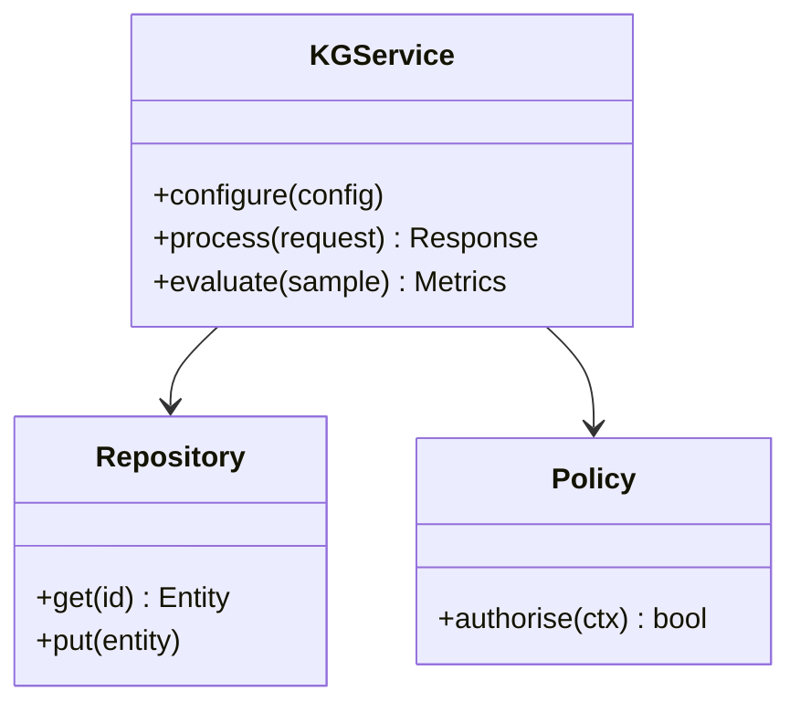

**Figure 8. Class - Knowledge Graph Embeddings** (mermaid). Figure: Class view for Knowledge Graphs. This diagram illustrates the principal components and their interactions as discussed in the surrounding section.

## Deep Dive: Mechanics, Variants and Trade-offs

Having established the essentials, we now go deeper into knowledge graph embeddings. Beneath the abstraction lies a concrete process whose steps can each be measured, tested and optimised independently. The distinctions in this section are the ones that separate a working demo from a system that holds up under adversarial inputs, scale and the passage of time.

Consider the principal variants and how to choose between them. Each variant optimises for a different point in the design space - some for latency, some for accuracy, some for cost or operability - and the correct choice follows from explicit requirements rather than from defaults. As with most architectural decisions, the choice is rarely binary; the skill lies in quantifying the trade-offs and choosing deliberately.

In practice this is supported by a mature tooling ecosystem, including Neo4j, Amazon Neptune, RDFLib, Apache Jena. Tools accelerate the work but do not substitute for understanding: the same principles apply whichever implementation you select, and the ability to reason from first principles is what lets you debug when a tool behaves unexpectedly.

A frequent source of subtle bugs is the interaction with reasoning and inference. Because reasoning and inference concerns rules, RDFS/OWL semantics and inferring implicit facts, changes there can silently alter the behaviour analysed here. The remedy is contract tests at the boundary and end-to-end evaluations that exercise the interaction explicitly.

Finally, attend to edge cases and degradation. Define what the system should do under partial failure, unexpected inputs and load spikes, and make that behaviour explicit and tested rather than emergent. Graceful degradation - returning a safe, useful result when the ideal one is unavailable - is a hallmark of mature engineering.

For deeper study, the literature offers authoritative treatments such as Hogan et al. — Knowledge Graphs (2021) and Bordes et al. — TransE (2013). These primary sources reward careful reading and ground the practical guidance above in established results.

## Advanced Considerations

Having established the essentials, we now go deeper into knowledge graph embeddings. The underlying mechanism is best appreciated by tracing a single request from input to output and noting where state is created and consumed. The distinctions in this section are the ones that separate a working demo from a system that holds up under adversarial inputs, scale and the passage of time.

Consider the principal variants and how to choose between them. Each variant optimises for a different point in the design space - some for latency, some for accuracy, some for cost or operability - and the correct choice follows from explicit requirements rather than from defaults. As with most architectural decisions, the choice is rarely binary; the skill lies in quantifying the trade-offs and choosing deliberately.

In practice this is supported by a mature tooling ecosystem, including Neo4j, Amazon Neptune, RDFLib, Apache Jena. Tools accelerate the work but do not substitute for understanding: the same principles apply whichever implementation you select, and the ability to reason from first principles is what lets you debug when a tool behaves unexpectedly.

A frequent source of subtle bugs is the interaction with operating knowledge graphs. Because operating knowledge graphs concerns pipelines, monitoring and lifecycle management, changes there can silently alter the behaviour analysed here. The remedy is contract tests at the boundary and end-to-end evaluations that exercise the interaction explicitly.

Finally, attend to edge cases and degradation. Define what the system should do under partial failure, unexpected inputs and load spikes, and make that behaviour explicit and tested rather than emergent. Graceful degradation - returning a safe, useful result when the ideal one is unavailable - is a hallmark of mature engineering.

For deeper study, the literature offers authoritative treatments such as Hogan et al. — Knowledge Graphs (2021) and Bordes et al. — TransE (2013). These primary sources reward careful reading and ground the practical guidance above in established results.

## Worked Example

Consider a concrete scenario. A enterprise organisation needs 360-degree views linking customers, products and events. They decide to apply knowledge graph embeddings as part of their Knowledge Graphs solution, but wisely treat it as a hypothesis to be validated rather than a foregone conclusion.

The team begins by stating the objective precisely and defining how success will be measured before writing any code. They establish a small but representative evaluation set, agree on acceptance thresholds, and only then prototype the simplest design that could work. Early measurement reveals which assumptions hold and which must be revised, saving weeks of misdirected effort and surfacing edge cases while they are still cheap to fix.

As the prototype matures into a service, the team hardens it: adding input validation, error handling, caching where it pays off, and monitoring that ties back to the original success metric. They document each significant decision in an architecture decision record so that future maintainers understand not just what was built but why.

The outcome is instructive. The system that reaches production is not the most sophisticated design the team considered, but the one whose behaviour they could measure, explain and operate. This is the recurring lesson of Knowledge Graphs: durable value comes from the whole system, not from any single clever component.

## Industry Use Cases

Across industries, the ideas in this chapter recur in recognisable ways. The following vignettes show how different sectors apply them and what they have in common.

**Finance.** Fraud rings and beneficial-ownership analysis. The common thread is that value comes not from the model alone but from the surrounding system - data quality, evaluation, integration and operations - which is precisely where most of the engineering effort belongs.

**Healthcare.** Integrating clinical, genomic and literature data. The common thread is that value comes not from the model alone but from the surrounding system - data quality, evaluation, integration and operations - which is precisely where most of the engineering effort belongs.

**Retail.** Product knowledge graphs powering search and recommendations. The common thread is that value comes not from the model alone but from the surrounding system - data quality, evaluation, integration and operations - which is precisely where most of the engineering effort belongs.

**Enterprise.** 360-degree views linking customers, products and events. The common thread is that value comes not from the model alone but from the surrounding system - data quality, evaluation, integration and operations - which is precisely where most of the engineering effort belongs.

## Best Practices

The following practices consistently separate successful Knowledge Graphs efforts from struggling ones. They are deliberately concrete so they can be adopted as checklist items in design and code review.

- Design the ontology with domain experts before ingesting at scale.
- Treat entity resolution as a first-class, monitored pipeline.
- Record provenance on every fact for trust and debugging.
- Choose the model (RDF vs property graph) to fit query needs.

None of these are exotic; they are the unglamorous disciplines that compound into reliability. The cost of adopting them is small compared with the cost of the incidents they prevent, and they become second nature with practice.

## Common Pitfalls

Equally instructive are the failure modes that recur in practice. Each pitfall below has a clear early warning sign and a known remedy, so treat them as a diagnostic checklist when something feels wrong:

- Over-engineering the ontology before validating use cases.
- Neglecting entity resolution and creating duplicates.
- Ignoring provenance, making facts untrustworthy.
- Picking a graph engine that cannot scale to your traversal patterns.

The pattern is consistent: most failures stem from skipping measurement, conflating prototype and production standards, or deferring cross-cutting concerns such as security and cost until they become emergencies. Naming these traps in advance is the cheapest way to avoid them.

## Governance, Security and Cost Notes

No discussion of knowledge graph embeddings is complete without its governance, security and cost dimensions, which are too often deferred until they become emergencies. Treating them as first-class concerns from the outset is both cheaper and safer.

**Governance.** Classify the risk of this capability, document its intended and out-of-scope uses, and ensure decisions are traceable to satisfy internal policy and external regulation such as the NIST AI RMF, ISO/IEC 42001 and the EU AI Act. **Security.** Treat all external input as untrusted, validate outputs before acting on them, apply least privilege to any tools or data access, and map controls to the OWASP LLM Top 10 and MITRE ATLAS.

**Cost and sustainability.** Establish explicit budgets for compute, tokens and latency, attribute spend to owners, and revisit the economics as usage scales - a design that is affordable at pilot scale can become untenable at production volume. Building these reflexes into everyday engineering is what allows a Knowledge Graphs system to be not only capable but also trustworthy and economically sound.

## Hands-On Exercises

Work through the following exercises. They are designed to move understanding from recognition to application - the level required for real engineering work - so prefer writing and building over merely reading.

1. Explain knowledge graph embeddings to a colleague unfamiliar with Knowledge Graphs, using a concrete example from your own domain.
2. Sketch a reference architecture that incorporates knowledge graph embeddings and annotate where observability, security and cost controls belong.
3. Design an evaluation that would tell you whether knowledge graph embeddings is working in production, including the metric, the dataset and the acceptance threshold.
4. Identify two pitfalls relevant to knowledge graph embeddings in your environment and describe the early warning signals you would monitor.
5. Prototype the simplest implementation that demonstrates knowledge graph embeddings, then list exactly what would need to change to make it production-ready.

## Key Takeaways

Key takeaways from this chapter:

- Knowledge Graph Embeddings is a systems concern in Knowledge Graphs: data, models and operations must be co-designed.
- Measurement is non-negotiable; define success metrics and evaluation before building.
- Favour the simplest design that meets the requirement, and add complexity only when evidence demands it.
- Security, cost and observability are first-class requirements, not afterthoughts.
- Document decisions so the system remains understandable and operable as it evolves.

## Code Walkthrough

Pipelines keep Knowledge Graph Embeddings logic modular and testable. Each stage is a pure function, errors are captured per item, and the composition is trivial to extend or reorder.

The full listing is shown below; study it line by line and reproduce it locally before moving on.

### Listing: A composable processing pipeline for Knowledge Graph Embeddings

```python
from collections.abc import Iterable, Iterator
from typing import Protocol


class Stage(Protocol):
    def __call__(self, item: dict) -> dict: ...


def pipeline(stages: list[Stage]) -> Stage:
    """Compose ordered stages into a single callable for Knowledge Graph Embeddings."""

    def run(item: dict) -> dict:
        for stage in stages:
            item = stage(item)
        return item

    return run


def validate(item: dict) -> dict:
    if "text" not in item:
        raise ValueError("missing required field: text")
    return item


def normalise(item: dict) -> dict:
    item["text"] = item["text"].strip().lower()
    return item


def enrich(item: dict) -> dict:
    item["length"] = len(item["text"])
    return item


process = pipeline([validate, normalise, enrich])


def run_batch(items: Iterable[dict]) -> Iterator[dict]:
    for item in items:
        try:
            yield process(dict(item))
        except ValueError as exc:
            yield {"error": str(exc), "item": item}

```

## Review Questions

1. In the context of Knowledge Graphs, which statement best describes “Knowledge Graph Embeddings”?
   - A. TransE, RotatE and link prediction for completion.
   - B. It makes the system slower but has no other effect.
   - C. It guarantees deterministic output regardless of input.
   - D. It eliminates the need for any evaluation or monitoring.
   - **Answer: A.** Knowledge Graph Embeddings: TransE, RotatE and link prediction for completion.
2. Which of the following is a recommended best practice when working with Knowledge Graphs?
   - A. Treat entity resolution as a first-class, monitored pipeline.
   - B. It is only relevant to academic research, not production.
   - C. It applies exclusively to image data.
   - D. It eliminates the need for any evaluation or monitoring.
   - **Answer: A.** Best practice: Treat entity resolution as a first-class, monitored pipeline.
3. Which of the following is a common pitfall to avoid in Knowledge Graphs?
   - A. Over-engineering the ontology before validating use cases.
   - B. It makes the system slower but has no other effect.
   - C. Design the ontology with domain experts before ingesting at scale.
   - D. It removes all security and governance requirements.
   - **Answer: A.** Pitfall to avoid: Over-engineering the ontology before validating use cases.
4. *(Discussion)* Describe a failure mode of Knowledge Graph Embeddings and how you would mitigate it.
   - **Model answer:** A strong answer defines knowledge graph embeddings (TransE, RotatE and link prediction for completion.) then connects it to architecture, evaluation, cost, security and operations for Knowledge Graphs, citing concrete trade-offs and a real-world example.

---


# Chapter 7. Graph Algorithms for Insight

_This chapter examines graph algorithms for insight within Knowledge Graphs. It covers centrality, community detection and pathfinding, derives a reference architecture, walks through a worked example and runnable code, surveys industry use cases, and distils best practices and pitfalls, closing with exercises and review questions._

## Introduction

Formally, Graph Algorithms for Insight addresses centrality, community detection and pathfinding. It is foundational: later capabilities in Knowledge Graphs are built directly on top of it. What distinguishes a production-grade approach from a prototype is the discipline of measurement: every claim is backed by an evaluation rather than intuition.

This chapter builds intuition first, then formalises the ideas, derives an architecture, and finishes with code, exercises and review questions so the material transfers directly to your own Knowledge Graphs work. Read it actively: pause at each diagram, reproduce the code, and attempt the exercises before consulting the answers.

## Theory and Foundations

Graph Algorithms for Insight refers to centrality, community detection and pathfinding. It helps to separate the conceptual model from its implementation: the former guides reasoning, the latter must contend with real-world constraints. Beneath the abstraction lies a concrete process whose steps can each be measured, tested and optimised independently.

To place this in context, recall the broader picture: Knowledge graphs represent entities and their relationships as nodes and edges, enabling integration of heterogeneous data, semantic querying and reasoning. Within that picture, graph algorithms for insight is one of the load-bearing ideas - the kind that, when understood deeply, makes the rest of Knowledge Graphs fall into place. Understanding this matters because Knowledge Graphs systems succeed or fail on exactly these decisions.

Graph Algorithms for Insight cannot be understood in isolation from graphs, triples and the property graph model. Recall that graphs, triples and the property graph model concerns rDF triples versus labelled property graphs and when to use each. The two interact directly: decisions in one constrain the design space of the other, which is why mature teams reason about them together rather than sequentially. Simplicity is a feature. The simplest design that meets the requirement should be the default, with complexity added only when measurement justifies it.

Graph Algorithms for Insight cannot be understood in isolation from knowledge graph embeddings. Recall that knowledge graph embeddings concerns transE, RotatE and link prediction for completion. The two interact directly: decisions in one constrain the design space of the other, which is why mature teams reason about them together rather than sequentially. Latency, accuracy and cost form a tension triangle: improving one typically pressures the others, so explicit budgets are essential.

Several established patterns apply directly to graph algorithms for insight. The first, entity-resolution pipeline feeding a golden-record graph, is widely adopted because it makes the system's behaviour predictable and observable. A complementary pattern, embedding-based link prediction for completion, addresses a related concern and is often deployed alongside it. Patterns are not dogma; they are distilled experience that shortcuts the search for a sound design, and each carries assumptions worth checking against your context.

The decision of whether to adopt this should be driven by requirements, not by novelty. In a small prototype, shortcuts around graph algorithms for insight are invisible; in a production Knowledge Graphs system serving real traffic, they surface as incidents, cost overruns or compliance gaps. There is an inherent trade-off between fidelity and cost, and the correct balance depends on the use case and its tolerance for error. The remainder of this chapter turns these principles into an architecture, code and a checklist you can apply immediately.

## Architecture and Design

From an architectural standpoint, Graph Algorithms for Insight sits at the intersection of data, models and operations. An enterprise knowledge graph ingests from databases, documents and APIs through extraction and entity-resolution pipelines into a graph store governed by an ontology. Query services expose traversal and reasoning to applications, while a governance layer tracks provenance, versions and access.

Concretely, the principal building blocks include graphs, triples and the property graph model, ontology and schema design, entity extraction and linking, graph query languages and reasoning and inference. Each is a replaceable component behind a stable interface, so the team can upgrade an implementation - a model, an index, a policy engine - without rewriting its neighbours. The contracts between components are where reliability is won or lost, so they are specified explicitly and tested in isolation.

The diagram accompanying this section makes the data and control flow explicit. Requests enter through a well-defined boundary where they are authenticated and validated; only then are they dispatched to the components that perform the work. This boundary is also where rate limiting, quota enforcement and audit logging live, keeping cross-cutting concerns out of the core logic and in one auditable place.

Two qualities deserve emphasis. First, observability is designed in, not bolted on: every component emits structured telemetry so that failures can be localised in minutes rather than hours. Second, the architecture is evolvable - components communicate through stable contracts so that any single part of the Knowledge Graphs system can be replaced without a rewrite. Every added component buys capability at the price of operational surface area, and that bargain should be made consciously.

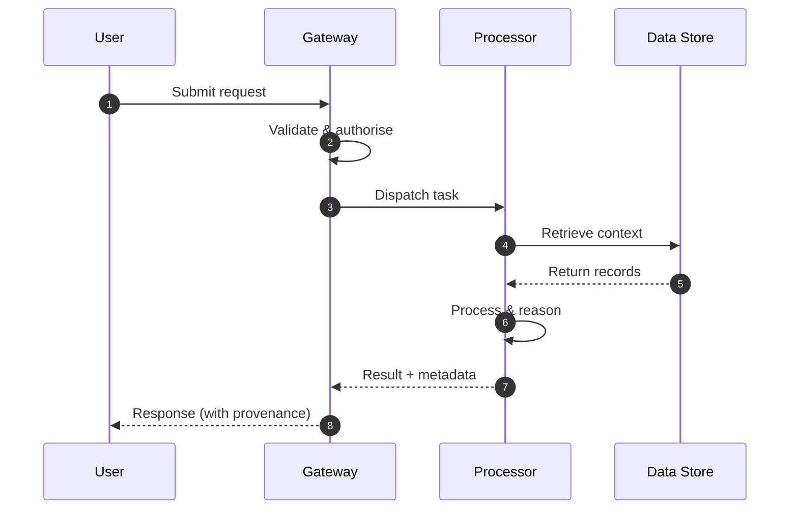

**Figure 9. Sequence - Graph Algorithms for Insight** (mermaid). Figure: Sequence view for Knowledge Graphs. This diagram illustrates the principal components and their interactions as discussed in the surrounding section.

## Deep Dive: Mechanics, Variants and Trade-offs

Having established the essentials, we now go deeper into graph algorithms for insight. Mechanically, the behaviour emerges from a few interacting parts that are simpler than the whole they produce. The distinctions in this section are the ones that separate a working demo from a system that holds up under adversarial inputs, scale and the passage of time.

Consider the principal variants and how to choose between them. Each variant optimises for a different point in the design space - some for latency, some for accuracy, some for cost or operability - and the correct choice follows from explicit requirements rather than from defaults. As with most architectural decisions, the choice is rarely binary; the skill lies in quantifying the trade-offs and choosing deliberately.

In practice this is supported by a mature tooling ecosystem, including Neo4j, Amazon Neptune, RDFLib, Apache Jena. Tools accelerate the work but do not substitute for understanding: the same principles apply whichever implementation you select, and the ability to reason from first principles is what lets you debug when a tool behaves unexpectedly.

A frequent source of subtle bugs is the interaction with graphs, triples and the property graph model. Because graphs, triples and the property graph model concerns rDF triples versus labelled property graphs and when to use each, changes there can silently alter the behaviour analysed here. The remedy is contract tests at the boundary and end-to-end evaluations that exercise the interaction explicitly.

Finally, attend to edge cases and degradation. Define what the system should do under partial failure, unexpected inputs and load spikes, and make that behaviour explicit and tested rather than emergent. Graceful degradation - returning a safe, useful result when the ideal one is unavailable - is a hallmark of mature engineering.

For deeper study, the literature offers authoritative treatments such as Hogan et al. — Knowledge Graphs (2021) and Bordes et al. — TransE (2013). These primary sources reward careful reading and ground the practical guidance above in established results.

## Advanced Considerations

Having established the essentials, we now go deeper into graph algorithms for insight. Beneath the abstraction lies a concrete process whose steps can each be measured, tested and optimised independently. The distinctions in this section are the ones that separate a working demo from a system that holds up under adversarial inputs, scale and the passage of time.

Consider the principal variants and how to choose between them. Each variant optimises for a different point in the design space - some for latency, some for accuracy, some for cost or operability - and the correct choice follows from explicit requirements rather than from defaults. Latency, accuracy and cost form a tension triangle: improving one typically pressures the others, so explicit budgets are essential.

In practice this is supported by a mature tooling ecosystem, including Neo4j, Amazon Neptune, RDFLib, Apache Jena. Tools accelerate the work but do not substitute for understanding: the same principles apply whichever implementation you select, and the ability to reason from first principles is what lets you debug when a tool behaves unexpectedly.

A frequent source of subtle bugs is the interaction with graphs for grounding llms. Because graphs for grounding llms concerns serving structured context to generative systems, changes there can silently alter the behaviour analysed here. The remedy is contract tests at the boundary and end-to-end evaluations that exercise the interaction explicitly.

Finally, attend to edge cases and degradation. Define what the system should do under partial failure, unexpected inputs and load spikes, and make that behaviour explicit and tested rather than emergent. Graceful degradation - returning a safe, useful result when the ideal one is unavailable - is a hallmark of mature engineering.

For deeper study, the literature offers authoritative treatments such as Hogan et al. — Knowledge Graphs (2021) and Bordes et al. — TransE (2013). These primary sources reward careful reading and ground the practical guidance above in established results.

## Worked Example

A worked example clarifies how these ideas behave in practice. A enterprise organisation needs 360-degree views linking customers, products and events. They decide to apply graph algorithms for insight as part of their Knowledge Graphs solution, but wisely treat it as a hypothesis to be validated rather than a foregone conclusion.

The team begins by stating the objective precisely and defining how success will be measured before writing any code. They establish a small but representative evaluation set, agree on acceptance thresholds, and only then prototype the simplest design that could work. Early measurement reveals which assumptions hold and which must be revised, saving weeks of misdirected effort and surfacing edge cases while they are still cheap to fix.

As the prototype matures into a service, the team hardens it: adding input validation, error handling, caching where it pays off, and monitoring that ties back to the original success metric. They document each significant decision in an architecture decision record so that future maintainers understand not just what was built but why.

The outcome is instructive. The system that reaches production is not the most sophisticated design the team considered, but the one whose behaviour they could measure, explain and operate. This is the recurring lesson of Knowledge Graphs: durable value comes from the whole system, not from any single clever component.

## Industry Use Cases

Across industries, the ideas in this chapter recur in recognisable ways. The following vignettes show how different sectors apply them and what they have in common.

**Finance.** Fraud rings and beneficial-ownership analysis. The common thread is that value comes not from the model alone but from the surrounding system - data quality, evaluation, integration and operations - which is precisely where most of the engineering effort belongs.

**Healthcare.** Integrating clinical, genomic and literature data. The common thread is that value comes not from the model alone but from the surrounding system - data quality, evaluation, integration and operations - which is precisely where most of the engineering effort belongs.

**Retail.** Product knowledge graphs powering search and recommendations. The common thread is that value comes not from the model alone but from the surrounding system - data quality, evaluation, integration and operations - which is precisely where most of the engineering effort belongs.

**Enterprise.** 360-degree views linking customers, products and events. The common thread is that value comes not from the model alone but from the surrounding system - data quality, evaluation, integration and operations - which is precisely where most of the engineering effort belongs.

## Best Practices

The following practices consistently separate successful Knowledge Graphs efforts from struggling ones. They are deliberately concrete so they can be adopted as checklist items in design and code review.

- Design the ontology with domain experts before ingesting at scale.
- Treat entity resolution as a first-class, monitored pipeline.
- Record provenance on every fact for trust and debugging.
- Choose the model (RDF vs property graph) to fit query needs.

None of these are exotic; they are the unglamorous disciplines that compound into reliability. The cost of adopting them is small compared with the cost of the incidents they prevent, and they become second nature with practice.

## Common Pitfalls

Equally instructive are the failure modes that recur in practice. Each pitfall below has a clear early warning sign and a known remedy, so treat them as a diagnostic checklist when something feels wrong:

- Over-engineering the ontology before validating use cases.
- Neglecting entity resolution and creating duplicates.
- Ignoring provenance, making facts untrustworthy.
- Picking a graph engine that cannot scale to your traversal patterns.

The pattern is consistent: most failures stem from skipping measurement, conflating prototype and production standards, or deferring cross-cutting concerns such as security and cost until they become emergencies. Naming these traps in advance is the cheapest way to avoid them.

## Governance, Security and Cost Notes

No discussion of graph algorithms for insight is complete without its governance, security and cost dimensions, which are too often deferred until they become emergencies. Treating them as first-class concerns from the outset is both cheaper and safer.

**Governance.** Classify the risk of this capability, document its intended and out-of-scope uses, and ensure decisions are traceable to satisfy internal policy and external regulation such as the NIST AI RMF, ISO/IEC 42001 and the EU AI Act. **Security.** Treat all external input as untrusted, validate outputs before acting on them, apply least privilege to any tools or data access, and map controls to the OWASP LLM Top 10 and MITRE ATLAS.

**Cost and sustainability.** Establish explicit budgets for compute, tokens and latency, attribute spend to owners, and revisit the economics as usage scales - a design that is affordable at pilot scale can become untenable at production volume. Building these reflexes into everyday engineering is what allows a Knowledge Graphs system to be not only capable but also trustworthy and economically sound.

## Hands-On Exercises

Work through the following exercises. They are designed to move understanding from recognition to application - the level required for real engineering work - so prefer writing and building over merely reading.

1. Explain graph algorithms for insight to a colleague unfamiliar with Knowledge Graphs, using a concrete example from your own domain.
2. Sketch a reference architecture that incorporates graph algorithms for insight and annotate where observability, security and cost controls belong.
3. Design an evaluation that would tell you whether graph algorithms for insight is working in production, including the metric, the dataset and the acceptance threshold.
4. Identify two pitfalls relevant to graph algorithms for insight in your environment and describe the early warning signals you would monitor.
5. Prototype the simplest implementation that demonstrates graph algorithms for insight, then list exactly what would need to change to make it production-ready.

## Key Takeaways

Key takeaways from this chapter:

- Graph Algorithms for Insight is a systems concern in Knowledge Graphs: data, models and operations must be co-designed.
- Measurement is non-negotiable; define success metrics and evaluation before building.
- Favour the simplest design that meets the requirement, and add complexity only when evidence demands it.
- Security, cost and observability are first-class requirements, not afterthoughts.
- Document decisions so the system remains understandable and operable as it evolves.

## Code Walkthrough

Pipelines keep Graph Algorithms for Insight logic modular and testable. Each stage is a pure function, errors are captured per item, and the composition is trivial to extend or reorder.

The full listing is shown below; study it line by line and reproduce it locally before moving on.

### Listing: A composable processing pipeline for Graph Algorithms for Insight

```python
from collections.abc import Iterable, Iterator
from typing import Protocol


class Stage(Protocol):
    def __call__(self, item: dict) -> dict: ...


def pipeline(stages: list[Stage]) -> Stage:
    """Compose ordered stages into a single callable for Graph Algorithms for Insight."""

    def run(item: dict) -> dict:
        for stage in stages:
            item = stage(item)
        return item

    return run


def validate(item: dict) -> dict:
    if "text" not in item:
        raise ValueError("missing required field: text")
    return item


def normalise(item: dict) -> dict:
    item["text"] = item["text"].strip().lower()
    return item


def enrich(item: dict) -> dict:
    item["length"] = len(item["text"])
    return item


process = pipeline([validate, normalise, enrich])


def run_batch(items: Iterable[dict]) -> Iterator[dict]:
    for item in items:
        try:
            yield process(dict(item))
        except ValueError as exc:
            yield {"error": str(exc), "item": item}

```

## Review Questions

1. In the context of Knowledge Graphs, which statement best describes “Graph Algorithms for Insight”?
   - A. Centrality, community detection and pathfinding.
   - B. It applies exclusively to image data.
   - C. It eliminates the need for any evaluation or monitoring.
   - D. It removes all security and governance requirements.
   - **Answer: A.** Graph Algorithms for Insight: Centrality, community detection and pathfinding.
2. Which of the following is a recommended best practice when working with Knowledge Graphs?
   - A. Treat entity resolution as a first-class, monitored pipeline.
   - B. Neglecting entity resolution and creating duplicates.
   - C. It guarantees deterministic output regardless of input.
   - D. Picking a graph engine that cannot scale to your traversal patterns.
   - **Answer: A.** Best practice: Treat entity resolution as a first-class, monitored pipeline.
3. Which of the following is a common pitfall to avoid in Knowledge Graphs?
   - A. It is only relevant to academic research, not production.
   - B. Neglecting entity resolution and creating duplicates.
   - C. Record provenance on every fact for trust and debugging.
   - D. It applies exclusively to image data.
   - **Answer: B.** Pitfall to avoid: Neglecting entity resolution and creating duplicates.
4. *(Discussion)* Describe a failure mode of Graph Algorithms for Insight and how you would mitigate it.
   - **Model answer:** A strong answer defines graph algorithms for insight (Centrality, community detection and pathfinding.) then connects it to architecture, evaluation, cost, security and operations for Knowledge Graphs, citing concrete trade-offs and a real-world example.

---


# Chapter 8. Data Quality and Entity Resolution

_This chapter examines data quality and entity resolution within Knowledge Graphs. It covers deduplication, validation and provenance, derives a reference architecture, walks through a worked example and runnable code, surveys industry use cases, and distils best practices and pitfalls, closing with exercises and review questions._

## Introduction

We define Data Quality and Entity Resolution as deduplication, validation and provenance. This concept recurs throughout the Knowledge Graphs lifecycle, from design to operations. In an enterprise setting, this translates into concrete requirements: clear interfaces, measurable quality, and controls that satisfy security and governance.

This chapter builds intuition first, then formalises the ideas, derives an architecture, and finishes with code, exercises and review questions so the material transfers directly to your own Knowledge Graphs work. Read it actively: pause at each diagram, reproduce the code, and attempt the exercises before consulting the answers.

## Theory and Foundations

Formally, Data Quality and Entity Resolution addresses deduplication, validation and provenance. Seasoned practitioners treat this as a systems problem, co-designing data, models and operations rather than optimising any one in isolation. It pays to understand the mechanism rather than treat it as a black box, because most production incidents are explained by one of its steps misbehaving.

To place this in context, recall the broader picture: Knowledge graphs represent entities and their relationships as nodes and edges, enabling integration of heterogeneous data, semantic querying and reasoning. Within that picture, data quality and entity resolution is one of the load-bearing ideas - the kind that, when understood deeply, makes the rest of Knowledge Graphs fall into place. Understanding this matters because Knowledge Graphs systems succeed or fail on exactly these decisions.

Data Quality and Entity Resolution cannot be understood in isolation from scaling graph storage. Recall that scaling graph storage concerns partitioning, indexing and distributed graph engines. The two interact directly: decisions in one constrain the design space of the other, which is why mature teams reason about them together rather than sequentially. As with most architectural decisions, the choice is rarely binary; the skill lies in quantifying the trade-offs and choosing deliberately.

Data Quality and Entity Resolution cannot be understood in isolation from reasoning and inference. Recall that reasoning and inference concerns rules, RDFS/OWL semantics and inferring implicit facts. The two interact directly: decisions in one constrain the design space of the other, which is why mature teams reason about them together rather than sequentially. Every added component buys capability at the price of operational surface area, and that bargain should be made consciously.

Several established patterns apply directly to data quality and entity resolution. The first, provenance edges for full traceability, is widely adopted because it makes the system's behaviour predictable and observable. A complementary pattern, entity-resolution pipeline feeding a golden-record graph, addresses a related concern and is often deployed alongside it. Patterns are not dogma; they are distilled experience that shortcuts the search for a sound design, and each carries assumptions worth checking against your context.

Knowing when not to use a technique is as valuable as knowing how to use it. In a small prototype, shortcuts around data quality and entity resolution are invisible; in a production Knowledge Graphs system serving real traffic, they surface as incidents, cost overruns or compliance gaps. Every added component buys capability at the price of operational surface area, and that bargain should be made consciously. The remainder of this chapter turns these principles into an architecture, code and a checklist you can apply immediately.

## Architecture and Design

From an architectural standpoint, Data Quality and Entity Resolution sits at the intersection of data, models and operations. An enterprise knowledge graph ingests from databases, documents and APIs through extraction and entity-resolution pipelines into a graph store governed by an ontology. Query services expose traversal and reasoning to applications, while a governance layer tracks provenance, versions and access.

Concretely, the principal building blocks include graphs, triples and the property graph model, ontology and schema design, entity extraction and linking, graph query languages and reasoning and inference. Each is a replaceable component behind a stable interface, so the team can upgrade an implementation - a model, an index, a policy engine - without rewriting its neighbours. The contracts between components are where reliability is won or lost, so they are specified explicitly and tested in isolation.

The diagram accompanying this section makes the data and control flow explicit. Requests enter through a well-defined boundary where they are authenticated and validated; only then are they dispatched to the components that perform the work. This boundary is also where rate limiting, quota enforcement and audit logging live, keeping cross-cutting concerns out of the core logic and in one auditable place.

Two qualities deserve emphasis. First, observability is designed in, not bolted on: every component emits structured telemetry so that failures can be localised in minutes rather than hours. Second, the architecture is evolvable - components communicate through stable contracts so that any single part of the Knowledge Graphs system can be replaced without a rewrite. There is an inherent trade-off between fidelity and cost, and the correct balance depends on the use case and its tolerance for error.

<div class="diagram-svg">

<svg xmlns="http://www.w3.org/2000/svg" width="840" height="460" data-tpl="flow_v" data-pal="5-1" viewBox="0 0 840 460" font-family="Inter, Segoe UI, Arial, sans-serif"><defs><marker id="ar" markerWidth="9" markerHeight="9" refX="7" refY="3" orient="auto"><path d="M0,0 L7,3 L0,6 z" fill="#94a3b8"/></marker><marker id="arw" markerWidth="9" markerHeight="9" refX="7" refY="3" orient="auto"><path d="M0,0 L7,3 L0,6 z" fill="#ffffff"/></marker></defs><rect width="840" height="460" rx="14" fill="#ffffff"/><rect x="0" y="0" width="840" height="46" rx="14" fill="#1d4ed8"/><rect x="0" y="30" width="840" height="16" fill="#1d4ed8"/><text x="420" y="24" text-anchor="middle" font-size="15" font-weight="700" fill="#ffffff" dominant-baseline="middle">Data Flow - Data Quality and Entity Resolution</text><rect x="270" y="70" width="300" height="52" rx="11" fill="#1d4ed8"/><text x="420" y="96" text-anchor="middle" font-size="12" font-weight="600" fill="#ffffff" dominant-baseline="middle">Data Quality and Entity Resolution</text><rect x="270" y="144" width="300" height="52" rx="11" fill="#2563eb"/><text x="420" y="170" text-anchor="middle" font-size="12" font-weight="600" fill="#ffffff" dominant-baseline="middle">Scaling Graph Storage</text><line x1="420" y1="122" x2="420" y2="144" stroke="#94a3b8" stroke-width="2" marker-end="url(#ar)"/><rect x="270" y="218" width="300" height="52" rx="11" fill="#3b82f6"/><text x="420" y="244" text-anchor="middle" font-size="12" font-weight="600" fill="#ffffff" dominant-baseline="middle">Graphs for Grounding LLMs</text><line x1="420" y1="196" x2="420" y2="218" stroke="#94a3b8" stroke-width="2" marker-end="url(#ar)"/><rect x="270" y="292" width="300" height="52" rx="11" fill="#60a5fa"/><text x="420" y="318" text-anchor="middle" font-size="12" font-weight="600" fill="#ffffff" dominant-baseline="middle">Governance and Lineage</text><line x1="420" y1="270" x2="420" y2="292" stroke="#94a3b8" stroke-width="2" marker-end="url(#ar)"/><rect x="270" y="366" width="300" height="52" rx="11" fill="#1e40af"/><text x="420" y="392" text-anchor="middle" font-size="12" font-weight="600" fill="#ffffff" dominant-baseline="middle">Operating Knowledge Graphs</text><line x1="420" y1="344" x2="420" y2="366" stroke="#94a3b8" stroke-width="2" marker-end="url(#ar)"/></svg>

</div>

**Figure 10. Data Flow - Data Quality and Entity Resolution** (svg). Figure: Data Flow view for Knowledge Graphs. This diagram illustrates the principal components and their interactions as discussed in the surrounding section.

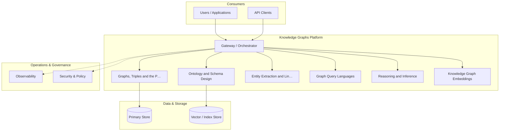

**Figure 11. Architecture - Data Quality and Entity Resolution** (mermaid). Figure: Architecture view for Knowledge Graphs. This diagram illustrates the principal components and their interactions as discussed in the surrounding section.

## Deep Dive: Mechanics, Variants and Trade-offs

Having established the essentials, we now go deeper into data quality and entity resolution. Beneath the abstraction lies a concrete process whose steps can each be measured, tested and optimised independently. The distinctions in this section are the ones that separate a working demo from a system that holds up under adversarial inputs, scale and the passage of time.

Consider the principal variants and how to choose between them. Each variant optimises for a different point in the design space - some for latency, some for accuracy, some for cost or operability - and the correct choice follows from explicit requirements rather than from defaults. As with most architectural decisions, the choice is rarely binary; the skill lies in quantifying the trade-offs and choosing deliberately.

In practice this is supported by a mature tooling ecosystem, including Neo4j, Amazon Neptune, RDFLib, Apache Jena. Tools accelerate the work but do not substitute for understanding: the same principles apply whichever implementation you select, and the ability to reason from first principles is what lets you debug when a tool behaves unexpectedly.

A frequent source of subtle bugs is the interaction with scaling graph storage. Because scaling graph storage concerns partitioning, indexing and distributed graph engines, changes there can silently alter the behaviour analysed here. The remedy is contract tests at the boundary and end-to-end evaluations that exercise the interaction explicitly.

Finally, attend to edge cases and degradation. Define what the system should do under partial failure, unexpected inputs and load spikes, and make that behaviour explicit and tested rather than emergent. Graceful degradation - returning a safe, useful result when the ideal one is unavailable - is a hallmark of mature engineering.

For deeper study, the literature offers authoritative treatments such as Hogan et al. — Knowledge Graphs (2021) and Bordes et al. — TransE (2013). These primary sources reward careful reading and ground the practical guidance above in established results.

## Advanced Considerations

Having established the essentials, we now go deeper into data quality and entity resolution. The underlying mechanism is best appreciated by tracing a single request from input to output and noting where state is created and consumed. The distinctions in this section are the ones that separate a working demo from a system that holds up under adversarial inputs, scale and the passage of time.

Consider the principal variants and how to choose between them. Each variant optimises for a different point in the design space - some for latency, some for accuracy, some for cost or operability - and the correct choice follows from explicit requirements rather than from defaults. Simplicity is a feature. The simplest design that meets the requirement should be the default, with complexity added only when measurement justifies it.

In practice this is supported by a mature tooling ecosystem, including Neo4j, Amazon Neptune, RDFLib, Apache Jena. Tools accelerate the work but do not substitute for understanding: the same principles apply whichever implementation you select, and the ability to reason from first principles is what lets you debug when a tool behaves unexpectedly.

A frequent source of subtle bugs is the interaction with graphs, triples and the property graph model. Because graphs, triples and the property graph model concerns rDF triples versus labelled property graphs and when to use each, changes there can silently alter the behaviour analysed here. The remedy is contract tests at the boundary and end-to-end evaluations that exercise the interaction explicitly.

Finally, attend to edge cases and degradation. Define what the system should do under partial failure, unexpected inputs and load spikes, and make that behaviour explicit and tested rather than emergent. Graceful degradation - returning a safe, useful result when the ideal one is unavailable - is a hallmark of mature engineering.

For deeper study, the literature offers authoritative treatments such as Hogan et al. — Knowledge Graphs (2021) and Bordes et al. — TransE (2013). These primary sources reward careful reading and ground the practical guidance above in established results.

## Worked Example

To ground the discussion, walk through a representative example. A healthcare organisation needs integrating clinical, genomic and literature data. They decide to apply data quality and entity resolution as part of their Knowledge Graphs solution, but wisely treat it as a hypothesis to be validated rather than a foregone conclusion.

The team begins by stating the objective precisely and defining how success will be measured before writing any code. They establish a small but representative evaluation set, agree on acceptance thresholds, and only then prototype the simplest design that could work. Early measurement reveals which assumptions hold and which must be revised, saving weeks of misdirected effort and surfacing edge cases while they are still cheap to fix.

As the prototype matures into a service, the team hardens it: adding input validation, error handling, caching where it pays off, and monitoring that ties back to the original success metric. They document each significant decision in an architecture decision record so that future maintainers understand not just what was built but why.

The outcome is instructive. The system that reaches production is not the most sophisticated design the team considered, but the one whose behaviour they could measure, explain and operate. This is the recurring lesson of Knowledge Graphs: durable value comes from the whole system, not from any single clever component.

## Industry Use Cases

Across industries, the ideas in this chapter recur in recognisable ways. The following vignettes show how different sectors apply them and what they have in common.

**Finance.** Fraud rings and beneficial-ownership analysis. The common thread is that value comes not from the model alone but from the surrounding system - data quality, evaluation, integration and operations - which is precisely where most of the engineering effort belongs.

**Healthcare.** Integrating clinical, genomic and literature data. The common thread is that value comes not from the model alone but from the surrounding system - data quality, evaluation, integration and operations - which is precisely where most of the engineering effort belongs.

**Retail.** Product knowledge graphs powering search and recommendations. The common thread is that value comes not from the model alone but from the surrounding system - data quality, evaluation, integration and operations - which is precisely where most of the engineering effort belongs.

**Enterprise.** 360-degree views linking customers, products and events. The common thread is that value comes not from the model alone but from the surrounding system - data quality, evaluation, integration and operations - which is precisely where most of the engineering effort belongs.

## Best Practices

The following practices consistently separate successful Knowledge Graphs efforts from struggling ones. They are deliberately concrete so they can be adopted as checklist items in design and code review.

- Design the ontology with domain experts before ingesting at scale.
- Treat entity resolution as a first-class, monitored pipeline.
- Record provenance on every fact for trust and debugging.
- Choose the model (RDF vs property graph) to fit query needs.

None of these are exotic; they are the unglamorous disciplines that compound into reliability. The cost of adopting them is small compared with the cost of the incidents they prevent, and they become second nature with practice.

## Common Pitfalls

Equally instructive are the failure modes that recur in practice. Each pitfall below has a clear early warning sign and a known remedy, so treat them as a diagnostic checklist when something feels wrong:

- Over-engineering the ontology before validating use cases.
- Neglecting entity resolution and creating duplicates.
- Ignoring provenance, making facts untrustworthy.
- Picking a graph engine that cannot scale to your traversal patterns.

The pattern is consistent: most failures stem from skipping measurement, conflating prototype and production standards, or deferring cross-cutting concerns such as security and cost until they become emergencies. Naming these traps in advance is the cheapest way to avoid them.

## Governance, Security and Cost Notes

No discussion of data quality and entity resolution is complete without its governance, security and cost dimensions, which are too often deferred until they become emergencies. Treating them as first-class concerns from the outset is both cheaper and safer.

**Governance.** Classify the risk of this capability, document its intended and out-of-scope uses, and ensure decisions are traceable to satisfy internal policy and external regulation such as the NIST AI RMF, ISO/IEC 42001 and the EU AI Act. **Security.** Treat all external input as untrusted, validate outputs before acting on them, apply least privilege to any tools or data access, and map controls to the OWASP LLM Top 10 and MITRE ATLAS.

**Cost and sustainability.** Establish explicit budgets for compute, tokens and latency, attribute spend to owners, and revisit the economics as usage scales - a design that is affordable at pilot scale can become untenable at production volume. Building these reflexes into everyday engineering is what allows a Knowledge Graphs system to be not only capable but also trustworthy and economically sound.

## Hands-On Exercises

Work through the following exercises. They are designed to move understanding from recognition to application - the level required for real engineering work - so prefer writing and building over merely reading.

1. Explain data quality and entity resolution to a colleague unfamiliar with Knowledge Graphs, using a concrete example from your own domain.
2. Sketch a reference architecture that incorporates data quality and entity resolution and annotate where observability, security and cost controls belong.
3. Design an evaluation that would tell you whether data quality and entity resolution is working in production, including the metric, the dataset and the acceptance threshold.
4. Identify two pitfalls relevant to data quality and entity resolution in your environment and describe the early warning signals you would monitor.
5. Prototype the simplest implementation that demonstrates data quality and entity resolution, then list exactly what would need to change to make it production-ready.

## Key Takeaways

Key takeaways from this chapter:

- Data Quality and Entity Resolution is a systems concern in Knowledge Graphs: data, models and operations must be co-designed.
- Measurement is non-negotiable; define success metrics and evaluation before building.
- Favour the simplest design that meets the requirement, and add complexity only when evidence demands it.
- Security, cost and observability are first-class requirements, not afterthoughts.
- Document decisions so the system remains understandable and operable as it evolves.

## Code Walkthrough

This listing shows a configuration-driven Data Quality and Entity Resolution component with retry semantics and typed interfaces — the shape we expect from production Knowledge Graphs code rather than a notebook prototype.

The full listing is shown below; study it line by line and reproduce it locally before moving on.

### Listing: Implementing a Data Quality and Entity Resolution component

```python
from __future__ import annotations

from dataclasses import dataclass, field
from typing import Any


@dataclass(slots=True)
class DataQualityAndConfig:
    """Configuration for the Data Quality and Entity Resolution component in a Knowledge Graphs system."""

    name: str
    timeout_s: float = 30.0
    max_retries: int = 3
    options: dict[str, Any] = field(default_factory=dict)


class DataQualityAnd:
    """A minimal, production-shaped implementation of Data Quality and Entity Resolution."""

    def __init__(self, config: DataQualityAndConfig) -> None:
        self._config = config
        self._calls = 0

    def run(self, payload: dict[str, Any]) -> dict[str, Any]:
        """Process a request, retrying transient failures with backoff."""
        last_error: Exception | None = None
        for attempt in range(self._config.max_retries):
            try:
                self._calls += 1
                return self._process(payload)
            except TimeoutError as exc:  # transient
                last_error = exc
                continue
        raise RuntimeError(f"DataQualityAnd failed after retries") from last_error

    def _process(self, payload: dict[str, Any]) -> dict[str, Any]:
        # Domain-specific logic for Data Quality and Entity Resolution goes here.
        return {"status": "ok", "input_keys": sorted(payload), "calls": self._calls}

```

## Review Questions

1. In the context of Knowledge Graphs, which statement best describes “Data Quality and Entity Resolution”?
   - A. It applies exclusively to image data.
   - B. Deduplication, validation and provenance.
   - C. It eliminates the need for any evaluation or monitoring.
   - D. It removes all security and governance requirements.
   - **Answer: B.** Data Quality and Entity Resolution: Deduplication, validation and provenance.
2. Which of the following is a recommended best practice when working with Knowledge Graphs?
   - A. Ignoring provenance, making facts untrustworthy.
   - B. Choose the model (RDF vs property graph) to fit query needs.
   - C. It eliminates the need for any evaluation or monitoring.
   - D. It makes the system slower but has no other effect.
   - **Answer: B.** Best practice: Choose the model (RDF vs property graph) to fit query needs.
3. Which of the following is a common pitfall to avoid in Knowledge Graphs?
   - A. It guarantees deterministic output regardless of input.
   - B. Record provenance on every fact for trust and debugging.
   - C. Picking a graph engine that cannot scale to your traversal patterns.
   - D. It applies exclusively to image data.
   - **Answer: C.** Pitfall to avoid: Picking a graph engine that cannot scale to your traversal patterns.
4. *(Discussion)* How would you test and monitor Data Quality and Entity Resolution in production?
   - **Model answer:** A strong answer defines data quality and entity resolution (Deduplication, validation and provenance.) then connects it to architecture, evaluation, cost, security and operations for Knowledge Graphs, citing concrete trade-offs and a real-world example.

---


# Chapter 9. Scaling Graph Storage

_This chapter examines scaling graph storage within Knowledge Graphs. It covers partitioning, indexing and distributed graph engines, derives a reference architecture, walks through a worked example and runnable code, surveys industry use cases, and distils best practices and pitfalls, closing with exercises and review questions._

## Introduction

We define Scaling Graph Storage as partitioning, indexing and distributed graph engines. Neglecting it is one of the most common reasons Knowledge Graphs initiatives stall in production. The practical implication is that design choices here ripple through latency, cost and maintainability for the lifetime of the system.

This chapter builds intuition first, then formalises the ideas, derives an architecture, and finishes with code, exercises and review questions so the material transfers directly to your own Knowledge Graphs work. Read it actively: pause at each diagram, reproduce the code, and attempt the exercises before consulting the answers.

## Theory and Foundations

Scaling Graph Storage can be characterised as partitioning, indexing and distributed graph engines. Seasoned practitioners treat this as a systems problem, co-designing data, models and operations rather than optimising any one in isolation. Beneath the abstraction lies a concrete process whose steps can each be measured, tested and optimised independently.

To place this in context, recall the broader picture: Knowledge graphs represent entities and their relationships as nodes and edges, enabling integration of heterogeneous data, semantic querying and reasoning. Within that picture, scaling graph storage is one of the load-bearing ideas - the kind that, when understood deeply, makes the rest of Knowledge Graphs fall into place. Understanding this matters because Knowledge Graphs systems succeed or fail on exactly these decisions.

Scaling Graph Storage cannot be understood in isolation from graph algorithms for insight. Recall that graph algorithms for insight concerns centrality, community detection and pathfinding. The two interact directly: decisions in one constrain the design space of the other, which is why mature teams reason about them together rather than sequentially. As with most architectural decisions, the choice is rarely binary; the skill lies in quantifying the trade-offs and choosing deliberately.

Scaling Graph Storage cannot be understood in isolation from governance and lineage. Recall that governance and lineage concerns versioning, access control and auditability. The two interact directly: decisions in one constrain the design space of the other, which is why mature teams reason about them together rather than sequentially. As with most architectural decisions, the choice is rarely binary; the skill lies in quantifying the trade-offs and choosing deliberately.

Several established patterns apply directly to scaling graph storage. The first, embedding-based link prediction for completion, is widely adopted because it makes the system's behaviour predictable and observable. A complementary pattern, canonical ontology with reused standard vocabularies, addresses a related concern and is often deployed alongside it. Patterns are not dogma; they are distilled experience that shortcuts the search for a sound design, and each carries assumptions worth checking against your context.

The decision of whether to adopt this should be driven by requirements, not by novelty. In a small prototype, shortcuts around scaling graph storage are invisible; in a production Knowledge Graphs system serving real traffic, they surface as incidents, cost overruns or compliance gaps. Simplicity is a feature. The simplest design that meets the requirement should be the default, with complexity added only when measurement justifies it. The remainder of this chapter turns these principles into an architecture, code and a checklist you can apply immediately.

## Architecture and Design

The reference architecture for Scaling Graph Storage separates concerns into clearly bounded components with explicit contracts. An enterprise knowledge graph ingests from databases, documents and APIs through extraction and entity-resolution pipelines into a graph store governed by an ontology. Query services expose traversal and reasoning to applications, while a governance layer tracks provenance, versions and access.

Concretely, the principal building blocks include graphs, triples and the property graph model, ontology and schema design, entity extraction and linking, graph query languages and reasoning and inference. Each is a replaceable component behind a stable interface, so the team can upgrade an implementation - a model, an index, a policy engine - without rewriting its neighbours. The contracts between components are where reliability is won or lost, so they are specified explicitly and tested in isolation.

The diagram accompanying this section makes the data and control flow explicit. Requests enter through a well-defined boundary where they are authenticated and validated; only then are they dispatched to the components that perform the work. This boundary is also where rate limiting, quota enforcement and audit logging live, keeping cross-cutting concerns out of the core logic and in one auditable place.

Two qualities deserve emphasis. First, observability is designed in, not bolted on: every component emits structured telemetry so that failures can be localised in minutes rather than hours. Second, the architecture is evolvable - components communicate through stable contracts so that any single part of the Knowledge Graphs system can be replaced without a rewrite. Every added component buys capability at the price of operational surface area, and that bargain should be made consciously.

```xml
<mxfile host="ai-university">
  <diagram name="Architecture">
    <mxGraphModel dx="800" dy="600" grid="1" gridSize="10">
      <root>
        <mxCell id="0"/>
        <mxCell id="1" parent="0"/>
        <mxCell id="title" value="Architecture - Scaling Graph Storage" style="text;fontSize=16;fontStyle=1" vertex="1" parent="1"><mxGeometry x="40" y="20" width="600" height="30" as="geometry"/></mxCell>
        <mxCell id="hub" value="Knowledge Graphs" style="rounded=1;fillColor=#0f172a;fontColor=#ffffff;fontStyle=1" vertex="1" parent="1"><mxGeometry x="300" y="180" width="160" height="60" as="geometry"/></mxCell>
        <mxCell id="n0" value="Graphs, Triples and the…" style="rounded=1;fillColor=#e0e7ff;strokeColor=#4338ca" vertex="1" parent="1"><mxGeometry x="60" y="80" width="160" height="50" as="geometry"/></mxCell>
        <mxCell id="e0" style="edgeStyle=orthogonalEdgeStyle" edge="1" parent="1" source="hub" target="n0"><mxGeometry relative="1" as="geometry"/></mxCell>
        <mxCell id="n1" value="Ontology and Schema Des…" style="rounded=1;fillColor=#e0e7ff;strokeColor=#4338ca" vertex="1" parent="1"><mxGeometry x="600" y="170" width="160" height="50" as="geometry"/></mxCell>
        <mxCell id="e1" style="edgeStyle=orthogonalEdgeStyle" edge="1" parent="1" source="hub" target="n1"><mxGeometry relative="1" as="geometry"/></mxCell>
        <mxCell id="n2" value="Entity Extraction and L…" style="rounded=1;fillColor=#e0e7ff;strokeColor=#4338ca" vertex="1" parent="1"><mxGeometry x="60" y="260" width="160" height="50" as="geometry"/></mxCell>
        <mxCell id="e2" style="edgeStyle=orthogonalEdgeStyle" edge="1" parent="1" source="hub" target="n2"><mxGeometry relative="1" as="geometry"/></mxCell>
        <mxCell id="n3" value="Graph Query Languages" style="rounded=1;fillColor=#e0e7ff;strokeColor=#4338ca" vertex="1" parent="1"><mxGeometry x="600" y="350" width="160" height="50" as="geometry"/></mxCell>
        <mxCell id="e3" style="edgeStyle=orthogonalEdgeStyle" edge="1" parent="1" source="hub" target="n3"><mxGeometry relative="1" as="geometry"/></mxCell>
        <mxCell id="n4" value="Reasoning and Inference" style="rounded=1;fillColor=#e0e7ff;strokeColor=#4338ca" vertex="1" parent="1"><mxGeometry x="60" y="440" width="160" height="50" as="geometry"/></mxCell>
        <mxCell id="e4" style="edgeStyle=orthogonalEdgeStyle" edge="1" parent="1" source="hub" target="n4"><mxGeometry relative="1" as="geometry"/></mxCell>
      </root>
    </mxGraphModel>
  </diagram>
</mxfile>
```

_Source diagram (drawio); render with the appropriate tool._

**Figure 12. Architecture - Scaling Graph Storage** (drawio). Figure: Architecture view for Knowledge Graphs. This diagram illustrates the principal components and their interactions as discussed in the surrounding section.

## Deep Dive: Mechanics, Variants and Trade-offs

Having established the essentials, we now go deeper into scaling graph storage. It pays to understand the mechanism rather than treat it as a black box, because most production incidents are explained by one of its steps misbehaving. The distinctions in this section are the ones that separate a working demo from a system that holds up under adversarial inputs, scale and the passage of time.

Consider the principal variants and how to choose between them. Each variant optimises for a different point in the design space - some for latency, some for accuracy, some for cost or operability - and the correct choice follows from explicit requirements rather than from defaults. Latency, accuracy and cost form a tension triangle: improving one typically pressures the others, so explicit budgets are essential.

In practice this is supported by a mature tooling ecosystem, including Neo4j, Amazon Neptune, RDFLib, Apache Jena. Tools accelerate the work but do not substitute for understanding: the same principles apply whichever implementation you select, and the ability to reason from first principles is what lets you debug when a tool behaves unexpectedly.

A frequent source of subtle bugs is the interaction with graph algorithms for insight. Because graph algorithms for insight concerns centrality, community detection and pathfinding, changes there can silently alter the behaviour analysed here. The remedy is contract tests at the boundary and end-to-end evaluations that exercise the interaction explicitly.

Finally, attend to edge cases and degradation. Define what the system should do under partial failure, unexpected inputs and load spikes, and make that behaviour explicit and tested rather than emergent. Graceful degradation - returning a safe, useful result when the ideal one is unavailable - is a hallmark of mature engineering.

For deeper study, the literature offers authoritative treatments such as Hogan et al. — Knowledge Graphs (2021) and Bordes et al. — TransE (2013). These primary sources reward careful reading and ground the practical guidance above in established results.

## Advanced Considerations

Having established the essentials, we now go deeper into scaling graph storage. Beneath the abstraction lies a concrete process whose steps can each be measured, tested and optimised independently. The distinctions in this section are the ones that separate a working demo from a system that holds up under adversarial inputs, scale and the passage of time.

Consider the principal variants and how to choose between them. Each variant optimises for a different point in the design space - some for latency, some for accuracy, some for cost or operability - and the correct choice follows from explicit requirements rather than from defaults. Latency, accuracy and cost form a tension triangle: improving one typically pressures the others, so explicit budgets are essential.

In practice this is supported by a mature tooling ecosystem, including Neo4j, Amazon Neptune, RDFLib, Apache Jena. Tools accelerate the work but do not substitute for understanding: the same principles apply whichever implementation you select, and the ability to reason from first principles is what lets you debug when a tool behaves unexpectedly.

A frequent source of subtle bugs is the interaction with the enterprise knowledge graph architecture. Because the enterprise knowledge graph architecture concerns reference blueprint integrating sources, store and consumers, changes there can silently alter the behaviour analysed here. The remedy is contract tests at the boundary and end-to-end evaluations that exercise the interaction explicitly.

Finally, attend to edge cases and degradation. Define what the system should do under partial failure, unexpected inputs and load spikes, and make that behaviour explicit and tested rather than emergent. Graceful degradation - returning a safe, useful result when the ideal one is unavailable - is a hallmark of mature engineering.

For deeper study, the literature offers authoritative treatments such as Hogan et al. — Knowledge Graphs (2021) and Bordes et al. — TransE (2013). These primary sources reward careful reading and ground the practical guidance above in established results.

## Worked Example

To ground the discussion, walk through a representative example. A retail organisation needs product knowledge graphs powering search and recommendations. They decide to apply scaling graph storage as part of their Knowledge Graphs solution, but wisely treat it as a hypothesis to be validated rather than a foregone conclusion.

The team begins by stating the objective precisely and defining how success will be measured before writing any code. They establish a small but representative evaluation set, agree on acceptance thresholds, and only then prototype the simplest design that could work. Early measurement reveals which assumptions hold and which must be revised, saving weeks of misdirected effort and surfacing edge cases while they are still cheap to fix.

As the prototype matures into a service, the team hardens it: adding input validation, error handling, caching where it pays off, and monitoring that ties back to the original success metric. They document each significant decision in an architecture decision record so that future maintainers understand not just what was built but why.

The outcome is instructive. The system that reaches production is not the most sophisticated design the team considered, but the one whose behaviour they could measure, explain and operate. This is the recurring lesson of Knowledge Graphs: durable value comes from the whole system, not from any single clever component.

## Industry Use Cases

Across industries, the ideas in this chapter recur in recognisable ways. The following vignettes show how different sectors apply them and what they have in common.

**Finance.** Fraud rings and beneficial-ownership analysis. The common thread is that value comes not from the model alone but from the surrounding system - data quality, evaluation, integration and operations - which is precisely where most of the engineering effort belongs.

**Healthcare.** Integrating clinical, genomic and literature data. The common thread is that value comes not from the model alone but from the surrounding system - data quality, evaluation, integration and operations - which is precisely where most of the engineering effort belongs.

**Retail.** Product knowledge graphs powering search and recommendations. The common thread is that value comes not from the model alone but from the surrounding system - data quality, evaluation, integration and operations - which is precisely where most of the engineering effort belongs.

**Enterprise.** 360-degree views linking customers, products and events. The common thread is that value comes not from the model alone but from the surrounding system - data quality, evaluation, integration and operations - which is precisely where most of the engineering effort belongs.

## Best Practices

The following practices consistently separate successful Knowledge Graphs efforts from struggling ones. They are deliberately concrete so they can be adopted as checklist items in design and code review.

- Design the ontology with domain experts before ingesting at scale.
- Treat entity resolution as a first-class, monitored pipeline.
- Record provenance on every fact for trust and debugging.
- Choose the model (RDF vs property graph) to fit query needs.

None of these are exotic; they are the unglamorous disciplines that compound into reliability. The cost of adopting them is small compared with the cost of the incidents they prevent, and they become second nature with practice.

## Common Pitfalls

Equally instructive are the failure modes that recur in practice. Each pitfall below has a clear early warning sign and a known remedy, so treat them as a diagnostic checklist when something feels wrong:

- Over-engineering the ontology before validating use cases.
- Neglecting entity resolution and creating duplicates.
- Ignoring provenance, making facts untrustworthy.
- Picking a graph engine that cannot scale to your traversal patterns.

The pattern is consistent: most failures stem from skipping measurement, conflating prototype and production standards, or deferring cross-cutting concerns such as security and cost until they become emergencies. Naming these traps in advance is the cheapest way to avoid them.

## Governance, Security and Cost Notes

No discussion of scaling graph storage is complete without its governance, security and cost dimensions, which are too often deferred until they become emergencies. Treating them as first-class concerns from the outset is both cheaper and safer.

**Governance.** Classify the risk of this capability, document its intended and out-of-scope uses, and ensure decisions are traceable to satisfy internal policy and external regulation such as the NIST AI RMF, ISO/IEC 42001 and the EU AI Act. **Security.** Treat all external input as untrusted, validate outputs before acting on them, apply least privilege to any tools or data access, and map controls to the OWASP LLM Top 10 and MITRE ATLAS.

**Cost and sustainability.** Establish explicit budgets for compute, tokens and latency, attribute spend to owners, and revisit the economics as usage scales - a design that is affordable at pilot scale can become untenable at production volume. Building these reflexes into everyday engineering is what allows a Knowledge Graphs system to be not only capable but also trustworthy and economically sound.

## Hands-On Exercises

Work through the following exercises. They are designed to move understanding from recognition to application - the level required for real engineering work - so prefer writing and building over merely reading.

1. Explain scaling graph storage to a colleague unfamiliar with Knowledge Graphs, using a concrete example from your own domain.
2. Sketch a reference architecture that incorporates scaling graph storage and annotate where observability, security and cost controls belong.
3. Design an evaluation that would tell you whether scaling graph storage is working in production, including the metric, the dataset and the acceptance threshold.
4. Identify two pitfalls relevant to scaling graph storage in your environment and describe the early warning signals you would monitor.
5. Prototype the simplest implementation that demonstrates scaling graph storage, then list exactly what would need to change to make it production-ready.

## Key Takeaways

Key takeaways from this chapter:

- Scaling Graph Storage is a systems concern in Knowledge Graphs: data, models and operations must be co-designed.
- Measurement is non-negotiable; define success metrics and evaluation before building.
- Favour the simplest design that meets the requirement, and add complexity only when evidence demands it.
- Security, cost and observability are first-class requirements, not afterthoughts.
- Document decisions so the system remains understandable and operable as it evolves.

## Code Walkthrough

Every change to a Knowledge Graphs system should pass an evaluation gate. This example shows the minimal shape: align predictions and references, compute a metric, and return a pass/fail decision for CI.

The full listing is shown below; study it line by line and reproduce it locally before moving on.

### Listing: Evaluating Scaling Graph Storage with a regression gate

```python
from dataclasses import dataclass


@dataclass
class EvalResult:
    metric: str
    score: float
    passed: bool


def evaluate(predictions: list[str], references: list[str],
             threshold: float = 0.8) -> EvalResult:
    """Score Scaling Graph Storage output against references with a simple exact-match metric.

    In practice you would combine several metrics (exact match, semantic
    similarity, LLM-as-judge) and gate releases on the aggregate.
    """
    if len(predictions) != len(references):
        raise ValueError("predictions and references must align")
    hits = sum(p.strip() == r.strip() for p, r in zip(predictions, references))
    score = hits / len(references) if references else 0.0
    return EvalResult(metric="exact_match", score=score, passed=score >= threshold)


if __name__ == "__main__":
    result = evaluate(["yes", "no"], ["yes", "yes"])
    print(f"{result.metric}={result.score:.2f} passed={result.passed}")

```

## Review Questions

1. In the context of Knowledge Graphs, which statement best describes “Scaling Graph Storage”?
   - A. It makes the system slower but has no other effect.
   - B. Partitioning, indexing and distributed graph engines.
   - C. It guarantees deterministic output regardless of input.
   - D. It eliminates the need for any evaluation or monitoring.
   - **Answer: B.** Scaling Graph Storage: Partitioning, indexing and distributed graph engines.
2. Which of the following is a recommended best practice when working with Knowledge Graphs?
   - A. Over-engineering the ontology before validating use cases.
   - B. It removes all security and governance requirements.
   - C. Choose the model (RDF vs property graph) to fit query needs.
   - D. Neglecting entity resolution and creating duplicates.
   - **Answer: C.** Best practice: Choose the model (RDF vs property graph) to fit query needs.
3. Which of the following is a common pitfall to avoid in Knowledge Graphs?
   - A. It is only relevant to academic research, not production.
   - B. Ignoring provenance, making facts untrustworthy.
   - C. Record provenance on every fact for trust and debugging.
   - D. Choose the model (RDF vs property graph) to fit query needs.
   - **Answer: B.** Pitfall to avoid: Ignoring provenance, making facts untrustworthy.
4. *(Discussion)* What trade-offs would you weigh when implementing Scaling Graph Storage?
   - **Model answer:** A strong answer defines scaling graph storage (Partitioning, indexing and distributed graph engines.) then connects it to architecture, evaluation, cost, security and operations for Knowledge Graphs, citing concrete trade-offs and a real-world example.

---


# Chapter 10. Graphs for Grounding LLMs

_This chapter examines graphs for grounding llms within Knowledge Graphs. It covers serving structured context to generative systems, derives a reference architecture, walks through a worked example and runnable code, surveys industry use cases, and distils best practices and pitfalls, closing with exercises and review questions._

## Introduction

Graphs for Grounding LLMs can be characterised as serving structured context to generative systems. It is foundational: later capabilities in Knowledge Graphs are built directly on top of it. It helps to separate the conceptual model from its implementation: the former guides reasoning, the latter must contend with real-world constraints.

This chapter builds intuition first, then formalises the ideas, derives an architecture, and finishes with code, exercises and review questions so the material transfers directly to your own Knowledge Graphs work. Read it actively: pause at each diagram, reproduce the code, and attempt the exercises before consulting the answers.

## Theory and Foundations

Formally, Graphs for Grounding LLMs addresses serving structured context to generative systems. The right abstraction here pays compounding dividends, because downstream components depend on its guarantees. Beneath the abstraction lies a concrete process whose steps can each be measured, tested and optimised independently.

To place this in context, recall the broader picture: Knowledge graphs represent entities and their relationships as nodes and edges, enabling integration of heterogeneous data, semantic querying and reasoning. Within that picture, graphs for grounding llms is one of the load-bearing ideas - the kind that, when understood deeply, makes the rest of Knowledge Graphs fall into place. This concept recurs throughout the Knowledge Graphs lifecycle, from design to operations.

Graphs for Grounding LLMs cannot be understood in isolation from scaling graph storage. Recall that scaling graph storage concerns partitioning, indexing and distributed graph engines. The two interact directly: decisions in one constrain the design space of the other, which is why mature teams reason about them together rather than sequentially. Every added component buys capability at the price of operational surface area, and that bargain should be made consciously.

Graphs for Grounding LLMs cannot be understood in isolation from graph algorithms for insight. Recall that graph algorithms for insight concerns centrality, community detection and pathfinding. The two interact directly: decisions in one constrain the design space of the other, which is why mature teams reason about them together rather than sequentially. There is an inherent trade-off between fidelity and cost, and the correct balance depends on the use case and its tolerance for error.

Several established patterns apply directly to graphs for grounding llms. The first, entity-resolution pipeline feeding a golden-record graph, is widely adopted because it makes the system's behaviour predictable and observable. A complementary pattern, embedding-based link prediction for completion, addresses a related concern and is often deployed alongside it. Patterns are not dogma; they are distilled experience that shortcuts the search for a sound design, and each carries assumptions worth checking against your context.

The decision of whether to adopt this should be driven by requirements, not by novelty. In a small prototype, shortcuts around graphs for grounding llms are invisible; in a production Knowledge Graphs system serving real traffic, they surface as incidents, cost overruns or compliance gaps. As with most architectural decisions, the choice is rarely binary; the skill lies in quantifying the trade-offs and choosing deliberately. The remainder of this chapter turns these principles into an architecture, code and a checklist you can apply immediately.

## Architecture and Design

A robust architecture for Graphs for Grounding LLMs is layered so each part can evolve independently without destabilising the whole. An enterprise knowledge graph ingests from databases, documents and APIs through extraction and entity-resolution pipelines into a graph store governed by an ontology. Query services expose traversal and reasoning to applications, while a governance layer tracks provenance, versions and access.

Concretely, the principal building blocks include graphs, triples and the property graph model, ontology and schema design, entity extraction and linking, graph query languages and reasoning and inference. Each is a replaceable component behind a stable interface, so the team can upgrade an implementation - a model, an index, a policy engine - without rewriting its neighbours. The contracts between components are where reliability is won or lost, so they are specified explicitly and tested in isolation.

The diagram accompanying this section makes the data and control flow explicit. Requests enter through a well-defined boundary where they are authenticated and validated; only then are they dispatched to the components that perform the work. This boundary is also where rate limiting, quota enforcement and audit logging live, keeping cross-cutting concerns out of the core logic and in one auditable place.

Two qualities deserve emphasis. First, observability is designed in, not bolted on: every component emits structured telemetry so that failures can be localised in minutes rather than hours. Second, the architecture is evolvable - components communicate through stable contracts so that any single part of the Knowledge Graphs system can be replaced without a rewrite. Latency, accuracy and cost form a tension triangle: improving one typically pressures the others, so explicit budgets are essential.

```xml
<mxfile host="ai-university">
  <diagram name="Operating Model">
    <mxGraphModel dx="800" dy="600" grid="1" gridSize="10">
      <root>
        <mxCell id="0"/>
        <mxCell id="1" parent="0"/>
        <mxCell id="title" value="Operating Model - Graphs for Grounding LLMs" style="text;fontSize=16;fontStyle=1" vertex="1" parent="1"><mxGeometry x="40" y="20" width="600" height="30" as="geometry"/></mxCell>
        <mxCell id="hub" value="Knowledge Graphs" style="rounded=1;fillColor=#0f172a;fontColor=#ffffff;fontStyle=1" vertex="1" parent="1"><mxGeometry x="300" y="180" width="160" height="60" as="geometry"/></mxCell>
        <mxCell id="n0" value="Graphs, Triples and the…" style="rounded=1;fillColor=#e0e7ff;strokeColor=#4338ca" vertex="1" parent="1"><mxGeometry x="60" y="80" width="160" height="50" as="geometry"/></mxCell>
        <mxCell id="e0" style="edgeStyle=orthogonalEdgeStyle" edge="1" parent="1" source="hub" target="n0"><mxGeometry relative="1" as="geometry"/></mxCell>
        <mxCell id="n1" value="Ontology and Schema Des…" style="rounded=1;fillColor=#e0e7ff;strokeColor=#4338ca" vertex="1" parent="1"><mxGeometry x="600" y="170" width="160" height="50" as="geometry"/></mxCell>
        <mxCell id="e1" style="edgeStyle=orthogonalEdgeStyle" edge="1" parent="1" source="hub" target="n1"><mxGeometry relative="1" as="geometry"/></mxCell>
        <mxCell id="n2" value="Entity Extraction and L…" style="rounded=1;fillColor=#e0e7ff;strokeColor=#4338ca" vertex="1" parent="1"><mxGeometry x="60" y="260" width="160" height="50" as="geometry"/></mxCell>
        <mxCell id="e2" style="edgeStyle=orthogonalEdgeStyle" edge="1" parent="1" source="hub" target="n2"><mxGeometry relative="1" as="geometry"/></mxCell>
        <mxCell id="n3" value="Graph Query Languages" style="rounded=1;fillColor=#e0e7ff;strokeColor=#4338ca" vertex="1" parent="1"><mxGeometry x="600" y="350" width="160" height="50" as="geometry"/></mxCell>
        <mxCell id="e3" style="edgeStyle=orthogonalEdgeStyle" edge="1" parent="1" source="hub" target="n3"><mxGeometry relative="1" as="geometry"/></mxCell>
        <mxCell id="n4" value="Reasoning and Inference" style="rounded=1;fillColor=#e0e7ff;strokeColor=#4338ca" vertex="1" parent="1"><mxGeometry x="60" y="440" width="160" height="50" as="geometry"/></mxCell>
        <mxCell id="e4" style="edgeStyle=orthogonalEdgeStyle" edge="1" parent="1" source="hub" target="n4"><mxGeometry relative="1" as="geometry"/></mxCell>
      </root>
    </mxGraphModel>
  </diagram>
</mxfile>
```

_Source diagram (drawio); render with the appropriate tool._

**Figure 13. Operating Model - Graphs for Grounding LLMs** (drawio). Figure: Operating Model view for Knowledge Graphs. This diagram illustrates the principal components and their interactions as discussed in the surrounding section.

## Deep Dive: Mechanics, Variants and Trade-offs

Having established the essentials, we now go deeper into graphs for grounding llms. The underlying mechanism is best appreciated by tracing a single request from input to output and noting where state is created and consumed. The distinctions in this section are the ones that separate a working demo from a system that holds up under adversarial inputs, scale and the passage of time.

Consider the principal variants and how to choose between them. Each variant optimises for a different point in the design space - some for latency, some for accuracy, some for cost or operability - and the correct choice follows from explicit requirements rather than from defaults. Latency, accuracy and cost form a tension triangle: improving one typically pressures the others, so explicit budgets are essential.

In practice this is supported by a mature tooling ecosystem, including Neo4j, Amazon Neptune, RDFLib, Apache Jena. Tools accelerate the work but do not substitute for understanding: the same principles apply whichever implementation you select, and the ability to reason from first principles is what lets you debug when a tool behaves unexpectedly.

A frequent source of subtle bugs is the interaction with scaling graph storage. Because scaling graph storage concerns partitioning, indexing and distributed graph engines, changes there can silently alter the behaviour analysed here. The remedy is contract tests at the boundary and end-to-end evaluations that exercise the interaction explicitly.

Finally, attend to edge cases and degradation. Define what the system should do under partial failure, unexpected inputs and load spikes, and make that behaviour explicit and tested rather than emergent. Graceful degradation - returning a safe, useful result when the ideal one is unavailable - is a hallmark of mature engineering.

For deeper study, the literature offers authoritative treatments such as Hogan et al. — Knowledge Graphs (2021) and Bordes et al. — TransE (2013). These primary sources reward careful reading and ground the practical guidance above in established results.

## Advanced Considerations

Having established the essentials, we now go deeper into graphs for grounding llms. Beneath the abstraction lies a concrete process whose steps can each be measured, tested and optimised independently. The distinctions in this section are the ones that separate a working demo from a system that holds up under adversarial inputs, scale and the passage of time.

Consider the principal variants and how to choose between them. Each variant optimises for a different point in the design space - some for latency, some for accuracy, some for cost or operability - and the correct choice follows from explicit requirements rather than from defaults. Latency, accuracy and cost form a tension triangle: improving one typically pressures the others, so explicit budgets are essential.

In practice this is supported by a mature tooling ecosystem, including Neo4j, Amazon Neptune, RDFLib, Apache Jena. Tools accelerate the work but do not substitute for understanding: the same principles apply whichever implementation you select, and the ability to reason from first principles is what lets you debug when a tool behaves unexpectedly.

A frequent source of subtle bugs is the interaction with knowledge graph embeddings. Because knowledge graph embeddings concerns transE, RotatE and link prediction for completion, changes there can silently alter the behaviour analysed here. The remedy is contract tests at the boundary and end-to-end evaluations that exercise the interaction explicitly.

Finally, attend to edge cases and degradation. Define what the system should do under partial failure, unexpected inputs and load spikes, and make that behaviour explicit and tested rather than emergent. Graceful degradation - returning a safe, useful result when the ideal one is unavailable - is a hallmark of mature engineering.

For deeper study, the literature offers authoritative treatments such as Hogan et al. — Knowledge Graphs (2021) and Bordes et al. — TransE (2013). These primary sources reward careful reading and ground the practical guidance above in established results.

## Worked Example

A worked example clarifies how these ideas behave in practice. A finance organisation needs fraud rings and beneficial-ownership analysis. They decide to apply graphs for grounding llms as part of their Knowledge Graphs solution, but wisely treat it as a hypothesis to be validated rather than a foregone conclusion.

The team begins by stating the objective precisely and defining how success will be measured before writing any code. They establish a small but representative evaluation set, agree on acceptance thresholds, and only then prototype the simplest design that could work. Early measurement reveals which assumptions hold and which must be revised, saving weeks of misdirected effort and surfacing edge cases while they are still cheap to fix.

As the prototype matures into a service, the team hardens it: adding input validation, error handling, caching where it pays off, and monitoring that ties back to the original success metric. They document each significant decision in an architecture decision record so that future maintainers understand not just what was built but why.

The outcome is instructive. The system that reaches production is not the most sophisticated design the team considered, but the one whose behaviour they could measure, explain and operate. This is the recurring lesson of Knowledge Graphs: durable value comes from the whole system, not from any single clever component.

## Industry Use Cases

Across industries, the ideas in this chapter recur in recognisable ways. The following vignettes show how different sectors apply them and what they have in common.

**Finance.** Fraud rings and beneficial-ownership analysis. The common thread is that value comes not from the model alone but from the surrounding system - data quality, evaluation, integration and operations - which is precisely where most of the engineering effort belongs.

**Healthcare.** Integrating clinical, genomic and literature data. The common thread is that value comes not from the model alone but from the surrounding system - data quality, evaluation, integration and operations - which is precisely where most of the engineering effort belongs.

**Retail.** Product knowledge graphs powering search and recommendations. The common thread is that value comes not from the model alone but from the surrounding system - data quality, evaluation, integration and operations - which is precisely where most of the engineering effort belongs.

**Enterprise.** 360-degree views linking customers, products and events. The common thread is that value comes not from the model alone but from the surrounding system - data quality, evaluation, integration and operations - which is precisely where most of the engineering effort belongs.

## Best Practices

The following practices consistently separate successful Knowledge Graphs efforts from struggling ones. They are deliberately concrete so they can be adopted as checklist items in design and code review.

- Design the ontology with domain experts before ingesting at scale.
- Treat entity resolution as a first-class, monitored pipeline.
- Record provenance on every fact for trust and debugging.
- Choose the model (RDF vs property graph) to fit query needs.

None of these are exotic; they are the unglamorous disciplines that compound into reliability. The cost of adopting them is small compared with the cost of the incidents they prevent, and they become second nature with practice.

## Common Pitfalls

Equally instructive are the failure modes that recur in practice. Each pitfall below has a clear early warning sign and a known remedy, so treat them as a diagnostic checklist when something feels wrong:

- Over-engineering the ontology before validating use cases.
- Neglecting entity resolution and creating duplicates.
- Ignoring provenance, making facts untrustworthy.
- Picking a graph engine that cannot scale to your traversal patterns.

The pattern is consistent: most failures stem from skipping measurement, conflating prototype and production standards, or deferring cross-cutting concerns such as security and cost until they become emergencies. Naming these traps in advance is the cheapest way to avoid them.

## Governance, Security and Cost Notes

No discussion of graphs for grounding llms is complete without its governance, security and cost dimensions, which are too often deferred until they become emergencies. Treating them as first-class concerns from the outset is both cheaper and safer.

**Governance.** Classify the risk of this capability, document its intended and out-of-scope uses, and ensure decisions are traceable to satisfy internal policy and external regulation such as the NIST AI RMF, ISO/IEC 42001 and the EU AI Act. **Security.** Treat all external input as untrusted, validate outputs before acting on them, apply least privilege to any tools or data access, and map controls to the OWASP LLM Top 10 and MITRE ATLAS.

**Cost and sustainability.** Establish explicit budgets for compute, tokens and latency, attribute spend to owners, and revisit the economics as usage scales - a design that is affordable at pilot scale can become untenable at production volume. Building these reflexes into everyday engineering is what allows a Knowledge Graphs system to be not only capable but also trustworthy and economically sound.

## Hands-On Exercises

Work through the following exercises. They are designed to move understanding from recognition to application - the level required for real engineering work - so prefer writing and building over merely reading.

1. Explain graphs for grounding llms to a colleague unfamiliar with Knowledge Graphs, using a concrete example from your own domain.
2. Sketch a reference architecture that incorporates graphs for grounding llms and annotate where observability, security and cost controls belong.
3. Design an evaluation that would tell you whether graphs for grounding llms is working in production, including the metric, the dataset and the acceptance threshold.
4. Identify two pitfalls relevant to graphs for grounding llms in your environment and describe the early warning signals you would monitor.
5. Prototype the simplest implementation that demonstrates graphs for grounding llms, then list exactly what would need to change to make it production-ready.

## Key Takeaways

Key takeaways from this chapter:

- Graphs for Grounding LLMs is a systems concern in Knowledge Graphs: data, models and operations must be co-designed.
- Measurement is non-negotiable; define success metrics and evaluation before building.
- Favour the simplest design that meets the requirement, and add complexity only when evidence demands it.
- Security, cost and observability are first-class requirements, not afterthoughts.
- Document decisions so the system remains understandable and operable as it evolves.

## Code Walkthrough

Pipelines keep Graphs for Grounding LLMs logic modular and testable. Each stage is a pure function, errors are captured per item, and the composition is trivial to extend or reorder.

The full listing is shown below; study it line by line and reproduce it locally before moving on.

### Listing: A composable processing pipeline for Graphs for Grounding LLMs

```python
from collections.abc import Iterable, Iterator
from typing import Protocol


class Stage(Protocol):
    def __call__(self, item: dict) -> dict: ...


def pipeline(stages: list[Stage]) -> Stage:
    """Compose ordered stages into a single callable for Graphs for Grounding LLMs."""

    def run(item: dict) -> dict:
        for stage in stages:
            item = stage(item)
        return item

    return run


def validate(item: dict) -> dict:
    if "text" not in item:
        raise ValueError("missing required field: text")
    return item


def normalise(item: dict) -> dict:
    item["text"] = item["text"].strip().lower()
    return item


def enrich(item: dict) -> dict:
    item["length"] = len(item["text"])
    return item


process = pipeline([validate, normalise, enrich])


def run_batch(items: Iterable[dict]) -> Iterator[dict]:
    for item in items:
        try:
            yield process(dict(item))
        except ValueError as exc:
            yield {"error": str(exc), "item": item}

```

## Review Questions

1. In the context of Knowledge Graphs, which statement best describes “Graphs for Grounding LLMs”?
   - A. It makes the system slower but has no other effect.
   - B. It applies exclusively to image data.
   - C. It is only relevant to academic research, not production.
   - D. Serving structured context to generative systems.
   - **Answer: D.** Graphs for Grounding LLMs: Serving structured context to generative systems.
2. Which of the following is a recommended best practice when working with Knowledge Graphs?
   - A. It makes the system slower but has no other effect.
   - B. Neglecting entity resolution and creating duplicates.
   - C. Over-engineering the ontology before validating use cases.
   - D. Record provenance on every fact for trust and debugging.
   - **Answer: D.** Best practice: Record provenance on every fact for trust and debugging.
3. Which of the following is a common pitfall to avoid in Knowledge Graphs?
   - A. It makes the system slower but has no other effect.
   - B. Treat entity resolution as a first-class, monitored pipeline.
   - C. Over-engineering the ontology before validating use cases.
   - D. It guarantees deterministic output regardless of input.
   - **Answer: C.** Pitfall to avoid: Over-engineering the ontology before validating use cases.
4. *(Discussion)* How would you test and monitor Graphs for Grounding LLMs in production?
   - **Model answer:** A strong answer defines graphs for grounding llms (Serving structured context to generative systems.) then connects it to architecture, evaluation, cost, security and operations for Knowledge Graphs, citing concrete trade-offs and a real-world example.

---


# Chapter 11. Governance and Lineage

_This chapter examines governance and lineage within Knowledge Graphs. It covers versioning, access control and auditability, derives a reference architecture, walks through a worked example and runnable code, surveys industry use cases, and distils best practices and pitfalls, closing with exercises and review questions._

## Introduction

At its core, Governance and Lineage concerns versioning, access control and auditability. Getting this right early prevents expensive rework once a Knowledge Graphs system reaches scale. What distinguishes a production-grade approach from a prototype is the discipline of measurement: every claim is backed by an evaluation rather than intuition.

This chapter builds intuition first, then formalises the ideas, derives an architecture, and finishes with code, exercises and review questions so the material transfers directly to your own Knowledge Graphs work. Read it actively: pause at each diagram, reproduce the code, and attempt the exercises before consulting the answers.

## Theory and Foundations

At its core, Governance and Lineage concerns versioning, access control and auditability. It helps to separate the conceptual model from its implementation: the former guides reasoning, the latter must contend with real-world constraints. Beneath the abstraction lies a concrete process whose steps can each be measured, tested and optimised independently.

To place this in context, recall the broader picture: Knowledge graphs represent entities and their relationships as nodes and edges, enabling integration of heterogeneous data, semantic querying and reasoning. Within that picture, governance and lineage is one of the load-bearing ideas - the kind that, when understood deeply, makes the rest of Knowledge Graphs fall into place. Understanding this matters because Knowledge Graphs systems succeed or fail on exactly these decisions.

Governance and Lineage cannot be understood in isolation from entity extraction and linking. Recall that entity extraction and linking concerns populating the graph from structured and unstructured sources. The two interact directly: decisions in one constrain the design space of the other, which is why mature teams reason about them together rather than sequentially. Latency, accuracy and cost form a tension triangle: improving one typically pressures the others, so explicit budgets are essential.

Governance and Lineage cannot be understood in isolation from graph query languages. Recall that graph query languages concerns cypher, SPARQL and Gremlin for traversal and pattern matching. The two interact directly: decisions in one constrain the design space of the other, which is why mature teams reason about them together rather than sequentially. Simplicity is a feature. The simplest design that meets the requirement should be the default, with complexity added only when measurement justifies it.

Several established patterns apply directly to governance and lineage. The first, embedding-based link prediction for completion, is widely adopted because it makes the system's behaviour predictable and observable. A complementary pattern, entity-resolution pipeline feeding a golden-record graph, addresses a related concern and is often deployed alongside it. Patterns are not dogma; they are distilled experience that shortcuts the search for a sound design, and each carries assumptions worth checking against your context.

It is worth being explicit about when to apply this and when to reach for something simpler. In a small prototype, shortcuts around governance and lineage are invisible; in a production Knowledge Graphs system serving real traffic, they surface as incidents, cost overruns or compliance gaps. Every added component buys capability at the price of operational surface area, and that bargain should be made consciously. The remainder of this chapter turns these principles into an architecture, code and a checklist you can apply immediately.

## Architecture and Design

A robust architecture for Governance and Lineage is layered so each part can evolve independently without destabilising the whole. An enterprise knowledge graph ingests from databases, documents and APIs through extraction and entity-resolution pipelines into a graph store governed by an ontology. Query services expose traversal and reasoning to applications, while a governance layer tracks provenance, versions and access.

Concretely, the principal building blocks include graphs, triples and the property graph model, ontology and schema design, entity extraction and linking, graph query languages and reasoning and inference. Each is a replaceable component behind a stable interface, so the team can upgrade an implementation - a model, an index, a policy engine - without rewriting its neighbours. The contracts between components are where reliability is won or lost, so they are specified explicitly and tested in isolation.

The diagram accompanying this section makes the data and control flow explicit. Requests enter through a well-defined boundary where they are authenticated and validated; only then are they dispatched to the components that perform the work. This boundary is also where rate limiting, quota enforcement and audit logging live, keeping cross-cutting concerns out of the core logic and in one auditable place.

Two qualities deserve emphasis. First, observability is designed in, not bolted on: every component emits structured telemetry so that failures can be localised in minutes rather than hours. Second, the architecture is evolvable - components communicate through stable contracts so that any single part of the Knowledge Graphs system can be replaced without a rewrite. Simplicity is a feature. The simplest design that meets the requirement should be the default, with complexity added only when measurement justifies it.

```xml
<mxfile host="ai-university">
  <diagram name="Cloud Architecture">
    <mxGraphModel dx="800" dy="600" grid="1" gridSize="10">
      <root>
        <mxCell id="0"/>
        <mxCell id="1" parent="0"/>
        <mxCell id="title" value="Cloud Architecture - Governance and Lineage" style="text;fontSize=16;fontStyle=1" vertex="1" parent="1"><mxGeometry x="40" y="20" width="600" height="30" as="geometry"/></mxCell>
        <mxCell id="hub" value="Knowledge Graphs" style="rounded=1;fillColor=#0f172a;fontColor=#ffffff;fontStyle=1" vertex="1" parent="1"><mxGeometry x="300" y="180" width="160" height="60" as="geometry"/></mxCell>
        <mxCell id="n0" value="Graphs, Triples and the…" style="rounded=1;fillColor=#e0e7ff;strokeColor=#4338ca" vertex="1" parent="1"><mxGeometry x="60" y="80" width="160" height="50" as="geometry"/></mxCell>
        <mxCell id="e0" style="edgeStyle=orthogonalEdgeStyle" edge="1" parent="1" source="hub" target="n0"><mxGeometry relative="1" as="geometry"/></mxCell>
        <mxCell id="n1" value="Ontology and Schema Des…" style="rounded=1;fillColor=#e0e7ff;strokeColor=#4338ca" vertex="1" parent="1"><mxGeometry x="600" y="170" width="160" height="50" as="geometry"/></mxCell>
        <mxCell id="e1" style="edgeStyle=orthogonalEdgeStyle" edge="1" parent="1" source="hub" target="n1"><mxGeometry relative="1" as="geometry"/></mxCell>
        <mxCell id="n2" value="Entity Extraction and L…" style="rounded=1;fillColor=#e0e7ff;strokeColor=#4338ca" vertex="1" parent="1"><mxGeometry x="60" y="260" width="160" height="50" as="geometry"/></mxCell>
        <mxCell id="e2" style="edgeStyle=orthogonalEdgeStyle" edge="1" parent="1" source="hub" target="n2"><mxGeometry relative="1" as="geometry"/></mxCell>
        <mxCell id="n3" value="Graph Query Languages" style="rounded=1;fillColor=#e0e7ff;strokeColor=#4338ca" vertex="1" parent="1"><mxGeometry x="600" y="350" width="160" height="50" as="geometry"/></mxCell>
        <mxCell id="e3" style="edgeStyle=orthogonalEdgeStyle" edge="1" parent="1" source="hub" target="n3"><mxGeometry relative="1" as="geometry"/></mxCell>
        <mxCell id="n4" value="Reasoning and Inference" style="rounded=1;fillColor=#e0e7ff;strokeColor=#4338ca" vertex="1" parent="1"><mxGeometry x="60" y="440" width="160" height="50" as="geometry"/></mxCell>
        <mxCell id="e4" style="edgeStyle=orthogonalEdgeStyle" edge="1" parent="1" source="hub" target="n4"><mxGeometry relative="1" as="geometry"/></mxCell>
      </root>
    </mxGraphModel>
  </diagram>
</mxfile>
```

_Source diagram (drawio); render with the appropriate tool._

**Figure 14. Cloud Architecture - Governance and Lineage** (drawio). Figure: Cloud Architecture view for Knowledge Graphs. This diagram illustrates the principal components and their interactions as discussed in the surrounding section.

<div class="diagram-svg">

<svg xmlns="http://www.w3.org/2000/svg" width="840" height="460" data-tpl="timeline" data-pal="11-4" viewBox="0 0 840 460" font-family="Inter, Segoe UI, Arial, sans-serif"><defs><marker id="ar" markerWidth="9" markerHeight="9" refX="7" refY="3" orient="auto"><path d="M0,0 L7,3 L0,6 z" fill="#94a3b8"/></marker><marker id="arw" markerWidth="9" markerHeight="9" refX="7" refY="3" orient="auto"><path d="M0,0 L7,3 L0,6 z" fill="#ffffff"/></marker></defs><rect width="840" height="460" rx="14" fill="#ffffff"/><rect x="0" y="0" width="840" height="46" rx="14" fill="#9f1239"/><rect x="0" y="30" width="840" height="16" fill="#9f1239"/><text x="420" y="24" text-anchor="middle" font-size="15" font-weight="700" fill="#ffffff" dominant-baseline="middle">Business Process - Governance and Lineage</text><line x1="68" y1="230.0" x2="772" y2="230.0" stroke="#cbd5e1" stroke-width="3"/><circle cx="68" cy="230.0" r="9" fill="#9f1239"/><line x1="68" y1="230.0" x2="68" y2="198" stroke="#cbd5e1" stroke-width="1.4"/><rect x="-2" y="138" width="140" height="52" rx="11" fill="#9f1239"/><text x="68" y="157" text-anchor="middle" font-size="11" font-weight="600" fill="#ffffff" dominant-baseline="middle">Scaling Graph Storage</text><text x="68" y="173" text-anchor="middle" font-size="8" font-weight="500" fill="#ffffff" dominant-baseline="middle">Phase 1</text><circle cx="244" cy="230.0" r="9" fill="#4338ca"/><line x1="244" y1="230.0" x2="244" y2="254" stroke="#cbd5e1" stroke-width="1.4"/><rect x="174" y="254" width="140" height="52" rx="11" fill="#4338ca"/><text x="244" y="273" text-anchor="middle" font-size="11" font-weight="600" fill="#ffffff" dominant-baseline="middle">Graphs for Grounding L…</text><text x="244" y="289" text-anchor="middle" font-size="8" font-weight="500" fill="#ffffff" dominant-baseline="middle">Phase 2</text><circle cx="420" cy="230.0" r="9" fill="#0f172a"/><line x1="420" y1="230.0" x2="420" y2="198" stroke="#cbd5e1" stroke-width="1.4"/><rect x="350" y="138" width="140" height="52" rx="11" fill="#0f172a"/><text x="420" y="157" text-anchor="middle" font-size="11" font-weight="600" fill="#ffffff" dominant-baseline="middle">Governance and Lineage</text><text x="420" y="173" text-anchor="middle" font-size="8" font-weight="500" fill="#ffffff" dominant-baseline="middle">Phase 3</text><circle cx="596" cy="230.0" r="9" fill="#1e40af"/><line x1="596" y1="230.0" x2="596" y2="254" stroke="#cbd5e1" stroke-width="1.4"/><rect x="526" y="254" width="140" height="52" rx="11" fill="#1e40af"/><text x="596" y="273" text-anchor="middle" font-size="11" font-weight="600" fill="#ffffff" dominant-baseline="middle">Operating Knowledge Gr…</text><text x="596" y="289" text-anchor="middle" font-size="8" font-weight="500" fill="#ffffff" dominant-baseline="middle">Phase 4</text><circle cx="772" cy="230.0" r="9" fill="#0e7490"/><line x1="772" y1="230.0" x2="772" y2="198" stroke="#cbd5e1" stroke-width="1.4"/><rect x="702" y="138" width="140" height="52" rx="11" fill="#0e7490"/><text x="772" y="157" text-anchor="middle" font-size="11" font-weight="600" fill="#ffffff" dominant-baseline="middle">Visualising Knowledge …</text><text x="772" y="173" text-anchor="middle" font-size="8" font-weight="500" fill="#ffffff" dominant-baseline="middle">Phase 5</text></svg>

</div>

**Figure 15. Business Process - Governance and Lineage** (svg). Figure: Business Process view for Knowledge Graphs. This diagram illustrates the principal components and their interactions as discussed in the surrounding section.

## Deep Dive: Mechanics, Variants and Trade-offs

Having established the essentials, we now go deeper into governance and lineage. It pays to understand the mechanism rather than treat it as a black box, because most production incidents are explained by one of its steps misbehaving. The distinctions in this section are the ones that separate a working demo from a system that holds up under adversarial inputs, scale and the passage of time.

Consider the principal variants and how to choose between them. Each variant optimises for a different point in the design space - some for latency, some for accuracy, some for cost or operability - and the correct choice follows from explicit requirements rather than from defaults. As with most architectural decisions, the choice is rarely binary; the skill lies in quantifying the trade-offs and choosing deliberately.

In practice this is supported by a mature tooling ecosystem, including Neo4j, Amazon Neptune, RDFLib, Apache Jena. Tools accelerate the work but do not substitute for understanding: the same principles apply whichever implementation you select, and the ability to reason from first principles is what lets you debug when a tool behaves unexpectedly.

A frequent source of subtle bugs is the interaction with entity extraction and linking. Because entity extraction and linking concerns populating the graph from structured and unstructured sources, changes there can silently alter the behaviour analysed here. The remedy is contract tests at the boundary and end-to-end evaluations that exercise the interaction explicitly.

Finally, attend to edge cases and degradation. Define what the system should do under partial failure, unexpected inputs and load spikes, and make that behaviour explicit and tested rather than emergent. Graceful degradation - returning a safe, useful result when the ideal one is unavailable - is a hallmark of mature engineering.

For deeper study, the literature offers authoritative treatments such as Hogan et al. — Knowledge Graphs (2021) and Bordes et al. — TransE (2013). These primary sources reward careful reading and ground the practical guidance above in established results.

## Advanced Considerations

Having established the essentials, we now go deeper into governance and lineage. It pays to understand the mechanism rather than treat it as a black box, because most production incidents are explained by one of its steps misbehaving. The distinctions in this section are the ones that separate a working demo from a system that holds up under adversarial inputs, scale and the passage of time.

Consider the principal variants and how to choose between them. Each variant optimises for a different point in the design space - some for latency, some for accuracy, some for cost or operability - and the correct choice follows from explicit requirements rather than from defaults. As with most architectural decisions, the choice is rarely binary; the skill lies in quantifying the trade-offs and choosing deliberately.

In practice this is supported by a mature tooling ecosystem, including Neo4j, Amazon Neptune, RDFLib, Apache Jena. Tools accelerate the work but do not substitute for understanding: the same principles apply whichever implementation you select, and the ability to reason from first principles is what lets you debug when a tool behaves unexpectedly.

A frequent source of subtle bugs is the interaction with ontology and schema design. Because ontology and schema design concerns classes, properties, taxonomies and reusing standard vocabularies, changes there can silently alter the behaviour analysed here. The remedy is contract tests at the boundary and end-to-end evaluations that exercise the interaction explicitly.

Finally, attend to edge cases and degradation. Define what the system should do under partial failure, unexpected inputs and load spikes, and make that behaviour explicit and tested rather than emergent. Graceful degradation - returning a safe, useful result when the ideal one is unavailable - is a hallmark of mature engineering.

For deeper study, the literature offers authoritative treatments such as Hogan et al. — Knowledge Graphs (2021) and Bordes et al. — TransE (2013). These primary sources reward careful reading and ground the practical guidance above in established results.

## Worked Example

To ground the discussion, walk through a representative example. A enterprise organisation needs 360-degree views linking customers, products and events. They decide to apply governance and lineage as part of their Knowledge Graphs solution, but wisely treat it as a hypothesis to be validated rather than a foregone conclusion.

The team begins by stating the objective precisely and defining how success will be measured before writing any code. They establish a small but representative evaluation set, agree on acceptance thresholds, and only then prototype the simplest design that could work. Early measurement reveals which assumptions hold and which must be revised, saving weeks of misdirected effort and surfacing edge cases while they are still cheap to fix.

As the prototype matures into a service, the team hardens it: adding input validation, error handling, caching where it pays off, and monitoring that ties back to the original success metric. They document each significant decision in an architecture decision record so that future maintainers understand not just what was built but why.

The outcome is instructive. The system that reaches production is not the most sophisticated design the team considered, but the one whose behaviour they could measure, explain and operate. This is the recurring lesson of Knowledge Graphs: durable value comes from the whole system, not from any single clever component.

## Industry Use Cases

Across industries, the ideas in this chapter recur in recognisable ways. The following vignettes show how different sectors apply them and what they have in common.

**Finance.** Fraud rings and beneficial-ownership analysis. The common thread is that value comes not from the model alone but from the surrounding system - data quality, evaluation, integration and operations - which is precisely where most of the engineering effort belongs.

**Healthcare.** Integrating clinical, genomic and literature data. The common thread is that value comes not from the model alone but from the surrounding system - data quality, evaluation, integration and operations - which is precisely where most of the engineering effort belongs.

**Retail.** Product knowledge graphs powering search and recommendations. The common thread is that value comes not from the model alone but from the surrounding system - data quality, evaluation, integration and operations - which is precisely where most of the engineering effort belongs.

**Enterprise.** 360-degree views linking customers, products and events. The common thread is that value comes not from the model alone but from the surrounding system - data quality, evaluation, integration and operations - which is precisely where most of the engineering effort belongs.

## Best Practices

The following practices consistently separate successful Knowledge Graphs efforts from struggling ones. They are deliberately concrete so they can be adopted as checklist items in design and code review.

- Design the ontology with domain experts before ingesting at scale.
- Treat entity resolution as a first-class, monitored pipeline.
- Record provenance on every fact for trust and debugging.
- Choose the model (RDF vs property graph) to fit query needs.

None of these are exotic; they are the unglamorous disciplines that compound into reliability. The cost of adopting them is small compared with the cost of the incidents they prevent, and they become second nature with practice.

## Common Pitfalls

Equally instructive are the failure modes that recur in practice. Each pitfall below has a clear early warning sign and a known remedy, so treat them as a diagnostic checklist when something feels wrong:

- Over-engineering the ontology before validating use cases.
- Neglecting entity resolution and creating duplicates.
- Ignoring provenance, making facts untrustworthy.
- Picking a graph engine that cannot scale to your traversal patterns.

The pattern is consistent: most failures stem from skipping measurement, conflating prototype and production standards, or deferring cross-cutting concerns such as security and cost until they become emergencies. Naming these traps in advance is the cheapest way to avoid them.

## Governance, Security and Cost Notes

No discussion of governance and lineage is complete without its governance, security and cost dimensions, which are too often deferred until they become emergencies. Treating them as first-class concerns from the outset is both cheaper and safer.

**Governance.** Classify the risk of this capability, document its intended and out-of-scope uses, and ensure decisions are traceable to satisfy internal policy and external regulation such as the NIST AI RMF, ISO/IEC 42001 and the EU AI Act. **Security.** Treat all external input as untrusted, validate outputs before acting on them, apply least privilege to any tools or data access, and map controls to the OWASP LLM Top 10 and MITRE ATLAS.

**Cost and sustainability.** Establish explicit budgets for compute, tokens and latency, attribute spend to owners, and revisit the economics as usage scales - a design that is affordable at pilot scale can become untenable at production volume. Building these reflexes into everyday engineering is what allows a Knowledge Graphs system to be not only capable but also trustworthy and economically sound.

## Hands-On Exercises

Work through the following exercises. They are designed to move understanding from recognition to application - the level required for real engineering work - so prefer writing and building over merely reading.

1. Explain governance and lineage to a colleague unfamiliar with Knowledge Graphs, using a concrete example from your own domain.
2. Sketch a reference architecture that incorporates governance and lineage and annotate where observability, security and cost controls belong.
3. Design an evaluation that would tell you whether governance and lineage is working in production, including the metric, the dataset and the acceptance threshold.
4. Identify two pitfalls relevant to governance and lineage in your environment and describe the early warning signals you would monitor.
5. Prototype the simplest implementation that demonstrates governance and lineage, then list exactly what would need to change to make it production-ready.

## Key Takeaways

Key takeaways from this chapter:

- Governance and Lineage is a systems concern in Knowledge Graphs: data, models and operations must be co-designed.
- Measurement is non-negotiable; define success metrics and evaluation before building.
- Favour the simplest design that meets the requirement, and add complexity only when evidence demands it.
- Security, cost and observability are first-class requirements, not afterthoughts.
- Document decisions so the system remains understandable and operable as it evolves.

## Code Walkthrough

Pipelines keep Governance and Lineage logic modular and testable. Each stage is a pure function, errors are captured per item, and the composition is trivial to extend or reorder.

The full listing is shown below; study it line by line and reproduce it locally before moving on.

### Listing: A composable processing pipeline for Governance and Lineage

```python
from collections.abc import Iterable, Iterator
from typing import Protocol


class Stage(Protocol):
    def __call__(self, item: dict) -> dict: ...


def pipeline(stages: list[Stage]) -> Stage:
    """Compose ordered stages into a single callable for Governance and Lineage."""

    def run(item: dict) -> dict:
        for stage in stages:
            item = stage(item)
        return item

    return run


def validate(item: dict) -> dict:
    if "text" not in item:
        raise ValueError("missing required field: text")
    return item


def normalise(item: dict) -> dict:
    item["text"] = item["text"].strip().lower()
    return item


def enrich(item: dict) -> dict:
    item["length"] = len(item["text"])
    return item


process = pipeline([validate, normalise, enrich])


def run_batch(items: Iterable[dict]) -> Iterator[dict]:
    for item in items:
        try:
            yield process(dict(item))
        except ValueError as exc:
            yield {"error": str(exc), "item": item}

```

## Review Questions

1. In the context of Knowledge Graphs, which statement best describes “Governance and Lineage”?
   - A. It makes the system slower but has no other effect.
   - B. Versioning, access control and auditability.
   - C. It applies exclusively to image data.
   - D. It removes all security and governance requirements.
   - **Answer: B.** Governance and Lineage: Versioning, access control and auditability.
2. Which of the following is a recommended best practice when working with Knowledge Graphs?
   - A. Picking a graph engine that cannot scale to your traversal patterns.
   - B. Over-engineering the ontology before validating use cases.
   - C. It eliminates the need for any evaluation or monitoring.
   - D. Treat entity resolution as a first-class, monitored pipeline.
   - **Answer: D.** Best practice: Treat entity resolution as a first-class, monitored pipeline.
3. Which of the following is a common pitfall to avoid in Knowledge Graphs?
   - A. It removes all security and governance requirements.
   - B. It makes the system slower but has no other effect.
   - C. Choose the model (RDF vs property graph) to fit query needs.
   - D. Over-engineering the ontology before validating use cases.
   - **Answer: D.** Pitfall to avoid: Over-engineering the ontology before validating use cases.
4. *(Discussion)* What trade-offs would you weigh when implementing Governance and Lineage?
   - **Model answer:** A strong answer defines governance and lineage (Versioning, access control and auditability.) then connects it to architecture, evaluation, cost, security and operations for Knowledge Graphs, citing concrete trade-offs and a real-world example.

---


# Chapter 12. Operating Knowledge Graphs

_This chapter examines operating knowledge graphs within Knowledge Graphs. It covers pipelines, monitoring and lifecycle management, derives a reference architecture, walks through a worked example and runnable code, surveys industry use cases, and distils best practices and pitfalls, closing with exercises and review questions._

## Introduction

We define Operating Knowledge Graphs as pipelines, monitoring and lifecycle management. Neglecting it is one of the most common reasons Knowledge Graphs initiatives stall in production. It helps to separate the conceptual model from its implementation: the former guides reasoning, the latter must contend with real-world constraints.

This chapter builds intuition first, then formalises the ideas, derives an architecture, and finishes with code, exercises and review questions so the material transfers directly to your own Knowledge Graphs work. Read it actively: pause at each diagram, reproduce the code, and attempt the exercises before consulting the answers.

## Theory and Foundations

Operating Knowledge Graphs refers to pipelines, monitoring and lifecycle management. The right abstraction here pays compounding dividends, because downstream components depend on its guarantees. The underlying mechanism is best appreciated by tracing a single request from input to output and noting where state is created and consumed.

To place this in context, recall the broader picture: Knowledge graphs represent entities and their relationships as nodes and edges, enabling integration of heterogeneous data, semantic querying and reasoning. Within that picture, operating knowledge graphs is one of the load-bearing ideas - the kind that, when understood deeply, makes the rest of Knowledge Graphs fall into place. Getting this right early prevents expensive rework once a Knowledge Graphs system reaches scale.

Operating Knowledge Graphs cannot be understood in isolation from entity extraction and linking. Recall that entity extraction and linking concerns populating the graph from structured and unstructured sources. The two interact directly: decisions in one constrain the design space of the other, which is why mature teams reason about them together rather than sequentially. As with most architectural decisions, the choice is rarely binary; the skill lies in quantifying the trade-offs and choosing deliberately.

Operating Knowledge Graphs cannot be understood in isolation from reasoning and inference. Recall that reasoning and inference concerns rules, RDFS/OWL semantics and inferring implicit facts. The two interact directly: decisions in one constrain the design space of the other, which is why mature teams reason about them together rather than sequentially. Simplicity is a feature. The simplest design that meets the requirement should be the default, with complexity added only when measurement justifies it.

Several established patterns apply directly to operating knowledge graphs. The first, entity-resolution pipeline feeding a golden-record graph, is widely adopted because it makes the system's behaviour predictable and observable. A complementary pattern, embedding-based link prediction for completion, addresses a related concern and is often deployed alongside it. Patterns are not dogma; they are distilled experience that shortcuts the search for a sound design, and each carries assumptions worth checking against your context.

The decision of whether to adopt this should be driven by requirements, not by novelty. In a small prototype, shortcuts around operating knowledge graphs are invisible; in a production Knowledge Graphs system serving real traffic, they surface as incidents, cost overruns or compliance gaps. Every added component buys capability at the price of operational surface area, and that bargain should be made consciously. The remainder of this chapter turns these principles into an architecture, code and a checklist you can apply immediately.

## Architecture and Design

A robust architecture for Operating Knowledge Graphs is layered so each part can evolve independently without destabilising the whole. An enterprise knowledge graph ingests from databases, documents and APIs through extraction and entity-resolution pipelines into a graph store governed by an ontology. Query services expose traversal and reasoning to applications, while a governance layer tracks provenance, versions and access.

Concretely, the principal building blocks include graphs, triples and the property graph model, ontology and schema design, entity extraction and linking, graph query languages and reasoning and inference. Each is a replaceable component behind a stable interface, so the team can upgrade an implementation - a model, an index, a policy engine - without rewriting its neighbours. The contracts between components are where reliability is won or lost, so they are specified explicitly and tested in isolation.

The diagram accompanying this section makes the data and control flow explicit. Requests enter through a well-defined boundary where they are authenticated and validated; only then are they dispatched to the components that perform the work. This boundary is also where rate limiting, quota enforcement and audit logging live, keeping cross-cutting concerns out of the core logic and in one auditable place.

Two qualities deserve emphasis. First, observability is designed in, not bolted on: every component emits structured telemetry so that failures can be localised in minutes rather than hours. Second, the architecture is evolvable - components communicate through stable contracts so that any single part of the Knowledge Graphs system can be replaced without a rewrite. As with most architectural decisions, the choice is rarely binary; the skill lies in quantifying the trade-offs and choosing deliberately.

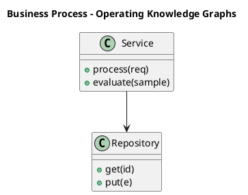

_Source diagram (plantuml); render with the appropriate tool._

**Figure 16. Business Process - Operating Knowledge Graphs** (plantuml). Figure: Business Process view for Knowledge Graphs. This diagram illustrates the principal components and their interactions as discussed in the surrounding section.

## Deep Dive: Mechanics, Variants and Trade-offs

Having established the essentials, we now go deeper into operating knowledge graphs. It pays to understand the mechanism rather than treat it as a black box, because most production incidents are explained by one of its steps misbehaving. The distinctions in this section are the ones that separate a working demo from a system that holds up under adversarial inputs, scale and the passage of time.

Consider the principal variants and how to choose between them. Each variant optimises for a different point in the design space - some for latency, some for accuracy, some for cost or operability - and the correct choice follows from explicit requirements rather than from defaults. Simplicity is a feature. The simplest design that meets the requirement should be the default, with complexity added only when measurement justifies it.

In practice this is supported by a mature tooling ecosystem, including Neo4j, Amazon Neptune, RDFLib, Apache Jena. Tools accelerate the work but do not substitute for understanding: the same principles apply whichever implementation you select, and the ability to reason from first principles is what lets you debug when a tool behaves unexpectedly.

A frequent source of subtle bugs is the interaction with entity extraction and linking. Because entity extraction and linking concerns populating the graph from structured and unstructured sources, changes there can silently alter the behaviour analysed here. The remedy is contract tests at the boundary and end-to-end evaluations that exercise the interaction explicitly.

Finally, attend to edge cases and degradation. Define what the system should do under partial failure, unexpected inputs and load spikes, and make that behaviour explicit and tested rather than emergent. Graceful degradation - returning a safe, useful result when the ideal one is unavailable - is a hallmark of mature engineering.

For deeper study, the literature offers authoritative treatments such as Hogan et al. — Knowledge Graphs (2021) and Bordes et al. — TransE (2013). These primary sources reward careful reading and ground the practical guidance above in established results.

## Advanced Considerations

Having established the essentials, we now go deeper into operating knowledge graphs. The underlying mechanism is best appreciated by tracing a single request from input to output and noting where state is created and consumed. The distinctions in this section are the ones that separate a working demo from a system that holds up under adversarial inputs, scale and the passage of time.

Consider the principal variants and how to choose between them. Each variant optimises for a different point in the design space - some for latency, some for accuracy, some for cost or operability - and the correct choice follows from explicit requirements rather than from defaults. Latency, accuracy and cost form a tension triangle: improving one typically pressures the others, so explicit budgets are essential.

In practice this is supported by a mature tooling ecosystem, including Neo4j, Amazon Neptune, RDFLib, Apache Jena. Tools accelerate the work but do not substitute for understanding: the same principles apply whichever implementation you select, and the ability to reason from first principles is what lets you debug when a tool behaves unexpectedly.

A frequent source of subtle bugs is the interaction with the enterprise knowledge graph architecture. Because the enterprise knowledge graph architecture concerns reference blueprint integrating sources, store and consumers, changes there can silently alter the behaviour analysed here. The remedy is contract tests at the boundary and end-to-end evaluations that exercise the interaction explicitly.

Finally, attend to edge cases and degradation. Define what the system should do under partial failure, unexpected inputs and load spikes, and make that behaviour explicit and tested rather than emergent. Graceful degradation - returning a safe, useful result when the ideal one is unavailable - is a hallmark of mature engineering.

For deeper study, the literature offers authoritative treatments such as Hogan et al. — Knowledge Graphs (2021) and Bordes et al. — TransE (2013). These primary sources reward careful reading and ground the practical guidance above in established results.

## Worked Example

A worked example clarifies how these ideas behave in practice. A healthcare organisation needs integrating clinical, genomic and literature data. They decide to apply operating knowledge graphs as part of their Knowledge Graphs solution, but wisely treat it as a hypothesis to be validated rather than a foregone conclusion.

The team begins by stating the objective precisely and defining how success will be measured before writing any code. They establish a small but representative evaluation set, agree on acceptance thresholds, and only then prototype the simplest design that could work. Early measurement reveals which assumptions hold and which must be revised, saving weeks of misdirected effort and surfacing edge cases while they are still cheap to fix.

As the prototype matures into a service, the team hardens it: adding input validation, error handling, caching where it pays off, and monitoring that ties back to the original success metric. They document each significant decision in an architecture decision record so that future maintainers understand not just what was built but why.

The outcome is instructive. The system that reaches production is not the most sophisticated design the team considered, but the one whose behaviour they could measure, explain and operate. This is the recurring lesson of Knowledge Graphs: durable value comes from the whole system, not from any single clever component.

## Industry Use Cases

Across industries, the ideas in this chapter recur in recognisable ways. The following vignettes show how different sectors apply them and what they have in common.

**Finance.** Fraud rings and beneficial-ownership analysis. The common thread is that value comes not from the model alone but from the surrounding system - data quality, evaluation, integration and operations - which is precisely where most of the engineering effort belongs.

**Healthcare.** Integrating clinical, genomic and literature data. The common thread is that value comes not from the model alone but from the surrounding system - data quality, evaluation, integration and operations - which is precisely where most of the engineering effort belongs.

**Retail.** Product knowledge graphs powering search and recommendations. The common thread is that value comes not from the model alone but from the surrounding system - data quality, evaluation, integration and operations - which is precisely where most of the engineering effort belongs.

**Enterprise.** 360-degree views linking customers, products and events. The common thread is that value comes not from the model alone but from the surrounding system - data quality, evaluation, integration and operations - which is precisely where most of the engineering effort belongs.

## Best Practices

The following practices consistently separate successful Knowledge Graphs efforts from struggling ones. They are deliberately concrete so they can be adopted as checklist items in design and code review.

- Design the ontology with domain experts before ingesting at scale.
- Treat entity resolution as a first-class, monitored pipeline.
- Record provenance on every fact for trust and debugging.
- Choose the model (RDF vs property graph) to fit query needs.

None of these are exotic; they are the unglamorous disciplines that compound into reliability. The cost of adopting them is small compared with the cost of the incidents they prevent, and they become second nature with practice.

## Common Pitfalls

Equally instructive are the failure modes that recur in practice. Each pitfall below has a clear early warning sign and a known remedy, so treat them as a diagnostic checklist when something feels wrong:

- Over-engineering the ontology before validating use cases.
- Neglecting entity resolution and creating duplicates.
- Ignoring provenance, making facts untrustworthy.
- Picking a graph engine that cannot scale to your traversal patterns.

The pattern is consistent: most failures stem from skipping measurement, conflating prototype and production standards, or deferring cross-cutting concerns such as security and cost until they become emergencies. Naming these traps in advance is the cheapest way to avoid them.

## Governance, Security and Cost Notes

No discussion of operating knowledge graphs is complete without its governance, security and cost dimensions, which are too often deferred until they become emergencies. Treating them as first-class concerns from the outset is both cheaper and safer.

**Governance.** Classify the risk of this capability, document its intended and out-of-scope uses, and ensure decisions are traceable to satisfy internal policy and external regulation such as the NIST AI RMF, ISO/IEC 42001 and the EU AI Act. **Security.** Treat all external input as untrusted, validate outputs before acting on them, apply least privilege to any tools or data access, and map controls to the OWASP LLM Top 10 and MITRE ATLAS.

**Cost and sustainability.** Establish explicit budgets for compute, tokens and latency, attribute spend to owners, and revisit the economics as usage scales - a design that is affordable at pilot scale can become untenable at production volume. Building these reflexes into everyday engineering is what allows a Knowledge Graphs system to be not only capable but also trustworthy and economically sound.

## Hands-On Exercises

Work through the following exercises. They are designed to move understanding from recognition to application - the level required for real engineering work - so prefer writing and building over merely reading.

1. Explain operating knowledge graphs to a colleague unfamiliar with Knowledge Graphs, using a concrete example from your own domain.
2. Sketch a reference architecture that incorporates operating knowledge graphs and annotate where observability, security and cost controls belong.
3. Design an evaluation that would tell you whether operating knowledge graphs is working in production, including the metric, the dataset and the acceptance threshold.
4. Identify two pitfalls relevant to operating knowledge graphs in your environment and describe the early warning signals you would monitor.
5. Prototype the simplest implementation that demonstrates operating knowledge graphs, then list exactly what would need to change to make it production-ready.

## Key Takeaways

Key takeaways from this chapter:

- Operating Knowledge Graphs is a systems concern in Knowledge Graphs: data, models and operations must be co-designed.
- Measurement is non-negotiable; define success metrics and evaluation before building.
- Favour the simplest design that meets the requirement, and add complexity only when evidence demands it.
- Security, cost and observability are first-class requirements, not afterthoughts.
- Document decisions so the system remains understandable and operable as it evolves.

## Code Walkthrough

This listing shows a configuration-driven Operating Knowledge Graphs component with retry semantics and typed interfaces — the shape we expect from production Knowledge Graphs code rather than a notebook prototype.

The full listing is shown below; study it line by line and reproduce it locally before moving on.

### Listing: Implementing a Operating Knowledge Graphs component

```python
from __future__ import annotations

from dataclasses import dataclass, field
from typing import Any


@dataclass(slots=True)
class OperatingKnowledgeGraphsConfig:
    """Configuration for the Operating Knowledge Graphs component in a Knowledge Graphs system."""

    name: str
    timeout_s: float = 30.0
    max_retries: int = 3
    options: dict[str, Any] = field(default_factory=dict)


class OperatingKnowledgeGraphs:
    """A minimal, production-shaped implementation of Operating Knowledge Graphs."""

    def __init__(self, config: OperatingKnowledgeGraphsConfig) -> None:
        self._config = config
        self._calls = 0

    def run(self, payload: dict[str, Any]) -> dict[str, Any]:
        """Process a request, retrying transient failures with backoff."""
        last_error: Exception | None = None
        for attempt in range(self._config.max_retries):
            try:
                self._calls += 1
                return self._process(payload)
            except TimeoutError as exc:  # transient
                last_error = exc
                continue
        raise RuntimeError(f"OperatingKnowledgeGraphs failed after retries") from last_error

    def _process(self, payload: dict[str, Any]) -> dict[str, Any]:
        # Domain-specific logic for Operating Knowledge Graphs goes here.
        return {"status": "ok", "input_keys": sorted(payload), "calls": self._calls}

```

## Review Questions

1. In the context of Knowledge Graphs, which statement best describes “Operating Knowledge Graphs”?
   - A. It applies exclusively to image data.
   - B. It eliminates the need for any evaluation or monitoring.
   - C. Pipelines, monitoring and lifecycle management.
   - D. It is only relevant to academic research, not production.
   - **Answer: C.** Operating Knowledge Graphs: Pipelines, monitoring and lifecycle management.
2. Which of the following is a recommended best practice when working with Knowledge Graphs?
   - A. Design the ontology with domain experts before ingesting at scale.
   - B. It guarantees deterministic output regardless of input.
   - C. It eliminates the need for any evaluation or monitoring.
   - D. Over-engineering the ontology before validating use cases.
   - **Answer: A.** Best practice: Design the ontology with domain experts before ingesting at scale.
3. Which of the following is a common pitfall to avoid in Knowledge Graphs?
   - A. Over-engineering the ontology before validating use cases.
   - B. It applies exclusively to image data.
   - C. Design the ontology with domain experts before ingesting at scale.
   - D. It guarantees deterministic output regardless of input.
   - **Answer: A.** Pitfall to avoid: Over-engineering the ontology before validating use cases.
4. *(Discussion)* Describe a failure mode of Operating Knowledge Graphs and how you would mitigate it.
   - **Model answer:** A strong answer defines operating knowledge graphs (Pipelines, monitoring and lifecycle management.) then connects it to architecture, evaluation, cost, security and operations for Knowledge Graphs, citing concrete trade-offs and a real-world example.

---


# Chapter 13. Visualising Knowledge Graphs

_This chapter examines visualising knowledge graphs within Knowledge Graphs. It covers effective exploration and analyst tooling, derives a reference architecture, walks through a worked example and runnable code, surveys industry use cases, and distils best practices and pitfalls, closing with exercises and review questions._

## Introduction

At its core, Visualising Knowledge Graphs concerns effective exploration and analyst tooling. It is foundational: later capabilities in Knowledge Graphs are built directly on top of it. What distinguishes a production-grade approach from a prototype is the discipline of measurement: every claim is backed by an evaluation rather than intuition.

This chapter builds intuition first, then formalises the ideas, derives an architecture, and finishes with code, exercises and review questions so the material transfers directly to your own Knowledge Graphs work. Read it actively: pause at each diagram, reproduce the code, and attempt the exercises before consulting the answers.

## Theory and Foundations

Formally, Visualising Knowledge Graphs addresses effective exploration and analyst tooling. What distinguishes a production-grade approach from a prototype is the discipline of measurement: every claim is backed by an evaluation rather than intuition. Beneath the abstraction lies a concrete process whose steps can each be measured, tested and optimised independently.

To place this in context, recall the broader picture: Knowledge graphs represent entities and their relationships as nodes and edges, enabling integration of heterogeneous data, semantic querying and reasoning. Within that picture, visualising knowledge graphs is one of the load-bearing ideas - the kind that, when understood deeply, makes the rest of Knowledge Graphs fall into place. Getting this right early prevents expensive rework once a Knowledge Graphs system reaches scale.

Visualising Knowledge Graphs cannot be understood in isolation from entity extraction and linking. Recall that entity extraction and linking concerns populating the graph from structured and unstructured sources. The two interact directly: decisions in one constrain the design space of the other, which is why mature teams reason about them together rather than sequentially. As with most architectural decisions, the choice is rarely binary; the skill lies in quantifying the trade-offs and choosing deliberately.

Visualising Knowledge Graphs cannot be understood in isolation from knowledge graph embeddings. Recall that knowledge graph embeddings concerns transE, RotatE and link prediction for completion. The two interact directly: decisions in one constrain the design space of the other, which is why mature teams reason about them together rather than sequentially. Every added component buys capability at the price of operational surface area, and that bargain should be made consciously.

Several established patterns apply directly to visualising knowledge graphs. The first, entity-resolution pipeline feeding a golden-record graph, is widely adopted because it makes the system's behaviour predictable and observable. A complementary pattern, embedding-based link prediction for completion, addresses a related concern and is often deployed alongside it. Patterns are not dogma; they are distilled experience that shortcuts the search for a sound design, and each carries assumptions worth checking against your context.

Knowing when not to use a technique is as valuable as knowing how to use it. In a small prototype, shortcuts around visualising knowledge graphs are invisible; in a production Knowledge Graphs system serving real traffic, they surface as incidents, cost overruns or compliance gaps. Every added component buys capability at the price of operational surface area, and that bargain should be made consciously. The remainder of this chapter turns these principles into an architecture, code and a checklist you can apply immediately.

## Architecture and Design

From an architectural standpoint, Visualising Knowledge Graphs sits at the intersection of data, models and operations. An enterprise knowledge graph ingests from databases, documents and APIs through extraction and entity-resolution pipelines into a graph store governed by an ontology. Query services expose traversal and reasoning to applications, while a governance layer tracks provenance, versions and access.

Concretely, the principal building blocks include graphs, triples and the property graph model, ontology and schema design, entity extraction and linking, graph query languages and reasoning and inference. Each is a replaceable component behind a stable interface, so the team can upgrade an implementation - a model, an index, a policy engine - without rewriting its neighbours. The contracts between components are where reliability is won or lost, so they are specified explicitly and tested in isolation.

The diagram accompanying this section makes the data and control flow explicit. Requests enter through a well-defined boundary where they are authenticated and validated; only then are they dispatched to the components that perform the work. This boundary is also where rate limiting, quota enforcement and audit logging live, keeping cross-cutting concerns out of the core logic and in one auditable place.

Two qualities deserve emphasis. First, observability is designed in, not bolted on: every component emits structured telemetry so that failures can be localised in minutes rather than hours. Second, the architecture is evolvable - components communicate through stable contracts so that any single part of the Knowledge Graphs system can be replaced without a rewrite. Latency, accuracy and cost form a tension triangle: improving one typically pressures the others, so explicit budgets are essential.

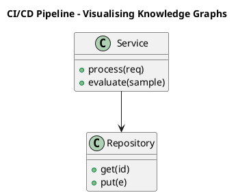

_Source diagram (plantuml); render with the appropriate tool._

**Figure 17. CI/CD Pipeline - Visualising Knowledge Graphs** (plantuml). Figure: CI/CD Pipeline view for Knowledge Graphs. This diagram illustrates the principal components and their interactions as discussed in the surrounding section.

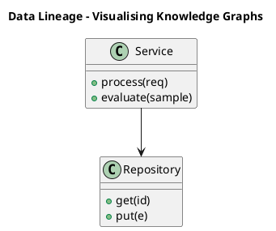

_Source diagram (plantuml); render with the appropriate tool._

**Figure 18. Data Lineage - Visualising Knowledge Graphs** (plantuml). Figure: Data Lineage view for Knowledge Graphs. This diagram illustrates the principal components and their interactions as discussed in the surrounding section.

## Deep Dive: Mechanics, Variants and Trade-offs

Having established the essentials, we now go deeper into visualising knowledge graphs. The underlying mechanism is best appreciated by tracing a single request from input to output and noting where state is created and consumed. The distinctions in this section are the ones that separate a working demo from a system that holds up under adversarial inputs, scale and the passage of time.

Consider the principal variants and how to choose between them. Each variant optimises for a different point in the design space - some for latency, some for accuracy, some for cost or operability - and the correct choice follows from explicit requirements rather than from defaults. As with most architectural decisions, the choice is rarely binary; the skill lies in quantifying the trade-offs and choosing deliberately.

In practice this is supported by a mature tooling ecosystem, including Neo4j, Amazon Neptune, RDFLib, Apache Jena. Tools accelerate the work but do not substitute for understanding: the same principles apply whichever implementation you select, and the ability to reason from first principles is what lets you debug when a tool behaves unexpectedly.

A frequent source of subtle bugs is the interaction with entity extraction and linking. Because entity extraction and linking concerns populating the graph from structured and unstructured sources, changes there can silently alter the behaviour analysed here. The remedy is contract tests at the boundary and end-to-end evaluations that exercise the interaction explicitly.

Finally, attend to edge cases and degradation. Define what the system should do under partial failure, unexpected inputs and load spikes, and make that behaviour explicit and tested rather than emergent. Graceful degradation - returning a safe, useful result when the ideal one is unavailable - is a hallmark of mature engineering.

For deeper study, the literature offers authoritative treatments such as Hogan et al. — Knowledge Graphs (2021) and Bordes et al. — TransE (2013). These primary sources reward careful reading and ground the practical guidance above in established results.

## Advanced Considerations

Having established the essentials, we now go deeper into visualising knowledge graphs. Beneath the abstraction lies a concrete process whose steps can each be measured, tested and optimised independently. The distinctions in this section are the ones that separate a working demo from a system that holds up under adversarial inputs, scale and the passage of time.

Consider the principal variants and how to choose between them. Each variant optimises for a different point in the design space - some for latency, some for accuracy, some for cost or operability - and the correct choice follows from explicit requirements rather than from defaults. Latency, accuracy and cost form a tension triangle: improving one typically pressures the others, so explicit budgets are essential.

In practice this is supported by a mature tooling ecosystem, including Neo4j, Amazon Neptune, RDFLib, Apache Jena. Tools accelerate the work but do not substitute for understanding: the same principles apply whichever implementation you select, and the ability to reason from first principles is what lets you debug when a tool behaves unexpectedly.

A frequent source of subtle bugs is the interaction with reasoning and inference. Because reasoning and inference concerns rules, RDFS/OWL semantics and inferring implicit facts, changes there can silently alter the behaviour analysed here. The remedy is contract tests at the boundary and end-to-end evaluations that exercise the interaction explicitly.

Finally, attend to edge cases and degradation. Define what the system should do under partial failure, unexpected inputs and load spikes, and make that behaviour explicit and tested rather than emergent. Graceful degradation - returning a safe, useful result when the ideal one is unavailable - is a hallmark of mature engineering.

For deeper study, the literature offers authoritative treatments such as Hogan et al. — Knowledge Graphs (2021) and Bordes et al. — TransE (2013). These primary sources reward careful reading and ground the practical guidance above in established results.

## Worked Example

A worked example clarifies how these ideas behave in practice. A healthcare organisation needs integrating clinical, genomic and literature data. They decide to apply visualising knowledge graphs as part of their Knowledge Graphs solution, but wisely treat it as a hypothesis to be validated rather than a foregone conclusion.

The team begins by stating the objective precisely and defining how success will be measured before writing any code. They establish a small but representative evaluation set, agree on acceptance thresholds, and only then prototype the simplest design that could work. Early measurement reveals which assumptions hold and which must be revised, saving weeks of misdirected effort and surfacing edge cases while they are still cheap to fix.

As the prototype matures into a service, the team hardens it: adding input validation, error handling, caching where it pays off, and monitoring that ties back to the original success metric. They document each significant decision in an architecture decision record so that future maintainers understand not just what was built but why.

The outcome is instructive. The system that reaches production is not the most sophisticated design the team considered, but the one whose behaviour they could measure, explain and operate. This is the recurring lesson of Knowledge Graphs: durable value comes from the whole system, not from any single clever component.

## Industry Use Cases

Across industries, the ideas in this chapter recur in recognisable ways. The following vignettes show how different sectors apply them and what they have in common.

**Finance.** Fraud rings and beneficial-ownership analysis. The common thread is that value comes not from the model alone but from the surrounding system - data quality, evaluation, integration and operations - which is precisely where most of the engineering effort belongs.

**Healthcare.** Integrating clinical, genomic and literature data. The common thread is that value comes not from the model alone but from the surrounding system - data quality, evaluation, integration and operations - which is precisely where most of the engineering effort belongs.

**Retail.** Product knowledge graphs powering search and recommendations. The common thread is that value comes not from the model alone but from the surrounding system - data quality, evaluation, integration and operations - which is precisely where most of the engineering effort belongs.

**Enterprise.** 360-degree views linking customers, products and events. The common thread is that value comes not from the model alone but from the surrounding system - data quality, evaluation, integration and operations - which is precisely where most of the engineering effort belongs.

## Best Practices

The following practices consistently separate successful Knowledge Graphs efforts from struggling ones. They are deliberately concrete so they can be adopted as checklist items in design and code review.

- Design the ontology with domain experts before ingesting at scale.
- Treat entity resolution as a first-class, monitored pipeline.
- Record provenance on every fact for trust and debugging.
- Choose the model (RDF vs property graph) to fit query needs.

None of these are exotic; they are the unglamorous disciplines that compound into reliability. The cost of adopting them is small compared with the cost of the incidents they prevent, and they become second nature with practice.

## Common Pitfalls

Equally instructive are the failure modes that recur in practice. Each pitfall below has a clear early warning sign and a known remedy, so treat them as a diagnostic checklist when something feels wrong:

- Over-engineering the ontology before validating use cases.
- Neglecting entity resolution and creating duplicates.
- Ignoring provenance, making facts untrustworthy.
- Picking a graph engine that cannot scale to your traversal patterns.

The pattern is consistent: most failures stem from skipping measurement, conflating prototype and production standards, or deferring cross-cutting concerns such as security and cost until they become emergencies. Naming these traps in advance is the cheapest way to avoid them.

## Governance, Security and Cost Notes

No discussion of visualising knowledge graphs is complete without its governance, security and cost dimensions, which are too often deferred until they become emergencies. Treating them as first-class concerns from the outset is both cheaper and safer.

**Governance.** Classify the risk of this capability, document its intended and out-of-scope uses, and ensure decisions are traceable to satisfy internal policy and external regulation such as the NIST AI RMF, ISO/IEC 42001 and the EU AI Act. **Security.** Treat all external input as untrusted, validate outputs before acting on them, apply least privilege to any tools or data access, and map controls to the OWASP LLM Top 10 and MITRE ATLAS.

**Cost and sustainability.** Establish explicit budgets for compute, tokens and latency, attribute spend to owners, and revisit the economics as usage scales - a design that is affordable at pilot scale can become untenable at production volume. Building these reflexes into everyday engineering is what allows a Knowledge Graphs system to be not only capable but also trustworthy and economically sound.

## Hands-On Exercises

Work through the following exercises. They are designed to move understanding from recognition to application - the level required for real engineering work - so prefer writing and building over merely reading.

1. Explain visualising knowledge graphs to a colleague unfamiliar with Knowledge Graphs, using a concrete example from your own domain.
2. Sketch a reference architecture that incorporates visualising knowledge graphs and annotate where observability, security and cost controls belong.
3. Design an evaluation that would tell you whether visualising knowledge graphs is working in production, including the metric, the dataset and the acceptance threshold.
4. Identify two pitfalls relevant to visualising knowledge graphs in your environment and describe the early warning signals you would monitor.
5. Prototype the simplest implementation that demonstrates visualising knowledge graphs, then list exactly what would need to change to make it production-ready.

## Key Takeaways

Key takeaways from this chapter:

- Visualising Knowledge Graphs is a systems concern in Knowledge Graphs: data, models and operations must be co-designed.
- Measurement is non-negotiable; define success metrics and evaluation before building.
- Favour the simplest design that meets the requirement, and add complexity only when evidence demands it.
- Security, cost and observability are first-class requirements, not afterthoughts.
- Document decisions so the system remains understandable and operable as it evolves.

## Code Walkthrough

Pipelines keep Visualising Knowledge Graphs logic modular and testable. Each stage is a pure function, errors are captured per item, and the composition is trivial to extend or reorder.

The full listing is shown below; study it line by line and reproduce it locally before moving on.

### Listing: A composable processing pipeline for Visualising Knowledge Graphs

```python
from collections.abc import Iterable, Iterator
from typing import Protocol


class Stage(Protocol):
    def __call__(self, item: dict) -> dict: ...


def pipeline(stages: list[Stage]) -> Stage:
    """Compose ordered stages into a single callable for Visualising Knowledge Graphs."""

    def run(item: dict) -> dict:
        for stage in stages:
            item = stage(item)
        return item

    return run


def validate(item: dict) -> dict:
    if "text" not in item:
        raise ValueError("missing required field: text")
    return item


def normalise(item: dict) -> dict:
    item["text"] = item["text"].strip().lower()
    return item


def enrich(item: dict) -> dict:
    item["length"] = len(item["text"])
    return item


process = pipeline([validate, normalise, enrich])


def run_batch(items: Iterable[dict]) -> Iterator[dict]:
    for item in items:
        try:
            yield process(dict(item))
        except ValueError as exc:
            yield {"error": str(exc), "item": item}

```

## Review Questions

1. In the context of Knowledge Graphs, which statement best describes “Visualising Knowledge Graphs”?
   - A. Effective exploration and analyst tooling.
   - B. It removes all security and governance requirements.
   - C. It applies exclusively to image data.
   - D. It eliminates the need for any evaluation or monitoring.
   - **Answer: A.** Visualising Knowledge Graphs: Effective exploration and analyst tooling.
2. Which of the following is a recommended best practice when working with Knowledge Graphs?
   - A. Over-engineering the ontology before validating use cases.
   - B. Design the ontology with domain experts before ingesting at scale.
   - C. Neglecting entity resolution and creating duplicates.
   - D. It guarantees deterministic output regardless of input.
   - **Answer: B.** Best practice: Design the ontology with domain experts before ingesting at scale.
3. Which of the following is a common pitfall to avoid in Knowledge Graphs?
   - A. Ignoring provenance, making facts untrustworthy.
   - B. Design the ontology with domain experts before ingesting at scale.
   - C. It guarantees deterministic output regardless of input.
   - D. Choose the model (RDF vs property graph) to fit query needs.
   - **Answer: A.** Pitfall to avoid: Ignoring provenance, making facts untrustworthy.
4. *(Discussion)* What trade-offs would you weigh when implementing Visualising Knowledge Graphs?
   - **Model answer:** A strong answer defines visualising knowledge graphs (Effective exploration and analyst tooling.) then connects it to architecture, evaluation, cost, security and operations for Knowledge Graphs, citing concrete trade-offs and a real-world example.

---


# Chapter 14. The Enterprise Knowledge Graph Architecture

_This chapter examines the enterprise knowledge graph architecture within Knowledge Graphs. It covers reference blueprint integrating sources, store and consumers, derives a reference architecture, walks through a worked example and runnable code, surveys industry use cases, and distils best practices and pitfalls, closing with exercises and review questions._

## Introduction

The Enterprise Knowledge Graph Architecture refers to reference blueprint integrating sources, store and consumers. Understanding this matters because Knowledge Graphs systems succeed or fail on exactly these decisions. The practical implication is that design choices here ripple through latency, cost and maintainability for the lifetime of the system.

This chapter builds intuition first, then formalises the ideas, derives an architecture, and finishes with code, exercises and review questions so the material transfers directly to your own Knowledge Graphs work. Read it actively: pause at each diagram, reproduce the code, and attempt the exercises before consulting the answers.

## Theory and Foundations

We define The Enterprise Knowledge Graph Architecture as reference blueprint integrating sources, store and consumers. It helps to separate the conceptual model from its implementation: the former guides reasoning, the latter must contend with real-world constraints. Mechanically, the behaviour emerges from a few interacting parts that are simpler than the whole they produce.

To place this in context, recall the broader picture: Knowledge graphs represent entities and their relationships as nodes and edges, enabling integration of heterogeneous data, semantic querying and reasoning. Within that picture, the enterprise knowledge graph architecture is one of the load-bearing ideas - the kind that, when understood deeply, makes the rest of Knowledge Graphs fall into place. This concept recurs throughout the Knowledge Graphs lifecycle, from design to operations.

The Enterprise Knowledge Graph Architecture cannot be understood in isolation from data quality and entity resolution. Recall that data quality and entity resolution concerns deduplication, validation and provenance. The two interact directly: decisions in one constrain the design space of the other, which is why mature teams reason about them together rather than sequentially. There is an inherent trade-off between fidelity and cost, and the correct balance depends on the use case and its tolerance for error.

The Enterprise Knowledge Graph Architecture cannot be understood in isolation from graph algorithms for insight. Recall that graph algorithms for insight concerns centrality, community detection and pathfinding. The two interact directly: decisions in one constrain the design space of the other, which is why mature teams reason about them together rather than sequentially. Simplicity is a feature. The simplest design that meets the requirement should be the default, with complexity added only when measurement justifies it.

Several established patterns apply directly to the enterprise knowledge graph architecture. The first, entity-resolution pipeline feeding a golden-record graph, is widely adopted because it makes the system's behaviour predictable and observable. A complementary pattern, canonical ontology with reused standard vocabularies, addresses a related concern and is often deployed alongside it. Patterns are not dogma; they are distilled experience that shortcuts the search for a sound design, and each carries assumptions worth checking against your context.

It is worth being explicit about when to apply this and when to reach for something simpler. In a small prototype, shortcuts around the enterprise knowledge graph architecture are invisible; in a production Knowledge Graphs system serving real traffic, they surface as incidents, cost overruns or compliance gaps. Latency, accuracy and cost form a tension triangle: improving one typically pressures the others, so explicit budgets are essential. The remainder of this chapter turns these principles into an architecture, code and a checklist you can apply immediately.

## Architecture and Design

From an architectural standpoint, The Enterprise Knowledge Graph Architecture sits at the intersection of data, models and operations. An enterprise knowledge graph ingests from databases, documents and APIs through extraction and entity-resolution pipelines into a graph store governed by an ontology. Query services expose traversal and reasoning to applications, while a governance layer tracks provenance, versions and access.

Concretely, the principal building blocks include graphs, triples and the property graph model, ontology and schema design, entity extraction and linking, graph query languages and reasoning and inference. Each is a replaceable component behind a stable interface, so the team can upgrade an implementation - a model, an index, a policy engine - without rewriting its neighbours. The contracts between components are where reliability is won or lost, so they are specified explicitly and tested in isolation.

The diagram accompanying this section makes the data and control flow explicit. Requests enter through a well-defined boundary where they are authenticated and validated; only then are they dispatched to the components that perform the work. This boundary is also where rate limiting, quota enforcement and audit logging live, keeping cross-cutting concerns out of the core logic and in one auditable place.

Two qualities deserve emphasis. First, observability is designed in, not bolted on: every component emits structured telemetry so that failures can be localised in minutes rather than hours. Second, the architecture is evolvable - components communicate through stable contracts so that any single part of the Knowledge Graphs system can be replaced without a rewrite. There is an inherent trade-off between fidelity and cost, and the correct balance depends on the use case and its tolerance for error.

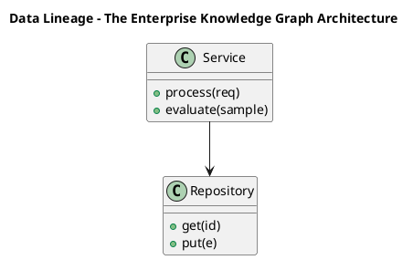

_Source diagram (plantuml); render with the appropriate tool._

**Figure 19. Data Lineage - The Enterprise Knowledge Graph Architecture** (plantuml). Figure: Data Lineage view for Knowledge Graphs. This diagram illustrates the principal components and their interactions as discussed in the surrounding section.

## Deep Dive: Mechanics, Variants and Trade-offs

Having established the essentials, we now go deeper into the enterprise knowledge graph architecture. It pays to understand the mechanism rather than treat it as a black box, because most production incidents are explained by one of its steps misbehaving. The distinctions in this section are the ones that separate a working demo from a system that holds up under adversarial inputs, scale and the passage of time.

Consider the principal variants and how to choose between them. Each variant optimises for a different point in the design space - some for latency, some for accuracy, some for cost or operability - and the correct choice follows from explicit requirements rather than from defaults. There is an inherent trade-off between fidelity and cost, and the correct balance depends on the use case and its tolerance for error.

In practice this is supported by a mature tooling ecosystem, including Neo4j, Amazon Neptune, RDFLib, Apache Jena. Tools accelerate the work but do not substitute for understanding: the same principles apply whichever implementation you select, and the ability to reason from first principles is what lets you debug when a tool behaves unexpectedly.

A frequent source of subtle bugs is the interaction with data quality and entity resolution. Because data quality and entity resolution concerns deduplication, validation and provenance, changes there can silently alter the behaviour analysed here. The remedy is contract tests at the boundary and end-to-end evaluations that exercise the interaction explicitly.

Finally, attend to edge cases and degradation. Define what the system should do under partial failure, unexpected inputs and load spikes, and make that behaviour explicit and tested rather than emergent. Graceful degradation - returning a safe, useful result when the ideal one is unavailable - is a hallmark of mature engineering.

For deeper study, the literature offers authoritative treatments such as Hogan et al. — Knowledge Graphs (2021) and Bordes et al. — TransE (2013). These primary sources reward careful reading and ground the practical guidance above in established results.

## Advanced Considerations

Having established the essentials, we now go deeper into the enterprise knowledge graph architecture. The underlying mechanism is best appreciated by tracing a single request from input to output and noting where state is created and consumed. The distinctions in this section are the ones that separate a working demo from a system that holds up under adversarial inputs, scale and the passage of time.

Consider the principal variants and how to choose between them. Each variant optimises for a different point in the design space - some for latency, some for accuracy, some for cost or operability - and the correct choice follows from explicit requirements rather than from defaults. As with most architectural decisions, the choice is rarely binary; the skill lies in quantifying the trade-offs and choosing deliberately.

In practice this is supported by a mature tooling ecosystem, including Neo4j, Amazon Neptune, RDFLib, Apache Jena. Tools accelerate the work but do not substitute for understanding: the same principles apply whichever implementation you select, and the ability to reason from first principles is what lets you debug when a tool behaves unexpectedly.

A frequent source of subtle bugs is the interaction with scaling graph storage. Because scaling graph storage concerns partitioning, indexing and distributed graph engines, changes there can silently alter the behaviour analysed here. The remedy is contract tests at the boundary and end-to-end evaluations that exercise the interaction explicitly.

Finally, attend to edge cases and degradation. Define what the system should do under partial failure, unexpected inputs and load spikes, and make that behaviour explicit and tested rather than emergent. Graceful degradation - returning a safe, useful result when the ideal one is unavailable - is a hallmark of mature engineering.

For deeper study, the literature offers authoritative treatments such as Hogan et al. — Knowledge Graphs (2021) and Bordes et al. — TransE (2013). These primary sources reward careful reading and ground the practical guidance above in established results.

## Worked Example

To ground the discussion, walk through a representative example. A enterprise organisation needs 360-degree views linking customers, products and events. They decide to apply the enterprise knowledge graph architecture as part of their Knowledge Graphs solution, but wisely treat it as a hypothesis to be validated rather than a foregone conclusion.

The team begins by stating the objective precisely and defining how success will be measured before writing any code. They establish a small but representative evaluation set, agree on acceptance thresholds, and only then prototype the simplest design that could work. Early measurement reveals which assumptions hold and which must be revised, saving weeks of misdirected effort and surfacing edge cases while they are still cheap to fix.

As the prototype matures into a service, the team hardens it: adding input validation, error handling, caching where it pays off, and monitoring that ties back to the original success metric. They document each significant decision in an architecture decision record so that future maintainers understand not just what was built but why.

The outcome is instructive. The system that reaches production is not the most sophisticated design the team considered, but the one whose behaviour they could measure, explain and operate. This is the recurring lesson of Knowledge Graphs: durable value comes from the whole system, not from any single clever component.

## Industry Use Cases

Across industries, the ideas in this chapter recur in recognisable ways. The following vignettes show how different sectors apply them and what they have in common.

**Finance.** Fraud rings and beneficial-ownership analysis. The common thread is that value comes not from the model alone but from the surrounding system - data quality, evaluation, integration and operations - which is precisely where most of the engineering effort belongs.

**Healthcare.** Integrating clinical, genomic and literature data. The common thread is that value comes not from the model alone but from the surrounding system - data quality, evaluation, integration and operations - which is precisely where most of the engineering effort belongs.

**Retail.** Product knowledge graphs powering search and recommendations. The common thread is that value comes not from the model alone but from the surrounding system - data quality, evaluation, integration and operations - which is precisely where most of the engineering effort belongs.

**Enterprise.** 360-degree views linking customers, products and events. The common thread is that value comes not from the model alone but from the surrounding system - data quality, evaluation, integration and operations - which is precisely where most of the engineering effort belongs.

## Best Practices

The following practices consistently separate successful Knowledge Graphs efforts from struggling ones. They are deliberately concrete so they can be adopted as checklist items in design and code review.

- Design the ontology with domain experts before ingesting at scale.
- Treat entity resolution as a first-class, monitored pipeline.
- Record provenance on every fact for trust and debugging.
- Choose the model (RDF vs property graph) to fit query needs.

None of these are exotic; they are the unglamorous disciplines that compound into reliability. The cost of adopting them is small compared with the cost of the incidents they prevent, and they become second nature with practice.

## Common Pitfalls

Equally instructive are the failure modes that recur in practice. Each pitfall below has a clear early warning sign and a known remedy, so treat them as a diagnostic checklist when something feels wrong:

- Over-engineering the ontology before validating use cases.
- Neglecting entity resolution and creating duplicates.
- Ignoring provenance, making facts untrustworthy.
- Picking a graph engine that cannot scale to your traversal patterns.

The pattern is consistent: most failures stem from skipping measurement, conflating prototype and production standards, or deferring cross-cutting concerns such as security and cost until they become emergencies. Naming these traps in advance is the cheapest way to avoid them.

## Governance, Security and Cost Notes

No discussion of the enterprise knowledge graph architecture is complete without its governance, security and cost dimensions, which are too often deferred until they become emergencies. Treating them as first-class concerns from the outset is both cheaper and safer.

**Governance.** Classify the risk of this capability, document its intended and out-of-scope uses, and ensure decisions are traceable to satisfy internal policy and external regulation such as the NIST AI RMF, ISO/IEC 42001 and the EU AI Act. **Security.** Treat all external input as untrusted, validate outputs before acting on them, apply least privilege to any tools or data access, and map controls to the OWASP LLM Top 10 and MITRE ATLAS.

**Cost and sustainability.** Establish explicit budgets for compute, tokens and latency, attribute spend to owners, and revisit the economics as usage scales - a design that is affordable at pilot scale can become untenable at production volume. Building these reflexes into everyday engineering is what allows a Knowledge Graphs system to be not only capable but also trustworthy and economically sound.

## Hands-On Exercises

Work through the following exercises. They are designed to move understanding from recognition to application - the level required for real engineering work - so prefer writing and building over merely reading.

1. Explain the enterprise knowledge graph architecture to a colleague unfamiliar with Knowledge Graphs, using a concrete example from your own domain.
2. Sketch a reference architecture that incorporates the enterprise knowledge graph architecture and annotate where observability, security and cost controls belong.
3. Design an evaluation that would tell you whether the enterprise knowledge graph architecture is working in production, including the metric, the dataset and the acceptance threshold.
4. Identify two pitfalls relevant to the enterprise knowledge graph architecture in your environment and describe the early warning signals you would monitor.
5. Prototype the simplest implementation that demonstrates the enterprise knowledge graph architecture, then list exactly what would need to change to make it production-ready.

## Key Takeaways

Key takeaways from this chapter:

- The Enterprise Knowledge Graph Architecture is a systems concern in Knowledge Graphs: data, models and operations must be co-designed.
- Measurement is non-negotiable; define success metrics and evaluation before building.
- Favour the simplest design that meets the requirement, and add complexity only when evidence demands it.
- Security, cost and observability are first-class requirements, not afterthoughts.
- Document decisions so the system remains understandable and operable as it evolves.

## Code Walkthrough

Every change to a Knowledge Graphs system should pass an evaluation gate. This example shows the minimal shape: align predictions and references, compute a metric, and return a pass/fail decision for CI.

The full listing is shown below; study it line by line and reproduce it locally before moving on.

### Listing: Evaluating The Enterprise Knowledge Graph Architecture with a regression gate

```python
from dataclasses import dataclass


@dataclass
class EvalResult:
    metric: str
    score: float
    passed: bool


def evaluate(predictions: list[str], references: list[str],
             threshold: float = 0.8) -> EvalResult:
    """Score The Enterprise Knowledge Graph Architecture output against references with a simple exact-match metric.

    In practice you would combine several metrics (exact match, semantic
    similarity, LLM-as-judge) and gate releases on the aggregate.
    """
    if len(predictions) != len(references):
        raise ValueError("predictions and references must align")
    hits = sum(p.strip() == r.strip() for p, r in zip(predictions, references))
    score = hits / len(references) if references else 0.0
    return EvalResult(metric="exact_match", score=score, passed=score >= threshold)


if __name__ == "__main__":
    result = evaluate(["yes", "no"], ["yes", "yes"])
    print(f"{result.metric}={result.score:.2f} passed={result.passed}")

```

## Review Questions

1. In the context of Knowledge Graphs, which statement best describes “The Enterprise Knowledge Graph Architecture”?
   - A. It eliminates the need for any evaluation or monitoring.
   - B. It guarantees deterministic output regardless of input.
   - C. Reference blueprint integrating sources, store and consumers.
   - D. It removes all security and governance requirements.
   - **Answer: C.** The Enterprise Knowledge Graph Architecture: Reference blueprint integrating sources, store and consumers.
2. Which of the following is a recommended best practice when working with Knowledge Graphs?
   - A. Treat entity resolution as a first-class, monitored pipeline.
   - B. It is only relevant to academic research, not production.
   - C. Picking a graph engine that cannot scale to your traversal patterns.
   - D. Over-engineering the ontology before validating use cases.
   - **Answer: A.** Best practice: Treat entity resolution as a first-class, monitored pipeline.
3. Which of the following is a common pitfall to avoid in Knowledge Graphs?
   - A. Choose the model (RDF vs property graph) to fit query needs.
   - B. It guarantees deterministic output regardless of input.
   - C. Neglecting entity resolution and creating duplicates.
   - D. Treat entity resolution as a first-class, monitored pipeline.
   - **Answer: C.** Pitfall to avoid: Neglecting entity resolution and creating duplicates.
4. *(Discussion)* Explain The Enterprise Knowledge Graph Architecture and why it matters in a production Knowledge Graphs system.
   - **Model answer:** A strong answer defines the enterprise knowledge graph architecture (Reference blueprint integrating sources, store and consumers.) then connects it to architecture, evaluation, cost, security and operations for Knowledge Graphs, citing concrete trade-offs and a real-world example.

---


# Chapter 15. Putting It Together: A Reference Implementation

_This chapter examines putting it together: a reference implementation within Knowledge Graphs. It covers an end-to-end reference implementation that integrates the components of a Knowledge Graphs system into a cohesive, working whole, derives a reference architecture, walks through a worked example and runnable code, surveys industry use cases, and distils best practices and pitfalls, closing with exercises and review questions._

## Introduction

In practical terms, Putting It Together: A Reference Implementation is best understood as an end-to-end reference implementation that integrates the components of a Knowledge Graphs system into a cohesive, working whole. Understanding this matters because Knowledge Graphs systems succeed or fail on exactly these decisions. The practical implication is that design choices here ripple through latency, cost and maintainability for the lifetime of the system.

This chapter builds intuition first, then formalises the ideas, derives an architecture, and finishes with code, exercises and review questions so the material transfers directly to your own Knowledge Graphs work. Read it actively: pause at each diagram, reproduce the code, and attempt the exercises before consulting the answers.

## Theory and Foundations

Formally, Putting It Together: A Reference Implementation addresses an end-to-end reference implementation that integrates the components of a Knowledge Graphs system into a cohesive, working whole. Seasoned practitioners treat this as a systems problem, co-designing data, models and operations rather than optimising any one in isolation. Beneath the abstraction lies a concrete process whose steps can each be measured, tested and optimised independently.

To place this in context, recall the broader picture: Knowledge graphs represent entities and their relationships as nodes and edges, enabling integration of heterogeneous data, semantic querying and reasoning. Within that picture, putting it together: a reference implementation is one of the load-bearing ideas - the kind that, when understood deeply, makes the rest of Knowledge Graphs fall into place. Getting this right early prevents expensive rework once a Knowledge Graphs system reaches scale.

Putting It Together: A Reference Implementation cannot be understood in isolation from data quality and entity resolution. Recall that data quality and entity resolution concerns deduplication, validation and provenance. The two interact directly: decisions in one constrain the design space of the other, which is why mature teams reason about them together rather than sequentially. Every added component buys capability at the price of operational surface area, and that bargain should be made consciously.

Putting It Together: A Reference Implementation cannot be understood in isolation from knowledge graph embeddings. Recall that knowledge graph embeddings concerns transE, RotatE and link prediction for completion. The two interact directly: decisions in one constrain the design space of the other, which is why mature teams reason about them together rather than sequentially. Every added component buys capability at the price of operational surface area, and that bargain should be made consciously.

Several established patterns apply directly to putting it together: a reference implementation. The first, entity-resolution pipeline feeding a golden-record graph, is widely adopted because it makes the system's behaviour predictable and observable. A complementary pattern, canonical ontology with reused standard vocabularies, addresses a related concern and is often deployed alongside it. Patterns are not dogma; they are distilled experience that shortcuts the search for a sound design, and each carries assumptions worth checking against your context.

It is worth being explicit about when to apply this and when to reach for something simpler. In a small prototype, shortcuts around putting it together: a reference implementation are invisible; in a production Knowledge Graphs system serving real traffic, they surface as incidents, cost overruns or compliance gaps. There is an inherent trade-off between fidelity and cost, and the correct balance depends on the use case and its tolerance for error. The remainder of this chapter turns these principles into an architecture, code and a checklist you can apply immediately.

## Architecture and Design

The reference architecture for Putting It Together: A Reference Implementation separates concerns into clearly bounded components with explicit contracts. An enterprise knowledge graph ingests from databases, documents and APIs through extraction and entity-resolution pipelines into a graph store governed by an ontology. Query services expose traversal and reasoning to applications, while a governance layer tracks provenance, versions and access.

Concretely, the principal building blocks include graphs, triples and the property graph model, ontology and schema design, entity extraction and linking, graph query languages and reasoning and inference. Each is a replaceable component behind a stable interface, so the team can upgrade an implementation - a model, an index, a policy engine - without rewriting its neighbours. The contracts between components are where reliability is won or lost, so they are specified explicitly and tested in isolation.

The diagram accompanying this section makes the data and control flow explicit. Requests enter through a well-defined boundary where they are authenticated and validated; only then are they dispatched to the components that perform the work. This boundary is also where rate limiting, quota enforcement and audit logging live, keeping cross-cutting concerns out of the core logic and in one auditable place.

Two qualities deserve emphasis. First, observability is designed in, not bolted on: every component emits structured telemetry so that failures can be localised in minutes rather than hours. Second, the architecture is evolvable - components communicate through stable contracts so that any single part of the Knowledge Graphs system can be replaced without a rewrite. Latency, accuracy and cost form a tension triangle: improving one typically pressures the others, so explicit budgets are essential.

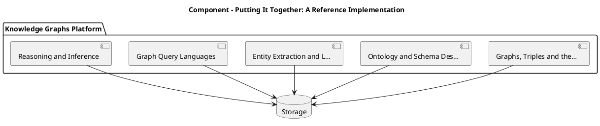

_Source diagram (plantuml); render with the appropriate tool._

**Figure 20. Component - Putting It Together: A Reference Implementation** (plantuml). Figure: Component view for Knowledge Graphs. This diagram illustrates the principal components and their interactions as discussed in the surrounding section.

## Deep Dive: Mechanics, Variants and Trade-offs

Having established the essentials, we now go deeper into putting it together: a reference implementation. Beneath the abstraction lies a concrete process whose steps can each be measured, tested and optimised independently. The distinctions in this section are the ones that separate a working demo from a system that holds up under adversarial inputs, scale and the passage of time.

Consider the principal variants and how to choose between them. Each variant optimises for a different point in the design space - some for latency, some for accuracy, some for cost or operability - and the correct choice follows from explicit requirements rather than from defaults. Simplicity is a feature. The simplest design that meets the requirement should be the default, with complexity added only when measurement justifies it.

In practice this is supported by a mature tooling ecosystem, including Neo4j, Amazon Neptune, RDFLib, Apache Jena. Tools accelerate the work but do not substitute for understanding: the same principles apply whichever implementation you select, and the ability to reason from first principles is what lets you debug when a tool behaves unexpectedly.

A frequent source of subtle bugs is the interaction with data quality and entity resolution. Because data quality and entity resolution concerns deduplication, validation and provenance, changes there can silently alter the behaviour analysed here. The remedy is contract tests at the boundary and end-to-end evaluations that exercise the interaction explicitly.

Finally, attend to edge cases and degradation. Define what the system should do under partial failure, unexpected inputs and load spikes, and make that behaviour explicit and tested rather than emergent. Graceful degradation - returning a safe, useful result when the ideal one is unavailable - is a hallmark of mature engineering.

For deeper study, the literature offers authoritative treatments such as Hogan et al. — Knowledge Graphs (2021) and Bordes et al. — TransE (2013). These primary sources reward careful reading and ground the practical guidance above in established results.

## Advanced Considerations

Having established the essentials, we now go deeper into putting it together: a reference implementation. Mechanically, the behaviour emerges from a few interacting parts that are simpler than the whole they produce. The distinctions in this section are the ones that separate a working demo from a system that holds up under adversarial inputs, scale and the passage of time.

Consider the principal variants and how to choose between them. Each variant optimises for a different point in the design space - some for latency, some for accuracy, some for cost or operability - and the correct choice follows from explicit requirements rather than from defaults. Every added component buys capability at the price of operational surface area, and that bargain should be made consciously.

In practice this is supported by a mature tooling ecosystem, including Neo4j, Amazon Neptune, RDFLib, Apache Jena. Tools accelerate the work but do not substitute for understanding: the same principles apply whichever implementation you select, and the ability to reason from first principles is what lets you debug when a tool behaves unexpectedly.

A frequent source of subtle bugs is the interaction with scaling graph storage. Because scaling graph storage concerns partitioning, indexing and distributed graph engines, changes there can silently alter the behaviour analysed here. The remedy is contract tests at the boundary and end-to-end evaluations that exercise the interaction explicitly.

Finally, attend to edge cases and degradation. Define what the system should do under partial failure, unexpected inputs and load spikes, and make that behaviour explicit and tested rather than emergent. Graceful degradation - returning a safe, useful result when the ideal one is unavailable - is a hallmark of mature engineering.

For deeper study, the literature offers authoritative treatments such as Hogan et al. — Knowledge Graphs (2021) and Bordes et al. — TransE (2013). These primary sources reward careful reading and ground the practical guidance above in established results.

## Worked Example

To ground the discussion, walk through a representative example. A finance organisation needs fraud rings and beneficial-ownership analysis. They decide to apply putting it together: a reference implementation as part of their Knowledge Graphs solution, but wisely treat it as a hypothesis to be validated rather than a foregone conclusion.

The team begins by stating the objective precisely and defining how success will be measured before writing any code. They establish a small but representative evaluation set, agree on acceptance thresholds, and only then prototype the simplest design that could work. Early measurement reveals which assumptions hold and which must be revised, saving weeks of misdirected effort and surfacing edge cases while they are still cheap to fix.

As the prototype matures into a service, the team hardens it: adding input validation, error handling, caching where it pays off, and monitoring that ties back to the original success metric. They document each significant decision in an architecture decision record so that future maintainers understand not just what was built but why.

The outcome is instructive. The system that reaches production is not the most sophisticated design the team considered, but the one whose behaviour they could measure, explain and operate. This is the recurring lesson of Knowledge Graphs: durable value comes from the whole system, not from any single clever component.

## Industry Use Cases

Across industries, the ideas in this chapter recur in recognisable ways. The following vignettes show how different sectors apply them and what they have in common.

**Finance.** Fraud rings and beneficial-ownership analysis. The common thread is that value comes not from the model alone but from the surrounding system - data quality, evaluation, integration and operations - which is precisely where most of the engineering effort belongs.

**Healthcare.** Integrating clinical, genomic and literature data. The common thread is that value comes not from the model alone but from the surrounding system - data quality, evaluation, integration and operations - which is precisely where most of the engineering effort belongs.

**Retail.** Product knowledge graphs powering search and recommendations. The common thread is that value comes not from the model alone but from the surrounding system - data quality, evaluation, integration and operations - which is precisely where most of the engineering effort belongs.

**Enterprise.** 360-degree views linking customers, products and events. The common thread is that value comes not from the model alone but from the surrounding system - data quality, evaluation, integration and operations - which is precisely where most of the engineering effort belongs.

## Best Practices

The following practices consistently separate successful Knowledge Graphs efforts from struggling ones. They are deliberately concrete so they can be adopted as checklist items in design and code review.

- Design the ontology with domain experts before ingesting at scale.
- Treat entity resolution as a first-class, monitored pipeline.
- Record provenance on every fact for trust and debugging.
- Choose the model (RDF vs property graph) to fit query needs.

None of these are exotic; they are the unglamorous disciplines that compound into reliability. The cost of adopting them is small compared with the cost of the incidents they prevent, and they become second nature with practice.

## Common Pitfalls

Equally instructive are the failure modes that recur in practice. Each pitfall below has a clear early warning sign and a known remedy, so treat them as a diagnostic checklist when something feels wrong:

- Over-engineering the ontology before validating use cases.
- Neglecting entity resolution and creating duplicates.
- Ignoring provenance, making facts untrustworthy.
- Picking a graph engine that cannot scale to your traversal patterns.

The pattern is consistent: most failures stem from skipping measurement, conflating prototype and production standards, or deferring cross-cutting concerns such as security and cost until they become emergencies. Naming these traps in advance is the cheapest way to avoid them.

## Governance, Security and Cost Notes

No discussion of putting it together: a reference implementation is complete without its governance, security and cost dimensions, which are too often deferred until they become emergencies. Treating them as first-class concerns from the outset is both cheaper and safer.

**Governance.** Classify the risk of this capability, document its intended and out-of-scope uses, and ensure decisions are traceable to satisfy internal policy and external regulation such as the NIST AI RMF, ISO/IEC 42001 and the EU AI Act. **Security.** Treat all external input as untrusted, validate outputs before acting on them, apply least privilege to any tools or data access, and map controls to the OWASP LLM Top 10 and MITRE ATLAS.

**Cost and sustainability.** Establish explicit budgets for compute, tokens and latency, attribute spend to owners, and revisit the economics as usage scales - a design that is affordable at pilot scale can become untenable at production volume. Building these reflexes into everyday engineering is what allows a Knowledge Graphs system to be not only capable but also trustworthy and economically sound.

## Hands-On Exercises

Work through the following exercises. They are designed to move understanding from recognition to application - the level required for real engineering work - so prefer writing and building over merely reading.

1. Explain putting it together: a reference implementation to a colleague unfamiliar with Knowledge Graphs, using a concrete example from your own domain.
2. Sketch a reference architecture that incorporates putting it together: a reference implementation and annotate where observability, security and cost controls belong.
3. Design an evaluation that would tell you whether putting it together: a reference implementation is working in production, including the metric, the dataset and the acceptance threshold.
4. Identify two pitfalls relevant to putting it together: a reference implementation in your environment and describe the early warning signals you would monitor.
5. Prototype the simplest implementation that demonstrates putting it together: a reference implementation, then list exactly what would need to change to make it production-ready.

## Key Takeaways

Key takeaways from this chapter:

- Putting It Together: A Reference Implementation is a systems concern in Knowledge Graphs: data, models and operations must be co-designed.
- Measurement is non-negotiable; define success metrics and evaluation before building.
- Favour the simplest design that meets the requirement, and add complexity only when evidence demands it.
- Security, cost and observability are first-class requirements, not afterthoughts.
- Document decisions so the system remains understandable and operable as it evolves.

## Code Walkthrough

Pipelines keep Putting It Together: A Reference Implementation logic modular and testable. Each stage is a pure function, errors are captured per item, and the composition is trivial to extend or reorder.

The full listing is shown below; study it line by line and reproduce it locally before moving on.

### Listing: A composable processing pipeline for Putting It Together: A Reference Implementation

```python
from collections.abc import Iterable, Iterator
from typing import Protocol


class Stage(Protocol):
    def __call__(self, item: dict) -> dict: ...


def pipeline(stages: list[Stage]) -> Stage:
    """Compose ordered stages into a single callable for Putting It Together: A Reference Implementation."""

    def run(item: dict) -> dict:
        for stage in stages:
            item = stage(item)
        return item

    return run


def validate(item: dict) -> dict:
    if "text" not in item:
        raise ValueError("missing required field: text")
    return item


def normalise(item: dict) -> dict:
    item["text"] = item["text"].strip().lower()
    return item


def enrich(item: dict) -> dict:
    item["length"] = len(item["text"])
    return item


process = pipeline([validate, normalise, enrich])


def run_batch(items: Iterable[dict]) -> Iterator[dict]:
    for item in items:
        try:
            yield process(dict(item))
        except ValueError as exc:
            yield {"error": str(exc), "item": item}

```

## Review Questions

1. In the context of Knowledge Graphs, which statement best describes “Putting It Together: A Reference Implementation”?
   - A. It is only relevant to academic research, not production.
   - B. It eliminates the need for any evaluation or monitoring.
   - C. an end-to-end reference implementation that integrates the components of a Knowledge Graphs system into a cohesive, working whole
   - D. It makes the system slower but has no other effect.
   - **Answer: C.** Putting It Together: A Reference Implementation: an end-to-end reference implementation that integrates the components of a Knowledge Graphs system into a cohesive, working whole
2. Which of the following is a recommended best practice when working with Knowledge Graphs?
   - A. Choose the model (RDF vs property graph) to fit query needs.
   - B. Over-engineering the ontology before validating use cases.
   - C. It removes all security and governance requirements.
   - D. It guarantees deterministic output regardless of input.
   - **Answer: A.** Best practice: Choose the model (RDF vs property graph) to fit query needs.
3. Which of the following is a common pitfall to avoid in Knowledge Graphs?
   - A. Treat entity resolution as a first-class, monitored pipeline.
   - B. It eliminates the need for any evaluation or monitoring.
   - C. It is only relevant to academic research, not production.
   - D. Picking a graph engine that cannot scale to your traversal patterns.
   - **Answer: D.** Pitfall to avoid: Picking a graph engine that cannot scale to your traversal patterns.
4. *(Discussion)* Walk through how you would design Putting It Together: A Reference Implementation for an enterprise Knowledge Graphs workload.
   - **Model answer:** A strong answer defines putting it together: a reference implementation (an end-to-end reference implementation that integrates the components of a Knowledge Graphs system into a cohesive, working whole) then connects it to architecture, evaluation, cost, security and operations for Knowledge Graphs, citing concrete trade-offs and a real-world example.

---


# Chapter 16. Hands-On Lab: Building an End-to-End Knowledge Graphs System

_This chapter examines hands-on lab: building an end-to-end knowledge graphs system within Knowledge Graphs. It covers a guided, build-along laboratory that constructs a functioning Knowledge Graphs system from first principles, derives a reference architecture, walks through a worked example and runnable code, surveys industry use cases, and distils best practices and pitfalls, closing with exercises and review questions._

## Introduction

Hands-On Lab: Building an End-to-End Knowledge Graphs System can be characterised as a guided, build-along laboratory that constructs a functioning Knowledge Graphs system from first principles. Neglecting it is one of the most common reasons Knowledge Graphs initiatives stall in production. What distinguishes a production-grade approach from a prototype is the discipline of measurement: every claim is backed by an evaluation rather than intuition.

This chapter builds intuition first, then formalises the ideas, derives an architecture, and finishes with code, exercises and review questions so the material transfers directly to your own Knowledge Graphs work. Read it actively: pause at each diagram, reproduce the code, and attempt the exercises before consulting the answers.

## Theory and Foundations

Hands-On Lab: Building an End-to-End Knowledge Graphs System refers to a guided, build-along laboratory that constructs a functioning Knowledge Graphs system from first principles. The right abstraction here pays compounding dividends, because downstream components depend on its guarantees. The underlying mechanism is best appreciated by tracing a single request from input to output and noting where state is created and consumed.

To place this in context, recall the broader picture: Knowledge graphs represent entities and their relationships as nodes and edges, enabling integration of heterogeneous data, semantic querying and reasoning. Within that picture, hands-on lab: building an end-to-end knowledge graphs system is one of the load-bearing ideas - the kind that, when understood deeply, makes the rest of Knowledge Graphs fall into place. Understanding this matters because Knowledge Graphs systems succeed or fail on exactly these decisions.

Hands-On Lab: Building an End-to-End Knowledge Graphs System cannot be understood in isolation from operating knowledge graphs. Recall that operating knowledge graphs concerns pipelines, monitoring and lifecycle management. The two interact directly: decisions in one constrain the design space of the other, which is why mature teams reason about them together rather than sequentially. Simplicity is a feature. The simplest design that meets the requirement should be the default, with complexity added only when measurement justifies it.

Hands-On Lab: Building an End-to-End Knowledge Graphs System cannot be understood in isolation from data quality and entity resolution. Recall that data quality and entity resolution concerns deduplication, validation and provenance. The two interact directly: decisions in one constrain the design space of the other, which is why mature teams reason about them together rather than sequentially. There is an inherent trade-off between fidelity and cost, and the correct balance depends on the use case and its tolerance for error.

Several established patterns apply directly to hands-on lab: building an end-to-end knowledge graphs system. The first, entity-resolution pipeline feeding a golden-record graph, is widely adopted because it makes the system's behaviour predictable and observable. A complementary pattern, canonical ontology with reused standard vocabularies, addresses a related concern and is often deployed alongside it. Patterns are not dogma; they are distilled experience that shortcuts the search for a sound design, and each carries assumptions worth checking against your context.

Knowing when not to use a technique is as valuable as knowing how to use it. In a small prototype, shortcuts around hands-on lab: building an end-to-end knowledge graphs system are invisible; in a production Knowledge Graphs system serving real traffic, they surface as incidents, cost overruns or compliance gaps. Simplicity is a feature. The simplest design that meets the requirement should be the default, with complexity added only when measurement justifies it. The remainder of this chapter turns these principles into an architecture, code and a checklist you can apply immediately.

## Architecture and Design

A robust architecture for Hands-On Lab: Building an End-to-End Knowledge Graphs System is layered so each part can evolve independently without destabilising the whole. An enterprise knowledge graph ingests from databases, documents and APIs through extraction and entity-resolution pipelines into a graph store governed by an ontology. Query services expose traversal and reasoning to applications, while a governance layer tracks provenance, versions and access.

Concretely, the principal building blocks include graphs, triples and the property graph model, ontology and schema design, entity extraction and linking, graph query languages and reasoning and inference. Each is a replaceable component behind a stable interface, so the team can upgrade an implementation - a model, an index, a policy engine - without rewriting its neighbours. The contracts between components are where reliability is won or lost, so they are specified explicitly and tested in isolation.

The diagram accompanying this section makes the data and control flow explicit. Requests enter through a well-defined boundary where they are authenticated and validated; only then are they dispatched to the components that perform the work. This boundary is also where rate limiting, quota enforcement and audit logging live, keeping cross-cutting concerns out of the core logic and in one auditable place.

Two qualities deserve emphasis. First, observability is designed in, not bolted on: every component emits structured telemetry so that failures can be localised in minutes rather than hours. Second, the architecture is evolvable - components communicate through stable contracts so that any single part of the Knowledge Graphs system can be replaced without a rewrite. Latency, accuracy and cost form a tension triangle: improving one typically pressures the others, so explicit budgets are essential.

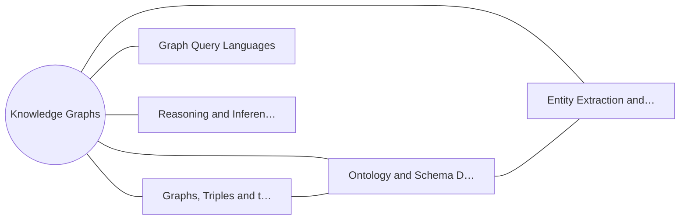

**Figure 21. Knowledge Graph - Hands-On Lab: Building an End-to-End Knowledge Graphs System** (mermaid). Figure: Knowledge Graph view for Knowledge Graphs. This diagram illustrates the principal components and their interactions as discussed in the surrounding section.

## Deep Dive: Mechanics, Variants and Trade-offs

Having established the essentials, we now go deeper into hands-on lab: building an end-to-end knowledge graphs system. It pays to understand the mechanism rather than treat it as a black box, because most production incidents are explained by one of its steps misbehaving. The distinctions in this section are the ones that separate a working demo from a system that holds up under adversarial inputs, scale and the passage of time.

Consider the principal variants and how to choose between them. Each variant optimises for a different point in the design space - some for latency, some for accuracy, some for cost or operability - and the correct choice follows from explicit requirements rather than from defaults. Simplicity is a feature. The simplest design that meets the requirement should be the default, with complexity added only when measurement justifies it.

In practice this is supported by a mature tooling ecosystem, including Neo4j, Amazon Neptune, RDFLib, Apache Jena. Tools accelerate the work but do not substitute for understanding: the same principles apply whichever implementation you select, and the ability to reason from first principles is what lets you debug when a tool behaves unexpectedly.

A frequent source of subtle bugs is the interaction with operating knowledge graphs. Because operating knowledge graphs concerns pipelines, monitoring and lifecycle management, changes there can silently alter the behaviour analysed here. The remedy is contract tests at the boundary and end-to-end evaluations that exercise the interaction explicitly.

Finally, attend to edge cases and degradation. Define what the system should do under partial failure, unexpected inputs and load spikes, and make that behaviour explicit and tested rather than emergent. Graceful degradation - returning a safe, useful result when the ideal one is unavailable - is a hallmark of mature engineering.

For deeper study, the literature offers authoritative treatments such as Hogan et al. — Knowledge Graphs (2021) and Bordes et al. — TransE (2013). These primary sources reward careful reading and ground the practical guidance above in established results.

## Advanced Considerations

Having established the essentials, we now go deeper into hands-on lab: building an end-to-end knowledge graphs system. It pays to understand the mechanism rather than treat it as a black box, because most production incidents are explained by one of its steps misbehaving. The distinctions in this section are the ones that separate a working demo from a system that holds up under adversarial inputs, scale and the passage of time.

Consider the principal variants and how to choose between them. Each variant optimises for a different point in the design space - some for latency, some for accuracy, some for cost or operability - and the correct choice follows from explicit requirements rather than from defaults. Every added component buys capability at the price of operational surface area, and that bargain should be made consciously.

In practice this is supported by a mature tooling ecosystem, including Neo4j, Amazon Neptune, RDFLib, Apache Jena. Tools accelerate the work but do not substitute for understanding: the same principles apply whichever implementation you select, and the ability to reason from first principles is what lets you debug when a tool behaves unexpectedly.

A frequent source of subtle bugs is the interaction with knowledge graph embeddings. Because knowledge graph embeddings concerns transE, RotatE and link prediction for completion, changes there can silently alter the behaviour analysed here. The remedy is contract tests at the boundary and end-to-end evaluations that exercise the interaction explicitly.

Finally, attend to edge cases and degradation. Define what the system should do under partial failure, unexpected inputs and load spikes, and make that behaviour explicit and tested rather than emergent. Graceful degradation - returning a safe, useful result when the ideal one is unavailable - is a hallmark of mature engineering.

For deeper study, the literature offers authoritative treatments such as Hogan et al. — Knowledge Graphs (2021) and Bordes et al. — TransE (2013). These primary sources reward careful reading and ground the practical guidance above in established results.

## Worked Example

To ground the discussion, walk through a representative example. A enterprise organisation needs 360-degree views linking customers, products and events. They decide to apply hands-on lab: building an end-to-end knowledge graphs system as part of their Knowledge Graphs solution, but wisely treat it as a hypothesis to be validated rather than a foregone conclusion.

The team begins by stating the objective precisely and defining how success will be measured before writing any code. They establish a small but representative evaluation set, agree on acceptance thresholds, and only then prototype the simplest design that could work. Early measurement reveals which assumptions hold and which must be revised, saving weeks of misdirected effort and surfacing edge cases while they are still cheap to fix.

As the prototype matures into a service, the team hardens it: adding input validation, error handling, caching where it pays off, and monitoring that ties back to the original success metric. They document each significant decision in an architecture decision record so that future maintainers understand not just what was built but why.

The outcome is instructive. The system that reaches production is not the most sophisticated design the team considered, but the one whose behaviour they could measure, explain and operate. This is the recurring lesson of Knowledge Graphs: durable value comes from the whole system, not from any single clever component.

## Industry Use Cases

Across industries, the ideas in this chapter recur in recognisable ways. The following vignettes show how different sectors apply them and what they have in common.

**Finance.** Fraud rings and beneficial-ownership analysis. The common thread is that value comes not from the model alone but from the surrounding system - data quality, evaluation, integration and operations - which is precisely where most of the engineering effort belongs.

**Healthcare.** Integrating clinical, genomic and literature data. The common thread is that value comes not from the model alone but from the surrounding system - data quality, evaluation, integration and operations - which is precisely where most of the engineering effort belongs.

**Retail.** Product knowledge graphs powering search and recommendations. The common thread is that value comes not from the model alone but from the surrounding system - data quality, evaluation, integration and operations - which is precisely where most of the engineering effort belongs.

**Enterprise.** 360-degree views linking customers, products and events. The common thread is that value comes not from the model alone but from the surrounding system - data quality, evaluation, integration and operations - which is precisely where most of the engineering effort belongs.

## Best Practices

The following practices consistently separate successful Knowledge Graphs efforts from struggling ones. They are deliberately concrete so they can be adopted as checklist items in design and code review.

- Design the ontology with domain experts before ingesting at scale.
- Treat entity resolution as a first-class, monitored pipeline.
- Record provenance on every fact for trust and debugging.
- Choose the model (RDF vs property graph) to fit query needs.

None of these are exotic; they are the unglamorous disciplines that compound into reliability. The cost of adopting them is small compared with the cost of the incidents they prevent, and they become second nature with practice.

## Common Pitfalls

Equally instructive are the failure modes that recur in practice. Each pitfall below has a clear early warning sign and a known remedy, so treat them as a diagnostic checklist when something feels wrong:

- Over-engineering the ontology before validating use cases.
- Neglecting entity resolution and creating duplicates.
- Ignoring provenance, making facts untrustworthy.
- Picking a graph engine that cannot scale to your traversal patterns.

The pattern is consistent: most failures stem from skipping measurement, conflating prototype and production standards, or deferring cross-cutting concerns such as security and cost until they become emergencies. Naming these traps in advance is the cheapest way to avoid them.

## Governance, Security and Cost Notes

No discussion of hands-on lab: building an end-to-end knowledge graphs system is complete without its governance, security and cost dimensions, which are too often deferred until they become emergencies. Treating them as first-class concerns from the outset is both cheaper and safer.

**Governance.** Classify the risk of this capability, document its intended and out-of-scope uses, and ensure decisions are traceable to satisfy internal policy and external regulation such as the NIST AI RMF, ISO/IEC 42001 and the EU AI Act. **Security.** Treat all external input as untrusted, validate outputs before acting on them, apply least privilege to any tools or data access, and map controls to the OWASP LLM Top 10 and MITRE ATLAS.

**Cost and sustainability.** Establish explicit budgets for compute, tokens and latency, attribute spend to owners, and revisit the economics as usage scales - a design that is affordable at pilot scale can become untenable at production volume. Building these reflexes into everyday engineering is what allows a Knowledge Graphs system to be not only capable but also trustworthy and economically sound.

## Hands-On Exercises

Work through the following exercises. They are designed to move understanding from recognition to application - the level required for real engineering work - so prefer writing and building over merely reading.

1. Explain hands-on lab: building an end-to-end knowledge graphs system to a colleague unfamiliar with Knowledge Graphs, using a concrete example from your own domain.
2. Sketch a reference architecture that incorporates hands-on lab: building an end-to-end knowledge graphs system and annotate where observability, security and cost controls belong.
3. Design an evaluation that would tell you whether hands-on lab: building an end-to-end knowledge graphs system is working in production, including the metric, the dataset and the acceptance threshold.
4. Identify two pitfalls relevant to hands-on lab: building an end-to-end knowledge graphs system in your environment and describe the early warning signals you would monitor.
5. Prototype the simplest implementation that demonstrates hands-on lab: building an end-to-end knowledge graphs system, then list exactly what would need to change to make it production-ready.

## Key Takeaways

Key takeaways from this chapter:

- Hands-On Lab: Building an End-to-End Knowledge Graphs System is a systems concern in Knowledge Graphs: data, models and operations must be co-designed.
- Measurement is non-negotiable; define success metrics and evaluation before building.
- Favour the simplest design that meets the requirement, and add complexity only when evidence demands it.
- Security, cost and observability are first-class requirements, not afterthoughts.
- Document decisions so the system remains understandable and operable as it evolves.

## Code Walkthrough

Every change to a Knowledge Graphs system should pass an evaluation gate. This example shows the minimal shape: align predictions and references, compute a metric, and return a pass/fail decision for CI.

The full listing is shown below; study it line by line and reproduce it locally before moving on.

### Listing: Evaluating Hands-On Lab: Building an End-to-End Knowledge Graphs System with a regression gate

```python
from dataclasses import dataclass


@dataclass
class EvalResult:
    metric: str
    score: float
    passed: bool


def evaluate(predictions: list[str], references: list[str],
             threshold: float = 0.8) -> EvalResult:
    """Score Hands-On Lab: Building an End-to-End Knowledge Graphs System output against references with a simple exact-match metric.

    In practice you would combine several metrics (exact match, semantic
    similarity, LLM-as-judge) and gate releases on the aggregate.
    """
    if len(predictions) != len(references):
        raise ValueError("predictions and references must align")
    hits = sum(p.strip() == r.strip() for p, r in zip(predictions, references))
    score = hits / len(references) if references else 0.0
    return EvalResult(metric="exact_match", score=score, passed=score >= threshold)


if __name__ == "__main__":
    result = evaluate(["yes", "no"], ["yes", "yes"])
    print(f"{result.metric}={result.score:.2f} passed={result.passed}")

```

## Review Questions

1. In the context of Knowledge Graphs, which statement best describes “Hands-On Lab: Building an End-to-End Knowledge Graphs System”?
   - A. It makes the system slower but has no other effect.
   - B. It is only relevant to academic research, not production.
   - C. a guided, build-along laboratory that constructs a functioning Knowledge Graphs system from first principles
   - D. It applies exclusively to image data.
   - **Answer: C.** Hands-On Lab: Building an End-to-End Knowledge Graphs System: a guided, build-along laboratory that constructs a functioning Knowledge Graphs system from first principles
2. Which of the following is a recommended best practice when working with Knowledge Graphs?
   - A. It eliminates the need for any evaluation or monitoring.
   - B. Design the ontology with domain experts before ingesting at scale.
   - C. It is only relevant to academic research, not production.
   - D. It removes all security and governance requirements.
   - **Answer: B.** Best practice: Design the ontology with domain experts before ingesting at scale.
3. Which of the following is a common pitfall to avoid in Knowledge Graphs?
   - A. Record provenance on every fact for trust and debugging.
   - B. Picking a graph engine that cannot scale to your traversal patterns.
   - C. It makes the system slower but has no other effect.
   - D. It is only relevant to academic research, not production.
   - **Answer: B.** Pitfall to avoid: Picking a graph engine that cannot scale to your traversal patterns.
4. *(Discussion)* How does Hands-On Lab: Building an End-to-End Knowledge Graphs System interact with security and governance requirements?
   - **Model answer:** A strong answer defines hands-on lab: building an end-to-end knowledge graphs system (a guided, build-along laboratory that constructs a functioning Knowledge Graphs system from first principles) then connects it to architecture, evaluation, cost, security and operations for Knowledge Graphs, citing concrete trade-offs and a real-world example.

---


# Chapter 17. Case Study: Finance at Scale

_This chapter examines case study: finance at scale within Knowledge Graphs. It covers a detailed case study of deploying Knowledge Graphs in a demanding finance environment, including the decisions, trade-offs and outcomes, derives a reference architecture, walks through a worked example and runnable code, surveys industry use cases, and distils best practices and pitfalls, closing with exercises and review questions._

## Introduction

In practical terms, Case Study: Finance at Scale is best understood as a detailed case study of deploying Knowledge Graphs in a demanding finance environment, including the decisions, trade-offs and outcomes. Teams that master this consistently ship more reliable Knowledge Graphs systems at lower cost. Seasoned practitioners treat this as a systems problem, co-designing data, models and operations rather than optimising any one in isolation.

This chapter builds intuition first, then formalises the ideas, derives an architecture, and finishes with code, exercises and review questions so the material transfers directly to your own Knowledge Graphs work. Read it actively: pause at each diagram, reproduce the code, and attempt the exercises before consulting the answers.

## Theory and Foundations

At its core, Case Study: Finance at Scale concerns a detailed case study of deploying Knowledge Graphs in a demanding finance environment, including the decisions, trade-offs and outcomes. It helps to separate the conceptual model from its implementation: the former guides reasoning, the latter must contend with real-world constraints. Beneath the abstraction lies a concrete process whose steps can each be measured, tested and optimised independently.

To place this in context, recall the broader picture: Knowledge graphs represent entities and their relationships as nodes and edges, enabling integration of heterogeneous data, semantic querying and reasoning. Within that picture, case study: finance at scale is one of the load-bearing ideas - the kind that, when understood deeply, makes the rest of Knowledge Graphs fall into place. Understanding this matters because Knowledge Graphs systems succeed or fail on exactly these decisions.

Case Study: Finance at Scale cannot be understood in isolation from visualising knowledge graphs. Recall that visualising knowledge graphs concerns effective exploration and analyst tooling. The two interact directly: decisions in one constrain the design space of the other, which is why mature teams reason about them together rather than sequentially. Every added component buys capability at the price of operational surface area, and that bargain should be made consciously.

Case Study: Finance at Scale cannot be understood in isolation from scaling graph storage. Recall that scaling graph storage concerns partitioning, indexing and distributed graph engines. The two interact directly: decisions in one constrain the design space of the other, which is why mature teams reason about them together rather than sequentially. Simplicity is a feature. The simplest design that meets the requirement should be the default, with complexity added only when measurement justifies it.

Several established patterns apply directly to case study: finance at scale. The first, entity-resolution pipeline feeding a golden-record graph, is widely adopted because it makes the system's behaviour predictable and observable. A complementary pattern, provenance edges for full traceability, addresses a related concern and is often deployed alongside it. Patterns are not dogma; they are distilled experience that shortcuts the search for a sound design, and each carries assumptions worth checking against your context.

The decision of whether to adopt this should be driven by requirements, not by novelty. In a small prototype, shortcuts around case study: finance at scale are invisible; in a production Knowledge Graphs system serving real traffic, they surface as incidents, cost overruns or compliance gaps. Simplicity is a feature. The simplest design that meets the requirement should be the default, with complexity added only when measurement justifies it. The remainder of this chapter turns these principles into an architecture, code and a checklist you can apply immediately.

## Architecture and Design

The reference architecture for Case Study: Finance at Scale separates concerns into clearly bounded components with explicit contracts. An enterprise knowledge graph ingests from databases, documents and APIs through extraction and entity-resolution pipelines into a graph store governed by an ontology. Query services expose traversal and reasoning to applications, while a governance layer tracks provenance, versions and access.

Concretely, the principal building blocks include graphs, triples and the property graph model, ontology and schema design, entity extraction and linking, graph query languages and reasoning and inference. Each is a replaceable component behind a stable interface, so the team can upgrade an implementation - a model, an index, a policy engine - without rewriting its neighbours. The contracts between components are where reliability is won or lost, so they are specified explicitly and tested in isolation.

The diagram accompanying this section makes the data and control flow explicit. Requests enter through a well-defined boundary where they are authenticated and validated; only then are they dispatched to the components that perform the work. This boundary is also where rate limiting, quota enforcement and audit logging live, keeping cross-cutting concerns out of the core logic and in one auditable place.

Two qualities deserve emphasis. First, observability is designed in, not bolted on: every component emits structured telemetry so that failures can be localised in minutes rather than hours. Second, the architecture is evolvable - components communicate through stable contracts so that any single part of the Knowledge Graphs system can be replaced without a rewrite. Every added component buys capability at the price of operational surface area, and that bargain should be made consciously.

<div class="diagram-svg">

<svg xmlns="http://www.w3.org/2000/svg" width="840" height="460" data-tpl="matrix" data-pal="3-0" viewBox="0 0 840 460" font-family="Inter, Segoe UI, Arial, sans-serif"><defs><marker id="ar" markerWidth="9" markerHeight="9" refX="7" refY="3" orient="auto"><path d="M0,0 L7,3 L0,6 z" fill="#94a3b8"/></marker><marker id="arw" markerWidth="9" markerHeight="9" refX="7" refY="3" orient="auto"><path d="M0,0 L7,3 L0,6 z" fill="#ffffff"/></marker></defs><rect width="840" height="460" rx="14" fill="#ffffff"/><rect x="0" y="0" width="840" height="46" rx="14" fill="#b45309"/><rect x="0" y="30" width="840" height="16" fill="#b45309"/><text x="420" y="24" text-anchor="middle" font-size="15" font-weight="700" fill="#ffffff" dominant-baseline="middle">Capability Map - Case Study: Finance at Scale</text><rect x="273" y="97" width="144" height="144" rx="12" fill="#b45309"/><text x="345" y="169" text-anchor="middle" font-size="12" font-weight="600" fill="#fff" dominant-baseline="middle">Graph Algorithm…</text><rect x="423" y="97" width="144" height="144" rx="12" fill="#d97706"/><text x="495" y="169" text-anchor="middle" font-size="12" font-weight="600" fill="#fff" dominant-baseline="middle">Data Quality an…</text><rect x="273" y="247" width="144" height="144" rx="12" fill="#f59e0b"/><text x="345" y="319" text-anchor="middle" font-size="12" font-weight="600" fill="#fff" dominant-baseline="middle">Scaling Graph S…</text><rect x="423" y="247" width="144" height="144" rx="12" fill="#ea580c"/><text x="495" y="319" text-anchor="middle" font-size="12" font-weight="600" fill="#fff" dominant-baseline="middle">Graphs for Grou…</text><text x="420" y="82" text-anchor="middle" font-size="10" font-weight="600" fill="#64748b" dominant-baseline="middle">High impact</text><text x="420" y="410" text-anchor="middle" font-size="10" font-weight="600" fill="#64748b" dominant-baseline="middle">Low impact</text><text x="258.0" y="244.0" text-anchor="middle" font-size="10" fill="#64748b" transform="rotate(-90 258.0 244.0)">Low effort</text><text x="582.0" y="244.0" text-anchor="middle" font-size="10" fill="#64748b" transform="rotate(90 582.0 244.0)">High effort</text></svg>

</div>

**Figure 22. Capability Map - Case Study: Finance at Scale** (svg). Figure: Capability Map view for Knowledge Graphs. This diagram illustrates the principal components and their interactions as discussed in the surrounding section.

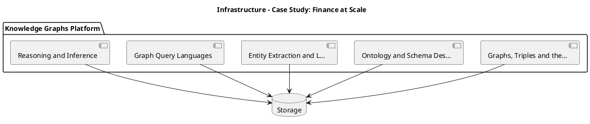

_Source diagram (plantuml); render with the appropriate tool._

**Figure 23. Infrastructure - Case Study: Finance at Scale** (plantuml). Figure: Infrastructure view for Knowledge Graphs. This diagram illustrates the principal components and their interactions as discussed in the surrounding section.

## Deep Dive: Mechanics, Variants and Trade-offs

Having established the essentials, we now go deeper into case study: finance at scale. Mechanically, the behaviour emerges from a few interacting parts that are simpler than the whole they produce. The distinctions in this section are the ones that separate a working demo from a system that holds up under adversarial inputs, scale and the passage of time.

Consider the principal variants and how to choose between them. Each variant optimises for a different point in the design space - some for latency, some for accuracy, some for cost or operability - and the correct choice follows from explicit requirements rather than from defaults. There is an inherent trade-off between fidelity and cost, and the correct balance depends on the use case and its tolerance for error.

In practice this is supported by a mature tooling ecosystem, including Neo4j, Amazon Neptune, RDFLib, Apache Jena. Tools accelerate the work but do not substitute for understanding: the same principles apply whichever implementation you select, and the ability to reason from first principles is what lets you debug when a tool behaves unexpectedly.

A frequent source of subtle bugs is the interaction with visualising knowledge graphs. Because visualising knowledge graphs concerns effective exploration and analyst tooling, changes there can silently alter the behaviour analysed here. The remedy is contract tests at the boundary and end-to-end evaluations that exercise the interaction explicitly.

Finally, attend to edge cases and degradation. Define what the system should do under partial failure, unexpected inputs and load spikes, and make that behaviour explicit and tested rather than emergent. Graceful degradation - returning a safe, useful result when the ideal one is unavailable - is a hallmark of mature engineering.

For deeper study, the literature offers authoritative treatments such as Hogan et al. — Knowledge Graphs (2021) and Bordes et al. — TransE (2013). These primary sources reward careful reading and ground the practical guidance above in established results.

## Advanced Considerations

Having established the essentials, we now go deeper into case study: finance at scale. Beneath the abstraction lies a concrete process whose steps can each be measured, tested and optimised independently. The distinctions in this section are the ones that separate a working demo from a system that holds up under adversarial inputs, scale and the passage of time.

Consider the principal variants and how to choose between them. Each variant optimises for a different point in the design space - some for latency, some for accuracy, some for cost or operability - and the correct choice follows from explicit requirements rather than from defaults. Latency, accuracy and cost form a tension triangle: improving one typically pressures the others, so explicit budgets are essential.

In practice this is supported by a mature tooling ecosystem, including Neo4j, Amazon Neptune, RDFLib, Apache Jena. Tools accelerate the work but do not substitute for understanding: the same principles apply whichever implementation you select, and the ability to reason from first principles is what lets you debug when a tool behaves unexpectedly.

A frequent source of subtle bugs is the interaction with governance and lineage. Because governance and lineage concerns versioning, access control and auditability, changes there can silently alter the behaviour analysed here. The remedy is contract tests at the boundary and end-to-end evaluations that exercise the interaction explicitly.

Finally, attend to edge cases and degradation. Define what the system should do under partial failure, unexpected inputs and load spikes, and make that behaviour explicit and tested rather than emergent. Graceful degradation - returning a safe, useful result when the ideal one is unavailable - is a hallmark of mature engineering.

For deeper study, the literature offers authoritative treatments such as Hogan et al. — Knowledge Graphs (2021) and Bordes et al. — TransE (2013). These primary sources reward careful reading and ground the practical guidance above in established results.

## Worked Example

To ground the discussion, walk through a representative example. A enterprise organisation needs 360-degree views linking customers, products and events. They decide to apply case study: finance at scale as part of their Knowledge Graphs solution, but wisely treat it as a hypothesis to be validated rather than a foregone conclusion.

The team begins by stating the objective precisely and defining how success will be measured before writing any code. They establish a small but representative evaluation set, agree on acceptance thresholds, and only then prototype the simplest design that could work. Early measurement reveals which assumptions hold and which must be revised, saving weeks of misdirected effort and surfacing edge cases while they are still cheap to fix.

As the prototype matures into a service, the team hardens it: adding input validation, error handling, caching where it pays off, and monitoring that ties back to the original success metric. They document each significant decision in an architecture decision record so that future maintainers understand not just what was built but why.

The outcome is instructive. The system that reaches production is not the most sophisticated design the team considered, but the one whose behaviour they could measure, explain and operate. This is the recurring lesson of Knowledge Graphs: durable value comes from the whole system, not from any single clever component.

## Industry Use Cases

Across industries, the ideas in this chapter recur in recognisable ways. The following vignettes show how different sectors apply them and what they have in common.

**Finance.** Fraud rings and beneficial-ownership analysis. The common thread is that value comes not from the model alone but from the surrounding system - data quality, evaluation, integration and operations - which is precisely where most of the engineering effort belongs.

**Healthcare.** Integrating clinical, genomic and literature data. The common thread is that value comes not from the model alone but from the surrounding system - data quality, evaluation, integration and operations - which is precisely where most of the engineering effort belongs.

**Retail.** Product knowledge graphs powering search and recommendations. The common thread is that value comes not from the model alone but from the surrounding system - data quality, evaluation, integration and operations - which is precisely where most of the engineering effort belongs.

**Enterprise.** 360-degree views linking customers, products and events. The common thread is that value comes not from the model alone but from the surrounding system - data quality, evaluation, integration and operations - which is precisely where most of the engineering effort belongs.

## Best Practices

The following practices consistently separate successful Knowledge Graphs efforts from struggling ones. They are deliberately concrete so they can be adopted as checklist items in design and code review.

- Design the ontology with domain experts before ingesting at scale.
- Treat entity resolution as a first-class, monitored pipeline.
- Record provenance on every fact for trust and debugging.
- Choose the model (RDF vs property graph) to fit query needs.

None of these are exotic; they are the unglamorous disciplines that compound into reliability. The cost of adopting them is small compared with the cost of the incidents they prevent, and they become second nature with practice.

## Common Pitfalls

Equally instructive are the failure modes that recur in practice. Each pitfall below has a clear early warning sign and a known remedy, so treat them as a diagnostic checklist when something feels wrong:

- Over-engineering the ontology before validating use cases.
- Neglecting entity resolution and creating duplicates.
- Ignoring provenance, making facts untrustworthy.
- Picking a graph engine that cannot scale to your traversal patterns.

The pattern is consistent: most failures stem from skipping measurement, conflating prototype and production standards, or deferring cross-cutting concerns such as security and cost until they become emergencies. Naming these traps in advance is the cheapest way to avoid them.

## Governance, Security and Cost Notes

No discussion of case study: finance at scale is complete without its governance, security and cost dimensions, which are too often deferred until they become emergencies. Treating them as first-class concerns from the outset is both cheaper and safer.

**Governance.** Classify the risk of this capability, document its intended and out-of-scope uses, and ensure decisions are traceable to satisfy internal policy and external regulation such as the NIST AI RMF, ISO/IEC 42001 and the EU AI Act. **Security.** Treat all external input as untrusted, validate outputs before acting on them, apply least privilege to any tools or data access, and map controls to the OWASP LLM Top 10 and MITRE ATLAS.

**Cost and sustainability.** Establish explicit budgets for compute, tokens and latency, attribute spend to owners, and revisit the economics as usage scales - a design that is affordable at pilot scale can become untenable at production volume. Building these reflexes into everyday engineering is what allows a Knowledge Graphs system to be not only capable but also trustworthy and economically sound.

## Hands-On Exercises

Work through the following exercises. They are designed to move understanding from recognition to application - the level required for real engineering work - so prefer writing and building over merely reading.

1. Explain case study: finance at scale to a colleague unfamiliar with Knowledge Graphs, using a concrete example from your own domain.
2. Sketch a reference architecture that incorporates case study: finance at scale and annotate where observability, security and cost controls belong.
3. Design an evaluation that would tell you whether case study: finance at scale is working in production, including the metric, the dataset and the acceptance threshold.
4. Identify two pitfalls relevant to case study: finance at scale in your environment and describe the early warning signals you would monitor.
5. Prototype the simplest implementation that demonstrates case study: finance at scale, then list exactly what would need to change to make it production-ready.

## Key Takeaways

Key takeaways from this chapter:

- Case Study: Finance at Scale is a systems concern in Knowledge Graphs: data, models and operations must be co-designed.
- Measurement is non-negotiable; define success metrics and evaluation before building.
- Favour the simplest design that meets the requirement, and add complexity only when evidence demands it.
- Security, cost and observability are first-class requirements, not afterthoughts.
- Document decisions so the system remains understandable and operable as it evolves.

## Code Walkthrough

Pipelines keep Case Study: Finance at Scale logic modular and testable. Each stage is a pure function, errors are captured per item, and the composition is trivial to extend or reorder.

The full listing is shown below; study it line by line and reproduce it locally before moving on.

### Listing: A composable processing pipeline for Case Study: Finance at Scale

```python
from collections.abc import Iterable, Iterator
from typing import Protocol


class Stage(Protocol):
    def __call__(self, item: dict) -> dict: ...


def pipeline(stages: list[Stage]) -> Stage:
    """Compose ordered stages into a single callable for Case Study: Finance at Scale."""

    def run(item: dict) -> dict:
        for stage in stages:
            item = stage(item)
        return item

    return run


def validate(item: dict) -> dict:
    if "text" not in item:
        raise ValueError("missing required field: text")
    return item


def normalise(item: dict) -> dict:
    item["text"] = item["text"].strip().lower()
    return item


def enrich(item: dict) -> dict:
    item["length"] = len(item["text"])
    return item


process = pipeline([validate, normalise, enrich])


def run_batch(items: Iterable[dict]) -> Iterator[dict]:
    for item in items:
        try:
            yield process(dict(item))
        except ValueError as exc:
            yield {"error": str(exc), "item": item}

```

## Review Questions

1. In the context of Knowledge Graphs, which statement best describes “Case Study: Finance at Scale”?
   - A. a detailed case study of deploying Knowledge Graphs in a demanding finance environment, including the decisions, trade-offs and outcomes
   - B. It guarantees deterministic output regardless of input.
   - C. It makes the system slower but has no other effect.
   - D. It removes all security and governance requirements.
   - **Answer: A.** Case Study: Finance at Scale: a detailed case study of deploying Knowledge Graphs in a demanding finance environment, including the decisions, trade-offs and outcomes
2. Which of the following is a recommended best practice when working with Knowledge Graphs?
   - A. Design the ontology with domain experts before ingesting at scale.
   - B. Neglecting entity resolution and creating duplicates.
   - C. It makes the system slower but has no other effect.
   - D. It applies exclusively to image data.
   - **Answer: A.** Best practice: Design the ontology with domain experts before ingesting at scale.
3. Which of the following is a common pitfall to avoid in Knowledge Graphs?
   - A. It makes the system slower but has no other effect.
   - B. Over-engineering the ontology before validating use cases.
   - C. It eliminates the need for any evaluation or monitoring.
   - D. Treat entity resolution as a first-class, monitored pipeline.
   - **Answer: B.** Pitfall to avoid: Over-engineering the ontology before validating use cases.
4. *(Discussion)* Walk through how you would design Case Study: Finance at Scale for an enterprise Knowledge Graphs workload.
   - **Model answer:** A strong answer defines case study: finance at scale (a detailed case study of deploying Knowledge Graphs in a demanding finance environment, including the decisions, trade-offs and outcomes) then connects it to architecture, evaluation, cost, security and operations for Knowledge Graphs, citing concrete trade-offs and a real-world example.

---


# Chapter 18. Operating in Production

_This chapter examines operating in production within Knowledge Graphs. It covers the operational discipline required to run a Knowledge Graphs system reliably, including monitoring, incident response and continuous improvement, derives a reference architecture, walks through a worked example and runnable code, surveys industry use cases, and distils best practices and pitfalls, closing with exercises and review questions._

## Introduction

At its core, Operating in Production concerns the operational discipline required to run a Knowledge Graphs system reliably, including monitoring, incident response and continuous improvement. Understanding this matters because Knowledge Graphs systems succeed or fail on exactly these decisions. The right abstraction here pays compounding dividends, because downstream components depend on its guarantees.

This chapter builds intuition first, then formalises the ideas, derives an architecture, and finishes with code, exercises and review questions so the material transfers directly to your own Knowledge Graphs work. Read it actively: pause at each diagram, reproduce the code, and attempt the exercises before consulting the answers.

## Theory and Foundations

Operating in Production can be characterised as the operational discipline required to run a Knowledge Graphs system reliably, including monitoring, incident response and continuous improvement. Seasoned practitioners treat this as a systems problem, co-designing data, models and operations rather than optimising any one in isolation. Mechanically, the behaviour emerges from a few interacting parts that are simpler than the whole they produce.

To place this in context, recall the broader picture: Knowledge graphs represent entities and their relationships as nodes and edges, enabling integration of heterogeneous data, semantic querying and reasoning. Within that picture, operating in production is one of the load-bearing ideas - the kind that, when understood deeply, makes the rest of Knowledge Graphs fall into place. Getting this right early prevents expensive rework once a Knowledge Graphs system reaches scale.

Operating in Production cannot be understood in isolation from visualising knowledge graphs. Recall that visualising knowledge graphs concerns effective exploration and analyst tooling. The two interact directly: decisions in one constrain the design space of the other, which is why mature teams reason about them together rather than sequentially. Simplicity is a feature. The simplest design that meets the requirement should be the default, with complexity added only when measurement justifies it.

Operating in Production cannot be understood in isolation from data quality and entity resolution. Recall that data quality and entity resolution concerns deduplication, validation and provenance. The two interact directly: decisions in one constrain the design space of the other, which is why mature teams reason about them together rather than sequentially. Latency, accuracy and cost form a tension triangle: improving one typically pressures the others, so explicit budgets are essential.

Several established patterns apply directly to operating in production. The first, canonical ontology with reused standard vocabularies, is widely adopted because it makes the system's behaviour predictable and observable. A complementary pattern, embedding-based link prediction for completion, addresses a related concern and is often deployed alongside it. Patterns are not dogma; they are distilled experience that shortcuts the search for a sound design, and each carries assumptions worth checking against your context.

Knowing when not to use a technique is as valuable as knowing how to use it. In a small prototype, shortcuts around operating in production are invisible; in a production Knowledge Graphs system serving real traffic, they surface as incidents, cost overruns or compliance gaps. Simplicity is a feature. The simplest design that meets the requirement should be the default, with complexity added only when measurement justifies it. The remainder of this chapter turns these principles into an architecture, code and a checklist you can apply immediately.

## Architecture and Design

The reference architecture for Operating in Production separates concerns into clearly bounded components with explicit contracts. An enterprise knowledge graph ingests from databases, documents and APIs through extraction and entity-resolution pipelines into a graph store governed by an ontology. Query services expose traversal and reasoning to applications, while a governance layer tracks provenance, versions and access.

Concretely, the principal building blocks include graphs, triples and the property graph model, ontology and schema design, entity extraction and linking, graph query languages and reasoning and inference. Each is a replaceable component behind a stable interface, so the team can upgrade an implementation - a model, an index, a policy engine - without rewriting its neighbours. The contracts between components are where reliability is won or lost, so they are specified explicitly and tested in isolation.

The diagram accompanying this section makes the data and control flow explicit. Requests enter through a well-defined boundary where they are authenticated and validated; only then are they dispatched to the components that perform the work. This boundary is also where rate limiting, quota enforcement and audit logging live, keeping cross-cutting concerns out of the core logic and in one auditable place.

Two qualities deserve emphasis. First, observability is designed in, not bolted on: every component emits structured telemetry so that failures can be localised in minutes rather than hours. Second, the architecture is evolvable - components communicate through stable contracts so that any single part of the Knowledge Graphs system can be replaced without a rewrite. There is an inherent trade-off between fidelity and cost, and the correct balance depends on the use case and its tolerance for error.

```xml
<mxfile host="ai-university">
  <diagram name="Infrastructure">
    <mxGraphModel dx="800" dy="600" grid="1" gridSize="10">
      <root>
        <mxCell id="0"/>
        <mxCell id="1" parent="0"/>
        <mxCell id="title" value="Infrastructure - Operating in Production" style="text;fontSize=16;fontStyle=1" vertex="1" parent="1"><mxGeometry x="40" y="20" width="600" height="30" as="geometry"/></mxCell>
        <mxCell id="hub" value="Knowledge Graphs" style="rounded=1;fillColor=#0f172a;fontColor=#ffffff;fontStyle=1" vertex="1" parent="1"><mxGeometry x="300" y="180" width="160" height="60" as="geometry"/></mxCell>
        <mxCell id="n0" value="Graphs, Triples and the…" style="rounded=1;fillColor=#e0e7ff;strokeColor=#4338ca" vertex="1" parent="1"><mxGeometry x="60" y="80" width="160" height="50" as="geometry"/></mxCell>
        <mxCell id="e0" style="edgeStyle=orthogonalEdgeStyle" edge="1" parent="1" source="hub" target="n0"><mxGeometry relative="1" as="geometry"/></mxCell>
        <mxCell id="n1" value="Ontology and Schema Des…" style="rounded=1;fillColor=#e0e7ff;strokeColor=#4338ca" vertex="1" parent="1"><mxGeometry x="600" y="170" width="160" height="50" as="geometry"/></mxCell>
        <mxCell id="e1" style="edgeStyle=orthogonalEdgeStyle" edge="1" parent="1" source="hub" target="n1"><mxGeometry relative="1" as="geometry"/></mxCell>
        <mxCell id="n2" value="Entity Extraction and L…" style="rounded=1;fillColor=#e0e7ff;strokeColor=#4338ca" vertex="1" parent="1"><mxGeometry x="60" y="260" width="160" height="50" as="geometry"/></mxCell>
        <mxCell id="e2" style="edgeStyle=orthogonalEdgeStyle" edge="1" parent="1" source="hub" target="n2"><mxGeometry relative="1" as="geometry"/></mxCell>
        <mxCell id="n3" value="Graph Query Languages" style="rounded=1;fillColor=#e0e7ff;strokeColor=#4338ca" vertex="1" parent="1"><mxGeometry x="600" y="350" width="160" height="50" as="geometry"/></mxCell>
        <mxCell id="e3" style="edgeStyle=orthogonalEdgeStyle" edge="1" parent="1" source="hub" target="n3"><mxGeometry relative="1" as="geometry"/></mxCell>
        <mxCell id="n4" value="Reasoning and Inference" style="rounded=1;fillColor=#e0e7ff;strokeColor=#4338ca" vertex="1" parent="1"><mxGeometry x="60" y="440" width="160" height="50" as="geometry"/></mxCell>
        <mxCell id="e4" style="edgeStyle=orthogonalEdgeStyle" edge="1" parent="1" source="hub" target="n4"><mxGeometry relative="1" as="geometry"/></mxCell>
      </root>
    </mxGraphModel>
  </diagram>
</mxfile>
```

_Source diagram (drawio); render with the appropriate tool._

**Figure 24. Infrastructure - Operating in Production** (drawio). Figure: Infrastructure view for Knowledge Graphs. This diagram illustrates the principal components and their interactions as discussed in the surrounding section.

## Deep Dive: Mechanics, Variants and Trade-offs

Having established the essentials, we now go deeper into operating in production. The underlying mechanism is best appreciated by tracing a single request from input to output and noting where state is created and consumed. The distinctions in this section are the ones that separate a working demo from a system that holds up under adversarial inputs, scale and the passage of time.

Consider the principal variants and how to choose between them. Each variant optimises for a different point in the design space - some for latency, some for accuracy, some for cost or operability - and the correct choice follows from explicit requirements rather than from defaults. Latency, accuracy and cost form a tension triangle: improving one typically pressures the others, so explicit budgets are essential.

In practice this is supported by a mature tooling ecosystem, including Neo4j, Amazon Neptune, RDFLib, Apache Jena. Tools accelerate the work but do not substitute for understanding: the same principles apply whichever implementation you select, and the ability to reason from first principles is what lets you debug when a tool behaves unexpectedly.

A frequent source of subtle bugs is the interaction with visualising knowledge graphs. Because visualising knowledge graphs concerns effective exploration and analyst tooling, changes there can silently alter the behaviour analysed here. The remedy is contract tests at the boundary and end-to-end evaluations that exercise the interaction explicitly.

Finally, attend to edge cases and degradation. Define what the system should do under partial failure, unexpected inputs and load spikes, and make that behaviour explicit and tested rather than emergent. Graceful degradation - returning a safe, useful result when the ideal one is unavailable - is a hallmark of mature engineering.

For deeper study, the literature offers authoritative treatments such as Hogan et al. — Knowledge Graphs (2021) and Bordes et al. — TransE (2013). These primary sources reward careful reading and ground the practical guidance above in established results.

## Advanced Considerations

Having established the essentials, we now go deeper into operating in production. It pays to understand the mechanism rather than treat it as a black box, because most production incidents are explained by one of its steps misbehaving. The distinctions in this section are the ones that separate a working demo from a system that holds up under adversarial inputs, scale and the passage of time.

Consider the principal variants and how to choose between them. Each variant optimises for a different point in the design space - some for latency, some for accuracy, some for cost or operability - and the correct choice follows from explicit requirements rather than from defaults. Latency, accuracy and cost form a tension triangle: improving one typically pressures the others, so explicit budgets are essential.

In practice this is supported by a mature tooling ecosystem, including Neo4j, Amazon Neptune, RDFLib, Apache Jena. Tools accelerate the work but do not substitute for understanding: the same principles apply whichever implementation you select, and the ability to reason from first principles is what lets you debug when a tool behaves unexpectedly.

A frequent source of subtle bugs is the interaction with ontology and schema design. Because ontology and schema design concerns classes, properties, taxonomies and reusing standard vocabularies, changes there can silently alter the behaviour analysed here. The remedy is contract tests at the boundary and end-to-end evaluations that exercise the interaction explicitly.

Finally, attend to edge cases and degradation. Define what the system should do under partial failure, unexpected inputs and load spikes, and make that behaviour explicit and tested rather than emergent. Graceful degradation - returning a safe, useful result when the ideal one is unavailable - is a hallmark of mature engineering.

For deeper study, the literature offers authoritative treatments such as Hogan et al. — Knowledge Graphs (2021) and Bordes et al. — TransE (2013). These primary sources reward careful reading and ground the practical guidance above in established results.

## Worked Example

To ground the discussion, walk through a representative example. A retail organisation needs product knowledge graphs powering search and recommendations. They decide to apply operating in production as part of their Knowledge Graphs solution, but wisely treat it as a hypothesis to be validated rather than a foregone conclusion.

The team begins by stating the objective precisely and defining how success will be measured before writing any code. They establish a small but representative evaluation set, agree on acceptance thresholds, and only then prototype the simplest design that could work. Early measurement reveals which assumptions hold and which must be revised, saving weeks of misdirected effort and surfacing edge cases while they are still cheap to fix.

As the prototype matures into a service, the team hardens it: adding input validation, error handling, caching where it pays off, and monitoring that ties back to the original success metric. They document each significant decision in an architecture decision record so that future maintainers understand not just what was built but why.

The outcome is instructive. The system that reaches production is not the most sophisticated design the team considered, but the one whose behaviour they could measure, explain and operate. This is the recurring lesson of Knowledge Graphs: durable value comes from the whole system, not from any single clever component.

## Industry Use Cases

Across industries, the ideas in this chapter recur in recognisable ways. The following vignettes show how different sectors apply them and what they have in common.

**Finance.** Fraud rings and beneficial-ownership analysis. The common thread is that value comes not from the model alone but from the surrounding system - data quality, evaluation, integration and operations - which is precisely where most of the engineering effort belongs.

**Healthcare.** Integrating clinical, genomic and literature data. The common thread is that value comes not from the model alone but from the surrounding system - data quality, evaluation, integration and operations - which is precisely where most of the engineering effort belongs.

**Retail.** Product knowledge graphs powering search and recommendations. The common thread is that value comes not from the model alone but from the surrounding system - data quality, evaluation, integration and operations - which is precisely where most of the engineering effort belongs.

**Enterprise.** 360-degree views linking customers, products and events. The common thread is that value comes not from the model alone but from the surrounding system - data quality, evaluation, integration and operations - which is precisely where most of the engineering effort belongs.

## Best Practices

The following practices consistently separate successful Knowledge Graphs efforts from struggling ones. They are deliberately concrete so they can be adopted as checklist items in design and code review.

- Design the ontology with domain experts before ingesting at scale.
- Treat entity resolution as a first-class, monitored pipeline.
- Record provenance on every fact for trust and debugging.
- Choose the model (RDF vs property graph) to fit query needs.

None of these are exotic; they are the unglamorous disciplines that compound into reliability. The cost of adopting them is small compared with the cost of the incidents they prevent, and they become second nature with practice.

## Common Pitfalls

Equally instructive are the failure modes that recur in practice. Each pitfall below has a clear early warning sign and a known remedy, so treat them as a diagnostic checklist when something feels wrong:

- Over-engineering the ontology before validating use cases.
- Neglecting entity resolution and creating duplicates.
- Ignoring provenance, making facts untrustworthy.
- Picking a graph engine that cannot scale to your traversal patterns.

The pattern is consistent: most failures stem from skipping measurement, conflating prototype and production standards, or deferring cross-cutting concerns such as security and cost until they become emergencies. Naming these traps in advance is the cheapest way to avoid them.

## Governance, Security and Cost Notes

No discussion of operating in production is complete without its governance, security and cost dimensions, which are too often deferred until they become emergencies. Treating them as first-class concerns from the outset is both cheaper and safer.

**Governance.** Classify the risk of this capability, document its intended and out-of-scope uses, and ensure decisions are traceable to satisfy internal policy and external regulation such as the NIST AI RMF, ISO/IEC 42001 and the EU AI Act. **Security.** Treat all external input as untrusted, validate outputs before acting on them, apply least privilege to any tools or data access, and map controls to the OWASP LLM Top 10 and MITRE ATLAS.

**Cost and sustainability.** Establish explicit budgets for compute, tokens and latency, attribute spend to owners, and revisit the economics as usage scales - a design that is affordable at pilot scale can become untenable at production volume. Building these reflexes into everyday engineering is what allows a Knowledge Graphs system to be not only capable but also trustworthy and economically sound.

## Hands-On Exercises

Work through the following exercises. They are designed to move understanding from recognition to application - the level required for real engineering work - so prefer writing and building over merely reading.

1. Explain operating in production to a colleague unfamiliar with Knowledge Graphs, using a concrete example from your own domain.
2. Sketch a reference architecture that incorporates operating in production and annotate where observability, security and cost controls belong.
3. Design an evaluation that would tell you whether operating in production is working in production, including the metric, the dataset and the acceptance threshold.
4. Identify two pitfalls relevant to operating in production in your environment and describe the early warning signals you would monitor.
5. Prototype the simplest implementation that demonstrates operating in production, then list exactly what would need to change to make it production-ready.

## Key Takeaways

Key takeaways from this chapter:

- Operating in Production is a systems concern in Knowledge Graphs: data, models and operations must be co-designed.
- Measurement is non-negotiable; define success metrics and evaluation before building.
- Favour the simplest design that meets the requirement, and add complexity only when evidence demands it.
- Security, cost and observability are first-class requirements, not afterthoughts.
- Document decisions so the system remains understandable and operable as it evolves.

## Code Walkthrough

This listing shows a configuration-driven Operating in Production component with retry semantics and typed interfaces — the shape we expect from production Knowledge Graphs code rather than a notebook prototype.

The full listing is shown below; study it line by line and reproduce it locally before moving on.

### Listing: Implementing a Operating in Production component

```python
from __future__ import annotations

from dataclasses import dataclass, field
from typing import Any


@dataclass(slots=True)
class OperatingInProductionConfig:
    """Configuration for the Operating in Production component in a Knowledge Graphs system."""

    name: str
    timeout_s: float = 30.0
    max_retries: int = 3
    options: dict[str, Any] = field(default_factory=dict)


class OperatingInProduction:
    """A minimal, production-shaped implementation of Operating in Production."""

    def __init__(self, config: OperatingInProductionConfig) -> None:
        self._config = config
        self._calls = 0

    def run(self, payload: dict[str, Any]) -> dict[str, Any]:
        """Process a request, retrying transient failures with backoff."""
        last_error: Exception | None = None
        for attempt in range(self._config.max_retries):
            try:
                self._calls += 1
                return self._process(payload)
            except TimeoutError as exc:  # transient
                last_error = exc
                continue
        raise RuntimeError(f"OperatingInProduction failed after retries") from last_error

    def _process(self, payload: dict[str, Any]) -> dict[str, Any]:
        # Domain-specific logic for Operating in Production goes here.
        return {"status": "ok", "input_keys": sorted(payload), "calls": self._calls}

```

## Review Questions

1. In the context of Knowledge Graphs, which statement best describes “Operating in Production”?
   - A. It applies exclusively to image data.
   - B. It guarantees deterministic output regardless of input.
   - C. the operational discipline required to run a Knowledge Graphs system reliably, including monitoring, incident response and continuous improvement
   - D. It removes all security and governance requirements.
   - **Answer: C.** Operating in Production: the operational discipline required to run a Knowledge Graphs system reliably, including monitoring, incident response and continuous improvement
2. Which of the following is a recommended best practice when working with Knowledge Graphs?
   - A. Ignoring provenance, making facts untrustworthy.
   - B. It eliminates the need for any evaluation or monitoring.
   - C. Design the ontology with domain experts before ingesting at scale.
   - D. It makes the system slower but has no other effect.
   - **Answer: C.** Best practice: Design the ontology with domain experts before ingesting at scale.
3. Which of the following is a common pitfall to avoid in Knowledge Graphs?
   - A. Design the ontology with domain experts before ingesting at scale.
   - B. It is only relevant to academic research, not production.
   - C. It makes the system slower but has no other effect.
   - D. Ignoring provenance, making facts untrustworthy.
   - **Answer: D.** Pitfall to avoid: Ignoring provenance, making facts untrustworthy.
4. *(Discussion)* Describe a failure mode of Operating in Production and how you would mitigate it.
   - **Model answer:** A strong answer defines operating in production (the operational discipline required to run a Knowledge Graphs system reliably, including monitoring, incident response and continuous improvement) then connects it to architecture, evaluation, cost, security and operations for Knowledge Graphs, citing concrete trade-offs and a real-world example.

---


# Chapter 19. Evaluation and Quality Assurance

_This chapter examines evaluation and quality assurance within Knowledge Graphs. It covers a rigorous approach to measuring and assuring the quality of a Knowledge Graphs system before and after release, derives a reference architecture, walks through a worked example and runnable code, surveys industry use cases, and distils best practices and pitfalls, closing with exercises and review questions._

## Introduction

Evaluation and Quality Assurance can be characterised as a rigorous approach to measuring and assuring the quality of a Knowledge Graphs system before and after release. Getting this right early prevents expensive rework once a Knowledge Graphs system reaches scale. In an enterprise setting, this translates into concrete requirements: clear interfaces, measurable quality, and controls that satisfy security and governance.

This chapter builds intuition first, then formalises the ideas, derives an architecture, and finishes with code, exercises and review questions so the material transfers directly to your own Knowledge Graphs work. Read it actively: pause at each diagram, reproduce the code, and attempt the exercises before consulting the answers.

## Theory and Foundations

Evaluation and Quality Assurance can be characterised as a rigorous approach to measuring and assuring the quality of a Knowledge Graphs system before and after release. The practical implication is that design choices here ripple through latency, cost and maintainability for the lifetime of the system. Mechanically, the behaviour emerges from a few interacting parts that are simpler than the whole they produce.

To place this in context, recall the broader picture: Knowledge graphs represent entities and their relationships as nodes and edges, enabling integration of heterogeneous data, semantic querying and reasoning. Within that picture, evaluation and quality assurance is one of the load-bearing ideas - the kind that, when understood deeply, makes the rest of Knowledge Graphs fall into place. This concept recurs throughout the Knowledge Graphs lifecycle, from design to operations.

Evaluation and Quality Assurance cannot be understood in isolation from visualising knowledge graphs. Recall that visualising knowledge graphs concerns effective exploration and analyst tooling. The two interact directly: decisions in one constrain the design space of the other, which is why mature teams reason about them together rather than sequentially. Latency, accuracy and cost form a tension triangle: improving one typically pressures the others, so explicit budgets are essential.

Evaluation and Quality Assurance cannot be understood in isolation from reasoning and inference. Recall that reasoning and inference concerns rules, RDFS/OWL semantics and inferring implicit facts. The two interact directly: decisions in one constrain the design space of the other, which is why mature teams reason about them together rather than sequentially. Simplicity is a feature. The simplest design that meets the requirement should be the default, with complexity added only when measurement justifies it.

Several established patterns apply directly to evaluation and quality assurance. The first, embedding-based link prediction for completion, is widely adopted because it makes the system's behaviour predictable and observable. A complementary pattern, entity-resolution pipeline feeding a golden-record graph, addresses a related concern and is often deployed alongside it. Patterns are not dogma; they are distilled experience that shortcuts the search for a sound design, and each carries assumptions worth checking against your context.

The decision of whether to adopt this should be driven by requirements, not by novelty. In a small prototype, shortcuts around evaluation and quality assurance are invisible; in a production Knowledge Graphs system serving real traffic, they surface as incidents, cost overruns or compliance gaps. As with most architectural decisions, the choice is rarely binary; the skill lies in quantifying the trade-offs and choosing deliberately. The remainder of this chapter turns these principles into an architecture, code and a checklist you can apply immediately.

## Architecture and Design

The reference architecture for Evaluation and Quality Assurance separates concerns into clearly bounded components with explicit contracts. An enterprise knowledge graph ingests from databases, documents and APIs through extraction and entity-resolution pipelines into a graph store governed by an ontology. Query services expose traversal and reasoning to applications, while a governance layer tracks provenance, versions and access.

Concretely, the principal building blocks include graphs, triples and the property graph model, ontology and schema design, entity extraction and linking, graph query languages and reasoning and inference. Each is a replaceable component behind a stable interface, so the team can upgrade an implementation - a model, an index, a policy engine - without rewriting its neighbours. The contracts between components are where reliability is won or lost, so they are specified explicitly and tested in isolation.

The diagram accompanying this section makes the data and control flow explicit. Requests enter through a well-defined boundary where they are authenticated and validated; only then are they dispatched to the components that perform the work. This boundary is also where rate limiting, quota enforcement and audit logging live, keeping cross-cutting concerns out of the core logic and in one auditable place.

Two qualities deserve emphasis. First, observability is designed in, not bolted on: every component emits structured telemetry so that failures can be localised in minutes rather than hours. Second, the architecture is evolvable - components communicate through stable contracts so that any single part of the Knowledge Graphs system can be replaced without a rewrite. Every added component buys capability at the price of operational surface area, and that bargain should be made consciously.

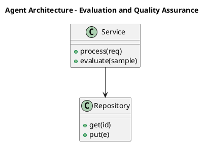

_Source diagram (plantuml); render with the appropriate tool._

**Figure 25. Agent Architecture - Evaluation and Quality Assurance** (plantuml). Figure: Agent Architecture view for Knowledge Graphs. This diagram illustrates the principal components and their interactions as discussed in the surrounding section.

## Deep Dive: Mechanics, Variants and Trade-offs

Having established the essentials, we now go deeper into evaluation and quality assurance. It pays to understand the mechanism rather than treat it as a black box, because most production incidents are explained by one of its steps misbehaving. The distinctions in this section are the ones that separate a working demo from a system that holds up under adversarial inputs, scale and the passage of time.

Consider the principal variants and how to choose between them. Each variant optimises for a different point in the design space - some for latency, some for accuracy, some for cost or operability - and the correct choice follows from explicit requirements rather than from defaults. As with most architectural decisions, the choice is rarely binary; the skill lies in quantifying the trade-offs and choosing deliberately.

In practice this is supported by a mature tooling ecosystem, including Neo4j, Amazon Neptune, RDFLib, Apache Jena. Tools accelerate the work but do not substitute for understanding: the same principles apply whichever implementation you select, and the ability to reason from first principles is what lets you debug when a tool behaves unexpectedly.

A frequent source of subtle bugs is the interaction with visualising knowledge graphs. Because visualising knowledge graphs concerns effective exploration and analyst tooling, changes there can silently alter the behaviour analysed here. The remedy is contract tests at the boundary and end-to-end evaluations that exercise the interaction explicitly.

Finally, attend to edge cases and degradation. Define what the system should do under partial failure, unexpected inputs and load spikes, and make that behaviour explicit and tested rather than emergent. Graceful degradation - returning a safe, useful result when the ideal one is unavailable - is a hallmark of mature engineering.

For deeper study, the literature offers authoritative treatments such as Hogan et al. — Knowledge Graphs (2021) and Bordes et al. — TransE (2013). These primary sources reward careful reading and ground the practical guidance above in established results.

## Advanced Considerations

Having established the essentials, we now go deeper into evaluation and quality assurance. The underlying mechanism is best appreciated by tracing a single request from input to output and noting where state is created and consumed. The distinctions in this section are the ones that separate a working demo from a system that holds up under adversarial inputs, scale and the passage of time.

Consider the principal variants and how to choose between them. Each variant optimises for a different point in the design space - some for latency, some for accuracy, some for cost or operability - and the correct choice follows from explicit requirements rather than from defaults. As with most architectural decisions, the choice is rarely binary; the skill lies in quantifying the trade-offs and choosing deliberately.

In practice this is supported by a mature tooling ecosystem, including Neo4j, Amazon Neptune, RDFLib, Apache Jena. Tools accelerate the work but do not substitute for understanding: the same principles apply whichever implementation you select, and the ability to reason from first principles is what lets you debug when a tool behaves unexpectedly.

A frequent source of subtle bugs is the interaction with entity extraction and linking. Because entity extraction and linking concerns populating the graph from structured and unstructured sources, changes there can silently alter the behaviour analysed here. The remedy is contract tests at the boundary and end-to-end evaluations that exercise the interaction explicitly.

Finally, attend to edge cases and degradation. Define what the system should do under partial failure, unexpected inputs and load spikes, and make that behaviour explicit and tested rather than emergent. Graceful degradation - returning a safe, useful result when the ideal one is unavailable - is a hallmark of mature engineering.

For deeper study, the literature offers authoritative treatments such as Hogan et al. — Knowledge Graphs (2021) and Bordes et al. — TransE (2013). These primary sources reward careful reading and ground the practical guidance above in established results.

## Worked Example

Consider a concrete scenario. A finance organisation needs fraud rings and beneficial-ownership analysis. They decide to apply evaluation and quality assurance as part of their Knowledge Graphs solution, but wisely treat it as a hypothesis to be validated rather than a foregone conclusion.

The team begins by stating the objective precisely and defining how success will be measured before writing any code. They establish a small but representative evaluation set, agree on acceptance thresholds, and only then prototype the simplest design that could work. Early measurement reveals which assumptions hold and which must be revised, saving weeks of misdirected effort and surfacing edge cases while they are still cheap to fix.

As the prototype matures into a service, the team hardens it: adding input validation, error handling, caching where it pays off, and monitoring that ties back to the original success metric. They document each significant decision in an architecture decision record so that future maintainers understand not just what was built but why.

The outcome is instructive. The system that reaches production is not the most sophisticated design the team considered, but the one whose behaviour they could measure, explain and operate. This is the recurring lesson of Knowledge Graphs: durable value comes from the whole system, not from any single clever component.

## Industry Use Cases

Across industries, the ideas in this chapter recur in recognisable ways. The following vignettes show how different sectors apply them and what they have in common.

**Finance.** Fraud rings and beneficial-ownership analysis. The common thread is that value comes not from the model alone but from the surrounding system - data quality, evaluation, integration and operations - which is precisely where most of the engineering effort belongs.

**Healthcare.** Integrating clinical, genomic and literature data. The common thread is that value comes not from the model alone but from the surrounding system - data quality, evaluation, integration and operations - which is precisely where most of the engineering effort belongs.

**Retail.** Product knowledge graphs powering search and recommendations. The common thread is that value comes not from the model alone but from the surrounding system - data quality, evaluation, integration and operations - which is precisely where most of the engineering effort belongs.

**Enterprise.** 360-degree views linking customers, products and events. The common thread is that value comes not from the model alone but from the surrounding system - data quality, evaluation, integration and operations - which is precisely where most of the engineering effort belongs.

## Best Practices

The following practices consistently separate successful Knowledge Graphs efforts from struggling ones. They are deliberately concrete so they can be adopted as checklist items in design and code review.

- Design the ontology with domain experts before ingesting at scale.
- Treat entity resolution as a first-class, monitored pipeline.
- Record provenance on every fact for trust and debugging.
- Choose the model (RDF vs property graph) to fit query needs.

None of these are exotic; they are the unglamorous disciplines that compound into reliability. The cost of adopting them is small compared with the cost of the incidents they prevent, and they become second nature with practice.

## Common Pitfalls

Equally instructive are the failure modes that recur in practice. Each pitfall below has a clear early warning sign and a known remedy, so treat them as a diagnostic checklist when something feels wrong:

- Over-engineering the ontology before validating use cases.
- Neglecting entity resolution and creating duplicates.
- Ignoring provenance, making facts untrustworthy.
- Picking a graph engine that cannot scale to your traversal patterns.

The pattern is consistent: most failures stem from skipping measurement, conflating prototype and production standards, or deferring cross-cutting concerns such as security and cost until they become emergencies. Naming these traps in advance is the cheapest way to avoid them.

## Governance, Security and Cost Notes

No discussion of evaluation and quality assurance is complete without its governance, security and cost dimensions, which are too often deferred until they become emergencies. Treating them as first-class concerns from the outset is both cheaper and safer.

**Governance.** Classify the risk of this capability, document its intended and out-of-scope uses, and ensure decisions are traceable to satisfy internal policy and external regulation such as the NIST AI RMF, ISO/IEC 42001 and the EU AI Act. **Security.** Treat all external input as untrusted, validate outputs before acting on them, apply least privilege to any tools or data access, and map controls to the OWASP LLM Top 10 and MITRE ATLAS.

**Cost and sustainability.** Establish explicit budgets for compute, tokens and latency, attribute spend to owners, and revisit the economics as usage scales - a design that is affordable at pilot scale can become untenable at production volume. Building these reflexes into everyday engineering is what allows a Knowledge Graphs system to be not only capable but also trustworthy and economically sound.

## Hands-On Exercises

Work through the following exercises. They are designed to move understanding from recognition to application - the level required for real engineering work - so prefer writing and building over merely reading.

1. Explain evaluation and quality assurance to a colleague unfamiliar with Knowledge Graphs, using a concrete example from your own domain.
2. Sketch a reference architecture that incorporates evaluation and quality assurance and annotate where observability, security and cost controls belong.
3. Design an evaluation that would tell you whether evaluation and quality assurance is working in production, including the metric, the dataset and the acceptance threshold.
4. Identify two pitfalls relevant to evaluation and quality assurance in your environment and describe the early warning signals you would monitor.
5. Prototype the simplest implementation that demonstrates evaluation and quality assurance, then list exactly what would need to change to make it production-ready.

## Key Takeaways

Key takeaways from this chapter:

- Evaluation and Quality Assurance is a systems concern in Knowledge Graphs: data, models and operations must be co-designed.
- Measurement is non-negotiable; define success metrics and evaluation before building.
- Favour the simplest design that meets the requirement, and add complexity only when evidence demands it.
- Security, cost and observability are first-class requirements, not afterthoughts.
- Document decisions so the system remains understandable and operable as it evolves.

## Code Walkthrough

Pipelines keep Evaluation and Quality Assurance logic modular and testable. Each stage is a pure function, errors are captured per item, and the composition is trivial to extend or reorder.

The full listing is shown below; study it line by line and reproduce it locally before moving on.

### Listing: A composable processing pipeline for Evaluation and Quality Assurance

```python
from collections.abc import Iterable, Iterator
from typing import Protocol


class Stage(Protocol):
    def __call__(self, item: dict) -> dict: ...


def pipeline(stages: list[Stage]) -> Stage:
    """Compose ordered stages into a single callable for Evaluation and Quality Assurance."""

    def run(item: dict) -> dict:
        for stage in stages:
            item = stage(item)
        return item

    return run


def validate(item: dict) -> dict:
    if "text" not in item:
        raise ValueError("missing required field: text")
    return item


def normalise(item: dict) -> dict:
    item["text"] = item["text"].strip().lower()
    return item


def enrich(item: dict) -> dict:
    item["length"] = len(item["text"])
    return item


process = pipeline([validate, normalise, enrich])


def run_batch(items: Iterable[dict]) -> Iterator[dict]:
    for item in items:
        try:
            yield process(dict(item))
        except ValueError as exc:
            yield {"error": str(exc), "item": item}

```

## Review Questions

1. In the context of Knowledge Graphs, which statement best describes “Evaluation and Quality Assurance”?
   - A. It applies exclusively to image data.
   - B. It eliminates the need for any evaluation or monitoring.
   - C. It makes the system slower but has no other effect.
   - D. a rigorous approach to measuring and assuring the quality of a Knowledge Graphs system before and after release
   - **Answer: D.** Evaluation and Quality Assurance: a rigorous approach to measuring and assuring the quality of a Knowledge Graphs system before and after release
2. Which of the following is a recommended best practice when working with Knowledge Graphs?
   - A. Ignoring provenance, making facts untrustworthy.
   - B. It applies exclusively to image data.
   - C. It removes all security and governance requirements.
   - D. Design the ontology with domain experts before ingesting at scale.
   - **Answer: D.** Best practice: Design the ontology with domain experts before ingesting at scale.
3. Which of the following is a common pitfall to avoid in Knowledge Graphs?
   - A. It is only relevant to academic research, not production.
   - B. It eliminates the need for any evaluation or monitoring.
   - C. Ignoring provenance, making facts untrustworthy.
   - D. Treat entity resolution as a first-class, monitored pipeline.
   - **Answer: C.** Pitfall to avoid: Ignoring provenance, making facts untrustworthy.
4. *(Discussion)* How would you test and monitor Evaluation and Quality Assurance in production?
   - **Model answer:** A strong answer defines evaluation and quality assurance (a rigorous approach to measuring and assuring the quality of a Knowledge Graphs system before and after release) then connects it to architecture, evaluation, cost, security and operations for Knowledge Graphs, citing concrete trade-offs and a real-world example.

---


# Chapter 20. Security, Privacy and Governance

_This chapter examines security, privacy and governance within Knowledge Graphs. It covers the security, privacy and governance controls that make a Knowledge Graphs system trustworthy and compliant, derives a reference architecture, walks through a worked example and runnable code, surveys industry use cases, and distils best practices and pitfalls, closing with exercises and review questions._

## Introduction

At its core, Security, Privacy and Governance concerns the security, privacy and governance controls that make a Knowledge Graphs system trustworthy and compliant. Teams that master this consistently ship more reliable Knowledge Graphs systems at lower cost. The right abstraction here pays compounding dividends, because downstream components depend on its guarantees.

This chapter builds intuition first, then formalises the ideas, derives an architecture, and finishes with code, exercises and review questions so the material transfers directly to your own Knowledge Graphs work. Read it actively: pause at each diagram, reproduce the code, and attempt the exercises before consulting the answers.

## Theory and Foundations

At its core, Security, Privacy and Governance concerns the security, privacy and governance controls that make a Knowledge Graphs system trustworthy and compliant. Seasoned practitioners treat this as a systems problem, co-designing data, models and operations rather than optimising any one in isolation. Beneath the abstraction lies a concrete process whose steps can each be measured, tested and optimised independently.

To place this in context, recall the broader picture: Knowledge graphs represent entities and their relationships as nodes and edges, enabling integration of heterogeneous data, semantic querying and reasoning. Within that picture, security, privacy and governance is one of the load-bearing ideas - the kind that, when understood deeply, makes the rest of Knowledge Graphs fall into place. This concept recurs throughout the Knowledge Graphs lifecycle, from design to operations.

Security, Privacy and Governance cannot be understood in isolation from visualising knowledge graphs. Recall that visualising knowledge graphs concerns effective exploration and analyst tooling. The two interact directly: decisions in one constrain the design space of the other, which is why mature teams reason about them together rather than sequentially. There is an inherent trade-off between fidelity and cost, and the correct balance depends on the use case and its tolerance for error.

Security, Privacy and Governance cannot be understood in isolation from operating knowledge graphs. Recall that operating knowledge graphs concerns pipelines, monitoring and lifecycle management. The two interact directly: decisions in one constrain the design space of the other, which is why mature teams reason about them together rather than sequentially. Latency, accuracy and cost form a tension triangle: improving one typically pressures the others, so explicit budgets are essential.

Several established patterns apply directly to security, privacy and governance. The first, provenance edges for full traceability, is widely adopted because it makes the system's behaviour predictable and observable. A complementary pattern, entity-resolution pipeline feeding a golden-record graph, addresses a related concern and is often deployed alongside it. Patterns are not dogma; they are distilled experience that shortcuts the search for a sound design, and each carries assumptions worth checking against your context.

Knowing when not to use a technique is as valuable as knowing how to use it. In a small prototype, shortcuts around security, privacy and governance are invisible; in a production Knowledge Graphs system serving real traffic, they surface as incidents, cost overruns or compliance gaps. Simplicity is a feature. The simplest design that meets the requirement should be the default, with complexity added only when measurement justifies it. The remainder of this chapter turns these principles into an architecture, code and a checklist you can apply immediately.

## Architecture and Design

A robust architecture for Security, Privacy and Governance is layered so each part can evolve independently without destabilising the whole. An enterprise knowledge graph ingests from databases, documents and APIs through extraction and entity-resolution pipelines into a graph store governed by an ontology. Query services expose traversal and reasoning to applications, while a governance layer tracks provenance, versions and access.

Concretely, the principal building blocks include graphs, triples and the property graph model, ontology and schema design, entity extraction and linking, graph query languages and reasoning and inference. Each is a replaceable component behind a stable interface, so the team can upgrade an implementation - a model, an index, a policy engine - without rewriting its neighbours. The contracts between components are where reliability is won or lost, so they are specified explicitly and tested in isolation.

The diagram accompanying this section makes the data and control flow explicit. Requests enter through a well-defined boundary where they are authenticated and validated; only then are they dispatched to the components that perform the work. This boundary is also where rate limiting, quota enforcement and audit logging live, keeping cross-cutting concerns out of the core logic and in one auditable place.

Two qualities deserve emphasis. First, observability is designed in, not bolted on: every component emits structured telemetry so that failures can be localised in minutes rather than hours. Second, the architecture is evolvable - components communicate through stable contracts so that any single part of the Knowledge Graphs system can be replaced without a rewrite. Simplicity is a feature. The simplest design that meets the requirement should be the default, with complexity added only when measurement justifies it.

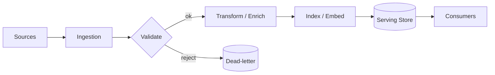

**Figure 26. Application Flow - Security, Privacy and Governance** (mermaid). Figure: Application Flow view for Knowledge Graphs. This diagram illustrates the principal components and their interactions as discussed in the surrounding section.

## Deep Dive: Mechanics, Variants and Trade-offs

Having established the essentials, we now go deeper into security, privacy and governance. Beneath the abstraction lies a concrete process whose steps can each be measured, tested and optimised independently. The distinctions in this section are the ones that separate a working demo from a system that holds up under adversarial inputs, scale and the passage of time.

Consider the principal variants and how to choose between them. Each variant optimises for a different point in the design space - some for latency, some for accuracy, some for cost or operability - and the correct choice follows from explicit requirements rather than from defaults. Simplicity is a feature. The simplest design that meets the requirement should be the default, with complexity added only when measurement justifies it.

In practice this is supported by a mature tooling ecosystem, including Neo4j, Amazon Neptune, RDFLib, Apache Jena. Tools accelerate the work but do not substitute for understanding: the same principles apply whichever implementation you select, and the ability to reason from first principles is what lets you debug when a tool behaves unexpectedly.

A frequent source of subtle bugs is the interaction with visualising knowledge graphs. Because visualising knowledge graphs concerns effective exploration and analyst tooling, changes there can silently alter the behaviour analysed here. The remedy is contract tests at the boundary and end-to-end evaluations that exercise the interaction explicitly.

Finally, attend to edge cases and degradation. Define what the system should do under partial failure, unexpected inputs and load spikes, and make that behaviour explicit and tested rather than emergent. Graceful degradation - returning a safe, useful result when the ideal one is unavailable - is a hallmark of mature engineering.

For deeper study, the literature offers authoritative treatments such as Hogan et al. — Knowledge Graphs (2021) and Bordes et al. — TransE (2013). These primary sources reward careful reading and ground the practical guidance above in established results.

## Advanced Considerations

Having established the essentials, we now go deeper into security, privacy and governance. Mechanically, the behaviour emerges from a few interacting parts that are simpler than the whole they produce. The distinctions in this section are the ones that separate a working demo from a system that holds up under adversarial inputs, scale and the passage of time.

Consider the principal variants and how to choose between them. Each variant optimises for a different point in the design space - some for latency, some for accuracy, some for cost or operability - and the correct choice follows from explicit requirements rather than from defaults. Latency, accuracy and cost form a tension triangle: improving one typically pressures the others, so explicit budgets are essential.

In practice this is supported by a mature tooling ecosystem, including Neo4j, Amazon Neptune, RDFLib, Apache Jena. Tools accelerate the work but do not substitute for understanding: the same principles apply whichever implementation you select, and the ability to reason from first principles is what lets you debug when a tool behaves unexpectedly.

A frequent source of subtle bugs is the interaction with reasoning and inference. Because reasoning and inference concerns rules, RDFS/OWL semantics and inferring implicit facts, changes there can silently alter the behaviour analysed here. The remedy is contract tests at the boundary and end-to-end evaluations that exercise the interaction explicitly.

Finally, attend to edge cases and degradation. Define what the system should do under partial failure, unexpected inputs and load spikes, and make that behaviour explicit and tested rather than emergent. Graceful degradation - returning a safe, useful result when the ideal one is unavailable - is a hallmark of mature engineering.

For deeper study, the literature offers authoritative treatments such as Hogan et al. — Knowledge Graphs (2021) and Bordes et al. — TransE (2013). These primary sources reward careful reading and ground the practical guidance above in established results.

## Worked Example

Consider a concrete scenario. A healthcare organisation needs integrating clinical, genomic and literature data. They decide to apply security, privacy and governance as part of their Knowledge Graphs solution, but wisely treat it as a hypothesis to be validated rather than a foregone conclusion.

The team begins by stating the objective precisely and defining how success will be measured before writing any code. They establish a small but representative evaluation set, agree on acceptance thresholds, and only then prototype the simplest design that could work. Early measurement reveals which assumptions hold and which must be revised, saving weeks of misdirected effort and surfacing edge cases while they are still cheap to fix.

As the prototype matures into a service, the team hardens it: adding input validation, error handling, caching where it pays off, and monitoring that ties back to the original success metric. They document each significant decision in an architecture decision record so that future maintainers understand not just what was built but why.

The outcome is instructive. The system that reaches production is not the most sophisticated design the team considered, but the one whose behaviour they could measure, explain and operate. This is the recurring lesson of Knowledge Graphs: durable value comes from the whole system, not from any single clever component.

## Industry Use Cases

Across industries, the ideas in this chapter recur in recognisable ways. The following vignettes show how different sectors apply them and what they have in common.

**Finance.** Fraud rings and beneficial-ownership analysis. The common thread is that value comes not from the model alone but from the surrounding system - data quality, evaluation, integration and operations - which is precisely where most of the engineering effort belongs.

**Healthcare.** Integrating clinical, genomic and literature data. The common thread is that value comes not from the model alone but from the surrounding system - data quality, evaluation, integration and operations - which is precisely where most of the engineering effort belongs.

**Retail.** Product knowledge graphs powering search and recommendations. The common thread is that value comes not from the model alone but from the surrounding system - data quality, evaluation, integration and operations - which is precisely where most of the engineering effort belongs.

**Enterprise.** 360-degree views linking customers, products and events. The common thread is that value comes not from the model alone but from the surrounding system - data quality, evaluation, integration and operations - which is precisely where most of the engineering effort belongs.

## Best Practices

The following practices consistently separate successful Knowledge Graphs efforts from struggling ones. They are deliberately concrete so they can be adopted as checklist items in design and code review.

- Design the ontology with domain experts before ingesting at scale.
- Treat entity resolution as a first-class, monitored pipeline.
- Record provenance on every fact for trust and debugging.
- Choose the model (RDF vs property graph) to fit query needs.

None of these are exotic; they are the unglamorous disciplines that compound into reliability. The cost of adopting them is small compared with the cost of the incidents they prevent, and they become second nature with practice.

## Common Pitfalls

Equally instructive are the failure modes that recur in practice. Each pitfall below has a clear early warning sign and a known remedy, so treat them as a diagnostic checklist when something feels wrong:

- Over-engineering the ontology before validating use cases.
- Neglecting entity resolution and creating duplicates.
- Ignoring provenance, making facts untrustworthy.
- Picking a graph engine that cannot scale to your traversal patterns.

The pattern is consistent: most failures stem from skipping measurement, conflating prototype and production standards, or deferring cross-cutting concerns such as security and cost until they become emergencies. Naming these traps in advance is the cheapest way to avoid them.

## Governance, Security and Cost Notes

No discussion of security, privacy and governance is complete without its governance, security and cost dimensions, which are too often deferred until they become emergencies. Treating them as first-class concerns from the outset is both cheaper and safer.

**Governance.** Classify the risk of this capability, document its intended and out-of-scope uses, and ensure decisions are traceable to satisfy internal policy and external regulation such as the NIST AI RMF, ISO/IEC 42001 and the EU AI Act. **Security.** Treat all external input as untrusted, validate outputs before acting on them, apply least privilege to any tools or data access, and map controls to the OWASP LLM Top 10 and MITRE ATLAS.

**Cost and sustainability.** Establish explicit budgets for compute, tokens and latency, attribute spend to owners, and revisit the economics as usage scales - a design that is affordable at pilot scale can become untenable at production volume. Building these reflexes into everyday engineering is what allows a Knowledge Graphs system to be not only capable but also trustworthy and economically sound.

## Hands-On Exercises

Work through the following exercises. They are designed to move understanding from recognition to application - the level required for real engineering work - so prefer writing and building over merely reading.

1. Explain security, privacy and governance to a colleague unfamiliar with Knowledge Graphs, using a concrete example from your own domain.
2. Sketch a reference architecture that incorporates security, privacy and governance and annotate where observability, security and cost controls belong.
3. Design an evaluation that would tell you whether security, privacy and governance is working in production, including the metric, the dataset and the acceptance threshold.
4. Identify two pitfalls relevant to security, privacy and governance in your environment and describe the early warning signals you would monitor.
5. Prototype the simplest implementation that demonstrates security, privacy and governance, then list exactly what would need to change to make it production-ready.

## Key Takeaways

Key takeaways from this chapter:

- Security, Privacy and Governance is a systems concern in Knowledge Graphs: data, models and operations must be co-designed.
- Measurement is non-negotiable; define success metrics and evaluation before building.
- Favour the simplest design that meets the requirement, and add complexity only when evidence demands it.
- Security, cost and observability are first-class requirements, not afterthoughts.
- Document decisions so the system remains understandable and operable as it evolves.

## Code Walkthrough

Every change to a Knowledge Graphs system should pass an evaluation gate. This example shows the minimal shape: align predictions and references, compute a metric, and return a pass/fail decision for CI.

The full listing is shown below; study it line by line and reproduce it locally before moving on.

### Listing: Evaluating Security, Privacy and Governance with a regression gate

```python
from dataclasses import dataclass


@dataclass
class EvalResult:
    metric: str
    score: float
    passed: bool


def evaluate(predictions: list[str], references: list[str],
             threshold: float = 0.8) -> EvalResult:
    """Score Security, Privacy and Governance output against references with a simple exact-match metric.

    In practice you would combine several metrics (exact match, semantic
    similarity, LLM-as-judge) and gate releases on the aggregate.
    """
    if len(predictions) != len(references):
        raise ValueError("predictions and references must align")
    hits = sum(p.strip() == r.strip() for p, r in zip(predictions, references))
    score = hits / len(references) if references else 0.0
    return EvalResult(metric="exact_match", score=score, passed=score >= threshold)


if __name__ == "__main__":
    result = evaluate(["yes", "no"], ["yes", "yes"])
    print(f"{result.metric}={result.score:.2f} passed={result.passed}")

```

## Review Questions

1. In the context of Knowledge Graphs, which statement best describes “Security, Privacy and Governance”?
   - A. It eliminates the need for any evaluation or monitoring.
   - B. It removes all security and governance requirements.
   - C. It makes the system slower but has no other effect.
   - D. the security, privacy and governance controls that make a Knowledge Graphs system trustworthy and compliant
   - **Answer: D.** Security, Privacy and Governance: the security, privacy and governance controls that make a Knowledge Graphs system trustworthy and compliant
2. Which of the following is a recommended best practice when working with Knowledge Graphs?
   - A. Neglecting entity resolution and creating duplicates.
   - B. Over-engineering the ontology before validating use cases.
   - C. Ignoring provenance, making facts untrustworthy.
   - D. Design the ontology with domain experts before ingesting at scale.
   - **Answer: D.** Best practice: Design the ontology with domain experts before ingesting at scale.
3. Which of the following is a common pitfall to avoid in Knowledge Graphs?
   - A. Choose the model (RDF vs property graph) to fit query needs.
   - B. Over-engineering the ontology before validating use cases.
   - C. Design the ontology with domain experts before ingesting at scale.
   - D. Treat entity resolution as a first-class, monitored pipeline.
   - **Answer: B.** Pitfall to avoid: Over-engineering the ontology before validating use cases.
4. *(Discussion)* Explain Security, Privacy and Governance and why it matters in a production Knowledge Graphs system.
   - **Model answer:** A strong answer defines security, privacy and governance (the security, privacy and governance controls that make a Knowledge Graphs system trustworthy and compliant) then connects it to architecture, evaluation, cost, security and operations for Knowledge Graphs, citing concrete trade-offs and a real-world example.

---


# Chapter 21. Cost, Performance and Scaling

_This chapter examines cost, performance and scaling within Knowledge Graphs. It covers techniques for controlling cost and latency while scaling a Knowledge Graphs system to production traffic, derives a reference architecture, walks through a worked example and runnable code, surveys industry use cases, and distils best practices and pitfalls, closing with exercises and review questions._

## Introduction

Cost, Performance and Scaling can be characterised as techniques for controlling cost and latency while scaling a Knowledge Graphs system to production traffic. Teams that master this consistently ship more reliable Knowledge Graphs systems at lower cost. In an enterprise setting, this translates into concrete requirements: clear interfaces, measurable quality, and controls that satisfy security and governance.

This chapter builds intuition first, then formalises the ideas, derives an architecture, and finishes with code, exercises and review questions so the material transfers directly to your own Knowledge Graphs work. Read it actively: pause at each diagram, reproduce the code, and attempt the exercises before consulting the answers.

## Theory and Foundations

We define Cost, Performance and Scaling as techniques for controlling cost and latency while scaling a Knowledge Graphs system to production traffic. Seasoned practitioners treat this as a systems problem, co-designing data, models and operations rather than optimising any one in isolation. Mechanically, the behaviour emerges from a few interacting parts that are simpler than the whole they produce.

To place this in context, recall the broader picture: Knowledge graphs represent entities and their relationships as nodes and edges, enabling integration of heterogeneous data, semantic querying and reasoning. Within that picture, cost, performance and scaling is one of the load-bearing ideas - the kind that, when understood deeply, makes the rest of Knowledge Graphs fall into place. Teams that master this consistently ship more reliable Knowledge Graphs systems at lower cost.

Cost, Performance and Scaling cannot be understood in isolation from the enterprise knowledge graph architecture. Recall that the enterprise knowledge graph architecture concerns reference blueprint integrating sources, store and consumers. The two interact directly: decisions in one constrain the design space of the other, which is why mature teams reason about them together rather than sequentially. Every added component buys capability at the price of operational surface area, and that bargain should be made consciously.

Cost, Performance and Scaling cannot be understood in isolation from knowledge graph embeddings. Recall that knowledge graph embeddings concerns transE, RotatE and link prediction for completion. The two interact directly: decisions in one constrain the design space of the other, which is why mature teams reason about them together rather than sequentially. Every added component buys capability at the price of operational surface area, and that bargain should be made consciously.

Several established patterns apply directly to cost, performance and scaling. The first, entity-resolution pipeline feeding a golden-record graph, is widely adopted because it makes the system's behaviour predictable and observable. A complementary pattern, provenance edges for full traceability, addresses a related concern and is often deployed alongside it. Patterns are not dogma; they are distilled experience that shortcuts the search for a sound design, and each carries assumptions worth checking against your context.

Knowing when not to use a technique is as valuable as knowing how to use it. In a small prototype, shortcuts around cost, performance and scaling are invisible; in a production Knowledge Graphs system serving real traffic, they surface as incidents, cost overruns or compliance gaps. Latency, accuracy and cost form a tension triangle: improving one typically pressures the others, so explicit budgets are essential. The remainder of this chapter turns these principles into an architecture, code and a checklist you can apply immediately.

## Architecture and Design

The reference architecture for Cost, Performance and Scaling separates concerns into clearly bounded components with explicit contracts. An enterprise knowledge graph ingests from databases, documents and APIs through extraction and entity-resolution pipelines into a graph store governed by an ontology. Query services expose traversal and reasoning to applications, while a governance layer tracks provenance, versions and access.

Concretely, the principal building blocks include graphs, triples and the property graph model, ontology and schema design, entity extraction and linking, graph query languages and reasoning and inference. Each is a replaceable component behind a stable interface, so the team can upgrade an implementation - a model, an index, a policy engine - without rewriting its neighbours. The contracts between components are where reliability is won or lost, so they are specified explicitly and tested in isolation.

The diagram accompanying this section makes the data and control flow explicit. Requests enter through a well-defined boundary where they are authenticated and validated; only then are they dispatched to the components that perform the work. This boundary is also where rate limiting, quota enforcement and audit logging live, keeping cross-cutting concerns out of the core logic and in one auditable place.

Two qualities deserve emphasis. First, observability is designed in, not bolted on: every component emits structured telemetry so that failures can be localised in minutes rather than hours. Second, the architecture is evolvable - components communicate through stable contracts so that any single part of the Knowledge Graphs system can be replaced without a rewrite. Latency, accuracy and cost form a tension triangle: improving one typically pressures the others, so explicit budgets are essential.

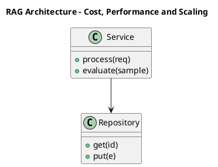

_Source diagram (plantuml); render with the appropriate tool._

**Figure 27. RAG Architecture - Cost, Performance and Scaling** (plantuml). Figure: RAG Architecture view for Knowledge Graphs. This diagram illustrates the principal components and their interactions as discussed in the surrounding section.

## Deep Dive: Mechanics, Variants and Trade-offs

Having established the essentials, we now go deeper into cost, performance and scaling. Mechanically, the behaviour emerges from a few interacting parts that are simpler than the whole they produce. The distinctions in this section are the ones that separate a working demo from a system that holds up under adversarial inputs, scale and the passage of time.

Consider the principal variants and how to choose between them. Each variant optimises for a different point in the design space - some for latency, some for accuracy, some for cost or operability - and the correct choice follows from explicit requirements rather than from defaults. As with most architectural decisions, the choice is rarely binary; the skill lies in quantifying the trade-offs and choosing deliberately.

In practice this is supported by a mature tooling ecosystem, including Neo4j, Amazon Neptune, RDFLib, Apache Jena. Tools accelerate the work but do not substitute for understanding: the same principles apply whichever implementation you select, and the ability to reason from first principles is what lets you debug when a tool behaves unexpectedly.

A frequent source of subtle bugs is the interaction with the enterprise knowledge graph architecture. Because the enterprise knowledge graph architecture concerns reference blueprint integrating sources, store and consumers, changes there can silently alter the behaviour analysed here. The remedy is contract tests at the boundary and end-to-end evaluations that exercise the interaction explicitly.

Finally, attend to edge cases and degradation. Define what the system should do under partial failure, unexpected inputs and load spikes, and make that behaviour explicit and tested rather than emergent. Graceful degradation - returning a safe, useful result when the ideal one is unavailable - is a hallmark of mature engineering.

For deeper study, the literature offers authoritative treatments such as Hogan et al. — Knowledge Graphs (2021) and Bordes et al. — TransE (2013). These primary sources reward careful reading and ground the practical guidance above in established results.

## Advanced Considerations

Having established the essentials, we now go deeper into cost, performance and scaling. The underlying mechanism is best appreciated by tracing a single request from input to output and noting where state is created and consumed. The distinctions in this section are the ones that separate a working demo from a system that holds up under adversarial inputs, scale and the passage of time.

Consider the principal variants and how to choose between them. Each variant optimises for a different point in the design space - some for latency, some for accuracy, some for cost or operability - and the correct choice follows from explicit requirements rather than from defaults. As with most architectural decisions, the choice is rarely binary; the skill lies in quantifying the trade-offs and choosing deliberately.

In practice this is supported by a mature tooling ecosystem, including Neo4j, Amazon Neptune, RDFLib, Apache Jena. Tools accelerate the work but do not substitute for understanding: the same principles apply whichever implementation you select, and the ability to reason from first principles is what lets you debug when a tool behaves unexpectedly.

A frequent source of subtle bugs is the interaction with entity extraction and linking. Because entity extraction and linking concerns populating the graph from structured and unstructured sources, changes there can silently alter the behaviour analysed here. The remedy is contract tests at the boundary and end-to-end evaluations that exercise the interaction explicitly.

Finally, attend to edge cases and degradation. Define what the system should do under partial failure, unexpected inputs and load spikes, and make that behaviour explicit and tested rather than emergent. Graceful degradation - returning a safe, useful result when the ideal one is unavailable - is a hallmark of mature engineering.

For deeper study, the literature offers authoritative treatments such as Hogan et al. — Knowledge Graphs (2021) and Bordes et al. — TransE (2013). These primary sources reward careful reading and ground the practical guidance above in established results.

## Worked Example

A worked example clarifies how these ideas behave in practice. A finance organisation needs fraud rings and beneficial-ownership analysis. They decide to apply cost, performance and scaling as part of their Knowledge Graphs solution, but wisely treat it as a hypothesis to be validated rather than a foregone conclusion.

The team begins by stating the objective precisely and defining how success will be measured before writing any code. They establish a small but representative evaluation set, agree on acceptance thresholds, and only then prototype the simplest design that could work. Early measurement reveals which assumptions hold and which must be revised, saving weeks of misdirected effort and surfacing edge cases while they are still cheap to fix.

As the prototype matures into a service, the team hardens it: adding input validation, error handling, caching where it pays off, and monitoring that ties back to the original success metric. They document each significant decision in an architecture decision record so that future maintainers understand not just what was built but why.

The outcome is instructive. The system that reaches production is not the most sophisticated design the team considered, but the one whose behaviour they could measure, explain and operate. This is the recurring lesson of Knowledge Graphs: durable value comes from the whole system, not from any single clever component.

## Industry Use Cases

Across industries, the ideas in this chapter recur in recognisable ways. The following vignettes show how different sectors apply them and what they have in common.

**Finance.** Fraud rings and beneficial-ownership analysis. The common thread is that value comes not from the model alone but from the surrounding system - data quality, evaluation, integration and operations - which is precisely where most of the engineering effort belongs.

**Healthcare.** Integrating clinical, genomic and literature data. The common thread is that value comes not from the model alone but from the surrounding system - data quality, evaluation, integration and operations - which is precisely where most of the engineering effort belongs.

**Retail.** Product knowledge graphs powering search and recommendations. The common thread is that value comes not from the model alone but from the surrounding system - data quality, evaluation, integration and operations - which is precisely where most of the engineering effort belongs.

**Enterprise.** 360-degree views linking customers, products and events. The common thread is that value comes not from the model alone but from the surrounding system - data quality, evaluation, integration and operations - which is precisely where most of the engineering effort belongs.

## Best Practices

The following practices consistently separate successful Knowledge Graphs efforts from struggling ones. They are deliberately concrete so they can be adopted as checklist items in design and code review.

- Design the ontology with domain experts before ingesting at scale.
- Treat entity resolution as a first-class, monitored pipeline.
- Record provenance on every fact for trust and debugging.
- Choose the model (RDF vs property graph) to fit query needs.

None of these are exotic; they are the unglamorous disciplines that compound into reliability. The cost of adopting them is small compared with the cost of the incidents they prevent, and they become second nature with practice.

## Common Pitfalls

Equally instructive are the failure modes that recur in practice. Each pitfall below has a clear early warning sign and a known remedy, so treat them as a diagnostic checklist when something feels wrong:

- Over-engineering the ontology before validating use cases.
- Neglecting entity resolution and creating duplicates.
- Ignoring provenance, making facts untrustworthy.
- Picking a graph engine that cannot scale to your traversal patterns.

The pattern is consistent: most failures stem from skipping measurement, conflating prototype and production standards, or deferring cross-cutting concerns such as security and cost until they become emergencies. Naming these traps in advance is the cheapest way to avoid them.

## Governance, Security and Cost Notes

No discussion of cost, performance and scaling is complete without its governance, security and cost dimensions, which are too often deferred until they become emergencies. Treating them as first-class concerns from the outset is both cheaper and safer.

**Governance.** Classify the risk of this capability, document its intended and out-of-scope uses, and ensure decisions are traceable to satisfy internal policy and external regulation such as the NIST AI RMF, ISO/IEC 42001 and the EU AI Act. **Security.** Treat all external input as untrusted, validate outputs before acting on them, apply least privilege to any tools or data access, and map controls to the OWASP LLM Top 10 and MITRE ATLAS.

**Cost and sustainability.** Establish explicit budgets for compute, tokens and latency, attribute spend to owners, and revisit the economics as usage scales - a design that is affordable at pilot scale can become untenable at production volume. Building these reflexes into everyday engineering is what allows a Knowledge Graphs system to be not only capable but also trustworthy and economically sound.

## Hands-On Exercises

Work through the following exercises. They are designed to move understanding from recognition to application - the level required for real engineering work - so prefer writing and building over merely reading.

1. Explain cost, performance and scaling to a colleague unfamiliar with Knowledge Graphs, using a concrete example from your own domain.
2. Sketch a reference architecture that incorporates cost, performance and scaling and annotate where observability, security and cost controls belong.
3. Design an evaluation that would tell you whether cost, performance and scaling is working in production, including the metric, the dataset and the acceptance threshold.
4. Identify two pitfalls relevant to cost, performance and scaling in your environment and describe the early warning signals you would monitor.
5. Prototype the simplest implementation that demonstrates cost, performance and scaling, then list exactly what would need to change to make it production-ready.

## Key Takeaways

Key takeaways from this chapter:

- Cost, Performance and Scaling is a systems concern in Knowledge Graphs: data, models and operations must be co-designed.
- Measurement is non-negotiable; define success metrics and evaluation before building.
- Favour the simplest design that meets the requirement, and add complexity only when evidence demands it.
- Security, cost and observability are first-class requirements, not afterthoughts.
- Document decisions so the system remains understandable and operable as it evolves.

## Code Walkthrough

Every change to a Knowledge Graphs system should pass an evaluation gate. This example shows the minimal shape: align predictions and references, compute a metric, and return a pass/fail decision for CI.

The full listing is shown below; study it line by line and reproduce it locally before moving on.

### Listing: Evaluating Cost, Performance and Scaling with a regression gate

```python
from dataclasses import dataclass


@dataclass
class EvalResult:
    metric: str
    score: float
    passed: bool


def evaluate(predictions: list[str], references: list[str],
             threshold: float = 0.8) -> EvalResult:
    """Score Cost, Performance and Scaling output against references with a simple exact-match metric.

    In practice you would combine several metrics (exact match, semantic
    similarity, LLM-as-judge) and gate releases on the aggregate.
    """
    if len(predictions) != len(references):
        raise ValueError("predictions and references must align")
    hits = sum(p.strip() == r.strip() for p, r in zip(predictions, references))
    score = hits / len(references) if references else 0.0
    return EvalResult(metric="exact_match", score=score, passed=score >= threshold)


if __name__ == "__main__":
    result = evaluate(["yes", "no"], ["yes", "yes"])
    print(f"{result.metric}={result.score:.2f} passed={result.passed}")

```

## Review Questions

1. In the context of Knowledge Graphs, which statement best describes “Cost, Performance and Scaling”?
   - A. It removes all security and governance requirements.
   - B. It eliminates the need for any evaluation or monitoring.
   - C. techniques for controlling cost and latency while scaling a Knowledge Graphs system to production traffic
   - D. It makes the system slower but has no other effect.
   - **Answer: C.** Cost, Performance and Scaling: techniques for controlling cost and latency while scaling a Knowledge Graphs system to production traffic
2. Which of the following is a recommended best practice when working with Knowledge Graphs?
   - A. It is only relevant to academic research, not production.
   - B. Neglecting entity resolution and creating duplicates.
   - C. Design the ontology with domain experts before ingesting at scale.
   - D. It makes the system slower but has no other effect.
   - **Answer: C.** Best practice: Design the ontology with domain experts before ingesting at scale.
3. Which of the following is a common pitfall to avoid in Knowledge Graphs?
   - A. Record provenance on every fact for trust and debugging.
   - B. Choose the model (RDF vs property graph) to fit query needs.
   - C. It is only relevant to academic research, not production.
   - D. Picking a graph engine that cannot scale to your traversal patterns.
   - **Answer: D.** Pitfall to avoid: Picking a graph engine that cannot scale to your traversal patterns.
4. *(Discussion)* How does Cost, Performance and Scaling interact with security and governance requirements?
   - **Model answer:** A strong answer defines cost, performance and scaling (techniques for controlling cost and latency while scaling a Knowledge Graphs system to production traffic) then connects it to architecture, evaluation, cost, security and operations for Knowledge Graphs, citing concrete trade-offs and a real-world example.

---


# Chapter 22. Integration and Interoperability

_This chapter examines integration and interoperability within Knowledge Graphs. It covers patterns for integrating a Knowledge Graphs system with surrounding enterprise systems and data, derives a reference architecture, walks through a worked example and runnable code, surveys industry use cases, and distils best practices and pitfalls, closing with exercises and review questions._

## Introduction

Formally, Integration and Interoperability addresses patterns for integrating a Knowledge Graphs system with surrounding enterprise systems and data. Teams that master this consistently ship more reliable Knowledge Graphs systems at lower cost. It helps to separate the conceptual model from its implementation: the former guides reasoning, the latter must contend with real-world constraints.

This chapter builds intuition first, then formalises the ideas, derives an architecture, and finishes with code, exercises and review questions so the material transfers directly to your own Knowledge Graphs work. Read it actively: pause at each diagram, reproduce the code, and attempt the exercises before consulting the answers.

## Theory and Foundations

At its core, Integration and Interoperability concerns patterns for integrating a Knowledge Graphs system with surrounding enterprise systems and data. In an enterprise setting, this translates into concrete requirements: clear interfaces, measurable quality, and controls that satisfy security and governance. Mechanically, the behaviour emerges from a few interacting parts that are simpler than the whole they produce.

To place this in context, recall the broader picture: Knowledge graphs represent entities and their relationships as nodes and edges, enabling integration of heterogeneous data, semantic querying and reasoning. Within that picture, integration and interoperability is one of the load-bearing ideas - the kind that, when understood deeply, makes the rest of Knowledge Graphs fall into place. Getting this right early prevents expensive rework once a Knowledge Graphs system reaches scale.

Integration and Interoperability cannot be understood in isolation from scaling graph storage. Recall that scaling graph storage concerns partitioning, indexing and distributed graph engines. The two interact directly: decisions in one constrain the design space of the other, which is why mature teams reason about them together rather than sequentially. Simplicity is a feature. The simplest design that meets the requirement should be the default, with complexity added only when measurement justifies it.

Integration and Interoperability cannot be understood in isolation from graphs, triples and the property graph model. Recall that graphs, triples and the property graph model concerns rDF triples versus labelled property graphs and when to use each. The two interact directly: decisions in one constrain the design space of the other, which is why mature teams reason about them together rather than sequentially. As with most architectural decisions, the choice is rarely binary; the skill lies in quantifying the trade-offs and choosing deliberately.

Several established patterns apply directly to integration and interoperability. The first, embedding-based link prediction for completion, is widely adopted because it makes the system's behaviour predictable and observable. A complementary pattern, entity-resolution pipeline feeding a golden-record graph, addresses a related concern and is often deployed alongside it. Patterns are not dogma; they are distilled experience that shortcuts the search for a sound design, and each carries assumptions worth checking against your context.

It is worth being explicit about when to apply this and when to reach for something simpler. In a small prototype, shortcuts around integration and interoperability are invisible; in a production Knowledge Graphs system serving real traffic, they surface as incidents, cost overruns or compliance gaps. As with most architectural decisions, the choice is rarely binary; the skill lies in quantifying the trade-offs and choosing deliberately. The remainder of this chapter turns these principles into an architecture, code and a checklist you can apply immediately.

## Architecture and Design

From an architectural standpoint, Integration and Interoperability sits at the intersection of data, models and operations. An enterprise knowledge graph ingests from databases, documents and APIs through extraction and entity-resolution pipelines into a graph store governed by an ontology. Query services expose traversal and reasoning to applications, while a governance layer tracks provenance, versions and access.

Concretely, the principal building blocks include graphs, triples and the property graph model, ontology and schema design, entity extraction and linking, graph query languages and reasoning and inference. Each is a replaceable component behind a stable interface, so the team can upgrade an implementation - a model, an index, a policy engine - without rewriting its neighbours. The contracts between components are where reliability is won or lost, so they are specified explicitly and tested in isolation.

The diagram accompanying this section makes the data and control flow explicit. Requests enter through a well-defined boundary where they are authenticated and validated; only then are they dispatched to the components that perform the work. This boundary is also where rate limiting, quota enforcement and audit logging live, keeping cross-cutting concerns out of the core logic and in one auditable place.

Two qualities deserve emphasis. First, observability is designed in, not bolted on: every component emits structured telemetry so that failures can be localised in minutes rather than hours. Second, the architecture is evolvable - components communicate through stable contracts so that any single part of the Knowledge Graphs system can be replaced without a rewrite. As with most architectural decisions, the choice is rarely binary; the skill lies in quantifying the trade-offs and choosing deliberately.


**Figure 28. DevOps Pipeline - Integration and Interoperability** (mermaid). Figure: DevOps Pipeline view for Knowledge Graphs. This diagram illustrates the principal components and their interactions as discussed in the surrounding section.

## Deep Dive: Mechanics, Variants and Trade-offs

Having established the essentials, we now go deeper into integration and interoperability. Mechanically, the behaviour emerges from a few interacting parts that are simpler than the whole they produce. The distinctions in this section are the ones that separate a working demo from a system that holds up under adversarial inputs, scale and the passage of time.

Consider the principal variants and how to choose between them. Each variant optimises for a different point in the design space - some for latency, some for accuracy, some for cost or operability - and the correct choice follows from explicit requirements rather than from defaults. There is an inherent trade-off between fidelity and cost, and the correct balance depends on the use case and its tolerance for error.

In practice this is supported by a mature tooling ecosystem, including Neo4j, Amazon Neptune, RDFLib, Apache Jena. Tools accelerate the work but do not substitute for understanding: the same principles apply whichever implementation you select, and the ability to reason from first principles is what lets you debug when a tool behaves unexpectedly.

A frequent source of subtle bugs is the interaction with scaling graph storage. Because scaling graph storage concerns partitioning, indexing and distributed graph engines, changes there can silently alter the behaviour analysed here. The remedy is contract tests at the boundary and end-to-end evaluations that exercise the interaction explicitly.

Finally, attend to edge cases and degradation. Define what the system should do under partial failure, unexpected inputs and load spikes, and make that behaviour explicit and tested rather than emergent. Graceful degradation - returning a safe, useful result when the ideal one is unavailable - is a hallmark of mature engineering.

For deeper study, the literature offers authoritative treatments such as Hogan et al. — Knowledge Graphs (2021) and Bordes et al. — TransE (2013). These primary sources reward careful reading and ground the practical guidance above in established results.

## Advanced Considerations

Having established the essentials, we now go deeper into integration and interoperability. Beneath the abstraction lies a concrete process whose steps can each be measured, tested and optimised independently. The distinctions in this section are the ones that separate a working demo from a system that holds up under adversarial inputs, scale and the passage of time.

Consider the principal variants and how to choose between them. Each variant optimises for a different point in the design space - some for latency, some for accuracy, some for cost or operability - and the correct choice follows from explicit requirements rather than from defaults. Latency, accuracy and cost form a tension triangle: improving one typically pressures the others, so explicit budgets are essential.

In practice this is supported by a mature tooling ecosystem, including Neo4j, Amazon Neptune, RDFLib, Apache Jena. Tools accelerate the work but do not substitute for understanding: the same principles apply whichever implementation you select, and the ability to reason from first principles is what lets you debug when a tool behaves unexpectedly.

A frequent source of subtle bugs is the interaction with visualising knowledge graphs. Because visualising knowledge graphs concerns effective exploration and analyst tooling, changes there can silently alter the behaviour analysed here. The remedy is contract tests at the boundary and end-to-end evaluations that exercise the interaction explicitly.

Finally, attend to edge cases and degradation. Define what the system should do under partial failure, unexpected inputs and load spikes, and make that behaviour explicit and tested rather than emergent. Graceful degradation - returning a safe, useful result when the ideal one is unavailable - is a hallmark of mature engineering.

For deeper study, the literature offers authoritative treatments such as Hogan et al. — Knowledge Graphs (2021) and Bordes et al. — TransE (2013). These primary sources reward careful reading and ground the practical guidance above in established results.

## Worked Example

Consider a concrete scenario. A retail organisation needs product knowledge graphs powering search and recommendations. They decide to apply integration and interoperability as part of their Knowledge Graphs solution, but wisely treat it as a hypothesis to be validated rather than a foregone conclusion.

The team begins by stating the objective precisely and defining how success will be measured before writing any code. They establish a small but representative evaluation set, agree on acceptance thresholds, and only then prototype the simplest design that could work. Early measurement reveals which assumptions hold and which must be revised, saving weeks of misdirected effort and surfacing edge cases while they are still cheap to fix.

As the prototype matures into a service, the team hardens it: adding input validation, error handling, caching where it pays off, and monitoring that ties back to the original success metric. They document each significant decision in an architecture decision record so that future maintainers understand not just what was built but why.

The outcome is instructive. The system that reaches production is not the most sophisticated design the team considered, but the one whose behaviour they could measure, explain and operate. This is the recurring lesson of Knowledge Graphs: durable value comes from the whole system, not from any single clever component.

## Industry Use Cases

Across industries, the ideas in this chapter recur in recognisable ways. The following vignettes show how different sectors apply them and what they have in common.

**Finance.** Fraud rings and beneficial-ownership analysis. The common thread is that value comes not from the model alone but from the surrounding system - data quality, evaluation, integration and operations - which is precisely where most of the engineering effort belongs.

**Healthcare.** Integrating clinical, genomic and literature data. The common thread is that value comes not from the model alone but from the surrounding system - data quality, evaluation, integration and operations - which is precisely where most of the engineering effort belongs.

**Retail.** Product knowledge graphs powering search and recommendations. The common thread is that value comes not from the model alone but from the surrounding system - data quality, evaluation, integration and operations - which is precisely where most of the engineering effort belongs.

**Enterprise.** 360-degree views linking customers, products and events. The common thread is that value comes not from the model alone but from the surrounding system - data quality, evaluation, integration and operations - which is precisely where most of the engineering effort belongs.

## Best Practices

The following practices consistently separate successful Knowledge Graphs efforts from struggling ones. They are deliberately concrete so they can be adopted as checklist items in design and code review.

- Design the ontology with domain experts before ingesting at scale.
- Treat entity resolution as a first-class, monitored pipeline.
- Record provenance on every fact for trust and debugging.
- Choose the model (RDF vs property graph) to fit query needs.

None of these are exotic; they are the unglamorous disciplines that compound into reliability. The cost of adopting them is small compared with the cost of the incidents they prevent, and they become second nature with practice.

## Common Pitfalls

Equally instructive are the failure modes that recur in practice. Each pitfall below has a clear early warning sign and a known remedy, so treat them as a diagnostic checklist when something feels wrong:

- Over-engineering the ontology before validating use cases.
- Neglecting entity resolution and creating duplicates.
- Ignoring provenance, making facts untrustworthy.
- Picking a graph engine that cannot scale to your traversal patterns.

The pattern is consistent: most failures stem from skipping measurement, conflating prototype and production standards, or deferring cross-cutting concerns such as security and cost until they become emergencies. Naming these traps in advance is the cheapest way to avoid them.

## Governance, Security and Cost Notes

No discussion of integration and interoperability is complete without its governance, security and cost dimensions, which are too often deferred until they become emergencies. Treating them as first-class concerns from the outset is both cheaper and safer.

**Governance.** Classify the risk of this capability, document its intended and out-of-scope uses, and ensure decisions are traceable to satisfy internal policy and external regulation such as the NIST AI RMF, ISO/IEC 42001 and the EU AI Act. **Security.** Treat all external input as untrusted, validate outputs before acting on them, apply least privilege to any tools or data access, and map controls to the OWASP LLM Top 10 and MITRE ATLAS.

**Cost and sustainability.** Establish explicit budgets for compute, tokens and latency, attribute spend to owners, and revisit the economics as usage scales - a design that is affordable at pilot scale can become untenable at production volume. Building these reflexes into everyday engineering is what allows a Knowledge Graphs system to be not only capable but also trustworthy and economically sound.

## Hands-On Exercises

Work through the following exercises. They are designed to move understanding from recognition to application - the level required for real engineering work - so prefer writing and building over merely reading.

1. Explain integration and interoperability to a colleague unfamiliar with Knowledge Graphs, using a concrete example from your own domain.
2. Sketch a reference architecture that incorporates integration and interoperability and annotate where observability, security and cost controls belong.
3. Design an evaluation that would tell you whether integration and interoperability is working in production, including the metric, the dataset and the acceptance threshold.
4. Identify two pitfalls relevant to integration and interoperability in your environment and describe the early warning signals you would monitor.
5. Prototype the simplest implementation that demonstrates integration and interoperability, then list exactly what would need to change to make it production-ready.

## Key Takeaways

Key takeaways from this chapter:

- Integration and Interoperability is a systems concern in Knowledge Graphs: data, models and operations must be co-designed.
- Measurement is non-negotiable; define success metrics and evaluation before building.
- Favour the simplest design that meets the requirement, and add complexity only when evidence demands it.
- Security, cost and observability are first-class requirements, not afterthoughts.
- Document decisions so the system remains understandable and operable as it evolves.

## Code Walkthrough

Every change to a Knowledge Graphs system should pass an evaluation gate. This example shows the minimal shape: align predictions and references, compute a metric, and return a pass/fail decision for CI.

The full listing is shown below; study it line by line and reproduce it locally before moving on.

### Listing: Evaluating Integration and Interoperability with a regression gate

```python
from dataclasses import dataclass


@dataclass
class EvalResult:
    metric: str
    score: float
    passed: bool


def evaluate(predictions: list[str], references: list[str],
             threshold: float = 0.8) -> EvalResult:
    """Score Integration and Interoperability output against references with a simple exact-match metric.

    In practice you would combine several metrics (exact match, semantic
    similarity, LLM-as-judge) and gate releases on the aggregate.
    """
    if len(predictions) != len(references):
        raise ValueError("predictions and references must align")
    hits = sum(p.strip() == r.strip() for p, r in zip(predictions, references))
    score = hits / len(references) if references else 0.0
    return EvalResult(metric="exact_match", score=score, passed=score >= threshold)


if __name__ == "__main__":
    result = evaluate(["yes", "no"], ["yes", "yes"])
    print(f"{result.metric}={result.score:.2f} passed={result.passed}")

```

## Review Questions

1. In the context of Knowledge Graphs, which statement best describes “Integration and Interoperability”?
   - A. It makes the system slower but has no other effect.
   - B. patterns for integrating a Knowledge Graphs system with surrounding enterprise systems and data
   - C. It is only relevant to academic research, not production.
   - D. It applies exclusively to image data.
   - **Answer: B.** Integration and Interoperability: patterns for integrating a Knowledge Graphs system with surrounding enterprise systems and data
2. Which of the following is a recommended best practice when working with Knowledge Graphs?
   - A. Picking a graph engine that cannot scale to your traversal patterns.
   - B. Record provenance on every fact for trust and debugging.
   - C. It makes the system slower but has no other effect.
   - D. Neglecting entity resolution and creating duplicates.
   - **Answer: B.** Best practice: Record provenance on every fact for trust and debugging.
3. Which of the following is a common pitfall to avoid in Knowledge Graphs?
   - A. It removes all security and governance requirements.
   - B. It makes the system slower but has no other effect.
   - C. Record provenance on every fact for trust and debugging.
   - D. Ignoring provenance, making facts untrustworthy.
   - **Answer: D.** Pitfall to avoid: Ignoring provenance, making facts untrustworthy.
4. *(Discussion)* Describe a failure mode of Integration and Interoperability and how you would mitigate it.
   - **Model answer:** A strong answer defines integration and interoperability (patterns for integrating a Knowledge Graphs system with surrounding enterprise systems and data) then connects it to architecture, evaluation, cost, security and operations for Knowledge Graphs, citing concrete trade-offs and a real-world example.

---


# Chapter 23. Trends and Research Directions

_This chapter examines trends and research directions within Knowledge Graphs. It covers emerging trends, open problems and research directions shaping the future of Knowledge Graphs, derives a reference architecture, walks through a worked example and runnable code, surveys industry use cases, and distils best practices and pitfalls, closing with exercises and review questions._

## Introduction

Trends and Research Directions can be characterised as emerging trends, open problems and research directions shaping the future of Knowledge Graphs. Teams that master this consistently ship more reliable Knowledge Graphs systems at lower cost. What distinguishes a production-grade approach from a prototype is the discipline of measurement: every claim is backed by an evaluation rather than intuition.

This chapter builds intuition first, then formalises the ideas, derives an architecture, and finishes with code, exercises and review questions so the material transfers directly to your own Knowledge Graphs work. Read it actively: pause at each diagram, reproduce the code, and attempt the exercises before consulting the answers.

## Theory and Foundations

In practical terms, Trends and Research Directions is best understood as emerging trends, open problems and research directions shaping the future of Knowledge Graphs. The practical implication is that design choices here ripple through latency, cost and maintainability for the lifetime of the system. The underlying mechanism is best appreciated by tracing a single request from input to output and noting where state is created and consumed.

To place this in context, recall the broader picture: Knowledge graphs represent entities and their relationships as nodes and edges, enabling integration of heterogeneous data, semantic querying and reasoning. Within that picture, trends and research directions is one of the load-bearing ideas - the kind that, when understood deeply, makes the rest of Knowledge Graphs fall into place. Understanding this matters because Knowledge Graphs systems succeed or fail on exactly these decisions.

Trends and Research Directions cannot be understood in isolation from graphs, triples and the property graph model. Recall that graphs, triples and the property graph model concerns rDF triples versus labelled property graphs and when to use each. The two interact directly: decisions in one constrain the design space of the other, which is why mature teams reason about them together rather than sequentially. Simplicity is a feature. The simplest design that meets the requirement should be the default, with complexity added only when measurement justifies it.

Trends and Research Directions cannot be understood in isolation from graph algorithms for insight. Recall that graph algorithms for insight concerns centrality, community detection and pathfinding. The two interact directly: decisions in one constrain the design space of the other, which is why mature teams reason about them together rather than sequentially. There is an inherent trade-off between fidelity and cost, and the correct balance depends on the use case and its tolerance for error.

Several established patterns apply directly to trends and research directions. The first, canonical ontology with reused standard vocabularies, is widely adopted because it makes the system's behaviour predictable and observable. A complementary pattern, entity-resolution pipeline feeding a golden-record graph, addresses a related concern and is often deployed alongside it. Patterns are not dogma; they are distilled experience that shortcuts the search for a sound design, and each carries assumptions worth checking against your context.

It is worth being explicit about when to apply this and when to reach for something simpler. In a small prototype, shortcuts around trends and research directions are invisible; in a production Knowledge Graphs system serving real traffic, they surface as incidents, cost overruns or compliance gaps. Simplicity is a feature. The simplest design that meets the requirement should be the default, with complexity added only when measurement justifies it. The remainder of this chapter turns these principles into an architecture, code and a checklist you can apply immediately.

## Architecture and Design

From an architectural standpoint, Trends and Research Directions sits at the intersection of data, models and operations. An enterprise knowledge graph ingests from databases, documents and APIs through extraction and entity-resolution pipelines into a graph store governed by an ontology. Query services expose traversal and reasoning to applications, while a governance layer tracks provenance, versions and access.

Concretely, the principal building blocks include graphs, triples and the property graph model, ontology and schema design, entity extraction and linking, graph query languages and reasoning and inference. Each is a replaceable component behind a stable interface, so the team can upgrade an implementation - a model, an index, a policy engine - without rewriting its neighbours. The contracts between components are where reliability is won or lost, so they are specified explicitly and tested in isolation.

The diagram accompanying this section makes the data and control flow explicit. Requests enter through a well-defined boundary where they are authenticated and validated; only then are they dispatched to the components that perform the work. This boundary is also where rate limiting, quota enforcement and audit logging live, keeping cross-cutting concerns out of the core logic and in one auditable place.

Two qualities deserve emphasis. First, observability is designed in, not bolted on: every component emits structured telemetry so that failures can be localised in minutes rather than hours. Second, the architecture is evolvable - components communicate through stable contracts so that any single part of the Knowledge Graphs system can be replaced without a rewrite. Every added component buys capability at the price of operational surface area, and that bargain should be made consciously.

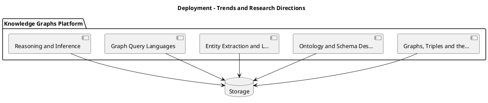

_Source diagram (plantuml); render with the appropriate tool._

**Figure 29. Deployment - Trends and Research Directions** (plantuml). Figure: Deployment view for Knowledge Graphs. This diagram illustrates the principal components and their interactions as discussed in the surrounding section.

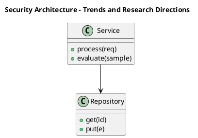

_Source diagram (plantuml); render with the appropriate tool._

**Figure 30. Security Architecture - Trends and Research Directions** (plantuml). Figure: Security Architecture view for Knowledge Graphs. This diagram illustrates the principal components and their interactions as discussed in the surrounding section.

## Deep Dive: Mechanics, Variants and Trade-offs

Having established the essentials, we now go deeper into trends and research directions. The underlying mechanism is best appreciated by tracing a single request from input to output and noting where state is created and consumed. The distinctions in this section are the ones that separate a working demo from a system that holds up under adversarial inputs, scale and the passage of time.

Consider the principal variants and how to choose between them. Each variant optimises for a different point in the design space - some for latency, some for accuracy, some for cost or operability - and the correct choice follows from explicit requirements rather than from defaults. Latency, accuracy and cost form a tension triangle: improving one typically pressures the others, so explicit budgets are essential.

In practice this is supported by a mature tooling ecosystem, including Neo4j, Amazon Neptune, RDFLib, Apache Jena. Tools accelerate the work but do not substitute for understanding: the same principles apply whichever implementation you select, and the ability to reason from first principles is what lets you debug when a tool behaves unexpectedly.

A frequent source of subtle bugs is the interaction with graphs, triples and the property graph model. Because graphs, triples and the property graph model concerns rDF triples versus labelled property graphs and when to use each, changes there can silently alter the behaviour analysed here. The remedy is contract tests at the boundary and end-to-end evaluations that exercise the interaction explicitly.

Finally, attend to edge cases and degradation. Define what the system should do under partial failure, unexpected inputs and load spikes, and make that behaviour explicit and tested rather than emergent. Graceful degradation - returning a safe, useful result when the ideal one is unavailable - is a hallmark of mature engineering.

For deeper study, the literature offers authoritative treatments such as Hogan et al. — Knowledge Graphs (2021) and Bordes et al. — TransE (2013). These primary sources reward careful reading and ground the practical guidance above in established results.

## Advanced Considerations

Having established the essentials, we now go deeper into trends and research directions. Mechanically, the behaviour emerges from a few interacting parts that are simpler than the whole they produce. The distinctions in this section are the ones that separate a working demo from a system that holds up under adversarial inputs, scale and the passage of time.

Consider the principal variants and how to choose between them. Each variant optimises for a different point in the design space - some for latency, some for accuracy, some for cost or operability - and the correct choice follows from explicit requirements rather than from defaults. As with most architectural decisions, the choice is rarely binary; the skill lies in quantifying the trade-offs and choosing deliberately.

In practice this is supported by a mature tooling ecosystem, including Neo4j, Amazon Neptune, RDFLib, Apache Jena. Tools accelerate the work but do not substitute for understanding: the same principles apply whichever implementation you select, and the ability to reason from first principles is what lets you debug when a tool behaves unexpectedly.

A frequent source of subtle bugs is the interaction with graph algorithms for insight. Because graph algorithms for insight concerns centrality, community detection and pathfinding, changes there can silently alter the behaviour analysed here. The remedy is contract tests at the boundary and end-to-end evaluations that exercise the interaction explicitly.

Finally, attend to edge cases and degradation. Define what the system should do under partial failure, unexpected inputs and load spikes, and make that behaviour explicit and tested rather than emergent. Graceful degradation - returning a safe, useful result when the ideal one is unavailable - is a hallmark of mature engineering.

For deeper study, the literature offers authoritative treatments such as Hogan et al. — Knowledge Graphs (2021) and Bordes et al. — TransE (2013). These primary sources reward careful reading and ground the practical guidance above in established results.

## Worked Example

To ground the discussion, walk through a representative example. A finance organisation needs fraud rings and beneficial-ownership analysis. They decide to apply trends and research directions as part of their Knowledge Graphs solution, but wisely treat it as a hypothesis to be validated rather than a foregone conclusion.

The team begins by stating the objective precisely and defining how success will be measured before writing any code. They establish a small but representative evaluation set, agree on acceptance thresholds, and only then prototype the simplest design that could work. Early measurement reveals which assumptions hold and which must be revised, saving weeks of misdirected effort and surfacing edge cases while they are still cheap to fix.

As the prototype matures into a service, the team hardens it: adding input validation, error handling, caching where it pays off, and monitoring that ties back to the original success metric. They document each significant decision in an architecture decision record so that future maintainers understand not just what was built but why.

The outcome is instructive. The system that reaches production is not the most sophisticated design the team considered, but the one whose behaviour they could measure, explain and operate. This is the recurring lesson of Knowledge Graphs: durable value comes from the whole system, not from any single clever component.

## Industry Use Cases

Across industries, the ideas in this chapter recur in recognisable ways. The following vignettes show how different sectors apply them and what they have in common.

**Finance.** Fraud rings and beneficial-ownership analysis. The common thread is that value comes not from the model alone but from the surrounding system - data quality, evaluation, integration and operations - which is precisely where most of the engineering effort belongs.

**Healthcare.** Integrating clinical, genomic and literature data. The common thread is that value comes not from the model alone but from the surrounding system - data quality, evaluation, integration and operations - which is precisely where most of the engineering effort belongs.

**Retail.** Product knowledge graphs powering search and recommendations. The common thread is that value comes not from the model alone but from the surrounding system - data quality, evaluation, integration and operations - which is precisely where most of the engineering effort belongs.

**Enterprise.** 360-degree views linking customers, products and events. The common thread is that value comes not from the model alone but from the surrounding system - data quality, evaluation, integration and operations - which is precisely where most of the engineering effort belongs.

## Best Practices

The following practices consistently separate successful Knowledge Graphs efforts from struggling ones. They are deliberately concrete so they can be adopted as checklist items in design and code review.

- Design the ontology with domain experts before ingesting at scale.
- Treat entity resolution as a first-class, monitored pipeline.
- Record provenance on every fact for trust and debugging.
- Choose the model (RDF vs property graph) to fit query needs.

None of these are exotic; they are the unglamorous disciplines that compound into reliability. The cost of adopting them is small compared with the cost of the incidents they prevent, and they become second nature with practice.

## Common Pitfalls

Equally instructive are the failure modes that recur in practice. Each pitfall below has a clear early warning sign and a known remedy, so treat them as a diagnostic checklist when something feels wrong:

- Over-engineering the ontology before validating use cases.
- Neglecting entity resolution and creating duplicates.
- Ignoring provenance, making facts untrustworthy.
- Picking a graph engine that cannot scale to your traversal patterns.

The pattern is consistent: most failures stem from skipping measurement, conflating prototype and production standards, or deferring cross-cutting concerns such as security and cost until they become emergencies. Naming these traps in advance is the cheapest way to avoid them.

## Governance, Security and Cost Notes

No discussion of trends and research directions is complete without its governance, security and cost dimensions, which are too often deferred until they become emergencies. Treating them as first-class concerns from the outset is both cheaper and safer.

**Governance.** Classify the risk of this capability, document its intended and out-of-scope uses, and ensure decisions are traceable to satisfy internal policy and external regulation such as the NIST AI RMF, ISO/IEC 42001 and the EU AI Act. **Security.** Treat all external input as untrusted, validate outputs before acting on them, apply least privilege to any tools or data access, and map controls to the OWASP LLM Top 10 and MITRE ATLAS.

**Cost and sustainability.** Establish explicit budgets for compute, tokens and latency, attribute spend to owners, and revisit the economics as usage scales - a design that is affordable at pilot scale can become untenable at production volume. Building these reflexes into everyday engineering is what allows a Knowledge Graphs system to be not only capable but also trustworthy and economically sound.

## Hands-On Exercises

Work through the following exercises. They are designed to move understanding from recognition to application - the level required for real engineering work - so prefer writing and building over merely reading.

1. Explain trends and research directions to a colleague unfamiliar with Knowledge Graphs, using a concrete example from your own domain.
2. Sketch a reference architecture that incorporates trends and research directions and annotate where observability, security and cost controls belong.
3. Design an evaluation that would tell you whether trends and research directions is working in production, including the metric, the dataset and the acceptance threshold.
4. Identify two pitfalls relevant to trends and research directions in your environment and describe the early warning signals you would monitor.
5. Prototype the simplest implementation that demonstrates trends and research directions, then list exactly what would need to change to make it production-ready.

## Key Takeaways

Key takeaways from this chapter:

- Trends and Research Directions is a systems concern in Knowledge Graphs: data, models and operations must be co-designed.
- Measurement is non-negotiable; define success metrics and evaluation before building.
- Favour the simplest design that meets the requirement, and add complexity only when evidence demands it.
- Security, cost and observability are first-class requirements, not afterthoughts.
- Document decisions so the system remains understandable and operable as it evolves.

## Review Questions

1. In the context of Knowledge Graphs, which statement best describes “Trends and Research Directions”?
   - A. emerging trends, open problems and research directions shaping the future of Knowledge Graphs
   - B. It makes the system slower but has no other effect.
   - C. It guarantees deterministic output regardless of input.
   - D. It eliminates the need for any evaluation or monitoring.
   - **Answer: A.** Trends and Research Directions: emerging trends, open problems and research directions shaping the future of Knowledge Graphs
2. Which of the following is a recommended best practice when working with Knowledge Graphs?
   - A. It applies exclusively to image data.
   - B. It guarantees deterministic output regardless of input.
   - C. It makes the system slower but has no other effect.
   - D. Choose the model (RDF vs property graph) to fit query needs.
   - **Answer: D.** Best practice: Choose the model (RDF vs property graph) to fit query needs.
3. Which of the following is a common pitfall to avoid in Knowledge Graphs?
   - A. Neglecting entity resolution and creating duplicates.
   - B. It guarantees deterministic output regardless of input.
   - C. Treat entity resolution as a first-class, monitored pipeline.
   - D. Record provenance on every fact for trust and debugging.
   - **Answer: A.** Pitfall to avoid: Neglecting entity resolution and creating duplicates.
4. *(Discussion)* Explain Trends and Research Directions and why it matters in a production Knowledge Graphs system.
   - **Model answer:** A strong answer defines trends and research directions (emerging trends, open problems and research directions shaping the future of Knowledge Graphs) then connects it to architecture, evaluation, cost, security and operations for Knowledge Graphs, citing concrete trade-offs and a real-world example.

---


# Chapter 24. Capstone Project

_This chapter examines capstone project within Knowledge Graphs. It covers a substantial capstone project that consolidates the entire book into a portfolio-grade Knowledge Graphs deliverable, derives a reference architecture, walks through a worked example and runnable code, surveys industry use cases, and distils best practices and pitfalls, closing with exercises and review questions._

## Introduction

Capstone Project can be characterised as a substantial capstone project that consolidates the entire book into a portfolio-grade Knowledge Graphs deliverable. Neglecting it is one of the most common reasons Knowledge Graphs initiatives stall in production. The practical implication is that design choices here ripple through latency, cost and maintainability for the lifetime of the system.

This chapter builds intuition first, then formalises the ideas, derives an architecture, and finishes with code, exercises and review questions so the material transfers directly to your own Knowledge Graphs work. Read it actively: pause at each diagram, reproduce the code, and attempt the exercises before consulting the answers.

## Theory and Foundations

We define Capstone Project as a substantial capstone project that consolidates the entire book into a portfolio-grade Knowledge Graphs deliverable. What distinguishes a production-grade approach from a prototype is the discipline of measurement: every claim is backed by an evaluation rather than intuition. It pays to understand the mechanism rather than treat it as a black box, because most production incidents are explained by one of its steps misbehaving.

To place this in context, recall the broader picture: Knowledge graphs represent entities and their relationships as nodes and edges, enabling integration of heterogeneous data, semantic querying and reasoning. Within that picture, capstone project is one of the load-bearing ideas - the kind that, when understood deeply, makes the rest of Knowledge Graphs fall into place. Getting this right early prevents expensive rework once a Knowledge Graphs system reaches scale.

Capstone Project cannot be understood in isolation from knowledge graph embeddings. Recall that knowledge graph embeddings concerns transE, RotatE and link prediction for completion. The two interact directly: decisions in one constrain the design space of the other, which is why mature teams reason about them together rather than sequentially. Simplicity is a feature. The simplest design that meets the requirement should be the default, with complexity added only when measurement justifies it.

Capstone Project cannot be understood in isolation from operating knowledge graphs. Recall that operating knowledge graphs concerns pipelines, monitoring and lifecycle management. The two interact directly: decisions in one constrain the design space of the other, which is why mature teams reason about them together rather than sequentially. Every added component buys capability at the price of operational surface area, and that bargain should be made consciously.

Several established patterns apply directly to capstone project. The first, provenance edges for full traceability, is widely adopted because it makes the system's behaviour predictable and observable. A complementary pattern, embedding-based link prediction for completion, addresses a related concern and is often deployed alongside it. Patterns are not dogma; they are distilled experience that shortcuts the search for a sound design, and each carries assumptions worth checking against your context.

Knowing when not to use a technique is as valuable as knowing how to use it. In a small prototype, shortcuts around capstone project are invisible; in a production Knowledge Graphs system serving real traffic, they surface as incidents, cost overruns or compliance gaps. Simplicity is a feature. The simplest design that meets the requirement should be the default, with complexity added only when measurement justifies it. The remainder of this chapter turns these principles into an architecture, code and a checklist you can apply immediately.

## Architecture and Design

From an architectural standpoint, Capstone Project sits at the intersection of data, models and operations. An enterprise knowledge graph ingests from databases, documents and APIs through extraction and entity-resolution pipelines into a graph store governed by an ontology. Query services expose traversal and reasoning to applications, while a governance layer tracks provenance, versions and access.

Concretely, the principal building blocks include graphs, triples and the property graph model, ontology and schema design, entity extraction and linking, graph query languages and reasoning and inference. Each is a replaceable component behind a stable interface, so the team can upgrade an implementation - a model, an index, a policy engine - without rewriting its neighbours. The contracts between components are where reliability is won or lost, so they are specified explicitly and tested in isolation.

The diagram accompanying this section makes the data and control flow explicit. Requests enter through a well-defined boundary where they are authenticated and validated; only then are they dispatched to the components that perform the work. This boundary is also where rate limiting, quota enforcement and audit logging live, keeping cross-cutting concerns out of the core logic and in one auditable place.

Two qualities deserve emphasis. First, observability is designed in, not bolted on: every component emits structured telemetry so that failures can be localised in minutes rather than hours. Second, the architecture is evolvable - components communicate through stable contracts so that any single part of the Knowledge Graphs system can be replaced without a rewrite. Simplicity is a feature. The simplest design that meets the requirement should be the default, with complexity added only when measurement justifies it.


**Figure 31. Security Architecture - Capstone Project** (mermaid). Figure: Security Architecture view for Knowledge Graphs. This diagram illustrates the principal components and their interactions as discussed in the surrounding section.

## Deep Dive: Mechanics, Variants and Trade-offs

Having established the essentials, we now go deeper into capstone project. The underlying mechanism is best appreciated by tracing a single request from input to output and noting where state is created and consumed. The distinctions in this section are the ones that separate a working demo from a system that holds up under adversarial inputs, scale and the passage of time.

Consider the principal variants and how to choose between them. Each variant optimises for a different point in the design space - some for latency, some for accuracy, some for cost or operability - and the correct choice follows from explicit requirements rather than from defaults. Every added component buys capability at the price of operational surface area, and that bargain should be made consciously.

In practice this is supported by a mature tooling ecosystem, including Neo4j, Amazon Neptune, RDFLib, Apache Jena. Tools accelerate the work but do not substitute for understanding: the same principles apply whichever implementation you select, and the ability to reason from first principles is what lets you debug when a tool behaves unexpectedly.

A frequent source of subtle bugs is the interaction with knowledge graph embeddings. Because knowledge graph embeddings concerns transE, RotatE and link prediction for completion, changes there can silently alter the behaviour analysed here. The remedy is contract tests at the boundary and end-to-end evaluations that exercise the interaction explicitly.

Finally, attend to edge cases and degradation. Define what the system should do under partial failure, unexpected inputs and load spikes, and make that behaviour explicit and tested rather than emergent. Graceful degradation - returning a safe, useful result when the ideal one is unavailable - is a hallmark of mature engineering.

For deeper study, the literature offers authoritative treatments such as Hogan et al. — Knowledge Graphs (2021) and Bordes et al. — TransE (2013). These primary sources reward careful reading and ground the practical guidance above in established results.

## Advanced Considerations

Having established the essentials, we now go deeper into capstone project. It pays to understand the mechanism rather than treat it as a black box, because most production incidents are explained by one of its steps misbehaving. The distinctions in this section are the ones that separate a working demo from a system that holds up under adversarial inputs, scale and the passage of time.

Consider the principal variants and how to choose between them. Each variant optimises for a different point in the design space - some for latency, some for accuracy, some for cost or operability - and the correct choice follows from explicit requirements rather than from defaults. Simplicity is a feature. The simplest design that meets the requirement should be the default, with complexity added only when measurement justifies it.

In practice this is supported by a mature tooling ecosystem, including Neo4j, Amazon Neptune, RDFLib, Apache Jena. Tools accelerate the work but do not substitute for understanding: the same principles apply whichever implementation you select, and the ability to reason from first principles is what lets you debug when a tool behaves unexpectedly.

A frequent source of subtle bugs is the interaction with knowledge graph embeddings. Because knowledge graph embeddings concerns transE, RotatE and link prediction for completion, changes there can silently alter the behaviour analysed here. The remedy is contract tests at the boundary and end-to-end evaluations that exercise the interaction explicitly.

Finally, attend to edge cases and degradation. Define what the system should do under partial failure, unexpected inputs and load spikes, and make that behaviour explicit and tested rather than emergent. Graceful degradation - returning a safe, useful result when the ideal one is unavailable - is a hallmark of mature engineering.

For deeper study, the literature offers authoritative treatments such as Hogan et al. — Knowledge Graphs (2021) and Bordes et al. — TransE (2013). These primary sources reward careful reading and ground the practical guidance above in established results.

## Worked Example

A worked example clarifies how these ideas behave in practice. A healthcare organisation needs integrating clinical, genomic and literature data. They decide to apply capstone project as part of their Knowledge Graphs solution, but wisely treat it as a hypothesis to be validated rather than a foregone conclusion.

The team begins by stating the objective precisely and defining how success will be measured before writing any code. They establish a small but representative evaluation set, agree on acceptance thresholds, and only then prototype the simplest design that could work. Early measurement reveals which assumptions hold and which must be revised, saving weeks of misdirected effort and surfacing edge cases while they are still cheap to fix.

As the prototype matures into a service, the team hardens it: adding input validation, error handling, caching where it pays off, and monitoring that ties back to the original success metric. They document each significant decision in an architecture decision record so that future maintainers understand not just what was built but why.

The outcome is instructive. The system that reaches production is not the most sophisticated design the team considered, but the one whose behaviour they could measure, explain and operate. This is the recurring lesson of Knowledge Graphs: durable value comes from the whole system, not from any single clever component.

## Industry Use Cases

Across industries, the ideas in this chapter recur in recognisable ways. The following vignettes show how different sectors apply them and what they have in common.

**Finance.** Fraud rings and beneficial-ownership analysis. The common thread is that value comes not from the model alone but from the surrounding system - data quality, evaluation, integration and operations - which is precisely where most of the engineering effort belongs.

**Healthcare.** Integrating clinical, genomic and literature data. The common thread is that value comes not from the model alone but from the surrounding system - data quality, evaluation, integration and operations - which is precisely where most of the engineering effort belongs.

**Retail.** Product knowledge graphs powering search and recommendations. The common thread is that value comes not from the model alone but from the surrounding system - data quality, evaluation, integration and operations - which is precisely where most of the engineering effort belongs.

**Enterprise.** 360-degree views linking customers, products and events. The common thread is that value comes not from the model alone but from the surrounding system - data quality, evaluation, integration and operations - which is precisely where most of the engineering effort belongs.

## Best Practices

The following practices consistently separate successful Knowledge Graphs efforts from struggling ones. They are deliberately concrete so they can be adopted as checklist items in design and code review.

- Design the ontology with domain experts before ingesting at scale.
- Treat entity resolution as a first-class, monitored pipeline.
- Record provenance on every fact for trust and debugging.
- Choose the model (RDF vs property graph) to fit query needs.

None of these are exotic; they are the unglamorous disciplines that compound into reliability. The cost of adopting them is small compared with the cost of the incidents they prevent, and they become second nature with practice.

## Common Pitfalls

Equally instructive are the failure modes that recur in practice. Each pitfall below has a clear early warning sign and a known remedy, so treat them as a diagnostic checklist when something feels wrong:

- Over-engineering the ontology before validating use cases.
- Neglecting entity resolution and creating duplicates.
- Ignoring provenance, making facts untrustworthy.
- Picking a graph engine that cannot scale to your traversal patterns.

The pattern is consistent: most failures stem from skipping measurement, conflating prototype and production standards, or deferring cross-cutting concerns such as security and cost until they become emergencies. Naming these traps in advance is the cheapest way to avoid them.

## Governance, Security and Cost Notes

No discussion of capstone project is complete without its governance, security and cost dimensions, which are too often deferred until they become emergencies. Treating them as first-class concerns from the outset is both cheaper and safer.

**Governance.** Classify the risk of this capability, document its intended and out-of-scope uses, and ensure decisions are traceable to satisfy internal policy and external regulation such as the NIST AI RMF, ISO/IEC 42001 and the EU AI Act. **Security.** Treat all external input as untrusted, validate outputs before acting on them, apply least privilege to any tools or data access, and map controls to the OWASP LLM Top 10 and MITRE ATLAS.

**Cost and sustainability.** Establish explicit budgets for compute, tokens and latency, attribute spend to owners, and revisit the economics as usage scales - a design that is affordable at pilot scale can become untenable at production volume. Building these reflexes into everyday engineering is what allows a Knowledge Graphs system to be not only capable but also trustworthy and economically sound.

## Hands-On Exercises

Work through the following exercises. They are designed to move understanding from recognition to application - the level required for real engineering work - so prefer writing and building over merely reading.

1. Explain capstone project to a colleague unfamiliar with Knowledge Graphs, using a concrete example from your own domain.
2. Sketch a reference architecture that incorporates capstone project and annotate where observability, security and cost controls belong.
3. Design an evaluation that would tell you whether capstone project is working in production, including the metric, the dataset and the acceptance threshold.
4. Identify two pitfalls relevant to capstone project in your environment and describe the early warning signals you would monitor.
5. Prototype the simplest implementation that demonstrates capstone project, then list exactly what would need to change to make it production-ready.

## Key Takeaways

Key takeaways from this chapter:

- Capstone Project is a systems concern in Knowledge Graphs: data, models and operations must be co-designed.
- Measurement is non-negotiable; define success metrics and evaluation before building.
- Favour the simplest design that meets the requirement, and add complexity only when evidence demands it.
- Security, cost and observability are first-class requirements, not afterthoughts.
- Document decisions so the system remains understandable and operable as it evolves.

## Code Walkthrough

Pipelines keep Capstone Project logic modular and testable. Each stage is a pure function, errors are captured per item, and the composition is trivial to extend or reorder.

The full listing is shown below; study it line by line and reproduce it locally before moving on.

### Listing: A composable processing pipeline for Capstone Project

```python
from collections.abc import Iterable, Iterator
from typing import Protocol


class Stage(Protocol):
    def __call__(self, item: dict) -> dict: ...


def pipeline(stages: list[Stage]) -> Stage:
    """Compose ordered stages into a single callable for Capstone Project."""

    def run(item: dict) -> dict:
        for stage in stages:
            item = stage(item)
        return item

    return run


def validate(item: dict) -> dict:
    if "text" not in item:
        raise ValueError("missing required field: text")
    return item


def normalise(item: dict) -> dict:
    item["text"] = item["text"].strip().lower()
    return item


def enrich(item: dict) -> dict:
    item["length"] = len(item["text"])
    return item


process = pipeline([validate, normalise, enrich])


def run_batch(items: Iterable[dict]) -> Iterator[dict]:
    for item in items:
        try:
            yield process(dict(item))
        except ValueError as exc:
            yield {"error": str(exc), "item": item}

```

## Review Questions

1. In the context of Knowledge Graphs, which statement best describes “Capstone Project”?
   - A. It makes the system slower but has no other effect.
   - B. It guarantees deterministic output regardless of input.
   - C. a substantial capstone project that consolidates the entire book into a portfolio-grade Knowledge Graphs deliverable
   - D. It applies exclusively to image data.
   - **Answer: C.** Capstone Project: a substantial capstone project that consolidates the entire book into a portfolio-grade Knowledge Graphs deliverable
2. Which of the following is a recommended best practice when working with Knowledge Graphs?
   - A. Record provenance on every fact for trust and debugging.
   - B. Ignoring provenance, making facts untrustworthy.
   - C. It guarantees deterministic output regardless of input.
   - D. Over-engineering the ontology before validating use cases.
   - **Answer: A.** Best practice: Record provenance on every fact for trust and debugging.
3. Which of the following is a common pitfall to avoid in Knowledge Graphs?
   - A. It guarantees deterministic output regardless of input.
   - B. Picking a graph engine that cannot scale to your traversal patterns.
   - C. Treat entity resolution as a first-class, monitored pipeline.
   - D. It applies exclusively to image data.
   - **Answer: B.** Pitfall to avoid: Picking a graph engine that cannot scale to your traversal patterns.
4. *(Discussion)* What trade-offs would you weigh when implementing Capstone Project?
   - **Model answer:** A strong answer defines capstone project (a substantial capstone project that consolidates the entire book into a portfolio-grade Knowledge Graphs deliverable) then connects it to architecture, evaluation, cost, security and operations for Knowledge Graphs, citing concrete trade-offs and a real-world example.

---


# Chapter 25. Certification Preparation and Review

_This chapter examines certification preparation and review within Knowledge Graphs. It covers a structured review and certification-style preparation covering the full breadth of Knowledge Graphs, derives a reference architecture, walks through a worked example and runnable code, surveys industry use cases, and distils best practices and pitfalls, closing with exercises and review questions._

## Introduction

Formally, Certification Preparation and Review addresses a structured review and certification-style preparation covering the full breadth of Knowledge Graphs. Neglecting it is one of the most common reasons Knowledge Graphs initiatives stall in production. The right abstraction here pays compounding dividends, because downstream components depend on its guarantees.

This chapter builds intuition first, then formalises the ideas, derives an architecture, and finishes with code, exercises and review questions so the material transfers directly to your own Knowledge Graphs work. Read it actively: pause at each diagram, reproduce the code, and attempt the exercises before consulting the answers.

## Theory and Foundations

We define Certification Preparation and Review as a structured review and certification-style preparation covering the full breadth of Knowledge Graphs. It helps to separate the conceptual model from its implementation: the former guides reasoning, the latter must contend with real-world constraints. Mechanically, the behaviour emerges from a few interacting parts that are simpler than the whole they produce.

To place this in context, recall the broader picture: Knowledge graphs represent entities and their relationships as nodes and edges, enabling integration of heterogeneous data, semantic querying and reasoning. Within that picture, certification preparation and review is one of the load-bearing ideas - the kind that, when understood deeply, makes the rest of Knowledge Graphs fall into place. Neglecting it is one of the most common reasons Knowledge Graphs initiatives stall in production.

Certification Preparation and Review cannot be understood in isolation from governance and lineage. Recall that governance and lineage concerns versioning, access control and auditability. The two interact directly: decisions in one constrain the design space of the other, which is why mature teams reason about them together rather than sequentially. Latency, accuracy and cost form a tension triangle: improving one typically pressures the others, so explicit budgets are essential.

Certification Preparation and Review cannot be understood in isolation from graphs for grounding llms. Recall that graphs for grounding llms concerns serving structured context to generative systems. The two interact directly: decisions in one constrain the design space of the other, which is why mature teams reason about them together rather than sequentially. There is an inherent trade-off between fidelity and cost, and the correct balance depends on the use case and its tolerance for error.

Several established patterns apply directly to certification preparation and review. The first, embedding-based link prediction for completion, is widely adopted because it makes the system's behaviour predictable and observable. A complementary pattern, canonical ontology with reused standard vocabularies, addresses a related concern and is often deployed alongside it. Patterns are not dogma; they are distilled experience that shortcuts the search for a sound design, and each carries assumptions worth checking against your context.

The decision of whether to adopt this should be driven by requirements, not by novelty. In a small prototype, shortcuts around certification preparation and review are invisible; in a production Knowledge Graphs system serving real traffic, they surface as incidents, cost overruns or compliance gaps. Latency, accuracy and cost form a tension triangle: improving one typically pressures the others, so explicit budgets are essential. The remainder of this chapter turns these principles into an architecture, code and a checklist you can apply immediately.

## Architecture and Design

The reference architecture for Certification Preparation and Review separates concerns into clearly bounded components with explicit contracts. An enterprise knowledge graph ingests from databases, documents and APIs through extraction and entity-resolution pipelines into a graph store governed by an ontology. Query services expose traversal and reasoning to applications, while a governance layer tracks provenance, versions and access.

Concretely, the principal building blocks include graphs, triples and the property graph model, ontology and schema design, entity extraction and linking, graph query languages and reasoning and inference. Each is a replaceable component behind a stable interface, so the team can upgrade an implementation - a model, an index, a policy engine - without rewriting its neighbours. The contracts between components are where reliability is won or lost, so they are specified explicitly and tested in isolation.

The diagram accompanying this section makes the data and control flow explicit. Requests enter through a well-defined boundary where they are authenticated and validated; only then are they dispatched to the components that perform the work. This boundary is also where rate limiting, quota enforcement and audit logging live, keeping cross-cutting concerns out of the core logic and in one auditable place.

Two qualities deserve emphasis. First, observability is designed in, not bolted on: every component emits structured telemetry so that failures can be localised in minutes rather than hours. Second, the architecture is evolvable - components communicate through stable contracts so that any single part of the Knowledge Graphs system can be replaced without a rewrite. There is an inherent trade-off between fidelity and cost, and the correct balance depends on the use case and its tolerance for error.

```plantuml
@startuml
title Network - Certification Preparation and Review
package "Knowledge Graphs Platform" {
  component "Graphs, Triples and the…" as C0
  component "Ontology and Schema Des…" as C1
  component "Entity Extraction and L…" as C2
  component "Graph Query Languages" as C3
  component "Reasoning and Inference" as C4
}
database "Storage" as DB
C0 --> DB
C1 --> DB
C2 --> DB
C3 --> DB
C4 --> DB
@enduml
```

_Source diagram (plantuml); render with the appropriate tool._

**Figure 32. Network - Certification Preparation and Review** (plantuml). Figure: Network view for Knowledge Graphs. This diagram illustrates the principal components and their interactions as discussed in the surrounding section.

```mermaid
classDiagram
  class KGService {
    +configure(config)
    +process(request) Response
    +evaluate(sample) Metrics
  }
  class Repository {
    +get(id) Entity
    +put(entity)
  }
  class Policy {
    +authorise(ctx) bool
  }
  KGService --> Repository
  KGService --> Policy
```

**Figure 33. Class - Certification Preparation and Review** (mermaid). Figure: Class view for Knowledge Graphs. This diagram illustrates the principal components and their interactions as discussed in the surrounding section.

## Deep Dive: Mechanics, Variants and Trade-offs

Having established the essentials, we now go deeper into certification preparation and review. The underlying mechanism is best appreciated by tracing a single request from input to output and noting where state is created and consumed. The distinctions in this section are the ones that separate a working demo from a system that holds up under adversarial inputs, scale and the passage of time.

Consider the principal variants and how to choose between them. Each variant optimises for a different point in the design space - some for latency, some for accuracy, some for cost or operability - and the correct choice follows from explicit requirements rather than from defaults. There is an inherent trade-off between fidelity and cost, and the correct balance depends on the use case and its tolerance for error.

In practice this is supported by a mature tooling ecosystem, including Neo4j, Amazon Neptune, RDFLib, Apache Jena. Tools accelerate the work but do not substitute for understanding: the same principles apply whichever implementation you select, and the ability to reason from first principles is what lets you debug when a tool behaves unexpectedly.

A frequent source of subtle bugs is the interaction with governance and lineage. Because governance and lineage concerns versioning, access control and auditability, changes there can silently alter the behaviour analysed here. The remedy is contract tests at the boundary and end-to-end evaluations that exercise the interaction explicitly.

Finally, attend to edge cases and degradation. Define what the system should do under partial failure, unexpected inputs and load spikes, and make that behaviour explicit and tested rather than emergent. Graceful degradation - returning a safe, useful result when the ideal one is unavailable - is a hallmark of mature engineering.

For deeper study, the literature offers authoritative treatments such as Hogan et al. — Knowledge Graphs (2021) and Bordes et al. — TransE (2013). These primary sources reward careful reading and ground the practical guidance above in established results.

## Advanced Considerations

Having established the essentials, we now go deeper into certification preparation and review. Mechanically, the behaviour emerges from a few interacting parts that are simpler than the whole they produce. The distinctions in this section are the ones that separate a working demo from a system that holds up under adversarial inputs, scale and the passage of time.

Consider the principal variants and how to choose between them. Each variant optimises for a different point in the design space - some for latency, some for accuracy, some for cost or operability - and the correct choice follows from explicit requirements rather than from defaults. Latency, accuracy and cost form a tension triangle: improving one typically pressures the others, so explicit budgets are essential.

In practice this is supported by a mature tooling ecosystem, including Neo4j, Amazon Neptune, RDFLib, Apache Jena. Tools accelerate the work but do not substitute for understanding: the same principles apply whichever implementation you select, and the ability to reason from first principles is what lets you debug when a tool behaves unexpectedly.

A frequent source of subtle bugs is the interaction with governance and lineage. Because governance and lineage concerns versioning, access control and auditability, changes there can silently alter the behaviour analysed here. The remedy is contract tests at the boundary and end-to-end evaluations that exercise the interaction explicitly.

Finally, attend to edge cases and degradation. Define what the system should do under partial failure, unexpected inputs and load spikes, and make that behaviour explicit and tested rather than emergent. Graceful degradation - returning a safe, useful result when the ideal one is unavailable - is a hallmark of mature engineering.

For deeper study, the literature offers authoritative treatments such as Hogan et al. — Knowledge Graphs (2021) and Bordes et al. — TransE (2013). These primary sources reward careful reading and ground the practical guidance above in established results.

## Worked Example

A worked example clarifies how these ideas behave in practice. A finance organisation needs fraud rings and beneficial-ownership analysis. They decide to apply certification preparation and review as part of their Knowledge Graphs solution, but wisely treat it as a hypothesis to be validated rather than a foregone conclusion.

The team begins by stating the objective precisely and defining how success will be measured before writing any code. They establish a small but representative evaluation set, agree on acceptance thresholds, and only then prototype the simplest design that could work. Early measurement reveals which assumptions hold and which must be revised, saving weeks of misdirected effort and surfacing edge cases while they are still cheap to fix.

As the prototype matures into a service, the team hardens it: adding input validation, error handling, caching where it pays off, and monitoring that ties back to the original success metric. They document each significant decision in an architecture decision record so that future maintainers understand not just what was built but why.

The outcome is instructive. The system that reaches production is not the most sophisticated design the team considered, but the one whose behaviour they could measure, explain and operate. This is the recurring lesson of Knowledge Graphs: durable value comes from the whole system, not from any single clever component.

## Industry Use Cases

Across industries, the ideas in this chapter recur in recognisable ways. The following vignettes show how different sectors apply them and what they have in common.

**Finance.** Fraud rings and beneficial-ownership analysis. The common thread is that value comes not from the model alone but from the surrounding system - data quality, evaluation, integration and operations - which is precisely where most of the engineering effort belongs.

**Healthcare.** Integrating clinical, genomic and literature data. The common thread is that value comes not from the model alone but from the surrounding system - data quality, evaluation, integration and operations - which is precisely where most of the engineering effort belongs.

**Retail.** Product knowledge graphs powering search and recommendations. The common thread is that value comes not from the model alone but from the surrounding system - data quality, evaluation, integration and operations - which is precisely where most of the engineering effort belongs.

**Enterprise.** 360-degree views linking customers, products and events. The common thread is that value comes not from the model alone but from the surrounding system - data quality, evaluation, integration and operations - which is precisely where most of the engineering effort belongs.

## Best Practices

The following practices consistently separate successful Knowledge Graphs efforts from struggling ones. They are deliberately concrete so they can be adopted as checklist items in design and code review.

- Design the ontology with domain experts before ingesting at scale.
- Treat entity resolution as a first-class, monitored pipeline.
- Record provenance on every fact for trust and debugging.
- Choose the model (RDF vs property graph) to fit query needs.

None of these are exotic; they are the unglamorous disciplines that compound into reliability. The cost of adopting them is small compared with the cost of the incidents they prevent, and they become second nature with practice.

## Common Pitfalls

Equally instructive are the failure modes that recur in practice. Each pitfall below has a clear early warning sign and a known remedy, so treat them as a diagnostic checklist when something feels wrong:

- Over-engineering the ontology before validating use cases.
- Neglecting entity resolution and creating duplicates.
- Ignoring provenance, making facts untrustworthy.
- Picking a graph engine that cannot scale to your traversal patterns.

The pattern is consistent: most failures stem from skipping measurement, conflating prototype and production standards, or deferring cross-cutting concerns such as security and cost until they become emergencies. Naming these traps in advance is the cheapest way to avoid them.

## Governance, Security and Cost Notes

No discussion of certification preparation and review is complete without its governance, security and cost dimensions, which are too often deferred until they become emergencies. Treating them as first-class concerns from the outset is both cheaper and safer.

**Governance.** Classify the risk of this capability, document its intended and out-of-scope uses, and ensure decisions are traceable to satisfy internal policy and external regulation such as the NIST AI RMF, ISO/IEC 42001 and the EU AI Act. **Security.** Treat all external input as untrusted, validate outputs before acting on them, apply least privilege to any tools or data access, and map controls to the OWASP LLM Top 10 and MITRE ATLAS.

**Cost and sustainability.** Establish explicit budgets for compute, tokens and latency, attribute spend to owners, and revisit the economics as usage scales - a design that is affordable at pilot scale can become untenable at production volume. Building these reflexes into everyday engineering is what allows a Knowledge Graphs system to be not only capable but also trustworthy and economically sound.

## Hands-On Exercises

Work through the following exercises. They are designed to move understanding from recognition to application - the level required for real engineering work - so prefer writing and building over merely reading.

1. Explain certification preparation and review to a colleague unfamiliar with Knowledge Graphs, using a concrete example from your own domain.
2. Sketch a reference architecture that incorporates certification preparation and review and annotate where observability, security and cost controls belong.
3. Design an evaluation that would tell you whether certification preparation and review is working in production, including the metric, the dataset and the acceptance threshold.
4. Identify two pitfalls relevant to certification preparation and review in your environment and describe the early warning signals you would monitor.
5. Prototype the simplest implementation that demonstrates certification preparation and review, then list exactly what would need to change to make it production-ready.

## Key Takeaways

Key takeaways from this chapter:

- Certification Preparation and Review is a systems concern in Knowledge Graphs: data, models and operations must be co-designed.
- Measurement is non-negotiable; define success metrics and evaluation before building.
- Favour the simplest design that meets the requirement, and add complexity only when evidence demands it.
- Security, cost and observability are first-class requirements, not afterthoughts.
- Document decisions so the system remains understandable and operable as it evolves.

## Code Walkthrough

This listing shows a configuration-driven Certification Preparation and Review component with retry semantics and typed interfaces — the shape we expect from production Knowledge Graphs code rather than a notebook prototype.

The full listing is shown below; study it line by line and reproduce it locally before moving on.

### Listing: Implementing a Certification Preparation and Review component

```python
from __future__ import annotations

from dataclasses import dataclass, field
from typing import Any


@dataclass(slots=True)
class CertificationPreparationAndConfig:
    """Configuration for the Certification Preparation and Review component in a Knowledge Graphs system."""

    name: str
    timeout_s: float = 30.0
    max_retries: int = 3
    options: dict[str, Any] = field(default_factory=dict)


class CertificationPreparationAnd:
    """A minimal, production-shaped implementation of Certification Preparation and Review."""

    def __init__(self, config: CertificationPreparationAndConfig) -> None:
        self._config = config
        self._calls = 0

    def run(self, payload: dict[str, Any]) -> dict[str, Any]:
        """Process a request, retrying transient failures with backoff."""
        last_error: Exception | None = None
        for attempt in range(self._config.max_retries):
            try:
                self._calls += 1
                return self._process(payload)
            except TimeoutError as exc:  # transient
                last_error = exc
                continue
        raise RuntimeError(f"CertificationPreparationAnd failed after retries") from last_error

    def _process(self, payload: dict[str, Any]) -> dict[str, Any]:
        # Domain-specific logic for Certification Preparation and Review goes here.
        return {"status": "ok", "input_keys": sorted(payload), "calls": self._calls}

```

## Review Questions

1. In the context of Knowledge Graphs, which statement best describes “Certification Preparation and Review”?
   - A. a structured review and certification-style preparation covering the full breadth of Knowledge Graphs
   - B. It is only relevant to academic research, not production.
   - C. It makes the system slower but has no other effect.
   - D. It removes all security and governance requirements.
   - **Answer: A.** Certification Preparation and Review: a structured review and certification-style preparation covering the full breadth of Knowledge Graphs
2. Which of the following is a recommended best practice when working with Knowledge Graphs?
   - A. Over-engineering the ontology before validating use cases.
   - B. It eliminates the need for any evaluation or monitoring.
   - C. Picking a graph engine that cannot scale to your traversal patterns.
   - D. Choose the model (RDF vs property graph) to fit query needs.
   - **Answer: D.** Best practice: Choose the model (RDF vs property graph) to fit query needs.
3. Which of the following is a common pitfall to avoid in Knowledge Graphs?
   - A. Design the ontology with domain experts before ingesting at scale.
   - B. Ignoring provenance, making facts untrustworthy.
   - C. It makes the system slower but has no other effect.
   - D. It removes all security and governance requirements.
   - **Answer: B.** Pitfall to avoid: Ignoring provenance, making facts untrustworthy.
4. *(Discussion)* How does Certification Preparation and Review interact with security and governance requirements?
   - **Model answer:** A strong answer defines certification preparation and review (a structured review and certification-style preparation covering the full breadth of Knowledge Graphs) then connects it to architecture, evaluation, cost, security and operations for Knowledge Graphs, citing concrete trade-offs and a real-world example.

---


# Hands-On Labs

## Lab 1: End-to-End Knowledge Graphs Build

**Objective.** Build a working slice of a Knowledge Graphs system that demonstrates the core concepts end to end. **Steps.** (1) Define the objective and success metric. (2) Assemble a minimal dataset or fixtures. (3) Implement the core component using the patterns from the chapters. (4) Add an evaluation gate. (5) Instrument observability. (6) Document the design decisions in an architecture decision record. **Deliverable.** A reproducible repository with code, an evaluation report and a short design document suitable for a portfolio.

## Lab 2: End-to-End Knowledge Graphs Build

**Objective.** Build a working slice of a Knowledge Graphs system that demonstrates the core concepts end to end. **Steps.** (1) Define the objective and success metric. (2) Assemble a minimal dataset or fixtures. (3) Implement the core component using the patterns from the chapters. (4) Add an evaluation gate. (5) Instrument observability. (6) Document the design decisions in an architecture decision record. **Deliverable.** A reproducible repository with code, an evaluation report and a short design document suitable for a portfolio.


# Case Studies

## Finance: Knowledge Graphs in Practice

**Context.** A finance organisation set out to apply Knowledge Graphs to fraud rings and beneficial-ownership analysis. **Approach.** The team began with a precise objective and an evaluation set, prototyped the simplest viable design, then hardened it with monitoring, security controls and cost budgets. **Outcome.** Measured against the original metric, the system delivered durable value because the surrounding engineering - data quality, evaluation and operations - was treated as seriously as the model itself. **Lessons.** Start with measurement, resist premature complexity, and design governance and observability in from day one.

## Healthcare: Knowledge Graphs in Practice

**Context.** A healthcare organisation set out to apply Knowledge Graphs to integrating clinical, genomic and literature data. **Approach.** The team began with a precise objective and an evaluation set, prototyped the simplest viable design, then hardened it with monitoring, security controls and cost budgets. **Outcome.** Measured against the original metric, the system delivered durable value because the surrounding engineering - data quality, evaluation and operations - was treated as seriously as the model itself. **Lessons.** Start with measurement, resist premature complexity, and design governance and observability in from day one.

## Retail: Knowledge Graphs in Practice

**Context.** A retail organisation set out to apply Knowledge Graphs to product knowledge graphs powering search and recommendations. **Approach.** The team began with a precise objective and an evaluation set, prototyped the simplest viable design, then hardened it with monitoring, security controls and cost budgets. **Outcome.** Measured against the original metric, the system delivered durable value because the surrounding engineering - data quality, evaluation and operations - was treated as seriously as the model itself. **Lessons.** Start with measurement, resist premature complexity, and design governance and observability in from day one.


# Interview Questions

A consolidated bank of discussion-style interview questions drawn from across the book, suitable for preparation and technical screening.

1. Describe a failure mode of Graphs, Triples and the Property Graph Model and how you would mitigate it.
   - **Guidance:** A strong answer defines graphs, triples and the property graph model (RDF triples versus labelled property graphs and when to use each.) then connects it to architecture, evaluation, cost, security and operations for Knowledge Graphs, citing concrete trade-offs and a real-world example.
2. Explain Ontology and Schema Design and why it matters in a production Knowledge Graphs system.
   - **Guidance:** A strong answer defines ontology and schema design (Classes, properties, taxonomies and reusing standard vocabularies.) then connects it to architecture, evaluation, cost, security and operations for Knowledge Graphs, citing concrete trade-offs and a real-world example.
3. How does Entity Extraction and Linking interact with security and governance requirements?
   - **Guidance:** A strong answer defines entity extraction and linking (Populating the graph from structured and unstructured sources.) then connects it to architecture, evaluation, cost, security and operations for Knowledge Graphs, citing concrete trade-offs and a real-world example.
4. Walk through how you would design Graph Query Languages for an enterprise Knowledge Graphs workload.
   - **Guidance:** A strong answer defines graph query languages (Cypher, SPARQL and Gremlin for traversal and pattern matching.) then connects it to architecture, evaluation, cost, security and operations for Knowledge Graphs, citing concrete trade-offs and a real-world example.
5. Describe a failure mode of Reasoning and Inference and how you would mitigate it.
   - **Guidance:** A strong answer defines reasoning and inference (Rules, RDFS/OWL semantics and inferring implicit facts.) then connects it to architecture, evaluation, cost, security and operations for Knowledge Graphs, citing concrete trade-offs and a real-world example.
6. Describe a failure mode of Knowledge Graph Embeddings and how you would mitigate it.
   - **Guidance:** A strong answer defines knowledge graph embeddings (TransE, RotatE and link prediction for completion.) then connects it to architecture, evaluation, cost, security and operations for Knowledge Graphs, citing concrete trade-offs and a real-world example.
7. Describe a failure mode of Graph Algorithms for Insight and how you would mitigate it.
   - **Guidance:** A strong answer defines graph algorithms for insight (Centrality, community detection and pathfinding.) then connects it to architecture, evaluation, cost, security and operations for Knowledge Graphs, citing concrete trade-offs and a real-world example.
8. How would you test and monitor Data Quality and Entity Resolution in production?
   - **Guidance:** A strong answer defines data quality and entity resolution (Deduplication, validation and provenance.) then connects it to architecture, evaluation, cost, security and operations for Knowledge Graphs, citing concrete trade-offs and a real-world example.
9. What trade-offs would you weigh when implementing Scaling Graph Storage?
   - **Guidance:** A strong answer defines scaling graph storage (Partitioning, indexing and distributed graph engines.) then connects it to architecture, evaluation, cost, security and operations for Knowledge Graphs, citing concrete trade-offs and a real-world example.
10. How would you test and monitor Graphs for Grounding LLMs in production?
   - **Guidance:** A strong answer defines graphs for grounding llms (Serving structured context to generative systems.) then connects it to architecture, evaluation, cost, security and operations for Knowledge Graphs, citing concrete trade-offs and a real-world example.
11. What trade-offs would you weigh when implementing Governance and Lineage?
   - **Guidance:** A strong answer defines governance and lineage (Versioning, access control and auditability.) then connects it to architecture, evaluation, cost, security and operations for Knowledge Graphs, citing concrete trade-offs and a real-world example.
12. Describe a failure mode of Operating Knowledge Graphs and how you would mitigate it.
   - **Guidance:** A strong answer defines operating knowledge graphs (Pipelines, monitoring and lifecycle management.) then connects it to architecture, evaluation, cost, security and operations for Knowledge Graphs, citing concrete trade-offs and a real-world example.
13. What trade-offs would you weigh when implementing Visualising Knowledge Graphs?
   - **Guidance:** A strong answer defines visualising knowledge graphs (Effective exploration and analyst tooling.) then connects it to architecture, evaluation, cost, security and operations for Knowledge Graphs, citing concrete trade-offs and a real-world example.
14. Explain The Enterprise Knowledge Graph Architecture and why it matters in a production Knowledge Graphs system.
   - **Guidance:** A strong answer defines the enterprise knowledge graph architecture (Reference blueprint integrating sources, store and consumers.) then connects it to architecture, evaluation, cost, security and operations for Knowledge Graphs, citing concrete trade-offs and a real-world example.
15. Walk through how you would design Putting It Together: A Reference Implementation for an enterprise Knowledge Graphs workload.
   - **Guidance:** A strong answer defines putting it together: a reference implementation (an end-to-end reference implementation that integrates the components of a Knowledge Graphs system into a cohesive, working whole) then connects it to architecture, evaluation, cost, security and operations for Knowledge Graphs, citing concrete trade-offs and a real-world example.
16. How does Hands-On Lab: Building an End-to-End Knowledge Graphs System interact with security and governance requirements?
   - **Guidance:** A strong answer defines hands-on lab: building an end-to-end knowledge graphs system (a guided, build-along laboratory that constructs a functioning Knowledge Graphs system from first principles) then connects it to architecture, evaluation, cost, security and operations for Knowledge Graphs, citing concrete trade-offs and a real-world example.
17. Walk through how you would design Case Study: Finance at Scale for an enterprise Knowledge Graphs workload.
   - **Guidance:** A strong answer defines case study: finance at scale (a detailed case study of deploying Knowledge Graphs in a demanding finance environment, including the decisions, trade-offs and outcomes) then connects it to architecture, evaluation, cost, security and operations for Knowledge Graphs, citing concrete trade-offs and a real-world example.
18. Describe a failure mode of Operating in Production and how you would mitigate it.
   - **Guidance:** A strong answer defines operating in production (the operational discipline required to run a Knowledge Graphs system reliably, including monitoring, incident response and continuous improvement) then connects it to architecture, evaluation, cost, security and operations for Knowledge Graphs, citing concrete trade-offs and a real-world example.
19. How would you test and monitor Evaluation and Quality Assurance in production?
   - **Guidance:** A strong answer defines evaluation and quality assurance (a rigorous approach to measuring and assuring the quality of a Knowledge Graphs system before and after release) then connects it to architecture, evaluation, cost, security and operations for Knowledge Graphs, citing concrete trade-offs and a real-world example.
20. Explain Security, Privacy and Governance and why it matters in a production Knowledge Graphs system.
   - **Guidance:** A strong answer defines security, privacy and governance (the security, privacy and governance controls that make a Knowledge Graphs system trustworthy and compliant) then connects it to architecture, evaluation, cost, security and operations for Knowledge Graphs, citing concrete trade-offs and a real-world example.
21. How does Cost, Performance and Scaling interact with security and governance requirements?
   - **Guidance:** A strong answer defines cost, performance and scaling (techniques for controlling cost and latency while scaling a Knowledge Graphs system to production traffic) then connects it to architecture, evaluation, cost, security and operations for Knowledge Graphs, citing concrete trade-offs and a real-world example.
22. Describe a failure mode of Integration and Interoperability and how you would mitigate it.
   - **Guidance:** A strong answer defines integration and interoperability (patterns for integrating a Knowledge Graphs system with surrounding enterprise systems and data) then connects it to architecture, evaluation, cost, security and operations for Knowledge Graphs, citing concrete trade-offs and a real-world example.
23. Explain Trends and Research Directions and why it matters in a production Knowledge Graphs system.
   - **Guidance:** A strong answer defines trends and research directions (emerging trends, open problems and research directions shaping the future of Knowledge Graphs) then connects it to architecture, evaluation, cost, security and operations for Knowledge Graphs, citing concrete trade-offs and a real-world example.
24. What trade-offs would you weigh when implementing Capstone Project?
   - **Guidance:** A strong answer defines capstone project (a substantial capstone project that consolidates the entire book into a portfolio-grade Knowledge Graphs deliverable) then connects it to architecture, evaluation, cost, security and operations for Knowledge Graphs, citing concrete trade-offs and a real-world example.
25. How does Certification Preparation and Review interact with security and governance requirements?
   - **Guidance:** A strong answer defines certification preparation and review (a structured review and certification-style preparation covering the full breadth of Knowledge Graphs) then connects it to architecture, evaluation, cost, security and operations for Knowledge Graphs, citing concrete trade-offs and a real-world example.

# Certification Questions

Certification-style multiple-choice questions covering best practices and common pitfalls.

1. Which of the following is a recommended best practice when working with Knowledge Graphs?
   - A. Ignoring provenance, making facts untrustworthy.
   - B. It applies exclusively to image data.
   - C. Treat entity resolution as a first-class, monitored pipeline.
   - D. Over-engineering the ontology before validating use cases.
   - **Answer: C.** Best practice: Treat entity resolution as a first-class, monitored pipeline.
2. Which of the following is a common pitfall to avoid in Knowledge Graphs?
   - A. It is only relevant to academic research, not production.
   - B. Record provenance on every fact for trust and debugging.
   - C. Choose the model (RDF vs property graph) to fit query needs.
   - D. Neglecting entity resolution and creating duplicates.
   - **Answer: D.** Pitfall to avoid: Neglecting entity resolution and creating duplicates.
3. Which of the following is a recommended best practice when working with Knowledge Graphs?
   - A. It applies exclusively to image data.
   - B. It guarantees deterministic output regardless of input.
   - C. Treat entity resolution as a first-class, monitored pipeline.
   - D. Ignoring provenance, making facts untrustworthy.
   - **Answer: C.** Best practice: Treat entity resolution as a first-class, monitored pipeline.
4. Which of the following is a common pitfall to avoid in Knowledge Graphs?
   - A. Picking a graph engine that cannot scale to your traversal patterns.
   - B. It eliminates the need for any evaluation or monitoring.
   - C. Record provenance on every fact for trust and debugging.
   - D. It is only relevant to academic research, not production.
   - **Answer: A.** Pitfall to avoid: Picking a graph engine that cannot scale to your traversal patterns.
5. Which of the following is a recommended best practice when working with Knowledge Graphs?
   - A. It guarantees deterministic output regardless of input.
   - B. Picking a graph engine that cannot scale to your traversal patterns.
   - C. It eliminates the need for any evaluation or monitoring.
   - D. Choose the model (RDF vs property graph) to fit query needs.
   - **Answer: D.** Best practice: Choose the model (RDF vs property graph) to fit query needs.
6. Which of the following is a common pitfall to avoid in Knowledge Graphs?
   - A. Neglecting entity resolution and creating duplicates.
   - B. It makes the system slower but has no other effect.
   - C. Treat entity resolution as a first-class, monitored pipeline.
   - D. It applies exclusively to image data.
   - **Answer: A.** Pitfall to avoid: Neglecting entity resolution and creating duplicates.
7. Which of the following is a recommended best practice when working with Knowledge Graphs?
   - A. Ignoring provenance, making facts untrustworthy.
   - B. It is only relevant to academic research, not production.
   - C. Picking a graph engine that cannot scale to your traversal patterns.
   - D. Treat entity resolution as a first-class, monitored pipeline.
   - **Answer: D.** Best practice: Treat entity resolution as a first-class, monitored pipeline.
8. Which of the following is a common pitfall to avoid in Knowledge Graphs?
   - A. Design the ontology with domain experts before ingesting at scale.
   - B. It makes the system slower but has no other effect.
   - C. It applies exclusively to image data.
   - D. Neglecting entity resolution and creating duplicates.
   - **Answer: D.** Pitfall to avoid: Neglecting entity resolution and creating duplicates.
9. Which of the following is a recommended best practice when working with Knowledge Graphs?
   - A. Over-engineering the ontology before validating use cases.
   - B. Ignoring provenance, making facts untrustworthy.
   - C. Record provenance on every fact for trust and debugging.
   - D. It eliminates the need for any evaluation or monitoring.
   - **Answer: C.** Best practice: Record provenance on every fact for trust and debugging.
10. Which of the following is a common pitfall to avoid in Knowledge Graphs?
   - A. It removes all security and governance requirements.
   - B. Picking a graph engine that cannot scale to your traversal patterns.
   - C. It is only relevant to academic research, not production.
   - D. Record provenance on every fact for trust and debugging.
   - **Answer: B.** Pitfall to avoid: Picking a graph engine that cannot scale to your traversal patterns.
11. Which of the following is a recommended best practice when working with Knowledge Graphs?
   - A. Treat entity resolution as a first-class, monitored pipeline.
   - B. It is only relevant to academic research, not production.
   - C. It applies exclusively to image data.
   - D. It eliminates the need for any evaluation or monitoring.
   - **Answer: A.** Best practice: Treat entity resolution as a first-class, monitored pipeline.
12. Which of the following is a common pitfall to avoid in Knowledge Graphs?
   - A. Over-engineering the ontology before validating use cases.
   - B. It makes the system slower but has no other effect.
   - C. Design the ontology with domain experts before ingesting at scale.
   - D. It removes all security and governance requirements.
   - **Answer: A.** Pitfall to avoid: Over-engineering the ontology before validating use cases.
13. Which of the following is a recommended best practice when working with Knowledge Graphs?
   - A. Treat entity resolution as a first-class, monitored pipeline.
   - B. Neglecting entity resolution and creating duplicates.
   - C. It guarantees deterministic output regardless of input.
   - D. Picking a graph engine that cannot scale to your traversal patterns.
   - **Answer: A.** Best practice: Treat entity resolution as a first-class, monitored pipeline.
14. Which of the following is a common pitfall to avoid in Knowledge Graphs?
   - A. It is only relevant to academic research, not production.
   - B. Neglecting entity resolution and creating duplicates.
   - C. Record provenance on every fact for trust and debugging.
   - D. It applies exclusively to image data.
   - **Answer: B.** Pitfall to avoid: Neglecting entity resolution and creating duplicates.
15. Which of the following is a recommended best practice when working with Knowledge Graphs?
   - A. Ignoring provenance, making facts untrustworthy.
   - B. Choose the model (RDF vs property graph) to fit query needs.
   - C. It eliminates the need for any evaluation or monitoring.
   - D. It makes the system slower but has no other effect.
   - **Answer: B.** Best practice: Choose the model (RDF vs property graph) to fit query needs.
16. Which of the following is a common pitfall to avoid in Knowledge Graphs?
   - A. It guarantees deterministic output regardless of input.
   - B. Record provenance on every fact for trust and debugging.
   - C. Picking a graph engine that cannot scale to your traversal patterns.
   - D. It applies exclusively to image data.
   - **Answer: C.** Pitfall to avoid: Picking a graph engine that cannot scale to your traversal patterns.
17. Which of the following is a recommended best practice when working with Knowledge Graphs?
   - A. Over-engineering the ontology before validating use cases.
   - B. It removes all security and governance requirements.
   - C. Choose the model (RDF vs property graph) to fit query needs.
   - D. Neglecting entity resolution and creating duplicates.
   - **Answer: C.** Best practice: Choose the model (RDF vs property graph) to fit query needs.
18. Which of the following is a common pitfall to avoid in Knowledge Graphs?
   - A. It is only relevant to academic research, not production.
   - B. Ignoring provenance, making facts untrustworthy.
   - C. Record provenance on every fact for trust and debugging.
   - D. Choose the model (RDF vs property graph) to fit query needs.
   - **Answer: B.** Pitfall to avoid: Ignoring provenance, making facts untrustworthy.
19. Which of the following is a recommended best practice when working with Knowledge Graphs?
   - A. It makes the system slower but has no other effect.
   - B. Neglecting entity resolution and creating duplicates.
   - C. Over-engineering the ontology before validating use cases.
   - D. Record provenance on every fact for trust and debugging.
   - **Answer: D.** Best practice: Record provenance on every fact for trust and debugging.
20. Which of the following is a common pitfall to avoid in Knowledge Graphs?
   - A. It makes the system slower but has no other effect.
   - B. Treat entity resolution as a first-class, monitored pipeline.
   - C. Over-engineering the ontology before validating use cases.
   - D. It guarantees deterministic output regardless of input.
   - **Answer: C.** Pitfall to avoid: Over-engineering the ontology before validating use cases.
21. Which of the following is a recommended best practice when working with Knowledge Graphs?
   - A. Picking a graph engine that cannot scale to your traversal patterns.
   - B. Over-engineering the ontology before validating use cases.
   - C. It eliminates the need for any evaluation or monitoring.
   - D. Treat entity resolution as a first-class, monitored pipeline.
   - **Answer: D.** Best practice: Treat entity resolution as a first-class, monitored pipeline.
22. Which of the following is a common pitfall to avoid in Knowledge Graphs?
   - A. It removes all security and governance requirements.
   - B. It makes the system slower but has no other effect.
   - C. Choose the model (RDF vs property graph) to fit query needs.
   - D. Over-engineering the ontology before validating use cases.
   - **Answer: D.** Pitfall to avoid: Over-engineering the ontology before validating use cases.
23. Which of the following is a recommended best practice when working with Knowledge Graphs?
   - A. Design the ontology with domain experts before ingesting at scale.
   - B. It guarantees deterministic output regardless of input.
   - C. It eliminates the need for any evaluation or monitoring.
   - D. Over-engineering the ontology before validating use cases.
   - **Answer: A.** Best practice: Design the ontology with domain experts before ingesting at scale.
24. Which of the following is a common pitfall to avoid in Knowledge Graphs?
   - A. Over-engineering the ontology before validating use cases.
   - B. It applies exclusively to image data.
   - C. Design the ontology with domain experts before ingesting at scale.
   - D. It guarantees deterministic output regardless of input.
   - **Answer: A.** Pitfall to avoid: Over-engineering the ontology before validating use cases.
25. Which of the following is a recommended best practice when working with Knowledge Graphs?
   - A. Over-engineering the ontology before validating use cases.
   - B. Design the ontology with domain experts before ingesting at scale.
   - C. Neglecting entity resolution and creating duplicates.
   - D. It guarantees deterministic output regardless of input.
   - **Answer: B.** Best practice: Design the ontology with domain experts before ingesting at scale.
26. Which of the following is a common pitfall to avoid in Knowledge Graphs?
   - A. Ignoring provenance, making facts untrustworthy.
   - B. Design the ontology with domain experts before ingesting at scale.
   - C. It guarantees deterministic output regardless of input.
   - D. Choose the model (RDF vs property graph) to fit query needs.
   - **Answer: A.** Pitfall to avoid: Ignoring provenance, making facts untrustworthy.
27. Which of the following is a recommended best practice when working with Knowledge Graphs?
   - A. Treat entity resolution as a first-class, monitored pipeline.
   - B. It is only relevant to academic research, not production.
   - C. Picking a graph engine that cannot scale to your traversal patterns.
   - D. Over-engineering the ontology before validating use cases.
   - **Answer: A.** Best practice: Treat entity resolution as a first-class, monitored pipeline.
28. Which of the following is a common pitfall to avoid in Knowledge Graphs?
   - A. Choose the model (RDF vs property graph) to fit query needs.
   - B. It guarantees deterministic output regardless of input.
   - C. Neglecting entity resolution and creating duplicates.
   - D. Treat entity resolution as a first-class, monitored pipeline.
   - **Answer: C.** Pitfall to avoid: Neglecting entity resolution and creating duplicates.
29. Which of the following is a recommended best practice when working with Knowledge Graphs?
   - A. Choose the model (RDF vs property graph) to fit query needs.
   - B. Over-engineering the ontology before validating use cases.
   - C. It removes all security and governance requirements.
   - D. It guarantees deterministic output regardless of input.
   - **Answer: A.** Best practice: Choose the model (RDF vs property graph) to fit query needs.
30. Which of the following is a common pitfall to avoid in Knowledge Graphs?
   - A. Treat entity resolution as a first-class, monitored pipeline.
   - B. It eliminates the need for any evaluation or monitoring.
   - C. It is only relevant to academic research, not production.
   - D. Picking a graph engine that cannot scale to your traversal patterns.
   - **Answer: D.** Pitfall to avoid: Picking a graph engine that cannot scale to your traversal patterns.
31. Which of the following is a recommended best practice when working with Knowledge Graphs?
   - A. It eliminates the need for any evaluation or monitoring.
   - B. Design the ontology with domain experts before ingesting at scale.
   - C. It is only relevant to academic research, not production.
   - D. It removes all security and governance requirements.
   - **Answer: B.** Best practice: Design the ontology with domain experts before ingesting at scale.
32. Which of the following is a common pitfall to avoid in Knowledge Graphs?
   - A. Record provenance on every fact for trust and debugging.
   - B. Picking a graph engine that cannot scale to your traversal patterns.
   - C. It makes the system slower but has no other effect.
   - D. It is only relevant to academic research, not production.
   - **Answer: B.** Pitfall to avoid: Picking a graph engine that cannot scale to your traversal patterns.
33. Which of the following is a recommended best practice when working with Knowledge Graphs?
   - A. Design the ontology with domain experts before ingesting at scale.
   - B. Neglecting entity resolution and creating duplicates.
   - C. It makes the system slower but has no other effect.
   - D. It applies exclusively to image data.
   - **Answer: A.** Best practice: Design the ontology with domain experts before ingesting at scale.
34. Which of the following is a common pitfall to avoid in Knowledge Graphs?
   - A. It makes the system slower but has no other effect.
   - B. Over-engineering the ontology before validating use cases.
   - C. It eliminates the need for any evaluation or monitoring.
   - D. Treat entity resolution as a first-class, monitored pipeline.
   - **Answer: B.** Pitfall to avoid: Over-engineering the ontology before validating use cases.
35. Which of the following is a recommended best practice when working with Knowledge Graphs?
   - A. Ignoring provenance, making facts untrustworthy.
   - B. It eliminates the need for any evaluation or monitoring.
   - C. Design the ontology with domain experts before ingesting at scale.
   - D. It makes the system slower but has no other effect.
   - **Answer: C.** Best practice: Design the ontology with domain experts before ingesting at scale.
36. Which of the following is a common pitfall to avoid in Knowledge Graphs?
   - A. Design the ontology with domain experts before ingesting at scale.
   - B. It is only relevant to academic research, not production.
   - C. It makes the system slower but has no other effect.
   - D. Ignoring provenance, making facts untrustworthy.
   - **Answer: D.** Pitfall to avoid: Ignoring provenance, making facts untrustworthy.
37. Which of the following is a recommended best practice when working with Knowledge Graphs?
   - A. Ignoring provenance, making facts untrustworthy.
   - B. It applies exclusively to image data.
   - C. It removes all security and governance requirements.
   - D. Design the ontology with domain experts before ingesting at scale.
   - **Answer: D.** Best practice: Design the ontology with domain experts before ingesting at scale.
38. Which of the following is a common pitfall to avoid in Knowledge Graphs?
   - A. It is only relevant to academic research, not production.
   - B. It eliminates the need for any evaluation or monitoring.
   - C. Ignoring provenance, making facts untrustworthy.
   - D. Treat entity resolution as a first-class, monitored pipeline.
   - **Answer: C.** Pitfall to avoid: Ignoring provenance, making facts untrustworthy.
39. Which of the following is a recommended best practice when working with Knowledge Graphs?
   - A. Neglecting entity resolution and creating duplicates.
   - B. Over-engineering the ontology before validating use cases.
   - C. Ignoring provenance, making facts untrustworthy.
   - D. Design the ontology with domain experts before ingesting at scale.
   - **Answer: D.** Best practice: Design the ontology with domain experts before ingesting at scale.
40. Which of the following is a common pitfall to avoid in Knowledge Graphs?
   - A. Choose the model (RDF vs property graph) to fit query needs.
   - B. Over-engineering the ontology before validating use cases.
   - C. Design the ontology with domain experts before ingesting at scale.
   - D. Treat entity resolution as a first-class, monitored pipeline.
   - **Answer: B.** Pitfall to avoid: Over-engineering the ontology before validating use cases.
41. Which of the following is a recommended best practice when working with Knowledge Graphs?
   - A. It is only relevant to academic research, not production.
   - B. Neglecting entity resolution and creating duplicates.
   - C. Design the ontology with domain experts before ingesting at scale.
   - D. It makes the system slower but has no other effect.
   - **Answer: C.** Best practice: Design the ontology with domain experts before ingesting at scale.
42. Which of the following is a common pitfall to avoid in Knowledge Graphs?
   - A. Record provenance on every fact for trust and debugging.
   - B. Choose the model (RDF vs property graph) to fit query needs.
   - C. It is only relevant to academic research, not production.
   - D. Picking a graph engine that cannot scale to your traversal patterns.
   - **Answer: D.** Pitfall to avoid: Picking a graph engine that cannot scale to your traversal patterns.
43. Which of the following is a recommended best practice when working with Knowledge Graphs?
   - A. Picking a graph engine that cannot scale to your traversal patterns.
   - B. Record provenance on every fact for trust and debugging.
   - C. It makes the system slower but has no other effect.
   - D. Neglecting entity resolution and creating duplicates.
   - **Answer: B.** Best practice: Record provenance on every fact for trust and debugging.
44. Which of the following is a common pitfall to avoid in Knowledge Graphs?
   - A. It removes all security and governance requirements.
   - B. It makes the system slower but has no other effect.
   - C. Record provenance on every fact for trust and debugging.
   - D. Ignoring provenance, making facts untrustworthy.
   - **Answer: D.** Pitfall to avoid: Ignoring provenance, making facts untrustworthy.
45. Which of the following is a recommended best practice when working with Knowledge Graphs?
   - A. It applies exclusively to image data.
   - B. It guarantees deterministic output regardless of input.
   - C. It makes the system slower but has no other effect.
   - D. Choose the model (RDF vs property graph) to fit query needs.
   - **Answer: D.** Best practice: Choose the model (RDF vs property graph) to fit query needs.
46. Which of the following is a common pitfall to avoid in Knowledge Graphs?
   - A. Neglecting entity resolution and creating duplicates.
   - B. It guarantees deterministic output regardless of input.
   - C. Treat entity resolution as a first-class, monitored pipeline.
   - D. Record provenance on every fact for trust and debugging.
   - **Answer: A.** Pitfall to avoid: Neglecting entity resolution and creating duplicates.
47. Which of the following is a recommended best practice when working with Knowledge Graphs?
   - A. Record provenance on every fact for trust and debugging.
   - B. Ignoring provenance, making facts untrustworthy.
   - C. It guarantees deterministic output regardless of input.
   - D. Over-engineering the ontology before validating use cases.
   - **Answer: A.** Best practice: Record provenance on every fact for trust and debugging.
48. Which of the following is a common pitfall to avoid in Knowledge Graphs?
   - A. It guarantees deterministic output regardless of input.
   - B. Picking a graph engine that cannot scale to your traversal patterns.
   - C. Treat entity resolution as a first-class, monitored pipeline.
   - D. It applies exclusively to image data.
   - **Answer: B.** Pitfall to avoid: Picking a graph engine that cannot scale to your traversal patterns.
49. Which of the following is a recommended best practice when working with Knowledge Graphs?
   - A. Over-engineering the ontology before validating use cases.
   - B. It eliminates the need for any evaluation or monitoring.
   - C. Picking a graph engine that cannot scale to your traversal patterns.
   - D. Choose the model (RDF vs property graph) to fit query needs.
   - **Answer: D.** Best practice: Choose the model (RDF vs property graph) to fit query needs.
50. Which of the following is a common pitfall to avoid in Knowledge Graphs?
   - A. Design the ontology with domain experts before ingesting at scale.
   - B. Ignoring provenance, making facts untrustworthy.
   - C. It makes the system slower but has no other effect.
   - D. It removes all security and governance requirements.
   - **Answer: B.** Pitfall to avoid: Ignoring provenance, making facts untrustworthy.

# Assessment Exercises

Assessment items to verify conceptual understanding.

1. In the context of Knowledge Graphs, which statement best describes “Graphs, Triples and the Property Graph Model”?
   - A. It is only relevant to academic research, not production.
   - B. It guarantees deterministic output regardless of input.
   - C. RDF triples versus labelled property graphs and when to use each.
   - D. It makes the system slower but has no other effect.
   - **Answer: C.** Graphs, Triples and the Property Graph Model: RDF triples versus labelled property graphs and when to use each.
2. In the context of Knowledge Graphs, which statement best describes “Ontology and Schema Design”?
   - A. It is only relevant to academic research, not production.
   - B. It applies exclusively to image data.
   - C. It eliminates the need for any evaluation or monitoring.
   - D. Classes, properties, taxonomies and reusing standard vocabularies.
   - **Answer: D.** Ontology and Schema Design: Classes, properties, taxonomies and reusing standard vocabularies.
3. In the context of Knowledge Graphs, which statement best describes “Entity Extraction and Linking”?
   - A. It applies exclusively to image data.
   - B. It eliminates the need for any evaluation or monitoring.
   - C. Populating the graph from structured and unstructured sources.
   - D. It guarantees deterministic output regardless of input.
   - **Answer: C.** Entity Extraction and Linking: Populating the graph from structured and unstructured sources.
4. In the context of Knowledge Graphs, which statement best describes “Graph Query Languages”?
   - A. It removes all security and governance requirements.
   - B. It makes the system slower but has no other effect.
   - C. It eliminates the need for any evaluation or monitoring.
   - D. Cypher, SPARQL and Gremlin for traversal and pattern matching.
   - **Answer: D.** Graph Query Languages: Cypher, SPARQL and Gremlin for traversal and pattern matching.
5. In the context of Knowledge Graphs, which statement best describes “Reasoning and Inference”?
   - A. Rules, RDFS/OWL semantics and inferring implicit facts.
   - B. It is only relevant to academic research, not production.
   - C. It applies exclusively to image data.
   - D. It removes all security and governance requirements.
   - **Answer: A.** Reasoning and Inference: Rules, RDFS/OWL semantics and inferring implicit facts.
6. In the context of Knowledge Graphs, which statement best describes “Knowledge Graph Embeddings”?
   - A. TransE, RotatE and link prediction for completion.
   - B. It makes the system slower but has no other effect.
   - C. It guarantees deterministic output regardless of input.
   - D. It eliminates the need for any evaluation or monitoring.
   - **Answer: A.** Knowledge Graph Embeddings: TransE, RotatE and link prediction for completion.
7. In the context of Knowledge Graphs, which statement best describes “Graph Algorithms for Insight”?
   - A. Centrality, community detection and pathfinding.
   - B. It applies exclusively to image data.
   - C. It eliminates the need for any evaluation or monitoring.
   - D. It removes all security and governance requirements.
   - **Answer: A.** Graph Algorithms for Insight: Centrality, community detection and pathfinding.
8. In the context of Knowledge Graphs, which statement best describes “Data Quality and Entity Resolution”?
   - A. It applies exclusively to image data.
   - B. Deduplication, validation and provenance.
   - C. It eliminates the need for any evaluation or monitoring.
   - D. It removes all security and governance requirements.
   - **Answer: B.** Data Quality and Entity Resolution: Deduplication, validation and provenance.
9. In the context of Knowledge Graphs, which statement best describes “Scaling Graph Storage”?
   - A. It makes the system slower but has no other effect.
   - B. Partitioning, indexing and distributed graph engines.
   - C. It guarantees deterministic output regardless of input.
   - D. It eliminates the need for any evaluation or monitoring.
   - **Answer: B.** Scaling Graph Storage: Partitioning, indexing and distributed graph engines.
10. In the context of Knowledge Graphs, which statement best describes “Graphs for Grounding LLMs”?
   - A. It makes the system slower but has no other effect.
   - B. It applies exclusively to image data.
   - C. It is only relevant to academic research, not production.
   - D. Serving structured context to generative systems.
   - **Answer: D.** Graphs for Grounding LLMs: Serving structured context to generative systems.
11. In the context of Knowledge Graphs, which statement best describes “Governance and Lineage”?
   - A. It makes the system slower but has no other effect.
   - B. Versioning, access control and auditability.
   - C. It applies exclusively to image data.
   - D. It removes all security and governance requirements.
   - **Answer: B.** Governance and Lineage: Versioning, access control and auditability.
12. In the context of Knowledge Graphs, which statement best describes “Operating Knowledge Graphs”?
   - A. It applies exclusively to image data.
   - B. It eliminates the need for any evaluation or monitoring.
   - C. Pipelines, monitoring and lifecycle management.
   - D. It is only relevant to academic research, not production.
   - **Answer: C.** Operating Knowledge Graphs: Pipelines, monitoring and lifecycle management.
13. In the context of Knowledge Graphs, which statement best describes “Visualising Knowledge Graphs”?
   - A. Effective exploration and analyst tooling.
   - B. It removes all security and governance requirements.
   - C. It applies exclusively to image data.
   - D. It eliminates the need for any evaluation or monitoring.
   - **Answer: A.** Visualising Knowledge Graphs: Effective exploration and analyst tooling.
14. In the context of Knowledge Graphs, which statement best describes “The Enterprise Knowledge Graph Architecture”?
   - A. It eliminates the need for any evaluation or monitoring.
   - B. It guarantees deterministic output regardless of input.
   - C. Reference blueprint integrating sources, store and consumers.
   - D. It removes all security and governance requirements.
   - **Answer: C.** The Enterprise Knowledge Graph Architecture: Reference blueprint integrating sources, store and consumers.
15. In the context of Knowledge Graphs, which statement best describes “Putting It Together: A Reference Implementation”?
   - A. It is only relevant to academic research, not production.
   - B. It eliminates the need for any evaluation or monitoring.
   - C. an end-to-end reference implementation that integrates the components of a Knowledge Graphs system into a cohesive, working whole
   - D. It makes the system slower but has no other effect.
   - **Answer: C.** Putting It Together: A Reference Implementation: an end-to-end reference implementation that integrates the components of a Knowledge Graphs system into a cohesive, working whole
16. In the context of Knowledge Graphs, which statement best describes “Hands-On Lab: Building an End-to-End Knowledge Graphs System”?
   - A. It makes the system slower but has no other effect.
   - B. It is only relevant to academic research, not production.
   - C. a guided, build-along laboratory that constructs a functioning Knowledge Graphs system from first principles
   - D. It applies exclusively to image data.
   - **Answer: C.** Hands-On Lab: Building an End-to-End Knowledge Graphs System: a guided, build-along laboratory that constructs a functioning Knowledge Graphs system from first principles
17. In the context of Knowledge Graphs, which statement best describes “Case Study: Finance at Scale”?
   - A. a detailed case study of deploying Knowledge Graphs in a demanding finance environment, including the decisions, trade-offs and outcomes
   - B. It guarantees deterministic output regardless of input.
   - C. It makes the system slower but has no other effect.
   - D. It removes all security and governance requirements.
   - **Answer: A.** Case Study: Finance at Scale: a detailed case study of deploying Knowledge Graphs in a demanding finance environment, including the decisions, trade-offs and outcomes
18. In the context of Knowledge Graphs, which statement best describes “Operating in Production”?
   - A. It applies exclusively to image data.
   - B. It guarantees deterministic output regardless of input.
   - C. the operational discipline required to run a Knowledge Graphs system reliably, including monitoring, incident response and continuous improvement
   - D. It removes all security and governance requirements.
   - **Answer: C.** Operating in Production: the operational discipline required to run a Knowledge Graphs system reliably, including monitoring, incident response and continuous improvement
19. In the context of Knowledge Graphs, which statement best describes “Evaluation and Quality Assurance”?
   - A. It applies exclusively to image data.
   - B. It eliminates the need for any evaluation or monitoring.
   - C. It makes the system slower but has no other effect.
   - D. a rigorous approach to measuring and assuring the quality of a Knowledge Graphs system before and after release
   - **Answer: D.** Evaluation and Quality Assurance: a rigorous approach to measuring and assuring the quality of a Knowledge Graphs system before and after release
20. In the context of Knowledge Graphs, which statement best describes “Security, Privacy and Governance”?
   - A. It eliminates the need for any evaluation or monitoring.
   - B. It removes all security and governance requirements.
   - C. It makes the system slower but has no other effect.
   - D. the security, privacy and governance controls that make a Knowledge Graphs system trustworthy and compliant
   - **Answer: D.** Security, Privacy and Governance: the security, privacy and governance controls that make a Knowledge Graphs system trustworthy and compliant
21. In the context of Knowledge Graphs, which statement best describes “Cost, Performance and Scaling”?
   - A. It removes all security and governance requirements.
   - B. It eliminates the need for any evaluation or monitoring.
   - C. techniques for controlling cost and latency while scaling a Knowledge Graphs system to production traffic
   - D. It makes the system slower but has no other effect.
   - **Answer: C.** Cost, Performance and Scaling: techniques for controlling cost and latency while scaling a Knowledge Graphs system to production traffic
22. In the context of Knowledge Graphs, which statement best describes “Integration and Interoperability”?
   - A. It makes the system slower but has no other effect.
   - B. patterns for integrating a Knowledge Graphs system with surrounding enterprise systems and data
   - C. It is only relevant to academic research, not production.
   - D. It applies exclusively to image data.
   - **Answer: B.** Integration and Interoperability: patterns for integrating a Knowledge Graphs system with surrounding enterprise systems and data
23. In the context of Knowledge Graphs, which statement best describes “Trends and Research Directions”?
   - A. emerging trends, open problems and research directions shaping the future of Knowledge Graphs
   - B. It makes the system slower but has no other effect.
   - C. It guarantees deterministic output regardless of input.
   - D. It eliminates the need for any evaluation or monitoring.
   - **Answer: A.** Trends and Research Directions: emerging trends, open problems and research directions shaping the future of Knowledge Graphs
24. In the context of Knowledge Graphs, which statement best describes “Capstone Project”?
   - A. It makes the system slower but has no other effect.
   - B. It guarantees deterministic output regardless of input.
   - C. a substantial capstone project that consolidates the entire book into a portfolio-grade Knowledge Graphs deliverable
   - D. It applies exclusively to image data.
   - **Answer: C.** Capstone Project: a substantial capstone project that consolidates the entire book into a portfolio-grade Knowledge Graphs deliverable
25. In the context of Knowledge Graphs, which statement best describes “Certification Preparation and Review”?
   - A. a structured review and certification-style preparation covering the full breadth of Knowledge Graphs
   - B. It is only relevant to academic research, not production.
   - C. It makes the system slower but has no other effect.
   - D. It removes all security and governance requirements.
   - **Answer: A.** Certification Preparation and Review: a structured review and certification-style preparation covering the full breadth of Knowledge Graphs

# References

1. Hogan et al. — Knowledge Graphs (2021)
2. Bordes et al. — TransE (2013)
3. NIST - Artificial Intelligence Risk Management Framework (AI RMF 1.0)
4. ISO/IEC 42001:2023 - Information technology - AI management system
5. OWASP - Top 10 for Large Language Model Applications
6. AI-University - Enterprise AI Reference Architecture (this series)

# Glossary

**Table 2. Glossary of key terms**

| Term | Definition |
|------|------------|
| Triple | Subject–predicate–object statement of fact. |
| Ontology | A formal model of concepts and relationships. |
| SPARQL | Query language for RDF graphs. |
| Link prediction | Inferring missing edges in a graph. |
| Foundation model | A large model pre-trained on broad data and adaptable to many tasks. |
| Evaluation gate | An automated quality check that must pass before release. |
| Observability | The ability to understand a system's internal state from its outputs. |

# Index

Capstone Project, Case Study: Finance at Scale, Certification Preparation and Review, Cost, Performance and Scaling, Data Quality and Entity Resolution, Entity Extraction and Linking, Evaluation and Quality Assurance, Governance and Lineage, Graph Algorithms for Insight, Graph Query Languages, Graphs for Grounding LLMs, Graphs, Triples and the Property Graph Model, Hands-On Lab: Building an End-to-End Knowledge Graphs System, Integration and Interoperability, Knowledge Graph Embeddings, Link prediction, Ontology, Ontology and Schema Design, Operating Knowledge Graphs, Operating in Production, Putting It Together: A Reference Implementation, Reasoning and Inference, SPARQL, Scaling Graph Storage, Security, Privacy and Governance, The Enterprise Knowledge Graph Architecture, Trends and Research Directions, Triple, Visualising Knowledge Graphs

