# LLMs: Foundations

## Architecture, training and serving of large language models — a foundational guide for newcomers building a rigorous base.

**LLMs** &nbsp;|&nbsp; **Level:** Foundational &nbsp;|&nbsp; **First Edition**

**Authors:** Dr. Daniel Rosenberg, Dr. Wei Chen, Priya Narayanan

**Publisher:** AI-University Press &nbsp;|&nbsp; **ISBN:** 978-8-23271-394-3 &nbsp;|&nbsp; **Version:** 1.0.0 &nbsp;|&nbsp; **2026**


---

## Copyright

Copyright © 2026 AI-University Press. All rights reserved.

This work is published as part of the AI-University Enterprise AI Knowledge Series. It is generated by an automated publishing engine and curated for professional and educational use. No part of this publication may be reproduced for commercial resale without attribution to AI-University Press.

First published 2026. First Edition. Document version 1.0.0.


---

## Table of Contents

**Front Matter**

- Executive Summary
- Learning Objectives
- Industry Context
- Business Perspective
- Technical Perspective
- Architecture Perspective
- Governance Perspective
- Security Perspective

**Chapters**

1. From N-grams to Neural Language Models
2. Tokenisation and Vocabulary
3. The Transformer Backbone of LLMs
4. Pre-training Objectives and Data
5. Scaling Laws and Emergent Abilities
6. Instruction Tuning and Alignment
7. Context Windows and Long-Context Techniques
8. Inference Optimisation
9. Serving LLMs at Scale
10. Evaluation and Benchmarking
11. Hallucination and Factuality
12. Cost and Capacity Planning
13. Safety and Alignment in Production
14. The LLM Platform Reference Architecture
15. Putting It Together: A Reference Implementation
16. Hands-On Lab: Building an End-to-End LLMs System
17. Case Study: Enterprise Search at Scale
18. Operating in Production
19. Evaluation and Quality Assurance
20. Security, Privacy and Governance
21. Cost, Performance and Scaling
22. Integration and Interoperability
23. Trends and Research Directions
24. Capstone Project
25. Certification Preparation and Review

**Back Matter**

- Hands-On Labs
- Case Studies
- Interview Questions
- Certification Questions
- Assessment Exercises
- References
- Glossary
- Index

---

**Table 1. Chapter overview and estimated length**

| # | Chapter | Est. pages | Diagrams | Code | Questions |
|---|---------|-----------:|---------:|-----:|----------:|
| 1 | From N-grams to Neural Language Models | 11 | 1 | 1 | 4 |
| 2 | Tokenisation and Vocabulary | 10 | 1 | 1 | 4 |
| 3 | The Transformer Backbone of LLMs | 10 | 1 | 1 | 4 |
| 4 | Pre-training Objectives and Data | 11 | 1 | 1 | 4 |
| 5 | Scaling Laws and Emergent Abilities | 11 | 2 | 1 | 4 |
| 6 | Instruction Tuning and Alignment | 10 | 1 | 1 | 4 |
| 7 | Context Windows and Long-Context Techniques | 10 | 1 | 1 | 4 |
| 8 | Inference Optimisation | 10 | 1 | 1 | 4 |
| 9 | Serving LLMs at Scale | 11 | 2 | 1 | 4 |
| 10 | Evaluation and Benchmarking | 10 | 1 | 1 | 4 |
| 11 | Hallucination and Factuality | 11 | 2 | 1 | 4 |
| 12 | Cost and Capacity Planning | 10 | 1 | 1 | 4 |
| 13 | Safety and Alignment in Production | 11 | 1 | 1 | 4 |
| 14 | The LLM Platform Reference Architecture | 11 | 1 | 1 | 4 |
| 15 | Putting It Together: A Reference Implementation | 11 | 1 | 1 | 4 |
| 16 | Hands-On Lab: Building an End-to-End LLMs System | 11 | 1 | 1 | 4 |
| 17 | Case Study: Enterprise Search at Scale | 11 | 1 | 1 | 4 |
| 18 | Operating in Production | 11 | 2 | 1 | 4 |
| 19 | Evaluation and Quality Assurance | 11 | 2 | 1 | 4 |
| 20 | Security, Privacy and Governance | 11 | 2 | 1 | 4 |
| 21 | Cost, Performance and Scaling | 11 | 2 | 1 | 4 |
| 22 | Integration and Interoperability | 10 | 1 | 1 | 4 |
| 23 | Trends and Research Directions | 10 | 1 | 0 | 4 |
| 24 | Capstone Project | 10 | 1 | 1 | 4 |
| 25 | Certification Preparation and Review | 11 | 1 | 1 | 4 |

---

## List of Figures

- Figure 1. Network - From N-grams to Neural Language Models
- Figure 2. Component - Tokenisation and Vocabulary
- Figure 3. DevOps Pipeline - The Transformer Backbone of LLMs
- Figure 4. Business Process - Pre-training Objectives and Data
- Figure 5. Operating Model - Scaling Laws and Emergent Abilities
- Figure 6. CI/CD Pipeline - Scaling Laws and Emergent Abilities
- Figure 7. CI/CD Pipeline - Instruction Tuning and Alignment
- Figure 8. Architecture - Context Windows and Long-Context Techniques
- Figure 9. Security Architecture - Inference Optimisation
- Figure 10. Data Lineage - Serving LLMs at Scale
- Figure 11. Sequence - Serving LLMs at Scale
- Figure 12. Sequence - Evaluation and Benchmarking
- Figure 13. Cloud Architecture - Hallucination and Factuality
- Figure 14. Agent Architecture - Hallucination and Factuality
- Figure 15. Agent Architecture - Cost and Capacity Planning
- Figure 16. RAG Architecture - Safety and Alignment in Production
- Figure 17. Data Flow - The LLM Platform Reference Architecture
- Figure 18. Application Flow - Putting It Together: A Reference Implementation
- Figure 19. Infrastructure - Hands-On Lab: Building an End-to-End LLMs System
- Figure 20. Capability Map - Case Study: Enterprise Search at Scale
- Figure 21. Deployment - Operating in Production
- Figure 22. Class - Operating in Production
- Figure 23. Class - Evaluation and Quality Assurance
- Figure 24. Knowledge Graph - Evaluation and Quality Assurance
- Figure 25. Knowledge Graph - Security, Privacy and Governance
- Figure 26. Network - Security, Privacy and Governance
- Figure 27. Network - Cost, Performance and Scaling
- Figure 28. Component - Cost, Performance and Scaling
- Figure 29. Component - Integration and Interoperability
- Figure 30. DevOps Pipeline - Trends and Research Directions
- Figure 31. Business Process - Capstone Project
- Figure 32. Operating Model - Certification Preparation and Review

---

## List of Tables

- Table 1. Chapter overview and estimated length
- Table 2. Glossary of key terms

---

## Executive Summary

Large language models are transformer-based neural networks trained on vast text corpora to predict the next token, acquiring broad linguistic and reasoning capabilities that transfer across tasks. Understanding LLMs requires fluency in their architecture, the pre-training/alignment lifecycle, tokenisation, inference economics and the operational realities of serving them at scale. This book covers the full lifecycle from corpus curation to a governed, monitored inference endpoint. This volume is written for newcomers building a rigorous base. It progresses from first principles to enterprise-grade design and operations, with every chapter combining theory, architecture, worked examples, runnable code, exercises and assessment. The treatment is deliberately practical: the emphasis throughout is on decisions that hold up in production, backed by measurement rather than intuition.

## Learning Objectives

After completing this book, the reader will be able to:

- Explain the foundational principles of LLMs and articulate where it creates value.
- Design a reference architecture for a LLMs system that meets enterprise quality attributes.
- Implement core LLMs components following production engineering standards.
- Evaluate LLMs systems rigorously and gate releases on measurable quality.
- Apply security, privacy and governance controls appropriate to LLMs.
- Operate LLMs systems reliably, controlling cost, latency and drift.
- Recognise common pitfalls in LLMs and apply proven mitigations.

## Industry Context

LLMs sits within a rapidly maturing AI landscape in which organisations are moving from experimentation to dependable, governed deployment. The competitive advantage no longer comes from access to models alone but from the engineering and operational discipline that turns capability into reliable, compliant business outcomes. This book situates the subject in that context so readers can connect technical choices to organisational value.

## Business Perspective

From a business perspective, LLMs initiatives must be justified by clear value: revenue growth, cost reduction, risk mitigation or improved experience. Leaders should insist on measurable objectives, realistic unit economics that account for inference cost, and a roadmap that sequences capability against risk. The most common failure is not technical but strategic: building capability that is never connected to a decision or workflow that matters.

## Technical Perspective

The technical perspective treats LLMs as a systems discipline. An LLM serving platform comprises a request gateway with auth and rate limiting, an inference cluster running an optimised engine (paged KV cache, continuous batching, quantised weights), a routing layer selecting model size by task, and an observability pipeline tracking latency, tokens and quality. Model artefacts flow from a registry with signed provenance into blue/green serving slots. Throughout, the book favours clear interfaces, reproducibility and measurement.

## Architecture Perspective

Architecturally, a LLMs platform is layered into data, model, application and operations planes, each with explicit contracts so they can evolve independently. A model gateway centralises access and control; observability and security are cross-cutting and designed in from the start. Reference architectures and blueprints appear in every chapter and are consolidated in the capstone.

## Governance Perspective

Governance ensures LLMs is developed and used responsibly, legally and in line with organisational values. This book embeds governance as lifecycle gates - risk classification, documentation, approval and monitoring - rather than as a final checkpoint, aligning with frameworks such as the NIST AI RMF, ISO/IEC 42001 and the EU AI Act.

## Security Perspective

Security for LLMs extends traditional controls with ML-specific defences against prompt injection, data poisoning, model extraction and insecure output handling. Defence in depth - input validation, constrained decoding, output validation, sandboxed tools and continuous monitoring - is applied consistently, mapped to the OWASP LLM Top 10 and MITRE ATLAS.


---


# Chapter 1. From N-grams to Neural Language Models

_This chapter examines from n-grams to neural language models within LLMs. It covers the evolution of language modelling and why scale plus self-attention unlocked emergent capability, derives a reference architecture, walks through a worked example and runnable code, surveys industry use cases, and distils best practices and pitfalls, closing with exercises and review questions._

## Introduction

From N-grams to Neural Language Models can be characterised as the evolution of language modelling and why scale plus self-attention unlocked emergent capability. This concept recurs throughout the LLMs lifecycle, from design to operations. What distinguishes a production-grade approach from a prototype is the discipline of measurement: every claim is backed by an evaluation rather than intuition.

This chapter builds intuition first, then formalises the ideas, derives an architecture, and finishes with code, exercises and review questions so the material transfers directly to your own LLMs work. Read it actively: pause at each diagram, reproduce the code, and attempt the exercises before consulting the answers.

## Theory and Foundations

At its core, From N-grams to Neural Language Models concerns the evolution of language modelling and why scale plus self-attention unlocked emergent capability. What distinguishes a production-grade approach from a prototype is the discipline of measurement: every claim is backed by an evaluation rather than intuition. Mechanically, the behaviour emerges from a few interacting parts that are simpler than the whole they produce.

To place this in context, recall the broader picture: Large language models are transformer-based neural networks trained on vast text corpora to predict the next token, acquiring broad linguistic and reasoning capabilities that transfer across tasks. Within that picture, from n-grams to neural language models is one of the load-bearing ideas - the kind that, when understood deeply, makes the rest of LLMs fall into place. This concept recurs throughout the LLMs lifecycle, from design to operations.

From N-grams to Neural Language Models cannot be understood in isolation from scaling laws and emergent abilities. Recall that scaling laws and emergent abilities concerns compute-optimal training, the Chinchilla insight and capability phase transitions. The two interact directly: decisions in one constrain the design space of the other, which is why mature teams reason about them together rather than sequentially. As with most architectural decisions, the choice is rarely binary; the skill lies in quantifying the trade-offs and choosing deliberately.

From N-grams to Neural Language Models cannot be understood in isolation from hallucination and factuality. Recall that hallucination and factuality concerns why models confabulate and how grounding and decoding mitigate it. The two interact directly: decisions in one constrain the design space of the other, which is why mature teams reason about them together rather than sequentially. Simplicity is a feature. The simplest design that meets the requirement should be the default, with complexity added only when measurement justifies it.

Several established patterns apply directly to from n-grams to neural language models. The first, continuous batching with paged attention for gpu efficiency, is widely adopted because it makes the system's behaviour predictable and observable. A complementary pattern, blue/green model rollout with shadow evaluation, addresses a related concern and is often deployed alongside it. Patterns are not dogma; they are distilled experience that shortcuts the search for a sound design, and each carries assumptions worth checking against your context.

Knowing when not to use a technique is as valuable as knowing how to use it. In a small prototype, shortcuts around from n-grams to neural language models are invisible; in a production LLMs system serving real traffic, they surface as incidents, cost overruns or compliance gaps. As with most architectural decisions, the choice is rarely binary; the skill lies in quantifying the trade-offs and choosing deliberately. The remainder of this chapter turns these principles into an architecture, code and a checklist you can apply immediately.

## Architecture and Design

The reference architecture for From N-grams to Neural Language Models separates concerns into clearly bounded components with explicit contracts. An LLM serving platform comprises a request gateway with auth and rate limiting, an inference cluster running an optimised engine (paged KV cache, continuous batching, quantised weights), a routing layer selecting model size by task, and an observability pipeline tracking latency, tokens and quality. Model artefacts flow from a registry with signed provenance into blue/green serving slots.

Concretely, the principal building blocks include from n-grams to neural language models, tokenisation and vocabulary, the transformer backbone of llms, pre-training objectives and data and scaling laws and emergent abilities. Each is a replaceable component behind a stable interface, so the team can upgrade an implementation - a model, an index, a policy engine - without rewriting its neighbours. The contracts between components are where reliability is won or lost, so they are specified explicitly and tested in isolation.

The diagram accompanying this section makes the data and control flow explicit. Requests enter through a well-defined boundary where they are authenticated and validated; only then are they dispatched to the components that perform the work. This boundary is also where rate limiting, quota enforcement and audit logging live, keeping cross-cutting concerns out of the core logic and in one auditable place.

Two qualities deserve emphasis. First, observability is designed in, not bolted on: every component emits structured telemetry so that failures can be localised in minutes rather than hours. Second, the architecture is evolvable - components communicate through stable contracts so that any single part of the LLMs system can be replaced without a rewrite. Simplicity is a feature. The simplest design that meets the requirement should be the default, with complexity added only when measurement justifies it.

```xml
<mxfile host="ai-university">
  <diagram name="Network">
    <mxGraphModel dx="800" dy="600" grid="1" gridSize="10">
      <root>
        <mxCell id="0"/>
        <mxCell id="1" parent="0"/>
        <mxCell id="title" value="Network - From N-grams to Neural Language Models" style="text;fontSize=16;fontStyle=1" vertex="1" parent="1"><mxGeometry x="40" y="20" width="600" height="30" as="geometry"/></mxCell>
        <mxCell id="hub" value="LLMs" style="rounded=1;fillColor=#0f172a;fontColor=#ffffff;fontStyle=1" vertex="1" parent="1"><mxGeometry x="300" y="180" width="160" height="60" as="geometry"/></mxCell>
        <mxCell id="n0" value="From N-grams to Neural …" style="rounded=1;fillColor=#e0e7ff;strokeColor=#4338ca" vertex="1" parent="1"><mxGeometry x="60" y="80" width="160" height="50" as="geometry"/></mxCell>
        <mxCell id="e0" style="edgeStyle=orthogonalEdgeStyle" edge="1" parent="1" source="hub" target="n0"><mxGeometry relative="1" as="geometry"/></mxCell>
        <mxCell id="n1" value="Tokenisation and Vocabu…" style="rounded=1;fillColor=#e0e7ff;strokeColor=#4338ca" vertex="1" parent="1"><mxGeometry x="600" y="170" width="160" height="50" as="geometry"/></mxCell>
        <mxCell id="e1" style="edgeStyle=orthogonalEdgeStyle" edge="1" parent="1" source="hub" target="n1"><mxGeometry relative="1" as="geometry"/></mxCell>
        <mxCell id="n2" value="The Transformer Backbon…" style="rounded=1;fillColor=#e0e7ff;strokeColor=#4338ca" vertex="1" parent="1"><mxGeometry x="60" y="260" width="160" height="50" as="geometry"/></mxCell>
        <mxCell id="e2" style="edgeStyle=orthogonalEdgeStyle" edge="1" parent="1" source="hub" target="n2"><mxGeometry relative="1" as="geometry"/></mxCell>
        <mxCell id="n3" value="Pre-training Objectives…" style="rounded=1;fillColor=#e0e7ff;strokeColor=#4338ca" vertex="1" parent="1"><mxGeometry x="600" y="350" width="160" height="50" as="geometry"/></mxCell>
        <mxCell id="e3" style="edgeStyle=orthogonalEdgeStyle" edge="1" parent="1" source="hub" target="n3"><mxGeometry relative="1" as="geometry"/></mxCell>
        <mxCell id="n4" value="Scaling Laws and Emerge…" style="rounded=1;fillColor=#e0e7ff;strokeColor=#4338ca" vertex="1" parent="1"><mxGeometry x="60" y="440" width="160" height="50" as="geometry"/></mxCell>
        <mxCell id="e4" style="edgeStyle=orthogonalEdgeStyle" edge="1" parent="1" source="hub" target="n4"><mxGeometry relative="1" as="geometry"/></mxCell>
      </root>
    </mxGraphModel>
  </diagram>
</mxfile>
```

_Source diagram (drawio); render with the appropriate tool._

**Figure 1. Network - From N-grams to Neural Language Models** (drawio). Figure: Network view for LLMs. This diagram illustrates the principal components and their interactions as discussed in the surrounding section.

## Deep Dive: Mechanics, Variants and Trade-offs

Having established the essentials, we now go deeper into from n-grams to neural language models. The underlying mechanism is best appreciated by tracing a single request from input to output and noting where state is created and consumed. The distinctions in this section are the ones that separate a working demo from a system that holds up under adversarial inputs, scale and the passage of time.

Consider the principal variants and how to choose between them. Each variant optimises for a different point in the design space - some for latency, some for accuracy, some for cost or operability - and the correct choice follows from explicit requirements rather than from defaults. Every added component buys capability at the price of operational surface area, and that bargain should be made consciously.

In practice this is supported by a mature tooling ecosystem, including vLLM, TensorRT-LLM, Hugging Face Transformers, Ollama. Tools accelerate the work but do not substitute for understanding: the same principles apply whichever implementation you select, and the ability to reason from first principles is what lets you debug when a tool behaves unexpectedly.

A frequent source of subtle bugs is the interaction with scaling laws and emergent abilities. Because scaling laws and emergent abilities concerns compute-optimal training, the Chinchilla insight and capability phase transitions, changes there can silently alter the behaviour analysed here. The remedy is contract tests at the boundary and end-to-end evaluations that exercise the interaction explicitly.

Finally, attend to edge cases and degradation. Define what the system should do under partial failure, unexpected inputs and load spikes, and make that behaviour explicit and tested rather than emergent. Graceful degradation - returning a safe, useful result when the ideal one is unavailable - is a hallmark of mature engineering.

For deeper study, the literature offers authoritative treatments such as Vaswani et al. — Attention Is All You Need (2017) and Hoffmann et al. — Training Compute-Optimal LLMs (Chinchilla, 2022). These primary sources reward careful reading and ground the practical guidance above in established results.

## Advanced Considerations

Having established the essentials, we now go deeper into from n-grams to neural language models. Beneath the abstraction lies a concrete process whose steps can each be measured, tested and optimised independently. The distinctions in this section are the ones that separate a working demo from a system that holds up under adversarial inputs, scale and the passage of time.

Consider the principal variants and how to choose between them. Each variant optimises for a different point in the design space - some for latency, some for accuracy, some for cost or operability - and the correct choice follows from explicit requirements rather than from defaults. Simplicity is a feature. The simplest design that meets the requirement should be the default, with complexity added only when measurement justifies it.

In practice this is supported by a mature tooling ecosystem, including vLLM, TensorRT-LLM, Hugging Face Transformers, Ollama. Tools accelerate the work but do not substitute for understanding: the same principles apply whichever implementation you select, and the ability to reason from first principles is what lets you debug when a tool behaves unexpectedly.

A frequent source of subtle bugs is the interaction with the transformer backbone of llms. Because the transformer backbone of llms concerns decoder-only architectures, attention, positional encodings and layer normalisation choices, changes there can silently alter the behaviour analysed here. The remedy is contract tests at the boundary and end-to-end evaluations that exercise the interaction explicitly.

Finally, attend to edge cases and degradation. Define what the system should do under partial failure, unexpected inputs and load spikes, and make that behaviour explicit and tested rather than emergent. Graceful degradation - returning a safe, useful result when the ideal one is unavailable - is a hallmark of mature engineering.

For deeper study, the literature offers authoritative treatments such as Vaswani et al. — Attention Is All You Need (2017) and Hoffmann et al. — Training Compute-Optimal LLMs (Chinchilla, 2022). These primary sources reward careful reading and ground the practical guidance above in established results.

## Worked Example

To ground the discussion, walk through a representative example. A finance organisation needs summarising filings and extracting structured facts. They decide to apply from n-grams to neural language models as part of their LLMs solution, but wisely treat it as a hypothesis to be validated rather than a foregone conclusion.

The team begins by stating the objective precisely and defining how success will be measured before writing any code. They establish a small but representative evaluation set, agree on acceptance thresholds, and only then prototype the simplest design that could work. Early measurement reveals which assumptions hold and which must be revised, saving weeks of misdirected effort and surfacing edge cases while they are still cheap to fix.

As the prototype matures into a service, the team hardens it: adding input validation, error handling, caching where it pays off, and monitoring that ties back to the original success metric. They document each significant decision in an architecture decision record so that future maintainers understand not just what was built but why.

The outcome is instructive. The system that reaches production is not the most sophisticated design the team considered, but the one whose behaviour they could measure, explain and operate. This is the recurring lesson of LLMs: durable value comes from the whole system, not from any single clever component.

## Industry Use Cases

Across industries, the ideas in this chapter recur in recognisable ways. The following vignettes show how different sectors apply them and what they have in common.

**Enterprise Search.** Answering questions over internal knowledge with citations. The common thread is that value comes not from the model alone but from the surrounding system - data quality, evaluation, integration and operations - which is precisely where most of the engineering effort belongs.

**Software.** Code completion and review across large repositories. The common thread is that value comes not from the model alone but from the surrounding system - data quality, evaluation, integration and operations - which is precisely where most of the engineering effort belongs.

**Finance.** Summarising filings and extracting structured facts. The common thread is that value comes not from the model alone but from the surrounding system - data quality, evaluation, integration and operations - which is precisely where most of the engineering effort belongs.

**Telecom.** Tier-1 support automation with escalation to humans. The common thread is that value comes not from the model alone but from the surrounding system - data quality, evaluation, integration and operations - which is precisely where most of the engineering effort belongs.

## Best Practices

The following practices consistently separate successful LLMs efforts from struggling ones. They are deliberately concrete so they can be adopted as checklist items in design and code review.

- Right-size the model to the task; do not pay for capability you don't use.
- Quantise and batch aggressively, validating quality impact with evals.
- Pin model and tokenizer versions; treat upgrades as releases.
- Monitor token distribution to catch prompt bloat and cost regressions.

None of these are exotic; they are the unglamorous disciplines that compound into reliability. The cost of adopting them is small compared with the cost of the incidents they prevent, and they become second nature with practice.

## Common Pitfalls

Equally instructive are the failure modes that recur in practice. Each pitfall below has a clear early warning sign and a known remedy, so treat them as a diagnostic checklist when something feels wrong:

- Assuming bigger is always better instead of measuring task fit.
- Underestimating KV-cache memory for long contexts.
- Silent tokenizer changes that break prompts and cost models.
- Benchmarking on contaminated datasets and over-claiming capability.

The pattern is consistent: most failures stem from skipping measurement, conflating prototype and production standards, or deferring cross-cutting concerns such as security and cost until they become emergencies. Naming these traps in advance is the cheapest way to avoid them.

## Governance, Security and Cost Notes

No discussion of from n-grams to neural language models is complete without its governance, security and cost dimensions, which are too often deferred until they become emergencies. Treating them as first-class concerns from the outset is both cheaper and safer.

**Governance.** Classify the risk of this capability, document its intended and out-of-scope uses, and ensure decisions are traceable to satisfy internal policy and external regulation such as the NIST AI RMF, ISO/IEC 42001 and the EU AI Act. **Security.** Treat all external input as untrusted, validate outputs before acting on them, apply least privilege to any tools or data access, and map controls to the OWASP LLM Top 10 and MITRE ATLAS.

**Cost and sustainability.** Establish explicit budgets for compute, tokens and latency, attribute spend to owners, and revisit the economics as usage scales - a design that is affordable at pilot scale can become untenable at production volume. Building these reflexes into everyday engineering is what allows a LLMs system to be not only capable but also trustworthy and economically sound.

## Hands-On Exercises

Work through the following exercises. They are designed to move understanding from recognition to application - the level required for real engineering work - so prefer writing and building over merely reading.

1. Explain from n-grams to neural language models to a colleague unfamiliar with LLMs, using a concrete example from your own domain.
2. Sketch a reference architecture that incorporates from n-grams to neural language models and annotate where observability, security and cost controls belong.
3. Design an evaluation that would tell you whether from n-grams to neural language models is working in production, including the metric, the dataset and the acceptance threshold.
4. Identify two pitfalls relevant to from n-grams to neural language models in your environment and describe the early warning signals you would monitor.
5. Prototype the simplest implementation that demonstrates from n-grams to neural language models, then list exactly what would need to change to make it production-ready.

## Key Takeaways

Key takeaways from this chapter:

- From N-grams to Neural Language Models is a systems concern in LLMs: data, models and operations must be co-designed.
- Measurement is non-negotiable; define success metrics and evaluation before building.
- Favour the simplest design that meets the requirement, and add complexity only when evidence demands it.
- Security, cost and observability are first-class requirements, not afterthoughts.
- Document decisions so the system remains understandable and operable as it evolves.

## Code Walkthrough

This listing shows a configuration-driven From N-grams to Neural Language Models component with retry semantics and typed interfaces — the shape we expect from production LLMs code rather than a notebook prototype.

The full listing is shown below; study it line by line and reproduce it locally before moving on.

### Listing: Implementing a From N-grams to Neural Language Models component

```python
from __future__ import annotations

from dataclasses import dataclass, field
from typing import Any


@dataclass(slots=True)
class FromToConfig:
    """Configuration for the From N-grams to Neural Language Models component in a LLMs system."""

    name: str
    timeout_s: float = 30.0
    max_retries: int = 3
    options: dict[str, Any] = field(default_factory=dict)


class FromTo:
    """A minimal, production-shaped implementation of From N-grams to Neural Language Models."""

    def __init__(self, config: FromToConfig) -> None:
        self._config = config
        self._calls = 0

    def run(self, payload: dict[str, Any]) -> dict[str, Any]:
        """Process a request, retrying transient failures with backoff."""
        last_error: Exception | None = None
        for attempt in range(self._config.max_retries):
            try:
                self._calls += 1
                return self._process(payload)
            except TimeoutError as exc:  # transient
                last_error = exc
                continue
        raise RuntimeError(f"FromTo failed after retries") from last_error

    def _process(self, payload: dict[str, Any]) -> dict[str, Any]:
        # Domain-specific logic for From N-grams to Neural Language Models goes here.
        return {"status": "ok", "input_keys": sorted(payload), "calls": self._calls}

```

## Review Questions

1. In the context of LLMs, which statement best describes “From N-grams to Neural Language Models”?
   - A. It removes all security and governance requirements.
   - B. It is only relevant to academic research, not production.
   - C. It makes the system slower but has no other effect.
   - D. The evolution of language modelling and why scale plus self-attention unlocked emergent capability.
   - **Answer: D.** From N-grams to Neural Language Models: The evolution of language modelling and why scale plus self-attention unlocked emergent capability.
2. Which of the following is a recommended best practice when working with LLMs?
   - A. Monitor token distribution to catch prompt bloat and cost regressions.
   - B. It eliminates the need for any evaluation or monitoring.
   - C. It removes all security and governance requirements.
   - D. It is only relevant to academic research, not production.
   - **Answer: A.** Best practice: Monitor token distribution to catch prompt bloat and cost regressions.
3. Which of the following is a common pitfall to avoid in LLMs?
   - A. Right-size the model to the task; do not pay for capability you don't use.
   - B. Quantise and batch aggressively, validating quality impact with evals.
   - C. It applies exclusively to image data.
   - D. Underestimating KV-cache memory for long contexts.
   - **Answer: D.** Pitfall to avoid: Underestimating KV-cache memory for long contexts.
4. *(Discussion)* Explain From N-grams to Neural Language Models and why it matters in a production LLMs system.
   - **Model answer:** A strong answer defines from n-grams to neural language models (The evolution of language modelling and why scale plus self-attention unlocked emergent capability.) then connects it to architecture, evaluation, cost, security and operations for LLMs, citing concrete trade-offs and a real-world example.

---


# Chapter 2. Tokenisation and Vocabulary

_This chapter examines tokenisation and vocabulary within LLMs. It covers byte-pair encoding, subword units, special tokens and their impact on cost and multilingual performance, derives a reference architecture, walks through a worked example and runnable code, surveys industry use cases, and distils best practices and pitfalls, closing with exercises and review questions._

## Introduction

Tokenisation and Vocabulary refers to byte-pair encoding, subword units, special tokens and their impact on cost and multilingual performance. This concept recurs throughout the LLMs lifecycle, from design to operations. Seasoned practitioners treat this as a systems problem, co-designing data, models and operations rather than optimising any one in isolation.

This chapter builds intuition first, then formalises the ideas, derives an architecture, and finishes with code, exercises and review questions so the material transfers directly to your own LLMs work. Read it actively: pause at each diagram, reproduce the code, and attempt the exercises before consulting the answers.

## Theory and Foundations

In practical terms, Tokenisation and Vocabulary is best understood as byte-pair encoding, subword units, special tokens and their impact on cost and multilingual performance. The practical implication is that design choices here ripple through latency, cost and maintainability for the lifetime of the system. It pays to understand the mechanism rather than treat it as a black box, because most production incidents are explained by one of its steps misbehaving.

To place this in context, recall the broader picture: Large language models are transformer-based neural networks trained on vast text corpora to predict the next token, acquiring broad linguistic and reasoning capabilities that transfer across tasks. Within that picture, tokenisation and vocabulary is one of the load-bearing ideas - the kind that, when understood deeply, makes the rest of LLMs fall into place. This concept recurs throughout the LLMs lifecycle, from design to operations.

Tokenisation and Vocabulary cannot be understood in isolation from the transformer backbone of llms. Recall that the transformer backbone of llms concerns decoder-only architectures, attention, positional encodings and layer normalisation choices. The two interact directly: decisions in one constrain the design space of the other, which is why mature teams reason about them together rather than sequentially. Latency, accuracy and cost form a tension triangle: improving one typically pressures the others, so explicit budgets are essential.

Tokenisation and Vocabulary cannot be understood in isolation from hallucination and factuality. Recall that hallucination and factuality concerns why models confabulate and how grounding and decoding mitigate it. The two interact directly: decisions in one constrain the design space of the other, which is why mature teams reason about them together rather than sequentially. Simplicity is a feature. The simplest design that meets the requirement should be the default, with complexity added only when measurement justifies it.

Several established patterns apply directly to tokenisation and vocabulary. The first, blue/green model rollout with shadow evaluation, is widely adopted because it makes the system's behaviour predictable and observable. A complementary pattern, continuous batching with paged attention for gpu efficiency, addresses a related concern and is often deployed alongside it. Patterns are not dogma; they are distilled experience that shortcuts the search for a sound design, and each carries assumptions worth checking against your context.

Knowing when not to use a technique is as valuable as knowing how to use it. In a small prototype, shortcuts around tokenisation and vocabulary are invisible; in a production LLMs system serving real traffic, they surface as incidents, cost overruns or compliance gaps. Every added component buys capability at the price of operational surface area, and that bargain should be made consciously. The remainder of this chapter turns these principles into an architecture, code and a checklist you can apply immediately.

## Architecture and Design

The reference architecture for Tokenisation and Vocabulary separates concerns into clearly bounded components with explicit contracts. An LLM serving platform comprises a request gateway with auth and rate limiting, an inference cluster running an optimised engine (paged KV cache, continuous batching, quantised weights), a routing layer selecting model size by task, and an observability pipeline tracking latency, tokens and quality. Model artefacts flow from a registry with signed provenance into blue/green serving slots.

Concretely, the principal building blocks include from n-grams to neural language models, tokenisation and vocabulary, the transformer backbone of llms, pre-training objectives and data and scaling laws and emergent abilities. Each is a replaceable component behind a stable interface, so the team can upgrade an implementation - a model, an index, a policy engine - without rewriting its neighbours. The contracts between components are where reliability is won or lost, so they are specified explicitly and tested in isolation.

The diagram accompanying this section makes the data and control flow explicit. Requests enter through a well-defined boundary where they are authenticated and validated; only then are they dispatched to the components that perform the work. This boundary is also where rate limiting, quota enforcement and audit logging live, keeping cross-cutting concerns out of the core logic and in one auditable place.

Two qualities deserve emphasis. First, observability is designed in, not bolted on: every component emits structured telemetry so that failures can be localised in minutes rather than hours. Second, the architecture is evolvable - components communicate through stable contracts so that any single part of the LLMs system can be replaced without a rewrite. Every added component buys capability at the price of operational surface area, and that bargain should be made consciously.

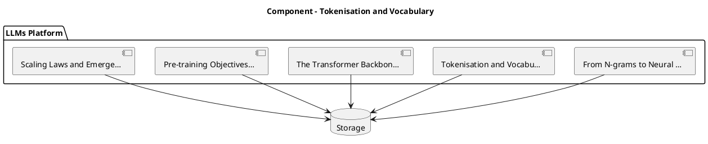

_Source diagram (plantuml); render with the appropriate tool._

**Figure 2. Component - Tokenisation and Vocabulary** (plantuml). Figure: Component view for LLMs. This diagram illustrates the principal components and their interactions as discussed in the surrounding section.

## Deep Dive: Mechanics, Variants and Trade-offs

Having established the essentials, we now go deeper into tokenisation and vocabulary. The underlying mechanism is best appreciated by tracing a single request from input to output and noting where state is created and consumed. The distinctions in this section are the ones that separate a working demo from a system that holds up under adversarial inputs, scale and the passage of time.

Consider the principal variants and how to choose between them. Each variant optimises for a different point in the design space - some for latency, some for accuracy, some for cost or operability - and the correct choice follows from explicit requirements rather than from defaults. There is an inherent trade-off between fidelity and cost, and the correct balance depends on the use case and its tolerance for error.

In practice this is supported by a mature tooling ecosystem, including vLLM, TensorRT-LLM, Hugging Face Transformers, Ollama. Tools accelerate the work but do not substitute for understanding: the same principles apply whichever implementation you select, and the ability to reason from first principles is what lets you debug when a tool behaves unexpectedly.

A frequent source of subtle bugs is the interaction with the transformer backbone of llms. Because the transformer backbone of llms concerns decoder-only architectures, attention, positional encodings and layer normalisation choices, changes there can silently alter the behaviour analysed here. The remedy is contract tests at the boundary and end-to-end evaluations that exercise the interaction explicitly.

Finally, attend to edge cases and degradation. Define what the system should do under partial failure, unexpected inputs and load spikes, and make that behaviour explicit and tested rather than emergent. Graceful degradation - returning a safe, useful result when the ideal one is unavailable - is a hallmark of mature engineering.

For deeper study, the literature offers authoritative treatments such as Vaswani et al. — Attention Is All You Need (2017) and Hoffmann et al. — Training Compute-Optimal LLMs (Chinchilla, 2022). These primary sources reward careful reading and ground the practical guidance above in established results.

## Advanced Considerations

Having established the essentials, we now go deeper into tokenisation and vocabulary. The underlying mechanism is best appreciated by tracing a single request from input to output and noting where state is created and consumed. The distinctions in this section are the ones that separate a working demo from a system that holds up under adversarial inputs, scale and the passage of time.

Consider the principal variants and how to choose between them. Each variant optimises for a different point in the design space - some for latency, some for accuracy, some for cost or operability - and the correct choice follows from explicit requirements rather than from defaults. As with most architectural decisions, the choice is rarely binary; the skill lies in quantifying the trade-offs and choosing deliberately.

In practice this is supported by a mature tooling ecosystem, including vLLM, TensorRT-LLM, Hugging Face Transformers, Ollama. Tools accelerate the work but do not substitute for understanding: the same principles apply whichever implementation you select, and the ability to reason from first principles is what lets you debug when a tool behaves unexpectedly.

A frequent source of subtle bugs is the interaction with instruction tuning and alignment. Because instruction tuning and alignment concerns supervised fine-tuning, RLHF and preference optimisation that make base models useful and safe, changes there can silently alter the behaviour analysed here. The remedy is contract tests at the boundary and end-to-end evaluations that exercise the interaction explicitly.

Finally, attend to edge cases and degradation. Define what the system should do under partial failure, unexpected inputs and load spikes, and make that behaviour explicit and tested rather than emergent. Graceful degradation - returning a safe, useful result when the ideal one is unavailable - is a hallmark of mature engineering.

For deeper study, the literature offers authoritative treatments such as Vaswani et al. — Attention Is All You Need (2017) and Hoffmann et al. — Training Compute-Optimal LLMs (Chinchilla, 2022). These primary sources reward careful reading and ground the practical guidance above in established results.

## Worked Example

To ground the discussion, walk through a representative example. A software organisation needs code completion and review across large repositories. They decide to apply tokenisation and vocabulary as part of their LLMs solution, but wisely treat it as a hypothesis to be validated rather than a foregone conclusion.

The team begins by stating the objective precisely and defining how success will be measured before writing any code. They establish a small but representative evaluation set, agree on acceptance thresholds, and only then prototype the simplest design that could work. Early measurement reveals which assumptions hold and which must be revised, saving weeks of misdirected effort and surfacing edge cases while they are still cheap to fix.

As the prototype matures into a service, the team hardens it: adding input validation, error handling, caching where it pays off, and monitoring that ties back to the original success metric. They document each significant decision in an architecture decision record so that future maintainers understand not just what was built but why.

The outcome is instructive. The system that reaches production is not the most sophisticated design the team considered, but the one whose behaviour they could measure, explain and operate. This is the recurring lesson of LLMs: durable value comes from the whole system, not from any single clever component.

## Industry Use Cases

Across industries, the ideas in this chapter recur in recognisable ways. The following vignettes show how different sectors apply them and what they have in common.

**Enterprise Search.** Answering questions over internal knowledge with citations. The common thread is that value comes not from the model alone but from the surrounding system - data quality, evaluation, integration and operations - which is precisely where most of the engineering effort belongs.

**Software.** Code completion and review across large repositories. The common thread is that value comes not from the model alone but from the surrounding system - data quality, evaluation, integration and operations - which is precisely where most of the engineering effort belongs.

**Finance.** Summarising filings and extracting structured facts. The common thread is that value comes not from the model alone but from the surrounding system - data quality, evaluation, integration and operations - which is precisely where most of the engineering effort belongs.

**Telecom.** Tier-1 support automation with escalation to humans. The common thread is that value comes not from the model alone but from the surrounding system - data quality, evaluation, integration and operations - which is precisely where most of the engineering effort belongs.

## Best Practices

The following practices consistently separate successful LLMs efforts from struggling ones. They are deliberately concrete so they can be adopted as checklist items in design and code review.

- Right-size the model to the task; do not pay for capability you don't use.
- Quantise and batch aggressively, validating quality impact with evals.
- Pin model and tokenizer versions; treat upgrades as releases.
- Monitor token distribution to catch prompt bloat and cost regressions.

None of these are exotic; they are the unglamorous disciplines that compound into reliability. The cost of adopting them is small compared with the cost of the incidents they prevent, and they become second nature with practice.

## Common Pitfalls

Equally instructive are the failure modes that recur in practice. Each pitfall below has a clear early warning sign and a known remedy, so treat them as a diagnostic checklist when something feels wrong:

- Assuming bigger is always better instead of measuring task fit.
- Underestimating KV-cache memory for long contexts.
- Silent tokenizer changes that break prompts and cost models.
- Benchmarking on contaminated datasets and over-claiming capability.

The pattern is consistent: most failures stem from skipping measurement, conflating prototype and production standards, or deferring cross-cutting concerns such as security and cost until they become emergencies. Naming these traps in advance is the cheapest way to avoid them.

## Governance, Security and Cost Notes

No discussion of tokenisation and vocabulary is complete without its governance, security and cost dimensions, which are too often deferred until they become emergencies. Treating them as first-class concerns from the outset is both cheaper and safer.

**Governance.** Classify the risk of this capability, document its intended and out-of-scope uses, and ensure decisions are traceable to satisfy internal policy and external regulation such as the NIST AI RMF, ISO/IEC 42001 and the EU AI Act. **Security.** Treat all external input as untrusted, validate outputs before acting on them, apply least privilege to any tools or data access, and map controls to the OWASP LLM Top 10 and MITRE ATLAS.

**Cost and sustainability.** Establish explicit budgets for compute, tokens and latency, attribute spend to owners, and revisit the economics as usage scales - a design that is affordable at pilot scale can become untenable at production volume. Building these reflexes into everyday engineering is what allows a LLMs system to be not only capable but also trustworthy and economically sound.

## Hands-On Exercises

Work through the following exercises. They are designed to move understanding from recognition to application - the level required for real engineering work - so prefer writing and building over merely reading.

1. Explain tokenisation and vocabulary to a colleague unfamiliar with LLMs, using a concrete example from your own domain.
2. Sketch a reference architecture that incorporates tokenisation and vocabulary and annotate where observability, security and cost controls belong.
3. Design an evaluation that would tell you whether tokenisation and vocabulary is working in production, including the metric, the dataset and the acceptance threshold.
4. Identify two pitfalls relevant to tokenisation and vocabulary in your environment and describe the early warning signals you would monitor.
5. Prototype the simplest implementation that demonstrates tokenisation and vocabulary, then list exactly what would need to change to make it production-ready.

## Key Takeaways

Key takeaways from this chapter:

- Tokenisation and Vocabulary is a systems concern in LLMs: data, models and operations must be co-designed.
- Measurement is non-negotiable; define success metrics and evaluation before building.
- Favour the simplest design that meets the requirement, and add complexity only when evidence demands it.
- Security, cost and observability are first-class requirements, not afterthoughts.
- Document decisions so the system remains understandable and operable as it evolves.

## Code Walkthrough

This listing shows a configuration-driven Tokenisation and Vocabulary component with retry semantics and typed interfaces — the shape we expect from production LLMs code rather than a notebook prototype.

The full listing is shown below; study it line by line and reproduce it locally before moving on.

### Listing: Implementing a Tokenisation and Vocabulary component

```python
from __future__ import annotations

from dataclasses import dataclass, field
from typing import Any


@dataclass(slots=True)
class TokenisationAndVocabularyConfig:
    """Configuration for the Tokenisation and Vocabulary component in a LLMs system."""

    name: str
    timeout_s: float = 30.0
    max_retries: int = 3
    options: dict[str, Any] = field(default_factory=dict)


class TokenisationAndVocabulary:
    """A minimal, production-shaped implementation of Tokenisation and Vocabulary."""

    def __init__(self, config: TokenisationAndVocabularyConfig) -> None:
        self._config = config
        self._calls = 0

    def run(self, payload: dict[str, Any]) -> dict[str, Any]:
        """Process a request, retrying transient failures with backoff."""
        last_error: Exception | None = None
        for attempt in range(self._config.max_retries):
            try:
                self._calls += 1
                return self._process(payload)
            except TimeoutError as exc:  # transient
                last_error = exc
                continue
        raise RuntimeError(f"TokenisationAndVocabulary failed after retries") from last_error

    def _process(self, payload: dict[str, Any]) -> dict[str, Any]:
        # Domain-specific logic for Tokenisation and Vocabulary goes here.
        return {"status": "ok", "input_keys": sorted(payload), "calls": self._calls}

```

## Review Questions

1. In the context of LLMs, which statement best describes “Tokenisation and Vocabulary”?
   - A. It removes all security and governance requirements.
   - B. It is only relevant to academic research, not production.
   - C. It makes the system slower but has no other effect.
   - D. Byte-pair encoding, subword units, special tokens and their impact on cost and multilingual performance.
   - **Answer: D.** Tokenisation and Vocabulary: Byte-pair encoding, subword units, special tokens and their impact on cost and multilingual performance.
2. Which of the following is a recommended best practice when working with LLMs?
   - A. Benchmarking on contaminated datasets and over-claiming capability.
   - B. Underestimating KV-cache memory for long contexts.
   - C. It applies exclusively to image data.
   - D. Quantise and batch aggressively, validating quality impact with evals.
   - **Answer: D.** Best practice: Quantise and batch aggressively, validating quality impact with evals.
3. Which of the following is a common pitfall to avoid in LLMs?
   - A. Quantise and batch aggressively, validating quality impact with evals.
   - B. Right-size the model to the task; do not pay for capability you don't use.
   - C. Benchmarking on contaminated datasets and over-claiming capability.
   - D. It removes all security and governance requirements.
   - **Answer: C.** Pitfall to avoid: Benchmarking on contaminated datasets and over-claiming capability.
4. *(Discussion)* How would you test and monitor Tokenisation and Vocabulary in production?
   - **Model answer:** A strong answer defines tokenisation and vocabulary (Byte-pair encoding, subword units, special tokens and their impact on cost and multilingual performance.) then connects it to architecture, evaluation, cost, security and operations for LLMs, citing concrete trade-offs and a real-world example.

---


# Chapter 3. The Transformer Backbone of LLMs

_This chapter examines the transformer backbone of llms within LLMs. It covers decoder-only architectures, attention, positional encodings and layer normalisation choices, derives a reference architecture, walks through a worked example and runnable code, surveys industry use cases, and distils best practices and pitfalls, closing with exercises and review questions._

## Introduction

We define The Transformer Backbone of LLMs as decoder-only architectures, attention, positional encodings and layer normalisation choices. This concept recurs throughout the LLMs lifecycle, from design to operations. What distinguishes a production-grade approach from a prototype is the discipline of measurement: every claim is backed by an evaluation rather than intuition.

This chapter builds intuition first, then formalises the ideas, derives an architecture, and finishes with code, exercises and review questions so the material transfers directly to your own LLMs work. Read it actively: pause at each diagram, reproduce the code, and attempt the exercises before consulting the answers.

## Theory and Foundations

The Transformer Backbone of LLMs refers to decoder-only architectures, attention, positional encodings and layer normalisation choices. The right abstraction here pays compounding dividends, because downstream components depend on its guarantees. The underlying mechanism is best appreciated by tracing a single request from input to output and noting where state is created and consumed.

To place this in context, recall the broader picture: Large language models are transformer-based neural networks trained on vast text corpora to predict the next token, acquiring broad linguistic and reasoning capabilities that transfer across tasks. Within that picture, the transformer backbone of llms is one of the load-bearing ideas - the kind that, when understood deeply, makes the rest of LLMs fall into place. Getting this right early prevents expensive rework once a LLMs system reaches scale.

The Transformer Backbone of LLMs cannot be understood in isolation from cost and capacity planning. Recall that cost and capacity planning concerns token economics, hardware sizing and build-versus-buy decisions. The two interact directly: decisions in one constrain the design space of the other, which is why mature teams reason about them together rather than sequentially. Latency, accuracy and cost form a tension triangle: improving one typically pressures the others, so explicit budgets are essential.

The Transformer Backbone of LLMs cannot be understood in isolation from context windows and long-context techniques. Recall that context windows and long-context techniques concerns position interpolation, attention variants and retrieval to extend effective context. The two interact directly: decisions in one constrain the design space of the other, which is why mature teams reason about them together rather than sequentially. There is an inherent trade-off between fidelity and cost, and the correct balance depends on the use case and its tolerance for error.

Several established patterns apply directly to the transformer backbone of llms. The first, model routing by difficulty (small model first, escalate on low confidence), is widely adopted because it makes the system's behaviour predictable and observable. A complementary pattern, speculative decoding with a small draft model, addresses a related concern and is often deployed alongside it. Patterns are not dogma; they are distilled experience that shortcuts the search for a sound design, and each carries assumptions worth checking against your context.

The decision of whether to adopt this should be driven by requirements, not by novelty. In a small prototype, shortcuts around the transformer backbone of llms are invisible; in a production LLMs system serving real traffic, they surface as incidents, cost overruns or compliance gaps. Latency, accuracy and cost form a tension triangle: improving one typically pressures the others, so explicit budgets are essential. The remainder of this chapter turns these principles into an architecture, code and a checklist you can apply immediately.

## Architecture and Design

From an architectural standpoint, The Transformer Backbone of LLMs sits at the intersection of data, models and operations. An LLM serving platform comprises a request gateway with auth and rate limiting, an inference cluster running an optimised engine (paged KV cache, continuous batching, quantised weights), a routing layer selecting model size by task, and an observability pipeline tracking latency, tokens and quality. Model artefacts flow from a registry with signed provenance into blue/green serving slots.

Concretely, the principal building blocks include from n-grams to neural language models, tokenisation and vocabulary, the transformer backbone of llms, pre-training objectives and data and scaling laws and emergent abilities. Each is a replaceable component behind a stable interface, so the team can upgrade an implementation - a model, an index, a policy engine - without rewriting its neighbours. The contracts between components are where reliability is won or lost, so they are specified explicitly and tested in isolation.

The diagram accompanying this section makes the data and control flow explicit. Requests enter through a well-defined boundary where they are authenticated and validated; only then are they dispatched to the components that perform the work. This boundary is also where rate limiting, quota enforcement and audit logging live, keeping cross-cutting concerns out of the core logic and in one auditable place.

Two qualities deserve emphasis. First, observability is designed in, not bolted on: every component emits structured telemetry so that failures can be localised in minutes rather than hours. Second, the architecture is evolvable - components communicate through stable contracts so that any single part of the LLMs system can be replaced without a rewrite. Latency, accuracy and cost form a tension triangle: improving one typically pressures the others, so explicit budgets are essential.

```xml
<mxfile host="ai-university">
  <diagram name="DevOps Pipeline">
    <mxGraphModel dx="800" dy="600" grid="1" gridSize="10">
      <root>
        <mxCell id="0"/>
        <mxCell id="1" parent="0"/>
        <mxCell id="title" value="DevOps Pipeline - The Transformer Backbone of LLMs" style="text;fontSize=16;fontStyle=1" vertex="1" parent="1"><mxGeometry x="40" y="20" width="600" height="30" as="geometry"/></mxCell>
        <mxCell id="hub" value="LLMs" style="rounded=1;fillColor=#0f172a;fontColor=#ffffff;fontStyle=1" vertex="1" parent="1"><mxGeometry x="300" y="180" width="160" height="60" as="geometry"/></mxCell>
        <mxCell id="n0" value="From N-grams to Neural …" style="rounded=1;fillColor=#e0e7ff;strokeColor=#4338ca" vertex="1" parent="1"><mxGeometry x="60" y="80" width="160" height="50" as="geometry"/></mxCell>
        <mxCell id="e0" style="edgeStyle=orthogonalEdgeStyle" edge="1" parent="1" source="hub" target="n0"><mxGeometry relative="1" as="geometry"/></mxCell>
        <mxCell id="n1" value="Tokenisation and Vocabu…" style="rounded=1;fillColor=#e0e7ff;strokeColor=#4338ca" vertex="1" parent="1"><mxGeometry x="600" y="170" width="160" height="50" as="geometry"/></mxCell>
        <mxCell id="e1" style="edgeStyle=orthogonalEdgeStyle" edge="1" parent="1" source="hub" target="n1"><mxGeometry relative="1" as="geometry"/></mxCell>
        <mxCell id="n2" value="The Transformer Backbon…" style="rounded=1;fillColor=#e0e7ff;strokeColor=#4338ca" vertex="1" parent="1"><mxGeometry x="60" y="260" width="160" height="50" as="geometry"/></mxCell>
        <mxCell id="e2" style="edgeStyle=orthogonalEdgeStyle" edge="1" parent="1" source="hub" target="n2"><mxGeometry relative="1" as="geometry"/></mxCell>
        <mxCell id="n3" value="Pre-training Objectives…" style="rounded=1;fillColor=#e0e7ff;strokeColor=#4338ca" vertex="1" parent="1"><mxGeometry x="600" y="350" width="160" height="50" as="geometry"/></mxCell>
        <mxCell id="e3" style="edgeStyle=orthogonalEdgeStyle" edge="1" parent="1" source="hub" target="n3"><mxGeometry relative="1" as="geometry"/></mxCell>
        <mxCell id="n4" value="Scaling Laws and Emerge…" style="rounded=1;fillColor=#e0e7ff;strokeColor=#4338ca" vertex="1" parent="1"><mxGeometry x="60" y="440" width="160" height="50" as="geometry"/></mxCell>
        <mxCell id="e4" style="edgeStyle=orthogonalEdgeStyle" edge="1" parent="1" source="hub" target="n4"><mxGeometry relative="1" as="geometry"/></mxCell>
      </root>
    </mxGraphModel>
  </diagram>
</mxfile>
```

_Source diagram (drawio); render with the appropriate tool._

**Figure 3. DevOps Pipeline - The Transformer Backbone of LLMs** (drawio). Figure: DevOps Pipeline view for LLMs. This diagram illustrates the principal components and their interactions as discussed in the surrounding section.

## Deep Dive: Mechanics, Variants and Trade-offs

Having established the essentials, we now go deeper into the transformer backbone of llms. Beneath the abstraction lies a concrete process whose steps can each be measured, tested and optimised independently. The distinctions in this section are the ones that separate a working demo from a system that holds up under adversarial inputs, scale and the passage of time.

Consider the principal variants and how to choose between them. Each variant optimises for a different point in the design space - some for latency, some for accuracy, some for cost or operability - and the correct choice follows from explicit requirements rather than from defaults. Simplicity is a feature. The simplest design that meets the requirement should be the default, with complexity added only when measurement justifies it.

In practice this is supported by a mature tooling ecosystem, including vLLM, TensorRT-LLM, Hugging Face Transformers, Ollama. Tools accelerate the work but do not substitute for understanding: the same principles apply whichever implementation you select, and the ability to reason from first principles is what lets you debug when a tool behaves unexpectedly.

A frequent source of subtle bugs is the interaction with cost and capacity planning. Because cost and capacity planning concerns token economics, hardware sizing and build-versus-buy decisions, changes there can silently alter the behaviour analysed here. The remedy is contract tests at the boundary and end-to-end evaluations that exercise the interaction explicitly.

Finally, attend to edge cases and degradation. Define what the system should do under partial failure, unexpected inputs and load spikes, and make that behaviour explicit and tested rather than emergent. Graceful degradation - returning a safe, useful result when the ideal one is unavailable - is a hallmark of mature engineering.

For deeper study, the literature offers authoritative treatments such as Vaswani et al. — Attention Is All You Need (2017) and Hoffmann et al. — Training Compute-Optimal LLMs (Chinchilla, 2022). These primary sources reward careful reading and ground the practical guidance above in established results.

## Advanced Considerations

Having established the essentials, we now go deeper into the transformer backbone of llms. It pays to understand the mechanism rather than treat it as a black box, because most production incidents are explained by one of its steps misbehaving. The distinctions in this section are the ones that separate a working demo from a system that holds up under adversarial inputs, scale and the passage of time.

Consider the principal variants and how to choose between them. Each variant optimises for a different point in the design space - some for latency, some for accuracy, some for cost or operability - and the correct choice follows from explicit requirements rather than from defaults. As with most architectural decisions, the choice is rarely binary; the skill lies in quantifying the trade-offs and choosing deliberately.

In practice this is supported by a mature tooling ecosystem, including vLLM, TensorRT-LLM, Hugging Face Transformers, Ollama. Tools accelerate the work but do not substitute for understanding: the same principles apply whichever implementation you select, and the ability to reason from first principles is what lets you debug when a tool behaves unexpectedly.

A frequent source of subtle bugs is the interaction with the llm platform reference architecture. Because the llm platform reference architecture concerns gateways, registries, evaluation and observability for fleets of models, changes there can silently alter the behaviour analysed here. The remedy is contract tests at the boundary and end-to-end evaluations that exercise the interaction explicitly.

Finally, attend to edge cases and degradation. Define what the system should do under partial failure, unexpected inputs and load spikes, and make that behaviour explicit and tested rather than emergent. Graceful degradation - returning a safe, useful result when the ideal one is unavailable - is a hallmark of mature engineering.

For deeper study, the literature offers authoritative treatments such as Vaswani et al. — Attention Is All You Need (2017) and Hoffmann et al. — Training Compute-Optimal LLMs (Chinchilla, 2022). These primary sources reward careful reading and ground the practical guidance above in established results.

## Worked Example

To ground the discussion, walk through a representative example. A telecom organisation needs tier-1 support automation with escalation to humans. They decide to apply the transformer backbone of llms as part of their LLMs solution, but wisely treat it as a hypothesis to be validated rather than a foregone conclusion.

The team begins by stating the objective precisely and defining how success will be measured before writing any code. They establish a small but representative evaluation set, agree on acceptance thresholds, and only then prototype the simplest design that could work. Early measurement reveals which assumptions hold and which must be revised, saving weeks of misdirected effort and surfacing edge cases while they are still cheap to fix.

As the prototype matures into a service, the team hardens it: adding input validation, error handling, caching where it pays off, and monitoring that ties back to the original success metric. They document each significant decision in an architecture decision record so that future maintainers understand not just what was built but why.

The outcome is instructive. The system that reaches production is not the most sophisticated design the team considered, but the one whose behaviour they could measure, explain and operate. This is the recurring lesson of LLMs: durable value comes from the whole system, not from any single clever component.

## Industry Use Cases

Across industries, the ideas in this chapter recur in recognisable ways. The following vignettes show how different sectors apply them and what they have in common.

**Enterprise Search.** Answering questions over internal knowledge with citations. The common thread is that value comes not from the model alone but from the surrounding system - data quality, evaluation, integration and operations - which is precisely where most of the engineering effort belongs.

**Software.** Code completion and review across large repositories. The common thread is that value comes not from the model alone but from the surrounding system - data quality, evaluation, integration and operations - which is precisely where most of the engineering effort belongs.

**Finance.** Summarising filings and extracting structured facts. The common thread is that value comes not from the model alone but from the surrounding system - data quality, evaluation, integration and operations - which is precisely where most of the engineering effort belongs.

**Telecom.** Tier-1 support automation with escalation to humans. The common thread is that value comes not from the model alone but from the surrounding system - data quality, evaluation, integration and operations - which is precisely where most of the engineering effort belongs.

## Best Practices

The following practices consistently separate successful LLMs efforts from struggling ones. They are deliberately concrete so they can be adopted as checklist items in design and code review.

- Right-size the model to the task; do not pay for capability you don't use.
- Quantise and batch aggressively, validating quality impact with evals.
- Pin model and tokenizer versions; treat upgrades as releases.
- Monitor token distribution to catch prompt bloat and cost regressions.

None of these are exotic; they are the unglamorous disciplines that compound into reliability. The cost of adopting them is small compared with the cost of the incidents they prevent, and they become second nature with practice.

## Common Pitfalls

Equally instructive are the failure modes that recur in practice. Each pitfall below has a clear early warning sign and a known remedy, so treat them as a diagnostic checklist when something feels wrong:

- Assuming bigger is always better instead of measuring task fit.
- Underestimating KV-cache memory for long contexts.
- Silent tokenizer changes that break prompts and cost models.
- Benchmarking on contaminated datasets and over-claiming capability.

The pattern is consistent: most failures stem from skipping measurement, conflating prototype and production standards, or deferring cross-cutting concerns such as security and cost until they become emergencies. Naming these traps in advance is the cheapest way to avoid them.

## Governance, Security and Cost Notes

No discussion of the transformer backbone of llms is complete without its governance, security and cost dimensions, which are too often deferred until they become emergencies. Treating them as first-class concerns from the outset is both cheaper and safer.

**Governance.** Classify the risk of this capability, document its intended and out-of-scope uses, and ensure decisions are traceable to satisfy internal policy and external regulation such as the NIST AI RMF, ISO/IEC 42001 and the EU AI Act. **Security.** Treat all external input as untrusted, validate outputs before acting on them, apply least privilege to any tools or data access, and map controls to the OWASP LLM Top 10 and MITRE ATLAS.

**Cost and sustainability.** Establish explicit budgets for compute, tokens and latency, attribute spend to owners, and revisit the economics as usage scales - a design that is affordable at pilot scale can become untenable at production volume. Building these reflexes into everyday engineering is what allows a LLMs system to be not only capable but also trustworthy and economically sound.

## Hands-On Exercises

Work through the following exercises. They are designed to move understanding from recognition to application - the level required for real engineering work - so prefer writing and building over merely reading.

1. Explain the transformer backbone of llms to a colleague unfamiliar with LLMs, using a concrete example from your own domain.
2. Sketch a reference architecture that incorporates the transformer backbone of llms and annotate where observability, security and cost controls belong.
3. Design an evaluation that would tell you whether the transformer backbone of llms is working in production, including the metric, the dataset and the acceptance threshold.
4. Identify two pitfalls relevant to the transformer backbone of llms in your environment and describe the early warning signals you would monitor.
5. Prototype the simplest implementation that demonstrates the transformer backbone of llms, then list exactly what would need to change to make it production-ready.

## Key Takeaways

Key takeaways from this chapter:

- The Transformer Backbone of LLMs is a systems concern in LLMs: data, models and operations must be co-designed.
- Measurement is non-negotiable; define success metrics and evaluation before building.
- Favour the simplest design that meets the requirement, and add complexity only when evidence demands it.
- Security, cost and observability are first-class requirements, not afterthoughts.
- Document decisions so the system remains understandable and operable as it evolves.

## Code Walkthrough

This listing shows a configuration-driven The Transformer Backbone of LLMs component with retry semantics and typed interfaces — the shape we expect from production LLMs code rather than a notebook prototype.

The full listing is shown below; study it line by line and reproduce it locally before moving on.

### Listing: Implementing a The Transformer Backbone of LLMs component

```python
from __future__ import annotations

from dataclasses import dataclass, field
from typing import Any


@dataclass(slots=True)
class TheTransformerBackboneConfig:
    """Configuration for the The Transformer Backbone of LLMs component in a LLMs system."""

    name: str
    timeout_s: float = 30.0
    max_retries: int = 3
    options: dict[str, Any] = field(default_factory=dict)


class TheTransformerBackbone:
    """A minimal, production-shaped implementation of The Transformer Backbone of LLMs."""

    def __init__(self, config: TheTransformerBackboneConfig) -> None:
        self._config = config
        self._calls = 0

    def run(self, payload: dict[str, Any]) -> dict[str, Any]:
        """Process a request, retrying transient failures with backoff."""
        last_error: Exception | None = None
        for attempt in range(self._config.max_retries):
            try:
                self._calls += 1
                return self._process(payload)
            except TimeoutError as exc:  # transient
                last_error = exc
                continue
        raise RuntimeError(f"TheTransformerBackbone failed after retries") from last_error

    def _process(self, payload: dict[str, Any]) -> dict[str, Any]:
        # Domain-specific logic for The Transformer Backbone of LLMs goes here.
        return {"status": "ok", "input_keys": sorted(payload), "calls": self._calls}

```

## Review Questions

1. In the context of LLMs, which statement best describes “The Transformer Backbone of LLMs”?
   - A. Decoder-only architectures, attention, positional encodings and layer normalisation choices.
   - B. It applies exclusively to image data.
   - C. It guarantees deterministic output regardless of input.
   - D. It is only relevant to academic research, not production.
   - **Answer: A.** The Transformer Backbone of LLMs: Decoder-only architectures, attention, positional encodings and layer normalisation choices.
2. Which of the following is a recommended best practice when working with LLMs?
   - A. It is only relevant to academic research, not production.
   - B. Monitor token distribution to catch prompt bloat and cost regressions.
   - C. Benchmarking on contaminated datasets and over-claiming capability.
   - D. Silent tokenizer changes that break prompts and cost models.
   - **Answer: B.** Best practice: Monitor token distribution to catch prompt bloat and cost regressions.
3. Which of the following is a common pitfall to avoid in LLMs?
   - A. It guarantees deterministic output regardless of input.
   - B. It applies exclusively to image data.
   - C. Pin model and tokenizer versions; treat upgrades as releases.
   - D. Benchmarking on contaminated datasets and over-claiming capability.
   - **Answer: D.** Pitfall to avoid: Benchmarking on contaminated datasets and over-claiming capability.
4. *(Discussion)* What trade-offs would you weigh when implementing The Transformer Backbone of LLMs?
   - **Model answer:** A strong answer defines the transformer backbone of llms (Decoder-only architectures, attention, positional encodings and layer normalisation choices.) then connects it to architecture, evaluation, cost, security and operations for LLMs, citing concrete trade-offs and a real-world example.

---


# Chapter 4. Pre-training Objectives and Data

_This chapter examines pre-training objectives and data within LLMs. It covers causal language modelling, corpus curation, deduplication and data quality at trillion-token scale, derives a reference architecture, walks through a worked example and runnable code, surveys industry use cases, and distils best practices and pitfalls, closing with exercises and review questions._

## Introduction

Pre-training Objectives and Data refers to causal language modelling, corpus curation, deduplication and data quality at trillion-token scale. It is foundational: later capabilities in LLMs are built directly on top of it. It helps to separate the conceptual model from its implementation: the former guides reasoning, the latter must contend with real-world constraints.

This chapter builds intuition first, then formalises the ideas, derives an architecture, and finishes with code, exercises and review questions so the material transfers directly to your own LLMs work. Read it actively: pause at each diagram, reproduce the code, and attempt the exercises before consulting the answers.

## Theory and Foundations

Pre-training Objectives and Data can be characterised as causal language modelling, corpus curation, deduplication and data quality at trillion-token scale. The right abstraction here pays compounding dividends, because downstream components depend on its guarantees. It pays to understand the mechanism rather than treat it as a black box, because most production incidents are explained by one of its steps misbehaving.

To place this in context, recall the broader picture: Large language models are transformer-based neural networks trained on vast text corpora to predict the next token, acquiring broad linguistic and reasoning capabilities that transfer across tasks. Within that picture, pre-training objectives and data is one of the load-bearing ideas - the kind that, when understood deeply, makes the rest of LLMs fall into place. This concept recurs throughout the LLMs lifecycle, from design to operations.

Pre-training Objectives and Data cannot be understood in isolation from the transformer backbone of llms. Recall that the transformer backbone of llms concerns decoder-only architectures, attention, positional encodings and layer normalisation choices. The two interact directly: decisions in one constrain the design space of the other, which is why mature teams reason about them together rather than sequentially. As with most architectural decisions, the choice is rarely binary; the skill lies in quantifying the trade-offs and choosing deliberately.

Pre-training Objectives and Data cannot be understood in isolation from context windows and long-context techniques. Recall that context windows and long-context techniques concerns position interpolation, attention variants and retrieval to extend effective context. The two interact directly: decisions in one constrain the design space of the other, which is why mature teams reason about them together rather than sequentially. Simplicity is a feature. The simplest design that meets the requirement should be the default, with complexity added only when measurement justifies it.

Several established patterns apply directly to pre-training objectives and data. The first, model routing by difficulty (small model first, escalate on low confidence), is widely adopted because it makes the system's behaviour predictable and observable. A complementary pattern, speculative decoding with a small draft model, addresses a related concern and is often deployed alongside it. Patterns are not dogma; they are distilled experience that shortcuts the search for a sound design, and each carries assumptions worth checking against your context.

Knowing when not to use a technique is as valuable as knowing how to use it. In a small prototype, shortcuts around pre-training objectives and data are invisible; in a production LLMs system serving real traffic, they surface as incidents, cost overruns or compliance gaps. There is an inherent trade-off between fidelity and cost, and the correct balance depends on the use case and its tolerance for error. The remainder of this chapter turns these principles into an architecture, code and a checklist you can apply immediately.

## Architecture and Design

The reference architecture for Pre-training Objectives and Data separates concerns into clearly bounded components with explicit contracts. An LLM serving platform comprises a request gateway with auth and rate limiting, an inference cluster running an optimised engine (paged KV cache, continuous batching, quantised weights), a routing layer selecting model size by task, and an observability pipeline tracking latency, tokens and quality. Model artefacts flow from a registry with signed provenance into blue/green serving slots.

Concretely, the principal building blocks include from n-grams to neural language models, tokenisation and vocabulary, the transformer backbone of llms, pre-training objectives and data and scaling laws and emergent abilities. Each is a replaceable component behind a stable interface, so the team can upgrade an implementation - a model, an index, a policy engine - without rewriting its neighbours. The contracts between components are where reliability is won or lost, so they are specified explicitly and tested in isolation.

The diagram accompanying this section makes the data and control flow explicit. Requests enter through a well-defined boundary where they are authenticated and validated; only then are they dispatched to the components that perform the work. This boundary is also where rate limiting, quota enforcement and audit logging live, keeping cross-cutting concerns out of the core logic and in one auditable place.

Two qualities deserve emphasis. First, observability is designed in, not bolted on: every component emits structured telemetry so that failures can be localised in minutes rather than hours. Second, the architecture is evolvable - components communicate through stable contracts so that any single part of the LLMs system can be replaced without a rewrite. Latency, accuracy and cost form a tension triangle: improving one typically pressures the others, so explicit budgets are essential.

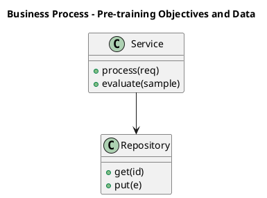

_Source diagram (plantuml); render with the appropriate tool._

**Figure 4. Business Process - Pre-training Objectives and Data** (plantuml). Figure: Business Process view for LLMs. This diagram illustrates the principal components and their interactions as discussed in the surrounding section.

## Deep Dive: Mechanics, Variants and Trade-offs

Having established the essentials, we now go deeper into pre-training objectives and data. It pays to understand the mechanism rather than treat it as a black box, because most production incidents are explained by one of its steps misbehaving. The distinctions in this section are the ones that separate a working demo from a system that holds up under adversarial inputs, scale and the passage of time.

Consider the principal variants and how to choose between them. Each variant optimises for a different point in the design space - some for latency, some for accuracy, some for cost or operability - and the correct choice follows from explicit requirements rather than from defaults. There is an inherent trade-off between fidelity and cost, and the correct balance depends on the use case and its tolerance for error.

In practice this is supported by a mature tooling ecosystem, including vLLM, TensorRT-LLM, Hugging Face Transformers, Ollama. Tools accelerate the work but do not substitute for understanding: the same principles apply whichever implementation you select, and the ability to reason from first principles is what lets you debug when a tool behaves unexpectedly.

A frequent source of subtle bugs is the interaction with the transformer backbone of llms. Because the transformer backbone of llms concerns decoder-only architectures, attention, positional encodings and layer normalisation choices, changes there can silently alter the behaviour analysed here. The remedy is contract tests at the boundary and end-to-end evaluations that exercise the interaction explicitly.

Finally, attend to edge cases and degradation. Define what the system should do under partial failure, unexpected inputs and load spikes, and make that behaviour explicit and tested rather than emergent. Graceful degradation - returning a safe, useful result when the ideal one is unavailable - is a hallmark of mature engineering.

For deeper study, the literature offers authoritative treatments such as Vaswani et al. — Attention Is All You Need (2017) and Hoffmann et al. — Training Compute-Optimal LLMs (Chinchilla, 2022). These primary sources reward careful reading and ground the practical guidance above in established results.

## Advanced Considerations

Having established the essentials, we now go deeper into pre-training objectives and data. Beneath the abstraction lies a concrete process whose steps can each be measured, tested and optimised independently. The distinctions in this section are the ones that separate a working demo from a system that holds up under adversarial inputs, scale and the passage of time.

Consider the principal variants and how to choose between them. Each variant optimises for a different point in the design space - some for latency, some for accuracy, some for cost or operability - and the correct choice follows from explicit requirements rather than from defaults. Simplicity is a feature. The simplest design that meets the requirement should be the default, with complexity added only when measurement justifies it.

In practice this is supported by a mature tooling ecosystem, including vLLM, TensorRT-LLM, Hugging Face Transformers, Ollama. Tools accelerate the work but do not substitute for understanding: the same principles apply whichever implementation you select, and the ability to reason from first principles is what lets you debug when a tool behaves unexpectedly.

A frequent source of subtle bugs is the interaction with safety and alignment in production. Because safety and alignment in production concerns layered safety, refusal behaviour and policy enforcement, changes there can silently alter the behaviour analysed here. The remedy is contract tests at the boundary and end-to-end evaluations that exercise the interaction explicitly.

Finally, attend to edge cases and degradation. Define what the system should do under partial failure, unexpected inputs and load spikes, and make that behaviour explicit and tested rather than emergent. Graceful degradation - returning a safe, useful result when the ideal one is unavailable - is a hallmark of mature engineering.

For deeper study, the literature offers authoritative treatments such as Vaswani et al. — Attention Is All You Need (2017) and Hoffmann et al. — Training Compute-Optimal LLMs (Chinchilla, 2022). These primary sources reward careful reading and ground the practical guidance above in established results.

## Worked Example

To ground the discussion, walk through a representative example. A finance organisation needs summarising filings and extracting structured facts. They decide to apply pre-training objectives and data as part of their LLMs solution, but wisely treat it as a hypothesis to be validated rather than a foregone conclusion.

The team begins by stating the objective precisely and defining how success will be measured before writing any code. They establish a small but representative evaluation set, agree on acceptance thresholds, and only then prototype the simplest design that could work. Early measurement reveals which assumptions hold and which must be revised, saving weeks of misdirected effort and surfacing edge cases while they are still cheap to fix.

As the prototype matures into a service, the team hardens it: adding input validation, error handling, caching where it pays off, and monitoring that ties back to the original success metric. They document each significant decision in an architecture decision record so that future maintainers understand not just what was built but why.

The outcome is instructive. The system that reaches production is not the most sophisticated design the team considered, but the one whose behaviour they could measure, explain and operate. This is the recurring lesson of LLMs: durable value comes from the whole system, not from any single clever component.

## Industry Use Cases

Across industries, the ideas in this chapter recur in recognisable ways. The following vignettes show how different sectors apply them and what they have in common.

**Enterprise Search.** Answering questions over internal knowledge with citations. The common thread is that value comes not from the model alone but from the surrounding system - data quality, evaluation, integration and operations - which is precisely where most of the engineering effort belongs.

**Software.** Code completion and review across large repositories. The common thread is that value comes not from the model alone but from the surrounding system - data quality, evaluation, integration and operations - which is precisely where most of the engineering effort belongs.

**Finance.** Summarising filings and extracting structured facts. The common thread is that value comes not from the model alone but from the surrounding system - data quality, evaluation, integration and operations - which is precisely where most of the engineering effort belongs.

**Telecom.** Tier-1 support automation with escalation to humans. The common thread is that value comes not from the model alone but from the surrounding system - data quality, evaluation, integration and operations - which is precisely where most of the engineering effort belongs.

## Best Practices

The following practices consistently separate successful LLMs efforts from struggling ones. They are deliberately concrete so they can be adopted as checklist items in design and code review.

- Right-size the model to the task; do not pay for capability you don't use.
- Quantise and batch aggressively, validating quality impact with evals.
- Pin model and tokenizer versions; treat upgrades as releases.
- Monitor token distribution to catch prompt bloat and cost regressions.

None of these are exotic; they are the unglamorous disciplines that compound into reliability. The cost of adopting them is small compared with the cost of the incidents they prevent, and they become second nature with practice.

## Common Pitfalls

Equally instructive are the failure modes that recur in practice. Each pitfall below has a clear early warning sign and a known remedy, so treat them as a diagnostic checklist when something feels wrong:

- Assuming bigger is always better instead of measuring task fit.
- Underestimating KV-cache memory for long contexts.
- Silent tokenizer changes that break prompts and cost models.
- Benchmarking on contaminated datasets and over-claiming capability.

The pattern is consistent: most failures stem from skipping measurement, conflating prototype and production standards, or deferring cross-cutting concerns such as security and cost until they become emergencies. Naming these traps in advance is the cheapest way to avoid them.

## Governance, Security and Cost Notes

No discussion of pre-training objectives and data is complete without its governance, security and cost dimensions, which are too often deferred until they become emergencies. Treating them as first-class concerns from the outset is both cheaper and safer.

**Governance.** Classify the risk of this capability, document its intended and out-of-scope uses, and ensure decisions are traceable to satisfy internal policy and external regulation such as the NIST AI RMF, ISO/IEC 42001 and the EU AI Act. **Security.** Treat all external input as untrusted, validate outputs before acting on them, apply least privilege to any tools or data access, and map controls to the OWASP LLM Top 10 and MITRE ATLAS.

**Cost and sustainability.** Establish explicit budgets for compute, tokens and latency, attribute spend to owners, and revisit the economics as usage scales - a design that is affordable at pilot scale can become untenable at production volume. Building these reflexes into everyday engineering is what allows a LLMs system to be not only capable but also trustworthy and economically sound.

## Hands-On Exercises

Work through the following exercises. They are designed to move understanding from recognition to application - the level required for real engineering work - so prefer writing and building over merely reading.

1. Explain pre-training objectives and data to a colleague unfamiliar with LLMs, using a concrete example from your own domain.
2. Sketch a reference architecture that incorporates pre-training objectives and data and annotate where observability, security and cost controls belong.
3. Design an evaluation that would tell you whether pre-training objectives and data is working in production, including the metric, the dataset and the acceptance threshold.
4. Identify two pitfalls relevant to pre-training objectives and data in your environment and describe the early warning signals you would monitor.
5. Prototype the simplest implementation that demonstrates pre-training objectives and data, then list exactly what would need to change to make it production-ready.

## Key Takeaways

Key takeaways from this chapter:

- Pre-training Objectives and Data is a systems concern in LLMs: data, models and operations must be co-designed.
- Measurement is non-negotiable; define success metrics and evaluation before building.
- Favour the simplest design that meets the requirement, and add complexity only when evidence demands it.
- Security, cost and observability are first-class requirements, not afterthoughts.
- Document decisions so the system remains understandable and operable as it evolves.

## Code Walkthrough

Every change to a LLMs system should pass an evaluation gate. This example shows the minimal shape: align predictions and references, compute a metric, and return a pass/fail decision for CI.

The full listing is shown below; study it line by line and reproduce it locally before moving on.

### Listing: Evaluating Pre-training Objectives and Data with a regression gate

```python
from dataclasses import dataclass


@dataclass
class EvalResult:
    metric: str
    score: float
    passed: bool


def evaluate(predictions: list[str], references: list[str],
             threshold: float = 0.8) -> EvalResult:
    """Score Pre-training Objectives and Data output against references with a simple exact-match metric.

    In practice you would combine several metrics (exact match, semantic
    similarity, LLM-as-judge) and gate releases on the aggregate.
    """
    if len(predictions) != len(references):
        raise ValueError("predictions and references must align")
    hits = sum(p.strip() == r.strip() for p, r in zip(predictions, references))
    score = hits / len(references) if references else 0.0
    return EvalResult(metric="exact_match", score=score, passed=score >= threshold)


if __name__ == "__main__":
    result = evaluate(["yes", "no"], ["yes", "yes"])
    print(f"{result.metric}={result.score:.2f} passed={result.passed}")

```

## Review Questions

1. In the context of LLMs, which statement best describes “Pre-training Objectives and Data”?
   - A. It guarantees deterministic output regardless of input.
   - B. It eliminates the need for any evaluation or monitoring.
   - C. It removes all security and governance requirements.
   - D. Causal language modelling, corpus curation, deduplication and data quality at trillion-token scale.
   - **Answer: D.** Pre-training Objectives and Data: Causal language modelling, corpus curation, deduplication and data quality at trillion-token scale.
2. Which of the following is a recommended best practice when working with LLMs?
   - A. It is only relevant to academic research, not production.
   - B. Pin model and tokenizer versions; treat upgrades as releases.
   - C. It guarantees deterministic output regardless of input.
   - D. Benchmarking on contaminated datasets and over-claiming capability.
   - **Answer: B.** Best practice: Pin model and tokenizer versions; treat upgrades as releases.
3. Which of the following is a common pitfall to avoid in LLMs?
   - A. It is only relevant to academic research, not production.
   - B. Quantise and batch aggressively, validating quality impact with evals.
   - C. It guarantees deterministic output regardless of input.
   - D. Silent tokenizer changes that break prompts and cost models.
   - **Answer: D.** Pitfall to avoid: Silent tokenizer changes that break prompts and cost models.
4. *(Discussion)* Describe a failure mode of Pre-training Objectives and Data and how you would mitigate it.
   - **Model answer:** A strong answer defines pre-training objectives and data (Causal language modelling, corpus curation, deduplication and data quality at trillion-token scale.) then connects it to architecture, evaluation, cost, security and operations for LLMs, citing concrete trade-offs and a real-world example.

---


# Chapter 5. Scaling Laws and Emergent Abilities

_This chapter examines scaling laws and emergent abilities within LLMs. It covers compute-optimal training, the Chinchilla insight and capability phase transitions, derives a reference architecture, walks through a worked example and runnable code, surveys industry use cases, and distils best practices and pitfalls, closing with exercises and review questions._

## Introduction

Scaling Laws and Emergent Abilities can be characterised as compute-optimal training, the Chinchilla insight and capability phase transitions. Getting this right early prevents expensive rework once a LLMs system reaches scale. What distinguishes a production-grade approach from a prototype is the discipline of measurement: every claim is backed by an evaluation rather than intuition.

This chapter builds intuition first, then formalises the ideas, derives an architecture, and finishes with code, exercises and review questions so the material transfers directly to your own LLMs work. Read it actively: pause at each diagram, reproduce the code, and attempt the exercises before consulting the answers.

## Theory and Foundations

At its core, Scaling Laws and Emergent Abilities concerns compute-optimal training, the Chinchilla insight and capability phase transitions. Seasoned practitioners treat this as a systems problem, co-designing data, models and operations rather than optimising any one in isolation. It pays to understand the mechanism rather than treat it as a black box, because most production incidents are explained by one of its steps misbehaving.

To place this in context, recall the broader picture: Large language models are transformer-based neural networks trained on vast text corpora to predict the next token, acquiring broad linguistic and reasoning capabilities that transfer across tasks. Within that picture, scaling laws and emergent abilities is one of the load-bearing ideas - the kind that, when understood deeply, makes the rest of LLMs fall into place. This concept recurs throughout the LLMs lifecycle, from design to operations.

Scaling Laws and Emergent Abilities cannot be understood in isolation from hallucination and factuality. Recall that hallucination and factuality concerns why models confabulate and how grounding and decoding mitigate it. The two interact directly: decisions in one constrain the design space of the other, which is why mature teams reason about them together rather than sequentially. Latency, accuracy and cost form a tension triangle: improving one typically pressures the others, so explicit budgets are essential.

Scaling Laws and Emergent Abilities cannot be understood in isolation from pre-training objectives and data. Recall that pre-training objectives and data concerns causal language modelling, corpus curation, deduplication and data quality at trillion-token scale. The two interact directly: decisions in one constrain the design space of the other, which is why mature teams reason about them together rather than sequentially. Latency, accuracy and cost form a tension triangle: improving one typically pressures the others, so explicit budgets are essential.

Several established patterns apply directly to scaling laws and emergent abilities. The first, speculative decoding with a small draft model, is widely adopted because it makes the system's behaviour predictable and observable. A complementary pattern, model routing by difficulty (small model first, escalate on low confidence), addresses a related concern and is often deployed alongside it. Patterns are not dogma; they are distilled experience that shortcuts the search for a sound design, and each carries assumptions worth checking against your context.

It is worth being explicit about when to apply this and when to reach for something simpler. In a small prototype, shortcuts around scaling laws and emergent abilities are invisible; in a production LLMs system serving real traffic, they surface as incidents, cost overruns or compliance gaps. As with most architectural decisions, the choice is rarely binary; the skill lies in quantifying the trade-offs and choosing deliberately. The remainder of this chapter turns these principles into an architecture, code and a checklist you can apply immediately.

## Architecture and Design

A robust architecture for Scaling Laws and Emergent Abilities is layered so each part can evolve independently without destabilising the whole. An LLM serving platform comprises a request gateway with auth and rate limiting, an inference cluster running an optimised engine (paged KV cache, continuous batching, quantised weights), a routing layer selecting model size by task, and an observability pipeline tracking latency, tokens and quality. Model artefacts flow from a registry with signed provenance into blue/green serving slots.

Concretely, the principal building blocks include from n-grams to neural language models, tokenisation and vocabulary, the transformer backbone of llms, pre-training objectives and data and scaling laws and emergent abilities. Each is a replaceable component behind a stable interface, so the team can upgrade an implementation - a model, an index, a policy engine - without rewriting its neighbours. The contracts between components are where reliability is won or lost, so they are specified explicitly and tested in isolation.

The diagram accompanying this section makes the data and control flow explicit. Requests enter through a well-defined boundary where they are authenticated and validated; only then are they dispatched to the components that perform the work. This boundary is also where rate limiting, quota enforcement and audit logging live, keeping cross-cutting concerns out of the core logic and in one auditable place.

Two qualities deserve emphasis. First, observability is designed in, not bolted on: every component emits structured telemetry so that failures can be localised in minutes rather than hours. Second, the architecture is evolvable - components communicate through stable contracts so that any single part of the LLMs system can be replaced without a rewrite. There is an inherent trade-off between fidelity and cost, and the correct balance depends on the use case and its tolerance for error.

<div class="diagram-svg">

<svg xmlns="http://www.w3.org/2000/svg" width="840" height="460" data-tpl="layered" data-pal="10-2" viewBox="0 0 840 460" font-family="Inter, Segoe UI, Arial, sans-serif"><defs><marker id="ar" markerWidth="9" markerHeight="9" refX="7" refY="3" orient="auto"><path d="M0,0 L7,3 L0,6 z" fill="#94a3b8"/></marker><marker id="arw" markerWidth="9" markerHeight="9" refX="7" refY="3" orient="auto"><path d="M0,0 L7,3 L0,6 z" fill="#ffffff"/></marker><filter id="sh" x="-20%" y="-20%" width="140%" height="140%"><feDropShadow dx="0" dy="2" stdDeviation="3" flood-color="#0f172a" flood-opacity="0.16"/></filter></defs><defs><linearGradient id="bnaebeb5b" x1="0" y1="0" x2="1" y2="0"><stop offset="0" stop-color="#15803d"/><stop offset="1" stop-color="#16a34a"/></linearGradient></defs><rect width="840" height="460" rx="14" fill="#ffffff"/><rect x="0" y="0" width="840" height="48" rx="14" fill="url(#bnaebeb5b)"/><rect x="0" y="32" width="840" height="16" fill="url(#bnaebeb5b)"/><text x="420" y="25" text-anchor="middle" font-size="14.5" font-weight="700" fill="#ffffff" dominant-baseline="middle">Operating Model - Scaling Laws and Emergent Abilities</text><rect x="28" y="64" width="784" height="104" rx="14" fill="#f8fafc" stroke="#e2e8f0" stroke-width="1"/><text x="42" y="80" text-anchor="start" font-size="11" font-weight="700" fill="#64748b" dominant-baseline="middle">Experience</text><rect x="42" y="96" width="371" height="52" rx="11" fill="#15803d" filter="url(#sh)"/><text x="228" y="122" text-anchor="middle" font-size="11" font-weight="600" fill="#ffffff" dominant-baseline="middle">Instruction Tuning and Alignment</text><rect x="427" y="96" width="371" height="52" rx="11" fill="#16a34a" filter="url(#sh)"/><text x="612" y="122" text-anchor="middle" font-size="11" font-weight="600" fill="#ffffff" dominant-baseline="middle">Context Windows and Long-Context Techniques</text><rect x="28" y="186" width="784" height="104" rx="14" fill="#f8fafc" stroke="#e2e8f0" stroke-width="1"/><text x="42" y="202" text-anchor="start" font-size="11" font-weight="700" fill="#64748b" dominant-baseline="middle">Platform</text><rect x="42" y="218" width="178" height="52" rx="11" fill="#16a34a" filter="url(#sh)"/><text x="131" y="244" text-anchor="middle" font-size="11" font-weight="600" fill="#ffffff" dominant-baseline="middle">Serving LLMs at Scale</text><rect x="234" y="218" width="178" height="52" rx="11" fill="#22c55e" filter="url(#sh)"/><text x="324" y="244" text-anchor="middle" font-size="11" font-weight="600" fill="#ffffff" dominant-baseline="middle">Evaluation and Benchmarking</text><rect x="427" y="218" width="178" height="52" rx="11" fill="#4ade80" filter="url(#sh)"/><text x="516" y="244" text-anchor="middle" font-size="11" font-weight="600" fill="#ffffff" dominant-baseline="middle">Hallucination and Factuality</text><rect x="620" y="218" width="178" height="52" rx="11" fill="#14532d" filter="url(#sh)"/><text x="709" y="244" text-anchor="middle" font-size="11" font-weight="600" fill="#ffffff" dominant-baseline="middle">Cost and Capacity Planning</text><rect x="28" y="308" width="784" height="104" rx="14" fill="#f8fafc" stroke="#e2e8f0" stroke-width="1"/><text x="42" y="324" text-anchor="start" font-size="11" font-weight="700" fill="#64748b" dominant-baseline="middle">Data &amp; Operations</text><rect x="42" y="340" width="178" height="52" rx="11" fill="#22c55e" filter="url(#sh)"/><text x="131" y="366" text-anchor="middle" font-size="11" font-weight="600" fill="#ffffff" dominant-baseline="middle">Store</text><rect x="234" y="340" width="178" height="52" rx="11" fill="#4ade80" filter="url(#sh)"/><text x="324" y="366" text-anchor="middle" font-size="11" font-weight="600" fill="#ffffff" dominant-baseline="middle">Index</text><rect x="427" y="340" width="178" height="52" rx="11" fill="#14532d" filter="url(#sh)"/><text x="516" y="366" text-anchor="middle" font-size="11" font-weight="600" fill="#ffffff" dominant-baseline="middle">Observability</text><rect x="620" y="340" width="178" height="52" rx="11" fill="#166534" filter="url(#sh)"/><text x="709" y="366" text-anchor="middle" font-size="11" font-weight="600" fill="#ffffff" dominant-baseline="middle">Security</text><text x="28" y="446" text-anchor="start" font-size="9.5" font-weight="500" fill="#64748b" dominant-baseline="middle">LLMs  •  Operating Model</text></svg>

</div>

**Figure 5. Operating Model - Scaling Laws and Emergent Abilities** (svg). Figure: Operating Model view for LLMs. This diagram illustrates the principal components and their interactions as discussed in the surrounding section.

```xml
<mxfile host="ai-university">
  <diagram name="CI/CD Pipeline">
    <mxGraphModel dx="800" dy="600" grid="1" gridSize="10">
      <root>
        <mxCell id="0"/>
        <mxCell id="1" parent="0"/>
        <mxCell id="title" value="CI/CD Pipeline - Scaling Laws and Emergent Abilities" style="text;fontSize=16;fontStyle=1" vertex="1" parent="1"><mxGeometry x="40" y="20" width="600" height="30" as="geometry"/></mxCell>
        <mxCell id="hub" value="LLMs" style="rounded=1;fillColor=#0f172a;fontColor=#ffffff;fontStyle=1" vertex="1" parent="1"><mxGeometry x="300" y="180" width="160" height="60" as="geometry"/></mxCell>
        <mxCell id="n0" value="From N-grams to Neural …" style="rounded=1;fillColor=#e0e7ff;strokeColor=#4338ca" vertex="1" parent="1"><mxGeometry x="60" y="80" width="160" height="50" as="geometry"/></mxCell>
        <mxCell id="e0" style="edgeStyle=orthogonalEdgeStyle" edge="1" parent="1" source="hub" target="n0"><mxGeometry relative="1" as="geometry"/></mxCell>
        <mxCell id="n1" value="Tokenisation and Vocabu…" style="rounded=1;fillColor=#e0e7ff;strokeColor=#4338ca" vertex="1" parent="1"><mxGeometry x="600" y="170" width="160" height="50" as="geometry"/></mxCell>
        <mxCell id="e1" style="edgeStyle=orthogonalEdgeStyle" edge="1" parent="1" source="hub" target="n1"><mxGeometry relative="1" as="geometry"/></mxCell>
        <mxCell id="n2" value="The Transformer Backbon…" style="rounded=1;fillColor=#e0e7ff;strokeColor=#4338ca" vertex="1" parent="1"><mxGeometry x="60" y="260" width="160" height="50" as="geometry"/></mxCell>
        <mxCell id="e2" style="edgeStyle=orthogonalEdgeStyle" edge="1" parent="1" source="hub" target="n2"><mxGeometry relative="1" as="geometry"/></mxCell>
        <mxCell id="n3" value="Pre-training Objectives…" style="rounded=1;fillColor=#e0e7ff;strokeColor=#4338ca" vertex="1" parent="1"><mxGeometry x="600" y="350" width="160" height="50" as="geometry"/></mxCell>
        <mxCell id="e3" style="edgeStyle=orthogonalEdgeStyle" edge="1" parent="1" source="hub" target="n3"><mxGeometry relative="1" as="geometry"/></mxCell>
        <mxCell id="n4" value="Scaling Laws and Emerge…" style="rounded=1;fillColor=#e0e7ff;strokeColor=#4338ca" vertex="1" parent="1"><mxGeometry x="60" y="440" width="160" height="50" as="geometry"/></mxCell>
        <mxCell id="e4" style="edgeStyle=orthogonalEdgeStyle" edge="1" parent="1" source="hub" target="n4"><mxGeometry relative="1" as="geometry"/></mxCell>
      </root>
    </mxGraphModel>
  </diagram>
</mxfile>
```

_Source diagram (drawio); render with the appropriate tool._

**Figure 6. CI/CD Pipeline - Scaling Laws and Emergent Abilities** (drawio). Figure: CI/CD Pipeline view for LLMs. This diagram illustrates the principal components and their interactions as discussed in the surrounding section.

## Deep Dive: Mechanics, Variants and Trade-offs

Having established the essentials, we now go deeper into scaling laws and emergent abilities. Mechanically, the behaviour emerges from a few interacting parts that are simpler than the whole they produce. The distinctions in this section are the ones that separate a working demo from a system that holds up under adversarial inputs, scale and the passage of time.

Consider the principal variants and how to choose between them. Each variant optimises for a different point in the design space - some for latency, some for accuracy, some for cost or operability - and the correct choice follows from explicit requirements rather than from defaults. As with most architectural decisions, the choice is rarely binary; the skill lies in quantifying the trade-offs and choosing deliberately.

In practice this is supported by a mature tooling ecosystem, including vLLM, TensorRT-LLM, Hugging Face Transformers, Ollama. Tools accelerate the work but do not substitute for understanding: the same principles apply whichever implementation you select, and the ability to reason from first principles is what lets you debug when a tool behaves unexpectedly.

A frequent source of subtle bugs is the interaction with hallucination and factuality. Because hallucination and factuality concerns why models confabulate and how grounding and decoding mitigate it, changes there can silently alter the behaviour analysed here. The remedy is contract tests at the boundary and end-to-end evaluations that exercise the interaction explicitly.

Finally, attend to edge cases and degradation. Define what the system should do under partial failure, unexpected inputs and load spikes, and make that behaviour explicit and tested rather than emergent. Graceful degradation - returning a safe, useful result when the ideal one is unavailable - is a hallmark of mature engineering.

For deeper study, the literature offers authoritative treatments such as Vaswani et al. — Attention Is All You Need (2017) and Hoffmann et al. — Training Compute-Optimal LLMs (Chinchilla, 2022). These primary sources reward careful reading and ground the practical guidance above in established results.

## Advanced Considerations

Having established the essentials, we now go deeper into scaling laws and emergent abilities. The underlying mechanism is best appreciated by tracing a single request from input to output and noting where state is created and consumed. The distinctions in this section are the ones that separate a working demo from a system that holds up under adversarial inputs, scale and the passage of time.

Consider the principal variants and how to choose between them. Each variant optimises for a different point in the design space - some for latency, some for accuracy, some for cost or operability - and the correct choice follows from explicit requirements rather than from defaults. Latency, accuracy and cost form a tension triangle: improving one typically pressures the others, so explicit budgets are essential.

In practice this is supported by a mature tooling ecosystem, including vLLM, TensorRT-LLM, Hugging Face Transformers, Ollama. Tools accelerate the work but do not substitute for understanding: the same principles apply whichever implementation you select, and the ability to reason from first principles is what lets you debug when a tool behaves unexpectedly.

A frequent source of subtle bugs is the interaction with instruction tuning and alignment. Because instruction tuning and alignment concerns supervised fine-tuning, RLHF and preference optimisation that make base models useful and safe, changes there can silently alter the behaviour analysed here. The remedy is contract tests at the boundary and end-to-end evaluations that exercise the interaction explicitly.

Finally, attend to edge cases and degradation. Define what the system should do under partial failure, unexpected inputs and load spikes, and make that behaviour explicit and tested rather than emergent. Graceful degradation - returning a safe, useful result when the ideal one is unavailable - is a hallmark of mature engineering.

For deeper study, the literature offers authoritative treatments such as Vaswani et al. — Attention Is All You Need (2017) and Hoffmann et al. — Training Compute-Optimal LLMs (Chinchilla, 2022). These primary sources reward careful reading and ground the practical guidance above in established results.

## Worked Example

To ground the discussion, walk through a representative example. A telecom organisation needs tier-1 support automation with escalation to humans. They decide to apply scaling laws and emergent abilities as part of their LLMs solution, but wisely treat it as a hypothesis to be validated rather than a foregone conclusion.

The team begins by stating the objective precisely and defining how success will be measured before writing any code. They establish a small but representative evaluation set, agree on acceptance thresholds, and only then prototype the simplest design that could work. Early measurement reveals which assumptions hold and which must be revised, saving weeks of misdirected effort and surfacing edge cases while they are still cheap to fix.

As the prototype matures into a service, the team hardens it: adding input validation, error handling, caching where it pays off, and monitoring that ties back to the original success metric. They document each significant decision in an architecture decision record so that future maintainers understand not just what was built but why.

The outcome is instructive. The system that reaches production is not the most sophisticated design the team considered, but the one whose behaviour they could measure, explain and operate. This is the recurring lesson of LLMs: durable value comes from the whole system, not from any single clever component.

## Industry Use Cases

Across industries, the ideas in this chapter recur in recognisable ways. The following vignettes show how different sectors apply them and what they have in common.

**Enterprise Search.** Answering questions over internal knowledge with citations. The common thread is that value comes not from the model alone but from the surrounding system - data quality, evaluation, integration and operations - which is precisely where most of the engineering effort belongs.

**Software.** Code completion and review across large repositories. The common thread is that value comes not from the model alone but from the surrounding system - data quality, evaluation, integration and operations - which is precisely where most of the engineering effort belongs.

**Finance.** Summarising filings and extracting structured facts. The common thread is that value comes not from the model alone but from the surrounding system - data quality, evaluation, integration and operations - which is precisely where most of the engineering effort belongs.

**Telecom.** Tier-1 support automation with escalation to humans. The common thread is that value comes not from the model alone but from the surrounding system - data quality, evaluation, integration and operations - which is precisely where most of the engineering effort belongs.

## Best Practices

The following practices consistently separate successful LLMs efforts from struggling ones. They are deliberately concrete so they can be adopted as checklist items in design and code review.

- Right-size the model to the task; do not pay for capability you don't use.
- Quantise and batch aggressively, validating quality impact with evals.
- Pin model and tokenizer versions; treat upgrades as releases.
- Monitor token distribution to catch prompt bloat and cost regressions.

None of these are exotic; they are the unglamorous disciplines that compound into reliability. The cost of adopting them is small compared with the cost of the incidents they prevent, and they become second nature with practice.

## Common Pitfalls

Equally instructive are the failure modes that recur in practice. Each pitfall below has a clear early warning sign and a known remedy, so treat them as a diagnostic checklist when something feels wrong:

- Assuming bigger is always better instead of measuring task fit.
- Underestimating KV-cache memory for long contexts.
- Silent tokenizer changes that break prompts and cost models.
- Benchmarking on contaminated datasets and over-claiming capability.

The pattern is consistent: most failures stem from skipping measurement, conflating prototype and production standards, or deferring cross-cutting concerns such as security and cost until they become emergencies. Naming these traps in advance is the cheapest way to avoid them.

## Governance, Security and Cost Notes

No discussion of scaling laws and emergent abilities is complete without its governance, security and cost dimensions, which are too often deferred until they become emergencies. Treating them as first-class concerns from the outset is both cheaper and safer.

**Governance.** Classify the risk of this capability, document its intended and out-of-scope uses, and ensure decisions are traceable to satisfy internal policy and external regulation such as the NIST AI RMF, ISO/IEC 42001 and the EU AI Act. **Security.** Treat all external input as untrusted, validate outputs before acting on them, apply least privilege to any tools or data access, and map controls to the OWASP LLM Top 10 and MITRE ATLAS.

**Cost and sustainability.** Establish explicit budgets for compute, tokens and latency, attribute spend to owners, and revisit the economics as usage scales - a design that is affordable at pilot scale can become untenable at production volume. Building these reflexes into everyday engineering is what allows a LLMs system to be not only capable but also trustworthy and economically sound.

## Hands-On Exercises

Work through the following exercises. They are designed to move understanding from recognition to application - the level required for real engineering work - so prefer writing and building over merely reading.

1. Explain scaling laws and emergent abilities to a colleague unfamiliar with LLMs, using a concrete example from your own domain.
2. Sketch a reference architecture that incorporates scaling laws and emergent abilities and annotate where observability, security and cost controls belong.
3. Design an evaluation that would tell you whether scaling laws and emergent abilities is working in production, including the metric, the dataset and the acceptance threshold.
4. Identify two pitfalls relevant to scaling laws and emergent abilities in your environment and describe the early warning signals you would monitor.
5. Prototype the simplest implementation that demonstrates scaling laws and emergent abilities, then list exactly what would need to change to make it production-ready.

## Key Takeaways

Key takeaways from this chapter:

- Scaling Laws and Emergent Abilities is a systems concern in LLMs: data, models and operations must be co-designed.
- Measurement is non-negotiable; define success metrics and evaluation before building.
- Favour the simplest design that meets the requirement, and add complexity only when evidence demands it.
- Security, cost and observability are first-class requirements, not afterthoughts.
- Document decisions so the system remains understandable and operable as it evolves.

## Code Walkthrough

This listing shows a configuration-driven Scaling Laws and Emergent Abilities component with retry semantics and typed interfaces — the shape we expect from production LLMs code rather than a notebook prototype.

The full listing is shown below; study it line by line and reproduce it locally before moving on.

### Listing: Implementing a Scaling Laws and Emergent Abilities component

```python
from __future__ import annotations

from dataclasses import dataclass, field
from typing import Any


@dataclass(slots=True)
class ScalingLawsAndConfig:
    """Configuration for the Scaling Laws and Emergent Abilities component in a LLMs system."""

    name: str
    timeout_s: float = 30.0
    max_retries: int = 3
    options: dict[str, Any] = field(default_factory=dict)


class ScalingLawsAnd:
    """A minimal, production-shaped implementation of Scaling Laws and Emergent Abilities."""

    def __init__(self, config: ScalingLawsAndConfig) -> None:
        self._config = config
        self._calls = 0

    def run(self, payload: dict[str, Any]) -> dict[str, Any]:
        """Process a request, retrying transient failures with backoff."""
        last_error: Exception | None = None
        for attempt in range(self._config.max_retries):
            try:
                self._calls += 1
                return self._process(payload)
            except TimeoutError as exc:  # transient
                last_error = exc
                continue
        raise RuntimeError(f"ScalingLawsAnd failed after retries") from last_error

    def _process(self, payload: dict[str, Any]) -> dict[str, Any]:
        # Domain-specific logic for Scaling Laws and Emergent Abilities goes here.
        return {"status": "ok", "input_keys": sorted(payload), "calls": self._calls}

```

## Review Questions

1. In the context of LLMs, which statement best describes “Scaling Laws and Emergent Abilities”?
   - A. It guarantees deterministic output regardless of input.
   - B. Compute-optimal training, the Chinchilla insight and capability phase transitions.
   - C. It removes all security and governance requirements.
   - D. It eliminates the need for any evaluation or monitoring.
   - **Answer: B.** Scaling Laws and Emergent Abilities: Compute-optimal training, the Chinchilla insight and capability phase transitions.
2. Which of the following is a recommended best practice when working with LLMs?
   - A. It applies exclusively to image data.
   - B. It is only relevant to academic research, not production.
   - C. It removes all security and governance requirements.
   - D. Quantise and batch aggressively, validating quality impact with evals.
   - **Answer: D.** Best practice: Quantise and batch aggressively, validating quality impact with evals.
3. Which of the following is a common pitfall to avoid in LLMs?
   - A. Monitor token distribution to catch prompt bloat and cost regressions.
   - B. Underestimating KV-cache memory for long contexts.
   - C. Pin model and tokenizer versions; treat upgrades as releases.
   - D. It applies exclusively to image data.
   - **Answer: B.** Pitfall to avoid: Underestimating KV-cache memory for long contexts.
4. *(Discussion)* What trade-offs would you weigh when implementing Scaling Laws and Emergent Abilities?
   - **Model answer:** A strong answer defines scaling laws and emergent abilities (Compute-optimal training, the Chinchilla insight and capability phase transitions.) then connects it to architecture, evaluation, cost, security and operations for LLMs, citing concrete trade-offs and a real-world example.

---


# Chapter 6. Instruction Tuning and Alignment

_This chapter examines instruction tuning and alignment within LLMs. It covers supervised fine-tuning, RLHF and preference optimisation that make base models useful and safe, derives a reference architecture, walks through a worked example and runnable code, surveys industry use cases, and distils best practices and pitfalls, closing with exercises and review questions._

## Introduction

Instruction Tuning and Alignment can be characterised as supervised fine-tuning, RLHF and preference optimisation that make base models useful and safe. Neglecting it is one of the most common reasons LLMs initiatives stall in production. In an enterprise setting, this translates into concrete requirements: clear interfaces, measurable quality, and controls that satisfy security and governance.

This chapter builds intuition first, then formalises the ideas, derives an architecture, and finishes with code, exercises and review questions so the material transfers directly to your own LLMs work. Read it actively: pause at each diagram, reproduce the code, and attempt the exercises before consulting the answers.

## Theory and Foundations

We define Instruction Tuning and Alignment as supervised fine-tuning, RLHF and preference optimisation that make base models useful and safe. The practical implication is that design choices here ripple through latency, cost and maintainability for the lifetime of the system. Beneath the abstraction lies a concrete process whose steps can each be measured, tested and optimised independently.

To place this in context, recall the broader picture: Large language models are transformer-based neural networks trained on vast text corpora to predict the next token, acquiring broad linguistic and reasoning capabilities that transfer across tasks. Within that picture, instruction tuning and alignment is one of the load-bearing ideas - the kind that, when understood deeply, makes the rest of LLMs fall into place. It is foundational: later capabilities in LLMs are built directly on top of it.

Instruction Tuning and Alignment cannot be understood in isolation from scaling laws and emergent abilities. Recall that scaling laws and emergent abilities concerns compute-optimal training, the Chinchilla insight and capability phase transitions. The two interact directly: decisions in one constrain the design space of the other, which is why mature teams reason about them together rather than sequentially. Latency, accuracy and cost form a tension triangle: improving one typically pressures the others, so explicit budgets are essential.

Instruction Tuning and Alignment cannot be understood in isolation from inference optimisation. Recall that inference optimisation concerns kV caching, speculative decoding, quantisation and continuous batching for throughput. The two interact directly: decisions in one constrain the design space of the other, which is why mature teams reason about them together rather than sequentially. As with most architectural decisions, the choice is rarely binary; the skill lies in quantifying the trade-offs and choosing deliberately.

Several established patterns apply directly to instruction tuning and alignment. The first, speculative decoding with a small draft model, is widely adopted because it makes the system's behaviour predictable and observable. A complementary pattern, blue/green model rollout with shadow evaluation, addresses a related concern and is often deployed alongside it. Patterns are not dogma; they are distilled experience that shortcuts the search for a sound design, and each carries assumptions worth checking against your context.

It is worth being explicit about when to apply this and when to reach for something simpler. In a small prototype, shortcuts around instruction tuning and alignment are invisible; in a production LLMs system serving real traffic, they surface as incidents, cost overruns or compliance gaps. There is an inherent trade-off between fidelity and cost, and the correct balance depends on the use case and its tolerance for error. The remainder of this chapter turns these principles into an architecture, code and a checklist you can apply immediately.

## Architecture and Design

A robust architecture for Instruction Tuning and Alignment is layered so each part can evolve independently without destabilising the whole. An LLM serving platform comprises a request gateway with auth and rate limiting, an inference cluster running an optimised engine (paged KV cache, continuous batching, quantised weights), a routing layer selecting model size by task, and an observability pipeline tracking latency, tokens and quality. Model artefacts flow from a registry with signed provenance into blue/green serving slots.

Concretely, the principal building blocks include from n-grams to neural language models, tokenisation and vocabulary, the transformer backbone of llms, pre-training objectives and data and scaling laws and emergent abilities. Each is a replaceable component behind a stable interface, so the team can upgrade an implementation - a model, an index, a policy engine - without rewriting its neighbours. The contracts between components are where reliability is won or lost, so they are specified explicitly and tested in isolation.

The diagram accompanying this section makes the data and control flow explicit. Requests enter through a well-defined boundary where they are authenticated and validated; only then are they dispatched to the components that perform the work. This boundary is also where rate limiting, quota enforcement and audit logging live, keeping cross-cutting concerns out of the core logic and in one auditable place.

Two qualities deserve emphasis. First, observability is designed in, not bolted on: every component emits structured telemetry so that failures can be localised in minutes rather than hours. Second, the architecture is evolvable - components communicate through stable contracts so that any single part of the LLMs system can be replaced without a rewrite. Every added component buys capability at the price of operational surface area, and that bargain should be made consciously.

<div class="diagram-svg">

<svg xmlns="http://www.w3.org/2000/svg" width="840" height="460" data-tpl="cycle" data-pal="1-1" viewBox="0 0 840 460" font-family="Inter, Segoe UI, Arial, sans-serif"><defs><marker id="ar" markerWidth="9" markerHeight="9" refX="7" refY="3" orient="auto"><path d="M0,0 L7,3 L0,6 z" fill="#94a3b8"/></marker><marker id="arw" markerWidth="9" markerHeight="9" refX="7" refY="3" orient="auto"><path d="M0,0 L7,3 L0,6 z" fill="#ffffff"/></marker><filter id="sh" x="-20%" y="-20%" width="140%" height="140%"><feDropShadow dx="0" dy="2" stdDeviation="3" flood-color="#0f172a" flood-opacity="0.16"/></filter></defs><defs><linearGradient id="bn289a20e" x1="0" y1="0" x2="1" y2="0"><stop offset="0" stop-color="#0891b2"/><stop offset="1" stop-color="#0ea5e9"/></linearGradient></defs><rect width="840" height="460" rx="14" fill="#ffffff"/><rect x="0" y="0" width="840" height="48" rx="14" fill="url(#bn289a20e)"/><rect x="0" y="32" width="840" height="16" fill="url(#bn289a20e)"/><text x="420" y="25" text-anchor="middle" font-size="14.5" font-weight="700" fill="#ffffff" dominant-baseline="middle">CI/CD Pipeline - Instruction Tuning and Alignment</text><rect x="348" y="86" width="144" height="44" rx="11" fill="#0891b2" filter="url(#sh)"/><text x="420" y="108" text-anchor="middle" font-size="11" font-weight="600" fill="#ffffff" dominant-baseline="middle">Serving LLMs at Scale</text><rect x="472" y="176" width="144" height="44" rx="11" fill="#0ea5e9" filter="url(#sh)"/><text x="544" y="192" text-anchor="middle" font-size="9.5" font-weight="600" fill="#ffffff" dominant-baseline="middle">Evaluation and</text><text x="544" y="203" text-anchor="middle" font-size="9.5" font-weight="600" fill="#ffffff" dominant-baseline="middle">Benchmarking</text><rect x="424" y="321" width="144" height="44" rx="11" fill="#38bdf8" filter="url(#sh)"/><text x="496" y="338" text-anchor="middle" font-size="9.5" font-weight="600" fill="#ffffff" dominant-baseline="middle">Hallucination and</text><text x="496" y="349" text-anchor="middle" font-size="9.5" font-weight="600" fill="#ffffff" dominant-baseline="middle">Factuality</text><rect x="272" y="321" width="144" height="44" rx="11" fill="#0284c7" filter="url(#sh)"/><text x="344" y="343" text-anchor="middle" font-size="9.5" font-weight="600" fill="#ffffff" dominant-baseline="middle">Cost and Capacity Planning</text><rect x="224" y="176" width="144" height="44" rx="11" fill="#075985" filter="url(#sh)"/><text x="296" y="192" text-anchor="middle" font-size="9.5" font-weight="600" fill="#ffffff" dominant-baseline="middle">Safety and Alignment in</text><text x="296" y="203" text-anchor="middle" font-size="9.5" font-weight="600" fill="#ffffff" dominant-baseline="middle">Production</text><path d="M461,147 A100,100 0 0 1 494,171" fill="none" stroke="#cbd5e1" stroke-width="2" marker-end="url(#ar)"/><path d="M519,249 A100,100 0 0 1 507,288" fill="none" stroke="#cbd5e1" stroke-width="2" marker-end="url(#ar)"/><path d="M441,336 A100,100 0 0 1 399,336" fill="none" stroke="#cbd5e1" stroke-width="2" marker-end="url(#ar)"/><path d="M333,288 A100,100 0 0 1 321,249" fill="none" stroke="#cbd5e1" stroke-width="2" marker-end="url(#ar)"/><path d="M346,171 A100,100 0 0 1 379,147" fill="none" stroke="#cbd5e1" stroke-width="2" marker-end="url(#ar)"/><text x="420" y="238" text-anchor="middle" font-size="12" font-weight="600" fill="#64748b" dominant-baseline="middle">continuous</text><text x="28" y="446" text-anchor="start" font-size="9.5" font-weight="500" fill="#64748b" dominant-baseline="middle">LLMs  •  CI/CD Pipeline</text></svg>

</div>

**Figure 7. CI/CD Pipeline - Instruction Tuning and Alignment** (svg). Figure: CI/CD Pipeline view for LLMs. This diagram illustrates the principal components and their interactions as discussed in the surrounding section.

## Deep Dive: Mechanics, Variants and Trade-offs

Having established the essentials, we now go deeper into instruction tuning and alignment. Beneath the abstraction lies a concrete process whose steps can each be measured, tested and optimised independently. The distinctions in this section are the ones that separate a working demo from a system that holds up under adversarial inputs, scale and the passage of time.

Consider the principal variants and how to choose between them. Each variant optimises for a different point in the design space - some for latency, some for accuracy, some for cost or operability - and the correct choice follows from explicit requirements rather than from defaults. Simplicity is a feature. The simplest design that meets the requirement should be the default, with complexity added only when measurement justifies it.

In practice this is supported by a mature tooling ecosystem, including vLLM, TensorRT-LLM, Hugging Face Transformers, Ollama. Tools accelerate the work but do not substitute for understanding: the same principles apply whichever implementation you select, and the ability to reason from first principles is what lets you debug when a tool behaves unexpectedly.

A frequent source of subtle bugs is the interaction with scaling laws and emergent abilities. Because scaling laws and emergent abilities concerns compute-optimal training, the Chinchilla insight and capability phase transitions, changes there can silently alter the behaviour analysed here. The remedy is contract tests at the boundary and end-to-end evaluations that exercise the interaction explicitly.

Finally, attend to edge cases and degradation. Define what the system should do under partial failure, unexpected inputs and load spikes, and make that behaviour explicit and tested rather than emergent. Graceful degradation - returning a safe, useful result when the ideal one is unavailable - is a hallmark of mature engineering.

For deeper study, the literature offers authoritative treatments such as Vaswani et al. — Attention Is All You Need (2017) and Hoffmann et al. — Training Compute-Optimal LLMs (Chinchilla, 2022). These primary sources reward careful reading and ground the practical guidance above in established results.

## Advanced Considerations

Having established the essentials, we now go deeper into instruction tuning and alignment. Beneath the abstraction lies a concrete process whose steps can each be measured, tested and optimised independently. The distinctions in this section are the ones that separate a working demo from a system that holds up under adversarial inputs, scale and the passage of time.

Consider the principal variants and how to choose between them. Each variant optimises for a different point in the design space - some for latency, some for accuracy, some for cost or operability - and the correct choice follows from explicit requirements rather than from defaults. As with most architectural decisions, the choice is rarely binary; the skill lies in quantifying the trade-offs and choosing deliberately.

In practice this is supported by a mature tooling ecosystem, including vLLM, TensorRT-LLM, Hugging Face Transformers, Ollama. Tools accelerate the work but do not substitute for understanding: the same principles apply whichever implementation you select, and the ability to reason from first principles is what lets you debug when a tool behaves unexpectedly.

A frequent source of subtle bugs is the interaction with scaling laws and emergent abilities. Because scaling laws and emergent abilities concerns compute-optimal training, the Chinchilla insight and capability phase transitions, changes there can silently alter the behaviour analysed here. The remedy is contract tests at the boundary and end-to-end evaluations that exercise the interaction explicitly.

Finally, attend to edge cases and degradation. Define what the system should do under partial failure, unexpected inputs and load spikes, and make that behaviour explicit and tested rather than emergent. Graceful degradation - returning a safe, useful result when the ideal one is unavailable - is a hallmark of mature engineering.

For deeper study, the literature offers authoritative treatments such as Vaswani et al. — Attention Is All You Need (2017) and Hoffmann et al. — Training Compute-Optimal LLMs (Chinchilla, 2022). These primary sources reward careful reading and ground the practical guidance above in established results.

## Worked Example

To ground the discussion, walk through a representative example. A telecom organisation needs tier-1 support automation with escalation to humans. They decide to apply instruction tuning and alignment as part of their LLMs solution, but wisely treat it as a hypothesis to be validated rather than a foregone conclusion.

The team begins by stating the objective precisely and defining how success will be measured before writing any code. They establish a small but representative evaluation set, agree on acceptance thresholds, and only then prototype the simplest design that could work. Early measurement reveals which assumptions hold and which must be revised, saving weeks of misdirected effort and surfacing edge cases while they are still cheap to fix.

As the prototype matures into a service, the team hardens it: adding input validation, error handling, caching where it pays off, and monitoring that ties back to the original success metric. They document each significant decision in an architecture decision record so that future maintainers understand not just what was built but why.

The outcome is instructive. The system that reaches production is not the most sophisticated design the team considered, but the one whose behaviour they could measure, explain and operate. This is the recurring lesson of LLMs: durable value comes from the whole system, not from any single clever component.

## Industry Use Cases

Across industries, the ideas in this chapter recur in recognisable ways. The following vignettes show how different sectors apply them and what they have in common.

**Enterprise Search.** Answering questions over internal knowledge with citations. The common thread is that value comes not from the model alone but from the surrounding system - data quality, evaluation, integration and operations - which is precisely where most of the engineering effort belongs.

**Software.** Code completion and review across large repositories. The common thread is that value comes not from the model alone but from the surrounding system - data quality, evaluation, integration and operations - which is precisely where most of the engineering effort belongs.

**Finance.** Summarising filings and extracting structured facts. The common thread is that value comes not from the model alone but from the surrounding system - data quality, evaluation, integration and operations - which is precisely where most of the engineering effort belongs.

**Telecom.** Tier-1 support automation with escalation to humans. The common thread is that value comes not from the model alone but from the surrounding system - data quality, evaluation, integration and operations - which is precisely where most of the engineering effort belongs.

## Best Practices

The following practices consistently separate successful LLMs efforts from struggling ones. They are deliberately concrete so they can be adopted as checklist items in design and code review.

- Right-size the model to the task; do not pay for capability you don't use.
- Quantise and batch aggressively, validating quality impact with evals.
- Pin model and tokenizer versions; treat upgrades as releases.
- Monitor token distribution to catch prompt bloat and cost regressions.

None of these are exotic; they are the unglamorous disciplines that compound into reliability. The cost of adopting them is small compared with the cost of the incidents they prevent, and they become second nature with practice.

## Common Pitfalls

Equally instructive are the failure modes that recur in practice. Each pitfall below has a clear early warning sign and a known remedy, so treat them as a diagnostic checklist when something feels wrong:

- Assuming bigger is always better instead of measuring task fit.
- Underestimating KV-cache memory for long contexts.
- Silent tokenizer changes that break prompts and cost models.
- Benchmarking on contaminated datasets and over-claiming capability.

The pattern is consistent: most failures stem from skipping measurement, conflating prototype and production standards, or deferring cross-cutting concerns such as security and cost until they become emergencies. Naming these traps in advance is the cheapest way to avoid them.

## Governance, Security and Cost Notes

No discussion of instruction tuning and alignment is complete without its governance, security and cost dimensions, which are too often deferred until they become emergencies. Treating them as first-class concerns from the outset is both cheaper and safer.

**Governance.** Classify the risk of this capability, document its intended and out-of-scope uses, and ensure decisions are traceable to satisfy internal policy and external regulation such as the NIST AI RMF, ISO/IEC 42001 and the EU AI Act. **Security.** Treat all external input as untrusted, validate outputs before acting on them, apply least privilege to any tools or data access, and map controls to the OWASP LLM Top 10 and MITRE ATLAS.

**Cost and sustainability.** Establish explicit budgets for compute, tokens and latency, attribute spend to owners, and revisit the economics as usage scales - a design that is affordable at pilot scale can become untenable at production volume. Building these reflexes into everyday engineering is what allows a LLMs system to be not only capable but also trustworthy and economically sound.

## Hands-On Exercises

Work through the following exercises. They are designed to move understanding from recognition to application - the level required for real engineering work - so prefer writing and building over merely reading.

1. Explain instruction tuning and alignment to a colleague unfamiliar with LLMs, using a concrete example from your own domain.
2. Sketch a reference architecture that incorporates instruction tuning and alignment and annotate where observability, security and cost controls belong.
3. Design an evaluation that would tell you whether instruction tuning and alignment is working in production, including the metric, the dataset and the acceptance threshold.
4. Identify two pitfalls relevant to instruction tuning and alignment in your environment and describe the early warning signals you would monitor.
5. Prototype the simplest implementation that demonstrates instruction tuning and alignment, then list exactly what would need to change to make it production-ready.

## Key Takeaways

Key takeaways from this chapter:

- Instruction Tuning and Alignment is a systems concern in LLMs: data, models and operations must be co-designed.
- Measurement is non-negotiable; define success metrics and evaluation before building.
- Favour the simplest design that meets the requirement, and add complexity only when evidence demands it.
- Security, cost and observability are first-class requirements, not afterthoughts.
- Document decisions so the system remains understandable and operable as it evolves.

## Code Walkthrough

This listing shows a configuration-driven Instruction Tuning and Alignment component with retry semantics and typed interfaces — the shape we expect from production LLMs code rather than a notebook prototype.

The full listing is shown below; study it line by line and reproduce it locally before moving on.

### Listing: Implementing a Instruction Tuning and Alignment component

```python
from __future__ import annotations

from dataclasses import dataclass, field
from typing import Any


@dataclass(slots=True)
class InstructionTuningAndConfig:
    """Configuration for the Instruction Tuning and Alignment component in a LLMs system."""

    name: str
    timeout_s: float = 30.0
    max_retries: int = 3
    options: dict[str, Any] = field(default_factory=dict)


class InstructionTuningAnd:
    """A minimal, production-shaped implementation of Instruction Tuning and Alignment."""

    def __init__(self, config: InstructionTuningAndConfig) -> None:
        self._config = config
        self._calls = 0

    def run(self, payload: dict[str, Any]) -> dict[str, Any]:
        """Process a request, retrying transient failures with backoff."""
        last_error: Exception | None = None
        for attempt in range(self._config.max_retries):
            try:
                self._calls += 1
                return self._process(payload)
            except TimeoutError as exc:  # transient
                last_error = exc
                continue
        raise RuntimeError(f"InstructionTuningAnd failed after retries") from last_error

    def _process(self, payload: dict[str, Any]) -> dict[str, Any]:
        # Domain-specific logic for Instruction Tuning and Alignment goes here.
        return {"status": "ok", "input_keys": sorted(payload), "calls": self._calls}

```

## Review Questions

1. In the context of LLMs, which statement best describes “Instruction Tuning and Alignment”?
   - A. It eliminates the need for any evaluation or monitoring.
   - B. It makes the system slower but has no other effect.
   - C. It applies exclusively to image data.
   - D. Supervised fine-tuning, RLHF and preference optimisation that make base models useful and safe.
   - **Answer: D.** Instruction Tuning and Alignment: Supervised fine-tuning, RLHF and preference optimisation that make base models useful and safe.
2. Which of the following is a recommended best practice when working with LLMs?
   - A. It makes the system slower but has no other effect.
   - B. It removes all security and governance requirements.
   - C. It is only relevant to academic research, not production.
   - D. Monitor token distribution to catch prompt bloat and cost regressions.
   - **Answer: D.** Best practice: Monitor token distribution to catch prompt bloat and cost regressions.
3. Which of the following is a common pitfall to avoid in LLMs?
   - A. Quantise and batch aggressively, validating quality impact with evals.
   - B. Right-size the model to the task; do not pay for capability you don't use.
   - C. Benchmarking on contaminated datasets and over-claiming capability.
   - D. It removes all security and governance requirements.
   - **Answer: C.** Pitfall to avoid: Benchmarking on contaminated datasets and over-claiming capability.
4. *(Discussion)* Describe a failure mode of Instruction Tuning and Alignment and how you would mitigate it.
   - **Model answer:** A strong answer defines instruction tuning and alignment (Supervised fine-tuning, RLHF and preference optimisation that make base models useful and safe.) then connects it to architecture, evaluation, cost, security and operations for LLMs, citing concrete trade-offs and a real-world example.

---


# Chapter 7. Context Windows and Long-Context Techniques

_This chapter examines context windows and long-context techniques within LLMs. It covers position interpolation, attention variants and retrieval to extend effective context, derives a reference architecture, walks through a worked example and runnable code, surveys industry use cases, and distils best practices and pitfalls, closing with exercises and review questions._

## Introduction

Context Windows and Long-Context Techniques refers to position interpolation, attention variants and retrieval to extend effective context. Getting this right early prevents expensive rework once a LLMs system reaches scale. Seasoned practitioners treat this as a systems problem, co-designing data, models and operations rather than optimising any one in isolation.

This chapter builds intuition first, then formalises the ideas, derives an architecture, and finishes with code, exercises and review questions so the material transfers directly to your own LLMs work. Read it actively: pause at each diagram, reproduce the code, and attempt the exercises before consulting the answers.

## Theory and Foundations

Context Windows and Long-Context Techniques can be characterised as position interpolation, attention variants and retrieval to extend effective context. The right abstraction here pays compounding dividends, because downstream components depend on its guarantees. The underlying mechanism is best appreciated by tracing a single request from input to output and noting where state is created and consumed.

To place this in context, recall the broader picture: Large language models are transformer-based neural networks trained on vast text corpora to predict the next token, acquiring broad linguistic and reasoning capabilities that transfer across tasks. Within that picture, context windows and long-context techniques is one of the load-bearing ideas - the kind that, when understood deeply, makes the rest of LLMs fall into place. Understanding this matters because LLMs systems succeed or fail on exactly these decisions.

Context Windows and Long-Context Techniques cannot be understood in isolation from cost and capacity planning. Recall that cost and capacity planning concerns token economics, hardware sizing and build-versus-buy decisions. The two interact directly: decisions in one constrain the design space of the other, which is why mature teams reason about them together rather than sequentially. Latency, accuracy and cost form a tension triangle: improving one typically pressures the others, so explicit budgets are essential.

Context Windows and Long-Context Techniques cannot be understood in isolation from safety and alignment in production. Recall that safety and alignment in production concerns layered safety, refusal behaviour and policy enforcement. The two interact directly: decisions in one constrain the design space of the other, which is why mature teams reason about them together rather than sequentially. There is an inherent trade-off between fidelity and cost, and the correct balance depends on the use case and its tolerance for error.

Several established patterns apply directly to context windows and long-context techniques. The first, continuous batching with paged attention for gpu efficiency, is widely adopted because it makes the system's behaviour predictable and observable. A complementary pattern, blue/green model rollout with shadow evaluation, addresses a related concern and is often deployed alongside it. Patterns are not dogma; they are distilled experience that shortcuts the search for a sound design, and each carries assumptions worth checking against your context.

The decision of whether to adopt this should be driven by requirements, not by novelty. In a small prototype, shortcuts around context windows and long-context techniques are invisible; in a production LLMs system serving real traffic, they surface as incidents, cost overruns or compliance gaps. Latency, accuracy and cost form a tension triangle: improving one typically pressures the others, so explicit budgets are essential. The remainder of this chapter turns these principles into an architecture, code and a checklist you can apply immediately.

## Architecture and Design

From an architectural standpoint, Context Windows and Long-Context Techniques sits at the intersection of data, models and operations. An LLM serving platform comprises a request gateway with auth and rate limiting, an inference cluster running an optimised engine (paged KV cache, continuous batching, quantised weights), a routing layer selecting model size by task, and an observability pipeline tracking latency, tokens and quality. Model artefacts flow from a registry with signed provenance into blue/green serving slots.

Concretely, the principal building blocks include from n-grams to neural language models, tokenisation and vocabulary, the transformer backbone of llms, pre-training objectives and data and scaling laws and emergent abilities. Each is a replaceable component behind a stable interface, so the team can upgrade an implementation - a model, an index, a policy engine - without rewriting its neighbours. The contracts between components are where reliability is won or lost, so they are specified explicitly and tested in isolation.

The diagram accompanying this section makes the data and control flow explicit. Requests enter through a well-defined boundary where they are authenticated and validated; only then are they dispatched to the components that perform the work. This boundary is also where rate limiting, quota enforcement and audit logging live, keeping cross-cutting concerns out of the core logic and in one auditable place.

Two qualities deserve emphasis. First, observability is designed in, not bolted on: every component emits structured telemetry so that failures can be localised in minutes rather than hours. Second, the architecture is evolvable - components communicate through stable contracts so that any single part of the LLMs system can be replaced without a rewrite. Latency, accuracy and cost form a tension triangle: improving one typically pressures the others, so explicit budgets are essential.

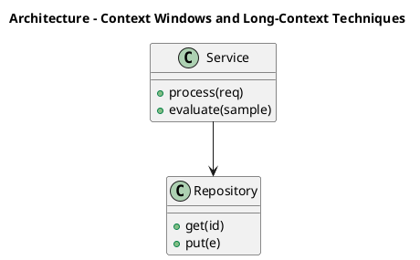

_Source diagram (plantuml); render with the appropriate tool._

**Figure 8. Architecture - Context Windows and Long-Context Techniques** (plantuml). Figure: Architecture view for LLMs. This diagram illustrates the principal components and their interactions as discussed in the surrounding section.

## Deep Dive: Mechanics, Variants and Trade-offs

Having established the essentials, we now go deeper into context windows and long-context techniques. Mechanically, the behaviour emerges from a few interacting parts that are simpler than the whole they produce. The distinctions in this section are the ones that separate a working demo from a system that holds up under adversarial inputs, scale and the passage of time.

Consider the principal variants and how to choose between them. Each variant optimises for a different point in the design space - some for latency, some for accuracy, some for cost or operability - and the correct choice follows from explicit requirements rather than from defaults. Latency, accuracy and cost form a tension triangle: improving one typically pressures the others, so explicit budgets are essential.

In practice this is supported by a mature tooling ecosystem, including vLLM, TensorRT-LLM, Hugging Face Transformers, Ollama. Tools accelerate the work but do not substitute for understanding: the same principles apply whichever implementation you select, and the ability to reason from first principles is what lets you debug when a tool behaves unexpectedly.

A frequent source of subtle bugs is the interaction with cost and capacity planning. Because cost and capacity planning concerns token economics, hardware sizing and build-versus-buy decisions, changes there can silently alter the behaviour analysed here. The remedy is contract tests at the boundary and end-to-end evaluations that exercise the interaction explicitly.

Finally, attend to edge cases and degradation. Define what the system should do under partial failure, unexpected inputs and load spikes, and make that behaviour explicit and tested rather than emergent. Graceful degradation - returning a safe, useful result when the ideal one is unavailable - is a hallmark of mature engineering.

For deeper study, the literature offers authoritative treatments such as Vaswani et al. — Attention Is All You Need (2017) and Hoffmann et al. — Training Compute-Optimal LLMs (Chinchilla, 2022). These primary sources reward careful reading and ground the practical guidance above in established results.

## Advanced Considerations

Having established the essentials, we now go deeper into context windows and long-context techniques. Beneath the abstraction lies a concrete process whose steps can each be measured, tested and optimised independently. The distinctions in this section are the ones that separate a working demo from a system that holds up under adversarial inputs, scale and the passage of time.

Consider the principal variants and how to choose between them. Each variant optimises for a different point in the design space - some for latency, some for accuracy, some for cost or operability - and the correct choice follows from explicit requirements rather than from defaults. Simplicity is a feature. The simplest design that meets the requirement should be the default, with complexity added only when measurement justifies it.

In practice this is supported by a mature tooling ecosystem, including vLLM, TensorRT-LLM, Hugging Face Transformers, Ollama. Tools accelerate the work but do not substitute for understanding: the same principles apply whichever implementation you select, and the ability to reason from first principles is what lets you debug when a tool behaves unexpectedly.

A frequent source of subtle bugs is the interaction with the llm platform reference architecture. Because the llm platform reference architecture concerns gateways, registries, evaluation and observability for fleets of models, changes there can silently alter the behaviour analysed here. The remedy is contract tests at the boundary and end-to-end evaluations that exercise the interaction explicitly.

Finally, attend to edge cases and degradation. Define what the system should do under partial failure, unexpected inputs and load spikes, and make that behaviour explicit and tested rather than emergent. Graceful degradation - returning a safe, useful result when the ideal one is unavailable - is a hallmark of mature engineering.

For deeper study, the literature offers authoritative treatments such as Vaswani et al. — Attention Is All You Need (2017) and Hoffmann et al. — Training Compute-Optimal LLMs (Chinchilla, 2022). These primary sources reward careful reading and ground the practical guidance above in established results.

## Worked Example

To ground the discussion, walk through a representative example. A enterprise search organisation needs answering questions over internal knowledge with citations. They decide to apply context windows and long-context techniques as part of their LLMs solution, but wisely treat it as a hypothesis to be validated rather than a foregone conclusion.

The team begins by stating the objective precisely and defining how success will be measured before writing any code. They establish a small but representative evaluation set, agree on acceptance thresholds, and only then prototype the simplest design that could work. Early measurement reveals which assumptions hold and which must be revised, saving weeks of misdirected effort and surfacing edge cases while they are still cheap to fix.

As the prototype matures into a service, the team hardens it: adding input validation, error handling, caching where it pays off, and monitoring that ties back to the original success metric. They document each significant decision in an architecture decision record so that future maintainers understand not just what was built but why.

The outcome is instructive. The system that reaches production is not the most sophisticated design the team considered, but the one whose behaviour they could measure, explain and operate. This is the recurring lesson of LLMs: durable value comes from the whole system, not from any single clever component.

## Industry Use Cases

Across industries, the ideas in this chapter recur in recognisable ways. The following vignettes show how different sectors apply them and what they have in common.

**Enterprise Search.** Answering questions over internal knowledge with citations. The common thread is that value comes not from the model alone but from the surrounding system - data quality, evaluation, integration and operations - which is precisely where most of the engineering effort belongs.

**Software.** Code completion and review across large repositories. The common thread is that value comes not from the model alone but from the surrounding system - data quality, evaluation, integration and operations - which is precisely where most of the engineering effort belongs.

**Finance.** Summarising filings and extracting structured facts. The common thread is that value comes not from the model alone but from the surrounding system - data quality, evaluation, integration and operations - which is precisely where most of the engineering effort belongs.

**Telecom.** Tier-1 support automation with escalation to humans. The common thread is that value comes not from the model alone but from the surrounding system - data quality, evaluation, integration and operations - which is precisely where most of the engineering effort belongs.

## Best Practices

The following practices consistently separate successful LLMs efforts from struggling ones. They are deliberately concrete so they can be adopted as checklist items in design and code review.

- Right-size the model to the task; do not pay for capability you don't use.
- Quantise and batch aggressively, validating quality impact with evals.
- Pin model and tokenizer versions; treat upgrades as releases.
- Monitor token distribution to catch prompt bloat and cost regressions.

None of these are exotic; they are the unglamorous disciplines that compound into reliability. The cost of adopting them is small compared with the cost of the incidents they prevent, and they become second nature with practice.

## Common Pitfalls

Equally instructive are the failure modes that recur in practice. Each pitfall below has a clear early warning sign and a known remedy, so treat them as a diagnostic checklist when something feels wrong:

- Assuming bigger is always better instead of measuring task fit.
- Underestimating KV-cache memory for long contexts.
- Silent tokenizer changes that break prompts and cost models.
- Benchmarking on contaminated datasets and over-claiming capability.

The pattern is consistent: most failures stem from skipping measurement, conflating prototype and production standards, or deferring cross-cutting concerns such as security and cost until they become emergencies. Naming these traps in advance is the cheapest way to avoid them.

## Governance, Security and Cost Notes

No discussion of context windows and long-context techniques is complete without its governance, security and cost dimensions, which are too often deferred until they become emergencies. Treating them as first-class concerns from the outset is both cheaper and safer.

**Governance.** Classify the risk of this capability, document its intended and out-of-scope uses, and ensure decisions are traceable to satisfy internal policy and external regulation such as the NIST AI RMF, ISO/IEC 42001 and the EU AI Act. **Security.** Treat all external input as untrusted, validate outputs before acting on them, apply least privilege to any tools or data access, and map controls to the OWASP LLM Top 10 and MITRE ATLAS.

**Cost and sustainability.** Establish explicit budgets for compute, tokens and latency, attribute spend to owners, and revisit the economics as usage scales - a design that is affordable at pilot scale can become untenable at production volume. Building these reflexes into everyday engineering is what allows a LLMs system to be not only capable but also trustworthy and economically sound.

## Hands-On Exercises

Work through the following exercises. They are designed to move understanding from recognition to application - the level required for real engineering work - so prefer writing and building over merely reading.

1. Explain context windows and long-context techniques to a colleague unfamiliar with LLMs, using a concrete example from your own domain.
2. Sketch a reference architecture that incorporates context windows and long-context techniques and annotate where observability, security and cost controls belong.
3. Design an evaluation that would tell you whether context windows and long-context techniques is working in production, including the metric, the dataset and the acceptance threshold.
4. Identify two pitfalls relevant to context windows and long-context techniques in your environment and describe the early warning signals you would monitor.
5. Prototype the simplest implementation that demonstrates context windows and long-context techniques, then list exactly what would need to change to make it production-ready.

## Key Takeaways

Key takeaways from this chapter:

- Context Windows and Long-Context Techniques is a systems concern in LLMs: data, models and operations must be co-designed.
- Measurement is non-negotiable; define success metrics and evaluation before building.
- Favour the simplest design that meets the requirement, and add complexity only when evidence demands it.
- Security, cost and observability are first-class requirements, not afterthoughts.
- Document decisions so the system remains understandable and operable as it evolves.

## Code Walkthrough

This listing shows a configuration-driven Context Windows and Long-Context Techniques component with retry semantics and typed interfaces — the shape we expect from production LLMs code rather than a notebook prototype.

The full listing is shown below; study it line by line and reproduce it locally before moving on.

### Listing: Implementing a Context Windows and Long-Context Techniques component

```python
from __future__ import annotations

from dataclasses import dataclass, field
from typing import Any


@dataclass(slots=True)
class ContextWindowsAndConfig:
    """Configuration for the Context Windows and Long-Context Techniques component in a LLMs system."""

    name: str
    timeout_s: float = 30.0
    max_retries: int = 3
    options: dict[str, Any] = field(default_factory=dict)


class ContextWindowsAnd:
    """A minimal, production-shaped implementation of Context Windows and Long-Context Techniques."""

    def __init__(self, config: ContextWindowsAndConfig) -> None:
        self._config = config
        self._calls = 0

    def run(self, payload: dict[str, Any]) -> dict[str, Any]:
        """Process a request, retrying transient failures with backoff."""
        last_error: Exception | None = None
        for attempt in range(self._config.max_retries):
            try:
                self._calls += 1
                return self._process(payload)
            except TimeoutError as exc:  # transient
                last_error = exc
                continue
        raise RuntimeError(f"ContextWindowsAnd failed after retries") from last_error

    def _process(self, payload: dict[str, Any]) -> dict[str, Any]:
        # Domain-specific logic for Context Windows and Long-Context Techniques goes here.
        return {"status": "ok", "input_keys": sorted(payload), "calls": self._calls}

```

## Review Questions

1. In the context of LLMs, which statement best describes “Context Windows and Long-Context Techniques”?
   - A. It makes the system slower but has no other effect.
   - B. It is only relevant to academic research, not production.
   - C. It applies exclusively to image data.
   - D. Position interpolation, attention variants and retrieval to extend effective context.
   - **Answer: D.** Context Windows and Long-Context Techniques: Position interpolation, attention variants and retrieval to extend effective context.
2. Which of the following is a recommended best practice when working with LLMs?
   - A. It is only relevant to academic research, not production.
   - B. It applies exclusively to image data.
   - C. It makes the system slower but has no other effect.
   - D. Monitor token distribution to catch prompt bloat and cost regressions.
   - **Answer: D.** Best practice: Monitor token distribution to catch prompt bloat and cost regressions.
3. Which of the following is a common pitfall to avoid in LLMs?
   - A. Silent tokenizer changes that break prompts and cost models.
   - B. It applies exclusively to image data.
   - C. It is only relevant to academic research, not production.
   - D. It makes the system slower but has no other effect.
   - **Answer: A.** Pitfall to avoid: Silent tokenizer changes that break prompts and cost models.
4. *(Discussion)* How does Context Windows and Long-Context Techniques interact with security and governance requirements?
   - **Model answer:** A strong answer defines context windows and long-context techniques (Position interpolation, attention variants and retrieval to extend effective context.) then connects it to architecture, evaluation, cost, security and operations for LLMs, citing concrete trade-offs and a real-world example.

---


# Chapter 8. Inference Optimisation

_This chapter examines inference optimisation within LLMs. It covers kV caching, speculative decoding, quantisation and continuous batching for throughput, derives a reference architecture, walks through a worked example and runnable code, surveys industry use cases, and distils best practices and pitfalls, closing with exercises and review questions._

## Introduction

Formally, Inference Optimisation addresses kV caching, speculative decoding, quantisation and continuous batching for throughput. This concept recurs throughout the LLMs lifecycle, from design to operations. In an enterprise setting, this translates into concrete requirements: clear interfaces, measurable quality, and controls that satisfy security and governance.

This chapter builds intuition first, then formalises the ideas, derives an architecture, and finishes with code, exercises and review questions so the material transfers directly to your own LLMs work. Read it actively: pause at each diagram, reproduce the code, and attempt the exercises before consulting the answers.

## Theory and Foundations

At its core, Inference Optimisation concerns kV caching, speculative decoding, quantisation and continuous batching for throughput. It helps to separate the conceptual model from its implementation: the former guides reasoning, the latter must contend with real-world constraints. Mechanically, the behaviour emerges from a few interacting parts that are simpler than the whole they produce.

To place this in context, recall the broader picture: Large language models are transformer-based neural networks trained on vast text corpora to predict the next token, acquiring broad linguistic and reasoning capabilities that transfer across tasks. Within that picture, inference optimisation is one of the load-bearing ideas - the kind that, when understood deeply, makes the rest of LLMs fall into place. Getting this right early prevents expensive rework once a LLMs system reaches scale.

Inference Optimisation cannot be understood in isolation from instruction tuning and alignment. Recall that instruction tuning and alignment concerns supervised fine-tuning, RLHF and preference optimisation that make base models useful and safe. The two interact directly: decisions in one constrain the design space of the other, which is why mature teams reason about them together rather than sequentially. Latency, accuracy and cost form a tension triangle: improving one typically pressures the others, so explicit budgets are essential.

Inference Optimisation cannot be understood in isolation from from n-grams to neural language models. Recall that from n-grams to neural language models concerns the evolution of language modelling and why scale plus self-attention unlocked emergent capability. The two interact directly: decisions in one constrain the design space of the other, which is why mature teams reason about them together rather than sequentially. Simplicity is a feature. The simplest design that meets the requirement should be the default, with complexity added only when measurement justifies it.

Several established patterns apply directly to inference optimisation. The first, model routing by difficulty (small model first, escalate on low confidence), is widely adopted because it makes the system's behaviour predictable and observable. A complementary pattern, blue/green model rollout with shadow evaluation, addresses a related concern and is often deployed alongside it. Patterns are not dogma; they are distilled experience that shortcuts the search for a sound design, and each carries assumptions worth checking against your context.

It is worth being explicit about when to apply this and when to reach for something simpler. In a small prototype, shortcuts around inference optimisation are invisible; in a production LLMs system serving real traffic, they surface as incidents, cost overruns or compliance gaps. Latency, accuracy and cost form a tension triangle: improving one typically pressures the others, so explicit budgets are essential. The remainder of this chapter turns these principles into an architecture, code and a checklist you can apply immediately.

## Architecture and Design

The reference architecture for Inference Optimisation separates concerns into clearly bounded components with explicit contracts. An LLM serving platform comprises a request gateway with auth and rate limiting, an inference cluster running an optimised engine (paged KV cache, continuous batching, quantised weights), a routing layer selecting model size by task, and an observability pipeline tracking latency, tokens and quality. Model artefacts flow from a registry with signed provenance into blue/green serving slots.

Concretely, the principal building blocks include from n-grams to neural language models, tokenisation and vocabulary, the transformer backbone of llms, pre-training objectives and data and scaling laws and emergent abilities. Each is a replaceable component behind a stable interface, so the team can upgrade an implementation - a model, an index, a policy engine - without rewriting its neighbours. The contracts between components are where reliability is won or lost, so they are specified explicitly and tested in isolation.

The diagram accompanying this section makes the data and control flow explicit. Requests enter through a well-defined boundary where they are authenticated and validated; only then are they dispatched to the components that perform the work. This boundary is also where rate limiting, quota enforcement and audit logging live, keeping cross-cutting concerns out of the core logic and in one auditable place.

Two qualities deserve emphasis. First, observability is designed in, not bolted on: every component emits structured telemetry so that failures can be localised in minutes rather than hours. Second, the architecture is evolvable - components communicate through stable contracts so that any single part of the LLMs system can be replaced without a rewrite. Latency, accuracy and cost form a tension triangle: improving one typically pressures the others, so explicit budgets are essential.

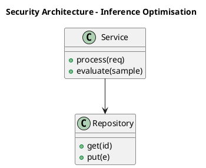

_Source diagram (plantuml); render with the appropriate tool._

**Figure 9. Security Architecture - Inference Optimisation** (plantuml). Figure: Security Architecture view for LLMs. This diagram illustrates the principal components and their interactions as discussed in the surrounding section.

## Deep Dive: Mechanics, Variants and Trade-offs

Having established the essentials, we now go deeper into inference optimisation. Beneath the abstraction lies a concrete process whose steps can each be measured, tested and optimised independently. The distinctions in this section are the ones that separate a working demo from a system that holds up under adversarial inputs, scale and the passage of time.

Consider the principal variants and how to choose between them. Each variant optimises for a different point in the design space - some for latency, some for accuracy, some for cost or operability - and the correct choice follows from explicit requirements rather than from defaults. As with most architectural decisions, the choice is rarely binary; the skill lies in quantifying the trade-offs and choosing deliberately.

In practice this is supported by a mature tooling ecosystem, including vLLM, TensorRT-LLM, Hugging Face Transformers, Ollama. Tools accelerate the work but do not substitute for understanding: the same principles apply whichever implementation you select, and the ability to reason from first principles is what lets you debug when a tool behaves unexpectedly.

A frequent source of subtle bugs is the interaction with instruction tuning and alignment. Because instruction tuning and alignment concerns supervised fine-tuning, RLHF and preference optimisation that make base models useful and safe, changes there can silently alter the behaviour analysed here. The remedy is contract tests at the boundary and end-to-end evaluations that exercise the interaction explicitly.

Finally, attend to edge cases and degradation. Define what the system should do under partial failure, unexpected inputs and load spikes, and make that behaviour explicit and tested rather than emergent. Graceful degradation - returning a safe, useful result when the ideal one is unavailable - is a hallmark of mature engineering.

For deeper study, the literature offers authoritative treatments such as Vaswani et al. — Attention Is All You Need (2017) and Hoffmann et al. — Training Compute-Optimal LLMs (Chinchilla, 2022). These primary sources reward careful reading and ground the practical guidance above in established results.

## Advanced Considerations

Having established the essentials, we now go deeper into inference optimisation. The underlying mechanism is best appreciated by tracing a single request from input to output and noting where state is created and consumed. The distinctions in this section are the ones that separate a working demo from a system that holds up under adversarial inputs, scale and the passage of time.

Consider the principal variants and how to choose between them. Each variant optimises for a different point in the design space - some for latency, some for accuracy, some for cost or operability - and the correct choice follows from explicit requirements rather than from defaults. There is an inherent trade-off between fidelity and cost, and the correct balance depends on the use case and its tolerance for error.

In practice this is supported by a mature tooling ecosystem, including vLLM, TensorRT-LLM, Hugging Face Transformers, Ollama. Tools accelerate the work but do not substitute for understanding: the same principles apply whichever implementation you select, and the ability to reason from first principles is what lets you debug when a tool behaves unexpectedly.

A frequent source of subtle bugs is the interaction with context windows and long-context techniques. Because context windows and long-context techniques concerns position interpolation, attention variants and retrieval to extend effective context, changes there can silently alter the behaviour analysed here. The remedy is contract tests at the boundary and end-to-end evaluations that exercise the interaction explicitly.

Finally, attend to edge cases and degradation. Define what the system should do under partial failure, unexpected inputs and load spikes, and make that behaviour explicit and tested rather than emergent. Graceful degradation - returning a safe, useful result when the ideal one is unavailable - is a hallmark of mature engineering.

For deeper study, the literature offers authoritative treatments such as Vaswani et al. — Attention Is All You Need (2017) and Hoffmann et al. — Training Compute-Optimal LLMs (Chinchilla, 2022). These primary sources reward careful reading and ground the practical guidance above in established results.

## Worked Example

To ground the discussion, walk through a representative example. A software organisation needs code completion and review across large repositories. They decide to apply inference optimisation as part of their LLMs solution, but wisely treat it as a hypothesis to be validated rather than a foregone conclusion.

The team begins by stating the objective precisely and defining how success will be measured before writing any code. They establish a small but representative evaluation set, agree on acceptance thresholds, and only then prototype the simplest design that could work. Early measurement reveals which assumptions hold and which must be revised, saving weeks of misdirected effort and surfacing edge cases while they are still cheap to fix.

As the prototype matures into a service, the team hardens it: adding input validation, error handling, caching where it pays off, and monitoring that ties back to the original success metric. They document each significant decision in an architecture decision record so that future maintainers understand not just what was built but why.

The outcome is instructive. The system that reaches production is not the most sophisticated design the team considered, but the one whose behaviour they could measure, explain and operate. This is the recurring lesson of LLMs: durable value comes from the whole system, not from any single clever component.

## Industry Use Cases

Across industries, the ideas in this chapter recur in recognisable ways. The following vignettes show how different sectors apply them and what they have in common.

**Enterprise Search.** Answering questions over internal knowledge with citations. The common thread is that value comes not from the model alone but from the surrounding system - data quality, evaluation, integration and operations - which is precisely where most of the engineering effort belongs.

**Software.** Code completion and review across large repositories. The common thread is that value comes not from the model alone but from the surrounding system - data quality, evaluation, integration and operations - which is precisely where most of the engineering effort belongs.

**Finance.** Summarising filings and extracting structured facts. The common thread is that value comes not from the model alone but from the surrounding system - data quality, evaluation, integration and operations - which is precisely where most of the engineering effort belongs.

**Telecom.** Tier-1 support automation with escalation to humans. The common thread is that value comes not from the model alone but from the surrounding system - data quality, evaluation, integration and operations - which is precisely where most of the engineering effort belongs.

## Best Practices

The following practices consistently separate successful LLMs efforts from struggling ones. They are deliberately concrete so they can be adopted as checklist items in design and code review.

- Right-size the model to the task; do not pay for capability you don't use.
- Quantise and batch aggressively, validating quality impact with evals.
- Pin model and tokenizer versions; treat upgrades as releases.
- Monitor token distribution to catch prompt bloat and cost regressions.

None of these are exotic; they are the unglamorous disciplines that compound into reliability. The cost of adopting them is small compared with the cost of the incidents they prevent, and they become second nature with practice.

## Common Pitfalls

Equally instructive are the failure modes that recur in practice. Each pitfall below has a clear early warning sign and a known remedy, so treat them as a diagnostic checklist when something feels wrong:

- Assuming bigger is always better instead of measuring task fit.
- Underestimating KV-cache memory for long contexts.
- Silent tokenizer changes that break prompts and cost models.
- Benchmarking on contaminated datasets and over-claiming capability.

The pattern is consistent: most failures stem from skipping measurement, conflating prototype and production standards, or deferring cross-cutting concerns such as security and cost until they become emergencies. Naming these traps in advance is the cheapest way to avoid them.

## Governance, Security and Cost Notes

No discussion of inference optimisation is complete without its governance, security and cost dimensions, which are too often deferred until they become emergencies. Treating them as first-class concerns from the outset is both cheaper and safer.

**Governance.** Classify the risk of this capability, document its intended and out-of-scope uses, and ensure decisions are traceable to satisfy internal policy and external regulation such as the NIST AI RMF, ISO/IEC 42001 and the EU AI Act. **Security.** Treat all external input as untrusted, validate outputs before acting on them, apply least privilege to any tools or data access, and map controls to the OWASP LLM Top 10 and MITRE ATLAS.

**Cost and sustainability.** Establish explicit budgets for compute, tokens and latency, attribute spend to owners, and revisit the economics as usage scales - a design that is affordable at pilot scale can become untenable at production volume. Building these reflexes into everyday engineering is what allows a LLMs system to be not only capable but also trustworthy and economically sound.

## Hands-On Exercises

Work through the following exercises. They are designed to move understanding from recognition to application - the level required for real engineering work - so prefer writing and building over merely reading.

1. Explain inference optimisation to a colleague unfamiliar with LLMs, using a concrete example from your own domain.
2. Sketch a reference architecture that incorporates inference optimisation and annotate where observability, security and cost controls belong.
3. Design an evaluation that would tell you whether inference optimisation is working in production, including the metric, the dataset and the acceptance threshold.
4. Identify two pitfalls relevant to inference optimisation in your environment and describe the early warning signals you would monitor.
5. Prototype the simplest implementation that demonstrates inference optimisation, then list exactly what would need to change to make it production-ready.

## Key Takeaways

Key takeaways from this chapter:

- Inference Optimisation is a systems concern in LLMs: data, models and operations must be co-designed.
- Measurement is non-negotiable; define success metrics and evaluation before building.
- Favour the simplest design that meets the requirement, and add complexity only when evidence demands it.
- Security, cost and observability are first-class requirements, not afterthoughts.
- Document decisions so the system remains understandable and operable as it evolves.

## Code Walkthrough

This listing shows a configuration-driven Inference Optimisation component with retry semantics and typed interfaces — the shape we expect from production LLMs code rather than a notebook prototype.

The full listing is shown below; study it line by line and reproduce it locally before moving on.

### Listing: Implementing a Inference Optimisation component

```python
from __future__ import annotations

from dataclasses import dataclass, field
from typing import Any


@dataclass(slots=True)
class InferenceOptimisationConfig:
    """Configuration for the Inference Optimisation component in a LLMs system."""

    name: str
    timeout_s: float = 30.0
    max_retries: int = 3
    options: dict[str, Any] = field(default_factory=dict)


class InferenceOptimisation:
    """A minimal, production-shaped implementation of Inference Optimisation."""

    def __init__(self, config: InferenceOptimisationConfig) -> None:
        self._config = config
        self._calls = 0

    def run(self, payload: dict[str, Any]) -> dict[str, Any]:
        """Process a request, retrying transient failures with backoff."""
        last_error: Exception | None = None
        for attempt in range(self._config.max_retries):
            try:
                self._calls += 1
                return self._process(payload)
            except TimeoutError as exc:  # transient
                last_error = exc
                continue
        raise RuntimeError(f"InferenceOptimisation failed after retries") from last_error

    def _process(self, payload: dict[str, Any]) -> dict[str, Any]:
        # Domain-specific logic for Inference Optimisation goes here.
        return {"status": "ok", "input_keys": sorted(payload), "calls": self._calls}

```

## Review Questions

1. In the context of LLMs, which statement best describes “Inference Optimisation”?
   - A. It makes the system slower but has no other effect.
   - B. It guarantees deterministic output regardless of input.
   - C. KV caching, speculative decoding, quantisation and continuous batching for throughput.
   - D. It eliminates the need for any evaluation or monitoring.
   - **Answer: C.** Inference Optimisation: KV caching, speculative decoding, quantisation and continuous batching for throughput.
2. Which of the following is a recommended best practice when working with LLMs?
   - A. Quantise and batch aggressively, validating quality impact with evals.
   - B. Underestimating KV-cache memory for long contexts.
   - C. Benchmarking on contaminated datasets and over-claiming capability.
   - D. It removes all security and governance requirements.
   - **Answer: A.** Best practice: Quantise and batch aggressively, validating quality impact with evals.
3. Which of the following is a common pitfall to avoid in LLMs?
   - A. Benchmarking on contaminated datasets and over-claiming capability.
   - B. Monitor token distribution to catch prompt bloat and cost regressions.
   - C. It makes the system slower but has no other effect.
   - D. It is only relevant to academic research, not production.
   - **Answer: A.** Pitfall to avoid: Benchmarking on contaminated datasets and over-claiming capability.
4. *(Discussion)* How would you test and monitor Inference Optimisation in production?
   - **Model answer:** A strong answer defines inference optimisation (KV caching, speculative decoding, quantisation and continuous batching for throughput.) then connects it to architecture, evaluation, cost, security and operations for LLMs, citing concrete trade-offs and a real-world example.

---


# Chapter 9. Serving LLMs at Scale

_This chapter examines serving llms at scale within LLMs. It covers gPU memory planning, tensor/pipeline parallelism and autoscaling inference, derives a reference architecture, walks through a worked example and runnable code, surveys industry use cases, and distils best practices and pitfalls, closing with exercises and review questions._

## Introduction

Serving LLMs at Scale refers to gPU memory planning, tensor/pipeline parallelism and autoscaling inference. Neglecting it is one of the most common reasons LLMs initiatives stall in production. What distinguishes a production-grade approach from a prototype is the discipline of measurement: every claim is backed by an evaluation rather than intuition.

This chapter builds intuition first, then formalises the ideas, derives an architecture, and finishes with code, exercises and review questions so the material transfers directly to your own LLMs work. Read it actively: pause at each diagram, reproduce the code, and attempt the exercises before consulting the answers.

## Theory and Foundations

Formally, Serving LLMs at Scale addresses gPU memory planning, tensor/pipeline parallelism and autoscaling inference. In an enterprise setting, this translates into concrete requirements: clear interfaces, measurable quality, and controls that satisfy security and governance. Mechanically, the behaviour emerges from a few interacting parts that are simpler than the whole they produce.

To place this in context, recall the broader picture: Large language models are transformer-based neural networks trained on vast text corpora to predict the next token, acquiring broad linguistic and reasoning capabilities that transfer across tasks. Within that picture, serving llms at scale is one of the load-bearing ideas - the kind that, when understood deeply, makes the rest of LLMs fall into place. Understanding this matters because LLMs systems succeed or fail on exactly these decisions.

Serving LLMs at Scale cannot be understood in isolation from inference optimisation. Recall that inference optimisation concerns kV caching, speculative decoding, quantisation and continuous batching for throughput. The two interact directly: decisions in one constrain the design space of the other, which is why mature teams reason about them together rather than sequentially. Every added component buys capability at the price of operational surface area, and that bargain should be made consciously.

Serving LLMs at Scale cannot be understood in isolation from hallucination and factuality. Recall that hallucination and factuality concerns why models confabulate and how grounding and decoding mitigate it. The two interact directly: decisions in one constrain the design space of the other, which is why mature teams reason about them together rather than sequentially. Latency, accuracy and cost form a tension triangle: improving one typically pressures the others, so explicit budgets are essential.

Several established patterns apply directly to serving llms at scale. The first, continuous batching with paged attention for gpu efficiency, is widely adopted because it makes the system's behaviour predictable and observable. A complementary pattern, blue/green model rollout with shadow evaluation, addresses a related concern and is often deployed alongside it. Patterns are not dogma; they are distilled experience that shortcuts the search for a sound design, and each carries assumptions worth checking against your context.

It is worth being explicit about when to apply this and when to reach for something simpler. In a small prototype, shortcuts around serving llms at scale are invisible; in a production LLMs system serving real traffic, they surface as incidents, cost overruns or compliance gaps. There is an inherent trade-off between fidelity and cost, and the correct balance depends on the use case and its tolerance for error. The remainder of this chapter turns these principles into an architecture, code and a checklist you can apply immediately.

## Architecture and Design

A robust architecture for Serving LLMs at Scale is layered so each part can evolve independently without destabilising the whole. An LLM serving platform comprises a request gateway with auth and rate limiting, an inference cluster running an optimised engine (paged KV cache, continuous batching, quantised weights), a routing layer selecting model size by task, and an observability pipeline tracking latency, tokens and quality. Model artefacts flow from a registry with signed provenance into blue/green serving slots.

Concretely, the principal building blocks include from n-grams to neural language models, tokenisation and vocabulary, the transformer backbone of llms, pre-training objectives and data and scaling laws and emergent abilities. Each is a replaceable component behind a stable interface, so the team can upgrade an implementation - a model, an index, a policy engine - without rewriting its neighbours. The contracts between components are where reliability is won or lost, so they are specified explicitly and tested in isolation.

The diagram accompanying this section makes the data and control flow explicit. Requests enter through a well-defined boundary where they are authenticated and validated; only then are they dispatched to the components that perform the work. This boundary is also where rate limiting, quota enforcement and audit logging live, keeping cross-cutting concerns out of the core logic and in one auditable place.

Two qualities deserve emphasis. First, observability is designed in, not bolted on: every component emits structured telemetry so that failures can be localised in minutes rather than hours. Second, the architecture is evolvable - components communicate through stable contracts so that any single part of the LLMs system can be replaced without a rewrite. Every added component buys capability at the price of operational surface area, and that bargain should be made consciously.

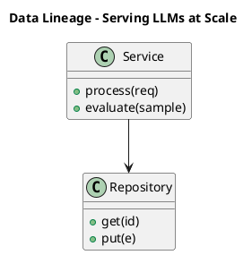

_Source diagram (plantuml); render with the appropriate tool._

**Figure 10. Data Lineage - Serving LLMs at Scale** (plantuml). Figure: Data Lineage view for LLMs. This diagram illustrates the principal components and their interactions as discussed in the surrounding section.

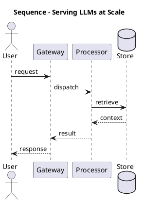

_Source diagram (plantuml); render with the appropriate tool._

**Figure 11. Sequence - Serving LLMs at Scale** (plantuml). Figure: Sequence view for LLMs. This diagram illustrates the principal components and their interactions as discussed in the surrounding section.

## Deep Dive: Mechanics, Variants and Trade-offs

Having established the essentials, we now go deeper into serving llms at scale. It pays to understand the mechanism rather than treat it as a black box, because most production incidents are explained by one of its steps misbehaving. The distinctions in this section are the ones that separate a working demo from a system that holds up under adversarial inputs, scale and the passage of time.

Consider the principal variants and how to choose between them. Each variant optimises for a different point in the design space - some for latency, some for accuracy, some for cost or operability - and the correct choice follows from explicit requirements rather than from defaults. Simplicity is a feature. The simplest design that meets the requirement should be the default, with complexity added only when measurement justifies it.

In practice this is supported by a mature tooling ecosystem, including vLLM, TensorRT-LLM, Hugging Face Transformers, Ollama. Tools accelerate the work but do not substitute for understanding: the same principles apply whichever implementation you select, and the ability to reason from first principles is what lets you debug when a tool behaves unexpectedly.

A frequent source of subtle bugs is the interaction with inference optimisation. Because inference optimisation concerns kV caching, speculative decoding, quantisation and continuous batching for throughput, changes there can silently alter the behaviour analysed here. The remedy is contract tests at the boundary and end-to-end evaluations that exercise the interaction explicitly.

Finally, attend to edge cases and degradation. Define what the system should do under partial failure, unexpected inputs and load spikes, and make that behaviour explicit and tested rather than emergent. Graceful degradation - returning a safe, useful result when the ideal one is unavailable - is a hallmark of mature engineering.

For deeper study, the literature offers authoritative treatments such as Vaswani et al. — Attention Is All You Need (2017) and Hoffmann et al. — Training Compute-Optimal LLMs (Chinchilla, 2022). These primary sources reward careful reading and ground the practical guidance above in established results.

## Advanced Considerations

Having established the essentials, we now go deeper into serving llms at scale. Mechanically, the behaviour emerges from a few interacting parts that are simpler than the whole they produce. The distinctions in this section are the ones that separate a working demo from a system that holds up under adversarial inputs, scale and the passage of time.

Consider the principal variants and how to choose between them. Each variant optimises for a different point in the design space - some for latency, some for accuracy, some for cost or operability - and the correct choice follows from explicit requirements rather than from defaults. Latency, accuracy and cost form a tension triangle: improving one typically pressures the others, so explicit budgets are essential.

In practice this is supported by a mature tooling ecosystem, including vLLM, TensorRT-LLM, Hugging Face Transformers, Ollama. Tools accelerate the work but do not substitute for understanding: the same principles apply whichever implementation you select, and the ability to reason from first principles is what lets you debug when a tool behaves unexpectedly.

A frequent source of subtle bugs is the interaction with hallucination and factuality. Because hallucination and factuality concerns why models confabulate and how grounding and decoding mitigate it, changes there can silently alter the behaviour analysed here. The remedy is contract tests at the boundary and end-to-end evaluations that exercise the interaction explicitly.

Finally, attend to edge cases and degradation. Define what the system should do under partial failure, unexpected inputs and load spikes, and make that behaviour explicit and tested rather than emergent. Graceful degradation - returning a safe, useful result when the ideal one is unavailable - is a hallmark of mature engineering.

For deeper study, the literature offers authoritative treatments such as Vaswani et al. — Attention Is All You Need (2017) and Hoffmann et al. — Training Compute-Optimal LLMs (Chinchilla, 2022). These primary sources reward careful reading and ground the practical guidance above in established results.

## Worked Example

A worked example clarifies how these ideas behave in practice. A enterprise search organisation needs answering questions over internal knowledge with citations. They decide to apply serving llms at scale as part of their LLMs solution, but wisely treat it as a hypothesis to be validated rather than a foregone conclusion.

The team begins by stating the objective precisely and defining how success will be measured before writing any code. They establish a small but representative evaluation set, agree on acceptance thresholds, and only then prototype the simplest design that could work. Early measurement reveals which assumptions hold and which must be revised, saving weeks of misdirected effort and surfacing edge cases while they are still cheap to fix.

As the prototype matures into a service, the team hardens it: adding input validation, error handling, caching where it pays off, and monitoring that ties back to the original success metric. They document each significant decision in an architecture decision record so that future maintainers understand not just what was built but why.

The outcome is instructive. The system that reaches production is not the most sophisticated design the team considered, but the one whose behaviour they could measure, explain and operate. This is the recurring lesson of LLMs: durable value comes from the whole system, not from any single clever component.

## Industry Use Cases

Across industries, the ideas in this chapter recur in recognisable ways. The following vignettes show how different sectors apply them and what they have in common.

**Enterprise Search.** Answering questions over internal knowledge with citations. The common thread is that value comes not from the model alone but from the surrounding system - data quality, evaluation, integration and operations - which is precisely where most of the engineering effort belongs.

**Software.** Code completion and review across large repositories. The common thread is that value comes not from the model alone but from the surrounding system - data quality, evaluation, integration and operations - which is precisely where most of the engineering effort belongs.

**Finance.** Summarising filings and extracting structured facts. The common thread is that value comes not from the model alone but from the surrounding system - data quality, evaluation, integration and operations - which is precisely where most of the engineering effort belongs.

**Telecom.** Tier-1 support automation with escalation to humans. The common thread is that value comes not from the model alone but from the surrounding system - data quality, evaluation, integration and operations - which is precisely where most of the engineering effort belongs.

## Best Practices

The following practices consistently separate successful LLMs efforts from struggling ones. They are deliberately concrete so they can be adopted as checklist items in design and code review.

- Right-size the model to the task; do not pay for capability you don't use.
- Quantise and batch aggressively, validating quality impact with evals.
- Pin model and tokenizer versions; treat upgrades as releases.
- Monitor token distribution to catch prompt bloat and cost regressions.

None of these are exotic; they are the unglamorous disciplines that compound into reliability. The cost of adopting them is small compared with the cost of the incidents they prevent, and they become second nature with practice.

## Common Pitfalls

Equally instructive are the failure modes that recur in practice. Each pitfall below has a clear early warning sign and a known remedy, so treat them as a diagnostic checklist when something feels wrong:

- Assuming bigger is always better instead of measuring task fit.
- Underestimating KV-cache memory for long contexts.
- Silent tokenizer changes that break prompts and cost models.
- Benchmarking on contaminated datasets and over-claiming capability.

The pattern is consistent: most failures stem from skipping measurement, conflating prototype and production standards, or deferring cross-cutting concerns such as security and cost until they become emergencies. Naming these traps in advance is the cheapest way to avoid them.

## Governance, Security and Cost Notes

No discussion of serving llms at scale is complete without its governance, security and cost dimensions, which are too often deferred until they become emergencies. Treating them as first-class concerns from the outset is both cheaper and safer.

**Governance.** Classify the risk of this capability, document its intended and out-of-scope uses, and ensure decisions are traceable to satisfy internal policy and external regulation such as the NIST AI RMF, ISO/IEC 42001 and the EU AI Act. **Security.** Treat all external input as untrusted, validate outputs before acting on them, apply least privilege to any tools or data access, and map controls to the OWASP LLM Top 10 and MITRE ATLAS.

**Cost and sustainability.** Establish explicit budgets for compute, tokens and latency, attribute spend to owners, and revisit the economics as usage scales - a design that is affordable at pilot scale can become untenable at production volume. Building these reflexes into everyday engineering is what allows a LLMs system to be not only capable but also trustworthy and economically sound.

## Hands-On Exercises

Work through the following exercises. They are designed to move understanding from recognition to application - the level required for real engineering work - so prefer writing and building over merely reading.

1. Explain serving llms at scale to a colleague unfamiliar with LLMs, using a concrete example from your own domain.
2. Sketch a reference architecture that incorporates serving llms at scale and annotate where observability, security and cost controls belong.
3. Design an evaluation that would tell you whether serving llms at scale is working in production, including the metric, the dataset and the acceptance threshold.
4. Identify two pitfalls relevant to serving llms at scale in your environment and describe the early warning signals you would monitor.
5. Prototype the simplest implementation that demonstrates serving llms at scale, then list exactly what would need to change to make it production-ready.

## Key Takeaways

Key takeaways from this chapter:

- Serving LLMs at Scale is a systems concern in LLMs: data, models and operations must be co-designed.
- Measurement is non-negotiable; define success metrics and evaluation before building.
- Favour the simplest design that meets the requirement, and add complexity only when evidence demands it.
- Security, cost and observability are first-class requirements, not afterthoughts.
- Document decisions so the system remains understandable and operable as it evolves.

## Code Walkthrough

This listing shows a configuration-driven Serving LLMs at Scale component with retry semantics and typed interfaces — the shape we expect from production LLMs code rather than a notebook prototype.

The full listing is shown below; study it line by line and reproduce it locally before moving on.

### Listing: Implementing a Serving LLMs at Scale component

```python
from __future__ import annotations

from dataclasses import dataclass, field
from typing import Any


@dataclass(slots=True)
class ServingLlmsAtConfig:
    """Configuration for the Serving LLMs at Scale component in a LLMs system."""

    name: str
    timeout_s: float = 30.0
    max_retries: int = 3
    options: dict[str, Any] = field(default_factory=dict)


class ServingLlmsAt:
    """A minimal, production-shaped implementation of Serving LLMs at Scale."""

    def __init__(self, config: ServingLlmsAtConfig) -> None:
        self._config = config
        self._calls = 0

    def run(self, payload: dict[str, Any]) -> dict[str, Any]:
        """Process a request, retrying transient failures with backoff."""
        last_error: Exception | None = None
        for attempt in range(self._config.max_retries):
            try:
                self._calls += 1
                return self._process(payload)
            except TimeoutError as exc:  # transient
                last_error = exc
                continue
        raise RuntimeError(f"ServingLlmsAt failed after retries") from last_error

    def _process(self, payload: dict[str, Any]) -> dict[str, Any]:
        # Domain-specific logic for Serving LLMs at Scale goes here.
        return {"status": "ok", "input_keys": sorted(payload), "calls": self._calls}

```

## Review Questions

1. In the context of LLMs, which statement best describes “Serving LLMs at Scale”?
   - A. It removes all security and governance requirements.
   - B. GPU memory planning, tensor/pipeline parallelism and autoscaling inference.
   - C. It guarantees deterministic output regardless of input.
   - D. It applies exclusively to image data.
   - **Answer: B.** Serving LLMs at Scale: GPU memory planning, tensor/pipeline parallelism and autoscaling inference.
2. Which of the following is a recommended best practice when working with LLMs?
   - A. Assuming bigger is always better instead of measuring task fit.
   - B. Pin model and tokenizer versions; treat upgrades as releases.
   - C. Underestimating KV-cache memory for long contexts.
   - D. It guarantees deterministic output regardless of input.
   - **Answer: B.** Best practice: Pin model and tokenizer versions; treat upgrades as releases.
3. Which of the following is a common pitfall to avoid in LLMs?
   - A. Underestimating KV-cache memory for long contexts.
   - B. It removes all security and governance requirements.
   - C. Quantise and batch aggressively, validating quality impact with evals.
   - D. It makes the system slower but has no other effect.
   - **Answer: A.** Pitfall to avoid: Underestimating KV-cache memory for long contexts.
4. *(Discussion)* Explain Serving LLMs at Scale and why it matters in a production LLMs system.
   - **Model answer:** A strong answer defines serving llms at scale (GPU memory planning, tensor/pipeline parallelism and autoscaling inference.) then connects it to architecture, evaluation, cost, security and operations for LLMs, citing concrete trade-offs and a real-world example.

---


# Chapter 10. Evaluation and Benchmarking

_This chapter examines evaluation and benchmarking within LLMs. It covers capability benchmarks, contamination, and task-specific golden sets, derives a reference architecture, walks through a worked example and runnable code, surveys industry use cases, and distils best practices and pitfalls, closing with exercises and review questions._

## Introduction

Evaluation and Benchmarking refers to capability benchmarks, contamination, and task-specific golden sets. Getting this right early prevents expensive rework once a LLMs system reaches scale. It helps to separate the conceptual model from its implementation: the former guides reasoning, the latter must contend with real-world constraints.

This chapter builds intuition first, then formalises the ideas, derives an architecture, and finishes with code, exercises and review questions so the material transfers directly to your own LLMs work. Read it actively: pause at each diagram, reproduce the code, and attempt the exercises before consulting the answers.

## Theory and Foundations

Formally, Evaluation and Benchmarking addresses capability benchmarks, contamination, and task-specific golden sets. In an enterprise setting, this translates into concrete requirements: clear interfaces, measurable quality, and controls that satisfy security and governance. Beneath the abstraction lies a concrete process whose steps can each be measured, tested and optimised independently.

To place this in context, recall the broader picture: Large language models are transformer-based neural networks trained on vast text corpora to predict the next token, acquiring broad linguistic and reasoning capabilities that transfer across tasks. Within that picture, evaluation and benchmarking is one of the load-bearing ideas - the kind that, when understood deeply, makes the rest of LLMs fall into place. Teams that master this consistently ship more reliable LLMs systems at lower cost.

Evaluation and Benchmarking cannot be understood in isolation from instruction tuning and alignment. Recall that instruction tuning and alignment concerns supervised fine-tuning, RLHF and preference optimisation that make base models useful and safe. The two interact directly: decisions in one constrain the design space of the other, which is why mature teams reason about them together rather than sequentially. Latency, accuracy and cost form a tension triangle: improving one typically pressures the others, so explicit budgets are essential.

Evaluation and Benchmarking cannot be understood in isolation from the transformer backbone of llms. Recall that the transformer backbone of llms concerns decoder-only architectures, attention, positional encodings and layer normalisation choices. The two interact directly: decisions in one constrain the design space of the other, which is why mature teams reason about them together rather than sequentially. Every added component buys capability at the price of operational surface area, and that bargain should be made consciously.

Several established patterns apply directly to evaluation and benchmarking. The first, continuous batching with paged attention for gpu efficiency, is widely adopted because it makes the system's behaviour predictable and observable. A complementary pattern, speculative decoding with a small draft model, addresses a related concern and is often deployed alongside it. Patterns are not dogma; they are distilled experience that shortcuts the search for a sound design, and each carries assumptions worth checking against your context.

It is worth being explicit about when to apply this and when to reach for something simpler. In a small prototype, shortcuts around evaluation and benchmarking are invisible; in a production LLMs system serving real traffic, they surface as incidents, cost overruns or compliance gaps. Simplicity is a feature. The simplest design that meets the requirement should be the default, with complexity added only when measurement justifies it. The remainder of this chapter turns these principles into an architecture, code and a checklist you can apply immediately.

## Architecture and Design

A robust architecture for Evaluation and Benchmarking is layered so each part can evolve independently without destabilising the whole. An LLM serving platform comprises a request gateway with auth and rate limiting, an inference cluster running an optimised engine (paged KV cache, continuous batching, quantised weights), a routing layer selecting model size by task, and an observability pipeline tracking latency, tokens and quality. Model artefacts flow from a registry with signed provenance into blue/green serving slots.

Concretely, the principal building blocks include from n-grams to neural language models, tokenisation and vocabulary, the transformer backbone of llms, pre-training objectives and data and scaling laws and emergent abilities. Each is a replaceable component behind a stable interface, so the team can upgrade an implementation - a model, an index, a policy engine - without rewriting its neighbours. The contracts between components are where reliability is won or lost, so they are specified explicitly and tested in isolation.

The diagram accompanying this section makes the data and control flow explicit. Requests enter through a well-defined boundary where they are authenticated and validated; only then are they dispatched to the components that perform the work. This boundary is also where rate limiting, quota enforcement and audit logging live, keeping cross-cutting concerns out of the core logic and in one auditable place.

Two qualities deserve emphasis. First, observability is designed in, not bolted on: every component emits structured telemetry so that failures can be localised in minutes rather than hours. Second, the architecture is evolvable - components communicate through stable contracts so that any single part of the LLMs system can be replaced without a rewrite. Latency, accuracy and cost form a tension triangle: improving one typically pressures the others, so explicit budgets are essential.

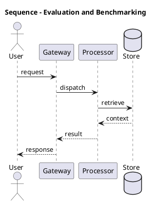

_Source diagram (plantuml); render with the appropriate tool._

**Figure 12. Sequence - Evaluation and Benchmarking** (plantuml). Figure: Sequence view for LLMs. This diagram illustrates the principal components and their interactions as discussed in the surrounding section.

## Deep Dive: Mechanics, Variants and Trade-offs

Having established the essentials, we now go deeper into evaluation and benchmarking. It pays to understand the mechanism rather than treat it as a black box, because most production incidents are explained by one of its steps misbehaving. The distinctions in this section are the ones that separate a working demo from a system that holds up under adversarial inputs, scale and the passage of time.

Consider the principal variants and how to choose between them. Each variant optimises for a different point in the design space - some for latency, some for accuracy, some for cost or operability - and the correct choice follows from explicit requirements rather than from defaults. As with most architectural decisions, the choice is rarely binary; the skill lies in quantifying the trade-offs and choosing deliberately.

In practice this is supported by a mature tooling ecosystem, including vLLM, TensorRT-LLM, Hugging Face Transformers, Ollama. Tools accelerate the work but do not substitute for understanding: the same principles apply whichever implementation you select, and the ability to reason from first principles is what lets you debug when a tool behaves unexpectedly.

A frequent source of subtle bugs is the interaction with instruction tuning and alignment. Because instruction tuning and alignment concerns supervised fine-tuning, RLHF and preference optimisation that make base models useful and safe, changes there can silently alter the behaviour analysed here. The remedy is contract tests at the boundary and end-to-end evaluations that exercise the interaction explicitly.

Finally, attend to edge cases and degradation. Define what the system should do under partial failure, unexpected inputs and load spikes, and make that behaviour explicit and tested rather than emergent. Graceful degradation - returning a safe, useful result when the ideal one is unavailable - is a hallmark of mature engineering.

For deeper study, the literature offers authoritative treatments such as Vaswani et al. — Attention Is All You Need (2017) and Hoffmann et al. — Training Compute-Optimal LLMs (Chinchilla, 2022). These primary sources reward careful reading and ground the practical guidance above in established results.

## Advanced Considerations

Having established the essentials, we now go deeper into evaluation and benchmarking. Mechanically, the behaviour emerges from a few interacting parts that are simpler than the whole they produce. The distinctions in this section are the ones that separate a working demo from a system that holds up under adversarial inputs, scale and the passage of time.

Consider the principal variants and how to choose between them. Each variant optimises for a different point in the design space - some for latency, some for accuracy, some for cost or operability - and the correct choice follows from explicit requirements rather than from defaults. As with most architectural decisions, the choice is rarely binary; the skill lies in quantifying the trade-offs and choosing deliberately.

In practice this is supported by a mature tooling ecosystem, including vLLM, TensorRT-LLM, Hugging Face Transformers, Ollama. Tools accelerate the work but do not substitute for understanding: the same principles apply whichever implementation you select, and the ability to reason from first principles is what lets you debug when a tool behaves unexpectedly.

A frequent source of subtle bugs is the interaction with from n-grams to neural language models. Because from n-grams to neural language models concerns the evolution of language modelling and why scale plus self-attention unlocked emergent capability, changes there can silently alter the behaviour analysed here. The remedy is contract tests at the boundary and end-to-end evaluations that exercise the interaction explicitly.

Finally, attend to edge cases and degradation. Define what the system should do under partial failure, unexpected inputs and load spikes, and make that behaviour explicit and tested rather than emergent. Graceful degradation - returning a safe, useful result when the ideal one is unavailable - is a hallmark of mature engineering.

For deeper study, the literature offers authoritative treatments such as Vaswani et al. — Attention Is All You Need (2017) and Hoffmann et al. — Training Compute-Optimal LLMs (Chinchilla, 2022). These primary sources reward careful reading and ground the practical guidance above in established results.

## Worked Example

Consider a concrete scenario. A enterprise search organisation needs answering questions over internal knowledge with citations. They decide to apply evaluation and benchmarking as part of their LLMs solution, but wisely treat it as a hypothesis to be validated rather than a foregone conclusion.

The team begins by stating the objective precisely and defining how success will be measured before writing any code. They establish a small but representative evaluation set, agree on acceptance thresholds, and only then prototype the simplest design that could work. Early measurement reveals which assumptions hold and which must be revised, saving weeks of misdirected effort and surfacing edge cases while they are still cheap to fix.

As the prototype matures into a service, the team hardens it: adding input validation, error handling, caching where it pays off, and monitoring that ties back to the original success metric. They document each significant decision in an architecture decision record so that future maintainers understand not just what was built but why.

The outcome is instructive. The system that reaches production is not the most sophisticated design the team considered, but the one whose behaviour they could measure, explain and operate. This is the recurring lesson of LLMs: durable value comes from the whole system, not from any single clever component.

## Industry Use Cases

Across industries, the ideas in this chapter recur in recognisable ways. The following vignettes show how different sectors apply them and what they have in common.

**Enterprise Search.** Answering questions over internal knowledge with citations. The common thread is that value comes not from the model alone but from the surrounding system - data quality, evaluation, integration and operations - which is precisely where most of the engineering effort belongs.

**Software.** Code completion and review across large repositories. The common thread is that value comes not from the model alone but from the surrounding system - data quality, evaluation, integration and operations - which is precisely where most of the engineering effort belongs.

**Finance.** Summarising filings and extracting structured facts. The common thread is that value comes not from the model alone but from the surrounding system - data quality, evaluation, integration and operations - which is precisely where most of the engineering effort belongs.

**Telecom.** Tier-1 support automation with escalation to humans. The common thread is that value comes not from the model alone but from the surrounding system - data quality, evaluation, integration and operations - which is precisely where most of the engineering effort belongs.

## Best Practices

The following practices consistently separate successful LLMs efforts from struggling ones. They are deliberately concrete so they can be adopted as checklist items in design and code review.

- Right-size the model to the task; do not pay for capability you don't use.
- Quantise and batch aggressively, validating quality impact with evals.
- Pin model and tokenizer versions; treat upgrades as releases.
- Monitor token distribution to catch prompt bloat and cost regressions.

None of these are exotic; they are the unglamorous disciplines that compound into reliability. The cost of adopting them is small compared with the cost of the incidents they prevent, and they become second nature with practice.

## Common Pitfalls

Equally instructive are the failure modes that recur in practice. Each pitfall below has a clear early warning sign and a known remedy, so treat them as a diagnostic checklist when something feels wrong:

- Assuming bigger is always better instead of measuring task fit.
- Underestimating KV-cache memory for long contexts.
- Silent tokenizer changes that break prompts and cost models.
- Benchmarking on contaminated datasets and over-claiming capability.

The pattern is consistent: most failures stem from skipping measurement, conflating prototype and production standards, or deferring cross-cutting concerns such as security and cost until they become emergencies. Naming these traps in advance is the cheapest way to avoid them.

## Governance, Security and Cost Notes

No discussion of evaluation and benchmarking is complete without its governance, security and cost dimensions, which are too often deferred until they become emergencies. Treating them as first-class concerns from the outset is both cheaper and safer.

**Governance.** Classify the risk of this capability, document its intended and out-of-scope uses, and ensure decisions are traceable to satisfy internal policy and external regulation such as the NIST AI RMF, ISO/IEC 42001 and the EU AI Act. **Security.** Treat all external input as untrusted, validate outputs before acting on them, apply least privilege to any tools or data access, and map controls to the OWASP LLM Top 10 and MITRE ATLAS.

**Cost and sustainability.** Establish explicit budgets for compute, tokens and latency, attribute spend to owners, and revisit the economics as usage scales - a design that is affordable at pilot scale can become untenable at production volume. Building these reflexes into everyday engineering is what allows a LLMs system to be not only capable but also trustworthy and economically sound.

## Hands-On Exercises

Work through the following exercises. They are designed to move understanding from recognition to application - the level required for real engineering work - so prefer writing and building over merely reading.

1. Explain evaluation and benchmarking to a colleague unfamiliar with LLMs, using a concrete example from your own domain.
2. Sketch a reference architecture that incorporates evaluation and benchmarking and annotate where observability, security and cost controls belong.
3. Design an evaluation that would tell you whether evaluation and benchmarking is working in production, including the metric, the dataset and the acceptance threshold.
4. Identify two pitfalls relevant to evaluation and benchmarking in your environment and describe the early warning signals you would monitor.
5. Prototype the simplest implementation that demonstrates evaluation and benchmarking, then list exactly what would need to change to make it production-ready.

## Key Takeaways

Key takeaways from this chapter:

- Evaluation and Benchmarking is a systems concern in LLMs: data, models and operations must be co-designed.
- Measurement is non-negotiable; define success metrics and evaluation before building.
- Favour the simplest design that meets the requirement, and add complexity only when evidence demands it.
- Security, cost and observability are first-class requirements, not afterthoughts.
- Document decisions so the system remains understandable and operable as it evolves.

## Code Walkthrough

This listing shows a configuration-driven Evaluation and Benchmarking component with retry semantics and typed interfaces — the shape we expect from production LLMs code rather than a notebook prototype.

The full listing is shown below; study it line by line and reproduce it locally before moving on.

### Listing: Implementing a Evaluation and Benchmarking component

```python
from __future__ import annotations

from dataclasses import dataclass, field
from typing import Any


@dataclass(slots=True)
class EvaluationAndBenchmarkingConfig:
    """Configuration for the Evaluation and Benchmarking component in a LLMs system."""

    name: str
    timeout_s: float = 30.0
    max_retries: int = 3
    options: dict[str, Any] = field(default_factory=dict)


class EvaluationAndBenchmarking:
    """A minimal, production-shaped implementation of Evaluation and Benchmarking."""

    def __init__(self, config: EvaluationAndBenchmarkingConfig) -> None:
        self._config = config
        self._calls = 0

    def run(self, payload: dict[str, Any]) -> dict[str, Any]:
        """Process a request, retrying transient failures with backoff."""
        last_error: Exception | None = None
        for attempt in range(self._config.max_retries):
            try:
                self._calls += 1
                return self._process(payload)
            except TimeoutError as exc:  # transient
                last_error = exc
                continue
        raise RuntimeError(f"EvaluationAndBenchmarking failed after retries") from last_error

    def _process(self, payload: dict[str, Any]) -> dict[str, Any]:
        # Domain-specific logic for Evaluation and Benchmarking goes here.
        return {"status": "ok", "input_keys": sorted(payload), "calls": self._calls}

```

## Review Questions

1. In the context of LLMs, which statement best describes “Evaluation and Benchmarking”?
   - A. It guarantees deterministic output regardless of input.
   - B. It makes the system slower but has no other effect.
   - C. Capability benchmarks, contamination, and task-specific golden sets.
   - D. It eliminates the need for any evaluation or monitoring.
   - **Answer: C.** Evaluation and Benchmarking: Capability benchmarks, contamination, and task-specific golden sets.
2. Which of the following is a recommended best practice when working with LLMs?
   - A. It guarantees deterministic output regardless of input.
   - B. Quantise and batch aggressively, validating quality impact with evals.
   - C. Silent tokenizer changes that break prompts and cost models.
   - D. It is only relevant to academic research, not production.
   - **Answer: B.** Best practice: Quantise and batch aggressively, validating quality impact with evals.
3. Which of the following is a common pitfall to avoid in LLMs?
   - A. Assuming bigger is always better instead of measuring task fit.
   - B. It makes the system slower but has no other effect.
   - C. It eliminates the need for any evaluation or monitoring.
   - D. Pin model and tokenizer versions; treat upgrades as releases.
   - **Answer: A.** Pitfall to avoid: Assuming bigger is always better instead of measuring task fit.
4. *(Discussion)* How would you test and monitor Evaluation and Benchmarking in production?
   - **Model answer:** A strong answer defines evaluation and benchmarking (Capability benchmarks, contamination, and task-specific golden sets.) then connects it to architecture, evaluation, cost, security and operations for LLMs, citing concrete trade-offs and a real-world example.

---


# Chapter 11. Hallucination and Factuality

_This chapter examines hallucination and factuality within LLMs. It covers why models confabulate and how grounding and decoding mitigate it, derives a reference architecture, walks through a worked example and runnable code, surveys industry use cases, and distils best practices and pitfalls, closing with exercises and review questions._

## Introduction

At its core, Hallucination and Factuality concerns why models confabulate and how grounding and decoding mitigate it. Understanding this matters because LLMs systems succeed or fail on exactly these decisions. Seasoned practitioners treat this as a systems problem, co-designing data, models and operations rather than optimising any one in isolation.

This chapter builds intuition first, then formalises the ideas, derives an architecture, and finishes with code, exercises and review questions so the material transfers directly to your own LLMs work. Read it actively: pause at each diagram, reproduce the code, and attempt the exercises before consulting the answers.

## Theory and Foundations

We define Hallucination and Factuality as why models confabulate and how grounding and decoding mitigate it. The practical implication is that design choices here ripple through latency, cost and maintainability for the lifetime of the system. It pays to understand the mechanism rather than treat it as a black box, because most production incidents are explained by one of its steps misbehaving.

To place this in context, recall the broader picture: Large language models are transformer-based neural networks trained on vast text corpora to predict the next token, acquiring broad linguistic and reasoning capabilities that transfer across tasks. Within that picture, hallucination and factuality is one of the load-bearing ideas - the kind that, when understood deeply, makes the rest of LLMs fall into place. Understanding this matters because LLMs systems succeed or fail on exactly these decisions.

Hallucination and Factuality cannot be understood in isolation from evaluation and benchmarking. Recall that evaluation and benchmarking concerns capability benchmarks, contamination, and task-specific golden sets. The two interact directly: decisions in one constrain the design space of the other, which is why mature teams reason about them together rather than sequentially. Latency, accuracy and cost form a tension triangle: improving one typically pressures the others, so explicit budgets are essential.

Hallucination and Factuality cannot be understood in isolation from instruction tuning and alignment. Recall that instruction tuning and alignment concerns supervised fine-tuning, RLHF and preference optimisation that make base models useful and safe. The two interact directly: decisions in one constrain the design space of the other, which is why mature teams reason about them together rather than sequentially. Simplicity is a feature. The simplest design that meets the requirement should be the default, with complexity added only when measurement justifies it.

Several established patterns apply directly to hallucination and factuality. The first, model routing by difficulty (small model first, escalate on low confidence), is widely adopted because it makes the system's behaviour predictable and observable. A complementary pattern, blue/green model rollout with shadow evaluation, addresses a related concern and is often deployed alongside it. Patterns are not dogma; they are distilled experience that shortcuts the search for a sound design, and each carries assumptions worth checking against your context.

It is worth being explicit about when to apply this and when to reach for something simpler. In a small prototype, shortcuts around hallucination and factuality are invisible; in a production LLMs system serving real traffic, they surface as incidents, cost overruns or compliance gaps. As with most architectural decisions, the choice is rarely binary; the skill lies in quantifying the trade-offs and choosing deliberately. The remainder of this chapter turns these principles into an architecture, code and a checklist you can apply immediately.

## Architecture and Design

A robust architecture for Hallucination and Factuality is layered so each part can evolve independently without destabilising the whole. An LLM serving platform comprises a request gateway with auth and rate limiting, an inference cluster running an optimised engine (paged KV cache, continuous batching, quantised weights), a routing layer selecting model size by task, and an observability pipeline tracking latency, tokens and quality. Model artefacts flow from a registry with signed provenance into blue/green serving slots.

Concretely, the principal building blocks include from n-grams to neural language models, tokenisation and vocabulary, the transformer backbone of llms, pre-training objectives and data and scaling laws and emergent abilities. Each is a replaceable component behind a stable interface, so the team can upgrade an implementation - a model, an index, a policy engine - without rewriting its neighbours. The contracts between components are where reliability is won or lost, so they are specified explicitly and tested in isolation.

The diagram accompanying this section makes the data and control flow explicit. Requests enter through a well-defined boundary where they are authenticated and validated; only then are they dispatched to the components that perform the work. This boundary is also where rate limiting, quota enforcement and audit logging live, keeping cross-cutting concerns out of the core logic and in one auditable place.

Two qualities deserve emphasis. First, observability is designed in, not bolted on: every component emits structured telemetry so that failures can be localised in minutes rather than hours. Second, the architecture is evolvable - components communicate through stable contracts so that any single part of the LLMs system can be replaced without a rewrite. Simplicity is a feature. The simplest design that meets the requirement should be the default, with complexity added only when measurement justifies it.

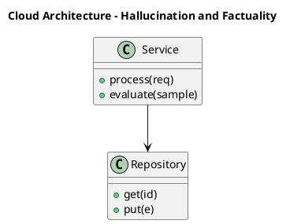

_Source diagram (plantuml); render with the appropriate tool._

**Figure 13. Cloud Architecture - Hallucination and Factuality** (plantuml). Figure: Cloud Architecture view for LLMs. This diagram illustrates the principal components and their interactions as discussed in the surrounding section.

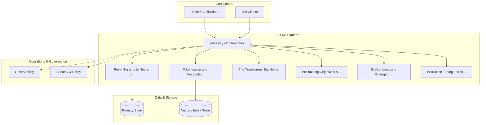

**Figure 14. Agent Architecture - Hallucination and Factuality** (mermaid). Figure: Agent Architecture view for LLMs. This diagram illustrates the principal components and their interactions as discussed in the surrounding section.

## Deep Dive: Mechanics, Variants and Trade-offs

Having established the essentials, we now go deeper into hallucination and factuality. Beneath the abstraction lies a concrete process whose steps can each be measured, tested and optimised independently. The distinctions in this section are the ones that separate a working demo from a system that holds up under adversarial inputs, scale and the passage of time.

Consider the principal variants and how to choose between them. Each variant optimises for a different point in the design space - some for latency, some for accuracy, some for cost or operability - and the correct choice follows from explicit requirements rather than from defaults. There is an inherent trade-off between fidelity and cost, and the correct balance depends on the use case and its tolerance for error.

In practice this is supported by a mature tooling ecosystem, including vLLM, TensorRT-LLM, Hugging Face Transformers, Ollama. Tools accelerate the work but do not substitute for understanding: the same principles apply whichever implementation you select, and the ability to reason from first principles is what lets you debug when a tool behaves unexpectedly.

A frequent source of subtle bugs is the interaction with evaluation and benchmarking. Because evaluation and benchmarking concerns capability benchmarks, contamination, and task-specific golden sets, changes there can silently alter the behaviour analysed here. The remedy is contract tests at the boundary and end-to-end evaluations that exercise the interaction explicitly.

Finally, attend to edge cases and degradation. Define what the system should do under partial failure, unexpected inputs and load spikes, and make that behaviour explicit and tested rather than emergent. Graceful degradation - returning a safe, useful result when the ideal one is unavailable - is a hallmark of mature engineering.

For deeper study, the literature offers authoritative treatments such as Vaswani et al. — Attention Is All You Need (2017) and Hoffmann et al. — Training Compute-Optimal LLMs (Chinchilla, 2022). These primary sources reward careful reading and ground the practical guidance above in established results.

## Advanced Considerations

Having established the essentials, we now go deeper into hallucination and factuality. The underlying mechanism is best appreciated by tracing a single request from input to output and noting where state is created and consumed. The distinctions in this section are the ones that separate a working demo from a system that holds up under adversarial inputs, scale and the passage of time.

Consider the principal variants and how to choose between them. Each variant optimises for a different point in the design space - some for latency, some for accuracy, some for cost or operability - and the correct choice follows from explicit requirements rather than from defaults. Every added component buys capability at the price of operational surface area, and that bargain should be made consciously.

In practice this is supported by a mature tooling ecosystem, including vLLM, TensorRT-LLM, Hugging Face Transformers, Ollama. Tools accelerate the work but do not substitute for understanding: the same principles apply whichever implementation you select, and the ability to reason from first principles is what lets you debug when a tool behaves unexpectedly.

A frequent source of subtle bugs is the interaction with the llm platform reference architecture. Because the llm platform reference architecture concerns gateways, registries, evaluation and observability for fleets of models, changes there can silently alter the behaviour analysed here. The remedy is contract tests at the boundary and end-to-end evaluations that exercise the interaction explicitly.

Finally, attend to edge cases and degradation. Define what the system should do under partial failure, unexpected inputs and load spikes, and make that behaviour explicit and tested rather than emergent. Graceful degradation - returning a safe, useful result when the ideal one is unavailable - is a hallmark of mature engineering.

For deeper study, the literature offers authoritative treatments such as Vaswani et al. — Attention Is All You Need (2017) and Hoffmann et al. — Training Compute-Optimal LLMs (Chinchilla, 2022). These primary sources reward careful reading and ground the practical guidance above in established results.

## Worked Example

A worked example clarifies how these ideas behave in practice. A finance organisation needs summarising filings and extracting structured facts. They decide to apply hallucination and factuality as part of their LLMs solution, but wisely treat it as a hypothesis to be validated rather than a foregone conclusion.

The team begins by stating the objective precisely and defining how success will be measured before writing any code. They establish a small but representative evaluation set, agree on acceptance thresholds, and only then prototype the simplest design that could work. Early measurement reveals which assumptions hold and which must be revised, saving weeks of misdirected effort and surfacing edge cases while they are still cheap to fix.

As the prototype matures into a service, the team hardens it: adding input validation, error handling, caching where it pays off, and monitoring that ties back to the original success metric. They document each significant decision in an architecture decision record so that future maintainers understand not just what was built but why.

The outcome is instructive. The system that reaches production is not the most sophisticated design the team considered, but the one whose behaviour they could measure, explain and operate. This is the recurring lesson of LLMs: durable value comes from the whole system, not from any single clever component.

## Industry Use Cases

Across industries, the ideas in this chapter recur in recognisable ways. The following vignettes show how different sectors apply them and what they have in common.

**Enterprise Search.** Answering questions over internal knowledge with citations. The common thread is that value comes not from the model alone but from the surrounding system - data quality, evaluation, integration and operations - which is precisely where most of the engineering effort belongs.

**Software.** Code completion and review across large repositories. The common thread is that value comes not from the model alone but from the surrounding system - data quality, evaluation, integration and operations - which is precisely where most of the engineering effort belongs.

**Finance.** Summarising filings and extracting structured facts. The common thread is that value comes not from the model alone but from the surrounding system - data quality, evaluation, integration and operations - which is precisely where most of the engineering effort belongs.

**Telecom.** Tier-1 support automation with escalation to humans. The common thread is that value comes not from the model alone but from the surrounding system - data quality, evaluation, integration and operations - which is precisely where most of the engineering effort belongs.

## Best Practices

The following practices consistently separate successful LLMs efforts from struggling ones. They are deliberately concrete so they can be adopted as checklist items in design and code review.

- Right-size the model to the task; do not pay for capability you don't use.
- Quantise and batch aggressively, validating quality impact with evals.
- Pin model and tokenizer versions; treat upgrades as releases.
- Monitor token distribution to catch prompt bloat and cost regressions.

None of these are exotic; they are the unglamorous disciplines that compound into reliability. The cost of adopting them is small compared with the cost of the incidents they prevent, and they become second nature with practice.

## Common Pitfalls

Equally instructive are the failure modes that recur in practice. Each pitfall below has a clear early warning sign and a known remedy, so treat them as a diagnostic checklist when something feels wrong:

- Assuming bigger is always better instead of measuring task fit.
- Underestimating KV-cache memory for long contexts.
- Silent tokenizer changes that break prompts and cost models.
- Benchmarking on contaminated datasets and over-claiming capability.

The pattern is consistent: most failures stem from skipping measurement, conflating prototype and production standards, or deferring cross-cutting concerns such as security and cost until they become emergencies. Naming these traps in advance is the cheapest way to avoid them.

## Governance, Security and Cost Notes

No discussion of hallucination and factuality is complete without its governance, security and cost dimensions, which are too often deferred until they become emergencies. Treating them as first-class concerns from the outset is both cheaper and safer.

**Governance.** Classify the risk of this capability, document its intended and out-of-scope uses, and ensure decisions are traceable to satisfy internal policy and external regulation such as the NIST AI RMF, ISO/IEC 42001 and the EU AI Act. **Security.** Treat all external input as untrusted, validate outputs before acting on them, apply least privilege to any tools or data access, and map controls to the OWASP LLM Top 10 and MITRE ATLAS.

**Cost and sustainability.** Establish explicit budgets for compute, tokens and latency, attribute spend to owners, and revisit the economics as usage scales - a design that is affordable at pilot scale can become untenable at production volume. Building these reflexes into everyday engineering is what allows a LLMs system to be not only capable but also trustworthy and economically sound.

## Hands-On Exercises

Work through the following exercises. They are designed to move understanding from recognition to application - the level required for real engineering work - so prefer writing and building over merely reading.

1. Explain hallucination and factuality to a colleague unfamiliar with LLMs, using a concrete example from your own domain.
2. Sketch a reference architecture that incorporates hallucination and factuality and annotate where observability, security and cost controls belong.
3. Design an evaluation that would tell you whether hallucination and factuality is working in production, including the metric, the dataset and the acceptance threshold.
4. Identify two pitfalls relevant to hallucination and factuality in your environment and describe the early warning signals you would monitor.
5. Prototype the simplest implementation that demonstrates hallucination and factuality, then list exactly what would need to change to make it production-ready.

## Key Takeaways

Key takeaways from this chapter:

- Hallucination and Factuality is a systems concern in LLMs: data, models and operations must be co-designed.
- Measurement is non-negotiable; define success metrics and evaluation before building.
- Favour the simplest design that meets the requirement, and add complexity only when evidence demands it.
- Security, cost and observability are first-class requirements, not afterthoughts.
- Document decisions so the system remains understandable and operable as it evolves.

## Code Walkthrough

Pipelines keep Hallucination and Factuality logic modular and testable. Each stage is a pure function, errors are captured per item, and the composition is trivial to extend or reorder.

The full listing is shown below; study it line by line and reproduce it locally before moving on.

### Listing: A composable processing pipeline for Hallucination and Factuality

```python
from collections.abc import Iterable, Iterator
from typing import Protocol


class Stage(Protocol):
    def __call__(self, item: dict) -> dict: ...


def pipeline(stages: list[Stage]) -> Stage:
    """Compose ordered stages into a single callable for Hallucination and Factuality."""

    def run(item: dict) -> dict:
        for stage in stages:
            item = stage(item)
        return item

    return run


def validate(item: dict) -> dict:
    if "text" not in item:
        raise ValueError("missing required field: text")
    return item


def normalise(item: dict) -> dict:
    item["text"] = item["text"].strip().lower()
    return item


def enrich(item: dict) -> dict:
    item["length"] = len(item["text"])
    return item


process = pipeline([validate, normalise, enrich])


def run_batch(items: Iterable[dict]) -> Iterator[dict]:
    for item in items:
        try:
            yield process(dict(item))
        except ValueError as exc:
            yield {"error": str(exc), "item": item}

```

## Review Questions

1. In the context of LLMs, which statement best describes “Hallucination and Factuality”?
   - A. It removes all security and governance requirements.
   - B. It applies exclusively to image data.
   - C. It is only relevant to academic research, not production.
   - D. Why models confabulate and how grounding and decoding mitigate it.
   - **Answer: D.** Hallucination and Factuality: Why models confabulate and how grounding and decoding mitigate it.
2. Which of the following is a recommended best practice when working with LLMs?
   - A. It eliminates the need for any evaluation or monitoring.
   - B. It removes all security and governance requirements.
   - C. Assuming bigger is always better instead of measuring task fit.
   - D. Pin model and tokenizer versions; treat upgrades as releases.
   - **Answer: D.** Best practice: Pin model and tokenizer versions; treat upgrades as releases.
3. Which of the following is a common pitfall to avoid in LLMs?
   - A. It guarantees deterministic output regardless of input.
   - B. It removes all security and governance requirements.
   - C. Benchmarking on contaminated datasets and over-claiming capability.
   - D. Monitor token distribution to catch prompt bloat and cost regressions.
   - **Answer: C.** Pitfall to avoid: Benchmarking on contaminated datasets and over-claiming capability.
4. *(Discussion)* Walk through how you would design Hallucination and Factuality for an enterprise LLMs workload.
   - **Model answer:** A strong answer defines hallucination and factuality (Why models confabulate and how grounding and decoding mitigate it.) then connects it to architecture, evaluation, cost, security and operations for LLMs, citing concrete trade-offs and a real-world example.

---


# Chapter 12. Cost and Capacity Planning

_This chapter examines cost and capacity planning within LLMs. It covers token economics, hardware sizing and build-versus-buy decisions, derives a reference architecture, walks through a worked example and runnable code, surveys industry use cases, and distils best practices and pitfalls, closing with exercises and review questions._

## Introduction

Cost and Capacity Planning can be characterised as token economics, hardware sizing and build-versus-buy decisions. Neglecting it is one of the most common reasons LLMs initiatives stall in production. What distinguishes a production-grade approach from a prototype is the discipline of measurement: every claim is backed by an evaluation rather than intuition.

This chapter builds intuition first, then formalises the ideas, derives an architecture, and finishes with code, exercises and review questions so the material transfers directly to your own LLMs work. Read it actively: pause at each diagram, reproduce the code, and attempt the exercises before consulting the answers.

## Theory and Foundations

At its core, Cost and Capacity Planning concerns token economics, hardware sizing and build-versus-buy decisions. Seasoned practitioners treat this as a systems problem, co-designing data, models and operations rather than optimising any one in isolation. The underlying mechanism is best appreciated by tracing a single request from input to output and noting where state is created and consumed.

To place this in context, recall the broader picture: Large language models are transformer-based neural networks trained on vast text corpora to predict the next token, acquiring broad linguistic and reasoning capabilities that transfer across tasks. Within that picture, cost and capacity planning is one of the load-bearing ideas - the kind that, when understood deeply, makes the rest of LLMs fall into place. Neglecting it is one of the most common reasons LLMs initiatives stall in production.

Cost and Capacity Planning cannot be understood in isolation from hallucination and factuality. Recall that hallucination and factuality concerns why models confabulate and how grounding and decoding mitigate it. The two interact directly: decisions in one constrain the design space of the other, which is why mature teams reason about them together rather than sequentially. Every added component buys capability at the price of operational surface area, and that bargain should be made consciously.

Cost and Capacity Planning cannot be understood in isolation from tokenisation and vocabulary. Recall that tokenisation and vocabulary concerns byte-pair encoding, subword units, special tokens and their impact on cost and multilingual performance. The two interact directly: decisions in one constrain the design space of the other, which is why mature teams reason about them together rather than sequentially. Every added component buys capability at the price of operational surface area, and that bargain should be made consciously.

Several established patterns apply directly to cost and capacity planning. The first, speculative decoding with a small draft model, is widely adopted because it makes the system's behaviour predictable and observable. A complementary pattern, model routing by difficulty (small model first, escalate on low confidence), addresses a related concern and is often deployed alongside it. Patterns are not dogma; they are distilled experience that shortcuts the search for a sound design, and each carries assumptions worth checking against your context.

Knowing when not to use a technique is as valuable as knowing how to use it. In a small prototype, shortcuts around cost and capacity planning are invisible; in a production LLMs system serving real traffic, they surface as incidents, cost overruns or compliance gaps. As with most architectural decisions, the choice is rarely binary; the skill lies in quantifying the trade-offs and choosing deliberately. The remainder of this chapter turns these principles into an architecture, code and a checklist you can apply immediately.

## Architecture and Design

From an architectural standpoint, Cost and Capacity Planning sits at the intersection of data, models and operations. An LLM serving platform comprises a request gateway with auth and rate limiting, an inference cluster running an optimised engine (paged KV cache, continuous batching, quantised weights), a routing layer selecting model size by task, and an observability pipeline tracking latency, tokens and quality. Model artefacts flow from a registry with signed provenance into blue/green serving slots.

Concretely, the principal building blocks include from n-grams to neural language models, tokenisation and vocabulary, the transformer backbone of llms, pre-training objectives and data and scaling laws and emergent abilities. Each is a replaceable component behind a stable interface, so the team can upgrade an implementation - a model, an index, a policy engine - without rewriting its neighbours. The contracts between components are where reliability is won or lost, so they are specified explicitly and tested in isolation.

The diagram accompanying this section makes the data and control flow explicit. Requests enter through a well-defined boundary where they are authenticated and validated; only then are they dispatched to the components that perform the work. This boundary is also where rate limiting, quota enforcement and audit logging live, keeping cross-cutting concerns out of the core logic and in one auditable place.

Two qualities deserve emphasis. First, observability is designed in, not bolted on: every component emits structured telemetry so that failures can be localised in minutes rather than hours. Second, the architecture is evolvable - components communicate through stable contracts so that any single part of the LLMs system can be replaced without a rewrite. Simplicity is a feature. The simplest design that meets the requirement should be the default, with complexity added only when measurement justifies it.

<div class="diagram-svg">

<svg xmlns="http://www.w3.org/2000/svg" width="840" height="460" data-tpl="radial" data-pal="11-4" viewBox="0 0 840 460" font-family="Inter, Segoe UI, Arial, sans-serif"><defs><marker id="ar" markerWidth="9" markerHeight="9" refX="7" refY="3" orient="auto"><path d="M0,0 L7,3 L0,6 z" fill="#94a3b8"/></marker><marker id="arw" markerWidth="9" markerHeight="9" refX="7" refY="3" orient="auto"><path d="M0,0 L7,3 L0,6 z" fill="#ffffff"/></marker><filter id="sh" x="-20%" y="-20%" width="140%" height="140%"><feDropShadow dx="0" dy="2" stdDeviation="3" flood-color="#0f172a" flood-opacity="0.16"/></filter></defs><defs><linearGradient id="bne8a215c" x1="0" y1="0" x2="1" y2="0"><stop offset="0" stop-color="#9f1239"/><stop offset="1" stop-color="#4338ca"/></linearGradient></defs><rect width="840" height="460" rx="14" fill="#ffffff"/><rect x="0" y="0" width="840" height="48" rx="14" fill="url(#bne8a215c)"/><rect x="0" y="32" width="840" height="16" fill="url(#bne8a215c)"/><text x="420" y="25" text-anchor="middle" font-size="14.5" font-weight="700" fill="#ffffff" dominant-baseline="middle">Agent Architecture - Cost and Capacity Planning</text><circle cx="420.0" cy="238.0" r="52" fill="#0f172a"/><text x="420" y="238" text-anchor="middle" font-size="12" font-weight="600" fill="#fff" dominant-baseline="middle">LLMs</text><line x1="420" y1="186" x2="420" y2="102" stroke="#94a3b8" stroke-width="2" marker-end="url(#ar)"/><rect x="342" y="65" width="156" height="46" rx="11" fill="#9f1239" filter="url(#sh)"/><text x="420" y="83" text-anchor="middle" font-size="9.5" font-weight="600" fill="#ffffff" dominant-baseline="middle">From N-grams to Neural</text><text x="420" y="93" text-anchor="middle" font-size="9.5" font-weight="600" fill="#ffffff" dominant-baseline="middle">Language Models</text><line x1="465" y1="212" x2="631" y2="170" stroke="#94a3b8" stroke-width="2" marker-end="url(#ar)"/><rect x="576" y="140" width="156" height="46" rx="11" fill="#4338ca" filter="url(#sh)"/><text x="654" y="163" text-anchor="middle" font-size="9.5" font-weight="600" fill="#ffffff" dominant-baseline="middle">Tokenisation and Vocabulary</text><line x1="465" y1="264" x2="631" y2="306" stroke="#94a3b8" stroke-width="2" marker-end="url(#ar)"/><rect x="576" y="290" width="156" height="46" rx="11" fill="#0f172a" filter="url(#sh)"/><text x="654" y="308" text-anchor="middle" font-size="9.5" font-weight="600" fill="#ffffff" dominant-baseline="middle">The Transformer Backbone of</text><text x="654" y="318" text-anchor="middle" font-size="9.5" font-weight="600" fill="#ffffff" dominant-baseline="middle">LLMs</text><line x1="420" y1="290" x2="420" y2="374" stroke="#94a3b8" stroke-width="2" marker-end="url(#ar)"/><rect x="342" y="365" width="156" height="46" rx="11" fill="#1e40af" filter="url(#sh)"/><text x="420" y="383" text-anchor="middle" font-size="9.5" font-weight="600" fill="#ffffff" dominant-baseline="middle">Pre-training Objectives and</text><text x="420" y="393" text-anchor="middle" font-size="9.5" font-weight="600" fill="#ffffff" dominant-baseline="middle">Data</text><line x1="375" y1="264" x2="209" y2="306" stroke="#94a3b8" stroke-width="2" marker-end="url(#ar)"/><rect x="108" y="290" width="156" height="46" rx="11" fill="#0e7490" filter="url(#sh)"/><text x="186" y="308" text-anchor="middle" font-size="9.5" font-weight="600" fill="#ffffff" dominant-baseline="middle">Scaling Laws and Emergent</text><text x="186" y="318" text-anchor="middle" font-size="9.5" font-weight="600" fill="#ffffff" dominant-baseline="middle">Abilities</text><line x1="375" y1="212" x2="209" y2="170" stroke="#94a3b8" stroke-width="2" marker-end="url(#ar)"/><rect x="108" y="140" width="156" height="46" rx="11" fill="#b45309" filter="url(#sh)"/><text x="186" y="158" text-anchor="middle" font-size="9.5" font-weight="600" fill="#ffffff" dominant-baseline="middle">Instruction Tuning and</text><text x="186" y="168" text-anchor="middle" font-size="9.5" font-weight="600" fill="#ffffff" dominant-baseline="middle">Alignment</text><text x="28" y="446" text-anchor="start" font-size="9.5" font-weight="500" fill="#64748b" dominant-baseline="middle">LLMs  •  Agent Architecture</text></svg>

</div>

**Figure 15. Agent Architecture - Cost and Capacity Planning** (svg). Figure: Agent Architecture view for LLMs. This diagram illustrates the principal components and their interactions as discussed in the surrounding section.

## Deep Dive: Mechanics, Variants and Trade-offs

Having established the essentials, we now go deeper into cost and capacity planning. It pays to understand the mechanism rather than treat it as a black box, because most production incidents are explained by one of its steps misbehaving. The distinctions in this section are the ones that separate a working demo from a system that holds up under adversarial inputs, scale and the passage of time.

Consider the principal variants and how to choose between them. Each variant optimises for a different point in the design space - some for latency, some for accuracy, some for cost or operability - and the correct choice follows from explicit requirements rather than from defaults. Latency, accuracy and cost form a tension triangle: improving one typically pressures the others, so explicit budgets are essential.

In practice this is supported by a mature tooling ecosystem, including vLLM, TensorRT-LLM, Hugging Face Transformers, Ollama. Tools accelerate the work but do not substitute for understanding: the same principles apply whichever implementation you select, and the ability to reason from first principles is what lets you debug when a tool behaves unexpectedly.

A frequent source of subtle bugs is the interaction with hallucination and factuality. Because hallucination and factuality concerns why models confabulate and how grounding and decoding mitigate it, changes there can silently alter the behaviour analysed here. The remedy is contract tests at the boundary and end-to-end evaluations that exercise the interaction explicitly.

Finally, attend to edge cases and degradation. Define what the system should do under partial failure, unexpected inputs and load spikes, and make that behaviour explicit and tested rather than emergent. Graceful degradation - returning a safe, useful result when the ideal one is unavailable - is a hallmark of mature engineering.

For deeper study, the literature offers authoritative treatments such as Vaswani et al. — Attention Is All You Need (2017) and Hoffmann et al. — Training Compute-Optimal LLMs (Chinchilla, 2022). These primary sources reward careful reading and ground the practical guidance above in established results.

## Advanced Considerations

Having established the essentials, we now go deeper into cost and capacity planning. Mechanically, the behaviour emerges from a few interacting parts that are simpler than the whole they produce. The distinctions in this section are the ones that separate a working demo from a system that holds up under adversarial inputs, scale and the passage of time.

Consider the principal variants and how to choose between them. Each variant optimises for a different point in the design space - some for latency, some for accuracy, some for cost or operability - and the correct choice follows from explicit requirements rather than from defaults. Every added component buys capability at the price of operational surface area, and that bargain should be made consciously.

In practice this is supported by a mature tooling ecosystem, including vLLM, TensorRT-LLM, Hugging Face Transformers, Ollama. Tools accelerate the work but do not substitute for understanding: the same principles apply whichever implementation you select, and the ability to reason from first principles is what lets you debug when a tool behaves unexpectedly.

A frequent source of subtle bugs is the interaction with safety and alignment in production. Because safety and alignment in production concerns layered safety, refusal behaviour and policy enforcement, changes there can silently alter the behaviour analysed here. The remedy is contract tests at the boundary and end-to-end evaluations that exercise the interaction explicitly.

Finally, attend to edge cases and degradation. Define what the system should do under partial failure, unexpected inputs and load spikes, and make that behaviour explicit and tested rather than emergent. Graceful degradation - returning a safe, useful result when the ideal one is unavailable - is a hallmark of mature engineering.

For deeper study, the literature offers authoritative treatments such as Vaswani et al. — Attention Is All You Need (2017) and Hoffmann et al. — Training Compute-Optimal LLMs (Chinchilla, 2022). These primary sources reward careful reading and ground the practical guidance above in established results.

## Worked Example

Consider a concrete scenario. A software organisation needs code completion and review across large repositories. They decide to apply cost and capacity planning as part of their LLMs solution, but wisely treat it as a hypothesis to be validated rather than a foregone conclusion.

The team begins by stating the objective precisely and defining how success will be measured before writing any code. They establish a small but representative evaluation set, agree on acceptance thresholds, and only then prototype the simplest design that could work. Early measurement reveals which assumptions hold and which must be revised, saving weeks of misdirected effort and surfacing edge cases while they are still cheap to fix.

As the prototype matures into a service, the team hardens it: adding input validation, error handling, caching where it pays off, and monitoring that ties back to the original success metric. They document each significant decision in an architecture decision record so that future maintainers understand not just what was built but why.

The outcome is instructive. The system that reaches production is not the most sophisticated design the team considered, but the one whose behaviour they could measure, explain and operate. This is the recurring lesson of LLMs: durable value comes from the whole system, not from any single clever component.

## Industry Use Cases

Across industries, the ideas in this chapter recur in recognisable ways. The following vignettes show how different sectors apply them and what they have in common.

**Enterprise Search.** Answering questions over internal knowledge with citations. The common thread is that value comes not from the model alone but from the surrounding system - data quality, evaluation, integration and operations - which is precisely where most of the engineering effort belongs.

**Software.** Code completion and review across large repositories. The common thread is that value comes not from the model alone but from the surrounding system - data quality, evaluation, integration and operations - which is precisely where most of the engineering effort belongs.

**Finance.** Summarising filings and extracting structured facts. The common thread is that value comes not from the model alone but from the surrounding system - data quality, evaluation, integration and operations - which is precisely where most of the engineering effort belongs.

**Telecom.** Tier-1 support automation with escalation to humans. The common thread is that value comes not from the model alone but from the surrounding system - data quality, evaluation, integration and operations - which is precisely where most of the engineering effort belongs.

## Best Practices

The following practices consistently separate successful LLMs efforts from struggling ones. They are deliberately concrete so they can be adopted as checklist items in design and code review.

- Right-size the model to the task; do not pay for capability you don't use.
- Quantise and batch aggressively, validating quality impact with evals.
- Pin model and tokenizer versions; treat upgrades as releases.
- Monitor token distribution to catch prompt bloat and cost regressions.

None of these are exotic; they are the unglamorous disciplines that compound into reliability. The cost of adopting them is small compared with the cost of the incidents they prevent, and they become second nature with practice.

## Common Pitfalls

Equally instructive are the failure modes that recur in practice. Each pitfall below has a clear early warning sign and a known remedy, so treat them as a diagnostic checklist when something feels wrong:

- Assuming bigger is always better instead of measuring task fit.
- Underestimating KV-cache memory for long contexts.
- Silent tokenizer changes that break prompts and cost models.
- Benchmarking on contaminated datasets and over-claiming capability.

The pattern is consistent: most failures stem from skipping measurement, conflating prototype and production standards, or deferring cross-cutting concerns such as security and cost until they become emergencies. Naming these traps in advance is the cheapest way to avoid them.

## Governance, Security and Cost Notes

No discussion of cost and capacity planning is complete without its governance, security and cost dimensions, which are too often deferred until they become emergencies. Treating them as first-class concerns from the outset is both cheaper and safer.

**Governance.** Classify the risk of this capability, document its intended and out-of-scope uses, and ensure decisions are traceable to satisfy internal policy and external regulation such as the NIST AI RMF, ISO/IEC 42001 and the EU AI Act. **Security.** Treat all external input as untrusted, validate outputs before acting on them, apply least privilege to any tools or data access, and map controls to the OWASP LLM Top 10 and MITRE ATLAS.

**Cost and sustainability.** Establish explicit budgets for compute, tokens and latency, attribute spend to owners, and revisit the economics as usage scales - a design that is affordable at pilot scale can become untenable at production volume. Building these reflexes into everyday engineering is what allows a LLMs system to be not only capable but also trustworthy and economically sound.

## Hands-On Exercises

Work through the following exercises. They are designed to move understanding from recognition to application - the level required for real engineering work - so prefer writing and building over merely reading.

1. Explain cost and capacity planning to a colleague unfamiliar with LLMs, using a concrete example from your own domain.
2. Sketch a reference architecture that incorporates cost and capacity planning and annotate where observability, security and cost controls belong.
3. Design an evaluation that would tell you whether cost and capacity planning is working in production, including the metric, the dataset and the acceptance threshold.
4. Identify two pitfalls relevant to cost and capacity planning in your environment and describe the early warning signals you would monitor.
5. Prototype the simplest implementation that demonstrates cost and capacity planning, then list exactly what would need to change to make it production-ready.

## Key Takeaways

Key takeaways from this chapter:

- Cost and Capacity Planning is a systems concern in LLMs: data, models and operations must be co-designed.
- Measurement is non-negotiable; define success metrics and evaluation before building.
- Favour the simplest design that meets the requirement, and add complexity only when evidence demands it.
- Security, cost and observability are first-class requirements, not afterthoughts.
- Document decisions so the system remains understandable and operable as it evolves.

## Code Walkthrough

This listing shows a configuration-driven Cost and Capacity Planning component with retry semantics and typed interfaces — the shape we expect from production LLMs code rather than a notebook prototype.

The full listing is shown below; study it line by line and reproduce it locally before moving on.

### Listing: Implementing a Cost and Capacity Planning component

```python
from __future__ import annotations

from dataclasses import dataclass, field
from typing import Any


@dataclass(slots=True)
class CostAndCapacityConfig:
    """Configuration for the Cost and Capacity Planning component in a LLMs system."""

    name: str
    timeout_s: float = 30.0
    max_retries: int = 3
    options: dict[str, Any] = field(default_factory=dict)


class CostAndCapacity:
    """A minimal, production-shaped implementation of Cost and Capacity Planning."""

    def __init__(self, config: CostAndCapacityConfig) -> None:
        self._config = config
        self._calls = 0

    def run(self, payload: dict[str, Any]) -> dict[str, Any]:
        """Process a request, retrying transient failures with backoff."""
        last_error: Exception | None = None
        for attempt in range(self._config.max_retries):
            try:
                self._calls += 1
                return self._process(payload)
            except TimeoutError as exc:  # transient
                last_error = exc
                continue
        raise RuntimeError(f"CostAndCapacity failed after retries") from last_error

    def _process(self, payload: dict[str, Any]) -> dict[str, Any]:
        # Domain-specific logic for Cost and Capacity Planning goes here.
        return {"status": "ok", "input_keys": sorted(payload), "calls": self._calls}

```

## Review Questions

1. In the context of LLMs, which statement best describes “Cost and Capacity Planning”?
   - A. Token economics, hardware sizing and build-versus-buy decisions.
   - B. It applies exclusively to image data.
   - C. It removes all security and governance requirements.
   - D. It makes the system slower but has no other effect.
   - **Answer: A.** Cost and Capacity Planning: Token economics, hardware sizing and build-versus-buy decisions.
2. Which of the following is a recommended best practice when working with LLMs?
   - A. Pin model and tokenizer versions; treat upgrades as releases.
   - B. It is only relevant to academic research, not production.
   - C. It removes all security and governance requirements.
   - D. Underestimating KV-cache memory for long contexts.
   - **Answer: A.** Best practice: Pin model and tokenizer versions; treat upgrades as releases.
3. Which of the following is a common pitfall to avoid in LLMs?
   - A. It applies exclusively to image data.
   - B. It guarantees deterministic output regardless of input.
   - C. Right-size the model to the task; do not pay for capability you don't use.
   - D. Assuming bigger is always better instead of measuring task fit.
   - **Answer: D.** Pitfall to avoid: Assuming bigger is always better instead of measuring task fit.
4. *(Discussion)* What trade-offs would you weigh when implementing Cost and Capacity Planning?
   - **Model answer:** A strong answer defines cost and capacity planning (Token economics, hardware sizing and build-versus-buy decisions.) then connects it to architecture, evaluation, cost, security and operations for LLMs, citing concrete trade-offs and a real-world example.

---


# Chapter 13. Safety and Alignment in Production

_This chapter examines safety and alignment in production within LLMs. It covers layered safety, refusal behaviour and policy enforcement, derives a reference architecture, walks through a worked example and runnable code, surveys industry use cases, and distils best practices and pitfalls, closing with exercises and review questions._

## Introduction

Formally, Safety and Alignment in Production addresses layered safety, refusal behaviour and policy enforcement. This concept recurs throughout the LLMs lifecycle, from design to operations. The practical implication is that design choices here ripple through latency, cost and maintainability for the lifetime of the system.

This chapter builds intuition first, then formalises the ideas, derives an architecture, and finishes with code, exercises and review questions so the material transfers directly to your own LLMs work. Read it actively: pause at each diagram, reproduce the code, and attempt the exercises before consulting the answers.

## Theory and Foundations

Safety and Alignment in Production can be characterised as layered safety, refusal behaviour and policy enforcement. The right abstraction here pays compounding dividends, because downstream components depend on its guarantees. Mechanically, the behaviour emerges from a few interacting parts that are simpler than the whole they produce.

To place this in context, recall the broader picture: Large language models are transformer-based neural networks trained on vast text corpora to predict the next token, acquiring broad linguistic and reasoning capabilities that transfer across tasks. Within that picture, safety and alignment in production is one of the load-bearing ideas - the kind that, when understood deeply, makes the rest of LLMs fall into place. Neglecting it is one of the most common reasons LLMs initiatives stall in production.

Safety and Alignment in Production cannot be understood in isolation from pre-training objectives and data. Recall that pre-training objectives and data concerns causal language modelling, corpus curation, deduplication and data quality at trillion-token scale. The two interact directly: decisions in one constrain the design space of the other, which is why mature teams reason about them together rather than sequentially. Latency, accuracy and cost form a tension triangle: improving one typically pressures the others, so explicit budgets are essential.

Safety and Alignment in Production cannot be understood in isolation from context windows and long-context techniques. Recall that context windows and long-context techniques concerns position interpolation, attention variants and retrieval to extend effective context. The two interact directly: decisions in one constrain the design space of the other, which is why mature teams reason about them together rather than sequentially. Latency, accuracy and cost form a tension triangle: improving one typically pressures the others, so explicit budgets are essential.

Several established patterns apply directly to safety and alignment in production. The first, model routing by difficulty (small model first, escalate on low confidence), is widely adopted because it makes the system's behaviour predictable and observable. A complementary pattern, blue/green model rollout with shadow evaluation, addresses a related concern and is often deployed alongside it. Patterns are not dogma; they are distilled experience that shortcuts the search for a sound design, and each carries assumptions worth checking against your context.

It is worth being explicit about when to apply this and when to reach for something simpler. In a small prototype, shortcuts around safety and alignment in production are invisible; in a production LLMs system serving real traffic, they surface as incidents, cost overruns or compliance gaps. Simplicity is a feature. The simplest design that meets the requirement should be the default, with complexity added only when measurement justifies it. The remainder of this chapter turns these principles into an architecture, code and a checklist you can apply immediately.

## Architecture and Design

From an architectural standpoint, Safety and Alignment in Production sits at the intersection of data, models and operations. An LLM serving platform comprises a request gateway with auth and rate limiting, an inference cluster running an optimised engine (paged KV cache, continuous batching, quantised weights), a routing layer selecting model size by task, and an observability pipeline tracking latency, tokens and quality. Model artefacts flow from a registry with signed provenance into blue/green serving slots.

Concretely, the principal building blocks include from n-grams to neural language models, tokenisation and vocabulary, the transformer backbone of llms, pre-training objectives and data and scaling laws and emergent abilities. Each is a replaceable component behind a stable interface, so the team can upgrade an implementation - a model, an index, a policy engine - without rewriting its neighbours. The contracts between components are where reliability is won or lost, so they are specified explicitly and tested in isolation.

The diagram accompanying this section makes the data and control flow explicit. Requests enter through a well-defined boundary where they are authenticated and validated; only then are they dispatched to the components that perform the work. This boundary is also where rate limiting, quota enforcement and audit logging live, keeping cross-cutting concerns out of the core logic and in one auditable place.

Two qualities deserve emphasis. First, observability is designed in, not bolted on: every component emits structured telemetry so that failures can be localised in minutes rather than hours. Second, the architecture is evolvable - components communicate through stable contracts so that any single part of the LLMs system can be replaced without a rewrite. Simplicity is a feature. The simplest design that meets the requirement should be the default, with complexity added only when measurement justifies it.

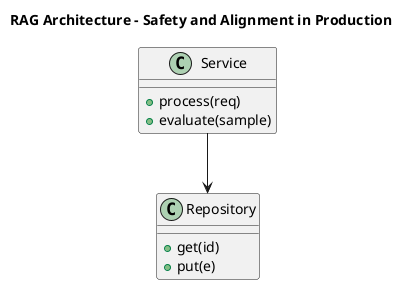

_Source diagram (plantuml); render with the appropriate tool._

**Figure 16. RAG Architecture - Safety and Alignment in Production** (plantuml). Figure: RAG Architecture view for LLMs. This diagram illustrates the principal components and their interactions as discussed in the surrounding section.

## Deep Dive: Mechanics, Variants and Trade-offs

Having established the essentials, we now go deeper into safety and alignment in production. Beneath the abstraction lies a concrete process whose steps can each be measured, tested and optimised independently. The distinctions in this section are the ones that separate a working demo from a system that holds up under adversarial inputs, scale and the passage of time.

Consider the principal variants and how to choose between them. Each variant optimises for a different point in the design space - some for latency, some for accuracy, some for cost or operability - and the correct choice follows from explicit requirements rather than from defaults. As with most architectural decisions, the choice is rarely binary; the skill lies in quantifying the trade-offs and choosing deliberately.

In practice this is supported by a mature tooling ecosystem, including vLLM, TensorRT-LLM, Hugging Face Transformers, Ollama. Tools accelerate the work but do not substitute for understanding: the same principles apply whichever implementation you select, and the ability to reason from first principles is what lets you debug when a tool behaves unexpectedly.

A frequent source of subtle bugs is the interaction with pre-training objectives and data. Because pre-training objectives and data concerns causal language modelling, corpus curation, deduplication and data quality at trillion-token scale, changes there can silently alter the behaviour analysed here. The remedy is contract tests at the boundary and end-to-end evaluations that exercise the interaction explicitly.

Finally, attend to edge cases and degradation. Define what the system should do under partial failure, unexpected inputs and load spikes, and make that behaviour explicit and tested rather than emergent. Graceful degradation - returning a safe, useful result when the ideal one is unavailable - is a hallmark of mature engineering.

For deeper study, the literature offers authoritative treatments such as Vaswani et al. — Attention Is All You Need (2017) and Hoffmann et al. — Training Compute-Optimal LLMs (Chinchilla, 2022). These primary sources reward careful reading and ground the practical guidance above in established results.

## Advanced Considerations

Having established the essentials, we now go deeper into safety and alignment in production. It pays to understand the mechanism rather than treat it as a black box, because most production incidents are explained by one of its steps misbehaving. The distinctions in this section are the ones that separate a working demo from a system that holds up under adversarial inputs, scale and the passage of time.

Consider the principal variants and how to choose between them. Each variant optimises for a different point in the design space - some for latency, some for accuracy, some for cost or operability - and the correct choice follows from explicit requirements rather than from defaults. Latency, accuracy and cost form a tension triangle: improving one typically pressures the others, so explicit budgets are essential.

In practice this is supported by a mature tooling ecosystem, including vLLM, TensorRT-LLM, Hugging Face Transformers, Ollama. Tools accelerate the work but do not substitute for understanding: the same principles apply whichever implementation you select, and the ability to reason from first principles is what lets you debug when a tool behaves unexpectedly.

A frequent source of subtle bugs is the interaction with from n-grams to neural language models. Because from n-grams to neural language models concerns the evolution of language modelling and why scale plus self-attention unlocked emergent capability, changes there can silently alter the behaviour analysed here. The remedy is contract tests at the boundary and end-to-end evaluations that exercise the interaction explicitly.

Finally, attend to edge cases and degradation. Define what the system should do under partial failure, unexpected inputs and load spikes, and make that behaviour explicit and tested rather than emergent. Graceful degradation - returning a safe, useful result when the ideal one is unavailable - is a hallmark of mature engineering.

For deeper study, the literature offers authoritative treatments such as Vaswani et al. — Attention Is All You Need (2017) and Hoffmann et al. — Training Compute-Optimal LLMs (Chinchilla, 2022). These primary sources reward careful reading and ground the practical guidance above in established results.

## Worked Example

A worked example clarifies how these ideas behave in practice. A enterprise search organisation needs answering questions over internal knowledge with citations. They decide to apply safety and alignment in production as part of their LLMs solution, but wisely treat it as a hypothesis to be validated rather than a foregone conclusion.

The team begins by stating the objective precisely and defining how success will be measured before writing any code. They establish a small but representative evaluation set, agree on acceptance thresholds, and only then prototype the simplest design that could work. Early measurement reveals which assumptions hold and which must be revised, saving weeks of misdirected effort and surfacing edge cases while they are still cheap to fix.

As the prototype matures into a service, the team hardens it: adding input validation, error handling, caching where it pays off, and monitoring that ties back to the original success metric. They document each significant decision in an architecture decision record so that future maintainers understand not just what was built but why.

The outcome is instructive. The system that reaches production is not the most sophisticated design the team considered, but the one whose behaviour they could measure, explain and operate. This is the recurring lesson of LLMs: durable value comes from the whole system, not from any single clever component.

## Industry Use Cases

Across industries, the ideas in this chapter recur in recognisable ways. The following vignettes show how different sectors apply them and what they have in common.

**Enterprise Search.** Answering questions over internal knowledge with citations. The common thread is that value comes not from the model alone but from the surrounding system - data quality, evaluation, integration and operations - which is precisely where most of the engineering effort belongs.

**Software.** Code completion and review across large repositories. The common thread is that value comes not from the model alone but from the surrounding system - data quality, evaluation, integration and operations - which is precisely where most of the engineering effort belongs.

**Finance.** Summarising filings and extracting structured facts. The common thread is that value comes not from the model alone but from the surrounding system - data quality, evaluation, integration and operations - which is precisely where most of the engineering effort belongs.

**Telecom.** Tier-1 support automation with escalation to humans. The common thread is that value comes not from the model alone but from the surrounding system - data quality, evaluation, integration and operations - which is precisely where most of the engineering effort belongs.

## Best Practices

The following practices consistently separate successful LLMs efforts from struggling ones. They are deliberately concrete so they can be adopted as checklist items in design and code review.

- Right-size the model to the task; do not pay for capability you don't use.
- Quantise and batch aggressively, validating quality impact with evals.
- Pin model and tokenizer versions; treat upgrades as releases.
- Monitor token distribution to catch prompt bloat and cost regressions.

None of these are exotic; they are the unglamorous disciplines that compound into reliability. The cost of adopting them is small compared with the cost of the incidents they prevent, and they become second nature with practice.

## Common Pitfalls

Equally instructive are the failure modes that recur in practice. Each pitfall below has a clear early warning sign and a known remedy, so treat them as a diagnostic checklist when something feels wrong:

- Assuming bigger is always better instead of measuring task fit.
- Underestimating KV-cache memory for long contexts.
- Silent tokenizer changes that break prompts and cost models.
- Benchmarking on contaminated datasets and over-claiming capability.

The pattern is consistent: most failures stem from skipping measurement, conflating prototype and production standards, or deferring cross-cutting concerns such as security and cost until they become emergencies. Naming these traps in advance is the cheapest way to avoid them.

## Governance, Security and Cost Notes

No discussion of safety and alignment in production is complete without its governance, security and cost dimensions, which are too often deferred until they become emergencies. Treating them as first-class concerns from the outset is both cheaper and safer.

**Governance.** Classify the risk of this capability, document its intended and out-of-scope uses, and ensure decisions are traceable to satisfy internal policy and external regulation such as the NIST AI RMF, ISO/IEC 42001 and the EU AI Act. **Security.** Treat all external input as untrusted, validate outputs before acting on them, apply least privilege to any tools or data access, and map controls to the OWASP LLM Top 10 and MITRE ATLAS.

**Cost and sustainability.** Establish explicit budgets for compute, tokens and latency, attribute spend to owners, and revisit the economics as usage scales - a design that is affordable at pilot scale can become untenable at production volume. Building these reflexes into everyday engineering is what allows a LLMs system to be not only capable but also trustworthy and economically sound.

## Hands-On Exercises

Work through the following exercises. They are designed to move understanding from recognition to application - the level required for real engineering work - so prefer writing and building over merely reading.

1. Explain safety and alignment in production to a colleague unfamiliar with LLMs, using a concrete example from your own domain.
2. Sketch a reference architecture that incorporates safety and alignment in production and annotate where observability, security and cost controls belong.
3. Design an evaluation that would tell you whether safety and alignment in production is working in production, including the metric, the dataset and the acceptance threshold.
4. Identify two pitfalls relevant to safety and alignment in production in your environment and describe the early warning signals you would monitor.
5. Prototype the simplest implementation that demonstrates safety and alignment in production, then list exactly what would need to change to make it production-ready.

## Key Takeaways

Key takeaways from this chapter:

- Safety and Alignment in Production is a systems concern in LLMs: data, models and operations must be co-designed.
- Measurement is non-negotiable; define success metrics and evaluation before building.
- Favour the simplest design that meets the requirement, and add complexity only when evidence demands it.
- Security, cost and observability are first-class requirements, not afterthoughts.
- Document decisions so the system remains understandable and operable as it evolves.

## Code Walkthrough

Every change to a LLMs system should pass an evaluation gate. This example shows the minimal shape: align predictions and references, compute a metric, and return a pass/fail decision for CI.

The full listing is shown below; study it line by line and reproduce it locally before moving on.

### Listing: Evaluating Safety and Alignment in Production with a regression gate

```python
from dataclasses import dataclass


@dataclass
class EvalResult:
    metric: str
    score: float
    passed: bool


def evaluate(predictions: list[str], references: list[str],
             threshold: float = 0.8) -> EvalResult:
    """Score Safety and Alignment in Production output against references with a simple exact-match metric.

    In practice you would combine several metrics (exact match, semantic
    similarity, LLM-as-judge) and gate releases on the aggregate.
    """
    if len(predictions) != len(references):
        raise ValueError("predictions and references must align")
    hits = sum(p.strip() == r.strip() for p, r in zip(predictions, references))
    score = hits / len(references) if references else 0.0
    return EvalResult(metric="exact_match", score=score, passed=score >= threshold)


if __name__ == "__main__":
    result = evaluate(["yes", "no"], ["yes", "yes"])
    print(f"{result.metric}={result.score:.2f} passed={result.passed}")

```

## Review Questions

1. In the context of LLMs, which statement best describes “Safety and Alignment in Production”?
   - A. It makes the system slower but has no other effect.
   - B. It guarantees deterministic output regardless of input.
   - C. It applies exclusively to image data.
   - D. Layered safety, refusal behaviour and policy enforcement.
   - **Answer: D.** Safety and Alignment in Production: Layered safety, refusal behaviour and policy enforcement.
2. Which of the following is a recommended best practice when working with LLMs?
   - A. It makes the system slower but has no other effect.
   - B. Underestimating KV-cache memory for long contexts.
   - C. Quantise and batch aggressively, validating quality impact with evals.
   - D. It removes all security and governance requirements.
   - **Answer: C.** Best practice: Quantise and batch aggressively, validating quality impact with evals.
3. Which of the following is a common pitfall to avoid in LLMs?
   - A. Assuming bigger is always better instead of measuring task fit.
   - B. Quantise and batch aggressively, validating quality impact with evals.
   - C. It is only relevant to academic research, not production.
   - D. It guarantees deterministic output regardless of input.
   - **Answer: A.** Pitfall to avoid: Assuming bigger is always better instead of measuring task fit.
4. *(Discussion)* What trade-offs would you weigh when implementing Safety and Alignment in Production?
   - **Model answer:** A strong answer defines safety and alignment in production (Layered safety, refusal behaviour and policy enforcement.) then connects it to architecture, evaluation, cost, security and operations for LLMs, citing concrete trade-offs and a real-world example.

---


# Chapter 14. The LLM Platform Reference Architecture

_This chapter examines the llm platform reference architecture within LLMs. It covers gateways, registries, evaluation and observability for fleets of models, derives a reference architecture, walks through a worked example and runnable code, surveys industry use cases, and distils best practices and pitfalls, closing with exercises and review questions._

## Introduction

At its core, The LLM Platform Reference Architecture concerns gateways, registries, evaluation and observability for fleets of models. It is foundational: later capabilities in LLMs are built directly on top of it. The practical implication is that design choices here ripple through latency, cost and maintainability for the lifetime of the system.

This chapter builds intuition first, then formalises the ideas, derives an architecture, and finishes with code, exercises and review questions so the material transfers directly to your own LLMs work. Read it actively: pause at each diagram, reproduce the code, and attempt the exercises before consulting the answers.

## Theory and Foundations

The LLM Platform Reference Architecture can be characterised as gateways, registries, evaluation and observability for fleets of models. What distinguishes a production-grade approach from a prototype is the discipline of measurement: every claim is backed by an evaluation rather than intuition. It pays to understand the mechanism rather than treat it as a black box, because most production incidents are explained by one of its steps misbehaving.

To place this in context, recall the broader picture: Large language models are transformer-based neural networks trained on vast text corpora to predict the next token, acquiring broad linguistic and reasoning capabilities that transfer across tasks. Within that picture, the llm platform reference architecture is one of the load-bearing ideas - the kind that, when understood deeply, makes the rest of LLMs fall into place. Understanding this matters because LLMs systems succeed or fail on exactly these decisions.

The LLM Platform Reference Architecture cannot be understood in isolation from safety and alignment in production. Recall that safety and alignment in production concerns layered safety, refusal behaviour and policy enforcement. The two interact directly: decisions in one constrain the design space of the other, which is why mature teams reason about them together rather than sequentially. Latency, accuracy and cost form a tension triangle: improving one typically pressures the others, so explicit budgets are essential.

The LLM Platform Reference Architecture cannot be understood in isolation from hallucination and factuality. Recall that hallucination and factuality concerns why models confabulate and how grounding and decoding mitigate it. The two interact directly: decisions in one constrain the design space of the other, which is why mature teams reason about them together rather than sequentially. As with most architectural decisions, the choice is rarely binary; the skill lies in quantifying the trade-offs and choosing deliberately.

Several established patterns apply directly to the llm platform reference architecture. The first, continuous batching with paged attention for gpu efficiency, is widely adopted because it makes the system's behaviour predictable and observable. A complementary pattern, speculative decoding with a small draft model, addresses a related concern and is often deployed alongside it. Patterns are not dogma; they are distilled experience that shortcuts the search for a sound design, and each carries assumptions worth checking against your context.

Knowing when not to use a technique is as valuable as knowing how to use it. In a small prototype, shortcuts around the llm platform reference architecture are invisible; in a production LLMs system serving real traffic, they surface as incidents, cost overruns or compliance gaps. As with most architectural decisions, the choice is rarely binary; the skill lies in quantifying the trade-offs and choosing deliberately. The remainder of this chapter turns these principles into an architecture, code and a checklist you can apply immediately.

## Architecture and Design

A robust architecture for The LLM Platform Reference Architecture is layered so each part can evolve independently without destabilising the whole. An LLM serving platform comprises a request gateway with auth and rate limiting, an inference cluster running an optimised engine (paged KV cache, continuous batching, quantised weights), a routing layer selecting model size by task, and an observability pipeline tracking latency, tokens and quality. Model artefacts flow from a registry with signed provenance into blue/green serving slots.

Concretely, the principal building blocks include from n-grams to neural language models, tokenisation and vocabulary, the transformer backbone of llms, pre-training objectives and data and scaling laws and emergent abilities. Each is a replaceable component behind a stable interface, so the team can upgrade an implementation - a model, an index, a policy engine - without rewriting its neighbours. The contracts between components are where reliability is won or lost, so they are specified explicitly and tested in isolation.

The diagram accompanying this section makes the data and control flow explicit. Requests enter through a well-defined boundary where they are authenticated and validated; only then are they dispatched to the components that perform the work. This boundary is also where rate limiting, quota enforcement and audit logging live, keeping cross-cutting concerns out of the core logic and in one auditable place.

Two qualities deserve emphasis. First, observability is designed in, not bolted on: every component emits structured telemetry so that failures can be localised in minutes rather than hours. Second, the architecture is evolvable - components communicate through stable contracts so that any single part of the LLMs system can be replaced without a rewrite. There is an inherent trade-off between fidelity and cost, and the correct balance depends on the use case and its tolerance for error.

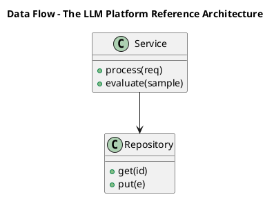

_Source diagram (plantuml); render with the appropriate tool._

**Figure 17. Data Flow - The LLM Platform Reference Architecture** (plantuml). Figure: Data Flow view for LLMs. This diagram illustrates the principal components and their interactions as discussed in the surrounding section.

## Deep Dive: Mechanics, Variants and Trade-offs

Having established the essentials, we now go deeper into the llm platform reference architecture. It pays to understand the mechanism rather than treat it as a black box, because most production incidents are explained by one of its steps misbehaving. The distinctions in this section are the ones that separate a working demo from a system that holds up under adversarial inputs, scale and the passage of time.

Consider the principal variants and how to choose between them. Each variant optimises for a different point in the design space - some for latency, some for accuracy, some for cost or operability - and the correct choice follows from explicit requirements rather than from defaults. As with most architectural decisions, the choice is rarely binary; the skill lies in quantifying the trade-offs and choosing deliberately.

In practice this is supported by a mature tooling ecosystem, including vLLM, TensorRT-LLM, Hugging Face Transformers, Ollama. Tools accelerate the work but do not substitute for understanding: the same principles apply whichever implementation you select, and the ability to reason from first principles is what lets you debug when a tool behaves unexpectedly.

A frequent source of subtle bugs is the interaction with safety and alignment in production. Because safety and alignment in production concerns layered safety, refusal behaviour and policy enforcement, changes there can silently alter the behaviour analysed here. The remedy is contract tests at the boundary and end-to-end evaluations that exercise the interaction explicitly.

Finally, attend to edge cases and degradation. Define what the system should do under partial failure, unexpected inputs and load spikes, and make that behaviour explicit and tested rather than emergent. Graceful degradation - returning a safe, useful result when the ideal one is unavailable - is a hallmark of mature engineering.

For deeper study, the literature offers authoritative treatments such as Vaswani et al. — Attention Is All You Need (2017) and Hoffmann et al. — Training Compute-Optimal LLMs (Chinchilla, 2022). These primary sources reward careful reading and ground the practical guidance above in established results.

## Advanced Considerations

Having established the essentials, we now go deeper into the llm platform reference architecture. The underlying mechanism is best appreciated by tracing a single request from input to output and noting where state is created and consumed. The distinctions in this section are the ones that separate a working demo from a system that holds up under adversarial inputs, scale and the passage of time.

Consider the principal variants and how to choose between them. Each variant optimises for a different point in the design space - some for latency, some for accuracy, some for cost or operability - and the correct choice follows from explicit requirements rather than from defaults. Every added component buys capability at the price of operational surface area, and that bargain should be made consciously.

In practice this is supported by a mature tooling ecosystem, including vLLM, TensorRT-LLM, Hugging Face Transformers, Ollama. Tools accelerate the work but do not substitute for understanding: the same principles apply whichever implementation you select, and the ability to reason from first principles is what lets you debug when a tool behaves unexpectedly.

A frequent source of subtle bugs is the interaction with serving llms at scale. Because serving llms at scale concerns gPU memory planning, tensor/pipeline parallelism and autoscaling inference, changes there can silently alter the behaviour analysed here. The remedy is contract tests at the boundary and end-to-end evaluations that exercise the interaction explicitly.

Finally, attend to edge cases and degradation. Define what the system should do under partial failure, unexpected inputs and load spikes, and make that behaviour explicit and tested rather than emergent. Graceful degradation - returning a safe, useful result when the ideal one is unavailable - is a hallmark of mature engineering.

For deeper study, the literature offers authoritative treatments such as Vaswani et al. — Attention Is All You Need (2017) and Hoffmann et al. — Training Compute-Optimal LLMs (Chinchilla, 2022). These primary sources reward careful reading and ground the practical guidance above in established results.

## Worked Example

To ground the discussion, walk through a representative example. A finance organisation needs summarising filings and extracting structured facts. They decide to apply the llm platform reference architecture as part of their LLMs solution, but wisely treat it as a hypothesis to be validated rather than a foregone conclusion.

The team begins by stating the objective precisely and defining how success will be measured before writing any code. They establish a small but representative evaluation set, agree on acceptance thresholds, and only then prototype the simplest design that could work. Early measurement reveals which assumptions hold and which must be revised, saving weeks of misdirected effort and surfacing edge cases while they are still cheap to fix.

As the prototype matures into a service, the team hardens it: adding input validation, error handling, caching where it pays off, and monitoring that ties back to the original success metric. They document each significant decision in an architecture decision record so that future maintainers understand not just what was built but why.

The outcome is instructive. The system that reaches production is not the most sophisticated design the team considered, but the one whose behaviour they could measure, explain and operate. This is the recurring lesson of LLMs: durable value comes from the whole system, not from any single clever component.

## Industry Use Cases

Across industries, the ideas in this chapter recur in recognisable ways. The following vignettes show how different sectors apply them and what they have in common.

**Enterprise Search.** Answering questions over internal knowledge with citations. The common thread is that value comes not from the model alone but from the surrounding system - data quality, evaluation, integration and operations - which is precisely where most of the engineering effort belongs.

**Software.** Code completion and review across large repositories. The common thread is that value comes not from the model alone but from the surrounding system - data quality, evaluation, integration and operations - which is precisely where most of the engineering effort belongs.

**Finance.** Summarising filings and extracting structured facts. The common thread is that value comes not from the model alone but from the surrounding system - data quality, evaluation, integration and operations - which is precisely where most of the engineering effort belongs.

**Telecom.** Tier-1 support automation with escalation to humans. The common thread is that value comes not from the model alone but from the surrounding system - data quality, evaluation, integration and operations - which is precisely where most of the engineering effort belongs.

## Best Practices

The following practices consistently separate successful LLMs efforts from struggling ones. They are deliberately concrete so they can be adopted as checklist items in design and code review.

- Right-size the model to the task; do not pay for capability you don't use.
- Quantise and batch aggressively, validating quality impact with evals.
- Pin model and tokenizer versions; treat upgrades as releases.
- Monitor token distribution to catch prompt bloat and cost regressions.

None of these are exotic; they are the unglamorous disciplines that compound into reliability. The cost of adopting them is small compared with the cost of the incidents they prevent, and they become second nature with practice.

## Common Pitfalls

Equally instructive are the failure modes that recur in practice. Each pitfall below has a clear early warning sign and a known remedy, so treat them as a diagnostic checklist when something feels wrong:

- Assuming bigger is always better instead of measuring task fit.
- Underestimating KV-cache memory for long contexts.
- Silent tokenizer changes that break prompts and cost models.
- Benchmarking on contaminated datasets and over-claiming capability.

The pattern is consistent: most failures stem from skipping measurement, conflating prototype and production standards, or deferring cross-cutting concerns such as security and cost until they become emergencies. Naming these traps in advance is the cheapest way to avoid them.

## Governance, Security and Cost Notes

No discussion of the llm platform reference architecture is complete without its governance, security and cost dimensions, which are too often deferred until they become emergencies. Treating them as first-class concerns from the outset is both cheaper and safer.

**Governance.** Classify the risk of this capability, document its intended and out-of-scope uses, and ensure decisions are traceable to satisfy internal policy and external regulation such as the NIST AI RMF, ISO/IEC 42001 and the EU AI Act. **Security.** Treat all external input as untrusted, validate outputs before acting on them, apply least privilege to any tools or data access, and map controls to the OWASP LLM Top 10 and MITRE ATLAS.

**Cost and sustainability.** Establish explicit budgets for compute, tokens and latency, attribute spend to owners, and revisit the economics as usage scales - a design that is affordable at pilot scale can become untenable at production volume. Building these reflexes into everyday engineering is what allows a LLMs system to be not only capable but also trustworthy and economically sound.

## Hands-On Exercises

Work through the following exercises. They are designed to move understanding from recognition to application - the level required for real engineering work - so prefer writing and building over merely reading.

1. Explain the llm platform reference architecture to a colleague unfamiliar with LLMs, using a concrete example from your own domain.
2. Sketch a reference architecture that incorporates the llm platform reference architecture and annotate where observability, security and cost controls belong.
3. Design an evaluation that would tell you whether the llm platform reference architecture is working in production, including the metric, the dataset and the acceptance threshold.
4. Identify two pitfalls relevant to the llm platform reference architecture in your environment and describe the early warning signals you would monitor.
5. Prototype the simplest implementation that demonstrates the llm platform reference architecture, then list exactly what would need to change to make it production-ready.

## Key Takeaways

Key takeaways from this chapter:

- The LLM Platform Reference Architecture is a systems concern in LLMs: data, models and operations must be co-designed.
- Measurement is non-negotiable; define success metrics and evaluation before building.
- Favour the simplest design that meets the requirement, and add complexity only when evidence demands it.
- Security, cost and observability are first-class requirements, not afterthoughts.
- Document decisions so the system remains understandable and operable as it evolves.

## Code Walkthrough

Every change to a LLMs system should pass an evaluation gate. This example shows the minimal shape: align predictions and references, compute a metric, and return a pass/fail decision for CI.

The full listing is shown below; study it line by line and reproduce it locally before moving on.

### Listing: Evaluating The LLM Platform Reference Architecture with a regression gate

```python
from dataclasses import dataclass


@dataclass
class EvalResult:
    metric: str
    score: float
    passed: bool


def evaluate(predictions: list[str], references: list[str],
             threshold: float = 0.8) -> EvalResult:
    """Score The LLM Platform Reference Architecture output against references with a simple exact-match metric.

    In practice you would combine several metrics (exact match, semantic
    similarity, LLM-as-judge) and gate releases on the aggregate.
    """
    if len(predictions) != len(references):
        raise ValueError("predictions and references must align")
    hits = sum(p.strip() == r.strip() for p, r in zip(predictions, references))
    score = hits / len(references) if references else 0.0
    return EvalResult(metric="exact_match", score=score, passed=score >= threshold)


if __name__ == "__main__":
    result = evaluate(["yes", "no"], ["yes", "yes"])
    print(f"{result.metric}={result.score:.2f} passed={result.passed}")

```

## Review Questions

1. In the context of LLMs, which statement best describes “The LLM Platform Reference Architecture”?
   - A. It makes the system slower but has no other effect.
   - B. Gateways, registries, evaluation and observability for fleets of models.
   - C. It is only relevant to academic research, not production.
   - D. It eliminates the need for any evaluation or monitoring.
   - **Answer: B.** The LLM Platform Reference Architecture: Gateways, registries, evaluation and observability for fleets of models.
2. Which of the following is a recommended best practice when working with LLMs?
   - A. Benchmarking on contaminated datasets and over-claiming capability.
   - B. Quantise and batch aggressively, validating quality impact with evals.
   - C. It makes the system slower but has no other effect.
   - D. It guarantees deterministic output regardless of input.
   - **Answer: B.** Best practice: Quantise and batch aggressively, validating quality impact with evals.
3. Which of the following is a common pitfall to avoid in LLMs?
   - A. It removes all security and governance requirements.
   - B. Quantise and batch aggressively, validating quality impact with evals.
   - C. Right-size the model to the task; do not pay for capability you don't use.
   - D. Silent tokenizer changes that break prompts and cost models.
   - **Answer: D.** Pitfall to avoid: Silent tokenizer changes that break prompts and cost models.
4. *(Discussion)* How does The LLM Platform Reference Architecture interact with security and governance requirements?
   - **Model answer:** A strong answer defines the llm platform reference architecture (Gateways, registries, evaluation and observability for fleets of models.) then connects it to architecture, evaluation, cost, security and operations for LLMs, citing concrete trade-offs and a real-world example.

---


# Chapter 15. Putting It Together: A Reference Implementation

_This chapter examines putting it together: a reference implementation within LLMs. It covers an end-to-end reference implementation that integrates the components of a LLMs system into a cohesive, working whole, derives a reference architecture, walks through a worked example and runnable code, surveys industry use cases, and distils best practices and pitfalls, closing with exercises and review questions._

## Introduction

Formally, Putting It Together: A Reference Implementation addresses an end-to-end reference implementation that integrates the components of a LLMs system into a cohesive, working whole. Understanding this matters because LLMs systems succeed or fail on exactly these decisions. Seasoned practitioners treat this as a systems problem, co-designing data, models and operations rather than optimising any one in isolation.

This chapter builds intuition first, then formalises the ideas, derives an architecture, and finishes with code, exercises and review questions so the material transfers directly to your own LLMs work. Read it actively: pause at each diagram, reproduce the code, and attempt the exercises before consulting the answers.

## Theory and Foundations

At its core, Putting It Together: A Reference Implementation concerns an end-to-end reference implementation that integrates the components of a LLMs system into a cohesive, working whole. In an enterprise setting, this translates into concrete requirements: clear interfaces, measurable quality, and controls that satisfy security and governance. The underlying mechanism is best appreciated by tracing a single request from input to output and noting where state is created and consumed.

To place this in context, recall the broader picture: Large language models are transformer-based neural networks trained on vast text corpora to predict the next token, acquiring broad linguistic and reasoning capabilities that transfer across tasks. Within that picture, putting it together: a reference implementation is one of the load-bearing ideas - the kind that, when understood deeply, makes the rest of LLMs fall into place. This concept recurs throughout the LLMs lifecycle, from design to operations.

Putting It Together: A Reference Implementation cannot be understood in isolation from context windows and long-context techniques. Recall that context windows and long-context techniques concerns position interpolation, attention variants and retrieval to extend effective context. The two interact directly: decisions in one constrain the design space of the other, which is why mature teams reason about them together rather than sequentially. Every added component buys capability at the price of operational surface area, and that bargain should be made consciously.

Putting It Together: A Reference Implementation cannot be understood in isolation from hallucination and factuality. Recall that hallucination and factuality concerns why models confabulate and how grounding and decoding mitigate it. The two interact directly: decisions in one constrain the design space of the other, which is why mature teams reason about them together rather than sequentially. Simplicity is a feature. The simplest design that meets the requirement should be the default, with complexity added only when measurement justifies it.

Several established patterns apply directly to putting it together: a reference implementation. The first, continuous batching with paged attention for gpu efficiency, is widely adopted because it makes the system's behaviour predictable and observable. A complementary pattern, model routing by difficulty (small model first, escalate on low confidence), addresses a related concern and is often deployed alongside it. Patterns are not dogma; they are distilled experience that shortcuts the search for a sound design, and each carries assumptions worth checking against your context.

It is worth being explicit about when to apply this and when to reach for something simpler. In a small prototype, shortcuts around putting it together: a reference implementation are invisible; in a production LLMs system serving real traffic, they surface as incidents, cost overruns or compliance gaps. Every added component buys capability at the price of operational surface area, and that bargain should be made consciously. The remainder of this chapter turns these principles into an architecture, code and a checklist you can apply immediately.

## Architecture and Design

A robust architecture for Putting It Together: A Reference Implementation is layered so each part can evolve independently without destabilising the whole. An LLM serving platform comprises a request gateway with auth and rate limiting, an inference cluster running an optimised engine (paged KV cache, continuous batching, quantised weights), a routing layer selecting model size by task, and an observability pipeline tracking latency, tokens and quality. Model artefacts flow from a registry with signed provenance into blue/green serving slots.

Concretely, the principal building blocks include from n-grams to neural language models, tokenisation and vocabulary, the transformer backbone of llms, pre-training objectives and data and scaling laws and emergent abilities. Each is a replaceable component behind a stable interface, so the team can upgrade an implementation - a model, an index, a policy engine - without rewriting its neighbours. The contracts between components are where reliability is won or lost, so they are specified explicitly and tested in isolation.

The diagram accompanying this section makes the data and control flow explicit. Requests enter through a well-defined boundary where they are authenticated and validated; only then are they dispatched to the components that perform the work. This boundary is also where rate limiting, quota enforcement and audit logging live, keeping cross-cutting concerns out of the core logic and in one auditable place.

Two qualities deserve emphasis. First, observability is designed in, not bolted on: every component emits structured telemetry so that failures can be localised in minutes rather than hours. Second, the architecture is evolvable - components communicate through stable contracts so that any single part of the LLMs system can be replaced without a rewrite. Simplicity is a feature. The simplest design that meets the requirement should be the default, with complexity added only when measurement justifies it.

```xml
<mxfile host="ai-university">
  <diagram name="Application Flow">
    <mxGraphModel dx="800" dy="600" grid="1" gridSize="10">
      <root>
        <mxCell id="0"/>
        <mxCell id="1" parent="0"/>
        <mxCell id="title" value="Application Flow - Putting It Together: A Reference Impleme…" style="text;fontSize=16;fontStyle=1" vertex="1" parent="1"><mxGeometry x="40" y="20" width="600" height="30" as="geometry"/></mxCell>
        <mxCell id="hub" value="LLMs" style="rounded=1;fillColor=#0f172a;fontColor=#ffffff;fontStyle=1" vertex="1" parent="1"><mxGeometry x="300" y="180" width="160" height="60" as="geometry"/></mxCell>
        <mxCell id="n0" value="From N-grams to Neural …" style="rounded=1;fillColor=#e0e7ff;strokeColor=#4338ca" vertex="1" parent="1"><mxGeometry x="60" y="80" width="160" height="50" as="geometry"/></mxCell>
        <mxCell id="e0" style="edgeStyle=orthogonalEdgeStyle" edge="1" parent="1" source="hub" target="n0"><mxGeometry relative="1" as="geometry"/></mxCell>
        <mxCell id="n1" value="Tokenisation and Vocabu…" style="rounded=1;fillColor=#e0e7ff;strokeColor=#4338ca" vertex="1" parent="1"><mxGeometry x="600" y="170" width="160" height="50" as="geometry"/></mxCell>
        <mxCell id="e1" style="edgeStyle=orthogonalEdgeStyle" edge="1" parent="1" source="hub" target="n1"><mxGeometry relative="1" as="geometry"/></mxCell>
        <mxCell id="n2" value="The Transformer Backbon…" style="rounded=1;fillColor=#e0e7ff;strokeColor=#4338ca" vertex="1" parent="1"><mxGeometry x="60" y="260" width="160" height="50" as="geometry"/></mxCell>
        <mxCell id="e2" style="edgeStyle=orthogonalEdgeStyle" edge="1" parent="1" source="hub" target="n2"><mxGeometry relative="1" as="geometry"/></mxCell>
        <mxCell id="n3" value="Pre-training Objectives…" style="rounded=1;fillColor=#e0e7ff;strokeColor=#4338ca" vertex="1" parent="1"><mxGeometry x="600" y="350" width="160" height="50" as="geometry"/></mxCell>
        <mxCell id="e3" style="edgeStyle=orthogonalEdgeStyle" edge="1" parent="1" source="hub" target="n3"><mxGeometry relative="1" as="geometry"/></mxCell>
        <mxCell id="n4" value="Scaling Laws and Emerge…" style="rounded=1;fillColor=#e0e7ff;strokeColor=#4338ca" vertex="1" parent="1"><mxGeometry x="60" y="440" width="160" height="50" as="geometry"/></mxCell>
        <mxCell id="e4" style="edgeStyle=orthogonalEdgeStyle" edge="1" parent="1" source="hub" target="n4"><mxGeometry relative="1" as="geometry"/></mxCell>
      </root>
    </mxGraphModel>
  </diagram>
</mxfile>
```

_Source diagram (drawio); render with the appropriate tool._

**Figure 18. Application Flow - Putting It Together: A Reference Implementation** (drawio). Figure: Application Flow view for LLMs. This diagram illustrates the principal components and their interactions as discussed in the surrounding section.

## Deep Dive: Mechanics, Variants and Trade-offs

Having established the essentials, we now go deeper into putting it together: a reference implementation. Mechanically, the behaviour emerges from a few interacting parts that are simpler than the whole they produce. The distinctions in this section are the ones that separate a working demo from a system that holds up under adversarial inputs, scale and the passage of time.

Consider the principal variants and how to choose between them. Each variant optimises for a different point in the design space - some for latency, some for accuracy, some for cost or operability - and the correct choice follows from explicit requirements rather than from defaults. Simplicity is a feature. The simplest design that meets the requirement should be the default, with complexity added only when measurement justifies it.

In practice this is supported by a mature tooling ecosystem, including vLLM, TensorRT-LLM, Hugging Face Transformers, Ollama. Tools accelerate the work but do not substitute for understanding: the same principles apply whichever implementation you select, and the ability to reason from first principles is what lets you debug when a tool behaves unexpectedly.

A frequent source of subtle bugs is the interaction with context windows and long-context techniques. Because context windows and long-context techniques concerns position interpolation, attention variants and retrieval to extend effective context, changes there can silently alter the behaviour analysed here. The remedy is contract tests at the boundary and end-to-end evaluations that exercise the interaction explicitly.

Finally, attend to edge cases and degradation. Define what the system should do under partial failure, unexpected inputs and load spikes, and make that behaviour explicit and tested rather than emergent. Graceful degradation - returning a safe, useful result when the ideal one is unavailable - is a hallmark of mature engineering.

For deeper study, the literature offers authoritative treatments such as Vaswani et al. — Attention Is All You Need (2017) and Hoffmann et al. — Training Compute-Optimal LLMs (Chinchilla, 2022). These primary sources reward careful reading and ground the practical guidance above in established results.

## Advanced Considerations

Having established the essentials, we now go deeper into putting it together: a reference implementation. Beneath the abstraction lies a concrete process whose steps can each be measured, tested and optimised independently. The distinctions in this section are the ones that separate a working demo from a system that holds up under adversarial inputs, scale and the passage of time.

Consider the principal variants and how to choose between them. Each variant optimises for a different point in the design space - some for latency, some for accuracy, some for cost or operability - and the correct choice follows from explicit requirements rather than from defaults. As with most architectural decisions, the choice is rarely binary; the skill lies in quantifying the trade-offs and choosing deliberately.

In practice this is supported by a mature tooling ecosystem, including vLLM, TensorRT-LLM, Hugging Face Transformers, Ollama. Tools accelerate the work but do not substitute for understanding: the same principles apply whichever implementation you select, and the ability to reason from first principles is what lets you debug when a tool behaves unexpectedly.

A frequent source of subtle bugs is the interaction with inference optimisation. Because inference optimisation concerns kV caching, speculative decoding, quantisation and continuous batching for throughput, changes there can silently alter the behaviour analysed here. The remedy is contract tests at the boundary and end-to-end evaluations that exercise the interaction explicitly.

Finally, attend to edge cases and degradation. Define what the system should do under partial failure, unexpected inputs and load spikes, and make that behaviour explicit and tested rather than emergent. Graceful degradation - returning a safe, useful result when the ideal one is unavailable - is a hallmark of mature engineering.

For deeper study, the literature offers authoritative treatments such as Vaswani et al. — Attention Is All You Need (2017) and Hoffmann et al. — Training Compute-Optimal LLMs (Chinchilla, 2022). These primary sources reward careful reading and ground the practical guidance above in established results.

## Worked Example

Consider a concrete scenario. A software organisation needs code completion and review across large repositories. They decide to apply putting it together: a reference implementation as part of their LLMs solution, but wisely treat it as a hypothesis to be validated rather than a foregone conclusion.

The team begins by stating the objective precisely and defining how success will be measured before writing any code. They establish a small but representative evaluation set, agree on acceptance thresholds, and only then prototype the simplest design that could work. Early measurement reveals which assumptions hold and which must be revised, saving weeks of misdirected effort and surfacing edge cases while they are still cheap to fix.

As the prototype matures into a service, the team hardens it: adding input validation, error handling, caching where it pays off, and monitoring that ties back to the original success metric. They document each significant decision in an architecture decision record so that future maintainers understand not just what was built but why.

The outcome is instructive. The system that reaches production is not the most sophisticated design the team considered, but the one whose behaviour they could measure, explain and operate. This is the recurring lesson of LLMs: durable value comes from the whole system, not from any single clever component.

## Industry Use Cases

Across industries, the ideas in this chapter recur in recognisable ways. The following vignettes show how different sectors apply them and what they have in common.

**Enterprise Search.** Answering questions over internal knowledge with citations. The common thread is that value comes not from the model alone but from the surrounding system - data quality, evaluation, integration and operations - which is precisely where most of the engineering effort belongs.

**Software.** Code completion and review across large repositories. The common thread is that value comes not from the model alone but from the surrounding system - data quality, evaluation, integration and operations - which is precisely where most of the engineering effort belongs.

**Finance.** Summarising filings and extracting structured facts. The common thread is that value comes not from the model alone but from the surrounding system - data quality, evaluation, integration and operations - which is precisely where most of the engineering effort belongs.

**Telecom.** Tier-1 support automation with escalation to humans. The common thread is that value comes not from the model alone but from the surrounding system - data quality, evaluation, integration and operations - which is precisely where most of the engineering effort belongs.

## Best Practices

The following practices consistently separate successful LLMs efforts from struggling ones. They are deliberately concrete so they can be adopted as checklist items in design and code review.

- Right-size the model to the task; do not pay for capability you don't use.
- Quantise and batch aggressively, validating quality impact with evals.
- Pin model and tokenizer versions; treat upgrades as releases.
- Monitor token distribution to catch prompt bloat and cost regressions.

None of these are exotic; they are the unglamorous disciplines that compound into reliability. The cost of adopting them is small compared with the cost of the incidents they prevent, and they become second nature with practice.

## Common Pitfalls

Equally instructive are the failure modes that recur in practice. Each pitfall below has a clear early warning sign and a known remedy, so treat them as a diagnostic checklist when something feels wrong:

- Assuming bigger is always better instead of measuring task fit.
- Underestimating KV-cache memory for long contexts.
- Silent tokenizer changes that break prompts and cost models.
- Benchmarking on contaminated datasets and over-claiming capability.

The pattern is consistent: most failures stem from skipping measurement, conflating prototype and production standards, or deferring cross-cutting concerns such as security and cost until they become emergencies. Naming these traps in advance is the cheapest way to avoid them.

## Governance, Security and Cost Notes

No discussion of putting it together: a reference implementation is complete without its governance, security and cost dimensions, which are too often deferred until they become emergencies. Treating them as first-class concerns from the outset is both cheaper and safer.

**Governance.** Classify the risk of this capability, document its intended and out-of-scope uses, and ensure decisions are traceable to satisfy internal policy and external regulation such as the NIST AI RMF, ISO/IEC 42001 and the EU AI Act. **Security.** Treat all external input as untrusted, validate outputs before acting on them, apply least privilege to any tools or data access, and map controls to the OWASP LLM Top 10 and MITRE ATLAS.

**Cost and sustainability.** Establish explicit budgets for compute, tokens and latency, attribute spend to owners, and revisit the economics as usage scales - a design that is affordable at pilot scale can become untenable at production volume. Building these reflexes into everyday engineering is what allows a LLMs system to be not only capable but also trustworthy and economically sound.

## Hands-On Exercises

Work through the following exercises. They are designed to move understanding from recognition to application - the level required for real engineering work - so prefer writing and building over merely reading.

1. Explain putting it together: a reference implementation to a colleague unfamiliar with LLMs, using a concrete example from your own domain.
2. Sketch a reference architecture that incorporates putting it together: a reference implementation and annotate where observability, security and cost controls belong.
3. Design an evaluation that would tell you whether putting it together: a reference implementation is working in production, including the metric, the dataset and the acceptance threshold.
4. Identify two pitfalls relevant to putting it together: a reference implementation in your environment and describe the early warning signals you would monitor.
5. Prototype the simplest implementation that demonstrates putting it together: a reference implementation, then list exactly what would need to change to make it production-ready.

## Key Takeaways

Key takeaways from this chapter:

- Putting It Together: A Reference Implementation is a systems concern in LLMs: data, models and operations must be co-designed.
- Measurement is non-negotiable; define success metrics and evaluation before building.
- Favour the simplest design that meets the requirement, and add complexity only when evidence demands it.
- Security, cost and observability are first-class requirements, not afterthoughts.
- Document decisions so the system remains understandable and operable as it evolves.

## Code Walkthrough

Pipelines keep Putting It Together: A Reference Implementation logic modular and testable. Each stage is a pure function, errors are captured per item, and the composition is trivial to extend or reorder.

The full listing is shown below; study it line by line and reproduce it locally before moving on.

### Listing: A composable processing pipeline for Putting It Together: A Reference Implementation

```python
from collections.abc import Iterable, Iterator
from typing import Protocol


class Stage(Protocol):
    def __call__(self, item: dict) -> dict: ...


def pipeline(stages: list[Stage]) -> Stage:
    """Compose ordered stages into a single callable for Putting It Together: A Reference Implementation."""

    def run(item: dict) -> dict:
        for stage in stages:
            item = stage(item)
        return item

    return run


def validate(item: dict) -> dict:
    if "text" not in item:
        raise ValueError("missing required field: text")
    return item


def normalise(item: dict) -> dict:
    item["text"] = item["text"].strip().lower()
    return item


def enrich(item: dict) -> dict:
    item["length"] = len(item["text"])
    return item


process = pipeline([validate, normalise, enrich])


def run_batch(items: Iterable[dict]) -> Iterator[dict]:
    for item in items:
        try:
            yield process(dict(item))
        except ValueError as exc:
            yield {"error": str(exc), "item": item}

```

## Review Questions

1. In the context of LLMs, which statement best describes “Putting It Together: A Reference Implementation”?
   - A. It guarantees deterministic output regardless of input.
   - B. It eliminates the need for any evaluation or monitoring.
   - C. It makes the system slower but has no other effect.
   - D. an end-to-end reference implementation that integrates the components of a LLMs system into a cohesive, working whole
   - **Answer: D.** Putting It Together: A Reference Implementation: an end-to-end reference implementation that integrates the components of a LLMs system into a cohesive, working whole
2. Which of the following is a recommended best practice when working with LLMs?
   - A. It eliminates the need for any evaluation or monitoring.
   - B. Monitor token distribution to catch prompt bloat and cost regressions.
   - C. It is only relevant to academic research, not production.
   - D. It applies exclusively to image data.
   - **Answer: B.** Best practice: Monitor token distribution to catch prompt bloat and cost regressions.
3. Which of the following is a common pitfall to avoid in LLMs?
   - A. Quantise and batch aggressively, validating quality impact with evals.
   - B. It is only relevant to academic research, not production.
   - C. It eliminates the need for any evaluation or monitoring.
   - D. Silent tokenizer changes that break prompts and cost models.
   - **Answer: D.** Pitfall to avoid: Silent tokenizer changes that break prompts and cost models.
4. *(Discussion)* Describe a failure mode of Putting It Together: A Reference Implementation and how you would mitigate it.
   - **Model answer:** A strong answer defines putting it together: a reference implementation (an end-to-end reference implementation that integrates the components of a LLMs system into a cohesive, working whole) then connects it to architecture, evaluation, cost, security and operations for LLMs, citing concrete trade-offs and a real-world example.

---


# Chapter 16. Hands-On Lab: Building an End-to-End LLMs System

_This chapter examines hands-on lab: building an end-to-end llms system within LLMs. It covers a guided, build-along laboratory that constructs a functioning LLMs system from first principles, derives a reference architecture, walks through a worked example and runnable code, surveys industry use cases, and distils best practices and pitfalls, closing with exercises and review questions._

## Introduction

Hands-On Lab: Building an End-to-End LLMs System refers to a guided, build-along laboratory that constructs a functioning LLMs system from first principles. Getting this right early prevents expensive rework once a LLMs system reaches scale. The right abstraction here pays compounding dividends, because downstream components depend on its guarantees.

This chapter builds intuition first, then formalises the ideas, derives an architecture, and finishes with code, exercises and review questions so the material transfers directly to your own LLMs work. Read it actively: pause at each diagram, reproduce the code, and attempt the exercises before consulting the answers.

## Theory and Foundations

Hands-On Lab: Building an End-to-End LLMs System refers to a guided, build-along laboratory that constructs a functioning LLMs system from first principles. The right abstraction here pays compounding dividends, because downstream components depend on its guarantees. The underlying mechanism is best appreciated by tracing a single request from input to output and noting where state is created and consumed.

To place this in context, recall the broader picture: Large language models are transformer-based neural networks trained on vast text corpora to predict the next token, acquiring broad linguistic and reasoning capabilities that transfer across tasks. Within that picture, hands-on lab: building an end-to-end llms system is one of the load-bearing ideas - the kind that, when understood deeply, makes the rest of LLMs fall into place. Understanding this matters because LLMs systems succeed or fail on exactly these decisions.

Hands-On Lab: Building an End-to-End LLMs System cannot be understood in isolation from pre-training objectives and data. Recall that pre-training objectives and data concerns causal language modelling, corpus curation, deduplication and data quality at trillion-token scale. The two interact directly: decisions in one constrain the design space of the other, which is why mature teams reason about them together rather than sequentially. There is an inherent trade-off between fidelity and cost, and the correct balance depends on the use case and its tolerance for error.

Hands-On Lab: Building an End-to-End LLMs System cannot be understood in isolation from scaling laws and emergent abilities. Recall that scaling laws and emergent abilities concerns compute-optimal training, the Chinchilla insight and capability phase transitions. The two interact directly: decisions in one constrain the design space of the other, which is why mature teams reason about them together rather than sequentially. As with most architectural decisions, the choice is rarely binary; the skill lies in quantifying the trade-offs and choosing deliberately.

Several established patterns apply directly to hands-on lab: building an end-to-end llms system. The first, model routing by difficulty (small model first, escalate on low confidence), is widely adopted because it makes the system's behaviour predictable and observable. A complementary pattern, speculative decoding with a small draft model, addresses a related concern and is often deployed alongside it. Patterns are not dogma; they are distilled experience that shortcuts the search for a sound design, and each carries assumptions worth checking against your context.

Knowing when not to use a technique is as valuable as knowing how to use it. In a small prototype, shortcuts around hands-on lab: building an end-to-end llms system are invisible; in a production LLMs system serving real traffic, they surface as incidents, cost overruns or compliance gaps. Latency, accuracy and cost form a tension triangle: improving one typically pressures the others, so explicit budgets are essential. The remainder of this chapter turns these principles into an architecture, code and a checklist you can apply immediately.

## Architecture and Design

From an architectural standpoint, Hands-On Lab: Building an End-to-End LLMs System sits at the intersection of data, models and operations. An LLM serving platform comprises a request gateway with auth and rate limiting, an inference cluster running an optimised engine (paged KV cache, continuous batching, quantised weights), a routing layer selecting model size by task, and an observability pipeline tracking latency, tokens and quality. Model artefacts flow from a registry with signed provenance into blue/green serving slots.

Concretely, the principal building blocks include from n-grams to neural language models, tokenisation and vocabulary, the transformer backbone of llms, pre-training objectives and data and scaling laws and emergent abilities. Each is a replaceable component behind a stable interface, so the team can upgrade an implementation - a model, an index, a policy engine - without rewriting its neighbours. The contracts between components are where reliability is won or lost, so they are specified explicitly and tested in isolation.

The diagram accompanying this section makes the data and control flow explicit. Requests enter through a well-defined boundary where they are authenticated and validated; only then are they dispatched to the components that perform the work. This boundary is also where rate limiting, quota enforcement and audit logging live, keeping cross-cutting concerns out of the core logic and in one auditable place.

Two qualities deserve emphasis. First, observability is designed in, not bolted on: every component emits structured telemetry so that failures can be localised in minutes rather than hours. Second, the architecture is evolvable - components communicate through stable contracts so that any single part of the LLMs system can be replaced without a rewrite. There is an inherent trade-off between fidelity and cost, and the correct balance depends on the use case and its tolerance for error.

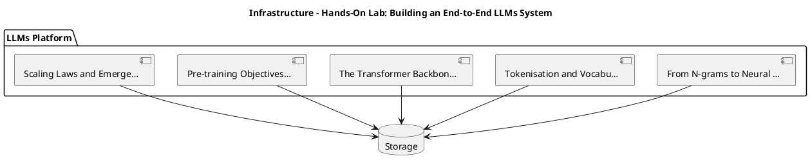

_Source diagram (plantuml); render with the appropriate tool._

**Figure 19. Infrastructure - Hands-On Lab: Building an End-to-End LLMs System** (plantuml). Figure: Infrastructure view for LLMs. This diagram illustrates the principal components and their interactions as discussed in the surrounding section.

## Deep Dive: Mechanics, Variants and Trade-offs

Having established the essentials, we now go deeper into hands-on lab: building an end-to-end llms system. It pays to understand the mechanism rather than treat it as a black box, because most production incidents are explained by one of its steps misbehaving. The distinctions in this section are the ones that separate a working demo from a system that holds up under adversarial inputs, scale and the passage of time.

Consider the principal variants and how to choose between them. Each variant optimises for a different point in the design space - some for latency, some for accuracy, some for cost or operability - and the correct choice follows from explicit requirements rather than from defaults. As with most architectural decisions, the choice is rarely binary; the skill lies in quantifying the trade-offs and choosing deliberately.

In practice this is supported by a mature tooling ecosystem, including vLLM, TensorRT-LLM, Hugging Face Transformers, Ollama. Tools accelerate the work but do not substitute for understanding: the same principles apply whichever implementation you select, and the ability to reason from first principles is what lets you debug when a tool behaves unexpectedly.

A frequent source of subtle bugs is the interaction with pre-training objectives and data. Because pre-training objectives and data concerns causal language modelling, corpus curation, deduplication and data quality at trillion-token scale, changes there can silently alter the behaviour analysed here. The remedy is contract tests at the boundary and end-to-end evaluations that exercise the interaction explicitly.

Finally, attend to edge cases and degradation. Define what the system should do under partial failure, unexpected inputs and load spikes, and make that behaviour explicit and tested rather than emergent. Graceful degradation - returning a safe, useful result when the ideal one is unavailable - is a hallmark of mature engineering.

For deeper study, the literature offers authoritative treatments such as Vaswani et al. — Attention Is All You Need (2017) and Hoffmann et al. — Training Compute-Optimal LLMs (Chinchilla, 2022). These primary sources reward careful reading and ground the practical guidance above in established results.

## Advanced Considerations

Having established the essentials, we now go deeper into hands-on lab: building an end-to-end llms system. The underlying mechanism is best appreciated by tracing a single request from input to output and noting where state is created and consumed. The distinctions in this section are the ones that separate a working demo from a system that holds up under adversarial inputs, scale and the passage of time.

Consider the principal variants and how to choose between them. Each variant optimises for a different point in the design space - some for latency, some for accuracy, some for cost or operability - and the correct choice follows from explicit requirements rather than from defaults. There is an inherent trade-off between fidelity and cost, and the correct balance depends on the use case and its tolerance for error.

In practice this is supported by a mature tooling ecosystem, including vLLM, TensorRT-LLM, Hugging Face Transformers, Ollama. Tools accelerate the work but do not substitute for understanding: the same principles apply whichever implementation you select, and the ability to reason from first principles is what lets you debug when a tool behaves unexpectedly.

A frequent source of subtle bugs is the interaction with tokenisation and vocabulary. Because tokenisation and vocabulary concerns byte-pair encoding, subword units, special tokens and their impact on cost and multilingual performance, changes there can silently alter the behaviour analysed here. The remedy is contract tests at the boundary and end-to-end evaluations that exercise the interaction explicitly.

Finally, attend to edge cases and degradation. Define what the system should do under partial failure, unexpected inputs and load spikes, and make that behaviour explicit and tested rather than emergent. Graceful degradation - returning a safe, useful result when the ideal one is unavailable - is a hallmark of mature engineering.

For deeper study, the literature offers authoritative treatments such as Vaswani et al. — Attention Is All You Need (2017) and Hoffmann et al. — Training Compute-Optimal LLMs (Chinchilla, 2022). These primary sources reward careful reading and ground the practical guidance above in established results.

## Worked Example

A worked example clarifies how these ideas behave in practice. A enterprise search organisation needs answering questions over internal knowledge with citations. They decide to apply hands-on lab: building an end-to-end llms system as part of their LLMs solution, but wisely treat it as a hypothesis to be validated rather than a foregone conclusion.

The team begins by stating the objective precisely and defining how success will be measured before writing any code. They establish a small but representative evaluation set, agree on acceptance thresholds, and only then prototype the simplest design that could work. Early measurement reveals which assumptions hold and which must be revised, saving weeks of misdirected effort and surfacing edge cases while they are still cheap to fix.

As the prototype matures into a service, the team hardens it: adding input validation, error handling, caching where it pays off, and monitoring that ties back to the original success metric. They document each significant decision in an architecture decision record so that future maintainers understand not just what was built but why.

The outcome is instructive. The system that reaches production is not the most sophisticated design the team considered, but the one whose behaviour they could measure, explain and operate. This is the recurring lesson of LLMs: durable value comes from the whole system, not from any single clever component.

## Industry Use Cases

Across industries, the ideas in this chapter recur in recognisable ways. The following vignettes show how different sectors apply them and what they have in common.

**Enterprise Search.** Answering questions over internal knowledge with citations. The common thread is that value comes not from the model alone but from the surrounding system - data quality, evaluation, integration and operations - which is precisely where most of the engineering effort belongs.

**Software.** Code completion and review across large repositories. The common thread is that value comes not from the model alone but from the surrounding system - data quality, evaluation, integration and operations - which is precisely where most of the engineering effort belongs.

**Finance.** Summarising filings and extracting structured facts. The common thread is that value comes not from the model alone but from the surrounding system - data quality, evaluation, integration and operations - which is precisely where most of the engineering effort belongs.

**Telecom.** Tier-1 support automation with escalation to humans. The common thread is that value comes not from the model alone but from the surrounding system - data quality, evaluation, integration and operations - which is precisely where most of the engineering effort belongs.

## Best Practices

The following practices consistently separate successful LLMs efforts from struggling ones. They are deliberately concrete so they can be adopted as checklist items in design and code review.

- Right-size the model to the task; do not pay for capability you don't use.
- Quantise and batch aggressively, validating quality impact with evals.
- Pin model and tokenizer versions; treat upgrades as releases.
- Monitor token distribution to catch prompt bloat and cost regressions.

None of these are exotic; they are the unglamorous disciplines that compound into reliability. The cost of adopting them is small compared with the cost of the incidents they prevent, and they become second nature with practice.

## Common Pitfalls

Equally instructive are the failure modes that recur in practice. Each pitfall below has a clear early warning sign and a known remedy, so treat them as a diagnostic checklist when something feels wrong:

- Assuming bigger is always better instead of measuring task fit.
- Underestimating KV-cache memory for long contexts.
- Silent tokenizer changes that break prompts and cost models.
- Benchmarking on contaminated datasets and over-claiming capability.

The pattern is consistent: most failures stem from skipping measurement, conflating prototype and production standards, or deferring cross-cutting concerns such as security and cost until they become emergencies. Naming these traps in advance is the cheapest way to avoid them.

## Governance, Security and Cost Notes

No discussion of hands-on lab: building an end-to-end llms system is complete without its governance, security and cost dimensions, which are too often deferred until they become emergencies. Treating them as first-class concerns from the outset is both cheaper and safer.

**Governance.** Classify the risk of this capability, document its intended and out-of-scope uses, and ensure decisions are traceable to satisfy internal policy and external regulation such as the NIST AI RMF, ISO/IEC 42001 and the EU AI Act. **Security.** Treat all external input as untrusted, validate outputs before acting on them, apply least privilege to any tools or data access, and map controls to the OWASP LLM Top 10 and MITRE ATLAS.

**Cost and sustainability.** Establish explicit budgets for compute, tokens and latency, attribute spend to owners, and revisit the economics as usage scales - a design that is affordable at pilot scale can become untenable at production volume. Building these reflexes into everyday engineering is what allows a LLMs system to be not only capable but also trustworthy and economically sound.

## Hands-On Exercises

Work through the following exercises. They are designed to move understanding from recognition to application - the level required for real engineering work - so prefer writing and building over merely reading.

1. Explain hands-on lab: building an end-to-end llms system to a colleague unfamiliar with LLMs, using a concrete example from your own domain.
2. Sketch a reference architecture that incorporates hands-on lab: building an end-to-end llms system and annotate where observability, security and cost controls belong.
3. Design an evaluation that would tell you whether hands-on lab: building an end-to-end llms system is working in production, including the metric, the dataset and the acceptance threshold.
4. Identify two pitfalls relevant to hands-on lab: building an end-to-end llms system in your environment and describe the early warning signals you would monitor.
5. Prototype the simplest implementation that demonstrates hands-on lab: building an end-to-end llms system, then list exactly what would need to change to make it production-ready.

## Key Takeaways

Key takeaways from this chapter:

- Hands-On Lab: Building an End-to-End LLMs System is a systems concern in LLMs: data, models and operations must be co-designed.
- Measurement is non-negotiable; define success metrics and evaluation before building.
- Favour the simplest design that meets the requirement, and add complexity only when evidence demands it.
- Security, cost and observability are first-class requirements, not afterthoughts.
- Document decisions so the system remains understandable and operable as it evolves.

## Code Walkthrough

This listing shows a configuration-driven Hands-On Lab: Building an End-to-End LLMs System component with retry semantics and typed interfaces — the shape we expect from production LLMs code rather than a notebook prototype.

The full listing is shown below; study it line by line and reproduce it locally before moving on.

### Listing: Implementing a Hands-On Lab: Building an End-to-End LLMs System component

```python
from __future__ import annotations

from dataclasses import dataclass, field
from typing import Any


@dataclass(slots=True)
class BuildingConfig:
    """Configuration for the Hands-On Lab: Building an End-to-End LLMs System component in a LLMs system."""

    name: str
    timeout_s: float = 30.0
    max_retries: int = 3
    options: dict[str, Any] = field(default_factory=dict)


class Building:
    """A minimal, production-shaped implementation of Hands-On Lab: Building an End-to-End LLMs System."""

    def __init__(self, config: BuildingConfig) -> None:
        self._config = config
        self._calls = 0

    def run(self, payload: dict[str, Any]) -> dict[str, Any]:
        """Process a request, retrying transient failures with backoff."""
        last_error: Exception | None = None
        for attempt in range(self._config.max_retries):
            try:
                self._calls += 1
                return self._process(payload)
            except TimeoutError as exc:  # transient
                last_error = exc
                continue
        raise RuntimeError(f"Building failed after retries") from last_error

    def _process(self, payload: dict[str, Any]) -> dict[str, Any]:
        # Domain-specific logic for Hands-On Lab: Building an End-to-End LLMs System goes here.
        return {"status": "ok", "input_keys": sorted(payload), "calls": self._calls}

```

## Review Questions

1. In the context of LLMs, which statement best describes “Hands-On Lab: Building an End-to-End LLMs System”?
   - A. It is only relevant to academic research, not production.
   - B. It applies exclusively to image data.
   - C. a guided, build-along laboratory that constructs a functioning LLMs system from first principles
   - D. It removes all security and governance requirements.
   - **Answer: C.** Hands-On Lab: Building an End-to-End LLMs System: a guided, build-along laboratory that constructs a functioning LLMs system from first principles
2. Which of the following is a recommended best practice when working with LLMs?
   - A. Pin model and tokenizer versions; treat upgrades as releases.
   - B. It guarantees deterministic output regardless of input.
   - C. Benchmarking on contaminated datasets and over-claiming capability.
   - D. It is only relevant to academic research, not production.
   - **Answer: A.** Best practice: Pin model and tokenizer versions; treat upgrades as releases.
3. Which of the following is a common pitfall to avoid in LLMs?
   - A. Benchmarking on contaminated datasets and over-claiming capability.
   - B. It removes all security and governance requirements.
   - C. Monitor token distribution to catch prompt bloat and cost regressions.
   - D. Quantise and batch aggressively, validating quality impact with evals.
   - **Answer: A.** Pitfall to avoid: Benchmarking on contaminated datasets and over-claiming capability.
4. *(Discussion)* What trade-offs would you weigh when implementing Hands-On Lab: Building an End-to-End LLMs System?
   - **Model answer:** A strong answer defines hands-on lab: building an end-to-end llms system (a guided, build-along laboratory that constructs a functioning LLMs system from first principles) then connects it to architecture, evaluation, cost, security and operations for LLMs, citing concrete trade-offs and a real-world example.

---


# Chapter 17. Case Study: Enterprise Search at Scale

_This chapter examines case study: enterprise search at scale within LLMs. It covers a detailed case study of deploying LLMs in a demanding enterprise search environment, including the decisions, trade-offs and outcomes, derives a reference architecture, walks through a worked example and runnable code, surveys industry use cases, and distils best practices and pitfalls, closing with exercises and review questions._

## Introduction

We define Case Study: Enterprise Search at Scale as a detailed case study of deploying LLMs in a demanding enterprise search environment, including the decisions, trade-offs and outcomes. It is foundational: later capabilities in LLMs are built directly on top of it. In an enterprise setting, this translates into concrete requirements: clear interfaces, measurable quality, and controls that satisfy security and governance.

This chapter builds intuition first, then formalises the ideas, derives an architecture, and finishes with code, exercises and review questions so the material transfers directly to your own LLMs work. Read it actively: pause at each diagram, reproduce the code, and attempt the exercises before consulting the answers.

## Theory and Foundations

Formally, Case Study: Enterprise Search at Scale addresses a detailed case study of deploying LLMs in a demanding enterprise search environment, including the decisions, trade-offs and outcomes. Seasoned practitioners treat this as a systems problem, co-designing data, models and operations rather than optimising any one in isolation. Beneath the abstraction lies a concrete process whose steps can each be measured, tested and optimised independently.

To place this in context, recall the broader picture: Large language models are transformer-based neural networks trained on vast text corpora to predict the next token, acquiring broad linguistic and reasoning capabilities that transfer across tasks. Within that picture, case study: enterprise search at scale is one of the load-bearing ideas - the kind that, when understood deeply, makes the rest of LLMs fall into place. Getting this right early prevents expensive rework once a LLMs system reaches scale.

Case Study: Enterprise Search at Scale cannot be understood in isolation from hallucination and factuality. Recall that hallucination and factuality concerns why models confabulate and how grounding and decoding mitigate it. The two interact directly: decisions in one constrain the design space of the other, which is why mature teams reason about them together rather than sequentially. Simplicity is a feature. The simplest design that meets the requirement should be the default, with complexity added only when measurement justifies it.

Case Study: Enterprise Search at Scale cannot be understood in isolation from evaluation and benchmarking. Recall that evaluation and benchmarking concerns capability benchmarks, contamination, and task-specific golden sets. The two interact directly: decisions in one constrain the design space of the other, which is why mature teams reason about them together rather than sequentially. Latency, accuracy and cost form a tension triangle: improving one typically pressures the others, so explicit budgets are essential.

Several established patterns apply directly to case study: enterprise search at scale. The first, speculative decoding with a small draft model, is widely adopted because it makes the system's behaviour predictable and observable. A complementary pattern, blue/green model rollout with shadow evaluation, addresses a related concern and is often deployed alongside it. Patterns are not dogma; they are distilled experience that shortcuts the search for a sound design, and each carries assumptions worth checking against your context.

It is worth being explicit about when to apply this and when to reach for something simpler. In a small prototype, shortcuts around case study: enterprise search at scale are invisible; in a production LLMs system serving real traffic, they surface as incidents, cost overruns or compliance gaps. There is an inherent trade-off between fidelity and cost, and the correct balance depends on the use case and its tolerance for error. The remainder of this chapter turns these principles into an architecture, code and a checklist you can apply immediately.

## Architecture and Design

The reference architecture for Case Study: Enterprise Search at Scale separates concerns into clearly bounded components with explicit contracts. An LLM serving platform comprises a request gateway with auth and rate limiting, an inference cluster running an optimised engine (paged KV cache, continuous batching, quantised weights), a routing layer selecting model size by task, and an observability pipeline tracking latency, tokens and quality. Model artefacts flow from a registry with signed provenance into blue/green serving slots.

Concretely, the principal building blocks include from n-grams to neural language models, tokenisation and vocabulary, the transformer backbone of llms, pre-training objectives and data and scaling laws and emergent abilities. Each is a replaceable component behind a stable interface, so the team can upgrade an implementation - a model, an index, a policy engine - without rewriting its neighbours. The contracts between components are where reliability is won or lost, so they are specified explicitly and tested in isolation.

The diagram accompanying this section makes the data and control flow explicit. Requests enter through a well-defined boundary where they are authenticated and validated; only then are they dispatched to the components that perform the work. This boundary is also where rate limiting, quota enforcement and audit logging live, keeping cross-cutting concerns out of the core logic and in one auditable place.

Two qualities deserve emphasis. First, observability is designed in, not bolted on: every component emits structured telemetry so that failures can be localised in minutes rather than hours. Second, the architecture is evolvable - components communicate through stable contracts so that any single part of the LLMs system can be replaced without a rewrite. Latency, accuracy and cost form a tension triangle: improving one typically pressures the others, so explicit budgets are essential.

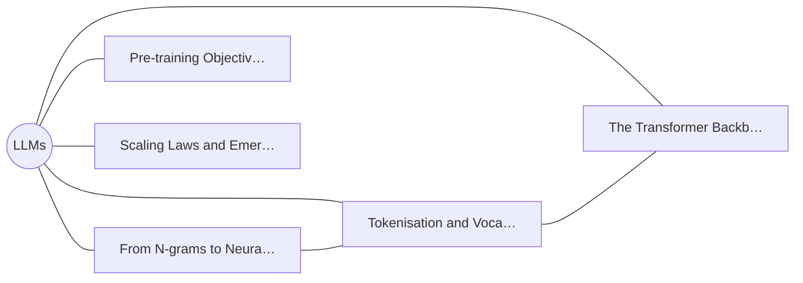

**Figure 20. Capability Map - Case Study: Enterprise Search at Scale** (mermaid). Figure: Capability Map view for LLMs. This diagram illustrates the principal components and their interactions as discussed in the surrounding section.

## Deep Dive: Mechanics, Variants and Trade-offs

Having established the essentials, we now go deeper into case study: enterprise search at scale. Beneath the abstraction lies a concrete process whose steps can each be measured, tested and optimised independently. The distinctions in this section are the ones that separate a working demo from a system that holds up under adversarial inputs, scale and the passage of time.

Consider the principal variants and how to choose between them. Each variant optimises for a different point in the design space - some for latency, some for accuracy, some for cost or operability - and the correct choice follows from explicit requirements rather than from defaults. Every added component buys capability at the price of operational surface area, and that bargain should be made consciously.

In practice this is supported by a mature tooling ecosystem, including vLLM, TensorRT-LLM, Hugging Face Transformers, Ollama. Tools accelerate the work but do not substitute for understanding: the same principles apply whichever implementation you select, and the ability to reason from first principles is what lets you debug when a tool behaves unexpectedly.

A frequent source of subtle bugs is the interaction with hallucination and factuality. Because hallucination and factuality concerns why models confabulate and how grounding and decoding mitigate it, changes there can silently alter the behaviour analysed here. The remedy is contract tests at the boundary and end-to-end evaluations that exercise the interaction explicitly.

Finally, attend to edge cases and degradation. Define what the system should do under partial failure, unexpected inputs and load spikes, and make that behaviour explicit and tested rather than emergent. Graceful degradation - returning a safe, useful result when the ideal one is unavailable - is a hallmark of mature engineering.

For deeper study, the literature offers authoritative treatments such as Vaswani et al. — Attention Is All You Need (2017) and Hoffmann et al. — Training Compute-Optimal LLMs (Chinchilla, 2022). These primary sources reward careful reading and ground the practical guidance above in established results.

## Advanced Considerations

Having established the essentials, we now go deeper into case study: enterprise search at scale. Beneath the abstraction lies a concrete process whose steps can each be measured, tested and optimised independently. The distinctions in this section are the ones that separate a working demo from a system that holds up under adversarial inputs, scale and the passage of time.

Consider the principal variants and how to choose between them. Each variant optimises for a different point in the design space - some for latency, some for accuracy, some for cost or operability - and the correct choice follows from explicit requirements rather than from defaults. Simplicity is a feature. The simplest design that meets the requirement should be the default, with complexity added only when measurement justifies it.

In practice this is supported by a mature tooling ecosystem, including vLLM, TensorRT-LLM, Hugging Face Transformers, Ollama. Tools accelerate the work but do not substitute for understanding: the same principles apply whichever implementation you select, and the ability to reason from first principles is what lets you debug when a tool behaves unexpectedly.

A frequent source of subtle bugs is the interaction with tokenisation and vocabulary. Because tokenisation and vocabulary concerns byte-pair encoding, subword units, special tokens and their impact on cost and multilingual performance, changes there can silently alter the behaviour analysed here. The remedy is contract tests at the boundary and end-to-end evaluations that exercise the interaction explicitly.

Finally, attend to edge cases and degradation. Define what the system should do under partial failure, unexpected inputs and load spikes, and make that behaviour explicit and tested rather than emergent. Graceful degradation - returning a safe, useful result when the ideal one is unavailable - is a hallmark of mature engineering.

For deeper study, the literature offers authoritative treatments such as Vaswani et al. — Attention Is All You Need (2017) and Hoffmann et al. — Training Compute-Optimal LLMs (Chinchilla, 2022). These primary sources reward careful reading and ground the practical guidance above in established results.

## Worked Example

Consider a concrete scenario. A software organisation needs code completion and review across large repositories. They decide to apply case study: enterprise search at scale as part of their LLMs solution, but wisely treat it as a hypothesis to be validated rather than a foregone conclusion.

The team begins by stating the objective precisely and defining how success will be measured before writing any code. They establish a small but representative evaluation set, agree on acceptance thresholds, and only then prototype the simplest design that could work. Early measurement reveals which assumptions hold and which must be revised, saving weeks of misdirected effort and surfacing edge cases while they are still cheap to fix.

As the prototype matures into a service, the team hardens it: adding input validation, error handling, caching where it pays off, and monitoring that ties back to the original success metric. They document each significant decision in an architecture decision record so that future maintainers understand not just what was built but why.

The outcome is instructive. The system that reaches production is not the most sophisticated design the team considered, but the one whose behaviour they could measure, explain and operate. This is the recurring lesson of LLMs: durable value comes from the whole system, not from any single clever component.

## Industry Use Cases

Across industries, the ideas in this chapter recur in recognisable ways. The following vignettes show how different sectors apply them and what they have in common.

**Enterprise Search.** Answering questions over internal knowledge with citations. The common thread is that value comes not from the model alone but from the surrounding system - data quality, evaluation, integration and operations - which is precisely where most of the engineering effort belongs.

**Software.** Code completion and review across large repositories. The common thread is that value comes not from the model alone but from the surrounding system - data quality, evaluation, integration and operations - which is precisely where most of the engineering effort belongs.

**Finance.** Summarising filings and extracting structured facts. The common thread is that value comes not from the model alone but from the surrounding system - data quality, evaluation, integration and operations - which is precisely where most of the engineering effort belongs.

**Telecom.** Tier-1 support automation with escalation to humans. The common thread is that value comes not from the model alone but from the surrounding system - data quality, evaluation, integration and operations - which is precisely where most of the engineering effort belongs.

## Best Practices

The following practices consistently separate successful LLMs efforts from struggling ones. They are deliberately concrete so they can be adopted as checklist items in design and code review.

- Right-size the model to the task; do not pay for capability you don't use.
- Quantise and batch aggressively, validating quality impact with evals.
- Pin model and tokenizer versions; treat upgrades as releases.
- Monitor token distribution to catch prompt bloat and cost regressions.

None of these are exotic; they are the unglamorous disciplines that compound into reliability. The cost of adopting them is small compared with the cost of the incidents they prevent, and they become second nature with practice.

## Common Pitfalls

Equally instructive are the failure modes that recur in practice. Each pitfall below has a clear early warning sign and a known remedy, so treat them as a diagnostic checklist when something feels wrong:

- Assuming bigger is always better instead of measuring task fit.
- Underestimating KV-cache memory for long contexts.
- Silent tokenizer changes that break prompts and cost models.
- Benchmarking on contaminated datasets and over-claiming capability.

The pattern is consistent: most failures stem from skipping measurement, conflating prototype and production standards, or deferring cross-cutting concerns such as security and cost until they become emergencies. Naming these traps in advance is the cheapest way to avoid them.

## Governance, Security and Cost Notes

No discussion of case study: enterprise search at scale is complete without its governance, security and cost dimensions, which are too often deferred until they become emergencies. Treating them as first-class concerns from the outset is both cheaper and safer.

**Governance.** Classify the risk of this capability, document its intended and out-of-scope uses, and ensure decisions are traceable to satisfy internal policy and external regulation such as the NIST AI RMF, ISO/IEC 42001 and the EU AI Act. **Security.** Treat all external input as untrusted, validate outputs before acting on them, apply least privilege to any tools or data access, and map controls to the OWASP LLM Top 10 and MITRE ATLAS.

**Cost and sustainability.** Establish explicit budgets for compute, tokens and latency, attribute spend to owners, and revisit the economics as usage scales - a design that is affordable at pilot scale can become untenable at production volume. Building these reflexes into everyday engineering is what allows a LLMs system to be not only capable but also trustworthy and economically sound.

## Hands-On Exercises

Work through the following exercises. They are designed to move understanding from recognition to application - the level required for real engineering work - so prefer writing and building over merely reading.

1. Explain case study: enterprise search at scale to a colleague unfamiliar with LLMs, using a concrete example from your own domain.
2. Sketch a reference architecture that incorporates case study: enterprise search at scale and annotate where observability, security and cost controls belong.
3. Design an evaluation that would tell you whether case study: enterprise search at scale is working in production, including the metric, the dataset and the acceptance threshold.
4. Identify two pitfalls relevant to case study: enterprise search at scale in your environment and describe the early warning signals you would monitor.
5. Prototype the simplest implementation that demonstrates case study: enterprise search at scale, then list exactly what would need to change to make it production-ready.

## Key Takeaways

Key takeaways from this chapter:

- Case Study: Enterprise Search at Scale is a systems concern in LLMs: data, models and operations must be co-designed.
- Measurement is non-negotiable; define success metrics and evaluation before building.
- Favour the simplest design that meets the requirement, and add complexity only when evidence demands it.
- Security, cost and observability are first-class requirements, not afterthoughts.
- Document decisions so the system remains understandable and operable as it evolves.

## Code Walkthrough

This listing shows a configuration-driven Case Study: Enterprise Search at Scale component with retry semantics and typed interfaces — the shape we expect from production LLMs code rather than a notebook prototype.

The full listing is shown below; study it line by line and reproduce it locally before moving on.

### Listing: Implementing a Case Study: Enterprise Search at Scale component

```python
from __future__ import annotations

from dataclasses import dataclass, field
from typing import Any


@dataclass(slots=True)
class CaseEnterpriseConfig:
    """Configuration for the Case Study: Enterprise Search at Scale component in a LLMs system."""

    name: str
    timeout_s: float = 30.0
    max_retries: int = 3
    options: dict[str, Any] = field(default_factory=dict)


class CaseEnterprise:
    """A minimal, production-shaped implementation of Case Study: Enterprise Search at Scale."""

    def __init__(self, config: CaseEnterpriseConfig) -> None:
        self._config = config
        self._calls = 0

    def run(self, payload: dict[str, Any]) -> dict[str, Any]:
        """Process a request, retrying transient failures with backoff."""
        last_error: Exception | None = None
        for attempt in range(self._config.max_retries):
            try:
                self._calls += 1
                return self._process(payload)
            except TimeoutError as exc:  # transient
                last_error = exc
                continue
        raise RuntimeError(f"CaseEnterprise failed after retries") from last_error

    def _process(self, payload: dict[str, Any]) -> dict[str, Any]:
        # Domain-specific logic for Case Study: Enterprise Search at Scale goes here.
        return {"status": "ok", "input_keys": sorted(payload), "calls": self._calls}

```

## Review Questions

1. In the context of LLMs, which statement best describes “Case Study: Enterprise Search at Scale”?
   - A. a detailed case study of deploying LLMs in a demanding enterprise search environment, including the decisions, trade-offs and outcomes
   - B. It is only relevant to academic research, not production.
   - C. It eliminates the need for any evaluation or monitoring.
   - D. It removes all security and governance requirements.
   - **Answer: A.** Case Study: Enterprise Search at Scale: a detailed case study of deploying LLMs in a demanding enterprise search environment, including the decisions, trade-offs and outcomes
2. Which of the following is a recommended best practice when working with LLMs?
   - A. It applies exclusively to image data.
   - B. Silent tokenizer changes that break prompts and cost models.
   - C. It guarantees deterministic output regardless of input.
   - D. Pin model and tokenizer versions; treat upgrades as releases.
   - **Answer: D.** Best practice: Pin model and tokenizer versions; treat upgrades as releases.
3. Which of the following is a common pitfall to avoid in LLMs?
   - A. Quantise and batch aggressively, validating quality impact with evals.
   - B. It applies exclusively to image data.
   - C. Pin model and tokenizer versions; treat upgrades as releases.
   - D. Silent tokenizer changes that break prompts and cost models.
   - **Answer: D.** Pitfall to avoid: Silent tokenizer changes that break prompts and cost models.
4. *(Discussion)* How does Case Study: Enterprise Search at Scale interact with security and governance requirements?
   - **Model answer:** A strong answer defines case study: enterprise search at scale (a detailed case study of deploying LLMs in a demanding enterprise search environment, including the decisions, trade-offs and outcomes) then connects it to architecture, evaluation, cost, security and operations for LLMs, citing concrete trade-offs and a real-world example.

---


# Chapter 18. Operating in Production

_This chapter examines operating in production within LLMs. It covers the operational discipline required to run a LLMs system reliably, including monitoring, incident response and continuous improvement, derives a reference architecture, walks through a worked example and runnable code, surveys industry use cases, and distils best practices and pitfalls, closing with exercises and review questions._

## Introduction

In practical terms, Operating in Production is best understood as the operational discipline required to run a LLMs system reliably, including monitoring, incident response and continuous improvement. Getting this right early prevents expensive rework once a LLMs system reaches scale. In an enterprise setting, this translates into concrete requirements: clear interfaces, measurable quality, and controls that satisfy security and governance.

This chapter builds intuition first, then formalises the ideas, derives an architecture, and finishes with code, exercises and review questions so the material transfers directly to your own LLMs work. Read it actively: pause at each diagram, reproduce the code, and attempt the exercises before consulting the answers.

## Theory and Foundations

In practical terms, Operating in Production is best understood as the operational discipline required to run a LLMs system reliably, including monitoring, incident response and continuous improvement. The practical implication is that design choices here ripple through latency, cost and maintainability for the lifetime of the system. It pays to understand the mechanism rather than treat it as a black box, because most production incidents are explained by one of its steps misbehaving.

To place this in context, recall the broader picture: Large language models are transformer-based neural networks trained on vast text corpora to predict the next token, acquiring broad linguistic and reasoning capabilities that transfer across tasks. Within that picture, operating in production is one of the load-bearing ideas - the kind that, when understood deeply, makes the rest of LLMs fall into place. Getting this right early prevents expensive rework once a LLMs system reaches scale.

Operating in Production cannot be understood in isolation from the llm platform reference architecture. Recall that the llm platform reference architecture concerns gateways, registries, evaluation and observability for fleets of models. The two interact directly: decisions in one constrain the design space of the other, which is why mature teams reason about them together rather than sequentially. There is an inherent trade-off between fidelity and cost, and the correct balance depends on the use case and its tolerance for error.

Operating in Production cannot be understood in isolation from the transformer backbone of llms. Recall that the transformer backbone of llms concerns decoder-only architectures, attention, positional encodings and layer normalisation choices. The two interact directly: decisions in one constrain the design space of the other, which is why mature teams reason about them together rather than sequentially. Every added component buys capability at the price of operational surface area, and that bargain should be made consciously.

Several established patterns apply directly to operating in production. The first, continuous batching with paged attention for gpu efficiency, is widely adopted because it makes the system's behaviour predictable and observable. A complementary pattern, speculative decoding with a small draft model, addresses a related concern and is often deployed alongside it. Patterns are not dogma; they are distilled experience that shortcuts the search for a sound design, and each carries assumptions worth checking against your context.

It is worth being explicit about when to apply this and when to reach for something simpler. In a small prototype, shortcuts around operating in production are invisible; in a production LLMs system serving real traffic, they surface as incidents, cost overruns or compliance gaps. There is an inherent trade-off between fidelity and cost, and the correct balance depends on the use case and its tolerance for error. The remainder of this chapter turns these principles into an architecture, code and a checklist you can apply immediately.

## Architecture and Design

From an architectural standpoint, Operating in Production sits at the intersection of data, models and operations. An LLM serving platform comprises a request gateway with auth and rate limiting, an inference cluster running an optimised engine (paged KV cache, continuous batching, quantised weights), a routing layer selecting model size by task, and an observability pipeline tracking latency, tokens and quality. Model artefacts flow from a registry with signed provenance into blue/green serving slots.

Concretely, the principal building blocks include from n-grams to neural language models, tokenisation and vocabulary, the transformer backbone of llms, pre-training objectives and data and scaling laws and emergent abilities. Each is a replaceable component behind a stable interface, so the team can upgrade an implementation - a model, an index, a policy engine - without rewriting its neighbours. The contracts between components are where reliability is won or lost, so they are specified explicitly and tested in isolation.

The diagram accompanying this section makes the data and control flow explicit. Requests enter through a well-defined boundary where they are authenticated and validated; only then are they dispatched to the components that perform the work. This boundary is also where rate limiting, quota enforcement and audit logging live, keeping cross-cutting concerns out of the core logic and in one auditable place.

Two qualities deserve emphasis. First, observability is designed in, not bolted on: every component emits structured telemetry so that failures can be localised in minutes rather than hours. Second, the architecture is evolvable - components communicate through stable contracts so that any single part of the LLMs system can be replaced without a rewrite. Simplicity is a feature. The simplest design that meets the requirement should be the default, with complexity added only when measurement justifies it.

```xml
<mxfile host="ai-university">
  <diagram name="Deployment">
    <mxGraphModel dx="800" dy="600" grid="1" gridSize="10">
      <root>
        <mxCell id="0"/>
        <mxCell id="1" parent="0"/>
        <mxCell id="title" value="Deployment - Operating in Production" style="text;fontSize=16;fontStyle=1" vertex="1" parent="1"><mxGeometry x="40" y="20" width="600" height="30" as="geometry"/></mxCell>
        <mxCell id="hub" value="LLMs" style="rounded=1;fillColor=#0f172a;fontColor=#ffffff;fontStyle=1" vertex="1" parent="1"><mxGeometry x="300" y="180" width="160" height="60" as="geometry"/></mxCell>
        <mxCell id="n0" value="From N-grams to Neural …" style="rounded=1;fillColor=#e0e7ff;strokeColor=#4338ca" vertex="1" parent="1"><mxGeometry x="60" y="80" width="160" height="50" as="geometry"/></mxCell>
        <mxCell id="e0" style="edgeStyle=orthogonalEdgeStyle" edge="1" parent="1" source="hub" target="n0"><mxGeometry relative="1" as="geometry"/></mxCell>
        <mxCell id="n1" value="Tokenisation and Vocabu…" style="rounded=1;fillColor=#e0e7ff;strokeColor=#4338ca" vertex="1" parent="1"><mxGeometry x="600" y="170" width="160" height="50" as="geometry"/></mxCell>
        <mxCell id="e1" style="edgeStyle=orthogonalEdgeStyle" edge="1" parent="1" source="hub" target="n1"><mxGeometry relative="1" as="geometry"/></mxCell>
        <mxCell id="n2" value="The Transformer Backbon…" style="rounded=1;fillColor=#e0e7ff;strokeColor=#4338ca" vertex="1" parent="1"><mxGeometry x="60" y="260" width="160" height="50" as="geometry"/></mxCell>
        <mxCell id="e2" style="edgeStyle=orthogonalEdgeStyle" edge="1" parent="1" source="hub" target="n2"><mxGeometry relative="1" as="geometry"/></mxCell>
        <mxCell id="n3" value="Pre-training Objectives…" style="rounded=1;fillColor=#e0e7ff;strokeColor=#4338ca" vertex="1" parent="1"><mxGeometry x="600" y="350" width="160" height="50" as="geometry"/></mxCell>
        <mxCell id="e3" style="edgeStyle=orthogonalEdgeStyle" edge="1" parent="1" source="hub" target="n3"><mxGeometry relative="1" as="geometry"/></mxCell>
        <mxCell id="n4" value="Scaling Laws and Emerge…" style="rounded=1;fillColor=#e0e7ff;strokeColor=#4338ca" vertex="1" parent="1"><mxGeometry x="60" y="440" width="160" height="50" as="geometry"/></mxCell>
        <mxCell id="e4" style="edgeStyle=orthogonalEdgeStyle" edge="1" parent="1" source="hub" target="n4"><mxGeometry relative="1" as="geometry"/></mxCell>
      </root>
    </mxGraphModel>
  </diagram>
</mxfile>
```

_Source diagram (drawio); render with the appropriate tool._

**Figure 21. Deployment - Operating in Production** (drawio). Figure: Deployment view for LLMs. This diagram illustrates the principal components and their interactions as discussed in the surrounding section.

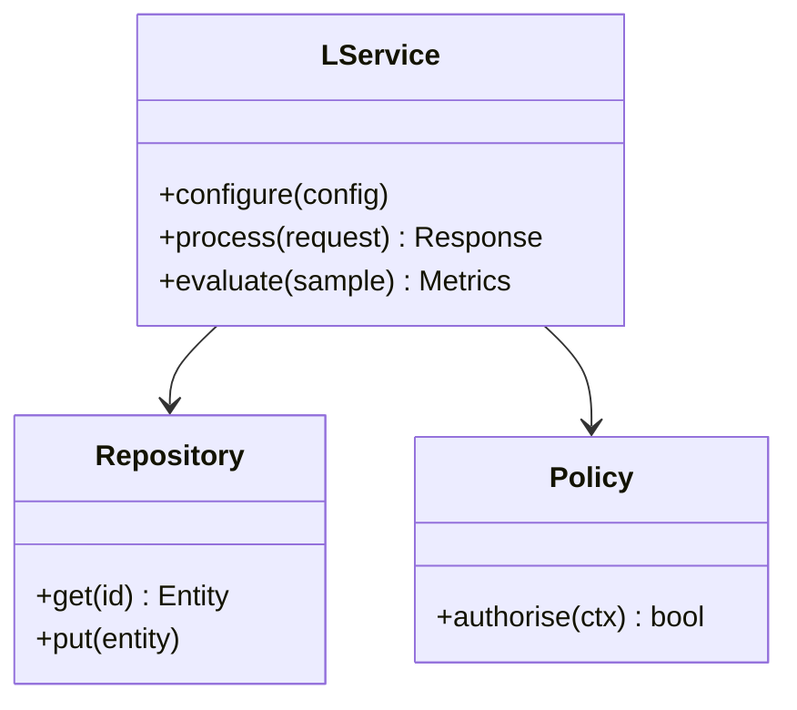

**Figure 22. Class - Operating in Production** (mermaid). Figure: Class view for LLMs. This diagram illustrates the principal components and their interactions as discussed in the surrounding section.

## Deep Dive: Mechanics, Variants and Trade-offs

Having established the essentials, we now go deeper into operating in production. Beneath the abstraction lies a concrete process whose steps can each be measured, tested and optimised independently. The distinctions in this section are the ones that separate a working demo from a system that holds up under adversarial inputs, scale and the passage of time.

Consider the principal variants and how to choose between them. Each variant optimises for a different point in the design space - some for latency, some for accuracy, some for cost or operability - and the correct choice follows from explicit requirements rather than from defaults. Latency, accuracy and cost form a tension triangle: improving one typically pressures the others, so explicit budgets are essential.

In practice this is supported by a mature tooling ecosystem, including vLLM, TensorRT-LLM, Hugging Face Transformers, Ollama. Tools accelerate the work but do not substitute for understanding: the same principles apply whichever implementation you select, and the ability to reason from first principles is what lets you debug when a tool behaves unexpectedly.

A frequent source of subtle bugs is the interaction with the llm platform reference architecture. Because the llm platform reference architecture concerns gateways, registries, evaluation and observability for fleets of models, changes there can silently alter the behaviour analysed here. The remedy is contract tests at the boundary and end-to-end evaluations that exercise the interaction explicitly.

Finally, attend to edge cases and degradation. Define what the system should do under partial failure, unexpected inputs and load spikes, and make that behaviour explicit and tested rather than emergent. Graceful degradation - returning a safe, useful result when the ideal one is unavailable - is a hallmark of mature engineering.

For deeper study, the literature offers authoritative treatments such as Vaswani et al. — Attention Is All You Need (2017) and Hoffmann et al. — Training Compute-Optimal LLMs (Chinchilla, 2022). These primary sources reward careful reading and ground the practical guidance above in established results.

## Advanced Considerations

Having established the essentials, we now go deeper into operating in production. Beneath the abstraction lies a concrete process whose steps can each be measured, tested and optimised independently. The distinctions in this section are the ones that separate a working demo from a system that holds up under adversarial inputs, scale and the passage of time.

Consider the principal variants and how to choose between them. Each variant optimises for a different point in the design space - some for latency, some for accuracy, some for cost or operability - and the correct choice follows from explicit requirements rather than from defaults. Simplicity is a feature. The simplest design that meets the requirement should be the default, with complexity added only when measurement justifies it.

In practice this is supported by a mature tooling ecosystem, including vLLM, TensorRT-LLM, Hugging Face Transformers, Ollama. Tools accelerate the work but do not substitute for understanding: the same principles apply whichever implementation you select, and the ability to reason from first principles is what lets you debug when a tool behaves unexpectedly.

A frequent source of subtle bugs is the interaction with evaluation and benchmarking. Because evaluation and benchmarking concerns capability benchmarks, contamination, and task-specific golden sets, changes there can silently alter the behaviour analysed here. The remedy is contract tests at the boundary and end-to-end evaluations that exercise the interaction explicitly.

Finally, attend to edge cases and degradation. Define what the system should do under partial failure, unexpected inputs and load spikes, and make that behaviour explicit and tested rather than emergent. Graceful degradation - returning a safe, useful result when the ideal one is unavailable - is a hallmark of mature engineering.

For deeper study, the literature offers authoritative treatments such as Vaswani et al. — Attention Is All You Need (2017) and Hoffmann et al. — Training Compute-Optimal LLMs (Chinchilla, 2022). These primary sources reward careful reading and ground the practical guidance above in established results.

## Worked Example

To ground the discussion, walk through a representative example. A enterprise search organisation needs answering questions over internal knowledge with citations. They decide to apply operating in production as part of their LLMs solution, but wisely treat it as a hypothesis to be validated rather than a foregone conclusion.

The team begins by stating the objective precisely and defining how success will be measured before writing any code. They establish a small but representative evaluation set, agree on acceptance thresholds, and only then prototype the simplest design that could work. Early measurement reveals which assumptions hold and which must be revised, saving weeks of misdirected effort and surfacing edge cases while they are still cheap to fix.

As the prototype matures into a service, the team hardens it: adding input validation, error handling, caching where it pays off, and monitoring that ties back to the original success metric. They document each significant decision in an architecture decision record so that future maintainers understand not just what was built but why.

The outcome is instructive. The system that reaches production is not the most sophisticated design the team considered, but the one whose behaviour they could measure, explain and operate. This is the recurring lesson of LLMs: durable value comes from the whole system, not from any single clever component.

## Industry Use Cases

Across industries, the ideas in this chapter recur in recognisable ways. The following vignettes show how different sectors apply them and what they have in common.

**Enterprise Search.** Answering questions over internal knowledge with citations. The common thread is that value comes not from the model alone but from the surrounding system - data quality, evaluation, integration and operations - which is precisely where most of the engineering effort belongs.

**Software.** Code completion and review across large repositories. The common thread is that value comes not from the model alone but from the surrounding system - data quality, evaluation, integration and operations - which is precisely where most of the engineering effort belongs.

**Finance.** Summarising filings and extracting structured facts. The common thread is that value comes not from the model alone but from the surrounding system - data quality, evaluation, integration and operations - which is precisely where most of the engineering effort belongs.

**Telecom.** Tier-1 support automation with escalation to humans. The common thread is that value comes not from the model alone but from the surrounding system - data quality, evaluation, integration and operations - which is precisely where most of the engineering effort belongs.

## Best Practices

The following practices consistently separate successful LLMs efforts from struggling ones. They are deliberately concrete so they can be adopted as checklist items in design and code review.

- Right-size the model to the task; do not pay for capability you don't use.
- Quantise and batch aggressively, validating quality impact with evals.
- Pin model and tokenizer versions; treat upgrades as releases.
- Monitor token distribution to catch prompt bloat and cost regressions.

None of these are exotic; they are the unglamorous disciplines that compound into reliability. The cost of adopting them is small compared with the cost of the incidents they prevent, and they become second nature with practice.

## Common Pitfalls

Equally instructive are the failure modes that recur in practice. Each pitfall below has a clear early warning sign and a known remedy, so treat them as a diagnostic checklist when something feels wrong:

- Assuming bigger is always better instead of measuring task fit.
- Underestimating KV-cache memory for long contexts.
- Silent tokenizer changes that break prompts and cost models.
- Benchmarking on contaminated datasets and over-claiming capability.

The pattern is consistent: most failures stem from skipping measurement, conflating prototype and production standards, or deferring cross-cutting concerns such as security and cost until they become emergencies. Naming these traps in advance is the cheapest way to avoid them.

## Governance, Security and Cost Notes

No discussion of operating in production is complete without its governance, security and cost dimensions, which are too often deferred until they become emergencies. Treating them as first-class concerns from the outset is both cheaper and safer.

**Governance.** Classify the risk of this capability, document its intended and out-of-scope uses, and ensure decisions are traceable to satisfy internal policy and external regulation such as the NIST AI RMF, ISO/IEC 42001 and the EU AI Act. **Security.** Treat all external input as untrusted, validate outputs before acting on them, apply least privilege to any tools or data access, and map controls to the OWASP LLM Top 10 and MITRE ATLAS.

**Cost and sustainability.** Establish explicit budgets for compute, tokens and latency, attribute spend to owners, and revisit the economics as usage scales - a design that is affordable at pilot scale can become untenable at production volume. Building these reflexes into everyday engineering is what allows a LLMs system to be not only capable but also trustworthy and economically sound.

## Hands-On Exercises

Work through the following exercises. They are designed to move understanding from recognition to application - the level required for real engineering work - so prefer writing and building over merely reading.

1. Explain operating in production to a colleague unfamiliar with LLMs, using a concrete example from your own domain.
2. Sketch a reference architecture that incorporates operating in production and annotate where observability, security and cost controls belong.
3. Design an evaluation that would tell you whether operating in production is working in production, including the metric, the dataset and the acceptance threshold.
4. Identify two pitfalls relevant to operating in production in your environment and describe the early warning signals you would monitor.
5. Prototype the simplest implementation that demonstrates operating in production, then list exactly what would need to change to make it production-ready.

## Key Takeaways

Key takeaways from this chapter:

- Operating in Production is a systems concern in LLMs: data, models and operations must be co-designed.
- Measurement is non-negotiable; define success metrics and evaluation before building.
- Favour the simplest design that meets the requirement, and add complexity only when evidence demands it.
- Security, cost and observability are first-class requirements, not afterthoughts.
- Document decisions so the system remains understandable and operable as it evolves.

## Code Walkthrough

Every change to a LLMs system should pass an evaluation gate. This example shows the minimal shape: align predictions and references, compute a metric, and return a pass/fail decision for CI.

The full listing is shown below; study it line by line and reproduce it locally before moving on.

### Listing: Evaluating Operating in Production with a regression gate

```python
from dataclasses import dataclass


@dataclass
class EvalResult:
    metric: str
    score: float
    passed: bool


def evaluate(predictions: list[str], references: list[str],
             threshold: float = 0.8) -> EvalResult:
    """Score Operating in Production output against references with a simple exact-match metric.

    In practice you would combine several metrics (exact match, semantic
    similarity, LLM-as-judge) and gate releases on the aggregate.
    """
    if len(predictions) != len(references):
        raise ValueError("predictions and references must align")
    hits = sum(p.strip() == r.strip() for p, r in zip(predictions, references))
    score = hits / len(references) if references else 0.0
    return EvalResult(metric="exact_match", score=score, passed=score >= threshold)


if __name__ == "__main__":
    result = evaluate(["yes", "no"], ["yes", "yes"])
    print(f"{result.metric}={result.score:.2f} passed={result.passed}")

```

## Review Questions

1. In the context of LLMs, which statement best describes “Operating in Production”?
   - A. It guarantees deterministic output regardless of input.
   - B. It eliminates the need for any evaluation or monitoring.
   - C. It applies exclusively to image data.
   - D. the operational discipline required to run a LLMs system reliably, including monitoring, incident response and continuous improvement
   - **Answer: D.** Operating in Production: the operational discipline required to run a LLMs system reliably, including monitoring, incident response and continuous improvement
2. Which of the following is a recommended best practice when working with LLMs?
   - A. It eliminates the need for any evaluation or monitoring.
   - B. It is only relevant to academic research, not production.
   - C. Underestimating KV-cache memory for long contexts.
   - D. Monitor token distribution to catch prompt bloat and cost regressions.
   - **Answer: D.** Best practice: Monitor token distribution to catch prompt bloat and cost regressions.
3. Which of the following is a common pitfall to avoid in LLMs?
   - A. It makes the system slower but has no other effect.
   - B. Underestimating KV-cache memory for long contexts.
   - C. It is only relevant to academic research, not production.
   - D. It removes all security and governance requirements.
   - **Answer: B.** Pitfall to avoid: Underestimating KV-cache memory for long contexts.
4. *(Discussion)* Walk through how you would design Operating in Production for an enterprise LLMs workload.
   - **Model answer:** A strong answer defines operating in production (the operational discipline required to run a LLMs system reliably, including monitoring, incident response and continuous improvement) then connects it to architecture, evaluation, cost, security and operations for LLMs, citing concrete trade-offs and a real-world example.

---


# Chapter 19. Evaluation and Quality Assurance

_This chapter examines evaluation and quality assurance within LLMs. It covers a rigorous approach to measuring and assuring the quality of a LLMs system before and after release, derives a reference architecture, walks through a worked example and runnable code, surveys industry use cases, and distils best practices and pitfalls, closing with exercises and review questions._

## Introduction

Formally, Evaluation and Quality Assurance addresses a rigorous approach to measuring and assuring the quality of a LLMs system before and after release. This concept recurs throughout the LLMs lifecycle, from design to operations. The practical implication is that design choices here ripple through latency, cost and maintainability for the lifetime of the system.

This chapter builds intuition first, then formalises the ideas, derives an architecture, and finishes with code, exercises and review questions so the material transfers directly to your own LLMs work. Read it actively: pause at each diagram, reproduce the code, and attempt the exercises before consulting the answers.

## Theory and Foundations

We define Evaluation and Quality Assurance as a rigorous approach to measuring and assuring the quality of a LLMs system before and after release. The right abstraction here pays compounding dividends, because downstream components depend on its guarantees. It pays to understand the mechanism rather than treat it as a black box, because most production incidents are explained by one of its steps misbehaving.

To place this in context, recall the broader picture: Large language models are transformer-based neural networks trained on vast text corpora to predict the next token, acquiring broad linguistic and reasoning capabilities that transfer across tasks. Within that picture, evaluation and quality assurance is one of the load-bearing ideas - the kind that, when understood deeply, makes the rest of LLMs fall into place. Getting this right early prevents expensive rework once a LLMs system reaches scale.

Evaluation and Quality Assurance cannot be understood in isolation from cost and capacity planning. Recall that cost and capacity planning concerns token economics, hardware sizing and build-versus-buy decisions. The two interact directly: decisions in one constrain the design space of the other, which is why mature teams reason about them together rather than sequentially. There is an inherent trade-off between fidelity and cost, and the correct balance depends on the use case and its tolerance for error.

Evaluation and Quality Assurance cannot be understood in isolation from instruction tuning and alignment. Recall that instruction tuning and alignment concerns supervised fine-tuning, RLHF and preference optimisation that make base models useful and safe. The two interact directly: decisions in one constrain the design space of the other, which is why mature teams reason about them together rather than sequentially. As with most architectural decisions, the choice is rarely binary; the skill lies in quantifying the trade-offs and choosing deliberately.

Several established patterns apply directly to evaluation and quality assurance. The first, blue/green model rollout with shadow evaluation, is widely adopted because it makes the system's behaviour predictable and observable. A complementary pattern, speculative decoding with a small draft model, addresses a related concern and is often deployed alongside it. Patterns are not dogma; they are distilled experience that shortcuts the search for a sound design, and each carries assumptions worth checking against your context.

Knowing when not to use a technique is as valuable as knowing how to use it. In a small prototype, shortcuts around evaluation and quality assurance are invisible; in a production LLMs system serving real traffic, they surface as incidents, cost overruns or compliance gaps. Simplicity is a feature. The simplest design that meets the requirement should be the default, with complexity added only when measurement justifies it. The remainder of this chapter turns these principles into an architecture, code and a checklist you can apply immediately.

## Architecture and Design

The reference architecture for Evaluation and Quality Assurance separates concerns into clearly bounded components with explicit contracts. An LLM serving platform comprises a request gateway with auth and rate limiting, an inference cluster running an optimised engine (paged KV cache, continuous batching, quantised weights), a routing layer selecting model size by task, and an observability pipeline tracking latency, tokens and quality. Model artefacts flow from a registry with signed provenance into blue/green serving slots.

Concretely, the principal building blocks include from n-grams to neural language models, tokenisation and vocabulary, the transformer backbone of llms, pre-training objectives and data and scaling laws and emergent abilities. Each is a replaceable component behind a stable interface, so the team can upgrade an implementation - a model, an index, a policy engine - without rewriting its neighbours. The contracts between components are where reliability is won or lost, so they are specified explicitly and tested in isolation.

The diagram accompanying this section makes the data and control flow explicit. Requests enter through a well-defined boundary where they are authenticated and validated; only then are they dispatched to the components that perform the work. This boundary is also where rate limiting, quota enforcement and audit logging live, keeping cross-cutting concerns out of the core logic and in one auditable place.

Two qualities deserve emphasis. First, observability is designed in, not bolted on: every component emits structured telemetry so that failures can be localised in minutes rather than hours. Second, the architecture is evolvable - components communicate through stable contracts so that any single part of the LLMs system can be replaced without a rewrite. Simplicity is a feature. The simplest design that meets the requirement should be the default, with complexity added only when measurement justifies it.


**Figure 23. Class - Evaluation and Quality Assurance** (mermaid). Figure: Class view for LLMs. This diagram illustrates the principal components and their interactions as discussed in the surrounding section.

<div class="diagram-svg">

<svg xmlns="http://www.w3.org/2000/svg" width="840" height="460" data-tpl="mindmap" data-pal="9-0" viewBox="0 0 840 460" font-family="Inter, Segoe UI, Arial, sans-serif"><defs><marker id="ar" markerWidth="9" markerHeight="9" refX="7" refY="3" orient="auto"><path d="M0,0 L7,3 L0,6 z" fill="#94a3b8"/></marker><marker id="arw" markerWidth="9" markerHeight="9" refX="7" refY="3" orient="auto"><path d="M0,0 L7,3 L0,6 z" fill="#ffffff"/></marker><filter id="sh" x="-20%" y="-20%" width="140%" height="140%"><feDropShadow dx="0" dy="2" stdDeviation="3" flood-color="#0f172a" flood-opacity="0.16"/></filter></defs><defs><linearGradient id="bn44e2eea" x1="0" y1="0" x2="1" y2="0"><stop offset="0" stop-color="#9d174d"/><stop offset="1" stop-color="#db2777"/></linearGradient></defs><rect width="840" height="460" rx="14" fill="#ffffff"/><rect x="0" y="0" width="840" height="48" rx="14" fill="url(#bn44e2eea)"/><rect x="0" y="32" width="840" height="16" fill="url(#bn44e2eea)"/><text x="420" y="25" text-anchor="middle" font-size="14.5" font-weight="700" fill="#ffffff" dominant-baseline="middle">Knowledge Graph - Evaluation and Quality Assurance</text><rect x="330" y="210" width="180" height="52" rx="11" fill="#0f172a" filter="url(#sh)"/><text x="420" y="236" text-anchor="middle" font-size="13" font-weight="600" fill="#ffffff" dominant-baseline="middle">LLMs</text><path d="M330,236 C250,236 250,126 248,126" fill="none" stroke="#cbd5e1" stroke-width="2"/><rect x="92" y="104" width="156" height="44" rx="11" fill="#9d174d" filter="url(#sh)"/><text x="170" y="121" text-anchor="middle" font-size="9.5" font-weight="600" fill="#ffffff" dominant-baseline="middle">Scaling Laws and Emergent</text><text x="170" y="131" text-anchor="middle" font-size="9.5" font-weight="600" fill="#ffffff" dominant-baseline="middle">Abilities</text><path d="M330,236 C250,236 250,236 248,236" fill="none" stroke="#cbd5e1" stroke-width="2"/><rect x="92" y="214" width="156" height="44" rx="11" fill="#db2777" filter="url(#sh)"/><text x="170" y="231" text-anchor="middle" font-size="9.5" font-weight="600" fill="#ffffff" dominant-baseline="middle">Instruction Tuning and</text><text x="170" y="241" text-anchor="middle" font-size="9.5" font-weight="600" fill="#ffffff" dominant-baseline="middle">Alignment</text><path d="M330,236 C250,236 250,346 248,346" fill="none" stroke="#cbd5e1" stroke-width="2"/><rect x="92" y="324" width="156" height="44" rx="11" fill="#ec4899" filter="url(#sh)"/><text x="170" y="341" text-anchor="middle" font-size="9.5" font-weight="600" fill="#ffffff" dominant-baseline="middle">Context Windows and</text><text x="170" y="351" text-anchor="middle" font-size="9.5" font-weight="600" fill="#ffffff" dominant-baseline="middle">Long-Context Techniques</text><path d="M510,236 C590,236 590,126 592,126" fill="none" stroke="#cbd5e1" stroke-width="2"/><rect x="592" y="104" width="156" height="44" rx="11" fill="#f472b6" filter="url(#sh)"/><text x="670" y="126" text-anchor="middle" font-size="11" font-weight="600" fill="#ffffff" dominant-baseline="middle">Inference Optimisation</text><path d="M510,236 C590,236 590,236 592,236" fill="none" stroke="#cbd5e1" stroke-width="2"/><rect x="592" y="214" width="156" height="44" rx="11" fill="#fb7185" filter="url(#sh)"/><text x="670" y="236" text-anchor="middle" font-size="11" font-weight="600" fill="#ffffff" dominant-baseline="middle">Serving LLMs at Scale</text><path d="M510,236 C590,236 590,346 592,346" fill="none" stroke="#cbd5e1" stroke-width="2"/><rect x="592" y="324" width="156" height="44" rx="11" fill="#e11d48" filter="url(#sh)"/><text x="670" y="346" text-anchor="middle" font-size="9.5" font-weight="600" fill="#ffffff" dominant-baseline="middle">Evaluation and Benchmarking</text><text x="28" y="446" text-anchor="start" font-size="9.5" font-weight="500" fill="#64748b" dominant-baseline="middle">LLMs  •  Knowledge Graph</text></svg>

</div>

**Figure 24. Knowledge Graph - Evaluation and Quality Assurance** (svg). Figure: Knowledge Graph view for LLMs. This diagram illustrates the principal components and their interactions as discussed in the surrounding section.

## Deep Dive: Mechanics, Variants and Trade-offs

Having established the essentials, we now go deeper into evaluation and quality assurance. It pays to understand the mechanism rather than treat it as a black box, because most production incidents are explained by one of its steps misbehaving. The distinctions in this section are the ones that separate a working demo from a system that holds up under adversarial inputs, scale and the passage of time.

Consider the principal variants and how to choose between them. Each variant optimises for a different point in the design space - some for latency, some for accuracy, some for cost or operability - and the correct choice follows from explicit requirements rather than from defaults. Every added component buys capability at the price of operational surface area, and that bargain should be made consciously.

In practice this is supported by a mature tooling ecosystem, including vLLM, TensorRT-LLM, Hugging Face Transformers, Ollama. Tools accelerate the work but do not substitute for understanding: the same principles apply whichever implementation you select, and the ability to reason from first principles is what lets you debug when a tool behaves unexpectedly.

A frequent source of subtle bugs is the interaction with cost and capacity planning. Because cost and capacity planning concerns token economics, hardware sizing and build-versus-buy decisions, changes there can silently alter the behaviour analysed here. The remedy is contract tests at the boundary and end-to-end evaluations that exercise the interaction explicitly.

Finally, attend to edge cases and degradation. Define what the system should do under partial failure, unexpected inputs and load spikes, and make that behaviour explicit and tested rather than emergent. Graceful degradation - returning a safe, useful result when the ideal one is unavailable - is a hallmark of mature engineering.

For deeper study, the literature offers authoritative treatments such as Vaswani et al. — Attention Is All You Need (2017) and Hoffmann et al. — Training Compute-Optimal LLMs (Chinchilla, 2022). These primary sources reward careful reading and ground the practical guidance above in established results.

## Advanced Considerations

Having established the essentials, we now go deeper into evaluation and quality assurance. Beneath the abstraction lies a concrete process whose steps can each be measured, tested and optimised independently. The distinctions in this section are the ones that separate a working demo from a system that holds up under adversarial inputs, scale and the passage of time.

Consider the principal variants and how to choose between them. Each variant optimises for a different point in the design space - some for latency, some for accuracy, some for cost or operability - and the correct choice follows from explicit requirements rather than from defaults. As with most architectural decisions, the choice is rarely binary; the skill lies in quantifying the trade-offs and choosing deliberately.

In practice this is supported by a mature tooling ecosystem, including vLLM, TensorRT-LLM, Hugging Face Transformers, Ollama. Tools accelerate the work but do not substitute for understanding: the same principles apply whichever implementation you select, and the ability to reason from first principles is what lets you debug when a tool behaves unexpectedly.

A frequent source of subtle bugs is the interaction with inference optimisation. Because inference optimisation concerns kV caching, speculative decoding, quantisation and continuous batching for throughput, changes there can silently alter the behaviour analysed here. The remedy is contract tests at the boundary and end-to-end evaluations that exercise the interaction explicitly.

Finally, attend to edge cases and degradation. Define what the system should do under partial failure, unexpected inputs and load spikes, and make that behaviour explicit and tested rather than emergent. Graceful degradation - returning a safe, useful result when the ideal one is unavailable - is a hallmark of mature engineering.

For deeper study, the literature offers authoritative treatments such as Vaswani et al. — Attention Is All You Need (2017) and Hoffmann et al. — Training Compute-Optimal LLMs (Chinchilla, 2022). These primary sources reward careful reading and ground the practical guidance above in established results.

## Worked Example

To ground the discussion, walk through a representative example. A software organisation needs code completion and review across large repositories. They decide to apply evaluation and quality assurance as part of their LLMs solution, but wisely treat it as a hypothesis to be validated rather than a foregone conclusion.

The team begins by stating the objective precisely and defining how success will be measured before writing any code. They establish a small but representative evaluation set, agree on acceptance thresholds, and only then prototype the simplest design that could work. Early measurement reveals which assumptions hold and which must be revised, saving weeks of misdirected effort and surfacing edge cases while they are still cheap to fix.

As the prototype matures into a service, the team hardens it: adding input validation, error handling, caching where it pays off, and monitoring that ties back to the original success metric. They document each significant decision in an architecture decision record so that future maintainers understand not just what was built but why.

The outcome is instructive. The system that reaches production is not the most sophisticated design the team considered, but the one whose behaviour they could measure, explain and operate. This is the recurring lesson of LLMs: durable value comes from the whole system, not from any single clever component.

## Industry Use Cases

Across industries, the ideas in this chapter recur in recognisable ways. The following vignettes show how different sectors apply them and what they have in common.

**Enterprise Search.** Answering questions over internal knowledge with citations. The common thread is that value comes not from the model alone but from the surrounding system - data quality, evaluation, integration and operations - which is precisely where most of the engineering effort belongs.

**Software.** Code completion and review across large repositories. The common thread is that value comes not from the model alone but from the surrounding system - data quality, evaluation, integration and operations - which is precisely where most of the engineering effort belongs.

**Finance.** Summarising filings and extracting structured facts. The common thread is that value comes not from the model alone but from the surrounding system - data quality, evaluation, integration and operations - which is precisely where most of the engineering effort belongs.

**Telecom.** Tier-1 support automation with escalation to humans. The common thread is that value comes not from the model alone but from the surrounding system - data quality, evaluation, integration and operations - which is precisely where most of the engineering effort belongs.

## Best Practices

The following practices consistently separate successful LLMs efforts from struggling ones. They are deliberately concrete so they can be adopted as checklist items in design and code review.

- Right-size the model to the task; do not pay for capability you don't use.
- Quantise and batch aggressively, validating quality impact with evals.
- Pin model and tokenizer versions; treat upgrades as releases.
- Monitor token distribution to catch prompt bloat and cost regressions.

None of these are exotic; they are the unglamorous disciplines that compound into reliability. The cost of adopting them is small compared with the cost of the incidents they prevent, and they become second nature with practice.

## Common Pitfalls

Equally instructive are the failure modes that recur in practice. Each pitfall below has a clear early warning sign and a known remedy, so treat them as a diagnostic checklist when something feels wrong:

- Assuming bigger is always better instead of measuring task fit.
- Underestimating KV-cache memory for long contexts.
- Silent tokenizer changes that break prompts and cost models.
- Benchmarking on contaminated datasets and over-claiming capability.

The pattern is consistent: most failures stem from skipping measurement, conflating prototype and production standards, or deferring cross-cutting concerns such as security and cost until they become emergencies. Naming these traps in advance is the cheapest way to avoid them.

## Governance, Security and Cost Notes

No discussion of evaluation and quality assurance is complete without its governance, security and cost dimensions, which are too often deferred until they become emergencies. Treating them as first-class concerns from the outset is both cheaper and safer.

**Governance.** Classify the risk of this capability, document its intended and out-of-scope uses, and ensure decisions are traceable to satisfy internal policy and external regulation such as the NIST AI RMF, ISO/IEC 42001 and the EU AI Act. **Security.** Treat all external input as untrusted, validate outputs before acting on them, apply least privilege to any tools or data access, and map controls to the OWASP LLM Top 10 and MITRE ATLAS.

**Cost and sustainability.** Establish explicit budgets for compute, tokens and latency, attribute spend to owners, and revisit the economics as usage scales - a design that is affordable at pilot scale can become untenable at production volume. Building these reflexes into everyday engineering is what allows a LLMs system to be not only capable but also trustworthy and economically sound.

## Hands-On Exercises

Work through the following exercises. They are designed to move understanding from recognition to application - the level required for real engineering work - so prefer writing and building over merely reading.

1. Explain evaluation and quality assurance to a colleague unfamiliar with LLMs, using a concrete example from your own domain.
2. Sketch a reference architecture that incorporates evaluation and quality assurance and annotate where observability, security and cost controls belong.
3. Design an evaluation that would tell you whether evaluation and quality assurance is working in production, including the metric, the dataset and the acceptance threshold.
4. Identify two pitfalls relevant to evaluation and quality assurance in your environment and describe the early warning signals you would monitor.
5. Prototype the simplest implementation that demonstrates evaluation and quality assurance, then list exactly what would need to change to make it production-ready.

## Key Takeaways

Key takeaways from this chapter:

- Evaluation and Quality Assurance is a systems concern in LLMs: data, models and operations must be co-designed.
- Measurement is non-negotiable; define success metrics and evaluation before building.
- Favour the simplest design that meets the requirement, and add complexity only when evidence demands it.
- Security, cost and observability are first-class requirements, not afterthoughts.
- Document decisions so the system remains understandable and operable as it evolves.

## Code Walkthrough

This listing shows a configuration-driven Evaluation and Quality Assurance component with retry semantics and typed interfaces — the shape we expect from production LLMs code rather than a notebook prototype.

The full listing is shown below; study it line by line and reproduce it locally before moving on.

### Listing: Implementing a Evaluation and Quality Assurance component

```python
from __future__ import annotations

from dataclasses import dataclass, field
from typing import Any


@dataclass(slots=True)
class EvaluationAndQualityConfig:
    """Configuration for the Evaluation and Quality Assurance component in a LLMs system."""

    name: str
    timeout_s: float = 30.0
    max_retries: int = 3
    options: dict[str, Any] = field(default_factory=dict)


class EvaluationAndQuality:
    """A minimal, production-shaped implementation of Evaluation and Quality Assurance."""

    def __init__(self, config: EvaluationAndQualityConfig) -> None:
        self._config = config
        self._calls = 0

    def run(self, payload: dict[str, Any]) -> dict[str, Any]:
        """Process a request, retrying transient failures with backoff."""
        last_error: Exception | None = None
        for attempt in range(self._config.max_retries):
            try:
                self._calls += 1
                return self._process(payload)
            except TimeoutError as exc:  # transient
                last_error = exc
                continue
        raise RuntimeError(f"EvaluationAndQuality failed after retries") from last_error

    def _process(self, payload: dict[str, Any]) -> dict[str, Any]:
        # Domain-specific logic for Evaluation and Quality Assurance goes here.
        return {"status": "ok", "input_keys": sorted(payload), "calls": self._calls}

```

## Review Questions

1. In the context of LLMs, which statement best describes “Evaluation and Quality Assurance”?
   - A. It applies exclusively to image data.
   - B. It makes the system slower but has no other effect.
   - C. It eliminates the need for any evaluation or monitoring.
   - D. a rigorous approach to measuring and assuring the quality of a LLMs system before and after release
   - **Answer: D.** Evaluation and Quality Assurance: a rigorous approach to measuring and assuring the quality of a LLMs system before and after release
2. Which of the following is a recommended best practice when working with LLMs?
   - A. It applies exclusively to image data.
   - B. Monitor token distribution to catch prompt bloat and cost regressions.
   - C. Assuming bigger is always better instead of measuring task fit.
   - D. Underestimating KV-cache memory for long contexts.
   - **Answer: B.** Best practice: Monitor token distribution to catch prompt bloat and cost regressions.
3. Which of the following is a common pitfall to avoid in LLMs?
   - A. It eliminates the need for any evaluation or monitoring.
   - B. Quantise and batch aggressively, validating quality impact with evals.
   - C. Underestimating KV-cache memory for long contexts.
   - D. It applies exclusively to image data.
   - **Answer: C.** Pitfall to avoid: Underestimating KV-cache memory for long contexts.
4. *(Discussion)* Describe a failure mode of Evaluation and Quality Assurance and how you would mitigate it.
   - **Model answer:** A strong answer defines evaluation and quality assurance (a rigorous approach to measuring and assuring the quality of a LLMs system before and after release) then connects it to architecture, evaluation, cost, security and operations for LLMs, citing concrete trade-offs and a real-world example.

---


# Chapter 20. Security, Privacy and Governance

_This chapter examines security, privacy and governance within LLMs. It covers the security, privacy and governance controls that make a LLMs system trustworthy and compliant, derives a reference architecture, walks through a worked example and runnable code, surveys industry use cases, and distils best practices and pitfalls, closing with exercises and review questions._

## Introduction

We define Security, Privacy and Governance as the security, privacy and governance controls that make a LLMs system trustworthy and compliant. Teams that master this consistently ship more reliable LLMs systems at lower cost. Seasoned practitioners treat this as a systems problem, co-designing data, models and operations rather than optimising any one in isolation.

This chapter builds intuition first, then formalises the ideas, derives an architecture, and finishes with code, exercises and review questions so the material transfers directly to your own LLMs work. Read it actively: pause at each diagram, reproduce the code, and attempt the exercises before consulting the answers.

## Theory and Foundations

At its core, Security, Privacy and Governance concerns the security, privacy and governance controls that make a LLMs system trustworthy and compliant. The right abstraction here pays compounding dividends, because downstream components depend on its guarantees. It pays to understand the mechanism rather than treat it as a black box, because most production incidents are explained by one of its steps misbehaving.

To place this in context, recall the broader picture: Large language models are transformer-based neural networks trained on vast text corpora to predict the next token, acquiring broad linguistic and reasoning capabilities that transfer across tasks. Within that picture, security, privacy and governance is one of the load-bearing ideas - the kind that, when understood deeply, makes the rest of LLMs fall into place. Teams that master this consistently ship more reliable LLMs systems at lower cost.

Security, Privacy and Governance cannot be understood in isolation from tokenisation and vocabulary. Recall that tokenisation and vocabulary concerns byte-pair encoding, subword units, special tokens and their impact on cost and multilingual performance. The two interact directly: decisions in one constrain the design space of the other, which is why mature teams reason about them together rather than sequentially. Every added component buys capability at the price of operational surface area, and that bargain should be made consciously.

Security, Privacy and Governance cannot be understood in isolation from context windows and long-context techniques. Recall that context windows and long-context techniques concerns position interpolation, attention variants and retrieval to extend effective context. The two interact directly: decisions in one constrain the design space of the other, which is why mature teams reason about them together rather than sequentially. As with most architectural decisions, the choice is rarely binary; the skill lies in quantifying the trade-offs and choosing deliberately.

Several established patterns apply directly to security, privacy and governance. The first, continuous batching with paged attention for gpu efficiency, is widely adopted because it makes the system's behaviour predictable and observable. A complementary pattern, speculative decoding with a small draft model, addresses a related concern and is often deployed alongside it. Patterns are not dogma; they are distilled experience that shortcuts the search for a sound design, and each carries assumptions worth checking against your context.

The decision of whether to adopt this should be driven by requirements, not by novelty. In a small prototype, shortcuts around security, privacy and governance are invisible; in a production LLMs system serving real traffic, they surface as incidents, cost overruns or compliance gaps. Every added component buys capability at the price of operational surface area, and that bargain should be made consciously. The remainder of this chapter turns these principles into an architecture, code and a checklist you can apply immediately.

## Architecture and Design

From an architectural standpoint, Security, Privacy and Governance sits at the intersection of data, models and operations. An LLM serving platform comprises a request gateway with auth and rate limiting, an inference cluster running an optimised engine (paged KV cache, continuous batching, quantised weights), a routing layer selecting model size by task, and an observability pipeline tracking latency, tokens and quality. Model artefacts flow from a registry with signed provenance into blue/green serving slots.

Concretely, the principal building blocks include from n-grams to neural language models, tokenisation and vocabulary, the transformer backbone of llms, pre-training objectives and data and scaling laws and emergent abilities. Each is a replaceable component behind a stable interface, so the team can upgrade an implementation - a model, an index, a policy engine - without rewriting its neighbours. The contracts between components are where reliability is won or lost, so they are specified explicitly and tested in isolation.

The diagram accompanying this section makes the data and control flow explicit. Requests enter through a well-defined boundary where they are authenticated and validated; only then are they dispatched to the components that perform the work. This boundary is also where rate limiting, quota enforcement and audit logging live, keeping cross-cutting concerns out of the core logic and in one auditable place.

Two qualities deserve emphasis. First, observability is designed in, not bolted on: every component emits structured telemetry so that failures can be localised in minutes rather than hours. Second, the architecture is evolvable - components communicate through stable contracts so that any single part of the LLMs system can be replaced without a rewrite. Latency, accuracy and cost form a tension triangle: improving one typically pressures the others, so explicit budgets are essential.


**Figure 25. Knowledge Graph - Security, Privacy and Governance** (mermaid). Figure: Knowledge Graph view for LLMs. This diagram illustrates the principal components and their interactions as discussed in the surrounding section.

```xml
<mxfile host="ai-university">
  <diagram name="Network">
    <mxGraphModel dx="800" dy="600" grid="1" gridSize="10">
      <root>
        <mxCell id="0"/>
        <mxCell id="1" parent="0"/>
        <mxCell id="title" value="Network - Security, Privacy and Governance" style="text;fontSize=16;fontStyle=1" vertex="1" parent="1"><mxGeometry x="40" y="20" width="600" height="30" as="geometry"/></mxCell>
        <mxCell id="hub" value="LLMs" style="rounded=1;fillColor=#0f172a;fontColor=#ffffff;fontStyle=1" vertex="1" parent="1"><mxGeometry x="300" y="180" width="160" height="60" as="geometry"/></mxCell>
        <mxCell id="n0" value="From N-grams to Neural …" style="rounded=1;fillColor=#e0e7ff;strokeColor=#4338ca" vertex="1" parent="1"><mxGeometry x="60" y="80" width="160" height="50" as="geometry"/></mxCell>
        <mxCell id="e0" style="edgeStyle=orthogonalEdgeStyle" edge="1" parent="1" source="hub" target="n0"><mxGeometry relative="1" as="geometry"/></mxCell>
        <mxCell id="n1" value="Tokenisation and Vocabu…" style="rounded=1;fillColor=#e0e7ff;strokeColor=#4338ca" vertex="1" parent="1"><mxGeometry x="600" y="170" width="160" height="50" as="geometry"/></mxCell>
        <mxCell id="e1" style="edgeStyle=orthogonalEdgeStyle" edge="1" parent="1" source="hub" target="n1"><mxGeometry relative="1" as="geometry"/></mxCell>
        <mxCell id="n2" value="The Transformer Backbon…" style="rounded=1;fillColor=#e0e7ff;strokeColor=#4338ca" vertex="1" parent="1"><mxGeometry x="60" y="260" width="160" height="50" as="geometry"/></mxCell>
        <mxCell id="e2" style="edgeStyle=orthogonalEdgeStyle" edge="1" parent="1" source="hub" target="n2"><mxGeometry relative="1" as="geometry"/></mxCell>
        <mxCell id="n3" value="Pre-training Objectives…" style="rounded=1;fillColor=#e0e7ff;strokeColor=#4338ca" vertex="1" parent="1"><mxGeometry x="600" y="350" width="160" height="50" as="geometry"/></mxCell>
        <mxCell id="e3" style="edgeStyle=orthogonalEdgeStyle" edge="1" parent="1" source="hub" target="n3"><mxGeometry relative="1" as="geometry"/></mxCell>
        <mxCell id="n4" value="Scaling Laws and Emerge…" style="rounded=1;fillColor=#e0e7ff;strokeColor=#4338ca" vertex="1" parent="1"><mxGeometry x="60" y="440" width="160" height="50" as="geometry"/></mxCell>
        <mxCell id="e4" style="edgeStyle=orthogonalEdgeStyle" edge="1" parent="1" source="hub" target="n4"><mxGeometry relative="1" as="geometry"/></mxCell>
      </root>
    </mxGraphModel>
  </diagram>
</mxfile>
```

_Source diagram (drawio); render with the appropriate tool._

**Figure 26. Network - Security, Privacy and Governance** (drawio). Figure: Network view for LLMs. This diagram illustrates the principal components and their interactions as discussed in the surrounding section.

## Deep Dive: Mechanics, Variants and Trade-offs

Having established the essentials, we now go deeper into security, privacy and governance. Beneath the abstraction lies a concrete process whose steps can each be measured, tested and optimised independently. The distinctions in this section are the ones that separate a working demo from a system that holds up under adversarial inputs, scale and the passage of time.

Consider the principal variants and how to choose between them. Each variant optimises for a different point in the design space - some for latency, some for accuracy, some for cost or operability - and the correct choice follows from explicit requirements rather than from defaults. There is an inherent trade-off between fidelity and cost, and the correct balance depends on the use case and its tolerance for error.

In practice this is supported by a mature tooling ecosystem, including vLLM, TensorRT-LLM, Hugging Face Transformers, Ollama. Tools accelerate the work but do not substitute for understanding: the same principles apply whichever implementation you select, and the ability to reason from first principles is what lets you debug when a tool behaves unexpectedly.

A frequent source of subtle bugs is the interaction with tokenisation and vocabulary. Because tokenisation and vocabulary concerns byte-pair encoding, subword units, special tokens and their impact on cost and multilingual performance, changes there can silently alter the behaviour analysed here. The remedy is contract tests at the boundary and end-to-end evaluations that exercise the interaction explicitly.

Finally, attend to edge cases and degradation. Define what the system should do under partial failure, unexpected inputs and load spikes, and make that behaviour explicit and tested rather than emergent. Graceful degradation - returning a safe, useful result when the ideal one is unavailable - is a hallmark of mature engineering.

For deeper study, the literature offers authoritative treatments such as Vaswani et al. — Attention Is All You Need (2017) and Hoffmann et al. — Training Compute-Optimal LLMs (Chinchilla, 2022). These primary sources reward careful reading and ground the practical guidance above in established results.

## Advanced Considerations

Having established the essentials, we now go deeper into security, privacy and governance. Mechanically, the behaviour emerges from a few interacting parts that are simpler than the whole they produce. The distinctions in this section are the ones that separate a working demo from a system that holds up under adversarial inputs, scale and the passage of time.

Consider the principal variants and how to choose between them. Each variant optimises for a different point in the design space - some for latency, some for accuracy, some for cost or operability - and the correct choice follows from explicit requirements rather than from defaults. Latency, accuracy and cost form a tension triangle: improving one typically pressures the others, so explicit budgets are essential.

In practice this is supported by a mature tooling ecosystem, including vLLM, TensorRT-LLM, Hugging Face Transformers, Ollama. Tools accelerate the work but do not substitute for understanding: the same principles apply whichever implementation you select, and the ability to reason from first principles is what lets you debug when a tool behaves unexpectedly.

A frequent source of subtle bugs is the interaction with from n-grams to neural language models. Because from n-grams to neural language models concerns the evolution of language modelling and why scale plus self-attention unlocked emergent capability, changes there can silently alter the behaviour analysed here. The remedy is contract tests at the boundary and end-to-end evaluations that exercise the interaction explicitly.

Finally, attend to edge cases and degradation. Define what the system should do under partial failure, unexpected inputs and load spikes, and make that behaviour explicit and tested rather than emergent. Graceful degradation - returning a safe, useful result when the ideal one is unavailable - is a hallmark of mature engineering.

For deeper study, the literature offers authoritative treatments such as Vaswani et al. — Attention Is All You Need (2017) and Hoffmann et al. — Training Compute-Optimal LLMs (Chinchilla, 2022). These primary sources reward careful reading and ground the practical guidance above in established results.

## Worked Example

To ground the discussion, walk through a representative example. A finance organisation needs summarising filings and extracting structured facts. They decide to apply security, privacy and governance as part of their LLMs solution, but wisely treat it as a hypothesis to be validated rather than a foregone conclusion.

The team begins by stating the objective precisely and defining how success will be measured before writing any code. They establish a small but representative evaluation set, agree on acceptance thresholds, and only then prototype the simplest design that could work. Early measurement reveals which assumptions hold and which must be revised, saving weeks of misdirected effort and surfacing edge cases while they are still cheap to fix.

As the prototype matures into a service, the team hardens it: adding input validation, error handling, caching where it pays off, and monitoring that ties back to the original success metric. They document each significant decision in an architecture decision record so that future maintainers understand not just what was built but why.

The outcome is instructive. The system that reaches production is not the most sophisticated design the team considered, but the one whose behaviour they could measure, explain and operate. This is the recurring lesson of LLMs: durable value comes from the whole system, not from any single clever component.

## Industry Use Cases

Across industries, the ideas in this chapter recur in recognisable ways. The following vignettes show how different sectors apply them and what they have in common.

**Enterprise Search.** Answering questions over internal knowledge with citations. The common thread is that value comes not from the model alone but from the surrounding system - data quality, evaluation, integration and operations - which is precisely where most of the engineering effort belongs.

**Software.** Code completion and review across large repositories. The common thread is that value comes not from the model alone but from the surrounding system - data quality, evaluation, integration and operations - which is precisely where most of the engineering effort belongs.

**Finance.** Summarising filings and extracting structured facts. The common thread is that value comes not from the model alone but from the surrounding system - data quality, evaluation, integration and operations - which is precisely where most of the engineering effort belongs.

**Telecom.** Tier-1 support automation with escalation to humans. The common thread is that value comes not from the model alone but from the surrounding system - data quality, evaluation, integration and operations - which is precisely where most of the engineering effort belongs.

## Best Practices

The following practices consistently separate successful LLMs efforts from struggling ones. They are deliberately concrete so they can be adopted as checklist items in design and code review.

- Right-size the model to the task; do not pay for capability you don't use.
- Quantise and batch aggressively, validating quality impact with evals.
- Pin model and tokenizer versions; treat upgrades as releases.
- Monitor token distribution to catch prompt bloat and cost regressions.

None of these are exotic; they are the unglamorous disciplines that compound into reliability. The cost of adopting them is small compared with the cost of the incidents they prevent, and they become second nature with practice.

## Common Pitfalls

Equally instructive are the failure modes that recur in practice. Each pitfall below has a clear early warning sign and a known remedy, so treat them as a diagnostic checklist when something feels wrong:

- Assuming bigger is always better instead of measuring task fit.
- Underestimating KV-cache memory for long contexts.
- Silent tokenizer changes that break prompts and cost models.
- Benchmarking on contaminated datasets and over-claiming capability.

The pattern is consistent: most failures stem from skipping measurement, conflating prototype and production standards, or deferring cross-cutting concerns such as security and cost until they become emergencies. Naming these traps in advance is the cheapest way to avoid them.

## Governance, Security and Cost Notes

No discussion of security, privacy and governance is complete without its governance, security and cost dimensions, which are too often deferred until they become emergencies. Treating them as first-class concerns from the outset is both cheaper and safer.

**Governance.** Classify the risk of this capability, document its intended and out-of-scope uses, and ensure decisions are traceable to satisfy internal policy and external regulation such as the NIST AI RMF, ISO/IEC 42001 and the EU AI Act. **Security.** Treat all external input as untrusted, validate outputs before acting on them, apply least privilege to any tools or data access, and map controls to the OWASP LLM Top 10 and MITRE ATLAS.

**Cost and sustainability.** Establish explicit budgets for compute, tokens and latency, attribute spend to owners, and revisit the economics as usage scales - a design that is affordable at pilot scale can become untenable at production volume. Building these reflexes into everyday engineering is what allows a LLMs system to be not only capable but also trustworthy and economically sound.

## Hands-On Exercises

Work through the following exercises. They are designed to move understanding from recognition to application - the level required for real engineering work - so prefer writing and building over merely reading.

1. Explain security, privacy and governance to a colleague unfamiliar with LLMs, using a concrete example from your own domain.
2. Sketch a reference architecture that incorporates security, privacy and governance and annotate where observability, security and cost controls belong.
3. Design an evaluation that would tell you whether security, privacy and governance is working in production, including the metric, the dataset and the acceptance threshold.
4. Identify two pitfalls relevant to security, privacy and governance in your environment and describe the early warning signals you would monitor.
5. Prototype the simplest implementation that demonstrates security, privacy and governance, then list exactly what would need to change to make it production-ready.

## Key Takeaways

Key takeaways from this chapter:

- Security, Privacy and Governance is a systems concern in LLMs: data, models and operations must be co-designed.
- Measurement is non-negotiable; define success metrics and evaluation before building.
- Favour the simplest design that meets the requirement, and add complexity only when evidence demands it.
- Security, cost and observability are first-class requirements, not afterthoughts.
- Document decisions so the system remains understandable and operable as it evolves.

## Code Walkthrough

Pipelines keep Security, Privacy and Governance logic modular and testable. Each stage is a pure function, errors are captured per item, and the composition is trivial to extend or reorder.

The full listing is shown below; study it line by line and reproduce it locally before moving on.

### Listing: A composable processing pipeline for Security, Privacy and Governance

```python
from collections.abc import Iterable, Iterator
from typing import Protocol


class Stage(Protocol):
    def __call__(self, item: dict) -> dict: ...


def pipeline(stages: list[Stage]) -> Stage:
    """Compose ordered stages into a single callable for Security, Privacy and Governance."""

    def run(item: dict) -> dict:
        for stage in stages:
            item = stage(item)
        return item

    return run


def validate(item: dict) -> dict:
    if "text" not in item:
        raise ValueError("missing required field: text")
    return item


def normalise(item: dict) -> dict:
    item["text"] = item["text"].strip().lower()
    return item


def enrich(item: dict) -> dict:
    item["length"] = len(item["text"])
    return item


process = pipeline([validate, normalise, enrich])


def run_batch(items: Iterable[dict]) -> Iterator[dict]:
    for item in items:
        try:
            yield process(dict(item))
        except ValueError as exc:
            yield {"error": str(exc), "item": item}

```

## Review Questions

1. In the context of LLMs, which statement best describes “Security, Privacy and Governance”?
   - A. the security, privacy and governance controls that make a LLMs system trustworthy and compliant
   - B. It makes the system slower but has no other effect.
   - C. It eliminates the need for any evaluation or monitoring.
   - D. It applies exclusively to image data.
   - **Answer: A.** Security, Privacy and Governance: the security, privacy and governance controls that make a LLMs system trustworthy and compliant
2. Which of the following is a recommended best practice when working with LLMs?
   - A. It makes the system slower but has no other effect.
   - B. Monitor token distribution to catch prompt bloat and cost regressions.
   - C. Silent tokenizer changes that break prompts and cost models.
   - D. It guarantees deterministic output regardless of input.
   - **Answer: B.** Best practice: Monitor token distribution to catch prompt bloat and cost regressions.
3. Which of the following is a common pitfall to avoid in LLMs?
   - A. It is only relevant to academic research, not production.
   - B. Quantise and batch aggressively, validating quality impact with evals.
   - C. Underestimating KV-cache memory for long contexts.
   - D. It makes the system slower but has no other effect.
   - **Answer: C.** Pitfall to avoid: Underestimating KV-cache memory for long contexts.
4. *(Discussion)* How does Security, Privacy and Governance interact with security and governance requirements?
   - **Model answer:** A strong answer defines security, privacy and governance (the security, privacy and governance controls that make a LLMs system trustworthy and compliant) then connects it to architecture, evaluation, cost, security and operations for LLMs, citing concrete trade-offs and a real-world example.

---


# Chapter 21. Cost, Performance and Scaling

_This chapter examines cost, performance and scaling within LLMs. It covers techniques for controlling cost and latency while scaling a LLMs system to production traffic, derives a reference architecture, walks through a worked example and runnable code, surveys industry use cases, and distils best practices and pitfalls, closing with exercises and review questions._

## Introduction

In practical terms, Cost, Performance and Scaling is best understood as techniques for controlling cost and latency while scaling a LLMs system to production traffic. Neglecting it is one of the most common reasons LLMs initiatives stall in production. In an enterprise setting, this translates into concrete requirements: clear interfaces, measurable quality, and controls that satisfy security and governance.

This chapter builds intuition first, then formalises the ideas, derives an architecture, and finishes with code, exercises and review questions so the material transfers directly to your own LLMs work. Read it actively: pause at each diagram, reproduce the code, and attempt the exercises before consulting the answers.

## Theory and Foundations

Formally, Cost, Performance and Scaling addresses techniques for controlling cost and latency while scaling a LLMs system to production traffic. What distinguishes a production-grade approach from a prototype is the discipline of measurement: every claim is backed by an evaluation rather than intuition. The underlying mechanism is best appreciated by tracing a single request from input to output and noting where state is created and consumed.

To place this in context, recall the broader picture: Large language models are transformer-based neural networks trained on vast text corpora to predict the next token, acquiring broad linguistic and reasoning capabilities that transfer across tasks. Within that picture, cost, performance and scaling is one of the load-bearing ideas - the kind that, when understood deeply, makes the rest of LLMs fall into place. Getting this right early prevents expensive rework once a LLMs system reaches scale.

Cost, Performance and Scaling cannot be understood in isolation from from n-grams to neural language models. Recall that from n-grams to neural language models concerns the evolution of language modelling and why scale plus self-attention unlocked emergent capability. The two interact directly: decisions in one constrain the design space of the other, which is why mature teams reason about them together rather than sequentially. Latency, accuracy and cost form a tension triangle: improving one typically pressures the others, so explicit budgets are essential.

Cost, Performance and Scaling cannot be understood in isolation from the llm platform reference architecture. Recall that the llm platform reference architecture concerns gateways, registries, evaluation and observability for fleets of models. The two interact directly: decisions in one constrain the design space of the other, which is why mature teams reason about them together rather than sequentially. Simplicity is a feature. The simplest design that meets the requirement should be the default, with complexity added only when measurement justifies it.

Several established patterns apply directly to cost, performance and scaling. The first, model routing by difficulty (small model first, escalate on low confidence), is widely adopted because it makes the system's behaviour predictable and observable. A complementary pattern, continuous batching with paged attention for gpu efficiency, addresses a related concern and is often deployed alongside it. Patterns are not dogma; they are distilled experience that shortcuts the search for a sound design, and each carries assumptions worth checking against your context.

It is worth being explicit about when to apply this and when to reach for something simpler. In a small prototype, shortcuts around cost, performance and scaling are invisible; in a production LLMs system serving real traffic, they surface as incidents, cost overruns or compliance gaps. Latency, accuracy and cost form a tension triangle: improving one typically pressures the others, so explicit budgets are essential. The remainder of this chapter turns these principles into an architecture, code and a checklist you can apply immediately.

## Architecture and Design

The reference architecture for Cost, Performance and Scaling separates concerns into clearly bounded components with explicit contracts. An LLM serving platform comprises a request gateway with auth and rate limiting, an inference cluster running an optimised engine (paged KV cache, continuous batching, quantised weights), a routing layer selecting model size by task, and an observability pipeline tracking latency, tokens and quality. Model artefacts flow from a registry with signed provenance into blue/green serving slots.

Concretely, the principal building blocks include from n-grams to neural language models, tokenisation and vocabulary, the transformer backbone of llms, pre-training objectives and data and scaling laws and emergent abilities. Each is a replaceable component behind a stable interface, so the team can upgrade an implementation - a model, an index, a policy engine - without rewriting its neighbours. The contracts between components are where reliability is won or lost, so they are specified explicitly and tested in isolation.

The diagram accompanying this section makes the data and control flow explicit. Requests enter through a well-defined boundary where they are authenticated and validated; only then are they dispatched to the components that perform the work. This boundary is also where rate limiting, quota enforcement and audit logging live, keeping cross-cutting concerns out of the core logic and in one auditable place.

Two qualities deserve emphasis. First, observability is designed in, not bolted on: every component emits structured telemetry so that failures can be localised in minutes rather than hours. Second, the architecture is evolvable - components communicate through stable contracts so that any single part of the LLMs system can be replaced without a rewrite. Every added component buys capability at the price of operational surface area, and that bargain should be made consciously.

```xml
<mxfile host="ai-university">
  <diagram name="Network">
    <mxGraphModel dx="800" dy="600" grid="1" gridSize="10">
      <root>
        <mxCell id="0"/>
        <mxCell id="1" parent="0"/>
        <mxCell id="title" value="Network - Cost, Performance and Scaling" style="text;fontSize=16;fontStyle=1" vertex="1" parent="1"><mxGeometry x="40" y="20" width="600" height="30" as="geometry"/></mxCell>
        <mxCell id="hub" value="LLMs" style="rounded=1;fillColor=#0f172a;fontColor=#ffffff;fontStyle=1" vertex="1" parent="1"><mxGeometry x="300" y="180" width="160" height="60" as="geometry"/></mxCell>
        <mxCell id="n0" value="From N-grams to Neural …" style="rounded=1;fillColor=#e0e7ff;strokeColor=#4338ca" vertex="1" parent="1"><mxGeometry x="60" y="80" width="160" height="50" as="geometry"/></mxCell>
        <mxCell id="e0" style="edgeStyle=orthogonalEdgeStyle" edge="1" parent="1" source="hub" target="n0"><mxGeometry relative="1" as="geometry"/></mxCell>
        <mxCell id="n1" value="Tokenisation and Vocabu…" style="rounded=1;fillColor=#e0e7ff;strokeColor=#4338ca" vertex="1" parent="1"><mxGeometry x="600" y="170" width="160" height="50" as="geometry"/></mxCell>
        <mxCell id="e1" style="edgeStyle=orthogonalEdgeStyle" edge="1" parent="1" source="hub" target="n1"><mxGeometry relative="1" as="geometry"/></mxCell>
        <mxCell id="n2" value="The Transformer Backbon…" style="rounded=1;fillColor=#e0e7ff;strokeColor=#4338ca" vertex="1" parent="1"><mxGeometry x="60" y="260" width="160" height="50" as="geometry"/></mxCell>
        <mxCell id="e2" style="edgeStyle=orthogonalEdgeStyle" edge="1" parent="1" source="hub" target="n2"><mxGeometry relative="1" as="geometry"/></mxCell>
        <mxCell id="n3" value="Pre-training Objectives…" style="rounded=1;fillColor=#e0e7ff;strokeColor=#4338ca" vertex="1" parent="1"><mxGeometry x="600" y="350" width="160" height="50" as="geometry"/></mxCell>
        <mxCell id="e3" style="edgeStyle=orthogonalEdgeStyle" edge="1" parent="1" source="hub" target="n3"><mxGeometry relative="1" as="geometry"/></mxCell>
        <mxCell id="n4" value="Scaling Laws and Emerge…" style="rounded=1;fillColor=#e0e7ff;strokeColor=#4338ca" vertex="1" parent="1"><mxGeometry x="60" y="440" width="160" height="50" as="geometry"/></mxCell>
        <mxCell id="e4" style="edgeStyle=orthogonalEdgeStyle" edge="1" parent="1" source="hub" target="n4"><mxGeometry relative="1" as="geometry"/></mxCell>
      </root>
    </mxGraphModel>
  </diagram>
</mxfile>
```

_Source diagram (drawio); render with the appropriate tool._

**Figure 27. Network - Cost, Performance and Scaling** (drawio). Figure: Network view for LLMs. This diagram illustrates the principal components and their interactions as discussed in the surrounding section.


**Figure 28. Component - Cost, Performance and Scaling** (mermaid). Figure: Component view for LLMs. This diagram illustrates the principal components and their interactions as discussed in the surrounding section.

## Deep Dive: Mechanics, Variants and Trade-offs

Having established the essentials, we now go deeper into cost, performance and scaling. It pays to understand the mechanism rather than treat it as a black box, because most production incidents are explained by one of its steps misbehaving. The distinctions in this section are the ones that separate a working demo from a system that holds up under adversarial inputs, scale and the passage of time.

Consider the principal variants and how to choose between them. Each variant optimises for a different point in the design space - some for latency, some for accuracy, some for cost or operability - and the correct choice follows from explicit requirements rather than from defaults. As with most architectural decisions, the choice is rarely binary; the skill lies in quantifying the trade-offs and choosing deliberately.

In practice this is supported by a mature tooling ecosystem, including vLLM, TensorRT-LLM, Hugging Face Transformers, Ollama. Tools accelerate the work but do not substitute for understanding: the same principles apply whichever implementation you select, and the ability to reason from first principles is what lets you debug when a tool behaves unexpectedly.

A frequent source of subtle bugs is the interaction with from n-grams to neural language models. Because from n-grams to neural language models concerns the evolution of language modelling and why scale plus self-attention unlocked emergent capability, changes there can silently alter the behaviour analysed here. The remedy is contract tests at the boundary and end-to-end evaluations that exercise the interaction explicitly.

Finally, attend to edge cases and degradation. Define what the system should do under partial failure, unexpected inputs and load spikes, and make that behaviour explicit and tested rather than emergent. Graceful degradation - returning a safe, useful result when the ideal one is unavailable - is a hallmark of mature engineering.

For deeper study, the literature offers authoritative treatments such as Vaswani et al. — Attention Is All You Need (2017) and Hoffmann et al. — Training Compute-Optimal LLMs (Chinchilla, 2022). These primary sources reward careful reading and ground the practical guidance above in established results.

## Advanced Considerations

Having established the essentials, we now go deeper into cost, performance and scaling. Beneath the abstraction lies a concrete process whose steps can each be measured, tested and optimised independently. The distinctions in this section are the ones that separate a working demo from a system that holds up under adversarial inputs, scale and the passage of time.

Consider the principal variants and how to choose between them. Each variant optimises for a different point in the design space - some for latency, some for accuracy, some for cost or operability - and the correct choice follows from explicit requirements rather than from defaults. Latency, accuracy and cost form a tension triangle: improving one typically pressures the others, so explicit budgets are essential.

In practice this is supported by a mature tooling ecosystem, including vLLM, TensorRT-LLM, Hugging Face Transformers, Ollama. Tools accelerate the work but do not substitute for understanding: the same principles apply whichever implementation you select, and the ability to reason from first principles is what lets you debug when a tool behaves unexpectedly.

A frequent source of subtle bugs is the interaction with from n-grams to neural language models. Because from n-grams to neural language models concerns the evolution of language modelling and why scale plus self-attention unlocked emergent capability, changes there can silently alter the behaviour analysed here. The remedy is contract tests at the boundary and end-to-end evaluations that exercise the interaction explicitly.

Finally, attend to edge cases and degradation. Define what the system should do under partial failure, unexpected inputs and load spikes, and make that behaviour explicit and tested rather than emergent. Graceful degradation - returning a safe, useful result when the ideal one is unavailable - is a hallmark of mature engineering.

For deeper study, the literature offers authoritative treatments such as Vaswani et al. — Attention Is All You Need (2017) and Hoffmann et al. — Training Compute-Optimal LLMs (Chinchilla, 2022). These primary sources reward careful reading and ground the practical guidance above in established results.

## Worked Example

To ground the discussion, walk through a representative example. A software organisation needs code completion and review across large repositories. They decide to apply cost, performance and scaling as part of their LLMs solution, but wisely treat it as a hypothesis to be validated rather than a foregone conclusion.

The team begins by stating the objective precisely and defining how success will be measured before writing any code. They establish a small but representative evaluation set, agree on acceptance thresholds, and only then prototype the simplest design that could work. Early measurement reveals which assumptions hold and which must be revised, saving weeks of misdirected effort and surfacing edge cases while they are still cheap to fix.

As the prototype matures into a service, the team hardens it: adding input validation, error handling, caching where it pays off, and monitoring that ties back to the original success metric. They document each significant decision in an architecture decision record so that future maintainers understand not just what was built but why.

The outcome is instructive. The system that reaches production is not the most sophisticated design the team considered, but the one whose behaviour they could measure, explain and operate. This is the recurring lesson of LLMs: durable value comes from the whole system, not from any single clever component.

## Industry Use Cases

Across industries, the ideas in this chapter recur in recognisable ways. The following vignettes show how different sectors apply them and what they have in common.

**Enterprise Search.** Answering questions over internal knowledge with citations. The common thread is that value comes not from the model alone but from the surrounding system - data quality, evaluation, integration and operations - which is precisely where most of the engineering effort belongs.

**Software.** Code completion and review across large repositories. The common thread is that value comes not from the model alone but from the surrounding system - data quality, evaluation, integration and operations - which is precisely where most of the engineering effort belongs.

**Finance.** Summarising filings and extracting structured facts. The common thread is that value comes not from the model alone but from the surrounding system - data quality, evaluation, integration and operations - which is precisely where most of the engineering effort belongs.

**Telecom.** Tier-1 support automation with escalation to humans. The common thread is that value comes not from the model alone but from the surrounding system - data quality, evaluation, integration and operations - which is precisely where most of the engineering effort belongs.

## Best Practices

The following practices consistently separate successful LLMs efforts from struggling ones. They are deliberately concrete so they can be adopted as checklist items in design and code review.

- Right-size the model to the task; do not pay for capability you don't use.
- Quantise and batch aggressively, validating quality impact with evals.
- Pin model and tokenizer versions; treat upgrades as releases.
- Monitor token distribution to catch prompt bloat and cost regressions.

None of these are exotic; they are the unglamorous disciplines that compound into reliability. The cost of adopting them is small compared with the cost of the incidents they prevent, and they become second nature with practice.

## Common Pitfalls

Equally instructive are the failure modes that recur in practice. Each pitfall below has a clear early warning sign and a known remedy, so treat them as a diagnostic checklist when something feels wrong:

- Assuming bigger is always better instead of measuring task fit.
- Underestimating KV-cache memory for long contexts.
- Silent tokenizer changes that break prompts and cost models.
- Benchmarking on contaminated datasets and over-claiming capability.

The pattern is consistent: most failures stem from skipping measurement, conflating prototype and production standards, or deferring cross-cutting concerns such as security and cost until they become emergencies. Naming these traps in advance is the cheapest way to avoid them.

## Governance, Security and Cost Notes

No discussion of cost, performance and scaling is complete without its governance, security and cost dimensions, which are too often deferred until they become emergencies. Treating them as first-class concerns from the outset is both cheaper and safer.

**Governance.** Classify the risk of this capability, document its intended and out-of-scope uses, and ensure decisions are traceable to satisfy internal policy and external regulation such as the NIST AI RMF, ISO/IEC 42001 and the EU AI Act. **Security.** Treat all external input as untrusted, validate outputs before acting on them, apply least privilege to any tools or data access, and map controls to the OWASP LLM Top 10 and MITRE ATLAS.

**Cost and sustainability.** Establish explicit budgets for compute, tokens and latency, attribute spend to owners, and revisit the economics as usage scales - a design that is affordable at pilot scale can become untenable at production volume. Building these reflexes into everyday engineering is what allows a LLMs system to be not only capable but also trustworthy and economically sound.

## Hands-On Exercises

Work through the following exercises. They are designed to move understanding from recognition to application - the level required for real engineering work - so prefer writing and building over merely reading.

1. Explain cost, performance and scaling to a colleague unfamiliar with LLMs, using a concrete example from your own domain.
2. Sketch a reference architecture that incorporates cost, performance and scaling and annotate where observability, security and cost controls belong.
3. Design an evaluation that would tell you whether cost, performance and scaling is working in production, including the metric, the dataset and the acceptance threshold.
4. Identify two pitfalls relevant to cost, performance and scaling in your environment and describe the early warning signals you would monitor.
5. Prototype the simplest implementation that demonstrates cost, performance and scaling, then list exactly what would need to change to make it production-ready.

## Key Takeaways

Key takeaways from this chapter:

- Cost, Performance and Scaling is a systems concern in LLMs: data, models and operations must be co-designed.
- Measurement is non-negotiable; define success metrics and evaluation before building.
- Favour the simplest design that meets the requirement, and add complexity only when evidence demands it.
- Security, cost and observability are first-class requirements, not afterthoughts.
- Document decisions so the system remains understandable and operable as it evolves.

## Code Walkthrough

This listing shows a configuration-driven Cost, Performance and Scaling component with retry semantics and typed interfaces — the shape we expect from production LLMs code rather than a notebook prototype.

The full listing is shown below; study it line by line and reproduce it locally before moving on.

### Listing: Implementing a Cost, Performance and Scaling component

```python
from __future__ import annotations

from dataclasses import dataclass, field
from typing import Any


@dataclass(slots=True)
class PerformanceAndConfig:
    """Configuration for the Cost, Performance and Scaling component in a LLMs system."""

    name: str
    timeout_s: float = 30.0
    max_retries: int = 3
    options: dict[str, Any] = field(default_factory=dict)


class PerformanceAnd:
    """A minimal, production-shaped implementation of Cost, Performance and Scaling."""

    def __init__(self, config: PerformanceAndConfig) -> None:
        self._config = config
        self._calls = 0

    def run(self, payload: dict[str, Any]) -> dict[str, Any]:
        """Process a request, retrying transient failures with backoff."""
        last_error: Exception | None = None
        for attempt in range(self._config.max_retries):
            try:
                self._calls += 1
                return self._process(payload)
            except TimeoutError as exc:  # transient
                last_error = exc
                continue
        raise RuntimeError(f"PerformanceAnd failed after retries") from last_error

    def _process(self, payload: dict[str, Any]) -> dict[str, Any]:
        # Domain-specific logic for Cost, Performance and Scaling goes here.
        return {"status": "ok", "input_keys": sorted(payload), "calls": self._calls}

```

## Review Questions

1. In the context of LLMs, which statement best describes “Cost, Performance and Scaling”?
   - A. It applies exclusively to image data.
   - B. techniques for controlling cost and latency while scaling a LLMs system to production traffic
   - C. It eliminates the need for any evaluation or monitoring.
   - D. It makes the system slower but has no other effect.
   - **Answer: B.** Cost, Performance and Scaling: techniques for controlling cost and latency while scaling a LLMs system to production traffic
2. Which of the following is a recommended best practice when working with LLMs?
   - A. Benchmarking on contaminated datasets and over-claiming capability.
   - B. It guarantees deterministic output regardless of input.
   - C. Assuming bigger is always better instead of measuring task fit.
   - D. Pin model and tokenizer versions; treat upgrades as releases.
   - **Answer: D.** Best practice: Pin model and tokenizer versions; treat upgrades as releases.
3. Which of the following is a common pitfall to avoid in LLMs?
   - A. It applies exclusively to image data.
   - B. Right-size the model to the task; do not pay for capability you don't use.
   - C. It removes all security and governance requirements.
   - D. Silent tokenizer changes that break prompts and cost models.
   - **Answer: D.** Pitfall to avoid: Silent tokenizer changes that break prompts and cost models.
4. *(Discussion)* Walk through how you would design Cost, Performance and Scaling for an enterprise LLMs workload.
   - **Model answer:** A strong answer defines cost, performance and scaling (techniques for controlling cost and latency while scaling a LLMs system to production traffic) then connects it to architecture, evaluation, cost, security and operations for LLMs, citing concrete trade-offs and a real-world example.

---


# Chapter 22. Integration and Interoperability

_This chapter examines integration and interoperability within LLMs. It covers patterns for integrating a LLMs system with surrounding enterprise systems and data, derives a reference architecture, walks through a worked example and runnable code, surveys industry use cases, and distils best practices and pitfalls, closing with exercises and review questions._

## Introduction

Formally, Integration and Interoperability addresses patterns for integrating a LLMs system with surrounding enterprise systems and data. It is foundational: later capabilities in LLMs are built directly on top of it. The right abstraction here pays compounding dividends, because downstream components depend on its guarantees.

This chapter builds intuition first, then formalises the ideas, derives an architecture, and finishes with code, exercises and review questions so the material transfers directly to your own LLMs work. Read it actively: pause at each diagram, reproduce the code, and attempt the exercises before consulting the answers.

## Theory and Foundations

Formally, Integration and Interoperability addresses patterns for integrating a LLMs system with surrounding enterprise systems and data. It helps to separate the conceptual model from its implementation: the former guides reasoning, the latter must contend with real-world constraints. It pays to understand the mechanism rather than treat it as a black box, because most production incidents are explained by one of its steps misbehaving.

To place this in context, recall the broader picture: Large language models are transformer-based neural networks trained on vast text corpora to predict the next token, acquiring broad linguistic and reasoning capabilities that transfer across tasks. Within that picture, integration and interoperability is one of the load-bearing ideas - the kind that, when understood deeply, makes the rest of LLMs fall into place. Teams that master this consistently ship more reliable LLMs systems at lower cost.

Integration and Interoperability cannot be understood in isolation from tokenisation and vocabulary. Recall that tokenisation and vocabulary concerns byte-pair encoding, subword units, special tokens and their impact on cost and multilingual performance. The two interact directly: decisions in one constrain the design space of the other, which is why mature teams reason about them together rather than sequentially. Simplicity is a feature. The simplest design that meets the requirement should be the default, with complexity added only when measurement justifies it.

Integration and Interoperability cannot be understood in isolation from the transformer backbone of llms. Recall that the transformer backbone of llms concerns decoder-only architectures, attention, positional encodings and layer normalisation choices. The two interact directly: decisions in one constrain the design space of the other, which is why mature teams reason about them together rather than sequentially. As with most architectural decisions, the choice is rarely binary; the skill lies in quantifying the trade-offs and choosing deliberately.

Several established patterns apply directly to integration and interoperability. The first, model routing by difficulty (small model first, escalate on low confidence), is widely adopted because it makes the system's behaviour predictable and observable. A complementary pattern, speculative decoding with a small draft model, addresses a related concern and is often deployed alongside it. Patterns are not dogma; they are distilled experience that shortcuts the search for a sound design, and each carries assumptions worth checking against your context.

It is worth being explicit about when to apply this and when to reach for something simpler. In a small prototype, shortcuts around integration and interoperability are invisible; in a production LLMs system serving real traffic, they surface as incidents, cost overruns or compliance gaps. There is an inherent trade-off between fidelity and cost, and the correct balance depends on the use case and its tolerance for error. The remainder of this chapter turns these principles into an architecture, code and a checklist you can apply immediately.

## Architecture and Design

From an architectural standpoint, Integration and Interoperability sits at the intersection of data, models and operations. An LLM serving platform comprises a request gateway with auth and rate limiting, an inference cluster running an optimised engine (paged KV cache, continuous batching, quantised weights), a routing layer selecting model size by task, and an observability pipeline tracking latency, tokens and quality. Model artefacts flow from a registry with signed provenance into blue/green serving slots.

Concretely, the principal building blocks include from n-grams to neural language models, tokenisation and vocabulary, the transformer backbone of llms, pre-training objectives and data and scaling laws and emergent abilities. Each is a replaceable component behind a stable interface, so the team can upgrade an implementation - a model, an index, a policy engine - without rewriting its neighbours. The contracts between components are where reliability is won or lost, so they are specified explicitly and tested in isolation.

The diagram accompanying this section makes the data and control flow explicit. Requests enter through a well-defined boundary where they are authenticated and validated; only then are they dispatched to the components that perform the work. This boundary is also where rate limiting, quota enforcement and audit logging live, keeping cross-cutting concerns out of the core logic and in one auditable place.

Two qualities deserve emphasis. First, observability is designed in, not bolted on: every component emits structured telemetry so that failures can be localised in minutes rather than hours. Second, the architecture is evolvable - components communicate through stable contracts so that any single part of the LLMs system can be replaced without a rewrite. Every added component buys capability at the price of operational surface area, and that bargain should be made consciously.


_Source diagram (plantuml); render with the appropriate tool._

**Figure 29. Component - Integration and Interoperability** (plantuml). Figure: Component view for LLMs. This diagram illustrates the principal components and their interactions as discussed in the surrounding section.

## Deep Dive: Mechanics, Variants and Trade-offs

Having established the essentials, we now go deeper into integration and interoperability. It pays to understand the mechanism rather than treat it as a black box, because most production incidents are explained by one of its steps misbehaving. The distinctions in this section are the ones that separate a working demo from a system that holds up under adversarial inputs, scale and the passage of time.

Consider the principal variants and how to choose between them. Each variant optimises for a different point in the design space - some for latency, some for accuracy, some for cost or operability - and the correct choice follows from explicit requirements rather than from defaults. There is an inherent trade-off between fidelity and cost, and the correct balance depends on the use case and its tolerance for error.

In practice this is supported by a mature tooling ecosystem, including vLLM, TensorRT-LLM, Hugging Face Transformers, Ollama. Tools accelerate the work but do not substitute for understanding: the same principles apply whichever implementation you select, and the ability to reason from first principles is what lets you debug when a tool behaves unexpectedly.

A frequent source of subtle bugs is the interaction with tokenisation and vocabulary. Because tokenisation and vocabulary concerns byte-pair encoding, subword units, special tokens and their impact on cost and multilingual performance, changes there can silently alter the behaviour analysed here. The remedy is contract tests at the boundary and end-to-end evaluations that exercise the interaction explicitly.

Finally, attend to edge cases and degradation. Define what the system should do under partial failure, unexpected inputs and load spikes, and make that behaviour explicit and tested rather than emergent. Graceful degradation - returning a safe, useful result when the ideal one is unavailable - is a hallmark of mature engineering.

For deeper study, the literature offers authoritative treatments such as Vaswani et al. — Attention Is All You Need (2017) and Hoffmann et al. — Training Compute-Optimal LLMs (Chinchilla, 2022). These primary sources reward careful reading and ground the practical guidance above in established results.

## Advanced Considerations

Having established the essentials, we now go deeper into integration and interoperability. Mechanically, the behaviour emerges from a few interacting parts that are simpler than the whole they produce. The distinctions in this section are the ones that separate a working demo from a system that holds up under adversarial inputs, scale and the passage of time.

Consider the principal variants and how to choose between them. Each variant optimises for a different point in the design space - some for latency, some for accuracy, some for cost or operability - and the correct choice follows from explicit requirements rather than from defaults. There is an inherent trade-off between fidelity and cost, and the correct balance depends on the use case and its tolerance for error.

In practice this is supported by a mature tooling ecosystem, including vLLM, TensorRT-LLM, Hugging Face Transformers, Ollama. Tools accelerate the work but do not substitute for understanding: the same principles apply whichever implementation you select, and the ability to reason from first principles is what lets you debug when a tool behaves unexpectedly.

A frequent source of subtle bugs is the interaction with cost and capacity planning. Because cost and capacity planning concerns token economics, hardware sizing and build-versus-buy decisions, changes there can silently alter the behaviour analysed here. The remedy is contract tests at the boundary and end-to-end evaluations that exercise the interaction explicitly.

Finally, attend to edge cases and degradation. Define what the system should do under partial failure, unexpected inputs and load spikes, and make that behaviour explicit and tested rather than emergent. Graceful degradation - returning a safe, useful result when the ideal one is unavailable - is a hallmark of mature engineering.

For deeper study, the literature offers authoritative treatments such as Vaswani et al. — Attention Is All You Need (2017) and Hoffmann et al. — Training Compute-Optimal LLMs (Chinchilla, 2022). These primary sources reward careful reading and ground the practical guidance above in established results.

## Worked Example

To ground the discussion, walk through a representative example. A software organisation needs code completion and review across large repositories. They decide to apply integration and interoperability as part of their LLMs solution, but wisely treat it as a hypothesis to be validated rather than a foregone conclusion.

The team begins by stating the objective precisely and defining how success will be measured before writing any code. They establish a small but representative evaluation set, agree on acceptance thresholds, and only then prototype the simplest design that could work. Early measurement reveals which assumptions hold and which must be revised, saving weeks of misdirected effort and surfacing edge cases while they are still cheap to fix.

As the prototype matures into a service, the team hardens it: adding input validation, error handling, caching where it pays off, and monitoring that ties back to the original success metric. They document each significant decision in an architecture decision record so that future maintainers understand not just what was built but why.

The outcome is instructive. The system that reaches production is not the most sophisticated design the team considered, but the one whose behaviour they could measure, explain and operate. This is the recurring lesson of LLMs: durable value comes from the whole system, not from any single clever component.

## Industry Use Cases

Across industries, the ideas in this chapter recur in recognisable ways. The following vignettes show how different sectors apply them and what they have in common.

**Enterprise Search.** Answering questions over internal knowledge with citations. The common thread is that value comes not from the model alone but from the surrounding system - data quality, evaluation, integration and operations - which is precisely where most of the engineering effort belongs.

**Software.** Code completion and review across large repositories. The common thread is that value comes not from the model alone but from the surrounding system - data quality, evaluation, integration and operations - which is precisely where most of the engineering effort belongs.

**Finance.** Summarising filings and extracting structured facts. The common thread is that value comes not from the model alone but from the surrounding system - data quality, evaluation, integration and operations - which is precisely where most of the engineering effort belongs.

**Telecom.** Tier-1 support automation with escalation to humans. The common thread is that value comes not from the model alone but from the surrounding system - data quality, evaluation, integration and operations - which is precisely where most of the engineering effort belongs.

## Best Practices

The following practices consistently separate successful LLMs efforts from struggling ones. They are deliberately concrete so they can be adopted as checklist items in design and code review.

- Right-size the model to the task; do not pay for capability you don't use.
- Quantise and batch aggressively, validating quality impact with evals.
- Pin model and tokenizer versions; treat upgrades as releases.
- Monitor token distribution to catch prompt bloat and cost regressions.

None of these are exotic; they are the unglamorous disciplines that compound into reliability. The cost of adopting them is small compared with the cost of the incidents they prevent, and they become second nature with practice.

## Common Pitfalls

Equally instructive are the failure modes that recur in practice. Each pitfall below has a clear early warning sign and a known remedy, so treat them as a diagnostic checklist when something feels wrong:

- Assuming bigger is always better instead of measuring task fit.
- Underestimating KV-cache memory for long contexts.
- Silent tokenizer changes that break prompts and cost models.
- Benchmarking on contaminated datasets and over-claiming capability.

The pattern is consistent: most failures stem from skipping measurement, conflating prototype and production standards, or deferring cross-cutting concerns such as security and cost until they become emergencies. Naming these traps in advance is the cheapest way to avoid them.

## Governance, Security and Cost Notes

No discussion of integration and interoperability is complete without its governance, security and cost dimensions, which are too often deferred until they become emergencies. Treating them as first-class concerns from the outset is both cheaper and safer.

**Governance.** Classify the risk of this capability, document its intended and out-of-scope uses, and ensure decisions are traceable to satisfy internal policy and external regulation such as the NIST AI RMF, ISO/IEC 42001 and the EU AI Act. **Security.** Treat all external input as untrusted, validate outputs before acting on them, apply least privilege to any tools or data access, and map controls to the OWASP LLM Top 10 and MITRE ATLAS.

**Cost and sustainability.** Establish explicit budgets for compute, tokens and latency, attribute spend to owners, and revisit the economics as usage scales - a design that is affordable at pilot scale can become untenable at production volume. Building these reflexes into everyday engineering is what allows a LLMs system to be not only capable but also trustworthy and economically sound.

## Hands-On Exercises

Work through the following exercises. They are designed to move understanding from recognition to application - the level required for real engineering work - so prefer writing and building over merely reading.

1. Explain integration and interoperability to a colleague unfamiliar with LLMs, using a concrete example from your own domain.
2. Sketch a reference architecture that incorporates integration and interoperability and annotate where observability, security and cost controls belong.
3. Design an evaluation that would tell you whether integration and interoperability is working in production, including the metric, the dataset and the acceptance threshold.
4. Identify two pitfalls relevant to integration and interoperability in your environment and describe the early warning signals you would monitor.
5. Prototype the simplest implementation that demonstrates integration and interoperability, then list exactly what would need to change to make it production-ready.

## Key Takeaways

Key takeaways from this chapter:

- Integration and Interoperability is a systems concern in LLMs: data, models and operations must be co-designed.
- Measurement is non-negotiable; define success metrics and evaluation before building.
- Favour the simplest design that meets the requirement, and add complexity only when evidence demands it.
- Security, cost and observability are first-class requirements, not afterthoughts.
- Document decisions so the system remains understandable and operable as it evolves.

## Code Walkthrough

This listing shows a configuration-driven Integration and Interoperability component with retry semantics and typed interfaces — the shape we expect from production LLMs code rather than a notebook prototype.

The full listing is shown below; study it line by line and reproduce it locally before moving on.

### Listing: Implementing a Integration and Interoperability component

```python
from __future__ import annotations

from dataclasses import dataclass, field
from typing import Any


@dataclass(slots=True)
class IntegrationAndInteroperabilityConfig:
    """Configuration for the Integration and Interoperability component in a LLMs system."""

    name: str
    timeout_s: float = 30.0
    max_retries: int = 3
    options: dict[str, Any] = field(default_factory=dict)


class IntegrationAndInteroperability:
    """A minimal, production-shaped implementation of Integration and Interoperability."""

    def __init__(self, config: IntegrationAndInteroperabilityConfig) -> None:
        self._config = config
        self._calls = 0

    def run(self, payload: dict[str, Any]) -> dict[str, Any]:
        """Process a request, retrying transient failures with backoff."""
        last_error: Exception | None = None
        for attempt in range(self._config.max_retries):
            try:
                self._calls += 1
                return self._process(payload)
            except TimeoutError as exc:  # transient
                last_error = exc
                continue
        raise RuntimeError(f"IntegrationAndInteroperability failed after retries") from last_error

    def _process(self, payload: dict[str, Any]) -> dict[str, Any]:
        # Domain-specific logic for Integration and Interoperability goes here.
        return {"status": "ok", "input_keys": sorted(payload), "calls": self._calls}

```

## Review Questions

1. In the context of LLMs, which statement best describes “Integration and Interoperability”?
   - A. It guarantees deterministic output regardless of input.
   - B. It applies exclusively to image data.
   - C. patterns for integrating a LLMs system with surrounding enterprise systems and data
   - D. It eliminates the need for any evaluation or monitoring.
   - **Answer: C.** Integration and Interoperability: patterns for integrating a LLMs system with surrounding enterprise systems and data
2. Which of the following is a recommended best practice when working with LLMs?
   - A. Monitor token distribution to catch prompt bloat and cost regressions.
   - B. It applies exclusively to image data.
   - C. It makes the system slower but has no other effect.
   - D. Benchmarking on contaminated datasets and over-claiming capability.
   - **Answer: A.** Best practice: Monitor token distribution to catch prompt bloat and cost regressions.
3. Which of the following is a common pitfall to avoid in LLMs?
   - A. Pin model and tokenizer versions; treat upgrades as releases.
   - B. Quantise and batch aggressively, validating quality impact with evals.
   - C. It is only relevant to academic research, not production.
   - D. Benchmarking on contaminated datasets and over-claiming capability.
   - **Answer: D.** Pitfall to avoid: Benchmarking on contaminated datasets and over-claiming capability.
4. *(Discussion)* What trade-offs would you weigh when implementing Integration and Interoperability?
   - **Model answer:** A strong answer defines integration and interoperability (patterns for integrating a LLMs system with surrounding enterprise systems and data) then connects it to architecture, evaluation, cost, security and operations for LLMs, citing concrete trade-offs and a real-world example.

---


# Chapter 23. Trends and Research Directions

_This chapter examines trends and research directions within LLMs. It covers emerging trends, open problems and research directions shaping the future of LLMs, derives a reference architecture, walks through a worked example and runnable code, surveys industry use cases, and distils best practices and pitfalls, closing with exercises and review questions._

## Introduction

We define Trends and Research Directions as emerging trends, open problems and research directions shaping the future of LLMs. Teams that master this consistently ship more reliable LLMs systems at lower cost. What distinguishes a production-grade approach from a prototype is the discipline of measurement: every claim is backed by an evaluation rather than intuition.

This chapter builds intuition first, then formalises the ideas, derives an architecture, and finishes with code, exercises and review questions so the material transfers directly to your own LLMs work. Read it actively: pause at each diagram, reproduce the code, and attempt the exercises before consulting the answers.

## Theory and Foundations

Trends and Research Directions can be characterised as emerging trends, open problems and research directions shaping the future of LLMs. In an enterprise setting, this translates into concrete requirements: clear interfaces, measurable quality, and controls that satisfy security and governance. The underlying mechanism is best appreciated by tracing a single request from input to output and noting where state is created and consumed.

To place this in context, recall the broader picture: Large language models are transformer-based neural networks trained on vast text corpora to predict the next token, acquiring broad linguistic and reasoning capabilities that transfer across tasks. Within that picture, trends and research directions is one of the load-bearing ideas - the kind that, when understood deeply, makes the rest of LLMs fall into place. Understanding this matters because LLMs systems succeed or fail on exactly these decisions.

Trends and Research Directions cannot be understood in isolation from inference optimisation. Recall that inference optimisation concerns kV caching, speculative decoding, quantisation and continuous batching for throughput. The two interact directly: decisions in one constrain the design space of the other, which is why mature teams reason about them together rather than sequentially. Every added component buys capability at the price of operational surface area, and that bargain should be made consciously.

Trends and Research Directions cannot be understood in isolation from safety and alignment in production. Recall that safety and alignment in production concerns layered safety, refusal behaviour and policy enforcement. The two interact directly: decisions in one constrain the design space of the other, which is why mature teams reason about them together rather than sequentially. There is an inherent trade-off between fidelity and cost, and the correct balance depends on the use case and its tolerance for error.

Several established patterns apply directly to trends and research directions. The first, speculative decoding with a small draft model, is widely adopted because it makes the system's behaviour predictable and observable. A complementary pattern, continuous batching with paged attention for gpu efficiency, addresses a related concern and is often deployed alongside it. Patterns are not dogma; they are distilled experience that shortcuts the search for a sound design, and each carries assumptions worth checking against your context.

The decision of whether to adopt this should be driven by requirements, not by novelty. In a small prototype, shortcuts around trends and research directions are invisible; in a production LLMs system serving real traffic, they surface as incidents, cost overruns or compliance gaps. There is an inherent trade-off between fidelity and cost, and the correct balance depends on the use case and its tolerance for error. The remainder of this chapter turns these principles into an architecture, code and a checklist you can apply immediately.

## Architecture and Design

A robust architecture for Trends and Research Directions is layered so each part can evolve independently without destabilising the whole. An LLM serving platform comprises a request gateway with auth and rate limiting, an inference cluster running an optimised engine (paged KV cache, continuous batching, quantised weights), a routing layer selecting model size by task, and an observability pipeline tracking latency, tokens and quality. Model artefacts flow from a registry with signed provenance into blue/green serving slots.

Concretely, the principal building blocks include from n-grams to neural language models, tokenisation and vocabulary, the transformer backbone of llms, pre-training objectives and data and scaling laws and emergent abilities. Each is a replaceable component behind a stable interface, so the team can upgrade an implementation - a model, an index, a policy engine - without rewriting its neighbours. The contracts between components are where reliability is won or lost, so they are specified explicitly and tested in isolation.

The diagram accompanying this section makes the data and control flow explicit. Requests enter through a well-defined boundary where they are authenticated and validated; only then are they dispatched to the components that perform the work. This boundary is also where rate limiting, quota enforcement and audit logging live, keeping cross-cutting concerns out of the core logic and in one auditable place.

Two qualities deserve emphasis. First, observability is designed in, not bolted on: every component emits structured telemetry so that failures can be localised in minutes rather than hours. Second, the architecture is evolvable - components communicate through stable contracts so that any single part of the LLMs system can be replaced without a rewrite. Latency, accuracy and cost form a tension triangle: improving one typically pressures the others, so explicit budgets are essential.

```xml
<mxfile host="ai-university">
  <diagram name="DevOps Pipeline">
    <mxGraphModel dx="800" dy="600" grid="1" gridSize="10">
      <root>
        <mxCell id="0"/>
        <mxCell id="1" parent="0"/>
        <mxCell id="title" value="DevOps Pipeline - Trends and Research Directions" style="text;fontSize=16;fontStyle=1" vertex="1" parent="1"><mxGeometry x="40" y="20" width="600" height="30" as="geometry"/></mxCell>
        <mxCell id="hub" value="LLMs" style="rounded=1;fillColor=#0f172a;fontColor=#ffffff;fontStyle=1" vertex="1" parent="1"><mxGeometry x="300" y="180" width="160" height="60" as="geometry"/></mxCell>
        <mxCell id="n0" value="From N-grams to Neural …" style="rounded=1;fillColor=#e0e7ff;strokeColor=#4338ca" vertex="1" parent="1"><mxGeometry x="60" y="80" width="160" height="50" as="geometry"/></mxCell>
        <mxCell id="e0" style="edgeStyle=orthogonalEdgeStyle" edge="1" parent="1" source="hub" target="n0"><mxGeometry relative="1" as="geometry"/></mxCell>
        <mxCell id="n1" value="Tokenisation and Vocabu…" style="rounded=1;fillColor=#e0e7ff;strokeColor=#4338ca" vertex="1" parent="1"><mxGeometry x="600" y="170" width="160" height="50" as="geometry"/></mxCell>
        <mxCell id="e1" style="edgeStyle=orthogonalEdgeStyle" edge="1" parent="1" source="hub" target="n1"><mxGeometry relative="1" as="geometry"/></mxCell>
        <mxCell id="n2" value="The Transformer Backbon…" style="rounded=1;fillColor=#e0e7ff;strokeColor=#4338ca" vertex="1" parent="1"><mxGeometry x="60" y="260" width="160" height="50" as="geometry"/></mxCell>
        <mxCell id="e2" style="edgeStyle=orthogonalEdgeStyle" edge="1" parent="1" source="hub" target="n2"><mxGeometry relative="1" as="geometry"/></mxCell>
        <mxCell id="n3" value="Pre-training Objectives…" style="rounded=1;fillColor=#e0e7ff;strokeColor=#4338ca" vertex="1" parent="1"><mxGeometry x="600" y="350" width="160" height="50" as="geometry"/></mxCell>
        <mxCell id="e3" style="edgeStyle=orthogonalEdgeStyle" edge="1" parent="1" source="hub" target="n3"><mxGeometry relative="1" as="geometry"/></mxCell>
        <mxCell id="n4" value="Scaling Laws and Emerge…" style="rounded=1;fillColor=#e0e7ff;strokeColor=#4338ca" vertex="1" parent="1"><mxGeometry x="60" y="440" width="160" height="50" as="geometry"/></mxCell>
        <mxCell id="e4" style="edgeStyle=orthogonalEdgeStyle" edge="1" parent="1" source="hub" target="n4"><mxGeometry relative="1" as="geometry"/></mxCell>
      </root>
    </mxGraphModel>
  </diagram>
</mxfile>
```

_Source diagram (drawio); render with the appropriate tool._

**Figure 30. DevOps Pipeline - Trends and Research Directions** (drawio). Figure: DevOps Pipeline view for LLMs. This diagram illustrates the principal components and their interactions as discussed in the surrounding section.

## Deep Dive: Mechanics, Variants and Trade-offs

Having established the essentials, we now go deeper into trends and research directions. The underlying mechanism is best appreciated by tracing a single request from input to output and noting where state is created and consumed. The distinctions in this section are the ones that separate a working demo from a system that holds up under adversarial inputs, scale and the passage of time.

Consider the principal variants and how to choose between them. Each variant optimises for a different point in the design space - some for latency, some for accuracy, some for cost or operability - and the correct choice follows from explicit requirements rather than from defaults. Every added component buys capability at the price of operational surface area, and that bargain should be made consciously.

In practice this is supported by a mature tooling ecosystem, including vLLM, TensorRT-LLM, Hugging Face Transformers, Ollama. Tools accelerate the work but do not substitute for understanding: the same principles apply whichever implementation you select, and the ability to reason from first principles is what lets you debug when a tool behaves unexpectedly.

A frequent source of subtle bugs is the interaction with inference optimisation. Because inference optimisation concerns kV caching, speculative decoding, quantisation and continuous batching for throughput, changes there can silently alter the behaviour analysed here. The remedy is contract tests at the boundary and end-to-end evaluations that exercise the interaction explicitly.

Finally, attend to edge cases and degradation. Define what the system should do under partial failure, unexpected inputs and load spikes, and make that behaviour explicit and tested rather than emergent. Graceful degradation - returning a safe, useful result when the ideal one is unavailable - is a hallmark of mature engineering.

For deeper study, the literature offers authoritative treatments such as Vaswani et al. — Attention Is All You Need (2017) and Hoffmann et al. — Training Compute-Optimal LLMs (Chinchilla, 2022). These primary sources reward careful reading and ground the practical guidance above in established results.

## Advanced Considerations

Having established the essentials, we now go deeper into trends and research directions. Mechanically, the behaviour emerges from a few interacting parts that are simpler than the whole they produce. The distinctions in this section are the ones that separate a working demo from a system that holds up under adversarial inputs, scale and the passage of time.

Consider the principal variants and how to choose between them. Each variant optimises for a different point in the design space - some for latency, some for accuracy, some for cost or operability - and the correct choice follows from explicit requirements rather than from defaults. Every added component buys capability at the price of operational surface area, and that bargain should be made consciously.

In practice this is supported by a mature tooling ecosystem, including vLLM, TensorRT-LLM, Hugging Face Transformers, Ollama. Tools accelerate the work but do not substitute for understanding: the same principles apply whichever implementation you select, and the ability to reason from first principles is what lets you debug when a tool behaves unexpectedly.

A frequent source of subtle bugs is the interaction with context windows and long-context techniques. Because context windows and long-context techniques concerns position interpolation, attention variants and retrieval to extend effective context, changes there can silently alter the behaviour analysed here. The remedy is contract tests at the boundary and end-to-end evaluations that exercise the interaction explicitly.

Finally, attend to edge cases and degradation. Define what the system should do under partial failure, unexpected inputs and load spikes, and make that behaviour explicit and tested rather than emergent. Graceful degradation - returning a safe, useful result when the ideal one is unavailable - is a hallmark of mature engineering.

For deeper study, the literature offers authoritative treatments such as Vaswani et al. — Attention Is All You Need (2017) and Hoffmann et al. — Training Compute-Optimal LLMs (Chinchilla, 2022). These primary sources reward careful reading and ground the practical guidance above in established results.

## Worked Example

To ground the discussion, walk through a representative example. A software organisation needs code completion and review across large repositories. They decide to apply trends and research directions as part of their LLMs solution, but wisely treat it as a hypothesis to be validated rather than a foregone conclusion.

The team begins by stating the objective precisely and defining how success will be measured before writing any code. They establish a small but representative evaluation set, agree on acceptance thresholds, and only then prototype the simplest design that could work. Early measurement reveals which assumptions hold and which must be revised, saving weeks of misdirected effort and surfacing edge cases while they are still cheap to fix.

As the prototype matures into a service, the team hardens it: adding input validation, error handling, caching where it pays off, and monitoring that ties back to the original success metric. They document each significant decision in an architecture decision record so that future maintainers understand not just what was built but why.

The outcome is instructive. The system that reaches production is not the most sophisticated design the team considered, but the one whose behaviour they could measure, explain and operate. This is the recurring lesson of LLMs: durable value comes from the whole system, not from any single clever component.

## Industry Use Cases

Across industries, the ideas in this chapter recur in recognisable ways. The following vignettes show how different sectors apply them and what they have in common.

**Enterprise Search.** Answering questions over internal knowledge with citations. The common thread is that value comes not from the model alone but from the surrounding system - data quality, evaluation, integration and operations - which is precisely where most of the engineering effort belongs.

**Software.** Code completion and review across large repositories. The common thread is that value comes not from the model alone but from the surrounding system - data quality, evaluation, integration and operations - which is precisely where most of the engineering effort belongs.

**Finance.** Summarising filings and extracting structured facts. The common thread is that value comes not from the model alone but from the surrounding system - data quality, evaluation, integration and operations - which is precisely where most of the engineering effort belongs.

**Telecom.** Tier-1 support automation with escalation to humans. The common thread is that value comes not from the model alone but from the surrounding system - data quality, evaluation, integration and operations - which is precisely where most of the engineering effort belongs.

## Best Practices

The following practices consistently separate successful LLMs efforts from struggling ones. They are deliberately concrete so they can be adopted as checklist items in design and code review.

- Right-size the model to the task; do not pay for capability you don't use.
- Quantise and batch aggressively, validating quality impact with evals.
- Pin model and tokenizer versions; treat upgrades as releases.
- Monitor token distribution to catch prompt bloat and cost regressions.

None of these are exotic; they are the unglamorous disciplines that compound into reliability. The cost of adopting them is small compared with the cost of the incidents they prevent, and they become second nature with practice.

## Common Pitfalls

Equally instructive are the failure modes that recur in practice. Each pitfall below has a clear early warning sign and a known remedy, so treat them as a diagnostic checklist when something feels wrong:

- Assuming bigger is always better instead of measuring task fit.
- Underestimating KV-cache memory for long contexts.
- Silent tokenizer changes that break prompts and cost models.
- Benchmarking on contaminated datasets and over-claiming capability.

The pattern is consistent: most failures stem from skipping measurement, conflating prototype and production standards, or deferring cross-cutting concerns such as security and cost until they become emergencies. Naming these traps in advance is the cheapest way to avoid them.

## Governance, Security and Cost Notes

No discussion of trends and research directions is complete without its governance, security and cost dimensions, which are too often deferred until they become emergencies. Treating them as first-class concerns from the outset is both cheaper and safer.

**Governance.** Classify the risk of this capability, document its intended and out-of-scope uses, and ensure decisions are traceable to satisfy internal policy and external regulation such as the NIST AI RMF, ISO/IEC 42001 and the EU AI Act. **Security.** Treat all external input as untrusted, validate outputs before acting on them, apply least privilege to any tools or data access, and map controls to the OWASP LLM Top 10 and MITRE ATLAS.

**Cost and sustainability.** Establish explicit budgets for compute, tokens and latency, attribute spend to owners, and revisit the economics as usage scales - a design that is affordable at pilot scale can become untenable at production volume. Building these reflexes into everyday engineering is what allows a LLMs system to be not only capable but also trustworthy and economically sound.

## Hands-On Exercises

Work through the following exercises. They are designed to move understanding from recognition to application - the level required for real engineering work - so prefer writing and building over merely reading.

1. Explain trends and research directions to a colleague unfamiliar with LLMs, using a concrete example from your own domain.
2. Sketch a reference architecture that incorporates trends and research directions and annotate where observability, security and cost controls belong.
3. Design an evaluation that would tell you whether trends and research directions is working in production, including the metric, the dataset and the acceptance threshold.
4. Identify two pitfalls relevant to trends and research directions in your environment and describe the early warning signals you would monitor.
5. Prototype the simplest implementation that demonstrates trends and research directions, then list exactly what would need to change to make it production-ready.

## Key Takeaways

Key takeaways from this chapter:

- Trends and Research Directions is a systems concern in LLMs: data, models and operations must be co-designed.
- Measurement is non-negotiable; define success metrics and evaluation before building.
- Favour the simplest design that meets the requirement, and add complexity only when evidence demands it.
- Security, cost and observability are first-class requirements, not afterthoughts.
- Document decisions so the system remains understandable and operable as it evolves.

## Review Questions

1. In the context of LLMs, which statement best describes “Trends and Research Directions”?
   - A. emerging trends, open problems and research directions shaping the future of LLMs
   - B. It makes the system slower but has no other effect.
   - C. It removes all security and governance requirements.
   - D. It eliminates the need for any evaluation or monitoring.
   - **Answer: A.** Trends and Research Directions: emerging trends, open problems and research directions shaping the future of LLMs
2. Which of the following is a recommended best practice when working with LLMs?
   - A. Benchmarking on contaminated datasets and over-claiming capability.
   - B. It removes all security and governance requirements.
   - C. Silent tokenizer changes that break prompts and cost models.
   - D. Right-size the model to the task; do not pay for capability you don't use.
   - **Answer: D.** Best practice: Right-size the model to the task; do not pay for capability you don't use.
3. Which of the following is a common pitfall to avoid in LLMs?
   - A. Underestimating KV-cache memory for long contexts.
   - B. It eliminates the need for any evaluation or monitoring.
   - C. It makes the system slower but has no other effect.
   - D. Monitor token distribution to catch prompt bloat and cost regressions.
   - **Answer: A.** Pitfall to avoid: Underestimating KV-cache memory for long contexts.
4. *(Discussion)* How does Trends and Research Directions interact with security and governance requirements?
   - **Model answer:** A strong answer defines trends and research directions (emerging trends, open problems and research directions shaping the future of LLMs) then connects it to architecture, evaluation, cost, security and operations for LLMs, citing concrete trade-offs and a real-world example.

---


# Chapter 24. Capstone Project

_This chapter examines capstone project within LLMs. It covers a substantial capstone project that consolidates the entire book into a portfolio-grade LLMs deliverable, derives a reference architecture, walks through a worked example and runnable code, surveys industry use cases, and distils best practices and pitfalls, closing with exercises and review questions._

## Introduction

We define Capstone Project as a substantial capstone project that consolidates the entire book into a portfolio-grade LLMs deliverable. Teams that master this consistently ship more reliable LLMs systems at lower cost. In an enterprise setting, this translates into concrete requirements: clear interfaces, measurable quality, and controls that satisfy security and governance.

This chapter builds intuition first, then formalises the ideas, derives an architecture, and finishes with code, exercises and review questions so the material transfers directly to your own LLMs work. Read it actively: pause at each diagram, reproduce the code, and attempt the exercises before consulting the answers.

## Theory and Foundations

We define Capstone Project as a substantial capstone project that consolidates the entire book into a portfolio-grade LLMs deliverable. In an enterprise setting, this translates into concrete requirements: clear interfaces, measurable quality, and controls that satisfy security and governance. Mechanically, the behaviour emerges from a few interacting parts that are simpler than the whole they produce.

To place this in context, recall the broader picture: Large language models are transformer-based neural networks trained on vast text corpora to predict the next token, acquiring broad linguistic and reasoning capabilities that transfer across tasks. Within that picture, capstone project is one of the load-bearing ideas - the kind that, when understood deeply, makes the rest of LLMs fall into place. Getting this right early prevents expensive rework once a LLMs system reaches scale.

Capstone Project cannot be understood in isolation from cost and capacity planning. Recall that cost and capacity planning concerns token economics, hardware sizing and build-versus-buy decisions. The two interact directly: decisions in one constrain the design space of the other, which is why mature teams reason about them together rather than sequentially. As with most architectural decisions, the choice is rarely binary; the skill lies in quantifying the trade-offs and choosing deliberately.

Capstone Project cannot be understood in isolation from the llm platform reference architecture. Recall that the llm platform reference architecture concerns gateways, registries, evaluation and observability for fleets of models. The two interact directly: decisions in one constrain the design space of the other, which is why mature teams reason about them together rather than sequentially. Simplicity is a feature. The simplest design that meets the requirement should be the default, with complexity added only when measurement justifies it.

Several established patterns apply directly to capstone project. The first, speculative decoding with a small draft model, is widely adopted because it makes the system's behaviour predictable and observable. A complementary pattern, continuous batching with paged attention for gpu efficiency, addresses a related concern and is often deployed alongside it. Patterns are not dogma; they are distilled experience that shortcuts the search for a sound design, and each carries assumptions worth checking against your context.

The decision of whether to adopt this should be driven by requirements, not by novelty. In a small prototype, shortcuts around capstone project are invisible; in a production LLMs system serving real traffic, they surface as incidents, cost overruns or compliance gaps. There is an inherent trade-off between fidelity and cost, and the correct balance depends on the use case and its tolerance for error. The remainder of this chapter turns these principles into an architecture, code and a checklist you can apply immediately.

## Architecture and Design

The reference architecture for Capstone Project separates concerns into clearly bounded components with explicit contracts. An LLM serving platform comprises a request gateway with auth and rate limiting, an inference cluster running an optimised engine (paged KV cache, continuous batching, quantised weights), a routing layer selecting model size by task, and an observability pipeline tracking latency, tokens and quality. Model artefacts flow from a registry with signed provenance into blue/green serving slots.

Concretely, the principal building blocks include from n-grams to neural language models, tokenisation and vocabulary, the transformer backbone of llms, pre-training objectives and data and scaling laws and emergent abilities. Each is a replaceable component behind a stable interface, so the team can upgrade an implementation - a model, an index, a policy engine - without rewriting its neighbours. The contracts between components are where reliability is won or lost, so they are specified explicitly and tested in isolation.

The diagram accompanying this section makes the data and control flow explicit. Requests enter through a well-defined boundary where they are authenticated and validated; only then are they dispatched to the components that perform the work. This boundary is also where rate limiting, quota enforcement and audit logging live, keeping cross-cutting concerns out of the core logic and in one auditable place.

Two qualities deserve emphasis. First, observability is designed in, not bolted on: every component emits structured telemetry so that failures can be localised in minutes rather than hours. Second, the architecture is evolvable - components communicate through stable contracts so that any single part of the LLMs system can be replaced without a rewrite. Every added component buys capability at the price of operational surface area, and that bargain should be made consciously.

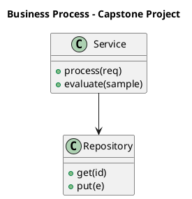

_Source diagram (plantuml); render with the appropriate tool._

**Figure 31. Business Process - Capstone Project** (plantuml). Figure: Business Process view for LLMs. This diagram illustrates the principal components and their interactions as discussed in the surrounding section.

## Deep Dive: Mechanics, Variants and Trade-offs

Having established the essentials, we now go deeper into capstone project. Beneath the abstraction lies a concrete process whose steps can each be measured, tested and optimised independently. The distinctions in this section are the ones that separate a working demo from a system that holds up under adversarial inputs, scale and the passage of time.

Consider the principal variants and how to choose between them. Each variant optimises for a different point in the design space - some for latency, some for accuracy, some for cost or operability - and the correct choice follows from explicit requirements rather than from defaults. There is an inherent trade-off between fidelity and cost, and the correct balance depends on the use case and its tolerance for error.

In practice this is supported by a mature tooling ecosystem, including vLLM, TensorRT-LLM, Hugging Face Transformers, Ollama. Tools accelerate the work but do not substitute for understanding: the same principles apply whichever implementation you select, and the ability to reason from first principles is what lets you debug when a tool behaves unexpectedly.

A frequent source of subtle bugs is the interaction with cost and capacity planning. Because cost and capacity planning concerns token economics, hardware sizing and build-versus-buy decisions, changes there can silently alter the behaviour analysed here. The remedy is contract tests at the boundary and end-to-end evaluations that exercise the interaction explicitly.

Finally, attend to edge cases and degradation. Define what the system should do under partial failure, unexpected inputs and load spikes, and make that behaviour explicit and tested rather than emergent. Graceful degradation - returning a safe, useful result when the ideal one is unavailable - is a hallmark of mature engineering.

For deeper study, the literature offers authoritative treatments such as Vaswani et al. — Attention Is All You Need (2017) and Hoffmann et al. — Training Compute-Optimal LLMs (Chinchilla, 2022). These primary sources reward careful reading and ground the practical guidance above in established results.

## Advanced Considerations

Having established the essentials, we now go deeper into capstone project. The underlying mechanism is best appreciated by tracing a single request from input to output and noting where state is created and consumed. The distinctions in this section are the ones that separate a working demo from a system that holds up under adversarial inputs, scale and the passage of time.

Consider the principal variants and how to choose between them. Each variant optimises for a different point in the design space - some for latency, some for accuracy, some for cost or operability - and the correct choice follows from explicit requirements rather than from defaults. Simplicity is a feature. The simplest design that meets the requirement should be the default, with complexity added only when measurement justifies it.

In practice this is supported by a mature tooling ecosystem, including vLLM, TensorRT-LLM, Hugging Face Transformers, Ollama. Tools accelerate the work but do not substitute for understanding: the same principles apply whichever implementation you select, and the ability to reason from first principles is what lets you debug when a tool behaves unexpectedly.

A frequent source of subtle bugs is the interaction with the transformer backbone of llms. Because the transformer backbone of llms concerns decoder-only architectures, attention, positional encodings and layer normalisation choices, changes there can silently alter the behaviour analysed here. The remedy is contract tests at the boundary and end-to-end evaluations that exercise the interaction explicitly.

Finally, attend to edge cases and degradation. Define what the system should do under partial failure, unexpected inputs and load spikes, and make that behaviour explicit and tested rather than emergent. Graceful degradation - returning a safe, useful result when the ideal one is unavailable - is a hallmark of mature engineering.

For deeper study, the literature offers authoritative treatments such as Vaswani et al. — Attention Is All You Need (2017) and Hoffmann et al. — Training Compute-Optimal LLMs (Chinchilla, 2022). These primary sources reward careful reading and ground the practical guidance above in established results.

## Worked Example

Consider a concrete scenario. A telecom organisation needs tier-1 support automation with escalation to humans. They decide to apply capstone project as part of their LLMs solution, but wisely treat it as a hypothesis to be validated rather than a foregone conclusion.

The team begins by stating the objective precisely and defining how success will be measured before writing any code. They establish a small but representative evaluation set, agree on acceptance thresholds, and only then prototype the simplest design that could work. Early measurement reveals which assumptions hold and which must be revised, saving weeks of misdirected effort and surfacing edge cases while they are still cheap to fix.

As the prototype matures into a service, the team hardens it: adding input validation, error handling, caching where it pays off, and monitoring that ties back to the original success metric. They document each significant decision in an architecture decision record so that future maintainers understand not just what was built but why.

The outcome is instructive. The system that reaches production is not the most sophisticated design the team considered, but the one whose behaviour they could measure, explain and operate. This is the recurring lesson of LLMs: durable value comes from the whole system, not from any single clever component.

## Industry Use Cases

Across industries, the ideas in this chapter recur in recognisable ways. The following vignettes show how different sectors apply them and what they have in common.

**Enterprise Search.** Answering questions over internal knowledge with citations. The common thread is that value comes not from the model alone but from the surrounding system - data quality, evaluation, integration and operations - which is precisely where most of the engineering effort belongs.

**Software.** Code completion and review across large repositories. The common thread is that value comes not from the model alone but from the surrounding system - data quality, evaluation, integration and operations - which is precisely where most of the engineering effort belongs.

**Finance.** Summarising filings and extracting structured facts. The common thread is that value comes not from the model alone but from the surrounding system - data quality, evaluation, integration and operations - which is precisely where most of the engineering effort belongs.

**Telecom.** Tier-1 support automation with escalation to humans. The common thread is that value comes not from the model alone but from the surrounding system - data quality, evaluation, integration and operations - which is precisely where most of the engineering effort belongs.

## Best Practices

The following practices consistently separate successful LLMs efforts from struggling ones. They are deliberately concrete so they can be adopted as checklist items in design and code review.

- Right-size the model to the task; do not pay for capability you don't use.
- Quantise and batch aggressively, validating quality impact with evals.
- Pin model and tokenizer versions; treat upgrades as releases.
- Monitor token distribution to catch prompt bloat and cost regressions.

None of these are exotic; they are the unglamorous disciplines that compound into reliability. The cost of adopting them is small compared with the cost of the incidents they prevent, and they become second nature with practice.

## Common Pitfalls

Equally instructive are the failure modes that recur in practice. Each pitfall below has a clear early warning sign and a known remedy, so treat them as a diagnostic checklist when something feels wrong:

- Assuming bigger is always better instead of measuring task fit.
- Underestimating KV-cache memory for long contexts.
- Silent tokenizer changes that break prompts and cost models.
- Benchmarking on contaminated datasets and over-claiming capability.

The pattern is consistent: most failures stem from skipping measurement, conflating prototype and production standards, or deferring cross-cutting concerns such as security and cost until they become emergencies. Naming these traps in advance is the cheapest way to avoid them.

## Governance, Security and Cost Notes

No discussion of capstone project is complete without its governance, security and cost dimensions, which are too often deferred until they become emergencies. Treating them as first-class concerns from the outset is both cheaper and safer.

**Governance.** Classify the risk of this capability, document its intended and out-of-scope uses, and ensure decisions are traceable to satisfy internal policy and external regulation such as the NIST AI RMF, ISO/IEC 42001 and the EU AI Act. **Security.** Treat all external input as untrusted, validate outputs before acting on them, apply least privilege to any tools or data access, and map controls to the OWASP LLM Top 10 and MITRE ATLAS.

**Cost and sustainability.** Establish explicit budgets for compute, tokens and latency, attribute spend to owners, and revisit the economics as usage scales - a design that is affordable at pilot scale can become untenable at production volume. Building these reflexes into everyday engineering is what allows a LLMs system to be not only capable but also trustworthy and economically sound.

## Hands-On Exercises

Work through the following exercises. They are designed to move understanding from recognition to application - the level required for real engineering work - so prefer writing and building over merely reading.

1. Explain capstone project to a colleague unfamiliar with LLMs, using a concrete example from your own domain.
2. Sketch a reference architecture that incorporates capstone project and annotate where observability, security and cost controls belong.
3. Design an evaluation that would tell you whether capstone project is working in production, including the metric, the dataset and the acceptance threshold.
4. Identify two pitfalls relevant to capstone project in your environment and describe the early warning signals you would monitor.
5. Prototype the simplest implementation that demonstrates capstone project, then list exactly what would need to change to make it production-ready.

## Key Takeaways

Key takeaways from this chapter:

- Capstone Project is a systems concern in LLMs: data, models and operations must be co-designed.
- Measurement is non-negotiable; define success metrics and evaluation before building.
- Favour the simplest design that meets the requirement, and add complexity only when evidence demands it.
- Security, cost and observability are first-class requirements, not afterthoughts.
- Document decisions so the system remains understandable and operable as it evolves.

## Code Walkthrough

Pipelines keep Capstone Project logic modular and testable. Each stage is a pure function, errors are captured per item, and the composition is trivial to extend or reorder.

The full listing is shown below; study it line by line and reproduce it locally before moving on.

### Listing: A composable processing pipeline for Capstone Project

```python
from collections.abc import Iterable, Iterator
from typing import Protocol


class Stage(Protocol):
    def __call__(self, item: dict) -> dict: ...


def pipeline(stages: list[Stage]) -> Stage:
    """Compose ordered stages into a single callable for Capstone Project."""

    def run(item: dict) -> dict:
        for stage in stages:
            item = stage(item)
        return item

    return run


def validate(item: dict) -> dict:
    if "text" not in item:
        raise ValueError("missing required field: text")
    return item


def normalise(item: dict) -> dict:
    item["text"] = item["text"].strip().lower()
    return item


def enrich(item: dict) -> dict:
    item["length"] = len(item["text"])
    return item


process = pipeline([validate, normalise, enrich])


def run_batch(items: Iterable[dict]) -> Iterator[dict]:
    for item in items:
        try:
            yield process(dict(item))
        except ValueError as exc:
            yield {"error": str(exc), "item": item}

```

## Review Questions

1. In the context of LLMs, which statement best describes “Capstone Project”?
   - A. It applies exclusively to image data.
   - B. It guarantees deterministic output regardless of input.
   - C. It eliminates the need for any evaluation or monitoring.
   - D. a substantial capstone project that consolidates the entire book into a portfolio-grade LLMs deliverable
   - **Answer: D.** Capstone Project: a substantial capstone project that consolidates the entire book into a portfolio-grade LLMs deliverable
2. Which of the following is a recommended best practice when working with LLMs?
   - A. Underestimating KV-cache memory for long contexts.
   - B. Quantise and batch aggressively, validating quality impact with evals.
   - C. It removes all security and governance requirements.
   - D. Benchmarking on contaminated datasets and over-claiming capability.
   - **Answer: B.** Best practice: Quantise and batch aggressively, validating quality impact with evals.
3. Which of the following is a common pitfall to avoid in LLMs?
   - A. It is only relevant to academic research, not production.
   - B. Pin model and tokenizer versions; treat upgrades as releases.
   - C. Underestimating KV-cache memory for long contexts.
   - D. It removes all security and governance requirements.
   - **Answer: C.** Pitfall to avoid: Underestimating KV-cache memory for long contexts.
4. *(Discussion)* How would you test and monitor Capstone Project in production?
   - **Model answer:** A strong answer defines capstone project (a substantial capstone project that consolidates the entire book into a portfolio-grade LLMs deliverable) then connects it to architecture, evaluation, cost, security and operations for LLMs, citing concrete trade-offs and a real-world example.

---


# Chapter 25. Certification Preparation and Review

_This chapter examines certification preparation and review within LLMs. It covers a structured review and certification-style preparation covering the full breadth of LLMs, derives a reference architecture, walks through a worked example and runnable code, surveys industry use cases, and distils best practices and pitfalls, closing with exercises and review questions._

## Introduction

In practical terms, Certification Preparation and Review is best understood as a structured review and certification-style preparation covering the full breadth of LLMs. Understanding this matters because LLMs systems succeed or fail on exactly these decisions. Seasoned practitioners treat this as a systems problem, co-designing data, models and operations rather than optimising any one in isolation.

This chapter builds intuition first, then formalises the ideas, derives an architecture, and finishes with code, exercises and review questions so the material transfers directly to your own LLMs work. Read it actively: pause at each diagram, reproduce the code, and attempt the exercises before consulting the answers.

## Theory and Foundations

We define Certification Preparation and Review as a structured review and certification-style preparation covering the full breadth of LLMs. In an enterprise setting, this translates into concrete requirements: clear interfaces, measurable quality, and controls that satisfy security and governance. The underlying mechanism is best appreciated by tracing a single request from input to output and noting where state is created and consumed.

To place this in context, recall the broader picture: Large language models are transformer-based neural networks trained on vast text corpora to predict the next token, acquiring broad linguistic and reasoning capabilities that transfer across tasks. Within that picture, certification preparation and review is one of the load-bearing ideas - the kind that, when understood deeply, makes the rest of LLMs fall into place. Getting this right early prevents expensive rework once a LLMs system reaches scale.

Certification Preparation and Review cannot be understood in isolation from instruction tuning and alignment. Recall that instruction tuning and alignment concerns supervised fine-tuning, RLHF and preference optimisation that make base models useful and safe. The two interact directly: decisions in one constrain the design space of the other, which is why mature teams reason about them together rather than sequentially. There is an inherent trade-off between fidelity and cost, and the correct balance depends on the use case and its tolerance for error.

Certification Preparation and Review cannot be understood in isolation from scaling laws and emergent abilities. Recall that scaling laws and emergent abilities concerns compute-optimal training, the Chinchilla insight and capability phase transitions. The two interact directly: decisions in one constrain the design space of the other, which is why mature teams reason about them together rather than sequentially. There is an inherent trade-off between fidelity and cost, and the correct balance depends on the use case and its tolerance for error.

Several established patterns apply directly to certification preparation and review. The first, speculative decoding with a small draft model, is widely adopted because it makes the system's behaviour predictable and observable. A complementary pattern, continuous batching with paged attention for gpu efficiency, addresses a related concern and is often deployed alongside it. Patterns are not dogma; they are distilled experience that shortcuts the search for a sound design, and each carries assumptions worth checking against your context.

It is worth being explicit about when to apply this and when to reach for something simpler. In a small prototype, shortcuts around certification preparation and review are invisible; in a production LLMs system serving real traffic, they surface as incidents, cost overruns or compliance gaps. Latency, accuracy and cost form a tension triangle: improving one typically pressures the others, so explicit budgets are essential. The remainder of this chapter turns these principles into an architecture, code and a checklist you can apply immediately.

## Architecture and Design

A robust architecture for Certification Preparation and Review is layered so each part can evolve independently without destabilising the whole. An LLM serving platform comprises a request gateway with auth and rate limiting, an inference cluster running an optimised engine (paged KV cache, continuous batching, quantised weights), a routing layer selecting model size by task, and an observability pipeline tracking latency, tokens and quality. Model artefacts flow from a registry with signed provenance into blue/green serving slots.

Concretely, the principal building blocks include from n-grams to neural language models, tokenisation and vocabulary, the transformer backbone of llms, pre-training objectives and data and scaling laws and emergent abilities. Each is a replaceable component behind a stable interface, so the team can upgrade an implementation - a model, an index, a policy engine - without rewriting its neighbours. The contracts between components are where reliability is won or lost, so they are specified explicitly and tested in isolation.

The diagram accompanying this section makes the data and control flow explicit. Requests enter through a well-defined boundary where they are authenticated and validated; only then are they dispatched to the components that perform the work. This boundary is also where rate limiting, quota enforcement and audit logging live, keeping cross-cutting concerns out of the core logic and in one auditable place.

Two qualities deserve emphasis. First, observability is designed in, not bolted on: every component emits structured telemetry so that failures can be localised in minutes rather than hours. Second, the architecture is evolvable - components communicate through stable contracts so that any single part of the LLMs system can be replaced without a rewrite. Latency, accuracy and cost form a tension triangle: improving one typically pressures the others, so explicit budgets are essential.

```xml
<mxfile host="ai-university">
  <diagram name="Operating Model">
    <mxGraphModel dx="800" dy="600" grid="1" gridSize="10">
      <root>
        <mxCell id="0"/>
        <mxCell id="1" parent="0"/>
        <mxCell id="title" value="Operating Model - Certification Preparation and Review" style="text;fontSize=16;fontStyle=1" vertex="1" parent="1"><mxGeometry x="40" y="20" width="600" height="30" as="geometry"/></mxCell>
        <mxCell id="hub" value="LLMs" style="rounded=1;fillColor=#0f172a;fontColor=#ffffff;fontStyle=1" vertex="1" parent="1"><mxGeometry x="300" y="180" width="160" height="60" as="geometry"/></mxCell>
        <mxCell id="n0" value="From N-grams to Neural …" style="rounded=1;fillColor=#e0e7ff;strokeColor=#4338ca" vertex="1" parent="1"><mxGeometry x="60" y="80" width="160" height="50" as="geometry"/></mxCell>
        <mxCell id="e0" style="edgeStyle=orthogonalEdgeStyle" edge="1" parent="1" source="hub" target="n0"><mxGeometry relative="1" as="geometry"/></mxCell>
        <mxCell id="n1" value="Tokenisation and Vocabu…" style="rounded=1;fillColor=#e0e7ff;strokeColor=#4338ca" vertex="1" parent="1"><mxGeometry x="600" y="170" width="160" height="50" as="geometry"/></mxCell>
        <mxCell id="e1" style="edgeStyle=orthogonalEdgeStyle" edge="1" parent="1" source="hub" target="n1"><mxGeometry relative="1" as="geometry"/></mxCell>
        <mxCell id="n2" value="The Transformer Backbon…" style="rounded=1;fillColor=#e0e7ff;strokeColor=#4338ca" vertex="1" parent="1"><mxGeometry x="60" y="260" width="160" height="50" as="geometry"/></mxCell>
        <mxCell id="e2" style="edgeStyle=orthogonalEdgeStyle" edge="1" parent="1" source="hub" target="n2"><mxGeometry relative="1" as="geometry"/></mxCell>
        <mxCell id="n3" value="Pre-training Objectives…" style="rounded=1;fillColor=#e0e7ff;strokeColor=#4338ca" vertex="1" parent="1"><mxGeometry x="600" y="350" width="160" height="50" as="geometry"/></mxCell>
        <mxCell id="e3" style="edgeStyle=orthogonalEdgeStyle" edge="1" parent="1" source="hub" target="n3"><mxGeometry relative="1" as="geometry"/></mxCell>
        <mxCell id="n4" value="Scaling Laws and Emerge…" style="rounded=1;fillColor=#e0e7ff;strokeColor=#4338ca" vertex="1" parent="1"><mxGeometry x="60" y="440" width="160" height="50" as="geometry"/></mxCell>
        <mxCell id="e4" style="edgeStyle=orthogonalEdgeStyle" edge="1" parent="1" source="hub" target="n4"><mxGeometry relative="1" as="geometry"/></mxCell>
      </root>
    </mxGraphModel>
  </diagram>
</mxfile>
```

_Source diagram (drawio); render with the appropriate tool._

**Figure 32. Operating Model - Certification Preparation and Review** (drawio). Figure: Operating Model view for LLMs. This diagram illustrates the principal components and their interactions as discussed in the surrounding section.

## Deep Dive: Mechanics, Variants and Trade-offs

Having established the essentials, we now go deeper into certification preparation and review. The underlying mechanism is best appreciated by tracing a single request from input to output and noting where state is created and consumed. The distinctions in this section are the ones that separate a working demo from a system that holds up under adversarial inputs, scale and the passage of time.

Consider the principal variants and how to choose between them. Each variant optimises for a different point in the design space - some for latency, some for accuracy, some for cost or operability - and the correct choice follows from explicit requirements rather than from defaults. Every added component buys capability at the price of operational surface area, and that bargain should be made consciously.

In practice this is supported by a mature tooling ecosystem, including vLLM, TensorRT-LLM, Hugging Face Transformers, Ollama. Tools accelerate the work but do not substitute for understanding: the same principles apply whichever implementation you select, and the ability to reason from first principles is what lets you debug when a tool behaves unexpectedly.

A frequent source of subtle bugs is the interaction with instruction tuning and alignment. Because instruction tuning and alignment concerns supervised fine-tuning, RLHF and preference optimisation that make base models useful and safe, changes there can silently alter the behaviour analysed here. The remedy is contract tests at the boundary and end-to-end evaluations that exercise the interaction explicitly.

Finally, attend to edge cases and degradation. Define what the system should do under partial failure, unexpected inputs and load spikes, and make that behaviour explicit and tested rather than emergent. Graceful degradation - returning a safe, useful result when the ideal one is unavailable - is a hallmark of mature engineering.

For deeper study, the literature offers authoritative treatments such as Vaswani et al. — Attention Is All You Need (2017) and Hoffmann et al. — Training Compute-Optimal LLMs (Chinchilla, 2022). These primary sources reward careful reading and ground the practical guidance above in established results.

## Advanced Considerations

Having established the essentials, we now go deeper into certification preparation and review. Beneath the abstraction lies a concrete process whose steps can each be measured, tested and optimised independently. The distinctions in this section are the ones that separate a working demo from a system that holds up under adversarial inputs, scale and the passage of time.

Consider the principal variants and how to choose between them. Each variant optimises for a different point in the design space - some for latency, some for accuracy, some for cost or operability - and the correct choice follows from explicit requirements rather than from defaults. As with most architectural decisions, the choice is rarely binary; the skill lies in quantifying the trade-offs and choosing deliberately.

In practice this is supported by a mature tooling ecosystem, including vLLM, TensorRT-LLM, Hugging Face Transformers, Ollama. Tools accelerate the work but do not substitute for understanding: the same principles apply whichever implementation you select, and the ability to reason from first principles is what lets you debug when a tool behaves unexpectedly.

A frequent source of subtle bugs is the interaction with safety and alignment in production. Because safety and alignment in production concerns layered safety, refusal behaviour and policy enforcement, changes there can silently alter the behaviour analysed here. The remedy is contract tests at the boundary and end-to-end evaluations that exercise the interaction explicitly.

Finally, attend to edge cases and degradation. Define what the system should do under partial failure, unexpected inputs and load spikes, and make that behaviour explicit and tested rather than emergent. Graceful degradation - returning a safe, useful result when the ideal one is unavailable - is a hallmark of mature engineering.

For deeper study, the literature offers authoritative treatments such as Vaswani et al. — Attention Is All You Need (2017) and Hoffmann et al. — Training Compute-Optimal LLMs (Chinchilla, 2022). These primary sources reward careful reading and ground the practical guidance above in established results.

## Worked Example

A worked example clarifies how these ideas behave in practice. A telecom organisation needs tier-1 support automation with escalation to humans. They decide to apply certification preparation and review as part of their LLMs solution, but wisely treat it as a hypothesis to be validated rather than a foregone conclusion.

The team begins by stating the objective precisely and defining how success will be measured before writing any code. They establish a small but representative evaluation set, agree on acceptance thresholds, and only then prototype the simplest design that could work. Early measurement reveals which assumptions hold and which must be revised, saving weeks of misdirected effort and surfacing edge cases while they are still cheap to fix.

As the prototype matures into a service, the team hardens it: adding input validation, error handling, caching where it pays off, and monitoring that ties back to the original success metric. They document each significant decision in an architecture decision record so that future maintainers understand not just what was built but why.

The outcome is instructive. The system that reaches production is not the most sophisticated design the team considered, but the one whose behaviour they could measure, explain and operate. This is the recurring lesson of LLMs: durable value comes from the whole system, not from any single clever component.

## Industry Use Cases

Across industries, the ideas in this chapter recur in recognisable ways. The following vignettes show how different sectors apply them and what they have in common.

**Enterprise Search.** Answering questions over internal knowledge with citations. The common thread is that value comes not from the model alone but from the surrounding system - data quality, evaluation, integration and operations - which is precisely where most of the engineering effort belongs.

**Software.** Code completion and review across large repositories. The common thread is that value comes not from the model alone but from the surrounding system - data quality, evaluation, integration and operations - which is precisely where most of the engineering effort belongs.

**Finance.** Summarising filings and extracting structured facts. The common thread is that value comes not from the model alone but from the surrounding system - data quality, evaluation, integration and operations - which is precisely where most of the engineering effort belongs.

**Telecom.** Tier-1 support automation with escalation to humans. The common thread is that value comes not from the model alone but from the surrounding system - data quality, evaluation, integration and operations - which is precisely where most of the engineering effort belongs.

## Best Practices

The following practices consistently separate successful LLMs efforts from struggling ones. They are deliberately concrete so they can be adopted as checklist items in design and code review.

- Right-size the model to the task; do not pay for capability you don't use.
- Quantise and batch aggressively, validating quality impact with evals.
- Pin model and tokenizer versions; treat upgrades as releases.
- Monitor token distribution to catch prompt bloat and cost regressions.

None of these are exotic; they are the unglamorous disciplines that compound into reliability. The cost of adopting them is small compared with the cost of the incidents they prevent, and they become second nature with practice.

## Common Pitfalls

Equally instructive are the failure modes that recur in practice. Each pitfall below has a clear early warning sign and a known remedy, so treat them as a diagnostic checklist when something feels wrong:

- Assuming bigger is always better instead of measuring task fit.
- Underestimating KV-cache memory for long contexts.
- Silent tokenizer changes that break prompts and cost models.
- Benchmarking on contaminated datasets and over-claiming capability.

The pattern is consistent: most failures stem from skipping measurement, conflating prototype and production standards, or deferring cross-cutting concerns such as security and cost until they become emergencies. Naming these traps in advance is the cheapest way to avoid them.

## Governance, Security and Cost Notes

No discussion of certification preparation and review is complete without its governance, security and cost dimensions, which are too often deferred until they become emergencies. Treating them as first-class concerns from the outset is both cheaper and safer.

**Governance.** Classify the risk of this capability, document its intended and out-of-scope uses, and ensure decisions are traceable to satisfy internal policy and external regulation such as the NIST AI RMF, ISO/IEC 42001 and the EU AI Act. **Security.** Treat all external input as untrusted, validate outputs before acting on them, apply least privilege to any tools or data access, and map controls to the OWASP LLM Top 10 and MITRE ATLAS.

**Cost and sustainability.** Establish explicit budgets for compute, tokens and latency, attribute spend to owners, and revisit the economics as usage scales - a design that is affordable at pilot scale can become untenable at production volume. Building these reflexes into everyday engineering is what allows a LLMs system to be not only capable but also trustworthy and economically sound.

## Hands-On Exercises

Work through the following exercises. They are designed to move understanding from recognition to application - the level required for real engineering work - so prefer writing and building over merely reading.

1. Explain certification preparation and review to a colleague unfamiliar with LLMs, using a concrete example from your own domain.
2. Sketch a reference architecture that incorporates certification preparation and review and annotate where observability, security and cost controls belong.
3. Design an evaluation that would tell you whether certification preparation and review is working in production, including the metric, the dataset and the acceptance threshold.
4. Identify two pitfalls relevant to certification preparation and review in your environment and describe the early warning signals you would monitor.
5. Prototype the simplest implementation that demonstrates certification preparation and review, then list exactly what would need to change to make it production-ready.

## Key Takeaways

Key takeaways from this chapter:

- Certification Preparation and Review is a systems concern in LLMs: data, models and operations must be co-designed.
- Measurement is non-negotiable; define success metrics and evaluation before building.
- Favour the simplest design that meets the requirement, and add complexity only when evidence demands it.
- Security, cost and observability are first-class requirements, not afterthoughts.
- Document decisions so the system remains understandable and operable as it evolves.

## Code Walkthrough

This listing shows a configuration-driven Certification Preparation and Review component with retry semantics and typed interfaces — the shape we expect from production LLMs code rather than a notebook prototype.

The full listing is shown below; study it line by line and reproduce it locally before moving on.

### Listing: Implementing a Certification Preparation and Review component

```python
from __future__ import annotations

from dataclasses import dataclass, field
from typing import Any


@dataclass(slots=True)
class CertificationPreparationAndConfig:
    """Configuration for the Certification Preparation and Review component in a LLMs system."""

    name: str
    timeout_s: float = 30.0
    max_retries: int = 3
    options: dict[str, Any] = field(default_factory=dict)


class CertificationPreparationAnd:
    """A minimal, production-shaped implementation of Certification Preparation and Review."""

    def __init__(self, config: CertificationPreparationAndConfig) -> None:
        self._config = config
        self._calls = 0

    def run(self, payload: dict[str, Any]) -> dict[str, Any]:
        """Process a request, retrying transient failures with backoff."""
        last_error: Exception | None = None
        for attempt in range(self._config.max_retries):
            try:
                self._calls += 1
                return self._process(payload)
            except TimeoutError as exc:  # transient
                last_error = exc
                continue
        raise RuntimeError(f"CertificationPreparationAnd failed after retries") from last_error

    def _process(self, payload: dict[str, Any]) -> dict[str, Any]:
        # Domain-specific logic for Certification Preparation and Review goes here.
        return {"status": "ok", "input_keys": sorted(payload), "calls": self._calls}

```

## Review Questions

1. In the context of LLMs, which statement best describes “Certification Preparation and Review”?
   - A. a structured review and certification-style preparation covering the full breadth of LLMs
   - B. It eliminates the need for any evaluation or monitoring.
   - C. It removes all security and governance requirements.
   - D. It makes the system slower but has no other effect.
   - **Answer: A.** Certification Preparation and Review: a structured review and certification-style preparation covering the full breadth of LLMs
2. Which of the following is a recommended best practice when working with LLMs?
   - A. Right-size the model to the task; do not pay for capability you don't use.
   - B. Assuming bigger is always better instead of measuring task fit.
   - C. Silent tokenizer changes that break prompts and cost models.
   - D. Underestimating KV-cache memory for long contexts.
   - **Answer: A.** Best practice: Right-size the model to the task; do not pay for capability you don't use.
3. Which of the following is a common pitfall to avoid in LLMs?
   - A. It eliminates the need for any evaluation or monitoring.
   - B. Silent tokenizer changes that break prompts and cost models.
   - C. It applies exclusively to image data.
   - D. Right-size the model to the task; do not pay for capability you don't use.
   - **Answer: B.** Pitfall to avoid: Silent tokenizer changes that break prompts and cost models.
4. *(Discussion)* Explain Certification Preparation and Review and why it matters in a production LLMs system.
   - **Model answer:** A strong answer defines certification preparation and review (a structured review and certification-style preparation covering the full breadth of LLMs) then connects it to architecture, evaluation, cost, security and operations for LLMs, citing concrete trade-offs and a real-world example.

---


# Hands-On Labs

## Lab 1: End-to-End LLMs Build

**Objective.** Build a working slice of a LLMs system that demonstrates the core concepts end to end. **Steps.** (1) Define the objective and success metric. (2) Assemble a minimal dataset or fixtures. (3) Implement the core component using the patterns from the chapters. (4) Add an evaluation gate. (5) Instrument observability. (6) Document the design decisions in an architecture decision record. **Deliverable.** A reproducible repository with code, an evaluation report and a short design document suitable for a portfolio.

## Lab 2: End-to-End LLMs Build

**Objective.** Build a working slice of a LLMs system that demonstrates the core concepts end to end. **Steps.** (1) Define the objective and success metric. (2) Assemble a minimal dataset or fixtures. (3) Implement the core component using the patterns from the chapters. (4) Add an evaluation gate. (5) Instrument observability. (6) Document the design decisions in an architecture decision record. **Deliverable.** A reproducible repository with code, an evaluation report and a short design document suitable for a portfolio.


# Case Studies

## Enterprise Search: LLMs in Practice

**Context.** A enterprise search organisation set out to apply LLMs to answering questions over internal knowledge with citations. **Approach.** The team began with a precise objective and an evaluation set, prototyped the simplest viable design, then hardened it with monitoring, security controls and cost budgets. **Outcome.** Measured against the original metric, the system delivered durable value because the surrounding engineering - data quality, evaluation and operations - was treated as seriously as the model itself. **Lessons.** Start with measurement, resist premature complexity, and design governance and observability in from day one.

## Software: LLMs in Practice

**Context.** A software organisation set out to apply LLMs to code completion and review across large repositories. **Approach.** The team began with a precise objective and an evaluation set, prototyped the simplest viable design, then hardened it with monitoring, security controls and cost budgets. **Outcome.** Measured against the original metric, the system delivered durable value because the surrounding engineering - data quality, evaluation and operations - was treated as seriously as the model itself. **Lessons.** Start with measurement, resist premature complexity, and design governance and observability in from day one.

## Finance: LLMs in Practice

**Context.** A finance organisation set out to apply LLMs to summarising filings and extracting structured facts. **Approach.** The team began with a precise objective and an evaluation set, prototyped the simplest viable design, then hardened it with monitoring, security controls and cost budgets. **Outcome.** Measured against the original metric, the system delivered durable value because the surrounding engineering - data quality, evaluation and operations - was treated as seriously as the model itself. **Lessons.** Start with measurement, resist premature complexity, and design governance and observability in from day one.


# Interview Questions

A consolidated bank of discussion-style interview questions drawn from across the book, suitable for preparation and technical screening.

1. Explain From N-grams to Neural Language Models and why it matters in a production LLMs system.
   - **Guidance:** A strong answer defines from n-grams to neural language models (The evolution of language modelling and why scale plus self-attention unlocked emergent capability.) then connects it to architecture, evaluation, cost, security and operations for LLMs, citing concrete trade-offs and a real-world example.
2. How would you test and monitor Tokenisation and Vocabulary in production?
   - **Guidance:** A strong answer defines tokenisation and vocabulary (Byte-pair encoding, subword units, special tokens and their impact on cost and multilingual performance.) then connects it to architecture, evaluation, cost, security and operations for LLMs, citing concrete trade-offs and a real-world example.
3. What trade-offs would you weigh when implementing The Transformer Backbone of LLMs?
   - **Guidance:** A strong answer defines the transformer backbone of llms (Decoder-only architectures, attention, positional encodings and layer normalisation choices.) then connects it to architecture, evaluation, cost, security and operations for LLMs, citing concrete trade-offs and a real-world example.
4. Describe a failure mode of Pre-training Objectives and Data and how you would mitigate it.
   - **Guidance:** A strong answer defines pre-training objectives and data (Causal language modelling, corpus curation, deduplication and data quality at trillion-token scale.) then connects it to architecture, evaluation, cost, security and operations for LLMs, citing concrete trade-offs and a real-world example.
5. What trade-offs would you weigh when implementing Scaling Laws and Emergent Abilities?
   - **Guidance:** A strong answer defines scaling laws and emergent abilities (Compute-optimal training, the Chinchilla insight and capability phase transitions.) then connects it to architecture, evaluation, cost, security and operations for LLMs, citing concrete trade-offs and a real-world example.
6. Describe a failure mode of Instruction Tuning and Alignment and how you would mitigate it.
   - **Guidance:** A strong answer defines instruction tuning and alignment (Supervised fine-tuning, RLHF and preference optimisation that make base models useful and safe.) then connects it to architecture, evaluation, cost, security and operations for LLMs, citing concrete trade-offs and a real-world example.
7. How does Context Windows and Long-Context Techniques interact with security and governance requirements?
   - **Guidance:** A strong answer defines context windows and long-context techniques (Position interpolation, attention variants and retrieval to extend effective context.) then connects it to architecture, evaluation, cost, security and operations for LLMs, citing concrete trade-offs and a real-world example.
8. How would you test and monitor Inference Optimisation in production?
   - **Guidance:** A strong answer defines inference optimisation (KV caching, speculative decoding, quantisation and continuous batching for throughput.) then connects it to architecture, evaluation, cost, security and operations for LLMs, citing concrete trade-offs and a real-world example.
9. Explain Serving LLMs at Scale and why it matters in a production LLMs system.
   - **Guidance:** A strong answer defines serving llms at scale (GPU memory planning, tensor/pipeline parallelism and autoscaling inference.) then connects it to architecture, evaluation, cost, security and operations for LLMs, citing concrete trade-offs and a real-world example.
10. How would you test and monitor Evaluation and Benchmarking in production?
   - **Guidance:** A strong answer defines evaluation and benchmarking (Capability benchmarks, contamination, and task-specific golden sets.) then connects it to architecture, evaluation, cost, security and operations for LLMs, citing concrete trade-offs and a real-world example.
11. Walk through how you would design Hallucination and Factuality for an enterprise LLMs workload.
   - **Guidance:** A strong answer defines hallucination and factuality (Why models confabulate and how grounding and decoding mitigate it.) then connects it to architecture, evaluation, cost, security and operations for LLMs, citing concrete trade-offs and a real-world example.
12. What trade-offs would you weigh when implementing Cost and Capacity Planning?
   - **Guidance:** A strong answer defines cost and capacity planning (Token economics, hardware sizing and build-versus-buy decisions.) then connects it to architecture, evaluation, cost, security and operations for LLMs, citing concrete trade-offs and a real-world example.
13. What trade-offs would you weigh when implementing Safety and Alignment in Production?
   - **Guidance:** A strong answer defines safety and alignment in production (Layered safety, refusal behaviour and policy enforcement.) then connects it to architecture, evaluation, cost, security and operations for LLMs, citing concrete trade-offs and a real-world example.
14. How does The LLM Platform Reference Architecture interact with security and governance requirements?
   - **Guidance:** A strong answer defines the llm platform reference architecture (Gateways, registries, evaluation and observability for fleets of models.) then connects it to architecture, evaluation, cost, security and operations for LLMs, citing concrete trade-offs and a real-world example.
15. Describe a failure mode of Putting It Together: A Reference Implementation and how you would mitigate it.
   - **Guidance:** A strong answer defines putting it together: a reference implementation (an end-to-end reference implementation that integrates the components of a LLMs system into a cohesive, working whole) then connects it to architecture, evaluation, cost, security and operations for LLMs, citing concrete trade-offs and a real-world example.
16. What trade-offs would you weigh when implementing Hands-On Lab: Building an End-to-End LLMs System?
   - **Guidance:** A strong answer defines hands-on lab: building an end-to-end llms system (a guided, build-along laboratory that constructs a functioning LLMs system from first principles) then connects it to architecture, evaluation, cost, security and operations for LLMs, citing concrete trade-offs and a real-world example.
17. How does Case Study: Enterprise Search at Scale interact with security and governance requirements?
   - **Guidance:** A strong answer defines case study: enterprise search at scale (a detailed case study of deploying LLMs in a demanding enterprise search environment, including the decisions, trade-offs and outcomes) then connects it to architecture, evaluation, cost, security and operations for LLMs, citing concrete trade-offs and a real-world example.
18. Walk through how you would design Operating in Production for an enterprise LLMs workload.
   - **Guidance:** A strong answer defines operating in production (the operational discipline required to run a LLMs system reliably, including monitoring, incident response and continuous improvement) then connects it to architecture, evaluation, cost, security and operations for LLMs, citing concrete trade-offs and a real-world example.
19. Describe a failure mode of Evaluation and Quality Assurance and how you would mitigate it.
   - **Guidance:** A strong answer defines evaluation and quality assurance (a rigorous approach to measuring and assuring the quality of a LLMs system before and after release) then connects it to architecture, evaluation, cost, security and operations for LLMs, citing concrete trade-offs and a real-world example.
20. How does Security, Privacy and Governance interact with security and governance requirements?
   - **Guidance:** A strong answer defines security, privacy and governance (the security, privacy and governance controls that make a LLMs system trustworthy and compliant) then connects it to architecture, evaluation, cost, security and operations for LLMs, citing concrete trade-offs and a real-world example.
21. Walk through how you would design Cost, Performance and Scaling for an enterprise LLMs workload.
   - **Guidance:** A strong answer defines cost, performance and scaling (techniques for controlling cost and latency while scaling a LLMs system to production traffic) then connects it to architecture, evaluation, cost, security and operations for LLMs, citing concrete trade-offs and a real-world example.
22. What trade-offs would you weigh when implementing Integration and Interoperability?
   - **Guidance:** A strong answer defines integration and interoperability (patterns for integrating a LLMs system with surrounding enterprise systems and data) then connects it to architecture, evaluation, cost, security and operations for LLMs, citing concrete trade-offs and a real-world example.
23. How does Trends and Research Directions interact with security and governance requirements?
   - **Guidance:** A strong answer defines trends and research directions (emerging trends, open problems and research directions shaping the future of LLMs) then connects it to architecture, evaluation, cost, security and operations for LLMs, citing concrete trade-offs and a real-world example.
24. How would you test and monitor Capstone Project in production?
   - **Guidance:** A strong answer defines capstone project (a substantial capstone project that consolidates the entire book into a portfolio-grade LLMs deliverable) then connects it to architecture, evaluation, cost, security and operations for LLMs, citing concrete trade-offs and a real-world example.
25. Explain Certification Preparation and Review and why it matters in a production LLMs system.
   - **Guidance:** A strong answer defines certification preparation and review (a structured review and certification-style preparation covering the full breadth of LLMs) then connects it to architecture, evaluation, cost, security and operations for LLMs, citing concrete trade-offs and a real-world example.

# Certification Questions

Certification-style multiple-choice questions covering best practices and common pitfalls.

1. Which of the following is a recommended best practice when working with LLMs?
   - A. Monitor token distribution to catch prompt bloat and cost regressions.
   - B. It eliminates the need for any evaluation or monitoring.
   - C. It removes all security and governance requirements.
   - D. It is only relevant to academic research, not production.
   - **Answer: A.** Best practice: Monitor token distribution to catch prompt bloat and cost regressions.
2. Which of the following is a common pitfall to avoid in LLMs?
   - A. Right-size the model to the task; do not pay for capability you don't use.
   - B. Quantise and batch aggressively, validating quality impact with evals.
   - C. It applies exclusively to image data.
   - D. Underestimating KV-cache memory for long contexts.
   - **Answer: D.** Pitfall to avoid: Underestimating KV-cache memory for long contexts.
3. Which of the following is a recommended best practice when working with LLMs?
   - A. Benchmarking on contaminated datasets and over-claiming capability.
   - B. Underestimating KV-cache memory for long contexts.
   - C. It applies exclusively to image data.
   - D. Quantise and batch aggressively, validating quality impact with evals.
   - **Answer: D.** Best practice: Quantise and batch aggressively, validating quality impact with evals.
4. Which of the following is a common pitfall to avoid in LLMs?
   - A. Quantise and batch aggressively, validating quality impact with evals.
   - B. Right-size the model to the task; do not pay for capability you don't use.
   - C. Benchmarking on contaminated datasets and over-claiming capability.
   - D. It removes all security and governance requirements.
   - **Answer: C.** Pitfall to avoid: Benchmarking on contaminated datasets and over-claiming capability.
5. Which of the following is a recommended best practice when working with LLMs?
   - A. It is only relevant to academic research, not production.
   - B. Monitor token distribution to catch prompt bloat and cost regressions.
   - C. Benchmarking on contaminated datasets and over-claiming capability.
   - D. Silent tokenizer changes that break prompts and cost models.
   - **Answer: B.** Best practice: Monitor token distribution to catch prompt bloat and cost regressions.
6. Which of the following is a common pitfall to avoid in LLMs?
   - A. It guarantees deterministic output regardless of input.
   - B. It applies exclusively to image data.
   - C. Pin model and tokenizer versions; treat upgrades as releases.
   - D. Benchmarking on contaminated datasets and over-claiming capability.
   - **Answer: D.** Pitfall to avoid: Benchmarking on contaminated datasets and over-claiming capability.
7. Which of the following is a recommended best practice when working with LLMs?
   - A. It is only relevant to academic research, not production.
   - B. Pin model and tokenizer versions; treat upgrades as releases.
   - C. It guarantees deterministic output regardless of input.
   - D. Benchmarking on contaminated datasets and over-claiming capability.
   - **Answer: B.** Best practice: Pin model and tokenizer versions; treat upgrades as releases.
8. Which of the following is a common pitfall to avoid in LLMs?
   - A. It is only relevant to academic research, not production.
   - B. Quantise and batch aggressively, validating quality impact with evals.
   - C. It guarantees deterministic output regardless of input.
   - D. Silent tokenizer changes that break prompts and cost models.
   - **Answer: D.** Pitfall to avoid: Silent tokenizer changes that break prompts and cost models.
9. Which of the following is a recommended best practice when working with LLMs?
   - A. It applies exclusively to image data.
   - B. It is only relevant to academic research, not production.
   - C. It removes all security and governance requirements.
   - D. Quantise and batch aggressively, validating quality impact with evals.
   - **Answer: D.** Best practice: Quantise and batch aggressively, validating quality impact with evals.
10. Which of the following is a common pitfall to avoid in LLMs?
   - A. Monitor token distribution to catch prompt bloat and cost regressions.
   - B. Underestimating KV-cache memory for long contexts.
   - C. Pin model and tokenizer versions; treat upgrades as releases.
   - D. It applies exclusively to image data.
   - **Answer: B.** Pitfall to avoid: Underestimating KV-cache memory for long contexts.
11. Which of the following is a recommended best practice when working with LLMs?
   - A. It makes the system slower but has no other effect.
   - B. It removes all security and governance requirements.
   - C. It is only relevant to academic research, not production.
   - D. Monitor token distribution to catch prompt bloat and cost regressions.
   - **Answer: D.** Best practice: Monitor token distribution to catch prompt bloat and cost regressions.
12. Which of the following is a common pitfall to avoid in LLMs?
   - A. Quantise and batch aggressively, validating quality impact with evals.
   - B. Right-size the model to the task; do not pay for capability you don't use.
   - C. Benchmarking on contaminated datasets and over-claiming capability.
   - D. It removes all security and governance requirements.
   - **Answer: C.** Pitfall to avoid: Benchmarking on contaminated datasets and over-claiming capability.
13. Which of the following is a recommended best practice when working with LLMs?
   - A. It is only relevant to academic research, not production.
   - B. It applies exclusively to image data.
   - C. It makes the system slower but has no other effect.
   - D. Monitor token distribution to catch prompt bloat and cost regressions.
   - **Answer: D.** Best practice: Monitor token distribution to catch prompt bloat and cost regressions.
14. Which of the following is a common pitfall to avoid in LLMs?
   - A. Silent tokenizer changes that break prompts and cost models.
   - B. It applies exclusively to image data.
   - C. It is only relevant to academic research, not production.
   - D. It makes the system slower but has no other effect.
   - **Answer: A.** Pitfall to avoid: Silent tokenizer changes that break prompts and cost models.
15. Which of the following is a recommended best practice when working with LLMs?
   - A. Quantise and batch aggressively, validating quality impact with evals.
   - B. Underestimating KV-cache memory for long contexts.
   - C. Benchmarking on contaminated datasets and over-claiming capability.
   - D. It removes all security and governance requirements.
   - **Answer: A.** Best practice: Quantise and batch aggressively, validating quality impact with evals.
16. Which of the following is a common pitfall to avoid in LLMs?
   - A. Benchmarking on contaminated datasets and over-claiming capability.
   - B. Monitor token distribution to catch prompt bloat and cost regressions.
   - C. It makes the system slower but has no other effect.
   - D. It is only relevant to academic research, not production.
   - **Answer: A.** Pitfall to avoid: Benchmarking on contaminated datasets and over-claiming capability.
17. Which of the following is a recommended best practice when working with LLMs?
   - A. Assuming bigger is always better instead of measuring task fit.
   - B. Pin model and tokenizer versions; treat upgrades as releases.
   - C. Underestimating KV-cache memory for long contexts.
   - D. It guarantees deterministic output regardless of input.
   - **Answer: B.** Best practice: Pin model and tokenizer versions; treat upgrades as releases.
18. Which of the following is a common pitfall to avoid in LLMs?
   - A. Underestimating KV-cache memory for long contexts.
   - B. It removes all security and governance requirements.
   - C. Quantise and batch aggressively, validating quality impact with evals.
   - D. It makes the system slower but has no other effect.
   - **Answer: A.** Pitfall to avoid: Underestimating KV-cache memory for long contexts.
19. Which of the following is a recommended best practice when working with LLMs?
   - A. It guarantees deterministic output regardless of input.
   - B. Quantise and batch aggressively, validating quality impact with evals.
   - C. Silent tokenizer changes that break prompts and cost models.
   - D. It is only relevant to academic research, not production.
   - **Answer: B.** Best practice: Quantise and batch aggressively, validating quality impact with evals.
20. Which of the following is a common pitfall to avoid in LLMs?
   - A. Assuming bigger is always better instead of measuring task fit.
   - B. It makes the system slower but has no other effect.
   - C. It eliminates the need for any evaluation or monitoring.
   - D. Pin model and tokenizer versions; treat upgrades as releases.
   - **Answer: A.** Pitfall to avoid: Assuming bigger is always better instead of measuring task fit.
21. Which of the following is a recommended best practice when working with LLMs?
   - A. It eliminates the need for any evaluation or monitoring.
   - B. It removes all security and governance requirements.
   - C. Assuming bigger is always better instead of measuring task fit.
   - D. Pin model and tokenizer versions; treat upgrades as releases.
   - **Answer: D.** Best practice: Pin model and tokenizer versions; treat upgrades as releases.
22. Which of the following is a common pitfall to avoid in LLMs?
   - A. It guarantees deterministic output regardless of input.
   - B. It removes all security and governance requirements.
   - C. Benchmarking on contaminated datasets and over-claiming capability.
   - D. Monitor token distribution to catch prompt bloat and cost regressions.
   - **Answer: C.** Pitfall to avoid: Benchmarking on contaminated datasets and over-claiming capability.
23. Which of the following is a recommended best practice when working with LLMs?
   - A. Pin model and tokenizer versions; treat upgrades as releases.
   - B. It is only relevant to academic research, not production.
   - C. It removes all security and governance requirements.
   - D. Underestimating KV-cache memory for long contexts.
   - **Answer: A.** Best practice: Pin model and tokenizer versions; treat upgrades as releases.
24. Which of the following is a common pitfall to avoid in LLMs?
   - A. It applies exclusively to image data.
   - B. It guarantees deterministic output regardless of input.
   - C. Right-size the model to the task; do not pay for capability you don't use.
   - D. Assuming bigger is always better instead of measuring task fit.
   - **Answer: D.** Pitfall to avoid: Assuming bigger is always better instead of measuring task fit.
25. Which of the following is a recommended best practice when working with LLMs?
   - A. It makes the system slower but has no other effect.
   - B. Underestimating KV-cache memory for long contexts.
   - C. Quantise and batch aggressively, validating quality impact with evals.
   - D. It removes all security and governance requirements.
   - **Answer: C.** Best practice: Quantise and batch aggressively, validating quality impact with evals.
26. Which of the following is a common pitfall to avoid in LLMs?
   - A. Assuming bigger is always better instead of measuring task fit.
   - B. Quantise and batch aggressively, validating quality impact with evals.
   - C. It is only relevant to academic research, not production.
   - D. It guarantees deterministic output regardless of input.
   - **Answer: A.** Pitfall to avoid: Assuming bigger is always better instead of measuring task fit.
27. Which of the following is a recommended best practice when working with LLMs?
   - A. Benchmarking on contaminated datasets and over-claiming capability.
   - B. Quantise and batch aggressively, validating quality impact with evals.
   - C. It makes the system slower but has no other effect.
   - D. It guarantees deterministic output regardless of input.
   - **Answer: B.** Best practice: Quantise and batch aggressively, validating quality impact with evals.
28. Which of the following is a common pitfall to avoid in LLMs?
   - A. It removes all security and governance requirements.
   - B. Quantise and batch aggressively, validating quality impact with evals.
   - C. Right-size the model to the task; do not pay for capability you don't use.
   - D. Silent tokenizer changes that break prompts and cost models.
   - **Answer: D.** Pitfall to avoid: Silent tokenizer changes that break prompts and cost models.
29. Which of the following is a recommended best practice when working with LLMs?
   - A. It eliminates the need for any evaluation or monitoring.
   - B. Monitor token distribution to catch prompt bloat and cost regressions.
   - C. It is only relevant to academic research, not production.
   - D. It applies exclusively to image data.
   - **Answer: B.** Best practice: Monitor token distribution to catch prompt bloat and cost regressions.
30. Which of the following is a common pitfall to avoid in LLMs?
   - A. Quantise and batch aggressively, validating quality impact with evals.
   - B. It is only relevant to academic research, not production.
   - C. It eliminates the need for any evaluation or monitoring.
   - D. Silent tokenizer changes that break prompts and cost models.
   - **Answer: D.** Pitfall to avoid: Silent tokenizer changes that break prompts and cost models.
31. Which of the following is a recommended best practice when working with LLMs?
   - A. Pin model and tokenizer versions; treat upgrades as releases.
   - B. It guarantees deterministic output regardless of input.
   - C. Benchmarking on contaminated datasets and over-claiming capability.
   - D. It is only relevant to academic research, not production.
   - **Answer: A.** Best practice: Pin model and tokenizer versions; treat upgrades as releases.
32. Which of the following is a common pitfall to avoid in LLMs?
   - A. Benchmarking on contaminated datasets and over-claiming capability.
   - B. It removes all security and governance requirements.
   - C. Monitor token distribution to catch prompt bloat and cost regressions.
   - D. Quantise and batch aggressively, validating quality impact with evals.
   - **Answer: A.** Pitfall to avoid: Benchmarking on contaminated datasets and over-claiming capability.
33. Which of the following is a recommended best practice when working with LLMs?
   - A. It applies exclusively to image data.
   - B. Silent tokenizer changes that break prompts and cost models.
   - C. It guarantees deterministic output regardless of input.
   - D. Pin model and tokenizer versions; treat upgrades as releases.
   - **Answer: D.** Best practice: Pin model and tokenizer versions; treat upgrades as releases.
34. Which of the following is a common pitfall to avoid in LLMs?
   - A. Quantise and batch aggressively, validating quality impact with evals.
   - B. It applies exclusively to image data.
   - C. Pin model and tokenizer versions; treat upgrades as releases.
   - D. Silent tokenizer changes that break prompts and cost models.
   - **Answer: D.** Pitfall to avoid: Silent tokenizer changes that break prompts and cost models.
35. Which of the following is a recommended best practice when working with LLMs?
   - A. It eliminates the need for any evaluation or monitoring.
   - B. It is only relevant to academic research, not production.
   - C. Underestimating KV-cache memory for long contexts.
   - D. Monitor token distribution to catch prompt bloat and cost regressions.
   - **Answer: D.** Best practice: Monitor token distribution to catch prompt bloat and cost regressions.
36. Which of the following is a common pitfall to avoid in LLMs?
   - A. It makes the system slower but has no other effect.
   - B. Underestimating KV-cache memory for long contexts.
   - C. It is only relevant to academic research, not production.
   - D. It removes all security and governance requirements.
   - **Answer: B.** Pitfall to avoid: Underestimating KV-cache memory for long contexts.
37. Which of the following is a recommended best practice when working with LLMs?
   - A. It applies exclusively to image data.
   - B. Monitor token distribution to catch prompt bloat and cost regressions.
   - C. Assuming bigger is always better instead of measuring task fit.
   - D. Underestimating KV-cache memory for long contexts.
   - **Answer: B.** Best practice: Monitor token distribution to catch prompt bloat and cost regressions.
38. Which of the following is a common pitfall to avoid in LLMs?
   - A. It eliminates the need for any evaluation or monitoring.
   - B. Quantise and batch aggressively, validating quality impact with evals.
   - C. Underestimating KV-cache memory for long contexts.
   - D. It applies exclusively to image data.
   - **Answer: C.** Pitfall to avoid: Underestimating KV-cache memory for long contexts.
39. Which of the following is a recommended best practice when working with LLMs?
   - A. It makes the system slower but has no other effect.
   - B. Monitor token distribution to catch prompt bloat and cost regressions.
   - C. Silent tokenizer changes that break prompts and cost models.
   - D. It guarantees deterministic output regardless of input.
   - **Answer: B.** Best practice: Monitor token distribution to catch prompt bloat and cost regressions.
40. Which of the following is a common pitfall to avoid in LLMs?
   - A. It is only relevant to academic research, not production.
   - B. Quantise and batch aggressively, validating quality impact with evals.
   - C. Underestimating KV-cache memory for long contexts.
   - D. It makes the system slower but has no other effect.
   - **Answer: C.** Pitfall to avoid: Underestimating KV-cache memory for long contexts.
41. Which of the following is a recommended best practice when working with LLMs?
   - A. Benchmarking on contaminated datasets and over-claiming capability.
   - B. It guarantees deterministic output regardless of input.
   - C. Assuming bigger is always better instead of measuring task fit.
   - D. Pin model and tokenizer versions; treat upgrades as releases.
   - **Answer: D.** Best practice: Pin model and tokenizer versions; treat upgrades as releases.
42. Which of the following is a common pitfall to avoid in LLMs?
   - A. It applies exclusively to image data.
   - B. Right-size the model to the task; do not pay for capability you don't use.
   - C. It removes all security and governance requirements.
   - D. Silent tokenizer changes that break prompts and cost models.
   - **Answer: D.** Pitfall to avoid: Silent tokenizer changes that break prompts and cost models.
43. Which of the following is a recommended best practice when working with LLMs?
   - A. Monitor token distribution to catch prompt bloat and cost regressions.
   - B. It applies exclusively to image data.
   - C. It makes the system slower but has no other effect.
   - D. Benchmarking on contaminated datasets and over-claiming capability.
   - **Answer: A.** Best practice: Monitor token distribution to catch prompt bloat and cost regressions.
44. Which of the following is a common pitfall to avoid in LLMs?
   - A. Pin model and tokenizer versions; treat upgrades as releases.
   - B. Quantise and batch aggressively, validating quality impact with evals.
   - C. It is only relevant to academic research, not production.
   - D. Benchmarking on contaminated datasets and over-claiming capability.
   - **Answer: D.** Pitfall to avoid: Benchmarking on contaminated datasets and over-claiming capability.
45. Which of the following is a recommended best practice when working with LLMs?
   - A. Benchmarking on contaminated datasets and over-claiming capability.
   - B. It removes all security and governance requirements.
   - C. Silent tokenizer changes that break prompts and cost models.
   - D. Right-size the model to the task; do not pay for capability you don't use.
   - **Answer: D.** Best practice: Right-size the model to the task; do not pay for capability you don't use.
46. Which of the following is a common pitfall to avoid in LLMs?
   - A. Underestimating KV-cache memory for long contexts.
   - B. It eliminates the need for any evaluation or monitoring.
   - C. It makes the system slower but has no other effect.
   - D. Monitor token distribution to catch prompt bloat and cost regressions.
   - **Answer: A.** Pitfall to avoid: Underestimating KV-cache memory for long contexts.
47. Which of the following is a recommended best practice when working with LLMs?
   - A. Underestimating KV-cache memory for long contexts.
   - B. Quantise and batch aggressively, validating quality impact with evals.
   - C. It removes all security and governance requirements.
   - D. Benchmarking on contaminated datasets and over-claiming capability.
   - **Answer: B.** Best practice: Quantise and batch aggressively, validating quality impact with evals.
48. Which of the following is a common pitfall to avoid in LLMs?
   - A. It is only relevant to academic research, not production.
   - B. Pin model and tokenizer versions; treat upgrades as releases.
   - C. Underestimating KV-cache memory for long contexts.
   - D. It removes all security and governance requirements.
   - **Answer: C.** Pitfall to avoid: Underestimating KV-cache memory for long contexts.
49. Which of the following is a recommended best practice when working with LLMs?
   - A. Right-size the model to the task; do not pay for capability you don't use.
   - B. Assuming bigger is always better instead of measuring task fit.
   - C. Silent tokenizer changes that break prompts and cost models.
   - D. Underestimating KV-cache memory for long contexts.
   - **Answer: A.** Best practice: Right-size the model to the task; do not pay for capability you don't use.
50. Which of the following is a common pitfall to avoid in LLMs?
   - A. It eliminates the need for any evaluation or monitoring.
   - B. Silent tokenizer changes that break prompts and cost models.
   - C. It applies exclusively to image data.
   - D. Right-size the model to the task; do not pay for capability you don't use.
   - **Answer: B.** Pitfall to avoid: Silent tokenizer changes that break prompts and cost models.

# Assessment Exercises

Assessment items to verify conceptual understanding.

1. In the context of LLMs, which statement best describes “From N-grams to Neural Language Models”?
   - A. It removes all security and governance requirements.
   - B. It is only relevant to academic research, not production.
   - C. It makes the system slower but has no other effect.
   - D. The evolution of language modelling and why scale plus self-attention unlocked emergent capability.
   - **Answer: D.** From N-grams to Neural Language Models: The evolution of language modelling and why scale plus self-attention unlocked emergent capability.
2. In the context of LLMs, which statement best describes “Tokenisation and Vocabulary”?
   - A. It removes all security and governance requirements.
   - B. It is only relevant to academic research, not production.
   - C. It makes the system slower but has no other effect.
   - D. Byte-pair encoding, subword units, special tokens and their impact on cost and multilingual performance.
   - **Answer: D.** Tokenisation and Vocabulary: Byte-pair encoding, subword units, special tokens and their impact on cost and multilingual performance.
3. In the context of LLMs, which statement best describes “The Transformer Backbone of LLMs”?
   - A. Decoder-only architectures, attention, positional encodings and layer normalisation choices.
   - B. It applies exclusively to image data.
   - C. It guarantees deterministic output regardless of input.
   - D. It is only relevant to academic research, not production.
   - **Answer: A.** The Transformer Backbone of LLMs: Decoder-only architectures, attention, positional encodings and layer normalisation choices.
4. In the context of LLMs, which statement best describes “Pre-training Objectives and Data”?
   - A. It guarantees deterministic output regardless of input.
   - B. It eliminates the need for any evaluation or monitoring.
   - C. It removes all security and governance requirements.
   - D. Causal language modelling, corpus curation, deduplication and data quality at trillion-token scale.
   - **Answer: D.** Pre-training Objectives and Data: Causal language modelling, corpus curation, deduplication and data quality at trillion-token scale.
5. In the context of LLMs, which statement best describes “Scaling Laws and Emergent Abilities”?
   - A. It guarantees deterministic output regardless of input.
   - B. Compute-optimal training, the Chinchilla insight and capability phase transitions.
   - C. It removes all security and governance requirements.
   - D. It eliminates the need for any evaluation or monitoring.
   - **Answer: B.** Scaling Laws and Emergent Abilities: Compute-optimal training, the Chinchilla insight and capability phase transitions.
6. In the context of LLMs, which statement best describes “Instruction Tuning and Alignment”?
   - A. It eliminates the need for any evaluation or monitoring.
   - B. It makes the system slower but has no other effect.
   - C. It applies exclusively to image data.
   - D. Supervised fine-tuning, RLHF and preference optimisation that make base models useful and safe.
   - **Answer: D.** Instruction Tuning and Alignment: Supervised fine-tuning, RLHF and preference optimisation that make base models useful and safe.
7. In the context of LLMs, which statement best describes “Context Windows and Long-Context Techniques”?
   - A. It makes the system slower but has no other effect.
   - B. It is only relevant to academic research, not production.
   - C. It applies exclusively to image data.
   - D. Position interpolation, attention variants and retrieval to extend effective context.
   - **Answer: D.** Context Windows and Long-Context Techniques: Position interpolation, attention variants and retrieval to extend effective context.
8. In the context of LLMs, which statement best describes “Inference Optimisation”?
   - A. It makes the system slower but has no other effect.
   - B. It guarantees deterministic output regardless of input.
   - C. KV caching, speculative decoding, quantisation and continuous batching for throughput.
   - D. It eliminates the need for any evaluation or monitoring.
   - **Answer: C.** Inference Optimisation: KV caching, speculative decoding, quantisation and continuous batching for throughput.
9. In the context of LLMs, which statement best describes “Serving LLMs at Scale”?
   - A. It removes all security and governance requirements.
   - B. GPU memory planning, tensor/pipeline parallelism and autoscaling inference.
   - C. It guarantees deterministic output regardless of input.
   - D. It applies exclusively to image data.
   - **Answer: B.** Serving LLMs at Scale: GPU memory planning, tensor/pipeline parallelism and autoscaling inference.
10. In the context of LLMs, which statement best describes “Evaluation and Benchmarking”?
   - A. It guarantees deterministic output regardless of input.
   - B. It makes the system slower but has no other effect.
   - C. Capability benchmarks, contamination, and task-specific golden sets.
   - D. It eliminates the need for any evaluation or monitoring.
   - **Answer: C.** Evaluation and Benchmarking: Capability benchmarks, contamination, and task-specific golden sets.
11. In the context of LLMs, which statement best describes “Hallucination and Factuality”?
   - A. It removes all security and governance requirements.
   - B. It applies exclusively to image data.
   - C. It is only relevant to academic research, not production.
   - D. Why models confabulate and how grounding and decoding mitigate it.
   - **Answer: D.** Hallucination and Factuality: Why models confabulate and how grounding and decoding mitigate it.
12. In the context of LLMs, which statement best describes “Cost and Capacity Planning”?
   - A. Token economics, hardware sizing and build-versus-buy decisions.
   - B. It applies exclusively to image data.
   - C. It removes all security and governance requirements.
   - D. It makes the system slower but has no other effect.
   - **Answer: A.** Cost and Capacity Planning: Token economics, hardware sizing and build-versus-buy decisions.
13. In the context of LLMs, which statement best describes “Safety and Alignment in Production”?
   - A. It makes the system slower but has no other effect.
   - B. It guarantees deterministic output regardless of input.
   - C. It applies exclusively to image data.
   - D. Layered safety, refusal behaviour and policy enforcement.
   - **Answer: D.** Safety and Alignment in Production: Layered safety, refusal behaviour and policy enforcement.
14. In the context of LLMs, which statement best describes “The LLM Platform Reference Architecture”?
   - A. It makes the system slower but has no other effect.
   - B. Gateways, registries, evaluation and observability for fleets of models.
   - C. It is only relevant to academic research, not production.
   - D. It eliminates the need for any evaluation or monitoring.
   - **Answer: B.** The LLM Platform Reference Architecture: Gateways, registries, evaluation and observability for fleets of models.
15. In the context of LLMs, which statement best describes “Putting It Together: A Reference Implementation”?
   - A. It guarantees deterministic output regardless of input.
   - B. It eliminates the need for any evaluation or monitoring.
   - C. It makes the system slower but has no other effect.
   - D. an end-to-end reference implementation that integrates the components of a LLMs system into a cohesive, working whole
   - **Answer: D.** Putting It Together: A Reference Implementation: an end-to-end reference implementation that integrates the components of a LLMs system into a cohesive, working whole
16. In the context of LLMs, which statement best describes “Hands-On Lab: Building an End-to-End LLMs System”?
   - A. It is only relevant to academic research, not production.
   - B. It applies exclusively to image data.
   - C. a guided, build-along laboratory that constructs a functioning LLMs system from first principles
   - D. It removes all security and governance requirements.
   - **Answer: C.** Hands-On Lab: Building an End-to-End LLMs System: a guided, build-along laboratory that constructs a functioning LLMs system from first principles
17. In the context of LLMs, which statement best describes “Case Study: Enterprise Search at Scale”?
   - A. a detailed case study of deploying LLMs in a demanding enterprise search environment, including the decisions, trade-offs and outcomes
   - B. It is only relevant to academic research, not production.
   - C. It eliminates the need for any evaluation or monitoring.
   - D. It removes all security and governance requirements.
   - **Answer: A.** Case Study: Enterprise Search at Scale: a detailed case study of deploying LLMs in a demanding enterprise search environment, including the decisions, trade-offs and outcomes
18. In the context of LLMs, which statement best describes “Operating in Production”?
   - A. It guarantees deterministic output regardless of input.
   - B. It eliminates the need for any evaluation or monitoring.
   - C. It applies exclusively to image data.
   - D. the operational discipline required to run a LLMs system reliably, including monitoring, incident response and continuous improvement
   - **Answer: D.** Operating in Production: the operational discipline required to run a LLMs system reliably, including monitoring, incident response and continuous improvement
19. In the context of LLMs, which statement best describes “Evaluation and Quality Assurance”?
   - A. It applies exclusively to image data.
   - B. It makes the system slower but has no other effect.
   - C. It eliminates the need for any evaluation or monitoring.
   - D. a rigorous approach to measuring and assuring the quality of a LLMs system before and after release
   - **Answer: D.** Evaluation and Quality Assurance: a rigorous approach to measuring and assuring the quality of a LLMs system before and after release
20. In the context of LLMs, which statement best describes “Security, Privacy and Governance”?
   - A. the security, privacy and governance controls that make a LLMs system trustworthy and compliant
   - B. It makes the system slower but has no other effect.
   - C. It eliminates the need for any evaluation or monitoring.
   - D. It applies exclusively to image data.
   - **Answer: A.** Security, Privacy and Governance: the security, privacy and governance controls that make a LLMs system trustworthy and compliant
21. In the context of LLMs, which statement best describes “Cost, Performance and Scaling”?
   - A. It applies exclusively to image data.
   - B. techniques for controlling cost and latency while scaling a LLMs system to production traffic
   - C. It eliminates the need for any evaluation or monitoring.
   - D. It makes the system slower but has no other effect.
   - **Answer: B.** Cost, Performance and Scaling: techniques for controlling cost and latency while scaling a LLMs system to production traffic
22. In the context of LLMs, which statement best describes “Integration and Interoperability”?
   - A. It guarantees deterministic output regardless of input.
   - B. It applies exclusively to image data.
   - C. patterns for integrating a LLMs system with surrounding enterprise systems and data
   - D. It eliminates the need for any evaluation or monitoring.
   - **Answer: C.** Integration and Interoperability: patterns for integrating a LLMs system with surrounding enterprise systems and data
23. In the context of LLMs, which statement best describes “Trends and Research Directions”?
   - A. emerging trends, open problems and research directions shaping the future of LLMs
   - B. It makes the system slower but has no other effect.
   - C. It removes all security and governance requirements.
   - D. It eliminates the need for any evaluation or monitoring.
   - **Answer: A.** Trends and Research Directions: emerging trends, open problems and research directions shaping the future of LLMs
24. In the context of LLMs, which statement best describes “Capstone Project”?
   - A. It applies exclusively to image data.
   - B. It guarantees deterministic output regardless of input.
   - C. It eliminates the need for any evaluation or monitoring.
   - D. a substantial capstone project that consolidates the entire book into a portfolio-grade LLMs deliverable
   - **Answer: D.** Capstone Project: a substantial capstone project that consolidates the entire book into a portfolio-grade LLMs deliverable
25. In the context of LLMs, which statement best describes “Certification Preparation and Review”?
   - A. a structured review and certification-style preparation covering the full breadth of LLMs
   - B. It eliminates the need for any evaluation or monitoring.
   - C. It removes all security and governance requirements.
   - D. It makes the system slower but has no other effect.
   - **Answer: A.** Certification Preparation and Review: a structured review and certification-style preparation covering the full breadth of LLMs

# References

1. Vaswani et al. — Attention Is All You Need (2017)
2. Hoffmann et al. — Training Compute-Optimal LLMs (Chinchilla, 2022)
3. Kwon et al. — Efficient Memory Management for LLM Serving (vLLM, 2023)
4. NIST - Artificial Intelligence Risk Management Framework (AI RMF 1.0)
5. ISO/IEC 42001:2023 - Information technology - AI management system
6. OWASP - Top 10 for Large Language Model Applications
7. AI-University - Enterprise AI Reference Architecture (this series)

# Glossary

**Table 2. Glossary of key terms**

| Term | Definition |
|------|------------|
| Token | The atomic unit of text an LLM processes. |
| KV cache | Stored key/value tensors that speed up autoregressive decoding. |
| Quantisation | Reducing numeric precision to shrink memory and speed inference. |
| Context window | The maximum tokens a model can attend to at once. |
| Foundation model | A large model pre-trained on broad data and adaptable to many tasks. |
| Evaluation gate | An automated quality check that must pass before release. |
| Observability | The ability to understand a system's internal state from its outputs. |

# Index

Capstone Project, Case Study: Enterprise Search at Scale, Certification Preparation and Review, Context Windows and Long-Context Techniques, Context window, Cost and Capacity Planning, Cost, Performance and Scaling, Evaluation and Benchmarking, Evaluation and Quality Assurance, From N-grams to Neural Language Models, Hallucination and Factuality, Hands-On Lab: Building an End-to-End LLMs System, Inference Optimisation, Instruction Tuning and Alignment, Integration and Interoperability, KV cache, Operating in Production, Pre-training Objectives and Data, Putting It Together: A Reference Implementation, Quantisation, Safety and Alignment in Production, Scaling Laws and Emergent Abilities, Security, Privacy and Governance, Serving LLMs at Scale, The LLM Platform Reference Architecture, The Transformer Backbone of LLMs, Token, Tokenisation and Vocabulary, Trends and Research Directions

