# Multi-Agent Systems: Foundations

## Coordinating teams of specialised AI agents — a foundational guide for newcomers building a rigorous base.

**Multi-Agent Systems** &nbsp;|&nbsp; **Level:** Foundational &nbsp;|&nbsp; **First Edition**

**Authors:** Dr. Ngozi Eze, The AI-University Faculty

**Publisher:** AI-University Press &nbsp;|&nbsp; **ISBN:** 978-3-54422-493-4 &nbsp;|&nbsp; **Version:** 1.0.0 &nbsp;|&nbsp; **2026**


---

## Copyright

Copyright © 2026 AI-University Press. All rights reserved.

This work is published as part of the AI-University Enterprise AI Knowledge Series. It is generated by an automated publishing engine and curated for professional and educational use. No part of this publication may be reproduced for commercial resale without attribution to AI-University Press.

First published 2026. First Edition. Document version 1.0.0.


---

## Table of Contents

**Front Matter**

- Executive Summary
- Learning Objectives
- Industry Context
- Business Perspective
- Technical Perspective
- Architecture Perspective
- Governance Perspective
- Security Perspective

**Chapters**

1. Why Multiple Agents
2. Agent Roles and Topologies
3. Communication Protocols
4. Orchestration and Routing
5. Shared Memory and State
6. Debate and Consensus
7. Conflict Resolution
8. Tool and Resource Contention
9. Emergent Behaviour and Risk
10. Evaluating Multi-Agent Systems
11. Cost Control at Team Scale
12. Frameworks and Patterns
13. Observability Across Agents
14. The Multi-Agent Reference Architecture
15. Putting It Together: A Reference Implementation
16. Hands-On Lab: Building an End-to-End Multi-Agent Systems System
17. Case Study: Software at Scale
18. Operating in Production
19. Evaluation and Quality Assurance
20. Security, Privacy and Governance
21. Cost, Performance and Scaling
22. Integration and Interoperability
23. Trends and Research Directions
24. Capstone Project
25. Certification Preparation and Review

**Back Matter**

- Hands-On Labs
- Case Studies
- Interview Questions
- Certification Questions
- Assessment Exercises
- References
- Glossary
- Index

---

**Table 1. Chapter overview and estimated length**

| # | Chapter | Est. pages | Diagrams | Code | Questions |
|---|---------|-----------:|---------:|-----:|----------:|
| 1 | Why Multiple Agents | 10 | 1 | 1 | 4 |
| 2 | Agent Roles and Topologies | 11 | 2 | 1 | 4 |
| 3 | Communication Protocols | 10 | 1 | 1 | 4 |
| 4 | Orchestration and Routing | 10 | 1 | 1 | 4 |
| 5 | Shared Memory and State | 10 | 1 | 1 | 4 |
| 6 | Debate and Consensus | 10 | 1 | 1 | 4 |
| 7 | Conflict Resolution | 10 | 1 | 1 | 4 |
| 8 | Tool and Resource Contention | 10 | 1 | 1 | 4 |
| 9 | Emergent Behaviour and Risk | 11 | 2 | 1 | 4 |
| 10 | Evaluating Multi-Agent Systems | 11 | 2 | 1 | 4 |
| 11 | Cost Control at Team Scale | 10 | 1 | 1 | 4 |
| 12 | Frameworks and Patterns | 10 | 1 | 1 | 4 |
| 13 | Observability Across Agents | 11 | 2 | 1 | 4 |
| 14 | The Multi-Agent Reference Architecture | 11 | 2 | 1 | 4 |
| 15 | Putting It Together: A Reference Implementation | 10 | 1 | 1 | 4 |
| 16 | Hands-On Lab: Building an End-to-End Multi-Agent Systems System | 11 | 1 | 1 | 4 |
| 17 | Case Study: Software at Scale | 10 | 1 | 1 | 4 |
| 18 | Operating in Production | 10 | 1 | 1 | 4 |
| 19 | Evaluation and Quality Assurance | 11 | 2 | 1 | 4 |
| 20 | Security, Privacy and Governance | 11 | 2 | 1 | 4 |
| 21 | Cost, Performance and Scaling | 10 | 1 | 1 | 4 |
| 22 | Integration and Interoperability | 10 | 1 | 1 | 4 |
| 23 | Trends and Research Directions | 10 | 2 | 0 | 4 |
| 24 | Capstone Project | 10 | 1 | 1 | 4 |
| 25 | Certification Preparation and Review | 11 | 2 | 1 | 4 |

---

## List of Figures

- Figure 1. Architecture - Why Multiple Agents
- Figure 2. Infrastructure - Agent Roles and Topologies
- Figure 3. Application Flow - Agent Roles and Topologies
- Figure 4. Application Flow - Communication Protocols
- Figure 5. Component - Orchestration and Routing
- Figure 6. Security Architecture - Shared Memory and State
- Figure 7. RAG Architecture - Debate and Consensus
- Figure 8. DevOps Pipeline - Conflict Resolution
- Figure 9. CI/CD Pipeline - Tool and Resource Contention
- Figure 10. Knowledge Graph - Emergent Behaviour and Risk
- Figure 11. Operating Model - Emergent Behaviour and Risk
- Figure 12. Operating Model - Evaluating Multi-Agent Systems
- Figure 13. Data Flow - Evaluating Multi-Agent Systems
- Figure 14. Data Flow - Cost Control at Team Scale
- Figure 15. Capability Map - Frameworks and Patterns
- Figure 16. Cloud Architecture - Observability Across Agents
- Figure 17. Sequence - Observability Across Agents
- Figure 18. Sequence - The Multi-Agent Reference Architecture
- Figure 19. Business Process - The Multi-Agent Reference Architecture
- Figure 20. Business Process - Putting It Together: A Reference Implementation
- Figure 21. Class - Hands-On Lab: Building an End-to-End Multi-Agent Systems System
- Figure 22. Data Lineage - Case Study: Software at Scale
- Figure 23. Network - Operating in Production
- Figure 24. Agent Architecture - Evaluation and Quality Assurance
- Figure 25. Deployment - Evaluation and Quality Assurance
- Figure 26. Deployment - Security, Privacy and Governance
- Figure 27. Architecture - Security, Privacy and Governance
- Figure 28. Architecture - Cost, Performance and Scaling
- Figure 29. Infrastructure - Integration and Interoperability
- Figure 30. Application Flow - Trends and Research Directions
- Figure 31. Component - Trends and Research Directions
- Figure 32. Component - Capstone Project
- Figure 33. Security Architecture - Certification Preparation and Review
- Figure 34. RAG Architecture - Certification Preparation and Review

---

## List of Tables

- Table 1. Chapter overview and estimated length
- Table 2. Glossary of key terms

---

## Executive Summary

Multi-agent systems decompose complex goals across specialised agents that communicate, coordinate and sometimes debate to produce better outcomes than a single agent. They introduce challenges of orchestration, communication protocols, conflict resolution and emergent behaviour. This book covers topologies, coordination patterns, shared memory, evaluation and the operational risks of multi-agent autonomy. This volume is written for newcomers building a rigorous base. It progresses from first principles to enterprise-grade design and operations, with every chapter combining theory, architecture, worked examples, runnable code, exercises and assessment. The treatment is deliberately practical: the emphasis throughout is on decisions that hold up in production, backed by measurement rather than intuition.

## Learning Objectives

After completing this book, the reader will be able to:

- Explain the foundational principles of Multi-Agent Systems and articulate where it creates value.
- Design a reference architecture for a Multi-Agent Systems system that meets enterprise quality attributes.
- Implement core Multi-Agent Systems components following production engineering standards.
- Evaluate Multi-Agent Systems systems rigorously and gate releases on measurable quality.
- Apply security, privacy and governance controls appropriate to Multi-Agent Systems.
- Operate Multi-Agent Systems systems reliably, controlling cost, latency and drift.
- Recognise common pitfalls in Multi-Agent Systems and apply proven mitigations.

## Industry Context

Multi-Agent Systems sits within a rapidly maturing AI landscape in which organisations are moving from experimentation to dependable, governed deployment. The competitive advantage no longer comes from access to models alone but from the engineering and operational discipline that turns capability into reliable, compliant business outcomes. This book situates the subject in that context so readers can connect technical choices to organisational value.

## Business Perspective

From a business perspective, Multi-Agent Systems initiatives must be justified by clear value: revenue growth, cost reduction, risk mitigation or improved experience. Leaders should insist on measurable objectives, realistic unit economics that account for inference cost, and a roadmap that sequences capability against risk. The most common failure is not technical but strategic: building capability that is never connected to a decision or workflow that matters.

## Technical Perspective

The technical perspective treats Multi-Agent Systems as a systems discipline. A multi-agent platform uses a supervisor/orchestrator that routes subtasks to specialised worker agents, a shared state store for coordination, a message bus for structured communication, and global guardrails enforcing budgets and permissions. Distributed tracing stitches together cross-agent trajectories. Throughout, the book favours clear interfaces, reproducibility and measurement.

## Architecture Perspective

Architecturally, a Multi-Agent Systems platform is layered into data, model, application and operations planes, each with explicit contracts so they can evolve independently. A model gateway centralises access and control; observability and security are cross-cutting and designed in from the start. Reference architectures and blueprints appear in every chapter and are consolidated in the capstone.

## Governance Perspective

Governance ensures Multi-Agent Systems is developed and used responsibly, legally and in line with organisational values. This book embeds governance as lifecycle gates - risk classification, documentation, approval and monitoring - rather than as a final checkpoint, aligning with frameworks such as the NIST AI RMF, ISO/IEC 42001 and the EU AI Act.

## Security Perspective

Security for Multi-Agent Systems extends traditional controls with ML-specific defences against prompt injection, data poisoning, model extraction and insecure output handling. Defence in depth - input validation, constrained decoding, output validation, sandboxed tools and continuous monitoring - is applied consistently, mapped to the OWASP LLM Top 10 and MITRE ATLAS.


---


# Chapter 1. Why Multiple Agents

_This chapter examines why multiple agents within Multi-Agent Systems. It covers specialisation, parallelism and separation of concerns, derives a reference architecture, walks through a worked example and runnable code, surveys industry use cases, and distils best practices and pitfalls, closing with exercises and review questions._

## Introduction

Why Multiple Agents refers to specialisation, parallelism and separation of concerns. Understanding this matters because Multi-Agent Systems systems succeed or fail on exactly these decisions. The practical implication is that design choices here ripple through latency, cost and maintainability for the lifetime of the system.

This chapter builds intuition first, then formalises the ideas, derives an architecture, and finishes with code, exercises and review questions so the material transfers directly to your own Multi-Agent Systems work. Read it actively: pause at each diagram, reproduce the code, and attempt the exercises before consulting the answers.

## Theory and Foundations

Why Multiple Agents can be characterised as specialisation, parallelism and separation of concerns. In an enterprise setting, this translates into concrete requirements: clear interfaces, measurable quality, and controls that satisfy security and governance. Beneath the abstraction lies a concrete process whose steps can each be measured, tested and optimised independently.

To place this in context, recall the broader picture: Multi-agent systems decompose complex goals across specialised agents that communicate, coordinate and sometimes debate to produce better outcomes than a single agent. Within that picture, why multiple agents is one of the load-bearing ideas - the kind that, when understood deeply, makes the rest of Multi-Agent Systems fall into place. Neglecting it is one of the most common reasons Multi-Agent Systems initiatives stall in production.

Why Multiple Agents cannot be understood in isolation from frameworks and patterns. Recall that frameworks and patterns concerns comparing orchestration frameworks. The two interact directly: decisions in one constrain the design space of the other, which is why mature teams reason about them together rather than sequentially. Simplicity is a feature. The simplest design that meets the requirement should be the default, with complexity added only when measurement justifies it.

Why Multiple Agents cannot be understood in isolation from tool and resource contention. Recall that tool and resource contention concerns coordinating access to shared external systems. The two interact directly: decisions in one constrain the design space of the other, which is why mature teams reason about them together rather than sequentially. There is an inherent trade-off between fidelity and cost, and the correct balance depends on the use case and its tolerance for error.

Several established patterns apply directly to why multiple agents. The first, blackboard for shared coordination state, is widely adopted because it makes the system's behaviour predictable and observable. A complementary pattern, supervisor–worker hierarchy, addresses a related concern and is often deployed alongside it. Patterns are not dogma; they are distilled experience that shortcuts the search for a sound design, and each carries assumptions worth checking against your context.

The decision of whether to adopt this should be driven by requirements, not by novelty. In a small prototype, shortcuts around why multiple agents are invisible; in a production Multi-Agent Systems system serving real traffic, they surface as incidents, cost overruns or compliance gaps. As with most architectural decisions, the choice is rarely binary; the skill lies in quantifying the trade-offs and choosing deliberately. The remainder of this chapter turns these principles into an architecture, code and a checklist you can apply immediately.

## Architecture and Design

The reference architecture for Why Multiple Agents separates concerns into clearly bounded components with explicit contracts. A multi-agent platform uses a supervisor/orchestrator that routes subtasks to specialised worker agents, a shared state store for coordination, a message bus for structured communication, and global guardrails enforcing budgets and permissions. Distributed tracing stitches together cross-agent trajectories.

Concretely, the principal building blocks include why multiple agents, agent roles and topologies, communication protocols, orchestration and routing and shared memory and state. Each is a replaceable component behind a stable interface, so the team can upgrade an implementation - a model, an index, a policy engine - without rewriting its neighbours. The contracts between components are where reliability is won or lost, so they are specified explicitly and tested in isolation.

The diagram accompanying this section makes the data and control flow explicit. Requests enter through a well-defined boundary where they are authenticated and validated; only then are they dispatched to the components that perform the work. This boundary is also where rate limiting, quota enforcement and audit logging live, keeping cross-cutting concerns out of the core logic and in one auditable place.

Two qualities deserve emphasis. First, observability is designed in, not bolted on: every component emits structured telemetry so that failures can be localised in minutes rather than hours. Second, the architecture is evolvable - components communicate through stable contracts so that any single part of the Multi-Agent Systems system can be replaced without a rewrite. Every added component buys capability at the price of operational surface area, and that bargain should be made consciously.

<div class="diagram-svg">

<svg xmlns="http://www.w3.org/2000/svg" width="760" height="360" viewBox="0 0 760 360" font-family="Inter, Arial, sans-serif">
<rect width="760" height="360" fill="#f8fafc"/>
<text x="380" y="34" text-anchor="middle" font-size="20" font-weight="700" fill="#0f172a">Architecture - Why Multiple Agents</text>
<rect x="290" y="162" width="180" height="56" rx="12" fill="#0f172a"/>
<text x="380" y="195" text-anchor="middle" font-size="14" font-weight="700" fill="#ffffff">Multi-Agent Systems</text>
<line x1="380" y1="190" x2="380" y2="70" stroke="#94a3b8" stroke-width="2"/>
<rect x="308" y="48" width="144" height="44" rx="10" fill="#ffffff" stroke="#2563eb" stroke-width="2"/>
<text x="380" y="74" text-anchor="middle" font-size="11" fill="#0f172a">Why Multiple Agents</text>
<line x1="380" y1="190" x2="617" y2="153" stroke="#94a3b8" stroke-width="2"/>
<rect x="545" y="131" width="144" height="44" rx="10" fill="#ffffff" stroke="#7c3aed" stroke-width="2"/>
<text x="617" y="157" text-anchor="middle" font-size="11" fill="#0f172a">Agent Roles and Top…</text>
<line x1="380" y1="190" x2="526" y2="287" stroke="#94a3b8" stroke-width="2"/>
<rect x="454" y="265" width="144" height="44" rx="10" fill="#ffffff" stroke="#0891b2" stroke-width="2"/>
<text x="526" y="291" text-anchor="middle" font-size="11" fill="#0f172a">Communication Proto…</text>
<line x1="380" y1="190" x2="234" y2="287" stroke="#94a3b8" stroke-width="2"/>
<rect x="162" y="265" width="144" height="44" rx="10" fill="#ffffff" stroke="#059669" stroke-width="2"/>
<text x="234" y="291" text-anchor="middle" font-size="11" fill="#0f172a">Orchestration and R…</text>
<line x1="380" y1="190" x2="143" y2="153" stroke="#94a3b8" stroke-width="2"/>
<rect x="71" y="131" width="144" height="44" rx="10" fill="#ffffff" stroke="#d97706" stroke-width="2"/>
<text x="143" y="157" text-anchor="middle" font-size="11" fill="#0f172a">Shared Memory and S…</text>
</svg>

</div>

**Figure 1. Architecture - Why Multiple Agents** (svg). Figure: Architecture view for Multi-Agent Systems. This diagram illustrates the principal components and their interactions as discussed in the surrounding section.

## Deep Dive: Mechanics, Variants and Trade-offs

Having established the essentials, we now go deeper into why multiple agents. It pays to understand the mechanism rather than treat it as a black box, because most production incidents are explained by one of its steps misbehaving. The distinctions in this section are the ones that separate a working demo from a system that holds up under adversarial inputs, scale and the passage of time.

Consider the principal variants and how to choose between them. Each variant optimises for a different point in the design space - some for latency, some for accuracy, some for cost or operability - and the correct choice follows from explicit requirements rather than from defaults. There is an inherent trade-off between fidelity and cost, and the correct balance depends on the use case and its tolerance for error.

In practice this is supported by a mature tooling ecosystem, including AutoGen, CrewAI, LangGraph, MetaGPT. Tools accelerate the work but do not substitute for understanding: the same principles apply whichever implementation you select, and the ability to reason from first principles is what lets you debug when a tool behaves unexpectedly.

A frequent source of subtle bugs is the interaction with frameworks and patterns. Because frameworks and patterns concerns comparing orchestration frameworks, changes there can silently alter the behaviour analysed here. The remedy is contract tests at the boundary and end-to-end evaluations that exercise the interaction explicitly.

Finally, attend to edge cases and degradation. Define what the system should do under partial failure, unexpected inputs and load spikes, and make that behaviour explicit and tested rather than emergent. Graceful degradation - returning a safe, useful result when the ideal one is unavailable - is a hallmark of mature engineering.

For deeper study, the literature offers authoritative treatments such as Wu et al. — AutoGen (2023) and Du et al. — Improving Factuality via Multi-Agent Debate (2023). These primary sources reward careful reading and ground the practical guidance above in established results.

## Advanced Considerations

Having established the essentials, we now go deeper into why multiple agents. It pays to understand the mechanism rather than treat it as a black box, because most production incidents are explained by one of its steps misbehaving. The distinctions in this section are the ones that separate a working demo from a system that holds up under adversarial inputs, scale and the passage of time.

Consider the principal variants and how to choose between them. Each variant optimises for a different point in the design space - some for latency, some for accuracy, some for cost or operability - and the correct choice follows from explicit requirements rather than from defaults. As with most architectural decisions, the choice is rarely binary; the skill lies in quantifying the trade-offs and choosing deliberately.

In practice this is supported by a mature tooling ecosystem, including AutoGen, CrewAI, LangGraph, MetaGPT. Tools accelerate the work but do not substitute for understanding: the same principles apply whichever implementation you select, and the ability to reason from first principles is what lets you debug when a tool behaves unexpectedly.

A frequent source of subtle bugs is the interaction with emergent behaviour and risk. Because emergent behaviour and risk concerns unintended dynamics and how to contain them, changes there can silently alter the behaviour analysed here. The remedy is contract tests at the boundary and end-to-end evaluations that exercise the interaction explicitly.

Finally, attend to edge cases and degradation. Define what the system should do under partial failure, unexpected inputs and load spikes, and make that behaviour explicit and tested rather than emergent. Graceful degradation - returning a safe, useful result when the ideal one is unavailable - is a hallmark of mature engineering.

For deeper study, the literature offers authoritative treatments such as Wu et al. — AutoGen (2023) and Du et al. — Improving Factuality via Multi-Agent Debate (2023). These primary sources reward careful reading and ground the practical guidance above in established results.

## Worked Example

A worked example clarifies how these ideas behave in practice. A simulation organisation needs agent-based modelling of markets and organisations. They decide to apply why multiple agents as part of their Multi-Agent Systems solution, but wisely treat it as a hypothesis to be validated rather than a foregone conclusion.

The team begins by stating the objective precisely and defining how success will be measured before writing any code. They establish a small but representative evaluation set, agree on acceptance thresholds, and only then prototype the simplest design that could work. Early measurement reveals which assumptions hold and which must be revised, saving weeks of misdirected effort and surfacing edge cases while they are still cheap to fix.

As the prototype matures into a service, the team hardens it: adding input validation, error handling, caching where it pays off, and monitoring that ties back to the original success metric. They document each significant decision in an architecture decision record so that future maintainers understand not just what was built but why.

The outcome is instructive. The system that reaches production is not the most sophisticated design the team considered, but the one whose behaviour they could measure, explain and operate. This is the recurring lesson of Multi-Agent Systems: durable value comes from the whole system, not from any single clever component.

## Industry Use Cases

Across industries, the ideas in this chapter recur in recognisable ways. The following vignettes show how different sectors apply them and what they have in common.

**Software.** Planner, coder, reviewer and tester agents collaborating. The common thread is that value comes not from the model alone but from the surrounding system - data quality, evaluation, integration and operations - which is precisely where most of the engineering effort belongs.

**Research.** Specialised retrieval, analysis and writing agents. The common thread is that value comes not from the model alone but from the surrounding system - data quality, evaluation, integration and operations - which is precisely where most of the engineering effort belongs.

**Operations.** Coordinated agents across monitoring and remediation. The common thread is that value comes not from the model alone but from the surrounding system - data quality, evaluation, integration and operations - which is precisely where most of the engineering effort belongs.

**Simulation.** Agent-based modelling of markets and organisations. The common thread is that value comes not from the model alone but from the surrounding system - data quality, evaluation, integration and operations - which is precisely where most of the engineering effort belongs.

## Best Practices

The following practices consistently separate successful Multi-Agent Systems efforts from struggling ones. They are deliberately concrete so they can be adopted as checklist items in design and code review.

- Give each agent a narrow, well-specified role.
- Use structured messages and explicit handoff contracts.
- Enforce global budgets to prevent multiplicative cost blow-ups.
- Trace cross-agent interactions for debugging.

None of these are exotic; they are the unglamorous disciplines that compound into reliability. The cost of adopting them is small compared with the cost of the incidents they prevent, and they become second nature with practice.

## Common Pitfalls

Equally instructive are the failure modes that recur in practice. Each pitfall below has a clear early warning sign and a known remedy, so treat them as a diagnostic checklist when something feels wrong:

- Agents talking in circles without convergence.
- Combinatorial cost growth across many agents.
- Unclear ownership leading to duplicated or conflicting actions.
- Emergent failures that are hard to reproduce.

The pattern is consistent: most failures stem from skipping measurement, conflating prototype and production standards, or deferring cross-cutting concerns such as security and cost until they become emergencies. Naming these traps in advance is the cheapest way to avoid them.

## Governance, Security and Cost Notes

No discussion of why multiple agents is complete without its governance, security and cost dimensions, which are too often deferred until they become emergencies. Treating them as first-class concerns from the outset is both cheaper and safer.

**Governance.** Classify the risk of this capability, document its intended and out-of-scope uses, and ensure decisions are traceable to satisfy internal policy and external regulation such as the NIST AI RMF, ISO/IEC 42001 and the EU AI Act. **Security.** Treat all external input as untrusted, validate outputs before acting on them, apply least privilege to any tools or data access, and map controls to the OWASP LLM Top 10 and MITRE ATLAS.

**Cost and sustainability.** Establish explicit budgets for compute, tokens and latency, attribute spend to owners, and revisit the economics as usage scales - a design that is affordable at pilot scale can become untenable at production volume. Building these reflexes into everyday engineering is what allows a Multi-Agent Systems system to be not only capable but also trustworthy and economically sound.

## Hands-On Exercises

Work through the following exercises. They are designed to move understanding from recognition to application - the level required for real engineering work - so prefer writing and building over merely reading.

1. Explain why multiple agents to a colleague unfamiliar with Multi-Agent Systems, using a concrete example from your own domain.
2. Sketch a reference architecture that incorporates why multiple agents and annotate where observability, security and cost controls belong.
3. Design an evaluation that would tell you whether why multiple agents is working in production, including the metric, the dataset and the acceptance threshold.
4. Identify two pitfalls relevant to why multiple agents in your environment and describe the early warning signals you would monitor.
5. Prototype the simplest implementation that demonstrates why multiple agents, then list exactly what would need to change to make it production-ready.

## Key Takeaways

Key takeaways from this chapter:

- Why Multiple Agents is a systems concern in Multi-Agent Systems: data, models and operations must be co-designed.
- Measurement is non-negotiable; define success metrics and evaluation before building.
- Favour the simplest design that meets the requirement, and add complexity only when evidence demands it.
- Security, cost and observability are first-class requirements, not afterthoughts.
- Document decisions so the system remains understandable and operable as it evolves.

## Code Walkthrough

This listing shows a configuration-driven Why Multiple Agents component with retry semantics and typed interfaces — the shape we expect from production Multi-Agent Systems code rather than a notebook prototype.

The full listing is shown below; study it line by line and reproduce it locally before moving on.

### Listing: Implementing a Why Multiple Agents component

```python
from __future__ import annotations

from dataclasses import dataclass, field
from typing import Any


@dataclass(slots=True)
class WhyMultipleAgentsConfig:
    """Configuration for the Why Multiple Agents component in a Multi-Agent Systems system."""

    name: str
    timeout_s: float = 30.0
    max_retries: int = 3
    options: dict[str, Any] = field(default_factory=dict)


class WhyMultipleAgents:
    """A minimal, production-shaped implementation of Why Multiple Agents."""

    def __init__(self, config: WhyMultipleAgentsConfig) -> None:
        self._config = config
        self._calls = 0

    def run(self, payload: dict[str, Any]) -> dict[str, Any]:
        """Process a request, retrying transient failures with backoff."""
        last_error: Exception | None = None
        for attempt in range(self._config.max_retries):
            try:
                self._calls += 1
                return self._process(payload)
            except TimeoutError as exc:  # transient
                last_error = exc
                continue
        raise RuntimeError(f"WhyMultipleAgents failed after retries") from last_error

    def _process(self, payload: dict[str, Any]) -> dict[str, Any]:
        # Domain-specific logic for Why Multiple Agents goes here.
        return {"status": "ok", "input_keys": sorted(payload), "calls": self._calls}

```

## Review Questions

1. In the context of Multi-Agent Systems, which statement best describes “Why Multiple Agents”?
   - A. Specialisation, parallelism and separation of concerns.
   - B. It guarantees deterministic output regardless of input.
   - C. It makes the system slower but has no other effect.
   - D. It is only relevant to academic research, not production.
   - **Answer: A.** Why Multiple Agents: Specialisation, parallelism and separation of concerns.
2. Which of the following is a recommended best practice when working with Multi-Agent Systems?
   - A. Trace cross-agent interactions for debugging.
   - B. Emergent failures that are hard to reproduce.
   - C. It makes the system slower but has no other effect.
   - D. It applies exclusively to image data.
   - **Answer: A.** Best practice: Trace cross-agent interactions for debugging.
3. Which of the following is a common pitfall to avoid in Multi-Agent Systems?
   - A. It is only relevant to academic research, not production.
   - B. Agents talking in circles without convergence.
   - C. Use structured messages and explicit handoff contracts.
   - D. It makes the system slower but has no other effect.
   - **Answer: B.** Pitfall to avoid: Agents talking in circles without convergence.
4. *(Discussion)* Describe a failure mode of Why Multiple Agents and how you would mitigate it.
   - **Model answer:** A strong answer defines why multiple agents (Specialisation, parallelism and separation of concerns.) then connects it to architecture, evaluation, cost, security and operations for Multi-Agent Systems, citing concrete trade-offs and a real-world example.

---


# Chapter 2. Agent Roles and Topologies

_This chapter examines agent roles and topologies within Multi-Agent Systems. It covers hierarchical, sequential, network and market-based organisations, derives a reference architecture, walks through a worked example and runnable code, surveys industry use cases, and distils best practices and pitfalls, closing with exercises and review questions._

## Introduction

Agent Roles and Topologies can be characterised as hierarchical, sequential, network and market-based organisations. This concept recurs throughout the Multi-Agent Systems lifecycle, from design to operations. What distinguishes a production-grade approach from a prototype is the discipline of measurement: every claim is backed by an evaluation rather than intuition.

This chapter builds intuition first, then formalises the ideas, derives an architecture, and finishes with code, exercises and review questions so the material transfers directly to your own Multi-Agent Systems work. Read it actively: pause at each diagram, reproduce the code, and attempt the exercises before consulting the answers.

## Theory and Foundations

We define Agent Roles and Topologies as hierarchical, sequential, network and market-based organisations. It helps to separate the conceptual model from its implementation: the former guides reasoning, the latter must contend with real-world constraints. Beneath the abstraction lies a concrete process whose steps can each be measured, tested and optimised independently.

To place this in context, recall the broader picture: Multi-agent systems decompose complex goals across specialised agents that communicate, coordinate and sometimes debate to produce better outcomes than a single agent. Within that picture, agent roles and topologies is one of the load-bearing ideas - the kind that, when understood deeply, makes the rest of Multi-Agent Systems fall into place. Neglecting it is one of the most common reasons Multi-Agent Systems initiatives stall in production.

Agent Roles and Topologies cannot be understood in isolation from cost control at team scale. Recall that cost control at team scale concerns budgeting across many concurrent agents. The two interact directly: decisions in one constrain the design space of the other, which is why mature teams reason about them together rather than sequentially. As with most architectural decisions, the choice is rarely binary; the skill lies in quantifying the trade-offs and choosing deliberately.

Agent Roles and Topologies cannot be understood in isolation from shared memory and state. Recall that shared memory and state concerns coordinating context across agents safely. The two interact directly: decisions in one constrain the design space of the other, which is why mature teams reason about them together rather than sequentially. Latency, accuracy and cost form a tension triangle: improving one typically pressures the others, so explicit budgets are essential.

Several established patterns apply directly to agent roles and topologies. The first, blackboard for shared coordination state, is widely adopted because it makes the system's behaviour predictable and observable. A complementary pattern, supervisor–worker hierarchy, addresses a related concern and is often deployed alongside it. Patterns are not dogma; they are distilled experience that shortcuts the search for a sound design, and each carries assumptions worth checking against your context.

Knowing when not to use a technique is as valuable as knowing how to use it. In a small prototype, shortcuts around agent roles and topologies are invisible; in a production Multi-Agent Systems system serving real traffic, they surface as incidents, cost overruns or compliance gaps. There is an inherent trade-off between fidelity and cost, and the correct balance depends on the use case and its tolerance for error. The remainder of this chapter turns these principles into an architecture, code and a checklist you can apply immediately.

## Architecture and Design

A robust architecture for Agent Roles and Topologies is layered so each part can evolve independently without destabilising the whole. A multi-agent platform uses a supervisor/orchestrator that routes subtasks to specialised worker agents, a shared state store for coordination, a message bus for structured communication, and global guardrails enforcing budgets and permissions. Distributed tracing stitches together cross-agent trajectories.

Concretely, the principal building blocks include why multiple agents, agent roles and topologies, communication protocols, orchestration and routing and shared memory and state. Each is a replaceable component behind a stable interface, so the team can upgrade an implementation - a model, an index, a policy engine - without rewriting its neighbours. The contracts between components are where reliability is won or lost, so they are specified explicitly and tested in isolation.

The diagram accompanying this section makes the data and control flow explicit. Requests enter through a well-defined boundary where they are authenticated and validated; only then are they dispatched to the components that perform the work. This boundary is also where rate limiting, quota enforcement and audit logging live, keeping cross-cutting concerns out of the core logic and in one auditable place.

Two qualities deserve emphasis. First, observability is designed in, not bolted on: every component emits structured telemetry so that failures can be localised in minutes rather than hours. Second, the architecture is evolvable - components communicate through stable contracts so that any single part of the Multi-Agent Systems system can be replaced without a rewrite. There is an inherent trade-off between fidelity and cost, and the correct balance depends on the use case and its tolerance for error.

```xml
<mxfile host="ai-university">
  <diagram name="Infrastructure">
    <mxGraphModel dx="800" dy="600" grid="1" gridSize="10">
      <root>
        <mxCell id="0"/>
        <mxCell id="1" parent="0"/>
        <mxCell id="title" value="Infrastructure - Agent Roles and Topologies" style="text;fontSize=16;fontStyle=1" vertex="1" parent="1"><mxGeometry x="40" y="20" width="600" height="30" as="geometry"/></mxCell>
        <mxCell id="hub" value="Multi-Agent Systems" style="rounded=1;fillColor=#0f172a;fontColor=#ffffff;fontStyle=1" vertex="1" parent="1"><mxGeometry x="300" y="180" width="160" height="60" as="geometry"/></mxCell>
        <mxCell id="n0" value="Why Multiple Agents" style="rounded=1;fillColor=#e0e7ff;strokeColor=#4338ca" vertex="1" parent="1"><mxGeometry x="60" y="80" width="160" height="50" as="geometry"/></mxCell>
        <mxCell id="e0" style="edgeStyle=orthogonalEdgeStyle" edge="1" parent="1" source="hub" target="n0"><mxGeometry relative="1" as="geometry"/></mxCell>
        <mxCell id="n1" value="Agent Roles and Topolog…" style="rounded=1;fillColor=#e0e7ff;strokeColor=#4338ca" vertex="1" parent="1"><mxGeometry x="600" y="170" width="160" height="50" as="geometry"/></mxCell>
        <mxCell id="e1" style="edgeStyle=orthogonalEdgeStyle" edge="1" parent="1" source="hub" target="n1"><mxGeometry relative="1" as="geometry"/></mxCell>
        <mxCell id="n2" value="Communication Protocols" style="rounded=1;fillColor=#e0e7ff;strokeColor=#4338ca" vertex="1" parent="1"><mxGeometry x="60" y="260" width="160" height="50" as="geometry"/></mxCell>
        <mxCell id="e2" style="edgeStyle=orthogonalEdgeStyle" edge="1" parent="1" source="hub" target="n2"><mxGeometry relative="1" as="geometry"/></mxCell>
        <mxCell id="n3" value="Orchestration and Routi…" style="rounded=1;fillColor=#e0e7ff;strokeColor=#4338ca" vertex="1" parent="1"><mxGeometry x="600" y="350" width="160" height="50" as="geometry"/></mxCell>
        <mxCell id="e3" style="edgeStyle=orthogonalEdgeStyle" edge="1" parent="1" source="hub" target="n3"><mxGeometry relative="1" as="geometry"/></mxCell>
        <mxCell id="n4" value="Shared Memory and State" style="rounded=1;fillColor=#e0e7ff;strokeColor=#4338ca" vertex="1" parent="1"><mxGeometry x="60" y="440" width="160" height="50" as="geometry"/></mxCell>
        <mxCell id="e4" style="edgeStyle=orthogonalEdgeStyle" edge="1" parent="1" source="hub" target="n4"><mxGeometry relative="1" as="geometry"/></mxCell>
      </root>
    </mxGraphModel>
  </diagram>
</mxfile>
```

_Source diagram (drawio); render with the appropriate tool._

**Figure 2. Infrastructure - Agent Roles and Topologies** (drawio). Figure: Infrastructure view for Multi-Agent Systems. This diagram illustrates the principal components and their interactions as discussed in the surrounding section.

```xml
<mxfile host="ai-university">
  <diagram name="Application Flow">
    <mxGraphModel dx="800" dy="600" grid="1" gridSize="10">
      <root>
        <mxCell id="0"/>
        <mxCell id="1" parent="0"/>
        <mxCell id="title" value="Application Flow - Agent Roles and Topologies" style="text;fontSize=16;fontStyle=1" vertex="1" parent="1"><mxGeometry x="40" y="20" width="600" height="30" as="geometry"/></mxCell>
        <mxCell id="hub" value="Multi-Agent Systems" style="rounded=1;fillColor=#0f172a;fontColor=#ffffff;fontStyle=1" vertex="1" parent="1"><mxGeometry x="300" y="180" width="160" height="60" as="geometry"/></mxCell>
        <mxCell id="n0" value="Why Multiple Agents" style="rounded=1;fillColor=#e0e7ff;strokeColor=#4338ca" vertex="1" parent="1"><mxGeometry x="60" y="80" width="160" height="50" as="geometry"/></mxCell>
        <mxCell id="e0" style="edgeStyle=orthogonalEdgeStyle" edge="1" parent="1" source="hub" target="n0"><mxGeometry relative="1" as="geometry"/></mxCell>
        <mxCell id="n1" value="Agent Roles and Topolog…" style="rounded=1;fillColor=#e0e7ff;strokeColor=#4338ca" vertex="1" parent="1"><mxGeometry x="600" y="170" width="160" height="50" as="geometry"/></mxCell>
        <mxCell id="e1" style="edgeStyle=orthogonalEdgeStyle" edge="1" parent="1" source="hub" target="n1"><mxGeometry relative="1" as="geometry"/></mxCell>
        <mxCell id="n2" value="Communication Protocols" style="rounded=1;fillColor=#e0e7ff;strokeColor=#4338ca" vertex="1" parent="1"><mxGeometry x="60" y="260" width="160" height="50" as="geometry"/></mxCell>
        <mxCell id="e2" style="edgeStyle=orthogonalEdgeStyle" edge="1" parent="1" source="hub" target="n2"><mxGeometry relative="1" as="geometry"/></mxCell>
        <mxCell id="n3" value="Orchestration and Routi…" style="rounded=1;fillColor=#e0e7ff;strokeColor=#4338ca" vertex="1" parent="1"><mxGeometry x="600" y="350" width="160" height="50" as="geometry"/></mxCell>
        <mxCell id="e3" style="edgeStyle=orthogonalEdgeStyle" edge="1" parent="1" source="hub" target="n3"><mxGeometry relative="1" as="geometry"/></mxCell>
        <mxCell id="n4" value="Shared Memory and State" style="rounded=1;fillColor=#e0e7ff;strokeColor=#4338ca" vertex="1" parent="1"><mxGeometry x="60" y="440" width="160" height="50" as="geometry"/></mxCell>
        <mxCell id="e4" style="edgeStyle=orthogonalEdgeStyle" edge="1" parent="1" source="hub" target="n4"><mxGeometry relative="1" as="geometry"/></mxCell>
      </root>
    </mxGraphModel>
  </diagram>
</mxfile>
```

_Source diagram (drawio); render with the appropriate tool._

**Figure 3. Application Flow - Agent Roles and Topologies** (drawio). Figure: Application Flow view for Multi-Agent Systems. This diagram illustrates the principal components and their interactions as discussed in the surrounding section.

## Deep Dive: Mechanics, Variants and Trade-offs

Having established the essentials, we now go deeper into agent roles and topologies. It pays to understand the mechanism rather than treat it as a black box, because most production incidents are explained by one of its steps misbehaving. The distinctions in this section are the ones that separate a working demo from a system that holds up under adversarial inputs, scale and the passage of time.

Consider the principal variants and how to choose between them. Each variant optimises for a different point in the design space - some for latency, some for accuracy, some for cost or operability - and the correct choice follows from explicit requirements rather than from defaults. As with most architectural decisions, the choice is rarely binary; the skill lies in quantifying the trade-offs and choosing deliberately.

In practice this is supported by a mature tooling ecosystem, including AutoGen, CrewAI, LangGraph, MetaGPT. Tools accelerate the work but do not substitute for understanding: the same principles apply whichever implementation you select, and the ability to reason from first principles is what lets you debug when a tool behaves unexpectedly.

A frequent source of subtle bugs is the interaction with cost control at team scale. Because cost control at team scale concerns budgeting across many concurrent agents, changes there can silently alter the behaviour analysed here. The remedy is contract tests at the boundary and end-to-end evaluations that exercise the interaction explicitly.

Finally, attend to edge cases and degradation. Define what the system should do under partial failure, unexpected inputs and load spikes, and make that behaviour explicit and tested rather than emergent. Graceful degradation - returning a safe, useful result when the ideal one is unavailable - is a hallmark of mature engineering.

For deeper study, the literature offers authoritative treatments such as Wu et al. — AutoGen (2023) and Du et al. — Improving Factuality via Multi-Agent Debate (2023). These primary sources reward careful reading and ground the practical guidance above in established results.

## Advanced Considerations

Having established the essentials, we now go deeper into agent roles and topologies. The underlying mechanism is best appreciated by tracing a single request from input to output and noting where state is created and consumed. The distinctions in this section are the ones that separate a working demo from a system that holds up under adversarial inputs, scale and the passage of time.

Consider the principal variants and how to choose between them. Each variant optimises for a different point in the design space - some for latency, some for accuracy, some for cost or operability - and the correct choice follows from explicit requirements rather than from defaults. Simplicity is a feature. The simplest design that meets the requirement should be the default, with complexity added only when measurement justifies it.

In practice this is supported by a mature tooling ecosystem, including AutoGen, CrewAI, LangGraph, MetaGPT. Tools accelerate the work but do not substitute for understanding: the same principles apply whichever implementation you select, and the ability to reason from first principles is what lets you debug when a tool behaves unexpectedly.

A frequent source of subtle bugs is the interaction with the multi-agent reference architecture. Because the multi-agent reference architecture concerns supervisor, workers, shared memory and guardrails, changes there can silently alter the behaviour analysed here. The remedy is contract tests at the boundary and end-to-end evaluations that exercise the interaction explicitly.

Finally, attend to edge cases and degradation. Define what the system should do under partial failure, unexpected inputs and load spikes, and make that behaviour explicit and tested rather than emergent. Graceful degradation - returning a safe, useful result when the ideal one is unavailable - is a hallmark of mature engineering.

For deeper study, the literature offers authoritative treatments such as Wu et al. — AutoGen (2023) and Du et al. — Improving Factuality via Multi-Agent Debate (2023). These primary sources reward careful reading and ground the practical guidance above in established results.

## Worked Example

To ground the discussion, walk through a representative example. A research organisation needs specialised retrieval, analysis and writing agents. They decide to apply agent roles and topologies as part of their Multi-Agent Systems solution, but wisely treat it as a hypothesis to be validated rather than a foregone conclusion.

The team begins by stating the objective precisely and defining how success will be measured before writing any code. They establish a small but representative evaluation set, agree on acceptance thresholds, and only then prototype the simplest design that could work. Early measurement reveals which assumptions hold and which must be revised, saving weeks of misdirected effort and surfacing edge cases while they are still cheap to fix.

As the prototype matures into a service, the team hardens it: adding input validation, error handling, caching where it pays off, and monitoring that ties back to the original success metric. They document each significant decision in an architecture decision record so that future maintainers understand not just what was built but why.

The outcome is instructive. The system that reaches production is not the most sophisticated design the team considered, but the one whose behaviour they could measure, explain and operate. This is the recurring lesson of Multi-Agent Systems: durable value comes from the whole system, not from any single clever component.

## Industry Use Cases

Across industries, the ideas in this chapter recur in recognisable ways. The following vignettes show how different sectors apply them and what they have in common.

**Software.** Planner, coder, reviewer and tester agents collaborating. The common thread is that value comes not from the model alone but from the surrounding system - data quality, evaluation, integration and operations - which is precisely where most of the engineering effort belongs.

**Research.** Specialised retrieval, analysis and writing agents. The common thread is that value comes not from the model alone but from the surrounding system - data quality, evaluation, integration and operations - which is precisely where most of the engineering effort belongs.

**Operations.** Coordinated agents across monitoring and remediation. The common thread is that value comes not from the model alone but from the surrounding system - data quality, evaluation, integration and operations - which is precisely where most of the engineering effort belongs.

**Simulation.** Agent-based modelling of markets and organisations. The common thread is that value comes not from the model alone but from the surrounding system - data quality, evaluation, integration and operations - which is precisely where most of the engineering effort belongs.

## Best Practices

The following practices consistently separate successful Multi-Agent Systems efforts from struggling ones. They are deliberately concrete so they can be adopted as checklist items in design and code review.

- Give each agent a narrow, well-specified role.
- Use structured messages and explicit handoff contracts.
- Enforce global budgets to prevent multiplicative cost blow-ups.
- Trace cross-agent interactions for debugging.

None of these are exotic; they are the unglamorous disciplines that compound into reliability. The cost of adopting them is small compared with the cost of the incidents they prevent, and they become second nature with practice.

## Common Pitfalls

Equally instructive are the failure modes that recur in practice. Each pitfall below has a clear early warning sign and a known remedy, so treat them as a diagnostic checklist when something feels wrong:

- Agents talking in circles without convergence.
- Combinatorial cost growth across many agents.
- Unclear ownership leading to duplicated or conflicting actions.
- Emergent failures that are hard to reproduce.

The pattern is consistent: most failures stem from skipping measurement, conflating prototype and production standards, or deferring cross-cutting concerns such as security and cost until they become emergencies. Naming these traps in advance is the cheapest way to avoid them.

## Governance, Security and Cost Notes

No discussion of agent roles and topologies is complete without its governance, security and cost dimensions, which are too often deferred until they become emergencies. Treating them as first-class concerns from the outset is both cheaper and safer.

**Governance.** Classify the risk of this capability, document its intended and out-of-scope uses, and ensure decisions are traceable to satisfy internal policy and external regulation such as the NIST AI RMF, ISO/IEC 42001 and the EU AI Act. **Security.** Treat all external input as untrusted, validate outputs before acting on them, apply least privilege to any tools or data access, and map controls to the OWASP LLM Top 10 and MITRE ATLAS.

**Cost and sustainability.** Establish explicit budgets for compute, tokens and latency, attribute spend to owners, and revisit the economics as usage scales - a design that is affordable at pilot scale can become untenable at production volume. Building these reflexes into everyday engineering is what allows a Multi-Agent Systems system to be not only capable but also trustworthy and economically sound.

## Hands-On Exercises

Work through the following exercises. They are designed to move understanding from recognition to application - the level required for real engineering work - so prefer writing and building over merely reading.

1. Explain agent roles and topologies to a colleague unfamiliar with Multi-Agent Systems, using a concrete example from your own domain.
2. Sketch a reference architecture that incorporates agent roles and topologies and annotate where observability, security and cost controls belong.
3. Design an evaluation that would tell you whether agent roles and topologies is working in production, including the metric, the dataset and the acceptance threshold.
4. Identify two pitfalls relevant to agent roles and topologies in your environment and describe the early warning signals you would monitor.
5. Prototype the simplest implementation that demonstrates agent roles and topologies, then list exactly what would need to change to make it production-ready.

## Key Takeaways

Key takeaways from this chapter:

- Agent Roles and Topologies is a systems concern in Multi-Agent Systems: data, models and operations must be co-designed.
- Measurement is non-negotiable; define success metrics and evaluation before building.
- Favour the simplest design that meets the requirement, and add complexity only when evidence demands it.
- Security, cost and observability are first-class requirements, not afterthoughts.
- Document decisions so the system remains understandable and operable as it evolves.

## Code Walkthrough

Pipelines keep Agent Roles and Topologies logic modular and testable. Each stage is a pure function, errors are captured per item, and the composition is trivial to extend or reorder.

The full listing is shown below; study it line by line and reproduce it locally before moving on.

### Listing: A composable processing pipeline for Agent Roles and Topologies

```python
from collections.abc import Iterable, Iterator
from typing import Protocol


class Stage(Protocol):
    def __call__(self, item: dict) -> dict: ...


def pipeline(stages: list[Stage]) -> Stage:
    """Compose ordered stages into a single callable for Agent Roles and Topologies."""

    def run(item: dict) -> dict:
        for stage in stages:
            item = stage(item)
        return item

    return run


def validate(item: dict) -> dict:
    if "text" not in item:
        raise ValueError("missing required field: text")
    return item


def normalise(item: dict) -> dict:
    item["text"] = item["text"].strip().lower()
    return item


def enrich(item: dict) -> dict:
    item["length"] = len(item["text"])
    return item


process = pipeline([validate, normalise, enrich])


def run_batch(items: Iterable[dict]) -> Iterator[dict]:
    for item in items:
        try:
            yield process(dict(item))
        except ValueError as exc:
            yield {"error": str(exc), "item": item}

```

## Review Questions

1. In the context of Multi-Agent Systems, which statement best describes “Agent Roles and Topologies”?
   - A. It is only relevant to academic research, not production.
   - B. It guarantees deterministic output regardless of input.
   - C. Hierarchical, sequential, network and market-based organisations.
   - D. It removes all security and governance requirements.
   - **Answer: C.** Agent Roles and Topologies: Hierarchical, sequential, network and market-based organisations.
2. Which of the following is a recommended best practice when working with Multi-Agent Systems?
   - A. It removes all security and governance requirements.
   - B. Unclear ownership leading to duplicated or conflicting actions.
   - C. It is only relevant to academic research, not production.
   - D. Use structured messages and explicit handoff contracts.
   - **Answer: D.** Best practice: Use structured messages and explicit handoff contracts.
3. Which of the following is a common pitfall to avoid in Multi-Agent Systems?
   - A. It makes the system slower but has no other effect.
   - B. Combinatorial cost growth across many agents.
   - C. It eliminates the need for any evaluation or monitoring.
   - D. It applies exclusively to image data.
   - **Answer: B.** Pitfall to avoid: Combinatorial cost growth across many agents.
4. *(Discussion)* How does Agent Roles and Topologies interact with security and governance requirements?
   - **Model answer:** A strong answer defines agent roles and topologies (Hierarchical, sequential, network and market-based organisations.) then connects it to architecture, evaluation, cost, security and operations for Multi-Agent Systems, citing concrete trade-offs and a real-world example.

---


# Chapter 3. Communication Protocols

_This chapter examines communication protocols within Multi-Agent Systems. It covers message passing, shared blackboards and structured handoffs, derives a reference architecture, walks through a worked example and runnable code, surveys industry use cases, and distils best practices and pitfalls, closing with exercises and review questions._

## Introduction

At its core, Communication Protocols concerns message passing, shared blackboards and structured handoffs. Teams that master this consistently ship more reliable Multi-Agent Systems systems at lower cost. The right abstraction here pays compounding dividends, because downstream components depend on its guarantees.

This chapter builds intuition first, then formalises the ideas, derives an architecture, and finishes with code, exercises and review questions so the material transfers directly to your own Multi-Agent Systems work. Read it actively: pause at each diagram, reproduce the code, and attempt the exercises before consulting the answers.

## Theory and Foundations

Communication Protocols can be characterised as message passing, shared blackboards and structured handoffs. It helps to separate the conceptual model from its implementation: the former guides reasoning, the latter must contend with real-world constraints. It pays to understand the mechanism rather than treat it as a black box, because most production incidents are explained by one of its steps misbehaving.

To place this in context, recall the broader picture: Multi-agent systems decompose complex goals across specialised agents that communicate, coordinate and sometimes debate to produce better outcomes than a single agent. Within that picture, communication protocols is one of the load-bearing ideas - the kind that, when understood deeply, makes the rest of Multi-Agent Systems fall into place. Neglecting it is one of the most common reasons Multi-Agent Systems initiatives stall in production.

Communication Protocols cannot be understood in isolation from conflict resolution. Recall that conflict resolution concerns handling disagreement and contradictory actions. The two interact directly: decisions in one constrain the design space of the other, which is why mature teams reason about them together rather than sequentially. Every added component buys capability at the price of operational surface area, and that bargain should be made consciously.

Communication Protocols cannot be understood in isolation from observability across agents. Recall that observability across agents concerns tracing distributed agent interactions. The two interact directly: decisions in one constrain the design space of the other, which is why mature teams reason about them together rather than sequentially. Latency, accuracy and cost form a tension triangle: improving one typically pressures the others, so explicit budgets are essential.

Several established patterns apply directly to communication protocols. The first, blackboard for shared coordination state, is widely adopted because it makes the system's behaviour predictable and observable. A complementary pattern, debate-and-judge for high-stakes decisions, addresses a related concern and is often deployed alongside it. Patterns are not dogma; they are distilled experience that shortcuts the search for a sound design, and each carries assumptions worth checking against your context.

The decision of whether to adopt this should be driven by requirements, not by novelty. In a small prototype, shortcuts around communication protocols are invisible; in a production Multi-Agent Systems system serving real traffic, they surface as incidents, cost overruns or compliance gaps. Every added component buys capability at the price of operational surface area, and that bargain should be made consciously. The remainder of this chapter turns these principles into an architecture, code and a checklist you can apply immediately.

## Architecture and Design

From an architectural standpoint, Communication Protocols sits at the intersection of data, models and operations. A multi-agent platform uses a supervisor/orchestrator that routes subtasks to specialised worker agents, a shared state store for coordination, a message bus for structured communication, and global guardrails enforcing budgets and permissions. Distributed tracing stitches together cross-agent trajectories.

Concretely, the principal building blocks include why multiple agents, agent roles and topologies, communication protocols, orchestration and routing and shared memory and state. Each is a replaceable component behind a stable interface, so the team can upgrade an implementation - a model, an index, a policy engine - without rewriting its neighbours. The contracts between components are where reliability is won or lost, so they are specified explicitly and tested in isolation.

The diagram accompanying this section makes the data and control flow explicit. Requests enter through a well-defined boundary where they are authenticated and validated; only then are they dispatched to the components that perform the work. This boundary is also where rate limiting, quota enforcement and audit logging live, keeping cross-cutting concerns out of the core logic and in one auditable place.

Two qualities deserve emphasis. First, observability is designed in, not bolted on: every component emits structured telemetry so that failures can be localised in minutes rather than hours. Second, the architecture is evolvable - components communicate through stable contracts so that any single part of the Multi-Agent Systems system can be replaced without a rewrite. As with most architectural decisions, the choice is rarely binary; the skill lies in quantifying the trade-offs and choosing deliberately.

<div class="diagram-svg">

<svg xmlns="http://www.w3.org/2000/svg" width="760" height="360" viewBox="0 0 760 360" font-family="Inter, Arial, sans-serif">
<rect width="760" height="360" fill="#f8fafc"/>
<text x="380" y="34" text-anchor="middle" font-size="20" font-weight="700" fill="#0f172a">Application Flow - Communication Protocols</text>
<rect x="290" y="162" width="180" height="56" rx="12" fill="#0f172a"/>
<text x="380" y="195" text-anchor="middle" font-size="14" font-weight="700" fill="#ffffff">Multi-Agent Systems</text>
<line x1="380" y1="190" x2="380" y2="70" stroke="#94a3b8" stroke-width="2"/>
<rect x="308" y="48" width="144" height="44" rx="10" fill="#ffffff" stroke="#2563eb" stroke-width="2"/>
<text x="380" y="74" text-anchor="middle" font-size="11" fill="#0f172a">Why Multiple Agents</text>
<line x1="380" y1="190" x2="617" y2="153" stroke="#94a3b8" stroke-width="2"/>
<rect x="545" y="131" width="144" height="44" rx="10" fill="#ffffff" stroke="#7c3aed" stroke-width="2"/>
<text x="617" y="157" text-anchor="middle" font-size="11" fill="#0f172a">Agent Roles and Top…</text>
<line x1="380" y1="190" x2="526" y2="287" stroke="#94a3b8" stroke-width="2"/>
<rect x="454" y="265" width="144" height="44" rx="10" fill="#ffffff" stroke="#0891b2" stroke-width="2"/>
<text x="526" y="291" text-anchor="middle" font-size="11" fill="#0f172a">Communication Proto…</text>
<line x1="380" y1="190" x2="234" y2="287" stroke="#94a3b8" stroke-width="2"/>
<rect x="162" y="265" width="144" height="44" rx="10" fill="#ffffff" stroke="#059669" stroke-width="2"/>
<text x="234" y="291" text-anchor="middle" font-size="11" fill="#0f172a">Orchestration and R…</text>
<line x1="380" y1="190" x2="143" y2="153" stroke="#94a3b8" stroke-width="2"/>
<rect x="71" y="131" width="144" height="44" rx="10" fill="#ffffff" stroke="#d97706" stroke-width="2"/>
<text x="143" y="157" text-anchor="middle" font-size="11" fill="#0f172a">Shared Memory and S…</text>
</svg>

</div>

**Figure 4. Application Flow - Communication Protocols** (svg). Figure: Application Flow view for Multi-Agent Systems. This diagram illustrates the principal components and their interactions as discussed in the surrounding section.

## Deep Dive: Mechanics, Variants and Trade-offs

Having established the essentials, we now go deeper into communication protocols. Mechanically, the behaviour emerges from a few interacting parts that are simpler than the whole they produce. The distinctions in this section are the ones that separate a working demo from a system that holds up under adversarial inputs, scale and the passage of time.

Consider the principal variants and how to choose between them. Each variant optimises for a different point in the design space - some for latency, some for accuracy, some for cost or operability - and the correct choice follows from explicit requirements rather than from defaults. Every added component buys capability at the price of operational surface area, and that bargain should be made consciously.

In practice this is supported by a mature tooling ecosystem, including AutoGen, CrewAI, LangGraph, MetaGPT. Tools accelerate the work but do not substitute for understanding: the same principles apply whichever implementation you select, and the ability to reason from first principles is what lets you debug when a tool behaves unexpectedly.

A frequent source of subtle bugs is the interaction with conflict resolution. Because conflict resolution concerns handling disagreement and contradictory actions, changes there can silently alter the behaviour analysed here. The remedy is contract tests at the boundary and end-to-end evaluations that exercise the interaction explicitly.

Finally, attend to edge cases and degradation. Define what the system should do under partial failure, unexpected inputs and load spikes, and make that behaviour explicit and tested rather than emergent. Graceful degradation - returning a safe, useful result when the ideal one is unavailable - is a hallmark of mature engineering.

For deeper study, the literature offers authoritative treatments such as Wu et al. — AutoGen (2023) and Du et al. — Improving Factuality via Multi-Agent Debate (2023). These primary sources reward careful reading and ground the practical guidance above in established results.

## Advanced Considerations

Having established the essentials, we now go deeper into communication protocols. It pays to understand the mechanism rather than treat it as a black box, because most production incidents are explained by one of its steps misbehaving. The distinctions in this section are the ones that separate a working demo from a system that holds up under adversarial inputs, scale and the passage of time.

Consider the principal variants and how to choose between them. Each variant optimises for a different point in the design space - some for latency, some for accuracy, some for cost or operability - and the correct choice follows from explicit requirements rather than from defaults. Latency, accuracy and cost form a tension triangle: improving one typically pressures the others, so explicit budgets are essential.

In practice this is supported by a mature tooling ecosystem, including AutoGen, CrewAI, LangGraph, MetaGPT. Tools accelerate the work but do not substitute for understanding: the same principles apply whichever implementation you select, and the ability to reason from first principles is what lets you debug when a tool behaves unexpectedly.

A frequent source of subtle bugs is the interaction with conflict resolution. Because conflict resolution concerns handling disagreement and contradictory actions, changes there can silently alter the behaviour analysed here. The remedy is contract tests at the boundary and end-to-end evaluations that exercise the interaction explicitly.

Finally, attend to edge cases and degradation. Define what the system should do under partial failure, unexpected inputs and load spikes, and make that behaviour explicit and tested rather than emergent. Graceful degradation - returning a safe, useful result when the ideal one is unavailable - is a hallmark of mature engineering.

For deeper study, the literature offers authoritative treatments such as Wu et al. — AutoGen (2023) and Du et al. — Improving Factuality via Multi-Agent Debate (2023). These primary sources reward careful reading and ground the practical guidance above in established results.

## Worked Example

A worked example clarifies how these ideas behave in practice. A operations organisation needs coordinated agents across monitoring and remediation. They decide to apply communication protocols as part of their Multi-Agent Systems solution, but wisely treat it as a hypothesis to be validated rather than a foregone conclusion.

The team begins by stating the objective precisely and defining how success will be measured before writing any code. They establish a small but representative evaluation set, agree on acceptance thresholds, and only then prototype the simplest design that could work. Early measurement reveals which assumptions hold and which must be revised, saving weeks of misdirected effort and surfacing edge cases while they are still cheap to fix.

As the prototype matures into a service, the team hardens it: adding input validation, error handling, caching where it pays off, and monitoring that ties back to the original success metric. They document each significant decision in an architecture decision record so that future maintainers understand not just what was built but why.

The outcome is instructive. The system that reaches production is not the most sophisticated design the team considered, but the one whose behaviour they could measure, explain and operate. This is the recurring lesson of Multi-Agent Systems: durable value comes from the whole system, not from any single clever component.

## Industry Use Cases

Across industries, the ideas in this chapter recur in recognisable ways. The following vignettes show how different sectors apply them and what they have in common.

**Software.** Planner, coder, reviewer and tester agents collaborating. The common thread is that value comes not from the model alone but from the surrounding system - data quality, evaluation, integration and operations - which is precisely where most of the engineering effort belongs.

**Research.** Specialised retrieval, analysis and writing agents. The common thread is that value comes not from the model alone but from the surrounding system - data quality, evaluation, integration and operations - which is precisely where most of the engineering effort belongs.

**Operations.** Coordinated agents across monitoring and remediation. The common thread is that value comes not from the model alone but from the surrounding system - data quality, evaluation, integration and operations - which is precisely where most of the engineering effort belongs.

**Simulation.** Agent-based modelling of markets and organisations. The common thread is that value comes not from the model alone but from the surrounding system - data quality, evaluation, integration and operations - which is precisely where most of the engineering effort belongs.

## Best Practices

The following practices consistently separate successful Multi-Agent Systems efforts from struggling ones. They are deliberately concrete so they can be adopted as checklist items in design and code review.

- Give each agent a narrow, well-specified role.
- Use structured messages and explicit handoff contracts.
- Enforce global budgets to prevent multiplicative cost blow-ups.
- Trace cross-agent interactions for debugging.

None of these are exotic; they are the unglamorous disciplines that compound into reliability. The cost of adopting them is small compared with the cost of the incidents they prevent, and they become second nature with practice.

## Common Pitfalls

Equally instructive are the failure modes that recur in practice. Each pitfall below has a clear early warning sign and a known remedy, so treat them as a diagnostic checklist when something feels wrong:

- Agents talking in circles without convergence.
- Combinatorial cost growth across many agents.
- Unclear ownership leading to duplicated or conflicting actions.
- Emergent failures that are hard to reproduce.

The pattern is consistent: most failures stem from skipping measurement, conflating prototype and production standards, or deferring cross-cutting concerns such as security and cost until they become emergencies. Naming these traps in advance is the cheapest way to avoid them.

## Governance, Security and Cost Notes

No discussion of communication protocols is complete without its governance, security and cost dimensions, which are too often deferred until they become emergencies. Treating them as first-class concerns from the outset is both cheaper and safer.

**Governance.** Classify the risk of this capability, document its intended and out-of-scope uses, and ensure decisions are traceable to satisfy internal policy and external regulation such as the NIST AI RMF, ISO/IEC 42001 and the EU AI Act. **Security.** Treat all external input as untrusted, validate outputs before acting on them, apply least privilege to any tools or data access, and map controls to the OWASP LLM Top 10 and MITRE ATLAS.

**Cost and sustainability.** Establish explicit budgets for compute, tokens and latency, attribute spend to owners, and revisit the economics as usage scales - a design that is affordable at pilot scale can become untenable at production volume. Building these reflexes into everyday engineering is what allows a Multi-Agent Systems system to be not only capable but also trustworthy and economically sound.

## Hands-On Exercises

Work through the following exercises. They are designed to move understanding from recognition to application - the level required for real engineering work - so prefer writing and building over merely reading.

1. Explain communication protocols to a colleague unfamiliar with Multi-Agent Systems, using a concrete example from your own domain.
2. Sketch a reference architecture that incorporates communication protocols and annotate where observability, security and cost controls belong.
3. Design an evaluation that would tell you whether communication protocols is working in production, including the metric, the dataset and the acceptance threshold.
4. Identify two pitfalls relevant to communication protocols in your environment and describe the early warning signals you would monitor.
5. Prototype the simplest implementation that demonstrates communication protocols, then list exactly what would need to change to make it production-ready.

## Key Takeaways

Key takeaways from this chapter:

- Communication Protocols is a systems concern in Multi-Agent Systems: data, models and operations must be co-designed.
- Measurement is non-negotiable; define success metrics and evaluation before building.
- Favour the simplest design that meets the requirement, and add complexity only when evidence demands it.
- Security, cost and observability are first-class requirements, not afterthoughts.
- Document decisions so the system remains understandable and operable as it evolves.

## Code Walkthrough

Every change to a Multi-Agent Systems system should pass an evaluation gate. This example shows the minimal shape: align predictions and references, compute a metric, and return a pass/fail decision for CI.

The full listing is shown below; study it line by line and reproduce it locally before moving on.

### Listing: Evaluating Communication Protocols with a regression gate

```python
from dataclasses import dataclass


@dataclass
class EvalResult:
    metric: str
    score: float
    passed: bool


def evaluate(predictions: list[str], references: list[str],
             threshold: float = 0.8) -> EvalResult:
    """Score Communication Protocols output against references with a simple exact-match metric.

    In practice you would combine several metrics (exact match, semantic
    similarity, LLM-as-judge) and gate releases on the aggregate.
    """
    if len(predictions) != len(references):
        raise ValueError("predictions and references must align")
    hits = sum(p.strip() == r.strip() for p, r in zip(predictions, references))
    score = hits / len(references) if references else 0.0
    return EvalResult(metric="exact_match", score=score, passed=score >= threshold)


if __name__ == "__main__":
    result = evaluate(["yes", "no"], ["yes", "yes"])
    print(f"{result.metric}={result.score:.2f} passed={result.passed}")

```

## Review Questions

1. In the context of Multi-Agent Systems, which statement best describes “Communication Protocols”?
   - A. It makes the system slower but has no other effect.
   - B. It is only relevant to academic research, not production.
   - C. Message passing, shared blackboards and structured handoffs.
   - D. It removes all security and governance requirements.
   - **Answer: C.** Communication Protocols: Message passing, shared blackboards and structured handoffs.
2. Which of the following is a recommended best practice when working with Multi-Agent Systems?
   - A. Emergent failures that are hard to reproduce.
   - B. It is only relevant to academic research, not production.
   - C. Enforce global budgets to prevent multiplicative cost blow-ups.
   - D. It applies exclusively to image data.
   - **Answer: C.** Best practice: Enforce global budgets to prevent multiplicative cost blow-ups.
3. Which of the following is a common pitfall to avoid in Multi-Agent Systems?
   - A. Give each agent a narrow, well-specified role.
   - B. It makes the system slower but has no other effect.
   - C. Agents talking in circles without convergence.
   - D. Trace cross-agent interactions for debugging.
   - **Answer: C.** Pitfall to avoid: Agents talking in circles without convergence.
4. *(Discussion)* What trade-offs would you weigh when implementing Communication Protocols?
   - **Model answer:** A strong answer defines communication protocols (Message passing, shared blackboards and structured handoffs.) then connects it to architecture, evaluation, cost, security and operations for Multi-Agent Systems, citing concrete trade-offs and a real-world example.

---


# Chapter 4. Orchestration and Routing

_This chapter examines orchestration and routing within Multi-Agent Systems. It covers supervisors, routers and dynamic task allocation, derives a reference architecture, walks through a worked example and runnable code, surveys industry use cases, and distils best practices and pitfalls, closing with exercises and review questions._

## Introduction

Orchestration and Routing can be characterised as supervisors, routers and dynamic task allocation. Teams that master this consistently ship more reliable Multi-Agent Systems systems at lower cost. The practical implication is that design choices here ripple through latency, cost and maintainability for the lifetime of the system.

This chapter builds intuition first, then formalises the ideas, derives an architecture, and finishes with code, exercises and review questions so the material transfers directly to your own Multi-Agent Systems work. Read it actively: pause at each diagram, reproduce the code, and attempt the exercises before consulting the answers.

## Theory and Foundations

Formally, Orchestration and Routing addresses supervisors, routers and dynamic task allocation. What distinguishes a production-grade approach from a prototype is the discipline of measurement: every claim is backed by an evaluation rather than intuition. It pays to understand the mechanism rather than treat it as a black box, because most production incidents are explained by one of its steps misbehaving.

To place this in context, recall the broader picture: Multi-agent systems decompose complex goals across specialised agents that communicate, coordinate and sometimes debate to produce better outcomes than a single agent. Within that picture, orchestration and routing is one of the load-bearing ideas - the kind that, when understood deeply, makes the rest of Multi-Agent Systems fall into place. Neglecting it is one of the most common reasons Multi-Agent Systems initiatives stall in production.

Orchestration and Routing cannot be understood in isolation from agent roles and topologies. Recall that agent roles and topologies concerns hierarchical, sequential, network and market-based organisations. The two interact directly: decisions in one constrain the design space of the other, which is why mature teams reason about them together rather than sequentially. Latency, accuracy and cost form a tension triangle: improving one typically pressures the others, so explicit budgets are essential.

Orchestration and Routing cannot be understood in isolation from communication protocols. Recall that communication protocols concerns message passing, shared blackboards and structured handoffs. The two interact directly: decisions in one constrain the design space of the other, which is why mature teams reason about them together rather than sequentially. As with most architectural decisions, the choice is rarely binary; the skill lies in quantifying the trade-offs and choosing deliberately.

Several established patterns apply directly to orchestration and routing. The first, blackboard for shared coordination state, is widely adopted because it makes the system's behaviour predictable and observable. A complementary pattern, debate-and-judge for high-stakes decisions, addresses a related concern and is often deployed alongside it. Patterns are not dogma; they are distilled experience that shortcuts the search for a sound design, and each carries assumptions worth checking against your context.

Knowing when not to use a technique is as valuable as knowing how to use it. In a small prototype, shortcuts around orchestration and routing are invisible; in a production Multi-Agent Systems system serving real traffic, they surface as incidents, cost overruns or compliance gaps. There is an inherent trade-off between fidelity and cost, and the correct balance depends on the use case and its tolerance for error. The remainder of this chapter turns these principles into an architecture, code and a checklist you can apply immediately.

## Architecture and Design

The reference architecture for Orchestration and Routing separates concerns into clearly bounded components with explicit contracts. A multi-agent platform uses a supervisor/orchestrator that routes subtasks to specialised worker agents, a shared state store for coordination, a message bus for structured communication, and global guardrails enforcing budgets and permissions. Distributed tracing stitches together cross-agent trajectories.

Concretely, the principal building blocks include why multiple agents, agent roles and topologies, communication protocols, orchestration and routing and shared memory and state. Each is a replaceable component behind a stable interface, so the team can upgrade an implementation - a model, an index, a policy engine - without rewriting its neighbours. The contracts between components are where reliability is won or lost, so they are specified explicitly and tested in isolation.

The diagram accompanying this section makes the data and control flow explicit. Requests enter through a well-defined boundary where they are authenticated and validated; only then are they dispatched to the components that perform the work. This boundary is also where rate limiting, quota enforcement and audit logging live, keeping cross-cutting concerns out of the core logic and in one auditable place.

Two qualities deserve emphasis. First, observability is designed in, not bolted on: every component emits structured telemetry so that failures can be localised in minutes rather than hours. Second, the architecture is evolvable - components communicate through stable contracts so that any single part of the Multi-Agent Systems system can be replaced without a rewrite. Every added component buys capability at the price of operational surface area, and that bargain should be made consciously.

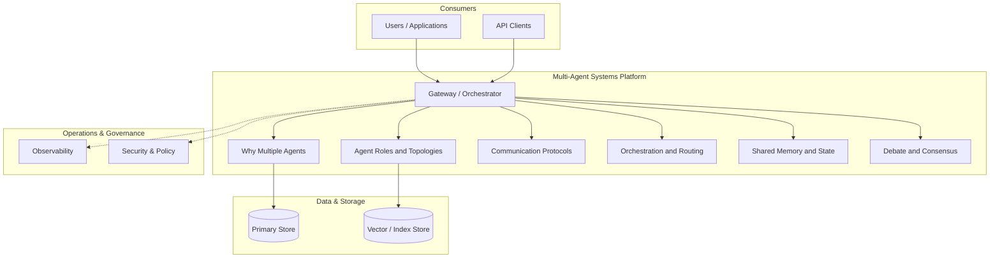

**Figure 5. Component - Orchestration and Routing** (mermaid). Figure: Component view for Multi-Agent Systems. This diagram illustrates the principal components and their interactions as discussed in the surrounding section.

## Deep Dive: Mechanics, Variants and Trade-offs

Having established the essentials, we now go deeper into orchestration and routing. It pays to understand the mechanism rather than treat it as a black box, because most production incidents are explained by one of its steps misbehaving. The distinctions in this section are the ones that separate a working demo from a system that holds up under adversarial inputs, scale and the passage of time.

Consider the principal variants and how to choose between them. Each variant optimises for a different point in the design space - some for latency, some for accuracy, some for cost or operability - and the correct choice follows from explicit requirements rather than from defaults. As with most architectural decisions, the choice is rarely binary; the skill lies in quantifying the trade-offs and choosing deliberately.

In practice this is supported by a mature tooling ecosystem, including AutoGen, CrewAI, LangGraph, MetaGPT. Tools accelerate the work but do not substitute for understanding: the same principles apply whichever implementation you select, and the ability to reason from first principles is what lets you debug when a tool behaves unexpectedly.

A frequent source of subtle bugs is the interaction with agent roles and topologies. Because agent roles and topologies concerns hierarchical, sequential, network and market-based organisations, changes there can silently alter the behaviour analysed here. The remedy is contract tests at the boundary and end-to-end evaluations that exercise the interaction explicitly.

Finally, attend to edge cases and degradation. Define what the system should do under partial failure, unexpected inputs and load spikes, and make that behaviour explicit and tested rather than emergent. Graceful degradation - returning a safe, useful result when the ideal one is unavailable - is a hallmark of mature engineering.

For deeper study, the literature offers authoritative treatments such as Wu et al. — AutoGen (2023) and Du et al. — Improving Factuality via Multi-Agent Debate (2023). These primary sources reward careful reading and ground the practical guidance above in established results.

## Advanced Considerations

Having established the essentials, we now go deeper into orchestration and routing. Mechanically, the behaviour emerges from a few interacting parts that are simpler than the whole they produce. The distinctions in this section are the ones that separate a working demo from a system that holds up under adversarial inputs, scale and the passage of time.

Consider the principal variants and how to choose between them. Each variant optimises for a different point in the design space - some for latency, some for accuracy, some for cost or operability - and the correct choice follows from explicit requirements rather than from defaults. Latency, accuracy and cost form a tension triangle: improving one typically pressures the others, so explicit budgets are essential.

In practice this is supported by a mature tooling ecosystem, including AutoGen, CrewAI, LangGraph, MetaGPT. Tools accelerate the work but do not substitute for understanding: the same principles apply whichever implementation you select, and the ability to reason from first principles is what lets you debug when a tool behaves unexpectedly.

A frequent source of subtle bugs is the interaction with tool and resource contention. Because tool and resource contention concerns coordinating access to shared external systems, changes there can silently alter the behaviour analysed here. The remedy is contract tests at the boundary and end-to-end evaluations that exercise the interaction explicitly.

Finally, attend to edge cases and degradation. Define what the system should do under partial failure, unexpected inputs and load spikes, and make that behaviour explicit and tested rather than emergent. Graceful degradation - returning a safe, useful result when the ideal one is unavailable - is a hallmark of mature engineering.

For deeper study, the literature offers authoritative treatments such as Wu et al. — AutoGen (2023) and Du et al. — Improving Factuality via Multi-Agent Debate (2023). These primary sources reward careful reading and ground the practical guidance above in established results.

## Worked Example

To ground the discussion, walk through a representative example. A software organisation needs planner, coder, reviewer and tester agents collaborating. They decide to apply orchestration and routing as part of their Multi-Agent Systems solution, but wisely treat it as a hypothesis to be validated rather than a foregone conclusion.

The team begins by stating the objective precisely and defining how success will be measured before writing any code. They establish a small but representative evaluation set, agree on acceptance thresholds, and only then prototype the simplest design that could work. Early measurement reveals which assumptions hold and which must be revised, saving weeks of misdirected effort and surfacing edge cases while they are still cheap to fix.

As the prototype matures into a service, the team hardens it: adding input validation, error handling, caching where it pays off, and monitoring that ties back to the original success metric. They document each significant decision in an architecture decision record so that future maintainers understand not just what was built but why.

The outcome is instructive. The system that reaches production is not the most sophisticated design the team considered, but the one whose behaviour they could measure, explain and operate. This is the recurring lesson of Multi-Agent Systems: durable value comes from the whole system, not from any single clever component.

## Industry Use Cases

Across industries, the ideas in this chapter recur in recognisable ways. The following vignettes show how different sectors apply them and what they have in common.

**Software.** Planner, coder, reviewer and tester agents collaborating. The common thread is that value comes not from the model alone but from the surrounding system - data quality, evaluation, integration and operations - which is precisely where most of the engineering effort belongs.

**Research.** Specialised retrieval, analysis and writing agents. The common thread is that value comes not from the model alone but from the surrounding system - data quality, evaluation, integration and operations - which is precisely where most of the engineering effort belongs.

**Operations.** Coordinated agents across monitoring and remediation. The common thread is that value comes not from the model alone but from the surrounding system - data quality, evaluation, integration and operations - which is precisely where most of the engineering effort belongs.

**Simulation.** Agent-based modelling of markets and organisations. The common thread is that value comes not from the model alone but from the surrounding system - data quality, evaluation, integration and operations - which is precisely where most of the engineering effort belongs.

## Best Practices

The following practices consistently separate successful Multi-Agent Systems efforts from struggling ones. They are deliberately concrete so they can be adopted as checklist items in design and code review.

- Give each agent a narrow, well-specified role.
- Use structured messages and explicit handoff contracts.
- Enforce global budgets to prevent multiplicative cost blow-ups.
- Trace cross-agent interactions for debugging.

None of these are exotic; they are the unglamorous disciplines that compound into reliability. The cost of adopting them is small compared with the cost of the incidents they prevent, and they become second nature with practice.

## Common Pitfalls

Equally instructive are the failure modes that recur in practice. Each pitfall below has a clear early warning sign and a known remedy, so treat them as a diagnostic checklist when something feels wrong:

- Agents talking in circles without convergence.
- Combinatorial cost growth across many agents.
- Unclear ownership leading to duplicated or conflicting actions.
- Emergent failures that are hard to reproduce.

The pattern is consistent: most failures stem from skipping measurement, conflating prototype and production standards, or deferring cross-cutting concerns such as security and cost until they become emergencies. Naming these traps in advance is the cheapest way to avoid them.

## Governance, Security and Cost Notes

No discussion of orchestration and routing is complete without its governance, security and cost dimensions, which are too often deferred until they become emergencies. Treating them as first-class concerns from the outset is both cheaper and safer.

**Governance.** Classify the risk of this capability, document its intended and out-of-scope uses, and ensure decisions are traceable to satisfy internal policy and external regulation such as the NIST AI RMF, ISO/IEC 42001 and the EU AI Act. **Security.** Treat all external input as untrusted, validate outputs before acting on them, apply least privilege to any tools or data access, and map controls to the OWASP LLM Top 10 and MITRE ATLAS.

**Cost and sustainability.** Establish explicit budgets for compute, tokens and latency, attribute spend to owners, and revisit the economics as usage scales - a design that is affordable at pilot scale can become untenable at production volume. Building these reflexes into everyday engineering is what allows a Multi-Agent Systems system to be not only capable but also trustworthy and economically sound.

## Hands-On Exercises

Work through the following exercises. They are designed to move understanding from recognition to application - the level required for real engineering work - so prefer writing and building over merely reading.

1. Explain orchestration and routing to a colleague unfamiliar with Multi-Agent Systems, using a concrete example from your own domain.
2. Sketch a reference architecture that incorporates orchestration and routing and annotate where observability, security and cost controls belong.
3. Design an evaluation that would tell you whether orchestration and routing is working in production, including the metric, the dataset and the acceptance threshold.
4. Identify two pitfalls relevant to orchestration and routing in your environment and describe the early warning signals you would monitor.
5. Prototype the simplest implementation that demonstrates orchestration and routing, then list exactly what would need to change to make it production-ready.

## Key Takeaways

Key takeaways from this chapter:

- Orchestration and Routing is a systems concern in Multi-Agent Systems: data, models and operations must be co-designed.
- Measurement is non-negotiable; define success metrics and evaluation before building.
- Favour the simplest design that meets the requirement, and add complexity only when evidence demands it.
- Security, cost and observability are first-class requirements, not afterthoughts.
- Document decisions so the system remains understandable and operable as it evolves.

## Code Walkthrough

This listing shows a configuration-driven Orchestration and Routing component with retry semantics and typed interfaces — the shape we expect from production Multi-Agent Systems code rather than a notebook prototype.

The full listing is shown below; study it line by line and reproduce it locally before moving on.

### Listing: Implementing a Orchestration and Routing component

```python
from __future__ import annotations

from dataclasses import dataclass, field
from typing import Any


@dataclass(slots=True)
class OrchestrationAndRoutingConfig:
    """Configuration for the Orchestration and Routing component in a Multi-Agent Systems system."""

    name: str
    timeout_s: float = 30.0
    max_retries: int = 3
    options: dict[str, Any] = field(default_factory=dict)


class OrchestrationAndRouting:
    """A minimal, production-shaped implementation of Orchestration and Routing."""

    def __init__(self, config: OrchestrationAndRoutingConfig) -> None:
        self._config = config
        self._calls = 0

    def run(self, payload: dict[str, Any]) -> dict[str, Any]:
        """Process a request, retrying transient failures with backoff."""
        last_error: Exception | None = None
        for attempt in range(self._config.max_retries):
            try:
                self._calls += 1
                return self._process(payload)
            except TimeoutError as exc:  # transient
                last_error = exc
                continue
        raise RuntimeError(f"OrchestrationAndRouting failed after retries") from last_error

    def _process(self, payload: dict[str, Any]) -> dict[str, Any]:
        # Domain-specific logic for Orchestration and Routing goes here.
        return {"status": "ok", "input_keys": sorted(payload), "calls": self._calls}

```

## Review Questions

1. In the context of Multi-Agent Systems, which statement best describes “Orchestration and Routing”?
   - A. Supervisors, routers and dynamic task allocation.
   - B. It is only relevant to academic research, not production.
   - C. It applies exclusively to image data.
   - D. It makes the system slower but has no other effect.
   - **Answer: A.** Orchestration and Routing: Supervisors, routers and dynamic task allocation.
2. Which of the following is a recommended best practice when working with Multi-Agent Systems?
   - A. Give each agent a narrow, well-specified role.
   - B. It is only relevant to academic research, not production.
   - C. It applies exclusively to image data.
   - D. Agents talking in circles without convergence.
   - **Answer: A.** Best practice: Give each agent a narrow, well-specified role.
3. Which of the following is a common pitfall to avoid in Multi-Agent Systems?
   - A. Use structured messages and explicit handoff contracts.
   - B. Enforce global budgets to prevent multiplicative cost blow-ups.
   - C. Emergent failures that are hard to reproduce.
   - D. It removes all security and governance requirements.
   - **Answer: C.** Pitfall to avoid: Emergent failures that are hard to reproduce.
4. *(Discussion)* Walk through how you would design Orchestration and Routing for an enterprise Multi-Agent Systems workload.
   - **Model answer:** A strong answer defines orchestration and routing (Supervisors, routers and dynamic task allocation.) then connects it to architecture, evaluation, cost, security and operations for Multi-Agent Systems, citing concrete trade-offs and a real-world example.

---


# Chapter 5. Shared Memory and State

_This chapter examines shared memory and state within Multi-Agent Systems. It covers coordinating context across agents safely, derives a reference architecture, walks through a worked example and runnable code, surveys industry use cases, and distils best practices and pitfalls, closing with exercises and review questions._

## Introduction

In practical terms, Shared Memory and State is best understood as coordinating context across agents safely. Teams that master this consistently ship more reliable Multi-Agent Systems systems at lower cost. The practical implication is that design choices here ripple through latency, cost and maintainability for the lifetime of the system.

This chapter builds intuition first, then formalises the ideas, derives an architecture, and finishes with code, exercises and review questions so the material transfers directly to your own Multi-Agent Systems work. Read it actively: pause at each diagram, reproduce the code, and attempt the exercises before consulting the answers.

## Theory and Foundations

At its core, Shared Memory and State concerns coordinating context across agents safely. The right abstraction here pays compounding dividends, because downstream components depend on its guarantees. The underlying mechanism is best appreciated by tracing a single request from input to output and noting where state is created and consumed.

To place this in context, recall the broader picture: Multi-agent systems decompose complex goals across specialised agents that communicate, coordinate and sometimes debate to produce better outcomes than a single agent. Within that picture, shared memory and state is one of the load-bearing ideas - the kind that, when understood deeply, makes the rest of Multi-Agent Systems fall into place. Getting this right early prevents expensive rework once a Multi-Agent Systems system reaches scale.

Shared Memory and State cannot be understood in isolation from the multi-agent reference architecture. Recall that the multi-agent reference architecture concerns supervisor, workers, shared memory and guardrails. The two interact directly: decisions in one constrain the design space of the other, which is why mature teams reason about them together rather than sequentially. Simplicity is a feature. The simplest design that meets the requirement should be the default, with complexity added only when measurement justifies it.

Shared Memory and State cannot be understood in isolation from frameworks and patterns. Recall that frameworks and patterns concerns comparing orchestration frameworks. The two interact directly: decisions in one constrain the design space of the other, which is why mature teams reason about them together rather than sequentially. Every added component buys capability at the price of operational surface area, and that bargain should be made consciously.

Several established patterns apply directly to shared memory and state. The first, debate-and-judge for high-stakes decisions, is widely adopted because it makes the system's behaviour predictable and observable. A complementary pattern, blackboard for shared coordination state, addresses a related concern and is often deployed alongside it. Patterns are not dogma; they are distilled experience that shortcuts the search for a sound design, and each carries assumptions worth checking against your context.

It is worth being explicit about when to apply this and when to reach for something simpler. In a small prototype, shortcuts around shared memory and state are invisible; in a production Multi-Agent Systems system serving real traffic, they surface as incidents, cost overruns or compliance gaps. As with most architectural decisions, the choice is rarely binary; the skill lies in quantifying the trade-offs and choosing deliberately. The remainder of this chapter turns these principles into an architecture, code and a checklist you can apply immediately.

## Architecture and Design

The reference architecture for Shared Memory and State separates concerns into clearly bounded components with explicit contracts. A multi-agent platform uses a supervisor/orchestrator that routes subtasks to specialised worker agents, a shared state store for coordination, a message bus for structured communication, and global guardrails enforcing budgets and permissions. Distributed tracing stitches together cross-agent trajectories.

Concretely, the principal building blocks include why multiple agents, agent roles and topologies, communication protocols, orchestration and routing and shared memory and state. Each is a replaceable component behind a stable interface, so the team can upgrade an implementation - a model, an index, a policy engine - without rewriting its neighbours. The contracts between components are where reliability is won or lost, so they are specified explicitly and tested in isolation.

The diagram accompanying this section makes the data and control flow explicit. Requests enter through a well-defined boundary where they are authenticated and validated; only then are they dispatched to the components that perform the work. This boundary is also where rate limiting, quota enforcement and audit logging live, keeping cross-cutting concerns out of the core logic and in one auditable place.

Two qualities deserve emphasis. First, observability is designed in, not bolted on: every component emits structured telemetry so that failures can be localised in minutes rather than hours. Second, the architecture is evolvable - components communicate through stable contracts so that any single part of the Multi-Agent Systems system can be replaced without a rewrite. There is an inherent trade-off between fidelity and cost, and the correct balance depends on the use case and its tolerance for error.

```xml
<mxfile host="ai-university">
  <diagram name="Security Architecture">
    <mxGraphModel dx="800" dy="600" grid="1" gridSize="10">
      <root>
        <mxCell id="0"/>
        <mxCell id="1" parent="0"/>
        <mxCell id="title" value="Security Architecture - Shared Memory and State" style="text;fontSize=16;fontStyle=1" vertex="1" parent="1"><mxGeometry x="40" y="20" width="600" height="30" as="geometry"/></mxCell>
        <mxCell id="hub" value="Multi-Agent Systems" style="rounded=1;fillColor=#0f172a;fontColor=#ffffff;fontStyle=1" vertex="1" parent="1"><mxGeometry x="300" y="180" width="160" height="60" as="geometry"/></mxCell>
        <mxCell id="n0" value="Why Multiple Agents" style="rounded=1;fillColor=#e0e7ff;strokeColor=#4338ca" vertex="1" parent="1"><mxGeometry x="60" y="80" width="160" height="50" as="geometry"/></mxCell>
        <mxCell id="e0" style="edgeStyle=orthogonalEdgeStyle" edge="1" parent="1" source="hub" target="n0"><mxGeometry relative="1" as="geometry"/></mxCell>
        <mxCell id="n1" value="Agent Roles and Topolog…" style="rounded=1;fillColor=#e0e7ff;strokeColor=#4338ca" vertex="1" parent="1"><mxGeometry x="600" y="170" width="160" height="50" as="geometry"/></mxCell>
        <mxCell id="e1" style="edgeStyle=orthogonalEdgeStyle" edge="1" parent="1" source="hub" target="n1"><mxGeometry relative="1" as="geometry"/></mxCell>
        <mxCell id="n2" value="Communication Protocols" style="rounded=1;fillColor=#e0e7ff;strokeColor=#4338ca" vertex="1" parent="1"><mxGeometry x="60" y="260" width="160" height="50" as="geometry"/></mxCell>
        <mxCell id="e2" style="edgeStyle=orthogonalEdgeStyle" edge="1" parent="1" source="hub" target="n2"><mxGeometry relative="1" as="geometry"/></mxCell>
        <mxCell id="n3" value="Orchestration and Routi…" style="rounded=1;fillColor=#e0e7ff;strokeColor=#4338ca" vertex="1" parent="1"><mxGeometry x="600" y="350" width="160" height="50" as="geometry"/></mxCell>
        <mxCell id="e3" style="edgeStyle=orthogonalEdgeStyle" edge="1" parent="1" source="hub" target="n3"><mxGeometry relative="1" as="geometry"/></mxCell>
        <mxCell id="n4" value="Shared Memory and State" style="rounded=1;fillColor=#e0e7ff;strokeColor=#4338ca" vertex="1" parent="1"><mxGeometry x="60" y="440" width="160" height="50" as="geometry"/></mxCell>
        <mxCell id="e4" style="edgeStyle=orthogonalEdgeStyle" edge="1" parent="1" source="hub" target="n4"><mxGeometry relative="1" as="geometry"/></mxCell>
      </root>
    </mxGraphModel>
  </diagram>
</mxfile>
```

_Source diagram (drawio); render with the appropriate tool._

**Figure 6. Security Architecture - Shared Memory and State** (drawio). Figure: Security Architecture view for Multi-Agent Systems. This diagram illustrates the principal components and their interactions as discussed in the surrounding section.

## Deep Dive: Mechanics, Variants and Trade-offs

Having established the essentials, we now go deeper into shared memory and state. Mechanically, the behaviour emerges from a few interacting parts that are simpler than the whole they produce. The distinctions in this section are the ones that separate a working demo from a system that holds up under adversarial inputs, scale and the passage of time.

Consider the principal variants and how to choose between them. Each variant optimises for a different point in the design space - some for latency, some for accuracy, some for cost or operability - and the correct choice follows from explicit requirements rather than from defaults. Latency, accuracy and cost form a tension triangle: improving one typically pressures the others, so explicit budgets are essential.

In practice this is supported by a mature tooling ecosystem, including AutoGen, CrewAI, LangGraph, MetaGPT. Tools accelerate the work but do not substitute for understanding: the same principles apply whichever implementation you select, and the ability to reason from first principles is what lets you debug when a tool behaves unexpectedly.

A frequent source of subtle bugs is the interaction with the multi-agent reference architecture. Because the multi-agent reference architecture concerns supervisor, workers, shared memory and guardrails, changes there can silently alter the behaviour analysed here. The remedy is contract tests at the boundary and end-to-end evaluations that exercise the interaction explicitly.

Finally, attend to edge cases and degradation. Define what the system should do under partial failure, unexpected inputs and load spikes, and make that behaviour explicit and tested rather than emergent. Graceful degradation - returning a safe, useful result when the ideal one is unavailable - is a hallmark of mature engineering.

For deeper study, the literature offers authoritative treatments such as Wu et al. — AutoGen (2023) and Du et al. — Improving Factuality via Multi-Agent Debate (2023). These primary sources reward careful reading and ground the practical guidance above in established results.

## Advanced Considerations

Having established the essentials, we now go deeper into shared memory and state. It pays to understand the mechanism rather than treat it as a black box, because most production incidents are explained by one of its steps misbehaving. The distinctions in this section are the ones that separate a working demo from a system that holds up under adversarial inputs, scale and the passage of time.

Consider the principal variants and how to choose between them. Each variant optimises for a different point in the design space - some for latency, some for accuracy, some for cost or operability - and the correct choice follows from explicit requirements rather than from defaults. Every added component buys capability at the price of operational surface area, and that bargain should be made consciously.

In practice this is supported by a mature tooling ecosystem, including AutoGen, CrewAI, LangGraph, MetaGPT. Tools accelerate the work but do not substitute for understanding: the same principles apply whichever implementation you select, and the ability to reason from first principles is what lets you debug when a tool behaves unexpectedly.

A frequent source of subtle bugs is the interaction with communication protocols. Because communication protocols concerns message passing, shared blackboards and structured handoffs, changes there can silently alter the behaviour analysed here. The remedy is contract tests at the boundary and end-to-end evaluations that exercise the interaction explicitly.

Finally, attend to edge cases and degradation. Define what the system should do under partial failure, unexpected inputs and load spikes, and make that behaviour explicit and tested rather than emergent. Graceful degradation - returning a safe, useful result when the ideal one is unavailable - is a hallmark of mature engineering.

For deeper study, the literature offers authoritative treatments such as Wu et al. — AutoGen (2023) and Du et al. — Improving Factuality via Multi-Agent Debate (2023). These primary sources reward careful reading and ground the practical guidance above in established results.

## Worked Example

Consider a concrete scenario. A operations organisation needs coordinated agents across monitoring and remediation. They decide to apply shared memory and state as part of their Multi-Agent Systems solution, but wisely treat it as a hypothesis to be validated rather than a foregone conclusion.

The team begins by stating the objective precisely and defining how success will be measured before writing any code. They establish a small but representative evaluation set, agree on acceptance thresholds, and only then prototype the simplest design that could work. Early measurement reveals which assumptions hold and which must be revised, saving weeks of misdirected effort and surfacing edge cases while they are still cheap to fix.

As the prototype matures into a service, the team hardens it: adding input validation, error handling, caching where it pays off, and monitoring that ties back to the original success metric. They document each significant decision in an architecture decision record so that future maintainers understand not just what was built but why.

The outcome is instructive. The system that reaches production is not the most sophisticated design the team considered, but the one whose behaviour they could measure, explain and operate. This is the recurring lesson of Multi-Agent Systems: durable value comes from the whole system, not from any single clever component.

## Industry Use Cases

Across industries, the ideas in this chapter recur in recognisable ways. The following vignettes show how different sectors apply them and what they have in common.

**Software.** Planner, coder, reviewer and tester agents collaborating. The common thread is that value comes not from the model alone but from the surrounding system - data quality, evaluation, integration and operations - which is precisely where most of the engineering effort belongs.

**Research.** Specialised retrieval, analysis and writing agents. The common thread is that value comes not from the model alone but from the surrounding system - data quality, evaluation, integration and operations - which is precisely where most of the engineering effort belongs.

**Operations.** Coordinated agents across monitoring and remediation. The common thread is that value comes not from the model alone but from the surrounding system - data quality, evaluation, integration and operations - which is precisely where most of the engineering effort belongs.

**Simulation.** Agent-based modelling of markets and organisations. The common thread is that value comes not from the model alone but from the surrounding system - data quality, evaluation, integration and operations - which is precisely where most of the engineering effort belongs.

## Best Practices

The following practices consistently separate successful Multi-Agent Systems efforts from struggling ones. They are deliberately concrete so they can be adopted as checklist items in design and code review.

- Give each agent a narrow, well-specified role.
- Use structured messages and explicit handoff contracts.
- Enforce global budgets to prevent multiplicative cost blow-ups.
- Trace cross-agent interactions for debugging.

None of these are exotic; they are the unglamorous disciplines that compound into reliability. The cost of adopting them is small compared with the cost of the incidents they prevent, and they become second nature with practice.

## Common Pitfalls

Equally instructive are the failure modes that recur in practice. Each pitfall below has a clear early warning sign and a known remedy, so treat them as a diagnostic checklist when something feels wrong:

- Agents talking in circles without convergence.
- Combinatorial cost growth across many agents.
- Unclear ownership leading to duplicated or conflicting actions.
- Emergent failures that are hard to reproduce.

The pattern is consistent: most failures stem from skipping measurement, conflating prototype and production standards, or deferring cross-cutting concerns such as security and cost until they become emergencies. Naming these traps in advance is the cheapest way to avoid them.

## Governance, Security and Cost Notes

No discussion of shared memory and state is complete without its governance, security and cost dimensions, which are too often deferred until they become emergencies. Treating them as first-class concerns from the outset is both cheaper and safer.

**Governance.** Classify the risk of this capability, document its intended and out-of-scope uses, and ensure decisions are traceable to satisfy internal policy and external regulation such as the NIST AI RMF, ISO/IEC 42001 and the EU AI Act. **Security.** Treat all external input as untrusted, validate outputs before acting on them, apply least privilege to any tools or data access, and map controls to the OWASP LLM Top 10 and MITRE ATLAS.

**Cost and sustainability.** Establish explicit budgets for compute, tokens and latency, attribute spend to owners, and revisit the economics as usage scales - a design that is affordable at pilot scale can become untenable at production volume. Building these reflexes into everyday engineering is what allows a Multi-Agent Systems system to be not only capable but also trustworthy and economically sound.

## Hands-On Exercises

Work through the following exercises. They are designed to move understanding from recognition to application - the level required for real engineering work - so prefer writing and building over merely reading.

1. Explain shared memory and state to a colleague unfamiliar with Multi-Agent Systems, using a concrete example from your own domain.
2. Sketch a reference architecture that incorporates shared memory and state and annotate where observability, security and cost controls belong.
3. Design an evaluation that would tell you whether shared memory and state is working in production, including the metric, the dataset and the acceptance threshold.
4. Identify two pitfalls relevant to shared memory and state in your environment and describe the early warning signals you would monitor.
5. Prototype the simplest implementation that demonstrates shared memory and state, then list exactly what would need to change to make it production-ready.

## Key Takeaways

Key takeaways from this chapter:

- Shared Memory and State is a systems concern in Multi-Agent Systems: data, models and operations must be co-designed.
- Measurement is non-negotiable; define success metrics and evaluation before building.
- Favour the simplest design that meets the requirement, and add complexity only when evidence demands it.
- Security, cost and observability are first-class requirements, not afterthoughts.
- Document decisions so the system remains understandable and operable as it evolves.

## Code Walkthrough

This listing shows a configuration-driven Shared Memory and State component with retry semantics and typed interfaces — the shape we expect from production Multi-Agent Systems code rather than a notebook prototype.

The full listing is shown below; study it line by line and reproduce it locally before moving on.

### Listing: Implementing a Shared Memory and State component

```python
from __future__ import annotations

from dataclasses import dataclass, field
from typing import Any


@dataclass(slots=True)
class SharedMemoryAndConfig:
    """Configuration for the Shared Memory and State component in a Multi-Agent Systems system."""

    name: str
    timeout_s: float = 30.0
    max_retries: int = 3
    options: dict[str, Any] = field(default_factory=dict)


class SharedMemoryAnd:
    """A minimal, production-shaped implementation of Shared Memory and State."""

    def __init__(self, config: SharedMemoryAndConfig) -> None:
        self._config = config
        self._calls = 0

    def run(self, payload: dict[str, Any]) -> dict[str, Any]:
        """Process a request, retrying transient failures with backoff."""
        last_error: Exception | None = None
        for attempt in range(self._config.max_retries):
            try:
                self._calls += 1
                return self._process(payload)
            except TimeoutError as exc:  # transient
                last_error = exc
                continue
        raise RuntimeError(f"SharedMemoryAnd failed after retries") from last_error

    def _process(self, payload: dict[str, Any]) -> dict[str, Any]:
        # Domain-specific logic for Shared Memory and State goes here.
        return {"status": "ok", "input_keys": sorted(payload), "calls": self._calls}

```

## Review Questions

1. In the context of Multi-Agent Systems, which statement best describes “Shared Memory and State”?
   - A. Coordinating context across agents safely.
   - B. It guarantees deterministic output regardless of input.
   - C. It makes the system slower but has no other effect.
   - D. It removes all security and governance requirements.
   - **Answer: A.** Shared Memory and State: Coordinating context across agents safely.
2. Which of the following is a recommended best practice when working with Multi-Agent Systems?
   - A. Combinatorial cost growth across many agents.
   - B. It is only relevant to academic research, not production.
   - C. Give each agent a narrow, well-specified role.
   - D. It eliminates the need for any evaluation or monitoring.
   - **Answer: C.** Best practice: Give each agent a narrow, well-specified role.
3. Which of the following is a common pitfall to avoid in Multi-Agent Systems?
   - A. Emergent failures that are hard to reproduce.
   - B. Enforce global budgets to prevent multiplicative cost blow-ups.
   - C. It guarantees deterministic output regardless of input.
   - D. Use structured messages and explicit handoff contracts.
   - **Answer: A.** Pitfall to avoid: Emergent failures that are hard to reproduce.
4. *(Discussion)* Explain Shared Memory and State and why it matters in a production Multi-Agent Systems system.
   - **Model answer:** A strong answer defines shared memory and state (Coordinating context across agents safely.) then connects it to architecture, evaluation, cost, security and operations for Multi-Agent Systems, citing concrete trade-offs and a real-world example.

---


# Chapter 6. Debate and Consensus

_This chapter examines debate and consensus within Multi-Agent Systems. It covers multi-agent debate, voting and critique for quality, derives a reference architecture, walks through a worked example and runnable code, surveys industry use cases, and distils best practices and pitfalls, closing with exercises and review questions._

## Introduction

At its core, Debate and Consensus concerns multi-agent debate, voting and critique for quality. Understanding this matters because Multi-Agent Systems systems succeed or fail on exactly these decisions. In an enterprise setting, this translates into concrete requirements: clear interfaces, measurable quality, and controls that satisfy security and governance.

This chapter builds intuition first, then formalises the ideas, derives an architecture, and finishes with code, exercises and review questions so the material transfers directly to your own Multi-Agent Systems work. Read it actively: pause at each diagram, reproduce the code, and attempt the exercises before consulting the answers.

## Theory and Foundations

Formally, Debate and Consensus addresses multi-agent debate, voting and critique for quality. Seasoned practitioners treat this as a systems problem, co-designing data, models and operations rather than optimising any one in isolation. The underlying mechanism is best appreciated by tracing a single request from input to output and noting where state is created and consumed.

To place this in context, recall the broader picture: Multi-agent systems decompose complex goals across specialised agents that communicate, coordinate and sometimes debate to produce better outcomes than a single agent. Within that picture, debate and consensus is one of the load-bearing ideas - the kind that, when understood deeply, makes the rest of Multi-Agent Systems fall into place. Neglecting it is one of the most common reasons Multi-Agent Systems initiatives stall in production.

Debate and Consensus cannot be understood in isolation from tool and resource contention. Recall that tool and resource contention concerns coordinating access to shared external systems. The two interact directly: decisions in one constrain the design space of the other, which is why mature teams reason about them together rather than sequentially. There is an inherent trade-off between fidelity and cost, and the correct balance depends on the use case and its tolerance for error.

Debate and Consensus cannot be understood in isolation from emergent behaviour and risk. Recall that emergent behaviour and risk concerns unintended dynamics and how to contain them. The two interact directly: decisions in one constrain the design space of the other, which is why mature teams reason about them together rather than sequentially. There is an inherent trade-off between fidelity and cost, and the correct balance depends on the use case and its tolerance for error.

Several established patterns apply directly to debate and consensus. The first, debate-and-judge for high-stakes decisions, is widely adopted because it makes the system's behaviour predictable and observable. A complementary pattern, supervisor–worker hierarchy, addresses a related concern and is often deployed alongside it. Patterns are not dogma; they are distilled experience that shortcuts the search for a sound design, and each carries assumptions worth checking against your context.

It is worth being explicit about when to apply this and when to reach for something simpler. In a small prototype, shortcuts around debate and consensus are invisible; in a production Multi-Agent Systems system serving real traffic, they surface as incidents, cost overruns or compliance gaps. There is an inherent trade-off between fidelity and cost, and the correct balance depends on the use case and its tolerance for error. The remainder of this chapter turns these principles into an architecture, code and a checklist you can apply immediately.

## Architecture and Design

From an architectural standpoint, Debate and Consensus sits at the intersection of data, models and operations. A multi-agent platform uses a supervisor/orchestrator that routes subtasks to specialised worker agents, a shared state store for coordination, a message bus for structured communication, and global guardrails enforcing budgets and permissions. Distributed tracing stitches together cross-agent trajectories.

Concretely, the principal building blocks include why multiple agents, agent roles and topologies, communication protocols, orchestration and routing and shared memory and state. Each is a replaceable component behind a stable interface, so the team can upgrade an implementation - a model, an index, a policy engine - without rewriting its neighbours. The contracts between components are where reliability is won or lost, so they are specified explicitly and tested in isolation.

The diagram accompanying this section makes the data and control flow explicit. Requests enter through a well-defined boundary where they are authenticated and validated; only then are they dispatched to the components that perform the work. This boundary is also where rate limiting, quota enforcement and audit logging live, keeping cross-cutting concerns out of the core logic and in one auditable place.

Two qualities deserve emphasis. First, observability is designed in, not bolted on: every component emits structured telemetry so that failures can be localised in minutes rather than hours. Second, the architecture is evolvable - components communicate through stable contracts so that any single part of the Multi-Agent Systems system can be replaced without a rewrite. As with most architectural decisions, the choice is rarely binary; the skill lies in quantifying the trade-offs and choosing deliberately.

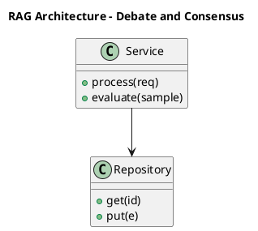

_Source diagram (plantuml); render with the appropriate tool._

**Figure 7. RAG Architecture - Debate and Consensus** (plantuml). Figure: RAG Architecture view for Multi-Agent Systems. This diagram illustrates the principal components and their interactions as discussed in the surrounding section.

## Deep Dive: Mechanics, Variants and Trade-offs

Having established the essentials, we now go deeper into debate and consensus. The underlying mechanism is best appreciated by tracing a single request from input to output and noting where state is created and consumed. The distinctions in this section are the ones that separate a working demo from a system that holds up under adversarial inputs, scale and the passage of time.

Consider the principal variants and how to choose between them. Each variant optimises for a different point in the design space - some for latency, some for accuracy, some for cost or operability - and the correct choice follows from explicit requirements rather than from defaults. There is an inherent trade-off between fidelity and cost, and the correct balance depends on the use case and its tolerance for error.

In practice this is supported by a mature tooling ecosystem, including AutoGen, CrewAI, LangGraph, MetaGPT. Tools accelerate the work but do not substitute for understanding: the same principles apply whichever implementation you select, and the ability to reason from first principles is what lets you debug when a tool behaves unexpectedly.

A frequent source of subtle bugs is the interaction with tool and resource contention. Because tool and resource contention concerns coordinating access to shared external systems, changes there can silently alter the behaviour analysed here. The remedy is contract tests at the boundary and end-to-end evaluations that exercise the interaction explicitly.

Finally, attend to edge cases and degradation. Define what the system should do under partial failure, unexpected inputs and load spikes, and make that behaviour explicit and tested rather than emergent. Graceful degradation - returning a safe, useful result when the ideal one is unavailable - is a hallmark of mature engineering.

For deeper study, the literature offers authoritative treatments such as Wu et al. — AutoGen (2023) and Du et al. — Improving Factuality via Multi-Agent Debate (2023). These primary sources reward careful reading and ground the practical guidance above in established results.

## Advanced Considerations

Having established the essentials, we now go deeper into debate and consensus. Mechanically, the behaviour emerges from a few interacting parts that are simpler than the whole they produce. The distinctions in this section are the ones that separate a working demo from a system that holds up under adversarial inputs, scale and the passage of time.

Consider the principal variants and how to choose between them. Each variant optimises for a different point in the design space - some for latency, some for accuracy, some for cost or operability - and the correct choice follows from explicit requirements rather than from defaults. As with most architectural decisions, the choice is rarely binary; the skill lies in quantifying the trade-offs and choosing deliberately.

In practice this is supported by a mature tooling ecosystem, including AutoGen, CrewAI, LangGraph, MetaGPT. Tools accelerate the work but do not substitute for understanding: the same principles apply whichever implementation you select, and the ability to reason from first principles is what lets you debug when a tool behaves unexpectedly.

A frequent source of subtle bugs is the interaction with agent roles and topologies. Because agent roles and topologies concerns hierarchical, sequential, network and market-based organisations, changes there can silently alter the behaviour analysed here. The remedy is contract tests at the boundary and end-to-end evaluations that exercise the interaction explicitly.

Finally, attend to edge cases and degradation. Define what the system should do under partial failure, unexpected inputs and load spikes, and make that behaviour explicit and tested rather than emergent. Graceful degradation - returning a safe, useful result when the ideal one is unavailable - is a hallmark of mature engineering.

For deeper study, the literature offers authoritative treatments such as Wu et al. — AutoGen (2023) and Du et al. — Improving Factuality via Multi-Agent Debate (2023). These primary sources reward careful reading and ground the practical guidance above in established results.

## Worked Example

Consider a concrete scenario. A software organisation needs planner, coder, reviewer and tester agents collaborating. They decide to apply debate and consensus as part of their Multi-Agent Systems solution, but wisely treat it as a hypothesis to be validated rather than a foregone conclusion.

The team begins by stating the objective precisely and defining how success will be measured before writing any code. They establish a small but representative evaluation set, agree on acceptance thresholds, and only then prototype the simplest design that could work. Early measurement reveals which assumptions hold and which must be revised, saving weeks of misdirected effort and surfacing edge cases while they are still cheap to fix.

As the prototype matures into a service, the team hardens it: adding input validation, error handling, caching where it pays off, and monitoring that ties back to the original success metric. They document each significant decision in an architecture decision record so that future maintainers understand not just what was built but why.

The outcome is instructive. The system that reaches production is not the most sophisticated design the team considered, but the one whose behaviour they could measure, explain and operate. This is the recurring lesson of Multi-Agent Systems: durable value comes from the whole system, not from any single clever component.

## Industry Use Cases

Across industries, the ideas in this chapter recur in recognisable ways. The following vignettes show how different sectors apply them and what they have in common.

**Software.** Planner, coder, reviewer and tester agents collaborating. The common thread is that value comes not from the model alone but from the surrounding system - data quality, evaluation, integration and operations - which is precisely where most of the engineering effort belongs.

**Research.** Specialised retrieval, analysis and writing agents. The common thread is that value comes not from the model alone but from the surrounding system - data quality, evaluation, integration and operations - which is precisely where most of the engineering effort belongs.

**Operations.** Coordinated agents across monitoring and remediation. The common thread is that value comes not from the model alone but from the surrounding system - data quality, evaluation, integration and operations - which is precisely where most of the engineering effort belongs.

**Simulation.** Agent-based modelling of markets and organisations. The common thread is that value comes not from the model alone but from the surrounding system - data quality, evaluation, integration and operations - which is precisely where most of the engineering effort belongs.

## Best Practices

The following practices consistently separate successful Multi-Agent Systems efforts from struggling ones. They are deliberately concrete so they can be adopted as checklist items in design and code review.

- Give each agent a narrow, well-specified role.
- Use structured messages and explicit handoff contracts.
- Enforce global budgets to prevent multiplicative cost blow-ups.
- Trace cross-agent interactions for debugging.

None of these are exotic; they are the unglamorous disciplines that compound into reliability. The cost of adopting them is small compared with the cost of the incidents they prevent, and they become second nature with practice.

## Common Pitfalls

Equally instructive are the failure modes that recur in practice. Each pitfall below has a clear early warning sign and a known remedy, so treat them as a diagnostic checklist when something feels wrong:

- Agents talking in circles without convergence.
- Combinatorial cost growth across many agents.
- Unclear ownership leading to duplicated or conflicting actions.
- Emergent failures that are hard to reproduce.

The pattern is consistent: most failures stem from skipping measurement, conflating prototype and production standards, or deferring cross-cutting concerns such as security and cost until they become emergencies. Naming these traps in advance is the cheapest way to avoid them.

## Governance, Security and Cost Notes

No discussion of debate and consensus is complete without its governance, security and cost dimensions, which are too often deferred until they become emergencies. Treating them as first-class concerns from the outset is both cheaper and safer.

**Governance.** Classify the risk of this capability, document its intended and out-of-scope uses, and ensure decisions are traceable to satisfy internal policy and external regulation such as the NIST AI RMF, ISO/IEC 42001 and the EU AI Act. **Security.** Treat all external input as untrusted, validate outputs before acting on them, apply least privilege to any tools or data access, and map controls to the OWASP LLM Top 10 and MITRE ATLAS.

**Cost and sustainability.** Establish explicit budgets for compute, tokens and latency, attribute spend to owners, and revisit the economics as usage scales - a design that is affordable at pilot scale can become untenable at production volume. Building these reflexes into everyday engineering is what allows a Multi-Agent Systems system to be not only capable but also trustworthy and economically sound.

## Hands-On Exercises

Work through the following exercises. They are designed to move understanding from recognition to application - the level required for real engineering work - so prefer writing and building over merely reading.

1. Explain debate and consensus to a colleague unfamiliar with Multi-Agent Systems, using a concrete example from your own domain.
2. Sketch a reference architecture that incorporates debate and consensus and annotate where observability, security and cost controls belong.
3. Design an evaluation that would tell you whether debate and consensus is working in production, including the metric, the dataset and the acceptance threshold.
4. Identify two pitfalls relevant to debate and consensus in your environment and describe the early warning signals you would monitor.
5. Prototype the simplest implementation that demonstrates debate and consensus, then list exactly what would need to change to make it production-ready.

## Key Takeaways

Key takeaways from this chapter:

- Debate and Consensus is a systems concern in Multi-Agent Systems: data, models and operations must be co-designed.
- Measurement is non-negotiable; define success metrics and evaluation before building.
- Favour the simplest design that meets the requirement, and add complexity only when evidence demands it.
- Security, cost and observability are first-class requirements, not afterthoughts.
- Document decisions so the system remains understandable and operable as it evolves.

## Code Walkthrough

Pipelines keep Debate and Consensus logic modular and testable. Each stage is a pure function, errors are captured per item, and the composition is trivial to extend or reorder.

The full listing is shown below; study it line by line and reproduce it locally before moving on.

### Listing: A composable processing pipeline for Debate and Consensus

```python
from collections.abc import Iterable, Iterator
from typing import Protocol


class Stage(Protocol):
    def __call__(self, item: dict) -> dict: ...


def pipeline(stages: list[Stage]) -> Stage:
    """Compose ordered stages into a single callable for Debate and Consensus."""

    def run(item: dict) -> dict:
        for stage in stages:
            item = stage(item)
        return item

    return run


def validate(item: dict) -> dict:
    if "text" not in item:
        raise ValueError("missing required field: text")
    return item


def normalise(item: dict) -> dict:
    item["text"] = item["text"].strip().lower()
    return item


def enrich(item: dict) -> dict:
    item["length"] = len(item["text"])
    return item


process = pipeline([validate, normalise, enrich])


def run_batch(items: Iterable[dict]) -> Iterator[dict]:
    for item in items:
        try:
            yield process(dict(item))
        except ValueError as exc:
            yield {"error": str(exc), "item": item}

```

## Review Questions

1. In the context of Multi-Agent Systems, which statement best describes “Debate and Consensus”?
   - A. Multi-agent debate, voting and critique for quality.
   - B. It eliminates the need for any evaluation or monitoring.
   - C. It makes the system slower but has no other effect.
   - D. It applies exclusively to image data.
   - **Answer: A.** Debate and Consensus: Multi-agent debate, voting and critique for quality.
2. Which of the following is a recommended best practice when working with Multi-Agent Systems?
   - A. Unclear ownership leading to duplicated or conflicting actions.
   - B. It guarantees deterministic output regardless of input.
   - C. Enforce global budgets to prevent multiplicative cost blow-ups.
   - D. It is only relevant to academic research, not production.
   - **Answer: C.** Best practice: Enforce global budgets to prevent multiplicative cost blow-ups.
3. Which of the following is a common pitfall to avoid in Multi-Agent Systems?
   - A. It guarantees deterministic output regardless of input.
   - B. Use structured messages and explicit handoff contracts.
   - C. Trace cross-agent interactions for debugging.
   - D. Agents talking in circles without convergence.
   - **Answer: D.** Pitfall to avoid: Agents talking in circles without convergence.
4. *(Discussion)* How does Debate and Consensus interact with security and governance requirements?
   - **Model answer:** A strong answer defines debate and consensus (Multi-agent debate, voting and critique for quality.) then connects it to architecture, evaluation, cost, security and operations for Multi-Agent Systems, citing concrete trade-offs and a real-world example.

---


# Chapter 7. Conflict Resolution

_This chapter examines conflict resolution within Multi-Agent Systems. It covers handling disagreement and contradictory actions, derives a reference architecture, walks through a worked example and runnable code, surveys industry use cases, and distils best practices and pitfalls, closing with exercises and review questions._

## Introduction

Conflict Resolution can be characterised as handling disagreement and contradictory actions. Teams that master this consistently ship more reliable Multi-Agent Systems systems at lower cost. What distinguishes a production-grade approach from a prototype is the discipline of measurement: every claim is backed by an evaluation rather than intuition.

This chapter builds intuition first, then formalises the ideas, derives an architecture, and finishes with code, exercises and review questions so the material transfers directly to your own Multi-Agent Systems work. Read it actively: pause at each diagram, reproduce the code, and attempt the exercises before consulting the answers.

## Theory and Foundations

In practical terms, Conflict Resolution is best understood as handling disagreement and contradictory actions. The right abstraction here pays compounding dividends, because downstream components depend on its guarantees. The underlying mechanism is best appreciated by tracing a single request from input to output and noting where state is created and consumed.

To place this in context, recall the broader picture: Multi-agent systems decompose complex goals across specialised agents that communicate, coordinate and sometimes debate to produce better outcomes than a single agent. Within that picture, conflict resolution is one of the load-bearing ideas - the kind that, when understood deeply, makes the rest of Multi-Agent Systems fall into place. Understanding this matters because Multi-Agent Systems systems succeed or fail on exactly these decisions.

Conflict Resolution cannot be understood in isolation from why multiple agents. Recall that why multiple agents concerns specialisation, parallelism and separation of concerns. The two interact directly: decisions in one constrain the design space of the other, which is why mature teams reason about them together rather than sequentially. There is an inherent trade-off between fidelity and cost, and the correct balance depends on the use case and its tolerance for error.

Conflict Resolution cannot be understood in isolation from observability across agents. Recall that observability across agents concerns tracing distributed agent interactions. The two interact directly: decisions in one constrain the design space of the other, which is why mature teams reason about them together rather than sequentially. There is an inherent trade-off between fidelity and cost, and the correct balance depends on the use case and its tolerance for error.

Several established patterns apply directly to conflict resolution. The first, debate-and-judge for high-stakes decisions, is widely adopted because it makes the system's behaviour predictable and observable. A complementary pattern, blackboard for shared coordination state, addresses a related concern and is often deployed alongside it. Patterns are not dogma; they are distilled experience that shortcuts the search for a sound design, and each carries assumptions worth checking against your context.

The decision of whether to adopt this should be driven by requirements, not by novelty. In a small prototype, shortcuts around conflict resolution are invisible; in a production Multi-Agent Systems system serving real traffic, they surface as incidents, cost overruns or compliance gaps. Latency, accuracy and cost form a tension triangle: improving one typically pressures the others, so explicit budgets are essential. The remainder of this chapter turns these principles into an architecture, code and a checklist you can apply immediately.

## Architecture and Design

A robust architecture for Conflict Resolution is layered so each part can evolve independently without destabilising the whole. A multi-agent platform uses a supervisor/orchestrator that routes subtasks to specialised worker agents, a shared state store for coordination, a message bus for structured communication, and global guardrails enforcing budgets and permissions. Distributed tracing stitches together cross-agent trajectories.

Concretely, the principal building blocks include why multiple agents, agent roles and topologies, communication protocols, orchestration and routing and shared memory and state. Each is a replaceable component behind a stable interface, so the team can upgrade an implementation - a model, an index, a policy engine - without rewriting its neighbours. The contracts between components are where reliability is won or lost, so they are specified explicitly and tested in isolation.

The diagram accompanying this section makes the data and control flow explicit. Requests enter through a well-defined boundary where they are authenticated and validated; only then are they dispatched to the components that perform the work. This boundary is also where rate limiting, quota enforcement and audit logging live, keeping cross-cutting concerns out of the core logic and in one auditable place.

Two qualities deserve emphasis. First, observability is designed in, not bolted on: every component emits structured telemetry so that failures can be localised in minutes rather than hours. Second, the architecture is evolvable - components communicate through stable contracts so that any single part of the Multi-Agent Systems system can be replaced without a rewrite. Latency, accuracy and cost form a tension triangle: improving one typically pressures the others, so explicit budgets are essential.

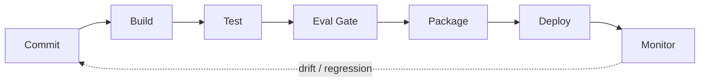

**Figure 8. DevOps Pipeline - Conflict Resolution** (mermaid). Figure: DevOps Pipeline view for Multi-Agent Systems. This diagram illustrates the principal components and their interactions as discussed in the surrounding section.

## Deep Dive: Mechanics, Variants and Trade-offs

Having established the essentials, we now go deeper into conflict resolution. The underlying mechanism is best appreciated by tracing a single request from input to output and noting where state is created and consumed. The distinctions in this section are the ones that separate a working demo from a system that holds up under adversarial inputs, scale and the passage of time.

Consider the principal variants and how to choose between them. Each variant optimises for a different point in the design space - some for latency, some for accuracy, some for cost or operability - and the correct choice follows from explicit requirements rather than from defaults. Latency, accuracy and cost form a tension triangle: improving one typically pressures the others, so explicit budgets are essential.

In practice this is supported by a mature tooling ecosystem, including AutoGen, CrewAI, LangGraph, MetaGPT. Tools accelerate the work but do not substitute for understanding: the same principles apply whichever implementation you select, and the ability to reason from first principles is what lets you debug when a tool behaves unexpectedly.

A frequent source of subtle bugs is the interaction with why multiple agents. Because why multiple agents concerns specialisation, parallelism and separation of concerns, changes there can silently alter the behaviour analysed here. The remedy is contract tests at the boundary and end-to-end evaluations that exercise the interaction explicitly.

Finally, attend to edge cases and degradation. Define what the system should do under partial failure, unexpected inputs and load spikes, and make that behaviour explicit and tested rather than emergent. Graceful degradation - returning a safe, useful result when the ideal one is unavailable - is a hallmark of mature engineering.

For deeper study, the literature offers authoritative treatments such as Wu et al. — AutoGen (2023) and Du et al. — Improving Factuality via Multi-Agent Debate (2023). These primary sources reward careful reading and ground the practical guidance above in established results.

## Advanced Considerations

Having established the essentials, we now go deeper into conflict resolution. Beneath the abstraction lies a concrete process whose steps can each be measured, tested and optimised independently. The distinctions in this section are the ones that separate a working demo from a system that holds up under adversarial inputs, scale and the passage of time.

Consider the principal variants and how to choose between them. Each variant optimises for a different point in the design space - some for latency, some for accuracy, some for cost or operability - and the correct choice follows from explicit requirements rather than from defaults. As with most architectural decisions, the choice is rarely binary; the skill lies in quantifying the trade-offs and choosing deliberately.

In practice this is supported by a mature tooling ecosystem, including AutoGen, CrewAI, LangGraph, MetaGPT. Tools accelerate the work but do not substitute for understanding: the same principles apply whichever implementation you select, and the ability to reason from first principles is what lets you debug when a tool behaves unexpectedly.

A frequent source of subtle bugs is the interaction with debate and consensus. Because debate and consensus concerns multi-agent debate, voting and critique for quality, changes there can silently alter the behaviour analysed here. The remedy is contract tests at the boundary and end-to-end evaluations that exercise the interaction explicitly.

Finally, attend to edge cases and degradation. Define what the system should do under partial failure, unexpected inputs and load spikes, and make that behaviour explicit and tested rather than emergent. Graceful degradation - returning a safe, useful result when the ideal one is unavailable - is a hallmark of mature engineering.

For deeper study, the literature offers authoritative treatments such as Wu et al. — AutoGen (2023) and Du et al. — Improving Factuality via Multi-Agent Debate (2023). These primary sources reward careful reading and ground the practical guidance above in established results.

## Worked Example

To ground the discussion, walk through a representative example. A research organisation needs specialised retrieval, analysis and writing agents. They decide to apply conflict resolution as part of their Multi-Agent Systems solution, but wisely treat it as a hypothesis to be validated rather than a foregone conclusion.

The team begins by stating the objective precisely and defining how success will be measured before writing any code. They establish a small but representative evaluation set, agree on acceptance thresholds, and only then prototype the simplest design that could work. Early measurement reveals which assumptions hold and which must be revised, saving weeks of misdirected effort and surfacing edge cases while they are still cheap to fix.

As the prototype matures into a service, the team hardens it: adding input validation, error handling, caching where it pays off, and monitoring that ties back to the original success metric. They document each significant decision in an architecture decision record so that future maintainers understand not just what was built but why.

The outcome is instructive. The system that reaches production is not the most sophisticated design the team considered, but the one whose behaviour they could measure, explain and operate. This is the recurring lesson of Multi-Agent Systems: durable value comes from the whole system, not from any single clever component.

## Industry Use Cases

Across industries, the ideas in this chapter recur in recognisable ways. The following vignettes show how different sectors apply them and what they have in common.

**Software.** Planner, coder, reviewer and tester agents collaborating. The common thread is that value comes not from the model alone but from the surrounding system - data quality, evaluation, integration and operations - which is precisely where most of the engineering effort belongs.

**Research.** Specialised retrieval, analysis and writing agents. The common thread is that value comes not from the model alone but from the surrounding system - data quality, evaluation, integration and operations - which is precisely where most of the engineering effort belongs.

**Operations.** Coordinated agents across monitoring and remediation. The common thread is that value comes not from the model alone but from the surrounding system - data quality, evaluation, integration and operations - which is precisely where most of the engineering effort belongs.

**Simulation.** Agent-based modelling of markets and organisations. The common thread is that value comes not from the model alone but from the surrounding system - data quality, evaluation, integration and operations - which is precisely where most of the engineering effort belongs.

## Best Practices

The following practices consistently separate successful Multi-Agent Systems efforts from struggling ones. They are deliberately concrete so they can be adopted as checklist items in design and code review.

- Give each agent a narrow, well-specified role.
- Use structured messages and explicit handoff contracts.
- Enforce global budgets to prevent multiplicative cost blow-ups.
- Trace cross-agent interactions for debugging.

None of these are exotic; they are the unglamorous disciplines that compound into reliability. The cost of adopting them is small compared with the cost of the incidents they prevent, and they become second nature with practice.

## Common Pitfalls

Equally instructive are the failure modes that recur in practice. Each pitfall below has a clear early warning sign and a known remedy, so treat them as a diagnostic checklist when something feels wrong:

- Agents talking in circles without convergence.
- Combinatorial cost growth across many agents.
- Unclear ownership leading to duplicated or conflicting actions.
- Emergent failures that are hard to reproduce.

The pattern is consistent: most failures stem from skipping measurement, conflating prototype and production standards, or deferring cross-cutting concerns such as security and cost until they become emergencies. Naming these traps in advance is the cheapest way to avoid them.

## Governance, Security and Cost Notes

No discussion of conflict resolution is complete without its governance, security and cost dimensions, which are too often deferred until they become emergencies. Treating them as first-class concerns from the outset is both cheaper and safer.

**Governance.** Classify the risk of this capability, document its intended and out-of-scope uses, and ensure decisions are traceable to satisfy internal policy and external regulation such as the NIST AI RMF, ISO/IEC 42001 and the EU AI Act. **Security.** Treat all external input as untrusted, validate outputs before acting on them, apply least privilege to any tools or data access, and map controls to the OWASP LLM Top 10 and MITRE ATLAS.

**Cost and sustainability.** Establish explicit budgets for compute, tokens and latency, attribute spend to owners, and revisit the economics as usage scales - a design that is affordable at pilot scale can become untenable at production volume. Building these reflexes into everyday engineering is what allows a Multi-Agent Systems system to be not only capable but also trustworthy and economically sound.

## Hands-On Exercises

Work through the following exercises. They are designed to move understanding from recognition to application - the level required for real engineering work - so prefer writing and building over merely reading.

1. Explain conflict resolution to a colleague unfamiliar with Multi-Agent Systems, using a concrete example from your own domain.
2. Sketch a reference architecture that incorporates conflict resolution and annotate where observability, security and cost controls belong.
3. Design an evaluation that would tell you whether conflict resolution is working in production, including the metric, the dataset and the acceptance threshold.
4. Identify two pitfalls relevant to conflict resolution in your environment and describe the early warning signals you would monitor.
5. Prototype the simplest implementation that demonstrates conflict resolution, then list exactly what would need to change to make it production-ready.

## Key Takeaways

Key takeaways from this chapter:

- Conflict Resolution is a systems concern in Multi-Agent Systems: data, models and operations must be co-designed.
- Measurement is non-negotiable; define success metrics and evaluation before building.
- Favour the simplest design that meets the requirement, and add complexity only when evidence demands it.
- Security, cost and observability are first-class requirements, not afterthoughts.
- Document decisions so the system remains understandable and operable as it evolves.

## Code Walkthrough

Pipelines keep Conflict Resolution logic modular and testable. Each stage is a pure function, errors are captured per item, and the composition is trivial to extend or reorder.

The full listing is shown below; study it line by line and reproduce it locally before moving on.

### Listing: A composable processing pipeline for Conflict Resolution

```python
from collections.abc import Iterable, Iterator
from typing import Protocol


class Stage(Protocol):
    def __call__(self, item: dict) -> dict: ...


def pipeline(stages: list[Stage]) -> Stage:
    """Compose ordered stages into a single callable for Conflict Resolution."""

    def run(item: dict) -> dict:
        for stage in stages:
            item = stage(item)
        return item

    return run


def validate(item: dict) -> dict:
    if "text" not in item:
        raise ValueError("missing required field: text")
    return item


def normalise(item: dict) -> dict:
    item["text"] = item["text"].strip().lower()
    return item


def enrich(item: dict) -> dict:
    item["length"] = len(item["text"])
    return item


process = pipeline([validate, normalise, enrich])


def run_batch(items: Iterable[dict]) -> Iterator[dict]:
    for item in items:
        try:
            yield process(dict(item))
        except ValueError as exc:
            yield {"error": str(exc), "item": item}

```

## Review Questions

1. In the context of Multi-Agent Systems, which statement best describes “Conflict Resolution”?
   - A. Handling disagreement and contradictory actions.
   - B. It removes all security and governance requirements.
   - C. It eliminates the need for any evaluation or monitoring.
   - D. It applies exclusively to image data.
   - **Answer: A.** Conflict Resolution: Handling disagreement and contradictory actions.
2. Which of the following is a recommended best practice when working with Multi-Agent Systems?
   - A. It eliminates the need for any evaluation or monitoring.
   - B. Trace cross-agent interactions for debugging.
   - C. It removes all security and governance requirements.
   - D. Combinatorial cost growth across many agents.
   - **Answer: B.** Best practice: Trace cross-agent interactions for debugging.
3. Which of the following is a common pitfall to avoid in Multi-Agent Systems?
   - A. Trace cross-agent interactions for debugging.
   - B. It makes the system slower but has no other effect.
   - C. Give each agent a narrow, well-specified role.
   - D. Combinatorial cost growth across many agents.
   - **Answer: D.** Pitfall to avoid: Combinatorial cost growth across many agents.
4. *(Discussion)* Describe a failure mode of Conflict Resolution and how you would mitigate it.
   - **Model answer:** A strong answer defines conflict resolution (Handling disagreement and contradictory actions.) then connects it to architecture, evaluation, cost, security and operations for Multi-Agent Systems, citing concrete trade-offs and a real-world example.

---


# Chapter 8. Tool and Resource Contention

_This chapter examines tool and resource contention within Multi-Agent Systems. It covers coordinating access to shared external systems, derives a reference architecture, walks through a worked example and runnable code, surveys industry use cases, and distils best practices and pitfalls, closing with exercises and review questions._

## Introduction

Tool and Resource Contention can be characterised as coordinating access to shared external systems. It is foundational: later capabilities in Multi-Agent Systems are built directly on top of it. The practical implication is that design choices here ripple through latency, cost and maintainability for the lifetime of the system.

This chapter builds intuition first, then formalises the ideas, derives an architecture, and finishes with code, exercises and review questions so the material transfers directly to your own Multi-Agent Systems work. Read it actively: pause at each diagram, reproduce the code, and attempt the exercises before consulting the answers.

## Theory and Foundations

Tool and Resource Contention can be characterised as coordinating access to shared external systems. It helps to separate the conceptual model from its implementation: the former guides reasoning, the latter must contend with real-world constraints. Mechanically, the behaviour emerges from a few interacting parts that are simpler than the whole they produce.

To place this in context, recall the broader picture: Multi-agent systems decompose complex goals across specialised agents that communicate, coordinate and sometimes debate to produce better outcomes than a single agent. Within that picture, tool and resource contention is one of the load-bearing ideas - the kind that, when understood deeply, makes the rest of Multi-Agent Systems fall into place. This concept recurs throughout the Multi-Agent Systems lifecycle, from design to operations.

Tool and Resource Contention cannot be understood in isolation from debate and consensus. Recall that debate and consensus concerns multi-agent debate, voting and critique for quality. The two interact directly: decisions in one constrain the design space of the other, which is why mature teams reason about them together rather than sequentially. Latency, accuracy and cost form a tension triangle: improving one typically pressures the others, so explicit budgets are essential.

Tool and Resource Contention cannot be understood in isolation from communication protocols. Recall that communication protocols concerns message passing, shared blackboards and structured handoffs. The two interact directly: decisions in one constrain the design space of the other, which is why mature teams reason about them together rather than sequentially. Every added component buys capability at the price of operational surface area, and that bargain should be made consciously.

Several established patterns apply directly to tool and resource contention. The first, debate-and-judge for high-stakes decisions, is widely adopted because it makes the system's behaviour predictable and observable. A complementary pattern, sequential pipeline of specialised agents, addresses a related concern and is often deployed alongside it. Patterns are not dogma; they are distilled experience that shortcuts the search for a sound design, and each carries assumptions worth checking against your context.

It is worth being explicit about when to apply this and when to reach for something simpler. In a small prototype, shortcuts around tool and resource contention are invisible; in a production Multi-Agent Systems system serving real traffic, they surface as incidents, cost overruns or compliance gaps. Every added component buys capability at the price of operational surface area, and that bargain should be made consciously. The remainder of this chapter turns these principles into an architecture, code and a checklist you can apply immediately.

## Architecture and Design

The reference architecture for Tool and Resource Contention separates concerns into clearly bounded components with explicit contracts. A multi-agent platform uses a supervisor/orchestrator that routes subtasks to specialised worker agents, a shared state store for coordination, a message bus for structured communication, and global guardrails enforcing budgets and permissions. Distributed tracing stitches together cross-agent trajectories.

Concretely, the principal building blocks include why multiple agents, agent roles and topologies, communication protocols, orchestration and routing and shared memory and state. Each is a replaceable component behind a stable interface, so the team can upgrade an implementation - a model, an index, a policy engine - without rewriting its neighbours. The contracts between components are where reliability is won or lost, so they are specified explicitly and tested in isolation.

The diagram accompanying this section makes the data and control flow explicit. Requests enter through a well-defined boundary where they are authenticated and validated; only then are they dispatched to the components that perform the work. This boundary is also where rate limiting, quota enforcement and audit logging live, keeping cross-cutting concerns out of the core logic and in one auditable place.

Two qualities deserve emphasis. First, observability is designed in, not bolted on: every component emits structured telemetry so that failures can be localised in minutes rather than hours. Second, the architecture is evolvable - components communicate through stable contracts so that any single part of the Multi-Agent Systems system can be replaced without a rewrite. Simplicity is a feature. The simplest design that meets the requirement should be the default, with complexity added only when measurement justifies it.

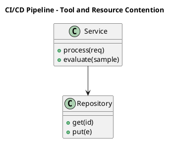

_Source diagram (plantuml); render with the appropriate tool._

**Figure 9. CI/CD Pipeline - Tool and Resource Contention** (plantuml). Figure: CI/CD Pipeline view for Multi-Agent Systems. This diagram illustrates the principal components and their interactions as discussed in the surrounding section.

## Deep Dive: Mechanics, Variants and Trade-offs

Having established the essentials, we now go deeper into tool and resource contention. The underlying mechanism is best appreciated by tracing a single request from input to output and noting where state is created and consumed. The distinctions in this section are the ones that separate a working demo from a system that holds up under adversarial inputs, scale and the passage of time.

Consider the principal variants and how to choose between them. Each variant optimises for a different point in the design space - some for latency, some for accuracy, some for cost or operability - and the correct choice follows from explicit requirements rather than from defaults. As with most architectural decisions, the choice is rarely binary; the skill lies in quantifying the trade-offs and choosing deliberately.

In practice this is supported by a mature tooling ecosystem, including AutoGen, CrewAI, LangGraph, MetaGPT. Tools accelerate the work but do not substitute for understanding: the same principles apply whichever implementation you select, and the ability to reason from first principles is what lets you debug when a tool behaves unexpectedly.

A frequent source of subtle bugs is the interaction with debate and consensus. Because debate and consensus concerns multi-agent debate, voting and critique for quality, changes there can silently alter the behaviour analysed here. The remedy is contract tests at the boundary and end-to-end evaluations that exercise the interaction explicitly.

Finally, attend to edge cases and degradation. Define what the system should do under partial failure, unexpected inputs and load spikes, and make that behaviour explicit and tested rather than emergent. Graceful degradation - returning a safe, useful result when the ideal one is unavailable - is a hallmark of mature engineering.

For deeper study, the literature offers authoritative treatments such as Wu et al. — AutoGen (2023) and Du et al. — Improving Factuality via Multi-Agent Debate (2023). These primary sources reward careful reading and ground the practical guidance above in established results.

## Advanced Considerations

Having established the essentials, we now go deeper into tool and resource contention. It pays to understand the mechanism rather than treat it as a black box, because most production incidents are explained by one of its steps misbehaving. The distinctions in this section are the ones that separate a working demo from a system that holds up under adversarial inputs, scale and the passage of time.

Consider the principal variants and how to choose between them. Each variant optimises for a different point in the design space - some for latency, some for accuracy, some for cost or operability - and the correct choice follows from explicit requirements rather than from defaults. As with most architectural decisions, the choice is rarely binary; the skill lies in quantifying the trade-offs and choosing deliberately.

In practice this is supported by a mature tooling ecosystem, including AutoGen, CrewAI, LangGraph, MetaGPT. Tools accelerate the work but do not substitute for understanding: the same principles apply whichever implementation you select, and the ability to reason from first principles is what lets you debug when a tool behaves unexpectedly.

A frequent source of subtle bugs is the interaction with debate and consensus. Because debate and consensus concerns multi-agent debate, voting and critique for quality, changes there can silently alter the behaviour analysed here. The remedy is contract tests at the boundary and end-to-end evaluations that exercise the interaction explicitly.

Finally, attend to edge cases and degradation. Define what the system should do under partial failure, unexpected inputs and load spikes, and make that behaviour explicit and tested rather than emergent. Graceful degradation - returning a safe, useful result when the ideal one is unavailable - is a hallmark of mature engineering.

For deeper study, the literature offers authoritative treatments such as Wu et al. — AutoGen (2023) and Du et al. — Improving Factuality via Multi-Agent Debate (2023). These primary sources reward careful reading and ground the practical guidance above in established results.

## Worked Example

To ground the discussion, walk through a representative example. A operations organisation needs coordinated agents across monitoring and remediation. They decide to apply tool and resource contention as part of their Multi-Agent Systems solution, but wisely treat it as a hypothesis to be validated rather than a foregone conclusion.

The team begins by stating the objective precisely and defining how success will be measured before writing any code. They establish a small but representative evaluation set, agree on acceptance thresholds, and only then prototype the simplest design that could work. Early measurement reveals which assumptions hold and which must be revised, saving weeks of misdirected effort and surfacing edge cases while they are still cheap to fix.

As the prototype matures into a service, the team hardens it: adding input validation, error handling, caching where it pays off, and monitoring that ties back to the original success metric. They document each significant decision in an architecture decision record so that future maintainers understand not just what was built but why.

The outcome is instructive. The system that reaches production is not the most sophisticated design the team considered, but the one whose behaviour they could measure, explain and operate. This is the recurring lesson of Multi-Agent Systems: durable value comes from the whole system, not from any single clever component.

## Industry Use Cases

Across industries, the ideas in this chapter recur in recognisable ways. The following vignettes show how different sectors apply them and what they have in common.

**Software.** Planner, coder, reviewer and tester agents collaborating. The common thread is that value comes not from the model alone but from the surrounding system - data quality, evaluation, integration and operations - which is precisely where most of the engineering effort belongs.

**Research.** Specialised retrieval, analysis and writing agents. The common thread is that value comes not from the model alone but from the surrounding system - data quality, evaluation, integration and operations - which is precisely where most of the engineering effort belongs.

**Operations.** Coordinated agents across monitoring and remediation. The common thread is that value comes not from the model alone but from the surrounding system - data quality, evaluation, integration and operations - which is precisely where most of the engineering effort belongs.

**Simulation.** Agent-based modelling of markets and organisations. The common thread is that value comes not from the model alone but from the surrounding system - data quality, evaluation, integration and operations - which is precisely where most of the engineering effort belongs.

## Best Practices

The following practices consistently separate successful Multi-Agent Systems efforts from struggling ones. They are deliberately concrete so they can be adopted as checklist items in design and code review.

- Give each agent a narrow, well-specified role.
- Use structured messages and explicit handoff contracts.
- Enforce global budgets to prevent multiplicative cost blow-ups.
- Trace cross-agent interactions for debugging.

None of these are exotic; they are the unglamorous disciplines that compound into reliability. The cost of adopting them is small compared with the cost of the incidents they prevent, and they become second nature with practice.

## Common Pitfalls

Equally instructive are the failure modes that recur in practice. Each pitfall below has a clear early warning sign and a known remedy, so treat them as a diagnostic checklist when something feels wrong:

- Agents talking in circles without convergence.
- Combinatorial cost growth across many agents.
- Unclear ownership leading to duplicated or conflicting actions.
- Emergent failures that are hard to reproduce.

The pattern is consistent: most failures stem from skipping measurement, conflating prototype and production standards, or deferring cross-cutting concerns such as security and cost until they become emergencies. Naming these traps in advance is the cheapest way to avoid them.

## Governance, Security and Cost Notes

No discussion of tool and resource contention is complete without its governance, security and cost dimensions, which are too often deferred until they become emergencies. Treating them as first-class concerns from the outset is both cheaper and safer.

**Governance.** Classify the risk of this capability, document its intended and out-of-scope uses, and ensure decisions are traceable to satisfy internal policy and external regulation such as the NIST AI RMF, ISO/IEC 42001 and the EU AI Act. **Security.** Treat all external input as untrusted, validate outputs before acting on them, apply least privilege to any tools or data access, and map controls to the OWASP LLM Top 10 and MITRE ATLAS.

**Cost and sustainability.** Establish explicit budgets for compute, tokens and latency, attribute spend to owners, and revisit the economics as usage scales - a design that is affordable at pilot scale can become untenable at production volume. Building these reflexes into everyday engineering is what allows a Multi-Agent Systems system to be not only capable but also trustworthy and economically sound.

## Hands-On Exercises

Work through the following exercises. They are designed to move understanding from recognition to application - the level required for real engineering work - so prefer writing and building over merely reading.

1. Explain tool and resource contention to a colleague unfamiliar with Multi-Agent Systems, using a concrete example from your own domain.
2. Sketch a reference architecture that incorporates tool and resource contention and annotate where observability, security and cost controls belong.
3. Design an evaluation that would tell you whether tool and resource contention is working in production, including the metric, the dataset and the acceptance threshold.
4. Identify two pitfalls relevant to tool and resource contention in your environment and describe the early warning signals you would monitor.
5. Prototype the simplest implementation that demonstrates tool and resource contention, then list exactly what would need to change to make it production-ready.

## Key Takeaways

Key takeaways from this chapter:

- Tool and Resource Contention is a systems concern in Multi-Agent Systems: data, models and operations must be co-designed.
- Measurement is non-negotiable; define success metrics and evaluation before building.
- Favour the simplest design that meets the requirement, and add complexity only when evidence demands it.
- Security, cost and observability are first-class requirements, not afterthoughts.
- Document decisions so the system remains understandable and operable as it evolves.

## Code Walkthrough

Every change to a Multi-Agent Systems system should pass an evaluation gate. This example shows the minimal shape: align predictions and references, compute a metric, and return a pass/fail decision for CI.

The full listing is shown below; study it line by line and reproduce it locally before moving on.

### Listing: Evaluating Tool and Resource Contention with a regression gate

```python
from dataclasses import dataclass


@dataclass
class EvalResult:
    metric: str
    score: float
    passed: bool


def evaluate(predictions: list[str], references: list[str],
             threshold: float = 0.8) -> EvalResult:
    """Score Tool and Resource Contention output against references with a simple exact-match metric.

    In practice you would combine several metrics (exact match, semantic
    similarity, LLM-as-judge) and gate releases on the aggregate.
    """
    if len(predictions) != len(references):
        raise ValueError("predictions and references must align")
    hits = sum(p.strip() == r.strip() for p, r in zip(predictions, references))
    score = hits / len(references) if references else 0.0
    return EvalResult(metric="exact_match", score=score, passed=score >= threshold)


if __name__ == "__main__":
    result = evaluate(["yes", "no"], ["yes", "yes"])
    print(f"{result.metric}={result.score:.2f} passed={result.passed}")

```

## Review Questions

1. In the context of Multi-Agent Systems, which statement best describes “Tool and Resource Contention”?
   - A. Coordinating access to shared external systems.
   - B. It removes all security and governance requirements.
   - C. It applies exclusively to image data.
   - D. It guarantees deterministic output regardless of input.
   - **Answer: A.** Tool and Resource Contention: Coordinating access to shared external systems.
2. Which of the following is a recommended best practice when working with Multi-Agent Systems?
   - A. Enforce global budgets to prevent multiplicative cost blow-ups.
   - B. It is only relevant to academic research, not production.
   - C. It eliminates the need for any evaluation or monitoring.
   - D. It makes the system slower but has no other effect.
   - **Answer: A.** Best practice: Enforce global budgets to prevent multiplicative cost blow-ups.
3. Which of the following is a common pitfall to avoid in Multi-Agent Systems?
   - A. It removes all security and governance requirements.
   - B. It applies exclusively to image data.
   - C. Enforce global budgets to prevent multiplicative cost blow-ups.
   - D. Combinatorial cost growth across many agents.
   - **Answer: D.** Pitfall to avoid: Combinatorial cost growth across many agents.
4. *(Discussion)* Describe a failure mode of Tool and Resource Contention and how you would mitigate it.
   - **Model answer:** A strong answer defines tool and resource contention (Coordinating access to shared external systems.) then connects it to architecture, evaluation, cost, security and operations for Multi-Agent Systems, citing concrete trade-offs and a real-world example.

---


# Chapter 9. Emergent Behaviour and Risk

_This chapter examines emergent behaviour and risk within Multi-Agent Systems. It covers unintended dynamics and how to contain them, derives a reference architecture, walks through a worked example and runnable code, surveys industry use cases, and distils best practices and pitfalls, closing with exercises and review questions._

## Introduction

Formally, Emergent Behaviour and Risk addresses unintended dynamics and how to contain them. Understanding this matters because Multi-Agent Systems systems succeed or fail on exactly these decisions. It helps to separate the conceptual model from its implementation: the former guides reasoning, the latter must contend with real-world constraints.

This chapter builds intuition first, then formalises the ideas, derives an architecture, and finishes with code, exercises and review questions so the material transfers directly to your own Multi-Agent Systems work. Read it actively: pause at each diagram, reproduce the code, and attempt the exercises before consulting the answers.

## Theory and Foundations

At its core, Emergent Behaviour and Risk concerns unintended dynamics and how to contain them. In an enterprise setting, this translates into concrete requirements: clear interfaces, measurable quality, and controls that satisfy security and governance. Beneath the abstraction lies a concrete process whose steps can each be measured, tested and optimised independently.

To place this in context, recall the broader picture: Multi-agent systems decompose complex goals across specialised agents that communicate, coordinate and sometimes debate to produce better outcomes than a single agent. Within that picture, emergent behaviour and risk is one of the load-bearing ideas - the kind that, when understood deeply, makes the rest of Multi-Agent Systems fall into place. This concept recurs throughout the Multi-Agent Systems lifecycle, from design to operations.

Emergent Behaviour and Risk cannot be understood in isolation from agent roles and topologies. Recall that agent roles and topologies concerns hierarchical, sequential, network and market-based organisations. The two interact directly: decisions in one constrain the design space of the other, which is why mature teams reason about them together rather than sequentially. Every added component buys capability at the price of operational surface area, and that bargain should be made consciously.

Emergent Behaviour and Risk cannot be understood in isolation from observability across agents. Recall that observability across agents concerns tracing distributed agent interactions. The two interact directly: decisions in one constrain the design space of the other, which is why mature teams reason about them together rather than sequentially. There is an inherent trade-off between fidelity and cost, and the correct balance depends on the use case and its tolerance for error.

Several established patterns apply directly to emergent behaviour and risk. The first, blackboard for shared coordination state, is widely adopted because it makes the system's behaviour predictable and observable. A complementary pattern, supervisor–worker hierarchy, addresses a related concern and is often deployed alongside it. Patterns are not dogma; they are distilled experience that shortcuts the search for a sound design, and each carries assumptions worth checking against your context.

The decision of whether to adopt this should be driven by requirements, not by novelty. In a small prototype, shortcuts around emergent behaviour and risk are invisible; in a production Multi-Agent Systems system serving real traffic, they surface as incidents, cost overruns or compliance gaps. As with most architectural decisions, the choice is rarely binary; the skill lies in quantifying the trade-offs and choosing deliberately. The remainder of this chapter turns these principles into an architecture, code and a checklist you can apply immediately.

## Architecture and Design

From an architectural standpoint, Emergent Behaviour and Risk sits at the intersection of data, models and operations. A multi-agent platform uses a supervisor/orchestrator that routes subtasks to specialised worker agents, a shared state store for coordination, a message bus for structured communication, and global guardrails enforcing budgets and permissions. Distributed tracing stitches together cross-agent trajectories.

Concretely, the principal building blocks include why multiple agents, agent roles and topologies, communication protocols, orchestration and routing and shared memory and state. Each is a replaceable component behind a stable interface, so the team can upgrade an implementation - a model, an index, a policy engine - without rewriting its neighbours. The contracts between components are where reliability is won or lost, so they are specified explicitly and tested in isolation.

The diagram accompanying this section makes the data and control flow explicit. Requests enter through a well-defined boundary where they are authenticated and validated; only then are they dispatched to the components that perform the work. This boundary is also where rate limiting, quota enforcement and audit logging live, keeping cross-cutting concerns out of the core logic and in one auditable place.

Two qualities deserve emphasis. First, observability is designed in, not bolted on: every component emits structured telemetry so that failures can be localised in minutes rather than hours. Second, the architecture is evolvable - components communicate through stable contracts so that any single part of the Multi-Agent Systems system can be replaced without a rewrite. As with most architectural decisions, the choice is rarely binary; the skill lies in quantifying the trade-offs and choosing deliberately.

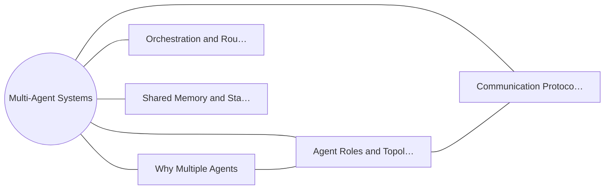

**Figure 10. Knowledge Graph - Emergent Behaviour and Risk** (mermaid). Figure: Knowledge Graph view for Multi-Agent Systems. This diagram illustrates the principal components and their interactions as discussed in the surrounding section.

<div class="diagram-svg">

<svg xmlns="http://www.w3.org/2000/svg" width="760" height="360" viewBox="0 0 760 360" font-family="Inter, Arial, sans-serif">
<rect width="760" height="360" fill="#f8fafc"/>
<text x="380" y="34" text-anchor="middle" font-size="20" font-weight="700" fill="#0f172a">Operating Model - Emergent Behaviour and Risk</text>
<rect x="290" y="162" width="180" height="56" rx="12" fill="#0f172a"/>
<text x="380" y="195" text-anchor="middle" font-size="14" font-weight="700" fill="#ffffff">Multi-Agent Systems</text>
<line x1="380" y1="190" x2="380" y2="70" stroke="#94a3b8" stroke-width="2"/>
<rect x="308" y="48" width="144" height="44" rx="10" fill="#ffffff" stroke="#2563eb" stroke-width="2"/>
<text x="380" y="74" text-anchor="middle" font-size="11" fill="#0f172a">Why Multiple Agents</text>
<line x1="380" y1="190" x2="617" y2="153" stroke="#94a3b8" stroke-width="2"/>
<rect x="545" y="131" width="144" height="44" rx="10" fill="#ffffff" stroke="#7c3aed" stroke-width="2"/>
<text x="617" y="157" text-anchor="middle" font-size="11" fill="#0f172a">Agent Roles and Top…</text>
<line x1="380" y1="190" x2="526" y2="287" stroke="#94a3b8" stroke-width="2"/>
<rect x="454" y="265" width="144" height="44" rx="10" fill="#ffffff" stroke="#0891b2" stroke-width="2"/>
<text x="526" y="291" text-anchor="middle" font-size="11" fill="#0f172a">Communication Proto…</text>
<line x1="380" y1="190" x2="234" y2="287" stroke="#94a3b8" stroke-width="2"/>
<rect x="162" y="265" width="144" height="44" rx="10" fill="#ffffff" stroke="#059669" stroke-width="2"/>
<text x="234" y="291" text-anchor="middle" font-size="11" fill="#0f172a">Orchestration and R…</text>
<line x1="380" y1="190" x2="143" y2="153" stroke="#94a3b8" stroke-width="2"/>
<rect x="71" y="131" width="144" height="44" rx="10" fill="#ffffff" stroke="#d97706" stroke-width="2"/>
<text x="143" y="157" text-anchor="middle" font-size="11" fill="#0f172a">Shared Memory and S…</text>
</svg>

</div>

**Figure 11. Operating Model - Emergent Behaviour and Risk** (svg). Figure: Operating Model view for Multi-Agent Systems. This diagram illustrates the principal components and their interactions as discussed in the surrounding section.

## Deep Dive: Mechanics, Variants and Trade-offs

Having established the essentials, we now go deeper into emergent behaviour and risk. Beneath the abstraction lies a concrete process whose steps can each be measured, tested and optimised independently. The distinctions in this section are the ones that separate a working demo from a system that holds up under adversarial inputs, scale and the passage of time.

Consider the principal variants and how to choose between them. Each variant optimises for a different point in the design space - some for latency, some for accuracy, some for cost or operability - and the correct choice follows from explicit requirements rather than from defaults. There is an inherent trade-off between fidelity and cost, and the correct balance depends on the use case and its tolerance for error.

In practice this is supported by a mature tooling ecosystem, including AutoGen, CrewAI, LangGraph, MetaGPT. Tools accelerate the work but do not substitute for understanding: the same principles apply whichever implementation you select, and the ability to reason from first principles is what lets you debug when a tool behaves unexpectedly.

A frequent source of subtle bugs is the interaction with agent roles and topologies. Because agent roles and topologies concerns hierarchical, sequential, network and market-based organisations, changes there can silently alter the behaviour analysed here. The remedy is contract tests at the boundary and end-to-end evaluations that exercise the interaction explicitly.

Finally, attend to edge cases and degradation. Define what the system should do under partial failure, unexpected inputs and load spikes, and make that behaviour explicit and tested rather than emergent. Graceful degradation - returning a safe, useful result when the ideal one is unavailable - is a hallmark of mature engineering.

For deeper study, the literature offers authoritative treatments such as Wu et al. — AutoGen (2023) and Du et al. — Improving Factuality via Multi-Agent Debate (2023). These primary sources reward careful reading and ground the practical guidance above in established results.

## Advanced Considerations

Having established the essentials, we now go deeper into emergent behaviour and risk. The underlying mechanism is best appreciated by tracing a single request from input to output and noting where state is created and consumed. The distinctions in this section are the ones that separate a working demo from a system that holds up under adversarial inputs, scale and the passage of time.

Consider the principal variants and how to choose between them. Each variant optimises for a different point in the design space - some for latency, some for accuracy, some for cost or operability - and the correct choice follows from explicit requirements rather than from defaults. Simplicity is a feature. The simplest design that meets the requirement should be the default, with complexity added only when measurement justifies it.

In practice this is supported by a mature tooling ecosystem, including AutoGen, CrewAI, LangGraph, MetaGPT. Tools accelerate the work but do not substitute for understanding: the same principles apply whichever implementation you select, and the ability to reason from first principles is what lets you debug when a tool behaves unexpectedly.

A frequent source of subtle bugs is the interaction with shared memory and state. Because shared memory and state concerns coordinating context across agents safely, changes there can silently alter the behaviour analysed here. The remedy is contract tests at the boundary and end-to-end evaluations that exercise the interaction explicitly.

Finally, attend to edge cases and degradation. Define what the system should do under partial failure, unexpected inputs and load spikes, and make that behaviour explicit and tested rather than emergent. Graceful degradation - returning a safe, useful result when the ideal one is unavailable - is a hallmark of mature engineering.

For deeper study, the literature offers authoritative treatments such as Wu et al. — AutoGen (2023) and Du et al. — Improving Factuality via Multi-Agent Debate (2023). These primary sources reward careful reading and ground the practical guidance above in established results.

## Worked Example

A worked example clarifies how these ideas behave in practice. A operations organisation needs coordinated agents across monitoring and remediation. They decide to apply emergent behaviour and risk as part of their Multi-Agent Systems solution, but wisely treat it as a hypothesis to be validated rather than a foregone conclusion.

The team begins by stating the objective precisely and defining how success will be measured before writing any code. They establish a small but representative evaluation set, agree on acceptance thresholds, and only then prototype the simplest design that could work. Early measurement reveals which assumptions hold and which must be revised, saving weeks of misdirected effort and surfacing edge cases while they are still cheap to fix.

As the prototype matures into a service, the team hardens it: adding input validation, error handling, caching where it pays off, and monitoring that ties back to the original success metric. They document each significant decision in an architecture decision record so that future maintainers understand not just what was built but why.

The outcome is instructive. The system that reaches production is not the most sophisticated design the team considered, but the one whose behaviour they could measure, explain and operate. This is the recurring lesson of Multi-Agent Systems: durable value comes from the whole system, not from any single clever component.

## Industry Use Cases

Across industries, the ideas in this chapter recur in recognisable ways. The following vignettes show how different sectors apply them and what they have in common.

**Software.** Planner, coder, reviewer and tester agents collaborating. The common thread is that value comes not from the model alone but from the surrounding system - data quality, evaluation, integration and operations - which is precisely where most of the engineering effort belongs.

**Research.** Specialised retrieval, analysis and writing agents. The common thread is that value comes not from the model alone but from the surrounding system - data quality, evaluation, integration and operations - which is precisely where most of the engineering effort belongs.

**Operations.** Coordinated agents across monitoring and remediation. The common thread is that value comes not from the model alone but from the surrounding system - data quality, evaluation, integration and operations - which is precisely where most of the engineering effort belongs.

**Simulation.** Agent-based modelling of markets and organisations. The common thread is that value comes not from the model alone but from the surrounding system - data quality, evaluation, integration and operations - which is precisely where most of the engineering effort belongs.

## Best Practices

The following practices consistently separate successful Multi-Agent Systems efforts from struggling ones. They are deliberately concrete so they can be adopted as checklist items in design and code review.

- Give each agent a narrow, well-specified role.
- Use structured messages and explicit handoff contracts.
- Enforce global budgets to prevent multiplicative cost blow-ups.
- Trace cross-agent interactions for debugging.

None of these are exotic; they are the unglamorous disciplines that compound into reliability. The cost of adopting them is small compared with the cost of the incidents they prevent, and they become second nature with practice.

## Common Pitfalls

Equally instructive are the failure modes that recur in practice. Each pitfall below has a clear early warning sign and a known remedy, so treat them as a diagnostic checklist when something feels wrong:

- Agents talking in circles without convergence.
- Combinatorial cost growth across many agents.
- Unclear ownership leading to duplicated or conflicting actions.
- Emergent failures that are hard to reproduce.

The pattern is consistent: most failures stem from skipping measurement, conflating prototype and production standards, or deferring cross-cutting concerns such as security and cost until they become emergencies. Naming these traps in advance is the cheapest way to avoid them.

## Governance, Security and Cost Notes

No discussion of emergent behaviour and risk is complete without its governance, security and cost dimensions, which are too often deferred until they become emergencies. Treating them as first-class concerns from the outset is both cheaper and safer.

**Governance.** Classify the risk of this capability, document its intended and out-of-scope uses, and ensure decisions are traceable to satisfy internal policy and external regulation such as the NIST AI RMF, ISO/IEC 42001 and the EU AI Act. **Security.** Treat all external input as untrusted, validate outputs before acting on them, apply least privilege to any tools or data access, and map controls to the OWASP LLM Top 10 and MITRE ATLAS.

**Cost and sustainability.** Establish explicit budgets for compute, tokens and latency, attribute spend to owners, and revisit the economics as usage scales - a design that is affordable at pilot scale can become untenable at production volume. Building these reflexes into everyday engineering is what allows a Multi-Agent Systems system to be not only capable but also trustworthy and economically sound.

## Hands-On Exercises

Work through the following exercises. They are designed to move understanding from recognition to application - the level required for real engineering work - so prefer writing and building over merely reading.

1. Explain emergent behaviour and risk to a colleague unfamiliar with Multi-Agent Systems, using a concrete example from your own domain.
2. Sketch a reference architecture that incorporates emergent behaviour and risk and annotate where observability, security and cost controls belong.
3. Design an evaluation that would tell you whether emergent behaviour and risk is working in production, including the metric, the dataset and the acceptance threshold.
4. Identify two pitfalls relevant to emergent behaviour and risk in your environment and describe the early warning signals you would monitor.
5. Prototype the simplest implementation that demonstrates emergent behaviour and risk, then list exactly what would need to change to make it production-ready.

## Key Takeaways

Key takeaways from this chapter:

- Emergent Behaviour and Risk is a systems concern in Multi-Agent Systems: data, models and operations must be co-designed.
- Measurement is non-negotiable; define success metrics and evaluation before building.
- Favour the simplest design that meets the requirement, and add complexity only when evidence demands it.
- Security, cost and observability are first-class requirements, not afterthoughts.
- Document decisions so the system remains understandable and operable as it evolves.

## Code Walkthrough

This listing shows a configuration-driven Emergent Behaviour and Risk component with retry semantics and typed interfaces — the shape we expect from production Multi-Agent Systems code rather than a notebook prototype.

The full listing is shown below; study it line by line and reproduce it locally before moving on.

### Listing: Implementing a Emergent Behaviour and Risk component

```python
from __future__ import annotations

from dataclasses import dataclass, field
from typing import Any


@dataclass(slots=True)
class EmergentBehaviourAndConfig:
    """Configuration for the Emergent Behaviour and Risk component in a Multi-Agent Systems system."""

    name: str
    timeout_s: float = 30.0
    max_retries: int = 3
    options: dict[str, Any] = field(default_factory=dict)


class EmergentBehaviourAnd:
    """A minimal, production-shaped implementation of Emergent Behaviour and Risk."""

    def __init__(self, config: EmergentBehaviourAndConfig) -> None:
        self._config = config
        self._calls = 0

    def run(self, payload: dict[str, Any]) -> dict[str, Any]:
        """Process a request, retrying transient failures with backoff."""
        last_error: Exception | None = None
        for attempt in range(self._config.max_retries):
            try:
                self._calls += 1
                return self._process(payload)
            except TimeoutError as exc:  # transient
                last_error = exc
                continue
        raise RuntimeError(f"EmergentBehaviourAnd failed after retries") from last_error

    def _process(self, payload: dict[str, Any]) -> dict[str, Any]:
        # Domain-specific logic for Emergent Behaviour and Risk goes here.
        return {"status": "ok", "input_keys": sorted(payload), "calls": self._calls}

```

## Review Questions

1. In the context of Multi-Agent Systems, which statement best describes “Emergent Behaviour and Risk”?
   - A. Unintended dynamics and how to contain them.
   - B. It eliminates the need for any evaluation or monitoring.
   - C. It makes the system slower but has no other effect.
   - D. It applies exclusively to image data.
   - **Answer: A.** Emergent Behaviour and Risk: Unintended dynamics and how to contain them.
2. Which of the following is a recommended best practice when working with Multi-Agent Systems?
   - A. Unclear ownership leading to duplicated or conflicting actions.
   - B. It makes the system slower but has no other effect.
   - C. It removes all security and governance requirements.
   - D. Trace cross-agent interactions for debugging.
   - **Answer: D.** Best practice: Trace cross-agent interactions for debugging.
3. Which of the following is a common pitfall to avoid in Multi-Agent Systems?
   - A. Enforce global budgets to prevent multiplicative cost blow-ups.
   - B. It makes the system slower but has no other effect.
   - C. Trace cross-agent interactions for debugging.
   - D. Combinatorial cost growth across many agents.
   - **Answer: D.** Pitfall to avoid: Combinatorial cost growth across many agents.
4. *(Discussion)* Walk through how you would design Emergent Behaviour and Risk for an enterprise Multi-Agent Systems workload.
   - **Model answer:** A strong answer defines emergent behaviour and risk (Unintended dynamics and how to contain them.) then connects it to architecture, evaluation, cost, security and operations for Multi-Agent Systems, citing concrete trade-offs and a real-world example.

---


# Chapter 10. Evaluating Multi-Agent Systems

_This chapter examines evaluating multi-agent systems within Multi-Agent Systems. It covers end-to-end task success and per-agent contribution, derives a reference architecture, walks through a worked example and runnable code, surveys industry use cases, and distils best practices and pitfalls, closing with exercises and review questions._

## Introduction

We define Evaluating Multi-Agent Systems as end-to-end task success and per-agent contribution. Understanding this matters because Multi-Agent Systems systems succeed or fail on exactly these decisions. What distinguishes a production-grade approach from a prototype is the discipline of measurement: every claim is backed by an evaluation rather than intuition.

This chapter builds intuition first, then formalises the ideas, derives an architecture, and finishes with code, exercises and review questions so the material transfers directly to your own Multi-Agent Systems work. Read it actively: pause at each diagram, reproduce the code, and attempt the exercises before consulting the answers.

## Theory and Foundations

In practical terms, Evaluating Multi-Agent Systems is best understood as end-to-end task success and per-agent contribution. In an enterprise setting, this translates into concrete requirements: clear interfaces, measurable quality, and controls that satisfy security and governance. It pays to understand the mechanism rather than treat it as a black box, because most production incidents are explained by one of its steps misbehaving.

To place this in context, recall the broader picture: Multi-agent systems decompose complex goals across specialised agents that communicate, coordinate and sometimes debate to produce better outcomes than a single agent. Within that picture, evaluating multi-agent systems is one of the load-bearing ideas - the kind that, when understood deeply, makes the rest of Multi-Agent Systems fall into place. Teams that master this consistently ship more reliable Multi-Agent Systems systems at lower cost.

Evaluating Multi-Agent Systems cannot be understood in isolation from tool and resource contention. Recall that tool and resource contention concerns coordinating access to shared external systems. The two interact directly: decisions in one constrain the design space of the other, which is why mature teams reason about them together rather than sequentially. Simplicity is a feature. The simplest design that meets the requirement should be the default, with complexity added only when measurement justifies it.

Evaluating Multi-Agent Systems cannot be understood in isolation from emergent behaviour and risk. Recall that emergent behaviour and risk concerns unintended dynamics and how to contain them. The two interact directly: decisions in one constrain the design space of the other, which is why mature teams reason about them together rather than sequentially. Every added component buys capability at the price of operational surface area, and that bargain should be made consciously.

Several established patterns apply directly to evaluating multi-agent systems. The first, debate-and-judge for high-stakes decisions, is widely adopted because it makes the system's behaviour predictable and observable. A complementary pattern, supervisor–worker hierarchy, addresses a related concern and is often deployed alongside it. Patterns are not dogma; they are distilled experience that shortcuts the search for a sound design, and each carries assumptions worth checking against your context.

It is worth being explicit about when to apply this and when to reach for something simpler. In a small prototype, shortcuts around evaluating multi-agent systems are invisible; in a production Multi-Agent Systems system serving real traffic, they surface as incidents, cost overruns or compliance gaps. As with most architectural decisions, the choice is rarely binary; the skill lies in quantifying the trade-offs and choosing deliberately. The remainder of this chapter turns these principles into an architecture, code and a checklist you can apply immediately.

## Architecture and Design

The reference architecture for Evaluating Multi-Agent Systems separates concerns into clearly bounded components with explicit contracts. A multi-agent platform uses a supervisor/orchestrator that routes subtasks to specialised worker agents, a shared state store for coordination, a message bus for structured communication, and global guardrails enforcing budgets and permissions. Distributed tracing stitches together cross-agent trajectories.

Concretely, the principal building blocks include why multiple agents, agent roles and topologies, communication protocols, orchestration and routing and shared memory and state. Each is a replaceable component behind a stable interface, so the team can upgrade an implementation - a model, an index, a policy engine - without rewriting its neighbours. The contracts between components are where reliability is won or lost, so they are specified explicitly and tested in isolation.

The diagram accompanying this section makes the data and control flow explicit. Requests enter through a well-defined boundary where they are authenticated and validated; only then are they dispatched to the components that perform the work. This boundary is also where rate limiting, quota enforcement and audit logging live, keeping cross-cutting concerns out of the core logic and in one auditable place.

Two qualities deserve emphasis. First, observability is designed in, not bolted on: every component emits structured telemetry so that failures can be localised in minutes rather than hours. Second, the architecture is evolvable - components communicate through stable contracts so that any single part of the Multi-Agent Systems system can be replaced without a rewrite. Latency, accuracy and cost form a tension triangle: improving one typically pressures the others, so explicit budgets are essential.

<div class="diagram-svg">

<svg xmlns="http://www.w3.org/2000/svg" width="760" height="360" viewBox="0 0 760 360" font-family="Inter, Arial, sans-serif">
<rect width="760" height="360" fill="#f8fafc"/>
<text x="380" y="34" text-anchor="middle" font-size="20" font-weight="700" fill="#0f172a">Operating Model - Evaluating Multi-Agent Systems</text>
<rect x="290" y="162" width="180" height="56" rx="12" fill="#0f172a"/>
<text x="380" y="195" text-anchor="middle" font-size="14" font-weight="700" fill="#ffffff">Multi-Agent Systems</text>
<line x1="380" y1="190" x2="380" y2="70" stroke="#94a3b8" stroke-width="2"/>
<rect x="308" y="48" width="144" height="44" rx="10" fill="#ffffff" stroke="#2563eb" stroke-width="2"/>
<text x="380" y="74" text-anchor="middle" font-size="11" fill="#0f172a">Why Multiple Agents</text>
<line x1="380" y1="190" x2="617" y2="153" stroke="#94a3b8" stroke-width="2"/>
<rect x="545" y="131" width="144" height="44" rx="10" fill="#ffffff" stroke="#7c3aed" stroke-width="2"/>
<text x="617" y="157" text-anchor="middle" font-size="11" fill="#0f172a">Agent Roles and Top…</text>
<line x1="380" y1="190" x2="526" y2="287" stroke="#94a3b8" stroke-width="2"/>
<rect x="454" y="265" width="144" height="44" rx="10" fill="#ffffff" stroke="#0891b2" stroke-width="2"/>
<text x="526" y="291" text-anchor="middle" font-size="11" fill="#0f172a">Communication Proto…</text>
<line x1="380" y1="190" x2="234" y2="287" stroke="#94a3b8" stroke-width="2"/>
<rect x="162" y="265" width="144" height="44" rx="10" fill="#ffffff" stroke="#059669" stroke-width="2"/>
<text x="234" y="291" text-anchor="middle" font-size="11" fill="#0f172a">Orchestration and R…</text>
<line x1="380" y1="190" x2="143" y2="153" stroke="#94a3b8" stroke-width="2"/>
<rect x="71" y="131" width="144" height="44" rx="10" fill="#ffffff" stroke="#d97706" stroke-width="2"/>
<text x="143" y="157" text-anchor="middle" font-size="11" fill="#0f172a">Shared Memory and S…</text>
</svg>

</div>

**Figure 12. Operating Model - Evaluating Multi-Agent Systems** (svg). Figure: Operating Model view for Multi-Agent Systems. This diagram illustrates the principal components and their interactions as discussed in the surrounding section.

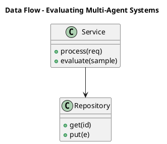

_Source diagram (plantuml); render with the appropriate tool._

**Figure 13. Data Flow - Evaluating Multi-Agent Systems** (plantuml). Figure: Data Flow view for Multi-Agent Systems. This diagram illustrates the principal components and their interactions as discussed in the surrounding section.

## Deep Dive: Mechanics, Variants and Trade-offs

Having established the essentials, we now go deeper into evaluating multi-agent systems. It pays to understand the mechanism rather than treat it as a black box, because most production incidents are explained by one of its steps misbehaving. The distinctions in this section are the ones that separate a working demo from a system that holds up under adversarial inputs, scale and the passage of time.

Consider the principal variants and how to choose between them. Each variant optimises for a different point in the design space - some for latency, some for accuracy, some for cost or operability - and the correct choice follows from explicit requirements rather than from defaults. As with most architectural decisions, the choice is rarely binary; the skill lies in quantifying the trade-offs and choosing deliberately.

In practice this is supported by a mature tooling ecosystem, including AutoGen, CrewAI, LangGraph, MetaGPT. Tools accelerate the work but do not substitute for understanding: the same principles apply whichever implementation you select, and the ability to reason from first principles is what lets you debug when a tool behaves unexpectedly.

A frequent source of subtle bugs is the interaction with tool and resource contention. Because tool and resource contention concerns coordinating access to shared external systems, changes there can silently alter the behaviour analysed here. The remedy is contract tests at the boundary and end-to-end evaluations that exercise the interaction explicitly.

Finally, attend to edge cases and degradation. Define what the system should do under partial failure, unexpected inputs and load spikes, and make that behaviour explicit and tested rather than emergent. Graceful degradation - returning a safe, useful result when the ideal one is unavailable - is a hallmark of mature engineering.

For deeper study, the literature offers authoritative treatments such as Wu et al. — AutoGen (2023) and Du et al. — Improving Factuality via Multi-Agent Debate (2023). These primary sources reward careful reading and ground the practical guidance above in established results.

## Advanced Considerations

Having established the essentials, we now go deeper into evaluating multi-agent systems. Mechanically, the behaviour emerges from a few interacting parts that are simpler than the whole they produce. The distinctions in this section are the ones that separate a working demo from a system that holds up under adversarial inputs, scale and the passage of time.

Consider the principal variants and how to choose between them. Each variant optimises for a different point in the design space - some for latency, some for accuracy, some for cost or operability - and the correct choice follows from explicit requirements rather than from defaults. Latency, accuracy and cost form a tension triangle: improving one typically pressures the others, so explicit budgets are essential.

In practice this is supported by a mature tooling ecosystem, including AutoGen, CrewAI, LangGraph, MetaGPT. Tools accelerate the work but do not substitute for understanding: the same principles apply whichever implementation you select, and the ability to reason from first principles is what lets you debug when a tool behaves unexpectedly.

A frequent source of subtle bugs is the interaction with agent roles and topologies. Because agent roles and topologies concerns hierarchical, sequential, network and market-based organisations, changes there can silently alter the behaviour analysed here. The remedy is contract tests at the boundary and end-to-end evaluations that exercise the interaction explicitly.

Finally, attend to edge cases and degradation. Define what the system should do under partial failure, unexpected inputs and load spikes, and make that behaviour explicit and tested rather than emergent. Graceful degradation - returning a safe, useful result when the ideal one is unavailable - is a hallmark of mature engineering.

For deeper study, the literature offers authoritative treatments such as Wu et al. — AutoGen (2023) and Du et al. — Improving Factuality via Multi-Agent Debate (2023). These primary sources reward careful reading and ground the practical guidance above in established results.

## Worked Example

A worked example clarifies how these ideas behave in practice. A software organisation needs planner, coder, reviewer and tester agents collaborating. They decide to apply evaluating multi-agent systems as part of their Multi-Agent Systems solution, but wisely treat it as a hypothesis to be validated rather than a foregone conclusion.

The team begins by stating the objective precisely and defining how success will be measured before writing any code. They establish a small but representative evaluation set, agree on acceptance thresholds, and only then prototype the simplest design that could work. Early measurement reveals which assumptions hold and which must be revised, saving weeks of misdirected effort and surfacing edge cases while they are still cheap to fix.

As the prototype matures into a service, the team hardens it: adding input validation, error handling, caching where it pays off, and monitoring that ties back to the original success metric. They document each significant decision in an architecture decision record so that future maintainers understand not just what was built but why.

The outcome is instructive. The system that reaches production is not the most sophisticated design the team considered, but the one whose behaviour they could measure, explain and operate. This is the recurring lesson of Multi-Agent Systems: durable value comes from the whole system, not from any single clever component.

## Industry Use Cases

Across industries, the ideas in this chapter recur in recognisable ways. The following vignettes show how different sectors apply them and what they have in common.

**Software.** Planner, coder, reviewer and tester agents collaborating. The common thread is that value comes not from the model alone but from the surrounding system - data quality, evaluation, integration and operations - which is precisely where most of the engineering effort belongs.

**Research.** Specialised retrieval, analysis and writing agents. The common thread is that value comes not from the model alone but from the surrounding system - data quality, evaluation, integration and operations - which is precisely where most of the engineering effort belongs.

**Operations.** Coordinated agents across monitoring and remediation. The common thread is that value comes not from the model alone but from the surrounding system - data quality, evaluation, integration and operations - which is precisely where most of the engineering effort belongs.

**Simulation.** Agent-based modelling of markets and organisations. The common thread is that value comes not from the model alone but from the surrounding system - data quality, evaluation, integration and operations - which is precisely where most of the engineering effort belongs.

## Best Practices

The following practices consistently separate successful Multi-Agent Systems efforts from struggling ones. They are deliberately concrete so they can be adopted as checklist items in design and code review.

- Give each agent a narrow, well-specified role.
- Use structured messages and explicit handoff contracts.
- Enforce global budgets to prevent multiplicative cost blow-ups.
- Trace cross-agent interactions for debugging.

None of these are exotic; they are the unglamorous disciplines that compound into reliability. The cost of adopting them is small compared with the cost of the incidents they prevent, and they become second nature with practice.

## Common Pitfalls

Equally instructive are the failure modes that recur in practice. Each pitfall below has a clear early warning sign and a known remedy, so treat them as a diagnostic checklist when something feels wrong:

- Agents talking in circles without convergence.
- Combinatorial cost growth across many agents.
- Unclear ownership leading to duplicated or conflicting actions.
- Emergent failures that are hard to reproduce.

The pattern is consistent: most failures stem from skipping measurement, conflating prototype and production standards, or deferring cross-cutting concerns such as security and cost until they become emergencies. Naming these traps in advance is the cheapest way to avoid them.

## Governance, Security and Cost Notes

No discussion of evaluating multi-agent systems is complete without its governance, security and cost dimensions, which are too often deferred until they become emergencies. Treating them as first-class concerns from the outset is both cheaper and safer.

**Governance.** Classify the risk of this capability, document its intended and out-of-scope uses, and ensure decisions are traceable to satisfy internal policy and external regulation such as the NIST AI RMF, ISO/IEC 42001 and the EU AI Act. **Security.** Treat all external input as untrusted, validate outputs before acting on them, apply least privilege to any tools or data access, and map controls to the OWASP LLM Top 10 and MITRE ATLAS.

**Cost and sustainability.** Establish explicit budgets for compute, tokens and latency, attribute spend to owners, and revisit the economics as usage scales - a design that is affordable at pilot scale can become untenable at production volume. Building these reflexes into everyday engineering is what allows a Multi-Agent Systems system to be not only capable but also trustworthy and economically sound.

## Hands-On Exercises

Work through the following exercises. They are designed to move understanding from recognition to application - the level required for real engineering work - so prefer writing and building over merely reading.

1. Explain evaluating multi-agent systems to a colleague unfamiliar with Multi-Agent Systems, using a concrete example from your own domain.
2. Sketch a reference architecture that incorporates evaluating multi-agent systems and annotate where observability, security and cost controls belong.
3. Design an evaluation that would tell you whether evaluating multi-agent systems is working in production, including the metric, the dataset and the acceptance threshold.
4. Identify two pitfalls relevant to evaluating multi-agent systems in your environment and describe the early warning signals you would monitor.
5. Prototype the simplest implementation that demonstrates evaluating multi-agent systems, then list exactly what would need to change to make it production-ready.

## Key Takeaways

Key takeaways from this chapter:

- Evaluating Multi-Agent Systems is a systems concern in Multi-Agent Systems: data, models and operations must be co-designed.
- Measurement is non-negotiable; define success metrics and evaluation before building.
- Favour the simplest design that meets the requirement, and add complexity only when evidence demands it.
- Security, cost and observability are first-class requirements, not afterthoughts.
- Document decisions so the system remains understandable and operable as it evolves.

## Code Walkthrough

This listing shows a configuration-driven Evaluating Multi-Agent Systems component with retry semantics and typed interfaces — the shape we expect from production Multi-Agent Systems code rather than a notebook prototype.

The full listing is shown below; study it line by line and reproduce it locally before moving on.

### Listing: Implementing a Evaluating Multi-Agent Systems component

```python
from __future__ import annotations

from dataclasses import dataclass, field
from typing import Any


@dataclass(slots=True)
class EvaluatingSystemsConfig:
    """Configuration for the Evaluating Multi-Agent Systems component in a Multi-Agent Systems system."""

    name: str
    timeout_s: float = 30.0
    max_retries: int = 3
    options: dict[str, Any] = field(default_factory=dict)


class EvaluatingSystems:
    """A minimal, production-shaped implementation of Evaluating Multi-Agent Systems."""

    def __init__(self, config: EvaluatingSystemsConfig) -> None:
        self._config = config
        self._calls = 0

    def run(self, payload: dict[str, Any]) -> dict[str, Any]:
        """Process a request, retrying transient failures with backoff."""
        last_error: Exception | None = None
        for attempt in range(self._config.max_retries):
            try:
                self._calls += 1
                return self._process(payload)
            except TimeoutError as exc:  # transient
                last_error = exc
                continue
        raise RuntimeError(f"EvaluatingSystems failed after retries") from last_error

    def _process(self, payload: dict[str, Any]) -> dict[str, Any]:
        # Domain-specific logic for Evaluating Multi-Agent Systems goes here.
        return {"status": "ok", "input_keys": sorted(payload), "calls": self._calls}

```

## Review Questions

1. In the context of Multi-Agent Systems, which statement best describes “Evaluating Multi-Agent Systems”?
   - A. It applies exclusively to image data.
   - B. It removes all security and governance requirements.
   - C. It eliminates the need for any evaluation or monitoring.
   - D. End-to-end task success and per-agent contribution.
   - **Answer: D.** Evaluating Multi-Agent Systems: End-to-end task success and per-agent contribution.
2. Which of the following is a recommended best practice when working with Multi-Agent Systems?
   - A. It makes the system slower but has no other effect.
   - B. Give each agent a narrow, well-specified role.
   - C. It eliminates the need for any evaluation or monitoring.
   - D. It guarantees deterministic output regardless of input.
   - **Answer: B.** Best practice: Give each agent a narrow, well-specified role.
3. Which of the following is a common pitfall to avoid in Multi-Agent Systems?
   - A. Enforce global budgets to prevent multiplicative cost blow-ups.
   - B. It applies exclusively to image data.
   - C. Emergent failures that are hard to reproduce.
   - D. Use structured messages and explicit handoff contracts.
   - **Answer: C.** Pitfall to avoid: Emergent failures that are hard to reproduce.
4. *(Discussion)* What trade-offs would you weigh when implementing Evaluating Multi-Agent Systems?
   - **Model answer:** A strong answer defines evaluating multi-agent systems (End-to-end task success and per-agent contribution.) then connects it to architecture, evaluation, cost, security and operations for Multi-Agent Systems, citing concrete trade-offs and a real-world example.

---


# Chapter 11. Cost Control at Team Scale

_This chapter examines cost control at team scale within Multi-Agent Systems. It covers budgeting across many concurrent agents, derives a reference architecture, walks through a worked example and runnable code, surveys industry use cases, and distils best practices and pitfalls, closing with exercises and review questions._

## Introduction

In practical terms, Cost Control at Team Scale is best understood as budgeting across many concurrent agents. Getting this right early prevents expensive rework once a Multi-Agent Systems system reaches scale. The right abstraction here pays compounding dividends, because downstream components depend on its guarantees.

This chapter builds intuition first, then formalises the ideas, derives an architecture, and finishes with code, exercises and review questions so the material transfers directly to your own Multi-Agent Systems work. Read it actively: pause at each diagram, reproduce the code, and attempt the exercises before consulting the answers.

## Theory and Foundations

In practical terms, Cost Control at Team Scale is best understood as budgeting across many concurrent agents. Seasoned practitioners treat this as a systems problem, co-designing data, models and operations rather than optimising any one in isolation. Mechanically, the behaviour emerges from a few interacting parts that are simpler than the whole they produce.

To place this in context, recall the broader picture: Multi-agent systems decompose complex goals across specialised agents that communicate, coordinate and sometimes debate to produce better outcomes than a single agent. Within that picture, cost control at team scale is one of the load-bearing ideas - the kind that, when understood deeply, makes the rest of Multi-Agent Systems fall into place. Getting this right early prevents expensive rework once a Multi-Agent Systems system reaches scale.

Cost Control at Team Scale cannot be understood in isolation from agent roles and topologies. Recall that agent roles and topologies concerns hierarchical, sequential, network and market-based organisations. The two interact directly: decisions in one constrain the design space of the other, which is why mature teams reason about them together rather than sequentially. There is an inherent trade-off between fidelity and cost, and the correct balance depends on the use case and its tolerance for error.

Cost Control at Team Scale cannot be understood in isolation from observability across agents. Recall that observability across agents concerns tracing distributed agent interactions. The two interact directly: decisions in one constrain the design space of the other, which is why mature teams reason about them together rather than sequentially. Simplicity is a feature. The simplest design that meets the requirement should be the default, with complexity added only when measurement justifies it.

Several established patterns apply directly to cost control at team scale. The first, supervisor–worker hierarchy, is widely adopted because it makes the system's behaviour predictable and observable. A complementary pattern, debate-and-judge for high-stakes decisions, addresses a related concern and is often deployed alongside it. Patterns are not dogma; they are distilled experience that shortcuts the search for a sound design, and each carries assumptions worth checking against your context.

Knowing when not to use a technique is as valuable as knowing how to use it. In a small prototype, shortcuts around cost control at team scale are invisible; in a production Multi-Agent Systems system serving real traffic, they surface as incidents, cost overruns or compliance gaps. Simplicity is a feature. The simplest design that meets the requirement should be the default, with complexity added only when measurement justifies it. The remainder of this chapter turns these principles into an architecture, code and a checklist you can apply immediately.

## Architecture and Design

From an architectural standpoint, Cost Control at Team Scale sits at the intersection of data, models and operations. A multi-agent platform uses a supervisor/orchestrator that routes subtasks to specialised worker agents, a shared state store for coordination, a message bus for structured communication, and global guardrails enforcing budgets and permissions. Distributed tracing stitches together cross-agent trajectories.

Concretely, the principal building blocks include why multiple agents, agent roles and topologies, communication protocols, orchestration and routing and shared memory and state. Each is a replaceable component behind a stable interface, so the team can upgrade an implementation - a model, an index, a policy engine - without rewriting its neighbours. The contracts between components are where reliability is won or lost, so they are specified explicitly and tested in isolation.

The diagram accompanying this section makes the data and control flow explicit. Requests enter through a well-defined boundary where they are authenticated and validated; only then are they dispatched to the components that perform the work. This boundary is also where rate limiting, quota enforcement and audit logging live, keeping cross-cutting concerns out of the core logic and in one auditable place.

Two qualities deserve emphasis. First, observability is designed in, not bolted on: every component emits structured telemetry so that failures can be localised in minutes rather than hours. Second, the architecture is evolvable - components communicate through stable contracts so that any single part of the Multi-Agent Systems system can be replaced without a rewrite. Latency, accuracy and cost form a tension triangle: improving one typically pressures the others, so explicit budgets are essential.

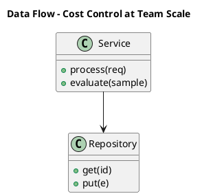

_Source diagram (plantuml); render with the appropriate tool._

**Figure 14. Data Flow - Cost Control at Team Scale** (plantuml). Figure: Data Flow view for Multi-Agent Systems. This diagram illustrates the principal components and their interactions as discussed in the surrounding section.

## Deep Dive: Mechanics, Variants and Trade-offs

Having established the essentials, we now go deeper into cost control at team scale. Mechanically, the behaviour emerges from a few interacting parts that are simpler than the whole they produce. The distinctions in this section are the ones that separate a working demo from a system that holds up under adversarial inputs, scale and the passage of time.

Consider the principal variants and how to choose between them. Each variant optimises for a different point in the design space - some for latency, some for accuracy, some for cost or operability - and the correct choice follows from explicit requirements rather than from defaults. As with most architectural decisions, the choice is rarely binary; the skill lies in quantifying the trade-offs and choosing deliberately.

In practice this is supported by a mature tooling ecosystem, including AutoGen, CrewAI, LangGraph, MetaGPT. Tools accelerate the work but do not substitute for understanding: the same principles apply whichever implementation you select, and the ability to reason from first principles is what lets you debug when a tool behaves unexpectedly.

A frequent source of subtle bugs is the interaction with agent roles and topologies. Because agent roles and topologies concerns hierarchical, sequential, network and market-based organisations, changes there can silently alter the behaviour analysed here. The remedy is contract tests at the boundary and end-to-end evaluations that exercise the interaction explicitly.

Finally, attend to edge cases and degradation. Define what the system should do under partial failure, unexpected inputs and load spikes, and make that behaviour explicit and tested rather than emergent. Graceful degradation - returning a safe, useful result when the ideal one is unavailable - is a hallmark of mature engineering.

For deeper study, the literature offers authoritative treatments such as Wu et al. — AutoGen (2023) and Du et al. — Improving Factuality via Multi-Agent Debate (2023). These primary sources reward careful reading and ground the practical guidance above in established results.

## Advanced Considerations

Having established the essentials, we now go deeper into cost control at team scale. It pays to understand the mechanism rather than treat it as a black box, because most production incidents are explained by one of its steps misbehaving. The distinctions in this section are the ones that separate a working demo from a system that holds up under adversarial inputs, scale and the passage of time.

Consider the principal variants and how to choose between them. Each variant optimises for a different point in the design space - some for latency, some for accuracy, some for cost or operability - and the correct choice follows from explicit requirements rather than from defaults. Every added component buys capability at the price of operational surface area, and that bargain should be made consciously.

In practice this is supported by a mature tooling ecosystem, including AutoGen, CrewAI, LangGraph, MetaGPT. Tools accelerate the work but do not substitute for understanding: the same principles apply whichever implementation you select, and the ability to reason from first principles is what lets you debug when a tool behaves unexpectedly.

A frequent source of subtle bugs is the interaction with emergent behaviour and risk. Because emergent behaviour and risk concerns unintended dynamics and how to contain them, changes there can silently alter the behaviour analysed here. The remedy is contract tests at the boundary and end-to-end evaluations that exercise the interaction explicitly.

Finally, attend to edge cases and degradation. Define what the system should do under partial failure, unexpected inputs and load spikes, and make that behaviour explicit and tested rather than emergent. Graceful degradation - returning a safe, useful result when the ideal one is unavailable - is a hallmark of mature engineering.

For deeper study, the literature offers authoritative treatments such as Wu et al. — AutoGen (2023) and Du et al. — Improving Factuality via Multi-Agent Debate (2023). These primary sources reward careful reading and ground the practical guidance above in established results.

## Worked Example

To ground the discussion, walk through a representative example. A operations organisation needs coordinated agents across monitoring and remediation. They decide to apply cost control at team scale as part of their Multi-Agent Systems solution, but wisely treat it as a hypothesis to be validated rather than a foregone conclusion.

The team begins by stating the objective precisely and defining how success will be measured before writing any code. They establish a small but representative evaluation set, agree on acceptance thresholds, and only then prototype the simplest design that could work. Early measurement reveals which assumptions hold and which must be revised, saving weeks of misdirected effort and surfacing edge cases while they are still cheap to fix.

As the prototype matures into a service, the team hardens it: adding input validation, error handling, caching where it pays off, and monitoring that ties back to the original success metric. They document each significant decision in an architecture decision record so that future maintainers understand not just what was built but why.

The outcome is instructive. The system that reaches production is not the most sophisticated design the team considered, but the one whose behaviour they could measure, explain and operate. This is the recurring lesson of Multi-Agent Systems: durable value comes from the whole system, not from any single clever component.

## Industry Use Cases

Across industries, the ideas in this chapter recur in recognisable ways. The following vignettes show how different sectors apply them and what they have in common.

**Software.** Planner, coder, reviewer and tester agents collaborating. The common thread is that value comes not from the model alone but from the surrounding system - data quality, evaluation, integration and operations - which is precisely where most of the engineering effort belongs.

**Research.** Specialised retrieval, analysis and writing agents. The common thread is that value comes not from the model alone but from the surrounding system - data quality, evaluation, integration and operations - which is precisely where most of the engineering effort belongs.

**Operations.** Coordinated agents across monitoring and remediation. The common thread is that value comes not from the model alone but from the surrounding system - data quality, evaluation, integration and operations - which is precisely where most of the engineering effort belongs.

**Simulation.** Agent-based modelling of markets and organisations. The common thread is that value comes not from the model alone but from the surrounding system - data quality, evaluation, integration and operations - which is precisely where most of the engineering effort belongs.

## Best Practices

The following practices consistently separate successful Multi-Agent Systems efforts from struggling ones. They are deliberately concrete so they can be adopted as checklist items in design and code review.

- Give each agent a narrow, well-specified role.
- Use structured messages and explicit handoff contracts.
- Enforce global budgets to prevent multiplicative cost blow-ups.
- Trace cross-agent interactions for debugging.

None of these are exotic; they are the unglamorous disciplines that compound into reliability. The cost of adopting them is small compared with the cost of the incidents they prevent, and they become second nature with practice.

## Common Pitfalls

Equally instructive are the failure modes that recur in practice. Each pitfall below has a clear early warning sign and a known remedy, so treat them as a diagnostic checklist when something feels wrong:

- Agents talking in circles without convergence.
- Combinatorial cost growth across many agents.
- Unclear ownership leading to duplicated or conflicting actions.
- Emergent failures that are hard to reproduce.

The pattern is consistent: most failures stem from skipping measurement, conflating prototype and production standards, or deferring cross-cutting concerns such as security and cost until they become emergencies. Naming these traps in advance is the cheapest way to avoid them.

## Governance, Security and Cost Notes

No discussion of cost control at team scale is complete without its governance, security and cost dimensions, which are too often deferred until they become emergencies. Treating them as first-class concerns from the outset is both cheaper and safer.

**Governance.** Classify the risk of this capability, document its intended and out-of-scope uses, and ensure decisions are traceable to satisfy internal policy and external regulation such as the NIST AI RMF, ISO/IEC 42001 and the EU AI Act. **Security.** Treat all external input as untrusted, validate outputs before acting on them, apply least privilege to any tools or data access, and map controls to the OWASP LLM Top 10 and MITRE ATLAS.

**Cost and sustainability.** Establish explicit budgets for compute, tokens and latency, attribute spend to owners, and revisit the economics as usage scales - a design that is affordable at pilot scale can become untenable at production volume. Building these reflexes into everyday engineering is what allows a Multi-Agent Systems system to be not only capable but also trustworthy and economically sound.

## Hands-On Exercises

Work through the following exercises. They are designed to move understanding from recognition to application - the level required for real engineering work - so prefer writing and building over merely reading.

1. Explain cost control at team scale to a colleague unfamiliar with Multi-Agent Systems, using a concrete example from your own domain.
2. Sketch a reference architecture that incorporates cost control at team scale and annotate where observability, security and cost controls belong.
3. Design an evaluation that would tell you whether cost control at team scale is working in production, including the metric, the dataset and the acceptance threshold.
4. Identify two pitfalls relevant to cost control at team scale in your environment and describe the early warning signals you would monitor.
5. Prototype the simplest implementation that demonstrates cost control at team scale, then list exactly what would need to change to make it production-ready.

## Key Takeaways

Key takeaways from this chapter:

- Cost Control at Team Scale is a systems concern in Multi-Agent Systems: data, models and operations must be co-designed.
- Measurement is non-negotiable; define success metrics and evaluation before building.
- Favour the simplest design that meets the requirement, and add complexity only when evidence demands it.
- Security, cost and observability are first-class requirements, not afterthoughts.
- Document decisions so the system remains understandable and operable as it evolves.

## Code Walkthrough

This listing shows a configuration-driven Cost Control at Team Scale component with retry semantics and typed interfaces — the shape we expect from production Multi-Agent Systems code rather than a notebook prototype.

The full listing is shown below; study it line by line and reproduce it locally before moving on.

### Listing: Implementing a Cost Control at Team Scale component

```python
from __future__ import annotations

from dataclasses import dataclass, field
from typing import Any


@dataclass(slots=True)
class CostControlAtConfig:
    """Configuration for the Cost Control at Team Scale component in a Multi-Agent Systems system."""

    name: str
    timeout_s: float = 30.0
    max_retries: int = 3
    options: dict[str, Any] = field(default_factory=dict)


class CostControlAt:
    """A minimal, production-shaped implementation of Cost Control at Team Scale."""

    def __init__(self, config: CostControlAtConfig) -> None:
        self._config = config
        self._calls = 0

    def run(self, payload: dict[str, Any]) -> dict[str, Any]:
        """Process a request, retrying transient failures with backoff."""
        last_error: Exception | None = None
        for attempt in range(self._config.max_retries):
            try:
                self._calls += 1
                return self._process(payload)
            except TimeoutError as exc:  # transient
                last_error = exc
                continue
        raise RuntimeError(f"CostControlAt failed after retries") from last_error

    def _process(self, payload: dict[str, Any]) -> dict[str, Any]:
        # Domain-specific logic for Cost Control at Team Scale goes here.
        return {"status": "ok", "input_keys": sorted(payload), "calls": self._calls}

```

## Review Questions

1. In the context of Multi-Agent Systems, which statement best describes “Cost Control at Team Scale”?
   - A. Budgeting across many concurrent agents.
   - B. It guarantees deterministic output regardless of input.
   - C. It applies exclusively to image data.
   - D. It eliminates the need for any evaluation or monitoring.
   - **Answer: A.** Cost Control at Team Scale: Budgeting across many concurrent agents.
2. Which of the following is a recommended best practice when working with Multi-Agent Systems?
   - A. It removes all security and governance requirements.
   - B. Enforce global budgets to prevent multiplicative cost blow-ups.
   - C. It makes the system slower but has no other effect.
   - D. Combinatorial cost growth across many agents.
   - **Answer: B.** Best practice: Enforce global budgets to prevent multiplicative cost blow-ups.
3. Which of the following is a common pitfall to avoid in Multi-Agent Systems?
   - A. Give each agent a narrow, well-specified role.
   - B. Unclear ownership leading to duplicated or conflicting actions.
   - C. It removes all security and governance requirements.
   - D. Use structured messages and explicit handoff contracts.
   - **Answer: B.** Pitfall to avoid: Unclear ownership leading to duplicated or conflicting actions.
4. *(Discussion)* How does Cost Control at Team Scale interact with security and governance requirements?
   - **Model answer:** A strong answer defines cost control at team scale (Budgeting across many concurrent agents.) then connects it to architecture, evaluation, cost, security and operations for Multi-Agent Systems, citing concrete trade-offs and a real-world example.

---


# Chapter 12. Frameworks and Patterns

_This chapter examines frameworks and patterns within Multi-Agent Systems. It covers comparing orchestration frameworks, derives a reference architecture, walks through a worked example and runnable code, surveys industry use cases, and distils best practices and pitfalls, closing with exercises and review questions._

## Introduction

Formally, Frameworks and Patterns addresses comparing orchestration frameworks. It is foundational: later capabilities in Multi-Agent Systems are built directly on top of it. The practical implication is that design choices here ripple through latency, cost and maintainability for the lifetime of the system.

This chapter builds intuition first, then formalises the ideas, derives an architecture, and finishes with code, exercises and review questions so the material transfers directly to your own Multi-Agent Systems work. Read it actively: pause at each diagram, reproduce the code, and attempt the exercises before consulting the answers.

## Theory and Foundations

We define Frameworks and Patterns as comparing orchestration frameworks. The practical implication is that design choices here ripple through latency, cost and maintainability for the lifetime of the system. It pays to understand the mechanism rather than treat it as a black box, because most production incidents are explained by one of its steps misbehaving.

To place this in context, recall the broader picture: Multi-agent systems decompose complex goals across specialised agents that communicate, coordinate and sometimes debate to produce better outcomes than a single agent. Within that picture, frameworks and patterns is one of the load-bearing ideas - the kind that, when understood deeply, makes the rest of Multi-Agent Systems fall into place. It is foundational: later capabilities in Multi-Agent Systems are built directly on top of it.

Frameworks and Patterns cannot be understood in isolation from agent roles and topologies. Recall that agent roles and topologies concerns hierarchical, sequential, network and market-based organisations. The two interact directly: decisions in one constrain the design space of the other, which is why mature teams reason about them together rather than sequentially. Every added component buys capability at the price of operational surface area, and that bargain should be made consciously.

Frameworks and Patterns cannot be understood in isolation from evaluating multi-agent systems. Recall that evaluating multi-agent systems concerns end-to-end task success and per-agent contribution. The two interact directly: decisions in one constrain the design space of the other, which is why mature teams reason about them together rather than sequentially. Latency, accuracy and cost form a tension triangle: improving one typically pressures the others, so explicit budgets are essential.

Several established patterns apply directly to frameworks and patterns. The first, debate-and-judge for high-stakes decisions, is widely adopted because it makes the system's behaviour predictable and observable. A complementary pattern, supervisor–worker hierarchy, addresses a related concern and is often deployed alongside it. Patterns are not dogma; they are distilled experience that shortcuts the search for a sound design, and each carries assumptions worth checking against your context.

The decision of whether to adopt this should be driven by requirements, not by novelty. In a small prototype, shortcuts around frameworks and patterns are invisible; in a production Multi-Agent Systems system serving real traffic, they surface as incidents, cost overruns or compliance gaps. Simplicity is a feature. The simplest design that meets the requirement should be the default, with complexity added only when measurement justifies it. The remainder of this chapter turns these principles into an architecture, code and a checklist you can apply immediately.

## Architecture and Design

A robust architecture for Frameworks and Patterns is layered so each part can evolve independently without destabilising the whole. A multi-agent platform uses a supervisor/orchestrator that routes subtasks to specialised worker agents, a shared state store for coordination, a message bus for structured communication, and global guardrails enforcing budgets and permissions. Distributed tracing stitches together cross-agent trajectories.

Concretely, the principal building blocks include why multiple agents, agent roles and topologies, communication protocols, orchestration and routing and shared memory and state. Each is a replaceable component behind a stable interface, so the team can upgrade an implementation - a model, an index, a policy engine - without rewriting its neighbours. The contracts between components are where reliability is won or lost, so they are specified explicitly and tested in isolation.

The diagram accompanying this section makes the data and control flow explicit. Requests enter through a well-defined boundary where they are authenticated and validated; only then are they dispatched to the components that perform the work. This boundary is also where rate limiting, quota enforcement and audit logging live, keeping cross-cutting concerns out of the core logic and in one auditable place.

Two qualities deserve emphasis. First, observability is designed in, not bolted on: every component emits structured telemetry so that failures can be localised in minutes rather than hours. Second, the architecture is evolvable - components communicate through stable contracts so that any single part of the Multi-Agent Systems system can be replaced without a rewrite. Simplicity is a feature. The simplest design that meets the requirement should be the default, with complexity added only when measurement justifies it.

<div class="diagram-svg">

<svg xmlns="http://www.w3.org/2000/svg" width="760" height="360" viewBox="0 0 760 360" font-family="Inter, Arial, sans-serif">
<rect width="760" height="360" fill="#f8fafc"/>
<text x="380" y="34" text-anchor="middle" font-size="20" font-weight="700" fill="#0f172a">Capability Map - Frameworks and Patterns</text>
<rect x="290" y="162" width="180" height="56" rx="12" fill="#0f172a"/>
<text x="380" y="195" text-anchor="middle" font-size="14" font-weight="700" fill="#ffffff">Multi-Agent Systems</text>
<line x1="380" y1="190" x2="380" y2="70" stroke="#94a3b8" stroke-width="2"/>
<rect x="308" y="48" width="144" height="44" rx="10" fill="#ffffff" stroke="#2563eb" stroke-width="2"/>
<text x="380" y="74" text-anchor="middle" font-size="11" fill="#0f172a">Why Multiple Agents</text>
<line x1="380" y1="190" x2="617" y2="153" stroke="#94a3b8" stroke-width="2"/>
<rect x="545" y="131" width="144" height="44" rx="10" fill="#ffffff" stroke="#7c3aed" stroke-width="2"/>
<text x="617" y="157" text-anchor="middle" font-size="11" fill="#0f172a">Agent Roles and Top…</text>
<line x1="380" y1="190" x2="526" y2="287" stroke="#94a3b8" stroke-width="2"/>
<rect x="454" y="265" width="144" height="44" rx="10" fill="#ffffff" stroke="#0891b2" stroke-width="2"/>
<text x="526" y="291" text-anchor="middle" font-size="11" fill="#0f172a">Communication Proto…</text>
<line x1="380" y1="190" x2="234" y2="287" stroke="#94a3b8" stroke-width="2"/>
<rect x="162" y="265" width="144" height="44" rx="10" fill="#ffffff" stroke="#059669" stroke-width="2"/>
<text x="234" y="291" text-anchor="middle" font-size="11" fill="#0f172a">Orchestration and R…</text>
<line x1="380" y1="190" x2="143" y2="153" stroke="#94a3b8" stroke-width="2"/>
<rect x="71" y="131" width="144" height="44" rx="10" fill="#ffffff" stroke="#d97706" stroke-width="2"/>
<text x="143" y="157" text-anchor="middle" font-size="11" fill="#0f172a">Shared Memory and S…</text>
</svg>

</div>

**Figure 15. Capability Map - Frameworks and Patterns** (svg). Figure: Capability Map view for Multi-Agent Systems. This diagram illustrates the principal components and their interactions as discussed in the surrounding section.

## Deep Dive: Mechanics, Variants and Trade-offs

Having established the essentials, we now go deeper into frameworks and patterns. Beneath the abstraction lies a concrete process whose steps can each be measured, tested and optimised independently. The distinctions in this section are the ones that separate a working demo from a system that holds up under adversarial inputs, scale and the passage of time.

Consider the principal variants and how to choose between them. Each variant optimises for a different point in the design space - some for latency, some for accuracy, some for cost or operability - and the correct choice follows from explicit requirements rather than from defaults. As with most architectural decisions, the choice is rarely binary; the skill lies in quantifying the trade-offs and choosing deliberately.

In practice this is supported by a mature tooling ecosystem, including AutoGen, CrewAI, LangGraph, MetaGPT. Tools accelerate the work but do not substitute for understanding: the same principles apply whichever implementation you select, and the ability to reason from first principles is what lets you debug when a tool behaves unexpectedly.

A frequent source of subtle bugs is the interaction with agent roles and topologies. Because agent roles and topologies concerns hierarchical, sequential, network and market-based organisations, changes there can silently alter the behaviour analysed here. The remedy is contract tests at the boundary and end-to-end evaluations that exercise the interaction explicitly.

Finally, attend to edge cases and degradation. Define what the system should do under partial failure, unexpected inputs and load spikes, and make that behaviour explicit and tested rather than emergent. Graceful degradation - returning a safe, useful result when the ideal one is unavailable - is a hallmark of mature engineering.

For deeper study, the literature offers authoritative treatments such as Wu et al. — AutoGen (2023) and Du et al. — Improving Factuality via Multi-Agent Debate (2023). These primary sources reward careful reading and ground the practical guidance above in established results.

## Advanced Considerations

Having established the essentials, we now go deeper into frameworks and patterns. Mechanically, the behaviour emerges from a few interacting parts that are simpler than the whole they produce. The distinctions in this section are the ones that separate a working demo from a system that holds up under adversarial inputs, scale and the passage of time.

Consider the principal variants and how to choose between them. Each variant optimises for a different point in the design space - some for latency, some for accuracy, some for cost or operability - and the correct choice follows from explicit requirements rather than from defaults. Simplicity is a feature. The simplest design that meets the requirement should be the default, with complexity added only when measurement justifies it.

In practice this is supported by a mature tooling ecosystem, including AutoGen, CrewAI, LangGraph, MetaGPT. Tools accelerate the work but do not substitute for understanding: the same principles apply whichever implementation you select, and the ability to reason from first principles is what lets you debug when a tool behaves unexpectedly.

A frequent source of subtle bugs is the interaction with agent roles and topologies. Because agent roles and topologies concerns hierarchical, sequential, network and market-based organisations, changes there can silently alter the behaviour analysed here. The remedy is contract tests at the boundary and end-to-end evaluations that exercise the interaction explicitly.

Finally, attend to edge cases and degradation. Define what the system should do under partial failure, unexpected inputs and load spikes, and make that behaviour explicit and tested rather than emergent. Graceful degradation - returning a safe, useful result when the ideal one is unavailable - is a hallmark of mature engineering.

For deeper study, the literature offers authoritative treatments such as Wu et al. — AutoGen (2023) and Du et al. — Improving Factuality via Multi-Agent Debate (2023). These primary sources reward careful reading and ground the practical guidance above in established results.

## Worked Example

To ground the discussion, walk through a representative example. A operations organisation needs coordinated agents across monitoring and remediation. They decide to apply frameworks and patterns as part of their Multi-Agent Systems solution, but wisely treat it as a hypothesis to be validated rather than a foregone conclusion.

The team begins by stating the objective precisely and defining how success will be measured before writing any code. They establish a small but representative evaluation set, agree on acceptance thresholds, and only then prototype the simplest design that could work. Early measurement reveals which assumptions hold and which must be revised, saving weeks of misdirected effort and surfacing edge cases while they are still cheap to fix.

As the prototype matures into a service, the team hardens it: adding input validation, error handling, caching where it pays off, and monitoring that ties back to the original success metric. They document each significant decision in an architecture decision record so that future maintainers understand not just what was built but why.

The outcome is instructive. The system that reaches production is not the most sophisticated design the team considered, but the one whose behaviour they could measure, explain and operate. This is the recurring lesson of Multi-Agent Systems: durable value comes from the whole system, not from any single clever component.

## Industry Use Cases

Across industries, the ideas in this chapter recur in recognisable ways. The following vignettes show how different sectors apply them and what they have in common.

**Software.** Planner, coder, reviewer and tester agents collaborating. The common thread is that value comes not from the model alone but from the surrounding system - data quality, evaluation, integration and operations - which is precisely where most of the engineering effort belongs.

**Research.** Specialised retrieval, analysis and writing agents. The common thread is that value comes not from the model alone but from the surrounding system - data quality, evaluation, integration and operations - which is precisely where most of the engineering effort belongs.

**Operations.** Coordinated agents across monitoring and remediation. The common thread is that value comes not from the model alone but from the surrounding system - data quality, evaluation, integration and operations - which is precisely where most of the engineering effort belongs.

**Simulation.** Agent-based modelling of markets and organisations. The common thread is that value comes not from the model alone but from the surrounding system - data quality, evaluation, integration and operations - which is precisely where most of the engineering effort belongs.

## Best Practices

The following practices consistently separate successful Multi-Agent Systems efforts from struggling ones. They are deliberately concrete so they can be adopted as checklist items in design and code review.

- Give each agent a narrow, well-specified role.
- Use structured messages and explicit handoff contracts.
- Enforce global budgets to prevent multiplicative cost blow-ups.
- Trace cross-agent interactions for debugging.

None of these are exotic; they are the unglamorous disciplines that compound into reliability. The cost of adopting them is small compared with the cost of the incidents they prevent, and they become second nature with practice.

## Common Pitfalls

Equally instructive are the failure modes that recur in practice. Each pitfall below has a clear early warning sign and a known remedy, so treat them as a diagnostic checklist when something feels wrong:

- Agents talking in circles without convergence.
- Combinatorial cost growth across many agents.
- Unclear ownership leading to duplicated or conflicting actions.
- Emergent failures that are hard to reproduce.

The pattern is consistent: most failures stem from skipping measurement, conflating prototype and production standards, or deferring cross-cutting concerns such as security and cost until they become emergencies. Naming these traps in advance is the cheapest way to avoid them.

## Governance, Security and Cost Notes

No discussion of frameworks and patterns is complete without its governance, security and cost dimensions, which are too often deferred until they become emergencies. Treating them as first-class concerns from the outset is both cheaper and safer.

**Governance.** Classify the risk of this capability, document its intended and out-of-scope uses, and ensure decisions are traceable to satisfy internal policy and external regulation such as the NIST AI RMF, ISO/IEC 42001 and the EU AI Act. **Security.** Treat all external input as untrusted, validate outputs before acting on them, apply least privilege to any tools or data access, and map controls to the OWASP LLM Top 10 and MITRE ATLAS.

**Cost and sustainability.** Establish explicit budgets for compute, tokens and latency, attribute spend to owners, and revisit the economics as usage scales - a design that is affordable at pilot scale can become untenable at production volume. Building these reflexes into everyday engineering is what allows a Multi-Agent Systems system to be not only capable but also trustworthy and economically sound.

## Hands-On Exercises

Work through the following exercises. They are designed to move understanding from recognition to application - the level required for real engineering work - so prefer writing and building over merely reading.

1. Explain frameworks and patterns to a colleague unfamiliar with Multi-Agent Systems, using a concrete example from your own domain.
2. Sketch a reference architecture that incorporates frameworks and patterns and annotate where observability, security and cost controls belong.
3. Design an evaluation that would tell you whether frameworks and patterns is working in production, including the metric, the dataset and the acceptance threshold.
4. Identify two pitfalls relevant to frameworks and patterns in your environment and describe the early warning signals you would monitor.
5. Prototype the simplest implementation that demonstrates frameworks and patterns, then list exactly what would need to change to make it production-ready.

## Key Takeaways

Key takeaways from this chapter:

- Frameworks and Patterns is a systems concern in Multi-Agent Systems: data, models and operations must be co-designed.
- Measurement is non-negotiable; define success metrics and evaluation before building.
- Favour the simplest design that meets the requirement, and add complexity only when evidence demands it.
- Security, cost and observability are first-class requirements, not afterthoughts.
- Document decisions so the system remains understandable and operable as it evolves.

## Code Walkthrough

Pipelines keep Frameworks and Patterns logic modular and testable. Each stage is a pure function, errors are captured per item, and the composition is trivial to extend or reorder.

The full listing is shown below; study it line by line and reproduce it locally before moving on.

### Listing: A composable processing pipeline for Frameworks and Patterns

```python
from collections.abc import Iterable, Iterator
from typing import Protocol


class Stage(Protocol):
    def __call__(self, item: dict) -> dict: ...


def pipeline(stages: list[Stage]) -> Stage:
    """Compose ordered stages into a single callable for Frameworks and Patterns."""

    def run(item: dict) -> dict:
        for stage in stages:
            item = stage(item)
        return item

    return run


def validate(item: dict) -> dict:
    if "text" not in item:
        raise ValueError("missing required field: text")
    return item


def normalise(item: dict) -> dict:
    item["text"] = item["text"].strip().lower()
    return item


def enrich(item: dict) -> dict:
    item["length"] = len(item["text"])
    return item


process = pipeline([validate, normalise, enrich])


def run_batch(items: Iterable[dict]) -> Iterator[dict]:
    for item in items:
        try:
            yield process(dict(item))
        except ValueError as exc:
            yield {"error": str(exc), "item": item}

```

## Review Questions

1. In the context of Multi-Agent Systems, which statement best describes “Frameworks and Patterns”?
   - A. It guarantees deterministic output regardless of input.
   - B. Comparing orchestration frameworks.
   - C. It is only relevant to academic research, not production.
   - D. It removes all security and governance requirements.
   - **Answer: B.** Frameworks and Patterns: Comparing orchestration frameworks.
2. Which of the following is a recommended best practice when working with Multi-Agent Systems?
   - A. Enforce global budgets to prevent multiplicative cost blow-ups.
   - B. It guarantees deterministic output regardless of input.
   - C. It removes all security and governance requirements.
   - D. It is only relevant to academic research, not production.
   - **Answer: A.** Best practice: Enforce global budgets to prevent multiplicative cost blow-ups.
3. Which of the following is a common pitfall to avoid in Multi-Agent Systems?
   - A. Agents talking in circles without convergence.
   - B. It is only relevant to academic research, not production.
   - C. Give each agent a narrow, well-specified role.
   - D. It removes all security and governance requirements.
   - **Answer: A.** Pitfall to avoid: Agents talking in circles without convergence.
4. *(Discussion)* What trade-offs would you weigh when implementing Frameworks and Patterns?
   - **Model answer:** A strong answer defines frameworks and patterns (Comparing orchestration frameworks.) then connects it to architecture, evaluation, cost, security and operations for Multi-Agent Systems, citing concrete trade-offs and a real-world example.

---


# Chapter 13. Observability Across Agents

_This chapter examines observability across agents within Multi-Agent Systems. It covers tracing distributed agent interactions, derives a reference architecture, walks through a worked example and runnable code, surveys industry use cases, and distils best practices and pitfalls, closing with exercises and review questions._

## Introduction

Observability Across Agents refers to tracing distributed agent interactions. Understanding this matters because Multi-Agent Systems systems succeed or fail on exactly these decisions. What distinguishes a production-grade approach from a prototype is the discipline of measurement: every claim is backed by an evaluation rather than intuition.

This chapter builds intuition first, then formalises the ideas, derives an architecture, and finishes with code, exercises and review questions so the material transfers directly to your own Multi-Agent Systems work. Read it actively: pause at each diagram, reproduce the code, and attempt the exercises before consulting the answers.

## Theory and Foundations

In practical terms, Observability Across Agents is best understood as tracing distributed agent interactions. The practical implication is that design choices here ripple through latency, cost and maintainability for the lifetime of the system. The underlying mechanism is best appreciated by tracing a single request from input to output and noting where state is created and consumed.

To place this in context, recall the broader picture: Multi-agent systems decompose complex goals across specialised agents that communicate, coordinate and sometimes debate to produce better outcomes than a single agent. Within that picture, observability across agents is one of the load-bearing ideas - the kind that, when understood deeply, makes the rest of Multi-Agent Systems fall into place. It is foundational: later capabilities in Multi-Agent Systems are built directly on top of it.

Observability Across Agents cannot be understood in isolation from shared memory and state. Recall that shared memory and state concerns coordinating context across agents safely. The two interact directly: decisions in one constrain the design space of the other, which is why mature teams reason about them together rather than sequentially. Every added component buys capability at the price of operational surface area, and that bargain should be made consciously.

Observability Across Agents cannot be understood in isolation from why multiple agents. Recall that why multiple agents concerns specialisation, parallelism and separation of concerns. The two interact directly: decisions in one constrain the design space of the other, which is why mature teams reason about them together rather than sequentially. As with most architectural decisions, the choice is rarely binary; the skill lies in quantifying the trade-offs and choosing deliberately.

Several established patterns apply directly to observability across agents. The first, debate-and-judge for high-stakes decisions, is widely adopted because it makes the system's behaviour predictable and observable. A complementary pattern, sequential pipeline of specialised agents, addresses a related concern and is often deployed alongside it. Patterns are not dogma; they are distilled experience that shortcuts the search for a sound design, and each carries assumptions worth checking against your context.

It is worth being explicit about when to apply this and when to reach for something simpler. In a small prototype, shortcuts around observability across agents are invisible; in a production Multi-Agent Systems system serving real traffic, they surface as incidents, cost overruns or compliance gaps. As with most architectural decisions, the choice is rarely binary; the skill lies in quantifying the trade-offs and choosing deliberately. The remainder of this chapter turns these principles into an architecture, code and a checklist you can apply immediately.

## Architecture and Design

A robust architecture for Observability Across Agents is layered so each part can evolve independently without destabilising the whole. A multi-agent platform uses a supervisor/orchestrator that routes subtasks to specialised worker agents, a shared state store for coordination, a message bus for structured communication, and global guardrails enforcing budgets and permissions. Distributed tracing stitches together cross-agent trajectories.

Concretely, the principal building blocks include why multiple agents, agent roles and topologies, communication protocols, orchestration and routing and shared memory and state. Each is a replaceable component behind a stable interface, so the team can upgrade an implementation - a model, an index, a policy engine - without rewriting its neighbours. The contracts between components are where reliability is won or lost, so they are specified explicitly and tested in isolation.

The diagram accompanying this section makes the data and control flow explicit. Requests enter through a well-defined boundary where they are authenticated and validated; only then are they dispatched to the components that perform the work. This boundary is also where rate limiting, quota enforcement and audit logging live, keeping cross-cutting concerns out of the core logic and in one auditable place.

Two qualities deserve emphasis. First, observability is designed in, not bolted on: every component emits structured telemetry so that failures can be localised in minutes rather than hours. Second, the architecture is evolvable - components communicate through stable contracts so that any single part of the Multi-Agent Systems system can be replaced without a rewrite. Simplicity is a feature. The simplest design that meets the requirement should be the default, with complexity added only when measurement justifies it.

```xml
<mxfile host="ai-university">
  <diagram name="Cloud Architecture">
    <mxGraphModel dx="800" dy="600" grid="1" gridSize="10">
      <root>
        <mxCell id="0"/>
        <mxCell id="1" parent="0"/>
        <mxCell id="title" value="Cloud Architecture - Observability Across Agents" style="text;fontSize=16;fontStyle=1" vertex="1" parent="1"><mxGeometry x="40" y="20" width="600" height="30" as="geometry"/></mxCell>
        <mxCell id="hub" value="Multi-Agent Systems" style="rounded=1;fillColor=#0f172a;fontColor=#ffffff;fontStyle=1" vertex="1" parent="1"><mxGeometry x="300" y="180" width="160" height="60" as="geometry"/></mxCell>
        <mxCell id="n0" value="Why Multiple Agents" style="rounded=1;fillColor=#e0e7ff;strokeColor=#4338ca" vertex="1" parent="1"><mxGeometry x="60" y="80" width="160" height="50" as="geometry"/></mxCell>
        <mxCell id="e0" style="edgeStyle=orthogonalEdgeStyle" edge="1" parent="1" source="hub" target="n0"><mxGeometry relative="1" as="geometry"/></mxCell>
        <mxCell id="n1" value="Agent Roles and Topolog…" style="rounded=1;fillColor=#e0e7ff;strokeColor=#4338ca" vertex="1" parent="1"><mxGeometry x="600" y="170" width="160" height="50" as="geometry"/></mxCell>
        <mxCell id="e1" style="edgeStyle=orthogonalEdgeStyle" edge="1" parent="1" source="hub" target="n1"><mxGeometry relative="1" as="geometry"/></mxCell>
        <mxCell id="n2" value="Communication Protocols" style="rounded=1;fillColor=#e0e7ff;strokeColor=#4338ca" vertex="1" parent="1"><mxGeometry x="60" y="260" width="160" height="50" as="geometry"/></mxCell>
        <mxCell id="e2" style="edgeStyle=orthogonalEdgeStyle" edge="1" parent="1" source="hub" target="n2"><mxGeometry relative="1" as="geometry"/></mxCell>
        <mxCell id="n3" value="Orchestration and Routi…" style="rounded=1;fillColor=#e0e7ff;strokeColor=#4338ca" vertex="1" parent="1"><mxGeometry x="600" y="350" width="160" height="50" as="geometry"/></mxCell>
        <mxCell id="e3" style="edgeStyle=orthogonalEdgeStyle" edge="1" parent="1" source="hub" target="n3"><mxGeometry relative="1" as="geometry"/></mxCell>
        <mxCell id="n4" value="Shared Memory and State" style="rounded=1;fillColor=#e0e7ff;strokeColor=#4338ca" vertex="1" parent="1"><mxGeometry x="60" y="440" width="160" height="50" as="geometry"/></mxCell>
        <mxCell id="e4" style="edgeStyle=orthogonalEdgeStyle" edge="1" parent="1" source="hub" target="n4"><mxGeometry relative="1" as="geometry"/></mxCell>
      </root>
    </mxGraphModel>
  </diagram>
</mxfile>
```

_Source diagram (drawio); render with the appropriate tool._

**Figure 16. Cloud Architecture - Observability Across Agents** (drawio). Figure: Cloud Architecture view for Multi-Agent Systems. This diagram illustrates the principal components and their interactions as discussed in the surrounding section.

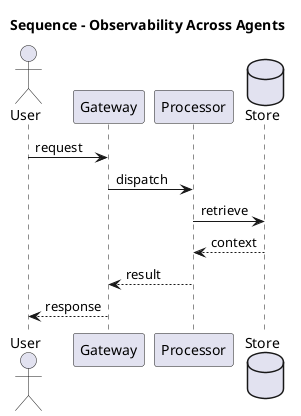

_Source diagram (plantuml); render with the appropriate tool._

**Figure 17. Sequence - Observability Across Agents** (plantuml). Figure: Sequence view for Multi-Agent Systems. This diagram illustrates the principal components and their interactions as discussed in the surrounding section.

## Deep Dive: Mechanics, Variants and Trade-offs

Having established the essentials, we now go deeper into observability across agents. Beneath the abstraction lies a concrete process whose steps can each be measured, tested and optimised independently. The distinctions in this section are the ones that separate a working demo from a system that holds up under adversarial inputs, scale and the passage of time.

Consider the principal variants and how to choose between them. Each variant optimises for a different point in the design space - some for latency, some for accuracy, some for cost or operability - and the correct choice follows from explicit requirements rather than from defaults. There is an inherent trade-off between fidelity and cost, and the correct balance depends on the use case and its tolerance for error.

In practice this is supported by a mature tooling ecosystem, including AutoGen, CrewAI, LangGraph, MetaGPT. Tools accelerate the work but do not substitute for understanding: the same principles apply whichever implementation you select, and the ability to reason from first principles is what lets you debug when a tool behaves unexpectedly.

A frequent source of subtle bugs is the interaction with shared memory and state. Because shared memory and state concerns coordinating context across agents safely, changes there can silently alter the behaviour analysed here. The remedy is contract tests at the boundary and end-to-end evaluations that exercise the interaction explicitly.

Finally, attend to edge cases and degradation. Define what the system should do under partial failure, unexpected inputs and load spikes, and make that behaviour explicit and tested rather than emergent. Graceful degradation - returning a safe, useful result when the ideal one is unavailable - is a hallmark of mature engineering.

For deeper study, the literature offers authoritative treatments such as Wu et al. — AutoGen (2023) and Du et al. — Improving Factuality via Multi-Agent Debate (2023). These primary sources reward careful reading and ground the practical guidance above in established results.

## Advanced Considerations

Having established the essentials, we now go deeper into observability across agents. It pays to understand the mechanism rather than treat it as a black box, because most production incidents are explained by one of its steps misbehaving. The distinctions in this section are the ones that separate a working demo from a system that holds up under adversarial inputs, scale and the passage of time.

Consider the principal variants and how to choose between them. Each variant optimises for a different point in the design space - some for latency, some for accuracy, some for cost or operability - and the correct choice follows from explicit requirements rather than from defaults. Every added component buys capability at the price of operational surface area, and that bargain should be made consciously.

In practice this is supported by a mature tooling ecosystem, including AutoGen, CrewAI, LangGraph, MetaGPT. Tools accelerate the work but do not substitute for understanding: the same principles apply whichever implementation you select, and the ability to reason from first principles is what lets you debug when a tool behaves unexpectedly.

A frequent source of subtle bugs is the interaction with why multiple agents. Because why multiple agents concerns specialisation, parallelism and separation of concerns, changes there can silently alter the behaviour analysed here. The remedy is contract tests at the boundary and end-to-end evaluations that exercise the interaction explicitly.

Finally, attend to edge cases and degradation. Define what the system should do under partial failure, unexpected inputs and load spikes, and make that behaviour explicit and tested rather than emergent. Graceful degradation - returning a safe, useful result when the ideal one is unavailable - is a hallmark of mature engineering.

For deeper study, the literature offers authoritative treatments such as Wu et al. — AutoGen (2023) and Du et al. — Improving Factuality via Multi-Agent Debate (2023). These primary sources reward careful reading and ground the practical guidance above in established results.

## Worked Example

Consider a concrete scenario. A simulation organisation needs agent-based modelling of markets and organisations. They decide to apply observability across agents as part of their Multi-Agent Systems solution, but wisely treat it as a hypothesis to be validated rather than a foregone conclusion.

The team begins by stating the objective precisely and defining how success will be measured before writing any code. They establish a small but representative evaluation set, agree on acceptance thresholds, and only then prototype the simplest design that could work. Early measurement reveals which assumptions hold and which must be revised, saving weeks of misdirected effort and surfacing edge cases while they are still cheap to fix.

As the prototype matures into a service, the team hardens it: adding input validation, error handling, caching where it pays off, and monitoring that ties back to the original success metric. They document each significant decision in an architecture decision record so that future maintainers understand not just what was built but why.

The outcome is instructive. The system that reaches production is not the most sophisticated design the team considered, but the one whose behaviour they could measure, explain and operate. This is the recurring lesson of Multi-Agent Systems: durable value comes from the whole system, not from any single clever component.

## Industry Use Cases

Across industries, the ideas in this chapter recur in recognisable ways. The following vignettes show how different sectors apply them and what they have in common.

**Software.** Planner, coder, reviewer and tester agents collaborating. The common thread is that value comes not from the model alone but from the surrounding system - data quality, evaluation, integration and operations - which is precisely where most of the engineering effort belongs.

**Research.** Specialised retrieval, analysis and writing agents. The common thread is that value comes not from the model alone but from the surrounding system - data quality, evaluation, integration and operations - which is precisely where most of the engineering effort belongs.

**Operations.** Coordinated agents across monitoring and remediation. The common thread is that value comes not from the model alone but from the surrounding system - data quality, evaluation, integration and operations - which is precisely where most of the engineering effort belongs.

**Simulation.** Agent-based modelling of markets and organisations. The common thread is that value comes not from the model alone but from the surrounding system - data quality, evaluation, integration and operations - which is precisely where most of the engineering effort belongs.

## Best Practices

The following practices consistently separate successful Multi-Agent Systems efforts from struggling ones. They are deliberately concrete so they can be adopted as checklist items in design and code review.

- Give each agent a narrow, well-specified role.
- Use structured messages and explicit handoff contracts.
- Enforce global budgets to prevent multiplicative cost blow-ups.
- Trace cross-agent interactions for debugging.

None of these are exotic; they are the unglamorous disciplines that compound into reliability. The cost of adopting them is small compared with the cost of the incidents they prevent, and they become second nature with practice.

## Common Pitfalls

Equally instructive are the failure modes that recur in practice. Each pitfall below has a clear early warning sign and a known remedy, so treat them as a diagnostic checklist when something feels wrong:

- Agents talking in circles without convergence.
- Combinatorial cost growth across many agents.
- Unclear ownership leading to duplicated or conflicting actions.
- Emergent failures that are hard to reproduce.

The pattern is consistent: most failures stem from skipping measurement, conflating prototype and production standards, or deferring cross-cutting concerns such as security and cost until they become emergencies. Naming these traps in advance is the cheapest way to avoid them.

## Governance, Security and Cost Notes

No discussion of observability across agents is complete without its governance, security and cost dimensions, which are too often deferred until they become emergencies. Treating them as first-class concerns from the outset is both cheaper and safer.

**Governance.** Classify the risk of this capability, document its intended and out-of-scope uses, and ensure decisions are traceable to satisfy internal policy and external regulation such as the NIST AI RMF, ISO/IEC 42001 and the EU AI Act. **Security.** Treat all external input as untrusted, validate outputs before acting on them, apply least privilege to any tools or data access, and map controls to the OWASP LLM Top 10 and MITRE ATLAS.

**Cost and sustainability.** Establish explicit budgets for compute, tokens and latency, attribute spend to owners, and revisit the economics as usage scales - a design that is affordable at pilot scale can become untenable at production volume. Building these reflexes into everyday engineering is what allows a Multi-Agent Systems system to be not only capable but also trustworthy and economically sound.

## Hands-On Exercises

Work through the following exercises. They are designed to move understanding from recognition to application - the level required for real engineering work - so prefer writing and building over merely reading.

1. Explain observability across agents to a colleague unfamiliar with Multi-Agent Systems, using a concrete example from your own domain.
2. Sketch a reference architecture that incorporates observability across agents and annotate where observability, security and cost controls belong.
3. Design an evaluation that would tell you whether observability across agents is working in production, including the metric, the dataset and the acceptance threshold.
4. Identify two pitfalls relevant to observability across agents in your environment and describe the early warning signals you would monitor.
5. Prototype the simplest implementation that demonstrates observability across agents, then list exactly what would need to change to make it production-ready.

## Key Takeaways

Key takeaways from this chapter:

- Observability Across Agents is a systems concern in Multi-Agent Systems: data, models and operations must be co-designed.
- Measurement is non-negotiable; define success metrics and evaluation before building.
- Favour the simplest design that meets the requirement, and add complexity only when evidence demands it.
- Security, cost and observability are first-class requirements, not afterthoughts.
- Document decisions so the system remains understandable and operable as it evolves.

## Code Walkthrough

Pipelines keep Observability Across Agents logic modular and testable. Each stage is a pure function, errors are captured per item, and the composition is trivial to extend or reorder.

The full listing is shown below; study it line by line and reproduce it locally before moving on.

### Listing: A composable processing pipeline for Observability Across Agents

```python
from collections.abc import Iterable, Iterator
from typing import Protocol


class Stage(Protocol):
    def __call__(self, item: dict) -> dict: ...


def pipeline(stages: list[Stage]) -> Stage:
    """Compose ordered stages into a single callable for Observability Across Agents."""

    def run(item: dict) -> dict:
        for stage in stages:
            item = stage(item)
        return item

    return run


def validate(item: dict) -> dict:
    if "text" not in item:
        raise ValueError("missing required field: text")
    return item


def normalise(item: dict) -> dict:
    item["text"] = item["text"].strip().lower()
    return item


def enrich(item: dict) -> dict:
    item["length"] = len(item["text"])
    return item


process = pipeline([validate, normalise, enrich])


def run_batch(items: Iterable[dict]) -> Iterator[dict]:
    for item in items:
        try:
            yield process(dict(item))
        except ValueError as exc:
            yield {"error": str(exc), "item": item}

```

## Review Questions

1. In the context of Multi-Agent Systems, which statement best describes “Observability Across Agents”?
   - A. Tracing distributed agent interactions.
   - B. It applies exclusively to image data.
   - C. It eliminates the need for any evaluation or monitoring.
   - D. It removes all security and governance requirements.
   - **Answer: A.** Observability Across Agents: Tracing distributed agent interactions.
2. Which of the following is a recommended best practice when working with Multi-Agent Systems?
   - A. It removes all security and governance requirements.
   - B. Enforce global budgets to prevent multiplicative cost blow-ups.
   - C. It applies exclusively to image data.
   - D. Combinatorial cost growth across many agents.
   - **Answer: B.** Best practice: Enforce global budgets to prevent multiplicative cost blow-ups.
3. Which of the following is a common pitfall to avoid in Multi-Agent Systems?
   - A. Unclear ownership leading to duplicated or conflicting actions.
   - B. Give each agent a narrow, well-specified role.
   - C. It makes the system slower but has no other effect.
   - D. It guarantees deterministic output regardless of input.
   - **Answer: A.** Pitfall to avoid: Unclear ownership leading to duplicated or conflicting actions.
4. *(Discussion)* What trade-offs would you weigh when implementing Observability Across Agents?
   - **Model answer:** A strong answer defines observability across agents (Tracing distributed agent interactions.) then connects it to architecture, evaluation, cost, security and operations for Multi-Agent Systems, citing concrete trade-offs and a real-world example.

---


# Chapter 14. The Multi-Agent Reference Architecture

_This chapter examines the multi-agent reference architecture within Multi-Agent Systems. It covers supervisor, workers, shared memory and guardrails, derives a reference architecture, walks through a worked example and runnable code, surveys industry use cases, and distils best practices and pitfalls, closing with exercises and review questions._

## Introduction

In practical terms, The Multi-Agent Reference Architecture is best understood as supervisor, workers, shared memory and guardrails. It is foundational: later capabilities in Multi-Agent Systems are built directly on top of it. The right abstraction here pays compounding dividends, because downstream components depend on its guarantees.

This chapter builds intuition first, then formalises the ideas, derives an architecture, and finishes with code, exercises and review questions so the material transfers directly to your own Multi-Agent Systems work. Read it actively: pause at each diagram, reproduce the code, and attempt the exercises before consulting the answers.

## Theory and Foundations

The Multi-Agent Reference Architecture can be characterised as supervisor, workers, shared memory and guardrails. Seasoned practitioners treat this as a systems problem, co-designing data, models and operations rather than optimising any one in isolation. It pays to understand the mechanism rather than treat it as a black box, because most production incidents are explained by one of its steps misbehaving.

To place this in context, recall the broader picture: Multi-agent systems decompose complex goals across specialised agents that communicate, coordinate and sometimes debate to produce better outcomes than a single agent. Within that picture, the multi-agent reference architecture is one of the load-bearing ideas - the kind that, when understood deeply, makes the rest of Multi-Agent Systems fall into place. Teams that master this consistently ship more reliable Multi-Agent Systems systems at lower cost.

The Multi-Agent Reference Architecture cannot be understood in isolation from cost control at team scale. Recall that cost control at team scale concerns budgeting across many concurrent agents. The two interact directly: decisions in one constrain the design space of the other, which is why mature teams reason about them together rather than sequentially. As with most architectural decisions, the choice is rarely binary; the skill lies in quantifying the trade-offs and choosing deliberately.

The Multi-Agent Reference Architecture cannot be understood in isolation from tool and resource contention. Recall that tool and resource contention concerns coordinating access to shared external systems. The two interact directly: decisions in one constrain the design space of the other, which is why mature teams reason about them together rather than sequentially. As with most architectural decisions, the choice is rarely binary; the skill lies in quantifying the trade-offs and choosing deliberately.

Several established patterns apply directly to the multi-agent reference architecture. The first, blackboard for shared coordination state, is widely adopted because it makes the system's behaviour predictable and observable. A complementary pattern, debate-and-judge for high-stakes decisions, addresses a related concern and is often deployed alongside it. Patterns are not dogma; they are distilled experience that shortcuts the search for a sound design, and each carries assumptions worth checking against your context.

It is worth being explicit about when to apply this and when to reach for something simpler. In a small prototype, shortcuts around the multi-agent reference architecture are invisible; in a production Multi-Agent Systems system serving real traffic, they surface as incidents, cost overruns or compliance gaps. There is an inherent trade-off between fidelity and cost, and the correct balance depends on the use case and its tolerance for error. The remainder of this chapter turns these principles into an architecture, code and a checklist you can apply immediately.

## Architecture and Design

A robust architecture for The Multi-Agent Reference Architecture is layered so each part can evolve independently without destabilising the whole. A multi-agent platform uses a supervisor/orchestrator that routes subtasks to specialised worker agents, a shared state store for coordination, a message bus for structured communication, and global guardrails enforcing budgets and permissions. Distributed tracing stitches together cross-agent trajectories.

Concretely, the principal building blocks include why multiple agents, agent roles and topologies, communication protocols, orchestration and routing and shared memory and state. Each is a replaceable component behind a stable interface, so the team can upgrade an implementation - a model, an index, a policy engine - without rewriting its neighbours. The contracts between components are where reliability is won or lost, so they are specified explicitly and tested in isolation.

The diagram accompanying this section makes the data and control flow explicit. Requests enter through a well-defined boundary where they are authenticated and validated; only then are they dispatched to the components that perform the work. This boundary is also where rate limiting, quota enforcement and audit logging live, keeping cross-cutting concerns out of the core logic and in one auditable place.

Two qualities deserve emphasis. First, observability is designed in, not bolted on: every component emits structured telemetry so that failures can be localised in minutes rather than hours. Second, the architecture is evolvable - components communicate through stable contracts so that any single part of the Multi-Agent Systems system can be replaced without a rewrite. Simplicity is a feature. The simplest design that meets the requirement should be the default, with complexity added only when measurement justifies it.

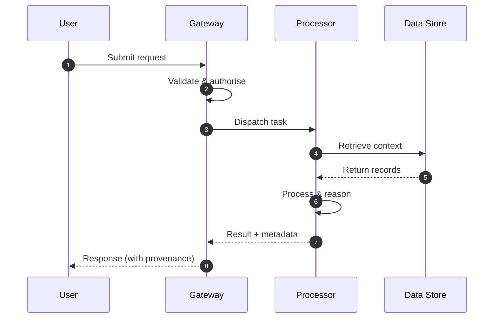

**Figure 18. Sequence - The Multi-Agent Reference Architecture** (mermaid). Figure: Sequence view for Multi-Agent Systems. This diagram illustrates the principal components and their interactions as discussed in the surrounding section.

```xml
<mxfile host="ai-university">
  <diagram name="Business Process">
    <mxGraphModel dx="800" dy="600" grid="1" gridSize="10">
      <root>
        <mxCell id="0"/>
        <mxCell id="1" parent="0"/>
        <mxCell id="title" value="Business Process - The Multi-Agent Reference Architecture" style="text;fontSize=16;fontStyle=1" vertex="1" parent="1"><mxGeometry x="40" y="20" width="600" height="30" as="geometry"/></mxCell>
        <mxCell id="hub" value="Multi-Agent Systems" style="rounded=1;fillColor=#0f172a;fontColor=#ffffff;fontStyle=1" vertex="1" parent="1"><mxGeometry x="300" y="180" width="160" height="60" as="geometry"/></mxCell>
        <mxCell id="n0" value="Why Multiple Agents" style="rounded=1;fillColor=#e0e7ff;strokeColor=#4338ca" vertex="1" parent="1"><mxGeometry x="60" y="80" width="160" height="50" as="geometry"/></mxCell>
        <mxCell id="e0" style="edgeStyle=orthogonalEdgeStyle" edge="1" parent="1" source="hub" target="n0"><mxGeometry relative="1" as="geometry"/></mxCell>
        <mxCell id="n1" value="Agent Roles and Topolog…" style="rounded=1;fillColor=#e0e7ff;strokeColor=#4338ca" vertex="1" parent="1"><mxGeometry x="600" y="170" width="160" height="50" as="geometry"/></mxCell>
        <mxCell id="e1" style="edgeStyle=orthogonalEdgeStyle" edge="1" parent="1" source="hub" target="n1"><mxGeometry relative="1" as="geometry"/></mxCell>
        <mxCell id="n2" value="Communication Protocols" style="rounded=1;fillColor=#e0e7ff;strokeColor=#4338ca" vertex="1" parent="1"><mxGeometry x="60" y="260" width="160" height="50" as="geometry"/></mxCell>
        <mxCell id="e2" style="edgeStyle=orthogonalEdgeStyle" edge="1" parent="1" source="hub" target="n2"><mxGeometry relative="1" as="geometry"/></mxCell>
        <mxCell id="n3" value="Orchestration and Routi…" style="rounded=1;fillColor=#e0e7ff;strokeColor=#4338ca" vertex="1" parent="1"><mxGeometry x="600" y="350" width="160" height="50" as="geometry"/></mxCell>
        <mxCell id="e3" style="edgeStyle=orthogonalEdgeStyle" edge="1" parent="1" source="hub" target="n3"><mxGeometry relative="1" as="geometry"/></mxCell>
        <mxCell id="n4" value="Shared Memory and State" style="rounded=1;fillColor=#e0e7ff;strokeColor=#4338ca" vertex="1" parent="1"><mxGeometry x="60" y="440" width="160" height="50" as="geometry"/></mxCell>
        <mxCell id="e4" style="edgeStyle=orthogonalEdgeStyle" edge="1" parent="1" source="hub" target="n4"><mxGeometry relative="1" as="geometry"/></mxCell>
      </root>
    </mxGraphModel>
  </diagram>
</mxfile>
```

_Source diagram (drawio); render with the appropriate tool._

**Figure 19. Business Process - The Multi-Agent Reference Architecture** (drawio). Figure: Business Process view for Multi-Agent Systems. This diagram illustrates the principal components and their interactions as discussed in the surrounding section.

## Deep Dive: Mechanics, Variants and Trade-offs

Having established the essentials, we now go deeper into the multi-agent reference architecture. The underlying mechanism is best appreciated by tracing a single request from input to output and noting where state is created and consumed. The distinctions in this section are the ones that separate a working demo from a system that holds up under adversarial inputs, scale and the passage of time.

Consider the principal variants and how to choose between them. Each variant optimises for a different point in the design space - some for latency, some for accuracy, some for cost or operability - and the correct choice follows from explicit requirements rather than from defaults. Latency, accuracy and cost form a tension triangle: improving one typically pressures the others, so explicit budgets are essential.

In practice this is supported by a mature tooling ecosystem, including AutoGen, CrewAI, LangGraph, MetaGPT. Tools accelerate the work but do not substitute for understanding: the same principles apply whichever implementation you select, and the ability to reason from first principles is what lets you debug when a tool behaves unexpectedly.

A frequent source of subtle bugs is the interaction with cost control at team scale. Because cost control at team scale concerns budgeting across many concurrent agents, changes there can silently alter the behaviour analysed here. The remedy is contract tests at the boundary and end-to-end evaluations that exercise the interaction explicitly.

Finally, attend to edge cases and degradation. Define what the system should do under partial failure, unexpected inputs and load spikes, and make that behaviour explicit and tested rather than emergent. Graceful degradation - returning a safe, useful result when the ideal one is unavailable - is a hallmark of mature engineering.

For deeper study, the literature offers authoritative treatments such as Wu et al. — AutoGen (2023) and Du et al. — Improving Factuality via Multi-Agent Debate (2023). These primary sources reward careful reading and ground the practical guidance above in established results.

## Advanced Considerations

Having established the essentials, we now go deeper into the multi-agent reference architecture. The underlying mechanism is best appreciated by tracing a single request from input to output and noting where state is created and consumed. The distinctions in this section are the ones that separate a working demo from a system that holds up under adversarial inputs, scale and the passage of time.

Consider the principal variants and how to choose between them. Each variant optimises for a different point in the design space - some for latency, some for accuracy, some for cost or operability - and the correct choice follows from explicit requirements rather than from defaults. Latency, accuracy and cost form a tension triangle: improving one typically pressures the others, so explicit budgets are essential.

In practice this is supported by a mature tooling ecosystem, including AutoGen, CrewAI, LangGraph, MetaGPT. Tools accelerate the work but do not substitute for understanding: the same principles apply whichever implementation you select, and the ability to reason from first principles is what lets you debug when a tool behaves unexpectedly.

A frequent source of subtle bugs is the interaction with observability across agents. Because observability across agents concerns tracing distributed agent interactions, changes there can silently alter the behaviour analysed here. The remedy is contract tests at the boundary and end-to-end evaluations that exercise the interaction explicitly.

Finally, attend to edge cases and degradation. Define what the system should do under partial failure, unexpected inputs and load spikes, and make that behaviour explicit and tested rather than emergent. Graceful degradation - returning a safe, useful result when the ideal one is unavailable - is a hallmark of mature engineering.

For deeper study, the literature offers authoritative treatments such as Wu et al. — AutoGen (2023) and Du et al. — Improving Factuality via Multi-Agent Debate (2023). These primary sources reward careful reading and ground the practical guidance above in established results.

## Worked Example

To ground the discussion, walk through a representative example. A simulation organisation needs agent-based modelling of markets and organisations. They decide to apply the multi-agent reference architecture as part of their Multi-Agent Systems solution, but wisely treat it as a hypothesis to be validated rather than a foregone conclusion.

The team begins by stating the objective precisely and defining how success will be measured before writing any code. They establish a small but representative evaluation set, agree on acceptance thresholds, and only then prototype the simplest design that could work. Early measurement reveals which assumptions hold and which must be revised, saving weeks of misdirected effort and surfacing edge cases while they are still cheap to fix.

As the prototype matures into a service, the team hardens it: adding input validation, error handling, caching where it pays off, and monitoring that ties back to the original success metric. They document each significant decision in an architecture decision record so that future maintainers understand not just what was built but why.

The outcome is instructive. The system that reaches production is not the most sophisticated design the team considered, but the one whose behaviour they could measure, explain and operate. This is the recurring lesson of Multi-Agent Systems: durable value comes from the whole system, not from any single clever component.

## Industry Use Cases

Across industries, the ideas in this chapter recur in recognisable ways. The following vignettes show how different sectors apply them and what they have in common.

**Software.** Planner, coder, reviewer and tester agents collaborating. The common thread is that value comes not from the model alone but from the surrounding system - data quality, evaluation, integration and operations - which is precisely where most of the engineering effort belongs.

**Research.** Specialised retrieval, analysis and writing agents. The common thread is that value comes not from the model alone but from the surrounding system - data quality, evaluation, integration and operations - which is precisely where most of the engineering effort belongs.

**Operations.** Coordinated agents across monitoring and remediation. The common thread is that value comes not from the model alone but from the surrounding system - data quality, evaluation, integration and operations - which is precisely where most of the engineering effort belongs.

**Simulation.** Agent-based modelling of markets and organisations. The common thread is that value comes not from the model alone but from the surrounding system - data quality, evaluation, integration and operations - which is precisely where most of the engineering effort belongs.

## Best Practices

The following practices consistently separate successful Multi-Agent Systems efforts from struggling ones. They are deliberately concrete so they can be adopted as checklist items in design and code review.

- Give each agent a narrow, well-specified role.
- Use structured messages and explicit handoff contracts.
- Enforce global budgets to prevent multiplicative cost blow-ups.
- Trace cross-agent interactions for debugging.

None of these are exotic; they are the unglamorous disciplines that compound into reliability. The cost of adopting them is small compared with the cost of the incidents they prevent, and they become second nature with practice.

## Common Pitfalls

Equally instructive are the failure modes that recur in practice. Each pitfall below has a clear early warning sign and a known remedy, so treat them as a diagnostic checklist when something feels wrong:

- Agents talking in circles without convergence.
- Combinatorial cost growth across many agents.
- Unclear ownership leading to duplicated or conflicting actions.
- Emergent failures that are hard to reproduce.

The pattern is consistent: most failures stem from skipping measurement, conflating prototype and production standards, or deferring cross-cutting concerns such as security and cost until they become emergencies. Naming these traps in advance is the cheapest way to avoid them.

## Governance, Security and Cost Notes

No discussion of the multi-agent reference architecture is complete without its governance, security and cost dimensions, which are too often deferred until they become emergencies. Treating them as first-class concerns from the outset is both cheaper and safer.

**Governance.** Classify the risk of this capability, document its intended and out-of-scope uses, and ensure decisions are traceable to satisfy internal policy and external regulation such as the NIST AI RMF, ISO/IEC 42001 and the EU AI Act. **Security.** Treat all external input as untrusted, validate outputs before acting on them, apply least privilege to any tools or data access, and map controls to the OWASP LLM Top 10 and MITRE ATLAS.

**Cost and sustainability.** Establish explicit budgets for compute, tokens and latency, attribute spend to owners, and revisit the economics as usage scales - a design that is affordable at pilot scale can become untenable at production volume. Building these reflexes into everyday engineering is what allows a Multi-Agent Systems system to be not only capable but also trustworthy and economically sound.

## Hands-On Exercises

Work through the following exercises. They are designed to move understanding from recognition to application - the level required for real engineering work - so prefer writing and building over merely reading.

1. Explain the multi-agent reference architecture to a colleague unfamiliar with Multi-Agent Systems, using a concrete example from your own domain.
2. Sketch a reference architecture that incorporates the multi-agent reference architecture and annotate where observability, security and cost controls belong.
3. Design an evaluation that would tell you whether the multi-agent reference architecture is working in production, including the metric, the dataset and the acceptance threshold.
4. Identify two pitfalls relevant to the multi-agent reference architecture in your environment and describe the early warning signals you would monitor.
5. Prototype the simplest implementation that demonstrates the multi-agent reference architecture, then list exactly what would need to change to make it production-ready.

## Key Takeaways

Key takeaways from this chapter:

- The Multi-Agent Reference Architecture is a systems concern in Multi-Agent Systems: data, models and operations must be co-designed.
- Measurement is non-negotiable; define success metrics and evaluation before building.
- Favour the simplest design that meets the requirement, and add complexity only when evidence demands it.
- Security, cost and observability are first-class requirements, not afterthoughts.
- Document decisions so the system remains understandable and operable as it evolves.

## Code Walkthrough

Pipelines keep The Multi-Agent Reference Architecture logic modular and testable. Each stage is a pure function, errors are captured per item, and the composition is trivial to extend or reorder.

The full listing is shown below; study it line by line and reproduce it locally before moving on.

### Listing: A composable processing pipeline for The Multi-Agent Reference Architecture

```python
from collections.abc import Iterable, Iterator
from typing import Protocol


class Stage(Protocol):
    def __call__(self, item: dict) -> dict: ...


def pipeline(stages: list[Stage]) -> Stage:
    """Compose ordered stages into a single callable for The Multi-Agent Reference Architecture."""

    def run(item: dict) -> dict:
        for stage in stages:
            item = stage(item)
        return item

    return run


def validate(item: dict) -> dict:
    if "text" not in item:
        raise ValueError("missing required field: text")
    return item


def normalise(item: dict) -> dict:
    item["text"] = item["text"].strip().lower()
    return item


def enrich(item: dict) -> dict:
    item["length"] = len(item["text"])
    return item


process = pipeline([validate, normalise, enrich])


def run_batch(items: Iterable[dict]) -> Iterator[dict]:
    for item in items:
        try:
            yield process(dict(item))
        except ValueError as exc:
            yield {"error": str(exc), "item": item}

```

## Review Questions

1. In the context of Multi-Agent Systems, which statement best describes “The Multi-Agent Reference Architecture”?
   - A. It makes the system slower but has no other effect.
   - B. Supervisor, workers, shared memory and guardrails.
   - C. It is only relevant to academic research, not production.
   - D. It applies exclusively to image data.
   - **Answer: B.** The Multi-Agent Reference Architecture: Supervisor, workers, shared memory and guardrails.
2. Which of the following is a recommended best practice when working with Multi-Agent Systems?
   - A. Unclear ownership leading to duplicated or conflicting actions.
   - B. Enforce global budgets to prevent multiplicative cost blow-ups.
   - C. It eliminates the need for any evaluation or monitoring.
   - D. It is only relevant to academic research, not production.
   - **Answer: B.** Best practice: Enforce global budgets to prevent multiplicative cost blow-ups.
3. Which of the following is a common pitfall to avoid in Multi-Agent Systems?
   - A. Give each agent a narrow, well-specified role.
   - B. It eliminates the need for any evaluation or monitoring.
   - C. It is only relevant to academic research, not production.
   - D. Combinatorial cost growth across many agents.
   - **Answer: D.** Pitfall to avoid: Combinatorial cost growth across many agents.
4. *(Discussion)* Explain The Multi-Agent Reference Architecture and why it matters in a production Multi-Agent Systems system.
   - **Model answer:** A strong answer defines the multi-agent reference architecture (Supervisor, workers, shared memory and guardrails.) then connects it to architecture, evaluation, cost, security and operations for Multi-Agent Systems, citing concrete trade-offs and a real-world example.

---


# Chapter 15. Putting It Together: A Reference Implementation

_This chapter examines putting it together: a reference implementation within Multi-Agent Systems. It covers an end-to-end reference implementation that integrates the components of a Multi-Agent Systems system into a cohesive, working whole, derives a reference architecture, walks through a worked example and runnable code, surveys industry use cases, and distils best practices and pitfalls, closing with exercises and review questions._

## Introduction

Putting It Together: A Reference Implementation can be characterised as an end-to-end reference implementation that integrates the components of a Multi-Agent Systems system into a cohesive, working whole. This concept recurs throughout the Multi-Agent Systems lifecycle, from design to operations. The right abstraction here pays compounding dividends, because downstream components depend on its guarantees.

This chapter builds intuition first, then formalises the ideas, derives an architecture, and finishes with code, exercises and review questions so the material transfers directly to your own Multi-Agent Systems work. Read it actively: pause at each diagram, reproduce the code, and attempt the exercises before consulting the answers.

## Theory and Foundations

Putting It Together: A Reference Implementation can be characterised as an end-to-end reference implementation that integrates the components of a Multi-Agent Systems system into a cohesive, working whole. It helps to separate the conceptual model from its implementation: the former guides reasoning, the latter must contend with real-world constraints. It pays to understand the mechanism rather than treat it as a black box, because most production incidents are explained by one of its steps misbehaving.

To place this in context, recall the broader picture: Multi-agent systems decompose complex goals across specialised agents that communicate, coordinate and sometimes debate to produce better outcomes than a single agent. Within that picture, putting it together: a reference implementation is one of the load-bearing ideas - the kind that, when understood deeply, makes the rest of Multi-Agent Systems fall into place. Teams that master this consistently ship more reliable Multi-Agent Systems systems at lower cost.

Putting It Together: A Reference Implementation cannot be understood in isolation from agent roles and topologies. Recall that agent roles and topologies concerns hierarchical, sequential, network and market-based organisations. The two interact directly: decisions in one constrain the design space of the other, which is why mature teams reason about them together rather than sequentially. Latency, accuracy and cost form a tension triangle: improving one typically pressures the others, so explicit budgets are essential.

Putting It Together: A Reference Implementation cannot be understood in isolation from why multiple agents. Recall that why multiple agents concerns specialisation, parallelism and separation of concerns. The two interact directly: decisions in one constrain the design space of the other, which is why mature teams reason about them together rather than sequentially. Every added component buys capability at the price of operational surface area, and that bargain should be made consciously.

Several established patterns apply directly to putting it together: a reference implementation. The first, debate-and-judge for high-stakes decisions, is widely adopted because it makes the system's behaviour predictable and observable. A complementary pattern, sequential pipeline of specialised agents, addresses a related concern and is often deployed alongside it. Patterns are not dogma; they are distilled experience that shortcuts the search for a sound design, and each carries assumptions worth checking against your context.

It is worth being explicit about when to apply this and when to reach for something simpler. In a small prototype, shortcuts around putting it together: a reference implementation are invisible; in a production Multi-Agent Systems system serving real traffic, they surface as incidents, cost overruns or compliance gaps. Latency, accuracy and cost form a tension triangle: improving one typically pressures the others, so explicit budgets are essential. The remainder of this chapter turns these principles into an architecture, code and a checklist you can apply immediately.

## Architecture and Design

From an architectural standpoint, Putting It Together: A Reference Implementation sits at the intersection of data, models and operations. A multi-agent platform uses a supervisor/orchestrator that routes subtasks to specialised worker agents, a shared state store for coordination, a message bus for structured communication, and global guardrails enforcing budgets and permissions. Distributed tracing stitches together cross-agent trajectories.

Concretely, the principal building blocks include why multiple agents, agent roles and topologies, communication protocols, orchestration and routing and shared memory and state. Each is a replaceable component behind a stable interface, so the team can upgrade an implementation - a model, an index, a policy engine - without rewriting its neighbours. The contracts between components are where reliability is won or lost, so they are specified explicitly and tested in isolation.

The diagram accompanying this section makes the data and control flow explicit. Requests enter through a well-defined boundary where they are authenticated and validated; only then are they dispatched to the components that perform the work. This boundary is also where rate limiting, quota enforcement and audit logging live, keeping cross-cutting concerns out of the core logic and in one auditable place.

Two qualities deserve emphasis. First, observability is designed in, not bolted on: every component emits structured telemetry so that failures can be localised in minutes rather than hours. Second, the architecture is evolvable - components communicate through stable contracts so that any single part of the Multi-Agent Systems system can be replaced without a rewrite. Every added component buys capability at the price of operational surface area, and that bargain should be made consciously.

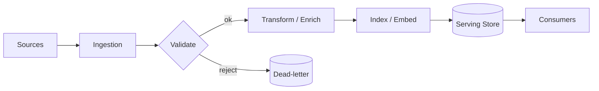

**Figure 20. Business Process - Putting It Together: A Reference Implementation** (mermaid). Figure: Business Process view for Multi-Agent Systems. This diagram illustrates the principal components and their interactions as discussed in the surrounding section.

## Deep Dive: Mechanics, Variants and Trade-offs

Having established the essentials, we now go deeper into putting it together: a reference implementation. Mechanically, the behaviour emerges from a few interacting parts that are simpler than the whole they produce. The distinctions in this section are the ones that separate a working demo from a system that holds up under adversarial inputs, scale and the passage of time.

Consider the principal variants and how to choose between them. Each variant optimises for a different point in the design space - some for latency, some for accuracy, some for cost or operability - and the correct choice follows from explicit requirements rather than from defaults. Simplicity is a feature. The simplest design that meets the requirement should be the default, with complexity added only when measurement justifies it.

In practice this is supported by a mature tooling ecosystem, including AutoGen, CrewAI, LangGraph, MetaGPT. Tools accelerate the work but do not substitute for understanding: the same principles apply whichever implementation you select, and the ability to reason from first principles is what lets you debug when a tool behaves unexpectedly.

A frequent source of subtle bugs is the interaction with agent roles and topologies. Because agent roles and topologies concerns hierarchical, sequential, network and market-based organisations, changes there can silently alter the behaviour analysed here. The remedy is contract tests at the boundary and end-to-end evaluations that exercise the interaction explicitly.

Finally, attend to edge cases and degradation. Define what the system should do under partial failure, unexpected inputs and load spikes, and make that behaviour explicit and tested rather than emergent. Graceful degradation - returning a safe, useful result when the ideal one is unavailable - is a hallmark of mature engineering.

For deeper study, the literature offers authoritative treatments such as Wu et al. — AutoGen (2023) and Du et al. — Improving Factuality via Multi-Agent Debate (2023). These primary sources reward careful reading and ground the practical guidance above in established results.

## Advanced Considerations

Having established the essentials, we now go deeper into putting it together: a reference implementation. Beneath the abstraction lies a concrete process whose steps can each be measured, tested and optimised independently. The distinctions in this section are the ones that separate a working demo from a system that holds up under adversarial inputs, scale and the passage of time.

Consider the principal variants and how to choose between them. Each variant optimises for a different point in the design space - some for latency, some for accuracy, some for cost or operability - and the correct choice follows from explicit requirements rather than from defaults. There is an inherent trade-off between fidelity and cost, and the correct balance depends on the use case and its tolerance for error.

In practice this is supported by a mature tooling ecosystem, including AutoGen, CrewAI, LangGraph, MetaGPT. Tools accelerate the work but do not substitute for understanding: the same principles apply whichever implementation you select, and the ability to reason from first principles is what lets you debug when a tool behaves unexpectedly.

A frequent source of subtle bugs is the interaction with conflict resolution. Because conflict resolution concerns handling disagreement and contradictory actions, changes there can silently alter the behaviour analysed here. The remedy is contract tests at the boundary and end-to-end evaluations that exercise the interaction explicitly.

Finally, attend to edge cases and degradation. Define what the system should do under partial failure, unexpected inputs and load spikes, and make that behaviour explicit and tested rather than emergent. Graceful degradation - returning a safe, useful result when the ideal one is unavailable - is a hallmark of mature engineering.

For deeper study, the literature offers authoritative treatments such as Wu et al. — AutoGen (2023) and Du et al. — Improving Factuality via Multi-Agent Debate (2023). These primary sources reward careful reading and ground the practical guidance above in established results.

## Worked Example

Consider a concrete scenario. A simulation organisation needs agent-based modelling of markets and organisations. They decide to apply putting it together: a reference implementation as part of their Multi-Agent Systems solution, but wisely treat it as a hypothesis to be validated rather than a foregone conclusion.

The team begins by stating the objective precisely and defining how success will be measured before writing any code. They establish a small but representative evaluation set, agree on acceptance thresholds, and only then prototype the simplest design that could work. Early measurement reveals which assumptions hold and which must be revised, saving weeks of misdirected effort and surfacing edge cases while they are still cheap to fix.

As the prototype matures into a service, the team hardens it: adding input validation, error handling, caching where it pays off, and monitoring that ties back to the original success metric. They document each significant decision in an architecture decision record so that future maintainers understand not just what was built but why.

The outcome is instructive. The system that reaches production is not the most sophisticated design the team considered, but the one whose behaviour they could measure, explain and operate. This is the recurring lesson of Multi-Agent Systems: durable value comes from the whole system, not from any single clever component.

## Industry Use Cases

Across industries, the ideas in this chapter recur in recognisable ways. The following vignettes show how different sectors apply them and what they have in common.

**Software.** Planner, coder, reviewer and tester agents collaborating. The common thread is that value comes not from the model alone but from the surrounding system - data quality, evaluation, integration and operations - which is precisely where most of the engineering effort belongs.

**Research.** Specialised retrieval, analysis and writing agents. The common thread is that value comes not from the model alone but from the surrounding system - data quality, evaluation, integration and operations - which is precisely where most of the engineering effort belongs.

**Operations.** Coordinated agents across monitoring and remediation. The common thread is that value comes not from the model alone but from the surrounding system - data quality, evaluation, integration and operations - which is precisely where most of the engineering effort belongs.

**Simulation.** Agent-based modelling of markets and organisations. The common thread is that value comes not from the model alone but from the surrounding system - data quality, evaluation, integration and operations - which is precisely where most of the engineering effort belongs.

## Best Practices

The following practices consistently separate successful Multi-Agent Systems efforts from struggling ones. They are deliberately concrete so they can be adopted as checklist items in design and code review.

- Give each agent a narrow, well-specified role.
- Use structured messages and explicit handoff contracts.
- Enforce global budgets to prevent multiplicative cost blow-ups.
- Trace cross-agent interactions for debugging.

None of these are exotic; they are the unglamorous disciplines that compound into reliability. The cost of adopting them is small compared with the cost of the incidents they prevent, and they become second nature with practice.

## Common Pitfalls

Equally instructive are the failure modes that recur in practice. Each pitfall below has a clear early warning sign and a known remedy, so treat them as a diagnostic checklist when something feels wrong:

- Agents talking in circles without convergence.
- Combinatorial cost growth across many agents.
- Unclear ownership leading to duplicated or conflicting actions.
- Emergent failures that are hard to reproduce.

The pattern is consistent: most failures stem from skipping measurement, conflating prototype and production standards, or deferring cross-cutting concerns such as security and cost until they become emergencies. Naming these traps in advance is the cheapest way to avoid them.

## Governance, Security and Cost Notes

No discussion of putting it together: a reference implementation is complete without its governance, security and cost dimensions, which are too often deferred until they become emergencies. Treating them as first-class concerns from the outset is both cheaper and safer.

**Governance.** Classify the risk of this capability, document its intended and out-of-scope uses, and ensure decisions are traceable to satisfy internal policy and external regulation such as the NIST AI RMF, ISO/IEC 42001 and the EU AI Act. **Security.** Treat all external input as untrusted, validate outputs before acting on them, apply least privilege to any tools or data access, and map controls to the OWASP LLM Top 10 and MITRE ATLAS.

**Cost and sustainability.** Establish explicit budgets for compute, tokens and latency, attribute spend to owners, and revisit the economics as usage scales - a design that is affordable at pilot scale can become untenable at production volume. Building these reflexes into everyday engineering is what allows a Multi-Agent Systems system to be not only capable but also trustworthy and economically sound.

## Hands-On Exercises

Work through the following exercises. They are designed to move understanding from recognition to application - the level required for real engineering work - so prefer writing and building over merely reading.

1. Explain putting it together: a reference implementation to a colleague unfamiliar with Multi-Agent Systems, using a concrete example from your own domain.
2. Sketch a reference architecture that incorporates putting it together: a reference implementation and annotate where observability, security and cost controls belong.
3. Design an evaluation that would tell you whether putting it together: a reference implementation is working in production, including the metric, the dataset and the acceptance threshold.
4. Identify two pitfalls relevant to putting it together: a reference implementation in your environment and describe the early warning signals you would monitor.
5. Prototype the simplest implementation that demonstrates putting it together: a reference implementation, then list exactly what would need to change to make it production-ready.

## Key Takeaways

Key takeaways from this chapter:

- Putting It Together: A Reference Implementation is a systems concern in Multi-Agent Systems: data, models and operations must be co-designed.
- Measurement is non-negotiable; define success metrics and evaluation before building.
- Favour the simplest design that meets the requirement, and add complexity only when evidence demands it.
- Security, cost and observability are first-class requirements, not afterthoughts.
- Document decisions so the system remains understandable and operable as it evolves.

## Code Walkthrough

Pipelines keep Putting It Together: A Reference Implementation logic modular and testable. Each stage is a pure function, errors are captured per item, and the composition is trivial to extend or reorder.

The full listing is shown below; study it line by line and reproduce it locally before moving on.

### Listing: A composable processing pipeline for Putting It Together: A Reference Implementation

```python
from collections.abc import Iterable, Iterator
from typing import Protocol


class Stage(Protocol):
    def __call__(self, item: dict) -> dict: ...


def pipeline(stages: list[Stage]) -> Stage:
    """Compose ordered stages into a single callable for Putting It Together: A Reference Implementation."""

    def run(item: dict) -> dict:
        for stage in stages:
            item = stage(item)
        return item

    return run


def validate(item: dict) -> dict:
    if "text" not in item:
        raise ValueError("missing required field: text")
    return item


def normalise(item: dict) -> dict:
    item["text"] = item["text"].strip().lower()
    return item


def enrich(item: dict) -> dict:
    item["length"] = len(item["text"])
    return item


process = pipeline([validate, normalise, enrich])


def run_batch(items: Iterable[dict]) -> Iterator[dict]:
    for item in items:
        try:
            yield process(dict(item))
        except ValueError as exc:
            yield {"error": str(exc), "item": item}

```

## Review Questions

1. In the context of Multi-Agent Systems, which statement best describes “Putting It Together: A Reference Implementation”?
   - A. It eliminates the need for any evaluation or monitoring.
   - B. It is only relevant to academic research, not production.
   - C. It removes all security and governance requirements.
   - D. an end-to-end reference implementation that integrates the components of a Multi-Agent Systems system into a cohesive, working whole
   - **Answer: D.** Putting It Together: A Reference Implementation: an end-to-end reference implementation that integrates the components of a Multi-Agent Systems system into a cohesive, working whole
2. Which of the following is a recommended best practice when working with Multi-Agent Systems?
   - A. Unclear ownership leading to duplicated or conflicting actions.
   - B. Give each agent a narrow, well-specified role.
   - C. It guarantees deterministic output regardless of input.
   - D. It is only relevant to academic research, not production.
   - **Answer: B.** Best practice: Give each agent a narrow, well-specified role.
3. Which of the following is a common pitfall to avoid in Multi-Agent Systems?
   - A. Enforce global budgets to prevent multiplicative cost blow-ups.
   - B. Trace cross-agent interactions for debugging.
   - C. Unclear ownership leading to duplicated or conflicting actions.
   - D. It makes the system slower but has no other effect.
   - **Answer: C.** Pitfall to avoid: Unclear ownership leading to duplicated or conflicting actions.
4. *(Discussion)* Explain Putting It Together: A Reference Implementation and why it matters in a production Multi-Agent Systems system.
   - **Model answer:** A strong answer defines putting it together: a reference implementation (an end-to-end reference implementation that integrates the components of a Multi-Agent Systems system into a cohesive, working whole) then connects it to architecture, evaluation, cost, security and operations for Multi-Agent Systems, citing concrete trade-offs and a real-world example.

---


# Chapter 16. Hands-On Lab: Building an End-to-End Multi-Agent Systems System

_This chapter examines hands-on lab: building an end-to-end multi-agent systems system within Multi-Agent Systems. It covers a guided, build-along laboratory that constructs a functioning Multi-Agent Systems system from first principles, derives a reference architecture, walks through a worked example and runnable code, surveys industry use cases, and distils best practices and pitfalls, closing with exercises and review questions._

## Introduction

In practical terms, Hands-On Lab: Building an End-to-End Multi-Agent Systems System is best understood as a guided, build-along laboratory that constructs a functioning Multi-Agent Systems system from first principles. Understanding this matters because Multi-Agent Systems systems succeed or fail on exactly these decisions. Seasoned practitioners treat this as a systems problem, co-designing data, models and operations rather than optimising any one in isolation.

This chapter builds intuition first, then formalises the ideas, derives an architecture, and finishes with code, exercises and review questions so the material transfers directly to your own Multi-Agent Systems work. Read it actively: pause at each diagram, reproduce the code, and attempt the exercises before consulting the answers.

## Theory and Foundations

Formally, Hands-On Lab: Building an End-to-End Multi-Agent Systems System addresses a guided, build-along laboratory that constructs a functioning Multi-Agent Systems system from first principles. The right abstraction here pays compounding dividends, because downstream components depend on its guarantees. It pays to understand the mechanism rather than treat it as a black box, because most production incidents are explained by one of its steps misbehaving.

To place this in context, recall the broader picture: Multi-agent systems decompose complex goals across specialised agents that communicate, coordinate and sometimes debate to produce better outcomes than a single agent. Within that picture, hands-on lab: building an end-to-end multi-agent systems system is one of the load-bearing ideas - the kind that, when understood deeply, makes the rest of Multi-Agent Systems fall into place. Understanding this matters because Multi-Agent Systems systems succeed or fail on exactly these decisions.

Hands-On Lab: Building an End-to-End Multi-Agent Systems System cannot be understood in isolation from the multi-agent reference architecture. Recall that the multi-agent reference architecture concerns supervisor, workers, shared memory and guardrails. The two interact directly: decisions in one constrain the design space of the other, which is why mature teams reason about them together rather than sequentially. Every added component buys capability at the price of operational surface area, and that bargain should be made consciously.

Hands-On Lab: Building an End-to-End Multi-Agent Systems System cannot be understood in isolation from agent roles and topologies. Recall that agent roles and topologies concerns hierarchical, sequential, network and market-based organisations. The two interact directly: decisions in one constrain the design space of the other, which is why mature teams reason about them together rather than sequentially. As with most architectural decisions, the choice is rarely binary; the skill lies in quantifying the trade-offs and choosing deliberately.

Several established patterns apply directly to hands-on lab: building an end-to-end multi-agent systems system. The first, supervisor–worker hierarchy, is widely adopted because it makes the system's behaviour predictable and observable. A complementary pattern, sequential pipeline of specialised agents, addresses a related concern and is often deployed alongside it. Patterns are not dogma; they are distilled experience that shortcuts the search for a sound design, and each carries assumptions worth checking against your context.

It is worth being explicit about when to apply this and when to reach for something simpler. In a small prototype, shortcuts around hands-on lab: building an end-to-end multi-agent systems system are invisible; in a production Multi-Agent Systems system serving real traffic, they surface as incidents, cost overruns or compliance gaps. As with most architectural decisions, the choice is rarely binary; the skill lies in quantifying the trade-offs and choosing deliberately. The remainder of this chapter turns these principles into an architecture, code and a checklist you can apply immediately.

## Architecture and Design

A robust architecture for Hands-On Lab: Building an End-to-End Multi-Agent Systems System is layered so each part can evolve independently without destabilising the whole. A multi-agent platform uses a supervisor/orchestrator that routes subtasks to specialised worker agents, a shared state store for coordination, a message bus for structured communication, and global guardrails enforcing budgets and permissions. Distributed tracing stitches together cross-agent trajectories.

Concretely, the principal building blocks include why multiple agents, agent roles and topologies, communication protocols, orchestration and routing and shared memory and state. Each is a replaceable component behind a stable interface, so the team can upgrade an implementation - a model, an index, a policy engine - without rewriting its neighbours. The contracts between components are where reliability is won or lost, so they are specified explicitly and tested in isolation.

The diagram accompanying this section makes the data and control flow explicit. Requests enter through a well-defined boundary where they are authenticated and validated; only then are they dispatched to the components that perform the work. This boundary is also where rate limiting, quota enforcement and audit logging live, keeping cross-cutting concerns out of the core logic and in one auditable place.

Two qualities deserve emphasis. First, observability is designed in, not bolted on: every component emits structured telemetry so that failures can be localised in minutes rather than hours. Second, the architecture is evolvable - components communicate through stable contracts so that any single part of the Multi-Agent Systems system can be replaced without a rewrite. There is an inherent trade-off between fidelity and cost, and the correct balance depends on the use case and its tolerance for error.

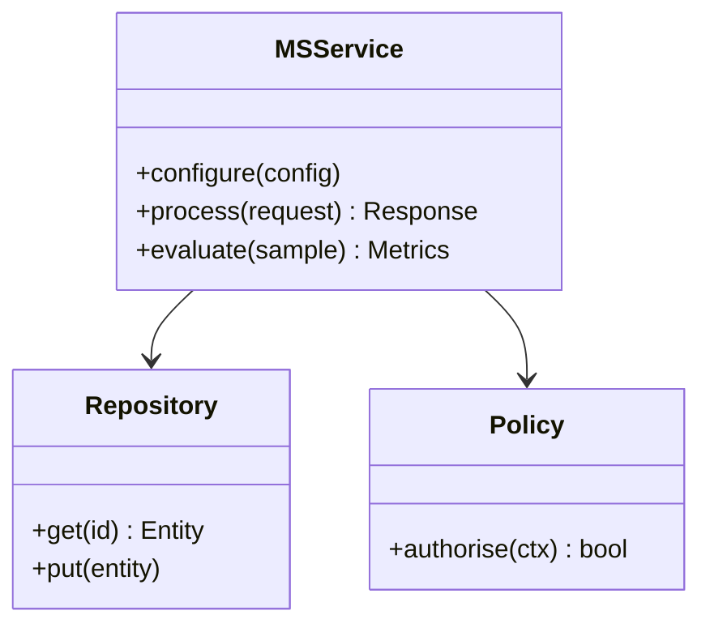

**Figure 21. Class - Hands-On Lab: Building an End-to-End Multi-Agent Systems System** (mermaid). Figure: Class view for Multi-Agent Systems. This diagram illustrates the principal components and their interactions as discussed in the surrounding section.

## Deep Dive: Mechanics, Variants and Trade-offs

Having established the essentials, we now go deeper into hands-on lab: building an end-to-end multi-agent systems system. It pays to understand the mechanism rather than treat it as a black box, because most production incidents are explained by one of its steps misbehaving. The distinctions in this section are the ones that separate a working demo from a system that holds up under adversarial inputs, scale and the passage of time.

Consider the principal variants and how to choose between them. Each variant optimises for a different point in the design space - some for latency, some for accuracy, some for cost or operability - and the correct choice follows from explicit requirements rather than from defaults. Every added component buys capability at the price of operational surface area, and that bargain should be made consciously.

In practice this is supported by a mature tooling ecosystem, including AutoGen, CrewAI, LangGraph, MetaGPT. Tools accelerate the work but do not substitute for understanding: the same principles apply whichever implementation you select, and the ability to reason from first principles is what lets you debug when a tool behaves unexpectedly.

A frequent source of subtle bugs is the interaction with the multi-agent reference architecture. Because the multi-agent reference architecture concerns supervisor, workers, shared memory and guardrails, changes there can silently alter the behaviour analysed here. The remedy is contract tests at the boundary and end-to-end evaluations that exercise the interaction explicitly.

Finally, attend to edge cases and degradation. Define what the system should do under partial failure, unexpected inputs and load spikes, and make that behaviour explicit and tested rather than emergent. Graceful degradation - returning a safe, useful result when the ideal one is unavailable - is a hallmark of mature engineering.

For deeper study, the literature offers authoritative treatments such as Wu et al. — AutoGen (2023) and Du et al. — Improving Factuality via Multi-Agent Debate (2023). These primary sources reward careful reading and ground the practical guidance above in established results.

## Advanced Considerations

Having established the essentials, we now go deeper into hands-on lab: building an end-to-end multi-agent systems system. It pays to understand the mechanism rather than treat it as a black box, because most production incidents are explained by one of its steps misbehaving. The distinctions in this section are the ones that separate a working demo from a system that holds up under adversarial inputs, scale and the passage of time.

Consider the principal variants and how to choose between them. Each variant optimises for a different point in the design space - some for latency, some for accuracy, some for cost or operability - and the correct choice follows from explicit requirements rather than from defaults. Simplicity is a feature. The simplest design that meets the requirement should be the default, with complexity added only when measurement justifies it.

In practice this is supported by a mature tooling ecosystem, including AutoGen, CrewAI, LangGraph, MetaGPT. Tools accelerate the work but do not substitute for understanding: the same principles apply whichever implementation you select, and the ability to reason from first principles is what lets you debug when a tool behaves unexpectedly.

A frequent source of subtle bugs is the interaction with why multiple agents. Because why multiple agents concerns specialisation, parallelism and separation of concerns, changes there can silently alter the behaviour analysed here. The remedy is contract tests at the boundary and end-to-end evaluations that exercise the interaction explicitly.

Finally, attend to edge cases and degradation. Define what the system should do under partial failure, unexpected inputs and load spikes, and make that behaviour explicit and tested rather than emergent. Graceful degradation - returning a safe, useful result when the ideal one is unavailable - is a hallmark of mature engineering.

For deeper study, the literature offers authoritative treatments such as Wu et al. — AutoGen (2023) and Du et al. — Improving Factuality via Multi-Agent Debate (2023). These primary sources reward careful reading and ground the practical guidance above in established results.

## Worked Example

A worked example clarifies how these ideas behave in practice. A research organisation needs specialised retrieval, analysis and writing agents. They decide to apply hands-on lab: building an end-to-end multi-agent systems system as part of their Multi-Agent Systems solution, but wisely treat it as a hypothesis to be validated rather than a foregone conclusion.

The team begins by stating the objective precisely and defining how success will be measured before writing any code. They establish a small but representative evaluation set, agree on acceptance thresholds, and only then prototype the simplest design that could work. Early measurement reveals which assumptions hold and which must be revised, saving weeks of misdirected effort and surfacing edge cases while they are still cheap to fix.

As the prototype matures into a service, the team hardens it: adding input validation, error handling, caching where it pays off, and monitoring that ties back to the original success metric. They document each significant decision in an architecture decision record so that future maintainers understand not just what was built but why.

The outcome is instructive. The system that reaches production is not the most sophisticated design the team considered, but the one whose behaviour they could measure, explain and operate. This is the recurring lesson of Multi-Agent Systems: durable value comes from the whole system, not from any single clever component.

## Industry Use Cases

Across industries, the ideas in this chapter recur in recognisable ways. The following vignettes show how different sectors apply them and what they have in common.

**Software.** Planner, coder, reviewer and tester agents collaborating. The common thread is that value comes not from the model alone but from the surrounding system - data quality, evaluation, integration and operations - which is precisely where most of the engineering effort belongs.

**Research.** Specialised retrieval, analysis and writing agents. The common thread is that value comes not from the model alone but from the surrounding system - data quality, evaluation, integration and operations - which is precisely where most of the engineering effort belongs.

**Operations.** Coordinated agents across monitoring and remediation. The common thread is that value comes not from the model alone but from the surrounding system - data quality, evaluation, integration and operations - which is precisely where most of the engineering effort belongs.

**Simulation.** Agent-based modelling of markets and organisations. The common thread is that value comes not from the model alone but from the surrounding system - data quality, evaluation, integration and operations - which is precisely where most of the engineering effort belongs.

## Best Practices

The following practices consistently separate successful Multi-Agent Systems efforts from struggling ones. They are deliberately concrete so they can be adopted as checklist items in design and code review.

- Give each agent a narrow, well-specified role.
- Use structured messages and explicit handoff contracts.
- Enforce global budgets to prevent multiplicative cost blow-ups.
- Trace cross-agent interactions for debugging.

None of these are exotic; they are the unglamorous disciplines that compound into reliability. The cost of adopting them is small compared with the cost of the incidents they prevent, and they become second nature with practice.

## Common Pitfalls

Equally instructive are the failure modes that recur in practice. Each pitfall below has a clear early warning sign and a known remedy, so treat them as a diagnostic checklist when something feels wrong:

- Agents talking in circles without convergence.
- Combinatorial cost growth across many agents.
- Unclear ownership leading to duplicated or conflicting actions.
- Emergent failures that are hard to reproduce.

The pattern is consistent: most failures stem from skipping measurement, conflating prototype and production standards, or deferring cross-cutting concerns such as security and cost until they become emergencies. Naming these traps in advance is the cheapest way to avoid them.

## Governance, Security and Cost Notes

No discussion of hands-on lab: building an end-to-end multi-agent systems system is complete without its governance, security and cost dimensions, which are too often deferred until they become emergencies. Treating them as first-class concerns from the outset is both cheaper and safer.

**Governance.** Classify the risk of this capability, document its intended and out-of-scope uses, and ensure decisions are traceable to satisfy internal policy and external regulation such as the NIST AI RMF, ISO/IEC 42001 and the EU AI Act. **Security.** Treat all external input as untrusted, validate outputs before acting on them, apply least privilege to any tools or data access, and map controls to the OWASP LLM Top 10 and MITRE ATLAS.

**Cost and sustainability.** Establish explicit budgets for compute, tokens and latency, attribute spend to owners, and revisit the economics as usage scales - a design that is affordable at pilot scale can become untenable at production volume. Building these reflexes into everyday engineering is what allows a Multi-Agent Systems system to be not only capable but also trustworthy and economically sound.

## Hands-On Exercises

Work through the following exercises. They are designed to move understanding from recognition to application - the level required for real engineering work - so prefer writing and building over merely reading.

1. Explain hands-on lab: building an end-to-end multi-agent systems system to a colleague unfamiliar with Multi-Agent Systems, using a concrete example from your own domain.
2. Sketch a reference architecture that incorporates hands-on lab: building an end-to-end multi-agent systems system and annotate where observability, security and cost controls belong.
3. Design an evaluation that would tell you whether hands-on lab: building an end-to-end multi-agent systems system is working in production, including the metric, the dataset and the acceptance threshold.
4. Identify two pitfalls relevant to hands-on lab: building an end-to-end multi-agent systems system in your environment and describe the early warning signals you would monitor.
5. Prototype the simplest implementation that demonstrates hands-on lab: building an end-to-end multi-agent systems system, then list exactly what would need to change to make it production-ready.

## Key Takeaways

Key takeaways from this chapter:

- Hands-On Lab: Building an End-to-End Multi-Agent Systems System is a systems concern in Multi-Agent Systems: data, models and operations must be co-designed.
- Measurement is non-negotiable; define success metrics and evaluation before building.
- Favour the simplest design that meets the requirement, and add complexity only when evidence demands it.
- Security, cost and observability are first-class requirements, not afterthoughts.
- Document decisions so the system remains understandable and operable as it evolves.

## Code Walkthrough

Every change to a Multi-Agent Systems system should pass an evaluation gate. This example shows the minimal shape: align predictions and references, compute a metric, and return a pass/fail decision for CI.

The full listing is shown below; study it line by line and reproduce it locally before moving on.

### Listing: Evaluating Hands-On Lab: Building an End-to-End Multi-Agent Systems System with a regression gate

```python
from dataclasses import dataclass


@dataclass
class EvalResult:
    metric: str
    score: float
    passed: bool


def evaluate(predictions: list[str], references: list[str],
             threshold: float = 0.8) -> EvalResult:
    """Score Hands-On Lab: Building an End-to-End Multi-Agent Systems System output against references with a simple exact-match metric.

    In practice you would combine several metrics (exact match, semantic
    similarity, LLM-as-judge) and gate releases on the aggregate.
    """
    if len(predictions) != len(references):
        raise ValueError("predictions and references must align")
    hits = sum(p.strip() == r.strip() for p, r in zip(predictions, references))
    score = hits / len(references) if references else 0.0
    return EvalResult(metric="exact_match", score=score, passed=score >= threshold)


if __name__ == "__main__":
    result = evaluate(["yes", "no"], ["yes", "yes"])
    print(f"{result.metric}={result.score:.2f} passed={result.passed}")

```

## Review Questions

1. In the context of Multi-Agent Systems, which statement best describes “Hands-On Lab: Building an End-to-End Multi-Agent Systems System”?
   - A. It guarantees deterministic output regardless of input.
   - B. a guided, build-along laboratory that constructs a functioning Multi-Agent Systems system from first principles
   - C. It removes all security and governance requirements.
   - D. It eliminates the need for any evaluation or monitoring.
   - **Answer: B.** Hands-On Lab: Building an End-to-End Multi-Agent Systems System: a guided, build-along laboratory that constructs a functioning Multi-Agent Systems system from first principles
2. Which of the following is a recommended best practice when working with Multi-Agent Systems?
   - A. It applies exclusively to image data.
   - B. Give each agent a narrow, well-specified role.
   - C. It guarantees deterministic output regardless of input.
   - D. It removes all security and governance requirements.
   - **Answer: B.** Best practice: Give each agent a narrow, well-specified role.
3. Which of the following is a common pitfall to avoid in Multi-Agent Systems?
   - A. Trace cross-agent interactions for debugging.
   - B. Give each agent a narrow, well-specified role.
   - C. Use structured messages and explicit handoff contracts.
   - D. Emergent failures that are hard to reproduce.
   - **Answer: D.** Pitfall to avoid: Emergent failures that are hard to reproduce.
4. *(Discussion)* How does Hands-On Lab: Building an End-to-End Multi-Agent Systems System interact with security and governance requirements?
   - **Model answer:** A strong answer defines hands-on lab: building an end-to-end multi-agent systems system (a guided, build-along laboratory that constructs a functioning Multi-Agent Systems system from first principles) then connects it to architecture, evaluation, cost, security and operations for Multi-Agent Systems, citing concrete trade-offs and a real-world example.

---


# Chapter 17. Case Study: Software at Scale

_This chapter examines case study: software at scale within Multi-Agent Systems. It covers a detailed case study of deploying Multi-Agent Systems in a demanding software environment, including the decisions, trade-offs and outcomes, derives a reference architecture, walks through a worked example and runnable code, surveys industry use cases, and distils best practices and pitfalls, closing with exercises and review questions._

## Introduction

Formally, Case Study: Software at Scale addresses a detailed case study of deploying Multi-Agent Systems in a demanding software environment, including the decisions, trade-offs and outcomes. Understanding this matters because Multi-Agent Systems systems succeed or fail on exactly these decisions. Seasoned practitioners treat this as a systems problem, co-designing data, models and operations rather than optimising any one in isolation.

This chapter builds intuition first, then formalises the ideas, derives an architecture, and finishes with code, exercises and review questions so the material transfers directly to your own Multi-Agent Systems work. Read it actively: pause at each diagram, reproduce the code, and attempt the exercises before consulting the answers.

## Theory and Foundations

We define Case Study: Software at Scale as a detailed case study of deploying Multi-Agent Systems in a demanding software environment, including the decisions, trade-offs and outcomes. In an enterprise setting, this translates into concrete requirements: clear interfaces, measurable quality, and controls that satisfy security and governance. The underlying mechanism is best appreciated by tracing a single request from input to output and noting where state is created and consumed.

To place this in context, recall the broader picture: Multi-agent systems decompose complex goals across specialised agents that communicate, coordinate and sometimes debate to produce better outcomes than a single agent. Within that picture, case study: software at scale is one of the load-bearing ideas - the kind that, when understood deeply, makes the rest of Multi-Agent Systems fall into place. Getting this right early prevents expensive rework once a Multi-Agent Systems system reaches scale.

Case Study: Software at Scale cannot be understood in isolation from orchestration and routing. Recall that orchestration and routing concerns supervisors, routers and dynamic task allocation. The two interact directly: decisions in one constrain the design space of the other, which is why mature teams reason about them together rather than sequentially. Simplicity is a feature. The simplest design that meets the requirement should be the default, with complexity added only when measurement justifies it.

Case Study: Software at Scale cannot be understood in isolation from frameworks and patterns. Recall that frameworks and patterns concerns comparing orchestration frameworks. The two interact directly: decisions in one constrain the design space of the other, which is why mature teams reason about them together rather than sequentially. Every added component buys capability at the price of operational surface area, and that bargain should be made consciously.

Several established patterns apply directly to case study: software at scale. The first, debate-and-judge for high-stakes decisions, is widely adopted because it makes the system's behaviour predictable and observable. A complementary pattern, sequential pipeline of specialised agents, addresses a related concern and is often deployed alongside it. Patterns are not dogma; they are distilled experience that shortcuts the search for a sound design, and each carries assumptions worth checking against your context.

Knowing when not to use a technique is as valuable as knowing how to use it. In a small prototype, shortcuts around case study: software at scale are invisible; in a production Multi-Agent Systems system serving real traffic, they surface as incidents, cost overruns or compliance gaps. Simplicity is a feature. The simplest design that meets the requirement should be the default, with complexity added only when measurement justifies it. The remainder of this chapter turns these principles into an architecture, code and a checklist you can apply immediately.

## Architecture and Design

The reference architecture for Case Study: Software at Scale separates concerns into clearly bounded components with explicit contracts. A multi-agent platform uses a supervisor/orchestrator that routes subtasks to specialised worker agents, a shared state store for coordination, a message bus for structured communication, and global guardrails enforcing budgets and permissions. Distributed tracing stitches together cross-agent trajectories.

Concretely, the principal building blocks include why multiple agents, agent roles and topologies, communication protocols, orchestration and routing and shared memory and state. Each is a replaceable component behind a stable interface, so the team can upgrade an implementation - a model, an index, a policy engine - without rewriting its neighbours. The contracts between components are where reliability is won or lost, so they are specified explicitly and tested in isolation.

The diagram accompanying this section makes the data and control flow explicit. Requests enter through a well-defined boundary where they are authenticated and validated; only then are they dispatched to the components that perform the work. This boundary is also where rate limiting, quota enforcement and audit logging live, keeping cross-cutting concerns out of the core logic and in one auditable place.

Two qualities deserve emphasis. First, observability is designed in, not bolted on: every component emits structured telemetry so that failures can be localised in minutes rather than hours. Second, the architecture is evolvable - components communicate through stable contracts so that any single part of the Multi-Agent Systems system can be replaced without a rewrite. Every added component buys capability at the price of operational surface area, and that bargain should be made consciously.

<div class="diagram-svg">

<svg xmlns="http://www.w3.org/2000/svg" width="760" height="360" viewBox="0 0 760 360" font-family="Inter, Arial, sans-serif">
<rect width="760" height="360" fill="#f8fafc"/>
<text x="380" y="34" text-anchor="middle" font-size="20" font-weight="700" fill="#0f172a">Data Lineage - Case Study: Software at Scale</text>
<rect x="290" y="162" width="180" height="56" rx="12" fill="#0f172a"/>
<text x="380" y="195" text-anchor="middle" font-size="14" font-weight="700" fill="#ffffff">Multi-Agent Systems</text>
<line x1="380" y1="190" x2="380" y2="70" stroke="#94a3b8" stroke-width="2"/>
<rect x="308" y="48" width="144" height="44" rx="10" fill="#ffffff" stroke="#2563eb" stroke-width="2"/>
<text x="380" y="74" text-anchor="middle" font-size="11" fill="#0f172a">Why Multiple Agents</text>
<line x1="380" y1="190" x2="617" y2="153" stroke="#94a3b8" stroke-width="2"/>
<rect x="545" y="131" width="144" height="44" rx="10" fill="#ffffff" stroke="#7c3aed" stroke-width="2"/>
<text x="617" y="157" text-anchor="middle" font-size="11" fill="#0f172a">Agent Roles and Top…</text>
<line x1="380" y1="190" x2="526" y2="287" stroke="#94a3b8" stroke-width="2"/>
<rect x="454" y="265" width="144" height="44" rx="10" fill="#ffffff" stroke="#0891b2" stroke-width="2"/>
<text x="526" y="291" text-anchor="middle" font-size="11" fill="#0f172a">Communication Proto…</text>
<line x1="380" y1="190" x2="234" y2="287" stroke="#94a3b8" stroke-width="2"/>
<rect x="162" y="265" width="144" height="44" rx="10" fill="#ffffff" stroke="#059669" stroke-width="2"/>
<text x="234" y="291" text-anchor="middle" font-size="11" fill="#0f172a">Orchestration and R…</text>
<line x1="380" y1="190" x2="143" y2="153" stroke="#94a3b8" stroke-width="2"/>
<rect x="71" y="131" width="144" height="44" rx="10" fill="#ffffff" stroke="#d97706" stroke-width="2"/>
<text x="143" y="157" text-anchor="middle" font-size="11" fill="#0f172a">Shared Memory and S…</text>
</svg>

</div>

**Figure 22. Data Lineage - Case Study: Software at Scale** (svg). Figure: Data Lineage view for Multi-Agent Systems. This diagram illustrates the principal components and their interactions as discussed in the surrounding section.

## Deep Dive: Mechanics, Variants and Trade-offs

Having established the essentials, we now go deeper into case study: software at scale. Beneath the abstraction lies a concrete process whose steps can each be measured, tested and optimised independently. The distinctions in this section are the ones that separate a working demo from a system that holds up under adversarial inputs, scale and the passage of time.

Consider the principal variants and how to choose between them. Each variant optimises for a different point in the design space - some for latency, some for accuracy, some for cost or operability - and the correct choice follows from explicit requirements rather than from defaults. Latency, accuracy and cost form a tension triangle: improving one typically pressures the others, so explicit budgets are essential.

In practice this is supported by a mature tooling ecosystem, including AutoGen, CrewAI, LangGraph, MetaGPT. Tools accelerate the work but do not substitute for understanding: the same principles apply whichever implementation you select, and the ability to reason from first principles is what lets you debug when a tool behaves unexpectedly.

A frequent source of subtle bugs is the interaction with orchestration and routing. Because orchestration and routing concerns supervisors, routers and dynamic task allocation, changes there can silently alter the behaviour analysed here. The remedy is contract tests at the boundary and end-to-end evaluations that exercise the interaction explicitly.

Finally, attend to edge cases and degradation. Define what the system should do under partial failure, unexpected inputs and load spikes, and make that behaviour explicit and tested rather than emergent. Graceful degradation - returning a safe, useful result when the ideal one is unavailable - is a hallmark of mature engineering.

For deeper study, the literature offers authoritative treatments such as Wu et al. — AutoGen (2023) and Du et al. — Improving Factuality via Multi-Agent Debate (2023). These primary sources reward careful reading and ground the practical guidance above in established results.

## Advanced Considerations

Having established the essentials, we now go deeper into case study: software at scale. It pays to understand the mechanism rather than treat it as a black box, because most production incidents are explained by one of its steps misbehaving. The distinctions in this section are the ones that separate a working demo from a system that holds up under adversarial inputs, scale and the passage of time.

Consider the principal variants and how to choose between them. Each variant optimises for a different point in the design space - some for latency, some for accuracy, some for cost or operability - and the correct choice follows from explicit requirements rather than from defaults. Simplicity is a feature. The simplest design that meets the requirement should be the default, with complexity added only when measurement justifies it.

In practice this is supported by a mature tooling ecosystem, including AutoGen, CrewAI, LangGraph, MetaGPT. Tools accelerate the work but do not substitute for understanding: the same principles apply whichever implementation you select, and the ability to reason from first principles is what lets you debug when a tool behaves unexpectedly.

A frequent source of subtle bugs is the interaction with observability across agents. Because observability across agents concerns tracing distributed agent interactions, changes there can silently alter the behaviour analysed here. The remedy is contract tests at the boundary and end-to-end evaluations that exercise the interaction explicitly.

Finally, attend to edge cases and degradation. Define what the system should do under partial failure, unexpected inputs and load spikes, and make that behaviour explicit and tested rather than emergent. Graceful degradation - returning a safe, useful result when the ideal one is unavailable - is a hallmark of mature engineering.

For deeper study, the literature offers authoritative treatments such as Wu et al. — AutoGen (2023) and Du et al. — Improving Factuality via Multi-Agent Debate (2023). These primary sources reward careful reading and ground the practical guidance above in established results.

## Worked Example

A worked example clarifies how these ideas behave in practice. A operations organisation needs coordinated agents across monitoring and remediation. They decide to apply case study: software at scale as part of their Multi-Agent Systems solution, but wisely treat it as a hypothesis to be validated rather than a foregone conclusion.

The team begins by stating the objective precisely and defining how success will be measured before writing any code. They establish a small but representative evaluation set, agree on acceptance thresholds, and only then prototype the simplest design that could work. Early measurement reveals which assumptions hold and which must be revised, saving weeks of misdirected effort and surfacing edge cases while they are still cheap to fix.

As the prototype matures into a service, the team hardens it: adding input validation, error handling, caching where it pays off, and monitoring that ties back to the original success metric. They document each significant decision in an architecture decision record so that future maintainers understand not just what was built but why.

The outcome is instructive. The system that reaches production is not the most sophisticated design the team considered, but the one whose behaviour they could measure, explain and operate. This is the recurring lesson of Multi-Agent Systems: durable value comes from the whole system, not from any single clever component.

## Industry Use Cases

Across industries, the ideas in this chapter recur in recognisable ways. The following vignettes show how different sectors apply them and what they have in common.

**Software.** Planner, coder, reviewer and tester agents collaborating. The common thread is that value comes not from the model alone but from the surrounding system - data quality, evaluation, integration and operations - which is precisely where most of the engineering effort belongs.

**Research.** Specialised retrieval, analysis and writing agents. The common thread is that value comes not from the model alone but from the surrounding system - data quality, evaluation, integration and operations - which is precisely where most of the engineering effort belongs.

**Operations.** Coordinated agents across monitoring and remediation. The common thread is that value comes not from the model alone but from the surrounding system - data quality, evaluation, integration and operations - which is precisely where most of the engineering effort belongs.

**Simulation.** Agent-based modelling of markets and organisations. The common thread is that value comes not from the model alone but from the surrounding system - data quality, evaluation, integration and operations - which is precisely where most of the engineering effort belongs.

## Best Practices

The following practices consistently separate successful Multi-Agent Systems efforts from struggling ones. They are deliberately concrete so they can be adopted as checklist items in design and code review.

- Give each agent a narrow, well-specified role.
- Use structured messages and explicit handoff contracts.
- Enforce global budgets to prevent multiplicative cost blow-ups.
- Trace cross-agent interactions for debugging.

None of these are exotic; they are the unglamorous disciplines that compound into reliability. The cost of adopting them is small compared with the cost of the incidents they prevent, and they become second nature with practice.

## Common Pitfalls

Equally instructive are the failure modes that recur in practice. Each pitfall below has a clear early warning sign and a known remedy, so treat them as a diagnostic checklist when something feels wrong:

- Agents talking in circles without convergence.
- Combinatorial cost growth across many agents.
- Unclear ownership leading to duplicated or conflicting actions.
- Emergent failures that are hard to reproduce.

The pattern is consistent: most failures stem from skipping measurement, conflating prototype and production standards, or deferring cross-cutting concerns such as security and cost until they become emergencies. Naming these traps in advance is the cheapest way to avoid them.

## Governance, Security and Cost Notes

No discussion of case study: software at scale is complete without its governance, security and cost dimensions, which are too often deferred until they become emergencies. Treating them as first-class concerns from the outset is both cheaper and safer.

**Governance.** Classify the risk of this capability, document its intended and out-of-scope uses, and ensure decisions are traceable to satisfy internal policy and external regulation such as the NIST AI RMF, ISO/IEC 42001 and the EU AI Act. **Security.** Treat all external input as untrusted, validate outputs before acting on them, apply least privilege to any tools or data access, and map controls to the OWASP LLM Top 10 and MITRE ATLAS.

**Cost and sustainability.** Establish explicit budgets for compute, tokens and latency, attribute spend to owners, and revisit the economics as usage scales - a design that is affordable at pilot scale can become untenable at production volume. Building these reflexes into everyday engineering is what allows a Multi-Agent Systems system to be not only capable but also trustworthy and economically sound.

## Hands-On Exercises

Work through the following exercises. They are designed to move understanding from recognition to application - the level required for real engineering work - so prefer writing and building over merely reading.

1. Explain case study: software at scale to a colleague unfamiliar with Multi-Agent Systems, using a concrete example from your own domain.
2. Sketch a reference architecture that incorporates case study: software at scale and annotate where observability, security and cost controls belong.
3. Design an evaluation that would tell you whether case study: software at scale is working in production, including the metric, the dataset and the acceptance threshold.
4. Identify two pitfalls relevant to case study: software at scale in your environment and describe the early warning signals you would monitor.
5. Prototype the simplest implementation that demonstrates case study: software at scale, then list exactly what would need to change to make it production-ready.

## Key Takeaways

Key takeaways from this chapter:

- Case Study: Software at Scale is a systems concern in Multi-Agent Systems: data, models and operations must be co-designed.
- Measurement is non-negotiable; define success metrics and evaluation before building.
- Favour the simplest design that meets the requirement, and add complexity only when evidence demands it.
- Security, cost and observability are first-class requirements, not afterthoughts.
- Document decisions so the system remains understandable and operable as it evolves.

## Code Walkthrough

Pipelines keep Case Study: Software at Scale logic modular and testable. Each stage is a pure function, errors are captured per item, and the composition is trivial to extend or reorder.

The full listing is shown below; study it line by line and reproduce it locally before moving on.

### Listing: A composable processing pipeline for Case Study: Software at Scale

```python
from collections.abc import Iterable, Iterator
from typing import Protocol


class Stage(Protocol):
    def __call__(self, item: dict) -> dict: ...


def pipeline(stages: list[Stage]) -> Stage:
    """Compose ordered stages into a single callable for Case Study: Software at Scale."""

    def run(item: dict) -> dict:
        for stage in stages:
            item = stage(item)
        return item

    return run


def validate(item: dict) -> dict:
    if "text" not in item:
        raise ValueError("missing required field: text")
    return item


def normalise(item: dict) -> dict:
    item["text"] = item["text"].strip().lower()
    return item


def enrich(item: dict) -> dict:
    item["length"] = len(item["text"])
    return item


process = pipeline([validate, normalise, enrich])


def run_batch(items: Iterable[dict]) -> Iterator[dict]:
    for item in items:
        try:
            yield process(dict(item))
        except ValueError as exc:
            yield {"error": str(exc), "item": item}

```

## Review Questions

1. In the context of Multi-Agent Systems, which statement best describes “Case Study: Software at Scale”?
   - A. It guarantees deterministic output regardless of input.
   - B. a detailed case study of deploying Multi-Agent Systems in a demanding software environment, including the decisions, trade-offs and outcomes
   - C. It makes the system slower but has no other effect.
   - D. It is only relevant to academic research, not production.
   - **Answer: B.** Case Study: Software at Scale: a detailed case study of deploying Multi-Agent Systems in a demanding software environment, including the decisions, trade-offs and outcomes
2. Which of the following is a recommended best practice when working with Multi-Agent Systems?
   - A. Emergent failures that are hard to reproduce.
   - B. It applies exclusively to image data.
   - C. It makes the system slower but has no other effect.
   - D. Use structured messages and explicit handoff contracts.
   - **Answer: D.** Best practice: Use structured messages and explicit handoff contracts.
3. Which of the following is a common pitfall to avoid in Multi-Agent Systems?
   - A. It is only relevant to academic research, not production.
   - B. Unclear ownership leading to duplicated or conflicting actions.
   - C. Trace cross-agent interactions for debugging.
   - D. It removes all security and governance requirements.
   - **Answer: B.** Pitfall to avoid: Unclear ownership leading to duplicated or conflicting actions.
4. *(Discussion)* Describe a failure mode of Case Study: Software at Scale and how you would mitigate it.
   - **Model answer:** A strong answer defines case study: software at scale (a detailed case study of deploying Multi-Agent Systems in a demanding software environment, including the decisions, trade-offs and outcomes) then connects it to architecture, evaluation, cost, security and operations for Multi-Agent Systems, citing concrete trade-offs and a real-world example.

---


# Chapter 18. Operating in Production

_This chapter examines operating in production within Multi-Agent Systems. It covers the operational discipline required to run a Multi-Agent Systems system reliably, including monitoring, incident response and continuous improvement, derives a reference architecture, walks through a worked example and runnable code, surveys industry use cases, and distils best practices and pitfalls, closing with exercises and review questions._

## Introduction

We define Operating in Production as the operational discipline required to run a Multi-Agent Systems system reliably, including monitoring, incident response and continuous improvement. Neglecting it is one of the most common reasons Multi-Agent Systems initiatives stall in production. It helps to separate the conceptual model from its implementation: the former guides reasoning, the latter must contend with real-world constraints.

This chapter builds intuition first, then formalises the ideas, derives an architecture, and finishes with code, exercises and review questions so the material transfers directly to your own Multi-Agent Systems work. Read it actively: pause at each diagram, reproduce the code, and attempt the exercises before consulting the answers.

## Theory and Foundations

Operating in Production refers to the operational discipline required to run a Multi-Agent Systems system reliably, including monitoring, incident response and continuous improvement. It helps to separate the conceptual model from its implementation: the former guides reasoning, the latter must contend with real-world constraints. Beneath the abstraction lies a concrete process whose steps can each be measured, tested and optimised independently.

To place this in context, recall the broader picture: Multi-agent systems decompose complex goals across specialised agents that communicate, coordinate and sometimes debate to produce better outcomes than a single agent. Within that picture, operating in production is one of the load-bearing ideas - the kind that, when understood deeply, makes the rest of Multi-Agent Systems fall into place. Neglecting it is one of the most common reasons Multi-Agent Systems initiatives stall in production.

Operating in Production cannot be understood in isolation from communication protocols. Recall that communication protocols concerns message passing, shared blackboards and structured handoffs. The two interact directly: decisions in one constrain the design space of the other, which is why mature teams reason about them together rather than sequentially. Simplicity is a feature. The simplest design that meets the requirement should be the default, with complexity added only when measurement justifies it.

Operating in Production cannot be understood in isolation from frameworks and patterns. Recall that frameworks and patterns concerns comparing orchestration frameworks. The two interact directly: decisions in one constrain the design space of the other, which is why mature teams reason about them together rather than sequentially. As with most architectural decisions, the choice is rarely binary; the skill lies in quantifying the trade-offs and choosing deliberately.

Several established patterns apply directly to operating in production. The first, sequential pipeline of specialised agents, is widely adopted because it makes the system's behaviour predictable and observable. A complementary pattern, blackboard for shared coordination state, addresses a related concern and is often deployed alongside it. Patterns are not dogma; they are distilled experience that shortcuts the search for a sound design, and each carries assumptions worth checking against your context.

It is worth being explicit about when to apply this and when to reach for something simpler. In a small prototype, shortcuts around operating in production are invisible; in a production Multi-Agent Systems system serving real traffic, they surface as incidents, cost overruns or compliance gaps. Every added component buys capability at the price of operational surface area, and that bargain should be made consciously. The remainder of this chapter turns these principles into an architecture, code and a checklist you can apply immediately.

## Architecture and Design

From an architectural standpoint, Operating in Production sits at the intersection of data, models and operations. A multi-agent platform uses a supervisor/orchestrator that routes subtasks to specialised worker agents, a shared state store for coordination, a message bus for structured communication, and global guardrails enforcing budgets and permissions. Distributed tracing stitches together cross-agent trajectories.

Concretely, the principal building blocks include why multiple agents, agent roles and topologies, communication protocols, orchestration and routing and shared memory and state. Each is a replaceable component behind a stable interface, so the team can upgrade an implementation - a model, an index, a policy engine - without rewriting its neighbours. The contracts between components are where reliability is won or lost, so they are specified explicitly and tested in isolation.

The diagram accompanying this section makes the data and control flow explicit. Requests enter through a well-defined boundary where they are authenticated and validated; only then are they dispatched to the components that perform the work. This boundary is also where rate limiting, quota enforcement and audit logging live, keeping cross-cutting concerns out of the core logic and in one auditable place.

Two qualities deserve emphasis. First, observability is designed in, not bolted on: every component emits structured telemetry so that failures can be localised in minutes rather than hours. Second, the architecture is evolvable - components communicate through stable contracts so that any single part of the Multi-Agent Systems system can be replaced without a rewrite. Every added component buys capability at the price of operational surface area, and that bargain should be made consciously.

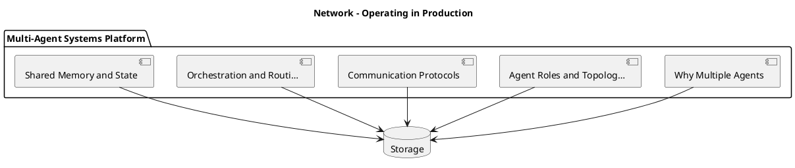

_Source diagram (plantuml); render with the appropriate tool._

**Figure 23. Network - Operating in Production** (plantuml). Figure: Network view for Multi-Agent Systems. This diagram illustrates the principal components and their interactions as discussed in the surrounding section.

## Deep Dive: Mechanics, Variants and Trade-offs

Having established the essentials, we now go deeper into operating in production. Mechanically, the behaviour emerges from a few interacting parts that are simpler than the whole they produce. The distinctions in this section are the ones that separate a working demo from a system that holds up under adversarial inputs, scale and the passage of time.

Consider the principal variants and how to choose between them. Each variant optimises for a different point in the design space - some for latency, some for accuracy, some for cost or operability - and the correct choice follows from explicit requirements rather than from defaults. There is an inherent trade-off between fidelity and cost, and the correct balance depends on the use case and its tolerance for error.

In practice this is supported by a mature tooling ecosystem, including AutoGen, CrewAI, LangGraph, MetaGPT. Tools accelerate the work but do not substitute for understanding: the same principles apply whichever implementation you select, and the ability to reason from first principles is what lets you debug when a tool behaves unexpectedly.

A frequent source of subtle bugs is the interaction with communication protocols. Because communication protocols concerns message passing, shared blackboards and structured handoffs, changes there can silently alter the behaviour analysed here. The remedy is contract tests at the boundary and end-to-end evaluations that exercise the interaction explicitly.

Finally, attend to edge cases and degradation. Define what the system should do under partial failure, unexpected inputs and load spikes, and make that behaviour explicit and tested rather than emergent. Graceful degradation - returning a safe, useful result when the ideal one is unavailable - is a hallmark of mature engineering.

For deeper study, the literature offers authoritative treatments such as Wu et al. — AutoGen (2023) and Du et al. — Improving Factuality via Multi-Agent Debate (2023). These primary sources reward careful reading and ground the practical guidance above in established results.

## Advanced Considerations

Having established the essentials, we now go deeper into operating in production. Beneath the abstraction lies a concrete process whose steps can each be measured, tested and optimised independently. The distinctions in this section are the ones that separate a working demo from a system that holds up under adversarial inputs, scale and the passage of time.

Consider the principal variants and how to choose between them. Each variant optimises for a different point in the design space - some for latency, some for accuracy, some for cost or operability - and the correct choice follows from explicit requirements rather than from defaults. Every added component buys capability at the price of operational surface area, and that bargain should be made consciously.

In practice this is supported by a mature tooling ecosystem, including AutoGen, CrewAI, LangGraph, MetaGPT. Tools accelerate the work but do not substitute for understanding: the same principles apply whichever implementation you select, and the ability to reason from first principles is what lets you debug when a tool behaves unexpectedly.

A frequent source of subtle bugs is the interaction with communication protocols. Because communication protocols concerns message passing, shared blackboards and structured handoffs, changes there can silently alter the behaviour analysed here. The remedy is contract tests at the boundary and end-to-end evaluations that exercise the interaction explicitly.

Finally, attend to edge cases and degradation. Define what the system should do under partial failure, unexpected inputs and load spikes, and make that behaviour explicit and tested rather than emergent. Graceful degradation - returning a safe, useful result when the ideal one is unavailable - is a hallmark of mature engineering.

For deeper study, the literature offers authoritative treatments such as Wu et al. — AutoGen (2023) and Du et al. — Improving Factuality via Multi-Agent Debate (2023). These primary sources reward careful reading and ground the practical guidance above in established results.

## Worked Example

A worked example clarifies how these ideas behave in practice. A simulation organisation needs agent-based modelling of markets and organisations. They decide to apply operating in production as part of their Multi-Agent Systems solution, but wisely treat it as a hypothesis to be validated rather than a foregone conclusion.

The team begins by stating the objective precisely and defining how success will be measured before writing any code. They establish a small but representative evaluation set, agree on acceptance thresholds, and only then prototype the simplest design that could work. Early measurement reveals which assumptions hold and which must be revised, saving weeks of misdirected effort and surfacing edge cases while they are still cheap to fix.

As the prototype matures into a service, the team hardens it: adding input validation, error handling, caching where it pays off, and monitoring that ties back to the original success metric. They document each significant decision in an architecture decision record so that future maintainers understand not just what was built but why.

The outcome is instructive. The system that reaches production is not the most sophisticated design the team considered, but the one whose behaviour they could measure, explain and operate. This is the recurring lesson of Multi-Agent Systems: durable value comes from the whole system, not from any single clever component.

## Industry Use Cases

Across industries, the ideas in this chapter recur in recognisable ways. The following vignettes show how different sectors apply them and what they have in common.

**Software.** Planner, coder, reviewer and tester agents collaborating. The common thread is that value comes not from the model alone but from the surrounding system - data quality, evaluation, integration and operations - which is precisely where most of the engineering effort belongs.

**Research.** Specialised retrieval, analysis and writing agents. The common thread is that value comes not from the model alone but from the surrounding system - data quality, evaluation, integration and operations - which is precisely where most of the engineering effort belongs.

**Operations.** Coordinated agents across monitoring and remediation. The common thread is that value comes not from the model alone but from the surrounding system - data quality, evaluation, integration and operations - which is precisely where most of the engineering effort belongs.

**Simulation.** Agent-based modelling of markets and organisations. The common thread is that value comes not from the model alone but from the surrounding system - data quality, evaluation, integration and operations - which is precisely where most of the engineering effort belongs.

## Best Practices

The following practices consistently separate successful Multi-Agent Systems efforts from struggling ones. They are deliberately concrete so they can be adopted as checklist items in design and code review.

- Give each agent a narrow, well-specified role.
- Use structured messages and explicit handoff contracts.
- Enforce global budgets to prevent multiplicative cost blow-ups.
- Trace cross-agent interactions for debugging.

None of these are exotic; they are the unglamorous disciplines that compound into reliability. The cost of adopting them is small compared with the cost of the incidents they prevent, and they become second nature with practice.

## Common Pitfalls

Equally instructive are the failure modes that recur in practice. Each pitfall below has a clear early warning sign and a known remedy, so treat them as a diagnostic checklist when something feels wrong:

- Agents talking in circles without convergence.
- Combinatorial cost growth across many agents.
- Unclear ownership leading to duplicated or conflicting actions.
- Emergent failures that are hard to reproduce.

The pattern is consistent: most failures stem from skipping measurement, conflating prototype and production standards, or deferring cross-cutting concerns such as security and cost until they become emergencies. Naming these traps in advance is the cheapest way to avoid them.

## Governance, Security and Cost Notes

No discussion of operating in production is complete without its governance, security and cost dimensions, which are too often deferred until they become emergencies. Treating them as first-class concerns from the outset is both cheaper and safer.

**Governance.** Classify the risk of this capability, document its intended and out-of-scope uses, and ensure decisions are traceable to satisfy internal policy and external regulation such as the NIST AI RMF, ISO/IEC 42001 and the EU AI Act. **Security.** Treat all external input as untrusted, validate outputs before acting on them, apply least privilege to any tools or data access, and map controls to the OWASP LLM Top 10 and MITRE ATLAS.

**Cost and sustainability.** Establish explicit budgets for compute, tokens and latency, attribute spend to owners, and revisit the economics as usage scales - a design that is affordable at pilot scale can become untenable at production volume. Building these reflexes into everyday engineering is what allows a Multi-Agent Systems system to be not only capable but also trustworthy and economically sound.

## Hands-On Exercises

Work through the following exercises. They are designed to move understanding from recognition to application - the level required for real engineering work - so prefer writing and building over merely reading.

1. Explain operating in production to a colleague unfamiliar with Multi-Agent Systems, using a concrete example from your own domain.
2. Sketch a reference architecture that incorporates operating in production and annotate where observability, security and cost controls belong.
3. Design an evaluation that would tell you whether operating in production is working in production, including the metric, the dataset and the acceptance threshold.
4. Identify two pitfalls relevant to operating in production in your environment and describe the early warning signals you would monitor.
5. Prototype the simplest implementation that demonstrates operating in production, then list exactly what would need to change to make it production-ready.

## Key Takeaways

Key takeaways from this chapter:

- Operating in Production is a systems concern in Multi-Agent Systems: data, models and operations must be co-designed.
- Measurement is non-negotiable; define success metrics and evaluation before building.
- Favour the simplest design that meets the requirement, and add complexity only when evidence demands it.
- Security, cost and observability are first-class requirements, not afterthoughts.
- Document decisions so the system remains understandable and operable as it evolves.

## Code Walkthrough

This listing shows a configuration-driven Operating in Production component with retry semantics and typed interfaces — the shape we expect from production Multi-Agent Systems code rather than a notebook prototype.

The full listing is shown below; study it line by line and reproduce it locally before moving on.

### Listing: Implementing a Operating in Production component

```python
from __future__ import annotations

from dataclasses import dataclass, field
from typing import Any


@dataclass(slots=True)
class OperatingInProductionConfig:
    """Configuration for the Operating in Production component in a Multi-Agent Systems system."""

    name: str
    timeout_s: float = 30.0
    max_retries: int = 3
    options: dict[str, Any] = field(default_factory=dict)


class OperatingInProduction:
    """A minimal, production-shaped implementation of Operating in Production."""

    def __init__(self, config: OperatingInProductionConfig) -> None:
        self._config = config
        self._calls = 0

    def run(self, payload: dict[str, Any]) -> dict[str, Any]:
        """Process a request, retrying transient failures with backoff."""
        last_error: Exception | None = None
        for attempt in range(self._config.max_retries):
            try:
                self._calls += 1
                return self._process(payload)
            except TimeoutError as exc:  # transient
                last_error = exc
                continue
        raise RuntimeError(f"OperatingInProduction failed after retries") from last_error

    def _process(self, payload: dict[str, Any]) -> dict[str, Any]:
        # Domain-specific logic for Operating in Production goes here.
        return {"status": "ok", "input_keys": sorted(payload), "calls": self._calls}

```

## Review Questions

1. In the context of Multi-Agent Systems, which statement best describes “Operating in Production”?
   - A. the operational discipline required to run a Multi-Agent Systems system reliably, including monitoring, incident response and continuous improvement
   - B. It guarantees deterministic output regardless of input.
   - C. It applies exclusively to image data.
   - D. It eliminates the need for any evaluation or monitoring.
   - **Answer: A.** Operating in Production: the operational discipline required to run a Multi-Agent Systems system reliably, including monitoring, incident response and continuous improvement
2. Which of the following is a recommended best practice when working with Multi-Agent Systems?
   - A. It guarantees deterministic output regardless of input.
   - B. Trace cross-agent interactions for debugging.
   - C. It applies exclusively to image data.
   - D. Unclear ownership leading to duplicated or conflicting actions.
   - **Answer: B.** Best practice: Trace cross-agent interactions for debugging.
3. Which of the following is a common pitfall to avoid in Multi-Agent Systems?
   - A. Trace cross-agent interactions for debugging.
   - B. It applies exclusively to image data.
   - C. Enforce global budgets to prevent multiplicative cost blow-ups.
   - D. Emergent failures that are hard to reproduce.
   - **Answer: D.** Pitfall to avoid: Emergent failures that are hard to reproduce.
4. *(Discussion)* Explain Operating in Production and why it matters in a production Multi-Agent Systems system.
   - **Model answer:** A strong answer defines operating in production (the operational discipline required to run a Multi-Agent Systems system reliably, including monitoring, incident response and continuous improvement) then connects it to architecture, evaluation, cost, security and operations for Multi-Agent Systems, citing concrete trade-offs and a real-world example.

---


# Chapter 19. Evaluation and Quality Assurance

_This chapter examines evaluation and quality assurance within Multi-Agent Systems. It covers a rigorous approach to measuring and assuring the quality of a Multi-Agent Systems system before and after release, derives a reference architecture, walks through a worked example and runnable code, surveys industry use cases, and distils best practices and pitfalls, closing with exercises and review questions._

## Introduction

Formally, Evaluation and Quality Assurance addresses a rigorous approach to measuring and assuring the quality of a Multi-Agent Systems system before and after release. Understanding this matters because Multi-Agent Systems systems succeed or fail on exactly these decisions. The practical implication is that design choices here ripple through latency, cost and maintainability for the lifetime of the system.

This chapter builds intuition first, then formalises the ideas, derives an architecture, and finishes with code, exercises and review questions so the material transfers directly to your own Multi-Agent Systems work. Read it actively: pause at each diagram, reproduce the code, and attempt the exercises before consulting the answers.

## Theory and Foundations

Evaluation and Quality Assurance can be characterised as a rigorous approach to measuring and assuring the quality of a Multi-Agent Systems system before and after release. What distinguishes a production-grade approach from a prototype is the discipline of measurement: every claim is backed by an evaluation rather than intuition. Mechanically, the behaviour emerges from a few interacting parts that are simpler than the whole they produce.

To place this in context, recall the broader picture: Multi-agent systems decompose complex goals across specialised agents that communicate, coordinate and sometimes debate to produce better outcomes than a single agent. Within that picture, evaluation and quality assurance is one of the load-bearing ideas - the kind that, when understood deeply, makes the rest of Multi-Agent Systems fall into place. Getting this right early prevents expensive rework once a Multi-Agent Systems system reaches scale.

Evaluation and Quality Assurance cannot be understood in isolation from tool and resource contention. Recall that tool and resource contention concerns coordinating access to shared external systems. The two interact directly: decisions in one constrain the design space of the other, which is why mature teams reason about them together rather than sequentially. As with most architectural decisions, the choice is rarely binary; the skill lies in quantifying the trade-offs and choosing deliberately.

Evaluation and Quality Assurance cannot be understood in isolation from cost control at team scale. Recall that cost control at team scale concerns budgeting across many concurrent agents. The two interact directly: decisions in one constrain the design space of the other, which is why mature teams reason about them together rather than sequentially. As with most architectural decisions, the choice is rarely binary; the skill lies in quantifying the trade-offs and choosing deliberately.

Several established patterns apply directly to evaluation and quality assurance. The first, debate-and-judge for high-stakes decisions, is widely adopted because it makes the system's behaviour predictable and observable. A complementary pattern, supervisor–worker hierarchy, addresses a related concern and is often deployed alongside it. Patterns are not dogma; they are distilled experience that shortcuts the search for a sound design, and each carries assumptions worth checking against your context.

It is worth being explicit about when to apply this and when to reach for something simpler. In a small prototype, shortcuts around evaluation and quality assurance are invisible; in a production Multi-Agent Systems system serving real traffic, they surface as incidents, cost overruns or compliance gaps. There is an inherent trade-off between fidelity and cost, and the correct balance depends on the use case and its tolerance for error. The remainder of this chapter turns these principles into an architecture, code and a checklist you can apply immediately.

## Architecture and Design

The reference architecture for Evaluation and Quality Assurance separates concerns into clearly bounded components with explicit contracts. A multi-agent platform uses a supervisor/orchestrator that routes subtasks to specialised worker agents, a shared state store for coordination, a message bus for structured communication, and global guardrails enforcing budgets and permissions. Distributed tracing stitches together cross-agent trajectories.

Concretely, the principal building blocks include why multiple agents, agent roles and topologies, communication protocols, orchestration and routing and shared memory and state. Each is a replaceable component behind a stable interface, so the team can upgrade an implementation - a model, an index, a policy engine - without rewriting its neighbours. The contracts between components are where reliability is won or lost, so they are specified explicitly and tested in isolation.

The diagram accompanying this section makes the data and control flow explicit. Requests enter through a well-defined boundary where they are authenticated and validated; only then are they dispatched to the components that perform the work. This boundary is also where rate limiting, quota enforcement and audit logging live, keeping cross-cutting concerns out of the core logic and in one auditable place.

Two qualities deserve emphasis. First, observability is designed in, not bolted on: every component emits structured telemetry so that failures can be localised in minutes rather than hours. Second, the architecture is evolvable - components communicate through stable contracts so that any single part of the Multi-Agent Systems system can be replaced without a rewrite. As with most architectural decisions, the choice is rarely binary; the skill lies in quantifying the trade-offs and choosing deliberately.

```xml
<mxfile host="ai-university">
  <diagram name="Agent Architecture">
    <mxGraphModel dx="800" dy="600" grid="1" gridSize="10">
      <root>
        <mxCell id="0"/>
        <mxCell id="1" parent="0"/>
        <mxCell id="title" value="Agent Architecture - Evaluation and Quality Assurance" style="text;fontSize=16;fontStyle=1" vertex="1" parent="1"><mxGeometry x="40" y="20" width="600" height="30" as="geometry"/></mxCell>
        <mxCell id="hub" value="Multi-Agent Systems" style="rounded=1;fillColor=#0f172a;fontColor=#ffffff;fontStyle=1" vertex="1" parent="1"><mxGeometry x="300" y="180" width="160" height="60" as="geometry"/></mxCell>
        <mxCell id="n0" value="Why Multiple Agents" style="rounded=1;fillColor=#e0e7ff;strokeColor=#4338ca" vertex="1" parent="1"><mxGeometry x="60" y="80" width="160" height="50" as="geometry"/></mxCell>
        <mxCell id="e0" style="edgeStyle=orthogonalEdgeStyle" edge="1" parent="1" source="hub" target="n0"><mxGeometry relative="1" as="geometry"/></mxCell>
        <mxCell id="n1" value="Agent Roles and Topolog…" style="rounded=1;fillColor=#e0e7ff;strokeColor=#4338ca" vertex="1" parent="1"><mxGeometry x="600" y="170" width="160" height="50" as="geometry"/></mxCell>
        <mxCell id="e1" style="edgeStyle=orthogonalEdgeStyle" edge="1" parent="1" source="hub" target="n1"><mxGeometry relative="1" as="geometry"/></mxCell>
        <mxCell id="n2" value="Communication Protocols" style="rounded=1;fillColor=#e0e7ff;strokeColor=#4338ca" vertex="1" parent="1"><mxGeometry x="60" y="260" width="160" height="50" as="geometry"/></mxCell>
        <mxCell id="e2" style="edgeStyle=orthogonalEdgeStyle" edge="1" parent="1" source="hub" target="n2"><mxGeometry relative="1" as="geometry"/></mxCell>
        <mxCell id="n3" value="Orchestration and Routi…" style="rounded=1;fillColor=#e0e7ff;strokeColor=#4338ca" vertex="1" parent="1"><mxGeometry x="600" y="350" width="160" height="50" as="geometry"/></mxCell>
        <mxCell id="e3" style="edgeStyle=orthogonalEdgeStyle" edge="1" parent="1" source="hub" target="n3"><mxGeometry relative="1" as="geometry"/></mxCell>
        <mxCell id="n4" value="Shared Memory and State" style="rounded=1;fillColor=#e0e7ff;strokeColor=#4338ca" vertex="1" parent="1"><mxGeometry x="60" y="440" width="160" height="50" as="geometry"/></mxCell>
        <mxCell id="e4" style="edgeStyle=orthogonalEdgeStyle" edge="1" parent="1" source="hub" target="n4"><mxGeometry relative="1" as="geometry"/></mxCell>
      </root>
    </mxGraphModel>
  </diagram>
</mxfile>
```

_Source diagram (drawio); render with the appropriate tool._

**Figure 24. Agent Architecture - Evaluation and Quality Assurance** (drawio). Figure: Agent Architecture view for Multi-Agent Systems. This diagram illustrates the principal components and their interactions as discussed in the surrounding section.

```xml
<mxfile host="ai-university">
  <diagram name="Deployment">
    <mxGraphModel dx="800" dy="600" grid="1" gridSize="10">
      <root>
        <mxCell id="0"/>
        <mxCell id="1" parent="0"/>
        <mxCell id="title" value="Deployment - Evaluation and Quality Assurance" style="text;fontSize=16;fontStyle=1" vertex="1" parent="1"><mxGeometry x="40" y="20" width="600" height="30" as="geometry"/></mxCell>
        <mxCell id="hub" value="Multi-Agent Systems" style="rounded=1;fillColor=#0f172a;fontColor=#ffffff;fontStyle=1" vertex="1" parent="1"><mxGeometry x="300" y="180" width="160" height="60" as="geometry"/></mxCell>
        <mxCell id="n0" value="Why Multiple Agents" style="rounded=1;fillColor=#e0e7ff;strokeColor=#4338ca" vertex="1" parent="1"><mxGeometry x="60" y="80" width="160" height="50" as="geometry"/></mxCell>
        <mxCell id="e0" style="edgeStyle=orthogonalEdgeStyle" edge="1" parent="1" source="hub" target="n0"><mxGeometry relative="1" as="geometry"/></mxCell>
        <mxCell id="n1" value="Agent Roles and Topolog…" style="rounded=1;fillColor=#e0e7ff;strokeColor=#4338ca" vertex="1" parent="1"><mxGeometry x="600" y="170" width="160" height="50" as="geometry"/></mxCell>
        <mxCell id="e1" style="edgeStyle=orthogonalEdgeStyle" edge="1" parent="1" source="hub" target="n1"><mxGeometry relative="1" as="geometry"/></mxCell>
        <mxCell id="n2" value="Communication Protocols" style="rounded=1;fillColor=#e0e7ff;strokeColor=#4338ca" vertex="1" parent="1"><mxGeometry x="60" y="260" width="160" height="50" as="geometry"/></mxCell>
        <mxCell id="e2" style="edgeStyle=orthogonalEdgeStyle" edge="1" parent="1" source="hub" target="n2"><mxGeometry relative="1" as="geometry"/></mxCell>
        <mxCell id="n3" value="Orchestration and Routi…" style="rounded=1;fillColor=#e0e7ff;strokeColor=#4338ca" vertex="1" parent="1"><mxGeometry x="600" y="350" width="160" height="50" as="geometry"/></mxCell>
        <mxCell id="e3" style="edgeStyle=orthogonalEdgeStyle" edge="1" parent="1" source="hub" target="n3"><mxGeometry relative="1" as="geometry"/></mxCell>
        <mxCell id="n4" value="Shared Memory and State" style="rounded=1;fillColor=#e0e7ff;strokeColor=#4338ca" vertex="1" parent="1"><mxGeometry x="60" y="440" width="160" height="50" as="geometry"/></mxCell>
        <mxCell id="e4" style="edgeStyle=orthogonalEdgeStyle" edge="1" parent="1" source="hub" target="n4"><mxGeometry relative="1" as="geometry"/></mxCell>
      </root>
    </mxGraphModel>
  </diagram>
</mxfile>
```

_Source diagram (drawio); render with the appropriate tool._

**Figure 25. Deployment - Evaluation and Quality Assurance** (drawio). Figure: Deployment view for Multi-Agent Systems. This diagram illustrates the principal components and their interactions as discussed in the surrounding section.

## Deep Dive: Mechanics, Variants and Trade-offs

Having established the essentials, we now go deeper into evaluation and quality assurance. Beneath the abstraction lies a concrete process whose steps can each be measured, tested and optimised independently. The distinctions in this section are the ones that separate a working demo from a system that holds up under adversarial inputs, scale and the passage of time.

Consider the principal variants and how to choose between them. Each variant optimises for a different point in the design space - some for latency, some for accuracy, some for cost or operability - and the correct choice follows from explicit requirements rather than from defaults. As with most architectural decisions, the choice is rarely binary; the skill lies in quantifying the trade-offs and choosing deliberately.

In practice this is supported by a mature tooling ecosystem, including AutoGen, CrewAI, LangGraph, MetaGPT. Tools accelerate the work but do not substitute for understanding: the same principles apply whichever implementation you select, and the ability to reason from first principles is what lets you debug when a tool behaves unexpectedly.

A frequent source of subtle bugs is the interaction with tool and resource contention. Because tool and resource contention concerns coordinating access to shared external systems, changes there can silently alter the behaviour analysed here. The remedy is contract tests at the boundary and end-to-end evaluations that exercise the interaction explicitly.

Finally, attend to edge cases and degradation. Define what the system should do under partial failure, unexpected inputs and load spikes, and make that behaviour explicit and tested rather than emergent. Graceful degradation - returning a safe, useful result when the ideal one is unavailable - is a hallmark of mature engineering.

For deeper study, the literature offers authoritative treatments such as Wu et al. — AutoGen (2023) and Du et al. — Improving Factuality via Multi-Agent Debate (2023). These primary sources reward careful reading and ground the practical guidance above in established results.

## Advanced Considerations

Having established the essentials, we now go deeper into evaluation and quality assurance. Beneath the abstraction lies a concrete process whose steps can each be measured, tested and optimised independently. The distinctions in this section are the ones that separate a working demo from a system that holds up under adversarial inputs, scale and the passage of time.

Consider the principal variants and how to choose between them. Each variant optimises for a different point in the design space - some for latency, some for accuracy, some for cost or operability - and the correct choice follows from explicit requirements rather than from defaults. Latency, accuracy and cost form a tension triangle: improving one typically pressures the others, so explicit budgets are essential.

In practice this is supported by a mature tooling ecosystem, including AutoGen, CrewAI, LangGraph, MetaGPT. Tools accelerate the work but do not substitute for understanding: the same principles apply whichever implementation you select, and the ability to reason from first principles is what lets you debug when a tool behaves unexpectedly.

A frequent source of subtle bugs is the interaction with tool and resource contention. Because tool and resource contention concerns coordinating access to shared external systems, changes there can silently alter the behaviour analysed here. The remedy is contract tests at the boundary and end-to-end evaluations that exercise the interaction explicitly.

Finally, attend to edge cases and degradation. Define what the system should do under partial failure, unexpected inputs and load spikes, and make that behaviour explicit and tested rather than emergent. Graceful degradation - returning a safe, useful result when the ideal one is unavailable - is a hallmark of mature engineering.

For deeper study, the literature offers authoritative treatments such as Wu et al. — AutoGen (2023) and Du et al. — Improving Factuality via Multi-Agent Debate (2023). These primary sources reward careful reading and ground the practical guidance above in established results.

## Worked Example

A worked example clarifies how these ideas behave in practice. A simulation organisation needs agent-based modelling of markets and organisations. They decide to apply evaluation and quality assurance as part of their Multi-Agent Systems solution, but wisely treat it as a hypothesis to be validated rather than a foregone conclusion.

The team begins by stating the objective precisely and defining how success will be measured before writing any code. They establish a small but representative evaluation set, agree on acceptance thresholds, and only then prototype the simplest design that could work. Early measurement reveals which assumptions hold and which must be revised, saving weeks of misdirected effort and surfacing edge cases while they are still cheap to fix.

As the prototype matures into a service, the team hardens it: adding input validation, error handling, caching where it pays off, and monitoring that ties back to the original success metric. They document each significant decision in an architecture decision record so that future maintainers understand not just what was built but why.

The outcome is instructive. The system that reaches production is not the most sophisticated design the team considered, but the one whose behaviour they could measure, explain and operate. This is the recurring lesson of Multi-Agent Systems: durable value comes from the whole system, not from any single clever component.

## Industry Use Cases

Across industries, the ideas in this chapter recur in recognisable ways. The following vignettes show how different sectors apply them and what they have in common.

**Software.** Planner, coder, reviewer and tester agents collaborating. The common thread is that value comes not from the model alone but from the surrounding system - data quality, evaluation, integration and operations - which is precisely where most of the engineering effort belongs.

**Research.** Specialised retrieval, analysis and writing agents. The common thread is that value comes not from the model alone but from the surrounding system - data quality, evaluation, integration and operations - which is precisely where most of the engineering effort belongs.

**Operations.** Coordinated agents across monitoring and remediation. The common thread is that value comes not from the model alone but from the surrounding system - data quality, evaluation, integration and operations - which is precisely where most of the engineering effort belongs.

**Simulation.** Agent-based modelling of markets and organisations. The common thread is that value comes not from the model alone but from the surrounding system - data quality, evaluation, integration and operations - which is precisely where most of the engineering effort belongs.

## Best Practices

The following practices consistently separate successful Multi-Agent Systems efforts from struggling ones. They are deliberately concrete so they can be adopted as checklist items in design and code review.

- Give each agent a narrow, well-specified role.
- Use structured messages and explicit handoff contracts.
- Enforce global budgets to prevent multiplicative cost blow-ups.
- Trace cross-agent interactions for debugging.

None of these are exotic; they are the unglamorous disciplines that compound into reliability. The cost of adopting them is small compared with the cost of the incidents they prevent, and they become second nature with practice.

## Common Pitfalls

Equally instructive are the failure modes that recur in practice. Each pitfall below has a clear early warning sign and a known remedy, so treat them as a diagnostic checklist when something feels wrong:

- Agents talking in circles without convergence.
- Combinatorial cost growth across many agents.
- Unclear ownership leading to duplicated or conflicting actions.
- Emergent failures that are hard to reproduce.

The pattern is consistent: most failures stem from skipping measurement, conflating prototype and production standards, or deferring cross-cutting concerns such as security and cost until they become emergencies. Naming these traps in advance is the cheapest way to avoid them.

## Governance, Security and Cost Notes

No discussion of evaluation and quality assurance is complete without its governance, security and cost dimensions, which are too often deferred until they become emergencies. Treating them as first-class concerns from the outset is both cheaper and safer.

**Governance.** Classify the risk of this capability, document its intended and out-of-scope uses, and ensure decisions are traceable to satisfy internal policy and external regulation such as the NIST AI RMF, ISO/IEC 42001 and the EU AI Act. **Security.** Treat all external input as untrusted, validate outputs before acting on them, apply least privilege to any tools or data access, and map controls to the OWASP LLM Top 10 and MITRE ATLAS.

**Cost and sustainability.** Establish explicit budgets for compute, tokens and latency, attribute spend to owners, and revisit the economics as usage scales - a design that is affordable at pilot scale can become untenable at production volume. Building these reflexes into everyday engineering is what allows a Multi-Agent Systems system to be not only capable but also trustworthy and economically sound.

## Hands-On Exercises

Work through the following exercises. They are designed to move understanding from recognition to application - the level required for real engineering work - so prefer writing and building over merely reading.

1. Explain evaluation and quality assurance to a colleague unfamiliar with Multi-Agent Systems, using a concrete example from your own domain.
2. Sketch a reference architecture that incorporates evaluation and quality assurance and annotate where observability, security and cost controls belong.
3. Design an evaluation that would tell you whether evaluation and quality assurance is working in production, including the metric, the dataset and the acceptance threshold.
4. Identify two pitfalls relevant to evaluation and quality assurance in your environment and describe the early warning signals you would monitor.
5. Prototype the simplest implementation that demonstrates evaluation and quality assurance, then list exactly what would need to change to make it production-ready.

## Key Takeaways

Key takeaways from this chapter:

- Evaluation and Quality Assurance is a systems concern in Multi-Agent Systems: data, models and operations must be co-designed.
- Measurement is non-negotiable; define success metrics and evaluation before building.
- Favour the simplest design that meets the requirement, and add complexity only when evidence demands it.
- Security, cost and observability are first-class requirements, not afterthoughts.
- Document decisions so the system remains understandable and operable as it evolves.

## Code Walkthrough

Pipelines keep Evaluation and Quality Assurance logic modular and testable. Each stage is a pure function, errors are captured per item, and the composition is trivial to extend or reorder.

The full listing is shown below; study it line by line and reproduce it locally before moving on.

### Listing: A composable processing pipeline for Evaluation and Quality Assurance

```python
from collections.abc import Iterable, Iterator
from typing import Protocol


class Stage(Protocol):
    def __call__(self, item: dict) -> dict: ...


def pipeline(stages: list[Stage]) -> Stage:
    """Compose ordered stages into a single callable for Evaluation and Quality Assurance."""

    def run(item: dict) -> dict:
        for stage in stages:
            item = stage(item)
        return item

    return run


def validate(item: dict) -> dict:
    if "text" not in item:
        raise ValueError("missing required field: text")
    return item


def normalise(item: dict) -> dict:
    item["text"] = item["text"].strip().lower()
    return item


def enrich(item: dict) -> dict:
    item["length"] = len(item["text"])
    return item


process = pipeline([validate, normalise, enrich])


def run_batch(items: Iterable[dict]) -> Iterator[dict]:
    for item in items:
        try:
            yield process(dict(item))
        except ValueError as exc:
            yield {"error": str(exc), "item": item}

```

## Review Questions

1. In the context of Multi-Agent Systems, which statement best describes “Evaluation and Quality Assurance”?
   - A. It guarantees deterministic output regardless of input.
   - B. It applies exclusively to image data.
   - C. It is only relevant to academic research, not production.
   - D. a rigorous approach to measuring and assuring the quality of a Multi-Agent Systems system before and after release
   - **Answer: D.** Evaluation and Quality Assurance: a rigorous approach to measuring and assuring the quality of a Multi-Agent Systems system before and after release
2. Which of the following is a recommended best practice when working with Multi-Agent Systems?
   - A. Give each agent a narrow, well-specified role.
   - B. It removes all security and governance requirements.
   - C. It guarantees deterministic output regardless of input.
   - D. Agents talking in circles without convergence.
   - **Answer: A.** Best practice: Give each agent a narrow, well-specified role.
3. Which of the following is a common pitfall to avoid in Multi-Agent Systems?
   - A. It makes the system slower but has no other effect.
   - B. Unclear ownership leading to duplicated or conflicting actions.
   - C. Enforce global budgets to prevent multiplicative cost blow-ups.
   - D. Use structured messages and explicit handoff contracts.
   - **Answer: B.** Pitfall to avoid: Unclear ownership leading to duplicated or conflicting actions.
4. *(Discussion)* Describe a failure mode of Evaluation and Quality Assurance and how you would mitigate it.
   - **Model answer:** A strong answer defines evaluation and quality assurance (a rigorous approach to measuring and assuring the quality of a Multi-Agent Systems system before and after release) then connects it to architecture, evaluation, cost, security and operations for Multi-Agent Systems, citing concrete trade-offs and a real-world example.

---


# Chapter 20. Security, Privacy and Governance

_This chapter examines security, privacy and governance within Multi-Agent Systems. It covers the security, privacy and governance controls that make a Multi-Agent Systems system trustworthy and compliant, derives a reference architecture, walks through a worked example and runnable code, surveys industry use cases, and distils best practices and pitfalls, closing with exercises and review questions._

## Introduction

Security, Privacy and Governance refers to the security, privacy and governance controls that make a Multi-Agent Systems system trustworthy and compliant. This concept recurs throughout the Multi-Agent Systems lifecycle, from design to operations. The practical implication is that design choices here ripple through latency, cost and maintainability for the lifetime of the system.

This chapter builds intuition first, then formalises the ideas, derives an architecture, and finishes with code, exercises and review questions so the material transfers directly to your own Multi-Agent Systems work. Read it actively: pause at each diagram, reproduce the code, and attempt the exercises before consulting the answers.

## Theory and Foundations

In practical terms, Security, Privacy and Governance is best understood as the security, privacy and governance controls that make a Multi-Agent Systems system trustworthy and compliant. The practical implication is that design choices here ripple through latency, cost and maintainability for the lifetime of the system. Beneath the abstraction lies a concrete process whose steps can each be measured, tested and optimised independently.

To place this in context, recall the broader picture: Multi-agent systems decompose complex goals across specialised agents that communicate, coordinate and sometimes debate to produce better outcomes than a single agent. Within that picture, security, privacy and governance is one of the load-bearing ideas - the kind that, when understood deeply, makes the rest of Multi-Agent Systems fall into place. This concept recurs throughout the Multi-Agent Systems lifecycle, from design to operations.

Security, Privacy and Governance cannot be understood in isolation from evaluating multi-agent systems. Recall that evaluating multi-agent systems concerns end-to-end task success and per-agent contribution. The two interact directly: decisions in one constrain the design space of the other, which is why mature teams reason about them together rather than sequentially. Every added component buys capability at the price of operational surface area, and that bargain should be made consciously.

Security, Privacy and Governance cannot be understood in isolation from observability across agents. Recall that observability across agents concerns tracing distributed agent interactions. The two interact directly: decisions in one constrain the design space of the other, which is why mature teams reason about them together rather than sequentially. Every added component buys capability at the price of operational surface area, and that bargain should be made consciously.

Several established patterns apply directly to security, privacy and governance. The first, supervisor–worker hierarchy, is widely adopted because it makes the system's behaviour predictable and observable. A complementary pattern, sequential pipeline of specialised agents, addresses a related concern and is often deployed alongside it. Patterns are not dogma; they are distilled experience that shortcuts the search for a sound design, and each carries assumptions worth checking against your context.

Knowing when not to use a technique is as valuable as knowing how to use it. In a small prototype, shortcuts around security, privacy and governance are invisible; in a production Multi-Agent Systems system serving real traffic, they surface as incidents, cost overruns or compliance gaps. Latency, accuracy and cost form a tension triangle: improving one typically pressures the others, so explicit budgets are essential. The remainder of this chapter turns these principles into an architecture, code and a checklist you can apply immediately.

## Architecture and Design

A robust architecture for Security, Privacy and Governance is layered so each part can evolve independently without destabilising the whole. A multi-agent platform uses a supervisor/orchestrator that routes subtasks to specialised worker agents, a shared state store for coordination, a message bus for structured communication, and global guardrails enforcing budgets and permissions. Distributed tracing stitches together cross-agent trajectories.

Concretely, the principal building blocks include why multiple agents, agent roles and topologies, communication protocols, orchestration and routing and shared memory and state. Each is a replaceable component behind a stable interface, so the team can upgrade an implementation - a model, an index, a policy engine - without rewriting its neighbours. The contracts between components are where reliability is won or lost, so they are specified explicitly and tested in isolation.

The diagram accompanying this section makes the data and control flow explicit. Requests enter through a well-defined boundary where they are authenticated and validated; only then are they dispatched to the components that perform the work. This boundary is also where rate limiting, quota enforcement and audit logging live, keeping cross-cutting concerns out of the core logic and in one auditable place.

Two qualities deserve emphasis. First, observability is designed in, not bolted on: every component emits structured telemetry so that failures can be localised in minutes rather than hours. Second, the architecture is evolvable - components communicate through stable contracts so that any single part of the Multi-Agent Systems system can be replaced without a rewrite. As with most architectural decisions, the choice is rarely binary; the skill lies in quantifying the trade-offs and choosing deliberately.

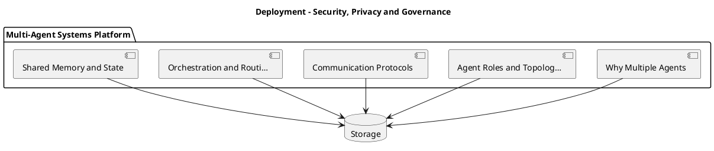

_Source diagram (plantuml); render with the appropriate tool._

**Figure 26. Deployment - Security, Privacy and Governance** (plantuml). Figure: Deployment view for Multi-Agent Systems. This diagram illustrates the principal components and their interactions as discussed in the surrounding section.

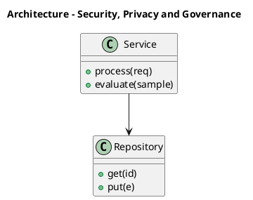

_Source diagram (plantuml); render with the appropriate tool._

**Figure 27. Architecture - Security, Privacy and Governance** (plantuml). Figure: Architecture view for Multi-Agent Systems. This diagram illustrates the principal components and their interactions as discussed in the surrounding section.

## Deep Dive: Mechanics, Variants and Trade-offs

Having established the essentials, we now go deeper into security, privacy and governance. Beneath the abstraction lies a concrete process whose steps can each be measured, tested and optimised independently. The distinctions in this section are the ones that separate a working demo from a system that holds up under adversarial inputs, scale and the passage of time.

Consider the principal variants and how to choose between them. Each variant optimises for a different point in the design space - some for latency, some for accuracy, some for cost or operability - and the correct choice follows from explicit requirements rather than from defaults. There is an inherent trade-off between fidelity and cost, and the correct balance depends on the use case and its tolerance for error.

In practice this is supported by a mature tooling ecosystem, including AutoGen, CrewAI, LangGraph, MetaGPT. Tools accelerate the work but do not substitute for understanding: the same principles apply whichever implementation you select, and the ability to reason from first principles is what lets you debug when a tool behaves unexpectedly.

A frequent source of subtle bugs is the interaction with evaluating multi-agent systems. Because evaluating multi-agent systems concerns end-to-end task success and per-agent contribution, changes there can silently alter the behaviour analysed here. The remedy is contract tests at the boundary and end-to-end evaluations that exercise the interaction explicitly.

Finally, attend to edge cases and degradation. Define what the system should do under partial failure, unexpected inputs and load spikes, and make that behaviour explicit and tested rather than emergent. Graceful degradation - returning a safe, useful result when the ideal one is unavailable - is a hallmark of mature engineering.

For deeper study, the literature offers authoritative treatments such as Wu et al. — AutoGen (2023) and Du et al. — Improving Factuality via Multi-Agent Debate (2023). These primary sources reward careful reading and ground the practical guidance above in established results.

## Advanced Considerations

Having established the essentials, we now go deeper into security, privacy and governance. Beneath the abstraction lies a concrete process whose steps can each be measured, tested and optimised independently. The distinctions in this section are the ones that separate a working demo from a system that holds up under adversarial inputs, scale and the passage of time.

Consider the principal variants and how to choose between them. Each variant optimises for a different point in the design space - some for latency, some for accuracy, some for cost or operability - and the correct choice follows from explicit requirements rather than from defaults. As with most architectural decisions, the choice is rarely binary; the skill lies in quantifying the trade-offs and choosing deliberately.

In practice this is supported by a mature tooling ecosystem, including AutoGen, CrewAI, LangGraph, MetaGPT. Tools accelerate the work but do not substitute for understanding: the same principles apply whichever implementation you select, and the ability to reason from first principles is what lets you debug when a tool behaves unexpectedly.

A frequent source of subtle bugs is the interaction with the multi-agent reference architecture. Because the multi-agent reference architecture concerns supervisor, workers, shared memory and guardrails, changes there can silently alter the behaviour analysed here. The remedy is contract tests at the boundary and end-to-end evaluations that exercise the interaction explicitly.

Finally, attend to edge cases and degradation. Define what the system should do under partial failure, unexpected inputs and load spikes, and make that behaviour explicit and tested rather than emergent. Graceful degradation - returning a safe, useful result when the ideal one is unavailable - is a hallmark of mature engineering.

For deeper study, the literature offers authoritative treatments such as Wu et al. — AutoGen (2023) and Du et al. — Improving Factuality via Multi-Agent Debate (2023). These primary sources reward careful reading and ground the practical guidance above in established results.

## Worked Example

To ground the discussion, walk through a representative example. A software organisation needs planner, coder, reviewer and tester agents collaborating. They decide to apply security, privacy and governance as part of their Multi-Agent Systems solution, but wisely treat it as a hypothesis to be validated rather than a foregone conclusion.

The team begins by stating the objective precisely and defining how success will be measured before writing any code. They establish a small but representative evaluation set, agree on acceptance thresholds, and only then prototype the simplest design that could work. Early measurement reveals which assumptions hold and which must be revised, saving weeks of misdirected effort and surfacing edge cases while they are still cheap to fix.

As the prototype matures into a service, the team hardens it: adding input validation, error handling, caching where it pays off, and monitoring that ties back to the original success metric. They document each significant decision in an architecture decision record so that future maintainers understand not just what was built but why.

The outcome is instructive. The system that reaches production is not the most sophisticated design the team considered, but the one whose behaviour they could measure, explain and operate. This is the recurring lesson of Multi-Agent Systems: durable value comes from the whole system, not from any single clever component.

## Industry Use Cases

Across industries, the ideas in this chapter recur in recognisable ways. The following vignettes show how different sectors apply them and what they have in common.

**Software.** Planner, coder, reviewer and tester agents collaborating. The common thread is that value comes not from the model alone but from the surrounding system - data quality, evaluation, integration and operations - which is precisely where most of the engineering effort belongs.

**Research.** Specialised retrieval, analysis and writing agents. The common thread is that value comes not from the model alone but from the surrounding system - data quality, evaluation, integration and operations - which is precisely where most of the engineering effort belongs.

**Operations.** Coordinated agents across monitoring and remediation. The common thread is that value comes not from the model alone but from the surrounding system - data quality, evaluation, integration and operations - which is precisely where most of the engineering effort belongs.

**Simulation.** Agent-based modelling of markets and organisations. The common thread is that value comes not from the model alone but from the surrounding system - data quality, evaluation, integration and operations - which is precisely where most of the engineering effort belongs.

## Best Practices

The following practices consistently separate successful Multi-Agent Systems efforts from struggling ones. They are deliberately concrete so they can be adopted as checklist items in design and code review.

- Give each agent a narrow, well-specified role.
- Use structured messages and explicit handoff contracts.
- Enforce global budgets to prevent multiplicative cost blow-ups.
- Trace cross-agent interactions for debugging.

None of these are exotic; they are the unglamorous disciplines that compound into reliability. The cost of adopting them is small compared with the cost of the incidents they prevent, and they become second nature with practice.

## Common Pitfalls

Equally instructive are the failure modes that recur in practice. Each pitfall below has a clear early warning sign and a known remedy, so treat them as a diagnostic checklist when something feels wrong:

- Agents talking in circles without convergence.
- Combinatorial cost growth across many agents.
- Unclear ownership leading to duplicated or conflicting actions.
- Emergent failures that are hard to reproduce.

The pattern is consistent: most failures stem from skipping measurement, conflating prototype and production standards, or deferring cross-cutting concerns such as security and cost until they become emergencies. Naming these traps in advance is the cheapest way to avoid them.

## Governance, Security and Cost Notes

No discussion of security, privacy and governance is complete without its governance, security and cost dimensions, which are too often deferred until they become emergencies. Treating them as first-class concerns from the outset is both cheaper and safer.

**Governance.** Classify the risk of this capability, document its intended and out-of-scope uses, and ensure decisions are traceable to satisfy internal policy and external regulation such as the NIST AI RMF, ISO/IEC 42001 and the EU AI Act. **Security.** Treat all external input as untrusted, validate outputs before acting on them, apply least privilege to any tools or data access, and map controls to the OWASP LLM Top 10 and MITRE ATLAS.

**Cost and sustainability.** Establish explicit budgets for compute, tokens and latency, attribute spend to owners, and revisit the economics as usage scales - a design that is affordable at pilot scale can become untenable at production volume. Building these reflexes into everyday engineering is what allows a Multi-Agent Systems system to be not only capable but also trustworthy and economically sound.

## Hands-On Exercises

Work through the following exercises. They are designed to move understanding from recognition to application - the level required for real engineering work - so prefer writing and building over merely reading.

1. Explain security, privacy and governance to a colleague unfamiliar with Multi-Agent Systems, using a concrete example from your own domain.
2. Sketch a reference architecture that incorporates security, privacy and governance and annotate where observability, security and cost controls belong.
3. Design an evaluation that would tell you whether security, privacy and governance is working in production, including the metric, the dataset and the acceptance threshold.
4. Identify two pitfalls relevant to security, privacy and governance in your environment and describe the early warning signals you would monitor.
5. Prototype the simplest implementation that demonstrates security, privacy and governance, then list exactly what would need to change to make it production-ready.

## Key Takeaways

Key takeaways from this chapter:

- Security, Privacy and Governance is a systems concern in Multi-Agent Systems: data, models and operations must be co-designed.
- Measurement is non-negotiable; define success metrics and evaluation before building.
- Favour the simplest design that meets the requirement, and add complexity only when evidence demands it.
- Security, cost and observability are first-class requirements, not afterthoughts.
- Document decisions so the system remains understandable and operable as it evolves.

## Code Walkthrough

This listing shows a configuration-driven Security, Privacy and Governance component with retry semantics and typed interfaces — the shape we expect from production Multi-Agent Systems code rather than a notebook prototype.

The full listing is shown below; study it line by line and reproduce it locally before moving on.

### Listing: Implementing a Security, Privacy and Governance component

```python
from __future__ import annotations

from dataclasses import dataclass, field
from typing import Any


@dataclass(slots=True)
class PrivacyAndConfig:
    """Configuration for the Security, Privacy and Governance component in a Multi-Agent Systems system."""

    name: str
    timeout_s: float = 30.0
    max_retries: int = 3
    options: dict[str, Any] = field(default_factory=dict)


class PrivacyAnd:
    """A minimal, production-shaped implementation of Security, Privacy and Governance."""

    def __init__(self, config: PrivacyAndConfig) -> None:
        self._config = config
        self._calls = 0

    def run(self, payload: dict[str, Any]) -> dict[str, Any]:
        """Process a request, retrying transient failures with backoff."""
        last_error: Exception | None = None
        for attempt in range(self._config.max_retries):
            try:
                self._calls += 1
                return self._process(payload)
            except TimeoutError as exc:  # transient
                last_error = exc
                continue
        raise RuntimeError(f"PrivacyAnd failed after retries") from last_error

    def _process(self, payload: dict[str, Any]) -> dict[str, Any]:
        # Domain-specific logic for Security, Privacy and Governance goes here.
        return {"status": "ok", "input_keys": sorted(payload), "calls": self._calls}

```

## Review Questions

1. In the context of Multi-Agent Systems, which statement best describes “Security, Privacy and Governance”?
   - A. It removes all security and governance requirements.
   - B. the security, privacy and governance controls that make a Multi-Agent Systems system trustworthy and compliant
   - C. It eliminates the need for any evaluation or monitoring.
   - D. It applies exclusively to image data.
   - **Answer: B.** Security, Privacy and Governance: the security, privacy and governance controls that make a Multi-Agent Systems system trustworthy and compliant
2. Which of the following is a recommended best practice when working with Multi-Agent Systems?
   - A. Combinatorial cost growth across many agents.
   - B. It makes the system slower but has no other effect.
   - C. It guarantees deterministic output regardless of input.
   - D. Use structured messages and explicit handoff contracts.
   - **Answer: D.** Best practice: Use structured messages and explicit handoff contracts.
3. Which of the following is a common pitfall to avoid in Multi-Agent Systems?
   - A. Enforce global budgets to prevent multiplicative cost blow-ups.
   - B. Use structured messages and explicit handoff contracts.
   - C. Combinatorial cost growth across many agents.
   - D. It makes the system slower but has no other effect.
   - **Answer: C.** Pitfall to avoid: Combinatorial cost growth across many agents.
4. *(Discussion)* Walk through how you would design Security, Privacy and Governance for an enterprise Multi-Agent Systems workload.
   - **Model answer:** A strong answer defines security, privacy and governance (the security, privacy and governance controls that make a Multi-Agent Systems system trustworthy and compliant) then connects it to architecture, evaluation, cost, security and operations for Multi-Agent Systems, citing concrete trade-offs and a real-world example.

---


# Chapter 21. Cost, Performance and Scaling

_This chapter examines cost, performance and scaling within Multi-Agent Systems. It covers techniques for controlling cost and latency while scaling a Multi-Agent Systems system to production traffic, derives a reference architecture, walks through a worked example and runnable code, surveys industry use cases, and distils best practices and pitfalls, closing with exercises and review questions._

## Introduction

We define Cost, Performance and Scaling as techniques for controlling cost and latency while scaling a Multi-Agent Systems system to production traffic. It is foundational: later capabilities in Multi-Agent Systems are built directly on top of it. Seasoned practitioners treat this as a systems problem, co-designing data, models and operations rather than optimising any one in isolation.

This chapter builds intuition first, then formalises the ideas, derives an architecture, and finishes with code, exercises and review questions so the material transfers directly to your own Multi-Agent Systems work. Read it actively: pause at each diagram, reproduce the code, and attempt the exercises before consulting the answers.

## Theory and Foundations

Cost, Performance and Scaling can be characterised as techniques for controlling cost and latency while scaling a Multi-Agent Systems system to production traffic. In an enterprise setting, this translates into concrete requirements: clear interfaces, measurable quality, and controls that satisfy security and governance. The underlying mechanism is best appreciated by tracing a single request from input to output and noting where state is created and consumed.

To place this in context, recall the broader picture: Multi-agent systems decompose complex goals across specialised agents that communicate, coordinate and sometimes debate to produce better outcomes than a single agent. Within that picture, cost, performance and scaling is one of the load-bearing ideas - the kind that, when understood deeply, makes the rest of Multi-Agent Systems fall into place. Understanding this matters because Multi-Agent Systems systems succeed or fail on exactly these decisions.

Cost, Performance and Scaling cannot be understood in isolation from frameworks and patterns. Recall that frameworks and patterns concerns comparing orchestration frameworks. The two interact directly: decisions in one constrain the design space of the other, which is why mature teams reason about them together rather than sequentially. There is an inherent trade-off between fidelity and cost, and the correct balance depends on the use case and its tolerance for error.

Cost, Performance and Scaling cannot be understood in isolation from shared memory and state. Recall that shared memory and state concerns coordinating context across agents safely. The two interact directly: decisions in one constrain the design space of the other, which is why mature teams reason about them together rather than sequentially. Latency, accuracy and cost form a tension triangle: improving one typically pressures the others, so explicit budgets are essential.

Several established patterns apply directly to cost, performance and scaling. The first, sequential pipeline of specialised agents, is widely adopted because it makes the system's behaviour predictable and observable. A complementary pattern, supervisor–worker hierarchy, addresses a related concern and is often deployed alongside it. Patterns are not dogma; they are distilled experience that shortcuts the search for a sound design, and each carries assumptions worth checking against your context.

Knowing when not to use a technique is as valuable as knowing how to use it. In a small prototype, shortcuts around cost, performance and scaling are invisible; in a production Multi-Agent Systems system serving real traffic, they surface as incidents, cost overruns or compliance gaps. Latency, accuracy and cost form a tension triangle: improving one typically pressures the others, so explicit budgets are essential. The remainder of this chapter turns these principles into an architecture, code and a checklist you can apply immediately.

## Architecture and Design

A robust architecture for Cost, Performance and Scaling is layered so each part can evolve independently without destabilising the whole. A multi-agent platform uses a supervisor/orchestrator that routes subtasks to specialised worker agents, a shared state store for coordination, a message bus for structured communication, and global guardrails enforcing budgets and permissions. Distributed tracing stitches together cross-agent trajectories.

Concretely, the principal building blocks include why multiple agents, agent roles and topologies, communication protocols, orchestration and routing and shared memory and state. Each is a replaceable component behind a stable interface, so the team can upgrade an implementation - a model, an index, a policy engine - without rewriting its neighbours. The contracts between components are where reliability is won or lost, so they are specified explicitly and tested in isolation.

The diagram accompanying this section makes the data and control flow explicit. Requests enter through a well-defined boundary where they are authenticated and validated; only then are they dispatched to the components that perform the work. This boundary is also where rate limiting, quota enforcement and audit logging live, keeping cross-cutting concerns out of the core logic and in one auditable place.

Two qualities deserve emphasis. First, observability is designed in, not bolted on: every component emits structured telemetry so that failures can be localised in minutes rather than hours. Second, the architecture is evolvable - components communicate through stable contracts so that any single part of the Multi-Agent Systems system can be replaced without a rewrite. Latency, accuracy and cost form a tension triangle: improving one typically pressures the others, so explicit budgets are essential.

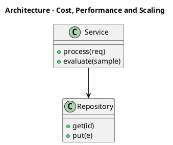

_Source diagram (plantuml); render with the appropriate tool._

**Figure 28. Architecture - Cost, Performance and Scaling** (plantuml). Figure: Architecture view for Multi-Agent Systems. This diagram illustrates the principal components and their interactions as discussed in the surrounding section.

## Deep Dive: Mechanics, Variants and Trade-offs

Having established the essentials, we now go deeper into cost, performance and scaling. It pays to understand the mechanism rather than treat it as a black box, because most production incidents are explained by one of its steps misbehaving. The distinctions in this section are the ones that separate a working demo from a system that holds up under adversarial inputs, scale and the passage of time.

Consider the principal variants and how to choose between them. Each variant optimises for a different point in the design space - some for latency, some for accuracy, some for cost or operability - and the correct choice follows from explicit requirements rather than from defaults. Latency, accuracy and cost form a tension triangle: improving one typically pressures the others, so explicit budgets are essential.

In practice this is supported by a mature tooling ecosystem, including AutoGen, CrewAI, LangGraph, MetaGPT. Tools accelerate the work but do not substitute for understanding: the same principles apply whichever implementation you select, and the ability to reason from first principles is what lets you debug when a tool behaves unexpectedly.

A frequent source of subtle bugs is the interaction with frameworks and patterns. Because frameworks and patterns concerns comparing orchestration frameworks, changes there can silently alter the behaviour analysed here. The remedy is contract tests at the boundary and end-to-end evaluations that exercise the interaction explicitly.

Finally, attend to edge cases and degradation. Define what the system should do under partial failure, unexpected inputs and load spikes, and make that behaviour explicit and tested rather than emergent. Graceful degradation - returning a safe, useful result when the ideal one is unavailable - is a hallmark of mature engineering.

For deeper study, the literature offers authoritative treatments such as Wu et al. — AutoGen (2023) and Du et al. — Improving Factuality via Multi-Agent Debate (2023). These primary sources reward careful reading and ground the practical guidance above in established results.

## Advanced Considerations

Having established the essentials, we now go deeper into cost, performance and scaling. Mechanically, the behaviour emerges from a few interacting parts that are simpler than the whole they produce. The distinctions in this section are the ones that separate a working demo from a system that holds up under adversarial inputs, scale and the passage of time.

Consider the principal variants and how to choose between them. Each variant optimises for a different point in the design space - some for latency, some for accuracy, some for cost or operability - and the correct choice follows from explicit requirements rather than from defaults. Every added component buys capability at the price of operational surface area, and that bargain should be made consciously.

In practice this is supported by a mature tooling ecosystem, including AutoGen, CrewAI, LangGraph, MetaGPT. Tools accelerate the work but do not substitute for understanding: the same principles apply whichever implementation you select, and the ability to reason from first principles is what lets you debug when a tool behaves unexpectedly.

A frequent source of subtle bugs is the interaction with communication protocols. Because communication protocols concerns message passing, shared blackboards and structured handoffs, changes there can silently alter the behaviour analysed here. The remedy is contract tests at the boundary and end-to-end evaluations that exercise the interaction explicitly.

Finally, attend to edge cases and degradation. Define what the system should do under partial failure, unexpected inputs and load spikes, and make that behaviour explicit and tested rather than emergent. Graceful degradation - returning a safe, useful result when the ideal one is unavailable - is a hallmark of mature engineering.

For deeper study, the literature offers authoritative treatments such as Wu et al. — AutoGen (2023) and Du et al. — Improving Factuality via Multi-Agent Debate (2023). These primary sources reward careful reading and ground the practical guidance above in established results.

## Worked Example

A worked example clarifies how these ideas behave in practice. A software organisation needs planner, coder, reviewer and tester agents collaborating. They decide to apply cost, performance and scaling as part of their Multi-Agent Systems solution, but wisely treat it as a hypothesis to be validated rather than a foregone conclusion.

The team begins by stating the objective precisely and defining how success will be measured before writing any code. They establish a small but representative evaluation set, agree on acceptance thresholds, and only then prototype the simplest design that could work. Early measurement reveals which assumptions hold and which must be revised, saving weeks of misdirected effort and surfacing edge cases while they are still cheap to fix.

As the prototype matures into a service, the team hardens it: adding input validation, error handling, caching where it pays off, and monitoring that ties back to the original success metric. They document each significant decision in an architecture decision record so that future maintainers understand not just what was built but why.

The outcome is instructive. The system that reaches production is not the most sophisticated design the team considered, but the one whose behaviour they could measure, explain and operate. This is the recurring lesson of Multi-Agent Systems: durable value comes from the whole system, not from any single clever component.

## Industry Use Cases

Across industries, the ideas in this chapter recur in recognisable ways. The following vignettes show how different sectors apply them and what they have in common.

**Software.** Planner, coder, reviewer and tester agents collaborating. The common thread is that value comes not from the model alone but from the surrounding system - data quality, evaluation, integration and operations - which is precisely where most of the engineering effort belongs.

**Research.** Specialised retrieval, analysis and writing agents. The common thread is that value comes not from the model alone but from the surrounding system - data quality, evaluation, integration and operations - which is precisely where most of the engineering effort belongs.

**Operations.** Coordinated agents across monitoring and remediation. The common thread is that value comes not from the model alone but from the surrounding system - data quality, evaluation, integration and operations - which is precisely where most of the engineering effort belongs.

**Simulation.** Agent-based modelling of markets and organisations. The common thread is that value comes not from the model alone but from the surrounding system - data quality, evaluation, integration and operations - which is precisely where most of the engineering effort belongs.

## Best Practices

The following practices consistently separate successful Multi-Agent Systems efforts from struggling ones. They are deliberately concrete so they can be adopted as checklist items in design and code review.

- Give each agent a narrow, well-specified role.
- Use structured messages and explicit handoff contracts.
- Enforce global budgets to prevent multiplicative cost blow-ups.
- Trace cross-agent interactions for debugging.

None of these are exotic; they are the unglamorous disciplines that compound into reliability. The cost of adopting them is small compared with the cost of the incidents they prevent, and they become second nature with practice.

## Common Pitfalls

Equally instructive are the failure modes that recur in practice. Each pitfall below has a clear early warning sign and a known remedy, so treat them as a diagnostic checklist when something feels wrong:

- Agents talking in circles without convergence.
- Combinatorial cost growth across many agents.
- Unclear ownership leading to duplicated or conflicting actions.
- Emergent failures that are hard to reproduce.

The pattern is consistent: most failures stem from skipping measurement, conflating prototype and production standards, or deferring cross-cutting concerns such as security and cost until they become emergencies. Naming these traps in advance is the cheapest way to avoid them.

## Governance, Security and Cost Notes

No discussion of cost, performance and scaling is complete without its governance, security and cost dimensions, which are too often deferred until they become emergencies. Treating them as first-class concerns from the outset is both cheaper and safer.

**Governance.** Classify the risk of this capability, document its intended and out-of-scope uses, and ensure decisions are traceable to satisfy internal policy and external regulation such as the NIST AI RMF, ISO/IEC 42001 and the EU AI Act. **Security.** Treat all external input as untrusted, validate outputs before acting on them, apply least privilege to any tools or data access, and map controls to the OWASP LLM Top 10 and MITRE ATLAS.

**Cost and sustainability.** Establish explicit budgets for compute, tokens and latency, attribute spend to owners, and revisit the economics as usage scales - a design that is affordable at pilot scale can become untenable at production volume. Building these reflexes into everyday engineering is what allows a Multi-Agent Systems system to be not only capable but also trustworthy and economically sound.

## Hands-On Exercises

Work through the following exercises. They are designed to move understanding from recognition to application - the level required for real engineering work - so prefer writing and building over merely reading.

1. Explain cost, performance and scaling to a colleague unfamiliar with Multi-Agent Systems, using a concrete example from your own domain.
2. Sketch a reference architecture that incorporates cost, performance and scaling and annotate where observability, security and cost controls belong.
3. Design an evaluation that would tell you whether cost, performance and scaling is working in production, including the metric, the dataset and the acceptance threshold.
4. Identify two pitfalls relevant to cost, performance and scaling in your environment and describe the early warning signals you would monitor.
5. Prototype the simplest implementation that demonstrates cost, performance and scaling, then list exactly what would need to change to make it production-ready.

## Key Takeaways

Key takeaways from this chapter:

- Cost, Performance and Scaling is a systems concern in Multi-Agent Systems: data, models and operations must be co-designed.
- Measurement is non-negotiable; define success metrics and evaluation before building.
- Favour the simplest design that meets the requirement, and add complexity only when evidence demands it.
- Security, cost and observability are first-class requirements, not afterthoughts.
- Document decisions so the system remains understandable and operable as it evolves.

## Code Walkthrough

This listing shows a configuration-driven Cost, Performance and Scaling component with retry semantics and typed interfaces — the shape we expect from production Multi-Agent Systems code rather than a notebook prototype.

The full listing is shown below; study it line by line and reproduce it locally before moving on.

### Listing: Implementing a Cost, Performance and Scaling component

```python
from __future__ import annotations

from dataclasses import dataclass, field
from typing import Any


@dataclass(slots=True)
class PerformanceAndConfig:
    """Configuration for the Cost, Performance and Scaling component in a Multi-Agent Systems system."""

    name: str
    timeout_s: float = 30.0
    max_retries: int = 3
    options: dict[str, Any] = field(default_factory=dict)


class PerformanceAnd:
    """A minimal, production-shaped implementation of Cost, Performance and Scaling."""

    def __init__(self, config: PerformanceAndConfig) -> None:
        self._config = config
        self._calls = 0

    def run(self, payload: dict[str, Any]) -> dict[str, Any]:
        """Process a request, retrying transient failures with backoff."""
        last_error: Exception | None = None
        for attempt in range(self._config.max_retries):
            try:
                self._calls += 1
                return self._process(payload)
            except TimeoutError as exc:  # transient
                last_error = exc
                continue
        raise RuntimeError(f"PerformanceAnd failed after retries") from last_error

    def _process(self, payload: dict[str, Any]) -> dict[str, Any]:
        # Domain-specific logic for Cost, Performance and Scaling goes here.
        return {"status": "ok", "input_keys": sorted(payload), "calls": self._calls}

```

## Review Questions

1. In the context of Multi-Agent Systems, which statement best describes “Cost, Performance and Scaling”?
   - A. It makes the system slower but has no other effect.
   - B. It applies exclusively to image data.
   - C. techniques for controlling cost and latency while scaling a Multi-Agent Systems system to production traffic
   - D. It guarantees deterministic output regardless of input.
   - **Answer: C.** Cost, Performance and Scaling: techniques for controlling cost and latency while scaling a Multi-Agent Systems system to production traffic
2. Which of the following is a recommended best practice when working with Multi-Agent Systems?
   - A. Combinatorial cost growth across many agents.
   - B. Trace cross-agent interactions for debugging.
   - C. It eliminates the need for any evaluation or monitoring.
   - D. Unclear ownership leading to duplicated or conflicting actions.
   - **Answer: B.** Best practice: Trace cross-agent interactions for debugging.
3. Which of the following is a common pitfall to avoid in Multi-Agent Systems?
   - A. It applies exclusively to image data.
   - B. It makes the system slower but has no other effect.
   - C. Emergent failures that are hard to reproduce.
   - D. It is only relevant to academic research, not production.
   - **Answer: C.** Pitfall to avoid: Emergent failures that are hard to reproduce.
4. *(Discussion)* Walk through how you would design Cost, Performance and Scaling for an enterprise Multi-Agent Systems workload.
   - **Model answer:** A strong answer defines cost, performance and scaling (techniques for controlling cost and latency while scaling a Multi-Agent Systems system to production traffic) then connects it to architecture, evaluation, cost, security and operations for Multi-Agent Systems, citing concrete trade-offs and a real-world example.

---


# Chapter 22. Integration and Interoperability

_This chapter examines integration and interoperability within Multi-Agent Systems. It covers patterns for integrating a Multi-Agent Systems system with surrounding enterprise systems and data, derives a reference architecture, walks through a worked example and runnable code, surveys industry use cases, and distils best practices and pitfalls, closing with exercises and review questions._

## Introduction

Formally, Integration and Interoperability addresses patterns for integrating a Multi-Agent Systems system with surrounding enterprise systems and data. Understanding this matters because Multi-Agent Systems systems succeed or fail on exactly these decisions. In an enterprise setting, this translates into concrete requirements: clear interfaces, measurable quality, and controls that satisfy security and governance.

This chapter builds intuition first, then formalises the ideas, derives an architecture, and finishes with code, exercises and review questions so the material transfers directly to your own Multi-Agent Systems work. Read it actively: pause at each diagram, reproduce the code, and attempt the exercises before consulting the answers.

## Theory and Foundations

Integration and Interoperability refers to patterns for integrating a Multi-Agent Systems system with surrounding enterprise systems and data. In an enterprise setting, this translates into concrete requirements: clear interfaces, measurable quality, and controls that satisfy security and governance. It pays to understand the mechanism rather than treat it as a black box, because most production incidents are explained by one of its steps misbehaving.

To place this in context, recall the broader picture: Multi-agent systems decompose complex goals across specialised agents that communicate, coordinate and sometimes debate to produce better outcomes than a single agent. Within that picture, integration and interoperability is one of the load-bearing ideas - the kind that, when understood deeply, makes the rest of Multi-Agent Systems fall into place. This concept recurs throughout the Multi-Agent Systems lifecycle, from design to operations.

Integration and Interoperability cannot be understood in isolation from shared memory and state. Recall that shared memory and state concerns coordinating context across agents safely. The two interact directly: decisions in one constrain the design space of the other, which is why mature teams reason about them together rather than sequentially. Simplicity is a feature. The simplest design that meets the requirement should be the default, with complexity added only when measurement justifies it.

Integration and Interoperability cannot be understood in isolation from evaluating multi-agent systems. Recall that evaluating multi-agent systems concerns end-to-end task success and per-agent contribution. The two interact directly: decisions in one constrain the design space of the other, which is why mature teams reason about them together rather than sequentially. Simplicity is a feature. The simplest design that meets the requirement should be the default, with complexity added only when measurement justifies it.

Several established patterns apply directly to integration and interoperability. The first, sequential pipeline of specialised agents, is widely adopted because it makes the system's behaviour predictable and observable. A complementary pattern, supervisor–worker hierarchy, addresses a related concern and is often deployed alongside it. Patterns are not dogma; they are distilled experience that shortcuts the search for a sound design, and each carries assumptions worth checking against your context.

It is worth being explicit about when to apply this and when to reach for something simpler. In a small prototype, shortcuts around integration and interoperability are invisible; in a production Multi-Agent Systems system serving real traffic, they surface as incidents, cost overruns or compliance gaps. Simplicity is a feature. The simplest design that meets the requirement should be the default, with complexity added only when measurement justifies it. The remainder of this chapter turns these principles into an architecture, code and a checklist you can apply immediately.

## Architecture and Design

A robust architecture for Integration and Interoperability is layered so each part can evolve independently without destabilising the whole. A multi-agent platform uses a supervisor/orchestrator that routes subtasks to specialised worker agents, a shared state store for coordination, a message bus for structured communication, and global guardrails enforcing budgets and permissions. Distributed tracing stitches together cross-agent trajectories.

Concretely, the principal building blocks include why multiple agents, agent roles and topologies, communication protocols, orchestration and routing and shared memory and state. Each is a replaceable component behind a stable interface, so the team can upgrade an implementation - a model, an index, a policy engine - without rewriting its neighbours. The contracts between components are where reliability is won or lost, so they are specified explicitly and tested in isolation.

The diagram accompanying this section makes the data and control flow explicit. Requests enter through a well-defined boundary where they are authenticated and validated; only then are they dispatched to the components that perform the work. This boundary is also where rate limiting, quota enforcement and audit logging live, keeping cross-cutting concerns out of the core logic and in one auditable place.

Two qualities deserve emphasis. First, observability is designed in, not bolted on: every component emits structured telemetry so that failures can be localised in minutes rather than hours. Second, the architecture is evolvable - components communicate through stable contracts so that any single part of the Multi-Agent Systems system can be replaced without a rewrite. There is an inherent trade-off between fidelity and cost, and the correct balance depends on the use case and its tolerance for error.

```xml
<mxfile host="ai-university">
  <diagram name="Infrastructure">
    <mxGraphModel dx="800" dy="600" grid="1" gridSize="10">
      <root>
        <mxCell id="0"/>
        <mxCell id="1" parent="0"/>
        <mxCell id="title" value="Infrastructure - Integration and Interoperability" style="text;fontSize=16;fontStyle=1" vertex="1" parent="1"><mxGeometry x="40" y="20" width="600" height="30" as="geometry"/></mxCell>
        <mxCell id="hub" value="Multi-Agent Systems" style="rounded=1;fillColor=#0f172a;fontColor=#ffffff;fontStyle=1" vertex="1" parent="1"><mxGeometry x="300" y="180" width="160" height="60" as="geometry"/></mxCell>
        <mxCell id="n0" value="Why Multiple Agents" style="rounded=1;fillColor=#e0e7ff;strokeColor=#4338ca" vertex="1" parent="1"><mxGeometry x="60" y="80" width="160" height="50" as="geometry"/></mxCell>
        <mxCell id="e0" style="edgeStyle=orthogonalEdgeStyle" edge="1" parent="1" source="hub" target="n0"><mxGeometry relative="1" as="geometry"/></mxCell>
        <mxCell id="n1" value="Agent Roles and Topolog…" style="rounded=1;fillColor=#e0e7ff;strokeColor=#4338ca" vertex="1" parent="1"><mxGeometry x="600" y="170" width="160" height="50" as="geometry"/></mxCell>
        <mxCell id="e1" style="edgeStyle=orthogonalEdgeStyle" edge="1" parent="1" source="hub" target="n1"><mxGeometry relative="1" as="geometry"/></mxCell>
        <mxCell id="n2" value="Communication Protocols" style="rounded=1;fillColor=#e0e7ff;strokeColor=#4338ca" vertex="1" parent="1"><mxGeometry x="60" y="260" width="160" height="50" as="geometry"/></mxCell>
        <mxCell id="e2" style="edgeStyle=orthogonalEdgeStyle" edge="1" parent="1" source="hub" target="n2"><mxGeometry relative="1" as="geometry"/></mxCell>
        <mxCell id="n3" value="Orchestration and Routi…" style="rounded=1;fillColor=#e0e7ff;strokeColor=#4338ca" vertex="1" parent="1"><mxGeometry x="600" y="350" width="160" height="50" as="geometry"/></mxCell>
        <mxCell id="e3" style="edgeStyle=orthogonalEdgeStyle" edge="1" parent="1" source="hub" target="n3"><mxGeometry relative="1" as="geometry"/></mxCell>
        <mxCell id="n4" value="Shared Memory and State" style="rounded=1;fillColor=#e0e7ff;strokeColor=#4338ca" vertex="1" parent="1"><mxGeometry x="60" y="440" width="160" height="50" as="geometry"/></mxCell>
        <mxCell id="e4" style="edgeStyle=orthogonalEdgeStyle" edge="1" parent="1" source="hub" target="n4"><mxGeometry relative="1" as="geometry"/></mxCell>
      </root>
    </mxGraphModel>
  </diagram>
</mxfile>
```

_Source diagram (drawio); render with the appropriate tool._

**Figure 29. Infrastructure - Integration and Interoperability** (drawio). Figure: Infrastructure view for Multi-Agent Systems. This diagram illustrates the principal components and their interactions as discussed in the surrounding section.

## Deep Dive: Mechanics, Variants and Trade-offs

Having established the essentials, we now go deeper into integration and interoperability. Beneath the abstraction lies a concrete process whose steps can each be measured, tested and optimised independently. The distinctions in this section are the ones that separate a working demo from a system that holds up under adversarial inputs, scale and the passage of time.

Consider the principal variants and how to choose between them. Each variant optimises for a different point in the design space - some for latency, some for accuracy, some for cost or operability - and the correct choice follows from explicit requirements rather than from defaults. Simplicity is a feature. The simplest design that meets the requirement should be the default, with complexity added only when measurement justifies it.

In practice this is supported by a mature tooling ecosystem, including AutoGen, CrewAI, LangGraph, MetaGPT. Tools accelerate the work but do not substitute for understanding: the same principles apply whichever implementation you select, and the ability to reason from first principles is what lets you debug when a tool behaves unexpectedly.

A frequent source of subtle bugs is the interaction with shared memory and state. Because shared memory and state concerns coordinating context across agents safely, changes there can silently alter the behaviour analysed here. The remedy is contract tests at the boundary and end-to-end evaluations that exercise the interaction explicitly.

Finally, attend to edge cases and degradation. Define what the system should do under partial failure, unexpected inputs and load spikes, and make that behaviour explicit and tested rather than emergent. Graceful degradation - returning a safe, useful result when the ideal one is unavailable - is a hallmark of mature engineering.

For deeper study, the literature offers authoritative treatments such as Wu et al. — AutoGen (2023) and Du et al. — Improving Factuality via Multi-Agent Debate (2023). These primary sources reward careful reading and ground the practical guidance above in established results.

## Advanced Considerations

Having established the essentials, we now go deeper into integration and interoperability. The underlying mechanism is best appreciated by tracing a single request from input to output and noting where state is created and consumed. The distinctions in this section are the ones that separate a working demo from a system that holds up under adversarial inputs, scale and the passage of time.

Consider the principal variants and how to choose between them. Each variant optimises for a different point in the design space - some for latency, some for accuracy, some for cost or operability - and the correct choice follows from explicit requirements rather than from defaults. There is an inherent trade-off between fidelity and cost, and the correct balance depends on the use case and its tolerance for error.

In practice this is supported by a mature tooling ecosystem, including AutoGen, CrewAI, LangGraph, MetaGPT. Tools accelerate the work but do not substitute for understanding: the same principles apply whichever implementation you select, and the ability to reason from first principles is what lets you debug when a tool behaves unexpectedly.

A frequent source of subtle bugs is the interaction with conflict resolution. Because conflict resolution concerns handling disagreement and contradictory actions, changes there can silently alter the behaviour analysed here. The remedy is contract tests at the boundary and end-to-end evaluations that exercise the interaction explicitly.

Finally, attend to edge cases and degradation. Define what the system should do under partial failure, unexpected inputs and load spikes, and make that behaviour explicit and tested rather than emergent. Graceful degradation - returning a safe, useful result when the ideal one is unavailable - is a hallmark of mature engineering.

For deeper study, the literature offers authoritative treatments such as Wu et al. — AutoGen (2023) and Du et al. — Improving Factuality via Multi-Agent Debate (2023). These primary sources reward careful reading and ground the practical guidance above in established results.

## Worked Example

Consider a concrete scenario. A operations organisation needs coordinated agents across monitoring and remediation. They decide to apply integration and interoperability as part of their Multi-Agent Systems solution, but wisely treat it as a hypothesis to be validated rather than a foregone conclusion.

The team begins by stating the objective precisely and defining how success will be measured before writing any code. They establish a small but representative evaluation set, agree on acceptance thresholds, and only then prototype the simplest design that could work. Early measurement reveals which assumptions hold and which must be revised, saving weeks of misdirected effort and surfacing edge cases while they are still cheap to fix.

As the prototype matures into a service, the team hardens it: adding input validation, error handling, caching where it pays off, and monitoring that ties back to the original success metric. They document each significant decision in an architecture decision record so that future maintainers understand not just what was built but why.

The outcome is instructive. The system that reaches production is not the most sophisticated design the team considered, but the one whose behaviour they could measure, explain and operate. This is the recurring lesson of Multi-Agent Systems: durable value comes from the whole system, not from any single clever component.

## Industry Use Cases

Across industries, the ideas in this chapter recur in recognisable ways. The following vignettes show how different sectors apply them and what they have in common.

**Software.** Planner, coder, reviewer and tester agents collaborating. The common thread is that value comes not from the model alone but from the surrounding system - data quality, evaluation, integration and operations - which is precisely where most of the engineering effort belongs.

**Research.** Specialised retrieval, analysis and writing agents. The common thread is that value comes not from the model alone but from the surrounding system - data quality, evaluation, integration and operations - which is precisely where most of the engineering effort belongs.

**Operations.** Coordinated agents across monitoring and remediation. The common thread is that value comes not from the model alone but from the surrounding system - data quality, evaluation, integration and operations - which is precisely where most of the engineering effort belongs.

**Simulation.** Agent-based modelling of markets and organisations. The common thread is that value comes not from the model alone but from the surrounding system - data quality, evaluation, integration and operations - which is precisely where most of the engineering effort belongs.

## Best Practices

The following practices consistently separate successful Multi-Agent Systems efforts from struggling ones. They are deliberately concrete so they can be adopted as checklist items in design and code review.

- Give each agent a narrow, well-specified role.
- Use structured messages and explicit handoff contracts.
- Enforce global budgets to prevent multiplicative cost blow-ups.
- Trace cross-agent interactions for debugging.

None of these are exotic; they are the unglamorous disciplines that compound into reliability. The cost of adopting them is small compared with the cost of the incidents they prevent, and they become second nature with practice.

## Common Pitfalls

Equally instructive are the failure modes that recur in practice. Each pitfall below has a clear early warning sign and a known remedy, so treat them as a diagnostic checklist when something feels wrong:

- Agents talking in circles without convergence.
- Combinatorial cost growth across many agents.
- Unclear ownership leading to duplicated or conflicting actions.
- Emergent failures that are hard to reproduce.

The pattern is consistent: most failures stem from skipping measurement, conflating prototype and production standards, or deferring cross-cutting concerns such as security and cost until they become emergencies. Naming these traps in advance is the cheapest way to avoid them.

## Governance, Security and Cost Notes

No discussion of integration and interoperability is complete without its governance, security and cost dimensions, which are too often deferred until they become emergencies. Treating them as first-class concerns from the outset is both cheaper and safer.

**Governance.** Classify the risk of this capability, document its intended and out-of-scope uses, and ensure decisions are traceable to satisfy internal policy and external regulation such as the NIST AI RMF, ISO/IEC 42001 and the EU AI Act. **Security.** Treat all external input as untrusted, validate outputs before acting on them, apply least privilege to any tools or data access, and map controls to the OWASP LLM Top 10 and MITRE ATLAS.

**Cost and sustainability.** Establish explicit budgets for compute, tokens and latency, attribute spend to owners, and revisit the economics as usage scales - a design that is affordable at pilot scale can become untenable at production volume. Building these reflexes into everyday engineering is what allows a Multi-Agent Systems system to be not only capable but also trustworthy and economically sound.

## Hands-On Exercises

Work through the following exercises. They are designed to move understanding from recognition to application - the level required for real engineering work - so prefer writing and building over merely reading.

1. Explain integration and interoperability to a colleague unfamiliar with Multi-Agent Systems, using a concrete example from your own domain.
2. Sketch a reference architecture that incorporates integration and interoperability and annotate where observability, security and cost controls belong.
3. Design an evaluation that would tell you whether integration and interoperability is working in production, including the metric, the dataset and the acceptance threshold.
4. Identify two pitfalls relevant to integration and interoperability in your environment and describe the early warning signals you would monitor.
5. Prototype the simplest implementation that demonstrates integration and interoperability, then list exactly what would need to change to make it production-ready.

## Key Takeaways

Key takeaways from this chapter:

- Integration and Interoperability is a systems concern in Multi-Agent Systems: data, models and operations must be co-designed.
- Measurement is non-negotiable; define success metrics and evaluation before building.
- Favour the simplest design that meets the requirement, and add complexity only when evidence demands it.
- Security, cost and observability are first-class requirements, not afterthoughts.
- Document decisions so the system remains understandable and operable as it evolves.

## Code Walkthrough

This listing shows a configuration-driven Integration and Interoperability component with retry semantics and typed interfaces — the shape we expect from production Multi-Agent Systems code rather than a notebook prototype.

The full listing is shown below; study it line by line and reproduce it locally before moving on.

### Listing: Implementing a Integration and Interoperability component

```python
from __future__ import annotations

from dataclasses import dataclass, field
from typing import Any


@dataclass(slots=True)
class IntegrationAndInteroperabilityConfig:
    """Configuration for the Integration and Interoperability component in a Multi-Agent Systems system."""

    name: str
    timeout_s: float = 30.0
    max_retries: int = 3
    options: dict[str, Any] = field(default_factory=dict)


class IntegrationAndInteroperability:
    """A minimal, production-shaped implementation of Integration and Interoperability."""

    def __init__(self, config: IntegrationAndInteroperabilityConfig) -> None:
        self._config = config
        self._calls = 0

    def run(self, payload: dict[str, Any]) -> dict[str, Any]:
        """Process a request, retrying transient failures with backoff."""
        last_error: Exception | None = None
        for attempt in range(self._config.max_retries):
            try:
                self._calls += 1
                return self._process(payload)
            except TimeoutError as exc:  # transient
                last_error = exc
                continue
        raise RuntimeError(f"IntegrationAndInteroperability failed after retries") from last_error

    def _process(self, payload: dict[str, Any]) -> dict[str, Any]:
        # Domain-specific logic for Integration and Interoperability goes here.
        return {"status": "ok", "input_keys": sorted(payload), "calls": self._calls}

```

## Review Questions

1. In the context of Multi-Agent Systems, which statement best describes “Integration and Interoperability”?
   - A. patterns for integrating a Multi-Agent Systems system with surrounding enterprise systems and data
   - B. It removes all security and governance requirements.
   - C. It eliminates the need for any evaluation or monitoring.
   - D. It makes the system slower but has no other effect.
   - **Answer: A.** Integration and Interoperability: patterns for integrating a Multi-Agent Systems system with surrounding enterprise systems and data
2. Which of the following is a recommended best practice when working with Multi-Agent Systems?
   - A. It makes the system slower but has no other effect.
   - B. Combinatorial cost growth across many agents.
   - C. Use structured messages and explicit handoff contracts.
   - D. It removes all security and governance requirements.
   - **Answer: C.** Best practice: Use structured messages and explicit handoff contracts.
3. Which of the following is a common pitfall to avoid in Multi-Agent Systems?
   - A. It removes all security and governance requirements.
   - B. Give each agent a narrow, well-specified role.
   - C. It is only relevant to academic research, not production.
   - D. Agents talking in circles without convergence.
   - **Answer: D.** Pitfall to avoid: Agents talking in circles without convergence.
4. *(Discussion)* Describe a failure mode of Integration and Interoperability and how you would mitigate it.
   - **Model answer:** A strong answer defines integration and interoperability (patterns for integrating a Multi-Agent Systems system with surrounding enterprise systems and data) then connects it to architecture, evaluation, cost, security and operations for Multi-Agent Systems, citing concrete trade-offs and a real-world example.

---


# Chapter 23. Trends and Research Directions

_This chapter examines trends and research directions within Multi-Agent Systems. It covers emerging trends, open problems and research directions shaping the future of Multi-Agent Systems, derives a reference architecture, walks through a worked example and runnable code, surveys industry use cases, and distils best practices and pitfalls, closing with exercises and review questions._

## Introduction

We define Trends and Research Directions as emerging trends, open problems and research directions shaping the future of Multi-Agent Systems. It is foundational: later capabilities in Multi-Agent Systems are built directly on top of it. Seasoned practitioners treat this as a systems problem, co-designing data, models and operations rather than optimising any one in isolation.

This chapter builds intuition first, then formalises the ideas, derives an architecture, and finishes with code, exercises and review questions so the material transfers directly to your own Multi-Agent Systems work. Read it actively: pause at each diagram, reproduce the code, and attempt the exercises before consulting the answers.

## Theory and Foundations

Trends and Research Directions can be characterised as emerging trends, open problems and research directions shaping the future of Multi-Agent Systems. What distinguishes a production-grade approach from a prototype is the discipline of measurement: every claim is backed by an evaluation rather than intuition. Mechanically, the behaviour emerges from a few interacting parts that are simpler than the whole they produce.

To place this in context, recall the broader picture: Multi-agent systems decompose complex goals across specialised agents that communicate, coordinate and sometimes debate to produce better outcomes than a single agent. Within that picture, trends and research directions is one of the load-bearing ideas - the kind that, when understood deeply, makes the rest of Multi-Agent Systems fall into place. Understanding this matters because Multi-Agent Systems systems succeed or fail on exactly these decisions.

Trends and Research Directions cannot be understood in isolation from tool and resource contention. Recall that tool and resource contention concerns coordinating access to shared external systems. The two interact directly: decisions in one constrain the design space of the other, which is why mature teams reason about them together rather than sequentially. As with most architectural decisions, the choice is rarely binary; the skill lies in quantifying the trade-offs and choosing deliberately.

Trends and Research Directions cannot be understood in isolation from frameworks and patterns. Recall that frameworks and patterns concerns comparing orchestration frameworks. The two interact directly: decisions in one constrain the design space of the other, which is why mature teams reason about them together rather than sequentially. There is an inherent trade-off between fidelity and cost, and the correct balance depends on the use case and its tolerance for error.

Several established patterns apply directly to trends and research directions. The first, debate-and-judge for high-stakes decisions, is widely adopted because it makes the system's behaviour predictable and observable. A complementary pattern, supervisor–worker hierarchy, addresses a related concern and is often deployed alongside it. Patterns are not dogma; they are distilled experience that shortcuts the search for a sound design, and each carries assumptions worth checking against your context.

The decision of whether to adopt this should be driven by requirements, not by novelty. In a small prototype, shortcuts around trends and research directions are invisible; in a production Multi-Agent Systems system serving real traffic, they surface as incidents, cost overruns or compliance gaps. As with most architectural decisions, the choice is rarely binary; the skill lies in quantifying the trade-offs and choosing deliberately. The remainder of this chapter turns these principles into an architecture, code and a checklist you can apply immediately.

## Architecture and Design

The reference architecture for Trends and Research Directions separates concerns into clearly bounded components with explicit contracts. A multi-agent platform uses a supervisor/orchestrator that routes subtasks to specialised worker agents, a shared state store for coordination, a message bus for structured communication, and global guardrails enforcing budgets and permissions. Distributed tracing stitches together cross-agent trajectories.

Concretely, the principal building blocks include why multiple agents, agent roles and topologies, communication protocols, orchestration and routing and shared memory and state. Each is a replaceable component behind a stable interface, so the team can upgrade an implementation - a model, an index, a policy engine - without rewriting its neighbours. The contracts between components are where reliability is won or lost, so they are specified explicitly and tested in isolation.

The diagram accompanying this section makes the data and control flow explicit. Requests enter through a well-defined boundary where they are authenticated and validated; only then are they dispatched to the components that perform the work. This boundary is also where rate limiting, quota enforcement and audit logging live, keeping cross-cutting concerns out of the core logic and in one auditable place.

Two qualities deserve emphasis. First, observability is designed in, not bolted on: every component emits structured telemetry so that failures can be localised in minutes rather than hours. Second, the architecture is evolvable - components communicate through stable contracts so that any single part of the Multi-Agent Systems system can be replaced without a rewrite. Every added component buys capability at the price of operational surface area, and that bargain should be made consciously.


**Figure 30. Application Flow - Trends and Research Directions** (mermaid). Figure: Application Flow view for Multi-Agent Systems. This diagram illustrates the principal components and their interactions as discussed in the surrounding section.


**Figure 31. Component - Trends and Research Directions** (mermaid). Figure: Component view for Multi-Agent Systems. This diagram illustrates the principal components and their interactions as discussed in the surrounding section.

## Deep Dive: Mechanics, Variants and Trade-offs

Having established the essentials, we now go deeper into trends and research directions. Beneath the abstraction lies a concrete process whose steps can each be measured, tested and optimised independently. The distinctions in this section are the ones that separate a working demo from a system that holds up under adversarial inputs, scale and the passage of time.

Consider the principal variants and how to choose between them. Each variant optimises for a different point in the design space - some for latency, some for accuracy, some for cost or operability - and the correct choice follows from explicit requirements rather than from defaults. Latency, accuracy and cost form a tension triangle: improving one typically pressures the others, so explicit budgets are essential.

In practice this is supported by a mature tooling ecosystem, including AutoGen, CrewAI, LangGraph, MetaGPT. Tools accelerate the work but do not substitute for understanding: the same principles apply whichever implementation you select, and the ability to reason from first principles is what lets you debug when a tool behaves unexpectedly.

A frequent source of subtle bugs is the interaction with tool and resource contention. Because tool and resource contention concerns coordinating access to shared external systems, changes there can silently alter the behaviour analysed here. The remedy is contract tests at the boundary and end-to-end evaluations that exercise the interaction explicitly.

Finally, attend to edge cases and degradation. Define what the system should do under partial failure, unexpected inputs and load spikes, and make that behaviour explicit and tested rather than emergent. Graceful degradation - returning a safe, useful result when the ideal one is unavailable - is a hallmark of mature engineering.

For deeper study, the literature offers authoritative treatments such as Wu et al. — AutoGen (2023) and Du et al. — Improving Factuality via Multi-Agent Debate (2023). These primary sources reward careful reading and ground the practical guidance above in established results.

## Advanced Considerations

Having established the essentials, we now go deeper into trends and research directions. It pays to understand the mechanism rather than treat it as a black box, because most production incidents are explained by one of its steps misbehaving. The distinctions in this section are the ones that separate a working demo from a system that holds up under adversarial inputs, scale and the passage of time.

Consider the principal variants and how to choose between them. Each variant optimises for a different point in the design space - some for latency, some for accuracy, some for cost or operability - and the correct choice follows from explicit requirements rather than from defaults. Simplicity is a feature. The simplest design that meets the requirement should be the default, with complexity added only when measurement justifies it.

In practice this is supported by a mature tooling ecosystem, including AutoGen, CrewAI, LangGraph, MetaGPT. Tools accelerate the work but do not substitute for understanding: the same principles apply whichever implementation you select, and the ability to reason from first principles is what lets you debug when a tool behaves unexpectedly.

A frequent source of subtle bugs is the interaction with agent roles and topologies. Because agent roles and topologies concerns hierarchical, sequential, network and market-based organisations, changes there can silently alter the behaviour analysed here. The remedy is contract tests at the boundary and end-to-end evaluations that exercise the interaction explicitly.

Finally, attend to edge cases and degradation. Define what the system should do under partial failure, unexpected inputs and load spikes, and make that behaviour explicit and tested rather than emergent. Graceful degradation - returning a safe, useful result when the ideal one is unavailable - is a hallmark of mature engineering.

For deeper study, the literature offers authoritative treatments such as Wu et al. — AutoGen (2023) and Du et al. — Improving Factuality via Multi-Agent Debate (2023). These primary sources reward careful reading and ground the practical guidance above in established results.

## Worked Example

Consider a concrete scenario. A software organisation needs planner, coder, reviewer and tester agents collaborating. They decide to apply trends and research directions as part of their Multi-Agent Systems solution, but wisely treat it as a hypothesis to be validated rather than a foregone conclusion.

The team begins by stating the objective precisely and defining how success will be measured before writing any code. They establish a small but representative evaluation set, agree on acceptance thresholds, and only then prototype the simplest design that could work. Early measurement reveals which assumptions hold and which must be revised, saving weeks of misdirected effort and surfacing edge cases while they are still cheap to fix.

As the prototype matures into a service, the team hardens it: adding input validation, error handling, caching where it pays off, and monitoring that ties back to the original success metric. They document each significant decision in an architecture decision record so that future maintainers understand not just what was built but why.

The outcome is instructive. The system that reaches production is not the most sophisticated design the team considered, but the one whose behaviour they could measure, explain and operate. This is the recurring lesson of Multi-Agent Systems: durable value comes from the whole system, not from any single clever component.

## Industry Use Cases

Across industries, the ideas in this chapter recur in recognisable ways. The following vignettes show how different sectors apply them and what they have in common.

**Software.** Planner, coder, reviewer and tester agents collaborating. The common thread is that value comes not from the model alone but from the surrounding system - data quality, evaluation, integration and operations - which is precisely where most of the engineering effort belongs.

**Research.** Specialised retrieval, analysis and writing agents. The common thread is that value comes not from the model alone but from the surrounding system - data quality, evaluation, integration and operations - which is precisely where most of the engineering effort belongs.

**Operations.** Coordinated agents across monitoring and remediation. The common thread is that value comes not from the model alone but from the surrounding system - data quality, evaluation, integration and operations - which is precisely where most of the engineering effort belongs.

**Simulation.** Agent-based modelling of markets and organisations. The common thread is that value comes not from the model alone but from the surrounding system - data quality, evaluation, integration and operations - which is precisely where most of the engineering effort belongs.

## Best Practices

The following practices consistently separate successful Multi-Agent Systems efforts from struggling ones. They are deliberately concrete so they can be adopted as checklist items in design and code review.

- Give each agent a narrow, well-specified role.
- Use structured messages and explicit handoff contracts.
- Enforce global budgets to prevent multiplicative cost blow-ups.
- Trace cross-agent interactions for debugging.

None of these are exotic; they are the unglamorous disciplines that compound into reliability. The cost of adopting them is small compared with the cost of the incidents they prevent, and they become second nature with practice.

## Common Pitfalls

Equally instructive are the failure modes that recur in practice. Each pitfall below has a clear early warning sign and a known remedy, so treat them as a diagnostic checklist when something feels wrong:

- Agents talking in circles without convergence.
- Combinatorial cost growth across many agents.
- Unclear ownership leading to duplicated or conflicting actions.
- Emergent failures that are hard to reproduce.

The pattern is consistent: most failures stem from skipping measurement, conflating prototype and production standards, or deferring cross-cutting concerns such as security and cost until they become emergencies. Naming these traps in advance is the cheapest way to avoid them.

## Governance, Security and Cost Notes

No discussion of trends and research directions is complete without its governance, security and cost dimensions, which are too often deferred until they become emergencies. Treating them as first-class concerns from the outset is both cheaper and safer.

**Governance.** Classify the risk of this capability, document its intended and out-of-scope uses, and ensure decisions are traceable to satisfy internal policy and external regulation such as the NIST AI RMF, ISO/IEC 42001 and the EU AI Act. **Security.** Treat all external input as untrusted, validate outputs before acting on them, apply least privilege to any tools or data access, and map controls to the OWASP LLM Top 10 and MITRE ATLAS.

**Cost and sustainability.** Establish explicit budgets for compute, tokens and latency, attribute spend to owners, and revisit the economics as usage scales - a design that is affordable at pilot scale can become untenable at production volume. Building these reflexes into everyday engineering is what allows a Multi-Agent Systems system to be not only capable but also trustworthy and economically sound.

## Hands-On Exercises

Work through the following exercises. They are designed to move understanding from recognition to application - the level required for real engineering work - so prefer writing and building over merely reading.

1. Explain trends and research directions to a colleague unfamiliar with Multi-Agent Systems, using a concrete example from your own domain.
2. Sketch a reference architecture that incorporates trends and research directions and annotate where observability, security and cost controls belong.
3. Design an evaluation that would tell you whether trends and research directions is working in production, including the metric, the dataset and the acceptance threshold.
4. Identify two pitfalls relevant to trends and research directions in your environment and describe the early warning signals you would monitor.
5. Prototype the simplest implementation that demonstrates trends and research directions, then list exactly what would need to change to make it production-ready.

## Key Takeaways

Key takeaways from this chapter:

- Trends and Research Directions is a systems concern in Multi-Agent Systems: data, models and operations must be co-designed.
- Measurement is non-negotiable; define success metrics and evaluation before building.
- Favour the simplest design that meets the requirement, and add complexity only when evidence demands it.
- Security, cost and observability are first-class requirements, not afterthoughts.
- Document decisions so the system remains understandable and operable as it evolves.

## Review Questions

1. In the context of Multi-Agent Systems, which statement best describes “Trends and Research Directions”?
   - A. It is only relevant to academic research, not production.
   - B. It removes all security and governance requirements.
   - C. It guarantees deterministic output regardless of input.
   - D. emerging trends, open problems and research directions shaping the future of Multi-Agent Systems
   - **Answer: D.** Trends and Research Directions: emerging trends, open problems and research directions shaping the future of Multi-Agent Systems
2. Which of the following is a recommended best practice when working with Multi-Agent Systems?
   - A. It is only relevant to academic research, not production.
   - B. It guarantees deterministic output regardless of input.
   - C. Emergent failures that are hard to reproduce.
   - D. Enforce global budgets to prevent multiplicative cost blow-ups.
   - **Answer: D.** Best practice: Enforce global budgets to prevent multiplicative cost blow-ups.
3. Which of the following is a common pitfall to avoid in Multi-Agent Systems?
   - A. Give each agent a narrow, well-specified role.
   - B. Unclear ownership leading to duplicated or conflicting actions.
   - C. It guarantees deterministic output regardless of input.
   - D. It applies exclusively to image data.
   - **Answer: B.** Pitfall to avoid: Unclear ownership leading to duplicated or conflicting actions.
4. *(Discussion)* How does Trends and Research Directions interact with security and governance requirements?
   - **Model answer:** A strong answer defines trends and research directions (emerging trends, open problems and research directions shaping the future of Multi-Agent Systems) then connects it to architecture, evaluation, cost, security and operations for Multi-Agent Systems, citing concrete trade-offs and a real-world example.

---


# Chapter 24. Capstone Project

_This chapter examines capstone project within Multi-Agent Systems. It covers a substantial capstone project that consolidates the entire book into a portfolio-grade Multi-Agent Systems deliverable, derives a reference architecture, walks through a worked example and runnable code, surveys industry use cases, and distils best practices and pitfalls, closing with exercises and review questions._

## Introduction

At its core, Capstone Project concerns a substantial capstone project that consolidates the entire book into a portfolio-grade Multi-Agent Systems deliverable. Getting this right early prevents expensive rework once a Multi-Agent Systems system reaches scale. In an enterprise setting, this translates into concrete requirements: clear interfaces, measurable quality, and controls that satisfy security and governance.

This chapter builds intuition first, then formalises the ideas, derives an architecture, and finishes with code, exercises and review questions so the material transfers directly to your own Multi-Agent Systems work. Read it actively: pause at each diagram, reproduce the code, and attempt the exercises before consulting the answers.

## Theory and Foundations

Formally, Capstone Project addresses a substantial capstone project that consolidates the entire book into a portfolio-grade Multi-Agent Systems deliverable. The right abstraction here pays compounding dividends, because downstream components depend on its guarantees. Beneath the abstraction lies a concrete process whose steps can each be measured, tested and optimised independently.

To place this in context, recall the broader picture: Multi-agent systems decompose complex goals across specialised agents that communicate, coordinate and sometimes debate to produce better outcomes than a single agent. Within that picture, capstone project is one of the load-bearing ideas - the kind that, when understood deeply, makes the rest of Multi-Agent Systems fall into place. Teams that master this consistently ship more reliable Multi-Agent Systems systems at lower cost.

Capstone Project cannot be understood in isolation from shared memory and state. Recall that shared memory and state concerns coordinating context across agents safely. The two interact directly: decisions in one constrain the design space of the other, which is why mature teams reason about them together rather than sequentially. Every added component buys capability at the price of operational surface area, and that bargain should be made consciously.

Capstone Project cannot be understood in isolation from agent roles and topologies. Recall that agent roles and topologies concerns hierarchical, sequential, network and market-based organisations. The two interact directly: decisions in one constrain the design space of the other, which is why mature teams reason about them together rather than sequentially. Every added component buys capability at the price of operational surface area, and that bargain should be made consciously.

Several established patterns apply directly to capstone project. The first, supervisor–worker hierarchy, is widely adopted because it makes the system's behaviour predictable and observable. A complementary pattern, blackboard for shared coordination state, addresses a related concern and is often deployed alongside it. Patterns are not dogma; they are distilled experience that shortcuts the search for a sound design, and each carries assumptions worth checking against your context.

The decision of whether to adopt this should be driven by requirements, not by novelty. In a small prototype, shortcuts around capstone project are invisible; in a production Multi-Agent Systems system serving real traffic, they surface as incidents, cost overruns or compliance gaps. Simplicity is a feature. The simplest design that meets the requirement should be the default, with complexity added only when measurement justifies it. The remainder of this chapter turns these principles into an architecture, code and a checklist you can apply immediately.

## Architecture and Design

A robust architecture for Capstone Project is layered so each part can evolve independently without destabilising the whole. A multi-agent platform uses a supervisor/orchestrator that routes subtasks to specialised worker agents, a shared state store for coordination, a message bus for structured communication, and global guardrails enforcing budgets and permissions. Distributed tracing stitches together cross-agent trajectories.

Concretely, the principal building blocks include why multiple agents, agent roles and topologies, communication protocols, orchestration and routing and shared memory and state. Each is a replaceable component behind a stable interface, so the team can upgrade an implementation - a model, an index, a policy engine - without rewriting its neighbours. The contracts between components are where reliability is won or lost, so they are specified explicitly and tested in isolation.

The diagram accompanying this section makes the data and control flow explicit. Requests enter through a well-defined boundary where they are authenticated and validated; only then are they dispatched to the components that perform the work. This boundary is also where rate limiting, quota enforcement and audit logging live, keeping cross-cutting concerns out of the core logic and in one auditable place.

Two qualities deserve emphasis. First, observability is designed in, not bolted on: every component emits structured telemetry so that failures can be localised in minutes rather than hours. Second, the architecture is evolvable - components communicate through stable contracts so that any single part of the Multi-Agent Systems system can be replaced without a rewrite. Latency, accuracy and cost form a tension triangle: improving one typically pressures the others, so explicit budgets are essential.


**Figure 32. Component - Capstone Project** (mermaid). Figure: Component view for Multi-Agent Systems. This diagram illustrates the principal components and their interactions as discussed in the surrounding section.

## Deep Dive: Mechanics, Variants and Trade-offs

Having established the essentials, we now go deeper into capstone project. The underlying mechanism is best appreciated by tracing a single request from input to output and noting where state is created and consumed. The distinctions in this section are the ones that separate a working demo from a system that holds up under adversarial inputs, scale and the passage of time.

Consider the principal variants and how to choose between them. Each variant optimises for a different point in the design space - some for latency, some for accuracy, some for cost or operability - and the correct choice follows from explicit requirements rather than from defaults. Simplicity is a feature. The simplest design that meets the requirement should be the default, with complexity added only when measurement justifies it.

In practice this is supported by a mature tooling ecosystem, including AutoGen, CrewAI, LangGraph, MetaGPT. Tools accelerate the work but do not substitute for understanding: the same principles apply whichever implementation you select, and the ability to reason from first principles is what lets you debug when a tool behaves unexpectedly.

A frequent source of subtle bugs is the interaction with shared memory and state. Because shared memory and state concerns coordinating context across agents safely, changes there can silently alter the behaviour analysed here. The remedy is contract tests at the boundary and end-to-end evaluations that exercise the interaction explicitly.

Finally, attend to edge cases and degradation. Define what the system should do under partial failure, unexpected inputs and load spikes, and make that behaviour explicit and tested rather than emergent. Graceful degradation - returning a safe, useful result when the ideal one is unavailable - is a hallmark of mature engineering.

For deeper study, the literature offers authoritative treatments such as Wu et al. — AutoGen (2023) and Du et al. — Improving Factuality via Multi-Agent Debate (2023). These primary sources reward careful reading and ground the practical guidance above in established results.

## Advanced Considerations

Having established the essentials, we now go deeper into capstone project. The underlying mechanism is best appreciated by tracing a single request from input to output and noting where state is created and consumed. The distinctions in this section are the ones that separate a working demo from a system that holds up under adversarial inputs, scale and the passage of time.

Consider the principal variants and how to choose between them. Each variant optimises for a different point in the design space - some for latency, some for accuracy, some for cost or operability - and the correct choice follows from explicit requirements rather than from defaults. Simplicity is a feature. The simplest design that meets the requirement should be the default, with complexity added only when measurement justifies it.

In practice this is supported by a mature tooling ecosystem, including AutoGen, CrewAI, LangGraph, MetaGPT. Tools accelerate the work but do not substitute for understanding: the same principles apply whichever implementation you select, and the ability to reason from first principles is what lets you debug when a tool behaves unexpectedly.

A frequent source of subtle bugs is the interaction with observability across agents. Because observability across agents concerns tracing distributed agent interactions, changes there can silently alter the behaviour analysed here. The remedy is contract tests at the boundary and end-to-end evaluations that exercise the interaction explicitly.

Finally, attend to edge cases and degradation. Define what the system should do under partial failure, unexpected inputs and load spikes, and make that behaviour explicit and tested rather than emergent. Graceful degradation - returning a safe, useful result when the ideal one is unavailable - is a hallmark of mature engineering.

For deeper study, the literature offers authoritative treatments such as Wu et al. — AutoGen (2023) and Du et al. — Improving Factuality via Multi-Agent Debate (2023). These primary sources reward careful reading and ground the practical guidance above in established results.

## Worked Example

A worked example clarifies how these ideas behave in practice. A simulation organisation needs agent-based modelling of markets and organisations. They decide to apply capstone project as part of their Multi-Agent Systems solution, but wisely treat it as a hypothesis to be validated rather than a foregone conclusion.

The team begins by stating the objective precisely and defining how success will be measured before writing any code. They establish a small but representative evaluation set, agree on acceptance thresholds, and only then prototype the simplest design that could work. Early measurement reveals which assumptions hold and which must be revised, saving weeks of misdirected effort and surfacing edge cases while they are still cheap to fix.

As the prototype matures into a service, the team hardens it: adding input validation, error handling, caching where it pays off, and monitoring that ties back to the original success metric. They document each significant decision in an architecture decision record so that future maintainers understand not just what was built but why.

The outcome is instructive. The system that reaches production is not the most sophisticated design the team considered, but the one whose behaviour they could measure, explain and operate. This is the recurring lesson of Multi-Agent Systems: durable value comes from the whole system, not from any single clever component.

## Industry Use Cases

Across industries, the ideas in this chapter recur in recognisable ways. The following vignettes show how different sectors apply them and what they have in common.

**Software.** Planner, coder, reviewer and tester agents collaborating. The common thread is that value comes not from the model alone but from the surrounding system - data quality, evaluation, integration and operations - which is precisely where most of the engineering effort belongs.

**Research.** Specialised retrieval, analysis and writing agents. The common thread is that value comes not from the model alone but from the surrounding system - data quality, evaluation, integration and operations - which is precisely where most of the engineering effort belongs.

**Operations.** Coordinated agents across monitoring and remediation. The common thread is that value comes not from the model alone but from the surrounding system - data quality, evaluation, integration and operations - which is precisely where most of the engineering effort belongs.

**Simulation.** Agent-based modelling of markets and organisations. The common thread is that value comes not from the model alone but from the surrounding system - data quality, evaluation, integration and operations - which is precisely where most of the engineering effort belongs.

## Best Practices

The following practices consistently separate successful Multi-Agent Systems efforts from struggling ones. They are deliberately concrete so they can be adopted as checklist items in design and code review.

- Give each agent a narrow, well-specified role.
- Use structured messages and explicit handoff contracts.
- Enforce global budgets to prevent multiplicative cost blow-ups.
- Trace cross-agent interactions for debugging.

None of these are exotic; they are the unglamorous disciplines that compound into reliability. The cost of adopting them is small compared with the cost of the incidents they prevent, and they become second nature with practice.

## Common Pitfalls

Equally instructive are the failure modes that recur in practice. Each pitfall below has a clear early warning sign and a known remedy, so treat them as a diagnostic checklist when something feels wrong:

- Agents talking in circles without convergence.
- Combinatorial cost growth across many agents.
- Unclear ownership leading to duplicated or conflicting actions.
- Emergent failures that are hard to reproduce.

The pattern is consistent: most failures stem from skipping measurement, conflating prototype and production standards, or deferring cross-cutting concerns such as security and cost until they become emergencies. Naming these traps in advance is the cheapest way to avoid them.

## Governance, Security and Cost Notes

No discussion of capstone project is complete without its governance, security and cost dimensions, which are too often deferred until they become emergencies. Treating them as first-class concerns from the outset is both cheaper and safer.

**Governance.** Classify the risk of this capability, document its intended and out-of-scope uses, and ensure decisions are traceable to satisfy internal policy and external regulation such as the NIST AI RMF, ISO/IEC 42001 and the EU AI Act. **Security.** Treat all external input as untrusted, validate outputs before acting on them, apply least privilege to any tools or data access, and map controls to the OWASP LLM Top 10 and MITRE ATLAS.

**Cost and sustainability.** Establish explicit budgets for compute, tokens and latency, attribute spend to owners, and revisit the economics as usage scales - a design that is affordable at pilot scale can become untenable at production volume. Building these reflexes into everyday engineering is what allows a Multi-Agent Systems system to be not only capable but also trustworthy and economically sound.

## Hands-On Exercises

Work through the following exercises. They are designed to move understanding from recognition to application - the level required for real engineering work - so prefer writing and building over merely reading.

1. Explain capstone project to a colleague unfamiliar with Multi-Agent Systems, using a concrete example from your own domain.
2. Sketch a reference architecture that incorporates capstone project and annotate where observability, security and cost controls belong.
3. Design an evaluation that would tell you whether capstone project is working in production, including the metric, the dataset and the acceptance threshold.
4. Identify two pitfalls relevant to capstone project in your environment and describe the early warning signals you would monitor.
5. Prototype the simplest implementation that demonstrates capstone project, then list exactly what would need to change to make it production-ready.

## Key Takeaways

Key takeaways from this chapter:

- Capstone Project is a systems concern in Multi-Agent Systems: data, models and operations must be co-designed.
- Measurement is non-negotiable; define success metrics and evaluation before building.
- Favour the simplest design that meets the requirement, and add complexity only when evidence demands it.
- Security, cost and observability are first-class requirements, not afterthoughts.
- Document decisions so the system remains understandable and operable as it evolves.

## Code Walkthrough

Pipelines keep Capstone Project logic modular and testable. Each stage is a pure function, errors are captured per item, and the composition is trivial to extend or reorder.

The full listing is shown below; study it line by line and reproduce it locally before moving on.

### Listing: A composable processing pipeline for Capstone Project

```python
from collections.abc import Iterable, Iterator
from typing import Protocol


class Stage(Protocol):
    def __call__(self, item: dict) -> dict: ...


def pipeline(stages: list[Stage]) -> Stage:
    """Compose ordered stages into a single callable for Capstone Project."""

    def run(item: dict) -> dict:
        for stage in stages:
            item = stage(item)
        return item

    return run


def validate(item: dict) -> dict:
    if "text" not in item:
        raise ValueError("missing required field: text")
    return item


def normalise(item: dict) -> dict:
    item["text"] = item["text"].strip().lower()
    return item


def enrich(item: dict) -> dict:
    item["length"] = len(item["text"])
    return item


process = pipeline([validate, normalise, enrich])


def run_batch(items: Iterable[dict]) -> Iterator[dict]:
    for item in items:
        try:
            yield process(dict(item))
        except ValueError as exc:
            yield {"error": str(exc), "item": item}

```

## Review Questions

1. In the context of Multi-Agent Systems, which statement best describes “Capstone Project”?
   - A. It makes the system slower but has no other effect.
   - B. It removes all security and governance requirements.
   - C. It applies exclusively to image data.
   - D. a substantial capstone project that consolidates the entire book into a portfolio-grade Multi-Agent Systems deliverable
   - **Answer: D.** Capstone Project: a substantial capstone project that consolidates the entire book into a portfolio-grade Multi-Agent Systems deliverable
2. Which of the following is a recommended best practice when working with Multi-Agent Systems?
   - A. It removes all security and governance requirements.
   - B. Give each agent a narrow, well-specified role.
   - C. Unclear ownership leading to duplicated or conflicting actions.
   - D. It eliminates the need for any evaluation or monitoring.
   - **Answer: B.** Best practice: Give each agent a narrow, well-specified role.
3. Which of the following is a common pitfall to avoid in Multi-Agent Systems?
   - A. Enforce global budgets to prevent multiplicative cost blow-ups.
   - B. Combinatorial cost growth across many agents.
   - C. It guarantees deterministic output regardless of input.
   - D. Trace cross-agent interactions for debugging.
   - **Answer: B.** Pitfall to avoid: Combinatorial cost growth across many agents.
4. *(Discussion)* How would you test and monitor Capstone Project in production?
   - **Model answer:** A strong answer defines capstone project (a substantial capstone project that consolidates the entire book into a portfolio-grade Multi-Agent Systems deliverable) then connects it to architecture, evaluation, cost, security and operations for Multi-Agent Systems, citing concrete trade-offs and a real-world example.

---


# Chapter 25. Certification Preparation and Review

_This chapter examines certification preparation and review within Multi-Agent Systems. It covers a structured review and certification-style preparation covering the full breadth of Multi-Agent Systems, derives a reference architecture, walks through a worked example and runnable code, surveys industry use cases, and distils best practices and pitfalls, closing with exercises and review questions._

## Introduction

Certification Preparation and Review refers to a structured review and certification-style preparation covering the full breadth of Multi-Agent Systems. Understanding this matters because Multi-Agent Systems systems succeed or fail on exactly these decisions. The right abstraction here pays compounding dividends, because downstream components depend on its guarantees.

This chapter builds intuition first, then formalises the ideas, derives an architecture, and finishes with code, exercises and review questions so the material transfers directly to your own Multi-Agent Systems work. Read it actively: pause at each diagram, reproduce the code, and attempt the exercises before consulting the answers.

## Theory and Foundations

In practical terms, Certification Preparation and Review is best understood as a structured review and certification-style preparation covering the full breadth of Multi-Agent Systems. What distinguishes a production-grade approach from a prototype is the discipline of measurement: every claim is backed by an evaluation rather than intuition. It pays to understand the mechanism rather than treat it as a black box, because most production incidents are explained by one of its steps misbehaving.

To place this in context, recall the broader picture: Multi-agent systems decompose complex goals across specialised agents that communicate, coordinate and sometimes debate to produce better outcomes than a single agent. Within that picture, certification preparation and review is one of the load-bearing ideas - the kind that, when understood deeply, makes the rest of Multi-Agent Systems fall into place. Getting this right early prevents expensive rework once a Multi-Agent Systems system reaches scale.

Certification Preparation and Review cannot be understood in isolation from why multiple agents. Recall that why multiple agents concerns specialisation, parallelism and separation of concerns. The two interact directly: decisions in one constrain the design space of the other, which is why mature teams reason about them together rather than sequentially. Latency, accuracy and cost form a tension triangle: improving one typically pressures the others, so explicit budgets are essential.

Certification Preparation and Review cannot be understood in isolation from cost control at team scale. Recall that cost control at team scale concerns budgeting across many concurrent agents. The two interact directly: decisions in one constrain the design space of the other, which is why mature teams reason about them together rather than sequentially. There is an inherent trade-off between fidelity and cost, and the correct balance depends on the use case and its tolerance for error.

Several established patterns apply directly to certification preparation and review. The first, sequential pipeline of specialised agents, is widely adopted because it makes the system's behaviour predictable and observable. A complementary pattern, blackboard for shared coordination state, addresses a related concern and is often deployed alongside it. Patterns are not dogma; they are distilled experience that shortcuts the search for a sound design, and each carries assumptions worth checking against your context.

The decision of whether to adopt this should be driven by requirements, not by novelty. In a small prototype, shortcuts around certification preparation and review are invisible; in a production Multi-Agent Systems system serving real traffic, they surface as incidents, cost overruns or compliance gaps. As with most architectural decisions, the choice is rarely binary; the skill lies in quantifying the trade-offs and choosing deliberately. The remainder of this chapter turns these principles into an architecture, code and a checklist you can apply immediately.

## Architecture and Design

The reference architecture for Certification Preparation and Review separates concerns into clearly bounded components with explicit contracts. A multi-agent platform uses a supervisor/orchestrator that routes subtasks to specialised worker agents, a shared state store for coordination, a message bus for structured communication, and global guardrails enforcing budgets and permissions. Distributed tracing stitches together cross-agent trajectories.

Concretely, the principal building blocks include why multiple agents, agent roles and topologies, communication protocols, orchestration and routing and shared memory and state. Each is a replaceable component behind a stable interface, so the team can upgrade an implementation - a model, an index, a policy engine - without rewriting its neighbours. The contracts between components are where reliability is won or lost, so they are specified explicitly and tested in isolation.

The diagram accompanying this section makes the data and control flow explicit. Requests enter through a well-defined boundary where they are authenticated and validated; only then are they dispatched to the components that perform the work. This boundary is also where rate limiting, quota enforcement and audit logging live, keeping cross-cutting concerns out of the core logic and in one auditable place.

Two qualities deserve emphasis. First, observability is designed in, not bolted on: every component emits structured telemetry so that failures can be localised in minutes rather than hours. Second, the architecture is evolvable - components communicate through stable contracts so that any single part of the Multi-Agent Systems system can be replaced without a rewrite. Simplicity is a feature. The simplest design that meets the requirement should be the default, with complexity added only when measurement justifies it.

```xml
<mxfile host="ai-university">
  <diagram name="Security Architecture">
    <mxGraphModel dx="800" dy="600" grid="1" gridSize="10">
      <root>
        <mxCell id="0"/>
        <mxCell id="1" parent="0"/>
        <mxCell id="title" value="Security Architecture - Certification Preparation and Review" style="text;fontSize=16;fontStyle=1" vertex="1" parent="1"><mxGeometry x="40" y="20" width="600" height="30" as="geometry"/></mxCell>
        <mxCell id="hub" value="Multi-Agent Systems" style="rounded=1;fillColor=#0f172a;fontColor=#ffffff;fontStyle=1" vertex="1" parent="1"><mxGeometry x="300" y="180" width="160" height="60" as="geometry"/></mxCell>
        <mxCell id="n0" value="Why Multiple Agents" style="rounded=1;fillColor=#e0e7ff;strokeColor=#4338ca" vertex="1" parent="1"><mxGeometry x="60" y="80" width="160" height="50" as="geometry"/></mxCell>
        <mxCell id="e0" style="edgeStyle=orthogonalEdgeStyle" edge="1" parent="1" source="hub" target="n0"><mxGeometry relative="1" as="geometry"/></mxCell>
        <mxCell id="n1" value="Agent Roles and Topolog…" style="rounded=1;fillColor=#e0e7ff;strokeColor=#4338ca" vertex="1" parent="1"><mxGeometry x="600" y="170" width="160" height="50" as="geometry"/></mxCell>
        <mxCell id="e1" style="edgeStyle=orthogonalEdgeStyle" edge="1" parent="1" source="hub" target="n1"><mxGeometry relative="1" as="geometry"/></mxCell>
        <mxCell id="n2" value="Communication Protocols" style="rounded=1;fillColor=#e0e7ff;strokeColor=#4338ca" vertex="1" parent="1"><mxGeometry x="60" y="260" width="160" height="50" as="geometry"/></mxCell>
        <mxCell id="e2" style="edgeStyle=orthogonalEdgeStyle" edge="1" parent="1" source="hub" target="n2"><mxGeometry relative="1" as="geometry"/></mxCell>
        <mxCell id="n3" value="Orchestration and Routi…" style="rounded=1;fillColor=#e0e7ff;strokeColor=#4338ca" vertex="1" parent="1"><mxGeometry x="600" y="350" width="160" height="50" as="geometry"/></mxCell>
        <mxCell id="e3" style="edgeStyle=orthogonalEdgeStyle" edge="1" parent="1" source="hub" target="n3"><mxGeometry relative="1" as="geometry"/></mxCell>
        <mxCell id="n4" value="Shared Memory and State" style="rounded=1;fillColor=#e0e7ff;strokeColor=#4338ca" vertex="1" parent="1"><mxGeometry x="60" y="440" width="160" height="50" as="geometry"/></mxCell>
        <mxCell id="e4" style="edgeStyle=orthogonalEdgeStyle" edge="1" parent="1" source="hub" target="n4"><mxGeometry relative="1" as="geometry"/></mxCell>
      </root>
    </mxGraphModel>
  </diagram>
</mxfile>
```

_Source diagram (drawio); render with the appropriate tool._

**Figure 33. Security Architecture - Certification Preparation and Review** (drawio). Figure: Security Architecture view for Multi-Agent Systems. This diagram illustrates the principal components and their interactions as discussed in the surrounding section.


**Figure 34. RAG Architecture - Certification Preparation and Review** (mermaid). Figure: RAG Architecture view for Multi-Agent Systems. This diagram illustrates the principal components and their interactions as discussed in the surrounding section.

## Deep Dive: Mechanics, Variants and Trade-offs

Having established the essentials, we now go deeper into certification preparation and review. It pays to understand the mechanism rather than treat it as a black box, because most production incidents are explained by one of its steps misbehaving. The distinctions in this section are the ones that separate a working demo from a system that holds up under adversarial inputs, scale and the passage of time.

Consider the principal variants and how to choose between them. Each variant optimises for a different point in the design space - some for latency, some for accuracy, some for cost or operability - and the correct choice follows from explicit requirements rather than from defaults. Every added component buys capability at the price of operational surface area, and that bargain should be made consciously.

In practice this is supported by a mature tooling ecosystem, including AutoGen, CrewAI, LangGraph, MetaGPT. Tools accelerate the work but do not substitute for understanding: the same principles apply whichever implementation you select, and the ability to reason from first principles is what lets you debug when a tool behaves unexpectedly.

A frequent source of subtle bugs is the interaction with why multiple agents. Because why multiple agents concerns specialisation, parallelism and separation of concerns, changes there can silently alter the behaviour analysed here. The remedy is contract tests at the boundary and end-to-end evaluations that exercise the interaction explicitly.

Finally, attend to edge cases and degradation. Define what the system should do under partial failure, unexpected inputs and load spikes, and make that behaviour explicit and tested rather than emergent. Graceful degradation - returning a safe, useful result when the ideal one is unavailable - is a hallmark of mature engineering.

For deeper study, the literature offers authoritative treatments such as Wu et al. — AutoGen (2023) and Du et al. — Improving Factuality via Multi-Agent Debate (2023). These primary sources reward careful reading and ground the practical guidance above in established results.

## Advanced Considerations

Having established the essentials, we now go deeper into certification preparation and review. Mechanically, the behaviour emerges from a few interacting parts that are simpler than the whole they produce. The distinctions in this section are the ones that separate a working demo from a system that holds up under adversarial inputs, scale and the passage of time.

Consider the principal variants and how to choose between them. Each variant optimises for a different point in the design space - some for latency, some for accuracy, some for cost or operability - and the correct choice follows from explicit requirements rather than from defaults. Latency, accuracy and cost form a tension triangle: improving one typically pressures the others, so explicit budgets are essential.

In practice this is supported by a mature tooling ecosystem, including AutoGen, CrewAI, LangGraph, MetaGPT. Tools accelerate the work but do not substitute for understanding: the same principles apply whichever implementation you select, and the ability to reason from first principles is what lets you debug when a tool behaves unexpectedly.

A frequent source of subtle bugs is the interaction with frameworks and patterns. Because frameworks and patterns concerns comparing orchestration frameworks, changes there can silently alter the behaviour analysed here. The remedy is contract tests at the boundary and end-to-end evaluations that exercise the interaction explicitly.

Finally, attend to edge cases and degradation. Define what the system should do under partial failure, unexpected inputs and load spikes, and make that behaviour explicit and tested rather than emergent. Graceful degradation - returning a safe, useful result when the ideal one is unavailable - is a hallmark of mature engineering.

For deeper study, the literature offers authoritative treatments such as Wu et al. — AutoGen (2023) and Du et al. — Improving Factuality via Multi-Agent Debate (2023). These primary sources reward careful reading and ground the practical guidance above in established results.

## Worked Example

Consider a concrete scenario. A research organisation needs specialised retrieval, analysis and writing agents. They decide to apply certification preparation and review as part of their Multi-Agent Systems solution, but wisely treat it as a hypothesis to be validated rather than a foregone conclusion.

The team begins by stating the objective precisely and defining how success will be measured before writing any code. They establish a small but representative evaluation set, agree on acceptance thresholds, and only then prototype the simplest design that could work. Early measurement reveals which assumptions hold and which must be revised, saving weeks of misdirected effort and surfacing edge cases while they are still cheap to fix.

As the prototype matures into a service, the team hardens it: adding input validation, error handling, caching where it pays off, and monitoring that ties back to the original success metric. They document each significant decision in an architecture decision record so that future maintainers understand not just what was built but why.

The outcome is instructive. The system that reaches production is not the most sophisticated design the team considered, but the one whose behaviour they could measure, explain and operate. This is the recurring lesson of Multi-Agent Systems: durable value comes from the whole system, not from any single clever component.

## Industry Use Cases

Across industries, the ideas in this chapter recur in recognisable ways. The following vignettes show how different sectors apply them and what they have in common.

**Software.** Planner, coder, reviewer and tester agents collaborating. The common thread is that value comes not from the model alone but from the surrounding system - data quality, evaluation, integration and operations - which is precisely where most of the engineering effort belongs.

**Research.** Specialised retrieval, analysis and writing agents. The common thread is that value comes not from the model alone but from the surrounding system - data quality, evaluation, integration and operations - which is precisely where most of the engineering effort belongs.

**Operations.** Coordinated agents across monitoring and remediation. The common thread is that value comes not from the model alone but from the surrounding system - data quality, evaluation, integration and operations - which is precisely where most of the engineering effort belongs.

**Simulation.** Agent-based modelling of markets and organisations. The common thread is that value comes not from the model alone but from the surrounding system - data quality, evaluation, integration and operations - which is precisely where most of the engineering effort belongs.

## Best Practices

The following practices consistently separate successful Multi-Agent Systems efforts from struggling ones. They are deliberately concrete so they can be adopted as checklist items in design and code review.

- Give each agent a narrow, well-specified role.
- Use structured messages and explicit handoff contracts.
- Enforce global budgets to prevent multiplicative cost blow-ups.
- Trace cross-agent interactions for debugging.

None of these are exotic; they are the unglamorous disciplines that compound into reliability. The cost of adopting them is small compared with the cost of the incidents they prevent, and they become second nature with practice.

## Common Pitfalls

Equally instructive are the failure modes that recur in practice. Each pitfall below has a clear early warning sign and a known remedy, so treat them as a diagnostic checklist when something feels wrong:

- Agents talking in circles without convergence.
- Combinatorial cost growth across many agents.
- Unclear ownership leading to duplicated or conflicting actions.
- Emergent failures that are hard to reproduce.

The pattern is consistent: most failures stem from skipping measurement, conflating prototype and production standards, or deferring cross-cutting concerns such as security and cost until they become emergencies. Naming these traps in advance is the cheapest way to avoid them.

## Governance, Security and Cost Notes

No discussion of certification preparation and review is complete without its governance, security and cost dimensions, which are too often deferred until they become emergencies. Treating them as first-class concerns from the outset is both cheaper and safer.

**Governance.** Classify the risk of this capability, document its intended and out-of-scope uses, and ensure decisions are traceable to satisfy internal policy and external regulation such as the NIST AI RMF, ISO/IEC 42001 and the EU AI Act. **Security.** Treat all external input as untrusted, validate outputs before acting on them, apply least privilege to any tools or data access, and map controls to the OWASP LLM Top 10 and MITRE ATLAS.

**Cost and sustainability.** Establish explicit budgets for compute, tokens and latency, attribute spend to owners, and revisit the economics as usage scales - a design that is affordable at pilot scale can become untenable at production volume. Building these reflexes into everyday engineering is what allows a Multi-Agent Systems system to be not only capable but also trustworthy and economically sound.

## Hands-On Exercises

Work through the following exercises. They are designed to move understanding from recognition to application - the level required for real engineering work - so prefer writing and building over merely reading.

1. Explain certification preparation and review to a colleague unfamiliar with Multi-Agent Systems, using a concrete example from your own domain.
2. Sketch a reference architecture that incorporates certification preparation and review and annotate where observability, security and cost controls belong.
3. Design an evaluation that would tell you whether certification preparation and review is working in production, including the metric, the dataset and the acceptance threshold.
4. Identify two pitfalls relevant to certification preparation and review in your environment and describe the early warning signals you would monitor.
5. Prototype the simplest implementation that demonstrates certification preparation and review, then list exactly what would need to change to make it production-ready.

## Key Takeaways

Key takeaways from this chapter:

- Certification Preparation and Review is a systems concern in Multi-Agent Systems: data, models and operations must be co-designed.
- Measurement is non-negotiable; define success metrics and evaluation before building.
- Favour the simplest design that meets the requirement, and add complexity only when evidence demands it.
- Security, cost and observability are first-class requirements, not afterthoughts.
- Document decisions so the system remains understandable and operable as it evolves.

## Code Walkthrough

Pipelines keep Certification Preparation and Review logic modular and testable. Each stage is a pure function, errors are captured per item, and the composition is trivial to extend or reorder.

The full listing is shown below; study it line by line and reproduce it locally before moving on.

### Listing: A composable processing pipeline for Certification Preparation and Review

```python
from collections.abc import Iterable, Iterator
from typing import Protocol


class Stage(Protocol):
    def __call__(self, item: dict) -> dict: ...


def pipeline(stages: list[Stage]) -> Stage:
    """Compose ordered stages into a single callable for Certification Preparation and Review."""

    def run(item: dict) -> dict:
        for stage in stages:
            item = stage(item)
        return item

    return run


def validate(item: dict) -> dict:
    if "text" not in item:
        raise ValueError("missing required field: text")
    return item


def normalise(item: dict) -> dict:
    item["text"] = item["text"].strip().lower()
    return item


def enrich(item: dict) -> dict:
    item["length"] = len(item["text"])
    return item


process = pipeline([validate, normalise, enrich])


def run_batch(items: Iterable[dict]) -> Iterator[dict]:
    for item in items:
        try:
            yield process(dict(item))
        except ValueError as exc:
            yield {"error": str(exc), "item": item}

```

## Review Questions

1. In the context of Multi-Agent Systems, which statement best describes “Certification Preparation and Review”?
   - A. It guarantees deterministic output regardless of input.
   - B. It eliminates the need for any evaluation or monitoring.
   - C. It is only relevant to academic research, not production.
   - D. a structured review and certification-style preparation covering the full breadth of Multi-Agent Systems
   - **Answer: D.** Certification Preparation and Review: a structured review and certification-style preparation covering the full breadth of Multi-Agent Systems
2. Which of the following is a recommended best practice when working with Multi-Agent Systems?
   - A. It guarantees deterministic output regardless of input.
   - B. Trace cross-agent interactions for debugging.
   - C. It applies exclusively to image data.
   - D. Unclear ownership leading to duplicated or conflicting actions.
   - **Answer: B.** Best practice: Trace cross-agent interactions for debugging.
3. Which of the following is a common pitfall to avoid in Multi-Agent Systems?
   - A. Agents talking in circles without convergence.
   - B. It eliminates the need for any evaluation or monitoring.
   - C. It applies exclusively to image data.
   - D. Use structured messages and explicit handoff contracts.
   - **Answer: A.** Pitfall to avoid: Agents talking in circles without convergence.
4. *(Discussion)* What trade-offs would you weigh when implementing Certification Preparation and Review?
   - **Model answer:** A strong answer defines certification preparation and review (a structured review and certification-style preparation covering the full breadth of Multi-Agent Systems) then connects it to architecture, evaluation, cost, security and operations for Multi-Agent Systems, citing concrete trade-offs and a real-world example.

---


# Hands-On Labs

## Lab 1: End-to-End Multi-Agent Systems Build

**Objective.** Build a working slice of a Multi-Agent Systems system that demonstrates the core concepts end to end. **Steps.** (1) Define the objective and success metric. (2) Assemble a minimal dataset or fixtures. (3) Implement the core component using the patterns from the chapters. (4) Add an evaluation gate. (5) Instrument observability. (6) Document the design decisions in an architecture decision record. **Deliverable.** A reproducible repository with code, an evaluation report and a short design document suitable for a portfolio.

## Lab 2: End-to-End Multi-Agent Systems Build

**Objective.** Build a working slice of a Multi-Agent Systems system that demonstrates the core concepts end to end. **Steps.** (1) Define the objective and success metric. (2) Assemble a minimal dataset or fixtures. (3) Implement the core component using the patterns from the chapters. (4) Add an evaluation gate. (5) Instrument observability. (6) Document the design decisions in an architecture decision record. **Deliverable.** A reproducible repository with code, an evaluation report and a short design document suitable for a portfolio.


# Case Studies

## Software: Multi-Agent Systems in Practice

**Context.** A software organisation set out to apply Multi-Agent Systems to planner, coder, reviewer and tester agents collaborating. **Approach.** The team began with a precise objective and an evaluation set, prototyped the simplest viable design, then hardened it with monitoring, security controls and cost budgets. **Outcome.** Measured against the original metric, the system delivered durable value because the surrounding engineering - data quality, evaluation and operations - was treated as seriously as the model itself. **Lessons.** Start with measurement, resist premature complexity, and design governance and observability in from day one.

## Research: Multi-Agent Systems in Practice

**Context.** A research organisation set out to apply Multi-Agent Systems to specialised retrieval, analysis and writing agents. **Approach.** The team began with a precise objective and an evaluation set, prototyped the simplest viable design, then hardened it with monitoring, security controls and cost budgets. **Outcome.** Measured against the original metric, the system delivered durable value because the surrounding engineering - data quality, evaluation and operations - was treated as seriously as the model itself. **Lessons.** Start with measurement, resist premature complexity, and design governance and observability in from day one.

## Operations: Multi-Agent Systems in Practice

**Context.** A operations organisation set out to apply Multi-Agent Systems to coordinated agents across monitoring and remediation. **Approach.** The team began with a precise objective and an evaluation set, prototyped the simplest viable design, then hardened it with monitoring, security controls and cost budgets. **Outcome.** Measured against the original metric, the system delivered durable value because the surrounding engineering - data quality, evaluation and operations - was treated as seriously as the model itself. **Lessons.** Start with measurement, resist premature complexity, and design governance and observability in from day one.


# Interview Questions

A consolidated bank of discussion-style interview questions drawn from across the book, suitable for preparation and technical screening.

1. Describe a failure mode of Why Multiple Agents and how you would mitigate it.
   - **Guidance:** A strong answer defines why multiple agents (Specialisation, parallelism and separation of concerns.) then connects it to architecture, evaluation, cost, security and operations for Multi-Agent Systems, citing concrete trade-offs and a real-world example.
2. How does Agent Roles and Topologies interact with security and governance requirements?
   - **Guidance:** A strong answer defines agent roles and topologies (Hierarchical, sequential, network and market-based organisations.) then connects it to architecture, evaluation, cost, security and operations for Multi-Agent Systems, citing concrete trade-offs and a real-world example.
3. What trade-offs would you weigh when implementing Communication Protocols?
   - **Guidance:** A strong answer defines communication protocols (Message passing, shared blackboards and structured handoffs.) then connects it to architecture, evaluation, cost, security and operations for Multi-Agent Systems, citing concrete trade-offs and a real-world example.
4. Walk through how you would design Orchestration and Routing for an enterprise Multi-Agent Systems workload.
   - **Guidance:** A strong answer defines orchestration and routing (Supervisors, routers and dynamic task allocation.) then connects it to architecture, evaluation, cost, security and operations for Multi-Agent Systems, citing concrete trade-offs and a real-world example.
5. Explain Shared Memory and State and why it matters in a production Multi-Agent Systems system.
   - **Guidance:** A strong answer defines shared memory and state (Coordinating context across agents safely.) then connects it to architecture, evaluation, cost, security and operations for Multi-Agent Systems, citing concrete trade-offs and a real-world example.
6. How does Debate and Consensus interact with security and governance requirements?
   - **Guidance:** A strong answer defines debate and consensus (Multi-agent debate, voting and critique for quality.) then connects it to architecture, evaluation, cost, security and operations for Multi-Agent Systems, citing concrete trade-offs and a real-world example.
7. Describe a failure mode of Conflict Resolution and how you would mitigate it.
   - **Guidance:** A strong answer defines conflict resolution (Handling disagreement and contradictory actions.) then connects it to architecture, evaluation, cost, security and operations for Multi-Agent Systems, citing concrete trade-offs and a real-world example.
8. Describe a failure mode of Tool and Resource Contention and how you would mitigate it.
   - **Guidance:** A strong answer defines tool and resource contention (Coordinating access to shared external systems.) then connects it to architecture, evaluation, cost, security and operations for Multi-Agent Systems, citing concrete trade-offs and a real-world example.
9. Walk through how you would design Emergent Behaviour and Risk for an enterprise Multi-Agent Systems workload.
   - **Guidance:** A strong answer defines emergent behaviour and risk (Unintended dynamics and how to contain them.) then connects it to architecture, evaluation, cost, security and operations for Multi-Agent Systems, citing concrete trade-offs and a real-world example.
10. What trade-offs would you weigh when implementing Evaluating Multi-Agent Systems?
   - **Guidance:** A strong answer defines evaluating multi-agent systems (End-to-end task success and per-agent contribution.) then connects it to architecture, evaluation, cost, security and operations for Multi-Agent Systems, citing concrete trade-offs and a real-world example.
11. How does Cost Control at Team Scale interact with security and governance requirements?
   - **Guidance:** A strong answer defines cost control at team scale (Budgeting across many concurrent agents.) then connects it to architecture, evaluation, cost, security and operations for Multi-Agent Systems, citing concrete trade-offs and a real-world example.
12. What trade-offs would you weigh when implementing Frameworks and Patterns?
   - **Guidance:** A strong answer defines frameworks and patterns (Comparing orchestration frameworks.) then connects it to architecture, evaluation, cost, security and operations for Multi-Agent Systems, citing concrete trade-offs and a real-world example.
13. What trade-offs would you weigh when implementing Observability Across Agents?
   - **Guidance:** A strong answer defines observability across agents (Tracing distributed agent interactions.) then connects it to architecture, evaluation, cost, security and operations for Multi-Agent Systems, citing concrete trade-offs and a real-world example.
14. Explain The Multi-Agent Reference Architecture and why it matters in a production Multi-Agent Systems system.
   - **Guidance:** A strong answer defines the multi-agent reference architecture (Supervisor, workers, shared memory and guardrails.) then connects it to architecture, evaluation, cost, security and operations for Multi-Agent Systems, citing concrete trade-offs and a real-world example.
15. Explain Putting It Together: A Reference Implementation and why it matters in a production Multi-Agent Systems system.
   - **Guidance:** A strong answer defines putting it together: a reference implementation (an end-to-end reference implementation that integrates the components of a Multi-Agent Systems system into a cohesive, working whole) then connects it to architecture, evaluation, cost, security and operations for Multi-Agent Systems, citing concrete trade-offs and a real-world example.
16. How does Hands-On Lab: Building an End-to-End Multi-Agent Systems System interact with security and governance requirements?
   - **Guidance:** A strong answer defines hands-on lab: building an end-to-end multi-agent systems system (a guided, build-along laboratory that constructs a functioning Multi-Agent Systems system from first principles) then connects it to architecture, evaluation, cost, security and operations for Multi-Agent Systems, citing concrete trade-offs and a real-world example.
17. Describe a failure mode of Case Study: Software at Scale and how you would mitigate it.
   - **Guidance:** A strong answer defines case study: software at scale (a detailed case study of deploying Multi-Agent Systems in a demanding software environment, including the decisions, trade-offs and outcomes) then connects it to architecture, evaluation, cost, security and operations for Multi-Agent Systems, citing concrete trade-offs and a real-world example.
18. Explain Operating in Production and why it matters in a production Multi-Agent Systems system.
   - **Guidance:** A strong answer defines operating in production (the operational discipline required to run a Multi-Agent Systems system reliably, including monitoring, incident response and continuous improvement) then connects it to architecture, evaluation, cost, security and operations for Multi-Agent Systems, citing concrete trade-offs and a real-world example.
19. Describe a failure mode of Evaluation and Quality Assurance and how you would mitigate it.
   - **Guidance:** A strong answer defines evaluation and quality assurance (a rigorous approach to measuring and assuring the quality of a Multi-Agent Systems system before and after release) then connects it to architecture, evaluation, cost, security and operations for Multi-Agent Systems, citing concrete trade-offs and a real-world example.
20. Walk through how you would design Security, Privacy and Governance for an enterprise Multi-Agent Systems workload.
   - **Guidance:** A strong answer defines security, privacy and governance (the security, privacy and governance controls that make a Multi-Agent Systems system trustworthy and compliant) then connects it to architecture, evaluation, cost, security and operations for Multi-Agent Systems, citing concrete trade-offs and a real-world example.
21. Walk through how you would design Cost, Performance and Scaling for an enterprise Multi-Agent Systems workload.
   - **Guidance:** A strong answer defines cost, performance and scaling (techniques for controlling cost and latency while scaling a Multi-Agent Systems system to production traffic) then connects it to architecture, evaluation, cost, security and operations for Multi-Agent Systems, citing concrete trade-offs and a real-world example.
22. Describe a failure mode of Integration and Interoperability and how you would mitigate it.
   - **Guidance:** A strong answer defines integration and interoperability (patterns for integrating a Multi-Agent Systems system with surrounding enterprise systems and data) then connects it to architecture, evaluation, cost, security and operations for Multi-Agent Systems, citing concrete trade-offs and a real-world example.
23. How does Trends and Research Directions interact with security and governance requirements?
   - **Guidance:** A strong answer defines trends and research directions (emerging trends, open problems and research directions shaping the future of Multi-Agent Systems) then connects it to architecture, evaluation, cost, security and operations for Multi-Agent Systems, citing concrete trade-offs and a real-world example.
24. How would you test and monitor Capstone Project in production?
   - **Guidance:** A strong answer defines capstone project (a substantial capstone project that consolidates the entire book into a portfolio-grade Multi-Agent Systems deliverable) then connects it to architecture, evaluation, cost, security and operations for Multi-Agent Systems, citing concrete trade-offs and a real-world example.
25. What trade-offs would you weigh when implementing Certification Preparation and Review?
   - **Guidance:** A strong answer defines certification preparation and review (a structured review and certification-style preparation covering the full breadth of Multi-Agent Systems) then connects it to architecture, evaluation, cost, security and operations for Multi-Agent Systems, citing concrete trade-offs and a real-world example.

# Certification Questions

Certification-style multiple-choice questions covering best practices and common pitfalls.

1. Which of the following is a recommended best practice when working with Multi-Agent Systems?
   - A. Trace cross-agent interactions for debugging.
   - B. Emergent failures that are hard to reproduce.
   - C. It makes the system slower but has no other effect.
   - D. It applies exclusively to image data.
   - **Answer: A.** Best practice: Trace cross-agent interactions for debugging.
2. Which of the following is a common pitfall to avoid in Multi-Agent Systems?
   - A. It is only relevant to academic research, not production.
   - B. Agents talking in circles without convergence.
   - C. Use structured messages and explicit handoff contracts.
   - D. It makes the system slower but has no other effect.
   - **Answer: B.** Pitfall to avoid: Agents talking in circles without convergence.
3. Which of the following is a recommended best practice when working with Multi-Agent Systems?
   - A. It removes all security and governance requirements.
   - B. Unclear ownership leading to duplicated or conflicting actions.
   - C. It is only relevant to academic research, not production.
   - D. Use structured messages and explicit handoff contracts.
   - **Answer: D.** Best practice: Use structured messages and explicit handoff contracts.
4. Which of the following is a common pitfall to avoid in Multi-Agent Systems?
   - A. It makes the system slower but has no other effect.
   - B. Combinatorial cost growth across many agents.
   - C. It eliminates the need for any evaluation or monitoring.
   - D. It applies exclusively to image data.
   - **Answer: B.** Pitfall to avoid: Combinatorial cost growth across many agents.
5. Which of the following is a recommended best practice when working with Multi-Agent Systems?
   - A. Emergent failures that are hard to reproduce.
   - B. It is only relevant to academic research, not production.
   - C. Enforce global budgets to prevent multiplicative cost blow-ups.
   - D. It applies exclusively to image data.
   - **Answer: C.** Best practice: Enforce global budgets to prevent multiplicative cost blow-ups.
6. Which of the following is a common pitfall to avoid in Multi-Agent Systems?
   - A. Give each agent a narrow, well-specified role.
   - B. It makes the system slower but has no other effect.
   - C. Agents talking in circles without convergence.
   - D. Trace cross-agent interactions for debugging.
   - **Answer: C.** Pitfall to avoid: Agents talking in circles without convergence.
7. Which of the following is a recommended best practice when working with Multi-Agent Systems?
   - A. Give each agent a narrow, well-specified role.
   - B. It is only relevant to academic research, not production.
   - C. It applies exclusively to image data.
   - D. Agents talking in circles without convergence.
   - **Answer: A.** Best practice: Give each agent a narrow, well-specified role.
8. Which of the following is a common pitfall to avoid in Multi-Agent Systems?
   - A. Use structured messages and explicit handoff contracts.
   - B. Enforce global budgets to prevent multiplicative cost blow-ups.
   - C. Emergent failures that are hard to reproduce.
   - D. It removes all security and governance requirements.
   - **Answer: C.** Pitfall to avoid: Emergent failures that are hard to reproduce.
9. Which of the following is a recommended best practice when working with Multi-Agent Systems?
   - A. Combinatorial cost growth across many agents.
   - B. It is only relevant to academic research, not production.
   - C. Give each agent a narrow, well-specified role.
   - D. It eliminates the need for any evaluation or monitoring.
   - **Answer: C.** Best practice: Give each agent a narrow, well-specified role.
10. Which of the following is a common pitfall to avoid in Multi-Agent Systems?
   - A. Emergent failures that are hard to reproduce.
   - B. Enforce global budgets to prevent multiplicative cost blow-ups.
   - C. It guarantees deterministic output regardless of input.
   - D. Use structured messages and explicit handoff contracts.
   - **Answer: A.** Pitfall to avoid: Emergent failures that are hard to reproduce.
11. Which of the following is a recommended best practice when working with Multi-Agent Systems?
   - A. Unclear ownership leading to duplicated or conflicting actions.
   - B. It guarantees deterministic output regardless of input.
   - C. Enforce global budgets to prevent multiplicative cost blow-ups.
   - D. It is only relevant to academic research, not production.
   - **Answer: C.** Best practice: Enforce global budgets to prevent multiplicative cost blow-ups.
12. Which of the following is a common pitfall to avoid in Multi-Agent Systems?
   - A. It guarantees deterministic output regardless of input.
   - B. Use structured messages and explicit handoff contracts.
   - C. Trace cross-agent interactions for debugging.
   - D. Agents talking in circles without convergence.
   - **Answer: D.** Pitfall to avoid: Agents talking in circles without convergence.
13. Which of the following is a recommended best practice when working with Multi-Agent Systems?
   - A. It eliminates the need for any evaluation or monitoring.
   - B. Trace cross-agent interactions for debugging.
   - C. It removes all security and governance requirements.
   - D. Combinatorial cost growth across many agents.
   - **Answer: B.** Best practice: Trace cross-agent interactions for debugging.
14. Which of the following is a common pitfall to avoid in Multi-Agent Systems?
   - A. Trace cross-agent interactions for debugging.
   - B. It makes the system slower but has no other effect.
   - C. Give each agent a narrow, well-specified role.
   - D. Combinatorial cost growth across many agents.
   - **Answer: D.** Pitfall to avoid: Combinatorial cost growth across many agents.
15. Which of the following is a recommended best practice when working with Multi-Agent Systems?
   - A. Enforce global budgets to prevent multiplicative cost blow-ups.
   - B. It is only relevant to academic research, not production.
   - C. It eliminates the need for any evaluation or monitoring.
   - D. It makes the system slower but has no other effect.
   - **Answer: A.** Best practice: Enforce global budgets to prevent multiplicative cost blow-ups.
16. Which of the following is a common pitfall to avoid in Multi-Agent Systems?
   - A. It removes all security and governance requirements.
   - B. It applies exclusively to image data.
   - C. Enforce global budgets to prevent multiplicative cost blow-ups.
   - D. Combinatorial cost growth across many agents.
   - **Answer: D.** Pitfall to avoid: Combinatorial cost growth across many agents.
17. Which of the following is a recommended best practice when working with Multi-Agent Systems?
   - A. Unclear ownership leading to duplicated or conflicting actions.
   - B. It makes the system slower but has no other effect.
   - C. It removes all security and governance requirements.
   - D. Trace cross-agent interactions for debugging.
   - **Answer: D.** Best practice: Trace cross-agent interactions for debugging.
18. Which of the following is a common pitfall to avoid in Multi-Agent Systems?
   - A. Enforce global budgets to prevent multiplicative cost blow-ups.
   - B. It makes the system slower but has no other effect.
   - C. Trace cross-agent interactions for debugging.
   - D. Combinatorial cost growth across many agents.
   - **Answer: D.** Pitfall to avoid: Combinatorial cost growth across many agents.
19. Which of the following is a recommended best practice when working with Multi-Agent Systems?
   - A. It makes the system slower but has no other effect.
   - B. Give each agent a narrow, well-specified role.
   - C. It eliminates the need for any evaluation or monitoring.
   - D. It guarantees deterministic output regardless of input.
   - **Answer: B.** Best practice: Give each agent a narrow, well-specified role.
20. Which of the following is a common pitfall to avoid in Multi-Agent Systems?
   - A. Enforce global budgets to prevent multiplicative cost blow-ups.
   - B. It applies exclusively to image data.
   - C. Emergent failures that are hard to reproduce.
   - D. Use structured messages and explicit handoff contracts.
   - **Answer: C.** Pitfall to avoid: Emergent failures that are hard to reproduce.
21. Which of the following is a recommended best practice when working with Multi-Agent Systems?
   - A. It removes all security and governance requirements.
   - B. Enforce global budgets to prevent multiplicative cost blow-ups.
   - C. It makes the system slower but has no other effect.
   - D. Combinatorial cost growth across many agents.
   - **Answer: B.** Best practice: Enforce global budgets to prevent multiplicative cost blow-ups.
22. Which of the following is a common pitfall to avoid in Multi-Agent Systems?
   - A. Give each agent a narrow, well-specified role.
   - B. Unclear ownership leading to duplicated or conflicting actions.
   - C. It removes all security and governance requirements.
   - D. Use structured messages and explicit handoff contracts.
   - **Answer: B.** Pitfall to avoid: Unclear ownership leading to duplicated or conflicting actions.
23. Which of the following is a recommended best practice when working with Multi-Agent Systems?
   - A. Enforce global budgets to prevent multiplicative cost blow-ups.
   - B. It guarantees deterministic output regardless of input.
   - C. It removes all security and governance requirements.
   - D. It is only relevant to academic research, not production.
   - **Answer: A.** Best practice: Enforce global budgets to prevent multiplicative cost blow-ups.
24. Which of the following is a common pitfall to avoid in Multi-Agent Systems?
   - A. Agents talking in circles without convergence.
   - B. It is only relevant to academic research, not production.
   - C. Give each agent a narrow, well-specified role.
   - D. It removes all security and governance requirements.
   - **Answer: A.** Pitfall to avoid: Agents talking in circles without convergence.
25. Which of the following is a recommended best practice when working with Multi-Agent Systems?
   - A. It removes all security and governance requirements.
   - B. Enforce global budgets to prevent multiplicative cost blow-ups.
   - C. It applies exclusively to image data.
   - D. Combinatorial cost growth across many agents.
   - **Answer: B.** Best practice: Enforce global budgets to prevent multiplicative cost blow-ups.
26. Which of the following is a common pitfall to avoid in Multi-Agent Systems?
   - A. Unclear ownership leading to duplicated or conflicting actions.
   - B. Give each agent a narrow, well-specified role.
   - C. It makes the system slower but has no other effect.
   - D. It guarantees deterministic output regardless of input.
   - **Answer: A.** Pitfall to avoid: Unclear ownership leading to duplicated or conflicting actions.
27. Which of the following is a recommended best practice when working with Multi-Agent Systems?
   - A. Unclear ownership leading to duplicated or conflicting actions.
   - B. Enforce global budgets to prevent multiplicative cost blow-ups.
   - C. It eliminates the need for any evaluation or monitoring.
   - D. It is only relevant to academic research, not production.
   - **Answer: B.** Best practice: Enforce global budgets to prevent multiplicative cost blow-ups.
28. Which of the following is a common pitfall to avoid in Multi-Agent Systems?
   - A. Give each agent a narrow, well-specified role.
   - B. It eliminates the need for any evaluation or monitoring.
   - C. It is only relevant to academic research, not production.
   - D. Combinatorial cost growth across many agents.
   - **Answer: D.** Pitfall to avoid: Combinatorial cost growth across many agents.
29. Which of the following is a recommended best practice when working with Multi-Agent Systems?
   - A. Unclear ownership leading to duplicated or conflicting actions.
   - B. Give each agent a narrow, well-specified role.
   - C. It guarantees deterministic output regardless of input.
   - D. It is only relevant to academic research, not production.
   - **Answer: B.** Best practice: Give each agent a narrow, well-specified role.
30. Which of the following is a common pitfall to avoid in Multi-Agent Systems?
   - A. Enforce global budgets to prevent multiplicative cost blow-ups.
   - B. Trace cross-agent interactions for debugging.
   - C. Unclear ownership leading to duplicated or conflicting actions.
   - D. It makes the system slower but has no other effect.
   - **Answer: C.** Pitfall to avoid: Unclear ownership leading to duplicated or conflicting actions.
31. Which of the following is a recommended best practice when working with Multi-Agent Systems?
   - A. It applies exclusively to image data.
   - B. Give each agent a narrow, well-specified role.
   - C. It guarantees deterministic output regardless of input.
   - D. It removes all security and governance requirements.
   - **Answer: B.** Best practice: Give each agent a narrow, well-specified role.
32. Which of the following is a common pitfall to avoid in Multi-Agent Systems?
   - A. Trace cross-agent interactions for debugging.
   - B. Give each agent a narrow, well-specified role.
   - C. Use structured messages and explicit handoff contracts.
   - D. Emergent failures that are hard to reproduce.
   - **Answer: D.** Pitfall to avoid: Emergent failures that are hard to reproduce.
33. Which of the following is a recommended best practice when working with Multi-Agent Systems?
   - A. Emergent failures that are hard to reproduce.
   - B. It applies exclusively to image data.
   - C. It makes the system slower but has no other effect.
   - D. Use structured messages and explicit handoff contracts.
   - **Answer: D.** Best practice: Use structured messages and explicit handoff contracts.
34. Which of the following is a common pitfall to avoid in Multi-Agent Systems?
   - A. It is only relevant to academic research, not production.
   - B. Unclear ownership leading to duplicated or conflicting actions.
   - C. Trace cross-agent interactions for debugging.
   - D. It removes all security and governance requirements.
   - **Answer: B.** Pitfall to avoid: Unclear ownership leading to duplicated or conflicting actions.
35. Which of the following is a recommended best practice when working with Multi-Agent Systems?
   - A. It guarantees deterministic output regardless of input.
   - B. Trace cross-agent interactions for debugging.
   - C. It applies exclusively to image data.
   - D. Unclear ownership leading to duplicated or conflicting actions.
   - **Answer: B.** Best practice: Trace cross-agent interactions for debugging.
36. Which of the following is a common pitfall to avoid in Multi-Agent Systems?
   - A. Trace cross-agent interactions for debugging.
   - B. It applies exclusively to image data.
   - C. Enforce global budgets to prevent multiplicative cost blow-ups.
   - D. Emergent failures that are hard to reproduce.
   - **Answer: D.** Pitfall to avoid: Emergent failures that are hard to reproduce.
37. Which of the following is a recommended best practice when working with Multi-Agent Systems?
   - A. Give each agent a narrow, well-specified role.
   - B. It removes all security and governance requirements.
   - C. It guarantees deterministic output regardless of input.
   - D. Agents talking in circles without convergence.
   - **Answer: A.** Best practice: Give each agent a narrow, well-specified role.
38. Which of the following is a common pitfall to avoid in Multi-Agent Systems?
   - A. It makes the system slower but has no other effect.
   - B. Unclear ownership leading to duplicated or conflicting actions.
   - C. Enforce global budgets to prevent multiplicative cost blow-ups.
   - D. Use structured messages and explicit handoff contracts.
   - **Answer: B.** Pitfall to avoid: Unclear ownership leading to duplicated or conflicting actions.
39. Which of the following is a recommended best practice when working with Multi-Agent Systems?
   - A. Combinatorial cost growth across many agents.
   - B. It makes the system slower but has no other effect.
   - C. It guarantees deterministic output regardless of input.
   - D. Use structured messages and explicit handoff contracts.
   - **Answer: D.** Best practice: Use structured messages and explicit handoff contracts.
40. Which of the following is a common pitfall to avoid in Multi-Agent Systems?
   - A. Enforce global budgets to prevent multiplicative cost blow-ups.
   - B. Use structured messages and explicit handoff contracts.
   - C. Combinatorial cost growth across many agents.
   - D. It makes the system slower but has no other effect.
   - **Answer: C.** Pitfall to avoid: Combinatorial cost growth across many agents.
41. Which of the following is a recommended best practice when working with Multi-Agent Systems?
   - A. Combinatorial cost growth across many agents.
   - B. Trace cross-agent interactions for debugging.
   - C. It eliminates the need for any evaluation or monitoring.
   - D. Unclear ownership leading to duplicated or conflicting actions.
   - **Answer: B.** Best practice: Trace cross-agent interactions for debugging.
42. Which of the following is a common pitfall to avoid in Multi-Agent Systems?
   - A. It applies exclusively to image data.
   - B. It makes the system slower but has no other effect.
   - C. Emergent failures that are hard to reproduce.
   - D. It is only relevant to academic research, not production.
   - **Answer: C.** Pitfall to avoid: Emergent failures that are hard to reproduce.
43. Which of the following is a recommended best practice when working with Multi-Agent Systems?
   - A. It makes the system slower but has no other effect.
   - B. Combinatorial cost growth across many agents.
   - C. Use structured messages and explicit handoff contracts.
   - D. It removes all security and governance requirements.
   - **Answer: C.** Best practice: Use structured messages and explicit handoff contracts.
44. Which of the following is a common pitfall to avoid in Multi-Agent Systems?
   - A. It removes all security and governance requirements.
   - B. Give each agent a narrow, well-specified role.
   - C. It is only relevant to academic research, not production.
   - D. Agents talking in circles without convergence.
   - **Answer: D.** Pitfall to avoid: Agents talking in circles without convergence.
45. Which of the following is a recommended best practice when working with Multi-Agent Systems?
   - A. It is only relevant to academic research, not production.
   - B. It guarantees deterministic output regardless of input.
   - C. Emergent failures that are hard to reproduce.
   - D. Enforce global budgets to prevent multiplicative cost blow-ups.
   - **Answer: D.** Best practice: Enforce global budgets to prevent multiplicative cost blow-ups.
46. Which of the following is a common pitfall to avoid in Multi-Agent Systems?
   - A. Give each agent a narrow, well-specified role.
   - B. Unclear ownership leading to duplicated or conflicting actions.
   - C. It guarantees deterministic output regardless of input.
   - D. It applies exclusively to image data.
   - **Answer: B.** Pitfall to avoid: Unclear ownership leading to duplicated or conflicting actions.
47. Which of the following is a recommended best practice when working with Multi-Agent Systems?
   - A. It removes all security and governance requirements.
   - B. Give each agent a narrow, well-specified role.
   - C. Unclear ownership leading to duplicated or conflicting actions.
   - D. It eliminates the need for any evaluation or monitoring.
   - **Answer: B.** Best practice: Give each agent a narrow, well-specified role.
48. Which of the following is a common pitfall to avoid in Multi-Agent Systems?
   - A. Enforce global budgets to prevent multiplicative cost blow-ups.
   - B. Combinatorial cost growth across many agents.
   - C. It guarantees deterministic output regardless of input.
   - D. Trace cross-agent interactions for debugging.
   - **Answer: B.** Pitfall to avoid: Combinatorial cost growth across many agents.
49. Which of the following is a recommended best practice when working with Multi-Agent Systems?
   - A. It guarantees deterministic output regardless of input.
   - B. Trace cross-agent interactions for debugging.
   - C. It applies exclusively to image data.
   - D. Unclear ownership leading to duplicated or conflicting actions.
   - **Answer: B.** Best practice: Trace cross-agent interactions for debugging.
50. Which of the following is a common pitfall to avoid in Multi-Agent Systems?
   - A. Agents talking in circles without convergence.
   - B. It eliminates the need for any evaluation or monitoring.
   - C. It applies exclusively to image data.
   - D. Use structured messages and explicit handoff contracts.
   - **Answer: A.** Pitfall to avoid: Agents talking in circles without convergence.

# Assessment Exercises

Assessment items to verify conceptual understanding.

1. In the context of Multi-Agent Systems, which statement best describes “Why Multiple Agents”?
   - A. Specialisation, parallelism and separation of concerns.
   - B. It guarantees deterministic output regardless of input.
   - C. It makes the system slower but has no other effect.
   - D. It is only relevant to academic research, not production.
   - **Answer: A.** Why Multiple Agents: Specialisation, parallelism and separation of concerns.
2. In the context of Multi-Agent Systems, which statement best describes “Agent Roles and Topologies”?
   - A. It is only relevant to academic research, not production.
   - B. It guarantees deterministic output regardless of input.
   - C. Hierarchical, sequential, network and market-based organisations.
   - D. It removes all security and governance requirements.
   - **Answer: C.** Agent Roles and Topologies: Hierarchical, sequential, network and market-based organisations.
3. In the context of Multi-Agent Systems, which statement best describes “Communication Protocols”?
   - A. It makes the system slower but has no other effect.
   - B. It is only relevant to academic research, not production.
   - C. Message passing, shared blackboards and structured handoffs.
   - D. It removes all security and governance requirements.
   - **Answer: C.** Communication Protocols: Message passing, shared blackboards and structured handoffs.
4. In the context of Multi-Agent Systems, which statement best describes “Orchestration and Routing”?
   - A. Supervisors, routers and dynamic task allocation.
   - B. It is only relevant to academic research, not production.
   - C. It applies exclusively to image data.
   - D. It makes the system slower but has no other effect.
   - **Answer: A.** Orchestration and Routing: Supervisors, routers and dynamic task allocation.
5. In the context of Multi-Agent Systems, which statement best describes “Shared Memory and State”?
   - A. Coordinating context across agents safely.
   - B. It guarantees deterministic output regardless of input.
   - C. It makes the system slower but has no other effect.
   - D. It removes all security and governance requirements.
   - **Answer: A.** Shared Memory and State: Coordinating context across agents safely.
6. In the context of Multi-Agent Systems, which statement best describes “Debate and Consensus”?
   - A. Multi-agent debate, voting and critique for quality.
   - B. It eliminates the need for any evaluation or monitoring.
   - C. It makes the system slower but has no other effect.
   - D. It applies exclusively to image data.
   - **Answer: A.** Debate and Consensus: Multi-agent debate, voting and critique for quality.
7. In the context of Multi-Agent Systems, which statement best describes “Conflict Resolution”?
   - A. Handling disagreement and contradictory actions.
   - B. It removes all security and governance requirements.
   - C. It eliminates the need for any evaluation or monitoring.
   - D. It applies exclusively to image data.
   - **Answer: A.** Conflict Resolution: Handling disagreement and contradictory actions.
8. In the context of Multi-Agent Systems, which statement best describes “Tool and Resource Contention”?
   - A. Coordinating access to shared external systems.
   - B. It removes all security and governance requirements.
   - C. It applies exclusively to image data.
   - D. It guarantees deterministic output regardless of input.
   - **Answer: A.** Tool and Resource Contention: Coordinating access to shared external systems.
9. In the context of Multi-Agent Systems, which statement best describes “Emergent Behaviour and Risk”?
   - A. Unintended dynamics and how to contain them.
   - B. It eliminates the need for any evaluation or monitoring.
   - C. It makes the system slower but has no other effect.
   - D. It applies exclusively to image data.
   - **Answer: A.** Emergent Behaviour and Risk: Unintended dynamics and how to contain them.
10. In the context of Multi-Agent Systems, which statement best describes “Evaluating Multi-Agent Systems”?
   - A. It applies exclusively to image data.
   - B. It removes all security and governance requirements.
   - C. It eliminates the need for any evaluation or monitoring.
   - D. End-to-end task success and per-agent contribution.
   - **Answer: D.** Evaluating Multi-Agent Systems: End-to-end task success and per-agent contribution.
11. In the context of Multi-Agent Systems, which statement best describes “Cost Control at Team Scale”?
   - A. Budgeting across many concurrent agents.
   - B. It guarantees deterministic output regardless of input.
   - C. It applies exclusively to image data.
   - D. It eliminates the need for any evaluation or monitoring.
   - **Answer: A.** Cost Control at Team Scale: Budgeting across many concurrent agents.
12. In the context of Multi-Agent Systems, which statement best describes “Frameworks and Patterns”?
   - A. It guarantees deterministic output regardless of input.
   - B. Comparing orchestration frameworks.
   - C. It is only relevant to academic research, not production.
   - D. It removes all security and governance requirements.
   - **Answer: B.** Frameworks and Patterns: Comparing orchestration frameworks.
13. In the context of Multi-Agent Systems, which statement best describes “Observability Across Agents”?
   - A. Tracing distributed agent interactions.
   - B. It applies exclusively to image data.
   - C. It eliminates the need for any evaluation or monitoring.
   - D. It removes all security and governance requirements.
   - **Answer: A.** Observability Across Agents: Tracing distributed agent interactions.
14. In the context of Multi-Agent Systems, which statement best describes “The Multi-Agent Reference Architecture”?
   - A. It makes the system slower but has no other effect.
   - B. Supervisor, workers, shared memory and guardrails.
   - C. It is only relevant to academic research, not production.
   - D. It applies exclusively to image data.
   - **Answer: B.** The Multi-Agent Reference Architecture: Supervisor, workers, shared memory and guardrails.
15. In the context of Multi-Agent Systems, which statement best describes “Putting It Together: A Reference Implementation”?
   - A. It eliminates the need for any evaluation or monitoring.
   - B. It is only relevant to academic research, not production.
   - C. It removes all security and governance requirements.
   - D. an end-to-end reference implementation that integrates the components of a Multi-Agent Systems system into a cohesive, working whole
   - **Answer: D.** Putting It Together: A Reference Implementation: an end-to-end reference implementation that integrates the components of a Multi-Agent Systems system into a cohesive, working whole
16. In the context of Multi-Agent Systems, which statement best describes “Hands-On Lab: Building an End-to-End Multi-Agent Systems System”?
   - A. It guarantees deterministic output regardless of input.
   - B. a guided, build-along laboratory that constructs a functioning Multi-Agent Systems system from first principles
   - C. It removes all security and governance requirements.
   - D. It eliminates the need for any evaluation or monitoring.
   - **Answer: B.** Hands-On Lab: Building an End-to-End Multi-Agent Systems System: a guided, build-along laboratory that constructs a functioning Multi-Agent Systems system from first principles
17. In the context of Multi-Agent Systems, which statement best describes “Case Study: Software at Scale”?
   - A. It guarantees deterministic output regardless of input.
   - B. a detailed case study of deploying Multi-Agent Systems in a demanding software environment, including the decisions, trade-offs and outcomes
   - C. It makes the system slower but has no other effect.
   - D. It is only relevant to academic research, not production.
   - **Answer: B.** Case Study: Software at Scale: a detailed case study of deploying Multi-Agent Systems in a demanding software environment, including the decisions, trade-offs and outcomes
18. In the context of Multi-Agent Systems, which statement best describes “Operating in Production”?
   - A. the operational discipline required to run a Multi-Agent Systems system reliably, including monitoring, incident response and continuous improvement
   - B. It guarantees deterministic output regardless of input.
   - C. It applies exclusively to image data.
   - D. It eliminates the need for any evaluation or monitoring.
   - **Answer: A.** Operating in Production: the operational discipline required to run a Multi-Agent Systems system reliably, including monitoring, incident response and continuous improvement
19. In the context of Multi-Agent Systems, which statement best describes “Evaluation and Quality Assurance”?
   - A. It guarantees deterministic output regardless of input.
   - B. It applies exclusively to image data.
   - C. It is only relevant to academic research, not production.
   - D. a rigorous approach to measuring and assuring the quality of a Multi-Agent Systems system before and after release
   - **Answer: D.** Evaluation and Quality Assurance: a rigorous approach to measuring and assuring the quality of a Multi-Agent Systems system before and after release
20. In the context of Multi-Agent Systems, which statement best describes “Security, Privacy and Governance”?
   - A. It removes all security and governance requirements.
   - B. the security, privacy and governance controls that make a Multi-Agent Systems system trustworthy and compliant
   - C. It eliminates the need for any evaluation or monitoring.
   - D. It applies exclusively to image data.
   - **Answer: B.** Security, Privacy and Governance: the security, privacy and governance controls that make a Multi-Agent Systems system trustworthy and compliant
21. In the context of Multi-Agent Systems, which statement best describes “Cost, Performance and Scaling”?
   - A. It makes the system slower but has no other effect.
   - B. It applies exclusively to image data.
   - C. techniques for controlling cost and latency while scaling a Multi-Agent Systems system to production traffic
   - D. It guarantees deterministic output regardless of input.
   - **Answer: C.** Cost, Performance and Scaling: techniques for controlling cost and latency while scaling a Multi-Agent Systems system to production traffic
22. In the context of Multi-Agent Systems, which statement best describes “Integration and Interoperability”?
   - A. patterns for integrating a Multi-Agent Systems system with surrounding enterprise systems and data
   - B. It removes all security and governance requirements.
   - C. It eliminates the need for any evaluation or monitoring.
   - D. It makes the system slower but has no other effect.
   - **Answer: A.** Integration and Interoperability: patterns for integrating a Multi-Agent Systems system with surrounding enterprise systems and data
23. In the context of Multi-Agent Systems, which statement best describes “Trends and Research Directions”?
   - A. It is only relevant to academic research, not production.
   - B. It removes all security and governance requirements.
   - C. It guarantees deterministic output regardless of input.
   - D. emerging trends, open problems and research directions shaping the future of Multi-Agent Systems
   - **Answer: D.** Trends and Research Directions: emerging trends, open problems and research directions shaping the future of Multi-Agent Systems
24. In the context of Multi-Agent Systems, which statement best describes “Capstone Project”?
   - A. It makes the system slower but has no other effect.
   - B. It removes all security and governance requirements.
   - C. It applies exclusively to image data.
   - D. a substantial capstone project that consolidates the entire book into a portfolio-grade Multi-Agent Systems deliverable
   - **Answer: D.** Capstone Project: a substantial capstone project that consolidates the entire book into a portfolio-grade Multi-Agent Systems deliverable
25. In the context of Multi-Agent Systems, which statement best describes “Certification Preparation and Review”?
   - A. It guarantees deterministic output regardless of input.
   - B. It eliminates the need for any evaluation or monitoring.
   - C. It is only relevant to academic research, not production.
   - D. a structured review and certification-style preparation covering the full breadth of Multi-Agent Systems
   - **Answer: D.** Certification Preparation and Review: a structured review and certification-style preparation covering the full breadth of Multi-Agent Systems

# References

1. Wu et al. — AutoGen (2023)
2. Du et al. — Improving Factuality via Multi-Agent Debate (2023)
3. NIST - Artificial Intelligence Risk Management Framework (AI RMF 1.0)
4. ISO/IEC 42001:2023 - Information technology - AI management system
5. OWASP - Top 10 for Large Language Model Applications
6. AI-University - Enterprise AI Reference Architecture (this series)

# Glossary

**Table 2. Glossary of key terms**

| Term | Definition |
|------|------------|
| Supervisor | An agent that routes work to others. |
| Blackboard | Shared memory for agent coordination. |
| Topology | The communication structure among agents. |
| Debate | Agents arguing to improve answer quality. |
| Foundation model | A large model pre-trained on broad data and adaptable to many tasks. |
| Evaluation gate | An automated quality check that must pass before release. |
| Observability | The ability to understand a system's internal state from its outputs. |

# Index

Agent Roles and Topologies, Blackboard, Capstone Project, Case Study: Software at Scale, Certification Preparation and Review, Communication Protocols, Conflict Resolution, Cost Control at Team Scale, Cost, Performance and Scaling, Debate, Debate and Consensus, Emergent Behaviour and Risk, Evaluating Multi-Agent Systems, Evaluation and Quality Assurance, Frameworks and Patterns, Hands-On Lab: Building an End-to-End Multi-Agent Systems System, Integration and Interoperability, Observability Across Agents, Operating in Production, Orchestration and Routing, Putting It Together: A Reference Implementation, Security, Privacy and Governance, Shared Memory and State, Supervisor, The Multi-Agent Reference Architecture, Tool and Resource Contention, Topology, Trends and Research Directions, Why Multiple Agents

