# Prompt Engineering: Foundations

## Engineering reliable behaviour from foundation models — a foundational guide for newcomers building a rigorous base.

**Prompt Engineering** &nbsp;|&nbsp; **Level:** Foundational &nbsp;|&nbsp; **First Edition**

**Authors:** Priya Narayanan

**Publisher:** AI-University Press &nbsp;|&nbsp; **ISBN:** 978-1-14477-466-8 &nbsp;|&nbsp; **Version:** 1.0.0 &nbsp;|&nbsp; **2026**


---

## Copyright

Copyright © 2026 AI-University Press. All rights reserved.

This work is published as part of the AI-University Enterprise AI Knowledge Series. It is generated by an automated publishing engine and curated for professional and educational use. No part of this publication may be reproduced for commercial resale without attribution to AI-University Press.

First published 2026. First Edition. Document version 1.0.0.


---

## Table of Contents

**Front Matter**

- Executive Summary
- Learning Objectives
- Industry Context
- Business Perspective
- Technical Perspective
- Architecture Perspective
- Governance Perspective
- Security Perspective

**Chapters**

1. Anatomy of a Prompt
2. Zero-, One- and Few-Shot Prompting
3. Chain-of-Thought and Reasoning Prompts
4. Structured Output and Schema Enforcement
5. Retrieval-Augmented Prompting
6. Tool Use and Function Calling
7. Prompt Templates and Composition
8. Decoding Parameters and Sampling
9. Prompt Evaluation and Regression Testing
10. Defending Against Prompt Injection
11. Multi-Step and Agentic Prompting
12. Prompt Management and Versioning
13. Cost-Aware Prompt Design
14. Patterns, Anti-Patterns and a Style Guide
15. Putting It Together: A Reference Implementation
16. Hands-On Lab: Building an End-to-End Prompt Engineering System
17. Case Study: Support at Scale
18. Operating in Production
19. Evaluation and Quality Assurance
20. Security, Privacy and Governance
21. Cost, Performance and Scaling
22. Integration and Interoperability
23. Trends and Research Directions
24. Capstone Project
25. Certification Preparation and Review

**Back Matter**

- Hands-On Labs
- Case Studies
- Interview Questions
- Certification Questions
- Assessment Exercises
- References
- Glossary
- Index

---

**Table 1. Chapter overview and estimated length**

| # | Chapter | Est. pages | Diagrams | Code | Questions |
|---|---------|-----------:|---------:|-----:|----------:|
| 1 | Anatomy of a Prompt | 10 | 1 | 1 | 4 |
| 2 | Zero-, One- and Few-Shot Prompting | 11 | 2 | 1 | 4 |
| 3 | Chain-of-Thought and Reasoning Prompts | 11 | 2 | 1 | 4 |
| 4 | Structured Output and Schema Enforcement | 10 | 1 | 1 | 4 |
| 5 | Retrieval-Augmented Prompting | 10 | 1 | 1 | 4 |
| 6 | Tool Use and Function Calling | 10 | 1 | 1 | 4 |
| 7 | Prompt Templates and Composition | 11 | 2 | 1 | 4 |
| 8 | Decoding Parameters and Sampling | 11 | 2 | 1 | 4 |
| 9 | Prompt Evaluation and Regression Testing | 11 | 2 | 1 | 4 |
| 10 | Defending Against Prompt Injection | 10 | 1 | 1 | 4 |
| 11 | Multi-Step and Agentic Prompting | 11 | 2 | 1 | 4 |
| 12 | Prompt Management and Versioning | 10 | 1 | 1 | 4 |
| 13 | Cost-Aware Prompt Design | 11 | 2 | 1 | 4 |
| 14 | Patterns, Anti-Patterns and a Style Guide | 11 | 1 | 1 | 4 |
| 15 | Putting It Together: A Reference Implementation | 11 | 2 | 1 | 4 |
| 16 | Hands-On Lab: Building an End-to-End Prompt Engineering System | 11 | 2 | 1 | 4 |
| 17 | Case Study: Support at Scale | 11 | 1 | 1 | 4 |
| 18 | Operating in Production | 10 | 1 | 1 | 4 |
| 19 | Evaluation and Quality Assurance | 10 | 1 | 1 | 4 |
| 20 | Security, Privacy and Governance | 10 | 1 | 1 | 4 |
| 21 | Cost, Performance and Scaling | 10 | 1 | 1 | 4 |
| 22 | Integration and Interoperability | 10 | 1 | 1 | 4 |
| 23 | Trends and Research Directions | 10 | 1 | 0 | 4 |
| 24 | Capstone Project | 10 | 1 | 1 | 4 |
| 25 | Certification Preparation and Review | 11 | 2 | 1 | 4 |

---

## List of Figures

- Figure 1. Class - Anatomy of a Prompt
- Figure 2. DevOps Pipeline - Zero-, One- and Few-Shot Prompting
- Figure 3. Knowledge Graph - Zero-, One- and Few-Shot Prompting
- Figure 4. Knowledge Graph - Chain-of-Thought and Reasoning Prompts
- Figure 5. Capability Map - Chain-of-Thought and Reasoning Prompts
- Figure 6. Capability Map - Structured Output and Schema Enforcement
- Figure 7. Architecture - Retrieval-Augmented Prompting
- Figure 8. Data Flow - Tool Use and Function Calling
- Figure 9. CI/CD Pipeline - Prompt Templates and Composition
- Figure 10. Agent Architecture - Prompt Templates and Composition
- Figure 11. Agent Architecture - Decoding Parameters and Sampling
- Figure 12. Application Flow - Decoding Parameters and Sampling
- Figure 13. Application Flow - Prompt Evaluation and Regression Testing
- Figure 14. RAG Architecture - Prompt Evaluation and Regression Testing
- Figure 15. RAG Architecture - Defending Against Prompt Injection
- Figure 16. Network - Multi-Step and Agentic Prompting
- Figure 17. Security Architecture - Multi-Step and Agentic Prompting
- Figure 18. Security Architecture - Prompt Management and Versioning
- Figure 19. Component - Cost-Aware Prompt Design
- Figure 20. Sequence - Cost-Aware Prompt Design
- Figure 21. Sequence - Patterns, Anti-Patterns and a Style Guide
- Figure 22. Deployment - Putting It Together: A Reference Implementation
- Figure 23. Infrastructure - Putting It Together: A Reference Implementation
- Figure 24. Infrastructure - Hands-On Lab: Building an End-to-End Prompt Engineering System
- Figure 25. Data Lineage - Hands-On Lab: Building an End-to-End Prompt Engineering System
- Figure 26. Data Lineage - Case Study: Support at Scale
- Figure 27. Cloud Architecture - Operating in Production
- Figure 28. Operating Model - Evaluation and Quality Assurance
- Figure 29. Business Process - Security, Privacy and Governance
- Figure 30. Class - Cost, Performance and Scaling
- Figure 31. DevOps Pipeline - Integration and Interoperability
- Figure 32. Knowledge Graph - Trends and Research Directions
- Figure 33. Capability Map - Capstone Project
- Figure 34. Architecture - Certification Preparation and Review
- Figure 35. Data Flow - Certification Preparation and Review

---

## List of Tables

- Table 1. Chapter overview and estimated length
- Table 2. Glossary of key terms

---

## Executive Summary

Prompt engineering is the discipline of designing inputs, context and decoding settings that steer foundation models toward reliable, useful behaviour. It spans instruction design, in-context learning, structured output, tool use and evaluation. In the enterprise, prompts are software: they are specified, versioned, tested and monitored. This book elevates prompting from folklore to an engineering practice with measurable quality, regression testing and clear separation between prompt logic, retrieved context and model configuration. This volume is written for newcomers building a rigorous base. It progresses from first principles to enterprise-grade design and operations, with every chapter combining theory, architecture, worked examples, runnable code, exercises and assessment. The treatment is deliberately practical: the emphasis throughout is on decisions that hold up in production, backed by measurement rather than intuition.

## Learning Objectives

After completing this book, the reader will be able to:

- Explain the foundational principles of Prompt Engineering and articulate where it creates value.
- Design a reference architecture for a Prompt Engineering system that meets enterprise quality attributes.
- Implement core Prompt Engineering components following production engineering standards.
- Evaluate Prompt Engineering systems rigorously and gate releases on measurable quality.
- Apply security, privacy and governance controls appropriate to Prompt Engineering.
- Operate Prompt Engineering systems reliably, controlling cost, latency and drift.
- Recognise common pitfalls in Prompt Engineering and apply proven mitigations.

## Industry Context

Prompt Engineering sits within a rapidly maturing AI landscape in which organisations are moving from experimentation to dependable, governed deployment. The competitive advantage no longer comes from access to models alone but from the engineering and operational discipline that turns capability into reliable, compliant business outcomes. This book situates the subject in that context so readers can connect technical choices to organisational value.

## Business Perspective

From a business perspective, Prompt Engineering initiatives must be justified by clear value: revenue growth, cost reduction, risk mitigation or improved experience. Leaders should insist on measurable objectives, realistic unit economics that account for inference cost, and a roadmap that sequences capability against risk. The most common failure is not technical but strategic: building capability that is never connected to a decision or workflow that matters.

## Technical Perspective

The technical perspective treats Prompt Engineering as a systems discipline. Production prompting introduces a prompt management service that stores versioned templates, an assembly layer that merges instructions with retrieved context under a token budget, and an evaluation harness that scores candidate prompts against golden datasets before promotion. Telemetry links every completion back to the exact prompt version that produced it. Throughout, the book favours clear interfaces, reproducibility and measurement.

## Architecture Perspective

Architecturally, a Prompt Engineering platform is layered into data, model, application and operations planes, each with explicit contracts so they can evolve independently. A model gateway centralises access and control; observability and security are cross-cutting and designed in from the start. Reference architectures and blueprints appear in every chapter and are consolidated in the capstone.

## Governance Perspective

Governance ensures Prompt Engineering is developed and used responsibly, legally and in line with organisational values. This book embeds governance as lifecycle gates - risk classification, documentation, approval and monitoring - rather than as a final checkpoint, aligning with frameworks such as the NIST AI RMF, ISO/IEC 42001 and the EU AI Act.

## Security Perspective

Security for Prompt Engineering extends traditional controls with ML-specific defences against prompt injection, data poisoning, model extraction and insecure output handling. Defence in depth - input validation, constrained decoding, output validation, sandboxed tools and continuous monitoring - is applied consistently, mapped to the OWASP LLM Top 10 and MITRE ATLAS.


---


# Chapter 1. Anatomy of a Prompt

_This chapter examines anatomy of a prompt within Prompt Engineering. It covers system, developer and user roles; instructions, context, examples and output specification as distinct, composable parts, derives a reference architecture, walks through a worked example and runnable code, surveys industry use cases, and distils best practices and pitfalls, closing with exercises and review questions._

## Introduction

Anatomy of a Prompt refers to system, developer and user roles; instructions, context, examples and output specification as distinct, composable parts. Teams that master this consistently ship more reliable Prompt Engineering systems at lower cost. What distinguishes a production-grade approach from a prototype is the discipline of measurement: every claim is backed by an evaluation rather than intuition.

This chapter builds intuition first, then formalises the ideas, derives an architecture, and finishes with code, exercises and review questions so the material transfers directly to your own Prompt Engineering work. Read it actively: pause at each diagram, reproduce the code, and attempt the exercises before consulting the answers.

## Theory and Foundations

Anatomy of a Prompt refers to system, developer and user roles; instructions, context, examples and output specification as distinct, composable parts. The right abstraction here pays compounding dividends, because downstream components depend on its guarantees. The underlying mechanism is best appreciated by tracing a single request from input to output and noting where state is created and consumed.

To place this in context, recall the broader picture: Prompt engineering is the discipline of designing inputs, context and decoding settings that steer foundation models toward reliable, useful behaviour. Within that picture, anatomy of a prompt is one of the load-bearing ideas - the kind that, when understood deeply, makes the rest of Prompt Engineering fall into place. This concept recurs throughout the Prompt Engineering lifecycle, from design to operations.

Anatomy of a Prompt cannot be understood in isolation from structured output and schema enforcement. Recall that structured output and schema enforcement concerns jSON mode, function/tool calling and grammar-constrained decoding for reliable integration. The two interact directly: decisions in one constrain the design space of the other, which is why mature teams reason about them together rather than sequentially. Latency, accuracy and cost form a tension triangle: improving one typically pressures the others, so explicit budgets are essential.

Anatomy of a Prompt cannot be understood in isolation from prompt templates and composition. Recall that prompt templates and composition concerns parameterised templates, partials and guardrail wrappers for reuse at scale. The two interact directly: decisions in one constrain the design space of the other, which is why mature teams reason about them together rather than sequentially. Latency, accuracy and cost form a tension triangle: improving one typically pressures the others, so explicit budgets are essential.

Several established patterns apply directly to anatomy of a prompt. The first, instruction hierarchy: system > developer > user > retrieved content, is widely adopted because it makes the system's behaviour predictable and observable. A complementary pattern, template + slots with explicit output schema, addresses a related concern and is often deployed alongside it. Patterns are not dogma; they are distilled experience that shortcuts the search for a sound design, and each carries assumptions worth checking against your context.

The decision of whether to adopt this should be driven by requirements, not by novelty. In a small prototype, shortcuts around anatomy of a prompt are invisible; in a production Prompt Engineering system serving real traffic, they surface as incidents, cost overruns or compliance gaps. Simplicity is a feature. The simplest design that meets the requirement should be the default, with complexity added only when measurement justifies it. The remainder of this chapter turns these principles into an architecture, code and a checklist you can apply immediately.

## Architecture and Design

A robust architecture for Anatomy of a Prompt is layered so each part can evolve independently without destabilising the whole. Production prompting introduces a prompt management service that stores versioned templates, an assembly layer that merges instructions with retrieved context under a token budget, and an evaluation harness that scores candidate prompts against golden datasets before promotion. Telemetry links every completion back to the exact prompt version that produced it.

Concretely, the principal building blocks include anatomy of a prompt, zero-, one- and few-shot prompting, chain-of-thought and reasoning prompts, structured output and schema enforcement and retrieval-augmented prompting. Each is a replaceable component behind a stable interface, so the team can upgrade an implementation - a model, an index, a policy engine - without rewriting its neighbours. The contracts between components are where reliability is won or lost, so they are specified explicitly and tested in isolation.

The diagram accompanying this section makes the data and control flow explicit. Requests enter through a well-defined boundary where they are authenticated and validated; only then are they dispatched to the components that perform the work. This boundary is also where rate limiting, quota enforcement and audit logging live, keeping cross-cutting concerns out of the core logic and in one auditable place.

Two qualities deserve emphasis. First, observability is designed in, not bolted on: every component emits structured telemetry so that failures can be localised in minutes rather than hours. Second, the architecture is evolvable - components communicate through stable contracts so that any single part of the Prompt Engineering system can be replaced without a rewrite. As with most architectural decisions, the choice is rarely binary; the skill lies in quantifying the trade-offs and choosing deliberately.

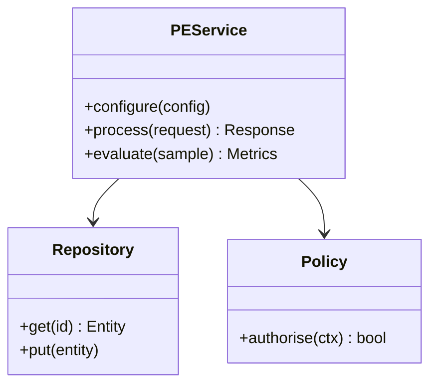

**Figure 1. Class - Anatomy of a Prompt** (mermaid). Figure: Class view for Prompt Engineering. This diagram illustrates the principal components and their interactions as discussed in the surrounding section.

## Deep Dive: Mechanics, Variants and Trade-offs

Having established the essentials, we now go deeper into anatomy of a prompt. Beneath the abstraction lies a concrete process whose steps can each be measured, tested and optimised independently. The distinctions in this section are the ones that separate a working demo from a system that holds up under adversarial inputs, scale and the passage of time.

Consider the principal variants and how to choose between them. Each variant optimises for a different point in the design space - some for latency, some for accuracy, some for cost or operability - and the correct choice follows from explicit requirements rather than from defaults. Every added component buys capability at the price of operational surface area, and that bargain should be made consciously.

In practice this is supported by a mature tooling ecosystem, including OpenAI, Anthropic, Guidance, Outlines. Tools accelerate the work but do not substitute for understanding: the same principles apply whichever implementation you select, and the ability to reason from first principles is what lets you debug when a tool behaves unexpectedly.

A frequent source of subtle bugs is the interaction with structured output and schema enforcement. Because structured output and schema enforcement concerns jSON mode, function/tool calling and grammar-constrained decoding for reliable integration, changes there can silently alter the behaviour analysed here. The remedy is contract tests at the boundary and end-to-end evaluations that exercise the interaction explicitly.

Finally, attend to edge cases and degradation. Define what the system should do under partial failure, unexpected inputs and load spikes, and make that behaviour explicit and tested rather than emergent. Graceful degradation - returning a safe, useful result when the ideal one is unavailable - is a hallmark of mature engineering.

For deeper study, the literature offers authoritative treatments such as Wei et al. — Chain-of-Thought Prompting (2022) and Wang et al. — Self-Consistency Improves Chain of Thought (2022). These primary sources reward careful reading and ground the practical guidance above in established results.

## Advanced Considerations

Having established the essentials, we now go deeper into anatomy of a prompt. The underlying mechanism is best appreciated by tracing a single request from input to output and noting where state is created and consumed. The distinctions in this section are the ones that separate a working demo from a system that holds up under adversarial inputs, scale and the passage of time.

Consider the principal variants and how to choose between them. Each variant optimises for a different point in the design space - some for latency, some for accuracy, some for cost or operability - and the correct choice follows from explicit requirements rather than from defaults. Simplicity is a feature. The simplest design that meets the requirement should be the default, with complexity added only when measurement justifies it.

In practice this is supported by a mature tooling ecosystem, including OpenAI, Anthropic, Guidance, Outlines. Tools accelerate the work but do not substitute for understanding: the same principles apply whichever implementation you select, and the ability to reason from first principles is what lets you debug when a tool behaves unexpectedly.

A frequent source of subtle bugs is the interaction with patterns, anti-patterns and a style guide. Because patterns, anti-patterns and a style guide concerns a reusable library of prompt patterns and the failure modes to avoid, changes there can silently alter the behaviour analysed here. The remedy is contract tests at the boundary and end-to-end evaluations that exercise the interaction explicitly.

Finally, attend to edge cases and degradation. Define what the system should do under partial failure, unexpected inputs and load spikes, and make that behaviour explicit and tested rather than emergent. Graceful degradation - returning a safe, useful result when the ideal one is unavailable - is a hallmark of mature engineering.

For deeper study, the literature offers authoritative treatments such as Wei et al. — Chain-of-Thought Prompting (2022) and Wang et al. — Self-Consistency Improves Chain of Thought (2022). These primary sources reward careful reading and ground the practical guidance above in established results.

## Worked Example

To ground the discussion, walk through a representative example. A operations organisation needs runbook automation with tool calls and confirmation gates. They decide to apply anatomy of a prompt as part of their Prompt Engineering solution, but wisely treat it as a hypothesis to be validated rather than a foregone conclusion.

The team begins by stating the objective precisely and defining how success will be measured before writing any code. They establish a small but representative evaluation set, agree on acceptance thresholds, and only then prototype the simplest design that could work. Early measurement reveals which assumptions hold and which must be revised, saving weeks of misdirected effort and surfacing edge cases while they are still cheap to fix.

As the prototype matures into a service, the team hardens it: adding input validation, error handling, caching where it pays off, and monitoring that ties back to the original success metric. They document each significant decision in an architecture decision record so that future maintainers understand not just what was built but why.

The outcome is instructive. The system that reaches production is not the most sophisticated design the team considered, but the one whose behaviour they could measure, explain and operate. This is the recurring lesson of Prompt Engineering: durable value comes from the whole system, not from any single clever component.

## Industry Use Cases

Across industries, the ideas in this chapter recur in recognisable ways. The following vignettes show how different sectors apply them and what they have in common.

**Support.** Deterministic, schema-constrained ticket triage and routing. The common thread is that value comes not from the model alone but from the surrounding system - data quality, evaluation, integration and operations - which is precisely where most of the engineering effort belongs.

**Analytics.** Natural-language-to-SQL with validation against a catalog. The common thread is that value comes not from the model alone but from the surrounding system - data quality, evaluation, integration and operations - which is precisely where most of the engineering effort belongs.

**Operations.** Runbook automation with tool calls and confirmation gates. The common thread is that value comes not from the model alone but from the surrounding system - data quality, evaluation, integration and operations - which is precisely where most of the engineering effort belongs.

**Education.** Socratic tutoring with rubric-based answer evaluation. The common thread is that value comes not from the model alone but from the surrounding system - data quality, evaluation, integration and operations - which is precisely where most of the engineering effort belongs.

## Best Practices

The following practices consistently separate successful Prompt Engineering efforts from struggling ones. They are deliberately concrete so they can be adopted as checklist items in design and code review.

- Specify the output format explicitly and validate it programmatically.
- Keep untrusted content clearly delimited and never executed as instructions.
- Version prompts and gate changes behind an evaluation suite.
- Prefer fewer, higher-quality few-shot examples over many noisy ones.

None of these are exotic; they are the unglamorous disciplines that compound into reliability. The cost of adopting them is small compared with the cost of the incidents they prevent, and they become second nature with practice.

## Common Pitfalls

Equally instructive are the failure modes that recur in practice. Each pitfall below has a clear early warning sign and a known remedy, so treat them as a diagnostic checklist when something feels wrong:

- Treating prompts as throwaway strings with no testing or versioning.
- Overlong contexts that dilute attention and inflate cost.
- Mixing untrusted user content with trusted instructions (injection risk).
- Relying on temperature tweaks instead of structural prompt fixes.

The pattern is consistent: most failures stem from skipping measurement, conflating prototype and production standards, or deferring cross-cutting concerns such as security and cost until they become emergencies. Naming these traps in advance is the cheapest way to avoid them.

## Governance, Security and Cost Notes

No discussion of anatomy of a prompt is complete without its governance, security and cost dimensions, which are too often deferred until they become emergencies. Treating them as first-class concerns from the outset is both cheaper and safer.

**Governance.** Classify the risk of this capability, document its intended and out-of-scope uses, and ensure decisions are traceable to satisfy internal policy and external regulation such as the NIST AI RMF, ISO/IEC 42001 and the EU AI Act. **Security.** Treat all external input as untrusted, validate outputs before acting on them, apply least privilege to any tools or data access, and map controls to the OWASP LLM Top 10 and MITRE ATLAS.

**Cost and sustainability.** Establish explicit budgets for compute, tokens and latency, attribute spend to owners, and revisit the economics as usage scales - a design that is affordable at pilot scale can become untenable at production volume. Building these reflexes into everyday engineering is what allows a Prompt Engineering system to be not only capable but also trustworthy and economically sound.

## Hands-On Exercises

Work through the following exercises. They are designed to move understanding from recognition to application - the level required for real engineering work - so prefer writing and building over merely reading.

1. Explain anatomy of a prompt to a colleague unfamiliar with Prompt Engineering, using a concrete example from your own domain.
2. Sketch a reference architecture that incorporates anatomy of a prompt and annotate where observability, security and cost controls belong.
3. Design an evaluation that would tell you whether anatomy of a prompt is working in production, including the metric, the dataset and the acceptance threshold.
4. Identify two pitfalls relevant to anatomy of a prompt in your environment and describe the early warning signals you would monitor.
5. Prototype the simplest implementation that demonstrates anatomy of a prompt, then list exactly what would need to change to make it production-ready.

## Key Takeaways

Key takeaways from this chapter:

- Anatomy of a Prompt is a systems concern in Prompt Engineering: data, models and operations must be co-designed.
- Measurement is non-negotiable; define success metrics and evaluation before building.
- Favour the simplest design that meets the requirement, and add complexity only when evidence demands it.
- Security, cost and observability are first-class requirements, not afterthoughts.
- Document decisions so the system remains understandable and operable as it evolves.

## Code Walkthrough

This listing shows a configuration-driven Anatomy of a Prompt component with retry semantics and typed interfaces — the shape we expect from production Prompt Engineering code rather than a notebook prototype.

The full listing is shown below; study it line by line and reproduce it locally before moving on.

### Listing: Implementing a Anatomy of a Prompt component

```python
from __future__ import annotations

from dataclasses import dataclass, field
from typing import Any


@dataclass(slots=True)
class AnatomyOfAConfig:
    """Configuration for the Anatomy of a Prompt component in a Prompt Engineering system."""

    name: str
    timeout_s: float = 30.0
    max_retries: int = 3
    options: dict[str, Any] = field(default_factory=dict)


class AnatomyOfA:
    """A minimal, production-shaped implementation of Anatomy of a Prompt."""

    def __init__(self, config: AnatomyOfAConfig) -> None:
        self._config = config
        self._calls = 0

    def run(self, payload: dict[str, Any]) -> dict[str, Any]:
        """Process a request, retrying transient failures with backoff."""
        last_error: Exception | None = None
        for attempt in range(self._config.max_retries):
            try:
                self._calls += 1
                return self._process(payload)
            except TimeoutError as exc:  # transient
                last_error = exc
                continue
        raise RuntimeError(f"AnatomyOfA failed after retries") from last_error

    def _process(self, payload: dict[str, Any]) -> dict[str, Any]:
        # Domain-specific logic for Anatomy of a Prompt goes here.
        return {"status": "ok", "input_keys": sorted(payload), "calls": self._calls}

```

## Review Questions

1. In the context of Prompt Engineering, which statement best describes “Anatomy of a Prompt”?
   - A. It guarantees deterministic output regardless of input.
   - B. System, developer and user roles; instructions, context, examples and output specification as distinct, composable parts.
   - C. It makes the system slower but has no other effect.
   - D. It eliminates the need for any evaluation or monitoring.
   - **Answer: B.** Anatomy of a Prompt: System, developer and user roles; instructions, context, examples and output specification as distinct, composable parts.
2. Which of the following is a recommended best practice when working with Prompt Engineering?
   - A. Keep untrusted content clearly delimited and never executed as instructions.
   - B. Overlong contexts that dilute attention and inflate cost.
   - C. It makes the system slower but has no other effect.
   - D. It removes all security and governance requirements.
   - **Answer: A.** Best practice: Keep untrusted content clearly delimited and never executed as instructions.
3. Which of the following is a common pitfall to avoid in Prompt Engineering?
   - A. Keep untrusted content clearly delimited and never executed as instructions.
   - B. It applies exclusively to image data.
   - C. Treating prompts as throwaway strings with no testing or versioning.
   - D. It makes the system slower but has no other effect.
   - **Answer: C.** Pitfall to avoid: Treating prompts as throwaway strings with no testing or versioning.
4. *(Discussion)* Describe a failure mode of Anatomy of a Prompt and how you would mitigate it.
   - **Model answer:** A strong answer defines anatomy of a prompt (System, developer and user roles; instructions, context, examples and output specification as distinct, composable parts.) then connects it to architecture, evaluation, cost, security and operations for Prompt Engineering, citing concrete trade-offs and a real-world example.

---


# Chapter 2. Zero-, One- and Few-Shot Prompting

_This chapter examines zero-, one- and few-shot prompting within Prompt Engineering. It covers how in-context examples shape behaviour and when demonstrations beat instructions, derives a reference architecture, walks through a worked example and runnable code, surveys industry use cases, and distils best practices and pitfalls, closing with exercises and review questions._

## Introduction

In practical terms, Zero-, One- and Few-Shot Prompting is best understood as how in-context examples shape behaviour and when demonstrations beat instructions. Neglecting it is one of the most common reasons Prompt Engineering initiatives stall in production. It helps to separate the conceptual model from its implementation: the former guides reasoning, the latter must contend with real-world constraints.

This chapter builds intuition first, then formalises the ideas, derives an architecture, and finishes with code, exercises and review questions so the material transfers directly to your own Prompt Engineering work. Read it actively: pause at each diagram, reproduce the code, and attempt the exercises before consulting the answers.

## Theory and Foundations

Zero-, One- and Few-Shot Prompting refers to how in-context examples shape behaviour and when demonstrations beat instructions. The right abstraction here pays compounding dividends, because downstream components depend on its guarantees. Mechanically, the behaviour emerges from a few interacting parts that are simpler than the whole they produce.

To place this in context, recall the broader picture: Prompt engineering is the discipline of designing inputs, context and decoding settings that steer foundation models toward reliable, useful behaviour. Within that picture, zero-, one- and few-shot prompting is one of the load-bearing ideas - the kind that, when understood deeply, makes the rest of Prompt Engineering fall into place. It is foundational: later capabilities in Prompt Engineering are built directly on top of it.

Zero-, One- and Few-Shot Prompting cannot be understood in isolation from cost-aware prompt design. Recall that cost-aware prompt design concerns compression, context pruning and caching to control token spend. The two interact directly: decisions in one constrain the design space of the other, which is why mature teams reason about them together rather than sequentially. There is an inherent trade-off between fidelity and cost, and the correct balance depends on the use case and its tolerance for error.

Zero-, One- and Few-Shot Prompting cannot be understood in isolation from prompt templates and composition. Recall that prompt templates and composition concerns parameterised templates, partials and guardrail wrappers for reuse at scale. The two interact directly: decisions in one constrain the design space of the other, which is why mature teams reason about them together rather than sequentially. Simplicity is a feature. The simplest design that meets the requirement should be the default, with complexity added only when measurement justifies it.

Several established patterns apply directly to zero-, one- and few-shot prompting. The first, template + slots with explicit output schema, is widely adopted because it makes the system's behaviour predictable and observable. A complementary pattern, critique-and-revise loops for quality improvement, addresses a related concern and is often deployed alongside it. Patterns are not dogma; they are distilled experience that shortcuts the search for a sound design, and each carries assumptions worth checking against your context.

It is worth being explicit about when to apply this and when to reach for something simpler. In a small prototype, shortcuts around zero-, one- and few-shot prompting are invisible; in a production Prompt Engineering system serving real traffic, they surface as incidents, cost overruns or compliance gaps. Latency, accuracy and cost form a tension triangle: improving one typically pressures the others, so explicit budgets are essential. The remainder of this chapter turns these principles into an architecture, code and a checklist you can apply immediately.

## Architecture and Design

From an architectural standpoint, Zero-, One- and Few-Shot Prompting sits at the intersection of data, models and operations. Production prompting introduces a prompt management service that stores versioned templates, an assembly layer that merges instructions with retrieved context under a token budget, and an evaluation harness that scores candidate prompts against golden datasets before promotion. Telemetry links every completion back to the exact prompt version that produced it.

Concretely, the principal building blocks include anatomy of a prompt, zero-, one- and few-shot prompting, chain-of-thought and reasoning prompts, structured output and schema enforcement and retrieval-augmented prompting. Each is a replaceable component behind a stable interface, so the team can upgrade an implementation - a model, an index, a policy engine - without rewriting its neighbours. The contracts between components are where reliability is won or lost, so they are specified explicitly and tested in isolation.

The diagram accompanying this section makes the data and control flow explicit. Requests enter through a well-defined boundary where they are authenticated and validated; only then are they dispatched to the components that perform the work. This boundary is also where rate limiting, quota enforcement and audit logging live, keeping cross-cutting concerns out of the core logic and in one auditable place.

Two qualities deserve emphasis. First, observability is designed in, not bolted on: every component emits structured telemetry so that failures can be localised in minutes rather than hours. Second, the architecture is evolvable - components communicate through stable contracts so that any single part of the Prompt Engineering system can be replaced without a rewrite. Every added component buys capability at the price of operational surface area, and that bargain should be made consciously.

```xml
<mxfile host="ai-university">
  <diagram name="DevOps Pipeline">
    <mxGraphModel dx="800" dy="600" grid="1" gridSize="10">
      <root>
        <mxCell id="0"/>
        <mxCell id="1" parent="0"/>
        <mxCell id="title" value="DevOps Pipeline - Zero-, One- and Few-Shot Prompting" style="text;fontSize=16;fontStyle=1" vertex="1" parent="1"><mxGeometry x="40" y="20" width="600" height="30" as="geometry"/></mxCell>
        <mxCell id="hub" value="Prompt Engineering" style="rounded=1;fillColor=#0f172a;fontColor=#ffffff;fontStyle=1" vertex="1" parent="1"><mxGeometry x="300" y="180" width="160" height="60" as="geometry"/></mxCell>
        <mxCell id="n0" value="Anatomy of a Prompt" style="rounded=1;fillColor=#e0e7ff;strokeColor=#4338ca" vertex="1" parent="1"><mxGeometry x="60" y="80" width="160" height="50" as="geometry"/></mxCell>
        <mxCell id="e0" style="edgeStyle=orthogonalEdgeStyle" edge="1" parent="1" source="hub" target="n0"><mxGeometry relative="1" as="geometry"/></mxCell>
        <mxCell id="n1" value="Zero-, One- and Few-Sho…" style="rounded=1;fillColor=#e0e7ff;strokeColor=#4338ca" vertex="1" parent="1"><mxGeometry x="600" y="170" width="160" height="50" as="geometry"/></mxCell>
        <mxCell id="e1" style="edgeStyle=orthogonalEdgeStyle" edge="1" parent="1" source="hub" target="n1"><mxGeometry relative="1" as="geometry"/></mxCell>
        <mxCell id="n2" value="Chain-of-Thought and Re…" style="rounded=1;fillColor=#e0e7ff;strokeColor=#4338ca" vertex="1" parent="1"><mxGeometry x="60" y="260" width="160" height="50" as="geometry"/></mxCell>
        <mxCell id="e2" style="edgeStyle=orthogonalEdgeStyle" edge="1" parent="1" source="hub" target="n2"><mxGeometry relative="1" as="geometry"/></mxCell>
        <mxCell id="n3" value="Structured Output and S…" style="rounded=1;fillColor=#e0e7ff;strokeColor=#4338ca" vertex="1" parent="1"><mxGeometry x="600" y="350" width="160" height="50" as="geometry"/></mxCell>
        <mxCell id="e3" style="edgeStyle=orthogonalEdgeStyle" edge="1" parent="1" source="hub" target="n3"><mxGeometry relative="1" as="geometry"/></mxCell>
        <mxCell id="n4" value="Retrieval-Augmented Pro…" style="rounded=1;fillColor=#e0e7ff;strokeColor=#4338ca" vertex="1" parent="1"><mxGeometry x="60" y="440" width="160" height="50" as="geometry"/></mxCell>
        <mxCell id="e4" style="edgeStyle=orthogonalEdgeStyle" edge="1" parent="1" source="hub" target="n4"><mxGeometry relative="1" as="geometry"/></mxCell>
      </root>
    </mxGraphModel>
  </diagram>
</mxfile>
```

_Source diagram (drawio); render with the appropriate tool._

**Figure 2. DevOps Pipeline - Zero-, One- and Few-Shot Prompting** (drawio). Figure: DevOps Pipeline view for Prompt Engineering. This diagram illustrates the principal components and their interactions as discussed in the surrounding section.

<div class="diagram-svg">

<svg xmlns="http://www.w3.org/2000/svg" width="840" height="460" data-tpl="radial" data-pal="2-4" viewBox="0 0 840 460" font-family="Inter, Segoe UI, Arial, sans-serif"><defs><marker id="ar" markerWidth="9" markerHeight="9" refX="7" refY="3" orient="auto"><path d="M0,0 L7,3 L0,6 z" fill="#94a3b8"/></marker><marker id="arw" markerWidth="9" markerHeight="9" refX="7" refY="3" orient="auto"><path d="M0,0 L7,3 L0,6 z" fill="#ffffff"/></marker><filter id="sh" x="-20%" y="-20%" width="140%" height="140%"><feDropShadow dx="0" dy="2" stdDeviation="3" flood-color="#0f172a" flood-opacity="0.16"/></filter></defs><defs><linearGradient id="bn8eaaead" x1="0" y1="0" x2="1" y2="0"><stop offset="0" stop-color="#0d9488"/><stop offset="1" stop-color="#14b8a6"/></linearGradient></defs><rect width="840" height="460" rx="14" fill="#ffffff"/><rect x="0" y="0" width="840" height="48" rx="14" fill="url(#bn8eaaead)"/><rect x="0" y="32" width="840" height="16" fill="url(#bn8eaaead)"/><text x="420" y="25" text-anchor="middle" font-size="14.5" font-weight="700" fill="#ffffff" dominant-baseline="middle">Knowledge Graph - Zero-, One- and Few-Shot Prompting</text><circle cx="420.0" cy="238.0" r="52" fill="#0f172a"/><text x="420" y="231" text-anchor="middle" font-size="12" font-weight="600" fill="#fff" dominant-baseline="middle">Prompt</text><text x="420" y="245" text-anchor="middle" font-size="12" font-weight="600" fill="#fff" dominant-baseline="middle">Engineering</text><line x1="420" y1="186" x2="420" y2="102" stroke="#94a3b8" stroke-width="2" marker-end="url(#ar)"/><rect x="342" y="65" width="156" height="46" rx="11" fill="#0d9488" filter="url(#sh)"/><text x="420" y="88" text-anchor="middle" font-size="11" font-weight="600" fill="#ffffff" dominant-baseline="middle">Cost-Aware Prompt Design</text><line x1="465" y1="212" x2="631" y2="170" stroke="#94a3b8" stroke-width="2" marker-end="url(#ar)"/><rect x="576" y="140" width="156" height="46" rx="11" fill="#14b8a6" filter="url(#sh)"/><text x="654" y="158" text-anchor="middle" font-size="9.5" font-weight="600" fill="#ffffff" dominant-baseline="middle">Patterns, Anti-Patterns and</text><text x="654" y="168" text-anchor="middle" font-size="9.5" font-weight="600" fill="#ffffff" dominant-baseline="middle">a Style Guide</text><line x1="465" y1="264" x2="631" y2="306" stroke="#94a3b8" stroke-width="2" marker-end="url(#ar)"/><rect x="576" y="290" width="156" height="46" rx="11" fill="#047857" filter="url(#sh)"/><text x="654" y="313" text-anchor="middle" font-size="11" font-weight="600" fill="#ffffff" dominant-baseline="middle">Anatomy of a Prompt</text><line x1="420" y1="290" x2="420" y2="374" stroke="#94a3b8" stroke-width="2" marker-end="url(#ar)"/><rect x="342" y="365" width="156" height="46" rx="11" fill="#059669" filter="url(#sh)"/><text x="420" y="383" text-anchor="middle" font-size="9.5" font-weight="600" fill="#ffffff" dominant-baseline="middle">Zero-, One- and Few-Shot</text><text x="420" y="393" text-anchor="middle" font-size="9.5" font-weight="600" fill="#ffffff" dominant-baseline="middle">Prompting</text><line x1="375" y1="264" x2="209" y2="306" stroke="#94a3b8" stroke-width="2" marker-end="url(#ar)"/><rect x="108" y="290" width="156" height="46" rx="11" fill="#10b981" filter="url(#sh)"/><text x="186" y="308" text-anchor="middle" font-size="9.5" font-weight="600" fill="#ffffff" dominant-baseline="middle">Chain-of-Thought and</text><text x="186" y="318" text-anchor="middle" font-size="9.5" font-weight="600" fill="#ffffff" dominant-baseline="middle">Reasoning Prompts</text><line x1="375" y1="212" x2="209" y2="170" stroke="#94a3b8" stroke-width="2" marker-end="url(#ar)"/><rect x="108" y="140" width="156" height="46" rx="11" fill="#34d399" filter="url(#sh)"/><text x="186" y="158" text-anchor="middle" font-size="9.5" font-weight="600" fill="#ffffff" dominant-baseline="middle">Structured Output and Schema</text><text x="186" y="168" text-anchor="middle" font-size="9.5" font-weight="600" fill="#ffffff" dominant-baseline="middle">Enforcement</text><text x="28" y="446" text-anchor="start" font-size="9.5" font-weight="500" fill="#64748b" dominant-baseline="middle">Prompt Engineering  •  Knowledge Graph</text></svg>

</div>

**Figure 3. Knowledge Graph - Zero-, One- and Few-Shot Prompting** (svg). Figure: Knowledge Graph view for Prompt Engineering. This diagram illustrates the principal components and their interactions as discussed in the surrounding section.

## Deep Dive: Mechanics, Variants and Trade-offs

Having established the essentials, we now go deeper into zero-, one- and few-shot prompting. It pays to understand the mechanism rather than treat it as a black box, because most production incidents are explained by one of its steps misbehaving. The distinctions in this section are the ones that separate a working demo from a system that holds up under adversarial inputs, scale and the passage of time.

Consider the principal variants and how to choose between them. Each variant optimises for a different point in the design space - some for latency, some for accuracy, some for cost or operability - and the correct choice follows from explicit requirements rather than from defaults. Every added component buys capability at the price of operational surface area, and that bargain should be made consciously.

In practice this is supported by a mature tooling ecosystem, including OpenAI, Anthropic, Guidance, Outlines. Tools accelerate the work but do not substitute for understanding: the same principles apply whichever implementation you select, and the ability to reason from first principles is what lets you debug when a tool behaves unexpectedly.

A frequent source of subtle bugs is the interaction with cost-aware prompt design. Because cost-aware prompt design concerns compression, context pruning and caching to control token spend, changes there can silently alter the behaviour analysed here. The remedy is contract tests at the boundary and end-to-end evaluations that exercise the interaction explicitly.

Finally, attend to edge cases and degradation. Define what the system should do under partial failure, unexpected inputs and load spikes, and make that behaviour explicit and tested rather than emergent. Graceful degradation - returning a safe, useful result when the ideal one is unavailable - is a hallmark of mature engineering.

For deeper study, the literature offers authoritative treatments such as Wei et al. — Chain-of-Thought Prompting (2022) and Wang et al. — Self-Consistency Improves Chain of Thought (2022). These primary sources reward careful reading and ground the practical guidance above in established results.

## Advanced Considerations

Having established the essentials, we now go deeper into zero-, one- and few-shot prompting. It pays to understand the mechanism rather than treat it as a black box, because most production incidents are explained by one of its steps misbehaving. The distinctions in this section are the ones that separate a working demo from a system that holds up under adversarial inputs, scale and the passage of time.

Consider the principal variants and how to choose between them. Each variant optimises for a different point in the design space - some for latency, some for accuracy, some for cost or operability - and the correct choice follows from explicit requirements rather than from defaults. Every added component buys capability at the price of operational surface area, and that bargain should be made consciously.

In practice this is supported by a mature tooling ecosystem, including OpenAI, Anthropic, Guidance, Outlines. Tools accelerate the work but do not substitute for understanding: the same principles apply whichever implementation you select, and the ability to reason from first principles is what lets you debug when a tool behaves unexpectedly.

A frequent source of subtle bugs is the interaction with cost-aware prompt design. Because cost-aware prompt design concerns compression, context pruning and caching to control token spend, changes there can silently alter the behaviour analysed here. The remedy is contract tests at the boundary and end-to-end evaluations that exercise the interaction explicitly.

Finally, attend to edge cases and degradation. Define what the system should do under partial failure, unexpected inputs and load spikes, and make that behaviour explicit and tested rather than emergent. Graceful degradation - returning a safe, useful result when the ideal one is unavailable - is a hallmark of mature engineering.

For deeper study, the literature offers authoritative treatments such as Wei et al. — Chain-of-Thought Prompting (2022) and Wang et al. — Self-Consistency Improves Chain of Thought (2022). These primary sources reward careful reading and ground the practical guidance above in established results.

## Worked Example

To ground the discussion, walk through a representative example. A analytics organisation needs natural-language-to-SQL with validation against a catalog. They decide to apply zero-, one- and few-shot prompting as part of their Prompt Engineering solution, but wisely treat it as a hypothesis to be validated rather than a foregone conclusion.

The team begins by stating the objective precisely and defining how success will be measured before writing any code. They establish a small but representative evaluation set, agree on acceptance thresholds, and only then prototype the simplest design that could work. Early measurement reveals which assumptions hold and which must be revised, saving weeks of misdirected effort and surfacing edge cases while they are still cheap to fix.

As the prototype matures into a service, the team hardens it: adding input validation, error handling, caching where it pays off, and monitoring that ties back to the original success metric. They document each significant decision in an architecture decision record so that future maintainers understand not just what was built but why.

The outcome is instructive. The system that reaches production is not the most sophisticated design the team considered, but the one whose behaviour they could measure, explain and operate. This is the recurring lesson of Prompt Engineering: durable value comes from the whole system, not from any single clever component.

## Industry Use Cases

Across industries, the ideas in this chapter recur in recognisable ways. The following vignettes show how different sectors apply them and what they have in common.

**Support.** Deterministic, schema-constrained ticket triage and routing. The common thread is that value comes not from the model alone but from the surrounding system - data quality, evaluation, integration and operations - which is precisely where most of the engineering effort belongs.

**Analytics.** Natural-language-to-SQL with validation against a catalog. The common thread is that value comes not from the model alone but from the surrounding system - data quality, evaluation, integration and operations - which is precisely where most of the engineering effort belongs.

**Operations.** Runbook automation with tool calls and confirmation gates. The common thread is that value comes not from the model alone but from the surrounding system - data quality, evaluation, integration and operations - which is precisely where most of the engineering effort belongs.

**Education.** Socratic tutoring with rubric-based answer evaluation. The common thread is that value comes not from the model alone but from the surrounding system - data quality, evaluation, integration and operations - which is precisely where most of the engineering effort belongs.

## Best Practices

The following practices consistently separate successful Prompt Engineering efforts from struggling ones. They are deliberately concrete so they can be adopted as checklist items in design and code review.

- Specify the output format explicitly and validate it programmatically.
- Keep untrusted content clearly delimited and never executed as instructions.
- Version prompts and gate changes behind an evaluation suite.
- Prefer fewer, higher-quality few-shot examples over many noisy ones.

None of these are exotic; they are the unglamorous disciplines that compound into reliability. The cost of adopting them is small compared with the cost of the incidents they prevent, and they become second nature with practice.

## Common Pitfalls

Equally instructive are the failure modes that recur in practice. Each pitfall below has a clear early warning sign and a known remedy, so treat them as a diagnostic checklist when something feels wrong:

- Treating prompts as throwaway strings with no testing or versioning.
- Overlong contexts that dilute attention and inflate cost.
- Mixing untrusted user content with trusted instructions (injection risk).
- Relying on temperature tweaks instead of structural prompt fixes.

The pattern is consistent: most failures stem from skipping measurement, conflating prototype and production standards, or deferring cross-cutting concerns such as security and cost until they become emergencies. Naming these traps in advance is the cheapest way to avoid them.

## Governance, Security and Cost Notes

No discussion of zero-, one- and few-shot prompting is complete without its governance, security and cost dimensions, which are too often deferred until they become emergencies. Treating them as first-class concerns from the outset is both cheaper and safer.

**Governance.** Classify the risk of this capability, document its intended and out-of-scope uses, and ensure decisions are traceable to satisfy internal policy and external regulation such as the NIST AI RMF, ISO/IEC 42001 and the EU AI Act. **Security.** Treat all external input as untrusted, validate outputs before acting on them, apply least privilege to any tools or data access, and map controls to the OWASP LLM Top 10 and MITRE ATLAS.

**Cost and sustainability.** Establish explicit budgets for compute, tokens and latency, attribute spend to owners, and revisit the economics as usage scales - a design that is affordable at pilot scale can become untenable at production volume. Building these reflexes into everyday engineering is what allows a Prompt Engineering system to be not only capable but also trustworthy and economically sound.

## Hands-On Exercises

Work through the following exercises. They are designed to move understanding from recognition to application - the level required for real engineering work - so prefer writing and building over merely reading.

1. Explain zero-, one- and few-shot prompting to a colleague unfamiliar with Prompt Engineering, using a concrete example from your own domain.
2. Sketch a reference architecture that incorporates zero-, one- and few-shot prompting and annotate where observability, security and cost controls belong.
3. Design an evaluation that would tell you whether zero-, one- and few-shot prompting is working in production, including the metric, the dataset and the acceptance threshold.
4. Identify two pitfalls relevant to zero-, one- and few-shot prompting in your environment and describe the early warning signals you would monitor.
5. Prototype the simplest implementation that demonstrates zero-, one- and few-shot prompting, then list exactly what would need to change to make it production-ready.

## Key Takeaways

Key takeaways from this chapter:

- Zero-, One- and Few-Shot Prompting is a systems concern in Prompt Engineering: data, models and operations must be co-designed.
- Measurement is non-negotiable; define success metrics and evaluation before building.
- Favour the simplest design that meets the requirement, and add complexity only when evidence demands it.
- Security, cost and observability are first-class requirements, not afterthoughts.
- Document decisions so the system remains understandable and operable as it evolves.

## Code Walkthrough

Every change to a Prompt Engineering system should pass an evaluation gate. This example shows the minimal shape: align predictions and references, compute a metric, and return a pass/fail decision for CI.

The full listing is shown below; study it line by line and reproduce it locally before moving on.

### Listing: Evaluating Zero-, One- and Few-Shot Prompting with a regression gate

```python
from dataclasses import dataclass


@dataclass
class EvalResult:
    metric: str
    score: float
    passed: bool


def evaluate(predictions: list[str], references: list[str],
             threshold: float = 0.8) -> EvalResult:
    """Score Zero-, One- and Few-Shot Prompting output against references with a simple exact-match metric.

    In practice you would combine several metrics (exact match, semantic
    similarity, LLM-as-judge) and gate releases on the aggregate.
    """
    if len(predictions) != len(references):
        raise ValueError("predictions and references must align")
    hits = sum(p.strip() == r.strip() for p, r in zip(predictions, references))
    score = hits / len(references) if references else 0.0
    return EvalResult(metric="exact_match", score=score, passed=score >= threshold)


if __name__ == "__main__":
    result = evaluate(["yes", "no"], ["yes", "yes"])
    print(f"{result.metric}={result.score:.2f} passed={result.passed}")

```

## Review Questions

1. In the context of Prompt Engineering, which statement best describes “Zero-, One- and Few-Shot Prompting”?
   - A. It is only relevant to academic research, not production.
   - B. It applies exclusively to image data.
   - C. How in-context examples shape behaviour and when demonstrations beat instructions.
   - D. It removes all security and governance requirements.
   - **Answer: C.** Zero-, One- and Few-Shot Prompting: How in-context examples shape behaviour and when demonstrations beat instructions.
2. Which of the following is a recommended best practice when working with Prompt Engineering?
   - A. It removes all security and governance requirements.
   - B. Prefer fewer, higher-quality few-shot examples over many noisy ones.
   - C. It guarantees deterministic output regardless of input.
   - D. Overlong contexts that dilute attention and inflate cost.
   - **Answer: B.** Best practice: Prefer fewer, higher-quality few-shot examples over many noisy ones.
3. Which of the following is a common pitfall to avoid in Prompt Engineering?
   - A. It is only relevant to academic research, not production.
   - B. Version prompts and gate changes behind an evaluation suite.
   - C. Overlong contexts that dilute attention and inflate cost.
   - D. It applies exclusively to image data.
   - **Answer: C.** Pitfall to avoid: Overlong contexts that dilute attention and inflate cost.
4. *(Discussion)* Describe a failure mode of Zero-, One- and Few-Shot Prompting and how you would mitigate it.
   - **Model answer:** A strong answer defines zero-, one- and few-shot prompting (How in-context examples shape behaviour and when demonstrations beat instructions.) then connects it to architecture, evaluation, cost, security and operations for Prompt Engineering, citing concrete trade-offs and a real-world example.

---


# Chapter 3. Chain-of-Thought and Reasoning Prompts

_This chapter examines chain-of-thought and reasoning prompts within Prompt Engineering. It covers eliciting intermediate reasoning, self-consistency sampling and the cost/quality trade-offs of deliberate reasoning, derives a reference architecture, walks through a worked example and runnable code, surveys industry use cases, and distils best practices and pitfalls, closing with exercises and review questions._

## Introduction

We define Chain-of-Thought and Reasoning Prompts as eliciting intermediate reasoning, self-consistency sampling and the cost/quality trade-offs of deliberate reasoning. Understanding this matters because Prompt Engineering systems succeed or fail on exactly these decisions. The practical implication is that design choices here ripple through latency, cost and maintainability for the lifetime of the system.

This chapter builds intuition first, then formalises the ideas, derives an architecture, and finishes with code, exercises and review questions so the material transfers directly to your own Prompt Engineering work. Read it actively: pause at each diagram, reproduce the code, and attempt the exercises before consulting the answers.

## Theory and Foundations

Chain-of-Thought and Reasoning Prompts can be characterised as eliciting intermediate reasoning, self-consistency sampling and the cost/quality trade-offs of deliberate reasoning. In an enterprise setting, this translates into concrete requirements: clear interfaces, measurable quality, and controls that satisfy security and governance. It pays to understand the mechanism rather than treat it as a black box, because most production incidents are explained by one of its steps misbehaving.

To place this in context, recall the broader picture: Prompt engineering is the discipline of designing inputs, context and decoding settings that steer foundation models toward reliable, useful behaviour. Within that picture, chain-of-thought and reasoning prompts is one of the load-bearing ideas - the kind that, when understood deeply, makes the rest of Prompt Engineering fall into place. Getting this right early prevents expensive rework once a Prompt Engineering system reaches scale.

Chain-of-Thought and Reasoning Prompts cannot be understood in isolation from prompt evaluation and regression testing. Recall that prompt evaluation and regression testing concerns golden datasets, LLM-as-judge, rubric scoring and CI gates for prompt changes. The two interact directly: decisions in one constrain the design space of the other, which is why mature teams reason about them together rather than sequentially. There is an inherent trade-off between fidelity and cost, and the correct balance depends on the use case and its tolerance for error.

Chain-of-Thought and Reasoning Prompts cannot be understood in isolation from zero-, one- and few-shot prompting. Recall that zero-, one- and few-shot prompting concerns how in-context examples shape behaviour and when demonstrations beat instructions. The two interact directly: decisions in one constrain the design space of the other, which is why mature teams reason about them together rather than sequentially. As with most architectural decisions, the choice is rarely binary; the skill lies in quantifying the trade-offs and choosing deliberately.

Several established patterns apply directly to chain-of-thought and reasoning prompts. The first, template + slots with explicit output schema, is widely adopted because it makes the system's behaviour predictable and observable. A complementary pattern, instruction hierarchy: system > developer > user > retrieved content, addresses a related concern and is often deployed alongside it. Patterns are not dogma; they are distilled experience that shortcuts the search for a sound design, and each carries assumptions worth checking against your context.

It is worth being explicit about when to apply this and when to reach for something simpler. In a small prototype, shortcuts around chain-of-thought and reasoning prompts are invisible; in a production Prompt Engineering system serving real traffic, they surface as incidents, cost overruns or compliance gaps. Latency, accuracy and cost form a tension triangle: improving one typically pressures the others, so explicit budgets are essential. The remainder of this chapter turns these principles into an architecture, code and a checklist you can apply immediately.

## Architecture and Design

A robust architecture for Chain-of-Thought and Reasoning Prompts is layered so each part can evolve independently without destabilising the whole. Production prompting introduces a prompt management service that stores versioned templates, an assembly layer that merges instructions with retrieved context under a token budget, and an evaluation harness that scores candidate prompts against golden datasets before promotion. Telemetry links every completion back to the exact prompt version that produced it.

Concretely, the principal building blocks include anatomy of a prompt, zero-, one- and few-shot prompting, chain-of-thought and reasoning prompts, structured output and schema enforcement and retrieval-augmented prompting. Each is a replaceable component behind a stable interface, so the team can upgrade an implementation - a model, an index, a policy engine - without rewriting its neighbours. The contracts between components are where reliability is won or lost, so they are specified explicitly and tested in isolation.

The diagram accompanying this section makes the data and control flow explicit. Requests enter through a well-defined boundary where they are authenticated and validated; only then are they dispatched to the components that perform the work. This boundary is also where rate limiting, quota enforcement and audit logging live, keeping cross-cutting concerns out of the core logic and in one auditable place.

Two qualities deserve emphasis. First, observability is designed in, not bolted on: every component emits structured telemetry so that failures can be localised in minutes rather than hours. Second, the architecture is evolvable - components communicate through stable contracts so that any single part of the Prompt Engineering system can be replaced without a rewrite. There is an inherent trade-off between fidelity and cost, and the correct balance depends on the use case and its tolerance for error.

<div class="diagram-svg">

<svg xmlns="http://www.w3.org/2000/svg" width="840" height="460" data-tpl="mindmap" data-pal="10-5" viewBox="0 0 840 460" font-family="Inter, Segoe UI, Arial, sans-serif"><defs><marker id="ar" markerWidth="9" markerHeight="9" refX="7" refY="3" orient="auto"><path d="M0,0 L7,3 L0,6 z" fill="#94a3b8"/></marker><marker id="arw" markerWidth="9" markerHeight="9" refX="7" refY="3" orient="auto"><path d="M0,0 L7,3 L0,6 z" fill="#ffffff"/></marker><filter id="sh" x="-20%" y="-20%" width="140%" height="140%"><feDropShadow dx="0" dy="2" stdDeviation="3" flood-color="#0f172a" flood-opacity="0.16"/></filter></defs><defs><linearGradient id="bn1cf89db" x1="0" y1="0" x2="1" y2="0"><stop offset="0" stop-color="#4ade80"/><stop offset="1" stop-color="#14532d"/></linearGradient></defs><rect width="840" height="460" rx="14" fill="#ffffff"/><rect x="0" y="0" width="840" height="48" rx="14" fill="url(#bn1cf89db)"/><rect x="0" y="32" width="840" height="16" fill="url(#bn1cf89db)"/><text x="420" y="25" text-anchor="middle" font-size="14.5" font-weight="700" fill="#ffffff" dominant-baseline="middle">Knowledge Graph - Chain-of-Thought and Reasoning Prompts</text><rect x="330" y="210" width="180" height="52" rx="11" fill="#0f172a" filter="url(#sh)"/><text x="420" y="236" text-anchor="middle" font-size="13" font-weight="600" fill="#ffffff" dominant-baseline="middle">Prompt Engineering</text><path d="M330,236 C250,236 250,126 248,126" fill="none" stroke="#cbd5e1" stroke-width="2"/><rect x="92" y="104" width="156" height="44" rx="11" fill="#4ade80" filter="url(#sh)"/><text x="170" y="121" text-anchor="middle" font-size="9.5" font-weight="600" fill="#ffffff" dominant-baseline="middle">Prompt Evaluation and</text><text x="170" y="131" text-anchor="middle" font-size="9.5" font-weight="600" fill="#ffffff" dominant-baseline="middle">Regression Testing</text><path d="M330,236 C250,236 250,236 248,236" fill="none" stroke="#cbd5e1" stroke-width="2"/><rect x="92" y="214" width="156" height="44" rx="11" fill="#14532d" filter="url(#sh)"/><text x="170" y="231" text-anchor="middle" font-size="9.5" font-weight="600" fill="#ffffff" dominant-baseline="middle">Defending Against Prompt</text><text x="170" y="241" text-anchor="middle" font-size="9.5" font-weight="600" fill="#ffffff" dominant-baseline="middle">Injection</text><path d="M330,236 C250,236 250,346 248,346" fill="none" stroke="#cbd5e1" stroke-width="2"/><rect x="92" y="324" width="156" height="44" rx="11" fill="#166534" filter="url(#sh)"/><text x="170" y="341" text-anchor="middle" font-size="9.5" font-weight="600" fill="#ffffff" dominant-baseline="middle">Multi-Step and Agentic</text><text x="170" y="351" text-anchor="middle" font-size="9.5" font-weight="600" fill="#ffffff" dominant-baseline="middle">Prompting</text><path d="M510,236 C590,236 590,126 592,126" fill="none" stroke="#cbd5e1" stroke-width="2"/><rect x="592" y="104" width="156" height="44" rx="11" fill="#15803d" filter="url(#sh)"/><text x="670" y="121" text-anchor="middle" font-size="9.5" font-weight="600" fill="#ffffff" dominant-baseline="middle">Prompt Management and</text><text x="670" y="131" text-anchor="middle" font-size="9.5" font-weight="600" fill="#ffffff" dominant-baseline="middle">Versioning</text><path d="M510,236 C590,236 590,236 592,236" fill="none" stroke="#cbd5e1" stroke-width="2"/><rect x="592" y="214" width="156" height="44" rx="11" fill="#16a34a" filter="url(#sh)"/><text x="670" y="236" text-anchor="middle" font-size="11" font-weight="600" fill="#ffffff" dominant-baseline="middle">Cost-Aware Prompt Design</text><path d="M510,236 C590,236 590,346 592,346" fill="none" stroke="#cbd5e1" stroke-width="2"/><rect x="592" y="324" width="156" height="44" rx="11" fill="#22c55e" filter="url(#sh)"/><text x="670" y="341" text-anchor="middle" font-size="9.5" font-weight="600" fill="#ffffff" dominant-baseline="middle">Patterns, Anti-Patterns and</text><text x="670" y="351" text-anchor="middle" font-size="9.5" font-weight="600" fill="#ffffff" dominant-baseline="middle">a Style Guide</text><text x="28" y="446" text-anchor="start" font-size="9.5" font-weight="500" fill="#64748b" dominant-baseline="middle">Prompt Engineering  •  Knowledge Graph</text></svg>

</div>

**Figure 4. Knowledge Graph - Chain-of-Thought and Reasoning Prompts** (svg). Figure: Knowledge Graph view for Prompt Engineering. This diagram illustrates the principal components and their interactions as discussed in the surrounding section.

<div class="diagram-svg">

<svg xmlns="http://www.w3.org/2000/svg" width="840" height="460" data-tpl="pillars" data-pal="4-4" viewBox="0 0 840 460" font-family="Inter, Segoe UI, Arial, sans-serif"><defs><marker id="ar" markerWidth="9" markerHeight="9" refX="7" refY="3" orient="auto"><path d="M0,0 L7,3 L0,6 z" fill="#94a3b8"/></marker><marker id="arw" markerWidth="9" markerHeight="9" refX="7" refY="3" orient="auto"><path d="M0,0 L7,3 L0,6 z" fill="#ffffff"/></marker><filter id="sh" x="-20%" y="-20%" width="140%" height="140%"><feDropShadow dx="0" dy="2" stdDeviation="3" flood-color="#0f172a" flood-opacity="0.16"/></filter></defs><defs><linearGradient id="bnd062b6b" x1="0" y1="0" x2="1" y2="0"><stop offset="0" stop-color="#fb7185"/><stop offset="1" stop-color="#db2777"/></linearGradient></defs><rect width="840" height="460" rx="14" fill="#ffffff"/><rect x="0" y="0" width="840" height="48" rx="14" fill="url(#bnd062b6b)"/><rect x="0" y="32" width="840" height="16" fill="url(#bnd062b6b)"/><text x="420" y="25" text-anchor="middle" font-size="14.5" font-weight="700" fill="#ffffff" dominant-baseline="middle">Capability Map - Chain-of-Thought and Reasoning Prompts</text><rect x="68" y="140" width="120" height="250" rx="10" fill="#fb7185"/><rect x="60" y="126" width="136" height="18" rx="6" fill="#fb7185"/><text x="128" y="252" text-anchor="middle" font-size="11" font-weight="600" fill="#fff" dominant-baseline="middle">Prompt</text><text x="128" y="265" text-anchor="middle" font-size="11" font-weight="600" fill="#fff" dominant-baseline="middle">Management and</text><text x="128" y="278" text-anchor="middle" font-size="11" font-weight="600" fill="#fff" dominant-baseline="middle">Versioning</text><rect x="214" y="140" width="120" height="250" rx="10" fill="#db2777"/><rect x="206" y="126" width="136" height="18" rx="6" fill="#db2777"/><text x="274" y="259" text-anchor="middle" font-size="11" font-weight="600" fill="#fff" dominant-baseline="middle">Cost-Aware</text><text x="274" y="271" text-anchor="middle" font-size="11" font-weight="600" fill="#fff" dominant-baseline="middle">Prompt Design</text><rect x="360" y="140" width="120" height="250" rx="10" fill="#9f1239"/><rect x="352" y="126" width="136" height="18" rx="6" fill="#9f1239"/><text x="420" y="252" text-anchor="middle" font-size="11" font-weight="600" fill="#fff" dominant-baseline="middle">Patterns,</text><text x="420" y="265" text-anchor="middle" font-size="11" font-weight="600" fill="#fff" dominant-baseline="middle">Anti-Patterns</text><text x="420" y="278" text-anchor="middle" font-size="11" font-weight="600" fill="#fff" dominant-baseline="middle">and a Style</text><rect x="506" y="140" width="120" height="250" rx="10" fill="#be123c"/><rect x="498" y="126" width="136" height="18" rx="6" fill="#be123c"/><text x="566" y="259" text-anchor="middle" font-size="11" font-weight="600" fill="#fff" dominant-baseline="middle">Anatomy of a</text><text x="566" y="271" text-anchor="middle" font-size="11" font-weight="600" fill="#fff" dominant-baseline="middle">Prompt</text><rect x="652" y="140" width="120" height="250" rx="10" fill="#e11d48"/><rect x="644" y="126" width="136" height="18" rx="6" fill="#e11d48"/><text x="712" y="252" text-anchor="middle" font-size="11" font-weight="600" fill="#fff" dominant-baseline="middle">Zero-, One- and</text><text x="712" y="265" text-anchor="middle" font-size="11" font-weight="600" fill="#fff" dominant-baseline="middle">Few-Shot</text><text x="712" y="278" text-anchor="middle" font-size="11" font-weight="600" fill="#fff" dominant-baseline="middle">Prompting</text><rect x="48.0" y="390" width="744" height="12" rx="4" fill="#0f172a"/><text x="28" y="446" text-anchor="start" font-size="9.5" font-weight="500" fill="#64748b" dominant-baseline="middle">Prompt Engineering  •  Capability Map</text></svg>

</div>

**Figure 5. Capability Map - Chain-of-Thought and Reasoning Prompts** (svg). Figure: Capability Map view for Prompt Engineering. This diagram illustrates the principal components and their interactions as discussed in the surrounding section.

## Deep Dive: Mechanics, Variants and Trade-offs

Having established the essentials, we now go deeper into chain-of-thought and reasoning prompts. The underlying mechanism is best appreciated by tracing a single request from input to output and noting where state is created and consumed. The distinctions in this section are the ones that separate a working demo from a system that holds up under adversarial inputs, scale and the passage of time.

Consider the principal variants and how to choose between them. Each variant optimises for a different point in the design space - some for latency, some for accuracy, some for cost or operability - and the correct choice follows from explicit requirements rather than from defaults. There is an inherent trade-off between fidelity and cost, and the correct balance depends on the use case and its tolerance for error.

In practice this is supported by a mature tooling ecosystem, including OpenAI, Anthropic, Guidance, Outlines. Tools accelerate the work but do not substitute for understanding: the same principles apply whichever implementation you select, and the ability to reason from first principles is what lets you debug when a tool behaves unexpectedly.

A frequent source of subtle bugs is the interaction with prompt evaluation and regression testing. Because prompt evaluation and regression testing concerns golden datasets, LLM-as-judge, rubric scoring and CI gates for prompt changes, changes there can silently alter the behaviour analysed here. The remedy is contract tests at the boundary and end-to-end evaluations that exercise the interaction explicitly.

Finally, attend to edge cases and degradation. Define what the system should do under partial failure, unexpected inputs and load spikes, and make that behaviour explicit and tested rather than emergent. Graceful degradation - returning a safe, useful result when the ideal one is unavailable - is a hallmark of mature engineering.

For deeper study, the literature offers authoritative treatments such as Wei et al. — Chain-of-Thought Prompting (2022) and Wang et al. — Self-Consistency Improves Chain of Thought (2022). These primary sources reward careful reading and ground the practical guidance above in established results.

## Advanced Considerations

Having established the essentials, we now go deeper into chain-of-thought and reasoning prompts. The underlying mechanism is best appreciated by tracing a single request from input to output and noting where state is created and consumed. The distinctions in this section are the ones that separate a working demo from a system that holds up under adversarial inputs, scale and the passage of time.

Consider the principal variants and how to choose between them. Each variant optimises for a different point in the design space - some for latency, some for accuracy, some for cost or operability - and the correct choice follows from explicit requirements rather than from defaults. Every added component buys capability at the price of operational surface area, and that bargain should be made consciously.

In practice this is supported by a mature tooling ecosystem, including OpenAI, Anthropic, Guidance, Outlines. Tools accelerate the work but do not substitute for understanding: the same principles apply whichever implementation you select, and the ability to reason from first principles is what lets you debug when a tool behaves unexpectedly.

A frequent source of subtle bugs is the interaction with retrieval-augmented prompting. Because retrieval-augmented prompting concerns injecting grounded context, citation discipline and context-window budgeting, changes there can silently alter the behaviour analysed here. The remedy is contract tests at the boundary and end-to-end evaluations that exercise the interaction explicitly.

Finally, attend to edge cases and degradation. Define what the system should do under partial failure, unexpected inputs and load spikes, and make that behaviour explicit and tested rather than emergent. Graceful degradation - returning a safe, useful result when the ideal one is unavailable - is a hallmark of mature engineering.

For deeper study, the literature offers authoritative treatments such as Wei et al. — Chain-of-Thought Prompting (2022) and Wang et al. — Self-Consistency Improves Chain of Thought (2022). These primary sources reward careful reading and ground the practical guidance above in established results.

## Worked Example

To ground the discussion, walk through a representative example. A education organisation needs socratic tutoring with rubric-based answer evaluation. They decide to apply chain-of-thought and reasoning prompts as part of their Prompt Engineering solution, but wisely treat it as a hypothesis to be validated rather than a foregone conclusion.

The team begins by stating the objective precisely and defining how success will be measured before writing any code. They establish a small but representative evaluation set, agree on acceptance thresholds, and only then prototype the simplest design that could work. Early measurement reveals which assumptions hold and which must be revised, saving weeks of misdirected effort and surfacing edge cases while they are still cheap to fix.

As the prototype matures into a service, the team hardens it: adding input validation, error handling, caching where it pays off, and monitoring that ties back to the original success metric. They document each significant decision in an architecture decision record so that future maintainers understand not just what was built but why.

The outcome is instructive. The system that reaches production is not the most sophisticated design the team considered, but the one whose behaviour they could measure, explain and operate. This is the recurring lesson of Prompt Engineering: durable value comes from the whole system, not from any single clever component.

## Industry Use Cases

Across industries, the ideas in this chapter recur in recognisable ways. The following vignettes show how different sectors apply them and what they have in common.

**Support.** Deterministic, schema-constrained ticket triage and routing. The common thread is that value comes not from the model alone but from the surrounding system - data quality, evaluation, integration and operations - which is precisely where most of the engineering effort belongs.

**Analytics.** Natural-language-to-SQL with validation against a catalog. The common thread is that value comes not from the model alone but from the surrounding system - data quality, evaluation, integration and operations - which is precisely where most of the engineering effort belongs.

**Operations.** Runbook automation with tool calls and confirmation gates. The common thread is that value comes not from the model alone but from the surrounding system - data quality, evaluation, integration and operations - which is precisely where most of the engineering effort belongs.

**Education.** Socratic tutoring with rubric-based answer evaluation. The common thread is that value comes not from the model alone but from the surrounding system - data quality, evaluation, integration and operations - which is precisely where most of the engineering effort belongs.

## Best Practices

The following practices consistently separate successful Prompt Engineering efforts from struggling ones. They are deliberately concrete so they can be adopted as checklist items in design and code review.

- Specify the output format explicitly and validate it programmatically.
- Keep untrusted content clearly delimited and never executed as instructions.
- Version prompts and gate changes behind an evaluation suite.
- Prefer fewer, higher-quality few-shot examples over many noisy ones.

None of these are exotic; they are the unglamorous disciplines that compound into reliability. The cost of adopting them is small compared with the cost of the incidents they prevent, and they become second nature with practice.

## Common Pitfalls

Equally instructive are the failure modes that recur in practice. Each pitfall below has a clear early warning sign and a known remedy, so treat them as a diagnostic checklist when something feels wrong:

- Treating prompts as throwaway strings with no testing or versioning.
- Overlong contexts that dilute attention and inflate cost.
- Mixing untrusted user content with trusted instructions (injection risk).
- Relying on temperature tweaks instead of structural prompt fixes.

The pattern is consistent: most failures stem from skipping measurement, conflating prototype and production standards, or deferring cross-cutting concerns such as security and cost until they become emergencies. Naming these traps in advance is the cheapest way to avoid them.

## Governance, Security and Cost Notes

No discussion of chain-of-thought and reasoning prompts is complete without its governance, security and cost dimensions, which are too often deferred until they become emergencies. Treating them as first-class concerns from the outset is both cheaper and safer.

**Governance.** Classify the risk of this capability, document its intended and out-of-scope uses, and ensure decisions are traceable to satisfy internal policy and external regulation such as the NIST AI RMF, ISO/IEC 42001 and the EU AI Act. **Security.** Treat all external input as untrusted, validate outputs before acting on them, apply least privilege to any tools or data access, and map controls to the OWASP LLM Top 10 and MITRE ATLAS.

**Cost and sustainability.** Establish explicit budgets for compute, tokens and latency, attribute spend to owners, and revisit the economics as usage scales - a design that is affordable at pilot scale can become untenable at production volume. Building these reflexes into everyday engineering is what allows a Prompt Engineering system to be not only capable but also trustworthy and economically sound.

## Hands-On Exercises

Work through the following exercises. They are designed to move understanding from recognition to application - the level required for real engineering work - so prefer writing and building over merely reading.

1. Explain chain-of-thought and reasoning prompts to a colleague unfamiliar with Prompt Engineering, using a concrete example from your own domain.
2. Sketch a reference architecture that incorporates chain-of-thought and reasoning prompts and annotate where observability, security and cost controls belong.
3. Design an evaluation that would tell you whether chain-of-thought and reasoning prompts is working in production, including the metric, the dataset and the acceptance threshold.
4. Identify two pitfalls relevant to chain-of-thought and reasoning prompts in your environment and describe the early warning signals you would monitor.
5. Prototype the simplest implementation that demonstrates chain-of-thought and reasoning prompts, then list exactly what would need to change to make it production-ready.

## Key Takeaways

Key takeaways from this chapter:

- Chain-of-Thought and Reasoning Prompts is a systems concern in Prompt Engineering: data, models and operations must be co-designed.
- Measurement is non-negotiable; define success metrics and evaluation before building.
- Favour the simplest design that meets the requirement, and add complexity only when evidence demands it.
- Security, cost and observability are first-class requirements, not afterthoughts.
- Document decisions so the system remains understandable and operable as it evolves.

## Code Walkthrough

This listing shows a configuration-driven Chain-of-Thought and Reasoning Prompts component with retry semantics and typed interfaces — the shape we expect from production Prompt Engineering code rather than a notebook prototype.

The full listing is shown below; study it line by line and reproduce it locally before moving on.

### Listing: Implementing a Chain-of-Thought and Reasoning Prompts component

```python
from __future__ import annotations

from dataclasses import dataclass, field
from typing import Any


@dataclass(slots=True)
class AndReasoningConfig:
    """Configuration for the Chain-of-Thought and Reasoning Prompts component in a Prompt Engineering system."""

    name: str
    timeout_s: float = 30.0
    max_retries: int = 3
    options: dict[str, Any] = field(default_factory=dict)


class AndReasoning:
    """A minimal, production-shaped implementation of Chain-of-Thought and Reasoning Prompts."""

    def __init__(self, config: AndReasoningConfig) -> None:
        self._config = config
        self._calls = 0

    def run(self, payload: dict[str, Any]) -> dict[str, Any]:
        """Process a request, retrying transient failures with backoff."""
        last_error: Exception | None = None
        for attempt in range(self._config.max_retries):
            try:
                self._calls += 1
                return self._process(payload)
            except TimeoutError as exc:  # transient
                last_error = exc
                continue
        raise RuntimeError(f"AndReasoning failed after retries") from last_error

    def _process(self, payload: dict[str, Any]) -> dict[str, Any]:
        # Domain-specific logic for Chain-of-Thought and Reasoning Prompts goes here.
        return {"status": "ok", "input_keys": sorted(payload), "calls": self._calls}

```

## Review Questions

1. In the context of Prompt Engineering, which statement best describes “Chain-of-Thought and Reasoning Prompts”?
   - A. It is only relevant to academic research, not production.
   - B. It removes all security and governance requirements.
   - C. Eliciting intermediate reasoning, self-consistency sampling and the cost/quality trade-offs of deliberate reasoning.
   - D. It eliminates the need for any evaluation or monitoring.
   - **Answer: C.** Chain-of-Thought and Reasoning Prompts: Eliciting intermediate reasoning, self-consistency sampling and the cost/quality trade-offs of deliberate reasoning.
2. Which of the following is a recommended best practice when working with Prompt Engineering?
   - A. Mixing untrusted user content with trusted instructions (injection risk).
   - B. It is only relevant to academic research, not production.
   - C. It guarantees deterministic output regardless of input.
   - D. Specify the output format explicitly and validate it programmatically.
   - **Answer: D.** Best practice: Specify the output format explicitly and validate it programmatically.
3. Which of the following is a common pitfall to avoid in Prompt Engineering?
   - A. It eliminates the need for any evaluation or monitoring.
   - B. It guarantees deterministic output regardless of input.
   - C. Mixing untrusted user content with trusted instructions (injection risk).
   - D. Prefer fewer, higher-quality few-shot examples over many noisy ones.
   - **Answer: C.** Pitfall to avoid: Mixing untrusted user content with trusted instructions (injection risk).
4. *(Discussion)* Walk through how you would design Chain-of-Thought and Reasoning Prompts for an enterprise Prompt Engineering workload.
   - **Model answer:** A strong answer defines chain-of-thought and reasoning prompts (Eliciting intermediate reasoning, self-consistency sampling and the cost/quality trade-offs of deliberate reasoning.) then connects it to architecture, evaluation, cost, security and operations for Prompt Engineering, citing concrete trade-offs and a real-world example.

---


# Chapter 4. Structured Output and Schema Enforcement

_This chapter examines structured output and schema enforcement within Prompt Engineering. It covers jSON mode, function/tool calling and grammar-constrained decoding for reliable integration, derives a reference architecture, walks through a worked example and runnable code, surveys industry use cases, and distils best practices and pitfalls, closing with exercises and review questions._

## Introduction

In practical terms, Structured Output and Schema Enforcement is best understood as jSON mode, function/tool calling and grammar-constrained decoding for reliable integration. Neglecting it is one of the most common reasons Prompt Engineering initiatives stall in production. It helps to separate the conceptual model from its implementation: the former guides reasoning, the latter must contend with real-world constraints.

This chapter builds intuition first, then formalises the ideas, derives an architecture, and finishes with code, exercises and review questions so the material transfers directly to your own Prompt Engineering work. Read it actively: pause at each diagram, reproduce the code, and attempt the exercises before consulting the answers.

## Theory and Foundations

Structured Output and Schema Enforcement can be characterised as jSON mode, function/tool calling and grammar-constrained decoding for reliable integration. It helps to separate the conceptual model from its implementation: the former guides reasoning, the latter must contend with real-world constraints. Mechanically, the behaviour emerges from a few interacting parts that are simpler than the whole they produce.

To place this in context, recall the broader picture: Prompt engineering is the discipline of designing inputs, context and decoding settings that steer foundation models toward reliable, useful behaviour. Within that picture, structured output and schema enforcement is one of the load-bearing ideas - the kind that, when understood deeply, makes the rest of Prompt Engineering fall into place. Teams that master this consistently ship more reliable Prompt Engineering systems at lower cost.

Structured Output and Schema Enforcement cannot be understood in isolation from zero-, one- and few-shot prompting. Recall that zero-, one- and few-shot prompting concerns how in-context examples shape behaviour and when demonstrations beat instructions. The two interact directly: decisions in one constrain the design space of the other, which is why mature teams reason about them together rather than sequentially. Every added component buys capability at the price of operational surface area, and that bargain should be made consciously.

Structured Output and Schema Enforcement cannot be understood in isolation from prompt management and versioning. Recall that prompt management and versioning concerns registries, A/B testing and rollback for production prompts. The two interact directly: decisions in one constrain the design space of the other, which is why mature teams reason about them together rather than sequentially. As with most architectural decisions, the choice is rarely binary; the skill lies in quantifying the trade-offs and choosing deliberately.

Several established patterns apply directly to structured output and schema enforcement. The first, self-consistency voting for high-stakes reasoning, is widely adopted because it makes the system's behaviour predictable and observable. A complementary pattern, instruction hierarchy: system > developer > user > retrieved content, addresses a related concern and is often deployed alongside it. Patterns are not dogma; they are distilled experience that shortcuts the search for a sound design, and each carries assumptions worth checking against your context.

It is worth being explicit about when to apply this and when to reach for something simpler. In a small prototype, shortcuts around structured output and schema enforcement are invisible; in a production Prompt Engineering system serving real traffic, they surface as incidents, cost overruns or compliance gaps. As with most architectural decisions, the choice is rarely binary; the skill lies in quantifying the trade-offs and choosing deliberately. The remainder of this chapter turns these principles into an architecture, code and a checklist you can apply immediately.

## Architecture and Design

The reference architecture for Structured Output and Schema Enforcement separates concerns into clearly bounded components with explicit contracts. Production prompting introduces a prompt management service that stores versioned templates, an assembly layer that merges instructions with retrieved context under a token budget, and an evaluation harness that scores candidate prompts against golden datasets before promotion. Telemetry links every completion back to the exact prompt version that produced it.

Concretely, the principal building blocks include anatomy of a prompt, zero-, one- and few-shot prompting, chain-of-thought and reasoning prompts, structured output and schema enforcement and retrieval-augmented prompting. Each is a replaceable component behind a stable interface, so the team can upgrade an implementation - a model, an index, a policy engine - without rewriting its neighbours. The contracts between components are where reliability is won or lost, so they are specified explicitly and tested in isolation.

The diagram accompanying this section makes the data and control flow explicit. Requests enter through a well-defined boundary where they are authenticated and validated; only then are they dispatched to the components that perform the work. This boundary is also where rate limiting, quota enforcement and audit logging live, keeping cross-cutting concerns out of the core logic and in one auditable place.

Two qualities deserve emphasis. First, observability is designed in, not bolted on: every component emits structured telemetry so that failures can be localised in minutes rather than hours. Second, the architecture is evolvable - components communicate through stable contracts so that any single part of the Prompt Engineering system can be replaced without a rewrite. There is an inherent trade-off between fidelity and cost, and the correct balance depends on the use case and its tolerance for error.

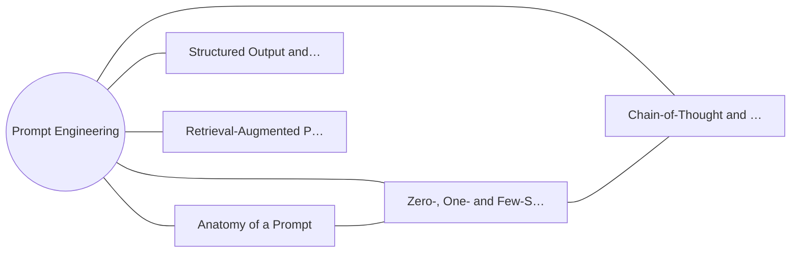

**Figure 6. Capability Map - Structured Output and Schema Enforcement** (mermaid). Figure: Capability Map view for Prompt Engineering. This diagram illustrates the principal components and their interactions as discussed in the surrounding section.

## Deep Dive: Mechanics, Variants and Trade-offs

Having established the essentials, we now go deeper into structured output and schema enforcement. Mechanically, the behaviour emerges from a few interacting parts that are simpler than the whole they produce. The distinctions in this section are the ones that separate a working demo from a system that holds up under adversarial inputs, scale and the passage of time.

Consider the principal variants and how to choose between them. Each variant optimises for a different point in the design space - some for latency, some for accuracy, some for cost or operability - and the correct choice follows from explicit requirements rather than from defaults. Every added component buys capability at the price of operational surface area, and that bargain should be made consciously.

In practice this is supported by a mature tooling ecosystem, including OpenAI, Anthropic, Guidance, Outlines. Tools accelerate the work but do not substitute for understanding: the same principles apply whichever implementation you select, and the ability to reason from first principles is what lets you debug when a tool behaves unexpectedly.

A frequent source of subtle bugs is the interaction with zero-, one- and few-shot prompting. Because zero-, one- and few-shot prompting concerns how in-context examples shape behaviour and when demonstrations beat instructions, changes there can silently alter the behaviour analysed here. The remedy is contract tests at the boundary and end-to-end evaluations that exercise the interaction explicitly.

Finally, attend to edge cases and degradation. Define what the system should do under partial failure, unexpected inputs and load spikes, and make that behaviour explicit and tested rather than emergent. Graceful degradation - returning a safe, useful result when the ideal one is unavailable - is a hallmark of mature engineering.

For deeper study, the literature offers authoritative treatments such as Wei et al. — Chain-of-Thought Prompting (2022) and Wang et al. — Self-Consistency Improves Chain of Thought (2022). These primary sources reward careful reading and ground the practical guidance above in established results.

## Advanced Considerations

Having established the essentials, we now go deeper into structured output and schema enforcement. The underlying mechanism is best appreciated by tracing a single request from input to output and noting where state is created and consumed. The distinctions in this section are the ones that separate a working demo from a system that holds up under adversarial inputs, scale and the passage of time.

Consider the principal variants and how to choose between them. Each variant optimises for a different point in the design space - some for latency, some for accuracy, some for cost or operability - and the correct choice follows from explicit requirements rather than from defaults. Every added component buys capability at the price of operational surface area, and that bargain should be made consciously.

In practice this is supported by a mature tooling ecosystem, including OpenAI, Anthropic, Guidance, Outlines. Tools accelerate the work but do not substitute for understanding: the same principles apply whichever implementation you select, and the ability to reason from first principles is what lets you debug when a tool behaves unexpectedly.

A frequent source of subtle bugs is the interaction with decoding parameters and sampling. Because decoding parameters and sampling concerns temperature, top-p, penalties and stop sequences as levers on determinism, changes there can silently alter the behaviour analysed here. The remedy is contract tests at the boundary and end-to-end evaluations that exercise the interaction explicitly.

Finally, attend to edge cases and degradation. Define what the system should do under partial failure, unexpected inputs and load spikes, and make that behaviour explicit and tested rather than emergent. Graceful degradation - returning a safe, useful result when the ideal one is unavailable - is a hallmark of mature engineering.

For deeper study, the literature offers authoritative treatments such as Wei et al. — Chain-of-Thought Prompting (2022) and Wang et al. — Self-Consistency Improves Chain of Thought (2022). These primary sources reward careful reading and ground the practical guidance above in established results.

## Worked Example

To ground the discussion, walk through a representative example. A education organisation needs socratic tutoring with rubric-based answer evaluation. They decide to apply structured output and schema enforcement as part of their Prompt Engineering solution, but wisely treat it as a hypothesis to be validated rather than a foregone conclusion.

The team begins by stating the objective precisely and defining how success will be measured before writing any code. They establish a small but representative evaluation set, agree on acceptance thresholds, and only then prototype the simplest design that could work. Early measurement reveals which assumptions hold and which must be revised, saving weeks of misdirected effort and surfacing edge cases while they are still cheap to fix.

As the prototype matures into a service, the team hardens it: adding input validation, error handling, caching where it pays off, and monitoring that ties back to the original success metric. They document each significant decision in an architecture decision record so that future maintainers understand not just what was built but why.

The outcome is instructive. The system that reaches production is not the most sophisticated design the team considered, but the one whose behaviour they could measure, explain and operate. This is the recurring lesson of Prompt Engineering: durable value comes from the whole system, not from any single clever component.

## Industry Use Cases

Across industries, the ideas in this chapter recur in recognisable ways. The following vignettes show how different sectors apply them and what they have in common.

**Support.** Deterministic, schema-constrained ticket triage and routing. The common thread is that value comes not from the model alone but from the surrounding system - data quality, evaluation, integration and operations - which is precisely where most of the engineering effort belongs.

**Analytics.** Natural-language-to-SQL with validation against a catalog. The common thread is that value comes not from the model alone but from the surrounding system - data quality, evaluation, integration and operations - which is precisely where most of the engineering effort belongs.

**Operations.** Runbook automation with tool calls and confirmation gates. The common thread is that value comes not from the model alone but from the surrounding system - data quality, evaluation, integration and operations - which is precisely where most of the engineering effort belongs.

**Education.** Socratic tutoring with rubric-based answer evaluation. The common thread is that value comes not from the model alone but from the surrounding system - data quality, evaluation, integration and operations - which is precisely where most of the engineering effort belongs.

## Best Practices

The following practices consistently separate successful Prompt Engineering efforts from struggling ones. They are deliberately concrete so they can be adopted as checklist items in design and code review.

- Specify the output format explicitly and validate it programmatically.
- Keep untrusted content clearly delimited and never executed as instructions.
- Version prompts and gate changes behind an evaluation suite.
- Prefer fewer, higher-quality few-shot examples over many noisy ones.

None of these are exotic; they are the unglamorous disciplines that compound into reliability. The cost of adopting them is small compared with the cost of the incidents they prevent, and they become second nature with practice.

## Common Pitfalls

Equally instructive are the failure modes that recur in practice. Each pitfall below has a clear early warning sign and a known remedy, so treat them as a diagnostic checklist when something feels wrong:

- Treating prompts as throwaway strings with no testing or versioning.
- Overlong contexts that dilute attention and inflate cost.
- Mixing untrusted user content with trusted instructions (injection risk).
- Relying on temperature tweaks instead of structural prompt fixes.

The pattern is consistent: most failures stem from skipping measurement, conflating prototype and production standards, or deferring cross-cutting concerns such as security and cost until they become emergencies. Naming these traps in advance is the cheapest way to avoid them.

## Governance, Security and Cost Notes

No discussion of structured output and schema enforcement is complete without its governance, security and cost dimensions, which are too often deferred until they become emergencies. Treating them as first-class concerns from the outset is both cheaper and safer.

**Governance.** Classify the risk of this capability, document its intended and out-of-scope uses, and ensure decisions are traceable to satisfy internal policy and external regulation such as the NIST AI RMF, ISO/IEC 42001 and the EU AI Act. **Security.** Treat all external input as untrusted, validate outputs before acting on them, apply least privilege to any tools or data access, and map controls to the OWASP LLM Top 10 and MITRE ATLAS.

**Cost and sustainability.** Establish explicit budgets for compute, tokens and latency, attribute spend to owners, and revisit the economics as usage scales - a design that is affordable at pilot scale can become untenable at production volume. Building these reflexes into everyday engineering is what allows a Prompt Engineering system to be not only capable but also trustworthy and economically sound.

## Hands-On Exercises

Work through the following exercises. They are designed to move understanding from recognition to application - the level required for real engineering work - so prefer writing and building over merely reading.

1. Explain structured output and schema enforcement to a colleague unfamiliar with Prompt Engineering, using a concrete example from your own domain.
2. Sketch a reference architecture that incorporates structured output and schema enforcement and annotate where observability, security and cost controls belong.
3. Design an evaluation that would tell you whether structured output and schema enforcement is working in production, including the metric, the dataset and the acceptance threshold.
4. Identify two pitfalls relevant to structured output and schema enforcement in your environment and describe the early warning signals you would monitor.
5. Prototype the simplest implementation that demonstrates structured output and schema enforcement, then list exactly what would need to change to make it production-ready.

## Key Takeaways

Key takeaways from this chapter:

- Structured Output and Schema Enforcement is a systems concern in Prompt Engineering: data, models and operations must be co-designed.
- Measurement is non-negotiable; define success metrics and evaluation before building.
- Favour the simplest design that meets the requirement, and add complexity only when evidence demands it.
- Security, cost and observability are first-class requirements, not afterthoughts.
- Document decisions so the system remains understandable and operable as it evolves.

## Code Walkthrough

Pipelines keep Structured Output and Schema Enforcement logic modular and testable. Each stage is a pure function, errors are captured per item, and the composition is trivial to extend or reorder.

The full listing is shown below; study it line by line and reproduce it locally before moving on.

### Listing: A composable processing pipeline for Structured Output and Schema Enforcement

```python
from collections.abc import Iterable, Iterator
from typing import Protocol


class Stage(Protocol):
    def __call__(self, item: dict) -> dict: ...


def pipeline(stages: list[Stage]) -> Stage:
    """Compose ordered stages into a single callable for Structured Output and Schema Enforcement."""

    def run(item: dict) -> dict:
        for stage in stages:
            item = stage(item)
        return item

    return run


def validate(item: dict) -> dict:
    if "text" not in item:
        raise ValueError("missing required field: text")
    return item


def normalise(item: dict) -> dict:
    item["text"] = item["text"].strip().lower()
    return item


def enrich(item: dict) -> dict:
    item["length"] = len(item["text"])
    return item


process = pipeline([validate, normalise, enrich])


def run_batch(items: Iterable[dict]) -> Iterator[dict]:
    for item in items:
        try:
            yield process(dict(item))
        except ValueError as exc:
            yield {"error": str(exc), "item": item}

```

## Review Questions

1. In the context of Prompt Engineering, which statement best describes “Structured Output and Schema Enforcement”?
   - A. It eliminates the need for any evaluation or monitoring.
   - B. It guarantees deterministic output regardless of input.
   - C. JSON mode, function/tool calling and grammar-constrained decoding for reliable integration.
   - D. It makes the system slower but has no other effect.
   - **Answer: C.** Structured Output and Schema Enforcement: JSON mode, function/tool calling and grammar-constrained decoding for reliable integration.
2. Which of the following is a recommended best practice when working with Prompt Engineering?
   - A. It removes all security and governance requirements.
   - B. Relying on temperature tweaks instead of structural prompt fixes.
   - C. It guarantees deterministic output regardless of input.
   - D. Version prompts and gate changes behind an evaluation suite.
   - **Answer: D.** Best practice: Version prompts and gate changes behind an evaluation suite.
3. Which of the following is a common pitfall to avoid in Prompt Engineering?
   - A. Relying on temperature tweaks instead of structural prompt fixes.
   - B. It eliminates the need for any evaluation or monitoring.
   - C. It guarantees deterministic output regardless of input.
   - D. Prefer fewer, higher-quality few-shot examples over many noisy ones.
   - **Answer: A.** Pitfall to avoid: Relying on temperature tweaks instead of structural prompt fixes.
4. *(Discussion)* What trade-offs would you weigh when implementing Structured Output and Schema Enforcement?
   - **Model answer:** A strong answer defines structured output and schema enforcement (JSON mode, function/tool calling and grammar-constrained decoding for reliable integration.) then connects it to architecture, evaluation, cost, security and operations for Prompt Engineering, citing concrete trade-offs and a real-world example.

---


# Chapter 5. Retrieval-Augmented Prompting

_This chapter examines retrieval-augmented prompting within Prompt Engineering. It covers injecting grounded context, citation discipline and context-window budgeting, derives a reference architecture, walks through a worked example and runnable code, surveys industry use cases, and distils best practices and pitfalls, closing with exercises and review questions._

## Introduction

Formally, Retrieval-Augmented Prompting addresses injecting grounded context, citation discipline and context-window budgeting. Getting this right early prevents expensive rework once a Prompt Engineering system reaches scale. In an enterprise setting, this translates into concrete requirements: clear interfaces, measurable quality, and controls that satisfy security and governance.

This chapter builds intuition first, then formalises the ideas, derives an architecture, and finishes with code, exercises and review questions so the material transfers directly to your own Prompt Engineering work. Read it actively: pause at each diagram, reproduce the code, and attempt the exercises before consulting the answers.

## Theory and Foundations

Retrieval-Augmented Prompting can be characterised as injecting grounded context, citation discipline and context-window budgeting. What distinguishes a production-grade approach from a prototype is the discipline of measurement: every claim is backed by an evaluation rather than intuition. Beneath the abstraction lies a concrete process whose steps can each be measured, tested and optimised independently.

To place this in context, recall the broader picture: Prompt engineering is the discipline of designing inputs, context and decoding settings that steer foundation models toward reliable, useful behaviour. Within that picture, retrieval-augmented prompting is one of the load-bearing ideas - the kind that, when understood deeply, makes the rest of Prompt Engineering fall into place. Getting this right early prevents expensive rework once a Prompt Engineering system reaches scale.

Retrieval-Augmented Prompting cannot be understood in isolation from tool use and function calling. Recall that tool use and function calling concerns letting models invoke functions, search and code execution within a controlled loop. The two interact directly: decisions in one constrain the design space of the other, which is why mature teams reason about them together rather than sequentially. Simplicity is a feature. The simplest design that meets the requirement should be the default, with complexity added only when measurement justifies it.

Retrieval-Augmented Prompting cannot be understood in isolation from prompt management and versioning. Recall that prompt management and versioning concerns registries, A/B testing and rollback for production prompts. The two interact directly: decisions in one constrain the design space of the other, which is why mature teams reason about them together rather than sequentially. Simplicity is a feature. The simplest design that meets the requirement should be the default, with complexity added only when measurement justifies it.

Several established patterns apply directly to retrieval-augmented prompting. The first, self-consistency voting for high-stakes reasoning, is widely adopted because it makes the system's behaviour predictable and observable. A complementary pattern, instruction hierarchy: system > developer > user > retrieved content, addresses a related concern and is often deployed alongside it. Patterns are not dogma; they are distilled experience that shortcuts the search for a sound design, and each carries assumptions worth checking against your context.

Knowing when not to use a technique is as valuable as knowing how to use it. In a small prototype, shortcuts around retrieval-augmented prompting are invisible; in a production Prompt Engineering system serving real traffic, they surface as incidents, cost overruns or compliance gaps. Latency, accuracy and cost form a tension triangle: improving one typically pressures the others, so explicit budgets are essential. The remainder of this chapter turns these principles into an architecture, code and a checklist you can apply immediately.

## Architecture and Design

The reference architecture for Retrieval-Augmented Prompting separates concerns into clearly bounded components with explicit contracts. Production prompting introduces a prompt management service that stores versioned templates, an assembly layer that merges instructions with retrieved context under a token budget, and an evaluation harness that scores candidate prompts against golden datasets before promotion. Telemetry links every completion back to the exact prompt version that produced it.

Concretely, the principal building blocks include anatomy of a prompt, zero-, one- and few-shot prompting, chain-of-thought and reasoning prompts, structured output and schema enforcement and retrieval-augmented prompting. Each is a replaceable component behind a stable interface, so the team can upgrade an implementation - a model, an index, a policy engine - without rewriting its neighbours. The contracts between components are where reliability is won or lost, so they are specified explicitly and tested in isolation.

The diagram accompanying this section makes the data and control flow explicit. Requests enter through a well-defined boundary where they are authenticated and validated; only then are they dispatched to the components that perform the work. This boundary is also where rate limiting, quota enforcement and audit logging live, keeping cross-cutting concerns out of the core logic and in one auditable place.

Two qualities deserve emphasis. First, observability is designed in, not bolted on: every component emits structured telemetry so that failures can be localised in minutes rather than hours. Second, the architecture is evolvable - components communicate through stable contracts so that any single part of the Prompt Engineering system can be replaced without a rewrite. Simplicity is a feature. The simplest design that meets the requirement should be the default, with complexity added only when measurement justifies it.

<div class="diagram-svg">

<svg xmlns="http://www.w3.org/2000/svg" width="840" height="460" data-tpl="layered" data-pal="0-3" viewBox="0 0 840 460" font-family="Inter, Segoe UI, Arial, sans-serif"><defs><marker id="ar" markerWidth="9" markerHeight="9" refX="7" refY="3" orient="auto"><path d="M0,0 L7,3 L0,6 z" fill="#94a3b8"/></marker><marker id="arw" markerWidth="9" markerHeight="9" refX="7" refY="3" orient="auto"><path d="M0,0 L7,3 L0,6 z" fill="#ffffff"/></marker><filter id="sh" x="-20%" y="-20%" width="140%" height="140%"><feDropShadow dx="0" dy="2" stdDeviation="3" flood-color="#0f172a" flood-opacity="0.16"/></filter></defs><defs><linearGradient id="bn815e42a" x1="0" y1="0" x2="1" y2="0"><stop offset="0" stop-color="#8b5cf6"/><stop offset="1" stop-color="#a78bfa"/></linearGradient></defs><rect width="840" height="460" rx="14" fill="#ffffff"/><rect x="0" y="0" width="840" height="48" rx="14" fill="url(#bn815e42a)"/><rect x="0" y="32" width="840" height="16" fill="url(#bn815e42a)"/><text x="420" y="25" text-anchor="middle" font-size="14.5" font-weight="700" fill="#ffffff" dominant-baseline="middle">Architecture - Retrieval-Augmented Prompting</text><rect x="28" y="64" width="784" height="104" rx="14" fill="#f8fafc" stroke="#e2e8f0" stroke-width="1"/><text x="42" y="80" text-anchor="start" font-size="11" font-weight="700" fill="#64748b" dominant-baseline="middle">Experience</text><rect x="42" y="96" width="371" height="52" rx="11" fill="#8b5cf6" filter="url(#sh)"/><text x="228" y="122" text-anchor="middle" font-size="11" font-weight="600" fill="#ffffff" dominant-baseline="middle">Zero-, One- and Few-Shot Prompting</text><rect x="427" y="96" width="371" height="52" rx="11" fill="#a78bfa" filter="url(#sh)"/><text x="612" y="122" text-anchor="middle" font-size="11" font-weight="600" fill="#ffffff" dominant-baseline="middle">Chain-of-Thought and Reasoning Prompts</text><rect x="28" y="186" width="784" height="104" rx="14" fill="#f8fafc" stroke="#e2e8f0" stroke-width="1"/><text x="42" y="202" text-anchor="start" font-size="11" font-weight="700" fill="#64748b" dominant-baseline="middle">Platform</text><rect x="42" y="218" width="178" height="52" rx="11" fill="#a78bfa" filter="url(#sh)"/><text x="131" y="239" text-anchor="middle" font-size="9.5" font-weight="600" fill="#ffffff" dominant-baseline="middle">Prompt Evaluation and Regression</text><text x="131" y="249" text-anchor="middle" font-size="9.5" font-weight="600" fill="#ffffff" dominant-baseline="middle">Testing</text><rect x="234" y="218" width="178" height="52" rx="11" fill="#c4b5fd" filter="url(#sh)"/><text x="324" y="239" text-anchor="middle" font-size="9.5" font-weight="600" fill="#ffffff" dominant-baseline="middle">Defending Against Prompt</text><text x="324" y="249" text-anchor="middle" font-size="9.5" font-weight="600" fill="#ffffff" dominant-baseline="middle">Injection</text><rect x="427" y="218" width="178" height="52" rx="11" fill="#4338ca" filter="url(#sh)"/><text x="516" y="244" text-anchor="middle" font-size="9.5" font-weight="600" fill="#ffffff" dominant-baseline="middle">Multi-Step and Agentic Prompting</text><rect x="620" y="218" width="178" height="52" rx="11" fill="#6d28d9" filter="url(#sh)"/><text x="709" y="244" text-anchor="middle" font-size="9.5" font-weight="600" fill="#ffffff" dominant-baseline="middle">Prompt Management and Versioning</text><rect x="28" y="308" width="784" height="104" rx="14" fill="#f8fafc" stroke="#e2e8f0" stroke-width="1"/><text x="42" y="324" text-anchor="start" font-size="11" font-weight="700" fill="#64748b" dominant-baseline="middle">Data &amp; Operations</text><rect x="42" y="340" width="178" height="52" rx="11" fill="#c4b5fd" filter="url(#sh)"/><text x="131" y="366" text-anchor="middle" font-size="11" font-weight="600" fill="#ffffff" dominant-baseline="middle">Store</text><rect x="234" y="340" width="178" height="52" rx="11" fill="#4338ca" filter="url(#sh)"/><text x="324" y="366" text-anchor="middle" font-size="11" font-weight="600" fill="#ffffff" dominant-baseline="middle">Index</text><rect x="427" y="340" width="178" height="52" rx="11" fill="#6d28d9" filter="url(#sh)"/><text x="516" y="366" text-anchor="middle" font-size="11" font-weight="600" fill="#ffffff" dominant-baseline="middle">Observability</text><rect x="620" y="340" width="178" height="52" rx="11" fill="#7c3aed" filter="url(#sh)"/><text x="709" y="366" text-anchor="middle" font-size="11" font-weight="600" fill="#ffffff" dominant-baseline="middle">Security</text><text x="28" y="446" text-anchor="start" font-size="9.5" font-weight="500" fill="#64748b" dominant-baseline="middle">Prompt Engineering  •  Architecture</text></svg>

</div>

**Figure 7. Architecture - Retrieval-Augmented Prompting** (svg). Figure: Architecture view for Prompt Engineering. This diagram illustrates the principal components and their interactions as discussed in the surrounding section.

## Deep Dive: Mechanics, Variants and Trade-offs

Having established the essentials, we now go deeper into retrieval-augmented prompting. It pays to understand the mechanism rather than treat it as a black box, because most production incidents are explained by one of its steps misbehaving. The distinctions in this section are the ones that separate a working demo from a system that holds up under adversarial inputs, scale and the passage of time.

Consider the principal variants and how to choose between them. Each variant optimises for a different point in the design space - some for latency, some for accuracy, some for cost or operability - and the correct choice follows from explicit requirements rather than from defaults. Simplicity is a feature. The simplest design that meets the requirement should be the default, with complexity added only when measurement justifies it.

In practice this is supported by a mature tooling ecosystem, including OpenAI, Anthropic, Guidance, Outlines. Tools accelerate the work but do not substitute for understanding: the same principles apply whichever implementation you select, and the ability to reason from first principles is what lets you debug when a tool behaves unexpectedly.

A frequent source of subtle bugs is the interaction with tool use and function calling. Because tool use and function calling concerns letting models invoke functions, search and code execution within a controlled loop, changes there can silently alter the behaviour analysed here. The remedy is contract tests at the boundary and end-to-end evaluations that exercise the interaction explicitly.

Finally, attend to edge cases and degradation. Define what the system should do under partial failure, unexpected inputs and load spikes, and make that behaviour explicit and tested rather than emergent. Graceful degradation - returning a safe, useful result when the ideal one is unavailable - is a hallmark of mature engineering.

For deeper study, the literature offers authoritative treatments such as Wei et al. — Chain-of-Thought Prompting (2022) and Wang et al. — Self-Consistency Improves Chain of Thought (2022). These primary sources reward careful reading and ground the practical guidance above in established results.

## Advanced Considerations

Having established the essentials, we now go deeper into retrieval-augmented prompting. The underlying mechanism is best appreciated by tracing a single request from input to output and noting where state is created and consumed. The distinctions in this section are the ones that separate a working demo from a system that holds up under adversarial inputs, scale and the passage of time.

Consider the principal variants and how to choose between them. Each variant optimises for a different point in the design space - some for latency, some for accuracy, some for cost or operability - and the correct choice follows from explicit requirements rather than from defaults. There is an inherent trade-off between fidelity and cost, and the correct balance depends on the use case and its tolerance for error.

In practice this is supported by a mature tooling ecosystem, including OpenAI, Anthropic, Guidance, Outlines. Tools accelerate the work but do not substitute for understanding: the same principles apply whichever implementation you select, and the ability to reason from first principles is what lets you debug when a tool behaves unexpectedly.

A frequent source of subtle bugs is the interaction with patterns, anti-patterns and a style guide. Because patterns, anti-patterns and a style guide concerns a reusable library of prompt patterns and the failure modes to avoid, changes there can silently alter the behaviour analysed here. The remedy is contract tests at the boundary and end-to-end evaluations that exercise the interaction explicitly.

Finally, attend to edge cases and degradation. Define what the system should do under partial failure, unexpected inputs and load spikes, and make that behaviour explicit and tested rather than emergent. Graceful degradation - returning a safe, useful result when the ideal one is unavailable - is a hallmark of mature engineering.

For deeper study, the literature offers authoritative treatments such as Wei et al. — Chain-of-Thought Prompting (2022) and Wang et al. — Self-Consistency Improves Chain of Thought (2022). These primary sources reward careful reading and ground the practical guidance above in established results.

## Worked Example

Consider a concrete scenario. A analytics organisation needs natural-language-to-SQL with validation against a catalog. They decide to apply retrieval-augmented prompting as part of their Prompt Engineering solution, but wisely treat it as a hypothesis to be validated rather than a foregone conclusion.

The team begins by stating the objective precisely and defining how success will be measured before writing any code. They establish a small but representative evaluation set, agree on acceptance thresholds, and only then prototype the simplest design that could work. Early measurement reveals which assumptions hold and which must be revised, saving weeks of misdirected effort and surfacing edge cases while they are still cheap to fix.

As the prototype matures into a service, the team hardens it: adding input validation, error handling, caching where it pays off, and monitoring that ties back to the original success metric. They document each significant decision in an architecture decision record so that future maintainers understand not just what was built but why.

The outcome is instructive. The system that reaches production is not the most sophisticated design the team considered, but the one whose behaviour they could measure, explain and operate. This is the recurring lesson of Prompt Engineering: durable value comes from the whole system, not from any single clever component.

## Industry Use Cases

Across industries, the ideas in this chapter recur in recognisable ways. The following vignettes show how different sectors apply them and what they have in common.

**Support.** Deterministic, schema-constrained ticket triage and routing. The common thread is that value comes not from the model alone but from the surrounding system - data quality, evaluation, integration and operations - which is precisely where most of the engineering effort belongs.

**Analytics.** Natural-language-to-SQL with validation against a catalog. The common thread is that value comes not from the model alone but from the surrounding system - data quality, evaluation, integration and operations - which is precisely where most of the engineering effort belongs.

**Operations.** Runbook automation with tool calls and confirmation gates. The common thread is that value comes not from the model alone but from the surrounding system - data quality, evaluation, integration and operations - which is precisely where most of the engineering effort belongs.

**Education.** Socratic tutoring with rubric-based answer evaluation. The common thread is that value comes not from the model alone but from the surrounding system - data quality, evaluation, integration and operations - which is precisely where most of the engineering effort belongs.

## Best Practices

The following practices consistently separate successful Prompt Engineering efforts from struggling ones. They are deliberately concrete so they can be adopted as checklist items in design and code review.

- Specify the output format explicitly and validate it programmatically.
- Keep untrusted content clearly delimited and never executed as instructions.
- Version prompts and gate changes behind an evaluation suite.
- Prefer fewer, higher-quality few-shot examples over many noisy ones.

None of these are exotic; they are the unglamorous disciplines that compound into reliability. The cost of adopting them is small compared with the cost of the incidents they prevent, and they become second nature with practice.

## Common Pitfalls

Equally instructive are the failure modes that recur in practice. Each pitfall below has a clear early warning sign and a known remedy, so treat them as a diagnostic checklist when something feels wrong:

- Treating prompts as throwaway strings with no testing or versioning.
- Overlong contexts that dilute attention and inflate cost.
- Mixing untrusted user content with trusted instructions (injection risk).
- Relying on temperature tweaks instead of structural prompt fixes.

The pattern is consistent: most failures stem from skipping measurement, conflating prototype and production standards, or deferring cross-cutting concerns such as security and cost until they become emergencies. Naming these traps in advance is the cheapest way to avoid them.

## Governance, Security and Cost Notes

No discussion of retrieval-augmented prompting is complete without its governance, security and cost dimensions, which are too often deferred until they become emergencies. Treating them as first-class concerns from the outset is both cheaper and safer.

**Governance.** Classify the risk of this capability, document its intended and out-of-scope uses, and ensure decisions are traceable to satisfy internal policy and external regulation such as the NIST AI RMF, ISO/IEC 42001 and the EU AI Act. **Security.** Treat all external input as untrusted, validate outputs before acting on them, apply least privilege to any tools or data access, and map controls to the OWASP LLM Top 10 and MITRE ATLAS.

**Cost and sustainability.** Establish explicit budgets for compute, tokens and latency, attribute spend to owners, and revisit the economics as usage scales - a design that is affordable at pilot scale can become untenable at production volume. Building these reflexes into everyday engineering is what allows a Prompt Engineering system to be not only capable but also trustworthy and economically sound.

## Hands-On Exercises

Work through the following exercises. They are designed to move understanding from recognition to application - the level required for real engineering work - so prefer writing and building over merely reading.

1. Explain retrieval-augmented prompting to a colleague unfamiliar with Prompt Engineering, using a concrete example from your own domain.
2. Sketch a reference architecture that incorporates retrieval-augmented prompting and annotate where observability, security and cost controls belong.
3. Design an evaluation that would tell you whether retrieval-augmented prompting is working in production, including the metric, the dataset and the acceptance threshold.
4. Identify two pitfalls relevant to retrieval-augmented prompting in your environment and describe the early warning signals you would monitor.
5. Prototype the simplest implementation that demonstrates retrieval-augmented prompting, then list exactly what would need to change to make it production-ready.

## Key Takeaways

Key takeaways from this chapter:

- Retrieval-Augmented Prompting is a systems concern in Prompt Engineering: data, models and operations must be co-designed.
- Measurement is non-negotiable; define success metrics and evaluation before building.
- Favour the simplest design that meets the requirement, and add complexity only when evidence demands it.
- Security, cost and observability are first-class requirements, not afterthoughts.
- Document decisions so the system remains understandable and operable as it evolves.

## Code Walkthrough

This listing shows a configuration-driven Retrieval-Augmented Prompting component with retry semantics and typed interfaces — the shape we expect from production Prompt Engineering code rather than a notebook prototype.

The full listing is shown below; study it line by line and reproduce it locally before moving on.

### Listing: Implementing a Retrieval-Augmented Prompting component

```python
from __future__ import annotations

from dataclasses import dataclass, field
from typing import Any


@dataclass(slots=True)
class PromptingConfig:
    """Configuration for the Retrieval-Augmented Prompting component in a Prompt Engineering system."""

    name: str
    timeout_s: float = 30.0
    max_retries: int = 3
    options: dict[str, Any] = field(default_factory=dict)


class Prompting:
    """A minimal, production-shaped implementation of Retrieval-Augmented Prompting."""

    def __init__(self, config: PromptingConfig) -> None:
        self._config = config
        self._calls = 0

    def run(self, payload: dict[str, Any]) -> dict[str, Any]:
        """Process a request, retrying transient failures with backoff."""
        last_error: Exception | None = None
        for attempt in range(self._config.max_retries):
            try:
                self._calls += 1
                return self._process(payload)
            except TimeoutError as exc:  # transient
                last_error = exc
                continue
        raise RuntimeError(f"Prompting failed after retries") from last_error

    def _process(self, payload: dict[str, Any]) -> dict[str, Any]:
        # Domain-specific logic for Retrieval-Augmented Prompting goes here.
        return {"status": "ok", "input_keys": sorted(payload), "calls": self._calls}

```

## Review Questions

1. In the context of Prompt Engineering, which statement best describes “Retrieval-Augmented Prompting”?
   - A. It guarantees deterministic output regardless of input.
   - B. It removes all security and governance requirements.
   - C. Injecting grounded context, citation discipline and context-window budgeting.
   - D. It is only relevant to academic research, not production.
   - **Answer: C.** Retrieval-Augmented Prompting: Injecting grounded context, citation discipline and context-window budgeting.
2. Which of the following is a recommended best practice when working with Prompt Engineering?
   - A. It removes all security and governance requirements.
   - B. Overlong contexts that dilute attention and inflate cost.
   - C. Specify the output format explicitly and validate it programmatically.
   - D. Treating prompts as throwaway strings with no testing or versioning.
   - **Answer: C.** Best practice: Specify the output format explicitly and validate it programmatically.
3. Which of the following is a common pitfall to avoid in Prompt Engineering?
   - A. Overlong contexts that dilute attention and inflate cost.
   - B. It is only relevant to academic research, not production.
   - C. Keep untrusted content clearly delimited and never executed as instructions.
   - D. It makes the system slower but has no other effect.
   - **Answer: A.** Pitfall to avoid: Overlong contexts that dilute attention and inflate cost.
4. *(Discussion)* Walk through how you would design Retrieval-Augmented Prompting for an enterprise Prompt Engineering workload.
   - **Model answer:** A strong answer defines retrieval-augmented prompting (Injecting grounded context, citation discipline and context-window budgeting.) then connects it to architecture, evaluation, cost, security and operations for Prompt Engineering, citing concrete trade-offs and a real-world example.

---


# Chapter 6. Tool Use and Function Calling

_This chapter examines tool use and function calling within Prompt Engineering. It covers letting models invoke functions, search and code execution within a controlled loop, derives a reference architecture, walks through a worked example and runnable code, surveys industry use cases, and distils best practices and pitfalls, closing with exercises and review questions._

## Introduction

At its core, Tool Use and Function Calling concerns letting models invoke functions, search and code execution within a controlled loop. Teams that master this consistently ship more reliable Prompt Engineering systems at lower cost. The practical implication is that design choices here ripple through latency, cost and maintainability for the lifetime of the system.

This chapter builds intuition first, then formalises the ideas, derives an architecture, and finishes with code, exercises and review questions so the material transfers directly to your own Prompt Engineering work. Read it actively: pause at each diagram, reproduce the code, and attempt the exercises before consulting the answers.

## Theory and Foundations

Tool Use and Function Calling can be characterised as letting models invoke functions, search and code execution within a controlled loop. The right abstraction here pays compounding dividends, because downstream components depend on its guarantees. Mechanically, the behaviour emerges from a few interacting parts that are simpler than the whole they produce.

To place this in context, recall the broader picture: Prompt engineering is the discipline of designing inputs, context and decoding settings that steer foundation models toward reliable, useful behaviour. Within that picture, tool use and function calling is one of the load-bearing ideas - the kind that, when understood deeply, makes the rest of Prompt Engineering fall into place. This concept recurs throughout the Prompt Engineering lifecycle, from design to operations.

Tool Use and Function Calling cannot be understood in isolation from patterns, anti-patterns and a style guide. Recall that patterns, anti-patterns and a style guide concerns a reusable library of prompt patterns and the failure modes to avoid. The two interact directly: decisions in one constrain the design space of the other, which is why mature teams reason about them together rather than sequentially. Simplicity is a feature. The simplest design that meets the requirement should be the default, with complexity added only when measurement justifies it.

Tool Use and Function Calling cannot be understood in isolation from prompt templates and composition. Recall that prompt templates and composition concerns parameterised templates, partials and guardrail wrappers for reuse at scale. The two interact directly: decisions in one constrain the design space of the other, which is why mature teams reason about them together rather than sequentially. Simplicity is a feature. The simplest design that meets the requirement should be the default, with complexity added only when measurement justifies it.

Several established patterns apply directly to tool use and function calling. The first, critique-and-revise loops for quality improvement, is widely adopted because it makes the system's behaviour predictable and observable. A complementary pattern, template + slots with explicit output schema, addresses a related concern and is often deployed alongside it. Patterns are not dogma; they are distilled experience that shortcuts the search for a sound design, and each carries assumptions worth checking against your context.

The decision of whether to adopt this should be driven by requirements, not by novelty. In a small prototype, shortcuts around tool use and function calling are invisible; in a production Prompt Engineering system serving real traffic, they surface as incidents, cost overruns or compliance gaps. There is an inherent trade-off between fidelity and cost, and the correct balance depends on the use case and its tolerance for error. The remainder of this chapter turns these principles into an architecture, code and a checklist you can apply immediately.

## Architecture and Design

From an architectural standpoint, Tool Use and Function Calling sits at the intersection of data, models and operations. Production prompting introduces a prompt management service that stores versioned templates, an assembly layer that merges instructions with retrieved context under a token budget, and an evaluation harness that scores candidate prompts against golden datasets before promotion. Telemetry links every completion back to the exact prompt version that produced it.

Concretely, the principal building blocks include anatomy of a prompt, zero-, one- and few-shot prompting, chain-of-thought and reasoning prompts, structured output and schema enforcement and retrieval-augmented prompting. Each is a replaceable component behind a stable interface, so the team can upgrade an implementation - a model, an index, a policy engine - without rewriting its neighbours. The contracts between components are where reliability is won or lost, so they are specified explicitly and tested in isolation.

The diagram accompanying this section makes the data and control flow explicit. Requests enter through a well-defined boundary where they are authenticated and validated; only then are they dispatched to the components that perform the work. This boundary is also where rate limiting, quota enforcement and audit logging live, keeping cross-cutting concerns out of the core logic and in one auditable place.

Two qualities deserve emphasis. First, observability is designed in, not bolted on: every component emits structured telemetry so that failures can be localised in minutes rather than hours. Second, the architecture is evolvable - components communicate through stable contracts so that any single part of the Prompt Engineering system can be replaced without a rewrite. Every added component buys capability at the price of operational surface area, and that bargain should be made consciously.

<div class="diagram-svg">

<svg xmlns="http://www.w3.org/2000/svg" width="840" height="460" data-tpl="flow_v" data-pal="11-5" viewBox="0 0 840 460" font-family="Inter, Segoe UI, Arial, sans-serif"><defs><marker id="ar" markerWidth="9" markerHeight="9" refX="7" refY="3" orient="auto"><path d="M0,0 L7,3 L0,6 z" fill="#94a3b8"/></marker><marker id="arw" markerWidth="9" markerHeight="9" refX="7" refY="3" orient="auto"><path d="M0,0 L7,3 L0,6 z" fill="#ffffff"/></marker><filter id="sh" x="-20%" y="-20%" width="140%" height="140%"><feDropShadow dx="0" dy="2" stdDeviation="3" flood-color="#0f172a" flood-opacity="0.16"/></filter></defs><defs><linearGradient id="bnf0f357a" x1="0" y1="0" x2="1" y2="0"><stop offset="0" stop-color="#4338ca"/><stop offset="1" stop-color="#0f172a"/></linearGradient></defs><rect width="840" height="460" rx="14" fill="#ffffff"/><rect x="0" y="0" width="840" height="48" rx="14" fill="url(#bnf0f357a)"/><rect x="0" y="32" width="840" height="16" fill="url(#bnf0f357a)"/><text x="420" y="25" text-anchor="middle" font-size="14.5" font-weight="700" fill="#ffffff" dominant-baseline="middle">Data Flow - Tool Use and Function Calling</text><rect x="270" y="70" width="300" height="52" rx="11" fill="#4338ca" filter="url(#sh)"/><text x="420" y="96" text-anchor="middle" font-size="12" font-weight="600" fill="#ffffff" dominant-baseline="middle">Structured Output and Schema Enforcement</text><rect x="270" y="144" width="300" height="52" rx="11" fill="#0f172a" filter="url(#sh)"/><text x="420" y="170" text-anchor="middle" font-size="12" font-weight="600" fill="#ffffff" dominant-baseline="middle">Retrieval-Augmented Prompting</text><line x1="420" y1="122" x2="420" y2="144" stroke="#94a3b8" stroke-width="2" marker-end="url(#ar)"/><rect x="270" y="218" width="300" height="52" rx="11" fill="#1e40af" filter="url(#sh)"/><text x="420" y="244" text-anchor="middle" font-size="12" font-weight="600" fill="#ffffff" dominant-baseline="middle">Tool Use and Function Calling</text><line x1="420" y1="196" x2="420" y2="218" stroke="#94a3b8" stroke-width="2" marker-end="url(#ar)"/><rect x="270" y="292" width="300" height="52" rx="11" fill="#0e7490" filter="url(#sh)"/><text x="420" y="318" text-anchor="middle" font-size="12" font-weight="600" fill="#ffffff" dominant-baseline="middle">Prompt Templates and Composition</text><line x1="420" y1="270" x2="420" y2="292" stroke="#94a3b8" stroke-width="2" marker-end="url(#ar)"/><rect x="270" y="366" width="300" height="52" rx="11" fill="#b45309" filter="url(#sh)"/><text x="420" y="392" text-anchor="middle" font-size="12" font-weight="600" fill="#ffffff" dominant-baseline="middle">Decoding Parameters and Sampling</text><line x1="420" y1="344" x2="420" y2="366" stroke="#94a3b8" stroke-width="2" marker-end="url(#ar)"/><text x="28" y="446" text-anchor="start" font-size="9.5" font-weight="500" fill="#64748b" dominant-baseline="middle">Prompt Engineering  •  Data Flow</text></svg>

</div>

**Figure 8. Data Flow - Tool Use and Function Calling** (svg). Figure: Data Flow view for Prompt Engineering. This diagram illustrates the principal components and their interactions as discussed in the surrounding section.

## Deep Dive: Mechanics, Variants and Trade-offs

Having established the essentials, we now go deeper into tool use and function calling. Beneath the abstraction lies a concrete process whose steps can each be measured, tested and optimised independently. The distinctions in this section are the ones that separate a working demo from a system that holds up under adversarial inputs, scale and the passage of time.

Consider the principal variants and how to choose between them. Each variant optimises for a different point in the design space - some for latency, some for accuracy, some for cost or operability - and the correct choice follows from explicit requirements rather than from defaults. Every added component buys capability at the price of operational surface area, and that bargain should be made consciously.

In practice this is supported by a mature tooling ecosystem, including OpenAI, Anthropic, Guidance, Outlines. Tools accelerate the work but do not substitute for understanding: the same principles apply whichever implementation you select, and the ability to reason from first principles is what lets you debug when a tool behaves unexpectedly.

A frequent source of subtle bugs is the interaction with patterns, anti-patterns and a style guide. Because patterns, anti-patterns and a style guide concerns a reusable library of prompt patterns and the failure modes to avoid, changes there can silently alter the behaviour analysed here. The remedy is contract tests at the boundary and end-to-end evaluations that exercise the interaction explicitly.

Finally, attend to edge cases and degradation. Define what the system should do under partial failure, unexpected inputs and load spikes, and make that behaviour explicit and tested rather than emergent. Graceful degradation - returning a safe, useful result when the ideal one is unavailable - is a hallmark of mature engineering.

For deeper study, the literature offers authoritative treatments such as Wei et al. — Chain-of-Thought Prompting (2022) and Wang et al. — Self-Consistency Improves Chain of Thought (2022). These primary sources reward careful reading and ground the practical guidance above in established results.

## Advanced Considerations

Having established the essentials, we now go deeper into tool use and function calling. Mechanically, the behaviour emerges from a few interacting parts that are simpler than the whole they produce. The distinctions in this section are the ones that separate a working demo from a system that holds up under adversarial inputs, scale and the passage of time.

Consider the principal variants and how to choose between them. Each variant optimises for a different point in the design space - some for latency, some for accuracy, some for cost or operability - and the correct choice follows from explicit requirements rather than from defaults. There is an inherent trade-off between fidelity and cost, and the correct balance depends on the use case and its tolerance for error.

In practice this is supported by a mature tooling ecosystem, including OpenAI, Anthropic, Guidance, Outlines. Tools accelerate the work but do not substitute for understanding: the same principles apply whichever implementation you select, and the ability to reason from first principles is what lets you debug when a tool behaves unexpectedly.

A frequent source of subtle bugs is the interaction with chain-of-thought and reasoning prompts. Because chain-of-thought and reasoning prompts concerns eliciting intermediate reasoning, self-consistency sampling and the cost/quality trade-offs of deliberate reasoning, changes there can silently alter the behaviour analysed here. The remedy is contract tests at the boundary and end-to-end evaluations that exercise the interaction explicitly.

Finally, attend to edge cases and degradation. Define what the system should do under partial failure, unexpected inputs and load spikes, and make that behaviour explicit and tested rather than emergent. Graceful degradation - returning a safe, useful result when the ideal one is unavailable - is a hallmark of mature engineering.

For deeper study, the literature offers authoritative treatments such as Wei et al. — Chain-of-Thought Prompting (2022) and Wang et al. — Self-Consistency Improves Chain of Thought (2022). These primary sources reward careful reading and ground the practical guidance above in established results.

## Worked Example

A worked example clarifies how these ideas behave in practice. A operations organisation needs runbook automation with tool calls and confirmation gates. They decide to apply tool use and function calling as part of their Prompt Engineering solution, but wisely treat it as a hypothesis to be validated rather than a foregone conclusion.

The team begins by stating the objective precisely and defining how success will be measured before writing any code. They establish a small but representative evaluation set, agree on acceptance thresholds, and only then prototype the simplest design that could work. Early measurement reveals which assumptions hold and which must be revised, saving weeks of misdirected effort and surfacing edge cases while they are still cheap to fix.

As the prototype matures into a service, the team hardens it: adding input validation, error handling, caching where it pays off, and monitoring that ties back to the original success metric. They document each significant decision in an architecture decision record so that future maintainers understand not just what was built but why.

The outcome is instructive. The system that reaches production is not the most sophisticated design the team considered, but the one whose behaviour they could measure, explain and operate. This is the recurring lesson of Prompt Engineering: durable value comes from the whole system, not from any single clever component.

## Industry Use Cases

Across industries, the ideas in this chapter recur in recognisable ways. The following vignettes show how different sectors apply them and what they have in common.

**Support.** Deterministic, schema-constrained ticket triage and routing. The common thread is that value comes not from the model alone but from the surrounding system - data quality, evaluation, integration and operations - which is precisely where most of the engineering effort belongs.

**Analytics.** Natural-language-to-SQL with validation against a catalog. The common thread is that value comes not from the model alone but from the surrounding system - data quality, evaluation, integration and operations - which is precisely where most of the engineering effort belongs.

**Operations.** Runbook automation with tool calls and confirmation gates. The common thread is that value comes not from the model alone but from the surrounding system - data quality, evaluation, integration and operations - which is precisely where most of the engineering effort belongs.

**Education.** Socratic tutoring with rubric-based answer evaluation. The common thread is that value comes not from the model alone but from the surrounding system - data quality, evaluation, integration and operations - which is precisely where most of the engineering effort belongs.

## Best Practices

The following practices consistently separate successful Prompt Engineering efforts from struggling ones. They are deliberately concrete so they can be adopted as checklist items in design and code review.

- Specify the output format explicitly and validate it programmatically.
- Keep untrusted content clearly delimited and never executed as instructions.
- Version prompts and gate changes behind an evaluation suite.
- Prefer fewer, higher-quality few-shot examples over many noisy ones.

None of these are exotic; they are the unglamorous disciplines that compound into reliability. The cost of adopting them is small compared with the cost of the incidents they prevent, and they become second nature with practice.

## Common Pitfalls

Equally instructive are the failure modes that recur in practice. Each pitfall below has a clear early warning sign and a known remedy, so treat them as a diagnostic checklist when something feels wrong:

- Treating prompts as throwaway strings with no testing or versioning.
- Overlong contexts that dilute attention and inflate cost.
- Mixing untrusted user content with trusted instructions (injection risk).
- Relying on temperature tweaks instead of structural prompt fixes.

The pattern is consistent: most failures stem from skipping measurement, conflating prototype and production standards, or deferring cross-cutting concerns such as security and cost until they become emergencies. Naming these traps in advance is the cheapest way to avoid them.

## Governance, Security and Cost Notes

No discussion of tool use and function calling is complete without its governance, security and cost dimensions, which are too often deferred until they become emergencies. Treating them as first-class concerns from the outset is both cheaper and safer.

**Governance.** Classify the risk of this capability, document its intended and out-of-scope uses, and ensure decisions are traceable to satisfy internal policy and external regulation such as the NIST AI RMF, ISO/IEC 42001 and the EU AI Act. **Security.** Treat all external input as untrusted, validate outputs before acting on them, apply least privilege to any tools or data access, and map controls to the OWASP LLM Top 10 and MITRE ATLAS.

**Cost and sustainability.** Establish explicit budgets for compute, tokens and latency, attribute spend to owners, and revisit the economics as usage scales - a design that is affordable at pilot scale can become untenable at production volume. Building these reflexes into everyday engineering is what allows a Prompt Engineering system to be not only capable but also trustworthy and economically sound.

## Hands-On Exercises

Work through the following exercises. They are designed to move understanding from recognition to application - the level required for real engineering work - so prefer writing and building over merely reading.

1. Explain tool use and function calling to a colleague unfamiliar with Prompt Engineering, using a concrete example from your own domain.
2. Sketch a reference architecture that incorporates tool use and function calling and annotate where observability, security and cost controls belong.
3. Design an evaluation that would tell you whether tool use and function calling is working in production, including the metric, the dataset and the acceptance threshold.
4. Identify two pitfalls relevant to tool use and function calling in your environment and describe the early warning signals you would monitor.
5. Prototype the simplest implementation that demonstrates tool use and function calling, then list exactly what would need to change to make it production-ready.

## Key Takeaways

Key takeaways from this chapter:

- Tool Use and Function Calling is a systems concern in Prompt Engineering: data, models and operations must be co-designed.
- Measurement is non-negotiable; define success metrics and evaluation before building.
- Favour the simplest design that meets the requirement, and add complexity only when evidence demands it.
- Security, cost and observability are first-class requirements, not afterthoughts.
- Document decisions so the system remains understandable and operable as it evolves.

## Code Walkthrough

Pipelines keep Tool Use and Function Calling logic modular and testable. Each stage is a pure function, errors are captured per item, and the composition is trivial to extend or reorder.

The full listing is shown below; study it line by line and reproduce it locally before moving on.

### Listing: A composable processing pipeline for Tool Use and Function Calling

```python
from collections.abc import Iterable, Iterator
from typing import Protocol


class Stage(Protocol):
    def __call__(self, item: dict) -> dict: ...


def pipeline(stages: list[Stage]) -> Stage:
    """Compose ordered stages into a single callable for Tool Use and Function Calling."""

    def run(item: dict) -> dict:
        for stage in stages:
            item = stage(item)
        return item

    return run


def validate(item: dict) -> dict:
    if "text" not in item:
        raise ValueError("missing required field: text")
    return item


def normalise(item: dict) -> dict:
    item["text"] = item["text"].strip().lower()
    return item


def enrich(item: dict) -> dict:
    item["length"] = len(item["text"])
    return item


process = pipeline([validate, normalise, enrich])


def run_batch(items: Iterable[dict]) -> Iterator[dict]:
    for item in items:
        try:
            yield process(dict(item))
        except ValueError as exc:
            yield {"error": str(exc), "item": item}

```

## Review Questions

1. In the context of Prompt Engineering, which statement best describes “Tool Use and Function Calling”?
   - A. It eliminates the need for any evaluation or monitoring.
   - B. Letting models invoke functions, search and code execution within a controlled loop.
   - C. It applies exclusively to image data.
   - D. It is only relevant to academic research, not production.
   - **Answer: B.** Tool Use and Function Calling: Letting models invoke functions, search and code execution within a controlled loop.
2. Which of the following is a recommended best practice when working with Prompt Engineering?
   - A. It makes the system slower but has no other effect.
   - B. Prefer fewer, higher-quality few-shot examples over many noisy ones.
   - C. It eliminates the need for any evaluation or monitoring.
   - D. It is only relevant to academic research, not production.
   - **Answer: B.** Best practice: Prefer fewer, higher-quality few-shot examples over many noisy ones.
3. Which of the following is a common pitfall to avoid in Prompt Engineering?
   - A. Treating prompts as throwaway strings with no testing or versioning.
   - B. It removes all security and governance requirements.
   - C. It is only relevant to academic research, not production.
   - D. Prefer fewer, higher-quality few-shot examples over many noisy ones.
   - **Answer: A.** Pitfall to avoid: Treating prompts as throwaway strings with no testing or versioning.
4. *(Discussion)* Explain Tool Use and Function Calling and why it matters in a production Prompt Engineering system.
   - **Model answer:** A strong answer defines tool use and function calling (Letting models invoke functions, search and code execution within a controlled loop.) then connects it to architecture, evaluation, cost, security and operations for Prompt Engineering, citing concrete trade-offs and a real-world example.

---


# Chapter 7. Prompt Templates and Composition

_This chapter examines prompt templates and composition within Prompt Engineering. It covers parameterised templates, partials and guardrail wrappers for reuse at scale, derives a reference architecture, walks through a worked example and runnable code, surveys industry use cases, and distils best practices and pitfalls, closing with exercises and review questions._

## Introduction

At its core, Prompt Templates and Composition concerns parameterised templates, partials and guardrail wrappers for reuse at scale. It is foundational: later capabilities in Prompt Engineering are built directly on top of it. The right abstraction here pays compounding dividends, because downstream components depend on its guarantees.

This chapter builds intuition first, then formalises the ideas, derives an architecture, and finishes with code, exercises and review questions so the material transfers directly to your own Prompt Engineering work. Read it actively: pause at each diagram, reproduce the code, and attempt the exercises before consulting the answers.

## Theory and Foundations

Prompt Templates and Composition refers to parameterised templates, partials and guardrail wrappers for reuse at scale. What distinguishes a production-grade approach from a prototype is the discipline of measurement: every claim is backed by an evaluation rather than intuition. Beneath the abstraction lies a concrete process whose steps can each be measured, tested and optimised independently.

To place this in context, recall the broader picture: Prompt engineering is the discipline of designing inputs, context and decoding settings that steer foundation models toward reliable, useful behaviour. Within that picture, prompt templates and composition is one of the load-bearing ideas - the kind that, when understood deeply, makes the rest of Prompt Engineering fall into place. This concept recurs throughout the Prompt Engineering lifecycle, from design to operations.

Prompt Templates and Composition cannot be understood in isolation from prompt management and versioning. Recall that prompt management and versioning concerns registries, A/B testing and rollback for production prompts. The two interact directly: decisions in one constrain the design space of the other, which is why mature teams reason about them together rather than sequentially. As with most architectural decisions, the choice is rarely binary; the skill lies in quantifying the trade-offs and choosing deliberately.

Prompt Templates and Composition cannot be understood in isolation from retrieval-augmented prompting. Recall that retrieval-augmented prompting concerns injecting grounded context, citation discipline and context-window budgeting. The two interact directly: decisions in one constrain the design space of the other, which is why mature teams reason about them together rather than sequentially. There is an inherent trade-off between fidelity and cost, and the correct balance depends on the use case and its tolerance for error.

Several established patterns apply directly to prompt templates and composition. The first, self-consistency voting for high-stakes reasoning, is widely adopted because it makes the system's behaviour predictable and observable. A complementary pattern, template + slots with explicit output schema, addresses a related concern and is often deployed alongside it. Patterns are not dogma; they are distilled experience that shortcuts the search for a sound design, and each carries assumptions worth checking against your context.

Knowing when not to use a technique is as valuable as knowing how to use it. In a small prototype, shortcuts around prompt templates and composition are invisible; in a production Prompt Engineering system serving real traffic, they surface as incidents, cost overruns or compliance gaps. Latency, accuracy and cost form a tension triangle: improving one typically pressures the others, so explicit budgets are essential. The remainder of this chapter turns these principles into an architecture, code and a checklist you can apply immediately.

## Architecture and Design

A robust architecture for Prompt Templates and Composition is layered so each part can evolve independently without destabilising the whole. Production prompting introduces a prompt management service that stores versioned templates, an assembly layer that merges instructions with retrieved context under a token budget, and an evaluation harness that scores candidate prompts against golden datasets before promotion. Telemetry links every completion back to the exact prompt version that produced it.

Concretely, the principal building blocks include anatomy of a prompt, zero-, one- and few-shot prompting, chain-of-thought and reasoning prompts, structured output and schema enforcement and retrieval-augmented prompting. Each is a replaceable component behind a stable interface, so the team can upgrade an implementation - a model, an index, a policy engine - without rewriting its neighbours. The contracts between components are where reliability is won or lost, so they are specified explicitly and tested in isolation.

The diagram accompanying this section makes the data and control flow explicit. Requests enter through a well-defined boundary where they are authenticated and validated; only then are they dispatched to the components that perform the work. This boundary is also where rate limiting, quota enforcement and audit logging live, keeping cross-cutting concerns out of the core logic and in one auditable place.

Two qualities deserve emphasis. First, observability is designed in, not bolted on: every component emits structured telemetry so that failures can be localised in minutes rather than hours. Second, the architecture is evolvable - components communicate through stable contracts so that any single part of the Prompt Engineering system can be replaced without a rewrite. As with most architectural decisions, the choice is rarely binary; the skill lies in quantifying the trade-offs and choosing deliberately.

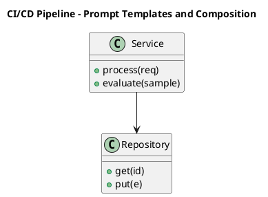

_Source diagram (plantuml); render with the appropriate tool._

**Figure 9. CI/CD Pipeline - Prompt Templates and Composition** (plantuml). Figure: CI/CD Pipeline view for Prompt Engineering. This diagram illustrates the principal components and their interactions as discussed in the surrounding section.

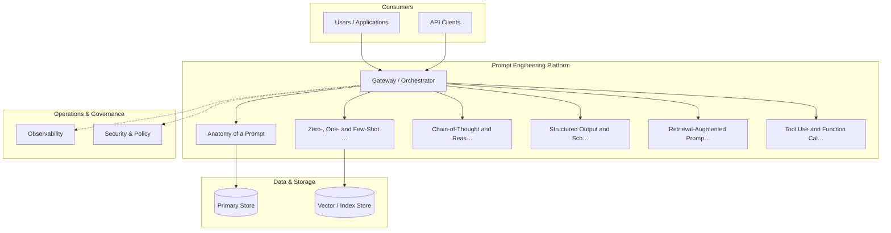

**Figure 10. Agent Architecture - Prompt Templates and Composition** (mermaid). Figure: Agent Architecture view for Prompt Engineering. This diagram illustrates the principal components and their interactions as discussed in the surrounding section.

## Deep Dive: Mechanics, Variants and Trade-offs

Having established the essentials, we now go deeper into prompt templates and composition. Mechanically, the behaviour emerges from a few interacting parts that are simpler than the whole they produce. The distinctions in this section are the ones that separate a working demo from a system that holds up under adversarial inputs, scale and the passage of time.

Consider the principal variants and how to choose between them. Each variant optimises for a different point in the design space - some for latency, some for accuracy, some for cost or operability - and the correct choice follows from explicit requirements rather than from defaults. As with most architectural decisions, the choice is rarely binary; the skill lies in quantifying the trade-offs and choosing deliberately.

In practice this is supported by a mature tooling ecosystem, including OpenAI, Anthropic, Guidance, Outlines. Tools accelerate the work but do not substitute for understanding: the same principles apply whichever implementation you select, and the ability to reason from first principles is what lets you debug when a tool behaves unexpectedly.

A frequent source of subtle bugs is the interaction with prompt management and versioning. Because prompt management and versioning concerns registries, A/B testing and rollback for production prompts, changes there can silently alter the behaviour analysed here. The remedy is contract tests at the boundary and end-to-end evaluations that exercise the interaction explicitly.

Finally, attend to edge cases and degradation. Define what the system should do under partial failure, unexpected inputs and load spikes, and make that behaviour explicit and tested rather than emergent. Graceful degradation - returning a safe, useful result when the ideal one is unavailable - is a hallmark of mature engineering.

For deeper study, the literature offers authoritative treatments such as Wei et al. — Chain-of-Thought Prompting (2022) and Wang et al. — Self-Consistency Improves Chain of Thought (2022). These primary sources reward careful reading and ground the practical guidance above in established results.

## Advanced Considerations

Having established the essentials, we now go deeper into prompt templates and composition. Beneath the abstraction lies a concrete process whose steps can each be measured, tested and optimised independently. The distinctions in this section are the ones that separate a working demo from a system that holds up under adversarial inputs, scale and the passage of time.

Consider the principal variants and how to choose between them. Each variant optimises for a different point in the design space - some for latency, some for accuracy, some for cost or operability - and the correct choice follows from explicit requirements rather than from defaults. Simplicity is a feature. The simplest design that meets the requirement should be the default, with complexity added only when measurement justifies it.

In practice this is supported by a mature tooling ecosystem, including OpenAI, Anthropic, Guidance, Outlines. Tools accelerate the work but do not substitute for understanding: the same principles apply whichever implementation you select, and the ability to reason from first principles is what lets you debug when a tool behaves unexpectedly.

A frequent source of subtle bugs is the interaction with structured output and schema enforcement. Because structured output and schema enforcement concerns jSON mode, function/tool calling and grammar-constrained decoding for reliable integration, changes there can silently alter the behaviour analysed here. The remedy is contract tests at the boundary and end-to-end evaluations that exercise the interaction explicitly.

Finally, attend to edge cases and degradation. Define what the system should do under partial failure, unexpected inputs and load spikes, and make that behaviour explicit and tested rather than emergent. Graceful degradation - returning a safe, useful result when the ideal one is unavailable - is a hallmark of mature engineering.

For deeper study, the literature offers authoritative treatments such as Wei et al. — Chain-of-Thought Prompting (2022) and Wang et al. — Self-Consistency Improves Chain of Thought (2022). These primary sources reward careful reading and ground the practical guidance above in established results.

## Worked Example

To ground the discussion, walk through a representative example. A analytics organisation needs natural-language-to-SQL with validation against a catalog. They decide to apply prompt templates and composition as part of their Prompt Engineering solution, but wisely treat it as a hypothesis to be validated rather than a foregone conclusion.

The team begins by stating the objective precisely and defining how success will be measured before writing any code. They establish a small but representative evaluation set, agree on acceptance thresholds, and only then prototype the simplest design that could work. Early measurement reveals which assumptions hold and which must be revised, saving weeks of misdirected effort and surfacing edge cases while they are still cheap to fix.

As the prototype matures into a service, the team hardens it: adding input validation, error handling, caching where it pays off, and monitoring that ties back to the original success metric. They document each significant decision in an architecture decision record so that future maintainers understand not just what was built but why.

The outcome is instructive. The system that reaches production is not the most sophisticated design the team considered, but the one whose behaviour they could measure, explain and operate. This is the recurring lesson of Prompt Engineering: durable value comes from the whole system, not from any single clever component.

## Industry Use Cases

Across industries, the ideas in this chapter recur in recognisable ways. The following vignettes show how different sectors apply them and what they have in common.

**Support.** Deterministic, schema-constrained ticket triage and routing. The common thread is that value comes not from the model alone but from the surrounding system - data quality, evaluation, integration and operations - which is precisely where most of the engineering effort belongs.

**Analytics.** Natural-language-to-SQL with validation against a catalog. The common thread is that value comes not from the model alone but from the surrounding system - data quality, evaluation, integration and operations - which is precisely where most of the engineering effort belongs.

**Operations.** Runbook automation with tool calls and confirmation gates. The common thread is that value comes not from the model alone but from the surrounding system - data quality, evaluation, integration and operations - which is precisely where most of the engineering effort belongs.

**Education.** Socratic tutoring with rubric-based answer evaluation. The common thread is that value comes not from the model alone but from the surrounding system - data quality, evaluation, integration and operations - which is precisely where most of the engineering effort belongs.

## Best Practices

The following practices consistently separate successful Prompt Engineering efforts from struggling ones. They are deliberately concrete so they can be adopted as checklist items in design and code review.

- Specify the output format explicitly and validate it programmatically.
- Keep untrusted content clearly delimited and never executed as instructions.
- Version prompts and gate changes behind an evaluation suite.
- Prefer fewer, higher-quality few-shot examples over many noisy ones.

None of these are exotic; they are the unglamorous disciplines that compound into reliability. The cost of adopting them is small compared with the cost of the incidents they prevent, and they become second nature with practice.

## Common Pitfalls

Equally instructive are the failure modes that recur in practice. Each pitfall below has a clear early warning sign and a known remedy, so treat them as a diagnostic checklist when something feels wrong:

- Treating prompts as throwaway strings with no testing or versioning.
- Overlong contexts that dilute attention and inflate cost.
- Mixing untrusted user content with trusted instructions (injection risk).
- Relying on temperature tweaks instead of structural prompt fixes.

The pattern is consistent: most failures stem from skipping measurement, conflating prototype and production standards, or deferring cross-cutting concerns such as security and cost until they become emergencies. Naming these traps in advance is the cheapest way to avoid them.

## Governance, Security and Cost Notes

No discussion of prompt templates and composition is complete without its governance, security and cost dimensions, which are too often deferred until they become emergencies. Treating them as first-class concerns from the outset is both cheaper and safer.

**Governance.** Classify the risk of this capability, document its intended and out-of-scope uses, and ensure decisions are traceable to satisfy internal policy and external regulation such as the NIST AI RMF, ISO/IEC 42001 and the EU AI Act. **Security.** Treat all external input as untrusted, validate outputs before acting on them, apply least privilege to any tools or data access, and map controls to the OWASP LLM Top 10 and MITRE ATLAS.

**Cost and sustainability.** Establish explicit budgets for compute, tokens and latency, attribute spend to owners, and revisit the economics as usage scales - a design that is affordable at pilot scale can become untenable at production volume. Building these reflexes into everyday engineering is what allows a Prompt Engineering system to be not only capable but also trustworthy and economically sound.

## Hands-On Exercises

Work through the following exercises. They are designed to move understanding from recognition to application - the level required for real engineering work - so prefer writing and building over merely reading.

1. Explain prompt templates and composition to a colleague unfamiliar with Prompt Engineering, using a concrete example from your own domain.
2. Sketch a reference architecture that incorporates prompt templates and composition and annotate where observability, security and cost controls belong.
3. Design an evaluation that would tell you whether prompt templates and composition is working in production, including the metric, the dataset and the acceptance threshold.
4. Identify two pitfalls relevant to prompt templates and composition in your environment and describe the early warning signals you would monitor.
5. Prototype the simplest implementation that demonstrates prompt templates and composition, then list exactly what would need to change to make it production-ready.

## Key Takeaways

Key takeaways from this chapter:

- Prompt Templates and Composition is a systems concern in Prompt Engineering: data, models and operations must be co-designed.
- Measurement is non-negotiable; define success metrics and evaluation before building.
- Favour the simplest design that meets the requirement, and add complexity only when evidence demands it.
- Security, cost and observability are first-class requirements, not afterthoughts.
- Document decisions so the system remains understandable and operable as it evolves.

## Code Walkthrough

Pipelines keep Prompt Templates and Composition logic modular and testable. Each stage is a pure function, errors are captured per item, and the composition is trivial to extend or reorder.

The full listing is shown below; study it line by line and reproduce it locally before moving on.

### Listing: A composable processing pipeline for Prompt Templates and Composition

```python
from collections.abc import Iterable, Iterator
from typing import Protocol


class Stage(Protocol):
    def __call__(self, item: dict) -> dict: ...


def pipeline(stages: list[Stage]) -> Stage:
    """Compose ordered stages into a single callable for Prompt Templates and Composition."""

    def run(item: dict) -> dict:
        for stage in stages:
            item = stage(item)
        return item

    return run


def validate(item: dict) -> dict:
    if "text" not in item:
        raise ValueError("missing required field: text")
    return item


def normalise(item: dict) -> dict:
    item["text"] = item["text"].strip().lower()
    return item


def enrich(item: dict) -> dict:
    item["length"] = len(item["text"])
    return item


process = pipeline([validate, normalise, enrich])


def run_batch(items: Iterable[dict]) -> Iterator[dict]:
    for item in items:
        try:
            yield process(dict(item))
        except ValueError as exc:
            yield {"error": str(exc), "item": item}

```

## Review Questions

1. In the context of Prompt Engineering, which statement best describes “Prompt Templates and Composition”?
   - A. It is only relevant to academic research, not production.
   - B. Parameterised templates, partials and guardrail wrappers for reuse at scale.
   - C. It eliminates the need for any evaluation or monitoring.
   - D. It removes all security and governance requirements.
   - **Answer: B.** Prompt Templates and Composition: Parameterised templates, partials and guardrail wrappers for reuse at scale.
2. Which of the following is a recommended best practice when working with Prompt Engineering?
   - A. It is only relevant to academic research, not production.
   - B. It eliminates the need for any evaluation or monitoring.
   - C. Keep untrusted content clearly delimited and never executed as instructions.
   - D. It applies exclusively to image data.
   - **Answer: C.** Best practice: Keep untrusted content clearly delimited and never executed as instructions.
3. Which of the following is a common pitfall to avoid in Prompt Engineering?
   - A. Prefer fewer, higher-quality few-shot examples over many noisy ones.
   - B. It applies exclusively to image data.
   - C. Specify the output format explicitly and validate it programmatically.
   - D. Mixing untrusted user content with trusted instructions (injection risk).
   - **Answer: D.** Pitfall to avoid: Mixing untrusted user content with trusted instructions (injection risk).
4. *(Discussion)* How would you test and monitor Prompt Templates and Composition in production?
   - **Model answer:** A strong answer defines prompt templates and composition (Parameterised templates, partials and guardrail wrappers for reuse at scale.) then connects it to architecture, evaluation, cost, security and operations for Prompt Engineering, citing concrete trade-offs and a real-world example.

---


# Chapter 8. Decoding Parameters and Sampling

_This chapter examines decoding parameters and sampling within Prompt Engineering. It covers temperature, top-p, penalties and stop sequences as levers on determinism, derives a reference architecture, walks through a worked example and runnable code, surveys industry use cases, and distils best practices and pitfalls, closing with exercises and review questions._

## Introduction

In practical terms, Decoding Parameters and Sampling is best understood as temperature, top-p, penalties and stop sequences as levers on determinism. It is foundational: later capabilities in Prompt Engineering are built directly on top of it. It helps to separate the conceptual model from its implementation: the former guides reasoning, the latter must contend with real-world constraints.

This chapter builds intuition first, then formalises the ideas, derives an architecture, and finishes with code, exercises and review questions so the material transfers directly to your own Prompt Engineering work. Read it actively: pause at each diagram, reproduce the code, and attempt the exercises before consulting the answers.

## Theory and Foundations

Decoding Parameters and Sampling can be characterised as temperature, top-p, penalties and stop sequences as levers on determinism. Seasoned practitioners treat this as a systems problem, co-designing data, models and operations rather than optimising any one in isolation. The underlying mechanism is best appreciated by tracing a single request from input to output and noting where state is created and consumed.

To place this in context, recall the broader picture: Prompt engineering is the discipline of designing inputs, context and decoding settings that steer foundation models toward reliable, useful behaviour. Within that picture, decoding parameters and sampling is one of the load-bearing ideas - the kind that, when understood deeply, makes the rest of Prompt Engineering fall into place. Understanding this matters because Prompt Engineering systems succeed or fail on exactly these decisions.

Decoding Parameters and Sampling cannot be understood in isolation from tool use and function calling. Recall that tool use and function calling concerns letting models invoke functions, search and code execution within a controlled loop. The two interact directly: decisions in one constrain the design space of the other, which is why mature teams reason about them together rather than sequentially. As with most architectural decisions, the choice is rarely binary; the skill lies in quantifying the trade-offs and choosing deliberately.

Decoding Parameters and Sampling cannot be understood in isolation from multi-step and agentic prompting. Recall that multi-step and agentic prompting concerns planner/executor patterns, reflection and decomposition of complex tasks. The two interact directly: decisions in one constrain the design space of the other, which is why mature teams reason about them together rather than sequentially. Every added component buys capability at the price of operational surface area, and that bargain should be made consciously.

Several established patterns apply directly to decoding parameters and sampling. The first, template + slots with explicit output schema, is widely adopted because it makes the system's behaviour predictable and observable. A complementary pattern, critique-and-revise loops for quality improvement, addresses a related concern and is often deployed alongside it. Patterns are not dogma; they are distilled experience that shortcuts the search for a sound design, and each carries assumptions worth checking against your context.

Knowing when not to use a technique is as valuable as knowing how to use it. In a small prototype, shortcuts around decoding parameters and sampling are invisible; in a production Prompt Engineering system serving real traffic, they surface as incidents, cost overruns or compliance gaps. Latency, accuracy and cost form a tension triangle: improving one typically pressures the others, so explicit budgets are essential. The remainder of this chapter turns these principles into an architecture, code and a checklist you can apply immediately.

## Architecture and Design

A robust architecture for Decoding Parameters and Sampling is layered so each part can evolve independently without destabilising the whole. Production prompting introduces a prompt management service that stores versioned templates, an assembly layer that merges instructions with retrieved context under a token budget, and an evaluation harness that scores candidate prompts against golden datasets before promotion. Telemetry links every completion back to the exact prompt version that produced it.

Concretely, the principal building blocks include anatomy of a prompt, zero-, one- and few-shot prompting, chain-of-thought and reasoning prompts, structured output and schema enforcement and retrieval-augmented prompting. Each is a replaceable component behind a stable interface, so the team can upgrade an implementation - a model, an index, a policy engine - without rewriting its neighbours. The contracts between components are where reliability is won or lost, so they are specified explicitly and tested in isolation.

The diagram accompanying this section makes the data and control flow explicit. Requests enter through a well-defined boundary where they are authenticated and validated; only then are they dispatched to the components that perform the work. This boundary is also where rate limiting, quota enforcement and audit logging live, keeping cross-cutting concerns out of the core logic and in one auditable place.

Two qualities deserve emphasis. First, observability is designed in, not bolted on: every component emits structured telemetry so that failures can be localised in minutes rather than hours. Second, the architecture is evolvable - components communicate through stable contracts so that any single part of the Prompt Engineering system can be replaced without a rewrite. Every added component buys capability at the price of operational surface area, and that bargain should be made consciously.

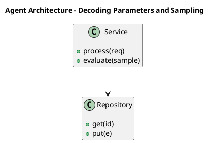

_Source diagram (plantuml); render with the appropriate tool._

**Figure 11. Agent Architecture - Decoding Parameters and Sampling** (plantuml). Figure: Agent Architecture view for Prompt Engineering. This diagram illustrates the principal components and their interactions as discussed in the surrounding section.

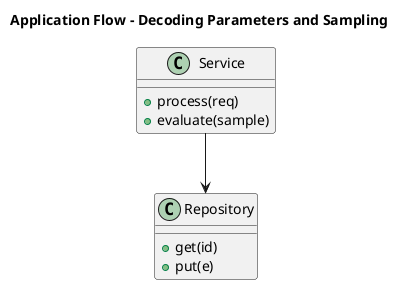

_Source diagram (plantuml); render with the appropriate tool._

**Figure 12. Application Flow - Decoding Parameters and Sampling** (plantuml). Figure: Application Flow view for Prompt Engineering. This diagram illustrates the principal components and their interactions as discussed in the surrounding section.

## Deep Dive: Mechanics, Variants and Trade-offs

Having established the essentials, we now go deeper into decoding parameters and sampling. Beneath the abstraction lies a concrete process whose steps can each be measured, tested and optimised independently. The distinctions in this section are the ones that separate a working demo from a system that holds up under adversarial inputs, scale and the passage of time.

Consider the principal variants and how to choose between them. Each variant optimises for a different point in the design space - some for latency, some for accuracy, some for cost or operability - and the correct choice follows from explicit requirements rather than from defaults. Latency, accuracy and cost form a tension triangle: improving one typically pressures the others, so explicit budgets are essential.

In practice this is supported by a mature tooling ecosystem, including OpenAI, Anthropic, Guidance, Outlines. Tools accelerate the work but do not substitute for understanding: the same principles apply whichever implementation you select, and the ability to reason from first principles is what lets you debug when a tool behaves unexpectedly.

A frequent source of subtle bugs is the interaction with tool use and function calling. Because tool use and function calling concerns letting models invoke functions, search and code execution within a controlled loop, changes there can silently alter the behaviour analysed here. The remedy is contract tests at the boundary and end-to-end evaluations that exercise the interaction explicitly.

Finally, attend to edge cases and degradation. Define what the system should do under partial failure, unexpected inputs and load spikes, and make that behaviour explicit and tested rather than emergent. Graceful degradation - returning a safe, useful result when the ideal one is unavailable - is a hallmark of mature engineering.

For deeper study, the literature offers authoritative treatments such as Wei et al. — Chain-of-Thought Prompting (2022) and Wang et al. — Self-Consistency Improves Chain of Thought (2022). These primary sources reward careful reading and ground the practical guidance above in established results.

## Advanced Considerations

Having established the essentials, we now go deeper into decoding parameters and sampling. The underlying mechanism is best appreciated by tracing a single request from input to output and noting where state is created and consumed. The distinctions in this section are the ones that separate a working demo from a system that holds up under adversarial inputs, scale and the passage of time.

Consider the principal variants and how to choose between them. Each variant optimises for a different point in the design space - some for latency, some for accuracy, some for cost or operability - and the correct choice follows from explicit requirements rather than from defaults. As with most architectural decisions, the choice is rarely binary; the skill lies in quantifying the trade-offs and choosing deliberately.

In practice this is supported by a mature tooling ecosystem, including OpenAI, Anthropic, Guidance, Outlines. Tools accelerate the work but do not substitute for understanding: the same principles apply whichever implementation you select, and the ability to reason from first principles is what lets you debug when a tool behaves unexpectedly.

A frequent source of subtle bugs is the interaction with prompt evaluation and regression testing. Because prompt evaluation and regression testing concerns golden datasets, LLM-as-judge, rubric scoring and CI gates for prompt changes, changes there can silently alter the behaviour analysed here. The remedy is contract tests at the boundary and end-to-end evaluations that exercise the interaction explicitly.

Finally, attend to edge cases and degradation. Define what the system should do under partial failure, unexpected inputs and load spikes, and make that behaviour explicit and tested rather than emergent. Graceful degradation - returning a safe, useful result when the ideal one is unavailable - is a hallmark of mature engineering.

For deeper study, the literature offers authoritative treatments such as Wei et al. — Chain-of-Thought Prompting (2022) and Wang et al. — Self-Consistency Improves Chain of Thought (2022). These primary sources reward careful reading and ground the practical guidance above in established results.

## Worked Example

Consider a concrete scenario. A analytics organisation needs natural-language-to-SQL with validation against a catalog. They decide to apply decoding parameters and sampling as part of their Prompt Engineering solution, but wisely treat it as a hypothesis to be validated rather than a foregone conclusion.

The team begins by stating the objective precisely and defining how success will be measured before writing any code. They establish a small but representative evaluation set, agree on acceptance thresholds, and only then prototype the simplest design that could work. Early measurement reveals which assumptions hold and which must be revised, saving weeks of misdirected effort and surfacing edge cases while they are still cheap to fix.

As the prototype matures into a service, the team hardens it: adding input validation, error handling, caching where it pays off, and monitoring that ties back to the original success metric. They document each significant decision in an architecture decision record so that future maintainers understand not just what was built but why.

The outcome is instructive. The system that reaches production is not the most sophisticated design the team considered, but the one whose behaviour they could measure, explain and operate. This is the recurring lesson of Prompt Engineering: durable value comes from the whole system, not from any single clever component.

## Industry Use Cases

Across industries, the ideas in this chapter recur in recognisable ways. The following vignettes show how different sectors apply them and what they have in common.

**Support.** Deterministic, schema-constrained ticket triage and routing. The common thread is that value comes not from the model alone but from the surrounding system - data quality, evaluation, integration and operations - which is precisely where most of the engineering effort belongs.

**Analytics.** Natural-language-to-SQL with validation against a catalog. The common thread is that value comes not from the model alone but from the surrounding system - data quality, evaluation, integration and operations - which is precisely where most of the engineering effort belongs.

**Operations.** Runbook automation with tool calls and confirmation gates. The common thread is that value comes not from the model alone but from the surrounding system - data quality, evaluation, integration and operations - which is precisely where most of the engineering effort belongs.

**Education.** Socratic tutoring with rubric-based answer evaluation. The common thread is that value comes not from the model alone but from the surrounding system - data quality, evaluation, integration and operations - which is precisely where most of the engineering effort belongs.

## Best Practices

The following practices consistently separate successful Prompt Engineering efforts from struggling ones. They are deliberately concrete so they can be adopted as checklist items in design and code review.

- Specify the output format explicitly and validate it programmatically.
- Keep untrusted content clearly delimited and never executed as instructions.
- Version prompts and gate changes behind an evaluation suite.
- Prefer fewer, higher-quality few-shot examples over many noisy ones.

None of these are exotic; they are the unglamorous disciplines that compound into reliability. The cost of adopting them is small compared with the cost of the incidents they prevent, and they become second nature with practice.

## Common Pitfalls

Equally instructive are the failure modes that recur in practice. Each pitfall below has a clear early warning sign and a known remedy, so treat them as a diagnostic checklist when something feels wrong:

- Treating prompts as throwaway strings with no testing or versioning.
- Overlong contexts that dilute attention and inflate cost.
- Mixing untrusted user content with trusted instructions (injection risk).
- Relying on temperature tweaks instead of structural prompt fixes.

The pattern is consistent: most failures stem from skipping measurement, conflating prototype and production standards, or deferring cross-cutting concerns such as security and cost until they become emergencies. Naming these traps in advance is the cheapest way to avoid them.

## Governance, Security and Cost Notes

No discussion of decoding parameters and sampling is complete without its governance, security and cost dimensions, which are too often deferred until they become emergencies. Treating them as first-class concerns from the outset is both cheaper and safer.

**Governance.** Classify the risk of this capability, document its intended and out-of-scope uses, and ensure decisions are traceable to satisfy internal policy and external regulation such as the NIST AI RMF, ISO/IEC 42001 and the EU AI Act. **Security.** Treat all external input as untrusted, validate outputs before acting on them, apply least privilege to any tools or data access, and map controls to the OWASP LLM Top 10 and MITRE ATLAS.

**Cost and sustainability.** Establish explicit budgets for compute, tokens and latency, attribute spend to owners, and revisit the economics as usage scales - a design that is affordable at pilot scale can become untenable at production volume. Building these reflexes into everyday engineering is what allows a Prompt Engineering system to be not only capable but also trustworthy and economically sound.

## Hands-On Exercises

Work through the following exercises. They are designed to move understanding from recognition to application - the level required for real engineering work - so prefer writing and building over merely reading.

1. Explain decoding parameters and sampling to a colleague unfamiliar with Prompt Engineering, using a concrete example from your own domain.
2. Sketch a reference architecture that incorporates decoding parameters and sampling and annotate where observability, security and cost controls belong.
3. Design an evaluation that would tell you whether decoding parameters and sampling is working in production, including the metric, the dataset and the acceptance threshold.
4. Identify two pitfalls relevant to decoding parameters and sampling in your environment and describe the early warning signals you would monitor.
5. Prototype the simplest implementation that demonstrates decoding parameters and sampling, then list exactly what would need to change to make it production-ready.

## Key Takeaways

Key takeaways from this chapter:

- Decoding Parameters and Sampling is a systems concern in Prompt Engineering: data, models and operations must be co-designed.
- Measurement is non-negotiable; define success metrics and evaluation before building.
- Favour the simplest design that meets the requirement, and add complexity only when evidence demands it.
- Security, cost and observability are first-class requirements, not afterthoughts.
- Document decisions so the system remains understandable and operable as it evolves.

## Code Walkthrough

This listing shows a configuration-driven Decoding Parameters and Sampling component with retry semantics and typed interfaces — the shape we expect from production Prompt Engineering code rather than a notebook prototype.

The full listing is shown below; study it line by line and reproduce it locally before moving on.

### Listing: Implementing a Decoding Parameters and Sampling component

```python
from __future__ import annotations

from dataclasses import dataclass, field
from typing import Any


@dataclass(slots=True)
class DecodingParametersAndConfig:
    """Configuration for the Decoding Parameters and Sampling component in a Prompt Engineering system."""

    name: str
    timeout_s: float = 30.0
    max_retries: int = 3
    options: dict[str, Any] = field(default_factory=dict)


class DecodingParametersAnd:
    """A minimal, production-shaped implementation of Decoding Parameters and Sampling."""

    def __init__(self, config: DecodingParametersAndConfig) -> None:
        self._config = config
        self._calls = 0

    def run(self, payload: dict[str, Any]) -> dict[str, Any]:
        """Process a request, retrying transient failures with backoff."""
        last_error: Exception | None = None
        for attempt in range(self._config.max_retries):
            try:
                self._calls += 1
                return self._process(payload)
            except TimeoutError as exc:  # transient
                last_error = exc
                continue
        raise RuntimeError(f"DecodingParametersAnd failed after retries") from last_error

    def _process(self, payload: dict[str, Any]) -> dict[str, Any]:
        # Domain-specific logic for Decoding Parameters and Sampling goes here.
        return {"status": "ok", "input_keys": sorted(payload), "calls": self._calls}

```

## Review Questions

1. In the context of Prompt Engineering, which statement best describes “Decoding Parameters and Sampling”?
   - A. It makes the system slower but has no other effect.
   - B. Temperature, top-p, penalties and stop sequences as levers on determinism.
   - C. It removes all security and governance requirements.
   - D. It eliminates the need for any evaluation or monitoring.
   - **Answer: B.** Decoding Parameters and Sampling: Temperature, top-p, penalties and stop sequences as levers on determinism.
2. Which of the following is a recommended best practice when working with Prompt Engineering?
   - A. It applies exclusively to image data.
   - B. It removes all security and governance requirements.
   - C. Treating prompts as throwaway strings with no testing or versioning.
   - D. Specify the output format explicitly and validate it programmatically.
   - **Answer: D.** Best practice: Specify the output format explicitly and validate it programmatically.
3. Which of the following is a common pitfall to avoid in Prompt Engineering?
   - A. Specify the output format explicitly and validate it programmatically.
   - B. Mixing untrusted user content with trusted instructions (injection risk).
   - C. It makes the system slower but has no other effect.
   - D. It eliminates the need for any evaluation or monitoring.
   - **Answer: B.** Pitfall to avoid: Mixing untrusted user content with trusted instructions (injection risk).
4. *(Discussion)* Explain Decoding Parameters and Sampling and why it matters in a production Prompt Engineering system.
   - **Model answer:** A strong answer defines decoding parameters and sampling (Temperature, top-p, penalties and stop sequences as levers on determinism.) then connects it to architecture, evaluation, cost, security and operations for Prompt Engineering, citing concrete trade-offs and a real-world example.

---


# Chapter 9. Prompt Evaluation and Regression Testing

_This chapter examines prompt evaluation and regression testing within Prompt Engineering. It covers golden datasets, LLM-as-judge, rubric scoring and CI gates for prompt changes, derives a reference architecture, walks through a worked example and runnable code, surveys industry use cases, and distils best practices and pitfalls, closing with exercises and review questions._

## Introduction

Prompt Evaluation and Regression Testing refers to golden datasets, LLM-as-judge, rubric scoring and CI gates for prompt changes. It is foundational: later capabilities in Prompt Engineering are built directly on top of it. In an enterprise setting, this translates into concrete requirements: clear interfaces, measurable quality, and controls that satisfy security and governance.

This chapter builds intuition first, then formalises the ideas, derives an architecture, and finishes with code, exercises and review questions so the material transfers directly to your own Prompt Engineering work. Read it actively: pause at each diagram, reproduce the code, and attempt the exercises before consulting the answers.

## Theory and Foundations

In practical terms, Prompt Evaluation and Regression Testing is best understood as golden datasets, LLM-as-judge, rubric scoring and CI gates for prompt changes. Seasoned practitioners treat this as a systems problem, co-designing data, models and operations rather than optimising any one in isolation. The underlying mechanism is best appreciated by tracing a single request from input to output and noting where state is created and consumed.

To place this in context, recall the broader picture: Prompt engineering is the discipline of designing inputs, context and decoding settings that steer foundation models toward reliable, useful behaviour. Within that picture, prompt evaluation and regression testing is one of the load-bearing ideas - the kind that, when understood deeply, makes the rest of Prompt Engineering fall into place. It is foundational: later capabilities in Prompt Engineering are built directly on top of it.

Prompt Evaluation and Regression Testing cannot be understood in isolation from patterns, anti-patterns and a style guide. Recall that patterns, anti-patterns and a style guide concerns a reusable library of prompt patterns and the failure modes to avoid. The two interact directly: decisions in one constrain the design space of the other, which is why mature teams reason about them together rather than sequentially. As with most architectural decisions, the choice is rarely binary; the skill lies in quantifying the trade-offs and choosing deliberately.

Prompt Evaluation and Regression Testing cannot be understood in isolation from prompt management and versioning. Recall that prompt management and versioning concerns registries, A/B testing and rollback for production prompts. The two interact directly: decisions in one constrain the design space of the other, which is why mature teams reason about them together rather than sequentially. Simplicity is a feature. The simplest design that meets the requirement should be the default, with complexity added only when measurement justifies it.

Several established patterns apply directly to prompt evaluation and regression testing. The first, self-consistency voting for high-stakes reasoning, is widely adopted because it makes the system's behaviour predictable and observable. A complementary pattern, critique-and-revise loops for quality improvement, addresses a related concern and is often deployed alongside it. Patterns are not dogma; they are distilled experience that shortcuts the search for a sound design, and each carries assumptions worth checking against your context.

The decision of whether to adopt this should be driven by requirements, not by novelty. In a small prototype, shortcuts around prompt evaluation and regression testing are invisible; in a production Prompt Engineering system serving real traffic, they surface as incidents, cost overruns or compliance gaps. Every added component buys capability at the price of operational surface area, and that bargain should be made consciously. The remainder of this chapter turns these principles into an architecture, code and a checklist you can apply immediately.

## Architecture and Design

From an architectural standpoint, Prompt Evaluation and Regression Testing sits at the intersection of data, models and operations. Production prompting introduces a prompt management service that stores versioned templates, an assembly layer that merges instructions with retrieved context under a token budget, and an evaluation harness that scores candidate prompts against golden datasets before promotion. Telemetry links every completion back to the exact prompt version that produced it.

Concretely, the principal building blocks include anatomy of a prompt, zero-, one- and few-shot prompting, chain-of-thought and reasoning prompts, structured output and schema enforcement and retrieval-augmented prompting. Each is a replaceable component behind a stable interface, so the team can upgrade an implementation - a model, an index, a policy engine - without rewriting its neighbours. The contracts between components are where reliability is won or lost, so they are specified explicitly and tested in isolation.

The diagram accompanying this section makes the data and control flow explicit. Requests enter through a well-defined boundary where they are authenticated and validated; only then are they dispatched to the components that perform the work. This boundary is also where rate limiting, quota enforcement and audit logging live, keeping cross-cutting concerns out of the core logic and in one auditable place.

Two qualities deserve emphasis. First, observability is designed in, not bolted on: every component emits structured telemetry so that failures can be localised in minutes rather than hours. Second, the architecture is evolvable - components communicate through stable contracts so that any single part of the Prompt Engineering system can be replaced without a rewrite. Simplicity is a feature. The simplest design that meets the requirement should be the default, with complexity added only when measurement justifies it.

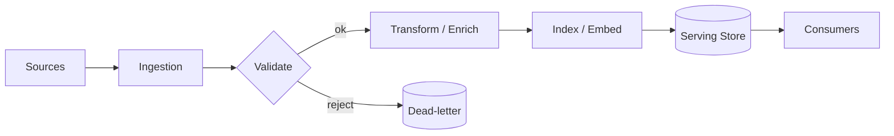

**Figure 13. Application Flow - Prompt Evaluation and Regression Testing** (mermaid). Figure: Application Flow view for Prompt Engineering. This diagram illustrates the principal components and their interactions as discussed in the surrounding section.

<div class="diagram-svg">

<svg xmlns="http://www.w3.org/2000/svg" width="840" height="460" data-tpl="flow_h" data-pal="2-1" viewBox="0 0 840 460" font-family="Inter, Segoe UI, Arial, sans-serif"><defs><marker id="ar" markerWidth="9" markerHeight="9" refX="7" refY="3" orient="auto"><path d="M0,0 L7,3 L0,6 z" fill="#94a3b8"/></marker><marker id="arw" markerWidth="9" markerHeight="9" refX="7" refY="3" orient="auto"><path d="M0,0 L7,3 L0,6 z" fill="#ffffff"/></marker><filter id="sh" x="-20%" y="-20%" width="140%" height="140%"><feDropShadow dx="0" dy="2" stdDeviation="3" flood-color="#0f172a" flood-opacity="0.16"/></filter></defs><defs><linearGradient id="bn322a898" x1="0" y1="0" x2="1" y2="0"><stop offset="0" stop-color="#059669"/><stop offset="1" stop-color="#10b981"/></linearGradient></defs><rect width="840" height="460" rx="14" fill="#ffffff"/><rect x="0" y="0" width="840" height="48" rx="14" fill="url(#bn322a898)"/><rect x="0" y="32" width="840" height="16" fill="url(#bn322a898)"/><text x="420" y="25" text-anchor="middle" font-size="14.5" font-weight="700" fill="#ffffff" dominant-baseline="middle">RAG Architecture - Prompt Evaluation and Regression Testing</text><rect x="39" y="196" width="130" height="68" rx="11" fill="#059669" filter="url(#sh)"/><text x="104" y="224" text-anchor="middle" font-size="10.5" font-weight="600" fill="#ffffff" dominant-baseline="middle">Structured Output and</text><text x="104" y="236" text-anchor="middle" font-size="10.5" font-weight="600" fill="#ffffff" dominant-baseline="middle">Schema Enforcement</text><rect x="197" y="196" width="130" height="68" rx="11" fill="#10b981" filter="url(#sh)"/><text x="262" y="224" text-anchor="middle" font-size="10.5" font-weight="600" fill="#ffffff" dominant-baseline="middle">Retrieval-Augmented</text><text x="262" y="236" text-anchor="middle" font-size="10.5" font-weight="600" fill="#ffffff" dominant-baseline="middle">Prompting</text><line x1="169" y1="230" x2="197" y2="230" stroke="#94a3b8" stroke-width="2" marker-end="url(#ar)"/><rect x="355" y="196" width="130" height="68" rx="11" fill="#34d399" filter="url(#sh)"/><text x="420" y="224" text-anchor="middle" font-size="10.5" font-weight="600" fill="#ffffff" dominant-baseline="middle">Tool Use and Function</text><text x="420" y="236" text-anchor="middle" font-size="10.5" font-weight="600" fill="#ffffff" dominant-baseline="middle">Calling</text><line x1="327" y1="230" x2="355" y2="230" stroke="#94a3b8" stroke-width="2" marker-end="url(#ar)"/><rect x="513" y="196" width="130" height="68" rx="11" fill="#0d9488" filter="url(#sh)"/><text x="578" y="224" text-anchor="middle" font-size="10.5" font-weight="600" fill="#ffffff" dominant-baseline="middle">Prompt Templates and</text><text x="578" y="236" text-anchor="middle" font-size="10.5" font-weight="600" fill="#ffffff" dominant-baseline="middle">Composition</text><line x1="485" y1="230" x2="513" y2="230" stroke="#94a3b8" stroke-width="2" marker-end="url(#ar)"/><rect x="671" y="196" width="130" height="68" rx="11" fill="#14b8a6" filter="url(#sh)"/><text x="736" y="224" text-anchor="middle" font-size="10.5" font-weight="600" fill="#ffffff" dominant-baseline="middle">Decoding Parameters</text><text x="736" y="236" text-anchor="middle" font-size="10.5" font-weight="600" fill="#ffffff" dominant-baseline="middle">and Sampling</text><line x1="643" y1="230" x2="671" y2="230" stroke="#94a3b8" stroke-width="2" marker-end="url(#ar)"/><text x="420" y="300" text-anchor="middle" font-size="11" font-weight="500" fill="#64748b" dominant-baseline="middle">end-to-end flow</text><text x="28" y="446" text-anchor="start" font-size="9.5" font-weight="500" fill="#64748b" dominant-baseline="middle">Prompt Engineering  •  RAG Architecture</text></svg>

</div>

**Figure 14. RAG Architecture - Prompt Evaluation and Regression Testing** (svg). Figure: RAG Architecture view for Prompt Engineering. This diagram illustrates the principal components and their interactions as discussed in the surrounding section.

## Deep Dive: Mechanics, Variants and Trade-offs

Having established the essentials, we now go deeper into prompt evaluation and regression testing. Beneath the abstraction lies a concrete process whose steps can each be measured, tested and optimised independently. The distinctions in this section are the ones that separate a working demo from a system that holds up under adversarial inputs, scale and the passage of time.

Consider the principal variants and how to choose between them. Each variant optimises for a different point in the design space - some for latency, some for accuracy, some for cost or operability - and the correct choice follows from explicit requirements rather than from defaults. Every added component buys capability at the price of operational surface area, and that bargain should be made consciously.

In practice this is supported by a mature tooling ecosystem, including OpenAI, Anthropic, Guidance, Outlines. Tools accelerate the work but do not substitute for understanding: the same principles apply whichever implementation you select, and the ability to reason from first principles is what lets you debug when a tool behaves unexpectedly.

A frequent source of subtle bugs is the interaction with patterns, anti-patterns and a style guide. Because patterns, anti-patterns and a style guide concerns a reusable library of prompt patterns and the failure modes to avoid, changes there can silently alter the behaviour analysed here. The remedy is contract tests at the boundary and end-to-end evaluations that exercise the interaction explicitly.

Finally, attend to edge cases and degradation. Define what the system should do under partial failure, unexpected inputs and load spikes, and make that behaviour explicit and tested rather than emergent. Graceful degradation - returning a safe, useful result when the ideal one is unavailable - is a hallmark of mature engineering.

For deeper study, the literature offers authoritative treatments such as Wei et al. — Chain-of-Thought Prompting (2022) and Wang et al. — Self-Consistency Improves Chain of Thought (2022). These primary sources reward careful reading and ground the practical guidance above in established results.

## Advanced Considerations

Having established the essentials, we now go deeper into prompt evaluation and regression testing. Mechanically, the behaviour emerges from a few interacting parts that are simpler than the whole they produce. The distinctions in this section are the ones that separate a working demo from a system that holds up under adversarial inputs, scale and the passage of time.

Consider the principal variants and how to choose between them. Each variant optimises for a different point in the design space - some for latency, some for accuracy, some for cost or operability - and the correct choice follows from explicit requirements rather than from defaults. There is an inherent trade-off between fidelity and cost, and the correct balance depends on the use case and its tolerance for error.

In practice this is supported by a mature tooling ecosystem, including OpenAI, Anthropic, Guidance, Outlines. Tools accelerate the work but do not substitute for understanding: the same principles apply whichever implementation you select, and the ability to reason from first principles is what lets you debug when a tool behaves unexpectedly.

A frequent source of subtle bugs is the interaction with retrieval-augmented prompting. Because retrieval-augmented prompting concerns injecting grounded context, citation discipline and context-window budgeting, changes there can silently alter the behaviour analysed here. The remedy is contract tests at the boundary and end-to-end evaluations that exercise the interaction explicitly.

Finally, attend to edge cases and degradation. Define what the system should do under partial failure, unexpected inputs and load spikes, and make that behaviour explicit and tested rather than emergent. Graceful degradation - returning a safe, useful result when the ideal one is unavailable - is a hallmark of mature engineering.

For deeper study, the literature offers authoritative treatments such as Wei et al. — Chain-of-Thought Prompting (2022) and Wang et al. — Self-Consistency Improves Chain of Thought (2022). These primary sources reward careful reading and ground the practical guidance above in established results.

## Worked Example

To ground the discussion, walk through a representative example. A education organisation needs socratic tutoring with rubric-based answer evaluation. They decide to apply prompt evaluation and regression testing as part of their Prompt Engineering solution, but wisely treat it as a hypothesis to be validated rather than a foregone conclusion.

The team begins by stating the objective precisely and defining how success will be measured before writing any code. They establish a small but representative evaluation set, agree on acceptance thresholds, and only then prototype the simplest design that could work. Early measurement reveals which assumptions hold and which must be revised, saving weeks of misdirected effort and surfacing edge cases while they are still cheap to fix.

As the prototype matures into a service, the team hardens it: adding input validation, error handling, caching where it pays off, and monitoring that ties back to the original success metric. They document each significant decision in an architecture decision record so that future maintainers understand not just what was built but why.

The outcome is instructive. The system that reaches production is not the most sophisticated design the team considered, but the one whose behaviour they could measure, explain and operate. This is the recurring lesson of Prompt Engineering: durable value comes from the whole system, not from any single clever component.

## Industry Use Cases

Across industries, the ideas in this chapter recur in recognisable ways. The following vignettes show how different sectors apply them and what they have in common.

**Support.** Deterministic, schema-constrained ticket triage and routing. The common thread is that value comes not from the model alone but from the surrounding system - data quality, evaluation, integration and operations - which is precisely where most of the engineering effort belongs.

**Analytics.** Natural-language-to-SQL with validation against a catalog. The common thread is that value comes not from the model alone but from the surrounding system - data quality, evaluation, integration and operations - which is precisely where most of the engineering effort belongs.

**Operations.** Runbook automation with tool calls and confirmation gates. The common thread is that value comes not from the model alone but from the surrounding system - data quality, evaluation, integration and operations - which is precisely where most of the engineering effort belongs.

**Education.** Socratic tutoring with rubric-based answer evaluation. The common thread is that value comes not from the model alone but from the surrounding system - data quality, evaluation, integration and operations - which is precisely where most of the engineering effort belongs.

## Best Practices

The following practices consistently separate successful Prompt Engineering efforts from struggling ones. They are deliberately concrete so they can be adopted as checklist items in design and code review.

- Specify the output format explicitly and validate it programmatically.
- Keep untrusted content clearly delimited and never executed as instructions.
- Version prompts and gate changes behind an evaluation suite.
- Prefer fewer, higher-quality few-shot examples over many noisy ones.

None of these are exotic; they are the unglamorous disciplines that compound into reliability. The cost of adopting them is small compared with the cost of the incidents they prevent, and they become second nature with practice.

## Common Pitfalls

Equally instructive are the failure modes that recur in practice. Each pitfall below has a clear early warning sign and a known remedy, so treat them as a diagnostic checklist when something feels wrong:

- Treating prompts as throwaway strings with no testing or versioning.
- Overlong contexts that dilute attention and inflate cost.
- Mixing untrusted user content with trusted instructions (injection risk).
- Relying on temperature tweaks instead of structural prompt fixes.

The pattern is consistent: most failures stem from skipping measurement, conflating prototype and production standards, or deferring cross-cutting concerns such as security and cost until they become emergencies. Naming these traps in advance is the cheapest way to avoid them.

## Governance, Security and Cost Notes

No discussion of prompt evaluation and regression testing is complete without its governance, security and cost dimensions, which are too often deferred until they become emergencies. Treating them as first-class concerns from the outset is both cheaper and safer.

**Governance.** Classify the risk of this capability, document its intended and out-of-scope uses, and ensure decisions are traceable to satisfy internal policy and external regulation such as the NIST AI RMF, ISO/IEC 42001 and the EU AI Act. **Security.** Treat all external input as untrusted, validate outputs before acting on them, apply least privilege to any tools or data access, and map controls to the OWASP LLM Top 10 and MITRE ATLAS.

**Cost and sustainability.** Establish explicit budgets for compute, tokens and latency, attribute spend to owners, and revisit the economics as usage scales - a design that is affordable at pilot scale can become untenable at production volume. Building these reflexes into everyday engineering is what allows a Prompt Engineering system to be not only capable but also trustworthy and economically sound.

## Hands-On Exercises

Work through the following exercises. They are designed to move understanding from recognition to application - the level required for real engineering work - so prefer writing and building over merely reading.

1. Explain prompt evaluation and regression testing to a colleague unfamiliar with Prompt Engineering, using a concrete example from your own domain.
2. Sketch a reference architecture that incorporates prompt evaluation and regression testing and annotate where observability, security and cost controls belong.
3. Design an evaluation that would tell you whether prompt evaluation and regression testing is working in production, including the metric, the dataset and the acceptance threshold.
4. Identify two pitfalls relevant to prompt evaluation and regression testing in your environment and describe the early warning signals you would monitor.
5. Prototype the simplest implementation that demonstrates prompt evaluation and regression testing, then list exactly what would need to change to make it production-ready.

## Key Takeaways

Key takeaways from this chapter:

- Prompt Evaluation and Regression Testing is a systems concern in Prompt Engineering: data, models and operations must be co-designed.
- Measurement is non-negotiable; define success metrics and evaluation before building.
- Favour the simplest design that meets the requirement, and add complexity only when evidence demands it.
- Security, cost and observability are first-class requirements, not afterthoughts.
- Document decisions so the system remains understandable and operable as it evolves.

## Code Walkthrough

Every change to a Prompt Engineering system should pass an evaluation gate. This example shows the minimal shape: align predictions and references, compute a metric, and return a pass/fail decision for CI.

The full listing is shown below; study it line by line and reproduce it locally before moving on.

### Listing: Evaluating Prompt Evaluation and Regression Testing with a regression gate

```python
from dataclasses import dataclass


@dataclass
class EvalResult:
    metric: str
    score: float
    passed: bool


def evaluate(predictions: list[str], references: list[str],
             threshold: float = 0.8) -> EvalResult:
    """Score Prompt Evaluation and Regression Testing output against references with a simple exact-match metric.

    In practice you would combine several metrics (exact match, semantic
    similarity, LLM-as-judge) and gate releases on the aggregate.
    """
    if len(predictions) != len(references):
        raise ValueError("predictions and references must align")
    hits = sum(p.strip() == r.strip() for p, r in zip(predictions, references))
    score = hits / len(references) if references else 0.0
    return EvalResult(metric="exact_match", score=score, passed=score >= threshold)


if __name__ == "__main__":
    result = evaluate(["yes", "no"], ["yes", "yes"])
    print(f"{result.metric}={result.score:.2f} passed={result.passed}")

```

## Review Questions

1. In the context of Prompt Engineering, which statement best describes “Prompt Evaluation and Regression Testing”?
   - A. It removes all security and governance requirements.
   - B. It applies exclusively to image data.
   - C. It eliminates the need for any evaluation or monitoring.
   - D. Golden datasets, LLM-as-judge, rubric scoring and CI gates for prompt changes.
   - **Answer: D.** Prompt Evaluation and Regression Testing: Golden datasets, LLM-as-judge, rubric scoring and CI gates for prompt changes.
2. Which of the following is a recommended best practice when working with Prompt Engineering?
   - A. It applies exclusively to image data.
   - B. Version prompts and gate changes behind an evaluation suite.
   - C. Treating prompts as throwaway strings with no testing or versioning.
   - D. It makes the system slower but has no other effect.
   - **Answer: B.** Best practice: Version prompts and gate changes behind an evaluation suite.
3. Which of the following is a common pitfall to avoid in Prompt Engineering?
   - A. It eliminates the need for any evaluation or monitoring.
   - B. It is only relevant to academic research, not production.
   - C. It removes all security and governance requirements.
   - D. Treating prompts as throwaway strings with no testing or versioning.
   - **Answer: D.** Pitfall to avoid: Treating prompts as throwaway strings with no testing or versioning.
4. *(Discussion)* Walk through how you would design Prompt Evaluation and Regression Testing for an enterprise Prompt Engineering workload.
   - **Model answer:** A strong answer defines prompt evaluation and regression testing (Golden datasets, LLM-as-judge, rubric scoring and CI gates for prompt changes.) then connects it to architecture, evaluation, cost, security and operations for Prompt Engineering, citing concrete trade-offs and a real-world example.

---


# Chapter 10. Defending Against Prompt Injection

_This chapter examines defending against prompt injection within Prompt Engineering. It covers untrusted-content isolation, instruction hierarchy and output validation, derives a reference architecture, walks through a worked example and runnable code, surveys industry use cases, and distils best practices and pitfalls, closing with exercises and review questions._

## Introduction

We define Defending Against Prompt Injection as untrusted-content isolation, instruction hierarchy and output validation. Teams that master this consistently ship more reliable Prompt Engineering systems at lower cost. It helps to separate the conceptual model from its implementation: the former guides reasoning, the latter must contend with real-world constraints.

This chapter builds intuition first, then formalises the ideas, derives an architecture, and finishes with code, exercises and review questions so the material transfers directly to your own Prompt Engineering work. Read it actively: pause at each diagram, reproduce the code, and attempt the exercises before consulting the answers.

## Theory and Foundations

Formally, Defending Against Prompt Injection addresses untrusted-content isolation, instruction hierarchy and output validation. What distinguishes a production-grade approach from a prototype is the discipline of measurement: every claim is backed by an evaluation rather than intuition. It pays to understand the mechanism rather than treat it as a black box, because most production incidents are explained by one of its steps misbehaving.

To place this in context, recall the broader picture: Prompt engineering is the discipline of designing inputs, context and decoding settings that steer foundation models toward reliable, useful behaviour. Within that picture, defending against prompt injection is one of the load-bearing ideas - the kind that, when understood deeply, makes the rest of Prompt Engineering fall into place. Neglecting it is one of the most common reasons Prompt Engineering initiatives stall in production.

Defending Against Prompt Injection cannot be understood in isolation from prompt management and versioning. Recall that prompt management and versioning concerns registries, A/B testing and rollback for production prompts. The two interact directly: decisions in one constrain the design space of the other, which is why mature teams reason about them together rather than sequentially. Latency, accuracy and cost form a tension triangle: improving one typically pressures the others, so explicit budgets are essential.

Defending Against Prompt Injection cannot be understood in isolation from zero-, one- and few-shot prompting. Recall that zero-, one- and few-shot prompting concerns how in-context examples shape behaviour and when demonstrations beat instructions. The two interact directly: decisions in one constrain the design space of the other, which is why mature teams reason about them together rather than sequentially. As with most architectural decisions, the choice is rarely binary; the skill lies in quantifying the trade-offs and choosing deliberately.

Several established patterns apply directly to defending against prompt injection. The first, critique-and-revise loops for quality improvement, is widely adopted because it makes the system's behaviour predictable and observable. A complementary pattern, instruction hierarchy: system > developer > user > retrieved content, addresses a related concern and is often deployed alongside it. Patterns are not dogma; they are distilled experience that shortcuts the search for a sound design, and each carries assumptions worth checking against your context.

It is worth being explicit about when to apply this and when to reach for something simpler. In a small prototype, shortcuts around defending against prompt injection are invisible; in a production Prompt Engineering system serving real traffic, they surface as incidents, cost overruns or compliance gaps. As with most architectural decisions, the choice is rarely binary; the skill lies in quantifying the trade-offs and choosing deliberately. The remainder of this chapter turns these principles into an architecture, code and a checklist you can apply immediately.

## Architecture and Design

From an architectural standpoint, Defending Against Prompt Injection sits at the intersection of data, models and operations. Production prompting introduces a prompt management service that stores versioned templates, an assembly layer that merges instructions with retrieved context under a token budget, and an evaluation harness that scores candidate prompts against golden datasets before promotion. Telemetry links every completion back to the exact prompt version that produced it.

Concretely, the principal building blocks include anatomy of a prompt, zero-, one- and few-shot prompting, chain-of-thought and reasoning prompts, structured output and schema enforcement and retrieval-augmented prompting. Each is a replaceable component behind a stable interface, so the team can upgrade an implementation - a model, an index, a policy engine - without rewriting its neighbours. The contracts between components are where reliability is won or lost, so they are specified explicitly and tested in isolation.

The diagram accompanying this section makes the data and control flow explicit. Requests enter through a well-defined boundary where they are authenticated and validated; only then are they dispatched to the components that perform the work. This boundary is also where rate limiting, quota enforcement and audit logging live, keeping cross-cutting concerns out of the core logic and in one auditable place.

Two qualities deserve emphasis. First, observability is designed in, not bolted on: every component emits structured telemetry so that failures can be localised in minutes rather than hours. Second, the architecture is evolvable - components communicate through stable contracts so that any single part of the Prompt Engineering system can be replaced without a rewrite. Every added component buys capability at the price of operational surface area, and that bargain should be made consciously.

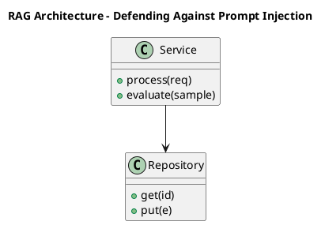

_Source diagram (plantuml); render with the appropriate tool._

**Figure 15. RAG Architecture - Defending Against Prompt Injection** (plantuml). Figure: RAG Architecture view for Prompt Engineering. This diagram illustrates the principal components and their interactions as discussed in the surrounding section.

## Deep Dive: Mechanics, Variants and Trade-offs

Having established the essentials, we now go deeper into defending against prompt injection. Mechanically, the behaviour emerges from a few interacting parts that are simpler than the whole they produce. The distinctions in this section are the ones that separate a working demo from a system that holds up under adversarial inputs, scale and the passage of time.

Consider the principal variants and how to choose between them. Each variant optimises for a different point in the design space - some for latency, some for accuracy, some for cost or operability - and the correct choice follows from explicit requirements rather than from defaults. As with most architectural decisions, the choice is rarely binary; the skill lies in quantifying the trade-offs and choosing deliberately.

In practice this is supported by a mature tooling ecosystem, including OpenAI, Anthropic, Guidance, Outlines. Tools accelerate the work but do not substitute for understanding: the same principles apply whichever implementation you select, and the ability to reason from first principles is what lets you debug when a tool behaves unexpectedly.

A frequent source of subtle bugs is the interaction with prompt management and versioning. Because prompt management and versioning concerns registries, A/B testing and rollback for production prompts, changes there can silently alter the behaviour analysed here. The remedy is contract tests at the boundary and end-to-end evaluations that exercise the interaction explicitly.

Finally, attend to edge cases and degradation. Define what the system should do under partial failure, unexpected inputs and load spikes, and make that behaviour explicit and tested rather than emergent. Graceful degradation - returning a safe, useful result when the ideal one is unavailable - is a hallmark of mature engineering.

For deeper study, the literature offers authoritative treatments such as Wei et al. — Chain-of-Thought Prompting (2022) and Wang et al. — Self-Consistency Improves Chain of Thought (2022). These primary sources reward careful reading and ground the practical guidance above in established results.

## Advanced Considerations

Having established the essentials, we now go deeper into defending against prompt injection. It pays to understand the mechanism rather than treat it as a black box, because most production incidents are explained by one of its steps misbehaving. The distinctions in this section are the ones that separate a working demo from a system that holds up under adversarial inputs, scale and the passage of time.

Consider the principal variants and how to choose between them. Each variant optimises for a different point in the design space - some for latency, some for accuracy, some for cost or operability - and the correct choice follows from explicit requirements rather than from defaults. Simplicity is a feature. The simplest design that meets the requirement should be the default, with complexity added only when measurement justifies it.

In practice this is supported by a mature tooling ecosystem, including OpenAI, Anthropic, Guidance, Outlines. Tools accelerate the work but do not substitute for understanding: the same principles apply whichever implementation you select, and the ability to reason from first principles is what lets you debug when a tool behaves unexpectedly.

A frequent source of subtle bugs is the interaction with tool use and function calling. Because tool use and function calling concerns letting models invoke functions, search and code execution within a controlled loop, changes there can silently alter the behaviour analysed here. The remedy is contract tests at the boundary and end-to-end evaluations that exercise the interaction explicitly.

Finally, attend to edge cases and degradation. Define what the system should do under partial failure, unexpected inputs and load spikes, and make that behaviour explicit and tested rather than emergent. Graceful degradation - returning a safe, useful result when the ideal one is unavailable - is a hallmark of mature engineering.

For deeper study, the literature offers authoritative treatments such as Wei et al. — Chain-of-Thought Prompting (2022) and Wang et al. — Self-Consistency Improves Chain of Thought (2022). These primary sources reward careful reading and ground the practical guidance above in established results.

## Worked Example

Consider a concrete scenario. A education organisation needs socratic tutoring with rubric-based answer evaluation. They decide to apply defending against prompt injection as part of their Prompt Engineering solution, but wisely treat it as a hypothesis to be validated rather than a foregone conclusion.

The team begins by stating the objective precisely and defining how success will be measured before writing any code. They establish a small but representative evaluation set, agree on acceptance thresholds, and only then prototype the simplest design that could work. Early measurement reveals which assumptions hold and which must be revised, saving weeks of misdirected effort and surfacing edge cases while they are still cheap to fix.

As the prototype matures into a service, the team hardens it: adding input validation, error handling, caching where it pays off, and monitoring that ties back to the original success metric. They document each significant decision in an architecture decision record so that future maintainers understand not just what was built but why.

The outcome is instructive. The system that reaches production is not the most sophisticated design the team considered, but the one whose behaviour they could measure, explain and operate. This is the recurring lesson of Prompt Engineering: durable value comes from the whole system, not from any single clever component.

## Industry Use Cases

Across industries, the ideas in this chapter recur in recognisable ways. The following vignettes show how different sectors apply them and what they have in common.

**Support.** Deterministic, schema-constrained ticket triage and routing. The common thread is that value comes not from the model alone but from the surrounding system - data quality, evaluation, integration and operations - which is precisely where most of the engineering effort belongs.

**Analytics.** Natural-language-to-SQL with validation against a catalog. The common thread is that value comes not from the model alone but from the surrounding system - data quality, evaluation, integration and operations - which is precisely where most of the engineering effort belongs.

**Operations.** Runbook automation with tool calls and confirmation gates. The common thread is that value comes not from the model alone but from the surrounding system - data quality, evaluation, integration and operations - which is precisely where most of the engineering effort belongs.

**Education.** Socratic tutoring with rubric-based answer evaluation. The common thread is that value comes not from the model alone but from the surrounding system - data quality, evaluation, integration and operations - which is precisely where most of the engineering effort belongs.

## Best Practices

The following practices consistently separate successful Prompt Engineering efforts from struggling ones. They are deliberately concrete so they can be adopted as checklist items in design and code review.

- Specify the output format explicitly and validate it programmatically.
- Keep untrusted content clearly delimited and never executed as instructions.
- Version prompts and gate changes behind an evaluation suite.
- Prefer fewer, higher-quality few-shot examples over many noisy ones.

None of these are exotic; they are the unglamorous disciplines that compound into reliability. The cost of adopting them is small compared with the cost of the incidents they prevent, and they become second nature with practice.

## Common Pitfalls

Equally instructive are the failure modes that recur in practice. Each pitfall below has a clear early warning sign and a known remedy, so treat them as a diagnostic checklist when something feels wrong:

- Treating prompts as throwaway strings with no testing or versioning.
- Overlong contexts that dilute attention and inflate cost.
- Mixing untrusted user content with trusted instructions (injection risk).
- Relying on temperature tweaks instead of structural prompt fixes.

The pattern is consistent: most failures stem from skipping measurement, conflating prototype and production standards, or deferring cross-cutting concerns such as security and cost until they become emergencies. Naming these traps in advance is the cheapest way to avoid them.

## Governance, Security and Cost Notes

No discussion of defending against prompt injection is complete without its governance, security and cost dimensions, which are too often deferred until they become emergencies. Treating them as first-class concerns from the outset is both cheaper and safer.

**Governance.** Classify the risk of this capability, document its intended and out-of-scope uses, and ensure decisions are traceable to satisfy internal policy and external regulation such as the NIST AI RMF, ISO/IEC 42001 and the EU AI Act. **Security.** Treat all external input as untrusted, validate outputs before acting on them, apply least privilege to any tools or data access, and map controls to the OWASP LLM Top 10 and MITRE ATLAS.

**Cost and sustainability.** Establish explicit budgets for compute, tokens and latency, attribute spend to owners, and revisit the economics as usage scales - a design that is affordable at pilot scale can become untenable at production volume. Building these reflexes into everyday engineering is what allows a Prompt Engineering system to be not only capable but also trustworthy and economically sound.

## Hands-On Exercises

Work through the following exercises. They are designed to move understanding from recognition to application - the level required for real engineering work - so prefer writing and building over merely reading.

1. Explain defending against prompt injection to a colleague unfamiliar with Prompt Engineering, using a concrete example from your own domain.
2. Sketch a reference architecture that incorporates defending against prompt injection and annotate where observability, security and cost controls belong.
3. Design an evaluation that would tell you whether defending against prompt injection is working in production, including the metric, the dataset and the acceptance threshold.
4. Identify two pitfalls relevant to defending against prompt injection in your environment and describe the early warning signals you would monitor.
5. Prototype the simplest implementation that demonstrates defending against prompt injection, then list exactly what would need to change to make it production-ready.

## Key Takeaways

Key takeaways from this chapter:

- Defending Against Prompt Injection is a systems concern in Prompt Engineering: data, models and operations must be co-designed.
- Measurement is non-negotiable; define success metrics and evaluation before building.
- Favour the simplest design that meets the requirement, and add complexity only when evidence demands it.
- Security, cost and observability are first-class requirements, not afterthoughts.
- Document decisions so the system remains understandable and operable as it evolves.

## Code Walkthrough

Every change to a Prompt Engineering system should pass an evaluation gate. This example shows the minimal shape: align predictions and references, compute a metric, and return a pass/fail decision for CI.

The full listing is shown below; study it line by line and reproduce it locally before moving on.

### Listing: Evaluating Defending Against Prompt Injection with a regression gate

```python
from dataclasses import dataclass


@dataclass
class EvalResult:
    metric: str
    score: float
    passed: bool


def evaluate(predictions: list[str], references: list[str],
             threshold: float = 0.8) -> EvalResult:
    """Score Defending Against Prompt Injection output against references with a simple exact-match metric.

    In practice you would combine several metrics (exact match, semantic
    similarity, LLM-as-judge) and gate releases on the aggregate.
    """
    if len(predictions) != len(references):
        raise ValueError("predictions and references must align")
    hits = sum(p.strip() == r.strip() for p, r in zip(predictions, references))
    score = hits / len(references) if references else 0.0
    return EvalResult(metric="exact_match", score=score, passed=score >= threshold)


if __name__ == "__main__":
    result = evaluate(["yes", "no"], ["yes", "yes"])
    print(f"{result.metric}={result.score:.2f} passed={result.passed}")

```

## Review Questions

1. In the context of Prompt Engineering, which statement best describes “Defending Against Prompt Injection”?
   - A. It eliminates the need for any evaluation or monitoring.
   - B. It makes the system slower but has no other effect.
   - C. It removes all security and governance requirements.
   - D. Untrusted-content isolation, instruction hierarchy and output validation.
   - **Answer: D.** Defending Against Prompt Injection: Untrusted-content isolation, instruction hierarchy and output validation.
2. Which of the following is a recommended best practice when working with Prompt Engineering?
   - A. Treating prompts as throwaway strings with no testing or versioning.
   - B. It makes the system slower but has no other effect.
   - C. It is only relevant to academic research, not production.
   - D. Keep untrusted content clearly delimited and never executed as instructions.
   - **Answer: D.** Best practice: Keep untrusted content clearly delimited and never executed as instructions.
3. Which of the following is a common pitfall to avoid in Prompt Engineering?
   - A. It is only relevant to academic research, not production.
   - B. Mixing untrusted user content with trusted instructions (injection risk).
   - C. It applies exclusively to image data.
   - D. It makes the system slower but has no other effect.
   - **Answer: B.** Pitfall to avoid: Mixing untrusted user content with trusted instructions (injection risk).
4. *(Discussion)* Explain Defending Against Prompt Injection and why it matters in a production Prompt Engineering system.
   - **Model answer:** A strong answer defines defending against prompt injection (Untrusted-content isolation, instruction hierarchy and output validation.) then connects it to architecture, evaluation, cost, security and operations for Prompt Engineering, citing concrete trade-offs and a real-world example.

---


# Chapter 11. Multi-Step and Agentic Prompting

_This chapter examines multi-step and agentic prompting within Prompt Engineering. It covers planner/executor patterns, reflection and decomposition of complex tasks, derives a reference architecture, walks through a worked example and runnable code, surveys industry use cases, and distils best practices and pitfalls, closing with exercises and review questions._

## Introduction

We define Multi-Step and Agentic Prompting as planner/executor patterns, reflection and decomposition of complex tasks. Neglecting it is one of the most common reasons Prompt Engineering initiatives stall in production. The practical implication is that design choices here ripple through latency, cost and maintainability for the lifetime of the system.

This chapter builds intuition first, then formalises the ideas, derives an architecture, and finishes with code, exercises and review questions so the material transfers directly to your own Prompt Engineering work. Read it actively: pause at each diagram, reproduce the code, and attempt the exercises before consulting the answers.

## Theory and Foundations

At its core, Multi-Step and Agentic Prompting concerns planner/executor patterns, reflection and decomposition of complex tasks. In an enterprise setting, this translates into concrete requirements: clear interfaces, measurable quality, and controls that satisfy security and governance. Mechanically, the behaviour emerges from a few interacting parts that are simpler than the whole they produce.

To place this in context, recall the broader picture: Prompt engineering is the discipline of designing inputs, context and decoding settings that steer foundation models toward reliable, useful behaviour. Within that picture, multi-step and agentic prompting is one of the load-bearing ideas - the kind that, when understood deeply, makes the rest of Prompt Engineering fall into place. Neglecting it is one of the most common reasons Prompt Engineering initiatives stall in production.

Multi-Step and Agentic Prompting cannot be understood in isolation from prompt templates and composition. Recall that prompt templates and composition concerns parameterised templates, partials and guardrail wrappers for reuse at scale. The two interact directly: decisions in one constrain the design space of the other, which is why mature teams reason about them together rather than sequentially. There is an inherent trade-off between fidelity and cost, and the correct balance depends on the use case and its tolerance for error.

Multi-Step and Agentic Prompting cannot be understood in isolation from cost-aware prompt design. Recall that cost-aware prompt design concerns compression, context pruning and caching to control token spend. The two interact directly: decisions in one constrain the design space of the other, which is why mature teams reason about them together rather than sequentially. Every added component buys capability at the price of operational surface area, and that bargain should be made consciously.

Several established patterns apply directly to multi-step and agentic prompting. The first, template + slots with explicit output schema, is widely adopted because it makes the system's behaviour predictable and observable. A complementary pattern, critique-and-revise loops for quality improvement, addresses a related concern and is often deployed alongside it. Patterns are not dogma; they are distilled experience that shortcuts the search for a sound design, and each carries assumptions worth checking against your context.

The decision of whether to adopt this should be driven by requirements, not by novelty. In a small prototype, shortcuts around multi-step and agentic prompting are invisible; in a production Prompt Engineering system serving real traffic, they surface as incidents, cost overruns or compliance gaps. As with most architectural decisions, the choice is rarely binary; the skill lies in quantifying the trade-offs and choosing deliberately. The remainder of this chapter turns these principles into an architecture, code and a checklist you can apply immediately.

## Architecture and Design

A robust architecture for Multi-Step and Agentic Prompting is layered so each part can evolve independently without destabilising the whole. Production prompting introduces a prompt management service that stores versioned templates, an assembly layer that merges instructions with retrieved context under a token budget, and an evaluation harness that scores candidate prompts against golden datasets before promotion. Telemetry links every completion back to the exact prompt version that produced it.

Concretely, the principal building blocks include anatomy of a prompt, zero-, one- and few-shot prompting, chain-of-thought and reasoning prompts, structured output and schema enforcement and retrieval-augmented prompting. Each is a replaceable component behind a stable interface, so the team can upgrade an implementation - a model, an index, a policy engine - without rewriting its neighbours. The contracts between components are where reliability is won or lost, so they are specified explicitly and tested in isolation.

The diagram accompanying this section makes the data and control flow explicit. Requests enter through a well-defined boundary where they are authenticated and validated; only then are they dispatched to the components that perform the work. This boundary is also where rate limiting, quota enforcement and audit logging live, keeping cross-cutting concerns out of the core logic and in one auditable place.

Two qualities deserve emphasis. First, observability is designed in, not bolted on: every component emits structured telemetry so that failures can be localised in minutes rather than hours. Second, the architecture is evolvable - components communicate through stable contracts so that any single part of the Prompt Engineering system can be replaced without a rewrite. Simplicity is a feature. The simplest design that meets the requirement should be the default, with complexity added only when measurement justifies it.

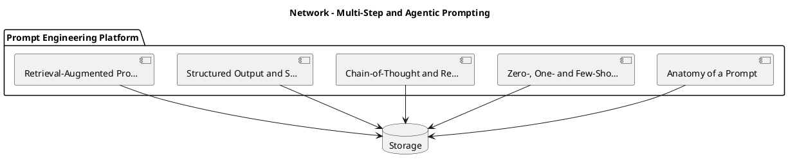

_Source diagram (plantuml); render with the appropriate tool._

**Figure 16. Network - Multi-Step and Agentic Prompting** (plantuml). Figure: Network view for Prompt Engineering. This diagram illustrates the principal components and their interactions as discussed in the surrounding section.

<div class="diagram-svg">

<svg xmlns="http://www.w3.org/2000/svg" width="840" height="460" data-tpl="matrix" data-pal="8-4" viewBox="0 0 840 460" font-family="Inter, Segoe UI, Arial, sans-serif"><defs><marker id="ar" markerWidth="9" markerHeight="9" refX="7" refY="3" orient="auto"><path d="M0,0 L7,3 L0,6 z" fill="#94a3b8"/></marker><marker id="arw" markerWidth="9" markerHeight="9" refX="7" refY="3" orient="auto"><path d="M0,0 L7,3 L0,6 z" fill="#ffffff"/></marker><filter id="sh" x="-20%" y="-20%" width="140%" height="140%"><feDropShadow dx="0" dy="2" stdDeviation="3" flood-color="#0f172a" flood-opacity="0.16"/></filter></defs><defs><linearGradient id="bnf09fd" x1="0" y1="0" x2="1" y2="0"><stop offset="0" stop-color="#84cc16"/><stop offset="1" stop-color="#0d9488"/></linearGradient></defs><rect width="840" height="460" rx="14" fill="#ffffff"/><rect x="0" y="0" width="840" height="48" rx="14" fill="url(#bnf09fd)"/><rect x="0" y="32" width="840" height="16" fill="url(#bnf09fd)"/><text x="420" y="25" text-anchor="middle" font-size="14.5" font-weight="700" fill="#ffffff" dominant-baseline="middle">Security Architecture - Multi-Step and Agentic Prompting</text><rect x="273" y="97" width="144" height="144" rx="12" fill="#84cc16"/><text x="345" y="155" text-anchor="middle" font-size="12" font-weight="600" fill="#fff" dominant-baseline="middle">Zero-, One- and</text><text x="345" y="169" text-anchor="middle" font-size="12" font-weight="600" fill="#fff" dominant-baseline="middle">Few-Shot</text><text x="345" y="183" text-anchor="middle" font-size="12" font-weight="600" fill="#fff" dominant-baseline="middle">Prompting</text><rect x="423" y="97" width="144" height="144" rx="12" fill="#0d9488"/><text x="495" y="155" text-anchor="middle" font-size="12" font-weight="600" fill="#fff" dominant-baseline="middle">Chain-of-Thought</text><text x="495" y="169" text-anchor="middle" font-size="12" font-weight="600" fill="#fff" dominant-baseline="middle">and Reasoning</text><text x="495" y="183" text-anchor="middle" font-size="12" font-weight="600" fill="#fff" dominant-baseline="middle">Prompts</text><rect x="273" y="247" width="144" height="144" rx="12" fill="#0f766e"/><text x="345" y="305" text-anchor="middle" font-size="12" font-weight="600" fill="#fff" dominant-baseline="middle">Structured</text><text x="345" y="319" text-anchor="middle" font-size="12" font-weight="600" fill="#fff" dominant-baseline="middle">Output and</text><text x="345" y="333" text-anchor="middle" font-size="12" font-weight="600" fill="#fff" dominant-baseline="middle">Schema</text><rect x="423" y="247" width="144" height="144" rx="12" fill="#14b8a6"/><text x="495" y="312" text-anchor="middle" font-size="12" font-weight="600" fill="#fff" dominant-baseline="middle">Retrieval-Augmented</text><text x="495" y="326" text-anchor="middle" font-size="12" font-weight="600" fill="#fff" dominant-baseline="middle">Prompting</text><text x="420" y="82" text-anchor="middle" font-size="10" font-weight="600" fill="#64748b" dominant-baseline="middle">High impact</text><text x="420" y="410" text-anchor="middle" font-size="10" font-weight="600" fill="#64748b" dominant-baseline="middle">Low impact</text><text x="258.0" y="244.0" text-anchor="middle" font-size="10" fill="#64748b" transform="rotate(-90 258.0 244.0)">Low effort</text><text x="582.0" y="244.0" text-anchor="middle" font-size="10" fill="#64748b" transform="rotate(90 582.0 244.0)">High effort</text><text x="28" y="446" text-anchor="start" font-size="9.5" font-weight="500" fill="#64748b" dominant-baseline="middle">Prompt Engineering  •  Security Architecture</text></svg>

</div>

**Figure 17. Security Architecture - Multi-Step and Agentic Prompting** (svg). Figure: Security Architecture view for Prompt Engineering. This diagram illustrates the principal components and their interactions as discussed in the surrounding section.

## Deep Dive: Mechanics, Variants and Trade-offs

Having established the essentials, we now go deeper into multi-step and agentic prompting. The underlying mechanism is best appreciated by tracing a single request from input to output and noting where state is created and consumed. The distinctions in this section are the ones that separate a working demo from a system that holds up under adversarial inputs, scale and the passage of time.

Consider the principal variants and how to choose between them. Each variant optimises for a different point in the design space - some for latency, some for accuracy, some for cost or operability - and the correct choice follows from explicit requirements rather than from defaults. Every added component buys capability at the price of operational surface area, and that bargain should be made consciously.

In practice this is supported by a mature tooling ecosystem, including OpenAI, Anthropic, Guidance, Outlines. Tools accelerate the work but do not substitute for understanding: the same principles apply whichever implementation you select, and the ability to reason from first principles is what lets you debug when a tool behaves unexpectedly.

A frequent source of subtle bugs is the interaction with prompt templates and composition. Because prompt templates and composition concerns parameterised templates, partials and guardrail wrappers for reuse at scale, changes there can silently alter the behaviour analysed here. The remedy is contract tests at the boundary and end-to-end evaluations that exercise the interaction explicitly.

Finally, attend to edge cases and degradation. Define what the system should do under partial failure, unexpected inputs and load spikes, and make that behaviour explicit and tested rather than emergent. Graceful degradation - returning a safe, useful result when the ideal one is unavailable - is a hallmark of mature engineering.

For deeper study, the literature offers authoritative treatments such as Wei et al. — Chain-of-Thought Prompting (2022) and Wang et al. — Self-Consistency Improves Chain of Thought (2022). These primary sources reward careful reading and ground the practical guidance above in established results.

## Advanced Considerations

Having established the essentials, we now go deeper into multi-step and agentic prompting. The underlying mechanism is best appreciated by tracing a single request from input to output and noting where state is created and consumed. The distinctions in this section are the ones that separate a working demo from a system that holds up under adversarial inputs, scale and the passage of time.

Consider the principal variants and how to choose between them. Each variant optimises for a different point in the design space - some for latency, some for accuracy, some for cost or operability - and the correct choice follows from explicit requirements rather than from defaults. Every added component buys capability at the price of operational surface area, and that bargain should be made consciously.

In practice this is supported by a mature tooling ecosystem, including OpenAI, Anthropic, Guidance, Outlines. Tools accelerate the work but do not substitute for understanding: the same principles apply whichever implementation you select, and the ability to reason from first principles is what lets you debug when a tool behaves unexpectedly.

A frequent source of subtle bugs is the interaction with structured output and schema enforcement. Because structured output and schema enforcement concerns jSON mode, function/tool calling and grammar-constrained decoding for reliable integration, changes there can silently alter the behaviour analysed here. The remedy is contract tests at the boundary and end-to-end evaluations that exercise the interaction explicitly.

Finally, attend to edge cases and degradation. Define what the system should do under partial failure, unexpected inputs and load spikes, and make that behaviour explicit and tested rather than emergent. Graceful degradation - returning a safe, useful result when the ideal one is unavailable - is a hallmark of mature engineering.

For deeper study, the literature offers authoritative treatments such as Wei et al. — Chain-of-Thought Prompting (2022) and Wang et al. — Self-Consistency Improves Chain of Thought (2022). These primary sources reward careful reading and ground the practical guidance above in established results.

## Worked Example

To ground the discussion, walk through a representative example. A analytics organisation needs natural-language-to-SQL with validation against a catalog. They decide to apply multi-step and agentic prompting as part of their Prompt Engineering solution, but wisely treat it as a hypothesis to be validated rather than a foregone conclusion.

The team begins by stating the objective precisely and defining how success will be measured before writing any code. They establish a small but representative evaluation set, agree on acceptance thresholds, and only then prototype the simplest design that could work. Early measurement reveals which assumptions hold and which must be revised, saving weeks of misdirected effort and surfacing edge cases while they are still cheap to fix.

As the prototype matures into a service, the team hardens it: adding input validation, error handling, caching where it pays off, and monitoring that ties back to the original success metric. They document each significant decision in an architecture decision record so that future maintainers understand not just what was built but why.

The outcome is instructive. The system that reaches production is not the most sophisticated design the team considered, but the one whose behaviour they could measure, explain and operate. This is the recurring lesson of Prompt Engineering: durable value comes from the whole system, not from any single clever component.

## Industry Use Cases

Across industries, the ideas in this chapter recur in recognisable ways. The following vignettes show how different sectors apply them and what they have in common.

**Support.** Deterministic, schema-constrained ticket triage and routing. The common thread is that value comes not from the model alone but from the surrounding system - data quality, evaluation, integration and operations - which is precisely where most of the engineering effort belongs.

**Analytics.** Natural-language-to-SQL with validation against a catalog. The common thread is that value comes not from the model alone but from the surrounding system - data quality, evaluation, integration and operations - which is precisely where most of the engineering effort belongs.

**Operations.** Runbook automation with tool calls and confirmation gates. The common thread is that value comes not from the model alone but from the surrounding system - data quality, evaluation, integration and operations - which is precisely where most of the engineering effort belongs.

**Education.** Socratic tutoring with rubric-based answer evaluation. The common thread is that value comes not from the model alone but from the surrounding system - data quality, evaluation, integration and operations - which is precisely where most of the engineering effort belongs.

## Best Practices

The following practices consistently separate successful Prompt Engineering efforts from struggling ones. They are deliberately concrete so they can be adopted as checklist items in design and code review.

- Specify the output format explicitly and validate it programmatically.
- Keep untrusted content clearly delimited and never executed as instructions.
- Version prompts and gate changes behind an evaluation suite.
- Prefer fewer, higher-quality few-shot examples over many noisy ones.

None of these are exotic; they are the unglamorous disciplines that compound into reliability. The cost of adopting them is small compared with the cost of the incidents they prevent, and they become second nature with practice.

## Common Pitfalls

Equally instructive are the failure modes that recur in practice. Each pitfall below has a clear early warning sign and a known remedy, so treat them as a diagnostic checklist when something feels wrong:

- Treating prompts as throwaway strings with no testing or versioning.
- Overlong contexts that dilute attention and inflate cost.
- Mixing untrusted user content with trusted instructions (injection risk).
- Relying on temperature tweaks instead of structural prompt fixes.

The pattern is consistent: most failures stem from skipping measurement, conflating prototype and production standards, or deferring cross-cutting concerns such as security and cost until they become emergencies. Naming these traps in advance is the cheapest way to avoid them.

## Governance, Security and Cost Notes

No discussion of multi-step and agentic prompting is complete without its governance, security and cost dimensions, which are too often deferred until they become emergencies. Treating them as first-class concerns from the outset is both cheaper and safer.

**Governance.** Classify the risk of this capability, document its intended and out-of-scope uses, and ensure decisions are traceable to satisfy internal policy and external regulation such as the NIST AI RMF, ISO/IEC 42001 and the EU AI Act. **Security.** Treat all external input as untrusted, validate outputs before acting on them, apply least privilege to any tools or data access, and map controls to the OWASP LLM Top 10 and MITRE ATLAS.

**Cost and sustainability.** Establish explicit budgets for compute, tokens and latency, attribute spend to owners, and revisit the economics as usage scales - a design that is affordable at pilot scale can become untenable at production volume. Building these reflexes into everyday engineering is what allows a Prompt Engineering system to be not only capable but also trustworthy and economically sound.

## Hands-On Exercises

Work through the following exercises. They are designed to move understanding from recognition to application - the level required for real engineering work - so prefer writing and building over merely reading.

1. Explain multi-step and agentic prompting to a colleague unfamiliar with Prompt Engineering, using a concrete example from your own domain.
2. Sketch a reference architecture that incorporates multi-step and agentic prompting and annotate where observability, security and cost controls belong.
3. Design an evaluation that would tell you whether multi-step and agentic prompting is working in production, including the metric, the dataset and the acceptance threshold.
4. Identify two pitfalls relevant to multi-step and agentic prompting in your environment and describe the early warning signals you would monitor.
5. Prototype the simplest implementation that demonstrates multi-step and agentic prompting, then list exactly what would need to change to make it production-ready.

## Key Takeaways

Key takeaways from this chapter:

- Multi-Step and Agentic Prompting is a systems concern in Prompt Engineering: data, models and operations must be co-designed.
- Measurement is non-negotiable; define success metrics and evaluation before building.
- Favour the simplest design that meets the requirement, and add complexity only when evidence demands it.
- Security, cost and observability are first-class requirements, not afterthoughts.
- Document decisions so the system remains understandable and operable as it evolves.

## Code Walkthrough

This listing shows a configuration-driven Multi-Step and Agentic Prompting component with retry semantics and typed interfaces — the shape we expect from production Prompt Engineering code rather than a notebook prototype.

The full listing is shown below; study it line by line and reproduce it locally before moving on.

### Listing: Implementing a Multi-Step and Agentic Prompting component

```python
from __future__ import annotations

from dataclasses import dataclass, field
from typing import Any


@dataclass(slots=True)
class AndAgenticConfig:
    """Configuration for the Multi-Step and Agentic Prompting component in a Prompt Engineering system."""

    name: str
    timeout_s: float = 30.0
    max_retries: int = 3
    options: dict[str, Any] = field(default_factory=dict)


class AndAgentic:
    """A minimal, production-shaped implementation of Multi-Step and Agentic Prompting."""

    def __init__(self, config: AndAgenticConfig) -> None:
        self._config = config
        self._calls = 0

    def run(self, payload: dict[str, Any]) -> dict[str, Any]:
        """Process a request, retrying transient failures with backoff."""
        last_error: Exception | None = None
        for attempt in range(self._config.max_retries):
            try:
                self._calls += 1
                return self._process(payload)
            except TimeoutError as exc:  # transient
                last_error = exc
                continue
        raise RuntimeError(f"AndAgentic failed after retries") from last_error

    def _process(self, payload: dict[str, Any]) -> dict[str, Any]:
        # Domain-specific logic for Multi-Step and Agentic Prompting goes here.
        return {"status": "ok", "input_keys": sorted(payload), "calls": self._calls}

```

## Review Questions

1. In the context of Prompt Engineering, which statement best describes “Multi-Step and Agentic Prompting”?
   - A. Planner/executor patterns, reflection and decomposition of complex tasks.
   - B. It eliminates the need for any evaluation or monitoring.
   - C. It guarantees deterministic output regardless of input.
   - D. It applies exclusively to image data.
   - **Answer: A.** Multi-Step and Agentic Prompting: Planner/executor patterns, reflection and decomposition of complex tasks.
2. Which of the following is a recommended best practice when working with Prompt Engineering?
   - A. Relying on temperature tweaks instead of structural prompt fixes.
   - B. Version prompts and gate changes behind an evaluation suite.
   - C. It applies exclusively to image data.
   - D. It is only relevant to academic research, not production.
   - **Answer: B.** Best practice: Version prompts and gate changes behind an evaluation suite.
3. Which of the following is a common pitfall to avoid in Prompt Engineering?
   - A. It makes the system slower but has no other effect.
   - B. Overlong contexts that dilute attention and inflate cost.
   - C. Keep untrusted content clearly delimited and never executed as instructions.
   - D. It eliminates the need for any evaluation or monitoring.
   - **Answer: B.** Pitfall to avoid: Overlong contexts that dilute attention and inflate cost.
4. *(Discussion)* Walk through how you would design Multi-Step and Agentic Prompting for an enterprise Prompt Engineering workload.
   - **Model answer:** A strong answer defines multi-step and agentic prompting (Planner/executor patterns, reflection and decomposition of complex tasks.) then connects it to architecture, evaluation, cost, security and operations for Prompt Engineering, citing concrete trade-offs and a real-world example.

---


# Chapter 12. Prompt Management and Versioning

_This chapter examines prompt management and versioning within Prompt Engineering. It covers registries, A/B testing and rollback for production prompts, derives a reference architecture, walks through a worked example and runnable code, surveys industry use cases, and distils best practices and pitfalls, closing with exercises and review questions._

## Introduction

Prompt Management and Versioning refers to registries, A/B testing and rollback for production prompts. Understanding this matters because Prompt Engineering systems succeed or fail on exactly these decisions. The practical implication is that design choices here ripple through latency, cost and maintainability for the lifetime of the system.

This chapter builds intuition first, then formalises the ideas, derives an architecture, and finishes with code, exercises and review questions so the material transfers directly to your own Prompt Engineering work. Read it actively: pause at each diagram, reproduce the code, and attempt the exercises before consulting the answers.

## Theory and Foundations

At its core, Prompt Management and Versioning concerns registries, A/B testing and rollback for production prompts. What distinguishes a production-grade approach from a prototype is the discipline of measurement: every claim is backed by an evaluation rather than intuition. The underlying mechanism is best appreciated by tracing a single request from input to output and noting where state is created and consumed.

To place this in context, recall the broader picture: Prompt engineering is the discipline of designing inputs, context and decoding settings that steer foundation models toward reliable, useful behaviour. Within that picture, prompt management and versioning is one of the load-bearing ideas - the kind that, when understood deeply, makes the rest of Prompt Engineering fall into place. Understanding this matters because Prompt Engineering systems succeed or fail on exactly these decisions.

Prompt Management and Versioning cannot be understood in isolation from zero-, one- and few-shot prompting. Recall that zero-, one- and few-shot prompting concerns how in-context examples shape behaviour and when demonstrations beat instructions. The two interact directly: decisions in one constrain the design space of the other, which is why mature teams reason about them together rather than sequentially. As with most architectural decisions, the choice is rarely binary; the skill lies in quantifying the trade-offs and choosing deliberately.

Prompt Management and Versioning cannot be understood in isolation from prompt templates and composition. Recall that prompt templates and composition concerns parameterised templates, partials and guardrail wrappers for reuse at scale. The two interact directly: decisions in one constrain the design space of the other, which is why mature teams reason about them together rather than sequentially. There is an inherent trade-off between fidelity and cost, and the correct balance depends on the use case and its tolerance for error.

Several established patterns apply directly to prompt management and versioning. The first, critique-and-revise loops for quality improvement, is widely adopted because it makes the system's behaviour predictable and observable. A complementary pattern, template + slots with explicit output schema, addresses a related concern and is often deployed alongside it. Patterns are not dogma; they are distilled experience that shortcuts the search for a sound design, and each carries assumptions worth checking against your context.

The decision of whether to adopt this should be driven by requirements, not by novelty. In a small prototype, shortcuts around prompt management and versioning are invisible; in a production Prompt Engineering system serving real traffic, they surface as incidents, cost overruns or compliance gaps. Simplicity is a feature. The simplest design that meets the requirement should be the default, with complexity added only when measurement justifies it. The remainder of this chapter turns these principles into an architecture, code and a checklist you can apply immediately.

## Architecture and Design

From an architectural standpoint, Prompt Management and Versioning sits at the intersection of data, models and operations. Production prompting introduces a prompt management service that stores versioned templates, an assembly layer that merges instructions with retrieved context under a token budget, and an evaluation harness that scores candidate prompts against golden datasets before promotion. Telemetry links every completion back to the exact prompt version that produced it.

Concretely, the principal building blocks include anatomy of a prompt, zero-, one- and few-shot prompting, chain-of-thought and reasoning prompts, structured output and schema enforcement and retrieval-augmented prompting. Each is a replaceable component behind a stable interface, so the team can upgrade an implementation - a model, an index, a policy engine - without rewriting its neighbours. The contracts between components are where reliability is won or lost, so they are specified explicitly and tested in isolation.

The diagram accompanying this section makes the data and control flow explicit. Requests enter through a well-defined boundary where they are authenticated and validated; only then are they dispatched to the components that perform the work. This boundary is also where rate limiting, quota enforcement and audit logging live, keeping cross-cutting concerns out of the core logic and in one auditable place.

Two qualities deserve emphasis. First, observability is designed in, not bolted on: every component emits structured telemetry so that failures can be localised in minutes rather than hours. Second, the architecture is evolvable - components communicate through stable contracts so that any single part of the Prompt Engineering system can be replaced without a rewrite. Simplicity is a feature. The simplest design that meets the requirement should be the default, with complexity added only when measurement justifies it.

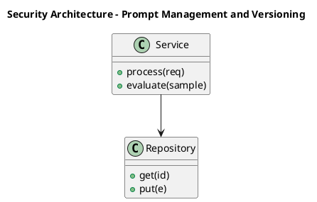

_Source diagram (plantuml); render with the appropriate tool._

**Figure 18. Security Architecture - Prompt Management and Versioning** (plantuml). Figure: Security Architecture view for Prompt Engineering. This diagram illustrates the principal components and their interactions as discussed in the surrounding section.

## Deep Dive: Mechanics, Variants and Trade-offs

Having established the essentials, we now go deeper into prompt management and versioning. It pays to understand the mechanism rather than treat it as a black box, because most production incidents are explained by one of its steps misbehaving. The distinctions in this section are the ones that separate a working demo from a system that holds up under adversarial inputs, scale and the passage of time.

Consider the principal variants and how to choose between them. Each variant optimises for a different point in the design space - some for latency, some for accuracy, some for cost or operability - and the correct choice follows from explicit requirements rather than from defaults. Every added component buys capability at the price of operational surface area, and that bargain should be made consciously.

In practice this is supported by a mature tooling ecosystem, including OpenAI, Anthropic, Guidance, Outlines. Tools accelerate the work but do not substitute for understanding: the same principles apply whichever implementation you select, and the ability to reason from first principles is what lets you debug when a tool behaves unexpectedly.

A frequent source of subtle bugs is the interaction with zero-, one- and few-shot prompting. Because zero-, one- and few-shot prompting concerns how in-context examples shape behaviour and when demonstrations beat instructions, changes there can silently alter the behaviour analysed here. The remedy is contract tests at the boundary and end-to-end evaluations that exercise the interaction explicitly.

Finally, attend to edge cases and degradation. Define what the system should do under partial failure, unexpected inputs and load spikes, and make that behaviour explicit and tested rather than emergent. Graceful degradation - returning a safe, useful result when the ideal one is unavailable - is a hallmark of mature engineering.

For deeper study, the literature offers authoritative treatments such as Wei et al. — Chain-of-Thought Prompting (2022) and Wang et al. — Self-Consistency Improves Chain of Thought (2022). These primary sources reward careful reading and ground the practical guidance above in established results.

## Advanced Considerations

Having established the essentials, we now go deeper into prompt management and versioning. Mechanically, the behaviour emerges from a few interacting parts that are simpler than the whole they produce. The distinctions in this section are the ones that separate a working demo from a system that holds up under adversarial inputs, scale and the passage of time.

Consider the principal variants and how to choose between them. Each variant optimises for a different point in the design space - some for latency, some for accuracy, some for cost or operability - and the correct choice follows from explicit requirements rather than from defaults. Simplicity is a feature. The simplest design that meets the requirement should be the default, with complexity added only when measurement justifies it.

In practice this is supported by a mature tooling ecosystem, including OpenAI, Anthropic, Guidance, Outlines. Tools accelerate the work but do not substitute for understanding: the same principles apply whichever implementation you select, and the ability to reason from first principles is what lets you debug when a tool behaves unexpectedly.

A frequent source of subtle bugs is the interaction with tool use and function calling. Because tool use and function calling concerns letting models invoke functions, search and code execution within a controlled loop, changes there can silently alter the behaviour analysed here. The remedy is contract tests at the boundary and end-to-end evaluations that exercise the interaction explicitly.

Finally, attend to edge cases and degradation. Define what the system should do under partial failure, unexpected inputs and load spikes, and make that behaviour explicit and tested rather than emergent. Graceful degradation - returning a safe, useful result when the ideal one is unavailable - is a hallmark of mature engineering.

For deeper study, the literature offers authoritative treatments such as Wei et al. — Chain-of-Thought Prompting (2022) and Wang et al. — Self-Consistency Improves Chain of Thought (2022). These primary sources reward careful reading and ground the practical guidance above in established results.

## Worked Example

To ground the discussion, walk through a representative example. A operations organisation needs runbook automation with tool calls and confirmation gates. They decide to apply prompt management and versioning as part of their Prompt Engineering solution, but wisely treat it as a hypothesis to be validated rather than a foregone conclusion.

The team begins by stating the objective precisely and defining how success will be measured before writing any code. They establish a small but representative evaluation set, agree on acceptance thresholds, and only then prototype the simplest design that could work. Early measurement reveals which assumptions hold and which must be revised, saving weeks of misdirected effort and surfacing edge cases while they are still cheap to fix.

As the prototype matures into a service, the team hardens it: adding input validation, error handling, caching where it pays off, and monitoring that ties back to the original success metric. They document each significant decision in an architecture decision record so that future maintainers understand not just what was built but why.

The outcome is instructive. The system that reaches production is not the most sophisticated design the team considered, but the one whose behaviour they could measure, explain and operate. This is the recurring lesson of Prompt Engineering: durable value comes from the whole system, not from any single clever component.

## Industry Use Cases

Across industries, the ideas in this chapter recur in recognisable ways. The following vignettes show how different sectors apply them and what they have in common.

**Support.** Deterministic, schema-constrained ticket triage and routing. The common thread is that value comes not from the model alone but from the surrounding system - data quality, evaluation, integration and operations - which is precisely where most of the engineering effort belongs.

**Analytics.** Natural-language-to-SQL with validation against a catalog. The common thread is that value comes not from the model alone but from the surrounding system - data quality, evaluation, integration and operations - which is precisely where most of the engineering effort belongs.

**Operations.** Runbook automation with tool calls and confirmation gates. The common thread is that value comes not from the model alone but from the surrounding system - data quality, evaluation, integration and operations - which is precisely where most of the engineering effort belongs.

**Education.** Socratic tutoring with rubric-based answer evaluation. The common thread is that value comes not from the model alone but from the surrounding system - data quality, evaluation, integration and operations - which is precisely where most of the engineering effort belongs.

## Best Practices

The following practices consistently separate successful Prompt Engineering efforts from struggling ones. They are deliberately concrete so they can be adopted as checklist items in design and code review.

- Specify the output format explicitly and validate it programmatically.
- Keep untrusted content clearly delimited and never executed as instructions.
- Version prompts and gate changes behind an evaluation suite.
- Prefer fewer, higher-quality few-shot examples over many noisy ones.

None of these are exotic; they are the unglamorous disciplines that compound into reliability. The cost of adopting them is small compared with the cost of the incidents they prevent, and they become second nature with practice.

## Common Pitfalls

Equally instructive are the failure modes that recur in practice. Each pitfall below has a clear early warning sign and a known remedy, so treat them as a diagnostic checklist when something feels wrong:

- Treating prompts as throwaway strings with no testing or versioning.
- Overlong contexts that dilute attention and inflate cost.
- Mixing untrusted user content with trusted instructions (injection risk).
- Relying on temperature tweaks instead of structural prompt fixes.

The pattern is consistent: most failures stem from skipping measurement, conflating prototype and production standards, or deferring cross-cutting concerns such as security and cost until they become emergencies. Naming these traps in advance is the cheapest way to avoid them.

## Governance, Security and Cost Notes

No discussion of prompt management and versioning is complete without its governance, security and cost dimensions, which are too often deferred until they become emergencies. Treating them as first-class concerns from the outset is both cheaper and safer.

**Governance.** Classify the risk of this capability, document its intended and out-of-scope uses, and ensure decisions are traceable to satisfy internal policy and external regulation such as the NIST AI RMF, ISO/IEC 42001 and the EU AI Act. **Security.** Treat all external input as untrusted, validate outputs before acting on them, apply least privilege to any tools or data access, and map controls to the OWASP LLM Top 10 and MITRE ATLAS.

**Cost and sustainability.** Establish explicit budgets for compute, tokens and latency, attribute spend to owners, and revisit the economics as usage scales - a design that is affordable at pilot scale can become untenable at production volume. Building these reflexes into everyday engineering is what allows a Prompt Engineering system to be not only capable but also trustworthy and economically sound.

## Hands-On Exercises

Work through the following exercises. They are designed to move understanding from recognition to application - the level required for real engineering work - so prefer writing and building over merely reading.

1. Explain prompt management and versioning to a colleague unfamiliar with Prompt Engineering, using a concrete example from your own domain.
2. Sketch a reference architecture that incorporates prompt management and versioning and annotate where observability, security and cost controls belong.
3. Design an evaluation that would tell you whether prompt management and versioning is working in production, including the metric, the dataset and the acceptance threshold.
4. Identify two pitfalls relevant to prompt management and versioning in your environment and describe the early warning signals you would monitor.
5. Prototype the simplest implementation that demonstrates prompt management and versioning, then list exactly what would need to change to make it production-ready.

## Key Takeaways

Key takeaways from this chapter:

- Prompt Management and Versioning is a systems concern in Prompt Engineering: data, models and operations must be co-designed.
- Measurement is non-negotiable; define success metrics and evaluation before building.
- Favour the simplest design that meets the requirement, and add complexity only when evidence demands it.
- Security, cost and observability are first-class requirements, not afterthoughts.
- Document decisions so the system remains understandable and operable as it evolves.

## Code Walkthrough

Pipelines keep Prompt Management and Versioning logic modular and testable. Each stage is a pure function, errors are captured per item, and the composition is trivial to extend or reorder.

The full listing is shown below; study it line by line and reproduce it locally before moving on.

### Listing: A composable processing pipeline for Prompt Management and Versioning

```python
from collections.abc import Iterable, Iterator
from typing import Protocol


class Stage(Protocol):
    def __call__(self, item: dict) -> dict: ...


def pipeline(stages: list[Stage]) -> Stage:
    """Compose ordered stages into a single callable for Prompt Management and Versioning."""

    def run(item: dict) -> dict:
        for stage in stages:
            item = stage(item)
        return item

    return run


def validate(item: dict) -> dict:
    if "text" not in item:
        raise ValueError("missing required field: text")
    return item


def normalise(item: dict) -> dict:
    item["text"] = item["text"].strip().lower()
    return item


def enrich(item: dict) -> dict:
    item["length"] = len(item["text"])
    return item


process = pipeline([validate, normalise, enrich])


def run_batch(items: Iterable[dict]) -> Iterator[dict]:
    for item in items:
        try:
            yield process(dict(item))
        except ValueError as exc:
            yield {"error": str(exc), "item": item}

```

## Review Questions

1. In the context of Prompt Engineering, which statement best describes “Prompt Management and Versioning”?
   - A. Registries, A/B testing and rollback for production prompts.
   - B. It is only relevant to academic research, not production.
   - C. It guarantees deterministic output regardless of input.
   - D. It removes all security and governance requirements.
   - **Answer: A.** Prompt Management and Versioning: Registries, A/B testing and rollback for production prompts.
2. Which of the following is a recommended best practice when working with Prompt Engineering?
   - A. It applies exclusively to image data.
   - B. It eliminates the need for any evaluation or monitoring.
   - C. Keep untrusted content clearly delimited and never executed as instructions.
   - D. It is only relevant to academic research, not production.
   - **Answer: C.** Best practice: Keep untrusted content clearly delimited and never executed as instructions.
3. Which of the following is a common pitfall to avoid in Prompt Engineering?
   - A. It eliminates the need for any evaluation or monitoring.
   - B. Version prompts and gate changes behind an evaluation suite.
   - C. It is only relevant to academic research, not production.
   - D. Treating prompts as throwaway strings with no testing or versioning.
   - **Answer: D.** Pitfall to avoid: Treating prompts as throwaway strings with no testing or versioning.
4. *(Discussion)* Explain Prompt Management and Versioning and why it matters in a production Prompt Engineering system.
   - **Model answer:** A strong answer defines prompt management and versioning (Registries, A/B testing and rollback for production prompts.) then connects it to architecture, evaluation, cost, security and operations for Prompt Engineering, citing concrete trade-offs and a real-world example.

---


# Chapter 13. Cost-Aware Prompt Design

_This chapter examines cost-aware prompt design within Prompt Engineering. It covers compression, context pruning and caching to control token spend, derives a reference architecture, walks through a worked example and runnable code, surveys industry use cases, and distils best practices and pitfalls, closing with exercises and review questions._

## Introduction

Formally, Cost-Aware Prompt Design addresses compression, context pruning and caching to control token spend. Getting this right early prevents expensive rework once a Prompt Engineering system reaches scale. In an enterprise setting, this translates into concrete requirements: clear interfaces, measurable quality, and controls that satisfy security and governance.

This chapter builds intuition first, then formalises the ideas, derives an architecture, and finishes with code, exercises and review questions so the material transfers directly to your own Prompt Engineering work. Read it actively: pause at each diagram, reproduce the code, and attempt the exercises before consulting the answers.

## Theory and Foundations

We define Cost-Aware Prompt Design as compression, context pruning and caching to control token spend. The practical implication is that design choices here ripple through latency, cost and maintainability for the lifetime of the system. It pays to understand the mechanism rather than treat it as a black box, because most production incidents are explained by one of its steps misbehaving.

To place this in context, recall the broader picture: Prompt engineering is the discipline of designing inputs, context and decoding settings that steer foundation models toward reliable, useful behaviour. Within that picture, cost-aware prompt design is one of the load-bearing ideas - the kind that, when understood deeply, makes the rest of Prompt Engineering fall into place. It is foundational: later capabilities in Prompt Engineering are built directly on top of it.

Cost-Aware Prompt Design cannot be understood in isolation from anatomy of a prompt. Recall that anatomy of a prompt concerns system, developer and user roles; instructions, context, examples and output specification as distinct, composable parts. The two interact directly: decisions in one constrain the design space of the other, which is why mature teams reason about them together rather than sequentially. Simplicity is a feature. The simplest design that meets the requirement should be the default, with complexity added only when measurement justifies it.

Cost-Aware Prompt Design cannot be understood in isolation from structured output and schema enforcement. Recall that structured output and schema enforcement concerns jSON mode, function/tool calling and grammar-constrained decoding for reliable integration. The two interact directly: decisions in one constrain the design space of the other, which is why mature teams reason about them together rather than sequentially. As with most architectural decisions, the choice is rarely binary; the skill lies in quantifying the trade-offs and choosing deliberately.

Several established patterns apply directly to cost-aware prompt design. The first, instruction hierarchy: system > developer > user > retrieved content, is widely adopted because it makes the system's behaviour predictable and observable. A complementary pattern, critique-and-revise loops for quality improvement, addresses a related concern and is often deployed alongside it. Patterns are not dogma; they are distilled experience that shortcuts the search for a sound design, and each carries assumptions worth checking against your context.

It is worth being explicit about when to apply this and when to reach for something simpler. In a small prototype, shortcuts around cost-aware prompt design are invisible; in a production Prompt Engineering system serving real traffic, they surface as incidents, cost overruns or compliance gaps. Latency, accuracy and cost form a tension triangle: improving one typically pressures the others, so explicit budgets are essential. The remainder of this chapter turns these principles into an architecture, code and a checklist you can apply immediately.

## Architecture and Design

A robust architecture for Cost-Aware Prompt Design is layered so each part can evolve independently without destabilising the whole. Production prompting introduces a prompt management service that stores versioned templates, an assembly layer that merges instructions with retrieved context under a token budget, and an evaluation harness that scores candidate prompts against golden datasets before promotion. Telemetry links every completion back to the exact prompt version that produced it.

Concretely, the principal building blocks include anatomy of a prompt, zero-, one- and few-shot prompting, chain-of-thought and reasoning prompts, structured output and schema enforcement and retrieval-augmented prompting. Each is a replaceable component behind a stable interface, so the team can upgrade an implementation - a model, an index, a policy engine - without rewriting its neighbours. The contracts between components are where reliability is won or lost, so they are specified explicitly and tested in isolation.

The diagram accompanying this section makes the data and control flow explicit. Requests enter through a well-defined boundary where they are authenticated and validated; only then are they dispatched to the components that perform the work. This boundary is also where rate limiting, quota enforcement and audit logging live, keeping cross-cutting concerns out of the core logic and in one auditable place.

Two qualities deserve emphasis. First, observability is designed in, not bolted on: every component emits structured telemetry so that failures can be localised in minutes rather than hours. Second, the architecture is evolvable - components communicate through stable contracts so that any single part of the Prompt Engineering system can be replaced without a rewrite. Simplicity is a feature. The simplest design that meets the requirement should be the default, with complexity added only when measurement justifies it.

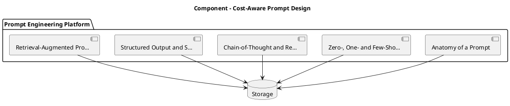

_Source diagram (plantuml); render with the appropriate tool._

**Figure 19. Component - Cost-Aware Prompt Design** (plantuml). Figure: Component view for Prompt Engineering. This diagram illustrates the principal components and their interactions as discussed in the surrounding section.

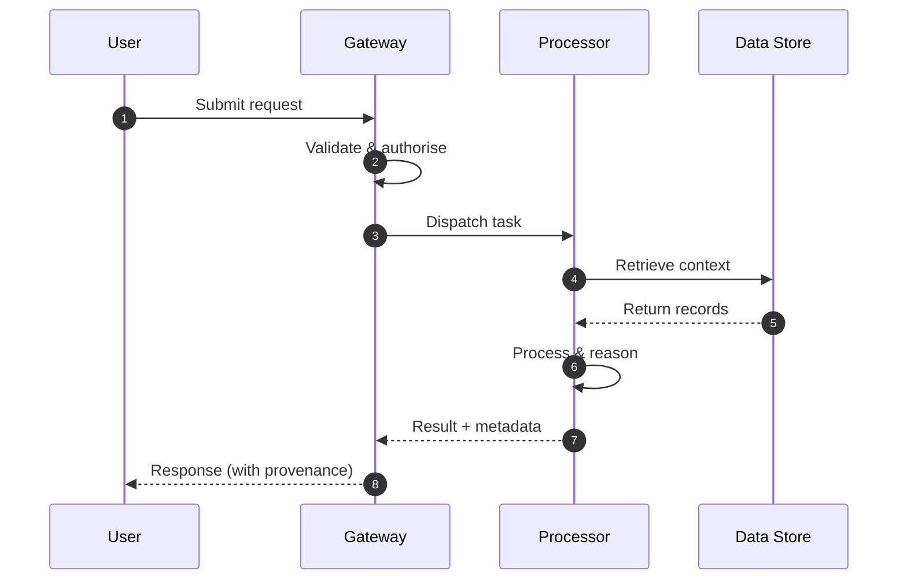

**Figure 20. Sequence - Cost-Aware Prompt Design** (mermaid). Figure: Sequence view for Prompt Engineering. This diagram illustrates the principal components and their interactions as discussed in the surrounding section.

## Deep Dive: Mechanics, Variants and Trade-offs

Having established the essentials, we now go deeper into cost-aware prompt design. It pays to understand the mechanism rather than treat it as a black box, because most production incidents are explained by one of its steps misbehaving. The distinctions in this section are the ones that separate a working demo from a system that holds up under adversarial inputs, scale and the passage of time.

Consider the principal variants and how to choose between them. Each variant optimises for a different point in the design space - some for latency, some for accuracy, some for cost or operability - and the correct choice follows from explicit requirements rather than from defaults. As with most architectural decisions, the choice is rarely binary; the skill lies in quantifying the trade-offs and choosing deliberately.

In practice this is supported by a mature tooling ecosystem, including OpenAI, Anthropic, Guidance, Outlines. Tools accelerate the work but do not substitute for understanding: the same principles apply whichever implementation you select, and the ability to reason from first principles is what lets you debug when a tool behaves unexpectedly.

A frequent source of subtle bugs is the interaction with anatomy of a prompt. Because anatomy of a prompt concerns system, developer and user roles; instructions, context, examples and output specification as distinct, composable parts, changes there can silently alter the behaviour analysed here. The remedy is contract tests at the boundary and end-to-end evaluations that exercise the interaction explicitly.

Finally, attend to edge cases and degradation. Define what the system should do under partial failure, unexpected inputs and load spikes, and make that behaviour explicit and tested rather than emergent. Graceful degradation - returning a safe, useful result when the ideal one is unavailable - is a hallmark of mature engineering.

For deeper study, the literature offers authoritative treatments such as Wei et al. — Chain-of-Thought Prompting (2022) and Wang et al. — Self-Consistency Improves Chain of Thought (2022). These primary sources reward careful reading and ground the practical guidance above in established results.

## Advanced Considerations

Having established the essentials, we now go deeper into cost-aware prompt design. It pays to understand the mechanism rather than treat it as a black box, because most production incidents are explained by one of its steps misbehaving. The distinctions in this section are the ones that separate a working demo from a system that holds up under adversarial inputs, scale and the passage of time.

Consider the principal variants and how to choose between them. Each variant optimises for a different point in the design space - some for latency, some for accuracy, some for cost or operability - and the correct choice follows from explicit requirements rather than from defaults. Simplicity is a feature. The simplest design that meets the requirement should be the default, with complexity added only when measurement justifies it.

In practice this is supported by a mature tooling ecosystem, including OpenAI, Anthropic, Guidance, Outlines. Tools accelerate the work but do not substitute for understanding: the same principles apply whichever implementation you select, and the ability to reason from first principles is what lets you debug when a tool behaves unexpectedly.

A frequent source of subtle bugs is the interaction with chain-of-thought and reasoning prompts. Because chain-of-thought and reasoning prompts concerns eliciting intermediate reasoning, self-consistency sampling and the cost/quality trade-offs of deliberate reasoning, changes there can silently alter the behaviour analysed here. The remedy is contract tests at the boundary and end-to-end evaluations that exercise the interaction explicitly.

Finally, attend to edge cases and degradation. Define what the system should do under partial failure, unexpected inputs and load spikes, and make that behaviour explicit and tested rather than emergent. Graceful degradation - returning a safe, useful result when the ideal one is unavailable - is a hallmark of mature engineering.

For deeper study, the literature offers authoritative treatments such as Wei et al. — Chain-of-Thought Prompting (2022) and Wang et al. — Self-Consistency Improves Chain of Thought (2022). These primary sources reward careful reading and ground the practical guidance above in established results.

## Worked Example

A worked example clarifies how these ideas behave in practice. A support organisation needs deterministic, schema-constrained ticket triage and routing. They decide to apply cost-aware prompt design as part of their Prompt Engineering solution, but wisely treat it as a hypothesis to be validated rather than a foregone conclusion.

The team begins by stating the objective precisely and defining how success will be measured before writing any code. They establish a small but representative evaluation set, agree on acceptance thresholds, and only then prototype the simplest design that could work. Early measurement reveals which assumptions hold and which must be revised, saving weeks of misdirected effort and surfacing edge cases while they are still cheap to fix.

As the prototype matures into a service, the team hardens it: adding input validation, error handling, caching where it pays off, and monitoring that ties back to the original success metric. They document each significant decision in an architecture decision record so that future maintainers understand not just what was built but why.

The outcome is instructive. The system that reaches production is not the most sophisticated design the team considered, but the one whose behaviour they could measure, explain and operate. This is the recurring lesson of Prompt Engineering: durable value comes from the whole system, not from any single clever component.

## Industry Use Cases

Across industries, the ideas in this chapter recur in recognisable ways. The following vignettes show how different sectors apply them and what they have in common.

**Support.** Deterministic, schema-constrained ticket triage and routing. The common thread is that value comes not from the model alone but from the surrounding system - data quality, evaluation, integration and operations - which is precisely where most of the engineering effort belongs.

**Analytics.** Natural-language-to-SQL with validation against a catalog. The common thread is that value comes not from the model alone but from the surrounding system - data quality, evaluation, integration and operations - which is precisely where most of the engineering effort belongs.

**Operations.** Runbook automation with tool calls and confirmation gates. The common thread is that value comes not from the model alone but from the surrounding system - data quality, evaluation, integration and operations - which is precisely where most of the engineering effort belongs.

**Education.** Socratic tutoring with rubric-based answer evaluation. The common thread is that value comes not from the model alone but from the surrounding system - data quality, evaluation, integration and operations - which is precisely where most of the engineering effort belongs.

## Best Practices

The following practices consistently separate successful Prompt Engineering efforts from struggling ones. They are deliberately concrete so they can be adopted as checklist items in design and code review.

- Specify the output format explicitly and validate it programmatically.
- Keep untrusted content clearly delimited and never executed as instructions.
- Version prompts and gate changes behind an evaluation suite.
- Prefer fewer, higher-quality few-shot examples over many noisy ones.

None of these are exotic; they are the unglamorous disciplines that compound into reliability. The cost of adopting them is small compared with the cost of the incidents they prevent, and they become second nature with practice.

## Common Pitfalls

Equally instructive are the failure modes that recur in practice. Each pitfall below has a clear early warning sign and a known remedy, so treat them as a diagnostic checklist when something feels wrong:

- Treating prompts as throwaway strings with no testing or versioning.
- Overlong contexts that dilute attention and inflate cost.
- Mixing untrusted user content with trusted instructions (injection risk).
- Relying on temperature tweaks instead of structural prompt fixes.

The pattern is consistent: most failures stem from skipping measurement, conflating prototype and production standards, or deferring cross-cutting concerns such as security and cost until they become emergencies. Naming these traps in advance is the cheapest way to avoid them.

## Governance, Security and Cost Notes

No discussion of cost-aware prompt design is complete without its governance, security and cost dimensions, which are too often deferred until they become emergencies. Treating them as first-class concerns from the outset is both cheaper and safer.

**Governance.** Classify the risk of this capability, document its intended and out-of-scope uses, and ensure decisions are traceable to satisfy internal policy and external regulation such as the NIST AI RMF, ISO/IEC 42001 and the EU AI Act. **Security.** Treat all external input as untrusted, validate outputs before acting on them, apply least privilege to any tools or data access, and map controls to the OWASP LLM Top 10 and MITRE ATLAS.

**Cost and sustainability.** Establish explicit budgets for compute, tokens and latency, attribute spend to owners, and revisit the economics as usage scales - a design that is affordable at pilot scale can become untenable at production volume. Building these reflexes into everyday engineering is what allows a Prompt Engineering system to be not only capable but also trustworthy and economically sound.

## Hands-On Exercises

Work through the following exercises. They are designed to move understanding from recognition to application - the level required for real engineering work - so prefer writing and building over merely reading.

1. Explain cost-aware prompt design to a colleague unfamiliar with Prompt Engineering, using a concrete example from your own domain.
2. Sketch a reference architecture that incorporates cost-aware prompt design and annotate where observability, security and cost controls belong.
3. Design an evaluation that would tell you whether cost-aware prompt design is working in production, including the metric, the dataset and the acceptance threshold.
4. Identify two pitfalls relevant to cost-aware prompt design in your environment and describe the early warning signals you would monitor.
5. Prototype the simplest implementation that demonstrates cost-aware prompt design, then list exactly what would need to change to make it production-ready.

## Key Takeaways

Key takeaways from this chapter:

- Cost-Aware Prompt Design is a systems concern in Prompt Engineering: data, models and operations must be co-designed.
- Measurement is non-negotiable; define success metrics and evaluation before building.
- Favour the simplest design that meets the requirement, and add complexity only when evidence demands it.
- Security, cost and observability are first-class requirements, not afterthoughts.
- Document decisions so the system remains understandable and operable as it evolves.

## Code Walkthrough

Pipelines keep Cost-Aware Prompt Design logic modular and testable. Each stage is a pure function, errors are captured per item, and the composition is trivial to extend or reorder.

The full listing is shown below; study it line by line and reproduce it locally before moving on.

### Listing: A composable processing pipeline for Cost-Aware Prompt Design

```python
from collections.abc import Iterable, Iterator
from typing import Protocol


class Stage(Protocol):
    def __call__(self, item: dict) -> dict: ...


def pipeline(stages: list[Stage]) -> Stage:
    """Compose ordered stages into a single callable for Cost-Aware Prompt Design."""

    def run(item: dict) -> dict:
        for stage in stages:
            item = stage(item)
        return item

    return run


def validate(item: dict) -> dict:
    if "text" not in item:
        raise ValueError("missing required field: text")
    return item


def normalise(item: dict) -> dict:
    item["text"] = item["text"].strip().lower()
    return item


def enrich(item: dict) -> dict:
    item["length"] = len(item["text"])
    return item


process = pipeline([validate, normalise, enrich])


def run_batch(items: Iterable[dict]) -> Iterator[dict]:
    for item in items:
        try:
            yield process(dict(item))
        except ValueError as exc:
            yield {"error": str(exc), "item": item}

```

## Review Questions

1. In the context of Prompt Engineering, which statement best describes “Cost-Aware Prompt Design”?
   - A. It is only relevant to academic research, not production.
   - B. It makes the system slower but has no other effect.
   - C. Compression, context pruning and caching to control token spend.
   - D. It eliminates the need for any evaluation or monitoring.
   - **Answer: C.** Cost-Aware Prompt Design: Compression, context pruning and caching to control token spend.
2. Which of the following is a recommended best practice when working with Prompt Engineering?
   - A. It makes the system slower but has no other effect.
   - B. It removes all security and governance requirements.
   - C. Treating prompts as throwaway strings with no testing or versioning.
   - D. Keep untrusted content clearly delimited and never executed as instructions.
   - **Answer: D.** Best practice: Keep untrusted content clearly delimited and never executed as instructions.
3. Which of the following is a common pitfall to avoid in Prompt Engineering?
   - A. It guarantees deterministic output regardless of input.
   - B. It removes all security and governance requirements.
   - C. Overlong contexts that dilute attention and inflate cost.
   - D. It makes the system slower but has no other effect.
   - **Answer: C.** Pitfall to avoid: Overlong contexts that dilute attention and inflate cost.
4. *(Discussion)* Explain Cost-Aware Prompt Design and why it matters in a production Prompt Engineering system.
   - **Model answer:** A strong answer defines cost-aware prompt design (Compression, context pruning and caching to control token spend.) then connects it to architecture, evaluation, cost, security and operations for Prompt Engineering, citing concrete trade-offs and a real-world example.

---


# Chapter 14. Patterns, Anti-Patterns and a Style Guide

_This chapter examines patterns, anti-patterns and a style guide within Prompt Engineering. It covers a reusable library of prompt patterns and the failure modes to avoid, derives a reference architecture, walks through a worked example and runnable code, surveys industry use cases, and distils best practices and pitfalls, closing with exercises and review questions._

## Introduction

In practical terms, Patterns, Anti-Patterns and a Style Guide is best understood as a reusable library of prompt patterns and the failure modes to avoid. Getting this right early prevents expensive rework once a Prompt Engineering system reaches scale. What distinguishes a production-grade approach from a prototype is the discipline of measurement: every claim is backed by an evaluation rather than intuition.

This chapter builds intuition first, then formalises the ideas, derives an architecture, and finishes with code, exercises and review questions so the material transfers directly to your own Prompt Engineering work. Read it actively: pause at each diagram, reproduce the code, and attempt the exercises before consulting the answers.

## Theory and Foundations

In practical terms, Patterns, Anti-Patterns and a Style Guide is best understood as a reusable library of prompt patterns and the failure modes to avoid. What distinguishes a production-grade approach from a prototype is the discipline of measurement: every claim is backed by an evaluation rather than intuition. The underlying mechanism is best appreciated by tracing a single request from input to output and noting where state is created and consumed.

To place this in context, recall the broader picture: Prompt engineering is the discipline of designing inputs, context and decoding settings that steer foundation models toward reliable, useful behaviour. Within that picture, patterns, anti-patterns and a style guide is one of the load-bearing ideas - the kind that, when understood deeply, makes the rest of Prompt Engineering fall into place. Understanding this matters because Prompt Engineering systems succeed or fail on exactly these decisions.

Patterns, Anti-Patterns and a Style Guide cannot be understood in isolation from prompt templates and composition. Recall that prompt templates and composition concerns parameterised templates, partials and guardrail wrappers for reuse at scale. The two interact directly: decisions in one constrain the design space of the other, which is why mature teams reason about them together rather than sequentially. Every added component buys capability at the price of operational surface area, and that bargain should be made consciously.

Patterns, Anti-Patterns and a Style Guide cannot be understood in isolation from prompt evaluation and regression testing. Recall that prompt evaluation and regression testing concerns golden datasets, LLM-as-judge, rubric scoring and CI gates for prompt changes. The two interact directly: decisions in one constrain the design space of the other, which is why mature teams reason about them together rather than sequentially. Simplicity is a feature. The simplest design that meets the requirement should be the default, with complexity added only when measurement justifies it.

Several established patterns apply directly to patterns, anti-patterns and a style guide. The first, instruction hierarchy: system > developer > user > retrieved content, is widely adopted because it makes the system's behaviour predictable and observable. A complementary pattern, critique-and-revise loops for quality improvement, addresses a related concern and is often deployed alongside it. Patterns are not dogma; they are distilled experience that shortcuts the search for a sound design, and each carries assumptions worth checking against your context.

Knowing when not to use a technique is as valuable as knowing how to use it. In a small prototype, shortcuts around patterns, anti-patterns and a style guide are invisible; in a production Prompt Engineering system serving real traffic, they surface as incidents, cost overruns or compliance gaps. Simplicity is a feature. The simplest design that meets the requirement should be the default, with complexity added only when measurement justifies it. The remainder of this chapter turns these principles into an architecture, code and a checklist you can apply immediately.

## Architecture and Design

A robust architecture for Patterns, Anti-Patterns and a Style Guide is layered so each part can evolve independently without destabilising the whole. Production prompting introduces a prompt management service that stores versioned templates, an assembly layer that merges instructions with retrieved context under a token budget, and an evaluation harness that scores candidate prompts against golden datasets before promotion. Telemetry links every completion back to the exact prompt version that produced it.

Concretely, the principal building blocks include anatomy of a prompt, zero-, one- and few-shot prompting, chain-of-thought and reasoning prompts, structured output and schema enforcement and retrieval-augmented prompting. Each is a replaceable component behind a stable interface, so the team can upgrade an implementation - a model, an index, a policy engine - without rewriting its neighbours. The contracts between components are where reliability is won or lost, so they are specified explicitly and tested in isolation.

The diagram accompanying this section makes the data and control flow explicit. Requests enter through a well-defined boundary where they are authenticated and validated; only then are they dispatched to the components that perform the work. This boundary is also where rate limiting, quota enforcement and audit logging live, keeping cross-cutting concerns out of the core logic and in one auditable place.

Two qualities deserve emphasis. First, observability is designed in, not bolted on: every component emits structured telemetry so that failures can be localised in minutes rather than hours. Second, the architecture is evolvable - components communicate through stable contracts so that any single part of the Prompt Engineering system can be replaced without a rewrite. Simplicity is a feature. The simplest design that meets the requirement should be the default, with complexity added only when measurement justifies it.

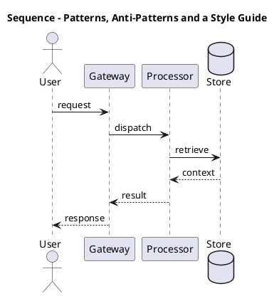

_Source diagram (plantuml); render with the appropriate tool._

**Figure 21. Sequence - Patterns, Anti-Patterns and a Style Guide** (plantuml). Figure: Sequence view for Prompt Engineering. This diagram illustrates the principal components and their interactions as discussed in the surrounding section.

## Deep Dive: Mechanics, Variants and Trade-offs

Having established the essentials, we now go deeper into patterns, anti-patterns and a style guide. The underlying mechanism is best appreciated by tracing a single request from input to output and noting where state is created and consumed. The distinctions in this section are the ones that separate a working demo from a system that holds up under adversarial inputs, scale and the passage of time.

Consider the principal variants and how to choose between them. Each variant optimises for a different point in the design space - some for latency, some for accuracy, some for cost or operability - and the correct choice follows from explicit requirements rather than from defaults. Latency, accuracy and cost form a tension triangle: improving one typically pressures the others, so explicit budgets are essential.

In practice this is supported by a mature tooling ecosystem, including OpenAI, Anthropic, Guidance, Outlines. Tools accelerate the work but do not substitute for understanding: the same principles apply whichever implementation you select, and the ability to reason from first principles is what lets you debug when a tool behaves unexpectedly.

A frequent source of subtle bugs is the interaction with prompt templates and composition. Because prompt templates and composition concerns parameterised templates, partials and guardrail wrappers for reuse at scale, changes there can silently alter the behaviour analysed here. The remedy is contract tests at the boundary and end-to-end evaluations that exercise the interaction explicitly.

Finally, attend to edge cases and degradation. Define what the system should do under partial failure, unexpected inputs and load spikes, and make that behaviour explicit and tested rather than emergent. Graceful degradation - returning a safe, useful result when the ideal one is unavailable - is a hallmark of mature engineering.

For deeper study, the literature offers authoritative treatments such as Wei et al. — Chain-of-Thought Prompting (2022) and Wang et al. — Self-Consistency Improves Chain of Thought (2022). These primary sources reward careful reading and ground the practical guidance above in established results.

## Advanced Considerations

Having established the essentials, we now go deeper into patterns, anti-patterns and a style guide. Mechanically, the behaviour emerges from a few interacting parts that are simpler than the whole they produce. The distinctions in this section are the ones that separate a working demo from a system that holds up under adversarial inputs, scale and the passage of time.

Consider the principal variants and how to choose between them. Each variant optimises for a different point in the design space - some for latency, some for accuracy, some for cost or operability - and the correct choice follows from explicit requirements rather than from defaults. As with most architectural decisions, the choice is rarely binary; the skill lies in quantifying the trade-offs and choosing deliberately.

In practice this is supported by a mature tooling ecosystem, including OpenAI, Anthropic, Guidance, Outlines. Tools accelerate the work but do not substitute for understanding: the same principles apply whichever implementation you select, and the ability to reason from first principles is what lets you debug when a tool behaves unexpectedly.

A frequent source of subtle bugs is the interaction with retrieval-augmented prompting. Because retrieval-augmented prompting concerns injecting grounded context, citation discipline and context-window budgeting, changes there can silently alter the behaviour analysed here. The remedy is contract tests at the boundary and end-to-end evaluations that exercise the interaction explicitly.

Finally, attend to edge cases and degradation. Define what the system should do under partial failure, unexpected inputs and load spikes, and make that behaviour explicit and tested rather than emergent. Graceful degradation - returning a safe, useful result when the ideal one is unavailable - is a hallmark of mature engineering.

For deeper study, the literature offers authoritative treatments such as Wei et al. — Chain-of-Thought Prompting (2022) and Wang et al. — Self-Consistency Improves Chain of Thought (2022). These primary sources reward careful reading and ground the practical guidance above in established results.

## Worked Example

To ground the discussion, walk through a representative example. A analytics organisation needs natural-language-to-SQL with validation against a catalog. They decide to apply patterns, anti-patterns and a style guide as part of their Prompt Engineering solution, but wisely treat it as a hypothesis to be validated rather than a foregone conclusion.

The team begins by stating the objective precisely and defining how success will be measured before writing any code. They establish a small but representative evaluation set, agree on acceptance thresholds, and only then prototype the simplest design that could work. Early measurement reveals which assumptions hold and which must be revised, saving weeks of misdirected effort and surfacing edge cases while they are still cheap to fix.

As the prototype matures into a service, the team hardens it: adding input validation, error handling, caching where it pays off, and monitoring that ties back to the original success metric. They document each significant decision in an architecture decision record so that future maintainers understand not just what was built but why.

The outcome is instructive. The system that reaches production is not the most sophisticated design the team considered, but the one whose behaviour they could measure, explain and operate. This is the recurring lesson of Prompt Engineering: durable value comes from the whole system, not from any single clever component.

## Industry Use Cases

Across industries, the ideas in this chapter recur in recognisable ways. The following vignettes show how different sectors apply them and what they have in common.

**Support.** Deterministic, schema-constrained ticket triage and routing. The common thread is that value comes not from the model alone but from the surrounding system - data quality, evaluation, integration and operations - which is precisely where most of the engineering effort belongs.

**Analytics.** Natural-language-to-SQL with validation against a catalog. The common thread is that value comes not from the model alone but from the surrounding system - data quality, evaluation, integration and operations - which is precisely where most of the engineering effort belongs.

**Operations.** Runbook automation with tool calls and confirmation gates. The common thread is that value comes not from the model alone but from the surrounding system - data quality, evaluation, integration and operations - which is precisely where most of the engineering effort belongs.

**Education.** Socratic tutoring with rubric-based answer evaluation. The common thread is that value comes not from the model alone but from the surrounding system - data quality, evaluation, integration and operations - which is precisely where most of the engineering effort belongs.

## Best Practices

The following practices consistently separate successful Prompt Engineering efforts from struggling ones. They are deliberately concrete so they can be adopted as checklist items in design and code review.

- Specify the output format explicitly and validate it programmatically.
- Keep untrusted content clearly delimited and never executed as instructions.
- Version prompts and gate changes behind an evaluation suite.
- Prefer fewer, higher-quality few-shot examples over many noisy ones.

None of these are exotic; they are the unglamorous disciplines that compound into reliability. The cost of adopting them is small compared with the cost of the incidents they prevent, and they become second nature with practice.

## Common Pitfalls

Equally instructive are the failure modes that recur in practice. Each pitfall below has a clear early warning sign and a known remedy, so treat them as a diagnostic checklist when something feels wrong:

- Treating prompts as throwaway strings with no testing or versioning.
- Overlong contexts that dilute attention and inflate cost.
- Mixing untrusted user content with trusted instructions (injection risk).
- Relying on temperature tweaks instead of structural prompt fixes.

The pattern is consistent: most failures stem from skipping measurement, conflating prototype and production standards, or deferring cross-cutting concerns such as security and cost until they become emergencies. Naming these traps in advance is the cheapest way to avoid them.

## Governance, Security and Cost Notes

No discussion of patterns, anti-patterns and a style guide is complete without its governance, security and cost dimensions, which are too often deferred until they become emergencies. Treating them as first-class concerns from the outset is both cheaper and safer.

**Governance.** Classify the risk of this capability, document its intended and out-of-scope uses, and ensure decisions are traceable to satisfy internal policy and external regulation such as the NIST AI RMF, ISO/IEC 42001 and the EU AI Act. **Security.** Treat all external input as untrusted, validate outputs before acting on them, apply least privilege to any tools or data access, and map controls to the OWASP LLM Top 10 and MITRE ATLAS.

**Cost and sustainability.** Establish explicit budgets for compute, tokens and latency, attribute spend to owners, and revisit the economics as usage scales - a design that is affordable at pilot scale can become untenable at production volume. Building these reflexes into everyday engineering is what allows a Prompt Engineering system to be not only capable but also trustworthy and economically sound.

## Hands-On Exercises

Work through the following exercises. They are designed to move understanding from recognition to application - the level required for real engineering work - so prefer writing and building over merely reading.

1. Explain patterns, anti-patterns and a style guide to a colleague unfamiliar with Prompt Engineering, using a concrete example from your own domain.
2. Sketch a reference architecture that incorporates patterns, anti-patterns and a style guide and annotate where observability, security and cost controls belong.
3. Design an evaluation that would tell you whether patterns, anti-patterns and a style guide is working in production, including the metric, the dataset and the acceptance threshold.
4. Identify two pitfalls relevant to patterns, anti-patterns and a style guide in your environment and describe the early warning signals you would monitor.
5. Prototype the simplest implementation that demonstrates patterns, anti-patterns and a style guide, then list exactly what would need to change to make it production-ready.

## Key Takeaways

Key takeaways from this chapter:

- Patterns, Anti-Patterns and a Style Guide is a systems concern in Prompt Engineering: data, models and operations must be co-designed.
- Measurement is non-negotiable; define success metrics and evaluation before building.
- Favour the simplest design that meets the requirement, and add complexity only when evidence demands it.
- Security, cost and observability are first-class requirements, not afterthoughts.
- Document decisions so the system remains understandable and operable as it evolves.

## Code Walkthrough

Every change to a Prompt Engineering system should pass an evaluation gate. This example shows the minimal shape: align predictions and references, compute a metric, and return a pass/fail decision for CI.

The full listing is shown below; study it line by line and reproduce it locally before moving on.

### Listing: Evaluating Patterns, Anti-Patterns and a Style Guide with a regression gate

```python
from dataclasses import dataclass


@dataclass
class EvalResult:
    metric: str
    score: float
    passed: bool


def evaluate(predictions: list[str], references: list[str],
             threshold: float = 0.8) -> EvalResult:
    """Score Patterns, Anti-Patterns and a Style Guide output against references with a simple exact-match metric.

    In practice you would combine several metrics (exact match, semantic
    similarity, LLM-as-judge) and gate releases on the aggregate.
    """
    if len(predictions) != len(references):
        raise ValueError("predictions and references must align")
    hits = sum(p.strip() == r.strip() for p, r in zip(predictions, references))
    score = hits / len(references) if references else 0.0
    return EvalResult(metric="exact_match", score=score, passed=score >= threshold)


if __name__ == "__main__":
    result = evaluate(["yes", "no"], ["yes", "yes"])
    print(f"{result.metric}={result.score:.2f} passed={result.passed}")

```

## Review Questions

1. In the context of Prompt Engineering, which statement best describes “Patterns, Anti-Patterns and a Style Guide”?
   - A. It removes all security and governance requirements.
   - B. It eliminates the need for any evaluation or monitoring.
   - C. It guarantees deterministic output regardless of input.
   - D. A reusable library of prompt patterns and the failure modes to avoid.
   - **Answer: D.** Patterns, Anti-Patterns and a Style Guide: A reusable library of prompt patterns and the failure modes to avoid.
2. Which of the following is a recommended best practice when working with Prompt Engineering?
   - A. It applies exclusively to image data.
   - B. Version prompts and gate changes behind an evaluation suite.
   - C. It eliminates the need for any evaluation or monitoring.
   - D. Relying on temperature tweaks instead of structural prompt fixes.
   - **Answer: B.** Best practice: Version prompts and gate changes behind an evaluation suite.
3. Which of the following is a common pitfall to avoid in Prompt Engineering?
   - A. It guarantees deterministic output regardless of input.
   - B. It removes all security and governance requirements.
   - C. Treating prompts as throwaway strings with no testing or versioning.
   - D. Version prompts and gate changes behind an evaluation suite.
   - **Answer: C.** Pitfall to avoid: Treating prompts as throwaway strings with no testing or versioning.
4. *(Discussion)* Describe a failure mode of Patterns, Anti-Patterns and a Style Guide and how you would mitigate it.
   - **Model answer:** A strong answer defines patterns, anti-patterns and a style guide (A reusable library of prompt patterns and the failure modes to avoid.) then connects it to architecture, evaluation, cost, security and operations for Prompt Engineering, citing concrete trade-offs and a real-world example.

---


# Chapter 15. Putting It Together: A Reference Implementation

_This chapter examines putting it together: a reference implementation within Prompt Engineering. It covers an end-to-end reference implementation that integrates the components of a Prompt Engineering system into a cohesive, working whole, derives a reference architecture, walks through a worked example and runnable code, surveys industry use cases, and distils best practices and pitfalls, closing with exercises and review questions._

## Introduction

We define Putting It Together: A Reference Implementation as an end-to-end reference implementation that integrates the components of a Prompt Engineering system into a cohesive, working whole. This concept recurs throughout the Prompt Engineering lifecycle, from design to operations. The right abstraction here pays compounding dividends, because downstream components depend on its guarantees.

This chapter builds intuition first, then formalises the ideas, derives an architecture, and finishes with code, exercises and review questions so the material transfers directly to your own Prompt Engineering work. Read it actively: pause at each diagram, reproduce the code, and attempt the exercises before consulting the answers.

## Theory and Foundations

We define Putting It Together: A Reference Implementation as an end-to-end reference implementation that integrates the components of a Prompt Engineering system into a cohesive, working whole. The right abstraction here pays compounding dividends, because downstream components depend on its guarantees. Mechanically, the behaviour emerges from a few interacting parts that are simpler than the whole they produce.

To place this in context, recall the broader picture: Prompt engineering is the discipline of designing inputs, context and decoding settings that steer foundation models toward reliable, useful behaviour. Within that picture, putting it together: a reference implementation is one of the load-bearing ideas - the kind that, when understood deeply, makes the rest of Prompt Engineering fall into place. Neglecting it is one of the most common reasons Prompt Engineering initiatives stall in production.

Putting It Together: A Reference Implementation cannot be understood in isolation from multi-step and agentic prompting. Recall that multi-step and agentic prompting concerns planner/executor patterns, reflection and decomposition of complex tasks. The two interact directly: decisions in one constrain the design space of the other, which is why mature teams reason about them together rather than sequentially. Simplicity is a feature. The simplest design that meets the requirement should be the default, with complexity added only when measurement justifies it.

Putting It Together: A Reference Implementation cannot be understood in isolation from retrieval-augmented prompting. Recall that retrieval-augmented prompting concerns injecting grounded context, citation discipline and context-window budgeting. The two interact directly: decisions in one constrain the design space of the other, which is why mature teams reason about them together rather than sequentially. As with most architectural decisions, the choice is rarely binary; the skill lies in quantifying the trade-offs and choosing deliberately.

Several established patterns apply directly to putting it together: a reference implementation. The first, critique-and-revise loops for quality improvement, is widely adopted because it makes the system's behaviour predictable and observable. A complementary pattern, self-consistency voting for high-stakes reasoning, addresses a related concern and is often deployed alongside it. Patterns are not dogma; they are distilled experience that shortcuts the search for a sound design, and each carries assumptions worth checking against your context.

Knowing when not to use a technique is as valuable as knowing how to use it. In a small prototype, shortcuts around putting it together: a reference implementation are invisible; in a production Prompt Engineering system serving real traffic, they surface as incidents, cost overruns or compliance gaps. Latency, accuracy and cost form a tension triangle: improving one typically pressures the others, so explicit budgets are essential. The remainder of this chapter turns these principles into an architecture, code and a checklist you can apply immediately.

## Architecture and Design

A robust architecture for Putting It Together: A Reference Implementation is layered so each part can evolve independently without destabilising the whole. Production prompting introduces a prompt management service that stores versioned templates, an assembly layer that merges instructions with retrieved context under a token budget, and an evaluation harness that scores candidate prompts against golden datasets before promotion. Telemetry links every completion back to the exact prompt version that produced it.

Concretely, the principal building blocks include anatomy of a prompt, zero-, one- and few-shot prompting, chain-of-thought and reasoning prompts, structured output and schema enforcement and retrieval-augmented prompting. Each is a replaceable component behind a stable interface, so the team can upgrade an implementation - a model, an index, a policy engine - without rewriting its neighbours. The contracts between components are where reliability is won or lost, so they are specified explicitly and tested in isolation.

The diagram accompanying this section makes the data and control flow explicit. Requests enter through a well-defined boundary where they are authenticated and validated; only then are they dispatched to the components that perform the work. This boundary is also where rate limiting, quota enforcement and audit logging live, keeping cross-cutting concerns out of the core logic and in one auditable place.

Two qualities deserve emphasis. First, observability is designed in, not bolted on: every component emits structured telemetry so that failures can be localised in minutes rather than hours. Second, the architecture is evolvable - components communicate through stable contracts so that any single part of the Prompt Engineering system can be replaced without a rewrite. As with most architectural decisions, the choice is rarely binary; the skill lies in quantifying the trade-offs and choosing deliberately.

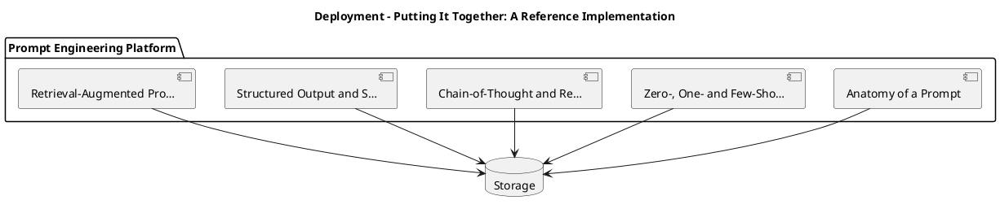

_Source diagram (plantuml); render with the appropriate tool._

**Figure 22. Deployment - Putting It Together: A Reference Implementation** (plantuml). Figure: Deployment view for Prompt Engineering. This diagram illustrates the principal components and their interactions as discussed in the surrounding section.

```xml
<mxfile host="ai-university">
  <diagram name="Infrastructure">
    <mxGraphModel dx="800" dy="600" grid="1" gridSize="10">
      <root>
        <mxCell id="0"/>
        <mxCell id="1" parent="0"/>
        <mxCell id="title" value="Infrastructure - Putting It Together: A Reference Implement…" style="text;fontSize=16;fontStyle=1" vertex="1" parent="1"><mxGeometry x="40" y="20" width="600" height="30" as="geometry"/></mxCell>
        <mxCell id="hub" value="Prompt Engineering" style="rounded=1;fillColor=#0f172a;fontColor=#ffffff;fontStyle=1" vertex="1" parent="1"><mxGeometry x="300" y="180" width="160" height="60" as="geometry"/></mxCell>
        <mxCell id="n0" value="Anatomy of a Prompt" style="rounded=1;fillColor=#e0e7ff;strokeColor=#4338ca" vertex="1" parent="1"><mxGeometry x="60" y="80" width="160" height="50" as="geometry"/></mxCell>
        <mxCell id="e0" style="edgeStyle=orthogonalEdgeStyle" edge="1" parent="1" source="hub" target="n0"><mxGeometry relative="1" as="geometry"/></mxCell>
        <mxCell id="n1" value="Zero-, One- and Few-Sho…" style="rounded=1;fillColor=#e0e7ff;strokeColor=#4338ca" vertex="1" parent="1"><mxGeometry x="600" y="170" width="160" height="50" as="geometry"/></mxCell>
        <mxCell id="e1" style="edgeStyle=orthogonalEdgeStyle" edge="1" parent="1" source="hub" target="n1"><mxGeometry relative="1" as="geometry"/></mxCell>
        <mxCell id="n2" value="Chain-of-Thought and Re…" style="rounded=1;fillColor=#e0e7ff;strokeColor=#4338ca" vertex="1" parent="1"><mxGeometry x="60" y="260" width="160" height="50" as="geometry"/></mxCell>
        <mxCell id="e2" style="edgeStyle=orthogonalEdgeStyle" edge="1" parent="1" source="hub" target="n2"><mxGeometry relative="1" as="geometry"/></mxCell>
        <mxCell id="n3" value="Structured Output and S…" style="rounded=1;fillColor=#e0e7ff;strokeColor=#4338ca" vertex="1" parent="1"><mxGeometry x="600" y="350" width="160" height="50" as="geometry"/></mxCell>
        <mxCell id="e3" style="edgeStyle=orthogonalEdgeStyle" edge="1" parent="1" source="hub" target="n3"><mxGeometry relative="1" as="geometry"/></mxCell>
        <mxCell id="n4" value="Retrieval-Augmented Pro…" style="rounded=1;fillColor=#e0e7ff;strokeColor=#4338ca" vertex="1" parent="1"><mxGeometry x="60" y="440" width="160" height="50" as="geometry"/></mxCell>
        <mxCell id="e4" style="edgeStyle=orthogonalEdgeStyle" edge="1" parent="1" source="hub" target="n4"><mxGeometry relative="1" as="geometry"/></mxCell>
      </root>
    </mxGraphModel>
  </diagram>
</mxfile>
```

_Source diagram (drawio); render with the appropriate tool._

**Figure 23. Infrastructure - Putting It Together: A Reference Implementation** (drawio). Figure: Infrastructure view for Prompt Engineering. This diagram illustrates the principal components and their interactions as discussed in the surrounding section.

## Deep Dive: Mechanics, Variants and Trade-offs

Having established the essentials, we now go deeper into putting it together: a reference implementation. The underlying mechanism is best appreciated by tracing a single request from input to output and noting where state is created and consumed. The distinctions in this section are the ones that separate a working demo from a system that holds up under adversarial inputs, scale and the passage of time.

Consider the principal variants and how to choose between them. Each variant optimises for a different point in the design space - some for latency, some for accuracy, some for cost or operability - and the correct choice follows from explicit requirements rather than from defaults. Latency, accuracy and cost form a tension triangle: improving one typically pressures the others, so explicit budgets are essential.

In practice this is supported by a mature tooling ecosystem, including OpenAI, Anthropic, Guidance, Outlines. Tools accelerate the work but do not substitute for understanding: the same principles apply whichever implementation you select, and the ability to reason from first principles is what lets you debug when a tool behaves unexpectedly.

A frequent source of subtle bugs is the interaction with multi-step and agentic prompting. Because multi-step and agentic prompting concerns planner/executor patterns, reflection and decomposition of complex tasks, changes there can silently alter the behaviour analysed here. The remedy is contract tests at the boundary and end-to-end evaluations that exercise the interaction explicitly.

Finally, attend to edge cases and degradation. Define what the system should do under partial failure, unexpected inputs and load spikes, and make that behaviour explicit and tested rather than emergent. Graceful degradation - returning a safe, useful result when the ideal one is unavailable - is a hallmark of mature engineering.

For deeper study, the literature offers authoritative treatments such as Wei et al. — Chain-of-Thought Prompting (2022) and Wang et al. — Self-Consistency Improves Chain of Thought (2022). These primary sources reward careful reading and ground the practical guidance above in established results.

## Advanced Considerations

Having established the essentials, we now go deeper into putting it together: a reference implementation. Mechanically, the behaviour emerges from a few interacting parts that are simpler than the whole they produce. The distinctions in this section are the ones that separate a working demo from a system that holds up under adversarial inputs, scale and the passage of time.

Consider the principal variants and how to choose between them. Each variant optimises for a different point in the design space - some for latency, some for accuracy, some for cost or operability - and the correct choice follows from explicit requirements rather than from defaults. As with most architectural decisions, the choice is rarely binary; the skill lies in quantifying the trade-offs and choosing deliberately.

In practice this is supported by a mature tooling ecosystem, including OpenAI, Anthropic, Guidance, Outlines. Tools accelerate the work but do not substitute for understanding: the same principles apply whichever implementation you select, and the ability to reason from first principles is what lets you debug when a tool behaves unexpectedly.

A frequent source of subtle bugs is the interaction with prompt templates and composition. Because prompt templates and composition concerns parameterised templates, partials and guardrail wrappers for reuse at scale, changes there can silently alter the behaviour analysed here. The remedy is contract tests at the boundary and end-to-end evaluations that exercise the interaction explicitly.

Finally, attend to edge cases and degradation. Define what the system should do under partial failure, unexpected inputs and load spikes, and make that behaviour explicit and tested rather than emergent. Graceful degradation - returning a safe, useful result when the ideal one is unavailable - is a hallmark of mature engineering.

For deeper study, the literature offers authoritative treatments such as Wei et al. — Chain-of-Thought Prompting (2022) and Wang et al. — Self-Consistency Improves Chain of Thought (2022). These primary sources reward careful reading and ground the practical guidance above in established results.

## Worked Example

A worked example clarifies how these ideas behave in practice. A analytics organisation needs natural-language-to-SQL with validation against a catalog. They decide to apply putting it together: a reference implementation as part of their Prompt Engineering solution, but wisely treat it as a hypothesis to be validated rather than a foregone conclusion.

The team begins by stating the objective precisely and defining how success will be measured before writing any code. They establish a small but representative evaluation set, agree on acceptance thresholds, and only then prototype the simplest design that could work. Early measurement reveals which assumptions hold and which must be revised, saving weeks of misdirected effort and surfacing edge cases while they are still cheap to fix.

As the prototype matures into a service, the team hardens it: adding input validation, error handling, caching where it pays off, and monitoring that ties back to the original success metric. They document each significant decision in an architecture decision record so that future maintainers understand not just what was built but why.

The outcome is instructive. The system that reaches production is not the most sophisticated design the team considered, but the one whose behaviour they could measure, explain and operate. This is the recurring lesson of Prompt Engineering: durable value comes from the whole system, not from any single clever component.

## Industry Use Cases

Across industries, the ideas in this chapter recur in recognisable ways. The following vignettes show how different sectors apply them and what they have in common.

**Support.** Deterministic, schema-constrained ticket triage and routing. The common thread is that value comes not from the model alone but from the surrounding system - data quality, evaluation, integration and operations - which is precisely where most of the engineering effort belongs.

**Analytics.** Natural-language-to-SQL with validation against a catalog. The common thread is that value comes not from the model alone but from the surrounding system - data quality, evaluation, integration and operations - which is precisely where most of the engineering effort belongs.

**Operations.** Runbook automation with tool calls and confirmation gates. The common thread is that value comes not from the model alone but from the surrounding system - data quality, evaluation, integration and operations - which is precisely where most of the engineering effort belongs.

**Education.** Socratic tutoring with rubric-based answer evaluation. The common thread is that value comes not from the model alone but from the surrounding system - data quality, evaluation, integration and operations - which is precisely where most of the engineering effort belongs.

## Best Practices

The following practices consistently separate successful Prompt Engineering efforts from struggling ones. They are deliberately concrete so they can be adopted as checklist items in design and code review.

- Specify the output format explicitly and validate it programmatically.
- Keep untrusted content clearly delimited and never executed as instructions.
- Version prompts and gate changes behind an evaluation suite.
- Prefer fewer, higher-quality few-shot examples over many noisy ones.

None of these are exotic; they are the unglamorous disciplines that compound into reliability. The cost of adopting them is small compared with the cost of the incidents they prevent, and they become second nature with practice.

## Common Pitfalls

Equally instructive are the failure modes that recur in practice. Each pitfall below has a clear early warning sign and a known remedy, so treat them as a diagnostic checklist when something feels wrong:

- Treating prompts as throwaway strings with no testing or versioning.
- Overlong contexts that dilute attention and inflate cost.
- Mixing untrusted user content with trusted instructions (injection risk).
- Relying on temperature tweaks instead of structural prompt fixes.

The pattern is consistent: most failures stem from skipping measurement, conflating prototype and production standards, or deferring cross-cutting concerns such as security and cost until they become emergencies. Naming these traps in advance is the cheapest way to avoid them.

## Governance, Security and Cost Notes

No discussion of putting it together: a reference implementation is complete without its governance, security and cost dimensions, which are too often deferred until they become emergencies. Treating them as first-class concerns from the outset is both cheaper and safer.

**Governance.** Classify the risk of this capability, document its intended and out-of-scope uses, and ensure decisions are traceable to satisfy internal policy and external regulation such as the NIST AI RMF, ISO/IEC 42001 and the EU AI Act. **Security.** Treat all external input as untrusted, validate outputs before acting on them, apply least privilege to any tools or data access, and map controls to the OWASP LLM Top 10 and MITRE ATLAS.

**Cost and sustainability.** Establish explicit budgets for compute, tokens and latency, attribute spend to owners, and revisit the economics as usage scales - a design that is affordable at pilot scale can become untenable at production volume. Building these reflexes into everyday engineering is what allows a Prompt Engineering system to be not only capable but also trustworthy and economically sound.

## Hands-On Exercises

Work through the following exercises. They are designed to move understanding from recognition to application - the level required for real engineering work - so prefer writing and building over merely reading.

1. Explain putting it together: a reference implementation to a colleague unfamiliar with Prompt Engineering, using a concrete example from your own domain.
2. Sketch a reference architecture that incorporates putting it together: a reference implementation and annotate where observability, security and cost controls belong.
3. Design an evaluation that would tell you whether putting it together: a reference implementation is working in production, including the metric, the dataset and the acceptance threshold.
4. Identify two pitfalls relevant to putting it together: a reference implementation in your environment and describe the early warning signals you would monitor.
5. Prototype the simplest implementation that demonstrates putting it together: a reference implementation, then list exactly what would need to change to make it production-ready.

## Key Takeaways

Key takeaways from this chapter:

- Putting It Together: A Reference Implementation is a systems concern in Prompt Engineering: data, models and operations must be co-designed.
- Measurement is non-negotiable; define success metrics and evaluation before building.
- Favour the simplest design that meets the requirement, and add complexity only when evidence demands it.
- Security, cost and observability are first-class requirements, not afterthoughts.
- Document decisions so the system remains understandable and operable as it evolves.

## Code Walkthrough

Pipelines keep Putting It Together: A Reference Implementation logic modular and testable. Each stage is a pure function, errors are captured per item, and the composition is trivial to extend or reorder.

The full listing is shown below; study it line by line and reproduce it locally before moving on.

### Listing: A composable processing pipeline for Putting It Together: A Reference Implementation

```python
from collections.abc import Iterable, Iterator
from typing import Protocol


class Stage(Protocol):
    def __call__(self, item: dict) -> dict: ...


def pipeline(stages: list[Stage]) -> Stage:
    """Compose ordered stages into a single callable for Putting It Together: A Reference Implementation."""

    def run(item: dict) -> dict:
        for stage in stages:
            item = stage(item)
        return item

    return run


def validate(item: dict) -> dict:
    if "text" not in item:
        raise ValueError("missing required field: text")
    return item


def normalise(item: dict) -> dict:
    item["text"] = item["text"].strip().lower()
    return item


def enrich(item: dict) -> dict:
    item["length"] = len(item["text"])
    return item


process = pipeline([validate, normalise, enrich])


def run_batch(items: Iterable[dict]) -> Iterator[dict]:
    for item in items:
        try:
            yield process(dict(item))
        except ValueError as exc:
            yield {"error": str(exc), "item": item}

```

## Review Questions

1. In the context of Prompt Engineering, which statement best describes “Putting It Together: A Reference Implementation”?
   - A. It guarantees deterministic output regardless of input.
   - B. It is only relevant to academic research, not production.
   - C. an end-to-end reference implementation that integrates the components of a Prompt Engineering system into a cohesive, working whole
   - D. It makes the system slower but has no other effect.
   - **Answer: C.** Putting It Together: A Reference Implementation: an end-to-end reference implementation that integrates the components of a Prompt Engineering system into a cohesive, working whole
2. Which of the following is a recommended best practice when working with Prompt Engineering?
   - A. It eliminates the need for any evaluation or monitoring.
   - B. Version prompts and gate changes behind an evaluation suite.
   - C. It guarantees deterministic output regardless of input.
   - D. It makes the system slower but has no other effect.
   - **Answer: B.** Best practice: Version prompts and gate changes behind an evaluation suite.
3. Which of the following is a common pitfall to avoid in Prompt Engineering?
   - A. Overlong contexts that dilute attention and inflate cost.
   - B. It removes all security and governance requirements.
   - C. It guarantees deterministic output regardless of input.
   - D. Specify the output format explicitly and validate it programmatically.
   - **Answer: A.** Pitfall to avoid: Overlong contexts that dilute attention and inflate cost.
4. *(Discussion)* Explain Putting It Together: A Reference Implementation and why it matters in a production Prompt Engineering system.
   - **Model answer:** A strong answer defines putting it together: a reference implementation (an end-to-end reference implementation that integrates the components of a Prompt Engineering system into a cohesive, working whole) then connects it to architecture, evaluation, cost, security and operations for Prompt Engineering, citing concrete trade-offs and a real-world example.

---


# Chapter 16. Hands-On Lab: Building an End-to-End Prompt Engineering System

_This chapter examines hands-on lab: building an end-to-end prompt engineering system within Prompt Engineering. It covers a guided, build-along laboratory that constructs a functioning Prompt Engineering system from first principles, derives a reference architecture, walks through a worked example and runnable code, surveys industry use cases, and distils best practices and pitfalls, closing with exercises and review questions._

## Introduction

In practical terms, Hands-On Lab: Building an End-to-End Prompt Engineering System is best understood as a guided, build-along laboratory that constructs a functioning Prompt Engineering system from first principles. It is foundational: later capabilities in Prompt Engineering are built directly on top of it. In an enterprise setting, this translates into concrete requirements: clear interfaces, measurable quality, and controls that satisfy security and governance.

This chapter builds intuition first, then formalises the ideas, derives an architecture, and finishes with code, exercises and review questions so the material transfers directly to your own Prompt Engineering work. Read it actively: pause at each diagram, reproduce the code, and attempt the exercises before consulting the answers.

## Theory and Foundations

At its core, Hands-On Lab: Building an End-to-End Prompt Engineering System concerns a guided, build-along laboratory that constructs a functioning Prompt Engineering system from first principles. It helps to separate the conceptual model from its implementation: the former guides reasoning, the latter must contend with real-world constraints. The underlying mechanism is best appreciated by tracing a single request from input to output and noting where state is created and consumed.

To place this in context, recall the broader picture: Prompt engineering is the discipline of designing inputs, context and decoding settings that steer foundation models toward reliable, useful behaviour. Within that picture, hands-on lab: building an end-to-end prompt engineering system is one of the load-bearing ideas - the kind that, when understood deeply, makes the rest of Prompt Engineering fall into place. Getting this right early prevents expensive rework once a Prompt Engineering system reaches scale.

Hands-On Lab: Building an End-to-End Prompt Engineering System cannot be understood in isolation from retrieval-augmented prompting. Recall that retrieval-augmented prompting concerns injecting grounded context, citation discipline and context-window budgeting. The two interact directly: decisions in one constrain the design space of the other, which is why mature teams reason about them together rather than sequentially. There is an inherent trade-off between fidelity and cost, and the correct balance depends on the use case and its tolerance for error.

Hands-On Lab: Building an End-to-End Prompt Engineering System cannot be understood in isolation from zero-, one- and few-shot prompting. Recall that zero-, one- and few-shot prompting concerns how in-context examples shape behaviour and when demonstrations beat instructions. The two interact directly: decisions in one constrain the design space of the other, which is why mature teams reason about them together rather than sequentially. As with most architectural decisions, the choice is rarely binary; the skill lies in quantifying the trade-offs and choosing deliberately.

Several established patterns apply directly to hands-on lab: building an end-to-end prompt engineering system. The first, critique-and-revise loops for quality improvement, is widely adopted because it makes the system's behaviour predictable and observable. A complementary pattern, instruction hierarchy: system > developer > user > retrieved content, addresses a related concern and is often deployed alongside it. Patterns are not dogma; they are distilled experience that shortcuts the search for a sound design, and each carries assumptions worth checking against your context.

Knowing when not to use a technique is as valuable as knowing how to use it. In a small prototype, shortcuts around hands-on lab: building an end-to-end prompt engineering system are invisible; in a production Prompt Engineering system serving real traffic, they surface as incidents, cost overruns or compliance gaps. There is an inherent trade-off between fidelity and cost, and the correct balance depends on the use case and its tolerance for error. The remainder of this chapter turns these principles into an architecture, code and a checklist you can apply immediately.

## Architecture and Design

The reference architecture for Hands-On Lab: Building an End-to-End Prompt Engineering System separates concerns into clearly bounded components with explicit contracts. Production prompting introduces a prompt management service that stores versioned templates, an assembly layer that merges instructions with retrieved context under a token budget, and an evaluation harness that scores candidate prompts against golden datasets before promotion. Telemetry links every completion back to the exact prompt version that produced it.

Concretely, the principal building blocks include anatomy of a prompt, zero-, one- and few-shot prompting, chain-of-thought and reasoning prompts, structured output and schema enforcement and retrieval-augmented prompting. Each is a replaceable component behind a stable interface, so the team can upgrade an implementation - a model, an index, a policy engine - without rewriting its neighbours. The contracts between components are where reliability is won or lost, so they are specified explicitly and tested in isolation.

The diagram accompanying this section makes the data and control flow explicit. Requests enter through a well-defined boundary where they are authenticated and validated; only then are they dispatched to the components that perform the work. This boundary is also where rate limiting, quota enforcement and audit logging live, keeping cross-cutting concerns out of the core logic and in one auditable place.

Two qualities deserve emphasis. First, observability is designed in, not bolted on: every component emits structured telemetry so that failures can be localised in minutes rather than hours. Second, the architecture is evolvable - components communicate through stable contracts so that any single part of the Prompt Engineering system can be replaced without a rewrite. As with most architectural decisions, the choice is rarely binary; the skill lies in quantifying the trade-offs and choosing deliberately.

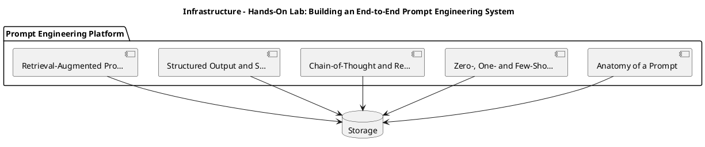

_Source diagram (plantuml); render with the appropriate tool._

**Figure 24. Infrastructure - Hands-On Lab: Building an End-to-End Prompt Engineering System** (plantuml). Figure: Infrastructure view for Prompt Engineering. This diagram illustrates the principal components and their interactions as discussed in the surrounding section.

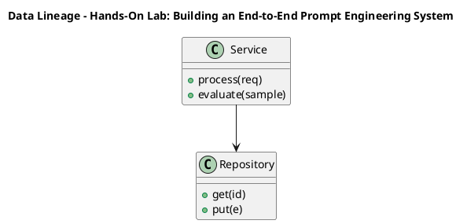

_Source diagram (plantuml); render with the appropriate tool._

**Figure 25. Data Lineage - Hands-On Lab: Building an End-to-End Prompt Engineering System** (plantuml). Figure: Data Lineage view for Prompt Engineering. This diagram illustrates the principal components and their interactions as discussed in the surrounding section.

## Deep Dive: Mechanics, Variants and Trade-offs

Having established the essentials, we now go deeper into hands-on lab: building an end-to-end prompt engineering system. The underlying mechanism is best appreciated by tracing a single request from input to output and noting where state is created and consumed. The distinctions in this section are the ones that separate a working demo from a system that holds up under adversarial inputs, scale and the passage of time.

Consider the principal variants and how to choose between them. Each variant optimises for a different point in the design space - some for latency, some for accuracy, some for cost or operability - and the correct choice follows from explicit requirements rather than from defaults. Every added component buys capability at the price of operational surface area, and that bargain should be made consciously.

In practice this is supported by a mature tooling ecosystem, including OpenAI, Anthropic, Guidance, Outlines. Tools accelerate the work but do not substitute for understanding: the same principles apply whichever implementation you select, and the ability to reason from first principles is what lets you debug when a tool behaves unexpectedly.

A frequent source of subtle bugs is the interaction with retrieval-augmented prompting. Because retrieval-augmented prompting concerns injecting grounded context, citation discipline and context-window budgeting, changes there can silently alter the behaviour analysed here. The remedy is contract tests at the boundary and end-to-end evaluations that exercise the interaction explicitly.

Finally, attend to edge cases and degradation. Define what the system should do under partial failure, unexpected inputs and load spikes, and make that behaviour explicit and tested rather than emergent. Graceful degradation - returning a safe, useful result when the ideal one is unavailable - is a hallmark of mature engineering.

For deeper study, the literature offers authoritative treatments such as Wei et al. — Chain-of-Thought Prompting (2022) and Wang et al. — Self-Consistency Improves Chain of Thought (2022). These primary sources reward careful reading and ground the practical guidance above in established results.

## Advanced Considerations

Having established the essentials, we now go deeper into hands-on lab: building an end-to-end prompt engineering system. Beneath the abstraction lies a concrete process whose steps can each be measured, tested and optimised independently. The distinctions in this section are the ones that separate a working demo from a system that holds up under adversarial inputs, scale and the passage of time.

Consider the principal variants and how to choose between them. Each variant optimises for a different point in the design space - some for latency, some for accuracy, some for cost or operability - and the correct choice follows from explicit requirements rather than from defaults. Every added component buys capability at the price of operational surface area, and that bargain should be made consciously.

In practice this is supported by a mature tooling ecosystem, including OpenAI, Anthropic, Guidance, Outlines. Tools accelerate the work but do not substitute for understanding: the same principles apply whichever implementation you select, and the ability to reason from first principles is what lets you debug when a tool behaves unexpectedly.

A frequent source of subtle bugs is the interaction with structured output and schema enforcement. Because structured output and schema enforcement concerns jSON mode, function/tool calling and grammar-constrained decoding for reliable integration, changes there can silently alter the behaviour analysed here. The remedy is contract tests at the boundary and end-to-end evaluations that exercise the interaction explicitly.

Finally, attend to edge cases and degradation. Define what the system should do under partial failure, unexpected inputs and load spikes, and make that behaviour explicit and tested rather than emergent. Graceful degradation - returning a safe, useful result when the ideal one is unavailable - is a hallmark of mature engineering.

For deeper study, the literature offers authoritative treatments such as Wei et al. — Chain-of-Thought Prompting (2022) and Wang et al. — Self-Consistency Improves Chain of Thought (2022). These primary sources reward careful reading and ground the practical guidance above in established results.

## Worked Example

To ground the discussion, walk through a representative example. A analytics organisation needs natural-language-to-SQL with validation against a catalog. They decide to apply hands-on lab: building an end-to-end prompt engineering system as part of their Prompt Engineering solution, but wisely treat it as a hypothesis to be validated rather than a foregone conclusion.

The team begins by stating the objective precisely and defining how success will be measured before writing any code. They establish a small but representative evaluation set, agree on acceptance thresholds, and only then prototype the simplest design that could work. Early measurement reveals which assumptions hold and which must be revised, saving weeks of misdirected effort and surfacing edge cases while they are still cheap to fix.

As the prototype matures into a service, the team hardens it: adding input validation, error handling, caching where it pays off, and monitoring that ties back to the original success metric. They document each significant decision in an architecture decision record so that future maintainers understand not just what was built but why.

The outcome is instructive. The system that reaches production is not the most sophisticated design the team considered, but the one whose behaviour they could measure, explain and operate. This is the recurring lesson of Prompt Engineering: durable value comes from the whole system, not from any single clever component.

## Industry Use Cases

Across industries, the ideas in this chapter recur in recognisable ways. The following vignettes show how different sectors apply them and what they have in common.

**Support.** Deterministic, schema-constrained ticket triage and routing. The common thread is that value comes not from the model alone but from the surrounding system - data quality, evaluation, integration and operations - which is precisely where most of the engineering effort belongs.

**Analytics.** Natural-language-to-SQL with validation against a catalog. The common thread is that value comes not from the model alone but from the surrounding system - data quality, evaluation, integration and operations - which is precisely where most of the engineering effort belongs.

**Operations.** Runbook automation with tool calls and confirmation gates. The common thread is that value comes not from the model alone but from the surrounding system - data quality, evaluation, integration and operations - which is precisely where most of the engineering effort belongs.

**Education.** Socratic tutoring with rubric-based answer evaluation. The common thread is that value comes not from the model alone but from the surrounding system - data quality, evaluation, integration and operations - which is precisely where most of the engineering effort belongs.

## Best Practices

The following practices consistently separate successful Prompt Engineering efforts from struggling ones. They are deliberately concrete so they can be adopted as checklist items in design and code review.

- Specify the output format explicitly and validate it programmatically.
- Keep untrusted content clearly delimited and never executed as instructions.
- Version prompts and gate changes behind an evaluation suite.
- Prefer fewer, higher-quality few-shot examples over many noisy ones.

None of these are exotic; they are the unglamorous disciplines that compound into reliability. The cost of adopting them is small compared with the cost of the incidents they prevent, and they become second nature with practice.

## Common Pitfalls

Equally instructive are the failure modes that recur in practice. Each pitfall below has a clear early warning sign and a known remedy, so treat them as a diagnostic checklist when something feels wrong:

- Treating prompts as throwaway strings with no testing or versioning.
- Overlong contexts that dilute attention and inflate cost.
- Mixing untrusted user content with trusted instructions (injection risk).
- Relying on temperature tweaks instead of structural prompt fixes.

The pattern is consistent: most failures stem from skipping measurement, conflating prototype and production standards, or deferring cross-cutting concerns such as security and cost until they become emergencies. Naming these traps in advance is the cheapest way to avoid them.

## Governance, Security and Cost Notes

No discussion of hands-on lab: building an end-to-end prompt engineering system is complete without its governance, security and cost dimensions, which are too often deferred until they become emergencies. Treating them as first-class concerns from the outset is both cheaper and safer.

**Governance.** Classify the risk of this capability, document its intended and out-of-scope uses, and ensure decisions are traceable to satisfy internal policy and external regulation such as the NIST AI RMF, ISO/IEC 42001 and the EU AI Act. **Security.** Treat all external input as untrusted, validate outputs before acting on them, apply least privilege to any tools or data access, and map controls to the OWASP LLM Top 10 and MITRE ATLAS.

**Cost and sustainability.** Establish explicit budgets for compute, tokens and latency, attribute spend to owners, and revisit the economics as usage scales - a design that is affordable at pilot scale can become untenable at production volume. Building these reflexes into everyday engineering is what allows a Prompt Engineering system to be not only capable but also trustworthy and economically sound.

## Hands-On Exercises

Work through the following exercises. They are designed to move understanding from recognition to application - the level required for real engineering work - so prefer writing and building over merely reading.

1. Explain hands-on lab: building an end-to-end prompt engineering system to a colleague unfamiliar with Prompt Engineering, using a concrete example from your own domain.
2. Sketch a reference architecture that incorporates hands-on lab: building an end-to-end prompt engineering system and annotate where observability, security and cost controls belong.
3. Design an evaluation that would tell you whether hands-on lab: building an end-to-end prompt engineering system is working in production, including the metric, the dataset and the acceptance threshold.
4. Identify two pitfalls relevant to hands-on lab: building an end-to-end prompt engineering system in your environment and describe the early warning signals you would monitor.
5. Prototype the simplest implementation that demonstrates hands-on lab: building an end-to-end prompt engineering system, then list exactly what would need to change to make it production-ready.

## Key Takeaways

Key takeaways from this chapter:

- Hands-On Lab: Building an End-to-End Prompt Engineering System is a systems concern in Prompt Engineering: data, models and operations must be co-designed.
- Measurement is non-negotiable; define success metrics and evaluation before building.
- Favour the simplest design that meets the requirement, and add complexity only when evidence demands it.
- Security, cost and observability are first-class requirements, not afterthoughts.
- Document decisions so the system remains understandable and operable as it evolves.

## Code Walkthrough

Every change to a Prompt Engineering system should pass an evaluation gate. This example shows the minimal shape: align predictions and references, compute a metric, and return a pass/fail decision for CI.

The full listing is shown below; study it line by line and reproduce it locally before moving on.

### Listing: Evaluating Hands-On Lab: Building an End-to-End Prompt Engineering System with a regression gate

```python
from dataclasses import dataclass


@dataclass
class EvalResult:
    metric: str
    score: float
    passed: bool


def evaluate(predictions: list[str], references: list[str],
             threshold: float = 0.8) -> EvalResult:
    """Score Hands-On Lab: Building an End-to-End Prompt Engineering System output against references with a simple exact-match metric.

    In practice you would combine several metrics (exact match, semantic
    similarity, LLM-as-judge) and gate releases on the aggregate.
    """
    if len(predictions) != len(references):
        raise ValueError("predictions and references must align")
    hits = sum(p.strip() == r.strip() for p, r in zip(predictions, references))
    score = hits / len(references) if references else 0.0
    return EvalResult(metric="exact_match", score=score, passed=score >= threshold)


if __name__ == "__main__":
    result = evaluate(["yes", "no"], ["yes", "yes"])
    print(f"{result.metric}={result.score:.2f} passed={result.passed}")

```

## Review Questions

1. In the context of Prompt Engineering, which statement best describes “Hands-On Lab: Building an End-to-End Prompt Engineering System”?
   - A. a guided, build-along laboratory that constructs a functioning Prompt Engineering system from first principles
   - B. It is only relevant to academic research, not production.
   - C. It makes the system slower but has no other effect.
   - D. It applies exclusively to image data.
   - **Answer: A.** Hands-On Lab: Building an End-to-End Prompt Engineering System: a guided, build-along laboratory that constructs a functioning Prompt Engineering system from first principles
2. Which of the following is a recommended best practice when working with Prompt Engineering?
   - A. It applies exclusively to image data.
   - B. It removes all security and governance requirements.
   - C. Version prompts and gate changes behind an evaluation suite.
   - D. It eliminates the need for any evaluation or monitoring.
   - **Answer: C.** Best practice: Version prompts and gate changes behind an evaluation suite.
3. Which of the following is a common pitfall to avoid in Prompt Engineering?
   - A. Mixing untrusted user content with trusted instructions (injection risk).
   - B. It applies exclusively to image data.
   - C. Specify the output format explicitly and validate it programmatically.
   - D. Version prompts and gate changes behind an evaluation suite.
   - **Answer: A.** Pitfall to avoid: Mixing untrusted user content with trusted instructions (injection risk).
4. *(Discussion)* Explain Hands-On Lab: Building an End-to-End Prompt Engineering System and why it matters in a production Prompt Engineering system.
   - **Model answer:** A strong answer defines hands-on lab: building an end-to-end prompt engineering system (a guided, build-along laboratory that constructs a functioning Prompt Engineering system from first principles) then connects it to architecture, evaluation, cost, security and operations for Prompt Engineering, citing concrete trade-offs and a real-world example.

---


# Chapter 17. Case Study: Support at Scale

_This chapter examines case study: support at scale within Prompt Engineering. It covers a detailed case study of deploying Prompt Engineering in a demanding support environment, including the decisions, trade-offs and outcomes, derives a reference architecture, walks through a worked example and runnable code, surveys industry use cases, and distils best practices and pitfalls, closing with exercises and review questions._

## Introduction

Formally, Case Study: Support at Scale addresses a detailed case study of deploying Prompt Engineering in a demanding support environment, including the decisions, trade-offs and outcomes. Neglecting it is one of the most common reasons Prompt Engineering initiatives stall in production. It helps to separate the conceptual model from its implementation: the former guides reasoning, the latter must contend with real-world constraints.

This chapter builds intuition first, then formalises the ideas, derives an architecture, and finishes with code, exercises and review questions so the material transfers directly to your own Prompt Engineering work. Read it actively: pause at each diagram, reproduce the code, and attempt the exercises before consulting the answers.

## Theory and Foundations

Case Study: Support at Scale can be characterised as a detailed case study of deploying Prompt Engineering in a demanding support environment, including the decisions, trade-offs and outcomes. Seasoned practitioners treat this as a systems problem, co-designing data, models and operations rather than optimising any one in isolation. It pays to understand the mechanism rather than treat it as a black box, because most production incidents are explained by one of its steps misbehaving.

To place this in context, recall the broader picture: Prompt engineering is the discipline of designing inputs, context and decoding settings that steer foundation models toward reliable, useful behaviour. Within that picture, case study: support at scale is one of the load-bearing ideas - the kind that, when understood deeply, makes the rest of Prompt Engineering fall into place. Understanding this matters because Prompt Engineering systems succeed or fail on exactly these decisions.

Case Study: Support at Scale cannot be understood in isolation from chain-of-thought and reasoning prompts. Recall that chain-of-thought and reasoning prompts concerns eliciting intermediate reasoning, self-consistency sampling and the cost/quality trade-offs of deliberate reasoning. The two interact directly: decisions in one constrain the design space of the other, which is why mature teams reason about them together rather than sequentially. Simplicity is a feature. The simplest design that meets the requirement should be the default, with complexity added only when measurement justifies it.

Case Study: Support at Scale cannot be understood in isolation from prompt evaluation and regression testing. Recall that prompt evaluation and regression testing concerns golden datasets, LLM-as-judge, rubric scoring and CI gates for prompt changes. The two interact directly: decisions in one constrain the design space of the other, which is why mature teams reason about them together rather than sequentially. There is an inherent trade-off between fidelity and cost, and the correct balance depends on the use case and its tolerance for error.

Several established patterns apply directly to case study: support at scale. The first, instruction hierarchy: system > developer > user > retrieved content, is widely adopted because it makes the system's behaviour predictable and observable. A complementary pattern, self-consistency voting for high-stakes reasoning, addresses a related concern and is often deployed alongside it. Patterns are not dogma; they are distilled experience that shortcuts the search for a sound design, and each carries assumptions worth checking against your context.

The decision of whether to adopt this should be driven by requirements, not by novelty. In a small prototype, shortcuts around case study: support at scale are invisible; in a production Prompt Engineering system serving real traffic, they surface as incidents, cost overruns or compliance gaps. Latency, accuracy and cost form a tension triangle: improving one typically pressures the others, so explicit budgets are essential. The remainder of this chapter turns these principles into an architecture, code and a checklist you can apply immediately.

## Architecture and Design

From an architectural standpoint, Case Study: Support at Scale sits at the intersection of data, models and operations. Production prompting introduces a prompt management service that stores versioned templates, an assembly layer that merges instructions with retrieved context under a token budget, and an evaluation harness that scores candidate prompts against golden datasets before promotion. Telemetry links every completion back to the exact prompt version that produced it.

Concretely, the principal building blocks include anatomy of a prompt, zero-, one- and few-shot prompting, chain-of-thought and reasoning prompts, structured output and schema enforcement and retrieval-augmented prompting. Each is a replaceable component behind a stable interface, so the team can upgrade an implementation - a model, an index, a policy engine - without rewriting its neighbours. The contracts between components are where reliability is won or lost, so they are specified explicitly and tested in isolation.

The diagram accompanying this section makes the data and control flow explicit. Requests enter through a well-defined boundary where they are authenticated and validated; only then are they dispatched to the components that perform the work. This boundary is also where rate limiting, quota enforcement and audit logging live, keeping cross-cutting concerns out of the core logic and in one auditable place.

Two qualities deserve emphasis. First, observability is designed in, not bolted on: every component emits structured telemetry so that failures can be localised in minutes rather than hours. Second, the architecture is evolvable - components communicate through stable contracts so that any single part of the Prompt Engineering system can be replaced without a rewrite. Latency, accuracy and cost form a tension triangle: improving one typically pressures the others, so explicit budgets are essential.


**Figure 26. Data Lineage - Case Study: Support at Scale** (mermaid). Figure: Data Lineage view for Prompt Engineering. This diagram illustrates the principal components and their interactions as discussed in the surrounding section.

## Deep Dive: Mechanics, Variants and Trade-offs

Having established the essentials, we now go deeper into case study: support at scale. The underlying mechanism is best appreciated by tracing a single request from input to output and noting where state is created and consumed. The distinctions in this section are the ones that separate a working demo from a system that holds up under adversarial inputs, scale and the passage of time.

Consider the principal variants and how to choose between them. Each variant optimises for a different point in the design space - some for latency, some for accuracy, some for cost or operability - and the correct choice follows from explicit requirements rather than from defaults. Every added component buys capability at the price of operational surface area, and that bargain should be made consciously.

In practice this is supported by a mature tooling ecosystem, including OpenAI, Anthropic, Guidance, Outlines. Tools accelerate the work but do not substitute for understanding: the same principles apply whichever implementation you select, and the ability to reason from first principles is what lets you debug when a tool behaves unexpectedly.

A frequent source of subtle bugs is the interaction with chain-of-thought and reasoning prompts. Because chain-of-thought and reasoning prompts concerns eliciting intermediate reasoning, self-consistency sampling and the cost/quality trade-offs of deliberate reasoning, changes there can silently alter the behaviour analysed here. The remedy is contract tests at the boundary and end-to-end evaluations that exercise the interaction explicitly.

Finally, attend to edge cases and degradation. Define what the system should do under partial failure, unexpected inputs and load spikes, and make that behaviour explicit and tested rather than emergent. Graceful degradation - returning a safe, useful result when the ideal one is unavailable - is a hallmark of mature engineering.

For deeper study, the literature offers authoritative treatments such as Wei et al. — Chain-of-Thought Prompting (2022) and Wang et al. — Self-Consistency Improves Chain of Thought (2022). These primary sources reward careful reading and ground the practical guidance above in established results.

## Advanced Considerations

Having established the essentials, we now go deeper into case study: support at scale. Beneath the abstraction lies a concrete process whose steps can each be measured, tested and optimised independently. The distinctions in this section are the ones that separate a working demo from a system that holds up under adversarial inputs, scale and the passage of time.

Consider the principal variants and how to choose between them. Each variant optimises for a different point in the design space - some for latency, some for accuracy, some for cost or operability - and the correct choice follows from explicit requirements rather than from defaults. Simplicity is a feature. The simplest design that meets the requirement should be the default, with complexity added only when measurement justifies it.

In practice this is supported by a mature tooling ecosystem, including OpenAI, Anthropic, Guidance, Outlines. Tools accelerate the work but do not substitute for understanding: the same principles apply whichever implementation you select, and the ability to reason from first principles is what lets you debug when a tool behaves unexpectedly.

A frequent source of subtle bugs is the interaction with prompt evaluation and regression testing. Because prompt evaluation and regression testing concerns golden datasets, LLM-as-judge, rubric scoring and CI gates for prompt changes, changes there can silently alter the behaviour analysed here. The remedy is contract tests at the boundary and end-to-end evaluations that exercise the interaction explicitly.

Finally, attend to edge cases and degradation. Define what the system should do under partial failure, unexpected inputs and load spikes, and make that behaviour explicit and tested rather than emergent. Graceful degradation - returning a safe, useful result when the ideal one is unavailable - is a hallmark of mature engineering.

For deeper study, the literature offers authoritative treatments such as Wei et al. — Chain-of-Thought Prompting (2022) and Wang et al. — Self-Consistency Improves Chain of Thought (2022). These primary sources reward careful reading and ground the practical guidance above in established results.

## Worked Example

Consider a concrete scenario. A support organisation needs deterministic, schema-constrained ticket triage and routing. They decide to apply case study: support at scale as part of their Prompt Engineering solution, but wisely treat it as a hypothesis to be validated rather than a foregone conclusion.

The team begins by stating the objective precisely and defining how success will be measured before writing any code. They establish a small but representative evaluation set, agree on acceptance thresholds, and only then prototype the simplest design that could work. Early measurement reveals which assumptions hold and which must be revised, saving weeks of misdirected effort and surfacing edge cases while they are still cheap to fix.

As the prototype matures into a service, the team hardens it: adding input validation, error handling, caching where it pays off, and monitoring that ties back to the original success metric. They document each significant decision in an architecture decision record so that future maintainers understand not just what was built but why.

The outcome is instructive. The system that reaches production is not the most sophisticated design the team considered, but the one whose behaviour they could measure, explain and operate. This is the recurring lesson of Prompt Engineering: durable value comes from the whole system, not from any single clever component.

## Industry Use Cases

Across industries, the ideas in this chapter recur in recognisable ways. The following vignettes show how different sectors apply them and what they have in common.

**Support.** Deterministic, schema-constrained ticket triage and routing. The common thread is that value comes not from the model alone but from the surrounding system - data quality, evaluation, integration and operations - which is precisely where most of the engineering effort belongs.

**Analytics.** Natural-language-to-SQL with validation against a catalog. The common thread is that value comes not from the model alone but from the surrounding system - data quality, evaluation, integration and operations - which is precisely where most of the engineering effort belongs.

**Operations.** Runbook automation with tool calls and confirmation gates. The common thread is that value comes not from the model alone but from the surrounding system - data quality, evaluation, integration and operations - which is precisely where most of the engineering effort belongs.

**Education.** Socratic tutoring with rubric-based answer evaluation. The common thread is that value comes not from the model alone but from the surrounding system - data quality, evaluation, integration and operations - which is precisely where most of the engineering effort belongs.

## Best Practices

The following practices consistently separate successful Prompt Engineering efforts from struggling ones. They are deliberately concrete so they can be adopted as checklist items in design and code review.

- Specify the output format explicitly and validate it programmatically.
- Keep untrusted content clearly delimited and never executed as instructions.
- Version prompts and gate changes behind an evaluation suite.
- Prefer fewer, higher-quality few-shot examples over many noisy ones.

None of these are exotic; they are the unglamorous disciplines that compound into reliability. The cost of adopting them is small compared with the cost of the incidents they prevent, and they become second nature with practice.

## Common Pitfalls

Equally instructive are the failure modes that recur in practice. Each pitfall below has a clear early warning sign and a known remedy, so treat them as a diagnostic checklist when something feels wrong:

- Treating prompts as throwaway strings with no testing or versioning.
- Overlong contexts that dilute attention and inflate cost.
- Mixing untrusted user content with trusted instructions (injection risk).
- Relying on temperature tweaks instead of structural prompt fixes.

The pattern is consistent: most failures stem from skipping measurement, conflating prototype and production standards, or deferring cross-cutting concerns such as security and cost until they become emergencies. Naming these traps in advance is the cheapest way to avoid them.

## Governance, Security and Cost Notes

No discussion of case study: support at scale is complete without its governance, security and cost dimensions, which are too often deferred until they become emergencies. Treating them as first-class concerns from the outset is both cheaper and safer.

**Governance.** Classify the risk of this capability, document its intended and out-of-scope uses, and ensure decisions are traceable to satisfy internal policy and external regulation such as the NIST AI RMF, ISO/IEC 42001 and the EU AI Act. **Security.** Treat all external input as untrusted, validate outputs before acting on them, apply least privilege to any tools or data access, and map controls to the OWASP LLM Top 10 and MITRE ATLAS.

**Cost and sustainability.** Establish explicit budgets for compute, tokens and latency, attribute spend to owners, and revisit the economics as usage scales - a design that is affordable at pilot scale can become untenable at production volume. Building these reflexes into everyday engineering is what allows a Prompt Engineering system to be not only capable but also trustworthy and economically sound.

## Hands-On Exercises

Work through the following exercises. They are designed to move understanding from recognition to application - the level required for real engineering work - so prefer writing and building over merely reading.

1. Explain case study: support at scale to a colleague unfamiliar with Prompt Engineering, using a concrete example from your own domain.
2. Sketch a reference architecture that incorporates case study: support at scale and annotate where observability, security and cost controls belong.
3. Design an evaluation that would tell you whether case study: support at scale is working in production, including the metric, the dataset and the acceptance threshold.
4. Identify two pitfalls relevant to case study: support at scale in your environment and describe the early warning signals you would monitor.
5. Prototype the simplest implementation that demonstrates case study: support at scale, then list exactly what would need to change to make it production-ready.

## Key Takeaways

Key takeaways from this chapter:

- Case Study: Support at Scale is a systems concern in Prompt Engineering: data, models and operations must be co-designed.
- Measurement is non-negotiable; define success metrics and evaluation before building.
- Favour the simplest design that meets the requirement, and add complexity only when evidence demands it.
- Security, cost and observability are first-class requirements, not afterthoughts.
- Document decisions so the system remains understandable and operable as it evolves.

## Code Walkthrough

Pipelines keep Case Study: Support at Scale logic modular and testable. Each stage is a pure function, errors are captured per item, and the composition is trivial to extend or reorder.

The full listing is shown below; study it line by line and reproduce it locally before moving on.

### Listing: A composable processing pipeline for Case Study: Support at Scale

```python
from collections.abc import Iterable, Iterator
from typing import Protocol


class Stage(Protocol):
    def __call__(self, item: dict) -> dict: ...


def pipeline(stages: list[Stage]) -> Stage:
    """Compose ordered stages into a single callable for Case Study: Support at Scale."""

    def run(item: dict) -> dict:
        for stage in stages:
            item = stage(item)
        return item

    return run


def validate(item: dict) -> dict:
    if "text" not in item:
        raise ValueError("missing required field: text")
    return item


def normalise(item: dict) -> dict:
    item["text"] = item["text"].strip().lower()
    return item


def enrich(item: dict) -> dict:
    item["length"] = len(item["text"])
    return item


process = pipeline([validate, normalise, enrich])


def run_batch(items: Iterable[dict]) -> Iterator[dict]:
    for item in items:
        try:
            yield process(dict(item))
        except ValueError as exc:
            yield {"error": str(exc), "item": item}

```

## Review Questions

1. In the context of Prompt Engineering, which statement best describes “Case Study: Support at Scale”?
   - A. It guarantees deterministic output regardless of input.
   - B. It removes all security and governance requirements.
   - C. It applies exclusively to image data.
   - D. a detailed case study of deploying Prompt Engineering in a demanding support environment, including the decisions, trade-offs and outcomes
   - **Answer: D.** Case Study: Support at Scale: a detailed case study of deploying Prompt Engineering in a demanding support environment, including the decisions, trade-offs and outcomes
2. Which of the following is a recommended best practice when working with Prompt Engineering?
   - A. It eliminates the need for any evaluation or monitoring.
   - B. Prefer fewer, higher-quality few-shot examples over many noisy ones.
   - C. Relying on temperature tweaks instead of structural prompt fixes.
   - D. It removes all security and governance requirements.
   - **Answer: B.** Best practice: Prefer fewer, higher-quality few-shot examples over many noisy ones.
3. Which of the following is a common pitfall to avoid in Prompt Engineering?
   - A. It is only relevant to academic research, not production.
   - B. Version prompts and gate changes behind an evaluation suite.
   - C. It removes all security and governance requirements.
   - D. Relying on temperature tweaks instead of structural prompt fixes.
   - **Answer: D.** Pitfall to avoid: Relying on temperature tweaks instead of structural prompt fixes.
4. *(Discussion)* Walk through how you would design Case Study: Support at Scale for an enterprise Prompt Engineering workload.
   - **Model answer:** A strong answer defines case study: support at scale (a detailed case study of deploying Prompt Engineering in a demanding support environment, including the decisions, trade-offs and outcomes) then connects it to architecture, evaluation, cost, security and operations for Prompt Engineering, citing concrete trade-offs and a real-world example.

---


# Chapter 18. Operating in Production

_This chapter examines operating in production within Prompt Engineering. It covers the operational discipline required to run a Prompt Engineering system reliably, including monitoring, incident response and continuous improvement, derives a reference architecture, walks through a worked example and runnable code, surveys industry use cases, and distils best practices and pitfalls, closing with exercises and review questions._

## Introduction

Operating in Production can be characterised as the operational discipline required to run a Prompt Engineering system reliably, including monitoring, incident response and continuous improvement. This concept recurs throughout the Prompt Engineering lifecycle, from design to operations. It helps to separate the conceptual model from its implementation: the former guides reasoning, the latter must contend with real-world constraints.

This chapter builds intuition first, then formalises the ideas, derives an architecture, and finishes with code, exercises and review questions so the material transfers directly to your own Prompt Engineering work. Read it actively: pause at each diagram, reproduce the code, and attempt the exercises before consulting the answers.

## Theory and Foundations

Operating in Production refers to the operational discipline required to run a Prompt Engineering system reliably, including monitoring, incident response and continuous improvement. In an enterprise setting, this translates into concrete requirements: clear interfaces, measurable quality, and controls that satisfy security and governance. The underlying mechanism is best appreciated by tracing a single request from input to output and noting where state is created and consumed.

To place this in context, recall the broader picture: Prompt engineering is the discipline of designing inputs, context and decoding settings that steer foundation models toward reliable, useful behaviour. Within that picture, operating in production is one of the load-bearing ideas - the kind that, when understood deeply, makes the rest of Prompt Engineering fall into place. Getting this right early prevents expensive rework once a Prompt Engineering system reaches scale.

Operating in Production cannot be understood in isolation from prompt templates and composition. Recall that prompt templates and composition concerns parameterised templates, partials and guardrail wrappers for reuse at scale. The two interact directly: decisions in one constrain the design space of the other, which is why mature teams reason about them together rather than sequentially. Every added component buys capability at the price of operational surface area, and that bargain should be made consciously.

Operating in Production cannot be understood in isolation from anatomy of a prompt. Recall that anatomy of a prompt concerns system, developer and user roles; instructions, context, examples and output specification as distinct, composable parts. The two interact directly: decisions in one constrain the design space of the other, which is why mature teams reason about them together rather than sequentially. There is an inherent trade-off between fidelity and cost, and the correct balance depends on the use case and its tolerance for error.

Several established patterns apply directly to operating in production. The first, self-consistency voting for high-stakes reasoning, is widely adopted because it makes the system's behaviour predictable and observable. A complementary pattern, template + slots with explicit output schema, addresses a related concern and is often deployed alongside it. Patterns are not dogma; they are distilled experience that shortcuts the search for a sound design, and each carries assumptions worth checking against your context.

The decision of whether to adopt this should be driven by requirements, not by novelty. In a small prototype, shortcuts around operating in production are invisible; in a production Prompt Engineering system serving real traffic, they surface as incidents, cost overruns or compliance gaps. There is an inherent trade-off between fidelity and cost, and the correct balance depends on the use case and its tolerance for error. The remainder of this chapter turns these principles into an architecture, code and a checklist you can apply immediately.

## Architecture and Design

From an architectural standpoint, Operating in Production sits at the intersection of data, models and operations. Production prompting introduces a prompt management service that stores versioned templates, an assembly layer that merges instructions with retrieved context under a token budget, and an evaluation harness that scores candidate prompts against golden datasets before promotion. Telemetry links every completion back to the exact prompt version that produced it.

Concretely, the principal building blocks include anatomy of a prompt, zero-, one- and few-shot prompting, chain-of-thought and reasoning prompts, structured output and schema enforcement and retrieval-augmented prompting. Each is a replaceable component behind a stable interface, so the team can upgrade an implementation - a model, an index, a policy engine - without rewriting its neighbours. The contracts between components are where reliability is won or lost, so they are specified explicitly and tested in isolation.

The diagram accompanying this section makes the data and control flow explicit. Requests enter through a well-defined boundary where they are authenticated and validated; only then are they dispatched to the components that perform the work. This boundary is also where rate limiting, quota enforcement and audit logging live, keeping cross-cutting concerns out of the core logic and in one auditable place.

Two qualities deserve emphasis. First, observability is designed in, not bolted on: every component emits structured telemetry so that failures can be localised in minutes rather than hours. Second, the architecture is evolvable - components communicate through stable contracts so that any single part of the Prompt Engineering system can be replaced without a rewrite. Simplicity is a feature. The simplest design that meets the requirement should be the default, with complexity added only when measurement justifies it.

<div class="diagram-svg">

<svg xmlns="http://www.w3.org/2000/svg" width="840" height="460" data-tpl="grid_matrix" data-pal="10-3" viewBox="0 0 840 460" font-family="Inter, Segoe UI, Arial, sans-serif"><defs><marker id="ar" markerWidth="9" markerHeight="9" refX="7" refY="3" orient="auto"><path d="M0,0 L7,3 L0,6 z" fill="#94a3b8"/></marker><marker id="arw" markerWidth="9" markerHeight="9" refX="7" refY="3" orient="auto"><path d="M0,0 L7,3 L0,6 z" fill="#ffffff"/></marker><filter id="sh" x="-20%" y="-20%" width="140%" height="140%"><feDropShadow dx="0" dy="2" stdDeviation="3" flood-color="#0f172a" flood-opacity="0.16"/></filter></defs><defs><linearGradient id="bna70a342" x1="0" y1="0" x2="1" y2="0"><stop offset="0" stop-color="#16a34a"/><stop offset="1" stop-color="#22c55e"/></linearGradient></defs><rect width="840" height="460" rx="14" fill="#ffffff"/><rect x="0" y="0" width="840" height="48" rx="14" fill="url(#bna70a342)"/><rect x="0" y="32" width="840" height="16" fill="url(#bna70a342)"/><text x="420" y="25" text-anchor="middle" font-size="14.5" font-weight="700" fill="#ffffff" dominant-baseline="middle">Cloud Architecture - Operating in Production</text><text x="276" y="78" text-anchor="middle" font-size="10.5" font-weight="700" fill="#64748b" dominant-baseline="middle">Plan</text><text x="430" y="78" text-anchor="middle" font-size="10.5" font-weight="700" fill="#64748b" dominant-baseline="middle">Build</text><text x="582" y="78" text-anchor="middle" font-size="10.5" font-weight="700" fill="#64748b" dominant-baseline="middle">Run</text><text x="736" y="78" text-anchor="middle" font-size="10.5" font-weight="700" fill="#64748b" dominant-baseline="middle">Improve</text><text x="188" y="119" text-anchor="end" font-size="10" font-weight="600" fill="#0f172a" dominant-baseline="middle">Prompt Evaluation and</text><text x="188" y="131" text-anchor="end" font-size="10" font-weight="600" fill="#0f172a" dominant-baseline="middle">Regression Testing</text><rect x="203" y="93" width="147" height="64" rx="8" fill="#16a34a"/><rect x="203" y="93" width="147" height="64" rx="8" fill="#ffffff" fill-opacity="0.62"/><rect x="356" y="93" width="147" height="64" rx="8" fill="#22c55e"/><rect x="356" y="93" width="147" height="64" rx="8" fill="#ffffff" fill-opacity="0.25"/><rect x="509" y="93" width="147" height="64" rx="8" fill="#4ade80"/><rect x="509" y="93" width="147" height="64" rx="8" fill="#ffffff" fill-opacity="0.25"/><rect x="662" y="93" width="147" height="64" rx="8" fill="#14532d"/><rect x="662" y="93" width="147" height="64" rx="8" fill="#ffffff" fill-opacity="0.50"/><text x="188" y="189" text-anchor="end" font-size="10" font-weight="600" fill="#0f172a" dominant-baseline="middle">Defending Against Prompt</text><text x="188" y="201" text-anchor="end" font-size="10" font-weight="600" fill="#0f172a" dominant-baseline="middle">Injection</text><rect x="203" y="163" width="147" height="64" rx="8" fill="#22c55e"/><rect x="203" y="163" width="147" height="64" rx="8" fill="#ffffff" fill-opacity="0.62"/><rect x="356" y="163" width="147" height="64" rx="8" fill="#4ade80"/><rect x="356" y="163" width="147" height="64" rx="8" fill="#ffffff" fill-opacity="0.25"/><rect x="509" y="163" width="147" height="64" rx="8" fill="#14532d"/><rect x="509" y="163" width="147" height="64" rx="8" fill="#ffffff" fill-opacity="0.12"/><rect x="662" y="163" width="147" height="64" rx="8" fill="#166534"/><rect x="662" y="163" width="147" height="64" rx="8" fill="#ffffff" fill-opacity="0.12"/><text x="188" y="259" text-anchor="end" font-size="10" font-weight="600" fill="#0f172a" dominant-baseline="middle">Multi-Step and Agentic</text><text x="188" y="271" text-anchor="end" font-size="10" font-weight="600" fill="#0f172a" dominant-baseline="middle">Prompting</text><rect x="203" y="233" width="147" height="64" rx="8" fill="#4ade80"/><rect x="203" y="233" width="147" height="64" rx="8" fill="#ffffff" fill-opacity="0.38"/><rect x="356" y="233" width="147" height="64" rx="8" fill="#14532d"/><rect x="356" y="233" width="147" height="64" rx="8" fill="#ffffff" fill-opacity="0.00"/><rect x="509" y="233" width="147" height="64" rx="8" fill="#166534"/><rect x="509" y="233" width="147" height="64" rx="8" fill="#ffffff" fill-opacity="0.50"/><rect x="662" y="233" width="147" height="64" rx="8" fill="#15803d"/><rect x="662" y="233" width="147" height="64" rx="8" fill="#ffffff" fill-opacity="0.25"/><text x="188" y="329" text-anchor="end" font-size="10" font-weight="600" fill="#0f172a" dominant-baseline="middle">Prompt Management and</text><text x="188" y="341" text-anchor="end" font-size="10" font-weight="600" fill="#0f172a" dominant-baseline="middle">Versioning</text><rect x="203" y="303" width="147" height="64" rx="8" fill="#14532d"/><rect x="203" y="303" width="147" height="64" rx="8" fill="#ffffff" fill-opacity="0.62"/><rect x="356" y="303" width="147" height="64" rx="8" fill="#166534"/><rect x="356" y="303" width="147" height="64" rx="8" fill="#ffffff" fill-opacity="0.50"/><rect x="509" y="303" width="147" height="64" rx="8" fill="#15803d"/><rect x="509" y="303" width="147" height="64" rx="8" fill="#ffffff" fill-opacity="0.50"/><rect x="662" y="303" width="147" height="64" rx="8" fill="#16a34a"/><rect x="662" y="303" width="147" height="64" rx="8" fill="#ffffff" fill-opacity="0.00"/><text x="28" y="446" text-anchor="start" font-size="9.5" font-weight="500" fill="#64748b" dominant-baseline="middle">Prompt Engineering  •  Cloud Architecture</text></svg>

</div>

**Figure 27. Cloud Architecture - Operating in Production** (svg). Figure: Cloud Architecture view for Prompt Engineering. This diagram illustrates the principal components and their interactions as discussed in the surrounding section.

## Deep Dive: Mechanics, Variants and Trade-offs

Having established the essentials, we now go deeper into operating in production. Beneath the abstraction lies a concrete process whose steps can each be measured, tested and optimised independently. The distinctions in this section are the ones that separate a working demo from a system that holds up under adversarial inputs, scale and the passage of time.

Consider the principal variants and how to choose between them. Each variant optimises for a different point in the design space - some for latency, some for accuracy, some for cost or operability - and the correct choice follows from explicit requirements rather than from defaults. As with most architectural decisions, the choice is rarely binary; the skill lies in quantifying the trade-offs and choosing deliberately.

In practice this is supported by a mature tooling ecosystem, including OpenAI, Anthropic, Guidance, Outlines. Tools accelerate the work but do not substitute for understanding: the same principles apply whichever implementation you select, and the ability to reason from first principles is what lets you debug when a tool behaves unexpectedly.

A frequent source of subtle bugs is the interaction with prompt templates and composition. Because prompt templates and composition concerns parameterised templates, partials and guardrail wrappers for reuse at scale, changes there can silently alter the behaviour analysed here. The remedy is contract tests at the boundary and end-to-end evaluations that exercise the interaction explicitly.

Finally, attend to edge cases and degradation. Define what the system should do under partial failure, unexpected inputs and load spikes, and make that behaviour explicit and tested rather than emergent. Graceful degradation - returning a safe, useful result when the ideal one is unavailable - is a hallmark of mature engineering.

For deeper study, the literature offers authoritative treatments such as Wei et al. — Chain-of-Thought Prompting (2022) and Wang et al. — Self-Consistency Improves Chain of Thought (2022). These primary sources reward careful reading and ground the practical guidance above in established results.

## Advanced Considerations

Having established the essentials, we now go deeper into operating in production. Mechanically, the behaviour emerges from a few interacting parts that are simpler than the whole they produce. The distinctions in this section are the ones that separate a working demo from a system that holds up under adversarial inputs, scale and the passage of time.

Consider the principal variants and how to choose between them. Each variant optimises for a different point in the design space - some for latency, some for accuracy, some for cost or operability - and the correct choice follows from explicit requirements rather than from defaults. Every added component buys capability at the price of operational surface area, and that bargain should be made consciously.

In practice this is supported by a mature tooling ecosystem, including OpenAI, Anthropic, Guidance, Outlines. Tools accelerate the work but do not substitute for understanding: the same principles apply whichever implementation you select, and the ability to reason from first principles is what lets you debug when a tool behaves unexpectedly.

A frequent source of subtle bugs is the interaction with decoding parameters and sampling. Because decoding parameters and sampling concerns temperature, top-p, penalties and stop sequences as levers on determinism, changes there can silently alter the behaviour analysed here. The remedy is contract tests at the boundary and end-to-end evaluations that exercise the interaction explicitly.

Finally, attend to edge cases and degradation. Define what the system should do under partial failure, unexpected inputs and load spikes, and make that behaviour explicit and tested rather than emergent. Graceful degradation - returning a safe, useful result when the ideal one is unavailable - is a hallmark of mature engineering.

For deeper study, the literature offers authoritative treatments such as Wei et al. — Chain-of-Thought Prompting (2022) and Wang et al. — Self-Consistency Improves Chain of Thought (2022). These primary sources reward careful reading and ground the practical guidance above in established results.

## Worked Example

To ground the discussion, walk through a representative example. A operations organisation needs runbook automation with tool calls and confirmation gates. They decide to apply operating in production as part of their Prompt Engineering solution, but wisely treat it as a hypothesis to be validated rather than a foregone conclusion.

The team begins by stating the objective precisely and defining how success will be measured before writing any code. They establish a small but representative evaluation set, agree on acceptance thresholds, and only then prototype the simplest design that could work. Early measurement reveals which assumptions hold and which must be revised, saving weeks of misdirected effort and surfacing edge cases while they are still cheap to fix.

As the prototype matures into a service, the team hardens it: adding input validation, error handling, caching where it pays off, and monitoring that ties back to the original success metric. They document each significant decision in an architecture decision record so that future maintainers understand not just what was built but why.

The outcome is instructive. The system that reaches production is not the most sophisticated design the team considered, but the one whose behaviour they could measure, explain and operate. This is the recurring lesson of Prompt Engineering: durable value comes from the whole system, not from any single clever component.

## Industry Use Cases

Across industries, the ideas in this chapter recur in recognisable ways. The following vignettes show how different sectors apply them and what they have in common.

**Support.** Deterministic, schema-constrained ticket triage and routing. The common thread is that value comes not from the model alone but from the surrounding system - data quality, evaluation, integration and operations - which is precisely where most of the engineering effort belongs.

**Analytics.** Natural-language-to-SQL with validation against a catalog. The common thread is that value comes not from the model alone but from the surrounding system - data quality, evaluation, integration and operations - which is precisely where most of the engineering effort belongs.

**Operations.** Runbook automation with tool calls and confirmation gates. The common thread is that value comes not from the model alone but from the surrounding system - data quality, evaluation, integration and operations - which is precisely where most of the engineering effort belongs.

**Education.** Socratic tutoring with rubric-based answer evaluation. The common thread is that value comes not from the model alone but from the surrounding system - data quality, evaluation, integration and operations - which is precisely where most of the engineering effort belongs.

## Best Practices

The following practices consistently separate successful Prompt Engineering efforts from struggling ones. They are deliberately concrete so they can be adopted as checklist items in design and code review.

- Specify the output format explicitly and validate it programmatically.
- Keep untrusted content clearly delimited and never executed as instructions.
- Version prompts and gate changes behind an evaluation suite.
- Prefer fewer, higher-quality few-shot examples over many noisy ones.

None of these are exotic; they are the unglamorous disciplines that compound into reliability. The cost of adopting them is small compared with the cost of the incidents they prevent, and they become second nature with practice.

## Common Pitfalls

Equally instructive are the failure modes that recur in practice. Each pitfall below has a clear early warning sign and a known remedy, so treat them as a diagnostic checklist when something feels wrong:

- Treating prompts as throwaway strings with no testing or versioning.
- Overlong contexts that dilute attention and inflate cost.
- Mixing untrusted user content with trusted instructions (injection risk).
- Relying on temperature tweaks instead of structural prompt fixes.

The pattern is consistent: most failures stem from skipping measurement, conflating prototype and production standards, or deferring cross-cutting concerns such as security and cost until they become emergencies. Naming these traps in advance is the cheapest way to avoid them.

## Governance, Security and Cost Notes

No discussion of operating in production is complete without its governance, security and cost dimensions, which are too often deferred until they become emergencies. Treating them as first-class concerns from the outset is both cheaper and safer.

**Governance.** Classify the risk of this capability, document its intended and out-of-scope uses, and ensure decisions are traceable to satisfy internal policy and external regulation such as the NIST AI RMF, ISO/IEC 42001 and the EU AI Act. **Security.** Treat all external input as untrusted, validate outputs before acting on them, apply least privilege to any tools or data access, and map controls to the OWASP LLM Top 10 and MITRE ATLAS.

**Cost and sustainability.** Establish explicit budgets for compute, tokens and latency, attribute spend to owners, and revisit the economics as usage scales - a design that is affordable at pilot scale can become untenable at production volume. Building these reflexes into everyday engineering is what allows a Prompt Engineering system to be not only capable but also trustworthy and economically sound.

## Hands-On Exercises

Work through the following exercises. They are designed to move understanding from recognition to application - the level required for real engineering work - so prefer writing and building over merely reading.

1. Explain operating in production to a colleague unfamiliar with Prompt Engineering, using a concrete example from your own domain.
2. Sketch a reference architecture that incorporates operating in production and annotate where observability, security and cost controls belong.
3. Design an evaluation that would tell you whether operating in production is working in production, including the metric, the dataset and the acceptance threshold.
4. Identify two pitfalls relevant to operating in production in your environment and describe the early warning signals you would monitor.
5. Prototype the simplest implementation that demonstrates operating in production, then list exactly what would need to change to make it production-ready.

## Key Takeaways

Key takeaways from this chapter:

- Operating in Production is a systems concern in Prompt Engineering: data, models and operations must be co-designed.
- Measurement is non-negotiable; define success metrics and evaluation before building.
- Favour the simplest design that meets the requirement, and add complexity only when evidence demands it.
- Security, cost and observability are first-class requirements, not afterthoughts.
- Document decisions so the system remains understandable and operable as it evolves.

## Code Walkthrough

This listing shows a configuration-driven Operating in Production component with retry semantics and typed interfaces — the shape we expect from production Prompt Engineering code rather than a notebook prototype.

The full listing is shown below; study it line by line and reproduce it locally before moving on.

### Listing: Implementing a Operating in Production component

```python
from __future__ import annotations

from dataclasses import dataclass, field
from typing import Any


@dataclass(slots=True)
class OperatingInProductionConfig:
    """Configuration for the Operating in Production component in a Prompt Engineering system."""

    name: str
    timeout_s: float = 30.0
    max_retries: int = 3
    options: dict[str, Any] = field(default_factory=dict)


class OperatingInProduction:
    """A minimal, production-shaped implementation of Operating in Production."""

    def __init__(self, config: OperatingInProductionConfig) -> None:
        self._config = config
        self._calls = 0

    def run(self, payload: dict[str, Any]) -> dict[str, Any]:
        """Process a request, retrying transient failures with backoff."""
        last_error: Exception | None = None
        for attempt in range(self._config.max_retries):
            try:
                self._calls += 1
                return self._process(payload)
            except TimeoutError as exc:  # transient
                last_error = exc
                continue
        raise RuntimeError(f"OperatingInProduction failed after retries") from last_error

    def _process(self, payload: dict[str, Any]) -> dict[str, Any]:
        # Domain-specific logic for Operating in Production goes here.
        return {"status": "ok", "input_keys": sorted(payload), "calls": self._calls}

```

## Review Questions

1. In the context of Prompt Engineering, which statement best describes “Operating in Production”?
   - A. It makes the system slower but has no other effect.
   - B. the operational discipline required to run a Prompt Engineering system reliably, including monitoring, incident response and continuous improvement
   - C. It removes all security and governance requirements.
   - D. It guarantees deterministic output regardless of input.
   - **Answer: B.** Operating in Production: the operational discipline required to run a Prompt Engineering system reliably, including monitoring, incident response and continuous improvement
2. Which of the following is a recommended best practice when working with Prompt Engineering?
   - A. It removes all security and governance requirements.
   - B. Keep untrusted content clearly delimited and never executed as instructions.
   - C. It eliminates the need for any evaluation or monitoring.
   - D. Mixing untrusted user content with trusted instructions (injection risk).
   - **Answer: B.** Best practice: Keep untrusted content clearly delimited and never executed as instructions.
3. Which of the following is a common pitfall to avoid in Prompt Engineering?
   - A. Relying on temperature tweaks instead of structural prompt fixes.
   - B. It is only relevant to academic research, not production.
   - C. Prefer fewer, higher-quality few-shot examples over many noisy ones.
   - D. It removes all security and governance requirements.
   - **Answer: A.** Pitfall to avoid: Relying on temperature tweaks instead of structural prompt fixes.
4. *(Discussion)* Describe a failure mode of Operating in Production and how you would mitigate it.
   - **Model answer:** A strong answer defines operating in production (the operational discipline required to run a Prompt Engineering system reliably, including monitoring, incident response and continuous improvement) then connects it to architecture, evaluation, cost, security and operations for Prompt Engineering, citing concrete trade-offs and a real-world example.

---


# Chapter 19. Evaluation and Quality Assurance

_This chapter examines evaluation and quality assurance within Prompt Engineering. It covers a rigorous approach to measuring and assuring the quality of a Prompt Engineering system before and after release, derives a reference architecture, walks through a worked example and runnable code, surveys industry use cases, and distils best practices and pitfalls, closing with exercises and review questions._

## Introduction

In practical terms, Evaluation and Quality Assurance is best understood as a rigorous approach to measuring and assuring the quality of a Prompt Engineering system before and after release. It is foundational: later capabilities in Prompt Engineering are built directly on top of it. It helps to separate the conceptual model from its implementation: the former guides reasoning, the latter must contend with real-world constraints.

This chapter builds intuition first, then formalises the ideas, derives an architecture, and finishes with code, exercises and review questions so the material transfers directly to your own Prompt Engineering work. Read it actively: pause at each diagram, reproduce the code, and attempt the exercises before consulting the answers.

## Theory and Foundations

At its core, Evaluation and Quality Assurance concerns a rigorous approach to measuring and assuring the quality of a Prompt Engineering system before and after release. What distinguishes a production-grade approach from a prototype is the discipline of measurement: every claim is backed by an evaluation rather than intuition. It pays to understand the mechanism rather than treat it as a black box, because most production incidents are explained by one of its steps misbehaving.

To place this in context, recall the broader picture: Prompt engineering is the discipline of designing inputs, context and decoding settings that steer foundation models toward reliable, useful behaviour. Within that picture, evaluation and quality assurance is one of the load-bearing ideas - the kind that, when understood deeply, makes the rest of Prompt Engineering fall into place. Understanding this matters because Prompt Engineering systems succeed or fail on exactly these decisions.

Evaluation and Quality Assurance cannot be understood in isolation from defending against prompt injection. Recall that defending against prompt injection concerns untrusted-content isolation, instruction hierarchy and output validation. The two interact directly: decisions in one constrain the design space of the other, which is why mature teams reason about them together rather than sequentially. Latency, accuracy and cost form a tension triangle: improving one typically pressures the others, so explicit budgets are essential.

Evaluation and Quality Assurance cannot be understood in isolation from multi-step and agentic prompting. Recall that multi-step and agentic prompting concerns planner/executor patterns, reflection and decomposition of complex tasks. The two interact directly: decisions in one constrain the design space of the other, which is why mature teams reason about them together rather than sequentially. Every added component buys capability at the price of operational surface area, and that bargain should be made consciously.

Several established patterns apply directly to evaluation and quality assurance. The first, critique-and-revise loops for quality improvement, is widely adopted because it makes the system's behaviour predictable and observable. A complementary pattern, instruction hierarchy: system > developer > user > retrieved content, addresses a related concern and is often deployed alongside it. Patterns are not dogma; they are distilled experience that shortcuts the search for a sound design, and each carries assumptions worth checking against your context.

Knowing when not to use a technique is as valuable as knowing how to use it. In a small prototype, shortcuts around evaluation and quality assurance are invisible; in a production Prompt Engineering system serving real traffic, they surface as incidents, cost overruns or compliance gaps. As with most architectural decisions, the choice is rarely binary; the skill lies in quantifying the trade-offs and choosing deliberately. The remainder of this chapter turns these principles into an architecture, code and a checklist you can apply immediately.

## Architecture and Design

A robust architecture for Evaluation and Quality Assurance is layered so each part can evolve independently without destabilising the whole. Production prompting introduces a prompt management service that stores versioned templates, an assembly layer that merges instructions with retrieved context under a token budget, and an evaluation harness that scores candidate prompts against golden datasets before promotion. Telemetry links every completion back to the exact prompt version that produced it.

Concretely, the principal building blocks include anatomy of a prompt, zero-, one- and few-shot prompting, chain-of-thought and reasoning prompts, structured output and schema enforcement and retrieval-augmented prompting. Each is a replaceable component behind a stable interface, so the team can upgrade an implementation - a model, an index, a policy engine - without rewriting its neighbours. The contracts between components are where reliability is won or lost, so they are specified explicitly and tested in isolation.

The diagram accompanying this section makes the data and control flow explicit. Requests enter through a well-defined boundary where they are authenticated and validated; only then are they dispatched to the components that perform the work. This boundary is also where rate limiting, quota enforcement and audit logging live, keeping cross-cutting concerns out of the core logic and in one auditable place.

Two qualities deserve emphasis. First, observability is designed in, not bolted on: every component emits structured telemetry so that failures can be localised in minutes rather than hours. Second, the architecture is evolvable - components communicate through stable contracts so that any single part of the Prompt Engineering system can be replaced without a rewrite. As with most architectural decisions, the choice is rarely binary; the skill lies in quantifying the trade-offs and choosing deliberately.

<div class="diagram-svg">

<svg xmlns="http://www.w3.org/2000/svg" width="840" height="460" data-tpl="grid_matrix" data-pal="5-1" viewBox="0 0 840 460" font-family="Inter, Segoe UI, Arial, sans-serif"><defs><marker id="ar" markerWidth="9" markerHeight="9" refX="7" refY="3" orient="auto"><path d="M0,0 L7,3 L0,6 z" fill="#94a3b8"/></marker><marker id="arw" markerWidth="9" markerHeight="9" refX="7" refY="3" orient="auto"><path d="M0,0 L7,3 L0,6 z" fill="#ffffff"/></marker><filter id="sh" x="-20%" y="-20%" width="140%" height="140%"><feDropShadow dx="0" dy="2" stdDeviation="3" flood-color="#0f172a" flood-opacity="0.16"/></filter></defs><defs><linearGradient id="bn57934ae" x1="0" y1="0" x2="1" y2="0"><stop offset="0" stop-color="#1d4ed8"/><stop offset="1" stop-color="#2563eb"/></linearGradient></defs><rect width="840" height="460" rx="14" fill="#ffffff"/><rect x="0" y="0" width="840" height="48" rx="14" fill="url(#bn57934ae)"/><rect x="0" y="32" width="840" height="16" fill="url(#bn57934ae)"/><text x="420" y="25" text-anchor="middle" font-size="14.5" font-weight="700" fill="#ffffff" dominant-baseline="middle">Operating Model - Evaluation and Quality Assurance</text><text x="276" y="78" text-anchor="middle" font-size="10.5" font-weight="700" fill="#64748b" dominant-baseline="middle">Plan</text><text x="430" y="78" text-anchor="middle" font-size="10.5" font-weight="700" fill="#64748b" dominant-baseline="middle">Build</text><text x="582" y="78" text-anchor="middle" font-size="10.5" font-weight="700" fill="#64748b" dominant-baseline="middle">Run</text><text x="736" y="78" text-anchor="middle" font-size="10.5" font-weight="700" fill="#64748b" dominant-baseline="middle">Improve</text><text x="188" y="119" text-anchor="end" font-size="10" font-weight="600" fill="#0f172a" dominant-baseline="middle">Tool Use and Function</text><text x="188" y="131" text-anchor="end" font-size="10" font-weight="600" fill="#0f172a" dominant-baseline="middle">Calling</text><rect x="203" y="93" width="147" height="64" rx="8" fill="#1d4ed8"/><rect x="203" y="93" width="147" height="64" rx="8" fill="#ffffff" fill-opacity="0.25"/><rect x="356" y="93" width="147" height="64" rx="8" fill="#2563eb"/><rect x="356" y="93" width="147" height="64" rx="8" fill="#ffffff" fill-opacity="0.12"/><rect x="509" y="93" width="147" height="64" rx="8" fill="#3b82f6"/><rect x="509" y="93" width="147" height="64" rx="8" fill="#ffffff" fill-opacity="0.25"/><rect x="662" y="93" width="147" height="64" rx="8" fill="#60a5fa"/><rect x="662" y="93" width="147" height="64" rx="8" fill="#ffffff" fill-opacity="0.62"/><text x="188" y="189" text-anchor="end" font-size="10" font-weight="600" fill="#0f172a" dominant-baseline="middle">Prompt Templates and</text><text x="188" y="201" text-anchor="end" font-size="10" font-weight="600" fill="#0f172a" dominant-baseline="middle">Composition</text><rect x="203" y="163" width="147" height="64" rx="8" fill="#2563eb"/><rect x="203" y="163" width="147" height="64" rx="8" fill="#ffffff" fill-opacity="0.25"/><rect x="356" y="163" width="147" height="64" rx="8" fill="#3b82f6"/><rect x="356" y="163" width="147" height="64" rx="8" fill="#ffffff" fill-opacity="0.00"/><rect x="509" y="163" width="147" height="64" rx="8" fill="#60a5fa"/><rect x="509" y="163" width="147" height="64" rx="8" fill="#ffffff" fill-opacity="0.12"/><rect x="662" y="163" width="147" height="64" rx="8" fill="#1e40af"/><rect x="662" y="163" width="147" height="64" rx="8" fill="#ffffff" fill-opacity="0.25"/><text x="188" y="259" text-anchor="end" font-size="10" font-weight="600" fill="#0f172a" dominant-baseline="middle">Decoding Parameters and</text><text x="188" y="271" text-anchor="end" font-size="10" font-weight="600" fill="#0f172a" dominant-baseline="middle">Sampling</text><rect x="203" y="233" width="147" height="64" rx="8" fill="#3b82f6"/><rect x="203" y="233" width="147" height="64" rx="8" fill="#ffffff" fill-opacity="0.38"/><rect x="356" y="233" width="147" height="64" rx="8" fill="#60a5fa"/><rect x="356" y="233" width="147" height="64" rx="8" fill="#ffffff" fill-opacity="0.00"/><rect x="509" y="233" width="147" height="64" rx="8" fill="#1e40af"/><rect x="509" y="233" width="147" height="64" rx="8" fill="#ffffff" fill-opacity="0.38"/><rect x="662" y="233" width="147" height="64" rx="8" fill="#1e3a8a"/><rect x="662" y="233" width="147" height="64" rx="8" fill="#ffffff" fill-opacity="0.00"/><text x="188" y="329" text-anchor="end" font-size="10" font-weight="600" fill="#0f172a" dominant-baseline="middle">Prompt Evaluation and</text><text x="188" y="341" text-anchor="end" font-size="10" font-weight="600" fill="#0f172a" dominant-baseline="middle">Regression Testing</text><rect x="203" y="303" width="147" height="64" rx="8" fill="#60a5fa"/><rect x="203" y="303" width="147" height="64" rx="8" fill="#ffffff" fill-opacity="0.00"/><rect x="356" y="303" width="147" height="64" rx="8" fill="#1e40af"/><rect x="356" y="303" width="147" height="64" rx="8" fill="#ffffff" fill-opacity="0.25"/><rect x="509" y="303" width="147" height="64" rx="8" fill="#1e3a8a"/><rect x="509" y="303" width="147" height="64" rx="8" fill="#ffffff" fill-opacity="0.00"/><rect x="662" y="303" width="147" height="64" rx="8" fill="#1d4ed8"/><rect x="662" y="303" width="147" height="64" rx="8" fill="#ffffff" fill-opacity="0.38"/><text x="28" y="446" text-anchor="start" font-size="9.5" font-weight="500" fill="#64748b" dominant-baseline="middle">Prompt Engineering  •  Operating Model</text></svg>

</div>

**Figure 28. Operating Model - Evaluation and Quality Assurance** (svg). Figure: Operating Model view for Prompt Engineering. This diagram illustrates the principal components and their interactions as discussed in the surrounding section.

## Deep Dive: Mechanics, Variants and Trade-offs

Having established the essentials, we now go deeper into evaluation and quality assurance. It pays to understand the mechanism rather than treat it as a black box, because most production incidents are explained by one of its steps misbehaving. The distinctions in this section are the ones that separate a working demo from a system that holds up under adversarial inputs, scale and the passage of time.

Consider the principal variants and how to choose between them. Each variant optimises for a different point in the design space - some for latency, some for accuracy, some for cost or operability - and the correct choice follows from explicit requirements rather than from defaults. There is an inherent trade-off between fidelity and cost, and the correct balance depends on the use case and its tolerance for error.

In practice this is supported by a mature tooling ecosystem, including OpenAI, Anthropic, Guidance, Outlines. Tools accelerate the work but do not substitute for understanding: the same principles apply whichever implementation you select, and the ability to reason from first principles is what lets you debug when a tool behaves unexpectedly.

A frequent source of subtle bugs is the interaction with defending against prompt injection. Because defending against prompt injection concerns untrusted-content isolation, instruction hierarchy and output validation, changes there can silently alter the behaviour analysed here. The remedy is contract tests at the boundary and end-to-end evaluations that exercise the interaction explicitly.

Finally, attend to edge cases and degradation. Define what the system should do under partial failure, unexpected inputs and load spikes, and make that behaviour explicit and tested rather than emergent. Graceful degradation - returning a safe, useful result when the ideal one is unavailable - is a hallmark of mature engineering.

For deeper study, the literature offers authoritative treatments such as Wei et al. — Chain-of-Thought Prompting (2022) and Wang et al. — Self-Consistency Improves Chain of Thought (2022). These primary sources reward careful reading and ground the practical guidance above in established results.

## Advanced Considerations

Having established the essentials, we now go deeper into evaluation and quality assurance. Mechanically, the behaviour emerges from a few interacting parts that are simpler than the whole they produce. The distinctions in this section are the ones that separate a working demo from a system that holds up under adversarial inputs, scale and the passage of time.

Consider the principal variants and how to choose between them. Each variant optimises for a different point in the design space - some for latency, some for accuracy, some for cost or operability - and the correct choice follows from explicit requirements rather than from defaults. Every added component buys capability at the price of operational surface area, and that bargain should be made consciously.

In practice this is supported by a mature tooling ecosystem, including OpenAI, Anthropic, Guidance, Outlines. Tools accelerate the work but do not substitute for understanding: the same principles apply whichever implementation you select, and the ability to reason from first principles is what lets you debug when a tool behaves unexpectedly.

A frequent source of subtle bugs is the interaction with zero-, one- and few-shot prompting. Because zero-, one- and few-shot prompting concerns how in-context examples shape behaviour and when demonstrations beat instructions, changes there can silently alter the behaviour analysed here. The remedy is contract tests at the boundary and end-to-end evaluations that exercise the interaction explicitly.

Finally, attend to edge cases and degradation. Define what the system should do under partial failure, unexpected inputs and load spikes, and make that behaviour explicit and tested rather than emergent. Graceful degradation - returning a safe, useful result when the ideal one is unavailable - is a hallmark of mature engineering.

For deeper study, the literature offers authoritative treatments such as Wei et al. — Chain-of-Thought Prompting (2022) and Wang et al. — Self-Consistency Improves Chain of Thought (2022). These primary sources reward careful reading and ground the practical guidance above in established results.

## Worked Example

Consider a concrete scenario. A analytics organisation needs natural-language-to-SQL with validation against a catalog. They decide to apply evaluation and quality assurance as part of their Prompt Engineering solution, but wisely treat it as a hypothesis to be validated rather than a foregone conclusion.

The team begins by stating the objective precisely and defining how success will be measured before writing any code. They establish a small but representative evaluation set, agree on acceptance thresholds, and only then prototype the simplest design that could work. Early measurement reveals which assumptions hold and which must be revised, saving weeks of misdirected effort and surfacing edge cases while they are still cheap to fix.

As the prototype matures into a service, the team hardens it: adding input validation, error handling, caching where it pays off, and monitoring that ties back to the original success metric. They document each significant decision in an architecture decision record so that future maintainers understand not just what was built but why.

The outcome is instructive. The system that reaches production is not the most sophisticated design the team considered, but the one whose behaviour they could measure, explain and operate. This is the recurring lesson of Prompt Engineering: durable value comes from the whole system, not from any single clever component.

## Industry Use Cases

Across industries, the ideas in this chapter recur in recognisable ways. The following vignettes show how different sectors apply them and what they have in common.

**Support.** Deterministic, schema-constrained ticket triage and routing. The common thread is that value comes not from the model alone but from the surrounding system - data quality, evaluation, integration and operations - which is precisely where most of the engineering effort belongs.

**Analytics.** Natural-language-to-SQL with validation against a catalog. The common thread is that value comes not from the model alone but from the surrounding system - data quality, evaluation, integration and operations - which is precisely where most of the engineering effort belongs.

**Operations.** Runbook automation with tool calls and confirmation gates. The common thread is that value comes not from the model alone but from the surrounding system - data quality, evaluation, integration and operations - which is precisely where most of the engineering effort belongs.

**Education.** Socratic tutoring with rubric-based answer evaluation. The common thread is that value comes not from the model alone but from the surrounding system - data quality, evaluation, integration and operations - which is precisely where most of the engineering effort belongs.

## Best Practices

The following practices consistently separate successful Prompt Engineering efforts from struggling ones. They are deliberately concrete so they can be adopted as checklist items in design and code review.

- Specify the output format explicitly and validate it programmatically.
- Keep untrusted content clearly delimited and never executed as instructions.
- Version prompts and gate changes behind an evaluation suite.
- Prefer fewer, higher-quality few-shot examples over many noisy ones.

None of these are exotic; they are the unglamorous disciplines that compound into reliability. The cost of adopting them is small compared with the cost of the incidents they prevent, and they become second nature with practice.

## Common Pitfalls

Equally instructive are the failure modes that recur in practice. Each pitfall below has a clear early warning sign and a known remedy, so treat them as a diagnostic checklist when something feels wrong:

- Treating prompts as throwaway strings with no testing or versioning.
- Overlong contexts that dilute attention and inflate cost.
- Mixing untrusted user content with trusted instructions (injection risk).
- Relying on temperature tweaks instead of structural prompt fixes.

The pattern is consistent: most failures stem from skipping measurement, conflating prototype and production standards, or deferring cross-cutting concerns such as security and cost until they become emergencies. Naming these traps in advance is the cheapest way to avoid them.

## Governance, Security and Cost Notes

No discussion of evaluation and quality assurance is complete without its governance, security and cost dimensions, which are too often deferred until they become emergencies. Treating them as first-class concerns from the outset is both cheaper and safer.

**Governance.** Classify the risk of this capability, document its intended and out-of-scope uses, and ensure decisions are traceable to satisfy internal policy and external regulation such as the NIST AI RMF, ISO/IEC 42001 and the EU AI Act. **Security.** Treat all external input as untrusted, validate outputs before acting on them, apply least privilege to any tools or data access, and map controls to the OWASP LLM Top 10 and MITRE ATLAS.

**Cost and sustainability.** Establish explicit budgets for compute, tokens and latency, attribute spend to owners, and revisit the economics as usage scales - a design that is affordable at pilot scale can become untenable at production volume. Building these reflexes into everyday engineering is what allows a Prompt Engineering system to be not only capable but also trustworthy and economically sound.

## Hands-On Exercises

Work through the following exercises. They are designed to move understanding from recognition to application - the level required for real engineering work - so prefer writing and building over merely reading.

1. Explain evaluation and quality assurance to a colleague unfamiliar with Prompt Engineering, using a concrete example from your own domain.
2. Sketch a reference architecture that incorporates evaluation and quality assurance and annotate where observability, security and cost controls belong.
3. Design an evaluation that would tell you whether evaluation and quality assurance is working in production, including the metric, the dataset and the acceptance threshold.
4. Identify two pitfalls relevant to evaluation and quality assurance in your environment and describe the early warning signals you would monitor.
5. Prototype the simplest implementation that demonstrates evaluation and quality assurance, then list exactly what would need to change to make it production-ready.

## Key Takeaways

Key takeaways from this chapter:

- Evaluation and Quality Assurance is a systems concern in Prompt Engineering: data, models and operations must be co-designed.
- Measurement is non-negotiable; define success metrics and evaluation before building.
- Favour the simplest design that meets the requirement, and add complexity only when evidence demands it.
- Security, cost and observability are first-class requirements, not afterthoughts.
- Document decisions so the system remains understandable and operable as it evolves.

## Code Walkthrough

This listing shows a configuration-driven Evaluation and Quality Assurance component with retry semantics and typed interfaces — the shape we expect from production Prompt Engineering code rather than a notebook prototype.

The full listing is shown below; study it line by line and reproduce it locally before moving on.

### Listing: Implementing a Evaluation and Quality Assurance component

```python
from __future__ import annotations

from dataclasses import dataclass, field
from typing import Any


@dataclass(slots=True)
class EvaluationAndQualityConfig:
    """Configuration for the Evaluation and Quality Assurance component in a Prompt Engineering system."""

    name: str
    timeout_s: float = 30.0
    max_retries: int = 3
    options: dict[str, Any] = field(default_factory=dict)


class EvaluationAndQuality:
    """A minimal, production-shaped implementation of Evaluation and Quality Assurance."""

    def __init__(self, config: EvaluationAndQualityConfig) -> None:
        self._config = config
        self._calls = 0

    def run(self, payload: dict[str, Any]) -> dict[str, Any]:
        """Process a request, retrying transient failures with backoff."""
        last_error: Exception | None = None
        for attempt in range(self._config.max_retries):
            try:
                self._calls += 1
                return self._process(payload)
            except TimeoutError as exc:  # transient
                last_error = exc
                continue
        raise RuntimeError(f"EvaluationAndQuality failed after retries") from last_error

    def _process(self, payload: dict[str, Any]) -> dict[str, Any]:
        # Domain-specific logic for Evaluation and Quality Assurance goes here.
        return {"status": "ok", "input_keys": sorted(payload), "calls": self._calls}

```

## Review Questions

1. In the context of Prompt Engineering, which statement best describes “Evaluation and Quality Assurance”?
   - A. It removes all security and governance requirements.
   - B. a rigorous approach to measuring and assuring the quality of a Prompt Engineering system before and after release
   - C. It is only relevant to academic research, not production.
   - D. It makes the system slower but has no other effect.
   - **Answer: B.** Evaluation and Quality Assurance: a rigorous approach to measuring and assuring the quality of a Prompt Engineering system before and after release
2. Which of the following is a recommended best practice when working with Prompt Engineering?
   - A. Version prompts and gate changes behind an evaluation suite.
   - B. Overlong contexts that dilute attention and inflate cost.
   - C. It makes the system slower but has no other effect.
   - D. It applies exclusively to image data.
   - **Answer: A.** Best practice: Version prompts and gate changes behind an evaluation suite.
3. Which of the following is a common pitfall to avoid in Prompt Engineering?
   - A. Overlong contexts that dilute attention and inflate cost.
   - B. It removes all security and governance requirements.
   - C. It makes the system slower but has no other effect.
   - D. Version prompts and gate changes behind an evaluation suite.
   - **Answer: A.** Pitfall to avoid: Overlong contexts that dilute attention and inflate cost.
4. *(Discussion)* How does Evaluation and Quality Assurance interact with security and governance requirements?
   - **Model answer:** A strong answer defines evaluation and quality assurance (a rigorous approach to measuring and assuring the quality of a Prompt Engineering system before and after release) then connects it to architecture, evaluation, cost, security and operations for Prompt Engineering, citing concrete trade-offs and a real-world example.

---


# Chapter 20. Security, Privacy and Governance

_This chapter examines security, privacy and governance within Prompt Engineering. It covers the security, privacy and governance controls that make a Prompt Engineering system trustworthy and compliant, derives a reference architecture, walks through a worked example and runnable code, surveys industry use cases, and distils best practices and pitfalls, closing with exercises and review questions._

## Introduction

Security, Privacy and Governance refers to the security, privacy and governance controls that make a Prompt Engineering system trustworthy and compliant. Getting this right early prevents expensive rework once a Prompt Engineering system reaches scale. What distinguishes a production-grade approach from a prototype is the discipline of measurement: every claim is backed by an evaluation rather than intuition.

This chapter builds intuition first, then formalises the ideas, derives an architecture, and finishes with code, exercises and review questions so the material transfers directly to your own Prompt Engineering work. Read it actively: pause at each diagram, reproduce the code, and attempt the exercises before consulting the answers.

## Theory and Foundations

Security, Privacy and Governance refers to the security, privacy and governance controls that make a Prompt Engineering system trustworthy and compliant. The right abstraction here pays compounding dividends, because downstream components depend on its guarantees. Mechanically, the behaviour emerges from a few interacting parts that are simpler than the whole they produce.

To place this in context, recall the broader picture: Prompt engineering is the discipline of designing inputs, context and decoding settings that steer foundation models toward reliable, useful behaviour. Within that picture, security, privacy and governance is one of the load-bearing ideas - the kind that, when understood deeply, makes the rest of Prompt Engineering fall into place. Neglecting it is one of the most common reasons Prompt Engineering initiatives stall in production.

Security, Privacy and Governance cannot be understood in isolation from defending against prompt injection. Recall that defending against prompt injection concerns untrusted-content isolation, instruction hierarchy and output validation. The two interact directly: decisions in one constrain the design space of the other, which is why mature teams reason about them together rather than sequentially. Every added component buys capability at the price of operational surface area, and that bargain should be made consciously.

Security, Privacy and Governance cannot be understood in isolation from prompt management and versioning. Recall that prompt management and versioning concerns registries, A/B testing and rollback for production prompts. The two interact directly: decisions in one constrain the design space of the other, which is why mature teams reason about them together rather than sequentially. Latency, accuracy and cost form a tension triangle: improving one typically pressures the others, so explicit budgets are essential.

Several established patterns apply directly to security, privacy and governance. The first, instruction hierarchy: system > developer > user > retrieved content, is widely adopted because it makes the system's behaviour predictable and observable. A complementary pattern, self-consistency voting for high-stakes reasoning, addresses a related concern and is often deployed alongside it. Patterns are not dogma; they are distilled experience that shortcuts the search for a sound design, and each carries assumptions worth checking against your context.

Knowing when not to use a technique is as valuable as knowing how to use it. In a small prototype, shortcuts around security, privacy and governance are invisible; in a production Prompt Engineering system serving real traffic, they surface as incidents, cost overruns or compliance gaps. Every added component buys capability at the price of operational surface area, and that bargain should be made consciously. The remainder of this chapter turns these principles into an architecture, code and a checklist you can apply immediately.

## Architecture and Design

The reference architecture for Security, Privacy and Governance separates concerns into clearly bounded components with explicit contracts. Production prompting introduces a prompt management service that stores versioned templates, an assembly layer that merges instructions with retrieved context under a token budget, and an evaluation harness that scores candidate prompts against golden datasets before promotion. Telemetry links every completion back to the exact prompt version that produced it.

Concretely, the principal building blocks include anatomy of a prompt, zero-, one- and few-shot prompting, chain-of-thought and reasoning prompts, structured output and schema enforcement and retrieval-augmented prompting. Each is a replaceable component behind a stable interface, so the team can upgrade an implementation - a model, an index, a policy engine - without rewriting its neighbours. The contracts between components are where reliability is won or lost, so they are specified explicitly and tested in isolation.

The diagram accompanying this section makes the data and control flow explicit. Requests enter through a well-defined boundary where they are authenticated and validated; only then are they dispatched to the components that perform the work. This boundary is also where rate limiting, quota enforcement and audit logging live, keeping cross-cutting concerns out of the core logic and in one auditable place.

Two qualities deserve emphasis. First, observability is designed in, not bolted on: every component emits structured telemetry so that failures can be localised in minutes rather than hours. Second, the architecture is evolvable - components communicate through stable contracts so that any single part of the Prompt Engineering system can be replaced without a rewrite. Latency, accuracy and cost form a tension triangle: improving one typically pressures the others, so explicit budgets are essential.

```xml
<mxfile host="ai-university">
  <diagram name="Business Process">
    <mxGraphModel dx="800" dy="600" grid="1" gridSize="10">
      <root>
        <mxCell id="0"/>
        <mxCell id="1" parent="0"/>
        <mxCell id="title" value="Business Process - Security, Privacy and Governance" style="text;fontSize=16;fontStyle=1" vertex="1" parent="1"><mxGeometry x="40" y="20" width="600" height="30" as="geometry"/></mxCell>
        <mxCell id="hub" value="Prompt Engineering" style="rounded=1;fillColor=#0f172a;fontColor=#ffffff;fontStyle=1" vertex="1" parent="1"><mxGeometry x="300" y="180" width="160" height="60" as="geometry"/></mxCell>
        <mxCell id="n0" value="Anatomy of a Prompt" style="rounded=1;fillColor=#e0e7ff;strokeColor=#4338ca" vertex="1" parent="1"><mxGeometry x="60" y="80" width="160" height="50" as="geometry"/></mxCell>
        <mxCell id="e0" style="edgeStyle=orthogonalEdgeStyle" edge="1" parent="1" source="hub" target="n0"><mxGeometry relative="1" as="geometry"/></mxCell>
        <mxCell id="n1" value="Zero-, One- and Few-Sho…" style="rounded=1;fillColor=#e0e7ff;strokeColor=#4338ca" vertex="1" parent="1"><mxGeometry x="600" y="170" width="160" height="50" as="geometry"/></mxCell>
        <mxCell id="e1" style="edgeStyle=orthogonalEdgeStyle" edge="1" parent="1" source="hub" target="n1"><mxGeometry relative="1" as="geometry"/></mxCell>
        <mxCell id="n2" value="Chain-of-Thought and Re…" style="rounded=1;fillColor=#e0e7ff;strokeColor=#4338ca" vertex="1" parent="1"><mxGeometry x="60" y="260" width="160" height="50" as="geometry"/></mxCell>
        <mxCell id="e2" style="edgeStyle=orthogonalEdgeStyle" edge="1" parent="1" source="hub" target="n2"><mxGeometry relative="1" as="geometry"/></mxCell>
        <mxCell id="n3" value="Structured Output and S…" style="rounded=1;fillColor=#e0e7ff;strokeColor=#4338ca" vertex="1" parent="1"><mxGeometry x="600" y="350" width="160" height="50" as="geometry"/></mxCell>
        <mxCell id="e3" style="edgeStyle=orthogonalEdgeStyle" edge="1" parent="1" source="hub" target="n3"><mxGeometry relative="1" as="geometry"/></mxCell>
        <mxCell id="n4" value="Retrieval-Augmented Pro…" style="rounded=1;fillColor=#e0e7ff;strokeColor=#4338ca" vertex="1" parent="1"><mxGeometry x="60" y="440" width="160" height="50" as="geometry"/></mxCell>
        <mxCell id="e4" style="edgeStyle=orthogonalEdgeStyle" edge="1" parent="1" source="hub" target="n4"><mxGeometry relative="1" as="geometry"/></mxCell>
      </root>
    </mxGraphModel>
  </diagram>
</mxfile>
```

_Source diagram (drawio); render with the appropriate tool._

**Figure 29. Business Process - Security, Privacy and Governance** (drawio). Figure: Business Process view for Prompt Engineering. This diagram illustrates the principal components and their interactions as discussed in the surrounding section.

## Deep Dive: Mechanics, Variants and Trade-offs

Having established the essentials, we now go deeper into security, privacy and governance. Beneath the abstraction lies a concrete process whose steps can each be measured, tested and optimised independently. The distinctions in this section are the ones that separate a working demo from a system that holds up under adversarial inputs, scale and the passage of time.

Consider the principal variants and how to choose between them. Each variant optimises for a different point in the design space - some for latency, some for accuracy, some for cost or operability - and the correct choice follows from explicit requirements rather than from defaults. Latency, accuracy and cost form a tension triangle: improving one typically pressures the others, so explicit budgets are essential.

In practice this is supported by a mature tooling ecosystem, including OpenAI, Anthropic, Guidance, Outlines. Tools accelerate the work but do not substitute for understanding: the same principles apply whichever implementation you select, and the ability to reason from first principles is what lets you debug when a tool behaves unexpectedly.

A frequent source of subtle bugs is the interaction with defending against prompt injection. Because defending against prompt injection concerns untrusted-content isolation, instruction hierarchy and output validation, changes there can silently alter the behaviour analysed here. The remedy is contract tests at the boundary and end-to-end evaluations that exercise the interaction explicitly.

Finally, attend to edge cases and degradation. Define what the system should do under partial failure, unexpected inputs and load spikes, and make that behaviour explicit and tested rather than emergent. Graceful degradation - returning a safe, useful result when the ideal one is unavailable - is a hallmark of mature engineering.

For deeper study, the literature offers authoritative treatments such as Wei et al. — Chain-of-Thought Prompting (2022) and Wang et al. — Self-Consistency Improves Chain of Thought (2022). These primary sources reward careful reading and ground the practical guidance above in established results.

## Advanced Considerations

Having established the essentials, we now go deeper into security, privacy and governance. The underlying mechanism is best appreciated by tracing a single request from input to output and noting where state is created and consumed. The distinctions in this section are the ones that separate a working demo from a system that holds up under adversarial inputs, scale and the passage of time.

Consider the principal variants and how to choose between them. Each variant optimises for a different point in the design space - some for latency, some for accuracy, some for cost or operability - and the correct choice follows from explicit requirements rather than from defaults. Latency, accuracy and cost form a tension triangle: improving one typically pressures the others, so explicit budgets are essential.

In practice this is supported by a mature tooling ecosystem, including OpenAI, Anthropic, Guidance, Outlines. Tools accelerate the work but do not substitute for understanding: the same principles apply whichever implementation you select, and the ability to reason from first principles is what lets you debug when a tool behaves unexpectedly.

A frequent source of subtle bugs is the interaction with multi-step and agentic prompting. Because multi-step and agentic prompting concerns planner/executor patterns, reflection and decomposition of complex tasks, changes there can silently alter the behaviour analysed here. The remedy is contract tests at the boundary and end-to-end evaluations that exercise the interaction explicitly.

Finally, attend to edge cases and degradation. Define what the system should do under partial failure, unexpected inputs and load spikes, and make that behaviour explicit and tested rather than emergent. Graceful degradation - returning a safe, useful result when the ideal one is unavailable - is a hallmark of mature engineering.

For deeper study, the literature offers authoritative treatments such as Wei et al. — Chain-of-Thought Prompting (2022) and Wang et al. — Self-Consistency Improves Chain of Thought (2022). These primary sources reward careful reading and ground the practical guidance above in established results.

## Worked Example

A worked example clarifies how these ideas behave in practice. A education organisation needs socratic tutoring with rubric-based answer evaluation. They decide to apply security, privacy and governance as part of their Prompt Engineering solution, but wisely treat it as a hypothesis to be validated rather than a foregone conclusion.

The team begins by stating the objective precisely and defining how success will be measured before writing any code. They establish a small but representative evaluation set, agree on acceptance thresholds, and only then prototype the simplest design that could work. Early measurement reveals which assumptions hold and which must be revised, saving weeks of misdirected effort and surfacing edge cases while they are still cheap to fix.

As the prototype matures into a service, the team hardens it: adding input validation, error handling, caching where it pays off, and monitoring that ties back to the original success metric. They document each significant decision in an architecture decision record so that future maintainers understand not just what was built but why.

The outcome is instructive. The system that reaches production is not the most sophisticated design the team considered, but the one whose behaviour they could measure, explain and operate. This is the recurring lesson of Prompt Engineering: durable value comes from the whole system, not from any single clever component.

## Industry Use Cases

Across industries, the ideas in this chapter recur in recognisable ways. The following vignettes show how different sectors apply them and what they have in common.

**Support.** Deterministic, schema-constrained ticket triage and routing. The common thread is that value comes not from the model alone but from the surrounding system - data quality, evaluation, integration and operations - which is precisely where most of the engineering effort belongs.

**Analytics.** Natural-language-to-SQL with validation against a catalog. The common thread is that value comes not from the model alone but from the surrounding system - data quality, evaluation, integration and operations - which is precisely where most of the engineering effort belongs.

**Operations.** Runbook automation with tool calls and confirmation gates. The common thread is that value comes not from the model alone but from the surrounding system - data quality, evaluation, integration and operations - which is precisely where most of the engineering effort belongs.

**Education.** Socratic tutoring with rubric-based answer evaluation. The common thread is that value comes not from the model alone but from the surrounding system - data quality, evaluation, integration and operations - which is precisely where most of the engineering effort belongs.

## Best Practices

The following practices consistently separate successful Prompt Engineering efforts from struggling ones. They are deliberately concrete so they can be adopted as checklist items in design and code review.

- Specify the output format explicitly and validate it programmatically.
- Keep untrusted content clearly delimited and never executed as instructions.
- Version prompts and gate changes behind an evaluation suite.
- Prefer fewer, higher-quality few-shot examples over many noisy ones.

None of these are exotic; they are the unglamorous disciplines that compound into reliability. The cost of adopting them is small compared with the cost of the incidents they prevent, and they become second nature with practice.

## Common Pitfalls

Equally instructive are the failure modes that recur in practice. Each pitfall below has a clear early warning sign and a known remedy, so treat them as a diagnostic checklist when something feels wrong:

- Treating prompts as throwaway strings with no testing or versioning.
- Overlong contexts that dilute attention and inflate cost.
- Mixing untrusted user content with trusted instructions (injection risk).
- Relying on temperature tweaks instead of structural prompt fixes.

The pattern is consistent: most failures stem from skipping measurement, conflating prototype and production standards, or deferring cross-cutting concerns such as security and cost until they become emergencies. Naming these traps in advance is the cheapest way to avoid them.

## Governance, Security and Cost Notes

No discussion of security, privacy and governance is complete without its governance, security and cost dimensions, which are too often deferred until they become emergencies. Treating them as first-class concerns from the outset is both cheaper and safer.

**Governance.** Classify the risk of this capability, document its intended and out-of-scope uses, and ensure decisions are traceable to satisfy internal policy and external regulation such as the NIST AI RMF, ISO/IEC 42001 and the EU AI Act. **Security.** Treat all external input as untrusted, validate outputs before acting on them, apply least privilege to any tools or data access, and map controls to the OWASP LLM Top 10 and MITRE ATLAS.

**Cost and sustainability.** Establish explicit budgets for compute, tokens and latency, attribute spend to owners, and revisit the economics as usage scales - a design that is affordable at pilot scale can become untenable at production volume. Building these reflexes into everyday engineering is what allows a Prompt Engineering system to be not only capable but also trustworthy and economically sound.

## Hands-On Exercises

Work through the following exercises. They are designed to move understanding from recognition to application - the level required for real engineering work - so prefer writing and building over merely reading.

1. Explain security, privacy and governance to a colleague unfamiliar with Prompt Engineering, using a concrete example from your own domain.
2. Sketch a reference architecture that incorporates security, privacy and governance and annotate where observability, security and cost controls belong.
3. Design an evaluation that would tell you whether security, privacy and governance is working in production, including the metric, the dataset and the acceptance threshold.
4. Identify two pitfalls relevant to security, privacy and governance in your environment and describe the early warning signals you would monitor.
5. Prototype the simplest implementation that demonstrates security, privacy and governance, then list exactly what would need to change to make it production-ready.

## Key Takeaways

Key takeaways from this chapter:

- Security, Privacy and Governance is a systems concern in Prompt Engineering: data, models and operations must be co-designed.
- Measurement is non-negotiable; define success metrics and evaluation before building.
- Favour the simplest design that meets the requirement, and add complexity only when evidence demands it.
- Security, cost and observability are first-class requirements, not afterthoughts.
- Document decisions so the system remains understandable and operable as it evolves.

## Code Walkthrough

Pipelines keep Security, Privacy and Governance logic modular and testable. Each stage is a pure function, errors are captured per item, and the composition is trivial to extend or reorder.

The full listing is shown below; study it line by line and reproduce it locally before moving on.

### Listing: A composable processing pipeline for Security, Privacy and Governance

```python
from collections.abc import Iterable, Iterator
from typing import Protocol


class Stage(Protocol):
    def __call__(self, item: dict) -> dict: ...


def pipeline(stages: list[Stage]) -> Stage:
    """Compose ordered stages into a single callable for Security, Privacy and Governance."""

    def run(item: dict) -> dict:
        for stage in stages:
            item = stage(item)
        return item

    return run


def validate(item: dict) -> dict:
    if "text" not in item:
        raise ValueError("missing required field: text")
    return item


def normalise(item: dict) -> dict:
    item["text"] = item["text"].strip().lower()
    return item


def enrich(item: dict) -> dict:
    item["length"] = len(item["text"])
    return item


process = pipeline([validate, normalise, enrich])


def run_batch(items: Iterable[dict]) -> Iterator[dict]:
    for item in items:
        try:
            yield process(dict(item))
        except ValueError as exc:
            yield {"error": str(exc), "item": item}

```

## Review Questions

1. In the context of Prompt Engineering, which statement best describes “Security, Privacy and Governance”?
   - A. the security, privacy and governance controls that make a Prompt Engineering system trustworthy and compliant
   - B. It applies exclusively to image data.
   - C. It makes the system slower but has no other effect.
   - D. It eliminates the need for any evaluation or monitoring.
   - **Answer: A.** Security, Privacy and Governance: the security, privacy and governance controls that make a Prompt Engineering system trustworthy and compliant
2. Which of the following is a recommended best practice when working with Prompt Engineering?
   - A. It eliminates the need for any evaluation or monitoring.
   - B. It is only relevant to academic research, not production.
   - C. Version prompts and gate changes behind an evaluation suite.
   - D. Relying on temperature tweaks instead of structural prompt fixes.
   - **Answer: C.** Best practice: Version prompts and gate changes behind an evaluation suite.
3. Which of the following is a common pitfall to avoid in Prompt Engineering?
   - A. It eliminates the need for any evaluation or monitoring.
   - B. Version prompts and gate changes behind an evaluation suite.
   - C. Prefer fewer, higher-quality few-shot examples over many noisy ones.
   - D. Treating prompts as throwaway strings with no testing or versioning.
   - **Answer: D.** Pitfall to avoid: Treating prompts as throwaway strings with no testing or versioning.
4. *(Discussion)* How does Security, Privacy and Governance interact with security and governance requirements?
   - **Model answer:** A strong answer defines security, privacy and governance (the security, privacy and governance controls that make a Prompt Engineering system trustworthy and compliant) then connects it to architecture, evaluation, cost, security and operations for Prompt Engineering, citing concrete trade-offs and a real-world example.

---


# Chapter 21. Cost, Performance and Scaling

_This chapter examines cost, performance and scaling within Prompt Engineering. It covers techniques for controlling cost and latency while scaling a Prompt Engineering system to production traffic, derives a reference architecture, walks through a worked example and runnable code, surveys industry use cases, and distils best practices and pitfalls, closing with exercises and review questions._

## Introduction

In practical terms, Cost, Performance and Scaling is best understood as techniques for controlling cost and latency while scaling a Prompt Engineering system to production traffic. Teams that master this consistently ship more reliable Prompt Engineering systems at lower cost. What distinguishes a production-grade approach from a prototype is the discipline of measurement: every claim is backed by an evaluation rather than intuition.

This chapter builds intuition first, then formalises the ideas, derives an architecture, and finishes with code, exercises and review questions so the material transfers directly to your own Prompt Engineering work. Read it actively: pause at each diagram, reproduce the code, and attempt the exercises before consulting the answers.

## Theory and Foundations

Formally, Cost, Performance and Scaling addresses techniques for controlling cost and latency while scaling a Prompt Engineering system to production traffic. Seasoned practitioners treat this as a systems problem, co-designing data, models and operations rather than optimising any one in isolation. Mechanically, the behaviour emerges from a few interacting parts that are simpler than the whole they produce.

To place this in context, recall the broader picture: Prompt engineering is the discipline of designing inputs, context and decoding settings that steer foundation models toward reliable, useful behaviour. Within that picture, cost, performance and scaling is one of the load-bearing ideas - the kind that, when understood deeply, makes the rest of Prompt Engineering fall into place. Teams that master this consistently ship more reliable Prompt Engineering systems at lower cost.

Cost, Performance and Scaling cannot be understood in isolation from chain-of-thought and reasoning prompts. Recall that chain-of-thought and reasoning prompts concerns eliciting intermediate reasoning, self-consistency sampling and the cost/quality trade-offs of deliberate reasoning. The two interact directly: decisions in one constrain the design space of the other, which is why mature teams reason about them together rather than sequentially. Simplicity is a feature. The simplest design that meets the requirement should be the default, with complexity added only when measurement justifies it.

Cost, Performance and Scaling cannot be understood in isolation from structured output and schema enforcement. Recall that structured output and schema enforcement concerns jSON mode, function/tool calling and grammar-constrained decoding for reliable integration. The two interact directly: decisions in one constrain the design space of the other, which is why mature teams reason about them together rather than sequentially. Every added component buys capability at the price of operational surface area, and that bargain should be made consciously.

Several established patterns apply directly to cost, performance and scaling. The first, instruction hierarchy: system > developer > user > retrieved content, is widely adopted because it makes the system's behaviour predictable and observable. A complementary pattern, template + slots with explicit output schema, addresses a related concern and is often deployed alongside it. Patterns are not dogma; they are distilled experience that shortcuts the search for a sound design, and each carries assumptions worth checking against your context.

The decision of whether to adopt this should be driven by requirements, not by novelty. In a small prototype, shortcuts around cost, performance and scaling are invisible; in a production Prompt Engineering system serving real traffic, they surface as incidents, cost overruns or compliance gaps. Simplicity is a feature. The simplest design that meets the requirement should be the default, with complexity added only when measurement justifies it. The remainder of this chapter turns these principles into an architecture, code and a checklist you can apply immediately.

## Architecture and Design

A robust architecture for Cost, Performance and Scaling is layered so each part can evolve independently without destabilising the whole. Production prompting introduces a prompt management service that stores versioned templates, an assembly layer that merges instructions with retrieved context under a token budget, and an evaluation harness that scores candidate prompts against golden datasets before promotion. Telemetry links every completion back to the exact prompt version that produced it.

Concretely, the principal building blocks include anatomy of a prompt, zero-, one- and few-shot prompting, chain-of-thought and reasoning prompts, structured output and schema enforcement and retrieval-augmented prompting. Each is a replaceable component behind a stable interface, so the team can upgrade an implementation - a model, an index, a policy engine - without rewriting its neighbours. The contracts between components are where reliability is won or lost, so they are specified explicitly and tested in isolation.

The diagram accompanying this section makes the data and control flow explicit. Requests enter through a well-defined boundary where they are authenticated and validated; only then are they dispatched to the components that perform the work. This boundary is also where rate limiting, quota enforcement and audit logging live, keeping cross-cutting concerns out of the core logic and in one auditable place.

Two qualities deserve emphasis. First, observability is designed in, not bolted on: every component emits structured telemetry so that failures can be localised in minutes rather than hours. Second, the architecture is evolvable - components communicate through stable contracts so that any single part of the Prompt Engineering system can be replaced without a rewrite. Latency, accuracy and cost form a tension triangle: improving one typically pressures the others, so explicit budgets are essential.

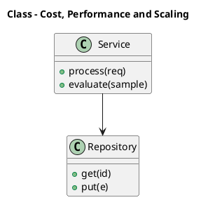

_Source diagram (plantuml); render with the appropriate tool._

**Figure 30. Class - Cost, Performance and Scaling** (plantuml). Figure: Class view for Prompt Engineering. This diagram illustrates the principal components and their interactions as discussed in the surrounding section.

## Deep Dive: Mechanics, Variants and Trade-offs

Having established the essentials, we now go deeper into cost, performance and scaling. Beneath the abstraction lies a concrete process whose steps can each be measured, tested and optimised independently. The distinctions in this section are the ones that separate a working demo from a system that holds up under adversarial inputs, scale and the passage of time.

Consider the principal variants and how to choose between them. Each variant optimises for a different point in the design space - some for latency, some for accuracy, some for cost or operability - and the correct choice follows from explicit requirements rather than from defaults. Simplicity is a feature. The simplest design that meets the requirement should be the default, with complexity added only when measurement justifies it.

In practice this is supported by a mature tooling ecosystem, including OpenAI, Anthropic, Guidance, Outlines. Tools accelerate the work but do not substitute for understanding: the same principles apply whichever implementation you select, and the ability to reason from first principles is what lets you debug when a tool behaves unexpectedly.

A frequent source of subtle bugs is the interaction with chain-of-thought and reasoning prompts. Because chain-of-thought and reasoning prompts concerns eliciting intermediate reasoning, self-consistency sampling and the cost/quality trade-offs of deliberate reasoning, changes there can silently alter the behaviour analysed here. The remedy is contract tests at the boundary and end-to-end evaluations that exercise the interaction explicitly.

Finally, attend to edge cases and degradation. Define what the system should do under partial failure, unexpected inputs and load spikes, and make that behaviour explicit and tested rather than emergent. Graceful degradation - returning a safe, useful result when the ideal one is unavailable - is a hallmark of mature engineering.

For deeper study, the literature offers authoritative treatments such as Wei et al. — Chain-of-Thought Prompting (2022) and Wang et al. — Self-Consistency Improves Chain of Thought (2022). These primary sources reward careful reading and ground the practical guidance above in established results.

## Advanced Considerations

Having established the essentials, we now go deeper into cost, performance and scaling. Beneath the abstraction lies a concrete process whose steps can each be measured, tested and optimised independently. The distinctions in this section are the ones that separate a working demo from a system that holds up under adversarial inputs, scale and the passage of time.

Consider the principal variants and how to choose between them. Each variant optimises for a different point in the design space - some for latency, some for accuracy, some for cost or operability - and the correct choice follows from explicit requirements rather than from defaults. As with most architectural decisions, the choice is rarely binary; the skill lies in quantifying the trade-offs and choosing deliberately.

In practice this is supported by a mature tooling ecosystem, including OpenAI, Anthropic, Guidance, Outlines. Tools accelerate the work but do not substitute for understanding: the same principles apply whichever implementation you select, and the ability to reason from first principles is what lets you debug when a tool behaves unexpectedly.

A frequent source of subtle bugs is the interaction with chain-of-thought and reasoning prompts. Because chain-of-thought and reasoning prompts concerns eliciting intermediate reasoning, self-consistency sampling and the cost/quality trade-offs of deliberate reasoning, changes there can silently alter the behaviour analysed here. The remedy is contract tests at the boundary and end-to-end evaluations that exercise the interaction explicitly.

Finally, attend to edge cases and degradation. Define what the system should do under partial failure, unexpected inputs and load spikes, and make that behaviour explicit and tested rather than emergent. Graceful degradation - returning a safe, useful result when the ideal one is unavailable - is a hallmark of mature engineering.

For deeper study, the literature offers authoritative treatments such as Wei et al. — Chain-of-Thought Prompting (2022) and Wang et al. — Self-Consistency Improves Chain of Thought (2022). These primary sources reward careful reading and ground the practical guidance above in established results.

## Worked Example

Consider a concrete scenario. A support organisation needs deterministic, schema-constrained ticket triage and routing. They decide to apply cost, performance and scaling as part of their Prompt Engineering solution, but wisely treat it as a hypothesis to be validated rather than a foregone conclusion.

The team begins by stating the objective precisely and defining how success will be measured before writing any code. They establish a small but representative evaluation set, agree on acceptance thresholds, and only then prototype the simplest design that could work. Early measurement reveals which assumptions hold and which must be revised, saving weeks of misdirected effort and surfacing edge cases while they are still cheap to fix.

As the prototype matures into a service, the team hardens it: adding input validation, error handling, caching where it pays off, and monitoring that ties back to the original success metric. They document each significant decision in an architecture decision record so that future maintainers understand not just what was built but why.

The outcome is instructive. The system that reaches production is not the most sophisticated design the team considered, but the one whose behaviour they could measure, explain and operate. This is the recurring lesson of Prompt Engineering: durable value comes from the whole system, not from any single clever component.

## Industry Use Cases

Across industries, the ideas in this chapter recur in recognisable ways. The following vignettes show how different sectors apply them and what they have in common.

**Support.** Deterministic, schema-constrained ticket triage and routing. The common thread is that value comes not from the model alone but from the surrounding system - data quality, evaluation, integration and operations - which is precisely where most of the engineering effort belongs.

**Analytics.** Natural-language-to-SQL with validation against a catalog. The common thread is that value comes not from the model alone but from the surrounding system - data quality, evaluation, integration and operations - which is precisely where most of the engineering effort belongs.

**Operations.** Runbook automation with tool calls and confirmation gates. The common thread is that value comes not from the model alone but from the surrounding system - data quality, evaluation, integration and operations - which is precisely where most of the engineering effort belongs.

**Education.** Socratic tutoring with rubric-based answer evaluation. The common thread is that value comes not from the model alone but from the surrounding system - data quality, evaluation, integration and operations - which is precisely where most of the engineering effort belongs.

## Best Practices

The following practices consistently separate successful Prompt Engineering efforts from struggling ones. They are deliberately concrete so they can be adopted as checklist items in design and code review.

- Specify the output format explicitly and validate it programmatically.
- Keep untrusted content clearly delimited and never executed as instructions.
- Version prompts and gate changes behind an evaluation suite.
- Prefer fewer, higher-quality few-shot examples over many noisy ones.

None of these are exotic; they are the unglamorous disciplines that compound into reliability. The cost of adopting them is small compared with the cost of the incidents they prevent, and they become second nature with practice.

## Common Pitfalls

Equally instructive are the failure modes that recur in practice. Each pitfall below has a clear early warning sign and a known remedy, so treat them as a diagnostic checklist when something feels wrong:

- Treating prompts as throwaway strings with no testing or versioning.
- Overlong contexts that dilute attention and inflate cost.
- Mixing untrusted user content with trusted instructions (injection risk).
- Relying on temperature tweaks instead of structural prompt fixes.

The pattern is consistent: most failures stem from skipping measurement, conflating prototype and production standards, or deferring cross-cutting concerns such as security and cost until they become emergencies. Naming these traps in advance is the cheapest way to avoid them.

## Governance, Security and Cost Notes

No discussion of cost, performance and scaling is complete without its governance, security and cost dimensions, which are too often deferred until they become emergencies. Treating them as first-class concerns from the outset is both cheaper and safer.

**Governance.** Classify the risk of this capability, document its intended and out-of-scope uses, and ensure decisions are traceable to satisfy internal policy and external regulation such as the NIST AI RMF, ISO/IEC 42001 and the EU AI Act. **Security.** Treat all external input as untrusted, validate outputs before acting on them, apply least privilege to any tools or data access, and map controls to the OWASP LLM Top 10 and MITRE ATLAS.

**Cost and sustainability.** Establish explicit budgets for compute, tokens and latency, attribute spend to owners, and revisit the economics as usage scales - a design that is affordable at pilot scale can become untenable at production volume. Building these reflexes into everyday engineering is what allows a Prompt Engineering system to be not only capable but also trustworthy and economically sound.

## Hands-On Exercises

Work through the following exercises. They are designed to move understanding from recognition to application - the level required for real engineering work - so prefer writing and building over merely reading.

1. Explain cost, performance and scaling to a colleague unfamiliar with Prompt Engineering, using a concrete example from your own domain.
2. Sketch a reference architecture that incorporates cost, performance and scaling and annotate where observability, security and cost controls belong.
3. Design an evaluation that would tell you whether cost, performance and scaling is working in production, including the metric, the dataset and the acceptance threshold.
4. Identify two pitfalls relevant to cost, performance and scaling in your environment and describe the early warning signals you would monitor.
5. Prototype the simplest implementation that demonstrates cost, performance and scaling, then list exactly what would need to change to make it production-ready.

## Key Takeaways

Key takeaways from this chapter:

- Cost, Performance and Scaling is a systems concern in Prompt Engineering: data, models and operations must be co-designed.
- Measurement is non-negotiable; define success metrics and evaluation before building.
- Favour the simplest design that meets the requirement, and add complexity only when evidence demands it.
- Security, cost and observability are first-class requirements, not afterthoughts.
- Document decisions so the system remains understandable and operable as it evolves.

## Code Walkthrough

This listing shows a configuration-driven Cost, Performance and Scaling component with retry semantics and typed interfaces — the shape we expect from production Prompt Engineering code rather than a notebook prototype.

The full listing is shown below; study it line by line and reproduce it locally before moving on.

### Listing: Implementing a Cost, Performance and Scaling component

```python
from __future__ import annotations

from dataclasses import dataclass, field
from typing import Any


@dataclass(slots=True)
class PerformanceAndConfig:
    """Configuration for the Cost, Performance and Scaling component in a Prompt Engineering system."""

    name: str
    timeout_s: float = 30.0
    max_retries: int = 3
    options: dict[str, Any] = field(default_factory=dict)


class PerformanceAnd:
    """A minimal, production-shaped implementation of Cost, Performance and Scaling."""

    def __init__(self, config: PerformanceAndConfig) -> None:
        self._config = config
        self._calls = 0

    def run(self, payload: dict[str, Any]) -> dict[str, Any]:
        """Process a request, retrying transient failures with backoff."""
        last_error: Exception | None = None
        for attempt in range(self._config.max_retries):
            try:
                self._calls += 1
                return self._process(payload)
            except TimeoutError as exc:  # transient
                last_error = exc
                continue
        raise RuntimeError(f"PerformanceAnd failed after retries") from last_error

    def _process(self, payload: dict[str, Any]) -> dict[str, Any]:
        # Domain-specific logic for Cost, Performance and Scaling goes here.
        return {"status": "ok", "input_keys": sorted(payload), "calls": self._calls}

```

## Review Questions

1. In the context of Prompt Engineering, which statement best describes “Cost, Performance and Scaling”?
   - A. It applies exclusively to image data.
   - B. It makes the system slower but has no other effect.
   - C. It removes all security and governance requirements.
   - D. techniques for controlling cost and latency while scaling a Prompt Engineering system to production traffic
   - **Answer: D.** Cost, Performance and Scaling: techniques for controlling cost and latency while scaling a Prompt Engineering system to production traffic
2. Which of the following is a recommended best practice when working with Prompt Engineering?
   - A. It applies exclusively to image data.
   - B. Overlong contexts that dilute attention and inflate cost.
   - C. It makes the system slower but has no other effect.
   - D. Keep untrusted content clearly delimited and never executed as instructions.
   - **Answer: D.** Best practice: Keep untrusted content clearly delimited and never executed as instructions.
3. Which of the following is a common pitfall to avoid in Prompt Engineering?
   - A. Specify the output format explicitly and validate it programmatically.
   - B. It makes the system slower but has no other effect.
   - C. Mixing untrusted user content with trusted instructions (injection risk).
   - D. Keep untrusted content clearly delimited and never executed as instructions.
   - **Answer: C.** Pitfall to avoid: Mixing untrusted user content with trusted instructions (injection risk).
4. *(Discussion)* How would you test and monitor Cost, Performance and Scaling in production?
   - **Model answer:** A strong answer defines cost, performance and scaling (techniques for controlling cost and latency while scaling a Prompt Engineering system to production traffic) then connects it to architecture, evaluation, cost, security and operations for Prompt Engineering, citing concrete trade-offs and a real-world example.

---


# Chapter 22. Integration and Interoperability

_This chapter examines integration and interoperability within Prompt Engineering. It covers patterns for integrating a Prompt Engineering system with surrounding enterprise systems and data, derives a reference architecture, walks through a worked example and runnable code, surveys industry use cases, and distils best practices and pitfalls, closing with exercises and review questions._

## Introduction

Formally, Integration and Interoperability addresses patterns for integrating a Prompt Engineering system with surrounding enterprise systems and data. Teams that master this consistently ship more reliable Prompt Engineering systems at lower cost. It helps to separate the conceptual model from its implementation: the former guides reasoning, the latter must contend with real-world constraints.

This chapter builds intuition first, then formalises the ideas, derives an architecture, and finishes with code, exercises and review questions so the material transfers directly to your own Prompt Engineering work. Read it actively: pause at each diagram, reproduce the code, and attempt the exercises before consulting the answers.

## Theory and Foundations

In practical terms, Integration and Interoperability is best understood as patterns for integrating a Prompt Engineering system with surrounding enterprise systems and data. What distinguishes a production-grade approach from a prototype is the discipline of measurement: every claim is backed by an evaluation rather than intuition. It pays to understand the mechanism rather than treat it as a black box, because most production incidents are explained by one of its steps misbehaving.

To place this in context, recall the broader picture: Prompt engineering is the discipline of designing inputs, context and decoding settings that steer foundation models toward reliable, useful behaviour. Within that picture, integration and interoperability is one of the load-bearing ideas - the kind that, when understood deeply, makes the rest of Prompt Engineering fall into place. It is foundational: later capabilities in Prompt Engineering are built directly on top of it.

Integration and Interoperability cannot be understood in isolation from cost-aware prompt design. Recall that cost-aware prompt design concerns compression, context pruning and caching to control token spend. The two interact directly: decisions in one constrain the design space of the other, which is why mature teams reason about them together rather than sequentially. Every added component buys capability at the price of operational surface area, and that bargain should be made consciously.

Integration and Interoperability cannot be understood in isolation from tool use and function calling. Recall that tool use and function calling concerns letting models invoke functions, search and code execution within a controlled loop. The two interact directly: decisions in one constrain the design space of the other, which is why mature teams reason about them together rather than sequentially. Latency, accuracy and cost form a tension triangle: improving one typically pressures the others, so explicit budgets are essential.

Several established patterns apply directly to integration and interoperability. The first, critique-and-revise loops for quality improvement, is widely adopted because it makes the system's behaviour predictable and observable. A complementary pattern, instruction hierarchy: system > developer > user > retrieved content, addresses a related concern and is often deployed alongside it. Patterns are not dogma; they are distilled experience that shortcuts the search for a sound design, and each carries assumptions worth checking against your context.

It is worth being explicit about when to apply this and when to reach for something simpler. In a small prototype, shortcuts around integration and interoperability are invisible; in a production Prompt Engineering system serving real traffic, they surface as incidents, cost overruns or compliance gaps. Simplicity is a feature. The simplest design that meets the requirement should be the default, with complexity added only when measurement justifies it. The remainder of this chapter turns these principles into an architecture, code and a checklist you can apply immediately.

## Architecture and Design

The reference architecture for Integration and Interoperability separates concerns into clearly bounded components with explicit contracts. Production prompting introduces a prompt management service that stores versioned templates, an assembly layer that merges instructions with retrieved context under a token budget, and an evaluation harness that scores candidate prompts against golden datasets before promotion. Telemetry links every completion back to the exact prompt version that produced it.

Concretely, the principal building blocks include anatomy of a prompt, zero-, one- and few-shot prompting, chain-of-thought and reasoning prompts, structured output and schema enforcement and retrieval-augmented prompting. Each is a replaceable component behind a stable interface, so the team can upgrade an implementation - a model, an index, a policy engine - without rewriting its neighbours. The contracts between components are where reliability is won or lost, so they are specified explicitly and tested in isolation.

The diagram accompanying this section makes the data and control flow explicit. Requests enter through a well-defined boundary where they are authenticated and validated; only then are they dispatched to the components that perform the work. This boundary is also where rate limiting, quota enforcement and audit logging live, keeping cross-cutting concerns out of the core logic and in one auditable place.

Two qualities deserve emphasis. First, observability is designed in, not bolted on: every component emits structured telemetry so that failures can be localised in minutes rather than hours. Second, the architecture is evolvable - components communicate through stable contracts so that any single part of the Prompt Engineering system can be replaced without a rewrite. There is an inherent trade-off between fidelity and cost, and the correct balance depends on the use case and its tolerance for error.

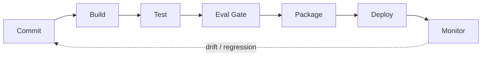

**Figure 31. DevOps Pipeline - Integration and Interoperability** (mermaid). Figure: DevOps Pipeline view for Prompt Engineering. This diagram illustrates the principal components and their interactions as discussed in the surrounding section.

## Deep Dive: Mechanics, Variants and Trade-offs

Having established the essentials, we now go deeper into integration and interoperability. It pays to understand the mechanism rather than treat it as a black box, because most production incidents are explained by one of its steps misbehaving. The distinctions in this section are the ones that separate a working demo from a system that holds up under adversarial inputs, scale and the passage of time.

Consider the principal variants and how to choose between them. Each variant optimises for a different point in the design space - some for latency, some for accuracy, some for cost or operability - and the correct choice follows from explicit requirements rather than from defaults. As with most architectural decisions, the choice is rarely binary; the skill lies in quantifying the trade-offs and choosing deliberately.

In practice this is supported by a mature tooling ecosystem, including OpenAI, Anthropic, Guidance, Outlines. Tools accelerate the work but do not substitute for understanding: the same principles apply whichever implementation you select, and the ability to reason from first principles is what lets you debug when a tool behaves unexpectedly.

A frequent source of subtle bugs is the interaction with cost-aware prompt design. Because cost-aware prompt design concerns compression, context pruning and caching to control token spend, changes there can silently alter the behaviour analysed here. The remedy is contract tests at the boundary and end-to-end evaluations that exercise the interaction explicitly.

Finally, attend to edge cases and degradation. Define what the system should do under partial failure, unexpected inputs and load spikes, and make that behaviour explicit and tested rather than emergent. Graceful degradation - returning a safe, useful result when the ideal one is unavailable - is a hallmark of mature engineering.

For deeper study, the literature offers authoritative treatments such as Wei et al. — Chain-of-Thought Prompting (2022) and Wang et al. — Self-Consistency Improves Chain of Thought (2022). These primary sources reward careful reading and ground the practical guidance above in established results.

## Advanced Considerations

Having established the essentials, we now go deeper into integration and interoperability. It pays to understand the mechanism rather than treat it as a black box, because most production incidents are explained by one of its steps misbehaving. The distinctions in this section are the ones that separate a working demo from a system that holds up under adversarial inputs, scale and the passage of time.

Consider the principal variants and how to choose between them. Each variant optimises for a different point in the design space - some for latency, some for accuracy, some for cost or operability - and the correct choice follows from explicit requirements rather than from defaults. Latency, accuracy and cost form a tension triangle: improving one typically pressures the others, so explicit budgets are essential.

In practice this is supported by a mature tooling ecosystem, including OpenAI, Anthropic, Guidance, Outlines. Tools accelerate the work but do not substitute for understanding: the same principles apply whichever implementation you select, and the ability to reason from first principles is what lets you debug when a tool behaves unexpectedly.

A frequent source of subtle bugs is the interaction with prompt templates and composition. Because prompt templates and composition concerns parameterised templates, partials and guardrail wrappers for reuse at scale, changes there can silently alter the behaviour analysed here. The remedy is contract tests at the boundary and end-to-end evaluations that exercise the interaction explicitly.

Finally, attend to edge cases and degradation. Define what the system should do under partial failure, unexpected inputs and load spikes, and make that behaviour explicit and tested rather than emergent. Graceful degradation - returning a safe, useful result when the ideal one is unavailable - is a hallmark of mature engineering.

For deeper study, the literature offers authoritative treatments such as Wei et al. — Chain-of-Thought Prompting (2022) and Wang et al. — Self-Consistency Improves Chain of Thought (2022). These primary sources reward careful reading and ground the practical guidance above in established results.

## Worked Example

Consider a concrete scenario. A analytics organisation needs natural-language-to-SQL with validation against a catalog. They decide to apply integration and interoperability as part of their Prompt Engineering solution, but wisely treat it as a hypothesis to be validated rather than a foregone conclusion.

The team begins by stating the objective precisely and defining how success will be measured before writing any code. They establish a small but representative evaluation set, agree on acceptance thresholds, and only then prototype the simplest design that could work. Early measurement reveals which assumptions hold and which must be revised, saving weeks of misdirected effort and surfacing edge cases while they are still cheap to fix.

As the prototype matures into a service, the team hardens it: adding input validation, error handling, caching where it pays off, and monitoring that ties back to the original success metric. They document each significant decision in an architecture decision record so that future maintainers understand not just what was built but why.

The outcome is instructive. The system that reaches production is not the most sophisticated design the team considered, but the one whose behaviour they could measure, explain and operate. This is the recurring lesson of Prompt Engineering: durable value comes from the whole system, not from any single clever component.

## Industry Use Cases

Across industries, the ideas in this chapter recur in recognisable ways. The following vignettes show how different sectors apply them and what they have in common.

**Support.** Deterministic, schema-constrained ticket triage and routing. The common thread is that value comes not from the model alone but from the surrounding system - data quality, evaluation, integration and operations - which is precisely where most of the engineering effort belongs.

**Analytics.** Natural-language-to-SQL with validation against a catalog. The common thread is that value comes not from the model alone but from the surrounding system - data quality, evaluation, integration and operations - which is precisely where most of the engineering effort belongs.

**Operations.** Runbook automation with tool calls and confirmation gates. The common thread is that value comes not from the model alone but from the surrounding system - data quality, evaluation, integration and operations - which is precisely where most of the engineering effort belongs.

**Education.** Socratic tutoring with rubric-based answer evaluation. The common thread is that value comes not from the model alone but from the surrounding system - data quality, evaluation, integration and operations - which is precisely where most of the engineering effort belongs.

## Best Practices

The following practices consistently separate successful Prompt Engineering efforts from struggling ones. They are deliberately concrete so they can be adopted as checklist items in design and code review.

- Specify the output format explicitly and validate it programmatically.
- Keep untrusted content clearly delimited and never executed as instructions.
- Version prompts and gate changes behind an evaluation suite.
- Prefer fewer, higher-quality few-shot examples over many noisy ones.

None of these are exotic; they are the unglamorous disciplines that compound into reliability. The cost of adopting them is small compared with the cost of the incidents they prevent, and they become second nature with practice.

## Common Pitfalls

Equally instructive are the failure modes that recur in practice. Each pitfall below has a clear early warning sign and a known remedy, so treat them as a diagnostic checklist when something feels wrong:

- Treating prompts as throwaway strings with no testing or versioning.
- Overlong contexts that dilute attention and inflate cost.
- Mixing untrusted user content with trusted instructions (injection risk).
- Relying on temperature tweaks instead of structural prompt fixes.

The pattern is consistent: most failures stem from skipping measurement, conflating prototype and production standards, or deferring cross-cutting concerns such as security and cost until they become emergencies. Naming these traps in advance is the cheapest way to avoid them.

## Governance, Security and Cost Notes

No discussion of integration and interoperability is complete without its governance, security and cost dimensions, which are too often deferred until they become emergencies. Treating them as first-class concerns from the outset is both cheaper and safer.

**Governance.** Classify the risk of this capability, document its intended and out-of-scope uses, and ensure decisions are traceable to satisfy internal policy and external regulation such as the NIST AI RMF, ISO/IEC 42001 and the EU AI Act. **Security.** Treat all external input as untrusted, validate outputs before acting on them, apply least privilege to any tools or data access, and map controls to the OWASP LLM Top 10 and MITRE ATLAS.

**Cost and sustainability.** Establish explicit budgets for compute, tokens and latency, attribute spend to owners, and revisit the economics as usage scales - a design that is affordable at pilot scale can become untenable at production volume. Building these reflexes into everyday engineering is what allows a Prompt Engineering system to be not only capable but also trustworthy and economically sound.

## Hands-On Exercises

Work through the following exercises. They are designed to move understanding from recognition to application - the level required for real engineering work - so prefer writing and building over merely reading.

1. Explain integration and interoperability to a colleague unfamiliar with Prompt Engineering, using a concrete example from your own domain.
2. Sketch a reference architecture that incorporates integration and interoperability and annotate where observability, security and cost controls belong.
3. Design an evaluation that would tell you whether integration and interoperability is working in production, including the metric, the dataset and the acceptance threshold.
4. Identify two pitfalls relevant to integration and interoperability in your environment and describe the early warning signals you would monitor.
5. Prototype the simplest implementation that demonstrates integration and interoperability, then list exactly what would need to change to make it production-ready.

## Key Takeaways

Key takeaways from this chapter:

- Integration and Interoperability is a systems concern in Prompt Engineering: data, models and operations must be co-designed.
- Measurement is non-negotiable; define success metrics and evaluation before building.
- Favour the simplest design that meets the requirement, and add complexity only when evidence demands it.
- Security, cost and observability are first-class requirements, not afterthoughts.
- Document decisions so the system remains understandable and operable as it evolves.

## Code Walkthrough

Every change to a Prompt Engineering system should pass an evaluation gate. This example shows the minimal shape: align predictions and references, compute a metric, and return a pass/fail decision for CI.

The full listing is shown below; study it line by line and reproduce it locally before moving on.

### Listing: Evaluating Integration and Interoperability with a regression gate

```python
from dataclasses import dataclass


@dataclass
class EvalResult:
    metric: str
    score: float
    passed: bool


def evaluate(predictions: list[str], references: list[str],
             threshold: float = 0.8) -> EvalResult:
    """Score Integration and Interoperability output against references with a simple exact-match metric.

    In practice you would combine several metrics (exact match, semantic
    similarity, LLM-as-judge) and gate releases on the aggregate.
    """
    if len(predictions) != len(references):
        raise ValueError("predictions and references must align")
    hits = sum(p.strip() == r.strip() for p, r in zip(predictions, references))
    score = hits / len(references) if references else 0.0
    return EvalResult(metric="exact_match", score=score, passed=score >= threshold)


if __name__ == "__main__":
    result = evaluate(["yes", "no"], ["yes", "yes"])
    print(f"{result.metric}={result.score:.2f} passed={result.passed}")

```

## Review Questions

1. In the context of Prompt Engineering, which statement best describes “Integration and Interoperability”?
   - A. It removes all security and governance requirements.
   - B. patterns for integrating a Prompt Engineering system with surrounding enterprise systems and data
   - C. It eliminates the need for any evaluation or monitoring.
   - D. It applies exclusively to image data.
   - **Answer: B.** Integration and Interoperability: patterns for integrating a Prompt Engineering system with surrounding enterprise systems and data
2. Which of the following is a recommended best practice when working with Prompt Engineering?
   - A. It makes the system slower but has no other effect.
   - B. Keep untrusted content clearly delimited and never executed as instructions.
   - C. Overlong contexts that dilute attention and inflate cost.
   - D. It is only relevant to academic research, not production.
   - **Answer: B.** Best practice: Keep untrusted content clearly delimited and never executed as instructions.
3. Which of the following is a common pitfall to avoid in Prompt Engineering?
   - A. It applies exclusively to image data.
   - B. It guarantees deterministic output regardless of input.
   - C. It eliminates the need for any evaluation or monitoring.
   - D. Relying on temperature tweaks instead of structural prompt fixes.
   - **Answer: D.** Pitfall to avoid: Relying on temperature tweaks instead of structural prompt fixes.
4. *(Discussion)* Explain Integration and Interoperability and why it matters in a production Prompt Engineering system.
   - **Model answer:** A strong answer defines integration and interoperability (patterns for integrating a Prompt Engineering system with surrounding enterprise systems and data) then connects it to architecture, evaluation, cost, security and operations for Prompt Engineering, citing concrete trade-offs and a real-world example.

---


# Chapter 23. Trends and Research Directions

_This chapter examines trends and research directions within Prompt Engineering. It covers emerging trends, open problems and research directions shaping the future of Prompt Engineering, derives a reference architecture, walks through a worked example and runnable code, surveys industry use cases, and distils best practices and pitfalls, closing with exercises and review questions._

## Introduction

Trends and Research Directions can be characterised as emerging trends, open problems and research directions shaping the future of Prompt Engineering. Understanding this matters because Prompt Engineering systems succeed or fail on exactly these decisions. It helps to separate the conceptual model from its implementation: the former guides reasoning, the latter must contend with real-world constraints.

This chapter builds intuition first, then formalises the ideas, derives an architecture, and finishes with code, exercises and review questions so the material transfers directly to your own Prompt Engineering work. Read it actively: pause at each diagram, reproduce the code, and attempt the exercises before consulting the answers.

## Theory and Foundations

We define Trends and Research Directions as emerging trends, open problems and research directions shaping the future of Prompt Engineering. In an enterprise setting, this translates into concrete requirements: clear interfaces, measurable quality, and controls that satisfy security and governance. It pays to understand the mechanism rather than treat it as a black box, because most production incidents are explained by one of its steps misbehaving.

To place this in context, recall the broader picture: Prompt engineering is the discipline of designing inputs, context and decoding settings that steer foundation models toward reliable, useful behaviour. Within that picture, trends and research directions is one of the load-bearing ideas - the kind that, when understood deeply, makes the rest of Prompt Engineering fall into place. This concept recurs throughout the Prompt Engineering lifecycle, from design to operations.

Trends and Research Directions cannot be understood in isolation from prompt templates and composition. Recall that prompt templates and composition concerns parameterised templates, partials and guardrail wrappers for reuse at scale. The two interact directly: decisions in one constrain the design space of the other, which is why mature teams reason about them together rather than sequentially. Every added component buys capability at the price of operational surface area, and that bargain should be made consciously.

Trends and Research Directions cannot be understood in isolation from structured output and schema enforcement. Recall that structured output and schema enforcement concerns jSON mode, function/tool calling and grammar-constrained decoding for reliable integration. The two interact directly: decisions in one constrain the design space of the other, which is why mature teams reason about them together rather than sequentially. Every added component buys capability at the price of operational surface area, and that bargain should be made consciously.

Several established patterns apply directly to trends and research directions. The first, instruction hierarchy: system > developer > user > retrieved content, is widely adopted because it makes the system's behaviour predictable and observable. A complementary pattern, template + slots with explicit output schema, addresses a related concern and is often deployed alongside it. Patterns are not dogma; they are distilled experience that shortcuts the search for a sound design, and each carries assumptions worth checking against your context.

It is worth being explicit about when to apply this and when to reach for something simpler. In a small prototype, shortcuts around trends and research directions are invisible; in a production Prompt Engineering system serving real traffic, they surface as incidents, cost overruns or compliance gaps. As with most architectural decisions, the choice is rarely binary; the skill lies in quantifying the trade-offs and choosing deliberately. The remainder of this chapter turns these principles into an architecture, code and a checklist you can apply immediately.

## Architecture and Design

From an architectural standpoint, Trends and Research Directions sits at the intersection of data, models and operations. Production prompting introduces a prompt management service that stores versioned templates, an assembly layer that merges instructions with retrieved context under a token budget, and an evaluation harness that scores candidate prompts against golden datasets before promotion. Telemetry links every completion back to the exact prompt version that produced it.

Concretely, the principal building blocks include anatomy of a prompt, zero-, one- and few-shot prompting, chain-of-thought and reasoning prompts, structured output and schema enforcement and retrieval-augmented prompting. Each is a replaceable component behind a stable interface, so the team can upgrade an implementation - a model, an index, a policy engine - without rewriting its neighbours. The contracts between components are where reliability is won or lost, so they are specified explicitly and tested in isolation.

The diagram accompanying this section makes the data and control flow explicit. Requests enter through a well-defined boundary where they are authenticated and validated; only then are they dispatched to the components that perform the work. This boundary is also where rate limiting, quota enforcement and audit logging live, keeping cross-cutting concerns out of the core logic and in one auditable place.

Two qualities deserve emphasis. First, observability is designed in, not bolted on: every component emits structured telemetry so that failures can be localised in minutes rather than hours. Second, the architecture is evolvable - components communicate through stable contracts so that any single part of the Prompt Engineering system can be replaced without a rewrite. Latency, accuracy and cost form a tension triangle: improving one typically pressures the others, so explicit budgets are essential.


**Figure 32. Knowledge Graph - Trends and Research Directions** (mermaid). Figure: Knowledge Graph view for Prompt Engineering. This diagram illustrates the principal components and their interactions as discussed in the surrounding section.

## Deep Dive: Mechanics, Variants and Trade-offs

Having established the essentials, we now go deeper into trends and research directions. Beneath the abstraction lies a concrete process whose steps can each be measured, tested and optimised independently. The distinctions in this section are the ones that separate a working demo from a system that holds up under adversarial inputs, scale and the passage of time.

Consider the principal variants and how to choose between them. Each variant optimises for a different point in the design space - some for latency, some for accuracy, some for cost or operability - and the correct choice follows from explicit requirements rather than from defaults. There is an inherent trade-off between fidelity and cost, and the correct balance depends on the use case and its tolerance for error.

In practice this is supported by a mature tooling ecosystem, including OpenAI, Anthropic, Guidance, Outlines. Tools accelerate the work but do not substitute for understanding: the same principles apply whichever implementation you select, and the ability to reason from first principles is what lets you debug when a tool behaves unexpectedly.

A frequent source of subtle bugs is the interaction with prompt templates and composition. Because prompt templates and composition concerns parameterised templates, partials and guardrail wrappers for reuse at scale, changes there can silently alter the behaviour analysed here. The remedy is contract tests at the boundary and end-to-end evaluations that exercise the interaction explicitly.

Finally, attend to edge cases and degradation. Define what the system should do under partial failure, unexpected inputs and load spikes, and make that behaviour explicit and tested rather than emergent. Graceful degradation - returning a safe, useful result when the ideal one is unavailable - is a hallmark of mature engineering.

For deeper study, the literature offers authoritative treatments such as Wei et al. — Chain-of-Thought Prompting (2022) and Wang et al. — Self-Consistency Improves Chain of Thought (2022). These primary sources reward careful reading and ground the practical guidance above in established results.

## Advanced Considerations

Having established the essentials, we now go deeper into trends and research directions. Mechanically, the behaviour emerges from a few interacting parts that are simpler than the whole they produce. The distinctions in this section are the ones that separate a working demo from a system that holds up under adversarial inputs, scale and the passage of time.

Consider the principal variants and how to choose between them. Each variant optimises for a different point in the design space - some for latency, some for accuracy, some for cost or operability - and the correct choice follows from explicit requirements rather than from defaults. Latency, accuracy and cost form a tension triangle: improving one typically pressures the others, so explicit budgets are essential.

In practice this is supported by a mature tooling ecosystem, including OpenAI, Anthropic, Guidance, Outlines. Tools accelerate the work but do not substitute for understanding: the same principles apply whichever implementation you select, and the ability to reason from first principles is what lets you debug when a tool behaves unexpectedly.

A frequent source of subtle bugs is the interaction with multi-step and agentic prompting. Because multi-step and agentic prompting concerns planner/executor patterns, reflection and decomposition of complex tasks, changes there can silently alter the behaviour analysed here. The remedy is contract tests at the boundary and end-to-end evaluations that exercise the interaction explicitly.

Finally, attend to edge cases and degradation. Define what the system should do under partial failure, unexpected inputs and load spikes, and make that behaviour explicit and tested rather than emergent. Graceful degradation - returning a safe, useful result when the ideal one is unavailable - is a hallmark of mature engineering.

For deeper study, the literature offers authoritative treatments such as Wei et al. — Chain-of-Thought Prompting (2022) and Wang et al. — Self-Consistency Improves Chain of Thought (2022). These primary sources reward careful reading and ground the practical guidance above in established results.

## Worked Example

Consider a concrete scenario. A operations organisation needs runbook automation with tool calls and confirmation gates. They decide to apply trends and research directions as part of their Prompt Engineering solution, but wisely treat it as a hypothesis to be validated rather than a foregone conclusion.

The team begins by stating the objective precisely and defining how success will be measured before writing any code. They establish a small but representative evaluation set, agree on acceptance thresholds, and only then prototype the simplest design that could work. Early measurement reveals which assumptions hold and which must be revised, saving weeks of misdirected effort and surfacing edge cases while they are still cheap to fix.

As the prototype matures into a service, the team hardens it: adding input validation, error handling, caching where it pays off, and monitoring that ties back to the original success metric. They document each significant decision in an architecture decision record so that future maintainers understand not just what was built but why.

The outcome is instructive. The system that reaches production is not the most sophisticated design the team considered, but the one whose behaviour they could measure, explain and operate. This is the recurring lesson of Prompt Engineering: durable value comes from the whole system, not from any single clever component.

## Industry Use Cases

Across industries, the ideas in this chapter recur in recognisable ways. The following vignettes show how different sectors apply them and what they have in common.

**Support.** Deterministic, schema-constrained ticket triage and routing. The common thread is that value comes not from the model alone but from the surrounding system - data quality, evaluation, integration and operations - which is precisely where most of the engineering effort belongs.

**Analytics.** Natural-language-to-SQL with validation against a catalog. The common thread is that value comes not from the model alone but from the surrounding system - data quality, evaluation, integration and operations - which is precisely where most of the engineering effort belongs.

**Operations.** Runbook automation with tool calls and confirmation gates. The common thread is that value comes not from the model alone but from the surrounding system - data quality, evaluation, integration and operations - which is precisely where most of the engineering effort belongs.

**Education.** Socratic tutoring with rubric-based answer evaluation. The common thread is that value comes not from the model alone but from the surrounding system - data quality, evaluation, integration and operations - which is precisely where most of the engineering effort belongs.

## Best Practices

The following practices consistently separate successful Prompt Engineering efforts from struggling ones. They are deliberately concrete so they can be adopted as checklist items in design and code review.

- Specify the output format explicitly and validate it programmatically.
- Keep untrusted content clearly delimited and never executed as instructions.
- Version prompts and gate changes behind an evaluation suite.
- Prefer fewer, higher-quality few-shot examples over many noisy ones.

None of these are exotic; they are the unglamorous disciplines that compound into reliability. The cost of adopting them is small compared with the cost of the incidents they prevent, and they become second nature with practice.

## Common Pitfalls

Equally instructive are the failure modes that recur in practice. Each pitfall below has a clear early warning sign and a known remedy, so treat them as a diagnostic checklist when something feels wrong:

- Treating prompts as throwaway strings with no testing or versioning.
- Overlong contexts that dilute attention and inflate cost.
- Mixing untrusted user content with trusted instructions (injection risk).
- Relying on temperature tweaks instead of structural prompt fixes.

The pattern is consistent: most failures stem from skipping measurement, conflating prototype and production standards, or deferring cross-cutting concerns such as security and cost until they become emergencies. Naming these traps in advance is the cheapest way to avoid them.

## Governance, Security and Cost Notes

No discussion of trends and research directions is complete without its governance, security and cost dimensions, which are too often deferred until they become emergencies. Treating them as first-class concerns from the outset is both cheaper and safer.

**Governance.** Classify the risk of this capability, document its intended and out-of-scope uses, and ensure decisions are traceable to satisfy internal policy and external regulation such as the NIST AI RMF, ISO/IEC 42001 and the EU AI Act. **Security.** Treat all external input as untrusted, validate outputs before acting on them, apply least privilege to any tools or data access, and map controls to the OWASP LLM Top 10 and MITRE ATLAS.

**Cost and sustainability.** Establish explicit budgets for compute, tokens and latency, attribute spend to owners, and revisit the economics as usage scales - a design that is affordable at pilot scale can become untenable at production volume. Building these reflexes into everyday engineering is what allows a Prompt Engineering system to be not only capable but also trustworthy and economically sound.

## Hands-On Exercises

Work through the following exercises. They are designed to move understanding from recognition to application - the level required for real engineering work - so prefer writing and building over merely reading.

1. Explain trends and research directions to a colleague unfamiliar with Prompt Engineering, using a concrete example from your own domain.
2. Sketch a reference architecture that incorporates trends and research directions and annotate where observability, security and cost controls belong.
3. Design an evaluation that would tell you whether trends and research directions is working in production, including the metric, the dataset and the acceptance threshold.
4. Identify two pitfalls relevant to trends and research directions in your environment and describe the early warning signals you would monitor.
5. Prototype the simplest implementation that demonstrates trends and research directions, then list exactly what would need to change to make it production-ready.

## Key Takeaways

Key takeaways from this chapter:

- Trends and Research Directions is a systems concern in Prompt Engineering: data, models and operations must be co-designed.
- Measurement is non-negotiable; define success metrics and evaluation before building.
- Favour the simplest design that meets the requirement, and add complexity only when evidence demands it.
- Security, cost and observability are first-class requirements, not afterthoughts.
- Document decisions so the system remains understandable and operable as it evolves.

## Review Questions

1. In the context of Prompt Engineering, which statement best describes “Trends and Research Directions”?
   - A. It makes the system slower but has no other effect.
   - B. emerging trends, open problems and research directions shaping the future of Prompt Engineering
   - C. It removes all security and governance requirements.
   - D. It eliminates the need for any evaluation or monitoring.
   - **Answer: B.** Trends and Research Directions: emerging trends, open problems and research directions shaping the future of Prompt Engineering
2. Which of the following is a recommended best practice when working with Prompt Engineering?
   - A. Keep untrusted content clearly delimited and never executed as instructions.
   - B. Overlong contexts that dilute attention and inflate cost.
   - C. It makes the system slower but has no other effect.
   - D. Mixing untrusted user content with trusted instructions (injection risk).
   - **Answer: A.** Best practice: Keep untrusted content clearly delimited and never executed as instructions.
3. Which of the following is a common pitfall to avoid in Prompt Engineering?
   - A. Overlong contexts that dilute attention and inflate cost.
   - B. Keep untrusted content clearly delimited and never executed as instructions.
   - C. Prefer fewer, higher-quality few-shot examples over many noisy ones.
   - D. It guarantees deterministic output regardless of input.
   - **Answer: A.** Pitfall to avoid: Overlong contexts that dilute attention and inflate cost.
4. *(Discussion)* Describe a failure mode of Trends and Research Directions and how you would mitigate it.
   - **Model answer:** A strong answer defines trends and research directions (emerging trends, open problems and research directions shaping the future of Prompt Engineering) then connects it to architecture, evaluation, cost, security and operations for Prompt Engineering, citing concrete trade-offs and a real-world example.

---


# Chapter 24. Capstone Project

_This chapter examines capstone project within Prompt Engineering. It covers a substantial capstone project that consolidates the entire book into a portfolio-grade Prompt Engineering deliverable, derives a reference architecture, walks through a worked example and runnable code, surveys industry use cases, and distils best practices and pitfalls, closing with exercises and review questions._

## Introduction

Capstone Project can be characterised as a substantial capstone project that consolidates the entire book into a portfolio-grade Prompt Engineering deliverable. Neglecting it is one of the most common reasons Prompt Engineering initiatives stall in production. The right abstraction here pays compounding dividends, because downstream components depend on its guarantees.

This chapter builds intuition first, then formalises the ideas, derives an architecture, and finishes with code, exercises and review questions so the material transfers directly to your own Prompt Engineering work. Read it actively: pause at each diagram, reproduce the code, and attempt the exercises before consulting the answers.

## Theory and Foundations

Capstone Project refers to a substantial capstone project that consolidates the entire book into a portfolio-grade Prompt Engineering deliverable. In an enterprise setting, this translates into concrete requirements: clear interfaces, measurable quality, and controls that satisfy security and governance. It pays to understand the mechanism rather than treat it as a black box, because most production incidents are explained by one of its steps misbehaving.

To place this in context, recall the broader picture: Prompt engineering is the discipline of designing inputs, context and decoding settings that steer foundation models toward reliable, useful behaviour. Within that picture, capstone project is one of the load-bearing ideas - the kind that, when understood deeply, makes the rest of Prompt Engineering fall into place. Understanding this matters because Prompt Engineering systems succeed or fail on exactly these decisions.

Capstone Project cannot be understood in isolation from patterns, anti-patterns and a style guide. Recall that patterns, anti-patterns and a style guide concerns a reusable library of prompt patterns and the failure modes to avoid. The two interact directly: decisions in one constrain the design space of the other, which is why mature teams reason about them together rather than sequentially. As with most architectural decisions, the choice is rarely binary; the skill lies in quantifying the trade-offs and choosing deliberately.

Capstone Project cannot be understood in isolation from retrieval-augmented prompting. Recall that retrieval-augmented prompting concerns injecting grounded context, citation discipline and context-window budgeting. The two interact directly: decisions in one constrain the design space of the other, which is why mature teams reason about them together rather than sequentially. Simplicity is a feature. The simplest design that meets the requirement should be the default, with complexity added only when measurement justifies it.

Several established patterns apply directly to capstone project. The first, critique-and-revise loops for quality improvement, is widely adopted because it makes the system's behaviour predictable and observable. A complementary pattern, self-consistency voting for high-stakes reasoning, addresses a related concern and is often deployed alongside it. Patterns are not dogma; they are distilled experience that shortcuts the search for a sound design, and each carries assumptions worth checking against your context.

Knowing when not to use a technique is as valuable as knowing how to use it. In a small prototype, shortcuts around capstone project are invisible; in a production Prompt Engineering system serving real traffic, they surface as incidents, cost overruns or compliance gaps. There is an inherent trade-off between fidelity and cost, and the correct balance depends on the use case and its tolerance for error. The remainder of this chapter turns these principles into an architecture, code and a checklist you can apply immediately.

## Architecture and Design

From an architectural standpoint, Capstone Project sits at the intersection of data, models and operations. Production prompting introduces a prompt management service that stores versioned templates, an assembly layer that merges instructions with retrieved context under a token budget, and an evaluation harness that scores candidate prompts against golden datasets before promotion. Telemetry links every completion back to the exact prompt version that produced it.

Concretely, the principal building blocks include anatomy of a prompt, zero-, one- and few-shot prompting, chain-of-thought and reasoning prompts, structured output and schema enforcement and retrieval-augmented prompting. Each is a replaceable component behind a stable interface, so the team can upgrade an implementation - a model, an index, a policy engine - without rewriting its neighbours. The contracts between components are where reliability is won or lost, so they are specified explicitly and tested in isolation.

The diagram accompanying this section makes the data and control flow explicit. Requests enter through a well-defined boundary where they are authenticated and validated; only then are they dispatched to the components that perform the work. This boundary is also where rate limiting, quota enforcement and audit logging live, keeping cross-cutting concerns out of the core logic and in one auditable place.

Two qualities deserve emphasis. First, observability is designed in, not bolted on: every component emits structured telemetry so that failures can be localised in minutes rather than hours. Second, the architecture is evolvable - components communicate through stable contracts so that any single part of the Prompt Engineering system can be replaced without a rewrite. There is an inherent trade-off between fidelity and cost, and the correct balance depends on the use case and its tolerance for error.

```mermaid
graph LR
  D(("Prompt Engineering"))
  D --- C0[Anatomy of a Prompt]
  D --- C1[Zero-, One- and Few-S…]
  D --- C2[Chain-of-Thought and …]
  D --- C3[Structured Output and…]
  D --- C4[Retrieval-Augmented P…]
  C0 --- C1
  C1 --- C2
```

**Figure 33. Capability Map - Capstone Project** (mermaid). Figure: Capability Map view for Prompt Engineering. This diagram illustrates the principal components and their interactions as discussed in the surrounding section.

## Deep Dive: Mechanics, Variants and Trade-offs

Having established the essentials, we now go deeper into capstone project. Mechanically, the behaviour emerges from a few interacting parts that are simpler than the whole they produce. The distinctions in this section are the ones that separate a working demo from a system that holds up under adversarial inputs, scale and the passage of time.

Consider the principal variants and how to choose between them. Each variant optimises for a different point in the design space - some for latency, some for accuracy, some for cost or operability - and the correct choice follows from explicit requirements rather than from defaults. Simplicity is a feature. The simplest design that meets the requirement should be the default, with complexity added only when measurement justifies it.

In practice this is supported by a mature tooling ecosystem, including OpenAI, Anthropic, Guidance, Outlines. Tools accelerate the work but do not substitute for understanding: the same principles apply whichever implementation you select, and the ability to reason from first principles is what lets you debug when a tool behaves unexpectedly.

A frequent source of subtle bugs is the interaction with patterns, anti-patterns and a style guide. Because patterns, anti-patterns and a style guide concerns a reusable library of prompt patterns and the failure modes to avoid, changes there can silently alter the behaviour analysed here. The remedy is contract tests at the boundary and end-to-end evaluations that exercise the interaction explicitly.

Finally, attend to edge cases and degradation. Define what the system should do under partial failure, unexpected inputs and load spikes, and make that behaviour explicit and tested rather than emergent. Graceful degradation - returning a safe, useful result when the ideal one is unavailable - is a hallmark of mature engineering.

For deeper study, the literature offers authoritative treatments such as Wei et al. — Chain-of-Thought Prompting (2022) and Wang et al. — Self-Consistency Improves Chain of Thought (2022). These primary sources reward careful reading and ground the practical guidance above in established results.

## Advanced Considerations

Having established the essentials, we now go deeper into capstone project. Beneath the abstraction lies a concrete process whose steps can each be measured, tested and optimised independently. The distinctions in this section are the ones that separate a working demo from a system that holds up under adversarial inputs, scale and the passage of time.

Consider the principal variants and how to choose between them. Each variant optimises for a different point in the design space - some for latency, some for accuracy, some for cost or operability - and the correct choice follows from explicit requirements rather than from defaults. Every added component buys capability at the price of operational surface area, and that bargain should be made consciously.

In practice this is supported by a mature tooling ecosystem, including OpenAI, Anthropic, Guidance, Outlines. Tools accelerate the work but do not substitute for understanding: the same principles apply whichever implementation you select, and the ability to reason from first principles is what lets you debug when a tool behaves unexpectedly.

A frequent source of subtle bugs is the interaction with defending against prompt injection. Because defending against prompt injection concerns untrusted-content isolation, instruction hierarchy and output validation, changes there can silently alter the behaviour analysed here. The remedy is contract tests at the boundary and end-to-end evaluations that exercise the interaction explicitly.

Finally, attend to edge cases and degradation. Define what the system should do under partial failure, unexpected inputs and load spikes, and make that behaviour explicit and tested rather than emergent. Graceful degradation - returning a safe, useful result when the ideal one is unavailable - is a hallmark of mature engineering.

For deeper study, the literature offers authoritative treatments such as Wei et al. — Chain-of-Thought Prompting (2022) and Wang et al. — Self-Consistency Improves Chain of Thought (2022). These primary sources reward careful reading and ground the practical guidance above in established results.

## Worked Example

A worked example clarifies how these ideas behave in practice. A support organisation needs deterministic, schema-constrained ticket triage and routing. They decide to apply capstone project as part of their Prompt Engineering solution, but wisely treat it as a hypothesis to be validated rather than a foregone conclusion.

The team begins by stating the objective precisely and defining how success will be measured before writing any code. They establish a small but representative evaluation set, agree on acceptance thresholds, and only then prototype the simplest design that could work. Early measurement reveals which assumptions hold and which must be revised, saving weeks of misdirected effort and surfacing edge cases while they are still cheap to fix.

As the prototype matures into a service, the team hardens it: adding input validation, error handling, caching where it pays off, and monitoring that ties back to the original success metric. They document each significant decision in an architecture decision record so that future maintainers understand not just what was built but why.

The outcome is instructive. The system that reaches production is not the most sophisticated design the team considered, but the one whose behaviour they could measure, explain and operate. This is the recurring lesson of Prompt Engineering: durable value comes from the whole system, not from any single clever component.

## Industry Use Cases

Across industries, the ideas in this chapter recur in recognisable ways. The following vignettes show how different sectors apply them and what they have in common.

**Support.** Deterministic, schema-constrained ticket triage and routing. The common thread is that value comes not from the model alone but from the surrounding system - data quality, evaluation, integration and operations - which is precisely where most of the engineering effort belongs.

**Analytics.** Natural-language-to-SQL with validation against a catalog. The common thread is that value comes not from the model alone but from the surrounding system - data quality, evaluation, integration and operations - which is precisely where most of the engineering effort belongs.

**Operations.** Runbook automation with tool calls and confirmation gates. The common thread is that value comes not from the model alone but from the surrounding system - data quality, evaluation, integration and operations - which is precisely where most of the engineering effort belongs.

**Education.** Socratic tutoring with rubric-based answer evaluation. The common thread is that value comes not from the model alone but from the surrounding system - data quality, evaluation, integration and operations - which is precisely where most of the engineering effort belongs.

## Best Practices

The following practices consistently separate successful Prompt Engineering efforts from struggling ones. They are deliberately concrete so they can be adopted as checklist items in design and code review.

- Specify the output format explicitly and validate it programmatically.
- Keep untrusted content clearly delimited and never executed as instructions.
- Version prompts and gate changes behind an evaluation suite.
- Prefer fewer, higher-quality few-shot examples over many noisy ones.

None of these are exotic; they are the unglamorous disciplines that compound into reliability. The cost of adopting them is small compared with the cost of the incidents they prevent, and they become second nature with practice.

## Common Pitfalls

Equally instructive are the failure modes that recur in practice. Each pitfall below has a clear early warning sign and a known remedy, so treat them as a diagnostic checklist when something feels wrong:

- Treating prompts as throwaway strings with no testing or versioning.
- Overlong contexts that dilute attention and inflate cost.
- Mixing untrusted user content with trusted instructions (injection risk).
- Relying on temperature tweaks instead of structural prompt fixes.

The pattern is consistent: most failures stem from skipping measurement, conflating prototype and production standards, or deferring cross-cutting concerns such as security and cost until they become emergencies. Naming these traps in advance is the cheapest way to avoid them.

## Governance, Security and Cost Notes

No discussion of capstone project is complete without its governance, security and cost dimensions, which are too often deferred until they become emergencies. Treating them as first-class concerns from the outset is both cheaper and safer.

**Governance.** Classify the risk of this capability, document its intended and out-of-scope uses, and ensure decisions are traceable to satisfy internal policy and external regulation such as the NIST AI RMF, ISO/IEC 42001 and the EU AI Act. **Security.** Treat all external input as untrusted, validate outputs before acting on them, apply least privilege to any tools or data access, and map controls to the OWASP LLM Top 10 and MITRE ATLAS.

**Cost and sustainability.** Establish explicit budgets for compute, tokens and latency, attribute spend to owners, and revisit the economics as usage scales - a design that is affordable at pilot scale can become untenable at production volume. Building these reflexes into everyday engineering is what allows a Prompt Engineering system to be not only capable but also trustworthy and economically sound.

## Hands-On Exercises

Work through the following exercises. They are designed to move understanding from recognition to application - the level required for real engineering work - so prefer writing and building over merely reading.

1. Explain capstone project to a colleague unfamiliar with Prompt Engineering, using a concrete example from your own domain.
2. Sketch a reference architecture that incorporates capstone project and annotate where observability, security and cost controls belong.
3. Design an evaluation that would tell you whether capstone project is working in production, including the metric, the dataset and the acceptance threshold.
4. Identify two pitfalls relevant to capstone project in your environment and describe the early warning signals you would monitor.
5. Prototype the simplest implementation that demonstrates capstone project, then list exactly what would need to change to make it production-ready.

## Key Takeaways

Key takeaways from this chapter:

- Capstone Project is a systems concern in Prompt Engineering: data, models and operations must be co-designed.
- Measurement is non-negotiable; define success metrics and evaluation before building.
- Favour the simplest design that meets the requirement, and add complexity only when evidence demands it.
- Security, cost and observability are first-class requirements, not afterthoughts.
- Document decisions so the system remains understandable and operable as it evolves.

## Code Walkthrough

Every change to a Prompt Engineering system should pass an evaluation gate. This example shows the minimal shape: align predictions and references, compute a metric, and return a pass/fail decision for CI.

The full listing is shown below; study it line by line and reproduce it locally before moving on.

### Listing: Evaluating Capstone Project with a regression gate

```python
from dataclasses import dataclass


@dataclass
class EvalResult:
    metric: str
    score: float
    passed: bool


def evaluate(predictions: list[str], references: list[str],
             threshold: float = 0.8) -> EvalResult:
    """Score Capstone Project output against references with a simple exact-match metric.

    In practice you would combine several metrics (exact match, semantic
    similarity, LLM-as-judge) and gate releases on the aggregate.
    """
    if len(predictions) != len(references):
        raise ValueError("predictions and references must align")
    hits = sum(p.strip() == r.strip() for p, r in zip(predictions, references))
    score = hits / len(references) if references else 0.0
    return EvalResult(metric="exact_match", score=score, passed=score >= threshold)


if __name__ == "__main__":
    result = evaluate(["yes", "no"], ["yes", "yes"])
    print(f"{result.metric}={result.score:.2f} passed={result.passed}")

```

## Review Questions

1. In the context of Prompt Engineering, which statement best describes “Capstone Project”?
   - A. It is only relevant to academic research, not production.
   - B. It guarantees deterministic output regardless of input.
   - C. a substantial capstone project that consolidates the entire book into a portfolio-grade Prompt Engineering deliverable
   - D. It eliminates the need for any evaluation or monitoring.
   - **Answer: C.** Capstone Project: a substantial capstone project that consolidates the entire book into a portfolio-grade Prompt Engineering deliverable
2. Which of the following is a recommended best practice when working with Prompt Engineering?
   - A. It guarantees deterministic output regardless of input.
   - B. Mixing untrusted user content with trusted instructions (injection risk).
   - C. Treating prompts as throwaway strings with no testing or versioning.
   - D. Specify the output format explicitly and validate it programmatically.
   - **Answer: D.** Best practice: Specify the output format explicitly and validate it programmatically.
3. Which of the following is a common pitfall to avoid in Prompt Engineering?
   - A. Overlong contexts that dilute attention and inflate cost.
   - B. It makes the system slower but has no other effect.
   - C. It eliminates the need for any evaluation or monitoring.
   - D. It applies exclusively to image data.
   - **Answer: A.** Pitfall to avoid: Overlong contexts that dilute attention and inflate cost.
4. *(Discussion)* Walk through how you would design Capstone Project for an enterprise Prompt Engineering workload.
   - **Model answer:** A strong answer defines capstone project (a substantial capstone project that consolidates the entire book into a portfolio-grade Prompt Engineering deliverable) then connects it to architecture, evaluation, cost, security and operations for Prompt Engineering, citing concrete trade-offs and a real-world example.

---


# Chapter 25. Certification Preparation and Review

_This chapter examines certification preparation and review within Prompt Engineering. It covers a structured review and certification-style preparation covering the full breadth of Prompt Engineering, derives a reference architecture, walks through a worked example and runnable code, surveys industry use cases, and distils best practices and pitfalls, closing with exercises and review questions._

## Introduction

Formally, Certification Preparation and Review addresses a structured review and certification-style preparation covering the full breadth of Prompt Engineering. Understanding this matters because Prompt Engineering systems succeed or fail on exactly these decisions. Seasoned practitioners treat this as a systems problem, co-designing data, models and operations rather than optimising any one in isolation.

This chapter builds intuition first, then formalises the ideas, derives an architecture, and finishes with code, exercises and review questions so the material transfers directly to your own Prompt Engineering work. Read it actively: pause at each diagram, reproduce the code, and attempt the exercises before consulting the answers.

## Theory and Foundations

Certification Preparation and Review can be characterised as a structured review and certification-style preparation covering the full breadth of Prompt Engineering. What distinguishes a production-grade approach from a prototype is the discipline of measurement: every claim is backed by an evaluation rather than intuition. Mechanically, the behaviour emerges from a few interacting parts that are simpler than the whole they produce.

To place this in context, recall the broader picture: Prompt engineering is the discipline of designing inputs, context and decoding settings that steer foundation models toward reliable, useful behaviour. Within that picture, certification preparation and review is one of the load-bearing ideas - the kind that, when understood deeply, makes the rest of Prompt Engineering fall into place. Understanding this matters because Prompt Engineering systems succeed or fail on exactly these decisions.

Certification Preparation and Review cannot be understood in isolation from patterns, anti-patterns and a style guide. Recall that patterns, anti-patterns and a style guide concerns a reusable library of prompt patterns and the failure modes to avoid. The two interact directly: decisions in one constrain the design space of the other, which is why mature teams reason about them together rather than sequentially. Latency, accuracy and cost form a tension triangle: improving one typically pressures the others, so explicit budgets are essential.

Certification Preparation and Review cannot be understood in isolation from prompt management and versioning. Recall that prompt management and versioning concerns registries, A/B testing and rollback for production prompts. The two interact directly: decisions in one constrain the design space of the other, which is why mature teams reason about them together rather than sequentially. Simplicity is a feature. The simplest design that meets the requirement should be the default, with complexity added only when measurement justifies it.

Several established patterns apply directly to certification preparation and review. The first, template + slots with explicit output schema, is widely adopted because it makes the system's behaviour predictable and observable. A complementary pattern, critique-and-revise loops for quality improvement, addresses a related concern and is often deployed alongside it. Patterns are not dogma; they are distilled experience that shortcuts the search for a sound design, and each carries assumptions worth checking against your context.

It is worth being explicit about when to apply this and when to reach for something simpler. In a small prototype, shortcuts around certification preparation and review are invisible; in a production Prompt Engineering system serving real traffic, they surface as incidents, cost overruns or compliance gaps. Every added component buys capability at the price of operational surface area, and that bargain should be made consciously. The remainder of this chapter turns these principles into an architecture, code and a checklist you can apply immediately.

## Architecture and Design

A robust architecture for Certification Preparation and Review is layered so each part can evolve independently without destabilising the whole. Production prompting introduces a prompt management service that stores versioned templates, an assembly layer that merges instructions with retrieved context under a token budget, and an evaluation harness that scores candidate prompts against golden datasets before promotion. Telemetry links every completion back to the exact prompt version that produced it.

Concretely, the principal building blocks include anatomy of a prompt, zero-, one- and few-shot prompting, chain-of-thought and reasoning prompts, structured output and schema enforcement and retrieval-augmented prompting. Each is a replaceable component behind a stable interface, so the team can upgrade an implementation - a model, an index, a policy engine - without rewriting its neighbours. The contracts between components are where reliability is won or lost, so they are specified explicitly and tested in isolation.

The diagram accompanying this section makes the data and control flow explicit. Requests enter through a well-defined boundary where they are authenticated and validated; only then are they dispatched to the components that perform the work. This boundary is also where rate limiting, quota enforcement and audit logging live, keeping cross-cutting concerns out of the core logic and in one auditable place.

Two qualities deserve emphasis. First, observability is designed in, not bolted on: every component emits structured telemetry so that failures can be localised in minutes rather than hours. Second, the architecture is evolvable - components communicate through stable contracts so that any single part of the Prompt Engineering system can be replaced without a rewrite. As with most architectural decisions, the choice is rarely binary; the skill lies in quantifying the trade-offs and choosing deliberately.

```plantuml
@startuml
title Architecture - Certification Preparation and Review
class Service {
  +process(req)
  +evaluate(sample)
}
class Repository {
  +get(id)
  +put(e)
}
Service --> Repository
@enduml
```

_Source diagram (plantuml); render with the appropriate tool._

**Figure 34. Architecture - Certification Preparation and Review** (plantuml). Figure: Architecture view for Prompt Engineering. This diagram illustrates the principal components and their interactions as discussed in the surrounding section.

<div class="diagram-svg">

<svg xmlns="http://www.w3.org/2000/svg" width="840" height="460" data-tpl="timeline" data-pal="5-3" viewBox="0 0 840 460" font-family="Inter, Segoe UI, Arial, sans-serif"><defs><marker id="ar" markerWidth="9" markerHeight="9" refX="7" refY="3" orient="auto"><path d="M0,0 L7,3 L0,6 z" fill="#94a3b8"/></marker><marker id="arw" markerWidth="9" markerHeight="9" refX="7" refY="3" orient="auto"><path d="M0,0 L7,3 L0,6 z" fill="#ffffff"/></marker><filter id="sh" x="-20%" y="-20%" width="140%" height="140%"><feDropShadow dx="0" dy="2" stdDeviation="3" flood-color="#0f172a" flood-opacity="0.16"/></filter></defs><defs><linearGradient id="bnfc82207" x1="0" y1="0" x2="1" y2="0"><stop offset="0" stop-color="#3b82f6"/><stop offset="1" stop-color="#60a5fa"/></linearGradient></defs><rect width="840" height="460" rx="14" fill="#ffffff"/><rect x="0" y="0" width="840" height="48" rx="14" fill="url(#bnfc82207)"/><rect x="0" y="32" width="840" height="16" fill="url(#bnfc82207)"/><text x="420" y="25" text-anchor="middle" font-size="14.5" font-weight="700" fill="#ffffff" dominant-baseline="middle">Data Flow - Certification Preparation and Review</text><line x1="68" y1="230.0" x2="772" y2="230.0" stroke="#cbd5e1" stroke-width="3"/><circle cx="68" cy="230.0" r="9" fill="#3b82f6"/><line x1="68" y1="230.0" x2="68" y2="198" stroke="#cbd5e1" stroke-width="1.4"/><rect x="-2" y="138" width="140" height="52" rx="11" fill="#3b82f6" filter="url(#sh)"/><text x="68" y="151" text-anchor="middle" font-size="9.5" font-weight="600" fill="#ffffff" dominant-baseline="middle">Patterns, Anti-Patterns</text><text x="68" y="161" text-anchor="middle" font-size="9.5" font-weight="600" fill="#ffffff" dominant-baseline="middle">and a Style Guide</text><text x="68" y="175" text-anchor="middle" font-size="7.5" font-weight="500" fill="#ffffff" dominant-baseline="middle">Phase 1</text><circle cx="244" cy="230.0" r="9" fill="#60a5fa"/><line x1="244" y1="230.0" x2="244" y2="254" stroke="#cbd5e1" stroke-width="1.4"/><rect x="174" y="254" width="140" height="52" rx="11" fill="#60a5fa" filter="url(#sh)"/><text x="244" y="272" text-anchor="middle" font-size="11" font-weight="600" fill="#ffffff" dominant-baseline="middle">Anatomy of a Prompt</text><text x="244" y="291" text-anchor="middle" font-size="9" font-weight="500" fill="#ffffff" dominant-baseline="middle">Phase 2</text><circle cx="420" cy="230.0" r="9" fill="#1e40af"/><line x1="420" y1="230.0" x2="420" y2="198" stroke="#cbd5e1" stroke-width="1.4"/><rect x="350" y="138" width="140" height="52" rx="11" fill="#1e40af" filter="url(#sh)"/><text x="420" y="151" text-anchor="middle" font-size="9.5" font-weight="600" fill="#ffffff" dominant-baseline="middle">Zero-, One- and Few-Shot</text><text x="420" y="161" text-anchor="middle" font-size="9.5" font-weight="600" fill="#ffffff" dominant-baseline="middle">Prompting</text><text x="420" y="175" text-anchor="middle" font-size="7.5" font-weight="500" fill="#ffffff" dominant-baseline="middle">Phase 3</text><circle cx="596" cy="230.0" r="9" fill="#1e3a8a"/><line x1="596" y1="230.0" x2="596" y2="254" stroke="#cbd5e1" stroke-width="1.4"/><rect x="526" y="254" width="140" height="52" rx="11" fill="#1e3a8a" filter="url(#sh)"/><text x="596" y="267" text-anchor="middle" font-size="9.5" font-weight="600" fill="#ffffff" dominant-baseline="middle">Chain-of-Thought and</text><text x="596" y="277" text-anchor="middle" font-size="9.5" font-weight="600" fill="#ffffff" dominant-baseline="middle">Reasoning Prompts</text><text x="596" y="291" text-anchor="middle" font-size="7.5" font-weight="500" fill="#ffffff" dominant-baseline="middle">Phase 4</text><circle cx="772" cy="230.0" r="9" fill="#1d4ed8"/><line x1="772" y1="230.0" x2="772" y2="198" stroke="#cbd5e1" stroke-width="1.4"/><rect x="702" y="138" width="140" height="52" rx="11" fill="#1d4ed8" filter="url(#sh)"/><text x="772" y="151" text-anchor="middle" font-size="9.5" font-weight="600" fill="#ffffff" dominant-baseline="middle">Structured Output and</text><text x="772" y="161" text-anchor="middle" font-size="9.5" font-weight="600" fill="#ffffff" dominant-baseline="middle">Schema Enforcement</text><text x="772" y="175" text-anchor="middle" font-size="7.5" font-weight="500" fill="#ffffff" dominant-baseline="middle">Phase 5</text><text x="28" y="446" text-anchor="start" font-size="9.5" font-weight="500" fill="#64748b" dominant-baseline="middle">Prompt Engineering  •  Data Flow</text></svg>

</div>

**Figure 35. Data Flow - Certification Preparation and Review** (svg). Figure: Data Flow view for Prompt Engineering. This diagram illustrates the principal components and their interactions as discussed in the surrounding section.

## Deep Dive: Mechanics, Variants and Trade-offs

Having established the essentials, we now go deeper into certification preparation and review. Beneath the abstraction lies a concrete process whose steps can each be measured, tested and optimised independently. The distinctions in this section are the ones that separate a working demo from a system that holds up under adversarial inputs, scale and the passage of time.

Consider the principal variants and how to choose between them. Each variant optimises for a different point in the design space - some for latency, some for accuracy, some for cost or operability - and the correct choice follows from explicit requirements rather than from defaults. Simplicity is a feature. The simplest design that meets the requirement should be the default, with complexity added only when measurement justifies it.

In practice this is supported by a mature tooling ecosystem, including OpenAI, Anthropic, Guidance, Outlines. Tools accelerate the work but do not substitute for understanding: the same principles apply whichever implementation you select, and the ability to reason from first principles is what lets you debug when a tool behaves unexpectedly.

A frequent source of subtle bugs is the interaction with patterns, anti-patterns and a style guide. Because patterns, anti-patterns and a style guide concerns a reusable library of prompt patterns and the failure modes to avoid, changes there can silently alter the behaviour analysed here. The remedy is contract tests at the boundary and end-to-end evaluations that exercise the interaction explicitly.

Finally, attend to edge cases and degradation. Define what the system should do under partial failure, unexpected inputs and load spikes, and make that behaviour explicit and tested rather than emergent. Graceful degradation - returning a safe, useful result when the ideal one is unavailable - is a hallmark of mature engineering.

For deeper study, the literature offers authoritative treatments such as Wei et al. — Chain-of-Thought Prompting (2022) and Wang et al. — Self-Consistency Improves Chain of Thought (2022). These primary sources reward careful reading and ground the practical guidance above in established results.

## Advanced Considerations

Having established the essentials, we now go deeper into certification preparation and review. Beneath the abstraction lies a concrete process whose steps can each be measured, tested and optimised independently. The distinctions in this section are the ones that separate a working demo from a system that holds up under adversarial inputs, scale and the passage of time.

Consider the principal variants and how to choose between them. Each variant optimises for a different point in the design space - some for latency, some for accuracy, some for cost or operability - and the correct choice follows from explicit requirements rather than from defaults. As with most architectural decisions, the choice is rarely binary; the skill lies in quantifying the trade-offs and choosing deliberately.

In practice this is supported by a mature tooling ecosystem, including OpenAI, Anthropic, Guidance, Outlines. Tools accelerate the work but do not substitute for understanding: the same principles apply whichever implementation you select, and the ability to reason from first principles is what lets you debug when a tool behaves unexpectedly.

A frequent source of subtle bugs is the interaction with patterns, anti-patterns and a style guide. Because patterns, anti-patterns and a style guide concerns a reusable library of prompt patterns and the failure modes to avoid, changes there can silently alter the behaviour analysed here. The remedy is contract tests at the boundary and end-to-end evaluations that exercise the interaction explicitly.

Finally, attend to edge cases and degradation. Define what the system should do under partial failure, unexpected inputs and load spikes, and make that behaviour explicit and tested rather than emergent. Graceful degradation - returning a safe, useful result when the ideal one is unavailable - is a hallmark of mature engineering.

For deeper study, the literature offers authoritative treatments such as Wei et al. — Chain-of-Thought Prompting (2022) and Wang et al. — Self-Consistency Improves Chain of Thought (2022). These primary sources reward careful reading and ground the practical guidance above in established results.

## Worked Example

To ground the discussion, walk through a representative example. A analytics organisation needs natural-language-to-SQL with validation against a catalog. They decide to apply certification preparation and review as part of their Prompt Engineering solution, but wisely treat it as a hypothesis to be validated rather than a foregone conclusion.

The team begins by stating the objective precisely and defining how success will be measured before writing any code. They establish a small but representative evaluation set, agree on acceptance thresholds, and only then prototype the simplest design that could work. Early measurement reveals which assumptions hold and which must be revised, saving weeks of misdirected effort and surfacing edge cases while they are still cheap to fix.

As the prototype matures into a service, the team hardens it: adding input validation, error handling, caching where it pays off, and monitoring that ties back to the original success metric. They document each significant decision in an architecture decision record so that future maintainers understand not just what was built but why.

The outcome is instructive. The system that reaches production is not the most sophisticated design the team considered, but the one whose behaviour they could measure, explain and operate. This is the recurring lesson of Prompt Engineering: durable value comes from the whole system, not from any single clever component.

## Industry Use Cases

Across industries, the ideas in this chapter recur in recognisable ways. The following vignettes show how different sectors apply them and what they have in common.

**Support.** Deterministic, schema-constrained ticket triage and routing. The common thread is that value comes not from the model alone but from the surrounding system - data quality, evaluation, integration and operations - which is precisely where most of the engineering effort belongs.

**Analytics.** Natural-language-to-SQL with validation against a catalog. The common thread is that value comes not from the model alone but from the surrounding system - data quality, evaluation, integration and operations - which is precisely where most of the engineering effort belongs.

**Operations.** Runbook automation with tool calls and confirmation gates. The common thread is that value comes not from the model alone but from the surrounding system - data quality, evaluation, integration and operations - which is precisely where most of the engineering effort belongs.

**Education.** Socratic tutoring with rubric-based answer evaluation. The common thread is that value comes not from the model alone but from the surrounding system - data quality, evaluation, integration and operations - which is precisely where most of the engineering effort belongs.

## Best Practices

The following practices consistently separate successful Prompt Engineering efforts from struggling ones. They are deliberately concrete so they can be adopted as checklist items in design and code review.

- Specify the output format explicitly and validate it programmatically.
- Keep untrusted content clearly delimited and never executed as instructions.
- Version prompts and gate changes behind an evaluation suite.
- Prefer fewer, higher-quality few-shot examples over many noisy ones.

None of these are exotic; they are the unglamorous disciplines that compound into reliability. The cost of adopting them is small compared with the cost of the incidents they prevent, and they become second nature with practice.

## Common Pitfalls

Equally instructive are the failure modes that recur in practice. Each pitfall below has a clear early warning sign and a known remedy, so treat them as a diagnostic checklist when something feels wrong:

- Treating prompts as throwaway strings with no testing or versioning.
- Overlong contexts that dilute attention and inflate cost.
- Mixing untrusted user content with trusted instructions (injection risk).
- Relying on temperature tweaks instead of structural prompt fixes.

The pattern is consistent: most failures stem from skipping measurement, conflating prototype and production standards, or deferring cross-cutting concerns such as security and cost until they become emergencies. Naming these traps in advance is the cheapest way to avoid them.

## Governance, Security and Cost Notes

No discussion of certification preparation and review is complete without its governance, security and cost dimensions, which are too often deferred until they become emergencies. Treating them as first-class concerns from the outset is both cheaper and safer.

**Governance.** Classify the risk of this capability, document its intended and out-of-scope uses, and ensure decisions are traceable to satisfy internal policy and external regulation such as the NIST AI RMF, ISO/IEC 42001 and the EU AI Act. **Security.** Treat all external input as untrusted, validate outputs before acting on them, apply least privilege to any tools or data access, and map controls to the OWASP LLM Top 10 and MITRE ATLAS.

**Cost and sustainability.** Establish explicit budgets for compute, tokens and latency, attribute spend to owners, and revisit the economics as usage scales - a design that is affordable at pilot scale can become untenable at production volume. Building these reflexes into everyday engineering is what allows a Prompt Engineering system to be not only capable but also trustworthy and economically sound.

## Hands-On Exercises

Work through the following exercises. They are designed to move understanding from recognition to application - the level required for real engineering work - so prefer writing and building over merely reading.

1. Explain certification preparation and review to a colleague unfamiliar with Prompt Engineering, using a concrete example from your own domain.
2. Sketch a reference architecture that incorporates certification preparation and review and annotate where observability, security and cost controls belong.
3. Design an evaluation that would tell you whether certification preparation and review is working in production, including the metric, the dataset and the acceptance threshold.
4. Identify two pitfalls relevant to certification preparation and review in your environment and describe the early warning signals you would monitor.
5. Prototype the simplest implementation that demonstrates certification preparation and review, then list exactly what would need to change to make it production-ready.

## Key Takeaways

Key takeaways from this chapter:

- Certification Preparation and Review is a systems concern in Prompt Engineering: data, models and operations must be co-designed.
- Measurement is non-negotiable; define success metrics and evaluation before building.
- Favour the simplest design that meets the requirement, and add complexity only when evidence demands it.
- Security, cost and observability are first-class requirements, not afterthoughts.
- Document decisions so the system remains understandable and operable as it evolves.

## Code Walkthrough

Every change to a Prompt Engineering system should pass an evaluation gate. This example shows the minimal shape: align predictions and references, compute a metric, and return a pass/fail decision for CI.

The full listing is shown below; study it line by line and reproduce it locally before moving on.

### Listing: Evaluating Certification Preparation and Review with a regression gate

```python
from dataclasses import dataclass


@dataclass
class EvalResult:
    metric: str
    score: float
    passed: bool


def evaluate(predictions: list[str], references: list[str],
             threshold: float = 0.8) -> EvalResult:
    """Score Certification Preparation and Review output against references with a simple exact-match metric.

    In practice you would combine several metrics (exact match, semantic
    similarity, LLM-as-judge) and gate releases on the aggregate.
    """
    if len(predictions) != len(references):
        raise ValueError("predictions and references must align")
    hits = sum(p.strip() == r.strip() for p, r in zip(predictions, references))
    score = hits / len(references) if references else 0.0
    return EvalResult(metric="exact_match", score=score, passed=score >= threshold)


if __name__ == "__main__":
    result = evaluate(["yes", "no"], ["yes", "yes"])
    print(f"{result.metric}={result.score:.2f} passed={result.passed}")

```

## Review Questions

1. In the context of Prompt Engineering, which statement best describes “Certification Preparation and Review”?
   - A. It is only relevant to academic research, not production.
   - B. a structured review and certification-style preparation covering the full breadth of Prompt Engineering
   - C. It applies exclusively to image data.
   - D. It removes all security and governance requirements.
   - **Answer: B.** Certification Preparation and Review: a structured review and certification-style preparation covering the full breadth of Prompt Engineering
2. Which of the following is a recommended best practice when working with Prompt Engineering?
   - A. Overlong contexts that dilute attention and inflate cost.
   - B. It makes the system slower but has no other effect.
   - C. Specify the output format explicitly and validate it programmatically.
   - D. It eliminates the need for any evaluation or monitoring.
   - **Answer: C.** Best practice: Specify the output format explicitly and validate it programmatically.
3. Which of the following is a common pitfall to avoid in Prompt Engineering?
   - A. Version prompts and gate changes behind an evaluation suite.
   - B. It applies exclusively to image data.
   - C. Overlong contexts that dilute attention and inflate cost.
   - D. Prefer fewer, higher-quality few-shot examples over many noisy ones.
   - **Answer: C.** Pitfall to avoid: Overlong contexts that dilute attention and inflate cost.
4. *(Discussion)* What trade-offs would you weigh when implementing Certification Preparation and Review?
   - **Model answer:** A strong answer defines certification preparation and review (a structured review and certification-style preparation covering the full breadth of Prompt Engineering) then connects it to architecture, evaluation, cost, security and operations for Prompt Engineering, citing concrete trade-offs and a real-world example.

---


# Hands-On Labs

## Lab 1: End-to-End Prompt Engineering Build

**Objective.** Build a working slice of a Prompt Engineering system that demonstrates the core concepts end to end. **Steps.** (1) Define the objective and success metric. (2) Assemble a minimal dataset or fixtures. (3) Implement the core component using the patterns from the chapters. (4) Add an evaluation gate. (5) Instrument observability. (6) Document the design decisions in an architecture decision record. **Deliverable.** A reproducible repository with code, an evaluation report and a short design document suitable for a portfolio.

## Lab 2: End-to-End Prompt Engineering Build

**Objective.** Build a working slice of a Prompt Engineering system that demonstrates the core concepts end to end. **Steps.** (1) Define the objective and success metric. (2) Assemble a minimal dataset or fixtures. (3) Implement the core component using the patterns from the chapters. (4) Add an evaluation gate. (5) Instrument observability. (6) Document the design decisions in an architecture decision record. **Deliverable.** A reproducible repository with code, an evaluation report and a short design document suitable for a portfolio.


# Case Studies

## Support: Prompt Engineering in Practice

**Context.** A support organisation set out to apply Prompt Engineering to deterministic, schema-constrained ticket triage and routing. **Approach.** The team began with a precise objective and an evaluation set, prototyped the simplest viable design, then hardened it with monitoring, security controls and cost budgets. **Outcome.** Measured against the original metric, the system delivered durable value because the surrounding engineering - data quality, evaluation and operations - was treated as seriously as the model itself. **Lessons.** Start with measurement, resist premature complexity, and design governance and observability in from day one.

## Analytics: Prompt Engineering in Practice

**Context.** A analytics organisation set out to apply Prompt Engineering to natural-language-to-SQL with validation against a catalog. **Approach.** The team began with a precise objective and an evaluation set, prototyped the simplest viable design, then hardened it with monitoring, security controls and cost budgets. **Outcome.** Measured against the original metric, the system delivered durable value because the surrounding engineering - data quality, evaluation and operations - was treated as seriously as the model itself. **Lessons.** Start with measurement, resist premature complexity, and design governance and observability in from day one.

## Operations: Prompt Engineering in Practice

**Context.** A operations organisation set out to apply Prompt Engineering to runbook automation with tool calls and confirmation gates. **Approach.** The team began with a precise objective and an evaluation set, prototyped the simplest viable design, then hardened it with monitoring, security controls and cost budgets. **Outcome.** Measured against the original metric, the system delivered durable value because the surrounding engineering - data quality, evaluation and operations - was treated as seriously as the model itself. **Lessons.** Start with measurement, resist premature complexity, and design governance and observability in from day one.


# Interview Questions

A consolidated bank of discussion-style interview questions drawn from across the book, suitable for preparation and technical screening.

1. Describe a failure mode of Anatomy of a Prompt and how you would mitigate it.
   - **Guidance:** A strong answer defines anatomy of a prompt (System, developer and user roles; instructions, context, examples and output specification as distinct, composable parts.) then connects it to architecture, evaluation, cost, security and operations for Prompt Engineering, citing concrete trade-offs and a real-world example.
2. Describe a failure mode of Zero-, One- and Few-Shot Prompting and how you would mitigate it.
   - **Guidance:** A strong answer defines zero-, one- and few-shot prompting (How in-context examples shape behaviour and when demonstrations beat instructions.) then connects it to architecture, evaluation, cost, security and operations for Prompt Engineering, citing concrete trade-offs and a real-world example.
3. Walk through how you would design Chain-of-Thought and Reasoning Prompts for an enterprise Prompt Engineering workload.
   - **Guidance:** A strong answer defines chain-of-thought and reasoning prompts (Eliciting intermediate reasoning, self-consistency sampling and the cost/quality trade-offs of deliberate reasoning.) then connects it to architecture, evaluation, cost, security and operations for Prompt Engineering, citing concrete trade-offs and a real-world example.
4. What trade-offs would you weigh when implementing Structured Output and Schema Enforcement?
   - **Guidance:** A strong answer defines structured output and schema enforcement (JSON mode, function/tool calling and grammar-constrained decoding for reliable integration.) then connects it to architecture, evaluation, cost, security and operations for Prompt Engineering, citing concrete trade-offs and a real-world example.
5. Walk through how you would design Retrieval-Augmented Prompting for an enterprise Prompt Engineering workload.
   - **Guidance:** A strong answer defines retrieval-augmented prompting (Injecting grounded context, citation discipline and context-window budgeting.) then connects it to architecture, evaluation, cost, security and operations for Prompt Engineering, citing concrete trade-offs and a real-world example.
6. Explain Tool Use and Function Calling and why it matters in a production Prompt Engineering system.
   - **Guidance:** A strong answer defines tool use and function calling (Letting models invoke functions, search and code execution within a controlled loop.) then connects it to architecture, evaluation, cost, security and operations for Prompt Engineering, citing concrete trade-offs and a real-world example.
7. How would you test and monitor Prompt Templates and Composition in production?
   - **Guidance:** A strong answer defines prompt templates and composition (Parameterised templates, partials and guardrail wrappers for reuse at scale.) then connects it to architecture, evaluation, cost, security and operations for Prompt Engineering, citing concrete trade-offs and a real-world example.
8. Explain Decoding Parameters and Sampling and why it matters in a production Prompt Engineering system.
   - **Guidance:** A strong answer defines decoding parameters and sampling (Temperature, top-p, penalties and stop sequences as levers on determinism.) then connects it to architecture, evaluation, cost, security and operations for Prompt Engineering, citing concrete trade-offs and a real-world example.
9. Walk through how you would design Prompt Evaluation and Regression Testing for an enterprise Prompt Engineering workload.
   - **Guidance:** A strong answer defines prompt evaluation and regression testing (Golden datasets, LLM-as-judge, rubric scoring and CI gates for prompt changes.) then connects it to architecture, evaluation, cost, security and operations for Prompt Engineering, citing concrete trade-offs and a real-world example.
10. Explain Defending Against Prompt Injection and why it matters in a production Prompt Engineering system.
   - **Guidance:** A strong answer defines defending against prompt injection (Untrusted-content isolation, instruction hierarchy and output validation.) then connects it to architecture, evaluation, cost, security and operations for Prompt Engineering, citing concrete trade-offs and a real-world example.
11. Walk through how you would design Multi-Step and Agentic Prompting for an enterprise Prompt Engineering workload.
   - **Guidance:** A strong answer defines multi-step and agentic prompting (Planner/executor patterns, reflection and decomposition of complex tasks.) then connects it to architecture, evaluation, cost, security and operations for Prompt Engineering, citing concrete trade-offs and a real-world example.
12. Explain Prompt Management and Versioning and why it matters in a production Prompt Engineering system.
   - **Guidance:** A strong answer defines prompt management and versioning (Registries, A/B testing and rollback for production prompts.) then connects it to architecture, evaluation, cost, security and operations for Prompt Engineering, citing concrete trade-offs and a real-world example.
13. Explain Cost-Aware Prompt Design and why it matters in a production Prompt Engineering system.
   - **Guidance:** A strong answer defines cost-aware prompt design (Compression, context pruning and caching to control token spend.) then connects it to architecture, evaluation, cost, security and operations for Prompt Engineering, citing concrete trade-offs and a real-world example.
14. Describe a failure mode of Patterns, Anti-Patterns and a Style Guide and how you would mitigate it.
   - **Guidance:** A strong answer defines patterns, anti-patterns and a style guide (A reusable library of prompt patterns and the failure modes to avoid.) then connects it to architecture, evaluation, cost, security and operations for Prompt Engineering, citing concrete trade-offs and a real-world example.
15. Explain Putting It Together: A Reference Implementation and why it matters in a production Prompt Engineering system.
   - **Guidance:** A strong answer defines putting it together: a reference implementation (an end-to-end reference implementation that integrates the components of a Prompt Engineering system into a cohesive, working whole) then connects it to architecture, evaluation, cost, security and operations for Prompt Engineering, citing concrete trade-offs and a real-world example.
16. Explain Hands-On Lab: Building an End-to-End Prompt Engineering System and why it matters in a production Prompt Engineering system.
   - **Guidance:** A strong answer defines hands-on lab: building an end-to-end prompt engineering system (a guided, build-along laboratory that constructs a functioning Prompt Engineering system from first principles) then connects it to architecture, evaluation, cost, security and operations for Prompt Engineering, citing concrete trade-offs and a real-world example.
17. Walk through how you would design Case Study: Support at Scale for an enterprise Prompt Engineering workload.
   - **Guidance:** A strong answer defines case study: support at scale (a detailed case study of deploying Prompt Engineering in a demanding support environment, including the decisions, trade-offs and outcomes) then connects it to architecture, evaluation, cost, security and operations for Prompt Engineering, citing concrete trade-offs and a real-world example.
18. Describe a failure mode of Operating in Production and how you would mitigate it.
   - **Guidance:** A strong answer defines operating in production (the operational discipline required to run a Prompt Engineering system reliably, including monitoring, incident response and continuous improvement) then connects it to architecture, evaluation, cost, security and operations for Prompt Engineering, citing concrete trade-offs and a real-world example.
19. How does Evaluation and Quality Assurance interact with security and governance requirements?
   - **Guidance:** A strong answer defines evaluation and quality assurance (a rigorous approach to measuring and assuring the quality of a Prompt Engineering system before and after release) then connects it to architecture, evaluation, cost, security and operations for Prompt Engineering, citing concrete trade-offs and a real-world example.
20. How does Security, Privacy and Governance interact with security and governance requirements?
   - **Guidance:** A strong answer defines security, privacy and governance (the security, privacy and governance controls that make a Prompt Engineering system trustworthy and compliant) then connects it to architecture, evaluation, cost, security and operations for Prompt Engineering, citing concrete trade-offs and a real-world example.
21. How would you test and monitor Cost, Performance and Scaling in production?
   - **Guidance:** A strong answer defines cost, performance and scaling (techniques for controlling cost and latency while scaling a Prompt Engineering system to production traffic) then connects it to architecture, evaluation, cost, security and operations for Prompt Engineering, citing concrete trade-offs and a real-world example.
22. Explain Integration and Interoperability and why it matters in a production Prompt Engineering system.
   - **Guidance:** A strong answer defines integration and interoperability (patterns for integrating a Prompt Engineering system with surrounding enterprise systems and data) then connects it to architecture, evaluation, cost, security and operations for Prompt Engineering, citing concrete trade-offs and a real-world example.
23. Describe a failure mode of Trends and Research Directions and how you would mitigate it.
   - **Guidance:** A strong answer defines trends and research directions (emerging trends, open problems and research directions shaping the future of Prompt Engineering) then connects it to architecture, evaluation, cost, security and operations for Prompt Engineering, citing concrete trade-offs and a real-world example.
24. Walk through how you would design Capstone Project for an enterprise Prompt Engineering workload.
   - **Guidance:** A strong answer defines capstone project (a substantial capstone project that consolidates the entire book into a portfolio-grade Prompt Engineering deliverable) then connects it to architecture, evaluation, cost, security and operations for Prompt Engineering, citing concrete trade-offs and a real-world example.
25. What trade-offs would you weigh when implementing Certification Preparation and Review?
   - **Guidance:** A strong answer defines certification preparation and review (a structured review and certification-style preparation covering the full breadth of Prompt Engineering) then connects it to architecture, evaluation, cost, security and operations for Prompt Engineering, citing concrete trade-offs and a real-world example.

# Certification Questions

Certification-style multiple-choice questions covering best practices and common pitfalls.

1. Which of the following is a recommended best practice when working with Prompt Engineering?
   - A. Keep untrusted content clearly delimited and never executed as instructions.
   - B. Overlong contexts that dilute attention and inflate cost.
   - C. It makes the system slower but has no other effect.
   - D. It removes all security and governance requirements.
   - **Answer: A.** Best practice: Keep untrusted content clearly delimited and never executed as instructions.
2. Which of the following is a common pitfall to avoid in Prompt Engineering?
   - A. Keep untrusted content clearly delimited and never executed as instructions.
   - B. It applies exclusively to image data.
   - C. Treating prompts as throwaway strings with no testing or versioning.
   - D. It makes the system slower but has no other effect.
   - **Answer: C.** Pitfall to avoid: Treating prompts as throwaway strings with no testing or versioning.
3. Which of the following is a recommended best practice when working with Prompt Engineering?
   - A. It removes all security and governance requirements.
   - B. Prefer fewer, higher-quality few-shot examples over many noisy ones.
   - C. It guarantees deterministic output regardless of input.
   - D. Overlong contexts that dilute attention and inflate cost.
   - **Answer: B.** Best practice: Prefer fewer, higher-quality few-shot examples over many noisy ones.
4. Which of the following is a common pitfall to avoid in Prompt Engineering?
   - A. It is only relevant to academic research, not production.
   - B. Version prompts and gate changes behind an evaluation suite.
   - C. Overlong contexts that dilute attention and inflate cost.
   - D. It applies exclusively to image data.
   - **Answer: C.** Pitfall to avoid: Overlong contexts that dilute attention and inflate cost.
5. Which of the following is a recommended best practice when working with Prompt Engineering?
   - A. Mixing untrusted user content with trusted instructions (injection risk).
   - B. It is only relevant to academic research, not production.
   - C. It guarantees deterministic output regardless of input.
   - D. Specify the output format explicitly and validate it programmatically.
   - **Answer: D.** Best practice: Specify the output format explicitly and validate it programmatically.
6. Which of the following is a common pitfall to avoid in Prompt Engineering?
   - A. It eliminates the need for any evaluation or monitoring.
   - B. It guarantees deterministic output regardless of input.
   - C. Mixing untrusted user content with trusted instructions (injection risk).
   - D. Prefer fewer, higher-quality few-shot examples over many noisy ones.
   - **Answer: C.** Pitfall to avoid: Mixing untrusted user content with trusted instructions (injection risk).
7. Which of the following is a recommended best practice when working with Prompt Engineering?
   - A. It removes all security and governance requirements.
   - B. Relying on temperature tweaks instead of structural prompt fixes.
   - C. It guarantees deterministic output regardless of input.
   - D. Version prompts and gate changes behind an evaluation suite.
   - **Answer: D.** Best practice: Version prompts and gate changes behind an evaluation suite.
8. Which of the following is a common pitfall to avoid in Prompt Engineering?
   - A. Relying on temperature tweaks instead of structural prompt fixes.
   - B. It eliminates the need for any evaluation or monitoring.
   - C. It guarantees deterministic output regardless of input.
   - D. Prefer fewer, higher-quality few-shot examples over many noisy ones.
   - **Answer: A.** Pitfall to avoid: Relying on temperature tweaks instead of structural prompt fixes.
9. Which of the following is a recommended best practice when working with Prompt Engineering?
   - A. It removes all security and governance requirements.
   - B. Overlong contexts that dilute attention and inflate cost.
   - C. Specify the output format explicitly and validate it programmatically.
   - D. Treating prompts as throwaway strings with no testing or versioning.
   - **Answer: C.** Best practice: Specify the output format explicitly and validate it programmatically.
10. Which of the following is a common pitfall to avoid in Prompt Engineering?
   - A. Overlong contexts that dilute attention and inflate cost.
   - B. It is only relevant to academic research, not production.
   - C. Keep untrusted content clearly delimited and never executed as instructions.
   - D. It makes the system slower but has no other effect.
   - **Answer: A.** Pitfall to avoid: Overlong contexts that dilute attention and inflate cost.
11. Which of the following is a recommended best practice when working with Prompt Engineering?
   - A. It makes the system slower but has no other effect.
   - B. Prefer fewer, higher-quality few-shot examples over many noisy ones.
   - C. It eliminates the need for any evaluation or monitoring.
   - D. It is only relevant to academic research, not production.
   - **Answer: B.** Best practice: Prefer fewer, higher-quality few-shot examples over many noisy ones.
12. Which of the following is a common pitfall to avoid in Prompt Engineering?
   - A. Treating prompts as throwaway strings with no testing or versioning.
   - B. It removes all security and governance requirements.
   - C. It is only relevant to academic research, not production.
   - D. Prefer fewer, higher-quality few-shot examples over many noisy ones.
   - **Answer: A.** Pitfall to avoid: Treating prompts as throwaway strings with no testing or versioning.
13. Which of the following is a recommended best practice when working with Prompt Engineering?
   - A. It is only relevant to academic research, not production.
   - B. It eliminates the need for any evaluation or monitoring.
   - C. Keep untrusted content clearly delimited and never executed as instructions.
   - D. It applies exclusively to image data.
   - **Answer: C.** Best practice: Keep untrusted content clearly delimited and never executed as instructions.
14. Which of the following is a common pitfall to avoid in Prompt Engineering?
   - A. Prefer fewer, higher-quality few-shot examples over many noisy ones.
   - B. It applies exclusively to image data.
   - C. Specify the output format explicitly and validate it programmatically.
   - D. Mixing untrusted user content with trusted instructions (injection risk).
   - **Answer: D.** Pitfall to avoid: Mixing untrusted user content with trusted instructions (injection risk).
15. Which of the following is a recommended best practice when working with Prompt Engineering?
   - A. It applies exclusively to image data.
   - B. It removes all security and governance requirements.
   - C. Treating prompts as throwaway strings with no testing or versioning.
   - D. Specify the output format explicitly and validate it programmatically.
   - **Answer: D.** Best practice: Specify the output format explicitly and validate it programmatically.
16. Which of the following is a common pitfall to avoid in Prompt Engineering?
   - A. Specify the output format explicitly and validate it programmatically.
   - B. Mixing untrusted user content with trusted instructions (injection risk).
   - C. It makes the system slower but has no other effect.
   - D. It eliminates the need for any evaluation or monitoring.
   - **Answer: B.** Pitfall to avoid: Mixing untrusted user content with trusted instructions (injection risk).
17. Which of the following is a recommended best practice when working with Prompt Engineering?
   - A. It applies exclusively to image data.
   - B. Version prompts and gate changes behind an evaluation suite.
   - C. Treating prompts as throwaway strings with no testing or versioning.
   - D. It makes the system slower but has no other effect.
   - **Answer: B.** Best practice: Version prompts and gate changes behind an evaluation suite.
18. Which of the following is a common pitfall to avoid in Prompt Engineering?
   - A. It eliminates the need for any evaluation or monitoring.
   - B. It is only relevant to academic research, not production.
   - C. It removes all security and governance requirements.
   - D. Treating prompts as throwaway strings with no testing or versioning.
   - **Answer: D.** Pitfall to avoid: Treating prompts as throwaway strings with no testing or versioning.
19. Which of the following is a recommended best practice when working with Prompt Engineering?
   - A. Treating prompts as throwaway strings with no testing or versioning.
   - B. It makes the system slower but has no other effect.
   - C. It is only relevant to academic research, not production.
   - D. Keep untrusted content clearly delimited and never executed as instructions.
   - **Answer: D.** Best practice: Keep untrusted content clearly delimited and never executed as instructions.
20. Which of the following is a common pitfall to avoid in Prompt Engineering?
   - A. It is only relevant to academic research, not production.
   - B. Mixing untrusted user content with trusted instructions (injection risk).
   - C. It applies exclusively to image data.
   - D. It makes the system slower but has no other effect.
   - **Answer: B.** Pitfall to avoid: Mixing untrusted user content with trusted instructions (injection risk).
21. Which of the following is a recommended best practice when working with Prompt Engineering?
   - A. Relying on temperature tweaks instead of structural prompt fixes.
   - B. Version prompts and gate changes behind an evaluation suite.
   - C. It applies exclusively to image data.
   - D. It is only relevant to academic research, not production.
   - **Answer: B.** Best practice: Version prompts and gate changes behind an evaluation suite.
22. Which of the following is a common pitfall to avoid in Prompt Engineering?
   - A. It makes the system slower but has no other effect.
   - B. Overlong contexts that dilute attention and inflate cost.
   - C. Keep untrusted content clearly delimited and never executed as instructions.
   - D. It eliminates the need for any evaluation or monitoring.
   - **Answer: B.** Pitfall to avoid: Overlong contexts that dilute attention and inflate cost.
23. Which of the following is a recommended best practice when working with Prompt Engineering?
   - A. It applies exclusively to image data.
   - B. It eliminates the need for any evaluation or monitoring.
   - C. Keep untrusted content clearly delimited and never executed as instructions.
   - D. It is only relevant to academic research, not production.
   - **Answer: C.** Best practice: Keep untrusted content clearly delimited and never executed as instructions.
24. Which of the following is a common pitfall to avoid in Prompt Engineering?
   - A. It eliminates the need for any evaluation or monitoring.
   - B. Version prompts and gate changes behind an evaluation suite.
   - C. It is only relevant to academic research, not production.
   - D. Treating prompts as throwaway strings with no testing or versioning.
   - **Answer: D.** Pitfall to avoid: Treating prompts as throwaway strings with no testing or versioning.
25. Which of the following is a recommended best practice when working with Prompt Engineering?
   - A. It makes the system slower but has no other effect.
   - B. It removes all security and governance requirements.
   - C. Treating prompts as throwaway strings with no testing or versioning.
   - D. Keep untrusted content clearly delimited and never executed as instructions.
   - **Answer: D.** Best practice: Keep untrusted content clearly delimited and never executed as instructions.
26. Which of the following is a common pitfall to avoid in Prompt Engineering?
   - A. It guarantees deterministic output regardless of input.
   - B. It removes all security and governance requirements.
   - C. Overlong contexts that dilute attention and inflate cost.
   - D. It makes the system slower but has no other effect.
   - **Answer: C.** Pitfall to avoid: Overlong contexts that dilute attention and inflate cost.
27. Which of the following is a recommended best practice when working with Prompt Engineering?
   - A. It applies exclusively to image data.
   - B. Version prompts and gate changes behind an evaluation suite.
   - C. It eliminates the need for any evaluation or monitoring.
   - D. Relying on temperature tweaks instead of structural prompt fixes.
   - **Answer: B.** Best practice: Version prompts and gate changes behind an evaluation suite.
28. Which of the following is a common pitfall to avoid in Prompt Engineering?
   - A. It guarantees deterministic output regardless of input.
   - B. It removes all security and governance requirements.
   - C. Treating prompts as throwaway strings with no testing or versioning.
   - D. Version prompts and gate changes behind an evaluation suite.
   - **Answer: C.** Pitfall to avoid: Treating prompts as throwaway strings with no testing or versioning.
29. Which of the following is a recommended best practice when working with Prompt Engineering?
   - A. It eliminates the need for any evaluation or monitoring.
   - B. Version prompts and gate changes behind an evaluation suite.
   - C. It guarantees deterministic output regardless of input.
   - D. It makes the system slower but has no other effect.
   - **Answer: B.** Best practice: Version prompts and gate changes behind an evaluation suite.
30. Which of the following is a common pitfall to avoid in Prompt Engineering?
   - A. Overlong contexts that dilute attention and inflate cost.
   - B. It removes all security and governance requirements.
   - C. It guarantees deterministic output regardless of input.
   - D. Specify the output format explicitly and validate it programmatically.
   - **Answer: A.** Pitfall to avoid: Overlong contexts that dilute attention and inflate cost.
31. Which of the following is a recommended best practice when working with Prompt Engineering?
   - A. It applies exclusively to image data.
   - B. It removes all security and governance requirements.
   - C. Version prompts and gate changes behind an evaluation suite.
   - D. It eliminates the need for any evaluation or monitoring.
   - **Answer: C.** Best practice: Version prompts and gate changes behind an evaluation suite.
32. Which of the following is a common pitfall to avoid in Prompt Engineering?
   - A. Mixing untrusted user content with trusted instructions (injection risk).
   - B. It applies exclusively to image data.
   - C. Specify the output format explicitly and validate it programmatically.
   - D. Version prompts and gate changes behind an evaluation suite.
   - **Answer: A.** Pitfall to avoid: Mixing untrusted user content with trusted instructions (injection risk).
33. Which of the following is a recommended best practice when working with Prompt Engineering?
   - A. It eliminates the need for any evaluation or monitoring.
   - B. Prefer fewer, higher-quality few-shot examples over many noisy ones.
   - C. Relying on temperature tweaks instead of structural prompt fixes.
   - D. It removes all security and governance requirements.
   - **Answer: B.** Best practice: Prefer fewer, higher-quality few-shot examples over many noisy ones.
34. Which of the following is a common pitfall to avoid in Prompt Engineering?
   - A. It is only relevant to academic research, not production.
   - B. Version prompts and gate changes behind an evaluation suite.
   - C. It removes all security and governance requirements.
   - D. Relying on temperature tweaks instead of structural prompt fixes.
   - **Answer: D.** Pitfall to avoid: Relying on temperature tweaks instead of structural prompt fixes.
35. Which of the following is a recommended best practice when working with Prompt Engineering?
   - A. It removes all security and governance requirements.
   - B. Keep untrusted content clearly delimited and never executed as instructions.
   - C. It eliminates the need for any evaluation or monitoring.
   - D. Mixing untrusted user content with trusted instructions (injection risk).
   - **Answer: B.** Best practice: Keep untrusted content clearly delimited and never executed as instructions.
36. Which of the following is a common pitfall to avoid in Prompt Engineering?
   - A. Relying on temperature tweaks instead of structural prompt fixes.
   - B. It is only relevant to academic research, not production.
   - C. Prefer fewer, higher-quality few-shot examples over many noisy ones.
   - D. It removes all security and governance requirements.
   - **Answer: A.** Pitfall to avoid: Relying on temperature tweaks instead of structural prompt fixes.
37. Which of the following is a recommended best practice when working with Prompt Engineering?
   - A. Version prompts and gate changes behind an evaluation suite.
   - B. Overlong contexts that dilute attention and inflate cost.
   - C. It makes the system slower but has no other effect.
   - D. It applies exclusively to image data.
   - **Answer: A.** Best practice: Version prompts and gate changes behind an evaluation suite.
38. Which of the following is a common pitfall to avoid in Prompt Engineering?
   - A. Overlong contexts that dilute attention and inflate cost.
   - B. It removes all security and governance requirements.
   - C. It makes the system slower but has no other effect.
   - D. Version prompts and gate changes behind an evaluation suite.
   - **Answer: A.** Pitfall to avoid: Overlong contexts that dilute attention and inflate cost.
39. Which of the following is a recommended best practice when working with Prompt Engineering?
   - A. It eliminates the need for any evaluation or monitoring.
   - B. It is only relevant to academic research, not production.
   - C. Version prompts and gate changes behind an evaluation suite.
   - D. Relying on temperature tweaks instead of structural prompt fixes.
   - **Answer: C.** Best practice: Version prompts and gate changes behind an evaluation suite.
40. Which of the following is a common pitfall to avoid in Prompt Engineering?
   - A. It eliminates the need for any evaluation or monitoring.
   - B. Version prompts and gate changes behind an evaluation suite.
   - C. Prefer fewer, higher-quality few-shot examples over many noisy ones.
   - D. Treating prompts as throwaway strings with no testing or versioning.
   - **Answer: D.** Pitfall to avoid: Treating prompts as throwaway strings with no testing or versioning.
41. Which of the following is a recommended best practice when working with Prompt Engineering?
   - A. It applies exclusively to image data.
   - B. Overlong contexts that dilute attention and inflate cost.
   - C. It makes the system slower but has no other effect.
   - D. Keep untrusted content clearly delimited and never executed as instructions.
   - **Answer: D.** Best practice: Keep untrusted content clearly delimited and never executed as instructions.
42. Which of the following is a common pitfall to avoid in Prompt Engineering?
   - A. Specify the output format explicitly and validate it programmatically.
   - B. It makes the system slower but has no other effect.
   - C. Mixing untrusted user content with trusted instructions (injection risk).
   - D. Keep untrusted content clearly delimited and never executed as instructions.
   - **Answer: C.** Pitfall to avoid: Mixing untrusted user content with trusted instructions (injection risk).
43. Which of the following is a recommended best practice when working with Prompt Engineering?
   - A. It makes the system slower but has no other effect.
   - B. Keep untrusted content clearly delimited and never executed as instructions.
   - C. Overlong contexts that dilute attention and inflate cost.
   - D. It is only relevant to academic research, not production.
   - **Answer: B.** Best practice: Keep untrusted content clearly delimited and never executed as instructions.
44. Which of the following is a common pitfall to avoid in Prompt Engineering?
   - A. It applies exclusively to image data.
   - B. It guarantees deterministic output regardless of input.
   - C. It eliminates the need for any evaluation or monitoring.
   - D. Relying on temperature tweaks instead of structural prompt fixes.
   - **Answer: D.** Pitfall to avoid: Relying on temperature tweaks instead of structural prompt fixes.
45. Which of the following is a recommended best practice when working with Prompt Engineering?
   - A. Keep untrusted content clearly delimited and never executed as instructions.
   - B. Overlong contexts that dilute attention and inflate cost.
   - C. It makes the system slower but has no other effect.
   - D. Mixing untrusted user content with trusted instructions (injection risk).
   - **Answer: A.** Best practice: Keep untrusted content clearly delimited and never executed as instructions.
46. Which of the following is a common pitfall to avoid in Prompt Engineering?
   - A. Overlong contexts that dilute attention and inflate cost.
   - B. Keep untrusted content clearly delimited and never executed as instructions.
   - C. Prefer fewer, higher-quality few-shot examples over many noisy ones.
   - D. It guarantees deterministic output regardless of input.
   - **Answer: A.** Pitfall to avoid: Overlong contexts that dilute attention and inflate cost.
47. Which of the following is a recommended best practice when working with Prompt Engineering?
   - A. It guarantees deterministic output regardless of input.
   - B. Mixing untrusted user content with trusted instructions (injection risk).
   - C. Treating prompts as throwaway strings with no testing or versioning.
   - D. Specify the output format explicitly and validate it programmatically.
   - **Answer: D.** Best practice: Specify the output format explicitly and validate it programmatically.
48. Which of the following is a common pitfall to avoid in Prompt Engineering?
   - A. Overlong contexts that dilute attention and inflate cost.
   - B. It makes the system slower but has no other effect.
   - C. It eliminates the need for any evaluation or monitoring.
   - D. It applies exclusively to image data.
   - **Answer: A.** Pitfall to avoid: Overlong contexts that dilute attention and inflate cost.
49. Which of the following is a recommended best practice when working with Prompt Engineering?
   - A. Overlong contexts that dilute attention and inflate cost.
   - B. It makes the system slower but has no other effect.
   - C. Specify the output format explicitly and validate it programmatically.
   - D. It eliminates the need for any evaluation or monitoring.
   - **Answer: C.** Best practice: Specify the output format explicitly and validate it programmatically.
50. Which of the following is a common pitfall to avoid in Prompt Engineering?
   - A. Version prompts and gate changes behind an evaluation suite.
   - B. It applies exclusively to image data.
   - C. Overlong contexts that dilute attention and inflate cost.
   - D. Prefer fewer, higher-quality few-shot examples over many noisy ones.
   - **Answer: C.** Pitfall to avoid: Overlong contexts that dilute attention and inflate cost.

# Assessment Exercises

Assessment items to verify conceptual understanding.

1. In the context of Prompt Engineering, which statement best describes “Anatomy of a Prompt”?
   - A. It guarantees deterministic output regardless of input.
   - B. System, developer and user roles; instructions, context, examples and output specification as distinct, composable parts.
   - C. It makes the system slower but has no other effect.
   - D. It eliminates the need for any evaluation or monitoring.
   - **Answer: B.** Anatomy of a Prompt: System, developer and user roles; instructions, context, examples and output specification as distinct, composable parts.
2. In the context of Prompt Engineering, which statement best describes “Zero-, One- and Few-Shot Prompting”?
   - A. It is only relevant to academic research, not production.
   - B. It applies exclusively to image data.
   - C. How in-context examples shape behaviour and when demonstrations beat instructions.
   - D. It removes all security and governance requirements.
   - **Answer: C.** Zero-, One- and Few-Shot Prompting: How in-context examples shape behaviour and when demonstrations beat instructions.
3. In the context of Prompt Engineering, which statement best describes “Chain-of-Thought and Reasoning Prompts”?
   - A. It is only relevant to academic research, not production.
   - B. It removes all security and governance requirements.
   - C. Eliciting intermediate reasoning, self-consistency sampling and the cost/quality trade-offs of deliberate reasoning.
   - D. It eliminates the need for any evaluation or monitoring.
   - **Answer: C.** Chain-of-Thought and Reasoning Prompts: Eliciting intermediate reasoning, self-consistency sampling and the cost/quality trade-offs of deliberate reasoning.
4. In the context of Prompt Engineering, which statement best describes “Structured Output and Schema Enforcement”?
   - A. It eliminates the need for any evaluation or monitoring.
   - B. It guarantees deterministic output regardless of input.
   - C. JSON mode, function/tool calling and grammar-constrained decoding for reliable integration.
   - D. It makes the system slower but has no other effect.
   - **Answer: C.** Structured Output and Schema Enforcement: JSON mode, function/tool calling and grammar-constrained decoding for reliable integration.
5. In the context of Prompt Engineering, which statement best describes “Retrieval-Augmented Prompting”?
   - A. It guarantees deterministic output regardless of input.
   - B. It removes all security and governance requirements.
   - C. Injecting grounded context, citation discipline and context-window budgeting.
   - D. It is only relevant to academic research, not production.
   - **Answer: C.** Retrieval-Augmented Prompting: Injecting grounded context, citation discipline and context-window budgeting.
6. In the context of Prompt Engineering, which statement best describes “Tool Use and Function Calling”?
   - A. It eliminates the need for any evaluation or monitoring.
   - B. Letting models invoke functions, search and code execution within a controlled loop.
   - C. It applies exclusively to image data.
   - D. It is only relevant to academic research, not production.
   - **Answer: B.** Tool Use and Function Calling: Letting models invoke functions, search and code execution within a controlled loop.
7. In the context of Prompt Engineering, which statement best describes “Prompt Templates and Composition”?
   - A. It is only relevant to academic research, not production.
   - B. Parameterised templates, partials and guardrail wrappers for reuse at scale.
   - C. It eliminates the need for any evaluation or monitoring.
   - D. It removes all security and governance requirements.
   - **Answer: B.** Prompt Templates and Composition: Parameterised templates, partials and guardrail wrappers for reuse at scale.
8. In the context of Prompt Engineering, which statement best describes “Decoding Parameters and Sampling”?
   - A. It makes the system slower but has no other effect.
   - B. Temperature, top-p, penalties and stop sequences as levers on determinism.
   - C. It removes all security and governance requirements.
   - D. It eliminates the need for any evaluation or monitoring.
   - **Answer: B.** Decoding Parameters and Sampling: Temperature, top-p, penalties and stop sequences as levers on determinism.
9. In the context of Prompt Engineering, which statement best describes “Prompt Evaluation and Regression Testing”?
   - A. It removes all security and governance requirements.
   - B. It applies exclusively to image data.
   - C. It eliminates the need for any evaluation or monitoring.
   - D. Golden datasets, LLM-as-judge, rubric scoring and CI gates for prompt changes.
   - **Answer: D.** Prompt Evaluation and Regression Testing: Golden datasets, LLM-as-judge, rubric scoring and CI gates for prompt changes.
10. In the context of Prompt Engineering, which statement best describes “Defending Against Prompt Injection”?
   - A. It eliminates the need for any evaluation or monitoring.
   - B. It makes the system slower but has no other effect.
   - C. It removes all security and governance requirements.
   - D. Untrusted-content isolation, instruction hierarchy and output validation.
   - **Answer: D.** Defending Against Prompt Injection: Untrusted-content isolation, instruction hierarchy and output validation.
11. In the context of Prompt Engineering, which statement best describes “Multi-Step and Agentic Prompting”?
   - A. Planner/executor patterns, reflection and decomposition of complex tasks.
   - B. It eliminates the need for any evaluation or monitoring.
   - C. It guarantees deterministic output regardless of input.
   - D. It applies exclusively to image data.
   - **Answer: A.** Multi-Step and Agentic Prompting: Planner/executor patterns, reflection and decomposition of complex tasks.
12. In the context of Prompt Engineering, which statement best describes “Prompt Management and Versioning”?
   - A. Registries, A/B testing and rollback for production prompts.
   - B. It is only relevant to academic research, not production.
   - C. It guarantees deterministic output regardless of input.
   - D. It removes all security and governance requirements.
   - **Answer: A.** Prompt Management and Versioning: Registries, A/B testing and rollback for production prompts.
13. In the context of Prompt Engineering, which statement best describes “Cost-Aware Prompt Design”?
   - A. It is only relevant to academic research, not production.
   - B. It makes the system slower but has no other effect.
   - C. Compression, context pruning and caching to control token spend.
   - D. It eliminates the need for any evaluation or monitoring.
   - **Answer: C.** Cost-Aware Prompt Design: Compression, context pruning and caching to control token spend.
14. In the context of Prompt Engineering, which statement best describes “Patterns, Anti-Patterns and a Style Guide”?
   - A. It removes all security and governance requirements.
   - B. It eliminates the need for any evaluation or monitoring.
   - C. It guarantees deterministic output regardless of input.
   - D. A reusable library of prompt patterns and the failure modes to avoid.
   - **Answer: D.** Patterns, Anti-Patterns and a Style Guide: A reusable library of prompt patterns and the failure modes to avoid.
15. In the context of Prompt Engineering, which statement best describes “Putting It Together: A Reference Implementation”?
   - A. It guarantees deterministic output regardless of input.
   - B. It is only relevant to academic research, not production.
   - C. an end-to-end reference implementation that integrates the components of a Prompt Engineering system into a cohesive, working whole
   - D. It makes the system slower but has no other effect.
   - **Answer: C.** Putting It Together: A Reference Implementation: an end-to-end reference implementation that integrates the components of a Prompt Engineering system into a cohesive, working whole
16. In the context of Prompt Engineering, which statement best describes “Hands-On Lab: Building an End-to-End Prompt Engineering System”?
   - A. a guided, build-along laboratory that constructs a functioning Prompt Engineering system from first principles
   - B. It is only relevant to academic research, not production.
   - C. It makes the system slower but has no other effect.
   - D. It applies exclusively to image data.
   - **Answer: A.** Hands-On Lab: Building an End-to-End Prompt Engineering System: a guided, build-along laboratory that constructs a functioning Prompt Engineering system from first principles
17. In the context of Prompt Engineering, which statement best describes “Case Study: Support at Scale”?
   - A. It guarantees deterministic output regardless of input.
   - B. It removes all security and governance requirements.
   - C. It applies exclusively to image data.
   - D. a detailed case study of deploying Prompt Engineering in a demanding support environment, including the decisions, trade-offs and outcomes
   - **Answer: D.** Case Study: Support at Scale: a detailed case study of deploying Prompt Engineering in a demanding support environment, including the decisions, trade-offs and outcomes
18. In the context of Prompt Engineering, which statement best describes “Operating in Production”?
   - A. It makes the system slower but has no other effect.
   - B. the operational discipline required to run a Prompt Engineering system reliably, including monitoring, incident response and continuous improvement
   - C. It removes all security and governance requirements.
   - D. It guarantees deterministic output regardless of input.
   - **Answer: B.** Operating in Production: the operational discipline required to run a Prompt Engineering system reliably, including monitoring, incident response and continuous improvement
19. In the context of Prompt Engineering, which statement best describes “Evaluation and Quality Assurance”?
   - A. It removes all security and governance requirements.
   - B. a rigorous approach to measuring and assuring the quality of a Prompt Engineering system before and after release
   - C. It is only relevant to academic research, not production.
   - D. It makes the system slower but has no other effect.
   - **Answer: B.** Evaluation and Quality Assurance: a rigorous approach to measuring and assuring the quality of a Prompt Engineering system before and after release
20. In the context of Prompt Engineering, which statement best describes “Security, Privacy and Governance”?
   - A. the security, privacy and governance controls that make a Prompt Engineering system trustworthy and compliant
   - B. It applies exclusively to image data.
   - C. It makes the system slower but has no other effect.
   - D. It eliminates the need for any evaluation or monitoring.
   - **Answer: A.** Security, Privacy and Governance: the security, privacy and governance controls that make a Prompt Engineering system trustworthy and compliant
21. In the context of Prompt Engineering, which statement best describes “Cost, Performance and Scaling”?
   - A. It applies exclusively to image data.
   - B. It makes the system slower but has no other effect.
   - C. It removes all security and governance requirements.
   - D. techniques for controlling cost and latency while scaling a Prompt Engineering system to production traffic
   - **Answer: D.** Cost, Performance and Scaling: techniques for controlling cost and latency while scaling a Prompt Engineering system to production traffic
22. In the context of Prompt Engineering, which statement best describes “Integration and Interoperability”?
   - A. It removes all security and governance requirements.
   - B. patterns for integrating a Prompt Engineering system with surrounding enterprise systems and data
   - C. It eliminates the need for any evaluation or monitoring.
   - D. It applies exclusively to image data.
   - **Answer: B.** Integration and Interoperability: patterns for integrating a Prompt Engineering system with surrounding enterprise systems and data
23. In the context of Prompt Engineering, which statement best describes “Trends and Research Directions”?
   - A. It makes the system slower but has no other effect.
   - B. emerging trends, open problems and research directions shaping the future of Prompt Engineering
   - C. It removes all security and governance requirements.
   - D. It eliminates the need for any evaluation or monitoring.
   - **Answer: B.** Trends and Research Directions: emerging trends, open problems and research directions shaping the future of Prompt Engineering
24. In the context of Prompt Engineering, which statement best describes “Capstone Project”?
   - A. It is only relevant to academic research, not production.
   - B. It guarantees deterministic output regardless of input.
   - C. a substantial capstone project that consolidates the entire book into a portfolio-grade Prompt Engineering deliverable
   - D. It eliminates the need for any evaluation or monitoring.
   - **Answer: C.** Capstone Project: a substantial capstone project that consolidates the entire book into a portfolio-grade Prompt Engineering deliverable
25. In the context of Prompt Engineering, which statement best describes “Certification Preparation and Review”?
   - A. It is only relevant to academic research, not production.
   - B. a structured review and certification-style preparation covering the full breadth of Prompt Engineering
   - C. It applies exclusively to image data.
   - D. It removes all security and governance requirements.
   - **Answer: B.** Certification Preparation and Review: a structured review and certification-style preparation covering the full breadth of Prompt Engineering

# References

1. Wei et al. — Chain-of-Thought Prompting (2022)
2. Wang et al. — Self-Consistency Improves Chain of Thought (2022)
3. OpenAI — Prompt Engineering Guide
4. NIST - Artificial Intelligence Risk Management Framework (AI RMF 1.0)
5. ISO/IEC 42001:2023 - Information technology - AI management system
6. OWASP - Top 10 for Large Language Model Applications
7. AI-University - Enterprise AI Reference Architecture (this series)

# Glossary

**Table 2. Glossary of key terms**

| Term | Definition |
|------|------------|
| Few-shot | Providing examples in the prompt to steer behaviour. |
| Chain-of-thought | Prompting a model to reason step by step. |
| Prompt injection | An attack that smuggles instructions via input content. |
| Constrained decoding | Forcing output to match a grammar or schema. |
| Foundation model | A large model pre-trained on broad data and adaptable to many tasks. |
| Evaluation gate | An automated quality check that must pass before release. |
| Observability | The ability to understand a system's internal state from its outputs. |

# Index

Anatomy of a Prompt, Capstone Project, Case Study: Support at Scale, Certification Preparation and Review, Chain-of-Thought and Reasoning Prompts, Chain-of-thought, Constrained decoding, Cost, Performance and Scaling, Cost-Aware Prompt Design, Decoding Parameters and Sampling, Defending Against Prompt Injection, Evaluation and Quality Assurance, Few-shot, Hands-On Lab: Building an End-to-End Prompt Engineering System, Integration and Interoperability, Multi-Step and Agentic Prompting, Operating in Production, Patterns, Anti-Patterns and a Style Guide, Prompt Evaluation and Regression Testing, Prompt Management and Versioning, Prompt Templates and Composition, Prompt injection, Putting It Together: A Reference Implementation, Retrieval-Augmented Prompting, Security, Privacy and Governance, Structured Output and Schema Enforcement, Tool Use and Function Calling, Trends and Research Directions, Zero-, One- and Few-Shot Prompting

