# RAG: Foundations

## Retrieval-augmented generation for grounded, current answers — a foundational guide for newcomers building a rigorous base.

**RAG** &nbsp;|&nbsp; **Level:** Foundational &nbsp;|&nbsp; **First Edition**

**Authors:** Dr. Elena Petrova, The AI-University Faculty

**Publisher:** AI-University Press &nbsp;|&nbsp; **ISBN:** 978-0-40741-297-2 &nbsp;|&nbsp; **Version:** 1.0.0 &nbsp;|&nbsp; **2026**


---

## Copyright

Copyright © 2026 AI-University Press. All rights reserved.

This work is published as part of the AI-University Enterprise AI Knowledge Series. It is generated by an automated publishing engine and curated for professional and educational use. No part of this publication may be reproduced for commercial resale without attribution to AI-University Press.

First published 2026. First Edition. Document version 1.0.0.


---

## Table of Contents

**Front Matter**

- Executive Summary
- Learning Objectives
- Industry Context
- Business Perspective
- Technical Perspective
- Architecture Perspective
- Governance Perspective
- Security Perspective

**Chapters**

1. Why RAG: Grounding and Freshness
2. Document Ingestion and Chunking
3. Embedding and Indexing Strategy
4. Retrieval and Query Transformation
5. Re-ranking and Context Selection
6. Prompt Assembly and Citation
7. Advanced RAG Patterns
8. Evaluation of RAG Systems
9. Handling Tables, Images and Code
10. Caching and Cost Optimisation
11. Security and Access Control in RAG
12. Operating RAG in Production
13. Failure Modes and Debugging
14. The End-to-End RAG Reference Architecture
15. Putting It Together: A Reference Implementation
16. Hands-On Lab: Building an End-to-End RAG System
17. Case Study: Enterprise at Scale
18. Operating in Production
19. Evaluation and Quality Assurance
20. Security, Privacy and Governance
21. Cost, Performance and Scaling
22. Integration and Interoperability
23. Trends and Research Directions
24. Capstone Project
25. Certification Preparation and Review

**Back Matter**

- Hands-On Labs
- Case Studies
- Interview Questions
- Certification Questions
- Assessment Exercises
- References
- Glossary
- Index

---

**Table 1. Chapter overview and estimated length**

| # | Chapter | Est. pages | Diagrams | Code | Questions |
|---|---------|-----------:|---------:|-----:|----------:|
| 1 | Why RAG: Grounding and Freshness | 10 | 1 | 1 | 4 |
| 2 | Document Ingestion and Chunking | 10 | 1 | 1 | 4 |
| 3 | Embedding and Indexing Strategy | 10 | 1 | 1 | 4 |
| 4 | Retrieval and Query Transformation | 10 | 1 | 1 | 4 |
| 5 | Re-ranking and Context Selection | 11 | 2 | 1 | 4 |
| 6 | Prompt Assembly and Citation | 11 | 2 | 1 | 4 |
| 7 | Advanced RAG Patterns | 11 | 2 | 1 | 4 |
| 8 | Evaluation of RAG Systems | 10 | 1 | 1 | 4 |
| 9 | Handling Tables, Images and Code | 10 | 1 | 1 | 4 |
| 10 | Caching and Cost Optimisation | 11 | 2 | 1 | 4 |
| 11 | Security and Access Control in RAG | 10 | 1 | 1 | 4 |
| 12 | Operating RAG in Production | 10 | 1 | 1 | 4 |
| 13 | Failure Modes and Debugging | 11 | 2 | 1 | 4 |
| 14 | The End-to-End RAG Reference Architecture | 11 | 2 | 1 | 4 |
| 15 | Putting It Together: A Reference Implementation | 11 | 1 | 1 | 4 |
| 16 | Hands-On Lab: Building an End-to-End RAG System | 11 | 1 | 1 | 4 |
| 17 | Case Study: Enterprise at Scale | 11 | 2 | 1 | 4 |
| 18 | Operating in Production | 10 | 1 | 1 | 4 |
| 19 | Evaluation and Quality Assurance | 11 | 2 | 1 | 4 |
| 20 | Security, Privacy and Governance | 11 | 2 | 1 | 4 |
| 21 | Cost, Performance and Scaling | 10 | 1 | 1 | 4 |
| 22 | Integration and Interoperability | 10 | 1 | 1 | 4 |
| 23 | Trends and Research Directions | 9 | 1 | 0 | 4 |
| 24 | Capstone Project | 10 | 1 | 1 | 4 |
| 25 | Certification Preparation and Review | 10 | 1 | 1 | 4 |

---

## List of Figures

- Figure 1. Class - Why RAG: Grounding and Freshness
- Figure 2. Agent Architecture - Document Ingestion and Chunking
- Figure 3. Data Flow - Embedding and Indexing Strategy
- Figure 4. Data Lineage - Retrieval and Query Transformation
- Figure 5. Knowledge Graph - Re-ranking and Context Selection
- Figure 6. Network - Re-ranking and Context Selection
- Figure 7. Network - Prompt Assembly and Citation
- Figure 8. RAG Architecture - Prompt Assembly and Citation
- Figure 9. RAG Architecture - Advanced RAG Patterns
- Figure 10. Security Architecture - Advanced RAG Patterns
- Figure 11. Security Architecture - Evaluation of RAG Systems
- Figure 12. Component - Handling Tables, Images and Code
- Figure 13. Sequence - Caching and Cost Optimisation
- Figure 14. DevOps Pipeline - Caching and Cost Optimisation
- Figure 15. DevOps Pipeline - Security and Access Control in RAG
- Figure 16. Deployment - Operating RAG in Production
- Figure 17. Infrastructure - Failure Modes and Debugging
- Figure 18. Business Process - Failure Modes and Debugging
- Figure 19. Business Process - The End-to-End RAG Reference Architecture
- Figure 20. Operating Model - The End-to-End RAG Reference Architecture
- Figure 21. Operating Model - Putting It Together: A Reference Implementation
- Figure 22. Capability Map - Hands-On Lab: Building an End-to-End RAG System
- Figure 23. CI/CD Pipeline - Case Study: Enterprise at Scale
- Figure 24. Architecture - Case Study: Enterprise at Scale
- Figure 25. Architecture - Operating in Production
- Figure 26. Cloud Architecture - Evaluation and Quality Assurance
- Figure 27. Application Flow - Evaluation and Quality Assurance
- Figure 28. Application Flow - Security, Privacy and Governance
- Figure 29. Class - Security, Privacy and Governance
- Figure 30. Class - Cost, Performance and Scaling
- Figure 31. Agent Architecture - Integration and Interoperability
- Figure 32. Data Flow - Trends and Research Directions
- Figure 33. Data Lineage - Capstone Project
- Figure 34. Knowledge Graph - Certification Preparation and Review

---

## List of Tables

- Table 1. Chapter overview and estimated length
- Table 2. Glossary of key terms

---

## Executive Summary

Retrieval-augmented generation grounds a language model in external knowledge by retrieving relevant context at query time and conditioning generation on it. RAG reduces hallucination, enables citation, keeps answers current and lets organisations leverage proprietary data without retraining. This book covers the full RAG lifecycle: ingestion and chunking, retrieval and re-ranking, prompt assembly, evaluation and production operations. This volume is written for newcomers building a rigorous base. It progresses from first principles to enterprise-grade design and operations, with every chapter combining theory, architecture, worked examples, runnable code, exercises and assessment. The treatment is deliberately practical: the emphasis throughout is on decisions that hold up in production, backed by measurement rather than intuition.

## Learning Objectives

After completing this book, the reader will be able to:

- Explain the foundational principles of RAG and articulate where it creates value.
- Design a reference architecture for a RAG system that meets enterprise quality attributes.
- Implement core RAG components following production engineering standards.
- Evaluate RAG systems rigorously and gate releases on measurable quality.
- Apply security, privacy and governance controls appropriate to RAG.
- Operate RAG systems reliably, controlling cost, latency and drift.
- Recognise common pitfalls in RAG and apply proven mitigations.

## Industry Context

RAG sits within a rapidly maturing AI landscape in which organisations are moving from experimentation to dependable, governed deployment. The competitive advantage no longer comes from access to models alone but from the engineering and operational discipline that turns capability into reliable, compliant business outcomes. This book situates the subject in that context so readers can connect technical choices to organisational value.

## Business Perspective

From a business perspective, RAG initiatives must be justified by clear value: revenue growth, cost reduction, risk mitigation or improved experience. Leaders should insist on measurable objectives, realistic unit economics that account for inference cost, and a roadmap that sequences capability against risk. The most common failure is not technical but strategic: building capability that is never connected to a decision or workflow that matters.

## Technical Perspective

The technical perspective treats RAG as a systems discipline. A RAG system has an offline ingestion pipeline (parse → chunk → embed → index) and an online query pipeline (query transform → hybrid retrieve → re-rank → assemble prompt → generate → cite). Access control filters retrieval by user permissions, and an evaluation service continuously scores faithfulness and relevance on sampled traffic. Throughout, the book favours clear interfaces, reproducibility and measurement.

## Architecture Perspective

Architecturally, a RAG platform is layered into data, model, application and operations planes, each with explicit contracts so they can evolve independently. A model gateway centralises access and control; observability and security are cross-cutting and designed in from the start. Reference architectures and blueprints appear in every chapter and are consolidated in the capstone.

## Governance Perspective

Governance ensures RAG is developed and used responsibly, legally and in line with organisational values. This book embeds governance as lifecycle gates - risk classification, documentation, approval and monitoring - rather than as a final checkpoint, aligning with frameworks such as the NIST AI RMF, ISO/IEC 42001 and the EU AI Act.

## Security Perspective

Security for RAG extends traditional controls with ML-specific defences against prompt injection, data poisoning, model extraction and insecure output handling. Defence in depth - input validation, constrained decoding, output validation, sandboxed tools and continuous monitoring - is applied consistently, mapped to the OWASP LLM Top 10 and MITRE ATLAS.


---


# Chapter 1. Why RAG: Grounding and Freshness

_This chapter examines why rag: grounding and freshness within RAG. It covers the limits of parametric knowledge and the case for retrieval, derives a reference architecture, walks through a worked example and runnable code, surveys industry use cases, and distils best practices and pitfalls, closing with exercises and review questions._

## Introduction

In practical terms, Why RAG: Grounding and Freshness is best understood as the limits of parametric knowledge and the case for retrieval. Teams that master this consistently ship more reliable RAG systems at lower cost. In an enterprise setting, this translates into concrete requirements: clear interfaces, measurable quality, and controls that satisfy security and governance.

This chapter builds intuition first, then formalises the ideas, derives an architecture, and finishes with code, exercises and review questions so the material transfers directly to your own RAG work. Read it actively: pause at each diagram, reproduce the code, and attempt the exercises before consulting the answers.

## Theory and Foundations

Formally, Why RAG: Grounding and Freshness addresses the limits of parametric knowledge and the case for retrieval. In an enterprise setting, this translates into concrete requirements: clear interfaces, measurable quality, and controls that satisfy security and governance. It pays to understand the mechanism rather than treat it as a black box, because most production incidents are explained by one of its steps misbehaving.

To place this in context, recall the broader picture: Retrieval-augmented generation grounds a language model in external knowledge by retrieving relevant context at query time and conditioning generation on it. Within that picture, why rag: grounding and freshness is one of the load-bearing ideas - the kind that, when understood deeply, makes the rest of RAG fall into place. Teams that master this consistently ship more reliable RAG systems at lower cost.

Why RAG: Grounding and Freshness cannot be understood in isolation from caching and cost optimisation. Recall that caching and cost optimisation concerns semantic caching and retrieval reuse. The two interact directly: decisions in one constrain the design space of the other, which is why mature teams reason about them together rather than sequentially. Every added component buys capability at the price of operational surface area, and that bargain should be made consciously.

Why RAG: Grounding and Freshness cannot be understood in isolation from operating rag in production. Recall that operating rag in production concerns monitoring retrieval quality, drift and feedback loops. The two interact directly: decisions in one constrain the design space of the other, which is why mature teams reason about them together rather than sequentially. Simplicity is a feature. The simplest design that meets the requirement should be the default, with complexity added only when measurement justifies it.

Several established patterns apply directly to why rag: grounding and freshness. The first, hybrid retrieval with reciprocal rank fusion, is widely adopted because it makes the system's behaviour predictable and observable. A complementary pattern, refuse-or-clarify when retrieval confidence is low, addresses a related concern and is often deployed alongside it. Patterns are not dogma; they are distilled experience that shortcuts the search for a sound design, and each carries assumptions worth checking against your context.

Knowing when not to use a technique is as valuable as knowing how to use it. In a small prototype, shortcuts around why rag: grounding and freshness are invisible; in a production RAG system serving real traffic, they surface as incidents, cost overruns or compliance gaps. There is an inherent trade-off between fidelity and cost, and the correct balance depends on the use case and its tolerance for error. The remainder of this chapter turns these principles into an architecture, code and a checklist you can apply immediately.

## Architecture and Design

A robust architecture for Why RAG: Grounding and Freshness is layered so each part can evolve independently without destabilising the whole. A RAG system has an offline ingestion pipeline (parse → chunk → embed → index) and an online query pipeline (query transform → hybrid retrieve → re-rank → assemble prompt → generate → cite). Access control filters retrieval by user permissions, and an evaluation service continuously scores faithfulness and relevance on sampled traffic.

Concretely, the principal building blocks include why rag: grounding and freshness, document ingestion and chunking, embedding and indexing strategy, retrieval and query transformation and re-ranking and context selection. Each is a replaceable component behind a stable interface, so the team can upgrade an implementation - a model, an index, a policy engine - without rewriting its neighbours. The contracts between components are where reliability is won or lost, so they are specified explicitly and tested in isolation.

The diagram accompanying this section makes the data and control flow explicit. Requests enter through a well-defined boundary where they are authenticated and validated; only then are they dispatched to the components that perform the work. This boundary is also where rate limiting, quota enforcement and audit logging live, keeping cross-cutting concerns out of the core logic and in one auditable place.

Two qualities deserve emphasis. First, observability is designed in, not bolted on: every component emits structured telemetry so that failures can be localised in minutes rather than hours. Second, the architecture is evolvable - components communicate through stable contracts so that any single part of the RAG system can be replaced without a rewrite. Every added component buys capability at the price of operational surface area, and that bargain should be made consciously.

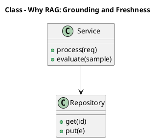

_Source diagram (plantuml); render with the appropriate tool._

**Figure 1. Class - Why RAG: Grounding and Freshness** (plantuml). Figure: Class view for Why RAG: Grounding and Freshness. This diagram illustrates the principal components and their interactions as discussed in the surrounding section.

## Deep Dive: Mechanics, Variants and Trade-offs

Having established the essentials, we now go deeper into why rag: grounding and freshness. Mechanically, the behaviour emerges from a few interacting parts that are simpler than the whole they produce. The distinctions in this section are the ones that separate a working demo from a system that holds up under adversarial inputs, scale and the passage of time.

Consider the principal variants and how to choose between them. Each variant optimises for a different point in the design space - some for latency, some for accuracy, some for cost or operability - and the correct choice follows from explicit requirements rather than from defaults. As with most architectural decisions, the choice is rarely binary; the skill lies in quantifying the trade-offs and choosing deliberately.

In practice this is supported by a mature tooling ecosystem, including LangChain, LlamaIndex, Haystack, RAGAS. Tools accelerate the work but do not substitute for understanding: the same principles apply whichever implementation you select, and the ability to reason from first principles is what lets you debug when a tool behaves unexpectedly.

A frequent source of subtle bugs is the interaction with caching and cost optimisation. Because caching and cost optimisation concerns semantic caching and retrieval reuse, changes there can silently alter the behaviour analysed here. The remedy is contract tests at the boundary and end-to-end evaluations that exercise the interaction explicitly.

Finally, attend to edge cases and degradation. Define what the system should do under partial failure, unexpected inputs and load spikes, and make that behaviour explicit and tested rather than emergent. Graceful degradation - returning a safe, useful result when the ideal one is unavailable - is a hallmark of mature engineering.

For deeper study, the literature offers authoritative treatments such as Lewis et al. — Retrieval-Augmented Generation (2020) and Gao et al. — Precise Zero-Shot Dense Retrieval (HyDE, 2022). These primary sources reward careful reading and ground the practical guidance above in established results.

## Advanced Considerations

Having established the essentials, we now go deeper into why rag: grounding and freshness. Mechanically, the behaviour emerges from a few interacting parts that are simpler than the whole they produce. The distinctions in this section are the ones that separate a working demo from a system that holds up under adversarial inputs, scale and the passage of time.

Consider the principal variants and how to choose between them. Each variant optimises for a different point in the design space - some for latency, some for accuracy, some for cost or operability - and the correct choice follows from explicit requirements rather than from defaults. There is an inherent trade-off between fidelity and cost, and the correct balance depends on the use case and its tolerance for error.

In practice this is supported by a mature tooling ecosystem, including LangChain, LlamaIndex, Haystack, RAGAS. Tools accelerate the work but do not substitute for understanding: the same principles apply whichever implementation you select, and the ability to reason from first principles is what lets you debug when a tool behaves unexpectedly.

A frequent source of subtle bugs is the interaction with failure modes and debugging. Because failure modes and debugging concerns diagnosing retrieval versus generation failures, changes there can silently alter the behaviour analysed here. The remedy is contract tests at the boundary and end-to-end evaluations that exercise the interaction explicitly.

Finally, attend to edge cases and degradation. Define what the system should do under partial failure, unexpected inputs and load spikes, and make that behaviour explicit and tested rather than emergent. Graceful degradation - returning a safe, useful result when the ideal one is unavailable - is a hallmark of mature engineering.

For deeper study, the literature offers authoritative treatments such as Lewis et al. — Retrieval-Augmented Generation (2020) and Gao et al. — Precise Zero-Shot Dense Retrieval (HyDE, 2022). These primary sources reward careful reading and ground the practical guidance above in established results.

## Worked Example

A worked example clarifies how these ideas behave in practice. A enterprise organisation needs grounded internal Q&A over policies and wikis with citations. They decide to apply why rag: grounding and freshness as part of their RAG solution, but wisely treat it as a hypothesis to be validated rather than a foregone conclusion.

The team begins by stating the objective precisely and defining how success will be measured before writing any code. They establish a small but representative evaluation set, agree on acceptance thresholds, and only then prototype the simplest design that could work. Early measurement reveals which assumptions hold and which must be revised, saving weeks of misdirected effort and surfacing edge cases while they are still cheap to fix.

As the prototype matures into a service, the team hardens it: adding input validation, error handling, caching where it pays off, and monitoring that ties back to the original success metric. They document each significant decision in an architecture decision record so that future maintainers understand not just what was built but why.

The outcome is instructive. The system that reaches production is not the most sophisticated design the team considered, but the one whose behaviour they could measure, explain and operate. This is the recurring lesson of RAG: durable value comes from the whole system, not from any single clever component.

## Industry Use Cases

Across industries, the ideas in this chapter recur in recognisable ways. The following vignettes show how different sectors apply them and what they have in common.

**Enterprise.** Grounded internal Q&A over policies and wikis with citations. The common thread is that value comes not from the model alone but from the surrounding system - data quality, evaluation, integration and operations - which is precisely where most of the engineering effort belongs.

**Legal.** Case and contract research with traceable sources. The common thread is that value comes not from the model alone but from the surrounding system - data quality, evaluation, integration and operations - which is precisely where most of the engineering effort belongs.

**Healthcare.** Clinical guideline assistants with provenance. The common thread is that value comes not from the model alone but from the surrounding system - data quality, evaluation, integration and operations - which is precisely where most of the engineering effort belongs.

**Support.** Deflection bots grounded in current knowledge bases. The common thread is that value comes not from the model alone but from the surrounding system - data quality, evaluation, integration and operations - which is precisely where most of the engineering effort belongs.

## Best Practices

The following practices consistently separate successful RAG efforts from struggling ones. They are deliberately concrete so they can be adopted as checklist items in design and code review.

- Tune chunking to the corpus; measure its effect on retrieval metrics.
- Always cite sources and enable users to verify answers.
- Enforce access control at retrieval time, not just at the UI.
- Evaluate retrieval and generation separately to localise failures.

None of these are exotic; they are the unglamorous disciplines that compound into reliability. The cost of adopting them is small compared with the cost of the incidents they prevent, and they become second nature with practice.

## Common Pitfalls

Equally instructive are the failure modes that recur in practice. Each pitfall below has a clear early warning sign and a known remedy, so treat them as a diagnostic checklist when something feels wrong:

- Naive fixed-size chunking that splits semantic units.
- Stuffing too much context, increasing cost and diluting relevance.
- Ignoring permissions and leaking restricted documents.
- Measuring only end answer quality without diagnosing retrieval.

The pattern is consistent: most failures stem from skipping measurement, conflating prototype and production standards, or deferring cross-cutting concerns such as security and cost until they become emergencies. Naming these traps in advance is the cheapest way to avoid them.

## Governance, Security and Cost Notes

No discussion of why rag: grounding and freshness is complete without its governance, security and cost dimensions, which are too often deferred until they become emergencies. Treating them as first-class concerns from the outset is both cheaper and safer.

**Governance.** Classify the risk of this capability, document its intended and out-of-scope uses, and ensure decisions are traceable to satisfy internal policy and external regulation such as the NIST AI RMF, ISO/IEC 42001 and the EU AI Act. **Security.** Treat all external input as untrusted, validate outputs before acting on them, apply least privilege to any tools or data access, and map controls to the OWASP LLM Top 10 and MITRE ATLAS.

**Cost and sustainability.** Establish explicit budgets for compute, tokens and latency, attribute spend to owners, and revisit the economics as usage scales - a design that is affordable at pilot scale can become untenable at production volume. Building these reflexes into everyday engineering is what allows a RAG system to be not only capable but also trustworthy and economically sound.

## Hands-On Exercises

Work through the following exercises. They are designed to move understanding from recognition to application - the level required for real engineering work - so prefer writing and building over merely reading.

1. Explain why rag: grounding and freshness to a colleague unfamiliar with RAG, using a concrete example from your own domain.
2. Sketch a reference architecture that incorporates why rag: grounding and freshness and annotate where observability, security and cost controls belong.
3. Design an evaluation that would tell you whether why rag: grounding and freshness is working in production, including the metric, the dataset and the acceptance threshold.
4. Identify two pitfalls relevant to why rag: grounding and freshness in your environment and describe the early warning signals you would monitor.
5. Prototype the simplest implementation that demonstrates why rag: grounding and freshness, then list exactly what would need to change to make it production-ready.

## Key Takeaways

Key takeaways from this chapter:

- Why RAG: Grounding and Freshness is a systems concern in RAG: data, models and operations must be co-designed.
- Measurement is non-negotiable; define success metrics and evaluation before building.
- Favour the simplest design that meets the requirement, and add complexity only when evidence demands it.
- Security, cost and observability are first-class requirements, not afterthoughts.
- Document decisions so the system remains understandable and operable as it evolves.

## Code Walkthrough

This listing shows a configuration-driven Why RAG: Grounding and Freshness component with retry semantics and typed interfaces — the shape we expect from production RAG code rather than a notebook prototype.

The full listing is shown below; study it line by line and reproduce it locally before moving on.

### Listing: Implementing a Why RAG: Grounding and Freshness component

```python
from __future__ import annotations

from dataclasses import dataclass, field
from typing import Any


@dataclass(slots=True)
class WhyGroundingConfig:
    """Configuration for the Why RAG: Grounding and Freshness component in a RAG system."""

    name: str
    timeout_s: float = 30.0
    max_retries: int = 3
    options: dict[str, Any] = field(default_factory=dict)


class WhyGrounding:
    """A minimal, production-shaped implementation of Why RAG: Grounding and Freshness."""

    def __init__(self, config: WhyGroundingConfig) -> None:
        self._config = config
        self._calls = 0

    def run(self, payload: dict[str, Any]) -> dict[str, Any]:
        """Process a request, retrying transient failures with backoff."""
        last_error: Exception | None = None
        for attempt in range(self._config.max_retries):
            try:
                self._calls += 1
                return self._process(payload)
            except TimeoutError as exc:  # transient
                last_error = exc
                continue
        raise RuntimeError(f"WhyGrounding failed after retries") from last_error

    def _process(self, payload: dict[str, Any]) -> dict[str, Any]:
        # Domain-specific logic for Why RAG: Grounding and Freshness goes here.
        return {"status": "ok", "input_keys": sorted(payload), "calls": self._calls}

```

## Review Questions

1. In the context of RAG, which statement best describes “Why RAG: Grounding and Freshness”?
   - A. It is only relevant to academic research, not production.
   - B. The limits of parametric knowledge and the case for retrieval.
   - C. It guarantees deterministic output regardless of input.
   - D. It applies exclusively to image data.
   - **Answer: B.** Why RAG: Grounding and Freshness: The limits of parametric knowledge and the case for retrieval.
2. Which of the following is a recommended best practice when working with RAG?
   - A. It is only relevant to academic research, not production.
   - B. Ignoring permissions and leaking restricted documents.
   - C. It makes the system slower but has no other effect.
   - D. Enforce access control at retrieval time, not just at the UI.
   - **Answer: D.** Best practice: Enforce access control at retrieval time, not just at the UI.
3. Which of the following is a common pitfall to avoid in RAG?
   - A. Evaluate retrieval and generation separately to localise failures.
   - B. It removes all security and governance requirements.
   - C. Measuring only end answer quality without diagnosing retrieval.
   - D. Always cite sources and enable users to verify answers.
   - **Answer: C.** Pitfall to avoid: Measuring only end answer quality without diagnosing retrieval.
4. *(Discussion)* Describe a failure mode of Why RAG: Grounding and Freshness and how you would mitigate it.
   - **Model answer:** A strong answer defines why rag: grounding and freshness (The limits of parametric knowledge and the case for retrieval.) then connects it to architecture, evaluation, cost, security and operations for RAG, citing concrete trade-offs and a real-world example.

---


# Chapter 2. Document Ingestion and Chunking

_This chapter examines document ingestion and chunking within RAG. It covers parsing, semantic chunking, overlap and metadata extraction, derives a reference architecture, walks through a worked example and runnable code, surveys industry use cases, and distils best practices and pitfalls, closing with exercises and review questions._

## Introduction

Document Ingestion and Chunking can be characterised as parsing, semantic chunking, overlap and metadata extraction. Understanding this matters because RAG systems succeed or fail on exactly these decisions. The right abstraction here pays compounding dividends, because downstream components depend on its guarantees.

This chapter builds intuition first, then formalises the ideas, derives an architecture, and finishes with code, exercises and review questions so the material transfers directly to your own RAG work. Read it actively: pause at each diagram, reproduce the code, and attempt the exercises before consulting the answers.

## Theory and Foundations

Formally, Document Ingestion and Chunking addresses parsing, semantic chunking, overlap and metadata extraction. The practical implication is that design choices here ripple through latency, cost and maintainability for the lifetime of the system. Mechanically, the behaviour emerges from a few interacting parts that are simpler than the whole they produce.

To place this in context, recall the broader picture: Retrieval-augmented generation grounds a language model in external knowledge by retrieving relevant context at query time and conditioning generation on it. Within that picture, document ingestion and chunking is one of the load-bearing ideas - the kind that, when understood deeply, makes the rest of RAG fall into place. This concept recurs throughout the RAG lifecycle, from design to operations.

Document Ingestion and Chunking cannot be understood in isolation from prompt assembly and citation. Recall that prompt assembly and citation concerns grounding instructions, source attribution and refusal on low confidence. The two interact directly: decisions in one constrain the design space of the other, which is why mature teams reason about them together rather than sequentially. Simplicity is a feature. The simplest design that meets the requirement should be the default, with complexity added only when measurement justifies it.

Document Ingestion and Chunking cannot be understood in isolation from security and access control in rag. Recall that security and access control in rag concerns row-level permissions and preventing data leakage across tenants. The two interact directly: decisions in one constrain the design space of the other, which is why mature teams reason about them together rather than sequentially. Simplicity is a feature. The simplest design that meets the requirement should be the default, with complexity added only when measurement justifies it.

Several established patterns apply directly to document ingestion and chunking. The first, refuse-or-clarify when retrieval confidence is low, is widely adopted because it makes the system's behaviour predictable and observable. A complementary pattern, hybrid retrieval with reciprocal rank fusion, addresses a related concern and is often deployed alongside it. Patterns are not dogma; they are distilled experience that shortcuts the search for a sound design, and each carries assumptions worth checking against your context.

The decision of whether to adopt this should be driven by requirements, not by novelty. In a small prototype, shortcuts around document ingestion and chunking are invisible; in a production RAG system serving real traffic, they surface as incidents, cost overruns or compliance gaps. Latency, accuracy and cost form a tension triangle: improving one typically pressures the others, so explicit budgets are essential. The remainder of this chapter turns these principles into an architecture, code and a checklist you can apply immediately.

## Architecture and Design

The reference architecture for Document Ingestion and Chunking separates concerns into clearly bounded components with explicit contracts. A RAG system has an offline ingestion pipeline (parse → chunk → embed → index) and an online query pipeline (query transform → hybrid retrieve → re-rank → assemble prompt → generate → cite). Access control filters retrieval by user permissions, and an evaluation service continuously scores faithfulness and relevance on sampled traffic.

Concretely, the principal building blocks include why rag: grounding and freshness, document ingestion and chunking, embedding and indexing strategy, retrieval and query transformation and re-ranking and context selection. Each is a replaceable component behind a stable interface, so the team can upgrade an implementation - a model, an index, a policy engine - without rewriting its neighbours. The contracts between components are where reliability is won or lost, so they are specified explicitly and tested in isolation.

The diagram accompanying this section makes the data and control flow explicit. Requests enter through a well-defined boundary where they are authenticated and validated; only then are they dispatched to the components that perform the work. This boundary is also where rate limiting, quota enforcement and audit logging live, keeping cross-cutting concerns out of the core logic and in one auditable place.

Two qualities deserve emphasis. First, observability is designed in, not bolted on: every component emits structured telemetry so that failures can be localised in minutes rather than hours. Second, the architecture is evolvable - components communicate through stable contracts so that any single part of the RAG system can be replaced without a rewrite. There is an inherent trade-off between fidelity and cost, and the correct balance depends on the use case and its tolerance for error.

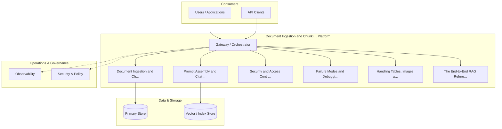

**Figure 2. Agent Architecture - Document Ingestion and Chunking** (mermaid). Figure: Agent Architecture view for Document Ingestion and Chunking. This diagram illustrates the principal components and their interactions as discussed in the surrounding section.

## Deep Dive: Mechanics, Variants and Trade-offs

Having established the essentials, we now go deeper into document ingestion and chunking. It pays to understand the mechanism rather than treat it as a black box, because most production incidents are explained by one of its steps misbehaving. The distinctions in this section are the ones that separate a working demo from a system that holds up under adversarial inputs, scale and the passage of time.

Consider the principal variants and how to choose between them. Each variant optimises for a different point in the design space - some for latency, some for accuracy, some for cost or operability - and the correct choice follows from explicit requirements rather than from defaults. There is an inherent trade-off between fidelity and cost, and the correct balance depends on the use case and its tolerance for error.

In practice this is supported by a mature tooling ecosystem, including LangChain, LlamaIndex, Haystack, RAGAS. Tools accelerate the work but do not substitute for understanding: the same principles apply whichever implementation you select, and the ability to reason from first principles is what lets you debug when a tool behaves unexpectedly.

A frequent source of subtle bugs is the interaction with prompt assembly and citation. Because prompt assembly and citation concerns grounding instructions, source attribution and refusal on low confidence, changes there can silently alter the behaviour analysed here. The remedy is contract tests at the boundary and end-to-end evaluations that exercise the interaction explicitly.

Finally, attend to edge cases and degradation. Define what the system should do under partial failure, unexpected inputs and load spikes, and make that behaviour explicit and tested rather than emergent. Graceful degradation - returning a safe, useful result when the ideal one is unavailable - is a hallmark of mature engineering.

For deeper study, the literature offers authoritative treatments such as Lewis et al. — Retrieval-Augmented Generation (2020) and Gao et al. — Precise Zero-Shot Dense Retrieval (HyDE, 2022). These primary sources reward careful reading and ground the practical guidance above in established results.

## Advanced Considerations

Having established the essentials, we now go deeper into document ingestion and chunking. Beneath the abstraction lies a concrete process whose steps can each be measured, tested and optimised independently. The distinctions in this section are the ones that separate a working demo from a system that holds up under adversarial inputs, scale and the passage of time.

Consider the principal variants and how to choose between them. Each variant optimises for a different point in the design space - some for latency, some for accuracy, some for cost or operability - and the correct choice follows from explicit requirements rather than from defaults. Every added component buys capability at the price of operational surface area, and that bargain should be made consciously.

In practice this is supported by a mature tooling ecosystem, including LangChain, LlamaIndex, Haystack, RAGAS. Tools accelerate the work but do not substitute for understanding: the same principles apply whichever implementation you select, and the ability to reason from first principles is what lets you debug when a tool behaves unexpectedly.

A frequent source of subtle bugs is the interaction with failure modes and debugging. Because failure modes and debugging concerns diagnosing retrieval versus generation failures, changes there can silently alter the behaviour analysed here. The remedy is contract tests at the boundary and end-to-end evaluations that exercise the interaction explicitly.

Finally, attend to edge cases and degradation. Define what the system should do under partial failure, unexpected inputs and load spikes, and make that behaviour explicit and tested rather than emergent. Graceful degradation - returning a safe, useful result when the ideal one is unavailable - is a hallmark of mature engineering.

For deeper study, the literature offers authoritative treatments such as Lewis et al. — Retrieval-Augmented Generation (2020) and Gao et al. — Precise Zero-Shot Dense Retrieval (HyDE, 2022). These primary sources reward careful reading and ground the practical guidance above in established results.

## Worked Example

To ground the discussion, walk through a representative example. A legal organisation needs case and contract research with traceable sources. They decide to apply document ingestion and chunking as part of their RAG solution, but wisely treat it as a hypothesis to be validated rather than a foregone conclusion.

The team begins by stating the objective precisely and defining how success will be measured before writing any code. They establish a small but representative evaluation set, agree on acceptance thresholds, and only then prototype the simplest design that could work. Early measurement reveals which assumptions hold and which must be revised, saving weeks of misdirected effort and surfacing edge cases while they are still cheap to fix.

As the prototype matures into a service, the team hardens it: adding input validation, error handling, caching where it pays off, and monitoring that ties back to the original success metric. They document each significant decision in an architecture decision record so that future maintainers understand not just what was built but why.

The outcome is instructive. The system that reaches production is not the most sophisticated design the team considered, but the one whose behaviour they could measure, explain and operate. This is the recurring lesson of RAG: durable value comes from the whole system, not from any single clever component.

## Industry Use Cases

Across industries, the ideas in this chapter recur in recognisable ways. The following vignettes show how different sectors apply them and what they have in common.

**Enterprise.** Grounded internal Q&A over policies and wikis with citations. The common thread is that value comes not from the model alone but from the surrounding system - data quality, evaluation, integration and operations - which is precisely where most of the engineering effort belongs.

**Legal.** Case and contract research with traceable sources. The common thread is that value comes not from the model alone but from the surrounding system - data quality, evaluation, integration and operations - which is precisely where most of the engineering effort belongs.

**Healthcare.** Clinical guideline assistants with provenance. The common thread is that value comes not from the model alone but from the surrounding system - data quality, evaluation, integration and operations - which is precisely where most of the engineering effort belongs.

**Support.** Deflection bots grounded in current knowledge bases. The common thread is that value comes not from the model alone but from the surrounding system - data quality, evaluation, integration and operations - which is precisely where most of the engineering effort belongs.

## Best Practices

The following practices consistently separate successful RAG efforts from struggling ones. They are deliberately concrete so they can be adopted as checklist items in design and code review.

- Tune chunking to the corpus; measure its effect on retrieval metrics.
- Always cite sources and enable users to verify answers.
- Enforce access control at retrieval time, not just at the UI.
- Evaluate retrieval and generation separately to localise failures.

None of these are exotic; they are the unglamorous disciplines that compound into reliability. The cost of adopting them is small compared with the cost of the incidents they prevent, and they become second nature with practice.

## Common Pitfalls

Equally instructive are the failure modes that recur in practice. Each pitfall below has a clear early warning sign and a known remedy, so treat them as a diagnostic checklist when something feels wrong:

- Naive fixed-size chunking that splits semantic units.
- Stuffing too much context, increasing cost and diluting relevance.
- Ignoring permissions and leaking restricted documents.
- Measuring only end answer quality without diagnosing retrieval.

The pattern is consistent: most failures stem from skipping measurement, conflating prototype and production standards, or deferring cross-cutting concerns such as security and cost until they become emergencies. Naming these traps in advance is the cheapest way to avoid them.

## Governance, Security and Cost Notes

No discussion of document ingestion and chunking is complete without its governance, security and cost dimensions, which are too often deferred until they become emergencies. Treating them as first-class concerns from the outset is both cheaper and safer.

**Governance.** Classify the risk of this capability, document its intended and out-of-scope uses, and ensure decisions are traceable to satisfy internal policy and external regulation such as the NIST AI RMF, ISO/IEC 42001 and the EU AI Act. **Security.** Treat all external input as untrusted, validate outputs before acting on them, apply least privilege to any tools or data access, and map controls to the OWASP LLM Top 10 and MITRE ATLAS.

**Cost and sustainability.** Establish explicit budgets for compute, tokens and latency, attribute spend to owners, and revisit the economics as usage scales - a design that is affordable at pilot scale can become untenable at production volume. Building these reflexes into everyday engineering is what allows a RAG system to be not only capable but also trustworthy and economically sound.

## Hands-On Exercises

Work through the following exercises. They are designed to move understanding from recognition to application - the level required for real engineering work - so prefer writing and building over merely reading.

1. Explain document ingestion and chunking to a colleague unfamiliar with RAG, using a concrete example from your own domain.
2. Sketch a reference architecture that incorporates document ingestion and chunking and annotate where observability, security and cost controls belong.
3. Design an evaluation that would tell you whether document ingestion and chunking is working in production, including the metric, the dataset and the acceptance threshold.
4. Identify two pitfalls relevant to document ingestion and chunking in your environment and describe the early warning signals you would monitor.
5. Prototype the simplest implementation that demonstrates document ingestion and chunking, then list exactly what would need to change to make it production-ready.

## Key Takeaways

Key takeaways from this chapter:

- Document Ingestion and Chunking is a systems concern in RAG: data, models and operations must be co-designed.
- Measurement is non-negotiable; define success metrics and evaluation before building.
- Favour the simplest design that meets the requirement, and add complexity only when evidence demands it.
- Security, cost and observability are first-class requirements, not afterthoughts.
- Document decisions so the system remains understandable and operable as it evolves.

## Code Walkthrough

This listing shows a configuration-driven Document Ingestion and Chunking component with retry semantics and typed interfaces — the shape we expect from production RAG code rather than a notebook prototype.

The full listing is shown below; study it line by line and reproduce it locally before moving on.

### Listing: Implementing a Document Ingestion and Chunking component

```python
from __future__ import annotations

from dataclasses import dataclass, field
from typing import Any


@dataclass(slots=True)
class DocumentIngestionAndConfig:
    """Configuration for the Document Ingestion and Chunking component in a RAG system."""

    name: str
    timeout_s: float = 30.0
    max_retries: int = 3
    options: dict[str, Any] = field(default_factory=dict)


class DocumentIngestionAnd:
    """A minimal, production-shaped implementation of Document Ingestion and Chunking."""

    def __init__(self, config: DocumentIngestionAndConfig) -> None:
        self._config = config
        self._calls = 0

    def run(self, payload: dict[str, Any]) -> dict[str, Any]:
        """Process a request, retrying transient failures with backoff."""
        last_error: Exception | None = None
        for attempt in range(self._config.max_retries):
            try:
                self._calls += 1
                return self._process(payload)
            except TimeoutError as exc:  # transient
                last_error = exc
                continue
        raise RuntimeError(f"DocumentIngestionAnd failed after retries") from last_error

    def _process(self, payload: dict[str, Any]) -> dict[str, Any]:
        # Domain-specific logic for Document Ingestion and Chunking goes here.
        return {"status": "ok", "input_keys": sorted(payload), "calls": self._calls}

```

## Review Questions

1. In the context of RAG, which statement best describes “Document Ingestion and Chunking”?
   - A. It makes the system slower but has no other effect.
   - B. It applies exclusively to image data.
   - C. Parsing, semantic chunking, overlap and metadata extraction.
   - D. It is only relevant to academic research, not production.
   - **Answer: C.** Document Ingestion and Chunking: Parsing, semantic chunking, overlap and metadata extraction.
2. Which of the following is a recommended best practice when working with RAG?
   - A. Evaluate retrieval and generation separately to localise failures.
   - B. Stuffing too much context, increasing cost and diluting relevance.
   - C. It guarantees deterministic output regardless of input.
   - D. Measuring only end answer quality without diagnosing retrieval.
   - **Answer: A.** Best practice: Evaluate retrieval and generation separately to localise failures.
3. Which of the following is a common pitfall to avoid in RAG?
   - A. It is only relevant to academic research, not production.
   - B. Naive fixed-size chunking that splits semantic units.
   - C. It eliminates the need for any evaluation or monitoring.
   - D. Evaluate retrieval and generation separately to localise failures.
   - **Answer: B.** Pitfall to avoid: Naive fixed-size chunking that splits semantic units.
4. *(Discussion)* What trade-offs would you weigh when implementing Document Ingestion and Chunking?
   - **Model answer:** A strong answer defines document ingestion and chunking (Parsing, semantic chunking, overlap and metadata extraction.) then connects it to architecture, evaluation, cost, security and operations for RAG, citing concrete trade-offs and a real-world example.

---


# Chapter 3. Embedding and Indexing Strategy

_This chapter examines embedding and indexing strategy within RAG. It covers choosing models, dimensions and index types for the corpus, derives a reference architecture, walks through a worked example and runnable code, surveys industry use cases, and distils best practices and pitfalls, closing with exercises and review questions._

## Introduction

In practical terms, Embedding and Indexing Strategy is best understood as choosing models, dimensions and index types for the corpus. It is foundational: later capabilities in RAG are built directly on top of it. What distinguishes a production-grade approach from a prototype is the discipline of measurement: every claim is backed by an evaluation rather than intuition.

This chapter builds intuition first, then formalises the ideas, derives an architecture, and finishes with code, exercises and review questions so the material transfers directly to your own RAG work. Read it actively: pause at each diagram, reproduce the code, and attempt the exercises before consulting the answers.

## Theory and Foundations

Formally, Embedding and Indexing Strategy addresses choosing models, dimensions and index types for the corpus. The right abstraction here pays compounding dividends, because downstream components depend on its guarantees. Mechanically, the behaviour emerges from a few interacting parts that are simpler than the whole they produce.

To place this in context, recall the broader picture: Retrieval-augmented generation grounds a language model in external knowledge by retrieving relevant context at query time and conditioning generation on it. Within that picture, embedding and indexing strategy is one of the load-bearing ideas - the kind that, when understood deeply, makes the rest of RAG fall into place. Neglecting it is one of the most common reasons RAG initiatives stall in production.

Embedding and Indexing Strategy cannot be understood in isolation from evaluation of rag systems. Recall that evaluation of rag systems concerns faithfulness, answer relevance, context precision/recall (RAGAS-style). The two interact directly: decisions in one constrain the design space of the other, which is why mature teams reason about them together rather than sequentially. Latency, accuracy and cost form a tension triangle: improving one typically pressures the others, so explicit budgets are essential.

Embedding and Indexing Strategy cannot be understood in isolation from the end-to-end rag reference architecture. Recall that the end-to-end rag reference architecture concerns a production blueprint from ingestion to answer. The two interact directly: decisions in one constrain the design space of the other, which is why mature teams reason about them together rather than sequentially. Simplicity is a feature. The simplest design that meets the requirement should be the default, with complexity added only when measurement justifies it.

Several established patterns apply directly to embedding and indexing strategy. The first, refuse-or-clarify when retrieval confidence is low, is widely adopted because it makes the system's behaviour predictable and observable. A complementary pattern, hybrid retrieval with reciprocal rank fusion, addresses a related concern and is often deployed alongside it. Patterns are not dogma; they are distilled experience that shortcuts the search for a sound design, and each carries assumptions worth checking against your context.

Knowing when not to use a technique is as valuable as knowing how to use it. In a small prototype, shortcuts around embedding and indexing strategy are invisible; in a production RAG system serving real traffic, they surface as incidents, cost overruns or compliance gaps. Every added component buys capability at the price of operational surface area, and that bargain should be made consciously. The remainder of this chapter turns these principles into an architecture, code and a checklist you can apply immediately.

## Architecture and Design

From an architectural standpoint, Embedding and Indexing Strategy sits at the intersection of data, models and operations. A RAG system has an offline ingestion pipeline (parse → chunk → embed → index) and an online query pipeline (query transform → hybrid retrieve → re-rank → assemble prompt → generate → cite). Access control filters retrieval by user permissions, and an evaluation service continuously scores faithfulness and relevance on sampled traffic.

Concretely, the principal building blocks include why rag: grounding and freshness, document ingestion and chunking, embedding and indexing strategy, retrieval and query transformation and re-ranking and context selection. Each is a replaceable component behind a stable interface, so the team can upgrade an implementation - a model, an index, a policy engine - without rewriting its neighbours. The contracts between components are where reliability is won or lost, so they are specified explicitly and tested in isolation.

The diagram accompanying this section makes the data and control flow explicit. Requests enter through a well-defined boundary where they are authenticated and validated; only then are they dispatched to the components that perform the work. This boundary is also where rate limiting, quota enforcement and audit logging live, keeping cross-cutting concerns out of the core logic and in one auditable place.

Two qualities deserve emphasis. First, observability is designed in, not bolted on: every component emits structured telemetry so that failures can be localised in minutes rather than hours. Second, the architecture is evolvable - components communicate through stable contracts so that any single part of the RAG system can be replaced without a rewrite. Simplicity is a feature. The simplest design that meets the requirement should be the default, with complexity added only when measurement justifies it.

<div class="diagram-svg">

<svg xmlns="http://www.w3.org/2000/svg" width="840" height="460" data-tpl="steps" data-pal="2-1" viewBox="0 0 840 460" font-family="Inter, Segoe UI, Arial, sans-serif"><defs><marker id="ar" markerWidth="9" markerHeight="9" refX="7" refY="3" orient="auto"><path d="M0,0 L7,3 L0,6 z" fill="#94a3b8"/></marker><marker id="arw" markerWidth="9" markerHeight="9" refX="7" refY="3" orient="auto"><path d="M0,0 L7,3 L0,6 z" fill="#ffffff"/></marker><filter id="sh" x="-20%" y="-20%" width="140%" height="140%"><feDropShadow dx="0" dy="2" stdDeviation="3" flood-color="#0f172a" flood-opacity="0.16"/></filter></defs><defs><linearGradient id="bna6ecb24" x1="0" y1="0" x2="1" y2="0"><stop offset="0" stop-color="#059669"/><stop offset="1" stop-color="#10b981"/></linearGradient></defs><rect width="840" height="460" rx="14" fill="#ffffff"/><rect x="0" y="0" width="840" height="48" rx="14" fill="url(#bna6ecb24)"/><rect x="0" y="32" width="840" height="16" fill="url(#bna6ecb24)"/><text x="420" y="25" text-anchor="middle" font-size="14.5" font-weight="700" fill="#ffffff" dominant-baseline="middle">Data Flow - Embedding and Indexing Strategy</text><rect x="30" y="200" width="132" height="70" rx="12" fill="#059669"/><circle cx="54" cy="224" r="15" fill="#ffffff"/><text x="54" y="224" text-anchor="middle" font-size="13" font-weight="600" fill="#059669" dominant-baseline="middle">1</text><text x="96" y="242" text-anchor="middle" font-size="10.5" font-weight="600" fill="#fff" dominant-baseline="middle">Embedding and</text><text x="96" y="254" text-anchor="middle" font-size="10.5" font-weight="600" fill="#fff" dominant-baseline="middle">Indexing Strategy</text><rect x="192" y="200" width="132" height="70" rx="12" fill="#10b981"/><circle cx="216" cy="224" r="15" fill="#ffffff"/><text x="216" y="224" text-anchor="middle" font-size="13" font-weight="600" fill="#10b981" dominant-baseline="middle">2</text><text x="258" y="242" text-anchor="middle" font-size="10.5" font-weight="600" fill="#fff" dominant-baseline="middle">Evaluation of RAG</text><text x="258" y="254" text-anchor="middle" font-size="10.5" font-weight="600" fill="#fff" dominant-baseline="middle">Systems</text><line x1="162" y1="235" x2="192" y2="235" stroke="#94a3b8" stroke-width="2" marker-end="url(#ar)"/><rect x="354" y="200" width="132" height="70" rx="12" fill="#34d399"/><circle cx="378" cy="224" r="15" fill="#ffffff"/><text x="378" y="224" text-anchor="middle" font-size="13" font-weight="600" fill="#34d399" dominant-baseline="middle">3</text><text x="420" y="242" text-anchor="middle" font-size="10.5" font-weight="600" fill="#fff" dominant-baseline="middle">The End-to-End RAG</text><text x="420" y="254" text-anchor="middle" font-size="10.5" font-weight="600" fill="#fff" dominant-baseline="middle">Reference</text><line x1="324" y1="235" x2="354" y2="235" stroke="#94a3b8" stroke-width="2" marker-end="url(#ar)"/><rect x="516" y="200" width="132" height="70" rx="12" fill="#0d9488"/><circle cx="540" cy="224" r="15" fill="#ffffff"/><text x="540" y="224" text-anchor="middle" font-size="13" font-weight="600" fill="#0d9488" dominant-baseline="middle">4</text><text x="582" y="242" text-anchor="middle" font-size="10.5" font-weight="600" fill="#fff" dominant-baseline="middle">Advanced RAG</text><text x="582" y="254" text-anchor="middle" font-size="10.5" font-weight="600" fill="#fff" dominant-baseline="middle">Patterns</text><line x1="486" y1="235" x2="516" y2="235" stroke="#94a3b8" stroke-width="2" marker-end="url(#ar)"/><rect x="678" y="200" width="132" height="70" rx="12" fill="#14b8a6"/><circle cx="702" cy="224" r="15" fill="#ffffff"/><text x="702" y="224" text-anchor="middle" font-size="13" font-weight="600" fill="#14b8a6" dominant-baseline="middle">5</text><text x="744" y="242" text-anchor="middle" font-size="10.5" font-weight="600" fill="#fff" dominant-baseline="middle">Why RAG: Grounding</text><text x="744" y="254" text-anchor="middle" font-size="10.5" font-weight="600" fill="#fff" dominant-baseline="middle">and Freshness</text><line x1="648" y1="235" x2="678" y2="235" stroke="#94a3b8" stroke-width="2" marker-end="url(#ar)"/><text x="28" y="446" text-anchor="start" font-size="9.5" font-weight="500" fill="#64748b" dominant-baseline="middle">Embedding and Indexing Strategy  •  Data Flow</text></svg>

</div>

**Figure 3. Data Flow - Embedding and Indexing Strategy** (svg). Figure: Data Flow view for Embedding and Indexing Strategy. This diagram illustrates the principal components and their interactions as discussed in the surrounding section.

## Deep Dive: Mechanics, Variants and Trade-offs

Having established the essentials, we now go deeper into embedding and indexing strategy. Beneath the abstraction lies a concrete process whose steps can each be measured, tested and optimised independently. The distinctions in this section are the ones that separate a working demo from a system that holds up under adversarial inputs, scale and the passage of time.

Consider the principal variants and how to choose between them. Each variant optimises for a different point in the design space - some for latency, some for accuracy, some for cost or operability - and the correct choice follows from explicit requirements rather than from defaults. As with most architectural decisions, the choice is rarely binary; the skill lies in quantifying the trade-offs and choosing deliberately.

In practice this is supported by a mature tooling ecosystem, including LangChain, LlamaIndex, Haystack, RAGAS. Tools accelerate the work but do not substitute for understanding: the same principles apply whichever implementation you select, and the ability to reason from first principles is what lets you debug when a tool behaves unexpectedly.

A frequent source of subtle bugs is the interaction with evaluation of rag systems. Because evaluation of rag systems concerns faithfulness, answer relevance, context precision/recall (RAGAS-style), changes there can silently alter the behaviour analysed here. The remedy is contract tests at the boundary and end-to-end evaluations that exercise the interaction explicitly.

Finally, attend to edge cases and degradation. Define what the system should do under partial failure, unexpected inputs and load spikes, and make that behaviour explicit and tested rather than emergent. Graceful degradation - returning a safe, useful result when the ideal one is unavailable - is a hallmark of mature engineering.

For deeper study, the literature offers authoritative treatments such as Lewis et al. — Retrieval-Augmented Generation (2020) and Gao et al. — Precise Zero-Shot Dense Retrieval (HyDE, 2022). These primary sources reward careful reading and ground the practical guidance above in established results.

## Advanced Considerations

Having established the essentials, we now go deeper into embedding and indexing strategy. It pays to understand the mechanism rather than treat it as a black box, because most production incidents are explained by one of its steps misbehaving. The distinctions in this section are the ones that separate a working demo from a system that holds up under adversarial inputs, scale and the passage of time.

Consider the principal variants and how to choose between them. Each variant optimises for a different point in the design space - some for latency, some for accuracy, some for cost or operability - and the correct choice follows from explicit requirements rather than from defaults. Latency, accuracy and cost form a tension triangle: improving one typically pressures the others, so explicit budgets are essential.

In practice this is supported by a mature tooling ecosystem, including LangChain, LlamaIndex, Haystack, RAGAS. Tools accelerate the work but do not substitute for understanding: the same principles apply whichever implementation you select, and the ability to reason from first principles is what lets you debug when a tool behaves unexpectedly.

A frequent source of subtle bugs is the interaction with prompt assembly and citation. Because prompt assembly and citation concerns grounding instructions, source attribution and refusal on low confidence, changes there can silently alter the behaviour analysed here. The remedy is contract tests at the boundary and end-to-end evaluations that exercise the interaction explicitly.

Finally, attend to edge cases and degradation. Define what the system should do under partial failure, unexpected inputs and load spikes, and make that behaviour explicit and tested rather than emergent. Graceful degradation - returning a safe, useful result when the ideal one is unavailable - is a hallmark of mature engineering.

For deeper study, the literature offers authoritative treatments such as Lewis et al. — Retrieval-Augmented Generation (2020) and Gao et al. — Precise Zero-Shot Dense Retrieval (HyDE, 2022). These primary sources reward careful reading and ground the practical guidance above in established results.

## Worked Example

A worked example clarifies how these ideas behave in practice. A legal organisation needs case and contract research with traceable sources. They decide to apply embedding and indexing strategy as part of their RAG solution, but wisely treat it as a hypothesis to be validated rather than a foregone conclusion.

The team begins by stating the objective precisely and defining how success will be measured before writing any code. They establish a small but representative evaluation set, agree on acceptance thresholds, and only then prototype the simplest design that could work. Early measurement reveals which assumptions hold and which must be revised, saving weeks of misdirected effort and surfacing edge cases while they are still cheap to fix.

As the prototype matures into a service, the team hardens it: adding input validation, error handling, caching where it pays off, and monitoring that ties back to the original success metric. They document each significant decision in an architecture decision record so that future maintainers understand not just what was built but why.

The outcome is instructive. The system that reaches production is not the most sophisticated design the team considered, but the one whose behaviour they could measure, explain and operate. This is the recurring lesson of RAG: durable value comes from the whole system, not from any single clever component.

## Industry Use Cases

Across industries, the ideas in this chapter recur in recognisable ways. The following vignettes show how different sectors apply them and what they have in common.

**Enterprise.** Grounded internal Q&A over policies and wikis with citations. The common thread is that value comes not from the model alone but from the surrounding system - data quality, evaluation, integration and operations - which is precisely where most of the engineering effort belongs.

**Legal.** Case and contract research with traceable sources. The common thread is that value comes not from the model alone but from the surrounding system - data quality, evaluation, integration and operations - which is precisely where most of the engineering effort belongs.

**Healthcare.** Clinical guideline assistants with provenance. The common thread is that value comes not from the model alone but from the surrounding system - data quality, evaluation, integration and operations - which is precisely where most of the engineering effort belongs.

**Support.** Deflection bots grounded in current knowledge bases. The common thread is that value comes not from the model alone but from the surrounding system - data quality, evaluation, integration and operations - which is precisely where most of the engineering effort belongs.

## Best Practices

The following practices consistently separate successful RAG efforts from struggling ones. They are deliberately concrete so they can be adopted as checklist items in design and code review.

- Tune chunking to the corpus; measure its effect on retrieval metrics.
- Always cite sources and enable users to verify answers.
- Enforce access control at retrieval time, not just at the UI.
- Evaluate retrieval and generation separately to localise failures.

None of these are exotic; they are the unglamorous disciplines that compound into reliability. The cost of adopting them is small compared with the cost of the incidents they prevent, and they become second nature with practice.

## Common Pitfalls

Equally instructive are the failure modes that recur in practice. Each pitfall below has a clear early warning sign and a known remedy, so treat them as a diagnostic checklist when something feels wrong:

- Naive fixed-size chunking that splits semantic units.
- Stuffing too much context, increasing cost and diluting relevance.
- Ignoring permissions and leaking restricted documents.
- Measuring only end answer quality without diagnosing retrieval.

The pattern is consistent: most failures stem from skipping measurement, conflating prototype and production standards, or deferring cross-cutting concerns such as security and cost until they become emergencies. Naming these traps in advance is the cheapest way to avoid them.

## Governance, Security and Cost Notes

No discussion of embedding and indexing strategy is complete without its governance, security and cost dimensions, which are too often deferred until they become emergencies. Treating them as first-class concerns from the outset is both cheaper and safer.

**Governance.** Classify the risk of this capability, document its intended and out-of-scope uses, and ensure decisions are traceable to satisfy internal policy and external regulation such as the NIST AI RMF, ISO/IEC 42001 and the EU AI Act. **Security.** Treat all external input as untrusted, validate outputs before acting on them, apply least privilege to any tools or data access, and map controls to the OWASP LLM Top 10 and MITRE ATLAS.

**Cost and sustainability.** Establish explicit budgets for compute, tokens and latency, attribute spend to owners, and revisit the economics as usage scales - a design that is affordable at pilot scale can become untenable at production volume. Building these reflexes into everyday engineering is what allows a RAG system to be not only capable but also trustworthy and economically sound.

## Hands-On Exercises

Work through the following exercises. They are designed to move understanding from recognition to application - the level required for real engineering work - so prefer writing and building over merely reading.

1. Explain embedding and indexing strategy to a colleague unfamiliar with RAG, using a concrete example from your own domain.
2. Sketch a reference architecture that incorporates embedding and indexing strategy and annotate where observability, security and cost controls belong.
3. Design an evaluation that would tell you whether embedding and indexing strategy is working in production, including the metric, the dataset and the acceptance threshold.
4. Identify two pitfalls relevant to embedding and indexing strategy in your environment and describe the early warning signals you would monitor.
5. Prototype the simplest implementation that demonstrates embedding and indexing strategy, then list exactly what would need to change to make it production-ready.

## Key Takeaways

Key takeaways from this chapter:

- Embedding and Indexing Strategy is a systems concern in RAG: data, models and operations must be co-designed.
- Measurement is non-negotiable; define success metrics and evaluation before building.
- Favour the simplest design that meets the requirement, and add complexity only when evidence demands it.
- Security, cost and observability are first-class requirements, not afterthoughts.
- Document decisions so the system remains understandable and operable as it evolves.

## Code Walkthrough

Every change to a RAG system should pass an evaluation gate. This example shows the minimal shape: align predictions and references, compute a metric, and return a pass/fail decision for CI.

The full listing is shown below; study it line by line and reproduce it locally before moving on.

### Listing: Evaluating Embedding and Indexing Strategy with a regression gate

```python
from dataclasses import dataclass


@dataclass
class EvalResult:
    metric: str
    score: float
    passed: bool


def evaluate(predictions: list[str], references: list[str],
             threshold: float = 0.8) -> EvalResult:
    """Score Embedding and Indexing Strategy output against references with a simple exact-match metric.

    In practice you would combine several metrics (exact match, semantic
    similarity, LLM-as-judge) and gate releases on the aggregate.
    """
    if len(predictions) != len(references):
        raise ValueError("predictions and references must align")
    hits = sum(p.strip() == r.strip() for p, r in zip(predictions, references))
    score = hits / len(references) if references else 0.0
    return EvalResult(metric="exact_match", score=score, passed=score >= threshold)


if __name__ == "__main__":
    result = evaluate(["yes", "no"], ["yes", "yes"])
    print(f"{result.metric}={result.score:.2f} passed={result.passed}")

```

## Review Questions

1. In the context of RAG, which statement best describes “Embedding and Indexing Strategy”?
   - A. It removes all security and governance requirements.
   - B. Choosing models, dimensions and index types for the corpus.
   - C. It is only relevant to academic research, not production.
   - D. It applies exclusively to image data.
   - **Answer: B.** Embedding and Indexing Strategy: Choosing models, dimensions and index types for the corpus.
2. Which of the following is a recommended best practice when working with RAG?
   - A. Ignoring permissions and leaking restricted documents.
   - B. Stuffing too much context, increasing cost and diluting relevance.
   - C. It is only relevant to academic research, not production.
   - D. Tune chunking to the corpus; measure its effect on retrieval metrics.
   - **Answer: D.** Best practice: Tune chunking to the corpus; measure its effect on retrieval metrics.
3. Which of the following is a common pitfall to avoid in RAG?
   - A. Stuffing too much context, increasing cost and diluting relevance.
   - B. Always cite sources and enable users to verify answers.
   - C. Enforce access control at retrieval time, not just at the UI.
   - D. Tune chunking to the corpus; measure its effect on retrieval metrics.
   - **Answer: A.** Pitfall to avoid: Stuffing too much context, increasing cost and diluting relevance.
4. *(Discussion)* What trade-offs would you weigh when implementing Embedding and Indexing Strategy?
   - **Model answer:** A strong answer defines embedding and indexing strategy (Choosing models, dimensions and index types for the corpus.) then connects it to architecture, evaluation, cost, security and operations for RAG, citing concrete trade-offs and a real-world example.

---


# Chapter 4. Retrieval and Query Transformation

_This chapter examines retrieval and query transformation within RAG. It covers query rewriting, HyDE, multi-query and hybrid search, derives a reference architecture, walks through a worked example and runnable code, surveys industry use cases, and distils best practices and pitfalls, closing with exercises and review questions._

## Introduction

In practical terms, Retrieval and Query Transformation is best understood as query rewriting, HyDE, multi-query and hybrid search. It is foundational: later capabilities in RAG are built directly on top of it. The practical implication is that design choices here ripple through latency, cost and maintainability for the lifetime of the system.

This chapter builds intuition first, then formalises the ideas, derives an architecture, and finishes with code, exercises and review questions so the material transfers directly to your own RAG work. Read it actively: pause at each diagram, reproduce the code, and attempt the exercises before consulting the answers.

## Theory and Foundations

Retrieval and Query Transformation can be characterised as query rewriting, HyDE, multi-query and hybrid search. It helps to separate the conceptual model from its implementation: the former guides reasoning, the latter must contend with real-world constraints. The underlying mechanism is best appreciated by tracing a single request from input to output and noting where state is created and consumed.

To place this in context, recall the broader picture: Retrieval-augmented generation grounds a language model in external knowledge by retrieving relevant context at query time and conditioning generation on it. Within that picture, retrieval and query transformation is one of the load-bearing ideas - the kind that, when understood deeply, makes the rest of RAG fall into place. Teams that master this consistently ship more reliable RAG systems at lower cost.

Retrieval and Query Transformation cannot be understood in isolation from caching and cost optimisation. Recall that caching and cost optimisation concerns semantic caching and retrieval reuse. The two interact directly: decisions in one constrain the design space of the other, which is why mature teams reason about them together rather than sequentially. Every added component buys capability at the price of operational surface area, and that bargain should be made consciously.

Retrieval and Query Transformation cannot be understood in isolation from why rag: grounding and freshness. Recall that why rag: grounding and freshness concerns the limits of parametric knowledge and the case for retrieval. The two interact directly: decisions in one constrain the design space of the other, which is why mature teams reason about them together rather than sequentially. There is an inherent trade-off between fidelity and cost, and the correct balance depends on the use case and its tolerance for error.

Several established patterns apply directly to retrieval and query transformation. The first, refuse-or-clarify when retrieval confidence is low, is widely adopted because it makes the system's behaviour predictable and observable. A complementary pattern, cross-encoder re-ranking of top-k candidates, addresses a related concern and is often deployed alongside it. Patterns are not dogma; they are distilled experience that shortcuts the search for a sound design, and each carries assumptions worth checking against your context.

Knowing when not to use a technique is as valuable as knowing how to use it. In a small prototype, shortcuts around retrieval and query transformation are invisible; in a production RAG system serving real traffic, they surface as incidents, cost overruns or compliance gaps. There is an inherent trade-off between fidelity and cost, and the correct balance depends on the use case and its tolerance for error. The remainder of this chapter turns these principles into an architecture, code and a checklist you can apply immediately.

## Architecture and Design

The reference architecture for Retrieval and Query Transformation separates concerns into clearly bounded components with explicit contracts. A RAG system has an offline ingestion pipeline (parse → chunk → embed → index) and an online query pipeline (query transform → hybrid retrieve → re-rank → assemble prompt → generate → cite). Access control filters retrieval by user permissions, and an evaluation service continuously scores faithfulness and relevance on sampled traffic.

Concretely, the principal building blocks include why rag: grounding and freshness, document ingestion and chunking, embedding and indexing strategy, retrieval and query transformation and re-ranking and context selection. Each is a replaceable component behind a stable interface, so the team can upgrade an implementation - a model, an index, a policy engine - without rewriting its neighbours. The contracts between components are where reliability is won or lost, so they are specified explicitly and tested in isolation.

The diagram accompanying this section makes the data and control flow explicit. Requests enter through a well-defined boundary where they are authenticated and validated; only then are they dispatched to the components that perform the work. This boundary is also where rate limiting, quota enforcement and audit logging live, keeping cross-cutting concerns out of the core logic and in one auditable place.

Two qualities deserve emphasis. First, observability is designed in, not bolted on: every component emits structured telemetry so that failures can be localised in minutes rather than hours. Second, the architecture is evolvable - components communicate through stable contracts so that any single part of the RAG system can be replaced without a rewrite. Simplicity is a feature. The simplest design that meets the requirement should be the default, with complexity added only when measurement justifies it.

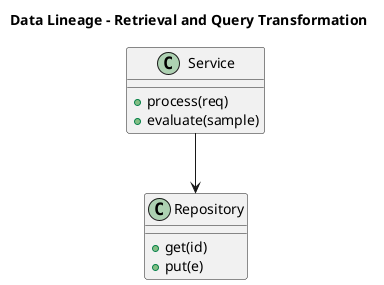

_Source diagram (plantuml); render with the appropriate tool._

**Figure 4. Data Lineage - Retrieval and Query Transformation** (plantuml). Figure: Data Lineage view for Retrieval and Query Transformation. This diagram illustrates the principal components and their interactions as discussed in the surrounding section.

## Deep Dive: Mechanics, Variants and Trade-offs

Having established the essentials, we now go deeper into retrieval and query transformation. Mechanically, the behaviour emerges from a few interacting parts that are simpler than the whole they produce. The distinctions in this section are the ones that separate a working demo from a system that holds up under adversarial inputs, scale and the passage of time.

Consider the principal variants and how to choose between them. Each variant optimises for a different point in the design space - some for latency, some for accuracy, some for cost or operability - and the correct choice follows from explicit requirements rather than from defaults. Every added component buys capability at the price of operational surface area, and that bargain should be made consciously.

In practice this is supported by a mature tooling ecosystem, including LangChain, LlamaIndex, Haystack, RAGAS. Tools accelerate the work but do not substitute for understanding: the same principles apply whichever implementation you select, and the ability to reason from first principles is what lets you debug when a tool behaves unexpectedly.

A frequent source of subtle bugs is the interaction with caching and cost optimisation. Because caching and cost optimisation concerns semantic caching and retrieval reuse, changes there can silently alter the behaviour analysed here. The remedy is contract tests at the boundary and end-to-end evaluations that exercise the interaction explicitly.

Finally, attend to edge cases and degradation. Define what the system should do under partial failure, unexpected inputs and load spikes, and make that behaviour explicit and tested rather than emergent. Graceful degradation - returning a safe, useful result when the ideal one is unavailable - is a hallmark of mature engineering.

For deeper study, the literature offers authoritative treatments such as Lewis et al. — Retrieval-Augmented Generation (2020) and Gao et al. — Precise Zero-Shot Dense Retrieval (HyDE, 2022). These primary sources reward careful reading and ground the practical guidance above in established results.

## Advanced Considerations

Having established the essentials, we now go deeper into retrieval and query transformation. Beneath the abstraction lies a concrete process whose steps can each be measured, tested and optimised independently. The distinctions in this section are the ones that separate a working demo from a system that holds up under adversarial inputs, scale and the passage of time.

Consider the principal variants and how to choose between them. Each variant optimises for a different point in the design space - some for latency, some for accuracy, some for cost or operability - and the correct choice follows from explicit requirements rather than from defaults. As with most architectural decisions, the choice is rarely binary; the skill lies in quantifying the trade-offs and choosing deliberately.

In practice this is supported by a mature tooling ecosystem, including LangChain, LlamaIndex, Haystack, RAGAS. Tools accelerate the work but do not substitute for understanding: the same principles apply whichever implementation you select, and the ability to reason from first principles is what lets you debug when a tool behaves unexpectedly.

A frequent source of subtle bugs is the interaction with advanced rag patterns. Because advanced rag patterns concerns parent-document, sentence-window, fusion and agentic retrieval, changes there can silently alter the behaviour analysed here. The remedy is contract tests at the boundary and end-to-end evaluations that exercise the interaction explicitly.

Finally, attend to edge cases and degradation. Define what the system should do under partial failure, unexpected inputs and load spikes, and make that behaviour explicit and tested rather than emergent. Graceful degradation - returning a safe, useful result when the ideal one is unavailable - is a hallmark of mature engineering.

For deeper study, the literature offers authoritative treatments such as Lewis et al. — Retrieval-Augmented Generation (2020) and Gao et al. — Precise Zero-Shot Dense Retrieval (HyDE, 2022). These primary sources reward careful reading and ground the practical guidance above in established results.

## Worked Example

To ground the discussion, walk through a representative example. A enterprise organisation needs grounded internal Q&A over policies and wikis with citations. They decide to apply retrieval and query transformation as part of their RAG solution, but wisely treat it as a hypothesis to be validated rather than a foregone conclusion.

The team begins by stating the objective precisely and defining how success will be measured before writing any code. They establish a small but representative evaluation set, agree on acceptance thresholds, and only then prototype the simplest design that could work. Early measurement reveals which assumptions hold and which must be revised, saving weeks of misdirected effort and surfacing edge cases while they are still cheap to fix.

As the prototype matures into a service, the team hardens it: adding input validation, error handling, caching where it pays off, and monitoring that ties back to the original success metric. They document each significant decision in an architecture decision record so that future maintainers understand not just what was built but why.

The outcome is instructive. The system that reaches production is not the most sophisticated design the team considered, but the one whose behaviour they could measure, explain and operate. This is the recurring lesson of RAG: durable value comes from the whole system, not from any single clever component.

## Industry Use Cases

Across industries, the ideas in this chapter recur in recognisable ways. The following vignettes show how different sectors apply them and what they have in common.

**Enterprise.** Grounded internal Q&A over policies and wikis with citations. The common thread is that value comes not from the model alone but from the surrounding system - data quality, evaluation, integration and operations - which is precisely where most of the engineering effort belongs.

**Legal.** Case and contract research with traceable sources. The common thread is that value comes not from the model alone but from the surrounding system - data quality, evaluation, integration and operations - which is precisely where most of the engineering effort belongs.

**Healthcare.** Clinical guideline assistants with provenance. The common thread is that value comes not from the model alone but from the surrounding system - data quality, evaluation, integration and operations - which is precisely where most of the engineering effort belongs.

**Support.** Deflection bots grounded in current knowledge bases. The common thread is that value comes not from the model alone but from the surrounding system - data quality, evaluation, integration and operations - which is precisely where most of the engineering effort belongs.

## Best Practices

The following practices consistently separate successful RAG efforts from struggling ones. They are deliberately concrete so they can be adopted as checklist items in design and code review.

- Tune chunking to the corpus; measure its effect on retrieval metrics.
- Always cite sources and enable users to verify answers.
- Enforce access control at retrieval time, not just at the UI.
- Evaluate retrieval and generation separately to localise failures.

None of these are exotic; they are the unglamorous disciplines that compound into reliability. The cost of adopting them is small compared with the cost of the incidents they prevent, and they become second nature with practice.

## Common Pitfalls

Equally instructive are the failure modes that recur in practice. Each pitfall below has a clear early warning sign and a known remedy, so treat them as a diagnostic checklist when something feels wrong:

- Naive fixed-size chunking that splits semantic units.
- Stuffing too much context, increasing cost and diluting relevance.
- Ignoring permissions and leaking restricted documents.
- Measuring only end answer quality without diagnosing retrieval.

The pattern is consistent: most failures stem from skipping measurement, conflating prototype and production standards, or deferring cross-cutting concerns such as security and cost until they become emergencies. Naming these traps in advance is the cheapest way to avoid them.

## Governance, Security and Cost Notes

No discussion of retrieval and query transformation is complete without its governance, security and cost dimensions, which are too often deferred until they become emergencies. Treating them as first-class concerns from the outset is both cheaper and safer.

**Governance.** Classify the risk of this capability, document its intended and out-of-scope uses, and ensure decisions are traceable to satisfy internal policy and external regulation such as the NIST AI RMF, ISO/IEC 42001 and the EU AI Act. **Security.** Treat all external input as untrusted, validate outputs before acting on them, apply least privilege to any tools or data access, and map controls to the OWASP LLM Top 10 and MITRE ATLAS.

**Cost and sustainability.** Establish explicit budgets for compute, tokens and latency, attribute spend to owners, and revisit the economics as usage scales - a design that is affordable at pilot scale can become untenable at production volume. Building these reflexes into everyday engineering is what allows a RAG system to be not only capable but also trustworthy and economically sound.

## Hands-On Exercises

Work through the following exercises. They are designed to move understanding from recognition to application - the level required for real engineering work - so prefer writing and building over merely reading.

1. Explain retrieval and query transformation to a colleague unfamiliar with RAG, using a concrete example from your own domain.
2. Sketch a reference architecture that incorporates retrieval and query transformation and annotate where observability, security and cost controls belong.
3. Design an evaluation that would tell you whether retrieval and query transformation is working in production, including the metric, the dataset and the acceptance threshold.
4. Identify two pitfalls relevant to retrieval and query transformation in your environment and describe the early warning signals you would monitor.
5. Prototype the simplest implementation that demonstrates retrieval and query transformation, then list exactly what would need to change to make it production-ready.

## Key Takeaways

Key takeaways from this chapter:

- Retrieval and Query Transformation is a systems concern in RAG: data, models and operations must be co-designed.
- Measurement is non-negotiable; define success metrics and evaluation before building.
- Favour the simplest design that meets the requirement, and add complexity only when evidence demands it.
- Security, cost and observability are first-class requirements, not afterthoughts.
- Document decisions so the system remains understandable and operable as it evolves.

## Code Walkthrough

Every change to a RAG system should pass an evaluation gate. This example shows the minimal shape: align predictions and references, compute a metric, and return a pass/fail decision for CI.

The full listing is shown below; study it line by line and reproduce it locally before moving on.

### Listing: Evaluating Retrieval and Query Transformation with a regression gate

```python
from dataclasses import dataclass


@dataclass
class EvalResult:
    metric: str
    score: float
    passed: bool


def evaluate(predictions: list[str], references: list[str],
             threshold: float = 0.8) -> EvalResult:
    """Score Retrieval and Query Transformation output against references with a simple exact-match metric.

    In practice you would combine several metrics (exact match, semantic
    similarity, LLM-as-judge) and gate releases on the aggregate.
    """
    if len(predictions) != len(references):
        raise ValueError("predictions and references must align")
    hits = sum(p.strip() == r.strip() for p, r in zip(predictions, references))
    score = hits / len(references) if references else 0.0
    return EvalResult(metric="exact_match", score=score, passed=score >= threshold)


if __name__ == "__main__":
    result = evaluate(["yes", "no"], ["yes", "yes"])
    print(f"{result.metric}={result.score:.2f} passed={result.passed}")

```

## Review Questions

1. In the context of RAG, which statement best describes “Retrieval and Query Transformation”?
   - A. Query rewriting, HyDE, multi-query and hybrid search.
   - B. It guarantees deterministic output regardless of input.
   - C. It eliminates the need for any evaluation or monitoring.
   - D. It applies exclusively to image data.
   - **Answer: A.** Retrieval and Query Transformation: Query rewriting, HyDE, multi-query and hybrid search.
2. Which of the following is a recommended best practice when working with RAG?
   - A. It guarantees deterministic output regardless of input.
   - B. It is only relevant to academic research, not production.
   - C. Enforce access control at retrieval time, not just at the UI.
   - D. Naive fixed-size chunking that splits semantic units.
   - **Answer: C.** Best practice: Enforce access control at retrieval time, not just at the UI.
3. Which of the following is a common pitfall to avoid in RAG?
   - A. Measuring only end answer quality without diagnosing retrieval.
   - B. It eliminates the need for any evaluation or monitoring.
   - C. Always cite sources and enable users to verify answers.
   - D. Evaluate retrieval and generation separately to localise failures.
   - **Answer: A.** Pitfall to avoid: Measuring only end answer quality without diagnosing retrieval.
4. *(Discussion)* Describe a failure mode of Retrieval and Query Transformation and how you would mitigate it.
   - **Model answer:** A strong answer defines retrieval and query transformation (Query rewriting, HyDE, multi-query and hybrid search.) then connects it to architecture, evaluation, cost, security and operations for RAG, citing concrete trade-offs and a real-world example.

---


# Chapter 5. Re-ranking and Context Selection

_This chapter examines re-ranking and context selection within RAG. It covers cross-encoders, maximal marginal relevance and context budgeting, derives a reference architecture, walks through a worked example and runnable code, surveys industry use cases, and distils best practices and pitfalls, closing with exercises and review questions._

## Introduction

Re-ranking and Context Selection refers to cross-encoders, maximal marginal relevance and context budgeting. This concept recurs throughout the RAG lifecycle, from design to operations. In an enterprise setting, this translates into concrete requirements: clear interfaces, measurable quality, and controls that satisfy security and governance.

This chapter builds intuition first, then formalises the ideas, derives an architecture, and finishes with code, exercises and review questions so the material transfers directly to your own RAG work. Read it actively: pause at each diagram, reproduce the code, and attempt the exercises before consulting the answers.

## Theory and Foundations

Formally, Re-ranking and Context Selection addresses cross-encoders, maximal marginal relevance and context budgeting. Seasoned practitioners treat this as a systems problem, co-designing data, models and operations rather than optimising any one in isolation. It pays to understand the mechanism rather than treat it as a black box, because most production incidents are explained by one of its steps misbehaving.

To place this in context, recall the broader picture: Retrieval-augmented generation grounds a language model in external knowledge by retrieving relevant context at query time and conditioning generation on it. Within that picture, re-ranking and context selection is one of the load-bearing ideas - the kind that, when understood deeply, makes the rest of RAG fall into place. Teams that master this consistently ship more reliable RAG systems at lower cost.

Re-ranking and Context Selection cannot be understood in isolation from embedding and indexing strategy. Recall that embedding and indexing strategy concerns choosing models, dimensions and index types for the corpus. The two interact directly: decisions in one constrain the design space of the other, which is why mature teams reason about them together rather than sequentially. As with most architectural decisions, the choice is rarely binary; the skill lies in quantifying the trade-offs and choosing deliberately.

Re-ranking and Context Selection cannot be understood in isolation from operating rag in production. Recall that operating rag in production concerns monitoring retrieval quality, drift and feedback loops. The two interact directly: decisions in one constrain the design space of the other, which is why mature teams reason about them together rather than sequentially. Simplicity is a feature. The simplest design that meets the requirement should be the default, with complexity added only when measurement justifies it.

Several established patterns apply directly to re-ranking and context selection. The first, parent-document retrieval for precise chunks with broad context, is widely adopted because it makes the system's behaviour predictable and observable. A complementary pattern, hybrid retrieval with reciprocal rank fusion, addresses a related concern and is often deployed alongside it. Patterns are not dogma; they are distilled experience that shortcuts the search for a sound design, and each carries assumptions worth checking against your context.

The decision of whether to adopt this should be driven by requirements, not by novelty. In a small prototype, shortcuts around re-ranking and context selection are invisible; in a production RAG system serving real traffic, they surface as incidents, cost overruns or compliance gaps. Latency, accuracy and cost form a tension triangle: improving one typically pressures the others, so explicit budgets are essential. The remainder of this chapter turns these principles into an architecture, code and a checklist you can apply immediately.

## Architecture and Design

The reference architecture for Re-ranking and Context Selection separates concerns into clearly bounded components with explicit contracts. A RAG system has an offline ingestion pipeline (parse → chunk → embed → index) and an online query pipeline (query transform → hybrid retrieve → re-rank → assemble prompt → generate → cite). Access control filters retrieval by user permissions, and an evaluation service continuously scores faithfulness and relevance on sampled traffic.

Concretely, the principal building blocks include why rag: grounding and freshness, document ingestion and chunking, embedding and indexing strategy, retrieval and query transformation and re-ranking and context selection. Each is a replaceable component behind a stable interface, so the team can upgrade an implementation - a model, an index, a policy engine - without rewriting its neighbours. The contracts between components are where reliability is won or lost, so they are specified explicitly and tested in isolation.

The diagram accompanying this section makes the data and control flow explicit. Requests enter through a well-defined boundary where they are authenticated and validated; only then are they dispatched to the components that perform the work. This boundary is also where rate limiting, quota enforcement and audit logging live, keeping cross-cutting concerns out of the core logic and in one auditable place.

Two qualities deserve emphasis. First, observability is designed in, not bolted on: every component emits structured telemetry so that failures can be localised in minutes rather than hours. Second, the architecture is evolvable - components communicate through stable contracts so that any single part of the RAG system can be replaced without a rewrite. There is an inherent trade-off between fidelity and cost, and the correct balance depends on the use case and its tolerance for error.

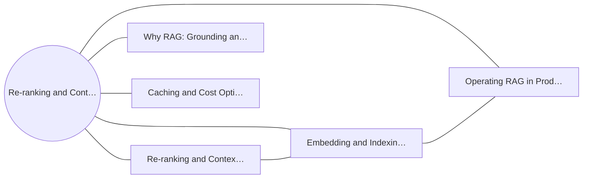

**Figure 5. Knowledge Graph - Re-ranking and Context Selection** (mermaid). Figure: Knowledge Graph view for Re-ranking and Context Selection. This diagram illustrates the principal components and their interactions as discussed in the surrounding section.


_Source diagram (plantuml); render with the appropriate tool._

**Figure 6. Network - Re-ranking and Context Selection** (plantuml). Figure: Network view for Re-ranking and Context Selection. This diagram illustrates the principal components and their interactions as discussed in the surrounding section.

## Deep Dive: Mechanics, Variants and Trade-offs

Having established the essentials, we now go deeper into re-ranking and context selection. Mechanically, the behaviour emerges from a few interacting parts that are simpler than the whole they produce. The distinctions in this section are the ones that separate a working demo from a system that holds up under adversarial inputs, scale and the passage of time.

Consider the principal variants and how to choose between them. Each variant optimises for a different point in the design space - some for latency, some for accuracy, some for cost or operability - and the correct choice follows from explicit requirements rather than from defaults. Simplicity is a feature. The simplest design that meets the requirement should be the default, with complexity added only when measurement justifies it.

In practice this is supported by a mature tooling ecosystem, including LangChain, LlamaIndex, Haystack, RAGAS. Tools accelerate the work but do not substitute for understanding: the same principles apply whichever implementation you select, and the ability to reason from first principles is what lets you debug when a tool behaves unexpectedly.

A frequent source of subtle bugs is the interaction with embedding and indexing strategy. Because embedding and indexing strategy concerns choosing models, dimensions and index types for the corpus, changes there can silently alter the behaviour analysed here. The remedy is contract tests at the boundary and end-to-end evaluations that exercise the interaction explicitly.

Finally, attend to edge cases and degradation. Define what the system should do under partial failure, unexpected inputs and load spikes, and make that behaviour explicit and tested rather than emergent. Graceful degradation - returning a safe, useful result when the ideal one is unavailable - is a hallmark of mature engineering.

For deeper study, the literature offers authoritative treatments such as Lewis et al. — Retrieval-Augmented Generation (2020) and Gao et al. — Precise Zero-Shot Dense Retrieval (HyDE, 2022). These primary sources reward careful reading and ground the practical guidance above in established results.

## Advanced Considerations

Having established the essentials, we now go deeper into re-ranking and context selection. Beneath the abstraction lies a concrete process whose steps can each be measured, tested and optimised independently. The distinctions in this section are the ones that separate a working demo from a system that holds up under adversarial inputs, scale and the passage of time.

Consider the principal variants and how to choose between them. Each variant optimises for a different point in the design space - some for latency, some for accuracy, some for cost or operability - and the correct choice follows from explicit requirements rather than from defaults. Latency, accuracy and cost form a tension triangle: improving one typically pressures the others, so explicit budgets are essential.

In practice this is supported by a mature tooling ecosystem, including LangChain, LlamaIndex, Haystack, RAGAS. Tools accelerate the work but do not substitute for understanding: the same principles apply whichever implementation you select, and the ability to reason from first principles is what lets you debug when a tool behaves unexpectedly.

A frequent source of subtle bugs is the interaction with caching and cost optimisation. Because caching and cost optimisation concerns semantic caching and retrieval reuse, changes there can silently alter the behaviour analysed here. The remedy is contract tests at the boundary and end-to-end evaluations that exercise the interaction explicitly.

Finally, attend to edge cases and degradation. Define what the system should do under partial failure, unexpected inputs and load spikes, and make that behaviour explicit and tested rather than emergent. Graceful degradation - returning a safe, useful result when the ideal one is unavailable - is a hallmark of mature engineering.

For deeper study, the literature offers authoritative treatments such as Lewis et al. — Retrieval-Augmented Generation (2020) and Gao et al. — Precise Zero-Shot Dense Retrieval (HyDE, 2022). These primary sources reward careful reading and ground the practical guidance above in established results.

## Worked Example

Consider a concrete scenario. A legal organisation needs case and contract research with traceable sources. They decide to apply re-ranking and context selection as part of their RAG solution, but wisely treat it as a hypothesis to be validated rather than a foregone conclusion.

The team begins by stating the objective precisely and defining how success will be measured before writing any code. They establish a small but representative evaluation set, agree on acceptance thresholds, and only then prototype the simplest design that could work. Early measurement reveals which assumptions hold and which must be revised, saving weeks of misdirected effort and surfacing edge cases while they are still cheap to fix.

As the prototype matures into a service, the team hardens it: adding input validation, error handling, caching where it pays off, and monitoring that ties back to the original success metric. They document each significant decision in an architecture decision record so that future maintainers understand not just what was built but why.

The outcome is instructive. The system that reaches production is not the most sophisticated design the team considered, but the one whose behaviour they could measure, explain and operate. This is the recurring lesson of RAG: durable value comes from the whole system, not from any single clever component.

## Industry Use Cases

Across industries, the ideas in this chapter recur in recognisable ways. The following vignettes show how different sectors apply them and what they have in common.

**Enterprise.** Grounded internal Q&A over policies and wikis with citations. The common thread is that value comes not from the model alone but from the surrounding system - data quality, evaluation, integration and operations - which is precisely where most of the engineering effort belongs.

**Legal.** Case and contract research with traceable sources. The common thread is that value comes not from the model alone but from the surrounding system - data quality, evaluation, integration and operations - which is precisely where most of the engineering effort belongs.

**Healthcare.** Clinical guideline assistants with provenance. The common thread is that value comes not from the model alone but from the surrounding system - data quality, evaluation, integration and operations - which is precisely where most of the engineering effort belongs.

**Support.** Deflection bots grounded in current knowledge bases. The common thread is that value comes not from the model alone but from the surrounding system - data quality, evaluation, integration and operations - which is precisely where most of the engineering effort belongs.

## Best Practices

The following practices consistently separate successful RAG efforts from struggling ones. They are deliberately concrete so they can be adopted as checklist items in design and code review.

- Tune chunking to the corpus; measure its effect on retrieval metrics.
- Always cite sources and enable users to verify answers.
- Enforce access control at retrieval time, not just at the UI.
- Evaluate retrieval and generation separately to localise failures.

None of these are exotic; they are the unglamorous disciplines that compound into reliability. The cost of adopting them is small compared with the cost of the incidents they prevent, and they become second nature with practice.

## Common Pitfalls

Equally instructive are the failure modes that recur in practice. Each pitfall below has a clear early warning sign and a known remedy, so treat them as a diagnostic checklist when something feels wrong:

- Naive fixed-size chunking that splits semantic units.
- Stuffing too much context, increasing cost and diluting relevance.
- Ignoring permissions and leaking restricted documents.
- Measuring only end answer quality without diagnosing retrieval.

The pattern is consistent: most failures stem from skipping measurement, conflating prototype and production standards, or deferring cross-cutting concerns such as security and cost until they become emergencies. Naming these traps in advance is the cheapest way to avoid them.

## Governance, Security and Cost Notes

No discussion of re-ranking and context selection is complete without its governance, security and cost dimensions, which are too often deferred until they become emergencies. Treating them as first-class concerns from the outset is both cheaper and safer.

**Governance.** Classify the risk of this capability, document its intended and out-of-scope uses, and ensure decisions are traceable to satisfy internal policy and external regulation such as the NIST AI RMF, ISO/IEC 42001 and the EU AI Act. **Security.** Treat all external input as untrusted, validate outputs before acting on them, apply least privilege to any tools or data access, and map controls to the OWASP LLM Top 10 and MITRE ATLAS.

**Cost and sustainability.** Establish explicit budgets for compute, tokens and latency, attribute spend to owners, and revisit the economics as usage scales - a design that is affordable at pilot scale can become untenable at production volume. Building these reflexes into everyday engineering is what allows a RAG system to be not only capable but also trustworthy and economically sound.

## Hands-On Exercises

Work through the following exercises. They are designed to move understanding from recognition to application - the level required for real engineering work - so prefer writing and building over merely reading.

1. Explain re-ranking and context selection to a colleague unfamiliar with RAG, using a concrete example from your own domain.
2. Sketch a reference architecture that incorporates re-ranking and context selection and annotate where observability, security and cost controls belong.
3. Design an evaluation that would tell you whether re-ranking and context selection is working in production, including the metric, the dataset and the acceptance threshold.
4. Identify two pitfalls relevant to re-ranking and context selection in your environment and describe the early warning signals you would monitor.
5. Prototype the simplest implementation that demonstrates re-ranking and context selection, then list exactly what would need to change to make it production-ready.

## Key Takeaways

Key takeaways from this chapter:

- Re-ranking and Context Selection is a systems concern in RAG: data, models and operations must be co-designed.
- Measurement is non-negotiable; define success metrics and evaluation before building.
- Favour the simplest design that meets the requirement, and add complexity only when evidence demands it.
- Security, cost and observability are first-class requirements, not afterthoughts.
- Document decisions so the system remains understandable and operable as it evolves.

## Code Walkthrough

This listing shows a configuration-driven Re-ranking and Context Selection component with retry semantics and typed interfaces — the shape we expect from production RAG code rather than a notebook prototype.

The full listing is shown below; study it line by line and reproduce it locally before moving on.

### Listing: Implementing a Re-ranking and Context Selection component

```python
from __future__ import annotations

from dataclasses import dataclass, field
from typing import Any


@dataclass(slots=True)
class AndContextConfig:
    """Configuration for the Re-ranking and Context Selection component in a RAG system."""

    name: str
    timeout_s: float = 30.0
    max_retries: int = 3
    options: dict[str, Any] = field(default_factory=dict)


class AndContext:
    """A minimal, production-shaped implementation of Re-ranking and Context Selection."""

    def __init__(self, config: AndContextConfig) -> None:
        self._config = config
        self._calls = 0

    def run(self, payload: dict[str, Any]) -> dict[str, Any]:
        """Process a request, retrying transient failures with backoff."""
        last_error: Exception | None = None
        for attempt in range(self._config.max_retries):
            try:
                self._calls += 1
                return self._process(payload)
            except TimeoutError as exc:  # transient
                last_error = exc
                continue
        raise RuntimeError(f"AndContext failed after retries") from last_error

    def _process(self, payload: dict[str, Any]) -> dict[str, Any]:
        # Domain-specific logic for Re-ranking and Context Selection goes here.
        return {"status": "ok", "input_keys": sorted(payload), "calls": self._calls}

```

## Review Questions

1. In the context of RAG, which statement best describes “Re-ranking and Context Selection”?
   - A. Cross-encoders, maximal marginal relevance and context budgeting.
   - B. It is only relevant to academic research, not production.
   - C. It guarantees deterministic output regardless of input.
   - D. It removes all security and governance requirements.
   - **Answer: A.** Re-ranking and Context Selection: Cross-encoders, maximal marginal relevance and context budgeting.
2. Which of the following is a recommended best practice when working with RAG?
   - A. It guarantees deterministic output regardless of input.
   - B. It applies exclusively to image data.
   - C. Measuring only end answer quality without diagnosing retrieval.
   - D. Always cite sources and enable users to verify answers.
   - **Answer: D.** Best practice: Always cite sources and enable users to verify answers.
3. Which of the following is a common pitfall to avoid in RAG?
   - A. It makes the system slower but has no other effect.
   - B. Enforce access control at retrieval time, not just at the UI.
   - C. It applies exclusively to image data.
   - D. Naive fixed-size chunking that splits semantic units.
   - **Answer: D.** Pitfall to avoid: Naive fixed-size chunking that splits semantic units.
4. *(Discussion)* What trade-offs would you weigh when implementing Re-ranking and Context Selection?
   - **Model answer:** A strong answer defines re-ranking and context selection (Cross-encoders, maximal marginal relevance and context budgeting.) then connects it to architecture, evaluation, cost, security and operations for RAG, citing concrete trade-offs and a real-world example.

---


# Chapter 6. Prompt Assembly and Citation

_This chapter examines prompt assembly and citation within RAG. It covers grounding instructions, source attribution and refusal on low confidence, derives a reference architecture, walks through a worked example and runnable code, surveys industry use cases, and distils best practices and pitfalls, closing with exercises and review questions._

## Introduction

We define Prompt Assembly and Citation as grounding instructions, source attribution and refusal on low confidence. Neglecting it is one of the most common reasons RAG initiatives stall in production. It helps to separate the conceptual model from its implementation: the former guides reasoning, the latter must contend with real-world constraints.

This chapter builds intuition first, then formalises the ideas, derives an architecture, and finishes with code, exercises and review questions so the material transfers directly to your own RAG work. Read it actively: pause at each diagram, reproduce the code, and attempt the exercises before consulting the answers.

## Theory and Foundations

At its core, Prompt Assembly and Citation concerns grounding instructions, source attribution and refusal on low confidence. The practical implication is that design choices here ripple through latency, cost and maintainability for the lifetime of the system. Beneath the abstraction lies a concrete process whose steps can each be measured, tested and optimised independently.

To place this in context, recall the broader picture: Retrieval-augmented generation grounds a language model in external knowledge by retrieving relevant context at query time and conditioning generation on it. Within that picture, prompt assembly and citation is one of the load-bearing ideas - the kind that, when understood deeply, makes the rest of RAG fall into place. Understanding this matters because RAG systems succeed or fail on exactly these decisions.

Prompt Assembly and Citation cannot be understood in isolation from evaluation of rag systems. Recall that evaluation of rag systems concerns faithfulness, answer relevance, context precision/recall (RAGAS-style). The two interact directly: decisions in one constrain the design space of the other, which is why mature teams reason about them together rather than sequentially. Every added component buys capability at the price of operational surface area, and that bargain should be made consciously.

Prompt Assembly and Citation cannot be understood in isolation from retrieval and query transformation. Recall that retrieval and query transformation concerns query rewriting, HyDE, multi-query and hybrid search. The two interact directly: decisions in one constrain the design space of the other, which is why mature teams reason about them together rather than sequentially. Latency, accuracy and cost form a tension triangle: improving one typically pressures the others, so explicit budgets are essential.

Several established patterns apply directly to prompt assembly and citation. The first, cross-encoder re-ranking of top-k candidates, is widely adopted because it makes the system's behaviour predictable and observable. A complementary pattern, hybrid retrieval with reciprocal rank fusion, addresses a related concern and is often deployed alongside it. Patterns are not dogma; they are distilled experience that shortcuts the search for a sound design, and each carries assumptions worth checking against your context.

It is worth being explicit about when to apply this and when to reach for something simpler. In a small prototype, shortcuts around prompt assembly and citation are invisible; in a production RAG system serving real traffic, they surface as incidents, cost overruns or compliance gaps. There is an inherent trade-off between fidelity and cost, and the correct balance depends on the use case and its tolerance for error. The remainder of this chapter turns these principles into an architecture, code and a checklist you can apply immediately.

## Architecture and Design

A robust architecture for Prompt Assembly and Citation is layered so each part can evolve independently without destabilising the whole. A RAG system has an offline ingestion pipeline (parse → chunk → embed → index) and an online query pipeline (query transform → hybrid retrieve → re-rank → assemble prompt → generate → cite). Access control filters retrieval by user permissions, and an evaluation service continuously scores faithfulness and relevance on sampled traffic.

Concretely, the principal building blocks include why rag: grounding and freshness, document ingestion and chunking, embedding and indexing strategy, retrieval and query transformation and re-ranking and context selection. Each is a replaceable component behind a stable interface, so the team can upgrade an implementation - a model, an index, a policy engine - without rewriting its neighbours. The contracts between components are where reliability is won or lost, so they are specified explicitly and tested in isolation.

The diagram accompanying this section makes the data and control flow explicit. Requests enter through a well-defined boundary where they are authenticated and validated; only then are they dispatched to the components that perform the work. This boundary is also where rate limiting, quota enforcement and audit logging live, keeping cross-cutting concerns out of the core logic and in one auditable place.

Two qualities deserve emphasis. First, observability is designed in, not bolted on: every component emits structured telemetry so that failures can be localised in minutes rather than hours. Second, the architecture is evolvable - components communicate through stable contracts so that any single part of the RAG system can be replaced without a rewrite. There is an inherent trade-off between fidelity and cost, and the correct balance depends on the use case and its tolerance for error.

```xml
<mxfile host="ai-university">
  <diagram name="Network">
    <mxGraphModel dx="800" dy="600" grid="1" gridSize="10">
      <root>
        <mxCell id="0"/>
        <mxCell id="1" parent="0"/>
        <mxCell id="title" value="Network - Prompt Assembly and Citation" style="text;fontSize=16;fontStyle=1" vertex="1" parent="1"><mxGeometry x="40" y="20" width="600" height="30" as="geometry"/></mxCell>
        <mxCell id="hub" value="Prompt Assembly and C…" style="rounded=1;fillColor=#0f172a;fontColor=#ffffff;fontStyle=1" vertex="1" parent="1"><mxGeometry x="300" y="180" width="160" height="60" as="geometry"/></mxCell>
        <mxCell id="n0" value="Prompt Assembly and Cit…" style="rounded=1;fillColor=#e0e7ff;strokeColor=#4338ca" vertex="1" parent="1"><mxGeometry x="60" y="80" width="160" height="50" as="geometry"/></mxCell>
        <mxCell id="e0" style="edgeStyle=orthogonalEdgeStyle" edge="1" parent="1" source="hub" target="n0"><mxGeometry relative="1" as="geometry"/></mxCell>
        <mxCell id="n1" value="Evaluation of RAG Syste…" style="rounded=1;fillColor=#e0e7ff;strokeColor=#4338ca" vertex="1" parent="1"><mxGeometry x="600" y="170" width="160" height="50" as="geometry"/></mxCell>
        <mxCell id="e1" style="edgeStyle=orthogonalEdgeStyle" edge="1" parent="1" source="hub" target="n1"><mxGeometry relative="1" as="geometry"/></mxCell>
        <mxCell id="n2" value="Retrieval and Query Tra…" style="rounded=1;fillColor=#e0e7ff;strokeColor=#4338ca" vertex="1" parent="1"><mxGeometry x="60" y="260" width="160" height="50" as="geometry"/></mxCell>
        <mxCell id="e2" style="edgeStyle=orthogonalEdgeStyle" edge="1" parent="1" source="hub" target="n2"><mxGeometry relative="1" as="geometry"/></mxCell>
        <mxCell id="n3" value="Security and Access Con…" style="rounded=1;fillColor=#e0e7ff;strokeColor=#4338ca" vertex="1" parent="1"><mxGeometry x="600" y="350" width="160" height="50" as="geometry"/></mxCell>
        <mxCell id="e3" style="edgeStyle=orthogonalEdgeStyle" edge="1" parent="1" source="hub" target="n3"><mxGeometry relative="1" as="geometry"/></mxCell>
        <mxCell id="n4" value="Operating RAG in Produc…" style="rounded=1;fillColor=#e0e7ff;strokeColor=#4338ca" vertex="1" parent="1"><mxGeometry x="60" y="440" width="160" height="50" as="geometry"/></mxCell>
        <mxCell id="e4" style="edgeStyle=orthogonalEdgeStyle" edge="1" parent="1" source="hub" target="n4"><mxGeometry relative="1" as="geometry"/></mxCell>
      </root>
    </mxGraphModel>
  </diagram>
</mxfile>
```

_Source diagram (drawio); render with the appropriate tool._

**Figure 7. Network - Prompt Assembly and Citation** (drawio). Figure: Network view for Prompt Assembly and Citation. This diagram illustrates the principal components and their interactions as discussed in the surrounding section.

<div class="diagram-svg">

<svg xmlns="http://www.w3.org/2000/svg" width="840" height="460" data-tpl="flow_h" data-pal="7-5" viewBox="0 0 840 460" font-family="Inter, Segoe UI, Arial, sans-serif"><defs><marker id="ar" markerWidth="9" markerHeight="9" refX="7" refY="3" orient="auto"><path d="M0,0 L7,3 L0,6 z" fill="#94a3b8"/></marker><marker id="arw" markerWidth="9" markerHeight="9" refX="7" refY="3" orient="auto"><path d="M0,0 L7,3 L0,6 z" fill="#ffffff"/></marker><filter id="sh" x="-20%" y="-20%" width="140%" height="140%"><feDropShadow dx="0" dy="2" stdDeviation="3" flood-color="#0f172a" flood-opacity="0.16"/></filter></defs><defs><linearGradient id="bn8f5e10d" x1="0" y1="0" x2="1" y2="0"><stop offset="0" stop-color="#d946ef"/><stop offset="1" stop-color="#6b21a8"/></linearGradient></defs><rect width="840" height="460" rx="14" fill="#ffffff"/><rect x="0" y="0" width="840" height="48" rx="14" fill="url(#bn8f5e10d)"/><rect x="0" y="32" width="840" height="16" fill="url(#bn8f5e10d)"/><text x="420" y="25" text-anchor="middle" font-size="14.5" font-weight="700" fill="#ffffff" dominant-baseline="middle">RAG Architecture - Prompt Assembly and Citation</text><rect x="39" y="196" width="130" height="68" rx="11" fill="#d946ef" filter="url(#sh)"/><text x="104" y="224" text-anchor="middle" font-size="10.5" font-weight="600" fill="#ffffff" dominant-baseline="middle">Prompt Assembly and</text><text x="104" y="236" text-anchor="middle" font-size="10.5" font-weight="600" fill="#ffffff" dominant-baseline="middle">Citation</text><rect x="197" y="196" width="130" height="68" rx="11" fill="#6b21a8" filter="url(#sh)"/><text x="262" y="224" text-anchor="middle" font-size="10.5" font-weight="600" fill="#ffffff" dominant-baseline="middle">Evaluation of RAG</text><text x="262" y="236" text-anchor="middle" font-size="10.5" font-weight="600" fill="#ffffff" dominant-baseline="middle">Systems</text><line x1="169" y1="230" x2="197" y2="230" stroke="#94a3b8" stroke-width="2" marker-end="url(#ar)"/><rect x="355" y="196" width="130" height="68" rx="11" fill="#7e22ce" filter="url(#sh)"/><text x="420" y="224" text-anchor="middle" font-size="10.5" font-weight="600" fill="#ffffff" dominant-baseline="middle">Retrieval and Query</text><text x="420" y="236" text-anchor="middle" font-size="10.5" font-weight="600" fill="#ffffff" dominant-baseline="middle">Transformation</text><line x1="327" y1="230" x2="355" y2="230" stroke="#94a3b8" stroke-width="2" marker-end="url(#ar)"/><rect x="513" y="196" width="130" height="68" rx="11" fill="#9333ea" filter="url(#sh)"/><text x="578" y="224" text-anchor="middle" font-size="10.5" font-weight="600" fill="#ffffff" dominant-baseline="middle">Security and Access</text><text x="578" y="236" text-anchor="middle" font-size="10.5" font-weight="600" fill="#ffffff" dominant-baseline="middle">Control in RAG</text><line x1="485" y1="230" x2="513" y2="230" stroke="#94a3b8" stroke-width="2" marker-end="url(#ar)"/><rect x="671" y="196" width="130" height="68" rx="11" fill="#a21caf" filter="url(#sh)"/><text x="736" y="224" text-anchor="middle" font-size="10.5" font-weight="600" fill="#ffffff" dominant-baseline="middle">Operating RAG in</text><text x="736" y="236" text-anchor="middle" font-size="10.5" font-weight="600" fill="#ffffff" dominant-baseline="middle">Production</text><line x1="643" y1="230" x2="671" y2="230" stroke="#94a3b8" stroke-width="2" marker-end="url(#ar)"/><text x="420" y="300" text-anchor="middle" font-size="11" font-weight="500" fill="#64748b" dominant-baseline="middle">end-to-end flow</text><text x="28" y="446" text-anchor="start" font-size="9.5" font-weight="500" fill="#64748b" dominant-baseline="middle">Prompt Assembly and Citation  •  RAG Architecture</text></svg>

</div>

**Figure 8. RAG Architecture - Prompt Assembly and Citation** (svg). Figure: RAG Architecture view for Prompt Assembly and Citation. This diagram illustrates the principal components and their interactions as discussed in the surrounding section.

## Deep Dive: Mechanics, Variants and Trade-offs

Having established the essentials, we now go deeper into prompt assembly and citation. It pays to understand the mechanism rather than treat it as a black box, because most production incidents are explained by one of its steps misbehaving. The distinctions in this section are the ones that separate a working demo from a system that holds up under adversarial inputs, scale and the passage of time.

Consider the principal variants and how to choose between them. Each variant optimises for a different point in the design space - some for latency, some for accuracy, some for cost or operability - and the correct choice follows from explicit requirements rather than from defaults. There is an inherent trade-off between fidelity and cost, and the correct balance depends on the use case and its tolerance for error.

In practice this is supported by a mature tooling ecosystem, including LangChain, LlamaIndex, Haystack, RAGAS. Tools accelerate the work but do not substitute for understanding: the same principles apply whichever implementation you select, and the ability to reason from first principles is what lets you debug when a tool behaves unexpectedly.

A frequent source of subtle bugs is the interaction with evaluation of rag systems. Because evaluation of rag systems concerns faithfulness, answer relevance, context precision/recall (RAGAS-style), changes there can silently alter the behaviour analysed here. The remedy is contract tests at the boundary and end-to-end evaluations that exercise the interaction explicitly.

Finally, attend to edge cases and degradation. Define what the system should do under partial failure, unexpected inputs and load spikes, and make that behaviour explicit and tested rather than emergent. Graceful degradation - returning a safe, useful result when the ideal one is unavailable - is a hallmark of mature engineering.

For deeper study, the literature offers authoritative treatments such as Lewis et al. — Retrieval-Augmented Generation (2020) and Gao et al. — Precise Zero-Shot Dense Retrieval (HyDE, 2022). These primary sources reward careful reading and ground the practical guidance above in established results.

## Advanced Considerations

Having established the essentials, we now go deeper into prompt assembly and citation. The underlying mechanism is best appreciated by tracing a single request from input to output and noting where state is created and consumed. The distinctions in this section are the ones that separate a working demo from a system that holds up under adversarial inputs, scale and the passage of time.

Consider the principal variants and how to choose between them. Each variant optimises for a different point in the design space - some for latency, some for accuracy, some for cost or operability - and the correct choice follows from explicit requirements rather than from defaults. Simplicity is a feature. The simplest design that meets the requirement should be the default, with complexity added only when measurement justifies it.

In practice this is supported by a mature tooling ecosystem, including LangChain, LlamaIndex, Haystack, RAGAS. Tools accelerate the work but do not substitute for understanding: the same principles apply whichever implementation you select, and the ability to reason from first principles is what lets you debug when a tool behaves unexpectedly.

A frequent source of subtle bugs is the interaction with the end-to-end rag reference architecture. Because the end-to-end rag reference architecture concerns a production blueprint from ingestion to answer, changes there can silently alter the behaviour analysed here. The remedy is contract tests at the boundary and end-to-end evaluations that exercise the interaction explicitly.

Finally, attend to edge cases and degradation. Define what the system should do under partial failure, unexpected inputs and load spikes, and make that behaviour explicit and tested rather than emergent. Graceful degradation - returning a safe, useful result when the ideal one is unavailable - is a hallmark of mature engineering.

For deeper study, the literature offers authoritative treatments such as Lewis et al. — Retrieval-Augmented Generation (2020) and Gao et al. — Precise Zero-Shot Dense Retrieval (HyDE, 2022). These primary sources reward careful reading and ground the practical guidance above in established results.

## Worked Example

To ground the discussion, walk through a representative example. A healthcare organisation needs clinical guideline assistants with provenance. They decide to apply prompt assembly and citation as part of their RAG solution, but wisely treat it as a hypothesis to be validated rather than a foregone conclusion.

The team begins by stating the objective precisely and defining how success will be measured before writing any code. They establish a small but representative evaluation set, agree on acceptance thresholds, and only then prototype the simplest design that could work. Early measurement reveals which assumptions hold and which must be revised, saving weeks of misdirected effort and surfacing edge cases while they are still cheap to fix.

As the prototype matures into a service, the team hardens it: adding input validation, error handling, caching where it pays off, and monitoring that ties back to the original success metric. They document each significant decision in an architecture decision record so that future maintainers understand not just what was built but why.

The outcome is instructive. The system that reaches production is not the most sophisticated design the team considered, but the one whose behaviour they could measure, explain and operate. This is the recurring lesson of RAG: durable value comes from the whole system, not from any single clever component.

## Industry Use Cases

Across industries, the ideas in this chapter recur in recognisable ways. The following vignettes show how different sectors apply them and what they have in common.

**Enterprise.** Grounded internal Q&A over policies and wikis with citations. The common thread is that value comes not from the model alone but from the surrounding system - data quality, evaluation, integration and operations - which is precisely where most of the engineering effort belongs.

**Legal.** Case and contract research with traceable sources. The common thread is that value comes not from the model alone but from the surrounding system - data quality, evaluation, integration and operations - which is precisely where most of the engineering effort belongs.

**Healthcare.** Clinical guideline assistants with provenance. The common thread is that value comes not from the model alone but from the surrounding system - data quality, evaluation, integration and operations - which is precisely where most of the engineering effort belongs.

**Support.** Deflection bots grounded in current knowledge bases. The common thread is that value comes not from the model alone but from the surrounding system - data quality, evaluation, integration and operations - which is precisely where most of the engineering effort belongs.

## Best Practices

The following practices consistently separate successful RAG efforts from struggling ones. They are deliberately concrete so they can be adopted as checklist items in design and code review.

- Tune chunking to the corpus; measure its effect on retrieval metrics.
- Always cite sources and enable users to verify answers.
- Enforce access control at retrieval time, not just at the UI.
- Evaluate retrieval and generation separately to localise failures.

None of these are exotic; they are the unglamorous disciplines that compound into reliability. The cost of adopting them is small compared with the cost of the incidents they prevent, and they become second nature with practice.

## Common Pitfalls

Equally instructive are the failure modes that recur in practice. Each pitfall below has a clear early warning sign and a known remedy, so treat them as a diagnostic checklist when something feels wrong:

- Naive fixed-size chunking that splits semantic units.
- Stuffing too much context, increasing cost and diluting relevance.
- Ignoring permissions and leaking restricted documents.
- Measuring only end answer quality without diagnosing retrieval.

The pattern is consistent: most failures stem from skipping measurement, conflating prototype and production standards, or deferring cross-cutting concerns such as security and cost until they become emergencies. Naming these traps in advance is the cheapest way to avoid them.

## Governance, Security and Cost Notes

No discussion of prompt assembly and citation is complete without its governance, security and cost dimensions, which are too often deferred until they become emergencies. Treating them as first-class concerns from the outset is both cheaper and safer.

**Governance.** Classify the risk of this capability, document its intended and out-of-scope uses, and ensure decisions are traceable to satisfy internal policy and external regulation such as the NIST AI RMF, ISO/IEC 42001 and the EU AI Act. **Security.** Treat all external input as untrusted, validate outputs before acting on them, apply least privilege to any tools or data access, and map controls to the OWASP LLM Top 10 and MITRE ATLAS.

**Cost and sustainability.** Establish explicit budgets for compute, tokens and latency, attribute spend to owners, and revisit the economics as usage scales - a design that is affordable at pilot scale can become untenable at production volume. Building these reflexes into everyday engineering is what allows a RAG system to be not only capable but also trustworthy and economically sound.

## Hands-On Exercises

Work through the following exercises. They are designed to move understanding from recognition to application - the level required for real engineering work - so prefer writing and building over merely reading.

1. Explain prompt assembly and citation to a colleague unfamiliar with RAG, using a concrete example from your own domain.
2. Sketch a reference architecture that incorporates prompt assembly and citation and annotate where observability, security and cost controls belong.
3. Design an evaluation that would tell you whether prompt assembly and citation is working in production, including the metric, the dataset and the acceptance threshold.
4. Identify two pitfalls relevant to prompt assembly and citation in your environment and describe the early warning signals you would monitor.
5. Prototype the simplest implementation that demonstrates prompt assembly and citation, then list exactly what would need to change to make it production-ready.

## Key Takeaways

Key takeaways from this chapter:

- Prompt Assembly and Citation is a systems concern in RAG: data, models and operations must be co-designed.
- Measurement is non-negotiable; define success metrics and evaluation before building.
- Favour the simplest design that meets the requirement, and add complexity only when evidence demands it.
- Security, cost and observability are first-class requirements, not afterthoughts.
- Document decisions so the system remains understandable and operable as it evolves.

## Code Walkthrough

Every change to a RAG system should pass an evaluation gate. This example shows the minimal shape: align predictions and references, compute a metric, and return a pass/fail decision for CI.

The full listing is shown below; study it line by line and reproduce it locally before moving on.

### Listing: Evaluating Prompt Assembly and Citation with a regression gate

```python
from dataclasses import dataclass


@dataclass
class EvalResult:
    metric: str
    score: float
    passed: bool


def evaluate(predictions: list[str], references: list[str],
             threshold: float = 0.8) -> EvalResult:
    """Score Prompt Assembly and Citation output against references with a simple exact-match metric.

    In practice you would combine several metrics (exact match, semantic
    similarity, LLM-as-judge) and gate releases on the aggregate.
    """
    if len(predictions) != len(references):
        raise ValueError("predictions and references must align")
    hits = sum(p.strip() == r.strip() for p, r in zip(predictions, references))
    score = hits / len(references) if references else 0.0
    return EvalResult(metric="exact_match", score=score, passed=score >= threshold)


if __name__ == "__main__":
    result = evaluate(["yes", "no"], ["yes", "yes"])
    print(f"{result.metric}={result.score:.2f} passed={result.passed}")

```

## Review Questions

1. In the context of RAG, which statement best describes “Prompt Assembly and Citation”?
   - A. It guarantees deterministic output regardless of input.
   - B. It applies exclusively to image data.
   - C. It makes the system slower but has no other effect.
   - D. Grounding instructions, source attribution and refusal on low confidence.
   - **Answer: D.** Prompt Assembly and Citation: Grounding instructions, source attribution and refusal on low confidence.
2. Which of the following is a recommended best practice when working with RAG?
   - A. Enforce access control at retrieval time, not just at the UI.
   - B. It removes all security and governance requirements.
   - C. It applies exclusively to image data.
   - D. Measuring only end answer quality without diagnosing retrieval.
   - **Answer: A.** Best practice: Enforce access control at retrieval time, not just at the UI.
3. Which of the following is a common pitfall to avoid in RAG?
   - A. Enforce access control at retrieval time, not just at the UI.
   - B. It is only relevant to academic research, not production.
   - C. It removes all security and governance requirements.
   - D. Naive fixed-size chunking that splits semantic units.
   - **Answer: D.** Pitfall to avoid: Naive fixed-size chunking that splits semantic units.
4. *(Discussion)* Walk through how you would design Prompt Assembly and Citation for an enterprise RAG workload.
   - **Model answer:** A strong answer defines prompt assembly and citation (Grounding instructions, source attribution and refusal on low confidence.) then connects it to architecture, evaluation, cost, security and operations for RAG, citing concrete trade-offs and a real-world example.

---


# Chapter 7. Advanced RAG Patterns

_This chapter examines advanced rag patterns within RAG. It covers parent-document, sentence-window, fusion and agentic retrieval, derives a reference architecture, walks through a worked example and runnable code, surveys industry use cases, and distils best practices and pitfalls, closing with exercises and review questions._

## Introduction

Formally, Advanced RAG Patterns addresses parent-document, sentence-window, fusion and agentic retrieval. Teams that master this consistently ship more reliable RAG systems at lower cost. The practical implication is that design choices here ripple through latency, cost and maintainability for the lifetime of the system.

This chapter builds intuition first, then formalises the ideas, derives an architecture, and finishes with code, exercises and review questions so the material transfers directly to your own RAG work. Read it actively: pause at each diagram, reproduce the code, and attempt the exercises before consulting the answers.

## Theory and Foundations

At its core, Advanced RAG Patterns concerns parent-document, sentence-window, fusion and agentic retrieval. The practical implication is that design choices here ripple through latency, cost and maintainability for the lifetime of the system. It pays to understand the mechanism rather than treat it as a black box, because most production incidents are explained by one of its steps misbehaving.

To place this in context, recall the broader picture: Retrieval-augmented generation grounds a language model in external knowledge by retrieving relevant context at query time and conditioning generation on it. Within that picture, advanced rag patterns is one of the load-bearing ideas - the kind that, when understood deeply, makes the rest of RAG fall into place. It is foundational: later capabilities in RAG are built directly on top of it.

Advanced RAG Patterns cannot be understood in isolation from prompt assembly and citation. Recall that prompt assembly and citation concerns grounding instructions, source attribution and refusal on low confidence. The two interact directly: decisions in one constrain the design space of the other, which is why mature teams reason about them together rather than sequentially. Latency, accuracy and cost form a tension triangle: improving one typically pressures the others, so explicit budgets are essential.

Advanced RAG Patterns cannot be understood in isolation from re-ranking and context selection. Recall that re-ranking and context selection concerns cross-encoders, maximal marginal relevance and context budgeting. The two interact directly: decisions in one constrain the design space of the other, which is why mature teams reason about them together rather than sequentially. There is an inherent trade-off between fidelity and cost, and the correct balance depends on the use case and its tolerance for error.

Several established patterns apply directly to advanced rag patterns. The first, cross-encoder re-ranking of top-k candidates, is widely adopted because it makes the system's behaviour predictable and observable. A complementary pattern, hybrid retrieval with reciprocal rank fusion, addresses a related concern and is often deployed alongside it. Patterns are not dogma; they are distilled experience that shortcuts the search for a sound design, and each carries assumptions worth checking against your context.

The decision of whether to adopt this should be driven by requirements, not by novelty. In a small prototype, shortcuts around advanced rag patterns are invisible; in a production RAG system serving real traffic, they surface as incidents, cost overruns or compliance gaps. Latency, accuracy and cost form a tension triangle: improving one typically pressures the others, so explicit budgets are essential. The remainder of this chapter turns these principles into an architecture, code and a checklist you can apply immediately.

## Architecture and Design

A robust architecture for Advanced RAG Patterns is layered so each part can evolve independently without destabilising the whole. A RAG system has an offline ingestion pipeline (parse → chunk → embed → index) and an online query pipeline (query transform → hybrid retrieve → re-rank → assemble prompt → generate → cite). Access control filters retrieval by user permissions, and an evaluation service continuously scores faithfulness and relevance on sampled traffic.

Concretely, the principal building blocks include why rag: grounding and freshness, document ingestion and chunking, embedding and indexing strategy, retrieval and query transformation and re-ranking and context selection. Each is a replaceable component behind a stable interface, so the team can upgrade an implementation - a model, an index, a policy engine - without rewriting its neighbours. The contracts between components are where reliability is won or lost, so they are specified explicitly and tested in isolation.

The diagram accompanying this section makes the data and control flow explicit. Requests enter through a well-defined boundary where they are authenticated and validated; only then are they dispatched to the components that perform the work. This boundary is also where rate limiting, quota enforcement and audit logging live, keeping cross-cutting concerns out of the core logic and in one auditable place.

Two qualities deserve emphasis. First, observability is designed in, not bolted on: every component emits structured telemetry so that failures can be localised in minutes rather than hours. Second, the architecture is evolvable - components communicate through stable contracts so that any single part of the RAG system can be replaced without a rewrite. Latency, accuracy and cost form a tension triangle: improving one typically pressures the others, so explicit budgets are essential.

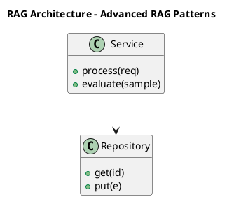

_Source diagram (plantuml); render with the appropriate tool._

**Figure 9. RAG Architecture - Advanced RAG Patterns** (plantuml). Figure: RAG Architecture view for Advanced RAG Patterns. This diagram illustrates the principal components and their interactions as discussed in the surrounding section.

```xml
<mxfile host="ai-university">
  <diagram name="Security Architecture">
    <mxGraphModel dx="800" dy="600" grid="1" gridSize="10">
      <root>
        <mxCell id="0"/>
        <mxCell id="1" parent="0"/>
        <mxCell id="title" value="Security Architecture - Advanced RAG Patterns" style="text;fontSize=16;fontStyle=1" vertex="1" parent="1"><mxGeometry x="40" y="20" width="600" height="30" as="geometry"/></mxCell>
        <mxCell id="hub" value="Advanced RAG Patterns" style="rounded=1;fillColor=#0f172a;fontColor=#ffffff;fontStyle=1" vertex="1" parent="1"><mxGeometry x="300" y="180" width="160" height="60" as="geometry"/></mxCell>
        <mxCell id="n0" value="Advanced RAG Patterns" style="rounded=1;fillColor=#e0e7ff;strokeColor=#4338ca" vertex="1" parent="1"><mxGeometry x="60" y="80" width="160" height="50" as="geometry"/></mxCell>
        <mxCell id="e0" style="edgeStyle=orthogonalEdgeStyle" edge="1" parent="1" source="hub" target="n0"><mxGeometry relative="1" as="geometry"/></mxCell>
        <mxCell id="n1" value="Prompt Assembly and Cit…" style="rounded=1;fillColor=#e0e7ff;strokeColor=#4338ca" vertex="1" parent="1"><mxGeometry x="600" y="170" width="160" height="50" as="geometry"/></mxCell>
        <mxCell id="e1" style="edgeStyle=orthogonalEdgeStyle" edge="1" parent="1" source="hub" target="n1"><mxGeometry relative="1" as="geometry"/></mxCell>
        <mxCell id="n2" value="Re-ranking and Context …" style="rounded=1;fillColor=#e0e7ff;strokeColor=#4338ca" vertex="1" parent="1"><mxGeometry x="60" y="260" width="160" height="50" as="geometry"/></mxCell>
        <mxCell id="e2" style="edgeStyle=orthogonalEdgeStyle" edge="1" parent="1" source="hub" target="n2"><mxGeometry relative="1" as="geometry"/></mxCell>
        <mxCell id="n3" value="Handling Tables, Images…" style="rounded=1;fillColor=#e0e7ff;strokeColor=#4338ca" vertex="1" parent="1"><mxGeometry x="600" y="350" width="160" height="50" as="geometry"/></mxCell>
        <mxCell id="e3" style="edgeStyle=orthogonalEdgeStyle" edge="1" parent="1" source="hub" target="n3"><mxGeometry relative="1" as="geometry"/></mxCell>
        <mxCell id="n4" value="Evaluation of RAG Syste…" style="rounded=1;fillColor=#e0e7ff;strokeColor=#4338ca" vertex="1" parent="1"><mxGeometry x="60" y="440" width="160" height="50" as="geometry"/></mxCell>
        <mxCell id="e4" style="edgeStyle=orthogonalEdgeStyle" edge="1" parent="1" source="hub" target="n4"><mxGeometry relative="1" as="geometry"/></mxCell>
      </root>
    </mxGraphModel>
  </diagram>
</mxfile>
```

_Source diagram (drawio); render with the appropriate tool._

**Figure 10. Security Architecture - Advanced RAG Patterns** (drawio). Figure: Security Architecture view for Advanced RAG Patterns. This diagram illustrates the principal components and their interactions as discussed in the surrounding section.

## Deep Dive: Mechanics, Variants and Trade-offs

Having established the essentials, we now go deeper into advanced rag patterns. Mechanically, the behaviour emerges from a few interacting parts that are simpler than the whole they produce. The distinctions in this section are the ones that separate a working demo from a system that holds up under adversarial inputs, scale and the passage of time.

Consider the principal variants and how to choose between them. Each variant optimises for a different point in the design space - some for latency, some for accuracy, some for cost or operability - and the correct choice follows from explicit requirements rather than from defaults. Latency, accuracy and cost form a tension triangle: improving one typically pressures the others, so explicit budgets are essential.

In practice this is supported by a mature tooling ecosystem, including LangChain, LlamaIndex, Haystack, RAGAS. Tools accelerate the work but do not substitute for understanding: the same principles apply whichever implementation you select, and the ability to reason from first principles is what lets you debug when a tool behaves unexpectedly.

A frequent source of subtle bugs is the interaction with prompt assembly and citation. Because prompt assembly and citation concerns grounding instructions, source attribution and refusal on low confidence, changes there can silently alter the behaviour analysed here. The remedy is contract tests at the boundary and end-to-end evaluations that exercise the interaction explicitly.

Finally, attend to edge cases and degradation. Define what the system should do under partial failure, unexpected inputs and load spikes, and make that behaviour explicit and tested rather than emergent. Graceful degradation - returning a safe, useful result when the ideal one is unavailable - is a hallmark of mature engineering.

For deeper study, the literature offers authoritative treatments such as Lewis et al. — Retrieval-Augmented Generation (2020) and Gao et al. — Precise Zero-Shot Dense Retrieval (HyDE, 2022). These primary sources reward careful reading and ground the practical guidance above in established results.

## Advanced Considerations

Having established the essentials, we now go deeper into advanced rag patterns. Mechanically, the behaviour emerges from a few interacting parts that are simpler than the whole they produce. The distinctions in this section are the ones that separate a working demo from a system that holds up under adversarial inputs, scale and the passage of time.

Consider the principal variants and how to choose between them. Each variant optimises for a different point in the design space - some for latency, some for accuracy, some for cost or operability - and the correct choice follows from explicit requirements rather than from defaults. Simplicity is a feature. The simplest design that meets the requirement should be the default, with complexity added only when measurement justifies it.

In practice this is supported by a mature tooling ecosystem, including LangChain, LlamaIndex, Haystack, RAGAS. Tools accelerate the work but do not substitute for understanding: the same principles apply whichever implementation you select, and the ability to reason from first principles is what lets you debug when a tool behaves unexpectedly.

A frequent source of subtle bugs is the interaction with security and access control in rag. Because security and access control in rag concerns row-level permissions and preventing data leakage across tenants, changes there can silently alter the behaviour analysed here. The remedy is contract tests at the boundary and end-to-end evaluations that exercise the interaction explicitly.

Finally, attend to edge cases and degradation. Define what the system should do under partial failure, unexpected inputs and load spikes, and make that behaviour explicit and tested rather than emergent. Graceful degradation - returning a safe, useful result when the ideal one is unavailable - is a hallmark of mature engineering.

For deeper study, the literature offers authoritative treatments such as Lewis et al. — Retrieval-Augmented Generation (2020) and Gao et al. — Precise Zero-Shot Dense Retrieval (HyDE, 2022). These primary sources reward careful reading and ground the practical guidance above in established results.

## Worked Example

Consider a concrete scenario. A legal organisation needs case and contract research with traceable sources. They decide to apply advanced rag patterns as part of their RAG solution, but wisely treat it as a hypothesis to be validated rather than a foregone conclusion.

The team begins by stating the objective precisely and defining how success will be measured before writing any code. They establish a small but representative evaluation set, agree on acceptance thresholds, and only then prototype the simplest design that could work. Early measurement reveals which assumptions hold and which must be revised, saving weeks of misdirected effort and surfacing edge cases while they are still cheap to fix.

As the prototype matures into a service, the team hardens it: adding input validation, error handling, caching where it pays off, and monitoring that ties back to the original success metric. They document each significant decision in an architecture decision record so that future maintainers understand not just what was built but why.

The outcome is instructive. The system that reaches production is not the most sophisticated design the team considered, but the one whose behaviour they could measure, explain and operate. This is the recurring lesson of RAG: durable value comes from the whole system, not from any single clever component.

## Industry Use Cases

Across industries, the ideas in this chapter recur in recognisable ways. The following vignettes show how different sectors apply them and what they have in common.

**Enterprise.** Grounded internal Q&A over policies and wikis with citations. The common thread is that value comes not from the model alone but from the surrounding system - data quality, evaluation, integration and operations - which is precisely where most of the engineering effort belongs.

**Legal.** Case and contract research with traceable sources. The common thread is that value comes not from the model alone but from the surrounding system - data quality, evaluation, integration and operations - which is precisely where most of the engineering effort belongs.

**Healthcare.** Clinical guideline assistants with provenance. The common thread is that value comes not from the model alone but from the surrounding system - data quality, evaluation, integration and operations - which is precisely where most of the engineering effort belongs.

**Support.** Deflection bots grounded in current knowledge bases. The common thread is that value comes not from the model alone but from the surrounding system - data quality, evaluation, integration and operations - which is precisely where most of the engineering effort belongs.

## Best Practices

The following practices consistently separate successful RAG efforts from struggling ones. They are deliberately concrete so they can be adopted as checklist items in design and code review.

- Tune chunking to the corpus; measure its effect on retrieval metrics.
- Always cite sources and enable users to verify answers.
- Enforce access control at retrieval time, not just at the UI.
- Evaluate retrieval and generation separately to localise failures.

None of these are exotic; they are the unglamorous disciplines that compound into reliability. The cost of adopting them is small compared with the cost of the incidents they prevent, and they become second nature with practice.

## Common Pitfalls

Equally instructive are the failure modes that recur in practice. Each pitfall below has a clear early warning sign and a known remedy, so treat them as a diagnostic checklist when something feels wrong:

- Naive fixed-size chunking that splits semantic units.
- Stuffing too much context, increasing cost and diluting relevance.
- Ignoring permissions and leaking restricted documents.
- Measuring only end answer quality without diagnosing retrieval.

The pattern is consistent: most failures stem from skipping measurement, conflating prototype and production standards, or deferring cross-cutting concerns such as security and cost until they become emergencies. Naming these traps in advance is the cheapest way to avoid them.

## Governance, Security and Cost Notes

No discussion of advanced rag patterns is complete without its governance, security and cost dimensions, which are too often deferred until they become emergencies. Treating them as first-class concerns from the outset is both cheaper and safer.

**Governance.** Classify the risk of this capability, document its intended and out-of-scope uses, and ensure decisions are traceable to satisfy internal policy and external regulation such as the NIST AI RMF, ISO/IEC 42001 and the EU AI Act. **Security.** Treat all external input as untrusted, validate outputs before acting on them, apply least privilege to any tools or data access, and map controls to the OWASP LLM Top 10 and MITRE ATLAS.

**Cost and sustainability.** Establish explicit budgets for compute, tokens and latency, attribute spend to owners, and revisit the economics as usage scales - a design that is affordable at pilot scale can become untenable at production volume. Building these reflexes into everyday engineering is what allows a RAG system to be not only capable but also trustworthy and economically sound.

## Hands-On Exercises

Work through the following exercises. They are designed to move understanding from recognition to application - the level required for real engineering work - so prefer writing and building over merely reading.

1. Explain advanced rag patterns to a colleague unfamiliar with RAG, using a concrete example from your own domain.
2. Sketch a reference architecture that incorporates advanced rag patterns and annotate where observability, security and cost controls belong.
3. Design an evaluation that would tell you whether advanced rag patterns is working in production, including the metric, the dataset and the acceptance threshold.
4. Identify two pitfalls relevant to advanced rag patterns in your environment and describe the early warning signals you would monitor.
5. Prototype the simplest implementation that demonstrates advanced rag patterns, then list exactly what would need to change to make it production-ready.

## Key Takeaways

Key takeaways from this chapter:

- Advanced RAG Patterns is a systems concern in RAG: data, models and operations must be co-designed.
- Measurement is non-negotiable; define success metrics and evaluation before building.
- Favour the simplest design that meets the requirement, and add complexity only when evidence demands it.
- Security, cost and observability are first-class requirements, not afterthoughts.
- Document decisions so the system remains understandable and operable as it evolves.

## Code Walkthrough

This listing shows a configuration-driven Advanced RAG Patterns component with retry semantics and typed interfaces — the shape we expect from production RAG code rather than a notebook prototype.

The full listing is shown below; study it line by line and reproduce it locally before moving on.

### Listing: Implementing a Advanced RAG Patterns component

```python
from __future__ import annotations

from dataclasses import dataclass, field
from typing import Any


@dataclass(slots=True)
class AdvancedRagPatternsConfig:
    """Configuration for the Advanced RAG Patterns component in a RAG system."""

    name: str
    timeout_s: float = 30.0
    max_retries: int = 3
    options: dict[str, Any] = field(default_factory=dict)


class AdvancedRagPatterns:
    """A minimal, production-shaped implementation of Advanced RAG Patterns."""

    def __init__(self, config: AdvancedRagPatternsConfig) -> None:
        self._config = config
        self._calls = 0

    def run(self, payload: dict[str, Any]) -> dict[str, Any]:
        """Process a request, retrying transient failures with backoff."""
        last_error: Exception | None = None
        for attempt in range(self._config.max_retries):
            try:
                self._calls += 1
                return self._process(payload)
            except TimeoutError as exc:  # transient
                last_error = exc
                continue
        raise RuntimeError(f"AdvancedRagPatterns failed after retries") from last_error

    def _process(self, payload: dict[str, Any]) -> dict[str, Any]:
        # Domain-specific logic for Advanced RAG Patterns goes here.
        return {"status": "ok", "input_keys": sorted(payload), "calls": self._calls}

```

## Review Questions

1. In the context of RAG, which statement best describes “Advanced RAG Patterns”?
   - A. It guarantees deterministic output regardless of input.
   - B. It eliminates the need for any evaluation or monitoring.
   - C. Parent-document, sentence-window, fusion and agentic retrieval.
   - D. It applies exclusively to image data.
   - **Answer: C.** Advanced RAG Patterns: Parent-document, sentence-window, fusion and agentic retrieval.
2. Which of the following is a recommended best practice when working with RAG?
   - A. Tune chunking to the corpus; measure its effect on retrieval metrics.
   - B. It is only relevant to academic research, not production.
   - C. It eliminates the need for any evaluation or monitoring.
   - D. Ignoring permissions and leaking restricted documents.
   - **Answer: A.** Best practice: Tune chunking to the corpus; measure its effect on retrieval metrics.
3. Which of the following is a common pitfall to avoid in RAG?
   - A. It is only relevant to academic research, not production.
   - B. It guarantees deterministic output regardless of input.
   - C. It eliminates the need for any evaluation or monitoring.
   - D. Stuffing too much context, increasing cost and diluting relevance.
   - **Answer: D.** Pitfall to avoid: Stuffing too much context, increasing cost and diluting relevance.
4. *(Discussion)* Walk through how you would design Advanced RAG Patterns for an enterprise RAG workload.
   - **Model answer:** A strong answer defines advanced rag patterns (Parent-document, sentence-window, fusion and agentic retrieval.) then connects it to architecture, evaluation, cost, security and operations for RAG, citing concrete trade-offs and a real-world example.

---


# Chapter 8. Evaluation of RAG Systems

_This chapter examines evaluation of rag systems within RAG. It covers faithfulness, answer relevance, context precision/recall (RAGAS-style), derives a reference architecture, walks through a worked example and runnable code, surveys industry use cases, and distils best practices and pitfalls, closing with exercises and review questions._

## Introduction

We define Evaluation of RAG Systems as faithfulness, answer relevance, context precision/recall (RAGAS-style). Teams that master this consistently ship more reliable RAG systems at lower cost. The practical implication is that design choices here ripple through latency, cost and maintainability for the lifetime of the system.

This chapter builds intuition first, then formalises the ideas, derives an architecture, and finishes with code, exercises and review questions so the material transfers directly to your own RAG work. Read it actively: pause at each diagram, reproduce the code, and attempt the exercises before consulting the answers.

## Theory and Foundations

Formally, Evaluation of RAG Systems addresses faithfulness, answer relevance, context precision/recall (RAGAS-style). What distinguishes a production-grade approach from a prototype is the discipline of measurement: every claim is backed by an evaluation rather than intuition. Mechanically, the behaviour emerges from a few interacting parts that are simpler than the whole they produce.

To place this in context, recall the broader picture: Retrieval-augmented generation grounds a language model in external knowledge by retrieving relevant context at query time and conditioning generation on it. Within that picture, evaluation of rag systems is one of the load-bearing ideas - the kind that, when understood deeply, makes the rest of RAG fall into place. It is foundational: later capabilities in RAG are built directly on top of it.

Evaluation of RAG Systems cannot be understood in isolation from the end-to-end rag reference architecture. Recall that the end-to-end rag reference architecture concerns a production blueprint from ingestion to answer. The two interact directly: decisions in one constrain the design space of the other, which is why mature teams reason about them together rather than sequentially. Simplicity is a feature. The simplest design that meets the requirement should be the default, with complexity added only when measurement justifies it.

Evaluation of RAG Systems cannot be understood in isolation from caching and cost optimisation. Recall that caching and cost optimisation concerns semantic caching and retrieval reuse. The two interact directly: decisions in one constrain the design space of the other, which is why mature teams reason about them together rather than sequentially. As with most architectural decisions, the choice is rarely binary; the skill lies in quantifying the trade-offs and choosing deliberately.

Several established patterns apply directly to evaluation of rag systems. The first, parent-document retrieval for precise chunks with broad context, is widely adopted because it makes the system's behaviour predictable and observable. A complementary pattern, hybrid retrieval with reciprocal rank fusion, addresses a related concern and is often deployed alongside it. Patterns are not dogma; they are distilled experience that shortcuts the search for a sound design, and each carries assumptions worth checking against your context.

Knowing when not to use a technique is as valuable as knowing how to use it. In a small prototype, shortcuts around evaluation of rag systems are invisible; in a production RAG system serving real traffic, they surface as incidents, cost overruns or compliance gaps. There is an inherent trade-off between fidelity and cost, and the correct balance depends on the use case and its tolerance for error. The remainder of this chapter turns these principles into an architecture, code and a checklist you can apply immediately.

## Architecture and Design

The reference architecture for Evaluation of RAG Systems separates concerns into clearly bounded components with explicit contracts. A RAG system has an offline ingestion pipeline (parse → chunk → embed → index) and an online query pipeline (query transform → hybrid retrieve → re-rank → assemble prompt → generate → cite). Access control filters retrieval by user permissions, and an evaluation service continuously scores faithfulness and relevance on sampled traffic.

Concretely, the principal building blocks include why rag: grounding and freshness, document ingestion and chunking, embedding and indexing strategy, retrieval and query transformation and re-ranking and context selection. Each is a replaceable component behind a stable interface, so the team can upgrade an implementation - a model, an index, a policy engine - without rewriting its neighbours. The contracts between components are where reliability is won or lost, so they are specified explicitly and tested in isolation.

The diagram accompanying this section makes the data and control flow explicit. Requests enter through a well-defined boundary where they are authenticated and validated; only then are they dispatched to the components that perform the work. This boundary is also where rate limiting, quota enforcement and audit logging live, keeping cross-cutting concerns out of the core logic and in one auditable place.

Two qualities deserve emphasis. First, observability is designed in, not bolted on: every component emits structured telemetry so that failures can be localised in minutes rather than hours. Second, the architecture is evolvable - components communicate through stable contracts so that any single part of the RAG system can be replaced without a rewrite. Latency, accuracy and cost form a tension triangle: improving one typically pressures the others, so explicit budgets are essential.

<div class="diagram-svg">

<svg xmlns="http://www.w3.org/2000/svg" width="840" height="460" data-tpl="concentric" data-pal="7-3" viewBox="0 0 840 460" font-family="Inter, Segoe UI, Arial, sans-serif"><defs><marker id="ar" markerWidth="9" markerHeight="9" refX="7" refY="3" orient="auto"><path d="M0,0 L7,3 L0,6 z" fill="#94a3b8"/></marker><marker id="arw" markerWidth="9" markerHeight="9" refX="7" refY="3" orient="auto"><path d="M0,0 L7,3 L0,6 z" fill="#ffffff"/></marker><filter id="sh" x="-20%" y="-20%" width="140%" height="140%"><feDropShadow dx="0" dy="2" stdDeviation="3" flood-color="#0f172a" flood-opacity="0.16"/></filter></defs><defs><linearGradient id="bn56fc5c4" x1="0" y1="0" x2="1" y2="0"><stop offset="0" stop-color="#a21caf"/><stop offset="1" stop-color="#c026d3"/></linearGradient></defs><rect width="840" height="460" rx="14" fill="#ffffff"/><rect x="0" y="0" width="840" height="48" rx="14" fill="url(#bn56fc5c4)"/><rect x="0" y="32" width="840" height="16" fill="url(#bn56fc5c4)"/><text x="420" y="25" text-anchor="middle" font-size="14.5" font-weight="700" fill="#ffffff" dominant-baseline="middle">Security Architecture - Evaluation of RAG Systems</text><circle cx="420.0" cy="238.0" r="150" fill="#a21caf"/><text x="420" y="110" text-anchor="middle" font-size="11" font-weight="600" fill="#fff" dominant-baseline="middle">Evaluation of RAG Systems</text><circle cx="420.0" cy="238.0" r="116" fill="#c026d3"/><text x="420" y="138" text-anchor="middle" font-size="11" font-weight="600" fill="#fff" dominant-baseline="middle">The End-to-End RAG Reference</text><text x="420" y="150" text-anchor="middle" font-size="11" font-weight="600" fill="#fff" dominant-baseline="middle">Architecture</text><circle cx="420.0" cy="238.0" r="82" fill="#d946ef"/><text x="420" y="178" text-anchor="middle" font-size="11" font-weight="600" fill="#fff" dominant-baseline="middle">Caching and Cost Optimisation</text><circle cx="420.0" cy="238.0" r="48" fill="#6b21a8"/><text x="420" y="206" text-anchor="middle" font-size="11" font-weight="600" fill="#fff" dominant-baseline="middle">Why RAG: Grounding and</text><text x="420" y="218" text-anchor="middle" font-size="11" font-weight="600" fill="#fff" dominant-baseline="middle">Freshness</text><text x="28" y="446" text-anchor="start" font-size="9.5" font-weight="500" fill="#64748b" dominant-baseline="middle">Evaluation of RAG Systems  •  Security Architecture</text></svg>

</div>

**Figure 11. Security Architecture - Evaluation of RAG Systems** (svg). Figure: Security Architecture view for Evaluation of RAG Systems. This diagram illustrates the principal components and their interactions as discussed in the surrounding section.

## Deep Dive: Mechanics, Variants and Trade-offs

Having established the essentials, we now go deeper into evaluation of rag systems. It pays to understand the mechanism rather than treat it as a black box, because most production incidents are explained by one of its steps misbehaving. The distinctions in this section are the ones that separate a working demo from a system that holds up under adversarial inputs, scale and the passage of time.

Consider the principal variants and how to choose between them. Each variant optimises for a different point in the design space - some for latency, some for accuracy, some for cost or operability - and the correct choice follows from explicit requirements rather than from defaults. As with most architectural decisions, the choice is rarely binary; the skill lies in quantifying the trade-offs and choosing deliberately.

In practice this is supported by a mature tooling ecosystem, including LangChain, LlamaIndex, Haystack, RAGAS. Tools accelerate the work but do not substitute for understanding: the same principles apply whichever implementation you select, and the ability to reason from first principles is what lets you debug when a tool behaves unexpectedly.

A frequent source of subtle bugs is the interaction with the end-to-end rag reference architecture. Because the end-to-end rag reference architecture concerns a production blueprint from ingestion to answer, changes there can silently alter the behaviour analysed here. The remedy is contract tests at the boundary and end-to-end evaluations that exercise the interaction explicitly.

Finally, attend to edge cases and degradation. Define what the system should do under partial failure, unexpected inputs and load spikes, and make that behaviour explicit and tested rather than emergent. Graceful degradation - returning a safe, useful result when the ideal one is unavailable - is a hallmark of mature engineering.

For deeper study, the literature offers authoritative treatments such as Lewis et al. — Retrieval-Augmented Generation (2020) and Gao et al. — Precise Zero-Shot Dense Retrieval (HyDE, 2022). These primary sources reward careful reading and ground the practical guidance above in established results.

## Advanced Considerations

Having established the essentials, we now go deeper into evaluation of rag systems. Beneath the abstraction lies a concrete process whose steps can each be measured, tested and optimised independently. The distinctions in this section are the ones that separate a working demo from a system that holds up under adversarial inputs, scale and the passage of time.

Consider the principal variants and how to choose between them. Each variant optimises for a different point in the design space - some for latency, some for accuracy, some for cost or operability - and the correct choice follows from explicit requirements rather than from defaults. Simplicity is a feature. The simplest design that meets the requirement should be the default, with complexity added only when measurement justifies it.

In practice this is supported by a mature tooling ecosystem, including LangChain, LlamaIndex, Haystack, RAGAS. Tools accelerate the work but do not substitute for understanding: the same principles apply whichever implementation you select, and the ability to reason from first principles is what lets you debug when a tool behaves unexpectedly.

A frequent source of subtle bugs is the interaction with caching and cost optimisation. Because caching and cost optimisation concerns semantic caching and retrieval reuse, changes there can silently alter the behaviour analysed here. The remedy is contract tests at the boundary and end-to-end evaluations that exercise the interaction explicitly.

Finally, attend to edge cases and degradation. Define what the system should do under partial failure, unexpected inputs and load spikes, and make that behaviour explicit and tested rather than emergent. Graceful degradation - returning a safe, useful result when the ideal one is unavailable - is a hallmark of mature engineering.

For deeper study, the literature offers authoritative treatments such as Lewis et al. — Retrieval-Augmented Generation (2020) and Gao et al. — Precise Zero-Shot Dense Retrieval (HyDE, 2022). These primary sources reward careful reading and ground the practical guidance above in established results.

## Worked Example

A worked example clarifies how these ideas behave in practice. A legal organisation needs case and contract research with traceable sources. They decide to apply evaluation of rag systems as part of their RAG solution, but wisely treat it as a hypothesis to be validated rather than a foregone conclusion.

The team begins by stating the objective precisely and defining how success will be measured before writing any code. They establish a small but representative evaluation set, agree on acceptance thresholds, and only then prototype the simplest design that could work. Early measurement reveals which assumptions hold and which must be revised, saving weeks of misdirected effort and surfacing edge cases while they are still cheap to fix.

As the prototype matures into a service, the team hardens it: adding input validation, error handling, caching where it pays off, and monitoring that ties back to the original success metric. They document each significant decision in an architecture decision record so that future maintainers understand not just what was built but why.

The outcome is instructive. The system that reaches production is not the most sophisticated design the team considered, but the one whose behaviour they could measure, explain and operate. This is the recurring lesson of RAG: durable value comes from the whole system, not from any single clever component.

## Industry Use Cases

Across industries, the ideas in this chapter recur in recognisable ways. The following vignettes show how different sectors apply them and what they have in common.

**Enterprise.** Grounded internal Q&A over policies and wikis with citations. The common thread is that value comes not from the model alone but from the surrounding system - data quality, evaluation, integration and operations - which is precisely where most of the engineering effort belongs.

**Legal.** Case and contract research with traceable sources. The common thread is that value comes not from the model alone but from the surrounding system - data quality, evaluation, integration and operations - which is precisely where most of the engineering effort belongs.

**Healthcare.** Clinical guideline assistants with provenance. The common thread is that value comes not from the model alone but from the surrounding system - data quality, evaluation, integration and operations - which is precisely where most of the engineering effort belongs.

**Support.** Deflection bots grounded in current knowledge bases. The common thread is that value comes not from the model alone but from the surrounding system - data quality, evaluation, integration and operations - which is precisely where most of the engineering effort belongs.

## Best Practices

The following practices consistently separate successful RAG efforts from struggling ones. They are deliberately concrete so they can be adopted as checklist items in design and code review.

- Tune chunking to the corpus; measure its effect on retrieval metrics.
- Always cite sources and enable users to verify answers.
- Enforce access control at retrieval time, not just at the UI.
- Evaluate retrieval and generation separately to localise failures.

None of these are exotic; they are the unglamorous disciplines that compound into reliability. The cost of adopting them is small compared with the cost of the incidents they prevent, and they become second nature with practice.

## Common Pitfalls

Equally instructive are the failure modes that recur in practice. Each pitfall below has a clear early warning sign and a known remedy, so treat them as a diagnostic checklist when something feels wrong:

- Naive fixed-size chunking that splits semantic units.
- Stuffing too much context, increasing cost and diluting relevance.
- Ignoring permissions and leaking restricted documents.
- Measuring only end answer quality without diagnosing retrieval.

The pattern is consistent: most failures stem from skipping measurement, conflating prototype and production standards, or deferring cross-cutting concerns such as security and cost until they become emergencies. Naming these traps in advance is the cheapest way to avoid them.

## Governance, Security and Cost Notes

No discussion of evaluation of rag systems is complete without its governance, security and cost dimensions, which are too often deferred until they become emergencies. Treating them as first-class concerns from the outset is both cheaper and safer.

**Governance.** Classify the risk of this capability, document its intended and out-of-scope uses, and ensure decisions are traceable to satisfy internal policy and external regulation such as the NIST AI RMF, ISO/IEC 42001 and the EU AI Act. **Security.** Treat all external input as untrusted, validate outputs before acting on them, apply least privilege to any tools or data access, and map controls to the OWASP LLM Top 10 and MITRE ATLAS.

**Cost and sustainability.** Establish explicit budgets for compute, tokens and latency, attribute spend to owners, and revisit the economics as usage scales - a design that is affordable at pilot scale can become untenable at production volume. Building these reflexes into everyday engineering is what allows a RAG system to be not only capable but also trustworthy and economically sound.

## Hands-On Exercises

Work through the following exercises. They are designed to move understanding from recognition to application - the level required for real engineering work - so prefer writing and building over merely reading.

1. Explain evaluation of rag systems to a colleague unfamiliar with RAG, using a concrete example from your own domain.
2. Sketch a reference architecture that incorporates evaluation of rag systems and annotate where observability, security and cost controls belong.
3. Design an evaluation that would tell you whether evaluation of rag systems is working in production, including the metric, the dataset and the acceptance threshold.
4. Identify two pitfalls relevant to evaluation of rag systems in your environment and describe the early warning signals you would monitor.
5. Prototype the simplest implementation that demonstrates evaluation of rag systems, then list exactly what would need to change to make it production-ready.

## Key Takeaways

Key takeaways from this chapter:

- Evaluation of RAG Systems is a systems concern in RAG: data, models and operations must be co-designed.
- Measurement is non-negotiable; define success metrics and evaluation before building.
- Favour the simplest design that meets the requirement, and add complexity only when evidence demands it.
- Security, cost and observability are first-class requirements, not afterthoughts.
- Document decisions so the system remains understandable and operable as it evolves.

## Code Walkthrough

Every change to a RAG system should pass an evaluation gate. This example shows the minimal shape: align predictions and references, compute a metric, and return a pass/fail decision for CI.

The full listing is shown below; study it line by line and reproduce it locally before moving on.

### Listing: Evaluating Evaluation of RAG Systems with a regression gate

```python
from dataclasses import dataclass


@dataclass
class EvalResult:
    metric: str
    score: float
    passed: bool


def evaluate(predictions: list[str], references: list[str],
             threshold: float = 0.8) -> EvalResult:
    """Score Evaluation of RAG Systems output against references with a simple exact-match metric.

    In practice you would combine several metrics (exact match, semantic
    similarity, LLM-as-judge) and gate releases on the aggregate.
    """
    if len(predictions) != len(references):
        raise ValueError("predictions and references must align")
    hits = sum(p.strip() == r.strip() for p, r in zip(predictions, references))
    score = hits / len(references) if references else 0.0
    return EvalResult(metric="exact_match", score=score, passed=score >= threshold)


if __name__ == "__main__":
    result = evaluate(["yes", "no"], ["yes", "yes"])
    print(f"{result.metric}={result.score:.2f} passed={result.passed}")

```

## Review Questions

1. In the context of RAG, which statement best describes “Evaluation of RAG Systems”?
   - A. It applies exclusively to image data.
   - B. Faithfulness, answer relevance, context precision/recall (RAGAS-style).
   - C. It guarantees deterministic output regardless of input.
   - D. It is only relevant to academic research, not production.
   - **Answer: B.** Evaluation of RAG Systems: Faithfulness, answer relevance, context precision/recall (RAGAS-style).
2. Which of the following is a recommended best practice when working with RAG?
   - A. Ignoring permissions and leaking restricted documents.
   - B. Evaluate retrieval and generation separately to localise failures.
   - C. It removes all security and governance requirements.
   - D. Measuring only end answer quality without diagnosing retrieval.
   - **Answer: B.** Best practice: Evaluate retrieval and generation separately to localise failures.
3. Which of the following is a common pitfall to avoid in RAG?
   - A. Tune chunking to the corpus; measure its effect on retrieval metrics.
   - B. It removes all security and governance requirements.
   - C. Stuffing too much context, increasing cost and diluting relevance.
   - D. It applies exclusively to image data.
   - **Answer: C.** Pitfall to avoid: Stuffing too much context, increasing cost and diluting relevance.
4. *(Discussion)* Walk through how you would design Evaluation of RAG Systems for an enterprise RAG workload.
   - **Model answer:** A strong answer defines evaluation of rag systems (Faithfulness, answer relevance, context precision/recall (RAGAS-style).) then connects it to architecture, evaluation, cost, security and operations for RAG, citing concrete trade-offs and a real-world example.

---


# Chapter 9. Handling Tables, Images and Code

_This chapter examines handling tables, images and code within RAG. It covers multimodal and structured-content retrieval, derives a reference architecture, walks through a worked example and runnable code, surveys industry use cases, and distils best practices and pitfalls, closing with exercises and review questions._

## Introduction

Formally, Handling Tables, Images and Code addresses multimodal and structured-content retrieval. Getting this right early prevents expensive rework once a RAG system reaches scale. The right abstraction here pays compounding dividends, because downstream components depend on its guarantees.

This chapter builds intuition first, then formalises the ideas, derives an architecture, and finishes with code, exercises and review questions so the material transfers directly to your own RAG work. Read it actively: pause at each diagram, reproduce the code, and attempt the exercises before consulting the answers.

## Theory and Foundations

Handling Tables, Images and Code can be characterised as multimodal and structured-content retrieval. Seasoned practitioners treat this as a systems problem, co-designing data, models and operations rather than optimising any one in isolation. It pays to understand the mechanism rather than treat it as a black box, because most production incidents are explained by one of its steps misbehaving.

To place this in context, recall the broader picture: Retrieval-augmented generation grounds a language model in external knowledge by retrieving relevant context at query time and conditioning generation on it. Within that picture, handling tables, images and code is one of the load-bearing ideas - the kind that, when understood deeply, makes the rest of RAG fall into place. Getting this right early prevents expensive rework once a RAG system reaches scale.

Handling Tables, Images and Code cannot be understood in isolation from document ingestion and chunking. Recall that document ingestion and chunking concerns parsing, semantic chunking, overlap and metadata extraction. The two interact directly: decisions in one constrain the design space of the other, which is why mature teams reason about them together rather than sequentially. Every added component buys capability at the price of operational surface area, and that bargain should be made consciously.

Handling Tables, Images and Code cannot be understood in isolation from re-ranking and context selection. Recall that re-ranking and context selection concerns cross-encoders, maximal marginal relevance and context budgeting. The two interact directly: decisions in one constrain the design space of the other, which is why mature teams reason about them together rather than sequentially. Latency, accuracy and cost form a tension triangle: improving one typically pressures the others, so explicit budgets are essential.

Several established patterns apply directly to handling tables, images and code. The first, cross-encoder re-ranking of top-k candidates, is widely adopted because it makes the system's behaviour predictable and observable. A complementary pattern, parent-document retrieval for precise chunks with broad context, addresses a related concern and is often deployed alongside it. Patterns are not dogma; they are distilled experience that shortcuts the search for a sound design, and each carries assumptions worth checking against your context.

The decision of whether to adopt this should be driven by requirements, not by novelty. In a small prototype, shortcuts around handling tables, images and code are invisible; in a production RAG system serving real traffic, they surface as incidents, cost overruns or compliance gaps. There is an inherent trade-off between fidelity and cost, and the correct balance depends on the use case and its tolerance for error. The remainder of this chapter turns these principles into an architecture, code and a checklist you can apply immediately.

## Architecture and Design

The reference architecture for Handling Tables, Images and Code separates concerns into clearly bounded components with explicit contracts. A RAG system has an offline ingestion pipeline (parse → chunk → embed → index) and an online query pipeline (query transform → hybrid retrieve → re-rank → assemble prompt → generate → cite). Access control filters retrieval by user permissions, and an evaluation service continuously scores faithfulness and relevance on sampled traffic.

Concretely, the principal building blocks include why rag: grounding and freshness, document ingestion and chunking, embedding and indexing strategy, retrieval and query transformation and re-ranking and context selection. Each is a replaceable component behind a stable interface, so the team can upgrade an implementation - a model, an index, a policy engine - without rewriting its neighbours. The contracts between components are where reliability is won or lost, so they are specified explicitly and tested in isolation.

The diagram accompanying this section makes the data and control flow explicit. Requests enter through a well-defined boundary where they are authenticated and validated; only then are they dispatched to the components that perform the work. This boundary is also where rate limiting, quota enforcement and audit logging live, keeping cross-cutting concerns out of the core logic and in one auditable place.

Two qualities deserve emphasis. First, observability is designed in, not bolted on: every component emits structured telemetry so that failures can be localised in minutes rather than hours. Second, the architecture is evolvable - components communicate through stable contracts so that any single part of the RAG system can be replaced without a rewrite. As with most architectural decisions, the choice is rarely binary; the skill lies in quantifying the trade-offs and choosing deliberately.

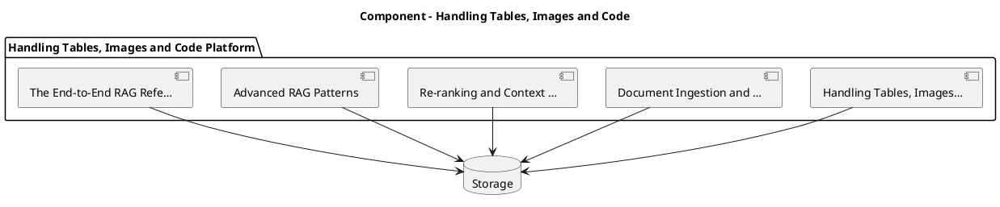

_Source diagram (plantuml); render with the appropriate tool._

**Figure 12. Component - Handling Tables, Images and Code** (plantuml). Figure: Component view for Handling Tables, Images and Code. This diagram illustrates the principal components and their interactions as discussed in the surrounding section.

## Deep Dive: Mechanics, Variants and Trade-offs

Having established the essentials, we now go deeper into handling tables, images and code. Beneath the abstraction lies a concrete process whose steps can each be measured, tested and optimised independently. The distinctions in this section are the ones that separate a working demo from a system that holds up under adversarial inputs, scale and the passage of time.

Consider the principal variants and how to choose between them. Each variant optimises for a different point in the design space - some for latency, some for accuracy, some for cost or operability - and the correct choice follows from explicit requirements rather than from defaults. Every added component buys capability at the price of operational surface area, and that bargain should be made consciously.

In practice this is supported by a mature tooling ecosystem, including LangChain, LlamaIndex, Haystack, RAGAS. Tools accelerate the work but do not substitute for understanding: the same principles apply whichever implementation you select, and the ability to reason from first principles is what lets you debug when a tool behaves unexpectedly.

A frequent source of subtle bugs is the interaction with document ingestion and chunking. Because document ingestion and chunking concerns parsing, semantic chunking, overlap and metadata extraction, changes there can silently alter the behaviour analysed here. The remedy is contract tests at the boundary and end-to-end evaluations that exercise the interaction explicitly.

Finally, attend to edge cases and degradation. Define what the system should do under partial failure, unexpected inputs and load spikes, and make that behaviour explicit and tested rather than emergent. Graceful degradation - returning a safe, useful result when the ideal one is unavailable - is a hallmark of mature engineering.

For deeper study, the literature offers authoritative treatments such as Lewis et al. — Retrieval-Augmented Generation (2020) and Gao et al. — Precise Zero-Shot Dense Retrieval (HyDE, 2022). These primary sources reward careful reading and ground the practical guidance above in established results.

## Advanced Considerations

Having established the essentials, we now go deeper into handling tables, images and code. It pays to understand the mechanism rather than treat it as a black box, because most production incidents are explained by one of its steps misbehaving. The distinctions in this section are the ones that separate a working demo from a system that holds up under adversarial inputs, scale and the passage of time.

Consider the principal variants and how to choose between them. Each variant optimises for a different point in the design space - some for latency, some for accuracy, some for cost or operability - and the correct choice follows from explicit requirements rather than from defaults. As with most architectural decisions, the choice is rarely binary; the skill lies in quantifying the trade-offs and choosing deliberately.

In practice this is supported by a mature tooling ecosystem, including LangChain, LlamaIndex, Haystack, RAGAS. Tools accelerate the work but do not substitute for understanding: the same principles apply whichever implementation you select, and the ability to reason from first principles is what lets you debug when a tool behaves unexpectedly.

A frequent source of subtle bugs is the interaction with why rag: grounding and freshness. Because why rag: grounding and freshness concerns the limits of parametric knowledge and the case for retrieval, changes there can silently alter the behaviour analysed here. The remedy is contract tests at the boundary and end-to-end evaluations that exercise the interaction explicitly.

Finally, attend to edge cases and degradation. Define what the system should do under partial failure, unexpected inputs and load spikes, and make that behaviour explicit and tested rather than emergent. Graceful degradation - returning a safe, useful result when the ideal one is unavailable - is a hallmark of mature engineering.

For deeper study, the literature offers authoritative treatments such as Lewis et al. — Retrieval-Augmented Generation (2020) and Gao et al. — Precise Zero-Shot Dense Retrieval (HyDE, 2022). These primary sources reward careful reading and ground the practical guidance above in established results.

## Worked Example

A worked example clarifies how these ideas behave in practice. A healthcare organisation needs clinical guideline assistants with provenance. They decide to apply handling tables, images and code as part of their RAG solution, but wisely treat it as a hypothesis to be validated rather than a foregone conclusion.

The team begins by stating the objective precisely and defining how success will be measured before writing any code. They establish a small but representative evaluation set, agree on acceptance thresholds, and only then prototype the simplest design that could work. Early measurement reveals which assumptions hold and which must be revised, saving weeks of misdirected effort and surfacing edge cases while they are still cheap to fix.

As the prototype matures into a service, the team hardens it: adding input validation, error handling, caching where it pays off, and monitoring that ties back to the original success metric. They document each significant decision in an architecture decision record so that future maintainers understand not just what was built but why.

The outcome is instructive. The system that reaches production is not the most sophisticated design the team considered, but the one whose behaviour they could measure, explain and operate. This is the recurring lesson of RAG: durable value comes from the whole system, not from any single clever component.

## Industry Use Cases

Across industries, the ideas in this chapter recur in recognisable ways. The following vignettes show how different sectors apply them and what they have in common.

**Enterprise.** Grounded internal Q&A over policies and wikis with citations. The common thread is that value comes not from the model alone but from the surrounding system - data quality, evaluation, integration and operations - which is precisely where most of the engineering effort belongs.

**Legal.** Case and contract research with traceable sources. The common thread is that value comes not from the model alone but from the surrounding system - data quality, evaluation, integration and operations - which is precisely where most of the engineering effort belongs.

**Healthcare.** Clinical guideline assistants with provenance. The common thread is that value comes not from the model alone but from the surrounding system - data quality, evaluation, integration and operations - which is precisely where most of the engineering effort belongs.

**Support.** Deflection bots grounded in current knowledge bases. The common thread is that value comes not from the model alone but from the surrounding system - data quality, evaluation, integration and operations - which is precisely where most of the engineering effort belongs.

## Best Practices

The following practices consistently separate successful RAG efforts from struggling ones. They are deliberately concrete so they can be adopted as checklist items in design and code review.

- Tune chunking to the corpus; measure its effect on retrieval metrics.
- Always cite sources and enable users to verify answers.
- Enforce access control at retrieval time, not just at the UI.
- Evaluate retrieval and generation separately to localise failures.

None of these are exotic; they are the unglamorous disciplines that compound into reliability. The cost of adopting them is small compared with the cost of the incidents they prevent, and they become second nature with practice.

## Common Pitfalls

Equally instructive are the failure modes that recur in practice. Each pitfall below has a clear early warning sign and a known remedy, so treat them as a diagnostic checklist when something feels wrong:

- Naive fixed-size chunking that splits semantic units.
- Stuffing too much context, increasing cost and diluting relevance.
- Ignoring permissions and leaking restricted documents.
- Measuring only end answer quality without diagnosing retrieval.

The pattern is consistent: most failures stem from skipping measurement, conflating prototype and production standards, or deferring cross-cutting concerns such as security and cost until they become emergencies. Naming these traps in advance is the cheapest way to avoid them.

## Governance, Security and Cost Notes

No discussion of handling tables, images and code is complete without its governance, security and cost dimensions, which are too often deferred until they become emergencies. Treating them as first-class concerns from the outset is both cheaper and safer.

**Governance.** Classify the risk of this capability, document its intended and out-of-scope uses, and ensure decisions are traceable to satisfy internal policy and external regulation such as the NIST AI RMF, ISO/IEC 42001 and the EU AI Act. **Security.** Treat all external input as untrusted, validate outputs before acting on them, apply least privilege to any tools or data access, and map controls to the OWASP LLM Top 10 and MITRE ATLAS.

**Cost and sustainability.** Establish explicit budgets for compute, tokens and latency, attribute spend to owners, and revisit the economics as usage scales - a design that is affordable at pilot scale can become untenable at production volume. Building these reflexes into everyday engineering is what allows a RAG system to be not only capable but also trustworthy and economically sound.

## Hands-On Exercises

Work through the following exercises. They are designed to move understanding from recognition to application - the level required for real engineering work - so prefer writing and building over merely reading.

1. Explain handling tables, images and code to a colleague unfamiliar with RAG, using a concrete example from your own domain.
2. Sketch a reference architecture that incorporates handling tables, images and code and annotate where observability, security and cost controls belong.
3. Design an evaluation that would tell you whether handling tables, images and code is working in production, including the metric, the dataset and the acceptance threshold.
4. Identify two pitfalls relevant to handling tables, images and code in your environment and describe the early warning signals you would monitor.
5. Prototype the simplest implementation that demonstrates handling tables, images and code, then list exactly what would need to change to make it production-ready.

## Key Takeaways

Key takeaways from this chapter:

- Handling Tables, Images and Code is a systems concern in RAG: data, models and operations must be co-designed.
- Measurement is non-negotiable; define success metrics and evaluation before building.
- Favour the simplest design that meets the requirement, and add complexity only when evidence demands it.
- Security, cost and observability are first-class requirements, not afterthoughts.
- Document decisions so the system remains understandable and operable as it evolves.

## Code Walkthrough

This listing shows a configuration-driven Handling Tables, Images and Code component with retry semantics and typed interfaces — the shape we expect from production RAG code rather than a notebook prototype.

The full listing is shown below; study it line by line and reproduce it locally before moving on.

### Listing: Implementing a Handling Tables, Images and Code component

```python
from __future__ import annotations

from dataclasses import dataclass, field
from typing import Any


@dataclass(slots=True)
class HandlingImagesConfig:
    """Configuration for the Handling Tables, Images and Code component in a RAG system."""

    name: str
    timeout_s: float = 30.0
    max_retries: int = 3
    options: dict[str, Any] = field(default_factory=dict)


class HandlingImages:
    """A minimal, production-shaped implementation of Handling Tables, Images and Code."""

    def __init__(self, config: HandlingImagesConfig) -> None:
        self._config = config
        self._calls = 0

    def run(self, payload: dict[str, Any]) -> dict[str, Any]:
        """Process a request, retrying transient failures with backoff."""
        last_error: Exception | None = None
        for attempt in range(self._config.max_retries):
            try:
                self._calls += 1
                return self._process(payload)
            except TimeoutError as exc:  # transient
                last_error = exc
                continue
        raise RuntimeError(f"HandlingImages failed after retries") from last_error

    def _process(self, payload: dict[str, Any]) -> dict[str, Any]:
        # Domain-specific logic for Handling Tables, Images and Code goes here.
        return {"status": "ok", "input_keys": sorted(payload), "calls": self._calls}

```

## Review Questions

1. In the context of RAG, which statement best describes “Handling Tables, Images and Code”?
   - A. It is only relevant to academic research, not production.
   - B. It removes all security and governance requirements.
   - C. Multimodal and structured-content retrieval.
   - D. It applies exclusively to image data.
   - **Answer: C.** Handling Tables, Images and Code: Multimodal and structured-content retrieval.
2. Which of the following is a recommended best practice when working with RAG?
   - A. It applies exclusively to image data.
   - B. It removes all security and governance requirements.
   - C. Stuffing too much context, increasing cost and diluting relevance.
   - D. Enforce access control at retrieval time, not just at the UI.
   - **Answer: D.** Best practice: Enforce access control at retrieval time, not just at the UI.
3. Which of the following is a common pitfall to avoid in RAG?
   - A. Evaluate retrieval and generation separately to localise failures.
   - B. It eliminates the need for any evaluation or monitoring.
   - C. It removes all security and governance requirements.
   - D. Ignoring permissions and leaking restricted documents.
   - **Answer: D.** Pitfall to avoid: Ignoring permissions and leaking restricted documents.
4. *(Discussion)* Walk through how you would design Handling Tables, Images and Code for an enterprise RAG workload.
   - **Model answer:** A strong answer defines handling tables, images and code (Multimodal and structured-content retrieval.) then connects it to architecture, evaluation, cost, security and operations for RAG, citing concrete trade-offs and a real-world example.

---


# Chapter 10. Caching and Cost Optimisation

_This chapter examines caching and cost optimisation within RAG. It covers semantic caching and retrieval reuse, derives a reference architecture, walks through a worked example and runnable code, surveys industry use cases, and distils best practices and pitfalls, closing with exercises and review questions._

## Introduction

In practical terms, Caching and Cost Optimisation is best understood as semantic caching and retrieval reuse. Getting this right early prevents expensive rework once a RAG system reaches scale. The right abstraction here pays compounding dividends, because downstream components depend on its guarantees.

This chapter builds intuition first, then formalises the ideas, derives an architecture, and finishes with code, exercises and review questions so the material transfers directly to your own RAG work. Read it actively: pause at each diagram, reproduce the code, and attempt the exercises before consulting the answers.

## Theory and Foundations

At its core, Caching and Cost Optimisation concerns semantic caching and retrieval reuse. Seasoned practitioners treat this as a systems problem, co-designing data, models and operations rather than optimising any one in isolation. The underlying mechanism is best appreciated by tracing a single request from input to output and noting where state is created and consumed.

To place this in context, recall the broader picture: Retrieval-augmented generation grounds a language model in external knowledge by retrieving relevant context at query time and conditioning generation on it. Within that picture, caching and cost optimisation is one of the load-bearing ideas - the kind that, when understood deeply, makes the rest of RAG fall into place. It is foundational: later capabilities in RAG are built directly on top of it.

Caching and Cost Optimisation cannot be understood in isolation from prompt assembly and citation. Recall that prompt assembly and citation concerns grounding instructions, source attribution and refusal on low confidence. The two interact directly: decisions in one constrain the design space of the other, which is why mature teams reason about them together rather than sequentially. There is an inherent trade-off between fidelity and cost, and the correct balance depends on the use case and its tolerance for error.

Caching and Cost Optimisation cannot be understood in isolation from security and access control in rag. Recall that security and access control in rag concerns row-level permissions and preventing data leakage across tenants. The two interact directly: decisions in one constrain the design space of the other, which is why mature teams reason about them together rather than sequentially. Latency, accuracy and cost form a tension triangle: improving one typically pressures the others, so explicit budgets are essential.

Several established patterns apply directly to caching and cost optimisation. The first, hybrid retrieval with reciprocal rank fusion, is widely adopted because it makes the system's behaviour predictable and observable. A complementary pattern, cross-encoder re-ranking of top-k candidates, addresses a related concern and is often deployed alongside it. Patterns are not dogma; they are distilled experience that shortcuts the search for a sound design, and each carries assumptions worth checking against your context.

Knowing when not to use a technique is as valuable as knowing how to use it. In a small prototype, shortcuts around caching and cost optimisation are invisible; in a production RAG system serving real traffic, they surface as incidents, cost overruns or compliance gaps. As with most architectural decisions, the choice is rarely binary; the skill lies in quantifying the trade-offs and choosing deliberately. The remainder of this chapter turns these principles into an architecture, code and a checklist you can apply immediately.

## Architecture and Design

From an architectural standpoint, Caching and Cost Optimisation sits at the intersection of data, models and operations. A RAG system has an offline ingestion pipeline (parse → chunk → embed → index) and an online query pipeline (query transform → hybrid retrieve → re-rank → assemble prompt → generate → cite). Access control filters retrieval by user permissions, and an evaluation service continuously scores faithfulness and relevance on sampled traffic.

Concretely, the principal building blocks include why rag: grounding and freshness, document ingestion and chunking, embedding and indexing strategy, retrieval and query transformation and re-ranking and context selection. Each is a replaceable component behind a stable interface, so the team can upgrade an implementation - a model, an index, a policy engine - without rewriting its neighbours. The contracts between components are where reliability is won or lost, so they are specified explicitly and tested in isolation.

The diagram accompanying this section makes the data and control flow explicit. Requests enter through a well-defined boundary where they are authenticated and validated; only then are they dispatched to the components that perform the work. This boundary is also where rate limiting, quota enforcement and audit logging live, keeping cross-cutting concerns out of the core logic and in one auditable place.

Two qualities deserve emphasis. First, observability is designed in, not bolted on: every component emits structured telemetry so that failures can be localised in minutes rather than hours. Second, the architecture is evolvable - components communicate through stable contracts so that any single part of the RAG system can be replaced without a rewrite. There is an inherent trade-off between fidelity and cost, and the correct balance depends on the use case and its tolerance for error.

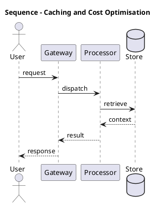

_Source diagram (plantuml); render with the appropriate tool._

**Figure 13. Sequence - Caching and Cost Optimisation** (plantuml). Figure: Sequence view for Caching and Cost Optimisation. This diagram illustrates the principal components and their interactions as discussed in the surrounding section.

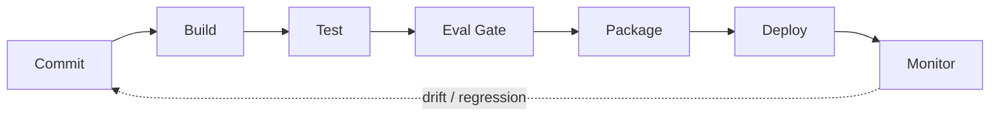

**Figure 14. DevOps Pipeline - Caching and Cost Optimisation** (mermaid). Figure: DevOps Pipeline view for Caching and Cost Optimisation. This diagram illustrates the principal components and their interactions as discussed in the surrounding section.

## Deep Dive: Mechanics, Variants and Trade-offs

Having established the essentials, we now go deeper into caching and cost optimisation. Mechanically, the behaviour emerges from a few interacting parts that are simpler than the whole they produce. The distinctions in this section are the ones that separate a working demo from a system that holds up under adversarial inputs, scale and the passage of time.

Consider the principal variants and how to choose between them. Each variant optimises for a different point in the design space - some for latency, some for accuracy, some for cost or operability - and the correct choice follows from explicit requirements rather than from defaults. Latency, accuracy and cost form a tension triangle: improving one typically pressures the others, so explicit budgets are essential.

In practice this is supported by a mature tooling ecosystem, including LangChain, LlamaIndex, Haystack, RAGAS. Tools accelerate the work but do not substitute for understanding: the same principles apply whichever implementation you select, and the ability to reason from first principles is what lets you debug when a tool behaves unexpectedly.

A frequent source of subtle bugs is the interaction with prompt assembly and citation. Because prompt assembly and citation concerns grounding instructions, source attribution and refusal on low confidence, changes there can silently alter the behaviour analysed here. The remedy is contract tests at the boundary and end-to-end evaluations that exercise the interaction explicitly.

Finally, attend to edge cases and degradation. Define what the system should do under partial failure, unexpected inputs and load spikes, and make that behaviour explicit and tested rather than emergent. Graceful degradation - returning a safe, useful result when the ideal one is unavailable - is a hallmark of mature engineering.

For deeper study, the literature offers authoritative treatments such as Lewis et al. — Retrieval-Augmented Generation (2020) and Gao et al. — Precise Zero-Shot Dense Retrieval (HyDE, 2022). These primary sources reward careful reading and ground the practical guidance above in established results.

## Advanced Considerations

Having established the essentials, we now go deeper into caching and cost optimisation. Beneath the abstraction lies a concrete process whose steps can each be measured, tested and optimised independently. The distinctions in this section are the ones that separate a working demo from a system that holds up under adversarial inputs, scale and the passage of time.

Consider the principal variants and how to choose between them. Each variant optimises for a different point in the design space - some for latency, some for accuracy, some for cost or operability - and the correct choice follows from explicit requirements rather than from defaults. Simplicity is a feature. The simplest design that meets the requirement should be the default, with complexity added only when measurement justifies it.

In practice this is supported by a mature tooling ecosystem, including LangChain, LlamaIndex, Haystack, RAGAS. Tools accelerate the work but do not substitute for understanding: the same principles apply whichever implementation you select, and the ability to reason from first principles is what lets you debug when a tool behaves unexpectedly.

A frequent source of subtle bugs is the interaction with re-ranking and context selection. Because re-ranking and context selection concerns cross-encoders, maximal marginal relevance and context budgeting, changes there can silently alter the behaviour analysed here. The remedy is contract tests at the boundary and end-to-end evaluations that exercise the interaction explicitly.

Finally, attend to edge cases and degradation. Define what the system should do under partial failure, unexpected inputs and load spikes, and make that behaviour explicit and tested rather than emergent. Graceful degradation - returning a safe, useful result when the ideal one is unavailable - is a hallmark of mature engineering.

For deeper study, the literature offers authoritative treatments such as Lewis et al. — Retrieval-Augmented Generation (2020) and Gao et al. — Precise Zero-Shot Dense Retrieval (HyDE, 2022). These primary sources reward careful reading and ground the practical guidance above in established results.

## Worked Example

A worked example clarifies how these ideas behave in practice. A support organisation needs deflection bots grounded in current knowledge bases. They decide to apply caching and cost optimisation as part of their RAG solution, but wisely treat it as a hypothesis to be validated rather than a foregone conclusion.

The team begins by stating the objective precisely and defining how success will be measured before writing any code. They establish a small but representative evaluation set, agree on acceptance thresholds, and only then prototype the simplest design that could work. Early measurement reveals which assumptions hold and which must be revised, saving weeks of misdirected effort and surfacing edge cases while they are still cheap to fix.

As the prototype matures into a service, the team hardens it: adding input validation, error handling, caching where it pays off, and monitoring that ties back to the original success metric. They document each significant decision in an architecture decision record so that future maintainers understand not just what was built but why.

The outcome is instructive. The system that reaches production is not the most sophisticated design the team considered, but the one whose behaviour they could measure, explain and operate. This is the recurring lesson of RAG: durable value comes from the whole system, not from any single clever component.

## Industry Use Cases

Across industries, the ideas in this chapter recur in recognisable ways. The following vignettes show how different sectors apply them and what they have in common.

**Enterprise.** Grounded internal Q&A over policies and wikis with citations. The common thread is that value comes not from the model alone but from the surrounding system - data quality, evaluation, integration and operations - which is precisely where most of the engineering effort belongs.

**Legal.** Case and contract research with traceable sources. The common thread is that value comes not from the model alone but from the surrounding system - data quality, evaluation, integration and operations - which is precisely where most of the engineering effort belongs.

**Healthcare.** Clinical guideline assistants with provenance. The common thread is that value comes not from the model alone but from the surrounding system - data quality, evaluation, integration and operations - which is precisely where most of the engineering effort belongs.

**Support.** Deflection bots grounded in current knowledge bases. The common thread is that value comes not from the model alone but from the surrounding system - data quality, evaluation, integration and operations - which is precisely where most of the engineering effort belongs.

## Best Practices

The following practices consistently separate successful RAG efforts from struggling ones. They are deliberately concrete so they can be adopted as checklist items in design and code review.

- Tune chunking to the corpus; measure its effect on retrieval metrics.
- Always cite sources and enable users to verify answers.
- Enforce access control at retrieval time, not just at the UI.
- Evaluate retrieval and generation separately to localise failures.

None of these are exotic; they are the unglamorous disciplines that compound into reliability. The cost of adopting them is small compared with the cost of the incidents they prevent, and they become second nature with practice.

## Common Pitfalls

Equally instructive are the failure modes that recur in practice. Each pitfall below has a clear early warning sign and a known remedy, so treat them as a diagnostic checklist when something feels wrong:

- Naive fixed-size chunking that splits semantic units.
- Stuffing too much context, increasing cost and diluting relevance.
- Ignoring permissions and leaking restricted documents.
- Measuring only end answer quality without diagnosing retrieval.

The pattern is consistent: most failures stem from skipping measurement, conflating prototype and production standards, or deferring cross-cutting concerns such as security and cost until they become emergencies. Naming these traps in advance is the cheapest way to avoid them.

## Governance, Security and Cost Notes

No discussion of caching and cost optimisation is complete without its governance, security and cost dimensions, which are too often deferred until they become emergencies. Treating them as first-class concerns from the outset is both cheaper and safer.

**Governance.** Classify the risk of this capability, document its intended and out-of-scope uses, and ensure decisions are traceable to satisfy internal policy and external regulation such as the NIST AI RMF, ISO/IEC 42001 and the EU AI Act. **Security.** Treat all external input as untrusted, validate outputs before acting on them, apply least privilege to any tools or data access, and map controls to the OWASP LLM Top 10 and MITRE ATLAS.

**Cost and sustainability.** Establish explicit budgets for compute, tokens and latency, attribute spend to owners, and revisit the economics as usage scales - a design that is affordable at pilot scale can become untenable at production volume. Building these reflexes into everyday engineering is what allows a RAG system to be not only capable but also trustworthy and economically sound.

## Hands-On Exercises

Work through the following exercises. They are designed to move understanding from recognition to application - the level required for real engineering work - so prefer writing and building over merely reading.

1. Explain caching and cost optimisation to a colleague unfamiliar with RAG, using a concrete example from your own domain.
2. Sketch a reference architecture that incorporates caching and cost optimisation and annotate where observability, security and cost controls belong.
3. Design an evaluation that would tell you whether caching and cost optimisation is working in production, including the metric, the dataset and the acceptance threshold.
4. Identify two pitfalls relevant to caching and cost optimisation in your environment and describe the early warning signals you would monitor.
5. Prototype the simplest implementation that demonstrates caching and cost optimisation, then list exactly what would need to change to make it production-ready.

## Key Takeaways

Key takeaways from this chapter:

- Caching and Cost Optimisation is a systems concern in RAG: data, models and operations must be co-designed.
- Measurement is non-negotiable; define success metrics and evaluation before building.
- Favour the simplest design that meets the requirement, and add complexity only when evidence demands it.
- Security, cost and observability are first-class requirements, not afterthoughts.
- Document decisions so the system remains understandable and operable as it evolves.

## Code Walkthrough

This listing shows a configuration-driven Caching and Cost Optimisation component with retry semantics and typed interfaces — the shape we expect from production RAG code rather than a notebook prototype.

The full listing is shown below; study it line by line and reproduce it locally before moving on.

### Listing: Implementing a Caching and Cost Optimisation component

```python
from __future__ import annotations

from dataclasses import dataclass, field
from typing import Any


@dataclass(slots=True)
class CachingAndCostConfig:
    """Configuration for the Caching and Cost Optimisation component in a RAG system."""

    name: str
    timeout_s: float = 30.0
    max_retries: int = 3
    options: dict[str, Any] = field(default_factory=dict)


class CachingAndCost:
    """A minimal, production-shaped implementation of Caching and Cost Optimisation."""

    def __init__(self, config: CachingAndCostConfig) -> None:
        self._config = config
        self._calls = 0

    def run(self, payload: dict[str, Any]) -> dict[str, Any]:
        """Process a request, retrying transient failures with backoff."""
        last_error: Exception | None = None
        for attempt in range(self._config.max_retries):
            try:
                self._calls += 1
                return self._process(payload)
            except TimeoutError as exc:  # transient
                last_error = exc
                continue
        raise RuntimeError(f"CachingAndCost failed after retries") from last_error

    def _process(self, payload: dict[str, Any]) -> dict[str, Any]:
        # Domain-specific logic for Caching and Cost Optimisation goes here.
        return {"status": "ok", "input_keys": sorted(payload), "calls": self._calls}

```

## Review Questions

1. In the context of RAG, which statement best describes “Caching and Cost Optimisation”?
   - A. It is only relevant to academic research, not production.
   - B. It removes all security and governance requirements.
   - C. It applies exclusively to image data.
   - D. Semantic caching and retrieval reuse.
   - **Answer: D.** Caching and Cost Optimisation: Semantic caching and retrieval reuse.
2. Which of the following is a recommended best practice when working with RAG?
   - A. Ignoring permissions and leaking restricted documents.
   - B. It makes the system slower but has no other effect.
   - C. It is only relevant to academic research, not production.
   - D. Enforce access control at retrieval time, not just at the UI.
   - **Answer: D.** Best practice: Enforce access control at retrieval time, not just at the UI.
3. Which of the following is a common pitfall to avoid in RAG?
   - A. Tune chunking to the corpus; measure its effect on retrieval metrics.
   - B. Naive fixed-size chunking that splits semantic units.
   - C. It eliminates the need for any evaluation or monitoring.
   - D. It removes all security and governance requirements.
   - **Answer: B.** Pitfall to avoid: Naive fixed-size chunking that splits semantic units.
4. *(Discussion)* Walk through how you would design Caching and Cost Optimisation for an enterprise RAG workload.
   - **Model answer:** A strong answer defines caching and cost optimisation (Semantic caching and retrieval reuse.) then connects it to architecture, evaluation, cost, security and operations for RAG, citing concrete trade-offs and a real-world example.

---


# Chapter 11. Security and Access Control in RAG

_This chapter examines security and access control in rag within RAG. It covers row-level permissions and preventing data leakage across tenants, derives a reference architecture, walks through a worked example and runnable code, surveys industry use cases, and distils best practices and pitfalls, closing with exercises and review questions._

## Introduction

We define Security and Access Control in RAG as row-level permissions and preventing data leakage across tenants. Understanding this matters because RAG systems succeed or fail on exactly these decisions. In an enterprise setting, this translates into concrete requirements: clear interfaces, measurable quality, and controls that satisfy security and governance.

This chapter builds intuition first, then formalises the ideas, derives an architecture, and finishes with code, exercises and review questions so the material transfers directly to your own RAG work. Read it actively: pause at each diagram, reproduce the code, and attempt the exercises before consulting the answers.

## Theory and Foundations

We define Security and Access Control in RAG as row-level permissions and preventing data leakage across tenants. The right abstraction here pays compounding dividends, because downstream components depend on its guarantees. Mechanically, the behaviour emerges from a few interacting parts that are simpler than the whole they produce.

To place this in context, recall the broader picture: Retrieval-augmented generation grounds a language model in external knowledge by retrieving relevant context at query time and conditioning generation on it. Within that picture, security and access control in rag is one of the load-bearing ideas - the kind that, when understood deeply, makes the rest of RAG fall into place. Neglecting it is one of the most common reasons RAG initiatives stall in production.

Security and Access Control in RAG cannot be understood in isolation from failure modes and debugging. Recall that failure modes and debugging concerns diagnosing retrieval versus generation failures. The two interact directly: decisions in one constrain the design space of the other, which is why mature teams reason about them together rather than sequentially. Latency, accuracy and cost form a tension triangle: improving one typically pressures the others, so explicit budgets are essential.

Security and Access Control in RAG cannot be understood in isolation from caching and cost optimisation. Recall that caching and cost optimisation concerns semantic caching and retrieval reuse. The two interact directly: decisions in one constrain the design space of the other, which is why mature teams reason about them together rather than sequentially. There is an inherent trade-off between fidelity and cost, and the correct balance depends on the use case and its tolerance for error.

Several established patterns apply directly to security and access control in rag. The first, cross-encoder re-ranking of top-k candidates, is widely adopted because it makes the system's behaviour predictable and observable. A complementary pattern, hybrid retrieval with reciprocal rank fusion, addresses a related concern and is often deployed alongside it. Patterns are not dogma; they are distilled experience that shortcuts the search for a sound design, and each carries assumptions worth checking against your context.

The decision of whether to adopt this should be driven by requirements, not by novelty. In a small prototype, shortcuts around security and access control in rag are invisible; in a production RAG system serving real traffic, they surface as incidents, cost overruns or compliance gaps. Every added component buys capability at the price of operational surface area, and that bargain should be made consciously. The remainder of this chapter turns these principles into an architecture, code and a checklist you can apply immediately.

## Architecture and Design

The reference architecture for Security and Access Control in RAG separates concerns into clearly bounded components with explicit contracts. A RAG system has an offline ingestion pipeline (parse → chunk → embed → index) and an online query pipeline (query transform → hybrid retrieve → re-rank → assemble prompt → generate → cite). Access control filters retrieval by user permissions, and an evaluation service continuously scores faithfulness and relevance on sampled traffic.

Concretely, the principal building blocks include why rag: grounding and freshness, document ingestion and chunking, embedding and indexing strategy, retrieval and query transformation and re-ranking and context selection. Each is a replaceable component behind a stable interface, so the team can upgrade an implementation - a model, an index, a policy engine - without rewriting its neighbours. The contracts between components are where reliability is won or lost, so they are specified explicitly and tested in isolation.

The diagram accompanying this section makes the data and control flow explicit. Requests enter through a well-defined boundary where they are authenticated and validated; only then are they dispatched to the components that perform the work. This boundary is also where rate limiting, quota enforcement and audit logging live, keeping cross-cutting concerns out of the core logic and in one auditable place.

Two qualities deserve emphasis. First, observability is designed in, not bolted on: every component emits structured telemetry so that failures can be localised in minutes rather than hours. Second, the architecture is evolvable - components communicate through stable contracts so that any single part of the RAG system can be replaced without a rewrite. There is an inherent trade-off between fidelity and cost, and the correct balance depends on the use case and its tolerance for error.


**Figure 15. DevOps Pipeline - Security and Access Control in RAG** (mermaid). Figure: DevOps Pipeline view for Security and Access Control in RAG. This diagram illustrates the principal components and their interactions as discussed in the surrounding section.

## Deep Dive: Mechanics, Variants and Trade-offs

Having established the essentials, we now go deeper into security and access control in rag. Mechanically, the behaviour emerges from a few interacting parts that are simpler than the whole they produce. The distinctions in this section are the ones that separate a working demo from a system that holds up under adversarial inputs, scale and the passage of time.

Consider the principal variants and how to choose between them. Each variant optimises for a different point in the design space - some for latency, some for accuracy, some for cost or operability - and the correct choice follows from explicit requirements rather than from defaults. As with most architectural decisions, the choice is rarely binary; the skill lies in quantifying the trade-offs and choosing deliberately.

In practice this is supported by a mature tooling ecosystem, including LangChain, LlamaIndex, Haystack, RAGAS. Tools accelerate the work but do not substitute for understanding: the same principles apply whichever implementation you select, and the ability to reason from first principles is what lets you debug when a tool behaves unexpectedly.

A frequent source of subtle bugs is the interaction with failure modes and debugging. Because failure modes and debugging concerns diagnosing retrieval versus generation failures, changes there can silently alter the behaviour analysed here. The remedy is contract tests at the boundary and end-to-end evaluations that exercise the interaction explicitly.

Finally, attend to edge cases and degradation. Define what the system should do under partial failure, unexpected inputs and load spikes, and make that behaviour explicit and tested rather than emergent. Graceful degradation - returning a safe, useful result when the ideal one is unavailable - is a hallmark of mature engineering.

For deeper study, the literature offers authoritative treatments such as Lewis et al. — Retrieval-Augmented Generation (2020) and Gao et al. — Precise Zero-Shot Dense Retrieval (HyDE, 2022). These primary sources reward careful reading and ground the practical guidance above in established results.

## Advanced Considerations

Having established the essentials, we now go deeper into security and access control in rag. The underlying mechanism is best appreciated by tracing a single request from input to output and noting where state is created and consumed. The distinctions in this section are the ones that separate a working demo from a system that holds up under adversarial inputs, scale and the passage of time.

Consider the principal variants and how to choose between them. Each variant optimises for a different point in the design space - some for latency, some for accuracy, some for cost or operability - and the correct choice follows from explicit requirements rather than from defaults. There is an inherent trade-off between fidelity and cost, and the correct balance depends on the use case and its tolerance for error.

In practice this is supported by a mature tooling ecosystem, including LangChain, LlamaIndex, Haystack, RAGAS. Tools accelerate the work but do not substitute for understanding: the same principles apply whichever implementation you select, and the ability to reason from first principles is what lets you debug when a tool behaves unexpectedly.

A frequent source of subtle bugs is the interaction with prompt assembly and citation. Because prompt assembly and citation concerns grounding instructions, source attribution and refusal on low confidence, changes there can silently alter the behaviour analysed here. The remedy is contract tests at the boundary and end-to-end evaluations that exercise the interaction explicitly.

Finally, attend to edge cases and degradation. Define what the system should do under partial failure, unexpected inputs and load spikes, and make that behaviour explicit and tested rather than emergent. Graceful degradation - returning a safe, useful result when the ideal one is unavailable - is a hallmark of mature engineering.

For deeper study, the literature offers authoritative treatments such as Lewis et al. — Retrieval-Augmented Generation (2020) and Gao et al. — Precise Zero-Shot Dense Retrieval (HyDE, 2022). These primary sources reward careful reading and ground the practical guidance above in established results.

## Worked Example

Consider a concrete scenario. A support organisation needs deflection bots grounded in current knowledge bases. They decide to apply security and access control in rag as part of their RAG solution, but wisely treat it as a hypothesis to be validated rather than a foregone conclusion.

The team begins by stating the objective precisely and defining how success will be measured before writing any code. They establish a small but representative evaluation set, agree on acceptance thresholds, and only then prototype the simplest design that could work. Early measurement reveals which assumptions hold and which must be revised, saving weeks of misdirected effort and surfacing edge cases while they are still cheap to fix.

As the prototype matures into a service, the team hardens it: adding input validation, error handling, caching where it pays off, and monitoring that ties back to the original success metric. They document each significant decision in an architecture decision record so that future maintainers understand not just what was built but why.

The outcome is instructive. The system that reaches production is not the most sophisticated design the team considered, but the one whose behaviour they could measure, explain and operate. This is the recurring lesson of RAG: durable value comes from the whole system, not from any single clever component.

## Industry Use Cases

Across industries, the ideas in this chapter recur in recognisable ways. The following vignettes show how different sectors apply them and what they have in common.

**Enterprise.** Grounded internal Q&A over policies and wikis with citations. The common thread is that value comes not from the model alone but from the surrounding system - data quality, evaluation, integration and operations - which is precisely where most of the engineering effort belongs.

**Legal.** Case and contract research with traceable sources. The common thread is that value comes not from the model alone but from the surrounding system - data quality, evaluation, integration and operations - which is precisely where most of the engineering effort belongs.

**Healthcare.** Clinical guideline assistants with provenance. The common thread is that value comes not from the model alone but from the surrounding system - data quality, evaluation, integration and operations - which is precisely where most of the engineering effort belongs.

**Support.** Deflection bots grounded in current knowledge bases. The common thread is that value comes not from the model alone but from the surrounding system - data quality, evaluation, integration and operations - which is precisely where most of the engineering effort belongs.

## Best Practices

The following practices consistently separate successful RAG efforts from struggling ones. They are deliberately concrete so they can be adopted as checklist items in design and code review.

- Tune chunking to the corpus; measure its effect on retrieval metrics.
- Always cite sources and enable users to verify answers.
- Enforce access control at retrieval time, not just at the UI.
- Evaluate retrieval and generation separately to localise failures.

None of these are exotic; they are the unglamorous disciplines that compound into reliability. The cost of adopting them is small compared with the cost of the incidents they prevent, and they become second nature with practice.

## Common Pitfalls

Equally instructive are the failure modes that recur in practice. Each pitfall below has a clear early warning sign and a known remedy, so treat them as a diagnostic checklist when something feels wrong:

- Naive fixed-size chunking that splits semantic units.
- Stuffing too much context, increasing cost and diluting relevance.
- Ignoring permissions and leaking restricted documents.
- Measuring only end answer quality without diagnosing retrieval.

The pattern is consistent: most failures stem from skipping measurement, conflating prototype and production standards, or deferring cross-cutting concerns such as security and cost until they become emergencies. Naming these traps in advance is the cheapest way to avoid them.

## Governance, Security and Cost Notes

No discussion of security and access control in rag is complete without its governance, security and cost dimensions, which are too often deferred until they become emergencies. Treating them as first-class concerns from the outset is both cheaper and safer.

**Governance.** Classify the risk of this capability, document its intended and out-of-scope uses, and ensure decisions are traceable to satisfy internal policy and external regulation such as the NIST AI RMF, ISO/IEC 42001 and the EU AI Act. **Security.** Treat all external input as untrusted, validate outputs before acting on them, apply least privilege to any tools or data access, and map controls to the OWASP LLM Top 10 and MITRE ATLAS.

**Cost and sustainability.** Establish explicit budgets for compute, tokens and latency, attribute spend to owners, and revisit the economics as usage scales - a design that is affordable at pilot scale can become untenable at production volume. Building these reflexes into everyday engineering is what allows a RAG system to be not only capable but also trustworthy and economically sound.

## Hands-On Exercises

Work through the following exercises. They are designed to move understanding from recognition to application - the level required for real engineering work - so prefer writing and building over merely reading.

1. Explain security and access control in rag to a colleague unfamiliar with RAG, using a concrete example from your own domain.
2. Sketch a reference architecture that incorporates security and access control in rag and annotate where observability, security and cost controls belong.
3. Design an evaluation that would tell you whether security and access control in rag is working in production, including the metric, the dataset and the acceptance threshold.
4. Identify two pitfalls relevant to security and access control in rag in your environment and describe the early warning signals you would monitor.
5. Prototype the simplest implementation that demonstrates security and access control in rag, then list exactly what would need to change to make it production-ready.

## Key Takeaways

Key takeaways from this chapter:

- Security and Access Control in RAG is a systems concern in RAG: data, models and operations must be co-designed.
- Measurement is non-negotiable; define success metrics and evaluation before building.
- Favour the simplest design that meets the requirement, and add complexity only when evidence demands it.
- Security, cost and observability are first-class requirements, not afterthoughts.
- Document decisions so the system remains understandable and operable as it evolves.

## Code Walkthrough

Every change to a RAG system should pass an evaluation gate. This example shows the minimal shape: align predictions and references, compute a metric, and return a pass/fail decision for CI.

The full listing is shown below; study it line by line and reproduce it locally before moving on.

### Listing: Evaluating Security and Access Control in RAG with a regression gate

```python
from dataclasses import dataclass


@dataclass
class EvalResult:
    metric: str
    score: float
    passed: bool


def evaluate(predictions: list[str], references: list[str],
             threshold: float = 0.8) -> EvalResult:
    """Score Security and Access Control in RAG output against references with a simple exact-match metric.

    In practice you would combine several metrics (exact match, semantic
    similarity, LLM-as-judge) and gate releases on the aggregate.
    """
    if len(predictions) != len(references):
        raise ValueError("predictions and references must align")
    hits = sum(p.strip() == r.strip() for p, r in zip(predictions, references))
    score = hits / len(references) if references else 0.0
    return EvalResult(metric="exact_match", score=score, passed=score >= threshold)


if __name__ == "__main__":
    result = evaluate(["yes", "no"], ["yes", "yes"])
    print(f"{result.metric}={result.score:.2f} passed={result.passed}")

```

## Review Questions

1. In the context of RAG, which statement best describes “Security and Access Control in RAG”?
   - A. Row-level permissions and preventing data leakage across tenants.
   - B. It is only relevant to academic research, not production.
   - C. It makes the system slower but has no other effect.
   - D. It removes all security and governance requirements.
   - **Answer: A.** Security and Access Control in RAG: Row-level permissions and preventing data leakage across tenants.
2. Which of the following is a recommended best practice when working with RAG?
   - A. Enforce access control at retrieval time, not just at the UI.
   - B. Ignoring permissions and leaking restricted documents.
   - C. It applies exclusively to image data.
   - D. Naive fixed-size chunking that splits semantic units.
   - **Answer: A.** Best practice: Enforce access control at retrieval time, not just at the UI.
3. Which of the following is a common pitfall to avoid in RAG?
   - A. It guarantees deterministic output regardless of input.
   - B. Enforce access control at retrieval time, not just at the UI.
   - C. Tune chunking to the corpus; measure its effect on retrieval metrics.
   - D. Measuring only end answer quality without diagnosing retrieval.
   - **Answer: D.** Pitfall to avoid: Measuring only end answer quality without diagnosing retrieval.
4. *(Discussion)* How would you test and monitor Security and Access Control in RAG in production?
   - **Model answer:** A strong answer defines security and access control in rag (Row-level permissions and preventing data leakage across tenants.) then connects it to architecture, evaluation, cost, security and operations for RAG, citing concrete trade-offs and a real-world example.

---


# Chapter 12. Operating RAG in Production

_This chapter examines operating rag in production within RAG. It covers monitoring retrieval quality, drift and feedback loops, derives a reference architecture, walks through a worked example and runnable code, surveys industry use cases, and distils best practices and pitfalls, closing with exercises and review questions._

## Introduction

At its core, Operating RAG in Production concerns monitoring retrieval quality, drift and feedback loops. It is foundational: later capabilities in RAG are built directly on top of it. Seasoned practitioners treat this as a systems problem, co-designing data, models and operations rather than optimising any one in isolation.

This chapter builds intuition first, then formalises the ideas, derives an architecture, and finishes with code, exercises and review questions so the material transfers directly to your own RAG work. Read it actively: pause at each diagram, reproduce the code, and attempt the exercises before consulting the answers.

## Theory and Foundations

Operating RAG in Production can be characterised as monitoring retrieval quality, drift and feedback loops. In an enterprise setting, this translates into concrete requirements: clear interfaces, measurable quality, and controls that satisfy security and governance. Mechanically, the behaviour emerges from a few interacting parts that are simpler than the whole they produce.

To place this in context, recall the broader picture: Retrieval-augmented generation grounds a language model in external knowledge by retrieving relevant context at query time and conditioning generation on it. Within that picture, operating rag in production is one of the load-bearing ideas - the kind that, when understood deeply, makes the rest of RAG fall into place. Teams that master this consistently ship more reliable RAG systems at lower cost.

Operating RAG in Production cannot be understood in isolation from re-ranking and context selection. Recall that re-ranking and context selection concerns cross-encoders, maximal marginal relevance and context budgeting. The two interact directly: decisions in one constrain the design space of the other, which is why mature teams reason about them together rather than sequentially. Latency, accuracy and cost form a tension triangle: improving one typically pressures the others, so explicit budgets are essential.

Operating RAG in Production cannot be understood in isolation from prompt assembly and citation. Recall that prompt assembly and citation concerns grounding instructions, source attribution and refusal on low confidence. The two interact directly: decisions in one constrain the design space of the other, which is why mature teams reason about them together rather than sequentially. Simplicity is a feature. The simplest design that meets the requirement should be the default, with complexity added only when measurement justifies it.

Several established patterns apply directly to operating rag in production. The first, refuse-or-clarify when retrieval confidence is low, is widely adopted because it makes the system's behaviour predictable and observable. A complementary pattern, cross-encoder re-ranking of top-k candidates, addresses a related concern and is often deployed alongside it. Patterns are not dogma; they are distilled experience that shortcuts the search for a sound design, and each carries assumptions worth checking against your context.

The decision of whether to adopt this should be driven by requirements, not by novelty. In a small prototype, shortcuts around operating rag in production are invisible; in a production RAG system serving real traffic, they surface as incidents, cost overruns or compliance gaps. Latency, accuracy and cost form a tension triangle: improving one typically pressures the others, so explicit budgets are essential. The remainder of this chapter turns these principles into an architecture, code and a checklist you can apply immediately.

## Architecture and Design

The reference architecture for Operating RAG in Production separates concerns into clearly bounded components with explicit contracts. A RAG system has an offline ingestion pipeline (parse → chunk → embed → index) and an online query pipeline (query transform → hybrid retrieve → re-rank → assemble prompt → generate → cite). Access control filters retrieval by user permissions, and an evaluation service continuously scores faithfulness and relevance on sampled traffic.

Concretely, the principal building blocks include why rag: grounding and freshness, document ingestion and chunking, embedding and indexing strategy, retrieval and query transformation and re-ranking and context selection. Each is a replaceable component behind a stable interface, so the team can upgrade an implementation - a model, an index, a policy engine - without rewriting its neighbours. The contracts between components are where reliability is won or lost, so they are specified explicitly and tested in isolation.

The diagram accompanying this section makes the data and control flow explicit. Requests enter through a well-defined boundary where they are authenticated and validated; only then are they dispatched to the components that perform the work. This boundary is also where rate limiting, quota enforcement and audit logging live, keeping cross-cutting concerns out of the core logic and in one auditable place.

Two qualities deserve emphasis. First, observability is designed in, not bolted on: every component emits structured telemetry so that failures can be localised in minutes rather than hours. Second, the architecture is evolvable - components communicate through stable contracts so that any single part of the RAG system can be replaced without a rewrite. Latency, accuracy and cost form a tension triangle: improving one typically pressures the others, so explicit budgets are essential.

```xml
<mxfile host="ai-university">
  <diagram name="Deployment">
    <mxGraphModel dx="800" dy="600" grid="1" gridSize="10">
      <root>
        <mxCell id="0"/>
        <mxCell id="1" parent="0"/>
        <mxCell id="title" value="Deployment - Operating RAG in Production" style="text;fontSize=16;fontStyle=1" vertex="1" parent="1"><mxGeometry x="40" y="20" width="600" height="30" as="geometry"/></mxCell>
        <mxCell id="hub" value="Operating RAG in Prod…" style="rounded=1;fillColor=#0f172a;fontColor=#ffffff;fontStyle=1" vertex="1" parent="1"><mxGeometry x="300" y="180" width="160" height="60" as="geometry"/></mxCell>
        <mxCell id="n0" value="Operating RAG in Produc…" style="rounded=1;fillColor=#e0e7ff;strokeColor=#4338ca" vertex="1" parent="1"><mxGeometry x="60" y="80" width="160" height="50" as="geometry"/></mxCell>
        <mxCell id="e0" style="edgeStyle=orthogonalEdgeStyle" edge="1" parent="1" source="hub" target="n0"><mxGeometry relative="1" as="geometry"/></mxCell>
        <mxCell id="n1" value="Re-ranking and Context …" style="rounded=1;fillColor=#e0e7ff;strokeColor=#4338ca" vertex="1" parent="1"><mxGeometry x="600" y="170" width="160" height="50" as="geometry"/></mxCell>
        <mxCell id="e1" style="edgeStyle=orthogonalEdgeStyle" edge="1" parent="1" source="hub" target="n1"><mxGeometry relative="1" as="geometry"/></mxCell>
        <mxCell id="n2" value="Prompt Assembly and Cit…" style="rounded=1;fillColor=#e0e7ff;strokeColor=#4338ca" vertex="1" parent="1"><mxGeometry x="60" y="260" width="160" height="50" as="geometry"/></mxCell>
        <mxCell id="e2" style="edgeStyle=orthogonalEdgeStyle" edge="1" parent="1" source="hub" target="n2"><mxGeometry relative="1" as="geometry"/></mxCell>
        <mxCell id="n3" value="Handling Tables, Images…" style="rounded=1;fillColor=#e0e7ff;strokeColor=#4338ca" vertex="1" parent="1"><mxGeometry x="600" y="350" width="160" height="50" as="geometry"/></mxCell>
        <mxCell id="e3" style="edgeStyle=orthogonalEdgeStyle" edge="1" parent="1" source="hub" target="n3"><mxGeometry relative="1" as="geometry"/></mxCell>
        <mxCell id="n4" value="Embedding and Indexing …" style="rounded=1;fillColor=#e0e7ff;strokeColor=#4338ca" vertex="1" parent="1"><mxGeometry x="60" y="440" width="160" height="50" as="geometry"/></mxCell>
        <mxCell id="e4" style="edgeStyle=orthogonalEdgeStyle" edge="1" parent="1" source="hub" target="n4"><mxGeometry relative="1" as="geometry"/></mxCell>
      </root>
    </mxGraphModel>
  </diagram>
</mxfile>
```

_Source diagram (drawio); render with the appropriate tool._

**Figure 16. Deployment - Operating RAG in Production** (drawio). Figure: Deployment view for Operating RAG in Production. This diagram illustrates the principal components and their interactions as discussed in the surrounding section.

## Deep Dive: Mechanics, Variants and Trade-offs

Having established the essentials, we now go deeper into operating rag in production. Mechanically, the behaviour emerges from a few interacting parts that are simpler than the whole they produce. The distinctions in this section are the ones that separate a working demo from a system that holds up under adversarial inputs, scale and the passage of time.

Consider the principal variants and how to choose between them. Each variant optimises for a different point in the design space - some for latency, some for accuracy, some for cost or operability - and the correct choice follows from explicit requirements rather than from defaults. Every added component buys capability at the price of operational surface area, and that bargain should be made consciously.

In practice this is supported by a mature tooling ecosystem, including LangChain, LlamaIndex, Haystack, RAGAS. Tools accelerate the work but do not substitute for understanding: the same principles apply whichever implementation you select, and the ability to reason from first principles is what lets you debug when a tool behaves unexpectedly.

A frequent source of subtle bugs is the interaction with re-ranking and context selection. Because re-ranking and context selection concerns cross-encoders, maximal marginal relevance and context budgeting, changes there can silently alter the behaviour analysed here. The remedy is contract tests at the boundary and end-to-end evaluations that exercise the interaction explicitly.

Finally, attend to edge cases and degradation. Define what the system should do under partial failure, unexpected inputs and load spikes, and make that behaviour explicit and tested rather than emergent. Graceful degradation - returning a safe, useful result when the ideal one is unavailable - is a hallmark of mature engineering.

For deeper study, the literature offers authoritative treatments such as Lewis et al. — Retrieval-Augmented Generation (2020) and Gao et al. — Precise Zero-Shot Dense Retrieval (HyDE, 2022). These primary sources reward careful reading and ground the practical guidance above in established results.

## Advanced Considerations

Having established the essentials, we now go deeper into operating rag in production. Beneath the abstraction lies a concrete process whose steps can each be measured, tested and optimised independently. The distinctions in this section are the ones that separate a working demo from a system that holds up under adversarial inputs, scale and the passage of time.

Consider the principal variants and how to choose between them. Each variant optimises for a different point in the design space - some for latency, some for accuracy, some for cost or operability - and the correct choice follows from explicit requirements rather than from defaults. Latency, accuracy and cost form a tension triangle: improving one typically pressures the others, so explicit budgets are essential.

In practice this is supported by a mature tooling ecosystem, including LangChain, LlamaIndex, Haystack, RAGAS. Tools accelerate the work but do not substitute for understanding: the same principles apply whichever implementation you select, and the ability to reason from first principles is what lets you debug when a tool behaves unexpectedly.

A frequent source of subtle bugs is the interaction with evaluation of rag systems. Because evaluation of rag systems concerns faithfulness, answer relevance, context precision/recall (RAGAS-style), changes there can silently alter the behaviour analysed here. The remedy is contract tests at the boundary and end-to-end evaluations that exercise the interaction explicitly.

Finally, attend to edge cases and degradation. Define what the system should do under partial failure, unexpected inputs and load spikes, and make that behaviour explicit and tested rather than emergent. Graceful degradation - returning a safe, useful result when the ideal one is unavailable - is a hallmark of mature engineering.

For deeper study, the literature offers authoritative treatments such as Lewis et al. — Retrieval-Augmented Generation (2020) and Gao et al. — Precise Zero-Shot Dense Retrieval (HyDE, 2022). These primary sources reward careful reading and ground the practical guidance above in established results.

## Worked Example

Consider a concrete scenario. A enterprise organisation needs grounded internal Q&A over policies and wikis with citations. They decide to apply operating rag in production as part of their RAG solution, but wisely treat it as a hypothesis to be validated rather than a foregone conclusion.

The team begins by stating the objective precisely and defining how success will be measured before writing any code. They establish a small but representative evaluation set, agree on acceptance thresholds, and only then prototype the simplest design that could work. Early measurement reveals which assumptions hold and which must be revised, saving weeks of misdirected effort and surfacing edge cases while they are still cheap to fix.

As the prototype matures into a service, the team hardens it: adding input validation, error handling, caching where it pays off, and monitoring that ties back to the original success metric. They document each significant decision in an architecture decision record so that future maintainers understand not just what was built but why.

The outcome is instructive. The system that reaches production is not the most sophisticated design the team considered, but the one whose behaviour they could measure, explain and operate. This is the recurring lesson of RAG: durable value comes from the whole system, not from any single clever component.

## Industry Use Cases

Across industries, the ideas in this chapter recur in recognisable ways. The following vignettes show how different sectors apply them and what they have in common.

**Enterprise.** Grounded internal Q&A over policies and wikis with citations. The common thread is that value comes not from the model alone but from the surrounding system - data quality, evaluation, integration and operations - which is precisely where most of the engineering effort belongs.

**Legal.** Case and contract research with traceable sources. The common thread is that value comes not from the model alone but from the surrounding system - data quality, evaluation, integration and operations - which is precisely where most of the engineering effort belongs.

**Healthcare.** Clinical guideline assistants with provenance. The common thread is that value comes not from the model alone but from the surrounding system - data quality, evaluation, integration and operations - which is precisely where most of the engineering effort belongs.

**Support.** Deflection bots grounded in current knowledge bases. The common thread is that value comes not from the model alone but from the surrounding system - data quality, evaluation, integration and operations - which is precisely where most of the engineering effort belongs.

## Best Practices

The following practices consistently separate successful RAG efforts from struggling ones. They are deliberately concrete so they can be adopted as checklist items in design and code review.

- Tune chunking to the corpus; measure its effect on retrieval metrics.
- Always cite sources and enable users to verify answers.
- Enforce access control at retrieval time, not just at the UI.
- Evaluate retrieval and generation separately to localise failures.

None of these are exotic; they are the unglamorous disciplines that compound into reliability. The cost of adopting them is small compared with the cost of the incidents they prevent, and they become second nature with practice.

## Common Pitfalls

Equally instructive are the failure modes that recur in practice. Each pitfall below has a clear early warning sign and a known remedy, so treat them as a diagnostic checklist when something feels wrong:

- Naive fixed-size chunking that splits semantic units.
- Stuffing too much context, increasing cost and diluting relevance.
- Ignoring permissions and leaking restricted documents.
- Measuring only end answer quality without diagnosing retrieval.

The pattern is consistent: most failures stem from skipping measurement, conflating prototype and production standards, or deferring cross-cutting concerns such as security and cost until they become emergencies. Naming these traps in advance is the cheapest way to avoid them.

## Governance, Security and Cost Notes

No discussion of operating rag in production is complete without its governance, security and cost dimensions, which are too often deferred until they become emergencies. Treating them as first-class concerns from the outset is both cheaper and safer.

**Governance.** Classify the risk of this capability, document its intended and out-of-scope uses, and ensure decisions are traceable to satisfy internal policy and external regulation such as the NIST AI RMF, ISO/IEC 42001 and the EU AI Act. **Security.** Treat all external input as untrusted, validate outputs before acting on them, apply least privilege to any tools or data access, and map controls to the OWASP LLM Top 10 and MITRE ATLAS.

**Cost and sustainability.** Establish explicit budgets for compute, tokens and latency, attribute spend to owners, and revisit the economics as usage scales - a design that is affordable at pilot scale can become untenable at production volume. Building these reflexes into everyday engineering is what allows a RAG system to be not only capable but also trustworthy and economically sound.

## Hands-On Exercises

Work through the following exercises. They are designed to move understanding from recognition to application - the level required for real engineering work - so prefer writing and building over merely reading.

1. Explain operating rag in production to a colleague unfamiliar with RAG, using a concrete example from your own domain.
2. Sketch a reference architecture that incorporates operating rag in production and annotate where observability, security and cost controls belong.
3. Design an evaluation that would tell you whether operating rag in production is working in production, including the metric, the dataset and the acceptance threshold.
4. Identify two pitfalls relevant to operating rag in production in your environment and describe the early warning signals you would monitor.
5. Prototype the simplest implementation that demonstrates operating rag in production, then list exactly what would need to change to make it production-ready.

## Key Takeaways

Key takeaways from this chapter:

- Operating RAG in Production is a systems concern in RAG: data, models and operations must be co-designed.
- Measurement is non-negotiable; define success metrics and evaluation before building.
- Favour the simplest design that meets the requirement, and add complexity only when evidence demands it.
- Security, cost and observability are first-class requirements, not afterthoughts.
- Document decisions so the system remains understandable and operable as it evolves.

## Code Walkthrough

Every change to a RAG system should pass an evaluation gate. This example shows the minimal shape: align predictions and references, compute a metric, and return a pass/fail decision for CI.

The full listing is shown below; study it line by line and reproduce it locally before moving on.

### Listing: Evaluating Operating RAG in Production with a regression gate

```python
from dataclasses import dataclass


@dataclass
class EvalResult:
    metric: str
    score: float
    passed: bool


def evaluate(predictions: list[str], references: list[str],
             threshold: float = 0.8) -> EvalResult:
    """Score Operating RAG in Production output against references with a simple exact-match metric.

    In practice you would combine several metrics (exact match, semantic
    similarity, LLM-as-judge) and gate releases on the aggregate.
    """
    if len(predictions) != len(references):
        raise ValueError("predictions and references must align")
    hits = sum(p.strip() == r.strip() for p, r in zip(predictions, references))
    score = hits / len(references) if references else 0.0
    return EvalResult(metric="exact_match", score=score, passed=score >= threshold)


if __name__ == "__main__":
    result = evaluate(["yes", "no"], ["yes", "yes"])
    print(f"{result.metric}={result.score:.2f} passed={result.passed}")

```

## Review Questions

1. In the context of RAG, which statement best describes “Operating RAG in Production”?
   - A. It is only relevant to academic research, not production.
   - B. Monitoring retrieval quality, drift and feedback loops.
   - C. It eliminates the need for any evaluation or monitoring.
   - D. It removes all security and governance requirements.
   - **Answer: B.** Operating RAG in Production: Monitoring retrieval quality, drift and feedback loops.
2. Which of the following is a recommended best practice when working with RAG?
   - A. Always cite sources and enable users to verify answers.
   - B. It makes the system slower but has no other effect.
   - C. It guarantees deterministic output regardless of input.
   - D. It eliminates the need for any evaluation or monitoring.
   - **Answer: A.** Best practice: Always cite sources and enable users to verify answers.
3. Which of the following is a common pitfall to avoid in RAG?
   - A. It makes the system slower but has no other effect.
   - B. Stuffing too much context, increasing cost and diluting relevance.
   - C. It guarantees deterministic output regardless of input.
   - D. Enforce access control at retrieval time, not just at the UI.
   - **Answer: B.** Pitfall to avoid: Stuffing too much context, increasing cost and diluting relevance.
4. *(Discussion)* What trade-offs would you weigh when implementing Operating RAG in Production?
   - **Model answer:** A strong answer defines operating rag in production (Monitoring retrieval quality, drift and feedback loops.) then connects it to architecture, evaluation, cost, security and operations for RAG, citing concrete trade-offs and a real-world example.

---


# Chapter 13. Failure Modes and Debugging

_This chapter examines failure modes and debugging within RAG. It covers diagnosing retrieval versus generation failures, derives a reference architecture, walks through a worked example and runnable code, surveys industry use cases, and distils best practices and pitfalls, closing with exercises and review questions._

## Introduction

At its core, Failure Modes and Debugging concerns diagnosing retrieval versus generation failures. Getting this right early prevents expensive rework once a RAG system reaches scale. In an enterprise setting, this translates into concrete requirements: clear interfaces, measurable quality, and controls that satisfy security and governance.

This chapter builds intuition first, then formalises the ideas, derives an architecture, and finishes with code, exercises and review questions so the material transfers directly to your own RAG work. Read it actively: pause at each diagram, reproduce the code, and attempt the exercises before consulting the answers.

## Theory and Foundations

Failure Modes and Debugging refers to diagnosing retrieval versus generation failures. It helps to separate the conceptual model from its implementation: the former guides reasoning, the latter must contend with real-world constraints. The underlying mechanism is best appreciated by tracing a single request from input to output and noting where state is created and consumed.

To place this in context, recall the broader picture: Retrieval-augmented generation grounds a language model in external knowledge by retrieving relevant context at query time and conditioning generation on it. Within that picture, failure modes and debugging is one of the load-bearing ideas - the kind that, when understood deeply, makes the rest of RAG fall into place. This concept recurs throughout the RAG lifecycle, from design to operations.

Failure Modes and Debugging cannot be understood in isolation from prompt assembly and citation. Recall that prompt assembly and citation concerns grounding instructions, source attribution and refusal on low confidence. The two interact directly: decisions in one constrain the design space of the other, which is why mature teams reason about them together rather than sequentially. As with most architectural decisions, the choice is rarely binary; the skill lies in quantifying the trade-offs and choosing deliberately.

Failure Modes and Debugging cannot be understood in isolation from handling tables, images and code. Recall that handling tables, images and code concerns multimodal and structured-content retrieval. The two interact directly: decisions in one constrain the design space of the other, which is why mature teams reason about them together rather than sequentially. As with most architectural decisions, the choice is rarely binary; the skill lies in quantifying the trade-offs and choosing deliberately.

Several established patterns apply directly to failure modes and debugging. The first, hybrid retrieval with reciprocal rank fusion, is widely adopted because it makes the system's behaviour predictable and observable. A complementary pattern, parent-document retrieval for precise chunks with broad context, addresses a related concern and is often deployed alongside it. Patterns are not dogma; they are distilled experience that shortcuts the search for a sound design, and each carries assumptions worth checking against your context.

Knowing when not to use a technique is as valuable as knowing how to use it. In a small prototype, shortcuts around failure modes and debugging are invisible; in a production RAG system serving real traffic, they surface as incidents, cost overruns or compliance gaps. As with most architectural decisions, the choice is rarely binary; the skill lies in quantifying the trade-offs and choosing deliberately. The remainder of this chapter turns these principles into an architecture, code and a checklist you can apply immediately.

## Architecture and Design

From an architectural standpoint, Failure Modes and Debugging sits at the intersection of data, models and operations. A RAG system has an offline ingestion pipeline (parse → chunk → embed → index) and an online query pipeline (query transform → hybrid retrieve → re-rank → assemble prompt → generate → cite). Access control filters retrieval by user permissions, and an evaluation service continuously scores faithfulness and relevance on sampled traffic.

Concretely, the principal building blocks include why rag: grounding and freshness, document ingestion and chunking, embedding and indexing strategy, retrieval and query transformation and re-ranking and context selection. Each is a replaceable component behind a stable interface, so the team can upgrade an implementation - a model, an index, a policy engine - without rewriting its neighbours. The contracts between components are where reliability is won or lost, so they are specified explicitly and tested in isolation.

The diagram accompanying this section makes the data and control flow explicit. Requests enter through a well-defined boundary where they are authenticated and validated; only then are they dispatched to the components that perform the work. This boundary is also where rate limiting, quota enforcement and audit logging live, keeping cross-cutting concerns out of the core logic and in one auditable place.

Two qualities deserve emphasis. First, observability is designed in, not bolted on: every component emits structured telemetry so that failures can be localised in minutes rather than hours. Second, the architecture is evolvable - components communicate through stable contracts so that any single part of the RAG system can be replaced without a rewrite. Every added component buys capability at the price of operational surface area, and that bargain should be made consciously.

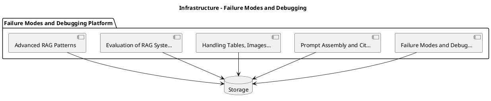

_Source diagram (plantuml); render with the appropriate tool._

**Figure 17. Infrastructure - Failure Modes and Debugging** (plantuml). Figure: Infrastructure view for Failure Modes and Debugging. This diagram illustrates the principal components and their interactions as discussed in the surrounding section.

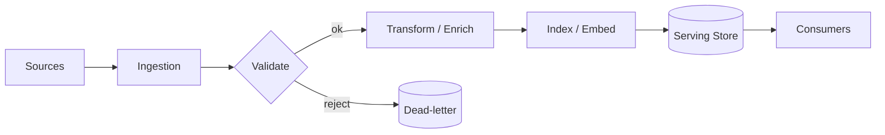

**Figure 18. Business Process - Failure Modes and Debugging** (mermaid). Figure: Business Process view for Failure Modes and Debugging. This diagram illustrates the principal components and their interactions as discussed in the surrounding section.

## Deep Dive: Mechanics, Variants and Trade-offs

Having established the essentials, we now go deeper into failure modes and debugging. Beneath the abstraction lies a concrete process whose steps can each be measured, tested and optimised independently. The distinctions in this section are the ones that separate a working demo from a system that holds up under adversarial inputs, scale and the passage of time.

Consider the principal variants and how to choose between them. Each variant optimises for a different point in the design space - some for latency, some for accuracy, some for cost or operability - and the correct choice follows from explicit requirements rather than from defaults. As with most architectural decisions, the choice is rarely binary; the skill lies in quantifying the trade-offs and choosing deliberately.

In practice this is supported by a mature tooling ecosystem, including LangChain, LlamaIndex, Haystack, RAGAS. Tools accelerate the work but do not substitute for understanding: the same principles apply whichever implementation you select, and the ability to reason from first principles is what lets you debug when a tool behaves unexpectedly.

A frequent source of subtle bugs is the interaction with prompt assembly and citation. Because prompt assembly and citation concerns grounding instructions, source attribution and refusal on low confidence, changes there can silently alter the behaviour analysed here. The remedy is contract tests at the boundary and end-to-end evaluations that exercise the interaction explicitly.

Finally, attend to edge cases and degradation. Define what the system should do under partial failure, unexpected inputs and load spikes, and make that behaviour explicit and tested rather than emergent. Graceful degradation - returning a safe, useful result when the ideal one is unavailable - is a hallmark of mature engineering.

For deeper study, the literature offers authoritative treatments such as Lewis et al. — Retrieval-Augmented Generation (2020) and Gao et al. — Precise Zero-Shot Dense Retrieval (HyDE, 2022). These primary sources reward careful reading and ground the practical guidance above in established results.

## Advanced Considerations

Having established the essentials, we now go deeper into failure modes and debugging. The underlying mechanism is best appreciated by tracing a single request from input to output and noting where state is created and consumed. The distinctions in this section are the ones that separate a working demo from a system that holds up under adversarial inputs, scale and the passage of time.

Consider the principal variants and how to choose between them. Each variant optimises for a different point in the design space - some for latency, some for accuracy, some for cost or operability - and the correct choice follows from explicit requirements rather than from defaults. Every added component buys capability at the price of operational surface area, and that bargain should be made consciously.

In practice this is supported by a mature tooling ecosystem, including LangChain, LlamaIndex, Haystack, RAGAS. Tools accelerate the work but do not substitute for understanding: the same principles apply whichever implementation you select, and the ability to reason from first principles is what lets you debug when a tool behaves unexpectedly.

A frequent source of subtle bugs is the interaction with operating rag in production. Because operating rag in production concerns monitoring retrieval quality, drift and feedback loops, changes there can silently alter the behaviour analysed here. The remedy is contract tests at the boundary and end-to-end evaluations that exercise the interaction explicitly.

Finally, attend to edge cases and degradation. Define what the system should do under partial failure, unexpected inputs and load spikes, and make that behaviour explicit and tested rather than emergent. Graceful degradation - returning a safe, useful result when the ideal one is unavailable - is a hallmark of mature engineering.

For deeper study, the literature offers authoritative treatments such as Lewis et al. — Retrieval-Augmented Generation (2020) and Gao et al. — Precise Zero-Shot Dense Retrieval (HyDE, 2022). These primary sources reward careful reading and ground the practical guidance above in established results.

## Worked Example

A worked example clarifies how these ideas behave in practice. A support organisation needs deflection bots grounded in current knowledge bases. They decide to apply failure modes and debugging as part of their RAG solution, but wisely treat it as a hypothesis to be validated rather than a foregone conclusion.

The team begins by stating the objective precisely and defining how success will be measured before writing any code. They establish a small but representative evaluation set, agree on acceptance thresholds, and only then prototype the simplest design that could work. Early measurement reveals which assumptions hold and which must be revised, saving weeks of misdirected effort and surfacing edge cases while they are still cheap to fix.

As the prototype matures into a service, the team hardens it: adding input validation, error handling, caching where it pays off, and monitoring that ties back to the original success metric. They document each significant decision in an architecture decision record so that future maintainers understand not just what was built but why.

The outcome is instructive. The system that reaches production is not the most sophisticated design the team considered, but the one whose behaviour they could measure, explain and operate. This is the recurring lesson of RAG: durable value comes from the whole system, not from any single clever component.

## Industry Use Cases

Across industries, the ideas in this chapter recur in recognisable ways. The following vignettes show how different sectors apply them and what they have in common.

**Enterprise.** Grounded internal Q&A over policies and wikis with citations. The common thread is that value comes not from the model alone but from the surrounding system - data quality, evaluation, integration and operations - which is precisely where most of the engineering effort belongs.

**Legal.** Case and contract research with traceable sources. The common thread is that value comes not from the model alone but from the surrounding system - data quality, evaluation, integration and operations - which is precisely where most of the engineering effort belongs.

**Healthcare.** Clinical guideline assistants with provenance. The common thread is that value comes not from the model alone but from the surrounding system - data quality, evaluation, integration and operations - which is precisely where most of the engineering effort belongs.

**Support.** Deflection bots grounded in current knowledge bases. The common thread is that value comes not from the model alone but from the surrounding system - data quality, evaluation, integration and operations - which is precisely where most of the engineering effort belongs.

## Best Practices

The following practices consistently separate successful RAG efforts from struggling ones. They are deliberately concrete so they can be adopted as checklist items in design and code review.

- Tune chunking to the corpus; measure its effect on retrieval metrics.
- Always cite sources and enable users to verify answers.
- Enforce access control at retrieval time, not just at the UI.
- Evaluate retrieval and generation separately to localise failures.

None of these are exotic; they are the unglamorous disciplines that compound into reliability. The cost of adopting them is small compared with the cost of the incidents they prevent, and they become second nature with practice.

## Common Pitfalls

Equally instructive are the failure modes that recur in practice. Each pitfall below has a clear early warning sign and a known remedy, so treat them as a diagnostic checklist when something feels wrong:

- Naive fixed-size chunking that splits semantic units.
- Stuffing too much context, increasing cost and diluting relevance.
- Ignoring permissions and leaking restricted documents.
- Measuring only end answer quality without diagnosing retrieval.

The pattern is consistent: most failures stem from skipping measurement, conflating prototype and production standards, or deferring cross-cutting concerns such as security and cost until they become emergencies. Naming these traps in advance is the cheapest way to avoid them.

## Governance, Security and Cost Notes

No discussion of failure modes and debugging is complete without its governance, security and cost dimensions, which are too often deferred until they become emergencies. Treating them as first-class concerns from the outset is both cheaper and safer.

**Governance.** Classify the risk of this capability, document its intended and out-of-scope uses, and ensure decisions are traceable to satisfy internal policy and external regulation such as the NIST AI RMF, ISO/IEC 42001 and the EU AI Act. **Security.** Treat all external input as untrusted, validate outputs before acting on them, apply least privilege to any tools or data access, and map controls to the OWASP LLM Top 10 and MITRE ATLAS.

**Cost and sustainability.** Establish explicit budgets for compute, tokens and latency, attribute spend to owners, and revisit the economics as usage scales - a design that is affordable at pilot scale can become untenable at production volume. Building these reflexes into everyday engineering is what allows a RAG system to be not only capable but also trustworthy and economically sound.

## Hands-On Exercises

Work through the following exercises. They are designed to move understanding from recognition to application - the level required for real engineering work - so prefer writing and building over merely reading.

1. Explain failure modes and debugging to a colleague unfamiliar with RAG, using a concrete example from your own domain.
2. Sketch a reference architecture that incorporates failure modes and debugging and annotate where observability, security and cost controls belong.
3. Design an evaluation that would tell you whether failure modes and debugging is working in production, including the metric, the dataset and the acceptance threshold.
4. Identify two pitfalls relevant to failure modes and debugging in your environment and describe the early warning signals you would monitor.
5. Prototype the simplest implementation that demonstrates failure modes and debugging, then list exactly what would need to change to make it production-ready.

## Key Takeaways

Key takeaways from this chapter:

- Failure Modes and Debugging is a systems concern in RAG: data, models and operations must be co-designed.
- Measurement is non-negotiable; define success metrics and evaluation before building.
- Favour the simplest design that meets the requirement, and add complexity only when evidence demands it.
- Security, cost and observability are first-class requirements, not afterthoughts.
- Document decisions so the system remains understandable and operable as it evolves.

## Code Walkthrough

Every change to a RAG system should pass an evaluation gate. This example shows the minimal shape: align predictions and references, compute a metric, and return a pass/fail decision for CI.

The full listing is shown below; study it line by line and reproduce it locally before moving on.

### Listing: Evaluating Failure Modes and Debugging with a regression gate

```python
from dataclasses import dataclass


@dataclass
class EvalResult:
    metric: str
    score: float
    passed: bool


def evaluate(predictions: list[str], references: list[str],
             threshold: float = 0.8) -> EvalResult:
    """Score Failure Modes and Debugging output against references with a simple exact-match metric.

    In practice you would combine several metrics (exact match, semantic
    similarity, LLM-as-judge) and gate releases on the aggregate.
    """
    if len(predictions) != len(references):
        raise ValueError("predictions and references must align")
    hits = sum(p.strip() == r.strip() for p, r in zip(predictions, references))
    score = hits / len(references) if references else 0.0
    return EvalResult(metric="exact_match", score=score, passed=score >= threshold)


if __name__ == "__main__":
    result = evaluate(["yes", "no"], ["yes", "yes"])
    print(f"{result.metric}={result.score:.2f} passed={result.passed}")

```

## Review Questions

1. In the context of RAG, which statement best describes “Failure Modes and Debugging”?
   - A. It eliminates the need for any evaluation or monitoring.
   - B. Diagnosing retrieval versus generation failures.
   - C. It is only relevant to academic research, not production.
   - D. It guarantees deterministic output regardless of input.
   - **Answer: B.** Failure Modes and Debugging: Diagnosing retrieval versus generation failures.
2. Which of the following is a recommended best practice when working with RAG?
   - A. Measuring only end answer quality without diagnosing retrieval.
   - B. Evaluate retrieval and generation separately to localise failures.
   - C. Stuffing too much context, increasing cost and diluting relevance.
   - D. It makes the system slower but has no other effect.
   - **Answer: B.** Best practice: Evaluate retrieval and generation separately to localise failures.
3. Which of the following is a common pitfall to avoid in RAG?
   - A. Evaluate retrieval and generation separately to localise failures.
   - B. Stuffing too much context, increasing cost and diluting relevance.
   - C. It removes all security and governance requirements.
   - D. Always cite sources and enable users to verify answers.
   - **Answer: B.** Pitfall to avoid: Stuffing too much context, increasing cost and diluting relevance.
4. *(Discussion)* Explain Failure Modes and Debugging and why it matters in a production RAG system.
   - **Model answer:** A strong answer defines failure modes and debugging (Diagnosing retrieval versus generation failures.) then connects it to architecture, evaluation, cost, security and operations for RAG, citing concrete trade-offs and a real-world example.

---


# Chapter 14. The End-to-End RAG Reference Architecture

_This chapter examines the end-to-end rag reference architecture within RAG. It covers a production blueprint from ingestion to answer, derives a reference architecture, walks through a worked example and runnable code, surveys industry use cases, and distils best practices and pitfalls, closing with exercises and review questions._

## Introduction

The End-to-End RAG Reference Architecture refers to a production blueprint from ingestion to answer. This concept recurs throughout the RAG lifecycle, from design to operations. Seasoned practitioners treat this as a systems problem, co-designing data, models and operations rather than optimising any one in isolation.

This chapter builds intuition first, then formalises the ideas, derives an architecture, and finishes with code, exercises and review questions so the material transfers directly to your own RAG work. Read it actively: pause at each diagram, reproduce the code, and attempt the exercises before consulting the answers.

## Theory and Foundations

We define The End-to-End RAG Reference Architecture as a production blueprint from ingestion to answer. The right abstraction here pays compounding dividends, because downstream components depend on its guarantees. The underlying mechanism is best appreciated by tracing a single request from input to output and noting where state is created and consumed.

To place this in context, recall the broader picture: Retrieval-augmented generation grounds a language model in external knowledge by retrieving relevant context at query time and conditioning generation on it. Within that picture, the end-to-end rag reference architecture is one of the load-bearing ideas - the kind that, when understood deeply, makes the rest of RAG fall into place. This concept recurs throughout the RAG lifecycle, from design to operations.

The End-to-End RAG Reference Architecture cannot be understood in isolation from operating rag in production. Recall that operating rag in production concerns monitoring retrieval quality, drift and feedback loops. The two interact directly: decisions in one constrain the design space of the other, which is why mature teams reason about them together rather than sequentially. Latency, accuracy and cost form a tension triangle: improving one typically pressures the others, so explicit budgets are essential.

The End-to-End RAG Reference Architecture cannot be understood in isolation from embedding and indexing strategy. Recall that embedding and indexing strategy concerns choosing models, dimensions and index types for the corpus. The two interact directly: decisions in one constrain the design space of the other, which is why mature teams reason about them together rather than sequentially. Latency, accuracy and cost form a tension triangle: improving one typically pressures the others, so explicit budgets are essential.

Several established patterns apply directly to the end-to-end rag reference architecture. The first, refuse-or-clarify when retrieval confidence is low, is widely adopted because it makes the system's behaviour predictable and observable. A complementary pattern, cross-encoder re-ranking of top-k candidates, addresses a related concern and is often deployed alongside it. Patterns are not dogma; they are distilled experience that shortcuts the search for a sound design, and each carries assumptions worth checking against your context.

Knowing when not to use a technique is as valuable as knowing how to use it. In a small prototype, shortcuts around the end-to-end rag reference architecture are invisible; in a production RAG system serving real traffic, they surface as incidents, cost overruns or compliance gaps. As with most architectural decisions, the choice is rarely binary; the skill lies in quantifying the trade-offs and choosing deliberately. The remainder of this chapter turns these principles into an architecture, code and a checklist you can apply immediately.

## Architecture and Design

From an architectural standpoint, The End-to-End RAG Reference Architecture sits at the intersection of data, models and operations. A RAG system has an offline ingestion pipeline (parse → chunk → embed → index) and an online query pipeline (query transform → hybrid retrieve → re-rank → assemble prompt → generate → cite). Access control filters retrieval by user permissions, and an evaluation service continuously scores faithfulness and relevance on sampled traffic.

Concretely, the principal building blocks include why rag: grounding and freshness, document ingestion and chunking, embedding and indexing strategy, retrieval and query transformation and re-ranking and context selection. Each is a replaceable component behind a stable interface, so the team can upgrade an implementation - a model, an index, a policy engine - without rewriting its neighbours. The contracts between components are where reliability is won or lost, so they are specified explicitly and tested in isolation.

The diagram accompanying this section makes the data and control flow explicit. Requests enter through a well-defined boundary where they are authenticated and validated; only then are they dispatched to the components that perform the work. This boundary is also where rate limiting, quota enforcement and audit logging live, keeping cross-cutting concerns out of the core logic and in one auditable place.

Two qualities deserve emphasis. First, observability is designed in, not bolted on: every component emits structured telemetry so that failures can be localised in minutes rather than hours. Second, the architecture is evolvable - components communicate through stable contracts so that any single part of the RAG system can be replaced without a rewrite. Latency, accuracy and cost form a tension triangle: improving one typically pressures the others, so explicit budgets are essential.

<div class="diagram-svg">

<svg xmlns="http://www.w3.org/2000/svg" width="840" height="460" data-tpl="funnel" data-pal="1-3" viewBox="0 0 840 460" font-family="Inter, Segoe UI, Arial, sans-serif"><defs><marker id="ar" markerWidth="9" markerHeight="9" refX="7" refY="3" orient="auto"><path d="M0,0 L7,3 L0,6 z" fill="#94a3b8"/></marker><marker id="arw" markerWidth="9" markerHeight="9" refX="7" refY="3" orient="auto"><path d="M0,0 L7,3 L0,6 z" fill="#ffffff"/></marker><filter id="sh" x="-20%" y="-20%" width="140%" height="140%"><feDropShadow dx="0" dy="2" stdDeviation="3" flood-color="#0f172a" flood-opacity="0.16"/></filter></defs><defs><linearGradient id="bn11843af" x1="0" y1="0" x2="1" y2="0"><stop offset="0" stop-color="#38bdf8"/><stop offset="1" stop-color="#0284c7"/></linearGradient></defs><rect width="840" height="460" rx="14" fill="#ffffff"/><rect x="0" y="0" width="840" height="48" rx="14" fill="url(#bn11843af)"/><rect x="0" y="32" width="840" height="16" fill="url(#bn11843af)"/><text x="420" y="25" text-anchor="middle" font-size="14.5" font-weight="700" fill="#ffffff" dominant-baseline="middle">Business Process - The End-to-End RAG Reference Architecture</text><polygon points="190,70 650,70 624,122 216,122" fill="#38bdf8"/><text x="420" y="96" text-anchor="middle" font-size="12" font-weight="600" fill="#fff" dominant-baseline="middle">The End-to-End RAG Reference Architecture</text><polygon points="227,134 613,134 587,186 253,186" fill="#0284c7"/><text x="420" y="160" text-anchor="middle" font-size="12" font-weight="600" fill="#fff" dominant-baseline="middle">Operating RAG in Production</text><polygon points="264,198 576,198 550,250 290,250" fill="#075985"/><text x="420" y="224" text-anchor="middle" font-size="12" font-weight="600" fill="#fff" dominant-baseline="middle">Embedding and Indexing Strategy</text><polygon points="300,262 540,262 514,314 326,314" fill="#0e7490"/><text x="420" y="281" text-anchor="middle" font-size="12" font-weight="600" fill="#fff" dominant-baseline="middle">Re-ranking and Context</text><text x="420" y="295" text-anchor="middle" font-size="12" font-weight="600" fill="#fff" dominant-baseline="middle">Selection</text><polygon points="337,326 503,326 477,378 363,378" fill="#0891b2"/><text x="420" y="345" text-anchor="middle" font-size="12" font-weight="600" fill="#fff" dominant-baseline="middle">Security and Access</text><text x="420" y="359" text-anchor="middle" font-size="12" font-weight="600" fill="#fff" dominant-baseline="middle">Control in RAG</text><text x="28" y="446" text-anchor="start" font-size="9.5" font-weight="500" fill="#64748b" dominant-baseline="middle">The End-to-End RAG Reference Architecture  •  Business Process</text></svg>

</div>

**Figure 19. Business Process - The End-to-End RAG Reference Architecture** (svg). Figure: Business Process view for The End-to-End RAG Reference Architecture. This diagram illustrates the principal components and their interactions as discussed in the surrounding section.

```xml
<mxfile host="ai-university">
  <diagram name="Operating Model">
    <mxGraphModel dx="800" dy="600" grid="1" gridSize="10">
      <root>
        <mxCell id="0"/>
        <mxCell id="1" parent="0"/>
        <mxCell id="title" value="Operating Model - The End-to-End RAG Reference Architecture" style="text;fontSize=16;fontStyle=1" vertex="1" parent="1"><mxGeometry x="40" y="20" width="600" height="30" as="geometry"/></mxCell>
        <mxCell id="hub" value="The End-to-End RAG Re…" style="rounded=1;fillColor=#0f172a;fontColor=#ffffff;fontStyle=1" vertex="1" parent="1"><mxGeometry x="300" y="180" width="160" height="60" as="geometry"/></mxCell>
        <mxCell id="n0" value="The End-to-End RAG Refe…" style="rounded=1;fillColor=#e0e7ff;strokeColor=#4338ca" vertex="1" parent="1"><mxGeometry x="60" y="80" width="160" height="50" as="geometry"/></mxCell>
        <mxCell id="e0" style="edgeStyle=orthogonalEdgeStyle" edge="1" parent="1" source="hub" target="n0"><mxGeometry relative="1" as="geometry"/></mxCell>
        <mxCell id="n1" value="Operating RAG in Produc…" style="rounded=1;fillColor=#e0e7ff;strokeColor=#4338ca" vertex="1" parent="1"><mxGeometry x="600" y="170" width="160" height="50" as="geometry"/></mxCell>
        <mxCell id="e1" style="edgeStyle=orthogonalEdgeStyle" edge="1" parent="1" source="hub" target="n1"><mxGeometry relative="1" as="geometry"/></mxCell>
        <mxCell id="n2" value="Embedding and Indexing …" style="rounded=1;fillColor=#e0e7ff;strokeColor=#4338ca" vertex="1" parent="1"><mxGeometry x="60" y="260" width="160" height="50" as="geometry"/></mxCell>
        <mxCell id="e2" style="edgeStyle=orthogonalEdgeStyle" edge="1" parent="1" source="hub" target="n2"><mxGeometry relative="1" as="geometry"/></mxCell>
        <mxCell id="n3" value="Re-ranking and Context …" style="rounded=1;fillColor=#e0e7ff;strokeColor=#4338ca" vertex="1" parent="1"><mxGeometry x="600" y="350" width="160" height="50" as="geometry"/></mxCell>
        <mxCell id="e3" style="edgeStyle=orthogonalEdgeStyle" edge="1" parent="1" source="hub" target="n3"><mxGeometry relative="1" as="geometry"/></mxCell>
        <mxCell id="n4" value="Security and Access Con…" style="rounded=1;fillColor=#e0e7ff;strokeColor=#4338ca" vertex="1" parent="1"><mxGeometry x="60" y="440" width="160" height="50" as="geometry"/></mxCell>
        <mxCell id="e4" style="edgeStyle=orthogonalEdgeStyle" edge="1" parent="1" source="hub" target="n4"><mxGeometry relative="1" as="geometry"/></mxCell>
      </root>
    </mxGraphModel>
  </diagram>
</mxfile>
```

_Source diagram (drawio); render with the appropriate tool._

**Figure 20. Operating Model - The End-to-End RAG Reference Architecture** (drawio). Figure: Operating Model view for The End-to-End RAG Reference Architecture. This diagram illustrates the principal components and their interactions as discussed in the surrounding section.

## Deep Dive: Mechanics, Variants and Trade-offs

Having established the essentials, we now go deeper into the end-to-end rag reference architecture. Mechanically, the behaviour emerges from a few interacting parts that are simpler than the whole they produce. The distinctions in this section are the ones that separate a working demo from a system that holds up under adversarial inputs, scale and the passage of time.

Consider the principal variants and how to choose between them. Each variant optimises for a different point in the design space - some for latency, some for accuracy, some for cost or operability - and the correct choice follows from explicit requirements rather than from defaults. There is an inherent trade-off between fidelity and cost, and the correct balance depends on the use case and its tolerance for error.

In practice this is supported by a mature tooling ecosystem, including LangChain, LlamaIndex, Haystack, RAGAS. Tools accelerate the work but do not substitute for understanding: the same principles apply whichever implementation you select, and the ability to reason from first principles is what lets you debug when a tool behaves unexpectedly.

A frequent source of subtle bugs is the interaction with operating rag in production. Because operating rag in production concerns monitoring retrieval quality, drift and feedback loops, changes there can silently alter the behaviour analysed here. The remedy is contract tests at the boundary and end-to-end evaluations that exercise the interaction explicitly.

Finally, attend to edge cases and degradation. Define what the system should do under partial failure, unexpected inputs and load spikes, and make that behaviour explicit and tested rather than emergent. Graceful degradation - returning a safe, useful result when the ideal one is unavailable - is a hallmark of mature engineering.

For deeper study, the literature offers authoritative treatments such as Lewis et al. — Retrieval-Augmented Generation (2020) and Gao et al. — Precise Zero-Shot Dense Retrieval (HyDE, 2022). These primary sources reward careful reading and ground the practical guidance above in established results.

## Advanced Considerations

Having established the essentials, we now go deeper into the end-to-end rag reference architecture. Beneath the abstraction lies a concrete process whose steps can each be measured, tested and optimised independently. The distinctions in this section are the ones that separate a working demo from a system that holds up under adversarial inputs, scale and the passage of time.

Consider the principal variants and how to choose between them. Each variant optimises for a different point in the design space - some for latency, some for accuracy, some for cost or operability - and the correct choice follows from explicit requirements rather than from defaults. Simplicity is a feature. The simplest design that meets the requirement should be the default, with complexity added only when measurement justifies it.

In practice this is supported by a mature tooling ecosystem, including LangChain, LlamaIndex, Haystack, RAGAS. Tools accelerate the work but do not substitute for understanding: the same principles apply whichever implementation you select, and the ability to reason from first principles is what lets you debug when a tool behaves unexpectedly.

A frequent source of subtle bugs is the interaction with evaluation of rag systems. Because evaluation of rag systems concerns faithfulness, answer relevance, context precision/recall (RAGAS-style), changes there can silently alter the behaviour analysed here. The remedy is contract tests at the boundary and end-to-end evaluations that exercise the interaction explicitly.

Finally, attend to edge cases and degradation. Define what the system should do under partial failure, unexpected inputs and load spikes, and make that behaviour explicit and tested rather than emergent. Graceful degradation - returning a safe, useful result when the ideal one is unavailable - is a hallmark of mature engineering.

For deeper study, the literature offers authoritative treatments such as Lewis et al. — Retrieval-Augmented Generation (2020) and Gao et al. — Precise Zero-Shot Dense Retrieval (HyDE, 2022). These primary sources reward careful reading and ground the practical guidance above in established results.

## Worked Example

Consider a concrete scenario. A legal organisation needs case and contract research with traceable sources. They decide to apply the end-to-end rag reference architecture as part of their RAG solution, but wisely treat it as a hypothesis to be validated rather than a foregone conclusion.

The team begins by stating the objective precisely and defining how success will be measured before writing any code. They establish a small but representative evaluation set, agree on acceptance thresholds, and only then prototype the simplest design that could work. Early measurement reveals which assumptions hold and which must be revised, saving weeks of misdirected effort and surfacing edge cases while they are still cheap to fix.

As the prototype matures into a service, the team hardens it: adding input validation, error handling, caching where it pays off, and monitoring that ties back to the original success metric. They document each significant decision in an architecture decision record so that future maintainers understand not just what was built but why.

The outcome is instructive. The system that reaches production is not the most sophisticated design the team considered, but the one whose behaviour they could measure, explain and operate. This is the recurring lesson of RAG: durable value comes from the whole system, not from any single clever component.

## Industry Use Cases

Across industries, the ideas in this chapter recur in recognisable ways. The following vignettes show how different sectors apply them and what they have in common.

**Enterprise.** Grounded internal Q&A over policies and wikis with citations. The common thread is that value comes not from the model alone but from the surrounding system - data quality, evaluation, integration and operations - which is precisely where most of the engineering effort belongs.

**Legal.** Case and contract research with traceable sources. The common thread is that value comes not from the model alone but from the surrounding system - data quality, evaluation, integration and operations - which is precisely where most of the engineering effort belongs.

**Healthcare.** Clinical guideline assistants with provenance. The common thread is that value comes not from the model alone but from the surrounding system - data quality, evaluation, integration and operations - which is precisely where most of the engineering effort belongs.

**Support.** Deflection bots grounded in current knowledge bases. The common thread is that value comes not from the model alone but from the surrounding system - data quality, evaluation, integration and operations - which is precisely where most of the engineering effort belongs.

## Best Practices

The following practices consistently separate successful RAG efforts from struggling ones. They are deliberately concrete so they can be adopted as checklist items in design and code review.

- Tune chunking to the corpus; measure its effect on retrieval metrics.
- Always cite sources and enable users to verify answers.
- Enforce access control at retrieval time, not just at the UI.
- Evaluate retrieval and generation separately to localise failures.

None of these are exotic; they are the unglamorous disciplines that compound into reliability. The cost of adopting them is small compared with the cost of the incidents they prevent, and they become second nature with practice.

## Common Pitfalls

Equally instructive are the failure modes that recur in practice. Each pitfall below has a clear early warning sign and a known remedy, so treat them as a diagnostic checklist when something feels wrong:

- Naive fixed-size chunking that splits semantic units.
- Stuffing too much context, increasing cost and diluting relevance.
- Ignoring permissions and leaking restricted documents.
- Measuring only end answer quality without diagnosing retrieval.

The pattern is consistent: most failures stem from skipping measurement, conflating prototype and production standards, or deferring cross-cutting concerns such as security and cost until they become emergencies. Naming these traps in advance is the cheapest way to avoid them.

## Governance, Security and Cost Notes

No discussion of the end-to-end rag reference architecture is complete without its governance, security and cost dimensions, which are too often deferred until they become emergencies. Treating them as first-class concerns from the outset is both cheaper and safer.

**Governance.** Classify the risk of this capability, document its intended and out-of-scope uses, and ensure decisions are traceable to satisfy internal policy and external regulation such as the NIST AI RMF, ISO/IEC 42001 and the EU AI Act. **Security.** Treat all external input as untrusted, validate outputs before acting on them, apply least privilege to any tools or data access, and map controls to the OWASP LLM Top 10 and MITRE ATLAS.

**Cost and sustainability.** Establish explicit budgets for compute, tokens and latency, attribute spend to owners, and revisit the economics as usage scales - a design that is affordable at pilot scale can become untenable at production volume. Building these reflexes into everyday engineering is what allows a RAG system to be not only capable but also trustworthy and economically sound.

## Hands-On Exercises

Work through the following exercises. They are designed to move understanding from recognition to application - the level required for real engineering work - so prefer writing and building over merely reading.

1. Explain the end-to-end rag reference architecture to a colleague unfamiliar with RAG, using a concrete example from your own domain.
2. Sketch a reference architecture that incorporates the end-to-end rag reference architecture and annotate where observability, security and cost controls belong.
3. Design an evaluation that would tell you whether the end-to-end rag reference architecture is working in production, including the metric, the dataset and the acceptance threshold.
4. Identify two pitfalls relevant to the end-to-end rag reference architecture in your environment and describe the early warning signals you would monitor.
5. Prototype the simplest implementation that demonstrates the end-to-end rag reference architecture, then list exactly what would need to change to make it production-ready.

## Key Takeaways

Key takeaways from this chapter:

- The End-to-End RAG Reference Architecture is a systems concern in RAG: data, models and operations must be co-designed.
- Measurement is non-negotiable; define success metrics and evaluation before building.
- Favour the simplest design that meets the requirement, and add complexity only when evidence demands it.
- Security, cost and observability are first-class requirements, not afterthoughts.
- Document decisions so the system remains understandable and operable as it evolves.

## Code Walkthrough

Pipelines keep The End-to-End RAG Reference Architecture logic modular and testable. Each stage is a pure function, errors are captured per item, and the composition is trivial to extend or reorder.

The full listing is shown below; study it line by line and reproduce it locally before moving on.

### Listing: A composable processing pipeline for The End-to-End RAG Reference Architecture

```python
from collections.abc import Iterable, Iterator
from typing import Protocol


class Stage(Protocol):
    def __call__(self, item: dict) -> dict: ...


def pipeline(stages: list[Stage]) -> Stage:
    """Compose ordered stages into a single callable for The End-to-End RAG Reference Architecture."""

    def run(item: dict) -> dict:
        for stage in stages:
            item = stage(item)
        return item

    return run


def validate(item: dict) -> dict:
    if "text" not in item:
        raise ValueError("missing required field: text")
    return item


def normalise(item: dict) -> dict:
    item["text"] = item["text"].strip().lower()
    return item


def enrich(item: dict) -> dict:
    item["length"] = len(item["text"])
    return item


process = pipeline([validate, normalise, enrich])


def run_batch(items: Iterable[dict]) -> Iterator[dict]:
    for item in items:
        try:
            yield process(dict(item))
        except ValueError as exc:
            yield {"error": str(exc), "item": item}

```

## Review Questions

1. In the context of RAG, which statement best describes “The End-to-End RAG Reference Architecture”?
   - A. It eliminates the need for any evaluation or monitoring.
   - B. A production blueprint from ingestion to answer.
   - C. It is only relevant to academic research, not production.
   - D. It guarantees deterministic output regardless of input.
   - **Answer: B.** The End-to-End RAG Reference Architecture: A production blueprint from ingestion to answer.
2. Which of the following is a recommended best practice when working with RAG?
   - A. It applies exclusively to image data.
   - B. It makes the system slower but has no other effect.
   - C. Always cite sources and enable users to verify answers.
   - D. Stuffing too much context, increasing cost and diluting relevance.
   - **Answer: C.** Best practice: Always cite sources and enable users to verify answers.
3. Which of the following is a common pitfall to avoid in RAG?
   - A. It makes the system slower but has no other effect.
   - B. It eliminates the need for any evaluation or monitoring.
   - C. Enforce access control at retrieval time, not just at the UI.
   - D. Measuring only end answer quality without diagnosing retrieval.
   - **Answer: D.** Pitfall to avoid: Measuring only end answer quality without diagnosing retrieval.
4. *(Discussion)* How does The End-to-End RAG Reference Architecture interact with security and governance requirements?
   - **Model answer:** A strong answer defines the end-to-end rag reference architecture (A production blueprint from ingestion to answer.) then connects it to architecture, evaluation, cost, security and operations for RAG, citing concrete trade-offs and a real-world example.

---


# Chapter 15. Putting It Together: A Reference Implementation

_This chapter examines putting it together: a reference implementation within RAG. It covers an end-to-end reference implementation that integrates the components of a RAG system into a cohesive, working whole, derives a reference architecture, walks through a worked example and runnable code, surveys industry use cases, and distils best practices and pitfalls, closing with exercises and review questions._

## Introduction

Formally, Putting It Together: A Reference Implementation addresses an end-to-end reference implementation that integrates the components of a RAG system into a cohesive, working whole. Neglecting it is one of the most common reasons RAG initiatives stall in production. What distinguishes a production-grade approach from a prototype is the discipline of measurement: every claim is backed by an evaluation rather than intuition.

This chapter builds intuition first, then formalises the ideas, derives an architecture, and finishes with code, exercises and review questions so the material transfers directly to your own RAG work. Read it actively: pause at each diagram, reproduce the code, and attempt the exercises before consulting the answers.

## Theory and Foundations

In practical terms, Putting It Together: A Reference Implementation is best understood as an end-to-end reference implementation that integrates the components of a RAG system into a cohesive, working whole. Seasoned practitioners treat this as a systems problem, co-designing data, models and operations rather than optimising any one in isolation. Mechanically, the behaviour emerges from a few interacting parts that are simpler than the whole they produce.

To place this in context, recall the broader picture: Retrieval-augmented generation grounds a language model in external knowledge by retrieving relevant context at query time and conditioning generation on it. Within that picture, putting it together: a reference implementation is one of the load-bearing ideas - the kind that, when understood deeply, makes the rest of RAG fall into place. Teams that master this consistently ship more reliable RAG systems at lower cost.

Putting It Together: A Reference Implementation cannot be understood in isolation from security and access control in rag. Recall that security and access control in rag concerns row-level permissions and preventing data leakage across tenants. The two interact directly: decisions in one constrain the design space of the other, which is why mature teams reason about them together rather than sequentially. As with most architectural decisions, the choice is rarely binary; the skill lies in quantifying the trade-offs and choosing deliberately.

Putting It Together: A Reference Implementation cannot be understood in isolation from operating rag in production. Recall that operating rag in production concerns monitoring retrieval quality, drift and feedback loops. The two interact directly: decisions in one constrain the design space of the other, which is why mature teams reason about them together rather than sequentially. Simplicity is a feature. The simplest design that meets the requirement should be the default, with complexity added only when measurement justifies it.

Several established patterns apply directly to putting it together: a reference implementation. The first, hybrid retrieval with reciprocal rank fusion, is widely adopted because it makes the system's behaviour predictable and observable. A complementary pattern, parent-document retrieval for precise chunks with broad context, addresses a related concern and is often deployed alongside it. Patterns are not dogma; they are distilled experience that shortcuts the search for a sound design, and each carries assumptions worth checking against your context.

The decision of whether to adopt this should be driven by requirements, not by novelty. In a small prototype, shortcuts around putting it together: a reference implementation are invisible; in a production RAG system serving real traffic, they surface as incidents, cost overruns or compliance gaps. Every added component buys capability at the price of operational surface area, and that bargain should be made consciously. The remainder of this chapter turns these principles into an architecture, code and a checklist you can apply immediately.

## Architecture and Design

From an architectural standpoint, Putting It Together: A Reference Implementation sits at the intersection of data, models and operations. A RAG system has an offline ingestion pipeline (parse → chunk → embed → index) and an online query pipeline (query transform → hybrid retrieve → re-rank → assemble prompt → generate → cite). Access control filters retrieval by user permissions, and an evaluation service continuously scores faithfulness and relevance on sampled traffic.

Concretely, the principal building blocks include why rag: grounding and freshness, document ingestion and chunking, embedding and indexing strategy, retrieval and query transformation and re-ranking and context selection. Each is a replaceable component behind a stable interface, so the team can upgrade an implementation - a model, an index, a policy engine - without rewriting its neighbours. The contracts between components are where reliability is won or lost, so they are specified explicitly and tested in isolation.

The diagram accompanying this section makes the data and control flow explicit. Requests enter through a well-defined boundary where they are authenticated and validated; only then are they dispatched to the components that perform the work. This boundary is also where rate limiting, quota enforcement and audit logging live, keeping cross-cutting concerns out of the core logic and in one auditable place.

Two qualities deserve emphasis. First, observability is designed in, not bolted on: every component emits structured telemetry so that failures can be localised in minutes rather than hours. Second, the architecture is evolvable - components communicate through stable contracts so that any single part of the RAG system can be replaced without a rewrite. Every added component buys capability at the price of operational surface area, and that bargain should be made consciously.

<div class="diagram-svg">

<svg xmlns="http://www.w3.org/2000/svg" width="840" height="460" data-tpl="swimlane" data-pal="1-3" viewBox="0 0 840 460" font-family="Inter, Segoe UI, Arial, sans-serif"><defs><marker id="ar" markerWidth="9" markerHeight="9" refX="7" refY="3" orient="auto"><path d="M0,0 L7,3 L0,6 z" fill="#94a3b8"/></marker><marker id="arw" markerWidth="9" markerHeight="9" refX="7" refY="3" orient="auto"><path d="M0,0 L7,3 L0,6 z" fill="#ffffff"/></marker><filter id="sh" x="-20%" y="-20%" width="140%" height="140%"><feDropShadow dx="0" dy="2" stdDeviation="3" flood-color="#0f172a" flood-opacity="0.16"/></filter></defs><defs><linearGradient id="bne05c955" x1="0" y1="0" x2="1" y2="0"><stop offset="0" stop-color="#38bdf8"/><stop offset="1" stop-color="#0284c7"/></linearGradient></defs><rect width="840" height="460" rx="14" fill="#ffffff"/><rect x="0" y="0" width="840" height="48" rx="14" fill="url(#bne05c955)"/><rect x="0" y="32" width="840" height="16" fill="url(#bne05c955)"/><text x="420" y="25" text-anchor="middle" font-size="14.5" font-weight="700" fill="#ffffff" dominant-baseline="middle">Operating Model - Putting It Together: A Reference Implementation</text><rect x="28" y="64" width="784" height="90" rx="10" fill="#f8fafc" stroke="#e2e8f0" stroke-width="1"/><text x="40" y="109" text-anchor="start" font-size="11" font-weight="700" fill="#64748b" dominant-baseline="middle">Business</text><rect x="158" y="82" width="140" height="54" rx="11" fill="#38bdf8" filter="url(#sh)"/><text x="228" y="104" text-anchor="middle" font-size="9.0" font-weight="600" fill="#ffffff" dominant-baseline="middle">Putting It Together: A</text><text x="228" y="114" text-anchor="middle" font-size="9.0" font-weight="600" fill="#ffffff" dominant-baseline="middle">Reference Implementation</text><rect x="318" y="82" width="140" height="54" rx="11" fill="#0284c7" filter="url(#sh)"/><text x="388" y="104" text-anchor="middle" font-size="9.0" font-weight="600" fill="#ffffff" dominant-baseline="middle">Security and Access</text><text x="388" y="114" text-anchor="middle" font-size="9.0" font-weight="600" fill="#ffffff" dominant-baseline="middle">Control in RAG</text><line x1="298" y1="109" x2="318" y2="109" stroke="#94a3b8" stroke-width="2" marker-end="url(#ar)"/><rect x="478" y="82" width="140" height="54" rx="11" fill="#075985" filter="url(#sh)"/><text x="548" y="104" text-anchor="middle" font-size="9.0" font-weight="600" fill="#ffffff" dominant-baseline="middle">Operating RAG in</text><text x="548" y="114" text-anchor="middle" font-size="9.0" font-weight="600" fill="#ffffff" dominant-baseline="middle">Production</text><line x1="458" y1="109" x2="478" y2="109" stroke="#94a3b8" stroke-width="2" marker-end="url(#ar)"/><rect x="638" y="82" width="140" height="54" rx="11" fill="#0e7490" filter="url(#sh)"/><text x="708" y="104" text-anchor="middle" font-size="9.0" font-weight="600" fill="#ffffff" dominant-baseline="middle">Retrieval and Query</text><text x="708" y="114" text-anchor="middle" font-size="9.0" font-weight="600" fill="#ffffff" dominant-baseline="middle">Transformation</text><line x1="618" y1="109" x2="638" y2="109" stroke="#94a3b8" stroke-width="2" marker-end="url(#ar)"/><rect x="28" y="164" width="784" height="90" rx="10" fill="#f8fafc" stroke="#e2e8f0" stroke-width="1"/><text x="40" y="209" text-anchor="start" font-size="11" font-weight="700" fill="#64748b" dominant-baseline="middle">Application</text><rect x="158" y="182" width="140" height="54" rx="11" fill="#0284c7" filter="url(#sh)"/><text x="228" y="204" text-anchor="middle" font-size="9.0" font-weight="600" fill="#ffffff" dominant-baseline="middle">Putting It Together: A</text><text x="228" y="214" text-anchor="middle" font-size="9.0" font-weight="600" fill="#ffffff" dominant-baseline="middle">Reference Implementation</text><rect x="318" y="182" width="140" height="54" rx="11" fill="#075985" filter="url(#sh)"/><text x="388" y="204" text-anchor="middle" font-size="9.0" font-weight="600" fill="#ffffff" dominant-baseline="middle">Security and Access</text><text x="388" y="214" text-anchor="middle" font-size="9.0" font-weight="600" fill="#ffffff" dominant-baseline="middle">Control in RAG</text><line x1="298" y1="209" x2="318" y2="209" stroke="#94a3b8" stroke-width="2" marker-end="url(#ar)"/><rect x="478" y="182" width="140" height="54" rx="11" fill="#0e7490" filter="url(#sh)"/><text x="548" y="204" text-anchor="middle" font-size="9.0" font-weight="600" fill="#ffffff" dominant-baseline="middle">Operating RAG in</text><text x="548" y="214" text-anchor="middle" font-size="9.0" font-weight="600" fill="#ffffff" dominant-baseline="middle">Production</text><line x1="458" y1="209" x2="478" y2="209" stroke="#94a3b8" stroke-width="2" marker-end="url(#ar)"/><rect x="638" y="182" width="140" height="54" rx="11" fill="#0891b2" filter="url(#sh)"/><text x="708" y="204" text-anchor="middle" font-size="9.0" font-weight="600" fill="#ffffff" dominant-baseline="middle">Retrieval and Query</text><text x="708" y="214" text-anchor="middle" font-size="9.0" font-weight="600" fill="#ffffff" dominant-baseline="middle">Transformation</text><line x1="618" y1="209" x2="638" y2="209" stroke="#94a3b8" stroke-width="2" marker-end="url(#ar)"/><rect x="28" y="264" width="784" height="90" rx="10" fill="#f8fafc" stroke="#e2e8f0" stroke-width="1"/><text x="40" y="309" text-anchor="start" font-size="11" font-weight="700" fill="#64748b" dominant-baseline="middle">Data</text><rect x="158" y="282" width="140" height="54" rx="11" fill="#075985" filter="url(#sh)"/><text x="228" y="304" text-anchor="middle" font-size="9.0" font-weight="600" fill="#ffffff" dominant-baseline="middle">Putting It Together: A</text><text x="228" y="314" text-anchor="middle" font-size="9.0" font-weight="600" fill="#ffffff" dominant-baseline="middle">Reference Implementation</text><rect x="318" y="282" width="140" height="54" rx="11" fill="#0e7490" filter="url(#sh)"/><text x="388" y="304" text-anchor="middle" font-size="9.0" font-weight="600" fill="#ffffff" dominant-baseline="middle">Security and Access</text><text x="388" y="314" text-anchor="middle" font-size="9.0" font-weight="600" fill="#ffffff" dominant-baseline="middle">Control in RAG</text><line x1="298" y1="309" x2="318" y2="309" stroke="#94a3b8" stroke-width="2" marker-end="url(#ar)"/><rect x="478" y="282" width="140" height="54" rx="11" fill="#0891b2" filter="url(#sh)"/><text x="548" y="304" text-anchor="middle" font-size="9.0" font-weight="600" fill="#ffffff" dominant-baseline="middle">Operating RAG in</text><text x="548" y="314" text-anchor="middle" font-size="9.0" font-weight="600" fill="#ffffff" dominant-baseline="middle">Production</text><line x1="458" y1="309" x2="478" y2="309" stroke="#94a3b8" stroke-width="2" marker-end="url(#ar)"/><rect x="638" y="282" width="140" height="54" rx="11" fill="#0ea5e9" filter="url(#sh)"/><text x="708" y="304" text-anchor="middle" font-size="9.0" font-weight="600" fill="#ffffff" dominant-baseline="middle">Retrieval and Query</text><text x="708" y="314" text-anchor="middle" font-size="9.0" font-weight="600" fill="#ffffff" dominant-baseline="middle">Transformation</text><line x1="618" y1="309" x2="638" y2="309" stroke="#94a3b8" stroke-width="2" marker-end="url(#ar)"/><text x="28" y="446" text-anchor="start" font-size="9.5" font-weight="500" fill="#64748b" dominant-baseline="middle">Putting It Together: A Reference Implementation  •  Operating Model</text></svg>

</div>

**Figure 21. Operating Model - Putting It Together: A Reference Implementation** (svg). Figure: Operating Model view for Putting It Together: A Reference Implementation. This diagram illustrates the principal components and their interactions as discussed in the surrounding section.

## Deep Dive: Mechanics, Variants and Trade-offs

Having established the essentials, we now go deeper into putting it together: a reference implementation. It pays to understand the mechanism rather than treat it as a black box, because most production incidents are explained by one of its steps misbehaving. The distinctions in this section are the ones that separate a working demo from a system that holds up under adversarial inputs, scale and the passage of time.

Consider the principal variants and how to choose between them. Each variant optimises for a different point in the design space - some for latency, some for accuracy, some for cost or operability - and the correct choice follows from explicit requirements rather than from defaults. Latency, accuracy and cost form a tension triangle: improving one typically pressures the others, so explicit budgets are essential.

In practice this is supported by a mature tooling ecosystem, including LangChain, LlamaIndex, Haystack, RAGAS. Tools accelerate the work but do not substitute for understanding: the same principles apply whichever implementation you select, and the ability to reason from first principles is what lets you debug when a tool behaves unexpectedly.

A frequent source of subtle bugs is the interaction with security and access control in rag. Because security and access control in rag concerns row-level permissions and preventing data leakage across tenants, changes there can silently alter the behaviour analysed here. The remedy is contract tests at the boundary and end-to-end evaluations that exercise the interaction explicitly.

Finally, attend to edge cases and degradation. Define what the system should do under partial failure, unexpected inputs and load spikes, and make that behaviour explicit and tested rather than emergent. Graceful degradation - returning a safe, useful result when the ideal one is unavailable - is a hallmark of mature engineering.

For deeper study, the literature offers authoritative treatments such as Lewis et al. — Retrieval-Augmented Generation (2020) and Gao et al. — Precise Zero-Shot Dense Retrieval (HyDE, 2022). These primary sources reward careful reading and ground the practical guidance above in established results.

## Advanced Considerations

Having established the essentials, we now go deeper into putting it together: a reference implementation. Mechanically, the behaviour emerges from a few interacting parts that are simpler than the whole they produce. The distinctions in this section are the ones that separate a working demo from a system that holds up under adversarial inputs, scale and the passage of time.

Consider the principal variants and how to choose between them. Each variant optimises for a different point in the design space - some for latency, some for accuracy, some for cost or operability - and the correct choice follows from explicit requirements rather than from defaults. Simplicity is a feature. The simplest design that meets the requirement should be the default, with complexity added only when measurement justifies it.

In practice this is supported by a mature tooling ecosystem, including LangChain, LlamaIndex, Haystack, RAGAS. Tools accelerate the work but do not substitute for understanding: the same principles apply whichever implementation you select, and the ability to reason from first principles is what lets you debug when a tool behaves unexpectedly.

A frequent source of subtle bugs is the interaction with prompt assembly and citation. Because prompt assembly and citation concerns grounding instructions, source attribution and refusal on low confidence, changes there can silently alter the behaviour analysed here. The remedy is contract tests at the boundary and end-to-end evaluations that exercise the interaction explicitly.

Finally, attend to edge cases and degradation. Define what the system should do under partial failure, unexpected inputs and load spikes, and make that behaviour explicit and tested rather than emergent. Graceful degradation - returning a safe, useful result when the ideal one is unavailable - is a hallmark of mature engineering.

For deeper study, the literature offers authoritative treatments such as Lewis et al. — Retrieval-Augmented Generation (2020) and Gao et al. — Precise Zero-Shot Dense Retrieval (HyDE, 2022). These primary sources reward careful reading and ground the practical guidance above in established results.

## Worked Example

Consider a concrete scenario. A enterprise organisation needs grounded internal Q&A over policies and wikis with citations. They decide to apply putting it together: a reference implementation as part of their RAG solution, but wisely treat it as a hypothesis to be validated rather than a foregone conclusion.

The team begins by stating the objective precisely and defining how success will be measured before writing any code. They establish a small but representative evaluation set, agree on acceptance thresholds, and only then prototype the simplest design that could work. Early measurement reveals which assumptions hold and which must be revised, saving weeks of misdirected effort and surfacing edge cases while they are still cheap to fix.

As the prototype matures into a service, the team hardens it: adding input validation, error handling, caching where it pays off, and monitoring that ties back to the original success metric. They document each significant decision in an architecture decision record so that future maintainers understand not just what was built but why.

The outcome is instructive. The system that reaches production is not the most sophisticated design the team considered, but the one whose behaviour they could measure, explain and operate. This is the recurring lesson of RAG: durable value comes from the whole system, not from any single clever component.

## Industry Use Cases

Across industries, the ideas in this chapter recur in recognisable ways. The following vignettes show how different sectors apply them and what they have in common.

**Enterprise.** Grounded internal Q&A over policies and wikis with citations. The common thread is that value comes not from the model alone but from the surrounding system - data quality, evaluation, integration and operations - which is precisely where most of the engineering effort belongs.

**Legal.** Case and contract research with traceable sources. The common thread is that value comes not from the model alone but from the surrounding system - data quality, evaluation, integration and operations - which is precisely where most of the engineering effort belongs.

**Healthcare.** Clinical guideline assistants with provenance. The common thread is that value comes not from the model alone but from the surrounding system - data quality, evaluation, integration and operations - which is precisely where most of the engineering effort belongs.

**Support.** Deflection bots grounded in current knowledge bases. The common thread is that value comes not from the model alone but from the surrounding system - data quality, evaluation, integration and operations - which is precisely where most of the engineering effort belongs.

## Best Practices

The following practices consistently separate successful RAG efforts from struggling ones. They are deliberately concrete so they can be adopted as checklist items in design and code review.

- Tune chunking to the corpus; measure its effect on retrieval metrics.
- Always cite sources and enable users to verify answers.
- Enforce access control at retrieval time, not just at the UI.
- Evaluate retrieval and generation separately to localise failures.

None of these are exotic; they are the unglamorous disciplines that compound into reliability. The cost of adopting them is small compared with the cost of the incidents they prevent, and they become second nature with practice.

## Common Pitfalls

Equally instructive are the failure modes that recur in practice. Each pitfall below has a clear early warning sign and a known remedy, so treat them as a diagnostic checklist when something feels wrong:

- Naive fixed-size chunking that splits semantic units.
- Stuffing too much context, increasing cost and diluting relevance.
- Ignoring permissions and leaking restricted documents.
- Measuring only end answer quality without diagnosing retrieval.

The pattern is consistent: most failures stem from skipping measurement, conflating prototype and production standards, or deferring cross-cutting concerns such as security and cost until they become emergencies. Naming these traps in advance is the cheapest way to avoid them.

## Governance, Security and Cost Notes

No discussion of putting it together: a reference implementation is complete without its governance, security and cost dimensions, which are too often deferred until they become emergencies. Treating them as first-class concerns from the outset is both cheaper and safer.

**Governance.** Classify the risk of this capability, document its intended and out-of-scope uses, and ensure decisions are traceable to satisfy internal policy and external regulation such as the NIST AI RMF, ISO/IEC 42001 and the EU AI Act. **Security.** Treat all external input as untrusted, validate outputs before acting on them, apply least privilege to any tools or data access, and map controls to the OWASP LLM Top 10 and MITRE ATLAS.

**Cost and sustainability.** Establish explicit budgets for compute, tokens and latency, attribute spend to owners, and revisit the economics as usage scales - a design that is affordable at pilot scale can become untenable at production volume. Building these reflexes into everyday engineering is what allows a RAG system to be not only capable but also trustworthy and economically sound.

## Hands-On Exercises

Work through the following exercises. They are designed to move understanding from recognition to application - the level required for real engineering work - so prefer writing and building over merely reading.

1. Explain putting it together: a reference implementation to a colleague unfamiliar with RAG, using a concrete example from your own domain.
2. Sketch a reference architecture that incorporates putting it together: a reference implementation and annotate where observability, security and cost controls belong.
3. Design an evaluation that would tell you whether putting it together: a reference implementation is working in production, including the metric, the dataset and the acceptance threshold.
4. Identify two pitfalls relevant to putting it together: a reference implementation in your environment and describe the early warning signals you would monitor.
5. Prototype the simplest implementation that demonstrates putting it together: a reference implementation, then list exactly what would need to change to make it production-ready.

## Key Takeaways

Key takeaways from this chapter:

- Putting It Together: A Reference Implementation is a systems concern in RAG: data, models and operations must be co-designed.
- Measurement is non-negotiable; define success metrics and evaluation before building.
- Favour the simplest design that meets the requirement, and add complexity only when evidence demands it.
- Security, cost and observability are first-class requirements, not afterthoughts.
- Document decisions so the system remains understandable and operable as it evolves.

## Code Walkthrough

Pipelines keep Putting It Together: A Reference Implementation logic modular and testable. Each stage is a pure function, errors are captured per item, and the composition is trivial to extend or reorder.

The full listing is shown below; study it line by line and reproduce it locally before moving on.

### Listing: A composable processing pipeline for Putting It Together: A Reference Implementation

```python
from collections.abc import Iterable, Iterator
from typing import Protocol


class Stage(Protocol):
    def __call__(self, item: dict) -> dict: ...


def pipeline(stages: list[Stage]) -> Stage:
    """Compose ordered stages into a single callable for Putting It Together: A Reference Implementation."""

    def run(item: dict) -> dict:
        for stage in stages:
            item = stage(item)
        return item

    return run


def validate(item: dict) -> dict:
    if "text" not in item:
        raise ValueError("missing required field: text")
    return item


def normalise(item: dict) -> dict:
    item["text"] = item["text"].strip().lower()
    return item


def enrich(item: dict) -> dict:
    item["length"] = len(item["text"])
    return item


process = pipeline([validate, normalise, enrich])


def run_batch(items: Iterable[dict]) -> Iterator[dict]:
    for item in items:
        try:
            yield process(dict(item))
        except ValueError as exc:
            yield {"error": str(exc), "item": item}

```

## Review Questions

1. In the context of RAG, which statement best describes “Putting It Together: A Reference Implementation”?
   - A. an end-to-end reference implementation that integrates the components of a RAG system into a cohesive, working whole
   - B. It removes all security and governance requirements.
   - C. It is only relevant to academic research, not production.
   - D. It makes the system slower but has no other effect.
   - **Answer: A.** Putting It Together: A Reference Implementation: an end-to-end reference implementation that integrates the components of a RAG system into a cohesive, working whole
2. Which of the following is a recommended best practice when working with RAG?
   - A. Ignoring permissions and leaking restricted documents.
   - B. Stuffing too much context, increasing cost and diluting relevance.
   - C. It eliminates the need for any evaluation or monitoring.
   - D. Tune chunking to the corpus; measure its effect on retrieval metrics.
   - **Answer: D.** Best practice: Tune chunking to the corpus; measure its effect on retrieval metrics.
3. Which of the following is a common pitfall to avoid in RAG?
   - A. Measuring only end answer quality without diagnosing retrieval.
   - B. It makes the system slower but has no other effect.
   - C. Evaluate retrieval and generation separately to localise failures.
   - D. Tune chunking to the corpus; measure its effect on retrieval metrics.
   - **Answer: A.** Pitfall to avoid: Measuring only end answer quality without diagnosing retrieval.
4. *(Discussion)* How would you test and monitor Putting It Together: A Reference Implementation in production?
   - **Model answer:** A strong answer defines putting it together: a reference implementation (an end-to-end reference implementation that integrates the components of a RAG system into a cohesive, working whole) then connects it to architecture, evaluation, cost, security and operations for RAG, citing concrete trade-offs and a real-world example.

---


# Chapter 16. Hands-On Lab: Building an End-to-End RAG System

_This chapter examines hands-on lab: building an end-to-end rag system within RAG. It covers a guided, build-along laboratory that constructs a functioning RAG system from first principles, derives a reference architecture, walks through a worked example and runnable code, surveys industry use cases, and distils best practices and pitfalls, closing with exercises and review questions._

## Introduction

We define Hands-On Lab: Building an End-to-End RAG System as a guided, build-along laboratory that constructs a functioning RAG system from first principles. Neglecting it is one of the most common reasons RAG initiatives stall in production. It helps to separate the conceptual model from its implementation: the former guides reasoning, the latter must contend with real-world constraints.

This chapter builds intuition first, then formalises the ideas, derives an architecture, and finishes with code, exercises and review questions so the material transfers directly to your own RAG work. Read it actively: pause at each diagram, reproduce the code, and attempt the exercises before consulting the answers.

## Theory and Foundations

At its core, Hands-On Lab: Building an End-to-End RAG System concerns a guided, build-along laboratory that constructs a functioning RAG system from first principles. In an enterprise setting, this translates into concrete requirements: clear interfaces, measurable quality, and controls that satisfy security and governance. It pays to understand the mechanism rather than treat it as a black box, because most production incidents are explained by one of its steps misbehaving.

To place this in context, recall the broader picture: Retrieval-augmented generation grounds a language model in external knowledge by retrieving relevant context at query time and conditioning generation on it. Within that picture, hands-on lab: building an end-to-end rag system is one of the load-bearing ideas - the kind that, when understood deeply, makes the rest of RAG fall into place. Neglecting it is one of the most common reasons RAG initiatives stall in production.

Hands-On Lab: Building an End-to-End RAG System cannot be understood in isolation from security and access control in rag. Recall that security and access control in rag concerns row-level permissions and preventing data leakage across tenants. The two interact directly: decisions in one constrain the design space of the other, which is why mature teams reason about them together rather than sequentially. Simplicity is a feature. The simplest design that meets the requirement should be the default, with complexity added only when measurement justifies it.

Hands-On Lab: Building an End-to-End RAG System cannot be understood in isolation from failure modes and debugging. Recall that failure modes and debugging concerns diagnosing retrieval versus generation failures. The two interact directly: decisions in one constrain the design space of the other, which is why mature teams reason about them together rather than sequentially. Latency, accuracy and cost form a tension triangle: improving one typically pressures the others, so explicit budgets are essential.

Several established patterns apply directly to hands-on lab: building an end-to-end rag system. The first, parent-document retrieval for precise chunks with broad context, is widely adopted because it makes the system's behaviour predictable and observable. A complementary pattern, refuse-or-clarify when retrieval confidence is low, addresses a related concern and is often deployed alongside it. Patterns are not dogma; they are distilled experience that shortcuts the search for a sound design, and each carries assumptions worth checking against your context.

It is worth being explicit about when to apply this and when to reach for something simpler. In a small prototype, shortcuts around hands-on lab: building an end-to-end rag system are invisible; in a production RAG system serving real traffic, they surface as incidents, cost overruns or compliance gaps. Simplicity is a feature. The simplest design that meets the requirement should be the default, with complexity added only when measurement justifies it. The remainder of this chapter turns these principles into an architecture, code and a checklist you can apply immediately.

## Architecture and Design

From an architectural standpoint, Hands-On Lab: Building an End-to-End RAG System sits at the intersection of data, models and operations. A RAG system has an offline ingestion pipeline (parse → chunk → embed → index) and an online query pipeline (query transform → hybrid retrieve → re-rank → assemble prompt → generate → cite). Access control filters retrieval by user permissions, and an evaluation service continuously scores faithfulness and relevance on sampled traffic.

Concretely, the principal building blocks include why rag: grounding and freshness, document ingestion and chunking, embedding and indexing strategy, retrieval and query transformation and re-ranking and context selection. Each is a replaceable component behind a stable interface, so the team can upgrade an implementation - a model, an index, a policy engine - without rewriting its neighbours. The contracts between components are where reliability is won or lost, so they are specified explicitly and tested in isolation.

The diagram accompanying this section makes the data and control flow explicit. Requests enter through a well-defined boundary where they are authenticated and validated; only then are they dispatched to the components that perform the work. This boundary is also where rate limiting, quota enforcement and audit logging live, keeping cross-cutting concerns out of the core logic and in one auditable place.

Two qualities deserve emphasis. First, observability is designed in, not bolted on: every component emits structured telemetry so that failures can be localised in minutes rather than hours. Second, the architecture is evolvable - components communicate through stable contracts so that any single part of the RAG system can be replaced without a rewrite. Simplicity is a feature. The simplest design that meets the requirement should be the default, with complexity added only when measurement justifies it.

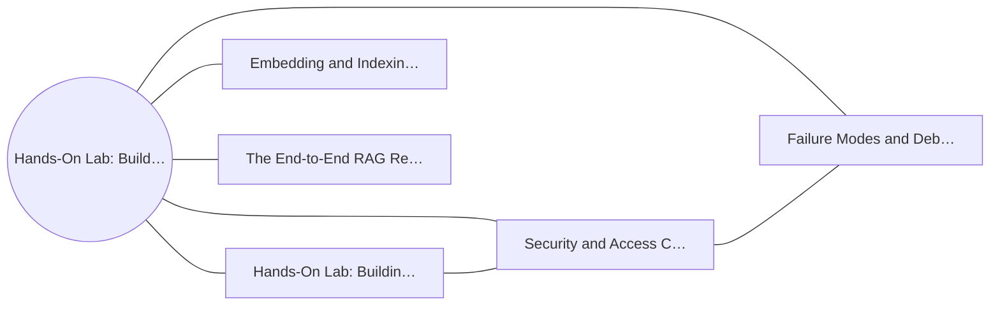

**Figure 22. Capability Map - Hands-On Lab: Building an End-to-End RAG System** (mermaid). Figure: Capability Map view for Hands-On Lab: Building an End-to-End RAG System. This diagram illustrates the principal components and their interactions as discussed in the surrounding section.

## Deep Dive: Mechanics, Variants and Trade-offs

Having established the essentials, we now go deeper into hands-on lab: building an end-to-end rag system. Mechanically, the behaviour emerges from a few interacting parts that are simpler than the whole they produce. The distinctions in this section are the ones that separate a working demo from a system that holds up under adversarial inputs, scale and the passage of time.

Consider the principal variants and how to choose between them. Each variant optimises for a different point in the design space - some for latency, some for accuracy, some for cost or operability - and the correct choice follows from explicit requirements rather than from defaults. Simplicity is a feature. The simplest design that meets the requirement should be the default, with complexity added only when measurement justifies it.

In practice this is supported by a mature tooling ecosystem, including LangChain, LlamaIndex, Haystack, RAGAS. Tools accelerate the work but do not substitute for understanding: the same principles apply whichever implementation you select, and the ability to reason from first principles is what lets you debug when a tool behaves unexpectedly.

A frequent source of subtle bugs is the interaction with security and access control in rag. Because security and access control in rag concerns row-level permissions and preventing data leakage across tenants, changes there can silently alter the behaviour analysed here. The remedy is contract tests at the boundary and end-to-end evaluations that exercise the interaction explicitly.

Finally, attend to edge cases and degradation. Define what the system should do under partial failure, unexpected inputs and load spikes, and make that behaviour explicit and tested rather than emergent. Graceful degradation - returning a safe, useful result when the ideal one is unavailable - is a hallmark of mature engineering.

For deeper study, the literature offers authoritative treatments such as Lewis et al. — Retrieval-Augmented Generation (2020) and Gao et al. — Precise Zero-Shot Dense Retrieval (HyDE, 2022). These primary sources reward careful reading and ground the practical guidance above in established results.

## Advanced Considerations

Having established the essentials, we now go deeper into hands-on lab: building an end-to-end rag system. Mechanically, the behaviour emerges from a few interacting parts that are simpler than the whole they produce. The distinctions in this section are the ones that separate a working demo from a system that holds up under adversarial inputs, scale and the passage of time.

Consider the principal variants and how to choose between them. Each variant optimises for a different point in the design space - some for latency, some for accuracy, some for cost or operability - and the correct choice follows from explicit requirements rather than from defaults. Every added component buys capability at the price of operational surface area, and that bargain should be made consciously.

In practice this is supported by a mature tooling ecosystem, including LangChain, LlamaIndex, Haystack, RAGAS. Tools accelerate the work but do not substitute for understanding: the same principles apply whichever implementation you select, and the ability to reason from first principles is what lets you debug when a tool behaves unexpectedly.

A frequent source of subtle bugs is the interaction with failure modes and debugging. Because failure modes and debugging concerns diagnosing retrieval versus generation failures, changes there can silently alter the behaviour analysed here. The remedy is contract tests at the boundary and end-to-end evaluations that exercise the interaction explicitly.

Finally, attend to edge cases and degradation. Define what the system should do under partial failure, unexpected inputs and load spikes, and make that behaviour explicit and tested rather than emergent. Graceful degradation - returning a safe, useful result when the ideal one is unavailable - is a hallmark of mature engineering.

For deeper study, the literature offers authoritative treatments such as Lewis et al. — Retrieval-Augmented Generation (2020) and Gao et al. — Precise Zero-Shot Dense Retrieval (HyDE, 2022). These primary sources reward careful reading and ground the practical guidance above in established results.

## Worked Example

Consider a concrete scenario. A enterprise organisation needs grounded internal Q&A over policies and wikis with citations. They decide to apply hands-on lab: building an end-to-end rag system as part of their RAG solution, but wisely treat it as a hypothesis to be validated rather than a foregone conclusion.

The team begins by stating the objective precisely and defining how success will be measured before writing any code. They establish a small but representative evaluation set, agree on acceptance thresholds, and only then prototype the simplest design that could work. Early measurement reveals which assumptions hold and which must be revised, saving weeks of misdirected effort and surfacing edge cases while they are still cheap to fix.

As the prototype matures into a service, the team hardens it: adding input validation, error handling, caching where it pays off, and monitoring that ties back to the original success metric. They document each significant decision in an architecture decision record so that future maintainers understand not just what was built but why.

The outcome is instructive. The system that reaches production is not the most sophisticated design the team considered, but the one whose behaviour they could measure, explain and operate. This is the recurring lesson of RAG: durable value comes from the whole system, not from any single clever component.

## Industry Use Cases

Across industries, the ideas in this chapter recur in recognisable ways. The following vignettes show how different sectors apply them and what they have in common.

**Enterprise.** Grounded internal Q&A over policies and wikis with citations. The common thread is that value comes not from the model alone but from the surrounding system - data quality, evaluation, integration and operations - which is precisely where most of the engineering effort belongs.

**Legal.** Case and contract research with traceable sources. The common thread is that value comes not from the model alone but from the surrounding system - data quality, evaluation, integration and operations - which is precisely where most of the engineering effort belongs.

**Healthcare.** Clinical guideline assistants with provenance. The common thread is that value comes not from the model alone but from the surrounding system - data quality, evaluation, integration and operations - which is precisely where most of the engineering effort belongs.

**Support.** Deflection bots grounded in current knowledge bases. The common thread is that value comes not from the model alone but from the surrounding system - data quality, evaluation, integration and operations - which is precisely where most of the engineering effort belongs.

## Best Practices

The following practices consistently separate successful RAG efforts from struggling ones. They are deliberately concrete so they can be adopted as checklist items in design and code review.

- Tune chunking to the corpus; measure its effect on retrieval metrics.
- Always cite sources and enable users to verify answers.
- Enforce access control at retrieval time, not just at the UI.
- Evaluate retrieval and generation separately to localise failures.

None of these are exotic; they are the unglamorous disciplines that compound into reliability. The cost of adopting them is small compared with the cost of the incidents they prevent, and they become second nature with practice.

## Common Pitfalls

Equally instructive are the failure modes that recur in practice. Each pitfall below has a clear early warning sign and a known remedy, so treat them as a diagnostic checklist when something feels wrong:

- Naive fixed-size chunking that splits semantic units.
- Stuffing too much context, increasing cost and diluting relevance.
- Ignoring permissions and leaking restricted documents.
- Measuring only end answer quality without diagnosing retrieval.

The pattern is consistent: most failures stem from skipping measurement, conflating prototype and production standards, or deferring cross-cutting concerns such as security and cost until they become emergencies. Naming these traps in advance is the cheapest way to avoid them.

## Governance, Security and Cost Notes

No discussion of hands-on lab: building an end-to-end rag system is complete without its governance, security and cost dimensions, which are too often deferred until they become emergencies. Treating them as first-class concerns from the outset is both cheaper and safer.

**Governance.** Classify the risk of this capability, document its intended and out-of-scope uses, and ensure decisions are traceable to satisfy internal policy and external regulation such as the NIST AI RMF, ISO/IEC 42001 and the EU AI Act. **Security.** Treat all external input as untrusted, validate outputs before acting on them, apply least privilege to any tools or data access, and map controls to the OWASP LLM Top 10 and MITRE ATLAS.

**Cost and sustainability.** Establish explicit budgets for compute, tokens and latency, attribute spend to owners, and revisit the economics as usage scales - a design that is affordable at pilot scale can become untenable at production volume. Building these reflexes into everyday engineering is what allows a RAG system to be not only capable but also trustworthy and economically sound.

## Hands-On Exercises

Work through the following exercises. They are designed to move understanding from recognition to application - the level required for real engineering work - so prefer writing and building over merely reading.

1. Explain hands-on lab: building an end-to-end rag system to a colleague unfamiliar with RAG, using a concrete example from your own domain.
2. Sketch a reference architecture that incorporates hands-on lab: building an end-to-end rag system and annotate where observability, security and cost controls belong.
3. Design an evaluation that would tell you whether hands-on lab: building an end-to-end rag system is working in production, including the metric, the dataset and the acceptance threshold.
4. Identify two pitfalls relevant to hands-on lab: building an end-to-end rag system in your environment and describe the early warning signals you would monitor.
5. Prototype the simplest implementation that demonstrates hands-on lab: building an end-to-end rag system, then list exactly what would need to change to make it production-ready.

## Key Takeaways

Key takeaways from this chapter:

- Hands-On Lab: Building an End-to-End RAG System is a systems concern in RAG: data, models and operations must be co-designed.
- Measurement is non-negotiable; define success metrics and evaluation before building.
- Favour the simplest design that meets the requirement, and add complexity only when evidence demands it.
- Security, cost and observability are first-class requirements, not afterthoughts.
- Document decisions so the system remains understandable and operable as it evolves.

## Code Walkthrough

This listing shows a configuration-driven Hands-On Lab: Building an End-to-End RAG System component with retry semantics and typed interfaces — the shape we expect from production RAG code rather than a notebook prototype.

The full listing is shown below; study it line by line and reproduce it locally before moving on.

### Listing: Implementing a Hands-On Lab: Building an End-to-End RAG System component

```python
from __future__ import annotations

from dataclasses import dataclass, field
from typing import Any


@dataclass(slots=True)
class BuildingConfig:
    """Configuration for the Hands-On Lab: Building an End-to-End RAG System component in a RAG system."""

    name: str
    timeout_s: float = 30.0
    max_retries: int = 3
    options: dict[str, Any] = field(default_factory=dict)


class Building:
    """A minimal, production-shaped implementation of Hands-On Lab: Building an End-to-End RAG System."""

    def __init__(self, config: BuildingConfig) -> None:
        self._config = config
        self._calls = 0

    def run(self, payload: dict[str, Any]) -> dict[str, Any]:
        """Process a request, retrying transient failures with backoff."""
        last_error: Exception | None = None
        for attempt in range(self._config.max_retries):
            try:
                self._calls += 1
                return self._process(payload)
            except TimeoutError as exc:  # transient
                last_error = exc
                continue
        raise RuntimeError(f"Building failed after retries") from last_error

    def _process(self, payload: dict[str, Any]) -> dict[str, Any]:
        # Domain-specific logic for Hands-On Lab: Building an End-to-End RAG System goes here.
        return {"status": "ok", "input_keys": sorted(payload), "calls": self._calls}

```

## Review Questions

1. In the context of RAG, which statement best describes “Hands-On Lab: Building an End-to-End RAG System”?
   - A. a guided, build-along laboratory that constructs a functioning RAG system from first principles
   - B. It applies exclusively to image data.
   - C. It guarantees deterministic output regardless of input.
   - D. It makes the system slower but has no other effect.
   - **Answer: A.** Hands-On Lab: Building an End-to-End RAG System: a guided, build-along laboratory that constructs a functioning RAG system from first principles
2. Which of the following is a recommended best practice when working with RAG?
   - A. Ignoring permissions and leaking restricted documents.
   - B. It applies exclusively to image data.
   - C. It makes the system slower but has no other effect.
   - D. Enforce access control at retrieval time, not just at the UI.
   - **Answer: D.** Best practice: Enforce access control at retrieval time, not just at the UI.
3. Which of the following is a common pitfall to avoid in RAG?
   - A. It is only relevant to academic research, not production.
   - B. It makes the system slower but has no other effect.
   - C. Enforce access control at retrieval time, not just at the UI.
   - D. Stuffing too much context, increasing cost and diluting relevance.
   - **Answer: D.** Pitfall to avoid: Stuffing too much context, increasing cost and diluting relevance.
4. *(Discussion)* How would you test and monitor Hands-On Lab: Building an End-to-End RAG System in production?
   - **Model answer:** A strong answer defines hands-on lab: building an end-to-end rag system (a guided, build-along laboratory that constructs a functioning RAG system from first principles) then connects it to architecture, evaluation, cost, security and operations for RAG, citing concrete trade-offs and a real-world example.

---


# Chapter 17. Case Study: Enterprise at Scale

_This chapter examines case study: enterprise at scale within RAG. It covers a detailed case study of deploying RAG in a demanding enterprise environment, including the decisions, trade-offs and outcomes, derives a reference architecture, walks through a worked example and runnable code, surveys industry use cases, and distils best practices and pitfalls, closing with exercises and review questions._

## Introduction

Formally, Case Study: Enterprise at Scale addresses a detailed case study of deploying RAG in a demanding enterprise environment, including the decisions, trade-offs and outcomes. Understanding this matters because RAG systems succeed or fail on exactly these decisions. In an enterprise setting, this translates into concrete requirements: clear interfaces, measurable quality, and controls that satisfy security and governance.

This chapter builds intuition first, then formalises the ideas, derives an architecture, and finishes with code, exercises and review questions so the material transfers directly to your own RAG work. Read it actively: pause at each diagram, reproduce the code, and attempt the exercises before consulting the answers.

## Theory and Foundations

Formally, Case Study: Enterprise at Scale addresses a detailed case study of deploying RAG in a demanding enterprise environment, including the decisions, trade-offs and outcomes. It helps to separate the conceptual model from its implementation: the former guides reasoning, the latter must contend with real-world constraints. The underlying mechanism is best appreciated by tracing a single request from input to output and noting where state is created and consumed.

To place this in context, recall the broader picture: Retrieval-augmented generation grounds a language model in external knowledge by retrieving relevant context at query time and conditioning generation on it. Within that picture, case study: enterprise at scale is one of the load-bearing ideas - the kind that, when understood deeply, makes the rest of RAG fall into place. This concept recurs throughout the RAG lifecycle, from design to operations.

Case Study: Enterprise at Scale cannot be understood in isolation from caching and cost optimisation. Recall that caching and cost optimisation concerns semantic caching and retrieval reuse. The two interact directly: decisions in one constrain the design space of the other, which is why mature teams reason about them together rather than sequentially. Simplicity is a feature. The simplest design that meets the requirement should be the default, with complexity added only when measurement justifies it.

Case Study: Enterprise at Scale cannot be understood in isolation from operating rag in production. Recall that operating rag in production concerns monitoring retrieval quality, drift and feedback loops. The two interact directly: decisions in one constrain the design space of the other, which is why mature teams reason about them together rather than sequentially. There is an inherent trade-off between fidelity and cost, and the correct balance depends on the use case and its tolerance for error.

Several established patterns apply directly to case study: enterprise at scale. The first, refuse-or-clarify when retrieval confidence is low, is widely adopted because it makes the system's behaviour predictable and observable. A complementary pattern, parent-document retrieval for precise chunks with broad context, addresses a related concern and is often deployed alongside it. Patterns are not dogma; they are distilled experience that shortcuts the search for a sound design, and each carries assumptions worth checking against your context.

It is worth being explicit about when to apply this and when to reach for something simpler. In a small prototype, shortcuts around case study: enterprise at scale are invisible; in a production RAG system serving real traffic, they surface as incidents, cost overruns or compliance gaps. There is an inherent trade-off between fidelity and cost, and the correct balance depends on the use case and its tolerance for error. The remainder of this chapter turns these principles into an architecture, code and a checklist you can apply immediately.

## Architecture and Design

A robust architecture for Case Study: Enterprise at Scale is layered so each part can evolve independently without destabilising the whole. A RAG system has an offline ingestion pipeline (parse → chunk → embed → index) and an online query pipeline (query transform → hybrid retrieve → re-rank → assemble prompt → generate → cite). Access control filters retrieval by user permissions, and an evaluation service continuously scores faithfulness and relevance on sampled traffic.

Concretely, the principal building blocks include why rag: grounding and freshness, document ingestion and chunking, embedding and indexing strategy, retrieval and query transformation and re-ranking and context selection. Each is a replaceable component behind a stable interface, so the team can upgrade an implementation - a model, an index, a policy engine - without rewriting its neighbours. The contracts between components are where reliability is won or lost, so they are specified explicitly and tested in isolation.

The diagram accompanying this section makes the data and control flow explicit. Requests enter through a well-defined boundary where they are authenticated and validated; only then are they dispatched to the components that perform the work. This boundary is also where rate limiting, quota enforcement and audit logging live, keeping cross-cutting concerns out of the core logic and in one auditable place.

Two qualities deserve emphasis. First, observability is designed in, not bolted on: every component emits structured telemetry so that failures can be localised in minutes rather than hours. Second, the architecture is evolvable - components communicate through stable contracts so that any single part of the RAG system can be replaced without a rewrite. Every added component buys capability at the price of operational surface area, and that bargain should be made consciously.

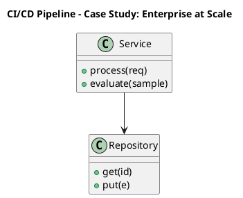

_Source diagram (plantuml); render with the appropriate tool._

**Figure 23. CI/CD Pipeline - Case Study: Enterprise at Scale** (plantuml). Figure: CI/CD Pipeline view for Case Study: Enterprise at Scale. This diagram illustrates the principal components and their interactions as discussed in the surrounding section.

```xml
<mxfile host="ai-university">
  <diagram name="Architecture">
    <mxGraphModel dx="800" dy="600" grid="1" gridSize="10">
      <root>
        <mxCell id="0"/>
        <mxCell id="1" parent="0"/>
        <mxCell id="title" value="Architecture - Case Study: Enterprise at Scale" style="text;fontSize=16;fontStyle=1" vertex="1" parent="1"><mxGeometry x="40" y="20" width="600" height="30" as="geometry"/></mxCell>
        <mxCell id="hub" value="Case Study: Enterpris…" style="rounded=1;fillColor=#0f172a;fontColor=#ffffff;fontStyle=1" vertex="1" parent="1"><mxGeometry x="300" y="180" width="160" height="60" as="geometry"/></mxCell>
        <mxCell id="n0" value="Case Study: Enterprise …" style="rounded=1;fillColor=#e0e7ff;strokeColor=#4338ca" vertex="1" parent="1"><mxGeometry x="60" y="80" width="160" height="50" as="geometry"/></mxCell>
        <mxCell id="e0" style="edgeStyle=orthogonalEdgeStyle" edge="1" parent="1" source="hub" target="n0"><mxGeometry relative="1" as="geometry"/></mxCell>
        <mxCell id="n1" value="Caching and Cost Optimi…" style="rounded=1;fillColor=#e0e7ff;strokeColor=#4338ca" vertex="1" parent="1"><mxGeometry x="600" y="170" width="160" height="50" as="geometry"/></mxCell>
        <mxCell id="e1" style="edgeStyle=orthogonalEdgeStyle" edge="1" parent="1" source="hub" target="n1"><mxGeometry relative="1" as="geometry"/></mxCell>
        <mxCell id="n2" value="Operating RAG in Produc…" style="rounded=1;fillColor=#e0e7ff;strokeColor=#4338ca" vertex="1" parent="1"><mxGeometry x="60" y="260" width="160" height="50" as="geometry"/></mxCell>
        <mxCell id="e2" style="edgeStyle=orthogonalEdgeStyle" edge="1" parent="1" source="hub" target="n2"><mxGeometry relative="1" as="geometry"/></mxCell>
        <mxCell id="n3" value="Document Ingestion and …" style="rounded=1;fillColor=#e0e7ff;strokeColor=#4338ca" vertex="1" parent="1"><mxGeometry x="600" y="350" width="160" height="50" as="geometry"/></mxCell>
        <mxCell id="e3" style="edgeStyle=orthogonalEdgeStyle" edge="1" parent="1" source="hub" target="n3"><mxGeometry relative="1" as="geometry"/></mxCell>
        <mxCell id="n4" value="Re-ranking and Context …" style="rounded=1;fillColor=#e0e7ff;strokeColor=#4338ca" vertex="1" parent="1"><mxGeometry x="60" y="440" width="160" height="50" as="geometry"/></mxCell>
        <mxCell id="e4" style="edgeStyle=orthogonalEdgeStyle" edge="1" parent="1" source="hub" target="n4"><mxGeometry relative="1" as="geometry"/></mxCell>
      </root>
    </mxGraphModel>
  </diagram>
</mxfile>
```

_Source diagram (drawio); render with the appropriate tool._

**Figure 24. Architecture - Case Study: Enterprise at Scale** (drawio). Figure: Architecture view for Case Study: Enterprise at Scale. This diagram illustrates the principal components and their interactions as discussed in the surrounding section.

## Deep Dive: Mechanics, Variants and Trade-offs

Having established the essentials, we now go deeper into case study: enterprise at scale. Beneath the abstraction lies a concrete process whose steps can each be measured, tested and optimised independently. The distinctions in this section are the ones that separate a working demo from a system that holds up under adversarial inputs, scale and the passage of time.

Consider the principal variants and how to choose between them. Each variant optimises for a different point in the design space - some for latency, some for accuracy, some for cost or operability - and the correct choice follows from explicit requirements rather than from defaults. As with most architectural decisions, the choice is rarely binary; the skill lies in quantifying the trade-offs and choosing deliberately.

In practice this is supported by a mature tooling ecosystem, including LangChain, LlamaIndex, Haystack, RAGAS. Tools accelerate the work but do not substitute for understanding: the same principles apply whichever implementation you select, and the ability to reason from first principles is what lets you debug when a tool behaves unexpectedly.

A frequent source of subtle bugs is the interaction with caching and cost optimisation. Because caching and cost optimisation concerns semantic caching and retrieval reuse, changes there can silently alter the behaviour analysed here. The remedy is contract tests at the boundary and end-to-end evaluations that exercise the interaction explicitly.

Finally, attend to edge cases and degradation. Define what the system should do under partial failure, unexpected inputs and load spikes, and make that behaviour explicit and tested rather than emergent. Graceful degradation - returning a safe, useful result when the ideal one is unavailable - is a hallmark of mature engineering.

For deeper study, the literature offers authoritative treatments such as Lewis et al. — Retrieval-Augmented Generation (2020) and Gao et al. — Precise Zero-Shot Dense Retrieval (HyDE, 2022). These primary sources reward careful reading and ground the practical guidance above in established results.

## Advanced Considerations

Having established the essentials, we now go deeper into case study: enterprise at scale. Beneath the abstraction lies a concrete process whose steps can each be measured, tested and optimised independently. The distinctions in this section are the ones that separate a working demo from a system that holds up under adversarial inputs, scale and the passage of time.

Consider the principal variants and how to choose between them. Each variant optimises for a different point in the design space - some for latency, some for accuracy, some for cost or operability - and the correct choice follows from explicit requirements rather than from defaults. There is an inherent trade-off between fidelity and cost, and the correct balance depends on the use case and its tolerance for error.

In practice this is supported by a mature tooling ecosystem, including LangChain, LlamaIndex, Haystack, RAGAS. Tools accelerate the work but do not substitute for understanding: the same principles apply whichever implementation you select, and the ability to reason from first principles is what lets you debug when a tool behaves unexpectedly.

A frequent source of subtle bugs is the interaction with embedding and indexing strategy. Because embedding and indexing strategy concerns choosing models, dimensions and index types for the corpus, changes there can silently alter the behaviour analysed here. The remedy is contract tests at the boundary and end-to-end evaluations that exercise the interaction explicitly.

Finally, attend to edge cases and degradation. Define what the system should do under partial failure, unexpected inputs and load spikes, and make that behaviour explicit and tested rather than emergent. Graceful degradation - returning a safe, useful result when the ideal one is unavailable - is a hallmark of mature engineering.

For deeper study, the literature offers authoritative treatments such as Lewis et al. — Retrieval-Augmented Generation (2020) and Gao et al. — Precise Zero-Shot Dense Retrieval (HyDE, 2022). These primary sources reward careful reading and ground the practical guidance above in established results.

## Worked Example

To ground the discussion, walk through a representative example. A healthcare organisation needs clinical guideline assistants with provenance. They decide to apply case study: enterprise at scale as part of their RAG solution, but wisely treat it as a hypothesis to be validated rather than a foregone conclusion.

The team begins by stating the objective precisely and defining how success will be measured before writing any code. They establish a small but representative evaluation set, agree on acceptance thresholds, and only then prototype the simplest design that could work. Early measurement reveals which assumptions hold and which must be revised, saving weeks of misdirected effort and surfacing edge cases while they are still cheap to fix.

As the prototype matures into a service, the team hardens it: adding input validation, error handling, caching where it pays off, and monitoring that ties back to the original success metric. They document each significant decision in an architecture decision record so that future maintainers understand not just what was built but why.

The outcome is instructive. The system that reaches production is not the most sophisticated design the team considered, but the one whose behaviour they could measure, explain and operate. This is the recurring lesson of RAG: durable value comes from the whole system, not from any single clever component.

## Industry Use Cases

Across industries, the ideas in this chapter recur in recognisable ways. The following vignettes show how different sectors apply them and what they have in common.

**Enterprise.** Grounded internal Q&A over policies and wikis with citations. The common thread is that value comes not from the model alone but from the surrounding system - data quality, evaluation, integration and operations - which is precisely where most of the engineering effort belongs.

**Legal.** Case and contract research with traceable sources. The common thread is that value comes not from the model alone but from the surrounding system - data quality, evaluation, integration and operations - which is precisely where most of the engineering effort belongs.

**Healthcare.** Clinical guideline assistants with provenance. The common thread is that value comes not from the model alone but from the surrounding system - data quality, evaluation, integration and operations - which is precisely where most of the engineering effort belongs.

**Support.** Deflection bots grounded in current knowledge bases. The common thread is that value comes not from the model alone but from the surrounding system - data quality, evaluation, integration and operations - which is precisely where most of the engineering effort belongs.

## Best Practices

The following practices consistently separate successful RAG efforts from struggling ones. They are deliberately concrete so they can be adopted as checklist items in design and code review.

- Tune chunking to the corpus; measure its effect on retrieval metrics.
- Always cite sources and enable users to verify answers.
- Enforce access control at retrieval time, not just at the UI.
- Evaluate retrieval and generation separately to localise failures.

None of these are exotic; they are the unglamorous disciplines that compound into reliability. The cost of adopting them is small compared with the cost of the incidents they prevent, and they become second nature with practice.

## Common Pitfalls

Equally instructive are the failure modes that recur in practice. Each pitfall below has a clear early warning sign and a known remedy, so treat them as a diagnostic checklist when something feels wrong:

- Naive fixed-size chunking that splits semantic units.
- Stuffing too much context, increasing cost and diluting relevance.
- Ignoring permissions and leaking restricted documents.
- Measuring only end answer quality without diagnosing retrieval.

The pattern is consistent: most failures stem from skipping measurement, conflating prototype and production standards, or deferring cross-cutting concerns such as security and cost until they become emergencies. Naming these traps in advance is the cheapest way to avoid them.

## Governance, Security and Cost Notes

No discussion of case study: enterprise at scale is complete without its governance, security and cost dimensions, which are too often deferred until they become emergencies. Treating them as first-class concerns from the outset is both cheaper and safer.

**Governance.** Classify the risk of this capability, document its intended and out-of-scope uses, and ensure decisions are traceable to satisfy internal policy and external regulation such as the NIST AI RMF, ISO/IEC 42001 and the EU AI Act. **Security.** Treat all external input as untrusted, validate outputs before acting on them, apply least privilege to any tools or data access, and map controls to the OWASP LLM Top 10 and MITRE ATLAS.

**Cost and sustainability.** Establish explicit budgets for compute, tokens and latency, attribute spend to owners, and revisit the economics as usage scales - a design that is affordable at pilot scale can become untenable at production volume. Building these reflexes into everyday engineering is what allows a RAG system to be not only capable but also trustworthy and economically sound.

## Hands-On Exercises

Work through the following exercises. They are designed to move understanding from recognition to application - the level required for real engineering work - so prefer writing and building over merely reading.

1. Explain case study: enterprise at scale to a colleague unfamiliar with RAG, using a concrete example from your own domain.
2. Sketch a reference architecture that incorporates case study: enterprise at scale and annotate where observability, security and cost controls belong.
3. Design an evaluation that would tell you whether case study: enterprise at scale is working in production, including the metric, the dataset and the acceptance threshold.
4. Identify two pitfalls relevant to case study: enterprise at scale in your environment and describe the early warning signals you would monitor.
5. Prototype the simplest implementation that demonstrates case study: enterprise at scale, then list exactly what would need to change to make it production-ready.

## Key Takeaways

Key takeaways from this chapter:

- Case Study: Enterprise at Scale is a systems concern in RAG: data, models and operations must be co-designed.
- Measurement is non-negotiable; define success metrics and evaluation before building.
- Favour the simplest design that meets the requirement, and add complexity only when evidence demands it.
- Security, cost and observability are first-class requirements, not afterthoughts.
- Document decisions so the system remains understandable and operable as it evolves.

## Code Walkthrough

Pipelines keep Case Study: Enterprise at Scale logic modular and testable. Each stage is a pure function, errors are captured per item, and the composition is trivial to extend or reorder.

The full listing is shown below; study it line by line and reproduce it locally before moving on.

### Listing: A composable processing pipeline for Case Study: Enterprise at Scale

```python
from collections.abc import Iterable, Iterator
from typing import Protocol


class Stage(Protocol):
    def __call__(self, item: dict) -> dict: ...


def pipeline(stages: list[Stage]) -> Stage:
    """Compose ordered stages into a single callable for Case Study: Enterprise at Scale."""

    def run(item: dict) -> dict:
        for stage in stages:
            item = stage(item)
        return item

    return run


def validate(item: dict) -> dict:
    if "text" not in item:
        raise ValueError("missing required field: text")
    return item


def normalise(item: dict) -> dict:
    item["text"] = item["text"].strip().lower()
    return item


def enrich(item: dict) -> dict:
    item["length"] = len(item["text"])
    return item


process = pipeline([validate, normalise, enrich])


def run_batch(items: Iterable[dict]) -> Iterator[dict]:
    for item in items:
        try:
            yield process(dict(item))
        except ValueError as exc:
            yield {"error": str(exc), "item": item}

```

## Review Questions

1. In the context of RAG, which statement best describes “Case Study: Enterprise at Scale”?
   - A. It eliminates the need for any evaluation or monitoring.
   - B. a detailed case study of deploying RAG in a demanding enterprise environment, including the decisions, trade-offs and outcomes
   - C. It applies exclusively to image data.
   - D. It removes all security and governance requirements.
   - **Answer: B.** Case Study: Enterprise at Scale: a detailed case study of deploying RAG in a demanding enterprise environment, including the decisions, trade-offs and outcomes
2. Which of the following is a recommended best practice when working with RAG?
   - A. Stuffing too much context, increasing cost and diluting relevance.
   - B. Enforce access control at retrieval time, not just at the UI.
   - C. It eliminates the need for any evaluation or monitoring.
   - D. It makes the system slower but has no other effect.
   - **Answer: B.** Best practice: Enforce access control at retrieval time, not just at the UI.
3. Which of the following is a common pitfall to avoid in RAG?
   - A. Evaluate retrieval and generation separately to localise failures.
   - B. Enforce access control at retrieval time, not just at the UI.
   - C. It removes all security and governance requirements.
   - D. Ignoring permissions and leaking restricted documents.
   - **Answer: D.** Pitfall to avoid: Ignoring permissions and leaking restricted documents.
4. *(Discussion)* Walk through how you would design Case Study: Enterprise at Scale for an enterprise RAG workload.
   - **Model answer:** A strong answer defines case study: enterprise at scale (a detailed case study of deploying RAG in a demanding enterprise environment, including the decisions, trade-offs and outcomes) then connects it to architecture, evaluation, cost, security and operations for RAG, citing concrete trade-offs and a real-world example.

---


# Chapter 18. Operating in Production

_This chapter examines operating in production within RAG. It covers the operational discipline required to run a RAG system reliably, including monitoring, incident response and continuous improvement, derives a reference architecture, walks through a worked example and runnable code, surveys industry use cases, and distils best practices and pitfalls, closing with exercises and review questions._

## Introduction

In practical terms, Operating in Production is best understood as the operational discipline required to run a RAG system reliably, including monitoring, incident response and continuous improvement. Teams that master this consistently ship more reliable RAG systems at lower cost. Seasoned practitioners treat this as a systems problem, co-designing data, models and operations rather than optimising any one in isolation.

This chapter builds intuition first, then formalises the ideas, derives an architecture, and finishes with code, exercises and review questions so the material transfers directly to your own RAG work. Read it actively: pause at each diagram, reproduce the code, and attempt the exercises before consulting the answers.

## Theory and Foundations

Operating in Production can be characterised as the operational discipline required to run a RAG system reliably, including monitoring, incident response and continuous improvement. Seasoned practitioners treat this as a systems problem, co-designing data, models and operations rather than optimising any one in isolation. It pays to understand the mechanism rather than treat it as a black box, because most production incidents are explained by one of its steps misbehaving.

To place this in context, recall the broader picture: Retrieval-augmented generation grounds a language model in external knowledge by retrieving relevant context at query time and conditioning generation on it. Within that picture, operating in production is one of the load-bearing ideas - the kind that, when understood deeply, makes the rest of RAG fall into place. Understanding this matters because RAG systems succeed or fail on exactly these decisions.

Operating in Production cannot be understood in isolation from operating rag in production. Recall that operating rag in production concerns monitoring retrieval quality, drift and feedback loops. The two interact directly: decisions in one constrain the design space of the other, which is why mature teams reason about them together rather than sequentially. There is an inherent trade-off between fidelity and cost, and the correct balance depends on the use case and its tolerance for error.

Operating in Production cannot be understood in isolation from document ingestion and chunking. Recall that document ingestion and chunking concerns parsing, semantic chunking, overlap and metadata extraction. The two interact directly: decisions in one constrain the design space of the other, which is why mature teams reason about them together rather than sequentially. Latency, accuracy and cost form a tension triangle: improving one typically pressures the others, so explicit budgets are essential.

Several established patterns apply directly to operating in production. The first, hybrid retrieval with reciprocal rank fusion, is widely adopted because it makes the system's behaviour predictable and observable. A complementary pattern, refuse-or-clarify when retrieval confidence is low, addresses a related concern and is often deployed alongside it. Patterns are not dogma; they are distilled experience that shortcuts the search for a sound design, and each carries assumptions worth checking against your context.

The decision of whether to adopt this should be driven by requirements, not by novelty. In a small prototype, shortcuts around operating in production are invisible; in a production RAG system serving real traffic, they surface as incidents, cost overruns or compliance gaps. Latency, accuracy and cost form a tension triangle: improving one typically pressures the others, so explicit budgets are essential. The remainder of this chapter turns these principles into an architecture, code and a checklist you can apply immediately.

## Architecture and Design

A robust architecture for Operating in Production is layered so each part can evolve independently without destabilising the whole. A RAG system has an offline ingestion pipeline (parse → chunk → embed → index) and an online query pipeline (query transform → hybrid retrieve → re-rank → assemble prompt → generate → cite). Access control filters retrieval by user permissions, and an evaluation service continuously scores faithfulness and relevance on sampled traffic.

Concretely, the principal building blocks include why rag: grounding and freshness, document ingestion and chunking, embedding and indexing strategy, retrieval and query transformation and re-ranking and context selection. Each is a replaceable component behind a stable interface, so the team can upgrade an implementation - a model, an index, a policy engine - without rewriting its neighbours. The contracts between components are where reliability is won or lost, so they are specified explicitly and tested in isolation.

The diagram accompanying this section makes the data and control flow explicit. Requests enter through a well-defined boundary where they are authenticated and validated; only then are they dispatched to the components that perform the work. This boundary is also where rate limiting, quota enforcement and audit logging live, keeping cross-cutting concerns out of the core logic and in one auditable place.

Two qualities deserve emphasis. First, observability is designed in, not bolted on: every component emits structured telemetry so that failures can be localised in minutes rather than hours. Second, the architecture is evolvable - components communicate through stable contracts so that any single part of the RAG system can be replaced without a rewrite. There is an inherent trade-off between fidelity and cost, and the correct balance depends on the use case and its tolerance for error.

```xml
<mxfile host="ai-university">
  <diagram name="Architecture">
    <mxGraphModel dx="800" dy="600" grid="1" gridSize="10">
      <root>
        <mxCell id="0"/>
        <mxCell id="1" parent="0"/>
        <mxCell id="title" value="Architecture - Operating in Production" style="text;fontSize=16;fontStyle=1" vertex="1" parent="1"><mxGeometry x="40" y="20" width="600" height="30" as="geometry"/></mxCell>
        <mxCell id="hub" value="Operating in Producti…" style="rounded=1;fillColor=#0f172a;fontColor=#ffffff;fontStyle=1" vertex="1" parent="1"><mxGeometry x="300" y="180" width="160" height="60" as="geometry"/></mxCell>
        <mxCell id="n0" value="Operating in Production" style="rounded=1;fillColor=#e0e7ff;strokeColor=#4338ca" vertex="1" parent="1"><mxGeometry x="60" y="80" width="160" height="50" as="geometry"/></mxCell>
        <mxCell id="e0" style="edgeStyle=orthogonalEdgeStyle" edge="1" parent="1" source="hub" target="n0"><mxGeometry relative="1" as="geometry"/></mxCell>
        <mxCell id="n1" value="Operating RAG in Produc…" style="rounded=1;fillColor=#e0e7ff;strokeColor=#4338ca" vertex="1" parent="1"><mxGeometry x="600" y="170" width="160" height="50" as="geometry"/></mxCell>
        <mxCell id="e1" style="edgeStyle=orthogonalEdgeStyle" edge="1" parent="1" source="hub" target="n1"><mxGeometry relative="1" as="geometry"/></mxCell>
        <mxCell id="n2" value="Document Ingestion and …" style="rounded=1;fillColor=#e0e7ff;strokeColor=#4338ca" vertex="1" parent="1"><mxGeometry x="60" y="260" width="160" height="50" as="geometry"/></mxCell>
        <mxCell id="e2" style="edgeStyle=orthogonalEdgeStyle" edge="1" parent="1" source="hub" target="n2"><mxGeometry relative="1" as="geometry"/></mxCell>
        <mxCell id="n3" value="The End-to-End RAG Refe…" style="rounded=1;fillColor=#e0e7ff;strokeColor=#4338ca" vertex="1" parent="1"><mxGeometry x="600" y="350" width="160" height="50" as="geometry"/></mxCell>
        <mxCell id="e3" style="edgeStyle=orthogonalEdgeStyle" edge="1" parent="1" source="hub" target="n3"><mxGeometry relative="1" as="geometry"/></mxCell>
        <mxCell id="n4" value="Handling Tables, Images…" style="rounded=1;fillColor=#e0e7ff;strokeColor=#4338ca" vertex="1" parent="1"><mxGeometry x="60" y="440" width="160" height="50" as="geometry"/></mxCell>
        <mxCell id="e4" style="edgeStyle=orthogonalEdgeStyle" edge="1" parent="1" source="hub" target="n4"><mxGeometry relative="1" as="geometry"/></mxCell>
      </root>
    </mxGraphModel>
  </diagram>
</mxfile>
```

_Source diagram (drawio); render with the appropriate tool._

**Figure 25. Architecture - Operating in Production** (drawio). Figure: Architecture view for Operating in Production. This diagram illustrates the principal components and their interactions as discussed in the surrounding section.

## Deep Dive: Mechanics, Variants and Trade-offs

Having established the essentials, we now go deeper into operating in production. The underlying mechanism is best appreciated by tracing a single request from input to output and noting where state is created and consumed. The distinctions in this section are the ones that separate a working demo from a system that holds up under adversarial inputs, scale and the passage of time.

Consider the principal variants and how to choose between them. Each variant optimises for a different point in the design space - some for latency, some for accuracy, some for cost or operability - and the correct choice follows from explicit requirements rather than from defaults. Latency, accuracy and cost form a tension triangle: improving one typically pressures the others, so explicit budgets are essential.

In practice this is supported by a mature tooling ecosystem, including LangChain, LlamaIndex, Haystack, RAGAS. Tools accelerate the work but do not substitute for understanding: the same principles apply whichever implementation you select, and the ability to reason from first principles is what lets you debug when a tool behaves unexpectedly.

A frequent source of subtle bugs is the interaction with operating rag in production. Because operating rag in production concerns monitoring retrieval quality, drift and feedback loops, changes there can silently alter the behaviour analysed here. The remedy is contract tests at the boundary and end-to-end evaluations that exercise the interaction explicitly.

Finally, attend to edge cases and degradation. Define what the system should do under partial failure, unexpected inputs and load spikes, and make that behaviour explicit and tested rather than emergent. Graceful degradation - returning a safe, useful result when the ideal one is unavailable - is a hallmark of mature engineering.

For deeper study, the literature offers authoritative treatments such as Lewis et al. — Retrieval-Augmented Generation (2020) and Gao et al. — Precise Zero-Shot Dense Retrieval (HyDE, 2022). These primary sources reward careful reading and ground the practical guidance above in established results.

## Advanced Considerations

Having established the essentials, we now go deeper into operating in production. Mechanically, the behaviour emerges from a few interacting parts that are simpler than the whole they produce. The distinctions in this section are the ones that separate a working demo from a system that holds up under adversarial inputs, scale and the passage of time.

Consider the principal variants and how to choose between them. Each variant optimises for a different point in the design space - some for latency, some for accuracy, some for cost or operability - and the correct choice follows from explicit requirements rather than from defaults. As with most architectural decisions, the choice is rarely binary; the skill lies in quantifying the trade-offs and choosing deliberately.

In practice this is supported by a mature tooling ecosystem, including LangChain, LlamaIndex, Haystack, RAGAS. Tools accelerate the work but do not substitute for understanding: the same principles apply whichever implementation you select, and the ability to reason from first principles is what lets you debug when a tool behaves unexpectedly.

A frequent source of subtle bugs is the interaction with embedding and indexing strategy. Because embedding and indexing strategy concerns choosing models, dimensions and index types for the corpus, changes there can silently alter the behaviour analysed here. The remedy is contract tests at the boundary and end-to-end evaluations that exercise the interaction explicitly.

Finally, attend to edge cases and degradation. Define what the system should do under partial failure, unexpected inputs and load spikes, and make that behaviour explicit and tested rather than emergent. Graceful degradation - returning a safe, useful result when the ideal one is unavailable - is a hallmark of mature engineering.

For deeper study, the literature offers authoritative treatments such as Lewis et al. — Retrieval-Augmented Generation (2020) and Gao et al. — Precise Zero-Shot Dense Retrieval (HyDE, 2022). These primary sources reward careful reading and ground the practical guidance above in established results.

## Worked Example

Consider a concrete scenario. A healthcare organisation needs clinical guideline assistants with provenance. They decide to apply operating in production as part of their RAG solution, but wisely treat it as a hypothesis to be validated rather than a foregone conclusion.

The team begins by stating the objective precisely and defining how success will be measured before writing any code. They establish a small but representative evaluation set, agree on acceptance thresholds, and only then prototype the simplest design that could work. Early measurement reveals which assumptions hold and which must be revised, saving weeks of misdirected effort and surfacing edge cases while they are still cheap to fix.

As the prototype matures into a service, the team hardens it: adding input validation, error handling, caching where it pays off, and monitoring that ties back to the original success metric. They document each significant decision in an architecture decision record so that future maintainers understand not just what was built but why.

The outcome is instructive. The system that reaches production is not the most sophisticated design the team considered, but the one whose behaviour they could measure, explain and operate. This is the recurring lesson of RAG: durable value comes from the whole system, not from any single clever component.

## Industry Use Cases

Across industries, the ideas in this chapter recur in recognisable ways. The following vignettes show how different sectors apply them and what they have in common.

**Enterprise.** Grounded internal Q&A over policies and wikis with citations. The common thread is that value comes not from the model alone but from the surrounding system - data quality, evaluation, integration and operations - which is precisely where most of the engineering effort belongs.

**Legal.** Case and contract research with traceable sources. The common thread is that value comes not from the model alone but from the surrounding system - data quality, evaluation, integration and operations - which is precisely where most of the engineering effort belongs.

**Healthcare.** Clinical guideline assistants with provenance. The common thread is that value comes not from the model alone but from the surrounding system - data quality, evaluation, integration and operations - which is precisely where most of the engineering effort belongs.

**Support.** Deflection bots grounded in current knowledge bases. The common thread is that value comes not from the model alone but from the surrounding system - data quality, evaluation, integration and operations - which is precisely where most of the engineering effort belongs.

## Best Practices

The following practices consistently separate successful RAG efforts from struggling ones. They are deliberately concrete so they can be adopted as checklist items in design and code review.

- Tune chunking to the corpus; measure its effect on retrieval metrics.
- Always cite sources and enable users to verify answers.
- Enforce access control at retrieval time, not just at the UI.
- Evaluate retrieval and generation separately to localise failures.

None of these are exotic; they are the unglamorous disciplines that compound into reliability. The cost of adopting them is small compared with the cost of the incidents they prevent, and they become second nature with practice.

## Common Pitfalls

Equally instructive are the failure modes that recur in practice. Each pitfall below has a clear early warning sign and a known remedy, so treat them as a diagnostic checklist when something feels wrong:

- Naive fixed-size chunking that splits semantic units.
- Stuffing too much context, increasing cost and diluting relevance.
- Ignoring permissions and leaking restricted documents.
- Measuring only end answer quality without diagnosing retrieval.

The pattern is consistent: most failures stem from skipping measurement, conflating prototype and production standards, or deferring cross-cutting concerns such as security and cost until they become emergencies. Naming these traps in advance is the cheapest way to avoid them.

## Governance, Security and Cost Notes

No discussion of operating in production is complete without its governance, security and cost dimensions, which are too often deferred until they become emergencies. Treating them as first-class concerns from the outset is both cheaper and safer.

**Governance.** Classify the risk of this capability, document its intended and out-of-scope uses, and ensure decisions are traceable to satisfy internal policy and external regulation such as the NIST AI RMF, ISO/IEC 42001 and the EU AI Act. **Security.** Treat all external input as untrusted, validate outputs before acting on them, apply least privilege to any tools or data access, and map controls to the OWASP LLM Top 10 and MITRE ATLAS.

**Cost and sustainability.** Establish explicit budgets for compute, tokens and latency, attribute spend to owners, and revisit the economics as usage scales - a design that is affordable at pilot scale can become untenable at production volume. Building these reflexes into everyday engineering is what allows a RAG system to be not only capable but also trustworthy and economically sound.

## Hands-On Exercises

Work through the following exercises. They are designed to move understanding from recognition to application - the level required for real engineering work - so prefer writing and building over merely reading.

1. Explain operating in production to a colleague unfamiliar with RAG, using a concrete example from your own domain.
2. Sketch a reference architecture that incorporates operating in production and annotate where observability, security and cost controls belong.
3. Design an evaluation that would tell you whether operating in production is working in production, including the metric, the dataset and the acceptance threshold.
4. Identify two pitfalls relevant to operating in production in your environment and describe the early warning signals you would monitor.
5. Prototype the simplest implementation that demonstrates operating in production, then list exactly what would need to change to make it production-ready.

## Key Takeaways

Key takeaways from this chapter:

- Operating in Production is a systems concern in RAG: data, models and operations must be co-designed.
- Measurement is non-negotiable; define success metrics and evaluation before building.
- Favour the simplest design that meets the requirement, and add complexity only when evidence demands it.
- Security, cost and observability are first-class requirements, not afterthoughts.
- Document decisions so the system remains understandable and operable as it evolves.

## Code Walkthrough

Every change to a RAG system should pass an evaluation gate. This example shows the minimal shape: align predictions and references, compute a metric, and return a pass/fail decision for CI.

The full listing is shown below; study it line by line and reproduce it locally before moving on.

### Listing: Evaluating Operating in Production with a regression gate

```python
from dataclasses import dataclass


@dataclass
class EvalResult:
    metric: str
    score: float
    passed: bool


def evaluate(predictions: list[str], references: list[str],
             threshold: float = 0.8) -> EvalResult:
    """Score Operating in Production output against references with a simple exact-match metric.

    In practice you would combine several metrics (exact match, semantic
    similarity, LLM-as-judge) and gate releases on the aggregate.
    """
    if len(predictions) != len(references):
        raise ValueError("predictions and references must align")
    hits = sum(p.strip() == r.strip() for p, r in zip(predictions, references))
    score = hits / len(references) if references else 0.0
    return EvalResult(metric="exact_match", score=score, passed=score >= threshold)


if __name__ == "__main__":
    result = evaluate(["yes", "no"], ["yes", "yes"])
    print(f"{result.metric}={result.score:.2f} passed={result.passed}")

```

## Review Questions

1. In the context of RAG, which statement best describes “Operating in Production”?
   - A. the operational discipline required to run a RAG system reliably, including monitoring, incident response and continuous improvement
   - B. It removes all security and governance requirements.
   - C. It makes the system slower but has no other effect.
   - D. It eliminates the need for any evaluation or monitoring.
   - **Answer: A.** Operating in Production: the operational discipline required to run a RAG system reliably, including monitoring, incident response and continuous improvement
2. Which of the following is a recommended best practice when working with RAG?
   - A. Ignoring permissions and leaking restricted documents.
   - B. It makes the system slower but has no other effect.
   - C. Enforce access control at retrieval time, not just at the UI.
   - D. Naive fixed-size chunking that splits semantic units.
   - **Answer: C.** Best practice: Enforce access control at retrieval time, not just at the UI.
3. Which of the following is a common pitfall to avoid in RAG?
   - A. Enforce access control at retrieval time, not just at the UI.
   - B. Naive fixed-size chunking that splits semantic units.
   - C. Always cite sources and enable users to verify answers.
   - D. Evaluate retrieval and generation separately to localise failures.
   - **Answer: B.** Pitfall to avoid: Naive fixed-size chunking that splits semantic units.
4. *(Discussion)* Describe a failure mode of Operating in Production and how you would mitigate it.
   - **Model answer:** A strong answer defines operating in production (the operational discipline required to run a RAG system reliably, including monitoring, incident response and continuous improvement) then connects it to architecture, evaluation, cost, security and operations for RAG, citing concrete trade-offs and a real-world example.

---


# Chapter 19. Evaluation and Quality Assurance

_This chapter examines evaluation and quality assurance within RAG. It covers a rigorous approach to measuring and assuring the quality of a RAG system before and after release, derives a reference architecture, walks through a worked example and runnable code, surveys industry use cases, and distils best practices and pitfalls, closing with exercises and review questions._

## Introduction

Evaluation and Quality Assurance refers to a rigorous approach to measuring and assuring the quality of a RAG system before and after release. Understanding this matters because RAG systems succeed or fail on exactly these decisions. The right abstraction here pays compounding dividends, because downstream components depend on its guarantees.

This chapter builds intuition first, then formalises the ideas, derives an architecture, and finishes with code, exercises and review questions so the material transfers directly to your own RAG work. Read it actively: pause at each diagram, reproduce the code, and attempt the exercises before consulting the answers.

## Theory and Foundations

We define Evaluation and Quality Assurance as a rigorous approach to measuring and assuring the quality of a RAG system before and after release. Seasoned practitioners treat this as a systems problem, co-designing data, models and operations rather than optimising any one in isolation. The underlying mechanism is best appreciated by tracing a single request from input to output and noting where state is created and consumed.

To place this in context, recall the broader picture: Retrieval-augmented generation grounds a language model in external knowledge by retrieving relevant context at query time and conditioning generation on it. Within that picture, evaluation and quality assurance is one of the load-bearing ideas - the kind that, when understood deeply, makes the rest of RAG fall into place. It is foundational: later capabilities in RAG are built directly on top of it.

Evaluation and Quality Assurance cannot be understood in isolation from document ingestion and chunking. Recall that document ingestion and chunking concerns parsing, semantic chunking, overlap and metadata extraction. The two interact directly: decisions in one constrain the design space of the other, which is why mature teams reason about them together rather than sequentially. As with most architectural decisions, the choice is rarely binary; the skill lies in quantifying the trade-offs and choosing deliberately.

Evaluation and Quality Assurance cannot be understood in isolation from handling tables, images and code. Recall that handling tables, images and code concerns multimodal and structured-content retrieval. The two interact directly: decisions in one constrain the design space of the other, which is why mature teams reason about them together rather than sequentially. As with most architectural decisions, the choice is rarely binary; the skill lies in quantifying the trade-offs and choosing deliberately.

Several established patterns apply directly to evaluation and quality assurance. The first, parent-document retrieval for precise chunks with broad context, is widely adopted because it makes the system's behaviour predictable and observable. A complementary pattern, hybrid retrieval with reciprocal rank fusion, addresses a related concern and is often deployed alongside it. Patterns are not dogma; they are distilled experience that shortcuts the search for a sound design, and each carries assumptions worth checking against your context.

The decision of whether to adopt this should be driven by requirements, not by novelty. In a small prototype, shortcuts around evaluation and quality assurance are invisible; in a production RAG system serving real traffic, they surface as incidents, cost overruns or compliance gaps. There is an inherent trade-off between fidelity and cost, and the correct balance depends on the use case and its tolerance for error. The remainder of this chapter turns these principles into an architecture, code and a checklist you can apply immediately.

## Architecture and Design

From an architectural standpoint, Evaluation and Quality Assurance sits at the intersection of data, models and operations. A RAG system has an offline ingestion pipeline (parse → chunk → embed → index) and an online query pipeline (query transform → hybrid retrieve → re-rank → assemble prompt → generate → cite). Access control filters retrieval by user permissions, and an evaluation service continuously scores faithfulness and relevance on sampled traffic.

Concretely, the principal building blocks include why rag: grounding and freshness, document ingestion and chunking, embedding and indexing strategy, retrieval and query transformation and re-ranking and context selection. Each is a replaceable component behind a stable interface, so the team can upgrade an implementation - a model, an index, a policy engine - without rewriting its neighbours. The contracts between components are where reliability is won or lost, so they are specified explicitly and tested in isolation.

The diagram accompanying this section makes the data and control flow explicit. Requests enter through a well-defined boundary where they are authenticated and validated; only then are they dispatched to the components that perform the work. This boundary is also where rate limiting, quota enforcement and audit logging live, keeping cross-cutting concerns out of the core logic and in one auditable place.

Two qualities deserve emphasis. First, observability is designed in, not bolted on: every component emits structured telemetry so that failures can be localised in minutes rather than hours. Second, the architecture is evolvable - components communicate through stable contracts so that any single part of the RAG system can be replaced without a rewrite. Latency, accuracy and cost form a tension triangle: improving one typically pressures the others, so explicit budgets are essential.

```xml
<mxfile host="ai-university">
  <diagram name="Cloud Architecture">
    <mxGraphModel dx="800" dy="600" grid="1" gridSize="10">
      <root>
        <mxCell id="0"/>
        <mxCell id="1" parent="0"/>
        <mxCell id="title" value="Cloud Architecture - Evaluation and Quality Assurance" style="text;fontSize=16;fontStyle=1" vertex="1" parent="1"><mxGeometry x="40" y="20" width="600" height="30" as="geometry"/></mxCell>
        <mxCell id="hub" value="Evaluation and Qualit…" style="rounded=1;fillColor=#0f172a;fontColor=#ffffff;fontStyle=1" vertex="1" parent="1"><mxGeometry x="300" y="180" width="160" height="60" as="geometry"/></mxCell>
        <mxCell id="n0" value="Evaluation and Quality …" style="rounded=1;fillColor=#e0e7ff;strokeColor=#4338ca" vertex="1" parent="1"><mxGeometry x="60" y="80" width="160" height="50" as="geometry"/></mxCell>
        <mxCell id="e0" style="edgeStyle=orthogonalEdgeStyle" edge="1" parent="1" source="hub" target="n0"><mxGeometry relative="1" as="geometry"/></mxCell>
        <mxCell id="n1" value="Document Ingestion and …" style="rounded=1;fillColor=#e0e7ff;strokeColor=#4338ca" vertex="1" parent="1"><mxGeometry x="600" y="170" width="160" height="50" as="geometry"/></mxCell>
        <mxCell id="e1" style="edgeStyle=orthogonalEdgeStyle" edge="1" parent="1" source="hub" target="n1"><mxGeometry relative="1" as="geometry"/></mxCell>
        <mxCell id="n2" value="Handling Tables, Images…" style="rounded=1;fillColor=#e0e7ff;strokeColor=#4338ca" vertex="1" parent="1"><mxGeometry x="60" y="260" width="160" height="50" as="geometry"/></mxCell>
        <mxCell id="e2" style="edgeStyle=orthogonalEdgeStyle" edge="1" parent="1" source="hub" target="n2"><mxGeometry relative="1" as="geometry"/></mxCell>
        <mxCell id="n3" value="Security and Access Con…" style="rounded=1;fillColor=#e0e7ff;strokeColor=#4338ca" vertex="1" parent="1"><mxGeometry x="600" y="350" width="160" height="50" as="geometry"/></mxCell>
        <mxCell id="e3" style="edgeStyle=orthogonalEdgeStyle" edge="1" parent="1" source="hub" target="n3"><mxGeometry relative="1" as="geometry"/></mxCell>
        <mxCell id="n4" value="Why RAG: Grounding and …" style="rounded=1;fillColor=#e0e7ff;strokeColor=#4338ca" vertex="1" parent="1"><mxGeometry x="60" y="440" width="160" height="50" as="geometry"/></mxCell>
        <mxCell id="e4" style="edgeStyle=orthogonalEdgeStyle" edge="1" parent="1" source="hub" target="n4"><mxGeometry relative="1" as="geometry"/></mxCell>
      </root>
    </mxGraphModel>
  </diagram>
</mxfile>
```

_Source diagram (drawio); render with the appropriate tool._

**Figure 26. Cloud Architecture - Evaluation and Quality Assurance** (drawio). Figure: Cloud Architecture view for Evaluation and Quality Assurance. This diagram illustrates the principal components and their interactions as discussed in the surrounding section.


**Figure 27. Application Flow - Evaluation and Quality Assurance** (mermaid). Figure: Application Flow view for Evaluation and Quality Assurance. This diagram illustrates the principal components and their interactions as discussed in the surrounding section.

## Deep Dive: Mechanics, Variants and Trade-offs

Having established the essentials, we now go deeper into evaluation and quality assurance. It pays to understand the mechanism rather than treat it as a black box, because most production incidents are explained by one of its steps misbehaving. The distinctions in this section are the ones that separate a working demo from a system that holds up under adversarial inputs, scale and the passage of time.

Consider the principal variants and how to choose between them. Each variant optimises for a different point in the design space - some for latency, some for accuracy, some for cost or operability - and the correct choice follows from explicit requirements rather than from defaults. Every added component buys capability at the price of operational surface area, and that bargain should be made consciously.

In practice this is supported by a mature tooling ecosystem, including LangChain, LlamaIndex, Haystack, RAGAS. Tools accelerate the work but do not substitute for understanding: the same principles apply whichever implementation you select, and the ability to reason from first principles is what lets you debug when a tool behaves unexpectedly.

A frequent source of subtle bugs is the interaction with document ingestion and chunking. Because document ingestion and chunking concerns parsing, semantic chunking, overlap and metadata extraction, changes there can silently alter the behaviour analysed here. The remedy is contract tests at the boundary and end-to-end evaluations that exercise the interaction explicitly.

Finally, attend to edge cases and degradation. Define what the system should do under partial failure, unexpected inputs and load spikes, and make that behaviour explicit and tested rather than emergent. Graceful degradation - returning a safe, useful result when the ideal one is unavailable - is a hallmark of mature engineering.

For deeper study, the literature offers authoritative treatments such as Lewis et al. — Retrieval-Augmented Generation (2020) and Gao et al. — Precise Zero-Shot Dense Retrieval (HyDE, 2022). These primary sources reward careful reading and ground the practical guidance above in established results.

## Advanced Considerations

Having established the essentials, we now go deeper into evaluation and quality assurance. Mechanically, the behaviour emerges from a few interacting parts that are simpler than the whole they produce. The distinctions in this section are the ones that separate a working demo from a system that holds up under adversarial inputs, scale and the passage of time.

Consider the principal variants and how to choose between them. Each variant optimises for a different point in the design space - some for latency, some for accuracy, some for cost or operability - and the correct choice follows from explicit requirements rather than from defaults. As with most architectural decisions, the choice is rarely binary; the skill lies in quantifying the trade-offs and choosing deliberately.

In practice this is supported by a mature tooling ecosystem, including LangChain, LlamaIndex, Haystack, RAGAS. Tools accelerate the work but do not substitute for understanding: the same principles apply whichever implementation you select, and the ability to reason from first principles is what lets you debug when a tool behaves unexpectedly.

A frequent source of subtle bugs is the interaction with handling tables, images and code. Because handling tables, images and code concerns multimodal and structured-content retrieval, changes there can silently alter the behaviour analysed here. The remedy is contract tests at the boundary and end-to-end evaluations that exercise the interaction explicitly.

Finally, attend to edge cases and degradation. Define what the system should do under partial failure, unexpected inputs and load spikes, and make that behaviour explicit and tested rather than emergent. Graceful degradation - returning a safe, useful result when the ideal one is unavailable - is a hallmark of mature engineering.

For deeper study, the literature offers authoritative treatments such as Lewis et al. — Retrieval-Augmented Generation (2020) and Gao et al. — Precise Zero-Shot Dense Retrieval (HyDE, 2022). These primary sources reward careful reading and ground the practical guidance above in established results.

## Worked Example

To ground the discussion, walk through a representative example. A enterprise organisation needs grounded internal Q&A over policies and wikis with citations. They decide to apply evaluation and quality assurance as part of their RAG solution, but wisely treat it as a hypothesis to be validated rather than a foregone conclusion.

The team begins by stating the objective precisely and defining how success will be measured before writing any code. They establish a small but representative evaluation set, agree on acceptance thresholds, and only then prototype the simplest design that could work. Early measurement reveals which assumptions hold and which must be revised, saving weeks of misdirected effort and surfacing edge cases while they are still cheap to fix.

As the prototype matures into a service, the team hardens it: adding input validation, error handling, caching where it pays off, and monitoring that ties back to the original success metric. They document each significant decision in an architecture decision record so that future maintainers understand not just what was built but why.

The outcome is instructive. The system that reaches production is not the most sophisticated design the team considered, but the one whose behaviour they could measure, explain and operate. This is the recurring lesson of RAG: durable value comes from the whole system, not from any single clever component.

## Industry Use Cases

Across industries, the ideas in this chapter recur in recognisable ways. The following vignettes show how different sectors apply them and what they have in common.

**Enterprise.** Grounded internal Q&A over policies and wikis with citations. The common thread is that value comes not from the model alone but from the surrounding system - data quality, evaluation, integration and operations - which is precisely where most of the engineering effort belongs.

**Legal.** Case and contract research with traceable sources. The common thread is that value comes not from the model alone but from the surrounding system - data quality, evaluation, integration and operations - which is precisely where most of the engineering effort belongs.

**Healthcare.** Clinical guideline assistants with provenance. The common thread is that value comes not from the model alone but from the surrounding system - data quality, evaluation, integration and operations - which is precisely where most of the engineering effort belongs.

**Support.** Deflection bots grounded in current knowledge bases. The common thread is that value comes not from the model alone but from the surrounding system - data quality, evaluation, integration and operations - which is precisely where most of the engineering effort belongs.

## Best Practices

The following practices consistently separate successful RAG efforts from struggling ones. They are deliberately concrete so they can be adopted as checklist items in design and code review.

- Tune chunking to the corpus; measure its effect on retrieval metrics.
- Always cite sources and enable users to verify answers.
- Enforce access control at retrieval time, not just at the UI.
- Evaluate retrieval and generation separately to localise failures.

None of these are exotic; they are the unglamorous disciplines that compound into reliability. The cost of adopting them is small compared with the cost of the incidents they prevent, and they become second nature with practice.

## Common Pitfalls

Equally instructive are the failure modes that recur in practice. Each pitfall below has a clear early warning sign and a known remedy, so treat them as a diagnostic checklist when something feels wrong:

- Naive fixed-size chunking that splits semantic units.
- Stuffing too much context, increasing cost and diluting relevance.
- Ignoring permissions and leaking restricted documents.
- Measuring only end answer quality without diagnosing retrieval.

The pattern is consistent: most failures stem from skipping measurement, conflating prototype and production standards, or deferring cross-cutting concerns such as security and cost until they become emergencies. Naming these traps in advance is the cheapest way to avoid them.

## Governance, Security and Cost Notes

No discussion of evaluation and quality assurance is complete without its governance, security and cost dimensions, which are too often deferred until they become emergencies. Treating them as first-class concerns from the outset is both cheaper and safer.

**Governance.** Classify the risk of this capability, document its intended and out-of-scope uses, and ensure decisions are traceable to satisfy internal policy and external regulation such as the NIST AI RMF, ISO/IEC 42001 and the EU AI Act. **Security.** Treat all external input as untrusted, validate outputs before acting on them, apply least privilege to any tools or data access, and map controls to the OWASP LLM Top 10 and MITRE ATLAS.

**Cost and sustainability.** Establish explicit budgets for compute, tokens and latency, attribute spend to owners, and revisit the economics as usage scales - a design that is affordable at pilot scale can become untenable at production volume. Building these reflexes into everyday engineering is what allows a RAG system to be not only capable but also trustworthy and economically sound.

## Hands-On Exercises

Work through the following exercises. They are designed to move understanding from recognition to application - the level required for real engineering work - so prefer writing and building over merely reading.

1. Explain evaluation and quality assurance to a colleague unfamiliar with RAG, using a concrete example from your own domain.
2. Sketch a reference architecture that incorporates evaluation and quality assurance and annotate where observability, security and cost controls belong.
3. Design an evaluation that would tell you whether evaluation and quality assurance is working in production, including the metric, the dataset and the acceptance threshold.
4. Identify two pitfalls relevant to evaluation and quality assurance in your environment and describe the early warning signals you would monitor.
5. Prototype the simplest implementation that demonstrates evaluation and quality assurance, then list exactly what would need to change to make it production-ready.

## Key Takeaways

Key takeaways from this chapter:

- Evaluation and Quality Assurance is a systems concern in RAG: data, models and operations must be co-designed.
- Measurement is non-negotiable; define success metrics and evaluation before building.
- Favour the simplest design that meets the requirement, and add complexity only when evidence demands it.
- Security, cost and observability are first-class requirements, not afterthoughts.
- Document decisions so the system remains understandable and operable as it evolves.

## Code Walkthrough

Pipelines keep Evaluation and Quality Assurance logic modular and testable. Each stage is a pure function, errors are captured per item, and the composition is trivial to extend or reorder.

The full listing is shown below; study it line by line and reproduce it locally before moving on.

### Listing: A composable processing pipeline for Evaluation and Quality Assurance

```python
from collections.abc import Iterable, Iterator
from typing import Protocol


class Stage(Protocol):
    def __call__(self, item: dict) -> dict: ...


def pipeline(stages: list[Stage]) -> Stage:
    """Compose ordered stages into a single callable for Evaluation and Quality Assurance."""

    def run(item: dict) -> dict:
        for stage in stages:
            item = stage(item)
        return item

    return run


def validate(item: dict) -> dict:
    if "text" not in item:
        raise ValueError("missing required field: text")
    return item


def normalise(item: dict) -> dict:
    item["text"] = item["text"].strip().lower()
    return item


def enrich(item: dict) -> dict:
    item["length"] = len(item["text"])
    return item


process = pipeline([validate, normalise, enrich])


def run_batch(items: Iterable[dict]) -> Iterator[dict]:
    for item in items:
        try:
            yield process(dict(item))
        except ValueError as exc:
            yield {"error": str(exc), "item": item}

```

## Review Questions

1. In the context of RAG, which statement best describes “Evaluation and Quality Assurance”?
   - A. a rigorous approach to measuring and assuring the quality of a RAG system before and after release
   - B. It is only relevant to academic research, not production.
   - C. It removes all security and governance requirements.
   - D. It makes the system slower but has no other effect.
   - **Answer: A.** Evaluation and Quality Assurance: a rigorous approach to measuring and assuring the quality of a RAG system before and after release
2. Which of the following is a recommended best practice when working with RAG?
   - A. It removes all security and governance requirements.
   - B. Measuring only end answer quality without diagnosing retrieval.
   - C. Ignoring permissions and leaking restricted documents.
   - D. Evaluate retrieval and generation separately to localise failures.
   - **Answer: D.** Best practice: Evaluate retrieval and generation separately to localise failures.
3. Which of the following is a common pitfall to avoid in RAG?
   - A. It applies exclusively to image data.
   - B. Stuffing too much context, increasing cost and diluting relevance.
   - C. It is only relevant to academic research, not production.
   - D. Enforce access control at retrieval time, not just at the UI.
   - **Answer: B.** Pitfall to avoid: Stuffing too much context, increasing cost and diluting relevance.
4. *(Discussion)* What trade-offs would you weigh when implementing Evaluation and Quality Assurance?
   - **Model answer:** A strong answer defines evaluation and quality assurance (a rigorous approach to measuring and assuring the quality of a RAG system before and after release) then connects it to architecture, evaluation, cost, security and operations for RAG, citing concrete trade-offs and a real-world example.

---


# Chapter 20. Security, Privacy and Governance

_This chapter examines security, privacy and governance within RAG. It covers the security, privacy and governance controls that make a RAG system trustworthy and compliant, derives a reference architecture, walks through a worked example and runnable code, surveys industry use cases, and distils best practices and pitfalls, closing with exercises and review questions._

## Introduction

Formally, Security, Privacy and Governance addresses the security, privacy and governance controls that make a RAG system trustworthy and compliant. It is foundational: later capabilities in RAG are built directly on top of it. What distinguishes a production-grade approach from a prototype is the discipline of measurement: every claim is backed by an evaluation rather than intuition.

This chapter builds intuition first, then formalises the ideas, derives an architecture, and finishes with code, exercises and review questions so the material transfers directly to your own RAG work. Read it actively: pause at each diagram, reproduce the code, and attempt the exercises before consulting the answers.

## Theory and Foundations

Security, Privacy and Governance refers to the security, privacy and governance controls that make a RAG system trustworthy and compliant. The practical implication is that design choices here ripple through latency, cost and maintainability for the lifetime of the system. Mechanically, the behaviour emerges from a few interacting parts that are simpler than the whole they produce.

To place this in context, recall the broader picture: Retrieval-augmented generation grounds a language model in external knowledge by retrieving relevant context at query time and conditioning generation on it. Within that picture, security, privacy and governance is one of the load-bearing ideas - the kind that, when understood deeply, makes the rest of RAG fall into place. It is foundational: later capabilities in RAG are built directly on top of it.

Security, Privacy and Governance cannot be understood in isolation from operating rag in production. Recall that operating rag in production concerns monitoring retrieval quality, drift and feedback loops. The two interact directly: decisions in one constrain the design space of the other, which is why mature teams reason about them together rather than sequentially. Every added component buys capability at the price of operational surface area, and that bargain should be made consciously.

Security, Privacy and Governance cannot be understood in isolation from caching and cost optimisation. Recall that caching and cost optimisation concerns semantic caching and retrieval reuse. The two interact directly: decisions in one constrain the design space of the other, which is why mature teams reason about them together rather than sequentially. There is an inherent trade-off between fidelity and cost, and the correct balance depends on the use case and its tolerance for error.

Several established patterns apply directly to security, privacy and governance. The first, hybrid retrieval with reciprocal rank fusion, is widely adopted because it makes the system's behaviour predictable and observable. A complementary pattern, cross-encoder re-ranking of top-k candidates, addresses a related concern and is often deployed alongside it. Patterns are not dogma; they are distilled experience that shortcuts the search for a sound design, and each carries assumptions worth checking against your context.

The decision of whether to adopt this should be driven by requirements, not by novelty. In a small prototype, shortcuts around security, privacy and governance are invisible; in a production RAG system serving real traffic, they surface as incidents, cost overruns or compliance gaps. There is an inherent trade-off between fidelity and cost, and the correct balance depends on the use case and its tolerance for error. The remainder of this chapter turns these principles into an architecture, code and a checklist you can apply immediately.

## Architecture and Design

A robust architecture for Security, Privacy and Governance is layered so each part can evolve independently without destabilising the whole. A RAG system has an offline ingestion pipeline (parse → chunk → embed → index) and an online query pipeline (query transform → hybrid retrieve → re-rank → assemble prompt → generate → cite). Access control filters retrieval by user permissions, and an evaluation service continuously scores faithfulness and relevance on sampled traffic.

Concretely, the principal building blocks include why rag: grounding and freshness, document ingestion and chunking, embedding and indexing strategy, retrieval and query transformation and re-ranking and context selection. Each is a replaceable component behind a stable interface, so the team can upgrade an implementation - a model, an index, a policy engine - without rewriting its neighbours. The contracts between components are where reliability is won or lost, so they are specified explicitly and tested in isolation.

The diagram accompanying this section makes the data and control flow explicit. Requests enter through a well-defined boundary where they are authenticated and validated; only then are they dispatched to the components that perform the work. This boundary is also where rate limiting, quota enforcement and audit logging live, keeping cross-cutting concerns out of the core logic and in one auditable place.

Two qualities deserve emphasis. First, observability is designed in, not bolted on: every component emits structured telemetry so that failures can be localised in minutes rather than hours. Second, the architecture is evolvable - components communicate through stable contracts so that any single part of the RAG system can be replaced without a rewrite. Every added component buys capability at the price of operational surface area, and that bargain should be made consciously.

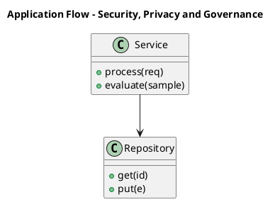

_Source diagram (plantuml); render with the appropriate tool._

**Figure 28. Application Flow - Security, Privacy and Governance** (plantuml). Figure: Application Flow view for Security, Privacy and Governance. This diagram illustrates the principal components and their interactions as discussed in the surrounding section.

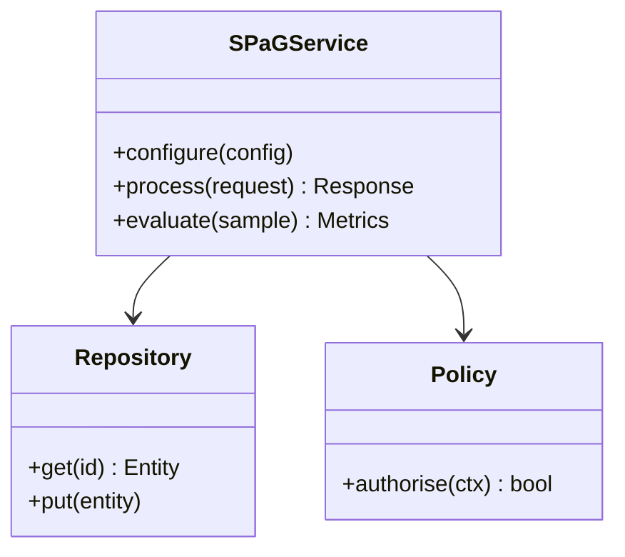

**Figure 29. Class - Security, Privacy and Governance** (mermaid). Figure: Class view for Security, Privacy and Governance. This diagram illustrates the principal components and their interactions as discussed in the surrounding section.

## Deep Dive: Mechanics, Variants and Trade-offs

Having established the essentials, we now go deeper into security, privacy and governance. Mechanically, the behaviour emerges from a few interacting parts that are simpler than the whole they produce. The distinctions in this section are the ones that separate a working demo from a system that holds up under adversarial inputs, scale and the passage of time.

Consider the principal variants and how to choose between them. Each variant optimises for a different point in the design space - some for latency, some for accuracy, some for cost or operability - and the correct choice follows from explicit requirements rather than from defaults. Latency, accuracy and cost form a tension triangle: improving one typically pressures the others, so explicit budgets are essential.

In practice this is supported by a mature tooling ecosystem, including LangChain, LlamaIndex, Haystack, RAGAS. Tools accelerate the work but do not substitute for understanding: the same principles apply whichever implementation you select, and the ability to reason from first principles is what lets you debug when a tool behaves unexpectedly.

A frequent source of subtle bugs is the interaction with operating rag in production. Because operating rag in production concerns monitoring retrieval quality, drift and feedback loops, changes there can silently alter the behaviour analysed here. The remedy is contract tests at the boundary and end-to-end evaluations that exercise the interaction explicitly.

Finally, attend to edge cases and degradation. Define what the system should do under partial failure, unexpected inputs and load spikes, and make that behaviour explicit and tested rather than emergent. Graceful degradation - returning a safe, useful result when the ideal one is unavailable - is a hallmark of mature engineering.

For deeper study, the literature offers authoritative treatments such as Lewis et al. — Retrieval-Augmented Generation (2020) and Gao et al. — Precise Zero-Shot Dense Retrieval (HyDE, 2022). These primary sources reward careful reading and ground the practical guidance above in established results.

## Advanced Considerations

Having established the essentials, we now go deeper into security, privacy and governance. Beneath the abstraction lies a concrete process whose steps can each be measured, tested and optimised independently. The distinctions in this section are the ones that separate a working demo from a system that holds up under adversarial inputs, scale and the passage of time.

Consider the principal variants and how to choose between them. Each variant optimises for a different point in the design space - some for latency, some for accuracy, some for cost or operability - and the correct choice follows from explicit requirements rather than from defaults. Every added component buys capability at the price of operational surface area, and that bargain should be made consciously.

In practice this is supported by a mature tooling ecosystem, including LangChain, LlamaIndex, Haystack, RAGAS. Tools accelerate the work but do not substitute for understanding: the same principles apply whichever implementation you select, and the ability to reason from first principles is what lets you debug when a tool behaves unexpectedly.

A frequent source of subtle bugs is the interaction with advanced rag patterns. Because advanced rag patterns concerns parent-document, sentence-window, fusion and agentic retrieval, changes there can silently alter the behaviour analysed here. The remedy is contract tests at the boundary and end-to-end evaluations that exercise the interaction explicitly.

Finally, attend to edge cases and degradation. Define what the system should do under partial failure, unexpected inputs and load spikes, and make that behaviour explicit and tested rather than emergent. Graceful degradation - returning a safe, useful result when the ideal one is unavailable - is a hallmark of mature engineering.

For deeper study, the literature offers authoritative treatments such as Lewis et al. — Retrieval-Augmented Generation (2020) and Gao et al. — Precise Zero-Shot Dense Retrieval (HyDE, 2022). These primary sources reward careful reading and ground the practical guidance above in established results.

## Worked Example

Consider a concrete scenario. A healthcare organisation needs clinical guideline assistants with provenance. They decide to apply security, privacy and governance as part of their RAG solution, but wisely treat it as a hypothesis to be validated rather than a foregone conclusion.

The team begins by stating the objective precisely and defining how success will be measured before writing any code. They establish a small but representative evaluation set, agree on acceptance thresholds, and only then prototype the simplest design that could work. Early measurement reveals which assumptions hold and which must be revised, saving weeks of misdirected effort and surfacing edge cases while they are still cheap to fix.

As the prototype matures into a service, the team hardens it: adding input validation, error handling, caching where it pays off, and monitoring that ties back to the original success metric. They document each significant decision in an architecture decision record so that future maintainers understand not just what was built but why.

The outcome is instructive. The system that reaches production is not the most sophisticated design the team considered, but the one whose behaviour they could measure, explain and operate. This is the recurring lesson of RAG: durable value comes from the whole system, not from any single clever component.

## Industry Use Cases

Across industries, the ideas in this chapter recur in recognisable ways. The following vignettes show how different sectors apply them and what they have in common.

**Enterprise.** Grounded internal Q&A over policies and wikis with citations. The common thread is that value comes not from the model alone but from the surrounding system - data quality, evaluation, integration and operations - which is precisely where most of the engineering effort belongs.

**Legal.** Case and contract research with traceable sources. The common thread is that value comes not from the model alone but from the surrounding system - data quality, evaluation, integration and operations - which is precisely where most of the engineering effort belongs.

**Healthcare.** Clinical guideline assistants with provenance. The common thread is that value comes not from the model alone but from the surrounding system - data quality, evaluation, integration and operations - which is precisely where most of the engineering effort belongs.

**Support.** Deflection bots grounded in current knowledge bases. The common thread is that value comes not from the model alone but from the surrounding system - data quality, evaluation, integration and operations - which is precisely where most of the engineering effort belongs.

## Best Practices

The following practices consistently separate successful RAG efforts from struggling ones. They are deliberately concrete so they can be adopted as checklist items in design and code review.

- Tune chunking to the corpus; measure its effect on retrieval metrics.
- Always cite sources and enable users to verify answers.
- Enforce access control at retrieval time, not just at the UI.
- Evaluate retrieval and generation separately to localise failures.

None of these are exotic; they are the unglamorous disciplines that compound into reliability. The cost of adopting them is small compared with the cost of the incidents they prevent, and they become second nature with practice.

## Common Pitfalls

Equally instructive are the failure modes that recur in practice. Each pitfall below has a clear early warning sign and a known remedy, so treat them as a diagnostic checklist when something feels wrong:

- Naive fixed-size chunking that splits semantic units.
- Stuffing too much context, increasing cost and diluting relevance.
- Ignoring permissions and leaking restricted documents.
- Measuring only end answer quality without diagnosing retrieval.

The pattern is consistent: most failures stem from skipping measurement, conflating prototype and production standards, or deferring cross-cutting concerns such as security and cost until they become emergencies. Naming these traps in advance is the cheapest way to avoid them.

## Governance, Security and Cost Notes

No discussion of security, privacy and governance is complete without its governance, security and cost dimensions, which are too often deferred until they become emergencies. Treating them as first-class concerns from the outset is both cheaper and safer.

**Governance.** Classify the risk of this capability, document its intended and out-of-scope uses, and ensure decisions are traceable to satisfy internal policy and external regulation such as the NIST AI RMF, ISO/IEC 42001 and the EU AI Act. **Security.** Treat all external input as untrusted, validate outputs before acting on them, apply least privilege to any tools or data access, and map controls to the OWASP LLM Top 10 and MITRE ATLAS.

**Cost and sustainability.** Establish explicit budgets for compute, tokens and latency, attribute spend to owners, and revisit the economics as usage scales - a design that is affordable at pilot scale can become untenable at production volume. Building these reflexes into everyday engineering is what allows a RAG system to be not only capable but also trustworthy and economically sound.

## Hands-On Exercises

Work through the following exercises. They are designed to move understanding from recognition to application - the level required for real engineering work - so prefer writing and building over merely reading.

1. Explain security, privacy and governance to a colleague unfamiliar with RAG, using a concrete example from your own domain.
2. Sketch a reference architecture that incorporates security, privacy and governance and annotate where observability, security and cost controls belong.
3. Design an evaluation that would tell you whether security, privacy and governance is working in production, including the metric, the dataset and the acceptance threshold.
4. Identify two pitfalls relevant to security, privacy and governance in your environment and describe the early warning signals you would monitor.
5. Prototype the simplest implementation that demonstrates security, privacy and governance, then list exactly what would need to change to make it production-ready.

## Key Takeaways

Key takeaways from this chapter:

- Security, Privacy and Governance is a systems concern in RAG: data, models and operations must be co-designed.
- Measurement is non-negotiable; define success metrics and evaluation before building.
- Favour the simplest design that meets the requirement, and add complexity only when evidence demands it.
- Security, cost and observability are first-class requirements, not afterthoughts.
- Document decisions so the system remains understandable and operable as it evolves.

## Code Walkthrough

Pipelines keep Security, Privacy and Governance logic modular and testable. Each stage is a pure function, errors are captured per item, and the composition is trivial to extend or reorder.

The full listing is shown below; study it line by line and reproduce it locally before moving on.

### Listing: A composable processing pipeline for Security, Privacy and Governance

```python
from collections.abc import Iterable, Iterator
from typing import Protocol


class Stage(Protocol):
    def __call__(self, item: dict) -> dict: ...


def pipeline(stages: list[Stage]) -> Stage:
    """Compose ordered stages into a single callable for Security, Privacy and Governance."""

    def run(item: dict) -> dict:
        for stage in stages:
            item = stage(item)
        return item

    return run


def validate(item: dict) -> dict:
    if "text" not in item:
        raise ValueError("missing required field: text")
    return item


def normalise(item: dict) -> dict:
    item["text"] = item["text"].strip().lower()
    return item


def enrich(item: dict) -> dict:
    item["length"] = len(item["text"])
    return item


process = pipeline([validate, normalise, enrich])


def run_batch(items: Iterable[dict]) -> Iterator[dict]:
    for item in items:
        try:
            yield process(dict(item))
        except ValueError as exc:
            yield {"error": str(exc), "item": item}

```

## Review Questions

1. In the context of RAG, which statement best describes “Security, Privacy and Governance”?
   - A. the security, privacy and governance controls that make a RAG system trustworthy and compliant
   - B. It guarantees deterministic output regardless of input.
   - C. It removes all security and governance requirements.
   - D. It is only relevant to academic research, not production.
   - **Answer: A.** Security, Privacy and Governance: the security, privacy and governance controls that make a RAG system trustworthy and compliant
2. Which of the following is a recommended best practice when working with RAG?
   - A. It makes the system slower but has no other effect.
   - B. Tune chunking to the corpus; measure its effect on retrieval metrics.
   - C. It is only relevant to academic research, not production.
   - D. It guarantees deterministic output regardless of input.
   - **Answer: B.** Best practice: Tune chunking to the corpus; measure its effect on retrieval metrics.
3. Which of the following is a common pitfall to avoid in RAG?
   - A. Measuring only end answer quality without diagnosing retrieval.
   - B. It eliminates the need for any evaluation or monitoring.
   - C. Evaluate retrieval and generation separately to localise failures.
   - D. Always cite sources and enable users to verify answers.
   - **Answer: A.** Pitfall to avoid: Measuring only end answer quality without diagnosing retrieval.
4. *(Discussion)* Describe a failure mode of Security, Privacy and Governance and how you would mitigate it.
   - **Model answer:** A strong answer defines security, privacy and governance (the security, privacy and governance controls that make a RAG system trustworthy and compliant) then connects it to architecture, evaluation, cost, security and operations for RAG, citing concrete trade-offs and a real-world example.

---


# Chapter 21. Cost, Performance and Scaling

_This chapter examines cost, performance and scaling within RAG. It covers techniques for controlling cost and latency while scaling a RAG system to production traffic, derives a reference architecture, walks through a worked example and runnable code, surveys industry use cases, and distils best practices and pitfalls, closing with exercises and review questions._

## Introduction

Formally, Cost, Performance and Scaling addresses techniques for controlling cost and latency while scaling a RAG system to production traffic. This concept recurs throughout the RAG lifecycle, from design to operations. What distinguishes a production-grade approach from a prototype is the discipline of measurement: every claim is backed by an evaluation rather than intuition.

This chapter builds intuition first, then formalises the ideas, derives an architecture, and finishes with code, exercises and review questions so the material transfers directly to your own RAG work. Read it actively: pause at each diagram, reproduce the code, and attempt the exercises before consulting the answers.

## Theory and Foundations

Cost, Performance and Scaling can be characterised as techniques for controlling cost and latency while scaling a RAG system to production traffic. What distinguishes a production-grade approach from a prototype is the discipline of measurement: every claim is backed by an evaluation rather than intuition. Mechanically, the behaviour emerges from a few interacting parts that are simpler than the whole they produce.

To place this in context, recall the broader picture: Retrieval-augmented generation grounds a language model in external knowledge by retrieving relevant context at query time and conditioning generation on it. Within that picture, cost, performance and scaling is one of the load-bearing ideas - the kind that, when understood deeply, makes the rest of RAG fall into place. Teams that master this consistently ship more reliable RAG systems at lower cost.

Cost, Performance and Scaling cannot be understood in isolation from the end-to-end rag reference architecture. Recall that the end-to-end rag reference architecture concerns a production blueprint from ingestion to answer. The two interact directly: decisions in one constrain the design space of the other, which is why mature teams reason about them together rather than sequentially. Simplicity is a feature. The simplest design that meets the requirement should be the default, with complexity added only when measurement justifies it.

Cost, Performance and Scaling cannot be understood in isolation from caching and cost optimisation. Recall that caching and cost optimisation concerns semantic caching and retrieval reuse. The two interact directly: decisions in one constrain the design space of the other, which is why mature teams reason about them together rather than sequentially. Simplicity is a feature. The simplest design that meets the requirement should be the default, with complexity added only when measurement justifies it.

Several established patterns apply directly to cost, performance and scaling. The first, cross-encoder re-ranking of top-k candidates, is widely adopted because it makes the system's behaviour predictable and observable. A complementary pattern, hybrid retrieval with reciprocal rank fusion, addresses a related concern and is often deployed alongside it. Patterns are not dogma; they are distilled experience that shortcuts the search for a sound design, and each carries assumptions worth checking against your context.

It is worth being explicit about when to apply this and when to reach for something simpler. In a small prototype, shortcuts around cost, performance and scaling are invisible; in a production RAG system serving real traffic, they surface as incidents, cost overruns or compliance gaps. There is an inherent trade-off between fidelity and cost, and the correct balance depends on the use case and its tolerance for error. The remainder of this chapter turns these principles into an architecture, code and a checklist you can apply immediately.

## Architecture and Design

From an architectural standpoint, Cost, Performance and Scaling sits at the intersection of data, models and operations. A RAG system has an offline ingestion pipeline (parse → chunk → embed → index) and an online query pipeline (query transform → hybrid retrieve → re-rank → assemble prompt → generate → cite). Access control filters retrieval by user permissions, and an evaluation service continuously scores faithfulness and relevance on sampled traffic.

Concretely, the principal building blocks include why rag: grounding and freshness, document ingestion and chunking, embedding and indexing strategy, retrieval and query transformation and re-ranking and context selection. Each is a replaceable component behind a stable interface, so the team can upgrade an implementation - a model, an index, a policy engine - without rewriting its neighbours. The contracts between components are where reliability is won or lost, so they are specified explicitly and tested in isolation.

The diagram accompanying this section makes the data and control flow explicit. Requests enter through a well-defined boundary where they are authenticated and validated; only then are they dispatched to the components that perform the work. This boundary is also where rate limiting, quota enforcement and audit logging live, keeping cross-cutting concerns out of the core logic and in one auditable place.

Two qualities deserve emphasis. First, observability is designed in, not bolted on: every component emits structured telemetry so that failures can be localised in minutes rather than hours. Second, the architecture is evolvable - components communicate through stable contracts so that any single part of the RAG system can be replaced without a rewrite. Latency, accuracy and cost form a tension triangle: improving one typically pressures the others, so explicit budgets are essential.

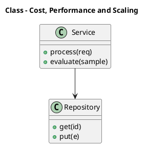

_Source diagram (plantuml); render with the appropriate tool._

**Figure 30. Class - Cost, Performance and Scaling** (plantuml). Figure: Class view for Cost, Performance and Scaling. This diagram illustrates the principal components and their interactions as discussed in the surrounding section.

## Deep Dive: Mechanics, Variants and Trade-offs

Having established the essentials, we now go deeper into cost, performance and scaling. Mechanically, the behaviour emerges from a few interacting parts that are simpler than the whole they produce. The distinctions in this section are the ones that separate a working demo from a system that holds up under adversarial inputs, scale and the passage of time.

Consider the principal variants and how to choose between them. Each variant optimises for a different point in the design space - some for latency, some for accuracy, some for cost or operability - and the correct choice follows from explicit requirements rather than from defaults. Latency, accuracy and cost form a tension triangle: improving one typically pressures the others, so explicit budgets are essential.

In practice this is supported by a mature tooling ecosystem, including LangChain, LlamaIndex, Haystack, RAGAS. Tools accelerate the work but do not substitute for understanding: the same principles apply whichever implementation you select, and the ability to reason from first principles is what lets you debug when a tool behaves unexpectedly.

A frequent source of subtle bugs is the interaction with the end-to-end rag reference architecture. Because the end-to-end rag reference architecture concerns a production blueprint from ingestion to answer, changes there can silently alter the behaviour analysed here. The remedy is contract tests at the boundary and end-to-end evaluations that exercise the interaction explicitly.

Finally, attend to edge cases and degradation. Define what the system should do under partial failure, unexpected inputs and load spikes, and make that behaviour explicit and tested rather than emergent. Graceful degradation - returning a safe, useful result when the ideal one is unavailable - is a hallmark of mature engineering.

For deeper study, the literature offers authoritative treatments such as Lewis et al. — Retrieval-Augmented Generation (2020) and Gao et al. — Precise Zero-Shot Dense Retrieval (HyDE, 2022). These primary sources reward careful reading and ground the practical guidance above in established results.

## Advanced Considerations

Having established the essentials, we now go deeper into cost, performance and scaling. Beneath the abstraction lies a concrete process whose steps can each be measured, tested and optimised independently. The distinctions in this section are the ones that separate a working demo from a system that holds up under adversarial inputs, scale and the passage of time.

Consider the principal variants and how to choose between them. Each variant optimises for a different point in the design space - some for latency, some for accuracy, some for cost or operability - and the correct choice follows from explicit requirements rather than from defaults. Simplicity is a feature. The simplest design that meets the requirement should be the default, with complexity added only when measurement justifies it.

In practice this is supported by a mature tooling ecosystem, including LangChain, LlamaIndex, Haystack, RAGAS. Tools accelerate the work but do not substitute for understanding: the same principles apply whichever implementation you select, and the ability to reason from first principles is what lets you debug when a tool behaves unexpectedly.

A frequent source of subtle bugs is the interaction with document ingestion and chunking. Because document ingestion and chunking concerns parsing, semantic chunking, overlap and metadata extraction, changes there can silently alter the behaviour analysed here. The remedy is contract tests at the boundary and end-to-end evaluations that exercise the interaction explicitly.

Finally, attend to edge cases and degradation. Define what the system should do under partial failure, unexpected inputs and load spikes, and make that behaviour explicit and tested rather than emergent. Graceful degradation - returning a safe, useful result when the ideal one is unavailable - is a hallmark of mature engineering.

For deeper study, the literature offers authoritative treatments such as Lewis et al. — Retrieval-Augmented Generation (2020) and Gao et al. — Precise Zero-Shot Dense Retrieval (HyDE, 2022). These primary sources reward careful reading and ground the practical guidance above in established results.

## Worked Example

Consider a concrete scenario. A legal organisation needs case and contract research with traceable sources. They decide to apply cost, performance and scaling as part of their RAG solution, but wisely treat it as a hypothesis to be validated rather than a foregone conclusion.

The team begins by stating the objective precisely and defining how success will be measured before writing any code. They establish a small but representative evaluation set, agree on acceptance thresholds, and only then prototype the simplest design that could work. Early measurement reveals which assumptions hold and which must be revised, saving weeks of misdirected effort and surfacing edge cases while they are still cheap to fix.

As the prototype matures into a service, the team hardens it: adding input validation, error handling, caching where it pays off, and monitoring that ties back to the original success metric. They document each significant decision in an architecture decision record so that future maintainers understand not just what was built but why.

The outcome is instructive. The system that reaches production is not the most sophisticated design the team considered, but the one whose behaviour they could measure, explain and operate. This is the recurring lesson of RAG: durable value comes from the whole system, not from any single clever component.

## Industry Use Cases

Across industries, the ideas in this chapter recur in recognisable ways. The following vignettes show how different sectors apply them and what they have in common.

**Enterprise.** Grounded internal Q&A over policies and wikis with citations. The common thread is that value comes not from the model alone but from the surrounding system - data quality, evaluation, integration and operations - which is precisely where most of the engineering effort belongs.

**Legal.** Case and contract research with traceable sources. The common thread is that value comes not from the model alone but from the surrounding system - data quality, evaluation, integration and operations - which is precisely where most of the engineering effort belongs.

**Healthcare.** Clinical guideline assistants with provenance. The common thread is that value comes not from the model alone but from the surrounding system - data quality, evaluation, integration and operations - which is precisely where most of the engineering effort belongs.

**Support.** Deflection bots grounded in current knowledge bases. The common thread is that value comes not from the model alone but from the surrounding system - data quality, evaluation, integration and operations - which is precisely where most of the engineering effort belongs.

## Best Practices

The following practices consistently separate successful RAG efforts from struggling ones. They are deliberately concrete so they can be adopted as checklist items in design and code review.

- Tune chunking to the corpus; measure its effect on retrieval metrics.
- Always cite sources and enable users to verify answers.
- Enforce access control at retrieval time, not just at the UI.
- Evaluate retrieval and generation separately to localise failures.

None of these are exotic; they are the unglamorous disciplines that compound into reliability. The cost of adopting them is small compared with the cost of the incidents they prevent, and they become second nature with practice.

## Common Pitfalls

Equally instructive are the failure modes that recur in practice. Each pitfall below has a clear early warning sign and a known remedy, so treat them as a diagnostic checklist when something feels wrong:

- Naive fixed-size chunking that splits semantic units.
- Stuffing too much context, increasing cost and diluting relevance.
- Ignoring permissions and leaking restricted documents.
- Measuring only end answer quality without diagnosing retrieval.

The pattern is consistent: most failures stem from skipping measurement, conflating prototype and production standards, or deferring cross-cutting concerns such as security and cost until they become emergencies. Naming these traps in advance is the cheapest way to avoid them.

## Governance, Security and Cost Notes

No discussion of cost, performance and scaling is complete without its governance, security and cost dimensions, which are too often deferred until they become emergencies. Treating them as first-class concerns from the outset is both cheaper and safer.

**Governance.** Classify the risk of this capability, document its intended and out-of-scope uses, and ensure decisions are traceable to satisfy internal policy and external regulation such as the NIST AI RMF, ISO/IEC 42001 and the EU AI Act. **Security.** Treat all external input as untrusted, validate outputs before acting on them, apply least privilege to any tools or data access, and map controls to the OWASP LLM Top 10 and MITRE ATLAS.

**Cost and sustainability.** Establish explicit budgets for compute, tokens and latency, attribute spend to owners, and revisit the economics as usage scales - a design that is affordable at pilot scale can become untenable at production volume. Building these reflexes into everyday engineering is what allows a RAG system to be not only capable but also trustworthy and economically sound.

## Hands-On Exercises

Work through the following exercises. They are designed to move understanding from recognition to application - the level required for real engineering work - so prefer writing and building over merely reading.

1. Explain cost, performance and scaling to a colleague unfamiliar with RAG, using a concrete example from your own domain.
2. Sketch a reference architecture that incorporates cost, performance and scaling and annotate where observability, security and cost controls belong.
3. Design an evaluation that would tell you whether cost, performance and scaling is working in production, including the metric, the dataset and the acceptance threshold.
4. Identify two pitfalls relevant to cost, performance and scaling in your environment and describe the early warning signals you would monitor.
5. Prototype the simplest implementation that demonstrates cost, performance and scaling, then list exactly what would need to change to make it production-ready.

## Key Takeaways

Key takeaways from this chapter:

- Cost, Performance and Scaling is a systems concern in RAG: data, models and operations must be co-designed.
- Measurement is non-negotiable; define success metrics and evaluation before building.
- Favour the simplest design that meets the requirement, and add complexity only when evidence demands it.
- Security, cost and observability are first-class requirements, not afterthoughts.
- Document decisions so the system remains understandable and operable as it evolves.

## Code Walkthrough

Every change to a RAG system should pass an evaluation gate. This example shows the minimal shape: align predictions and references, compute a metric, and return a pass/fail decision for CI.

The full listing is shown below; study it line by line and reproduce it locally before moving on.

### Listing: Evaluating Cost, Performance and Scaling with a regression gate

```python
from dataclasses import dataclass


@dataclass
class EvalResult:
    metric: str
    score: float
    passed: bool


def evaluate(predictions: list[str], references: list[str],
             threshold: float = 0.8) -> EvalResult:
    """Score Cost, Performance and Scaling output against references with a simple exact-match metric.

    In practice you would combine several metrics (exact match, semantic
    similarity, LLM-as-judge) and gate releases on the aggregate.
    """
    if len(predictions) != len(references):
        raise ValueError("predictions and references must align")
    hits = sum(p.strip() == r.strip() for p, r in zip(predictions, references))
    score = hits / len(references) if references else 0.0
    return EvalResult(metric="exact_match", score=score, passed=score >= threshold)


if __name__ == "__main__":
    result = evaluate(["yes", "no"], ["yes", "yes"])
    print(f"{result.metric}={result.score:.2f} passed={result.passed}")

```

## Review Questions

1. In the context of RAG, which statement best describes “Cost, Performance and Scaling”?
   - A. It is only relevant to academic research, not production.
   - B. techniques for controlling cost and latency while scaling a RAG system to production traffic
   - C. It removes all security and governance requirements.
   - D. It makes the system slower but has no other effect.
   - **Answer: B.** Cost, Performance and Scaling: techniques for controlling cost and latency while scaling a RAG system to production traffic
2. Which of the following is a recommended best practice when working with RAG?
   - A. Measuring only end answer quality without diagnosing retrieval.
   - B. Enforce access control at retrieval time, not just at the UI.
   - C. It is only relevant to academic research, not production.
   - D. It applies exclusively to image data.
   - **Answer: B.** Best practice: Enforce access control at retrieval time, not just at the UI.
3. Which of the following is a common pitfall to avoid in RAG?
   - A. It removes all security and governance requirements.
   - B. It guarantees deterministic output regardless of input.
   - C. Measuring only end answer quality without diagnosing retrieval.
   - D. Enforce access control at retrieval time, not just at the UI.
   - **Answer: C.** Pitfall to avoid: Measuring only end answer quality without diagnosing retrieval.
4. *(Discussion)* How does Cost, Performance and Scaling interact with security and governance requirements?
   - **Model answer:** A strong answer defines cost, performance and scaling (techniques for controlling cost and latency while scaling a RAG system to production traffic) then connects it to architecture, evaluation, cost, security and operations for RAG, citing concrete trade-offs and a real-world example.

---


# Chapter 22. Integration and Interoperability

_This chapter examines integration and interoperability within RAG. It covers patterns for integrating a RAG system with surrounding enterprise systems and data, derives a reference architecture, walks through a worked example and runnable code, surveys industry use cases, and distils best practices and pitfalls, closing with exercises and review questions._

## Introduction

Integration and Interoperability can be characterised as patterns for integrating a RAG system with surrounding enterprise systems and data. It is foundational: later capabilities in RAG are built directly on top of it. The practical implication is that design choices here ripple through latency, cost and maintainability for the lifetime of the system.

This chapter builds intuition first, then formalises the ideas, derives an architecture, and finishes with code, exercises and review questions so the material transfers directly to your own RAG work. Read it actively: pause at each diagram, reproduce the code, and attempt the exercises before consulting the answers.

## Theory and Foundations

At its core, Integration and Interoperability concerns patterns for integrating a RAG system with surrounding enterprise systems and data. It helps to separate the conceptual model from its implementation: the former guides reasoning, the latter must contend with real-world constraints. Beneath the abstraction lies a concrete process whose steps can each be measured, tested and optimised independently.

To place this in context, recall the broader picture: Retrieval-augmented generation grounds a language model in external knowledge by retrieving relevant context at query time and conditioning generation on it. Within that picture, integration and interoperability is one of the load-bearing ideas - the kind that, when understood deeply, makes the rest of RAG fall into place. Getting this right early prevents expensive rework once a RAG system reaches scale.

Integration and Interoperability cannot be understood in isolation from re-ranking and context selection. Recall that re-ranking and context selection concerns cross-encoders, maximal marginal relevance and context budgeting. The two interact directly: decisions in one constrain the design space of the other, which is why mature teams reason about them together rather than sequentially. Every added component buys capability at the price of operational surface area, and that bargain should be made consciously.

Integration and Interoperability cannot be understood in isolation from advanced rag patterns. Recall that advanced rag patterns concerns parent-document, sentence-window, fusion and agentic retrieval. The two interact directly: decisions in one constrain the design space of the other, which is why mature teams reason about them together rather than sequentially. There is an inherent trade-off between fidelity and cost, and the correct balance depends on the use case and its tolerance for error.

Several established patterns apply directly to integration and interoperability. The first, hybrid retrieval with reciprocal rank fusion, is widely adopted because it makes the system's behaviour predictable and observable. A complementary pattern, refuse-or-clarify when retrieval confidence is low, addresses a related concern and is often deployed alongside it. Patterns are not dogma; they are distilled experience that shortcuts the search for a sound design, and each carries assumptions worth checking against your context.

Knowing when not to use a technique is as valuable as knowing how to use it. In a small prototype, shortcuts around integration and interoperability are invisible; in a production RAG system serving real traffic, they surface as incidents, cost overruns or compliance gaps. Latency, accuracy and cost form a tension triangle: improving one typically pressures the others, so explicit budgets are essential. The remainder of this chapter turns these principles into an architecture, code and a checklist you can apply immediately.

## Architecture and Design

A robust architecture for Integration and Interoperability is layered so each part can evolve independently without destabilising the whole. A RAG system has an offline ingestion pipeline (parse → chunk → embed → index) and an online query pipeline (query transform → hybrid retrieve → re-rank → assemble prompt → generate → cite). Access control filters retrieval by user permissions, and an evaluation service continuously scores faithfulness and relevance on sampled traffic.

Concretely, the principal building blocks include why rag: grounding and freshness, document ingestion and chunking, embedding and indexing strategy, retrieval and query transformation and re-ranking and context selection. Each is a replaceable component behind a stable interface, so the team can upgrade an implementation - a model, an index, a policy engine - without rewriting its neighbours. The contracts between components are where reliability is won or lost, so they are specified explicitly and tested in isolation.

The diagram accompanying this section makes the data and control flow explicit. Requests enter through a well-defined boundary where they are authenticated and validated; only then are they dispatched to the components that perform the work. This boundary is also where rate limiting, quota enforcement and audit logging live, keeping cross-cutting concerns out of the core logic and in one auditable place.

Two qualities deserve emphasis. First, observability is designed in, not bolted on: every component emits structured telemetry so that failures can be localised in minutes rather than hours. Second, the architecture is evolvable - components communicate through stable contracts so that any single part of the RAG system can be replaced without a rewrite. Latency, accuracy and cost form a tension triangle: improving one typically pressures the others, so explicit budgets are essential.

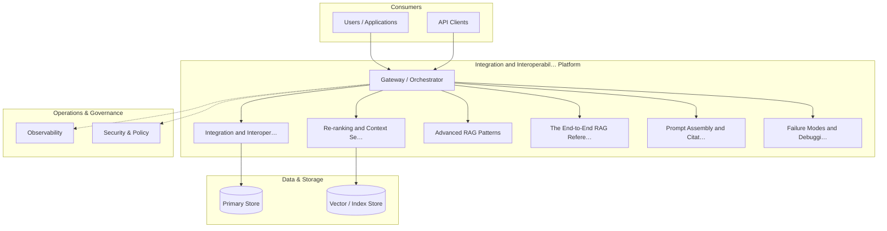

**Figure 31. Agent Architecture - Integration and Interoperability** (mermaid). Figure: Agent Architecture view for Integration and Interoperability. This diagram illustrates the principal components and their interactions as discussed in the surrounding section.

## Deep Dive: Mechanics, Variants and Trade-offs

Having established the essentials, we now go deeper into integration and interoperability. Mechanically, the behaviour emerges from a few interacting parts that are simpler than the whole they produce. The distinctions in this section are the ones that separate a working demo from a system that holds up under adversarial inputs, scale and the passage of time.

Consider the principal variants and how to choose between them. Each variant optimises for a different point in the design space - some for latency, some for accuracy, some for cost or operability - and the correct choice follows from explicit requirements rather than from defaults. Latency, accuracy and cost form a tension triangle: improving one typically pressures the others, so explicit budgets are essential.

In practice this is supported by a mature tooling ecosystem, including LangChain, LlamaIndex, Haystack, RAGAS. Tools accelerate the work but do not substitute for understanding: the same principles apply whichever implementation you select, and the ability to reason from first principles is what lets you debug when a tool behaves unexpectedly.

A frequent source of subtle bugs is the interaction with re-ranking and context selection. Because re-ranking and context selection concerns cross-encoders, maximal marginal relevance and context budgeting, changes there can silently alter the behaviour analysed here. The remedy is contract tests at the boundary and end-to-end evaluations that exercise the interaction explicitly.

Finally, attend to edge cases and degradation. Define what the system should do under partial failure, unexpected inputs and load spikes, and make that behaviour explicit and tested rather than emergent. Graceful degradation - returning a safe, useful result when the ideal one is unavailable - is a hallmark of mature engineering.

For deeper study, the literature offers authoritative treatments such as Lewis et al. — Retrieval-Augmented Generation (2020) and Gao et al. — Precise Zero-Shot Dense Retrieval (HyDE, 2022). These primary sources reward careful reading and ground the practical guidance above in established results.

## Advanced Considerations

Having established the essentials, we now go deeper into integration and interoperability. Mechanically, the behaviour emerges from a few interacting parts that are simpler than the whole they produce. The distinctions in this section are the ones that separate a working demo from a system that holds up under adversarial inputs, scale and the passage of time.

Consider the principal variants and how to choose between them. Each variant optimises for a different point in the design space - some for latency, some for accuracy, some for cost or operability - and the correct choice follows from explicit requirements rather than from defaults. There is an inherent trade-off between fidelity and cost, and the correct balance depends on the use case and its tolerance for error.

In practice this is supported by a mature tooling ecosystem, including LangChain, LlamaIndex, Haystack, RAGAS. Tools accelerate the work but do not substitute for understanding: the same principles apply whichever implementation you select, and the ability to reason from first principles is what lets you debug when a tool behaves unexpectedly.

A frequent source of subtle bugs is the interaction with retrieval and query transformation. Because retrieval and query transformation concerns query rewriting, HyDE, multi-query and hybrid search, changes there can silently alter the behaviour analysed here. The remedy is contract tests at the boundary and end-to-end evaluations that exercise the interaction explicitly.

Finally, attend to edge cases and degradation. Define what the system should do under partial failure, unexpected inputs and load spikes, and make that behaviour explicit and tested rather than emergent. Graceful degradation - returning a safe, useful result when the ideal one is unavailable - is a hallmark of mature engineering.

For deeper study, the literature offers authoritative treatments such as Lewis et al. — Retrieval-Augmented Generation (2020) and Gao et al. — Precise Zero-Shot Dense Retrieval (HyDE, 2022). These primary sources reward careful reading and ground the practical guidance above in established results.

## Worked Example

Consider a concrete scenario. A enterprise organisation needs grounded internal Q&A over policies and wikis with citations. They decide to apply integration and interoperability as part of their RAG solution, but wisely treat it as a hypothesis to be validated rather than a foregone conclusion.

The team begins by stating the objective precisely and defining how success will be measured before writing any code. They establish a small but representative evaluation set, agree on acceptance thresholds, and only then prototype the simplest design that could work. Early measurement reveals which assumptions hold and which must be revised, saving weeks of misdirected effort and surfacing edge cases while they are still cheap to fix.

As the prototype matures into a service, the team hardens it: adding input validation, error handling, caching where it pays off, and monitoring that ties back to the original success metric. They document each significant decision in an architecture decision record so that future maintainers understand not just what was built but why.

The outcome is instructive. The system that reaches production is not the most sophisticated design the team considered, but the one whose behaviour they could measure, explain and operate. This is the recurring lesson of RAG: durable value comes from the whole system, not from any single clever component.

## Industry Use Cases

Across industries, the ideas in this chapter recur in recognisable ways. The following vignettes show how different sectors apply them and what they have in common.

**Enterprise.** Grounded internal Q&A over policies and wikis with citations. The common thread is that value comes not from the model alone but from the surrounding system - data quality, evaluation, integration and operations - which is precisely where most of the engineering effort belongs.

**Legal.** Case and contract research with traceable sources. The common thread is that value comes not from the model alone but from the surrounding system - data quality, evaluation, integration and operations - which is precisely where most of the engineering effort belongs.

**Healthcare.** Clinical guideline assistants with provenance. The common thread is that value comes not from the model alone but from the surrounding system - data quality, evaluation, integration and operations - which is precisely where most of the engineering effort belongs.

**Support.** Deflection bots grounded in current knowledge bases. The common thread is that value comes not from the model alone but from the surrounding system - data quality, evaluation, integration and operations - which is precisely where most of the engineering effort belongs.

## Best Practices

The following practices consistently separate successful RAG efforts from struggling ones. They are deliberately concrete so they can be adopted as checklist items in design and code review.

- Tune chunking to the corpus; measure its effect on retrieval metrics.
- Always cite sources and enable users to verify answers.
- Enforce access control at retrieval time, not just at the UI.
- Evaluate retrieval and generation separately to localise failures.

None of these are exotic; they are the unglamorous disciplines that compound into reliability. The cost of adopting them is small compared with the cost of the incidents they prevent, and they become second nature with practice.

## Common Pitfalls

Equally instructive are the failure modes that recur in practice. Each pitfall below has a clear early warning sign and a known remedy, so treat them as a diagnostic checklist when something feels wrong:

- Naive fixed-size chunking that splits semantic units.
- Stuffing too much context, increasing cost and diluting relevance.
- Ignoring permissions and leaking restricted documents.
- Measuring only end answer quality without diagnosing retrieval.

The pattern is consistent: most failures stem from skipping measurement, conflating prototype and production standards, or deferring cross-cutting concerns such as security and cost until they become emergencies. Naming these traps in advance is the cheapest way to avoid them.

## Governance, Security and Cost Notes

No discussion of integration and interoperability is complete without its governance, security and cost dimensions, which are too often deferred until they become emergencies. Treating them as first-class concerns from the outset is both cheaper and safer.

**Governance.** Classify the risk of this capability, document its intended and out-of-scope uses, and ensure decisions are traceable to satisfy internal policy and external regulation such as the NIST AI RMF, ISO/IEC 42001 and the EU AI Act. **Security.** Treat all external input as untrusted, validate outputs before acting on them, apply least privilege to any tools or data access, and map controls to the OWASP LLM Top 10 and MITRE ATLAS.

**Cost and sustainability.** Establish explicit budgets for compute, tokens and latency, attribute spend to owners, and revisit the economics as usage scales - a design that is affordable at pilot scale can become untenable at production volume. Building these reflexes into everyday engineering is what allows a RAG system to be not only capable but also trustworthy and economically sound.

## Hands-On Exercises

Work through the following exercises. They are designed to move understanding from recognition to application - the level required for real engineering work - so prefer writing and building over merely reading.

1. Explain integration and interoperability to a colleague unfamiliar with RAG, using a concrete example from your own domain.
2. Sketch a reference architecture that incorporates integration and interoperability and annotate where observability, security and cost controls belong.
3. Design an evaluation that would tell you whether integration and interoperability is working in production, including the metric, the dataset and the acceptance threshold.
4. Identify two pitfalls relevant to integration and interoperability in your environment and describe the early warning signals you would monitor.
5. Prototype the simplest implementation that demonstrates integration and interoperability, then list exactly what would need to change to make it production-ready.

## Key Takeaways

Key takeaways from this chapter:

- Integration and Interoperability is a systems concern in RAG: data, models and operations must be co-designed.
- Measurement is non-negotiable; define success metrics and evaluation before building.
- Favour the simplest design that meets the requirement, and add complexity only when evidence demands it.
- Security, cost and observability are first-class requirements, not afterthoughts.
- Document decisions so the system remains understandable and operable as it evolves.

## Code Walkthrough

Every change to a RAG system should pass an evaluation gate. This example shows the minimal shape: align predictions and references, compute a metric, and return a pass/fail decision for CI.

The full listing is shown below; study it line by line and reproduce it locally before moving on.

### Listing: Evaluating Integration and Interoperability with a regression gate

```python
from dataclasses import dataclass


@dataclass
class EvalResult:
    metric: str
    score: float
    passed: bool


def evaluate(predictions: list[str], references: list[str],
             threshold: float = 0.8) -> EvalResult:
    """Score Integration and Interoperability output against references with a simple exact-match metric.

    In practice you would combine several metrics (exact match, semantic
    similarity, LLM-as-judge) and gate releases on the aggregate.
    """
    if len(predictions) != len(references):
        raise ValueError("predictions and references must align")
    hits = sum(p.strip() == r.strip() for p, r in zip(predictions, references))
    score = hits / len(references) if references else 0.0
    return EvalResult(metric="exact_match", score=score, passed=score >= threshold)


if __name__ == "__main__":
    result = evaluate(["yes", "no"], ["yes", "yes"])
    print(f"{result.metric}={result.score:.2f} passed={result.passed}")

```

## Review Questions

1. In the context of RAG, which statement best describes “Integration and Interoperability”?
   - A. It is only relevant to academic research, not production.
   - B. patterns for integrating a RAG system with surrounding enterprise systems and data
   - C. It makes the system slower but has no other effect.
   - D. It removes all security and governance requirements.
   - **Answer: B.** Integration and Interoperability: patterns for integrating a RAG system with surrounding enterprise systems and data
2. Which of the following is a recommended best practice when working with RAG?
   - A. It applies exclusively to image data.
   - B. Naive fixed-size chunking that splits semantic units.
   - C. Always cite sources and enable users to verify answers.
   - D. It eliminates the need for any evaluation or monitoring.
   - **Answer: C.** Best practice: Always cite sources and enable users to verify answers.
3. Which of the following is a common pitfall to avoid in RAG?
   - A. Measuring only end answer quality without diagnosing retrieval.
   - B. It removes all security and governance requirements.
   - C. Always cite sources and enable users to verify answers.
   - D. It makes the system slower but has no other effect.
   - **Answer: A.** Pitfall to avoid: Measuring only end answer quality without diagnosing retrieval.
4. *(Discussion)* How does Integration and Interoperability interact with security and governance requirements?
   - **Model answer:** A strong answer defines integration and interoperability (patterns for integrating a RAG system with surrounding enterprise systems and data) then connects it to architecture, evaluation, cost, security and operations for RAG, citing concrete trade-offs and a real-world example.

---


# Chapter 23. Trends and Research Directions

_This chapter examines trends and research directions within RAG. It covers emerging trends, open problems and research directions shaping the future of RAG, derives a reference architecture, walks through a worked example and runnable code, surveys industry use cases, and distils best practices and pitfalls, closing with exercises and review questions._

## Introduction

Trends and Research Directions refers to emerging trends, open problems and research directions shaping the future of RAG. This concept recurs throughout the RAG lifecycle, from design to operations. The right abstraction here pays compounding dividends, because downstream components depend on its guarantees.

This chapter builds intuition first, then formalises the ideas, derives an architecture, and finishes with code, exercises and review questions so the material transfers directly to your own RAG work. Read it actively: pause at each diagram, reproduce the code, and attempt the exercises before consulting the answers.

## Theory and Foundations

Formally, Trends and Research Directions addresses emerging trends, open problems and research directions shaping the future of RAG. It helps to separate the conceptual model from its implementation: the former guides reasoning, the latter must contend with real-world constraints. Beneath the abstraction lies a concrete process whose steps can each be measured, tested and optimised independently.

To place this in context, recall the broader picture: Retrieval-augmented generation grounds a language model in external knowledge by retrieving relevant context at query time and conditioning generation on it. Within that picture, trends and research directions is one of the load-bearing ideas - the kind that, when understood deeply, makes the rest of RAG fall into place. It is foundational: later capabilities in RAG are built directly on top of it.

Trends and Research Directions cannot be understood in isolation from prompt assembly and citation. Recall that prompt assembly and citation concerns grounding instructions, source attribution and refusal on low confidence. The two interact directly: decisions in one constrain the design space of the other, which is why mature teams reason about them together rather than sequentially. There is an inherent trade-off between fidelity and cost, and the correct balance depends on the use case and its tolerance for error.

Trends and Research Directions cannot be understood in isolation from retrieval and query transformation. Recall that retrieval and query transformation concerns query rewriting, HyDE, multi-query and hybrid search. The two interact directly: decisions in one constrain the design space of the other, which is why mature teams reason about them together rather than sequentially. There is an inherent trade-off between fidelity and cost, and the correct balance depends on the use case and its tolerance for error.

Several established patterns apply directly to trends and research directions. The first, hybrid retrieval with reciprocal rank fusion, is widely adopted because it makes the system's behaviour predictable and observable. A complementary pattern, parent-document retrieval for precise chunks with broad context, addresses a related concern and is often deployed alongside it. Patterns are not dogma; they are distilled experience that shortcuts the search for a sound design, and each carries assumptions worth checking against your context.

It is worth being explicit about when to apply this and when to reach for something simpler. In a small prototype, shortcuts around trends and research directions are invisible; in a production RAG system serving real traffic, they surface as incidents, cost overruns or compliance gaps. Simplicity is a feature. The simplest design that meets the requirement should be the default, with complexity added only when measurement justifies it. The remainder of this chapter turns these principles into an architecture, code and a checklist you can apply immediately.

## Architecture and Design

A robust architecture for Trends and Research Directions is layered so each part can evolve independently without destabilising the whole. A RAG system has an offline ingestion pipeline (parse → chunk → embed → index) and an online query pipeline (query transform → hybrid retrieve → re-rank → assemble prompt → generate → cite). Access control filters retrieval by user permissions, and an evaluation service continuously scores faithfulness and relevance on sampled traffic.

Concretely, the principal building blocks include why rag: grounding and freshness, document ingestion and chunking, embedding and indexing strategy, retrieval and query transformation and re-ranking and context selection. Each is a replaceable component behind a stable interface, so the team can upgrade an implementation - a model, an index, a policy engine - without rewriting its neighbours. The contracts between components are where reliability is won or lost, so they are specified explicitly and tested in isolation.

The diagram accompanying this section makes the data and control flow explicit. Requests enter through a well-defined boundary where they are authenticated and validated; only then are they dispatched to the components that perform the work. This boundary is also where rate limiting, quota enforcement and audit logging live, keeping cross-cutting concerns out of the core logic and in one auditable place.

Two qualities deserve emphasis. First, observability is designed in, not bolted on: every component emits structured telemetry so that failures can be localised in minutes rather than hours. Second, the architecture is evolvable - components communicate through stable contracts so that any single part of the RAG system can be replaced without a rewrite. There is an inherent trade-off between fidelity and cost, and the correct balance depends on the use case and its tolerance for error.

```xml
<mxfile host="ai-university">
  <diagram name="Data Flow">
    <mxGraphModel dx="800" dy="600" grid="1" gridSize="10">
      <root>
        <mxCell id="0"/>
        <mxCell id="1" parent="0"/>
        <mxCell id="title" value="Data Flow - Trends and Research Directions" style="text;fontSize=16;fontStyle=1" vertex="1" parent="1"><mxGeometry x="40" y="20" width="600" height="30" as="geometry"/></mxCell>
        <mxCell id="hub" value="Trends and Research D…" style="rounded=1;fillColor=#0f172a;fontColor=#ffffff;fontStyle=1" vertex="1" parent="1"><mxGeometry x="300" y="180" width="160" height="60" as="geometry"/></mxCell>
        <mxCell id="n0" value="Trends and Research Dir…" style="rounded=1;fillColor=#e0e7ff;strokeColor=#4338ca" vertex="1" parent="1"><mxGeometry x="60" y="80" width="160" height="50" as="geometry"/></mxCell>
        <mxCell id="e0" style="edgeStyle=orthogonalEdgeStyle" edge="1" parent="1" source="hub" target="n0"><mxGeometry relative="1" as="geometry"/></mxCell>
        <mxCell id="n1" value="Prompt Assembly and Cit…" style="rounded=1;fillColor=#e0e7ff;strokeColor=#4338ca" vertex="1" parent="1"><mxGeometry x="600" y="170" width="160" height="50" as="geometry"/></mxCell>
        <mxCell id="e1" style="edgeStyle=orthogonalEdgeStyle" edge="1" parent="1" source="hub" target="n1"><mxGeometry relative="1" as="geometry"/></mxCell>
        <mxCell id="n2" value="Retrieval and Query Tra…" style="rounded=1;fillColor=#e0e7ff;strokeColor=#4338ca" vertex="1" parent="1"><mxGeometry x="60" y="260" width="160" height="50" as="geometry"/></mxCell>
        <mxCell id="e2" style="edgeStyle=orthogonalEdgeStyle" edge="1" parent="1" source="hub" target="n2"><mxGeometry relative="1" as="geometry"/></mxCell>
        <mxCell id="n3" value="Embedding and Indexing …" style="rounded=1;fillColor=#e0e7ff;strokeColor=#4338ca" vertex="1" parent="1"><mxGeometry x="600" y="350" width="160" height="50" as="geometry"/></mxCell>
        <mxCell id="e3" style="edgeStyle=orthogonalEdgeStyle" edge="1" parent="1" source="hub" target="n3"><mxGeometry relative="1" as="geometry"/></mxCell>
        <mxCell id="n4" value="Re-ranking and Context …" style="rounded=1;fillColor=#e0e7ff;strokeColor=#4338ca" vertex="1" parent="1"><mxGeometry x="60" y="440" width="160" height="50" as="geometry"/></mxCell>
        <mxCell id="e4" style="edgeStyle=orthogonalEdgeStyle" edge="1" parent="1" source="hub" target="n4"><mxGeometry relative="1" as="geometry"/></mxCell>
      </root>
    </mxGraphModel>
  </diagram>
</mxfile>
```

_Source diagram (drawio); render with the appropriate tool._

**Figure 32. Data Flow - Trends and Research Directions** (drawio). Figure: Data Flow view for Trends and Research Directions. This diagram illustrates the principal components and their interactions as discussed in the surrounding section.

## Deep Dive: Mechanics, Variants and Trade-offs

Having established the essentials, we now go deeper into trends and research directions. The underlying mechanism is best appreciated by tracing a single request from input to output and noting where state is created and consumed. The distinctions in this section are the ones that separate a working demo from a system that holds up under adversarial inputs, scale and the passage of time.

Consider the principal variants and how to choose between them. Each variant optimises for a different point in the design space - some for latency, some for accuracy, some for cost or operability - and the correct choice follows from explicit requirements rather than from defaults. As with most architectural decisions, the choice is rarely binary; the skill lies in quantifying the trade-offs and choosing deliberately.

In practice this is supported by a mature tooling ecosystem, including LangChain, LlamaIndex, Haystack, RAGAS. Tools accelerate the work but do not substitute for understanding: the same principles apply whichever implementation you select, and the ability to reason from first principles is what lets you debug when a tool behaves unexpectedly.

A frequent source of subtle bugs is the interaction with prompt assembly and citation. Because prompt assembly and citation concerns grounding instructions, source attribution and refusal on low confidence, changes there can silently alter the behaviour analysed here. The remedy is contract tests at the boundary and end-to-end evaluations that exercise the interaction explicitly.

Finally, attend to edge cases and degradation. Define what the system should do under partial failure, unexpected inputs and load spikes, and make that behaviour explicit and tested rather than emergent. Graceful degradation - returning a safe, useful result when the ideal one is unavailable - is a hallmark of mature engineering.

For deeper study, the literature offers authoritative treatments such as Lewis et al. — Retrieval-Augmented Generation (2020) and Gao et al. — Precise Zero-Shot Dense Retrieval (HyDE, 2022). These primary sources reward careful reading and ground the practical guidance above in established results.

## Advanced Considerations

Having established the essentials, we now go deeper into trends and research directions. Mechanically, the behaviour emerges from a few interacting parts that are simpler than the whole they produce. The distinctions in this section are the ones that separate a working demo from a system that holds up under adversarial inputs, scale and the passage of time.

Consider the principal variants and how to choose between them. Each variant optimises for a different point in the design space - some for latency, some for accuracy, some for cost or operability - and the correct choice follows from explicit requirements rather than from defaults. Latency, accuracy and cost form a tension triangle: improving one typically pressures the others, so explicit budgets are essential.

In practice this is supported by a mature tooling ecosystem, including LangChain, LlamaIndex, Haystack, RAGAS. Tools accelerate the work but do not substitute for understanding: the same principles apply whichever implementation you select, and the ability to reason from first principles is what lets you debug when a tool behaves unexpectedly.

A frequent source of subtle bugs is the interaction with handling tables, images and code. Because handling tables, images and code concerns multimodal and structured-content retrieval, changes there can silently alter the behaviour analysed here. The remedy is contract tests at the boundary and end-to-end evaluations that exercise the interaction explicitly.

Finally, attend to edge cases and degradation. Define what the system should do under partial failure, unexpected inputs and load spikes, and make that behaviour explicit and tested rather than emergent. Graceful degradation - returning a safe, useful result when the ideal one is unavailable - is a hallmark of mature engineering.

For deeper study, the literature offers authoritative treatments such as Lewis et al. — Retrieval-Augmented Generation (2020) and Gao et al. — Precise Zero-Shot Dense Retrieval (HyDE, 2022). These primary sources reward careful reading and ground the practical guidance above in established results.

## Worked Example

A worked example clarifies how these ideas behave in practice. A healthcare organisation needs clinical guideline assistants with provenance. They decide to apply trends and research directions as part of their RAG solution, but wisely treat it as a hypothesis to be validated rather than a foregone conclusion.

The team begins by stating the objective precisely and defining how success will be measured before writing any code. They establish a small but representative evaluation set, agree on acceptance thresholds, and only then prototype the simplest design that could work. Early measurement reveals which assumptions hold and which must be revised, saving weeks of misdirected effort and surfacing edge cases while they are still cheap to fix.

As the prototype matures into a service, the team hardens it: adding input validation, error handling, caching where it pays off, and monitoring that ties back to the original success metric. They document each significant decision in an architecture decision record so that future maintainers understand not just what was built but why.

The outcome is instructive. The system that reaches production is not the most sophisticated design the team considered, but the one whose behaviour they could measure, explain and operate. This is the recurring lesson of RAG: durable value comes from the whole system, not from any single clever component.

## Industry Use Cases

Across industries, the ideas in this chapter recur in recognisable ways. The following vignettes show how different sectors apply them and what they have in common.

**Enterprise.** Grounded internal Q&A over policies and wikis with citations. The common thread is that value comes not from the model alone but from the surrounding system - data quality, evaluation, integration and operations - which is precisely where most of the engineering effort belongs.

**Legal.** Case and contract research with traceable sources. The common thread is that value comes not from the model alone but from the surrounding system - data quality, evaluation, integration and operations - which is precisely where most of the engineering effort belongs.

**Healthcare.** Clinical guideline assistants with provenance. The common thread is that value comes not from the model alone but from the surrounding system - data quality, evaluation, integration and operations - which is precisely where most of the engineering effort belongs.

**Support.** Deflection bots grounded in current knowledge bases. The common thread is that value comes not from the model alone but from the surrounding system - data quality, evaluation, integration and operations - which is precisely where most of the engineering effort belongs.

## Best Practices

The following practices consistently separate successful RAG efforts from struggling ones. They are deliberately concrete so they can be adopted as checklist items in design and code review.

- Tune chunking to the corpus; measure its effect on retrieval metrics.
- Always cite sources and enable users to verify answers.
- Enforce access control at retrieval time, not just at the UI.
- Evaluate retrieval and generation separately to localise failures.

None of these are exotic; they are the unglamorous disciplines that compound into reliability. The cost of adopting them is small compared with the cost of the incidents they prevent, and they become second nature with practice.

## Common Pitfalls

Equally instructive are the failure modes that recur in practice. Each pitfall below has a clear early warning sign and a known remedy, so treat them as a diagnostic checklist when something feels wrong:

- Naive fixed-size chunking that splits semantic units.
- Stuffing too much context, increasing cost and diluting relevance.
- Ignoring permissions and leaking restricted documents.
- Measuring only end answer quality without diagnosing retrieval.

The pattern is consistent: most failures stem from skipping measurement, conflating prototype and production standards, or deferring cross-cutting concerns such as security and cost until they become emergencies. Naming these traps in advance is the cheapest way to avoid them.

## Governance, Security and Cost Notes

No discussion of trends and research directions is complete without its governance, security and cost dimensions, which are too often deferred until they become emergencies. Treating them as first-class concerns from the outset is both cheaper and safer.

**Governance.** Classify the risk of this capability, document its intended and out-of-scope uses, and ensure decisions are traceable to satisfy internal policy and external regulation such as the NIST AI RMF, ISO/IEC 42001 and the EU AI Act. **Security.** Treat all external input as untrusted, validate outputs before acting on them, apply least privilege to any tools or data access, and map controls to the OWASP LLM Top 10 and MITRE ATLAS.

**Cost and sustainability.** Establish explicit budgets for compute, tokens and latency, attribute spend to owners, and revisit the economics as usage scales - a design that is affordable at pilot scale can become untenable at production volume. Building these reflexes into everyday engineering is what allows a RAG system to be not only capable but also trustworthy and economically sound.

## Hands-On Exercises

Work through the following exercises. They are designed to move understanding from recognition to application - the level required for real engineering work - so prefer writing and building over merely reading.

1. Explain trends and research directions to a colleague unfamiliar with RAG, using a concrete example from your own domain.
2. Sketch a reference architecture that incorporates trends and research directions and annotate where observability, security and cost controls belong.
3. Design an evaluation that would tell you whether trends and research directions is working in production, including the metric, the dataset and the acceptance threshold.
4. Identify two pitfalls relevant to trends and research directions in your environment and describe the early warning signals you would monitor.
5. Prototype the simplest implementation that demonstrates trends and research directions, then list exactly what would need to change to make it production-ready.

## Key Takeaways

Key takeaways from this chapter:

- Trends and Research Directions is a systems concern in RAG: data, models and operations must be co-designed.
- Measurement is non-negotiable; define success metrics and evaluation before building.
- Favour the simplest design that meets the requirement, and add complexity only when evidence demands it.
- Security, cost and observability are first-class requirements, not afterthoughts.
- Document decisions so the system remains understandable and operable as it evolves.

## Review Questions

1. In the context of RAG, which statement best describes “Trends and Research Directions”?
   - A. It guarantees deterministic output regardless of input.
   - B. It is only relevant to academic research, not production.
   - C. It eliminates the need for any evaluation or monitoring.
   - D. emerging trends, open problems and research directions shaping the future of RAG
   - **Answer: D.** Trends and Research Directions: emerging trends, open problems and research directions shaping the future of RAG
2. Which of the following is a recommended best practice when working with RAG?
   - A. It guarantees deterministic output regardless of input.
   - B. It removes all security and governance requirements.
   - C. Evaluate retrieval and generation separately to localise failures.
   - D. Stuffing too much context, increasing cost and diluting relevance.
   - **Answer: C.** Best practice: Evaluate retrieval and generation separately to localise failures.
3. Which of the following is a common pitfall to avoid in RAG?
   - A. It removes all security and governance requirements.
   - B. Stuffing too much context, increasing cost and diluting relevance.
   - C. Enforce access control at retrieval time, not just at the UI.
   - D. It applies exclusively to image data.
   - **Answer: B.** Pitfall to avoid: Stuffing too much context, increasing cost and diluting relevance.
4. *(Discussion)* What trade-offs would you weigh when implementing Trends and Research Directions?
   - **Model answer:** A strong answer defines trends and research directions (emerging trends, open problems and research directions shaping the future of RAG) then connects it to architecture, evaluation, cost, security and operations for RAG, citing concrete trade-offs and a real-world example.

---


# Chapter 24. Capstone Project

_This chapter examines capstone project within RAG. It covers a substantial capstone project that consolidates the entire book into a portfolio-grade RAG deliverable, derives a reference architecture, walks through a worked example and runnable code, surveys industry use cases, and distils best practices and pitfalls, closing with exercises and review questions._

## Introduction

Capstone Project can be characterised as a substantial capstone project that consolidates the entire book into a portfolio-grade RAG deliverable. Getting this right early prevents expensive rework once a RAG system reaches scale. Seasoned practitioners treat this as a systems problem, co-designing data, models and operations rather than optimising any one in isolation.

This chapter builds intuition first, then formalises the ideas, derives an architecture, and finishes with code, exercises and review questions so the material transfers directly to your own RAG work. Read it actively: pause at each diagram, reproduce the code, and attempt the exercises before consulting the answers.

## Theory and Foundations

Capstone Project can be characterised as a substantial capstone project that consolidates the entire book into a portfolio-grade RAG deliverable. What distinguishes a production-grade approach from a prototype is the discipline of measurement: every claim is backed by an evaluation rather than intuition. It pays to understand the mechanism rather than treat it as a black box, because most production incidents are explained by one of its steps misbehaving.

To place this in context, recall the broader picture: Retrieval-augmented generation grounds a language model in external knowledge by retrieving relevant context at query time and conditioning generation on it. Within that picture, capstone project is one of the load-bearing ideas - the kind that, when understood deeply, makes the rest of RAG fall into place. Teams that master this consistently ship more reliable RAG systems at lower cost.

Capstone Project cannot be understood in isolation from security and access control in rag. Recall that security and access control in rag concerns row-level permissions and preventing data leakage across tenants. The two interact directly: decisions in one constrain the design space of the other, which is why mature teams reason about them together rather than sequentially. There is an inherent trade-off between fidelity and cost, and the correct balance depends on the use case and its tolerance for error.

Capstone Project cannot be understood in isolation from evaluation of rag systems. Recall that evaluation of rag systems concerns faithfulness, answer relevance, context precision/recall (RAGAS-style). The two interact directly: decisions in one constrain the design space of the other, which is why mature teams reason about them together rather than sequentially. Every added component buys capability at the price of operational surface area, and that bargain should be made consciously.

Several established patterns apply directly to capstone project. The first, cross-encoder re-ranking of top-k candidates, is widely adopted because it makes the system's behaviour predictable and observable. A complementary pattern, parent-document retrieval for precise chunks with broad context, addresses a related concern and is often deployed alongside it. Patterns are not dogma; they are distilled experience that shortcuts the search for a sound design, and each carries assumptions worth checking against your context.

Knowing when not to use a technique is as valuable as knowing how to use it. In a small prototype, shortcuts around capstone project are invisible; in a production RAG system serving real traffic, they surface as incidents, cost overruns or compliance gaps. Every added component buys capability at the price of operational surface area, and that bargain should be made consciously. The remainder of this chapter turns these principles into an architecture, code and a checklist you can apply immediately.

## Architecture and Design

From an architectural standpoint, Capstone Project sits at the intersection of data, models and operations. A RAG system has an offline ingestion pipeline (parse → chunk → embed → index) and an online query pipeline (query transform → hybrid retrieve → re-rank → assemble prompt → generate → cite). Access control filters retrieval by user permissions, and an evaluation service continuously scores faithfulness and relevance on sampled traffic.

Concretely, the principal building blocks include why rag: grounding and freshness, document ingestion and chunking, embedding and indexing strategy, retrieval and query transformation and re-ranking and context selection. Each is a replaceable component behind a stable interface, so the team can upgrade an implementation - a model, an index, a policy engine - without rewriting its neighbours. The contracts between components are where reliability is won or lost, so they are specified explicitly and tested in isolation.

The diagram accompanying this section makes the data and control flow explicit. Requests enter through a well-defined boundary where they are authenticated and validated; only then are they dispatched to the components that perform the work. This boundary is also where rate limiting, quota enforcement and audit logging live, keeping cross-cutting concerns out of the core logic and in one auditable place.

Two qualities deserve emphasis. First, observability is designed in, not bolted on: every component emits structured telemetry so that failures can be localised in minutes rather than hours. Second, the architecture is evolvable - components communicate through stable contracts so that any single part of the RAG system can be replaced without a rewrite. There is an inherent trade-off between fidelity and cost, and the correct balance depends on the use case and its tolerance for error.


**Figure 33. Data Lineage - Capstone Project** (mermaid). Figure: Data Lineage view for Capstone Project. This diagram illustrates the principal components and their interactions as discussed in the surrounding section.

## Deep Dive: Mechanics, Variants and Trade-offs

Having established the essentials, we now go deeper into capstone project. It pays to understand the mechanism rather than treat it as a black box, because most production incidents are explained by one of its steps misbehaving. The distinctions in this section are the ones that separate a working demo from a system that holds up under adversarial inputs, scale and the passage of time.

Consider the principal variants and how to choose between them. Each variant optimises for a different point in the design space - some for latency, some for accuracy, some for cost or operability - and the correct choice follows from explicit requirements rather than from defaults. As with most architectural decisions, the choice is rarely binary; the skill lies in quantifying the trade-offs and choosing deliberately.

In practice this is supported by a mature tooling ecosystem, including LangChain, LlamaIndex, Haystack, RAGAS. Tools accelerate the work but do not substitute for understanding: the same principles apply whichever implementation you select, and the ability to reason from first principles is what lets you debug when a tool behaves unexpectedly.

A frequent source of subtle bugs is the interaction with security and access control in rag. Because security and access control in rag concerns row-level permissions and preventing data leakage across tenants, changes there can silently alter the behaviour analysed here. The remedy is contract tests at the boundary and end-to-end evaluations that exercise the interaction explicitly.

Finally, attend to edge cases and degradation. Define what the system should do under partial failure, unexpected inputs and load spikes, and make that behaviour explicit and tested rather than emergent. Graceful degradation - returning a safe, useful result when the ideal one is unavailable - is a hallmark of mature engineering.

For deeper study, the literature offers authoritative treatments such as Lewis et al. — Retrieval-Augmented Generation (2020) and Gao et al. — Precise Zero-Shot Dense Retrieval (HyDE, 2022). These primary sources reward careful reading and ground the practical guidance above in established results.

## Advanced Considerations

Having established the essentials, we now go deeper into capstone project. Mechanically, the behaviour emerges from a few interacting parts that are simpler than the whole they produce. The distinctions in this section are the ones that separate a working demo from a system that holds up under adversarial inputs, scale and the passage of time.

Consider the principal variants and how to choose between them. Each variant optimises for a different point in the design space - some for latency, some for accuracy, some for cost or operability - and the correct choice follows from explicit requirements rather than from defaults. There is an inherent trade-off between fidelity and cost, and the correct balance depends on the use case and its tolerance for error.

In practice this is supported by a mature tooling ecosystem, including LangChain, LlamaIndex, Haystack, RAGAS. Tools accelerate the work but do not substitute for understanding: the same principles apply whichever implementation you select, and the ability to reason from first principles is what lets you debug when a tool behaves unexpectedly.

A frequent source of subtle bugs is the interaction with retrieval and query transformation. Because retrieval and query transformation concerns query rewriting, HyDE, multi-query and hybrid search, changes there can silently alter the behaviour analysed here. The remedy is contract tests at the boundary and end-to-end evaluations that exercise the interaction explicitly.

Finally, attend to edge cases and degradation. Define what the system should do under partial failure, unexpected inputs and load spikes, and make that behaviour explicit and tested rather than emergent. Graceful degradation - returning a safe, useful result when the ideal one is unavailable - is a hallmark of mature engineering.

For deeper study, the literature offers authoritative treatments such as Lewis et al. — Retrieval-Augmented Generation (2020) and Gao et al. — Precise Zero-Shot Dense Retrieval (HyDE, 2022). These primary sources reward careful reading and ground the practical guidance above in established results.

## Worked Example

To ground the discussion, walk through a representative example. A support organisation needs deflection bots grounded in current knowledge bases. They decide to apply capstone project as part of their RAG solution, but wisely treat it as a hypothesis to be validated rather than a foregone conclusion.

The team begins by stating the objective precisely and defining how success will be measured before writing any code. They establish a small but representative evaluation set, agree on acceptance thresholds, and only then prototype the simplest design that could work. Early measurement reveals which assumptions hold and which must be revised, saving weeks of misdirected effort and surfacing edge cases while they are still cheap to fix.

As the prototype matures into a service, the team hardens it: adding input validation, error handling, caching where it pays off, and monitoring that ties back to the original success metric. They document each significant decision in an architecture decision record so that future maintainers understand not just what was built but why.

The outcome is instructive. The system that reaches production is not the most sophisticated design the team considered, but the one whose behaviour they could measure, explain and operate. This is the recurring lesson of RAG: durable value comes from the whole system, not from any single clever component.

## Industry Use Cases

Across industries, the ideas in this chapter recur in recognisable ways. The following vignettes show how different sectors apply them and what they have in common.

**Enterprise.** Grounded internal Q&A over policies and wikis with citations. The common thread is that value comes not from the model alone but from the surrounding system - data quality, evaluation, integration and operations - which is precisely where most of the engineering effort belongs.

**Legal.** Case and contract research with traceable sources. The common thread is that value comes not from the model alone but from the surrounding system - data quality, evaluation, integration and operations - which is precisely where most of the engineering effort belongs.

**Healthcare.** Clinical guideline assistants with provenance. The common thread is that value comes not from the model alone but from the surrounding system - data quality, evaluation, integration and operations - which is precisely where most of the engineering effort belongs.

**Support.** Deflection bots grounded in current knowledge bases. The common thread is that value comes not from the model alone but from the surrounding system - data quality, evaluation, integration and operations - which is precisely where most of the engineering effort belongs.

## Best Practices

The following practices consistently separate successful RAG efforts from struggling ones. They are deliberately concrete so they can be adopted as checklist items in design and code review.

- Tune chunking to the corpus; measure its effect on retrieval metrics.
- Always cite sources and enable users to verify answers.
- Enforce access control at retrieval time, not just at the UI.
- Evaluate retrieval and generation separately to localise failures.

None of these are exotic; they are the unglamorous disciplines that compound into reliability. The cost of adopting them is small compared with the cost of the incidents they prevent, and they become second nature with practice.

## Common Pitfalls

Equally instructive are the failure modes that recur in practice. Each pitfall below has a clear early warning sign and a known remedy, so treat them as a diagnostic checklist when something feels wrong:

- Naive fixed-size chunking that splits semantic units.
- Stuffing too much context, increasing cost and diluting relevance.
- Ignoring permissions and leaking restricted documents.
- Measuring only end answer quality without diagnosing retrieval.

The pattern is consistent: most failures stem from skipping measurement, conflating prototype and production standards, or deferring cross-cutting concerns such as security and cost until they become emergencies. Naming these traps in advance is the cheapest way to avoid them.

## Governance, Security and Cost Notes

No discussion of capstone project is complete without its governance, security and cost dimensions, which are too often deferred until they become emergencies. Treating them as first-class concerns from the outset is both cheaper and safer.

**Governance.** Classify the risk of this capability, document its intended and out-of-scope uses, and ensure decisions are traceable to satisfy internal policy and external regulation such as the NIST AI RMF, ISO/IEC 42001 and the EU AI Act. **Security.** Treat all external input as untrusted, validate outputs before acting on them, apply least privilege to any tools or data access, and map controls to the OWASP LLM Top 10 and MITRE ATLAS.

**Cost and sustainability.** Establish explicit budgets for compute, tokens and latency, attribute spend to owners, and revisit the economics as usage scales - a design that is affordable at pilot scale can become untenable at production volume. Building these reflexes into everyday engineering is what allows a RAG system to be not only capable but also trustworthy and economically sound.

## Hands-On Exercises

Work through the following exercises. They are designed to move understanding from recognition to application - the level required for real engineering work - so prefer writing and building over merely reading.

1. Explain capstone project to a colleague unfamiliar with RAG, using a concrete example from your own domain.
2. Sketch a reference architecture that incorporates capstone project and annotate where observability, security and cost controls belong.
3. Design an evaluation that would tell you whether capstone project is working in production, including the metric, the dataset and the acceptance threshold.
4. Identify two pitfalls relevant to capstone project in your environment and describe the early warning signals you would monitor.
5. Prototype the simplest implementation that demonstrates capstone project, then list exactly what would need to change to make it production-ready.

## Key Takeaways

Key takeaways from this chapter:

- Capstone Project is a systems concern in RAG: data, models and operations must be co-designed.
- Measurement is non-negotiable; define success metrics and evaluation before building.
- Favour the simplest design that meets the requirement, and add complexity only when evidence demands it.
- Security, cost and observability are first-class requirements, not afterthoughts.
- Document decisions so the system remains understandable and operable as it evolves.

## Code Walkthrough

Pipelines keep Capstone Project logic modular and testable. Each stage is a pure function, errors are captured per item, and the composition is trivial to extend or reorder.

The full listing is shown below; study it line by line and reproduce it locally before moving on.

### Listing: A composable processing pipeline for Capstone Project

```python
from collections.abc import Iterable, Iterator
from typing import Protocol


class Stage(Protocol):
    def __call__(self, item: dict) -> dict: ...


def pipeline(stages: list[Stage]) -> Stage:
    """Compose ordered stages into a single callable for Capstone Project."""

    def run(item: dict) -> dict:
        for stage in stages:
            item = stage(item)
        return item

    return run


def validate(item: dict) -> dict:
    if "text" not in item:
        raise ValueError("missing required field: text")
    return item


def normalise(item: dict) -> dict:
    item["text"] = item["text"].strip().lower()
    return item


def enrich(item: dict) -> dict:
    item["length"] = len(item["text"])
    return item


process = pipeline([validate, normalise, enrich])


def run_batch(items: Iterable[dict]) -> Iterator[dict]:
    for item in items:
        try:
            yield process(dict(item))
        except ValueError as exc:
            yield {"error": str(exc), "item": item}

```

## Review Questions

1. In the context of RAG, which statement best describes “Capstone Project”?
   - A. It removes all security and governance requirements.
   - B. It makes the system slower but has no other effect.
   - C. a substantial capstone project that consolidates the entire book into a portfolio-grade RAG deliverable
   - D. It guarantees deterministic output regardless of input.
   - **Answer: C.** Capstone Project: a substantial capstone project that consolidates the entire book into a portfolio-grade RAG deliverable
2. Which of the following is a recommended best practice when working with RAG?
   - A. It removes all security and governance requirements.
   - B. It applies exclusively to image data.
   - C. Evaluate retrieval and generation separately to localise failures.
   - D. It is only relevant to academic research, not production.
   - **Answer: C.** Best practice: Evaluate retrieval and generation separately to localise failures.
3. Which of the following is a common pitfall to avoid in RAG?
   - A. It eliminates the need for any evaluation or monitoring.
   - B. It makes the system slower but has no other effect.
   - C. Stuffing too much context, increasing cost and diluting relevance.
   - D. Enforce access control at retrieval time, not just at the UI.
   - **Answer: C.** Pitfall to avoid: Stuffing too much context, increasing cost and diluting relevance.
4. *(Discussion)* How would you test and monitor Capstone Project in production?
   - **Model answer:** A strong answer defines capstone project (a substantial capstone project that consolidates the entire book into a portfolio-grade RAG deliverable) then connects it to architecture, evaluation, cost, security and operations for RAG, citing concrete trade-offs and a real-world example.

---


# Chapter 25. Certification Preparation and Review

_This chapter examines certification preparation and review within RAG. It covers a structured review and certification-style preparation covering the full breadth of RAG, derives a reference architecture, walks through a worked example and runnable code, surveys industry use cases, and distils best practices and pitfalls, closing with exercises and review questions._

## Introduction

Certification Preparation and Review refers to a structured review and certification-style preparation covering the full breadth of RAG. Understanding this matters because RAG systems succeed or fail on exactly these decisions. The practical implication is that design choices here ripple through latency, cost and maintainability for the lifetime of the system.

This chapter builds intuition first, then formalises the ideas, derives an architecture, and finishes with code, exercises and review questions so the material transfers directly to your own RAG work. Read it actively: pause at each diagram, reproduce the code, and attempt the exercises before consulting the answers.

## Theory and Foundations

Certification Preparation and Review can be characterised as a structured review and certification-style preparation covering the full breadth of RAG. In an enterprise setting, this translates into concrete requirements: clear interfaces, measurable quality, and controls that satisfy security and governance. Beneath the abstraction lies a concrete process whose steps can each be measured, tested and optimised independently.

To place this in context, recall the broader picture: Retrieval-augmented generation grounds a language model in external knowledge by retrieving relevant context at query time and conditioning generation on it. Within that picture, certification preparation and review is one of the load-bearing ideas - the kind that, when understood deeply, makes the rest of RAG fall into place. It is foundational: later capabilities in RAG are built directly on top of it.

Certification Preparation and Review cannot be understood in isolation from document ingestion and chunking. Recall that document ingestion and chunking concerns parsing, semantic chunking, overlap and metadata extraction. The two interact directly: decisions in one constrain the design space of the other, which is why mature teams reason about them together rather than sequentially. There is an inherent trade-off between fidelity and cost, and the correct balance depends on the use case and its tolerance for error.

Certification Preparation and Review cannot be understood in isolation from handling tables, images and code. Recall that handling tables, images and code concerns multimodal and structured-content retrieval. The two interact directly: decisions in one constrain the design space of the other, which is why mature teams reason about them together rather than sequentially. As with most architectural decisions, the choice is rarely binary; the skill lies in quantifying the trade-offs and choosing deliberately.

Several established patterns apply directly to certification preparation and review. The first, hybrid retrieval with reciprocal rank fusion, is widely adopted because it makes the system's behaviour predictable and observable. A complementary pattern, parent-document retrieval for precise chunks with broad context, addresses a related concern and is often deployed alongside it. Patterns are not dogma; they are distilled experience that shortcuts the search for a sound design, and each carries assumptions worth checking against your context.

The decision of whether to adopt this should be driven by requirements, not by novelty. In a small prototype, shortcuts around certification preparation and review are invisible; in a production RAG system serving real traffic, they surface as incidents, cost overruns or compliance gaps. As with most architectural decisions, the choice is rarely binary; the skill lies in quantifying the trade-offs and choosing deliberately. The remainder of this chapter turns these principles into an architecture, code and a checklist you can apply immediately.

## Architecture and Design

The reference architecture for Certification Preparation and Review separates concerns into clearly bounded components with explicit contracts. A RAG system has an offline ingestion pipeline (parse → chunk → embed → index) and an online query pipeline (query transform → hybrid retrieve → re-rank → assemble prompt → generate → cite). Access control filters retrieval by user permissions, and an evaluation service continuously scores faithfulness and relevance on sampled traffic.

Concretely, the principal building blocks include why rag: grounding and freshness, document ingestion and chunking, embedding and indexing strategy, retrieval and query transformation and re-ranking and context selection. Each is a replaceable component behind a stable interface, so the team can upgrade an implementation - a model, an index, a policy engine - without rewriting its neighbours. The contracts between components are where reliability is won or lost, so they are specified explicitly and tested in isolation.

The diagram accompanying this section makes the data and control flow explicit. Requests enter through a well-defined boundary where they are authenticated and validated; only then are they dispatched to the components that perform the work. This boundary is also where rate limiting, quota enforcement and audit logging live, keeping cross-cutting concerns out of the core logic and in one auditable place.

Two qualities deserve emphasis. First, observability is designed in, not bolted on: every component emits structured telemetry so that failures can be localised in minutes rather than hours. Second, the architecture is evolvable - components communicate through stable contracts so that any single part of the RAG system can be replaced without a rewrite. Simplicity is a feature. The simplest design that meets the requirement should be the default, with complexity added only when measurement justifies it.

<div class="diagram-svg">

<svg xmlns="http://www.w3.org/2000/svg" width="840" height="460" data-tpl="tree" data-pal="10-2" viewBox="0 0 840 460" font-family="Inter, Segoe UI, Arial, sans-serif"><defs><marker id="ar" markerWidth="9" markerHeight="9" refX="7" refY="3" orient="auto"><path d="M0,0 L7,3 L0,6 z" fill="#94a3b8"/></marker><marker id="arw" markerWidth="9" markerHeight="9" refX="7" refY="3" orient="auto"><path d="M0,0 L7,3 L0,6 z" fill="#ffffff"/></marker><filter id="sh" x="-20%" y="-20%" width="140%" height="140%"><feDropShadow dx="0" dy="2" stdDeviation="3" flood-color="#0f172a" flood-opacity="0.16"/></filter></defs><defs><linearGradient id="bn262194a" x1="0" y1="0" x2="1" y2="0"><stop offset="0" stop-color="#15803d"/><stop offset="1" stop-color="#16a34a"/></linearGradient></defs><rect width="840" height="460" rx="14" fill="#ffffff"/><rect x="0" y="0" width="840" height="48" rx="14" fill="url(#bn262194a)"/><rect x="0" y="32" width="840" height="16" fill="url(#bn262194a)"/><text x="420" y="25" text-anchor="middle" font-size="14.5" font-weight="700" fill="#ffffff" dominant-baseline="middle">Knowledge Graph - Certification Preparation and Review</text><rect x="330" y="70" width="180" height="48" rx="11" fill="#0f172a" filter="url(#sh)"/><text x="420" y="88" text-anchor="middle" font-size="10.5" font-weight="600" fill="#ffffff" dominant-baseline="middle">Certification Preparation and</text><text x="420" y="100" text-anchor="middle" font-size="10.5" font-weight="600" fill="#ffffff" dominant-baseline="middle">Review</text><path d="M420,118 C420,170 108,160 108,210" fill="none" stroke="#cbd5e1" stroke-width="2"/><rect x="30" y="210" width="156" height="46" rx="11" fill="#15803d" filter="url(#sh)"/><text x="108" y="228" text-anchor="middle" font-size="9.5" font-weight="600" fill="#ffffff" dominant-baseline="middle">Certification Preparation</text><text x="108" y="238" text-anchor="middle" font-size="9.5" font-weight="600" fill="#ffffff" dominant-baseline="middle">and Review</text><line x1="108" y1="256" x2="108" y2="296" stroke="#cbd5e1" stroke-width="1.6"/><rect x="38" y="296" width="140" height="40" rx="11" fill="#f8fafc" filter="url(#sh)"/><text x="108" y="311" text-anchor="middle" font-size="8.5" font-weight="600" fill="#0f172a" dominant-baseline="middle">Certification Preparation</text><text x="108" y="321" text-anchor="middle" font-size="8.5" font-weight="600" fill="#0f172a" dominant-baseline="middle">and Review</text><path d="M420,118 C420,170 316,160 316,210" fill="none" stroke="#cbd5e1" stroke-width="2"/><rect x="238" y="210" width="156" height="46" rx="11" fill="#16a34a" filter="url(#sh)"/><text x="316" y="228" text-anchor="middle" font-size="9.5" font-weight="600" fill="#ffffff" dominant-baseline="middle">Document Ingestion and</text><text x="316" y="238" text-anchor="middle" font-size="9.5" font-weight="600" fill="#ffffff" dominant-baseline="middle">Chunking</text><line x1="316" y1="256" x2="316" y2="296" stroke="#cbd5e1" stroke-width="1.6"/><rect x="246" y="296" width="140" height="40" rx="11" fill="#f8fafc" filter="url(#sh)"/><text x="316" y="311" text-anchor="middle" font-size="8.5" font-weight="600" fill="#0f172a" dominant-baseline="middle">Certification Preparation</text><text x="316" y="321" text-anchor="middle" font-size="8.5" font-weight="600" fill="#0f172a" dominant-baseline="middle">and Review</text><path d="M420,118 C420,170 524,160 524,210" fill="none" stroke="#cbd5e1" stroke-width="2"/><rect x="446" y="210" width="156" height="46" rx="11" fill="#22c55e" filter="url(#sh)"/><text x="524" y="228" text-anchor="middle" font-size="9.5" font-weight="600" fill="#ffffff" dominant-baseline="middle">Handling Tables, Images and</text><text x="524" y="238" text-anchor="middle" font-size="9.5" font-weight="600" fill="#ffffff" dominant-baseline="middle">Code</text><line x1="524" y1="256" x2="524" y2="296" stroke="#cbd5e1" stroke-width="1.6"/><rect x="454" y="296" width="140" height="40" rx="11" fill="#f8fafc" filter="url(#sh)"/><text x="524" y="311" text-anchor="middle" font-size="8.5" font-weight="600" fill="#0f172a" dominant-baseline="middle">Certification Preparation</text><text x="524" y="321" text-anchor="middle" font-size="8.5" font-weight="600" fill="#0f172a" dominant-baseline="middle">and Review</text><path d="M420,118 C420,170 732,160 732,210" fill="none" stroke="#cbd5e1" stroke-width="2"/><rect x="654" y="210" width="156" height="46" rx="11" fill="#4ade80" filter="url(#sh)"/><text x="732" y="233" text-anchor="middle" font-size="9.5" font-weight="600" fill="#ffffff" dominant-baseline="middle">Operating RAG in Production</text><line x1="732" y1="256" x2="732" y2="296" stroke="#cbd5e1" stroke-width="1.6"/><rect x="662" y="296" width="140" height="40" rx="11" fill="#f8fafc" filter="url(#sh)"/><text x="732" y="311" text-anchor="middle" font-size="8.5" font-weight="600" fill="#0f172a" dominant-baseline="middle">Certification Preparation</text><text x="732" y="321" text-anchor="middle" font-size="8.5" font-weight="600" fill="#0f172a" dominant-baseline="middle">and Review</text><text x="28" y="446" text-anchor="start" font-size="9.5" font-weight="500" fill="#64748b" dominant-baseline="middle">Certification Preparation and Review  •  Knowledge Graph</text></svg>

</div>

**Figure 34. Knowledge Graph - Certification Preparation and Review** (svg). Figure: Knowledge Graph view for Certification Preparation and Review. This diagram illustrates the principal components and their interactions as discussed in the surrounding section.

## Deep Dive: Mechanics, Variants and Trade-offs

Having established the essentials, we now go deeper into certification preparation and review. Beneath the abstraction lies a concrete process whose steps can each be measured, tested and optimised independently. The distinctions in this section are the ones that separate a working demo from a system that holds up under adversarial inputs, scale and the passage of time.

Consider the principal variants and how to choose between them. Each variant optimises for a different point in the design space - some for latency, some for accuracy, some for cost or operability - and the correct choice follows from explicit requirements rather than from defaults. There is an inherent trade-off between fidelity and cost, and the correct balance depends on the use case and its tolerance for error.

In practice this is supported by a mature tooling ecosystem, including LangChain, LlamaIndex, Haystack, RAGAS. Tools accelerate the work but do not substitute for understanding: the same principles apply whichever implementation you select, and the ability to reason from first principles is what lets you debug when a tool behaves unexpectedly.

A frequent source of subtle bugs is the interaction with document ingestion and chunking. Because document ingestion and chunking concerns parsing, semantic chunking, overlap and metadata extraction, changes there can silently alter the behaviour analysed here. The remedy is contract tests at the boundary and end-to-end evaluations that exercise the interaction explicitly.

Finally, attend to edge cases and degradation. Define what the system should do under partial failure, unexpected inputs and load spikes, and make that behaviour explicit and tested rather than emergent. Graceful degradation - returning a safe, useful result when the ideal one is unavailable - is a hallmark of mature engineering.

For deeper study, the literature offers authoritative treatments such as Lewis et al. — Retrieval-Augmented Generation (2020) and Gao et al. — Precise Zero-Shot Dense Retrieval (HyDE, 2022). These primary sources reward careful reading and ground the practical guidance above in established results.

## Advanced Considerations

Having established the essentials, we now go deeper into certification preparation and review. The underlying mechanism is best appreciated by tracing a single request from input to output and noting where state is created and consumed. The distinctions in this section are the ones that separate a working demo from a system that holds up under adversarial inputs, scale and the passage of time.

Consider the principal variants and how to choose between them. Each variant optimises for a different point in the design space - some for latency, some for accuracy, some for cost or operability - and the correct choice follows from explicit requirements rather than from defaults. There is an inherent trade-off between fidelity and cost, and the correct balance depends on the use case and its tolerance for error.

In practice this is supported by a mature tooling ecosystem, including LangChain, LlamaIndex, Haystack, RAGAS. Tools accelerate the work but do not substitute for understanding: the same principles apply whichever implementation you select, and the ability to reason from first principles is what lets you debug when a tool behaves unexpectedly.

A frequent source of subtle bugs is the interaction with handling tables, images and code. Because handling tables, images and code concerns multimodal and structured-content retrieval, changes there can silently alter the behaviour analysed here. The remedy is contract tests at the boundary and end-to-end evaluations that exercise the interaction explicitly.

Finally, attend to edge cases and degradation. Define what the system should do under partial failure, unexpected inputs and load spikes, and make that behaviour explicit and tested rather than emergent. Graceful degradation - returning a safe, useful result when the ideal one is unavailable - is a hallmark of mature engineering.

For deeper study, the literature offers authoritative treatments such as Lewis et al. — Retrieval-Augmented Generation (2020) and Gao et al. — Precise Zero-Shot Dense Retrieval (HyDE, 2022). These primary sources reward careful reading and ground the practical guidance above in established results.

## Worked Example

To ground the discussion, walk through a representative example. A healthcare organisation needs clinical guideline assistants with provenance. They decide to apply certification preparation and review as part of their RAG solution, but wisely treat it as a hypothesis to be validated rather than a foregone conclusion.

The team begins by stating the objective precisely and defining how success will be measured before writing any code. They establish a small but representative evaluation set, agree on acceptance thresholds, and only then prototype the simplest design that could work. Early measurement reveals which assumptions hold and which must be revised, saving weeks of misdirected effort and surfacing edge cases while they are still cheap to fix.

As the prototype matures into a service, the team hardens it: adding input validation, error handling, caching where it pays off, and monitoring that ties back to the original success metric. They document each significant decision in an architecture decision record so that future maintainers understand not just what was built but why.

The outcome is instructive. The system that reaches production is not the most sophisticated design the team considered, but the one whose behaviour they could measure, explain and operate. This is the recurring lesson of RAG: durable value comes from the whole system, not from any single clever component.

## Industry Use Cases

Across industries, the ideas in this chapter recur in recognisable ways. The following vignettes show how different sectors apply them and what they have in common.

**Enterprise.** Grounded internal Q&A over policies and wikis with citations. The common thread is that value comes not from the model alone but from the surrounding system - data quality, evaluation, integration and operations - which is precisely where most of the engineering effort belongs.

**Legal.** Case and contract research with traceable sources. The common thread is that value comes not from the model alone but from the surrounding system - data quality, evaluation, integration and operations - which is precisely where most of the engineering effort belongs.

**Healthcare.** Clinical guideline assistants with provenance. The common thread is that value comes not from the model alone but from the surrounding system - data quality, evaluation, integration and operations - which is precisely where most of the engineering effort belongs.

**Support.** Deflection bots grounded in current knowledge bases. The common thread is that value comes not from the model alone but from the surrounding system - data quality, evaluation, integration and operations - which is precisely where most of the engineering effort belongs.

## Best Practices

The following practices consistently separate successful RAG efforts from struggling ones. They are deliberately concrete so they can be adopted as checklist items in design and code review.

- Tune chunking to the corpus; measure its effect on retrieval metrics.
- Always cite sources and enable users to verify answers.
- Enforce access control at retrieval time, not just at the UI.
- Evaluate retrieval and generation separately to localise failures.

None of these are exotic; they are the unglamorous disciplines that compound into reliability. The cost of adopting them is small compared with the cost of the incidents they prevent, and they become second nature with practice.

## Common Pitfalls

Equally instructive are the failure modes that recur in practice. Each pitfall below has a clear early warning sign and a known remedy, so treat them as a diagnostic checklist when something feels wrong:

- Naive fixed-size chunking that splits semantic units.
- Stuffing too much context, increasing cost and diluting relevance.
- Ignoring permissions and leaking restricted documents.
- Measuring only end answer quality without diagnosing retrieval.

The pattern is consistent: most failures stem from skipping measurement, conflating prototype and production standards, or deferring cross-cutting concerns such as security and cost until they become emergencies. Naming these traps in advance is the cheapest way to avoid them.

## Governance, Security and Cost Notes

No discussion of certification preparation and review is complete without its governance, security and cost dimensions, which are too often deferred until they become emergencies. Treating them as first-class concerns from the outset is both cheaper and safer.

**Governance.** Classify the risk of this capability, document its intended and out-of-scope uses, and ensure decisions are traceable to satisfy internal policy and external regulation such as the NIST AI RMF, ISO/IEC 42001 and the EU AI Act. **Security.** Treat all external input as untrusted, validate outputs before acting on them, apply least privilege to any tools or data access, and map controls to the OWASP LLM Top 10 and MITRE ATLAS.

**Cost and sustainability.** Establish explicit budgets for compute, tokens and latency, attribute spend to owners, and revisit the economics as usage scales - a design that is affordable at pilot scale can become untenable at production volume. Building these reflexes into everyday engineering is what allows a RAG system to be not only capable but also trustworthy and economically sound.

## Hands-On Exercises

Work through the following exercises. They are designed to move understanding from recognition to application - the level required for real engineering work - so prefer writing and building over merely reading.

1. Explain certification preparation and review to a colleague unfamiliar with RAG, using a concrete example from your own domain.
2. Sketch a reference architecture that incorporates certification preparation and review and annotate where observability, security and cost controls belong.
3. Design an evaluation that would tell you whether certification preparation and review is working in production, including the metric, the dataset and the acceptance threshold.
4. Identify two pitfalls relevant to certification preparation and review in your environment and describe the early warning signals you would monitor.
5. Prototype the simplest implementation that demonstrates certification preparation and review, then list exactly what would need to change to make it production-ready.

## Key Takeaways

Key takeaways from this chapter:

- Certification Preparation and Review is a systems concern in RAG: data, models and operations must be co-designed.
- Measurement is non-negotiable; define success metrics and evaluation before building.
- Favour the simplest design that meets the requirement, and add complexity only when evidence demands it.
- Security, cost and observability are first-class requirements, not afterthoughts.
- Document decisions so the system remains understandable and operable as it evolves.

## Code Walkthrough

This listing shows a configuration-driven Certification Preparation and Review component with retry semantics and typed interfaces — the shape we expect from production RAG code rather than a notebook prototype.

The full listing is shown below; study it line by line and reproduce it locally before moving on.

### Listing: Implementing a Certification Preparation and Review component

```python
from __future__ import annotations

from dataclasses import dataclass, field
from typing import Any


@dataclass(slots=True)
class CertificationPreparationAndConfig:
    """Configuration for the Certification Preparation and Review component in a RAG system."""

    name: str
    timeout_s: float = 30.0
    max_retries: int = 3
    options: dict[str, Any] = field(default_factory=dict)


class CertificationPreparationAnd:
    """A minimal, production-shaped implementation of Certification Preparation and Review."""

    def __init__(self, config: CertificationPreparationAndConfig) -> None:
        self._config = config
        self._calls = 0

    def run(self, payload: dict[str, Any]) -> dict[str, Any]:
        """Process a request, retrying transient failures with backoff."""
        last_error: Exception | None = None
        for attempt in range(self._config.max_retries):
            try:
                self._calls += 1
                return self._process(payload)
            except TimeoutError as exc:  # transient
                last_error = exc
                continue
        raise RuntimeError(f"CertificationPreparationAnd failed after retries") from last_error

    def _process(self, payload: dict[str, Any]) -> dict[str, Any]:
        # Domain-specific logic for Certification Preparation and Review goes here.
        return {"status": "ok", "input_keys": sorted(payload), "calls": self._calls}

```

## Review Questions

1. In the context of RAG, which statement best describes “Certification Preparation and Review”?
   - A. It applies exclusively to image data.
   - B. It removes all security and governance requirements.
   - C. a structured review and certification-style preparation covering the full breadth of RAG
   - D. It is only relevant to academic research, not production.
   - **Answer: C.** Certification Preparation and Review: a structured review and certification-style preparation covering the full breadth of RAG
2. Which of the following is a recommended best practice when working with RAG?
   - A. Tune chunking to the corpus; measure its effect on retrieval metrics.
   - B. Measuring only end answer quality without diagnosing retrieval.
   - C. It makes the system slower but has no other effect.
   - D. It guarantees deterministic output regardless of input.
   - **Answer: A.** Best practice: Tune chunking to the corpus; measure its effect on retrieval metrics.
3. Which of the following is a common pitfall to avoid in RAG?
   - A. It eliminates the need for any evaluation or monitoring.
   - B. Tune chunking to the corpus; measure its effect on retrieval metrics.
   - C. Evaluate retrieval and generation separately to localise failures.
   - D. Stuffing too much context, increasing cost and diluting relevance.
   - **Answer: D.** Pitfall to avoid: Stuffing too much context, increasing cost and diluting relevance.
4. *(Discussion)* Walk through how you would design Certification Preparation and Review for an enterprise RAG workload.
   - **Model answer:** A strong answer defines certification preparation and review (a structured review and certification-style preparation covering the full breadth of RAG) then connects it to architecture, evaluation, cost, security and operations for RAG, citing concrete trade-offs and a real-world example.

---


# Hands-On Labs

## Lab 1: End-to-End RAG Build

**Objective.** Build a working slice of a RAG system that demonstrates the core concepts end to end. **Steps.** (1) Define the objective and success metric. (2) Assemble a minimal dataset or fixtures. (3) Implement the core component using the patterns from the chapters. (4) Add an evaluation gate. (5) Instrument observability. (6) Document the design decisions in an architecture decision record. **Deliverable.** A reproducible repository with code, an evaluation report and a short design document suitable for a portfolio.

## Lab 2: End-to-End RAG Build

**Objective.** Build a working slice of a RAG system that demonstrates the core concepts end to end. **Steps.** (1) Define the objective and success metric. (2) Assemble a minimal dataset or fixtures. (3) Implement the core component using the patterns from the chapters. (4) Add an evaluation gate. (5) Instrument observability. (6) Document the design decisions in an architecture decision record. **Deliverable.** A reproducible repository with code, an evaluation report and a short design document suitable for a portfolio.


# Case Studies

## Enterprise: RAG in Practice

**Context.** A enterprise organisation set out to apply RAG to grounded internal Q&A over policies and wikis with citations. **Approach.** The team began with a precise objective and an evaluation set, prototyped the simplest viable design, then hardened it with monitoring, security controls and cost budgets. **Outcome.** Measured against the original metric, the system delivered durable value because the surrounding engineering - data quality, evaluation and operations - was treated as seriously as the model itself. **Lessons.** Start with measurement, resist premature complexity, and design governance and observability in from day one.

## Legal: RAG in Practice

**Context.** A legal organisation set out to apply RAG to case and contract research with traceable sources. **Approach.** The team began with a precise objective and an evaluation set, prototyped the simplest viable design, then hardened it with monitoring, security controls and cost budgets. **Outcome.** Measured against the original metric, the system delivered durable value because the surrounding engineering - data quality, evaluation and operations - was treated as seriously as the model itself. **Lessons.** Start with measurement, resist premature complexity, and design governance and observability in from day one.

## Healthcare: RAG in Practice

**Context.** A healthcare organisation set out to apply RAG to clinical guideline assistants with provenance. **Approach.** The team began with a precise objective and an evaluation set, prototyped the simplest viable design, then hardened it with monitoring, security controls and cost budgets. **Outcome.** Measured against the original metric, the system delivered durable value because the surrounding engineering - data quality, evaluation and operations - was treated as seriously as the model itself. **Lessons.** Start with measurement, resist premature complexity, and design governance and observability in from day one.


# Interview Questions

A consolidated bank of discussion-style interview questions drawn from across the book, suitable for preparation and technical screening.

1. Describe a failure mode of Why RAG: Grounding and Freshness and how you would mitigate it.
   - **Guidance:** A strong answer defines why rag: grounding and freshness (The limits of parametric knowledge and the case for retrieval.) then connects it to architecture, evaluation, cost, security and operations for RAG, citing concrete trade-offs and a real-world example.
2. What trade-offs would you weigh when implementing Document Ingestion and Chunking?
   - **Guidance:** A strong answer defines document ingestion and chunking (Parsing, semantic chunking, overlap and metadata extraction.) then connects it to architecture, evaluation, cost, security and operations for RAG, citing concrete trade-offs and a real-world example.
3. What trade-offs would you weigh when implementing Embedding and Indexing Strategy?
   - **Guidance:** A strong answer defines embedding and indexing strategy (Choosing models, dimensions and index types for the corpus.) then connects it to architecture, evaluation, cost, security and operations for RAG, citing concrete trade-offs and a real-world example.
4. Describe a failure mode of Retrieval and Query Transformation and how you would mitigate it.
   - **Guidance:** A strong answer defines retrieval and query transformation (Query rewriting, HyDE, multi-query and hybrid search.) then connects it to architecture, evaluation, cost, security and operations for RAG, citing concrete trade-offs and a real-world example.
5. What trade-offs would you weigh when implementing Re-ranking and Context Selection?
   - **Guidance:** A strong answer defines re-ranking and context selection (Cross-encoders, maximal marginal relevance and context budgeting.) then connects it to architecture, evaluation, cost, security and operations for RAG, citing concrete trade-offs and a real-world example.
6. Walk through how you would design Prompt Assembly and Citation for an enterprise RAG workload.
   - **Guidance:** A strong answer defines prompt assembly and citation (Grounding instructions, source attribution and refusal on low confidence.) then connects it to architecture, evaluation, cost, security and operations for RAG, citing concrete trade-offs and a real-world example.
7. Walk through how you would design Advanced RAG Patterns for an enterprise RAG workload.
   - **Guidance:** A strong answer defines advanced rag patterns (Parent-document, sentence-window, fusion and agentic retrieval.) then connects it to architecture, evaluation, cost, security and operations for RAG, citing concrete trade-offs and a real-world example.
8. Walk through how you would design Evaluation of RAG Systems for an enterprise RAG workload.
   - **Guidance:** A strong answer defines evaluation of rag systems (Faithfulness, answer relevance, context precision/recall (RAGAS-style).) then connects it to architecture, evaluation, cost, security and operations for RAG, citing concrete trade-offs and a real-world example.
9. Walk through how you would design Handling Tables, Images and Code for an enterprise RAG workload.
   - **Guidance:** A strong answer defines handling tables, images and code (Multimodal and structured-content retrieval.) then connects it to architecture, evaluation, cost, security and operations for RAG, citing concrete trade-offs and a real-world example.
10. Walk through how you would design Caching and Cost Optimisation for an enterprise RAG workload.
   - **Guidance:** A strong answer defines caching and cost optimisation (Semantic caching and retrieval reuse.) then connects it to architecture, evaluation, cost, security and operations for RAG, citing concrete trade-offs and a real-world example.
11. How would you test and monitor Security and Access Control in RAG in production?
   - **Guidance:** A strong answer defines security and access control in rag (Row-level permissions and preventing data leakage across tenants.) then connects it to architecture, evaluation, cost, security and operations for RAG, citing concrete trade-offs and a real-world example.
12. What trade-offs would you weigh when implementing Operating RAG in Production?
   - **Guidance:** A strong answer defines operating rag in production (Monitoring retrieval quality, drift and feedback loops.) then connects it to architecture, evaluation, cost, security and operations for RAG, citing concrete trade-offs and a real-world example.
13. Explain Failure Modes and Debugging and why it matters in a production RAG system.
   - **Guidance:** A strong answer defines failure modes and debugging (Diagnosing retrieval versus generation failures.) then connects it to architecture, evaluation, cost, security and operations for RAG, citing concrete trade-offs and a real-world example.
14. How does The End-to-End RAG Reference Architecture interact with security and governance requirements?
   - **Guidance:** A strong answer defines the end-to-end rag reference architecture (A production blueprint from ingestion to answer.) then connects it to architecture, evaluation, cost, security and operations for RAG, citing concrete trade-offs and a real-world example.
15. How would you test and monitor Putting It Together: A Reference Implementation in production?
   - **Guidance:** A strong answer defines putting it together: a reference implementation (an end-to-end reference implementation that integrates the components of a RAG system into a cohesive, working whole) then connects it to architecture, evaluation, cost, security and operations for RAG, citing concrete trade-offs and a real-world example.
16. How would you test and monitor Hands-On Lab: Building an End-to-End RAG System in production?
   - **Guidance:** A strong answer defines hands-on lab: building an end-to-end rag system (a guided, build-along laboratory that constructs a functioning RAG system from first principles) then connects it to architecture, evaluation, cost, security and operations for RAG, citing concrete trade-offs and a real-world example.
17. Walk through how you would design Case Study: Enterprise at Scale for an enterprise RAG workload.
   - **Guidance:** A strong answer defines case study: enterprise at scale (a detailed case study of deploying RAG in a demanding enterprise environment, including the decisions, trade-offs and outcomes) then connects it to architecture, evaluation, cost, security and operations for RAG, citing concrete trade-offs and a real-world example.
18. Describe a failure mode of Operating in Production and how you would mitigate it.
   - **Guidance:** A strong answer defines operating in production (the operational discipline required to run a RAG system reliably, including monitoring, incident response and continuous improvement) then connects it to architecture, evaluation, cost, security and operations for RAG, citing concrete trade-offs and a real-world example.
19. What trade-offs would you weigh when implementing Evaluation and Quality Assurance?
   - **Guidance:** A strong answer defines evaluation and quality assurance (a rigorous approach to measuring and assuring the quality of a RAG system before and after release) then connects it to architecture, evaluation, cost, security and operations for RAG, citing concrete trade-offs and a real-world example.
20. Describe a failure mode of Security, Privacy and Governance and how you would mitigate it.
   - **Guidance:** A strong answer defines security, privacy and governance (the security, privacy and governance controls that make a RAG system trustworthy and compliant) then connects it to architecture, evaluation, cost, security and operations for RAG, citing concrete trade-offs and a real-world example.
21. How does Cost, Performance and Scaling interact with security and governance requirements?
   - **Guidance:** A strong answer defines cost, performance and scaling (techniques for controlling cost and latency while scaling a RAG system to production traffic) then connects it to architecture, evaluation, cost, security and operations for RAG, citing concrete trade-offs and a real-world example.
22. How does Integration and Interoperability interact with security and governance requirements?
   - **Guidance:** A strong answer defines integration and interoperability (patterns for integrating a RAG system with surrounding enterprise systems and data) then connects it to architecture, evaluation, cost, security and operations for RAG, citing concrete trade-offs and a real-world example.
23. What trade-offs would you weigh when implementing Trends and Research Directions?
   - **Guidance:** A strong answer defines trends and research directions (emerging trends, open problems and research directions shaping the future of RAG) then connects it to architecture, evaluation, cost, security and operations for RAG, citing concrete trade-offs and a real-world example.
24. How would you test and monitor Capstone Project in production?
   - **Guidance:** A strong answer defines capstone project (a substantial capstone project that consolidates the entire book into a portfolio-grade RAG deliverable) then connects it to architecture, evaluation, cost, security and operations for RAG, citing concrete trade-offs and a real-world example.
25. Walk through how you would design Certification Preparation and Review for an enterprise RAG workload.
   - **Guidance:** A strong answer defines certification preparation and review (a structured review and certification-style preparation covering the full breadth of RAG) then connects it to architecture, evaluation, cost, security and operations for RAG, citing concrete trade-offs and a real-world example.

# Certification Questions

Certification-style multiple-choice questions covering best practices and common pitfalls.

1. Which of the following is a recommended best practice when working with RAG?
   - A. It is only relevant to academic research, not production.
   - B. Ignoring permissions and leaking restricted documents.
   - C. It makes the system slower but has no other effect.
   - D. Enforce access control at retrieval time, not just at the UI.
   - **Answer: D.** Best practice: Enforce access control at retrieval time, not just at the UI.
2. Which of the following is a common pitfall to avoid in RAG?
   - A. Evaluate retrieval and generation separately to localise failures.
   - B. It removes all security and governance requirements.
   - C. Measuring only end answer quality without diagnosing retrieval.
   - D. Always cite sources and enable users to verify answers.
   - **Answer: C.** Pitfall to avoid: Measuring only end answer quality without diagnosing retrieval.
3. Which of the following is a recommended best practice when working with RAG?
   - A. Evaluate retrieval and generation separately to localise failures.
   - B. Stuffing too much context, increasing cost and diluting relevance.
   - C. It guarantees deterministic output regardless of input.
   - D. Measuring only end answer quality without diagnosing retrieval.
   - **Answer: A.** Best practice: Evaluate retrieval and generation separately to localise failures.
4. Which of the following is a common pitfall to avoid in RAG?
   - A. It is only relevant to academic research, not production.
   - B. Naive fixed-size chunking that splits semantic units.
   - C. It eliminates the need for any evaluation or monitoring.
   - D. Evaluate retrieval and generation separately to localise failures.
   - **Answer: B.** Pitfall to avoid: Naive fixed-size chunking that splits semantic units.
5. Which of the following is a recommended best practice when working with RAG?
   - A. Ignoring permissions and leaking restricted documents.
   - B. Stuffing too much context, increasing cost and diluting relevance.
   - C. It is only relevant to academic research, not production.
   - D. Tune chunking to the corpus; measure its effect on retrieval metrics.
   - **Answer: D.** Best practice: Tune chunking to the corpus; measure its effect on retrieval metrics.
6. Which of the following is a common pitfall to avoid in RAG?
   - A. Stuffing too much context, increasing cost and diluting relevance.
   - B. Always cite sources and enable users to verify answers.
   - C. Enforce access control at retrieval time, not just at the UI.
   - D. Tune chunking to the corpus; measure its effect on retrieval metrics.
   - **Answer: A.** Pitfall to avoid: Stuffing too much context, increasing cost and diluting relevance.
7. Which of the following is a recommended best practice when working with RAG?
   - A. It guarantees deterministic output regardless of input.
   - B. It is only relevant to academic research, not production.
   - C. Enforce access control at retrieval time, not just at the UI.
   - D. Naive fixed-size chunking that splits semantic units.
   - **Answer: C.** Best practice: Enforce access control at retrieval time, not just at the UI.
8. Which of the following is a common pitfall to avoid in RAG?
   - A. Measuring only end answer quality without diagnosing retrieval.
   - B. It eliminates the need for any evaluation or monitoring.
   - C. Always cite sources and enable users to verify answers.
   - D. Evaluate retrieval and generation separately to localise failures.
   - **Answer: A.** Pitfall to avoid: Measuring only end answer quality without diagnosing retrieval.
9. Which of the following is a recommended best practice when working with RAG?
   - A. It guarantees deterministic output regardless of input.
   - B. It applies exclusively to image data.
   - C. Measuring only end answer quality without diagnosing retrieval.
   - D. Always cite sources and enable users to verify answers.
   - **Answer: D.** Best practice: Always cite sources and enable users to verify answers.
10. Which of the following is a common pitfall to avoid in RAG?
   - A. It makes the system slower but has no other effect.
   - B. Enforce access control at retrieval time, not just at the UI.
   - C. It applies exclusively to image data.
   - D. Naive fixed-size chunking that splits semantic units.
   - **Answer: D.** Pitfall to avoid: Naive fixed-size chunking that splits semantic units.
11. Which of the following is a recommended best practice when working with RAG?
   - A. Enforce access control at retrieval time, not just at the UI.
   - B. It removes all security and governance requirements.
   - C. It applies exclusively to image data.
   - D. Measuring only end answer quality without diagnosing retrieval.
   - **Answer: A.** Best practice: Enforce access control at retrieval time, not just at the UI.
12. Which of the following is a common pitfall to avoid in RAG?
   - A. Enforce access control at retrieval time, not just at the UI.
   - B. It is only relevant to academic research, not production.
   - C. It removes all security and governance requirements.
   - D. Naive fixed-size chunking that splits semantic units.
   - **Answer: D.** Pitfall to avoid: Naive fixed-size chunking that splits semantic units.
13. Which of the following is a recommended best practice when working with RAG?
   - A. Tune chunking to the corpus; measure its effect on retrieval metrics.
   - B. It is only relevant to academic research, not production.
   - C. It eliminates the need for any evaluation or monitoring.
   - D. Ignoring permissions and leaking restricted documents.
   - **Answer: A.** Best practice: Tune chunking to the corpus; measure its effect on retrieval metrics.
14. Which of the following is a common pitfall to avoid in RAG?
   - A. It is only relevant to academic research, not production.
   - B. It guarantees deterministic output regardless of input.
   - C. It eliminates the need for any evaluation or monitoring.
   - D. Stuffing too much context, increasing cost and diluting relevance.
   - **Answer: D.** Pitfall to avoid: Stuffing too much context, increasing cost and diluting relevance.
15. Which of the following is a recommended best practice when working with RAG?
   - A. Ignoring permissions and leaking restricted documents.
   - B. Evaluate retrieval and generation separately to localise failures.
   - C. It removes all security and governance requirements.
   - D. Measuring only end answer quality without diagnosing retrieval.
   - **Answer: B.** Best practice: Evaluate retrieval and generation separately to localise failures.
16. Which of the following is a common pitfall to avoid in RAG?
   - A. Tune chunking to the corpus; measure its effect on retrieval metrics.
   - B. It removes all security and governance requirements.
   - C. Stuffing too much context, increasing cost and diluting relevance.
   - D. It applies exclusively to image data.
   - **Answer: C.** Pitfall to avoid: Stuffing too much context, increasing cost and diluting relevance.
17. Which of the following is a recommended best practice when working with RAG?
   - A. It applies exclusively to image data.
   - B. It removes all security and governance requirements.
   - C. Stuffing too much context, increasing cost and diluting relevance.
   - D. Enforce access control at retrieval time, not just at the UI.
   - **Answer: D.** Best practice: Enforce access control at retrieval time, not just at the UI.
18. Which of the following is a common pitfall to avoid in RAG?
   - A. Evaluate retrieval and generation separately to localise failures.
   - B. It eliminates the need for any evaluation or monitoring.
   - C. It removes all security and governance requirements.
   - D. Ignoring permissions and leaking restricted documents.
   - **Answer: D.** Pitfall to avoid: Ignoring permissions and leaking restricted documents.
19. Which of the following is a recommended best practice when working with RAG?
   - A. Ignoring permissions and leaking restricted documents.
   - B. It makes the system slower but has no other effect.
   - C. It is only relevant to academic research, not production.
   - D. Enforce access control at retrieval time, not just at the UI.
   - **Answer: D.** Best practice: Enforce access control at retrieval time, not just at the UI.
20. Which of the following is a common pitfall to avoid in RAG?
   - A. Tune chunking to the corpus; measure its effect on retrieval metrics.
   - B. Naive fixed-size chunking that splits semantic units.
   - C. It eliminates the need for any evaluation or monitoring.
   - D. It removes all security and governance requirements.
   - **Answer: B.** Pitfall to avoid: Naive fixed-size chunking that splits semantic units.
21. Which of the following is a recommended best practice when working with RAG?
   - A. Enforce access control at retrieval time, not just at the UI.
   - B. Ignoring permissions and leaking restricted documents.
   - C. It applies exclusively to image data.
   - D. Naive fixed-size chunking that splits semantic units.
   - **Answer: A.** Best practice: Enforce access control at retrieval time, not just at the UI.
22. Which of the following is a common pitfall to avoid in RAG?
   - A. It guarantees deterministic output regardless of input.
   - B. Enforce access control at retrieval time, not just at the UI.
   - C. Tune chunking to the corpus; measure its effect on retrieval metrics.
   - D. Measuring only end answer quality without diagnosing retrieval.
   - **Answer: D.** Pitfall to avoid: Measuring only end answer quality without diagnosing retrieval.
23. Which of the following is a recommended best practice when working with RAG?
   - A. Always cite sources and enable users to verify answers.
   - B. It makes the system slower but has no other effect.
   - C. It guarantees deterministic output regardless of input.
   - D. It eliminates the need for any evaluation or monitoring.
   - **Answer: A.** Best practice: Always cite sources and enable users to verify answers.
24. Which of the following is a common pitfall to avoid in RAG?
   - A. It makes the system slower but has no other effect.
   - B. Stuffing too much context, increasing cost and diluting relevance.
   - C. It guarantees deterministic output regardless of input.
   - D. Enforce access control at retrieval time, not just at the UI.
   - **Answer: B.** Pitfall to avoid: Stuffing too much context, increasing cost and diluting relevance.
25. Which of the following is a recommended best practice when working with RAG?
   - A. Measuring only end answer quality without diagnosing retrieval.
   - B. Evaluate retrieval and generation separately to localise failures.
   - C. Stuffing too much context, increasing cost and diluting relevance.
   - D. It makes the system slower but has no other effect.
   - **Answer: B.** Best practice: Evaluate retrieval and generation separately to localise failures.
26. Which of the following is a common pitfall to avoid in RAG?
   - A. Evaluate retrieval and generation separately to localise failures.
   - B. Stuffing too much context, increasing cost and diluting relevance.
   - C. It removes all security and governance requirements.
   - D. Always cite sources and enable users to verify answers.
   - **Answer: B.** Pitfall to avoid: Stuffing too much context, increasing cost and diluting relevance.
27. Which of the following is a recommended best practice when working with RAG?
   - A. It applies exclusively to image data.
   - B. It makes the system slower but has no other effect.
   - C. Always cite sources and enable users to verify answers.
   - D. Stuffing too much context, increasing cost and diluting relevance.
   - **Answer: C.** Best practice: Always cite sources and enable users to verify answers.
28. Which of the following is a common pitfall to avoid in RAG?
   - A. It makes the system slower but has no other effect.
   - B. It eliminates the need for any evaluation or monitoring.
   - C. Enforce access control at retrieval time, not just at the UI.
   - D. Measuring only end answer quality without diagnosing retrieval.
   - **Answer: D.** Pitfall to avoid: Measuring only end answer quality without diagnosing retrieval.
29. Which of the following is a recommended best practice when working with RAG?
   - A. Ignoring permissions and leaking restricted documents.
   - B. Stuffing too much context, increasing cost and diluting relevance.
   - C. It eliminates the need for any evaluation or monitoring.
   - D. Tune chunking to the corpus; measure its effect on retrieval metrics.
   - **Answer: D.** Best practice: Tune chunking to the corpus; measure its effect on retrieval metrics.
30. Which of the following is a common pitfall to avoid in RAG?
   - A. Measuring only end answer quality without diagnosing retrieval.
   - B. It makes the system slower but has no other effect.
   - C. Evaluate retrieval and generation separately to localise failures.
   - D. Tune chunking to the corpus; measure its effect on retrieval metrics.
   - **Answer: A.** Pitfall to avoid: Measuring only end answer quality without diagnosing retrieval.
31. Which of the following is a recommended best practice when working with RAG?
   - A. Ignoring permissions and leaking restricted documents.
   - B. It applies exclusively to image data.
   - C. It makes the system slower but has no other effect.
   - D. Enforce access control at retrieval time, not just at the UI.
   - **Answer: D.** Best practice: Enforce access control at retrieval time, not just at the UI.
32. Which of the following is a common pitfall to avoid in RAG?
   - A. It is only relevant to academic research, not production.
   - B. It makes the system slower but has no other effect.
   - C. Enforce access control at retrieval time, not just at the UI.
   - D. Stuffing too much context, increasing cost and diluting relevance.
   - **Answer: D.** Pitfall to avoid: Stuffing too much context, increasing cost and diluting relevance.
33. Which of the following is a recommended best practice when working with RAG?
   - A. Stuffing too much context, increasing cost and diluting relevance.
   - B. Enforce access control at retrieval time, not just at the UI.
   - C. It eliminates the need for any evaluation or monitoring.
   - D. It makes the system slower but has no other effect.
   - **Answer: B.** Best practice: Enforce access control at retrieval time, not just at the UI.
34. Which of the following is a common pitfall to avoid in RAG?
   - A. Evaluate retrieval and generation separately to localise failures.
   - B. Enforce access control at retrieval time, not just at the UI.
   - C. It removes all security and governance requirements.
   - D. Ignoring permissions and leaking restricted documents.
   - **Answer: D.** Pitfall to avoid: Ignoring permissions and leaking restricted documents.
35. Which of the following is a recommended best practice when working with RAG?
   - A. Ignoring permissions and leaking restricted documents.
   - B. It makes the system slower but has no other effect.
   - C. Enforce access control at retrieval time, not just at the UI.
   - D. Naive fixed-size chunking that splits semantic units.
   - **Answer: C.** Best practice: Enforce access control at retrieval time, not just at the UI.
36. Which of the following is a common pitfall to avoid in RAG?
   - A. Enforce access control at retrieval time, not just at the UI.
   - B. Naive fixed-size chunking that splits semantic units.
   - C. Always cite sources and enable users to verify answers.
   - D. Evaluate retrieval and generation separately to localise failures.
   - **Answer: B.** Pitfall to avoid: Naive fixed-size chunking that splits semantic units.
37. Which of the following is a recommended best practice when working with RAG?
   - A. It removes all security and governance requirements.
   - B. Measuring only end answer quality without diagnosing retrieval.
   - C. Ignoring permissions and leaking restricted documents.
   - D. Evaluate retrieval and generation separately to localise failures.
   - **Answer: D.** Best practice: Evaluate retrieval and generation separately to localise failures.
38. Which of the following is a common pitfall to avoid in RAG?
   - A. It applies exclusively to image data.
   - B. Stuffing too much context, increasing cost and diluting relevance.
   - C. It is only relevant to academic research, not production.
   - D. Enforce access control at retrieval time, not just at the UI.
   - **Answer: B.** Pitfall to avoid: Stuffing too much context, increasing cost and diluting relevance.
39. Which of the following is a recommended best practice when working with RAG?
   - A. It makes the system slower but has no other effect.
   - B. Tune chunking to the corpus; measure its effect on retrieval metrics.
   - C. It is only relevant to academic research, not production.
   - D. It guarantees deterministic output regardless of input.
   - **Answer: B.** Best practice: Tune chunking to the corpus; measure its effect on retrieval metrics.
40. Which of the following is a common pitfall to avoid in RAG?
   - A. Measuring only end answer quality without diagnosing retrieval.
   - B. It eliminates the need for any evaluation or monitoring.
   - C. Evaluate retrieval and generation separately to localise failures.
   - D. Always cite sources and enable users to verify answers.
   - **Answer: A.** Pitfall to avoid: Measuring only end answer quality without diagnosing retrieval.
41. Which of the following is a recommended best practice when working with RAG?
   - A. Measuring only end answer quality without diagnosing retrieval.
   - B. Enforce access control at retrieval time, not just at the UI.
   - C. It is only relevant to academic research, not production.
   - D. It applies exclusively to image data.
   - **Answer: B.** Best practice: Enforce access control at retrieval time, not just at the UI.
42. Which of the following is a common pitfall to avoid in RAG?
   - A. It removes all security and governance requirements.
   - B. It guarantees deterministic output regardless of input.
   - C. Measuring only end answer quality without diagnosing retrieval.
   - D. Enforce access control at retrieval time, not just at the UI.
   - **Answer: C.** Pitfall to avoid: Measuring only end answer quality without diagnosing retrieval.
43. Which of the following is a recommended best practice when working with RAG?
   - A. It applies exclusively to image data.
   - B. Naive fixed-size chunking that splits semantic units.
   - C. Always cite sources and enable users to verify answers.
   - D. It eliminates the need for any evaluation or monitoring.
   - **Answer: C.** Best practice: Always cite sources and enable users to verify answers.
44. Which of the following is a common pitfall to avoid in RAG?
   - A. Measuring only end answer quality without diagnosing retrieval.
   - B. It removes all security and governance requirements.
   - C. Always cite sources and enable users to verify answers.
   - D. It makes the system slower but has no other effect.
   - **Answer: A.** Pitfall to avoid: Measuring only end answer quality without diagnosing retrieval.
45. Which of the following is a recommended best practice when working with RAG?
   - A. It guarantees deterministic output regardless of input.
   - B. It removes all security and governance requirements.
   - C. Evaluate retrieval and generation separately to localise failures.
   - D. Stuffing too much context, increasing cost and diluting relevance.
   - **Answer: C.** Best practice: Evaluate retrieval and generation separately to localise failures.
46. Which of the following is a common pitfall to avoid in RAG?
   - A. It removes all security and governance requirements.
   - B. Stuffing too much context, increasing cost and diluting relevance.
   - C. Enforce access control at retrieval time, not just at the UI.
   - D. It applies exclusively to image data.
   - **Answer: B.** Pitfall to avoid: Stuffing too much context, increasing cost and diluting relevance.
47. Which of the following is a recommended best practice when working with RAG?
   - A. It removes all security and governance requirements.
   - B. It applies exclusively to image data.
   - C. Evaluate retrieval and generation separately to localise failures.
   - D. It is only relevant to academic research, not production.
   - **Answer: C.** Best practice: Evaluate retrieval and generation separately to localise failures.
48. Which of the following is a common pitfall to avoid in RAG?
   - A. It eliminates the need for any evaluation or monitoring.
   - B. It makes the system slower but has no other effect.
   - C. Stuffing too much context, increasing cost and diluting relevance.
   - D. Enforce access control at retrieval time, not just at the UI.
   - **Answer: C.** Pitfall to avoid: Stuffing too much context, increasing cost and diluting relevance.
49. Which of the following is a recommended best practice when working with RAG?
   - A. Tune chunking to the corpus; measure its effect on retrieval metrics.
   - B. Measuring only end answer quality without diagnosing retrieval.
   - C. It makes the system slower but has no other effect.
   - D. It guarantees deterministic output regardless of input.
   - **Answer: A.** Best practice: Tune chunking to the corpus; measure its effect on retrieval metrics.
50. Which of the following is a common pitfall to avoid in RAG?
   - A. It eliminates the need for any evaluation or monitoring.
   - B. Tune chunking to the corpus; measure its effect on retrieval metrics.
   - C. Evaluate retrieval and generation separately to localise failures.
   - D. Stuffing too much context, increasing cost and diluting relevance.
   - **Answer: D.** Pitfall to avoid: Stuffing too much context, increasing cost and diluting relevance.

# Assessment Exercises

Assessment items to verify conceptual understanding.

1. In the context of RAG, which statement best describes “Why RAG: Grounding and Freshness”?
   - A. It is only relevant to academic research, not production.
   - B. The limits of parametric knowledge and the case for retrieval.
   - C. It guarantees deterministic output regardless of input.
   - D. It applies exclusively to image data.
   - **Answer: B.** Why RAG: Grounding and Freshness: The limits of parametric knowledge and the case for retrieval.
2. In the context of RAG, which statement best describes “Document Ingestion and Chunking”?
   - A. It makes the system slower but has no other effect.
   - B. It applies exclusively to image data.
   - C. Parsing, semantic chunking, overlap and metadata extraction.
   - D. It is only relevant to academic research, not production.
   - **Answer: C.** Document Ingestion and Chunking: Parsing, semantic chunking, overlap and metadata extraction.
3. In the context of RAG, which statement best describes “Embedding and Indexing Strategy”?
   - A. It removes all security and governance requirements.
   - B. Choosing models, dimensions and index types for the corpus.
   - C. It is only relevant to academic research, not production.
   - D. It applies exclusively to image data.
   - **Answer: B.** Embedding and Indexing Strategy: Choosing models, dimensions and index types for the corpus.
4. In the context of RAG, which statement best describes “Retrieval and Query Transformation”?
   - A. Query rewriting, HyDE, multi-query and hybrid search.
   - B. It guarantees deterministic output regardless of input.
   - C. It eliminates the need for any evaluation or monitoring.
   - D. It applies exclusively to image data.
   - **Answer: A.** Retrieval and Query Transformation: Query rewriting, HyDE, multi-query and hybrid search.
5. In the context of RAG, which statement best describes “Re-ranking and Context Selection”?
   - A. Cross-encoders, maximal marginal relevance and context budgeting.
   - B. It is only relevant to academic research, not production.
   - C. It guarantees deterministic output regardless of input.
   - D. It removes all security and governance requirements.
   - **Answer: A.** Re-ranking and Context Selection: Cross-encoders, maximal marginal relevance and context budgeting.
6. In the context of RAG, which statement best describes “Prompt Assembly and Citation”?
   - A. It guarantees deterministic output regardless of input.
   - B. It applies exclusively to image data.
   - C. It makes the system slower but has no other effect.
   - D. Grounding instructions, source attribution and refusal on low confidence.
   - **Answer: D.** Prompt Assembly and Citation: Grounding instructions, source attribution and refusal on low confidence.
7. In the context of RAG, which statement best describes “Advanced RAG Patterns”?
   - A. It guarantees deterministic output regardless of input.
   - B. It eliminates the need for any evaluation or monitoring.
   - C. Parent-document, sentence-window, fusion and agentic retrieval.
   - D. It applies exclusively to image data.
   - **Answer: C.** Advanced RAG Patterns: Parent-document, sentence-window, fusion and agentic retrieval.
8. In the context of RAG, which statement best describes “Evaluation of RAG Systems”?
   - A. It applies exclusively to image data.
   - B. Faithfulness, answer relevance, context precision/recall (RAGAS-style).
   - C. It guarantees deterministic output regardless of input.
   - D. It is only relevant to academic research, not production.
   - **Answer: B.** Evaluation of RAG Systems: Faithfulness, answer relevance, context precision/recall (RAGAS-style).
9. In the context of RAG, which statement best describes “Handling Tables, Images and Code”?
   - A. It is only relevant to academic research, not production.
   - B. It removes all security and governance requirements.
   - C. Multimodal and structured-content retrieval.
   - D. It applies exclusively to image data.
   - **Answer: C.** Handling Tables, Images and Code: Multimodal and structured-content retrieval.
10. In the context of RAG, which statement best describes “Caching and Cost Optimisation”?
   - A. It is only relevant to academic research, not production.
   - B. It removes all security and governance requirements.
   - C. It applies exclusively to image data.
   - D. Semantic caching and retrieval reuse.
   - **Answer: D.** Caching and Cost Optimisation: Semantic caching and retrieval reuse.
11. In the context of RAG, which statement best describes “Security and Access Control in RAG”?
   - A. Row-level permissions and preventing data leakage across tenants.
   - B. It is only relevant to academic research, not production.
   - C. It makes the system slower but has no other effect.
   - D. It removes all security and governance requirements.
   - **Answer: A.** Security and Access Control in RAG: Row-level permissions and preventing data leakage across tenants.
12. In the context of RAG, which statement best describes “Operating RAG in Production”?
   - A. It is only relevant to academic research, not production.
   - B. Monitoring retrieval quality, drift and feedback loops.
   - C. It eliminates the need for any evaluation or monitoring.
   - D. It removes all security and governance requirements.
   - **Answer: B.** Operating RAG in Production: Monitoring retrieval quality, drift and feedback loops.
13. In the context of RAG, which statement best describes “Failure Modes and Debugging”?
   - A. It eliminates the need for any evaluation or monitoring.
   - B. Diagnosing retrieval versus generation failures.
   - C. It is only relevant to academic research, not production.
   - D. It guarantees deterministic output regardless of input.
   - **Answer: B.** Failure Modes and Debugging: Diagnosing retrieval versus generation failures.
14. In the context of RAG, which statement best describes “The End-to-End RAG Reference Architecture”?
   - A. It eliminates the need for any evaluation or monitoring.
   - B. A production blueprint from ingestion to answer.
   - C. It is only relevant to academic research, not production.
   - D. It guarantees deterministic output regardless of input.
   - **Answer: B.** The End-to-End RAG Reference Architecture: A production blueprint from ingestion to answer.
15. In the context of RAG, which statement best describes “Putting It Together: A Reference Implementation”?
   - A. an end-to-end reference implementation that integrates the components of a RAG system into a cohesive, working whole
   - B. It removes all security and governance requirements.
   - C. It is only relevant to academic research, not production.
   - D. It makes the system slower but has no other effect.
   - **Answer: A.** Putting It Together: A Reference Implementation: an end-to-end reference implementation that integrates the components of a RAG system into a cohesive, working whole
16. In the context of RAG, which statement best describes “Hands-On Lab: Building an End-to-End RAG System”?
   - A. a guided, build-along laboratory that constructs a functioning RAG system from first principles
   - B. It applies exclusively to image data.
   - C. It guarantees deterministic output regardless of input.
   - D. It makes the system slower but has no other effect.
   - **Answer: A.** Hands-On Lab: Building an End-to-End RAG System: a guided, build-along laboratory that constructs a functioning RAG system from first principles
17. In the context of RAG, which statement best describes “Case Study: Enterprise at Scale”?
   - A. It eliminates the need for any evaluation or monitoring.
   - B. a detailed case study of deploying RAG in a demanding enterprise environment, including the decisions, trade-offs and outcomes
   - C. It applies exclusively to image data.
   - D. It removes all security and governance requirements.
   - **Answer: B.** Case Study: Enterprise at Scale: a detailed case study of deploying RAG in a demanding enterprise environment, including the decisions, trade-offs and outcomes
18. In the context of RAG, which statement best describes “Operating in Production”?
   - A. the operational discipline required to run a RAG system reliably, including monitoring, incident response and continuous improvement
   - B. It removes all security and governance requirements.
   - C. It makes the system slower but has no other effect.
   - D. It eliminates the need for any evaluation or monitoring.
   - **Answer: A.** Operating in Production: the operational discipline required to run a RAG system reliably, including monitoring, incident response and continuous improvement
19. In the context of RAG, which statement best describes “Evaluation and Quality Assurance”?
   - A. a rigorous approach to measuring and assuring the quality of a RAG system before and after release
   - B. It is only relevant to academic research, not production.
   - C. It removes all security and governance requirements.
   - D. It makes the system slower but has no other effect.
   - **Answer: A.** Evaluation and Quality Assurance: a rigorous approach to measuring and assuring the quality of a RAG system before and after release
20. In the context of RAG, which statement best describes “Security, Privacy and Governance”?
   - A. the security, privacy and governance controls that make a RAG system trustworthy and compliant
   - B. It guarantees deterministic output regardless of input.
   - C. It removes all security and governance requirements.
   - D. It is only relevant to academic research, not production.
   - **Answer: A.** Security, Privacy and Governance: the security, privacy and governance controls that make a RAG system trustworthy and compliant
21. In the context of RAG, which statement best describes “Cost, Performance and Scaling”?
   - A. It is only relevant to academic research, not production.
   - B. techniques for controlling cost and latency while scaling a RAG system to production traffic
   - C. It removes all security and governance requirements.
   - D. It makes the system slower but has no other effect.
   - **Answer: B.** Cost, Performance and Scaling: techniques for controlling cost and latency while scaling a RAG system to production traffic
22. In the context of RAG, which statement best describes “Integration and Interoperability”?
   - A. It is only relevant to academic research, not production.
   - B. patterns for integrating a RAG system with surrounding enterprise systems and data
   - C. It makes the system slower but has no other effect.
   - D. It removes all security and governance requirements.
   - **Answer: B.** Integration and Interoperability: patterns for integrating a RAG system with surrounding enterprise systems and data
23. In the context of RAG, which statement best describes “Trends and Research Directions”?
   - A. It guarantees deterministic output regardless of input.
   - B. It is only relevant to academic research, not production.
   - C. It eliminates the need for any evaluation or monitoring.
   - D. emerging trends, open problems and research directions shaping the future of RAG
   - **Answer: D.** Trends and Research Directions: emerging trends, open problems and research directions shaping the future of RAG
24. In the context of RAG, which statement best describes “Capstone Project”?
   - A. It removes all security and governance requirements.
   - B. It makes the system slower but has no other effect.
   - C. a substantial capstone project that consolidates the entire book into a portfolio-grade RAG deliverable
   - D. It guarantees deterministic output regardless of input.
   - **Answer: C.** Capstone Project: a substantial capstone project that consolidates the entire book into a portfolio-grade RAG deliverable
25. In the context of RAG, which statement best describes “Certification Preparation and Review”?
   - A. It applies exclusively to image data.
   - B. It removes all security and governance requirements.
   - C. a structured review and certification-style preparation covering the full breadth of RAG
   - D. It is only relevant to academic research, not production.
   - **Answer: C.** Certification Preparation and Review: a structured review and certification-style preparation covering the full breadth of RAG

# References

1. Lewis et al. — Retrieval-Augmented Generation (2020)
2. Gao et al. — Precise Zero-Shot Dense Retrieval (HyDE, 2022)
3. Es et al. — RAGAS (2023)
4. NIST - Artificial Intelligence Risk Management Framework (AI RMF 1.0)
5. ISO/IEC 42001:2023 - Information technology - AI management system
6. OWASP - Top 10 for Large Language Model Applications
7. AI-University - Enterprise AI Reference Architecture (this series)

# Glossary

**Table 2. Glossary of key terms**

| Term | Definition |
|------|------------|
| Chunking | Splitting documents into retrievable passages. |
| Re-ranking | Reordering retrieved passages by relevance. |
| Faithfulness | Whether an answer is supported by retrieved context. |
| HyDE | Hypothetical document embeddings for query expansion. |
| Foundation model | A large model pre-trained on broad data and adaptable to many tasks. |
| Evaluation gate | An automated quality check that must pass before release. |
| Observability | The ability to understand a system's internal state from its outputs. |

# Index

Advanced RAG Patterns, Caching and Cost Optimisation, Capstone Project, Case Study: Enterprise at Scale, Certification Preparation and Review, Chunking, Cost, Performance and Scaling, Document Ingestion and Chunking, Embedding and Indexing Strategy, Evaluation and Quality Assurance, Evaluation of RAG Systems, Failure Modes and Debugging, Faithfulness, Handling Tables, Images and Code, Hands-On Lab: Building an End-to-End RAG System, HyDE, Integration and Interoperability, Operating RAG in Production, Operating in Production, Prompt Assembly and Citation, Putting It Together: A Reference Implementation, Re-ranking, Re-ranking and Context Selection, Retrieval and Query Transformation, Security and Access Control in RAG, Security, Privacy and Governance, The End-to-End RAG Reference Architecture, Trends and Research Directions, Why RAG: Grounding and Freshness

