# Transformers: Foundations

## The architecture that powers modern AI — a foundational guide for newcomers building a rigorous base.

**Transformers** &nbsp;|&nbsp; **Level:** Foundational &nbsp;|&nbsp; **First Edition**

**Authors:** Priya Narayanan

**Publisher:** AI-University Press &nbsp;|&nbsp; **ISBN:** 978-1-17787-954-5 &nbsp;|&nbsp; **Version:** 1.0.0 &nbsp;|&nbsp; **2026**


---

## Copyright

Copyright © 2026 AI-University Press. All rights reserved.

This work is published as part of the AI-University Enterprise AI Knowledge Series. It is generated by an automated publishing engine and curated for professional and educational use. No part of this publication may be reproduced for commercial resale without attribution to AI-University Press.

First published 2026. First Edition. Document version 1.0.0.


---

## Table of Contents

**Front Matter**

- Executive Summary
- Learning Objectives
- Industry Context
- Business Perspective
- Technical Perspective
- Architecture Perspective
- Governance Perspective
- Security Perspective

**Chapters**

1. Why Self-Attention Replaced Recurrence
2. Scaled Dot-Product Attention
3. Multi-Head Attention
4. Positional Encoding
5. Feed-Forward Networks and Activations
6. Residual Connections and Normalisation
7. Encoder, Decoder and Encoder–Decoder Variants
8. Efficient Attention
9. Vision and Multimodal Transformers
10. Mixture-of-Experts Transformers
11. Training Dynamics and Stability
12. Implementing a Transformer from Scratch
13. Profiling and Optimising Transformers
14. The Transformer Design Space
15. Putting It Together: A Reference Implementation
16. Hands-On Lab: Building an End-to-End Transformers System
17. Case Study: NLP at Scale
18. Operating in Production
19. Evaluation and Quality Assurance
20. Security, Privacy and Governance
21. Cost, Performance and Scaling
22. Integration and Interoperability
23. Trends and Research Directions
24. Capstone Project
25. Certification Preparation and Review

**Back Matter**

- Hands-On Labs
- Case Studies
- Interview Questions
- Certification Questions
- Assessment Exercises
- References
- Glossary
- Index

---

**Table 1. Chapter overview and estimated length**

| # | Chapter | Est. pages | Diagrams | Code | Questions |
|---|---------|-----------:|---------:|-----:|----------:|
| 1 | Why Self-Attention Replaced Recurrence | 10 | 1 | 1 | 4 |
| 2 | Scaled Dot-Product Attention | 10 | 1 | 1 | 4 |
| 3 | Multi-Head Attention | 10 | 1 | 1 | 4 |
| 4 | Positional Encoding | 11 | 2 | 1 | 4 |
| 5 | Feed-Forward Networks and Activations | 10 | 1 | 1 | 4 |
| 6 | Residual Connections and Normalisation | 10 | 1 | 1 | 4 |
| 7 | Encoder, Decoder and Encoder–Decoder Variants | 11 | 2 | 1 | 4 |
| 8 | Efficient Attention | 10 | 1 | 1 | 4 |
| 9 | Vision and Multimodal Transformers | 11 | 2 | 1 | 4 |
| 10 | Mixture-of-Experts Transformers | 10 | 1 | 1 | 4 |
| 11 | Training Dynamics and Stability | 11 | 2 | 1 | 4 |
| 12 | Implementing a Transformer from Scratch | 10 | 1 | 1 | 4 |
| 13 | Profiling and Optimising Transformers | 10 | 1 | 1 | 4 |
| 14 | The Transformer Design Space | 11 | 2 | 1 | 4 |
| 15 | Putting It Together: A Reference Implementation | 11 | 2 | 1 | 4 |
| 16 | Hands-On Lab: Building an End-to-End Transformers System | 11 | 2 | 1 | 4 |
| 17 | Case Study: NLP at Scale | 10 | 1 | 1 | 4 |
| 18 | Operating in Production | 11 | 2 | 1 | 4 |
| 19 | Evaluation and Quality Assurance | 10 | 1 | 1 | 4 |
| 20 | Security, Privacy and Governance | 10 | 1 | 1 | 4 |
| 21 | Cost, Performance and Scaling | 10 | 1 | 1 | 4 |
| 22 | Integration and Interoperability | 10 | 1 | 1 | 4 |
| 23 | Trends and Research Directions | 9 | 1 | 0 | 4 |
| 24 | Capstone Project | 11 | 2 | 1 | 4 |
| 25 | Certification Preparation and Review | 10 | 1 | 1 | 4 |

---

## List of Figures

- Figure 1. CI/CD Pipeline - Why Self-Attention Replaced Recurrence
- Figure 2. Deployment - Scaled Dot-Product Attention
- Figure 3. Capability Map - Multi-Head Attention
- Figure 4. Component - Positional Encoding
- Figure 5. Data Flow - Positional Encoding
- Figure 6. Data Flow - Feed-Forward Networks and Activations
- Figure 7. Application Flow - Residual Connections and Normalisation
- Figure 8. Security Architecture - Encoder, Decoder and Encoder–Decoder Variants
- Figure 9. DevOps Pipeline - Encoder, Decoder and Encoder–Decoder Variants
- Figure 10. DevOps Pipeline - Efficient Attention
- Figure 11. Agent Architecture - Vision and Multimodal Transformers
- Figure 12. Network - Vision and Multimodal Transformers
- Figure 13. Network - Mixture-of-Experts Transformers
- Figure 14. RAG Architecture - Training Dynamics and Stability
- Figure 15. Architecture - Training Dynamics and Stability
- Figure 16. Architecture - Implementing a Transformer from Scratch
- Figure 17. Sequence - Profiling and Optimising Transformers
- Figure 18. Class - The Transformer Design Space
- Figure 19. Cloud Architecture - The Transformer Design Space
- Figure 20. Cloud Architecture - Putting It Together: A Reference Implementation
- Figure 21. Knowledge Graph - Putting It Together: A Reference Implementation
- Figure 22. Knowledge Graph - Hands-On Lab: Building an End-to-End Transformers System
- Figure 23. Data Lineage - Hands-On Lab: Building an End-to-End Transformers System
- Figure 24. Data Lineage - Case Study: NLP at Scale
- Figure 25. Infrastructure - Operating in Production
- Figure 26. Operating Model - Operating in Production
- Figure 27. Operating Model - Evaluation and Quality Assurance
- Figure 28. Business Process - Security, Privacy and Governance
- Figure 29. CI/CD Pipeline - Cost, Performance and Scaling
- Figure 30. Deployment - Integration and Interoperability
- Figure 31. Capability Map - Trends and Research Directions
- Figure 32. Component - Capstone Project
- Figure 33. Data Flow - Capstone Project
- Figure 34. Data Flow - Certification Preparation and Review

---

## List of Tables

- Table 1. Chapter overview and estimated length
- Table 2. Glossary of key terms

---

## Executive Summary

The transformer is a neural architecture built on self-attention that processes sequences in parallel and models long-range dependencies without recurrence. It underpins virtually all modern foundation models across text, vision, audio and multimodal domains. Mastery requires understanding attention mathematics, positional encoding, normalisation, and the engineering optimisations that make training and inference tractable at scale. This volume is written for newcomers building a rigorous base. It progresses from first principles to enterprise-grade design and operations, with every chapter combining theory, architecture, worked examples, runnable code, exercises and assessment. The treatment is deliberately practical: the emphasis throughout is on decisions that hold up in production, backed by measurement rather than intuition.

## Learning Objectives

After completing this book, the reader will be able to:

- Explain the foundational principles of Transformers and articulate where it creates value.
- Design a reference architecture for a Transformers system that meets enterprise quality attributes.
- Implement core Transformers components following production engineering standards.
- Evaluate Transformers systems rigorously and gate releases on measurable quality.
- Apply security, privacy and governance controls appropriate to Transformers.
- Operate Transformers systems reliably, controlling cost, latency and drift.
- Recognise common pitfalls in Transformers and apply proven mitigations.

## Industry Context

Transformers sits within a rapidly maturing AI landscape in which organisations are moving from experimentation to dependable, governed deployment. The competitive advantage no longer comes from access to models alone but from the engineering and operational discipline that turns capability into reliable, compliant business outcomes. This book situates the subject in that context so readers can connect technical choices to organisational value.

## Business Perspective

From a business perspective, Transformers initiatives must be justified by clear value: revenue growth, cost reduction, risk mitigation or improved experience. Leaders should insist on measurable objectives, realistic unit economics that account for inference cost, and a roadmap that sequences capability against risk. The most common failure is not technical but strategic: building capability that is never connected to a decision or workflow that matters.

## Technical Perspective

The technical perspective treats Transformers as a systems discipline. A transformer block stacks multi-head self-attention and a position-wise feed-forward network, each wrapped in residual connections and normalisation. Decoder-only stacks add causal masking; encoder–decoder stacks add cross attention. At scale, efficient attention kernels, mixed precision and tensor parallelism turn the mathematics into a trainable system. Throughout, the book favours clear interfaces, reproducibility and measurement.

## Architecture Perspective

Architecturally, a Transformers platform is layered into data, model, application and operations planes, each with explicit contracts so they can evolve independently. A model gateway centralises access and control; observability and security are cross-cutting and designed in from the start. Reference architectures and blueprints appear in every chapter and are consolidated in the capstone.

## Governance Perspective

Governance ensures Transformers is developed and used responsibly, legally and in line with organisational values. This book embeds governance as lifecycle gates - risk classification, documentation, approval and monitoring - rather than as a final checkpoint, aligning with frameworks such as the NIST AI RMF, ISO/IEC 42001 and the EU AI Act.

## Security Perspective

Security for Transformers extends traditional controls with ML-specific defences against prompt injection, data poisoning, model extraction and insecure output handling. Defence in depth - input validation, constrained decoding, output validation, sandboxed tools and continuous monitoring - is applied consistently, mapped to the OWASP LLM Top 10 and MITRE ATLAS.


---


# Chapter 1. Why Self-Attention Replaced Recurrence

_This chapter examines why self-attention replaced recurrence within Transformers. It covers parallelism, long-range dependency modelling and the limitations of RNNs/LSTMs that transformers overcame, derives a reference architecture, walks through a worked example and runnable code, surveys industry use cases, and distils best practices and pitfalls, closing with exercises and review questions._

## Introduction

At its core, Why Self-Attention Replaced Recurrence concerns parallelism, long-range dependency modelling and the limitations of RNNs/LSTMs that transformers overcame. Neglecting it is one of the most common reasons Transformers initiatives stall in production. It helps to separate the conceptual model from its implementation: the former guides reasoning, the latter must contend with real-world constraints.

This chapter builds intuition first, then formalises the ideas, derives an architecture, and finishes with code, exercises and review questions so the material transfers directly to your own Transformers work. Read it actively: pause at each diagram, reproduce the code, and attempt the exercises before consulting the answers.

## Theory and Foundations

We define Why Self-Attention Replaced Recurrence as parallelism, long-range dependency modelling and the limitations of RNNs/LSTMs that transformers overcame. The practical implication is that design choices here ripple through latency, cost and maintainability for the lifetime of the system. Mechanically, the behaviour emerges from a few interacting parts that are simpler than the whole they produce.

To place this in context, recall the broader picture: The transformer is a neural architecture built on self-attention that processes sequences in parallel and models long-range dependencies without recurrence. Within that picture, why self-attention replaced recurrence is one of the load-bearing ideas - the kind that, when understood deeply, makes the rest of Transformers fall into place. Understanding this matters because Transformers systems succeed or fail on exactly these decisions.

Why Self-Attention Replaced Recurrence cannot be understood in isolation from mixture-of-experts transformers. Recall that mixture-of-experts transformers concerns sparse routing for parameter-efficient scaling. The two interact directly: decisions in one constrain the design space of the other, which is why mature teams reason about them together rather than sequentially. Every added component buys capability at the price of operational surface area, and that bargain should be made consciously.

Why Self-Attention Replaced Recurrence cannot be understood in isolation from positional encoding. Recall that positional encoding concerns sinusoidal, learned and rotary (RoPE) encodings that inject order into a permutation-invariant operation. The two interact directly: decisions in one constrain the design space of the other, which is why mature teams reason about them together rather than sequentially. There is an inherent trade-off between fidelity and cost, and the correct balance depends on the use case and its tolerance for error.

Several established patterns apply directly to why self-attention replaced recurrence. The first, pre-norm residual blocks for deep stability, is widely adopted because it makes the system's behaviour predictable and observable. A complementary pattern, flashattention for memory-efficient exact attention, addresses a related concern and is often deployed alongside it. Patterns are not dogma; they are distilled experience that shortcuts the search for a sound design, and each carries assumptions worth checking against your context.

The decision of whether to adopt this should be driven by requirements, not by novelty. In a small prototype, shortcuts around why self-attention replaced recurrence are invisible; in a production Transformers system serving real traffic, they surface as incidents, cost overruns or compliance gaps. As with most architectural decisions, the choice is rarely binary; the skill lies in quantifying the trade-offs and choosing deliberately. The remainder of this chapter turns these principles into an architecture, code and a checklist you can apply immediately.

## Architecture and Design

The reference architecture for Why Self-Attention Replaced Recurrence separates concerns into clearly bounded components with explicit contracts. A transformer block stacks multi-head self-attention and a position-wise feed-forward network, each wrapped in residual connections and normalisation. Decoder-only stacks add causal masking; encoder–decoder stacks add cross attention. At scale, efficient attention kernels, mixed precision and tensor parallelism turn the mathematics into a trainable system.

Concretely, the principal building blocks include why self-attention replaced recurrence, scaled dot-product attention, multi-head attention, positional encoding and feed-forward networks and activations. Each is a replaceable component behind a stable interface, so the team can upgrade an implementation - a model, an index, a policy engine - without rewriting its neighbours. The contracts between components are where reliability is won or lost, so they are specified explicitly and tested in isolation.

The diagram accompanying this section makes the data and control flow explicit. Requests enter through a well-defined boundary where they are authenticated and validated; only then are they dispatched to the components that perform the work. This boundary is also where rate limiting, quota enforcement and audit logging live, keeping cross-cutting concerns out of the core logic and in one auditable place.

Two qualities deserve emphasis. First, observability is designed in, not bolted on: every component emits structured telemetry so that failures can be localised in minutes rather than hours. Second, the architecture is evolvable - components communicate through stable contracts so that any single part of the Transformers system can be replaced without a rewrite. As with most architectural decisions, the choice is rarely binary; the skill lies in quantifying the trade-offs and choosing deliberately.

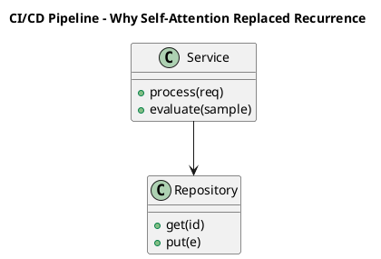

_Source diagram (plantuml); render with the appropriate tool._

**Figure 1. CI/CD Pipeline - Why Self-Attention Replaced Recurrence** (plantuml). Figure: CI/CD Pipeline view for Why Self-Attention Replaced Recurrence. This diagram illustrates the principal components and their interactions as discussed in the surrounding section.

## Deep Dive: Mechanics, Variants and Trade-offs

Having established the essentials, we now go deeper into why self-attention replaced recurrence. It pays to understand the mechanism rather than treat it as a black box, because most production incidents are explained by one of its steps misbehaving. The distinctions in this section are the ones that separate a working demo from a system that holds up under adversarial inputs, scale and the passage of time.

Consider the principal variants and how to choose between them. Each variant optimises for a different point in the design space - some for latency, some for accuracy, some for cost or operability - and the correct choice follows from explicit requirements rather than from defaults. There is an inherent trade-off between fidelity and cost, and the correct balance depends on the use case and its tolerance for error.

In practice this is supported by a mature tooling ecosystem, including PyTorch, FlashAttention, Triton, xFormers. Tools accelerate the work but do not substitute for understanding: the same principles apply whichever implementation you select, and the ability to reason from first principles is what lets you debug when a tool behaves unexpectedly.

A frequent source of subtle bugs is the interaction with mixture-of-experts transformers. Because mixture-of-experts transformers concerns sparse routing for parameter-efficient scaling, changes there can silently alter the behaviour analysed here. The remedy is contract tests at the boundary and end-to-end evaluations that exercise the interaction explicitly.

Finally, attend to edge cases and degradation. Define what the system should do under partial failure, unexpected inputs and load spikes, and make that behaviour explicit and tested rather than emergent. Graceful degradation - returning a safe, useful result when the ideal one is unavailable - is a hallmark of mature engineering.

For deeper study, the literature offers authoritative treatments such as Vaswani et al. — Attention Is All You Need (2017) and Dao et al. — FlashAttention (2022). These primary sources reward careful reading and ground the practical guidance above in established results.

## Advanced Considerations

Having established the essentials, we now go deeper into why self-attention replaced recurrence. Mechanically, the behaviour emerges from a few interacting parts that are simpler than the whole they produce. The distinctions in this section are the ones that separate a working demo from a system that holds up under adversarial inputs, scale and the passage of time.

Consider the principal variants and how to choose between them. Each variant optimises for a different point in the design space - some for latency, some for accuracy, some for cost or operability - and the correct choice follows from explicit requirements rather than from defaults. As with most architectural decisions, the choice is rarely binary; the skill lies in quantifying the trade-offs and choosing deliberately.

In practice this is supported by a mature tooling ecosystem, including PyTorch, FlashAttention, Triton, xFormers. Tools accelerate the work but do not substitute for understanding: the same principles apply whichever implementation you select, and the ability to reason from first principles is what lets you debug when a tool behaves unexpectedly.

A frequent source of subtle bugs is the interaction with vision and multimodal transformers. Because vision and multimodal transformers concerns patch embeddings, ViT and cross-modal attention, changes there can silently alter the behaviour analysed here. The remedy is contract tests at the boundary and end-to-end evaluations that exercise the interaction explicitly.

Finally, attend to edge cases and degradation. Define what the system should do under partial failure, unexpected inputs and load spikes, and make that behaviour explicit and tested rather than emergent. Graceful degradation - returning a safe, useful result when the ideal one is unavailable - is a hallmark of mature engineering.

For deeper study, the literature offers authoritative treatments such as Vaswani et al. — Attention Is All You Need (2017) and Dao et al. — FlashAttention (2022). These primary sources reward careful reading and ground the practical guidance above in established results.

## Worked Example

To ground the discussion, walk through a representative example. A nlp organisation needs language understanding and generation across tasks. They decide to apply why self-attention replaced recurrence as part of their Transformers solution, but wisely treat it as a hypothesis to be validated rather than a foregone conclusion.

The team begins by stating the objective precisely and defining how success will be measured before writing any code. They establish a small but representative evaluation set, agree on acceptance thresholds, and only then prototype the simplest design that could work. Early measurement reveals which assumptions hold and which must be revised, saving weeks of misdirected effort and surfacing edge cases while they are still cheap to fix.

As the prototype matures into a service, the team hardens it: adding input validation, error handling, caching where it pays off, and monitoring that ties back to the original success metric. They document each significant decision in an architecture decision record so that future maintainers understand not just what was built but why.

The outcome is instructive. The system that reaches production is not the most sophisticated design the team considered, but the one whose behaviour they could measure, explain and operate. This is the recurring lesson of Transformers: durable value comes from the whole system, not from any single clever component.

## Industry Use Cases

Across industries, the ideas in this chapter recur in recognisable ways. The following vignettes show how different sectors apply them and what they have in common.

**NLP.** Language understanding and generation across tasks. The common thread is that value comes not from the model alone but from the surrounding system - data quality, evaluation, integration and operations - which is precisely where most of the engineering effort belongs.

**Computer Vision.** Image classification and detection with ViT backbones. The common thread is that value comes not from the model alone but from the surrounding system - data quality, evaluation, integration and operations - which is precisely where most of the engineering effort belongs.

**Audio.** Speech recognition and synthesis with transformer encoders. The common thread is that value comes not from the model alone but from the surrounding system - data quality, evaluation, integration and operations - which is precisely where most of the engineering effort belongs.

**Science.** Protein structure and molecular property prediction. The common thread is that value comes not from the model alone but from the surrounding system - data quality, evaluation, integration and operations - which is precisely where most of the engineering effort belongs.

## Best Practices

The following practices consistently separate successful Transformers efforts from struggling ones. They are deliberately concrete so they can be adopted as checklist items in design and code review.

- Use pre-norm and careful warmup to stabilise deep transformer training.
- Adopt fused attention kernels to cut memory and latency.
- Validate positional encoding choice against target sequence lengths.
- Profile FLOPs and memory before scaling parameters.

None of these are exotic; they are the unglamorous disciplines that compound into reliability. The cost of adopting them is small compared with the cost of the incidents they prevent, and they become second nature with practice.

## Common Pitfalls

Equally instructive are the failure modes that recur in practice. Each pitfall below has a clear early warning sign and a known remedy, so treat them as a diagnostic checklist when something feels wrong:

- Quadratic attention cost dominating long-sequence workloads.
- Numerical instability from post-norm at depth.
- Position encoding that fails to extrapolate beyond training length.
- Ignoring kernel-level efficiency and over-provisioning hardware.

The pattern is consistent: most failures stem from skipping measurement, conflating prototype and production standards, or deferring cross-cutting concerns such as security and cost until they become emergencies. Naming these traps in advance is the cheapest way to avoid them.

## Governance, Security and Cost Notes

No discussion of why self-attention replaced recurrence is complete without its governance, security and cost dimensions, which are too often deferred until they become emergencies. Treating them as first-class concerns from the outset is both cheaper and safer.

**Governance.** Classify the risk of this capability, document its intended and out-of-scope uses, and ensure decisions are traceable to satisfy internal policy and external regulation such as the NIST AI RMF, ISO/IEC 42001 and the EU AI Act. **Security.** Treat all external input as untrusted, validate outputs before acting on them, apply least privilege to any tools or data access, and map controls to the OWASP LLM Top 10 and MITRE ATLAS.

**Cost and sustainability.** Establish explicit budgets for compute, tokens and latency, attribute spend to owners, and revisit the economics as usage scales - a design that is affordable at pilot scale can become untenable at production volume. Building these reflexes into everyday engineering is what allows a Transformers system to be not only capable but also trustworthy and economically sound.

## Hands-On Exercises

Work through the following exercises. They are designed to move understanding from recognition to application - the level required for real engineering work - so prefer writing and building over merely reading.

1. Explain why self-attention replaced recurrence to a colleague unfamiliar with Transformers, using a concrete example from your own domain.
2. Sketch a reference architecture that incorporates why self-attention replaced recurrence and annotate where observability, security and cost controls belong.
3. Design an evaluation that would tell you whether why self-attention replaced recurrence is working in production, including the metric, the dataset and the acceptance threshold.
4. Identify two pitfalls relevant to why self-attention replaced recurrence in your environment and describe the early warning signals you would monitor.
5. Prototype the simplest implementation that demonstrates why self-attention replaced recurrence, then list exactly what would need to change to make it production-ready.

## Key Takeaways

Key takeaways from this chapter:

- Why Self-Attention Replaced Recurrence is a systems concern in Transformers: data, models and operations must be co-designed.
- Measurement is non-negotiable; define success metrics and evaluation before building.
- Favour the simplest design that meets the requirement, and add complexity only when evidence demands it.
- Security, cost and observability are first-class requirements, not afterthoughts.
- Document decisions so the system remains understandable and operable as it evolves.

## Code Walkthrough

Every change to a Transformers system should pass an evaluation gate. This example shows the minimal shape: align predictions and references, compute a metric, and return a pass/fail decision for CI.

The full listing is shown below; study it line by line and reproduce it locally before moving on.

### Listing: Evaluating Why Self-Attention Replaced Recurrence with a regression gate

```python
from dataclasses import dataclass


@dataclass
class EvalResult:
    metric: str
    score: float
    passed: bool


def evaluate(predictions: list[str], references: list[str],
             threshold: float = 0.8) -> EvalResult:
    """Score Why Self-Attention Replaced Recurrence output against references with a simple exact-match metric.

    In practice you would combine several metrics (exact match, semantic
    similarity, LLM-as-judge) and gate releases on the aggregate.
    """
    if len(predictions) != len(references):
        raise ValueError("predictions and references must align")
    hits = sum(p.strip() == r.strip() for p, r in zip(predictions, references))
    score = hits / len(references) if references else 0.0
    return EvalResult(metric="exact_match", score=score, passed=score >= threshold)


if __name__ == "__main__":
    result = evaluate(["yes", "no"], ["yes", "yes"])
    print(f"{result.metric}={result.score:.2f} passed={result.passed}")

```

## Review Questions

1. In the context of Transformers, which statement best describes “Why Self-Attention Replaced Recurrence”?
   - A. It is only relevant to academic research, not production.
   - B. It removes all security and governance requirements.
   - C. Parallelism, long-range dependency modelling and the limitations of RNNs/LSTMs that transformers overcame.
   - D. It makes the system slower but has no other effect.
   - **Answer: C.** Why Self-Attention Replaced Recurrence: Parallelism, long-range dependency modelling and the limitations of RNNs/LSTMs that transformers overcame.
2. Which of the following is a recommended best practice when working with Transformers?
   - A. Validate positional encoding choice against target sequence lengths.
   - B. It is only relevant to academic research, not production.
   - C. It applies exclusively to image data.
   - D. Position encoding that fails to extrapolate beyond training length.
   - **Answer: A.** Best practice: Validate positional encoding choice against target sequence lengths.
3. Which of the following is a common pitfall to avoid in Transformers?
   - A. It applies exclusively to image data.
   - B. Profile FLOPs and memory before scaling parameters.
   - C. It guarantees deterministic output regardless of input.
   - D. Quadratic attention cost dominating long-sequence workloads.
   - **Answer: D.** Pitfall to avoid: Quadratic attention cost dominating long-sequence workloads.
4. *(Discussion)* Walk through how you would design Why Self-Attention Replaced Recurrence for an enterprise Transformers workload.
   - **Model answer:** A strong answer defines why self-attention replaced recurrence (Parallelism, long-range dependency modelling and the limitations of RNNs/LSTMs that transformers overcame.) then connects it to architecture, evaluation, cost, security and operations for Transformers, citing concrete trade-offs and a real-world example.

---


# Chapter 2. Scaled Dot-Product Attention

_This chapter examines scaled dot-product attention within Transformers. It covers queries, keys, values, the scaling factor and the softmax that produces context-aware representations, derives a reference architecture, walks through a worked example and runnable code, surveys industry use cases, and distils best practices and pitfalls, closing with exercises and review questions._

## Introduction

In practical terms, Scaled Dot-Product Attention is best understood as queries, keys, values, the scaling factor and the softmax that produces context-aware representations. Neglecting it is one of the most common reasons Transformers initiatives stall in production. It helps to separate the conceptual model from its implementation: the former guides reasoning, the latter must contend with real-world constraints.

This chapter builds intuition first, then formalises the ideas, derives an architecture, and finishes with code, exercises and review questions so the material transfers directly to your own Transformers work. Read it actively: pause at each diagram, reproduce the code, and attempt the exercises before consulting the answers.

## Theory and Foundations

Scaled Dot-Product Attention refers to queries, keys, values, the scaling factor and the softmax that produces context-aware representations. Seasoned practitioners treat this as a systems problem, co-designing data, models and operations rather than optimising any one in isolation. It pays to understand the mechanism rather than treat it as a black box, because most production incidents are explained by one of its steps misbehaving.

To place this in context, recall the broader picture: The transformer is a neural architecture built on self-attention that processes sequences in parallel and models long-range dependencies without recurrence. Within that picture, scaled dot-product attention is one of the load-bearing ideas - the kind that, when understood deeply, makes the rest of Transformers fall into place. Teams that master this consistently ship more reliable Transformers systems at lower cost.

Scaled Dot-Product Attention cannot be understood in isolation from multi-head attention. Recall that multi-head attention concerns projecting into multiple subspaces to attend to different relations simultaneously. The two interact directly: decisions in one constrain the design space of the other, which is why mature teams reason about them together rather than sequentially. Every added component buys capability at the price of operational surface area, and that bargain should be made consciously.

Scaled Dot-Product Attention cannot be understood in isolation from training dynamics and stability. Recall that training dynamics and stability concerns initialisation, warmup, gradient clipping and loss spikes. The two interact directly: decisions in one constrain the design space of the other, which is why mature teams reason about them together rather than sequentially. As with most architectural decisions, the choice is rarely binary; the skill lies in quantifying the trade-offs and choosing deliberately.

Several established patterns apply directly to scaled dot-product attention. The first, rotary positional embeddings for length generalisation, is widely adopted because it makes the system's behaviour predictable and observable. A complementary pattern, mixture-of-experts routing for sparse scaling, addresses a related concern and is often deployed alongside it. Patterns are not dogma; they are distilled experience that shortcuts the search for a sound design, and each carries assumptions worth checking against your context.

It is worth being explicit about when to apply this and when to reach for something simpler. In a small prototype, shortcuts around scaled dot-product attention are invisible; in a production Transformers system serving real traffic, they surface as incidents, cost overruns or compliance gaps. Simplicity is a feature. The simplest design that meets the requirement should be the default, with complexity added only when measurement justifies it. The remainder of this chapter turns these principles into an architecture, code and a checklist you can apply immediately.

## Architecture and Design

The reference architecture for Scaled Dot-Product Attention separates concerns into clearly bounded components with explicit contracts. A transformer block stacks multi-head self-attention and a position-wise feed-forward network, each wrapped in residual connections and normalisation. Decoder-only stacks add causal masking; encoder–decoder stacks add cross attention. At scale, efficient attention kernels, mixed precision and tensor parallelism turn the mathematics into a trainable system.

Concretely, the principal building blocks include why self-attention replaced recurrence, scaled dot-product attention, multi-head attention, positional encoding and feed-forward networks and activations. Each is a replaceable component behind a stable interface, so the team can upgrade an implementation - a model, an index, a policy engine - without rewriting its neighbours. The contracts between components are where reliability is won or lost, so they are specified explicitly and tested in isolation.

The diagram accompanying this section makes the data and control flow explicit. Requests enter through a well-defined boundary where they are authenticated and validated; only then are they dispatched to the components that perform the work. This boundary is also where rate limiting, quota enforcement and audit logging live, keeping cross-cutting concerns out of the core logic and in one auditable place.

Two qualities deserve emphasis. First, observability is designed in, not bolted on: every component emits structured telemetry so that failures can be localised in minutes rather than hours. Second, the architecture is evolvable - components communicate through stable contracts so that any single part of the Transformers system can be replaced without a rewrite. Latency, accuracy and cost form a tension triangle: improving one typically pressures the others, so explicit budgets are essential.

```xml
<mxfile host="ai-university">
  <diagram name="Deployment">
    <mxGraphModel dx="800" dy="600" grid="1" gridSize="10">
      <root>
        <mxCell id="0"/>
        <mxCell id="1" parent="0"/>
        <mxCell id="title" value="Deployment - Scaled Dot-Product Attention" style="text;fontSize=16;fontStyle=1" vertex="1" parent="1"><mxGeometry x="40" y="20" width="600" height="30" as="geometry"/></mxCell>
        <mxCell id="hub" value="Scaled Dot-Product At…" style="rounded=1;fillColor=#0f172a;fontColor=#ffffff;fontStyle=1" vertex="1" parent="1"><mxGeometry x="300" y="180" width="160" height="60" as="geometry"/></mxCell>
        <mxCell id="n0" value="Scaled Dot-Product Atte…" style="rounded=1;fillColor=#e0e7ff;strokeColor=#4338ca" vertex="1" parent="1"><mxGeometry x="60" y="80" width="160" height="50" as="geometry"/></mxCell>
        <mxCell id="e0" style="edgeStyle=orthogonalEdgeStyle" edge="1" parent="1" source="hub" target="n0"><mxGeometry relative="1" as="geometry"/></mxCell>
        <mxCell id="n1" value="Multi-Head Attention" style="rounded=1;fillColor=#e0e7ff;strokeColor=#4338ca" vertex="1" parent="1"><mxGeometry x="600" y="170" width="160" height="50" as="geometry"/></mxCell>
        <mxCell id="e1" style="edgeStyle=orthogonalEdgeStyle" edge="1" parent="1" source="hub" target="n1"><mxGeometry relative="1" as="geometry"/></mxCell>
        <mxCell id="n2" value="Training Dynamics and S…" style="rounded=1;fillColor=#e0e7ff;strokeColor=#4338ca" vertex="1" parent="1"><mxGeometry x="60" y="260" width="160" height="50" as="geometry"/></mxCell>
        <mxCell id="e2" style="edgeStyle=orthogonalEdgeStyle" edge="1" parent="1" source="hub" target="n2"><mxGeometry relative="1" as="geometry"/></mxCell>
        <mxCell id="n3" value="Profiling and Optimisin…" style="rounded=1;fillColor=#e0e7ff;strokeColor=#4338ca" vertex="1" parent="1"><mxGeometry x="600" y="350" width="160" height="50" as="geometry"/></mxCell>
        <mxCell id="e3" style="edgeStyle=orthogonalEdgeStyle" edge="1" parent="1" source="hub" target="n3"><mxGeometry relative="1" as="geometry"/></mxCell>
        <mxCell id="n4" value="Residual Connections an…" style="rounded=1;fillColor=#e0e7ff;strokeColor=#4338ca" vertex="1" parent="1"><mxGeometry x="60" y="440" width="160" height="50" as="geometry"/></mxCell>
        <mxCell id="e4" style="edgeStyle=orthogonalEdgeStyle" edge="1" parent="1" source="hub" target="n4"><mxGeometry relative="1" as="geometry"/></mxCell>
      </root>
    </mxGraphModel>
  </diagram>
</mxfile>
```

_Source diagram (drawio); render with the appropriate tool._

**Figure 2. Deployment - Scaled Dot-Product Attention** (drawio). Figure: Deployment view for Scaled Dot-Product Attention. This diagram illustrates the principal components and their interactions as discussed in the surrounding section.

## Deep Dive: Mechanics, Variants and Trade-offs

Having established the essentials, we now go deeper into scaled dot-product attention. The underlying mechanism is best appreciated by tracing a single request from input to output and noting where state is created and consumed. The distinctions in this section are the ones that separate a working demo from a system that holds up under adversarial inputs, scale and the passage of time.

Consider the principal variants and how to choose between them. Each variant optimises for a different point in the design space - some for latency, some for accuracy, some for cost or operability - and the correct choice follows from explicit requirements rather than from defaults. Latency, accuracy and cost form a tension triangle: improving one typically pressures the others, so explicit budgets are essential.

In practice this is supported by a mature tooling ecosystem, including PyTorch, FlashAttention, Triton, xFormers. Tools accelerate the work but do not substitute for understanding: the same principles apply whichever implementation you select, and the ability to reason from first principles is what lets you debug when a tool behaves unexpectedly.

A frequent source of subtle bugs is the interaction with multi-head attention. Because multi-head attention concerns projecting into multiple subspaces to attend to different relations simultaneously, changes there can silently alter the behaviour analysed here. The remedy is contract tests at the boundary and end-to-end evaluations that exercise the interaction explicitly.

Finally, attend to edge cases and degradation. Define what the system should do under partial failure, unexpected inputs and load spikes, and make that behaviour explicit and tested rather than emergent. Graceful degradation - returning a safe, useful result when the ideal one is unavailable - is a hallmark of mature engineering.

For deeper study, the literature offers authoritative treatments such as Vaswani et al. — Attention Is All You Need (2017) and Dao et al. — FlashAttention (2022). These primary sources reward careful reading and ground the practical guidance above in established results.

## Advanced Considerations

Having established the essentials, we now go deeper into scaled dot-product attention. Mechanically, the behaviour emerges from a few interacting parts that are simpler than the whole they produce. The distinctions in this section are the ones that separate a working demo from a system that holds up under adversarial inputs, scale and the passage of time.

Consider the principal variants and how to choose between them. Each variant optimises for a different point in the design space - some for latency, some for accuracy, some for cost or operability - and the correct choice follows from explicit requirements rather than from defaults. Latency, accuracy and cost form a tension triangle: improving one typically pressures the others, so explicit budgets are essential.

In practice this is supported by a mature tooling ecosystem, including PyTorch, FlashAttention, Triton, xFormers. Tools accelerate the work but do not substitute for understanding: the same principles apply whichever implementation you select, and the ability to reason from first principles is what lets you debug when a tool behaves unexpectedly.

A frequent source of subtle bugs is the interaction with mixture-of-experts transformers. Because mixture-of-experts transformers concerns sparse routing for parameter-efficient scaling, changes there can silently alter the behaviour analysed here. The remedy is contract tests at the boundary and end-to-end evaluations that exercise the interaction explicitly.

Finally, attend to edge cases and degradation. Define what the system should do under partial failure, unexpected inputs and load spikes, and make that behaviour explicit and tested rather than emergent. Graceful degradation - returning a safe, useful result when the ideal one is unavailable - is a hallmark of mature engineering.

For deeper study, the literature offers authoritative treatments such as Vaswani et al. — Attention Is All You Need (2017) and Dao et al. — FlashAttention (2022). These primary sources reward careful reading and ground the practical guidance above in established results.

## Worked Example

To ground the discussion, walk through a representative example. A audio organisation needs speech recognition and synthesis with transformer encoders. They decide to apply scaled dot-product attention as part of their Transformers solution, but wisely treat it as a hypothesis to be validated rather than a foregone conclusion.

The team begins by stating the objective precisely and defining how success will be measured before writing any code. They establish a small but representative evaluation set, agree on acceptance thresholds, and only then prototype the simplest design that could work. Early measurement reveals which assumptions hold and which must be revised, saving weeks of misdirected effort and surfacing edge cases while they are still cheap to fix.

As the prototype matures into a service, the team hardens it: adding input validation, error handling, caching where it pays off, and monitoring that ties back to the original success metric. They document each significant decision in an architecture decision record so that future maintainers understand not just what was built but why.

The outcome is instructive. The system that reaches production is not the most sophisticated design the team considered, but the one whose behaviour they could measure, explain and operate. This is the recurring lesson of Transformers: durable value comes from the whole system, not from any single clever component.

## Industry Use Cases

Across industries, the ideas in this chapter recur in recognisable ways. The following vignettes show how different sectors apply them and what they have in common.

**NLP.** Language understanding and generation across tasks. The common thread is that value comes not from the model alone but from the surrounding system - data quality, evaluation, integration and operations - which is precisely where most of the engineering effort belongs.

**Computer Vision.** Image classification and detection with ViT backbones. The common thread is that value comes not from the model alone but from the surrounding system - data quality, evaluation, integration and operations - which is precisely where most of the engineering effort belongs.

**Audio.** Speech recognition and synthesis with transformer encoders. The common thread is that value comes not from the model alone but from the surrounding system - data quality, evaluation, integration and operations - which is precisely where most of the engineering effort belongs.

**Science.** Protein structure and molecular property prediction. The common thread is that value comes not from the model alone but from the surrounding system - data quality, evaluation, integration and operations - which is precisely where most of the engineering effort belongs.

## Best Practices

The following practices consistently separate successful Transformers efforts from struggling ones. They are deliberately concrete so they can be adopted as checklist items in design and code review.

- Use pre-norm and careful warmup to stabilise deep transformer training.
- Adopt fused attention kernels to cut memory and latency.
- Validate positional encoding choice against target sequence lengths.
- Profile FLOPs and memory before scaling parameters.

None of these are exotic; they are the unglamorous disciplines that compound into reliability. The cost of adopting them is small compared with the cost of the incidents they prevent, and they become second nature with practice.

## Common Pitfalls

Equally instructive are the failure modes that recur in practice. Each pitfall below has a clear early warning sign and a known remedy, so treat them as a diagnostic checklist when something feels wrong:

- Quadratic attention cost dominating long-sequence workloads.
- Numerical instability from post-norm at depth.
- Position encoding that fails to extrapolate beyond training length.
- Ignoring kernel-level efficiency and over-provisioning hardware.

The pattern is consistent: most failures stem from skipping measurement, conflating prototype and production standards, or deferring cross-cutting concerns such as security and cost until they become emergencies. Naming these traps in advance is the cheapest way to avoid them.

## Governance, Security and Cost Notes

No discussion of scaled dot-product attention is complete without its governance, security and cost dimensions, which are too often deferred until they become emergencies. Treating them as first-class concerns from the outset is both cheaper and safer.

**Governance.** Classify the risk of this capability, document its intended and out-of-scope uses, and ensure decisions are traceable to satisfy internal policy and external regulation such as the NIST AI RMF, ISO/IEC 42001 and the EU AI Act. **Security.** Treat all external input as untrusted, validate outputs before acting on them, apply least privilege to any tools or data access, and map controls to the OWASP LLM Top 10 and MITRE ATLAS.

**Cost and sustainability.** Establish explicit budgets for compute, tokens and latency, attribute spend to owners, and revisit the economics as usage scales - a design that is affordable at pilot scale can become untenable at production volume. Building these reflexes into everyday engineering is what allows a Transformers system to be not only capable but also trustworthy and economically sound.

## Hands-On Exercises

Work through the following exercises. They are designed to move understanding from recognition to application - the level required for real engineering work - so prefer writing and building over merely reading.

1. Explain scaled dot-product attention to a colleague unfamiliar with Transformers, using a concrete example from your own domain.
2. Sketch a reference architecture that incorporates scaled dot-product attention and annotate where observability, security and cost controls belong.
3. Design an evaluation that would tell you whether scaled dot-product attention is working in production, including the metric, the dataset and the acceptance threshold.
4. Identify two pitfalls relevant to scaled dot-product attention in your environment and describe the early warning signals you would monitor.
5. Prototype the simplest implementation that demonstrates scaled dot-product attention, then list exactly what would need to change to make it production-ready.

## Key Takeaways

Key takeaways from this chapter:

- Scaled Dot-Product Attention is a systems concern in Transformers: data, models and operations must be co-designed.
- Measurement is non-negotiable; define success metrics and evaluation before building.
- Favour the simplest design that meets the requirement, and add complexity only when evidence demands it.
- Security, cost and observability are first-class requirements, not afterthoughts.
- Document decisions so the system remains understandable and operable as it evolves.

## Code Walkthrough

This listing shows a configuration-driven Scaled Dot-Product Attention component with retry semantics and typed interfaces — the shape we expect from production Transformers code rather than a notebook prototype.

The full listing is shown below; study it line by line and reproduce it locally before moving on.

### Listing: Implementing a Scaled Dot-Product Attention component

```python
from __future__ import annotations

from dataclasses import dataclass, field
from typing import Any


@dataclass(slots=True)
class ScaledAttentionConfig:
    """Configuration for the Scaled Dot-Product Attention component in a Transformers system."""

    name: str
    timeout_s: float = 30.0
    max_retries: int = 3
    options: dict[str, Any] = field(default_factory=dict)


class ScaledAttention:
    """A minimal, production-shaped implementation of Scaled Dot-Product Attention."""

    def __init__(self, config: ScaledAttentionConfig) -> None:
        self._config = config
        self._calls = 0

    def run(self, payload: dict[str, Any]) -> dict[str, Any]:
        """Process a request, retrying transient failures with backoff."""
        last_error: Exception | None = None
        for attempt in range(self._config.max_retries):
            try:
                self._calls += 1
                return self._process(payload)
            except TimeoutError as exc:  # transient
                last_error = exc
                continue
        raise RuntimeError(f"ScaledAttention failed after retries") from last_error

    def _process(self, payload: dict[str, Any]) -> dict[str, Any]:
        # Domain-specific logic for Scaled Dot-Product Attention goes here.
        return {"status": "ok", "input_keys": sorted(payload), "calls": self._calls}

```

## Review Questions

1. In the context of Transformers, which statement best describes “Scaled Dot-Product Attention”?
   - A. It is only relevant to academic research, not production.
   - B. It guarantees deterministic output regardless of input.
   - C. It applies exclusively to image data.
   - D. Queries, keys, values, the scaling factor and the softmax that produces context-aware representations.
   - **Answer: D.** Scaled Dot-Product Attention: Queries, keys, values, the scaling factor and the softmax that produces context-aware representations.
2. Which of the following is a recommended best practice when working with Transformers?
   - A. It is only relevant to academic research, not production.
   - B. Numerical instability from post-norm at depth.
   - C. Profile FLOPs and memory before scaling parameters.
   - D. It makes the system slower but has no other effect.
   - **Answer: C.** Best practice: Profile FLOPs and memory before scaling parameters.
3. Which of the following is a common pitfall to avoid in Transformers?
   - A. Use pre-norm and careful warmup to stabilise deep transformer training.
   - B. Numerical instability from post-norm at depth.
   - C. It eliminates the need for any evaluation or monitoring.
   - D. It guarantees deterministic output regardless of input.
   - **Answer: B.** Pitfall to avoid: Numerical instability from post-norm at depth.
4. *(Discussion)* How does Scaled Dot-Product Attention interact with security and governance requirements?
   - **Model answer:** A strong answer defines scaled dot-product attention (Queries, keys, values, the scaling factor and the softmax that produces context-aware representations.) then connects it to architecture, evaluation, cost, security and operations for Transformers, citing concrete trade-offs and a real-world example.

---


# Chapter 3. Multi-Head Attention

_This chapter examines multi-head attention within Transformers. It covers projecting into multiple subspaces to attend to different relations simultaneously, derives a reference architecture, walks through a worked example and runnable code, surveys industry use cases, and distils best practices and pitfalls, closing with exercises and review questions._

## Introduction

Formally, Multi-Head Attention addresses projecting into multiple subspaces to attend to different relations simultaneously. Getting this right early prevents expensive rework once a Transformers system reaches scale. It helps to separate the conceptual model from its implementation: the former guides reasoning, the latter must contend with real-world constraints.

This chapter builds intuition first, then formalises the ideas, derives an architecture, and finishes with code, exercises and review questions so the material transfers directly to your own Transformers work. Read it actively: pause at each diagram, reproduce the code, and attempt the exercises before consulting the answers.

## Theory and Foundations

Formally, Multi-Head Attention addresses projecting into multiple subspaces to attend to different relations simultaneously. Seasoned practitioners treat this as a systems problem, co-designing data, models and operations rather than optimising any one in isolation. Mechanically, the behaviour emerges from a few interacting parts that are simpler than the whole they produce.

To place this in context, recall the broader picture: The transformer is a neural architecture built on self-attention that processes sequences in parallel and models long-range dependencies without recurrence. Within that picture, multi-head attention is one of the load-bearing ideas - the kind that, when understood deeply, makes the rest of Transformers fall into place. It is foundational: later capabilities in Transformers are built directly on top of it.

Multi-Head Attention cannot be understood in isolation from residual connections and normalisation. Recall that residual connections and normalisation concerns pre-norm versus post-norm, LayerNorm/RMSNorm and training stability. The two interact directly: decisions in one constrain the design space of the other, which is why mature teams reason about them together rather than sequentially. Simplicity is a feature. The simplest design that meets the requirement should be the default, with complexity added only when measurement justifies it.

Multi-Head Attention cannot be understood in isolation from training dynamics and stability. Recall that training dynamics and stability concerns initialisation, warmup, gradient clipping and loss spikes. The two interact directly: decisions in one constrain the design space of the other, which is why mature teams reason about them together rather than sequentially. As with most architectural decisions, the choice is rarely binary; the skill lies in quantifying the trade-offs and choosing deliberately.

Several established patterns apply directly to multi-head attention. The first, pre-norm residual blocks for deep stability, is widely adopted because it makes the system's behaviour predictable and observable. A complementary pattern, mixture-of-experts routing for sparse scaling, addresses a related concern and is often deployed alongside it. Patterns are not dogma; they are distilled experience that shortcuts the search for a sound design, and each carries assumptions worth checking against your context.

Knowing when not to use a technique is as valuable as knowing how to use it. In a small prototype, shortcuts around multi-head attention are invisible; in a production Transformers system serving real traffic, they surface as incidents, cost overruns or compliance gaps. As with most architectural decisions, the choice is rarely binary; the skill lies in quantifying the trade-offs and choosing deliberately. The remainder of this chapter turns these principles into an architecture, code and a checklist you can apply immediately.

## Architecture and Design

The reference architecture for Multi-Head Attention separates concerns into clearly bounded components with explicit contracts. A transformer block stacks multi-head self-attention and a position-wise feed-forward network, each wrapped in residual connections and normalisation. Decoder-only stacks add causal masking; encoder–decoder stacks add cross attention. At scale, efficient attention kernels, mixed precision and tensor parallelism turn the mathematics into a trainable system.

Concretely, the principal building blocks include why self-attention replaced recurrence, scaled dot-product attention, multi-head attention, positional encoding and feed-forward networks and activations. Each is a replaceable component behind a stable interface, so the team can upgrade an implementation - a model, an index, a policy engine - without rewriting its neighbours. The contracts between components are where reliability is won or lost, so they are specified explicitly and tested in isolation.

The diagram accompanying this section makes the data and control flow explicit. Requests enter through a well-defined boundary where they are authenticated and validated; only then are they dispatched to the components that perform the work. This boundary is also where rate limiting, quota enforcement and audit logging live, keeping cross-cutting concerns out of the core logic and in one auditable place.

Two qualities deserve emphasis. First, observability is designed in, not bolted on: every component emits structured telemetry so that failures can be localised in minutes rather than hours. Second, the architecture is evolvable - components communicate through stable contracts so that any single part of the Transformers system can be replaced without a rewrite. Every added component buys capability at the price of operational surface area, and that bargain should be made consciously.

<div class="diagram-svg">

<svg xmlns="http://www.w3.org/2000/svg" width="840" height="460" data-tpl="pillars" data-pal="11-5" viewBox="0 0 840 460" font-family="Inter, Segoe UI, Arial, sans-serif"><defs><marker id="ar" markerWidth="9" markerHeight="9" refX="7" refY="3" orient="auto"><path d="M0,0 L7,3 L0,6 z" fill="#94a3b8"/></marker><marker id="arw" markerWidth="9" markerHeight="9" refX="7" refY="3" orient="auto"><path d="M0,0 L7,3 L0,6 z" fill="#ffffff"/></marker><filter id="sh" x="-20%" y="-20%" width="140%" height="140%"><feDropShadow dx="0" dy="2" stdDeviation="3" flood-color="#0f172a" flood-opacity="0.16"/></filter></defs><defs><linearGradient id="bn7571b22" x1="0" y1="0" x2="1" y2="0"><stop offset="0" stop-color="#4338ca"/><stop offset="1" stop-color="#0f172a"/></linearGradient></defs><rect width="840" height="460" rx="14" fill="#ffffff"/><rect x="0" y="0" width="840" height="48" rx="14" fill="url(#bn7571b22)"/><rect x="0" y="32" width="840" height="16" fill="url(#bn7571b22)"/><text x="420" y="25" text-anchor="middle" font-size="14.5" font-weight="700" fill="#ffffff" dominant-baseline="middle">Capability Map - Multi-Head Attention</text><rect x="68" y="140" width="120" height="250" rx="10" fill="#4338ca"/><rect x="60" y="126" width="136" height="18" rx="6" fill="#4338ca"/><text x="128" y="259" text-anchor="middle" font-size="11" font-weight="600" fill="#fff" dominant-baseline="middle">Multi-Head</text><text x="128" y="271" text-anchor="middle" font-size="11" font-weight="600" fill="#fff" dominant-baseline="middle">Attention</text><rect x="214" y="140" width="120" height="250" rx="10" fill="#0f172a"/><rect x="206" y="126" width="136" height="18" rx="6" fill="#0f172a"/><text x="274" y="252" text-anchor="middle" font-size="11" font-weight="600" fill="#fff" dominant-baseline="middle">Residual</text><text x="274" y="265" text-anchor="middle" font-size="11" font-weight="600" fill="#fff" dominant-baseline="middle">Connections and</text><text x="274" y="278" text-anchor="middle" font-size="11" font-weight="600" fill="#fff" dominant-baseline="middle">Normalisation</text><rect x="360" y="140" width="120" height="250" rx="10" fill="#1e40af"/><rect x="352" y="126" width="136" height="18" rx="6" fill="#1e40af"/><text x="420" y="252" text-anchor="middle" font-size="11" font-weight="600" fill="#fff" dominant-baseline="middle">Training</text><text x="420" y="265" text-anchor="middle" font-size="11" font-weight="600" fill="#fff" dominant-baseline="middle">Dynamics and</text><text x="420" y="278" text-anchor="middle" font-size="11" font-weight="600" fill="#fff" dominant-baseline="middle">Stability</text><rect x="506" y="140" width="120" height="250" rx="10" fill="#0e7490"/><rect x="498" y="126" width="136" height="18" rx="6" fill="#0e7490"/><text x="566" y="259" text-anchor="middle" font-size="11" font-weight="600" fill="#fff" dominant-baseline="middle">Positional</text><text x="566" y="271" text-anchor="middle" font-size="11" font-weight="600" fill="#fff" dominant-baseline="middle">Encoding</text><rect x="652" y="140" width="120" height="250" rx="10" fill="#b45309"/><rect x="644" y="126" width="136" height="18" rx="6" fill="#b45309"/><text x="712" y="252" text-anchor="middle" font-size="11" font-weight="600" fill="#fff" dominant-baseline="middle">Scaled</text><text x="712" y="265" text-anchor="middle" font-size="11" font-weight="600" fill="#fff" dominant-baseline="middle">Dot-Product</text><text x="712" y="278" text-anchor="middle" font-size="11" font-weight="600" fill="#fff" dominant-baseline="middle">Attention</text><rect x="48.0" y="390" width="744" height="12" rx="4" fill="#0f172a"/><text x="28" y="446" text-anchor="start" font-size="9.5" font-weight="500" fill="#64748b" dominant-baseline="middle">Multi-Head Attention  •  Capability Map</text></svg>

</div>

**Figure 3. Capability Map - Multi-Head Attention** (svg). Figure: Capability Map view for Multi-Head Attention. This diagram illustrates the principal components and their interactions as discussed in the surrounding section.

## Deep Dive: Mechanics, Variants and Trade-offs

Having established the essentials, we now go deeper into multi-head attention. The underlying mechanism is best appreciated by tracing a single request from input to output and noting where state is created and consumed. The distinctions in this section are the ones that separate a working demo from a system that holds up under adversarial inputs, scale and the passage of time.

Consider the principal variants and how to choose between them. Each variant optimises for a different point in the design space - some for latency, some for accuracy, some for cost or operability - and the correct choice follows from explicit requirements rather than from defaults. Simplicity is a feature. The simplest design that meets the requirement should be the default, with complexity added only when measurement justifies it.

In practice this is supported by a mature tooling ecosystem, including PyTorch, FlashAttention, Triton, xFormers. Tools accelerate the work but do not substitute for understanding: the same principles apply whichever implementation you select, and the ability to reason from first principles is what lets you debug when a tool behaves unexpectedly.

A frequent source of subtle bugs is the interaction with residual connections and normalisation. Because residual connections and normalisation concerns pre-norm versus post-norm, LayerNorm/RMSNorm and training stability, changes there can silently alter the behaviour analysed here. The remedy is contract tests at the boundary and end-to-end evaluations that exercise the interaction explicitly.

Finally, attend to edge cases and degradation. Define what the system should do under partial failure, unexpected inputs and load spikes, and make that behaviour explicit and tested rather than emergent. Graceful degradation - returning a safe, useful result when the ideal one is unavailable - is a hallmark of mature engineering.

For deeper study, the literature offers authoritative treatments such as Vaswani et al. — Attention Is All You Need (2017) and Dao et al. — FlashAttention (2022). These primary sources reward careful reading and ground the practical guidance above in established results.

## Advanced Considerations

Having established the essentials, we now go deeper into multi-head attention. It pays to understand the mechanism rather than treat it as a black box, because most production incidents are explained by one of its steps misbehaving. The distinctions in this section are the ones that separate a working demo from a system that holds up under adversarial inputs, scale and the passage of time.

Consider the principal variants and how to choose between them. Each variant optimises for a different point in the design space - some for latency, some for accuracy, some for cost or operability - and the correct choice follows from explicit requirements rather than from defaults. Simplicity is a feature. The simplest design that meets the requirement should be the default, with complexity added only when measurement justifies it.

In practice this is supported by a mature tooling ecosystem, including PyTorch, FlashAttention, Triton, xFormers. Tools accelerate the work but do not substitute for understanding: the same principles apply whichever implementation you select, and the ability to reason from first principles is what lets you debug when a tool behaves unexpectedly.

A frequent source of subtle bugs is the interaction with why self-attention replaced recurrence. Because why self-attention replaced recurrence concerns parallelism, long-range dependency modelling and the limitations of RNNs/LSTMs that transformers overcame, changes there can silently alter the behaviour analysed here. The remedy is contract tests at the boundary and end-to-end evaluations that exercise the interaction explicitly.

Finally, attend to edge cases and degradation. Define what the system should do under partial failure, unexpected inputs and load spikes, and make that behaviour explicit and tested rather than emergent. Graceful degradation - returning a safe, useful result when the ideal one is unavailable - is a hallmark of mature engineering.

For deeper study, the literature offers authoritative treatments such as Vaswani et al. — Attention Is All You Need (2017) and Dao et al. — FlashAttention (2022). These primary sources reward careful reading and ground the practical guidance above in established results.

## Worked Example

To ground the discussion, walk through a representative example. A audio organisation needs speech recognition and synthesis with transformer encoders. They decide to apply multi-head attention as part of their Transformers solution, but wisely treat it as a hypothesis to be validated rather than a foregone conclusion.

The team begins by stating the objective precisely and defining how success will be measured before writing any code. They establish a small but representative evaluation set, agree on acceptance thresholds, and only then prototype the simplest design that could work. Early measurement reveals which assumptions hold and which must be revised, saving weeks of misdirected effort and surfacing edge cases while they are still cheap to fix.

As the prototype matures into a service, the team hardens it: adding input validation, error handling, caching where it pays off, and monitoring that ties back to the original success metric. They document each significant decision in an architecture decision record so that future maintainers understand not just what was built but why.

The outcome is instructive. The system that reaches production is not the most sophisticated design the team considered, but the one whose behaviour they could measure, explain and operate. This is the recurring lesson of Transformers: durable value comes from the whole system, not from any single clever component.

## Industry Use Cases

Across industries, the ideas in this chapter recur in recognisable ways. The following vignettes show how different sectors apply them and what they have in common.

**NLP.** Language understanding and generation across tasks. The common thread is that value comes not from the model alone but from the surrounding system - data quality, evaluation, integration and operations - which is precisely where most of the engineering effort belongs.

**Computer Vision.** Image classification and detection with ViT backbones. The common thread is that value comes not from the model alone but from the surrounding system - data quality, evaluation, integration and operations - which is precisely where most of the engineering effort belongs.

**Audio.** Speech recognition and synthesis with transformer encoders. The common thread is that value comes not from the model alone but from the surrounding system - data quality, evaluation, integration and operations - which is precisely where most of the engineering effort belongs.

**Science.** Protein structure and molecular property prediction. The common thread is that value comes not from the model alone but from the surrounding system - data quality, evaluation, integration and operations - which is precisely where most of the engineering effort belongs.

## Best Practices

The following practices consistently separate successful Transformers efforts from struggling ones. They are deliberately concrete so they can be adopted as checklist items in design and code review.

- Use pre-norm and careful warmup to stabilise deep transformer training.
- Adopt fused attention kernels to cut memory and latency.
- Validate positional encoding choice against target sequence lengths.
- Profile FLOPs and memory before scaling parameters.

None of these are exotic; they are the unglamorous disciplines that compound into reliability. The cost of adopting them is small compared with the cost of the incidents they prevent, and they become second nature with practice.

## Common Pitfalls

Equally instructive are the failure modes that recur in practice. Each pitfall below has a clear early warning sign and a known remedy, so treat them as a diagnostic checklist when something feels wrong:

- Quadratic attention cost dominating long-sequence workloads.
- Numerical instability from post-norm at depth.
- Position encoding that fails to extrapolate beyond training length.
- Ignoring kernel-level efficiency and over-provisioning hardware.

The pattern is consistent: most failures stem from skipping measurement, conflating prototype and production standards, or deferring cross-cutting concerns such as security and cost until they become emergencies. Naming these traps in advance is the cheapest way to avoid them.

## Governance, Security and Cost Notes

No discussion of multi-head attention is complete without its governance, security and cost dimensions, which are too often deferred until they become emergencies. Treating them as first-class concerns from the outset is both cheaper and safer.

**Governance.** Classify the risk of this capability, document its intended and out-of-scope uses, and ensure decisions are traceable to satisfy internal policy and external regulation such as the NIST AI RMF, ISO/IEC 42001 and the EU AI Act. **Security.** Treat all external input as untrusted, validate outputs before acting on them, apply least privilege to any tools or data access, and map controls to the OWASP LLM Top 10 and MITRE ATLAS.

**Cost and sustainability.** Establish explicit budgets for compute, tokens and latency, attribute spend to owners, and revisit the economics as usage scales - a design that is affordable at pilot scale can become untenable at production volume. Building these reflexes into everyday engineering is what allows a Transformers system to be not only capable but also trustworthy and economically sound.

## Hands-On Exercises

Work through the following exercises. They are designed to move understanding from recognition to application - the level required for real engineering work - so prefer writing and building over merely reading.

1. Explain multi-head attention to a colleague unfamiliar with Transformers, using a concrete example from your own domain.
2. Sketch a reference architecture that incorporates multi-head attention and annotate where observability, security and cost controls belong.
3. Design an evaluation that would tell you whether multi-head attention is working in production, including the metric, the dataset and the acceptance threshold.
4. Identify two pitfalls relevant to multi-head attention in your environment and describe the early warning signals you would monitor.
5. Prototype the simplest implementation that demonstrates multi-head attention, then list exactly what would need to change to make it production-ready.

## Key Takeaways

Key takeaways from this chapter:

- Multi-Head Attention is a systems concern in Transformers: data, models and operations must be co-designed.
- Measurement is non-negotiable; define success metrics and evaluation before building.
- Favour the simplest design that meets the requirement, and add complexity only when evidence demands it.
- Security, cost and observability are first-class requirements, not afterthoughts.
- Document decisions so the system remains understandable and operable as it evolves.

## Code Walkthrough

Pipelines keep Multi-Head Attention logic modular and testable. Each stage is a pure function, errors are captured per item, and the composition is trivial to extend or reorder.

The full listing is shown below; study it line by line and reproduce it locally before moving on.

### Listing: A composable processing pipeline for Multi-Head Attention

```python
from collections.abc import Iterable, Iterator
from typing import Protocol


class Stage(Protocol):
    def __call__(self, item: dict) -> dict: ...


def pipeline(stages: list[Stage]) -> Stage:
    """Compose ordered stages into a single callable for Multi-Head Attention."""

    def run(item: dict) -> dict:
        for stage in stages:
            item = stage(item)
        return item

    return run


def validate(item: dict) -> dict:
    if "text" not in item:
        raise ValueError("missing required field: text")
    return item


def normalise(item: dict) -> dict:
    item["text"] = item["text"].strip().lower()
    return item


def enrich(item: dict) -> dict:
    item["length"] = len(item["text"])
    return item


process = pipeline([validate, normalise, enrich])


def run_batch(items: Iterable[dict]) -> Iterator[dict]:
    for item in items:
        try:
            yield process(dict(item))
        except ValueError as exc:
            yield {"error": str(exc), "item": item}

```

## Review Questions

1. In the context of Transformers, which statement best describes “Multi-Head Attention”?
   - A. It removes all security and governance requirements.
   - B. It makes the system slower but has no other effect.
   - C. Projecting into multiple subspaces to attend to different relations simultaneously.
   - D. It guarantees deterministic output regardless of input.
   - **Answer: C.** Multi-Head Attention: Projecting into multiple subspaces to attend to different relations simultaneously.
2. Which of the following is a recommended best practice when working with Transformers?
   - A. It eliminates the need for any evaluation or monitoring.
   - B. Quadratic attention cost dominating long-sequence workloads.
   - C. It makes the system slower but has no other effect.
   - D. Validate positional encoding choice against target sequence lengths.
   - **Answer: D.** Best practice: Validate positional encoding choice against target sequence lengths.
3. Which of the following is a common pitfall to avoid in Transformers?
   - A. Adopt fused attention kernels to cut memory and latency.
   - B. It guarantees deterministic output regardless of input.
   - C. Numerical instability from post-norm at depth.
   - D. It makes the system slower but has no other effect.
   - **Answer: C.** Pitfall to avoid: Numerical instability from post-norm at depth.
4. *(Discussion)* Explain Multi-Head Attention and why it matters in a production Transformers system.
   - **Model answer:** A strong answer defines multi-head attention (Projecting into multiple subspaces to attend to different relations simultaneously.) then connects it to architecture, evaluation, cost, security and operations for Transformers, citing concrete trade-offs and a real-world example.

---


# Chapter 4. Positional Encoding

_This chapter examines positional encoding within Transformers. It covers sinusoidal, learned and rotary (RoPE) encodings that inject order into a permutation-invariant operation, derives a reference architecture, walks through a worked example and runnable code, surveys industry use cases, and distils best practices and pitfalls, closing with exercises and review questions._

## Introduction

Positional Encoding refers to sinusoidal, learned and rotary (RoPE) encodings that inject order into a permutation-invariant operation. Understanding this matters because Transformers systems succeed or fail on exactly these decisions. What distinguishes a production-grade approach from a prototype is the discipline of measurement: every claim is backed by an evaluation rather than intuition.

This chapter builds intuition first, then formalises the ideas, derives an architecture, and finishes with code, exercises and review questions so the material transfers directly to your own Transformers work. Read it actively: pause at each diagram, reproduce the code, and attempt the exercises before consulting the answers.

## Theory and Foundations

We define Positional Encoding as sinusoidal, learned and rotary (RoPE) encodings that inject order into a permutation-invariant operation. In an enterprise setting, this translates into concrete requirements: clear interfaces, measurable quality, and controls that satisfy security and governance. Beneath the abstraction lies a concrete process whose steps can each be measured, tested and optimised independently.

To place this in context, recall the broader picture: The transformer is a neural architecture built on self-attention that processes sequences in parallel and models long-range dependencies without recurrence. Within that picture, positional encoding is one of the load-bearing ideas - the kind that, when understood deeply, makes the rest of Transformers fall into place. It is foundational: later capabilities in Transformers are built directly on top of it.

Positional Encoding cannot be understood in isolation from feed-forward networks and activations. Recall that feed-forward networks and activations concerns position-wise MLPs, GELU/SwiGLU and their role in capacity. The two interact directly: decisions in one constrain the design space of the other, which is why mature teams reason about them together rather than sequentially. Every added component buys capability at the price of operational surface area, and that bargain should be made consciously.

Positional Encoding cannot be understood in isolation from encoder, decoder and encoder–decoder variants. Recall that encoder, decoder and encoder–decoder variants concerns bERT-style, GPT-style and T5-style architectures and their use cases. The two interact directly: decisions in one constrain the design space of the other, which is why mature teams reason about them together rather than sequentially. Latency, accuracy and cost form a tension triangle: improving one typically pressures the others, so explicit budgets are essential.

Several established patterns apply directly to positional encoding. The first, flashattention for memory-efficient exact attention, is widely adopted because it makes the system's behaviour predictable and observable. A complementary pattern, pre-norm residual blocks for deep stability, addresses a related concern and is often deployed alongside it. Patterns are not dogma; they are distilled experience that shortcuts the search for a sound design, and each carries assumptions worth checking against your context.

The decision of whether to adopt this should be driven by requirements, not by novelty. In a small prototype, shortcuts around positional encoding are invisible; in a production Transformers system serving real traffic, they surface as incidents, cost overruns or compliance gaps. There is an inherent trade-off between fidelity and cost, and the correct balance depends on the use case and its tolerance for error. The remainder of this chapter turns these principles into an architecture, code and a checklist you can apply immediately.

## Architecture and Design

The reference architecture for Positional Encoding separates concerns into clearly bounded components with explicit contracts. A transformer block stacks multi-head self-attention and a position-wise feed-forward network, each wrapped in residual connections and normalisation. Decoder-only stacks add causal masking; encoder–decoder stacks add cross attention. At scale, efficient attention kernels, mixed precision and tensor parallelism turn the mathematics into a trainable system.

Concretely, the principal building blocks include why self-attention replaced recurrence, scaled dot-product attention, multi-head attention, positional encoding and feed-forward networks and activations. Each is a replaceable component behind a stable interface, so the team can upgrade an implementation - a model, an index, a policy engine - without rewriting its neighbours. The contracts between components are where reliability is won or lost, so they are specified explicitly and tested in isolation.

The diagram accompanying this section makes the data and control flow explicit. Requests enter through a well-defined boundary where they are authenticated and validated; only then are they dispatched to the components that perform the work. This boundary is also where rate limiting, quota enforcement and audit logging live, keeping cross-cutting concerns out of the core logic and in one auditable place.

Two qualities deserve emphasis. First, observability is designed in, not bolted on: every component emits structured telemetry so that failures can be localised in minutes rather than hours. Second, the architecture is evolvable - components communicate through stable contracts so that any single part of the Transformers system can be replaced without a rewrite. As with most architectural decisions, the choice is rarely binary; the skill lies in quantifying the trade-offs and choosing deliberately.

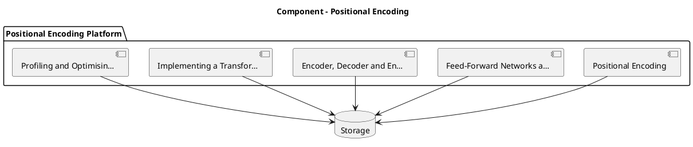

_Source diagram (plantuml); render with the appropriate tool._

**Figure 4. Component - Positional Encoding** (plantuml). Figure: Component view for Positional Encoding. This diagram illustrates the principal components and their interactions as discussed in the surrounding section.

<div class="diagram-svg">

<svg xmlns="http://www.w3.org/2000/svg" width="840" height="460" data-tpl="flow_v" data-pal="8-2" viewBox="0 0 840 460" font-family="Inter, Segoe UI, Arial, sans-serif"><defs><marker id="ar" markerWidth="9" markerHeight="9" refX="7" refY="3" orient="auto"><path d="M0,0 L7,3 L0,6 z" fill="#94a3b8"/></marker><marker id="arw" markerWidth="9" markerHeight="9" refX="7" refY="3" orient="auto"><path d="M0,0 L7,3 L0,6 z" fill="#ffffff"/></marker><filter id="sh" x="-20%" y="-20%" width="140%" height="140%"><feDropShadow dx="0" dy="2" stdDeviation="3" flood-color="#0f172a" flood-opacity="0.16"/></filter></defs><defs><linearGradient id="bnde08e88" x1="0" y1="0" x2="1" y2="0"><stop offset="0" stop-color="#2dd4bf"/><stop offset="1" stop-color="#65a30d"/></linearGradient></defs><rect width="840" height="460" rx="14" fill="#ffffff"/><rect x="0" y="0" width="840" height="48" rx="14" fill="url(#bnde08e88)"/><rect x="0" y="32" width="840" height="16" fill="url(#bnde08e88)"/><text x="420" y="25" text-anchor="middle" font-size="14.5" font-weight="700" fill="#ffffff" dominant-baseline="middle">Data Flow - Positional Encoding</text><rect x="270" y="70" width="300" height="52" rx="11" fill="#2dd4bf" filter="url(#sh)"/><text x="420" y="96" text-anchor="middle" font-size="12" font-weight="600" fill="#ffffff" dominant-baseline="middle">Positional Encoding</text><rect x="270" y="144" width="300" height="52" rx="11" fill="#65a30d" filter="url(#sh)"/><text x="420" y="170" text-anchor="middle" font-size="12" font-weight="600" fill="#ffffff" dominant-baseline="middle">Feed-Forward Networks and Activations</text><line x1="420" y1="122" x2="420" y2="144" stroke="#94a3b8" stroke-width="2" marker-end="url(#ar)"/><rect x="270" y="218" width="300" height="52" rx="11" fill="#84cc16" filter="url(#sh)"/><text x="420" y="244" text-anchor="middle" font-size="10.5" font-weight="600" fill="#ffffff" dominant-baseline="middle">Encoder, Decoder and Encoder–Decoder Variants</text><line x1="420" y1="196" x2="420" y2="218" stroke="#94a3b8" stroke-width="2" marker-end="url(#ar)"/><rect x="270" y="292" width="300" height="52" rx="11" fill="#0d9488" filter="url(#sh)"/><text x="420" y="318" text-anchor="middle" font-size="12" font-weight="600" fill="#ffffff" dominant-baseline="middle">Implementing a Transformer from Scratch</text><line x1="420" y1="270" x2="420" y2="292" stroke="#94a3b8" stroke-width="2" marker-end="url(#ar)"/><rect x="270" y="366" width="300" height="52" rx="11" fill="#0f766e" filter="url(#sh)"/><text x="420" y="392" text-anchor="middle" font-size="12" font-weight="600" fill="#ffffff" dominant-baseline="middle">Profiling and Optimising Transformers</text><line x1="420" y1="344" x2="420" y2="366" stroke="#94a3b8" stroke-width="2" marker-end="url(#ar)"/><text x="28" y="446" text-anchor="start" font-size="9.5" font-weight="500" fill="#64748b" dominant-baseline="middle">Positional Encoding  •  Data Flow</text></svg>

</div>

**Figure 5. Data Flow - Positional Encoding** (svg). Figure: Data Flow view for Positional Encoding. This diagram illustrates the principal components and their interactions as discussed in the surrounding section.

## Deep Dive: Mechanics, Variants and Trade-offs

Having established the essentials, we now go deeper into positional encoding. The underlying mechanism is best appreciated by tracing a single request from input to output and noting where state is created and consumed. The distinctions in this section are the ones that separate a working demo from a system that holds up under adversarial inputs, scale and the passage of time.

Consider the principal variants and how to choose between them. Each variant optimises for a different point in the design space - some for latency, some for accuracy, some for cost or operability - and the correct choice follows from explicit requirements rather than from defaults. There is an inherent trade-off between fidelity and cost, and the correct balance depends on the use case and its tolerance for error.

In practice this is supported by a mature tooling ecosystem, including PyTorch, FlashAttention, Triton, xFormers. Tools accelerate the work but do not substitute for understanding: the same principles apply whichever implementation you select, and the ability to reason from first principles is what lets you debug when a tool behaves unexpectedly.

A frequent source of subtle bugs is the interaction with feed-forward networks and activations. Because feed-forward networks and activations concerns position-wise MLPs, GELU/SwiGLU and their role in capacity, changes there can silently alter the behaviour analysed here. The remedy is contract tests at the boundary and end-to-end evaluations that exercise the interaction explicitly.

Finally, attend to edge cases and degradation. Define what the system should do under partial failure, unexpected inputs and load spikes, and make that behaviour explicit and tested rather than emergent. Graceful degradation - returning a safe, useful result when the ideal one is unavailable - is a hallmark of mature engineering.

For deeper study, the literature offers authoritative treatments such as Vaswani et al. — Attention Is All You Need (2017) and Dao et al. — FlashAttention (2022). These primary sources reward careful reading and ground the practical guidance above in established results.

## Advanced Considerations

Having established the essentials, we now go deeper into positional encoding. Beneath the abstraction lies a concrete process whose steps can each be measured, tested and optimised independently. The distinctions in this section are the ones that separate a working demo from a system that holds up under adversarial inputs, scale and the passage of time.

Consider the principal variants and how to choose between them. Each variant optimises for a different point in the design space - some for latency, some for accuracy, some for cost or operability - and the correct choice follows from explicit requirements rather than from defaults. As with most architectural decisions, the choice is rarely binary; the skill lies in quantifying the trade-offs and choosing deliberately.

In practice this is supported by a mature tooling ecosystem, including PyTorch, FlashAttention, Triton, xFormers. Tools accelerate the work but do not substitute for understanding: the same principles apply whichever implementation you select, and the ability to reason from first principles is what lets you debug when a tool behaves unexpectedly.

A frequent source of subtle bugs is the interaction with mixture-of-experts transformers. Because mixture-of-experts transformers concerns sparse routing for parameter-efficient scaling, changes there can silently alter the behaviour analysed here. The remedy is contract tests at the boundary and end-to-end evaluations that exercise the interaction explicitly.

Finally, attend to edge cases and degradation. Define what the system should do under partial failure, unexpected inputs and load spikes, and make that behaviour explicit and tested rather than emergent. Graceful degradation - returning a safe, useful result when the ideal one is unavailable - is a hallmark of mature engineering.

For deeper study, the literature offers authoritative treatments such as Vaswani et al. — Attention Is All You Need (2017) and Dao et al. — FlashAttention (2022). These primary sources reward careful reading and ground the practical guidance above in established results.

## Worked Example

A worked example clarifies how these ideas behave in practice. A computer vision organisation needs image classification and detection with ViT backbones. They decide to apply positional encoding as part of their Transformers solution, but wisely treat it as a hypothesis to be validated rather than a foregone conclusion.

The team begins by stating the objective precisely and defining how success will be measured before writing any code. They establish a small but representative evaluation set, agree on acceptance thresholds, and only then prototype the simplest design that could work. Early measurement reveals which assumptions hold and which must be revised, saving weeks of misdirected effort and surfacing edge cases while they are still cheap to fix.

As the prototype matures into a service, the team hardens it: adding input validation, error handling, caching where it pays off, and monitoring that ties back to the original success metric. They document each significant decision in an architecture decision record so that future maintainers understand not just what was built but why.

The outcome is instructive. The system that reaches production is not the most sophisticated design the team considered, but the one whose behaviour they could measure, explain and operate. This is the recurring lesson of Transformers: durable value comes from the whole system, not from any single clever component.

## Industry Use Cases

Across industries, the ideas in this chapter recur in recognisable ways. The following vignettes show how different sectors apply them and what they have in common.

**NLP.** Language understanding and generation across tasks. The common thread is that value comes not from the model alone but from the surrounding system - data quality, evaluation, integration and operations - which is precisely where most of the engineering effort belongs.

**Computer Vision.** Image classification and detection with ViT backbones. The common thread is that value comes not from the model alone but from the surrounding system - data quality, evaluation, integration and operations - which is precisely where most of the engineering effort belongs.

**Audio.** Speech recognition and synthesis with transformer encoders. The common thread is that value comes not from the model alone but from the surrounding system - data quality, evaluation, integration and operations - which is precisely where most of the engineering effort belongs.

**Science.** Protein structure and molecular property prediction. The common thread is that value comes not from the model alone but from the surrounding system - data quality, evaluation, integration and operations - which is precisely where most of the engineering effort belongs.

## Best Practices

The following practices consistently separate successful Transformers efforts from struggling ones. They are deliberately concrete so they can be adopted as checklist items in design and code review.

- Use pre-norm and careful warmup to stabilise deep transformer training.
- Adopt fused attention kernels to cut memory and latency.
- Validate positional encoding choice against target sequence lengths.
- Profile FLOPs and memory before scaling parameters.

None of these are exotic; they are the unglamorous disciplines that compound into reliability. The cost of adopting them is small compared with the cost of the incidents they prevent, and they become second nature with practice.

## Common Pitfalls

Equally instructive are the failure modes that recur in practice. Each pitfall below has a clear early warning sign and a known remedy, so treat them as a diagnostic checklist when something feels wrong:

- Quadratic attention cost dominating long-sequence workloads.
- Numerical instability from post-norm at depth.
- Position encoding that fails to extrapolate beyond training length.
- Ignoring kernel-level efficiency and over-provisioning hardware.

The pattern is consistent: most failures stem from skipping measurement, conflating prototype and production standards, or deferring cross-cutting concerns such as security and cost until they become emergencies. Naming these traps in advance is the cheapest way to avoid them.

## Governance, Security and Cost Notes

No discussion of positional encoding is complete without its governance, security and cost dimensions, which are too often deferred until they become emergencies. Treating them as first-class concerns from the outset is both cheaper and safer.

**Governance.** Classify the risk of this capability, document its intended and out-of-scope uses, and ensure decisions are traceable to satisfy internal policy and external regulation such as the NIST AI RMF, ISO/IEC 42001 and the EU AI Act. **Security.** Treat all external input as untrusted, validate outputs before acting on them, apply least privilege to any tools or data access, and map controls to the OWASP LLM Top 10 and MITRE ATLAS.

**Cost and sustainability.** Establish explicit budgets for compute, tokens and latency, attribute spend to owners, and revisit the economics as usage scales - a design that is affordable at pilot scale can become untenable at production volume. Building these reflexes into everyday engineering is what allows a Transformers system to be not only capable but also trustworthy and economically sound.

## Hands-On Exercises

Work through the following exercises. They are designed to move understanding from recognition to application - the level required for real engineering work - so prefer writing and building over merely reading.

1. Explain positional encoding to a colleague unfamiliar with Transformers, using a concrete example from your own domain.
2. Sketch a reference architecture that incorporates positional encoding and annotate where observability, security and cost controls belong.
3. Design an evaluation that would tell you whether positional encoding is working in production, including the metric, the dataset and the acceptance threshold.
4. Identify two pitfalls relevant to positional encoding in your environment and describe the early warning signals you would monitor.
5. Prototype the simplest implementation that demonstrates positional encoding, then list exactly what would need to change to make it production-ready.

## Key Takeaways

Key takeaways from this chapter:

- Positional Encoding is a systems concern in Transformers: data, models and operations must be co-designed.
- Measurement is non-negotiable; define success metrics and evaluation before building.
- Favour the simplest design that meets the requirement, and add complexity only when evidence demands it.
- Security, cost and observability are first-class requirements, not afterthoughts.
- Document decisions so the system remains understandable and operable as it evolves.

## Code Walkthrough

Pipelines keep Positional Encoding logic modular and testable. Each stage is a pure function, errors are captured per item, and the composition is trivial to extend or reorder.

The full listing is shown below; study it line by line and reproduce it locally before moving on.

### Listing: A composable processing pipeline for Positional Encoding

```python
from collections.abc import Iterable, Iterator
from typing import Protocol


class Stage(Protocol):
    def __call__(self, item: dict) -> dict: ...


def pipeline(stages: list[Stage]) -> Stage:
    """Compose ordered stages into a single callable for Positional Encoding."""

    def run(item: dict) -> dict:
        for stage in stages:
            item = stage(item)
        return item

    return run


def validate(item: dict) -> dict:
    if "text" not in item:
        raise ValueError("missing required field: text")
    return item


def normalise(item: dict) -> dict:
    item["text"] = item["text"].strip().lower()
    return item


def enrich(item: dict) -> dict:
    item["length"] = len(item["text"])
    return item


process = pipeline([validate, normalise, enrich])


def run_batch(items: Iterable[dict]) -> Iterator[dict]:
    for item in items:
        try:
            yield process(dict(item))
        except ValueError as exc:
            yield {"error": str(exc), "item": item}

```

## Review Questions

1. In the context of Transformers, which statement best describes “Positional Encoding”?
   - A. Sinusoidal, learned and rotary (RoPE) encodings that inject order into a permutation-invariant operation.
   - B. It makes the system slower but has no other effect.
   - C. It eliminates the need for any evaluation or monitoring.
   - D. It is only relevant to academic research, not production.
   - **Answer: A.** Positional Encoding: Sinusoidal, learned and rotary (RoPE) encodings that inject order into a permutation-invariant operation.
2. Which of the following is a recommended best practice when working with Transformers?
   - A. Ignoring kernel-level efficiency and over-provisioning hardware.
   - B. Position encoding that fails to extrapolate beyond training length.
   - C. Profile FLOPs and memory before scaling parameters.
   - D. It makes the system slower but has no other effect.
   - **Answer: C.** Best practice: Profile FLOPs and memory before scaling parameters.
3. Which of the following is a common pitfall to avoid in Transformers?
   - A. Use pre-norm and careful warmup to stabilise deep transformer training.
   - B. Position encoding that fails to extrapolate beyond training length.
   - C. Profile FLOPs and memory before scaling parameters.
   - D. It guarantees deterministic output regardless of input.
   - **Answer: B.** Pitfall to avoid: Position encoding that fails to extrapolate beyond training length.
4. *(Discussion)* Explain Positional Encoding and why it matters in a production Transformers system.
   - **Model answer:** A strong answer defines positional encoding (Sinusoidal, learned and rotary (RoPE) encodings that inject order into a permutation-invariant operation.) then connects it to architecture, evaluation, cost, security and operations for Transformers, citing concrete trade-offs and a real-world example.

---


# Chapter 5. Feed-Forward Networks and Activations

_This chapter examines feed-forward networks and activations within Transformers. It covers position-wise MLPs, GELU/SwiGLU and their role in capacity, derives a reference architecture, walks through a worked example and runnable code, surveys industry use cases, and distils best practices and pitfalls, closing with exercises and review questions._

## Introduction

At its core, Feed-Forward Networks and Activations concerns position-wise MLPs, GELU/SwiGLU and their role in capacity. Understanding this matters because Transformers systems succeed or fail on exactly these decisions. It helps to separate the conceptual model from its implementation: the former guides reasoning, the latter must contend with real-world constraints.

This chapter builds intuition first, then formalises the ideas, derives an architecture, and finishes with code, exercises and review questions so the material transfers directly to your own Transformers work. Read it actively: pause at each diagram, reproduce the code, and attempt the exercises before consulting the answers.

## Theory and Foundations

Feed-Forward Networks and Activations refers to position-wise MLPs, GELU/SwiGLU and their role in capacity. What distinguishes a production-grade approach from a prototype is the discipline of measurement: every claim is backed by an evaluation rather than intuition. It pays to understand the mechanism rather than treat it as a black box, because most production incidents are explained by one of its steps misbehaving.

To place this in context, recall the broader picture: The transformer is a neural architecture built on self-attention that processes sequences in parallel and models long-range dependencies without recurrence. Within that picture, feed-forward networks and activations is one of the load-bearing ideas - the kind that, when understood deeply, makes the rest of Transformers fall into place. Neglecting it is one of the most common reasons Transformers initiatives stall in production.

Feed-Forward Networks and Activations cannot be understood in isolation from profiling and optimising transformers. Recall that profiling and optimising transformers concerns memory, FLOPs, kernel fusion and hardware-aware design. The two interact directly: decisions in one constrain the design space of the other, which is why mature teams reason about them together rather than sequentially. Latency, accuracy and cost form a tension triangle: improving one typically pressures the others, so explicit budgets are essential.

Feed-Forward Networks and Activations cannot be understood in isolation from training dynamics and stability. Recall that training dynamics and stability concerns initialisation, warmup, gradient clipping and loss spikes. The two interact directly: decisions in one constrain the design space of the other, which is why mature teams reason about them together rather than sequentially. Every added component buys capability at the price of operational surface area, and that bargain should be made consciously.

Several established patterns apply directly to feed-forward networks and activations. The first, rotary positional embeddings for length generalisation, is widely adopted because it makes the system's behaviour predictable and observable. A complementary pattern, pre-norm residual blocks for deep stability, addresses a related concern and is often deployed alongside it. Patterns are not dogma; they are distilled experience that shortcuts the search for a sound design, and each carries assumptions worth checking against your context.

Knowing when not to use a technique is as valuable as knowing how to use it. In a small prototype, shortcuts around feed-forward networks and activations are invisible; in a production Transformers system serving real traffic, they surface as incidents, cost overruns or compliance gaps. Latency, accuracy and cost form a tension triangle: improving one typically pressures the others, so explicit budgets are essential. The remainder of this chapter turns these principles into an architecture, code and a checklist you can apply immediately.

## Architecture and Design

The reference architecture for Feed-Forward Networks and Activations separates concerns into clearly bounded components with explicit contracts. A transformer block stacks multi-head self-attention and a position-wise feed-forward network, each wrapped in residual connections and normalisation. Decoder-only stacks add causal masking; encoder–decoder stacks add cross attention. At scale, efficient attention kernels, mixed precision and tensor parallelism turn the mathematics into a trainable system.

Concretely, the principal building blocks include why self-attention replaced recurrence, scaled dot-product attention, multi-head attention, positional encoding and feed-forward networks and activations. Each is a replaceable component behind a stable interface, so the team can upgrade an implementation - a model, an index, a policy engine - without rewriting its neighbours. The contracts between components are where reliability is won or lost, so they are specified explicitly and tested in isolation.

The diagram accompanying this section makes the data and control flow explicit. Requests enter through a well-defined boundary where they are authenticated and validated; only then are they dispatched to the components that perform the work. This boundary is also where rate limiting, quota enforcement and audit logging live, keeping cross-cutting concerns out of the core logic and in one auditable place.

Two qualities deserve emphasis. First, observability is designed in, not bolted on: every component emits structured telemetry so that failures can be localised in minutes rather than hours. Second, the architecture is evolvable - components communicate through stable contracts so that any single part of the Transformers system can be replaced without a rewrite. Latency, accuracy and cost form a tension triangle: improving one typically pressures the others, so explicit budgets are essential.

<div class="diagram-svg">

<svg xmlns="http://www.w3.org/2000/svg" width="840" height="460" data-tpl="flow_h" data-pal="3-3" viewBox="0 0 840 460" font-family="Inter, Segoe UI, Arial, sans-serif"><defs><marker id="ar" markerWidth="9" markerHeight="9" refX="7" refY="3" orient="auto"><path d="M0,0 L7,3 L0,6 z" fill="#94a3b8"/></marker><marker id="arw" markerWidth="9" markerHeight="9" refX="7" refY="3" orient="auto"><path d="M0,0 L7,3 L0,6 z" fill="#ffffff"/></marker><filter id="sh" x="-20%" y="-20%" width="140%" height="140%"><feDropShadow dx="0" dy="2" stdDeviation="3" flood-color="#0f172a" flood-opacity="0.16"/></filter></defs><defs><linearGradient id="bn75360d0" x1="0" y1="0" x2="1" y2="0"><stop offset="0" stop-color="#ea580c"/><stop offset="1" stop-color="#f97316"/></linearGradient></defs><rect width="840" height="460" rx="14" fill="#ffffff"/><rect x="0" y="0" width="840" height="48" rx="14" fill="url(#bn75360d0)"/><rect x="0" y="32" width="840" height="16" fill="url(#bn75360d0)"/><text x="420" y="25" text-anchor="middle" font-size="14.5" font-weight="700" fill="#ffffff" dominant-baseline="middle">Data Flow - Feed-Forward Networks and Activations</text><rect x="39" y="196" width="130" height="68" rx="11" fill="#ea580c" filter="url(#sh)"/><text x="104" y="224" text-anchor="middle" font-size="10.5" font-weight="600" fill="#ffffff" dominant-baseline="middle">Feed-Forward Networks</text><text x="104" y="236" text-anchor="middle" font-size="10.5" font-weight="600" fill="#ffffff" dominant-baseline="middle">and Activations</text><rect x="197" y="196" width="130" height="68" rx="11" fill="#f97316" filter="url(#sh)"/><text x="262" y="218" text-anchor="middle" font-size="10.5" font-weight="600" fill="#ffffff" dominant-baseline="middle">Profiling and</text><text x="262" y="230" text-anchor="middle" font-size="10.5" font-weight="600" fill="#ffffff" dominant-baseline="middle">Optimising</text><text x="262" y="242" text-anchor="middle" font-size="10.5" font-weight="600" fill="#ffffff" dominant-baseline="middle">Transformers</text><line x1="169" y1="230" x2="197" y2="230" stroke="#94a3b8" stroke-width="2" marker-end="url(#ar)"/><rect x="355" y="196" width="130" height="68" rx="11" fill="#fb923c" filter="url(#sh)"/><text x="420" y="224" text-anchor="middle" font-size="10.5" font-weight="600" fill="#ffffff" dominant-baseline="middle">Training Dynamics and</text><text x="420" y="236" text-anchor="middle" font-size="10.5" font-weight="600" fill="#ffffff" dominant-baseline="middle">Stability</text><line x1="327" y1="230" x2="355" y2="230" stroke="#94a3b8" stroke-width="2" marker-end="url(#ar)"/><rect x="513" y="196" width="130" height="68" rx="11" fill="#b45309" filter="url(#sh)"/><text x="578" y="224" text-anchor="middle" font-size="10.5" font-weight="600" fill="#ffffff" dominant-baseline="middle">Vision and Multimodal</text><text x="578" y="236" text-anchor="middle" font-size="10.5" font-weight="600" fill="#ffffff" dominant-baseline="middle">Transformers</text><line x1="485" y1="230" x2="513" y2="230" stroke="#94a3b8" stroke-width="2" marker-end="url(#ar)"/><rect x="671" y="196" width="130" height="68" rx="11" fill="#d97706" filter="url(#sh)"/><text x="736" y="218" text-anchor="middle" font-size="10.5" font-weight="600" fill="#ffffff" dominant-baseline="middle">Implementing a</text><text x="736" y="230" text-anchor="middle" font-size="10.5" font-weight="600" fill="#ffffff" dominant-baseline="middle">Transformer from</text><text x="736" y="242" text-anchor="middle" font-size="10.5" font-weight="600" fill="#ffffff" dominant-baseline="middle">Scratch</text><line x1="643" y1="230" x2="671" y2="230" stroke="#94a3b8" stroke-width="2" marker-end="url(#ar)"/><text x="420" y="300" text-anchor="middle" font-size="11" font-weight="500" fill="#64748b" dominant-baseline="middle">end-to-end flow</text><text x="28" y="446" text-anchor="start" font-size="9.5" font-weight="500" fill="#64748b" dominant-baseline="middle">Feed-Forward Networks and Activations  •  Data Flow</text></svg>

</div>

**Figure 6. Data Flow - Feed-Forward Networks and Activations** (svg). Figure: Data Flow view for Feed-Forward Networks and Activations. This diagram illustrates the principal components and their interactions as discussed in the surrounding section.

## Deep Dive: Mechanics, Variants and Trade-offs

Having established the essentials, we now go deeper into feed-forward networks and activations. It pays to understand the mechanism rather than treat it as a black box, because most production incidents are explained by one of its steps misbehaving. The distinctions in this section are the ones that separate a working demo from a system that holds up under adversarial inputs, scale and the passage of time.

Consider the principal variants and how to choose between them. Each variant optimises for a different point in the design space - some for latency, some for accuracy, some for cost or operability - and the correct choice follows from explicit requirements rather than from defaults. Every added component buys capability at the price of operational surface area, and that bargain should be made consciously.

In practice this is supported by a mature tooling ecosystem, including PyTorch, FlashAttention, Triton, xFormers. Tools accelerate the work but do not substitute for understanding: the same principles apply whichever implementation you select, and the ability to reason from first principles is what lets you debug when a tool behaves unexpectedly.

A frequent source of subtle bugs is the interaction with profiling and optimising transformers. Because profiling and optimising transformers concerns memory, FLOPs, kernel fusion and hardware-aware design, changes there can silently alter the behaviour analysed here. The remedy is contract tests at the boundary and end-to-end evaluations that exercise the interaction explicitly.

Finally, attend to edge cases and degradation. Define what the system should do under partial failure, unexpected inputs and load spikes, and make that behaviour explicit and tested rather than emergent. Graceful degradation - returning a safe, useful result when the ideal one is unavailable - is a hallmark of mature engineering.

For deeper study, the literature offers authoritative treatments such as Vaswani et al. — Attention Is All You Need (2017) and Dao et al. — FlashAttention (2022). These primary sources reward careful reading and ground the practical guidance above in established results.

## Advanced Considerations

Having established the essentials, we now go deeper into feed-forward networks and activations. Mechanically, the behaviour emerges from a few interacting parts that are simpler than the whole they produce. The distinctions in this section are the ones that separate a working demo from a system that holds up under adversarial inputs, scale and the passage of time.

Consider the principal variants and how to choose between them. Each variant optimises for a different point in the design space - some for latency, some for accuracy, some for cost or operability - and the correct choice follows from explicit requirements rather than from defaults. As with most architectural decisions, the choice is rarely binary; the skill lies in quantifying the trade-offs and choosing deliberately.

In practice this is supported by a mature tooling ecosystem, including PyTorch, FlashAttention, Triton, xFormers. Tools accelerate the work but do not substitute for understanding: the same principles apply whichever implementation you select, and the ability to reason from first principles is what lets you debug when a tool behaves unexpectedly.

A frequent source of subtle bugs is the interaction with residual connections and normalisation. Because residual connections and normalisation concerns pre-norm versus post-norm, LayerNorm/RMSNorm and training stability, changes there can silently alter the behaviour analysed here. The remedy is contract tests at the boundary and end-to-end evaluations that exercise the interaction explicitly.

Finally, attend to edge cases and degradation. Define what the system should do under partial failure, unexpected inputs and load spikes, and make that behaviour explicit and tested rather than emergent. Graceful degradation - returning a safe, useful result when the ideal one is unavailable - is a hallmark of mature engineering.

For deeper study, the literature offers authoritative treatments such as Vaswani et al. — Attention Is All You Need (2017) and Dao et al. — FlashAttention (2022). These primary sources reward careful reading and ground the practical guidance above in established results.

## Worked Example

To ground the discussion, walk through a representative example. A science organisation needs protein structure and molecular property prediction. They decide to apply feed-forward networks and activations as part of their Transformers solution, but wisely treat it as a hypothesis to be validated rather than a foregone conclusion.

The team begins by stating the objective precisely and defining how success will be measured before writing any code. They establish a small but representative evaluation set, agree on acceptance thresholds, and only then prototype the simplest design that could work. Early measurement reveals which assumptions hold and which must be revised, saving weeks of misdirected effort and surfacing edge cases while they are still cheap to fix.

As the prototype matures into a service, the team hardens it: adding input validation, error handling, caching where it pays off, and monitoring that ties back to the original success metric. They document each significant decision in an architecture decision record so that future maintainers understand not just what was built but why.

The outcome is instructive. The system that reaches production is not the most sophisticated design the team considered, but the one whose behaviour they could measure, explain and operate. This is the recurring lesson of Transformers: durable value comes from the whole system, not from any single clever component.

## Industry Use Cases

Across industries, the ideas in this chapter recur in recognisable ways. The following vignettes show how different sectors apply them and what they have in common.

**NLP.** Language understanding and generation across tasks. The common thread is that value comes not from the model alone but from the surrounding system - data quality, evaluation, integration and operations - which is precisely where most of the engineering effort belongs.

**Computer Vision.** Image classification and detection with ViT backbones. The common thread is that value comes not from the model alone but from the surrounding system - data quality, evaluation, integration and operations - which is precisely where most of the engineering effort belongs.

**Audio.** Speech recognition and synthesis with transformer encoders. The common thread is that value comes not from the model alone but from the surrounding system - data quality, evaluation, integration and operations - which is precisely where most of the engineering effort belongs.

**Science.** Protein structure and molecular property prediction. The common thread is that value comes not from the model alone but from the surrounding system - data quality, evaluation, integration and operations - which is precisely where most of the engineering effort belongs.

## Best Practices

The following practices consistently separate successful Transformers efforts from struggling ones. They are deliberately concrete so they can be adopted as checklist items in design and code review.

- Use pre-norm and careful warmup to stabilise deep transformer training.
- Adopt fused attention kernels to cut memory and latency.
- Validate positional encoding choice against target sequence lengths.
- Profile FLOPs and memory before scaling parameters.

None of these are exotic; they are the unglamorous disciplines that compound into reliability. The cost of adopting them is small compared with the cost of the incidents they prevent, and they become second nature with practice.

## Common Pitfalls

Equally instructive are the failure modes that recur in practice. Each pitfall below has a clear early warning sign and a known remedy, so treat them as a diagnostic checklist when something feels wrong:

- Quadratic attention cost dominating long-sequence workloads.
- Numerical instability from post-norm at depth.
- Position encoding that fails to extrapolate beyond training length.
- Ignoring kernel-level efficiency and over-provisioning hardware.

The pattern is consistent: most failures stem from skipping measurement, conflating prototype and production standards, or deferring cross-cutting concerns such as security and cost until they become emergencies. Naming these traps in advance is the cheapest way to avoid them.

## Governance, Security and Cost Notes

No discussion of feed-forward networks and activations is complete without its governance, security and cost dimensions, which are too often deferred until they become emergencies. Treating them as first-class concerns from the outset is both cheaper and safer.

**Governance.** Classify the risk of this capability, document its intended and out-of-scope uses, and ensure decisions are traceable to satisfy internal policy and external regulation such as the NIST AI RMF, ISO/IEC 42001 and the EU AI Act. **Security.** Treat all external input as untrusted, validate outputs before acting on them, apply least privilege to any tools or data access, and map controls to the OWASP LLM Top 10 and MITRE ATLAS.

**Cost and sustainability.** Establish explicit budgets for compute, tokens and latency, attribute spend to owners, and revisit the economics as usage scales - a design that is affordable at pilot scale can become untenable at production volume. Building these reflexes into everyday engineering is what allows a Transformers system to be not only capable but also trustworthy and economically sound.

## Hands-On Exercises

Work through the following exercises. They are designed to move understanding from recognition to application - the level required for real engineering work - so prefer writing and building over merely reading.

1. Explain feed-forward networks and activations to a colleague unfamiliar with Transformers, using a concrete example from your own domain.
2. Sketch a reference architecture that incorporates feed-forward networks and activations and annotate where observability, security and cost controls belong.
3. Design an evaluation that would tell you whether feed-forward networks and activations is working in production, including the metric, the dataset and the acceptance threshold.
4. Identify two pitfalls relevant to feed-forward networks and activations in your environment and describe the early warning signals you would monitor.
5. Prototype the simplest implementation that demonstrates feed-forward networks and activations, then list exactly what would need to change to make it production-ready.

## Key Takeaways

Key takeaways from this chapter:

- Feed-Forward Networks and Activations is a systems concern in Transformers: data, models and operations must be co-designed.
- Measurement is non-negotiable; define success metrics and evaluation before building.
- Favour the simplest design that meets the requirement, and add complexity only when evidence demands it.
- Security, cost and observability are first-class requirements, not afterthoughts.
- Document decisions so the system remains understandable and operable as it evolves.

## Code Walkthrough

Every change to a Transformers system should pass an evaluation gate. This example shows the minimal shape: align predictions and references, compute a metric, and return a pass/fail decision for CI.

The full listing is shown below; study it line by line and reproduce it locally before moving on.

### Listing: Evaluating Feed-Forward Networks and Activations with a regression gate

```python
from dataclasses import dataclass


@dataclass
class EvalResult:
    metric: str
    score: float
    passed: bool


def evaluate(predictions: list[str], references: list[str],
             threshold: float = 0.8) -> EvalResult:
    """Score Feed-Forward Networks and Activations output against references with a simple exact-match metric.

    In practice you would combine several metrics (exact match, semantic
    similarity, LLM-as-judge) and gate releases on the aggregate.
    """
    if len(predictions) != len(references):
        raise ValueError("predictions and references must align")
    hits = sum(p.strip() == r.strip() for p, r in zip(predictions, references))
    score = hits / len(references) if references else 0.0
    return EvalResult(metric="exact_match", score=score, passed=score >= threshold)


if __name__ == "__main__":
    result = evaluate(["yes", "no"], ["yes", "yes"])
    print(f"{result.metric}={result.score:.2f} passed={result.passed}")

```

## Review Questions

1. In the context of Transformers, which statement best describes “Feed-Forward Networks and Activations”?
   - A. It eliminates the need for any evaluation or monitoring.
   - B. It is only relevant to academic research, not production.
   - C. It makes the system slower but has no other effect.
   - D. Position-wise MLPs, GELU/SwiGLU and their role in capacity.
   - **Answer: D.** Feed-Forward Networks and Activations: Position-wise MLPs, GELU/SwiGLU and their role in capacity.
2. Which of the following is a recommended best practice when working with Transformers?
   - A. Profile FLOPs and memory before scaling parameters.
   - B. It applies exclusively to image data.
   - C. It is only relevant to academic research, not production.
   - D. It removes all security and governance requirements.
   - **Answer: A.** Best practice: Profile FLOPs and memory before scaling parameters.
3. Which of the following is a common pitfall to avoid in Transformers?
   - A. Ignoring kernel-level efficiency and over-provisioning hardware.
   - B. It guarantees deterministic output regardless of input.
   - C. Profile FLOPs and memory before scaling parameters.
   - D. It eliminates the need for any evaluation or monitoring.
   - **Answer: A.** Pitfall to avoid: Ignoring kernel-level efficiency and over-provisioning hardware.
4. *(Discussion)* How would you test and monitor Feed-Forward Networks and Activations in production?
   - **Model answer:** A strong answer defines feed-forward networks and activations (Position-wise MLPs, GELU/SwiGLU and their role in capacity.) then connects it to architecture, evaluation, cost, security and operations for Transformers, citing concrete trade-offs and a real-world example.

---


# Chapter 6. Residual Connections and Normalisation

_This chapter examines residual connections and normalisation within Transformers. It covers pre-norm versus post-norm, LayerNorm/RMSNorm and training stability, derives a reference architecture, walks through a worked example and runnable code, surveys industry use cases, and distils best practices and pitfalls, closing with exercises and review questions._

## Introduction

We define Residual Connections and Normalisation as pre-norm versus post-norm, LayerNorm/RMSNorm and training stability. Neglecting it is one of the most common reasons Transformers initiatives stall in production. What distinguishes a production-grade approach from a prototype is the discipline of measurement: every claim is backed by an evaluation rather than intuition.

This chapter builds intuition first, then formalises the ideas, derives an architecture, and finishes with code, exercises and review questions so the material transfers directly to your own Transformers work. Read it actively: pause at each diagram, reproduce the code, and attempt the exercises before consulting the answers.

## Theory and Foundations

We define Residual Connections and Normalisation as pre-norm versus post-norm, LayerNorm/RMSNorm and training stability. Seasoned practitioners treat this as a systems problem, co-designing data, models and operations rather than optimising any one in isolation. It pays to understand the mechanism rather than treat it as a black box, because most production incidents are explained by one of its steps misbehaving.

To place this in context, recall the broader picture: The transformer is a neural architecture built on self-attention that processes sequences in parallel and models long-range dependencies without recurrence. Within that picture, residual connections and normalisation is one of the load-bearing ideas - the kind that, when understood deeply, makes the rest of Transformers fall into place. It is foundational: later capabilities in Transformers are built directly on top of it.

Residual Connections and Normalisation cannot be understood in isolation from mixture-of-experts transformers. Recall that mixture-of-experts transformers concerns sparse routing for parameter-efficient scaling. The two interact directly: decisions in one constrain the design space of the other, which is why mature teams reason about them together rather than sequentially. As with most architectural decisions, the choice is rarely binary; the skill lies in quantifying the trade-offs and choosing deliberately.

Residual Connections and Normalisation cannot be understood in isolation from vision and multimodal transformers. Recall that vision and multimodal transformers concerns patch embeddings, ViT and cross-modal attention. The two interact directly: decisions in one constrain the design space of the other, which is why mature teams reason about them together rather than sequentially. Latency, accuracy and cost form a tension triangle: improving one typically pressures the others, so explicit budgets are essential.

Several established patterns apply directly to residual connections and normalisation. The first, rotary positional embeddings for length generalisation, is widely adopted because it makes the system's behaviour predictable and observable. A complementary pattern, flashattention for memory-efficient exact attention, addresses a related concern and is often deployed alongside it. Patterns are not dogma; they are distilled experience that shortcuts the search for a sound design, and each carries assumptions worth checking against your context.

Knowing when not to use a technique is as valuable as knowing how to use it. In a small prototype, shortcuts around residual connections and normalisation are invisible; in a production Transformers system serving real traffic, they surface as incidents, cost overruns or compliance gaps. Every added component buys capability at the price of operational surface area, and that bargain should be made consciously. The remainder of this chapter turns these principles into an architecture, code and a checklist you can apply immediately.

## Architecture and Design

A robust architecture for Residual Connections and Normalisation is layered so each part can evolve independently without destabilising the whole. A transformer block stacks multi-head self-attention and a position-wise feed-forward network, each wrapped in residual connections and normalisation. Decoder-only stacks add causal masking; encoder–decoder stacks add cross attention. At scale, efficient attention kernels, mixed precision and tensor parallelism turn the mathematics into a trainable system.

Concretely, the principal building blocks include why self-attention replaced recurrence, scaled dot-product attention, multi-head attention, positional encoding and feed-forward networks and activations. Each is a replaceable component behind a stable interface, so the team can upgrade an implementation - a model, an index, a policy engine - without rewriting its neighbours. The contracts between components are where reliability is won or lost, so they are specified explicitly and tested in isolation.

The diagram accompanying this section makes the data and control flow explicit. Requests enter through a well-defined boundary where they are authenticated and validated; only then are they dispatched to the components that perform the work. This boundary is also where rate limiting, quota enforcement and audit logging live, keeping cross-cutting concerns out of the core logic and in one auditable place.

Two qualities deserve emphasis. First, observability is designed in, not bolted on: every component emits structured telemetry so that failures can be localised in minutes rather than hours. Second, the architecture is evolvable - components communicate through stable contracts so that any single part of the Transformers system can be replaced without a rewrite. As with most architectural decisions, the choice is rarely binary; the skill lies in quantifying the trade-offs and choosing deliberately.

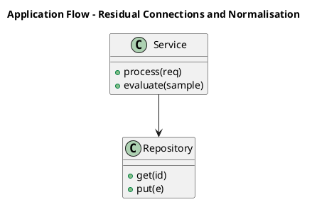

_Source diagram (plantuml); render with the appropriate tool._

**Figure 7. Application Flow - Residual Connections and Normalisation** (plantuml). Figure: Application Flow view for Residual Connections and Normalisation. This diagram illustrates the principal components and their interactions as discussed in the surrounding section.

## Deep Dive: Mechanics, Variants and Trade-offs

Having established the essentials, we now go deeper into residual connections and normalisation. Beneath the abstraction lies a concrete process whose steps can each be measured, tested and optimised independently. The distinctions in this section are the ones that separate a working demo from a system that holds up under adversarial inputs, scale and the passage of time.

Consider the principal variants and how to choose between them. Each variant optimises for a different point in the design space - some for latency, some for accuracy, some for cost or operability - and the correct choice follows from explicit requirements rather than from defaults. Simplicity is a feature. The simplest design that meets the requirement should be the default, with complexity added only when measurement justifies it.

In practice this is supported by a mature tooling ecosystem, including PyTorch, FlashAttention, Triton, xFormers. Tools accelerate the work but do not substitute for understanding: the same principles apply whichever implementation you select, and the ability to reason from first principles is what lets you debug when a tool behaves unexpectedly.

A frequent source of subtle bugs is the interaction with mixture-of-experts transformers. Because mixture-of-experts transformers concerns sparse routing for parameter-efficient scaling, changes there can silently alter the behaviour analysed here. The remedy is contract tests at the boundary and end-to-end evaluations that exercise the interaction explicitly.

Finally, attend to edge cases and degradation. Define what the system should do under partial failure, unexpected inputs and load spikes, and make that behaviour explicit and tested rather than emergent. Graceful degradation - returning a safe, useful result when the ideal one is unavailable - is a hallmark of mature engineering.

For deeper study, the literature offers authoritative treatments such as Vaswani et al. — Attention Is All You Need (2017) and Dao et al. — FlashAttention (2022). These primary sources reward careful reading and ground the practical guidance above in established results.

## Advanced Considerations

Having established the essentials, we now go deeper into residual connections and normalisation. It pays to understand the mechanism rather than treat it as a black box, because most production incidents are explained by one of its steps misbehaving. The distinctions in this section are the ones that separate a working demo from a system that holds up under adversarial inputs, scale and the passage of time.

Consider the principal variants and how to choose between them. Each variant optimises for a different point in the design space - some for latency, some for accuracy, some for cost or operability - and the correct choice follows from explicit requirements rather than from defaults. Simplicity is a feature. The simplest design that meets the requirement should be the default, with complexity added only when measurement justifies it.

In practice this is supported by a mature tooling ecosystem, including PyTorch, FlashAttention, Triton, xFormers. Tools accelerate the work but do not substitute for understanding: the same principles apply whichever implementation you select, and the ability to reason from first principles is what lets you debug when a tool behaves unexpectedly.

A frequent source of subtle bugs is the interaction with profiling and optimising transformers. Because profiling and optimising transformers concerns memory, FLOPs, kernel fusion and hardware-aware design, changes there can silently alter the behaviour analysed here. The remedy is contract tests at the boundary and end-to-end evaluations that exercise the interaction explicitly.

Finally, attend to edge cases and degradation. Define what the system should do under partial failure, unexpected inputs and load spikes, and make that behaviour explicit and tested rather than emergent. Graceful degradation - returning a safe, useful result when the ideal one is unavailable - is a hallmark of mature engineering.

For deeper study, the literature offers authoritative treatments such as Vaswani et al. — Attention Is All You Need (2017) and Dao et al. — FlashAttention (2022). These primary sources reward careful reading and ground the practical guidance above in established results.

## Worked Example

A worked example clarifies how these ideas behave in practice. A science organisation needs protein structure and molecular property prediction. They decide to apply residual connections and normalisation as part of their Transformers solution, but wisely treat it as a hypothesis to be validated rather than a foregone conclusion.

The team begins by stating the objective precisely and defining how success will be measured before writing any code. They establish a small but representative evaluation set, agree on acceptance thresholds, and only then prototype the simplest design that could work. Early measurement reveals which assumptions hold and which must be revised, saving weeks of misdirected effort and surfacing edge cases while they are still cheap to fix.

As the prototype matures into a service, the team hardens it: adding input validation, error handling, caching where it pays off, and monitoring that ties back to the original success metric. They document each significant decision in an architecture decision record so that future maintainers understand not just what was built but why.

The outcome is instructive. The system that reaches production is not the most sophisticated design the team considered, but the one whose behaviour they could measure, explain and operate. This is the recurring lesson of Transformers: durable value comes from the whole system, not from any single clever component.

## Industry Use Cases

Across industries, the ideas in this chapter recur in recognisable ways. The following vignettes show how different sectors apply them and what they have in common.

**NLP.** Language understanding and generation across tasks. The common thread is that value comes not from the model alone but from the surrounding system - data quality, evaluation, integration and operations - which is precisely where most of the engineering effort belongs.

**Computer Vision.** Image classification and detection with ViT backbones. The common thread is that value comes not from the model alone but from the surrounding system - data quality, evaluation, integration and operations - which is precisely where most of the engineering effort belongs.

**Audio.** Speech recognition and synthesis with transformer encoders. The common thread is that value comes not from the model alone but from the surrounding system - data quality, evaluation, integration and operations - which is precisely where most of the engineering effort belongs.

**Science.** Protein structure and molecular property prediction. The common thread is that value comes not from the model alone but from the surrounding system - data quality, evaluation, integration and operations - which is precisely where most of the engineering effort belongs.

## Best Practices

The following practices consistently separate successful Transformers efforts from struggling ones. They are deliberately concrete so they can be adopted as checklist items in design and code review.

- Use pre-norm and careful warmup to stabilise deep transformer training.
- Adopt fused attention kernels to cut memory and latency.
- Validate positional encoding choice against target sequence lengths.
- Profile FLOPs and memory before scaling parameters.

None of these are exotic; they are the unglamorous disciplines that compound into reliability. The cost of adopting them is small compared with the cost of the incidents they prevent, and they become second nature with practice.

## Common Pitfalls

Equally instructive are the failure modes that recur in practice. Each pitfall below has a clear early warning sign and a known remedy, so treat them as a diagnostic checklist when something feels wrong:

- Quadratic attention cost dominating long-sequence workloads.
- Numerical instability from post-norm at depth.
- Position encoding that fails to extrapolate beyond training length.
- Ignoring kernel-level efficiency and over-provisioning hardware.

The pattern is consistent: most failures stem from skipping measurement, conflating prototype and production standards, or deferring cross-cutting concerns such as security and cost until they become emergencies. Naming these traps in advance is the cheapest way to avoid them.

## Governance, Security and Cost Notes

No discussion of residual connections and normalisation is complete without its governance, security and cost dimensions, which are too often deferred until they become emergencies. Treating them as first-class concerns from the outset is both cheaper and safer.

**Governance.** Classify the risk of this capability, document its intended and out-of-scope uses, and ensure decisions are traceable to satisfy internal policy and external regulation such as the NIST AI RMF, ISO/IEC 42001 and the EU AI Act. **Security.** Treat all external input as untrusted, validate outputs before acting on them, apply least privilege to any tools or data access, and map controls to the OWASP LLM Top 10 and MITRE ATLAS.

**Cost and sustainability.** Establish explicit budgets for compute, tokens and latency, attribute spend to owners, and revisit the economics as usage scales - a design that is affordable at pilot scale can become untenable at production volume. Building these reflexes into everyday engineering is what allows a Transformers system to be not only capable but also trustworthy and economically sound.

## Hands-On Exercises

Work through the following exercises. They are designed to move understanding from recognition to application - the level required for real engineering work - so prefer writing and building over merely reading.

1. Explain residual connections and normalisation to a colleague unfamiliar with Transformers, using a concrete example from your own domain.
2. Sketch a reference architecture that incorporates residual connections and normalisation and annotate where observability, security and cost controls belong.
3. Design an evaluation that would tell you whether residual connections and normalisation is working in production, including the metric, the dataset and the acceptance threshold.
4. Identify two pitfalls relevant to residual connections and normalisation in your environment and describe the early warning signals you would monitor.
5. Prototype the simplest implementation that demonstrates residual connections and normalisation, then list exactly what would need to change to make it production-ready.

## Key Takeaways

Key takeaways from this chapter:

- Residual Connections and Normalisation is a systems concern in Transformers: data, models and operations must be co-designed.
- Measurement is non-negotiable; define success metrics and evaluation before building.
- Favour the simplest design that meets the requirement, and add complexity only when evidence demands it.
- Security, cost and observability are first-class requirements, not afterthoughts.
- Document decisions so the system remains understandable and operable as it evolves.

## Code Walkthrough

Every change to a Transformers system should pass an evaluation gate. This example shows the minimal shape: align predictions and references, compute a metric, and return a pass/fail decision for CI.

The full listing is shown below; study it line by line and reproduce it locally before moving on.

### Listing: Evaluating Residual Connections and Normalisation with a regression gate

```python
from dataclasses import dataclass


@dataclass
class EvalResult:
    metric: str
    score: float
    passed: bool


def evaluate(predictions: list[str], references: list[str],
             threshold: float = 0.8) -> EvalResult:
    """Score Residual Connections and Normalisation output against references with a simple exact-match metric.

    In practice you would combine several metrics (exact match, semantic
    similarity, LLM-as-judge) and gate releases on the aggregate.
    """
    if len(predictions) != len(references):
        raise ValueError("predictions and references must align")
    hits = sum(p.strip() == r.strip() for p, r in zip(predictions, references))
    score = hits / len(references) if references else 0.0
    return EvalResult(metric="exact_match", score=score, passed=score >= threshold)


if __name__ == "__main__":
    result = evaluate(["yes", "no"], ["yes", "yes"])
    print(f"{result.metric}={result.score:.2f} passed={result.passed}")

```

## Review Questions

1. In the context of Transformers, which statement best describes “Residual Connections and Normalisation”?
   - A. Pre-norm versus post-norm, LayerNorm/RMSNorm and training stability.
   - B. It removes all security and governance requirements.
   - C. It guarantees deterministic output regardless of input.
   - D. It applies exclusively to image data.
   - **Answer: A.** Residual Connections and Normalisation: Pre-norm versus post-norm, LayerNorm/RMSNorm and training stability.
2. Which of the following is a recommended best practice when working with Transformers?
   - A. Position encoding that fails to extrapolate beyond training length.
   - B. Validate positional encoding choice against target sequence lengths.
   - C. Ignoring kernel-level efficiency and over-provisioning hardware.
   - D. Quadratic attention cost dominating long-sequence workloads.
   - **Answer: B.** Best practice: Validate positional encoding choice against target sequence lengths.
3. Which of the following is a common pitfall to avoid in Transformers?
   - A. It guarantees deterministic output regardless of input.
   - B. Validate positional encoding choice against target sequence lengths.
   - C. Numerical instability from post-norm at depth.
   - D. It makes the system slower but has no other effect.
   - **Answer: C.** Pitfall to avoid: Numerical instability from post-norm at depth.
4. *(Discussion)* Explain Residual Connections and Normalisation and why it matters in a production Transformers system.
   - **Model answer:** A strong answer defines residual connections and normalisation (Pre-norm versus post-norm, LayerNorm/RMSNorm and training stability.) then connects it to architecture, evaluation, cost, security and operations for Transformers, citing concrete trade-offs and a real-world example.

---


# Chapter 7. Encoder, Decoder and Encoder–Decoder Variants

_This chapter examines encoder, decoder and encoder–decoder variants within Transformers. It covers bERT-style, GPT-style and T5-style architectures and their use cases, derives a reference architecture, walks through a worked example and runnable code, surveys industry use cases, and distils best practices and pitfalls, closing with exercises and review questions._

## Introduction

Encoder, Decoder and Encoder–Decoder Variants can be characterised as bERT-style, GPT-style and T5-style architectures and their use cases. Teams that master this consistently ship more reliable Transformers systems at lower cost. The practical implication is that design choices here ripple through latency, cost and maintainability for the lifetime of the system.

This chapter builds intuition first, then formalises the ideas, derives an architecture, and finishes with code, exercises and review questions so the material transfers directly to your own Transformers work. Read it actively: pause at each diagram, reproduce the code, and attempt the exercises before consulting the answers.

## Theory and Foundations

We define Encoder, Decoder and Encoder–Decoder Variants as bERT-style, GPT-style and T5-style architectures and their use cases. It helps to separate the conceptual model from its implementation: the former guides reasoning, the latter must contend with real-world constraints. Mechanically, the behaviour emerges from a few interacting parts that are simpler than the whole they produce.

To place this in context, recall the broader picture: The transformer is a neural architecture built on self-attention that processes sequences in parallel and models long-range dependencies without recurrence. Within that picture, encoder, decoder and encoder–decoder variants is one of the load-bearing ideas - the kind that, when understood deeply, makes the rest of Transformers fall into place. Neglecting it is one of the most common reasons Transformers initiatives stall in production.

Encoder, Decoder and Encoder–Decoder Variants cannot be understood in isolation from multi-head attention. Recall that multi-head attention concerns projecting into multiple subspaces to attend to different relations simultaneously. The two interact directly: decisions in one constrain the design space of the other, which is why mature teams reason about them together rather than sequentially. There is an inherent trade-off between fidelity and cost, and the correct balance depends on the use case and its tolerance for error.

Encoder, Decoder and Encoder–Decoder Variants cannot be understood in isolation from residual connections and normalisation. Recall that residual connections and normalisation concerns pre-norm versus post-norm, LayerNorm/RMSNorm and training stability. The two interact directly: decisions in one constrain the design space of the other, which is why mature teams reason about them together rather than sequentially. Simplicity is a feature. The simplest design that meets the requirement should be the default, with complexity added only when measurement justifies it.

Several established patterns apply directly to encoder, decoder and encoder–decoder variants. The first, pre-norm residual blocks for deep stability, is widely adopted because it makes the system's behaviour predictable and observable. A complementary pattern, mixture-of-experts routing for sparse scaling, addresses a related concern and is often deployed alongside it. Patterns are not dogma; they are distilled experience that shortcuts the search for a sound design, and each carries assumptions worth checking against your context.

It is worth being explicit about when to apply this and when to reach for something simpler. In a small prototype, shortcuts around encoder, decoder and encoder–decoder variants are invisible; in a production Transformers system serving real traffic, they surface as incidents, cost overruns or compliance gaps. Every added component buys capability at the price of operational surface area, and that bargain should be made consciously. The remainder of this chapter turns these principles into an architecture, code and a checklist you can apply immediately.

## Architecture and Design

A robust architecture for Encoder, Decoder and Encoder–Decoder Variants is layered so each part can evolve independently without destabilising the whole. A transformer block stacks multi-head self-attention and a position-wise feed-forward network, each wrapped in residual connections and normalisation. Decoder-only stacks add causal masking; encoder–decoder stacks add cross attention. At scale, efficient attention kernels, mixed precision and tensor parallelism turn the mathematics into a trainable system.

Concretely, the principal building blocks include why self-attention replaced recurrence, scaled dot-product attention, multi-head attention, positional encoding and feed-forward networks and activations. Each is a replaceable component behind a stable interface, so the team can upgrade an implementation - a model, an index, a policy engine - without rewriting its neighbours. The contracts between components are where reliability is won or lost, so they are specified explicitly and tested in isolation.

The diagram accompanying this section makes the data and control flow explicit. Requests enter through a well-defined boundary where they are authenticated and validated; only then are they dispatched to the components that perform the work. This boundary is also where rate limiting, quota enforcement and audit logging live, keeping cross-cutting concerns out of the core logic and in one auditable place.

Two qualities deserve emphasis. First, observability is designed in, not bolted on: every component emits structured telemetry so that failures can be localised in minutes rather than hours. Second, the architecture is evolvable - components communicate through stable contracts so that any single part of the Transformers system can be replaced without a rewrite. As with most architectural decisions, the choice is rarely binary; the skill lies in quantifying the trade-offs and choosing deliberately.

```xml
<mxfile host="ai-university">
  <diagram name="Security Architecture">
    <mxGraphModel dx="800" dy="600" grid="1" gridSize="10">
      <root>
        <mxCell id="0"/>
        <mxCell id="1" parent="0"/>
        <mxCell id="title" value="Security Architecture - Encoder, Decoder and Encoder–Decode…" style="text;fontSize=16;fontStyle=1" vertex="1" parent="1"><mxGeometry x="40" y="20" width="600" height="30" as="geometry"/></mxCell>
        <mxCell id="hub" value="Encoder, Decoder and …" style="rounded=1;fillColor=#0f172a;fontColor=#ffffff;fontStyle=1" vertex="1" parent="1"><mxGeometry x="300" y="180" width="160" height="60" as="geometry"/></mxCell>
        <mxCell id="n0" value="Encoder, Decoder and En…" style="rounded=1;fillColor=#e0e7ff;strokeColor=#4338ca" vertex="1" parent="1"><mxGeometry x="60" y="80" width="160" height="50" as="geometry"/></mxCell>
        <mxCell id="e0" style="edgeStyle=orthogonalEdgeStyle" edge="1" parent="1" source="hub" target="n0"><mxGeometry relative="1" as="geometry"/></mxCell>
        <mxCell id="n1" value="Multi-Head Attention" style="rounded=1;fillColor=#e0e7ff;strokeColor=#4338ca" vertex="1" parent="1"><mxGeometry x="600" y="170" width="160" height="50" as="geometry"/></mxCell>
        <mxCell id="e1" style="edgeStyle=orthogonalEdgeStyle" edge="1" parent="1" source="hub" target="n1"><mxGeometry relative="1" as="geometry"/></mxCell>
        <mxCell id="n2" value="Residual Connections an…" style="rounded=1;fillColor=#e0e7ff;strokeColor=#4338ca" vertex="1" parent="1"><mxGeometry x="60" y="260" width="160" height="50" as="geometry"/></mxCell>
        <mxCell id="e2" style="edgeStyle=orthogonalEdgeStyle" edge="1" parent="1" source="hub" target="n2"><mxGeometry relative="1" as="geometry"/></mxCell>
        <mxCell id="n3" value="Efficient Attention" style="rounded=1;fillColor=#e0e7ff;strokeColor=#4338ca" vertex="1" parent="1"><mxGeometry x="600" y="350" width="160" height="50" as="geometry"/></mxCell>
        <mxCell id="e3" style="edgeStyle=orthogonalEdgeStyle" edge="1" parent="1" source="hub" target="n3"><mxGeometry relative="1" as="geometry"/></mxCell>
        <mxCell id="n4" value="Mixture-of-Experts Tran…" style="rounded=1;fillColor=#e0e7ff;strokeColor=#4338ca" vertex="1" parent="1"><mxGeometry x="60" y="440" width="160" height="50" as="geometry"/></mxCell>
        <mxCell id="e4" style="edgeStyle=orthogonalEdgeStyle" edge="1" parent="1" source="hub" target="n4"><mxGeometry relative="1" as="geometry"/></mxCell>
      </root>
    </mxGraphModel>
  </diagram>
</mxfile>
```

_Source diagram (drawio); render with the appropriate tool._

**Figure 8. Security Architecture - Encoder, Decoder and Encoder–Decoder Variants** (drawio). Figure: Security Architecture view for Encoder, Decoder and Encoder–Decoder Variants. This diagram illustrates the principal components and their interactions as discussed in the surrounding section.

```xml
<mxfile host="ai-university">
  <diagram name="DevOps Pipeline">
    <mxGraphModel dx="800" dy="600" grid="1" gridSize="10">
      <root>
        <mxCell id="0"/>
        <mxCell id="1" parent="0"/>
        <mxCell id="title" value="DevOps Pipeline - Encoder, Decoder and Encoder–Decoder Vari…" style="text;fontSize=16;fontStyle=1" vertex="1" parent="1"><mxGeometry x="40" y="20" width="600" height="30" as="geometry"/></mxCell>
        <mxCell id="hub" value="Encoder, Decoder and …" style="rounded=1;fillColor=#0f172a;fontColor=#ffffff;fontStyle=1" vertex="1" parent="1"><mxGeometry x="300" y="180" width="160" height="60" as="geometry"/></mxCell>
        <mxCell id="n0" value="Encoder, Decoder and En…" style="rounded=1;fillColor=#e0e7ff;strokeColor=#4338ca" vertex="1" parent="1"><mxGeometry x="60" y="80" width="160" height="50" as="geometry"/></mxCell>
        <mxCell id="e0" style="edgeStyle=orthogonalEdgeStyle" edge="1" parent="1" source="hub" target="n0"><mxGeometry relative="1" as="geometry"/></mxCell>
        <mxCell id="n1" value="Multi-Head Attention" style="rounded=1;fillColor=#e0e7ff;strokeColor=#4338ca" vertex="1" parent="1"><mxGeometry x="600" y="170" width="160" height="50" as="geometry"/></mxCell>
        <mxCell id="e1" style="edgeStyle=orthogonalEdgeStyle" edge="1" parent="1" source="hub" target="n1"><mxGeometry relative="1" as="geometry"/></mxCell>
        <mxCell id="n2" value="Residual Connections an…" style="rounded=1;fillColor=#e0e7ff;strokeColor=#4338ca" vertex="1" parent="1"><mxGeometry x="60" y="260" width="160" height="50" as="geometry"/></mxCell>
        <mxCell id="e2" style="edgeStyle=orthogonalEdgeStyle" edge="1" parent="1" source="hub" target="n2"><mxGeometry relative="1" as="geometry"/></mxCell>
        <mxCell id="n3" value="Efficient Attention" style="rounded=1;fillColor=#e0e7ff;strokeColor=#4338ca" vertex="1" parent="1"><mxGeometry x="600" y="350" width="160" height="50" as="geometry"/></mxCell>
        <mxCell id="e3" style="edgeStyle=orthogonalEdgeStyle" edge="1" parent="1" source="hub" target="n3"><mxGeometry relative="1" as="geometry"/></mxCell>
        <mxCell id="n4" value="Mixture-of-Experts Tran…" style="rounded=1;fillColor=#e0e7ff;strokeColor=#4338ca" vertex="1" parent="1"><mxGeometry x="60" y="440" width="160" height="50" as="geometry"/></mxCell>
        <mxCell id="e4" style="edgeStyle=orthogonalEdgeStyle" edge="1" parent="1" source="hub" target="n4"><mxGeometry relative="1" as="geometry"/></mxCell>
      </root>
    </mxGraphModel>
  </diagram>
</mxfile>
```

_Source diagram (drawio); render with the appropriate tool._

**Figure 9. DevOps Pipeline - Encoder, Decoder and Encoder–Decoder Variants** (drawio). Figure: DevOps Pipeline view for Encoder, Decoder and Encoder–Decoder Variants. This diagram illustrates the principal components and their interactions as discussed in the surrounding section.

## Deep Dive: Mechanics, Variants and Trade-offs

Having established the essentials, we now go deeper into encoder, decoder and encoder–decoder variants. It pays to understand the mechanism rather than treat it as a black box, because most production incidents are explained by one of its steps misbehaving. The distinctions in this section are the ones that separate a working demo from a system that holds up under adversarial inputs, scale and the passage of time.

Consider the principal variants and how to choose between them. Each variant optimises for a different point in the design space - some for latency, some for accuracy, some for cost or operability - and the correct choice follows from explicit requirements rather than from defaults. Simplicity is a feature. The simplest design that meets the requirement should be the default, with complexity added only when measurement justifies it.

In practice this is supported by a mature tooling ecosystem, including PyTorch, FlashAttention, Triton, xFormers. Tools accelerate the work but do not substitute for understanding: the same principles apply whichever implementation you select, and the ability to reason from first principles is what lets you debug when a tool behaves unexpectedly.

A frequent source of subtle bugs is the interaction with multi-head attention. Because multi-head attention concerns projecting into multiple subspaces to attend to different relations simultaneously, changes there can silently alter the behaviour analysed here. The remedy is contract tests at the boundary and end-to-end evaluations that exercise the interaction explicitly.

Finally, attend to edge cases and degradation. Define what the system should do under partial failure, unexpected inputs and load spikes, and make that behaviour explicit and tested rather than emergent. Graceful degradation - returning a safe, useful result when the ideal one is unavailable - is a hallmark of mature engineering.

For deeper study, the literature offers authoritative treatments such as Vaswani et al. — Attention Is All You Need (2017) and Dao et al. — FlashAttention (2022). These primary sources reward careful reading and ground the practical guidance above in established results.

## Advanced Considerations

Having established the essentials, we now go deeper into encoder, decoder and encoder–decoder variants. The underlying mechanism is best appreciated by tracing a single request from input to output and noting where state is created and consumed. The distinctions in this section are the ones that separate a working demo from a system that holds up under adversarial inputs, scale and the passage of time.

Consider the principal variants and how to choose between them. Each variant optimises for a different point in the design space - some for latency, some for accuracy, some for cost or operability - and the correct choice follows from explicit requirements rather than from defaults. Simplicity is a feature. The simplest design that meets the requirement should be the default, with complexity added only when measurement justifies it.

In practice this is supported by a mature tooling ecosystem, including PyTorch, FlashAttention, Triton, xFormers. Tools accelerate the work but do not substitute for understanding: the same principles apply whichever implementation you select, and the ability to reason from first principles is what lets you debug when a tool behaves unexpectedly.

A frequent source of subtle bugs is the interaction with profiling and optimising transformers. Because profiling and optimising transformers concerns memory, FLOPs, kernel fusion and hardware-aware design, changes there can silently alter the behaviour analysed here. The remedy is contract tests at the boundary and end-to-end evaluations that exercise the interaction explicitly.

Finally, attend to edge cases and degradation. Define what the system should do under partial failure, unexpected inputs and load spikes, and make that behaviour explicit and tested rather than emergent. Graceful degradation - returning a safe, useful result when the ideal one is unavailable - is a hallmark of mature engineering.

For deeper study, the literature offers authoritative treatments such as Vaswani et al. — Attention Is All You Need (2017) and Dao et al. — FlashAttention (2022). These primary sources reward careful reading and ground the practical guidance above in established results.

## Worked Example

A worked example clarifies how these ideas behave in practice. A audio organisation needs speech recognition and synthesis with transformer encoders. They decide to apply encoder, decoder and encoder–decoder variants as part of their Transformers solution, but wisely treat it as a hypothesis to be validated rather than a foregone conclusion.

The team begins by stating the objective precisely and defining how success will be measured before writing any code. They establish a small but representative evaluation set, agree on acceptance thresholds, and only then prototype the simplest design that could work. Early measurement reveals which assumptions hold and which must be revised, saving weeks of misdirected effort and surfacing edge cases while they are still cheap to fix.

As the prototype matures into a service, the team hardens it: adding input validation, error handling, caching where it pays off, and monitoring that ties back to the original success metric. They document each significant decision in an architecture decision record so that future maintainers understand not just what was built but why.

The outcome is instructive. The system that reaches production is not the most sophisticated design the team considered, but the one whose behaviour they could measure, explain and operate. This is the recurring lesson of Transformers: durable value comes from the whole system, not from any single clever component.

## Industry Use Cases

Across industries, the ideas in this chapter recur in recognisable ways. The following vignettes show how different sectors apply them and what they have in common.

**NLP.** Language understanding and generation across tasks. The common thread is that value comes not from the model alone but from the surrounding system - data quality, evaluation, integration and operations - which is precisely where most of the engineering effort belongs.

**Computer Vision.** Image classification and detection with ViT backbones. The common thread is that value comes not from the model alone but from the surrounding system - data quality, evaluation, integration and operations - which is precisely where most of the engineering effort belongs.

**Audio.** Speech recognition and synthesis with transformer encoders. The common thread is that value comes not from the model alone but from the surrounding system - data quality, evaluation, integration and operations - which is precisely where most of the engineering effort belongs.

**Science.** Protein structure and molecular property prediction. The common thread is that value comes not from the model alone but from the surrounding system - data quality, evaluation, integration and operations - which is precisely where most of the engineering effort belongs.

## Best Practices

The following practices consistently separate successful Transformers efforts from struggling ones. They are deliberately concrete so they can be adopted as checklist items in design and code review.

- Use pre-norm and careful warmup to stabilise deep transformer training.
- Adopt fused attention kernels to cut memory and latency.
- Validate positional encoding choice against target sequence lengths.
- Profile FLOPs and memory before scaling parameters.

None of these are exotic; they are the unglamorous disciplines that compound into reliability. The cost of adopting them is small compared with the cost of the incidents they prevent, and they become second nature with practice.

## Common Pitfalls

Equally instructive are the failure modes that recur in practice. Each pitfall below has a clear early warning sign and a known remedy, so treat them as a diagnostic checklist when something feels wrong:

- Quadratic attention cost dominating long-sequence workloads.
- Numerical instability from post-norm at depth.
- Position encoding that fails to extrapolate beyond training length.
- Ignoring kernel-level efficiency and over-provisioning hardware.

The pattern is consistent: most failures stem from skipping measurement, conflating prototype and production standards, or deferring cross-cutting concerns such as security and cost until they become emergencies. Naming these traps in advance is the cheapest way to avoid them.

## Governance, Security and Cost Notes

No discussion of encoder, decoder and encoder–decoder variants is complete without its governance, security and cost dimensions, which are too often deferred until they become emergencies. Treating them as first-class concerns from the outset is both cheaper and safer.

**Governance.** Classify the risk of this capability, document its intended and out-of-scope uses, and ensure decisions are traceable to satisfy internal policy and external regulation such as the NIST AI RMF, ISO/IEC 42001 and the EU AI Act. **Security.** Treat all external input as untrusted, validate outputs before acting on them, apply least privilege to any tools or data access, and map controls to the OWASP LLM Top 10 and MITRE ATLAS.

**Cost and sustainability.** Establish explicit budgets for compute, tokens and latency, attribute spend to owners, and revisit the economics as usage scales - a design that is affordable at pilot scale can become untenable at production volume. Building these reflexes into everyday engineering is what allows a Transformers system to be not only capable but also trustworthy and economically sound.

## Hands-On Exercises

Work through the following exercises. They are designed to move understanding from recognition to application - the level required for real engineering work - so prefer writing and building over merely reading.

1. Explain encoder, decoder and encoder–decoder variants to a colleague unfamiliar with Transformers, using a concrete example from your own domain.
2. Sketch a reference architecture that incorporates encoder, decoder and encoder–decoder variants and annotate where observability, security and cost controls belong.
3. Design an evaluation that would tell you whether encoder, decoder and encoder–decoder variants is working in production, including the metric, the dataset and the acceptance threshold.
4. Identify two pitfalls relevant to encoder, decoder and encoder–decoder variants in your environment and describe the early warning signals you would monitor.
5. Prototype the simplest implementation that demonstrates encoder, decoder and encoder–decoder variants, then list exactly what would need to change to make it production-ready.

## Key Takeaways

Key takeaways from this chapter:

- Encoder, Decoder and Encoder–Decoder Variants is a systems concern in Transformers: data, models and operations must be co-designed.
- Measurement is non-negotiable; define success metrics and evaluation before building.
- Favour the simplest design that meets the requirement, and add complexity only when evidence demands it.
- Security, cost and observability are first-class requirements, not afterthoughts.
- Document decisions so the system remains understandable and operable as it evolves.

## Code Walkthrough

Every change to a Transformers system should pass an evaluation gate. This example shows the minimal shape: align predictions and references, compute a metric, and return a pass/fail decision for CI.

The full listing is shown below; study it line by line and reproduce it locally before moving on.

### Listing: Evaluating Encoder, Decoder and Encoder–Decoder Variants with a regression gate

```python
from dataclasses import dataclass


@dataclass
class EvalResult:
    metric: str
    score: float
    passed: bool


def evaluate(predictions: list[str], references: list[str],
             threshold: float = 0.8) -> EvalResult:
    """Score Encoder, Decoder and Encoder–Decoder Variants output against references with a simple exact-match metric.

    In practice you would combine several metrics (exact match, semantic
    similarity, LLM-as-judge) and gate releases on the aggregate.
    """
    if len(predictions) != len(references):
        raise ValueError("predictions and references must align")
    hits = sum(p.strip() == r.strip() for p, r in zip(predictions, references))
    score = hits / len(references) if references else 0.0
    return EvalResult(metric="exact_match", score=score, passed=score >= threshold)


if __name__ == "__main__":
    result = evaluate(["yes", "no"], ["yes", "yes"])
    print(f"{result.metric}={result.score:.2f} passed={result.passed}")

```

## Review Questions

1. In the context of Transformers, which statement best describes “Encoder, Decoder and Encoder–Decoder Variants”?
   - A. It applies exclusively to image data.
   - B. BERT-style, GPT-style and T5-style architectures and their use cases.
   - C. It removes all security and governance requirements.
   - D. It makes the system slower but has no other effect.
   - **Answer: B.** Encoder, Decoder and Encoder–Decoder Variants: BERT-style, GPT-style and T5-style architectures and their use cases.
2. Which of the following is a recommended best practice when working with Transformers?
   - A. Validate positional encoding choice against target sequence lengths.
   - B. Position encoding that fails to extrapolate beyond training length.
   - C. It guarantees deterministic output regardless of input.
   - D. Ignoring kernel-level efficiency and over-provisioning hardware.
   - **Answer: A.** Best practice: Validate positional encoding choice against target sequence lengths.
3. Which of the following is a common pitfall to avoid in Transformers?
   - A. Position encoding that fails to extrapolate beyond training length.
   - B. Adopt fused attention kernels to cut memory and latency.
   - C. Profile FLOPs and memory before scaling parameters.
   - D. It applies exclusively to image data.
   - **Answer: A.** Pitfall to avoid: Position encoding that fails to extrapolate beyond training length.
4. *(Discussion)* Explain Encoder, Decoder and Encoder–Decoder Variants and why it matters in a production Transformers system.
   - **Model answer:** A strong answer defines encoder, decoder and encoder–decoder variants (BERT-style, GPT-style and T5-style architectures and their use cases.) then connects it to architecture, evaluation, cost, security and operations for Transformers, citing concrete trade-offs and a real-world example.

---


# Chapter 8. Efficient Attention

_This chapter examines efficient attention within Transformers. It covers flashAttention, sparse and linear attention to tame quadratic cost, derives a reference architecture, walks through a worked example and runnable code, surveys industry use cases, and distils best practices and pitfalls, closing with exercises and review questions._

## Introduction

Efficient Attention can be characterised as flashAttention, sparse and linear attention to tame quadratic cost. This concept recurs throughout the Transformers lifecycle, from design to operations. In an enterprise setting, this translates into concrete requirements: clear interfaces, measurable quality, and controls that satisfy security and governance.

This chapter builds intuition first, then formalises the ideas, derives an architecture, and finishes with code, exercises and review questions so the material transfers directly to your own Transformers work. Read it actively: pause at each diagram, reproduce the code, and attempt the exercises before consulting the answers.

## Theory and Foundations

At its core, Efficient Attention concerns flashAttention, sparse and linear attention to tame quadratic cost. The right abstraction here pays compounding dividends, because downstream components depend on its guarantees. It pays to understand the mechanism rather than treat it as a black box, because most production incidents are explained by one of its steps misbehaving.

To place this in context, recall the broader picture: The transformer is a neural architecture built on self-attention that processes sequences in parallel and models long-range dependencies without recurrence. Within that picture, efficient attention is one of the load-bearing ideas - the kind that, when understood deeply, makes the rest of Transformers fall into place. It is foundational: later capabilities in Transformers are built directly on top of it.

Efficient Attention cannot be understood in isolation from multi-head attention. Recall that multi-head attention concerns projecting into multiple subspaces to attend to different relations simultaneously. The two interact directly: decisions in one constrain the design space of the other, which is why mature teams reason about them together rather than sequentially. As with most architectural decisions, the choice is rarely binary; the skill lies in quantifying the trade-offs and choosing deliberately.

Efficient Attention cannot be understood in isolation from vision and multimodal transformers. Recall that vision and multimodal transformers concerns patch embeddings, ViT and cross-modal attention. The two interact directly: decisions in one constrain the design space of the other, which is why mature teams reason about them together rather than sequentially. Every added component buys capability at the price of operational surface area, and that bargain should be made consciously.

Several established patterns apply directly to efficient attention. The first, pre-norm residual blocks for deep stability, is widely adopted because it makes the system's behaviour predictable and observable. A complementary pattern, rotary positional embeddings for length generalisation, addresses a related concern and is often deployed alongside it. Patterns are not dogma; they are distilled experience that shortcuts the search for a sound design, and each carries assumptions worth checking against your context.

Knowing when not to use a technique is as valuable as knowing how to use it. In a small prototype, shortcuts around efficient attention are invisible; in a production Transformers system serving real traffic, they surface as incidents, cost overruns or compliance gaps. There is an inherent trade-off between fidelity and cost, and the correct balance depends on the use case and its tolerance for error. The remainder of this chapter turns these principles into an architecture, code and a checklist you can apply immediately.

## Architecture and Design

From an architectural standpoint, Efficient Attention sits at the intersection of data, models and operations. A transformer block stacks multi-head self-attention and a position-wise feed-forward network, each wrapped in residual connections and normalisation. Decoder-only stacks add causal masking; encoder–decoder stacks add cross attention. At scale, efficient attention kernels, mixed precision and tensor parallelism turn the mathematics into a trainable system.

Concretely, the principal building blocks include why self-attention replaced recurrence, scaled dot-product attention, multi-head attention, positional encoding and feed-forward networks and activations. Each is a replaceable component behind a stable interface, so the team can upgrade an implementation - a model, an index, a policy engine - without rewriting its neighbours. The contracts between components are where reliability is won or lost, so they are specified explicitly and tested in isolation.

The diagram accompanying this section makes the data and control flow explicit. Requests enter through a well-defined boundary where they are authenticated and validated; only then are they dispatched to the components that perform the work. This boundary is also where rate limiting, quota enforcement and audit logging live, keeping cross-cutting concerns out of the core logic and in one auditable place.

Two qualities deserve emphasis. First, observability is designed in, not bolted on: every component emits structured telemetry so that failures can be localised in minutes rather than hours. Second, the architecture is evolvable - components communicate through stable contracts so that any single part of the Transformers system can be replaced without a rewrite. Simplicity is a feature. The simplest design that meets the requirement should be the default, with complexity added only when measurement justifies it.

<div class="diagram-svg">

<svg xmlns="http://www.w3.org/2000/svg" width="840" height="460" data-tpl="flow_h" data-pal="0-5" viewBox="0 0 840 460" font-family="Inter, Segoe UI, Arial, sans-serif"><defs><marker id="ar" markerWidth="9" markerHeight="9" refX="7" refY="3" orient="auto"><path d="M0,0 L7,3 L0,6 z" fill="#94a3b8"/></marker><marker id="arw" markerWidth="9" markerHeight="9" refX="7" refY="3" orient="auto"><path d="M0,0 L7,3 L0,6 z" fill="#ffffff"/></marker><filter id="sh" x="-20%" y="-20%" width="140%" height="140%"><feDropShadow dx="0" dy="2" stdDeviation="3" flood-color="#0f172a" flood-opacity="0.16"/></filter></defs><defs><linearGradient id="bnbd23ef0" x1="0" y1="0" x2="1" y2="0"><stop offset="0" stop-color="#c4b5fd"/><stop offset="1" stop-color="#4338ca"/></linearGradient></defs><rect width="840" height="460" rx="14" fill="#ffffff"/><rect x="0" y="0" width="840" height="48" rx="14" fill="url(#bnbd23ef0)"/><rect x="0" y="32" width="840" height="16" fill="url(#bnbd23ef0)"/><text x="420" y="25" text-anchor="middle" font-size="14.5" font-weight="700" fill="#ffffff" dominant-baseline="middle">DevOps Pipeline - Efficient Attention</text><rect x="39" y="196" width="130" height="68" rx="11" fill="#c4b5fd" filter="url(#sh)"/><text x="104" y="230" text-anchor="middle" font-size="10.5" font-weight="600" fill="#ffffff" dominant-baseline="middle">Efficient Attention</text><rect x="197" y="196" width="130" height="68" rx="11" fill="#4338ca" filter="url(#sh)"/><text x="262" y="230" text-anchor="middle" font-size="10.5" font-weight="600" fill="#ffffff" dominant-baseline="middle">Multi-Head Attention</text><line x1="169" y1="230" x2="197" y2="230" stroke="#94a3b8" stroke-width="2" marker-end="url(#ar)"/><rect x="355" y="196" width="130" height="68" rx="11" fill="#6d28d9" filter="url(#sh)"/><text x="420" y="224" text-anchor="middle" font-size="10.5" font-weight="600" fill="#ffffff" dominant-baseline="middle">Vision and Multimodal</text><text x="420" y="236" text-anchor="middle" font-size="10.5" font-weight="600" fill="#ffffff" dominant-baseline="middle">Transformers</text><line x1="327" y1="230" x2="355" y2="230" stroke="#94a3b8" stroke-width="2" marker-end="url(#ar)"/><rect x="513" y="196" width="130" height="68" rx="11" fill="#7c3aed" filter="url(#sh)"/><text x="578" y="230" text-anchor="middle" font-size="10.5" font-weight="600" fill="#ffffff" dominant-baseline="middle">Positional Encoding</text><line x1="485" y1="230" x2="513" y2="230" stroke="#94a3b8" stroke-width="2" marker-end="url(#ar)"/><rect x="671" y="196" width="130" height="68" rx="11" fill="#8b5cf6" filter="url(#sh)"/><text x="736" y="218" text-anchor="middle" font-size="10.5" font-weight="600" fill="#ffffff" dominant-baseline="middle">Encoder, Decoder and</text><text x="736" y="230" text-anchor="middle" font-size="10.5" font-weight="600" fill="#ffffff" dominant-baseline="middle">Encoder–Decoder</text><text x="736" y="242" text-anchor="middle" font-size="10.5" font-weight="600" fill="#ffffff" dominant-baseline="middle">Variants</text><line x1="643" y1="230" x2="671" y2="230" stroke="#94a3b8" stroke-width="2" marker-end="url(#ar)"/><text x="420" y="300" text-anchor="middle" font-size="11" font-weight="500" fill="#64748b" dominant-baseline="middle">end-to-end flow</text><text x="28" y="446" text-anchor="start" font-size="9.5" font-weight="500" fill="#64748b" dominant-baseline="middle">Efficient Attention  •  DevOps Pipeline</text></svg>

</div>

**Figure 10. DevOps Pipeline - Efficient Attention** (svg). Figure: DevOps Pipeline view for Efficient Attention. This diagram illustrates the principal components and their interactions as discussed in the surrounding section.

## Deep Dive: Mechanics, Variants and Trade-offs

Having established the essentials, we now go deeper into efficient attention. It pays to understand the mechanism rather than treat it as a black box, because most production incidents are explained by one of its steps misbehaving. The distinctions in this section are the ones that separate a working demo from a system that holds up under adversarial inputs, scale and the passage of time.

Consider the principal variants and how to choose between them. Each variant optimises for a different point in the design space - some for latency, some for accuracy, some for cost or operability - and the correct choice follows from explicit requirements rather than from defaults. There is an inherent trade-off between fidelity and cost, and the correct balance depends on the use case and its tolerance for error.

In practice this is supported by a mature tooling ecosystem, including PyTorch, FlashAttention, Triton, xFormers. Tools accelerate the work but do not substitute for understanding: the same principles apply whichever implementation you select, and the ability to reason from first principles is what lets you debug when a tool behaves unexpectedly.

A frequent source of subtle bugs is the interaction with multi-head attention. Because multi-head attention concerns projecting into multiple subspaces to attend to different relations simultaneously, changes there can silently alter the behaviour analysed here. The remedy is contract tests at the boundary and end-to-end evaluations that exercise the interaction explicitly.

Finally, attend to edge cases and degradation. Define what the system should do under partial failure, unexpected inputs and load spikes, and make that behaviour explicit and tested rather than emergent. Graceful degradation - returning a safe, useful result when the ideal one is unavailable - is a hallmark of mature engineering.

For deeper study, the literature offers authoritative treatments such as Vaswani et al. — Attention Is All You Need (2017) and Dao et al. — FlashAttention (2022). These primary sources reward careful reading and ground the practical guidance above in established results.

## Advanced Considerations

Having established the essentials, we now go deeper into efficient attention. It pays to understand the mechanism rather than treat it as a black box, because most production incidents are explained by one of its steps misbehaving. The distinctions in this section are the ones that separate a working demo from a system that holds up under adversarial inputs, scale and the passage of time.

Consider the principal variants and how to choose between them. Each variant optimises for a different point in the design space - some for latency, some for accuracy, some for cost or operability - and the correct choice follows from explicit requirements rather than from defaults. Every added component buys capability at the price of operational surface area, and that bargain should be made consciously.

In practice this is supported by a mature tooling ecosystem, including PyTorch, FlashAttention, Triton, xFormers. Tools accelerate the work but do not substitute for understanding: the same principles apply whichever implementation you select, and the ability to reason from first principles is what lets you debug when a tool behaves unexpectedly.

A frequent source of subtle bugs is the interaction with feed-forward networks and activations. Because feed-forward networks and activations concerns position-wise MLPs, GELU/SwiGLU and their role in capacity, changes there can silently alter the behaviour analysed here. The remedy is contract tests at the boundary and end-to-end evaluations that exercise the interaction explicitly.

Finally, attend to edge cases and degradation. Define what the system should do under partial failure, unexpected inputs and load spikes, and make that behaviour explicit and tested rather than emergent. Graceful degradation - returning a safe, useful result when the ideal one is unavailable - is a hallmark of mature engineering.

For deeper study, the literature offers authoritative treatments such as Vaswani et al. — Attention Is All You Need (2017) and Dao et al. — FlashAttention (2022). These primary sources reward careful reading and ground the practical guidance above in established results.

## Worked Example

To ground the discussion, walk through a representative example. A audio organisation needs speech recognition and synthesis with transformer encoders. They decide to apply efficient attention as part of their Transformers solution, but wisely treat it as a hypothesis to be validated rather than a foregone conclusion.

The team begins by stating the objective precisely and defining how success will be measured before writing any code. They establish a small but representative evaluation set, agree on acceptance thresholds, and only then prototype the simplest design that could work. Early measurement reveals which assumptions hold and which must be revised, saving weeks of misdirected effort and surfacing edge cases while they are still cheap to fix.

As the prototype matures into a service, the team hardens it: adding input validation, error handling, caching where it pays off, and monitoring that ties back to the original success metric. They document each significant decision in an architecture decision record so that future maintainers understand not just what was built but why.

The outcome is instructive. The system that reaches production is not the most sophisticated design the team considered, but the one whose behaviour they could measure, explain and operate. This is the recurring lesson of Transformers: durable value comes from the whole system, not from any single clever component.

## Industry Use Cases

Across industries, the ideas in this chapter recur in recognisable ways. The following vignettes show how different sectors apply them and what they have in common.

**NLP.** Language understanding and generation across tasks. The common thread is that value comes not from the model alone but from the surrounding system - data quality, evaluation, integration and operations - which is precisely where most of the engineering effort belongs.

**Computer Vision.** Image classification and detection with ViT backbones. The common thread is that value comes not from the model alone but from the surrounding system - data quality, evaluation, integration and operations - which is precisely where most of the engineering effort belongs.

**Audio.** Speech recognition and synthesis with transformer encoders. The common thread is that value comes not from the model alone but from the surrounding system - data quality, evaluation, integration and operations - which is precisely where most of the engineering effort belongs.

**Science.** Protein structure and molecular property prediction. The common thread is that value comes not from the model alone but from the surrounding system - data quality, evaluation, integration and operations - which is precisely where most of the engineering effort belongs.

## Best Practices

The following practices consistently separate successful Transformers efforts from struggling ones. They are deliberately concrete so they can be adopted as checklist items in design and code review.

- Use pre-norm and careful warmup to stabilise deep transformer training.
- Adopt fused attention kernels to cut memory and latency.
- Validate positional encoding choice against target sequence lengths.
- Profile FLOPs and memory before scaling parameters.

None of these are exotic; they are the unglamorous disciplines that compound into reliability. The cost of adopting them is small compared with the cost of the incidents they prevent, and they become second nature with practice.

## Common Pitfalls

Equally instructive are the failure modes that recur in practice. Each pitfall below has a clear early warning sign and a known remedy, so treat them as a diagnostic checklist when something feels wrong:

- Quadratic attention cost dominating long-sequence workloads.
- Numerical instability from post-norm at depth.
- Position encoding that fails to extrapolate beyond training length.
- Ignoring kernel-level efficiency and over-provisioning hardware.

The pattern is consistent: most failures stem from skipping measurement, conflating prototype and production standards, or deferring cross-cutting concerns such as security and cost until they become emergencies. Naming these traps in advance is the cheapest way to avoid them.

## Governance, Security and Cost Notes

No discussion of efficient attention is complete without its governance, security and cost dimensions, which are too often deferred until they become emergencies. Treating them as first-class concerns from the outset is both cheaper and safer.

**Governance.** Classify the risk of this capability, document its intended and out-of-scope uses, and ensure decisions are traceable to satisfy internal policy and external regulation such as the NIST AI RMF, ISO/IEC 42001 and the EU AI Act. **Security.** Treat all external input as untrusted, validate outputs before acting on them, apply least privilege to any tools or data access, and map controls to the OWASP LLM Top 10 and MITRE ATLAS.

**Cost and sustainability.** Establish explicit budgets for compute, tokens and latency, attribute spend to owners, and revisit the economics as usage scales - a design that is affordable at pilot scale can become untenable at production volume. Building these reflexes into everyday engineering is what allows a Transformers system to be not only capable but also trustworthy and economically sound.

## Hands-On Exercises

Work through the following exercises. They are designed to move understanding from recognition to application - the level required for real engineering work - so prefer writing and building over merely reading.

1. Explain efficient attention to a colleague unfamiliar with Transformers, using a concrete example from your own domain.
2. Sketch a reference architecture that incorporates efficient attention and annotate where observability, security and cost controls belong.
3. Design an evaluation that would tell you whether efficient attention is working in production, including the metric, the dataset and the acceptance threshold.
4. Identify two pitfalls relevant to efficient attention in your environment and describe the early warning signals you would monitor.
5. Prototype the simplest implementation that demonstrates efficient attention, then list exactly what would need to change to make it production-ready.

## Key Takeaways

Key takeaways from this chapter:

- Efficient Attention is a systems concern in Transformers: data, models and operations must be co-designed.
- Measurement is non-negotiable; define success metrics and evaluation before building.
- Favour the simplest design that meets the requirement, and add complexity only when evidence demands it.
- Security, cost and observability are first-class requirements, not afterthoughts.
- Document decisions so the system remains understandable and operable as it evolves.

## Code Walkthrough

Pipelines keep Efficient Attention logic modular and testable. Each stage is a pure function, errors are captured per item, and the composition is trivial to extend or reorder.

The full listing is shown below; study it line by line and reproduce it locally before moving on.

### Listing: A composable processing pipeline for Efficient Attention

```python
from collections.abc import Iterable, Iterator
from typing import Protocol


class Stage(Protocol):
    def __call__(self, item: dict) -> dict: ...


def pipeline(stages: list[Stage]) -> Stage:
    """Compose ordered stages into a single callable for Efficient Attention."""

    def run(item: dict) -> dict:
        for stage in stages:
            item = stage(item)
        return item

    return run


def validate(item: dict) -> dict:
    if "text" not in item:
        raise ValueError("missing required field: text")
    return item


def normalise(item: dict) -> dict:
    item["text"] = item["text"].strip().lower()
    return item


def enrich(item: dict) -> dict:
    item["length"] = len(item["text"])
    return item


process = pipeline([validate, normalise, enrich])


def run_batch(items: Iterable[dict]) -> Iterator[dict]:
    for item in items:
        try:
            yield process(dict(item))
        except ValueError as exc:
            yield {"error": str(exc), "item": item}

```

## Review Questions

1. In the context of Transformers, which statement best describes “Efficient Attention”?
   - A. It applies exclusively to image data.
   - B. It is only relevant to academic research, not production.
   - C. FlashAttention, sparse and linear attention to tame quadratic cost.
   - D. It eliminates the need for any evaluation or monitoring.
   - **Answer: C.** Efficient Attention: FlashAttention, sparse and linear attention to tame quadratic cost.
2. Which of the following is a recommended best practice when working with Transformers?
   - A. It removes all security and governance requirements.
   - B. Adopt fused attention kernels to cut memory and latency.
   - C. Position encoding that fails to extrapolate beyond training length.
   - D. It makes the system slower but has no other effect.
   - **Answer: B.** Best practice: Adopt fused attention kernels to cut memory and latency.
3. Which of the following is a common pitfall to avoid in Transformers?
   - A. It guarantees deterministic output regardless of input.
   - B. Numerical instability from post-norm at depth.
   - C. Profile FLOPs and memory before scaling parameters.
   - D. It applies exclusively to image data.
   - **Answer: B.** Pitfall to avoid: Numerical instability from post-norm at depth.
4. *(Discussion)* Describe a failure mode of Efficient Attention and how you would mitigate it.
   - **Model answer:** A strong answer defines efficient attention (FlashAttention, sparse and linear attention to tame quadratic cost.) then connects it to architecture, evaluation, cost, security and operations for Transformers, citing concrete trade-offs and a real-world example.

---


# Chapter 9. Vision and Multimodal Transformers

_This chapter examines vision and multimodal transformers within Transformers. It covers patch embeddings, ViT and cross-modal attention, derives a reference architecture, walks through a worked example and runnable code, surveys industry use cases, and distils best practices and pitfalls, closing with exercises and review questions._

## Introduction

Vision and Multimodal Transformers refers to patch embeddings, ViT and cross-modal attention. Getting this right early prevents expensive rework once a Transformers system reaches scale. Seasoned practitioners treat this as a systems problem, co-designing data, models and operations rather than optimising any one in isolation.

This chapter builds intuition first, then formalises the ideas, derives an architecture, and finishes with code, exercises and review questions so the material transfers directly to your own Transformers work. Read it actively: pause at each diagram, reproduce the code, and attempt the exercises before consulting the answers.

## Theory and Foundations

Formally, Vision and Multimodal Transformers addresses patch embeddings, ViT and cross-modal attention. In an enterprise setting, this translates into concrete requirements: clear interfaces, measurable quality, and controls that satisfy security and governance. The underlying mechanism is best appreciated by tracing a single request from input to output and noting where state is created and consumed.

To place this in context, recall the broader picture: The transformer is a neural architecture built on self-attention that processes sequences in parallel and models long-range dependencies without recurrence. Within that picture, vision and multimodal transformers is one of the load-bearing ideas - the kind that, when understood deeply, makes the rest of Transformers fall into place. It is foundational: later capabilities in Transformers are built directly on top of it.

Vision and Multimodal Transformers cannot be understood in isolation from mixture-of-experts transformers. Recall that mixture-of-experts transformers concerns sparse routing for parameter-efficient scaling. The two interact directly: decisions in one constrain the design space of the other, which is why mature teams reason about them together rather than sequentially. Simplicity is a feature. The simplest design that meets the requirement should be the default, with complexity added only when measurement justifies it.

Vision and Multimodal Transformers cannot be understood in isolation from training dynamics and stability. Recall that training dynamics and stability concerns initialisation, warmup, gradient clipping and loss spikes. The two interact directly: decisions in one constrain the design space of the other, which is why mature teams reason about them together rather than sequentially. As with most architectural decisions, the choice is rarely binary; the skill lies in quantifying the trade-offs and choosing deliberately.

Several established patterns apply directly to vision and multimodal transformers. The first, mixture-of-experts routing for sparse scaling, is widely adopted because it makes the system's behaviour predictable and observable. A complementary pattern, flashattention for memory-efficient exact attention, addresses a related concern and is often deployed alongside it. Patterns are not dogma; they are distilled experience that shortcuts the search for a sound design, and each carries assumptions worth checking against your context.

It is worth being explicit about when to apply this and when to reach for something simpler. In a small prototype, shortcuts around vision and multimodal transformers are invisible; in a production Transformers system serving real traffic, they surface as incidents, cost overruns or compliance gaps. Every added component buys capability at the price of operational surface area, and that bargain should be made consciously. The remainder of this chapter turns these principles into an architecture, code and a checklist you can apply immediately.

## Architecture and Design

The reference architecture for Vision and Multimodal Transformers separates concerns into clearly bounded components with explicit contracts. A transformer block stacks multi-head self-attention and a position-wise feed-forward network, each wrapped in residual connections and normalisation. Decoder-only stacks add causal masking; encoder–decoder stacks add cross attention. At scale, efficient attention kernels, mixed precision and tensor parallelism turn the mathematics into a trainable system.

Concretely, the principal building blocks include why self-attention replaced recurrence, scaled dot-product attention, multi-head attention, positional encoding and feed-forward networks and activations. Each is a replaceable component behind a stable interface, so the team can upgrade an implementation - a model, an index, a policy engine - without rewriting its neighbours. The contracts between components are where reliability is won or lost, so they are specified explicitly and tested in isolation.

The diagram accompanying this section makes the data and control flow explicit. Requests enter through a well-defined boundary where they are authenticated and validated; only then are they dispatched to the components that perform the work. This boundary is also where rate limiting, quota enforcement and audit logging live, keeping cross-cutting concerns out of the core logic and in one auditable place.

Two qualities deserve emphasis. First, observability is designed in, not bolted on: every component emits structured telemetry so that failures can be localised in minutes rather than hours. Second, the architecture is evolvable - components communicate through stable contracts so that any single part of the Transformers system can be replaced without a rewrite. As with most architectural decisions, the choice is rarely binary; the skill lies in quantifying the trade-offs and choosing deliberately.

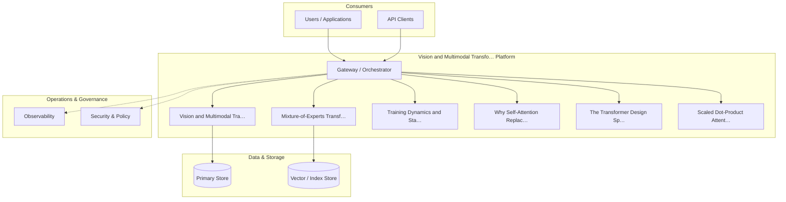

**Figure 11. Agent Architecture - Vision and Multimodal Transformers** (mermaid). Figure: Agent Architecture view for Vision and Multimodal Transformers. This diagram illustrates the principal components and their interactions as discussed in the surrounding section.

```xml
<mxfile host="ai-university">
  <diagram name="Network">
    <mxGraphModel dx="800" dy="600" grid="1" gridSize="10">
      <root>
        <mxCell id="0"/>
        <mxCell id="1" parent="0"/>
        <mxCell id="title" value="Network - Vision and Multimodal Transformers" style="text;fontSize=16;fontStyle=1" vertex="1" parent="1"><mxGeometry x="40" y="20" width="600" height="30" as="geometry"/></mxCell>
        <mxCell id="hub" value="Vision and Multimodal…" style="rounded=1;fillColor=#0f172a;fontColor=#ffffff;fontStyle=1" vertex="1" parent="1"><mxGeometry x="300" y="180" width="160" height="60" as="geometry"/></mxCell>
        <mxCell id="n0" value="Vision and Multimodal T…" style="rounded=1;fillColor=#e0e7ff;strokeColor=#4338ca" vertex="1" parent="1"><mxGeometry x="60" y="80" width="160" height="50" as="geometry"/></mxCell>
        <mxCell id="e0" style="edgeStyle=orthogonalEdgeStyle" edge="1" parent="1" source="hub" target="n0"><mxGeometry relative="1" as="geometry"/></mxCell>
        <mxCell id="n1" value="Mixture-of-Experts Tran…" style="rounded=1;fillColor=#e0e7ff;strokeColor=#4338ca" vertex="1" parent="1"><mxGeometry x="600" y="170" width="160" height="50" as="geometry"/></mxCell>
        <mxCell id="e1" style="edgeStyle=orthogonalEdgeStyle" edge="1" parent="1" source="hub" target="n1"><mxGeometry relative="1" as="geometry"/></mxCell>
        <mxCell id="n2" value="Training Dynamics and S…" style="rounded=1;fillColor=#e0e7ff;strokeColor=#4338ca" vertex="1" parent="1"><mxGeometry x="60" y="260" width="160" height="50" as="geometry"/></mxCell>
        <mxCell id="e2" style="edgeStyle=orthogonalEdgeStyle" edge="1" parent="1" source="hub" target="n2"><mxGeometry relative="1" as="geometry"/></mxCell>
        <mxCell id="n3" value="Why Self-Attention Repl…" style="rounded=1;fillColor=#e0e7ff;strokeColor=#4338ca" vertex="1" parent="1"><mxGeometry x="600" y="350" width="160" height="50" as="geometry"/></mxCell>
        <mxCell id="e3" style="edgeStyle=orthogonalEdgeStyle" edge="1" parent="1" source="hub" target="n3"><mxGeometry relative="1" as="geometry"/></mxCell>
        <mxCell id="n4" value="The Transformer Design …" style="rounded=1;fillColor=#e0e7ff;strokeColor=#4338ca" vertex="1" parent="1"><mxGeometry x="60" y="440" width="160" height="50" as="geometry"/></mxCell>
        <mxCell id="e4" style="edgeStyle=orthogonalEdgeStyle" edge="1" parent="1" source="hub" target="n4"><mxGeometry relative="1" as="geometry"/></mxCell>
      </root>
    </mxGraphModel>
  </diagram>
</mxfile>
```

_Source diagram (drawio); render with the appropriate tool._

**Figure 12. Network - Vision and Multimodal Transformers** (drawio). Figure: Network view for Vision and Multimodal Transformers. This diagram illustrates the principal components and their interactions as discussed in the surrounding section.

## Deep Dive: Mechanics, Variants and Trade-offs

Having established the essentials, we now go deeper into vision and multimodal transformers. Mechanically, the behaviour emerges from a few interacting parts that are simpler than the whole they produce. The distinctions in this section are the ones that separate a working demo from a system that holds up under adversarial inputs, scale and the passage of time.

Consider the principal variants and how to choose between them. Each variant optimises for a different point in the design space - some for latency, some for accuracy, some for cost or operability - and the correct choice follows from explicit requirements rather than from defaults. As with most architectural decisions, the choice is rarely binary; the skill lies in quantifying the trade-offs and choosing deliberately.

In practice this is supported by a mature tooling ecosystem, including PyTorch, FlashAttention, Triton, xFormers. Tools accelerate the work but do not substitute for understanding: the same principles apply whichever implementation you select, and the ability to reason from first principles is what lets you debug when a tool behaves unexpectedly.

A frequent source of subtle bugs is the interaction with mixture-of-experts transformers. Because mixture-of-experts transformers concerns sparse routing for parameter-efficient scaling, changes there can silently alter the behaviour analysed here. The remedy is contract tests at the boundary and end-to-end evaluations that exercise the interaction explicitly.

Finally, attend to edge cases and degradation. Define what the system should do under partial failure, unexpected inputs and load spikes, and make that behaviour explicit and tested rather than emergent. Graceful degradation - returning a safe, useful result when the ideal one is unavailable - is a hallmark of mature engineering.

For deeper study, the literature offers authoritative treatments such as Vaswani et al. — Attention Is All You Need (2017) and Dao et al. — FlashAttention (2022). These primary sources reward careful reading and ground the practical guidance above in established results.

## Advanced Considerations

Having established the essentials, we now go deeper into vision and multimodal transformers. It pays to understand the mechanism rather than treat it as a black box, because most production incidents are explained by one of its steps misbehaving. The distinctions in this section are the ones that separate a working demo from a system that holds up under adversarial inputs, scale and the passage of time.

Consider the principal variants and how to choose between them. Each variant optimises for a different point in the design space - some for latency, some for accuracy, some for cost or operability - and the correct choice follows from explicit requirements rather than from defaults. As with most architectural decisions, the choice is rarely binary; the skill lies in quantifying the trade-offs and choosing deliberately.

In practice this is supported by a mature tooling ecosystem, including PyTorch, FlashAttention, Triton, xFormers. Tools accelerate the work but do not substitute for understanding: the same principles apply whichever implementation you select, and the ability to reason from first principles is what lets you debug when a tool behaves unexpectedly.

A frequent source of subtle bugs is the interaction with positional encoding. Because positional encoding concerns sinusoidal, learned and rotary (RoPE) encodings that inject order into a permutation-invariant operation, changes there can silently alter the behaviour analysed here. The remedy is contract tests at the boundary and end-to-end evaluations that exercise the interaction explicitly.

Finally, attend to edge cases and degradation. Define what the system should do under partial failure, unexpected inputs and load spikes, and make that behaviour explicit and tested rather than emergent. Graceful degradation - returning a safe, useful result when the ideal one is unavailable - is a hallmark of mature engineering.

For deeper study, the literature offers authoritative treatments such as Vaswani et al. — Attention Is All You Need (2017) and Dao et al. — FlashAttention (2022). These primary sources reward careful reading and ground the practical guidance above in established results.

## Worked Example

A worked example clarifies how these ideas behave in practice. A computer vision organisation needs image classification and detection with ViT backbones. They decide to apply vision and multimodal transformers as part of their Transformers solution, but wisely treat it as a hypothesis to be validated rather than a foregone conclusion.

The team begins by stating the objective precisely and defining how success will be measured before writing any code. They establish a small but representative evaluation set, agree on acceptance thresholds, and only then prototype the simplest design that could work. Early measurement reveals which assumptions hold and which must be revised, saving weeks of misdirected effort and surfacing edge cases while they are still cheap to fix.

As the prototype matures into a service, the team hardens it: adding input validation, error handling, caching where it pays off, and monitoring that ties back to the original success metric. They document each significant decision in an architecture decision record so that future maintainers understand not just what was built but why.

The outcome is instructive. The system that reaches production is not the most sophisticated design the team considered, but the one whose behaviour they could measure, explain and operate. This is the recurring lesson of Transformers: durable value comes from the whole system, not from any single clever component.

## Industry Use Cases

Across industries, the ideas in this chapter recur in recognisable ways. The following vignettes show how different sectors apply them and what they have in common.

**NLP.** Language understanding and generation across tasks. The common thread is that value comes not from the model alone but from the surrounding system - data quality, evaluation, integration and operations - which is precisely where most of the engineering effort belongs.

**Computer Vision.** Image classification and detection with ViT backbones. The common thread is that value comes not from the model alone but from the surrounding system - data quality, evaluation, integration and operations - which is precisely where most of the engineering effort belongs.

**Audio.** Speech recognition and synthesis with transformer encoders. The common thread is that value comes not from the model alone but from the surrounding system - data quality, evaluation, integration and operations - which is precisely where most of the engineering effort belongs.

**Science.** Protein structure and molecular property prediction. The common thread is that value comes not from the model alone but from the surrounding system - data quality, evaluation, integration and operations - which is precisely where most of the engineering effort belongs.

## Best Practices

The following practices consistently separate successful Transformers efforts from struggling ones. They are deliberately concrete so they can be adopted as checklist items in design and code review.

- Use pre-norm and careful warmup to stabilise deep transformer training.
- Adopt fused attention kernels to cut memory and latency.
- Validate positional encoding choice against target sequence lengths.
- Profile FLOPs and memory before scaling parameters.

None of these are exotic; they are the unglamorous disciplines that compound into reliability. The cost of adopting them is small compared with the cost of the incidents they prevent, and they become second nature with practice.

## Common Pitfalls

Equally instructive are the failure modes that recur in practice. Each pitfall below has a clear early warning sign and a known remedy, so treat them as a diagnostic checklist when something feels wrong:

- Quadratic attention cost dominating long-sequence workloads.
- Numerical instability from post-norm at depth.
- Position encoding that fails to extrapolate beyond training length.
- Ignoring kernel-level efficiency and over-provisioning hardware.

The pattern is consistent: most failures stem from skipping measurement, conflating prototype and production standards, or deferring cross-cutting concerns such as security and cost until they become emergencies. Naming these traps in advance is the cheapest way to avoid them.

## Governance, Security and Cost Notes

No discussion of vision and multimodal transformers is complete without its governance, security and cost dimensions, which are too often deferred until they become emergencies. Treating them as first-class concerns from the outset is both cheaper and safer.

**Governance.** Classify the risk of this capability, document its intended and out-of-scope uses, and ensure decisions are traceable to satisfy internal policy and external regulation such as the NIST AI RMF, ISO/IEC 42001 and the EU AI Act. **Security.** Treat all external input as untrusted, validate outputs before acting on them, apply least privilege to any tools or data access, and map controls to the OWASP LLM Top 10 and MITRE ATLAS.

**Cost and sustainability.** Establish explicit budgets for compute, tokens and latency, attribute spend to owners, and revisit the economics as usage scales - a design that is affordable at pilot scale can become untenable at production volume. Building these reflexes into everyday engineering is what allows a Transformers system to be not only capable but also trustworthy and economically sound.

## Hands-On Exercises

Work through the following exercises. They are designed to move understanding from recognition to application - the level required for real engineering work - so prefer writing and building over merely reading.

1. Explain vision and multimodal transformers to a colleague unfamiliar with Transformers, using a concrete example from your own domain.
2. Sketch a reference architecture that incorporates vision and multimodal transformers and annotate where observability, security and cost controls belong.
3. Design an evaluation that would tell you whether vision and multimodal transformers is working in production, including the metric, the dataset and the acceptance threshold.
4. Identify two pitfalls relevant to vision and multimodal transformers in your environment and describe the early warning signals you would monitor.
5. Prototype the simplest implementation that demonstrates vision and multimodal transformers, then list exactly what would need to change to make it production-ready.

## Key Takeaways

Key takeaways from this chapter:

- Vision and Multimodal Transformers is a systems concern in Transformers: data, models and operations must be co-designed.
- Measurement is non-negotiable; define success metrics and evaluation before building.
- Favour the simplest design that meets the requirement, and add complexity only when evidence demands it.
- Security, cost and observability are first-class requirements, not afterthoughts.
- Document decisions so the system remains understandable and operable as it evolves.

## Code Walkthrough

Pipelines keep Vision and Multimodal Transformers logic modular and testable. Each stage is a pure function, errors are captured per item, and the composition is trivial to extend or reorder.

The full listing is shown below; study it line by line and reproduce it locally before moving on.

### Listing: A composable processing pipeline for Vision and Multimodal Transformers

```python
from collections.abc import Iterable, Iterator
from typing import Protocol


class Stage(Protocol):
    def __call__(self, item: dict) -> dict: ...


def pipeline(stages: list[Stage]) -> Stage:
    """Compose ordered stages into a single callable for Vision and Multimodal Transformers."""

    def run(item: dict) -> dict:
        for stage in stages:
            item = stage(item)
        return item

    return run


def validate(item: dict) -> dict:
    if "text" not in item:
        raise ValueError("missing required field: text")
    return item


def normalise(item: dict) -> dict:
    item["text"] = item["text"].strip().lower()
    return item


def enrich(item: dict) -> dict:
    item["length"] = len(item["text"])
    return item


process = pipeline([validate, normalise, enrich])


def run_batch(items: Iterable[dict]) -> Iterator[dict]:
    for item in items:
        try:
            yield process(dict(item))
        except ValueError as exc:
            yield {"error": str(exc), "item": item}

```

## Review Questions

1. In the context of Transformers, which statement best describes “Vision and Multimodal Transformers”?
   - A. It removes all security and governance requirements.
   - B. It is only relevant to academic research, not production.
   - C. Patch embeddings, ViT and cross-modal attention.
   - D. It applies exclusively to image data.
   - **Answer: C.** Vision and Multimodal Transformers: Patch embeddings, ViT and cross-modal attention.
2. Which of the following is a recommended best practice when working with Transformers?
   - A. Profile FLOPs and memory before scaling parameters.
   - B. It makes the system slower but has no other effect.
   - C. It eliminates the need for any evaluation or monitoring.
   - D. Position encoding that fails to extrapolate beyond training length.
   - **Answer: A.** Best practice: Profile FLOPs and memory before scaling parameters.
3. Which of the following is a common pitfall to avoid in Transformers?
   - A. It guarantees deterministic output regardless of input.
   - B. Ignoring kernel-level efficiency and over-provisioning hardware.
   - C. It applies exclusively to image data.
   - D. It eliminates the need for any evaluation or monitoring.
   - **Answer: B.** Pitfall to avoid: Ignoring kernel-level efficiency and over-provisioning hardware.
4. *(Discussion)* How would you test and monitor Vision and Multimodal Transformers in production?
   - **Model answer:** A strong answer defines vision and multimodal transformers (Patch embeddings, ViT and cross-modal attention.) then connects it to architecture, evaluation, cost, security and operations for Transformers, citing concrete trade-offs and a real-world example.

---


# Chapter 10. Mixture-of-Experts Transformers

_This chapter examines mixture-of-experts transformers within Transformers. It covers sparse routing for parameter-efficient scaling, derives a reference architecture, walks through a worked example and runnable code, surveys industry use cases, and distils best practices and pitfalls, closing with exercises and review questions._

## Introduction

Mixture-of-Experts Transformers refers to sparse routing for parameter-efficient scaling. Understanding this matters because Transformers systems succeed or fail on exactly these decisions. What distinguishes a production-grade approach from a prototype is the discipline of measurement: every claim is backed by an evaluation rather than intuition.

This chapter builds intuition first, then formalises the ideas, derives an architecture, and finishes with code, exercises and review questions so the material transfers directly to your own Transformers work. Read it actively: pause at each diagram, reproduce the code, and attempt the exercises before consulting the answers.

## Theory and Foundations

Mixture-of-Experts Transformers refers to sparse routing for parameter-efficient scaling. The right abstraction here pays compounding dividends, because downstream components depend on its guarantees. Mechanically, the behaviour emerges from a few interacting parts that are simpler than the whole they produce.

To place this in context, recall the broader picture: The transformer is a neural architecture built on self-attention that processes sequences in parallel and models long-range dependencies without recurrence. Within that picture, mixture-of-experts transformers is one of the load-bearing ideas - the kind that, when understood deeply, makes the rest of Transformers fall into place. This concept recurs throughout the Transformers lifecycle, from design to operations.

Mixture-of-Experts Transformers cannot be understood in isolation from implementing a transformer from scratch. Recall that implementing a transformer from scratch concerns a minimal, correct implementation that demystifies every component. The two interact directly: decisions in one constrain the design space of the other, which is why mature teams reason about them together rather than sequentially. As with most architectural decisions, the choice is rarely binary; the skill lies in quantifying the trade-offs and choosing deliberately.

Mixture-of-Experts Transformers cannot be understood in isolation from the transformer design space. Recall that the transformer design space concerns a map of architectural choices and their empirical trade-offs. The two interact directly: decisions in one constrain the design space of the other, which is why mature teams reason about them together rather than sequentially. As with most architectural decisions, the choice is rarely binary; the skill lies in quantifying the trade-offs and choosing deliberately.

Several established patterns apply directly to mixture-of-experts transformers. The first, flashattention for memory-efficient exact attention, is widely adopted because it makes the system's behaviour predictable and observable. A complementary pattern, rotary positional embeddings for length generalisation, addresses a related concern and is often deployed alongside it. Patterns are not dogma; they are distilled experience that shortcuts the search for a sound design, and each carries assumptions worth checking against your context.

It is worth being explicit about when to apply this and when to reach for something simpler. In a small prototype, shortcuts around mixture-of-experts transformers are invisible; in a production Transformers system serving real traffic, they surface as incidents, cost overruns or compliance gaps. Latency, accuracy and cost form a tension triangle: improving one typically pressures the others, so explicit budgets are essential. The remainder of this chapter turns these principles into an architecture, code and a checklist you can apply immediately.

## Architecture and Design

A robust architecture for Mixture-of-Experts Transformers is layered so each part can evolve independently without destabilising the whole. A transformer block stacks multi-head self-attention and a position-wise feed-forward network, each wrapped in residual connections and normalisation. Decoder-only stacks add causal masking; encoder–decoder stacks add cross attention. At scale, efficient attention kernels, mixed precision and tensor parallelism turn the mathematics into a trainable system.

Concretely, the principal building blocks include why self-attention replaced recurrence, scaled dot-product attention, multi-head attention, positional encoding and feed-forward networks and activations. Each is a replaceable component behind a stable interface, so the team can upgrade an implementation - a model, an index, a policy engine - without rewriting its neighbours. The contracts between components are where reliability is won or lost, so they are specified explicitly and tested in isolation.

The diagram accompanying this section makes the data and control flow explicit. Requests enter through a well-defined boundary where they are authenticated and validated; only then are they dispatched to the components that perform the work. This boundary is also where rate limiting, quota enforcement and audit logging live, keeping cross-cutting concerns out of the core logic and in one auditable place.

Two qualities deserve emphasis. First, observability is designed in, not bolted on: every component emits structured telemetry so that failures can be localised in minutes rather than hours. Second, the architecture is evolvable - components communicate through stable contracts so that any single part of the Transformers system can be replaced without a rewrite. Latency, accuracy and cost form a tension triangle: improving one typically pressures the others, so explicit budgets are essential.

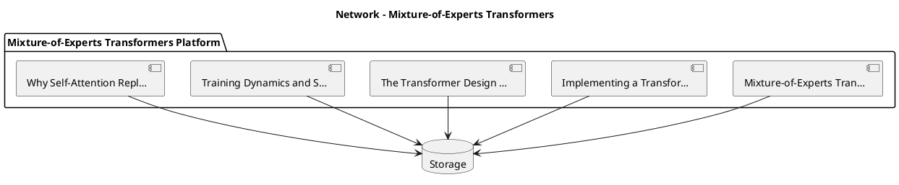

_Source diagram (plantuml); render with the appropriate tool._

**Figure 13. Network - Mixture-of-Experts Transformers** (plantuml). Figure: Network view for Mixture-of-Experts Transformers. This diagram illustrates the principal components and their interactions as discussed in the surrounding section.

## Deep Dive: Mechanics, Variants and Trade-offs

Having established the essentials, we now go deeper into mixture-of-experts transformers. Mechanically, the behaviour emerges from a few interacting parts that are simpler than the whole they produce. The distinctions in this section are the ones that separate a working demo from a system that holds up under adversarial inputs, scale and the passage of time.

Consider the principal variants and how to choose between them. Each variant optimises for a different point in the design space - some for latency, some for accuracy, some for cost or operability - and the correct choice follows from explicit requirements rather than from defaults. There is an inherent trade-off between fidelity and cost, and the correct balance depends on the use case and its tolerance for error.

In practice this is supported by a mature tooling ecosystem, including PyTorch, FlashAttention, Triton, xFormers. Tools accelerate the work but do not substitute for understanding: the same principles apply whichever implementation you select, and the ability to reason from first principles is what lets you debug when a tool behaves unexpectedly.

A frequent source of subtle bugs is the interaction with implementing a transformer from scratch. Because implementing a transformer from scratch concerns a minimal, correct implementation that demystifies every component, changes there can silently alter the behaviour analysed here. The remedy is contract tests at the boundary and end-to-end evaluations that exercise the interaction explicitly.

Finally, attend to edge cases and degradation. Define what the system should do under partial failure, unexpected inputs and load spikes, and make that behaviour explicit and tested rather than emergent. Graceful degradation - returning a safe, useful result when the ideal one is unavailable - is a hallmark of mature engineering.

For deeper study, the literature offers authoritative treatments such as Vaswani et al. — Attention Is All You Need (2017) and Dao et al. — FlashAttention (2022). These primary sources reward careful reading and ground the practical guidance above in established results.

## Advanced Considerations

Having established the essentials, we now go deeper into mixture-of-experts transformers. Beneath the abstraction lies a concrete process whose steps can each be measured, tested and optimised independently. The distinctions in this section are the ones that separate a working demo from a system that holds up under adversarial inputs, scale and the passage of time.

Consider the principal variants and how to choose between them. Each variant optimises for a different point in the design space - some for latency, some for accuracy, some for cost or operability - and the correct choice follows from explicit requirements rather than from defaults. Every added component buys capability at the price of operational surface area, and that bargain should be made consciously.

In practice this is supported by a mature tooling ecosystem, including PyTorch, FlashAttention, Triton, xFormers. Tools accelerate the work but do not substitute for understanding: the same principles apply whichever implementation you select, and the ability to reason from first principles is what lets you debug when a tool behaves unexpectedly.

A frequent source of subtle bugs is the interaction with implementing a transformer from scratch. Because implementing a transformer from scratch concerns a minimal, correct implementation that demystifies every component, changes there can silently alter the behaviour analysed here. The remedy is contract tests at the boundary and end-to-end evaluations that exercise the interaction explicitly.

Finally, attend to edge cases and degradation. Define what the system should do under partial failure, unexpected inputs and load spikes, and make that behaviour explicit and tested rather than emergent. Graceful degradation - returning a safe, useful result when the ideal one is unavailable - is a hallmark of mature engineering.

For deeper study, the literature offers authoritative treatments such as Vaswani et al. — Attention Is All You Need (2017) and Dao et al. — FlashAttention (2022). These primary sources reward careful reading and ground the practical guidance above in established results.

## Worked Example

To ground the discussion, walk through a representative example. A audio organisation needs speech recognition and synthesis with transformer encoders. They decide to apply mixture-of-experts transformers as part of their Transformers solution, but wisely treat it as a hypothesis to be validated rather than a foregone conclusion.

The team begins by stating the objective precisely and defining how success will be measured before writing any code. They establish a small but representative evaluation set, agree on acceptance thresholds, and only then prototype the simplest design that could work. Early measurement reveals which assumptions hold and which must be revised, saving weeks of misdirected effort and surfacing edge cases while they are still cheap to fix.

As the prototype matures into a service, the team hardens it: adding input validation, error handling, caching where it pays off, and monitoring that ties back to the original success metric. They document each significant decision in an architecture decision record so that future maintainers understand not just what was built but why.

The outcome is instructive. The system that reaches production is not the most sophisticated design the team considered, but the one whose behaviour they could measure, explain and operate. This is the recurring lesson of Transformers: durable value comes from the whole system, not from any single clever component.

## Industry Use Cases

Across industries, the ideas in this chapter recur in recognisable ways. The following vignettes show how different sectors apply them and what they have in common.

**NLP.** Language understanding and generation across tasks. The common thread is that value comes not from the model alone but from the surrounding system - data quality, evaluation, integration and operations - which is precisely where most of the engineering effort belongs.

**Computer Vision.** Image classification and detection with ViT backbones. The common thread is that value comes not from the model alone but from the surrounding system - data quality, evaluation, integration and operations - which is precisely where most of the engineering effort belongs.

**Audio.** Speech recognition and synthesis with transformer encoders. The common thread is that value comes not from the model alone but from the surrounding system - data quality, evaluation, integration and operations - which is precisely where most of the engineering effort belongs.

**Science.** Protein structure and molecular property prediction. The common thread is that value comes not from the model alone but from the surrounding system - data quality, evaluation, integration and operations - which is precisely where most of the engineering effort belongs.

## Best Practices

The following practices consistently separate successful Transformers efforts from struggling ones. They are deliberately concrete so they can be adopted as checklist items in design and code review.

- Use pre-norm and careful warmup to stabilise deep transformer training.
- Adopt fused attention kernels to cut memory and latency.
- Validate positional encoding choice against target sequence lengths.
- Profile FLOPs and memory before scaling parameters.

None of these are exotic; they are the unglamorous disciplines that compound into reliability. The cost of adopting them is small compared with the cost of the incidents they prevent, and they become second nature with practice.

## Common Pitfalls

Equally instructive are the failure modes that recur in practice. Each pitfall below has a clear early warning sign and a known remedy, so treat them as a diagnostic checklist when something feels wrong:

- Quadratic attention cost dominating long-sequence workloads.
- Numerical instability from post-norm at depth.
- Position encoding that fails to extrapolate beyond training length.
- Ignoring kernel-level efficiency and over-provisioning hardware.

The pattern is consistent: most failures stem from skipping measurement, conflating prototype and production standards, or deferring cross-cutting concerns such as security and cost until they become emergencies. Naming these traps in advance is the cheapest way to avoid them.

## Governance, Security and Cost Notes

No discussion of mixture-of-experts transformers is complete without its governance, security and cost dimensions, which are too often deferred until they become emergencies. Treating them as first-class concerns from the outset is both cheaper and safer.

**Governance.** Classify the risk of this capability, document its intended and out-of-scope uses, and ensure decisions are traceable to satisfy internal policy and external regulation such as the NIST AI RMF, ISO/IEC 42001 and the EU AI Act. **Security.** Treat all external input as untrusted, validate outputs before acting on them, apply least privilege to any tools or data access, and map controls to the OWASP LLM Top 10 and MITRE ATLAS.

**Cost and sustainability.** Establish explicit budgets for compute, tokens and latency, attribute spend to owners, and revisit the economics as usage scales - a design that is affordable at pilot scale can become untenable at production volume. Building these reflexes into everyday engineering is what allows a Transformers system to be not only capable but also trustworthy and economically sound.

## Hands-On Exercises

Work through the following exercises. They are designed to move understanding from recognition to application - the level required for real engineering work - so prefer writing and building over merely reading.

1. Explain mixture-of-experts transformers to a colleague unfamiliar with Transformers, using a concrete example from your own domain.
2. Sketch a reference architecture that incorporates mixture-of-experts transformers and annotate where observability, security and cost controls belong.
3. Design an evaluation that would tell you whether mixture-of-experts transformers is working in production, including the metric, the dataset and the acceptance threshold.
4. Identify two pitfalls relevant to mixture-of-experts transformers in your environment and describe the early warning signals you would monitor.
5. Prototype the simplest implementation that demonstrates mixture-of-experts transformers, then list exactly what would need to change to make it production-ready.

## Key Takeaways

Key takeaways from this chapter:

- Mixture-of-Experts Transformers is a systems concern in Transformers: data, models and operations must be co-designed.
- Measurement is non-negotiable; define success metrics and evaluation before building.
- Favour the simplest design that meets the requirement, and add complexity only when evidence demands it.
- Security, cost and observability are first-class requirements, not afterthoughts.
- Document decisions so the system remains understandable and operable as it evolves.

## Code Walkthrough

Pipelines keep Mixture-of-Experts Transformers logic modular and testable. Each stage is a pure function, errors are captured per item, and the composition is trivial to extend or reorder.

The full listing is shown below; study it line by line and reproduce it locally before moving on.

### Listing: A composable processing pipeline for Mixture-of-Experts Transformers

```python
from collections.abc import Iterable, Iterator
from typing import Protocol


class Stage(Protocol):
    def __call__(self, item: dict) -> dict: ...


def pipeline(stages: list[Stage]) -> Stage:
    """Compose ordered stages into a single callable for Mixture-of-Experts Transformers."""

    def run(item: dict) -> dict:
        for stage in stages:
            item = stage(item)
        return item

    return run


def validate(item: dict) -> dict:
    if "text" not in item:
        raise ValueError("missing required field: text")
    return item


def normalise(item: dict) -> dict:
    item["text"] = item["text"].strip().lower()
    return item


def enrich(item: dict) -> dict:
    item["length"] = len(item["text"])
    return item


process = pipeline([validate, normalise, enrich])


def run_batch(items: Iterable[dict]) -> Iterator[dict]:
    for item in items:
        try:
            yield process(dict(item))
        except ValueError as exc:
            yield {"error": str(exc), "item": item}

```

## Review Questions

1. In the context of Transformers, which statement best describes “Mixture-of-Experts Transformers”?
   - A. Sparse routing for parameter-efficient scaling.
   - B. It eliminates the need for any evaluation or monitoring.
   - C. It is only relevant to academic research, not production.
   - D. It removes all security and governance requirements.
   - **Answer: A.** Mixture-of-Experts Transformers: Sparse routing for parameter-efficient scaling.
2. Which of the following is a recommended best practice when working with Transformers?
   - A. It applies exclusively to image data.
   - B. It eliminates the need for any evaluation or monitoring.
   - C. Quadratic attention cost dominating long-sequence workloads.
   - D. Validate positional encoding choice against target sequence lengths.
   - **Answer: D.** Best practice: Validate positional encoding choice against target sequence lengths.
3. Which of the following is a common pitfall to avoid in Transformers?
   - A. It applies exclusively to image data.
   - B. It eliminates the need for any evaluation or monitoring.
   - C. Validate positional encoding choice against target sequence lengths.
   - D. Quadratic attention cost dominating long-sequence workloads.
   - **Answer: D.** Pitfall to avoid: Quadratic attention cost dominating long-sequence workloads.
4. *(Discussion)* Explain Mixture-of-Experts Transformers and why it matters in a production Transformers system.
   - **Model answer:** A strong answer defines mixture-of-experts transformers (Sparse routing for parameter-efficient scaling.) then connects it to architecture, evaluation, cost, security and operations for Transformers, citing concrete trade-offs and a real-world example.

---


# Chapter 11. Training Dynamics and Stability

_This chapter examines training dynamics and stability within Transformers. It covers initialisation, warmup, gradient clipping and loss spikes, derives a reference architecture, walks through a worked example and runnable code, surveys industry use cases, and distils best practices and pitfalls, closing with exercises and review questions._

## Introduction

Training Dynamics and Stability refers to initialisation, warmup, gradient clipping and loss spikes. It is foundational: later capabilities in Transformers are built directly on top of it. In an enterprise setting, this translates into concrete requirements: clear interfaces, measurable quality, and controls that satisfy security and governance.

This chapter builds intuition first, then formalises the ideas, derives an architecture, and finishes with code, exercises and review questions so the material transfers directly to your own Transformers work. Read it actively: pause at each diagram, reproduce the code, and attempt the exercises before consulting the answers.

## Theory and Foundations

Training Dynamics and Stability refers to initialisation, warmup, gradient clipping and loss spikes. The practical implication is that design choices here ripple through latency, cost and maintainability for the lifetime of the system. Mechanically, the behaviour emerges from a few interacting parts that are simpler than the whole they produce.

To place this in context, recall the broader picture: The transformer is a neural architecture built on self-attention that processes sequences in parallel and models long-range dependencies without recurrence. Within that picture, training dynamics and stability is one of the load-bearing ideas - the kind that, when understood deeply, makes the rest of Transformers fall into place. Getting this right early prevents expensive rework once a Transformers system reaches scale.

Training Dynamics and Stability cannot be understood in isolation from residual connections and normalisation. Recall that residual connections and normalisation concerns pre-norm versus post-norm, LayerNorm/RMSNorm and training stability. The two interact directly: decisions in one constrain the design space of the other, which is why mature teams reason about them together rather than sequentially. There is an inherent trade-off between fidelity and cost, and the correct balance depends on the use case and its tolerance for error.

Training Dynamics and Stability cannot be understood in isolation from vision and multimodal transformers. Recall that vision and multimodal transformers concerns patch embeddings, ViT and cross-modal attention. The two interact directly: decisions in one constrain the design space of the other, which is why mature teams reason about them together rather than sequentially. Simplicity is a feature. The simplest design that meets the requirement should be the default, with complexity added only when measurement justifies it.

Several established patterns apply directly to training dynamics and stability. The first, rotary positional embeddings for length generalisation, is widely adopted because it makes the system's behaviour predictable and observable. A complementary pattern, mixture-of-experts routing for sparse scaling, addresses a related concern and is often deployed alongside it. Patterns are not dogma; they are distilled experience that shortcuts the search for a sound design, and each carries assumptions worth checking against your context.

The decision of whether to adopt this should be driven by requirements, not by novelty. In a small prototype, shortcuts around training dynamics and stability are invisible; in a production Transformers system serving real traffic, they surface as incidents, cost overruns or compliance gaps. There is an inherent trade-off between fidelity and cost, and the correct balance depends on the use case and its tolerance for error. The remainder of this chapter turns these principles into an architecture, code and a checklist you can apply immediately.

## Architecture and Design

The reference architecture for Training Dynamics and Stability separates concerns into clearly bounded components with explicit contracts. A transformer block stacks multi-head self-attention and a position-wise feed-forward network, each wrapped in residual connections and normalisation. Decoder-only stacks add causal masking; encoder–decoder stacks add cross attention. At scale, efficient attention kernels, mixed precision and tensor parallelism turn the mathematics into a trainable system.

Concretely, the principal building blocks include why self-attention replaced recurrence, scaled dot-product attention, multi-head attention, positional encoding and feed-forward networks and activations. Each is a replaceable component behind a stable interface, so the team can upgrade an implementation - a model, an index, a policy engine - without rewriting its neighbours. The contracts between components are where reliability is won or lost, so they are specified explicitly and tested in isolation.

The diagram accompanying this section makes the data and control flow explicit. Requests enter through a well-defined boundary where they are authenticated and validated; only then are they dispatched to the components that perform the work. This boundary is also where rate limiting, quota enforcement and audit logging live, keeping cross-cutting concerns out of the core logic and in one auditable place.

Two qualities deserve emphasis. First, observability is designed in, not bolted on: every component emits structured telemetry so that failures can be localised in minutes rather than hours. Second, the architecture is evolvable - components communicate through stable contracts so that any single part of the Transformers system can be replaced without a rewrite. As with most architectural decisions, the choice is rarely binary; the skill lies in quantifying the trade-offs and choosing deliberately.

<div class="diagram-svg">

<svg xmlns="http://www.w3.org/2000/svg" width="840" height="460" data-tpl="steps" data-pal="11-2" viewBox="0 0 840 460" font-family="Inter, Segoe UI, Arial, sans-serif"><defs><marker id="ar" markerWidth="9" markerHeight="9" refX="7" refY="3" orient="auto"><path d="M0,0 L7,3 L0,6 z" fill="#94a3b8"/></marker><marker id="arw" markerWidth="9" markerHeight="9" refX="7" refY="3" orient="auto"><path d="M0,0 L7,3 L0,6 z" fill="#ffffff"/></marker><filter id="sh" x="-20%" y="-20%" width="140%" height="140%"><feDropShadow dx="0" dy="2" stdDeviation="3" flood-color="#0f172a" flood-opacity="0.16"/></filter></defs><defs><linearGradient id="bn880cadc" x1="0" y1="0" x2="1" y2="0"><stop offset="0" stop-color="#0e7490"/><stop offset="1" stop-color="#b45309"/></linearGradient></defs><rect width="840" height="460" rx="14" fill="#ffffff"/><rect x="0" y="0" width="840" height="48" rx="14" fill="url(#bn880cadc)"/><rect x="0" y="32" width="840" height="16" fill="url(#bn880cadc)"/><text x="420" y="25" text-anchor="middle" font-size="14.5" font-weight="700" fill="#ffffff" dominant-baseline="middle">RAG Architecture - Training Dynamics and Stability</text><rect x="30" y="200" width="132" height="70" rx="12" fill="#0e7490"/><circle cx="54" cy="224" r="15" fill="#ffffff"/><text x="54" y="224" text-anchor="middle" font-size="13" font-weight="600" fill="#0e7490" dominant-baseline="middle">1</text><text x="96" y="242" text-anchor="middle" font-size="10.5" font-weight="600" fill="#fff" dominant-baseline="middle">Training Dynamics</text><text x="96" y="254" text-anchor="middle" font-size="10.5" font-weight="600" fill="#fff" dominant-baseline="middle">and Stability</text><rect x="192" y="200" width="132" height="70" rx="12" fill="#b45309"/><circle cx="216" cy="224" r="15" fill="#ffffff"/><text x="216" y="224" text-anchor="middle" font-size="13" font-weight="600" fill="#b45309" dominant-baseline="middle">2</text><text x="258" y="242" text-anchor="middle" font-size="10.5" font-weight="600" fill="#fff" dominant-baseline="middle">Residual</text><text x="258" y="254" text-anchor="middle" font-size="10.5" font-weight="600" fill="#fff" dominant-baseline="middle">Connections and</text><line x1="162" y1="235" x2="192" y2="235" stroke="#94a3b8" stroke-width="2" marker-end="url(#ar)"/><rect x="354" y="200" width="132" height="70" rx="12" fill="#9f1239"/><circle cx="378" cy="224" r="15" fill="#ffffff"/><text x="378" y="224" text-anchor="middle" font-size="13" font-weight="600" fill="#9f1239" dominant-baseline="middle">3</text><text x="420" y="242" text-anchor="middle" font-size="10.5" font-weight="600" fill="#fff" dominant-baseline="middle">Vision and</text><text x="420" y="254" text-anchor="middle" font-size="10.5" font-weight="600" fill="#fff" dominant-baseline="middle">Multimodal</text><line x1="324" y1="235" x2="354" y2="235" stroke="#94a3b8" stroke-width="2" marker-end="url(#ar)"/><rect x="516" y="200" width="132" height="70" rx="12" fill="#4338ca"/><circle cx="540" cy="224" r="15" fill="#ffffff"/><text x="540" y="224" text-anchor="middle" font-size="13" font-weight="600" fill="#4338ca" dominant-baseline="middle">4</text><text x="582" y="242" text-anchor="middle" font-size="10.5" font-weight="600" fill="#fff" dominant-baseline="middle">The Transformer</text><text x="582" y="254" text-anchor="middle" font-size="10.5" font-weight="600" fill="#fff" dominant-baseline="middle">Design Space</text><line x1="486" y1="235" x2="516" y2="235" stroke="#94a3b8" stroke-width="2" marker-end="url(#ar)"/><rect x="678" y="200" width="132" height="70" rx="12" fill="#0f172a"/><circle cx="702" cy="224" r="15" fill="#ffffff"/><text x="702" y="224" text-anchor="middle" font-size="13" font-weight="600" fill="#0f172a" dominant-baseline="middle">5</text><text x="744" y="242" text-anchor="middle" font-size="10.5" font-weight="600" fill="#fff" dominant-baseline="middle">Profiling and</text><text x="744" y="254" text-anchor="middle" font-size="10.5" font-weight="600" fill="#fff" dominant-baseline="middle">Optimising</text><line x1="648" y1="235" x2="678" y2="235" stroke="#94a3b8" stroke-width="2" marker-end="url(#ar)"/><text x="28" y="446" text-anchor="start" font-size="9.5" font-weight="500" fill="#64748b" dominant-baseline="middle">Training Dynamics and Stability  •  RAG Architecture</text></svg>

</div>

**Figure 14. RAG Architecture - Training Dynamics and Stability** (svg). Figure: RAG Architecture view for Training Dynamics and Stability. This diagram illustrates the principal components and their interactions as discussed in the surrounding section.

<div class="diagram-svg">

<svg xmlns="http://www.w3.org/2000/svg" width="840" height="460" data-tpl="radial" data-pal="3-3" viewBox="0 0 840 460" font-family="Inter, Segoe UI, Arial, sans-serif"><defs><marker id="ar" markerWidth="9" markerHeight="9" refX="7" refY="3" orient="auto"><path d="M0,0 L7,3 L0,6 z" fill="#94a3b8"/></marker><marker id="arw" markerWidth="9" markerHeight="9" refX="7" refY="3" orient="auto"><path d="M0,0 L7,3 L0,6 z" fill="#ffffff"/></marker><filter id="sh" x="-20%" y="-20%" width="140%" height="140%"><feDropShadow dx="0" dy="2" stdDeviation="3" flood-color="#0f172a" flood-opacity="0.16"/></filter></defs><defs><linearGradient id="bnafccdce" x1="0" y1="0" x2="1" y2="0"><stop offset="0" stop-color="#ea580c"/><stop offset="1" stop-color="#f97316"/></linearGradient></defs><rect width="840" height="460" rx="14" fill="#ffffff"/><rect x="0" y="0" width="840" height="48" rx="14" fill="url(#bnafccdce)"/><rect x="0" y="32" width="840" height="16" fill="url(#bnafccdce)"/><text x="420" y="25" text-anchor="middle" font-size="14.5" font-weight="700" fill="#ffffff" dominant-baseline="middle">Architecture - Training Dynamics and Stability</text><circle cx="420.0" cy="238.0" r="52" fill="#0f172a"/><text x="420" y="231" text-anchor="middle" font-size="12" font-weight="600" fill="#fff" dominant-baseline="middle">Training</text><text x="420" y="245" text-anchor="middle" font-size="12" font-weight="600" fill="#fff" dominant-baseline="middle">Dynamics and</text><line x1="420" y1="186" x2="420" y2="102" stroke="#94a3b8" stroke-width="2" marker-end="url(#ar)"/><rect x="342" y="65" width="156" height="46" rx="11" fill="#ea580c" filter="url(#sh)"/><text x="420" y="83" text-anchor="middle" font-size="9.5" font-weight="600" fill="#ffffff" dominant-baseline="middle">Training Dynamics and</text><text x="420" y="93" text-anchor="middle" font-size="9.5" font-weight="600" fill="#ffffff" dominant-baseline="middle">Stability</text><line x1="465" y1="212" x2="631" y2="170" stroke="#94a3b8" stroke-width="2" marker-end="url(#ar)"/><rect x="576" y="140" width="156" height="46" rx="11" fill="#f97316" filter="url(#sh)"/><text x="654" y="158" text-anchor="middle" font-size="9.5" font-weight="600" fill="#ffffff" dominant-baseline="middle">Residual Connections and</text><text x="654" y="168" text-anchor="middle" font-size="9.5" font-weight="600" fill="#ffffff" dominant-baseline="middle">Normalisation</text><line x1="465" y1="264" x2="631" y2="306" stroke="#94a3b8" stroke-width="2" marker-end="url(#ar)"/><rect x="576" y="290" width="156" height="46" rx="11" fill="#fb923c" filter="url(#sh)"/><text x="654" y="308" text-anchor="middle" font-size="9.5" font-weight="600" fill="#ffffff" dominant-baseline="middle">Vision and Multimodal</text><text x="654" y="318" text-anchor="middle" font-size="9.5" font-weight="600" fill="#ffffff" dominant-baseline="middle">Transformers</text><line x1="420" y1="290" x2="420" y2="374" stroke="#94a3b8" stroke-width="2" marker-end="url(#ar)"/><rect x="342" y="365" width="156" height="46" rx="11" fill="#b45309" filter="url(#sh)"/><text x="420" y="388" text-anchor="middle" font-size="9.5" font-weight="600" fill="#ffffff" dominant-baseline="middle">The Transformer Design Space</text><line x1="375" y1="264" x2="209" y2="306" stroke="#94a3b8" stroke-width="2" marker-end="url(#ar)"/><rect x="108" y="290" width="156" height="46" rx="11" fill="#d97706" filter="url(#sh)"/><text x="186" y="308" text-anchor="middle" font-size="9.5" font-weight="600" fill="#ffffff" dominant-baseline="middle">Profiling and Optimising</text><text x="186" y="318" text-anchor="middle" font-size="9.5" font-weight="600" fill="#ffffff" dominant-baseline="middle">Transformers</text><line x1="375" y1="212" x2="209" y2="170" stroke="#94a3b8" stroke-width="2" marker-end="url(#ar)"/><rect x="108" y="140" width="156" height="46" rx="11" fill="#f59e0b" filter="url(#sh)"/><text x="186" y="158" text-anchor="middle" font-size="9.5" font-weight="600" fill="#ffffff" dominant-baseline="middle">Implementing a Transformer</text><text x="186" y="168" text-anchor="middle" font-size="9.5" font-weight="600" fill="#ffffff" dominant-baseline="middle">from Scratch</text><text x="28" y="446" text-anchor="start" font-size="9.5" font-weight="500" fill="#64748b" dominant-baseline="middle">Training Dynamics and Stability  •  Architecture</text></svg>

</div>

**Figure 15. Architecture - Training Dynamics and Stability** (svg). Figure: Architecture view for Training Dynamics and Stability. This diagram illustrates the principal components and their interactions as discussed in the surrounding section.

## Deep Dive: Mechanics, Variants and Trade-offs

Having established the essentials, we now go deeper into training dynamics and stability. Beneath the abstraction lies a concrete process whose steps can each be measured, tested and optimised independently. The distinctions in this section are the ones that separate a working demo from a system that holds up under adversarial inputs, scale and the passage of time.

Consider the principal variants and how to choose between them. Each variant optimises for a different point in the design space - some for latency, some for accuracy, some for cost or operability - and the correct choice follows from explicit requirements rather than from defaults. Latency, accuracy and cost form a tension triangle: improving one typically pressures the others, so explicit budgets are essential.

In practice this is supported by a mature tooling ecosystem, including PyTorch, FlashAttention, Triton, xFormers. Tools accelerate the work but do not substitute for understanding: the same principles apply whichever implementation you select, and the ability to reason from first principles is what lets you debug when a tool behaves unexpectedly.

A frequent source of subtle bugs is the interaction with residual connections and normalisation. Because residual connections and normalisation concerns pre-norm versus post-norm, LayerNorm/RMSNorm and training stability, changes there can silently alter the behaviour analysed here. The remedy is contract tests at the boundary and end-to-end evaluations that exercise the interaction explicitly.

Finally, attend to edge cases and degradation. Define what the system should do under partial failure, unexpected inputs and load spikes, and make that behaviour explicit and tested rather than emergent. Graceful degradation - returning a safe, useful result when the ideal one is unavailable - is a hallmark of mature engineering.

For deeper study, the literature offers authoritative treatments such as Vaswani et al. — Attention Is All You Need (2017) and Dao et al. — FlashAttention (2022). These primary sources reward careful reading and ground the practical guidance above in established results.

## Advanced Considerations

Having established the essentials, we now go deeper into training dynamics and stability. Beneath the abstraction lies a concrete process whose steps can each be measured, tested and optimised independently. The distinctions in this section are the ones that separate a working demo from a system that holds up under adversarial inputs, scale and the passage of time.

Consider the principal variants and how to choose between them. Each variant optimises for a different point in the design space - some for latency, some for accuracy, some for cost or operability - and the correct choice follows from explicit requirements rather than from defaults. Simplicity is a feature. The simplest design that meets the requirement should be the default, with complexity added only when measurement justifies it.

In practice this is supported by a mature tooling ecosystem, including PyTorch, FlashAttention, Triton, xFormers. Tools accelerate the work but do not substitute for understanding: the same principles apply whichever implementation you select, and the ability to reason from first principles is what lets you debug when a tool behaves unexpectedly.

A frequent source of subtle bugs is the interaction with profiling and optimising transformers. Because profiling and optimising transformers concerns memory, FLOPs, kernel fusion and hardware-aware design, changes there can silently alter the behaviour analysed here. The remedy is contract tests at the boundary and end-to-end evaluations that exercise the interaction explicitly.

Finally, attend to edge cases and degradation. Define what the system should do under partial failure, unexpected inputs and load spikes, and make that behaviour explicit and tested rather than emergent. Graceful degradation - returning a safe, useful result when the ideal one is unavailable - is a hallmark of mature engineering.

For deeper study, the literature offers authoritative treatments such as Vaswani et al. — Attention Is All You Need (2017) and Dao et al. — FlashAttention (2022). These primary sources reward careful reading and ground the practical guidance above in established results.

## Worked Example

To ground the discussion, walk through a representative example. A audio organisation needs speech recognition and synthesis with transformer encoders. They decide to apply training dynamics and stability as part of their Transformers solution, but wisely treat it as a hypothesis to be validated rather than a foregone conclusion.

The team begins by stating the objective precisely and defining how success will be measured before writing any code. They establish a small but representative evaluation set, agree on acceptance thresholds, and only then prototype the simplest design that could work. Early measurement reveals which assumptions hold and which must be revised, saving weeks of misdirected effort and surfacing edge cases while they are still cheap to fix.

As the prototype matures into a service, the team hardens it: adding input validation, error handling, caching where it pays off, and monitoring that ties back to the original success metric. They document each significant decision in an architecture decision record so that future maintainers understand not just what was built but why.

The outcome is instructive. The system that reaches production is not the most sophisticated design the team considered, but the one whose behaviour they could measure, explain and operate. This is the recurring lesson of Transformers: durable value comes from the whole system, not from any single clever component.

## Industry Use Cases

Across industries, the ideas in this chapter recur in recognisable ways. The following vignettes show how different sectors apply them and what they have in common.

**NLP.** Language understanding and generation across tasks. The common thread is that value comes not from the model alone but from the surrounding system - data quality, evaluation, integration and operations - which is precisely where most of the engineering effort belongs.

**Computer Vision.** Image classification and detection with ViT backbones. The common thread is that value comes not from the model alone but from the surrounding system - data quality, evaluation, integration and operations - which is precisely where most of the engineering effort belongs.

**Audio.** Speech recognition and synthesis with transformer encoders. The common thread is that value comes not from the model alone but from the surrounding system - data quality, evaluation, integration and operations - which is precisely where most of the engineering effort belongs.

**Science.** Protein structure and molecular property prediction. The common thread is that value comes not from the model alone but from the surrounding system - data quality, evaluation, integration and operations - which is precisely where most of the engineering effort belongs.

## Best Practices

The following practices consistently separate successful Transformers efforts from struggling ones. They are deliberately concrete so they can be adopted as checklist items in design and code review.

- Use pre-norm and careful warmup to stabilise deep transformer training.
- Adopt fused attention kernels to cut memory and latency.
- Validate positional encoding choice against target sequence lengths.
- Profile FLOPs and memory before scaling parameters.

None of these are exotic; they are the unglamorous disciplines that compound into reliability. The cost of adopting them is small compared with the cost of the incidents they prevent, and they become second nature with practice.

## Common Pitfalls

Equally instructive are the failure modes that recur in practice. Each pitfall below has a clear early warning sign and a known remedy, so treat them as a diagnostic checklist when something feels wrong:

- Quadratic attention cost dominating long-sequence workloads.
- Numerical instability from post-norm at depth.
- Position encoding that fails to extrapolate beyond training length.
- Ignoring kernel-level efficiency and over-provisioning hardware.

The pattern is consistent: most failures stem from skipping measurement, conflating prototype and production standards, or deferring cross-cutting concerns such as security and cost until they become emergencies. Naming these traps in advance is the cheapest way to avoid them.

## Governance, Security and Cost Notes

No discussion of training dynamics and stability is complete without its governance, security and cost dimensions, which are too often deferred until they become emergencies. Treating them as first-class concerns from the outset is both cheaper and safer.

**Governance.** Classify the risk of this capability, document its intended and out-of-scope uses, and ensure decisions are traceable to satisfy internal policy and external regulation such as the NIST AI RMF, ISO/IEC 42001 and the EU AI Act. **Security.** Treat all external input as untrusted, validate outputs before acting on them, apply least privilege to any tools or data access, and map controls to the OWASP LLM Top 10 and MITRE ATLAS.

**Cost and sustainability.** Establish explicit budgets for compute, tokens and latency, attribute spend to owners, and revisit the economics as usage scales - a design that is affordable at pilot scale can become untenable at production volume. Building these reflexes into everyday engineering is what allows a Transformers system to be not only capable but also trustworthy and economically sound.

## Hands-On Exercises

Work through the following exercises. They are designed to move understanding from recognition to application - the level required for real engineering work - so prefer writing and building over merely reading.

1. Explain training dynamics and stability to a colleague unfamiliar with Transformers, using a concrete example from your own domain.
2. Sketch a reference architecture that incorporates training dynamics and stability and annotate where observability, security and cost controls belong.
3. Design an evaluation that would tell you whether training dynamics and stability is working in production, including the metric, the dataset and the acceptance threshold.
4. Identify two pitfalls relevant to training dynamics and stability in your environment and describe the early warning signals you would monitor.
5. Prototype the simplest implementation that demonstrates training dynamics and stability, then list exactly what would need to change to make it production-ready.

## Key Takeaways

Key takeaways from this chapter:

- Training Dynamics and Stability is a systems concern in Transformers: data, models and operations must be co-designed.
- Measurement is non-negotiable; define success metrics and evaluation before building.
- Favour the simplest design that meets the requirement, and add complexity only when evidence demands it.
- Security, cost and observability are first-class requirements, not afterthoughts.
- Document decisions so the system remains understandable and operable as it evolves.

## Code Walkthrough

Pipelines keep Training Dynamics and Stability logic modular and testable. Each stage is a pure function, errors are captured per item, and the composition is trivial to extend or reorder.

The full listing is shown below; study it line by line and reproduce it locally before moving on.

### Listing: A composable processing pipeline for Training Dynamics and Stability

```python
from collections.abc import Iterable, Iterator
from typing import Protocol


class Stage(Protocol):
    def __call__(self, item: dict) -> dict: ...


def pipeline(stages: list[Stage]) -> Stage:
    """Compose ordered stages into a single callable for Training Dynamics and Stability."""

    def run(item: dict) -> dict:
        for stage in stages:
            item = stage(item)
        return item

    return run


def validate(item: dict) -> dict:
    if "text" not in item:
        raise ValueError("missing required field: text")
    return item


def normalise(item: dict) -> dict:
    item["text"] = item["text"].strip().lower()
    return item


def enrich(item: dict) -> dict:
    item["length"] = len(item["text"])
    return item


process = pipeline([validate, normalise, enrich])


def run_batch(items: Iterable[dict]) -> Iterator[dict]:
    for item in items:
        try:
            yield process(dict(item))
        except ValueError as exc:
            yield {"error": str(exc), "item": item}

```

## Review Questions

1. In the context of Transformers, which statement best describes “Training Dynamics and Stability”?
   - A. Initialisation, warmup, gradient clipping and loss spikes.
   - B. It makes the system slower but has no other effect.
   - C. It applies exclusively to image data.
   - D. It guarantees deterministic output regardless of input.
   - **Answer: A.** Training Dynamics and Stability: Initialisation, warmup, gradient clipping and loss spikes.
2. Which of the following is a recommended best practice when working with Transformers?
   - A. It guarantees deterministic output regardless of input.
   - B. It is only relevant to academic research, not production.
   - C. Profile FLOPs and memory before scaling parameters.
   - D. It makes the system slower but has no other effect.
   - **Answer: C.** Best practice: Profile FLOPs and memory before scaling parameters.
3. Which of the following is a common pitfall to avoid in Transformers?
   - A. Quadratic attention cost dominating long-sequence workloads.
   - B. It eliminates the need for any evaluation or monitoring.
   - C. Validate positional encoding choice against target sequence lengths.
   - D. It removes all security and governance requirements.
   - **Answer: A.** Pitfall to avoid: Quadratic attention cost dominating long-sequence workloads.
4. *(Discussion)* How would you test and monitor Training Dynamics and Stability in production?
   - **Model answer:** A strong answer defines training dynamics and stability (Initialisation, warmup, gradient clipping and loss spikes.) then connects it to architecture, evaluation, cost, security and operations for Transformers, citing concrete trade-offs and a real-world example.

---


# Chapter 12. Implementing a Transformer from Scratch

_This chapter examines implementing a transformer from scratch within Transformers. It covers a minimal, correct implementation that demystifies every component, derives a reference architecture, walks through a worked example and runnable code, surveys industry use cases, and distils best practices and pitfalls, closing with exercises and review questions._

## Introduction

Implementing a Transformer from Scratch refers to a minimal, correct implementation that demystifies every component. Teams that master this consistently ship more reliable Transformers systems at lower cost. Seasoned practitioners treat this as a systems problem, co-designing data, models and operations rather than optimising any one in isolation.

This chapter builds intuition first, then formalises the ideas, derives an architecture, and finishes with code, exercises and review questions so the material transfers directly to your own Transformers work. Read it actively: pause at each diagram, reproduce the code, and attempt the exercises before consulting the answers.

## Theory and Foundations

In practical terms, Implementing a Transformer from Scratch is best understood as a minimal, correct implementation that demystifies every component. In an enterprise setting, this translates into concrete requirements: clear interfaces, measurable quality, and controls that satisfy security and governance. The underlying mechanism is best appreciated by tracing a single request from input to output and noting where state is created and consumed.

To place this in context, recall the broader picture: The transformer is a neural architecture built on self-attention that processes sequences in parallel and models long-range dependencies without recurrence. Within that picture, implementing a transformer from scratch is one of the load-bearing ideas - the kind that, when understood deeply, makes the rest of Transformers fall into place. Teams that master this consistently ship more reliable Transformers systems at lower cost.

Implementing a Transformer from Scratch cannot be understood in isolation from why self-attention replaced recurrence. Recall that why self-attention replaced recurrence concerns parallelism, long-range dependency modelling and the limitations of RNNs/LSTMs that transformers overcame. The two interact directly: decisions in one constrain the design space of the other, which is why mature teams reason about them together rather than sequentially. Simplicity is a feature. The simplest design that meets the requirement should be the default, with complexity added only when measurement justifies it.

Implementing a Transformer from Scratch cannot be understood in isolation from training dynamics and stability. Recall that training dynamics and stability concerns initialisation, warmup, gradient clipping and loss spikes. The two interact directly: decisions in one constrain the design space of the other, which is why mature teams reason about them together rather than sequentially. Simplicity is a feature. The simplest design that meets the requirement should be the default, with complexity added only when measurement justifies it.

Several established patterns apply directly to implementing a transformer from scratch. The first, rotary positional embeddings for length generalisation, is widely adopted because it makes the system's behaviour predictable and observable. A complementary pattern, flashattention for memory-efficient exact attention, addresses a related concern and is often deployed alongside it. Patterns are not dogma; they are distilled experience that shortcuts the search for a sound design, and each carries assumptions worth checking against your context.

The decision of whether to adopt this should be driven by requirements, not by novelty. In a small prototype, shortcuts around implementing a transformer from scratch are invisible; in a production Transformers system serving real traffic, they surface as incidents, cost overruns or compliance gaps. There is an inherent trade-off between fidelity and cost, and the correct balance depends on the use case and its tolerance for error. The remainder of this chapter turns these principles into an architecture, code and a checklist you can apply immediately.

## Architecture and Design

The reference architecture for Implementing a Transformer from Scratch separates concerns into clearly bounded components with explicit contracts. A transformer block stacks multi-head self-attention and a position-wise feed-forward network, each wrapped in residual connections and normalisation. Decoder-only stacks add causal masking; encoder–decoder stacks add cross attention. At scale, efficient attention kernels, mixed precision and tensor parallelism turn the mathematics into a trainable system.

Concretely, the principal building blocks include why self-attention replaced recurrence, scaled dot-product attention, multi-head attention, positional encoding and feed-forward networks and activations. Each is a replaceable component behind a stable interface, so the team can upgrade an implementation - a model, an index, a policy engine - without rewriting its neighbours. The contracts between components are where reliability is won or lost, so they are specified explicitly and tested in isolation.

The diagram accompanying this section makes the data and control flow explicit. Requests enter through a well-defined boundary where they are authenticated and validated; only then are they dispatched to the components that perform the work. This boundary is also where rate limiting, quota enforcement and audit logging live, keeping cross-cutting concerns out of the core logic and in one auditable place.

Two qualities deserve emphasis. First, observability is designed in, not bolted on: every component emits structured telemetry so that failures can be localised in minutes rather than hours. Second, the architecture is evolvable - components communicate through stable contracts so that any single part of the Transformers system can be replaced without a rewrite. Latency, accuracy and cost form a tension triangle: improving one typically pressures the others, so explicit budgets are essential.

```xml
<mxfile host="ai-university">
  <diagram name="Architecture">
    <mxGraphModel dx="800" dy="600" grid="1" gridSize="10">
      <root>
        <mxCell id="0"/>
        <mxCell id="1" parent="0"/>
        <mxCell id="title" value="Architecture - Implementing a Transformer from Scratch" style="text;fontSize=16;fontStyle=1" vertex="1" parent="1"><mxGeometry x="40" y="20" width="600" height="30" as="geometry"/></mxCell>
        <mxCell id="hub" value="Implementing a Transf…" style="rounded=1;fillColor=#0f172a;fontColor=#ffffff;fontStyle=1" vertex="1" parent="1"><mxGeometry x="300" y="180" width="160" height="60" as="geometry"/></mxCell>
        <mxCell id="n0" value="Implementing a Transfor…" style="rounded=1;fillColor=#e0e7ff;strokeColor=#4338ca" vertex="1" parent="1"><mxGeometry x="60" y="80" width="160" height="50" as="geometry"/></mxCell>
        <mxCell id="e0" style="edgeStyle=orthogonalEdgeStyle" edge="1" parent="1" source="hub" target="n0"><mxGeometry relative="1" as="geometry"/></mxCell>
        <mxCell id="n1" value="Why Self-Attention Repl…" style="rounded=1;fillColor=#e0e7ff;strokeColor=#4338ca" vertex="1" parent="1"><mxGeometry x="600" y="170" width="160" height="50" as="geometry"/></mxCell>
        <mxCell id="e1" style="edgeStyle=orthogonalEdgeStyle" edge="1" parent="1" source="hub" target="n1"><mxGeometry relative="1" as="geometry"/></mxCell>
        <mxCell id="n2" value="Training Dynamics and S…" style="rounded=1;fillColor=#e0e7ff;strokeColor=#4338ca" vertex="1" parent="1"><mxGeometry x="60" y="260" width="160" height="50" as="geometry"/></mxCell>
        <mxCell id="e2" style="edgeStyle=orthogonalEdgeStyle" edge="1" parent="1" source="hub" target="n2"><mxGeometry relative="1" as="geometry"/></mxCell>
        <mxCell id="n3" value="Encoder, Decoder and En…" style="rounded=1;fillColor=#e0e7ff;strokeColor=#4338ca" vertex="1" parent="1"><mxGeometry x="600" y="350" width="160" height="50" as="geometry"/></mxCell>
        <mxCell id="e3" style="edgeStyle=orthogonalEdgeStyle" edge="1" parent="1" source="hub" target="n3"><mxGeometry relative="1" as="geometry"/></mxCell>
        <mxCell id="n4" value="Scaled Dot-Product Atte…" style="rounded=1;fillColor=#e0e7ff;strokeColor=#4338ca" vertex="1" parent="1"><mxGeometry x="60" y="440" width="160" height="50" as="geometry"/></mxCell>
        <mxCell id="e4" style="edgeStyle=orthogonalEdgeStyle" edge="1" parent="1" source="hub" target="n4"><mxGeometry relative="1" as="geometry"/></mxCell>
      </root>
    </mxGraphModel>
  </diagram>
</mxfile>
```

_Source diagram (drawio); render with the appropriate tool._

**Figure 16. Architecture - Implementing a Transformer from Scratch** (drawio). Figure: Architecture view for Implementing a Transformer from Scratch. This diagram illustrates the principal components and their interactions as discussed in the surrounding section.

## Deep Dive: Mechanics, Variants and Trade-offs

Having established the essentials, we now go deeper into implementing a transformer from scratch. The underlying mechanism is best appreciated by tracing a single request from input to output and noting where state is created and consumed. The distinctions in this section are the ones that separate a working demo from a system that holds up under adversarial inputs, scale and the passage of time.

Consider the principal variants and how to choose between them. Each variant optimises for a different point in the design space - some for latency, some for accuracy, some for cost or operability - and the correct choice follows from explicit requirements rather than from defaults. There is an inherent trade-off between fidelity and cost, and the correct balance depends on the use case and its tolerance for error.

In practice this is supported by a mature tooling ecosystem, including PyTorch, FlashAttention, Triton, xFormers. Tools accelerate the work but do not substitute for understanding: the same principles apply whichever implementation you select, and the ability to reason from first principles is what lets you debug when a tool behaves unexpectedly.

A frequent source of subtle bugs is the interaction with why self-attention replaced recurrence. Because why self-attention replaced recurrence concerns parallelism, long-range dependency modelling and the limitations of RNNs/LSTMs that transformers overcame, changes there can silently alter the behaviour analysed here. The remedy is contract tests at the boundary and end-to-end evaluations that exercise the interaction explicitly.

Finally, attend to edge cases and degradation. Define what the system should do under partial failure, unexpected inputs and load spikes, and make that behaviour explicit and tested rather than emergent. Graceful degradation - returning a safe, useful result when the ideal one is unavailable - is a hallmark of mature engineering.

For deeper study, the literature offers authoritative treatments such as Vaswani et al. — Attention Is All You Need (2017) and Dao et al. — FlashAttention (2022). These primary sources reward careful reading and ground the practical guidance above in established results.

## Advanced Considerations

Having established the essentials, we now go deeper into implementing a transformer from scratch. The underlying mechanism is best appreciated by tracing a single request from input to output and noting where state is created and consumed. The distinctions in this section are the ones that separate a working demo from a system that holds up under adversarial inputs, scale and the passage of time.

Consider the principal variants and how to choose between them. Each variant optimises for a different point in the design space - some for latency, some for accuracy, some for cost or operability - and the correct choice follows from explicit requirements rather than from defaults. There is an inherent trade-off between fidelity and cost, and the correct balance depends on the use case and its tolerance for error.

In practice this is supported by a mature tooling ecosystem, including PyTorch, FlashAttention, Triton, xFormers. Tools accelerate the work but do not substitute for understanding: the same principles apply whichever implementation you select, and the ability to reason from first principles is what lets you debug when a tool behaves unexpectedly.

A frequent source of subtle bugs is the interaction with feed-forward networks and activations. Because feed-forward networks and activations concerns position-wise MLPs, GELU/SwiGLU and their role in capacity, changes there can silently alter the behaviour analysed here. The remedy is contract tests at the boundary and end-to-end evaluations that exercise the interaction explicitly.

Finally, attend to edge cases and degradation. Define what the system should do under partial failure, unexpected inputs and load spikes, and make that behaviour explicit and tested rather than emergent. Graceful degradation - returning a safe, useful result when the ideal one is unavailable - is a hallmark of mature engineering.

For deeper study, the literature offers authoritative treatments such as Vaswani et al. — Attention Is All You Need (2017) and Dao et al. — FlashAttention (2022). These primary sources reward careful reading and ground the practical guidance above in established results.

## Worked Example

Consider a concrete scenario. A computer vision organisation needs image classification and detection with ViT backbones. They decide to apply implementing a transformer from scratch as part of their Transformers solution, but wisely treat it as a hypothesis to be validated rather than a foregone conclusion.

The team begins by stating the objective precisely and defining how success will be measured before writing any code. They establish a small but representative evaluation set, agree on acceptance thresholds, and only then prototype the simplest design that could work. Early measurement reveals which assumptions hold and which must be revised, saving weeks of misdirected effort and surfacing edge cases while they are still cheap to fix.

As the prototype matures into a service, the team hardens it: adding input validation, error handling, caching where it pays off, and monitoring that ties back to the original success metric. They document each significant decision in an architecture decision record so that future maintainers understand not just what was built but why.

The outcome is instructive. The system that reaches production is not the most sophisticated design the team considered, but the one whose behaviour they could measure, explain and operate. This is the recurring lesson of Transformers: durable value comes from the whole system, not from any single clever component.

## Industry Use Cases

Across industries, the ideas in this chapter recur in recognisable ways. The following vignettes show how different sectors apply them and what they have in common.

**NLP.** Language understanding and generation across tasks. The common thread is that value comes not from the model alone but from the surrounding system - data quality, evaluation, integration and operations - which is precisely where most of the engineering effort belongs.

**Computer Vision.** Image classification and detection with ViT backbones. The common thread is that value comes not from the model alone but from the surrounding system - data quality, evaluation, integration and operations - which is precisely where most of the engineering effort belongs.

**Audio.** Speech recognition and synthesis with transformer encoders. The common thread is that value comes not from the model alone but from the surrounding system - data quality, evaluation, integration and operations - which is precisely where most of the engineering effort belongs.

**Science.** Protein structure and molecular property prediction. The common thread is that value comes not from the model alone but from the surrounding system - data quality, evaluation, integration and operations - which is precisely where most of the engineering effort belongs.

## Best Practices

The following practices consistently separate successful Transformers efforts from struggling ones. They are deliberately concrete so they can be adopted as checklist items in design and code review.

- Use pre-norm and careful warmup to stabilise deep transformer training.
- Adopt fused attention kernels to cut memory and latency.
- Validate positional encoding choice against target sequence lengths.
- Profile FLOPs and memory before scaling parameters.

None of these are exotic; they are the unglamorous disciplines that compound into reliability. The cost of adopting them is small compared with the cost of the incidents they prevent, and they become second nature with practice.

## Common Pitfalls

Equally instructive are the failure modes that recur in practice. Each pitfall below has a clear early warning sign and a known remedy, so treat them as a diagnostic checklist when something feels wrong:

- Quadratic attention cost dominating long-sequence workloads.
- Numerical instability from post-norm at depth.
- Position encoding that fails to extrapolate beyond training length.
- Ignoring kernel-level efficiency and over-provisioning hardware.

The pattern is consistent: most failures stem from skipping measurement, conflating prototype and production standards, or deferring cross-cutting concerns such as security and cost until they become emergencies. Naming these traps in advance is the cheapest way to avoid them.

## Governance, Security and Cost Notes

No discussion of implementing a transformer from scratch is complete without its governance, security and cost dimensions, which are too often deferred until they become emergencies. Treating them as first-class concerns from the outset is both cheaper and safer.

**Governance.** Classify the risk of this capability, document its intended and out-of-scope uses, and ensure decisions are traceable to satisfy internal policy and external regulation such as the NIST AI RMF, ISO/IEC 42001 and the EU AI Act. **Security.** Treat all external input as untrusted, validate outputs before acting on them, apply least privilege to any tools or data access, and map controls to the OWASP LLM Top 10 and MITRE ATLAS.

**Cost and sustainability.** Establish explicit budgets for compute, tokens and latency, attribute spend to owners, and revisit the economics as usage scales - a design that is affordable at pilot scale can become untenable at production volume. Building these reflexes into everyday engineering is what allows a Transformers system to be not only capable but also trustworthy and economically sound.

## Hands-On Exercises

Work through the following exercises. They are designed to move understanding from recognition to application - the level required for real engineering work - so prefer writing and building over merely reading.

1. Explain implementing a transformer from scratch to a colleague unfamiliar with Transformers, using a concrete example from your own domain.
2. Sketch a reference architecture that incorporates implementing a transformer from scratch and annotate where observability, security and cost controls belong.
3. Design an evaluation that would tell you whether implementing a transformer from scratch is working in production, including the metric, the dataset and the acceptance threshold.
4. Identify two pitfalls relevant to implementing a transformer from scratch in your environment and describe the early warning signals you would monitor.
5. Prototype the simplest implementation that demonstrates implementing a transformer from scratch, then list exactly what would need to change to make it production-ready.

## Key Takeaways

Key takeaways from this chapter:

- Implementing a Transformer from Scratch is a systems concern in Transformers: data, models and operations must be co-designed.
- Measurement is non-negotiable; define success metrics and evaluation before building.
- Favour the simplest design that meets the requirement, and add complexity only when evidence demands it.
- Security, cost and observability are first-class requirements, not afterthoughts.
- Document decisions so the system remains understandable and operable as it evolves.

## Code Walkthrough

Pipelines keep Implementing a Transformer from Scratch logic modular and testable. Each stage is a pure function, errors are captured per item, and the composition is trivial to extend or reorder.

The full listing is shown below; study it line by line and reproduce it locally before moving on.

### Listing: A composable processing pipeline for Implementing a Transformer from Scratch

```python
from collections.abc import Iterable, Iterator
from typing import Protocol


class Stage(Protocol):
    def __call__(self, item: dict) -> dict: ...


def pipeline(stages: list[Stage]) -> Stage:
    """Compose ordered stages into a single callable for Implementing a Transformer from Scratch."""

    def run(item: dict) -> dict:
        for stage in stages:
            item = stage(item)
        return item

    return run


def validate(item: dict) -> dict:
    if "text" not in item:
        raise ValueError("missing required field: text")
    return item


def normalise(item: dict) -> dict:
    item["text"] = item["text"].strip().lower()
    return item


def enrich(item: dict) -> dict:
    item["length"] = len(item["text"])
    return item


process = pipeline([validate, normalise, enrich])


def run_batch(items: Iterable[dict]) -> Iterator[dict]:
    for item in items:
        try:
            yield process(dict(item))
        except ValueError as exc:
            yield {"error": str(exc), "item": item}

```

## Review Questions

1. In the context of Transformers, which statement best describes “Implementing a Transformer from Scratch”?
   - A. It eliminates the need for any evaluation or monitoring.
   - B. It removes all security and governance requirements.
   - C. It makes the system slower but has no other effect.
   - D. A minimal, correct implementation that demystifies every component.
   - **Answer: D.** Implementing a Transformer from Scratch: A minimal, correct implementation that demystifies every component.
2. Which of the following is a recommended best practice when working with Transformers?
   - A. It is only relevant to academic research, not production.
   - B. Profile FLOPs and memory before scaling parameters.
   - C. It makes the system slower but has no other effect.
   - D. Numerical instability from post-norm at depth.
   - **Answer: B.** Best practice: Profile FLOPs and memory before scaling parameters.
3. Which of the following is a common pitfall to avoid in Transformers?
   - A. Position encoding that fails to extrapolate beyond training length.
   - B. Validate positional encoding choice against target sequence lengths.
   - C. Profile FLOPs and memory before scaling parameters.
   - D. It makes the system slower but has no other effect.
   - **Answer: A.** Pitfall to avoid: Position encoding that fails to extrapolate beyond training length.
4. *(Discussion)* Explain Implementing a Transformer from Scratch and why it matters in a production Transformers system.
   - **Model answer:** A strong answer defines implementing a transformer from scratch (A minimal, correct implementation that demystifies every component.) then connects it to architecture, evaluation, cost, security and operations for Transformers, citing concrete trade-offs and a real-world example.

---


# Chapter 13. Profiling and Optimising Transformers

_This chapter examines profiling and optimising transformers within Transformers. It covers memory, FLOPs, kernel fusion and hardware-aware design, derives a reference architecture, walks through a worked example and runnable code, surveys industry use cases, and distils best practices and pitfalls, closing with exercises and review questions._

## Introduction

Formally, Profiling and Optimising Transformers addresses memory, FLOPs, kernel fusion and hardware-aware design. Teams that master this consistently ship more reliable Transformers systems at lower cost. In an enterprise setting, this translates into concrete requirements: clear interfaces, measurable quality, and controls that satisfy security and governance.

This chapter builds intuition first, then formalises the ideas, derives an architecture, and finishes with code, exercises and review questions so the material transfers directly to your own Transformers work. Read it actively: pause at each diagram, reproduce the code, and attempt the exercises before consulting the answers.

## Theory and Foundations

Formally, Profiling and Optimising Transformers addresses memory, FLOPs, kernel fusion and hardware-aware design. It helps to separate the conceptual model from its implementation: the former guides reasoning, the latter must contend with real-world constraints. Mechanically, the behaviour emerges from a few interacting parts that are simpler than the whole they produce.

To place this in context, recall the broader picture: The transformer is a neural architecture built on self-attention that processes sequences in parallel and models long-range dependencies without recurrence. Within that picture, profiling and optimising transformers is one of the load-bearing ideas - the kind that, when understood deeply, makes the rest of Transformers fall into place. It is foundational: later capabilities in Transformers are built directly on top of it.

Profiling and Optimising Transformers cannot be understood in isolation from encoder, decoder and encoder–decoder variants. Recall that encoder, decoder and encoder–decoder variants concerns bERT-style, GPT-style and T5-style architectures and their use cases. The two interact directly: decisions in one constrain the design space of the other, which is why mature teams reason about them together rather than sequentially. Simplicity is a feature. The simplest design that meets the requirement should be the default, with complexity added only when measurement justifies it.

Profiling and Optimising Transformers cannot be understood in isolation from efficient attention. Recall that efficient attention concerns flashAttention, sparse and linear attention to tame quadratic cost. The two interact directly: decisions in one constrain the design space of the other, which is why mature teams reason about them together rather than sequentially. Latency, accuracy and cost form a tension triangle: improving one typically pressures the others, so explicit budgets are essential.

Several established patterns apply directly to profiling and optimising transformers. The first, pre-norm residual blocks for deep stability, is widely adopted because it makes the system's behaviour predictable and observable. A complementary pattern, flashattention for memory-efficient exact attention, addresses a related concern and is often deployed alongside it. Patterns are not dogma; they are distilled experience that shortcuts the search for a sound design, and each carries assumptions worth checking against your context.

The decision of whether to adopt this should be driven by requirements, not by novelty. In a small prototype, shortcuts around profiling and optimising transformers are invisible; in a production Transformers system serving real traffic, they surface as incidents, cost overruns or compliance gaps. As with most architectural decisions, the choice is rarely binary; the skill lies in quantifying the trade-offs and choosing deliberately. The remainder of this chapter turns these principles into an architecture, code and a checklist you can apply immediately.

## Architecture and Design

The reference architecture for Profiling and Optimising Transformers separates concerns into clearly bounded components with explicit contracts. A transformer block stacks multi-head self-attention and a position-wise feed-forward network, each wrapped in residual connections and normalisation. Decoder-only stacks add causal masking; encoder–decoder stacks add cross attention. At scale, efficient attention kernels, mixed precision and tensor parallelism turn the mathematics into a trainable system.

Concretely, the principal building blocks include why self-attention replaced recurrence, scaled dot-product attention, multi-head attention, positional encoding and feed-forward networks and activations. Each is a replaceable component behind a stable interface, so the team can upgrade an implementation - a model, an index, a policy engine - without rewriting its neighbours. The contracts between components are where reliability is won or lost, so they are specified explicitly and tested in isolation.

The diagram accompanying this section makes the data and control flow explicit. Requests enter through a well-defined boundary where they are authenticated and validated; only then are they dispatched to the components that perform the work. This boundary is also where rate limiting, quota enforcement and audit logging live, keeping cross-cutting concerns out of the core logic and in one auditable place.

Two qualities deserve emphasis. First, observability is designed in, not bolted on: every component emits structured telemetry so that failures can be localised in minutes rather than hours. Second, the architecture is evolvable - components communicate through stable contracts so that any single part of the Transformers system can be replaced without a rewrite. As with most architectural decisions, the choice is rarely binary; the skill lies in quantifying the trade-offs and choosing deliberately.

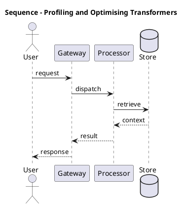

_Source diagram (plantuml); render with the appropriate tool._

**Figure 17. Sequence - Profiling and Optimising Transformers** (plantuml). Figure: Sequence view for Profiling and Optimising Transformers. This diagram illustrates the principal components and their interactions as discussed in the surrounding section.

## Deep Dive: Mechanics, Variants and Trade-offs

Having established the essentials, we now go deeper into profiling and optimising transformers. Beneath the abstraction lies a concrete process whose steps can each be measured, tested and optimised independently. The distinctions in this section are the ones that separate a working demo from a system that holds up under adversarial inputs, scale and the passage of time.

Consider the principal variants and how to choose between them. Each variant optimises for a different point in the design space - some for latency, some for accuracy, some for cost or operability - and the correct choice follows from explicit requirements rather than from defaults. There is an inherent trade-off between fidelity and cost, and the correct balance depends on the use case and its tolerance for error.

In practice this is supported by a mature tooling ecosystem, including PyTorch, FlashAttention, Triton, xFormers. Tools accelerate the work but do not substitute for understanding: the same principles apply whichever implementation you select, and the ability to reason from first principles is what lets you debug when a tool behaves unexpectedly.

A frequent source of subtle bugs is the interaction with encoder, decoder and encoder–decoder variants. Because encoder, decoder and encoder–decoder variants concerns bERT-style, GPT-style and T5-style architectures and their use cases, changes there can silently alter the behaviour analysed here. The remedy is contract tests at the boundary and end-to-end evaluations that exercise the interaction explicitly.

Finally, attend to edge cases and degradation. Define what the system should do under partial failure, unexpected inputs and load spikes, and make that behaviour explicit and tested rather than emergent. Graceful degradation - returning a safe, useful result when the ideal one is unavailable - is a hallmark of mature engineering.

For deeper study, the literature offers authoritative treatments such as Vaswani et al. — Attention Is All You Need (2017) and Dao et al. — FlashAttention (2022). These primary sources reward careful reading and ground the practical guidance above in established results.

## Advanced Considerations

Having established the essentials, we now go deeper into profiling and optimising transformers. Beneath the abstraction lies a concrete process whose steps can each be measured, tested and optimised independently. The distinctions in this section are the ones that separate a working demo from a system that holds up under adversarial inputs, scale and the passage of time.

Consider the principal variants and how to choose between them. Each variant optimises for a different point in the design space - some for latency, some for accuracy, some for cost or operability - and the correct choice follows from explicit requirements rather than from defaults. Latency, accuracy and cost form a tension triangle: improving one typically pressures the others, so explicit budgets are essential.

In practice this is supported by a mature tooling ecosystem, including PyTorch, FlashAttention, Triton, xFormers. Tools accelerate the work but do not substitute for understanding: the same principles apply whichever implementation you select, and the ability to reason from first principles is what lets you debug when a tool behaves unexpectedly.

A frequent source of subtle bugs is the interaction with positional encoding. Because positional encoding concerns sinusoidal, learned and rotary (RoPE) encodings that inject order into a permutation-invariant operation, changes there can silently alter the behaviour analysed here. The remedy is contract tests at the boundary and end-to-end evaluations that exercise the interaction explicitly.

Finally, attend to edge cases and degradation. Define what the system should do under partial failure, unexpected inputs and load spikes, and make that behaviour explicit and tested rather than emergent. Graceful degradation - returning a safe, useful result when the ideal one is unavailable - is a hallmark of mature engineering.

For deeper study, the literature offers authoritative treatments such as Vaswani et al. — Attention Is All You Need (2017) and Dao et al. — FlashAttention (2022). These primary sources reward careful reading and ground the practical guidance above in established results.

## Worked Example

A worked example clarifies how these ideas behave in practice. A nlp organisation needs language understanding and generation across tasks. They decide to apply profiling and optimising transformers as part of their Transformers solution, but wisely treat it as a hypothesis to be validated rather than a foregone conclusion.

The team begins by stating the objective precisely and defining how success will be measured before writing any code. They establish a small but representative evaluation set, agree on acceptance thresholds, and only then prototype the simplest design that could work. Early measurement reveals which assumptions hold and which must be revised, saving weeks of misdirected effort and surfacing edge cases while they are still cheap to fix.

As the prototype matures into a service, the team hardens it: adding input validation, error handling, caching where it pays off, and monitoring that ties back to the original success metric. They document each significant decision in an architecture decision record so that future maintainers understand not just what was built but why.

The outcome is instructive. The system that reaches production is not the most sophisticated design the team considered, but the one whose behaviour they could measure, explain and operate. This is the recurring lesson of Transformers: durable value comes from the whole system, not from any single clever component.

## Industry Use Cases

Across industries, the ideas in this chapter recur in recognisable ways. The following vignettes show how different sectors apply them and what they have in common.

**NLP.** Language understanding and generation across tasks. The common thread is that value comes not from the model alone but from the surrounding system - data quality, evaluation, integration and operations - which is precisely where most of the engineering effort belongs.

**Computer Vision.** Image classification and detection with ViT backbones. The common thread is that value comes not from the model alone but from the surrounding system - data quality, evaluation, integration and operations - which is precisely where most of the engineering effort belongs.

**Audio.** Speech recognition and synthesis with transformer encoders. The common thread is that value comes not from the model alone but from the surrounding system - data quality, evaluation, integration and operations - which is precisely where most of the engineering effort belongs.

**Science.** Protein structure and molecular property prediction. The common thread is that value comes not from the model alone but from the surrounding system - data quality, evaluation, integration and operations - which is precisely where most of the engineering effort belongs.

## Best Practices

The following practices consistently separate successful Transformers efforts from struggling ones. They are deliberately concrete so they can be adopted as checklist items in design and code review.

- Use pre-norm and careful warmup to stabilise deep transformer training.
- Adopt fused attention kernels to cut memory and latency.
- Validate positional encoding choice against target sequence lengths.
- Profile FLOPs and memory before scaling parameters.

None of these are exotic; they are the unglamorous disciplines that compound into reliability. The cost of adopting them is small compared with the cost of the incidents they prevent, and they become second nature with practice.

## Common Pitfalls

Equally instructive are the failure modes that recur in practice. Each pitfall below has a clear early warning sign and a known remedy, so treat them as a diagnostic checklist when something feels wrong:

- Quadratic attention cost dominating long-sequence workloads.
- Numerical instability from post-norm at depth.
- Position encoding that fails to extrapolate beyond training length.
- Ignoring kernel-level efficiency and over-provisioning hardware.

The pattern is consistent: most failures stem from skipping measurement, conflating prototype and production standards, or deferring cross-cutting concerns such as security and cost until they become emergencies. Naming these traps in advance is the cheapest way to avoid them.

## Governance, Security and Cost Notes

No discussion of profiling and optimising transformers is complete without its governance, security and cost dimensions, which are too often deferred until they become emergencies. Treating them as first-class concerns from the outset is both cheaper and safer.

**Governance.** Classify the risk of this capability, document its intended and out-of-scope uses, and ensure decisions are traceable to satisfy internal policy and external regulation such as the NIST AI RMF, ISO/IEC 42001 and the EU AI Act. **Security.** Treat all external input as untrusted, validate outputs before acting on them, apply least privilege to any tools or data access, and map controls to the OWASP LLM Top 10 and MITRE ATLAS.

**Cost and sustainability.** Establish explicit budgets for compute, tokens and latency, attribute spend to owners, and revisit the economics as usage scales - a design that is affordable at pilot scale can become untenable at production volume. Building these reflexes into everyday engineering is what allows a Transformers system to be not only capable but also trustworthy and economically sound.

## Hands-On Exercises

Work through the following exercises. They are designed to move understanding from recognition to application - the level required for real engineering work - so prefer writing and building over merely reading.

1. Explain profiling and optimising transformers to a colleague unfamiliar with Transformers, using a concrete example from your own domain.
2. Sketch a reference architecture that incorporates profiling and optimising transformers and annotate where observability, security and cost controls belong.
3. Design an evaluation that would tell you whether profiling and optimising transformers is working in production, including the metric, the dataset and the acceptance threshold.
4. Identify two pitfalls relevant to profiling and optimising transformers in your environment and describe the early warning signals you would monitor.
5. Prototype the simplest implementation that demonstrates profiling and optimising transformers, then list exactly what would need to change to make it production-ready.

## Key Takeaways

Key takeaways from this chapter:

- Profiling and Optimising Transformers is a systems concern in Transformers: data, models and operations must be co-designed.
- Measurement is non-negotiable; define success metrics and evaluation before building.
- Favour the simplest design that meets the requirement, and add complexity only when evidence demands it.
- Security, cost and observability are first-class requirements, not afterthoughts.
- Document decisions so the system remains understandable and operable as it evolves.

## Code Walkthrough

This listing shows a configuration-driven Profiling and Optimising Transformers component with retry semantics and typed interfaces — the shape we expect from production Transformers code rather than a notebook prototype.

The full listing is shown below; study it line by line and reproduce it locally before moving on.

### Listing: Implementing a Profiling and Optimising Transformers component

```python
from __future__ import annotations

from dataclasses import dataclass, field
from typing import Any


@dataclass(slots=True)
class ProfilingAndOptimisingConfig:
    """Configuration for the Profiling and Optimising Transformers component in a Transformers system."""

    name: str
    timeout_s: float = 30.0
    max_retries: int = 3
    options: dict[str, Any] = field(default_factory=dict)


class ProfilingAndOptimising:
    """A minimal, production-shaped implementation of Profiling and Optimising Transformers."""

    def __init__(self, config: ProfilingAndOptimisingConfig) -> None:
        self._config = config
        self._calls = 0

    def run(self, payload: dict[str, Any]) -> dict[str, Any]:
        """Process a request, retrying transient failures with backoff."""
        last_error: Exception | None = None
        for attempt in range(self._config.max_retries):
            try:
                self._calls += 1
                return self._process(payload)
            except TimeoutError as exc:  # transient
                last_error = exc
                continue
        raise RuntimeError(f"ProfilingAndOptimising failed after retries") from last_error

    def _process(self, payload: dict[str, Any]) -> dict[str, Any]:
        # Domain-specific logic for Profiling and Optimising Transformers goes here.
        return {"status": "ok", "input_keys": sorted(payload), "calls": self._calls}

```

## Review Questions

1. In the context of Transformers, which statement best describes “Profiling and Optimising Transformers”?
   - A. Memory, FLOPs, kernel fusion and hardware-aware design.
   - B. It is only relevant to academic research, not production.
   - C. It applies exclusively to image data.
   - D. It eliminates the need for any evaluation or monitoring.
   - **Answer: A.** Profiling and Optimising Transformers: Memory, FLOPs, kernel fusion and hardware-aware design.
2. Which of the following is a recommended best practice when working with Transformers?
   - A. Validate positional encoding choice against target sequence lengths.
   - B. Quadratic attention cost dominating long-sequence workloads.
   - C. It makes the system slower but has no other effect.
   - D. Position encoding that fails to extrapolate beyond training length.
   - **Answer: A.** Best practice: Validate positional encoding choice against target sequence lengths.
3. Which of the following is a common pitfall to avoid in Transformers?
   - A. It eliminates the need for any evaluation or monitoring.
   - B. Adopt fused attention kernels to cut memory and latency.
   - C. Numerical instability from post-norm at depth.
   - D. Use pre-norm and careful warmup to stabilise deep transformer training.
   - **Answer: C.** Pitfall to avoid: Numerical instability from post-norm at depth.
4. *(Discussion)* Walk through how you would design Profiling and Optimising Transformers for an enterprise Transformers workload.
   - **Model answer:** A strong answer defines profiling and optimising transformers (Memory, FLOPs, kernel fusion and hardware-aware design.) then connects it to architecture, evaluation, cost, security and operations for Transformers, citing concrete trade-offs and a real-world example.

---


# Chapter 14. The Transformer Design Space

_This chapter examines the transformer design space within Transformers. It covers a map of architectural choices and their empirical trade-offs, derives a reference architecture, walks through a worked example and runnable code, surveys industry use cases, and distils best practices and pitfalls, closing with exercises and review questions._

## Introduction

At its core, The Transformer Design Space concerns a map of architectural choices and their empirical trade-offs. This concept recurs throughout the Transformers lifecycle, from design to operations. The practical implication is that design choices here ripple through latency, cost and maintainability for the lifetime of the system.

This chapter builds intuition first, then formalises the ideas, derives an architecture, and finishes with code, exercises and review questions so the material transfers directly to your own Transformers work. Read it actively: pause at each diagram, reproduce the code, and attempt the exercises before consulting the answers.

## Theory and Foundations

Formally, The Transformer Design Space addresses a map of architectural choices and their empirical trade-offs. In an enterprise setting, this translates into concrete requirements: clear interfaces, measurable quality, and controls that satisfy security and governance. Beneath the abstraction lies a concrete process whose steps can each be measured, tested and optimised independently.

To place this in context, recall the broader picture: The transformer is a neural architecture built on self-attention that processes sequences in parallel and models long-range dependencies without recurrence. Within that picture, the transformer design space is one of the load-bearing ideas - the kind that, when understood deeply, makes the rest of Transformers fall into place. This concept recurs throughout the Transformers lifecycle, from design to operations.

The Transformer Design Space cannot be understood in isolation from positional encoding. Recall that positional encoding concerns sinusoidal, learned and rotary (RoPE) encodings that inject order into a permutation-invariant operation. The two interact directly: decisions in one constrain the design space of the other, which is why mature teams reason about them together rather than sequentially. Every added component buys capability at the price of operational surface area, and that bargain should be made consciously.

The Transformer Design Space cannot be understood in isolation from training dynamics and stability. Recall that training dynamics and stability concerns initialisation, warmup, gradient clipping and loss spikes. The two interact directly: decisions in one constrain the design space of the other, which is why mature teams reason about them together rather than sequentially. Latency, accuracy and cost form a tension triangle: improving one typically pressures the others, so explicit budgets are essential.

Several established patterns apply directly to the transformer design space. The first, pre-norm residual blocks for deep stability, is widely adopted because it makes the system's behaviour predictable and observable. A complementary pattern, mixture-of-experts routing for sparse scaling, addresses a related concern and is often deployed alongside it. Patterns are not dogma; they are distilled experience that shortcuts the search for a sound design, and each carries assumptions worth checking against your context.

Knowing when not to use a technique is as valuable as knowing how to use it. In a small prototype, shortcuts around the transformer design space are invisible; in a production Transformers system serving real traffic, they surface as incidents, cost overruns or compliance gaps. As with most architectural decisions, the choice is rarely binary; the skill lies in quantifying the trade-offs and choosing deliberately. The remainder of this chapter turns these principles into an architecture, code and a checklist you can apply immediately.

## Architecture and Design

From an architectural standpoint, The Transformer Design Space sits at the intersection of data, models and operations. A transformer block stacks multi-head self-attention and a position-wise feed-forward network, each wrapped in residual connections and normalisation. Decoder-only stacks add causal masking; encoder–decoder stacks add cross attention. At scale, efficient attention kernels, mixed precision and tensor parallelism turn the mathematics into a trainable system.

Concretely, the principal building blocks include why self-attention replaced recurrence, scaled dot-product attention, multi-head attention, positional encoding and feed-forward networks and activations. Each is a replaceable component behind a stable interface, so the team can upgrade an implementation - a model, an index, a policy engine - without rewriting its neighbours. The contracts between components are where reliability is won or lost, so they are specified explicitly and tested in isolation.

The diagram accompanying this section makes the data and control flow explicit. Requests enter through a well-defined boundary where they are authenticated and validated; only then are they dispatched to the components that perform the work. This boundary is also where rate limiting, quota enforcement and audit logging live, keeping cross-cutting concerns out of the core logic and in one auditable place.

Two qualities deserve emphasis. First, observability is designed in, not bolted on: every component emits structured telemetry so that failures can be localised in minutes rather than hours. Second, the architecture is evolvable - components communicate through stable contracts so that any single part of the Transformers system can be replaced without a rewrite. Latency, accuracy and cost form a tension triangle: improving one typically pressures the others, so explicit budgets are essential.

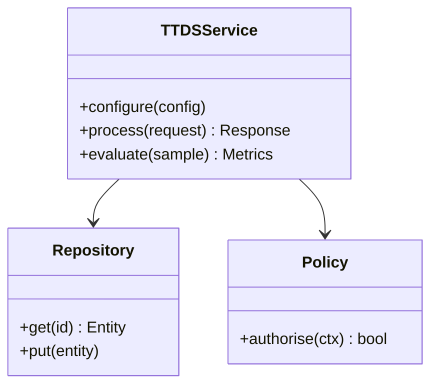

**Figure 18. Class - The Transformer Design Space** (mermaid). Figure: Class view for The Transformer Design Space. This diagram illustrates the principal components and their interactions as discussed in the surrounding section.

<div class="diagram-svg">

<svg xmlns="http://www.w3.org/2000/svg" width="840" height="460" data-tpl="grid_matrix" data-pal="5-3" viewBox="0 0 840 460" font-family="Inter, Segoe UI, Arial, sans-serif"><defs><marker id="ar" markerWidth="9" markerHeight="9" refX="7" refY="3" orient="auto"><path d="M0,0 L7,3 L0,6 z" fill="#94a3b8"/></marker><marker id="arw" markerWidth="9" markerHeight="9" refX="7" refY="3" orient="auto"><path d="M0,0 L7,3 L0,6 z" fill="#ffffff"/></marker><filter id="sh" x="-20%" y="-20%" width="140%" height="140%"><feDropShadow dx="0" dy="2" stdDeviation="3" flood-color="#0f172a" flood-opacity="0.16"/></filter></defs><defs><linearGradient id="bn7361787" x1="0" y1="0" x2="1" y2="0"><stop offset="0" stop-color="#3b82f6"/><stop offset="1" stop-color="#60a5fa"/></linearGradient></defs><rect width="840" height="460" rx="14" fill="#ffffff"/><rect x="0" y="0" width="840" height="48" rx="14" fill="url(#bn7361787)"/><rect x="0" y="32" width="840" height="16" fill="url(#bn7361787)"/><text x="420" y="25" text-anchor="middle" font-size="14.5" font-weight="700" fill="#ffffff" dominant-baseline="middle">Cloud Architecture - The Transformer Design Space</text><text x="276" y="78" text-anchor="middle" font-size="10.5" font-weight="700" fill="#64748b" dominant-baseline="middle">Plan</text><text x="430" y="78" text-anchor="middle" font-size="10.5" font-weight="700" fill="#64748b" dominant-baseline="middle">Build</text><text x="582" y="78" text-anchor="middle" font-size="10.5" font-weight="700" fill="#64748b" dominant-baseline="middle">Run</text><text x="736" y="78" text-anchor="middle" font-size="10.5" font-weight="700" fill="#64748b" dominant-baseline="middle">Improve</text><text x="188" y="119" text-anchor="end" font-size="10" font-weight="600" fill="#0f172a" dominant-baseline="middle">The Transformer Design</text><text x="188" y="131" text-anchor="end" font-size="10" font-weight="600" fill="#0f172a" dominant-baseline="middle">Space</text><rect x="203" y="93" width="147" height="64" rx="8" fill="#3b82f6"/><rect x="203" y="93" width="147" height="64" rx="8" fill="#ffffff" fill-opacity="0.25"/><rect x="356" y="93" width="147" height="64" rx="8" fill="#60a5fa"/><rect x="356" y="93" width="147" height="64" rx="8" fill="#ffffff" fill-opacity="0.25"/><rect x="509" y="93" width="147" height="64" rx="8" fill="#1e40af"/><rect x="509" y="93" width="147" height="64" rx="8" fill="#ffffff" fill-opacity="0.25"/><rect x="662" y="93" width="147" height="64" rx="8" fill="#1e3a8a"/><rect x="662" y="93" width="147" height="64" rx="8" fill="#ffffff" fill-opacity="0.38"/><text x="188" y="195" text-anchor="end" font-size="10" font-weight="600" fill="#0f172a" dominant-baseline="middle">Positional Encoding</text><rect x="203" y="163" width="147" height="64" rx="8" fill="#60a5fa"/><rect x="203" y="163" width="147" height="64" rx="8" fill="#ffffff" fill-opacity="0.62"/><rect x="356" y="163" width="147" height="64" rx="8" fill="#1e40af"/><rect x="356" y="163" width="147" height="64" rx="8" fill="#ffffff" fill-opacity="0.50"/><rect x="509" y="163" width="147" height="64" rx="8" fill="#1e3a8a"/><rect x="509" y="163" width="147" height="64" rx="8" fill="#ffffff" fill-opacity="0.62"/><rect x="662" y="163" width="147" height="64" rx="8" fill="#1d4ed8"/><rect x="662" y="163" width="147" height="64" rx="8" fill="#ffffff" fill-opacity="0.12"/><text x="188" y="259" text-anchor="end" font-size="10" font-weight="600" fill="#0f172a" dominant-baseline="middle">Training Dynamics and</text><text x="188" y="271" text-anchor="end" font-size="10" font-weight="600" fill="#0f172a" dominant-baseline="middle">Stability</text><rect x="203" y="233" width="147" height="64" rx="8" fill="#1e40af"/><rect x="203" y="233" width="147" height="64" rx="8" fill="#ffffff" fill-opacity="0.62"/><rect x="356" y="233" width="147" height="64" rx="8" fill="#1e3a8a"/><rect x="356" y="233" width="147" height="64" rx="8" fill="#ffffff" fill-opacity="0.62"/><rect x="509" y="233" width="147" height="64" rx="8" fill="#1d4ed8"/><rect x="509" y="233" width="147" height="64" rx="8" fill="#ffffff" fill-opacity="0.12"/><rect x="662" y="233" width="147" height="64" rx="8" fill="#2563eb"/><rect x="662" y="233" width="147" height="64" rx="8" fill="#ffffff" fill-opacity="0.12"/><text x="188" y="329" text-anchor="end" font-size="10" font-weight="600" fill="#0f172a" dominant-baseline="middle">Profiling and Optimising</text><text x="188" y="341" text-anchor="end" font-size="10" font-weight="600" fill="#0f172a" dominant-baseline="middle">Transformers</text><rect x="203" y="303" width="147" height="64" rx="8" fill="#1e3a8a"/><rect x="203" y="303" width="147" height="64" rx="8" fill="#ffffff" fill-opacity="0.38"/><rect x="356" y="303" width="147" height="64" rx="8" fill="#1d4ed8"/><rect x="356" y="303" width="147" height="64" rx="8" fill="#ffffff" fill-opacity="0.50"/><rect x="509" y="303" width="147" height="64" rx="8" fill="#2563eb"/><rect x="509" y="303" width="147" height="64" rx="8" fill="#ffffff" fill-opacity="0.38"/><rect x="662" y="303" width="147" height="64" rx="8" fill="#3b82f6"/><rect x="662" y="303" width="147" height="64" rx="8" fill="#ffffff" fill-opacity="0.25"/><text x="28" y="446" text-anchor="start" font-size="9.5" font-weight="500" fill="#64748b" dominant-baseline="middle">The Transformer Design Space  •  Cloud Architecture</text></svg>

</div>

**Figure 19. Cloud Architecture - The Transformer Design Space** (svg). Figure: Cloud Architecture view for The Transformer Design Space. This diagram illustrates the principal components and their interactions as discussed in the surrounding section.

## Deep Dive: Mechanics, Variants and Trade-offs

Having established the essentials, we now go deeper into the transformer design space. It pays to understand the mechanism rather than treat it as a black box, because most production incidents are explained by one of its steps misbehaving. The distinctions in this section are the ones that separate a working demo from a system that holds up under adversarial inputs, scale and the passage of time.

Consider the principal variants and how to choose between them. Each variant optimises for a different point in the design space - some for latency, some for accuracy, some for cost or operability - and the correct choice follows from explicit requirements rather than from defaults. Latency, accuracy and cost form a tension triangle: improving one typically pressures the others, so explicit budgets are essential.

In practice this is supported by a mature tooling ecosystem, including PyTorch, FlashAttention, Triton, xFormers. Tools accelerate the work but do not substitute for understanding: the same principles apply whichever implementation you select, and the ability to reason from first principles is what lets you debug when a tool behaves unexpectedly.

A frequent source of subtle bugs is the interaction with positional encoding. Because positional encoding concerns sinusoidal, learned and rotary (RoPE) encodings that inject order into a permutation-invariant operation, changes there can silently alter the behaviour analysed here. The remedy is contract tests at the boundary and end-to-end evaluations that exercise the interaction explicitly.

Finally, attend to edge cases and degradation. Define what the system should do under partial failure, unexpected inputs and load spikes, and make that behaviour explicit and tested rather than emergent. Graceful degradation - returning a safe, useful result when the ideal one is unavailable - is a hallmark of mature engineering.

For deeper study, the literature offers authoritative treatments such as Vaswani et al. — Attention Is All You Need (2017) and Dao et al. — FlashAttention (2022). These primary sources reward careful reading and ground the practical guidance above in established results.

## Advanced Considerations

Having established the essentials, we now go deeper into the transformer design space. The underlying mechanism is best appreciated by tracing a single request from input to output and noting where state is created and consumed. The distinctions in this section are the ones that separate a working demo from a system that holds up under adversarial inputs, scale and the passage of time.

Consider the principal variants and how to choose between them. Each variant optimises for a different point in the design space - some for latency, some for accuracy, some for cost or operability - and the correct choice follows from explicit requirements rather than from defaults. Simplicity is a feature. The simplest design that meets the requirement should be the default, with complexity added only when measurement justifies it.

In practice this is supported by a mature tooling ecosystem, including PyTorch, FlashAttention, Triton, xFormers. Tools accelerate the work but do not substitute for understanding: the same principles apply whichever implementation you select, and the ability to reason from first principles is what lets you debug when a tool behaves unexpectedly.

A frequent source of subtle bugs is the interaction with feed-forward networks and activations. Because feed-forward networks and activations concerns position-wise MLPs, GELU/SwiGLU and their role in capacity, changes there can silently alter the behaviour analysed here. The remedy is contract tests at the boundary and end-to-end evaluations that exercise the interaction explicitly.

Finally, attend to edge cases and degradation. Define what the system should do under partial failure, unexpected inputs and load spikes, and make that behaviour explicit and tested rather than emergent. Graceful degradation - returning a safe, useful result when the ideal one is unavailable - is a hallmark of mature engineering.

For deeper study, the literature offers authoritative treatments such as Vaswani et al. — Attention Is All You Need (2017) and Dao et al. — FlashAttention (2022). These primary sources reward careful reading and ground the practical guidance above in established results.

## Worked Example

To ground the discussion, walk through a representative example. A science organisation needs protein structure and molecular property prediction. They decide to apply the transformer design space as part of their Transformers solution, but wisely treat it as a hypothesis to be validated rather than a foregone conclusion.

The team begins by stating the objective precisely and defining how success will be measured before writing any code. They establish a small but representative evaluation set, agree on acceptance thresholds, and only then prototype the simplest design that could work. Early measurement reveals which assumptions hold and which must be revised, saving weeks of misdirected effort and surfacing edge cases while they are still cheap to fix.

As the prototype matures into a service, the team hardens it: adding input validation, error handling, caching where it pays off, and monitoring that ties back to the original success metric. They document each significant decision in an architecture decision record so that future maintainers understand not just what was built but why.

The outcome is instructive. The system that reaches production is not the most sophisticated design the team considered, but the one whose behaviour they could measure, explain and operate. This is the recurring lesson of Transformers: durable value comes from the whole system, not from any single clever component.

## Industry Use Cases

Across industries, the ideas in this chapter recur in recognisable ways. The following vignettes show how different sectors apply them and what they have in common.

**NLP.** Language understanding and generation across tasks. The common thread is that value comes not from the model alone but from the surrounding system - data quality, evaluation, integration and operations - which is precisely where most of the engineering effort belongs.

**Computer Vision.** Image classification and detection with ViT backbones. The common thread is that value comes not from the model alone but from the surrounding system - data quality, evaluation, integration and operations - which is precisely where most of the engineering effort belongs.

**Audio.** Speech recognition and synthesis with transformer encoders. The common thread is that value comes not from the model alone but from the surrounding system - data quality, evaluation, integration and operations - which is precisely where most of the engineering effort belongs.

**Science.** Protein structure and molecular property prediction. The common thread is that value comes not from the model alone but from the surrounding system - data quality, evaluation, integration and operations - which is precisely where most of the engineering effort belongs.

## Best Practices

The following practices consistently separate successful Transformers efforts from struggling ones. They are deliberately concrete so they can be adopted as checklist items in design and code review.

- Use pre-norm and careful warmup to stabilise deep transformer training.
- Adopt fused attention kernels to cut memory and latency.
- Validate positional encoding choice against target sequence lengths.
- Profile FLOPs and memory before scaling parameters.

None of these are exotic; they are the unglamorous disciplines that compound into reliability. The cost of adopting them is small compared with the cost of the incidents they prevent, and they become second nature with practice.

## Common Pitfalls

Equally instructive are the failure modes that recur in practice. Each pitfall below has a clear early warning sign and a known remedy, so treat them as a diagnostic checklist when something feels wrong:

- Quadratic attention cost dominating long-sequence workloads.
- Numerical instability from post-norm at depth.
- Position encoding that fails to extrapolate beyond training length.
- Ignoring kernel-level efficiency and over-provisioning hardware.

The pattern is consistent: most failures stem from skipping measurement, conflating prototype and production standards, or deferring cross-cutting concerns such as security and cost until they become emergencies. Naming these traps in advance is the cheapest way to avoid them.

## Governance, Security and Cost Notes

No discussion of the transformer design space is complete without its governance, security and cost dimensions, which are too often deferred until they become emergencies. Treating them as first-class concerns from the outset is both cheaper and safer.

**Governance.** Classify the risk of this capability, document its intended and out-of-scope uses, and ensure decisions are traceable to satisfy internal policy and external regulation such as the NIST AI RMF, ISO/IEC 42001 and the EU AI Act. **Security.** Treat all external input as untrusted, validate outputs before acting on them, apply least privilege to any tools or data access, and map controls to the OWASP LLM Top 10 and MITRE ATLAS.

**Cost and sustainability.** Establish explicit budgets for compute, tokens and latency, attribute spend to owners, and revisit the economics as usage scales - a design that is affordable at pilot scale can become untenable at production volume. Building these reflexes into everyday engineering is what allows a Transformers system to be not only capable but also trustworthy and economically sound.

## Hands-On Exercises

Work through the following exercises. They are designed to move understanding from recognition to application - the level required for real engineering work - so prefer writing and building over merely reading.

1. Explain the transformer design space to a colleague unfamiliar with Transformers, using a concrete example from your own domain.
2. Sketch a reference architecture that incorporates the transformer design space and annotate where observability, security and cost controls belong.
3. Design an evaluation that would tell you whether the transformer design space is working in production, including the metric, the dataset and the acceptance threshold.
4. Identify two pitfalls relevant to the transformer design space in your environment and describe the early warning signals you would monitor.
5. Prototype the simplest implementation that demonstrates the transformer design space, then list exactly what would need to change to make it production-ready.

## Key Takeaways

Key takeaways from this chapter:

- The Transformer Design Space is a systems concern in Transformers: data, models and operations must be co-designed.
- Measurement is non-negotiable; define success metrics and evaluation before building.
- Favour the simplest design that meets the requirement, and add complexity only when evidence demands it.
- Security, cost and observability are first-class requirements, not afterthoughts.
- Document decisions so the system remains understandable and operable as it evolves.

## Code Walkthrough

This listing shows a configuration-driven The Transformer Design Space component with retry semantics and typed interfaces — the shape we expect from production Transformers code rather than a notebook prototype.

The full listing is shown below; study it line by line and reproduce it locally before moving on.

### Listing: Implementing a The Transformer Design Space component

```python
from __future__ import annotations

from dataclasses import dataclass, field
from typing import Any


@dataclass(slots=True)
class TheTransformerDesignConfig:
    """Configuration for the The Transformer Design Space component in a Transformers system."""

    name: str
    timeout_s: float = 30.0
    max_retries: int = 3
    options: dict[str, Any] = field(default_factory=dict)


class TheTransformerDesign:
    """A minimal, production-shaped implementation of The Transformer Design Space."""

    def __init__(self, config: TheTransformerDesignConfig) -> None:
        self._config = config
        self._calls = 0

    def run(self, payload: dict[str, Any]) -> dict[str, Any]:
        """Process a request, retrying transient failures with backoff."""
        last_error: Exception | None = None
        for attempt in range(self._config.max_retries):
            try:
                self._calls += 1
                return self._process(payload)
            except TimeoutError as exc:  # transient
                last_error = exc
                continue
        raise RuntimeError(f"TheTransformerDesign failed after retries") from last_error

    def _process(self, payload: dict[str, Any]) -> dict[str, Any]:
        # Domain-specific logic for The Transformer Design Space goes here.
        return {"status": "ok", "input_keys": sorted(payload), "calls": self._calls}

```

## Review Questions

1. In the context of Transformers, which statement best describes “The Transformer Design Space”?
   - A. It applies exclusively to image data.
   - B. It guarantees deterministic output regardless of input.
   - C. It makes the system slower but has no other effect.
   - D. A map of architectural choices and their empirical trade-offs.
   - **Answer: D.** The Transformer Design Space: A map of architectural choices and their empirical trade-offs.
2. Which of the following is a recommended best practice when working with Transformers?
   - A. Ignoring kernel-level efficiency and over-provisioning hardware.
   - B. Position encoding that fails to extrapolate beyond training length.
   - C. Numerical instability from post-norm at depth.
   - D. Adopt fused attention kernels to cut memory and latency.
   - **Answer: D.** Best practice: Adopt fused attention kernels to cut memory and latency.
3. Which of the following is a common pitfall to avoid in Transformers?
   - A. Adopt fused attention kernels to cut memory and latency.
   - B. It removes all security and governance requirements.
   - C. It applies exclusively to image data.
   - D. Position encoding that fails to extrapolate beyond training length.
   - **Answer: D.** Pitfall to avoid: Position encoding that fails to extrapolate beyond training length.
4. *(Discussion)* How does The Transformer Design Space interact with security and governance requirements?
   - **Model answer:** A strong answer defines the transformer design space (A map of architectural choices and their empirical trade-offs.) then connects it to architecture, evaluation, cost, security and operations for Transformers, citing concrete trade-offs and a real-world example.

---


# Chapter 15. Putting It Together: A Reference Implementation

_This chapter examines putting it together: a reference implementation within Transformers. It covers an end-to-end reference implementation that integrates the components of a Transformers system into a cohesive, working whole, derives a reference architecture, walks through a worked example and runnable code, surveys industry use cases, and distils best practices and pitfalls, closing with exercises and review questions._

## Introduction

Formally, Putting It Together: A Reference Implementation addresses an end-to-end reference implementation that integrates the components of a Transformers system into a cohesive, working whole. This concept recurs throughout the Transformers lifecycle, from design to operations. What distinguishes a production-grade approach from a prototype is the discipline of measurement: every claim is backed by an evaluation rather than intuition.

This chapter builds intuition first, then formalises the ideas, derives an architecture, and finishes with code, exercises and review questions so the material transfers directly to your own Transformers work. Read it actively: pause at each diagram, reproduce the code, and attempt the exercises before consulting the answers.

## Theory and Foundations

Putting It Together: A Reference Implementation refers to an end-to-end reference implementation that integrates the components of a Transformers system into a cohesive, working whole. It helps to separate the conceptual model from its implementation: the former guides reasoning, the latter must contend with real-world constraints. Beneath the abstraction lies a concrete process whose steps can each be measured, tested and optimised independently.

To place this in context, recall the broader picture: The transformer is a neural architecture built on self-attention that processes sequences in parallel and models long-range dependencies without recurrence. Within that picture, putting it together: a reference implementation is one of the load-bearing ideas - the kind that, when understood deeply, makes the rest of Transformers fall into place. Teams that master this consistently ship more reliable Transformers systems at lower cost.

Putting It Together: A Reference Implementation cannot be understood in isolation from positional encoding. Recall that positional encoding concerns sinusoidal, learned and rotary (RoPE) encodings that inject order into a permutation-invariant operation. The two interact directly: decisions in one constrain the design space of the other, which is why mature teams reason about them together rather than sequentially. Latency, accuracy and cost form a tension triangle: improving one typically pressures the others, so explicit budgets are essential.

Putting It Together: A Reference Implementation cannot be understood in isolation from residual connections and normalisation. Recall that residual connections and normalisation concerns pre-norm versus post-norm, LayerNorm/RMSNorm and training stability. The two interact directly: decisions in one constrain the design space of the other, which is why mature teams reason about them together rather than sequentially. As with most architectural decisions, the choice is rarely binary; the skill lies in quantifying the trade-offs and choosing deliberately.

Several established patterns apply directly to putting it together: a reference implementation. The first, rotary positional embeddings for length generalisation, is widely adopted because it makes the system's behaviour predictable and observable. A complementary pattern, mixture-of-experts routing for sparse scaling, addresses a related concern and is often deployed alongside it. Patterns are not dogma; they are distilled experience that shortcuts the search for a sound design, and each carries assumptions worth checking against your context.

Knowing when not to use a technique is as valuable as knowing how to use it. In a small prototype, shortcuts around putting it together: a reference implementation are invisible; in a production Transformers system serving real traffic, they surface as incidents, cost overruns or compliance gaps. As with most architectural decisions, the choice is rarely binary; the skill lies in quantifying the trade-offs and choosing deliberately. The remainder of this chapter turns these principles into an architecture, code and a checklist you can apply immediately.

## Architecture and Design

A robust architecture for Putting It Together: A Reference Implementation is layered so each part can evolve independently without destabilising the whole. A transformer block stacks multi-head self-attention and a position-wise feed-forward network, each wrapped in residual connections and normalisation. Decoder-only stacks add causal masking; encoder–decoder stacks add cross attention. At scale, efficient attention kernels, mixed precision and tensor parallelism turn the mathematics into a trainable system.

Concretely, the principal building blocks include why self-attention replaced recurrence, scaled dot-product attention, multi-head attention, positional encoding and feed-forward networks and activations. Each is a replaceable component behind a stable interface, so the team can upgrade an implementation - a model, an index, a policy engine - without rewriting its neighbours. The contracts between components are where reliability is won or lost, so they are specified explicitly and tested in isolation.

The diagram accompanying this section makes the data and control flow explicit. Requests enter through a well-defined boundary where they are authenticated and validated; only then are they dispatched to the components that perform the work. This boundary is also where rate limiting, quota enforcement and audit logging live, keeping cross-cutting concerns out of the core logic and in one auditable place.

Two qualities deserve emphasis. First, observability is designed in, not bolted on: every component emits structured telemetry so that failures can be localised in minutes rather than hours. Second, the architecture is evolvable - components communicate through stable contracts so that any single part of the Transformers system can be replaced without a rewrite. Simplicity is a feature. The simplest design that meets the requirement should be the default, with complexity added only when measurement justifies it.

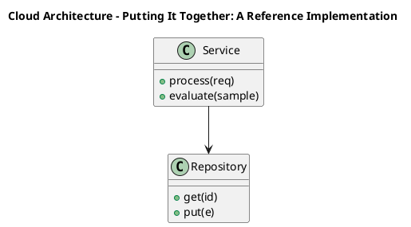

_Source diagram (plantuml); render with the appropriate tool._

**Figure 20. Cloud Architecture - Putting It Together: A Reference Implementation** (plantuml). Figure: Cloud Architecture view for Putting It Together: A Reference Implementation. This diagram illustrates the principal components and their interactions as discussed in the surrounding section.

<div class="diagram-svg">

<svg xmlns="http://www.w3.org/2000/svg" width="840" height="460" data-tpl="radial" data-pal="11-2" viewBox="0 0 840 460" font-family="Inter, Segoe UI, Arial, sans-serif"><defs><marker id="ar" markerWidth="9" markerHeight="9" refX="7" refY="3" orient="auto"><path d="M0,0 L7,3 L0,6 z" fill="#94a3b8"/></marker><marker id="arw" markerWidth="9" markerHeight="9" refX="7" refY="3" orient="auto"><path d="M0,0 L7,3 L0,6 z" fill="#ffffff"/></marker><filter id="sh" x="-20%" y="-20%" width="140%" height="140%"><feDropShadow dx="0" dy="2" stdDeviation="3" flood-color="#0f172a" flood-opacity="0.16"/></filter></defs><defs><linearGradient id="bn6e871f5" x1="0" y1="0" x2="1" y2="0"><stop offset="0" stop-color="#0e7490"/><stop offset="1" stop-color="#b45309"/></linearGradient></defs><rect width="840" height="460" rx="14" fill="#ffffff"/><rect x="0" y="0" width="840" height="48" rx="14" fill="url(#bn6e871f5)"/><rect x="0" y="32" width="840" height="16" fill="url(#bn6e871f5)"/><text x="420" y="25" text-anchor="middle" font-size="14.5" font-weight="700" fill="#ffffff" dominant-baseline="middle">Knowledge Graph - Putting It Together: A Reference Implementation</text><circle cx="420.0" cy="238.0" r="52" fill="#0f172a"/><text x="420" y="231" text-anchor="middle" font-size="12" font-weight="600" fill="#fff" dominant-baseline="middle">Putting It</text><text x="420" y="245" text-anchor="middle" font-size="12" font-weight="600" fill="#fff" dominant-baseline="middle">Together: A</text><line x1="420" y1="186" x2="420" y2="102" stroke="#94a3b8" stroke-width="2" marker-end="url(#ar)"/><rect x="342" y="65" width="156" height="46" rx="11" fill="#0e7490" filter="url(#sh)"/><text x="420" y="83" text-anchor="middle" font-size="9.5" font-weight="600" fill="#ffffff" dominant-baseline="middle">Putting It Together: A</text><text x="420" y="93" text-anchor="middle" font-size="9.5" font-weight="600" fill="#ffffff" dominant-baseline="middle">Reference Implementation</text><line x1="465" y1="212" x2="631" y2="170" stroke="#94a3b8" stroke-width="2" marker-end="url(#ar)"/><rect x="576" y="140" width="156" height="46" rx="11" fill="#b45309" filter="url(#sh)"/><text x="654" y="163" text-anchor="middle" font-size="11" font-weight="600" fill="#ffffff" dominant-baseline="middle">Positional Encoding</text><line x1="465" y1="264" x2="631" y2="306" stroke="#94a3b8" stroke-width="2" marker-end="url(#ar)"/><rect x="576" y="290" width="156" height="46" rx="11" fill="#9f1239" filter="url(#sh)"/><text x="654" y="308" text-anchor="middle" font-size="9.5" font-weight="600" fill="#ffffff" dominant-baseline="middle">Residual Connections and</text><text x="654" y="318" text-anchor="middle" font-size="9.5" font-weight="600" fill="#ffffff" dominant-baseline="middle">Normalisation</text><line x1="420" y1="290" x2="420" y2="374" stroke="#94a3b8" stroke-width="2" marker-end="url(#ar)"/><rect x="342" y="365" width="156" height="46" rx="11" fill="#4338ca" filter="url(#sh)"/><text x="420" y="383" text-anchor="middle" font-size="9.5" font-weight="600" fill="#ffffff" dominant-baseline="middle">Encoder, Decoder and</text><text x="420" y="393" text-anchor="middle" font-size="9.5" font-weight="600" fill="#ffffff" dominant-baseline="middle">Encoder–Decoder Variants</text><line x1="375" y1="264" x2="209" y2="306" stroke="#94a3b8" stroke-width="2" marker-end="url(#ar)"/><rect x="108" y="290" width="156" height="46" rx="11" fill="#0f172a" filter="url(#sh)"/><text x="186" y="308" text-anchor="middle" font-size="9.5" font-weight="600" fill="#ffffff" dominant-baseline="middle">Training Dynamics and</text><text x="186" y="318" text-anchor="middle" font-size="9.5" font-weight="600" fill="#ffffff" dominant-baseline="middle">Stability</text><line x1="375" y1="212" x2="209" y2="170" stroke="#94a3b8" stroke-width="2" marker-end="url(#ar)"/><rect x="108" y="140" width="156" height="46" rx="11" fill="#1e40af" filter="url(#sh)"/><text x="186" y="163" text-anchor="middle" font-size="9.5" font-weight="600" fill="#ffffff" dominant-baseline="middle">Scaled Dot-Product Attention</text><text x="28" y="446" text-anchor="start" font-size="9.5" font-weight="500" fill="#64748b" dominant-baseline="middle">Putting It Together: A Reference Implementation  •  Knowledge Graph</text></svg>

</div>

**Figure 21. Knowledge Graph - Putting It Together: A Reference Implementation** (svg). Figure: Knowledge Graph view for Putting It Together: A Reference Implementation. This diagram illustrates the principal components and their interactions as discussed in the surrounding section.

## Deep Dive: Mechanics, Variants and Trade-offs

Having established the essentials, we now go deeper into putting it together: a reference implementation. It pays to understand the mechanism rather than treat it as a black box, because most production incidents are explained by one of its steps misbehaving. The distinctions in this section are the ones that separate a working demo from a system that holds up under adversarial inputs, scale and the passage of time.

Consider the principal variants and how to choose between them. Each variant optimises for a different point in the design space - some for latency, some for accuracy, some for cost or operability - and the correct choice follows from explicit requirements rather than from defaults. Every added component buys capability at the price of operational surface area, and that bargain should be made consciously.

In practice this is supported by a mature tooling ecosystem, including PyTorch, FlashAttention, Triton, xFormers. Tools accelerate the work but do not substitute for understanding: the same principles apply whichever implementation you select, and the ability to reason from first principles is what lets you debug when a tool behaves unexpectedly.

A frequent source of subtle bugs is the interaction with positional encoding. Because positional encoding concerns sinusoidal, learned and rotary (RoPE) encodings that inject order into a permutation-invariant operation, changes there can silently alter the behaviour analysed here. The remedy is contract tests at the boundary and end-to-end evaluations that exercise the interaction explicitly.

Finally, attend to edge cases and degradation. Define what the system should do under partial failure, unexpected inputs and load spikes, and make that behaviour explicit and tested rather than emergent. Graceful degradation - returning a safe, useful result when the ideal one is unavailable - is a hallmark of mature engineering.

For deeper study, the literature offers authoritative treatments such as Vaswani et al. — Attention Is All You Need (2017) and Dao et al. — FlashAttention (2022). These primary sources reward careful reading and ground the practical guidance above in established results.

## Advanced Considerations

Having established the essentials, we now go deeper into putting it together: a reference implementation. Beneath the abstraction lies a concrete process whose steps can each be measured, tested and optimised independently. The distinctions in this section are the ones that separate a working demo from a system that holds up under adversarial inputs, scale and the passage of time.

Consider the principal variants and how to choose between them. Each variant optimises for a different point in the design space - some for latency, some for accuracy, some for cost or operability - and the correct choice follows from explicit requirements rather than from defaults. Simplicity is a feature. The simplest design that meets the requirement should be the default, with complexity added only when measurement justifies it.

In practice this is supported by a mature tooling ecosystem, including PyTorch, FlashAttention, Triton, xFormers. Tools accelerate the work but do not substitute for understanding: the same principles apply whichever implementation you select, and the ability to reason from first principles is what lets you debug when a tool behaves unexpectedly.

A frequent source of subtle bugs is the interaction with encoder, decoder and encoder–decoder variants. Because encoder, decoder and encoder–decoder variants concerns bERT-style, GPT-style and T5-style architectures and their use cases, changes there can silently alter the behaviour analysed here. The remedy is contract tests at the boundary and end-to-end evaluations that exercise the interaction explicitly.

Finally, attend to edge cases and degradation. Define what the system should do under partial failure, unexpected inputs and load spikes, and make that behaviour explicit and tested rather than emergent. Graceful degradation - returning a safe, useful result when the ideal one is unavailable - is a hallmark of mature engineering.

For deeper study, the literature offers authoritative treatments such as Vaswani et al. — Attention Is All You Need (2017) and Dao et al. — FlashAttention (2022). These primary sources reward careful reading and ground the practical guidance above in established results.

## Worked Example

To ground the discussion, walk through a representative example. A nlp organisation needs language understanding and generation across tasks. They decide to apply putting it together: a reference implementation as part of their Transformers solution, but wisely treat it as a hypothesis to be validated rather than a foregone conclusion.

The team begins by stating the objective precisely and defining how success will be measured before writing any code. They establish a small but representative evaluation set, agree on acceptance thresholds, and only then prototype the simplest design that could work. Early measurement reveals which assumptions hold and which must be revised, saving weeks of misdirected effort and surfacing edge cases while they are still cheap to fix.

As the prototype matures into a service, the team hardens it: adding input validation, error handling, caching where it pays off, and monitoring that ties back to the original success metric. They document each significant decision in an architecture decision record so that future maintainers understand not just what was built but why.

The outcome is instructive. The system that reaches production is not the most sophisticated design the team considered, but the one whose behaviour they could measure, explain and operate. This is the recurring lesson of Transformers: durable value comes from the whole system, not from any single clever component.

## Industry Use Cases

Across industries, the ideas in this chapter recur in recognisable ways. The following vignettes show how different sectors apply them and what they have in common.

**NLP.** Language understanding and generation across tasks. The common thread is that value comes not from the model alone but from the surrounding system - data quality, evaluation, integration and operations - which is precisely where most of the engineering effort belongs.

**Computer Vision.** Image classification and detection with ViT backbones. The common thread is that value comes not from the model alone but from the surrounding system - data quality, evaluation, integration and operations - which is precisely where most of the engineering effort belongs.

**Audio.** Speech recognition and synthesis with transformer encoders. The common thread is that value comes not from the model alone but from the surrounding system - data quality, evaluation, integration and operations - which is precisely where most of the engineering effort belongs.

**Science.** Protein structure and molecular property prediction. The common thread is that value comes not from the model alone but from the surrounding system - data quality, evaluation, integration and operations - which is precisely where most of the engineering effort belongs.

## Best Practices

The following practices consistently separate successful Transformers efforts from struggling ones. They are deliberately concrete so they can be adopted as checklist items in design and code review.

- Use pre-norm and careful warmup to stabilise deep transformer training.
- Adopt fused attention kernels to cut memory and latency.
- Validate positional encoding choice against target sequence lengths.
- Profile FLOPs and memory before scaling parameters.

None of these are exotic; they are the unglamorous disciplines that compound into reliability. The cost of adopting them is small compared with the cost of the incidents they prevent, and they become second nature with practice.

## Common Pitfalls

Equally instructive are the failure modes that recur in practice. Each pitfall below has a clear early warning sign and a known remedy, so treat them as a diagnostic checklist when something feels wrong:

- Quadratic attention cost dominating long-sequence workloads.
- Numerical instability from post-norm at depth.
- Position encoding that fails to extrapolate beyond training length.
- Ignoring kernel-level efficiency and over-provisioning hardware.

The pattern is consistent: most failures stem from skipping measurement, conflating prototype and production standards, or deferring cross-cutting concerns such as security and cost until they become emergencies. Naming these traps in advance is the cheapest way to avoid them.

## Governance, Security and Cost Notes

No discussion of putting it together: a reference implementation is complete without its governance, security and cost dimensions, which are too often deferred until they become emergencies. Treating them as first-class concerns from the outset is both cheaper and safer.

**Governance.** Classify the risk of this capability, document its intended and out-of-scope uses, and ensure decisions are traceable to satisfy internal policy and external regulation such as the NIST AI RMF, ISO/IEC 42001 and the EU AI Act. **Security.** Treat all external input as untrusted, validate outputs before acting on them, apply least privilege to any tools or data access, and map controls to the OWASP LLM Top 10 and MITRE ATLAS.

**Cost and sustainability.** Establish explicit budgets for compute, tokens and latency, attribute spend to owners, and revisit the economics as usage scales - a design that is affordable at pilot scale can become untenable at production volume. Building these reflexes into everyday engineering is what allows a Transformers system to be not only capable but also trustworthy and economically sound.

## Hands-On Exercises

Work through the following exercises. They are designed to move understanding from recognition to application - the level required for real engineering work - so prefer writing and building over merely reading.

1. Explain putting it together: a reference implementation to a colleague unfamiliar with Transformers, using a concrete example from your own domain.
2. Sketch a reference architecture that incorporates putting it together: a reference implementation and annotate where observability, security and cost controls belong.
3. Design an evaluation that would tell you whether putting it together: a reference implementation is working in production, including the metric, the dataset and the acceptance threshold.
4. Identify two pitfalls relevant to putting it together: a reference implementation in your environment and describe the early warning signals you would monitor.
5. Prototype the simplest implementation that demonstrates putting it together: a reference implementation, then list exactly what would need to change to make it production-ready.

## Key Takeaways

Key takeaways from this chapter:

- Putting It Together: A Reference Implementation is a systems concern in Transformers: data, models and operations must be co-designed.
- Measurement is non-negotiable; define success metrics and evaluation before building.
- Favour the simplest design that meets the requirement, and add complexity only when evidence demands it.
- Security, cost and observability are first-class requirements, not afterthoughts.
- Document decisions so the system remains understandable and operable as it evolves.

## Code Walkthrough

Every change to a Transformers system should pass an evaluation gate. This example shows the minimal shape: align predictions and references, compute a metric, and return a pass/fail decision for CI.

The full listing is shown below; study it line by line and reproduce it locally before moving on.

### Listing: Evaluating Putting It Together: A Reference Implementation with a regression gate

```python
from dataclasses import dataclass


@dataclass
class EvalResult:
    metric: str
    score: float
    passed: bool


def evaluate(predictions: list[str], references: list[str],
             threshold: float = 0.8) -> EvalResult:
    """Score Putting It Together: A Reference Implementation output against references with a simple exact-match metric.

    In practice you would combine several metrics (exact match, semantic
    similarity, LLM-as-judge) and gate releases on the aggregate.
    """
    if len(predictions) != len(references):
        raise ValueError("predictions and references must align")
    hits = sum(p.strip() == r.strip() for p, r in zip(predictions, references))
    score = hits / len(references) if references else 0.0
    return EvalResult(metric="exact_match", score=score, passed=score >= threshold)


if __name__ == "__main__":
    result = evaluate(["yes", "no"], ["yes", "yes"])
    print(f"{result.metric}={result.score:.2f} passed={result.passed}")

```

## Review Questions

1. In the context of Transformers, which statement best describes “Putting It Together: A Reference Implementation”?
   - A. It eliminates the need for any evaluation or monitoring.
   - B. an end-to-end reference implementation that integrates the components of a Transformers system into a cohesive, working whole
   - C. It makes the system slower but has no other effect.
   - D. It is only relevant to academic research, not production.
   - **Answer: B.** Putting It Together: A Reference Implementation: an end-to-end reference implementation that integrates the components of a Transformers system into a cohesive, working whole
2. Which of the following is a recommended best practice when working with Transformers?
   - A. Quadratic attention cost dominating long-sequence workloads.
   - B. It eliminates the need for any evaluation or monitoring.
   - C. Adopt fused attention kernels to cut memory and latency.
   - D. It removes all security and governance requirements.
   - **Answer: C.** Best practice: Adopt fused attention kernels to cut memory and latency.
3. Which of the following is a common pitfall to avoid in Transformers?
   - A. Adopt fused attention kernels to cut memory and latency.
   - B. It guarantees deterministic output regardless of input.
   - C. It eliminates the need for any evaluation or monitoring.
   - D. Numerical instability from post-norm at depth.
   - **Answer: D.** Pitfall to avoid: Numerical instability from post-norm at depth.
4. *(Discussion)* How would you test and monitor Putting It Together: A Reference Implementation in production?
   - **Model answer:** A strong answer defines putting it together: a reference implementation (an end-to-end reference implementation that integrates the components of a Transformers system into a cohesive, working whole) then connects it to architecture, evaluation, cost, security and operations for Transformers, citing concrete trade-offs and a real-world example.

---


# Chapter 16. Hands-On Lab: Building an End-to-End Transformers System

_This chapter examines hands-on lab: building an end-to-end transformers system within Transformers. It covers a guided, build-along laboratory that constructs a functioning Transformers system from first principles, derives a reference architecture, walks through a worked example and runnable code, surveys industry use cases, and distils best practices and pitfalls, closing with exercises and review questions._

## Introduction

Hands-On Lab: Building an End-to-End Transformers System refers to a guided, build-along laboratory that constructs a functioning Transformers system from first principles. It is foundational: later capabilities in Transformers are built directly on top of it. In an enterprise setting, this translates into concrete requirements: clear interfaces, measurable quality, and controls that satisfy security and governance.

This chapter builds intuition first, then formalises the ideas, derives an architecture, and finishes with code, exercises and review questions so the material transfers directly to your own Transformers work. Read it actively: pause at each diagram, reproduce the code, and attempt the exercises before consulting the answers.

## Theory and Foundations

We define Hands-On Lab: Building an End-to-End Transformers System as a guided, build-along laboratory that constructs a functioning Transformers system from first principles. The right abstraction here pays compounding dividends, because downstream components depend on its guarantees. It pays to understand the mechanism rather than treat it as a black box, because most production incidents are explained by one of its steps misbehaving.

To place this in context, recall the broader picture: The transformer is a neural architecture built on self-attention that processes sequences in parallel and models long-range dependencies without recurrence. Within that picture, hands-on lab: building an end-to-end transformers system is one of the load-bearing ideas - the kind that, when understood deeply, makes the rest of Transformers fall into place. Neglecting it is one of the most common reasons Transformers initiatives stall in production.

Hands-On Lab: Building an End-to-End Transformers System cannot be understood in isolation from profiling and optimising transformers. Recall that profiling and optimising transformers concerns memory, FLOPs, kernel fusion and hardware-aware design. The two interact directly: decisions in one constrain the design space of the other, which is why mature teams reason about them together rather than sequentially. Every added component buys capability at the price of operational surface area, and that bargain should be made consciously.

Hands-On Lab: Building an End-to-End Transformers System cannot be understood in isolation from feed-forward networks and activations. Recall that feed-forward networks and activations concerns position-wise MLPs, GELU/SwiGLU and their role in capacity. The two interact directly: decisions in one constrain the design space of the other, which is why mature teams reason about them together rather than sequentially. Latency, accuracy and cost form a tension triangle: improving one typically pressures the others, so explicit budgets are essential.

Several established patterns apply directly to hands-on lab: building an end-to-end transformers system. The first, pre-norm residual blocks for deep stability, is widely adopted because it makes the system's behaviour predictable and observable. A complementary pattern, rotary positional embeddings for length generalisation, addresses a related concern and is often deployed alongside it. Patterns are not dogma; they are distilled experience that shortcuts the search for a sound design, and each carries assumptions worth checking against your context.

It is worth being explicit about when to apply this and when to reach for something simpler. In a small prototype, shortcuts around hands-on lab: building an end-to-end transformers system are invisible; in a production Transformers system serving real traffic, they surface as incidents, cost overruns or compliance gaps. As with most architectural decisions, the choice is rarely binary; the skill lies in quantifying the trade-offs and choosing deliberately. The remainder of this chapter turns these principles into an architecture, code and a checklist you can apply immediately.

## Architecture and Design

A robust architecture for Hands-On Lab: Building an End-to-End Transformers System is layered so each part can evolve independently without destabilising the whole. A transformer block stacks multi-head self-attention and a position-wise feed-forward network, each wrapped in residual connections and normalisation. Decoder-only stacks add causal masking; encoder–decoder stacks add cross attention. At scale, efficient attention kernels, mixed precision and tensor parallelism turn the mathematics into a trainable system.

Concretely, the principal building blocks include why self-attention replaced recurrence, scaled dot-product attention, multi-head attention, positional encoding and feed-forward networks and activations. Each is a replaceable component behind a stable interface, so the team can upgrade an implementation - a model, an index, a policy engine - without rewriting its neighbours. The contracts between components are where reliability is won or lost, so they are specified explicitly and tested in isolation.

The diagram accompanying this section makes the data and control flow explicit. Requests enter through a well-defined boundary where they are authenticated and validated; only then are they dispatched to the components that perform the work. This boundary is also where rate limiting, quota enforcement and audit logging live, keeping cross-cutting concerns out of the core logic and in one auditable place.

Two qualities deserve emphasis. First, observability is designed in, not bolted on: every component emits structured telemetry so that failures can be localised in minutes rather than hours. Second, the architecture is evolvable - components communicate through stable contracts so that any single part of the Transformers system can be replaced without a rewrite. There is an inherent trade-off between fidelity and cost, and the correct balance depends on the use case and its tolerance for error.

<div class="diagram-svg">

<svg xmlns="http://www.w3.org/2000/svg" width="840" height="460" data-tpl="mindmap" data-pal="5-3" viewBox="0 0 840 460" font-family="Inter, Segoe UI, Arial, sans-serif"><defs><marker id="ar" markerWidth="9" markerHeight="9" refX="7" refY="3" orient="auto"><path d="M0,0 L7,3 L0,6 z" fill="#94a3b8"/></marker><marker id="arw" markerWidth="9" markerHeight="9" refX="7" refY="3" orient="auto"><path d="M0,0 L7,3 L0,6 z" fill="#ffffff"/></marker><filter id="sh" x="-20%" y="-20%" width="140%" height="140%"><feDropShadow dx="0" dy="2" stdDeviation="3" flood-color="#0f172a" flood-opacity="0.16"/></filter></defs><defs><linearGradient id="bnb732683" x1="0" y1="0" x2="1" y2="0"><stop offset="0" stop-color="#3b82f6"/><stop offset="1" stop-color="#60a5fa"/></linearGradient></defs><rect width="840" height="460" rx="14" fill="#ffffff"/><rect x="0" y="0" width="840" height="48" rx="14" fill="url(#bnb732683)"/><rect x="0" y="32" width="840" height="16" fill="url(#bnb732683)"/><text x="420" y="25" text-anchor="middle" font-size="14.5" font-weight="700" fill="#ffffff" dominant-baseline="middle">Knowledge Graph - Hands-On Lab: Building an End-to-End Transformers System</text><rect x="330" y="210" width="180" height="52" rx="11" fill="#0f172a" filter="url(#sh)"/><text x="420" y="223" text-anchor="middle" font-size="11.5" font-weight="600" fill="#ffffff" dominant-baseline="middle">Hands-On Lab: Building an</text><text x="420" y="236" text-anchor="middle" font-size="11.5" font-weight="600" fill="#ffffff" dominant-baseline="middle">End-to-End Transformers</text><text x="420" y="249" text-anchor="middle" font-size="11.5" font-weight="600" fill="#ffffff" dominant-baseline="middle">System</text><path d="M330,236 C250,236 250,126 248,126" fill="none" stroke="#cbd5e1" stroke-width="2"/><rect x="92" y="104" width="156" height="44" rx="11" fill="#3b82f6" filter="url(#sh)"/><text x="170" y="115" text-anchor="middle" font-size="9.5" font-weight="600" fill="#ffffff" dominant-baseline="middle">Hands-On Lab: Building an</text><text x="170" y="126" text-anchor="middle" font-size="9.5" font-weight="600" fill="#ffffff" dominant-baseline="middle">End-to-End Transformers</text><text x="170" y="137" text-anchor="middle" font-size="9.5" font-weight="600" fill="#ffffff" dominant-baseline="middle">System</text><path d="M330,236 C250,236 250,236 248,236" fill="none" stroke="#cbd5e1" stroke-width="2"/><rect x="92" y="214" width="156" height="44" rx="11" fill="#60a5fa" filter="url(#sh)"/><text x="170" y="231" text-anchor="middle" font-size="9.5" font-weight="600" fill="#ffffff" dominant-baseline="middle">Profiling and Optimising</text><text x="170" y="241" text-anchor="middle" font-size="9.5" font-weight="600" fill="#ffffff" dominant-baseline="middle">Transformers</text><path d="M330,236 C250,236 250,346 248,346" fill="none" stroke="#cbd5e1" stroke-width="2"/><rect x="92" y="324" width="156" height="44" rx="11" fill="#1e40af" filter="url(#sh)"/><text x="170" y="341" text-anchor="middle" font-size="9.5" font-weight="600" fill="#ffffff" dominant-baseline="middle">Feed-Forward Networks and</text><text x="170" y="351" text-anchor="middle" font-size="9.5" font-weight="600" fill="#ffffff" dominant-baseline="middle">Activations</text><path d="M510,236 C590,236 590,126 592,126" fill="none" stroke="#cbd5e1" stroke-width="2"/><rect x="592" y="104" width="156" height="44" rx="11" fill="#1e3a8a" filter="url(#sh)"/><text x="670" y="121" text-anchor="middle" font-size="9.5" font-weight="600" fill="#ffffff" dominant-baseline="middle">Residual Connections and</text><text x="670" y="131" text-anchor="middle" font-size="9.5" font-weight="600" fill="#ffffff" dominant-baseline="middle">Normalisation</text><path d="M510,236 C590,236 590,236 592,236" fill="none" stroke="#cbd5e1" stroke-width="2"/><rect x="592" y="214" width="156" height="44" rx="11" fill="#1d4ed8" filter="url(#sh)"/><text x="670" y="231" text-anchor="middle" font-size="9.5" font-weight="600" fill="#ffffff" dominant-baseline="middle">Training Dynamics and</text><text x="670" y="241" text-anchor="middle" font-size="9.5" font-weight="600" fill="#ffffff" dominant-baseline="middle">Stability</text><path d="M510,236 C590,236 590,346 592,346" fill="none" stroke="#cbd5e1" stroke-width="2"/><rect x="592" y="324" width="156" height="44" rx="11" fill="#2563eb" filter="url(#sh)"/><text x="670" y="346" text-anchor="middle" font-size="11" font-weight="600" fill="#ffffff" dominant-baseline="middle">Efficient Attention</text><text x="28" y="446" text-anchor="start" font-size="9.5" font-weight="500" fill="#64748b" dominant-baseline="middle">Hands-On Lab: Building an End-to-End Transformers System  •  Knowledge Graph</text></svg>

</div>

**Figure 22. Knowledge Graph - Hands-On Lab: Building an End-to-End Transformers System** (svg). Figure: Knowledge Graph view for Hands-On Lab: Building an End-to-End Transformers System. This diagram illustrates the principal components and their interactions as discussed in the surrounding section.

<div class="diagram-svg">

<svg xmlns="http://www.w3.org/2000/svg" width="840" height="460" data-tpl="timeline" data-pal="4-1" viewBox="0 0 840 460" font-family="Inter, Segoe UI, Arial, sans-serif"><defs><marker id="ar" markerWidth="9" markerHeight="9" refX="7" refY="3" orient="auto"><path d="M0,0 L7,3 L0,6 z" fill="#94a3b8"/></marker><marker id="arw" markerWidth="9" markerHeight="9" refX="7" refY="3" orient="auto"><path d="M0,0 L7,3 L0,6 z" fill="#ffffff"/></marker><filter id="sh" x="-20%" y="-20%" width="140%" height="140%"><feDropShadow dx="0" dy="2" stdDeviation="3" flood-color="#0f172a" flood-opacity="0.16"/></filter></defs><defs><linearGradient id="bn1a0a1bc" x1="0" y1="0" x2="1" y2="0"><stop offset="0" stop-color="#be123c"/><stop offset="1" stop-color="#e11d48"/></linearGradient></defs><rect width="840" height="460" rx="14" fill="#ffffff"/><rect x="0" y="0" width="840" height="48" rx="14" fill="url(#bn1a0a1bc)"/><rect x="0" y="32" width="840" height="16" fill="url(#bn1a0a1bc)"/><text x="420" y="25" text-anchor="middle" font-size="14.5" font-weight="700" fill="#ffffff" dominant-baseline="middle">Data Lineage - Hands-On Lab: Building an End-to-End Transformers System</text><line x1="68" y1="230.0" x2="772" y2="230.0" stroke="#cbd5e1" stroke-width="3"/><circle cx="68" cy="230.0" r="9" fill="#be123c"/><line x1="68" y1="230.0" x2="68" y2="198" stroke="#cbd5e1" stroke-width="1.4"/><rect x="-2" y="138" width="140" height="52" rx="11" fill="#be123c" filter="url(#sh)"/><text x="68" y="145" text-anchor="middle" font-size="9.5" font-weight="600" fill="#ffffff" dominant-baseline="middle">Hands-On Lab: Building an</text><text x="68" y="156" text-anchor="middle" font-size="9.5" font-weight="600" fill="#ffffff" dominant-baseline="middle">End-to-End Transformers</text><text x="68" y="167" text-anchor="middle" font-size="9.5" font-weight="600" fill="#ffffff" dominant-baseline="middle">System</text><text x="68" y="175" text-anchor="middle" font-size="7.5" font-weight="500" fill="#ffffff" dominant-baseline="middle">Phase 1</text><circle cx="244" cy="230.0" r="9" fill="#e11d48"/><line x1="244" y1="230.0" x2="244" y2="254" stroke="#cbd5e1" stroke-width="1.4"/><rect x="174" y="254" width="140" height="52" rx="11" fill="#e11d48" filter="url(#sh)"/><text x="244" y="267" text-anchor="middle" font-size="9.5" font-weight="600" fill="#ffffff" dominant-baseline="middle">Profiling and Optimising</text><text x="244" y="277" text-anchor="middle" font-size="9.5" font-weight="600" fill="#ffffff" dominant-baseline="middle">Transformers</text><text x="244" y="291" text-anchor="middle" font-size="7.5" font-weight="500" fill="#ffffff" dominant-baseline="middle">Phase 2</text><circle cx="420" cy="230.0" r="9" fill="#f43f5e"/><line x1="420" y1="230.0" x2="420" y2="198" stroke="#cbd5e1" stroke-width="1.4"/><rect x="350" y="138" width="140" height="52" rx="11" fill="#f43f5e" filter="url(#sh)"/><text x="420" y="151" text-anchor="middle" font-size="9.5" font-weight="600" fill="#ffffff" dominant-baseline="middle">Feed-Forward Networks and</text><text x="420" y="161" text-anchor="middle" font-size="9.5" font-weight="600" fill="#ffffff" dominant-baseline="middle">Activations</text><text x="420" y="175" text-anchor="middle" font-size="7.5" font-weight="500" fill="#ffffff" dominant-baseline="middle">Phase 3</text><circle cx="596" cy="230.0" r="9" fill="#fb7185"/><line x1="596" y1="230.0" x2="596" y2="254" stroke="#cbd5e1" stroke-width="1.4"/><rect x="526" y="254" width="140" height="52" rx="11" fill="#fb7185" filter="url(#sh)"/><text x="596" y="267" text-anchor="middle" font-size="9.5" font-weight="600" fill="#ffffff" dominant-baseline="middle">Residual Connections and</text><text x="596" y="277" text-anchor="middle" font-size="9.5" font-weight="600" fill="#ffffff" dominant-baseline="middle">Normalisation</text><text x="596" y="291" text-anchor="middle" font-size="7.5" font-weight="500" fill="#ffffff" dominant-baseline="middle">Phase 4</text><circle cx="772" cy="230.0" r="9" fill="#db2777"/><line x1="772" y1="230.0" x2="772" y2="198" stroke="#cbd5e1" stroke-width="1.4"/><rect x="702" y="138" width="140" height="52" rx="11" fill="#db2777" filter="url(#sh)"/><text x="772" y="151" text-anchor="middle" font-size="9.5" font-weight="600" fill="#ffffff" dominant-baseline="middle">Training Dynamics and</text><text x="772" y="161" text-anchor="middle" font-size="9.5" font-weight="600" fill="#ffffff" dominant-baseline="middle">Stability</text><text x="772" y="175" text-anchor="middle" font-size="7.5" font-weight="500" fill="#ffffff" dominant-baseline="middle">Phase 5</text><text x="28" y="446" text-anchor="start" font-size="9.5" font-weight="500" fill="#64748b" dominant-baseline="middle">Hands-On Lab: Building an End-to-End Transformers System  •  Data Lineage</text></svg>

</div>

**Figure 23. Data Lineage - Hands-On Lab: Building an End-to-End Transformers System** (svg). Figure: Data Lineage view for Hands-On Lab: Building an End-to-End Transformers System. This diagram illustrates the principal components and their interactions as discussed in the surrounding section.

## Deep Dive: Mechanics, Variants and Trade-offs

Having established the essentials, we now go deeper into hands-on lab: building an end-to-end transformers system. Beneath the abstraction lies a concrete process whose steps can each be measured, tested and optimised independently. The distinctions in this section are the ones that separate a working demo from a system that holds up under adversarial inputs, scale and the passage of time.

Consider the principal variants and how to choose between them. Each variant optimises for a different point in the design space - some for latency, some for accuracy, some for cost or operability - and the correct choice follows from explicit requirements rather than from defaults. There is an inherent trade-off between fidelity and cost, and the correct balance depends on the use case and its tolerance for error.

In practice this is supported by a mature tooling ecosystem, including PyTorch, FlashAttention, Triton, xFormers. Tools accelerate the work but do not substitute for understanding: the same principles apply whichever implementation you select, and the ability to reason from first principles is what lets you debug when a tool behaves unexpectedly.

A frequent source of subtle bugs is the interaction with profiling and optimising transformers. Because profiling and optimising transformers concerns memory, FLOPs, kernel fusion and hardware-aware design, changes there can silently alter the behaviour analysed here. The remedy is contract tests at the boundary and end-to-end evaluations that exercise the interaction explicitly.

Finally, attend to edge cases and degradation. Define what the system should do under partial failure, unexpected inputs and load spikes, and make that behaviour explicit and tested rather than emergent. Graceful degradation - returning a safe, useful result when the ideal one is unavailable - is a hallmark of mature engineering.

For deeper study, the literature offers authoritative treatments such as Vaswani et al. — Attention Is All You Need (2017) and Dao et al. — FlashAttention (2022). These primary sources reward careful reading and ground the practical guidance above in established results.

## Advanced Considerations

Having established the essentials, we now go deeper into hands-on lab: building an end-to-end transformers system. The underlying mechanism is best appreciated by tracing a single request from input to output and noting where state is created and consumed. The distinctions in this section are the ones that separate a working demo from a system that holds up under adversarial inputs, scale and the passage of time.

Consider the principal variants and how to choose between them. Each variant optimises for a different point in the design space - some for latency, some for accuracy, some for cost or operability - and the correct choice follows from explicit requirements rather than from defaults. Latency, accuracy and cost form a tension triangle: improving one typically pressures the others, so explicit budgets are essential.

In practice this is supported by a mature tooling ecosystem, including PyTorch, FlashAttention, Triton, xFormers. Tools accelerate the work but do not substitute for understanding: the same principles apply whichever implementation you select, and the ability to reason from first principles is what lets you debug when a tool behaves unexpectedly.

A frequent source of subtle bugs is the interaction with multi-head attention. Because multi-head attention concerns projecting into multiple subspaces to attend to different relations simultaneously, changes there can silently alter the behaviour analysed here. The remedy is contract tests at the boundary and end-to-end evaluations that exercise the interaction explicitly.

Finally, attend to edge cases and degradation. Define what the system should do under partial failure, unexpected inputs and load spikes, and make that behaviour explicit and tested rather than emergent. Graceful degradation - returning a safe, useful result when the ideal one is unavailable - is a hallmark of mature engineering.

For deeper study, the literature offers authoritative treatments such as Vaswani et al. — Attention Is All You Need (2017) and Dao et al. — FlashAttention (2022). These primary sources reward careful reading and ground the practical guidance above in established results.

## Worked Example

A worked example clarifies how these ideas behave in practice. A computer vision organisation needs image classification and detection with ViT backbones. They decide to apply hands-on lab: building an end-to-end transformers system as part of their Transformers solution, but wisely treat it as a hypothesis to be validated rather than a foregone conclusion.

The team begins by stating the objective precisely and defining how success will be measured before writing any code. They establish a small but representative evaluation set, agree on acceptance thresholds, and only then prototype the simplest design that could work. Early measurement reveals which assumptions hold and which must be revised, saving weeks of misdirected effort and surfacing edge cases while they are still cheap to fix.

As the prototype matures into a service, the team hardens it: adding input validation, error handling, caching where it pays off, and monitoring that ties back to the original success metric. They document each significant decision in an architecture decision record so that future maintainers understand not just what was built but why.

The outcome is instructive. The system that reaches production is not the most sophisticated design the team considered, but the one whose behaviour they could measure, explain and operate. This is the recurring lesson of Transformers: durable value comes from the whole system, not from any single clever component.

## Industry Use Cases

Across industries, the ideas in this chapter recur in recognisable ways. The following vignettes show how different sectors apply them and what they have in common.

**NLP.** Language understanding and generation across tasks. The common thread is that value comes not from the model alone but from the surrounding system - data quality, evaluation, integration and operations - which is precisely where most of the engineering effort belongs.

**Computer Vision.** Image classification and detection with ViT backbones. The common thread is that value comes not from the model alone but from the surrounding system - data quality, evaluation, integration and operations - which is precisely where most of the engineering effort belongs.

**Audio.** Speech recognition and synthesis with transformer encoders. The common thread is that value comes not from the model alone but from the surrounding system - data quality, evaluation, integration and operations - which is precisely where most of the engineering effort belongs.

**Science.** Protein structure and molecular property prediction. The common thread is that value comes not from the model alone but from the surrounding system - data quality, evaluation, integration and operations - which is precisely where most of the engineering effort belongs.

## Best Practices

The following practices consistently separate successful Transformers efforts from struggling ones. They are deliberately concrete so they can be adopted as checklist items in design and code review.

- Use pre-norm and careful warmup to stabilise deep transformer training.
- Adopt fused attention kernels to cut memory and latency.
- Validate positional encoding choice against target sequence lengths.
- Profile FLOPs and memory before scaling parameters.

None of these are exotic; they are the unglamorous disciplines that compound into reliability. The cost of adopting them is small compared with the cost of the incidents they prevent, and they become second nature with practice.

## Common Pitfalls

Equally instructive are the failure modes that recur in practice. Each pitfall below has a clear early warning sign and a known remedy, so treat them as a diagnostic checklist when something feels wrong:

- Quadratic attention cost dominating long-sequence workloads.
- Numerical instability from post-norm at depth.
- Position encoding that fails to extrapolate beyond training length.
- Ignoring kernel-level efficiency and over-provisioning hardware.

The pattern is consistent: most failures stem from skipping measurement, conflating prototype and production standards, or deferring cross-cutting concerns such as security and cost until they become emergencies. Naming these traps in advance is the cheapest way to avoid them.

## Governance, Security and Cost Notes

No discussion of hands-on lab: building an end-to-end transformers system is complete without its governance, security and cost dimensions, which are too often deferred until they become emergencies. Treating them as first-class concerns from the outset is both cheaper and safer.

**Governance.** Classify the risk of this capability, document its intended and out-of-scope uses, and ensure decisions are traceable to satisfy internal policy and external regulation such as the NIST AI RMF, ISO/IEC 42001 and the EU AI Act. **Security.** Treat all external input as untrusted, validate outputs before acting on them, apply least privilege to any tools or data access, and map controls to the OWASP LLM Top 10 and MITRE ATLAS.

**Cost and sustainability.** Establish explicit budgets for compute, tokens and latency, attribute spend to owners, and revisit the economics as usage scales - a design that is affordable at pilot scale can become untenable at production volume. Building these reflexes into everyday engineering is what allows a Transformers system to be not only capable but also trustworthy and economically sound.

## Hands-On Exercises

Work through the following exercises. They are designed to move understanding from recognition to application - the level required for real engineering work - so prefer writing and building over merely reading.

1. Explain hands-on lab: building an end-to-end transformers system to a colleague unfamiliar with Transformers, using a concrete example from your own domain.
2. Sketch a reference architecture that incorporates hands-on lab: building an end-to-end transformers system and annotate where observability, security and cost controls belong.
3. Design an evaluation that would tell you whether hands-on lab: building an end-to-end transformers system is working in production, including the metric, the dataset and the acceptance threshold.
4. Identify two pitfalls relevant to hands-on lab: building an end-to-end transformers system in your environment and describe the early warning signals you would monitor.
5. Prototype the simplest implementation that demonstrates hands-on lab: building an end-to-end transformers system, then list exactly what would need to change to make it production-ready.

## Key Takeaways

Key takeaways from this chapter:

- Hands-On Lab: Building an End-to-End Transformers System is a systems concern in Transformers: data, models and operations must be co-designed.
- Measurement is non-negotiable; define success metrics and evaluation before building.
- Favour the simplest design that meets the requirement, and add complexity only when evidence demands it.
- Security, cost and observability are first-class requirements, not afterthoughts.
- Document decisions so the system remains understandable and operable as it evolves.

## Code Walkthrough

Every change to a Transformers system should pass an evaluation gate. This example shows the minimal shape: align predictions and references, compute a metric, and return a pass/fail decision for CI.

The full listing is shown below; study it line by line and reproduce it locally before moving on.

### Listing: Evaluating Hands-On Lab: Building an End-to-End Transformers System with a regression gate

```python
from dataclasses import dataclass


@dataclass
class EvalResult:
    metric: str
    score: float
    passed: bool


def evaluate(predictions: list[str], references: list[str],
             threshold: float = 0.8) -> EvalResult:
    """Score Hands-On Lab: Building an End-to-End Transformers System output against references with a simple exact-match metric.

    In practice you would combine several metrics (exact match, semantic
    similarity, LLM-as-judge) and gate releases on the aggregate.
    """
    if len(predictions) != len(references):
        raise ValueError("predictions and references must align")
    hits = sum(p.strip() == r.strip() for p, r in zip(predictions, references))
    score = hits / len(references) if references else 0.0
    return EvalResult(metric="exact_match", score=score, passed=score >= threshold)


if __name__ == "__main__":
    result = evaluate(["yes", "no"], ["yes", "yes"])
    print(f"{result.metric}={result.score:.2f} passed={result.passed}")

```

## Review Questions

1. In the context of Transformers, which statement best describes “Hands-On Lab: Building an End-to-End Transformers System”?
   - A. a guided, build-along laboratory that constructs a functioning Transformers system from first principles
   - B. It eliminates the need for any evaluation or monitoring.
   - C. It applies exclusively to image data.
   - D. It is only relevant to academic research, not production.
   - **Answer: A.** Hands-On Lab: Building an End-to-End Transformers System: a guided, build-along laboratory that constructs a functioning Transformers system from first principles
2. Which of the following is a recommended best practice when working with Transformers?
   - A. It is only relevant to academic research, not production.
   - B. It makes the system slower but has no other effect.
   - C. Profile FLOPs and memory before scaling parameters.
   - D. It eliminates the need for any evaluation or monitoring.
   - **Answer: C.** Best practice: Profile FLOPs and memory before scaling parameters.
3. Which of the following is a common pitfall to avoid in Transformers?
   - A. It applies exclusively to image data.
   - B. It eliminates the need for any evaluation or monitoring.
   - C. Validate positional encoding choice against target sequence lengths.
   - D. Quadratic attention cost dominating long-sequence workloads.
   - **Answer: D.** Pitfall to avoid: Quadratic attention cost dominating long-sequence workloads.
4. *(Discussion)* Walk through how you would design Hands-On Lab: Building an End-to-End Transformers System for an enterprise Transformers workload.
   - **Model answer:** A strong answer defines hands-on lab: building an end-to-end transformers system (a guided, build-along laboratory that constructs a functioning Transformers system from first principles) then connects it to architecture, evaluation, cost, security and operations for Transformers, citing concrete trade-offs and a real-world example.

---


# Chapter 17. Case Study: NLP at Scale

_This chapter examines case study: nlp at scale within Transformers. It covers a detailed case study of deploying Transformers in a demanding nlp environment, including the decisions, trade-offs and outcomes, derives a reference architecture, walks through a worked example and runnable code, surveys industry use cases, and distils best practices and pitfalls, closing with exercises and review questions._

## Introduction

We define Case Study: NLP at Scale as a detailed case study of deploying Transformers in a demanding nlp environment, including the decisions, trade-offs and outcomes. Getting this right early prevents expensive rework once a Transformers system reaches scale. Seasoned practitioners treat this as a systems problem, co-designing data, models and operations rather than optimising any one in isolation.

This chapter builds intuition first, then formalises the ideas, derives an architecture, and finishes with code, exercises and review questions so the material transfers directly to your own Transformers work. Read it actively: pause at each diagram, reproduce the code, and attempt the exercises before consulting the answers.

## Theory and Foundations

Case Study: NLP at Scale refers to a detailed case study of deploying Transformers in a demanding nlp environment, including the decisions, trade-offs and outcomes. It helps to separate the conceptual model from its implementation: the former guides reasoning, the latter must contend with real-world constraints. Mechanically, the behaviour emerges from a few interacting parts that are simpler than the whole they produce.

To place this in context, recall the broader picture: The transformer is a neural architecture built on self-attention that processes sequences in parallel and models long-range dependencies without recurrence. Within that picture, case study: nlp at scale is one of the load-bearing ideas - the kind that, when understood deeply, makes the rest of Transformers fall into place. Teams that master this consistently ship more reliable Transformers systems at lower cost.

Case Study: NLP at Scale cannot be understood in isolation from training dynamics and stability. Recall that training dynamics and stability concerns initialisation, warmup, gradient clipping and loss spikes. The two interact directly: decisions in one constrain the design space of the other, which is why mature teams reason about them together rather than sequentially. Every added component buys capability at the price of operational surface area, and that bargain should be made consciously.

Case Study: NLP at Scale cannot be understood in isolation from mixture-of-experts transformers. Recall that mixture-of-experts transformers concerns sparse routing for parameter-efficient scaling. The two interact directly: decisions in one constrain the design space of the other, which is why mature teams reason about them together rather than sequentially. Simplicity is a feature. The simplest design that meets the requirement should be the default, with complexity added only when measurement justifies it.

Several established patterns apply directly to case study: nlp at scale. The first, flashattention for memory-efficient exact attention, is widely adopted because it makes the system's behaviour predictable and observable. A complementary pattern, rotary positional embeddings for length generalisation, addresses a related concern and is often deployed alongside it. Patterns are not dogma; they are distilled experience that shortcuts the search for a sound design, and each carries assumptions worth checking against your context.

It is worth being explicit about when to apply this and when to reach for something simpler. In a small prototype, shortcuts around case study: nlp at scale are invisible; in a production Transformers system serving real traffic, they surface as incidents, cost overruns or compliance gaps. Every added component buys capability at the price of operational surface area, and that bargain should be made consciously. The remainder of this chapter turns these principles into an architecture, code and a checklist you can apply immediately.

## Architecture and Design

From an architectural standpoint, Case Study: NLP at Scale sits at the intersection of data, models and operations. A transformer block stacks multi-head self-attention and a position-wise feed-forward network, each wrapped in residual connections and normalisation. Decoder-only stacks add causal masking; encoder–decoder stacks add cross attention. At scale, efficient attention kernels, mixed precision and tensor parallelism turn the mathematics into a trainable system.

Concretely, the principal building blocks include why self-attention replaced recurrence, scaled dot-product attention, multi-head attention, positional encoding and feed-forward networks and activations. Each is a replaceable component behind a stable interface, so the team can upgrade an implementation - a model, an index, a policy engine - without rewriting its neighbours. The contracts between components are where reliability is won or lost, so they are specified explicitly and tested in isolation.

The diagram accompanying this section makes the data and control flow explicit. Requests enter through a well-defined boundary where they are authenticated and validated; only then are they dispatched to the components that perform the work. This boundary is also where rate limiting, quota enforcement and audit logging live, keeping cross-cutting concerns out of the core logic and in one auditable place.

Two qualities deserve emphasis. First, observability is designed in, not bolted on: every component emits structured telemetry so that failures can be localised in minutes rather than hours. Second, the architecture is evolvable - components communicate through stable contracts so that any single part of the Transformers system can be replaced without a rewrite. As with most architectural decisions, the choice is rarely binary; the skill lies in quantifying the trade-offs and choosing deliberately.

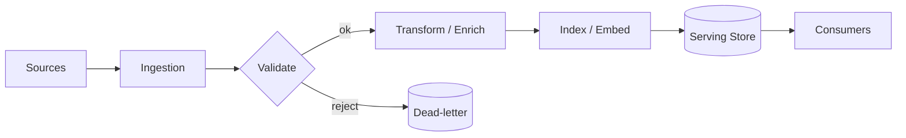

**Figure 24. Data Lineage - Case Study: NLP at Scale** (mermaid). Figure: Data Lineage view for Case Study: NLP at Scale. This diagram illustrates the principal components and their interactions as discussed in the surrounding section.

## Deep Dive: Mechanics, Variants and Trade-offs

Having established the essentials, we now go deeper into case study: nlp at scale. It pays to understand the mechanism rather than treat it as a black box, because most production incidents are explained by one of its steps misbehaving. The distinctions in this section are the ones that separate a working demo from a system that holds up under adversarial inputs, scale and the passage of time.

Consider the principal variants and how to choose between them. Each variant optimises for a different point in the design space - some for latency, some for accuracy, some for cost or operability - and the correct choice follows from explicit requirements rather than from defaults. Latency, accuracy and cost form a tension triangle: improving one typically pressures the others, so explicit budgets are essential.

In practice this is supported by a mature tooling ecosystem, including PyTorch, FlashAttention, Triton, xFormers. Tools accelerate the work but do not substitute for understanding: the same principles apply whichever implementation you select, and the ability to reason from first principles is what lets you debug when a tool behaves unexpectedly.

A frequent source of subtle bugs is the interaction with training dynamics and stability. Because training dynamics and stability concerns initialisation, warmup, gradient clipping and loss spikes, changes there can silently alter the behaviour analysed here. The remedy is contract tests at the boundary and end-to-end evaluations that exercise the interaction explicitly.

Finally, attend to edge cases and degradation. Define what the system should do under partial failure, unexpected inputs and load spikes, and make that behaviour explicit and tested rather than emergent. Graceful degradation - returning a safe, useful result when the ideal one is unavailable - is a hallmark of mature engineering.

For deeper study, the literature offers authoritative treatments such as Vaswani et al. — Attention Is All You Need (2017) and Dao et al. — FlashAttention (2022). These primary sources reward careful reading and ground the practical guidance above in established results.

## Advanced Considerations

Having established the essentials, we now go deeper into case study: nlp at scale. The underlying mechanism is best appreciated by tracing a single request from input to output and noting where state is created and consumed. The distinctions in this section are the ones that separate a working demo from a system that holds up under adversarial inputs, scale and the passage of time.

Consider the principal variants and how to choose between them. Each variant optimises for a different point in the design space - some for latency, some for accuracy, some for cost or operability - and the correct choice follows from explicit requirements rather than from defaults. Every added component buys capability at the price of operational surface area, and that bargain should be made consciously.

In practice this is supported by a mature tooling ecosystem, including PyTorch, FlashAttention, Triton, xFormers. Tools accelerate the work but do not substitute for understanding: the same principles apply whichever implementation you select, and the ability to reason from first principles is what lets you debug when a tool behaves unexpectedly.

A frequent source of subtle bugs is the interaction with mixture-of-experts transformers. Because mixture-of-experts transformers concerns sparse routing for parameter-efficient scaling, changes there can silently alter the behaviour analysed here. The remedy is contract tests at the boundary and end-to-end evaluations that exercise the interaction explicitly.

Finally, attend to edge cases and degradation. Define what the system should do under partial failure, unexpected inputs and load spikes, and make that behaviour explicit and tested rather than emergent. Graceful degradation - returning a safe, useful result when the ideal one is unavailable - is a hallmark of mature engineering.

For deeper study, the literature offers authoritative treatments such as Vaswani et al. — Attention Is All You Need (2017) and Dao et al. — FlashAttention (2022). These primary sources reward careful reading and ground the practical guidance above in established results.

## Worked Example

Consider a concrete scenario. A science organisation needs protein structure and molecular property prediction. They decide to apply case study: nlp at scale as part of their Transformers solution, but wisely treat it as a hypothesis to be validated rather than a foregone conclusion.

The team begins by stating the objective precisely and defining how success will be measured before writing any code. They establish a small but representative evaluation set, agree on acceptance thresholds, and only then prototype the simplest design that could work. Early measurement reveals which assumptions hold and which must be revised, saving weeks of misdirected effort and surfacing edge cases while they are still cheap to fix.

As the prototype matures into a service, the team hardens it: adding input validation, error handling, caching where it pays off, and monitoring that ties back to the original success metric. They document each significant decision in an architecture decision record so that future maintainers understand not just what was built but why.

The outcome is instructive. The system that reaches production is not the most sophisticated design the team considered, but the one whose behaviour they could measure, explain and operate. This is the recurring lesson of Transformers: durable value comes from the whole system, not from any single clever component.

## Industry Use Cases

Across industries, the ideas in this chapter recur in recognisable ways. The following vignettes show how different sectors apply them and what they have in common.

**NLP.** Language understanding and generation across tasks. The common thread is that value comes not from the model alone but from the surrounding system - data quality, evaluation, integration and operations - which is precisely where most of the engineering effort belongs.

**Computer Vision.** Image classification and detection with ViT backbones. The common thread is that value comes not from the model alone but from the surrounding system - data quality, evaluation, integration and operations - which is precisely where most of the engineering effort belongs.

**Audio.** Speech recognition and synthesis with transformer encoders. The common thread is that value comes not from the model alone but from the surrounding system - data quality, evaluation, integration and operations - which is precisely where most of the engineering effort belongs.

**Science.** Protein structure and molecular property prediction. The common thread is that value comes not from the model alone but from the surrounding system - data quality, evaluation, integration and operations - which is precisely where most of the engineering effort belongs.

## Best Practices

The following practices consistently separate successful Transformers efforts from struggling ones. They are deliberately concrete so they can be adopted as checklist items in design and code review.

- Use pre-norm and careful warmup to stabilise deep transformer training.
- Adopt fused attention kernels to cut memory and latency.
- Validate positional encoding choice against target sequence lengths.
- Profile FLOPs and memory before scaling parameters.

None of these are exotic; they are the unglamorous disciplines that compound into reliability. The cost of adopting them is small compared with the cost of the incidents they prevent, and they become second nature with practice.

## Common Pitfalls

Equally instructive are the failure modes that recur in practice. Each pitfall below has a clear early warning sign and a known remedy, so treat them as a diagnostic checklist when something feels wrong:

- Quadratic attention cost dominating long-sequence workloads.
- Numerical instability from post-norm at depth.
- Position encoding that fails to extrapolate beyond training length.
- Ignoring kernel-level efficiency and over-provisioning hardware.

The pattern is consistent: most failures stem from skipping measurement, conflating prototype and production standards, or deferring cross-cutting concerns such as security and cost until they become emergencies. Naming these traps in advance is the cheapest way to avoid them.

## Governance, Security and Cost Notes

No discussion of case study: nlp at scale is complete without its governance, security and cost dimensions, which are too often deferred until they become emergencies. Treating them as first-class concerns from the outset is both cheaper and safer.

**Governance.** Classify the risk of this capability, document its intended and out-of-scope uses, and ensure decisions are traceable to satisfy internal policy and external regulation such as the NIST AI RMF, ISO/IEC 42001 and the EU AI Act. **Security.** Treat all external input as untrusted, validate outputs before acting on them, apply least privilege to any tools or data access, and map controls to the OWASP LLM Top 10 and MITRE ATLAS.

**Cost and sustainability.** Establish explicit budgets for compute, tokens and latency, attribute spend to owners, and revisit the economics as usage scales - a design that is affordable at pilot scale can become untenable at production volume. Building these reflexes into everyday engineering is what allows a Transformers system to be not only capable but also trustworthy and economically sound.

## Hands-On Exercises

Work through the following exercises. They are designed to move understanding from recognition to application - the level required for real engineering work - so prefer writing and building over merely reading.

1. Explain case study: nlp at scale to a colleague unfamiliar with Transformers, using a concrete example from your own domain.
2. Sketch a reference architecture that incorporates case study: nlp at scale and annotate where observability, security and cost controls belong.
3. Design an evaluation that would tell you whether case study: nlp at scale is working in production, including the metric, the dataset and the acceptance threshold.
4. Identify two pitfalls relevant to case study: nlp at scale in your environment and describe the early warning signals you would monitor.
5. Prototype the simplest implementation that demonstrates case study: nlp at scale, then list exactly what would need to change to make it production-ready.

## Key Takeaways

Key takeaways from this chapter:

- Case Study: NLP at Scale is a systems concern in Transformers: data, models and operations must be co-designed.
- Measurement is non-negotiable; define success metrics and evaluation before building.
- Favour the simplest design that meets the requirement, and add complexity only when evidence demands it.
- Security, cost and observability are first-class requirements, not afterthoughts.
- Document decisions so the system remains understandable and operable as it evolves.

## Code Walkthrough

Pipelines keep Case Study: NLP at Scale logic modular and testable. Each stage is a pure function, errors are captured per item, and the composition is trivial to extend or reorder.

The full listing is shown below; study it line by line and reproduce it locally before moving on.

### Listing: A composable processing pipeline for Case Study: NLP at Scale

```python
from collections.abc import Iterable, Iterator
from typing import Protocol


class Stage(Protocol):
    def __call__(self, item: dict) -> dict: ...


def pipeline(stages: list[Stage]) -> Stage:
    """Compose ordered stages into a single callable for Case Study: NLP at Scale."""

    def run(item: dict) -> dict:
        for stage in stages:
            item = stage(item)
        return item

    return run


def validate(item: dict) -> dict:
    if "text" not in item:
        raise ValueError("missing required field: text")
    return item


def normalise(item: dict) -> dict:
    item["text"] = item["text"].strip().lower()
    return item


def enrich(item: dict) -> dict:
    item["length"] = len(item["text"])
    return item


process = pipeline([validate, normalise, enrich])


def run_batch(items: Iterable[dict]) -> Iterator[dict]:
    for item in items:
        try:
            yield process(dict(item))
        except ValueError as exc:
            yield {"error": str(exc), "item": item}

```

## Review Questions

1. In the context of Transformers, which statement best describes “Case Study: NLP at Scale”?
   - A. It eliminates the need for any evaluation or monitoring.
   - B. It is only relevant to academic research, not production.
   - C. a detailed case study of deploying Transformers in a demanding nlp environment, including the decisions, trade-offs and outcomes
   - D. It guarantees deterministic output regardless of input.
   - **Answer: C.** Case Study: NLP at Scale: a detailed case study of deploying Transformers in a demanding nlp environment, including the decisions, trade-offs and outcomes
2. Which of the following is a recommended best practice when working with Transformers?
   - A. Use pre-norm and careful warmup to stabilise deep transformer training.
   - B. Numerical instability from post-norm at depth.
   - C. It is only relevant to academic research, not production.
   - D. Position encoding that fails to extrapolate beyond training length.
   - **Answer: A.** Best practice: Use pre-norm and careful warmup to stabilise deep transformer training.
3. Which of the following is a common pitfall to avoid in Transformers?
   - A. Quadratic attention cost dominating long-sequence workloads.
   - B. Profile FLOPs and memory before scaling parameters.
   - C. It eliminates the need for any evaluation or monitoring.
   - D. Use pre-norm and careful warmup to stabilise deep transformer training.
   - **Answer: A.** Pitfall to avoid: Quadratic attention cost dominating long-sequence workloads.
4. *(Discussion)* Explain Case Study: NLP at Scale and why it matters in a production Transformers system.
   - **Model answer:** A strong answer defines case study: nlp at scale (a detailed case study of deploying Transformers in a demanding nlp environment, including the decisions, trade-offs and outcomes) then connects it to architecture, evaluation, cost, security and operations for Transformers, citing concrete trade-offs and a real-world example.

---


# Chapter 18. Operating in Production

_This chapter examines operating in production within Transformers. It covers the operational discipline required to run a Transformers system reliably, including monitoring, incident response and continuous improvement, derives a reference architecture, walks through a worked example and runnable code, surveys industry use cases, and distils best practices and pitfalls, closing with exercises and review questions._

## Introduction

At its core, Operating in Production concerns the operational discipline required to run a Transformers system reliably, including monitoring, incident response and continuous improvement. Understanding this matters because Transformers systems succeed or fail on exactly these decisions. What distinguishes a production-grade approach from a prototype is the discipline of measurement: every claim is backed by an evaluation rather than intuition.

This chapter builds intuition first, then formalises the ideas, derives an architecture, and finishes with code, exercises and review questions so the material transfers directly to your own Transformers work. Read it actively: pause at each diagram, reproduce the code, and attempt the exercises before consulting the answers.

## Theory and Foundations

In practical terms, Operating in Production is best understood as the operational discipline required to run a Transformers system reliably, including monitoring, incident response and continuous improvement. The right abstraction here pays compounding dividends, because downstream components depend on its guarantees. Beneath the abstraction lies a concrete process whose steps can each be measured, tested and optimised independently.

To place this in context, recall the broader picture: The transformer is a neural architecture built on self-attention that processes sequences in parallel and models long-range dependencies without recurrence. Within that picture, operating in production is one of the load-bearing ideas - the kind that, when understood deeply, makes the rest of Transformers fall into place. It is foundational: later capabilities in Transformers are built directly on top of it.

Operating in Production cannot be understood in isolation from training dynamics and stability. Recall that training dynamics and stability concerns initialisation, warmup, gradient clipping and loss spikes. The two interact directly: decisions in one constrain the design space of the other, which is why mature teams reason about them together rather than sequentially. Simplicity is a feature. The simplest design that meets the requirement should be the default, with complexity added only when measurement justifies it.

Operating in Production cannot be understood in isolation from efficient attention. Recall that efficient attention concerns flashAttention, sparse and linear attention to tame quadratic cost. The two interact directly: decisions in one constrain the design space of the other, which is why mature teams reason about them together rather than sequentially. Latency, accuracy and cost form a tension triangle: improving one typically pressures the others, so explicit budgets are essential.

Several established patterns apply directly to operating in production. The first, rotary positional embeddings for length generalisation, is widely adopted because it makes the system's behaviour predictable and observable. A complementary pattern, flashattention for memory-efficient exact attention, addresses a related concern and is often deployed alongside it. Patterns are not dogma; they are distilled experience that shortcuts the search for a sound design, and each carries assumptions worth checking against your context.

It is worth being explicit about when to apply this and when to reach for something simpler. In a small prototype, shortcuts around operating in production are invisible; in a production Transformers system serving real traffic, they surface as incidents, cost overruns or compliance gaps. As with most architectural decisions, the choice is rarely binary; the skill lies in quantifying the trade-offs and choosing deliberately. The remainder of this chapter turns these principles into an architecture, code and a checklist you can apply immediately.

## Architecture and Design

The reference architecture for Operating in Production separates concerns into clearly bounded components with explicit contracts. A transformer block stacks multi-head self-attention and a position-wise feed-forward network, each wrapped in residual connections and normalisation. Decoder-only stacks add causal masking; encoder–decoder stacks add cross attention. At scale, efficient attention kernels, mixed precision and tensor parallelism turn the mathematics into a trainable system.

Concretely, the principal building blocks include why self-attention replaced recurrence, scaled dot-product attention, multi-head attention, positional encoding and feed-forward networks and activations. Each is a replaceable component behind a stable interface, so the team can upgrade an implementation - a model, an index, a policy engine - without rewriting its neighbours. The contracts between components are where reliability is won or lost, so they are specified explicitly and tested in isolation.

The diagram accompanying this section makes the data and control flow explicit. Requests enter through a well-defined boundary where they are authenticated and validated; only then are they dispatched to the components that perform the work. This boundary is also where rate limiting, quota enforcement and audit logging live, keeping cross-cutting concerns out of the core logic and in one auditable place.

Two qualities deserve emphasis. First, observability is designed in, not bolted on: every component emits structured telemetry so that failures can be localised in minutes rather than hours. Second, the architecture is evolvable - components communicate through stable contracts so that any single part of the Transformers system can be replaced without a rewrite. As with most architectural decisions, the choice is rarely binary; the skill lies in quantifying the trade-offs and choosing deliberately.

```xml
<mxfile host="ai-university">
  <diagram name="Infrastructure">
    <mxGraphModel dx="800" dy="600" grid="1" gridSize="10">
      <root>
        <mxCell id="0"/>
        <mxCell id="1" parent="0"/>
        <mxCell id="title" value="Infrastructure - Operating in Production" style="text;fontSize=16;fontStyle=1" vertex="1" parent="1"><mxGeometry x="40" y="20" width="600" height="30" as="geometry"/></mxCell>
        <mxCell id="hub" value="Operating in Producti…" style="rounded=1;fillColor=#0f172a;fontColor=#ffffff;fontStyle=1" vertex="1" parent="1"><mxGeometry x="300" y="180" width="160" height="60" as="geometry"/></mxCell>
        <mxCell id="n0" value="Operating in Production" style="rounded=1;fillColor=#e0e7ff;strokeColor=#4338ca" vertex="1" parent="1"><mxGeometry x="60" y="80" width="160" height="50" as="geometry"/></mxCell>
        <mxCell id="e0" style="edgeStyle=orthogonalEdgeStyle" edge="1" parent="1" source="hub" target="n0"><mxGeometry relative="1" as="geometry"/></mxCell>
        <mxCell id="n1" value="Training Dynamics and S…" style="rounded=1;fillColor=#e0e7ff;strokeColor=#4338ca" vertex="1" parent="1"><mxGeometry x="600" y="170" width="160" height="50" as="geometry"/></mxCell>
        <mxCell id="e1" style="edgeStyle=orthogonalEdgeStyle" edge="1" parent="1" source="hub" target="n1"><mxGeometry relative="1" as="geometry"/></mxCell>
        <mxCell id="n2" value="Efficient Attention" style="rounded=1;fillColor=#e0e7ff;strokeColor=#4338ca" vertex="1" parent="1"><mxGeometry x="60" y="260" width="160" height="50" as="geometry"/></mxCell>
        <mxCell id="e2" style="edgeStyle=orthogonalEdgeStyle" edge="1" parent="1" source="hub" target="n2"><mxGeometry relative="1" as="geometry"/></mxCell>
        <mxCell id="n3" value="Vision and Multimodal T…" style="rounded=1;fillColor=#e0e7ff;strokeColor=#4338ca" vertex="1" parent="1"><mxGeometry x="600" y="350" width="160" height="50" as="geometry"/></mxCell>
        <mxCell id="e3" style="edgeStyle=orthogonalEdgeStyle" edge="1" parent="1" source="hub" target="n3"><mxGeometry relative="1" as="geometry"/></mxCell>
        <mxCell id="n4" value="The Transformer Design …" style="rounded=1;fillColor=#e0e7ff;strokeColor=#4338ca" vertex="1" parent="1"><mxGeometry x="60" y="440" width="160" height="50" as="geometry"/></mxCell>
        <mxCell id="e4" style="edgeStyle=orthogonalEdgeStyle" edge="1" parent="1" source="hub" target="n4"><mxGeometry relative="1" as="geometry"/></mxCell>
      </root>
    </mxGraphModel>
  </diagram>
</mxfile>
```

_Source diagram (drawio); render with the appropriate tool._

**Figure 25. Infrastructure - Operating in Production** (drawio). Figure: Infrastructure view for Operating in Production. This diagram illustrates the principal components and their interactions as discussed in the surrounding section.

```xml
<mxfile host="ai-university">
  <diagram name="Operating Model">
    <mxGraphModel dx="800" dy="600" grid="1" gridSize="10">
      <root>
        <mxCell id="0"/>
        <mxCell id="1" parent="0"/>
        <mxCell id="title" value="Operating Model - Operating in Production" style="text;fontSize=16;fontStyle=1" vertex="1" parent="1"><mxGeometry x="40" y="20" width="600" height="30" as="geometry"/></mxCell>
        <mxCell id="hub" value="Operating in Producti…" style="rounded=1;fillColor=#0f172a;fontColor=#ffffff;fontStyle=1" vertex="1" parent="1"><mxGeometry x="300" y="180" width="160" height="60" as="geometry"/></mxCell>
        <mxCell id="n0" value="Operating in Production" style="rounded=1;fillColor=#e0e7ff;strokeColor=#4338ca" vertex="1" parent="1"><mxGeometry x="60" y="80" width="160" height="50" as="geometry"/></mxCell>
        <mxCell id="e0" style="edgeStyle=orthogonalEdgeStyle" edge="1" parent="1" source="hub" target="n0"><mxGeometry relative="1" as="geometry"/></mxCell>
        <mxCell id="n1" value="Training Dynamics and S…" style="rounded=1;fillColor=#e0e7ff;strokeColor=#4338ca" vertex="1" parent="1"><mxGeometry x="600" y="170" width="160" height="50" as="geometry"/></mxCell>
        <mxCell id="e1" style="edgeStyle=orthogonalEdgeStyle" edge="1" parent="1" source="hub" target="n1"><mxGeometry relative="1" as="geometry"/></mxCell>
        <mxCell id="n2" value="Efficient Attention" style="rounded=1;fillColor=#e0e7ff;strokeColor=#4338ca" vertex="1" parent="1"><mxGeometry x="60" y="260" width="160" height="50" as="geometry"/></mxCell>
        <mxCell id="e2" style="edgeStyle=orthogonalEdgeStyle" edge="1" parent="1" source="hub" target="n2"><mxGeometry relative="1" as="geometry"/></mxCell>
        <mxCell id="n3" value="Vision and Multimodal T…" style="rounded=1;fillColor=#e0e7ff;strokeColor=#4338ca" vertex="1" parent="1"><mxGeometry x="600" y="350" width="160" height="50" as="geometry"/></mxCell>
        <mxCell id="e3" style="edgeStyle=orthogonalEdgeStyle" edge="1" parent="1" source="hub" target="n3"><mxGeometry relative="1" as="geometry"/></mxCell>
        <mxCell id="n4" value="The Transformer Design …" style="rounded=1;fillColor=#e0e7ff;strokeColor=#4338ca" vertex="1" parent="1"><mxGeometry x="60" y="440" width="160" height="50" as="geometry"/></mxCell>
        <mxCell id="e4" style="edgeStyle=orthogonalEdgeStyle" edge="1" parent="1" source="hub" target="n4"><mxGeometry relative="1" as="geometry"/></mxCell>
      </root>
    </mxGraphModel>
  </diagram>
</mxfile>
```

_Source diagram (drawio); render with the appropriate tool._

**Figure 26. Operating Model - Operating in Production** (drawio). Figure: Operating Model view for Operating in Production. This diagram illustrates the principal components and their interactions as discussed in the surrounding section.

## Deep Dive: Mechanics, Variants and Trade-offs

Having established the essentials, we now go deeper into operating in production. The underlying mechanism is best appreciated by tracing a single request from input to output and noting where state is created and consumed. The distinctions in this section are the ones that separate a working demo from a system that holds up under adversarial inputs, scale and the passage of time.

Consider the principal variants and how to choose between them. Each variant optimises for a different point in the design space - some for latency, some for accuracy, some for cost or operability - and the correct choice follows from explicit requirements rather than from defaults. There is an inherent trade-off between fidelity and cost, and the correct balance depends on the use case and its tolerance for error.

In practice this is supported by a mature tooling ecosystem, including PyTorch, FlashAttention, Triton, xFormers. Tools accelerate the work but do not substitute for understanding: the same principles apply whichever implementation you select, and the ability to reason from first principles is what lets you debug when a tool behaves unexpectedly.

A frequent source of subtle bugs is the interaction with training dynamics and stability. Because training dynamics and stability concerns initialisation, warmup, gradient clipping and loss spikes, changes there can silently alter the behaviour analysed here. The remedy is contract tests at the boundary and end-to-end evaluations that exercise the interaction explicitly.

Finally, attend to edge cases and degradation. Define what the system should do under partial failure, unexpected inputs and load spikes, and make that behaviour explicit and tested rather than emergent. Graceful degradation - returning a safe, useful result when the ideal one is unavailable - is a hallmark of mature engineering.

For deeper study, the literature offers authoritative treatments such as Vaswani et al. — Attention Is All You Need (2017) and Dao et al. — FlashAttention (2022). These primary sources reward careful reading and ground the practical guidance above in established results.

## Advanced Considerations

Having established the essentials, we now go deeper into operating in production. It pays to understand the mechanism rather than treat it as a black box, because most production incidents are explained by one of its steps misbehaving. The distinctions in this section are the ones that separate a working demo from a system that holds up under adversarial inputs, scale and the passage of time.

Consider the principal variants and how to choose between them. Each variant optimises for a different point in the design space - some for latency, some for accuracy, some for cost or operability - and the correct choice follows from explicit requirements rather than from defaults. Simplicity is a feature. The simplest design that meets the requirement should be the default, with complexity added only when measurement justifies it.

In practice this is supported by a mature tooling ecosystem, including PyTorch, FlashAttention, Triton, xFormers. Tools accelerate the work but do not substitute for understanding: the same principles apply whichever implementation you select, and the ability to reason from first principles is what lets you debug when a tool behaves unexpectedly.

A frequent source of subtle bugs is the interaction with mixture-of-experts transformers. Because mixture-of-experts transformers concerns sparse routing for parameter-efficient scaling, changes there can silently alter the behaviour analysed here. The remedy is contract tests at the boundary and end-to-end evaluations that exercise the interaction explicitly.

Finally, attend to edge cases and degradation. Define what the system should do under partial failure, unexpected inputs and load spikes, and make that behaviour explicit and tested rather than emergent. Graceful degradation - returning a safe, useful result when the ideal one is unavailable - is a hallmark of mature engineering.

For deeper study, the literature offers authoritative treatments such as Vaswani et al. — Attention Is All You Need (2017) and Dao et al. — FlashAttention (2022). These primary sources reward careful reading and ground the practical guidance above in established results.

## Worked Example

To ground the discussion, walk through a representative example. A audio organisation needs speech recognition and synthesis with transformer encoders. They decide to apply operating in production as part of their Transformers solution, but wisely treat it as a hypothesis to be validated rather than a foregone conclusion.

The team begins by stating the objective precisely and defining how success will be measured before writing any code. They establish a small but representative evaluation set, agree on acceptance thresholds, and only then prototype the simplest design that could work. Early measurement reveals which assumptions hold and which must be revised, saving weeks of misdirected effort and surfacing edge cases while they are still cheap to fix.

As the prototype matures into a service, the team hardens it: adding input validation, error handling, caching where it pays off, and monitoring that ties back to the original success metric. They document each significant decision in an architecture decision record so that future maintainers understand not just what was built but why.

The outcome is instructive. The system that reaches production is not the most sophisticated design the team considered, but the one whose behaviour they could measure, explain and operate. This is the recurring lesson of Transformers: durable value comes from the whole system, not from any single clever component.

## Industry Use Cases

Across industries, the ideas in this chapter recur in recognisable ways. The following vignettes show how different sectors apply them and what they have in common.

**NLP.** Language understanding and generation across tasks. The common thread is that value comes not from the model alone but from the surrounding system - data quality, evaluation, integration and operations - which is precisely where most of the engineering effort belongs.

**Computer Vision.** Image classification and detection with ViT backbones. The common thread is that value comes not from the model alone but from the surrounding system - data quality, evaluation, integration and operations - which is precisely where most of the engineering effort belongs.

**Audio.** Speech recognition and synthesis with transformer encoders. The common thread is that value comes not from the model alone but from the surrounding system - data quality, evaluation, integration and operations - which is precisely where most of the engineering effort belongs.

**Science.** Protein structure and molecular property prediction. The common thread is that value comes not from the model alone but from the surrounding system - data quality, evaluation, integration and operations - which is precisely where most of the engineering effort belongs.

## Best Practices

The following practices consistently separate successful Transformers efforts from struggling ones. They are deliberately concrete so they can be adopted as checklist items in design and code review.

- Use pre-norm and careful warmup to stabilise deep transformer training.
- Adopt fused attention kernels to cut memory and latency.
- Validate positional encoding choice against target sequence lengths.
- Profile FLOPs and memory before scaling parameters.

None of these are exotic; they are the unglamorous disciplines that compound into reliability. The cost of adopting them is small compared with the cost of the incidents they prevent, and they become second nature with practice.

## Common Pitfalls

Equally instructive are the failure modes that recur in practice. Each pitfall below has a clear early warning sign and a known remedy, so treat them as a diagnostic checklist when something feels wrong:

- Quadratic attention cost dominating long-sequence workloads.
- Numerical instability from post-norm at depth.
- Position encoding that fails to extrapolate beyond training length.
- Ignoring kernel-level efficiency and over-provisioning hardware.

The pattern is consistent: most failures stem from skipping measurement, conflating prototype and production standards, or deferring cross-cutting concerns such as security and cost until they become emergencies. Naming these traps in advance is the cheapest way to avoid them.

## Governance, Security and Cost Notes

No discussion of operating in production is complete without its governance, security and cost dimensions, which are too often deferred until they become emergencies. Treating them as first-class concerns from the outset is both cheaper and safer.

**Governance.** Classify the risk of this capability, document its intended and out-of-scope uses, and ensure decisions are traceable to satisfy internal policy and external regulation such as the NIST AI RMF, ISO/IEC 42001 and the EU AI Act. **Security.** Treat all external input as untrusted, validate outputs before acting on them, apply least privilege to any tools or data access, and map controls to the OWASP LLM Top 10 and MITRE ATLAS.

**Cost and sustainability.** Establish explicit budgets for compute, tokens and latency, attribute spend to owners, and revisit the economics as usage scales - a design that is affordable at pilot scale can become untenable at production volume. Building these reflexes into everyday engineering is what allows a Transformers system to be not only capable but also trustworthy and economically sound.

## Hands-On Exercises

Work through the following exercises. They are designed to move understanding from recognition to application - the level required for real engineering work - so prefer writing and building over merely reading.

1. Explain operating in production to a colleague unfamiliar with Transformers, using a concrete example from your own domain.
2. Sketch a reference architecture that incorporates operating in production and annotate where observability, security and cost controls belong.
3. Design an evaluation that would tell you whether operating in production is working in production, including the metric, the dataset and the acceptance threshold.
4. Identify two pitfalls relevant to operating in production in your environment and describe the early warning signals you would monitor.
5. Prototype the simplest implementation that demonstrates operating in production, then list exactly what would need to change to make it production-ready.

## Key Takeaways

Key takeaways from this chapter:

- Operating in Production is a systems concern in Transformers: data, models and operations must be co-designed.
- Measurement is non-negotiable; define success metrics and evaluation before building.
- Favour the simplest design that meets the requirement, and add complexity only when evidence demands it.
- Security, cost and observability are first-class requirements, not afterthoughts.
- Document decisions so the system remains understandable and operable as it evolves.

## Code Walkthrough

Every change to a Transformers system should pass an evaluation gate. This example shows the minimal shape: align predictions and references, compute a metric, and return a pass/fail decision for CI.

The full listing is shown below; study it line by line and reproduce it locally before moving on.

### Listing: Evaluating Operating in Production with a regression gate

```python
from dataclasses import dataclass


@dataclass
class EvalResult:
    metric: str
    score: float
    passed: bool


def evaluate(predictions: list[str], references: list[str],
             threshold: float = 0.8) -> EvalResult:
    """Score Operating in Production output against references with a simple exact-match metric.

    In practice you would combine several metrics (exact match, semantic
    similarity, LLM-as-judge) and gate releases on the aggregate.
    """
    if len(predictions) != len(references):
        raise ValueError("predictions and references must align")
    hits = sum(p.strip() == r.strip() for p, r in zip(predictions, references))
    score = hits / len(references) if references else 0.0
    return EvalResult(metric="exact_match", score=score, passed=score >= threshold)


if __name__ == "__main__":
    result = evaluate(["yes", "no"], ["yes", "yes"])
    print(f"{result.metric}={result.score:.2f} passed={result.passed}")

```

## Review Questions

1. In the context of Transformers, which statement best describes “Operating in Production”?
   - A. the operational discipline required to run a Transformers system reliably, including monitoring, incident response and continuous improvement
   - B. It is only relevant to academic research, not production.
   - C. It makes the system slower but has no other effect.
   - D. It guarantees deterministic output regardless of input.
   - **Answer: A.** Operating in Production: the operational discipline required to run a Transformers system reliably, including monitoring, incident response and continuous improvement
2. Which of the following is a recommended best practice when working with Transformers?
   - A. It applies exclusively to image data.
   - B. It guarantees deterministic output regardless of input.
   - C. Numerical instability from post-norm at depth.
   - D. Use pre-norm and careful warmup to stabilise deep transformer training.
   - **Answer: D.** Best practice: Use pre-norm and careful warmup to stabilise deep transformer training.
3. Which of the following is a common pitfall to avoid in Transformers?
   - A. It makes the system slower but has no other effect.
   - B. It applies exclusively to image data.
   - C. Adopt fused attention kernels to cut memory and latency.
   - D. Position encoding that fails to extrapolate beyond training length.
   - **Answer: D.** Pitfall to avoid: Position encoding that fails to extrapolate beyond training length.
4. *(Discussion)* What trade-offs would you weigh when implementing Operating in Production?
   - **Model answer:** A strong answer defines operating in production (the operational discipline required to run a Transformers system reliably, including monitoring, incident response and continuous improvement) then connects it to architecture, evaluation, cost, security and operations for Transformers, citing concrete trade-offs and a real-world example.

---


# Chapter 19. Evaluation and Quality Assurance

_This chapter examines evaluation and quality assurance within Transformers. It covers a rigorous approach to measuring and assuring the quality of a Transformers system before and after release, derives a reference architecture, walks through a worked example and runnable code, surveys industry use cases, and distils best practices and pitfalls, closing with exercises and review questions._

## Introduction

At its core, Evaluation and Quality Assurance concerns a rigorous approach to measuring and assuring the quality of a Transformers system before and after release. It is foundational: later capabilities in Transformers are built directly on top of it. In an enterprise setting, this translates into concrete requirements: clear interfaces, measurable quality, and controls that satisfy security and governance.

This chapter builds intuition first, then formalises the ideas, derives an architecture, and finishes with code, exercises and review questions so the material transfers directly to your own Transformers work. Read it actively: pause at each diagram, reproduce the code, and attempt the exercises before consulting the answers.

## Theory and Foundations

Evaluation and Quality Assurance refers to a rigorous approach to measuring and assuring the quality of a Transformers system before and after release. What distinguishes a production-grade approach from a prototype is the discipline of measurement: every claim is backed by an evaluation rather than intuition. Beneath the abstraction lies a concrete process whose steps can each be measured, tested and optimised independently.

To place this in context, recall the broader picture: The transformer is a neural architecture built on self-attention that processes sequences in parallel and models long-range dependencies without recurrence. Within that picture, evaluation and quality assurance is one of the load-bearing ideas - the kind that, when understood deeply, makes the rest of Transformers fall into place. Getting this right early prevents expensive rework once a Transformers system reaches scale.

Evaluation and Quality Assurance cannot be understood in isolation from multi-head attention. Recall that multi-head attention concerns projecting into multiple subspaces to attend to different relations simultaneously. The two interact directly: decisions in one constrain the design space of the other, which is why mature teams reason about them together rather than sequentially. As with most architectural decisions, the choice is rarely binary; the skill lies in quantifying the trade-offs and choosing deliberately.

Evaluation and Quality Assurance cannot be understood in isolation from residual connections and normalisation. Recall that residual connections and normalisation concerns pre-norm versus post-norm, LayerNorm/RMSNorm and training stability. The two interact directly: decisions in one constrain the design space of the other, which is why mature teams reason about them together rather than sequentially. There is an inherent trade-off between fidelity and cost, and the correct balance depends on the use case and its tolerance for error.

Several established patterns apply directly to evaluation and quality assurance. The first, rotary positional embeddings for length generalisation, is widely adopted because it makes the system's behaviour predictable and observable. A complementary pattern, flashattention for memory-efficient exact attention, addresses a related concern and is often deployed alongside it. Patterns are not dogma; they are distilled experience that shortcuts the search for a sound design, and each carries assumptions worth checking against your context.

It is worth being explicit about when to apply this and when to reach for something simpler. In a small prototype, shortcuts around evaluation and quality assurance are invisible; in a production Transformers system serving real traffic, they surface as incidents, cost overruns or compliance gaps. As with most architectural decisions, the choice is rarely binary; the skill lies in quantifying the trade-offs and choosing deliberately. The remainder of this chapter turns these principles into an architecture, code and a checklist you can apply immediately.

## Architecture and Design

From an architectural standpoint, Evaluation and Quality Assurance sits at the intersection of data, models and operations. A transformer block stacks multi-head self-attention and a position-wise feed-forward network, each wrapped in residual connections and normalisation. Decoder-only stacks add causal masking; encoder–decoder stacks add cross attention. At scale, efficient attention kernels, mixed precision and tensor parallelism turn the mathematics into a trainable system.

Concretely, the principal building blocks include why self-attention replaced recurrence, scaled dot-product attention, multi-head attention, positional encoding and feed-forward networks and activations. Each is a replaceable component behind a stable interface, so the team can upgrade an implementation - a model, an index, a policy engine - without rewriting its neighbours. The contracts between components are where reliability is won or lost, so they are specified explicitly and tested in isolation.

The diagram accompanying this section makes the data and control flow explicit. Requests enter through a well-defined boundary where they are authenticated and validated; only then are they dispatched to the components that perform the work. This boundary is also where rate limiting, quota enforcement and audit logging live, keeping cross-cutting concerns out of the core logic and in one auditable place.

Two qualities deserve emphasis. First, observability is designed in, not bolted on: every component emits structured telemetry so that failures can be localised in minutes rather than hours. Second, the architecture is evolvable - components communicate through stable contracts so that any single part of the Transformers system can be replaced without a rewrite. Simplicity is a feature. The simplest design that meets the requirement should be the default, with complexity added only when measurement justifies it.

```xml
<mxfile host="ai-university">
  <diagram name="Operating Model">
    <mxGraphModel dx="800" dy="600" grid="1" gridSize="10">
      <root>
        <mxCell id="0"/>
        <mxCell id="1" parent="0"/>
        <mxCell id="title" value="Operating Model - Evaluation and Quality Assurance" style="text;fontSize=16;fontStyle=1" vertex="1" parent="1"><mxGeometry x="40" y="20" width="600" height="30" as="geometry"/></mxCell>
        <mxCell id="hub" value="Evaluation and Qualit…" style="rounded=1;fillColor=#0f172a;fontColor=#ffffff;fontStyle=1" vertex="1" parent="1"><mxGeometry x="300" y="180" width="160" height="60" as="geometry"/></mxCell>
        <mxCell id="n0" value="Evaluation and Quality …" style="rounded=1;fillColor=#e0e7ff;strokeColor=#4338ca" vertex="1" parent="1"><mxGeometry x="60" y="80" width="160" height="50" as="geometry"/></mxCell>
        <mxCell id="e0" style="edgeStyle=orthogonalEdgeStyle" edge="1" parent="1" source="hub" target="n0"><mxGeometry relative="1" as="geometry"/></mxCell>
        <mxCell id="n1" value="Multi-Head Attention" style="rounded=1;fillColor=#e0e7ff;strokeColor=#4338ca" vertex="1" parent="1"><mxGeometry x="600" y="170" width="160" height="50" as="geometry"/></mxCell>
        <mxCell id="e1" style="edgeStyle=orthogonalEdgeStyle" edge="1" parent="1" source="hub" target="n1"><mxGeometry relative="1" as="geometry"/></mxCell>
        <mxCell id="n2" value="Residual Connections an…" style="rounded=1;fillColor=#e0e7ff;strokeColor=#4338ca" vertex="1" parent="1"><mxGeometry x="60" y="260" width="160" height="50" as="geometry"/></mxCell>
        <mxCell id="e2" style="edgeStyle=orthogonalEdgeStyle" edge="1" parent="1" source="hub" target="n2"><mxGeometry relative="1" as="geometry"/></mxCell>
        <mxCell id="n3" value="The Transformer Design …" style="rounded=1;fillColor=#e0e7ff;strokeColor=#4338ca" vertex="1" parent="1"><mxGeometry x="600" y="350" width="160" height="50" as="geometry"/></mxCell>
        <mxCell id="e3" style="edgeStyle=orthogonalEdgeStyle" edge="1" parent="1" source="hub" target="n3"><mxGeometry relative="1" as="geometry"/></mxCell>
        <mxCell id="n4" value="Profiling and Optimisin…" style="rounded=1;fillColor=#e0e7ff;strokeColor=#4338ca" vertex="1" parent="1"><mxGeometry x="60" y="440" width="160" height="50" as="geometry"/></mxCell>
        <mxCell id="e4" style="edgeStyle=orthogonalEdgeStyle" edge="1" parent="1" source="hub" target="n4"><mxGeometry relative="1" as="geometry"/></mxCell>
      </root>
    </mxGraphModel>
  </diagram>
</mxfile>
```

_Source diagram (drawio); render with the appropriate tool._

**Figure 27. Operating Model - Evaluation and Quality Assurance** (drawio). Figure: Operating Model view for Evaluation and Quality Assurance. This diagram illustrates the principal components and their interactions as discussed in the surrounding section.

## Deep Dive: Mechanics, Variants and Trade-offs

Having established the essentials, we now go deeper into evaluation and quality assurance. Beneath the abstraction lies a concrete process whose steps can each be measured, tested and optimised independently. The distinctions in this section are the ones that separate a working demo from a system that holds up under adversarial inputs, scale and the passage of time.

Consider the principal variants and how to choose between them. Each variant optimises for a different point in the design space - some for latency, some for accuracy, some for cost or operability - and the correct choice follows from explicit requirements rather than from defaults. There is an inherent trade-off between fidelity and cost, and the correct balance depends on the use case and its tolerance for error.

In practice this is supported by a mature tooling ecosystem, including PyTorch, FlashAttention, Triton, xFormers. Tools accelerate the work but do not substitute for understanding: the same principles apply whichever implementation you select, and the ability to reason from first principles is what lets you debug when a tool behaves unexpectedly.

A frequent source of subtle bugs is the interaction with multi-head attention. Because multi-head attention concerns projecting into multiple subspaces to attend to different relations simultaneously, changes there can silently alter the behaviour analysed here. The remedy is contract tests at the boundary and end-to-end evaluations that exercise the interaction explicitly.

Finally, attend to edge cases and degradation. Define what the system should do under partial failure, unexpected inputs and load spikes, and make that behaviour explicit and tested rather than emergent. Graceful degradation - returning a safe, useful result when the ideal one is unavailable - is a hallmark of mature engineering.

For deeper study, the literature offers authoritative treatments such as Vaswani et al. — Attention Is All You Need (2017) and Dao et al. — FlashAttention (2022). These primary sources reward careful reading and ground the practical guidance above in established results.

## Advanced Considerations

Having established the essentials, we now go deeper into evaluation and quality assurance. Beneath the abstraction lies a concrete process whose steps can each be measured, tested and optimised independently. The distinctions in this section are the ones that separate a working demo from a system that holds up under adversarial inputs, scale and the passage of time.

Consider the principal variants and how to choose between them. Each variant optimises for a different point in the design space - some for latency, some for accuracy, some for cost or operability - and the correct choice follows from explicit requirements rather than from defaults. Latency, accuracy and cost form a tension triangle: improving one typically pressures the others, so explicit budgets are essential.

In practice this is supported by a mature tooling ecosystem, including PyTorch, FlashAttention, Triton, xFormers. Tools accelerate the work but do not substitute for understanding: the same principles apply whichever implementation you select, and the ability to reason from first principles is what lets you debug when a tool behaves unexpectedly.

A frequent source of subtle bugs is the interaction with feed-forward networks and activations. Because feed-forward networks and activations concerns position-wise MLPs, GELU/SwiGLU and their role in capacity, changes there can silently alter the behaviour analysed here. The remedy is contract tests at the boundary and end-to-end evaluations that exercise the interaction explicitly.

Finally, attend to edge cases and degradation. Define what the system should do under partial failure, unexpected inputs and load spikes, and make that behaviour explicit and tested rather than emergent. Graceful degradation - returning a safe, useful result when the ideal one is unavailable - is a hallmark of mature engineering.

For deeper study, the literature offers authoritative treatments such as Vaswani et al. — Attention Is All You Need (2017) and Dao et al. — FlashAttention (2022). These primary sources reward careful reading and ground the practical guidance above in established results.

## Worked Example

A worked example clarifies how these ideas behave in practice. A science organisation needs protein structure and molecular property prediction. They decide to apply evaluation and quality assurance as part of their Transformers solution, but wisely treat it as a hypothesis to be validated rather than a foregone conclusion.

The team begins by stating the objective precisely and defining how success will be measured before writing any code. They establish a small but representative evaluation set, agree on acceptance thresholds, and only then prototype the simplest design that could work. Early measurement reveals which assumptions hold and which must be revised, saving weeks of misdirected effort and surfacing edge cases while they are still cheap to fix.

As the prototype matures into a service, the team hardens it: adding input validation, error handling, caching where it pays off, and monitoring that ties back to the original success metric. They document each significant decision in an architecture decision record so that future maintainers understand not just what was built but why.

The outcome is instructive. The system that reaches production is not the most sophisticated design the team considered, but the one whose behaviour they could measure, explain and operate. This is the recurring lesson of Transformers: durable value comes from the whole system, not from any single clever component.

## Industry Use Cases

Across industries, the ideas in this chapter recur in recognisable ways. The following vignettes show how different sectors apply them and what they have in common.

**NLP.** Language understanding and generation across tasks. The common thread is that value comes not from the model alone but from the surrounding system - data quality, evaluation, integration and operations - which is precisely where most of the engineering effort belongs.

**Computer Vision.** Image classification and detection with ViT backbones. The common thread is that value comes not from the model alone but from the surrounding system - data quality, evaluation, integration and operations - which is precisely where most of the engineering effort belongs.

**Audio.** Speech recognition and synthesis with transformer encoders. The common thread is that value comes not from the model alone but from the surrounding system - data quality, evaluation, integration and operations - which is precisely where most of the engineering effort belongs.

**Science.** Protein structure and molecular property prediction. The common thread is that value comes not from the model alone but from the surrounding system - data quality, evaluation, integration and operations - which is precisely where most of the engineering effort belongs.

## Best Practices

The following practices consistently separate successful Transformers efforts from struggling ones. They are deliberately concrete so they can be adopted as checklist items in design and code review.

- Use pre-norm and careful warmup to stabilise deep transformer training.
- Adopt fused attention kernels to cut memory and latency.
- Validate positional encoding choice against target sequence lengths.
- Profile FLOPs and memory before scaling parameters.

None of these are exotic; they are the unglamorous disciplines that compound into reliability. The cost of adopting them is small compared with the cost of the incidents they prevent, and they become second nature with practice.

## Common Pitfalls

Equally instructive are the failure modes that recur in practice. Each pitfall below has a clear early warning sign and a known remedy, so treat them as a diagnostic checklist when something feels wrong:

- Quadratic attention cost dominating long-sequence workloads.
- Numerical instability from post-norm at depth.
- Position encoding that fails to extrapolate beyond training length.
- Ignoring kernel-level efficiency and over-provisioning hardware.

The pattern is consistent: most failures stem from skipping measurement, conflating prototype and production standards, or deferring cross-cutting concerns such as security and cost until they become emergencies. Naming these traps in advance is the cheapest way to avoid them.

## Governance, Security and Cost Notes

No discussion of evaluation and quality assurance is complete without its governance, security and cost dimensions, which are too often deferred until they become emergencies. Treating them as first-class concerns from the outset is both cheaper and safer.

**Governance.** Classify the risk of this capability, document its intended and out-of-scope uses, and ensure decisions are traceable to satisfy internal policy and external regulation such as the NIST AI RMF, ISO/IEC 42001 and the EU AI Act. **Security.** Treat all external input as untrusted, validate outputs before acting on them, apply least privilege to any tools or data access, and map controls to the OWASP LLM Top 10 and MITRE ATLAS.

**Cost and sustainability.** Establish explicit budgets for compute, tokens and latency, attribute spend to owners, and revisit the economics as usage scales - a design that is affordable at pilot scale can become untenable at production volume. Building these reflexes into everyday engineering is what allows a Transformers system to be not only capable but also trustworthy and economically sound.

## Hands-On Exercises

Work through the following exercises. They are designed to move understanding from recognition to application - the level required for real engineering work - so prefer writing and building over merely reading.

1. Explain evaluation and quality assurance to a colleague unfamiliar with Transformers, using a concrete example from your own domain.
2. Sketch a reference architecture that incorporates evaluation and quality assurance and annotate where observability, security and cost controls belong.
3. Design an evaluation that would tell you whether evaluation and quality assurance is working in production, including the metric, the dataset and the acceptance threshold.
4. Identify two pitfalls relevant to evaluation and quality assurance in your environment and describe the early warning signals you would monitor.
5. Prototype the simplest implementation that demonstrates evaluation and quality assurance, then list exactly what would need to change to make it production-ready.

## Key Takeaways

Key takeaways from this chapter:

- Evaluation and Quality Assurance is a systems concern in Transformers: data, models and operations must be co-designed.
- Measurement is non-negotiable; define success metrics and evaluation before building.
- Favour the simplest design that meets the requirement, and add complexity only when evidence demands it.
- Security, cost and observability are first-class requirements, not afterthoughts.
- Document decisions so the system remains understandable and operable as it evolves.

## Code Walkthrough

This listing shows a configuration-driven Evaluation and Quality Assurance component with retry semantics and typed interfaces — the shape we expect from production Transformers code rather than a notebook prototype.

The full listing is shown below; study it line by line and reproduce it locally before moving on.

### Listing: Implementing a Evaluation and Quality Assurance component

```python
from __future__ import annotations

from dataclasses import dataclass, field
from typing import Any


@dataclass(slots=True)
class EvaluationAndQualityConfig:
    """Configuration for the Evaluation and Quality Assurance component in a Transformers system."""

    name: str
    timeout_s: float = 30.0
    max_retries: int = 3
    options: dict[str, Any] = field(default_factory=dict)


class EvaluationAndQuality:
    """A minimal, production-shaped implementation of Evaluation and Quality Assurance."""

    def __init__(self, config: EvaluationAndQualityConfig) -> None:
        self._config = config
        self._calls = 0

    def run(self, payload: dict[str, Any]) -> dict[str, Any]:
        """Process a request, retrying transient failures with backoff."""
        last_error: Exception | None = None
        for attempt in range(self._config.max_retries):
            try:
                self._calls += 1
                return self._process(payload)
            except TimeoutError as exc:  # transient
                last_error = exc
                continue
        raise RuntimeError(f"EvaluationAndQuality failed after retries") from last_error

    def _process(self, payload: dict[str, Any]) -> dict[str, Any]:
        # Domain-specific logic for Evaluation and Quality Assurance goes here.
        return {"status": "ok", "input_keys": sorted(payload), "calls": self._calls}

```

## Review Questions

1. In the context of Transformers, which statement best describes “Evaluation and Quality Assurance”?
   - A. It guarantees deterministic output regardless of input.
   - B. It eliminates the need for any evaluation or monitoring.
   - C. It applies exclusively to image data.
   - D. a rigorous approach to measuring and assuring the quality of a Transformers system before and after release
   - **Answer: D.** Evaluation and Quality Assurance: a rigorous approach to measuring and assuring the quality of a Transformers system before and after release
2. Which of the following is a recommended best practice when working with Transformers?
   - A. It eliminates the need for any evaluation or monitoring.
   - B. Use pre-norm and careful warmup to stabilise deep transformer training.
   - C. It makes the system slower but has no other effect.
   - D. It removes all security and governance requirements.
   - **Answer: B.** Best practice: Use pre-norm and careful warmup to stabilise deep transformer training.
3. Which of the following is a common pitfall to avoid in Transformers?
   - A. It makes the system slower but has no other effect.
   - B. Profile FLOPs and memory before scaling parameters.
   - C. Quadratic attention cost dominating long-sequence workloads.
   - D. Adopt fused attention kernels to cut memory and latency.
   - **Answer: C.** Pitfall to avoid: Quadratic attention cost dominating long-sequence workloads.
4. *(Discussion)* Explain Evaluation and Quality Assurance and why it matters in a production Transformers system.
   - **Model answer:** A strong answer defines evaluation and quality assurance (a rigorous approach to measuring and assuring the quality of a Transformers system before and after release) then connects it to architecture, evaluation, cost, security and operations for Transformers, citing concrete trade-offs and a real-world example.

---


# Chapter 20. Security, Privacy and Governance

_This chapter examines security, privacy and governance within Transformers. It covers the security, privacy and governance controls that make a Transformers system trustworthy and compliant, derives a reference architecture, walks through a worked example and runnable code, surveys industry use cases, and distils best practices and pitfalls, closing with exercises and review questions._

## Introduction

At its core, Security, Privacy and Governance concerns the security, privacy and governance controls that make a Transformers system trustworthy and compliant. Teams that master this consistently ship more reliable Transformers systems at lower cost. Seasoned practitioners treat this as a systems problem, co-designing data, models and operations rather than optimising any one in isolation.

This chapter builds intuition first, then formalises the ideas, derives an architecture, and finishes with code, exercises and review questions so the material transfers directly to your own Transformers work. Read it actively: pause at each diagram, reproduce the code, and attempt the exercises before consulting the answers.

## Theory and Foundations

Security, Privacy and Governance can be characterised as the security, privacy and governance controls that make a Transformers system trustworthy and compliant. In an enterprise setting, this translates into concrete requirements: clear interfaces, measurable quality, and controls that satisfy security and governance. Beneath the abstraction lies a concrete process whose steps can each be measured, tested and optimised independently.

To place this in context, recall the broader picture: The transformer is a neural architecture built on self-attention that processes sequences in parallel and models long-range dependencies without recurrence. Within that picture, security, privacy and governance is one of the load-bearing ideas - the kind that, when understood deeply, makes the rest of Transformers fall into place. This concept recurs throughout the Transformers lifecycle, from design to operations.

Security, Privacy and Governance cannot be understood in isolation from encoder, decoder and encoder–decoder variants. Recall that encoder, decoder and encoder–decoder variants concerns bERT-style, GPT-style and T5-style architectures and their use cases. The two interact directly: decisions in one constrain the design space of the other, which is why mature teams reason about them together rather than sequentially. As with most architectural decisions, the choice is rarely binary; the skill lies in quantifying the trade-offs and choosing deliberately.

Security, Privacy and Governance cannot be understood in isolation from vision and multimodal transformers. Recall that vision and multimodal transformers concerns patch embeddings, ViT and cross-modal attention. The two interact directly: decisions in one constrain the design space of the other, which is why mature teams reason about them together rather than sequentially. There is an inherent trade-off between fidelity and cost, and the correct balance depends on the use case and its tolerance for error.

Several established patterns apply directly to security, privacy and governance. The first, mixture-of-experts routing for sparse scaling, is widely adopted because it makes the system's behaviour predictable and observable. A complementary pattern, flashattention for memory-efficient exact attention, addresses a related concern and is often deployed alongside it. Patterns are not dogma; they are distilled experience that shortcuts the search for a sound design, and each carries assumptions worth checking against your context.

The decision of whether to adopt this should be driven by requirements, not by novelty. In a small prototype, shortcuts around security, privacy and governance are invisible; in a production Transformers system serving real traffic, they surface as incidents, cost overruns or compliance gaps. Every added component buys capability at the price of operational surface area, and that bargain should be made consciously. The remainder of this chapter turns these principles into an architecture, code and a checklist you can apply immediately.

## Architecture and Design

A robust architecture for Security, Privacy and Governance is layered so each part can evolve independently without destabilising the whole. A transformer block stacks multi-head self-attention and a position-wise feed-forward network, each wrapped in residual connections and normalisation. Decoder-only stacks add causal masking; encoder–decoder stacks add cross attention. At scale, efficient attention kernels, mixed precision and tensor parallelism turn the mathematics into a trainable system.

Concretely, the principal building blocks include why self-attention replaced recurrence, scaled dot-product attention, multi-head attention, positional encoding and feed-forward networks and activations. Each is a replaceable component behind a stable interface, so the team can upgrade an implementation - a model, an index, a policy engine - without rewriting its neighbours. The contracts between components are where reliability is won or lost, so they are specified explicitly and tested in isolation.

The diagram accompanying this section makes the data and control flow explicit. Requests enter through a well-defined boundary where they are authenticated and validated; only then are they dispatched to the components that perform the work. This boundary is also where rate limiting, quota enforcement and audit logging live, keeping cross-cutting concerns out of the core logic and in one auditable place.

Two qualities deserve emphasis. First, observability is designed in, not bolted on: every component emits structured telemetry so that failures can be localised in minutes rather than hours. Second, the architecture is evolvable - components communicate through stable contracts so that any single part of the Transformers system can be replaced without a rewrite. As with most architectural decisions, the choice is rarely binary; the skill lies in quantifying the trade-offs and choosing deliberately.

<div class="diagram-svg">

<svg xmlns="http://www.w3.org/2000/svg" width="840" height="460" data-tpl="steps" data-pal="5-5" viewBox="0 0 840 460" font-family="Inter, Segoe UI, Arial, sans-serif"><defs><marker id="ar" markerWidth="9" markerHeight="9" refX="7" refY="3" orient="auto"><path d="M0,0 L7,3 L0,6 z" fill="#94a3b8"/></marker><marker id="arw" markerWidth="9" markerHeight="9" refX="7" refY="3" orient="auto"><path d="M0,0 L7,3 L0,6 z" fill="#ffffff"/></marker><filter id="sh" x="-20%" y="-20%" width="140%" height="140%"><feDropShadow dx="0" dy="2" stdDeviation="3" flood-color="#0f172a" flood-opacity="0.16"/></filter></defs><defs><linearGradient id="bn564f075" x1="0" y1="0" x2="1" y2="0"><stop offset="0" stop-color="#1e40af"/><stop offset="1" stop-color="#1e3a8a"/></linearGradient></defs><rect width="840" height="460" rx="14" fill="#ffffff"/><rect x="0" y="0" width="840" height="48" rx="14" fill="url(#bn564f075)"/><rect x="0" y="32" width="840" height="16" fill="url(#bn564f075)"/><text x="420" y="25" text-anchor="middle" font-size="14.5" font-weight="700" fill="#ffffff" dominant-baseline="middle">Business Process - Security, Privacy and Governance</text><rect x="30" y="200" width="132" height="70" rx="12" fill="#1e40af"/><circle cx="54" cy="224" r="15" fill="#ffffff"/><text x="54" y="224" text-anchor="middle" font-size="13" font-weight="600" fill="#1e40af" dominant-baseline="middle">1</text><text x="96" y="242" text-anchor="middle" font-size="10.5" font-weight="600" fill="#fff" dominant-baseline="middle">Security, Privacy</text><text x="96" y="254" text-anchor="middle" font-size="10.5" font-weight="600" fill="#fff" dominant-baseline="middle">and Governance</text><rect x="192" y="200" width="132" height="70" rx="12" fill="#1e3a8a"/><circle cx="216" cy="224" r="15" fill="#ffffff"/><text x="216" y="224" text-anchor="middle" font-size="13" font-weight="600" fill="#1e3a8a" dominant-baseline="middle">2</text><text x="258" y="242" text-anchor="middle" font-size="10.5" font-weight="600" fill="#fff" dominant-baseline="middle">Encoder, Decoder</text><text x="258" y="254" text-anchor="middle" font-size="10.5" font-weight="600" fill="#fff" dominant-baseline="middle">and</text><line x1="162" y1="235" x2="192" y2="235" stroke="#94a3b8" stroke-width="2" marker-end="url(#ar)"/><rect x="354" y="200" width="132" height="70" rx="12" fill="#1d4ed8"/><circle cx="378" cy="224" r="15" fill="#ffffff"/><text x="378" y="224" text-anchor="middle" font-size="13" font-weight="600" fill="#1d4ed8" dominant-baseline="middle">3</text><text x="420" y="242" text-anchor="middle" font-size="10.5" font-weight="600" fill="#fff" dominant-baseline="middle">Vision and</text><text x="420" y="254" text-anchor="middle" font-size="10.5" font-weight="600" fill="#fff" dominant-baseline="middle">Multimodal</text><line x1="324" y1="235" x2="354" y2="235" stroke="#94a3b8" stroke-width="2" marker-end="url(#ar)"/><rect x="516" y="200" width="132" height="70" rx="12" fill="#2563eb"/><circle cx="540" cy="224" r="15" fill="#ffffff"/><text x="540" y="224" text-anchor="middle" font-size="13" font-weight="600" fill="#2563eb" dominant-baseline="middle">4</text><text x="582" y="242" text-anchor="middle" font-size="10.5" font-weight="600" fill="#fff" dominant-baseline="middle">Mixture-of-Experts</text><text x="582" y="254" text-anchor="middle" font-size="10.5" font-weight="600" fill="#fff" dominant-baseline="middle">Transformers</text><line x1="486" y1="235" x2="516" y2="235" stroke="#94a3b8" stroke-width="2" marker-end="url(#ar)"/><rect x="678" y="200" width="132" height="70" rx="12" fill="#3b82f6"/><circle cx="702" cy="224" r="15" fill="#ffffff"/><text x="702" y="224" text-anchor="middle" font-size="13" font-weight="600" fill="#3b82f6" dominant-baseline="middle">5</text><text x="744" y="242" text-anchor="middle" font-size="10.5" font-weight="600" fill="#fff" dominant-baseline="middle">Multi-Head</text><text x="744" y="254" text-anchor="middle" font-size="10.5" font-weight="600" fill="#fff" dominant-baseline="middle">Attention</text><line x1="648" y1="235" x2="678" y2="235" stroke="#94a3b8" stroke-width="2" marker-end="url(#ar)"/><text x="28" y="446" text-anchor="start" font-size="9.5" font-weight="500" fill="#64748b" dominant-baseline="middle">Security, Privacy and Governance  •  Business Process</text></svg>

</div>

**Figure 28. Business Process - Security, Privacy and Governance** (svg). Figure: Business Process view for Security, Privacy and Governance. This diagram illustrates the principal components and their interactions as discussed in the surrounding section.

## Deep Dive: Mechanics, Variants and Trade-offs

Having established the essentials, we now go deeper into security, privacy and governance. Beneath the abstraction lies a concrete process whose steps can each be measured, tested and optimised independently. The distinctions in this section are the ones that separate a working demo from a system that holds up under adversarial inputs, scale and the passage of time.

Consider the principal variants and how to choose between them. Each variant optimises for a different point in the design space - some for latency, some for accuracy, some for cost or operability - and the correct choice follows from explicit requirements rather than from defaults. As with most architectural decisions, the choice is rarely binary; the skill lies in quantifying the trade-offs and choosing deliberately.

In practice this is supported by a mature tooling ecosystem, including PyTorch, FlashAttention, Triton, xFormers. Tools accelerate the work but do not substitute for understanding: the same principles apply whichever implementation you select, and the ability to reason from first principles is what lets you debug when a tool behaves unexpectedly.

A frequent source of subtle bugs is the interaction with encoder, decoder and encoder–decoder variants. Because encoder, decoder and encoder–decoder variants concerns bERT-style, GPT-style and T5-style architectures and their use cases, changes there can silently alter the behaviour analysed here. The remedy is contract tests at the boundary and end-to-end evaluations that exercise the interaction explicitly.

Finally, attend to edge cases and degradation. Define what the system should do under partial failure, unexpected inputs and load spikes, and make that behaviour explicit and tested rather than emergent. Graceful degradation - returning a safe, useful result when the ideal one is unavailable - is a hallmark of mature engineering.

For deeper study, the literature offers authoritative treatments such as Vaswani et al. — Attention Is All You Need (2017) and Dao et al. — FlashAttention (2022). These primary sources reward careful reading and ground the practical guidance above in established results.

## Advanced Considerations

Having established the essentials, we now go deeper into security, privacy and governance. It pays to understand the mechanism rather than treat it as a black box, because most production incidents are explained by one of its steps misbehaving. The distinctions in this section are the ones that separate a working demo from a system that holds up under adversarial inputs, scale and the passage of time.

Consider the principal variants and how to choose between them. Each variant optimises for a different point in the design space - some for latency, some for accuracy, some for cost or operability - and the correct choice follows from explicit requirements rather than from defaults. Simplicity is a feature. The simplest design that meets the requirement should be the default, with complexity added only when measurement justifies it.

In practice this is supported by a mature tooling ecosystem, including PyTorch, FlashAttention, Triton, xFormers. Tools accelerate the work but do not substitute for understanding: the same principles apply whichever implementation you select, and the ability to reason from first principles is what lets you debug when a tool behaves unexpectedly.

A frequent source of subtle bugs is the interaction with scaled dot-product attention. Because scaled dot-product attention concerns queries, keys, values, the scaling factor and the softmax that produces context-aware representations, changes there can silently alter the behaviour analysed here. The remedy is contract tests at the boundary and end-to-end evaluations that exercise the interaction explicitly.

Finally, attend to edge cases and degradation. Define what the system should do under partial failure, unexpected inputs and load spikes, and make that behaviour explicit and tested rather than emergent. Graceful degradation - returning a safe, useful result when the ideal one is unavailable - is a hallmark of mature engineering.

For deeper study, the literature offers authoritative treatments such as Vaswani et al. — Attention Is All You Need (2017) and Dao et al. — FlashAttention (2022). These primary sources reward careful reading and ground the practical guidance above in established results.

## Worked Example

A worked example clarifies how these ideas behave in practice. A computer vision organisation needs image classification and detection with ViT backbones. They decide to apply security, privacy and governance as part of their Transformers solution, but wisely treat it as a hypothesis to be validated rather than a foregone conclusion.

The team begins by stating the objective precisely and defining how success will be measured before writing any code. They establish a small but representative evaluation set, agree on acceptance thresholds, and only then prototype the simplest design that could work. Early measurement reveals which assumptions hold and which must be revised, saving weeks of misdirected effort and surfacing edge cases while they are still cheap to fix.

As the prototype matures into a service, the team hardens it: adding input validation, error handling, caching where it pays off, and monitoring that ties back to the original success metric. They document each significant decision in an architecture decision record so that future maintainers understand not just what was built but why.

The outcome is instructive. The system that reaches production is not the most sophisticated design the team considered, but the one whose behaviour they could measure, explain and operate. This is the recurring lesson of Transformers: durable value comes from the whole system, not from any single clever component.

## Industry Use Cases

Across industries, the ideas in this chapter recur in recognisable ways. The following vignettes show how different sectors apply them and what they have in common.

**NLP.** Language understanding and generation across tasks. The common thread is that value comes not from the model alone but from the surrounding system - data quality, evaluation, integration and operations - which is precisely where most of the engineering effort belongs.

**Computer Vision.** Image classification and detection with ViT backbones. The common thread is that value comes not from the model alone but from the surrounding system - data quality, evaluation, integration and operations - which is precisely where most of the engineering effort belongs.

**Audio.** Speech recognition and synthesis with transformer encoders. The common thread is that value comes not from the model alone but from the surrounding system - data quality, evaluation, integration and operations - which is precisely where most of the engineering effort belongs.

**Science.** Protein structure and molecular property prediction. The common thread is that value comes not from the model alone but from the surrounding system - data quality, evaluation, integration and operations - which is precisely where most of the engineering effort belongs.

## Best Practices

The following practices consistently separate successful Transformers efforts from struggling ones. They are deliberately concrete so they can be adopted as checklist items in design and code review.

- Use pre-norm and careful warmup to stabilise deep transformer training.
- Adopt fused attention kernels to cut memory and latency.
- Validate positional encoding choice against target sequence lengths.
- Profile FLOPs and memory before scaling parameters.

None of these are exotic; they are the unglamorous disciplines that compound into reliability. The cost of adopting them is small compared with the cost of the incidents they prevent, and they become second nature with practice.

## Common Pitfalls

Equally instructive are the failure modes that recur in practice. Each pitfall below has a clear early warning sign and a known remedy, so treat them as a diagnostic checklist when something feels wrong:

- Quadratic attention cost dominating long-sequence workloads.
- Numerical instability from post-norm at depth.
- Position encoding that fails to extrapolate beyond training length.
- Ignoring kernel-level efficiency and over-provisioning hardware.

The pattern is consistent: most failures stem from skipping measurement, conflating prototype and production standards, or deferring cross-cutting concerns such as security and cost until they become emergencies. Naming these traps in advance is the cheapest way to avoid them.

## Governance, Security and Cost Notes

No discussion of security, privacy and governance is complete without its governance, security and cost dimensions, which are too often deferred until they become emergencies. Treating them as first-class concerns from the outset is both cheaper and safer.

**Governance.** Classify the risk of this capability, document its intended and out-of-scope uses, and ensure decisions are traceable to satisfy internal policy and external regulation such as the NIST AI RMF, ISO/IEC 42001 and the EU AI Act. **Security.** Treat all external input as untrusted, validate outputs before acting on them, apply least privilege to any tools or data access, and map controls to the OWASP LLM Top 10 and MITRE ATLAS.

**Cost and sustainability.** Establish explicit budgets for compute, tokens and latency, attribute spend to owners, and revisit the economics as usage scales - a design that is affordable at pilot scale can become untenable at production volume. Building these reflexes into everyday engineering is what allows a Transformers system to be not only capable but also trustworthy and economically sound.

## Hands-On Exercises

Work through the following exercises. They are designed to move understanding from recognition to application - the level required for real engineering work - so prefer writing and building over merely reading.

1. Explain security, privacy and governance to a colleague unfamiliar with Transformers, using a concrete example from your own domain.
2. Sketch a reference architecture that incorporates security, privacy and governance and annotate where observability, security and cost controls belong.
3. Design an evaluation that would tell you whether security, privacy and governance is working in production, including the metric, the dataset and the acceptance threshold.
4. Identify two pitfalls relevant to security, privacy and governance in your environment and describe the early warning signals you would monitor.
5. Prototype the simplest implementation that demonstrates security, privacy and governance, then list exactly what would need to change to make it production-ready.

## Key Takeaways

Key takeaways from this chapter:

- Security, Privacy and Governance is a systems concern in Transformers: data, models and operations must be co-designed.
- Measurement is non-negotiable; define success metrics and evaluation before building.
- Favour the simplest design that meets the requirement, and add complexity only when evidence demands it.
- Security, cost and observability are first-class requirements, not afterthoughts.
- Document decisions so the system remains understandable and operable as it evolves.

## Code Walkthrough

This listing shows a configuration-driven Security, Privacy and Governance component with retry semantics and typed interfaces — the shape we expect from production Transformers code rather than a notebook prototype.

The full listing is shown below; study it line by line and reproduce it locally before moving on.

### Listing: Implementing a Security, Privacy and Governance component

```python
from __future__ import annotations

from dataclasses import dataclass, field
from typing import Any


@dataclass(slots=True)
class PrivacyAndConfig:
    """Configuration for the Security, Privacy and Governance component in a Transformers system."""

    name: str
    timeout_s: float = 30.0
    max_retries: int = 3
    options: dict[str, Any] = field(default_factory=dict)


class PrivacyAnd:
    """A minimal, production-shaped implementation of Security, Privacy and Governance."""

    def __init__(self, config: PrivacyAndConfig) -> None:
        self._config = config
        self._calls = 0

    def run(self, payload: dict[str, Any]) -> dict[str, Any]:
        """Process a request, retrying transient failures with backoff."""
        last_error: Exception | None = None
        for attempt in range(self._config.max_retries):
            try:
                self._calls += 1
                return self._process(payload)
            except TimeoutError as exc:  # transient
                last_error = exc
                continue
        raise RuntimeError(f"PrivacyAnd failed after retries") from last_error

    def _process(self, payload: dict[str, Any]) -> dict[str, Any]:
        # Domain-specific logic for Security, Privacy and Governance goes here.
        return {"status": "ok", "input_keys": sorted(payload), "calls": self._calls}

```

## Review Questions

1. In the context of Transformers, which statement best describes “Security, Privacy and Governance”?
   - A. It applies exclusively to image data.
   - B. It makes the system slower but has no other effect.
   - C. It guarantees deterministic output regardless of input.
   - D. the security, privacy and governance controls that make a Transformers system trustworthy and compliant
   - **Answer: D.** Security, Privacy and Governance: the security, privacy and governance controls that make a Transformers system trustworthy and compliant
2. Which of the following is a recommended best practice when working with Transformers?
   - A. It removes all security and governance requirements.
   - B. Adopt fused attention kernels to cut memory and latency.
   - C. Quadratic attention cost dominating long-sequence workloads.
   - D. Numerical instability from post-norm at depth.
   - **Answer: B.** Best practice: Adopt fused attention kernels to cut memory and latency.
3. Which of the following is a common pitfall to avoid in Transformers?
   - A. It applies exclusively to image data.
   - B. It guarantees deterministic output regardless of input.
   - C. Ignoring kernel-level efficiency and over-provisioning hardware.
   - D. Profile FLOPs and memory before scaling parameters.
   - **Answer: C.** Pitfall to avoid: Ignoring kernel-level efficiency and over-provisioning hardware.
4. *(Discussion)* Describe a failure mode of Security, Privacy and Governance and how you would mitigate it.
   - **Model answer:** A strong answer defines security, privacy and governance (the security, privacy and governance controls that make a Transformers system trustworthy and compliant) then connects it to architecture, evaluation, cost, security and operations for Transformers, citing concrete trade-offs and a real-world example.

---


# Chapter 21. Cost, Performance and Scaling

_This chapter examines cost, performance and scaling within Transformers. It covers techniques for controlling cost and latency while scaling a Transformers system to production traffic, derives a reference architecture, walks through a worked example and runnable code, surveys industry use cases, and distils best practices and pitfalls, closing with exercises and review questions._

## Introduction

Formally, Cost, Performance and Scaling addresses techniques for controlling cost and latency while scaling a Transformers system to production traffic. Understanding this matters because Transformers systems succeed or fail on exactly these decisions. What distinguishes a production-grade approach from a prototype is the discipline of measurement: every claim is backed by an evaluation rather than intuition.

This chapter builds intuition first, then formalises the ideas, derives an architecture, and finishes with code, exercises and review questions so the material transfers directly to your own Transformers work. Read it actively: pause at each diagram, reproduce the code, and attempt the exercises before consulting the answers.

## Theory and Foundations

At its core, Cost, Performance and Scaling concerns techniques for controlling cost and latency while scaling a Transformers system to production traffic. In an enterprise setting, this translates into concrete requirements: clear interfaces, measurable quality, and controls that satisfy security and governance. It pays to understand the mechanism rather than treat it as a black box, because most production incidents are explained by one of its steps misbehaving.

To place this in context, recall the broader picture: The transformer is a neural architecture built on self-attention that processes sequences in parallel and models long-range dependencies without recurrence. Within that picture, cost, performance and scaling is one of the load-bearing ideas - the kind that, when understood deeply, makes the rest of Transformers fall into place. Understanding this matters because Transformers systems succeed or fail on exactly these decisions.

Cost, Performance and Scaling cannot be understood in isolation from positional encoding. Recall that positional encoding concerns sinusoidal, learned and rotary (RoPE) encodings that inject order into a permutation-invariant operation. The two interact directly: decisions in one constrain the design space of the other, which is why mature teams reason about them together rather than sequentially. Latency, accuracy and cost form a tension triangle: improving one typically pressures the others, so explicit budgets are essential.

Cost, Performance and Scaling cannot be understood in isolation from profiling and optimising transformers. Recall that profiling and optimising transformers concerns memory, FLOPs, kernel fusion and hardware-aware design. The two interact directly: decisions in one constrain the design space of the other, which is why mature teams reason about them together rather than sequentially. Latency, accuracy and cost form a tension triangle: improving one typically pressures the others, so explicit budgets are essential.

Several established patterns apply directly to cost, performance and scaling. The first, pre-norm residual blocks for deep stability, is widely adopted because it makes the system's behaviour predictable and observable. A complementary pattern, mixture-of-experts routing for sparse scaling, addresses a related concern and is often deployed alongside it. Patterns are not dogma; they are distilled experience that shortcuts the search for a sound design, and each carries assumptions worth checking against your context.

Knowing when not to use a technique is as valuable as knowing how to use it. In a small prototype, shortcuts around cost, performance and scaling are invisible; in a production Transformers system serving real traffic, they surface as incidents, cost overruns or compliance gaps. There is an inherent trade-off between fidelity and cost, and the correct balance depends on the use case and its tolerance for error. The remainder of this chapter turns these principles into an architecture, code and a checklist you can apply immediately.

## Architecture and Design

A robust architecture for Cost, Performance and Scaling is layered so each part can evolve independently without destabilising the whole. A transformer block stacks multi-head self-attention and a position-wise feed-forward network, each wrapped in residual connections and normalisation. Decoder-only stacks add causal masking; encoder–decoder stacks add cross attention. At scale, efficient attention kernels, mixed precision and tensor parallelism turn the mathematics into a trainable system.

Concretely, the principal building blocks include why self-attention replaced recurrence, scaled dot-product attention, multi-head attention, positional encoding and feed-forward networks and activations. Each is a replaceable component behind a stable interface, so the team can upgrade an implementation - a model, an index, a policy engine - without rewriting its neighbours. The contracts between components are where reliability is won or lost, so they are specified explicitly and tested in isolation.

The diagram accompanying this section makes the data and control flow explicit. Requests enter through a well-defined boundary where they are authenticated and validated; only then are they dispatched to the components that perform the work. This boundary is also where rate limiting, quota enforcement and audit logging live, keeping cross-cutting concerns out of the core logic and in one auditable place.

Two qualities deserve emphasis. First, observability is designed in, not bolted on: every component emits structured telemetry so that failures can be localised in minutes rather than hours. Second, the architecture is evolvable - components communicate through stable contracts so that any single part of the Transformers system can be replaced without a rewrite. Latency, accuracy and cost form a tension triangle: improving one typically pressures the others, so explicit budgets are essential.

```xml
<mxfile host="ai-university">
  <diagram name="CI/CD Pipeline">
    <mxGraphModel dx="800" dy="600" grid="1" gridSize="10">
      <root>
        <mxCell id="0"/>
        <mxCell id="1" parent="0"/>
        <mxCell id="title" value="CI/CD Pipeline - Cost, Performance and Scaling" style="text;fontSize=16;fontStyle=1" vertex="1" parent="1"><mxGeometry x="40" y="20" width="600" height="30" as="geometry"/></mxCell>
        <mxCell id="hub" value="Cost, Performance and…" style="rounded=1;fillColor=#0f172a;fontColor=#ffffff;fontStyle=1" vertex="1" parent="1"><mxGeometry x="300" y="180" width="160" height="60" as="geometry"/></mxCell>
        <mxCell id="n0" value="Cost, Performance and S…" style="rounded=1;fillColor=#e0e7ff;strokeColor=#4338ca" vertex="1" parent="1"><mxGeometry x="60" y="80" width="160" height="50" as="geometry"/></mxCell>
        <mxCell id="e0" style="edgeStyle=orthogonalEdgeStyle" edge="1" parent="1" source="hub" target="n0"><mxGeometry relative="1" as="geometry"/></mxCell>
        <mxCell id="n1" value="Positional Encoding" style="rounded=1;fillColor=#e0e7ff;strokeColor=#4338ca" vertex="1" parent="1"><mxGeometry x="600" y="170" width="160" height="50" as="geometry"/></mxCell>
        <mxCell id="e1" style="edgeStyle=orthogonalEdgeStyle" edge="1" parent="1" source="hub" target="n1"><mxGeometry relative="1" as="geometry"/></mxCell>
        <mxCell id="n2" value="Profiling and Optimisin…" style="rounded=1;fillColor=#e0e7ff;strokeColor=#4338ca" vertex="1" parent="1"><mxGeometry x="60" y="260" width="160" height="50" as="geometry"/></mxCell>
        <mxCell id="e2" style="edgeStyle=orthogonalEdgeStyle" edge="1" parent="1" source="hub" target="n2"><mxGeometry relative="1" as="geometry"/></mxCell>
        <mxCell id="n3" value="Scaled Dot-Product Atte…" style="rounded=1;fillColor=#e0e7ff;strokeColor=#4338ca" vertex="1" parent="1"><mxGeometry x="600" y="350" width="160" height="50" as="geometry"/></mxCell>
        <mxCell id="e3" style="edgeStyle=orthogonalEdgeStyle" edge="1" parent="1" source="hub" target="n3"><mxGeometry relative="1" as="geometry"/></mxCell>
        <mxCell id="n4" value="The Transformer Design …" style="rounded=1;fillColor=#e0e7ff;strokeColor=#4338ca" vertex="1" parent="1"><mxGeometry x="60" y="440" width="160" height="50" as="geometry"/></mxCell>
        <mxCell id="e4" style="edgeStyle=orthogonalEdgeStyle" edge="1" parent="1" source="hub" target="n4"><mxGeometry relative="1" as="geometry"/></mxCell>
      </root>
    </mxGraphModel>
  </diagram>
</mxfile>
```

_Source diagram (drawio); render with the appropriate tool._

**Figure 29. CI/CD Pipeline - Cost, Performance and Scaling** (drawio). Figure: CI/CD Pipeline view for Cost, Performance and Scaling. This diagram illustrates the principal components and their interactions as discussed in the surrounding section.

## Deep Dive: Mechanics, Variants and Trade-offs

Having established the essentials, we now go deeper into cost, performance and scaling. Beneath the abstraction lies a concrete process whose steps can each be measured, tested and optimised independently. The distinctions in this section are the ones that separate a working demo from a system that holds up under adversarial inputs, scale and the passage of time.

Consider the principal variants and how to choose between them. Each variant optimises for a different point in the design space - some for latency, some for accuracy, some for cost or operability - and the correct choice follows from explicit requirements rather than from defaults. Every added component buys capability at the price of operational surface area, and that bargain should be made consciously.

In practice this is supported by a mature tooling ecosystem, including PyTorch, FlashAttention, Triton, xFormers. Tools accelerate the work but do not substitute for understanding: the same principles apply whichever implementation you select, and the ability to reason from first principles is what lets you debug when a tool behaves unexpectedly.

A frequent source of subtle bugs is the interaction with positional encoding. Because positional encoding concerns sinusoidal, learned and rotary (RoPE) encodings that inject order into a permutation-invariant operation, changes there can silently alter the behaviour analysed here. The remedy is contract tests at the boundary and end-to-end evaluations that exercise the interaction explicitly.

Finally, attend to edge cases and degradation. Define what the system should do under partial failure, unexpected inputs and load spikes, and make that behaviour explicit and tested rather than emergent. Graceful degradation - returning a safe, useful result when the ideal one is unavailable - is a hallmark of mature engineering.

For deeper study, the literature offers authoritative treatments such as Vaswani et al. — Attention Is All You Need (2017) and Dao et al. — FlashAttention (2022). These primary sources reward careful reading and ground the practical guidance above in established results.

## Advanced Considerations

Having established the essentials, we now go deeper into cost, performance and scaling. The underlying mechanism is best appreciated by tracing a single request from input to output and noting where state is created and consumed. The distinctions in this section are the ones that separate a working demo from a system that holds up under adversarial inputs, scale and the passage of time.

Consider the principal variants and how to choose between them. Each variant optimises for a different point in the design space - some for latency, some for accuracy, some for cost or operability - and the correct choice follows from explicit requirements rather than from defaults. As with most architectural decisions, the choice is rarely binary; the skill lies in quantifying the trade-offs and choosing deliberately.

In practice this is supported by a mature tooling ecosystem, including PyTorch, FlashAttention, Triton, xFormers. Tools accelerate the work but do not substitute for understanding: the same principles apply whichever implementation you select, and the ability to reason from first principles is what lets you debug when a tool behaves unexpectedly.

A frequent source of subtle bugs is the interaction with feed-forward networks and activations. Because feed-forward networks and activations concerns position-wise MLPs, GELU/SwiGLU and their role in capacity, changes there can silently alter the behaviour analysed here. The remedy is contract tests at the boundary and end-to-end evaluations that exercise the interaction explicitly.

Finally, attend to edge cases and degradation. Define what the system should do under partial failure, unexpected inputs and load spikes, and make that behaviour explicit and tested rather than emergent. Graceful degradation - returning a safe, useful result when the ideal one is unavailable - is a hallmark of mature engineering.

For deeper study, the literature offers authoritative treatments such as Vaswani et al. — Attention Is All You Need (2017) and Dao et al. — FlashAttention (2022). These primary sources reward careful reading and ground the practical guidance above in established results.

## Worked Example

To ground the discussion, walk through a representative example. A science organisation needs protein structure and molecular property prediction. They decide to apply cost, performance and scaling as part of their Transformers solution, but wisely treat it as a hypothesis to be validated rather than a foregone conclusion.

The team begins by stating the objective precisely and defining how success will be measured before writing any code. They establish a small but representative evaluation set, agree on acceptance thresholds, and only then prototype the simplest design that could work. Early measurement reveals which assumptions hold and which must be revised, saving weeks of misdirected effort and surfacing edge cases while they are still cheap to fix.

As the prototype matures into a service, the team hardens it: adding input validation, error handling, caching where it pays off, and monitoring that ties back to the original success metric. They document each significant decision in an architecture decision record so that future maintainers understand not just what was built but why.

The outcome is instructive. The system that reaches production is not the most sophisticated design the team considered, but the one whose behaviour they could measure, explain and operate. This is the recurring lesson of Transformers: durable value comes from the whole system, not from any single clever component.

## Industry Use Cases

Across industries, the ideas in this chapter recur in recognisable ways. The following vignettes show how different sectors apply them and what they have in common.

**NLP.** Language understanding and generation across tasks. The common thread is that value comes not from the model alone but from the surrounding system - data quality, evaluation, integration and operations - which is precisely where most of the engineering effort belongs.

**Computer Vision.** Image classification and detection with ViT backbones. The common thread is that value comes not from the model alone but from the surrounding system - data quality, evaluation, integration and operations - which is precisely where most of the engineering effort belongs.

**Audio.** Speech recognition and synthesis with transformer encoders. The common thread is that value comes not from the model alone but from the surrounding system - data quality, evaluation, integration and operations - which is precisely where most of the engineering effort belongs.

**Science.** Protein structure and molecular property prediction. The common thread is that value comes not from the model alone but from the surrounding system - data quality, evaluation, integration and operations - which is precisely where most of the engineering effort belongs.

## Best Practices

The following practices consistently separate successful Transformers efforts from struggling ones. They are deliberately concrete so they can be adopted as checklist items in design and code review.

- Use pre-norm and careful warmup to stabilise deep transformer training.
- Adopt fused attention kernels to cut memory and latency.
- Validate positional encoding choice against target sequence lengths.
- Profile FLOPs and memory before scaling parameters.

None of these are exotic; they are the unglamorous disciplines that compound into reliability. The cost of adopting them is small compared with the cost of the incidents they prevent, and they become second nature with practice.

## Common Pitfalls

Equally instructive are the failure modes that recur in practice. Each pitfall below has a clear early warning sign and a known remedy, so treat them as a diagnostic checklist when something feels wrong:

- Quadratic attention cost dominating long-sequence workloads.
- Numerical instability from post-norm at depth.
- Position encoding that fails to extrapolate beyond training length.
- Ignoring kernel-level efficiency and over-provisioning hardware.

The pattern is consistent: most failures stem from skipping measurement, conflating prototype and production standards, or deferring cross-cutting concerns such as security and cost until they become emergencies. Naming these traps in advance is the cheapest way to avoid them.

## Governance, Security and Cost Notes

No discussion of cost, performance and scaling is complete without its governance, security and cost dimensions, which are too often deferred until they become emergencies. Treating them as first-class concerns from the outset is both cheaper and safer.

**Governance.** Classify the risk of this capability, document its intended and out-of-scope uses, and ensure decisions are traceable to satisfy internal policy and external regulation such as the NIST AI RMF, ISO/IEC 42001 and the EU AI Act. **Security.** Treat all external input as untrusted, validate outputs before acting on them, apply least privilege to any tools or data access, and map controls to the OWASP LLM Top 10 and MITRE ATLAS.

**Cost and sustainability.** Establish explicit budgets for compute, tokens and latency, attribute spend to owners, and revisit the economics as usage scales - a design that is affordable at pilot scale can become untenable at production volume. Building these reflexes into everyday engineering is what allows a Transformers system to be not only capable but also trustworthy and economically sound.

## Hands-On Exercises

Work through the following exercises. They are designed to move understanding from recognition to application - the level required for real engineering work - so prefer writing and building over merely reading.

1. Explain cost, performance and scaling to a colleague unfamiliar with Transformers, using a concrete example from your own domain.
2. Sketch a reference architecture that incorporates cost, performance and scaling and annotate where observability, security and cost controls belong.
3. Design an evaluation that would tell you whether cost, performance and scaling is working in production, including the metric, the dataset and the acceptance threshold.
4. Identify two pitfalls relevant to cost, performance and scaling in your environment and describe the early warning signals you would monitor.
5. Prototype the simplest implementation that demonstrates cost, performance and scaling, then list exactly what would need to change to make it production-ready.

## Key Takeaways

Key takeaways from this chapter:

- Cost, Performance and Scaling is a systems concern in Transformers: data, models and operations must be co-designed.
- Measurement is non-negotiable; define success metrics and evaluation before building.
- Favour the simplest design that meets the requirement, and add complexity only when evidence demands it.
- Security, cost and observability are first-class requirements, not afterthoughts.
- Document decisions so the system remains understandable and operable as it evolves.

## Code Walkthrough

Every change to a Transformers system should pass an evaluation gate. This example shows the minimal shape: align predictions and references, compute a metric, and return a pass/fail decision for CI.

The full listing is shown below; study it line by line and reproduce it locally before moving on.

### Listing: Evaluating Cost, Performance and Scaling with a regression gate

```python
from dataclasses import dataclass


@dataclass
class EvalResult:
    metric: str
    score: float
    passed: bool


def evaluate(predictions: list[str], references: list[str],
             threshold: float = 0.8) -> EvalResult:
    """Score Cost, Performance and Scaling output against references with a simple exact-match metric.

    In practice you would combine several metrics (exact match, semantic
    similarity, LLM-as-judge) and gate releases on the aggregate.
    """
    if len(predictions) != len(references):
        raise ValueError("predictions and references must align")
    hits = sum(p.strip() == r.strip() for p, r in zip(predictions, references))
    score = hits / len(references) if references else 0.0
    return EvalResult(metric="exact_match", score=score, passed=score >= threshold)


if __name__ == "__main__":
    result = evaluate(["yes", "no"], ["yes", "yes"])
    print(f"{result.metric}={result.score:.2f} passed={result.passed}")

```

## Review Questions

1. In the context of Transformers, which statement best describes “Cost, Performance and Scaling”?
   - A. It applies exclusively to image data.
   - B. It guarantees deterministic output regardless of input.
   - C. techniques for controlling cost and latency while scaling a Transformers system to production traffic
   - D. It eliminates the need for any evaluation or monitoring.
   - **Answer: C.** Cost, Performance and Scaling: techniques for controlling cost and latency while scaling a Transformers system to production traffic
2. Which of the following is a recommended best practice when working with Transformers?
   - A. Validate positional encoding choice against target sequence lengths.
   - B. It applies exclusively to image data.
   - C. Quadratic attention cost dominating long-sequence workloads.
   - D. It is only relevant to academic research, not production.
   - **Answer: A.** Best practice: Validate positional encoding choice against target sequence lengths.
3. Which of the following is a common pitfall to avoid in Transformers?
   - A. Position encoding that fails to extrapolate beyond training length.
   - B. Profile FLOPs and memory before scaling parameters.
   - C. It applies exclusively to image data.
   - D. Adopt fused attention kernels to cut memory and latency.
   - **Answer: A.** Pitfall to avoid: Position encoding that fails to extrapolate beyond training length.
4. *(Discussion)* What trade-offs would you weigh when implementing Cost, Performance and Scaling?
   - **Model answer:** A strong answer defines cost, performance and scaling (techniques for controlling cost and latency while scaling a Transformers system to production traffic) then connects it to architecture, evaluation, cost, security and operations for Transformers, citing concrete trade-offs and a real-world example.

---


# Chapter 22. Integration and Interoperability

_This chapter examines integration and interoperability within Transformers. It covers patterns for integrating a Transformers system with surrounding enterprise systems and data, derives a reference architecture, walks through a worked example and runnable code, surveys industry use cases, and distils best practices and pitfalls, closing with exercises and review questions._

## Introduction

Integration and Interoperability can be characterised as patterns for integrating a Transformers system with surrounding enterprise systems and data. Understanding this matters because Transformers systems succeed or fail on exactly these decisions. What distinguishes a production-grade approach from a prototype is the discipline of measurement: every claim is backed by an evaluation rather than intuition.

This chapter builds intuition first, then formalises the ideas, derives an architecture, and finishes with code, exercises and review questions so the material transfers directly to your own Transformers work. Read it actively: pause at each diagram, reproduce the code, and attempt the exercises before consulting the answers.

## Theory and Foundations

At its core, Integration and Interoperability concerns patterns for integrating a Transformers system with surrounding enterprise systems and data. It helps to separate the conceptual model from its implementation: the former guides reasoning, the latter must contend with real-world constraints. The underlying mechanism is best appreciated by tracing a single request from input to output and noting where state is created and consumed.

To place this in context, recall the broader picture: The transformer is a neural architecture built on self-attention that processes sequences in parallel and models long-range dependencies without recurrence. Within that picture, integration and interoperability is one of the load-bearing ideas - the kind that, when understood deeply, makes the rest of Transformers fall into place. Understanding this matters because Transformers systems succeed or fail on exactly these decisions.

Integration and Interoperability cannot be understood in isolation from encoder, decoder and encoder–decoder variants. Recall that encoder, decoder and encoder–decoder variants concerns bERT-style, GPT-style and T5-style architectures and their use cases. The two interact directly: decisions in one constrain the design space of the other, which is why mature teams reason about them together rather than sequentially. There is an inherent trade-off between fidelity and cost, and the correct balance depends on the use case and its tolerance for error.

Integration and Interoperability cannot be understood in isolation from positional encoding. Recall that positional encoding concerns sinusoidal, learned and rotary (RoPE) encodings that inject order into a permutation-invariant operation. The two interact directly: decisions in one constrain the design space of the other, which is why mature teams reason about them together rather than sequentially. Latency, accuracy and cost form a tension triangle: improving one typically pressures the others, so explicit budgets are essential.

Several established patterns apply directly to integration and interoperability. The first, flashattention for memory-efficient exact attention, is widely adopted because it makes the system's behaviour predictable and observable. A complementary pattern, pre-norm residual blocks for deep stability, addresses a related concern and is often deployed alongside it. Patterns are not dogma; they are distilled experience that shortcuts the search for a sound design, and each carries assumptions worth checking against your context.

It is worth being explicit about when to apply this and when to reach for something simpler. In a small prototype, shortcuts around integration and interoperability are invisible; in a production Transformers system serving real traffic, they surface as incidents, cost overruns or compliance gaps. There is an inherent trade-off between fidelity and cost, and the correct balance depends on the use case and its tolerance for error. The remainder of this chapter turns these principles into an architecture, code and a checklist you can apply immediately.

## Architecture and Design

From an architectural standpoint, Integration and Interoperability sits at the intersection of data, models and operations. A transformer block stacks multi-head self-attention and a position-wise feed-forward network, each wrapped in residual connections and normalisation. Decoder-only stacks add causal masking; encoder–decoder stacks add cross attention. At scale, efficient attention kernels, mixed precision and tensor parallelism turn the mathematics into a trainable system.

Concretely, the principal building blocks include why self-attention replaced recurrence, scaled dot-product attention, multi-head attention, positional encoding and feed-forward networks and activations. Each is a replaceable component behind a stable interface, so the team can upgrade an implementation - a model, an index, a policy engine - without rewriting its neighbours. The contracts between components are where reliability is won or lost, so they are specified explicitly and tested in isolation.

The diagram accompanying this section makes the data and control flow explicit. Requests enter through a well-defined boundary where they are authenticated and validated; only then are they dispatched to the components that perform the work. This boundary is also where rate limiting, quota enforcement and audit logging live, keeping cross-cutting concerns out of the core logic and in one auditable place.

Two qualities deserve emphasis. First, observability is designed in, not bolted on: every component emits structured telemetry so that failures can be localised in minutes rather than hours. Second, the architecture is evolvable - components communicate through stable contracts so that any single part of the Transformers system can be replaced without a rewrite. Every added component buys capability at the price of operational surface area, and that bargain should be made consciously.

```xml
<mxfile host="ai-university">
  <diagram name="Deployment">
    <mxGraphModel dx="800" dy="600" grid="1" gridSize="10">
      <root>
        <mxCell id="0"/>
        <mxCell id="1" parent="0"/>
        <mxCell id="title" value="Deployment - Integration and Interoperability" style="text;fontSize=16;fontStyle=1" vertex="1" parent="1"><mxGeometry x="40" y="20" width="600" height="30" as="geometry"/></mxCell>
        <mxCell id="hub" value="Integration and Inter…" style="rounded=1;fillColor=#0f172a;fontColor=#ffffff;fontStyle=1" vertex="1" parent="1"><mxGeometry x="300" y="180" width="160" height="60" as="geometry"/></mxCell>
        <mxCell id="n0" value="Integration and Interop…" style="rounded=1;fillColor=#e0e7ff;strokeColor=#4338ca" vertex="1" parent="1"><mxGeometry x="60" y="80" width="160" height="50" as="geometry"/></mxCell>
        <mxCell id="e0" style="edgeStyle=orthogonalEdgeStyle" edge="1" parent="1" source="hub" target="n0"><mxGeometry relative="1" as="geometry"/></mxCell>
        <mxCell id="n1" value="Encoder, Decoder and En…" style="rounded=1;fillColor=#e0e7ff;strokeColor=#4338ca" vertex="1" parent="1"><mxGeometry x="600" y="170" width="160" height="50" as="geometry"/></mxCell>
        <mxCell id="e1" style="edgeStyle=orthogonalEdgeStyle" edge="1" parent="1" source="hub" target="n1"><mxGeometry relative="1" as="geometry"/></mxCell>
        <mxCell id="n2" value="Positional Encoding" style="rounded=1;fillColor=#e0e7ff;strokeColor=#4338ca" vertex="1" parent="1"><mxGeometry x="60" y="260" width="160" height="50" as="geometry"/></mxCell>
        <mxCell id="e2" style="edgeStyle=orthogonalEdgeStyle" edge="1" parent="1" source="hub" target="n2"><mxGeometry relative="1" as="geometry"/></mxCell>
        <mxCell id="n3" value="Profiling and Optimisin…" style="rounded=1;fillColor=#e0e7ff;strokeColor=#4338ca" vertex="1" parent="1"><mxGeometry x="600" y="350" width="160" height="50" as="geometry"/></mxCell>
        <mxCell id="e3" style="edgeStyle=orthogonalEdgeStyle" edge="1" parent="1" source="hub" target="n3"><mxGeometry relative="1" as="geometry"/></mxCell>
        <mxCell id="n4" value="Vision and Multimodal T…" style="rounded=1;fillColor=#e0e7ff;strokeColor=#4338ca" vertex="1" parent="1"><mxGeometry x="60" y="440" width="160" height="50" as="geometry"/></mxCell>
        <mxCell id="e4" style="edgeStyle=orthogonalEdgeStyle" edge="1" parent="1" source="hub" target="n4"><mxGeometry relative="1" as="geometry"/></mxCell>
      </root>
    </mxGraphModel>
  </diagram>
</mxfile>
```

_Source diagram (drawio); render with the appropriate tool._

**Figure 30. Deployment - Integration and Interoperability** (drawio). Figure: Deployment view for Integration and Interoperability. This diagram illustrates the principal components and their interactions as discussed in the surrounding section.

## Deep Dive: Mechanics, Variants and Trade-offs

Having established the essentials, we now go deeper into integration and interoperability. Mechanically, the behaviour emerges from a few interacting parts that are simpler than the whole they produce. The distinctions in this section are the ones that separate a working demo from a system that holds up under adversarial inputs, scale and the passage of time.

Consider the principal variants and how to choose between them. Each variant optimises for a different point in the design space - some for latency, some for accuracy, some for cost or operability - and the correct choice follows from explicit requirements rather than from defaults. As with most architectural decisions, the choice is rarely binary; the skill lies in quantifying the trade-offs and choosing deliberately.

In practice this is supported by a mature tooling ecosystem, including PyTorch, FlashAttention, Triton, xFormers. Tools accelerate the work but do not substitute for understanding: the same principles apply whichever implementation you select, and the ability to reason from first principles is what lets you debug when a tool behaves unexpectedly.

A frequent source of subtle bugs is the interaction with encoder, decoder and encoder–decoder variants. Because encoder, decoder and encoder–decoder variants concerns bERT-style, GPT-style and T5-style architectures and their use cases, changes there can silently alter the behaviour analysed here. The remedy is contract tests at the boundary and end-to-end evaluations that exercise the interaction explicitly.

Finally, attend to edge cases and degradation. Define what the system should do under partial failure, unexpected inputs and load spikes, and make that behaviour explicit and tested rather than emergent. Graceful degradation - returning a safe, useful result when the ideal one is unavailable - is a hallmark of mature engineering.

For deeper study, the literature offers authoritative treatments such as Vaswani et al. — Attention Is All You Need (2017) and Dao et al. — FlashAttention (2022). These primary sources reward careful reading and ground the practical guidance above in established results.

## Advanced Considerations

Having established the essentials, we now go deeper into integration and interoperability. It pays to understand the mechanism rather than treat it as a black box, because most production incidents are explained by one of its steps misbehaving. The distinctions in this section are the ones that separate a working demo from a system that holds up under adversarial inputs, scale and the passage of time.

Consider the principal variants and how to choose between them. Each variant optimises for a different point in the design space - some for latency, some for accuracy, some for cost or operability - and the correct choice follows from explicit requirements rather than from defaults. Latency, accuracy and cost form a tension triangle: improving one typically pressures the others, so explicit budgets are essential.

In practice this is supported by a mature tooling ecosystem, including PyTorch, FlashAttention, Triton, xFormers. Tools accelerate the work but do not substitute for understanding: the same principles apply whichever implementation you select, and the ability to reason from first principles is what lets you debug when a tool behaves unexpectedly.

A frequent source of subtle bugs is the interaction with the transformer design space. Because the transformer design space concerns a map of architectural choices and their empirical trade-offs, changes there can silently alter the behaviour analysed here. The remedy is contract tests at the boundary and end-to-end evaluations that exercise the interaction explicitly.

Finally, attend to edge cases and degradation. Define what the system should do under partial failure, unexpected inputs and load spikes, and make that behaviour explicit and tested rather than emergent. Graceful degradation - returning a safe, useful result when the ideal one is unavailable - is a hallmark of mature engineering.

For deeper study, the literature offers authoritative treatments such as Vaswani et al. — Attention Is All You Need (2017) and Dao et al. — FlashAttention (2022). These primary sources reward careful reading and ground the practical guidance above in established results.

## Worked Example

Consider a concrete scenario. A nlp organisation needs language understanding and generation across tasks. They decide to apply integration and interoperability as part of their Transformers solution, but wisely treat it as a hypothesis to be validated rather than a foregone conclusion.

The team begins by stating the objective precisely and defining how success will be measured before writing any code. They establish a small but representative evaluation set, agree on acceptance thresholds, and only then prototype the simplest design that could work. Early measurement reveals which assumptions hold and which must be revised, saving weeks of misdirected effort and surfacing edge cases while they are still cheap to fix.

As the prototype matures into a service, the team hardens it: adding input validation, error handling, caching where it pays off, and monitoring that ties back to the original success metric. They document each significant decision in an architecture decision record so that future maintainers understand not just what was built but why.

The outcome is instructive. The system that reaches production is not the most sophisticated design the team considered, but the one whose behaviour they could measure, explain and operate. This is the recurring lesson of Transformers: durable value comes from the whole system, not from any single clever component.

## Industry Use Cases

Across industries, the ideas in this chapter recur in recognisable ways. The following vignettes show how different sectors apply them and what they have in common.

**NLP.** Language understanding and generation across tasks. The common thread is that value comes not from the model alone but from the surrounding system - data quality, evaluation, integration and operations - which is precisely where most of the engineering effort belongs.

**Computer Vision.** Image classification and detection with ViT backbones. The common thread is that value comes not from the model alone but from the surrounding system - data quality, evaluation, integration and operations - which is precisely where most of the engineering effort belongs.

**Audio.** Speech recognition and synthesis with transformer encoders. The common thread is that value comes not from the model alone but from the surrounding system - data quality, evaluation, integration and operations - which is precisely where most of the engineering effort belongs.

**Science.** Protein structure and molecular property prediction. The common thread is that value comes not from the model alone but from the surrounding system - data quality, evaluation, integration and operations - which is precisely where most of the engineering effort belongs.

## Best Practices

The following practices consistently separate successful Transformers efforts from struggling ones. They are deliberately concrete so they can be adopted as checklist items in design and code review.

- Use pre-norm and careful warmup to stabilise deep transformer training.
- Adopt fused attention kernels to cut memory and latency.
- Validate positional encoding choice against target sequence lengths.
- Profile FLOPs and memory before scaling parameters.

None of these are exotic; they are the unglamorous disciplines that compound into reliability. The cost of adopting them is small compared with the cost of the incidents they prevent, and they become second nature with practice.

## Common Pitfalls

Equally instructive are the failure modes that recur in practice. Each pitfall below has a clear early warning sign and a known remedy, so treat them as a diagnostic checklist when something feels wrong:

- Quadratic attention cost dominating long-sequence workloads.
- Numerical instability from post-norm at depth.
- Position encoding that fails to extrapolate beyond training length.
- Ignoring kernel-level efficiency and over-provisioning hardware.

The pattern is consistent: most failures stem from skipping measurement, conflating prototype and production standards, or deferring cross-cutting concerns such as security and cost until they become emergencies. Naming these traps in advance is the cheapest way to avoid them.

## Governance, Security and Cost Notes

No discussion of integration and interoperability is complete without its governance, security and cost dimensions, which are too often deferred until they become emergencies. Treating them as first-class concerns from the outset is both cheaper and safer.

**Governance.** Classify the risk of this capability, document its intended and out-of-scope uses, and ensure decisions are traceable to satisfy internal policy and external regulation such as the NIST AI RMF, ISO/IEC 42001 and the EU AI Act. **Security.** Treat all external input as untrusted, validate outputs before acting on them, apply least privilege to any tools or data access, and map controls to the OWASP LLM Top 10 and MITRE ATLAS.

**Cost and sustainability.** Establish explicit budgets for compute, tokens and latency, attribute spend to owners, and revisit the economics as usage scales - a design that is affordable at pilot scale can become untenable at production volume. Building these reflexes into everyday engineering is what allows a Transformers system to be not only capable but also trustworthy and economically sound.

## Hands-On Exercises

Work through the following exercises. They are designed to move understanding from recognition to application - the level required for real engineering work - so prefer writing and building over merely reading.

1. Explain integration and interoperability to a colleague unfamiliar with Transformers, using a concrete example from your own domain.
2. Sketch a reference architecture that incorporates integration and interoperability and annotate where observability, security and cost controls belong.
3. Design an evaluation that would tell you whether integration and interoperability is working in production, including the metric, the dataset and the acceptance threshold.
4. Identify two pitfalls relevant to integration and interoperability in your environment and describe the early warning signals you would monitor.
5. Prototype the simplest implementation that demonstrates integration and interoperability, then list exactly what would need to change to make it production-ready.

## Key Takeaways

Key takeaways from this chapter:

- Integration and Interoperability is a systems concern in Transformers: data, models and operations must be co-designed.
- Measurement is non-negotiable; define success metrics and evaluation before building.
- Favour the simplest design that meets the requirement, and add complexity only when evidence demands it.
- Security, cost and observability are first-class requirements, not afterthoughts.
- Document decisions so the system remains understandable and operable as it evolves.

## Code Walkthrough

Pipelines keep Integration and Interoperability logic modular and testable. Each stage is a pure function, errors are captured per item, and the composition is trivial to extend or reorder.

The full listing is shown below; study it line by line and reproduce it locally before moving on.

### Listing: A composable processing pipeline for Integration and Interoperability

```python
from collections.abc import Iterable, Iterator
from typing import Protocol


class Stage(Protocol):
    def __call__(self, item: dict) -> dict: ...


def pipeline(stages: list[Stage]) -> Stage:
    """Compose ordered stages into a single callable for Integration and Interoperability."""

    def run(item: dict) -> dict:
        for stage in stages:
            item = stage(item)
        return item

    return run


def validate(item: dict) -> dict:
    if "text" not in item:
        raise ValueError("missing required field: text")
    return item


def normalise(item: dict) -> dict:
    item["text"] = item["text"].strip().lower()
    return item


def enrich(item: dict) -> dict:
    item["length"] = len(item["text"])
    return item


process = pipeline([validate, normalise, enrich])


def run_batch(items: Iterable[dict]) -> Iterator[dict]:
    for item in items:
        try:
            yield process(dict(item))
        except ValueError as exc:
            yield {"error": str(exc), "item": item}

```

## Review Questions

1. In the context of Transformers, which statement best describes “Integration and Interoperability”?
   - A. It makes the system slower but has no other effect.
   - B. patterns for integrating a Transformers system with surrounding enterprise systems and data
   - C. It is only relevant to academic research, not production.
   - D. It eliminates the need for any evaluation or monitoring.
   - **Answer: B.** Integration and Interoperability: patterns for integrating a Transformers system with surrounding enterprise systems and data
2. Which of the following is a recommended best practice when working with Transformers?
   - A. Numerical instability from post-norm at depth.
   - B. Use pre-norm and careful warmup to stabilise deep transformer training.
   - C. Position encoding that fails to extrapolate beyond training length.
   - D. It eliminates the need for any evaluation or monitoring.
   - **Answer: B.** Best practice: Use pre-norm and careful warmup to stabilise deep transformer training.
3. Which of the following is a common pitfall to avoid in Transformers?
   - A. Position encoding that fails to extrapolate beyond training length.
   - B. It makes the system slower but has no other effect.
   - C. It is only relevant to academic research, not production.
   - D. It eliminates the need for any evaluation or monitoring.
   - **Answer: A.** Pitfall to avoid: Position encoding that fails to extrapolate beyond training length.
4. *(Discussion)* What trade-offs would you weigh when implementing Integration and Interoperability?
   - **Model answer:** A strong answer defines integration and interoperability (patterns for integrating a Transformers system with surrounding enterprise systems and data) then connects it to architecture, evaluation, cost, security and operations for Transformers, citing concrete trade-offs and a real-world example.

---


# Chapter 23. Trends and Research Directions

_This chapter examines trends and research directions within Transformers. It covers emerging trends, open problems and research directions shaping the future of Transformers, derives a reference architecture, walks through a worked example and runnable code, surveys industry use cases, and distils best practices and pitfalls, closing with exercises and review questions._

## Introduction

We define Trends and Research Directions as emerging trends, open problems and research directions shaping the future of Transformers. Neglecting it is one of the most common reasons Transformers initiatives stall in production. In an enterprise setting, this translates into concrete requirements: clear interfaces, measurable quality, and controls that satisfy security and governance.

This chapter builds intuition first, then formalises the ideas, derives an architecture, and finishes with code, exercises and review questions so the material transfers directly to your own Transformers work. Read it actively: pause at each diagram, reproduce the code, and attempt the exercises before consulting the answers.

## Theory and Foundations

We define Trends and Research Directions as emerging trends, open problems and research directions shaping the future of Transformers. The right abstraction here pays compounding dividends, because downstream components depend on its guarantees. Beneath the abstraction lies a concrete process whose steps can each be measured, tested and optimised independently.

To place this in context, recall the broader picture: The transformer is a neural architecture built on self-attention that processes sequences in parallel and models long-range dependencies without recurrence. Within that picture, trends and research directions is one of the load-bearing ideas - the kind that, when understood deeply, makes the rest of Transformers fall into place. Getting this right early prevents expensive rework once a Transformers system reaches scale.

Trends and Research Directions cannot be understood in isolation from positional encoding. Recall that positional encoding concerns sinusoidal, learned and rotary (RoPE) encodings that inject order into a permutation-invariant operation. The two interact directly: decisions in one constrain the design space of the other, which is why mature teams reason about them together rather than sequentially. Every added component buys capability at the price of operational surface area, and that bargain should be made consciously.

Trends and Research Directions cannot be understood in isolation from mixture-of-experts transformers. Recall that mixture-of-experts transformers concerns sparse routing for parameter-efficient scaling. The two interact directly: decisions in one constrain the design space of the other, which is why mature teams reason about them together rather than sequentially. Simplicity is a feature. The simplest design that meets the requirement should be the default, with complexity added only when measurement justifies it.

Several established patterns apply directly to trends and research directions. The first, flashattention for memory-efficient exact attention, is widely adopted because it makes the system's behaviour predictable and observable. A complementary pattern, rotary positional embeddings for length generalisation, addresses a related concern and is often deployed alongside it. Patterns are not dogma; they are distilled experience that shortcuts the search for a sound design, and each carries assumptions worth checking against your context.

It is worth being explicit about when to apply this and when to reach for something simpler. In a small prototype, shortcuts around trends and research directions are invisible; in a production Transformers system serving real traffic, they surface as incidents, cost overruns or compliance gaps. Every added component buys capability at the price of operational surface area, and that bargain should be made consciously. The remainder of this chapter turns these principles into an architecture, code and a checklist you can apply immediately.

## Architecture and Design

A robust architecture for Trends and Research Directions is layered so each part can evolve independently without destabilising the whole. A transformer block stacks multi-head self-attention and a position-wise feed-forward network, each wrapped in residual connections and normalisation. Decoder-only stacks add causal masking; encoder–decoder stacks add cross attention. At scale, efficient attention kernels, mixed precision and tensor parallelism turn the mathematics into a trainable system.

Concretely, the principal building blocks include why self-attention replaced recurrence, scaled dot-product attention, multi-head attention, positional encoding and feed-forward networks and activations. Each is a replaceable component behind a stable interface, so the team can upgrade an implementation - a model, an index, a policy engine - without rewriting its neighbours. The contracts between components are where reliability is won or lost, so they are specified explicitly and tested in isolation.

The diagram accompanying this section makes the data and control flow explicit. Requests enter through a well-defined boundary where they are authenticated and validated; only then are they dispatched to the components that perform the work. This boundary is also where rate limiting, quota enforcement and audit logging live, keeping cross-cutting concerns out of the core logic and in one auditable place.

Two qualities deserve emphasis. First, observability is designed in, not bolted on: every component emits structured telemetry so that failures can be localised in minutes rather than hours. Second, the architecture is evolvable - components communicate through stable contracts so that any single part of the Transformers system can be replaced without a rewrite. Every added component buys capability at the price of operational surface area, and that bargain should be made consciously.

<div class="diagram-svg">

<svg xmlns="http://www.w3.org/2000/svg" width="840" height="460" data-tpl="grid_matrix" data-pal="4-1" viewBox="0 0 840 460" font-family="Inter, Segoe UI, Arial, sans-serif"><defs><marker id="ar" markerWidth="9" markerHeight="9" refX="7" refY="3" orient="auto"><path d="M0,0 L7,3 L0,6 z" fill="#94a3b8"/></marker><marker id="arw" markerWidth="9" markerHeight="9" refX="7" refY="3" orient="auto"><path d="M0,0 L7,3 L0,6 z" fill="#ffffff"/></marker><filter id="sh" x="-20%" y="-20%" width="140%" height="140%"><feDropShadow dx="0" dy="2" stdDeviation="3" flood-color="#0f172a" flood-opacity="0.16"/></filter></defs><defs><linearGradient id="bn12b6930" x1="0" y1="0" x2="1" y2="0"><stop offset="0" stop-color="#be123c"/><stop offset="1" stop-color="#e11d48"/></linearGradient></defs><rect width="840" height="460" rx="14" fill="#ffffff"/><rect x="0" y="0" width="840" height="48" rx="14" fill="url(#bn12b6930)"/><rect x="0" y="32" width="840" height="16" fill="url(#bn12b6930)"/><text x="420" y="25" text-anchor="middle" font-size="14.5" font-weight="700" fill="#ffffff" dominant-baseline="middle">Capability Map - Trends and Research Directions</text><text x="276" y="78" text-anchor="middle" font-size="10.5" font-weight="700" fill="#64748b" dominant-baseline="middle">Plan</text><text x="430" y="78" text-anchor="middle" font-size="10.5" font-weight="700" fill="#64748b" dominant-baseline="middle">Build</text><text x="582" y="78" text-anchor="middle" font-size="10.5" font-weight="700" fill="#64748b" dominant-baseline="middle">Run</text><text x="736" y="78" text-anchor="middle" font-size="10.5" font-weight="700" fill="#64748b" dominant-baseline="middle">Improve</text><text x="188" y="119" text-anchor="end" font-size="10" font-weight="600" fill="#0f172a" dominant-baseline="middle">Trends and Research</text><text x="188" y="131" text-anchor="end" font-size="10" font-weight="600" fill="#0f172a" dominant-baseline="middle">Directions</text><rect x="203" y="93" width="147" height="64" rx="8" fill="#be123c"/><rect x="203" y="93" width="147" height="64" rx="8" fill="#ffffff" fill-opacity="0.62"/><rect x="356" y="93" width="147" height="64" rx="8" fill="#e11d48"/><rect x="356" y="93" width="147" height="64" rx="8" fill="#ffffff" fill-opacity="0.00"/><rect x="509" y="93" width="147" height="64" rx="8" fill="#f43f5e"/><rect x="509" y="93" width="147" height="64" rx="8" fill="#ffffff" fill-opacity="0.50"/><rect x="662" y="93" width="147" height="64" rx="8" fill="#fb7185"/><rect x="662" y="93" width="147" height="64" rx="8" fill="#ffffff" fill-opacity="0.62"/><text x="188" y="195" text-anchor="end" font-size="10" font-weight="600" fill="#0f172a" dominant-baseline="middle">Positional Encoding</text><rect x="203" y="163" width="147" height="64" rx="8" fill="#e11d48"/><rect x="203" y="163" width="147" height="64" rx="8" fill="#ffffff" fill-opacity="0.00"/><rect x="356" y="163" width="147" height="64" rx="8" fill="#f43f5e"/><rect x="356" y="163" width="147" height="64" rx="8" fill="#ffffff" fill-opacity="0.12"/><rect x="509" y="163" width="147" height="64" rx="8" fill="#fb7185"/><rect x="509" y="163" width="147" height="64" rx="8" fill="#ffffff" fill-opacity="0.62"/><rect x="662" y="163" width="147" height="64" rx="8" fill="#db2777"/><rect x="662" y="163" width="147" height="64" rx="8" fill="#ffffff" fill-opacity="0.50"/><text x="188" y="259" text-anchor="end" font-size="10" font-weight="600" fill="#0f172a" dominant-baseline="middle">Mixture-of-Experts</text><text x="188" y="271" text-anchor="end" font-size="10" font-weight="600" fill="#0f172a" dominant-baseline="middle">Transformers</text><rect x="203" y="233" width="147" height="64" rx="8" fill="#f43f5e"/><rect x="203" y="233" width="147" height="64" rx="8" fill="#ffffff" fill-opacity="0.38"/><rect x="356" y="233" width="147" height="64" rx="8" fill="#fb7185"/><rect x="356" y="233" width="147" height="64" rx="8" fill="#ffffff" fill-opacity="0.25"/><rect x="509" y="233" width="147" height="64" rx="8" fill="#db2777"/><rect x="509" y="233" width="147" height="64" rx="8" fill="#ffffff" fill-opacity="0.50"/><rect x="662" y="233" width="147" height="64" rx="8" fill="#9f1239"/><rect x="662" y="233" width="147" height="64" rx="8" fill="#ffffff" fill-opacity="0.25"/><text x="188" y="329" text-anchor="end" font-size="10" font-weight="600" fill="#0f172a" dominant-baseline="middle">Implementing a Transformer</text><text x="188" y="341" text-anchor="end" font-size="10" font-weight="600" fill="#0f172a" dominant-baseline="middle">from Scratch</text><rect x="203" y="303" width="147" height="64" rx="8" fill="#fb7185"/><rect x="203" y="303" width="147" height="64" rx="8" fill="#ffffff" fill-opacity="0.38"/><rect x="356" y="303" width="147" height="64" rx="8" fill="#db2777"/><rect x="356" y="303" width="147" height="64" rx="8" fill="#ffffff" fill-opacity="0.12"/><rect x="509" y="303" width="147" height="64" rx="8" fill="#9f1239"/><rect x="509" y="303" width="147" height="64" rx="8" fill="#ffffff" fill-opacity="0.00"/><rect x="662" y="303" width="147" height="64" rx="8" fill="#be123c"/><rect x="662" y="303" width="147" height="64" rx="8" fill="#ffffff" fill-opacity="0.62"/><text x="28" y="446" text-anchor="start" font-size="9.5" font-weight="500" fill="#64748b" dominant-baseline="middle">Trends and Research Directions  •  Capability Map</text></svg>

</div>

**Figure 31. Capability Map - Trends and Research Directions** (svg). Figure: Capability Map view for Trends and Research Directions. This diagram illustrates the principal components and their interactions as discussed in the surrounding section.

## Deep Dive: Mechanics, Variants and Trade-offs

Having established the essentials, we now go deeper into trends and research directions. The underlying mechanism is best appreciated by tracing a single request from input to output and noting where state is created and consumed. The distinctions in this section are the ones that separate a working demo from a system that holds up under adversarial inputs, scale and the passage of time.

Consider the principal variants and how to choose between them. Each variant optimises for a different point in the design space - some for latency, some for accuracy, some for cost or operability - and the correct choice follows from explicit requirements rather than from defaults. There is an inherent trade-off between fidelity and cost, and the correct balance depends on the use case and its tolerance for error.

In practice this is supported by a mature tooling ecosystem, including PyTorch, FlashAttention, Triton, xFormers. Tools accelerate the work but do not substitute for understanding: the same principles apply whichever implementation you select, and the ability to reason from first principles is what lets you debug when a tool behaves unexpectedly.

A frequent source of subtle bugs is the interaction with positional encoding. Because positional encoding concerns sinusoidal, learned and rotary (RoPE) encodings that inject order into a permutation-invariant operation, changes there can silently alter the behaviour analysed here. The remedy is contract tests at the boundary and end-to-end evaluations that exercise the interaction explicitly.

Finally, attend to edge cases and degradation. Define what the system should do under partial failure, unexpected inputs and load spikes, and make that behaviour explicit and tested rather than emergent. Graceful degradation - returning a safe, useful result when the ideal one is unavailable - is a hallmark of mature engineering.

For deeper study, the literature offers authoritative treatments such as Vaswani et al. — Attention Is All You Need (2017) and Dao et al. — FlashAttention (2022). These primary sources reward careful reading and ground the practical guidance above in established results.

## Advanced Considerations

Having established the essentials, we now go deeper into trends and research directions. Beneath the abstraction lies a concrete process whose steps can each be measured, tested and optimised independently. The distinctions in this section are the ones that separate a working demo from a system that holds up under adversarial inputs, scale and the passage of time.

Consider the principal variants and how to choose between them. Each variant optimises for a different point in the design space - some for latency, some for accuracy, some for cost or operability - and the correct choice follows from explicit requirements rather than from defaults. Every added component buys capability at the price of operational surface area, and that bargain should be made consciously.

In practice this is supported by a mature tooling ecosystem, including PyTorch, FlashAttention, Triton, xFormers. Tools accelerate the work but do not substitute for understanding: the same principles apply whichever implementation you select, and the ability to reason from first principles is what lets you debug when a tool behaves unexpectedly.

A frequent source of subtle bugs is the interaction with positional encoding. Because positional encoding concerns sinusoidal, learned and rotary (RoPE) encodings that inject order into a permutation-invariant operation, changes there can silently alter the behaviour analysed here. The remedy is contract tests at the boundary and end-to-end evaluations that exercise the interaction explicitly.

Finally, attend to edge cases and degradation. Define what the system should do under partial failure, unexpected inputs and load spikes, and make that behaviour explicit and tested rather than emergent. Graceful degradation - returning a safe, useful result when the ideal one is unavailable - is a hallmark of mature engineering.

For deeper study, the literature offers authoritative treatments such as Vaswani et al. — Attention Is All You Need (2017) and Dao et al. — FlashAttention (2022). These primary sources reward careful reading and ground the practical guidance above in established results.

## Worked Example

A worked example clarifies how these ideas behave in practice. A audio organisation needs speech recognition and synthesis with transformer encoders. They decide to apply trends and research directions as part of their Transformers solution, but wisely treat it as a hypothesis to be validated rather than a foregone conclusion.

The team begins by stating the objective precisely and defining how success will be measured before writing any code. They establish a small but representative evaluation set, agree on acceptance thresholds, and only then prototype the simplest design that could work. Early measurement reveals which assumptions hold and which must be revised, saving weeks of misdirected effort and surfacing edge cases while they are still cheap to fix.

As the prototype matures into a service, the team hardens it: adding input validation, error handling, caching where it pays off, and monitoring that ties back to the original success metric. They document each significant decision in an architecture decision record so that future maintainers understand not just what was built but why.

The outcome is instructive. The system that reaches production is not the most sophisticated design the team considered, but the one whose behaviour they could measure, explain and operate. This is the recurring lesson of Transformers: durable value comes from the whole system, not from any single clever component.

## Industry Use Cases

Across industries, the ideas in this chapter recur in recognisable ways. The following vignettes show how different sectors apply them and what they have in common.

**NLP.** Language understanding and generation across tasks. The common thread is that value comes not from the model alone but from the surrounding system - data quality, evaluation, integration and operations - which is precisely where most of the engineering effort belongs.

**Computer Vision.** Image classification and detection with ViT backbones. The common thread is that value comes not from the model alone but from the surrounding system - data quality, evaluation, integration and operations - which is precisely where most of the engineering effort belongs.

**Audio.** Speech recognition and synthesis with transformer encoders. The common thread is that value comes not from the model alone but from the surrounding system - data quality, evaluation, integration and operations - which is precisely where most of the engineering effort belongs.

**Science.** Protein structure and molecular property prediction. The common thread is that value comes not from the model alone but from the surrounding system - data quality, evaluation, integration and operations - which is precisely where most of the engineering effort belongs.

## Best Practices

The following practices consistently separate successful Transformers efforts from struggling ones. They are deliberately concrete so they can be adopted as checklist items in design and code review.

- Use pre-norm and careful warmup to stabilise deep transformer training.
- Adopt fused attention kernels to cut memory and latency.
- Validate positional encoding choice against target sequence lengths.
- Profile FLOPs and memory before scaling parameters.

None of these are exotic; they are the unglamorous disciplines that compound into reliability. The cost of adopting them is small compared with the cost of the incidents they prevent, and they become second nature with practice.

## Common Pitfalls

Equally instructive are the failure modes that recur in practice. Each pitfall below has a clear early warning sign and a known remedy, so treat them as a diagnostic checklist when something feels wrong:

- Quadratic attention cost dominating long-sequence workloads.
- Numerical instability from post-norm at depth.
- Position encoding that fails to extrapolate beyond training length.
- Ignoring kernel-level efficiency and over-provisioning hardware.

The pattern is consistent: most failures stem from skipping measurement, conflating prototype and production standards, or deferring cross-cutting concerns such as security and cost until they become emergencies. Naming these traps in advance is the cheapest way to avoid them.

## Governance, Security and Cost Notes

No discussion of trends and research directions is complete without its governance, security and cost dimensions, which are too often deferred until they become emergencies. Treating them as first-class concerns from the outset is both cheaper and safer.

**Governance.** Classify the risk of this capability, document its intended and out-of-scope uses, and ensure decisions are traceable to satisfy internal policy and external regulation such as the NIST AI RMF, ISO/IEC 42001 and the EU AI Act. **Security.** Treat all external input as untrusted, validate outputs before acting on them, apply least privilege to any tools or data access, and map controls to the OWASP LLM Top 10 and MITRE ATLAS.

**Cost and sustainability.** Establish explicit budgets for compute, tokens and latency, attribute spend to owners, and revisit the economics as usage scales - a design that is affordable at pilot scale can become untenable at production volume. Building these reflexes into everyday engineering is what allows a Transformers system to be not only capable but also trustworthy and economically sound.

## Hands-On Exercises

Work through the following exercises. They are designed to move understanding from recognition to application - the level required for real engineering work - so prefer writing and building over merely reading.

1. Explain trends and research directions to a colleague unfamiliar with Transformers, using a concrete example from your own domain.
2. Sketch a reference architecture that incorporates trends and research directions and annotate where observability, security and cost controls belong.
3. Design an evaluation that would tell you whether trends and research directions is working in production, including the metric, the dataset and the acceptance threshold.
4. Identify two pitfalls relevant to trends and research directions in your environment and describe the early warning signals you would monitor.
5. Prototype the simplest implementation that demonstrates trends and research directions, then list exactly what would need to change to make it production-ready.

## Key Takeaways

Key takeaways from this chapter:

- Trends and Research Directions is a systems concern in Transformers: data, models and operations must be co-designed.
- Measurement is non-negotiable; define success metrics and evaluation before building.
- Favour the simplest design that meets the requirement, and add complexity only when evidence demands it.
- Security, cost and observability are first-class requirements, not afterthoughts.
- Document decisions so the system remains understandable and operable as it evolves.

## Review Questions

1. In the context of Transformers, which statement best describes “Trends and Research Directions”?
   - A. emerging trends, open problems and research directions shaping the future of Transformers
   - B. It eliminates the need for any evaluation or monitoring.
   - C. It removes all security and governance requirements.
   - D. It is only relevant to academic research, not production.
   - **Answer: A.** Trends and Research Directions: emerging trends, open problems and research directions shaping the future of Transformers
2. Which of the following is a recommended best practice when working with Transformers?
   - A. Quadratic attention cost dominating long-sequence workloads.
   - B. Profile FLOPs and memory before scaling parameters.
   - C. Numerical instability from post-norm at depth.
   - D. Ignoring kernel-level efficiency and over-provisioning hardware.
   - **Answer: B.** Best practice: Profile FLOPs and memory before scaling parameters.
3. Which of the following is a common pitfall to avoid in Transformers?
   - A. It guarantees deterministic output regardless of input.
   - B. Adopt fused attention kernels to cut memory and latency.
   - C. It eliminates the need for any evaluation or monitoring.
   - D. Ignoring kernel-level efficiency and over-provisioning hardware.
   - **Answer: D.** Pitfall to avoid: Ignoring kernel-level efficiency and over-provisioning hardware.
4. *(Discussion)* How would you test and monitor Trends and Research Directions in production?
   - **Model answer:** A strong answer defines trends and research directions (emerging trends, open problems and research directions shaping the future of Transformers) then connects it to architecture, evaluation, cost, security and operations for Transformers, citing concrete trade-offs and a real-world example.

---


# Chapter 24. Capstone Project

_This chapter examines capstone project within Transformers. It covers a substantial capstone project that consolidates the entire book into a portfolio-grade Transformers deliverable, derives a reference architecture, walks through a worked example and runnable code, surveys industry use cases, and distils best practices and pitfalls, closing with exercises and review questions._

## Introduction

In practical terms, Capstone Project is best understood as a substantial capstone project that consolidates the entire book into a portfolio-grade Transformers deliverable. Getting this right early prevents expensive rework once a Transformers system reaches scale. The practical implication is that design choices here ripple through latency, cost and maintainability for the lifetime of the system.

This chapter builds intuition first, then formalises the ideas, derives an architecture, and finishes with code, exercises and review questions so the material transfers directly to your own Transformers work. Read it actively: pause at each diagram, reproduce the code, and attempt the exercises before consulting the answers.

## Theory and Foundations

Capstone Project refers to a substantial capstone project that consolidates the entire book into a portfolio-grade Transformers deliverable. It helps to separate the conceptual model from its implementation: the former guides reasoning, the latter must contend with real-world constraints. Beneath the abstraction lies a concrete process whose steps can each be measured, tested and optimised independently.

To place this in context, recall the broader picture: The transformer is a neural architecture built on self-attention that processes sequences in parallel and models long-range dependencies without recurrence. Within that picture, capstone project is one of the load-bearing ideas - the kind that, when understood deeply, makes the rest of Transformers fall into place. It is foundational: later capabilities in Transformers are built directly on top of it.

Capstone Project cannot be understood in isolation from feed-forward networks and activations. Recall that feed-forward networks and activations concerns position-wise MLPs, GELU/SwiGLU and their role in capacity. The two interact directly: decisions in one constrain the design space of the other, which is why mature teams reason about them together rather than sequentially. Every added component buys capability at the price of operational surface area, and that bargain should be made consciously.

Capstone Project cannot be understood in isolation from the transformer design space. Recall that the transformer design space concerns a map of architectural choices and their empirical trade-offs. The two interact directly: decisions in one constrain the design space of the other, which is why mature teams reason about them together rather than sequentially. Every added component buys capability at the price of operational surface area, and that bargain should be made consciously.

Several established patterns apply directly to capstone project. The first, flashattention for memory-efficient exact attention, is widely adopted because it makes the system's behaviour predictable and observable. A complementary pattern, rotary positional embeddings for length generalisation, addresses a related concern and is often deployed alongside it. Patterns are not dogma; they are distilled experience that shortcuts the search for a sound design, and each carries assumptions worth checking against your context.

It is worth being explicit about when to apply this and when to reach for something simpler. In a small prototype, shortcuts around capstone project are invisible; in a production Transformers system serving real traffic, they surface as incidents, cost overruns or compliance gaps. There is an inherent trade-off between fidelity and cost, and the correct balance depends on the use case and its tolerance for error. The remainder of this chapter turns these principles into an architecture, code and a checklist you can apply immediately.

## Architecture and Design

A robust architecture for Capstone Project is layered so each part can evolve independently without destabilising the whole. A transformer block stacks multi-head self-attention and a position-wise feed-forward network, each wrapped in residual connections and normalisation. Decoder-only stacks add causal masking; encoder–decoder stacks add cross attention. At scale, efficient attention kernels, mixed precision and tensor parallelism turn the mathematics into a trainable system.

Concretely, the principal building blocks include why self-attention replaced recurrence, scaled dot-product attention, multi-head attention, positional encoding and feed-forward networks and activations. Each is a replaceable component behind a stable interface, so the team can upgrade an implementation - a model, an index, a policy engine - without rewriting its neighbours. The contracts between components are where reliability is won or lost, so they are specified explicitly and tested in isolation.

The diagram accompanying this section makes the data and control flow explicit. Requests enter through a well-defined boundary where they are authenticated and validated; only then are they dispatched to the components that perform the work. This boundary is also where rate limiting, quota enforcement and audit logging live, keeping cross-cutting concerns out of the core logic and in one auditable place.

Two qualities deserve emphasis. First, observability is designed in, not bolted on: every component emits structured telemetry so that failures can be localised in minutes rather than hours. Second, the architecture is evolvable - components communicate through stable contracts so that any single part of the Transformers system can be replaced without a rewrite. Every added component buys capability at the price of operational surface area, and that bargain should be made consciously.

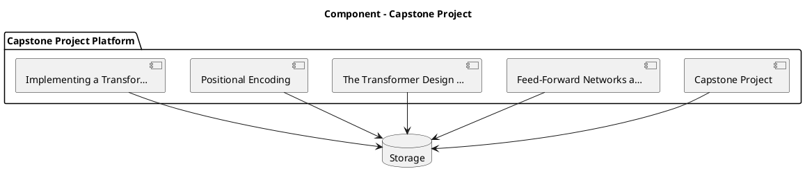

_Source diagram (plantuml); render with the appropriate tool._

**Figure 32. Component - Capstone Project** (plantuml). Figure: Component view for Capstone Project. This diagram illustrates the principal components and their interactions as discussed in the surrounding section.

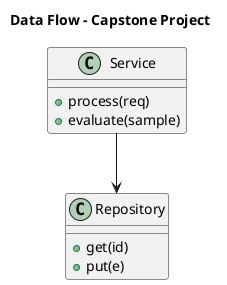

_Source diagram (plantuml); render with the appropriate tool._

**Figure 33. Data Flow - Capstone Project** (plantuml). Figure: Data Flow view for Capstone Project. This diagram illustrates the principal components and their interactions as discussed in the surrounding section.

## Deep Dive: Mechanics, Variants and Trade-offs

Having established the essentials, we now go deeper into capstone project. The underlying mechanism is best appreciated by tracing a single request from input to output and noting where state is created and consumed. The distinctions in this section are the ones that separate a working demo from a system that holds up under adversarial inputs, scale and the passage of time.

Consider the principal variants and how to choose between them. Each variant optimises for a different point in the design space - some for latency, some for accuracy, some for cost or operability - and the correct choice follows from explicit requirements rather than from defaults. As with most architectural decisions, the choice is rarely binary; the skill lies in quantifying the trade-offs and choosing deliberately.

In practice this is supported by a mature tooling ecosystem, including PyTorch, FlashAttention, Triton, xFormers. Tools accelerate the work but do not substitute for understanding: the same principles apply whichever implementation you select, and the ability to reason from first principles is what lets you debug when a tool behaves unexpectedly.

A frequent source of subtle bugs is the interaction with feed-forward networks and activations. Because feed-forward networks and activations concerns position-wise MLPs, GELU/SwiGLU and their role in capacity, changes there can silently alter the behaviour analysed here. The remedy is contract tests at the boundary and end-to-end evaluations that exercise the interaction explicitly.

Finally, attend to edge cases and degradation. Define what the system should do under partial failure, unexpected inputs and load spikes, and make that behaviour explicit and tested rather than emergent. Graceful degradation - returning a safe, useful result when the ideal one is unavailable - is a hallmark of mature engineering.

For deeper study, the literature offers authoritative treatments such as Vaswani et al. — Attention Is All You Need (2017) and Dao et al. — FlashAttention (2022). These primary sources reward careful reading and ground the practical guidance above in established results.

## Advanced Considerations

Having established the essentials, we now go deeper into capstone project. Beneath the abstraction lies a concrete process whose steps can each be measured, tested and optimised independently. The distinctions in this section are the ones that separate a working demo from a system that holds up under adversarial inputs, scale and the passage of time.

Consider the principal variants and how to choose between them. Each variant optimises for a different point in the design space - some for latency, some for accuracy, some for cost or operability - and the correct choice follows from explicit requirements rather than from defaults. As with most architectural decisions, the choice is rarely binary; the skill lies in quantifying the trade-offs and choosing deliberately.

In practice this is supported by a mature tooling ecosystem, including PyTorch, FlashAttention, Triton, xFormers. Tools accelerate the work but do not substitute for understanding: the same principles apply whichever implementation you select, and the ability to reason from first principles is what lets you debug when a tool behaves unexpectedly.

A frequent source of subtle bugs is the interaction with positional encoding. Because positional encoding concerns sinusoidal, learned and rotary (RoPE) encodings that inject order into a permutation-invariant operation, changes there can silently alter the behaviour analysed here. The remedy is contract tests at the boundary and end-to-end evaluations that exercise the interaction explicitly.

Finally, attend to edge cases and degradation. Define what the system should do under partial failure, unexpected inputs and load spikes, and make that behaviour explicit and tested rather than emergent. Graceful degradation - returning a safe, useful result when the ideal one is unavailable - is a hallmark of mature engineering.

For deeper study, the literature offers authoritative treatments such as Vaswani et al. — Attention Is All You Need (2017) and Dao et al. — FlashAttention (2022). These primary sources reward careful reading and ground the practical guidance above in established results.

## Worked Example

To ground the discussion, walk through a representative example. A nlp organisation needs language understanding and generation across tasks. They decide to apply capstone project as part of their Transformers solution, but wisely treat it as a hypothesis to be validated rather than a foregone conclusion.

The team begins by stating the objective precisely and defining how success will be measured before writing any code. They establish a small but representative evaluation set, agree on acceptance thresholds, and only then prototype the simplest design that could work. Early measurement reveals which assumptions hold and which must be revised, saving weeks of misdirected effort and surfacing edge cases while they are still cheap to fix.

As the prototype matures into a service, the team hardens it: adding input validation, error handling, caching where it pays off, and monitoring that ties back to the original success metric. They document each significant decision in an architecture decision record so that future maintainers understand not just what was built but why.

The outcome is instructive. The system that reaches production is not the most sophisticated design the team considered, but the one whose behaviour they could measure, explain and operate. This is the recurring lesson of Transformers: durable value comes from the whole system, not from any single clever component.

## Industry Use Cases

Across industries, the ideas in this chapter recur in recognisable ways. The following vignettes show how different sectors apply them and what they have in common.

**NLP.** Language understanding and generation across tasks. The common thread is that value comes not from the model alone but from the surrounding system - data quality, evaluation, integration and operations - which is precisely where most of the engineering effort belongs.

**Computer Vision.** Image classification and detection with ViT backbones. The common thread is that value comes not from the model alone but from the surrounding system - data quality, evaluation, integration and operations - which is precisely where most of the engineering effort belongs.

**Audio.** Speech recognition and synthesis with transformer encoders. The common thread is that value comes not from the model alone but from the surrounding system - data quality, evaluation, integration and operations - which is precisely where most of the engineering effort belongs.

**Science.** Protein structure and molecular property prediction. The common thread is that value comes not from the model alone but from the surrounding system - data quality, evaluation, integration and operations - which is precisely where most of the engineering effort belongs.

## Best Practices

The following practices consistently separate successful Transformers efforts from struggling ones. They are deliberately concrete so they can be adopted as checklist items in design and code review.

- Use pre-norm and careful warmup to stabilise deep transformer training.
- Adopt fused attention kernels to cut memory and latency.
- Validate positional encoding choice against target sequence lengths.
- Profile FLOPs and memory before scaling parameters.

None of these are exotic; they are the unglamorous disciplines that compound into reliability. The cost of adopting them is small compared with the cost of the incidents they prevent, and they become second nature with practice.

## Common Pitfalls

Equally instructive are the failure modes that recur in practice. Each pitfall below has a clear early warning sign and a known remedy, so treat them as a diagnostic checklist when something feels wrong:

- Quadratic attention cost dominating long-sequence workloads.
- Numerical instability from post-norm at depth.
- Position encoding that fails to extrapolate beyond training length.
- Ignoring kernel-level efficiency and over-provisioning hardware.

The pattern is consistent: most failures stem from skipping measurement, conflating prototype and production standards, or deferring cross-cutting concerns such as security and cost until they become emergencies. Naming these traps in advance is the cheapest way to avoid them.

## Governance, Security and Cost Notes

No discussion of capstone project is complete without its governance, security and cost dimensions, which are too often deferred until they become emergencies. Treating them as first-class concerns from the outset is both cheaper and safer.

**Governance.** Classify the risk of this capability, document its intended and out-of-scope uses, and ensure decisions are traceable to satisfy internal policy and external regulation such as the NIST AI RMF, ISO/IEC 42001 and the EU AI Act. **Security.** Treat all external input as untrusted, validate outputs before acting on them, apply least privilege to any tools or data access, and map controls to the OWASP LLM Top 10 and MITRE ATLAS.

**Cost and sustainability.** Establish explicit budgets for compute, tokens and latency, attribute spend to owners, and revisit the economics as usage scales - a design that is affordable at pilot scale can become untenable at production volume. Building these reflexes into everyday engineering is what allows a Transformers system to be not only capable but also trustworthy and economically sound.

## Hands-On Exercises

Work through the following exercises. They are designed to move understanding from recognition to application - the level required for real engineering work - so prefer writing and building over merely reading.

1. Explain capstone project to a colleague unfamiliar with Transformers, using a concrete example from your own domain.
2. Sketch a reference architecture that incorporates capstone project and annotate where observability, security and cost controls belong.
3. Design an evaluation that would tell you whether capstone project is working in production, including the metric, the dataset and the acceptance threshold.
4. Identify two pitfalls relevant to capstone project in your environment and describe the early warning signals you would monitor.
5. Prototype the simplest implementation that demonstrates capstone project, then list exactly what would need to change to make it production-ready.

## Key Takeaways

Key takeaways from this chapter:

- Capstone Project is a systems concern in Transformers: data, models and operations must be co-designed.
- Measurement is non-negotiable; define success metrics and evaluation before building.
- Favour the simplest design that meets the requirement, and add complexity only when evidence demands it.
- Security, cost and observability are first-class requirements, not afterthoughts.
- Document decisions so the system remains understandable and operable as it evolves.

## Code Walkthrough

This listing shows a configuration-driven Capstone Project component with retry semantics and typed interfaces — the shape we expect from production Transformers code rather than a notebook prototype.

The full listing is shown below; study it line by line and reproduce it locally before moving on.

### Listing: Implementing a Capstone Project component

```python
from __future__ import annotations

from dataclasses import dataclass, field
from typing import Any


@dataclass(slots=True)
class CapstoneProjectConfig:
    """Configuration for the Capstone Project component in a Transformers system."""

    name: str
    timeout_s: float = 30.0
    max_retries: int = 3
    options: dict[str, Any] = field(default_factory=dict)


class CapstoneProject:
    """A minimal, production-shaped implementation of Capstone Project."""

    def __init__(self, config: CapstoneProjectConfig) -> None:
        self._config = config
        self._calls = 0

    def run(self, payload: dict[str, Any]) -> dict[str, Any]:
        """Process a request, retrying transient failures with backoff."""
        last_error: Exception | None = None
        for attempt in range(self._config.max_retries):
            try:
                self._calls += 1
                return self._process(payload)
            except TimeoutError as exc:  # transient
                last_error = exc
                continue
        raise RuntimeError(f"CapstoneProject failed after retries") from last_error

    def _process(self, payload: dict[str, Any]) -> dict[str, Any]:
        # Domain-specific logic for Capstone Project goes here.
        return {"status": "ok", "input_keys": sorted(payload), "calls": self._calls}

```

## Review Questions

1. In the context of Transformers, which statement best describes “Capstone Project”?
   - A. It applies exclusively to image data.
   - B. It is only relevant to academic research, not production.
   - C. a substantial capstone project that consolidates the entire book into a portfolio-grade Transformers deliverable
   - D. It guarantees deterministic output regardless of input.
   - **Answer: C.** Capstone Project: a substantial capstone project that consolidates the entire book into a portfolio-grade Transformers deliverable
2. Which of the following is a recommended best practice when working with Transformers?
   - A. It makes the system slower but has no other effect.
   - B. Validate positional encoding choice against target sequence lengths.
   - C. Quadratic attention cost dominating long-sequence workloads.
   - D. It eliminates the need for any evaluation or monitoring.
   - **Answer: B.** Best practice: Validate positional encoding choice against target sequence lengths.
3. Which of the following is a common pitfall to avoid in Transformers?
   - A. Validate positional encoding choice against target sequence lengths.
   - B. Use pre-norm and careful warmup to stabilise deep transformer training.
   - C. It is only relevant to academic research, not production.
   - D. Position encoding that fails to extrapolate beyond training length.
   - **Answer: D.** Pitfall to avoid: Position encoding that fails to extrapolate beyond training length.
4. *(Discussion)* How does Capstone Project interact with security and governance requirements?
   - **Model answer:** A strong answer defines capstone project (a substantial capstone project that consolidates the entire book into a portfolio-grade Transformers deliverable) then connects it to architecture, evaluation, cost, security and operations for Transformers, citing concrete trade-offs and a real-world example.

---


# Chapter 25. Certification Preparation and Review

_This chapter examines certification preparation and review within Transformers. It covers a structured review and certification-style preparation covering the full breadth of Transformers, derives a reference architecture, walks through a worked example and runnable code, surveys industry use cases, and distils best practices and pitfalls, closing with exercises and review questions._

## Introduction

Certification Preparation and Review refers to a structured review and certification-style preparation covering the full breadth of Transformers. Getting this right early prevents expensive rework once a Transformers system reaches scale. What distinguishes a production-grade approach from a prototype is the discipline of measurement: every claim is backed by an evaluation rather than intuition.

This chapter builds intuition first, then formalises the ideas, derives an architecture, and finishes with code, exercises and review questions so the material transfers directly to your own Transformers work. Read it actively: pause at each diagram, reproduce the code, and attempt the exercises before consulting the answers.

## Theory and Foundations

We define Certification Preparation and Review as a structured review and certification-style preparation covering the full breadth of Transformers. Seasoned practitioners treat this as a systems problem, co-designing data, models and operations rather than optimising any one in isolation. Beneath the abstraction lies a concrete process whose steps can each be measured, tested and optimised independently.

To place this in context, recall the broader picture: The transformer is a neural architecture built on self-attention that processes sequences in parallel and models long-range dependencies without recurrence. Within that picture, certification preparation and review is one of the load-bearing ideas - the kind that, when understood deeply, makes the rest of Transformers fall into place. It is foundational: later capabilities in Transformers are built directly on top of it.

Certification Preparation and Review cannot be understood in isolation from multi-head attention. Recall that multi-head attention concerns projecting into multiple subspaces to attend to different relations simultaneously. The two interact directly: decisions in one constrain the design space of the other, which is why mature teams reason about them together rather than sequentially. Simplicity is a feature. The simplest design that meets the requirement should be the default, with complexity added only when measurement justifies it.

Certification Preparation and Review cannot be understood in isolation from training dynamics and stability. Recall that training dynamics and stability concerns initialisation, warmup, gradient clipping and loss spikes. The two interact directly: decisions in one constrain the design space of the other, which is why mature teams reason about them together rather than sequentially. Simplicity is a feature. The simplest design that meets the requirement should be the default, with complexity added only when measurement justifies it.

Several established patterns apply directly to certification preparation and review. The first, pre-norm residual blocks for deep stability, is widely adopted because it makes the system's behaviour predictable and observable. A complementary pattern, mixture-of-experts routing for sparse scaling, addresses a related concern and is often deployed alongside it. Patterns are not dogma; they are distilled experience that shortcuts the search for a sound design, and each carries assumptions worth checking against your context.

It is worth being explicit about when to apply this and when to reach for something simpler. In a small prototype, shortcuts around certification preparation and review are invisible; in a production Transformers system serving real traffic, they surface as incidents, cost overruns or compliance gaps. As with most architectural decisions, the choice is rarely binary; the skill lies in quantifying the trade-offs and choosing deliberately. The remainder of this chapter turns these principles into an architecture, code and a checklist you can apply immediately.

## Architecture and Design

A robust architecture for Certification Preparation and Review is layered so each part can evolve independently without destabilising the whole. A transformer block stacks multi-head self-attention and a position-wise feed-forward network, each wrapped in residual connections and normalisation. Decoder-only stacks add causal masking; encoder–decoder stacks add cross attention. At scale, efficient attention kernels, mixed precision and tensor parallelism turn the mathematics into a trainable system.

Concretely, the principal building blocks include why self-attention replaced recurrence, scaled dot-product attention, multi-head attention, positional encoding and feed-forward networks and activations. Each is a replaceable component behind a stable interface, so the team can upgrade an implementation - a model, an index, a policy engine - without rewriting its neighbours. The contracts between components are where reliability is won or lost, so they are specified explicitly and tested in isolation.

The diagram accompanying this section makes the data and control flow explicit. Requests enter through a well-defined boundary where they are authenticated and validated; only then are they dispatched to the components that perform the work. This boundary is also where rate limiting, quota enforcement and audit logging live, keeping cross-cutting concerns out of the core logic and in one auditable place.

Two qualities deserve emphasis. First, observability is designed in, not bolted on: every component emits structured telemetry so that failures can be localised in minutes rather than hours. Second, the architecture is evolvable - components communicate through stable contracts so that any single part of the Transformers system can be replaced without a rewrite. Every added component buys capability at the price of operational surface area, and that bargain should be made consciously.

```xml
<mxfile host="ai-university">
  <diagram name="Data Flow">
    <mxGraphModel dx="800" dy="600" grid="1" gridSize="10">
      <root>
        <mxCell id="0"/>
        <mxCell id="1" parent="0"/>
        <mxCell id="title" value="Data Flow - Certification Preparation and Review" style="text;fontSize=16;fontStyle=1" vertex="1" parent="1"><mxGeometry x="40" y="20" width="600" height="30" as="geometry"/></mxCell>
        <mxCell id="hub" value="Certification Prepara…" style="rounded=1;fillColor=#0f172a;fontColor=#ffffff;fontStyle=1" vertex="1" parent="1"><mxGeometry x="300" y="180" width="160" height="60" as="geometry"/></mxCell>
        <mxCell id="n0" value="Certification Preparati…" style="rounded=1;fillColor=#e0e7ff;strokeColor=#4338ca" vertex="1" parent="1"><mxGeometry x="60" y="80" width="160" height="50" as="geometry"/></mxCell>
        <mxCell id="e0" style="edgeStyle=orthogonalEdgeStyle" edge="1" parent="1" source="hub" target="n0"><mxGeometry relative="1" as="geometry"/></mxCell>
        <mxCell id="n1" value="Multi-Head Attention" style="rounded=1;fillColor=#e0e7ff;strokeColor=#4338ca" vertex="1" parent="1"><mxGeometry x="600" y="170" width="160" height="50" as="geometry"/></mxCell>
        <mxCell id="e1" style="edgeStyle=orthogonalEdgeStyle" edge="1" parent="1" source="hub" target="n1"><mxGeometry relative="1" as="geometry"/></mxCell>
        <mxCell id="n2" value="Training Dynamics and S…" style="rounded=1;fillColor=#e0e7ff;strokeColor=#4338ca" vertex="1" parent="1"><mxGeometry x="60" y="260" width="160" height="50" as="geometry"/></mxCell>
        <mxCell id="e2" style="edgeStyle=orthogonalEdgeStyle" edge="1" parent="1" source="hub" target="n2"><mxGeometry relative="1" as="geometry"/></mxCell>
        <mxCell id="n3" value="Profiling and Optimisin…" style="rounded=1;fillColor=#e0e7ff;strokeColor=#4338ca" vertex="1" parent="1"><mxGeometry x="600" y="350" width="160" height="50" as="geometry"/></mxCell>
        <mxCell id="e3" style="edgeStyle=orthogonalEdgeStyle" edge="1" parent="1" source="hub" target="n3"><mxGeometry relative="1" as="geometry"/></mxCell>
        <mxCell id="n4" value="Vision and Multimodal T…" style="rounded=1;fillColor=#e0e7ff;strokeColor=#4338ca" vertex="1" parent="1"><mxGeometry x="60" y="440" width="160" height="50" as="geometry"/></mxCell>
        <mxCell id="e4" style="edgeStyle=orthogonalEdgeStyle" edge="1" parent="1" source="hub" target="n4"><mxGeometry relative="1" as="geometry"/></mxCell>
      </root>
    </mxGraphModel>
  </diagram>
</mxfile>
```

_Source diagram (drawio); render with the appropriate tool._

**Figure 34. Data Flow - Certification Preparation and Review** (drawio). Figure: Data Flow view for Certification Preparation and Review. This diagram illustrates the principal components and their interactions as discussed in the surrounding section.

## Deep Dive: Mechanics, Variants and Trade-offs

Having established the essentials, we now go deeper into certification preparation and review. Mechanically, the behaviour emerges from a few interacting parts that are simpler than the whole they produce. The distinctions in this section are the ones that separate a working demo from a system that holds up under adversarial inputs, scale and the passage of time.

Consider the principal variants and how to choose between them. Each variant optimises for a different point in the design space - some for latency, some for accuracy, some for cost or operability - and the correct choice follows from explicit requirements rather than from defaults. There is an inherent trade-off between fidelity and cost, and the correct balance depends on the use case and its tolerance for error.

In practice this is supported by a mature tooling ecosystem, including PyTorch, FlashAttention, Triton, xFormers. Tools accelerate the work but do not substitute for understanding: the same principles apply whichever implementation you select, and the ability to reason from first principles is what lets you debug when a tool behaves unexpectedly.

A frequent source of subtle bugs is the interaction with multi-head attention. Because multi-head attention concerns projecting into multiple subspaces to attend to different relations simultaneously, changes there can silently alter the behaviour analysed here. The remedy is contract tests at the boundary and end-to-end evaluations that exercise the interaction explicitly.

Finally, attend to edge cases and degradation. Define what the system should do under partial failure, unexpected inputs and load spikes, and make that behaviour explicit and tested rather than emergent. Graceful degradation - returning a safe, useful result when the ideal one is unavailable - is a hallmark of mature engineering.

For deeper study, the literature offers authoritative treatments such as Vaswani et al. — Attention Is All You Need (2017) and Dao et al. — FlashAttention (2022). These primary sources reward careful reading and ground the practical guidance above in established results.

## Advanced Considerations

Having established the essentials, we now go deeper into certification preparation and review. It pays to understand the mechanism rather than treat it as a black box, because most production incidents are explained by one of its steps misbehaving. The distinctions in this section are the ones that separate a working demo from a system that holds up under adversarial inputs, scale and the passage of time.

Consider the principal variants and how to choose between them. Each variant optimises for a different point in the design space - some for latency, some for accuracy, some for cost or operability - and the correct choice follows from explicit requirements rather than from defaults. Simplicity is a feature. The simplest design that meets the requirement should be the default, with complexity added only when measurement justifies it.

In practice this is supported by a mature tooling ecosystem, including PyTorch, FlashAttention, Triton, xFormers. Tools accelerate the work but do not substitute for understanding: the same principles apply whichever implementation you select, and the ability to reason from first principles is what lets you debug when a tool behaves unexpectedly.

A frequent source of subtle bugs is the interaction with scaled dot-product attention. Because scaled dot-product attention concerns queries, keys, values, the scaling factor and the softmax that produces context-aware representations, changes there can silently alter the behaviour analysed here. The remedy is contract tests at the boundary and end-to-end evaluations that exercise the interaction explicitly.

Finally, attend to edge cases and degradation. Define what the system should do under partial failure, unexpected inputs and load spikes, and make that behaviour explicit and tested rather than emergent. Graceful degradation - returning a safe, useful result when the ideal one is unavailable - is a hallmark of mature engineering.

For deeper study, the literature offers authoritative treatments such as Vaswani et al. — Attention Is All You Need (2017) and Dao et al. — FlashAttention (2022). These primary sources reward careful reading and ground the practical guidance above in established results.

## Worked Example

To ground the discussion, walk through a representative example. A nlp organisation needs language understanding and generation across tasks. They decide to apply certification preparation and review as part of their Transformers solution, but wisely treat it as a hypothesis to be validated rather than a foregone conclusion.

The team begins by stating the objective precisely and defining how success will be measured before writing any code. They establish a small but representative evaluation set, agree on acceptance thresholds, and only then prototype the simplest design that could work. Early measurement reveals which assumptions hold and which must be revised, saving weeks of misdirected effort and surfacing edge cases while they are still cheap to fix.

As the prototype matures into a service, the team hardens it: adding input validation, error handling, caching where it pays off, and monitoring that ties back to the original success metric. They document each significant decision in an architecture decision record so that future maintainers understand not just what was built but why.

The outcome is instructive. The system that reaches production is not the most sophisticated design the team considered, but the one whose behaviour they could measure, explain and operate. This is the recurring lesson of Transformers: durable value comes from the whole system, not from any single clever component.

## Industry Use Cases

Across industries, the ideas in this chapter recur in recognisable ways. The following vignettes show how different sectors apply them and what they have in common.

**NLP.** Language understanding and generation across tasks. The common thread is that value comes not from the model alone but from the surrounding system - data quality, evaluation, integration and operations - which is precisely where most of the engineering effort belongs.

**Computer Vision.** Image classification and detection with ViT backbones. The common thread is that value comes not from the model alone but from the surrounding system - data quality, evaluation, integration and operations - which is precisely where most of the engineering effort belongs.

**Audio.** Speech recognition and synthesis with transformer encoders. The common thread is that value comes not from the model alone but from the surrounding system - data quality, evaluation, integration and operations - which is precisely where most of the engineering effort belongs.

**Science.** Protein structure and molecular property prediction. The common thread is that value comes not from the model alone but from the surrounding system - data quality, evaluation, integration and operations - which is precisely where most of the engineering effort belongs.

## Best Practices

The following practices consistently separate successful Transformers efforts from struggling ones. They are deliberately concrete so they can be adopted as checklist items in design and code review.

- Use pre-norm and careful warmup to stabilise deep transformer training.
- Adopt fused attention kernels to cut memory and latency.
- Validate positional encoding choice against target sequence lengths.
- Profile FLOPs and memory before scaling parameters.

None of these are exotic; they are the unglamorous disciplines that compound into reliability. The cost of adopting them is small compared with the cost of the incidents they prevent, and they become second nature with practice.

## Common Pitfalls

Equally instructive are the failure modes that recur in practice. Each pitfall below has a clear early warning sign and a known remedy, so treat them as a diagnostic checklist when something feels wrong:

- Quadratic attention cost dominating long-sequence workloads.
- Numerical instability from post-norm at depth.
- Position encoding that fails to extrapolate beyond training length.
- Ignoring kernel-level efficiency and over-provisioning hardware.

The pattern is consistent: most failures stem from skipping measurement, conflating prototype and production standards, or deferring cross-cutting concerns such as security and cost until they become emergencies. Naming these traps in advance is the cheapest way to avoid them.

## Governance, Security and Cost Notes

No discussion of certification preparation and review is complete without its governance, security and cost dimensions, which are too often deferred until they become emergencies. Treating them as first-class concerns from the outset is both cheaper and safer.

**Governance.** Classify the risk of this capability, document its intended and out-of-scope uses, and ensure decisions are traceable to satisfy internal policy and external regulation such as the NIST AI RMF, ISO/IEC 42001 and the EU AI Act. **Security.** Treat all external input as untrusted, validate outputs before acting on them, apply least privilege to any tools or data access, and map controls to the OWASP LLM Top 10 and MITRE ATLAS.

**Cost and sustainability.** Establish explicit budgets for compute, tokens and latency, attribute spend to owners, and revisit the economics as usage scales - a design that is affordable at pilot scale can become untenable at production volume. Building these reflexes into everyday engineering is what allows a Transformers system to be not only capable but also trustworthy and economically sound.

## Hands-On Exercises

Work through the following exercises. They are designed to move understanding from recognition to application - the level required for real engineering work - so prefer writing and building over merely reading.

1. Explain certification preparation and review to a colleague unfamiliar with Transformers, using a concrete example from your own domain.
2. Sketch a reference architecture that incorporates certification preparation and review and annotate where observability, security and cost controls belong.
3. Design an evaluation that would tell you whether certification preparation and review is working in production, including the metric, the dataset and the acceptance threshold.
4. Identify two pitfalls relevant to certification preparation and review in your environment and describe the early warning signals you would monitor.
5. Prototype the simplest implementation that demonstrates certification preparation and review, then list exactly what would need to change to make it production-ready.

## Key Takeaways

Key takeaways from this chapter:

- Certification Preparation and Review is a systems concern in Transformers: data, models and operations must be co-designed.
- Measurement is non-negotiable; define success metrics and evaluation before building.
- Favour the simplest design that meets the requirement, and add complexity only when evidence demands it.
- Security, cost and observability are first-class requirements, not afterthoughts.
- Document decisions so the system remains understandable and operable as it evolves.

## Code Walkthrough

Every change to a Transformers system should pass an evaluation gate. This example shows the minimal shape: align predictions and references, compute a metric, and return a pass/fail decision for CI.

The full listing is shown below; study it line by line and reproduce it locally before moving on.

### Listing: Evaluating Certification Preparation and Review with a regression gate

```python
from dataclasses import dataclass


@dataclass
class EvalResult:
    metric: str
    score: float
    passed: bool


def evaluate(predictions: list[str], references: list[str],
             threshold: float = 0.8) -> EvalResult:
    """Score Certification Preparation and Review output against references with a simple exact-match metric.

    In practice you would combine several metrics (exact match, semantic
    similarity, LLM-as-judge) and gate releases on the aggregate.
    """
    if len(predictions) != len(references):
        raise ValueError("predictions and references must align")
    hits = sum(p.strip() == r.strip() for p, r in zip(predictions, references))
    score = hits / len(references) if references else 0.0
    return EvalResult(metric="exact_match", score=score, passed=score >= threshold)


if __name__ == "__main__":
    result = evaluate(["yes", "no"], ["yes", "yes"])
    print(f"{result.metric}={result.score:.2f} passed={result.passed}")

```

## Review Questions

1. In the context of Transformers, which statement best describes “Certification Preparation and Review”?
   - A. It removes all security and governance requirements.
   - B. It eliminates the need for any evaluation or monitoring.
   - C. a structured review and certification-style preparation covering the full breadth of Transformers
   - D. It makes the system slower but has no other effect.
   - **Answer: C.** Certification Preparation and Review: a structured review and certification-style preparation covering the full breadth of Transformers
2. Which of the following is a recommended best practice when working with Transformers?
   - A. Quadratic attention cost dominating long-sequence workloads.
   - B. Ignoring kernel-level efficiency and over-provisioning hardware.
   - C. It is only relevant to academic research, not production.
   - D. Use pre-norm and careful warmup to stabilise deep transformer training.
   - **Answer: D.** Best practice: Use pre-norm and careful warmup to stabilise deep transformer training.
3. Which of the following is a common pitfall to avoid in Transformers?
   - A. Use pre-norm and careful warmup to stabilise deep transformer training.
   - B. Adopt fused attention kernels to cut memory and latency.
   - C. Quadratic attention cost dominating long-sequence workloads.
   - D. It makes the system slower but has no other effect.
   - **Answer: C.** Pitfall to avoid: Quadratic attention cost dominating long-sequence workloads.
4. *(Discussion)* Walk through how you would design Certification Preparation and Review for an enterprise Transformers workload.
   - **Model answer:** A strong answer defines certification preparation and review (a structured review and certification-style preparation covering the full breadth of Transformers) then connects it to architecture, evaluation, cost, security and operations for Transformers, citing concrete trade-offs and a real-world example.

---


# Hands-On Labs

## Lab 1: End-to-End Transformers Build

**Objective.** Build a working slice of a Transformers system that demonstrates the core concepts end to end. **Steps.** (1) Define the objective and success metric. (2) Assemble a minimal dataset or fixtures. (3) Implement the core component using the patterns from the chapters. (4) Add an evaluation gate. (5) Instrument observability. (6) Document the design decisions in an architecture decision record. **Deliverable.** A reproducible repository with code, an evaluation report and a short design document suitable for a portfolio.

## Lab 2: End-to-End Transformers Build

**Objective.** Build a working slice of a Transformers system that demonstrates the core concepts end to end. **Steps.** (1) Define the objective and success metric. (2) Assemble a minimal dataset or fixtures. (3) Implement the core component using the patterns from the chapters. (4) Add an evaluation gate. (5) Instrument observability. (6) Document the design decisions in an architecture decision record. **Deliverable.** A reproducible repository with code, an evaluation report and a short design document suitable for a portfolio.


# Case Studies

## NLP: Transformers in Practice

**Context.** A nlp organisation set out to apply Transformers to language understanding and generation across tasks. **Approach.** The team began with a precise objective and an evaluation set, prototyped the simplest viable design, then hardened it with monitoring, security controls and cost budgets. **Outcome.** Measured against the original metric, the system delivered durable value because the surrounding engineering - data quality, evaluation and operations - was treated as seriously as the model itself. **Lessons.** Start with measurement, resist premature complexity, and design governance and observability in from day one.

## Computer Vision: Transformers in Practice

**Context.** A computer vision organisation set out to apply Transformers to image classification and detection with ViT backbones. **Approach.** The team began with a precise objective and an evaluation set, prototyped the simplest viable design, then hardened it with monitoring, security controls and cost budgets. **Outcome.** Measured against the original metric, the system delivered durable value because the surrounding engineering - data quality, evaluation and operations - was treated as seriously as the model itself. **Lessons.** Start with measurement, resist premature complexity, and design governance and observability in from day one.

## Audio: Transformers in Practice

**Context.** A audio organisation set out to apply Transformers to speech recognition and synthesis with transformer encoders. **Approach.** The team began with a precise objective and an evaluation set, prototyped the simplest viable design, then hardened it with monitoring, security controls and cost budgets. **Outcome.** Measured against the original metric, the system delivered durable value because the surrounding engineering - data quality, evaluation and operations - was treated as seriously as the model itself. **Lessons.** Start with measurement, resist premature complexity, and design governance and observability in from day one.


# Interview Questions

A consolidated bank of discussion-style interview questions drawn from across the book, suitable for preparation and technical screening.

1. Walk through how you would design Why Self-Attention Replaced Recurrence for an enterprise Transformers workload.
   - **Guidance:** A strong answer defines why self-attention replaced recurrence (Parallelism, long-range dependency modelling and the limitations of RNNs/LSTMs that transformers overcame.) then connects it to architecture, evaluation, cost, security and operations for Transformers, citing concrete trade-offs and a real-world example.
2. How does Scaled Dot-Product Attention interact with security and governance requirements?
   - **Guidance:** A strong answer defines scaled dot-product attention (Queries, keys, values, the scaling factor and the softmax that produces context-aware representations.) then connects it to architecture, evaluation, cost, security and operations for Transformers, citing concrete trade-offs and a real-world example.
3. Explain Multi-Head Attention and why it matters in a production Transformers system.
   - **Guidance:** A strong answer defines multi-head attention (Projecting into multiple subspaces to attend to different relations simultaneously.) then connects it to architecture, evaluation, cost, security and operations for Transformers, citing concrete trade-offs and a real-world example.
4. Explain Positional Encoding and why it matters in a production Transformers system.
   - **Guidance:** A strong answer defines positional encoding (Sinusoidal, learned and rotary (RoPE) encodings that inject order into a permutation-invariant operation.) then connects it to architecture, evaluation, cost, security and operations for Transformers, citing concrete trade-offs and a real-world example.
5. How would you test and monitor Feed-Forward Networks and Activations in production?
   - **Guidance:** A strong answer defines feed-forward networks and activations (Position-wise MLPs, GELU/SwiGLU and their role in capacity.) then connects it to architecture, evaluation, cost, security and operations for Transformers, citing concrete trade-offs and a real-world example.
6. Explain Residual Connections and Normalisation and why it matters in a production Transformers system.
   - **Guidance:** A strong answer defines residual connections and normalisation (Pre-norm versus post-norm, LayerNorm/RMSNorm and training stability.) then connects it to architecture, evaluation, cost, security and operations for Transformers, citing concrete trade-offs and a real-world example.
7. Explain Encoder, Decoder and Encoder–Decoder Variants and why it matters in a production Transformers system.
   - **Guidance:** A strong answer defines encoder, decoder and encoder–decoder variants (BERT-style, GPT-style and T5-style architectures and their use cases.) then connects it to architecture, evaluation, cost, security and operations for Transformers, citing concrete trade-offs and a real-world example.
8. Describe a failure mode of Efficient Attention and how you would mitigate it.
   - **Guidance:** A strong answer defines efficient attention (FlashAttention, sparse and linear attention to tame quadratic cost.) then connects it to architecture, evaluation, cost, security and operations for Transformers, citing concrete trade-offs and a real-world example.
9. How would you test and monitor Vision and Multimodal Transformers in production?
   - **Guidance:** A strong answer defines vision and multimodal transformers (Patch embeddings, ViT and cross-modal attention.) then connects it to architecture, evaluation, cost, security and operations for Transformers, citing concrete trade-offs and a real-world example.
10. Explain Mixture-of-Experts Transformers and why it matters in a production Transformers system.
   - **Guidance:** A strong answer defines mixture-of-experts transformers (Sparse routing for parameter-efficient scaling.) then connects it to architecture, evaluation, cost, security and operations for Transformers, citing concrete trade-offs and a real-world example.
11. How would you test and monitor Training Dynamics and Stability in production?
   - **Guidance:** A strong answer defines training dynamics and stability (Initialisation, warmup, gradient clipping and loss spikes.) then connects it to architecture, evaluation, cost, security and operations for Transformers, citing concrete trade-offs and a real-world example.
12. Explain Implementing a Transformer from Scratch and why it matters in a production Transformers system.
   - **Guidance:** A strong answer defines implementing a transformer from scratch (A minimal, correct implementation that demystifies every component.) then connects it to architecture, evaluation, cost, security and operations for Transformers, citing concrete trade-offs and a real-world example.
13. Walk through how you would design Profiling and Optimising Transformers for an enterprise Transformers workload.
   - **Guidance:** A strong answer defines profiling and optimising transformers (Memory, FLOPs, kernel fusion and hardware-aware design.) then connects it to architecture, evaluation, cost, security and operations for Transformers, citing concrete trade-offs and a real-world example.
14. How does The Transformer Design Space interact with security and governance requirements?
   - **Guidance:** A strong answer defines the transformer design space (A map of architectural choices and their empirical trade-offs.) then connects it to architecture, evaluation, cost, security and operations for Transformers, citing concrete trade-offs and a real-world example.
15. How would you test and monitor Putting It Together: A Reference Implementation in production?
   - **Guidance:** A strong answer defines putting it together: a reference implementation (an end-to-end reference implementation that integrates the components of a Transformers system into a cohesive, working whole) then connects it to architecture, evaluation, cost, security and operations for Transformers, citing concrete trade-offs and a real-world example.
16. Walk through how you would design Hands-On Lab: Building an End-to-End Transformers System for an enterprise Transformers workload.
   - **Guidance:** A strong answer defines hands-on lab: building an end-to-end transformers system (a guided, build-along laboratory that constructs a functioning Transformers system from first principles) then connects it to architecture, evaluation, cost, security and operations for Transformers, citing concrete trade-offs and a real-world example.
17. Explain Case Study: NLP at Scale and why it matters in a production Transformers system.
   - **Guidance:** A strong answer defines case study: nlp at scale (a detailed case study of deploying Transformers in a demanding nlp environment, including the decisions, trade-offs and outcomes) then connects it to architecture, evaluation, cost, security and operations for Transformers, citing concrete trade-offs and a real-world example.
18. What trade-offs would you weigh when implementing Operating in Production?
   - **Guidance:** A strong answer defines operating in production (the operational discipline required to run a Transformers system reliably, including monitoring, incident response and continuous improvement) then connects it to architecture, evaluation, cost, security and operations for Transformers, citing concrete trade-offs and a real-world example.
19. Explain Evaluation and Quality Assurance and why it matters in a production Transformers system.
   - **Guidance:** A strong answer defines evaluation and quality assurance (a rigorous approach to measuring and assuring the quality of a Transformers system before and after release) then connects it to architecture, evaluation, cost, security and operations for Transformers, citing concrete trade-offs and a real-world example.
20. Describe a failure mode of Security, Privacy and Governance and how you would mitigate it.
   - **Guidance:** A strong answer defines security, privacy and governance (the security, privacy and governance controls that make a Transformers system trustworthy and compliant) then connects it to architecture, evaluation, cost, security and operations for Transformers, citing concrete trade-offs and a real-world example.
21. What trade-offs would you weigh when implementing Cost, Performance and Scaling?
   - **Guidance:** A strong answer defines cost, performance and scaling (techniques for controlling cost and latency while scaling a Transformers system to production traffic) then connects it to architecture, evaluation, cost, security and operations for Transformers, citing concrete trade-offs and a real-world example.
22. What trade-offs would you weigh when implementing Integration and Interoperability?
   - **Guidance:** A strong answer defines integration and interoperability (patterns for integrating a Transformers system with surrounding enterprise systems and data) then connects it to architecture, evaluation, cost, security and operations for Transformers, citing concrete trade-offs and a real-world example.
23. How would you test and monitor Trends and Research Directions in production?
   - **Guidance:** A strong answer defines trends and research directions (emerging trends, open problems and research directions shaping the future of Transformers) then connects it to architecture, evaluation, cost, security and operations for Transformers, citing concrete trade-offs and a real-world example.
24. How does Capstone Project interact with security and governance requirements?
   - **Guidance:** A strong answer defines capstone project (a substantial capstone project that consolidates the entire book into a portfolio-grade Transformers deliverable) then connects it to architecture, evaluation, cost, security and operations for Transformers, citing concrete trade-offs and a real-world example.
25. Walk through how you would design Certification Preparation and Review for an enterprise Transformers workload.
   - **Guidance:** A strong answer defines certification preparation and review (a structured review and certification-style preparation covering the full breadth of Transformers) then connects it to architecture, evaluation, cost, security and operations for Transformers, citing concrete trade-offs and a real-world example.

# Certification Questions

Certification-style multiple-choice questions covering best practices and common pitfalls.

1. Which of the following is a recommended best practice when working with Transformers?
   - A. Validate positional encoding choice against target sequence lengths.
   - B. It is only relevant to academic research, not production.
   - C. It applies exclusively to image data.
   - D. Position encoding that fails to extrapolate beyond training length.
   - **Answer: A.** Best practice: Validate positional encoding choice against target sequence lengths.
2. Which of the following is a common pitfall to avoid in Transformers?
   - A. It applies exclusively to image data.
   - B. Profile FLOPs and memory before scaling parameters.
   - C. It guarantees deterministic output regardless of input.
   - D. Quadratic attention cost dominating long-sequence workloads.
   - **Answer: D.** Pitfall to avoid: Quadratic attention cost dominating long-sequence workloads.
3. Which of the following is a recommended best practice when working with Transformers?
   - A. It is only relevant to academic research, not production.
   - B. Numerical instability from post-norm at depth.
   - C. Profile FLOPs and memory before scaling parameters.
   - D. It makes the system slower but has no other effect.
   - **Answer: C.** Best practice: Profile FLOPs and memory before scaling parameters.
4. Which of the following is a common pitfall to avoid in Transformers?
   - A. Use pre-norm and careful warmup to stabilise deep transformer training.
   - B. Numerical instability from post-norm at depth.
   - C. It eliminates the need for any evaluation or monitoring.
   - D. It guarantees deterministic output regardless of input.
   - **Answer: B.** Pitfall to avoid: Numerical instability from post-norm at depth.
5. Which of the following is a recommended best practice when working with Transformers?
   - A. It eliminates the need for any evaluation or monitoring.
   - B. Quadratic attention cost dominating long-sequence workloads.
   - C. It makes the system slower but has no other effect.
   - D. Validate positional encoding choice against target sequence lengths.
   - **Answer: D.** Best practice: Validate positional encoding choice against target sequence lengths.
6. Which of the following is a common pitfall to avoid in Transformers?
   - A. Adopt fused attention kernels to cut memory and latency.
   - B. It guarantees deterministic output regardless of input.
   - C. Numerical instability from post-norm at depth.
   - D. It makes the system slower but has no other effect.
   - **Answer: C.** Pitfall to avoid: Numerical instability from post-norm at depth.
7. Which of the following is a recommended best practice when working with Transformers?
   - A. Ignoring kernel-level efficiency and over-provisioning hardware.
   - B. Position encoding that fails to extrapolate beyond training length.
   - C. Profile FLOPs and memory before scaling parameters.
   - D. It makes the system slower but has no other effect.
   - **Answer: C.** Best practice: Profile FLOPs and memory before scaling parameters.
8. Which of the following is a common pitfall to avoid in Transformers?
   - A. Use pre-norm and careful warmup to stabilise deep transformer training.
   - B. Position encoding that fails to extrapolate beyond training length.
   - C. Profile FLOPs and memory before scaling parameters.
   - D. It guarantees deterministic output regardless of input.
   - **Answer: B.** Pitfall to avoid: Position encoding that fails to extrapolate beyond training length.
9. Which of the following is a recommended best practice when working with Transformers?
   - A. Profile FLOPs and memory before scaling parameters.
   - B. It applies exclusively to image data.
   - C. It is only relevant to academic research, not production.
   - D. It removes all security and governance requirements.
   - **Answer: A.** Best practice: Profile FLOPs and memory before scaling parameters.
10. Which of the following is a common pitfall to avoid in Transformers?
   - A. Ignoring kernel-level efficiency and over-provisioning hardware.
   - B. It guarantees deterministic output regardless of input.
   - C. Profile FLOPs and memory before scaling parameters.
   - D. It eliminates the need for any evaluation or monitoring.
   - **Answer: A.** Pitfall to avoid: Ignoring kernel-level efficiency and over-provisioning hardware.
11. Which of the following is a recommended best practice when working with Transformers?
   - A. Position encoding that fails to extrapolate beyond training length.
   - B. Validate positional encoding choice against target sequence lengths.
   - C. Ignoring kernel-level efficiency and over-provisioning hardware.
   - D. Quadratic attention cost dominating long-sequence workloads.
   - **Answer: B.** Best practice: Validate positional encoding choice against target sequence lengths.
12. Which of the following is a common pitfall to avoid in Transformers?
   - A. It guarantees deterministic output regardless of input.
   - B. Validate positional encoding choice against target sequence lengths.
   - C. Numerical instability from post-norm at depth.
   - D. It makes the system slower but has no other effect.
   - **Answer: C.** Pitfall to avoid: Numerical instability from post-norm at depth.
13. Which of the following is a recommended best practice when working with Transformers?
   - A. Validate positional encoding choice against target sequence lengths.
   - B. Position encoding that fails to extrapolate beyond training length.
   - C. It guarantees deterministic output regardless of input.
   - D. Ignoring kernel-level efficiency and over-provisioning hardware.
   - **Answer: A.** Best practice: Validate positional encoding choice against target sequence lengths.
14. Which of the following is a common pitfall to avoid in Transformers?
   - A. Position encoding that fails to extrapolate beyond training length.
   - B. Adopt fused attention kernels to cut memory and latency.
   - C. Profile FLOPs and memory before scaling parameters.
   - D. It applies exclusively to image data.
   - **Answer: A.** Pitfall to avoid: Position encoding that fails to extrapolate beyond training length.
15. Which of the following is a recommended best practice when working with Transformers?
   - A. It removes all security and governance requirements.
   - B. Adopt fused attention kernels to cut memory and latency.
   - C. Position encoding that fails to extrapolate beyond training length.
   - D. It makes the system slower but has no other effect.
   - **Answer: B.** Best practice: Adopt fused attention kernels to cut memory and latency.
16. Which of the following is a common pitfall to avoid in Transformers?
   - A. It guarantees deterministic output regardless of input.
   - B. Numerical instability from post-norm at depth.
   - C. Profile FLOPs and memory before scaling parameters.
   - D. It applies exclusively to image data.
   - **Answer: B.** Pitfall to avoid: Numerical instability from post-norm at depth.
17. Which of the following is a recommended best practice when working with Transformers?
   - A. Profile FLOPs and memory before scaling parameters.
   - B. It makes the system slower but has no other effect.
   - C. It eliminates the need for any evaluation or monitoring.
   - D. Position encoding that fails to extrapolate beyond training length.
   - **Answer: A.** Best practice: Profile FLOPs and memory before scaling parameters.
18. Which of the following is a common pitfall to avoid in Transformers?
   - A. It guarantees deterministic output regardless of input.
   - B. Ignoring kernel-level efficiency and over-provisioning hardware.
   - C. It applies exclusively to image data.
   - D. It eliminates the need for any evaluation or monitoring.
   - **Answer: B.** Pitfall to avoid: Ignoring kernel-level efficiency and over-provisioning hardware.
19. Which of the following is a recommended best practice when working with Transformers?
   - A. It applies exclusively to image data.
   - B. It eliminates the need for any evaluation or monitoring.
   - C. Quadratic attention cost dominating long-sequence workloads.
   - D. Validate positional encoding choice against target sequence lengths.
   - **Answer: D.** Best practice: Validate positional encoding choice against target sequence lengths.
20. Which of the following is a common pitfall to avoid in Transformers?
   - A. It applies exclusively to image data.
   - B. It eliminates the need for any evaluation or monitoring.
   - C. Validate positional encoding choice against target sequence lengths.
   - D. Quadratic attention cost dominating long-sequence workloads.
   - **Answer: D.** Pitfall to avoid: Quadratic attention cost dominating long-sequence workloads.
21. Which of the following is a recommended best practice when working with Transformers?
   - A. It guarantees deterministic output regardless of input.
   - B. It is only relevant to academic research, not production.
   - C. Profile FLOPs and memory before scaling parameters.
   - D. It makes the system slower but has no other effect.
   - **Answer: C.** Best practice: Profile FLOPs and memory before scaling parameters.
22. Which of the following is a common pitfall to avoid in Transformers?
   - A. Quadratic attention cost dominating long-sequence workloads.
   - B. It eliminates the need for any evaluation or monitoring.
   - C. Validate positional encoding choice against target sequence lengths.
   - D. It removes all security and governance requirements.
   - **Answer: A.** Pitfall to avoid: Quadratic attention cost dominating long-sequence workloads.
23. Which of the following is a recommended best practice when working with Transformers?
   - A. It is only relevant to academic research, not production.
   - B. Profile FLOPs and memory before scaling parameters.
   - C. It makes the system slower but has no other effect.
   - D. Numerical instability from post-norm at depth.
   - **Answer: B.** Best practice: Profile FLOPs and memory before scaling parameters.
24. Which of the following is a common pitfall to avoid in Transformers?
   - A. Position encoding that fails to extrapolate beyond training length.
   - B. Validate positional encoding choice against target sequence lengths.
   - C. Profile FLOPs and memory before scaling parameters.
   - D. It makes the system slower but has no other effect.
   - **Answer: A.** Pitfall to avoid: Position encoding that fails to extrapolate beyond training length.
25. Which of the following is a recommended best practice when working with Transformers?
   - A. Validate positional encoding choice against target sequence lengths.
   - B. Quadratic attention cost dominating long-sequence workloads.
   - C. It makes the system slower but has no other effect.
   - D. Position encoding that fails to extrapolate beyond training length.
   - **Answer: A.** Best practice: Validate positional encoding choice against target sequence lengths.
26. Which of the following is a common pitfall to avoid in Transformers?
   - A. It eliminates the need for any evaluation or monitoring.
   - B. Adopt fused attention kernels to cut memory and latency.
   - C. Numerical instability from post-norm at depth.
   - D. Use pre-norm and careful warmup to stabilise deep transformer training.
   - **Answer: C.** Pitfall to avoid: Numerical instability from post-norm at depth.
27. Which of the following is a recommended best practice when working with Transformers?
   - A. Ignoring kernel-level efficiency and over-provisioning hardware.
   - B. Position encoding that fails to extrapolate beyond training length.
   - C. Numerical instability from post-norm at depth.
   - D. Adopt fused attention kernels to cut memory and latency.
   - **Answer: D.** Best practice: Adopt fused attention kernels to cut memory and latency.
28. Which of the following is a common pitfall to avoid in Transformers?
   - A. Adopt fused attention kernels to cut memory and latency.
   - B. It removes all security and governance requirements.
   - C. It applies exclusively to image data.
   - D. Position encoding that fails to extrapolate beyond training length.
   - **Answer: D.** Pitfall to avoid: Position encoding that fails to extrapolate beyond training length.
29. Which of the following is a recommended best practice when working with Transformers?
   - A. Quadratic attention cost dominating long-sequence workloads.
   - B. It eliminates the need for any evaluation or monitoring.
   - C. Adopt fused attention kernels to cut memory and latency.
   - D. It removes all security and governance requirements.
   - **Answer: C.** Best practice: Adopt fused attention kernels to cut memory and latency.
30. Which of the following is a common pitfall to avoid in Transformers?
   - A. Adopt fused attention kernels to cut memory and latency.
   - B. It guarantees deterministic output regardless of input.
   - C. It eliminates the need for any evaluation or monitoring.
   - D. Numerical instability from post-norm at depth.
   - **Answer: D.** Pitfall to avoid: Numerical instability from post-norm at depth.
31. Which of the following is a recommended best practice when working with Transformers?
   - A. It is only relevant to academic research, not production.
   - B. It makes the system slower but has no other effect.
   - C. Profile FLOPs and memory before scaling parameters.
   - D. It eliminates the need for any evaluation or monitoring.
   - **Answer: C.** Best practice: Profile FLOPs and memory before scaling parameters.
32. Which of the following is a common pitfall to avoid in Transformers?
   - A. It applies exclusively to image data.
   - B. It eliminates the need for any evaluation or monitoring.
   - C. Validate positional encoding choice against target sequence lengths.
   - D. Quadratic attention cost dominating long-sequence workloads.
   - **Answer: D.** Pitfall to avoid: Quadratic attention cost dominating long-sequence workloads.
33. Which of the following is a recommended best practice when working with Transformers?
   - A. Use pre-norm and careful warmup to stabilise deep transformer training.
   - B. Numerical instability from post-norm at depth.
   - C. It is only relevant to academic research, not production.
   - D. Position encoding that fails to extrapolate beyond training length.
   - **Answer: A.** Best practice: Use pre-norm and careful warmup to stabilise deep transformer training.
34. Which of the following is a common pitfall to avoid in Transformers?
   - A. Quadratic attention cost dominating long-sequence workloads.
   - B. Profile FLOPs and memory before scaling parameters.
   - C. It eliminates the need for any evaluation or monitoring.
   - D. Use pre-norm and careful warmup to stabilise deep transformer training.
   - **Answer: A.** Pitfall to avoid: Quadratic attention cost dominating long-sequence workloads.
35. Which of the following is a recommended best practice when working with Transformers?
   - A. It applies exclusively to image data.
   - B. It guarantees deterministic output regardless of input.
   - C. Numerical instability from post-norm at depth.
   - D. Use pre-norm and careful warmup to stabilise deep transformer training.
   - **Answer: D.** Best practice: Use pre-norm and careful warmup to stabilise deep transformer training.
36. Which of the following is a common pitfall to avoid in Transformers?
   - A. It makes the system slower but has no other effect.
   - B. It applies exclusively to image data.
   - C. Adopt fused attention kernels to cut memory and latency.
   - D. Position encoding that fails to extrapolate beyond training length.
   - **Answer: D.** Pitfall to avoid: Position encoding that fails to extrapolate beyond training length.
37. Which of the following is a recommended best practice when working with Transformers?
   - A. It eliminates the need for any evaluation or monitoring.
   - B. Use pre-norm and careful warmup to stabilise deep transformer training.
   - C. It makes the system slower but has no other effect.
   - D. It removes all security and governance requirements.
   - **Answer: B.** Best practice: Use pre-norm and careful warmup to stabilise deep transformer training.
38. Which of the following is a common pitfall to avoid in Transformers?
   - A. It makes the system slower but has no other effect.
   - B. Profile FLOPs and memory before scaling parameters.
   - C. Quadratic attention cost dominating long-sequence workloads.
   - D. Adopt fused attention kernels to cut memory and latency.
   - **Answer: C.** Pitfall to avoid: Quadratic attention cost dominating long-sequence workloads.
39. Which of the following is a recommended best practice when working with Transformers?
   - A. It removes all security and governance requirements.
   - B. Adopt fused attention kernels to cut memory and latency.
   - C. Quadratic attention cost dominating long-sequence workloads.
   - D. Numerical instability from post-norm at depth.
   - **Answer: B.** Best practice: Adopt fused attention kernels to cut memory and latency.
40. Which of the following is a common pitfall to avoid in Transformers?
   - A. It applies exclusively to image data.
   - B. It guarantees deterministic output regardless of input.
   - C. Ignoring kernel-level efficiency and over-provisioning hardware.
   - D. Profile FLOPs and memory before scaling parameters.
   - **Answer: C.** Pitfall to avoid: Ignoring kernel-level efficiency and over-provisioning hardware.
41. Which of the following is a recommended best practice when working with Transformers?
   - A. Validate positional encoding choice against target sequence lengths.
   - B. It applies exclusively to image data.
   - C. Quadratic attention cost dominating long-sequence workloads.
   - D. It is only relevant to academic research, not production.
   - **Answer: A.** Best practice: Validate positional encoding choice against target sequence lengths.
42. Which of the following is a common pitfall to avoid in Transformers?
   - A. Position encoding that fails to extrapolate beyond training length.
   - B. Profile FLOPs and memory before scaling parameters.
   - C. It applies exclusively to image data.
   - D. Adopt fused attention kernels to cut memory and latency.
   - **Answer: A.** Pitfall to avoid: Position encoding that fails to extrapolate beyond training length.
43. Which of the following is a recommended best practice when working with Transformers?
   - A. Numerical instability from post-norm at depth.
   - B. Use pre-norm and careful warmup to stabilise deep transformer training.
   - C. Position encoding that fails to extrapolate beyond training length.
   - D. It eliminates the need for any evaluation or monitoring.
   - **Answer: B.** Best practice: Use pre-norm and careful warmup to stabilise deep transformer training.
44. Which of the following is a common pitfall to avoid in Transformers?
   - A. Position encoding that fails to extrapolate beyond training length.
   - B. It makes the system slower but has no other effect.
   - C. It is only relevant to academic research, not production.
   - D. It eliminates the need for any evaluation or monitoring.
   - **Answer: A.** Pitfall to avoid: Position encoding that fails to extrapolate beyond training length.
45. Which of the following is a recommended best practice when working with Transformers?
   - A. Quadratic attention cost dominating long-sequence workloads.
   - B. Profile FLOPs and memory before scaling parameters.
   - C. Numerical instability from post-norm at depth.
   - D. Ignoring kernel-level efficiency and over-provisioning hardware.
   - **Answer: B.** Best practice: Profile FLOPs and memory before scaling parameters.
46. Which of the following is a common pitfall to avoid in Transformers?
   - A. It guarantees deterministic output regardless of input.
   - B. Adopt fused attention kernels to cut memory and latency.
   - C. It eliminates the need for any evaluation or monitoring.
   - D. Ignoring kernel-level efficiency and over-provisioning hardware.
   - **Answer: D.** Pitfall to avoid: Ignoring kernel-level efficiency and over-provisioning hardware.
47. Which of the following is a recommended best practice when working with Transformers?
   - A. It makes the system slower but has no other effect.
   - B. Validate positional encoding choice against target sequence lengths.
   - C. Quadratic attention cost dominating long-sequence workloads.
   - D. It eliminates the need for any evaluation or monitoring.
   - **Answer: B.** Best practice: Validate positional encoding choice against target sequence lengths.
48. Which of the following is a common pitfall to avoid in Transformers?
   - A. Validate positional encoding choice against target sequence lengths.
   - B. Use pre-norm and careful warmup to stabilise deep transformer training.
   - C. It is only relevant to academic research, not production.
   - D. Position encoding that fails to extrapolate beyond training length.
   - **Answer: D.** Pitfall to avoid: Position encoding that fails to extrapolate beyond training length.
49. Which of the following is a recommended best practice when working with Transformers?
   - A. Quadratic attention cost dominating long-sequence workloads.
   - B. Ignoring kernel-level efficiency and over-provisioning hardware.
   - C. It is only relevant to academic research, not production.
   - D. Use pre-norm and careful warmup to stabilise deep transformer training.
   - **Answer: D.** Best practice: Use pre-norm and careful warmup to stabilise deep transformer training.
50. Which of the following is a common pitfall to avoid in Transformers?
   - A. Use pre-norm and careful warmup to stabilise deep transformer training.
   - B. Adopt fused attention kernels to cut memory and latency.
   - C. Quadratic attention cost dominating long-sequence workloads.
   - D. It makes the system slower but has no other effect.
   - **Answer: C.** Pitfall to avoid: Quadratic attention cost dominating long-sequence workloads.

# Assessment Exercises

Assessment items to verify conceptual understanding.

1. In the context of Transformers, which statement best describes “Why Self-Attention Replaced Recurrence”?
   - A. It is only relevant to academic research, not production.
   - B. It removes all security and governance requirements.
   - C. Parallelism, long-range dependency modelling and the limitations of RNNs/LSTMs that transformers overcame.
   - D. It makes the system slower but has no other effect.
   - **Answer: C.** Why Self-Attention Replaced Recurrence: Parallelism, long-range dependency modelling and the limitations of RNNs/LSTMs that transformers overcame.
2. In the context of Transformers, which statement best describes “Scaled Dot-Product Attention”?
   - A. It is only relevant to academic research, not production.
   - B. It guarantees deterministic output regardless of input.
   - C. It applies exclusively to image data.
   - D. Queries, keys, values, the scaling factor and the softmax that produces context-aware representations.
   - **Answer: D.** Scaled Dot-Product Attention: Queries, keys, values, the scaling factor and the softmax that produces context-aware representations.
3. In the context of Transformers, which statement best describes “Multi-Head Attention”?
   - A. It removes all security and governance requirements.
   - B. It makes the system slower but has no other effect.
   - C. Projecting into multiple subspaces to attend to different relations simultaneously.
   - D. It guarantees deterministic output regardless of input.
   - **Answer: C.** Multi-Head Attention: Projecting into multiple subspaces to attend to different relations simultaneously.
4. In the context of Transformers, which statement best describes “Positional Encoding”?
   - A. Sinusoidal, learned and rotary (RoPE) encodings that inject order into a permutation-invariant operation.
   - B. It makes the system slower but has no other effect.
   - C. It eliminates the need for any evaluation or monitoring.
   - D. It is only relevant to academic research, not production.
   - **Answer: A.** Positional Encoding: Sinusoidal, learned and rotary (RoPE) encodings that inject order into a permutation-invariant operation.
5. In the context of Transformers, which statement best describes “Feed-Forward Networks and Activations”?
   - A. It eliminates the need for any evaluation or monitoring.
   - B. It is only relevant to academic research, not production.
   - C. It makes the system slower but has no other effect.
   - D. Position-wise MLPs, GELU/SwiGLU and their role in capacity.
   - **Answer: D.** Feed-Forward Networks and Activations: Position-wise MLPs, GELU/SwiGLU and their role in capacity.
6. In the context of Transformers, which statement best describes “Residual Connections and Normalisation”?
   - A. Pre-norm versus post-norm, LayerNorm/RMSNorm and training stability.
   - B. It removes all security and governance requirements.
   - C. It guarantees deterministic output regardless of input.
   - D. It applies exclusively to image data.
   - **Answer: A.** Residual Connections and Normalisation: Pre-norm versus post-norm, LayerNorm/RMSNorm and training stability.
7. In the context of Transformers, which statement best describes “Encoder, Decoder and Encoder–Decoder Variants”?
   - A. It applies exclusively to image data.
   - B. BERT-style, GPT-style and T5-style architectures and their use cases.
   - C. It removes all security and governance requirements.
   - D. It makes the system slower but has no other effect.
   - **Answer: B.** Encoder, Decoder and Encoder–Decoder Variants: BERT-style, GPT-style and T5-style architectures and their use cases.
8. In the context of Transformers, which statement best describes “Efficient Attention”?
   - A. It applies exclusively to image data.
   - B. It is only relevant to academic research, not production.
   - C. FlashAttention, sparse and linear attention to tame quadratic cost.
   - D. It eliminates the need for any evaluation or monitoring.
   - **Answer: C.** Efficient Attention: FlashAttention, sparse and linear attention to tame quadratic cost.
9. In the context of Transformers, which statement best describes “Vision and Multimodal Transformers”?
   - A. It removes all security and governance requirements.
   - B. It is only relevant to academic research, not production.
   - C. Patch embeddings, ViT and cross-modal attention.
   - D. It applies exclusively to image data.
   - **Answer: C.** Vision and Multimodal Transformers: Patch embeddings, ViT and cross-modal attention.
10. In the context of Transformers, which statement best describes “Mixture-of-Experts Transformers”?
   - A. Sparse routing for parameter-efficient scaling.
   - B. It eliminates the need for any evaluation or monitoring.
   - C. It is only relevant to academic research, not production.
   - D. It removes all security and governance requirements.
   - **Answer: A.** Mixture-of-Experts Transformers: Sparse routing for parameter-efficient scaling.
11. In the context of Transformers, which statement best describes “Training Dynamics and Stability”?
   - A. Initialisation, warmup, gradient clipping and loss spikes.
   - B. It makes the system slower but has no other effect.
   - C. It applies exclusively to image data.
   - D. It guarantees deterministic output regardless of input.
   - **Answer: A.** Training Dynamics and Stability: Initialisation, warmup, gradient clipping and loss spikes.
12. In the context of Transformers, which statement best describes “Implementing a Transformer from Scratch”?
   - A. It eliminates the need for any evaluation or monitoring.
   - B. It removes all security and governance requirements.
   - C. It makes the system slower but has no other effect.
   - D. A minimal, correct implementation that demystifies every component.
   - **Answer: D.** Implementing a Transformer from Scratch: A minimal, correct implementation that demystifies every component.
13. In the context of Transformers, which statement best describes “Profiling and Optimising Transformers”?
   - A. Memory, FLOPs, kernel fusion and hardware-aware design.
   - B. It is only relevant to academic research, not production.
   - C. It applies exclusively to image data.
   - D. It eliminates the need for any evaluation or monitoring.
   - **Answer: A.** Profiling and Optimising Transformers: Memory, FLOPs, kernel fusion and hardware-aware design.
14. In the context of Transformers, which statement best describes “The Transformer Design Space”?
   - A. It applies exclusively to image data.
   - B. It guarantees deterministic output regardless of input.
   - C. It makes the system slower but has no other effect.
   - D. A map of architectural choices and their empirical trade-offs.
   - **Answer: D.** The Transformer Design Space: A map of architectural choices and their empirical trade-offs.
15. In the context of Transformers, which statement best describes “Putting It Together: A Reference Implementation”?
   - A. It eliminates the need for any evaluation or monitoring.
   - B. an end-to-end reference implementation that integrates the components of a Transformers system into a cohesive, working whole
   - C. It makes the system slower but has no other effect.
   - D. It is only relevant to academic research, not production.
   - **Answer: B.** Putting It Together: A Reference Implementation: an end-to-end reference implementation that integrates the components of a Transformers system into a cohesive, working whole
16. In the context of Transformers, which statement best describes “Hands-On Lab: Building an End-to-End Transformers System”?
   - A. a guided, build-along laboratory that constructs a functioning Transformers system from first principles
   - B. It eliminates the need for any evaluation or monitoring.
   - C. It applies exclusively to image data.
   - D. It is only relevant to academic research, not production.
   - **Answer: A.** Hands-On Lab: Building an End-to-End Transformers System: a guided, build-along laboratory that constructs a functioning Transformers system from first principles
17. In the context of Transformers, which statement best describes “Case Study: NLP at Scale”?
   - A. It eliminates the need for any evaluation or monitoring.
   - B. It is only relevant to academic research, not production.
   - C. a detailed case study of deploying Transformers in a demanding nlp environment, including the decisions, trade-offs and outcomes
   - D. It guarantees deterministic output regardless of input.
   - **Answer: C.** Case Study: NLP at Scale: a detailed case study of deploying Transformers in a demanding nlp environment, including the decisions, trade-offs and outcomes
18. In the context of Transformers, which statement best describes “Operating in Production”?
   - A. the operational discipline required to run a Transformers system reliably, including monitoring, incident response and continuous improvement
   - B. It is only relevant to academic research, not production.
   - C. It makes the system slower but has no other effect.
   - D. It guarantees deterministic output regardless of input.
   - **Answer: A.** Operating in Production: the operational discipline required to run a Transformers system reliably, including monitoring, incident response and continuous improvement
19. In the context of Transformers, which statement best describes “Evaluation and Quality Assurance”?
   - A. It guarantees deterministic output regardless of input.
   - B. It eliminates the need for any evaluation or monitoring.
   - C. It applies exclusively to image data.
   - D. a rigorous approach to measuring and assuring the quality of a Transformers system before and after release
   - **Answer: D.** Evaluation and Quality Assurance: a rigorous approach to measuring and assuring the quality of a Transformers system before and after release
20. In the context of Transformers, which statement best describes “Security, Privacy and Governance”?
   - A. It applies exclusively to image data.
   - B. It makes the system slower but has no other effect.
   - C. It guarantees deterministic output regardless of input.
   - D. the security, privacy and governance controls that make a Transformers system trustworthy and compliant
   - **Answer: D.** Security, Privacy and Governance: the security, privacy and governance controls that make a Transformers system trustworthy and compliant
21. In the context of Transformers, which statement best describes “Cost, Performance and Scaling”?
   - A. It applies exclusively to image data.
   - B. It guarantees deterministic output regardless of input.
   - C. techniques for controlling cost and latency while scaling a Transformers system to production traffic
   - D. It eliminates the need for any evaluation or monitoring.
   - **Answer: C.** Cost, Performance and Scaling: techniques for controlling cost and latency while scaling a Transformers system to production traffic
22. In the context of Transformers, which statement best describes “Integration and Interoperability”?
   - A. It makes the system slower but has no other effect.
   - B. patterns for integrating a Transformers system with surrounding enterprise systems and data
   - C. It is only relevant to academic research, not production.
   - D. It eliminates the need for any evaluation or monitoring.
   - **Answer: B.** Integration and Interoperability: patterns for integrating a Transformers system with surrounding enterprise systems and data
23. In the context of Transformers, which statement best describes “Trends and Research Directions”?
   - A. emerging trends, open problems and research directions shaping the future of Transformers
   - B. It eliminates the need for any evaluation or monitoring.
   - C. It removes all security and governance requirements.
   - D. It is only relevant to academic research, not production.
   - **Answer: A.** Trends and Research Directions: emerging trends, open problems and research directions shaping the future of Transformers
24. In the context of Transformers, which statement best describes “Capstone Project”?
   - A. It applies exclusively to image data.
   - B. It is only relevant to academic research, not production.
   - C. a substantial capstone project that consolidates the entire book into a portfolio-grade Transformers deliverable
   - D. It guarantees deterministic output regardless of input.
   - **Answer: C.** Capstone Project: a substantial capstone project that consolidates the entire book into a portfolio-grade Transformers deliverable
25. In the context of Transformers, which statement best describes “Certification Preparation and Review”?
   - A. It removes all security and governance requirements.
   - B. It eliminates the need for any evaluation or monitoring.
   - C. a structured review and certification-style preparation covering the full breadth of Transformers
   - D. It makes the system slower but has no other effect.
   - **Answer: C.** Certification Preparation and Review: a structured review and certification-style preparation covering the full breadth of Transformers

# References

1. Vaswani et al. — Attention Is All You Need (2017)
2. Dao et al. — FlashAttention (2022)
3. Su et al. — RoFormer / Rotary Position Embedding (2021)
4. NIST - Artificial Intelligence Risk Management Framework (AI RMF 1.0)
5. ISO/IEC 42001:2023 - Information technology - AI management system
6. OWASP - Top 10 for Large Language Model Applications
7. AI-University - Enterprise AI Reference Architecture (this series)

# Glossary

**Table 2. Glossary of key terms**

| Term | Definition |
|------|------------|
| Self-attention | Relating positions within a single sequence. |
| Multi-head | Parallel attention in multiple representation subspaces. |
| RoPE | Rotary positional embedding encoding relative position. |
| MoE | Mixture-of-experts; sparse activation of subnetworks. |
| Foundation model | A large model pre-trained on broad data and adaptable to many tasks. |
| Evaluation gate | An automated quality check that must pass before release. |
| Observability | The ability to understand a system's internal state from its outputs. |

# Index

Capstone Project, Case Study: NLP at Scale, Certification Preparation and Review, Cost, Performance and Scaling, Efficient Attention, Encoder, Decoder and Encoder–Decoder Variants, Evaluation and Quality Assurance, Feed-Forward Networks and Activations, Hands-On Lab: Building an End-to-End Transformers System, Implementing a Transformer from Scratch, Integration and Interoperability, Mixture-of-Experts Transformers, MoE, Multi-Head Attention, Multi-head, Operating in Production, Positional Encoding, Profiling and Optimising Transformers, Putting It Together: A Reference Implementation, Residual Connections and Normalisation, RoPE, Scaled Dot-Product Attention, Security, Privacy and Governance, Self-attention, The Transformer Design Space, Training Dynamics and Stability, Trends and Research Directions, Vision and Multimodal Transformers, Why Self-Attention Replaced Recurrence

