# Vector Databases: Foundations

## Storing and searching high-dimensional vectors at scale — a foundational guide for newcomers building a rigorous base.

**Vector Databases** &nbsp;|&nbsp; **Level:** Foundational &nbsp;|&nbsp; **First Edition**

**Authors:** Dr. Elena Petrova, Dr. Ngozi Eze, The AI-University Faculty

**Publisher:** AI-University Press &nbsp;|&nbsp; **ISBN:** 978-4-43841-123-2 &nbsp;|&nbsp; **Version:** 1.0.0 &nbsp;|&nbsp; **2026**


---

## Copyright

Copyright © 2026 AI-University Press. All rights reserved.

This work is published as part of the AI-University Enterprise AI Knowledge Series. It is generated by an automated publishing engine and curated for professional and educational use. No part of this publication may be reproduced for commercial resale without attribution to AI-University Press.

First published 2026. First Edition. Document version 1.0.0.


---

## Table of Contents

**Front Matter**

- Executive Summary
- Learning Objectives
- Industry Context
- Business Perspective
- Technical Perspective
- Architecture Perspective
- Governance Perspective
- Security Perspective

**Chapters**

1. The Case for Purpose-Built Vector Stores
2. ANN Indexing Algorithms
3. Distance Metrics and Quantisation
4. Metadata Filtering and Hybrid Queries
5. Sharding, Replication and Scaling
6. Freshness, Upserts and Deletes
7. Hybrid and Multi-Vector Retrieval
8. Benchmarking Vector Databases
9. Security and Multi-Tenancy
10. Cost and Capacity Planning
11. Operating in Production
12. Choosing a Vector Database
13. Integration with the RAG Pipeline
14. Reference Architecture and Patterns
15. Putting It Together: A Reference Implementation
16. Hands-On Lab: Building an End-to-End Vector Databases System
17. Case Study: Knowledge at Scale
18. Operating in Production
19. Evaluation and Quality Assurance
20. Security, Privacy and Governance
21. Cost, Performance and Scaling
22. Integration and Interoperability
23. Trends and Research Directions
24. Capstone Project
25. Certification Preparation and Review

**Back Matter**

- Hands-On Labs
- Case Studies
- Interview Questions
- Certification Questions
- Assessment Exercises
- References
- Glossary
- Index

---

**Table 1. Chapter overview and estimated length**

| # | Chapter | Est. pages | Diagrams | Code | Questions |
|---|---------|-----------:|---------:|-----:|----------:|
| 1 | The Case for Purpose-Built Vector Stores | 10 | 1 | 1 | 4 |
| 2 | ANN Indexing Algorithms | 11 | 2 | 1 | 4 |
| 3 | Distance Metrics and Quantisation | 11 | 2 | 1 | 4 |
| 4 | Metadata Filtering and Hybrid Queries | 11 | 2 | 1 | 4 |
| 5 | Sharding, Replication and Scaling | 10 | 1 | 1 | 4 |
| 6 | Freshness, Upserts and Deletes | 11 | 2 | 1 | 4 |
| 7 | Hybrid and Multi-Vector Retrieval | 11 | 2 | 1 | 4 |
| 8 | Benchmarking Vector Databases | 10 | 1 | 1 | 4 |
| 9 | Security and Multi-Tenancy | 10 | 1 | 1 | 4 |
| 10 | Cost and Capacity Planning | 11 | 2 | 1 | 4 |
| 11 | Operating in Production | 11 | 2 | 1 | 4 |
| 12 | Choosing a Vector Database | 10 | 1 | 1 | 4 |
| 13 | Integration with the RAG Pipeline | 11 | 2 | 1 | 4 |
| 14 | Reference Architecture and Patterns | 10 | 1 | 1 | 4 |
| 15 | Putting It Together: A Reference Implementation | 11 | 2 | 1 | 4 |
| 16 | Hands-On Lab: Building an End-to-End Vector Databases System | 11 | 2 | 1 | 4 |
| 17 | Case Study: Knowledge at Scale | 11 | 2 | 1 | 4 |
| 18 | Operating in Production | 10 | 1 | 1 | 4 |
| 19 | Evaluation and Quality Assurance | 10 | 1 | 1 | 4 |
| 20 | Security, Privacy and Governance | 10 | 1 | 1 | 4 |
| 21 | Cost, Performance and Scaling | 10 | 1 | 1 | 4 |
| 22 | Integration and Interoperability | 11 | 2 | 1 | 4 |
| 23 | Trends and Research Directions | 9 | 1 | 0 | 4 |
| 24 | Capstone Project | 11 | 2 | 1 | 4 |
| 25 | Certification Preparation and Review | 10 | 1 | 1 | 4 |

---

## List of Figures

- Figure 1. RAG Architecture - The Case for Purpose-Built Vector Stores
- Figure 2. Deployment - ANN Indexing Algorithms
- Figure 3. Infrastructure - ANN Indexing Algorithms
- Figure 4. Infrastructure - Distance Metrics and Quantisation
- Figure 5. Sequence - Distance Metrics and Quantisation
- Figure 6. Sequence - Metadata Filtering and Hybrid Queries
- Figure 7. DevOps Pipeline - Metadata Filtering and Hybrid Queries
- Figure 8. DevOps Pipeline - Sharding, Replication and Scaling
- Figure 9. Security Architecture - Freshness, Upserts and Deletes
- Figure 10. Class - Freshness, Upserts and Deletes
- Figure 11. Class - Hybrid and Multi-Vector Retrieval
- Figure 12. Architecture - Hybrid and Multi-Vector Retrieval
- Figure 13. Architecture - Benchmarking Vector Databases
- Figure 14. Data Lineage - Security and Multi-Tenancy
- Figure 15. Capability Map - Cost and Capacity Planning
- Figure 16. Data Flow - Cost and Capacity Planning
- Figure 17. Data Flow - Operating in Production
- Figure 18. Business Process - Operating in Production
- Figure 19. Business Process - Choosing a Vector Database
- Figure 20. Agent Architecture - Integration with the RAG Pipeline
- Figure 21. CI/CD Pipeline - Integration with the RAG Pipeline
- Figure 22. CI/CD Pipeline - Reference Architecture and Patterns
- Figure 23. Application Flow - Putting It Together: A Reference Implementation
- Figure 24. Network - Putting It Together: A Reference Implementation
- Figure 25. Network - Hands-On Lab: Building an End-to-End Vector Databases System
- Figure 26. Knowledge Graph - Hands-On Lab: Building an End-to-End Vector Databases System
- Figure 27. Knowledge Graph - Case Study: Knowledge at Scale
- Figure 28. Component - Case Study: Knowledge at Scale
- Figure 29. Component - Operating in Production
- Figure 30. Operating Model - Evaluation and Quality Assurance
- Figure 31. Cloud Architecture - Security, Privacy and Governance
- Figure 32. RAG Architecture - Cost, Performance and Scaling
- Figure 33. Deployment - Integration and Interoperability
- Figure 34. Infrastructure - Integration and Interoperability
- Figure 35. Infrastructure - Trends and Research Directions
- Figure 36. Sequence - Capstone Project
- Figure 37. DevOps Pipeline - Capstone Project
- Figure 38. DevOps Pipeline - Certification Preparation and Review

---

## List of Tables

- Table 1. Chapter overview and estimated length
- Table 2. Glossary of key terms

---

## Executive Summary

Vector databases store embeddings alongside metadata and provide fast approximate nearest-neighbour search, filtering and hybrid retrieval. They are the storage backbone of retrieval-augmented generation and semantic search. This book covers indexing algorithms, consistency and scaling models, metadata filtering, and how to operate a vector store with the same rigour as any production datastore. This volume is written for newcomers building a rigorous base. It progresses from first principles to enterprise-grade design and operations, with every chapter combining theory, architecture, worked examples, runnable code, exercises and assessment. The treatment is deliberately practical: the emphasis throughout is on decisions that hold up in production, backed by measurement rather than intuition.

## Learning Objectives

After completing this book, the reader will be able to:

- Explain the foundational principles of Vector Databases and articulate where it creates value.
- Design a reference architecture for a Vector Databases system that meets enterprise quality attributes.
- Implement core Vector Databases components following production engineering standards.
- Evaluate Vector Databases systems rigorously and gate releases on measurable quality.
- Apply security, privacy and governance controls appropriate to Vector Databases.
- Operate Vector Databases systems reliably, controlling cost, latency and drift.
- Recognise common pitfalls in Vector Databases and apply proven mitigations.

## Industry Context

Vector Databases sits within a rapidly maturing AI landscape in which organisations are moving from experimentation to dependable, governed deployment. The competitive advantage no longer comes from access to models alone but from the engineering and operational discipline that turns capability into reliable, compliant business outcomes. This book situates the subject in that context so readers can connect technical choices to organisational value.

## Business Perspective

From a business perspective, Vector Databases initiatives must be justified by clear value: revenue growth, cost reduction, risk mitigation or improved experience. Leaders should insist on measurable objectives, realistic unit economics that account for inference cost, and a roadmap that sequences capability against risk. The most common failure is not technical but strategic: building capability that is never connected to a decision or workflow that matters.

## Technical Perspective

The technical perspective treats Vector Databases as a systems discipline. A vector database deployment partitions collections into shards, each holding an ANN index in memory or on SSD, replicated for availability. A query coordinator fans out filtered ANN searches, merges results and applies metadata predicates. An ingestion path handles upserts and deletes with background index maintenance. Throughout, the book favours clear interfaces, reproducibility and measurement.

## Architecture Perspective

Architecturally, a Vector Databases platform is layered into data, model, application and operations planes, each with explicit contracts so they can evolve independently. A model gateway centralises access and control; observability and security are cross-cutting and designed in from the start. Reference architectures and blueprints appear in every chapter and are consolidated in the capstone.

## Governance Perspective

Governance ensures Vector Databases is developed and used responsibly, legally and in line with organisational values. This book embeds governance as lifecycle gates - risk classification, documentation, approval and monitoring - rather than as a final checkpoint, aligning with frameworks such as the NIST AI RMF, ISO/IEC 42001 and the EU AI Act.

## Security Perspective

Security for Vector Databases extends traditional controls with ML-specific defences against prompt injection, data poisoning, model extraction and insecure output handling. Defence in depth - input validation, constrained decoding, output validation, sandboxed tools and continuous monitoring - is applied consistently, mapped to the OWASP LLM Top 10 and MITRE ATLAS.


---


# Chapter 1. The Case for Purpose-Built Vector Stores

_This chapter examines the case for purpose-built vector stores within Vector Databases. It covers why ANN, filtering and freshness demand specialised systems, derives a reference architecture, walks through a worked example and runnable code, surveys industry use cases, and distils best practices and pitfalls, closing with exercises and review questions._

## Introduction

In practical terms, The Case for Purpose-Built Vector Stores is best understood as why ANN, filtering and freshness demand specialised systems. Teams that master this consistently ship more reliable Vector Databases systems at lower cost. The right abstraction here pays compounding dividends, because downstream components depend on its guarantees.

This chapter builds intuition first, then formalises the ideas, derives an architecture, and finishes with code, exercises and review questions so the material transfers directly to your own Vector Databases work. Read it actively: pause at each diagram, reproduce the code, and attempt the exercises before consulting the answers.

## Theory and Foundations

The Case for Purpose-Built Vector Stores refers to why ANN, filtering and freshness demand specialised systems. The practical implication is that design choices here ripple through latency, cost and maintainability for the lifetime of the system. Beneath the abstraction lies a concrete process whose steps can each be measured, tested and optimised independently.

To place this in context, recall the broader picture: Vector databases store embeddings alongside metadata and provide fast approximate nearest-neighbour search, filtering and hybrid retrieval. Within that picture, the case for purpose-built vector stores is one of the load-bearing ideas - the kind that, when understood deeply, makes the rest of Vector Databases fall into place. Teams that master this consistently ship more reliable Vector Databases systems at lower cost.

The Case for Purpose-Built Vector Stores cannot be understood in isolation from integration with the rag pipeline. Recall that integration with the rag pipeline concerns where the vector store sits and how it is queried. The two interact directly: decisions in one constrain the design space of the other, which is why mature teams reason about them together rather than sequentially. There is an inherent trade-off between fidelity and cost, and the correct balance depends on the use case and its tolerance for error.

The Case for Purpose-Built Vector Stores cannot be understood in isolation from sharding, replication and scaling. Recall that sharding, replication and scaling concerns horizontal scaling, consistency models and high availability. The two interact directly: decisions in one constrain the design space of the other, which is why mature teams reason about them together rather than sequentially. There is an inherent trade-off between fidelity and cost, and the correct balance depends on the use case and its tolerance for error.

Several established patterns apply directly to the case for purpose-built vector stores. The first, namespace-per-tenant isolation, is widely adopted because it makes the system's behaviour predictable and observable. A complementary pattern, pre-filter on selective metadata, post-filter otherwise, addresses a related concern and is often deployed alongside it. Patterns are not dogma; they are distilled experience that shortcuts the search for a sound design, and each carries assumptions worth checking against your context.

Knowing when not to use a technique is as valuable as knowing how to use it. In a small prototype, shortcuts around the case for purpose-built vector stores are invisible; in a production Vector Databases system serving real traffic, they surface as incidents, cost overruns or compliance gaps. There is an inherent trade-off between fidelity and cost, and the correct balance depends on the use case and its tolerance for error. The remainder of this chapter turns these principles into an architecture, code and a checklist you can apply immediately.

## Architecture and Design

A robust architecture for The Case for Purpose-Built Vector Stores is layered so each part can evolve independently without destabilising the whole. A vector database deployment partitions collections into shards, each holding an ANN index in memory or on SSD, replicated for availability. A query coordinator fans out filtered ANN searches, merges results and applies metadata predicates. An ingestion path handles upserts and deletes with background index maintenance.

Concretely, the principal building blocks include the case for purpose-built vector stores, ann indexing algorithms, distance metrics and quantisation, metadata filtering and hybrid queries and sharding, replication and scaling. Each is a replaceable component behind a stable interface, so the team can upgrade an implementation - a model, an index, a policy engine - without rewriting its neighbours. The contracts between components are where reliability is won or lost, so they are specified explicitly and tested in isolation.

The diagram accompanying this section makes the data and control flow explicit. Requests enter through a well-defined boundary where they are authenticated and validated; only then are they dispatched to the components that perform the work. This boundary is also where rate limiting, quota enforcement and audit logging live, keeping cross-cutting concerns out of the core logic and in one auditable place.

Two qualities deserve emphasis. First, observability is designed in, not bolted on: every component emits structured telemetry so that failures can be localised in minutes rather than hours. Second, the architecture is evolvable - components communicate through stable contracts so that any single part of the Vector Databases system can be replaced without a rewrite. Latency, accuracy and cost form a tension triangle: improving one typically pressures the others, so explicit budgets are essential.

```xml
<mxfile host="ai-university">
  <diagram name="RAG Architecture">
    <mxGraphModel dx="800" dy="600" grid="1" gridSize="10">
      <root>
        <mxCell id="0"/>
        <mxCell id="1" parent="0"/>
        <mxCell id="title" value="RAG Architecture - The Case for Purpose-Built Vector Stores" style="text;fontSize=16;fontStyle=1" vertex="1" parent="1"><mxGeometry x="40" y="20" width="600" height="30" as="geometry"/></mxCell>
        <mxCell id="hub" value="Vector Databases" style="rounded=1;fillColor=#0f172a;fontColor=#ffffff;fontStyle=1" vertex="1" parent="1"><mxGeometry x="300" y="180" width="160" height="60" as="geometry"/></mxCell>
        <mxCell id="n0" value="The Case for Purpose-Bu…" style="rounded=1;fillColor=#e0e7ff;strokeColor=#4338ca" vertex="1" parent="1"><mxGeometry x="60" y="80" width="160" height="50" as="geometry"/></mxCell>
        <mxCell id="e0" style="edgeStyle=orthogonalEdgeStyle" edge="1" parent="1" source="hub" target="n0"><mxGeometry relative="1" as="geometry"/></mxCell>
        <mxCell id="n1" value="ANN Indexing Algorithms" style="rounded=1;fillColor=#e0e7ff;strokeColor=#4338ca" vertex="1" parent="1"><mxGeometry x="600" y="170" width="160" height="50" as="geometry"/></mxCell>
        <mxCell id="e1" style="edgeStyle=orthogonalEdgeStyle" edge="1" parent="1" source="hub" target="n1"><mxGeometry relative="1" as="geometry"/></mxCell>
        <mxCell id="n2" value="Distance Metrics and Qu…" style="rounded=1;fillColor=#e0e7ff;strokeColor=#4338ca" vertex="1" parent="1"><mxGeometry x="60" y="260" width="160" height="50" as="geometry"/></mxCell>
        <mxCell id="e2" style="edgeStyle=orthogonalEdgeStyle" edge="1" parent="1" source="hub" target="n2"><mxGeometry relative="1" as="geometry"/></mxCell>
        <mxCell id="n3" value="Metadata Filtering and …" style="rounded=1;fillColor=#e0e7ff;strokeColor=#4338ca" vertex="1" parent="1"><mxGeometry x="600" y="350" width="160" height="50" as="geometry"/></mxCell>
        <mxCell id="e3" style="edgeStyle=orthogonalEdgeStyle" edge="1" parent="1" source="hub" target="n3"><mxGeometry relative="1" as="geometry"/></mxCell>
        <mxCell id="n4" value="Sharding, Replication a…" style="rounded=1;fillColor=#e0e7ff;strokeColor=#4338ca" vertex="1" parent="1"><mxGeometry x="60" y="440" width="160" height="50" as="geometry"/></mxCell>
        <mxCell id="e4" style="edgeStyle=orthogonalEdgeStyle" edge="1" parent="1" source="hub" target="n4"><mxGeometry relative="1" as="geometry"/></mxCell>
      </root>
    </mxGraphModel>
  </diagram>
</mxfile>
```

_Source diagram (drawio); render with the appropriate tool._

**Figure 1. RAG Architecture - The Case for Purpose-Built Vector Stores** (drawio). Figure: RAG Architecture view for Vector Databases. This diagram illustrates the principal components and their interactions as discussed in the surrounding section.

## Deep Dive: Mechanics, Variants and Trade-offs

Having established the essentials, we now go deeper into the case for purpose-built vector stores. The underlying mechanism is best appreciated by tracing a single request from input to output and noting where state is created and consumed. The distinctions in this section are the ones that separate a working demo from a system that holds up under adversarial inputs, scale and the passage of time.

Consider the principal variants and how to choose between them. Each variant optimises for a different point in the design space - some for latency, some for accuracy, some for cost or operability - and the correct choice follows from explicit requirements rather than from defaults. Every added component buys capability at the price of operational surface area, and that bargain should be made consciously.

In practice this is supported by a mature tooling ecosystem, including Pinecone, Weaviate, Qdrant, Milvus. Tools accelerate the work but do not substitute for understanding: the same principles apply whichever implementation you select, and the ability to reason from first principles is what lets you debug when a tool behaves unexpectedly.

A frequent source of subtle bugs is the interaction with integration with the rag pipeline. Because integration with the rag pipeline concerns where the vector store sits and how it is queried, changes there can silently alter the behaviour analysed here. The remedy is contract tests at the boundary and end-to-end evaluations that exercise the interaction explicitly.

Finally, attend to edge cases and degradation. Define what the system should do under partial failure, unexpected inputs and load spikes, and make that behaviour explicit and tested rather than emergent. Graceful degradation - returning a safe, useful result when the ideal one is unavailable - is a hallmark of mature engineering.

For deeper study, the literature offers authoritative treatments such as Malkov & Yashunin — HNSW (2016) and Johnson et al. — Billion-scale similarity search with GPUs / FAISS (2017). These primary sources reward careful reading and ground the practical guidance above in established results.

## Advanced Considerations

Having established the essentials, we now go deeper into the case for purpose-built vector stores. Mechanically, the behaviour emerges from a few interacting parts that are simpler than the whole they produce. The distinctions in this section are the ones that separate a working demo from a system that holds up under adversarial inputs, scale and the passage of time.

Consider the principal variants and how to choose between them. Each variant optimises for a different point in the design space - some for latency, some for accuracy, some for cost or operability - and the correct choice follows from explicit requirements rather than from defaults. Every added component buys capability at the price of operational surface area, and that bargain should be made consciously.

In practice this is supported by a mature tooling ecosystem, including Pinecone, Weaviate, Qdrant, Milvus. Tools accelerate the work but do not substitute for understanding: the same principles apply whichever implementation you select, and the ability to reason from first principles is what lets you debug when a tool behaves unexpectedly.

A frequent source of subtle bugs is the interaction with hybrid and multi-vector retrieval. Because hybrid and multi-vector retrieval concerns late-interaction (ColBERT) and sparse+dense fusion, changes there can silently alter the behaviour analysed here. The remedy is contract tests at the boundary and end-to-end evaluations that exercise the interaction explicitly.

Finally, attend to edge cases and degradation. Define what the system should do under partial failure, unexpected inputs and load spikes, and make that behaviour explicit and tested rather than emergent. Graceful degradation - returning a safe, useful result when the ideal one is unavailable - is a hallmark of mature engineering.

For deeper study, the literature offers authoritative treatments such as Malkov & Yashunin — HNSW (2016) and Johnson et al. — Billion-scale similarity search with GPUs / FAISS (2017). These primary sources reward careful reading and ground the practical guidance above in established results.

## Worked Example

To ground the discussion, walk through a representative example. A security organisation needs anomaly and similarity detection on event embeddings. They decide to apply the case for purpose-built vector stores as part of their Vector Databases solution, but wisely treat it as a hypothesis to be validated rather than a foregone conclusion.

The team begins by stating the objective precisely and defining how success will be measured before writing any code. They establish a small but representative evaluation set, agree on acceptance thresholds, and only then prototype the simplest design that could work. Early measurement reveals which assumptions hold and which must be revised, saving weeks of misdirected effort and surfacing edge cases while they are still cheap to fix.

As the prototype matures into a service, the team hardens it: adding input validation, error handling, caching where it pays off, and monitoring that ties back to the original success metric. They document each significant decision in an architecture decision record so that future maintainers understand not just what was built but why.

The outcome is instructive. The system that reaches production is not the most sophisticated design the team considered, but the one whose behaviour they could measure, explain and operate. This is the recurring lesson of Vector Databases: durable value comes from the whole system, not from any single clever component.

## Industry Use Cases

Across industries, the ideas in this chapter recur in recognisable ways. The following vignettes show how different sectors apply them and what they have in common.

**Knowledge.** Powering RAG over millions of enterprise documents. The common thread is that value comes not from the model alone but from the surrounding system - data quality, evaluation, integration and operations - which is precisely where most of the engineering effort belongs.

**Media.** Visual similarity search across large catalogues. The common thread is that value comes not from the model alone but from the surrounding system - data quality, evaluation, integration and operations - which is precisely where most of the engineering effort belongs.

**Security.** Anomaly and similarity detection on event embeddings. The common thread is that value comes not from the model alone but from the surrounding system - data quality, evaluation, integration and operations - which is precisely where most of the engineering effort belongs.

**Recommendations.** Real-time candidate generation from user vectors. The common thread is that value comes not from the model alone but from the surrounding system - data quality, evaluation, integration and operations - which is precisely where most of the engineering effort belongs.

## Best Practices

The following practices consistently separate successful Vector Databases efforts from struggling ones. They are deliberately concrete so they can be adopted as checklist items in design and code review.

- Choose HNSW for low latency, IVF/PQ for memory-constrained scale.
- Benchmark recall and p99 latency on your real data, not synthetic.
- Plan re-indexing strategy before you need it.
- Isolate tenants by namespace and enforce access control.

None of these are exotic; they are the unglamorous disciplines that compound into reliability. The cost of adopting them is small compared with the cost of the incidents they prevent, and they become second nature with practice.

## Common Pitfalls

Equally instructive are the failure modes that recur in practice. Each pitfall below has a clear early warning sign and a known remedy, so treat them as a diagnostic checklist when something feels wrong:

- Assuming exact search; ANN trades recall for speed.
- Post-filtering that silently drops recall on selective queries.
- Underestimating memory for in-RAM HNSW at scale.
- No plan for embedding-model upgrades and re-indexing.

The pattern is consistent: most failures stem from skipping measurement, conflating prototype and production standards, or deferring cross-cutting concerns such as security and cost until they become emergencies. Naming these traps in advance is the cheapest way to avoid them.

## Governance, Security and Cost Notes

No discussion of the case for purpose-built vector stores is complete without its governance, security and cost dimensions, which are too often deferred until they become emergencies. Treating them as first-class concerns from the outset is both cheaper and safer.

**Governance.** Classify the risk of this capability, document its intended and out-of-scope uses, and ensure decisions are traceable to satisfy internal policy and external regulation such as the NIST AI RMF, ISO/IEC 42001 and the EU AI Act. **Security.** Treat all external input as untrusted, validate outputs before acting on them, apply least privilege to any tools or data access, and map controls to the OWASP LLM Top 10 and MITRE ATLAS.

**Cost and sustainability.** Establish explicit budgets for compute, tokens and latency, attribute spend to owners, and revisit the economics as usage scales - a design that is affordable at pilot scale can become untenable at production volume. Building these reflexes into everyday engineering is what allows a Vector Databases system to be not only capable but also trustworthy and economically sound.

## Hands-On Exercises

Work through the following exercises. They are designed to move understanding from recognition to application - the level required for real engineering work - so prefer writing and building over merely reading.

1. Explain the case for purpose-built vector stores to a colleague unfamiliar with Vector Databases, using a concrete example from your own domain.
2. Sketch a reference architecture that incorporates the case for purpose-built vector stores and annotate where observability, security and cost controls belong.
3. Design an evaluation that would tell you whether the case for purpose-built vector stores is working in production, including the metric, the dataset and the acceptance threshold.
4. Identify two pitfalls relevant to the case for purpose-built vector stores in your environment and describe the early warning signals you would monitor.
5. Prototype the simplest implementation that demonstrates the case for purpose-built vector stores, then list exactly what would need to change to make it production-ready.

## Key Takeaways

Key takeaways from this chapter:

- The Case for Purpose-Built Vector Stores is a systems concern in Vector Databases: data, models and operations must be co-designed.
- Measurement is non-negotiable; define success metrics and evaluation before building.
- Favour the simplest design that meets the requirement, and add complexity only when evidence demands it.
- Security, cost and observability are first-class requirements, not afterthoughts.
- Document decisions so the system remains understandable and operable as it evolves.

## Code Walkthrough

Every change to a Vector Databases system should pass an evaluation gate. This example shows the minimal shape: align predictions and references, compute a metric, and return a pass/fail decision for CI.

The full listing is shown below; study it line by line and reproduce it locally before moving on.

### Listing: Evaluating The Case for Purpose-Built Vector Stores with a regression gate

```python
from dataclasses import dataclass


@dataclass
class EvalResult:
    metric: str
    score: float
    passed: bool


def evaluate(predictions: list[str], references: list[str],
             threshold: float = 0.8) -> EvalResult:
    """Score The Case for Purpose-Built Vector Stores output against references with a simple exact-match metric.

    In practice you would combine several metrics (exact match, semantic
    similarity, LLM-as-judge) and gate releases on the aggregate.
    """
    if len(predictions) != len(references):
        raise ValueError("predictions and references must align")
    hits = sum(p.strip() == r.strip() for p, r in zip(predictions, references))
    score = hits / len(references) if references else 0.0
    return EvalResult(metric="exact_match", score=score, passed=score >= threshold)


if __name__ == "__main__":
    result = evaluate(["yes", "no"], ["yes", "yes"])
    print(f"{result.metric}={result.score:.2f} passed={result.passed}")

```

## Review Questions

1. In the context of Vector Databases, which statement best describes “The Case for Purpose-Built Vector Stores”?
   - A. It eliminates the need for any evaluation or monitoring.
   - B. Why ANN, filtering and freshness demand specialised systems.
   - C. It applies exclusively to image data.
   - D. It makes the system slower but has no other effect.
   - **Answer: B.** The Case for Purpose-Built Vector Stores: Why ANN, filtering and freshness demand specialised systems.
2. Which of the following is a recommended best practice when working with Vector Databases?
   - A. Plan re-indexing strategy before you need it.
   - B. It guarantees deterministic output regardless of input.
   - C. Assuming exact search; ANN trades recall for speed.
   - D. It makes the system slower but has no other effect.
   - **Answer: A.** Best practice: Plan re-indexing strategy before you need it.
3. Which of the following is a common pitfall to avoid in Vector Databases?
   - A. It eliminates the need for any evaluation or monitoring.
   - B. Isolate tenants by namespace and enforce access control.
   - C. Plan re-indexing strategy before you need it.
   - D. Post-filtering that silently drops recall on selective queries.
   - **Answer: D.** Pitfall to avoid: Post-filtering that silently drops recall on selective queries.
4. *(Discussion)* How does The Case for Purpose-Built Vector Stores interact with security and governance requirements?
   - **Model answer:** A strong answer defines the case for purpose-built vector stores (Why ANN, filtering and freshness demand specialised systems.) then connects it to architecture, evaluation, cost, security and operations for Vector Databases, citing concrete trade-offs and a real-world example.

---


# Chapter 2. ANN Indexing Algorithms

_This chapter examines ann indexing algorithms within Vector Databases. It covers hNSW graphs, IVF, PQ and DiskANN and their recall/latency/memory profiles, derives a reference architecture, walks through a worked example and runnable code, surveys industry use cases, and distils best practices and pitfalls, closing with exercises and review questions._

## Introduction

Formally, ANN Indexing Algorithms addresses hNSW graphs, IVF, PQ and DiskANN and their recall/latency/memory profiles. Getting this right early prevents expensive rework once a Vector Databases system reaches scale. In an enterprise setting, this translates into concrete requirements: clear interfaces, measurable quality, and controls that satisfy security and governance.

This chapter builds intuition first, then formalises the ideas, derives an architecture, and finishes with code, exercises and review questions so the material transfers directly to your own Vector Databases work. Read it actively: pause at each diagram, reproduce the code, and attempt the exercises before consulting the answers.

## Theory and Foundations

In practical terms, ANN Indexing Algorithms is best understood as hNSW graphs, IVF, PQ and DiskANN and their recall/latency/memory profiles. The right abstraction here pays compounding dividends, because downstream components depend on its guarantees. Beneath the abstraction lies a concrete process whose steps can each be measured, tested and optimised independently.

To place this in context, recall the broader picture: Vector databases store embeddings alongside metadata and provide fast approximate nearest-neighbour search, filtering and hybrid retrieval. Within that picture, ann indexing algorithms is one of the load-bearing ideas - the kind that, when understood deeply, makes the rest of Vector Databases fall into place. Teams that master this consistently ship more reliable Vector Databases systems at lower cost.

ANN Indexing Algorithms cannot be understood in isolation from the case for purpose-built vector stores. Recall that the case for purpose-built vector stores concerns why ANN, filtering and freshness demand specialised systems. The two interact directly: decisions in one constrain the design space of the other, which is why mature teams reason about them together rather than sequentially. There is an inherent trade-off between fidelity and cost, and the correct balance depends on the use case and its tolerance for error.

ANN Indexing Algorithms cannot be understood in isolation from cost and capacity planning. Recall that cost and capacity planning concerns memory versus disk indexes and right-sizing infrastructure. The two interact directly: decisions in one constrain the design space of the other, which is why mature teams reason about them together rather than sequentially. There is an inherent trade-off between fidelity and cost, and the correct balance depends on the use case and its tolerance for error.

Several established patterns apply directly to ann indexing algorithms. The first, disk-based indexes for billion-scale corpora, is widely adopted because it makes the system's behaviour predictable and observable. A complementary pattern, pre-filter on selective metadata, post-filter otherwise, addresses a related concern and is often deployed alongside it. Patterns are not dogma; they are distilled experience that shortcuts the search for a sound design, and each carries assumptions worth checking against your context.

The decision of whether to adopt this should be driven by requirements, not by novelty. In a small prototype, shortcuts around ann indexing algorithms are invisible; in a production Vector Databases system serving real traffic, they surface as incidents, cost overruns or compliance gaps. Latency, accuracy and cost form a tension triangle: improving one typically pressures the others, so explicit budgets are essential. The remainder of this chapter turns these principles into an architecture, code and a checklist you can apply immediately.

## Architecture and Design

From an architectural standpoint, ANN Indexing Algorithms sits at the intersection of data, models and operations. A vector database deployment partitions collections into shards, each holding an ANN index in memory or on SSD, replicated for availability. A query coordinator fans out filtered ANN searches, merges results and applies metadata predicates. An ingestion path handles upserts and deletes with background index maintenance.

Concretely, the principal building blocks include the case for purpose-built vector stores, ann indexing algorithms, distance metrics and quantisation, metadata filtering and hybrid queries and sharding, replication and scaling. Each is a replaceable component behind a stable interface, so the team can upgrade an implementation - a model, an index, a policy engine - without rewriting its neighbours. The contracts between components are where reliability is won or lost, so they are specified explicitly and tested in isolation.

The diagram accompanying this section makes the data and control flow explicit. Requests enter through a well-defined boundary where they are authenticated and validated; only then are they dispatched to the components that perform the work. This boundary is also where rate limiting, quota enforcement and audit logging live, keeping cross-cutting concerns out of the core logic and in one auditable place.

Two qualities deserve emphasis. First, observability is designed in, not bolted on: every component emits structured telemetry so that failures can be localised in minutes rather than hours. Second, the architecture is evolvable - components communicate through stable contracts so that any single part of the Vector Databases system can be replaced without a rewrite. Simplicity is a feature. The simplest design that meets the requirement should be the default, with complexity added only when measurement justifies it.

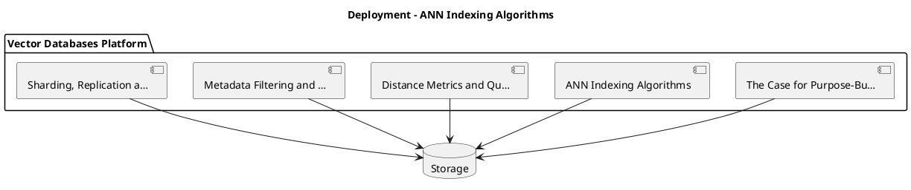

_Source diagram (plantuml); render with the appropriate tool._

**Figure 2. Deployment - ANN Indexing Algorithms** (plantuml). Figure: Deployment view for Vector Databases. This diagram illustrates the principal components and their interactions as discussed in the surrounding section.

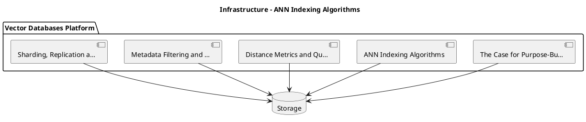

_Source diagram (plantuml); render with the appropriate tool._

**Figure 3. Infrastructure - ANN Indexing Algorithms** (plantuml). Figure: Infrastructure view for Vector Databases. This diagram illustrates the principal components and their interactions as discussed in the surrounding section.

## Deep Dive: Mechanics, Variants and Trade-offs

Having established the essentials, we now go deeper into ann indexing algorithms. Mechanically, the behaviour emerges from a few interacting parts that are simpler than the whole they produce. The distinctions in this section are the ones that separate a working demo from a system that holds up under adversarial inputs, scale and the passage of time.

Consider the principal variants and how to choose between them. Each variant optimises for a different point in the design space - some for latency, some for accuracy, some for cost or operability - and the correct choice follows from explicit requirements rather than from defaults. As with most architectural decisions, the choice is rarely binary; the skill lies in quantifying the trade-offs and choosing deliberately.

In practice this is supported by a mature tooling ecosystem, including Pinecone, Weaviate, Qdrant, Milvus. Tools accelerate the work but do not substitute for understanding: the same principles apply whichever implementation you select, and the ability to reason from first principles is what lets you debug when a tool behaves unexpectedly.

A frequent source of subtle bugs is the interaction with the case for purpose-built vector stores. Because the case for purpose-built vector stores concerns why ANN, filtering and freshness demand specialised systems, changes there can silently alter the behaviour analysed here. The remedy is contract tests at the boundary and end-to-end evaluations that exercise the interaction explicitly.

Finally, attend to edge cases and degradation. Define what the system should do under partial failure, unexpected inputs and load spikes, and make that behaviour explicit and tested rather than emergent. Graceful degradation - returning a safe, useful result when the ideal one is unavailable - is a hallmark of mature engineering.

For deeper study, the literature offers authoritative treatments such as Malkov & Yashunin — HNSW (2016) and Johnson et al. — Billion-scale similarity search with GPUs / FAISS (2017). These primary sources reward careful reading and ground the practical guidance above in established results.

## Advanced Considerations

Having established the essentials, we now go deeper into ann indexing algorithms. Mechanically, the behaviour emerges from a few interacting parts that are simpler than the whole they produce. The distinctions in this section are the ones that separate a working demo from a system that holds up under adversarial inputs, scale and the passage of time.

Consider the principal variants and how to choose between them. Each variant optimises for a different point in the design space - some for latency, some for accuracy, some for cost or operability - and the correct choice follows from explicit requirements rather than from defaults. Every added component buys capability at the price of operational surface area, and that bargain should be made consciously.

In practice this is supported by a mature tooling ecosystem, including Pinecone, Weaviate, Qdrant, Milvus. Tools accelerate the work but do not substitute for understanding: the same principles apply whichever implementation you select, and the ability to reason from first principles is what lets you debug when a tool behaves unexpectedly.

A frequent source of subtle bugs is the interaction with the case for purpose-built vector stores. Because the case for purpose-built vector stores concerns why ANN, filtering and freshness demand specialised systems, changes there can silently alter the behaviour analysed here. The remedy is contract tests at the boundary and end-to-end evaluations that exercise the interaction explicitly.

Finally, attend to edge cases and degradation. Define what the system should do under partial failure, unexpected inputs and load spikes, and make that behaviour explicit and tested rather than emergent. Graceful degradation - returning a safe, useful result when the ideal one is unavailable - is a hallmark of mature engineering.

For deeper study, the literature offers authoritative treatments such as Malkov & Yashunin — HNSW (2016) and Johnson et al. — Billion-scale similarity search with GPUs / FAISS (2017). These primary sources reward careful reading and ground the practical guidance above in established results.

## Worked Example

Consider a concrete scenario. A media organisation needs visual similarity search across large catalogues. They decide to apply ann indexing algorithms as part of their Vector Databases solution, but wisely treat it as a hypothesis to be validated rather than a foregone conclusion.

The team begins by stating the objective precisely and defining how success will be measured before writing any code. They establish a small but representative evaluation set, agree on acceptance thresholds, and only then prototype the simplest design that could work. Early measurement reveals which assumptions hold and which must be revised, saving weeks of misdirected effort and surfacing edge cases while they are still cheap to fix.

As the prototype matures into a service, the team hardens it: adding input validation, error handling, caching where it pays off, and monitoring that ties back to the original success metric. They document each significant decision in an architecture decision record so that future maintainers understand not just what was built but why.

The outcome is instructive. The system that reaches production is not the most sophisticated design the team considered, but the one whose behaviour they could measure, explain and operate. This is the recurring lesson of Vector Databases: durable value comes from the whole system, not from any single clever component.

## Industry Use Cases

Across industries, the ideas in this chapter recur in recognisable ways. The following vignettes show how different sectors apply them and what they have in common.

**Knowledge.** Powering RAG over millions of enterprise documents. The common thread is that value comes not from the model alone but from the surrounding system - data quality, evaluation, integration and operations - which is precisely where most of the engineering effort belongs.

**Media.** Visual similarity search across large catalogues. The common thread is that value comes not from the model alone but from the surrounding system - data quality, evaluation, integration and operations - which is precisely where most of the engineering effort belongs.

**Security.** Anomaly and similarity detection on event embeddings. The common thread is that value comes not from the model alone but from the surrounding system - data quality, evaluation, integration and operations - which is precisely where most of the engineering effort belongs.

**Recommendations.** Real-time candidate generation from user vectors. The common thread is that value comes not from the model alone but from the surrounding system - data quality, evaluation, integration and operations - which is precisely where most of the engineering effort belongs.

## Best Practices

The following practices consistently separate successful Vector Databases efforts from struggling ones. They are deliberately concrete so they can be adopted as checklist items in design and code review.

- Choose HNSW for low latency, IVF/PQ for memory-constrained scale.
- Benchmark recall and p99 latency on your real data, not synthetic.
- Plan re-indexing strategy before you need it.
- Isolate tenants by namespace and enforce access control.

None of these are exotic; they are the unglamorous disciplines that compound into reliability. The cost of adopting them is small compared with the cost of the incidents they prevent, and they become second nature with practice.

## Common Pitfalls

Equally instructive are the failure modes that recur in practice. Each pitfall below has a clear early warning sign and a known remedy, so treat them as a diagnostic checklist when something feels wrong:

- Assuming exact search; ANN trades recall for speed.
- Post-filtering that silently drops recall on selective queries.
- Underestimating memory for in-RAM HNSW at scale.
- No plan for embedding-model upgrades and re-indexing.

The pattern is consistent: most failures stem from skipping measurement, conflating prototype and production standards, or deferring cross-cutting concerns such as security and cost until they become emergencies. Naming these traps in advance is the cheapest way to avoid them.

## Governance, Security and Cost Notes

No discussion of ann indexing algorithms is complete without its governance, security and cost dimensions, which are too often deferred until they become emergencies. Treating them as first-class concerns from the outset is both cheaper and safer.

**Governance.** Classify the risk of this capability, document its intended and out-of-scope uses, and ensure decisions are traceable to satisfy internal policy and external regulation such as the NIST AI RMF, ISO/IEC 42001 and the EU AI Act. **Security.** Treat all external input as untrusted, validate outputs before acting on them, apply least privilege to any tools or data access, and map controls to the OWASP LLM Top 10 and MITRE ATLAS.

**Cost and sustainability.** Establish explicit budgets for compute, tokens and latency, attribute spend to owners, and revisit the economics as usage scales - a design that is affordable at pilot scale can become untenable at production volume. Building these reflexes into everyday engineering is what allows a Vector Databases system to be not only capable but also trustworthy and economically sound.

## Hands-On Exercises

Work through the following exercises. They are designed to move understanding from recognition to application - the level required for real engineering work - so prefer writing and building over merely reading.

1. Explain ann indexing algorithms to a colleague unfamiliar with Vector Databases, using a concrete example from your own domain.
2. Sketch a reference architecture that incorporates ann indexing algorithms and annotate where observability, security and cost controls belong.
3. Design an evaluation that would tell you whether ann indexing algorithms is working in production, including the metric, the dataset and the acceptance threshold.
4. Identify two pitfalls relevant to ann indexing algorithms in your environment and describe the early warning signals you would monitor.
5. Prototype the simplest implementation that demonstrates ann indexing algorithms, then list exactly what would need to change to make it production-ready.

## Key Takeaways

Key takeaways from this chapter:

- ANN Indexing Algorithms is a systems concern in Vector Databases: data, models and operations must be co-designed.
- Measurement is non-negotiable; define success metrics and evaluation before building.
- Favour the simplest design that meets the requirement, and add complexity only when evidence demands it.
- Security, cost and observability are first-class requirements, not afterthoughts.
- Document decisions so the system remains understandable and operable as it evolves.

## Code Walkthrough

Every change to a Vector Databases system should pass an evaluation gate. This example shows the minimal shape: align predictions and references, compute a metric, and return a pass/fail decision for CI.

The full listing is shown below; study it line by line and reproduce it locally before moving on.

### Listing: Evaluating ANN Indexing Algorithms with a regression gate

```python
from dataclasses import dataclass


@dataclass
class EvalResult:
    metric: str
    score: float
    passed: bool


def evaluate(predictions: list[str], references: list[str],
             threshold: float = 0.8) -> EvalResult:
    """Score ANN Indexing Algorithms output against references with a simple exact-match metric.

    In practice you would combine several metrics (exact match, semantic
    similarity, LLM-as-judge) and gate releases on the aggregate.
    """
    if len(predictions) != len(references):
        raise ValueError("predictions and references must align")
    hits = sum(p.strip() == r.strip() for p, r in zip(predictions, references))
    score = hits / len(references) if references else 0.0
    return EvalResult(metric="exact_match", score=score, passed=score >= threshold)


if __name__ == "__main__":
    result = evaluate(["yes", "no"], ["yes", "yes"])
    print(f"{result.metric}={result.score:.2f} passed={result.passed}")

```

## Review Questions

1. In the context of Vector Databases, which statement best describes “ANN Indexing Algorithms”?
   - A. HNSW graphs, IVF, PQ and DiskANN and their recall/latency/memory profiles.
   - B. It guarantees deterministic output regardless of input.
   - C. It removes all security and governance requirements.
   - D. It makes the system slower but has no other effect.
   - **Answer: A.** ANN Indexing Algorithms: HNSW graphs, IVF, PQ and DiskANN and their recall/latency/memory profiles.
2. Which of the following is a recommended best practice when working with Vector Databases?
   - A. It removes all security and governance requirements.
   - B. It is only relevant to academic research, not production.
   - C. It eliminates the need for any evaluation or monitoring.
   - D. Plan re-indexing strategy before you need it.
   - **Answer: D.** Best practice: Plan re-indexing strategy before you need it.
3. Which of the following is a common pitfall to avoid in Vector Databases?
   - A. It removes all security and governance requirements.
   - B. Choose HNSW for low latency, IVF/PQ for memory-constrained scale.
   - C. Post-filtering that silently drops recall on selective queries.
   - D. It makes the system slower but has no other effect.
   - **Answer: C.** Pitfall to avoid: Post-filtering that silently drops recall on selective queries.
4. *(Discussion)* What trade-offs would you weigh when implementing ANN Indexing Algorithms?
   - **Model answer:** A strong answer defines ann indexing algorithms (HNSW graphs, IVF, PQ and DiskANN and their recall/latency/memory profiles.) then connects it to architecture, evaluation, cost, security and operations for Vector Databases, citing concrete trade-offs and a real-world example.

---


# Chapter 3. Distance Metrics and Quantisation

_This chapter examines distance metrics and quantisation within Vector Databases. It covers cosine/dot/L2 and scalar/product quantisation trade-offs, derives a reference architecture, walks through a worked example and runnable code, surveys industry use cases, and distils best practices and pitfalls, closing with exercises and review questions._

## Introduction

Formally, Distance Metrics and Quantisation addresses cosine/dot/L2 and scalar/product quantisation trade-offs. Getting this right early prevents expensive rework once a Vector Databases system reaches scale. In an enterprise setting, this translates into concrete requirements: clear interfaces, measurable quality, and controls that satisfy security and governance.

This chapter builds intuition first, then formalises the ideas, derives an architecture, and finishes with code, exercises and review questions so the material transfers directly to your own Vector Databases work. Read it actively: pause at each diagram, reproduce the code, and attempt the exercises before consulting the answers.

## Theory and Foundations

At its core, Distance Metrics and Quantisation concerns cosine/dot/L2 and scalar/product quantisation trade-offs. It helps to separate the conceptual model from its implementation: the former guides reasoning, the latter must contend with real-world constraints. Beneath the abstraction lies a concrete process whose steps can each be measured, tested and optimised independently.

To place this in context, recall the broader picture: Vector databases store embeddings alongside metadata and provide fast approximate nearest-neighbour search, filtering and hybrid retrieval. Within that picture, distance metrics and quantisation is one of the load-bearing ideas - the kind that, when understood deeply, makes the rest of Vector Databases fall into place. Neglecting it is one of the most common reasons Vector Databases initiatives stall in production.

Distance Metrics and Quantisation cannot be understood in isolation from reference architecture and patterns. Recall that reference architecture and patterns concerns a production-grade deployment blueprint. The two interact directly: decisions in one constrain the design space of the other, which is why mature teams reason about them together rather than sequentially. Latency, accuracy and cost form a tension triangle: improving one typically pressures the others, so explicit budgets are essential.

Distance Metrics and Quantisation cannot be understood in isolation from security and multi-tenancy. Recall that security and multi-tenancy concerns namespace isolation, access control and encryption. The two interact directly: decisions in one constrain the design space of the other, which is why mature teams reason about them together rather than sequentially. Latency, accuracy and cost form a tension triangle: improving one typically pressures the others, so explicit budgets are essential.

Several established patterns apply directly to distance metrics and quantisation. The first, disk-based indexes for billion-scale corpora, is widely adopted because it makes the system's behaviour predictable and observable. A complementary pattern, periodic compaction and re-indexing for freshness, addresses a related concern and is often deployed alongside it. Patterns are not dogma; they are distilled experience that shortcuts the search for a sound design, and each carries assumptions worth checking against your context.

The decision of whether to adopt this should be driven by requirements, not by novelty. In a small prototype, shortcuts around distance metrics and quantisation are invisible; in a production Vector Databases system serving real traffic, they surface as incidents, cost overruns or compliance gaps. There is an inherent trade-off between fidelity and cost, and the correct balance depends on the use case and its tolerance for error. The remainder of this chapter turns these principles into an architecture, code and a checklist you can apply immediately.

## Architecture and Design

The reference architecture for Distance Metrics and Quantisation separates concerns into clearly bounded components with explicit contracts. A vector database deployment partitions collections into shards, each holding an ANN index in memory or on SSD, replicated for availability. A query coordinator fans out filtered ANN searches, merges results and applies metadata predicates. An ingestion path handles upserts and deletes with background index maintenance.

Concretely, the principal building blocks include the case for purpose-built vector stores, ann indexing algorithms, distance metrics and quantisation, metadata filtering and hybrid queries and sharding, replication and scaling. Each is a replaceable component behind a stable interface, so the team can upgrade an implementation - a model, an index, a policy engine - without rewriting its neighbours. The contracts between components are where reliability is won or lost, so they are specified explicitly and tested in isolation.

The diagram accompanying this section makes the data and control flow explicit. Requests enter through a well-defined boundary where they are authenticated and validated; only then are they dispatched to the components that perform the work. This boundary is also where rate limiting, quota enforcement and audit logging live, keeping cross-cutting concerns out of the core logic and in one auditable place.

Two qualities deserve emphasis. First, observability is designed in, not bolted on: every component emits structured telemetry so that failures can be localised in minutes rather than hours. Second, the architecture is evolvable - components communicate through stable contracts so that any single part of the Vector Databases system can be replaced without a rewrite. Latency, accuracy and cost form a tension triangle: improving one typically pressures the others, so explicit budgets are essential.

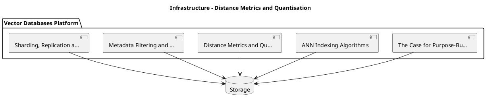

_Source diagram (plantuml); render with the appropriate tool._

**Figure 4. Infrastructure - Distance Metrics and Quantisation** (plantuml). Figure: Infrastructure view for Vector Databases. This diagram illustrates the principal components and their interactions as discussed in the surrounding section.

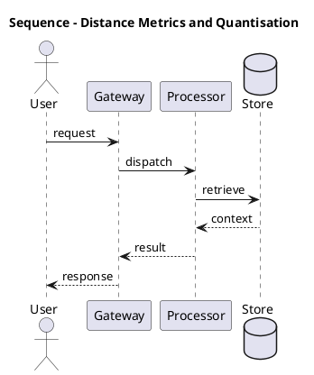

_Source diagram (plantuml); render with the appropriate tool._

**Figure 5. Sequence - Distance Metrics and Quantisation** (plantuml). Figure: Sequence view for Vector Databases. This diagram illustrates the principal components and their interactions as discussed in the surrounding section.

## Deep Dive: Mechanics, Variants and Trade-offs

Having established the essentials, we now go deeper into distance metrics and quantisation. The underlying mechanism is best appreciated by tracing a single request from input to output and noting where state is created and consumed. The distinctions in this section are the ones that separate a working demo from a system that holds up under adversarial inputs, scale and the passage of time.

Consider the principal variants and how to choose between them. Each variant optimises for a different point in the design space - some for latency, some for accuracy, some for cost or operability - and the correct choice follows from explicit requirements rather than from defaults. Latency, accuracy and cost form a tension triangle: improving one typically pressures the others, so explicit budgets are essential.

In practice this is supported by a mature tooling ecosystem, including Pinecone, Weaviate, Qdrant, Milvus. Tools accelerate the work but do not substitute for understanding: the same principles apply whichever implementation you select, and the ability to reason from first principles is what lets you debug when a tool behaves unexpectedly.

A frequent source of subtle bugs is the interaction with reference architecture and patterns. Because reference architecture and patterns concerns a production-grade deployment blueprint, changes there can silently alter the behaviour analysed here. The remedy is contract tests at the boundary and end-to-end evaluations that exercise the interaction explicitly.

Finally, attend to edge cases and degradation. Define what the system should do under partial failure, unexpected inputs and load spikes, and make that behaviour explicit and tested rather than emergent. Graceful degradation - returning a safe, useful result when the ideal one is unavailable - is a hallmark of mature engineering.

For deeper study, the literature offers authoritative treatments such as Malkov & Yashunin — HNSW (2016) and Johnson et al. — Billion-scale similarity search with GPUs / FAISS (2017). These primary sources reward careful reading and ground the practical guidance above in established results.

## Advanced Considerations

Having established the essentials, we now go deeper into distance metrics and quantisation. Beneath the abstraction lies a concrete process whose steps can each be measured, tested and optimised independently. The distinctions in this section are the ones that separate a working demo from a system that holds up under adversarial inputs, scale and the passage of time.

Consider the principal variants and how to choose between them. Each variant optimises for a different point in the design space - some for latency, some for accuracy, some for cost or operability - and the correct choice follows from explicit requirements rather than from defaults. Simplicity is a feature. The simplest design that meets the requirement should be the default, with complexity added only when measurement justifies it.

In practice this is supported by a mature tooling ecosystem, including Pinecone, Weaviate, Qdrant, Milvus. Tools accelerate the work but do not substitute for understanding: the same principles apply whichever implementation you select, and the ability to reason from first principles is what lets you debug when a tool behaves unexpectedly.

A frequent source of subtle bugs is the interaction with choosing a vector database. Because choosing a vector database concerns managed versus self-hosted and integration considerations, changes there can silently alter the behaviour analysed here. The remedy is contract tests at the boundary and end-to-end evaluations that exercise the interaction explicitly.

Finally, attend to edge cases and degradation. Define what the system should do under partial failure, unexpected inputs and load spikes, and make that behaviour explicit and tested rather than emergent. Graceful degradation - returning a safe, useful result when the ideal one is unavailable - is a hallmark of mature engineering.

For deeper study, the literature offers authoritative treatments such as Malkov & Yashunin — HNSW (2016) and Johnson et al. — Billion-scale similarity search with GPUs / FAISS (2017). These primary sources reward careful reading and ground the practical guidance above in established results.

## Worked Example

Consider a concrete scenario. A security organisation needs anomaly and similarity detection on event embeddings. They decide to apply distance metrics and quantisation as part of their Vector Databases solution, but wisely treat it as a hypothesis to be validated rather than a foregone conclusion.

The team begins by stating the objective precisely and defining how success will be measured before writing any code. They establish a small but representative evaluation set, agree on acceptance thresholds, and only then prototype the simplest design that could work. Early measurement reveals which assumptions hold and which must be revised, saving weeks of misdirected effort and surfacing edge cases while they are still cheap to fix.

As the prototype matures into a service, the team hardens it: adding input validation, error handling, caching where it pays off, and monitoring that ties back to the original success metric. They document each significant decision in an architecture decision record so that future maintainers understand not just what was built but why.

The outcome is instructive. The system that reaches production is not the most sophisticated design the team considered, but the one whose behaviour they could measure, explain and operate. This is the recurring lesson of Vector Databases: durable value comes from the whole system, not from any single clever component.

## Industry Use Cases

Across industries, the ideas in this chapter recur in recognisable ways. The following vignettes show how different sectors apply them and what they have in common.

**Knowledge.** Powering RAG over millions of enterprise documents. The common thread is that value comes not from the model alone but from the surrounding system - data quality, evaluation, integration and operations - which is precisely where most of the engineering effort belongs.

**Media.** Visual similarity search across large catalogues. The common thread is that value comes not from the model alone but from the surrounding system - data quality, evaluation, integration and operations - which is precisely where most of the engineering effort belongs.

**Security.** Anomaly and similarity detection on event embeddings. The common thread is that value comes not from the model alone but from the surrounding system - data quality, evaluation, integration and operations - which is precisely where most of the engineering effort belongs.

**Recommendations.** Real-time candidate generation from user vectors. The common thread is that value comes not from the model alone but from the surrounding system - data quality, evaluation, integration and operations - which is precisely where most of the engineering effort belongs.

## Best Practices

The following practices consistently separate successful Vector Databases efforts from struggling ones. They are deliberately concrete so they can be adopted as checklist items in design and code review.

- Choose HNSW for low latency, IVF/PQ for memory-constrained scale.
- Benchmark recall and p99 latency on your real data, not synthetic.
- Plan re-indexing strategy before you need it.
- Isolate tenants by namespace and enforce access control.

None of these are exotic; they are the unglamorous disciplines that compound into reliability. The cost of adopting them is small compared with the cost of the incidents they prevent, and they become second nature with practice.

## Common Pitfalls

Equally instructive are the failure modes that recur in practice. Each pitfall below has a clear early warning sign and a known remedy, so treat them as a diagnostic checklist when something feels wrong:

- Assuming exact search; ANN trades recall for speed.
- Post-filtering that silently drops recall on selective queries.
- Underestimating memory for in-RAM HNSW at scale.
- No plan for embedding-model upgrades and re-indexing.

The pattern is consistent: most failures stem from skipping measurement, conflating prototype and production standards, or deferring cross-cutting concerns such as security and cost until they become emergencies. Naming these traps in advance is the cheapest way to avoid them.

## Governance, Security and Cost Notes

No discussion of distance metrics and quantisation is complete without its governance, security and cost dimensions, which are too often deferred until they become emergencies. Treating them as first-class concerns from the outset is both cheaper and safer.

**Governance.** Classify the risk of this capability, document its intended and out-of-scope uses, and ensure decisions are traceable to satisfy internal policy and external regulation such as the NIST AI RMF, ISO/IEC 42001 and the EU AI Act. **Security.** Treat all external input as untrusted, validate outputs before acting on them, apply least privilege to any tools or data access, and map controls to the OWASP LLM Top 10 and MITRE ATLAS.

**Cost and sustainability.** Establish explicit budgets for compute, tokens and latency, attribute spend to owners, and revisit the economics as usage scales - a design that is affordable at pilot scale can become untenable at production volume. Building these reflexes into everyday engineering is what allows a Vector Databases system to be not only capable but also trustworthy and economically sound.

## Hands-On Exercises

Work through the following exercises. They are designed to move understanding from recognition to application - the level required for real engineering work - so prefer writing and building over merely reading.

1. Explain distance metrics and quantisation to a colleague unfamiliar with Vector Databases, using a concrete example from your own domain.
2. Sketch a reference architecture that incorporates distance metrics and quantisation and annotate where observability, security and cost controls belong.
3. Design an evaluation that would tell you whether distance metrics and quantisation is working in production, including the metric, the dataset and the acceptance threshold.
4. Identify two pitfalls relevant to distance metrics and quantisation in your environment and describe the early warning signals you would monitor.
5. Prototype the simplest implementation that demonstrates distance metrics and quantisation, then list exactly what would need to change to make it production-ready.

## Key Takeaways

Key takeaways from this chapter:

- Distance Metrics and Quantisation is a systems concern in Vector Databases: data, models and operations must be co-designed.
- Measurement is non-negotiable; define success metrics and evaluation before building.
- Favour the simplest design that meets the requirement, and add complexity only when evidence demands it.
- Security, cost and observability are first-class requirements, not afterthoughts.
- Document decisions so the system remains understandable and operable as it evolves.

## Code Walkthrough

This listing shows a configuration-driven Distance Metrics and Quantisation component with retry semantics and typed interfaces — the shape we expect from production Vector Databases code rather than a notebook prototype.

The full listing is shown below; study it line by line and reproduce it locally before moving on.

### Listing: Implementing a Distance Metrics and Quantisation component

```python
from __future__ import annotations

from dataclasses import dataclass, field
from typing import Any


@dataclass(slots=True)
class DistanceMetricsAndConfig:
    """Configuration for the Distance Metrics and Quantisation component in a Vector Databases system."""

    name: str
    timeout_s: float = 30.0
    max_retries: int = 3
    options: dict[str, Any] = field(default_factory=dict)


class DistanceMetricsAnd:
    """A minimal, production-shaped implementation of Distance Metrics and Quantisation."""

    def __init__(self, config: DistanceMetricsAndConfig) -> None:
        self._config = config
        self._calls = 0

    def run(self, payload: dict[str, Any]) -> dict[str, Any]:
        """Process a request, retrying transient failures with backoff."""
        last_error: Exception | None = None
        for attempt in range(self._config.max_retries):
            try:
                self._calls += 1
                return self._process(payload)
            except TimeoutError as exc:  # transient
                last_error = exc
                continue
        raise RuntimeError(f"DistanceMetricsAnd failed after retries") from last_error

    def _process(self, payload: dict[str, Any]) -> dict[str, Any]:
        # Domain-specific logic for Distance Metrics and Quantisation goes here.
        return {"status": "ok", "input_keys": sorted(payload), "calls": self._calls}

```

## Review Questions

1. In the context of Vector Databases, which statement best describes “Distance Metrics and Quantisation”?
   - A. Cosine/dot/L2 and scalar/product quantisation trade-offs.
   - B. It makes the system slower but has no other effect.
   - C. It removes all security and governance requirements.
   - D. It is only relevant to academic research, not production.
   - **Answer: A.** Distance Metrics and Quantisation: Cosine/dot/L2 and scalar/product quantisation trade-offs.
2. Which of the following is a recommended best practice when working with Vector Databases?
   - A. Plan re-indexing strategy before you need it.
   - B. It makes the system slower but has no other effect.
   - C. Underestimating memory for in-RAM HNSW at scale.
   - D. It removes all security and governance requirements.
   - **Answer: A.** Best practice: Plan re-indexing strategy before you need it.
3. Which of the following is a common pitfall to avoid in Vector Databases?
   - A. It is only relevant to academic research, not production.
   - B. Assuming exact search; ANN trades recall for speed.
   - C. Plan re-indexing strategy before you need it.
   - D. It eliminates the need for any evaluation or monitoring.
   - **Answer: B.** Pitfall to avoid: Assuming exact search; ANN trades recall for speed.
4. *(Discussion)* What trade-offs would you weigh when implementing Distance Metrics and Quantisation?
   - **Model answer:** A strong answer defines distance metrics and quantisation (Cosine/dot/L2 and scalar/product quantisation trade-offs.) then connects it to architecture, evaluation, cost, security and operations for Vector Databases, citing concrete trade-offs and a real-world example.

---


# Chapter 4. Metadata Filtering and Hybrid Queries

_This chapter examines metadata filtering and hybrid queries within Vector Databases. It covers pre- versus post-filtering and combining structured predicates with vectors, derives a reference architecture, walks through a worked example and runnable code, surveys industry use cases, and distils best practices and pitfalls, closing with exercises and review questions._

## Introduction

We define Metadata Filtering and Hybrid Queries as pre- versus post-filtering and combining structured predicates with vectors. Teams that master this consistently ship more reliable Vector Databases systems at lower cost. The practical implication is that design choices here ripple through latency, cost and maintainability for the lifetime of the system.

This chapter builds intuition first, then formalises the ideas, derives an architecture, and finishes with code, exercises and review questions so the material transfers directly to your own Vector Databases work. Read it actively: pause at each diagram, reproduce the code, and attempt the exercises before consulting the answers.

## Theory and Foundations

At its core, Metadata Filtering and Hybrid Queries concerns pre- versus post-filtering and combining structured predicates with vectors. The practical implication is that design choices here ripple through latency, cost and maintainability for the lifetime of the system. It pays to understand the mechanism rather than treat it as a black box, because most production incidents are explained by one of its steps misbehaving.

To place this in context, recall the broader picture: Vector databases store embeddings alongside metadata and provide fast approximate nearest-neighbour search, filtering and hybrid retrieval. Within that picture, metadata filtering and hybrid queries is one of the load-bearing ideas - the kind that, when understood deeply, makes the rest of Vector Databases fall into place. Teams that master this consistently ship more reliable Vector Databases systems at lower cost.

Metadata Filtering and Hybrid Queries cannot be understood in isolation from choosing a vector database. Recall that choosing a vector database concerns managed versus self-hosted and integration considerations. The two interact directly: decisions in one constrain the design space of the other, which is why mature teams reason about them together rather than sequentially. Every added component buys capability at the price of operational surface area, and that bargain should be made consciously.

Metadata Filtering and Hybrid Queries cannot be understood in isolation from sharding, replication and scaling. Recall that sharding, replication and scaling concerns horizontal scaling, consistency models and high availability. The two interact directly: decisions in one constrain the design space of the other, which is why mature teams reason about them together rather than sequentially. As with most architectural decisions, the choice is rarely binary; the skill lies in quantifying the trade-offs and choosing deliberately.

Several established patterns apply directly to metadata filtering and hybrid queries. The first, pre-filter on selective metadata, post-filter otherwise, is widely adopted because it makes the system's behaviour predictable and observable. A complementary pattern, namespace-per-tenant isolation, addresses a related concern and is often deployed alongside it. Patterns are not dogma; they are distilled experience that shortcuts the search for a sound design, and each carries assumptions worth checking against your context.

Knowing when not to use a technique is as valuable as knowing how to use it. In a small prototype, shortcuts around metadata filtering and hybrid queries are invisible; in a production Vector Databases system serving real traffic, they surface as incidents, cost overruns or compliance gaps. As with most architectural decisions, the choice is rarely binary; the skill lies in quantifying the trade-offs and choosing deliberately. The remainder of this chapter turns these principles into an architecture, code and a checklist you can apply immediately.

## Architecture and Design

From an architectural standpoint, Metadata Filtering and Hybrid Queries sits at the intersection of data, models and operations. A vector database deployment partitions collections into shards, each holding an ANN index in memory or on SSD, replicated for availability. A query coordinator fans out filtered ANN searches, merges results and applies metadata predicates. An ingestion path handles upserts and deletes with background index maintenance.

Concretely, the principal building blocks include the case for purpose-built vector stores, ann indexing algorithms, distance metrics and quantisation, metadata filtering and hybrid queries and sharding, replication and scaling. Each is a replaceable component behind a stable interface, so the team can upgrade an implementation - a model, an index, a policy engine - without rewriting its neighbours. The contracts between components are where reliability is won or lost, so they are specified explicitly and tested in isolation.

The diagram accompanying this section makes the data and control flow explicit. Requests enter through a well-defined boundary where they are authenticated and validated; only then are they dispatched to the components that perform the work. This boundary is also where rate limiting, quota enforcement and audit logging live, keeping cross-cutting concerns out of the core logic and in one auditable place.

Two qualities deserve emphasis. First, observability is designed in, not bolted on: every component emits structured telemetry so that failures can be localised in minutes rather than hours. Second, the architecture is evolvable - components communicate through stable contracts so that any single part of the Vector Databases system can be replaced without a rewrite. There is an inherent trade-off between fidelity and cost, and the correct balance depends on the use case and its tolerance for error.

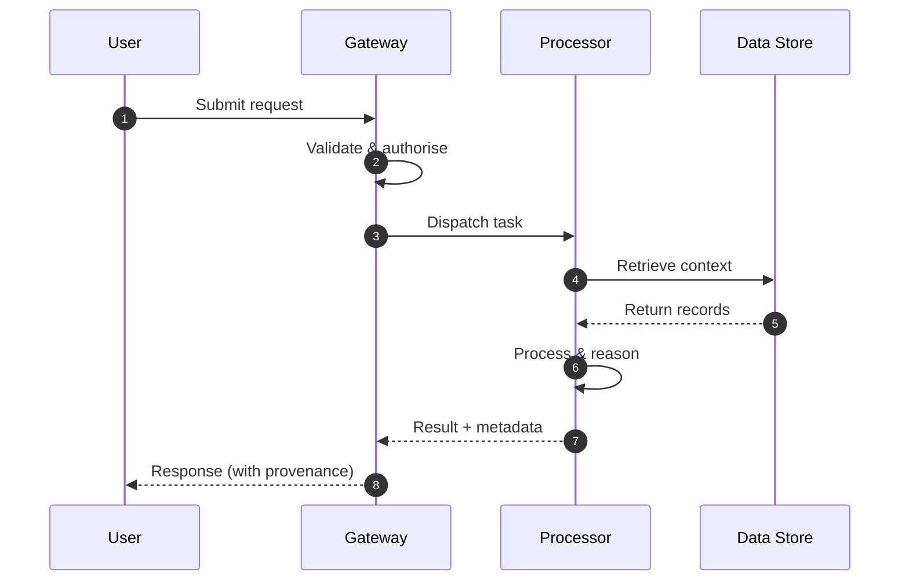

**Figure 6. Sequence - Metadata Filtering and Hybrid Queries** (mermaid). Figure: Sequence view for Vector Databases. This diagram illustrates the principal components and their interactions as discussed in the surrounding section.

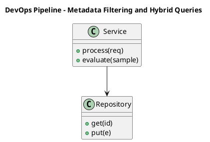

_Source diagram (plantuml); render with the appropriate tool._

**Figure 7. DevOps Pipeline - Metadata Filtering and Hybrid Queries** (plantuml). Figure: DevOps Pipeline view for Vector Databases. This diagram illustrates the principal components and their interactions as discussed in the surrounding section.

## Deep Dive: Mechanics, Variants and Trade-offs

Having established the essentials, we now go deeper into metadata filtering and hybrid queries. It pays to understand the mechanism rather than treat it as a black box, because most production incidents are explained by one of its steps misbehaving. The distinctions in this section are the ones that separate a working demo from a system that holds up under adversarial inputs, scale and the passage of time.

Consider the principal variants and how to choose between them. Each variant optimises for a different point in the design space - some for latency, some for accuracy, some for cost or operability - and the correct choice follows from explicit requirements rather than from defaults. There is an inherent trade-off between fidelity and cost, and the correct balance depends on the use case and its tolerance for error.

In practice this is supported by a mature tooling ecosystem, including Pinecone, Weaviate, Qdrant, Milvus. Tools accelerate the work but do not substitute for understanding: the same principles apply whichever implementation you select, and the ability to reason from first principles is what lets you debug when a tool behaves unexpectedly.

A frequent source of subtle bugs is the interaction with choosing a vector database. Because choosing a vector database concerns managed versus self-hosted and integration considerations, changes there can silently alter the behaviour analysed here. The remedy is contract tests at the boundary and end-to-end evaluations that exercise the interaction explicitly.

Finally, attend to edge cases and degradation. Define what the system should do under partial failure, unexpected inputs and load spikes, and make that behaviour explicit and tested rather than emergent. Graceful degradation - returning a safe, useful result when the ideal one is unavailable - is a hallmark of mature engineering.

For deeper study, the literature offers authoritative treatments such as Malkov & Yashunin — HNSW (2016) and Johnson et al. — Billion-scale similarity search with GPUs / FAISS (2017). These primary sources reward careful reading and ground the practical guidance above in established results.

## Advanced Considerations

Having established the essentials, we now go deeper into metadata filtering and hybrid queries. It pays to understand the mechanism rather than treat it as a black box, because most production incidents are explained by one of its steps misbehaving. The distinctions in this section are the ones that separate a working demo from a system that holds up under adversarial inputs, scale and the passage of time.

Consider the principal variants and how to choose between them. Each variant optimises for a different point in the design space - some for latency, some for accuracy, some for cost or operability - and the correct choice follows from explicit requirements rather than from defaults. As with most architectural decisions, the choice is rarely binary; the skill lies in quantifying the trade-offs and choosing deliberately.

In practice this is supported by a mature tooling ecosystem, including Pinecone, Weaviate, Qdrant, Milvus. Tools accelerate the work but do not substitute for understanding: the same principles apply whichever implementation you select, and the ability to reason from first principles is what lets you debug when a tool behaves unexpectedly.

A frequent source of subtle bugs is the interaction with integration with the rag pipeline. Because integration with the rag pipeline concerns where the vector store sits and how it is queried, changes there can silently alter the behaviour analysed here. The remedy is contract tests at the boundary and end-to-end evaluations that exercise the interaction explicitly.

Finally, attend to edge cases and degradation. Define what the system should do under partial failure, unexpected inputs and load spikes, and make that behaviour explicit and tested rather than emergent. Graceful degradation - returning a safe, useful result when the ideal one is unavailable - is a hallmark of mature engineering.

For deeper study, the literature offers authoritative treatments such as Malkov & Yashunin — HNSW (2016) and Johnson et al. — Billion-scale similarity search with GPUs / FAISS (2017). These primary sources reward careful reading and ground the practical guidance above in established results.

## Worked Example

To ground the discussion, walk through a representative example. A security organisation needs anomaly and similarity detection on event embeddings. They decide to apply metadata filtering and hybrid queries as part of their Vector Databases solution, but wisely treat it as a hypothesis to be validated rather than a foregone conclusion.

The team begins by stating the objective precisely and defining how success will be measured before writing any code. They establish a small but representative evaluation set, agree on acceptance thresholds, and only then prototype the simplest design that could work. Early measurement reveals which assumptions hold and which must be revised, saving weeks of misdirected effort and surfacing edge cases while they are still cheap to fix.

As the prototype matures into a service, the team hardens it: adding input validation, error handling, caching where it pays off, and monitoring that ties back to the original success metric. They document each significant decision in an architecture decision record so that future maintainers understand not just what was built but why.

The outcome is instructive. The system that reaches production is not the most sophisticated design the team considered, but the one whose behaviour they could measure, explain and operate. This is the recurring lesson of Vector Databases: durable value comes from the whole system, not from any single clever component.

## Industry Use Cases

Across industries, the ideas in this chapter recur in recognisable ways. The following vignettes show how different sectors apply them and what they have in common.

**Knowledge.** Powering RAG over millions of enterprise documents. The common thread is that value comes not from the model alone but from the surrounding system - data quality, evaluation, integration and operations - which is precisely where most of the engineering effort belongs.

**Media.** Visual similarity search across large catalogues. The common thread is that value comes not from the model alone but from the surrounding system - data quality, evaluation, integration and operations - which is precisely where most of the engineering effort belongs.

**Security.** Anomaly and similarity detection on event embeddings. The common thread is that value comes not from the model alone but from the surrounding system - data quality, evaluation, integration and operations - which is precisely where most of the engineering effort belongs.

**Recommendations.** Real-time candidate generation from user vectors. The common thread is that value comes not from the model alone but from the surrounding system - data quality, evaluation, integration and operations - which is precisely where most of the engineering effort belongs.

## Best Practices

The following practices consistently separate successful Vector Databases efforts from struggling ones. They are deliberately concrete so they can be adopted as checklist items in design and code review.

- Choose HNSW for low latency, IVF/PQ for memory-constrained scale.
- Benchmark recall and p99 latency on your real data, not synthetic.
- Plan re-indexing strategy before you need it.
- Isolate tenants by namespace and enforce access control.

None of these are exotic; they are the unglamorous disciplines that compound into reliability. The cost of adopting them is small compared with the cost of the incidents they prevent, and they become second nature with practice.

## Common Pitfalls

Equally instructive are the failure modes that recur in practice. Each pitfall below has a clear early warning sign and a known remedy, so treat them as a diagnostic checklist when something feels wrong:

- Assuming exact search; ANN trades recall for speed.
- Post-filtering that silently drops recall on selective queries.
- Underestimating memory for in-RAM HNSW at scale.
- No plan for embedding-model upgrades and re-indexing.

The pattern is consistent: most failures stem from skipping measurement, conflating prototype and production standards, or deferring cross-cutting concerns such as security and cost until they become emergencies. Naming these traps in advance is the cheapest way to avoid them.

## Governance, Security and Cost Notes

No discussion of metadata filtering and hybrid queries is complete without its governance, security and cost dimensions, which are too often deferred until they become emergencies. Treating them as first-class concerns from the outset is both cheaper and safer.

**Governance.** Classify the risk of this capability, document its intended and out-of-scope uses, and ensure decisions are traceable to satisfy internal policy and external regulation such as the NIST AI RMF, ISO/IEC 42001 and the EU AI Act. **Security.** Treat all external input as untrusted, validate outputs before acting on them, apply least privilege to any tools or data access, and map controls to the OWASP LLM Top 10 and MITRE ATLAS.

**Cost and sustainability.** Establish explicit budgets for compute, tokens and latency, attribute spend to owners, and revisit the economics as usage scales - a design that is affordable at pilot scale can become untenable at production volume. Building these reflexes into everyday engineering is what allows a Vector Databases system to be not only capable but also trustworthy and economically sound.

## Hands-On Exercises

Work through the following exercises. They are designed to move understanding from recognition to application - the level required for real engineering work - so prefer writing and building over merely reading.

1. Explain metadata filtering and hybrid queries to a colleague unfamiliar with Vector Databases, using a concrete example from your own domain.
2. Sketch a reference architecture that incorporates metadata filtering and hybrid queries and annotate where observability, security and cost controls belong.
3. Design an evaluation that would tell you whether metadata filtering and hybrid queries is working in production, including the metric, the dataset and the acceptance threshold.
4. Identify two pitfalls relevant to metadata filtering and hybrid queries in your environment and describe the early warning signals you would monitor.
5. Prototype the simplest implementation that demonstrates metadata filtering and hybrid queries, then list exactly what would need to change to make it production-ready.

## Key Takeaways

Key takeaways from this chapter:

- Metadata Filtering and Hybrid Queries is a systems concern in Vector Databases: data, models and operations must be co-designed.
- Measurement is non-negotiable; define success metrics and evaluation before building.
- Favour the simplest design that meets the requirement, and add complexity only when evidence demands it.
- Security, cost and observability are first-class requirements, not afterthoughts.
- Document decisions so the system remains understandable and operable as it evolves.

## Code Walkthrough

Every change to a Vector Databases system should pass an evaluation gate. This example shows the minimal shape: align predictions and references, compute a metric, and return a pass/fail decision for CI.

The full listing is shown below; study it line by line and reproduce it locally before moving on.

### Listing: Evaluating Metadata Filtering and Hybrid Queries with a regression gate

```python
from dataclasses import dataclass


@dataclass
class EvalResult:
    metric: str
    score: float
    passed: bool


def evaluate(predictions: list[str], references: list[str],
             threshold: float = 0.8) -> EvalResult:
    """Score Metadata Filtering and Hybrid Queries output against references with a simple exact-match metric.

    In practice you would combine several metrics (exact match, semantic
    similarity, LLM-as-judge) and gate releases on the aggregate.
    """
    if len(predictions) != len(references):
        raise ValueError("predictions and references must align")
    hits = sum(p.strip() == r.strip() for p, r in zip(predictions, references))
    score = hits / len(references) if references else 0.0
    return EvalResult(metric="exact_match", score=score, passed=score >= threshold)


if __name__ == "__main__":
    result = evaluate(["yes", "no"], ["yes", "yes"])
    print(f"{result.metric}={result.score:.2f} passed={result.passed}")

```

## Review Questions

1. In the context of Vector Databases, which statement best describes “Metadata Filtering and Hybrid Queries”?
   - A. It is only relevant to academic research, not production.
   - B. Pre- versus post-filtering and combining structured predicates with vectors.
   - C. It applies exclusively to image data.
   - D. It removes all security and governance requirements.
   - **Answer: B.** Metadata Filtering and Hybrid Queries: Pre- versus post-filtering and combining structured predicates with vectors.
2. Which of the following is a recommended best practice when working with Vector Databases?
   - A. It eliminates the need for any evaluation or monitoring.
   - B. Underestimating memory for in-RAM HNSW at scale.
   - C. Isolate tenants by namespace and enforce access control.
   - D. Assuming exact search; ANN trades recall for speed.
   - **Answer: C.** Best practice: Isolate tenants by namespace and enforce access control.
3. Which of the following is a common pitfall to avoid in Vector Databases?
   - A. Benchmark recall and p99 latency on your real data, not synthetic.
   - B. It applies exclusively to image data.
   - C. It removes all security and governance requirements.
   - D. No plan for embedding-model upgrades and re-indexing.
   - **Answer: D.** Pitfall to avoid: No plan for embedding-model upgrades and re-indexing.
4. *(Discussion)* Describe a failure mode of Metadata Filtering and Hybrid Queries and how you would mitigate it.
   - **Model answer:** A strong answer defines metadata filtering and hybrid queries (Pre- versus post-filtering and combining structured predicates with vectors.) then connects it to architecture, evaluation, cost, security and operations for Vector Databases, citing concrete trade-offs and a real-world example.

---


# Chapter 5. Sharding, Replication and Scaling

_This chapter examines sharding, replication and scaling within Vector Databases. It covers horizontal scaling, consistency models and high availability, derives a reference architecture, walks through a worked example and runnable code, surveys industry use cases, and distils best practices and pitfalls, closing with exercises and review questions._

## Introduction

At its core, Sharding, Replication and Scaling concerns horizontal scaling, consistency models and high availability. This concept recurs throughout the Vector Databases lifecycle, from design to operations. The practical implication is that design choices here ripple through latency, cost and maintainability for the lifetime of the system.

This chapter builds intuition first, then formalises the ideas, derives an architecture, and finishes with code, exercises and review questions so the material transfers directly to your own Vector Databases work. Read it actively: pause at each diagram, reproduce the code, and attempt the exercises before consulting the answers.

## Theory and Foundations

At its core, Sharding, Replication and Scaling concerns horizontal scaling, consistency models and high availability. It helps to separate the conceptual model from its implementation: the former guides reasoning, the latter must contend with real-world constraints. It pays to understand the mechanism rather than treat it as a black box, because most production incidents are explained by one of its steps misbehaving.

To place this in context, recall the broader picture: Vector databases store embeddings alongside metadata and provide fast approximate nearest-neighbour search, filtering and hybrid retrieval. Within that picture, sharding, replication and scaling is one of the load-bearing ideas - the kind that, when understood deeply, makes the rest of Vector Databases fall into place. Neglecting it is one of the most common reasons Vector Databases initiatives stall in production.

Sharding, Replication and Scaling cannot be understood in isolation from distance metrics and quantisation. Recall that distance metrics and quantisation concerns cosine/dot/L2 and scalar/product quantisation trade-offs. The two interact directly: decisions in one constrain the design space of the other, which is why mature teams reason about them together rather than sequentially. As with most architectural decisions, the choice is rarely binary; the skill lies in quantifying the trade-offs and choosing deliberately.

Sharding, Replication and Scaling cannot be understood in isolation from choosing a vector database. Recall that choosing a vector database concerns managed versus self-hosted and integration considerations. The two interact directly: decisions in one constrain the design space of the other, which is why mature teams reason about them together rather than sequentially. There is an inherent trade-off between fidelity and cost, and the correct balance depends on the use case and its tolerance for error.

Several established patterns apply directly to sharding, replication and scaling. The first, namespace-per-tenant isolation, is widely adopted because it makes the system's behaviour predictable and observable. A complementary pattern, periodic compaction and re-indexing for freshness, addresses a related concern and is often deployed alongside it. Patterns are not dogma; they are distilled experience that shortcuts the search for a sound design, and each carries assumptions worth checking against your context.

The decision of whether to adopt this should be driven by requirements, not by novelty. In a small prototype, shortcuts around sharding, replication and scaling are invisible; in a production Vector Databases system serving real traffic, they surface as incidents, cost overruns or compliance gaps. As with most architectural decisions, the choice is rarely binary; the skill lies in quantifying the trade-offs and choosing deliberately. The remainder of this chapter turns these principles into an architecture, code and a checklist you can apply immediately.

## Architecture and Design

From an architectural standpoint, Sharding, Replication and Scaling sits at the intersection of data, models and operations. A vector database deployment partitions collections into shards, each holding an ANN index in memory or on SSD, replicated for availability. A query coordinator fans out filtered ANN searches, merges results and applies metadata predicates. An ingestion path handles upserts and deletes with background index maintenance.

Concretely, the principal building blocks include the case for purpose-built vector stores, ann indexing algorithms, distance metrics and quantisation, metadata filtering and hybrid queries and sharding, replication and scaling. Each is a replaceable component behind a stable interface, so the team can upgrade an implementation - a model, an index, a policy engine - without rewriting its neighbours. The contracts between components are where reliability is won or lost, so they are specified explicitly and tested in isolation.

The diagram accompanying this section makes the data and control flow explicit. Requests enter through a well-defined boundary where they are authenticated and validated; only then are they dispatched to the components that perform the work. This boundary is also where rate limiting, quota enforcement and audit logging live, keeping cross-cutting concerns out of the core logic and in one auditable place.

Two qualities deserve emphasis. First, observability is designed in, not bolted on: every component emits structured telemetry so that failures can be localised in minutes rather than hours. Second, the architecture is evolvable - components communicate through stable contracts so that any single part of the Vector Databases system can be replaced without a rewrite. Simplicity is a feature. The simplest design that meets the requirement should be the default, with complexity added only when measurement justifies it.

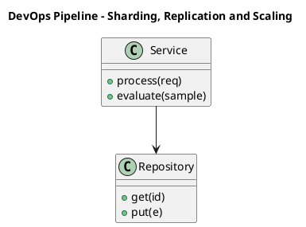

_Source diagram (plantuml); render with the appropriate tool._

**Figure 8. DevOps Pipeline - Sharding, Replication and Scaling** (plantuml). Figure: DevOps Pipeline view for Vector Databases. This diagram illustrates the principal components and their interactions as discussed in the surrounding section.

## Deep Dive: Mechanics, Variants and Trade-offs

Having established the essentials, we now go deeper into sharding, replication and scaling. It pays to understand the mechanism rather than treat it as a black box, because most production incidents are explained by one of its steps misbehaving. The distinctions in this section are the ones that separate a working demo from a system that holds up under adversarial inputs, scale and the passage of time.

Consider the principal variants and how to choose between them. Each variant optimises for a different point in the design space - some for latency, some for accuracy, some for cost or operability - and the correct choice follows from explicit requirements rather than from defaults. Simplicity is a feature. The simplest design that meets the requirement should be the default, with complexity added only when measurement justifies it.

In practice this is supported by a mature tooling ecosystem, including Pinecone, Weaviate, Qdrant, Milvus. Tools accelerate the work but do not substitute for understanding: the same principles apply whichever implementation you select, and the ability to reason from first principles is what lets you debug when a tool behaves unexpectedly.

A frequent source of subtle bugs is the interaction with distance metrics and quantisation. Because distance metrics and quantisation concerns cosine/dot/L2 and scalar/product quantisation trade-offs, changes there can silently alter the behaviour analysed here. The remedy is contract tests at the boundary and end-to-end evaluations that exercise the interaction explicitly.

Finally, attend to edge cases and degradation. Define what the system should do under partial failure, unexpected inputs and load spikes, and make that behaviour explicit and tested rather than emergent. Graceful degradation - returning a safe, useful result when the ideal one is unavailable - is a hallmark of mature engineering.

For deeper study, the literature offers authoritative treatments such as Malkov & Yashunin — HNSW (2016) and Johnson et al. — Billion-scale similarity search with GPUs / FAISS (2017). These primary sources reward careful reading and ground the practical guidance above in established results.

## Advanced Considerations

Having established the essentials, we now go deeper into sharding, replication and scaling. Beneath the abstraction lies a concrete process whose steps can each be measured, tested and optimised independently. The distinctions in this section are the ones that separate a working demo from a system that holds up under adversarial inputs, scale and the passage of time.

Consider the principal variants and how to choose between them. Each variant optimises for a different point in the design space - some for latency, some for accuracy, some for cost or operability - and the correct choice follows from explicit requirements rather than from defaults. Simplicity is a feature. The simplest design that meets the requirement should be the default, with complexity added only when measurement justifies it.

In practice this is supported by a mature tooling ecosystem, including Pinecone, Weaviate, Qdrant, Milvus. Tools accelerate the work but do not substitute for understanding: the same principles apply whichever implementation you select, and the ability to reason from first principles is what lets you debug when a tool behaves unexpectedly.

A frequent source of subtle bugs is the interaction with cost and capacity planning. Because cost and capacity planning concerns memory versus disk indexes and right-sizing infrastructure, changes there can silently alter the behaviour analysed here. The remedy is contract tests at the boundary and end-to-end evaluations that exercise the interaction explicitly.

Finally, attend to edge cases and degradation. Define what the system should do under partial failure, unexpected inputs and load spikes, and make that behaviour explicit and tested rather than emergent. Graceful degradation - returning a safe, useful result when the ideal one is unavailable - is a hallmark of mature engineering.

For deeper study, the literature offers authoritative treatments such as Malkov & Yashunin — HNSW (2016) and Johnson et al. — Billion-scale similarity search with GPUs / FAISS (2017). These primary sources reward careful reading and ground the practical guidance above in established results.

## Worked Example

To ground the discussion, walk through a representative example. A knowledge organisation needs powering RAG over millions of enterprise documents. They decide to apply sharding, replication and scaling as part of their Vector Databases solution, but wisely treat it as a hypothesis to be validated rather than a foregone conclusion.

The team begins by stating the objective precisely and defining how success will be measured before writing any code. They establish a small but representative evaluation set, agree on acceptance thresholds, and only then prototype the simplest design that could work. Early measurement reveals which assumptions hold and which must be revised, saving weeks of misdirected effort and surfacing edge cases while they are still cheap to fix.

As the prototype matures into a service, the team hardens it: adding input validation, error handling, caching where it pays off, and monitoring that ties back to the original success metric. They document each significant decision in an architecture decision record so that future maintainers understand not just what was built but why.

The outcome is instructive. The system that reaches production is not the most sophisticated design the team considered, but the one whose behaviour they could measure, explain and operate. This is the recurring lesson of Vector Databases: durable value comes from the whole system, not from any single clever component.

## Industry Use Cases

Across industries, the ideas in this chapter recur in recognisable ways. The following vignettes show how different sectors apply them and what they have in common.

**Knowledge.** Powering RAG over millions of enterprise documents. The common thread is that value comes not from the model alone but from the surrounding system - data quality, evaluation, integration and operations - which is precisely where most of the engineering effort belongs.

**Media.** Visual similarity search across large catalogues. The common thread is that value comes not from the model alone but from the surrounding system - data quality, evaluation, integration and operations - which is precisely where most of the engineering effort belongs.

**Security.** Anomaly and similarity detection on event embeddings. The common thread is that value comes not from the model alone but from the surrounding system - data quality, evaluation, integration and operations - which is precisely where most of the engineering effort belongs.

**Recommendations.** Real-time candidate generation from user vectors. The common thread is that value comes not from the model alone but from the surrounding system - data quality, evaluation, integration and operations - which is precisely where most of the engineering effort belongs.

## Best Practices

The following practices consistently separate successful Vector Databases efforts from struggling ones. They are deliberately concrete so they can be adopted as checklist items in design and code review.

- Choose HNSW for low latency, IVF/PQ for memory-constrained scale.
- Benchmark recall and p99 latency on your real data, not synthetic.
- Plan re-indexing strategy before you need it.
- Isolate tenants by namespace and enforce access control.

None of these are exotic; they are the unglamorous disciplines that compound into reliability. The cost of adopting them is small compared with the cost of the incidents they prevent, and they become second nature with practice.

## Common Pitfalls

Equally instructive are the failure modes that recur in practice. Each pitfall below has a clear early warning sign and a known remedy, so treat them as a diagnostic checklist when something feels wrong:

- Assuming exact search; ANN trades recall for speed.
- Post-filtering that silently drops recall on selective queries.
- Underestimating memory for in-RAM HNSW at scale.
- No plan for embedding-model upgrades and re-indexing.

The pattern is consistent: most failures stem from skipping measurement, conflating prototype and production standards, or deferring cross-cutting concerns such as security and cost until they become emergencies. Naming these traps in advance is the cheapest way to avoid them.

## Governance, Security and Cost Notes

No discussion of sharding, replication and scaling is complete without its governance, security and cost dimensions, which are too often deferred until they become emergencies. Treating them as first-class concerns from the outset is both cheaper and safer.

**Governance.** Classify the risk of this capability, document its intended and out-of-scope uses, and ensure decisions are traceable to satisfy internal policy and external regulation such as the NIST AI RMF, ISO/IEC 42001 and the EU AI Act. **Security.** Treat all external input as untrusted, validate outputs before acting on them, apply least privilege to any tools or data access, and map controls to the OWASP LLM Top 10 and MITRE ATLAS.

**Cost and sustainability.** Establish explicit budgets for compute, tokens and latency, attribute spend to owners, and revisit the economics as usage scales - a design that is affordable at pilot scale can become untenable at production volume. Building these reflexes into everyday engineering is what allows a Vector Databases system to be not only capable but also trustworthy and economically sound.

## Hands-On Exercises

Work through the following exercises. They are designed to move understanding from recognition to application - the level required for real engineering work - so prefer writing and building over merely reading.

1. Explain sharding, replication and scaling to a colleague unfamiliar with Vector Databases, using a concrete example from your own domain.
2. Sketch a reference architecture that incorporates sharding, replication and scaling and annotate where observability, security and cost controls belong.
3. Design an evaluation that would tell you whether sharding, replication and scaling is working in production, including the metric, the dataset and the acceptance threshold.
4. Identify two pitfalls relevant to sharding, replication and scaling in your environment and describe the early warning signals you would monitor.
5. Prototype the simplest implementation that demonstrates sharding, replication and scaling, then list exactly what would need to change to make it production-ready.

## Key Takeaways

Key takeaways from this chapter:

- Sharding, Replication and Scaling is a systems concern in Vector Databases: data, models and operations must be co-designed.
- Measurement is non-negotiable; define success metrics and evaluation before building.
- Favour the simplest design that meets the requirement, and add complexity only when evidence demands it.
- Security, cost and observability are first-class requirements, not afterthoughts.
- Document decisions so the system remains understandable and operable as it evolves.

## Code Walkthrough

Pipelines keep Sharding, Replication and Scaling logic modular and testable. Each stage is a pure function, errors are captured per item, and the composition is trivial to extend or reorder.

The full listing is shown below; study it line by line and reproduce it locally before moving on.

### Listing: A composable processing pipeline for Sharding, Replication and Scaling

```python
from collections.abc import Iterable, Iterator
from typing import Protocol


class Stage(Protocol):
    def __call__(self, item: dict) -> dict: ...


def pipeline(stages: list[Stage]) -> Stage:
    """Compose ordered stages into a single callable for Sharding, Replication and Scaling."""

    def run(item: dict) -> dict:
        for stage in stages:
            item = stage(item)
        return item

    return run


def validate(item: dict) -> dict:
    if "text" not in item:
        raise ValueError("missing required field: text")
    return item


def normalise(item: dict) -> dict:
    item["text"] = item["text"].strip().lower()
    return item


def enrich(item: dict) -> dict:
    item["length"] = len(item["text"])
    return item


process = pipeline([validate, normalise, enrich])


def run_batch(items: Iterable[dict]) -> Iterator[dict]:
    for item in items:
        try:
            yield process(dict(item))
        except ValueError as exc:
            yield {"error": str(exc), "item": item}

```

## Review Questions

1. In the context of Vector Databases, which statement best describes “Sharding, Replication and Scaling”?
   - A. It removes all security and governance requirements.
   - B. It makes the system slower but has no other effect.
   - C. Horizontal scaling, consistency models and high availability.
   - D. It eliminates the need for any evaluation or monitoring.
   - **Answer: C.** Sharding, Replication and Scaling: Horizontal scaling, consistency models and high availability.
2. Which of the following is a recommended best practice when working with Vector Databases?
   - A. Assuming exact search; ANN trades recall for speed.
   - B. It guarantees deterministic output regardless of input.
   - C. It removes all security and governance requirements.
   - D. Benchmark recall and p99 latency on your real data, not synthetic.
   - **Answer: D.** Best practice: Benchmark recall and p99 latency on your real data, not synthetic.
3. Which of the following is a common pitfall to avoid in Vector Databases?
   - A. It applies exclusively to image data.
   - B. Assuming exact search; ANN trades recall for speed.
   - C. It makes the system slower but has no other effect.
   - D. It guarantees deterministic output regardless of input.
   - **Answer: B.** Pitfall to avoid: Assuming exact search; ANN trades recall for speed.
4. *(Discussion)* Explain Sharding, Replication and Scaling and why it matters in a production Vector Databases system.
   - **Model answer:** A strong answer defines sharding, replication and scaling (Horizontal scaling, consistency models and high availability.) then connects it to architecture, evaluation, cost, security and operations for Vector Databases, citing concrete trade-offs and a real-world example.

---


# Chapter 6. Freshness, Upserts and Deletes

_This chapter examines freshness, upserts and deletes within Vector Databases. It covers handling streaming updates without full re-indexing, derives a reference architecture, walks through a worked example and runnable code, surveys industry use cases, and distils best practices and pitfalls, closing with exercises and review questions._

## Introduction

Freshness, Upserts and Deletes can be characterised as handling streaming updates without full re-indexing. This concept recurs throughout the Vector Databases lifecycle, from design to operations. The right abstraction here pays compounding dividends, because downstream components depend on its guarantees.

This chapter builds intuition first, then formalises the ideas, derives an architecture, and finishes with code, exercises and review questions so the material transfers directly to your own Vector Databases work. Read it actively: pause at each diagram, reproduce the code, and attempt the exercises before consulting the answers.

## Theory and Foundations

Freshness, Upserts and Deletes can be characterised as handling streaming updates without full re-indexing. Seasoned practitioners treat this as a systems problem, co-designing data, models and operations rather than optimising any one in isolation. Beneath the abstraction lies a concrete process whose steps can each be measured, tested and optimised independently.

To place this in context, recall the broader picture: Vector databases store embeddings alongside metadata and provide fast approximate nearest-neighbour search, filtering and hybrid retrieval. Within that picture, freshness, upserts and deletes is one of the load-bearing ideas - the kind that, when understood deeply, makes the rest of Vector Databases fall into place. This concept recurs throughout the Vector Databases lifecycle, from design to operations.

Freshness, Upserts and Deletes cannot be understood in isolation from sharding, replication and scaling. Recall that sharding, replication and scaling concerns horizontal scaling, consistency models and high availability. The two interact directly: decisions in one constrain the design space of the other, which is why mature teams reason about them together rather than sequentially. As with most architectural decisions, the choice is rarely binary; the skill lies in quantifying the trade-offs and choosing deliberately.

Freshness, Upserts and Deletes cannot be understood in isolation from integration with the rag pipeline. Recall that integration with the rag pipeline concerns where the vector store sits and how it is queried. The two interact directly: decisions in one constrain the design space of the other, which is why mature teams reason about them together rather than sequentially. Every added component buys capability at the price of operational surface area, and that bargain should be made consciously.

Several established patterns apply directly to freshness, upserts and deletes. The first, namespace-per-tenant isolation, is widely adopted because it makes the system's behaviour predictable and observable. A complementary pattern, pre-filter on selective metadata, post-filter otherwise, addresses a related concern and is often deployed alongside it. Patterns are not dogma; they are distilled experience that shortcuts the search for a sound design, and each carries assumptions worth checking against your context.

The decision of whether to adopt this should be driven by requirements, not by novelty. In a small prototype, shortcuts around freshness, upserts and deletes are invisible; in a production Vector Databases system serving real traffic, they surface as incidents, cost overruns or compliance gaps. Every added component buys capability at the price of operational surface area, and that bargain should be made consciously. The remainder of this chapter turns these principles into an architecture, code and a checklist you can apply immediately.

## Architecture and Design

The reference architecture for Freshness, Upserts and Deletes separates concerns into clearly bounded components with explicit contracts. A vector database deployment partitions collections into shards, each holding an ANN index in memory or on SSD, replicated for availability. A query coordinator fans out filtered ANN searches, merges results and applies metadata predicates. An ingestion path handles upserts and deletes with background index maintenance.

Concretely, the principal building blocks include the case for purpose-built vector stores, ann indexing algorithms, distance metrics and quantisation, metadata filtering and hybrid queries and sharding, replication and scaling. Each is a replaceable component behind a stable interface, so the team can upgrade an implementation - a model, an index, a policy engine - without rewriting its neighbours. The contracts between components are where reliability is won or lost, so they are specified explicitly and tested in isolation.

The diagram accompanying this section makes the data and control flow explicit. Requests enter through a well-defined boundary where they are authenticated and validated; only then are they dispatched to the components that perform the work. This boundary is also where rate limiting, quota enforcement and audit logging live, keeping cross-cutting concerns out of the core logic and in one auditable place.

Two qualities deserve emphasis. First, observability is designed in, not bolted on: every component emits structured telemetry so that failures can be localised in minutes rather than hours. Second, the architecture is evolvable - components communicate through stable contracts so that any single part of the Vector Databases system can be replaced without a rewrite. Simplicity is a feature. The simplest design that meets the requirement should be the default, with complexity added only when measurement justifies it.

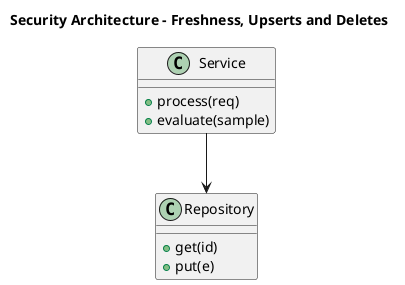

_Source diagram (plantuml); render with the appropriate tool._

**Figure 9. Security Architecture - Freshness, Upserts and Deletes** (plantuml). Figure: Security Architecture view for Vector Databases. This diagram illustrates the principal components and their interactions as discussed in the surrounding section.

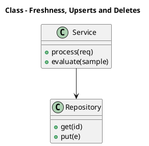

_Source diagram (plantuml); render with the appropriate tool._

**Figure 10. Class - Freshness, Upserts and Deletes** (plantuml). Figure: Class view for Vector Databases. This diagram illustrates the principal components and their interactions as discussed in the surrounding section.

## Deep Dive: Mechanics, Variants and Trade-offs

Having established the essentials, we now go deeper into freshness, upserts and deletes. It pays to understand the mechanism rather than treat it as a black box, because most production incidents are explained by one of its steps misbehaving. The distinctions in this section are the ones that separate a working demo from a system that holds up under adversarial inputs, scale and the passage of time.

Consider the principal variants and how to choose between them. Each variant optimises for a different point in the design space - some for latency, some for accuracy, some for cost or operability - and the correct choice follows from explicit requirements rather than from defaults. Every added component buys capability at the price of operational surface area, and that bargain should be made consciously.

In practice this is supported by a mature tooling ecosystem, including Pinecone, Weaviate, Qdrant, Milvus. Tools accelerate the work but do not substitute for understanding: the same principles apply whichever implementation you select, and the ability to reason from first principles is what lets you debug when a tool behaves unexpectedly.

A frequent source of subtle bugs is the interaction with sharding, replication and scaling. Because sharding, replication and scaling concerns horizontal scaling, consistency models and high availability, changes there can silently alter the behaviour analysed here. The remedy is contract tests at the boundary and end-to-end evaluations that exercise the interaction explicitly.

Finally, attend to edge cases and degradation. Define what the system should do under partial failure, unexpected inputs and load spikes, and make that behaviour explicit and tested rather than emergent. Graceful degradation - returning a safe, useful result when the ideal one is unavailable - is a hallmark of mature engineering.

For deeper study, the literature offers authoritative treatments such as Malkov & Yashunin — HNSW (2016) and Johnson et al. — Billion-scale similarity search with GPUs / FAISS (2017). These primary sources reward careful reading and ground the practical guidance above in established results.

## Advanced Considerations

Having established the essentials, we now go deeper into freshness, upserts and deletes. The underlying mechanism is best appreciated by tracing a single request from input to output and noting where state is created and consumed. The distinctions in this section are the ones that separate a working demo from a system that holds up under adversarial inputs, scale and the passage of time.

Consider the principal variants and how to choose between them. Each variant optimises for a different point in the design space - some for latency, some for accuracy, some for cost or operability - and the correct choice follows from explicit requirements rather than from defaults. Simplicity is a feature. The simplest design that meets the requirement should be the default, with complexity added only when measurement justifies it.

In practice this is supported by a mature tooling ecosystem, including Pinecone, Weaviate, Qdrant, Milvus. Tools accelerate the work but do not substitute for understanding: the same principles apply whichever implementation you select, and the ability to reason from first principles is what lets you debug when a tool behaves unexpectedly.

A frequent source of subtle bugs is the interaction with sharding, replication and scaling. Because sharding, replication and scaling concerns horizontal scaling, consistency models and high availability, changes there can silently alter the behaviour analysed here. The remedy is contract tests at the boundary and end-to-end evaluations that exercise the interaction explicitly.

Finally, attend to edge cases and degradation. Define what the system should do under partial failure, unexpected inputs and load spikes, and make that behaviour explicit and tested rather than emergent. Graceful degradation - returning a safe, useful result when the ideal one is unavailable - is a hallmark of mature engineering.

For deeper study, the literature offers authoritative treatments such as Malkov & Yashunin — HNSW (2016) and Johnson et al. — Billion-scale similarity search with GPUs / FAISS (2017). These primary sources reward careful reading and ground the practical guidance above in established results.

## Worked Example

To ground the discussion, walk through a representative example. A media organisation needs visual similarity search across large catalogues. They decide to apply freshness, upserts and deletes as part of their Vector Databases solution, but wisely treat it as a hypothesis to be validated rather than a foregone conclusion.

The team begins by stating the objective precisely and defining how success will be measured before writing any code. They establish a small but representative evaluation set, agree on acceptance thresholds, and only then prototype the simplest design that could work. Early measurement reveals which assumptions hold and which must be revised, saving weeks of misdirected effort and surfacing edge cases while they are still cheap to fix.

As the prototype matures into a service, the team hardens it: adding input validation, error handling, caching where it pays off, and monitoring that ties back to the original success metric. They document each significant decision in an architecture decision record so that future maintainers understand not just what was built but why.

The outcome is instructive. The system that reaches production is not the most sophisticated design the team considered, but the one whose behaviour they could measure, explain and operate. This is the recurring lesson of Vector Databases: durable value comes from the whole system, not from any single clever component.

## Industry Use Cases

Across industries, the ideas in this chapter recur in recognisable ways. The following vignettes show how different sectors apply them and what they have in common.

**Knowledge.** Powering RAG over millions of enterprise documents. The common thread is that value comes not from the model alone but from the surrounding system - data quality, evaluation, integration and operations - which is precisely where most of the engineering effort belongs.

**Media.** Visual similarity search across large catalogues. The common thread is that value comes not from the model alone but from the surrounding system - data quality, evaluation, integration and operations - which is precisely where most of the engineering effort belongs.

**Security.** Anomaly and similarity detection on event embeddings. The common thread is that value comes not from the model alone but from the surrounding system - data quality, evaluation, integration and operations - which is precisely where most of the engineering effort belongs.

**Recommendations.** Real-time candidate generation from user vectors. The common thread is that value comes not from the model alone but from the surrounding system - data quality, evaluation, integration and operations - which is precisely where most of the engineering effort belongs.

## Best Practices

The following practices consistently separate successful Vector Databases efforts from struggling ones. They are deliberately concrete so they can be adopted as checklist items in design and code review.

- Choose HNSW for low latency, IVF/PQ for memory-constrained scale.
- Benchmark recall and p99 latency on your real data, not synthetic.
- Plan re-indexing strategy before you need it.
- Isolate tenants by namespace and enforce access control.

None of these are exotic; they are the unglamorous disciplines that compound into reliability. The cost of adopting them is small compared with the cost of the incidents they prevent, and they become second nature with practice.

## Common Pitfalls

Equally instructive are the failure modes that recur in practice. Each pitfall below has a clear early warning sign and a known remedy, so treat them as a diagnostic checklist when something feels wrong:

- Assuming exact search; ANN trades recall for speed.
- Post-filtering that silently drops recall on selective queries.
- Underestimating memory for in-RAM HNSW at scale.
- No plan for embedding-model upgrades and re-indexing.

The pattern is consistent: most failures stem from skipping measurement, conflating prototype and production standards, or deferring cross-cutting concerns such as security and cost until they become emergencies. Naming these traps in advance is the cheapest way to avoid them.

## Governance, Security and Cost Notes

No discussion of freshness, upserts and deletes is complete without its governance, security and cost dimensions, which are too often deferred until they become emergencies. Treating them as first-class concerns from the outset is both cheaper and safer.

**Governance.** Classify the risk of this capability, document its intended and out-of-scope uses, and ensure decisions are traceable to satisfy internal policy and external regulation such as the NIST AI RMF, ISO/IEC 42001 and the EU AI Act. **Security.** Treat all external input as untrusted, validate outputs before acting on them, apply least privilege to any tools or data access, and map controls to the OWASP LLM Top 10 and MITRE ATLAS.

**Cost and sustainability.** Establish explicit budgets for compute, tokens and latency, attribute spend to owners, and revisit the economics as usage scales - a design that is affordable at pilot scale can become untenable at production volume. Building these reflexes into everyday engineering is what allows a Vector Databases system to be not only capable but also trustworthy and economically sound.

## Hands-On Exercises

Work through the following exercises. They are designed to move understanding from recognition to application - the level required for real engineering work - so prefer writing and building over merely reading.

1. Explain freshness, upserts and deletes to a colleague unfamiliar with Vector Databases, using a concrete example from your own domain.
2. Sketch a reference architecture that incorporates freshness, upserts and deletes and annotate where observability, security and cost controls belong.
3. Design an evaluation that would tell you whether freshness, upserts and deletes is working in production, including the metric, the dataset and the acceptance threshold.
4. Identify two pitfalls relevant to freshness, upserts and deletes in your environment and describe the early warning signals you would monitor.
5. Prototype the simplest implementation that demonstrates freshness, upserts and deletes, then list exactly what would need to change to make it production-ready.

## Key Takeaways

Key takeaways from this chapter:

- Freshness, Upserts and Deletes is a systems concern in Vector Databases: data, models and operations must be co-designed.
- Measurement is non-negotiable; define success metrics and evaluation before building.
- Favour the simplest design that meets the requirement, and add complexity only when evidence demands it.
- Security, cost and observability are first-class requirements, not afterthoughts.
- Document decisions so the system remains understandable and operable as it evolves.

## Code Walkthrough

Pipelines keep Freshness, Upserts and Deletes logic modular and testable. Each stage is a pure function, errors are captured per item, and the composition is trivial to extend or reorder.

The full listing is shown below; study it line by line and reproduce it locally before moving on.

### Listing: A composable processing pipeline for Freshness, Upserts and Deletes

```python
from collections.abc import Iterable, Iterator
from typing import Protocol


class Stage(Protocol):
    def __call__(self, item: dict) -> dict: ...


def pipeline(stages: list[Stage]) -> Stage:
    """Compose ordered stages into a single callable for Freshness, Upserts and Deletes."""

    def run(item: dict) -> dict:
        for stage in stages:
            item = stage(item)
        return item

    return run


def validate(item: dict) -> dict:
    if "text" not in item:
        raise ValueError("missing required field: text")
    return item


def normalise(item: dict) -> dict:
    item["text"] = item["text"].strip().lower()
    return item


def enrich(item: dict) -> dict:
    item["length"] = len(item["text"])
    return item


process = pipeline([validate, normalise, enrich])


def run_batch(items: Iterable[dict]) -> Iterator[dict]:
    for item in items:
        try:
            yield process(dict(item))
        except ValueError as exc:
            yield {"error": str(exc), "item": item}

```

## Review Questions

1. In the context of Vector Databases, which statement best describes “Freshness, Upserts and Deletes”?
   - A. Handling streaming updates without full re-indexing.
   - B. It makes the system slower but has no other effect.
   - C. It removes all security and governance requirements.
   - D. It eliminates the need for any evaluation or monitoring.
   - **Answer: A.** Freshness, Upserts and Deletes: Handling streaming updates without full re-indexing.
2. Which of the following is a recommended best practice when working with Vector Databases?
   - A. No plan for embedding-model upgrades and re-indexing.
   - B. It applies exclusively to image data.
   - C. Benchmark recall and p99 latency on your real data, not synthetic.
   - D. It eliminates the need for any evaluation or monitoring.
   - **Answer: C.** Best practice: Benchmark recall and p99 latency on your real data, not synthetic.
3. Which of the following is a common pitfall to avoid in Vector Databases?
   - A. Underestimating memory for in-RAM HNSW at scale.
   - B. Isolate tenants by namespace and enforce access control.
   - C. It makes the system slower but has no other effect.
   - D. Choose HNSW for low latency, IVF/PQ for memory-constrained scale.
   - **Answer: A.** Pitfall to avoid: Underestimating memory for in-RAM HNSW at scale.
4. *(Discussion)* Explain Freshness, Upserts and Deletes and why it matters in a production Vector Databases system.
   - **Model answer:** A strong answer defines freshness, upserts and deletes (Handling streaming updates without full re-indexing.) then connects it to architecture, evaluation, cost, security and operations for Vector Databases, citing concrete trade-offs and a real-world example.

---


# Chapter 7. Hybrid and Multi-Vector Retrieval

_This chapter examines hybrid and multi-vector retrieval within Vector Databases. It covers late-interaction (ColBERT) and sparse+dense fusion, derives a reference architecture, walks through a worked example and runnable code, surveys industry use cases, and distils best practices and pitfalls, closing with exercises and review questions._

## Introduction

Hybrid and Multi-Vector Retrieval refers to late-interaction (ColBERT) and sparse+dense fusion. It is foundational: later capabilities in Vector Databases are built directly on top of it. In an enterprise setting, this translates into concrete requirements: clear interfaces, measurable quality, and controls that satisfy security and governance.

This chapter builds intuition first, then formalises the ideas, derives an architecture, and finishes with code, exercises and review questions so the material transfers directly to your own Vector Databases work. Read it actively: pause at each diagram, reproduce the code, and attempt the exercises before consulting the answers.

## Theory and Foundations

At its core, Hybrid and Multi-Vector Retrieval concerns late-interaction (ColBERT) and sparse+dense fusion. It helps to separate the conceptual model from its implementation: the former guides reasoning, the latter must contend with real-world constraints. The underlying mechanism is best appreciated by tracing a single request from input to output and noting where state is created and consumed.

To place this in context, recall the broader picture: Vector databases store embeddings alongside metadata and provide fast approximate nearest-neighbour search, filtering and hybrid retrieval. Within that picture, hybrid and multi-vector retrieval is one of the load-bearing ideas - the kind that, when understood deeply, makes the rest of Vector Databases fall into place. Neglecting it is one of the most common reasons Vector Databases initiatives stall in production.

Hybrid and Multi-Vector Retrieval cannot be understood in isolation from operating in production. Recall that operating in production concerns backups, monitoring, re-indexing and disaster recovery. The two interact directly: decisions in one constrain the design space of the other, which is why mature teams reason about them together rather than sequentially. Latency, accuracy and cost form a tension triangle: improving one typically pressures the others, so explicit budgets are essential.

Hybrid and Multi-Vector Retrieval cannot be understood in isolation from benchmarking vector databases. Recall that benchmarking vector databases concerns recall, QPS, p99 latency and cost per million vectors. The two interact directly: decisions in one constrain the design space of the other, which is why mature teams reason about them together rather than sequentially. Latency, accuracy and cost form a tension triangle: improving one typically pressures the others, so explicit budgets are essential.

Several established patterns apply directly to hybrid and multi-vector retrieval. The first, periodic compaction and re-indexing for freshness, is widely adopted because it makes the system's behaviour predictable and observable. A complementary pattern, namespace-per-tenant isolation, addresses a related concern and is often deployed alongside it. Patterns are not dogma; they are distilled experience that shortcuts the search for a sound design, and each carries assumptions worth checking against your context.

It is worth being explicit about when to apply this and when to reach for something simpler. In a small prototype, shortcuts around hybrid and multi-vector retrieval are invisible; in a production Vector Databases system serving real traffic, they surface as incidents, cost overruns or compliance gaps. Every added component buys capability at the price of operational surface area, and that bargain should be made consciously. The remainder of this chapter turns these principles into an architecture, code and a checklist you can apply immediately.

## Architecture and Design

The reference architecture for Hybrid and Multi-Vector Retrieval separates concerns into clearly bounded components with explicit contracts. A vector database deployment partitions collections into shards, each holding an ANN index in memory or on SSD, replicated for availability. A query coordinator fans out filtered ANN searches, merges results and applies metadata predicates. An ingestion path handles upserts and deletes with background index maintenance.

Concretely, the principal building blocks include the case for purpose-built vector stores, ann indexing algorithms, distance metrics and quantisation, metadata filtering and hybrid queries and sharding, replication and scaling. Each is a replaceable component behind a stable interface, so the team can upgrade an implementation - a model, an index, a policy engine - without rewriting its neighbours. The contracts between components are where reliability is won or lost, so they are specified explicitly and tested in isolation.

The diagram accompanying this section makes the data and control flow explicit. Requests enter through a well-defined boundary where they are authenticated and validated; only then are they dispatched to the components that perform the work. This boundary is also where rate limiting, quota enforcement and audit logging live, keeping cross-cutting concerns out of the core logic and in one auditable place.

Two qualities deserve emphasis. First, observability is designed in, not bolted on: every component emits structured telemetry so that failures can be localised in minutes rather than hours. Second, the architecture is evolvable - components communicate through stable contracts so that any single part of the Vector Databases system can be replaced without a rewrite. Latency, accuracy and cost form a tension triangle: improving one typically pressures the others, so explicit budgets are essential.

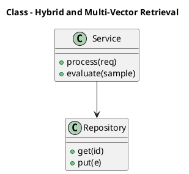

_Source diagram (plantuml); render with the appropriate tool._

**Figure 11. Class - Hybrid and Multi-Vector Retrieval** (plantuml). Figure: Class view for Vector Databases. This diagram illustrates the principal components and their interactions as discussed in the surrounding section.

<div class="diagram-svg">

<svg xmlns="http://www.w3.org/2000/svg" width="760" height="380" viewBox="0 0 760 380" font-family="Inter, Segoe UI, Arial, sans-serif">
<defs><marker id="arrow" markerWidth="10" markerHeight="10" refX="8" refY="3" orient="auto" markerUnits="strokeWidth"><path d="M0,0 L8,3 L0,6 z" fill="#94a3b8"/></marker><marker id="arrowA" markerWidth="10" markerHeight="10" refX="8" refY="3" orient="auto" markerUnits="strokeWidth"><path d="M0,0 L8,3 L0,6 z" fill="#4338ca"/></marker></defs>
<rect width="760" height="380" rx="12" fill="#f8fafc"/>
<text x="380" y="30" text-anchor="middle" font-size="17" font-weight="700" fill="#0f172a">Architecture - Hybrid and Multi-Vector Retrieval</text>
<rect x="30" y="48" width="700" height="96" rx="12" fill="#eef2ff" stroke="#e2e8f0"/>
<text x="44" y="66" font-size="11" font-weight="700" fill="#475569">Consumers</text>
<rect x="44" y="78" width="150" height="48" rx="10" fill="#ffffff" stroke="#4338ca" stroke-width="2"/><text x="119.0" y="105.74" text-anchor="middle" font-size="11" font-weight="600" fill="#0f172a">Users / Apps</text>
<rect x="208" y="78" width="150" height="48" rx="10" fill="#ffffff" stroke="#7c3aed" stroke-width="2"/><text x="283.0" y="105.74" text-anchor="middle" font-size="11" font-weight="600" fill="#0f172a">API Clients</text>
<rect x="30" y="166" width="700" height="96" rx="12" fill="#f5f3ff" stroke="#e2e8f0"/>
<text x="44" y="184" font-size="11" font-weight="700" fill="#475569">Vector Databases Platform</text>
<rect x="44.0" y="196" width="122.8" height="48" rx="10" fill="#ffffff" stroke="#7c3aed" stroke-width="2"/><text x="105.4" y="223.74" text-anchor="middle" font-size="11" font-weight="600" fill="#0f172a">Gateway</text>
<rect x="180.8" y="196" width="122.8" height="48" rx="10" fill="#ffffff" stroke="#0891b2" stroke-width="2"/><text x="242.20000000000002" y="223.74" text-anchor="middle" font-size="11" font-weight="600" fill="#0f172a">The Case for Purpo…</text>
<rect x="317.6" y="196" width="122.8" height="48" rx="10" fill="#ffffff" stroke="#059669" stroke-width="2"/><text x="379.0" y="223.74" text-anchor="middle" font-size="11" font-weight="600" fill="#0f172a">ANN Indexing Algor…</text>
<rect x="454.40000000000003" y="196" width="122.8" height="48" rx="10" fill="#ffffff" stroke="#d97706" stroke-width="2"/><text x="515.8000000000001" y="223.74" text-anchor="middle" font-size="11" font-weight="600" fill="#0f172a">Distance Metrics a…</text>
<rect x="591.2" y="196" width="122.8" height="48" rx="10" fill="#ffffff" stroke="#dc2626" stroke-width="2"/><text x="652.6" y="223.74" text-anchor="middle" font-size="11" font-weight="600" fill="#0f172a">Metadata Filtering…</text>
<rect x="30" y="284" width="700" height="96" rx="12" fill="#ecfeff" stroke="#e2e8f0"/>
<text x="44" y="302" font-size="11" font-weight="700" fill="#475569">Data &amp; Operations</text>
<rect x="44" y="314" width="150" height="48" rx="10" fill="#ffffff" stroke="#0891b2" stroke-width="2"/><text x="119.0" y="341.74" text-anchor="middle" font-size="11" font-weight="600" fill="#0f172a">Primary Store</text>
<rect x="208" y="314" width="150" height="48" rx="10" fill="#ffffff" stroke="#059669" stroke-width="2"/><text x="283.0" y="341.74" text-anchor="middle" font-size="11" font-weight="600" fill="#0f172a">Vector Index</text>
<rect x="372" y="314" width="150" height="48" rx="10" fill="#ffffff" stroke="#d97706" stroke-width="2"/><text x="447.0" y="341.74" text-anchor="middle" font-size="11" font-weight="600" fill="#0f172a">Observability</text>
<rect x="536" y="314" width="150" height="48" rx="10" fill="#ffffff" stroke="#dc2626" stroke-width="2"/><text x="611.0" y="341.74" text-anchor="middle" font-size="11" font-weight="600" fill="#0f172a">Security</text>
<line x1="380.0" y1="126" x2="380.0" y2="196" stroke="#4338ca" stroke-width="2" marker-end="url(#arrowA)"/>
<line x1="380.0" y1="244" x2="380.0" y2="314" stroke="#4338ca" stroke-width="2" marker-end="url(#arrowA)"/>
</svg>

</div>

**Figure 12. Architecture - Hybrid and Multi-Vector Retrieval** (svg). Figure: Architecture view for Vector Databases. This diagram illustrates the principal components and their interactions as discussed in the surrounding section.

## Deep Dive: Mechanics, Variants and Trade-offs

Having established the essentials, we now go deeper into hybrid and multi-vector retrieval. The underlying mechanism is best appreciated by tracing a single request from input to output and noting where state is created and consumed. The distinctions in this section are the ones that separate a working demo from a system that holds up under adversarial inputs, scale and the passage of time.

Consider the principal variants and how to choose between them. Each variant optimises for a different point in the design space - some for latency, some for accuracy, some for cost or operability - and the correct choice follows from explicit requirements rather than from defaults. Every added component buys capability at the price of operational surface area, and that bargain should be made consciously.

In practice this is supported by a mature tooling ecosystem, including Pinecone, Weaviate, Qdrant, Milvus. Tools accelerate the work but do not substitute for understanding: the same principles apply whichever implementation you select, and the ability to reason from first principles is what lets you debug when a tool behaves unexpectedly.

A frequent source of subtle bugs is the interaction with operating in production. Because operating in production concerns backups, monitoring, re-indexing and disaster recovery, changes there can silently alter the behaviour analysed here. The remedy is contract tests at the boundary and end-to-end evaluations that exercise the interaction explicitly.

Finally, attend to edge cases and degradation. Define what the system should do under partial failure, unexpected inputs and load spikes, and make that behaviour explicit and tested rather than emergent. Graceful degradation - returning a safe, useful result when the ideal one is unavailable - is a hallmark of mature engineering.

For deeper study, the literature offers authoritative treatments such as Malkov & Yashunin — HNSW (2016) and Johnson et al. — Billion-scale similarity search with GPUs / FAISS (2017). These primary sources reward careful reading and ground the practical guidance above in established results.

## Advanced Considerations

Having established the essentials, we now go deeper into hybrid and multi-vector retrieval. Mechanically, the behaviour emerges from a few interacting parts that are simpler than the whole they produce. The distinctions in this section are the ones that separate a working demo from a system that holds up under adversarial inputs, scale and the passage of time.

Consider the principal variants and how to choose between them. Each variant optimises for a different point in the design space - some for latency, some for accuracy, some for cost or operability - and the correct choice follows from explicit requirements rather than from defaults. Simplicity is a feature. The simplest design that meets the requirement should be the default, with complexity added only when measurement justifies it.

In practice this is supported by a mature tooling ecosystem, including Pinecone, Weaviate, Qdrant, Milvus. Tools accelerate the work but do not substitute for understanding: the same principles apply whichever implementation you select, and the ability to reason from first principles is what lets you debug when a tool behaves unexpectedly.

A frequent source of subtle bugs is the interaction with freshness, upserts and deletes. Because freshness, upserts and deletes concerns handling streaming updates without full re-indexing, changes there can silently alter the behaviour analysed here. The remedy is contract tests at the boundary and end-to-end evaluations that exercise the interaction explicitly.

Finally, attend to edge cases and degradation. Define what the system should do under partial failure, unexpected inputs and load spikes, and make that behaviour explicit and tested rather than emergent. Graceful degradation - returning a safe, useful result when the ideal one is unavailable - is a hallmark of mature engineering.

For deeper study, the literature offers authoritative treatments such as Malkov & Yashunin — HNSW (2016) and Johnson et al. — Billion-scale similarity search with GPUs / FAISS (2017). These primary sources reward careful reading and ground the practical guidance above in established results.

## Worked Example

To ground the discussion, walk through a representative example. A media organisation needs visual similarity search across large catalogues. They decide to apply hybrid and multi-vector retrieval as part of their Vector Databases solution, but wisely treat it as a hypothesis to be validated rather than a foregone conclusion.

The team begins by stating the objective precisely and defining how success will be measured before writing any code. They establish a small but representative evaluation set, agree on acceptance thresholds, and only then prototype the simplest design that could work. Early measurement reveals which assumptions hold and which must be revised, saving weeks of misdirected effort and surfacing edge cases while they are still cheap to fix.

As the prototype matures into a service, the team hardens it: adding input validation, error handling, caching where it pays off, and monitoring that ties back to the original success metric. They document each significant decision in an architecture decision record so that future maintainers understand not just what was built but why.

The outcome is instructive. The system that reaches production is not the most sophisticated design the team considered, but the one whose behaviour they could measure, explain and operate. This is the recurring lesson of Vector Databases: durable value comes from the whole system, not from any single clever component.

## Industry Use Cases

Across industries, the ideas in this chapter recur in recognisable ways. The following vignettes show how different sectors apply them and what they have in common.

**Knowledge.** Powering RAG over millions of enterprise documents. The common thread is that value comes not from the model alone but from the surrounding system - data quality, evaluation, integration and operations - which is precisely where most of the engineering effort belongs.

**Media.** Visual similarity search across large catalogues. The common thread is that value comes not from the model alone but from the surrounding system - data quality, evaluation, integration and operations - which is precisely where most of the engineering effort belongs.

**Security.** Anomaly and similarity detection on event embeddings. The common thread is that value comes not from the model alone but from the surrounding system - data quality, evaluation, integration and operations - which is precisely where most of the engineering effort belongs.

**Recommendations.** Real-time candidate generation from user vectors. The common thread is that value comes not from the model alone but from the surrounding system - data quality, evaluation, integration and operations - which is precisely where most of the engineering effort belongs.

## Best Practices

The following practices consistently separate successful Vector Databases efforts from struggling ones. They are deliberately concrete so they can be adopted as checklist items in design and code review.

- Choose HNSW for low latency, IVF/PQ for memory-constrained scale.
- Benchmark recall and p99 latency on your real data, not synthetic.
- Plan re-indexing strategy before you need it.
- Isolate tenants by namespace and enforce access control.

None of these are exotic; they are the unglamorous disciplines that compound into reliability. The cost of adopting them is small compared with the cost of the incidents they prevent, and they become second nature with practice.

## Common Pitfalls

Equally instructive are the failure modes that recur in practice. Each pitfall below has a clear early warning sign and a known remedy, so treat them as a diagnostic checklist when something feels wrong:

- Assuming exact search; ANN trades recall for speed.
- Post-filtering that silently drops recall on selective queries.
- Underestimating memory for in-RAM HNSW at scale.
- No plan for embedding-model upgrades and re-indexing.

The pattern is consistent: most failures stem from skipping measurement, conflating prototype and production standards, or deferring cross-cutting concerns such as security and cost until they become emergencies. Naming these traps in advance is the cheapest way to avoid them.

## Governance, Security and Cost Notes

No discussion of hybrid and multi-vector retrieval is complete without its governance, security and cost dimensions, which are too often deferred until they become emergencies. Treating them as first-class concerns from the outset is both cheaper and safer.

**Governance.** Classify the risk of this capability, document its intended and out-of-scope uses, and ensure decisions are traceable to satisfy internal policy and external regulation such as the NIST AI RMF, ISO/IEC 42001 and the EU AI Act. **Security.** Treat all external input as untrusted, validate outputs before acting on them, apply least privilege to any tools or data access, and map controls to the OWASP LLM Top 10 and MITRE ATLAS.

**Cost and sustainability.** Establish explicit budgets for compute, tokens and latency, attribute spend to owners, and revisit the economics as usage scales - a design that is affordable at pilot scale can become untenable at production volume. Building these reflexes into everyday engineering is what allows a Vector Databases system to be not only capable but also trustworthy and economically sound.

## Hands-On Exercises

Work through the following exercises. They are designed to move understanding from recognition to application - the level required for real engineering work - so prefer writing and building over merely reading.

1. Explain hybrid and multi-vector retrieval to a colleague unfamiliar with Vector Databases, using a concrete example from your own domain.
2. Sketch a reference architecture that incorporates hybrid and multi-vector retrieval and annotate where observability, security and cost controls belong.
3. Design an evaluation that would tell you whether hybrid and multi-vector retrieval is working in production, including the metric, the dataset and the acceptance threshold.
4. Identify two pitfalls relevant to hybrid and multi-vector retrieval in your environment and describe the early warning signals you would monitor.
5. Prototype the simplest implementation that demonstrates hybrid and multi-vector retrieval, then list exactly what would need to change to make it production-ready.

## Key Takeaways

Key takeaways from this chapter:

- Hybrid and Multi-Vector Retrieval is a systems concern in Vector Databases: data, models and operations must be co-designed.
- Measurement is non-negotiable; define success metrics and evaluation before building.
- Favour the simplest design that meets the requirement, and add complexity only when evidence demands it.
- Security, cost and observability are first-class requirements, not afterthoughts.
- Document decisions so the system remains understandable and operable as it evolves.

## Code Walkthrough

Pipelines keep Hybrid and Multi-Vector Retrieval logic modular and testable. Each stage is a pure function, errors are captured per item, and the composition is trivial to extend or reorder.

The full listing is shown below; study it line by line and reproduce it locally before moving on.

### Listing: A composable processing pipeline for Hybrid and Multi-Vector Retrieval

```python
from collections.abc import Iterable, Iterator
from typing import Protocol


class Stage(Protocol):
    def __call__(self, item: dict) -> dict: ...


def pipeline(stages: list[Stage]) -> Stage:
    """Compose ordered stages into a single callable for Hybrid and Multi-Vector Retrieval."""

    def run(item: dict) -> dict:
        for stage in stages:
            item = stage(item)
        return item

    return run


def validate(item: dict) -> dict:
    if "text" not in item:
        raise ValueError("missing required field: text")
    return item


def normalise(item: dict) -> dict:
    item["text"] = item["text"].strip().lower()
    return item


def enrich(item: dict) -> dict:
    item["length"] = len(item["text"])
    return item


process = pipeline([validate, normalise, enrich])


def run_batch(items: Iterable[dict]) -> Iterator[dict]:
    for item in items:
        try:
            yield process(dict(item))
        except ValueError as exc:
            yield {"error": str(exc), "item": item}

```

## Review Questions

1. In the context of Vector Databases, which statement best describes “Hybrid and Multi-Vector Retrieval”?
   - A. Late-interaction (ColBERT) and sparse+dense fusion.
   - B. It removes all security and governance requirements.
   - C. It is only relevant to academic research, not production.
   - D. It guarantees deterministic output regardless of input.
   - **Answer: A.** Hybrid and Multi-Vector Retrieval: Late-interaction (ColBERT) and sparse+dense fusion.
2. Which of the following is a recommended best practice when working with Vector Databases?
   - A. Underestimating memory for in-RAM HNSW at scale.
   - B. Choose HNSW for low latency, IVF/PQ for memory-constrained scale.
   - C. Assuming exact search; ANN trades recall for speed.
   - D. No plan for embedding-model upgrades and re-indexing.
   - **Answer: B.** Best practice: Choose HNSW for low latency, IVF/PQ for memory-constrained scale.
3. Which of the following is a common pitfall to avoid in Vector Databases?
   - A. It guarantees deterministic output regardless of input.
   - B. Isolate tenants by namespace and enforce access control.
   - C. Underestimating memory for in-RAM HNSW at scale.
   - D. It is only relevant to academic research, not production.
   - **Answer: C.** Pitfall to avoid: Underestimating memory for in-RAM HNSW at scale.
4. *(Discussion)* Explain Hybrid and Multi-Vector Retrieval and why it matters in a production Vector Databases system.
   - **Model answer:** A strong answer defines hybrid and multi-vector retrieval (Late-interaction (ColBERT) and sparse+dense fusion.) then connects it to architecture, evaluation, cost, security and operations for Vector Databases, citing concrete trade-offs and a real-world example.

---


# Chapter 8. Benchmarking Vector Databases

_This chapter examines benchmarking vector databases within Vector Databases. It covers recall, QPS, p99 latency and cost per million vectors, derives a reference architecture, walks through a worked example and runnable code, surveys industry use cases, and distils best practices and pitfalls, closing with exercises and review questions._

## Introduction

Benchmarking Vector Databases can be characterised as recall, QPS, p99 latency and cost per million vectors. It is foundational: later capabilities in Vector Databases are built directly on top of it. It helps to separate the conceptual model from its implementation: the former guides reasoning, the latter must contend with real-world constraints.

This chapter builds intuition first, then formalises the ideas, derives an architecture, and finishes with code, exercises and review questions so the material transfers directly to your own Vector Databases work. Read it actively: pause at each diagram, reproduce the code, and attempt the exercises before consulting the answers.

## Theory and Foundations

At its core, Benchmarking Vector Databases concerns recall, QPS, p99 latency and cost per million vectors. In an enterprise setting, this translates into concrete requirements: clear interfaces, measurable quality, and controls that satisfy security and governance. Mechanically, the behaviour emerges from a few interacting parts that are simpler than the whole they produce.

To place this in context, recall the broader picture: Vector databases store embeddings alongside metadata and provide fast approximate nearest-neighbour search, filtering and hybrid retrieval. Within that picture, benchmarking vector databases is one of the load-bearing ideas - the kind that, when understood deeply, makes the rest of Vector Databases fall into place. Getting this right early prevents expensive rework once a Vector Databases system reaches scale.

Benchmarking Vector Databases cannot be understood in isolation from distance metrics and quantisation. Recall that distance metrics and quantisation concerns cosine/dot/L2 and scalar/product quantisation trade-offs. The two interact directly: decisions in one constrain the design space of the other, which is why mature teams reason about them together rather than sequentially. Simplicity is a feature. The simplest design that meets the requirement should be the default, with complexity added only when measurement justifies it.

Benchmarking Vector Databases cannot be understood in isolation from choosing a vector database. Recall that choosing a vector database concerns managed versus self-hosted and integration considerations. The two interact directly: decisions in one constrain the design space of the other, which is why mature teams reason about them together rather than sequentially. There is an inherent trade-off between fidelity and cost, and the correct balance depends on the use case and its tolerance for error.

Several established patterns apply directly to benchmarking vector databases. The first, periodic compaction and re-indexing for freshness, is widely adopted because it makes the system's behaviour predictable and observable. A complementary pattern, namespace-per-tenant isolation, addresses a related concern and is often deployed alongside it. Patterns are not dogma; they are distilled experience that shortcuts the search for a sound design, and each carries assumptions worth checking against your context.

Knowing when not to use a technique is as valuable as knowing how to use it. In a small prototype, shortcuts around benchmarking vector databases are invisible; in a production Vector Databases system serving real traffic, they surface as incidents, cost overruns or compliance gaps. Latency, accuracy and cost form a tension triangle: improving one typically pressures the others, so explicit budgets are essential. The remainder of this chapter turns these principles into an architecture, code and a checklist you can apply immediately.

## Architecture and Design

The reference architecture for Benchmarking Vector Databases separates concerns into clearly bounded components with explicit contracts. A vector database deployment partitions collections into shards, each holding an ANN index in memory or on SSD, replicated for availability. A query coordinator fans out filtered ANN searches, merges results and applies metadata predicates. An ingestion path handles upserts and deletes with background index maintenance.

Concretely, the principal building blocks include the case for purpose-built vector stores, ann indexing algorithms, distance metrics and quantisation, metadata filtering and hybrid queries and sharding, replication and scaling. Each is a replaceable component behind a stable interface, so the team can upgrade an implementation - a model, an index, a policy engine - without rewriting its neighbours. The contracts between components are where reliability is won or lost, so they are specified explicitly and tested in isolation.

The diagram accompanying this section makes the data and control flow explicit. Requests enter through a well-defined boundary where they are authenticated and validated; only then are they dispatched to the components that perform the work. This boundary is also where rate limiting, quota enforcement and audit logging live, keeping cross-cutting concerns out of the core logic and in one auditable place.

Two qualities deserve emphasis. First, observability is designed in, not bolted on: every component emits structured telemetry so that failures can be localised in minutes rather than hours. Second, the architecture is evolvable - components communicate through stable contracts so that any single part of the Vector Databases system can be replaced without a rewrite. There is an inherent trade-off between fidelity and cost, and the correct balance depends on the use case and its tolerance for error.

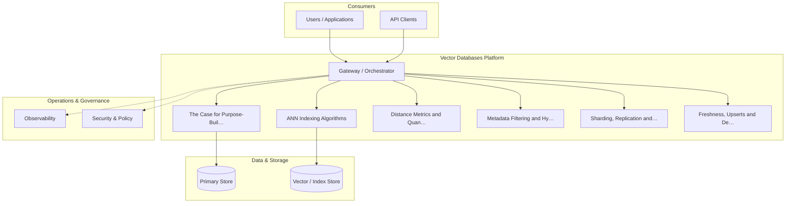

**Figure 13. Architecture - Benchmarking Vector Databases** (mermaid). Figure: Architecture view for Vector Databases. This diagram illustrates the principal components and their interactions as discussed in the surrounding section.

## Deep Dive: Mechanics, Variants and Trade-offs

Having established the essentials, we now go deeper into benchmarking vector databases. It pays to understand the mechanism rather than treat it as a black box, because most production incidents are explained by one of its steps misbehaving. The distinctions in this section are the ones that separate a working demo from a system that holds up under adversarial inputs, scale and the passage of time.

Consider the principal variants and how to choose between them. Each variant optimises for a different point in the design space - some for latency, some for accuracy, some for cost or operability - and the correct choice follows from explicit requirements rather than from defaults. Simplicity is a feature. The simplest design that meets the requirement should be the default, with complexity added only when measurement justifies it.

In practice this is supported by a mature tooling ecosystem, including Pinecone, Weaviate, Qdrant, Milvus. Tools accelerate the work but do not substitute for understanding: the same principles apply whichever implementation you select, and the ability to reason from first principles is what lets you debug when a tool behaves unexpectedly.

A frequent source of subtle bugs is the interaction with distance metrics and quantisation. Because distance metrics and quantisation concerns cosine/dot/L2 and scalar/product quantisation trade-offs, changes there can silently alter the behaviour analysed here. The remedy is contract tests at the boundary and end-to-end evaluations that exercise the interaction explicitly.

Finally, attend to edge cases and degradation. Define what the system should do under partial failure, unexpected inputs and load spikes, and make that behaviour explicit and tested rather than emergent. Graceful degradation - returning a safe, useful result when the ideal one is unavailable - is a hallmark of mature engineering.

For deeper study, the literature offers authoritative treatments such as Malkov & Yashunin — HNSW (2016) and Johnson et al. — Billion-scale similarity search with GPUs / FAISS (2017). These primary sources reward careful reading and ground the practical guidance above in established results.

## Advanced Considerations

Having established the essentials, we now go deeper into benchmarking vector databases. It pays to understand the mechanism rather than treat it as a black box, because most production incidents are explained by one of its steps misbehaving. The distinctions in this section are the ones that separate a working demo from a system that holds up under adversarial inputs, scale and the passage of time.

Consider the principal variants and how to choose between them. Each variant optimises for a different point in the design space - some for latency, some for accuracy, some for cost or operability - and the correct choice follows from explicit requirements rather than from defaults. Every added component buys capability at the price of operational surface area, and that bargain should be made consciously.

In practice this is supported by a mature tooling ecosystem, including Pinecone, Weaviate, Qdrant, Milvus. Tools accelerate the work but do not substitute for understanding: the same principles apply whichever implementation you select, and the ability to reason from first principles is what lets you debug when a tool behaves unexpectedly.

A frequent source of subtle bugs is the interaction with freshness, upserts and deletes. Because freshness, upserts and deletes concerns handling streaming updates without full re-indexing, changes there can silently alter the behaviour analysed here. The remedy is contract tests at the boundary and end-to-end evaluations that exercise the interaction explicitly.

Finally, attend to edge cases and degradation. Define what the system should do under partial failure, unexpected inputs and load spikes, and make that behaviour explicit and tested rather than emergent. Graceful degradation - returning a safe, useful result when the ideal one is unavailable - is a hallmark of mature engineering.

For deeper study, the literature offers authoritative treatments such as Malkov & Yashunin — HNSW (2016) and Johnson et al. — Billion-scale similarity search with GPUs / FAISS (2017). These primary sources reward careful reading and ground the practical guidance above in established results.

## Worked Example

Consider a concrete scenario. A media organisation needs visual similarity search across large catalogues. They decide to apply benchmarking vector databases as part of their Vector Databases solution, but wisely treat it as a hypothesis to be validated rather than a foregone conclusion.

The team begins by stating the objective precisely and defining how success will be measured before writing any code. They establish a small but representative evaluation set, agree on acceptance thresholds, and only then prototype the simplest design that could work. Early measurement reveals which assumptions hold and which must be revised, saving weeks of misdirected effort and surfacing edge cases while they are still cheap to fix.

As the prototype matures into a service, the team hardens it: adding input validation, error handling, caching where it pays off, and monitoring that ties back to the original success metric. They document each significant decision in an architecture decision record so that future maintainers understand not just what was built but why.

The outcome is instructive. The system that reaches production is not the most sophisticated design the team considered, but the one whose behaviour they could measure, explain and operate. This is the recurring lesson of Vector Databases: durable value comes from the whole system, not from any single clever component.

## Industry Use Cases

Across industries, the ideas in this chapter recur in recognisable ways. The following vignettes show how different sectors apply them and what they have in common.

**Knowledge.** Powering RAG over millions of enterprise documents. The common thread is that value comes not from the model alone but from the surrounding system - data quality, evaluation, integration and operations - which is precisely where most of the engineering effort belongs.

**Media.** Visual similarity search across large catalogues. The common thread is that value comes not from the model alone but from the surrounding system - data quality, evaluation, integration and operations - which is precisely where most of the engineering effort belongs.

**Security.** Anomaly and similarity detection on event embeddings. The common thread is that value comes not from the model alone but from the surrounding system - data quality, evaluation, integration and operations - which is precisely where most of the engineering effort belongs.

**Recommendations.** Real-time candidate generation from user vectors. The common thread is that value comes not from the model alone but from the surrounding system - data quality, evaluation, integration and operations - which is precisely where most of the engineering effort belongs.

## Best Practices

The following practices consistently separate successful Vector Databases efforts from struggling ones. They are deliberately concrete so they can be adopted as checklist items in design and code review.

- Choose HNSW for low latency, IVF/PQ for memory-constrained scale.
- Benchmark recall and p99 latency on your real data, not synthetic.
- Plan re-indexing strategy before you need it.
- Isolate tenants by namespace and enforce access control.

None of these are exotic; they are the unglamorous disciplines that compound into reliability. The cost of adopting them is small compared with the cost of the incidents they prevent, and they become second nature with practice.

## Common Pitfalls

Equally instructive are the failure modes that recur in practice. Each pitfall below has a clear early warning sign and a known remedy, so treat them as a diagnostic checklist when something feels wrong:

- Assuming exact search; ANN trades recall for speed.
- Post-filtering that silently drops recall on selective queries.
- Underestimating memory for in-RAM HNSW at scale.
- No plan for embedding-model upgrades and re-indexing.

The pattern is consistent: most failures stem from skipping measurement, conflating prototype and production standards, or deferring cross-cutting concerns such as security and cost until they become emergencies. Naming these traps in advance is the cheapest way to avoid them.

## Governance, Security and Cost Notes

No discussion of benchmarking vector databases is complete without its governance, security and cost dimensions, which are too often deferred until they become emergencies. Treating them as first-class concerns from the outset is both cheaper and safer.

**Governance.** Classify the risk of this capability, document its intended and out-of-scope uses, and ensure decisions are traceable to satisfy internal policy and external regulation such as the NIST AI RMF, ISO/IEC 42001 and the EU AI Act. **Security.** Treat all external input as untrusted, validate outputs before acting on them, apply least privilege to any tools or data access, and map controls to the OWASP LLM Top 10 and MITRE ATLAS.

**Cost and sustainability.** Establish explicit budgets for compute, tokens and latency, attribute spend to owners, and revisit the economics as usage scales - a design that is affordable at pilot scale can become untenable at production volume. Building these reflexes into everyday engineering is what allows a Vector Databases system to be not only capable but also trustworthy and economically sound.

## Hands-On Exercises

Work through the following exercises. They are designed to move understanding from recognition to application - the level required for real engineering work - so prefer writing and building over merely reading.

1. Explain benchmarking vector databases to a colleague unfamiliar with Vector Databases, using a concrete example from your own domain.
2. Sketch a reference architecture that incorporates benchmarking vector databases and annotate where observability, security and cost controls belong.
3. Design an evaluation that would tell you whether benchmarking vector databases is working in production, including the metric, the dataset and the acceptance threshold.
4. Identify two pitfalls relevant to benchmarking vector databases in your environment and describe the early warning signals you would monitor.
5. Prototype the simplest implementation that demonstrates benchmarking vector databases, then list exactly what would need to change to make it production-ready.

## Key Takeaways

Key takeaways from this chapter:

- Benchmarking Vector Databases is a systems concern in Vector Databases: data, models and operations must be co-designed.
- Measurement is non-negotiable; define success metrics and evaluation before building.
- Favour the simplest design that meets the requirement, and add complexity only when evidence demands it.
- Security, cost and observability are first-class requirements, not afterthoughts.
- Document decisions so the system remains understandable and operable as it evolves.

## Code Walkthrough

Every change to a Vector Databases system should pass an evaluation gate. This example shows the minimal shape: align predictions and references, compute a metric, and return a pass/fail decision for CI.

The full listing is shown below; study it line by line and reproduce it locally before moving on.

### Listing: Evaluating Benchmarking Vector Databases with a regression gate

```python
from dataclasses import dataclass


@dataclass
class EvalResult:
    metric: str
    score: float
    passed: bool


def evaluate(predictions: list[str], references: list[str],
             threshold: float = 0.8) -> EvalResult:
    """Score Benchmarking Vector Databases output against references with a simple exact-match metric.

    In practice you would combine several metrics (exact match, semantic
    similarity, LLM-as-judge) and gate releases on the aggregate.
    """
    if len(predictions) != len(references):
        raise ValueError("predictions and references must align")
    hits = sum(p.strip() == r.strip() for p, r in zip(predictions, references))
    score = hits / len(references) if references else 0.0
    return EvalResult(metric="exact_match", score=score, passed=score >= threshold)


if __name__ == "__main__":
    result = evaluate(["yes", "no"], ["yes", "yes"])
    print(f"{result.metric}={result.score:.2f} passed={result.passed}")

```

## Review Questions

1. In the context of Vector Databases, which statement best describes “Benchmarking Vector Databases”?
   - A. It applies exclusively to image data.
   - B. It removes all security and governance requirements.
   - C. It makes the system slower but has no other effect.
   - D. Recall, QPS, p99 latency and cost per million vectors.
   - **Answer: D.** Benchmarking Vector Databases: Recall, QPS, p99 latency and cost per million vectors.
2. Which of the following is a recommended best practice when working with Vector Databases?
   - A. Assuming exact search; ANN trades recall for speed.
   - B. It removes all security and governance requirements.
   - C. Underestimating memory for in-RAM HNSW at scale.
   - D. Choose HNSW for low latency, IVF/PQ for memory-constrained scale.
   - **Answer: D.** Best practice: Choose HNSW for low latency, IVF/PQ for memory-constrained scale.
3. Which of the following is a common pitfall to avoid in Vector Databases?
   - A. It makes the system slower but has no other effect.
   - B. It guarantees deterministic output regardless of input.
   - C. Underestimating memory for in-RAM HNSW at scale.
   - D. It eliminates the need for any evaluation or monitoring.
   - **Answer: C.** Pitfall to avoid: Underestimating memory for in-RAM HNSW at scale.
4. *(Discussion)* What trade-offs would you weigh when implementing Benchmarking Vector Databases?
   - **Model answer:** A strong answer defines benchmarking vector databases (Recall, QPS, p99 latency and cost per million vectors.) then connects it to architecture, evaluation, cost, security and operations for Vector Databases, citing concrete trade-offs and a real-world example.

---


# Chapter 9. Security and Multi-Tenancy

_This chapter examines security and multi-tenancy within Vector Databases. It covers namespace isolation, access control and encryption, derives a reference architecture, walks through a worked example and runnable code, surveys industry use cases, and distils best practices and pitfalls, closing with exercises and review questions._

## Introduction

Security and Multi-Tenancy refers to namespace isolation, access control and encryption. It is foundational: later capabilities in Vector Databases are built directly on top of it. The practical implication is that design choices here ripple through latency, cost and maintainability for the lifetime of the system.

This chapter builds intuition first, then formalises the ideas, derives an architecture, and finishes with code, exercises and review questions so the material transfers directly to your own Vector Databases work. Read it actively: pause at each diagram, reproduce the code, and attempt the exercises before consulting the answers.

## Theory and Foundations

In practical terms, Security and Multi-Tenancy is best understood as namespace isolation, access control and encryption. The practical implication is that design choices here ripple through latency, cost and maintainability for the lifetime of the system. Beneath the abstraction lies a concrete process whose steps can each be measured, tested and optimised independently.

To place this in context, recall the broader picture: Vector databases store embeddings alongside metadata and provide fast approximate nearest-neighbour search, filtering and hybrid retrieval. Within that picture, security and multi-tenancy is one of the load-bearing ideas - the kind that, when understood deeply, makes the rest of Vector Databases fall into place. Getting this right early prevents expensive rework once a Vector Databases system reaches scale.

Security and Multi-Tenancy cannot be understood in isolation from hybrid and multi-vector retrieval. Recall that hybrid and multi-vector retrieval concerns late-interaction (ColBERT) and sparse+dense fusion. The two interact directly: decisions in one constrain the design space of the other, which is why mature teams reason about them together rather than sequentially. Simplicity is a feature. The simplest design that meets the requirement should be the default, with complexity added only when measurement justifies it.

Security and Multi-Tenancy cannot be understood in isolation from reference architecture and patterns. Recall that reference architecture and patterns concerns a production-grade deployment blueprint. The two interact directly: decisions in one constrain the design space of the other, which is why mature teams reason about them together rather than sequentially. There is an inherent trade-off between fidelity and cost, and the correct balance depends on the use case and its tolerance for error.

Several established patterns apply directly to security and multi-tenancy. The first, disk-based indexes for billion-scale corpora, is widely adopted because it makes the system's behaviour predictable and observable. A complementary pattern, pre-filter on selective metadata, post-filter otherwise, addresses a related concern and is often deployed alongside it. Patterns are not dogma; they are distilled experience that shortcuts the search for a sound design, and each carries assumptions worth checking against your context.

It is worth being explicit about when to apply this and when to reach for something simpler. In a small prototype, shortcuts around security and multi-tenancy are invisible; in a production Vector Databases system serving real traffic, they surface as incidents, cost overruns or compliance gaps. Every added component buys capability at the price of operational surface area, and that bargain should be made consciously. The remainder of this chapter turns these principles into an architecture, code and a checklist you can apply immediately.

## Architecture and Design

A robust architecture for Security and Multi-Tenancy is layered so each part can evolve independently without destabilising the whole. A vector database deployment partitions collections into shards, each holding an ANN index in memory or on SSD, replicated for availability. A query coordinator fans out filtered ANN searches, merges results and applies metadata predicates. An ingestion path handles upserts and deletes with background index maintenance.

Concretely, the principal building blocks include the case for purpose-built vector stores, ann indexing algorithms, distance metrics and quantisation, metadata filtering and hybrid queries and sharding, replication and scaling. Each is a replaceable component behind a stable interface, so the team can upgrade an implementation - a model, an index, a policy engine - without rewriting its neighbours. The contracts between components are where reliability is won or lost, so they are specified explicitly and tested in isolation.

The diagram accompanying this section makes the data and control flow explicit. Requests enter through a well-defined boundary where they are authenticated and validated; only then are they dispatched to the components that perform the work. This boundary is also where rate limiting, quota enforcement and audit logging live, keeping cross-cutting concerns out of the core logic and in one auditable place.

Two qualities deserve emphasis. First, observability is designed in, not bolted on: every component emits structured telemetry so that failures can be localised in minutes rather than hours. Second, the architecture is evolvable - components communicate through stable contracts so that any single part of the Vector Databases system can be replaced without a rewrite. As with most architectural decisions, the choice is rarely binary; the skill lies in quantifying the trade-offs and choosing deliberately.

<div class="diagram-svg">

<svg xmlns="http://www.w3.org/2000/svg" width="760" height="380" viewBox="0 0 760 380" font-family="Inter, Segoe UI, Arial, sans-serif">
<defs><marker id="arrow" markerWidth="10" markerHeight="10" refX="8" refY="3" orient="auto" markerUnits="strokeWidth"><path d="M0,0 L8,3 L0,6 z" fill="#94a3b8"/></marker><marker id="arrowA" markerWidth="10" markerHeight="10" refX="8" refY="3" orient="auto" markerUnits="strokeWidth"><path d="M0,0 L8,3 L0,6 z" fill="#4338ca"/></marker></defs>
<rect width="760" height="380" rx="12" fill="#f8fafc"/>
<text x="380" y="30" text-anchor="middle" font-size="17" font-weight="700" fill="#0f172a">Data Lineage - Security and Multi-Tenancy</text>
<rect x="40.0" y="166.0" width="104" height="60" rx="10" fill="#ffffff" stroke="#4338ca" stroke-width="2"/><text x="92.0" y="200.08" text-anchor="middle" font-size="12" font-weight="600" fill="#0f172a">Source</text>
<rect x="155.2" y="166.0" width="104" height="60" rx="10" fill="#ffffff" stroke="#7c3aed" stroke-width="2"/><text x="207.2" y="200.08" text-anchor="middle" font-size="12" font-weight="600" fill="#0f172a">Raw</text>
<line x1="144.0" y1="196.0" x2="155.2" y2="196.0" stroke="#4338ca" stroke-width="2" marker-end="url(#arrowA)"/>
<rect x="270.4" y="166.0" width="104" height="60" rx="10" fill="#ffffff" stroke="#0891b2" stroke-width="2"/><text x="322.4" y="200.08" text-anchor="middle" font-size="12" font-weight="600" fill="#0f172a">Curated</text>
<line x1="259.2" y1="196.0" x2="270.4" y2="196.0" stroke="#4338ca" stroke-width="2" marker-end="url(#arrowA)"/>
<rect x="385.6" y="166.0" width="104" height="60" rx="10" fill="#ffffff" stroke="#059669" stroke-width="2"/><text x="437.6" y="200.08" text-anchor="middle" font-size="12" font-weight="600" fill="#0f172a">Feature</text>
<line x1="374.4" y1="196.0" x2="385.6" y2="196.0" stroke="#4338ca" stroke-width="2" marker-end="url(#arrowA)"/>
<rect x="500.8" y="166.0" width="104" height="60" rx="10" fill="#ffffff" stroke="#d97706" stroke-width="2"/><text x="552.8" y="200.08" text-anchor="middle" font-size="12" font-weight="600" fill="#0f172a">Model</text>
<line x1="489.6" y1="196.0" x2="500.8" y2="196.0" stroke="#4338ca" stroke-width="2" marker-end="url(#arrowA)"/>
<rect x="616.0" y="166.0" width="104" height="60" rx="10" fill="#ffffff" stroke="#dc2626" stroke-width="2"/><text x="668.0" y="200.08" text-anchor="middle" font-size="12" font-weight="600" fill="#0f172a">Serving</text>
<line x1="604.8" y1="196.0" x2="616.0" y2="196.0" stroke="#4338ca" stroke-width="2" marker-end="url(#arrowA)"/>
<path d="M668.0,226.0 q0,46 -288.0,46 q-288.0,0 -288.0,-46" fill="none" stroke="#cbd5e1" stroke-width="1.6" stroke-dasharray="5 4" marker-end="url(#arrow)"/>
<text x="380.0" y="288.0" text-anchor="middle" font-size="9.5" fill="#94a3b8">feedback / monitoring loop</text>
</svg>

</div>

**Figure 14. Data Lineage - Security and Multi-Tenancy** (svg). Figure: Data Lineage view for Vector Databases. This diagram illustrates the principal components and their interactions as discussed in the surrounding section.

## Deep Dive: Mechanics, Variants and Trade-offs

Having established the essentials, we now go deeper into security and multi-tenancy. The underlying mechanism is best appreciated by tracing a single request from input to output and noting where state is created and consumed. The distinctions in this section are the ones that separate a working demo from a system that holds up under adversarial inputs, scale and the passage of time.

Consider the principal variants and how to choose between them. Each variant optimises for a different point in the design space - some for latency, some for accuracy, some for cost or operability - and the correct choice follows from explicit requirements rather than from defaults. Simplicity is a feature. The simplest design that meets the requirement should be the default, with complexity added only when measurement justifies it.

In practice this is supported by a mature tooling ecosystem, including Pinecone, Weaviate, Qdrant, Milvus. Tools accelerate the work but do not substitute for understanding: the same principles apply whichever implementation you select, and the ability to reason from first principles is what lets you debug when a tool behaves unexpectedly.

A frequent source of subtle bugs is the interaction with hybrid and multi-vector retrieval. Because hybrid and multi-vector retrieval concerns late-interaction (ColBERT) and sparse+dense fusion, changes there can silently alter the behaviour analysed here. The remedy is contract tests at the boundary and end-to-end evaluations that exercise the interaction explicitly.

Finally, attend to edge cases and degradation. Define what the system should do under partial failure, unexpected inputs and load spikes, and make that behaviour explicit and tested rather than emergent. Graceful degradation - returning a safe, useful result when the ideal one is unavailable - is a hallmark of mature engineering.

For deeper study, the literature offers authoritative treatments such as Malkov & Yashunin — HNSW (2016) and Johnson et al. — Billion-scale similarity search with GPUs / FAISS (2017). These primary sources reward careful reading and ground the practical guidance above in established results.

## Advanced Considerations

Having established the essentials, we now go deeper into security and multi-tenancy. It pays to understand the mechanism rather than treat it as a black box, because most production incidents are explained by one of its steps misbehaving. The distinctions in this section are the ones that separate a working demo from a system that holds up under adversarial inputs, scale and the passage of time.

Consider the principal variants and how to choose between them. Each variant optimises for a different point in the design space - some for latency, some for accuracy, some for cost or operability - and the correct choice follows from explicit requirements rather than from defaults. Every added component buys capability at the price of operational surface area, and that bargain should be made consciously.

In practice this is supported by a mature tooling ecosystem, including Pinecone, Weaviate, Qdrant, Milvus. Tools accelerate the work but do not substitute for understanding: the same principles apply whichever implementation you select, and the ability to reason from first principles is what lets you debug when a tool behaves unexpectedly.

A frequent source of subtle bugs is the interaction with the case for purpose-built vector stores. Because the case for purpose-built vector stores concerns why ANN, filtering and freshness demand specialised systems, changes there can silently alter the behaviour analysed here. The remedy is contract tests at the boundary and end-to-end evaluations that exercise the interaction explicitly.

Finally, attend to edge cases and degradation. Define what the system should do under partial failure, unexpected inputs and load spikes, and make that behaviour explicit and tested rather than emergent. Graceful degradation - returning a safe, useful result when the ideal one is unavailable - is a hallmark of mature engineering.

For deeper study, the literature offers authoritative treatments such as Malkov & Yashunin — HNSW (2016) and Johnson et al. — Billion-scale similarity search with GPUs / FAISS (2017). These primary sources reward careful reading and ground the practical guidance above in established results.

## Worked Example

To ground the discussion, walk through a representative example. A recommendations organisation needs real-time candidate generation from user vectors. They decide to apply security and multi-tenancy as part of their Vector Databases solution, but wisely treat it as a hypothesis to be validated rather than a foregone conclusion.

The team begins by stating the objective precisely and defining how success will be measured before writing any code. They establish a small but representative evaluation set, agree on acceptance thresholds, and only then prototype the simplest design that could work. Early measurement reveals which assumptions hold and which must be revised, saving weeks of misdirected effort and surfacing edge cases while they are still cheap to fix.

As the prototype matures into a service, the team hardens it: adding input validation, error handling, caching where it pays off, and monitoring that ties back to the original success metric. They document each significant decision in an architecture decision record so that future maintainers understand not just what was built but why.

The outcome is instructive. The system that reaches production is not the most sophisticated design the team considered, but the one whose behaviour they could measure, explain and operate. This is the recurring lesson of Vector Databases: durable value comes from the whole system, not from any single clever component.

## Industry Use Cases

Across industries, the ideas in this chapter recur in recognisable ways. The following vignettes show how different sectors apply them and what they have in common.

**Knowledge.** Powering RAG over millions of enterprise documents. The common thread is that value comes not from the model alone but from the surrounding system - data quality, evaluation, integration and operations - which is precisely where most of the engineering effort belongs.

**Media.** Visual similarity search across large catalogues. The common thread is that value comes not from the model alone but from the surrounding system - data quality, evaluation, integration and operations - which is precisely where most of the engineering effort belongs.

**Security.** Anomaly and similarity detection on event embeddings. The common thread is that value comes not from the model alone but from the surrounding system - data quality, evaluation, integration and operations - which is precisely where most of the engineering effort belongs.

**Recommendations.** Real-time candidate generation from user vectors. The common thread is that value comes not from the model alone but from the surrounding system - data quality, evaluation, integration and operations - which is precisely where most of the engineering effort belongs.

## Best Practices

The following practices consistently separate successful Vector Databases efforts from struggling ones. They are deliberately concrete so they can be adopted as checklist items in design and code review.

- Choose HNSW for low latency, IVF/PQ for memory-constrained scale.
- Benchmark recall and p99 latency on your real data, not synthetic.
- Plan re-indexing strategy before you need it.
- Isolate tenants by namespace and enforce access control.

None of these are exotic; they are the unglamorous disciplines that compound into reliability. The cost of adopting them is small compared with the cost of the incidents they prevent, and they become second nature with practice.

## Common Pitfalls

Equally instructive are the failure modes that recur in practice. Each pitfall below has a clear early warning sign and a known remedy, so treat them as a diagnostic checklist when something feels wrong:

- Assuming exact search; ANN trades recall for speed.
- Post-filtering that silently drops recall on selective queries.
- Underestimating memory for in-RAM HNSW at scale.
- No plan for embedding-model upgrades and re-indexing.

The pattern is consistent: most failures stem from skipping measurement, conflating prototype and production standards, or deferring cross-cutting concerns such as security and cost until they become emergencies. Naming these traps in advance is the cheapest way to avoid them.

## Governance, Security and Cost Notes

No discussion of security and multi-tenancy is complete without its governance, security and cost dimensions, which are too often deferred until they become emergencies. Treating them as first-class concerns from the outset is both cheaper and safer.

**Governance.** Classify the risk of this capability, document its intended and out-of-scope uses, and ensure decisions are traceable to satisfy internal policy and external regulation such as the NIST AI RMF, ISO/IEC 42001 and the EU AI Act. **Security.** Treat all external input as untrusted, validate outputs before acting on them, apply least privilege to any tools or data access, and map controls to the OWASP LLM Top 10 and MITRE ATLAS.

**Cost and sustainability.** Establish explicit budgets for compute, tokens and latency, attribute spend to owners, and revisit the economics as usage scales - a design that is affordable at pilot scale can become untenable at production volume. Building these reflexes into everyday engineering is what allows a Vector Databases system to be not only capable but also trustworthy and economically sound.

## Hands-On Exercises

Work through the following exercises. They are designed to move understanding from recognition to application - the level required for real engineering work - so prefer writing and building over merely reading.

1. Explain security and multi-tenancy to a colleague unfamiliar with Vector Databases, using a concrete example from your own domain.
2. Sketch a reference architecture that incorporates security and multi-tenancy and annotate where observability, security and cost controls belong.
3. Design an evaluation that would tell you whether security and multi-tenancy is working in production, including the metric, the dataset and the acceptance threshold.
4. Identify two pitfalls relevant to security and multi-tenancy in your environment and describe the early warning signals you would monitor.
5. Prototype the simplest implementation that demonstrates security and multi-tenancy, then list exactly what would need to change to make it production-ready.

## Key Takeaways

Key takeaways from this chapter:

- Security and Multi-Tenancy is a systems concern in Vector Databases: data, models and operations must be co-designed.
- Measurement is non-negotiable; define success metrics and evaluation before building.
- Favour the simplest design that meets the requirement, and add complexity only when evidence demands it.
- Security, cost and observability are first-class requirements, not afterthoughts.
- Document decisions so the system remains understandable and operable as it evolves.

## Code Walkthrough

Pipelines keep Security and Multi-Tenancy logic modular and testable. Each stage is a pure function, errors are captured per item, and the composition is trivial to extend or reorder.

The full listing is shown below; study it line by line and reproduce it locally before moving on.

### Listing: A composable processing pipeline for Security and Multi-Tenancy

```python
from collections.abc import Iterable, Iterator
from typing import Protocol


class Stage(Protocol):
    def __call__(self, item: dict) -> dict: ...


def pipeline(stages: list[Stage]) -> Stage:
    """Compose ordered stages into a single callable for Security and Multi-Tenancy."""

    def run(item: dict) -> dict:
        for stage in stages:
            item = stage(item)
        return item

    return run


def validate(item: dict) -> dict:
    if "text" not in item:
        raise ValueError("missing required field: text")
    return item


def normalise(item: dict) -> dict:
    item["text"] = item["text"].strip().lower()
    return item


def enrich(item: dict) -> dict:
    item["length"] = len(item["text"])
    return item


process = pipeline([validate, normalise, enrich])


def run_batch(items: Iterable[dict]) -> Iterator[dict]:
    for item in items:
        try:
            yield process(dict(item))
        except ValueError as exc:
            yield {"error": str(exc), "item": item}

```

## Review Questions

1. In the context of Vector Databases, which statement best describes “Security and Multi-Tenancy”?
   - A. Namespace isolation, access control and encryption.
   - B. It guarantees deterministic output regardless of input.
   - C. It makes the system slower but has no other effect.
   - D. It applies exclusively to image data.
   - **Answer: A.** Security and Multi-Tenancy: Namespace isolation, access control and encryption.
2. Which of the following is a recommended best practice when working with Vector Databases?
   - A. Choose HNSW for low latency, IVF/PQ for memory-constrained scale.
   - B. It makes the system slower but has no other effect.
   - C. No plan for embedding-model upgrades and re-indexing.
   - D. It guarantees deterministic output regardless of input.
   - **Answer: A.** Best practice: Choose HNSW for low latency, IVF/PQ for memory-constrained scale.
3. Which of the following is a common pitfall to avoid in Vector Databases?
   - A. It is only relevant to academic research, not production.
   - B. Isolate tenants by namespace and enforce access control.
   - C. It removes all security and governance requirements.
   - D. Assuming exact search; ANN trades recall for speed.
   - **Answer: D.** Pitfall to avoid: Assuming exact search; ANN trades recall for speed.
4. *(Discussion)* How would you test and monitor Security and Multi-Tenancy in production?
   - **Model answer:** A strong answer defines security and multi-tenancy (Namespace isolation, access control and encryption.) then connects it to architecture, evaluation, cost, security and operations for Vector Databases, citing concrete trade-offs and a real-world example.

---


# Chapter 10. Cost and Capacity Planning

_This chapter examines cost and capacity planning within Vector Databases. It covers memory versus disk indexes and right-sizing infrastructure, derives a reference architecture, walks through a worked example and runnable code, surveys industry use cases, and distils best practices and pitfalls, closing with exercises and review questions._

## Introduction

Cost and Capacity Planning can be characterised as memory versus disk indexes and right-sizing infrastructure. Neglecting it is one of the most common reasons Vector Databases initiatives stall in production. What distinguishes a production-grade approach from a prototype is the discipline of measurement: every claim is backed by an evaluation rather than intuition.

This chapter builds intuition first, then formalises the ideas, derives an architecture, and finishes with code, exercises and review questions so the material transfers directly to your own Vector Databases work. Read it actively: pause at each diagram, reproduce the code, and attempt the exercises before consulting the answers.

## Theory and Foundations

Cost and Capacity Planning can be characterised as memory versus disk indexes and right-sizing infrastructure. The practical implication is that design choices here ripple through latency, cost and maintainability for the lifetime of the system. It pays to understand the mechanism rather than treat it as a black box, because most production incidents are explained by one of its steps misbehaving.

To place this in context, recall the broader picture: Vector databases store embeddings alongside metadata and provide fast approximate nearest-neighbour search, filtering and hybrid retrieval. Within that picture, cost and capacity planning is one of the load-bearing ideas - the kind that, when understood deeply, makes the rest of Vector Databases fall into place. Neglecting it is one of the most common reasons Vector Databases initiatives stall in production.

Cost and Capacity Planning cannot be understood in isolation from the case for purpose-built vector stores. Recall that the case for purpose-built vector stores concerns why ANN, filtering and freshness demand specialised systems. The two interact directly: decisions in one constrain the design space of the other, which is why mature teams reason about them together rather than sequentially. There is an inherent trade-off between fidelity and cost, and the correct balance depends on the use case and its tolerance for error.

Cost and Capacity Planning cannot be understood in isolation from integration with the rag pipeline. Recall that integration with the rag pipeline concerns where the vector store sits and how it is queried. The two interact directly: decisions in one constrain the design space of the other, which is why mature teams reason about them together rather than sequentially. There is an inherent trade-off between fidelity and cost, and the correct balance depends on the use case and its tolerance for error.

Several established patterns apply directly to cost and capacity planning. The first, pre-filter on selective metadata, post-filter otherwise, is widely adopted because it makes the system's behaviour predictable and observable. A complementary pattern, periodic compaction and re-indexing for freshness, addresses a related concern and is often deployed alongside it. Patterns are not dogma; they are distilled experience that shortcuts the search for a sound design, and each carries assumptions worth checking against your context.

Knowing when not to use a technique is as valuable as knowing how to use it. In a small prototype, shortcuts around cost and capacity planning are invisible; in a production Vector Databases system serving real traffic, they surface as incidents, cost overruns or compliance gaps. As with most architectural decisions, the choice is rarely binary; the skill lies in quantifying the trade-offs and choosing deliberately. The remainder of this chapter turns these principles into an architecture, code and a checklist you can apply immediately.

## Architecture and Design

The reference architecture for Cost and Capacity Planning separates concerns into clearly bounded components with explicit contracts. A vector database deployment partitions collections into shards, each holding an ANN index in memory or on SSD, replicated for availability. A query coordinator fans out filtered ANN searches, merges results and applies metadata predicates. An ingestion path handles upserts and deletes with background index maintenance.

Concretely, the principal building blocks include the case for purpose-built vector stores, ann indexing algorithms, distance metrics and quantisation, metadata filtering and hybrid queries and sharding, replication and scaling. Each is a replaceable component behind a stable interface, so the team can upgrade an implementation - a model, an index, a policy engine - without rewriting its neighbours. The contracts between components are where reliability is won or lost, so they are specified explicitly and tested in isolation.

The diagram accompanying this section makes the data and control flow explicit. Requests enter through a well-defined boundary where they are authenticated and validated; only then are they dispatched to the components that perform the work. This boundary is also where rate limiting, quota enforcement and audit logging live, keeping cross-cutting concerns out of the core logic and in one auditable place.

Two qualities deserve emphasis. First, observability is designed in, not bolted on: every component emits structured telemetry so that failures can be localised in minutes rather than hours. Second, the architecture is evolvable - components communicate through stable contracts so that any single part of the Vector Databases system can be replaced without a rewrite. There is an inherent trade-off between fidelity and cost, and the correct balance depends on the use case and its tolerance for error.

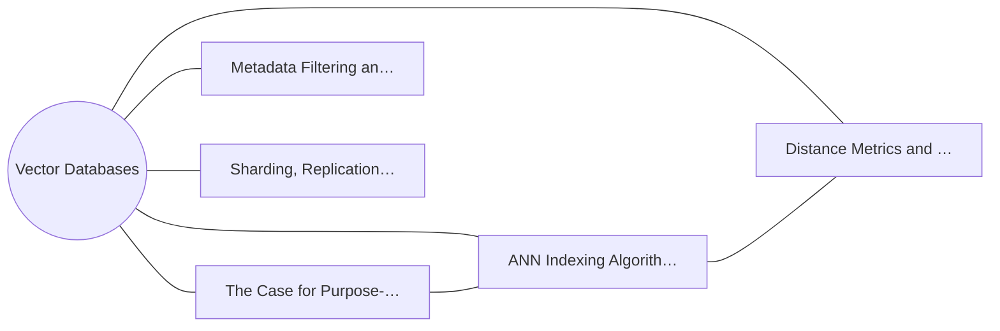

**Figure 15. Capability Map - Cost and Capacity Planning** (mermaid). Figure: Capability Map view for Vector Databases. This diagram illustrates the principal components and their interactions as discussed in the surrounding section.

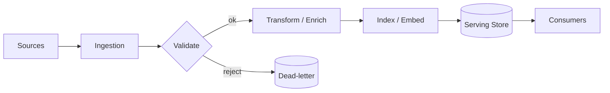

**Figure 16. Data Flow - Cost and Capacity Planning** (mermaid). Figure: Data Flow view for Vector Databases. This diagram illustrates the principal components and their interactions as discussed in the surrounding section.

## Deep Dive: Mechanics, Variants and Trade-offs

Having established the essentials, we now go deeper into cost and capacity planning. Beneath the abstraction lies a concrete process whose steps can each be measured, tested and optimised independently. The distinctions in this section are the ones that separate a working demo from a system that holds up under adversarial inputs, scale and the passage of time.

Consider the principal variants and how to choose between them. Each variant optimises for a different point in the design space - some for latency, some for accuracy, some for cost or operability - and the correct choice follows from explicit requirements rather than from defaults. As with most architectural decisions, the choice is rarely binary; the skill lies in quantifying the trade-offs and choosing deliberately.

In practice this is supported by a mature tooling ecosystem, including Pinecone, Weaviate, Qdrant, Milvus. Tools accelerate the work but do not substitute for understanding: the same principles apply whichever implementation you select, and the ability to reason from first principles is what lets you debug when a tool behaves unexpectedly.

A frequent source of subtle bugs is the interaction with the case for purpose-built vector stores. Because the case for purpose-built vector stores concerns why ANN, filtering and freshness demand specialised systems, changes there can silently alter the behaviour analysed here. The remedy is contract tests at the boundary and end-to-end evaluations that exercise the interaction explicitly.

Finally, attend to edge cases and degradation. Define what the system should do under partial failure, unexpected inputs and load spikes, and make that behaviour explicit and tested rather than emergent. Graceful degradation - returning a safe, useful result when the ideal one is unavailable - is a hallmark of mature engineering.

For deeper study, the literature offers authoritative treatments such as Malkov & Yashunin — HNSW (2016) and Johnson et al. — Billion-scale similarity search with GPUs / FAISS (2017). These primary sources reward careful reading and ground the practical guidance above in established results.

## Advanced Considerations

Having established the essentials, we now go deeper into cost and capacity planning. Beneath the abstraction lies a concrete process whose steps can each be measured, tested and optimised independently. The distinctions in this section are the ones that separate a working demo from a system that holds up under adversarial inputs, scale and the passage of time.

Consider the principal variants and how to choose between them. Each variant optimises for a different point in the design space - some for latency, some for accuracy, some for cost or operability - and the correct choice follows from explicit requirements rather than from defaults. There is an inherent trade-off between fidelity and cost, and the correct balance depends on the use case and its tolerance for error.

In practice this is supported by a mature tooling ecosystem, including Pinecone, Weaviate, Qdrant, Milvus. Tools accelerate the work but do not substitute for understanding: the same principles apply whichever implementation you select, and the ability to reason from first principles is what lets you debug when a tool behaves unexpectedly.

A frequent source of subtle bugs is the interaction with hybrid and multi-vector retrieval. Because hybrid and multi-vector retrieval concerns late-interaction (ColBERT) and sparse+dense fusion, changes there can silently alter the behaviour analysed here. The remedy is contract tests at the boundary and end-to-end evaluations that exercise the interaction explicitly.

Finally, attend to edge cases and degradation. Define what the system should do under partial failure, unexpected inputs and load spikes, and make that behaviour explicit and tested rather than emergent. Graceful degradation - returning a safe, useful result when the ideal one is unavailable - is a hallmark of mature engineering.

For deeper study, the literature offers authoritative treatments such as Malkov & Yashunin — HNSW (2016) and Johnson et al. — Billion-scale similarity search with GPUs / FAISS (2017). These primary sources reward careful reading and ground the practical guidance above in established results.

## Worked Example

Consider a concrete scenario. A knowledge organisation needs powering RAG over millions of enterprise documents. They decide to apply cost and capacity planning as part of their Vector Databases solution, but wisely treat it as a hypothesis to be validated rather than a foregone conclusion.

The team begins by stating the objective precisely and defining how success will be measured before writing any code. They establish a small but representative evaluation set, agree on acceptance thresholds, and only then prototype the simplest design that could work. Early measurement reveals which assumptions hold and which must be revised, saving weeks of misdirected effort and surfacing edge cases while they are still cheap to fix.

As the prototype matures into a service, the team hardens it: adding input validation, error handling, caching where it pays off, and monitoring that ties back to the original success metric. They document each significant decision in an architecture decision record so that future maintainers understand not just what was built but why.

The outcome is instructive. The system that reaches production is not the most sophisticated design the team considered, but the one whose behaviour they could measure, explain and operate. This is the recurring lesson of Vector Databases: durable value comes from the whole system, not from any single clever component.

## Industry Use Cases

Across industries, the ideas in this chapter recur in recognisable ways. The following vignettes show how different sectors apply them and what they have in common.

**Knowledge.** Powering RAG over millions of enterprise documents. The common thread is that value comes not from the model alone but from the surrounding system - data quality, evaluation, integration and operations - which is precisely where most of the engineering effort belongs.

**Media.** Visual similarity search across large catalogues. The common thread is that value comes not from the model alone but from the surrounding system - data quality, evaluation, integration and operations - which is precisely where most of the engineering effort belongs.

**Security.** Anomaly and similarity detection on event embeddings. The common thread is that value comes not from the model alone but from the surrounding system - data quality, evaluation, integration and operations - which is precisely where most of the engineering effort belongs.

**Recommendations.** Real-time candidate generation from user vectors. The common thread is that value comes not from the model alone but from the surrounding system - data quality, evaluation, integration and operations - which is precisely where most of the engineering effort belongs.

## Best Practices

The following practices consistently separate successful Vector Databases efforts from struggling ones. They are deliberately concrete so they can be adopted as checklist items in design and code review.

- Choose HNSW for low latency, IVF/PQ for memory-constrained scale.
- Benchmark recall and p99 latency on your real data, not synthetic.
- Plan re-indexing strategy before you need it.
- Isolate tenants by namespace and enforce access control.

None of these are exotic; they are the unglamorous disciplines that compound into reliability. The cost of adopting them is small compared with the cost of the incidents they prevent, and they become second nature with practice.

## Common Pitfalls

Equally instructive are the failure modes that recur in practice. Each pitfall below has a clear early warning sign and a known remedy, so treat them as a diagnostic checklist when something feels wrong:

- Assuming exact search; ANN trades recall for speed.
- Post-filtering that silently drops recall on selective queries.
- Underestimating memory for in-RAM HNSW at scale.
- No plan for embedding-model upgrades and re-indexing.

The pattern is consistent: most failures stem from skipping measurement, conflating prototype and production standards, or deferring cross-cutting concerns such as security and cost until they become emergencies. Naming these traps in advance is the cheapest way to avoid them.

## Governance, Security and Cost Notes

No discussion of cost and capacity planning is complete without its governance, security and cost dimensions, which are too often deferred until they become emergencies. Treating them as first-class concerns from the outset is both cheaper and safer.

**Governance.** Classify the risk of this capability, document its intended and out-of-scope uses, and ensure decisions are traceable to satisfy internal policy and external regulation such as the NIST AI RMF, ISO/IEC 42001 and the EU AI Act. **Security.** Treat all external input as untrusted, validate outputs before acting on them, apply least privilege to any tools or data access, and map controls to the OWASP LLM Top 10 and MITRE ATLAS.

**Cost and sustainability.** Establish explicit budgets for compute, tokens and latency, attribute spend to owners, and revisit the economics as usage scales - a design that is affordable at pilot scale can become untenable at production volume. Building these reflexes into everyday engineering is what allows a Vector Databases system to be not only capable but also trustworthy and economically sound.

## Hands-On Exercises

Work through the following exercises. They are designed to move understanding from recognition to application - the level required for real engineering work - so prefer writing and building over merely reading.

1. Explain cost and capacity planning to a colleague unfamiliar with Vector Databases, using a concrete example from your own domain.
2. Sketch a reference architecture that incorporates cost and capacity planning and annotate where observability, security and cost controls belong.
3. Design an evaluation that would tell you whether cost and capacity planning is working in production, including the metric, the dataset and the acceptance threshold.
4. Identify two pitfalls relevant to cost and capacity planning in your environment and describe the early warning signals you would monitor.
5. Prototype the simplest implementation that demonstrates cost and capacity planning, then list exactly what would need to change to make it production-ready.

## Key Takeaways

Key takeaways from this chapter:

- Cost and Capacity Planning is a systems concern in Vector Databases: data, models and operations must be co-designed.
- Measurement is non-negotiable; define success metrics and evaluation before building.
- Favour the simplest design that meets the requirement, and add complexity only when evidence demands it.
- Security, cost and observability are first-class requirements, not afterthoughts.
- Document decisions so the system remains understandable and operable as it evolves.

## Code Walkthrough

Pipelines keep Cost and Capacity Planning logic modular and testable. Each stage is a pure function, errors are captured per item, and the composition is trivial to extend or reorder.

The full listing is shown below; study it line by line and reproduce it locally before moving on.

### Listing: A composable processing pipeline for Cost and Capacity Planning

```python
from collections.abc import Iterable, Iterator
from typing import Protocol


class Stage(Protocol):
    def __call__(self, item: dict) -> dict: ...


def pipeline(stages: list[Stage]) -> Stage:
    """Compose ordered stages into a single callable for Cost and Capacity Planning."""

    def run(item: dict) -> dict:
        for stage in stages:
            item = stage(item)
        return item

    return run


def validate(item: dict) -> dict:
    if "text" not in item:
        raise ValueError("missing required field: text")
    return item


def normalise(item: dict) -> dict:
    item["text"] = item["text"].strip().lower()
    return item


def enrich(item: dict) -> dict:
    item["length"] = len(item["text"])
    return item


process = pipeline([validate, normalise, enrich])


def run_batch(items: Iterable[dict]) -> Iterator[dict]:
    for item in items:
        try:
            yield process(dict(item))
        except ValueError as exc:
            yield {"error": str(exc), "item": item}

```

## Review Questions

1. In the context of Vector Databases, which statement best describes “Cost and Capacity Planning”?
   - A. It is only relevant to academic research, not production.
   - B. It makes the system slower but has no other effect.
   - C. Memory versus disk indexes and right-sizing infrastructure.
   - D. It removes all security and governance requirements.
   - **Answer: C.** Cost and Capacity Planning: Memory versus disk indexes and right-sizing infrastructure.
2. Which of the following is a recommended best practice when working with Vector Databases?
   - A. It eliminates the need for any evaluation or monitoring.
   - B. No plan for embedding-model upgrades and re-indexing.
   - C. Plan re-indexing strategy before you need it.
   - D. It removes all security and governance requirements.
   - **Answer: C.** Best practice: Plan re-indexing strategy before you need it.
3. Which of the following is a common pitfall to avoid in Vector Databases?
   - A. It eliminates the need for any evaluation or monitoring.
   - B. Post-filtering that silently drops recall on selective queries.
   - C. It applies exclusively to image data.
   - D. Isolate tenants by namespace and enforce access control.
   - **Answer: B.** Pitfall to avoid: Post-filtering that silently drops recall on selective queries.
4. *(Discussion)* Describe a failure mode of Cost and Capacity Planning and how you would mitigate it.
   - **Model answer:** A strong answer defines cost and capacity planning (Memory versus disk indexes and right-sizing infrastructure.) then connects it to architecture, evaluation, cost, security and operations for Vector Databases, citing concrete trade-offs and a real-world example.

---


# Chapter 11. Operating in Production

_This chapter examines operating in production within Vector Databases. It covers backups, monitoring, re-indexing and disaster recovery, derives a reference architecture, walks through a worked example and runnable code, surveys industry use cases, and distils best practices and pitfalls, closing with exercises and review questions._

## Introduction

Operating in Production can be characterised as backups, monitoring, re-indexing and disaster recovery. Neglecting it is one of the most common reasons Vector Databases initiatives stall in production. What distinguishes a production-grade approach from a prototype is the discipline of measurement: every claim is backed by an evaluation rather than intuition.

This chapter builds intuition first, then formalises the ideas, derives an architecture, and finishes with code, exercises and review questions so the material transfers directly to your own Vector Databases work. Read it actively: pause at each diagram, reproduce the code, and attempt the exercises before consulting the answers.

## Theory and Foundations

In practical terms, Operating in Production is best understood as backups, monitoring, re-indexing and disaster recovery. It helps to separate the conceptual model from its implementation: the former guides reasoning, the latter must contend with real-world constraints. Beneath the abstraction lies a concrete process whose steps can each be measured, tested and optimised independently.

To place this in context, recall the broader picture: Vector databases store embeddings alongside metadata and provide fast approximate nearest-neighbour search, filtering and hybrid retrieval. Within that picture, operating in production is one of the load-bearing ideas - the kind that, when understood deeply, makes the rest of Vector Databases fall into place. Neglecting it is one of the most common reasons Vector Databases initiatives stall in production.

Operating in Production cannot be understood in isolation from choosing a vector database. Recall that choosing a vector database concerns managed versus self-hosted and integration considerations. The two interact directly: decisions in one constrain the design space of the other, which is why mature teams reason about them together rather than sequentially. As with most architectural decisions, the choice is rarely binary; the skill lies in quantifying the trade-offs and choosing deliberately.

Operating in Production cannot be understood in isolation from sharding, replication and scaling. Recall that sharding, replication and scaling concerns horizontal scaling, consistency models and high availability. The two interact directly: decisions in one constrain the design space of the other, which is why mature teams reason about them together rather than sequentially. There is an inherent trade-off between fidelity and cost, and the correct balance depends on the use case and its tolerance for error.

Several established patterns apply directly to operating in production. The first, disk-based indexes for billion-scale corpora, is widely adopted because it makes the system's behaviour predictable and observable. A complementary pattern, namespace-per-tenant isolation, addresses a related concern and is often deployed alongside it. Patterns are not dogma; they are distilled experience that shortcuts the search for a sound design, and each carries assumptions worth checking against your context.

It is worth being explicit about when to apply this and when to reach for something simpler. In a small prototype, shortcuts around operating in production are invisible; in a production Vector Databases system serving real traffic, they surface as incidents, cost overruns or compliance gaps. As with most architectural decisions, the choice is rarely binary; the skill lies in quantifying the trade-offs and choosing deliberately. The remainder of this chapter turns these principles into an architecture, code and a checklist you can apply immediately.

## Architecture and Design

From an architectural standpoint, Operating in Production sits at the intersection of data, models and operations. A vector database deployment partitions collections into shards, each holding an ANN index in memory or on SSD, replicated for availability. A query coordinator fans out filtered ANN searches, merges results and applies metadata predicates. An ingestion path handles upserts and deletes with background index maintenance.

Concretely, the principal building blocks include the case for purpose-built vector stores, ann indexing algorithms, distance metrics and quantisation, metadata filtering and hybrid queries and sharding, replication and scaling. Each is a replaceable component behind a stable interface, so the team can upgrade an implementation - a model, an index, a policy engine - without rewriting its neighbours. The contracts between components are where reliability is won or lost, so they are specified explicitly and tested in isolation.

The diagram accompanying this section makes the data and control flow explicit. Requests enter through a well-defined boundary where they are authenticated and validated; only then are they dispatched to the components that perform the work. This boundary is also where rate limiting, quota enforcement and audit logging live, keeping cross-cutting concerns out of the core logic and in one auditable place.

Two qualities deserve emphasis. First, observability is designed in, not bolted on: every component emits structured telemetry so that failures can be localised in minutes rather than hours. Second, the architecture is evolvable - components communicate through stable contracts so that any single part of the Vector Databases system can be replaced without a rewrite. As with most architectural decisions, the choice is rarely binary; the skill lies in quantifying the trade-offs and choosing deliberately.


**Figure 17. Data Flow - Operating in Production** (mermaid). Figure: Data Flow view for Vector Databases. This diagram illustrates the principal components and their interactions as discussed in the surrounding section.

<div class="diagram-svg">

<svg xmlns="http://www.w3.org/2000/svg" width="760" height="380" viewBox="0 0 760 380" font-family="Inter, Segoe UI, Arial, sans-serif">
<defs><marker id="arrow" markerWidth="10" markerHeight="10" refX="8" refY="3" orient="auto" markerUnits="strokeWidth"><path d="M0,0 L8,3 L0,6 z" fill="#94a3b8"/></marker><marker id="arrowA" markerWidth="10" markerHeight="10" refX="8" refY="3" orient="auto" markerUnits="strokeWidth"><path d="M0,0 L8,3 L0,6 z" fill="#4338ca"/></marker></defs>
<rect width="760" height="380" rx="12" fill="#f8fafc"/>
<text x="380" y="30" text-anchor="middle" font-size="17" font-weight="700" fill="#0f172a">Business Process - Operating in Production</text>
<rect x="40.0" y="166.0" width="104" height="60" rx="10" fill="#ffffff" stroke="#4338ca" stroke-width="2"/><text x="92.0" y="200.08" text-anchor="middle" font-size="12" font-weight="600" fill="#0f172a">Intake</text>
<rect x="155.2" y="166.0" width="104" height="60" rx="10" fill="#ffffff" stroke="#7c3aed" stroke-width="2"/><text x="207.2" y="200.08" text-anchor="middle" font-size="12" font-weight="600" fill="#0f172a">Assess</text>
<line x1="144.0" y1="196.0" x2="155.2" y2="196.0" stroke="#4338ca" stroke-width="2" marker-end="url(#arrowA)"/>
<rect x="270.4" y="166.0" width="104" height="60" rx="10" fill="#ffffff" stroke="#0891b2" stroke-width="2"/><text x="322.4" y="200.08" text-anchor="middle" font-size="12" font-weight="600" fill="#0f172a">Decide</text>
<line x1="259.2" y1="196.0" x2="270.4" y2="196.0" stroke="#4338ca" stroke-width="2" marker-end="url(#arrowA)"/>
<rect x="385.6" y="166.0" width="104" height="60" rx="10" fill="#ffffff" stroke="#059669" stroke-width="2"/><text x="437.6" y="200.08" text-anchor="middle" font-size="12" font-weight="600" fill="#0f172a">Execute</text>
<line x1="374.4" y1="196.0" x2="385.6" y2="196.0" stroke="#4338ca" stroke-width="2" marker-end="url(#arrowA)"/>
<rect x="500.8" y="166.0" width="104" height="60" rx="10" fill="#ffffff" stroke="#d97706" stroke-width="2"/><text x="552.8" y="200.08" text-anchor="middle" font-size="12" font-weight="600" fill="#0f172a">Review</text>
<line x1="489.6" y1="196.0" x2="500.8" y2="196.0" stroke="#4338ca" stroke-width="2" marker-end="url(#arrowA)"/>
<rect x="616.0" y="166.0" width="104" height="60" rx="10" fill="#ffffff" stroke="#dc2626" stroke-width="2"/><text x="668.0" y="200.08" text-anchor="middle" font-size="12" font-weight="600" fill="#0f172a">Close</text>
<line x1="604.8" y1="196.0" x2="616.0" y2="196.0" stroke="#4338ca" stroke-width="2" marker-end="url(#arrowA)"/>
<path d="M668.0,226.0 q0,46 -288.0,46 q-288.0,0 -288.0,-46" fill="none" stroke="#cbd5e1" stroke-width="1.6" stroke-dasharray="5 4" marker-end="url(#arrow)"/>
<text x="380.0" y="288.0" text-anchor="middle" font-size="9.5" fill="#94a3b8">feedback / monitoring loop</text>
</svg>

</div>

**Figure 18. Business Process - Operating in Production** (svg). Figure: Business Process view for Vector Databases. This diagram illustrates the principal components and their interactions as discussed in the surrounding section.

## Deep Dive: Mechanics, Variants and Trade-offs

Having established the essentials, we now go deeper into operating in production. The underlying mechanism is best appreciated by tracing a single request from input to output and noting where state is created and consumed. The distinctions in this section are the ones that separate a working demo from a system that holds up under adversarial inputs, scale and the passage of time.

Consider the principal variants and how to choose between them. Each variant optimises for a different point in the design space - some for latency, some for accuracy, some for cost or operability - and the correct choice follows from explicit requirements rather than from defaults. Latency, accuracy and cost form a tension triangle: improving one typically pressures the others, so explicit budgets are essential.

In practice this is supported by a mature tooling ecosystem, including Pinecone, Weaviate, Qdrant, Milvus. Tools accelerate the work but do not substitute for understanding: the same principles apply whichever implementation you select, and the ability to reason from first principles is what lets you debug when a tool behaves unexpectedly.

A frequent source of subtle bugs is the interaction with choosing a vector database. Because choosing a vector database concerns managed versus self-hosted and integration considerations, changes there can silently alter the behaviour analysed here. The remedy is contract tests at the boundary and end-to-end evaluations that exercise the interaction explicitly.

Finally, attend to edge cases and degradation. Define what the system should do under partial failure, unexpected inputs and load spikes, and make that behaviour explicit and tested rather than emergent. Graceful degradation - returning a safe, useful result when the ideal one is unavailable - is a hallmark of mature engineering.

For deeper study, the literature offers authoritative treatments such as Malkov & Yashunin — HNSW (2016) and Johnson et al. — Billion-scale similarity search with GPUs / FAISS (2017). These primary sources reward careful reading and ground the practical guidance above in established results.

## Advanced Considerations

Having established the essentials, we now go deeper into operating in production. Beneath the abstraction lies a concrete process whose steps can each be measured, tested and optimised independently. The distinctions in this section are the ones that separate a working demo from a system that holds up under adversarial inputs, scale and the passage of time.

Consider the principal variants and how to choose between them. Each variant optimises for a different point in the design space - some for latency, some for accuracy, some for cost or operability - and the correct choice follows from explicit requirements rather than from defaults. Latency, accuracy and cost form a tension triangle: improving one typically pressures the others, so explicit budgets are essential.

In practice this is supported by a mature tooling ecosystem, including Pinecone, Weaviate, Qdrant, Milvus. Tools accelerate the work but do not substitute for understanding: the same principles apply whichever implementation you select, and the ability to reason from first principles is what lets you debug when a tool behaves unexpectedly.

A frequent source of subtle bugs is the interaction with cost and capacity planning. Because cost and capacity planning concerns memory versus disk indexes and right-sizing infrastructure, changes there can silently alter the behaviour analysed here. The remedy is contract tests at the boundary and end-to-end evaluations that exercise the interaction explicitly.

Finally, attend to edge cases and degradation. Define what the system should do under partial failure, unexpected inputs and load spikes, and make that behaviour explicit and tested rather than emergent. Graceful degradation - returning a safe, useful result when the ideal one is unavailable - is a hallmark of mature engineering.

For deeper study, the literature offers authoritative treatments such as Malkov & Yashunin — HNSW (2016) and Johnson et al. — Billion-scale similarity search with GPUs / FAISS (2017). These primary sources reward careful reading and ground the practical guidance above in established results.

## Worked Example

Consider a concrete scenario. A knowledge organisation needs powering RAG over millions of enterprise documents. They decide to apply operating in production as part of their Vector Databases solution, but wisely treat it as a hypothesis to be validated rather than a foregone conclusion.

The team begins by stating the objective precisely and defining how success will be measured before writing any code. They establish a small but representative evaluation set, agree on acceptance thresholds, and only then prototype the simplest design that could work. Early measurement reveals which assumptions hold and which must be revised, saving weeks of misdirected effort and surfacing edge cases while they are still cheap to fix.

As the prototype matures into a service, the team hardens it: adding input validation, error handling, caching where it pays off, and monitoring that ties back to the original success metric. They document each significant decision in an architecture decision record so that future maintainers understand not just what was built but why.

The outcome is instructive. The system that reaches production is not the most sophisticated design the team considered, but the one whose behaviour they could measure, explain and operate. This is the recurring lesson of Vector Databases: durable value comes from the whole system, not from any single clever component.

## Industry Use Cases

Across industries, the ideas in this chapter recur in recognisable ways. The following vignettes show how different sectors apply them and what they have in common.

**Knowledge.** Powering RAG over millions of enterprise documents. The common thread is that value comes not from the model alone but from the surrounding system - data quality, evaluation, integration and operations - which is precisely where most of the engineering effort belongs.

**Media.** Visual similarity search across large catalogues. The common thread is that value comes not from the model alone but from the surrounding system - data quality, evaluation, integration and operations - which is precisely where most of the engineering effort belongs.

**Security.** Anomaly and similarity detection on event embeddings. The common thread is that value comes not from the model alone but from the surrounding system - data quality, evaluation, integration and operations - which is precisely where most of the engineering effort belongs.

**Recommendations.** Real-time candidate generation from user vectors. The common thread is that value comes not from the model alone but from the surrounding system - data quality, evaluation, integration and operations - which is precisely where most of the engineering effort belongs.

## Best Practices

The following practices consistently separate successful Vector Databases efforts from struggling ones. They are deliberately concrete so they can be adopted as checklist items in design and code review.

- Choose HNSW for low latency, IVF/PQ for memory-constrained scale.
- Benchmark recall and p99 latency on your real data, not synthetic.
- Plan re-indexing strategy before you need it.
- Isolate tenants by namespace and enforce access control.

None of these are exotic; they are the unglamorous disciplines that compound into reliability. The cost of adopting them is small compared with the cost of the incidents they prevent, and they become second nature with practice.

## Common Pitfalls

Equally instructive are the failure modes that recur in practice. Each pitfall below has a clear early warning sign and a known remedy, so treat them as a diagnostic checklist when something feels wrong:

- Assuming exact search; ANN trades recall for speed.
- Post-filtering that silently drops recall on selective queries.
- Underestimating memory for in-RAM HNSW at scale.
- No plan for embedding-model upgrades and re-indexing.

The pattern is consistent: most failures stem from skipping measurement, conflating prototype and production standards, or deferring cross-cutting concerns such as security and cost until they become emergencies. Naming these traps in advance is the cheapest way to avoid them.

## Governance, Security and Cost Notes

No discussion of operating in production is complete without its governance, security and cost dimensions, which are too often deferred until they become emergencies. Treating them as first-class concerns from the outset is both cheaper and safer.

**Governance.** Classify the risk of this capability, document its intended and out-of-scope uses, and ensure decisions are traceable to satisfy internal policy and external regulation such as the NIST AI RMF, ISO/IEC 42001 and the EU AI Act. **Security.** Treat all external input as untrusted, validate outputs before acting on them, apply least privilege to any tools or data access, and map controls to the OWASP LLM Top 10 and MITRE ATLAS.

**Cost and sustainability.** Establish explicit budgets for compute, tokens and latency, attribute spend to owners, and revisit the economics as usage scales - a design that is affordable at pilot scale can become untenable at production volume. Building these reflexes into everyday engineering is what allows a Vector Databases system to be not only capable but also trustworthy and economically sound.

## Hands-On Exercises

Work through the following exercises. They are designed to move understanding from recognition to application - the level required for real engineering work - so prefer writing and building over merely reading.

1. Explain operating in production to a colleague unfamiliar with Vector Databases, using a concrete example from your own domain.
2. Sketch a reference architecture that incorporates operating in production and annotate where observability, security and cost controls belong.
3. Design an evaluation that would tell you whether operating in production is working in production, including the metric, the dataset and the acceptance threshold.
4. Identify two pitfalls relevant to operating in production in your environment and describe the early warning signals you would monitor.
5. Prototype the simplest implementation that demonstrates operating in production, then list exactly what would need to change to make it production-ready.

## Key Takeaways

Key takeaways from this chapter:

- Operating in Production is a systems concern in Vector Databases: data, models and operations must be co-designed.
- Measurement is non-negotiable; define success metrics and evaluation before building.
- Favour the simplest design that meets the requirement, and add complexity only when evidence demands it.
- Security, cost and observability are first-class requirements, not afterthoughts.
- Document decisions so the system remains understandable and operable as it evolves.

## Code Walkthrough

This listing shows a configuration-driven Operating in Production component with retry semantics and typed interfaces — the shape we expect from production Vector Databases code rather than a notebook prototype.

The full listing is shown below; study it line by line and reproduce it locally before moving on.

### Listing: Implementing a Operating in Production component

```python
from __future__ import annotations

from dataclasses import dataclass, field
from typing import Any


@dataclass(slots=True)
class OperatingInProductionConfig:
    """Configuration for the Operating in Production component in a Vector Databases system."""

    name: str
    timeout_s: float = 30.0
    max_retries: int = 3
    options: dict[str, Any] = field(default_factory=dict)


class OperatingInProduction:
    """A minimal, production-shaped implementation of Operating in Production."""

    def __init__(self, config: OperatingInProductionConfig) -> None:
        self._config = config
        self._calls = 0

    def run(self, payload: dict[str, Any]) -> dict[str, Any]:
        """Process a request, retrying transient failures with backoff."""
        last_error: Exception | None = None
        for attempt in range(self._config.max_retries):
            try:
                self._calls += 1
                return self._process(payload)
            except TimeoutError as exc:  # transient
                last_error = exc
                continue
        raise RuntimeError(f"OperatingInProduction failed after retries") from last_error

    def _process(self, payload: dict[str, Any]) -> dict[str, Any]:
        # Domain-specific logic for Operating in Production goes here.
        return {"status": "ok", "input_keys": sorted(payload), "calls": self._calls}

```

## Review Questions

1. In the context of Vector Databases, which statement best describes “Operating in Production”?
   - A. It eliminates the need for any evaluation or monitoring.
   - B. It makes the system slower but has no other effect.
   - C. It applies exclusively to image data.
   - D. Backups, monitoring, re-indexing and disaster recovery.
   - **Answer: D.** Operating in Production: Backups, monitoring, re-indexing and disaster recovery.
2. Which of the following is a recommended best practice when working with Vector Databases?
   - A. It guarantees deterministic output regardless of input.
   - B. Isolate tenants by namespace and enforce access control.
   - C. It removes all security and governance requirements.
   - D. Post-filtering that silently drops recall on selective queries.
   - **Answer: B.** Best practice: Isolate tenants by namespace and enforce access control.
3. Which of the following is a common pitfall to avoid in Vector Databases?
   - A. It eliminates the need for any evaluation or monitoring.
   - B. Benchmark recall and p99 latency on your real data, not synthetic.
   - C. Plan re-indexing strategy before you need it.
   - D. Assuming exact search; ANN trades recall for speed.
   - **Answer: D.** Pitfall to avoid: Assuming exact search; ANN trades recall for speed.
4. *(Discussion)* Explain Operating in Production and why it matters in a production Vector Databases system.
   - **Model answer:** A strong answer defines operating in production (Backups, monitoring, re-indexing and disaster recovery.) then connects it to architecture, evaluation, cost, security and operations for Vector Databases, citing concrete trade-offs and a real-world example.

---


# Chapter 12. Choosing a Vector Database

_This chapter examines choosing a vector database within Vector Databases. It covers managed versus self-hosted and integration considerations, derives a reference architecture, walks through a worked example and runnable code, surveys industry use cases, and distils best practices and pitfalls, closing with exercises and review questions._

## Introduction

Choosing a Vector Database refers to managed versus self-hosted and integration considerations. Understanding this matters because Vector Databases systems succeed or fail on exactly these decisions. It helps to separate the conceptual model from its implementation: the former guides reasoning, the latter must contend with real-world constraints.

This chapter builds intuition first, then formalises the ideas, derives an architecture, and finishes with code, exercises and review questions so the material transfers directly to your own Vector Databases work. Read it actively: pause at each diagram, reproduce the code, and attempt the exercises before consulting the answers.

## Theory and Foundations

Choosing a Vector Database refers to managed versus self-hosted and integration considerations. Seasoned practitioners treat this as a systems problem, co-designing data, models and operations rather than optimising any one in isolation. It pays to understand the mechanism rather than treat it as a black box, because most production incidents are explained by one of its steps misbehaving.

To place this in context, recall the broader picture: Vector databases store embeddings alongside metadata and provide fast approximate nearest-neighbour search, filtering and hybrid retrieval. Within that picture, choosing a vector database is one of the load-bearing ideas - the kind that, when understood deeply, makes the rest of Vector Databases fall into place. Getting this right early prevents expensive rework once a Vector Databases system reaches scale.

Choosing a Vector Database cannot be understood in isolation from metadata filtering and hybrid queries. Recall that metadata filtering and hybrid queries concerns pre- versus post-filtering and combining structured predicates with vectors. The two interact directly: decisions in one constrain the design space of the other, which is why mature teams reason about them together rather than sequentially. Every added component buys capability at the price of operational surface area, and that bargain should be made consciously.

Choosing a Vector Database cannot be understood in isolation from sharding, replication and scaling. Recall that sharding, replication and scaling concerns horizontal scaling, consistency models and high availability. The two interact directly: decisions in one constrain the design space of the other, which is why mature teams reason about them together rather than sequentially. As with most architectural decisions, the choice is rarely binary; the skill lies in quantifying the trade-offs and choosing deliberately.

Several established patterns apply directly to choosing a vector database. The first, pre-filter on selective metadata, post-filter otherwise, is widely adopted because it makes the system's behaviour predictable and observable. A complementary pattern, disk-based indexes for billion-scale corpora, addresses a related concern and is often deployed alongside it. Patterns are not dogma; they are distilled experience that shortcuts the search for a sound design, and each carries assumptions worth checking against your context.

Knowing when not to use a technique is as valuable as knowing how to use it. In a small prototype, shortcuts around choosing a vector database are invisible; in a production Vector Databases system serving real traffic, they surface as incidents, cost overruns or compliance gaps. Simplicity is a feature. The simplest design that meets the requirement should be the default, with complexity added only when measurement justifies it. The remainder of this chapter turns these principles into an architecture, code and a checklist you can apply immediately.

## Architecture and Design

The reference architecture for Choosing a Vector Database separates concerns into clearly bounded components with explicit contracts. A vector database deployment partitions collections into shards, each holding an ANN index in memory or on SSD, replicated for availability. A query coordinator fans out filtered ANN searches, merges results and applies metadata predicates. An ingestion path handles upserts and deletes with background index maintenance.

Concretely, the principal building blocks include the case for purpose-built vector stores, ann indexing algorithms, distance metrics and quantisation, metadata filtering and hybrid queries and sharding, replication and scaling. Each is a replaceable component behind a stable interface, so the team can upgrade an implementation - a model, an index, a policy engine - without rewriting its neighbours. The contracts between components are where reliability is won or lost, so they are specified explicitly and tested in isolation.

The diagram accompanying this section makes the data and control flow explicit. Requests enter through a well-defined boundary where they are authenticated and validated; only then are they dispatched to the components that perform the work. This boundary is also where rate limiting, quota enforcement and audit logging live, keeping cross-cutting concerns out of the core logic and in one auditable place.

Two qualities deserve emphasis. First, observability is designed in, not bolted on: every component emits structured telemetry so that failures can be localised in minutes rather than hours. Second, the architecture is evolvable - components communicate through stable contracts so that any single part of the Vector Databases system can be replaced without a rewrite. As with most architectural decisions, the choice is rarely binary; the skill lies in quantifying the trade-offs and choosing deliberately.


**Figure 19. Business Process - Choosing a Vector Database** (mermaid). Figure: Business Process view for Vector Databases. This diagram illustrates the principal components and their interactions as discussed in the surrounding section.

## Deep Dive: Mechanics, Variants and Trade-offs

Having established the essentials, we now go deeper into choosing a vector database. The underlying mechanism is best appreciated by tracing a single request from input to output and noting where state is created and consumed. The distinctions in this section are the ones that separate a working demo from a system that holds up under adversarial inputs, scale and the passage of time.

Consider the principal variants and how to choose between them. Each variant optimises for a different point in the design space - some for latency, some for accuracy, some for cost or operability - and the correct choice follows from explicit requirements rather than from defaults. There is an inherent trade-off between fidelity and cost, and the correct balance depends on the use case and its tolerance for error.

In practice this is supported by a mature tooling ecosystem, including Pinecone, Weaviate, Qdrant, Milvus. Tools accelerate the work but do not substitute for understanding: the same principles apply whichever implementation you select, and the ability to reason from first principles is what lets you debug when a tool behaves unexpectedly.

A frequent source of subtle bugs is the interaction with metadata filtering and hybrid queries. Because metadata filtering and hybrid queries concerns pre- versus post-filtering and combining structured predicates with vectors, changes there can silently alter the behaviour analysed here. The remedy is contract tests at the boundary and end-to-end evaluations that exercise the interaction explicitly.

Finally, attend to edge cases and degradation. Define what the system should do under partial failure, unexpected inputs and load spikes, and make that behaviour explicit and tested rather than emergent. Graceful degradation - returning a safe, useful result when the ideal one is unavailable - is a hallmark of mature engineering.

For deeper study, the literature offers authoritative treatments such as Malkov & Yashunin — HNSW (2016) and Johnson et al. — Billion-scale similarity search with GPUs / FAISS (2017). These primary sources reward careful reading and ground the practical guidance above in established results.

## Advanced Considerations

Having established the essentials, we now go deeper into choosing a vector database. Mechanically, the behaviour emerges from a few interacting parts that are simpler than the whole they produce. The distinctions in this section are the ones that separate a working demo from a system that holds up under adversarial inputs, scale and the passage of time.

Consider the principal variants and how to choose between them. Each variant optimises for a different point in the design space - some for latency, some for accuracy, some for cost or operability - and the correct choice follows from explicit requirements rather than from defaults. Latency, accuracy and cost form a tension triangle: improving one typically pressures the others, so explicit budgets are essential.

In practice this is supported by a mature tooling ecosystem, including Pinecone, Weaviate, Qdrant, Milvus. Tools accelerate the work but do not substitute for understanding: the same principles apply whichever implementation you select, and the ability to reason from first principles is what lets you debug when a tool behaves unexpectedly.

A frequent source of subtle bugs is the interaction with integration with the rag pipeline. Because integration with the rag pipeline concerns where the vector store sits and how it is queried, changes there can silently alter the behaviour analysed here. The remedy is contract tests at the boundary and end-to-end evaluations that exercise the interaction explicitly.

Finally, attend to edge cases and degradation. Define what the system should do under partial failure, unexpected inputs and load spikes, and make that behaviour explicit and tested rather than emergent. Graceful degradation - returning a safe, useful result when the ideal one is unavailable - is a hallmark of mature engineering.

For deeper study, the literature offers authoritative treatments such as Malkov & Yashunin — HNSW (2016) and Johnson et al. — Billion-scale similarity search with GPUs / FAISS (2017). These primary sources reward careful reading and ground the practical guidance above in established results.

## Worked Example

To ground the discussion, walk through a representative example. A security organisation needs anomaly and similarity detection on event embeddings. They decide to apply choosing a vector database as part of their Vector Databases solution, but wisely treat it as a hypothesis to be validated rather than a foregone conclusion.

The team begins by stating the objective precisely and defining how success will be measured before writing any code. They establish a small but representative evaluation set, agree on acceptance thresholds, and only then prototype the simplest design that could work. Early measurement reveals which assumptions hold and which must be revised, saving weeks of misdirected effort and surfacing edge cases while they are still cheap to fix.

As the prototype matures into a service, the team hardens it: adding input validation, error handling, caching where it pays off, and monitoring that ties back to the original success metric. They document each significant decision in an architecture decision record so that future maintainers understand not just what was built but why.

The outcome is instructive. The system that reaches production is not the most sophisticated design the team considered, but the one whose behaviour they could measure, explain and operate. This is the recurring lesson of Vector Databases: durable value comes from the whole system, not from any single clever component.

## Industry Use Cases

Across industries, the ideas in this chapter recur in recognisable ways. The following vignettes show how different sectors apply them and what they have in common.

**Knowledge.** Powering RAG over millions of enterprise documents. The common thread is that value comes not from the model alone but from the surrounding system - data quality, evaluation, integration and operations - which is precisely where most of the engineering effort belongs.

**Media.** Visual similarity search across large catalogues. The common thread is that value comes not from the model alone but from the surrounding system - data quality, evaluation, integration and operations - which is precisely where most of the engineering effort belongs.

**Security.** Anomaly and similarity detection on event embeddings. The common thread is that value comes not from the model alone but from the surrounding system - data quality, evaluation, integration and operations - which is precisely where most of the engineering effort belongs.

**Recommendations.** Real-time candidate generation from user vectors. The common thread is that value comes not from the model alone but from the surrounding system - data quality, evaluation, integration and operations - which is precisely where most of the engineering effort belongs.

## Best Practices

The following practices consistently separate successful Vector Databases efforts from struggling ones. They are deliberately concrete so they can be adopted as checklist items in design and code review.

- Choose HNSW for low latency, IVF/PQ for memory-constrained scale.
- Benchmark recall and p99 latency on your real data, not synthetic.
- Plan re-indexing strategy before you need it.
- Isolate tenants by namespace and enforce access control.

None of these are exotic; they are the unglamorous disciplines that compound into reliability. The cost of adopting them is small compared with the cost of the incidents they prevent, and they become second nature with practice.

## Common Pitfalls

Equally instructive are the failure modes that recur in practice. Each pitfall below has a clear early warning sign and a known remedy, so treat them as a diagnostic checklist when something feels wrong:

- Assuming exact search; ANN trades recall for speed.
- Post-filtering that silently drops recall on selective queries.
- Underestimating memory for in-RAM HNSW at scale.
- No plan for embedding-model upgrades and re-indexing.

The pattern is consistent: most failures stem from skipping measurement, conflating prototype and production standards, or deferring cross-cutting concerns such as security and cost until they become emergencies. Naming these traps in advance is the cheapest way to avoid them.

## Governance, Security and Cost Notes

No discussion of choosing a vector database is complete without its governance, security and cost dimensions, which are too often deferred until they become emergencies. Treating them as first-class concerns from the outset is both cheaper and safer.

**Governance.** Classify the risk of this capability, document its intended and out-of-scope uses, and ensure decisions are traceable to satisfy internal policy and external regulation such as the NIST AI RMF, ISO/IEC 42001 and the EU AI Act. **Security.** Treat all external input as untrusted, validate outputs before acting on them, apply least privilege to any tools or data access, and map controls to the OWASP LLM Top 10 and MITRE ATLAS.

**Cost and sustainability.** Establish explicit budgets for compute, tokens and latency, attribute spend to owners, and revisit the economics as usage scales - a design that is affordable at pilot scale can become untenable at production volume. Building these reflexes into everyday engineering is what allows a Vector Databases system to be not only capable but also trustworthy and economically sound.

## Hands-On Exercises

Work through the following exercises. They are designed to move understanding from recognition to application - the level required for real engineering work - so prefer writing and building over merely reading.

1. Explain choosing a vector database to a colleague unfamiliar with Vector Databases, using a concrete example from your own domain.
2. Sketch a reference architecture that incorporates choosing a vector database and annotate where observability, security and cost controls belong.
3. Design an evaluation that would tell you whether choosing a vector database is working in production, including the metric, the dataset and the acceptance threshold.
4. Identify two pitfalls relevant to choosing a vector database in your environment and describe the early warning signals you would monitor.
5. Prototype the simplest implementation that demonstrates choosing a vector database, then list exactly what would need to change to make it production-ready.

## Key Takeaways

Key takeaways from this chapter:

- Choosing a Vector Database is a systems concern in Vector Databases: data, models and operations must be co-designed.
- Measurement is non-negotiable; define success metrics and evaluation before building.
- Favour the simplest design that meets the requirement, and add complexity only when evidence demands it.
- Security, cost and observability are first-class requirements, not afterthoughts.
- Document decisions so the system remains understandable and operable as it evolves.

## Code Walkthrough

Pipelines keep Choosing a Vector Database logic modular and testable. Each stage is a pure function, errors are captured per item, and the composition is trivial to extend or reorder.

The full listing is shown below; study it line by line and reproduce it locally before moving on.

### Listing: A composable processing pipeline for Choosing a Vector Database

```python
from collections.abc import Iterable, Iterator
from typing import Protocol


class Stage(Protocol):
    def __call__(self, item: dict) -> dict: ...


def pipeline(stages: list[Stage]) -> Stage:
    """Compose ordered stages into a single callable for Choosing a Vector Database."""

    def run(item: dict) -> dict:
        for stage in stages:
            item = stage(item)
        return item

    return run


def validate(item: dict) -> dict:
    if "text" not in item:
        raise ValueError("missing required field: text")
    return item


def normalise(item: dict) -> dict:
    item["text"] = item["text"].strip().lower()
    return item


def enrich(item: dict) -> dict:
    item["length"] = len(item["text"])
    return item


process = pipeline([validate, normalise, enrich])


def run_batch(items: Iterable[dict]) -> Iterator[dict]:
    for item in items:
        try:
            yield process(dict(item))
        except ValueError as exc:
            yield {"error": str(exc), "item": item}

```

## Review Questions

1. In the context of Vector Databases, which statement best describes “Choosing a Vector Database”?
   - A. It makes the system slower but has no other effect.
   - B. It eliminates the need for any evaluation or monitoring.
   - C. Managed versus self-hosted and integration considerations.
   - D. It applies exclusively to image data.
   - **Answer: C.** Choosing a Vector Database: Managed versus self-hosted and integration considerations.
2. Which of the following is a recommended best practice when working with Vector Databases?
   - A. It guarantees deterministic output regardless of input.
   - B. Underestimating memory for in-RAM HNSW at scale.
   - C. It makes the system slower but has no other effect.
   - D. Isolate tenants by namespace and enforce access control.
   - **Answer: D.** Best practice: Isolate tenants by namespace and enforce access control.
3. Which of the following is a common pitfall to avoid in Vector Databases?
   - A. It makes the system slower but has no other effect.
   - B. Assuming exact search; ANN trades recall for speed.
   - C. Benchmark recall and p99 latency on your real data, not synthetic.
   - D. It is only relevant to academic research, not production.
   - **Answer: B.** Pitfall to avoid: Assuming exact search; ANN trades recall for speed.
4. *(Discussion)* How does Choosing a Vector Database interact with security and governance requirements?
   - **Model answer:** A strong answer defines choosing a vector database (Managed versus self-hosted and integration considerations.) then connects it to architecture, evaluation, cost, security and operations for Vector Databases, citing concrete trade-offs and a real-world example.

---


# Chapter 13. Integration with the RAG Pipeline

_This chapter examines integration with the rag pipeline within Vector Databases. It covers where the vector store sits and how it is queried, derives a reference architecture, walks through a worked example and runnable code, surveys industry use cases, and distils best practices and pitfalls, closing with exercises and review questions._

## Introduction

We define Integration with the RAG Pipeline as where the vector store sits and how it is queried. It is foundational: later capabilities in Vector Databases are built directly on top of it. The right abstraction here pays compounding dividends, because downstream components depend on its guarantees.

This chapter builds intuition first, then formalises the ideas, derives an architecture, and finishes with code, exercises and review questions so the material transfers directly to your own Vector Databases work. Read it actively: pause at each diagram, reproduce the code, and attempt the exercises before consulting the answers.

## Theory and Foundations

We define Integration with the RAG Pipeline as where the vector store sits and how it is queried. The practical implication is that design choices here ripple through latency, cost and maintainability for the lifetime of the system. The underlying mechanism is best appreciated by tracing a single request from input to output and noting where state is created and consumed.

To place this in context, recall the broader picture: Vector databases store embeddings alongside metadata and provide fast approximate nearest-neighbour search, filtering and hybrid retrieval. Within that picture, integration with the rag pipeline is one of the load-bearing ideas - the kind that, when understood deeply, makes the rest of Vector Databases fall into place. It is foundational: later capabilities in Vector Databases are built directly on top of it.

Integration with the RAG Pipeline cannot be understood in isolation from security and multi-tenancy. Recall that security and multi-tenancy concerns namespace isolation, access control and encryption. The two interact directly: decisions in one constrain the design space of the other, which is why mature teams reason about them together rather than sequentially. Every added component buys capability at the price of operational surface area, and that bargain should be made consciously.

Integration with the RAG Pipeline cannot be understood in isolation from benchmarking vector databases. Recall that benchmarking vector databases concerns recall, QPS, p99 latency and cost per million vectors. The two interact directly: decisions in one constrain the design space of the other, which is why mature teams reason about them together rather than sequentially. There is an inherent trade-off between fidelity and cost, and the correct balance depends on the use case and its tolerance for error.

Several established patterns apply directly to integration with the rag pipeline. The first, pre-filter on selective metadata, post-filter otherwise, is widely adopted because it makes the system's behaviour predictable and observable. A complementary pattern, disk-based indexes for billion-scale corpora, addresses a related concern and is often deployed alongside it. Patterns are not dogma; they are distilled experience that shortcuts the search for a sound design, and each carries assumptions worth checking against your context.

Knowing when not to use a technique is as valuable as knowing how to use it. In a small prototype, shortcuts around integration with the rag pipeline are invisible; in a production Vector Databases system serving real traffic, they surface as incidents, cost overruns or compliance gaps. There is an inherent trade-off between fidelity and cost, and the correct balance depends on the use case and its tolerance for error. The remainder of this chapter turns these principles into an architecture, code and a checklist you can apply immediately.

## Architecture and Design

From an architectural standpoint, Integration with the RAG Pipeline sits at the intersection of data, models and operations. A vector database deployment partitions collections into shards, each holding an ANN index in memory or on SSD, replicated for availability. A query coordinator fans out filtered ANN searches, merges results and applies metadata predicates. An ingestion path handles upserts and deletes with background index maintenance.

Concretely, the principal building blocks include the case for purpose-built vector stores, ann indexing algorithms, distance metrics and quantisation, metadata filtering and hybrid queries and sharding, replication and scaling. Each is a replaceable component behind a stable interface, so the team can upgrade an implementation - a model, an index, a policy engine - without rewriting its neighbours. The contracts between components are where reliability is won or lost, so they are specified explicitly and tested in isolation.

The diagram accompanying this section makes the data and control flow explicit. Requests enter through a well-defined boundary where they are authenticated and validated; only then are they dispatched to the components that perform the work. This boundary is also where rate limiting, quota enforcement and audit logging live, keeping cross-cutting concerns out of the core logic and in one auditable place.

Two qualities deserve emphasis. First, observability is designed in, not bolted on: every component emits structured telemetry so that failures can be localised in minutes rather than hours. Second, the architecture is evolvable - components communicate through stable contracts so that any single part of the Vector Databases system can be replaced without a rewrite. Simplicity is a feature. The simplest design that meets the requirement should be the default, with complexity added only when measurement justifies it.

```xml
<mxfile host="ai-university">
  <diagram name="Agent Architecture">
    <mxGraphModel dx="800" dy="600" grid="1" gridSize="10">
      <root>
        <mxCell id="0"/>
        <mxCell id="1" parent="0"/>
        <mxCell id="title" value="Agent Architecture - Integration with the RAG Pipeline" style="text;fontSize=16;fontStyle=1" vertex="1" parent="1"><mxGeometry x="40" y="20" width="600" height="30" as="geometry"/></mxCell>
        <mxCell id="hub" value="Vector Databases" style="rounded=1;fillColor=#0f172a;fontColor=#ffffff;fontStyle=1" vertex="1" parent="1"><mxGeometry x="300" y="180" width="160" height="60" as="geometry"/></mxCell>
        <mxCell id="n0" value="The Case for Purpose-Bu…" style="rounded=1;fillColor=#e0e7ff;strokeColor=#4338ca" vertex="1" parent="1"><mxGeometry x="60" y="80" width="160" height="50" as="geometry"/></mxCell>
        <mxCell id="e0" style="edgeStyle=orthogonalEdgeStyle" edge="1" parent="1" source="hub" target="n0"><mxGeometry relative="1" as="geometry"/></mxCell>
        <mxCell id="n1" value="ANN Indexing Algorithms" style="rounded=1;fillColor=#e0e7ff;strokeColor=#4338ca" vertex="1" parent="1"><mxGeometry x="600" y="170" width="160" height="50" as="geometry"/></mxCell>
        <mxCell id="e1" style="edgeStyle=orthogonalEdgeStyle" edge="1" parent="1" source="hub" target="n1"><mxGeometry relative="1" as="geometry"/></mxCell>
        <mxCell id="n2" value="Distance Metrics and Qu…" style="rounded=1;fillColor=#e0e7ff;strokeColor=#4338ca" vertex="1" parent="1"><mxGeometry x="60" y="260" width="160" height="50" as="geometry"/></mxCell>
        <mxCell id="e2" style="edgeStyle=orthogonalEdgeStyle" edge="1" parent="1" source="hub" target="n2"><mxGeometry relative="1" as="geometry"/></mxCell>
        <mxCell id="n3" value="Metadata Filtering and …" style="rounded=1;fillColor=#e0e7ff;strokeColor=#4338ca" vertex="1" parent="1"><mxGeometry x="600" y="350" width="160" height="50" as="geometry"/></mxCell>
        <mxCell id="e3" style="edgeStyle=orthogonalEdgeStyle" edge="1" parent="1" source="hub" target="n3"><mxGeometry relative="1" as="geometry"/></mxCell>
        <mxCell id="n4" value="Sharding, Replication a…" style="rounded=1;fillColor=#e0e7ff;strokeColor=#4338ca" vertex="1" parent="1"><mxGeometry x="60" y="440" width="160" height="50" as="geometry"/></mxCell>
        <mxCell id="e4" style="edgeStyle=orthogonalEdgeStyle" edge="1" parent="1" source="hub" target="n4"><mxGeometry relative="1" as="geometry"/></mxCell>
      </root>
    </mxGraphModel>
  </diagram>
</mxfile>
```

_Source diagram (drawio); render with the appropriate tool._

**Figure 20. Agent Architecture - Integration with the RAG Pipeline** (drawio). Figure: Agent Architecture view for Vector Databases. This diagram illustrates the principal components and their interactions as discussed in the surrounding section.

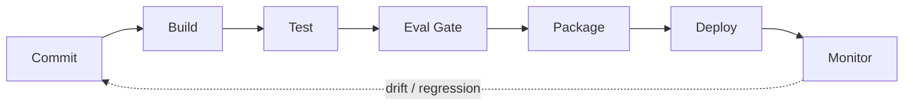

**Figure 21. CI/CD Pipeline - Integration with the RAG Pipeline** (mermaid). Figure: CI/CD Pipeline view for Vector Databases. This diagram illustrates the principal components and their interactions as discussed in the surrounding section.

## Deep Dive: Mechanics, Variants and Trade-offs

Having established the essentials, we now go deeper into integration with the rag pipeline. The underlying mechanism is best appreciated by tracing a single request from input to output and noting where state is created and consumed. The distinctions in this section are the ones that separate a working demo from a system that holds up under adversarial inputs, scale and the passage of time.

Consider the principal variants and how to choose between them. Each variant optimises for a different point in the design space - some for latency, some for accuracy, some for cost or operability - and the correct choice follows from explicit requirements rather than from defaults. There is an inherent trade-off between fidelity and cost, and the correct balance depends on the use case and its tolerance for error.

In practice this is supported by a mature tooling ecosystem, including Pinecone, Weaviate, Qdrant, Milvus. Tools accelerate the work but do not substitute for understanding: the same principles apply whichever implementation you select, and the ability to reason from first principles is what lets you debug when a tool behaves unexpectedly.

A frequent source of subtle bugs is the interaction with security and multi-tenancy. Because security and multi-tenancy concerns namespace isolation, access control and encryption, changes there can silently alter the behaviour analysed here. The remedy is contract tests at the boundary and end-to-end evaluations that exercise the interaction explicitly.

Finally, attend to edge cases and degradation. Define what the system should do under partial failure, unexpected inputs and load spikes, and make that behaviour explicit and tested rather than emergent. Graceful degradation - returning a safe, useful result when the ideal one is unavailable - is a hallmark of mature engineering.

For deeper study, the literature offers authoritative treatments such as Malkov & Yashunin — HNSW (2016) and Johnson et al. — Billion-scale similarity search with GPUs / FAISS (2017). These primary sources reward careful reading and ground the practical guidance above in established results.

## Advanced Considerations

Having established the essentials, we now go deeper into integration with the rag pipeline. Mechanically, the behaviour emerges from a few interacting parts that are simpler than the whole they produce. The distinctions in this section are the ones that separate a working demo from a system that holds up under adversarial inputs, scale and the passage of time.

Consider the principal variants and how to choose between them. Each variant optimises for a different point in the design space - some for latency, some for accuracy, some for cost or operability - and the correct choice follows from explicit requirements rather than from defaults. There is an inherent trade-off between fidelity and cost, and the correct balance depends on the use case and its tolerance for error.

In practice this is supported by a mature tooling ecosystem, including Pinecone, Weaviate, Qdrant, Milvus. Tools accelerate the work but do not substitute for understanding: the same principles apply whichever implementation you select, and the ability to reason from first principles is what lets you debug when a tool behaves unexpectedly.

A frequent source of subtle bugs is the interaction with freshness, upserts and deletes. Because freshness, upserts and deletes concerns handling streaming updates without full re-indexing, changes there can silently alter the behaviour analysed here. The remedy is contract tests at the boundary and end-to-end evaluations that exercise the interaction explicitly.

Finally, attend to edge cases and degradation. Define what the system should do under partial failure, unexpected inputs and load spikes, and make that behaviour explicit and tested rather than emergent. Graceful degradation - returning a safe, useful result when the ideal one is unavailable - is a hallmark of mature engineering.

For deeper study, the literature offers authoritative treatments such as Malkov & Yashunin — HNSW (2016) and Johnson et al. — Billion-scale similarity search with GPUs / FAISS (2017). These primary sources reward careful reading and ground the practical guidance above in established results.

## Worked Example

To ground the discussion, walk through a representative example. A recommendations organisation needs real-time candidate generation from user vectors. They decide to apply integration with the rag pipeline as part of their Vector Databases solution, but wisely treat it as a hypothesis to be validated rather than a foregone conclusion.

The team begins by stating the objective precisely and defining how success will be measured before writing any code. They establish a small but representative evaluation set, agree on acceptance thresholds, and only then prototype the simplest design that could work. Early measurement reveals which assumptions hold and which must be revised, saving weeks of misdirected effort and surfacing edge cases while they are still cheap to fix.

As the prototype matures into a service, the team hardens it: adding input validation, error handling, caching where it pays off, and monitoring that ties back to the original success metric. They document each significant decision in an architecture decision record so that future maintainers understand not just what was built but why.

The outcome is instructive. The system that reaches production is not the most sophisticated design the team considered, but the one whose behaviour they could measure, explain and operate. This is the recurring lesson of Vector Databases: durable value comes from the whole system, not from any single clever component.

## Industry Use Cases

Across industries, the ideas in this chapter recur in recognisable ways. The following vignettes show how different sectors apply them and what they have in common.

**Knowledge.** Powering RAG over millions of enterprise documents. The common thread is that value comes not from the model alone but from the surrounding system - data quality, evaluation, integration and operations - which is precisely where most of the engineering effort belongs.

**Media.** Visual similarity search across large catalogues. The common thread is that value comes not from the model alone but from the surrounding system - data quality, evaluation, integration and operations - which is precisely where most of the engineering effort belongs.

**Security.** Anomaly and similarity detection on event embeddings. The common thread is that value comes not from the model alone but from the surrounding system - data quality, evaluation, integration and operations - which is precisely where most of the engineering effort belongs.

**Recommendations.** Real-time candidate generation from user vectors. The common thread is that value comes not from the model alone but from the surrounding system - data quality, evaluation, integration and operations - which is precisely where most of the engineering effort belongs.

## Best Practices

The following practices consistently separate successful Vector Databases efforts from struggling ones. They are deliberately concrete so they can be adopted as checklist items in design and code review.

- Choose HNSW for low latency, IVF/PQ for memory-constrained scale.
- Benchmark recall and p99 latency on your real data, not synthetic.
- Plan re-indexing strategy before you need it.
- Isolate tenants by namespace and enforce access control.

None of these are exotic; they are the unglamorous disciplines that compound into reliability. The cost of adopting them is small compared with the cost of the incidents they prevent, and they become second nature with practice.

## Common Pitfalls

Equally instructive are the failure modes that recur in practice. Each pitfall below has a clear early warning sign and a known remedy, so treat them as a diagnostic checklist when something feels wrong:

- Assuming exact search; ANN trades recall for speed.
- Post-filtering that silently drops recall on selective queries.
- Underestimating memory for in-RAM HNSW at scale.
- No plan for embedding-model upgrades and re-indexing.

The pattern is consistent: most failures stem from skipping measurement, conflating prototype and production standards, or deferring cross-cutting concerns such as security and cost until they become emergencies. Naming these traps in advance is the cheapest way to avoid them.

## Governance, Security and Cost Notes

No discussion of integration with the rag pipeline is complete without its governance, security and cost dimensions, which are too often deferred until they become emergencies. Treating them as first-class concerns from the outset is both cheaper and safer.

**Governance.** Classify the risk of this capability, document its intended and out-of-scope uses, and ensure decisions are traceable to satisfy internal policy and external regulation such as the NIST AI RMF, ISO/IEC 42001 and the EU AI Act. **Security.** Treat all external input as untrusted, validate outputs before acting on them, apply least privilege to any tools or data access, and map controls to the OWASP LLM Top 10 and MITRE ATLAS.

**Cost and sustainability.** Establish explicit budgets for compute, tokens and latency, attribute spend to owners, and revisit the economics as usage scales - a design that is affordable at pilot scale can become untenable at production volume. Building these reflexes into everyday engineering is what allows a Vector Databases system to be not only capable but also trustworthy and economically sound.

## Hands-On Exercises

Work through the following exercises. They are designed to move understanding from recognition to application - the level required for real engineering work - so prefer writing and building over merely reading.

1. Explain integration with the rag pipeline to a colleague unfamiliar with Vector Databases, using a concrete example from your own domain.
2. Sketch a reference architecture that incorporates integration with the rag pipeline and annotate where observability, security and cost controls belong.
3. Design an evaluation that would tell you whether integration with the rag pipeline is working in production, including the metric, the dataset and the acceptance threshold.
4. Identify two pitfalls relevant to integration with the rag pipeline in your environment and describe the early warning signals you would monitor.
5. Prototype the simplest implementation that demonstrates integration with the rag pipeline, then list exactly what would need to change to make it production-ready.

## Key Takeaways

Key takeaways from this chapter:

- Integration with the RAG Pipeline is a systems concern in Vector Databases: data, models and operations must be co-designed.
- Measurement is non-negotiable; define success metrics and evaluation before building.
- Favour the simplest design that meets the requirement, and add complexity only when evidence demands it.
- Security, cost and observability are first-class requirements, not afterthoughts.
- Document decisions so the system remains understandable and operable as it evolves.

## Code Walkthrough

This listing shows a configuration-driven Integration with the RAG Pipeline component with retry semantics and typed interfaces — the shape we expect from production Vector Databases code rather than a notebook prototype.

The full listing is shown below; study it line by line and reproduce it locally before moving on.

### Listing: Implementing a Integration with the RAG Pipeline component

```python
from __future__ import annotations

from dataclasses import dataclass, field
from typing import Any


@dataclass(slots=True)
class IntegrationWithTheConfig:
    """Configuration for the Integration with the RAG Pipeline component in a Vector Databases system."""

    name: str
    timeout_s: float = 30.0
    max_retries: int = 3
    options: dict[str, Any] = field(default_factory=dict)


class IntegrationWithThe:
    """A minimal, production-shaped implementation of Integration with the RAG Pipeline."""

    def __init__(self, config: IntegrationWithTheConfig) -> None:
        self._config = config
        self._calls = 0

    def run(self, payload: dict[str, Any]) -> dict[str, Any]:
        """Process a request, retrying transient failures with backoff."""
        last_error: Exception | None = None
        for attempt in range(self._config.max_retries):
            try:
                self._calls += 1
                return self._process(payload)
            except TimeoutError as exc:  # transient
                last_error = exc
                continue
        raise RuntimeError(f"IntegrationWithThe failed after retries") from last_error

    def _process(self, payload: dict[str, Any]) -> dict[str, Any]:
        # Domain-specific logic for Integration with the RAG Pipeline goes here.
        return {"status": "ok", "input_keys": sorted(payload), "calls": self._calls}

```

## Review Questions

1. In the context of Vector Databases, which statement best describes “Integration with the RAG Pipeline”?
   - A. Where the vector store sits and how it is queried.
   - B. It eliminates the need for any evaluation or monitoring.
   - C. It is only relevant to academic research, not production.
   - D. It makes the system slower but has no other effect.
   - **Answer: A.** Integration with the RAG Pipeline: Where the vector store sits and how it is queried.
2. Which of the following is a recommended best practice when working with Vector Databases?
   - A. Choose HNSW for low latency, IVF/PQ for memory-constrained scale.
   - B. It is only relevant to academic research, not production.
   - C. It guarantees deterministic output regardless of input.
   - D. No plan for embedding-model upgrades and re-indexing.
   - **Answer: A.** Best practice: Choose HNSW for low latency, IVF/PQ for memory-constrained scale.
3. Which of the following is a common pitfall to avoid in Vector Databases?
   - A. It removes all security and governance requirements.
   - B. It is only relevant to academic research, not production.
   - C. Post-filtering that silently drops recall on selective queries.
   - D. It eliminates the need for any evaluation or monitoring.
   - **Answer: C.** Pitfall to avoid: Post-filtering that silently drops recall on selective queries.
4. *(Discussion)* Explain Integration with the RAG Pipeline and why it matters in a production Vector Databases system.
   - **Model answer:** A strong answer defines integration with the rag pipeline (Where the vector store sits and how it is queried.) then connects it to architecture, evaluation, cost, security and operations for Vector Databases, citing concrete trade-offs and a real-world example.

---


# Chapter 14. Reference Architecture and Patterns

_This chapter examines reference architecture and patterns within Vector Databases. It covers a production-grade deployment blueprint, derives a reference architecture, walks through a worked example and runnable code, surveys industry use cases, and distils best practices and pitfalls, closing with exercises and review questions._

## Introduction

At its core, Reference Architecture and Patterns concerns a production-grade deployment blueprint. Neglecting it is one of the most common reasons Vector Databases initiatives stall in production. The right abstraction here pays compounding dividends, because downstream components depend on its guarantees.

This chapter builds intuition first, then formalises the ideas, derives an architecture, and finishes with code, exercises and review questions so the material transfers directly to your own Vector Databases work. Read it actively: pause at each diagram, reproduce the code, and attempt the exercises before consulting the answers.

## Theory and Foundations

Reference Architecture and Patterns can be characterised as a production-grade deployment blueprint. Seasoned practitioners treat this as a systems problem, co-designing data, models and operations rather than optimising any one in isolation. Beneath the abstraction lies a concrete process whose steps can each be measured, tested and optimised independently.

To place this in context, recall the broader picture: Vector databases store embeddings alongside metadata and provide fast approximate nearest-neighbour search, filtering and hybrid retrieval. Within that picture, reference architecture and patterns is one of the load-bearing ideas - the kind that, when understood deeply, makes the rest of Vector Databases fall into place. Getting this right early prevents expensive rework once a Vector Databases system reaches scale.

Reference Architecture and Patterns cannot be understood in isolation from choosing a vector database. Recall that choosing a vector database concerns managed versus self-hosted and integration considerations. The two interact directly: decisions in one constrain the design space of the other, which is why mature teams reason about them together rather than sequentially. As with most architectural decisions, the choice is rarely binary; the skill lies in quantifying the trade-offs and choosing deliberately.

Reference Architecture and Patterns cannot be understood in isolation from sharding, replication and scaling. Recall that sharding, replication and scaling concerns horizontal scaling, consistency models and high availability. The two interact directly: decisions in one constrain the design space of the other, which is why mature teams reason about them together rather than sequentially. Simplicity is a feature. The simplest design that meets the requirement should be the default, with complexity added only when measurement justifies it.

Several established patterns apply directly to reference architecture and patterns. The first, namespace-per-tenant isolation, is widely adopted because it makes the system's behaviour predictable and observable. A complementary pattern, disk-based indexes for billion-scale corpora, addresses a related concern and is often deployed alongside it. Patterns are not dogma; they are distilled experience that shortcuts the search for a sound design, and each carries assumptions worth checking against your context.

The decision of whether to adopt this should be driven by requirements, not by novelty. In a small prototype, shortcuts around reference architecture and patterns are invisible; in a production Vector Databases system serving real traffic, they surface as incidents, cost overruns or compliance gaps. Simplicity is a feature. The simplest design that meets the requirement should be the default, with complexity added only when measurement justifies it. The remainder of this chapter turns these principles into an architecture, code and a checklist you can apply immediately.

## Architecture and Design

A robust architecture for Reference Architecture and Patterns is layered so each part can evolve independently without destabilising the whole. A vector database deployment partitions collections into shards, each holding an ANN index in memory or on SSD, replicated for availability. A query coordinator fans out filtered ANN searches, merges results and applies metadata predicates. An ingestion path handles upserts and deletes with background index maintenance.

Concretely, the principal building blocks include the case for purpose-built vector stores, ann indexing algorithms, distance metrics and quantisation, metadata filtering and hybrid queries and sharding, replication and scaling. Each is a replaceable component behind a stable interface, so the team can upgrade an implementation - a model, an index, a policy engine - without rewriting its neighbours. The contracts between components are where reliability is won or lost, so they are specified explicitly and tested in isolation.

The diagram accompanying this section makes the data and control flow explicit. Requests enter through a well-defined boundary where they are authenticated and validated; only then are they dispatched to the components that perform the work. This boundary is also where rate limiting, quota enforcement and audit logging live, keeping cross-cutting concerns out of the core logic and in one auditable place.

Two qualities deserve emphasis. First, observability is designed in, not bolted on: every component emits structured telemetry so that failures can be localised in minutes rather than hours. Second, the architecture is evolvable - components communicate through stable contracts so that any single part of the Vector Databases system can be replaced without a rewrite. Simplicity is a feature. The simplest design that meets the requirement should be the default, with complexity added only when measurement justifies it.

<div class="diagram-svg">

<svg xmlns="http://www.w3.org/2000/svg" width="760" height="380" viewBox="0 0 760 380" font-family="Inter, Segoe UI, Arial, sans-serif">
<defs><marker id="arrow" markerWidth="10" markerHeight="10" refX="8" refY="3" orient="auto" markerUnits="strokeWidth"><path d="M0,0 L8,3 L0,6 z" fill="#94a3b8"/></marker><marker id="arrowA" markerWidth="10" markerHeight="10" refX="8" refY="3" orient="auto" markerUnits="strokeWidth"><path d="M0,0 L8,3 L0,6 z" fill="#4338ca"/></marker></defs>
<rect width="760" height="380" rx="12" fill="#f8fafc"/>
<text x="380" y="30" text-anchor="middle" font-size="17" font-weight="700" fill="#0f172a">CI/CD Pipeline - Reference Architecture and Patterns</text>
<rect x="40.0" y="166.0" width="104" height="60" rx="10" fill="#ffffff" stroke="#4338ca" stroke-width="2"/><text x="92.0" y="200.08" text-anchor="middle" font-size="12" font-weight="600" fill="#0f172a">Commit</text>
<rect x="155.2" y="166.0" width="104" height="60" rx="10" fill="#ffffff" stroke="#7c3aed" stroke-width="2"/><text x="207.2" y="200.08" text-anchor="middle" font-size="12" font-weight="600" fill="#0f172a">Build</text>
<line x1="144.0" y1="196.0" x2="155.2" y2="196.0" stroke="#4338ca" stroke-width="2" marker-end="url(#arrowA)"/>
<rect x="270.4" y="166.0" width="104" height="60" rx="10" fill="#ffffff" stroke="#0891b2" stroke-width="2"/><text x="322.4" y="200.08" text-anchor="middle" font-size="12" font-weight="600" fill="#0f172a">Eval Gate</text>
<line x1="259.2" y1="196.0" x2="270.4" y2="196.0" stroke="#4338ca" stroke-width="2" marker-end="url(#arrowA)"/>
<rect x="385.6" y="166.0" width="104" height="60" rx="10" fill="#ffffff" stroke="#059669" stroke-width="2"/><text x="437.6" y="200.08" text-anchor="middle" font-size="12" font-weight="600" fill="#0f172a">Package</text>
<line x1="374.4" y1="196.0" x2="385.6" y2="196.0" stroke="#4338ca" stroke-width="2" marker-end="url(#arrowA)"/>
<rect x="500.8" y="166.0" width="104" height="60" rx="10" fill="#ffffff" stroke="#d97706" stroke-width="2"/><text x="552.8" y="200.08" text-anchor="middle" font-size="12" font-weight="600" fill="#0f172a">Deploy</text>
<line x1="489.6" y1="196.0" x2="500.8" y2="196.0" stroke="#4338ca" stroke-width="2" marker-end="url(#arrowA)"/>
<rect x="616.0" y="166.0" width="104" height="60" rx="10" fill="#ffffff" stroke="#dc2626" stroke-width="2"/><text x="668.0" y="200.08" text-anchor="middle" font-size="12" font-weight="600" fill="#0f172a">Monitor</text>
<line x1="604.8" y1="196.0" x2="616.0" y2="196.0" stroke="#4338ca" stroke-width="2" marker-end="url(#arrowA)"/>
<path d="M668.0,226.0 q0,46 -288.0,46 q-288.0,0 -288.0,-46" fill="none" stroke="#cbd5e1" stroke-width="1.6" stroke-dasharray="5 4" marker-end="url(#arrow)"/>
<text x="380.0" y="288.0" text-anchor="middle" font-size="9.5" fill="#94a3b8">feedback / monitoring loop</text>
</svg>

</div>

**Figure 22. CI/CD Pipeline - Reference Architecture and Patterns** (svg). Figure: CI/CD Pipeline view for Vector Databases. This diagram illustrates the principal components and their interactions as discussed in the surrounding section.

## Deep Dive: Mechanics, Variants and Trade-offs

Having established the essentials, we now go deeper into reference architecture and patterns. Beneath the abstraction lies a concrete process whose steps can each be measured, tested and optimised independently. The distinctions in this section are the ones that separate a working demo from a system that holds up under adversarial inputs, scale and the passage of time.

Consider the principal variants and how to choose between them. Each variant optimises for a different point in the design space - some for latency, some for accuracy, some for cost or operability - and the correct choice follows from explicit requirements rather than from defaults. Latency, accuracy and cost form a tension triangle: improving one typically pressures the others, so explicit budgets are essential.

In practice this is supported by a mature tooling ecosystem, including Pinecone, Weaviate, Qdrant, Milvus. Tools accelerate the work but do not substitute for understanding: the same principles apply whichever implementation you select, and the ability to reason from first principles is what lets you debug when a tool behaves unexpectedly.

A frequent source of subtle bugs is the interaction with choosing a vector database. Because choosing a vector database concerns managed versus self-hosted and integration considerations, changes there can silently alter the behaviour analysed here. The remedy is contract tests at the boundary and end-to-end evaluations that exercise the interaction explicitly.

Finally, attend to edge cases and degradation. Define what the system should do under partial failure, unexpected inputs and load spikes, and make that behaviour explicit and tested rather than emergent. Graceful degradation - returning a safe, useful result when the ideal one is unavailable - is a hallmark of mature engineering.

For deeper study, the literature offers authoritative treatments such as Malkov & Yashunin — HNSW (2016) and Johnson et al. — Billion-scale similarity search with GPUs / FAISS (2017). These primary sources reward careful reading and ground the practical guidance above in established results.

## Advanced Considerations

Having established the essentials, we now go deeper into reference architecture and patterns. Beneath the abstraction lies a concrete process whose steps can each be measured, tested and optimised independently. The distinctions in this section are the ones that separate a working demo from a system that holds up under adversarial inputs, scale and the passage of time.

Consider the principal variants and how to choose between them. Each variant optimises for a different point in the design space - some for latency, some for accuracy, some for cost or operability - and the correct choice follows from explicit requirements rather than from defaults. As with most architectural decisions, the choice is rarely binary; the skill lies in quantifying the trade-offs and choosing deliberately.

In practice this is supported by a mature tooling ecosystem, including Pinecone, Weaviate, Qdrant, Milvus. Tools accelerate the work but do not substitute for understanding: the same principles apply whichever implementation you select, and the ability to reason from first principles is what lets you debug when a tool behaves unexpectedly.

A frequent source of subtle bugs is the interaction with sharding, replication and scaling. Because sharding, replication and scaling concerns horizontal scaling, consistency models and high availability, changes there can silently alter the behaviour analysed here. The remedy is contract tests at the boundary and end-to-end evaluations that exercise the interaction explicitly.

Finally, attend to edge cases and degradation. Define what the system should do under partial failure, unexpected inputs and load spikes, and make that behaviour explicit and tested rather than emergent. Graceful degradation - returning a safe, useful result when the ideal one is unavailable - is a hallmark of mature engineering.

For deeper study, the literature offers authoritative treatments such as Malkov & Yashunin — HNSW (2016) and Johnson et al. — Billion-scale similarity search with GPUs / FAISS (2017). These primary sources reward careful reading and ground the practical guidance above in established results.

## Worked Example

To ground the discussion, walk through a representative example. A knowledge organisation needs powering RAG over millions of enterprise documents. They decide to apply reference architecture and patterns as part of their Vector Databases solution, but wisely treat it as a hypothesis to be validated rather than a foregone conclusion.

The team begins by stating the objective precisely and defining how success will be measured before writing any code. They establish a small but representative evaluation set, agree on acceptance thresholds, and only then prototype the simplest design that could work. Early measurement reveals which assumptions hold and which must be revised, saving weeks of misdirected effort and surfacing edge cases while they are still cheap to fix.

As the prototype matures into a service, the team hardens it: adding input validation, error handling, caching where it pays off, and monitoring that ties back to the original success metric. They document each significant decision in an architecture decision record so that future maintainers understand not just what was built but why.

The outcome is instructive. The system that reaches production is not the most sophisticated design the team considered, but the one whose behaviour they could measure, explain and operate. This is the recurring lesson of Vector Databases: durable value comes from the whole system, not from any single clever component.

## Industry Use Cases

Across industries, the ideas in this chapter recur in recognisable ways. The following vignettes show how different sectors apply them and what they have in common.

**Knowledge.** Powering RAG over millions of enterprise documents. The common thread is that value comes not from the model alone but from the surrounding system - data quality, evaluation, integration and operations - which is precisely where most of the engineering effort belongs.

**Media.** Visual similarity search across large catalogues. The common thread is that value comes not from the model alone but from the surrounding system - data quality, evaluation, integration and operations - which is precisely where most of the engineering effort belongs.

**Security.** Anomaly and similarity detection on event embeddings. The common thread is that value comes not from the model alone but from the surrounding system - data quality, evaluation, integration and operations - which is precisely where most of the engineering effort belongs.

**Recommendations.** Real-time candidate generation from user vectors. The common thread is that value comes not from the model alone but from the surrounding system - data quality, evaluation, integration and operations - which is precisely where most of the engineering effort belongs.

## Best Practices

The following practices consistently separate successful Vector Databases efforts from struggling ones. They are deliberately concrete so they can be adopted as checklist items in design and code review.

- Choose HNSW for low latency, IVF/PQ for memory-constrained scale.
- Benchmark recall and p99 latency on your real data, not synthetic.
- Plan re-indexing strategy before you need it.
- Isolate tenants by namespace and enforce access control.

None of these are exotic; they are the unglamorous disciplines that compound into reliability. The cost of adopting them is small compared with the cost of the incidents they prevent, and they become second nature with practice.

## Common Pitfalls

Equally instructive are the failure modes that recur in practice. Each pitfall below has a clear early warning sign and a known remedy, so treat them as a diagnostic checklist when something feels wrong:

- Assuming exact search; ANN trades recall for speed.
- Post-filtering that silently drops recall on selective queries.
- Underestimating memory for in-RAM HNSW at scale.
- No plan for embedding-model upgrades and re-indexing.

The pattern is consistent: most failures stem from skipping measurement, conflating prototype and production standards, or deferring cross-cutting concerns such as security and cost until they become emergencies. Naming these traps in advance is the cheapest way to avoid them.

## Governance, Security and Cost Notes

No discussion of reference architecture and patterns is complete without its governance, security and cost dimensions, which are too often deferred until they become emergencies. Treating them as first-class concerns from the outset is both cheaper and safer.

**Governance.** Classify the risk of this capability, document its intended and out-of-scope uses, and ensure decisions are traceable to satisfy internal policy and external regulation such as the NIST AI RMF, ISO/IEC 42001 and the EU AI Act. **Security.** Treat all external input as untrusted, validate outputs before acting on them, apply least privilege to any tools or data access, and map controls to the OWASP LLM Top 10 and MITRE ATLAS.

**Cost and sustainability.** Establish explicit budgets for compute, tokens and latency, attribute spend to owners, and revisit the economics as usage scales - a design that is affordable at pilot scale can become untenable at production volume. Building these reflexes into everyday engineering is what allows a Vector Databases system to be not only capable but also trustworthy and economically sound.

## Hands-On Exercises

Work through the following exercises. They are designed to move understanding from recognition to application - the level required for real engineering work - so prefer writing and building over merely reading.

1. Explain reference architecture and patterns to a colleague unfamiliar with Vector Databases, using a concrete example from your own domain.
2. Sketch a reference architecture that incorporates reference architecture and patterns and annotate where observability, security and cost controls belong.
3. Design an evaluation that would tell you whether reference architecture and patterns is working in production, including the metric, the dataset and the acceptance threshold.
4. Identify two pitfalls relevant to reference architecture and patterns in your environment and describe the early warning signals you would monitor.
5. Prototype the simplest implementation that demonstrates reference architecture and patterns, then list exactly what would need to change to make it production-ready.

## Key Takeaways

Key takeaways from this chapter:

- Reference Architecture and Patterns is a systems concern in Vector Databases: data, models and operations must be co-designed.
- Measurement is non-negotiable; define success metrics and evaluation before building.
- Favour the simplest design that meets the requirement, and add complexity only when evidence demands it.
- Security, cost and observability are first-class requirements, not afterthoughts.
- Document decisions so the system remains understandable and operable as it evolves.

## Code Walkthrough

This listing shows a configuration-driven Reference Architecture and Patterns component with retry semantics and typed interfaces — the shape we expect from production Vector Databases code rather than a notebook prototype.

The full listing is shown below; study it line by line and reproduce it locally before moving on.

### Listing: Implementing a Reference Architecture and Patterns component

```python
from __future__ import annotations

from dataclasses import dataclass, field
from typing import Any


@dataclass(slots=True)
class ReferenceArchitectureAndConfig:
    """Configuration for the Reference Architecture and Patterns component in a Vector Databases system."""

    name: str
    timeout_s: float = 30.0
    max_retries: int = 3
    options: dict[str, Any] = field(default_factory=dict)


class ReferenceArchitectureAnd:
    """A minimal, production-shaped implementation of Reference Architecture and Patterns."""

    def __init__(self, config: ReferenceArchitectureAndConfig) -> None:
        self._config = config
        self._calls = 0

    def run(self, payload: dict[str, Any]) -> dict[str, Any]:
        """Process a request, retrying transient failures with backoff."""
        last_error: Exception | None = None
        for attempt in range(self._config.max_retries):
            try:
                self._calls += 1
                return self._process(payload)
            except TimeoutError as exc:  # transient
                last_error = exc
                continue
        raise RuntimeError(f"ReferenceArchitectureAnd failed after retries") from last_error

    def _process(self, payload: dict[str, Any]) -> dict[str, Any]:
        # Domain-specific logic for Reference Architecture and Patterns goes here.
        return {"status": "ok", "input_keys": sorted(payload), "calls": self._calls}

```

## Review Questions

1. In the context of Vector Databases, which statement best describes “Reference Architecture and Patterns”?
   - A. A production-grade deployment blueprint.
   - B. It is only relevant to academic research, not production.
   - C. It eliminates the need for any evaluation or monitoring.
   - D. It applies exclusively to image data.
   - **Answer: A.** Reference Architecture and Patterns: A production-grade deployment blueprint.
2. Which of the following is a recommended best practice when working with Vector Databases?
   - A. It removes all security and governance requirements.
   - B. Benchmark recall and p99 latency on your real data, not synthetic.
   - C. Underestimating memory for in-RAM HNSW at scale.
   - D. Post-filtering that silently drops recall on selective queries.
   - **Answer: B.** Best practice: Benchmark recall and p99 latency on your real data, not synthetic.
3. Which of the following is a common pitfall to avoid in Vector Databases?
   - A. Isolate tenants by namespace and enforce access control.
   - B. It removes all security and governance requirements.
   - C. Post-filtering that silently drops recall on selective queries.
   - D. It makes the system slower but has no other effect.
   - **Answer: C.** Pitfall to avoid: Post-filtering that silently drops recall on selective queries.
4. *(Discussion)* Explain Reference Architecture and Patterns and why it matters in a production Vector Databases system.
   - **Model answer:** A strong answer defines reference architecture and patterns (A production-grade deployment blueprint.) then connects it to architecture, evaluation, cost, security and operations for Vector Databases, citing concrete trade-offs and a real-world example.

---


# Chapter 15. Putting It Together: A Reference Implementation

_This chapter examines putting it together: a reference implementation within Vector Databases. It covers an end-to-end reference implementation that integrates the components of a Vector Databases system into a cohesive, working whole, derives a reference architecture, walks through a worked example and runnable code, surveys industry use cases, and distils best practices and pitfalls, closing with exercises and review questions._

## Introduction

In practical terms, Putting It Together: A Reference Implementation is best understood as an end-to-end reference implementation that integrates the components of a Vector Databases system into a cohesive, working whole. Getting this right early prevents expensive rework once a Vector Databases system reaches scale. The right abstraction here pays compounding dividends, because downstream components depend on its guarantees.

This chapter builds intuition first, then formalises the ideas, derives an architecture, and finishes with code, exercises and review questions so the material transfers directly to your own Vector Databases work. Read it actively: pause at each diagram, reproduce the code, and attempt the exercises before consulting the answers.

## Theory and Foundations

Putting It Together: A Reference Implementation can be characterised as an end-to-end reference implementation that integrates the components of a Vector Databases system into a cohesive, working whole. What distinguishes a production-grade approach from a prototype is the discipline of measurement: every claim is backed by an evaluation rather than intuition. It pays to understand the mechanism rather than treat it as a black box, because most production incidents are explained by one of its steps misbehaving.

To place this in context, recall the broader picture: Vector databases store embeddings alongside metadata and provide fast approximate nearest-neighbour search, filtering and hybrid retrieval. Within that picture, putting it together: a reference implementation is one of the load-bearing ideas - the kind that, when understood deeply, makes the rest of Vector Databases fall into place. This concept recurs throughout the Vector Databases lifecycle, from design to operations.

Putting It Together: A Reference Implementation cannot be understood in isolation from ann indexing algorithms. Recall that ann indexing algorithms concerns hNSW graphs, IVF, PQ and DiskANN and their recall/latency/memory profiles. The two interact directly: decisions in one constrain the design space of the other, which is why mature teams reason about them together rather than sequentially. There is an inherent trade-off between fidelity and cost, and the correct balance depends on the use case and its tolerance for error.

Putting It Together: A Reference Implementation cannot be understood in isolation from metadata filtering and hybrid queries. Recall that metadata filtering and hybrid queries concerns pre- versus post-filtering and combining structured predicates with vectors. The two interact directly: decisions in one constrain the design space of the other, which is why mature teams reason about them together rather than sequentially. Latency, accuracy and cost form a tension triangle: improving one typically pressures the others, so explicit budgets are essential.

Several established patterns apply directly to putting it together: a reference implementation. The first, namespace-per-tenant isolation, is widely adopted because it makes the system's behaviour predictable and observable. A complementary pattern, disk-based indexes for billion-scale corpora, addresses a related concern and is often deployed alongside it. Patterns are not dogma; they are distilled experience that shortcuts the search for a sound design, and each carries assumptions worth checking against your context.

It is worth being explicit about when to apply this and when to reach for something simpler. In a small prototype, shortcuts around putting it together: a reference implementation are invisible; in a production Vector Databases system serving real traffic, they surface as incidents, cost overruns or compliance gaps. There is an inherent trade-off between fidelity and cost, and the correct balance depends on the use case and its tolerance for error. The remainder of this chapter turns these principles into an architecture, code and a checklist you can apply immediately.

## Architecture and Design

From an architectural standpoint, Putting It Together: A Reference Implementation sits at the intersection of data, models and operations. A vector database deployment partitions collections into shards, each holding an ANN index in memory or on SSD, replicated for availability. A query coordinator fans out filtered ANN searches, merges results and applies metadata predicates. An ingestion path handles upserts and deletes with background index maintenance.

Concretely, the principal building blocks include the case for purpose-built vector stores, ann indexing algorithms, distance metrics and quantisation, metadata filtering and hybrid queries and sharding, replication and scaling. Each is a replaceable component behind a stable interface, so the team can upgrade an implementation - a model, an index, a policy engine - without rewriting its neighbours. The contracts between components are where reliability is won or lost, so they are specified explicitly and tested in isolation.

The diagram accompanying this section makes the data and control flow explicit. Requests enter through a well-defined boundary where they are authenticated and validated; only then are they dispatched to the components that perform the work. This boundary is also where rate limiting, quota enforcement and audit logging live, keeping cross-cutting concerns out of the core logic and in one auditable place.

Two qualities deserve emphasis. First, observability is designed in, not bolted on: every component emits structured telemetry so that failures can be localised in minutes rather than hours. Second, the architecture is evolvable - components communicate through stable contracts so that any single part of the Vector Databases system can be replaced without a rewrite. There is an inherent trade-off between fidelity and cost, and the correct balance depends on the use case and its tolerance for error.

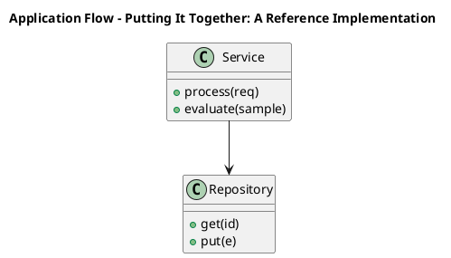

_Source diagram (plantuml); render with the appropriate tool._

**Figure 23. Application Flow - Putting It Together: A Reference Implementation** (plantuml). Figure: Application Flow view for Vector Databases. This diagram illustrates the principal components and their interactions as discussed in the surrounding section.

```xml
<mxfile host="ai-university">
  <diagram name="Network">
    <mxGraphModel dx="800" dy="600" grid="1" gridSize="10">
      <root>
        <mxCell id="0"/>
        <mxCell id="1" parent="0"/>
        <mxCell id="title" value="Network - Putting It Together: A Reference Implementation" style="text;fontSize=16;fontStyle=1" vertex="1" parent="1"><mxGeometry x="40" y="20" width="600" height="30" as="geometry"/></mxCell>
        <mxCell id="hub" value="Vector Databases" style="rounded=1;fillColor=#0f172a;fontColor=#ffffff;fontStyle=1" vertex="1" parent="1"><mxGeometry x="300" y="180" width="160" height="60" as="geometry"/></mxCell>
        <mxCell id="n0" value="The Case for Purpose-Bu…" style="rounded=1;fillColor=#e0e7ff;strokeColor=#4338ca" vertex="1" parent="1"><mxGeometry x="60" y="80" width="160" height="50" as="geometry"/></mxCell>
        <mxCell id="e0" style="edgeStyle=orthogonalEdgeStyle" edge="1" parent="1" source="hub" target="n0"><mxGeometry relative="1" as="geometry"/></mxCell>
        <mxCell id="n1" value="ANN Indexing Algorithms" style="rounded=1;fillColor=#e0e7ff;strokeColor=#4338ca" vertex="1" parent="1"><mxGeometry x="600" y="170" width="160" height="50" as="geometry"/></mxCell>
        <mxCell id="e1" style="edgeStyle=orthogonalEdgeStyle" edge="1" parent="1" source="hub" target="n1"><mxGeometry relative="1" as="geometry"/></mxCell>
        <mxCell id="n2" value="Distance Metrics and Qu…" style="rounded=1;fillColor=#e0e7ff;strokeColor=#4338ca" vertex="1" parent="1"><mxGeometry x="60" y="260" width="160" height="50" as="geometry"/></mxCell>
        <mxCell id="e2" style="edgeStyle=orthogonalEdgeStyle" edge="1" parent="1" source="hub" target="n2"><mxGeometry relative="1" as="geometry"/></mxCell>
        <mxCell id="n3" value="Metadata Filtering and …" style="rounded=1;fillColor=#e0e7ff;strokeColor=#4338ca" vertex="1" parent="1"><mxGeometry x="600" y="350" width="160" height="50" as="geometry"/></mxCell>
        <mxCell id="e3" style="edgeStyle=orthogonalEdgeStyle" edge="1" parent="1" source="hub" target="n3"><mxGeometry relative="1" as="geometry"/></mxCell>
        <mxCell id="n4" value="Sharding, Replication a…" style="rounded=1;fillColor=#e0e7ff;strokeColor=#4338ca" vertex="1" parent="1"><mxGeometry x="60" y="440" width="160" height="50" as="geometry"/></mxCell>
        <mxCell id="e4" style="edgeStyle=orthogonalEdgeStyle" edge="1" parent="1" source="hub" target="n4"><mxGeometry relative="1" as="geometry"/></mxCell>
      </root>
    </mxGraphModel>
  </diagram>
</mxfile>
```

_Source diagram (drawio); render with the appropriate tool._

**Figure 24. Network - Putting It Together: A Reference Implementation** (drawio). Figure: Network view for Vector Databases. This diagram illustrates the principal components and their interactions as discussed in the surrounding section.

## Deep Dive: Mechanics, Variants and Trade-offs

Having established the essentials, we now go deeper into putting it together: a reference implementation. Beneath the abstraction lies a concrete process whose steps can each be measured, tested and optimised independently. The distinctions in this section are the ones that separate a working demo from a system that holds up under adversarial inputs, scale and the passage of time.

Consider the principal variants and how to choose between them. Each variant optimises for a different point in the design space - some for latency, some for accuracy, some for cost or operability - and the correct choice follows from explicit requirements rather than from defaults. Latency, accuracy and cost form a tension triangle: improving one typically pressures the others, so explicit budgets are essential.

In practice this is supported by a mature tooling ecosystem, including Pinecone, Weaviate, Qdrant, Milvus. Tools accelerate the work but do not substitute for understanding: the same principles apply whichever implementation you select, and the ability to reason from first principles is what lets you debug when a tool behaves unexpectedly.

A frequent source of subtle bugs is the interaction with ann indexing algorithms. Because ann indexing algorithms concerns hNSW graphs, IVF, PQ and DiskANN and their recall/latency/memory profiles, changes there can silently alter the behaviour analysed here. The remedy is contract tests at the boundary and end-to-end evaluations that exercise the interaction explicitly.

Finally, attend to edge cases and degradation. Define what the system should do under partial failure, unexpected inputs and load spikes, and make that behaviour explicit and tested rather than emergent. Graceful degradation - returning a safe, useful result when the ideal one is unavailable - is a hallmark of mature engineering.

For deeper study, the literature offers authoritative treatments such as Malkov & Yashunin — HNSW (2016) and Johnson et al. — Billion-scale similarity search with GPUs / FAISS (2017). These primary sources reward careful reading and ground the practical guidance above in established results.

## Advanced Considerations

Having established the essentials, we now go deeper into putting it together: a reference implementation. Beneath the abstraction lies a concrete process whose steps can each be measured, tested and optimised independently. The distinctions in this section are the ones that separate a working demo from a system that holds up under adversarial inputs, scale and the passage of time.

Consider the principal variants and how to choose between them. Each variant optimises for a different point in the design space - some for latency, some for accuracy, some for cost or operability - and the correct choice follows from explicit requirements rather than from defaults. Latency, accuracy and cost form a tension triangle: improving one typically pressures the others, so explicit budgets are essential.

In practice this is supported by a mature tooling ecosystem, including Pinecone, Weaviate, Qdrant, Milvus. Tools accelerate the work but do not substitute for understanding: the same principles apply whichever implementation you select, and the ability to reason from first principles is what lets you debug when a tool behaves unexpectedly.

A frequent source of subtle bugs is the interaction with hybrid and multi-vector retrieval. Because hybrid and multi-vector retrieval concerns late-interaction (ColBERT) and sparse+dense fusion, changes there can silently alter the behaviour analysed here. The remedy is contract tests at the boundary and end-to-end evaluations that exercise the interaction explicitly.

Finally, attend to edge cases and degradation. Define what the system should do under partial failure, unexpected inputs and load spikes, and make that behaviour explicit and tested rather than emergent. Graceful degradation - returning a safe, useful result when the ideal one is unavailable - is a hallmark of mature engineering.

For deeper study, the literature offers authoritative treatments such as Malkov & Yashunin — HNSW (2016) and Johnson et al. — Billion-scale similarity search with GPUs / FAISS (2017). These primary sources reward careful reading and ground the practical guidance above in established results.

## Worked Example

To ground the discussion, walk through a representative example. A knowledge organisation needs powering RAG over millions of enterprise documents. They decide to apply putting it together: a reference implementation as part of their Vector Databases solution, but wisely treat it as a hypothesis to be validated rather than a foregone conclusion.

The team begins by stating the objective precisely and defining how success will be measured before writing any code. They establish a small but representative evaluation set, agree on acceptance thresholds, and only then prototype the simplest design that could work. Early measurement reveals which assumptions hold and which must be revised, saving weeks of misdirected effort and surfacing edge cases while they are still cheap to fix.

As the prototype matures into a service, the team hardens it: adding input validation, error handling, caching where it pays off, and monitoring that ties back to the original success metric. They document each significant decision in an architecture decision record so that future maintainers understand not just what was built but why.

The outcome is instructive. The system that reaches production is not the most sophisticated design the team considered, but the one whose behaviour they could measure, explain and operate. This is the recurring lesson of Vector Databases: durable value comes from the whole system, not from any single clever component.

## Industry Use Cases

Across industries, the ideas in this chapter recur in recognisable ways. The following vignettes show how different sectors apply them and what they have in common.

**Knowledge.** Powering RAG over millions of enterprise documents. The common thread is that value comes not from the model alone but from the surrounding system - data quality, evaluation, integration and operations - which is precisely where most of the engineering effort belongs.

**Media.** Visual similarity search across large catalogues. The common thread is that value comes not from the model alone but from the surrounding system - data quality, evaluation, integration and operations - which is precisely where most of the engineering effort belongs.

**Security.** Anomaly and similarity detection on event embeddings. The common thread is that value comes not from the model alone but from the surrounding system - data quality, evaluation, integration and operations - which is precisely where most of the engineering effort belongs.

**Recommendations.** Real-time candidate generation from user vectors. The common thread is that value comes not from the model alone but from the surrounding system - data quality, evaluation, integration and operations - which is precisely where most of the engineering effort belongs.

## Best Practices

The following practices consistently separate successful Vector Databases efforts from struggling ones. They are deliberately concrete so they can be adopted as checklist items in design and code review.

- Choose HNSW for low latency, IVF/PQ for memory-constrained scale.
- Benchmark recall and p99 latency on your real data, not synthetic.
- Plan re-indexing strategy before you need it.
- Isolate tenants by namespace and enforce access control.

None of these are exotic; they are the unglamorous disciplines that compound into reliability. The cost of adopting them is small compared with the cost of the incidents they prevent, and they become second nature with practice.

## Common Pitfalls

Equally instructive are the failure modes that recur in practice. Each pitfall below has a clear early warning sign and a known remedy, so treat them as a diagnostic checklist when something feels wrong:

- Assuming exact search; ANN trades recall for speed.
- Post-filtering that silently drops recall on selective queries.
- Underestimating memory for in-RAM HNSW at scale.
- No plan for embedding-model upgrades and re-indexing.

The pattern is consistent: most failures stem from skipping measurement, conflating prototype and production standards, or deferring cross-cutting concerns such as security and cost until they become emergencies. Naming these traps in advance is the cheapest way to avoid them.

## Governance, Security and Cost Notes

No discussion of putting it together: a reference implementation is complete without its governance, security and cost dimensions, which are too often deferred until they become emergencies. Treating them as first-class concerns from the outset is both cheaper and safer.

**Governance.** Classify the risk of this capability, document its intended and out-of-scope uses, and ensure decisions are traceable to satisfy internal policy and external regulation such as the NIST AI RMF, ISO/IEC 42001 and the EU AI Act. **Security.** Treat all external input as untrusted, validate outputs before acting on them, apply least privilege to any tools or data access, and map controls to the OWASP LLM Top 10 and MITRE ATLAS.

**Cost and sustainability.** Establish explicit budgets for compute, tokens and latency, attribute spend to owners, and revisit the economics as usage scales - a design that is affordable at pilot scale can become untenable at production volume. Building these reflexes into everyday engineering is what allows a Vector Databases system to be not only capable but also trustworthy and economically sound.

## Hands-On Exercises

Work through the following exercises. They are designed to move understanding from recognition to application - the level required for real engineering work - so prefer writing and building over merely reading.

1. Explain putting it together: a reference implementation to a colleague unfamiliar with Vector Databases, using a concrete example from your own domain.
2. Sketch a reference architecture that incorporates putting it together: a reference implementation and annotate where observability, security and cost controls belong.
3. Design an evaluation that would tell you whether putting it together: a reference implementation is working in production, including the metric, the dataset and the acceptance threshold.
4. Identify two pitfalls relevant to putting it together: a reference implementation in your environment and describe the early warning signals you would monitor.
5. Prototype the simplest implementation that demonstrates putting it together: a reference implementation, then list exactly what would need to change to make it production-ready.

## Key Takeaways

Key takeaways from this chapter:

- Putting It Together: A Reference Implementation is a systems concern in Vector Databases: data, models and operations must be co-designed.
- Measurement is non-negotiable; define success metrics and evaluation before building.
- Favour the simplest design that meets the requirement, and add complexity only when evidence demands it.
- Security, cost and observability are first-class requirements, not afterthoughts.
- Document decisions so the system remains understandable and operable as it evolves.

## Code Walkthrough

This listing shows a configuration-driven Putting It Together: A Reference Implementation component with retry semantics and typed interfaces — the shape we expect from production Vector Databases code rather than a notebook prototype.

The full listing is shown below; study it line by line and reproduce it locally before moving on.

### Listing: Implementing a Putting It Together: A Reference Implementation component

```python
from __future__ import annotations

from dataclasses import dataclass, field
from typing import Any


@dataclass(slots=True)
class PuttingItConfig:
    """Configuration for the Putting It Together: A Reference Implementation component in a Vector Databases system."""

    name: str
    timeout_s: float = 30.0
    max_retries: int = 3
    options: dict[str, Any] = field(default_factory=dict)


class PuttingIt:
    """A minimal, production-shaped implementation of Putting It Together: A Reference Implementation."""

    def __init__(self, config: PuttingItConfig) -> None:
        self._config = config
        self._calls = 0

    def run(self, payload: dict[str, Any]) -> dict[str, Any]:
        """Process a request, retrying transient failures with backoff."""
        last_error: Exception | None = None
        for attempt in range(self._config.max_retries):
            try:
                self._calls += 1
                return self._process(payload)
            except TimeoutError as exc:  # transient
                last_error = exc
                continue
        raise RuntimeError(f"PuttingIt failed after retries") from last_error

    def _process(self, payload: dict[str, Any]) -> dict[str, Any]:
        # Domain-specific logic for Putting It Together: A Reference Implementation goes here.
        return {"status": "ok", "input_keys": sorted(payload), "calls": self._calls}

```

## Review Questions

1. In the context of Vector Databases, which statement best describes “Putting It Together: A Reference Implementation”?
   - A. It guarantees deterministic output regardless of input.
   - B. It applies exclusively to image data.
   - C. an end-to-end reference implementation that integrates the components of a Vector Databases system into a cohesive, working whole
   - D. It eliminates the need for any evaluation or monitoring.
   - **Answer: C.** Putting It Together: A Reference Implementation: an end-to-end reference implementation that integrates the components of a Vector Databases system into a cohesive, working whole
2. Which of the following is a recommended best practice when working with Vector Databases?
   - A. It applies exclusively to image data.
   - B. Isolate tenants by namespace and enforce access control.
   - C. It guarantees deterministic output regardless of input.
   - D. Post-filtering that silently drops recall on selective queries.
   - **Answer: B.** Best practice: Isolate tenants by namespace and enforce access control.
3. Which of the following is a common pitfall to avoid in Vector Databases?
   - A. It eliminates the need for any evaluation or monitoring.
   - B. It is only relevant to academic research, not production.
   - C. It makes the system slower but has no other effect.
   - D. No plan for embedding-model upgrades and re-indexing.
   - **Answer: D.** Pitfall to avoid: No plan for embedding-model upgrades and re-indexing.
4. *(Discussion)* Describe a failure mode of Putting It Together: A Reference Implementation and how you would mitigate it.
   - **Model answer:** A strong answer defines putting it together: a reference implementation (an end-to-end reference implementation that integrates the components of a Vector Databases system into a cohesive, working whole) then connects it to architecture, evaluation, cost, security and operations for Vector Databases, citing concrete trade-offs and a real-world example.

---


# Chapter 16. Hands-On Lab: Building an End-to-End Vector Databases System

_This chapter examines hands-on lab: building an end-to-end vector databases system within Vector Databases. It covers a guided, build-along laboratory that constructs a functioning Vector Databases system from first principles, derives a reference architecture, walks through a worked example and runnable code, surveys industry use cases, and distils best practices and pitfalls, closing with exercises and review questions._

## Introduction

Hands-On Lab: Building an End-to-End Vector Databases System can be characterised as a guided, build-along laboratory that constructs a functioning Vector Databases system from first principles. Getting this right early prevents expensive rework once a Vector Databases system reaches scale. In an enterprise setting, this translates into concrete requirements: clear interfaces, measurable quality, and controls that satisfy security and governance.

This chapter builds intuition first, then formalises the ideas, derives an architecture, and finishes with code, exercises and review questions so the material transfers directly to your own Vector Databases work. Read it actively: pause at each diagram, reproduce the code, and attempt the exercises before consulting the answers.

## Theory and Foundations

Hands-On Lab: Building an End-to-End Vector Databases System refers to a guided, build-along laboratory that constructs a functioning Vector Databases system from first principles. What distinguishes a production-grade approach from a prototype is the discipline of measurement: every claim is backed by an evaluation rather than intuition. The underlying mechanism is best appreciated by tracing a single request from input to output and noting where state is created and consumed.

To place this in context, recall the broader picture: Vector databases store embeddings alongside metadata and provide fast approximate nearest-neighbour search, filtering and hybrid retrieval. Within that picture, hands-on lab: building an end-to-end vector databases system is one of the load-bearing ideas - the kind that, when understood deeply, makes the rest of Vector Databases fall into place. Understanding this matters because Vector Databases systems succeed or fail on exactly these decisions.

Hands-On Lab: Building an End-to-End Vector Databases System cannot be understood in isolation from distance metrics and quantisation. Recall that distance metrics and quantisation concerns cosine/dot/L2 and scalar/product quantisation trade-offs. The two interact directly: decisions in one constrain the design space of the other, which is why mature teams reason about them together rather than sequentially. Latency, accuracy and cost form a tension triangle: improving one typically pressures the others, so explicit budgets are essential.

Hands-On Lab: Building an End-to-End Vector Databases System cannot be understood in isolation from integration with the rag pipeline. Recall that integration with the rag pipeline concerns where the vector store sits and how it is queried. The two interact directly: decisions in one constrain the design space of the other, which is why mature teams reason about them together rather than sequentially. There is an inherent trade-off between fidelity and cost, and the correct balance depends on the use case and its tolerance for error.

Several established patterns apply directly to hands-on lab: building an end-to-end vector databases system. The first, namespace-per-tenant isolation, is widely adopted because it makes the system's behaviour predictable and observable. A complementary pattern, pre-filter on selective metadata, post-filter otherwise, addresses a related concern and is often deployed alongside it. Patterns are not dogma; they are distilled experience that shortcuts the search for a sound design, and each carries assumptions worth checking against your context.

It is worth being explicit about when to apply this and when to reach for something simpler. In a small prototype, shortcuts around hands-on lab: building an end-to-end vector databases system are invisible; in a production Vector Databases system serving real traffic, they surface as incidents, cost overruns or compliance gaps. Latency, accuracy and cost form a tension triangle: improving one typically pressures the others, so explicit budgets are essential. The remainder of this chapter turns these principles into an architecture, code and a checklist you can apply immediately.

## Architecture and Design

The reference architecture for Hands-On Lab: Building an End-to-End Vector Databases System separates concerns into clearly bounded components with explicit contracts. A vector database deployment partitions collections into shards, each holding an ANN index in memory or on SSD, replicated for availability. A query coordinator fans out filtered ANN searches, merges results and applies metadata predicates. An ingestion path handles upserts and deletes with background index maintenance.

Concretely, the principal building blocks include the case for purpose-built vector stores, ann indexing algorithms, distance metrics and quantisation, metadata filtering and hybrid queries and sharding, replication and scaling. Each is a replaceable component behind a stable interface, so the team can upgrade an implementation - a model, an index, a policy engine - without rewriting its neighbours. The contracts between components are where reliability is won or lost, so they are specified explicitly and tested in isolation.

The diagram accompanying this section makes the data and control flow explicit. Requests enter through a well-defined boundary where they are authenticated and validated; only then are they dispatched to the components that perform the work. This boundary is also where rate limiting, quota enforcement and audit logging live, keeping cross-cutting concerns out of the core logic and in one auditable place.

Two qualities deserve emphasis. First, observability is designed in, not bolted on: every component emits structured telemetry so that failures can be localised in minutes rather than hours. Second, the architecture is evolvable - components communicate through stable contracts so that any single part of the Vector Databases system can be replaced without a rewrite. Simplicity is a feature. The simplest design that meets the requirement should be the default, with complexity added only when measurement justifies it.

```xml
<mxfile host="ai-university">
  <diagram name="Network">
    <mxGraphModel dx="800" dy="600" grid="1" gridSize="10">
      <root>
        <mxCell id="0"/>
        <mxCell id="1" parent="0"/>
        <mxCell id="title" value="Network - Hands-On Lab: Building an End-to-End Vector Datab…" style="text;fontSize=16;fontStyle=1" vertex="1" parent="1"><mxGeometry x="40" y="20" width="600" height="30" as="geometry"/></mxCell>
        <mxCell id="hub" value="Vector Databases" style="rounded=1;fillColor=#0f172a;fontColor=#ffffff;fontStyle=1" vertex="1" parent="1"><mxGeometry x="300" y="180" width="160" height="60" as="geometry"/></mxCell>
        <mxCell id="n0" value="The Case for Purpose-Bu…" style="rounded=1;fillColor=#e0e7ff;strokeColor=#4338ca" vertex="1" parent="1"><mxGeometry x="60" y="80" width="160" height="50" as="geometry"/></mxCell>
        <mxCell id="e0" style="edgeStyle=orthogonalEdgeStyle" edge="1" parent="1" source="hub" target="n0"><mxGeometry relative="1" as="geometry"/></mxCell>
        <mxCell id="n1" value="ANN Indexing Algorithms" style="rounded=1;fillColor=#e0e7ff;strokeColor=#4338ca" vertex="1" parent="1"><mxGeometry x="600" y="170" width="160" height="50" as="geometry"/></mxCell>
        <mxCell id="e1" style="edgeStyle=orthogonalEdgeStyle" edge="1" parent="1" source="hub" target="n1"><mxGeometry relative="1" as="geometry"/></mxCell>
        <mxCell id="n2" value="Distance Metrics and Qu…" style="rounded=1;fillColor=#e0e7ff;strokeColor=#4338ca" vertex="1" parent="1"><mxGeometry x="60" y="260" width="160" height="50" as="geometry"/></mxCell>
        <mxCell id="e2" style="edgeStyle=orthogonalEdgeStyle" edge="1" parent="1" source="hub" target="n2"><mxGeometry relative="1" as="geometry"/></mxCell>
        <mxCell id="n3" value="Metadata Filtering and …" style="rounded=1;fillColor=#e0e7ff;strokeColor=#4338ca" vertex="1" parent="1"><mxGeometry x="600" y="350" width="160" height="50" as="geometry"/></mxCell>
        <mxCell id="e3" style="edgeStyle=orthogonalEdgeStyle" edge="1" parent="1" source="hub" target="n3"><mxGeometry relative="1" as="geometry"/></mxCell>
        <mxCell id="n4" value="Sharding, Replication a…" style="rounded=1;fillColor=#e0e7ff;strokeColor=#4338ca" vertex="1" parent="1"><mxGeometry x="60" y="440" width="160" height="50" as="geometry"/></mxCell>
        <mxCell id="e4" style="edgeStyle=orthogonalEdgeStyle" edge="1" parent="1" source="hub" target="n4"><mxGeometry relative="1" as="geometry"/></mxCell>
      </root>
    </mxGraphModel>
  </diagram>
</mxfile>
```

_Source diagram (drawio); render with the appropriate tool._

**Figure 25. Network - Hands-On Lab: Building an End-to-End Vector Databases System** (drawio). Figure: Network view for Vector Databases. This diagram illustrates the principal components and their interactions as discussed in the surrounding section.

<div class="diagram-svg">

<svg xmlns="http://www.w3.org/2000/svg" width="760" height="380" viewBox="0 0 760 380" font-family="Inter, Segoe UI, Arial, sans-serif">
<defs><marker id="arrow" markerWidth="10" markerHeight="10" refX="8" refY="3" orient="auto" markerUnits="strokeWidth"><path d="M0,0 L8,3 L0,6 z" fill="#94a3b8"/></marker><marker id="arrowA" markerWidth="10" markerHeight="10" refX="8" refY="3" orient="auto" markerUnits="strokeWidth"><path d="M0,0 L8,3 L0,6 z" fill="#4338ca"/></marker></defs>
<rect width="760" height="380" rx="12" fill="#f8fafc"/>
<text x="380" y="30" text-anchor="middle" font-size="17" font-weight="700" fill="#0f172a">Knowledge Graph - Hands-On Lab: Building an End-to-End Vect…</text>
<circle cx="380.0" cy="198.0" r="46" fill="#0f172a"/>
<text x="380.0" y="202.0" text-anchor="middle" font-size="12" font-weight="700" fill="#ffffff">Vector Databa…</text>
<line x1="380.0" y1="152.0" x2="380.0" y2="92.0" stroke="#94a3b8" stroke-width="2" marker-end="url(#arrow)"/>
<rect x="306.0" y="58.0" width="148" height="44" rx="10" fill="#ffffff" stroke="#4338ca" stroke-width="2"/><text x="380.0" y="83.74" text-anchor="middle" font-size="11" font-weight="600" fill="#0f172a">The Case for Purpose-Bu…</text>
<line x1="419.83716857408416" y1="175.0" x2="575.7217412552832" y2="145.0" stroke="#94a3b8" stroke-width="2" marker-end="url(#arrow)"/>
<rect x="522.5063509461097" y="117.0" width="148" height="44" rx="10" fill="#ffffff" stroke="#7c3aed" stroke-width="2"/><text x="596.5063509461097" y="142.74" text-anchor="middle" font-size="11" font-weight="600" fill="#0f172a">ANN Indexing Algorithms</text>
<line x1="419.83716857408416" y1="221.0" x2="575.7217412552832" y2="251.0" stroke="#94a3b8" stroke-width="2" marker-end="url(#arrow)"/>
<rect x="522.5063509461097" y="235.0" width="148" height="44" rx="10" fill="#ffffff" stroke="#0891b2" stroke-width="2"/><text x="596.5063509461097" y="260.74" text-anchor="middle" font-size="11" font-weight="600" fill="#0f172a">Distance Metrics and Qu…</text>
<line x1="380.0" y1="244.0" x2="380.0" y2="304.0" stroke="#94a3b8" stroke-width="2" marker-end="url(#arrow)"/>
<rect x="306.0" y="294.0" width="148" height="44" rx="10" fill="#ffffff" stroke="#059669" stroke-width="2"/><text x="380.0" y="319.74" text-anchor="middle" font-size="11" font-weight="600" fill="#0f172a">Metadata Filtering and …</text>
<line x1="340.16283142591584" y1="221.0" x2="184.2782587447169" y2="251.00000000000006" stroke="#94a3b8" stroke-width="2" marker-end="url(#arrow)"/>
<rect x="89.49364905389038" y="235.00000000000006" width="148" height="44" rx="10" fill="#ffffff" stroke="#d97706" stroke-width="2"/><text x="163.49364905389038" y="260.74000000000007" text-anchor="middle" font-size="11" font-weight="600" fill="#0f172a">Sharding, Replication a…</text>
<line x1="340.16283142591584" y1="175.0" x2="184.27825874471688" y2="145.0" stroke="#94a3b8" stroke-width="2" marker-end="url(#arrow)"/>
<rect x="89.49364905389035" y="117.0" width="148" height="44" rx="10" fill="#ffffff" stroke="#dc2626" stroke-width="2"/><text x="163.49364905389035" y="142.74" text-anchor="middle" font-size="11" font-weight="600" fill="#0f172a">Freshness, Upserts and …</text>
</svg>

</div>

**Figure 26. Knowledge Graph - Hands-On Lab: Building an End-to-End Vector Databases System** (svg). Figure: Knowledge Graph view for Vector Databases. This diagram illustrates the principal components and their interactions as discussed in the surrounding section.

## Deep Dive: Mechanics, Variants and Trade-offs

Having established the essentials, we now go deeper into hands-on lab: building an end-to-end vector databases system. The underlying mechanism is best appreciated by tracing a single request from input to output and noting where state is created and consumed. The distinctions in this section are the ones that separate a working demo from a system that holds up under adversarial inputs, scale and the passage of time.

Consider the principal variants and how to choose between them. Each variant optimises for a different point in the design space - some for latency, some for accuracy, some for cost or operability - and the correct choice follows from explicit requirements rather than from defaults. As with most architectural decisions, the choice is rarely binary; the skill lies in quantifying the trade-offs and choosing deliberately.

In practice this is supported by a mature tooling ecosystem, including Pinecone, Weaviate, Qdrant, Milvus. Tools accelerate the work but do not substitute for understanding: the same principles apply whichever implementation you select, and the ability to reason from first principles is what lets you debug when a tool behaves unexpectedly.

A frequent source of subtle bugs is the interaction with distance metrics and quantisation. Because distance metrics and quantisation concerns cosine/dot/L2 and scalar/product quantisation trade-offs, changes there can silently alter the behaviour analysed here. The remedy is contract tests at the boundary and end-to-end evaluations that exercise the interaction explicitly.

Finally, attend to edge cases and degradation. Define what the system should do under partial failure, unexpected inputs and load spikes, and make that behaviour explicit and tested rather than emergent. Graceful degradation - returning a safe, useful result when the ideal one is unavailable - is a hallmark of mature engineering.

For deeper study, the literature offers authoritative treatments such as Malkov & Yashunin — HNSW (2016) and Johnson et al. — Billion-scale similarity search with GPUs / FAISS (2017). These primary sources reward careful reading and ground the practical guidance above in established results.

## Advanced Considerations

Having established the essentials, we now go deeper into hands-on lab: building an end-to-end vector databases system. Beneath the abstraction lies a concrete process whose steps can each be measured, tested and optimised independently. The distinctions in this section are the ones that separate a working demo from a system that holds up under adversarial inputs, scale and the passage of time.

Consider the principal variants and how to choose between them. Each variant optimises for a different point in the design space - some for latency, some for accuracy, some for cost or operability - and the correct choice follows from explicit requirements rather than from defaults. Every added component buys capability at the price of operational surface area, and that bargain should be made consciously.

In practice this is supported by a mature tooling ecosystem, including Pinecone, Weaviate, Qdrant, Milvus. Tools accelerate the work but do not substitute for understanding: the same principles apply whichever implementation you select, and the ability to reason from first principles is what lets you debug when a tool behaves unexpectedly.

A frequent source of subtle bugs is the interaction with benchmarking vector databases. Because benchmarking vector databases concerns recall, QPS, p99 latency and cost per million vectors, changes there can silently alter the behaviour analysed here. The remedy is contract tests at the boundary and end-to-end evaluations that exercise the interaction explicitly.

Finally, attend to edge cases and degradation. Define what the system should do under partial failure, unexpected inputs and load spikes, and make that behaviour explicit and tested rather than emergent. Graceful degradation - returning a safe, useful result when the ideal one is unavailable - is a hallmark of mature engineering.

For deeper study, the literature offers authoritative treatments such as Malkov & Yashunin — HNSW (2016) and Johnson et al. — Billion-scale similarity search with GPUs / FAISS (2017). These primary sources reward careful reading and ground the practical guidance above in established results.

## Worked Example

To ground the discussion, walk through a representative example. A knowledge organisation needs powering RAG over millions of enterprise documents. They decide to apply hands-on lab: building an end-to-end vector databases system as part of their Vector Databases solution, but wisely treat it as a hypothesis to be validated rather than a foregone conclusion.

The team begins by stating the objective precisely and defining how success will be measured before writing any code. They establish a small but representative evaluation set, agree on acceptance thresholds, and only then prototype the simplest design that could work. Early measurement reveals which assumptions hold and which must be revised, saving weeks of misdirected effort and surfacing edge cases while they are still cheap to fix.

As the prototype matures into a service, the team hardens it: adding input validation, error handling, caching where it pays off, and monitoring that ties back to the original success metric. They document each significant decision in an architecture decision record so that future maintainers understand not just what was built but why.

The outcome is instructive. The system that reaches production is not the most sophisticated design the team considered, but the one whose behaviour they could measure, explain and operate. This is the recurring lesson of Vector Databases: durable value comes from the whole system, not from any single clever component.

## Industry Use Cases

Across industries, the ideas in this chapter recur in recognisable ways. The following vignettes show how different sectors apply them and what they have in common.

**Knowledge.** Powering RAG over millions of enterprise documents. The common thread is that value comes not from the model alone but from the surrounding system - data quality, evaluation, integration and operations - which is precisely where most of the engineering effort belongs.

**Media.** Visual similarity search across large catalogues. The common thread is that value comes not from the model alone but from the surrounding system - data quality, evaluation, integration and operations - which is precisely where most of the engineering effort belongs.

**Security.** Anomaly and similarity detection on event embeddings. The common thread is that value comes not from the model alone but from the surrounding system - data quality, evaluation, integration and operations - which is precisely where most of the engineering effort belongs.

**Recommendations.** Real-time candidate generation from user vectors. The common thread is that value comes not from the model alone but from the surrounding system - data quality, evaluation, integration and operations - which is precisely where most of the engineering effort belongs.

## Best Practices

The following practices consistently separate successful Vector Databases efforts from struggling ones. They are deliberately concrete so they can be adopted as checklist items in design and code review.

- Choose HNSW for low latency, IVF/PQ for memory-constrained scale.
- Benchmark recall and p99 latency on your real data, not synthetic.
- Plan re-indexing strategy before you need it.
- Isolate tenants by namespace and enforce access control.

None of these are exotic; they are the unglamorous disciplines that compound into reliability. The cost of adopting them is small compared with the cost of the incidents they prevent, and they become second nature with practice.

## Common Pitfalls

Equally instructive are the failure modes that recur in practice. Each pitfall below has a clear early warning sign and a known remedy, so treat them as a diagnostic checklist when something feels wrong:

- Assuming exact search; ANN trades recall for speed.
- Post-filtering that silently drops recall on selective queries.
- Underestimating memory for in-RAM HNSW at scale.
- No plan for embedding-model upgrades and re-indexing.

The pattern is consistent: most failures stem from skipping measurement, conflating prototype and production standards, or deferring cross-cutting concerns such as security and cost until they become emergencies. Naming these traps in advance is the cheapest way to avoid them.

## Governance, Security and Cost Notes

No discussion of hands-on lab: building an end-to-end vector databases system is complete without its governance, security and cost dimensions, which are too often deferred until they become emergencies. Treating them as first-class concerns from the outset is both cheaper and safer.

**Governance.** Classify the risk of this capability, document its intended and out-of-scope uses, and ensure decisions are traceable to satisfy internal policy and external regulation such as the NIST AI RMF, ISO/IEC 42001 and the EU AI Act. **Security.** Treat all external input as untrusted, validate outputs before acting on them, apply least privilege to any tools or data access, and map controls to the OWASP LLM Top 10 and MITRE ATLAS.

**Cost and sustainability.** Establish explicit budgets for compute, tokens and latency, attribute spend to owners, and revisit the economics as usage scales - a design that is affordable at pilot scale can become untenable at production volume. Building these reflexes into everyday engineering is what allows a Vector Databases system to be not only capable but also trustworthy and economically sound.

## Hands-On Exercises

Work through the following exercises. They are designed to move understanding from recognition to application - the level required for real engineering work - so prefer writing and building over merely reading.

1. Explain hands-on lab: building an end-to-end vector databases system to a colleague unfamiliar with Vector Databases, using a concrete example from your own domain.
2. Sketch a reference architecture that incorporates hands-on lab: building an end-to-end vector databases system and annotate where observability, security and cost controls belong.
3. Design an evaluation that would tell you whether hands-on lab: building an end-to-end vector databases system is working in production, including the metric, the dataset and the acceptance threshold.
4. Identify two pitfalls relevant to hands-on lab: building an end-to-end vector databases system in your environment and describe the early warning signals you would monitor.
5. Prototype the simplest implementation that demonstrates hands-on lab: building an end-to-end vector databases system, then list exactly what would need to change to make it production-ready.

## Key Takeaways

Key takeaways from this chapter:

- Hands-On Lab: Building an End-to-End Vector Databases System is a systems concern in Vector Databases: data, models and operations must be co-designed.
- Measurement is non-negotiable; define success metrics and evaluation before building.
- Favour the simplest design that meets the requirement, and add complexity only when evidence demands it.
- Security, cost and observability are first-class requirements, not afterthoughts.
- Document decisions so the system remains understandable and operable as it evolves.

## Code Walkthrough

Every change to a Vector Databases system should pass an evaluation gate. This example shows the minimal shape: align predictions and references, compute a metric, and return a pass/fail decision for CI.

The full listing is shown below; study it line by line and reproduce it locally before moving on.

### Listing: Evaluating Hands-On Lab: Building an End-to-End Vector Databases System with a regression gate

```python
from dataclasses import dataclass


@dataclass
class EvalResult:
    metric: str
    score: float
    passed: bool


def evaluate(predictions: list[str], references: list[str],
             threshold: float = 0.8) -> EvalResult:
    """Score Hands-On Lab: Building an End-to-End Vector Databases System output against references with a simple exact-match metric.

    In practice you would combine several metrics (exact match, semantic
    similarity, LLM-as-judge) and gate releases on the aggregate.
    """
    if len(predictions) != len(references):
        raise ValueError("predictions and references must align")
    hits = sum(p.strip() == r.strip() for p, r in zip(predictions, references))
    score = hits / len(references) if references else 0.0
    return EvalResult(metric="exact_match", score=score, passed=score >= threshold)


if __name__ == "__main__":
    result = evaluate(["yes", "no"], ["yes", "yes"])
    print(f"{result.metric}={result.score:.2f} passed={result.passed}")

```

## Review Questions

1. In the context of Vector Databases, which statement best describes “Hands-On Lab: Building an End-to-End Vector Databases System”?
   - A. It removes all security and governance requirements.
   - B. It eliminates the need for any evaluation or monitoring.
   - C. a guided, build-along laboratory that constructs a functioning Vector Databases system from first principles
   - D. It makes the system slower but has no other effect.
   - **Answer: C.** Hands-On Lab: Building an End-to-End Vector Databases System: a guided, build-along laboratory that constructs a functioning Vector Databases system from first principles
2. Which of the following is a recommended best practice when working with Vector Databases?
   - A. Plan re-indexing strategy before you need it.
   - B. It makes the system slower but has no other effect.
   - C. Post-filtering that silently drops recall on selective queries.
   - D. It applies exclusively to image data.
   - **Answer: A.** Best practice: Plan re-indexing strategy before you need it.
3. Which of the following is a common pitfall to avoid in Vector Databases?
   - A. Assuming exact search; ANN trades recall for speed.
   - B. It makes the system slower but has no other effect.
   - C. It guarantees deterministic output regardless of input.
   - D. Benchmark recall and p99 latency on your real data, not synthetic.
   - **Answer: A.** Pitfall to avoid: Assuming exact search; ANN trades recall for speed.
4. *(Discussion)* Describe a failure mode of Hands-On Lab: Building an End-to-End Vector Databases System and how you would mitigate it.
   - **Model answer:** A strong answer defines hands-on lab: building an end-to-end vector databases system (a guided, build-along laboratory that constructs a functioning Vector Databases system from first principles) then connects it to architecture, evaluation, cost, security and operations for Vector Databases, citing concrete trade-offs and a real-world example.

---


# Chapter 17. Case Study: Knowledge at Scale

_This chapter examines case study: knowledge at scale within Vector Databases. It covers a detailed case study of deploying Vector Databases in a demanding knowledge environment, including the decisions, trade-offs and outcomes, derives a reference architecture, walks through a worked example and runnable code, surveys industry use cases, and distils best practices and pitfalls, closing with exercises and review questions._

## Introduction

We define Case Study: Knowledge at Scale as a detailed case study of deploying Vector Databases in a demanding knowledge environment, including the decisions, trade-offs and outcomes. This concept recurs throughout the Vector Databases lifecycle, from design to operations. In an enterprise setting, this translates into concrete requirements: clear interfaces, measurable quality, and controls that satisfy security and governance.

This chapter builds intuition first, then formalises the ideas, derives an architecture, and finishes with code, exercises and review questions so the material transfers directly to your own Vector Databases work. Read it actively: pause at each diagram, reproduce the code, and attempt the exercises before consulting the answers.

## Theory and Foundations

Formally, Case Study: Knowledge at Scale addresses a detailed case study of deploying Vector Databases in a demanding knowledge environment, including the decisions, trade-offs and outcomes. It helps to separate the conceptual model from its implementation: the former guides reasoning, the latter must contend with real-world constraints. It pays to understand the mechanism rather than treat it as a black box, because most production incidents are explained by one of its steps misbehaving.

To place this in context, recall the broader picture: Vector databases store embeddings alongside metadata and provide fast approximate nearest-neighbour search, filtering and hybrid retrieval. Within that picture, case study: knowledge at scale is one of the load-bearing ideas - the kind that, when understood deeply, makes the rest of Vector Databases fall into place. Neglecting it is one of the most common reasons Vector Databases initiatives stall in production.

Case Study: Knowledge at Scale cannot be understood in isolation from integration with the rag pipeline. Recall that integration with the rag pipeline concerns where the vector store sits and how it is queried. The two interact directly: decisions in one constrain the design space of the other, which is why mature teams reason about them together rather than sequentially. There is an inherent trade-off between fidelity and cost, and the correct balance depends on the use case and its tolerance for error.

Case Study: Knowledge at Scale cannot be understood in isolation from security and multi-tenancy. Recall that security and multi-tenancy concerns namespace isolation, access control and encryption. The two interact directly: decisions in one constrain the design space of the other, which is why mature teams reason about them together rather than sequentially. Every added component buys capability at the price of operational surface area, and that bargain should be made consciously.

Several established patterns apply directly to case study: knowledge at scale. The first, disk-based indexes for billion-scale corpora, is widely adopted because it makes the system's behaviour predictable and observable. A complementary pattern, namespace-per-tenant isolation, addresses a related concern and is often deployed alongside it. Patterns are not dogma; they are distilled experience that shortcuts the search for a sound design, and each carries assumptions worth checking against your context.

Knowing when not to use a technique is as valuable as knowing how to use it. In a small prototype, shortcuts around case study: knowledge at scale are invisible; in a production Vector Databases system serving real traffic, they surface as incidents, cost overruns or compliance gaps. There is an inherent trade-off between fidelity and cost, and the correct balance depends on the use case and its tolerance for error. The remainder of this chapter turns these principles into an architecture, code and a checklist you can apply immediately.

## Architecture and Design

A robust architecture for Case Study: Knowledge at Scale is layered so each part can evolve independently without destabilising the whole. A vector database deployment partitions collections into shards, each holding an ANN index in memory or on SSD, replicated for availability. A query coordinator fans out filtered ANN searches, merges results and applies metadata predicates. An ingestion path handles upserts and deletes with background index maintenance.

Concretely, the principal building blocks include the case for purpose-built vector stores, ann indexing algorithms, distance metrics and quantisation, metadata filtering and hybrid queries and sharding, replication and scaling. Each is a replaceable component behind a stable interface, so the team can upgrade an implementation - a model, an index, a policy engine - without rewriting its neighbours. The contracts between components are where reliability is won or lost, so they are specified explicitly and tested in isolation.

The diagram accompanying this section makes the data and control flow explicit. Requests enter through a well-defined boundary where they are authenticated and validated; only then are they dispatched to the components that perform the work. This boundary is also where rate limiting, quota enforcement and audit logging live, keeping cross-cutting concerns out of the core logic and in one auditable place.

Two qualities deserve emphasis. First, observability is designed in, not bolted on: every component emits structured telemetry so that failures can be localised in minutes rather than hours. Second, the architecture is evolvable - components communicate through stable contracts so that any single part of the Vector Databases system can be replaced without a rewrite. There is an inherent trade-off between fidelity and cost, and the correct balance depends on the use case and its tolerance for error.


**Figure 27. Knowledge Graph - Case Study: Knowledge at Scale** (mermaid). Figure: Knowledge Graph view for Vector Databases. This diagram illustrates the principal components and their interactions as discussed in the surrounding section.


**Figure 28. Component - Case Study: Knowledge at Scale** (mermaid). Figure: Component view for Vector Databases. This diagram illustrates the principal components and their interactions as discussed in the surrounding section.

## Deep Dive: Mechanics, Variants and Trade-offs

Having established the essentials, we now go deeper into case study: knowledge at scale. The underlying mechanism is best appreciated by tracing a single request from input to output and noting where state is created and consumed. The distinctions in this section are the ones that separate a working demo from a system that holds up under adversarial inputs, scale and the passage of time.

Consider the principal variants and how to choose between them. Each variant optimises for a different point in the design space - some for latency, some for accuracy, some for cost or operability - and the correct choice follows from explicit requirements rather than from defaults. Every added component buys capability at the price of operational surface area, and that bargain should be made consciously.

In practice this is supported by a mature tooling ecosystem, including Pinecone, Weaviate, Qdrant, Milvus. Tools accelerate the work but do not substitute for understanding: the same principles apply whichever implementation you select, and the ability to reason from first principles is what lets you debug when a tool behaves unexpectedly.

A frequent source of subtle bugs is the interaction with integration with the rag pipeline. Because integration with the rag pipeline concerns where the vector store sits and how it is queried, changes there can silently alter the behaviour analysed here. The remedy is contract tests at the boundary and end-to-end evaluations that exercise the interaction explicitly.

Finally, attend to edge cases and degradation. Define what the system should do under partial failure, unexpected inputs and load spikes, and make that behaviour explicit and tested rather than emergent. Graceful degradation - returning a safe, useful result when the ideal one is unavailable - is a hallmark of mature engineering.

For deeper study, the literature offers authoritative treatments such as Malkov & Yashunin — HNSW (2016) and Johnson et al. — Billion-scale similarity search with GPUs / FAISS (2017). These primary sources reward careful reading and ground the practical guidance above in established results.

## Advanced Considerations

Having established the essentials, we now go deeper into case study: knowledge at scale. Beneath the abstraction lies a concrete process whose steps can each be measured, tested and optimised independently. The distinctions in this section are the ones that separate a working demo from a system that holds up under adversarial inputs, scale and the passage of time.

Consider the principal variants and how to choose between them. Each variant optimises for a different point in the design space - some for latency, some for accuracy, some for cost or operability - and the correct choice follows from explicit requirements rather than from defaults. Every added component buys capability at the price of operational surface area, and that bargain should be made consciously.

In practice this is supported by a mature tooling ecosystem, including Pinecone, Weaviate, Qdrant, Milvus. Tools accelerate the work but do not substitute for understanding: the same principles apply whichever implementation you select, and the ability to reason from first principles is what lets you debug when a tool behaves unexpectedly.

A frequent source of subtle bugs is the interaction with security and multi-tenancy. Because security and multi-tenancy concerns namespace isolation, access control and encryption, changes there can silently alter the behaviour analysed here. The remedy is contract tests at the boundary and end-to-end evaluations that exercise the interaction explicitly.

Finally, attend to edge cases and degradation. Define what the system should do under partial failure, unexpected inputs and load spikes, and make that behaviour explicit and tested rather than emergent. Graceful degradation - returning a safe, useful result when the ideal one is unavailable - is a hallmark of mature engineering.

For deeper study, the literature offers authoritative treatments such as Malkov & Yashunin — HNSW (2016) and Johnson et al. — Billion-scale similarity search with GPUs / FAISS (2017). These primary sources reward careful reading and ground the practical guidance above in established results.

## Worked Example

Consider a concrete scenario. A knowledge organisation needs powering RAG over millions of enterprise documents. They decide to apply case study: knowledge at scale as part of their Vector Databases solution, but wisely treat it as a hypothesis to be validated rather than a foregone conclusion.

The team begins by stating the objective precisely and defining how success will be measured before writing any code. They establish a small but representative evaluation set, agree on acceptance thresholds, and only then prototype the simplest design that could work. Early measurement reveals which assumptions hold and which must be revised, saving weeks of misdirected effort and surfacing edge cases while they are still cheap to fix.

As the prototype matures into a service, the team hardens it: adding input validation, error handling, caching where it pays off, and monitoring that ties back to the original success metric. They document each significant decision in an architecture decision record so that future maintainers understand not just what was built but why.

The outcome is instructive. The system that reaches production is not the most sophisticated design the team considered, but the one whose behaviour they could measure, explain and operate. This is the recurring lesson of Vector Databases: durable value comes from the whole system, not from any single clever component.

## Industry Use Cases

Across industries, the ideas in this chapter recur in recognisable ways. The following vignettes show how different sectors apply them and what they have in common.

**Knowledge.** Powering RAG over millions of enterprise documents. The common thread is that value comes not from the model alone but from the surrounding system - data quality, evaluation, integration and operations - which is precisely where most of the engineering effort belongs.

**Media.** Visual similarity search across large catalogues. The common thread is that value comes not from the model alone but from the surrounding system - data quality, evaluation, integration and operations - which is precisely where most of the engineering effort belongs.

**Security.** Anomaly and similarity detection on event embeddings. The common thread is that value comes not from the model alone but from the surrounding system - data quality, evaluation, integration and operations - which is precisely where most of the engineering effort belongs.

**Recommendations.** Real-time candidate generation from user vectors. The common thread is that value comes not from the model alone but from the surrounding system - data quality, evaluation, integration and operations - which is precisely where most of the engineering effort belongs.

## Best Practices

The following practices consistently separate successful Vector Databases efforts from struggling ones. They are deliberately concrete so they can be adopted as checklist items in design and code review.

- Choose HNSW for low latency, IVF/PQ for memory-constrained scale.
- Benchmark recall and p99 latency on your real data, not synthetic.
- Plan re-indexing strategy before you need it.
- Isolate tenants by namespace and enforce access control.

None of these are exotic; they are the unglamorous disciplines that compound into reliability. The cost of adopting them is small compared with the cost of the incidents they prevent, and they become second nature with practice.

## Common Pitfalls

Equally instructive are the failure modes that recur in practice. Each pitfall below has a clear early warning sign and a known remedy, so treat them as a diagnostic checklist when something feels wrong:

- Assuming exact search; ANN trades recall for speed.
- Post-filtering that silently drops recall on selective queries.
- Underestimating memory for in-RAM HNSW at scale.
- No plan for embedding-model upgrades and re-indexing.

The pattern is consistent: most failures stem from skipping measurement, conflating prototype and production standards, or deferring cross-cutting concerns such as security and cost until they become emergencies. Naming these traps in advance is the cheapest way to avoid them.

## Governance, Security and Cost Notes

No discussion of case study: knowledge at scale is complete without its governance, security and cost dimensions, which are too often deferred until they become emergencies. Treating them as first-class concerns from the outset is both cheaper and safer.

**Governance.** Classify the risk of this capability, document its intended and out-of-scope uses, and ensure decisions are traceable to satisfy internal policy and external regulation such as the NIST AI RMF, ISO/IEC 42001 and the EU AI Act. **Security.** Treat all external input as untrusted, validate outputs before acting on them, apply least privilege to any tools or data access, and map controls to the OWASP LLM Top 10 and MITRE ATLAS.

**Cost and sustainability.** Establish explicit budgets for compute, tokens and latency, attribute spend to owners, and revisit the economics as usage scales - a design that is affordable at pilot scale can become untenable at production volume. Building these reflexes into everyday engineering is what allows a Vector Databases system to be not only capable but also trustworthy and economically sound.

## Hands-On Exercises

Work through the following exercises. They are designed to move understanding from recognition to application - the level required for real engineering work - so prefer writing and building over merely reading.

1. Explain case study: knowledge at scale to a colleague unfamiliar with Vector Databases, using a concrete example from your own domain.
2. Sketch a reference architecture that incorporates case study: knowledge at scale and annotate where observability, security and cost controls belong.
3. Design an evaluation that would tell you whether case study: knowledge at scale is working in production, including the metric, the dataset and the acceptance threshold.
4. Identify two pitfalls relevant to case study: knowledge at scale in your environment and describe the early warning signals you would monitor.
5. Prototype the simplest implementation that demonstrates case study: knowledge at scale, then list exactly what would need to change to make it production-ready.

## Key Takeaways

Key takeaways from this chapter:

- Case Study: Knowledge at Scale is a systems concern in Vector Databases: data, models and operations must be co-designed.
- Measurement is non-negotiable; define success metrics and evaluation before building.
- Favour the simplest design that meets the requirement, and add complexity only when evidence demands it.
- Security, cost and observability are first-class requirements, not afterthoughts.
- Document decisions so the system remains understandable and operable as it evolves.

## Code Walkthrough

This listing shows a configuration-driven Case Study: Knowledge at Scale component with retry semantics and typed interfaces — the shape we expect from production Vector Databases code rather than a notebook prototype.

The full listing is shown below; study it line by line and reproduce it locally before moving on.

### Listing: Implementing a Case Study: Knowledge at Scale component

```python
from __future__ import annotations

from dataclasses import dataclass, field
from typing import Any


@dataclass(slots=True)
class CaseKnowledgeConfig:
    """Configuration for the Case Study: Knowledge at Scale component in a Vector Databases system."""

    name: str
    timeout_s: float = 30.0
    max_retries: int = 3
    options: dict[str, Any] = field(default_factory=dict)


class CaseKnowledge:
    """A minimal, production-shaped implementation of Case Study: Knowledge at Scale."""

    def __init__(self, config: CaseKnowledgeConfig) -> None:
        self._config = config
        self._calls = 0

    def run(self, payload: dict[str, Any]) -> dict[str, Any]:
        """Process a request, retrying transient failures with backoff."""
        last_error: Exception | None = None
        for attempt in range(self._config.max_retries):
            try:
                self._calls += 1
                return self._process(payload)
            except TimeoutError as exc:  # transient
                last_error = exc
                continue
        raise RuntimeError(f"CaseKnowledge failed after retries") from last_error

    def _process(self, payload: dict[str, Any]) -> dict[str, Any]:
        # Domain-specific logic for Case Study: Knowledge at Scale goes here.
        return {"status": "ok", "input_keys": sorted(payload), "calls": self._calls}

```

## Review Questions

1. In the context of Vector Databases, which statement best describes “Case Study: Knowledge at Scale”?
   - A. It removes all security and governance requirements.
   - B. It is only relevant to academic research, not production.
   - C. a detailed case study of deploying Vector Databases in a demanding knowledge environment, including the decisions, trade-offs and outcomes
   - D. It makes the system slower but has no other effect.
   - **Answer: C.** Case Study: Knowledge at Scale: a detailed case study of deploying Vector Databases in a demanding knowledge environment, including the decisions, trade-offs and outcomes
2. Which of the following is a recommended best practice when working with Vector Databases?
   - A. Post-filtering that silently drops recall on selective queries.
   - B. Underestimating memory for in-RAM HNSW at scale.
   - C. It applies exclusively to image data.
   - D. Isolate tenants by namespace and enforce access control.
   - **Answer: D.** Best practice: Isolate tenants by namespace and enforce access control.
3. Which of the following is a common pitfall to avoid in Vector Databases?
   - A. Isolate tenants by namespace and enforce access control.
   - B. It guarantees deterministic output regardless of input.
   - C. Choose HNSW for low latency, IVF/PQ for memory-constrained scale.
   - D. Post-filtering that silently drops recall on selective queries.
   - **Answer: D.** Pitfall to avoid: Post-filtering that silently drops recall on selective queries.
4. *(Discussion)* Walk through how you would design Case Study: Knowledge at Scale for an enterprise Vector Databases workload.
   - **Model answer:** A strong answer defines case study: knowledge at scale (a detailed case study of deploying Vector Databases in a demanding knowledge environment, including the decisions, trade-offs and outcomes) then connects it to architecture, evaluation, cost, security and operations for Vector Databases, citing concrete trade-offs and a real-world example.

---


# Chapter 18. Operating in Production

_This chapter examines operating in production within Vector Databases. It covers the operational discipline required to run a Vector Databases system reliably, including monitoring, incident response and continuous improvement, derives a reference architecture, walks through a worked example and runnable code, surveys industry use cases, and distils best practices and pitfalls, closing with exercises and review questions._

## Introduction

Operating in Production refers to the operational discipline required to run a Vector Databases system reliably, including monitoring, incident response and continuous improvement. Getting this right early prevents expensive rework once a Vector Databases system reaches scale. The practical implication is that design choices here ripple through latency, cost and maintainability for the lifetime of the system.

This chapter builds intuition first, then formalises the ideas, derives an architecture, and finishes with code, exercises and review questions so the material transfers directly to your own Vector Databases work. Read it actively: pause at each diagram, reproduce the code, and attempt the exercises before consulting the answers.

## Theory and Foundations

We define Operating in Production as the operational discipline required to run a Vector Databases system reliably, including monitoring, incident response and continuous improvement. It helps to separate the conceptual model from its implementation: the former guides reasoning, the latter must contend with real-world constraints. The underlying mechanism is best appreciated by tracing a single request from input to output and noting where state is created and consumed.

To place this in context, recall the broader picture: Vector databases store embeddings alongside metadata and provide fast approximate nearest-neighbour search, filtering and hybrid retrieval. Within that picture, operating in production is one of the load-bearing ideas - the kind that, when understood deeply, makes the rest of Vector Databases fall into place. Getting this right early prevents expensive rework once a Vector Databases system reaches scale.

Operating in Production cannot be understood in isolation from sharding, replication and scaling. Recall that sharding, replication and scaling concerns horizontal scaling, consistency models and high availability. The two interact directly: decisions in one constrain the design space of the other, which is why mature teams reason about them together rather than sequentially. As with most architectural decisions, the choice is rarely binary; the skill lies in quantifying the trade-offs and choosing deliberately.

Operating in Production cannot be understood in isolation from the case for purpose-built vector stores. Recall that the case for purpose-built vector stores concerns why ANN, filtering and freshness demand specialised systems. The two interact directly: decisions in one constrain the design space of the other, which is why mature teams reason about them together rather than sequentially. There is an inherent trade-off between fidelity and cost, and the correct balance depends on the use case and its tolerance for error.

Several established patterns apply directly to operating in production. The first, namespace-per-tenant isolation, is widely adopted because it makes the system's behaviour predictable and observable. A complementary pattern, periodic compaction and re-indexing for freshness, addresses a related concern and is often deployed alongside it. Patterns are not dogma; they are distilled experience that shortcuts the search for a sound design, and each carries assumptions worth checking against your context.

The decision of whether to adopt this should be driven by requirements, not by novelty. In a small prototype, shortcuts around operating in production are invisible; in a production Vector Databases system serving real traffic, they surface as incidents, cost overruns or compliance gaps. Latency, accuracy and cost form a tension triangle: improving one typically pressures the others, so explicit budgets are essential. The remainder of this chapter turns these principles into an architecture, code and a checklist you can apply immediately.

## Architecture and Design

A robust architecture for Operating in Production is layered so each part can evolve independently without destabilising the whole. A vector database deployment partitions collections into shards, each holding an ANN index in memory or on SSD, replicated for availability. A query coordinator fans out filtered ANN searches, merges results and applies metadata predicates. An ingestion path handles upserts and deletes with background index maintenance.

Concretely, the principal building blocks include the case for purpose-built vector stores, ann indexing algorithms, distance metrics and quantisation, metadata filtering and hybrid queries and sharding, replication and scaling. Each is a replaceable component behind a stable interface, so the team can upgrade an implementation - a model, an index, a policy engine - without rewriting its neighbours. The contracts between components are where reliability is won or lost, so they are specified explicitly and tested in isolation.

The diagram accompanying this section makes the data and control flow explicit. Requests enter through a well-defined boundary where they are authenticated and validated; only then are they dispatched to the components that perform the work. This boundary is also where rate limiting, quota enforcement and audit logging live, keeping cross-cutting concerns out of the core logic and in one auditable place.

Two qualities deserve emphasis. First, observability is designed in, not bolted on: every component emits structured telemetry so that failures can be localised in minutes rather than hours. Second, the architecture is evolvable - components communicate through stable contracts so that any single part of the Vector Databases system can be replaced without a rewrite. Every added component buys capability at the price of operational surface area, and that bargain should be made consciously.


**Figure 29. Component - Operating in Production** (mermaid). Figure: Component view for Vector Databases. This diagram illustrates the principal components and their interactions as discussed in the surrounding section.

## Deep Dive: Mechanics, Variants and Trade-offs

Having established the essentials, we now go deeper into operating in production. Beneath the abstraction lies a concrete process whose steps can each be measured, tested and optimised independently. The distinctions in this section are the ones that separate a working demo from a system that holds up under adversarial inputs, scale and the passage of time.

Consider the principal variants and how to choose between them. Each variant optimises for a different point in the design space - some for latency, some for accuracy, some for cost or operability - and the correct choice follows from explicit requirements rather than from defaults. Every added component buys capability at the price of operational surface area, and that bargain should be made consciously.

In practice this is supported by a mature tooling ecosystem, including Pinecone, Weaviate, Qdrant, Milvus. Tools accelerate the work but do not substitute for understanding: the same principles apply whichever implementation you select, and the ability to reason from first principles is what lets you debug when a tool behaves unexpectedly.

A frequent source of subtle bugs is the interaction with sharding, replication and scaling. Because sharding, replication and scaling concerns horizontal scaling, consistency models and high availability, changes there can silently alter the behaviour analysed here. The remedy is contract tests at the boundary and end-to-end evaluations that exercise the interaction explicitly.

Finally, attend to edge cases and degradation. Define what the system should do under partial failure, unexpected inputs and load spikes, and make that behaviour explicit and tested rather than emergent. Graceful degradation - returning a safe, useful result when the ideal one is unavailable - is a hallmark of mature engineering.

For deeper study, the literature offers authoritative treatments such as Malkov & Yashunin — HNSW (2016) and Johnson et al. — Billion-scale similarity search with GPUs / FAISS (2017). These primary sources reward careful reading and ground the practical guidance above in established results.

## Advanced Considerations

Having established the essentials, we now go deeper into operating in production. It pays to understand the mechanism rather than treat it as a black box, because most production incidents are explained by one of its steps misbehaving. The distinctions in this section are the ones that separate a working demo from a system that holds up under adversarial inputs, scale and the passage of time.

Consider the principal variants and how to choose between them. Each variant optimises for a different point in the design space - some for latency, some for accuracy, some for cost or operability - and the correct choice follows from explicit requirements rather than from defaults. Simplicity is a feature. The simplest design that meets the requirement should be the default, with complexity added only when measurement justifies it.

In practice this is supported by a mature tooling ecosystem, including Pinecone, Weaviate, Qdrant, Milvus. Tools accelerate the work but do not substitute for understanding: the same principles apply whichever implementation you select, and the ability to reason from first principles is what lets you debug when a tool behaves unexpectedly.

A frequent source of subtle bugs is the interaction with the case for purpose-built vector stores. Because the case for purpose-built vector stores concerns why ANN, filtering and freshness demand specialised systems, changes there can silently alter the behaviour analysed here. The remedy is contract tests at the boundary and end-to-end evaluations that exercise the interaction explicitly.

Finally, attend to edge cases and degradation. Define what the system should do under partial failure, unexpected inputs and load spikes, and make that behaviour explicit and tested rather than emergent. Graceful degradation - returning a safe, useful result when the ideal one is unavailable - is a hallmark of mature engineering.

For deeper study, the literature offers authoritative treatments such as Malkov & Yashunin — HNSW (2016) and Johnson et al. — Billion-scale similarity search with GPUs / FAISS (2017). These primary sources reward careful reading and ground the practical guidance above in established results.

## Worked Example

To ground the discussion, walk through a representative example. A recommendations organisation needs real-time candidate generation from user vectors. They decide to apply operating in production as part of their Vector Databases solution, but wisely treat it as a hypothesis to be validated rather than a foregone conclusion.

The team begins by stating the objective precisely and defining how success will be measured before writing any code. They establish a small but representative evaluation set, agree on acceptance thresholds, and only then prototype the simplest design that could work. Early measurement reveals which assumptions hold and which must be revised, saving weeks of misdirected effort and surfacing edge cases while they are still cheap to fix.

As the prototype matures into a service, the team hardens it: adding input validation, error handling, caching where it pays off, and monitoring that ties back to the original success metric. They document each significant decision in an architecture decision record so that future maintainers understand not just what was built but why.

The outcome is instructive. The system that reaches production is not the most sophisticated design the team considered, but the one whose behaviour they could measure, explain and operate. This is the recurring lesson of Vector Databases: durable value comes from the whole system, not from any single clever component.

## Industry Use Cases

Across industries, the ideas in this chapter recur in recognisable ways. The following vignettes show how different sectors apply them and what they have in common.

**Knowledge.** Powering RAG over millions of enterprise documents. The common thread is that value comes not from the model alone but from the surrounding system - data quality, evaluation, integration and operations - which is precisely where most of the engineering effort belongs.

**Media.** Visual similarity search across large catalogues. The common thread is that value comes not from the model alone but from the surrounding system - data quality, evaluation, integration and operations - which is precisely where most of the engineering effort belongs.

**Security.** Anomaly and similarity detection on event embeddings. The common thread is that value comes not from the model alone but from the surrounding system - data quality, evaluation, integration and operations - which is precisely where most of the engineering effort belongs.

**Recommendations.** Real-time candidate generation from user vectors. The common thread is that value comes not from the model alone but from the surrounding system - data quality, evaluation, integration and operations - which is precisely where most of the engineering effort belongs.

## Best Practices

The following practices consistently separate successful Vector Databases efforts from struggling ones. They are deliberately concrete so they can be adopted as checklist items in design and code review.

- Choose HNSW for low latency, IVF/PQ for memory-constrained scale.
- Benchmark recall and p99 latency on your real data, not synthetic.
- Plan re-indexing strategy before you need it.
- Isolate tenants by namespace and enforce access control.

None of these are exotic; they are the unglamorous disciplines that compound into reliability. The cost of adopting them is small compared with the cost of the incidents they prevent, and they become second nature with practice.

## Common Pitfalls

Equally instructive are the failure modes that recur in practice. Each pitfall below has a clear early warning sign and a known remedy, so treat them as a diagnostic checklist when something feels wrong:

- Assuming exact search; ANN trades recall for speed.
- Post-filtering that silently drops recall on selective queries.
- Underestimating memory for in-RAM HNSW at scale.
- No plan for embedding-model upgrades and re-indexing.

The pattern is consistent: most failures stem from skipping measurement, conflating prototype and production standards, or deferring cross-cutting concerns such as security and cost until they become emergencies. Naming these traps in advance is the cheapest way to avoid them.

## Governance, Security and Cost Notes

No discussion of operating in production is complete without its governance, security and cost dimensions, which are too often deferred until they become emergencies. Treating them as first-class concerns from the outset is both cheaper and safer.

**Governance.** Classify the risk of this capability, document its intended and out-of-scope uses, and ensure decisions are traceable to satisfy internal policy and external regulation such as the NIST AI RMF, ISO/IEC 42001 and the EU AI Act. **Security.** Treat all external input as untrusted, validate outputs before acting on them, apply least privilege to any tools or data access, and map controls to the OWASP LLM Top 10 and MITRE ATLAS.

**Cost and sustainability.** Establish explicit budgets for compute, tokens and latency, attribute spend to owners, and revisit the economics as usage scales - a design that is affordable at pilot scale can become untenable at production volume. Building these reflexes into everyday engineering is what allows a Vector Databases system to be not only capable but also trustworthy and economically sound.

## Hands-On Exercises

Work through the following exercises. They are designed to move understanding from recognition to application - the level required for real engineering work - so prefer writing and building over merely reading.

1. Explain operating in production to a colleague unfamiliar with Vector Databases, using a concrete example from your own domain.
2. Sketch a reference architecture that incorporates operating in production and annotate where observability, security and cost controls belong.
3. Design an evaluation that would tell you whether operating in production is working in production, including the metric, the dataset and the acceptance threshold.
4. Identify two pitfalls relevant to operating in production in your environment and describe the early warning signals you would monitor.
5. Prototype the simplest implementation that demonstrates operating in production, then list exactly what would need to change to make it production-ready.

## Key Takeaways

Key takeaways from this chapter:

- Operating in Production is a systems concern in Vector Databases: data, models and operations must be co-designed.
- Measurement is non-negotiable; define success metrics and evaluation before building.
- Favour the simplest design that meets the requirement, and add complexity only when evidence demands it.
- Security, cost and observability are first-class requirements, not afterthoughts.
- Document decisions so the system remains understandable and operable as it evolves.

## Code Walkthrough

This listing shows a configuration-driven Operating in Production component with retry semantics and typed interfaces — the shape we expect from production Vector Databases code rather than a notebook prototype.

The full listing is shown below; study it line by line and reproduce it locally before moving on.

### Listing: Implementing a Operating in Production component

```python
from __future__ import annotations

from dataclasses import dataclass, field
from typing import Any


@dataclass(slots=True)
class OperatingInProductionConfig:
    """Configuration for the Operating in Production component in a Vector Databases system."""

    name: str
    timeout_s: float = 30.0
    max_retries: int = 3
    options: dict[str, Any] = field(default_factory=dict)


class OperatingInProduction:
    """A minimal, production-shaped implementation of Operating in Production."""

    def __init__(self, config: OperatingInProductionConfig) -> None:
        self._config = config
        self._calls = 0

    def run(self, payload: dict[str, Any]) -> dict[str, Any]:
        """Process a request, retrying transient failures with backoff."""
        last_error: Exception | None = None
        for attempt in range(self._config.max_retries):
            try:
                self._calls += 1
                return self._process(payload)
            except TimeoutError as exc:  # transient
                last_error = exc
                continue
        raise RuntimeError(f"OperatingInProduction failed after retries") from last_error

    def _process(self, payload: dict[str, Any]) -> dict[str, Any]:
        # Domain-specific logic for Operating in Production goes here.
        return {"status": "ok", "input_keys": sorted(payload), "calls": self._calls}

```

## Review Questions

1. In the context of Vector Databases, which statement best describes “Operating in Production”?
   - A. the operational discipline required to run a Vector Databases system reliably, including monitoring, incident response and continuous improvement
   - B. It eliminates the need for any evaluation or monitoring.
   - C. It applies exclusively to image data.
   - D. It removes all security and governance requirements.
   - **Answer: A.** Operating in Production: the operational discipline required to run a Vector Databases system reliably, including monitoring, incident response and continuous improvement
2. Which of the following is a recommended best practice when working with Vector Databases?
   - A. It eliminates the need for any evaluation or monitoring.
   - B. It is only relevant to academic research, not production.
   - C. Choose HNSW for low latency, IVF/PQ for memory-constrained scale.
   - D. Assuming exact search; ANN trades recall for speed.
   - **Answer: C.** Best practice: Choose HNSW for low latency, IVF/PQ for memory-constrained scale.
3. Which of the following is a common pitfall to avoid in Vector Databases?
   - A. Post-filtering that silently drops recall on selective queries.
   - B. It eliminates the need for any evaluation or monitoring.
   - C. It applies exclusively to image data.
   - D. It makes the system slower but has no other effect.
   - **Answer: A.** Pitfall to avoid: Post-filtering that silently drops recall on selective queries.
4. *(Discussion)* How does Operating in Production interact with security and governance requirements?
   - **Model answer:** A strong answer defines operating in production (the operational discipline required to run a Vector Databases system reliably, including monitoring, incident response and continuous improvement) then connects it to architecture, evaluation, cost, security and operations for Vector Databases, citing concrete trade-offs and a real-world example.

---


# Chapter 19. Evaluation and Quality Assurance

_This chapter examines evaluation and quality assurance within Vector Databases. It covers a rigorous approach to measuring and assuring the quality of a Vector Databases system before and after release, derives a reference architecture, walks through a worked example and runnable code, surveys industry use cases, and distils best practices and pitfalls, closing with exercises and review questions._

## Introduction

Evaluation and Quality Assurance refers to a rigorous approach to measuring and assuring the quality of a Vector Databases system before and after release. This concept recurs throughout the Vector Databases lifecycle, from design to operations. What distinguishes a production-grade approach from a prototype is the discipline of measurement: every claim is backed by an evaluation rather than intuition.

This chapter builds intuition first, then formalises the ideas, derives an architecture, and finishes with code, exercises and review questions so the material transfers directly to your own Vector Databases work. Read it actively: pause at each diagram, reproduce the code, and attempt the exercises before consulting the answers.

## Theory and Foundations

We define Evaluation and Quality Assurance as a rigorous approach to measuring and assuring the quality of a Vector Databases system before and after release. What distinguishes a production-grade approach from a prototype is the discipline of measurement: every claim is backed by an evaluation rather than intuition. Beneath the abstraction lies a concrete process whose steps can each be measured, tested and optimised independently.

To place this in context, recall the broader picture: Vector databases store embeddings alongside metadata and provide fast approximate nearest-neighbour search, filtering and hybrid retrieval. Within that picture, evaluation and quality assurance is one of the load-bearing ideas - the kind that, when understood deeply, makes the rest of Vector Databases fall into place. It is foundational: later capabilities in Vector Databases are built directly on top of it.

Evaluation and Quality Assurance cannot be understood in isolation from operating in production. Recall that operating in production concerns backups, monitoring, re-indexing and disaster recovery. The two interact directly: decisions in one constrain the design space of the other, which is why mature teams reason about them together rather than sequentially. Every added component buys capability at the price of operational surface area, and that bargain should be made consciously.

Evaluation and Quality Assurance cannot be understood in isolation from integration with the rag pipeline. Recall that integration with the rag pipeline concerns where the vector store sits and how it is queried. The two interact directly: decisions in one constrain the design space of the other, which is why mature teams reason about them together rather than sequentially. As with most architectural decisions, the choice is rarely binary; the skill lies in quantifying the trade-offs and choosing deliberately.

Several established patterns apply directly to evaluation and quality assurance. The first, disk-based indexes for billion-scale corpora, is widely adopted because it makes the system's behaviour predictable and observable. A complementary pattern, pre-filter on selective metadata, post-filter otherwise, addresses a related concern and is often deployed alongside it. Patterns are not dogma; they are distilled experience that shortcuts the search for a sound design, and each carries assumptions worth checking against your context.

It is worth being explicit about when to apply this and when to reach for something simpler. In a small prototype, shortcuts around evaluation and quality assurance are invisible; in a production Vector Databases system serving real traffic, they surface as incidents, cost overruns or compliance gaps. There is an inherent trade-off between fidelity and cost, and the correct balance depends on the use case and its tolerance for error. The remainder of this chapter turns these principles into an architecture, code and a checklist you can apply immediately.

## Architecture and Design

A robust architecture for Evaluation and Quality Assurance is layered so each part can evolve independently without destabilising the whole. A vector database deployment partitions collections into shards, each holding an ANN index in memory or on SSD, replicated for availability. A query coordinator fans out filtered ANN searches, merges results and applies metadata predicates. An ingestion path handles upserts and deletes with background index maintenance.

Concretely, the principal building blocks include the case for purpose-built vector stores, ann indexing algorithms, distance metrics and quantisation, metadata filtering and hybrid queries and sharding, replication and scaling. Each is a replaceable component behind a stable interface, so the team can upgrade an implementation - a model, an index, a policy engine - without rewriting its neighbours. The contracts between components are where reliability is won or lost, so they are specified explicitly and tested in isolation.

The diagram accompanying this section makes the data and control flow explicit. Requests enter through a well-defined boundary where they are authenticated and validated; only then are they dispatched to the components that perform the work. This boundary is also where rate limiting, quota enforcement and audit logging live, keeping cross-cutting concerns out of the core logic and in one auditable place.

Two qualities deserve emphasis. First, observability is designed in, not bolted on: every component emits structured telemetry so that failures can be localised in minutes rather than hours. Second, the architecture is evolvable - components communicate through stable contracts so that any single part of the Vector Databases system can be replaced without a rewrite. Simplicity is a feature. The simplest design that meets the requirement should be the default, with complexity added only when measurement justifies it.

```xml
<mxfile host="ai-university">
  <diagram name="Operating Model">
    <mxGraphModel dx="800" dy="600" grid="1" gridSize="10">
      <root>
        <mxCell id="0"/>
        <mxCell id="1" parent="0"/>
        <mxCell id="title" value="Operating Model - Evaluation and Quality Assurance" style="text;fontSize=16;fontStyle=1" vertex="1" parent="1"><mxGeometry x="40" y="20" width="600" height="30" as="geometry"/></mxCell>
        <mxCell id="hub" value="Vector Databases" style="rounded=1;fillColor=#0f172a;fontColor=#ffffff;fontStyle=1" vertex="1" parent="1"><mxGeometry x="300" y="180" width="160" height="60" as="geometry"/></mxCell>
        <mxCell id="n0" value="The Case for Purpose-Bu…" style="rounded=1;fillColor=#e0e7ff;strokeColor=#4338ca" vertex="1" parent="1"><mxGeometry x="60" y="80" width="160" height="50" as="geometry"/></mxCell>
        <mxCell id="e0" style="edgeStyle=orthogonalEdgeStyle" edge="1" parent="1" source="hub" target="n0"><mxGeometry relative="1" as="geometry"/></mxCell>
        <mxCell id="n1" value="ANN Indexing Algorithms" style="rounded=1;fillColor=#e0e7ff;strokeColor=#4338ca" vertex="1" parent="1"><mxGeometry x="600" y="170" width="160" height="50" as="geometry"/></mxCell>
        <mxCell id="e1" style="edgeStyle=orthogonalEdgeStyle" edge="1" parent="1" source="hub" target="n1"><mxGeometry relative="1" as="geometry"/></mxCell>
        <mxCell id="n2" value="Distance Metrics and Qu…" style="rounded=1;fillColor=#e0e7ff;strokeColor=#4338ca" vertex="1" parent="1"><mxGeometry x="60" y="260" width="160" height="50" as="geometry"/></mxCell>
        <mxCell id="e2" style="edgeStyle=orthogonalEdgeStyle" edge="1" parent="1" source="hub" target="n2"><mxGeometry relative="1" as="geometry"/></mxCell>
        <mxCell id="n3" value="Metadata Filtering and …" style="rounded=1;fillColor=#e0e7ff;strokeColor=#4338ca" vertex="1" parent="1"><mxGeometry x="600" y="350" width="160" height="50" as="geometry"/></mxCell>
        <mxCell id="e3" style="edgeStyle=orthogonalEdgeStyle" edge="1" parent="1" source="hub" target="n3"><mxGeometry relative="1" as="geometry"/></mxCell>
        <mxCell id="n4" value="Sharding, Replication a…" style="rounded=1;fillColor=#e0e7ff;strokeColor=#4338ca" vertex="1" parent="1"><mxGeometry x="60" y="440" width="160" height="50" as="geometry"/></mxCell>
        <mxCell id="e4" style="edgeStyle=orthogonalEdgeStyle" edge="1" parent="1" source="hub" target="n4"><mxGeometry relative="1" as="geometry"/></mxCell>
      </root>
    </mxGraphModel>
  </diagram>
</mxfile>
```

_Source diagram (drawio); render with the appropriate tool._

**Figure 30. Operating Model - Evaluation and Quality Assurance** (drawio). Figure: Operating Model view for Vector Databases. This diagram illustrates the principal components and their interactions as discussed in the surrounding section.

## Deep Dive: Mechanics, Variants and Trade-offs

Having established the essentials, we now go deeper into evaluation and quality assurance. Mechanically, the behaviour emerges from a few interacting parts that are simpler than the whole they produce. The distinctions in this section are the ones that separate a working demo from a system that holds up under adversarial inputs, scale and the passage of time.

Consider the principal variants and how to choose between them. Each variant optimises for a different point in the design space - some for latency, some for accuracy, some for cost or operability - and the correct choice follows from explicit requirements rather than from defaults. Simplicity is a feature. The simplest design that meets the requirement should be the default, with complexity added only when measurement justifies it.

In practice this is supported by a mature tooling ecosystem, including Pinecone, Weaviate, Qdrant, Milvus. Tools accelerate the work but do not substitute for understanding: the same principles apply whichever implementation you select, and the ability to reason from first principles is what lets you debug when a tool behaves unexpectedly.

A frequent source of subtle bugs is the interaction with operating in production. Because operating in production concerns backups, monitoring, re-indexing and disaster recovery, changes there can silently alter the behaviour analysed here. The remedy is contract tests at the boundary and end-to-end evaluations that exercise the interaction explicitly.

Finally, attend to edge cases and degradation. Define what the system should do under partial failure, unexpected inputs and load spikes, and make that behaviour explicit and tested rather than emergent. Graceful degradation - returning a safe, useful result when the ideal one is unavailable - is a hallmark of mature engineering.

For deeper study, the literature offers authoritative treatments such as Malkov & Yashunin — HNSW (2016) and Johnson et al. — Billion-scale similarity search with GPUs / FAISS (2017). These primary sources reward careful reading and ground the practical guidance above in established results.

## Advanced Considerations

Having established the essentials, we now go deeper into evaluation and quality assurance. The underlying mechanism is best appreciated by tracing a single request from input to output and noting where state is created and consumed. The distinctions in this section are the ones that separate a working demo from a system that holds up under adversarial inputs, scale and the passage of time.

Consider the principal variants and how to choose between them. Each variant optimises for a different point in the design space - some for latency, some for accuracy, some for cost or operability - and the correct choice follows from explicit requirements rather than from defaults. As with most architectural decisions, the choice is rarely binary; the skill lies in quantifying the trade-offs and choosing deliberately.

In practice this is supported by a mature tooling ecosystem, including Pinecone, Weaviate, Qdrant, Milvus. Tools accelerate the work but do not substitute for understanding: the same principles apply whichever implementation you select, and the ability to reason from first principles is what lets you debug when a tool behaves unexpectedly.

A frequent source of subtle bugs is the interaction with freshness, upserts and deletes. Because freshness, upserts and deletes concerns handling streaming updates without full re-indexing, changes there can silently alter the behaviour analysed here. The remedy is contract tests at the boundary and end-to-end evaluations that exercise the interaction explicitly.

Finally, attend to edge cases and degradation. Define what the system should do under partial failure, unexpected inputs and load spikes, and make that behaviour explicit and tested rather than emergent. Graceful degradation - returning a safe, useful result when the ideal one is unavailable - is a hallmark of mature engineering.

For deeper study, the literature offers authoritative treatments such as Malkov & Yashunin — HNSW (2016) and Johnson et al. — Billion-scale similarity search with GPUs / FAISS (2017). These primary sources reward careful reading and ground the practical guidance above in established results.

## Worked Example

To ground the discussion, walk through a representative example. A recommendations organisation needs real-time candidate generation from user vectors. They decide to apply evaluation and quality assurance as part of their Vector Databases solution, but wisely treat it as a hypothesis to be validated rather than a foregone conclusion.

The team begins by stating the objective precisely and defining how success will be measured before writing any code. They establish a small but representative evaluation set, agree on acceptance thresholds, and only then prototype the simplest design that could work. Early measurement reveals which assumptions hold and which must be revised, saving weeks of misdirected effort and surfacing edge cases while they are still cheap to fix.

As the prototype matures into a service, the team hardens it: adding input validation, error handling, caching where it pays off, and monitoring that ties back to the original success metric. They document each significant decision in an architecture decision record so that future maintainers understand not just what was built but why.

The outcome is instructive. The system that reaches production is not the most sophisticated design the team considered, but the one whose behaviour they could measure, explain and operate. This is the recurring lesson of Vector Databases: durable value comes from the whole system, not from any single clever component.

## Industry Use Cases

Across industries, the ideas in this chapter recur in recognisable ways. The following vignettes show how different sectors apply them and what they have in common.

**Knowledge.** Powering RAG over millions of enterprise documents. The common thread is that value comes not from the model alone but from the surrounding system - data quality, evaluation, integration and operations - which is precisely where most of the engineering effort belongs.

**Media.** Visual similarity search across large catalogues. The common thread is that value comes not from the model alone but from the surrounding system - data quality, evaluation, integration and operations - which is precisely where most of the engineering effort belongs.

**Security.** Anomaly and similarity detection on event embeddings. The common thread is that value comes not from the model alone but from the surrounding system - data quality, evaluation, integration and operations - which is precisely where most of the engineering effort belongs.

**Recommendations.** Real-time candidate generation from user vectors. The common thread is that value comes not from the model alone but from the surrounding system - data quality, evaluation, integration and operations - which is precisely where most of the engineering effort belongs.

## Best Practices

The following practices consistently separate successful Vector Databases efforts from struggling ones. They are deliberately concrete so they can be adopted as checklist items in design and code review.

- Choose HNSW for low latency, IVF/PQ for memory-constrained scale.
- Benchmark recall and p99 latency on your real data, not synthetic.
- Plan re-indexing strategy before you need it.
- Isolate tenants by namespace and enforce access control.

None of these are exotic; they are the unglamorous disciplines that compound into reliability. The cost of adopting them is small compared with the cost of the incidents they prevent, and they become second nature with practice.

## Common Pitfalls

Equally instructive are the failure modes that recur in practice. Each pitfall below has a clear early warning sign and a known remedy, so treat them as a diagnostic checklist when something feels wrong:

- Assuming exact search; ANN trades recall for speed.
- Post-filtering that silently drops recall on selective queries.
- Underestimating memory for in-RAM HNSW at scale.
- No plan for embedding-model upgrades and re-indexing.

The pattern is consistent: most failures stem from skipping measurement, conflating prototype and production standards, or deferring cross-cutting concerns such as security and cost until they become emergencies. Naming these traps in advance is the cheapest way to avoid them.

## Governance, Security and Cost Notes

No discussion of evaluation and quality assurance is complete without its governance, security and cost dimensions, which are too often deferred until they become emergencies. Treating them as first-class concerns from the outset is both cheaper and safer.

**Governance.** Classify the risk of this capability, document its intended and out-of-scope uses, and ensure decisions are traceable to satisfy internal policy and external regulation such as the NIST AI RMF, ISO/IEC 42001 and the EU AI Act. **Security.** Treat all external input as untrusted, validate outputs before acting on them, apply least privilege to any tools or data access, and map controls to the OWASP LLM Top 10 and MITRE ATLAS.

**Cost and sustainability.** Establish explicit budgets for compute, tokens and latency, attribute spend to owners, and revisit the economics as usage scales - a design that is affordable at pilot scale can become untenable at production volume. Building these reflexes into everyday engineering is what allows a Vector Databases system to be not only capable but also trustworthy and economically sound.

## Hands-On Exercises

Work through the following exercises. They are designed to move understanding from recognition to application - the level required for real engineering work - so prefer writing and building over merely reading.

1. Explain evaluation and quality assurance to a colleague unfamiliar with Vector Databases, using a concrete example from your own domain.
2. Sketch a reference architecture that incorporates evaluation and quality assurance and annotate where observability, security and cost controls belong.
3. Design an evaluation that would tell you whether evaluation and quality assurance is working in production, including the metric, the dataset and the acceptance threshold.
4. Identify two pitfalls relevant to evaluation and quality assurance in your environment and describe the early warning signals you would monitor.
5. Prototype the simplest implementation that demonstrates evaluation and quality assurance, then list exactly what would need to change to make it production-ready.

## Key Takeaways

Key takeaways from this chapter:

- Evaluation and Quality Assurance is a systems concern in Vector Databases: data, models and operations must be co-designed.
- Measurement is non-negotiable; define success metrics and evaluation before building.
- Favour the simplest design that meets the requirement, and add complexity only when evidence demands it.
- Security, cost and observability are first-class requirements, not afterthoughts.
- Document decisions so the system remains understandable and operable as it evolves.

## Code Walkthrough

Every change to a Vector Databases system should pass an evaluation gate. This example shows the minimal shape: align predictions and references, compute a metric, and return a pass/fail decision for CI.

The full listing is shown below; study it line by line and reproduce it locally before moving on.

### Listing: Evaluating Evaluation and Quality Assurance with a regression gate

```python
from dataclasses import dataclass


@dataclass
class EvalResult:
    metric: str
    score: float
    passed: bool


def evaluate(predictions: list[str], references: list[str],
             threshold: float = 0.8) -> EvalResult:
    """Score Evaluation and Quality Assurance output against references with a simple exact-match metric.

    In practice you would combine several metrics (exact match, semantic
    similarity, LLM-as-judge) and gate releases on the aggregate.
    """
    if len(predictions) != len(references):
        raise ValueError("predictions and references must align")
    hits = sum(p.strip() == r.strip() for p, r in zip(predictions, references))
    score = hits / len(references) if references else 0.0
    return EvalResult(metric="exact_match", score=score, passed=score >= threshold)


if __name__ == "__main__":
    result = evaluate(["yes", "no"], ["yes", "yes"])
    print(f"{result.metric}={result.score:.2f} passed={result.passed}")

```

## Review Questions

1. In the context of Vector Databases, which statement best describes “Evaluation and Quality Assurance”?
   - A. It applies exclusively to image data.
   - B. It is only relevant to academic research, not production.
   - C. a rigorous approach to measuring and assuring the quality of a Vector Databases system before and after release
   - D. It makes the system slower but has no other effect.
   - **Answer: C.** Evaluation and Quality Assurance: a rigorous approach to measuring and assuring the quality of a Vector Databases system before and after release
2. Which of the following is a recommended best practice when working with Vector Databases?
   - A. Benchmark recall and p99 latency on your real data, not synthetic.
   - B. It eliminates the need for any evaluation or monitoring.
   - C. It makes the system slower but has no other effect.
   - D. Post-filtering that silently drops recall on selective queries.
   - **Answer: A.** Best practice: Benchmark recall and p99 latency on your real data, not synthetic.
3. Which of the following is a common pitfall to avoid in Vector Databases?
   - A. It is only relevant to academic research, not production.
   - B. Isolate tenants by namespace and enforce access control.
   - C. No plan for embedding-model upgrades and re-indexing.
   - D. It eliminates the need for any evaluation or monitoring.
   - **Answer: C.** Pitfall to avoid: No plan for embedding-model upgrades and re-indexing.
4. *(Discussion)* Explain Evaluation and Quality Assurance and why it matters in a production Vector Databases system.
   - **Model answer:** A strong answer defines evaluation and quality assurance (a rigorous approach to measuring and assuring the quality of a Vector Databases system before and after release) then connects it to architecture, evaluation, cost, security and operations for Vector Databases, citing concrete trade-offs and a real-world example.

---


# Chapter 20. Security, Privacy and Governance

_This chapter examines security, privacy and governance within Vector Databases. It covers the security, privacy and governance controls that make a Vector Databases system trustworthy and compliant, derives a reference architecture, walks through a worked example and runnable code, surveys industry use cases, and distils best practices and pitfalls, closing with exercises and review questions._

## Introduction

At its core, Security, Privacy and Governance concerns the security, privacy and governance controls that make a Vector Databases system trustworthy and compliant. Getting this right early prevents expensive rework once a Vector Databases system reaches scale. What distinguishes a production-grade approach from a prototype is the discipline of measurement: every claim is backed by an evaluation rather than intuition.

This chapter builds intuition first, then formalises the ideas, derives an architecture, and finishes with code, exercises and review questions so the material transfers directly to your own Vector Databases work. Read it actively: pause at each diagram, reproduce the code, and attempt the exercises before consulting the answers.

## Theory and Foundations

In practical terms, Security, Privacy and Governance is best understood as the security, privacy and governance controls that make a Vector Databases system trustworthy and compliant. The right abstraction here pays compounding dividends, because downstream components depend on its guarantees. The underlying mechanism is best appreciated by tracing a single request from input to output and noting where state is created and consumed.

To place this in context, recall the broader picture: Vector databases store embeddings alongside metadata and provide fast approximate nearest-neighbour search, filtering and hybrid retrieval. Within that picture, security, privacy and governance is one of the load-bearing ideas - the kind that, when understood deeply, makes the rest of Vector Databases fall into place. This concept recurs throughout the Vector Databases lifecycle, from design to operations.

Security, Privacy and Governance cannot be understood in isolation from distance metrics and quantisation. Recall that distance metrics and quantisation concerns cosine/dot/L2 and scalar/product quantisation trade-offs. The two interact directly: decisions in one constrain the design space of the other, which is why mature teams reason about them together rather than sequentially. There is an inherent trade-off between fidelity and cost, and the correct balance depends on the use case and its tolerance for error.

Security, Privacy and Governance cannot be understood in isolation from metadata filtering and hybrid queries. Recall that metadata filtering and hybrid queries concerns pre- versus post-filtering and combining structured predicates with vectors. The two interact directly: decisions in one constrain the design space of the other, which is why mature teams reason about them together rather than sequentially. Every added component buys capability at the price of operational surface area, and that bargain should be made consciously.

Several established patterns apply directly to security, privacy and governance. The first, pre-filter on selective metadata, post-filter otherwise, is widely adopted because it makes the system's behaviour predictable and observable. A complementary pattern, namespace-per-tenant isolation, addresses a related concern and is often deployed alongside it. Patterns are not dogma; they are distilled experience that shortcuts the search for a sound design, and each carries assumptions worth checking against your context.

It is worth being explicit about when to apply this and when to reach for something simpler. In a small prototype, shortcuts around security, privacy and governance are invisible; in a production Vector Databases system serving real traffic, they surface as incidents, cost overruns or compliance gaps. Simplicity is a feature. The simplest design that meets the requirement should be the default, with complexity added only when measurement justifies it. The remainder of this chapter turns these principles into an architecture, code and a checklist you can apply immediately.

## Architecture and Design

From an architectural standpoint, Security, Privacy and Governance sits at the intersection of data, models and operations. A vector database deployment partitions collections into shards, each holding an ANN index in memory or on SSD, replicated for availability. A query coordinator fans out filtered ANN searches, merges results and applies metadata predicates. An ingestion path handles upserts and deletes with background index maintenance.

Concretely, the principal building blocks include the case for purpose-built vector stores, ann indexing algorithms, distance metrics and quantisation, metadata filtering and hybrid queries and sharding, replication and scaling. Each is a replaceable component behind a stable interface, so the team can upgrade an implementation - a model, an index, a policy engine - without rewriting its neighbours. The contracts between components are where reliability is won or lost, so they are specified explicitly and tested in isolation.

The diagram accompanying this section makes the data and control flow explicit. Requests enter through a well-defined boundary where they are authenticated and validated; only then are they dispatched to the components that perform the work. This boundary is also where rate limiting, quota enforcement and audit logging live, keeping cross-cutting concerns out of the core logic and in one auditable place.

Two qualities deserve emphasis. First, observability is designed in, not bolted on: every component emits structured telemetry so that failures can be localised in minutes rather than hours. Second, the architecture is evolvable - components communicate through stable contracts so that any single part of the Vector Databases system can be replaced without a rewrite. Latency, accuracy and cost form a tension triangle: improving one typically pressures the others, so explicit budgets are essential.

<div class="diagram-svg">

<svg xmlns="http://www.w3.org/2000/svg" width="760" height="380" viewBox="0 0 760 380" font-family="Inter, Segoe UI, Arial, sans-serif">
<defs><marker id="arrow" markerWidth="10" markerHeight="10" refX="8" refY="3" orient="auto" markerUnits="strokeWidth"><path d="M0,0 L8,3 L0,6 z" fill="#94a3b8"/></marker><marker id="arrowA" markerWidth="10" markerHeight="10" refX="8" refY="3" orient="auto" markerUnits="strokeWidth"><path d="M0,0 L8,3 L0,6 z" fill="#4338ca"/></marker></defs>
<rect width="760" height="380" rx="12" fill="#f8fafc"/>
<text x="380" y="30" text-anchor="middle" font-size="17" font-weight="700" fill="#0f172a">Cloud Architecture - Security, Privacy and Governance</text>
<rect x="30" y="48" width="700" height="96" rx="12" fill="#eef2ff" stroke="#e2e8f0"/>
<text x="44" y="66" font-size="11" font-weight="700" fill="#475569">Consumers</text>
<rect x="44" y="78" width="150" height="48" rx="10" fill="#ffffff" stroke="#4338ca" stroke-width="2"/><text x="119.0" y="105.74" text-anchor="middle" font-size="11" font-weight="600" fill="#0f172a">Users / Apps</text>
<rect x="208" y="78" width="150" height="48" rx="10" fill="#ffffff" stroke="#7c3aed" stroke-width="2"/><text x="283.0" y="105.74" text-anchor="middle" font-size="11" font-weight="600" fill="#0f172a">API Clients</text>
<rect x="30" y="166" width="700" height="96" rx="12" fill="#f5f3ff" stroke="#e2e8f0"/>
<text x="44" y="184" font-size="11" font-weight="700" fill="#475569">Vector Databases Platform</text>
<rect x="44.0" y="196" width="122.8" height="48" rx="10" fill="#ffffff" stroke="#7c3aed" stroke-width="2"/><text x="105.4" y="223.74" text-anchor="middle" font-size="11" font-weight="600" fill="#0f172a">Gateway</text>
<rect x="180.8" y="196" width="122.8" height="48" rx="10" fill="#ffffff" stroke="#0891b2" stroke-width="2"/><text x="242.20000000000002" y="223.74" text-anchor="middle" font-size="11" font-weight="600" fill="#0f172a">The Case for Purpo…</text>
<rect x="317.6" y="196" width="122.8" height="48" rx="10" fill="#ffffff" stroke="#059669" stroke-width="2"/><text x="379.0" y="223.74" text-anchor="middle" font-size="11" font-weight="600" fill="#0f172a">ANN Indexing Algor…</text>
<rect x="454.40000000000003" y="196" width="122.8" height="48" rx="10" fill="#ffffff" stroke="#d97706" stroke-width="2"/><text x="515.8000000000001" y="223.74" text-anchor="middle" font-size="11" font-weight="600" fill="#0f172a">Distance Metrics a…</text>
<rect x="591.2" y="196" width="122.8" height="48" rx="10" fill="#ffffff" stroke="#dc2626" stroke-width="2"/><text x="652.6" y="223.74" text-anchor="middle" font-size="11" font-weight="600" fill="#0f172a">Metadata Filtering…</text>
<rect x="30" y="284" width="700" height="96" rx="12" fill="#ecfeff" stroke="#e2e8f0"/>
<text x="44" y="302" font-size="11" font-weight="700" fill="#475569">Data &amp; Operations</text>
<rect x="44" y="314" width="150" height="48" rx="10" fill="#ffffff" stroke="#0891b2" stroke-width="2"/><text x="119.0" y="341.74" text-anchor="middle" font-size="11" font-weight="600" fill="#0f172a">Primary Store</text>
<rect x="208" y="314" width="150" height="48" rx="10" fill="#ffffff" stroke="#059669" stroke-width="2"/><text x="283.0" y="341.74" text-anchor="middle" font-size="11" font-weight="600" fill="#0f172a">Vector Index</text>
<rect x="372" y="314" width="150" height="48" rx="10" fill="#ffffff" stroke="#d97706" stroke-width="2"/><text x="447.0" y="341.74" text-anchor="middle" font-size="11" font-weight="600" fill="#0f172a">Observability</text>
<rect x="536" y="314" width="150" height="48" rx="10" fill="#ffffff" stroke="#dc2626" stroke-width="2"/><text x="611.0" y="341.74" text-anchor="middle" font-size="11" font-weight="600" fill="#0f172a">Security</text>
<line x1="380.0" y1="126" x2="380.0" y2="196" stroke="#4338ca" stroke-width="2" marker-end="url(#arrowA)"/>
<line x1="380.0" y1="244" x2="380.0" y2="314" stroke="#4338ca" stroke-width="2" marker-end="url(#arrowA)"/>
</svg>

</div>

**Figure 31. Cloud Architecture - Security, Privacy and Governance** (svg). Figure: Cloud Architecture view for Vector Databases. This diagram illustrates the principal components and their interactions as discussed in the surrounding section.

## Deep Dive: Mechanics, Variants and Trade-offs

Having established the essentials, we now go deeper into security, privacy and governance. It pays to understand the mechanism rather than treat it as a black box, because most production incidents are explained by one of its steps misbehaving. The distinctions in this section are the ones that separate a working demo from a system that holds up under adversarial inputs, scale and the passage of time.

Consider the principal variants and how to choose between them. Each variant optimises for a different point in the design space - some for latency, some for accuracy, some for cost or operability - and the correct choice follows from explicit requirements rather than from defaults. Simplicity is a feature. The simplest design that meets the requirement should be the default, with complexity added only when measurement justifies it.

In practice this is supported by a mature tooling ecosystem, including Pinecone, Weaviate, Qdrant, Milvus. Tools accelerate the work but do not substitute for understanding: the same principles apply whichever implementation you select, and the ability to reason from first principles is what lets you debug when a tool behaves unexpectedly.

A frequent source of subtle bugs is the interaction with distance metrics and quantisation. Because distance metrics and quantisation concerns cosine/dot/L2 and scalar/product quantisation trade-offs, changes there can silently alter the behaviour analysed here. The remedy is contract tests at the boundary and end-to-end evaluations that exercise the interaction explicitly.

Finally, attend to edge cases and degradation. Define what the system should do under partial failure, unexpected inputs and load spikes, and make that behaviour explicit and tested rather than emergent. Graceful degradation - returning a safe, useful result when the ideal one is unavailable - is a hallmark of mature engineering.

For deeper study, the literature offers authoritative treatments such as Malkov & Yashunin — HNSW (2016) and Johnson et al. — Billion-scale similarity search with GPUs / FAISS (2017). These primary sources reward careful reading and ground the practical guidance above in established results.

## Advanced Considerations

Having established the essentials, we now go deeper into security, privacy and governance. The underlying mechanism is best appreciated by tracing a single request from input to output and noting where state is created and consumed. The distinctions in this section are the ones that separate a working demo from a system that holds up under adversarial inputs, scale and the passage of time.

Consider the principal variants and how to choose between them. Each variant optimises for a different point in the design space - some for latency, some for accuracy, some for cost or operability - and the correct choice follows from explicit requirements rather than from defaults. Simplicity is a feature. The simplest design that meets the requirement should be the default, with complexity added only when measurement justifies it.

In practice this is supported by a mature tooling ecosystem, including Pinecone, Weaviate, Qdrant, Milvus. Tools accelerate the work but do not substitute for understanding: the same principles apply whichever implementation you select, and the ability to reason from first principles is what lets you debug when a tool behaves unexpectedly.

A frequent source of subtle bugs is the interaction with security and multi-tenancy. Because security and multi-tenancy concerns namespace isolation, access control and encryption, changes there can silently alter the behaviour analysed here. The remedy is contract tests at the boundary and end-to-end evaluations that exercise the interaction explicitly.

Finally, attend to edge cases and degradation. Define what the system should do under partial failure, unexpected inputs and load spikes, and make that behaviour explicit and tested rather than emergent. Graceful degradation - returning a safe, useful result when the ideal one is unavailable - is a hallmark of mature engineering.

For deeper study, the literature offers authoritative treatments such as Malkov & Yashunin — HNSW (2016) and Johnson et al. — Billion-scale similarity search with GPUs / FAISS (2017). These primary sources reward careful reading and ground the practical guidance above in established results.

## Worked Example

To ground the discussion, walk through a representative example. A media organisation needs visual similarity search across large catalogues. They decide to apply security, privacy and governance as part of their Vector Databases solution, but wisely treat it as a hypothesis to be validated rather than a foregone conclusion.

The team begins by stating the objective precisely and defining how success will be measured before writing any code. They establish a small but representative evaluation set, agree on acceptance thresholds, and only then prototype the simplest design that could work. Early measurement reveals which assumptions hold and which must be revised, saving weeks of misdirected effort and surfacing edge cases while they are still cheap to fix.

As the prototype matures into a service, the team hardens it: adding input validation, error handling, caching where it pays off, and monitoring that ties back to the original success metric. They document each significant decision in an architecture decision record so that future maintainers understand not just what was built but why.

The outcome is instructive. The system that reaches production is not the most sophisticated design the team considered, but the one whose behaviour they could measure, explain and operate. This is the recurring lesson of Vector Databases: durable value comes from the whole system, not from any single clever component.

## Industry Use Cases

Across industries, the ideas in this chapter recur in recognisable ways. The following vignettes show how different sectors apply them and what they have in common.

**Knowledge.** Powering RAG over millions of enterprise documents. The common thread is that value comes not from the model alone but from the surrounding system - data quality, evaluation, integration and operations - which is precisely where most of the engineering effort belongs.

**Media.** Visual similarity search across large catalogues. The common thread is that value comes not from the model alone but from the surrounding system - data quality, evaluation, integration and operations - which is precisely where most of the engineering effort belongs.

**Security.** Anomaly and similarity detection on event embeddings. The common thread is that value comes not from the model alone but from the surrounding system - data quality, evaluation, integration and operations - which is precisely where most of the engineering effort belongs.

**Recommendations.** Real-time candidate generation from user vectors. The common thread is that value comes not from the model alone but from the surrounding system - data quality, evaluation, integration and operations - which is precisely where most of the engineering effort belongs.

## Best Practices

The following practices consistently separate successful Vector Databases efforts from struggling ones. They are deliberately concrete so they can be adopted as checklist items in design and code review.

- Choose HNSW for low latency, IVF/PQ for memory-constrained scale.
- Benchmark recall and p99 latency on your real data, not synthetic.
- Plan re-indexing strategy before you need it.
- Isolate tenants by namespace and enforce access control.

None of these are exotic; they are the unglamorous disciplines that compound into reliability. The cost of adopting them is small compared with the cost of the incidents they prevent, and they become second nature with practice.

## Common Pitfalls

Equally instructive are the failure modes that recur in practice. Each pitfall below has a clear early warning sign and a known remedy, so treat them as a diagnostic checklist when something feels wrong:

- Assuming exact search; ANN trades recall for speed.
- Post-filtering that silently drops recall on selective queries.
- Underestimating memory for in-RAM HNSW at scale.
- No plan for embedding-model upgrades and re-indexing.

The pattern is consistent: most failures stem from skipping measurement, conflating prototype and production standards, or deferring cross-cutting concerns such as security and cost until they become emergencies. Naming these traps in advance is the cheapest way to avoid them.

## Governance, Security and Cost Notes

No discussion of security, privacy and governance is complete without its governance, security and cost dimensions, which are too often deferred until they become emergencies. Treating them as first-class concerns from the outset is both cheaper and safer.

**Governance.** Classify the risk of this capability, document its intended and out-of-scope uses, and ensure decisions are traceable to satisfy internal policy and external regulation such as the NIST AI RMF, ISO/IEC 42001 and the EU AI Act. **Security.** Treat all external input as untrusted, validate outputs before acting on them, apply least privilege to any tools or data access, and map controls to the OWASP LLM Top 10 and MITRE ATLAS.

**Cost and sustainability.** Establish explicit budgets for compute, tokens and latency, attribute spend to owners, and revisit the economics as usage scales - a design that is affordable at pilot scale can become untenable at production volume. Building these reflexes into everyday engineering is what allows a Vector Databases system to be not only capable but also trustworthy and economically sound.

## Hands-On Exercises

Work through the following exercises. They are designed to move understanding from recognition to application - the level required for real engineering work - so prefer writing and building over merely reading.

1. Explain security, privacy and governance to a colleague unfamiliar with Vector Databases, using a concrete example from your own domain.
2. Sketch a reference architecture that incorporates security, privacy and governance and annotate where observability, security and cost controls belong.
3. Design an evaluation that would tell you whether security, privacy and governance is working in production, including the metric, the dataset and the acceptance threshold.
4. Identify two pitfalls relevant to security, privacy and governance in your environment and describe the early warning signals you would monitor.
5. Prototype the simplest implementation that demonstrates security, privacy and governance, then list exactly what would need to change to make it production-ready.

## Key Takeaways

Key takeaways from this chapter:

- Security, Privacy and Governance is a systems concern in Vector Databases: data, models and operations must be co-designed.
- Measurement is non-negotiable; define success metrics and evaluation before building.
- Favour the simplest design that meets the requirement, and add complexity only when evidence demands it.
- Security, cost and observability are first-class requirements, not afterthoughts.
- Document decisions so the system remains understandable and operable as it evolves.

## Code Walkthrough

Every change to a Vector Databases system should pass an evaluation gate. This example shows the minimal shape: align predictions and references, compute a metric, and return a pass/fail decision for CI.

The full listing is shown below; study it line by line and reproduce it locally before moving on.

### Listing: Evaluating Security, Privacy and Governance with a regression gate

```python
from dataclasses import dataclass


@dataclass
class EvalResult:
    metric: str
    score: float
    passed: bool


def evaluate(predictions: list[str], references: list[str],
             threshold: float = 0.8) -> EvalResult:
    """Score Security, Privacy and Governance output against references with a simple exact-match metric.

    In practice you would combine several metrics (exact match, semantic
    similarity, LLM-as-judge) and gate releases on the aggregate.
    """
    if len(predictions) != len(references):
        raise ValueError("predictions and references must align")
    hits = sum(p.strip() == r.strip() for p, r in zip(predictions, references))
    score = hits / len(references) if references else 0.0
    return EvalResult(metric="exact_match", score=score, passed=score >= threshold)


if __name__ == "__main__":
    result = evaluate(["yes", "no"], ["yes", "yes"])
    print(f"{result.metric}={result.score:.2f} passed={result.passed}")

```

## Review Questions

1. In the context of Vector Databases, which statement best describes “Security, Privacy and Governance”?
   - A. the security, privacy and governance controls that make a Vector Databases system trustworthy and compliant
   - B. It guarantees deterministic output regardless of input.
   - C. It removes all security and governance requirements.
   - D. It eliminates the need for any evaluation or monitoring.
   - **Answer: A.** Security, Privacy and Governance: the security, privacy and governance controls that make a Vector Databases system trustworthy and compliant
2. Which of the following is a recommended best practice when working with Vector Databases?
   - A. It guarantees deterministic output regardless of input.
   - B. It makes the system slower but has no other effect.
   - C. Plan re-indexing strategy before you need it.
   - D. No plan for embedding-model upgrades and re-indexing.
   - **Answer: C.** Best practice: Plan re-indexing strategy before you need it.
3. Which of the following is a common pitfall to avoid in Vector Databases?
   - A. Isolate tenants by namespace and enforce access control.
   - B. Benchmark recall and p99 latency on your real data, not synthetic.
   - C. It makes the system slower but has no other effect.
   - D. Assuming exact search; ANN trades recall for speed.
   - **Answer: D.** Pitfall to avoid: Assuming exact search; ANN trades recall for speed.
4. *(Discussion)* Describe a failure mode of Security, Privacy and Governance and how you would mitigate it.
   - **Model answer:** A strong answer defines security, privacy and governance (the security, privacy and governance controls that make a Vector Databases system trustworthy and compliant) then connects it to architecture, evaluation, cost, security and operations for Vector Databases, citing concrete trade-offs and a real-world example.

---


# Chapter 21. Cost, Performance and Scaling

_This chapter examines cost, performance and scaling within Vector Databases. It covers techniques for controlling cost and latency while scaling a Vector Databases system to production traffic, derives a reference architecture, walks through a worked example and runnable code, surveys industry use cases, and distils best practices and pitfalls, closing with exercises and review questions._

## Introduction

In practical terms, Cost, Performance and Scaling is best understood as techniques for controlling cost and latency while scaling a Vector Databases system to production traffic. Understanding this matters because Vector Databases systems succeed or fail on exactly these decisions. In an enterprise setting, this translates into concrete requirements: clear interfaces, measurable quality, and controls that satisfy security and governance.

This chapter builds intuition first, then formalises the ideas, derives an architecture, and finishes with code, exercises and review questions so the material transfers directly to your own Vector Databases work. Read it actively: pause at each diagram, reproduce the code, and attempt the exercises before consulting the answers.

## Theory and Foundations

Cost, Performance and Scaling can be characterised as techniques for controlling cost and latency while scaling a Vector Databases system to production traffic. It helps to separate the conceptual model from its implementation: the former guides reasoning, the latter must contend with real-world constraints. Mechanically, the behaviour emerges from a few interacting parts that are simpler than the whole they produce.

To place this in context, recall the broader picture: Vector databases store embeddings alongside metadata and provide fast approximate nearest-neighbour search, filtering and hybrid retrieval. Within that picture, cost, performance and scaling is one of the load-bearing ideas - the kind that, when understood deeply, makes the rest of Vector Databases fall into place. Getting this right early prevents expensive rework once a Vector Databases system reaches scale.

Cost, Performance and Scaling cannot be understood in isolation from hybrid and multi-vector retrieval. Recall that hybrid and multi-vector retrieval concerns late-interaction (ColBERT) and sparse+dense fusion. The two interact directly: decisions in one constrain the design space of the other, which is why mature teams reason about them together rather than sequentially. As with most architectural decisions, the choice is rarely binary; the skill lies in quantifying the trade-offs and choosing deliberately.

Cost, Performance and Scaling cannot be understood in isolation from metadata filtering and hybrid queries. Recall that metadata filtering and hybrid queries concerns pre- versus post-filtering and combining structured predicates with vectors. The two interact directly: decisions in one constrain the design space of the other, which is why mature teams reason about them together rather than sequentially. As with most architectural decisions, the choice is rarely binary; the skill lies in quantifying the trade-offs and choosing deliberately.

Several established patterns apply directly to cost, performance and scaling. The first, namespace-per-tenant isolation, is widely adopted because it makes the system's behaviour predictable and observable. A complementary pattern, disk-based indexes for billion-scale corpora, addresses a related concern and is often deployed alongside it. Patterns are not dogma; they are distilled experience that shortcuts the search for a sound design, and each carries assumptions worth checking against your context.

The decision of whether to adopt this should be driven by requirements, not by novelty. In a small prototype, shortcuts around cost, performance and scaling are invisible; in a production Vector Databases system serving real traffic, they surface as incidents, cost overruns or compliance gaps. Every added component buys capability at the price of operational surface area, and that bargain should be made consciously. The remainder of this chapter turns these principles into an architecture, code and a checklist you can apply immediately.

## Architecture and Design

From an architectural standpoint, Cost, Performance and Scaling sits at the intersection of data, models and operations. A vector database deployment partitions collections into shards, each holding an ANN index in memory or on SSD, replicated for availability. A query coordinator fans out filtered ANN searches, merges results and applies metadata predicates. An ingestion path handles upserts and deletes with background index maintenance.

Concretely, the principal building blocks include the case for purpose-built vector stores, ann indexing algorithms, distance metrics and quantisation, metadata filtering and hybrid queries and sharding, replication and scaling. Each is a replaceable component behind a stable interface, so the team can upgrade an implementation - a model, an index, a policy engine - without rewriting its neighbours. The contracts between components are where reliability is won or lost, so they are specified explicitly and tested in isolation.

The diagram accompanying this section makes the data and control flow explicit. Requests enter through a well-defined boundary where they are authenticated and validated; only then are they dispatched to the components that perform the work. This boundary is also where rate limiting, quota enforcement and audit logging live, keeping cross-cutting concerns out of the core logic and in one auditable place.

Two qualities deserve emphasis. First, observability is designed in, not bolted on: every component emits structured telemetry so that failures can be localised in minutes rather than hours. Second, the architecture is evolvable - components communicate through stable contracts so that any single part of the Vector Databases system can be replaced without a rewrite. Latency, accuracy and cost form a tension triangle: improving one typically pressures the others, so explicit budgets are essential.

```mermaid
flowchart TB
  subgraph Client["Consumers"]
    U[Users / Applications]
    API[API Clients]
  end
  subgraph Platform["Vector Databases Platform"]
    GW[Gateway / Orchestrator]
    S0[The Case for Purpose-Buil…]
    S1[ANN Indexing Algorithms]
    S2[Distance Metrics and Quan…]
    S3[Metadata Filtering and Hy…]
    S4[Sharding, Replication and…]
    S5[Freshness, Upserts and De…]
  end
  subgraph Data["Data & Storage"]
    DS[(Primary Store)]
    VEC[(Vector / Index Store)]
  end
  subgraph Ops["Operations & Governance"]
    OBS[Observability]
    SEC[Security & Policy]
  end
  U --> GW
  API --> GW
  GW --> S0
  GW --> S1
  GW --> S2
  GW --> S3
  GW --> S4
  GW --> S5
  S0 --> DS
  S1 --> VEC
  GW -.-> OBS
  GW -.-> SEC
```

**Figure 32. RAG Architecture - Cost, Performance and Scaling** (mermaid). Figure: RAG Architecture view for Vector Databases. This diagram illustrates the principal components and their interactions as discussed in the surrounding section.

## Deep Dive: Mechanics, Variants and Trade-offs

Having established the essentials, we now go deeper into cost, performance and scaling. The underlying mechanism is best appreciated by tracing a single request from input to output and noting where state is created and consumed. The distinctions in this section are the ones that separate a working demo from a system that holds up under adversarial inputs, scale and the passage of time.

Consider the principal variants and how to choose between them. Each variant optimises for a different point in the design space - some for latency, some for accuracy, some for cost or operability - and the correct choice follows from explicit requirements rather than from defaults. There is an inherent trade-off between fidelity and cost, and the correct balance depends on the use case and its tolerance for error.

In practice this is supported by a mature tooling ecosystem, including Pinecone, Weaviate, Qdrant, Milvus. Tools accelerate the work but do not substitute for understanding: the same principles apply whichever implementation you select, and the ability to reason from first principles is what lets you debug when a tool behaves unexpectedly.

A frequent source of subtle bugs is the interaction with hybrid and multi-vector retrieval. Because hybrid and multi-vector retrieval concerns late-interaction (ColBERT) and sparse+dense fusion, changes there can silently alter the behaviour analysed here. The remedy is contract tests at the boundary and end-to-end evaluations that exercise the interaction explicitly.

Finally, attend to edge cases and degradation. Define what the system should do under partial failure, unexpected inputs and load spikes, and make that behaviour explicit and tested rather than emergent. Graceful degradation - returning a safe, useful result when the ideal one is unavailable - is a hallmark of mature engineering.

For deeper study, the literature offers authoritative treatments such as Malkov & Yashunin — HNSW (2016) and Johnson et al. — Billion-scale similarity search with GPUs / FAISS (2017). These primary sources reward careful reading and ground the practical guidance above in established results.

## Advanced Considerations

Having established the essentials, we now go deeper into cost, performance and scaling. The underlying mechanism is best appreciated by tracing a single request from input to output and noting where state is created and consumed. The distinctions in this section are the ones that separate a working demo from a system that holds up under adversarial inputs, scale and the passage of time.

Consider the principal variants and how to choose between them. Each variant optimises for a different point in the design space - some for latency, some for accuracy, some for cost or operability - and the correct choice follows from explicit requirements rather than from defaults. There is an inherent trade-off between fidelity and cost, and the correct balance depends on the use case and its tolerance for error.

In practice this is supported by a mature tooling ecosystem, including Pinecone, Weaviate, Qdrant, Milvus. Tools accelerate the work but do not substitute for understanding: the same principles apply whichever implementation you select, and the ability to reason from first principles is what lets you debug when a tool behaves unexpectedly.

A frequent source of subtle bugs is the interaction with cost and capacity planning. Because cost and capacity planning concerns memory versus disk indexes and right-sizing infrastructure, changes there can silently alter the behaviour analysed here. The remedy is contract tests at the boundary and end-to-end evaluations that exercise the interaction explicitly.

Finally, attend to edge cases and degradation. Define what the system should do under partial failure, unexpected inputs and load spikes, and make that behaviour explicit and tested rather than emergent. Graceful degradation - returning a safe, useful result when the ideal one is unavailable - is a hallmark of mature engineering.

For deeper study, the literature offers authoritative treatments such as Malkov & Yashunin — HNSW (2016) and Johnson et al. — Billion-scale similarity search with GPUs / FAISS (2017). These primary sources reward careful reading and ground the practical guidance above in established results.

## Worked Example

A worked example clarifies how these ideas behave in practice. A security organisation needs anomaly and similarity detection on event embeddings. They decide to apply cost, performance and scaling as part of their Vector Databases solution, but wisely treat it as a hypothesis to be validated rather than a foregone conclusion.

The team begins by stating the objective precisely and defining how success will be measured before writing any code. They establish a small but representative evaluation set, agree on acceptance thresholds, and only then prototype the simplest design that could work. Early measurement reveals which assumptions hold and which must be revised, saving weeks of misdirected effort and surfacing edge cases while they are still cheap to fix.

As the prototype matures into a service, the team hardens it: adding input validation, error handling, caching where it pays off, and monitoring that ties back to the original success metric. They document each significant decision in an architecture decision record so that future maintainers understand not just what was built but why.

The outcome is instructive. The system that reaches production is not the most sophisticated design the team considered, but the one whose behaviour they could measure, explain and operate. This is the recurring lesson of Vector Databases: durable value comes from the whole system, not from any single clever component.

## Industry Use Cases

Across industries, the ideas in this chapter recur in recognisable ways. The following vignettes show how different sectors apply them and what they have in common.

**Knowledge.** Powering RAG over millions of enterprise documents. The common thread is that value comes not from the model alone but from the surrounding system - data quality, evaluation, integration and operations - which is precisely where most of the engineering effort belongs.

**Media.** Visual similarity search across large catalogues. The common thread is that value comes not from the model alone but from the surrounding system - data quality, evaluation, integration and operations - which is precisely where most of the engineering effort belongs.

**Security.** Anomaly and similarity detection on event embeddings. The common thread is that value comes not from the model alone but from the surrounding system - data quality, evaluation, integration and operations - which is precisely where most of the engineering effort belongs.

**Recommendations.** Real-time candidate generation from user vectors. The common thread is that value comes not from the model alone but from the surrounding system - data quality, evaluation, integration and operations - which is precisely where most of the engineering effort belongs.

## Best Practices

The following practices consistently separate successful Vector Databases efforts from struggling ones. They are deliberately concrete so they can be adopted as checklist items in design and code review.

- Choose HNSW for low latency, IVF/PQ for memory-constrained scale.
- Benchmark recall and p99 latency on your real data, not synthetic.
- Plan re-indexing strategy before you need it.
- Isolate tenants by namespace and enforce access control.

None of these are exotic; they are the unglamorous disciplines that compound into reliability. The cost of adopting them is small compared with the cost of the incidents they prevent, and they become second nature with practice.

## Common Pitfalls

Equally instructive are the failure modes that recur in practice. Each pitfall below has a clear early warning sign and a known remedy, so treat them as a diagnostic checklist when something feels wrong:

- Assuming exact search; ANN trades recall for speed.
- Post-filtering that silently drops recall on selective queries.
- Underestimating memory for in-RAM HNSW at scale.
- No plan for embedding-model upgrades and re-indexing.

The pattern is consistent: most failures stem from skipping measurement, conflating prototype and production standards, or deferring cross-cutting concerns such as security and cost until they become emergencies. Naming these traps in advance is the cheapest way to avoid them.

## Governance, Security and Cost Notes

No discussion of cost, performance and scaling is complete without its governance, security and cost dimensions, which are too often deferred until they become emergencies. Treating them as first-class concerns from the outset is both cheaper and safer.

**Governance.** Classify the risk of this capability, document its intended and out-of-scope uses, and ensure decisions are traceable to satisfy internal policy and external regulation such as the NIST AI RMF, ISO/IEC 42001 and the EU AI Act. **Security.** Treat all external input as untrusted, validate outputs before acting on them, apply least privilege to any tools or data access, and map controls to the OWASP LLM Top 10 and MITRE ATLAS.

**Cost and sustainability.** Establish explicit budgets for compute, tokens and latency, attribute spend to owners, and revisit the economics as usage scales - a design that is affordable at pilot scale can become untenable at production volume. Building these reflexes into everyday engineering is what allows a Vector Databases system to be not only capable but also trustworthy and economically sound.

## Hands-On Exercises

Work through the following exercises. They are designed to move understanding from recognition to application - the level required for real engineering work - so prefer writing and building over merely reading.

1. Explain cost, performance and scaling to a colleague unfamiliar with Vector Databases, using a concrete example from your own domain.
2. Sketch a reference architecture that incorporates cost, performance and scaling and annotate where observability, security and cost controls belong.
3. Design an evaluation that would tell you whether cost, performance and scaling is working in production, including the metric, the dataset and the acceptance threshold.
4. Identify two pitfalls relevant to cost, performance and scaling in your environment and describe the early warning signals you would monitor.
5. Prototype the simplest implementation that demonstrates cost, performance and scaling, then list exactly what would need to change to make it production-ready.

## Key Takeaways

Key takeaways from this chapter:

- Cost, Performance and Scaling is a systems concern in Vector Databases: data, models and operations must be co-designed.
- Measurement is non-negotiable; define success metrics and evaluation before building.
- Favour the simplest design that meets the requirement, and add complexity only when evidence demands it.
- Security, cost and observability are first-class requirements, not afterthoughts.
- Document decisions so the system remains understandable and operable as it evolves.

## Code Walkthrough

Pipelines keep Cost, Performance and Scaling logic modular and testable. Each stage is a pure function, errors are captured per item, and the composition is trivial to extend or reorder.

The full listing is shown below; study it line by line and reproduce it locally before moving on.

### Listing: A composable processing pipeline for Cost, Performance and Scaling

```python
from collections.abc import Iterable, Iterator
from typing import Protocol


class Stage(Protocol):
    def __call__(self, item: dict) -> dict: ...


def pipeline(stages: list[Stage]) -> Stage:
    """Compose ordered stages into a single callable for Cost, Performance and Scaling."""

    def run(item: dict) -> dict:
        for stage in stages:
            item = stage(item)
        return item

    return run


def validate(item: dict) -> dict:
    if "text" not in item:
        raise ValueError("missing required field: text")
    return item


def normalise(item: dict) -> dict:
    item["text"] = item["text"].strip().lower()
    return item


def enrich(item: dict) -> dict:
    item["length"] = len(item["text"])
    return item


process = pipeline([validate, normalise, enrich])


def run_batch(items: Iterable[dict]) -> Iterator[dict]:
    for item in items:
        try:
            yield process(dict(item))
        except ValueError as exc:
            yield {"error": str(exc), "item": item}

```

## Review Questions

1. In the context of Vector Databases, which statement best describes “Cost, Performance and Scaling”?
   - A. techniques for controlling cost and latency while scaling a Vector Databases system to production traffic
   - B. It eliminates the need for any evaluation or monitoring.
   - C. It applies exclusively to image data.
   - D. It is only relevant to academic research, not production.
   - **Answer: A.** Cost, Performance and Scaling: techniques for controlling cost and latency while scaling a Vector Databases system to production traffic
2. Which of the following is a recommended best practice when working with Vector Databases?
   - A. It makes the system slower but has no other effect.
   - B. It guarantees deterministic output regardless of input.
   - C. Assuming exact search; ANN trades recall for speed.
   - D. Choose HNSW for low latency, IVF/PQ for memory-constrained scale.
   - **Answer: D.** Best practice: Choose HNSW for low latency, IVF/PQ for memory-constrained scale.
3. Which of the following is a common pitfall to avoid in Vector Databases?
   - A. It removes all security and governance requirements.
   - B. Isolate tenants by namespace and enforce access control.
   - C. Underestimating memory for in-RAM HNSW at scale.
   - D. It eliminates the need for any evaluation or monitoring.
   - **Answer: C.** Pitfall to avoid: Underestimating memory for in-RAM HNSW at scale.
4. *(Discussion)* What trade-offs would you weigh when implementing Cost, Performance and Scaling?
   - **Model answer:** A strong answer defines cost, performance and scaling (techniques for controlling cost and latency while scaling a Vector Databases system to production traffic) then connects it to architecture, evaluation, cost, security and operations for Vector Databases, citing concrete trade-offs and a real-world example.

---


# Chapter 22. Integration and Interoperability

_This chapter examines integration and interoperability within Vector Databases. It covers patterns for integrating a Vector Databases system with surrounding enterprise systems and data, derives a reference architecture, walks through a worked example and runnable code, surveys industry use cases, and distils best practices and pitfalls, closing with exercises and review questions._

## Introduction

In practical terms, Integration and Interoperability is best understood as patterns for integrating a Vector Databases system with surrounding enterprise systems and data. It is foundational: later capabilities in Vector Databases are built directly on top of it. Seasoned practitioners treat this as a systems problem, co-designing data, models and operations rather than optimising any one in isolation.

This chapter builds intuition first, then formalises the ideas, derives an architecture, and finishes with code, exercises and review questions so the material transfers directly to your own Vector Databases work. Read it actively: pause at each diagram, reproduce the code, and attempt the exercises before consulting the answers.

## Theory and Foundations

Integration and Interoperability can be characterised as patterns for integrating a Vector Databases system with surrounding enterprise systems and data. Seasoned practitioners treat this as a systems problem, co-designing data, models and operations rather than optimising any one in isolation. The underlying mechanism is best appreciated by tracing a single request from input to output and noting where state is created and consumed.

To place this in context, recall the broader picture: Vector databases store embeddings alongside metadata and provide fast approximate nearest-neighbour search, filtering and hybrid retrieval. Within that picture, integration and interoperability is one of the load-bearing ideas - the kind that, when understood deeply, makes the rest of Vector Databases fall into place. It is foundational: later capabilities in Vector Databases are built directly on top of it.

Integration and Interoperability cannot be understood in isolation from reference architecture and patterns. Recall that reference architecture and patterns concerns a production-grade deployment blueprint. The two interact directly: decisions in one constrain the design space of the other, which is why mature teams reason about them together rather than sequentially. Latency, accuracy and cost form a tension triangle: improving one typically pressures the others, so explicit budgets are essential.

Integration and Interoperability cannot be understood in isolation from hybrid and multi-vector retrieval. Recall that hybrid and multi-vector retrieval concerns late-interaction (ColBERT) and sparse+dense fusion. The two interact directly: decisions in one constrain the design space of the other, which is why mature teams reason about them together rather than sequentially. As with most architectural decisions, the choice is rarely binary; the skill lies in quantifying the trade-offs and choosing deliberately.

Several established patterns apply directly to integration and interoperability. The first, disk-based indexes for billion-scale corpora, is widely adopted because it makes the system's behaviour predictable and observable. A complementary pattern, periodic compaction and re-indexing for freshness, addresses a related concern and is often deployed alongside it. Patterns are not dogma; they are distilled experience that shortcuts the search for a sound design, and each carries assumptions worth checking against your context.

It is worth being explicit about when to apply this and when to reach for something simpler. In a small prototype, shortcuts around integration and interoperability are invisible; in a production Vector Databases system serving real traffic, they surface as incidents, cost overruns or compliance gaps. Latency, accuracy and cost form a tension triangle: improving one typically pressures the others, so explicit budgets are essential. The remainder of this chapter turns these principles into an architecture, code and a checklist you can apply immediately.

## Architecture and Design

The reference architecture for Integration and Interoperability separates concerns into clearly bounded components with explicit contracts. A vector database deployment partitions collections into shards, each holding an ANN index in memory or on SSD, replicated for availability. A query coordinator fans out filtered ANN searches, merges results and applies metadata predicates. An ingestion path handles upserts and deletes with background index maintenance.

Concretely, the principal building blocks include the case for purpose-built vector stores, ann indexing algorithms, distance metrics and quantisation, metadata filtering and hybrid queries and sharding, replication and scaling. Each is a replaceable component behind a stable interface, so the team can upgrade an implementation - a model, an index, a policy engine - without rewriting its neighbours. The contracts between components are where reliability is won or lost, so they are specified explicitly and tested in isolation.

The diagram accompanying this section makes the data and control flow explicit. Requests enter through a well-defined boundary where they are authenticated and validated; only then are they dispatched to the components that perform the work. This boundary is also where rate limiting, quota enforcement and audit logging live, keeping cross-cutting concerns out of the core logic and in one auditable place.

Two qualities deserve emphasis. First, observability is designed in, not bolted on: every component emits structured telemetry so that failures can be localised in minutes rather than hours. Second, the architecture is evolvable - components communicate through stable contracts so that any single part of the Vector Databases system can be replaced without a rewrite. There is an inherent trade-off between fidelity and cost, and the correct balance depends on the use case and its tolerance for error.

```plantuml
@startuml
title Deployment - Integration and Interoperability
package "Vector Databases Platform" {
  component "The Case for Purpose-Bu…" as C0
  component "ANN Indexing Algorithms" as C1
  component "Distance Metrics and Qu…" as C2
  component "Metadata Filtering and …" as C3
  component "Sharding, Replication a…" as C4
}
database "Storage" as DB
C0 --> DB
C1 --> DB
C2 --> DB
C3 --> DB
C4 --> DB
@enduml
```

_Source diagram (plantuml); render with the appropriate tool._

**Figure 33. Deployment - Integration and Interoperability** (plantuml). Figure: Deployment view for Vector Databases. This diagram illustrates the principal components and their interactions as discussed in the surrounding section.

```plantuml
@startuml
title Infrastructure - Integration and Interoperability
package "Vector Databases Platform" {
  component "The Case for Purpose-Bu…" as C0
  component "ANN Indexing Algorithms" as C1
  component "Distance Metrics and Qu…" as C2
  component "Metadata Filtering and …" as C3
  component "Sharding, Replication a…" as C4
}
database "Storage" as DB
C0 --> DB
C1 --> DB
C2 --> DB
C3 --> DB
C4 --> DB
@enduml
```

_Source diagram (plantuml); render with the appropriate tool._

**Figure 34. Infrastructure - Integration and Interoperability** (plantuml). Figure: Infrastructure view for Vector Databases. This diagram illustrates the principal components and their interactions as discussed in the surrounding section.

## Deep Dive: Mechanics, Variants and Trade-offs

Having established the essentials, we now go deeper into integration and interoperability. It pays to understand the mechanism rather than treat it as a black box, because most production incidents are explained by one of its steps misbehaving. The distinctions in this section are the ones that separate a working demo from a system that holds up under adversarial inputs, scale and the passage of time.

Consider the principal variants and how to choose between them. Each variant optimises for a different point in the design space - some for latency, some for accuracy, some for cost or operability - and the correct choice follows from explicit requirements rather than from defaults. Every added component buys capability at the price of operational surface area, and that bargain should be made consciously.

In practice this is supported by a mature tooling ecosystem, including Pinecone, Weaviate, Qdrant, Milvus. Tools accelerate the work but do not substitute for understanding: the same principles apply whichever implementation you select, and the ability to reason from first principles is what lets you debug when a tool behaves unexpectedly.

A frequent source of subtle bugs is the interaction with reference architecture and patterns. Because reference architecture and patterns concerns a production-grade deployment blueprint, changes there can silently alter the behaviour analysed here. The remedy is contract tests at the boundary and end-to-end evaluations that exercise the interaction explicitly.

Finally, attend to edge cases and degradation. Define what the system should do under partial failure, unexpected inputs and load spikes, and make that behaviour explicit and tested rather than emergent. Graceful degradation - returning a safe, useful result when the ideal one is unavailable - is a hallmark of mature engineering.

For deeper study, the literature offers authoritative treatments such as Malkov & Yashunin — HNSW (2016) and Johnson et al. — Billion-scale similarity search with GPUs / FAISS (2017). These primary sources reward careful reading and ground the practical guidance above in established results.

## Advanced Considerations

Having established the essentials, we now go deeper into integration and interoperability. Mechanically, the behaviour emerges from a few interacting parts that are simpler than the whole they produce. The distinctions in this section are the ones that separate a working demo from a system that holds up under adversarial inputs, scale and the passage of time.

Consider the principal variants and how to choose between them. Each variant optimises for a different point in the design space - some for latency, some for accuracy, some for cost or operability - and the correct choice follows from explicit requirements rather than from defaults. Simplicity is a feature. The simplest design that meets the requirement should be the default, with complexity added only when measurement justifies it.

In practice this is supported by a mature tooling ecosystem, including Pinecone, Weaviate, Qdrant, Milvus. Tools accelerate the work but do not substitute for understanding: the same principles apply whichever implementation you select, and the ability to reason from first principles is what lets you debug when a tool behaves unexpectedly.

A frequent source of subtle bugs is the interaction with distance metrics and quantisation. Because distance metrics and quantisation concerns cosine/dot/L2 and scalar/product quantisation trade-offs, changes there can silently alter the behaviour analysed here. The remedy is contract tests at the boundary and end-to-end evaluations that exercise the interaction explicitly.

Finally, attend to edge cases and degradation. Define what the system should do under partial failure, unexpected inputs and load spikes, and make that behaviour explicit and tested rather than emergent. Graceful degradation - returning a safe, useful result when the ideal one is unavailable - is a hallmark of mature engineering.

For deeper study, the literature offers authoritative treatments such as Malkov & Yashunin — HNSW (2016) and Johnson et al. — Billion-scale similarity search with GPUs / FAISS (2017). These primary sources reward careful reading and ground the practical guidance above in established results.

## Worked Example

Consider a concrete scenario. A knowledge organisation needs powering RAG over millions of enterprise documents. They decide to apply integration and interoperability as part of their Vector Databases solution, but wisely treat it as a hypothesis to be validated rather than a foregone conclusion.

The team begins by stating the objective precisely and defining how success will be measured before writing any code. They establish a small but representative evaluation set, agree on acceptance thresholds, and only then prototype the simplest design that could work. Early measurement reveals which assumptions hold and which must be revised, saving weeks of misdirected effort and surfacing edge cases while they are still cheap to fix.

As the prototype matures into a service, the team hardens it: adding input validation, error handling, caching where it pays off, and monitoring that ties back to the original success metric. They document each significant decision in an architecture decision record so that future maintainers understand not just what was built but why.

The outcome is instructive. The system that reaches production is not the most sophisticated design the team considered, but the one whose behaviour they could measure, explain and operate. This is the recurring lesson of Vector Databases: durable value comes from the whole system, not from any single clever component.

## Industry Use Cases

Across industries, the ideas in this chapter recur in recognisable ways. The following vignettes show how different sectors apply them and what they have in common.

**Knowledge.** Powering RAG over millions of enterprise documents. The common thread is that value comes not from the model alone but from the surrounding system - data quality, evaluation, integration and operations - which is precisely where most of the engineering effort belongs.

**Media.** Visual similarity search across large catalogues. The common thread is that value comes not from the model alone but from the surrounding system - data quality, evaluation, integration and operations - which is precisely where most of the engineering effort belongs.

**Security.** Anomaly and similarity detection on event embeddings. The common thread is that value comes not from the model alone but from the surrounding system - data quality, evaluation, integration and operations - which is precisely where most of the engineering effort belongs.

**Recommendations.** Real-time candidate generation from user vectors. The common thread is that value comes not from the model alone but from the surrounding system - data quality, evaluation, integration and operations - which is precisely where most of the engineering effort belongs.

## Best Practices

The following practices consistently separate successful Vector Databases efforts from struggling ones. They are deliberately concrete so they can be adopted as checklist items in design and code review.

- Choose HNSW for low latency, IVF/PQ for memory-constrained scale.
- Benchmark recall and p99 latency on your real data, not synthetic.
- Plan re-indexing strategy before you need it.
- Isolate tenants by namespace and enforce access control.

None of these are exotic; they are the unglamorous disciplines that compound into reliability. The cost of adopting them is small compared with the cost of the incidents they prevent, and they become second nature with practice.

## Common Pitfalls

Equally instructive are the failure modes that recur in practice. Each pitfall below has a clear early warning sign and a known remedy, so treat them as a diagnostic checklist when something feels wrong:

- Assuming exact search; ANN trades recall for speed.
- Post-filtering that silently drops recall on selective queries.
- Underestimating memory for in-RAM HNSW at scale.
- No plan for embedding-model upgrades and re-indexing.

The pattern is consistent: most failures stem from skipping measurement, conflating prototype and production standards, or deferring cross-cutting concerns such as security and cost until they become emergencies. Naming these traps in advance is the cheapest way to avoid them.

## Governance, Security and Cost Notes

No discussion of integration and interoperability is complete without its governance, security and cost dimensions, which are too often deferred until they become emergencies. Treating them as first-class concerns from the outset is both cheaper and safer.

**Governance.** Classify the risk of this capability, document its intended and out-of-scope uses, and ensure decisions are traceable to satisfy internal policy and external regulation such as the NIST AI RMF, ISO/IEC 42001 and the EU AI Act. **Security.** Treat all external input as untrusted, validate outputs before acting on them, apply least privilege to any tools or data access, and map controls to the OWASP LLM Top 10 and MITRE ATLAS.

**Cost and sustainability.** Establish explicit budgets for compute, tokens and latency, attribute spend to owners, and revisit the economics as usage scales - a design that is affordable at pilot scale can become untenable at production volume. Building these reflexes into everyday engineering is what allows a Vector Databases system to be not only capable but also trustworthy and economically sound.

## Hands-On Exercises

Work through the following exercises. They are designed to move understanding from recognition to application - the level required for real engineering work - so prefer writing and building over merely reading.

1. Explain integration and interoperability to a colleague unfamiliar with Vector Databases, using a concrete example from your own domain.
2. Sketch a reference architecture that incorporates integration and interoperability and annotate where observability, security and cost controls belong.
3. Design an evaluation that would tell you whether integration and interoperability is working in production, including the metric, the dataset and the acceptance threshold.
4. Identify two pitfalls relevant to integration and interoperability in your environment and describe the early warning signals you would monitor.
5. Prototype the simplest implementation that demonstrates integration and interoperability, then list exactly what would need to change to make it production-ready.

## Key Takeaways

Key takeaways from this chapter:

- Integration and Interoperability is a systems concern in Vector Databases: data, models and operations must be co-designed.
- Measurement is non-negotiable; define success metrics and evaluation before building.
- Favour the simplest design that meets the requirement, and add complexity only when evidence demands it.
- Security, cost and observability are first-class requirements, not afterthoughts.
- Document decisions so the system remains understandable and operable as it evolves.

## Code Walkthrough

Pipelines keep Integration and Interoperability logic modular and testable. Each stage is a pure function, errors are captured per item, and the composition is trivial to extend or reorder.

The full listing is shown below; study it line by line and reproduce it locally before moving on.

### Listing: A composable processing pipeline for Integration and Interoperability

```python
from collections.abc import Iterable, Iterator
from typing import Protocol


class Stage(Protocol):
    def __call__(self, item: dict) -> dict: ...


def pipeline(stages: list[Stage]) -> Stage:
    """Compose ordered stages into a single callable for Integration and Interoperability."""

    def run(item: dict) -> dict:
        for stage in stages:
            item = stage(item)
        return item

    return run


def validate(item: dict) -> dict:
    if "text" not in item:
        raise ValueError("missing required field: text")
    return item


def normalise(item: dict) -> dict:
    item["text"] = item["text"].strip().lower()
    return item


def enrich(item: dict) -> dict:
    item["length"] = len(item["text"])
    return item


process = pipeline([validate, normalise, enrich])


def run_batch(items: Iterable[dict]) -> Iterator[dict]:
    for item in items:
        try:
            yield process(dict(item))
        except ValueError as exc:
            yield {"error": str(exc), "item": item}

```

## Review Questions

1. In the context of Vector Databases, which statement best describes “Integration and Interoperability”?
   - A. It removes all security and governance requirements.
   - B. It makes the system slower but has no other effect.
   - C. patterns for integrating a Vector Databases system with surrounding enterprise systems and data
   - D. It is only relevant to academic research, not production.
   - **Answer: C.** Integration and Interoperability: patterns for integrating a Vector Databases system with surrounding enterprise systems and data
2. Which of the following is a recommended best practice when working with Vector Databases?
   - A. It removes all security and governance requirements.
   - B. It applies exclusively to image data.
   - C. It eliminates the need for any evaluation or monitoring.
   - D. Plan re-indexing strategy before you need it.
   - **Answer: D.** Best practice: Plan re-indexing strategy before you need it.
3. Which of the following is a common pitfall to avoid in Vector Databases?
   - A. It applies exclusively to image data.
   - B. Isolate tenants by namespace and enforce access control.
   - C. No plan for embedding-model upgrades and re-indexing.
   - D. It is only relevant to academic research, not production.
   - **Answer: C.** Pitfall to avoid: No plan for embedding-model upgrades and re-indexing.
4. *(Discussion)* Explain Integration and Interoperability and why it matters in a production Vector Databases system.
   - **Model answer:** A strong answer defines integration and interoperability (patterns for integrating a Vector Databases system with surrounding enterprise systems and data) then connects it to architecture, evaluation, cost, security and operations for Vector Databases, citing concrete trade-offs and a real-world example.

---


# Chapter 23. Trends and Research Directions

_This chapter examines trends and research directions within Vector Databases. It covers emerging trends, open problems and research directions shaping the future of Vector Databases, derives a reference architecture, walks through a worked example and runnable code, surveys industry use cases, and distils best practices and pitfalls, closing with exercises and review questions._

## Introduction

We define Trends and Research Directions as emerging trends, open problems and research directions shaping the future of Vector Databases. Getting this right early prevents expensive rework once a Vector Databases system reaches scale. The right abstraction here pays compounding dividends, because downstream components depend on its guarantees.

This chapter builds intuition first, then formalises the ideas, derives an architecture, and finishes with code, exercises and review questions so the material transfers directly to your own Vector Databases work. Read it actively: pause at each diagram, reproduce the code, and attempt the exercises before consulting the answers.

## Theory and Foundations

Trends and Research Directions refers to emerging trends, open problems and research directions shaping the future of Vector Databases. In an enterprise setting, this translates into concrete requirements: clear interfaces, measurable quality, and controls that satisfy security and governance. Beneath the abstraction lies a concrete process whose steps can each be measured, tested and optimised independently.

To place this in context, recall the broader picture: Vector databases store embeddings alongside metadata and provide fast approximate nearest-neighbour search, filtering and hybrid retrieval. Within that picture, trends and research directions is one of the load-bearing ideas - the kind that, when understood deeply, makes the rest of Vector Databases fall into place. It is foundational: later capabilities in Vector Databases are built directly on top of it.

Trends and Research Directions cannot be understood in isolation from reference architecture and patterns. Recall that reference architecture and patterns concerns a production-grade deployment blueprint. The two interact directly: decisions in one constrain the design space of the other, which is why mature teams reason about them together rather than sequentially. There is an inherent trade-off between fidelity and cost, and the correct balance depends on the use case and its tolerance for error.

Trends and Research Directions cannot be understood in isolation from security and multi-tenancy. Recall that security and multi-tenancy concerns namespace isolation, access control and encryption. The two interact directly: decisions in one constrain the design space of the other, which is why mature teams reason about them together rather than sequentially. Simplicity is a feature. The simplest design that meets the requirement should be the default, with complexity added only when measurement justifies it.

Several established patterns apply directly to trends and research directions. The first, disk-based indexes for billion-scale corpora, is widely adopted because it makes the system's behaviour predictable and observable. A complementary pattern, pre-filter on selective metadata, post-filter otherwise, addresses a related concern and is often deployed alongside it. Patterns are not dogma; they are distilled experience that shortcuts the search for a sound design, and each carries assumptions worth checking against your context.

It is worth being explicit about when to apply this and when to reach for something simpler. In a small prototype, shortcuts around trends and research directions are invisible; in a production Vector Databases system serving real traffic, they surface as incidents, cost overruns or compliance gaps. Every added component buys capability at the price of operational surface area, and that bargain should be made consciously. The remainder of this chapter turns these principles into an architecture, code and a checklist you can apply immediately.

## Architecture and Design

From an architectural standpoint, Trends and Research Directions sits at the intersection of data, models and operations. A vector database deployment partitions collections into shards, each holding an ANN index in memory or on SSD, replicated for availability. A query coordinator fans out filtered ANN searches, merges results and applies metadata predicates. An ingestion path handles upserts and deletes with background index maintenance.

Concretely, the principal building blocks include the case for purpose-built vector stores, ann indexing algorithms, distance metrics and quantisation, metadata filtering and hybrid queries and sharding, replication and scaling. Each is a replaceable component behind a stable interface, so the team can upgrade an implementation - a model, an index, a policy engine - without rewriting its neighbours. The contracts between components are where reliability is won or lost, so they are specified explicitly and tested in isolation.

The diagram accompanying this section makes the data and control flow explicit. Requests enter through a well-defined boundary where they are authenticated and validated; only then are they dispatched to the components that perform the work. This boundary is also where rate limiting, quota enforcement and audit logging live, keeping cross-cutting concerns out of the core logic and in one auditable place.

Two qualities deserve emphasis. First, observability is designed in, not bolted on: every component emits structured telemetry so that failures can be localised in minutes rather than hours. Second, the architecture is evolvable - components communicate through stable contracts so that any single part of the Vector Databases system can be replaced without a rewrite. As with most architectural decisions, the choice is rarely binary; the skill lies in quantifying the trade-offs and choosing deliberately.

```xml
<mxfile host="ai-university">
  <diagram name="Infrastructure">
    <mxGraphModel dx="800" dy="600" grid="1" gridSize="10">
      <root>
        <mxCell id="0"/>
        <mxCell id="1" parent="0"/>
        <mxCell id="title" value="Infrastructure - Trends and Research Directions" style="text;fontSize=16;fontStyle=1" vertex="1" parent="1"><mxGeometry x="40" y="20" width="600" height="30" as="geometry"/></mxCell>
        <mxCell id="hub" value="Vector Databases" style="rounded=1;fillColor=#0f172a;fontColor=#ffffff;fontStyle=1" vertex="1" parent="1"><mxGeometry x="300" y="180" width="160" height="60" as="geometry"/></mxCell>
        <mxCell id="n0" value="The Case for Purpose-Bu…" style="rounded=1;fillColor=#e0e7ff;strokeColor=#4338ca" vertex="1" parent="1"><mxGeometry x="60" y="80" width="160" height="50" as="geometry"/></mxCell>
        <mxCell id="e0" style="edgeStyle=orthogonalEdgeStyle" edge="1" parent="1" source="hub" target="n0"><mxGeometry relative="1" as="geometry"/></mxCell>
        <mxCell id="n1" value="ANN Indexing Algorithms" style="rounded=1;fillColor=#e0e7ff;strokeColor=#4338ca" vertex="1" parent="1"><mxGeometry x="600" y="170" width="160" height="50" as="geometry"/></mxCell>
        <mxCell id="e1" style="edgeStyle=orthogonalEdgeStyle" edge="1" parent="1" source="hub" target="n1"><mxGeometry relative="1" as="geometry"/></mxCell>
        <mxCell id="n2" value="Distance Metrics and Qu…" style="rounded=1;fillColor=#e0e7ff;strokeColor=#4338ca" vertex="1" parent="1"><mxGeometry x="60" y="260" width="160" height="50" as="geometry"/></mxCell>
        <mxCell id="e2" style="edgeStyle=orthogonalEdgeStyle" edge="1" parent="1" source="hub" target="n2"><mxGeometry relative="1" as="geometry"/></mxCell>
        <mxCell id="n3" value="Metadata Filtering and …" style="rounded=1;fillColor=#e0e7ff;strokeColor=#4338ca" vertex="1" parent="1"><mxGeometry x="600" y="350" width="160" height="50" as="geometry"/></mxCell>
        <mxCell id="e3" style="edgeStyle=orthogonalEdgeStyle" edge="1" parent="1" source="hub" target="n3"><mxGeometry relative="1" as="geometry"/></mxCell>
        <mxCell id="n4" value="Sharding, Replication a…" style="rounded=1;fillColor=#e0e7ff;strokeColor=#4338ca" vertex="1" parent="1"><mxGeometry x="60" y="440" width="160" height="50" as="geometry"/></mxCell>
        <mxCell id="e4" style="edgeStyle=orthogonalEdgeStyle" edge="1" parent="1" source="hub" target="n4"><mxGeometry relative="1" as="geometry"/></mxCell>
      </root>
    </mxGraphModel>
  </diagram>
</mxfile>
```

_Source diagram (drawio); render with the appropriate tool._

**Figure 35. Infrastructure - Trends and Research Directions** (drawio). Figure: Infrastructure view for Vector Databases. This diagram illustrates the principal components and their interactions as discussed in the surrounding section.

## Deep Dive: Mechanics, Variants and Trade-offs

Having established the essentials, we now go deeper into trends and research directions. The underlying mechanism is best appreciated by tracing a single request from input to output and noting where state is created and consumed. The distinctions in this section are the ones that separate a working demo from a system that holds up under adversarial inputs, scale and the passage of time.

Consider the principal variants and how to choose between them. Each variant optimises for a different point in the design space - some for latency, some for accuracy, some for cost or operability - and the correct choice follows from explicit requirements rather than from defaults. Latency, accuracy and cost form a tension triangle: improving one typically pressures the others, so explicit budgets are essential.

In practice this is supported by a mature tooling ecosystem, including Pinecone, Weaviate, Qdrant, Milvus. Tools accelerate the work but do not substitute for understanding: the same principles apply whichever implementation you select, and the ability to reason from first principles is what lets you debug when a tool behaves unexpectedly.

A frequent source of subtle bugs is the interaction with reference architecture and patterns. Because reference architecture and patterns concerns a production-grade deployment blueprint, changes there can silently alter the behaviour analysed here. The remedy is contract tests at the boundary and end-to-end evaluations that exercise the interaction explicitly.

Finally, attend to edge cases and degradation. Define what the system should do under partial failure, unexpected inputs and load spikes, and make that behaviour explicit and tested rather than emergent. Graceful degradation - returning a safe, useful result when the ideal one is unavailable - is a hallmark of mature engineering.

For deeper study, the literature offers authoritative treatments such as Malkov & Yashunin — HNSW (2016) and Johnson et al. — Billion-scale similarity search with GPUs / FAISS (2017). These primary sources reward careful reading and ground the practical guidance above in established results.

## Advanced Considerations

Having established the essentials, we now go deeper into trends and research directions. The underlying mechanism is best appreciated by tracing a single request from input to output and noting where state is created and consumed. The distinctions in this section are the ones that separate a working demo from a system that holds up under adversarial inputs, scale and the passage of time.

Consider the principal variants and how to choose between them. Each variant optimises for a different point in the design space - some for latency, some for accuracy, some for cost or operability - and the correct choice follows from explicit requirements rather than from defaults. There is an inherent trade-off between fidelity and cost, and the correct balance depends on the use case and its tolerance for error.

In practice this is supported by a mature tooling ecosystem, including Pinecone, Weaviate, Qdrant, Milvus. Tools accelerate the work but do not substitute for understanding: the same principles apply whichever implementation you select, and the ability to reason from first principles is what lets you debug when a tool behaves unexpectedly.

A frequent source of subtle bugs is the interaction with metadata filtering and hybrid queries. Because metadata filtering and hybrid queries concerns pre- versus post-filtering and combining structured predicates with vectors, changes there can silently alter the behaviour analysed here. The remedy is contract tests at the boundary and end-to-end evaluations that exercise the interaction explicitly.

Finally, attend to edge cases and degradation. Define what the system should do under partial failure, unexpected inputs and load spikes, and make that behaviour explicit and tested rather than emergent. Graceful degradation - returning a safe, useful result when the ideal one is unavailable - is a hallmark of mature engineering.

For deeper study, the literature offers authoritative treatments such as Malkov & Yashunin — HNSW (2016) and Johnson et al. — Billion-scale similarity search with GPUs / FAISS (2017). These primary sources reward careful reading and ground the practical guidance above in established results.

## Worked Example

Consider a concrete scenario. A security organisation needs anomaly and similarity detection on event embeddings. They decide to apply trends and research directions as part of their Vector Databases solution, but wisely treat it as a hypothesis to be validated rather than a foregone conclusion.

The team begins by stating the objective precisely and defining how success will be measured before writing any code. They establish a small but representative evaluation set, agree on acceptance thresholds, and only then prototype the simplest design that could work. Early measurement reveals which assumptions hold and which must be revised, saving weeks of misdirected effort and surfacing edge cases while they are still cheap to fix.

As the prototype matures into a service, the team hardens it: adding input validation, error handling, caching where it pays off, and monitoring that ties back to the original success metric. They document each significant decision in an architecture decision record so that future maintainers understand not just what was built but why.

The outcome is instructive. The system that reaches production is not the most sophisticated design the team considered, but the one whose behaviour they could measure, explain and operate. This is the recurring lesson of Vector Databases: durable value comes from the whole system, not from any single clever component.

## Industry Use Cases

Across industries, the ideas in this chapter recur in recognisable ways. The following vignettes show how different sectors apply them and what they have in common.

**Knowledge.** Powering RAG over millions of enterprise documents. The common thread is that value comes not from the model alone but from the surrounding system - data quality, evaluation, integration and operations - which is precisely where most of the engineering effort belongs.

**Media.** Visual similarity search across large catalogues. The common thread is that value comes not from the model alone but from the surrounding system - data quality, evaluation, integration and operations - which is precisely where most of the engineering effort belongs.

**Security.** Anomaly and similarity detection on event embeddings. The common thread is that value comes not from the model alone but from the surrounding system - data quality, evaluation, integration and operations - which is precisely where most of the engineering effort belongs.

**Recommendations.** Real-time candidate generation from user vectors. The common thread is that value comes not from the model alone but from the surrounding system - data quality, evaluation, integration and operations - which is precisely where most of the engineering effort belongs.

## Best Practices

The following practices consistently separate successful Vector Databases efforts from struggling ones. They are deliberately concrete so they can be adopted as checklist items in design and code review.

- Choose HNSW for low latency, IVF/PQ for memory-constrained scale.
- Benchmark recall and p99 latency on your real data, not synthetic.
- Plan re-indexing strategy before you need it.
- Isolate tenants by namespace and enforce access control.

None of these are exotic; they are the unglamorous disciplines that compound into reliability. The cost of adopting them is small compared with the cost of the incidents they prevent, and they become second nature with practice.

## Common Pitfalls

Equally instructive are the failure modes that recur in practice. Each pitfall below has a clear early warning sign and a known remedy, so treat them as a diagnostic checklist when something feels wrong:

- Assuming exact search; ANN trades recall for speed.
- Post-filtering that silently drops recall on selective queries.
- Underestimating memory for in-RAM HNSW at scale.
- No plan for embedding-model upgrades and re-indexing.

The pattern is consistent: most failures stem from skipping measurement, conflating prototype and production standards, or deferring cross-cutting concerns such as security and cost until they become emergencies. Naming these traps in advance is the cheapest way to avoid them.

## Governance, Security and Cost Notes

No discussion of trends and research directions is complete without its governance, security and cost dimensions, which are too often deferred until they become emergencies. Treating them as first-class concerns from the outset is both cheaper and safer.

**Governance.** Classify the risk of this capability, document its intended and out-of-scope uses, and ensure decisions are traceable to satisfy internal policy and external regulation such as the NIST AI RMF, ISO/IEC 42001 and the EU AI Act. **Security.** Treat all external input as untrusted, validate outputs before acting on them, apply least privilege to any tools or data access, and map controls to the OWASP LLM Top 10 and MITRE ATLAS.

**Cost and sustainability.** Establish explicit budgets for compute, tokens and latency, attribute spend to owners, and revisit the economics as usage scales - a design that is affordable at pilot scale can become untenable at production volume. Building these reflexes into everyday engineering is what allows a Vector Databases system to be not only capable but also trustworthy and economically sound.

## Hands-On Exercises

Work through the following exercises. They are designed to move understanding from recognition to application - the level required for real engineering work - so prefer writing and building over merely reading.

1. Explain trends and research directions to a colleague unfamiliar with Vector Databases, using a concrete example from your own domain.
2. Sketch a reference architecture that incorporates trends and research directions and annotate where observability, security and cost controls belong.
3. Design an evaluation that would tell you whether trends and research directions is working in production, including the metric, the dataset and the acceptance threshold.
4. Identify two pitfalls relevant to trends and research directions in your environment and describe the early warning signals you would monitor.
5. Prototype the simplest implementation that demonstrates trends and research directions, then list exactly what would need to change to make it production-ready.

## Key Takeaways

Key takeaways from this chapter:

- Trends and Research Directions is a systems concern in Vector Databases: data, models and operations must be co-designed.
- Measurement is non-negotiable; define success metrics and evaluation before building.
- Favour the simplest design that meets the requirement, and add complexity only when evidence demands it.
- Security, cost and observability are first-class requirements, not afterthoughts.
- Document decisions so the system remains understandable and operable as it evolves.

## Review Questions

1. In the context of Vector Databases, which statement best describes “Trends and Research Directions”?
   - A. emerging trends, open problems and research directions shaping the future of Vector Databases
   - B. It removes all security and governance requirements.
   - C. It eliminates the need for any evaluation or monitoring.
   - D. It applies exclusively to image data.
   - **Answer: A.** Trends and Research Directions: emerging trends, open problems and research directions shaping the future of Vector Databases
2. Which of the following is a recommended best practice when working with Vector Databases?
   - A. It makes the system slower but has no other effect.
   - B. Plan re-indexing strategy before you need it.
   - C. Post-filtering that silently drops recall on selective queries.
   - D. It applies exclusively to image data.
   - **Answer: B.** Best practice: Plan re-indexing strategy before you need it.
3. Which of the following is a common pitfall to avoid in Vector Databases?
   - A. Isolate tenants by namespace and enforce access control.
   - B. Plan re-indexing strategy before you need it.
   - C. No plan for embedding-model upgrades and re-indexing.
   - D. It guarantees deterministic output regardless of input.
   - **Answer: C.** Pitfall to avoid: No plan for embedding-model upgrades and re-indexing.
4. *(Discussion)* Walk through how you would design Trends and Research Directions for an enterprise Vector Databases workload.
   - **Model answer:** A strong answer defines trends and research directions (emerging trends, open problems and research directions shaping the future of Vector Databases) then connects it to architecture, evaluation, cost, security and operations for Vector Databases, citing concrete trade-offs and a real-world example.

---


# Chapter 24. Capstone Project

_This chapter examines capstone project within Vector Databases. It covers a substantial capstone project that consolidates the entire book into a portfolio-grade Vector Databases deliverable, derives a reference architecture, walks through a worked example and runnable code, surveys industry use cases, and distils best practices and pitfalls, closing with exercises and review questions._

## Introduction

Capstone Project refers to a substantial capstone project that consolidates the entire book into a portfolio-grade Vector Databases deliverable. Understanding this matters because Vector Databases systems succeed or fail on exactly these decisions. The practical implication is that design choices here ripple through latency, cost and maintainability for the lifetime of the system.

This chapter builds intuition first, then formalises the ideas, derives an architecture, and finishes with code, exercises and review questions so the material transfers directly to your own Vector Databases work. Read it actively: pause at each diagram, reproduce the code, and attempt the exercises before consulting the answers.

## Theory and Foundations

Capstone Project can be characterised as a substantial capstone project that consolidates the entire book into a portfolio-grade Vector Databases deliverable. It helps to separate the conceptual model from its implementation: the former guides reasoning, the latter must contend with real-world constraints. Mechanically, the behaviour emerges from a few interacting parts that are simpler than the whole they produce.

To place this in context, recall the broader picture: Vector databases store embeddings alongside metadata and provide fast approximate nearest-neighbour search, filtering and hybrid retrieval. Within that picture, capstone project is one of the load-bearing ideas - the kind that, when understood deeply, makes the rest of Vector Databases fall into place. Neglecting it is one of the most common reasons Vector Databases initiatives stall in production.

Capstone Project cannot be understood in isolation from security and multi-tenancy. Recall that security and multi-tenancy concerns namespace isolation, access control and encryption. The two interact directly: decisions in one constrain the design space of the other, which is why mature teams reason about them together rather than sequentially. Simplicity is a feature. The simplest design that meets the requirement should be the default, with complexity added only when measurement justifies it.

Capstone Project cannot be understood in isolation from the case for purpose-built vector stores. Recall that the case for purpose-built vector stores concerns why ANN, filtering and freshness demand specialised systems. The two interact directly: decisions in one constrain the design space of the other, which is why mature teams reason about them together rather than sequentially. There is an inherent trade-off between fidelity and cost, and the correct balance depends on the use case and its tolerance for error.

Several established patterns apply directly to capstone project. The first, periodic compaction and re-indexing for freshness, is widely adopted because it makes the system's behaviour predictable and observable. A complementary pattern, disk-based indexes for billion-scale corpora, addresses a related concern and is often deployed alongside it. Patterns are not dogma; they are distilled experience that shortcuts the search for a sound design, and each carries assumptions worth checking against your context.

It is worth being explicit about when to apply this and when to reach for something simpler. In a small prototype, shortcuts around capstone project are invisible; in a production Vector Databases system serving real traffic, they surface as incidents, cost overruns or compliance gaps. Simplicity is a feature. The simplest design that meets the requirement should be the default, with complexity added only when measurement justifies it. The remainder of this chapter turns these principles into an architecture, code and a checklist you can apply immediately.

## Architecture and Design

From an architectural standpoint, Capstone Project sits at the intersection of data, models and operations. A vector database deployment partitions collections into shards, each holding an ANN index in memory or on SSD, replicated for availability. A query coordinator fans out filtered ANN searches, merges results and applies metadata predicates. An ingestion path handles upserts and deletes with background index maintenance.

Concretely, the principal building blocks include the case for purpose-built vector stores, ann indexing algorithms, distance metrics and quantisation, metadata filtering and hybrid queries and sharding, replication and scaling. Each is a replaceable component behind a stable interface, so the team can upgrade an implementation - a model, an index, a policy engine - without rewriting its neighbours. The contracts between components are where reliability is won or lost, so they are specified explicitly and tested in isolation.

The diagram accompanying this section makes the data and control flow explicit. Requests enter through a well-defined boundary where they are authenticated and validated; only then are they dispatched to the components that perform the work. This boundary is also where rate limiting, quota enforcement and audit logging live, keeping cross-cutting concerns out of the core logic and in one auditable place.

Two qualities deserve emphasis. First, observability is designed in, not bolted on: every component emits structured telemetry so that failures can be localised in minutes rather than hours. Second, the architecture is evolvable - components communicate through stable contracts so that any single part of the Vector Databases system can be replaced without a rewrite. Simplicity is a feature. The simplest design that meets the requirement should be the default, with complexity added only when measurement justifies it.

```plantuml
@startuml
title Sequence - Capstone Project
actor User
participant Gateway
participant Processor
database Store
User -> Gateway : request
Gateway -> Processor : dispatch
Processor -> Store : retrieve
Store --> Processor : context
Processor --> Gateway : result
Gateway --> User : response
@enduml
```

_Source diagram (plantuml); render with the appropriate tool._

**Figure 36. Sequence - Capstone Project** (plantuml). Figure: Sequence view for Vector Databases. This diagram illustrates the principal components and their interactions as discussed in the surrounding section.

```mermaid
flowchart LR
  S0[Commit]
  S1[Build]
  S0 --> S1
  S2[Test]
  S1 --> S2
  S3[Eval Gate]
  S2 --> S3
  S4[Package]
  S3 --> S4
  S5[Deploy]
  S4 --> S5
  S6[Monitor]
  S5 --> S6
  S6 -.->|drift / regression| S0
```

**Figure 37. DevOps Pipeline - Capstone Project** (mermaid). Figure: DevOps Pipeline view for Vector Databases. This diagram illustrates the principal components and their interactions as discussed in the surrounding section.

## Deep Dive: Mechanics, Variants and Trade-offs

Having established the essentials, we now go deeper into capstone project. Mechanically, the behaviour emerges from a few interacting parts that are simpler than the whole they produce. The distinctions in this section are the ones that separate a working demo from a system that holds up under adversarial inputs, scale and the passage of time.

Consider the principal variants and how to choose between them. Each variant optimises for a different point in the design space - some for latency, some for accuracy, some for cost or operability - and the correct choice follows from explicit requirements rather than from defaults. As with most architectural decisions, the choice is rarely binary; the skill lies in quantifying the trade-offs and choosing deliberately.

In practice this is supported by a mature tooling ecosystem, including Pinecone, Weaviate, Qdrant, Milvus. Tools accelerate the work but do not substitute for understanding: the same principles apply whichever implementation you select, and the ability to reason from first principles is what lets you debug when a tool behaves unexpectedly.

A frequent source of subtle bugs is the interaction with security and multi-tenancy. Because security and multi-tenancy concerns namespace isolation, access control and encryption, changes there can silently alter the behaviour analysed here. The remedy is contract tests at the boundary and end-to-end evaluations that exercise the interaction explicitly.

Finally, attend to edge cases and degradation. Define what the system should do under partial failure, unexpected inputs and load spikes, and make that behaviour explicit and tested rather than emergent. Graceful degradation - returning a safe, useful result when the ideal one is unavailable - is a hallmark of mature engineering.

For deeper study, the literature offers authoritative treatments such as Malkov & Yashunin — HNSW (2016) and Johnson et al. — Billion-scale similarity search with GPUs / FAISS (2017). These primary sources reward careful reading and ground the practical guidance above in established results.

## Advanced Considerations

Having established the essentials, we now go deeper into capstone project. Beneath the abstraction lies a concrete process whose steps can each be measured, tested and optimised independently. The distinctions in this section are the ones that separate a working demo from a system that holds up under adversarial inputs, scale and the passage of time.

Consider the principal variants and how to choose between them. Each variant optimises for a different point in the design space - some for latency, some for accuracy, some for cost or operability - and the correct choice follows from explicit requirements rather than from defaults. As with most architectural decisions, the choice is rarely binary; the skill lies in quantifying the trade-offs and choosing deliberately.

In practice this is supported by a mature tooling ecosystem, including Pinecone, Weaviate, Qdrant, Milvus. Tools accelerate the work but do not substitute for understanding: the same principles apply whichever implementation you select, and the ability to reason from first principles is what lets you debug when a tool behaves unexpectedly.

A frequent source of subtle bugs is the interaction with sharding, replication and scaling. Because sharding, replication and scaling concerns horizontal scaling, consistency models and high availability, changes there can silently alter the behaviour analysed here. The remedy is contract tests at the boundary and end-to-end evaluations that exercise the interaction explicitly.

Finally, attend to edge cases and degradation. Define what the system should do under partial failure, unexpected inputs and load spikes, and make that behaviour explicit and tested rather than emergent. Graceful degradation - returning a safe, useful result when the ideal one is unavailable - is a hallmark of mature engineering.

For deeper study, the literature offers authoritative treatments such as Malkov & Yashunin — HNSW (2016) and Johnson et al. — Billion-scale similarity search with GPUs / FAISS (2017). These primary sources reward careful reading and ground the practical guidance above in established results.

## Worked Example

To ground the discussion, walk through a representative example. A recommendations organisation needs real-time candidate generation from user vectors. They decide to apply capstone project as part of their Vector Databases solution, but wisely treat it as a hypothesis to be validated rather than a foregone conclusion.

The team begins by stating the objective precisely and defining how success will be measured before writing any code. They establish a small but representative evaluation set, agree on acceptance thresholds, and only then prototype the simplest design that could work. Early measurement reveals which assumptions hold and which must be revised, saving weeks of misdirected effort and surfacing edge cases while they are still cheap to fix.

As the prototype matures into a service, the team hardens it: adding input validation, error handling, caching where it pays off, and monitoring that ties back to the original success metric. They document each significant decision in an architecture decision record so that future maintainers understand not just what was built but why.

The outcome is instructive. The system that reaches production is not the most sophisticated design the team considered, but the one whose behaviour they could measure, explain and operate. This is the recurring lesson of Vector Databases: durable value comes from the whole system, not from any single clever component.

## Industry Use Cases

Across industries, the ideas in this chapter recur in recognisable ways. The following vignettes show how different sectors apply them and what they have in common.

**Knowledge.** Powering RAG over millions of enterprise documents. The common thread is that value comes not from the model alone but from the surrounding system - data quality, evaluation, integration and operations - which is precisely where most of the engineering effort belongs.

**Media.** Visual similarity search across large catalogues. The common thread is that value comes not from the model alone but from the surrounding system - data quality, evaluation, integration and operations - which is precisely where most of the engineering effort belongs.

**Security.** Anomaly and similarity detection on event embeddings. The common thread is that value comes not from the model alone but from the surrounding system - data quality, evaluation, integration and operations - which is precisely where most of the engineering effort belongs.

**Recommendations.** Real-time candidate generation from user vectors. The common thread is that value comes not from the model alone but from the surrounding system - data quality, evaluation, integration and operations - which is precisely where most of the engineering effort belongs.

## Best Practices

The following practices consistently separate successful Vector Databases efforts from struggling ones. They are deliberately concrete so they can be adopted as checklist items in design and code review.

- Choose HNSW for low latency, IVF/PQ for memory-constrained scale.
- Benchmark recall and p99 latency on your real data, not synthetic.
- Plan re-indexing strategy before you need it.
- Isolate tenants by namespace and enforce access control.

None of these are exotic; they are the unglamorous disciplines that compound into reliability. The cost of adopting them is small compared with the cost of the incidents they prevent, and they become second nature with practice.

## Common Pitfalls

Equally instructive are the failure modes that recur in practice. Each pitfall below has a clear early warning sign and a known remedy, so treat them as a diagnostic checklist when something feels wrong:

- Assuming exact search; ANN trades recall for speed.
- Post-filtering that silently drops recall on selective queries.
- Underestimating memory for in-RAM HNSW at scale.
- No plan for embedding-model upgrades and re-indexing.

The pattern is consistent: most failures stem from skipping measurement, conflating prototype and production standards, or deferring cross-cutting concerns such as security and cost until they become emergencies. Naming these traps in advance is the cheapest way to avoid them.

## Governance, Security and Cost Notes

No discussion of capstone project is complete without its governance, security and cost dimensions, which are too often deferred until they become emergencies. Treating them as first-class concerns from the outset is both cheaper and safer.

**Governance.** Classify the risk of this capability, document its intended and out-of-scope uses, and ensure decisions are traceable to satisfy internal policy and external regulation such as the NIST AI RMF, ISO/IEC 42001 and the EU AI Act. **Security.** Treat all external input as untrusted, validate outputs before acting on them, apply least privilege to any tools or data access, and map controls to the OWASP LLM Top 10 and MITRE ATLAS.

**Cost and sustainability.** Establish explicit budgets for compute, tokens and latency, attribute spend to owners, and revisit the economics as usage scales - a design that is affordable at pilot scale can become untenable at production volume. Building these reflexes into everyday engineering is what allows a Vector Databases system to be not only capable but also trustworthy and economically sound.

## Hands-On Exercises

Work through the following exercises. They are designed to move understanding from recognition to application - the level required for real engineering work - so prefer writing and building over merely reading.

1. Explain capstone project to a colleague unfamiliar with Vector Databases, using a concrete example from your own domain.
2. Sketch a reference architecture that incorporates capstone project and annotate where observability, security and cost controls belong.
3. Design an evaluation that would tell you whether capstone project is working in production, including the metric, the dataset and the acceptance threshold.
4. Identify two pitfalls relevant to capstone project in your environment and describe the early warning signals you would monitor.
5. Prototype the simplest implementation that demonstrates capstone project, then list exactly what would need to change to make it production-ready.

## Key Takeaways

Key takeaways from this chapter:

- Capstone Project is a systems concern in Vector Databases: data, models and operations must be co-designed.
- Measurement is non-negotiable; define success metrics and evaluation before building.
- Favour the simplest design that meets the requirement, and add complexity only when evidence demands it.
- Security, cost and observability are first-class requirements, not afterthoughts.
- Document decisions so the system remains understandable and operable as it evolves.

## Code Walkthrough

Every change to a Vector Databases system should pass an evaluation gate. This example shows the minimal shape: align predictions and references, compute a metric, and return a pass/fail decision for CI.

The full listing is shown below; study it line by line and reproduce it locally before moving on.

### Listing: Evaluating Capstone Project with a regression gate

```python
from dataclasses import dataclass


@dataclass
class EvalResult:
    metric: str
    score: float
    passed: bool


def evaluate(predictions: list[str], references: list[str],
             threshold: float = 0.8) -> EvalResult:
    """Score Capstone Project output against references with a simple exact-match metric.

    In practice you would combine several metrics (exact match, semantic
    similarity, LLM-as-judge) and gate releases on the aggregate.
    """
    if len(predictions) != len(references):
        raise ValueError("predictions and references must align")
    hits = sum(p.strip() == r.strip() for p, r in zip(predictions, references))
    score = hits / len(references) if references else 0.0
    return EvalResult(metric="exact_match", score=score, passed=score >= threshold)


if __name__ == "__main__":
    result = evaluate(["yes", "no"], ["yes", "yes"])
    print(f"{result.metric}={result.score:.2f} passed={result.passed}")

```

## Review Questions

1. In the context of Vector Databases, which statement best describes “Capstone Project”?
   - A. It guarantees deterministic output regardless of input.
   - B. It applies exclusively to image data.
   - C. It is only relevant to academic research, not production.
   - D. a substantial capstone project that consolidates the entire book into a portfolio-grade Vector Databases deliverable
   - **Answer: D.** Capstone Project: a substantial capstone project that consolidates the entire book into a portfolio-grade Vector Databases deliverable
2. Which of the following is a recommended best practice when working with Vector Databases?
   - A. Post-filtering that silently drops recall on selective queries.
   - B. It guarantees deterministic output regardless of input.
   - C. Isolate tenants by namespace and enforce access control.
   - D. Underestimating memory for in-RAM HNSW at scale.
   - **Answer: C.** Best practice: Isolate tenants by namespace and enforce access control.
3. Which of the following is a common pitfall to avoid in Vector Databases?
   - A. It removes all security and governance requirements.
   - B. Assuming exact search; ANN trades recall for speed.
   - C. It guarantees deterministic output regardless of input.
   - D. Plan re-indexing strategy before you need it.
   - **Answer: B.** Pitfall to avoid: Assuming exact search; ANN trades recall for speed.
4. *(Discussion)* Walk through how you would design Capstone Project for an enterprise Vector Databases workload.
   - **Model answer:** A strong answer defines capstone project (a substantial capstone project that consolidates the entire book into a portfolio-grade Vector Databases deliverable) then connects it to architecture, evaluation, cost, security and operations for Vector Databases, citing concrete trade-offs and a real-world example.

---


# Chapter 25. Certification Preparation and Review

_This chapter examines certification preparation and review within Vector Databases. It covers a structured review and certification-style preparation covering the full breadth of Vector Databases, derives a reference architecture, walks through a worked example and runnable code, surveys industry use cases, and distils best practices and pitfalls, closing with exercises and review questions._

## Introduction

Formally, Certification Preparation and Review addresses a structured review and certification-style preparation covering the full breadth of Vector Databases. Understanding this matters because Vector Databases systems succeed or fail on exactly these decisions. What distinguishes a production-grade approach from a prototype is the discipline of measurement: every claim is backed by an evaluation rather than intuition.

This chapter builds intuition first, then formalises the ideas, derives an architecture, and finishes with code, exercises and review questions so the material transfers directly to your own Vector Databases work. Read it actively: pause at each diagram, reproduce the code, and attempt the exercises before consulting the answers.

## Theory and Foundations

In practical terms, Certification Preparation and Review is best understood as a structured review and certification-style preparation covering the full breadth of Vector Databases. The right abstraction here pays compounding dividends, because downstream components depend on its guarantees. Beneath the abstraction lies a concrete process whose steps can each be measured, tested and optimised independently.

To place this in context, recall the broader picture: Vector databases store embeddings alongside metadata and provide fast approximate nearest-neighbour search, filtering and hybrid retrieval. Within that picture, certification preparation and review is one of the load-bearing ideas - the kind that, when understood deeply, makes the rest of Vector Databases fall into place. Getting this right early prevents expensive rework once a Vector Databases system reaches scale.

Certification Preparation and Review cannot be understood in isolation from hybrid and multi-vector retrieval. Recall that hybrid and multi-vector retrieval concerns late-interaction (ColBERT) and sparse+dense fusion. The two interact directly: decisions in one constrain the design space of the other, which is why mature teams reason about them together rather than sequentially. Simplicity is a feature. The simplest design that meets the requirement should be the default, with complexity added only when measurement justifies it.

Certification Preparation and Review cannot be understood in isolation from distance metrics and quantisation. Recall that distance metrics and quantisation concerns cosine/dot/L2 and scalar/product quantisation trade-offs. The two interact directly: decisions in one constrain the design space of the other, which is why mature teams reason about them together rather than sequentially. Latency, accuracy and cost form a tension triangle: improving one typically pressures the others, so explicit budgets are essential.

Several established patterns apply directly to certification preparation and review. The first, periodic compaction and re-indexing for freshness, is widely adopted because it makes the system's behaviour predictable and observable. A complementary pattern, disk-based indexes for billion-scale corpora, addresses a related concern and is often deployed alongside it. Patterns are not dogma; they are distilled experience that shortcuts the search for a sound design, and each carries assumptions worth checking against your context.

Knowing when not to use a technique is as valuable as knowing how to use it. In a small prototype, shortcuts around certification preparation and review are invisible; in a production Vector Databases system serving real traffic, they surface as incidents, cost overruns or compliance gaps. As with most architectural decisions, the choice is rarely binary; the skill lies in quantifying the trade-offs and choosing deliberately. The remainder of this chapter turns these principles into an architecture, code and a checklist you can apply immediately.

## Architecture and Design

From an architectural standpoint, Certification Preparation and Review sits at the intersection of data, models and operations. A vector database deployment partitions collections into shards, each holding an ANN index in memory or on SSD, replicated for availability. A query coordinator fans out filtered ANN searches, merges results and applies metadata predicates. An ingestion path handles upserts and deletes with background index maintenance.

Concretely, the principal building blocks include the case for purpose-built vector stores, ann indexing algorithms, distance metrics and quantisation, metadata filtering and hybrid queries and sharding, replication and scaling. Each is a replaceable component behind a stable interface, so the team can upgrade an implementation - a model, an index, a policy engine - without rewriting its neighbours. The contracts between components are where reliability is won or lost, so they are specified explicitly and tested in isolation.

The diagram accompanying this section makes the data and control flow explicit. Requests enter through a well-defined boundary where they are authenticated and validated; only then are they dispatched to the components that perform the work. This boundary is also where rate limiting, quota enforcement and audit logging live, keeping cross-cutting concerns out of the core logic and in one auditable place.

Two qualities deserve emphasis. First, observability is designed in, not bolted on: every component emits structured telemetry so that failures can be localised in minutes rather than hours. Second, the architecture is evolvable - components communicate through stable contracts so that any single part of the Vector Databases system can be replaced without a rewrite. Latency, accuracy and cost form a tension triangle: improving one typically pressures the others, so explicit budgets are essential.

<div class="diagram-svg">

<svg xmlns="http://www.w3.org/2000/svg" width="760" height="380" viewBox="0 0 760 380" font-family="Inter, Segoe UI, Arial, sans-serif">
<defs><marker id="arrow" markerWidth="10" markerHeight="10" refX="8" refY="3" orient="auto" markerUnits="strokeWidth"><path d="M0,0 L8,3 L0,6 z" fill="#94a3b8"/></marker><marker id="arrowA" markerWidth="10" markerHeight="10" refX="8" refY="3" orient="auto" markerUnits="strokeWidth"><path d="M0,0 L8,3 L0,6 z" fill="#4338ca"/></marker></defs>
<rect width="760" height="380" rx="12" fill="#f8fafc"/>
<text x="380" y="30" text-anchor="middle" font-size="17" font-weight="700" fill="#0f172a">DevOps Pipeline - Certification Preparation and Review</text>
<rect x="40.0" y="166.0" width="104" height="60" rx="10" fill="#ffffff" stroke="#4338ca" stroke-width="2"/><text x="92.0" y="200.08" text-anchor="middle" font-size="12" font-weight="600" fill="#0f172a">Commit</text>
<rect x="155.2" y="166.0" width="104" height="60" rx="10" fill="#ffffff" stroke="#7c3aed" stroke-width="2"/><text x="207.2" y="200.08" text-anchor="middle" font-size="12" font-weight="600" fill="#0f172a">Build</text>
<line x1="144.0" y1="196.0" x2="155.2" y2="196.0" stroke="#4338ca" stroke-width="2" marker-end="url(#arrowA)"/>
<rect x="270.4" y="166.0" width="104" height="60" rx="10" fill="#ffffff" stroke="#0891b2" stroke-width="2"/><text x="322.4" y="200.08" text-anchor="middle" font-size="12" font-weight="600" fill="#0f172a">Test</text>
<line x1="259.2" y1="196.0" x2="270.4" y2="196.0" stroke="#4338ca" stroke-width="2" marker-end="url(#arrowA)"/>
<rect x="385.6" y="166.0" width="104" height="60" rx="10" fill="#ffffff" stroke="#059669" stroke-width="2"/><text x="437.6" y="200.08" text-anchor="middle" font-size="12" font-weight="600" fill="#0f172a">Scan</text>
<line x1="374.4" y1="196.0" x2="385.6" y2="196.0" stroke="#4338ca" stroke-width="2" marker-end="url(#arrowA)"/>
<rect x="500.8" y="166.0" width="104" height="60" rx="10" fill="#ffffff" stroke="#d97706" stroke-width="2"/><text x="552.8" y="200.08" text-anchor="middle" font-size="12" font-weight="600" fill="#0f172a">Deploy</text>
<line x1="489.6" y1="196.0" x2="500.8" y2="196.0" stroke="#4338ca" stroke-width="2" marker-end="url(#arrowA)"/>
<rect x="616.0" y="166.0" width="104" height="60" rx="10" fill="#ffffff" stroke="#dc2626" stroke-width="2"/><text x="668.0" y="200.08" text-anchor="middle" font-size="12" font-weight="600" fill="#0f172a">Monitor</text>
<line x1="604.8" y1="196.0" x2="616.0" y2="196.0" stroke="#4338ca" stroke-width="2" marker-end="url(#arrowA)"/>
<path d="M668.0,226.0 q0,46 -288.0,46 q-288.0,0 -288.0,-46" fill="none" stroke="#cbd5e1" stroke-width="1.6" stroke-dasharray="5 4" marker-end="url(#arrow)"/>
<text x="380.0" y="288.0" text-anchor="middle" font-size="9.5" fill="#94a3b8">feedback / monitoring loop</text>
</svg>

</div>

**Figure 38. DevOps Pipeline - Certification Preparation and Review** (svg). Figure: DevOps Pipeline view for Vector Databases. This diagram illustrates the principal components and their interactions as discussed in the surrounding section.

## Deep Dive: Mechanics, Variants and Trade-offs

Having established the essentials, we now go deeper into certification preparation and review. Mechanically, the behaviour emerges from a few interacting parts that are simpler than the whole they produce. The distinctions in this section are the ones that separate a working demo from a system that holds up under adversarial inputs, scale and the passage of time.

Consider the principal variants and how to choose between them. Each variant optimises for a different point in the design space - some for latency, some for accuracy, some for cost or operability - and the correct choice follows from explicit requirements rather than from defaults. Simplicity is a feature. The simplest design that meets the requirement should be the default, with complexity added only when measurement justifies it.

In practice this is supported by a mature tooling ecosystem, including Pinecone, Weaviate, Qdrant, Milvus. Tools accelerate the work but do not substitute for understanding: the same principles apply whichever implementation you select, and the ability to reason from first principles is what lets you debug when a tool behaves unexpectedly.

A frequent source of subtle bugs is the interaction with hybrid and multi-vector retrieval. Because hybrid and multi-vector retrieval concerns late-interaction (ColBERT) and sparse+dense fusion, changes there can silently alter the behaviour analysed here. The remedy is contract tests at the boundary and end-to-end evaluations that exercise the interaction explicitly.

Finally, attend to edge cases and degradation. Define what the system should do under partial failure, unexpected inputs and load spikes, and make that behaviour explicit and tested rather than emergent. Graceful degradation - returning a safe, useful result when the ideal one is unavailable - is a hallmark of mature engineering.

For deeper study, the literature offers authoritative treatments such as Malkov & Yashunin — HNSW (2016) and Johnson et al. — Billion-scale similarity search with GPUs / FAISS (2017). These primary sources reward careful reading and ground the practical guidance above in established results.

## Advanced Considerations

Having established the essentials, we now go deeper into certification preparation and review. Beneath the abstraction lies a concrete process whose steps can each be measured, tested and optimised independently. The distinctions in this section are the ones that separate a working demo from a system that holds up under adversarial inputs, scale and the passage of time.

Consider the principal variants and how to choose between them. Each variant optimises for a different point in the design space - some for latency, some for accuracy, some for cost or operability - and the correct choice follows from explicit requirements rather than from defaults. Latency, accuracy and cost form a tension triangle: improving one typically pressures the others, so explicit budgets are essential.

In practice this is supported by a mature tooling ecosystem, including Pinecone, Weaviate, Qdrant, Milvus. Tools accelerate the work but do not substitute for understanding: the same principles apply whichever implementation you select, and the ability to reason from first principles is what lets you debug when a tool behaves unexpectedly.

A frequent source of subtle bugs is the interaction with benchmarking vector databases. Because benchmarking vector databases concerns recall, QPS, p99 latency and cost per million vectors, changes there can silently alter the behaviour analysed here. The remedy is contract tests at the boundary and end-to-end evaluations that exercise the interaction explicitly.

Finally, attend to edge cases and degradation. Define what the system should do under partial failure, unexpected inputs and load spikes, and make that behaviour explicit and tested rather than emergent. Graceful degradation - returning a safe, useful result when the ideal one is unavailable - is a hallmark of mature engineering.

For deeper study, the literature offers authoritative treatments such as Malkov & Yashunin — HNSW (2016) and Johnson et al. — Billion-scale similarity search with GPUs / FAISS (2017). These primary sources reward careful reading and ground the practical guidance above in established results.

## Worked Example

Consider a concrete scenario. A security organisation needs anomaly and similarity detection on event embeddings. They decide to apply certification preparation and review as part of their Vector Databases solution, but wisely treat it as a hypothesis to be validated rather than a foregone conclusion.

The team begins by stating the objective precisely and defining how success will be measured before writing any code. They establish a small but representative evaluation set, agree on acceptance thresholds, and only then prototype the simplest design that could work. Early measurement reveals which assumptions hold and which must be revised, saving weeks of misdirected effort and surfacing edge cases while they are still cheap to fix.

As the prototype matures into a service, the team hardens it: adding input validation, error handling, caching where it pays off, and monitoring that ties back to the original success metric. They document each significant decision in an architecture decision record so that future maintainers understand not just what was built but why.

The outcome is instructive. The system that reaches production is not the most sophisticated design the team considered, but the one whose behaviour they could measure, explain and operate. This is the recurring lesson of Vector Databases: durable value comes from the whole system, not from any single clever component.

## Industry Use Cases

Across industries, the ideas in this chapter recur in recognisable ways. The following vignettes show how different sectors apply them and what they have in common.

**Knowledge.** Powering RAG over millions of enterprise documents. The common thread is that value comes not from the model alone but from the surrounding system - data quality, evaluation, integration and operations - which is precisely where most of the engineering effort belongs.

**Media.** Visual similarity search across large catalogues. The common thread is that value comes not from the model alone but from the surrounding system - data quality, evaluation, integration and operations - which is precisely where most of the engineering effort belongs.

**Security.** Anomaly and similarity detection on event embeddings. The common thread is that value comes not from the model alone but from the surrounding system - data quality, evaluation, integration and operations - which is precisely where most of the engineering effort belongs.

**Recommendations.** Real-time candidate generation from user vectors. The common thread is that value comes not from the model alone but from the surrounding system - data quality, evaluation, integration and operations - which is precisely where most of the engineering effort belongs.

## Best Practices

The following practices consistently separate successful Vector Databases efforts from struggling ones. They are deliberately concrete so they can be adopted as checklist items in design and code review.

- Choose HNSW for low latency, IVF/PQ for memory-constrained scale.
- Benchmark recall and p99 latency on your real data, not synthetic.
- Plan re-indexing strategy before you need it.
- Isolate tenants by namespace and enforce access control.

None of these are exotic; they are the unglamorous disciplines that compound into reliability. The cost of adopting them is small compared with the cost of the incidents they prevent, and they become second nature with practice.

## Common Pitfalls

Equally instructive are the failure modes that recur in practice. Each pitfall below has a clear early warning sign and a known remedy, so treat them as a diagnostic checklist when something feels wrong:

- Assuming exact search; ANN trades recall for speed.
- Post-filtering that silently drops recall on selective queries.
- Underestimating memory for in-RAM HNSW at scale.
- No plan for embedding-model upgrades and re-indexing.

The pattern is consistent: most failures stem from skipping measurement, conflating prototype and production standards, or deferring cross-cutting concerns such as security and cost until they become emergencies. Naming these traps in advance is the cheapest way to avoid them.

## Governance, Security and Cost Notes

No discussion of certification preparation and review is complete without its governance, security and cost dimensions, which are too often deferred until they become emergencies. Treating them as first-class concerns from the outset is both cheaper and safer.

**Governance.** Classify the risk of this capability, document its intended and out-of-scope uses, and ensure decisions are traceable to satisfy internal policy and external regulation such as the NIST AI RMF, ISO/IEC 42001 and the EU AI Act. **Security.** Treat all external input as untrusted, validate outputs before acting on them, apply least privilege to any tools or data access, and map controls to the OWASP LLM Top 10 and MITRE ATLAS.

**Cost and sustainability.** Establish explicit budgets for compute, tokens and latency, attribute spend to owners, and revisit the economics as usage scales - a design that is affordable at pilot scale can become untenable at production volume. Building these reflexes into everyday engineering is what allows a Vector Databases system to be not only capable but also trustworthy and economically sound.

## Hands-On Exercises

Work through the following exercises. They are designed to move understanding from recognition to application - the level required for real engineering work - so prefer writing and building over merely reading.

1. Explain certification preparation and review to a colleague unfamiliar with Vector Databases, using a concrete example from your own domain.
2. Sketch a reference architecture that incorporates certification preparation and review and annotate where observability, security and cost controls belong.
3. Design an evaluation that would tell you whether certification preparation and review is working in production, including the metric, the dataset and the acceptance threshold.
4. Identify two pitfalls relevant to certification preparation and review in your environment and describe the early warning signals you would monitor.
5. Prototype the simplest implementation that demonstrates certification preparation and review, then list exactly what would need to change to make it production-ready.

## Key Takeaways

Key takeaways from this chapter:

- Certification Preparation and Review is a systems concern in Vector Databases: data, models and operations must be co-designed.
- Measurement is non-negotiable; define success metrics and evaluation before building.
- Favour the simplest design that meets the requirement, and add complexity only when evidence demands it.
- Security, cost and observability are first-class requirements, not afterthoughts.
- Document decisions so the system remains understandable and operable as it evolves.

## Code Walkthrough

Every change to a Vector Databases system should pass an evaluation gate. This example shows the minimal shape: align predictions and references, compute a metric, and return a pass/fail decision for CI.

The full listing is shown below; study it line by line and reproduce it locally before moving on.

### Listing: Evaluating Certification Preparation and Review with a regression gate

```python
from dataclasses import dataclass


@dataclass
class EvalResult:
    metric: str
    score: float
    passed: bool


def evaluate(predictions: list[str], references: list[str],
             threshold: float = 0.8) -> EvalResult:
    """Score Certification Preparation and Review output against references with a simple exact-match metric.

    In practice you would combine several metrics (exact match, semantic
    similarity, LLM-as-judge) and gate releases on the aggregate.
    """
    if len(predictions) != len(references):
        raise ValueError("predictions and references must align")
    hits = sum(p.strip() == r.strip() for p, r in zip(predictions, references))
    score = hits / len(references) if references else 0.0
    return EvalResult(metric="exact_match", score=score, passed=score >= threshold)


if __name__ == "__main__":
    result = evaluate(["yes", "no"], ["yes", "yes"])
    print(f"{result.metric}={result.score:.2f} passed={result.passed}")

```

## Review Questions

1. In the context of Vector Databases, which statement best describes “Certification Preparation and Review”?
   - A. It is only relevant to academic research, not production.
   - B. It removes all security and governance requirements.
   - C. It makes the system slower but has no other effect.
   - D. a structured review and certification-style preparation covering the full breadth of Vector Databases
   - **Answer: D.** Certification Preparation and Review: a structured review and certification-style preparation covering the full breadth of Vector Databases
2. Which of the following is a recommended best practice when working with Vector Databases?
   - A. Choose HNSW for low latency, IVF/PQ for memory-constrained scale.
   - B. It applies exclusively to image data.
   - C. Assuming exact search; ANN trades recall for speed.
   - D. It is only relevant to academic research, not production.
   - **Answer: A.** Best practice: Choose HNSW for low latency, IVF/PQ for memory-constrained scale.
3. Which of the following is a common pitfall to avoid in Vector Databases?
   - A. Underestimating memory for in-RAM HNSW at scale.
   - B. It makes the system slower but has no other effect.
   - C. It guarantees deterministic output regardless of input.
   - D. It applies exclusively to image data.
   - **Answer: A.** Pitfall to avoid: Underestimating memory for in-RAM HNSW at scale.
4. *(Discussion)* How would you test and monitor Certification Preparation and Review in production?
   - **Model answer:** A strong answer defines certification preparation and review (a structured review and certification-style preparation covering the full breadth of Vector Databases) then connects it to architecture, evaluation, cost, security and operations for Vector Databases, citing concrete trade-offs and a real-world example.

---


# Hands-On Labs

## Lab 1: End-to-End Vector Databases Build

**Objective.** Build a working slice of a Vector Databases system that demonstrates the core concepts end to end. **Steps.** (1) Define the objective and success metric. (2) Assemble a minimal dataset or fixtures. (3) Implement the core component using the patterns from the chapters. (4) Add an evaluation gate. (5) Instrument observability. (6) Document the design decisions in an architecture decision record. **Deliverable.** A reproducible repository with code, an evaluation report and a short design document suitable for a portfolio.

## Lab 2: End-to-End Vector Databases Build

**Objective.** Build a working slice of a Vector Databases system that demonstrates the core concepts end to end. **Steps.** (1) Define the objective and success metric. (2) Assemble a minimal dataset or fixtures. (3) Implement the core component using the patterns from the chapters. (4) Add an evaluation gate. (5) Instrument observability. (6) Document the design decisions in an architecture decision record. **Deliverable.** A reproducible repository with code, an evaluation report and a short design document suitable for a portfolio.


# Case Studies

## Knowledge: Vector Databases in Practice

**Context.** A knowledge organisation set out to apply Vector Databases to powering RAG over millions of enterprise documents. **Approach.** The team began with a precise objective and an evaluation set, prototyped the simplest viable design, then hardened it with monitoring, security controls and cost budgets. **Outcome.** Measured against the original metric, the system delivered durable value because the surrounding engineering - data quality, evaluation and operations - was treated as seriously as the model itself. **Lessons.** Start with measurement, resist premature complexity, and design governance and observability in from day one.

## Media: Vector Databases in Practice

**Context.** A media organisation set out to apply Vector Databases to visual similarity search across large catalogues. **Approach.** The team began with a precise objective and an evaluation set, prototyped the simplest viable design, then hardened it with monitoring, security controls and cost budgets. **Outcome.** Measured against the original metric, the system delivered durable value because the surrounding engineering - data quality, evaluation and operations - was treated as seriously as the model itself. **Lessons.** Start with measurement, resist premature complexity, and design governance and observability in from day one.

## Security: Vector Databases in Practice

**Context.** A security organisation set out to apply Vector Databases to anomaly and similarity detection on event embeddings. **Approach.** The team began with a precise objective and an evaluation set, prototyped the simplest viable design, then hardened it with monitoring, security controls and cost budgets. **Outcome.** Measured against the original metric, the system delivered durable value because the surrounding engineering - data quality, evaluation and operations - was treated as seriously as the model itself. **Lessons.** Start with measurement, resist premature complexity, and design governance and observability in from day one.


# Interview Questions

A consolidated bank of discussion-style interview questions drawn from across the book, suitable for preparation and technical screening.

1. How does The Case for Purpose-Built Vector Stores interact with security and governance requirements?
   - **Guidance:** A strong answer defines the case for purpose-built vector stores (Why ANN, filtering and freshness demand specialised systems.) then connects it to architecture, evaluation, cost, security and operations for Vector Databases, citing concrete trade-offs and a real-world example.
2. What trade-offs would you weigh when implementing ANN Indexing Algorithms?
   - **Guidance:** A strong answer defines ann indexing algorithms (HNSW graphs, IVF, PQ and DiskANN and their recall/latency/memory profiles.) then connects it to architecture, evaluation, cost, security and operations for Vector Databases, citing concrete trade-offs and a real-world example.
3. What trade-offs would you weigh when implementing Distance Metrics and Quantisation?
   - **Guidance:** A strong answer defines distance metrics and quantisation (Cosine/dot/L2 and scalar/product quantisation trade-offs.) then connects it to architecture, evaluation, cost, security and operations for Vector Databases, citing concrete trade-offs and a real-world example.
4. Describe a failure mode of Metadata Filtering and Hybrid Queries and how you would mitigate it.
   - **Guidance:** A strong answer defines metadata filtering and hybrid queries (Pre- versus post-filtering and combining structured predicates with vectors.) then connects it to architecture, evaluation, cost, security and operations for Vector Databases, citing concrete trade-offs and a real-world example.
5. Explain Sharding, Replication and Scaling and why it matters in a production Vector Databases system.
   - **Guidance:** A strong answer defines sharding, replication and scaling (Horizontal scaling, consistency models and high availability.) then connects it to architecture, evaluation, cost, security and operations for Vector Databases, citing concrete trade-offs and a real-world example.
6. Explain Freshness, Upserts and Deletes and why it matters in a production Vector Databases system.
   - **Guidance:** A strong answer defines freshness, upserts and deletes (Handling streaming updates without full re-indexing.) then connects it to architecture, evaluation, cost, security and operations for Vector Databases, citing concrete trade-offs and a real-world example.
7. Explain Hybrid and Multi-Vector Retrieval and why it matters in a production Vector Databases system.
   - **Guidance:** A strong answer defines hybrid and multi-vector retrieval (Late-interaction (ColBERT) and sparse+dense fusion.) then connects it to architecture, evaluation, cost, security and operations for Vector Databases, citing concrete trade-offs and a real-world example.
8. What trade-offs would you weigh when implementing Benchmarking Vector Databases?
   - **Guidance:** A strong answer defines benchmarking vector databases (Recall, QPS, p99 latency and cost per million vectors.) then connects it to architecture, evaluation, cost, security and operations for Vector Databases, citing concrete trade-offs and a real-world example.
9. How would you test and monitor Security and Multi-Tenancy in production?
   - **Guidance:** A strong answer defines security and multi-tenancy (Namespace isolation, access control and encryption.) then connects it to architecture, evaluation, cost, security and operations for Vector Databases, citing concrete trade-offs and a real-world example.
10. Describe a failure mode of Cost and Capacity Planning and how you would mitigate it.
   - **Guidance:** A strong answer defines cost and capacity planning (Memory versus disk indexes and right-sizing infrastructure.) then connects it to architecture, evaluation, cost, security and operations for Vector Databases, citing concrete trade-offs and a real-world example.
11. Explain Operating in Production and why it matters in a production Vector Databases system.
   - **Guidance:** A strong answer defines operating in production (Backups, monitoring, re-indexing and disaster recovery.) then connects it to architecture, evaluation, cost, security and operations for Vector Databases, citing concrete trade-offs and a real-world example.
12. How does Choosing a Vector Database interact with security and governance requirements?
   - **Guidance:** A strong answer defines choosing a vector database (Managed versus self-hosted and integration considerations.) then connects it to architecture, evaluation, cost, security and operations for Vector Databases, citing concrete trade-offs and a real-world example.
13. Explain Integration with the RAG Pipeline and why it matters in a production Vector Databases system.
   - **Guidance:** A strong answer defines integration with the rag pipeline (Where the vector store sits and how it is queried.) then connects it to architecture, evaluation, cost, security and operations for Vector Databases, citing concrete trade-offs and a real-world example.
14. Explain Reference Architecture and Patterns and why it matters in a production Vector Databases system.
   - **Guidance:** A strong answer defines reference architecture and patterns (A production-grade deployment blueprint.) then connects it to architecture, evaluation, cost, security and operations for Vector Databases, citing concrete trade-offs and a real-world example.
15. Describe a failure mode of Putting It Together: A Reference Implementation and how you would mitigate it.
   - **Guidance:** A strong answer defines putting it together: a reference implementation (an end-to-end reference implementation that integrates the components of a Vector Databases system into a cohesive, working whole) then connects it to architecture, evaluation, cost, security and operations for Vector Databases, citing concrete trade-offs and a real-world example.
16. Describe a failure mode of Hands-On Lab: Building an End-to-End Vector Databases System and how you would mitigate it.
   - **Guidance:** A strong answer defines hands-on lab: building an end-to-end vector databases system (a guided, build-along laboratory that constructs a functioning Vector Databases system from first principles) then connects it to architecture, evaluation, cost, security and operations for Vector Databases, citing concrete trade-offs and a real-world example.
17. Walk through how you would design Case Study: Knowledge at Scale for an enterprise Vector Databases workload.
   - **Guidance:** A strong answer defines case study: knowledge at scale (a detailed case study of deploying Vector Databases in a demanding knowledge environment, including the decisions, trade-offs and outcomes) then connects it to architecture, evaluation, cost, security and operations for Vector Databases, citing concrete trade-offs and a real-world example.
18. How does Operating in Production interact with security and governance requirements?
   - **Guidance:** A strong answer defines operating in production (the operational discipline required to run a Vector Databases system reliably, including monitoring, incident response and continuous improvement) then connects it to architecture, evaluation, cost, security and operations for Vector Databases, citing concrete trade-offs and a real-world example.
19. Explain Evaluation and Quality Assurance and why it matters in a production Vector Databases system.
   - **Guidance:** A strong answer defines evaluation and quality assurance (a rigorous approach to measuring and assuring the quality of a Vector Databases system before and after release) then connects it to architecture, evaluation, cost, security and operations for Vector Databases, citing concrete trade-offs and a real-world example.
20. Describe a failure mode of Security, Privacy and Governance and how you would mitigate it.
   - **Guidance:** A strong answer defines security, privacy and governance (the security, privacy and governance controls that make a Vector Databases system trustworthy and compliant) then connects it to architecture, evaluation, cost, security and operations for Vector Databases, citing concrete trade-offs and a real-world example.
21. What trade-offs would you weigh when implementing Cost, Performance and Scaling?
   - **Guidance:** A strong answer defines cost, performance and scaling (techniques for controlling cost and latency while scaling a Vector Databases system to production traffic) then connects it to architecture, evaluation, cost, security and operations for Vector Databases, citing concrete trade-offs and a real-world example.
22. Explain Integration and Interoperability and why it matters in a production Vector Databases system.
   - **Guidance:** A strong answer defines integration and interoperability (patterns for integrating a Vector Databases system with surrounding enterprise systems and data) then connects it to architecture, evaluation, cost, security and operations for Vector Databases, citing concrete trade-offs and a real-world example.
23. Walk through how you would design Trends and Research Directions for an enterprise Vector Databases workload.
   - **Guidance:** A strong answer defines trends and research directions (emerging trends, open problems and research directions shaping the future of Vector Databases) then connects it to architecture, evaluation, cost, security and operations for Vector Databases, citing concrete trade-offs and a real-world example.
24. Walk through how you would design Capstone Project for an enterprise Vector Databases workload.
   - **Guidance:** A strong answer defines capstone project (a substantial capstone project that consolidates the entire book into a portfolio-grade Vector Databases deliverable) then connects it to architecture, evaluation, cost, security and operations for Vector Databases, citing concrete trade-offs and a real-world example.
25. How would you test and monitor Certification Preparation and Review in production?
   - **Guidance:** A strong answer defines certification preparation and review (a structured review and certification-style preparation covering the full breadth of Vector Databases) then connects it to architecture, evaluation, cost, security and operations for Vector Databases, citing concrete trade-offs and a real-world example.

# Certification Questions

Certification-style multiple-choice questions covering best practices and common pitfalls.

1. Which of the following is a recommended best practice when working with Vector Databases?
   - A. Plan re-indexing strategy before you need it.
   - B. It guarantees deterministic output regardless of input.
   - C. Assuming exact search; ANN trades recall for speed.
   - D. It makes the system slower but has no other effect.
   - **Answer: A.** Best practice: Plan re-indexing strategy before you need it.
2. Which of the following is a common pitfall to avoid in Vector Databases?
   - A. It eliminates the need for any evaluation or monitoring.
   - B. Isolate tenants by namespace and enforce access control.
   - C. Plan re-indexing strategy before you need it.
   - D. Post-filtering that silently drops recall on selective queries.
   - **Answer: D.** Pitfall to avoid: Post-filtering that silently drops recall on selective queries.
3. Which of the following is a recommended best practice when working with Vector Databases?
   - A. It removes all security and governance requirements.
   - B. It is only relevant to academic research, not production.
   - C. It eliminates the need for any evaluation or monitoring.
   - D. Plan re-indexing strategy before you need it.
   - **Answer: D.** Best practice: Plan re-indexing strategy before you need it.
4. Which of the following is a common pitfall to avoid in Vector Databases?
   - A. It removes all security and governance requirements.
   - B. Choose HNSW for low latency, IVF/PQ for memory-constrained scale.
   - C. Post-filtering that silently drops recall on selective queries.
   - D. It makes the system slower but has no other effect.
   - **Answer: C.** Pitfall to avoid: Post-filtering that silently drops recall on selective queries.
5. Which of the following is a recommended best practice when working with Vector Databases?
   - A. Plan re-indexing strategy before you need it.
   - B. It makes the system slower but has no other effect.
   - C. Underestimating memory for in-RAM HNSW at scale.
   - D. It removes all security and governance requirements.
   - **Answer: A.** Best practice: Plan re-indexing strategy before you need it.
6. Which of the following is a common pitfall to avoid in Vector Databases?
   - A. It is only relevant to academic research, not production.
   - B. Assuming exact search; ANN trades recall for speed.
   - C. Plan re-indexing strategy before you need it.
   - D. It eliminates the need for any evaluation or monitoring.
   - **Answer: B.** Pitfall to avoid: Assuming exact search; ANN trades recall for speed.
7. Which of the following is a recommended best practice when working with Vector Databases?
   - A. It eliminates the need for any evaluation or monitoring.
   - B. Underestimating memory for in-RAM HNSW at scale.
   - C. Isolate tenants by namespace and enforce access control.
   - D. Assuming exact search; ANN trades recall for speed.
   - **Answer: C.** Best practice: Isolate tenants by namespace and enforce access control.
8. Which of the following is a common pitfall to avoid in Vector Databases?
   - A. Benchmark recall and p99 latency on your real data, not synthetic.
   - B. It applies exclusively to image data.
   - C. It removes all security and governance requirements.
   - D. No plan for embedding-model upgrades and re-indexing.
   - **Answer: D.** Pitfall to avoid: No plan for embedding-model upgrades and re-indexing.
9. Which of the following is a recommended best practice when working with Vector Databases?
   - A. Assuming exact search; ANN trades recall for speed.
   - B. It guarantees deterministic output regardless of input.
   - C. It removes all security and governance requirements.
   - D. Benchmark recall and p99 latency on your real data, not synthetic.
   - **Answer: D.** Best practice: Benchmark recall and p99 latency on your real data, not synthetic.
10. Which of the following is a common pitfall to avoid in Vector Databases?
   - A. It applies exclusively to image data.
   - B. Assuming exact search; ANN trades recall for speed.
   - C. It makes the system slower but has no other effect.
   - D. It guarantees deterministic output regardless of input.
   - **Answer: B.** Pitfall to avoid: Assuming exact search; ANN trades recall for speed.
11. Which of the following is a recommended best practice when working with Vector Databases?
   - A. No plan for embedding-model upgrades and re-indexing.
   - B. It applies exclusively to image data.
   - C. Benchmark recall and p99 latency on your real data, not synthetic.
   - D. It eliminates the need for any evaluation or monitoring.
   - **Answer: C.** Best practice: Benchmark recall and p99 latency on your real data, not synthetic.
12. Which of the following is a common pitfall to avoid in Vector Databases?
   - A. Underestimating memory for in-RAM HNSW at scale.
   - B. Isolate tenants by namespace and enforce access control.
   - C. It makes the system slower but has no other effect.
   - D. Choose HNSW for low latency, IVF/PQ for memory-constrained scale.
   - **Answer: A.** Pitfall to avoid: Underestimating memory for in-RAM HNSW at scale.
13. Which of the following is a recommended best practice when working with Vector Databases?
   - A. Underestimating memory for in-RAM HNSW at scale.
   - B. Choose HNSW for low latency, IVF/PQ for memory-constrained scale.
   - C. Assuming exact search; ANN trades recall for speed.
   - D. No plan for embedding-model upgrades and re-indexing.
   - **Answer: B.** Best practice: Choose HNSW for low latency, IVF/PQ for memory-constrained scale.
14. Which of the following is a common pitfall to avoid in Vector Databases?
   - A. It guarantees deterministic output regardless of input.
   - B. Isolate tenants by namespace and enforce access control.
   - C. Underestimating memory for in-RAM HNSW at scale.
   - D. It is only relevant to academic research, not production.
   - **Answer: C.** Pitfall to avoid: Underestimating memory for in-RAM HNSW at scale.
15. Which of the following is a recommended best practice when working with Vector Databases?
   - A. Assuming exact search; ANN trades recall for speed.
   - B. It removes all security and governance requirements.
   - C. Underestimating memory for in-RAM HNSW at scale.
   - D. Choose HNSW for low latency, IVF/PQ for memory-constrained scale.
   - **Answer: D.** Best practice: Choose HNSW for low latency, IVF/PQ for memory-constrained scale.
16. Which of the following is a common pitfall to avoid in Vector Databases?
   - A. It makes the system slower but has no other effect.
   - B. It guarantees deterministic output regardless of input.
   - C. Underestimating memory for in-RAM HNSW at scale.
   - D. It eliminates the need for any evaluation or monitoring.
   - **Answer: C.** Pitfall to avoid: Underestimating memory for in-RAM HNSW at scale.
17. Which of the following is a recommended best practice when working with Vector Databases?
   - A. Choose HNSW for low latency, IVF/PQ for memory-constrained scale.
   - B. It makes the system slower but has no other effect.
   - C. No plan for embedding-model upgrades and re-indexing.
   - D. It guarantees deterministic output regardless of input.
   - **Answer: A.** Best practice: Choose HNSW for low latency, IVF/PQ for memory-constrained scale.
18. Which of the following is a common pitfall to avoid in Vector Databases?
   - A. It is only relevant to academic research, not production.
   - B. Isolate tenants by namespace and enforce access control.
   - C. It removes all security and governance requirements.
   - D. Assuming exact search; ANN trades recall for speed.
   - **Answer: D.** Pitfall to avoid: Assuming exact search; ANN trades recall for speed.
19. Which of the following is a recommended best practice when working with Vector Databases?
   - A. It eliminates the need for any evaluation or monitoring.
   - B. No plan for embedding-model upgrades and re-indexing.
   - C. Plan re-indexing strategy before you need it.
   - D. It removes all security and governance requirements.
   - **Answer: C.** Best practice: Plan re-indexing strategy before you need it.
20. Which of the following is a common pitfall to avoid in Vector Databases?
   - A. It eliminates the need for any evaluation or monitoring.
   - B. Post-filtering that silently drops recall on selective queries.
   - C. It applies exclusively to image data.
   - D. Isolate tenants by namespace and enforce access control.
   - **Answer: B.** Pitfall to avoid: Post-filtering that silently drops recall on selective queries.
21. Which of the following is a recommended best practice when working with Vector Databases?
   - A. It guarantees deterministic output regardless of input.
   - B. Isolate tenants by namespace and enforce access control.
   - C. It removes all security and governance requirements.
   - D. Post-filtering that silently drops recall on selective queries.
   - **Answer: B.** Best practice: Isolate tenants by namespace and enforce access control.
22. Which of the following is a common pitfall to avoid in Vector Databases?
   - A. It eliminates the need for any evaluation or monitoring.
   - B. Benchmark recall and p99 latency on your real data, not synthetic.
   - C. Plan re-indexing strategy before you need it.
   - D. Assuming exact search; ANN trades recall for speed.
   - **Answer: D.** Pitfall to avoid: Assuming exact search; ANN trades recall for speed.
23. Which of the following is a recommended best practice when working with Vector Databases?
   - A. It guarantees deterministic output regardless of input.
   - B. Underestimating memory for in-RAM HNSW at scale.
   - C. It makes the system slower but has no other effect.
   - D. Isolate tenants by namespace and enforce access control.
   - **Answer: D.** Best practice: Isolate tenants by namespace and enforce access control.
24. Which of the following is a common pitfall to avoid in Vector Databases?
   - A. It makes the system slower but has no other effect.
   - B. Assuming exact search; ANN trades recall for speed.
   - C. Benchmark recall and p99 latency on your real data, not synthetic.
   - D. It is only relevant to academic research, not production.
   - **Answer: B.** Pitfall to avoid: Assuming exact search; ANN trades recall for speed.
25. Which of the following is a recommended best practice when working with Vector Databases?
   - A. Choose HNSW for low latency, IVF/PQ for memory-constrained scale.
   - B. It is only relevant to academic research, not production.
   - C. It guarantees deterministic output regardless of input.
   - D. No plan for embedding-model upgrades and re-indexing.
   - **Answer: A.** Best practice: Choose HNSW for low latency, IVF/PQ for memory-constrained scale.
26. Which of the following is a common pitfall to avoid in Vector Databases?
   - A. It removes all security and governance requirements.
   - B. It is only relevant to academic research, not production.
   - C. Post-filtering that silently drops recall on selective queries.
   - D. It eliminates the need for any evaluation or monitoring.
   - **Answer: C.** Pitfall to avoid: Post-filtering that silently drops recall on selective queries.
27. Which of the following is a recommended best practice when working with Vector Databases?
   - A. It removes all security and governance requirements.
   - B. Benchmark recall and p99 latency on your real data, not synthetic.
   - C. Underestimating memory for in-RAM HNSW at scale.
   - D. Post-filtering that silently drops recall on selective queries.
   - **Answer: B.** Best practice: Benchmark recall and p99 latency on your real data, not synthetic.
28. Which of the following is a common pitfall to avoid in Vector Databases?
   - A. Isolate tenants by namespace and enforce access control.
   - B. It removes all security and governance requirements.
   - C. Post-filtering that silently drops recall on selective queries.
   - D. It makes the system slower but has no other effect.
   - **Answer: C.** Pitfall to avoid: Post-filtering that silently drops recall on selective queries.
29. Which of the following is a recommended best practice when working with Vector Databases?
   - A. It applies exclusively to image data.
   - B. Isolate tenants by namespace and enforce access control.
   - C. It guarantees deterministic output regardless of input.
   - D. Post-filtering that silently drops recall on selective queries.
   - **Answer: B.** Best practice: Isolate tenants by namespace and enforce access control.
30. Which of the following is a common pitfall to avoid in Vector Databases?
   - A. It eliminates the need for any evaluation or monitoring.
   - B. It is only relevant to academic research, not production.
   - C. It makes the system slower but has no other effect.
   - D. No plan for embedding-model upgrades and re-indexing.
   - **Answer: D.** Pitfall to avoid: No plan for embedding-model upgrades and re-indexing.
31. Which of the following is a recommended best practice when working with Vector Databases?
   - A. Plan re-indexing strategy before you need it.
   - B. It makes the system slower but has no other effect.
   - C. Post-filtering that silently drops recall on selective queries.
   - D. It applies exclusively to image data.
   - **Answer: A.** Best practice: Plan re-indexing strategy before you need it.
32. Which of the following is a common pitfall to avoid in Vector Databases?
   - A. Assuming exact search; ANN trades recall for speed.
   - B. It makes the system slower but has no other effect.
   - C. It guarantees deterministic output regardless of input.
   - D. Benchmark recall and p99 latency on your real data, not synthetic.
   - **Answer: A.** Pitfall to avoid: Assuming exact search; ANN trades recall for speed.
33. Which of the following is a recommended best practice when working with Vector Databases?
   - A. Post-filtering that silently drops recall on selective queries.
   - B. Underestimating memory for in-RAM HNSW at scale.
   - C. It applies exclusively to image data.
   - D. Isolate tenants by namespace and enforce access control.
   - **Answer: D.** Best practice: Isolate tenants by namespace and enforce access control.
34. Which of the following is a common pitfall to avoid in Vector Databases?
   - A. Isolate tenants by namespace and enforce access control.
   - B. It guarantees deterministic output regardless of input.
   - C. Choose HNSW for low latency, IVF/PQ for memory-constrained scale.
   - D. Post-filtering that silently drops recall on selective queries.
   - **Answer: D.** Pitfall to avoid: Post-filtering that silently drops recall on selective queries.
35. Which of the following is a recommended best practice when working with Vector Databases?
   - A. It eliminates the need for any evaluation or monitoring.
   - B. It is only relevant to academic research, not production.
   - C. Choose HNSW for low latency, IVF/PQ for memory-constrained scale.
   - D. Assuming exact search; ANN trades recall for speed.
   - **Answer: C.** Best practice: Choose HNSW for low latency, IVF/PQ for memory-constrained scale.
36. Which of the following is a common pitfall to avoid in Vector Databases?
   - A. Post-filtering that silently drops recall on selective queries.
   - B. It eliminates the need for any evaluation or monitoring.
   - C. It applies exclusively to image data.
   - D. It makes the system slower but has no other effect.
   - **Answer: A.** Pitfall to avoid: Post-filtering that silently drops recall on selective queries.
37. Which of the following is a recommended best practice when working with Vector Databases?
   - A. Benchmark recall and p99 latency on your real data, not synthetic.
   - B. It eliminates the need for any evaluation or monitoring.
   - C. It makes the system slower but has no other effect.
   - D. Post-filtering that silently drops recall on selective queries.
   - **Answer: A.** Best practice: Benchmark recall and p99 latency on your real data, not synthetic.
38. Which of the following is a common pitfall to avoid in Vector Databases?
   - A. It is only relevant to academic research, not production.
   - B. Isolate tenants by namespace and enforce access control.
   - C. No plan for embedding-model upgrades and re-indexing.
   - D. It eliminates the need for any evaluation or monitoring.
   - **Answer: C.** Pitfall to avoid: No plan for embedding-model upgrades and re-indexing.
39. Which of the following is a recommended best practice when working with Vector Databases?
   - A. It guarantees deterministic output regardless of input.
   - B. It makes the system slower but has no other effect.
   - C. Plan re-indexing strategy before you need it.
   - D. No plan for embedding-model upgrades and re-indexing.
   - **Answer: C.** Best practice: Plan re-indexing strategy before you need it.
40. Which of the following is a common pitfall to avoid in Vector Databases?
   - A. Isolate tenants by namespace and enforce access control.
   - B. Benchmark recall and p99 latency on your real data, not synthetic.
   - C. It makes the system slower but has no other effect.
   - D. Assuming exact search; ANN trades recall for speed.
   - **Answer: D.** Pitfall to avoid: Assuming exact search; ANN trades recall for speed.
41. Which of the following is a recommended best practice when working with Vector Databases?
   - A. It makes the system slower but has no other effect.
   - B. It guarantees deterministic output regardless of input.
   - C. Assuming exact search; ANN trades recall for speed.
   - D. Choose HNSW for low latency, IVF/PQ for memory-constrained scale.
   - **Answer: D.** Best practice: Choose HNSW for low latency, IVF/PQ for memory-constrained scale.
42. Which of the following is a common pitfall to avoid in Vector Databases?
   - A. It removes all security and governance requirements.
   - B. Isolate tenants by namespace and enforce access control.
   - C. Underestimating memory for in-RAM HNSW at scale.
   - D. It eliminates the need for any evaluation or monitoring.
   - **Answer: C.** Pitfall to avoid: Underestimating memory for in-RAM HNSW at scale.
43. Which of the following is a recommended best practice when working with Vector Databases?
   - A. It removes all security and governance requirements.
   - B. It applies exclusively to image data.
   - C. It eliminates the need for any evaluation or monitoring.
   - D. Plan re-indexing strategy before you need it.
   - **Answer: D.** Best practice: Plan re-indexing strategy before you need it.
44. Which of the following is a common pitfall to avoid in Vector Databases?
   - A. It applies exclusively to image data.
   - B. Isolate tenants by namespace and enforce access control.
   - C. No plan for embedding-model upgrades and re-indexing.
   - D. It is only relevant to academic research, not production.
   - **Answer: C.** Pitfall to avoid: No plan for embedding-model upgrades and re-indexing.
45. Which of the following is a recommended best practice when working with Vector Databases?
   - A. It makes the system slower but has no other effect.
   - B. Plan re-indexing strategy before you need it.
   - C. Post-filtering that silently drops recall on selective queries.
   - D. It applies exclusively to image data.
   - **Answer: B.** Best practice: Plan re-indexing strategy before you need it.
46. Which of the following is a common pitfall to avoid in Vector Databases?
   - A. Isolate tenants by namespace and enforce access control.
   - B. Plan re-indexing strategy before you need it.
   - C. No plan for embedding-model upgrades and re-indexing.
   - D. It guarantees deterministic output regardless of input.
   - **Answer: C.** Pitfall to avoid: No plan for embedding-model upgrades and re-indexing.
47. Which of the following is a recommended best practice when working with Vector Databases?
   - A. Post-filtering that silently drops recall on selective queries.
   - B. It guarantees deterministic output regardless of input.
   - C. Isolate tenants by namespace and enforce access control.
   - D. Underestimating memory for in-RAM HNSW at scale.
   - **Answer: C.** Best practice: Isolate tenants by namespace and enforce access control.
48. Which of the following is a common pitfall to avoid in Vector Databases?
   - A. It removes all security and governance requirements.
   - B. Assuming exact search; ANN trades recall for speed.
   - C. It guarantees deterministic output regardless of input.
   - D. Plan re-indexing strategy before you need it.
   - **Answer: B.** Pitfall to avoid: Assuming exact search; ANN trades recall for speed.
49. Which of the following is a recommended best practice when working with Vector Databases?
   - A. Choose HNSW for low latency, IVF/PQ for memory-constrained scale.
   - B. It applies exclusively to image data.
   - C. Assuming exact search; ANN trades recall for speed.
   - D. It is only relevant to academic research, not production.
   - **Answer: A.** Best practice: Choose HNSW for low latency, IVF/PQ for memory-constrained scale.
50. Which of the following is a common pitfall to avoid in Vector Databases?
   - A. Underestimating memory for in-RAM HNSW at scale.
   - B. It makes the system slower but has no other effect.
   - C. It guarantees deterministic output regardless of input.
   - D. It applies exclusively to image data.
   - **Answer: A.** Pitfall to avoid: Underestimating memory for in-RAM HNSW at scale.

# Assessment Exercises

Assessment items to verify conceptual understanding.

1. In the context of Vector Databases, which statement best describes “The Case for Purpose-Built Vector Stores”?
   - A. It eliminates the need for any evaluation or monitoring.
   - B. Why ANN, filtering and freshness demand specialised systems.
   - C. It applies exclusively to image data.
   - D. It makes the system slower but has no other effect.
   - **Answer: B.** The Case for Purpose-Built Vector Stores: Why ANN, filtering and freshness demand specialised systems.
2. In the context of Vector Databases, which statement best describes “ANN Indexing Algorithms”?
   - A. HNSW graphs, IVF, PQ and DiskANN and their recall/latency/memory profiles.
   - B. It guarantees deterministic output regardless of input.
   - C. It removes all security and governance requirements.
   - D. It makes the system slower but has no other effect.
   - **Answer: A.** ANN Indexing Algorithms: HNSW graphs, IVF, PQ and DiskANN and their recall/latency/memory profiles.
3. In the context of Vector Databases, which statement best describes “Distance Metrics and Quantisation”?
   - A. Cosine/dot/L2 and scalar/product quantisation trade-offs.
   - B. It makes the system slower but has no other effect.
   - C. It removes all security and governance requirements.
   - D. It is only relevant to academic research, not production.
   - **Answer: A.** Distance Metrics and Quantisation: Cosine/dot/L2 and scalar/product quantisation trade-offs.
4. In the context of Vector Databases, which statement best describes “Metadata Filtering and Hybrid Queries”?
   - A. It is only relevant to academic research, not production.
   - B. Pre- versus post-filtering and combining structured predicates with vectors.
   - C. It applies exclusively to image data.
   - D. It removes all security and governance requirements.
   - **Answer: B.** Metadata Filtering and Hybrid Queries: Pre- versus post-filtering and combining structured predicates with vectors.
5. In the context of Vector Databases, which statement best describes “Sharding, Replication and Scaling”?
   - A. It removes all security and governance requirements.
   - B. It makes the system slower but has no other effect.
   - C. Horizontal scaling, consistency models and high availability.
   - D. It eliminates the need for any evaluation or monitoring.
   - **Answer: C.** Sharding, Replication and Scaling: Horizontal scaling, consistency models and high availability.
6. In the context of Vector Databases, which statement best describes “Freshness, Upserts and Deletes”?
   - A. Handling streaming updates without full re-indexing.
   - B. It makes the system slower but has no other effect.
   - C. It removes all security and governance requirements.
   - D. It eliminates the need for any evaluation or monitoring.
   - **Answer: A.** Freshness, Upserts and Deletes: Handling streaming updates without full re-indexing.
7. In the context of Vector Databases, which statement best describes “Hybrid and Multi-Vector Retrieval”?
   - A. Late-interaction (ColBERT) and sparse+dense fusion.
   - B. It removes all security and governance requirements.
   - C. It is only relevant to academic research, not production.
   - D. It guarantees deterministic output regardless of input.
   - **Answer: A.** Hybrid and Multi-Vector Retrieval: Late-interaction (ColBERT) and sparse+dense fusion.
8. In the context of Vector Databases, which statement best describes “Benchmarking Vector Databases”?
   - A. It applies exclusively to image data.
   - B. It removes all security and governance requirements.
   - C. It makes the system slower but has no other effect.
   - D. Recall, QPS, p99 latency and cost per million vectors.
   - **Answer: D.** Benchmarking Vector Databases: Recall, QPS, p99 latency and cost per million vectors.
9. In the context of Vector Databases, which statement best describes “Security and Multi-Tenancy”?
   - A. Namespace isolation, access control and encryption.
   - B. It guarantees deterministic output regardless of input.
   - C. It makes the system slower but has no other effect.
   - D. It applies exclusively to image data.
   - **Answer: A.** Security and Multi-Tenancy: Namespace isolation, access control and encryption.
10. In the context of Vector Databases, which statement best describes “Cost and Capacity Planning”?
   - A. It is only relevant to academic research, not production.
   - B. It makes the system slower but has no other effect.
   - C. Memory versus disk indexes and right-sizing infrastructure.
   - D. It removes all security and governance requirements.
   - **Answer: C.** Cost and Capacity Planning: Memory versus disk indexes and right-sizing infrastructure.
11. In the context of Vector Databases, which statement best describes “Operating in Production”?
   - A. It eliminates the need for any evaluation or monitoring.
   - B. It makes the system slower but has no other effect.
   - C. It applies exclusively to image data.
   - D. Backups, monitoring, re-indexing and disaster recovery.
   - **Answer: D.** Operating in Production: Backups, monitoring, re-indexing and disaster recovery.
12. In the context of Vector Databases, which statement best describes “Choosing a Vector Database”?
   - A. It makes the system slower but has no other effect.
   - B. It eliminates the need for any evaluation or monitoring.
   - C. Managed versus self-hosted and integration considerations.
   - D. It applies exclusively to image data.
   - **Answer: C.** Choosing a Vector Database: Managed versus self-hosted and integration considerations.
13. In the context of Vector Databases, which statement best describes “Integration with the RAG Pipeline”?
   - A. Where the vector store sits and how it is queried.
   - B. It eliminates the need for any evaluation or monitoring.
   - C. It is only relevant to academic research, not production.
   - D. It makes the system slower but has no other effect.
   - **Answer: A.** Integration with the RAG Pipeline: Where the vector store sits and how it is queried.
14. In the context of Vector Databases, which statement best describes “Reference Architecture and Patterns”?
   - A. A production-grade deployment blueprint.
   - B. It is only relevant to academic research, not production.
   - C. It eliminates the need for any evaluation or monitoring.
   - D. It applies exclusively to image data.
   - **Answer: A.** Reference Architecture and Patterns: A production-grade deployment blueprint.
15. In the context of Vector Databases, which statement best describes “Putting It Together: A Reference Implementation”?
   - A. It guarantees deterministic output regardless of input.
   - B. It applies exclusively to image data.
   - C. an end-to-end reference implementation that integrates the components of a Vector Databases system into a cohesive, working whole
   - D. It eliminates the need for any evaluation or monitoring.
   - **Answer: C.** Putting It Together: A Reference Implementation: an end-to-end reference implementation that integrates the components of a Vector Databases system into a cohesive, working whole
16. In the context of Vector Databases, which statement best describes “Hands-On Lab: Building an End-to-End Vector Databases System”?
   - A. It removes all security and governance requirements.
   - B. It eliminates the need for any evaluation or monitoring.
   - C. a guided, build-along laboratory that constructs a functioning Vector Databases system from first principles
   - D. It makes the system slower but has no other effect.
   - **Answer: C.** Hands-On Lab: Building an End-to-End Vector Databases System: a guided, build-along laboratory that constructs a functioning Vector Databases system from first principles
17. In the context of Vector Databases, which statement best describes “Case Study: Knowledge at Scale”?
   - A. It removes all security and governance requirements.
   - B. It is only relevant to academic research, not production.
   - C. a detailed case study of deploying Vector Databases in a demanding knowledge environment, including the decisions, trade-offs and outcomes
   - D. It makes the system slower but has no other effect.
   - **Answer: C.** Case Study: Knowledge at Scale: a detailed case study of deploying Vector Databases in a demanding knowledge environment, including the decisions, trade-offs and outcomes
18. In the context of Vector Databases, which statement best describes “Operating in Production”?
   - A. the operational discipline required to run a Vector Databases system reliably, including monitoring, incident response and continuous improvement
   - B. It eliminates the need for any evaluation or monitoring.
   - C. It applies exclusively to image data.
   - D. It removes all security and governance requirements.
   - **Answer: A.** Operating in Production: the operational discipline required to run a Vector Databases system reliably, including monitoring, incident response and continuous improvement
19. In the context of Vector Databases, which statement best describes “Evaluation and Quality Assurance”?
   - A. It applies exclusively to image data.
   - B. It is only relevant to academic research, not production.
   - C. a rigorous approach to measuring and assuring the quality of a Vector Databases system before and after release
   - D. It makes the system slower but has no other effect.
   - **Answer: C.** Evaluation and Quality Assurance: a rigorous approach to measuring and assuring the quality of a Vector Databases system before and after release
20. In the context of Vector Databases, which statement best describes “Security, Privacy and Governance”?
   - A. the security, privacy and governance controls that make a Vector Databases system trustworthy and compliant
   - B. It guarantees deterministic output regardless of input.
   - C. It removes all security and governance requirements.
   - D. It eliminates the need for any evaluation or monitoring.
   - **Answer: A.** Security, Privacy and Governance: the security, privacy and governance controls that make a Vector Databases system trustworthy and compliant
21. In the context of Vector Databases, which statement best describes “Cost, Performance and Scaling”?
   - A. techniques for controlling cost and latency while scaling a Vector Databases system to production traffic
   - B. It eliminates the need for any evaluation or monitoring.
   - C. It applies exclusively to image data.
   - D. It is only relevant to academic research, not production.
   - **Answer: A.** Cost, Performance and Scaling: techniques for controlling cost and latency while scaling a Vector Databases system to production traffic
22. In the context of Vector Databases, which statement best describes “Integration and Interoperability”?
   - A. It removes all security and governance requirements.
   - B. It makes the system slower but has no other effect.
   - C. patterns for integrating a Vector Databases system with surrounding enterprise systems and data
   - D. It is only relevant to academic research, not production.
   - **Answer: C.** Integration and Interoperability: patterns for integrating a Vector Databases system with surrounding enterprise systems and data
23. In the context of Vector Databases, which statement best describes “Trends and Research Directions”?
   - A. emerging trends, open problems and research directions shaping the future of Vector Databases
   - B. It removes all security and governance requirements.
   - C. It eliminates the need for any evaluation or monitoring.
   - D. It applies exclusively to image data.
   - **Answer: A.** Trends and Research Directions: emerging trends, open problems and research directions shaping the future of Vector Databases
24. In the context of Vector Databases, which statement best describes “Capstone Project”?
   - A. It guarantees deterministic output regardless of input.
   - B. It applies exclusively to image data.
   - C. It is only relevant to academic research, not production.
   - D. a substantial capstone project that consolidates the entire book into a portfolio-grade Vector Databases deliverable
   - **Answer: D.** Capstone Project: a substantial capstone project that consolidates the entire book into a portfolio-grade Vector Databases deliverable
25. In the context of Vector Databases, which statement best describes “Certification Preparation and Review”?
   - A. It is only relevant to academic research, not production.
   - B. It removes all security and governance requirements.
   - C. It makes the system slower but has no other effect.
   - D. a structured review and certification-style preparation covering the full breadth of Vector Databases
   - **Answer: D.** Certification Preparation and Review: a structured review and certification-style preparation covering the full breadth of Vector Databases

# References

1. Malkov & Yashunin — HNSW (2016)
2. Johnson et al. — Billion-scale similarity search with GPUs / FAISS (2017)
3. Khattab & Zaharia — ColBERT (2020)
4. NIST - Artificial Intelligence Risk Management Framework (AI RMF 1.0)
5. ISO/IEC 42001:2023 - Information technology - AI management system
6. OWASP - Top 10 for Large Language Model Applications
7. AI-University - Enterprise AI Reference Architecture (this series)

# Glossary

**Table 2. Glossary of key terms**

| Term | Definition |
|------|------------|
| HNSW | Hierarchical navigable small-world graph index. |
| IVF | Inverted file index partitioning vectors into clusters. |
| PQ | Product quantisation compressing vectors for memory. |
| Recall@k | Fraction of true neighbours found in top-k results. |
| Foundation model | A large model pre-trained on broad data and adaptable to many tasks. |
| Evaluation gate | An automated quality check that must pass before release. |
| Observability | The ability to understand a system's internal state from its outputs. |

# Index

ANN Indexing Algorithms, Benchmarking Vector Databases, Capstone Project, Case Study: Knowledge at Scale, Certification Preparation and Review, Choosing a Vector Database, Cost and Capacity Planning, Cost, Performance and Scaling, Distance Metrics and Quantisation, Evaluation and Quality Assurance, Freshness, Upserts and Deletes, HNSW, Hands-On Lab: Building an End-to-End Vector Databases System, Hybrid and Multi-Vector Retrieval, IVF, Integration and Interoperability, Integration with the RAG Pipeline, Metadata Filtering and Hybrid Queries, Operating in Production, PQ, Putting It Together: A Reference Implementation, Recall@k, Reference Architecture and Patterns, Security and Multi-Tenancy, Security, Privacy and Governance, Sharding, Replication and Scaling, The Case for Purpose-Built Vector Stores, Trends and Research Directions

